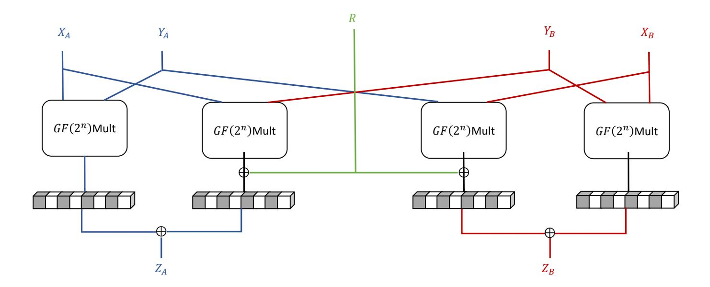
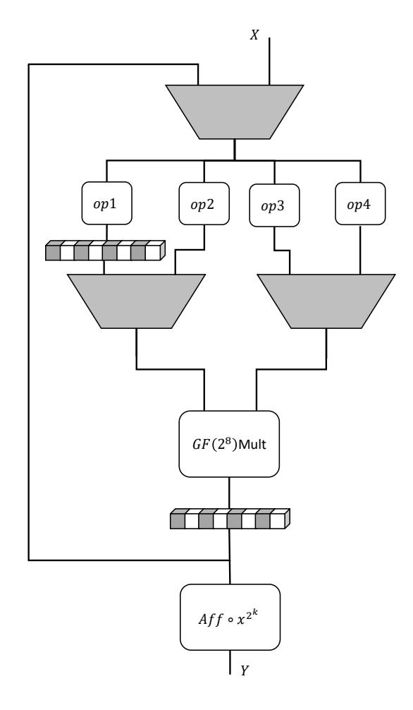
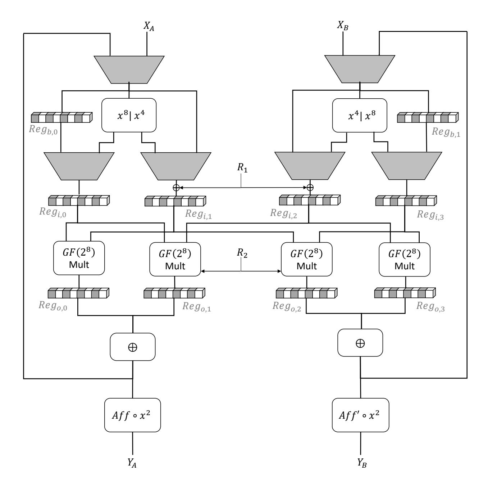
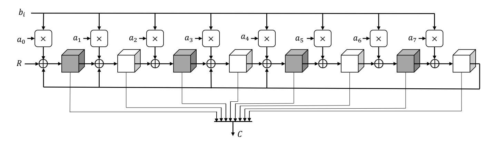
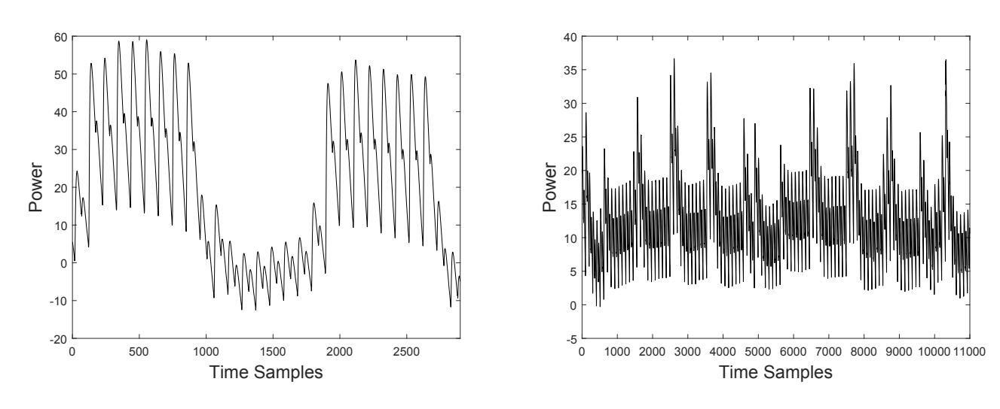
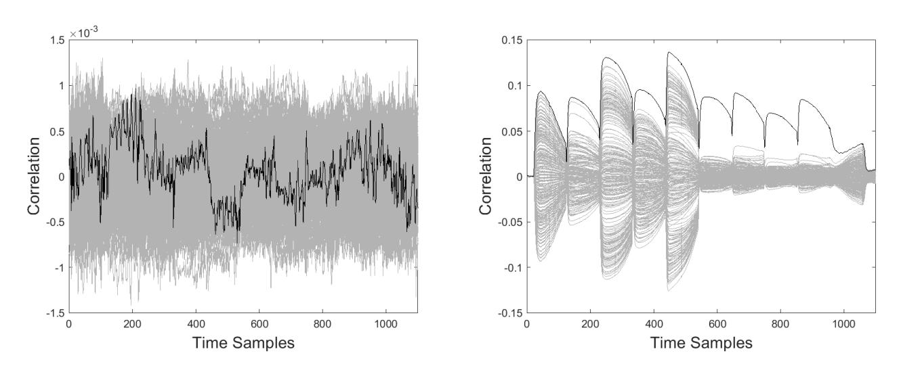
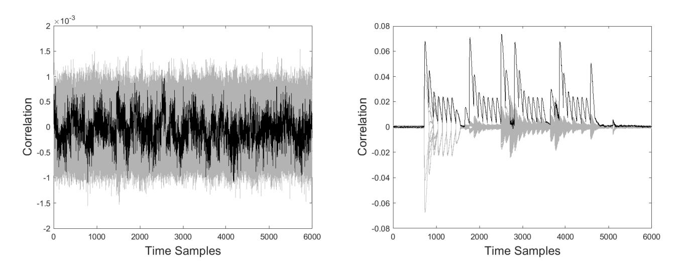

{0}------------------------------------------------

# **Yet Another Size Record for AES: A First-Order SCA Secure AES S-box Based on GF(28 ) Multiplication**

Felix Wegener and Amir Moradi

Ruhr University Bochum, Horst Görtz Institute for IT Security, Germany firstname.lastname@rub.de

**Abstract.** It is well known that Canright's tower field construction leads to a very small, unprotected AES S-box circuit by recursively embedding Galois Field operations into smaller fields. The current size record for the AES S-box by Boyar, Matthews and Peralta improves the original design with optimal subcomponents, while maintaining the overall tower-field structure. Similarly, all small state-of-the-art first-order SCA-secure AES S-box constructions are based on a tower field structure.

We demonstrate that a smaller first-order secure AES S-box is achievable by representing the field inversion as a multiplication chain of length 4. Based on this representation, we showcase a very compact S-box circuit with only one GF(28 )-multiplier instance. Thereby, we introduce a new high-level representation of the AES S-box and set a new record for the smallest first-order secure implementation.

# **1 Introduction**

The increasing pervasiveness of electronics leads to ever smaller devices in demand of strong cryptography and resistance against side-channel analysis (SCA). Hence, the need to find area-optimal implementations of SCA-protected implementations of strong cryptographic primitives persists. The Advanced Encryption Standard (AES) is a cryptographically sound primitive that is notoriously difficult to protect against side-channels with low area-overhead due to the high algebraic degree of its S-box. While the size for unprotected implementations of the AES S-box has steadily decreased from 195 gates for Canright's S-box [\[4\]](#page-12-0) to 115 gates for the S-box of Boyar *et al.* [\[3\]](#page-12-1), masked implementations do not exhibit such a clear trend. Instead, they provide some trade-off between area, latency and fresh randomness. Interestingly, most current state-of-the-art first-order secure implementations follow the tower-field construction [\[2,](#page-12-2)[6,](#page-12-3)[9,](#page-12-4)[16\]](#page-13-0). In contrast, our aim is to achieve the lowest possible circuit size by extending our former approach [\[17\]](#page-13-1) and decomposing the S-box even further into multiplications in GF(28 ).

{1}------------------------------------------------

*Our Contribution.* We present two designs for a first-order secure AES S-box based on a multiplication chain with four multiplications in GF(28 ) to realize the inversion: First, we achieve a new size record for the AES S-box and demonstrate the suitability of our design for low-area and low-power applications. Second, we show an area-latency trade-off that is practical whenever the implementation speed is limited by the number of random bits per cycle.

*Outline.* In Section [2](#page-1-0) we introduce the underlying concepts of our contribution and define our notation for the rest of the paper. In Section [3](#page-2-0) we present our main contribution. We compare implementation results in Section [4](#page-8-0) and provide a side-channel evaluation in Section [5.](#page-10-0)

# **2 Preliminaries**

In the following we introduce an exponentiation based representation of the AES S-box, the concept of multiplication chains and Domain-oriented Masking.

### **2.1 AES S-box representations**

The AES S-box consists of an inversion in GF(28 ) followed by an affine mapping. While the affine part is simple to mask, the inversion has algebraic degree seven and can be represented in many different ways. Here, we represent inversion as exponentiation according to the relation

$$x^{-1} = x^{254}$$

in GF(28 ). Given only this representation it is unclear how many multiplications are necessary to obtain the end result. An upper bound can be determined by considering the exponent's binary representation (11111110)*b*. Its Hamming weight minus one describes the number of multiplications in a squareand-multiply algorithm. Hence, The inversion can be computed with six multiplications and several squaring operations. Note that minimizing the number of squaring operations is of little interest as it is a linear operation over GF(28 ) and hence easy to mask with a low area overhead.

### **2.2 Multiplication and Addition Chains.**

Given a monomial *x n* over GF(28 ), we aim to find a program that, starting from the identity function *x* 1 over GF(28 ), computes *x n* with the fewest multiplications and an arbitrary number of squaring operations. This can be formalized as finding a sequence of monomials (v0*, . . . ,* v*s*) with the following conditions

$$\begin{aligned} \mathbf{v}_0(x) &= x^1, \\ \mathbf{v}_i(x) &= \mathbf{v}_j^{2^{e_1}}(x) \circ \mathbf{v}_k^{2^{e_2}}(x), \quad j,k < i, \ e_1, e_2 \in \mathbb{N} \\ \mathbf{v}_s(x) &= x^n \end{aligned}$$

{2}------------------------------------------------

and minimal length. As there is a straightforward homomorphism between the group of natural numbers and exponentiation in a finite field

$$\phi: \mathbb{N} \to \mathcal{F}(GF(2^8)), \quad \phi(k) = x^k$$

we can transform the problem into the realm of natural numbers:

Let *n* be a natural number, we call *v* = (*v*0*, . . . , vs*) an addition chain for *n* of length *s*, if the below expression holds.

$$v_0 = 1,$$
 
$$v_i = v_j \cdot 2^{e_1} + v_k \cdot 2^{e_2}, \ j, k < i, \ e_1, e_2 \in \mathbb{N}$$
 
$$v_s = n$$

From this representation it is straightforward to implement an exhaustive search algorithm to find the smallest length *s* for a given number *n*.

### **2.3 Domain-oriented Masking.**

In 2016 Gross *et al.* [\[9\]](#page-12-4) introduced Domain-oriented Masking (DOM), a masking scheme for multiplications over finite fields that extends classical Threshold Implementations by applying the non-completeness property to each input-bit individually, thereby enabling *d*-th order secure designs with only *d* + 1 input shares. In the following, we recall the construction of a first-order secure DOM*indep* GF(2*n*)-multiplier.

To achieve first-order security of a multiplication operation *Z* = *X* ·*Y* , inputs are independently separated into two domains *XA, YA* and *XB, YB* with Boolean masking, such that *X* = *XA* ⊕ *XB* and *Y* = *YA* ⊕ *YB* hold. The multiplication itself can then be executed with four insecure GF(2*n*)-multipliers, which may not combine both domains of the same input variable (cf. Figure [1\)](#page-3-0). Further, the cross domain products *XAYB* and *XBYA* are refreshed with n-bits of randomness (*R*) before being reintroduced to either domain. To prevent the propagation of glitches a register stage is placed directly after the multipliers, respectively after the refreshing stage. Finally, each share of *Z* can be computed with an XOR-operation between the two registers in each domain. The correctness *Z* = *ZA* ⊕ *ZB* is easy to verify.

While a generalization of DOM for arbitrary non-linear blocks exists [\[14\]](#page-12-5), we do not introduce it here, as our focus remains a GF(28 )-multiplier forming the core element of our secure implementation.

# **3 Implementation**

In this section we describe our methodology to derive a mathematical description of the AES S-box based on GF(28 )-multiplication and subsequently present two variations of circuits based on it.

{3}------------------------------------------------

Fig. 1: Domain-oriented Masking: First-order secure DOM-indep  $GF(2^n)$ -multiplier

#### 3.1 Methodology

Our aim is to realize the AES S-box based on  $GF(2^8)$ -multiplications in the smallest possible hardware area. As the inversion  $x^{-1}$  in  $GF(2^8)$  can be represented as an exponentiation  $x^{254}$  the challenge is to find a shortest multiplication chain. As shown in Section 2.2 this corresponds to finding a minimal addition chain for 254.

Chain Length. As noted in [10,13,17] the inversion in  $GF(2^8)$  can be decomposed into two cubic functions  $(x^k, x^l)$  with Hamming weights wt(k) = wt(l) = 3. This directly yields a realization with four multiplications as each function  $x^k$ , wt(k) = m can be implemented with m-1 multiplications, e.g., naively with the square-and-multiply algorithm. Further, exhaustive computations to determine a length three addition chain for 254 do not yield a result. Hence, we chose to realize the inversion with four multiplications in  $GF(2^8)$ .

As a secondary goal for circuit minimization, we aim to reduce the overhead in linear operations and delay registers to facilitate the multiplication-based architecture.

Minimal Overhead. Multiplication chains of length four may still differ in their overhead for linear operations  $(x^{2^k})$  and for delay registers which are necessary when an intermediate result is not directly processed, which occurs in a multiplication chain whenever  $v_i$  depends on  $v_j$  with j < i - 1. To determine which multiplication chain leads to the smallest area, we determine the size of linear components based on squaring  $x^{2^k}$  alone and in composition with the AES affine function Aff. Further, we determine the size reduction through integration of multiple exponentiations into one hardware circuit. More specifically, we

{4}------------------------------------------------

synthesized each 8-to-8-bit component

$$x^{2^k}, \quad k = 1, \dots 7$$

$$Aff \circ x^{2^k}, \quad k = 1, \dots 7$$

and the pairs

$$(x^{2^k}, x^{2^l}), k, l = 1, \dots 7$$

as 8-to-16-bit components to determine their sizes in the UMC 0.18*µ*m library (cf. Table [1\)](#page-4-0)

**Table 1:** Size of all linear functions *x* 2 *i* and Aff ◦ *x* 2 *i* individually (left) and combined in pairs (right).

|                |                    | Function Size (GE) |           |      |
|----------------|--------------------|--------------------|-----------|------|
|                |                    |                    |           |      |
|                |                    | 128   x         | 16 x   | 52.3 |
|                | Function Size (GE) | 128   x         | 2 x    | 41.3 |
|                |                    | 128   x         | 32 x   | 49.0 |
| 128 x       | 23.7               | 128   x         | 4 x    | 50.7 |
| 16 x        | 33.3               | 128   x         | 64 x   | 43.7 |
| 2 x         | 22.7               | 128   x         | 8 x    | 47.0 |
| 32 x        | 33.3               | 16    x         | 2 x    | 44.7 |
| 4 x         | 31.7               | 16    x         | 4 x    | 54.3 |
| 64 x        | 29.7               | 16    x         | 8 x    | 54.3 |
| 8 x         | 32.0               | 32    x         | 16 x   | 49.7 |
| 1 Aff ◦ x   | 41.7               | 32    x         | 2 x    | 45.0 |
| 128 Aff ◦ x | 40.7               | 32    x         | 4 x    | 52.3 |
| 16 Aff ◦ x  | 36.3               | 32    x         | 8 x    | 53.0 |
| 2 Aff ◦ x   | 40.3               | 4 x             | 2    x | 45.7 |
| 32 Aff ◦ x  | 36.7               | 64    x         | 16 x   | 53.7 |
| 4 Aff ◦ x   | 36.3               | 64    x         | 2 x    | 48.3 |
| 64 Aff ◦ x  | 29.7               | 64    x         | 32 x   | 53.0 |
| 8 Aff ◦ x   | 34.0               | 64    x         | 4 x    | 53.7 |
|                |                    | 64    x         | 8 x    | 51.7 |
|                |                    | 8 x             | 2    x | 44.0 |
|                |                    | 8 x             | 4    x | 52.0 |

Given the area information for each component, we can iterate through all possible combinations for the linear operations *op*1*, . . . , op*4 (as illustrated in Figure [2\)](#page-5-0) to implement the following three subcircuits with minimal total area:

- **–** the function (*x* 13) 2 *k*1 with two multiplications
- **–** the function (*x* 19) 2 *k*2 with two multiplications

{5}------------------------------------------------

Fig. 2: Basic Structure for our search algorithm.

# – the function Aff $\circ x^{2^{k_3}}$

Our minimization search is subject to the additional restriction  $k_1+k_2+k_3=5$  to ensure that the circuit actually computes the AES S-box. The optimal solution given our weights only uses the linear functions  $x^4$ ,  $x^8$  and a delay register. It corresponds to the choice:

$$op1(x) = x$$
,  $op2(x) = x^8$ ,  $op3(x) = x^4$ ,  $op4(x) = x$ 

and yields the optimal parameters  $k_1 = 0$ ,  $k_2 = 4$ ,  $k_3 = 1$ . More formally, the circuit can be expressed algebraically as the interleaved application of the following four linear functions and a multiplier

$$\begin{split} f_1(x): \mathrm{GF}(2^8) &\to \mathrm{GF}(2^8) \times \mathrm{GF}(2^8) \\ x &\mapsto (x^8, x^4), \ \mathrm{mem} := x \\ f_2(x): \mathrm{GF}(2^8) &\to \mathrm{GF}(2^8) \times \mathrm{GF}(2^8) \\ x &\mapsto (\mathrm{mem}, x) \\ f_3(x): \mathrm{GF}(2^8) &\to \mathrm{GF}(2^8) \times \mathrm{GF}(2^8) \\ x &\mapsto (x^8, x^4), \ \mathrm{mem} := x \\ f_4(x): \mathrm{GF}(2^8) \times \mathrm{GF}(2^8) &\to \mathrm{GF}(2^8) \\ x &\mapsto (\mathrm{mem}, x^4) \end{split}$$

{6}------------------------------------------------

where mem denotes the last element that was stored in the delay register. The output *Y* is determined by applying a fifth affine function

$$f_5(x): \mathrm{GF}(2^8) \to \mathrm{GF}(2^8)$$
  
 $x \mapsto \mathrm{Aff}(x^2).$ 

The ANFs for all linear functions involved can be seen in Appendix [A.](#page-13-2)

### **3.2 Domain-oriented Masking**

The mathematical description above can be turned into a first-order secure implementation with domain-oriented masking (cf. Figure [3\)](#page-7-0). To minimize area consumption our circuit is serialized along the multiplication.

Our circuit realizes *x* 4 · *x* 8 = *x* 12 with the first multiplication. Subsequently, *x* · *x* 12 = *x* 13 =: ˆ*x* is computed by utilizing the delay register. The third multiplication implements *x*ˆ 4 · *x*ˆ 8 = ˆ*x* 12. Finally, the circuit yields (ˆ*x* 12) 4 · *x*ˆ = ˆ*x* 49 . The subsequent application of Aff ◦ *x* 2 gives the correct result for the S-box output, as the equation ((*x* 13) 49) 2 = *x* −1 holds. To ensure the SCA resistance of our design, a total of sixteen bits of randomness have to be injected into the computation of the cross-domain terms, denoted as *R*1 and *R*2 in Figure [3.](#page-7-0)

Further, as we re-introduce intermediate values into the same circuit, composability issues [\[7\]](#page-12-8) have to be addressed:

*Transitional Leakage.* To prevent transitional leakage in any of the registers involved, we reset them to zero in between each "round-operation". This can easily achieved in the control FSM without introducing additional latency as at any point in time either the upper (*Regi,*·) or lower registers (*Rego,*·) in Figure [3](#page-7-0) are occupied with our intermediate results while the contents of the other registers can be discarded.

*Independent Sharing.* As both shared inputs to the multiplier are functions depending on *x*, we need to re-fresh one shared input with a total of eight bits of randomness (*R*1), before feeding it into the multiplier.

Note that the circuit shown in Figure [3](#page-7-0) is generic in the type of multiplier used. In the following, we demonstrate two designs based on serial-parallel multiplication to achieve a very low area and a fully-parallel multiplication to achieve an interesting trade-off.

### **3.3 Smallest Masked AES-Sbox**

To obtain the smallest implementation of the AES S-box we realize the GF(28 ) multiplication in eight cycles with a serial-parallel multiplier (cf. Figure [4\)](#page-8-1). It functions by applying all bits of operand *a* and successively shifting in one bit at a time of operand *b* starting with the MSB. Thereby, it computes the product of *a* and *b* in 8 cycles. The modulo reduction is based on the polynomial (11*b*)*x*.

{7}------------------------------------------------

**Fig. 3:** First-order secure AES S-box circuit based on a  $GF(2^8)$  multiplication chain. It computes two shares of  $x^{12}$ ,  $x^{13}$ ,  $(x^{13})^{12}$  and  $(x^{13})^{49}$  in the lower registers and contains a final application of  $Aff \circ x^2$  to determine the shared value of the S-box output. Aff' denotes the affine function without constant terms.

{8}------------------------------------------------

While it is clearly necessary to re-mask one input operand to use the DOM-DOM-*indep* multiplier with 8-bits of fresh randomness, this can be done at the rate of one bit per cycle by integrating the refreshing with *R*1 into the shift registers *Regi,*1 and *Regi,*2. Similarly, it is required to re-mask output of the multiplier with 8-bits of fresh randomness, which can be done during the computation of the product, one bit at a time (input wire *R*2 in Figure [4\)](#page-8-1). Even though the serial-parallel multiplier contains a shift register internally, an additional register stage *Rego,*1, *Rego,*2 (cf. Figure [3\)](#page-7-0) is necessary to prevent a cross-domain term to re-enter a domain without being previously re-masked with the entire 8 bits of entropy. The additional register does not incur a latency overhead as we

**Fig. 4:** Circuit of a Serial-Parallel GF(28 ) multiplier.

use by-passing in cycle eight to write the multiplication result directly to the following register. This leads to a design that computes the linear functions in one cycle and the multiplication in eight additional cycles. This "round-operation" with a latency of nine cycles is executed four times. In total, our design computes an AES S-box in 36 cycles.

### **3.4 A Latency-Trade-Off**

In the above design we can achieve a far lower latency by implementing the GF(28 )-multiplication in one cycle with a fully-parallel multiplier. This straightforward design takes two cycles to compute each "round-operation". Hence, the total latency amounts to eight cycles. The alternate usage of *R*1 and *R*2 allows us to connect both wires to the same source of entropy generating eight random bits per cycle.

# **4 Results**

In this section we present area and latency results for our design and interpret them in the context of other first-order secure designs.

{9}------------------------------------------------

*Comparison.* We compare our design to state-of-the-art implementations of first-order secure S-boxes. More precisely, area and latency numbers for the TI(nimble) design of Bilgin *et al.* [\[2\]](#page-12-2), the CMS design of Cnudde *et al.* [\[6\]](#page-12-3), the CMS design of Ueno *et al.* [\[16\]](#page-13-0), the DOM design of Gross *et al.* [\[9\]](#page-12-4) and our former TI(with guards) design [\[17\]](#page-13-1). It is directly apparent that our design #1 is a new area record of first-order secure S-boxes of AES. In fact, with 1378 GE we improve upon the previous record by Ueno *et al.* [\[16\]](#page-13-0) (1656 GE) by several hundred gate equivalents. This record undoubtedly comes at the cost of huge increase in latency and does not aim to provide a beneficial area-latency trade-off. Yet, we achieved a practical solution in very special scenarios.

Our design #2 requires only eight random bits per cycle (as *R*1 and *R*2 are injected in alternating cycles) while its size of 2321 GE is comparable to other state-of-the-art implementations.

*Practical Application.* Note that our designs provide a benefit over other stateof-the-art constructions whenever the following two conditions hold: First, if the device can dedicate only a very small area to cryptographic operations our design #1 can be considered. Second, in the case of a limited peak power consumption design #1 is suitable due to its light non-linear part of only four parallel GF(28 ) multiplications. Further, if a trade-off between latency and randomness is the deciding factor, our design #2 might be suitable.

*Unprotected Comparison.* Interestingly, an unprotected version of our S-box design with one parallel-serial multiplier occupies 520 GE, more than twice the size of the current unprotected area record by Boyar *et al.* [\[3\]](#page-12-1) (cf. Table [3\)](#page-10-1). Thereby, it provides an

**Table 2:** Comparison of First-Order Secure S-boxes. IR : inital randomness, Lat : latency, RT : reciprocal throughput, R/C : rand. per cycle

| Design               |   |       | Shares Lat crit. path | RT | R/C               | Size |
|----------------------|---|-------|-----------------------|----|-------------------|------|
|                      |   | (cyc) | (ns)                  |    | (cyc) (bits) (GE) |      |
| Bilgin et al. [2]    | 3 | 3     | N/A                   | 1  | 16                | 2224 |
| Cnudde et al. [6]    | 2 | 6     | N/A                   | 1  | 46                | 1872 |
| Gross et al. [9]     | 2 | 8     | N/A                   | 1  | 18                | 2600 |
| Ueno et al.a [16] | 2 | 5     | 1.5                   | 1  | 56                | 1656 |
| Wegener et al. [17]  | 4 | 16    | 3.3                   | 16 | 0                 | 4200 |
| This work            |   |       |                       |    |                   |      |
| (#1)                 | 2 | 36    | 1.5                   | 36 | 2                 | 1378 |
| (#2)                 | 2 | 8     | 1.6                   | 8  | 8                 | 2321 |

*a* Ueno *et al.* reported 1389 GE in the TSMC 65 library. We obtained their design and synthesized it ourselves in the UMC 0.18 *µm* library.

{10}------------------------------------------------

**Table 3:** Comparison of Unprotected AES S-box Implemenentations

| Design           |        | Lat crit. path | RT | Size       |
|------------------|--------|----------------|----|------------|
|                  | (cyc)  | (ns)           |    | (cyc) (GE) |
| Boyar et al. [3] | a 1 | 5.6            | 1  | 205        |
| This work        |        |                |    |            |
| unprotected      | 36     | 1.5            | 36 | 520        |

*a* We converted the equations given in their paper into VHDL and synthesized it ourselves in the UMC 0.18 *µm* library.

# **5 Side-Channel Evaluation**

**Measurement Setup.** We evaluated our hardware design on a Sakura-G side-channel evaluation board [\[1\]](#page-12-9). It is a well-established measurement platform that incorporates two Spartan-6 FPGAs separating control and target circuit to achieve a beneficial signal-to-noise ratio. We ran our implementation at a frequency of 6 MHz and sampled at a rate of 625*MS/s*. Additionally, we utilized the ZFL-1000LN+ amplifier from Mini-Circuits.

**Evaluation.** As recently shown by De Cnudde *et al.* [\[5\]](#page-12-10) the common evaluation methodology of the non-specific t-test [\[8,](#page-12-11)[15\]](#page-13-3) is very sensitive to effects originating from the power distribution network if a masked implementation with only two shares is being evaluated. Hence, we deviated from the evaluation strategy based on the non-specific t-test and instead performed an evaluation based on Moments-Correlating-DPA (MC-DPA) [\[12\]](#page-12-12). More precisely, our target consists of two sequential invocations of the S-box with several idle cycles between them to minimize both algorithmic noise and the memory effect due to amplification [\[11\]](#page-12-13). We performed 10 million measurements with each design and found no leakage in the first-order MC-DPA, while leakage in the second order is clearly visible (cf. Figure [6](#page-11-0) and Figure [7\)](#page-11-1).

# **6 Conclusion**

First, we presented a new record for the smallest first-order SCA secure AES Sbox implementation in hardware. Compared to the previous record our achievement comes at the cost of an increased latency. Yet, our design is applicable whenever small area and low power are of paramount importance. As opposed to implementing the masked inversion in one cycle, our design performs at most four serial-parallel multiplications in each clock cycle enabling a very low-power design. Second, we introduce a trade-off that achieves a lower latency than our first design and consumes only eight bits of randomness per cycle.

Finally, our contribution demonstrates that a design methodology to achieve the smallest area for unprotected implementations does not necessarily translate into a recipe for area-optimal SCA protected implementations.

{11}------------------------------------------------

Fig. 5: Mean trace over 100 traces: parallel (left), serial (right)

**Fig. 6:** Fully-parallel multiplier: MC-DPA in the first and second order with 10 million traces.

Fig. 7: Serial-parallel multiplier: MC-DPA in the first and second order with 10 million traces.

# Acknowledgments

The work described in this paper has been supported in part by the German Federal Ministry of Education and Research BMBF (grant nr. 16KIS0666 SysKit\_HW).

{12}------------------------------------------------

# **References**

- 1. Side-channel AttacK User Reference Architecture. [http://satoh.cs.uec.ac.jp/](http://satoh.cs.uec.ac.jp/SAKURA/index.html) [SAKURA/index.html](http://satoh.cs.uec.ac.jp/SAKURA/index.html).
- 2. Begül Bilgin, Benedikt Gierlichs, Svetla Nikova, Ventzislav Nikov, and Vincent Rijmen. Trade-offs for threshold implementations illustrated on AES. *IEEE Trans. on CAD of Integrated Circuits and Systems*, 34(7):1188–1200, 2015.
- 3. Joan Boyar, Philip Matthews, and René Peralta. Logic minimization techniques with applications to cryptology. *J. Cryptology*, 26(2):280–312, 2013.
- 4. David Canright. A very compact s-box for AES. In Josyula R. Rao and Berk Sunar, editors, *Cryptographic Hardware and Embedded Systems - CHES 2005, 7th International Workshop, Edinburgh, UK, August 29 - September 1, 2005, Proceedings*, volume 3659 of *Lecture Notes in Computer Science*, pages 441–455. Springer, 2005.
- 5. Thomas De Cnudde, Maik Ender, and Amir Moradi. Hardware masking, revisited. *IACR Transactions on Cryptographic Hardware and Embedded Systems*, 2018(2), 2018. to appear.
- 6. Thomas De Cnudde, Oscar Reparaz, Begül Bilgin, Svetla Nikova, Ventzislav Nikov, and Vincent Rijmen. Masking AES with d+1 shares in hardware. In Benedikt Gierlichs and Axel Y. Poschmann, editors, *Cryptographic Hardware and Embedded Systems - CHES 2016 - 18th International Conference, Santa Barbara, CA, USA, August 17-19, 2016, Proceedings*, volume 9813 of *Lecture Notes in Computer Science*, pages 194–212. Springer, 2016.
- 7. Sebastian Faust, Vincent Grosso, Santos Merino Del Pozo, Clara Paglialonga, and François-Xavier Standaert. Composable masking schemes in the presence of physical defaults and the robust probing model. *IACR Transactions on Cryptographic Hardware and Embedded Systems*, 2018(3):89–120, Aug. 2018.
- 8. Gilbert Goodwill, Benjamin Jun, Josh Jaffe, and Pankaj Rohatgi. A testing methodology for Side channel resistance validation. In *NIST Non-invasive Attack Testing Workshop*, 2011.
- 9. Hannes Groß, Stefan Mangard, and Thomas Korak. Domain-oriented masking: Compact masked hardware implementations with arbitrary protection order. *IACR Cryptology ePrint Archive*, 2016:486, 2016.
- 10. Amir Moradi. Advances in Side-channel Security, 2016.
- 11. Amir Moradi and Oliver Mischke. On the simplicity of converting leakages from multivariate to univariate - (case study of a glitch-resistant masking scheme). In Guido Bertoni and Jean-Sébastien Coron, editors, *Cryptographic Hardware and Embedded Systems - CHES 2013 - 15th International Workshop, Santa Barbara, CA, USA, August 20-23, 2013. Proceedings*, volume 8086 of *Lecture Notes in Computer Science*, pages 1–20. Springer, 2013.
- 12. Amir Moradi and François-Xavier Standaert. Moments-correlating DPA. In Begül Bilgin, Svetla Nikova, and Vincent Rijmen, editors, *Proceedings of the ACM Workshop on Theory of Implementation Security, TIS@CCS 2016 Vienna, Austria, October, 2016*, pages 5–15. ACM, 2016.
- 13. Svetla Nikova, Ventzislav Nikov, and Vincent Rijmen. Decomposition of permutations in a finite field. *IACR Cryptology ePrint Archive*, 2018:103, 2018.
- 14. Oscar Reparaz, Begül Bilgin, Svetla Nikova, Benedikt Gierlichs, and Ingrid Verbauwhede. Consolidating masking schemes. In Rosario Gennaro and Matthew Robshaw, editors, *Advances in Cryptology - CRYPTO 2015 - 35th Annual Cryptology Conference, Santa Barbara, CA, USA, August 16-20, 2015, Proceedings, Part*

{13}------------------------------------------------

*I*, volume 9215 of *Lecture Notes in Computer Science*, pages 764–783. Springer, 2015.

- 15. Tobias Schneider and Amir Moradi. Leakage assessment methodology - A clear roadmap for side-channel evaluations. In Tim Güneysu and Helena Handschuh, editors, *Cryptographic Hardware and Embedded Systems - CHES 2015 - 17th International Workshop, Saint-Malo, France, September 13-16, 2015, Proceedings*, volume 9293 of *Lecture Notes in Computer Science*, pages 495–513. Springer, 2015.
- 16. Rei Ueno, Naofumi Homma, and Takafumi Aoki. Toward more efficient dparesistant AES hardware architecture based on threshold implementation. In Sylvain Guilley, editor, *Constructive Side-Channel Analysis and Secure Design - 8th International Workshop, COSADE 2017, Paris, France, April 13-14, 2017, Revised Selected Papers*, volume 10348 of *Lecture Notes in Computer Science*, pages 50–64. Springer, 2017.
- 17. Felix Wegener and Amir Moradi. A first-order SCA resistant AES without fresh randomness. In Junfeng Fan and Benedikt Gierlichs, editors, *Constructive Side-Channel Analysis and Secure Design - 9th International Workshop, COSADE 2018, Singapore, April 23-24, 2018, Proceedings*, volume 10815 of *Lecture Notes in Computer Science*, pages 245–262. Springer, 2018.

# **A ANFs for Linear and Affine Functions in our Design**

To enhance the reproducibility of our results, we provide the algebraic normal form for all linear/affine functions used in our design.

ANF of power-map *x* 4 in GF(28 ):

$$y_0^4 = x_0 + x_2 + x_3 + x_5 + x_6 + x_7$$

$$y_1^4 = x_2 + x_3 + x_4 + x_5 + x_6$$

$$y_2^4 = x_4 + x_5 + x_7$$

$$y_3^4 = x_2 + x_3 + x_4$$

$$y_4^4 = x_1 + x_2 + x_4 + x_5 + x_6$$

$$y_5^4 = x_3 + x_6$$

$$y_6^4 = x_4 + x_7$$

$$y_7^4 = x_3 + x_5 + x_6 + x_7$$

{14}------------------------------------------------

ANF of power-map *x* in GF(28 ):

$$y_0^8 = x_0 + x_1 + x_3$$

$$y_1^8 = x_1 + x_2 + x_3$$

$$y_2^8 = x_2 + x_4 + x_5$$

$$y_3^8 = x_1 + x_2 + x_6$$

$$y_4^8 = x_1 + x_2 + x_3 + x_5$$

$$y_5^8 = x_3 + x_4 + x_6 + x_7$$

$$y_6^8 = x_2 + x_4 + x_6$$

$$y_7^8 = x_3 + x_4 + x_5 + x_6$$

ANF of function Aff ◦ *x* in GF(28 ):

$$y_0^{2aff} = 1 + x_0 + x_2 + x_3 + x_6$$

$$y_1^{2aff} = 1 + x_0 + x_3$$

$$y_2^{2aff} = x_0 + x_1 + x_3 + x_6$$

$$y_3^{2aff} = x_0 + x_1 + x_4 + x_7$$

$$y_4^{2aff} = x_0 + x_1 + x_2 + x_6 + x_7$$

$$y_5^{2aff} = 1 + x_1 + x_2 + x_4 + x_5 + x_6 + x_7$$

$$y_6^{2aff} = 1 + x_1 + x_2 + x_3$$

$$y_7^{2aff} = x_2 + x_3 + x_5 + x_6 + x_7$$