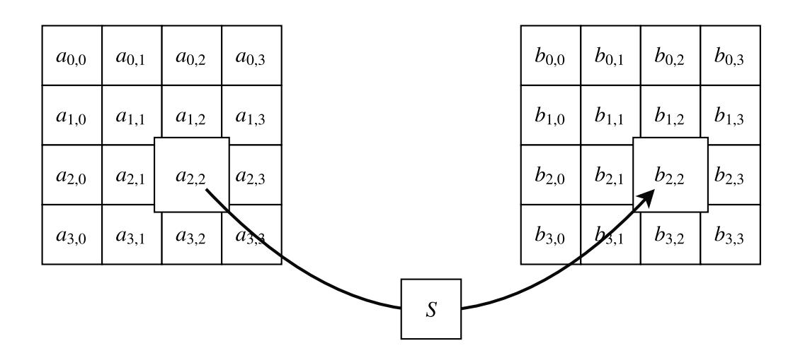
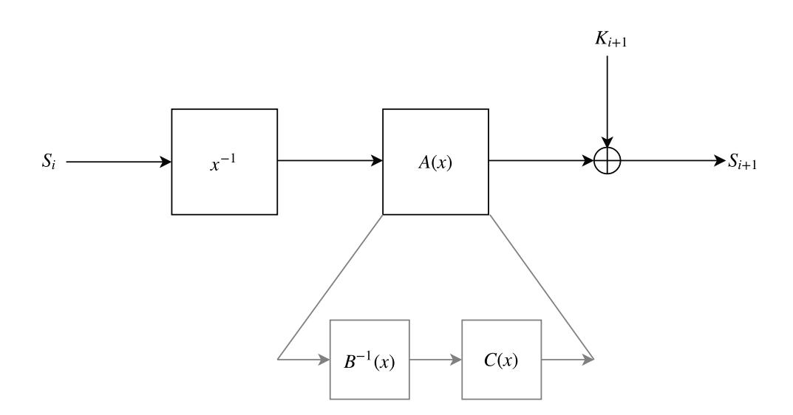
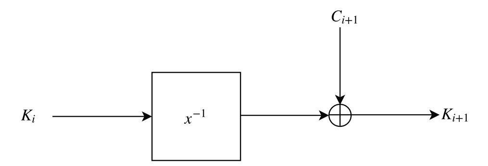
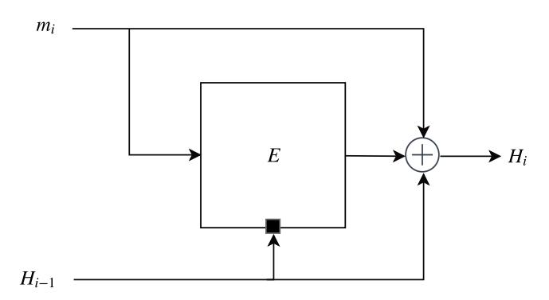
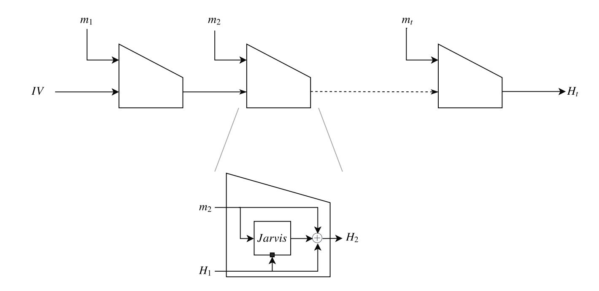
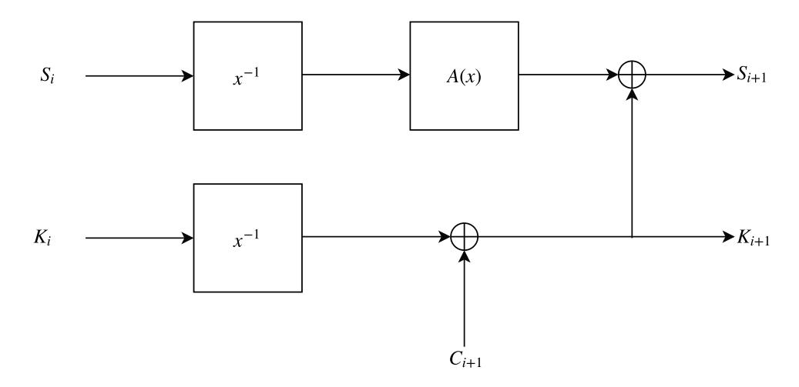

{0}------------------------------------------------

# MARVELlous: a STARK-Friendly Family of Cryptographic Primitives

Tomer Ashur and Siemen Dhooghe

imec-COSIC, KU Leuven, Heverlee, Belgium
[tomer.ashur,Siemen.dhooghe]@esat.kuleuven.be

**Abstract** The ZK-STARK technology, published by Ben-Sasson et al. in ePrint 2018/046 is hailed by many as being a viable, efficient solution to the scaling problem of cryptocurrencies. In essence, a ZK-STARK proof uses a Merkle-tree to compress the data that needs to be verified, thus greatly reduces the communication overhead between the prover and the verifier.

We propose MARVELLOUS—a family of cryptographic algorithms specifically designed for STARK efficiency. The family currently includes the block cipher Jarvis and the hash function Friday. The design of Jarvis is inspired by the design of Rijndael, better known as the AES. By doing so we create a cipher with similar properties to those of Rijndael which allows us to reuse the wide trail strategy to argue the resistance of the design against differential and linear cryptanalysis and focus our efforts on resistance against algebraic attacks. Friday is a Merkle-Dåmgard based hash function instantiated with Jarvis as its compression function thus it inherits its security properties up to the birthday bound.

Jarvis and Friday have been suggested to be used in the Ethereum protocol by Ben-Sasson in Ethereum's Devcon IV. In this paper, we instantiate versions of Jarvis offering 128, 160, 192 and 256-bit security (both stateand key-size) which are used to implement Friday. We warmly invite the community to study and assess the security of the designs.

## 1 Introduction

Currently, the theory of non-interactive zero-knowledge proofs of knowledge has advanced to the point where it is used in applications for cryptocurrencies, DNA profile matching [1] or general verifiable computation. Recently, the ZK-STARK technology emerged [1] offering zero-knowledge proofs in which verification scales exponentially faster than data size. Moreover, this technology does not rely on a trusted setup or expensive cryptographic primitives such as elliptic curves, pairings or the knowledge-of-exponent assumption. Instead it relies on hash functions and information theory giving ZK-STARKs strong arguments for post-quantum security. These hash functions need to be efficient as time, memory and communication costs of ZK-STARKs are essential for their applicability. However, the costs of hash functions over STARKs differ from standard software or hardware costs due to the algebraic nature of the integrity

{1}------------------------------------------------

verification. Moreover, standard primitives such as SHA-2 and AES are shown to be costly for ZK-STARKs [1] which creates a need for new STARK-friendly cryptographic primitives.

This work proposes a new Rijndael-inspired design, Jarvis which is used to instantiate Friday, a Merkle-Dåmgard based hash function. Both Jarvis¹ and Friday² are ZK-STARK optimised thus they result in efficient time, memory and communication costs. The security of these designs is built on the security arguments of Rijndael and are further extended by focusing on algebraic attacks such as interpolation attacks. Efficiency of the designs is optimsed by minimising the algebraic execution trace, thus ensuring that the design is STARK-friendly.

Design Methodology We introduce Jarvis by steadily adapting the Rijndael cipher making it more STARK-friendly with each step. An extensive investigation of the new cipher's security is made to then propose specific instantiations of Jarvis for 128 and 160-bit security. We follow up by introducing the established Merkle-Damgård paradigm which is instantiated with Jarvis to implement the Friday hash function. We finalise the work by extending the cryptanalysis for hash specific security considerations.

#### 2 Related Work

#### 2.1 Rijndael-128

Since our block cipher, Jarvis, is a generalised version of Rijndael, we start with a brief description of the latter. The Rijndael-128 cipher, better known as AES-128, consists of five building blocks; AddroundKey, SubBytes, MixColumns, ShiftRows and ExpandKey. For the new construction we focus mainly on changing the S-Boxes in the cipher. As such, we recall the SubBytes and ExpandKey steps in more detail.

**SubBytes** For Rijndael-128, we have a 128-bit key and state sizes, where the state is divided into 16 blocks of 8 bits each, see Figure 1. In Rijndael, the SubBytes step is a bricklayer function of S-Boxes, where each S-Box works over one byte and consists of the composition of two functions, S-Box $(z) = g \circ f(z)$ . The first function f is defined as the adapted multiplicative inverse function over  $\mathbb{F}_{28}$  where zero is defined to be mapped to zero,

$$f: \mathbb{F}_{2^8} \to \mathbb{F}_{2^8}: x \mapsto x^{254}.$$

The second function g in the SubBytes step is the affine transformation

$$g: \mathbb{F}_2^8 \to \mathbb{F}_2^8: x \mapsto Mx + b$$
,

<sup>&</sup>lt;sup>1</sup> J.A.R.V.I.S. is the assistant A.I. of Tony Stark (a.k.a. Iron Man) making it very STARK-friendly.

<sup>&</sup>lt;sup>2</sup> F.R.I.D.A.Y is Tony Stark's natural language interface for the Iron Man suit.

{2}------------------------------------------------

with  $M \in \mathbb{F}_2^{8 \times 8}$  and  $b \in \mathbb{F}_2^8$ . The main property of this transformation is to make the polynomial representation of the S-Box over  $\mathbb{F}_{2^8}$  more complex and thus to increase the resistance of the cipher against algebraic attacks. Note that the affine transformation works over  $\mathbb{F}_2$ . However, the entire S-Box can be represented as the following polynomial over  $\mathbb{F}_{2^8}$ ,

$$S-Box(z) = 0x05 \cdot z^{254} + 0x09 \cdot z^{253} + 0xF9 \cdot z^{251} + 0x25 \cdot z^{247} + 0xF4 \cdot z^{239} + 0x01 \cdot z^{223} + 0xB5 \cdot z^{191} + 0x8F \cdot z^{127} + 0x63.$$



**Figure 1.** Representation of the SubBytes step from Rijndael-128.

**Rijndael ExpandKey** Rijndael uses a key schedule to expand a short key into a number of separate round keys used in the AddRoundKey steps of the cipher. The key schedule mainly consists of four steps; SubWords, AddWords, RotWords and AddConstants. The AddWords and RotWords steps are there to introduce diffusion in the key schedule, while the SubWords step introduces nonlinearity and the AddConstants step eliminates symmetry in the rounds. As the diffusional steps can be omitted for Jarvis, we only go over the SubWords and AddConstants steps. The SubWords step consists of a bricklayer of four S-Boxes, the same as in the Rijndael round function, and works over a word rather than a byte. The round constant  $rcon_i$  for round i is defined as  $rcon_i = [rc_i \ 0 \ 0 \ 0] \in \mathbb{F}_{2^{32}}$ , with the  $rc_i$  fixed constants in  $\mathbb{F}_{2^8}$ .

The Wide Trail Strategy From [2] and [3, Section 3.1]: "The wide trail design strategy is introduced as a means to guarantee low maximum probability of multiple-round differential trails and low maximum correlation of multiple-round linear trails." This strategy is used to parameterise the cipher's resistance against differential and linear cryptanalytic attacks. In the design of Rijndael [4], Daemen and Rijmen look at four rounds of Rijndael-128. By using properties of the linear layers, they argue that for any input there will always be at least 25 active S-Boxes (S-boxes with nonzero input difference or mask).

{3}------------------------------------------------

Next, they argue cryptanalytic properties of an S-Box considering differential and linear cryptanalysis, namely the difference propagation probability and the maximum absolute correlation. The difference propagation probability  $\delta$  of an *n* bit Boolean function *f* is defined as

$$\delta = 2^{-n} \max_{i,j} |\{x \mid f(x) \oplus f(x \oplus i) = j\}|.$$

The maximum absolute correlation between any pair of linear combination of n input bits and linear combinations of n output bits  $\lambda$  over f is defined as

$$\lambda = \max_{\alpha, \beta \in \mathbb{F}_2^n} \left( 2 \Pr_{a \in \mathbb{F}_{2^n}} [\alpha a \oplus \beta f(a) = 0] - 1 \right).$$

The cryptanalytic properties of the inversion function in the S-Box of Rijndael are due to Nyberg [5], where it is stated that for  $\mathbb{F}_{2^8}$  we have  $\delta=2^{-6}$  and  $\lambda = 2^{-3}$ .

As there are at least 25 active S-Boxes in four rounds and every S-Box has a difference propagation probability of at most  $\delta=2^{-6}$  and a maximum absolute correlation  $|\lambda| = 2^{-3}$ , a four round differential trail will have a maximal probability of  $2^{-150}$  and a maximal absolute correlation of  $2^{-75}$ . This means that an eight round trail has a maximal probability of  $2^{-300}$  and maximum absolute correlation  $2^{-150}$  which the designers deem sufficient to resist differential and linear attacks.

#### **JARVIS** 3

We now take the Rijndael cipher and generalise it to the general field  $\mathbb{F}_{2^n}$  where we aim for *n* bits of security working with an *n*-bit state and an *n*-bit key. Incidentally, this greatly improves the STARK-friendliness of the design compared to Rijndael.

The most significant change in the new construction is that it works with larger S-Boxes hence reducing their overall number. We bundle the S-Boxes of one round thus creating a nonlinear function over the whole state rather than over individual bytes. In other words, each round now operates over one big S-box. As the multiplicative inverse can be represented in a single low-degree constraint for ZK-STARKs, we opt for the adapted inversion function over the whole state  $\mathbb{F}_{2^n}$ . By Fermat's little theorem we get

$$f: \mathbb{F}_{2^n} \to \mathbb{F}_{2^n}: x \mapsto x^{2^n-2},$$

or in rational form

$$f(x) = \begin{cases} \frac{1}{x}, & \text{if } x \neq 0. \\ 0, & \text{otherwise.} \end{cases}$$

This function is especially well performing over ZK-STARKs as its transition constraint is  $x^2 f(x) + x = 0$  which has degree two.

{4}------------------------------------------------

Similar to the S-Box of Rijndael, we compose the multiplicative inverse operation with an affine polynomial. In the sequel we go through design choices and discuss their efficiency and security. Recall, a  $\mathbb{F}_2$  linearised polynomial is of the form

$$L(x) = \sum_{i=0}^{n-1} c_i x^{2^i} \in \mathbb{F}_{2^n}[x].$$

We know that such a polynomial is a permutation over  $\mathbb{F}_{2^n}$  if and only if the circulant matrix representing the coefficients of the polynomial is non-singular, i.e.,

$$\begin{vmatrix} c_0 & c_{n-1}^2 & c_{n-2}^4 & \dots & c_1^{2^{n-1}} \\ c_1 & c_0^2 & c_{n-1}^4 & \dots & c_2^{2^{n-1}} \\ \vdots & \vdots & \vdots & \ddots & \vdots \\ c_{n-1} & c_{n-2}^2 & c_{n-3}^4 & \dots & c_0^{2^{n-1}} \end{vmatrix} \neq 0.$$

Finally we add a constant to this linearised polynomial, creating an affine polynomial

$$A(x) = c_{-1} + \sum_{i=0}^{n-1} c_i x^{2^i} \in \mathbb{F}_{2^n}[x].$$

Concerning the security of the block cipher, the important features for this affine layer are that its algebraic complexity should be high enough, i.e., the affine polynomial and its inverse need to be of high degree, dense and such that not all the  $c_i$  are elements of a subfield of  $\mathbb{F}_{2^n}$  to avoid invariant subfield attacks. Apart from these features we are free to make changes to this affine layer. We thus add extra structure to make the layer more STARK-Friendly. We recall that a STARK efficient polynomial is of low rational degree or its inverse is of low degree. The latter means that the polynomial  $A^{-1}(x)$ , such that  $A^{-1}(A(x)) = x$ , is of low degree. But as mentioned above, for a secure block cipher the rational degree of this layer needs to be high. In order to increase the efficiency we split up the affine layer in two steps B(x) and C(x), such that  $A(x) = C \circ B^{-1}(x)$ and both B and C are STARK efficient but A(x) has the security properties mentioned above. Thus we take B(x) and C(x) as affine polynomials of low degree, e.g., a quartic polynomial, but such that their compositional inverse is of high degree. We then take the inverse of one and compose them, thus  $A(x) = C \circ B^{-1}(x)$ . We note again that A(x) and  $A^{-1}(x)$  needs to be of high degree, dense and such that the polynomial is resistant against possible subfield attacks. When evaluated using STARKs, the layers B(x) and C(x) are evaluated separately using their low degree variants.

Finally, since the S-Box now works over the entire state, we can remove both the ShiftRows and the MixColumns operations from the round function. The overall round function is depicted in Figure 2 and the full description of Jarvis is listed in Algorithm 1.

{5}------------------------------------------------



**Figure 2.** One round of Jarvis.

# **Algorithm 1:** Jarvis

```
Input: Plaintext M, round keys K_i for 0 \le i \le N_b

Output: Ciphertext Jarvis(K, M)

State_0 = M + K_0

for r = 1 to N_b do

State_r = (State_{r-1})^{-1}

State_r = B^{-1}(State_r)

State_r = C(State_r)

State_r = State_r + K_r
\nend

return State_{N_b}
```

{6}------------------------------------------------

## 3.1 Jarvis Key Schedule

We adapt the key schedule from Rijndael to make it STARK-Friendly. We again change the S-Boxes in the key schedule to work over the entire key, instead of over bytes. This again allows to remove the RotWords and AddWords steps, however we retain the SubWords and AddConstants steps. We adapt the former step by taking an inversion function over the whole key. The resulting key expansion algorithm is depicted in Figure 3 and in Algorithm 2. Note that in contrast with the S-Box in the round function, we do not require an affine layer after the inversion operation. Combined with the addition of different round constants we introduce diffusion in the key schedule and remove any possible symmetries as specified in [4]. We note that the number of rounds needed in the key schedule is the same as the number of rounds in the cipher.



Figure 3. One round of the key schedule of Jarvis.

#### **Algorithm 2:** Jarvis Key Expansion

```
Input: Master key K, round constants rcon_i for 0 \le i \le N_b - 1 Output: Round keys K_i
K_0 = K
for r = 1 to N_b do
K_r = (K_{r-1})^{-1} + rcon_{r-1}
end
return [K_0, ..., K_{N_b}]
```

# 4 Design Rationale – Jarvis

In this section we explain the design rationale of Jarvis. We begin with explaining what security we expect the algorithm to retain, then discuss its efficiency for certain applications.

{7}------------------------------------------------

#### 4.1 The Wide Trail Strategy

In order to argue the security of Jarvis, we follow the same line of reasoning as was done for Rijndael and apply the wide trail strategy to our construction. From Nyberg [5] we take the differential and linear properties of the inversion function over arbitrary binary fields. I.e., for the field  $\mathbb{F}_{2^n}$  we have  $\delta = 2^{-n+2}$  and  $|\lambda| = 2^{-\lceil n/2 \rceil + 1}$ . This leaves us to determine the number of active S-Boxes in a trail.

Since our construction has but one S-Box, which is a permutation, per round it is evident that we have one active S-Box in every round. We know that over the field  $\mathbb{F}_{2^n}$  we have that the inversion function has  $\delta = 2^{-n+2}$  and  $|\lambda| = 2^{-\lceil n/2 \rceil + 1}$ . Thus a three round trail has a maximal differential probability of

$$2^{-3n+6} < 2^{-2n}$$

and maximum correlation

$$2^{-3\lceil n/2\rceil + 3} < 2^{-n}$$

which is sufficient to argue that the algorithm is secure against differential and linear attacks.

#### 4.2 Saturation Attacks

Saturation attacks [6] are the optimised and generalised version of the Square attack [3] which is a dedicated attack on the block cipher Square. Currently some of the most advanced attacks on the Rijndael ciphers are versions of saturation attacks, resulting in the cipher needing extra rounds. We however note that due to our construction having one S-Box per round, these attacks do not work as in short the attack consists of activating separate input bytes per plaintext/ciphertext pair. From the construction of the S-Box we see that we have exactly one active S-Box per round, thus saturation attacks do not reduce the security of our construction.

#### 4.3 Algebraic Degree

The algebraic degree of a function f is defined as the degree of the largest monomial in the algebraic normal form of f. Ciphers which achieve a low algebraic degree are potentially vulnerable against higher order differential attacks introduced by Knudsen [7]. For our construction, the S-Box has algebraic degree n-1. The maximal algebraic degree that can be reached by a polynomial in  $\mathbb{F}_{2^n}$  is n-1, thus this is achieved already in one round as per our design strategy and Nyberg [5].

#### 4.4 Polynomial Expressions

Jakobsen and Knudsen introduced in [8] the interpolation attack. Here the attacker constructs polynomials using input/output pairs of the cipher. Due to

{8}------------------------------------------------

the complexity of calculating GCD's or Lagrange interpolation being linear in the degree of the polynomial, one needs the monovariate polynomial representation of the cipher to have a high degree. Recall that the inversion composed with an affine mapping over  $\mathbb{F}_{2^n}$  can be expressed as the polynomial

$$c_{-1} + \sum_{i=0}^{n-1} c_i x^{2^n - 2^i - 1}$$
, for  $c_i \in \mathbb{F}_{2^n}$ .

For our construction the polynomial expression of one round is of degree close to the maximum  $(2^n - 1)$ . Due to the inversion function after two rounds, the polynomial expression would also be dense.

#### 4.5 Rational Expressions

We define the rational degree as the maximum of the degree of the numerator and denominator of the cipher's representation. Denote the rational expression of the S-Box as p(x)/q(x) such that the degree of the rational polynomial d is minimal. We see that  $N_b$  iterations of the S-Box then create a rational polynomial of maximal degree  $d^{N_b}$ . The S-Box consisting of the inversion function with the affine layer looks as follows

$$S-Box(x) = w_{-1} + \sum_{i=0}^{n-1} \frac{w_i}{x^{2^i}},$$

where each  $w_i$  is the coefficient of the polynomial representation of the affine layer. We see that the degree of the rational representation of the S-Box is equal to  $2^{\ell}$  for the maximal  $\ell$  such that  $w_{\ell} \neq 0$ . Thus the maximal rational degree of the cipher using  $N_b$  rounds is  $2^{N_b\ell}$ , where the maximal degree is equal to  $2^n-1$ . Because of the combination between the affine layer and the inversion function we expect the rational expression to be dense, as such we expect around  $2^{N_b\ell}$  rational terms after  $N_b$  rounds.

## 4.6 Invariant Subfield Attacks

Finally, we consider attacks which make use of an invariant subfield, i.e., for  $\mathbb{F}_{2^n}$ , any field  $\mathbb{F}_{2^m}$  where m is a divisor of n is a subfield. An adversary might be able to attack the cipher by making it work over one of the subfields. This would involve the adversary inputing a value of a subfield and receiving an output which is again in the same subfield. When looking at the polynomial representation of a round in Jarvis, we see that it is the affine polynomial which gives protection against these attacks. We thus require that the affine polynomial has several coefficients which do not lie in any subfield of  $\mathbb{F}_{2^n}$ .

{9}------------------------------------------------

#### 4.7 Choosing the Number of Rounds

In this section we analyse how many rounds are required for the cipher to be secure. Evidently, this part requires special attention as it affects both its security and efficiency of the algorithm. We denote the minimal rational degree of the affine layer by d. We note that for a randomly chosen affine polynomial, the minimal rational degree d is near maximal. The number of rounds is then determined by the desired security which in turn is affected by the feasibility of the attacks described above. The quality of such attacks is quantified by the wide trail strategy and by the maximal degree and number of terms of the polynomial and rational expressions of the cipher.

For our construction over  $\mathbb{F}_{2^n}$ , we see that we need at least three rounds to get the same differential and linear properties of trails as in eight round AES. Since three rounds already create a complex algebraic normal form (ANF) and polynomial expressions over  $\mathbb{F}_{2^n}$ , we do not need to worry about these attacks. However, the rational expression might still be too simple after three rounds. In order to ensure the security of the cipher, we need the rational degree of the affine layer d and the number of rounds  $N_b$  to be high enough. The maximal rational degree an expression over  $\mathbb{F}_{2^n}$  can reach is  $2^n - 1$  and the maximum rational degree our construction can reach is  $d^{N_b}$ . We consider meet-in-the-middle attack variants of the interpolation attack [8], thus we demand that  $d^{N_b/2} \ge 2^n - 1$ . Specific instantiations for n = 128, 160, 192 and 256 can be found in Appendices A-D for which we set the number of rounds equal to Rijndael's for the respective key size.

## 5 From Encryption to Hashing

So far we have made a STARK-friendly block cipher, but secure integrity verification requires a secure hash function. A generic way to construct a hash functions is by converting a block cipher into a one-way function, then using it as a compression function in the Merkle-Damgård scheme [9, 10]. In this section we go through the basic building blocks required for this scheme.

#### 5.1 Miyaguchi-Preneel

The first step in building a secure hash function is transforming a block cipher into a compression function. To do so, we use Jarvis in the Miyaguchi-Preneel mode of operation thus turning it from an n-bit permutation with a fixed n-bit key into a compression function taking 2n bits of input and returning an n-bit output in such a way that the transformation is collision, preimage and second preimage resistant. Several such transformations exist, see [11], but for brevity we use specifically the Miyaguchi-Preneel hash scheme [12, algorithm 9.43] which is depicted in Figure 4. This scheme makes use of a black box block cipher E, where the chaining value is injected via the key interface, and the messages to be hashed via the plaintext interface. The chaining value is then fed

{10}------------------------------------------------

forward and XORed to the output of the block cipher and so does the message. The n-bit output of this function is then a one-way message digest. We refer to [13] for the security of this scheme.



**Figure 4.** The Miyaguchi-Preneel hash scheme given a block cipher *E*.

#### 5.2 Merkle-Damgård

A hash function is a function taking an arbitrary length input and returning a fixed length output. The Merkle-Damgård Scheme does so by iterating a one-way compression function like the one we described before. Since the underlying one-way function takes input of fixed length, and for security purposes, the message M needs to be padded before being given as an input to the hash function. Let M be the message to be padded and let |M| be the length of M in an r-bit encoding. We start by appending a 1 at the end of M such that the message is now  $M\|1$ . Then, the necessary number of trailing zeros is appended (possibly none) with the r-bit length encoding such that  $M' = M \|1\| 0^* \|M|$  and the length in bits of |M'| is an integral divisor of n.

The new message M' is partitioned into t blocks  $m_1,...,m_t$ , each of length n. The blocks are then given one by one as inputs to the Miyaguchi-Preneel construction with block cipher E of state size n where

$$H_0 = IV, (1)$$

$$H_i = E_{H_{i-1}}(m_i) \oplus H_{i-1} \oplus m_i, \ 1 \le i \le t,$$
 (2)

where IV (Initialisation Vector) is the string  $0^n$  (i.e., n times the value 0). The n-bit output of the hash function is simply the final state value  $H_t$ .

#### 5.3 Friday

In order to implement our hash function, Friday, we substitute Jarvis in for the block cipher E in the previous construction. The full design is depicted on Figure 5 and detailed in Algorithm 3.

{11}------------------------------------------------



Figure 5. The Friday hash function based on the Jarvis block cipher.

## **Algorithm 3:** Friday

```
Input: The message M, initialisation vector IV and the Jarvis(K,M) block cipher Output: n-bit message digest FRIDAY(M) M' = Pad(M) t = |M'|/n H_0 = IV for i = 1 to t do m_i = M'[n(i-1), ni-1] H_i = JARVIS(m_i, H_{i-1}) \oplus H_{i-1} \oplus m_i end return H_t
```

{12}------------------------------------------------

## 6 Design Rationale – Friday

In Section 4 we considered possible attacks against the block cipher Jarvis. In this section we do the same for the hash function Friday, i.e., when using Jarvis in Merkle-Dåmgard mode.

#### 6.1 Related Key Attacks

Related key attacks consist of using differences in both the key and plaintext to get predictable differences in the resulting ciphertexts. When using a block cipher in a hash mode, these attacks are a significant threat as the attacker can influence both the plaintext as the key. We take a careful look at the security of Jarvis against these attacks as AES-192 and AES-256 are vulnerable to them [14,15].

To argue the resistance of Jarvis in this attack model, we look at possible differential trails over both the key schedule as the round function. This approach is parallel to the wide trail strategy which we investigated previously for the round function.

Thus we look at the sponge-like construction where a round of the sponge consists of the Jarvis round function and key schedule. We now consider differential trails in this new construction where we assume the rounds are independent of each other. We recall that the difference propagation probability of the inversion function is  $\delta = 2^{-n+2}$ . The affine polynomial A(x) and the addition of the round constants  $rcon_i$  do not change these probabilities. It is clear that we have at least one active S-Box, i.e., inversion mapping, per round. Thus after three rounds of both the Jarvis round function and key schedule, the probability of a difference propagation in the key and/or plaintext is equal to  $2^{-3n+6} < 2^{-2n}$  which is sufficient for security against differential trails in the related key model.



**Figure 6.** One round of both the key schedule and the round function of Jarvis.

{13}------------------------------------------------

## 6.2 Rebound Attacks

We consider possible rebound attacks as introduced by Mendel et al. [16]. The attack is divided in two phases. The first phase, called the inbound phase, is a meet-in-the-middle phase aided by the degrees of freedom introduced by the key. The second phase is an outbound phase where truncated differentials are used in both forward and backward directions to obtain collisions or near collisions.

Due to the excessively low probability of a difference propagation in one round, i.e., 2−*n*+<sup>2</sup> with *n* the state size, rebound attacks would quickly become infeasible. Nevertheless, for security reasons we added a highly conservative safety margin in the number of rounds to avoid possible differentials over the cipher.

# 7 Implementing Friday

We implement Friday with a version of Jarvis giving security up to the birthday bound and a key-size digest. Finally, we set the maximum input length 2*<sup>r</sup>* to *r* = 64 and take the initialisation vector *IV* equal to all zero.

*Acknowledgements* The authors would like to thank Vincent Rijmen, Eli Ben-Sasson, and Lior Goldberg for their continuous help and contribution which have significantly improved the designs. The research was funded by Starkware Industries Ltd., as part of an Ethereum Foundation grant activity, the support of both entities is greatly appreciated.

## References

- 1. Eli Ben-Sasson, Iddo Bentov, Yinon Horesh, and Michael Riabzev. Scalable, transparent, and post-quantum secure computational integrity. *IACR Cryptology ePrint Archive*, 2018:46, 2018.
- 2. Joan Daemen. Cipher and hash function design strategies based on linear and differential cryptanalysis. Doctoral Dissertation, March 1995, K.U.Leuven.
- 3. Joan Daemen, Lars R. Knudsen, and Vincent Rijmen. The block cipher square. In *Fast Software Encryption, 4th International Workshop, FSE '97, Haifa, Israel, January 20-22, 1997, Proceedings*, pages 149–165, 1997.
- 4. Joan Daemen and Vincent Rijmen. *The Design of Rijndael: AES The Advanced Encryption Standard*. Information Security and Cryptography. Springer, 2002.
- 5. Kaisa Nyberg. Differentially uniform mappings for cryptography. In *Advances in Cryptology - EUROCRYPT '93, Workshop on the Theory and Application of of Cryptographic Techniques, Lofthus, Norway, May 23-27, 1993, Proceedings*, pages 55–64, 1993.
- 6. Stefan Lucks. The saturation attack A bait for twofish. In *Fast Software Encryption, 8th International Workshop, FSE 2001 Yokohama, Japan, April 2-4, 2001, Revised Papers*, pages 1–15, 2001.

{14}------------------------------------------------

- 7. Lars R. Knudsen. Truncated and higher order differentials. In Fast Software Encryption: Second International Workshop. Leuven, Belgium, 14-16 December 1994, Proceedings, pages 196–211, 1994.
- 8. Thomas Jakobsen and Lars R. Knudsen. The interpolation attack on block ciphers. In Fast Software Encryption, 4th International Workshop, FSE '97, Haifa, Israel, January 20-22, 1997, Proceedings, pages 28–40, 1997.
- 9. Ralph C. Merkle. A certified digital signature. In Advances in Cryptology CRYPTO '89, 9th Annual International Cryptology Conference, Santa Barbara, California, USA, August 20-24, 1989, Proceedings, pages 218–238, 1989.
- 10. Ivan Damgård. A design principle for hash functions. In Advances in Cryptology CRYPTO '89, 9th Annual International Cryptology Conference, Santa Barbara, California, USA, August 20-24, 1989, Proceedings, pages 416–427, 1989.
- 11. Bart Preneel, René Govaerts, and Joos Vandewalle. Hash functions based on block ciphers: A synthetic approach. In *Advances in Cryptology CRYPTO '93, 13th Annual International Cryptology Conference, Santa Barbara, California, USA, August 22-26, 1993, Proceedings*, pages 368–378, 1993.
- 12. Alfred Menezes, Paul C. van Oorschot, and Scott A. Vanstone. *Handbook of Applied Cryptography*. CRC Press, 1996.
- 13. John Black, Phillip Rogaway, and Thomas Shrimpton. Black-box analysis of the block-cipher-based hash-function constructions from PGV. In *Advances in Cryptology CRYPTO 2002, 22nd Annual International Cryptology Conference, Santa Barbara, California, USA, August 18-22, 2002, Proceedings*, pages 320–335, 2002.
- 14. Alex Biryukov and Dmitry Khovratovich. Related-key cryptanalysis of the full AES-192 and AES-256. In Advances in Cryptology ASIACRYPT 2009, 15th International Conference on the Theory and Application of Cryptology and Information Security, Tokyo, Japan, December 6-10, 2009. Proceedings, pages 1–18, 2009.
- 15. Alex Biryukov, Dmitry Khovratovich, and Ivica Nikolic. Distinguisher and related-key attack on the full AES-256. In *Advances in Cryptology CRYPTO 2009, 29th Annual International Cryptology Conference, Santa Barbara, CA, USA, August 16-20, 2009. Proceedings*, pages 231–249, 2009.
- 16. Florian Mendel, Christian Rechberger, Martin Schläffer, and Søren S. Thomsen. The rebound attack: Cryptanalysis of reduced whirlpool and grøstl. In *Fast Software Encryption*, 16th International Workshop, FSE 2009, Leuven, Belgium, February 22-25, 2009, Revised Selected Papers, pages 260–276, 2009.
- 17. R. Lidl and H. Niederreiter. *Finite Fields*. Cambridge University Press, second edition, 1997.

### A Jarvis-128

We have n=128. We take the irreducible polynomial  $p(y)=y^{128}+y^7+y^2+y+1$  thus  $\mathbb{F}_{2^{128}}=\mathbb{F}_2[y]/p(y)$ . We instantiate Jarvis-128 with 10 rounds. The first round constant is randomly created where the next round constants are given by the linear relation  $rcon_i=a*rcon_{i-1}+b\in\mathbb{F}_{2^{128}}$ . The constants a,b and the first round constant (in that order) are randomly created in sage using the seed "tomerashur" and are given as follows in hexadecimal notation.

 $a = 0 \times 5 \text{AE} 9667 \text{C} 3B88 \text{E} 3 \text{AE} 1E6624620 \text{F} B82 \text{AB} 3$   $b = 0 \times \text{AF} 0646 \text{A} 28 \text{CFEF} 44 \text{DC} 1 \text{F} 30203 \text{CEFDD} 653$  $rcon_0 = 0 \times 23 \text{FBFF} 5E251 \text{E} 0083 \text{AC} 2133 \text{B} 13 \text{D} 4 \text{BB} 89 \text{A}$  

{15}------------------------------------------------

We construct quartic polynomials which define a permutation over  $\mathbb{F}_{2^{128}}$ . This is done by taking an irreducible cubic polynomial  $p(x) \in \mathbb{F}_{2^{128}}[x]$ , we then know from [17, Theorem 7.9] that the quartic polynomial q(x) = p(x)x + c is a permutation polynomial. We generate random monic cubic polynomials, using "siemendhooghe" as seed, until we find two irreducible polynomials. The affine polynomials for Jarvis-128 are given as follows.

```
B(x) = x^4 + 0 \times \text{AD53D03A769E1E3DB3615228005A2801} * x^2 \\ + 0 \times \text{BA2B131EACF25DC226CD48704D3F3E02} * x \\ + 0 \times 51924180\text{CF428FD976A274D281501728}
```

```
C(x) = x^4 + 0 \times 23 \text{DOCD47667C2DCA7223EB8770622986} * x^2 \\ + 0 \times F3824667 \text{AE2E4C7284D03307820FE544} * x \\ + 0 \times 8407 \text{C}112 \text{CF73CE33E07690CD74617EDB}
```

We note that  $A(x) = C \circ B^{-1}(x)$  is not particularly susceptible to subfield attacks as none of the coefficients of its polynomial representation are part of any subfield of  $\mathbb{F}_{2^{128}}$ . This can be checked by taking each coefficient of its polynomial representation  $\alpha$  and check if  $\alpha^{2^m} = \alpha$  for each divisor m of 128.

## B Jarvis-160

We have n=160. We take the irreducible polynomial  $p(y)=y^{160}+y^5+y^3+y^2+1$  thus  $\mathbb{F}_{2^{160}}=\mathbb{F}_2[y]/p(y)$ . We instantiate Jarvis-160 with 11 rounds. The first round constant is randomly created where the next round constants are given by the linear relation  $rcon_i=a*rcon_{i-1}+b\in\mathbb{F}_{2^{160}}$ . The constants a,b and the first round constant (in that order) are randomly created in sage using the seed "tomerashur" and are given as follows in hexadecimal notation.

```
a = 0 \times \text{CEFDD6535AE9667C3B88E3AE1E6624620FB82AB3}

b = 0 \times \text{AC2133B13D4BB89AAF0646A28CFEF44DC1F30203}

rcon_0 = 0 \times \text{CDDAE80FDC92FFE48B555BAA23FBFF5E251E0083}
```

We again generate random monic cubic polynomials, using "siemendhooghe" as seed, until we find an two irreducible polynomials. The quartic affine polynomials for Jarvis-160 are given as follows.

```
B(x) = x^4 + 0 \times \text{FD571330901C1B14A6CF7DDF8819AC258926986D} * x^2 \\ + 0 \times 5 \text{D795261803F07BB368CB54F08862CB997C46EC4} * x \\ + 0 \times 2 \text{F9B57A351924180CF428FD976A274D281501728}
```

```
C(x) = x^4 + 0 \times 034 \text{DCE} 34 \text{B} 50 \text{A} 63 \text{D} 7 \text{D} 915 \text{A} \text{D} \text{D} 14 \text{F} 446 \text{A} 8 \text{F} 308 \text{BC} 9 \text{A} * x^2 \\ + 0 \times 82 \text{F} \text{A} \text{A} 0420 \text{A} 3 \text{DCB} 35 \text{C} 16039 \text{E} 3 \text{E} 44 \text{D} 8 \text{A} 60 \text{E} 1 \text{E} 3 \text{E} 322 * x \\ + 0 \times \text{F} 29 \text{E} 27 \text{FDC} \text{F} 74033074 \text{C} 3041 \text{A} 98119 \text{B} \text{F} 95480 \text{B} \text{F} 5 \text{F}
```

{16}------------------------------------------------

We again note that none of the coefficients of  $A(x) = C \circ B^{-1}(x)$  are in a subfield of  $\mathbb{F}_{2^{160}}$ .

## C Jarvis-192

We have n=192. We take the irreducible polynomial  $p(y)=y^{192}+y^7+y^2+y+1$  thus  $\mathbb{F}_{2^{192}}=\mathbb{F}_2[y]/p(y)$ . We instantiate Jarvis-192 with 12 rounds. The first round constant is randomly created where the next round constants are given by the linear relation  $rcon_i=a*rcon_{i-1}+b\in\mathbb{F}_{2^{192}}$ . The constants a,b and the first round constant (in that order) are randomly created in sage using the seed "tomerashur" and are given as follows in hexadecimal notation.

```
a = 0 \times C1F30203CEFDD6535AE9667C3B88E3AE1E6624620FB82AB3 b = 0 \times 23FBFF5E251E0083AC2133B13D4BB89AAF0646A28CFEF44D rcon_0 = 0 \times 3C74E457B5B75ED68E4E2C8DCDDAE80FDC92FFE48B555BAA
```

We again generate random monic cubic polynomials, using "siemendhooghe" as seed, until we find an two irreducible polynomials. The quartic affine polynomials for Jarvis-192 are given as follows.

```
B(x) = x^4 + 0 \times 74 \text{C} 3041 \text{A} 98119 \text{B} \text{F} 95480 \text{B} \text{F} 5 \text{F} 5 \text{D} 795261803 \text{F} 07 \text{B} \text{B} 368 \text{C} \text{B} 54 \text{F} \times x^2 \\ + 0 \times \text{A} 6 \text{C} 786 \text{E} 28 \text{A} 60 \text{A} \text{C} \text{F} 71 \text{A} 7 \text{B} \text{D} 90 \text{F} \text{B} 93 \text{C} \text{B} \text{B} 11 \text{F} 29 \text{E} 27 \text{F} \text{D} \text{C} \text{F} 740330 \times x} \\ + 0 \times \text{F} 1747 \text{E} \text{C} \text{B} 2 \text{F} 9 \text{B} 57 \text{A} 351924180 \text{C} \text{F} 428 \text{F} \text{D} 976 \text{A} 274 \text{D} 281501728}
```

```
C(x) = x^4 + 0 \times F0C3B62EE4BB2B6549DE4AFBBBA682F51C2CC06A40A0848B * x^2 \\ + 0 \times 2552E01AECB31518995C58A805D7525A91E6CF201475B5C0 * x \\ + 0 \times 17E7B8E60948E52ADBE25714B6225EA35F2F9074735E8746
```

We again note that none of the coefficients of  $A(x) = C \circ B^{-1}(x)$  are in a subfield of  $\mathbb{F}_{2^{192}}$ .

## D Jarvis-256

We have n=256. We take the irreducible polynomial  $p(y)=y^{256}+y^{10}+y^5+y^2+1$  thus  $\mathbb{F}_{2^{256}}=\mathbb{F}_2[y]/p(y)$ . We instantiate Jarvis-256 with 14 rounds. The first round constant is randomly created where the next round constants are given by the linear relation  $rcon_i=a*rcon_{i-1}+b\in\mathbb{F}_{2^{256}}$ . The constants a,b and the first round constant (in that order) are randomly created in sage using the seed "tomerashur" and are given as follows in hexadecimal notation.

```
a = 0 \times F231C7AE8DDAF4B15B246A96E42F36F214E92B67948316BD3C74E457B5B75ED6 \\ b = 0 \times 8E4E2C8DCDDAE80FDC92FFE48B555BAA23FBFF5E251E0083AC2133B13D4BB89A \\ rcon_0 = 0 \times F231C7AE8DDAF4B15B246A96E42F36F214E92B67948316BD3C74E457B5B75ED6
```

{17}------------------------------------------------

We again generate random monic cubic polynomials, using "siemendhooghe" as seed, until we find an two irreducible polynomials. The quartic affine polynomials for Jarvis-256 are given as follows.

$$B(x) = x^4$$

- +0xF3824667AE2E4C7284D03307820FE54423D0CD47667C2DCA7223EB8770622986∗*x* 2
- +0xFD571330901C1B14A6CF7DDF8819AC258926986D23200064ED759786C1B1183A∗*x*
- +0x96DB13EB246D2D8BF1747ECB2F9B57A351924180CF428FD976A274D281501728

$$C(x) = x^4$$

- +0x5F2F9074735E8746A6C786E28A60ACF71A7BD90FB93C8B11F29E27FDCF740330∗*x* 2
- +0x49DE4AFBBBA682F51C2CC06A40A0848B17E7B8E60948E52ADBE25714B6225EA3∗*x*
- +0x74C3041A98119BF95480BF5F5D795261803F07BB368CB54F08862CB997C46EC4

We again note that none of the coefficients of *A*(*x*) = *C* ◦ *B* −1 (*x*) are in a subfield of **F**<sup>2</sup> <sup>256</sup> .