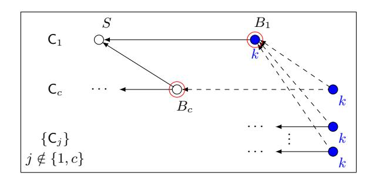

# Parallel Chains: Improving Throughput and Latency of Blockchain Protocols via Parallel Composition

Matthias Fitzi? , Peter Gaˇzi??, Aggelos Kiayias? ? ?, and Alexander Russell†

November 30, 2018

Abstract. Two of the most significant challenges in the design of blockchain protocols is increasing their transaction processing throughput and minimising latency in terms of transaction settlement. In this work we put forth for the first time a formal execution model that enables to express transaction throughput while supporting formal security arguments regarding safety and liveness. We then introduce parallel-chains, a simple yet powerful non-black-box composition technique for blockchain protocols. We showcase our technique by providing two parallel-chains protocol variants, one for the PoS and one for PoW setting, that exhibit optimal throughput under adaptive fail-stop corruptions while they retain their resiliency in the face of Byzantine adversity assuming honest majority of stake or computational power, respectively. We also apply our parallel-chains composition method to improve settlement latency; combining parallel composition with a novel transaction weighing mechanism we show that it is possible to scale down the time required for a transaction to settle by any given constant while maintaining the same level of security.

## 1 Introduction

Blockchain protocols exhibit an inherent speed-security trade-off that depends on the latency of the underlying communication network. This was first formally illustrated in [\[18\]](#page-29-0) by expressing how block production per round of message-passing, denoted f, needs to be relatively small for security theorems to be meaningful. This was further refined in [\[33\]](#page-30-0) where block production per unit of time was similarly restricted with respect to 1/∆, where ∆ is the delay of the network, while for arbitrary delays a generic attack was formulated. The main conclusion of these theoretical analyses is that in order to achieve safety, a blockchain protocol must be operated at a relatively slow pace with respect to network latency. It is frequently observed (e.g., [\[18\]](#page-29-0)), that Bitcoin's actual parameterisation sets the block production rate conservatively to be once every 30 (or so) rounds of message passing.

This state of affairs severely impacts two critical performance characteristics of a distributed ledger that is implemented via a blockchain protocol; specifically, (i) its throughput, since long periods of silence between blocks result in an underutilisation of the available network bandwidth, and (ii) its settlement time, since blockchain protocols provide transaction safety with an exponential error in the number of blocks accumulated beyond the block that registers the transaction.

Rectifying the above two performance issues lead to a number of developments in protocol design that adopted one of two possible strategies. The first one took a hybrid approach, using a blockchain protocol as a secure "back-end" while leaving transaction processing to a less secure or less decentralised "front-end" that, using more standard cryptographic techniques, provides better throughput and settlement times (at least in optimistic environments). This is exemplified by works such as Hybrid Consensus [\[34\]](#page-30-1), Bitcoin-NG [\[16\]](#page-29-1) and Thunderella [\[36\]](#page-30-2). The second approach redefines the underlying blockchain protocol, frequently radically deviating from the original blockchain protocol structure. This is exemplified by numerous Block-"Tree" or

? IOHK. matthias.fitzi@iohk.io.

?? IOHK. peter.gazi@iohk.io.

? ? ? University of Edinburgh and IOHK. akiayias@inf.ed.ac.uk.. This research was partially supported by H2020 project PRIVILEDGE # 780477.

† University of Connecticut and IOHK. acr@cse.uconn.edu.

"DAG" protocol proposals such as GHOST [\[39\]](#page-30-3), Spectre [\[38\]](#page-30-4), Phantom [\[41\]](#page-30-5), GraphChain [\[8\]](#page-29-2), Tangle [\[37\]](#page-30-6), Conflux [\[27\]](#page-30-7), and Swirlds [\[3\]](#page-28-0).

Despite the above developments the current state of the art is still lacking in terms of both a thorough modeling of transaction throughput and latency as well as a provable answer to the fundamental questions posed above, namely whether it is possible to provably achieve permissionless ledger consensus with honest majority that has optimal throughput and settlement time.

Our results. We study a simple yet, as we show, very powerful composition operator over blockchain protocols: parallel composition. Our parallel-chains protocol composition technique is described as follows: given an underlying blockchain protocol, either in the proof-of-work (PoW) or the proof-of-stake (PoS) setting, we execute m instances of it in parallel, while ensuring that the same mining, or staking respectively, operation can be used across all the m instances. At any given moment, a combine algorithm can be invoked that processes the contents of the m blockchains in the view of an honest party and organises them into a single ledger. Our results are summarised as follows.

A theoretical framework for optimistic throughput. We put forth a new formal model that formally captures for the first time a concept of throughput for distributed ledger protocols. This is achieved by a novel fine-grained network diffusion functionality that reflects network communication with far greater precision compared to previous work. Specifically, our network functionality abstracts the uplink, transit queue as well as the downlink of each single party in the network. Whenever a message is transmitted, it is placed via a party's uplink into the transit queue for all recipients. The uplink for each party is by definition one message per unit of time (we use the term "slot") while the transit queue for each recipient can be arbitrarily manipulated by the adversary (for simplicity the parties in our model are symmetric). Messages in our setting are restricted to a fixed packet length and as such may be insufficient to carry all the transactions that are available in a party's pool of pending transactions. At any given moment, messages may be placed by the adversary in a party's downlink and become available to the party subject to a restriction that sets an upper bound on the number of messages that may be accessed from the downlink per slot. Using this network abstraction we introduce the following notion for block-based distributed-ledger protocol throughput: it is the ratio of blocks added in the common prefix of all honest parties divided by the number of slots – during any slot interval of some minimal length within the protocol execution. Armed with our framework, we analyse some standard proposals for scaling Bitcoin's throughput. These proposals call for increasing the block production rate, increasing the block size, or letting the most recent block producer continuously process new transactions (a proposal that is embodied by Bitcoin-NG [\[16\]](#page-29-1)). We illustrate that with the first two of these proposals it is impossible to bring the protocol's throughput close to 1, a finding that formally affirms the folklore understanding that the Bitcoin blockchain protocol is inherently limited in terms of scaling its transaction processing capability and highlights the value of our formal framework as a yardstick for determining a protocol's ability to achieve high throughput.[1](#page-1-0) Finally, Bitcoin-NG is capable of achieving near-optimal throughput assuming all parties are honest, nevertheless, its throughput becomes effectively zero in the setting of adaptive fail-stop corruptions; the reason stems from the fact that the protocol achieves its high throughput via centralising processing to block producers; an adaptive fail-stop adversary can simply shut down the servers once they are selected and thus effectively zero the throughput. Given this, the main question we ask is whether it is possible to achieve Byzantine resilience in the setting of honest majority, while simultaneously achieve (near) optimal throughput for fail-stop corruptions.

A near optimal throughput PoS-based distributed ledger. We employ the parallel composition technique on a PoS blockchain. Each protocol participant proceeds in parallel across all m blockchains utilising the total stake that exists for PoS block production. Note that multiple blocks may be emitted in each round depending on how many blocks have been found to extend the underlying blockchains. Parsing the m blockchains into a single ledger is achieved by ordering transactions lexicographically according to the index of the block and the rank of the blockchain it belongs to (from 1 to m). We demonstrate that the

1 It is interesting that Bitcoin's inevitable evolution as a protocol to adopt larger blocks was so controversial in terms of implementation that lead to a hard fork between what is known now as Bitcoin Core and Bitcoin Cash, see e.g., <https://tinyurl.com/ycovnjew>.

protocol achieves near optimal throughput, that can be made arbitrarily close to 1, while enjoying the same security guarantees as the underlying blockchain protocol. We make our construction explicit by applying the parallel composition mechanism on the Ouroboros-Praos PoS protocol [\[13\]](#page-29-3).

A near optimal throughput PoW-based distributed ledger. We employ the parallel composition technique on a PoW blockchain. As with the PoS case, participants maintain m blockchains, attempting to mine blocks simultaneously for all of them. Mining simultaneously for all m chains requires to pack all possible ways to extend the blockchains, storing them in a Merkle root, and then revealing the appropriate path once the blockchain to be extended is discovered. An additional complication arises in the PoW setting as blocks do not carry a verifiable time-stamp (that, in the PoS setting, is provided for "free" by our construction). This prohibits the use of the same simple blockchain combine algorithm used in the PoS setting. Instead, we use the following mechanism: we identify one of the m blockchains as the synchronisation chain and we have every block refer to a block of that chain which will play the role of a timestamp. Subsequently, roughly speaking, a block is stabilised as soon as both itself and its stabilisation block are confirmed with respect to their respective blockchains. For stable blocks, a total ordering of blocks can now easily be extracted. As in the PoS setting, we prove that our protocol achieves optimal throughput while enjoying essentially the same security guarantees as the underlying PoW-based blockchain protocol. Furthermore, composing m blockchain protocols with full independence requires a PoW composition method; in order to achieve this (as required by our amplification technique) we generalize the 2-for-1 POWs technique introduced in [\[18\]](#page-29-0) using a hash chain (or, alternatively, a PRG), yielding an m-for-1 POW primitive that may be of independent interest.

A settlement-time amplification technique. We finally employ the parallel composition technique to improve settlement time. Our technique applies to both the PoW and the PoS setting. Given as a starting point a blockchain protocol with exponentially small persistence error in a security parameter d that expresses the time required to wait for a transaction to be settled, we show how the m-fold parallel composition of the protocol can achieve a wait time d/m for any constant m for (roughly) the same level of safety error. This is achieved by a novel weighing mechanism that evaluates whether a transaction has been stabilised by combining depth information from all the blockchains that include the transactions. The transaction weighing mechanism combines via an exponential sum the weights of the transaction in each individual blockchain into a single cross-blockchain weight; subsequently settlement is determined via the difference of this weight with respect to the maximum weight that exists in the ledger for any transaction.

Transaction sharding. As in all DAG-type proposals for distributed ledgers, the same transaction may be processed by multiple nodes during distributed ledger maintenance when the parallel-composition operator is applied. While this may be beneficial (as illustrated by our amplification techniques for settlement time), it may not be desirable in settings where we wish to avoid double processing of transactions to maximise throughput. In order to reduce overall network traffic in favor of higher throughput, we use a transaction sharding mechanism that partitions the set of possible transactions and assigns each respective subset to a different chain who will be responsible for mining the respective transactions. This has the desirable sideeffect that a blockchain user may follow only one of the chains if they are interested in addresses that are clustered in that chain hence reducing the total amount of data that are required to be handled for keeping up to date.

As a final note, in this paper we focus on the case where the number of chains m is carefully selected at the onset as a parameter of the protocol and is constant throughout the execution. It is conceivable though that parallel chain composition could be adjusted to vary the number of active chains according to the evolving throughput needs (somewhat akin to the Bitcoin difficulty adjustment). We leave investigating this more general variant to future work.

Related work. The hybrid approach that decouples (fast) transaction processing from (slow) blockchain protocol maintenance is intrinsic in the proposal by Eyal et al. [\[16\]](#page-29-1) (Bitcoin-NG). Applying sortition to form committees in context of blockchain protocols was first proposed by Decker et al. [\[14\]](#page-29-4) and further developed in different lines of work, e.g., [\[23,](#page-29-5)[30,](#page-30-8)[34,](#page-30-1)[5\]](#page-29-6). The impossibility of achieving settlement times that are constant in terms of the actual (unknown) protocol delay in the honest majority setting was put forth in [\[34\]](#page-30-1).

Generalizing the chain structure of [\[32\]](#page-30-9) to more general graphs was first considered by Sompolinsky et al. [\[40\]](#page-30-10) and Lerner [\[25\]](#page-30-11). The former generalization (GHOST) still extracts a single chain to represent the ledger but the blocks of the complete block tree (including all forks) remain to contribute to this selection process in an attempt to preserve the PoW of the blocks outside the main chain. The latter suggests to organize the blocks in a directed acyclic graph (DAG) whereas a single block references multiple previous blocks. The first DAG protocols involving some type of formal analysis were proposed by Boyen et al. [\[8\]](#page-29-2), Sompolinsky et al. [\[38,](#page-30-4)[41\]](#page-30-5) and Bentov et al. [\[5\]](#page-29-6). However, these proposals only involve qualitative arguments of eventual transaction safety without giving a full formal model for arguing about both safety, liveness and throughput. Other examples of DAG protocols are described by Popov [\[37\]](#page-30-6) (IOTA) and Baird [\[3\]](#page-28-0) (Hashgraph) — both not thoroughly analysed in the Byzantine permissionless setting. In [\[27\]](#page-30-7), Li et al. proposed the first DAG protocol that directly allows for a detailed analysis. As their protocol is basically an extension of the GHOST rule that additionally allows for the inclusion of the transactions of the off-chain blocks, maximal respective throughput is limited by the conditions under which the GHOST protocol can safely operate.

Sharding in context of distributed ledgers was first suggested by Danezis et al. [\[12\]](#page-29-7), and by Croman et al. [\[11\]](#page-29-8). In the protocol by Gencer et al. [\[20\]](#page-29-9) each miner operates over the full set of transactions whereas user nodes only need to observe shards of their interest as each shard maintains its own chain. In contrast, the protocol by Luu et al. [\[28\]](#page-30-12) divides mining with respect to the different shards to different committees but still maintains one single chain such that user nodes must follow the complete history of the ledger. Kokoris-Kogias et al. [\[24\]](#page-29-10) and Zamani et al. [\[42\]](#page-30-13) proposed protocols where sharding is achieved with respect to miner and user by maintaining one dedicated chain per transaction class and also dividing mining respectively.

Martino et al. [\[29\]](#page-30-14) proposed to maintain a set of parallel chains wherein blocks permanently crossreference blocks of some other chains based on special chain-neighborship properties, claiming to achieve better throughput than in the single-chain case — without giving a detailed analysis. Kiffer et al. [\[22\]](#page-29-11) analysed the clique special case of [\[29\]](#page-30-14) where each chain cross-references all other chains, and demonstrated its security when operated under the same overall block-generation rate as the single-chain case; whereas throughput under increased block-generation rate is not analysed. Similarly to the clique case above, Forestier et al. [\[17\]](#page-29-12) suggest to maintain a set of parallel chains where each block cross-references the most recent block of every chain. Whereas, for PoS, they state that mining can be randomly assigned to the different chains, they propose no respective solution for PoW. No rigorous analysis of the protocol is given.

We recently learned of concurrent, independent work by Bagaria et al. [\[2\]](#page-28-1) achieving near-optimal transaction throughput and settlement times for proof-of-work blockchains. We defer a full comparison to their work to the next version of this paper.

Organisation. In Section [2](#page-3-0) we present preliminaries, definitions of standard security properties and notations. We then proceed to Section [3](#page-5-0) to introduce our new and refined network model as well as our modeling of transaction throughput. After a warm-up investigation of the basic Bitcoin-scaling proposals in Section [4,](#page-6-0) in Section [5](#page-7-0) we put forth our PoS parallel-composition method and apply it on Ouroboros Praos PoS. In Section [6](#page-15-0) we apply the parallel-composition method to PoW-based blockchains. Finally, in Section [7](#page-24-0) we present our settlement-time acceleration method via parallel composition.

### 2 Preliminaries

Basic Notation. For n ∈ N we use the notation [n] to refer to the set {1, . . . , n}. For brevity, we often write {xi} n i=1 and (xi) n i=1 to denote the set {x1, . . . , xn} and the tuple (x1, . . . , xn), respectively.

Execution Model. We divide time into discrete units called slots. Parties are equipped with (roughly) synchronized clocks that indicate the current slot: we assume that any clock drift is subsumed in the slot length. Each slot is indexed by an integer t ∈ {1, 2, . . .}. For an interval of slots I = [t1, t2] we denote its length as |I| , t2 − t1 + 1.

We consider a UC-style [\[9\]](#page-29-13) execution of a protocol Π, involving an environment Z, a number of parties Pi , functionalities that these parties can access while running the protocol (such as the functionality Fdiff used for communication), and an adversary  $\mathcal{A}$ . All these entities are interactive algorithms. The environment controls the execution by activating parties via inputs it provides to them. The parties, unless corrupted, respond to such activations by following the protocol  $\Pi$  and invoking the available functionalities as needed. We denote by  $\mathsf{Exec}(\Pi, \mathcal{A}, \mathcal{Z})$  the random variable containing the full transcript of an execution of the protocol  $\Pi$  with adversary  $\mathcal{A}$  and environment  $\mathcal{Z}$ .

Adaptive Corruptions. The adversary influences the protocol execution by interacting with the available functionalities, and by corrupting parties. To corrupt a party, the adversary has to first ask the environment  $\mathcal{Z}$  for a permission. If the corruption is approved by  $\mathcal{Z}$  (via a special message from  $\mathcal{Z}$  to  $\mathcal{A}$ ), the adversary corrupts  $\mathsf{P}_i$  immediately. We distinguish two types of corruption, Byzantine and fail-stop. A Byzantine corrupted party  $\mathsf{P}_i$  will relinquish its entire state to  $\mathcal{A}$ ; from this point on, the adversary will be activated in place of the party  $\mathsf{P}_i$ . A fail-stop corrupted party, on the other hand, will simply stop executing its program and, whenever activated, will return an empty message  $\bot$ . We denote by  $\mathbb{A}_\mathsf{fs}$  the class of adversaries that only perform fail-stop corruptions, and by  $\mathbb{A}_\mathsf{b}$  those that also use Byzantine corruptions.

Semi-synchronous Communication. Our model allows for semi-synchronous communication among honest parties, where messages are guaranteed to be delivered within  $\Delta$  slots. This is formally captured by the functionality  $\mathcal{F}_{diff}$  that also models bandwidth-restricted communication, we describe it in Section 3. Note that the value  $\Delta$  is unknown to the protocol itself.

**Blockchains and Ledgers.** A blockchain (or a chain) (denoted e.g. C) is a sequence of blocks where each block is connected to the previous one by containing its hash. The first block of a chain C is called a genesis block and denoted by  $\mathcal{G}$ . The last block of C is denoted by head(C). By  $C^{\lceil k \rceil}$  we denote C where the last k blocks have been removed. We denote the extension of a chain C by a block B as  $C' = C \parallel B$ . For simplicity, we write  $B \in C$  iff C contains block B. By len(C) we denote the number of blocks in C.

A ledger (denoted in bold-face, e.g.,  $\mathbf{L}$ ) is a mechanism for maintaining a sequence of transactions, often stored in the form of a blockchain. We slightly abuse the language by letting  $\mathbf{L}$  (without further qualifiers) interchangeably refer to the algorithms used to maintain the sequence, and all the views of the participants of the state of these algorithms when being executed. For example, the (existing) ledger Bitcoin consists of the set of all transactions that ever took place in the Bitcoin network, the current UTXO set, as well as the local views of all the participants.

In contrast, we call a *ledger state* a concrete sequence of transactions  $\mathrm{tx}_1,\mathrm{tx}_2,\ldots$  stored in the *stable* part of a ledger  $\mathbf{L}$ , typically as viewed by a particular party. Hence, in every blockchain-based ledger  $\mathbf{L}$ , every fixed chain C defines a concrete ledger state by applying the interpretation rules given as a part of the description of  $\mathbf{L}$  (for example, the ledger state is obtained from the blockchain by dropping the last k blocks and serializing the valid transactions in the remaining blocks). We maintain the typographic convention that a ledger state (e.g. L) always belongs to the bold-face ledger of the same name (e.g. L). We denote by  $\mathbf{L}^P[t]$  the ledger state of a ledger L as viewed by a party P at the end of a time slot t. We say that a party P reports a transaction tx as *stable* during time slot t iff  $t\mathbf{x} \in \mathbf{L}^P[t]$ . In contrast,  $\tilde{\mathbf{L}}^P[t]$  denotes the ledger that contains additionally any transactions that are valid but still pending according to the view of party P. For any t, P it holds that  $\mathbf{L}^P[t] \preceq \tilde{\mathbf{L}}^P[t]$  where  $\preceq$  denotes the prefix relation.

Finally, we introduce a specific class of transaction-ledger protocols that have the following structure: transactions are grouped into blocks, and the stable ledger state is determined by the protocol at any time t by selecting which of the blocks seen so far are stable, ordering them according to some protocol-specific rule, interpreting them as a sequence of the transactions they contain, and sequentially removing all transactions from this sequence that would not be valid with respect to the remaining transactions that are preceding them. We call such transaction ledger protocols block-based and remark that all protocols considered in this paper are block-based. Note that for a block-based ledger protocol  $\mathbf{L}$ , it is well-defined to treat a ledger state  $\mathbf{L}^{\mathsf{P}}[t]$  as the sequence of the stable blocks that form it, allowing for notational shorthands such as for example  $|\mathbf{L}^{\mathsf{P}}[t]|$  denoting the number of stable blocks for  $\mathsf{P}$  at time t, and  $B \in \mathbf{L}^{\mathsf{P}}[t]$  to indicate that B is a stable block at time t for a party  $\mathsf{P}$ .

Recall the definitions of persistence and liveness of a robust public transaction ledger adapted from the most recent version of [18]:

**Definition 1.** A protocol  $\Pi$  implements a robust transaction ledger (with respect to parameter u) iff it organizes the ledger as a sequence of transactions by satisfying the following properties:

**Persistence.** For any two honest parties  $P_1, P_2$  and time slots  $t_1 \leq t_2$ , it holds that  $\mathbf{L}^{P_1}[t_1] \leq \tilde{\mathbf{L}}^{P_2}[t_2]$ . **Liveness.** If all honest parties in the system attempt to include a transaction then, at any slot t after u slots (called the liveness parameter), any honest party P, if queried, will report  $tx \in \mathbf{L}^{P}[t]$ .

When a ledger is implemented by a single blockchain, each party P at time t holds a single chain C as its state. If we want to make P and t explicit, we denote this chain as  $C^{P}[t]$ . For such blockchain-based ledger protocols, robustness is known to be implied by the following blockchain properties:

Common Prefix (CP). A blockchain protocol achieves common-prefix with parameter  $k \in \mathbb{N}$  if for any pair of honest parties  $P_0$ ,  $P_1$  and time slots  $t_0$ ,  $t_1$  such that  $t_0 \leq t_1$ , it holds that  $\mathsf{C}^{\mathsf{P}_0}[t_0]^{\lceil k} \preceq \mathsf{C}^{\mathsf{P}_1}[t_1]$ .

Chain Growth (CG). A blockchain protocol achieves chain growth with parameters  $\tau \in \mathbb{R}$  and  $s \in \mathbb{N}$  if for any honest party P, for slots  $t_1, t_2$  such that  $t_1 + s \leq t_2 \leq t$  the chain  $C^P[t]$  contains at least  $\tau \cdot s$  blocks from the time interval  $(t_1, t_2]$ .

Chain Quality (CQ). A blockchain protocol achieves chain quality with parameters  $\mu \in \mathbb{R}$  and  $\ell \in \mathbb{N}$  if for any honest party P and any time slot t, it holds that among any  $\ell$  consecutive blocks in  $C^P[t]$  the ratio of adversarial blocks is at most  $1 - \mu$ .

## 3 Modeling Bandwidth Limitations

Our communication model is based on the model from [13], but extends it to capture bandwidth limitations of the protocol participants and the efficiency of the protocol in terms of throughput. The network model is formally captured by the "diffuse" functionality  $\mathcal{F}_{\text{diff}}$  given in Figure 1.

We start by fixing a block size b and defining a slot to be the time interval in which a party can "push" a block of this size to the network, given its bandwidth (we assume the bandwidth limitations to be uniform for all parties).

We now allow parties to diffuse messages to all other parties at the maximum rate of one block per slot. If a party attempts to diffuse more than one block in a given slot, these blocks are queued locally and sent one by one. After being sent, the messages are delayed arbitrarily (and independently for each recipient) by the adversary, and upon delivery they are pushed into the recipient's inbox queue, from which they can be fetched by the recipient at the maximum speed of  $\mu \in \mathbb{N}$  blocks per slot. Here  $\mu$  is the bandwidth-asymmetry parameter of our model and unless stated otherwise, we will consider the symmetric case  $\mu = 1$ .

The adversary is also allowed to submit arbitrary additional messages for diffusion. These messages do not suffer from the initial queuing (we assume the adversary has unlimited uplink available), but will also queue on the recipients' side. Importantly, the adversarially-diffused messages are also sent to all participating parties—this reflects the nature of peer-to-peer gossip protocols, where even adversarial messages, once entering the system, are propagated to all participants. Note that in line with the UC communication model we also allow the adversary to send direct messages to parties, but as parties can see that these messages were not received via  $\mathcal{F}_{\text{diff}}$ , they drop them as no such messages are expected by the protocol. This again reflects the behavior of peer-to-peer gossip networks underlying existing blockchain protocols.

Of course, we need to put some restrictions on the adversarial capability of delaying messages, as blockchain protocols are known to be insecure in settings with unbounded delays, cf. [33]. In any fixed execution transcript T (that implicitly specifies a protocol, an adversary, and an environment) and a message M with corresponding message identifier mid diffused in T via the functionality  $\mathcal{F}_{\text{diff}}$ , we denote by  $\text{delay}_T(\text{mid})$  the amount of slots that passed between M being submitted for diffusion and being fetched from the inbox by all its honest recipients (or the end of the execution, whichever comes first), decreased by 1. Furthermore, we let  $\max_{\text{mid} \in T} \text{delay}_T(\text{mid})$ , where the maximum is taken over all message identifiers mid diffused by honest parties in T.

### Fig. 1. Functionality $\mathcal{F}_{diff}$ .

The functionality  $\mathcal{F}_{diff}$  is parameterized by  $\mu \in \mathbb{N}$ . It keeps rounds, executing one round per slot.  $\mathcal{F}_{diff}$  interacts with the environment  $\mathcal{Z}$ , stakeholders  $P_1, \ldots, P_n$  and an adversary  $\mathcal{A}$ , working as follows for each round:

- 1.  $\mathcal{F}_{\text{diff}}$  maintains three lists of messages for each party  $\mathsf{P}_i$  that participates:  $\mathsf{outbox}_i$ ,  $\mathsf{delayed}_i$  and  $\mathsf{inbox}_i$ , and one message list  $\mathsf{outbox}_{\mathcal{A}}$  for the adversary; initially all empty. Each  $\mathsf{outbox}_i$  and  $\mathsf{inbox}_i$  for  $i \neq \mathcal{A}$  operate as queues, keeping the messages in the order in which they were added.
- 2. In each round, for each party  $P_i$  at most one message is marked as *pending*, and retains this status until the end of round: If  $outbox_i$  is non-empty at the beginning of the round then the first message it contains is marked as pending, otherwise it is the first message  $P_i$  submits for diffusion (see Item 3) in this round.
- 3. Whenever activated, a party  $P_i$  is allowed to submit for diffusion a sequence of messages of size up to b bits, each. Each message is assigned a unique message identifier mid. These messages are appended to  $\mathsf{outbox}_i$  in the order of submission.
- 4. When the adversary A is activated, it is allowed to:
  - Read all lists  $delayed_i$  and  $inbox_i$  and all pending messages, with corresponding mid values.
  - Create arbitrary messages and submit them for diffusion, these messages are put into  $\mathsf{outbox}_{\mathcal{A}}$ . This list is not a queue, all messages in it are immediately considered to be pending.
  - For any  $j \in \{1, ..., n, A\}$  and any pending message mid still in outboxj, A can remove the corresponding message M from outboxj and put it into delayedi for all  $i \in [n]$ .
  - For any party  $P_i$ , A can remove any message from the list delayed, and push it to the queue inbox.
- 5. At the end of each round, the functionality ensures that every pending message still present in  $\mathsf{outbox}_j$  for  $j \in \{1, \dots, n, A\}$  is removed from  $\mathsf{outbox}_j$  and pushed into  $\mathsf{delayed}_i$  for all  $i \in [n]$ .
- 6. A party is once per round (if activated) allowed to pop at most  $\mu$  oldest messages from  $inbox_i$ . These messages are given to  $P_i$  and removed from  $inbox_i$ .

**Definition 2** (MaxDelay $\Delta$ ). For a protocol  $\Pi$ , an adversary A, and an environment Z, we define the event MaxDelay $\Delta$  ( $\Pi$ , A, Z) (or just MaxDelay $\Delta$  for brevity) to be the event that maxdelay(Exec ( $\Pi$ , A, Z))  $\leq \Delta$ .

Looking ahead, our security analysis will provide meaningful guarantees in adversarial settings where the probability of the event  $\neg \mathsf{MaxDelay}_{\Delta}$  remains negligible for some  $\Delta$  (which may not be necessarily known explicitly to the participants).

However, note that since our model bounds the downlink throughput of the parties, some protocols may induce message delays even when operating in a non-adversarial environment. Definition 3 captures this; to present it we first need to formalize such non-adversarial executions. To this end, we denote by  $\mathcal{A}_{\perp}$  the dummy adversary that does not corrupt any parties, and does not delay or inject any messages, i.e., the adversary pushes pending outbox messages directly in the inboxi of party  $P_i$  for all i.

**Definition 3** ( $\kappa$ -Boundedness). A protocol  $\Pi$  is  $(\kappa, \varepsilon)$ -bounded if for the adversary  $\mathcal{A}_{\perp}$  and for any environment  $\mathcal{Z}$  we have  $\Pr[\neg \mathsf{MaxDelay}_{\kappa}(\Pi, \mathcal{A}, \mathcal{Z})] \leq \varepsilon$ .

For a protocol  $\Pi$  being  $\kappa$ -bound means that assuming the network suffers of no additional (adversary-induced) delays, the protocol itself does not cause a delay beyond  $\kappa$ .

Finally, we describe how to quantify the throughput of a block-based transaction ledger protocol in this model. Our definition is akin to the standard definition of the chain growth property, applied to a ledger instead of a single blockchain.

**Definition 4 (Throughput (TP)).** A block-based transaction-ledger protocol achieves  $(\theta, L_0)$ -throughput for parameters  $L_0 \in \mathbb{N}$  and  $\theta \in [0,1]$  if for any honest party P, for slots  $t_1, t_2$  such that  $t_1 + L_0 \leq t_2 \leq t$  the ledger  $\mathbf{L}^{\mathbf{P}}[t]$  contains at least  $\theta \cdot (t_2 - t_1)$  blocks from the time interval  $(t_1, t_2]$ .

### 4 Assessing Bitcoin Scaling Proposals

As a warm-up, we use our definitional framework to give a quantitative assessment of several natural proposals that have appeared in the Bitcoin scaling debate. The purpose is to familiarize the reader with our model and illustrate its expressiveness, hence for simplicity this section only provides informal claims without proofs and focuses on throughput in the non-adversarial setting (with  $A_{\perp}$ ).

Plain Bitcoin. First, let us consider Bitcoin with blocks of size b, i.e., such that a block can be submitted for diffusion by a party in a single slot. In a typical Bitcoin execution without adversarial interference, a successful miner of a block B spends a single slot diffusing B, this block is then delivered within ∆ slots to the future miner of the next block (along with all other miners), and finally this miner spends d slots mining for the successor of B. During these ∆ + d slots, the "available bandwidth" is not used productively, contributing to the rather unsatisfactory throughput of ≈ 1/(1 + ∆ + d) with 1 ∆ d. If a block is considered stable after k blocks are mined on top of it, the expected confirmation time (latency) of this protocol is ≈ k · (1 + ∆ + d).

Larger Blocks. Consider the Bitcoin protocol with each "logical" block consisting of s network-level blocks, i.e., a block that can be submitted for diffusion in s slots (we neglect the details of the mechanism for splitting the block into parts). As above, we arrive at an expected throughput of ≈ s/(s+∆+d) and latency ≈ k · (s + ∆ + d). However, note that s + ∆ d is still necessary to maintain a low forking rate even in the non-adversarial setting, limiting the achievable throughput.

Shorter Block Intervals. As above, the effect of shortening block interval s + ∆ + d (by lowering the mining difficulty and hence d) is limited due to the condition s + ∆ d necessary to prevent accidental forks.

Bitcoin-NG. This proposal exploits a part of the available throughput between the diffusion of ("key") blocks to produce and diffuse so-called microblocks created by the miner of the last key block. Therefore, out of the 1 + ∆ + d slots that represent the time interval between two consecutive key blocks, only the bandwidth of the last ∆ slots are wasted, as the microblocks produced in these slots will not be received in time by the miner of the next key block. This results in a throughput of ≈ (1 + d)/(1 + ∆ + d), with a latency of ≈ k · (1 + ∆ + d). Hence, increasing d improves throughput but hurts latency. Also, increasing d leads to greater centralization (due to less frequent key blocks and hence more variance in rewards) and weaker adaptive security guarantees (each leader is a target for corruption—such as a DoS attack—until the next key block is selected).

## 5 PoS Parallel Chains

### 5.1 Ouroboros Praos

We present our construction using Ouroboros Praos [\[13\]](#page-29-3) as our underlying proof-of-stake blockchain protocol. Nonetheless, note that other similar protocols (e.g. [\[21,](#page-29-14)[6,](#page-29-15)[1\]](#page-28-2)) could be easily used instead. We now provide a brief overview of Ouroboros Praos to serve as a reference for our exposition.

The protocol operates (and was analyzed) in the semi-synchronous model with fully adaptive corruptions, described in Section [2.](#page-3-0) We will denote it here as ΠPraos. In each slot, each of the parties can determine whether she qualifies as a so-called slot leader for this slot. The event of a particular party becoming a slot leader occurs with a probability roughly proportional to the stake controlled by that party and is independent for two different slots and two different parties. More concretely, each party for each slot locally evaluates a verifiable random function (VRF, [\[15\]](#page-29-16)) using the secret key associated with their stake, and providing as inputs to the VRF both the slot index and so-called epoch randomness (we will discuss shortly where this randomness comes from). If the VRF output is below a certain threshold that depends on the party's stake, then the party is an eligible slot leader and is allowed to create, sign, and broadcast a block for that slot (containing transactions that move stake among stakeholders). Each leader then includes into the block it creates also the VRF output and a proof of its validity to certify her eligibility to act as a slot leader. Note that the local nature of the leader election implies that there will inevitably be some slots with no, or several, slot leaders.

More precisely, the threshold T j i for a party Pi to become a slot leader in a fixed slot of epoch j is

$$T_i^j \triangleq 2^{\ell_{\text{VRF}}} \phi_f(\alpha_i^j) \tag{1}$$

for a stakeholder  $P_i$  for epoch  $e_j$ , where  $\alpha_i^j$  is the relative stake of stakeholder  $P_i$  in the stake distribution  $S_j$ ,  $\ell_{VRF}$  denotes the output length of  $\mathcal{F}_{vrf}$ ,  $f \in (0,1)$  is the so-called *active slots coefficient*, and  $\phi_f$  is the mapping

$$\phi_f(\alpha) \triangleq 1 - (1 - f)^{\alpha}$$
.

Parties participating in the protocol are collecting such valid blocks and always update their current state to reflect the longest chain they have seen so far that did not fork from their previous state by too many blocks into the past (as captured by procedure maxvalid in Fig. 3).

Multiple slots are collected into *epochs*, each of which contains  $R \in \mathbb{N}$  slots. Each epoch is indexed by an index  $j \in \mathbb{N}$ . During an epoch j, the stake distribution that is used for slot leader election corresponds to the distribution recorded in the ledger up to the last block of epoch j-2. Additionally, the *epoch randomness* for epoch j is derived as a hash of additional VRF-values that were included into blocks from the first two thirds of epoch j-1 for this purpose by the respective slot leaders.

Finally, the protocol uses key-evolving signatures (KES) for block signing, and in each slot the honest parties are mandated to update their private key, contributing to their resilience to adaptive corruptions.

As mandated by the protocol operation, every block in the Ouroboros Praos blockchain has the format  $B = (st, d, sl, \pi_B, \rho, \sigma)$ . Here st is the hash of the previous block; d denotes the transaction-carrying data; and sl is the index of the slot this block belongs to.  $\pi_B$  is a triple  $(P_i, y, \pi)$  where  $(y, \pi)$  is the VRF output-proof pair certifying that  $P_i$  is an eligible slot leader for slot sl;  $\rho = (y_\rho, \pi_\rho)$  is an independent VRF output-proof pair used for randomness generation. Finally,  $\sigma$  is a key-evolving signature of the block by its creator.

We now note the security statement about  $\Pi_{\mathsf{Praos}}$  from [13], expressed in our model. Here honest stake ratio denotes the stake (as recorded in the current view of the ledger) controlled by uncorrupted parties as a proportion of the total stake. Moreover, stake shift between two slots  $t_1 < t_2$  denotes the statistical distance of the stake distributions corresponding to  $t_1$  and  $t_2$ . Since the stake distribution used for sampling slot leaders in  $\Pi_{\mathsf{Praos}}$  is at most 2 epochs old, in all statements below it is necessary to consider  $\alpha_{\mathcal{H}} - \nu$  as the lower bound on effective honest stake ratio, see [21,13] for a more detailed treatment.

**Theorem 1 ([13]).** Fix parameters  $k, R, \Delta, L \in \mathbb{N}$ ;  $\xi_1, \nu \in (0, 1)$ . Let R = 24k/f be the epoch length, let L denote the total lifetime of the system. Let  $A \in \mathbb{A}_b$  be a Byzantine-corruption adversary, let  $\alpha_H$  be a lower bound on the honest stake ratio throughout the execution. Let  $\nu$  and q be upper bounds on the maximum stake shift over 2R slots, and the number of adversarial random oracle queries, respectively. If

$$(\alpha_{\mathcal{H}} - \nu)(1 - f)^{\Delta} \ge (1 + \xi_1)/2$$

then  $\Pi_{\mathsf{Praos}}$  implements a robust transaction ledger against  $\mathcal{A}$  with liveness parameter  $u_{\mathsf{Praos}} = 8k/f$  throughout a period of L slots except with probability  $\varepsilon_{\mathsf{Praos}} = \exp\left(\ln L + \Delta - \Omega(k - \log qk)\right) + \Pr\left[\neg\mathsf{MaxDelay}_{\Delta}\right]$ .

#### 5.2 The Construction

We denote our protocol  $\Pi_{pc-pos}^m$ , where pc stands for "parallel chains" and pos denotes the proof-of-stake case. On a high level, the protocol  $\Pi_{pc-pos}^m$  consists of running m copies of a slightly adapted Ouroboros Praos protocol in parallel, such that these copies together maintain a joint ledger (describing a joint distribution of stake). We sometimes omit m from the notation and simply write  $\Pi_{pc-pos}$ . The protocol  $\Pi_{pc-pos}$  is spelled out in Figure 2, we now focus on describing the differences from a single-chain execution of Ouroboros Praos. The protocol assumes the availability of functionalities  $\mathcal{F}_{init}$ ,  $\mathcal{F}_{diff}$ ,  $\mathcal{F}_{vrf}$ ,  $\mathcal{F}_{sig}$ ,  $\mathcal{F}_{kes}$ ,  $\mathcal{F}_{ro}$  as described in [13] and surveyed in Appendix B for completeness. We treat it in the symmetric-bandwidth model with  $\mu = 1$  (cf. Section 3), a different bandwidth profile (with better downlink bandwidth  $\mu > 1$ ) could be handled similarly and would lead to an increase in the number of chains m.

In  $\Pi_{\mathsf{pc\text{-}pos}}$  we extend the block format of  $\Pi_{\mathsf{Praos}}$  to also contain the index of a chain  $c \in [m]$  as the first coordinate, we sometimes call a block c-block to refer to its chain index. We refer to a chain C as a  $c\text{-}chain}$  if all blocks in C except the genesis block contain  $c \in [m]$  as their first coordinate. Since each block B contains its slot number, we denote it by  $\mathsf{slot}(B)$ , and  $\mathsf{C}^{|t|}$  denotes the chain C truncated to only contain blocks up to slot t.

### Fig. 2. Protocol $\Pi_{pc-pos}^m$

The protocol  $\Pi_{\text{pc-pos}}$  is run by stakeholders, initially equal to  $\mathsf{P}_1,\ldots,\mathsf{P}_n$ , interacting among themselves and with ideal functionalities  $\mathcal{F}_{\text{init}}$ ,  $\mathcal{F}_{\text{diff}}$ ,  $\mathcal{F}_{\text{vrf}}$ ,  $\mathcal{F}_{\text{sig}}$ ,  $\mathcal{F}_{\text{kes}}$ ,  $\mathcal{F}_{\text{ro}}$  over a sequence of L=ER slots  $S=(sl_1,\ldots,sl_L)$  consisting of E epochs with R slots each. Define  $T_i^j$  as in (1). Then  $\Pi_{\text{pc-pos}}$  proceeds as follows for each stakeholder  $\mathsf{P}_i$ :

- 1. Initialization.
  - (a)  $P_i$  sends (KeyGen, sid,  $P_i$ ) to  $\mathcal{F}_{vrf}$ ,  $\mathcal{F}_{kes}$  and  $\mathcal{F}_{sig}$ ; receiving (VerificationKey, sid,  $v_i$ ) for  $v_i \in \{v_i^{vrf}, v_i^{kes}, v_i^{sig}\}$ , respectively. If this is the first round,  $P_i$  sends (ver\_keys, sid,  $P_i$ ,  $v_i^{vrf}$ ,  $v_i^{kes}$ ,  $v_i^{sig}$ ) to  $\mathcal{F}_{init}$  to claim stake from the genesis block. In any case, it terminates the round by returning ( $P_i$ ,  $v_i^{vrf}$ ,  $v_i^{vrf}$ ,  $v_i^{kes}$ ,  $v_i^{sig}$ ) to  $\mathcal{Z}$ .
  - (b) In the next round,  $P_i$  sends (genblock\_req, sid,  $P_i$ ) to  $\mathcal{F}_{init}$ , receiving (genblock, sid,  $\mathbb{S}_0$ ,  $\eta$ ). If  $P_i$  is initialized in the first round, it sets the local blockchains  $\mathcal{C} = (\mathsf{C}_c)_{c=1}^m$  to  $\mathsf{C}_c := \mathcal{G} \triangleq (\mathbb{S}_0, \eta)$ . otherwise it receives the local blockchains  $\mathcal{C} = (\mathsf{C}_c)_{c=1}^m$  from the environment.

After initialization, in each slot  $sl^* \in S$  (of epoch  $e_{j^*}$ ),  $P_i$  performs the following:

- 2. **Epoch Update.** If a new epoch  $e_{j^*}$  with  $j^* \geq 2$  has started,  $P_i$  computes  $S_{j^*}$  and  $\eta_{j^*}$  as follows:
  - (a)  $\mathbb{S}_{j^*}$  is the stake distribution recorded in the state GetValidTX  $\left(\mathcal{C}^{|t_{j^*}-2}\right)$  where  $\mathcal{C}^{|t_{j^*}-2}\triangleq\left(\mathsf{C}_c^{|t_{j^*}-2}\right)_{c=1}^m$  are the currently held chains truncated up to slot  $t_{j^*-2}$ , which denotes the last slot of epoch  $j^*-2$ .
  - (b) To compute  $\eta_{j^*}$ , collect the blocks  $B = (c, st, d, sl, \pi_B, \rho, \sigma) \in \mathsf{C}_c$  belonging to epoch  $e_{j^*-1}$  up to the slot with timestamp  $(j^*-2)R+2R/3$  in any of the currently held c-chains  $\mathsf{C}_c$  for  $c \in [m]$ , concatenate the values  $y_\rho$  (from each  $\rho$ ) into a value v in some fixed predetermined order, and let  $\eta_{j^*} = \mathsf{H}(\eta_{j^*-1} \parallel j^* \parallel v)$ .
- 3. Chains Update. For all  $c \in [m]$ ,  $P_i$  performs the following steps:
  - (a)  $\mathsf{P}_i$  collects all c-blocks newly received via diffusion, and collects all new c-chains that can be constructed (respecting the previous-block hashes st) from these and past c-blocks into a set  $\mathbb{C}_c$ , pruning blocks belonging to future slots and verifying that for every chain  $\mathsf{C}'_c \in \mathbb{C}_c$  and every block  $B = (c, st, d, sl, \pi_B, \rho, \sigma) \in \mathsf{C}'_c$  where sl belongs to epoch  $e_j$ , parsing  $\pi_B$  as  $(\mathsf{P}_s, y, \pi)$  for some s and  $\rho$  as  $(y_\rho, \pi_\rho)$ , it holds that:
    - (i)  $y < T_s^j$ ;
    - (ii)  $\mathcal{F}_{\text{vrf}}$  responds to (Verify, sid,  $\eta_j \parallel c \parallel sl \parallel \text{TEST}, y, \pi, v_s^{\text{vrf}}$ ) by (Verified, sid,  $\eta_j \parallel c \parallel sl \parallel \text{TEST}, y, \pi, 1$ );
    - (iii)  $\mathcal{F}_{\text{vrf}}$  responds to (Verify, sid,  $\eta_j \parallel c \parallel sl \parallel \text{NONCE}$ ,  $y_\rho, \pi_\rho, v_s^{\text{vrf}}$ ) by (Verified, sid,  $\eta_j \parallel c \parallel sl \parallel \text{NONCE}$ ,  $y_\rho, \pi_\rho, 1$ );
    - (iv)  $\mathcal{F}_{\text{kes}}$  responds to (Verify, sid,  $(c, st, d, sl, \pi_B, \rho)$ , sl, sl, sl, sl, sl, sl, sl, sl, sl, sl, sl, sl, sl, sl, sl, sl, sl, sl, sl, sl, sl, sl, sl, sl, sl, sl, sl, sl, sl, sl, sl, sl, sl, sl, sl, sl, sl, sl, sl, sl, sl, sl, sl, sl, sl, sl, sl, sl, sl, sl, sl, sl, sl, sl, sl, sl, sl, sl, sl, sl, sl, sl, sl, sl, sl, sl, sl, sl, sl, sl, sl, sl, sl, sl, sl, sl, sl, sl, sl, sl, sl, sl, sl, sl, sl, sl, sl, sl, sl, sl, sl, sl, sl, sl, sl, sl, sl, sl, sl, sl, sl, sl, sl, sl, sl, sl, sl, sl, sl, sl, sl, sl, sl, sl, sl, sl, sl, sl, sl, sl, sl, sl, sl, sl, sl, sl, sl, sl, sl, sl, sl, sl, sl, sl, sl, sl, sl, sl, sl, sl, sl, sl, sl, sl, sl, sl, sl, sl, sl, sl, sl, sl, sl, sl, sl, sl, sl, sl, sl, sl, sl, sl, sl, sl, sl, sl, sl, sl, sl, sl, sl, sl, sl, sl, sl, sl, sl, sl, sl, sl, sl, sl, sl, sl, sl, sl, sl, sl, sl, sl, sl, sl, sl, sl, sl, sl, sl, sl, sl, sl, sl, sl, sl, sl, sl, sl, sl, sl, sl, sl, sl, sl, sl, sl, sl, sl, sl, sl, sl, sl, sl, sl, sl, sl, sl, sl, sl, sl, sl, sl, sl, sl, sl, sl, sl, sl, sl, sl, sl, sl, sl, sl, sl, sl, sl, sl, sl, sl, sl, sl, sl, sl, sl, sl, sl, sl, sl, sl, sl, sl, sl, sl, sl, sl, sl, sl, sl, sl, sl, sl, sl, sl, sl, sl, sl, sl, sl, sl, sl, sl, sl, sl, sl, sl, sl, sl, sl, sl, sl, sl, sl, sl, sl, sl, sl, sl, sl, sl, sl, sl, sl, sl, sl, sl, sl, sl, sl, sl, sl, sl, sl, sl, sl, sl, sl, sl, sl, sl, sl, sl, sl, sl, sl, sl, sl, sl, sl, sl, s
  - (b)  $P_i$  computes  $C_c := \mathsf{maxvalid}(C_c, \mathbb{C}_c)$ , and updates  $C = (C_c)_{c=1}^m$ .
- 4. Chains Extension.  $P_i$  receives from the environment the transaction data  $d^* \in \{0,1\}^*$  to be inserted into the ledger. For all  $c \in [m]$ ,  $P_i$  performs the following steps:
  - (a) Send (EvalProve, sid,  $\eta_j \parallel c \parallel sl^* \parallel \texttt{NONCE}$ ) to  $\mathcal{F}_{\mathsf{vrf}}$ , get (Evaluated, sid,  $y_\rho^c$ ,  $\pi_\rho^c$ ).
  - (b) Send (EvalProve, sid,  $\eta_j \parallel c \parallel sl^* \parallel \text{TEST}$ ) to  $\mathcal{F}_{\text{vrf}}$ , get (Evaluated, sid,  $y^c$ ,  $\pi^c$ ).
  - (c)  $P_i$  checks whether  $y^c < T_i^j$ . If yes, it chooses a maximal sequence d' of c-transactions in  $d^*$  that can be appended to  $\mathsf{GetValidTX}(\mathcal{C})$  without invalidating it, and attempts to include d' into  $\mathsf{C}_c$  as follows: It generates a new block  $B = (c, st_c, d', sl^*, \pi_B, \rho, \sigma)$  where  $st_c = H(\mathsf{head}(\mathsf{C}_c)), \ \pi_B = (\mathsf{P}_i, y^c, \pi^c), \ \rho = (y_\rho^c, \pi_\rho^c)$  and  $\sigma$  is a signature obtained by sending (USign, sid,  $\mathsf{P}_i$ ,  $(c, st_c, d', sl^*, \pi_B, \rho), sl^*$ ) to  $\mathcal{F}_{\mathsf{kes}}$  and receiving (Signature, sid,  $(c, st_c, d', sl^*, \pi_B, \rho), sl^*, \sigma)$ .  $\mathsf{P}_i$  computes  $\mathsf{C}_c := \mathsf{C}_c \parallel B$ , sets  $\mathsf{C}_c$  as the new local c-chain and diffuses B.
- 5. **Signing Transactions.** Upon receiving (sign\_tx, sid', tx) from the environment,  $P_i$  sends (Sign, sid,  $P_i, tx$ ) to  $\mathcal{F}_{sig}$ , receiving (Signature,  $sid, tx, \sigma$ ). Then,  $P_i$  sends (signed\_tx,  $sid', tx, \sigma$ ) back to the environment.

#### Fig. 3. Procedure maxvalid( $C, \mathbb{C}$ ).

- 1. Drop all chains C' from  $\mathbb{C}$  that fork from C more than k blocks (i.e., more than k blocks of C would be discarded if C' was adopted).
- 2. Return the longest of the remaining chains. If multiple such chains remain, return either C if this is one of them, or return the one that is listed first in  $\mathbb{C}$ .

Towards transaction sharding, we assume a fixed function  $\operatorname{chain}(\operatorname{tx})$  that for each transaction  $\operatorname{tx}$  returns a chain index  $c \in [m]$  of the only chain in which  $\operatorname{tx}$  can be inserted. We refer to all  $\operatorname{tx}$  such that  $\operatorname{chain}(\operatorname{tx}) = c$  as c-transactions, and assume that  $\operatorname{chain}(\cdot)$  is reasonably balanced (consider for example  $\operatorname{chain}(\operatorname{tx}) = H(\operatorname{tx})$  mod m).

Fig. 4. Procedure GetValidTX(
$$C_1, \ldots, C_m$$
).

- 1. Take all the transactions included in all blocks of the chains  $C_1, \ldots, C_m$ .
- 2. Order these transactions in an increasing order according to the following following criteria, listed in decreasing priority:
  - (a) slot index sl from the block B containing the transaction;
  - (b) chain number c from the block B;
  - (c) position of the transaction within B.
- 3. Process all the transactions in the above-obtained order and remove all transactions that are invalid with respect to the ledger state formed by all the preceding transactions.

Each party  $P_i$  executing  $\Pi_{pc-pos}$  starts by requesting its verification keys for a VRF, a KES, and an ordinary signature scheme, just like in the single-chain protocol. She claims its stake in the genesis block  $\mathcal{G}$  (if she participates from the first round) and initializes all m chains to either consist of  $\mathcal{G}$  only (if this is the first round), or adopts chains received from the environment.

The sequences of transactions stored in the m individual blockchains are merged using the procedure GetValidTX given in Figure 4. Any party  $P_i$  obtains the ledger state  $\mathbf{L}^{P_i}[t]$  containing the transactions considered stable at time t as follows: given its current view of chains  $C_1, \ldots, C_m$ , she computes  $t_{\text{stable}}$  as the maximum slot up to which all m chains are stable, i.e., the minimum slot index of a k-blocks-deep block in any of the chains.  $\mathbf{L}^{P_i}[t]$  is then computed by merging the chains up to this slot using GetValidTX. Formally,

$$t_{\mathsf{stable}} \triangleq \min_{c \in [m]} \mathsf{slot}\left(\mathsf{head}\left(\mathsf{C}_c^{\lceil k}\right)\right) \quad \text{ and } \quad \mathbf{L}^{\mathsf{P}_i}[t] \triangleq \mathsf{GetValidTX}\left(\left(\mathsf{C}_c^{\mid t_{\mathsf{stable}}}\right)_{c=1}^m\right) \ .$$

The stake distribution  $\mathbb{S}_j$  and epoch randomness  $\eta_j$  for determining slot leaders in epoch j are derived in conceptually the same way as in the single-chain case. Namely, the stake distribution used is taken from the end of epoch j-2, by looking at all chains up to that point and merging them using GetValidTX. The randomness  $\eta_j$  is obtained by hashing together all the  $y_\rho$  values included in all m chains in all blocks in epoch j-1 up to its slot 2R/3. Slot leadership is determined independently for each party, each slot, and each chain, via the same VRF-based threshold mechanism as in Ouroboros Praos, and verified in the same way. Eligible slot leaders (for a particular chain  $C_c$ ) simply create a block for this chain, and include all pending c-transactions that are consistent with the current view of the chains.

Validity of a chain received from the network is determined as in the single-chain case, except that the transactions themselves are not validated at this point. Their validity can only be determined based on the state of the other chains.

#### 5.3 Analysis

**Robustness.** We first establish the security of  $\Pi_{pc-pos}^m$  by proving that it implements a robust transaction ledger against Byzantine adversaries with the same liveness as  $\Pi_{Praos}$  and the error probability scaled by the number of chains m.

**Theorem 2 (Robustness).** Fix parameters  $k, \Delta \in \mathbb{N}$ ;  $\xi_1 \in (0,1)$ ; let f denote the active slot coefficient in  $\Pi^m_{\mathsf{pc-pos}}$ , let R = 24k/f be the epoch length, let L denote the total lifetime of the system. Let  $A \in \mathbb{A}_{\mathsf{b}}$  be a Byzantine-corruption adversary, let  $\alpha_{\mathcal{H}}$  be a lower bound on the honest stake ratio throughout the execution. Let  $\nu$  and q be upper bounds on the maximum stake shift over 2R slots, and the number of adversarial random oracle queries, respectively. Let  $u_{\mathsf{Praos}}$  and  $\varepsilon_{\mathsf{Praos}}$  be as in Theorem 1. If

$$(\alpha_{\mathcal{H}} - \nu)(1 - f)^{\Delta} \ge (1 + \xi_1)/2$$

then the protocol  $\Pi^m_{\text{pc-pos}}$  implements a robust transaction ledger with liveness parameter  $u_{\text{Praos}}$  against  $\mathcal{A}$  except with error probability at most  $\varepsilon_{\text{rob}} = m \cdot \varepsilon_{\text{Praos}} + \Pr\left[\neg \mathsf{MaxDelay}_{\Delta}\right]$ .

*Proof* (sketch). Observe that each of the m chains produced during the execution of  $\Pi_{pc-pos}^m$  can be seen as an outcome of an independent execution of  $\Pi_{Praos}$ , except that the leader selection in epoch j is based on:

- the stake distribution Sj taken from the state of all m chains at the end of epoch j − 2;
- the epoch randomness ηj derived from VRF-values yρ collected from appropriate blocks of all m chains.

An analysis of the robustness argument for single-chain ΠPraos given in [\[13\]](#page-29-3) shows that the argument is not violated by these changes, the error probability merely needs to be adjusted by an additional factor m to account for a union bound over the failure probability for each of the chains. Since the analysis in [\[13\]](#page-29-3) is performed in a model where all message delays are bounded by ∆, an additional additive term Pr [¬MaxDelay∆] accounts for the occurrence of longer delays in our model.

More concretely, the robustness of the single-chain ΠPraos is derived from the simpler chain-specific properties of common prefix (CP), chain growth (CG), and chain quality (CQ), as defined in Section [2.](#page-3-0) First, CP, CG and CQ are established for a single-epoch execution of the protocol with a static-corruption adversary. As these arguments assume a fixed stake distribution and perfect epoch randomness, they can also be directly applied to a single-epoch execution of each of the m chains of Πm pc-pos under these assumptions. Second, it is shown that any adaptive adversary is dominated by a particular static adversary, hence extending the single-epoch guarantees to adaptive adversaries as well: this argument can also be applied to Πpc-pos without modification. Finally, the analysis is extended to multiple epochs by analyzing the subprotocol for updating the stake distribution and randomness used for leader sampling. This analysis relies on the single-epoch bounds on CP, CG and CQ violations obtained above. Since in Πm pc-pos this subprotocol depends on all m chains, we need to assume that single-epoch CP, CG and CQ are maintained on each of them, leading to the additional factor m in the final security bound. ut

Remark 1. Theorems [1](#page-8-0) and [2](#page-10-1) contain an error term Pr [¬MaxDelay∆] that, rougly speaking, restricts our security claims to adversaries that only induce ∆-limited message delays. However, note that for very small ∆, this probability may be non-negligible simply because the protocol itself (without adversarial interference) induces ∆-exceeding message delays due to message queuing in the recipients' mailboxes. To understand the security guarantees provided for such small ∆, observe that both theorems hold in our model for an arbitrary value of µ ∈ N. Considering the execution for higher values of µ (than µ = 1 for which the protocol is designed) decreases queuing times of the honest protocol messages, and as µ → ∞, the probability of violating Pr [¬MaxDelay∆] purely by non-adversarial queuing delays becomes zero also for arbitrarily small ∆. This moves our model towards the throughput-unaware model of [\[13\]](#page-29-3) and provides the best possible guarantees also for such small ∆.

κ-Boundedness. We now investigate the delays caused by non-adversarial message queuing for our construction. Namely, we show that Πm pc-pos is κ-bounded except with probability negligible in κ, as long as the number of chains m does not exceed a particular threshold. Intuitively, exceeding it would cause a block creation rate in the system to go too close to (or exceed) 1 and hence overload the recipients' bandwidth.

First, we establish a general queuing lemma that will be used in our argument.

Lemma 1. Assume an L-slot execution of m ≥ 1 queues each with service rate 1 per slot wherein, during any r slots, at most r overall messages get added to the queues. Then there is no slot where, at its very beginning, all queues together contain r + 1 or more messages.

Proof. Consider the single-queue case — whereas the multi-queue case directly follows as the overall service is at least as large as in the single-queue case. For the sake of contradiction, consider the first slot t where the queue contains at least r + 1 messages at its very beginning. Consider the oldest one of these r + 1 messages and consider the first slot t 0 where this message was present at the beginning of the slot. It must hold that t 0 ≥ t − r + 1 as, otherwise, there were r + 1 messages in the queue at the beginning of slot t 0 < t where t is assumed to be the first such slot. This implies that all r + 1 messages must have arrived within the r slots t − r, . . . , t − 1, in contradiction to the assumption. ut

Now we apply Lemma [1](#page-11-0) to upper-bound the number of messages waiting in the outbox and inbox queues at any point during an execution of Πpc-pos with A⊥, this is done respectively in Lemmas [2](#page-11-1) and [3.](#page-12-0)

**Lemma 2.** Let  $\kappa \in \mathbb{N}$  and  $\xi_2 \in (0,1/2)$ , let f denote the active slot coefficient in  $\Pi^m_{\mathsf{pc-pos}}$ . For any

$$m \le (1 - \xi_2)(1 - f)/f , \qquad (2)$$

the probability that during an L-slot execution of  $\Pi^m_{\text{pc-pos}}$  with  $\mathcal{A}_{\perp}$  there is a slot where all parties' outbox queues together contain at least  $\xi_2 \kappa/3$  blocks at the beginning of the slot is bounded by

$$P_{\text{out}} \le L \cdot \exp\left(-\frac{\xi_2^2(\xi_2\kappa - 3)}{9}\right)$$
.

*Proof.* For any fixed slot, let  $(\alpha_i)_{i=1}^n$  denote the relative stakes of all currently participating parties, as recorded in the stake distribution used for determining slot leaders for this slot. We first note that the expected number of blocks created in this slot (by all parties on all chains) is

$$m \cdot \sum_{i=1}^{n} \phi_f(\alpha_i) = m \cdot \sum_{i=1}^{n} (1 - (1-f)^{\alpha_i}) \stackrel{(a)}{\leq} m \cdot \ln \frac{1}{1-f} \leq m \cdot \frac{f}{1-f} \leq 1 - \xi_2$$

where the inequality (a) follows from Jensen inequality and the observations that  $g(n) \triangleq n \left(1 - (1-f)^{1/n}\right)$  is increasing and converges to  $-\ln(1-f)$  for  $n \to \infty$ .

Moreover, block-generation can be viewed as elementary independent experiments (one per slot, party, and chain) with respect to an indicator random variable  $X_i \in \{0,1\}$  where  $X_i = 1$  denotes the respective success. Thus, the probability  $P_{\text{out}}$  that, during any  $\ell_{\text{out}} = \xi_2 \kappa/3 - 1$  rounds, at least  $\ell_{\text{out}}$  blocks are generated, can be estimated by the Chernoff bound of Theorem 10 with  $\mu = (1 - \xi_2)\ell_{\text{out}}$  and  $\delta = \xi_2/(1 - \xi_2)$ . The lemma now follows by a union bound over the length of the execution and Lemma 1.

**Lemma 3.** Let  $\kappa \in \mathbb{N}$  and  $\xi_2 \in (0, 1/2)$ , let f denote the active slot coefficient in  $\Pi^m_{pc\text{-pos}}$  and let m satisfy (2). Consider an L-round execution of  $\Pi^m_{pc\text{-pos}}$  with  $\mathcal{A}_{\perp}$ . Given that there is no round where all outbox queues together contain at least  $\xi_2 \kappa/3$  blocks at the beginning of the round, the probability that there is a round where a party's inbox queue contains at least  $(1 - \xi_2/3)\kappa$  blocks at the beginning of the round is bounded by

$$P_{\rm in} \leq L \cdot \exp\left(-\frac{\xi_2^2}{3} \left(\kappa - \frac{1}{1 - \xi_2}\right)\right) \ . \label{eq:pin}$$

Proof. Note that under  $\mathcal{A}_{\perp}$ , all parties' inboxes behave identically. Along the lines of Lemma 2, we observe that the probability  $P_{\mathsf{in}}$  that, during any  $\ell_{\mathsf{in}} = (1 - 2\xi_2/3)k - 1$  rounds, at least  $\ell_{\mathsf{in}}$  blocks are generated, is upper bounded as above by the Chernoff bound ( $\mu = (1 - \xi_2)\ell_{\mathsf{in}}$  and  $\delta = \xi_2/(1 - \xi_2)$ ) and the union bound. Additionally, at most  $\xi_2 \kappa/3$  blocks that were already present in the outbox queues might get added to each inbox during these  $\ell_{\mathsf{in}}$  rounds. We can hence conclude by Lemma 1 that the inbox never contains  $(1 - \xi_2/3)\kappa$  blocks at the beginning of a round — except for the above probability.

The above lemmas allow us to establish the  $\kappa$ -boundedness of the protocol  $\Pi_{pc-pos}^m$ 

**Theorem 3** ( $\kappa$ -Boundedness). Let  $\kappa \in \mathbb{N}$  and  $\xi_2 \in (0,1/2)$ , let f denote the active slot coefficient in  $\Pi^m_{\mathsf{pc-pos}}$  and let m satisfy (2). The probability that, during an L-round execution of  $\Pi^m_{\mathsf{pc-pos}}$  with  $\mathcal{A}_{\perp}$ , there is a block that incurs a delay of at least  $\kappa$  rounds, is bounded by

$$\varepsilon_{\kappa} \leq P_{\mathsf{out}} + (1 - P_{\mathsf{out}})P_{\mathsf{in}} \leq 2L \cdot \exp\left(-\frac{\xi_2^2(\xi_2\kappa - 3)}{9}\right)$$
.

Hence, the protocol  $\Pi^m_{\mathsf{pc-pos}}$  executed over a period of L slots is  $(\kappa, \varepsilon_{\kappa})$ -bounded.

*Proof.* Assume that some block has delay at least  $\kappa = t_{\text{out}} + t_{\text{in}}$  spending  $t_{\text{out}}$  rounds in the outbox queue and  $t_{\text{in}}$  rounds in the inbox queue. Thus,  $t_{\text{out}} \geq \xi_2 \kappa/3$  or  $t_{\text{in}} \geq (1 - \xi_2/3)\kappa$ . The respective probabilities are given by Lemmas 2 and 3, and the lemma follows.

**Throughput.** Now we focus on the throughput achieved by  $\Pi_{pc-pos}^m$ , and express it as a parameter of the number of chains m.

**Theorem 4 (Throughput).** Fix parameters  $k, \Delta \in \mathbb{N}$ ,  $\xi_3 \in (0, 1/2]$ , let  $f \in (0, 1)$  denote the active slot coefficient in  $\Pi^m_{pc\text{-pos}}$ , assume that  $(1-f)^{\Delta} \geq 1/2$ , and let  $\widehat{f} \triangleq f(1-f)^{\Delta}$ . Let  $A \in \mathbb{A}_{fs}$  be a fail-stop adversary, let  $\alpha_{\mathcal{H}} \in [0, 1]$  be a lower bound on the honest stake ratio throughout the execution, let  $\nu$  be upper bound on the maximum stake shift over 2R slots, and assume  $\widehat{\alpha_{\mathcal{H}}} \triangleq \alpha_{\mathcal{H}} - \nu > 0$ . The protocol  $\Pi^m_{pc\text{-pos}}$  achieves  $(\theta, L_0)$ -throughput for any  $L_0 \geq (2k + 3\Delta)/((1 - \xi_3)^2 \widehat{\alpha_{\mathcal{H}}} \widehat{f})$  and for

$$\theta = (1 - \xi_3)^2 \cdot \left(1 - \frac{k + 4\Delta}{(1 - \xi_3)^2 \widehat{\alpha_H} \widehat{f} L_0}\right) \cdot \widehat{\alpha_H} \cdot \widehat{f} \cdot m \tag{3}$$

 $against~\mathcal{A}~except~with~error~probability~\varepsilon_{\mathsf{tp}} \triangleq 4 \cdot m \cdot \exp\left(-\xi_3^2 \widehat{\alpha_{\mathcal{H}}} f k/4\right) + \Pr\left[\neg \mathsf{MaxDelay}_{\Delta}\right].$ 

Before we prove Theorem 4, a brief discussion of the bound (3) is in order. Intuitively, the expected optimal throughput of  $\Pi_{\text{pc-pos}}^m$  is roughly  $\widehat{\alpha_{\mathcal{H}}} \cdot f \cdot m$ , as each of the m chains contains a block with at least one slot leader on expectation once in 1/f slots, and with probability at least  $\widehat{\alpha_{\mathcal{H}}}$  this leader is not corrupted. There are three factors that separate the bound (3) from this optimum: First, the term  $1 - \xi_3$  allows us to use a concentration bound (twice) and can be made arbitrarily small at the expense of increasing the minimum duration  $L_0$  to achieve the promised throughput. Second, the term  $1 - (k + 4\Delta)/(cL_0)$  pays for the fact that the last k blocks in each chain are not stable and hence if the investigated interval is at the end of the execution, these blocks don't contribute towards the throughput. This term also diminishes with increasing  $L_0$ . Finally, f is replaced by  $\hat{f}$  to account for possible occurrence of forks that are caused by the probabilistic leader selection in  $\Pi_{\text{Praos}}$  in combination with message delays. Note that the assumption  $(1-f)^{\Delta} \geq 1/2$  is natural: we are not interested in a parametrization that does not satisfy it, as (3) would result in a throughput below 1/2 anyway.

Finally, note that the observation from Remark 1 applies to Theorem 4 as well.

Proof (of Theorem 4). Consider an environment  $\mathcal{Z}$ , let  $T \stackrel{\$}{\leftarrow} \mathsf{Exec}\,(\Pi,\mathcal{A},\mathcal{Z})$ , and let I be a slot interval of length  $|I| = L \geq L_0$ . We will split the interval I into a prefix interval  $I_{\mathsf{pref}}$  consisting of its first  $L_{\mathsf{pref}}$  slots of I (for  $L_{\mathsf{pref}}$  given below), and a suffix interval  $I_{\mathsf{suf}}$  of  $L_{\mathsf{suf}} = L - L_{\mathsf{pref}}$  slots. We then argue that with overwhelming probability:

- (i) each chain contains at least  $(1-\xi_3)^2 \cdot \widehat{\alpha_{\mathcal{H}}} \cdot \widehat{f} \cdot L_{\mathsf{pref}} - 2\Delta$  blocks in  $I_{\mathsf{pref}}$ ;
- (ii) all m chains produced by  $\Pi_{pc-pos}^m$  contain at least k blocks in  $I_{suf}$ , hence all blocks contained in all m chains in  $I_{pref}$  are stable.

Both parts will rely on establishing a lower bound on the chain growth of a single Ouroboros Praos chain in the presence of a fail-stop adversary  $\mathcal{A}$ , assuming message delays bounded by  $\Delta$ .

We will consider, along the lines of [19,13],  $\Delta$ -right isolated successful slots: these are slots that have at least one (uncorrupted) slot leader and the following  $\Delta$  slots do not have any leaders at all. We will call these slots good for brevity and denote by good(t) a function that returns 1 if t is good and 0 otherwise. Moreover, let  $I'_{pref} \triangleq [t_1, t_2]$  denote the interval  $I_{pref}$  without its first  $\Delta$  slots and let  $L'_{pref} \triangleq |I'_{pref}| = |I_{pref}| - \Delta = t_2 - t_1 + 1$ .

For simplicity, we first consider the case without any fail-stop corruptions. Observe that in this case, the growth corresponding to the interval  $I_{\text{pref}}$  in a chain held by any party at the end of the execution is lower-bounded by the number of good slots appearing in  $I'_{\text{pref}}$ . This is because any slot leader  $P_i$  of the first good slot of  $I'_{\text{pref}}$  must have already seen all blocks in the chains held by all parties before the start of  $I_{\text{pref}}$ , as this was at least  $\Delta$  slots ago. Hence, the block  $P_i$  creates will extend a chain that is at least as long as any of those chains (thanks to the maxvalid chain-selection rule). By the definition of a good slot, this block will be propagated to any slot leader of the next good slot in  $I'_{\text{pref}}$  in time to be taken into account; therefore by the same argument, the longest chain (that will eventually represent the state of the ledger) will grow in  $I_{\text{pref}}$  by at least one block for every good slot in  $I'_{\text{pref}}$ .

Let us now consider the effect of adaptive fail-stop corruptions. For a fixed chain  $c \in [m]$ , let  $W_t^{(c)}$  be a random variable that takes the value 0 if the slot t has at least one (uncorrupted) slot leader, and  $\bot$  otherwise (the symbols are chosen for consistency with [1]). Given the slot-leader selection rules of  $\Pi_{\mathsf{Praos}}$  (and  $\Pi_{\mathsf{pc-pos}}$ ) described in Section 5.1, the probability that a particular slot has at least one slot leader for chain c is exactly f. Thanks to the local nature of the VRF-based leader-selection,  $\mathcal{A}$  has no advantage in predicting a slot leader until he acts, and hence  $\widehat{\alpha_{\mathcal{H}}} f \le \Pr[W_t = 0] \le f$ .

To lower-bound the number of good slots in  $I'_{\mathsf{pref}}$ , we will rely on a concentration bound for this quantity derived in [1] and detailed in Appendix C. More concretely, observe that the sequence of random variables  $W^{(c)}_{t_1}, \ldots, W^{(c)}_{t_2}$  corresponding to the interval  $I'_{\mathsf{pref}}$  satisfies the (f,1)-characteristic condition according to Definition 7 and we can invoke Lemma 8 with  $\gamma=1$  and  $a=\widehat{\alpha_{\mathcal{H}}}f$  to bound the probability of having too few good slots by

$$p_{\mathsf{pref}} \triangleq \Pr\left[\sum_{t \in I'_{\mathsf{pref}}} \mathsf{good}(t) \leq (1 - \xi_3)^2 \cdot \widehat{\alpha_{\mathcal{H}}} \cdot \widehat{f} \cdot L'_{\mathsf{pref}} - \Delta\right] \leq 2 \exp\left(-\frac{\xi_3^2 \cdot \widehat{\alpha_{\mathcal{H}}}^2 \cdot f^2 \cdot L'_{\mathsf{pref}}}{4}\right) \; .$$

Since  $L'_{\mathsf{pref}} = L_{\mathsf{pref}} - \Delta$  and  $(1 - \xi_3)^2 \cdot \widehat{\alpha_{\mathcal{H}}} \cdot \widehat{f} \leq 1$ , this establishes (i).

We now consider the interval  $I_{\mathsf{suf}}$  for  $L_{\mathsf{suf}} \triangleq (k+\Delta)/(1-\xi_3)^2 \widehat{\alpha_{\mathcal{H}}} \widehat{f} + \Delta$ , and similarly as before, we define  $I'_{\mathsf{suf}}$  to denote the interval of  $L_{\mathsf{suf}} - \Delta$  slots obtained when removing the first  $\Delta$  slots from  $I_{\mathsf{suf}}$ . By the same argument as above, we observe that  $I'_{\mathsf{suf}}$  will contain at least k good slots with an uncorrupted leader (and hence  $I_{\mathsf{suf}}$  will contain at least k blocks) except with error  $p_{\mathsf{suf}} \triangleq 2 \exp\left(-\xi_3^2 \widehat{\alpha_{\mathcal{H}}} f k/4\right)$ , establishing (ii).

Hence we can conclude that for  $L_{\mathsf{suf}}$  given above and  $L_{\mathsf{pref}} \triangleq L - L_{\mathsf{suf}}$ , the interval  $I_{\mathsf{pref}}$  contains at least  $(1 - \xi_3)^2 \cdot \widehat{\alpha_{\mathcal{H}}} \cdot \widehat{f} \cdot m \cdot L'_{\mathsf{pref}} - \Delta$  stable blocks in all m chains except with probability  $m \cdot (p_{\mathsf{pref}} + p_{\mathsf{suf}})$ , resulting in the throughput parameter  $\theta$  in (3). Under the assumption  $L_0 \geq (2k + 3\Delta)/((1 - \xi_3)^2 \widehat{\alpha_{\mathcal{H}}} \widehat{f})$  we have  $p_{\mathsf{pref}} \leq p_{\mathsf{suf}}$  and the bound on  $\varepsilon_{\mathsf{tp}}$  in the theorem statement follows.

Finally, we instantiate the result of Theorem 4 with the maximum number of chains m that still guarantees  $\kappa$ -boundedness of the resulting protocol  $\Pi^m_{\mathsf{pc-pos}}$  according to Theorem 3.

Corollary 1. Under the notation and assumptions introduced in Theorems 3 and 4, the protocol  $\Pi^m_{pc-pos}$  for  $m = (1 - \xi_2)(1 - f)/f$  is  $(\kappa, \varepsilon_{\kappa})$ -bounded for any  $\kappa$  and achieves  $(\theta, L_0)$ -throughput against fail-stop adversaries for any  $L_0 \geq (2k + 3\Delta)/((1 - \xi_3)^2 \widehat{\alpha_H} \widehat{f})$  and

$$\theta = (1 - \xi_2) \cdot (1 - \xi_3)^2 \cdot (1 - f)^{\Delta + 1} \cdot \left(1 - \frac{k + 4\Delta}{(1 - \xi_3)^2 \widehat{\alpha_H} \widehat{f} L_0}\right) \cdot \widehat{\alpha_H}$$

except with error probability  $\varepsilon_{\sf tp}$ .

Remark 2. Note that, above, throughput optimality was only demonstrated in presence of a fail-stop adversary. In [2], with respect to PoW, the important observation was made that separating transaction (or fruit) mining from the mining of structural blockchain blocks (called proposer blocks in [2]) along the lines of [18,35] not only gives you fairness but can also be applied in order to optimize throughput in presence of a Byzantine adversary. This is basically achieved by having the transaction blocks mined at a fast rate to make full use of the network bandwidth while having the proposer blocks still mined at a small rate to guarantee robustness of the ledger, and by additionally applying randomized transaction sharding.

We note that, along the same lines, also our PoS parallel-chains construction can be adapted in order to achieve throughput optimality in presence of a Byzantine adversary. For this, we can apply the input-endorser construction of [21] to every individual chain where a party is randomly elected to be either a slot leader or an input endorser. Note that, as a main difference to [2], endorser and leader election will both still run at the same (slow) rate while bandwidth utilization is optimized by chain parallelism.

Alternatively to the above approach to achieve Byzantine throughput optimality, we can also apply the inclusive-blockchain idea from [26] for each individual chain by having blocks additionally reference

anticipated orphan blocks, and by adding those respective transactions to the ledger as well. Note that, opposite to the previously mentioned DAG protocols (e.g. [27]), this has no degrading effect on liveness, as the per-chain block rate is not accelerated but kept at a safe level.

### 6 PoW Parallel Chains Without Synchronized Clocks

We now turn our attention to the proof-of-work setting. We first remark that if parties are assumed to have access to (roughly) synchronized clocks, one can construct a parallel-chains protocol fully analogous to  $\Pi_{pc-pos}$  given in Section 5, where slot indices are replaced by timestamps.

Namely, each block will contain the local timestamp of the miner at the time of composing the block. A party adopts a block added to a particular chain  $C_c$  only if the block's timestamp is larger than the timestamp of its predecessor, and, if its timestamp lies in the past of the local time. Finally, to produce the ledger state, the blocks of all chains get sorted primarily by timestamp and secondarily by the chain index, and most recent blocks are again dropped. The assumed bound on local clock skew (together with the single-chain properties  $\mathsf{CP}$ ,  $\mathsf{CG}$ , and  $\mathsf{CQ}$  from Section 2) will then ensure that blocks of sufficient depth in their local chains will be guaranteed to have a lower timestamp than any block that will be accepted in the future.

Although the assumption of roughly synchronized clocks is standard in the PoS literature, it is known that the PoW-based consensus can be (in the setting with constant difficulty) achieved also without this assumption (cf. the consensus protocols in [18]). Therefore, we refrain from discussing further details of this construction; instead, in this section we present a more elaborate construction for the PoW setting that does not rely on the synchronized clocks assumption (but does assume constant difficulty).

#### 6.1 Elements of Bitcoin

We describe an abstraction of the Bitcoin blockchain along the lines of [19]. The Bitcoin blockchain C consists of blocks  $B = \langle \langle r, x \rangle, ctr \rangle$  where r is a reference to the predecessor block of B, x is the block payload containing the transactions, and ctr is a counter. The protocol involves a cryptographic hash function  $H: \{0,1\}^* \to \{0,1\}^\kappa$  used for referencing a block from within another block, and used for generating proofs of work. We model H as a random oracle [4]. The chain C is a sequence of n blocks  $(B_i)_{i=1}^n$  such that  $B_1 = \mathcal{G}$ , and, for i > 1,  $B_i = \langle y_i = \langle r_i, x_i \rangle, ctr_i \rangle$  satisfies that  $r_i = H(B_{i-1}) \triangleq H(H(y_{i-1}), ctr_{i-1})$ . The actual block  $B_{i-1}$  referenced by  $H(B_{i-1})$  from  $B_i$  is denoted by  $R(B_i)$ . Additionally, for some predefined number  $\ell \in \mathbb{N}$ , a non-genesis block B must satisfy that the value H(B) contains  $\ell$  leading zeroes, i.e.,  $H(B) < M \triangleq 2^{\kappa-\ell}$ . We call  $p = 2^{-\ell}$  the mining-hardness parameter.

In order to mine a new block containing payload x, a party must assemble his block  $B = \langle y = \langle r, x \rangle, ctr \rangle$  such that  $r = H(\mathsf{head}(\mathsf{C}))$  whereas the value ctr is initialized to some value and incremented until H(B) < M—constituting the proof of work. Once such a block has been found it can be published to be included in the other parties' views of the blockchain.

A block is *valid* if it is composed as described above and the payload is well-formed and semantically self-consistent.2 A blockchain is *valid* if it is composed as described above, and all involved blocks are valid whereas their payloads do not contradict each other. The ledger **L** as a sequence of transactions is extracted from the longest observed valid chain C by listing all transactions of  $C^{\lceil k \rceil}$  in order of appearance where k is a protocol parameter. Along the lines of stable transactions, a block  $B \in C^{\lceil k \rceil}$  is called *stable*.

We assume that there are n mining parties in the protocol, all having equal hashing power, whereas we assume t of them to be controlled by the adversary. The protocol proceeds in rounds whereas each round corresponds to a time slot as defined in Section 2. For the argumentation from a global view, we still assign each round a unique slot number. Note, however, that the parties do not have synchronized clocks, and thus, this global slot number is not known to the parties. Along the lines of [19], during a single round, every party executes  $q \in \mathbb{N}$  queries to the PoW instance in an attempt to mine a new block whereas q is the maximal

&lt;sup>2 However, we do not consider the particular semantics of the payload here.

number of queries executable within the time bounds of one slot.3 At the end of the round, the party is instructed to execute the diffusion of all successfully mined blocks.

#### 6.2 The Construction

We start with a brief overview of the construction. Our protocol  $\Pi_{pc\text{-pow}}^m$  involves a tuple  $\mathcal{C} = (\mathsf{C}_c)_{c=1}^m$  of individual Bitcoin chains that are operated in parallel involving transaction sharding whereas only c-transactions are allowed to be part of chain  $\mathsf{C}_c$  as in Section 5.2. In order to mine a block, the miner prepares a metablock  $\mathcal{B}$  to simultaneously represent a block  $B_c$  consisting of c-transactions for every single one of the m chains. The miner then computes his PoW on the metablock whereas the PoW may be successful with respect to at most one of the chains. If the PoW on the metablock has been successful with respect to chain index c, the miner extracts the respective block  $B_c$ , appends it to his local chain  $\mathsf{C}_c$ , and diffuses the block to the network. As a substitute for missing synchronized clocks, we make use of a dedicated synchronization chain that gets loosely cross-referenced from blocks of the remaining chains.

For simplicity, we assume  $m=2^z$  for some  $z\in\mathbb{N}$ . Each chain  $\mathsf{C}_c$  is initialized with a genesis block  $\mathcal{G}_c$ . The first chain,  $\mathsf{C}_1$ , is called *synchronization chain*. A block in the synchronization chain is called a synchronization block. Each block extends exactly one chain — the index of the chain a block B extends is denoted by  $\mathsf{ch}(B)\in[m]$ . For a block  $B\in\mathsf{C}_{\mathsf{ch}(B)}$ , we denote its height by  $\pi(B)$  whereas  $\pi(\mathcal{G}_c)=1$ .

Similar to Bitcoin, a block can be viewed as having the structure  $B = \langle y = \langle r, x, c, s \rangle, ctr, aux \rangle$  whereas r is a reference-by-hash to the predecessor block of B in  $\mathsf{C}_{\mathsf{ch}(B)}, x$  is the payload,  $c = \mathsf{ch}(B)$ , and ctr is a counter as above. In order to facilitate transaction sharding, y is in fact only a hash value whereas  $\langle r, x, c, s \rangle$  is to be recovered from y together with the auxiliary information in aux — the respective details as well as the definition of the metablock are given later. We denote by R(B) the predecessor block referenced from B in chain  $\mathsf{C}_{\mathsf{ch}(B)}$  by means of r.

Entry s (also denoted by s(B) in the following context) is to contain the length of the synchronization chain that was observed by the party mining the block at the point it was mined. The reference is used as a variable reference from B to a block in the synchronization chain that is robust against block pruning (as opposed to using a hash reference). We define the synchronization block of B as

$$\sigma(B) = \begin{cases} R(B) & \text{if } B \in \mathsf{C}_1, \\ B_1 & \text{if } B \not\in \mathsf{C}_1 \text{ and } \exists B_1 \in \mathsf{C}_1, \text{ such that } \pi(B_1) = s(B), \\ \bot & \text{otherwise.} \end{cases}$$

Note that  $\sigma(B)$  is well-defined, as the block  $B_1$ , if it exists, is unique.

Extending our set notation, we write  $B \in \mathcal{C}$  iff there is an index j such that  $B \in \mathsf{C}_j$ . By  $\mathcal{C}^{\lceil k}$  we denote  $\mathcal{C}$  where the last k blocks of each involved chain have been removed:  $\mathcal{C}^{\lceil k} = \left(\mathsf{C}_c^{\lceil k}\right)_{c=1}^m$ .

Proof-of-work makes use of the same hash function as the underlying single-chain protocol,  $H:\{0,1\}^* \to \{0,1\}^\kappa$  (modeled as an RO) with the goal that PoW not only tells a miner whether he is allowed to add a block but also which chain the block has to be appended to. We set  $\ell_m \triangleq \ell - \log(m)$ ,  $M_m \triangleq 2^{\kappa - \ell_m}$ , and thereby adjust the (overall) mining hardness to  $p_m = mp$ . PoW now uniformly assigns successes over all m chains as follows — yielding the same per-chain mining hardness as in Bitcoin. For genesis blocks we define  $\mathsf{ch}(\mathcal{G}_c) := c$  whereas, for a non-genesis block B (represented by a metablock B with  $H(B) < M_m$ ), we define  $\mathsf{ch}(B) := 1 + H(B) \mod m$ . Modeling B as an RO makes this assignment uniformly random, and known to the miner only after the PoW has been completed (with overwhelming probability).

To summarize, a block is eligible to be mined for chain  $C_c$  iff its metablock  $\mathcal{B}$  satisfies  $\mathsf{ch}(\mathcal{B}) = c$  whereas, as given by the involved RO, the value of  $\mathsf{ch}(\mathcal{B})$  is random and becomes known to the miner only after the

&lt;sup>3 Note that, in order to facilitate our analysis in context of network-bandwidth limitations, we deviate from the  $\Delta$ -bound model of [19] by defining one round by the length of the time slot required to send a block to the network (cf. Section 3) — instead of the time required to perform one single PoW query. Along the lines of their *synchronous model*, we thus allow each party to perform some  $q \in \mathbb{N}$  queries per round.

&lt;sup>4 Note that we can safely assume that  $\ell \ge \log m$  as the opposite is ruled out by our Bound (5) on m under which the protocol can be demonstrated secure.

PoW has been completed. It still remains to show how a metablock  $\mathcal{B}$  can be prepared such that it allows for the extraction of a respective c-block — a way to achieve this is given later.

The local view over all longest chains can be represented by a directed graph G = (V, E) with  $V = \{B \mid B \in \mathcal{C} \cup \{\bot\}\}$  and

$$E = \{(x,y) \in V \times V \mid R(x) = y \lor (x \notin \mathsf{C}_1 \land y \in \mathsf{C}_1 \land s(x) = \pi(y)) .$$

We write  $B_0 \prec_G B_1$  iff there is a path from block  $B_1$  to block  $B_0$  in  $G^{.5}$  We write  $B_0 \preceq_G B_1$  iff either  $B_0 \prec_G B_1$  or  $B_0 = B_1$ .

Our analysis of the overall protocol will rely on the block-based security guarantees (CP, CQ, and CG) of each involved single Bitcoin chain when operated in an isolated way under an equivalent single-chain parameterization. In particular, we can disregard the payloads of such blocks — until we argue about the security of the resulting ledger on the transaction level. For this purpose we introduce the notion of an implied single-chain execution as follows.

**Definition 5 (Implied single-chain execution).** For each  $C_c \in C$ , we define the implied single-chain (L-round) execution of  $C_c$  from  $\Pi^m_{\mathsf{pc-pow}}$  as the (L-round) protocol execution of  $\Pi^m_{\mathsf{pc-pow}}$  when restricted to the parties' views of  $C_c$  on the block level (and ignoring the semantics of transactions).

Adapting the PoW to achieve independence of the single-chains. A minor drawback of the above use of PoW is that a single PoW query cannot be simultaneously successful for multiple chains, thereby introducing a small statistical dependence of the mining for the different chains. Although this is not relevant for our analysis in this section, the amplification technique in Section 7 assumes full independence of the chains. We now sketch a PoW variation to achieve fully independent parallel mining which may also be of independent interest. For this, we generalize the 2-for-1-PoW idea from [19] to m-for-1-PoW, yielding a PoW variant that can be simultaneously successful with respect to all m instances.

One possible way to implement m-for-1-PoW is by applying a pseudo-random generator (PRG)  $\Gamma$ :  $\{0,1\}^{\kappa} \to \{0,1\}^{m\ell}$  to the metablock hash,  $\Gamma(H(\mathcal{B}))$ , and the PoW is defined to be successful with respect to chain index c iff the c-th  $\ell$ -bit segment of the resulting string is all-zero. Depending on the particular construction or building blocks, the computational complexity of computing the PRG might have to be accounted for the PoW along with the computational complexity of the hash function. In this case, in order to avoid that the adversary can bias his mining towards particular chains by incomplete computation of the PRG part, the miner additionally has to prove knowledge of  $\Gamma(H(\mathcal{B}))$ , e.g., by providing a hash thereof.

Alternatively, a hash chain of length m can be applied to the metablock whereas success with respect to chain index c is defined to be satisfied iff  $H^c(\mathcal{B}) < M$  and  $H^m(\mathcal{B})$  is included in the aux-part of the respective block  $B_c$ . Additionally, the mining hardness has to be adapted to compensate for the chained execution of the hash function. It is crucial that the final element of the hash chain is delivered by the miner (and respectively verified) as a proof of complete computation over all chains as, otherwise, the adversary could bias mining towards chains with small index. This second construction has the analytical advantage that it does not involve any cryptographic construction around the use of the random oracle.

Note that, of course, the above constructions are unnecessary if  $m\ell \leq \kappa$  as, then, the hash function H directly implements m-for-1-PoW.

Chains extension with transaction sharding. In order to avoid the inclusion of the same transaction in blocks that are being concurrently mined in different chains, and as already described in Section 5.2, we partition the set of transactions available for mining along the lines of "sharding."

As the miner does not a-priori know for which chains the mined block will be eligible, for each one of the m chains he calculates the hash reference  $r_c = H(\mathsf{head}(\mathsf{C}_c))$  and a set  $x_c = \{\mathsf{tx} \mid \mathsf{chain}(\mathsf{tx}) = c\}$  of pending c-transactions such that the current transactions in  $\mathcal{C}$  together with the transactions in  $\bigcup_{c=1}^m x_c$  are not in conflict with each other. The miner now forms a Merkle tree where, for all  $c \in [m]$ , the c-th leaf node

&lt;sup>5 In order to avoid confusion, as the edges in the graph point "backwards" in time, we define  $\prec_G$  in the sense of time rather than in the sense of direction in the graph.

corresponds to  $H(\langle r_c, x_c, c, s \rangle)$  where  $s = \pi(\mathsf{head}(\mathsf{C}_1))$  is the observed length of the synchronization chain  $\mathsf{C}_1$ . Let y be the resulting Merkle-tree root. The metablock is now defined as  $\mathcal{B} \triangleq \langle y, ctr \rangle$ .

Upon successful completion of the PoW with respect to chain index c, the block  $B_c$  is composed as  $B_c \triangleq \langle \mathcal{B}, aux_c \rangle$  where  $aux_c$  includes  $\langle r_c, x_c, c, s \rangle$  and those nodes of the Merkle tree necessary for verification. Finally, we define  $\mathsf{ch}(B_c) \triangleq \mathsf{ch}(\mathcal{B})$ . At the end of a round with successful chain extensions, all respective block instances  $B_c$  are submitted for diffusion.

Chains update. Collect all new blocks received via diffusion, and for  $c \in [m]$ , set  $C_c$  to the longest observed chain starting with  $G_c$  such that

- all involved blocks B have the form  $B = \langle \mathcal{B} = \langle y, ctr \rangle, aux \rangle$  and satisfy
  - $H(\mathcal{B}) < M_m$  and  $\mathsf{ch}(\mathcal{B}) = c$ , and
  - aux correctly verifies the Merkle root y (with aux containing  $\langle r_c, x_c, c, s \rangle$  as the preimage of the c-th leaf of the Merkle tree), and
  - $r_c$  references a block in  $C_c$ , and
  - $x_c$  exclusively consists of transactions tx that satisfy chain(tx) = c, and
  - $s \leq \text{len}(C_1)$ ; and
- the order of any two involved blocks is preserved with respect to their synchronization blocks:  $\forall B, \bar{B} \in \mathsf{C}_c : B \prec_G \bar{B} \Rightarrow \sigma(B) \preceq_G \sigma(\bar{B})$ .

In case that multiple longest chains are present for some index c and that one of them has already been present during the previous round then the pre-existing one is given preference — whereas, otherwise, the particular selection does not matter. Note that, over all candidate chains, the  $C_c$  can be computed efficiently.

Confirmation, stabilization, and ordering. A total order over all eventual transactions will be derived by establishing a total order over all eventual blocks and by sorting the involved transactions, first, by the order of their blocks, and, second, by order of their appearance in the respective block.

We distinguish between block confirmation and block stabilization. Confirmation of a block (with respect to  $\Pi^m_{\mathsf{pc-pow}}$ ) means that a block will remain part of  $\mathcal C$  forever — it is directly implied by a block's stability with respect to its individual chain. However, confirmation is not sufficient to derive a block's position with respect to the total order over all eventual blocks. We thus additionally define the "stabilization" of a block as a predicate for which we will show that is allows for the determination of a block's position in the final order over all eventual blocks.

Let  $k \in \mathbb{N}$  be the single-chain prefix parameter to specify the minimal depth a block must have in the chain in order to be declared confirmed in the individual chain. A block B is *confirmed* iff  $B \in \mathcal{C}^{\lceil k \rceil}$ .

Informally, a confirmed synchronization block gets stabilized as soon as it is referenced by a confirmed block of all other chains (see Figure 5). A block  $B_1 \in \mathsf{C}_1$  is stable iff

$$\psi_1(B_1) \quad \triangleq \quad B_1 \in \mathsf{C}_1^{\lceil k} \quad \land \quad \forall j \in \{2,\dots,m\} \ \exists B_j \in \mathsf{C}_j^{\lceil k} : B_1 \prec_G B_j \ .$$

Informally, a non-synchronization block  $B_c$  gets stabilized as soon as a successor of  $B_c$ 's synchronization block gets stable. A block  $B_c \in \mathcal{C} \setminus \mathsf{C}_1$  is stable iff

$$\psi_2(B_c) \quad \triangleq \quad B_c \in \mathcal{C}^{\lceil k} \setminus \mathsf{C}_1 \ \land \ \exists B_1 \in \mathsf{C}_1 : \sigma(B_c) \prec_G B_1 \ \land \ \psi_1(B_1) \ .$$

Accordingly, a block is defined to be stable iff

$$B \in \mathbf{L} \triangleq \psi_1(B) \vee \psi_2(B)$$
,

and a transaction is stable, denoted by  $tx \in \mathbf{L}$ , iff it is contained in a stable block and does not conflict with its own history.

It remains to be defined how blocks get ordered, and how their transactions get ordered in the final ledger, respectively. As all blocks sharing the same synchronization block become stable during the same round (in a single party's view), any complete order of the respective blocks is admissible as long as it

Fig. 5. Block stabilization in the PoW case. Dashed arrows represent a  $\prec_G$  relation, i.e., that there is a respective path in Graph G. Blue blocks indicate that they are at least k blocks deep in the individual chain. As soon as this situation occurs, both,  $B_1$  and  $B_c$  become stable — whereas S is the synchronization block of  $B_1$  and  $B_c$ .

respects the partial order of the graph G. In order to facilitate an order relation that also reflects the blocks' approximate timing, we define a block's rank as the number of prior blocks in its chain with respect to the same synchronization group:

$$rk(B) = \left| \left\{ \bar{B} \in \mathsf{C}_{\mathsf{ch}(B)} \mid \sigma(\bar{B}) = \sigma(B) \land \bar{B} \prec_G B \right\} \right| .$$

The order relation  $\prec_{\beta}$  on blocks is now defined as the unique relation to satisfy, for all blocks  $B, \bar{B} \in \mathcal{C}$ , that

$$B \prec_{\beta} \bar{B} \quad \Leftrightarrow \quad \begin{cases} (\sigma(B) \prec_{G} \sigma(\bar{B})) & \vee \\ (\sigma(B) = \sigma(\bar{B}) \ \land \ rk(B) < rk(\bar{B})) & \vee \\ (\sigma(B) = \sigma(\bar{B}) \ \land \ rk(B) = rk(\bar{B}) \ \land \ \mathsf{ch}(B) < \mathsf{ch}(\bar{B})) \end{cases} . \tag{4}$$

As  $\prec_{\beta}$  defines a total order over all blocks in  $\mathcal{C}$ , during any round t, a party P can extract  $\tilde{\mathbf{L}}^{\mathsf{P}}[t]$  from his view as the sequence of the transactions contained in a block  $B \in \mathcal{C}$ , first, by the order of appearance with respect to  $\prec_{\beta}$  of the block that contains the transaction, and, second, by the transaction's position in the respective block. The stable part of the ledger can then be extracted by P as  $\mathbf{L}^{\mathsf{P}}[t]$  from his view as the respective sequence of transactions restricted to blocks  $B \in \mathcal{C}$  such that  $B \in \mathbf{L}^{\mathsf{P}}[t]$ .

For a compact description of the protocol  $\Pi_{pc-pow}$  (and the assumed functionalities), see Figures 6–9.

#### 6.3 Analysis

We first establish the robustness of  $\Pi_{\mathsf{pc-pow}}$  against Byzantine corruptions. We give a security reduction of  $\Pi^m_{\mathsf{pc-pow}}$  involving m parallel chains to the security of single-chain Bitcoin — whereas we call this single-chain Bitcoin protocol the *corresponding Bitcoin protocol of*  $\Pi_{\mathsf{pc-pow}}$ .

**Reduction.** We first prove persistence (Definition 1) of  $\Pi_{pc-pow}^m$  given that its implied single-chain executions achieve CP with respect to k.

**Lemma 4.** If all m implied single-chain executions of  $\Pi^m_{pc\text{-pow}}$  achieve CP with respect to parameter k then  $\Pi^m_{pc\text{-pow}}$  satisfies persistence of Definition 1.

Proof. Consider an honest party  $\mathsf{P}_1$  that computes  $\mathsf{tx} \in \mathbf{L}^{\mathsf{P}_1}[t]$  implying that there is a block  $B \in \mathbf{L}^{\mathsf{P}_1}[t]$  satisfying  $\mathsf{tx} \in B$ . Note that  $B \in \mathbf{L}^{\mathsf{P}_1}[t]$  implies that there exist  $B_1 \in \mathsf{C}_1^{\mathsf{P}_1[k]}[t]$  with  $\pi(B_1) = s(B) + 1$ , and, for all c > 1,  $B_c \in \mathsf{C}_c^{\mathsf{P}_1[k]}[t]$  with  $s(B_c) > s(B)$ . As  $\mathsf{CP}$  with respect to parameter k holds for all implied single-chain executions, these blocks remain persistent, and, by the chains-update rule, all eventual blocks B' such that s(B') = s(B) are already seen by all honest parties — relating to each other with respect to the same partial order. By definition of  $\prec_\beta$ , the order of these blocks (and their respective transactions) is already immutably fixed with respect to every honest party  $\mathsf{P}_2$ , and  $\mathsf{L}^{\mathsf{P}_1}[t] \preceq \tilde{\mathsf{L}}^{\mathsf{P}_2}[t]$  follows.

### Fig. 6. Protocol $\Pi^m_{DC-DOW}$ .

The protocol  $\Pi_{pc\text{-pow}}$  is run by n parties  $\mathsf{P}_1,\ldots,\mathsf{P}_n$ , interacting among themselves and with ideal functionalities  $\mathcal{F}_{\mathsf{init}},\mathcal{F}_{\mathsf{ro}},\mathcal{F}_{\mathsf{diff}}$  over a sequence of L rounds. Then  $\Pi_{\mathsf{pc\text{-pow}}}$  proceeds as follows for each party  $\mathsf{P}_i$ :

- 1. Initialization.
  - (i) If  $\mathsf{P}_i$  is initialized in the first round, it sends (genblocks\_req, sid,  $\mathsf{P}_i$ ) to  $\mathcal{F}_{\mathsf{init}}$ , receiving (genblocks, sid,  $(\mathsf{C}_c)_{c=1}^m$ ), and assigns  $\mathcal{C} := (\mathsf{C}_c)_{c=1}^m$ .
- (ii) If  $P_i$  is initialized after the first round, it receives the local blockchains  $C = (C_c)_{c=1}^m$  from the environment. After initialization, during every round,  $P_i$  performs the following steps:
- 2. Chains Update.
  - (a)  $P_i$  collects all blocks newly received via diffusion, and collects all new c-chains starting with  $\mathcal{G}_c$  that can be constructed from them and past c-blocks into  $\mathbb{C}_c$  such that, for each such chain, all involved blocks B have the form  $B = \langle \mathcal{B} = \langle y, ctr \rangle, aux \rangle$  and satisfy:
    - (i)  $H(\mathcal{B}) < M_m$  and  $ch(\mathcal{B}) = c$ , and
    - (ii) aux correctly verifies the Merkle root y (with aux containing  $\langle r_c, x_c, c, s \rangle$  as the preimage of the c-th leaf of the Merkle tree), and
    - (iii)  $r_c$  references a block in  $C_c$ , and
    - (iv)  $x_c$  exclusively consists of transactions tx that satisfy chain(tx) = c, and
    - (v)  $s \leq \text{len}(C_1)$ ; and
    - (vi) the order of any two involved blocks is preserved with respect to their synchronization blocks:  $\forall B, \bar{B} \in \mathsf{C}_c : B \prec_G \bar{B} \Rightarrow \sigma(B) \preceq_G \sigma(\bar{B}).$
- 3. Chains Extension.  $P_i$  receives from the environment the transaction data  $d^* \in \{0,1\}^*$  to be inserted into the ledger and extracts from if a sequence  $d \in \{0,1\}^*$  that can be appended to GetValidTX ( $\mathcal{C}$ ) without invalidating it.
  - (a) For all  $c \in [m]$ ,  $P_i$  extracts the c-transactions in d as  $x_c$  and composes  $t_c := \langle r_c, x_c, c, s \rangle$  where  $r_c = H(\mathsf{head}(\mathsf{C}_c))$ , and  $s = \pi(\mathsf{head}(\mathsf{C}_1))$ .
  - (b)  $P_i$  composes a Merkle tree from the m hashes  $H(t_c)$  with root y.
  - (c)  $P_i$  sets ctr = 0 and repeats
    - i. increase ctr and compute metablock  $\mathcal{B} := \langle y, ctr \rangle$ .
    - ii. if  $H(\mathcal{B}) < M_m$ :
      - A.  $c := \mathsf{ch}(\mathcal{B}) = 1 + H(\mathcal{B}) \bmod m$
      - B. compute  $aux_c$  as consisting of  $t_c$  and all Merkle-tree nodes necessary for the verification with respect to y, and compute  $B_c := \langle \mathcal{B}, aux_c \rangle$ .
      - C. compute  $C_c := C_c \parallel B_c$ , and recompute C.
      - D. prepare  $B_c$  for distribution by use of  $\mathcal{F}_{diff}$ .
  - (d) until ctr = q;
  - (e)  $P_i$  diffuses all blocks prepared for diffusion.

#### Fig. 7. Functionality $\mathcal{F}_{init}$

Upon a request from some party  $P_i$  of the form (genblocks\_req, sid,  $P_i$ ) it returns (genblocks, sid,  $(C_c)_{c=1}^m$ ) where  $C_c = (\mathcal{G}_c)$ .

#### Fig. 8. Procedure maxvalid( $C, \mathbb{C}$ ).

Return the longest chain from  $\mathbb{C}$  whereas preference is given to  $\mathsf{C}$  in case of multiple longest chains.

For liveness, consider a transaction tx that is given as an input to all honest parties for some sufficient number u' of consecutive rounds (whereas u' is to be determined) and consider the first such round. Then transaction tx gets stable in all honest parties' views (the latest) after the following events have happened (see also Figure 5) — we only sketch the more complicated case where the transaction gets added to a non-synchronization chain (c > 1):

1. The transaction is included in an honest block  $B_c$  that gets added to some chain  $C_c$  of C and confirmed by all honest parties. Note that a block  $S \in C_1$  such that  $s(B_c) = \pi(S)$  now exists with respect to all parties but that this S might still change over time due to forks.

#### Fig. 9. Procedure GetValidTX(C1, . . . , Cm).

- 1. Compute the order relation ≺β over all blocks of the chains C1, . . . , Cm.
- 2. Extract all respctive transactions.
- 3. Order these transactions in an increasing order according to the following following criteria, listed in decreasing priority:
  - (a) order of its containing block B with respect to ≺β;
  - (b) position of the transaction within B.
- 4. Process all the transactions in the above-obtained order and remove all transactions that are invalid with respect to the ledger state formed by all the preceding transactions.
- 2. The synchronization chain C1 gets added a block B1 of height π(S) + 1 in every honest party's view (if not already present).
- 3. After the above events have happened, each chain Cj (j > 1) gets added a block Bj that references a synchronization block of height larger than π(S), and all these Bj get confirmed by all honest parties. Concurrently, the synchronization block B1 gets confirmed by all honest parties.

Assume that the implied executions satisfy CP prefix with respect to parameter k, CG with respect to parameters τ and s, and CQ with respect to parameters µ > 0 and `, and 0 < s · τ ≤ min(k, `). Then, for a respective execution of Πm pc-pow, we can estimate the following (deterministic) upper bound on the number of rounds required for each of the three above events to happen.

- 1. and 2. b `+k τ c rounds. During these rounds, ` blocks get added — at least one of them honest due to chain quality — and k additional blocks on top implying the confirmation of such an honest block. Due to chain growth, during the rounds where the additional k blocks are added, the synchronization chain is guaranteed to be added a block of height larger than s(Bc).
- 3. b `+k τ c rounds — along the above lines.

Lemma 5. If all implied executions from Πm pc-pow achieve CP, CQ, and CG as parameterized above then Πm pc-pow satisfies liveness with respect to parameter u 0 = 2b `+k τ c.

Proof. The lemma follows from the above discussion. ut

Robustness. We follow the Bitcoin analysis in [\[19\]](#page-29-17) as summarized below. Consider the following parameters as defined in [\[19\]](#page-29-17):

- Let f = 1−(1−p) q(n−t) denote the probability that, during one round, at least one honest party obtains a PoW.
- Let η ∈ R, the block-to-round translation parameter, be fixed such that the expected number of rounds with honest PoW successes during η · κ rounds is fηκ = Ω(κ).[6](#page-21-1)
- Let ∈ R (used for Chernoff bounds) satisfy 3∆f + 5 + 3∆ ηκ ≤ n−2t n−t .

Proposition 1 ([\[19\]](#page-29-17)). When parameterized as above, an L-round execution of Bitcoin, where L is polynomially bounded by κ, achieves the following properties except for an error probability εB negligible in κ:

- CP: Common prefix for k ≥ 2fηκ + 2∆.
- CG: Chain growth with respect to s ≥ ηκ and τ = (1 − )f(1 − f) ∆.
- CQ: Chain quality with respect to ` ≥ 2fηκ + ∆ and µ > 0 (a weaker bound than in [\[19\]](#page-29-17) but sufficient for our purposes).

6 This ensures that the properties demanded for their typical executions are satisfied except for an error probability negligible in the security parameter κ.

**Lemma 6.** Let the parameters be as above. Then, except for an error probability  $\varepsilon \leq m \cdot \varepsilon_B + \Pr\left[\neg \mathsf{MaxDelay}_\Delta\right]$ , an L-round execution of  $\Pi^m_{\mathsf{pc-pow}}$  achieves liveness with respect to parameter

$$u' = 2u = 2 \left\lfloor \frac{\ell + k}{\tau} \right\rfloor = 2 \left\lfloor \frac{4f\eta\kappa + 3\Delta}{(1 - \epsilon)f(1 - f)^{\Delta}} \right\rfloor ,$$

whereas u is the liveness parameter of Bitcoin as derived in [19], and  $\varepsilon_B$  the respective error probability.

*Proof.* The stochastic process for block-generation of each individual chain is equivalent to the respective process in the corresponding Bitcoin protocol. Furthermore, block scheduling with respect to an implied single-chain execution in  $\Pi^m_{pc-pow}$  can be efficiently simulated by the adversary in the corresponding Bitcoin protocol, implying that violating any of the properties CP, CQ, or CG in  $\Pi^m_{pc-pow}$  could be equivalently achieved in Bitcoin. Thus, the lemma follows by a union bound over the error probabilities of the respective Bitcoin executions.

Theorem 5 below follows from Lemmas 4 (persistence) and 6 (liveness).

**Theorem 5 (Robustness).** Except for an error probability  $\varepsilon_{\mathsf{rob}} \leq m \cdot \varepsilon_B + \Pr[\neg \mathsf{MaxDelay}_\Delta]$ , an L-round execution of  $\Pi^m_{\mathsf{pc-pow}}$  implements a robust transaction ledger with liveness parameter u' = 2u where u is the liveness parameter of the corresponding Bitcoin protocol as derived in [19], and  $\varepsilon_B$  is the respective error probability (negligible in the security parameter).

 $\kappa$ -Boundedness. For our estimations on  $\kappa$ -boundedness and throughput, for the corresponding Bitcoin protocol (or, the chain of an implied single-chain execution) we define f as the probability that at least one uncorrupted party makes a successful PoW query during a given round:  $f = 1 - (1 - p)^{nq}$ . In order to demonstrate  $\kappa$ -boundedness, we can directly reuse Lemmas 2 and 3 from Section 5 under the following modified bound (2) on m (bounding away from 1 the expected number of overall blocks created during one protocol round):

$$m \le (1 - \xi_2)/(npq) . \tag{5}$$

**Theorem 6** ( $\kappa$ -Boundedness). Let  $\kappa \in \mathbb{N}$  and  $\xi_2 \in (0, 1/2)$ , let n, p, q, and f be as defined above for the corresponding Bitcoin protocol, and let m satisfy (5). The probability that, during an L-round execution of  $\Pi_{pc\text{-}pow}^m$  with  $\mathcal{A}_{\perp}$ , there is a block that incurs a delay of at least  $\kappa$  rounds, is bounded by

$$\varepsilon_{\kappa} \le 2L \cdot \exp\left(-\frac{\xi_2^2(\xi_2\kappa - 3)}{9}\right) .$$

Hence, the protocol  $\Pi^m_{\mathsf{pc-pos}}$  executed over a period of L slots is  $(\kappa, \varepsilon_{\kappa})$ -bounded.

*Proof.* The proof follows along the lines of the proof of Theorem 3.

**Throughput.** A sufficient condition for a mined block B to eventually become stable in  $C_c$  is that a block gets mined for  $C_c$  during a  $\Delta$ -right isolated successful round along the lines of the proof of Theorem 4. We denote this probability by  $\hat{f} = f(1-f)^{\Delta}$ .

**Theorem 7 (Throughput).** Fix parameters  $n, q, k, \Delta \in \mathbb{N}$ ,  $\xi_3, p \in (0, 1/2]$ ,  $f = 1 - (1 - p)^{nq}$ , assume that  $(1 - f)^{\Delta} \geq 1/2$ , and let  $\widehat{f} = f(1 - f)^{\Delta}$ . Let  $A \in \mathbb{A}_{\mathsf{fs}}$  be a fail-stop adversary that, for  $\widehat{\alpha_{\mathcal{H}}} \in (0, 1]$ , corrupts any fraction  $1 - \widehat{\alpha_{\mathcal{H}}}$  of the n parties. The protocol  $\Pi^m_{\mathsf{pc-pow}}$  achieves  $(\theta, L_0)$ -throughput for any  $L_0 \geq (2k + 2 + 3\Delta)/((1 - \xi_3)^2 \widehat{\alpha_{\mathcal{H}}} \widehat{f})$  and for

$$\theta = (1 - \xi_3)^2 \cdot \left(1 - \frac{k + 1 + 4\Delta}{(1 - \xi_3)^2 \widehat{\alpha_H} \widehat{f} L_0}\right) \cdot \widehat{\alpha_H} \cdot \widehat{f} \cdot m \tag{6}$$

 $against~\mathcal{A}~except~with~error~\varepsilon_{\mathsf{tp}}\triangleq 4\cdot m\cdot \exp\left(-\xi_3^2\widehat{\alpha_{\mathcal{H}}}\widehat{f}(k+1)/4\right) + \Pr\left[\neg\mathsf{MaxDelay}_{\Delta}\right].$ 

*Proof.* The proof proceeds along the lines of the proof of Theorem 4 by partitioning the respective interval of L rounds into intervals  $I_{pref}$  and  $I_{suf}$ , and demonstrating that

- (i) each chain contains at least  $(1 - \xi_3)^2 \cdot \widehat{\alpha_{\mathcal{H}}} \cdot \widehat{f} \cdot L_{\mathsf{pref}} - 2\Delta$  blocks in  $I_{\mathsf{pref}}$ ; (ii) all m chains produced by  $\Pi^m_{\mathsf{pc-pow}}$  contain at least k+1 blocks in  $I_{\mathsf{suf}}$ .
- 

Note the difference of Property (ii) with respect to the PoS case: One additional block besides the k blocks is required to imply that each chain  $C_c$  received a confirmed block in the suffix interval that (indirectly) references the last synchronization block in the prefix interval, and, that the respective synchronization block got confirmed in the suffix interval; i.e., that all blocks in the prefix interval are stable as defined in

Again we define  $I'_{\mathsf{pref}}$  ( $I'_{\mathsf{suf}}$ ) as the interval  $I_{\mathsf{pref}}$  ( $I_{\mathsf{suf}}$ ) without its first  $\Delta$  slots, and  $L'_{\mathsf{pref}} = L_{\mathsf{pref}} - \Delta$  ( $L'_{\mathsf{suf}} = L_{\mathsf{suf}} - \Delta$ ). Exactly as in Section 5, we can show that Property (i) holds except for probability

$$p_{\mathsf{pref}} \triangleq \Pr\left[\sum_{t \in I'_{\mathsf{pref}}} \mathsf{good}(t) \leq (1 - \xi_3)^2 \cdot \widehat{\alpha_{\mathcal{H}}} \cdot \widehat{f} \cdot L'_{\mathsf{pref}} - \Delta\right] \leq 2 \exp\left(-\frac{\xi_3^2 \cdot \widehat{\alpha_{\mathcal{H}}}^2 \cdot f^2 \cdot L'_{\mathsf{pref}}}{4}\right) \; .$$

Interval  $I_{suf}$  is now extended to compensate for an additional block as opposed to the PoS case,  $L_{suf} \triangleq$  $(k+1+\Delta)/(1-\xi_3)^2\widehat{\alpha_{\mathcal{H}}}\widehat{f}+\Delta$ , yielding that  $I'_{\mathsf{suf}}$  will contain at least k+1 good slots except for error probability  $p_{\text{suf}} \triangleq 2 \exp\left(-\xi_3^2 \widehat{\alpha_H} f(k+1)/4\right)$ , establishing (ii).

Hence we can conclude that for  $L_{suf}$  given above and  $L_{pref} \triangleq L - L_{suf}$ , the interval  $I_{pref}$  contains at least  $(1-\xi_3)^2 \cdot \widehat{\alpha_H} \cdot \widehat{f} \cdot m \cdot L'_{\mathsf{pref}} - \Delta \text{ stable blocks in all } m \text{ chains except with probability } m \cdot (p_{\mathsf{pref}} + p_{\mathsf{suf}}), \text{ resulting}$ in the throughput parameter  $\theta$  in (6). Under the assumption  $L_0 \geq (2k+2+3\Delta)/((1-\xi_3)^2\widehat{\alpha_H}\widehat{f})$  we have  $p_{\mathsf{pref}} \leq p_{\mathsf{suf}}$  and the bound on  $\varepsilon_{\mathsf{tp}}$  in the theorem statement follows.

Noting that npq < f/(1-f) we get the following corollary.

Corollary 2. Under the notation and assumptions in Theorems 6 and 7 the protocol  $\Pi^m_{pc\text{-pow}}$  for m= $(1-\xi_2)(1-f)/f \leq (1-\xi_2)/(npq)$  is  $(\kappa,\varepsilon_{\kappa})$ -bounded for any  $\kappa$  and achieves  $(\theta,L_0)$ -throughput against fail-stop adversaries for any  $L_0 \geq (2k+2+3\Delta)/((1-\xi_3)^2\widehat{\alpha_H}\widehat{f})$  and

$$\theta = (1 - \xi_2) \cdot (1 - \xi_3)^2 \cdot (1 - f)^{\Delta + 1} \cdot \left(1 - \frac{k + 1 + 4\Delta}{(1 - \xi_3)^2 \widehat{\alpha_H} \widehat{f} L_0}\right) \cdot \widehat{\alpha_H}$$

except with error probability  $\varepsilon_{tp}$ .

Remark 3. Note that, above, throughput optimality was only demonstrated in presence of a fail-stop adversary. As remarked for the PoS case, our PoW construction can be adapted along the same lines in order to achieve Byzantine throughput optimality — a property first achieved in [2].

### Comparison to Prior Parallel-Chains Constructions

Committee-based sharding, e.g., [28,24,42]. As each shard (or chain) is assigned a subset of the nodes, such protocols tolerate at most n/3 active corruptions and are not secure against fully adaptive corruption. Our construction is adaptively secure against a faulty minority.

Chainweb [29]. The protocol enforces that a block of a given height h in a particular chain can only be mined if blocks of height h-1 of all m chains have already been mined. Furthermore, nodes are free to decide which chains to allocate their mining power to. Thus, honest nodes will always concentrate their mining towards the chains that still miss a block of maximal height.

Despite the specific security properties demonstrated in [22], the ability of the adversary to concentrate her mining power to a single chain implies that she can considerably reduce the quality of the respective chain. Furthermore, as, in Chainweb, the chains are somewhat independent (or, at least are responsible for different partition subsets with respect to transaction sharding) this has a similar effect on liveness. In particular, we argue that liveness is only achieved with respect to a liveness parameter in Ω(m2 ), i.e., that there is an adversary strategy to make confirmation times depend quadratically in the number m of chains.

Consider a transaction of a kind that must be published on the chain with index 1, and consider an adversary that invests all her mining power in order to delay a respective transaction submitted for mining. The adversary proceeds as follows for each block layer of same height:

- 1. The full mining power is invested into chain 1 in order to pre-publish a block not containing the transaction. If successful, the honest miners will not work on this chain until the current block layer is completed.
- 2. In case an honest block B was published before the adversary was successful, the adversary invests all mining power into chain 1 in order to create as many forks as possible that extend B's parent block by a sibling block for B (not containing the transaction) — until the current block layer is completed.

Assuming that the adversary possesses roughly the same amount of mining power as the honest nodes, we observe that, per layer, the probability that the adversary fails in Step 1 is roughly ppub = m−1 as her mining power for chain 1 is about m times that of the honest nodes (who, for an empty layer, uniformly distribute their mining over all chains). Furthermore, assume that an honest node managed to publish a block B on chain 1 on a given layer. Such a block must have been published as one of the first blocks of this layer with high probability, implying that roughly m blocks remain to be mined for this layer. Thus, during the time the honest miners complete the pending layer, the adversary will manage to mine roughly m sibling forks for block B. That is, given that an honest party published a block B on chain 1, the probability that B will be referenced by the next layer is (at most) roughly pref = m−1 .

Thus, the per-layer probability that the given transaction gets published in a block that will be referenced by the next layer is roughly ppub · pref = m−2 , and Chainweb achieves liveness with a liveness parameter that is Ω(m2 ) whereas our construction achieves liveness with respect to parameter 2u where u is the liveness parameter of the single chain.

Blockclique [\[17\]](#page-29-12). Also in this protocol, the adversary can concentrate her mining power to a single chain. It is thus conceivable that a similar tradeoff for liveness has to be tolerated — but expectedly to a lesser extent than for Chainweb, as the honest miners are not incentivized to exclude particular chains from mining. As of now, we know of no analysis to demonstrate any upper bounds on liveness for this protocol.

## 7 Security Amplification and Latency Reduction

We consider security amplification—and the related issue of reducing settlement times and latency—in blockchain protocols. Roughly, we describe a general construction which uses m underlying blockchains to provide a new transaction settlement mechanism in which transactions settle Θ(m) times faster. (The Θ(·) notation hides a constant independent of m.) In fact, the construction provides a flexible means to trade off settlement time against the number of underlying blockchains in which a transaction should be logged. In the natural setting where there is a cost associated with including a transaction in a blockchain, this yields a trade off between cost and settlement time.

More specifically, by logging a transaction in all of the underlying blockchains, users can be promised a Θ(m) (multiplicative) reduction in settlement time; on the other hand, by logging a transaction in a single one of the underlying blockchains, users can be promised a settlement time roughly consistent with the original settlement time of the underlying blockchains.

The underlying blockchains. We describe the construction in a concrete setting, such as might arise if one wished to improve the settlement time of an established blockchain protocol like Bitcoin, Ethereum, or Ouroboros. In this case, the construction calls for simultaneous operation of m independent blockchains which share a common transaction environment. Specifically, while each individual blockchain is executed independently, transactions are settled across the entire family of chains (with a mechanism that we describe below). We assume that the underlying blockchains provide exponential security, which is to say that the probability that a block currently appearing in the blockchain can be later abandoned is no more than  $\exp(-\alpha k + \beta)$ , where k is the number of time slots that have elapsed since the block was broadcast.7 Here  $\alpha, \beta > 0$  are two real numbers that depend on the dynamics of the blockchain and the power of the adversary. (Note that typical PoW blockchains indeed provide such exponential security [18] and recent results have shown that PoS-blockchains can obtain similar guarantees [7].) We further assume that the m underlying blockchains are independent, in the sense that the probability that an adversary can engineer common prefix (persistence) violations in a collection of blockchains is no more than the product of the individual violation probabilities. Indeed, this is satisfied by the PoS construction given in Section 5.2, and also can be achieved in the PoW setting by a mechanism we discussed in Section 6.2.

Settlement time and validity. Note that the time to settle a transaction, in general, is a sum of both the time it takes for the transaction to appear in the system (after being broadcasted), and the time it needs to to stabilize (i.e., become immutable). For simplicity, in this section we focus explicitly on the latter, ignoring the time taken for the transaction to appear in the underlying blockchain(s) in the first place. With this picture, our study of "settlement" yields a quantitative guarantee that transactions are eventually "permanent" and hence cannot be removed from the system by future processing.

A significant complication arises from *conflicting* transactions; in particular, the system must eventually declare any transaction valid or invalid in such a way that (i.) two conflicting transactions are never declared valid, and (ii.) transactions without immediate conflicts will be persistently declared as valid. Assuming a UTXO-style convention for expressing transactions (which explicitly identifies the previous transactions relevant to a particular transaction), it is easy to determine if two transactions conflict without any further context. Note that under the promise that no conflicting transactions are ever submitted to the blockchains, there would be an immediate rule for interpreting the transactions that appear across the family of blockchains: simply declare valid all transactions appearing in the stable parts of (all) the blockchains.8 Note, furthermore, that this system would actually provide a remarkable improvement in persistence (and hence latency): Specifically, if a given transaction tx is included "k-slots ago" in all m blockchains, the probability that each of these independent chains is reverted is approximately  $\epsilon_k^m$ , where  $\epsilon_k$  is the probability of a k-common prefix (time) violation in a single chain. In this case, the system can provide a significant improvement in security for the same common prefix time bound (k) or, alternatively, offer a significant improvement in settlement time for a desired failure probability. As mentioned above, this simple mechanism does not provide a means for settling conflicts; the major challenge, then, is to simultaneously provide such settlement acceleration and unambiguously resolve all conflicts.

The construction. The simple protocol mentioned above does not provide a means for managing conflicting transactions (as it places all transactions included in the underlying blockchains on equal footing). For this purpose, we describe a more sophisticated convention which assigns to every transaction in the system a weight, as follows.

**Definition 6 (Weight and the partial order**  $\prec_L$ ). Let L > 0. For a transaction tx and a blockchain  $\mathcal{B}$ , we say that tx is dominant in  $\mathcal{B}$  if it appears prior to any conflicting transaction in  $\mathcal{B}$ . For a transaction tx, let  $\eta_i(tx)$  denote the height at which tx appears in the ith blockchain, where height refers to the time slot associated with the first block containing tx; if tx does not appear in the blockchain, we define  $\eta_i(tx) = \infty$ . For a transaction tx, define

$$h_i(\mathrm{tx}) \triangleq \begin{cases} \eta_i(\mathrm{tx}) & \text{if tx is dominant in the ith blockchain,} \\ \infty & \text{otherwise.} \end{cases}$$

&lt;sup>7 It is often more convenient to parameterize security as a function of the number of *blocks* that have been appended after a particular block of interest. In our setting where the various blockchains may have different length it is somewhat more convenient to use time. In the various systems of interest, these quantities can be directly related by "chain growth".

&lt;sup>8 Of course, it is possible that some transactions appearing in the system by this rule may refer to absent UTXOs.

Let h(tx) , mini hi(tx). Then define

$$\operatorname{weight}_{L}(\operatorname{tx}) \triangleq \sum_{\substack{i \text{ such that} \\ h_{i}(\operatorname{tx}) < h(\operatorname{tx}) + L \ln m}} \exp(-h_{i}(\operatorname{tx})/L).$$

Finally, define tx1 ≺L tx2 if (and only if ) weightL(tx1) > weightL(tx2). Observe that ≺L is a partial order.

We are now in a position to describe the construction.

Construction 1 Consider m blockchains possessing exponential security k 7→ exp(−αk+β), as above. With weight defined as above, we define a transaction tx to be valid if tx ≺L tx0 for all conflicting transactions tx0 appearing in any of the blockchains. Otherwise tx is invalid.

A few remarks are in order. Note that the weight of a transaction is determined entirely by the first h(tx) + Lln m timeslots over the m blockchains; in particular, this quantity is eventually fixed for all transactions (that appear in stable portions of the blockchains). Note, furthermore, that if a transaction tx (dominant in at least one blockchain) first appears at height h = h(tx), then its weight satisfies

$$\exp(-h/L) \leq \operatorname{weight}_L(\operatorname{tx}) \leq m \cdot \exp(-h/L) \,.$$

It follows that if h(tx1) + Lln m < h(tx2) then weightL(tx1) > weightL(tx2) and, hence, that a transaction's classification as either valid or invalid is entirely determined by the portions of the blockchains of height no more than h(tx) + Lln m. Critically, no transaction appearing more than Lln m timeslots after a given transaction tx can invalidate tx.

Settlement times. In light of the discussion above, it is clear that if a transaction appeared sufficiently far in the past (in any of the blockchains), it can be classified as valid or invalid and, furthermore, this classification will be stable for the future of the protocol. We now consider, in detail, two particular scenarios of interest: slow settlement, where a transaction is placed in a single blockchain, and fast settlement, where a transaction is placed in all m blockchains. These two results are expressed in the following two statements.

Theorem 8 (Slow settlement). Consider a transaction tx appearing in one of the blockchains at height h = h(tx). Suppose that no competing transaction has appeared in any of the other blockchains by a later time T > h + k. Then for any k ≥ L(ln 2m), the probability that tx is either removed from the system or declared invalid (due to inclusion of a conflicting transaction with equal or larger weight) is no more than exp(−α(k − L) + m(β + ln k)).

Theorem 9 (Fast settlement). Consider a transaction tx appearing at height h = h(tx) in all m blockchains. Suppose that no competing transaction has appeared in any of the blockchains at time T > h + k, with k = 3L/m and m ≥ 3. Then the probability that tx is either removed from the system or declared invalid (due to inclusion of a conflicting transaction with equal or larger weight) is no more than 2 exp(−αL+m(β+ ln(16Lln m))). Note that with this value of k ≈ L/m, the system achieves an error bound commensurate with that achieved by k 0 ≈ L in the underlying blockchains. In particular, for this regime of k, the system settles transactions ≈ m times faster.

In preparation for the proofs of these two statements, we establish a general lemma that bounds the probability that a transaction which does not occur in any of the m blockchains can be inserted so as to achieve a given weight.

Lemma 7. Consider a system of m chains, as above. The probability that an adversary, at time T, can inject a transaction tx that has not yet appeared in any of the chains so as to achieve

$$\operatorname{weight}_{L}(\operatorname{tx}) \geq G \cdot \exp(-T/L)$$

is no more than Lln(G−m+1)e β m (G−m+1)−αL. We note also the upper bound Lln(G)e β m (G−m) −αL. *Proof.* Suppose that for some subset  $I \subset \{1, ..., m\}$  and for each  $i \in I$  the adversary could inject the transaction into chain i at "depth"  $d_i$  (so that in blockchain i the transaction appears in the block associated with time slot  $T - d_i$ ). Then the resulting weight of the transaction would be

$$\operatorname{weight}_L(\operatorname{tx}) \le \sum_{i \in I} \exp(-(T-d_i)/L) = \exp(-T/L) \sum_i \exp(d_i/L) ,$$

and the "gap" parameter G associated with this particular placement satisfies

$$G = W/\exp(-T/L) \le \sum_{i} \exp(d_i/L) \stackrel{(*)}{\le} (m-1) + \exp\left(\sum_{i} d_i/L\right). \tag{7}$$

The inequality  $\stackrel{(*)}{\leq}$  above follows from the fact that for any  $a_i \geq 0$ ,

$$\sum_{i=1}^{\ell} \exp(a_i) \le (\ell - 1) + \exp\left(\sum a_i\right).$$

We conclude from (7) that

$$\sum_{i} d_i \ge L \ln(G - m + 1).$$

As we assume prefix violations occur in the underlying chains with independent probability, the probability that this *particular* placement can occur is no more than

$$\prod_{i \in I} \exp(-\alpha d_i + \beta) \le \exp\left(m\beta - \alpha \sum_{i \in I} d_i\right)$$

$$\le \exp\left(m\beta - \alpha L \ln(G - m + 1)\right) = e^{m\beta} (G - m + 1)^{-\alpha L}.$$

Note, additionally, that if the adversary is capable of placing a transaction at depths  $(d_1, \ldots, d_m)$ , then any tuple of depths  $(d'_1, \ldots, d'_m)$  for which  $d'_i \leq d_i$  is also available to the adversary. It follows that the probability that the adversary can achieve a placement achieving parameter G is no more than the probability that it can achieve a placement achieving depths for which  $\sum_i d_i$  is exactly (the floor of)  $L \ln(G - m + 1)$ . This is no more than

$$e^{\beta m} \cdot [L \ln(G - m + 1)]^m \cdot (G - m + 1)^{-\alpha L} \le e^{\beta m} \cdot [L \ln(G)]^m \cdot (G - m + 1)^{-\alpha L}$$

as desired.

Having established Lemma 7 above, we are now ready to prove Theorems 8 and 9.

Proof (of Theorem 8). Observe that the weight of the existing transaction tx is weightL(tx) =  $\exp(-(T - k)/L)$ , so it suffices to bound the probability that an adversary can inject a new transaction with this weight. (Note that if no such transaction can be inserted, then tx must remain in the system.) Writing weightL(tx) =  $G\exp(-T/L)$ , we may apply Lemma 7 with gap  $G = \exp(k/L)$  to conclude that the probability that an adversary can inject a (conflicting) transaction with this weight is

$$\left(L\ln(\exp(k/L))e^{\beta}\right)^m(\exp(k/L)-m+1)^{-\alpha L} \le (ke^{\beta})^m(\exp(k/L)-m+1)^{-\alpha L}.$$

Consider now a depth  $k \ge L \ln 2m$ ; then  $\exp(k/L) - m + 1 \ge (1/e) \exp(k/L)$  and the probability above is no more than

$$(ke^\beta)^m[(1/e)\exp(k/L)]^{-\alpha L}=\exp(-\alpha(k-L)+m(\beta+\ln k))\,,$$

as desired.

Thus settlement time for the slow procedure (that is, include the transaction in a single blockchain) is linearly related with the original settlement time of the blockchain(s). Specifically, if depth k was sufficient in the underlying blockchains to guarantee that a k-prefix violation occurs with probability no more than , then this same can be achieved in the new system, under "slow" settlement, with depth k 0 = (1 + o(1))k.

Proof (of Theorem [9\)](#page-26-2). The probability that an adversary can inject a competing transaction into more than m/3 of the blockchains in such a way that it precedes tx (and hence is dominant in these blockchains) is no more than

$${m \choose m/3} \exp(-\alpha k + \beta)^{m/3} \le 2^m \exp(-\alpha mk/3 + m\beta/3)$$

$$\le \exp(-\alpha mk/3 + m(\beta + \ln 2)).$$
(8)

We condition on the negation of this event for the remainder of the proof: We assume that at least (2/3)m of the initial appearances of tx in the blockchains remain (and remain dominant); thus the weight of tx satisfies

$$\operatorname{weight}_L(\operatorname{tx}) \geq (2/3) m \exp(-(T-k)/L) \,.$$

Writing weightL(tx) = G exp(−T /L) the relevant gap G is at least (2/3)m exp(k/L) and, by Lemma [7,](#page-26-0) the probability that an adversary can inject a (conflicting) transaction with this weight into some subcollection of m/3 blockchains is no more than

$${m \choose m/3} \left(L \ln(G)e^{\beta}\right)^{m/3} \left((2/3)m \exp(k/L) - m/3\right)^{-\alpha L}$$

$$\leq 2^{m} \left(L \ln(m \exp(k/L))e^{\beta}\right)^{m/3} \left((2/3)m(1+k/L) - m/3\right)^{-\alpha L}$$

$$= 2^{m} \left(L \ln(m \exp(k/L))e^{\beta}\right)^{m/3} \left((2/3)mk/L + m/3\right)^{-\alpha L},$$
(9)

where we use the fact that exp(x) ≥ 1 +x for positive x. Selecting k = 3L/m, note that (2/3)mk/L+m/3 ≥ 2 + m/3 ≥ e and k ≤ L for m ≥ 3. In this case, the probability of [\(9\)](#page-28-3) is no more than

$$(2^{3}L\ln(m\exp(k/L))e^{\beta})^{m/3}\exp(-\alpha L) \le (8L(\ln(m)+1)e^{\beta})^{m/3}\exp(-\alpha L) \le (16L\ln(m)e^{\beta})^{m/3}\exp(-\alpha L) = \exp(-\alpha L + (m/3)(\beta + \ln(16L\ln m))).$$
(10)

We conclude from [\(8\)](#page-28-4) and [\(10\)](#page-28-5) that the probability that the transaction is invalidated is no more than

$$\begin{split} \exp(-\alpha L + (m/3)(\beta + \ln(16L \ln m))) + \exp(-\alpha mk/3 + m(\beta + \ln 2)) \\ &\leq \exp(-\alpha L + m(\beta + \ln(16L \ln m))) + \exp(-\alpha L + m(\beta + \ln 2)) \\ &\leq 2 \exp(-\alpha L + m(\beta + \ln(16L \ln m))), \end{split}$$

as desired. ut

### References

- 1. C. Badertscher, P. Gaˇzi, A. Kiayias, A. Russell, and V. Zikas. Ouroboros genesis: Composable proof-of-stake blockchains with dynamic availability. Cryptology ePrint Archive, Report 2018/378, 2018. [https://eprint.](https://eprint.iacr.org/2018/378) [iacr.org/2018/378](https://eprint.iacr.org/2018/378).
- 2. V. Bagaria, S. Kannan, D. Tse, G. C. Fanti, and P. Viswanath. Deconstructing the blockchain to approach physical limits. CoRR, abs/1810.08092, 2018.
- 3. L. Baird. The swirlds hashgraph consensus algorithm: Fair, fast, byzantine fault tolerance. Swirlds Tech Report SWIRLDS-TR-2016-01, 2016. <https://www.swirlds.com/downloads/SWIRLDS-TR-2016-01.pdf>.

- 4. M. Bellare and P. Rogaway. Random oracles are practical: A paradigm for designing efficient protocols. In V. Ashby, editor, ACM CCS 93, pages 62–73. ACM Press, Nov. 1993.
- 5. I. Bentov, P. Hub´aˇcek, T. Moran, and A. Nadler. Tortoise and hares consensus: the meshcash framework for incentive-compatible, scalable cryptocurrencies. Cryptology ePrint Archive, Report 2017/300, 2017. [http://](http://eprint.iacr.org/2017/300) [eprint.iacr.org/2017/300](http://eprint.iacr.org/2017/300).
- 6. I. Bentov, R. Pass, and E. Shi. Snow white: Provably secure proofs of stake. Cryptology ePrint Archive, Report 2016/919, 2016. <http://eprint.iacr.org/2016/919>.
- 7. E. Blum, A. Kiayias, C. Moore, S. Quader, and A. Russell. Linear consistency for proof-of-stake blockchains. Cryptology ePrint Archive, Report 2017/241, 2017. <https://eprint.iacr.org/2017/241>.
- 8. X. Boyen, C. Carr, and T. Haines. Graphchain: a blockchain-free scalable decentralised ledger. In S. V. Lokam, S. Ruj, and K. Sakurai, editors, Proceedings of the 2nd ACM Workshop on Blockchains, Cryptocurrencies, and Contracts, BCC@AsiaCCS 2018, Incheon, Republic of Korea, June 4, 2018, pages 21–33. ACM, 2018.
- 9. R. Canetti. Universally composable security: A new paradigm for cryptographic protocols. In 42nd FOCS, pages 136–145. IEEE Computer Society Press, Oct. 2001.
- 10. R. Canetti. Universally composable signature, certification, and authentication. In 17th IEEE Computer Security Foundations Workshop, page 219, 2004.
- 11. K. Croman, C. Decker, I. Eyal, A. E. Gencer, A. Juels, A. E. Kosba, A. Miller, P. Saxena, E. Shi, E. G. Sirer, D. Song, and R. Wattenhofer. On scaling decentralized blockchains - (A position paper). In J. Clark, S. Meiklejohn, P. Y. A. Ryan, D. S. Wallach, M. Brenner, and K. Rohloff, editors, Financial Cryptography and Data Security - FC 2016 International Workshops, BITCOIN, VOTING, and WAHC, Christ Church, Barbados, February 26, 2016, Revised Selected Papers, volume 9604 of Lecture Notes in Computer Science, pages 106–125. Springer, 2016.
- 12. G. Danezis and S. Meiklejohn. Centrally banked cryptocurrencies. In NDSS 2016. The Internet Society, Feb. 2016.
- 13. B. David, P. Gazi, A. Kiayias, and A. Russell. Ouroboros praos: An adaptively-secure, semi-synchronous proofof-stake blockchain. In J. B. Nielsen and V. Rijmen, editors, EUROCRYPT 2018, Part II, volume 10821 of LNCS, pages 66–98. Springer, Heidelberg, Apr. / May 2018.
- 14. C. Decker, J. Seidel, and R. Wattenhofer. Bitcoin meets strong consistency. In Proceedings of the 17th International Conference on Distributed Computing and Networking, Singapore, January 4-7, 2016, pages 13:1–13:10. ACM, 2016.
- 15. Y. Dodis and A. Yampolskiy. A verifiable random function with short proofs and keys. In S. Vaudenay, editor, PKC 2005, volume 3386 of LNCS, pages 416–431. Springer, Heidelberg, Jan. 2005.
- 16. I. Eyal, A. E. Gencer, E. G. Sirer, and R. Renesse. Bitcoin-ng: A scalable blockchain protocol. In 13th USENIX Symposium on Networked Systems Design and Implementation (NSDI 16), pages 45–59, Santa Clara, CA, 2016. USENIX Association.
- 17. S. Forestier and D. Vodenicarevic. Blockclique: scaling blockchains through transaction sharding in a multithreaded block graph. CoRR, abs/1803.09029v4, 2018.
- 18. J. A. Garay, A. Kiayias, and N. Leonardos. The bitcoin backbone protocol: Analysis and applications. In E. Oswald and M. Fischlin, editors, EUROCRYPT 2015, Part II, volume 9057 of LNCS, pages 281–310. Springer, Heidelberg, Apr. 2015.
- 19. J. A. Garay, A. Kiayias, and N. Leonardos. The bitcoin backbone protocol with chains of variable difficulty. Cryptology ePrint Archive, Report 2016/1048, 2016. <http://eprint.iacr.org/2016/1048>.
- 20. A. E. Gencer, R. Renesse, and E. Sirer. Service-oriented sharding with aspen. CoRR, abs/1611.06816, 2016.
- 21. A. Kiayias, A. Russell, B. David, and R. Oliynykov. Ouroboros: A provably secure proof-of-stake blockchain protocol. In J. Katz and H. Shacham, editors, CRYPTO 2017, Part I, volume 10401 of LNCS, pages 357–388. Springer, Heidelberg, Aug. 2017.
- 22. L. Kiffer, R. Rajaraman, and A. Shelat. A better method to analyze blockchain consistency. In D. Lie, M. Mannan, M. Backes, and X. Wang, editors, Proceedings of the 2018 ACM SIGSAC Conference on Computer and Communications Security, CCS 2018, Toronto, ON, Canada, October 15-19, 2018, pages 729–744. ACM, 2018.
- 23. E. Kokoris-Kogias, P. Jovanovic, N. Gailly, I. Khoffi, L. Gasser, and B. Ford. Enhancing bitcoin security and performance with strong consistency via collective signing. In T. Holz and S. Savage, editors, 25th USENIX Security Symposium, USENIX Security 16, Austin, TX, USA, August 10-12, 2016., pages 279–296. USENIX Association, 2016.
- 24. E. Kokoris-Kogias, P. Jovanovic, L. Gasser, N. Gailly, E. Syta, and B. Ford. Omniledger: A secure, scale-out, decentralized ledger via sharding. In 2018 IEEE Symposium on Security and Privacy, SP 2018, Proceedings, 21-23 May 2018, San Francisco, California, USA, pages 583–598. IEEE, 2018.

- S. Lerner. Dagcoin draft. Manuscript, 2015. https://bitslog.files.wordpress.com/2015/09/dagcoin-v41.pdf.
- pdf.
  26. Y. Lewenberg, Y. Sompolinsky, and A. Zohar. Inclusive block chain protocols. In R. Böhme and T. Okamoto, editors, FC 2015, volume 8975 of LNCS, pages 528–547. Springer, Heidelberg, Jan. 2015.
- 27. C. Li, P. Li, W. Xu, F. Long, and A. C. Yao. Scaling nakamoto consensus to thousands of transactions per second. *CoRR*, abs/1805.03870, 2018.
- 28. L. Luu, V. Narayanan, C. Zheng, K. Baweja, S. Gilbert, and P. Saxena. A secure sharding protocol for open blockchains. In E. R. Weippl, S. Katzenbeisser, C. Kruegel, A. C. Myers, and S. Halevi, editors, *Proceedings of the 2016 ACM SIGSAC Conference on Computer and Communications Security, Vienna, Austria, October* 24-28, 2016, pages 17–30. ACM, 2016.
- 29. W. Martino, M. Quaintance, and S. Popejoy. Chainweb: A proof-of-work parallel-chain architecture for massive throughput. Manuscript, 2018. http://kadena.io/docs/chainweb-v15.pdf.
- 30. S. Micali. ALGORAND: the efficient and democratic ledger. CoRR, abs/1607.01341, 2016.
- 31. R. Motwani and P. Raghavan. Randomized Algorithms. Cambridge University Press, New York, NY, USA, 1995.
- 32. S. Nakamoto. Bitcoin: A peer-to-peer electronic cash system," http://bitcoin.org/bitcoin.pdf, 2008.
- 33. R. Pass, L. Seeman, and A. Shelat. Analysis of the blockchain protocol in asynchronous networks. In J. Coron and J. B. Nielsen, editors, *EUROCRYPT 2017*, *Part II*, volume 10211 of *LNCS*, pages 643–673. Springer, Heidelberg, Apr. / May 2017.
- 34. R. Pass and E. Shi. Hybrid consensus: Efficient consensus in the permissionless model. Cryptology ePrint Archive, Report 2016/917, 2016. http://eprint.iacr.org/2016/917.
- 35. R. Pass and E. Shi. FruitChains: A fair blockchain. In E. M. Schiller and A. A. Schwarzmann, editors, 36th ACM PODC, pages 315–324. ACM, July 2017.
- 36. R. Pass and E. Shi. Thunderella: Blockchains with optimistic instant confirmation. In J. B. Nielsen and V. Rijmen, editors, EUROCRYPT 2018, Part II, volume 10821 of LNCS, pages 3–33. Springer, Heidelberg, Apr. / May 2018.
- 37. S. Popov. The tangle. Manuscript, 2017. https://iotatoken.com/IOTA\_Whitepaper.pdf.
- 38. Y. Sompolinsky, Y. Lewenberg, and A. Zohar. SPECTRE: A fast and scalable cryptocurrency protocol. Cryptology ePrint Archive, Report 2016/1159, 2016. http://eprint.iacr.org/2016/1159.
- 39. Y. Sompolinsky and A. Zohar. Accelerating Bitcoin's transaction processing. Fast money grows on trees, not chains. Cryptology ePrint Archive, Report 2013/881, 2013. http://eprint.iacr.org/2013/881.
- 40. Y. Sompolinsky and A. Zohar. Secure high-rate transaction processing in bitcoin. In R. Böhme and T. Okamoto, editors, FC 2015, volume 8975 of LNCS, pages 507–527. Springer, Heidelberg, Jan. 2015.
- 41. Y. Sompolinsky and A. Zohar. Phantom: A scalable blockdag protocol. Cryptology ePrint Archive, Report 2018/104, 2018. https://eprint.iacr.org/2018/104.
- 42. M. Zamani, M. Movahedi, and M. Raykova. Rapidchain: A fast blockchain protocol via full sharding. *IACR Cryptology ePrint Archive*, 2018:460, 2018.

### A Concentration Bounds

We record here a form of concentration bounds that we use in our arguments. See, e.g., [31] for proofs and further discussion.

**Theorem 10 (Chernoff bound).** Let  $X_1, \ldots, X_T$  be independent random variables with  $\mathsf{E}[X_i] = p_i$  and  $X_i \in [0,1]$ . Let  $X = \sum_{i=1}^T X_i$  and  $\mu = \sum_{i=1}^T p_i = \mathsf{E}[X]$ . Then for all  $\delta \geq 0$  we have

$$\Pr[X \ge (1+\delta)\mu] \le e^{-\frac{\delta^2}{2+\delta}\mu} ,$$

and for all  $0 \le \delta \le 1$  we have

$$\Pr[X \le (1 - \delta)\mu] \le e^{-\frac{\delta^2}{2}\mu} .$$

**Theorem 11 (Azuma's inequality (Azuma; Hoeffding)).** Let  $X_0, \ldots, X_n$  be a sequence of real-valued random variables so that, for all t,  $|X_{t+1} - X_t| \le c$  for some constant c. If  $\mathsf{E}[X_{t+1} \mid X_0, \ldots, X_t] \le X_t$  for all t then for every  $\Lambda \ge 0$ 

$$\Pr[X_n - X_0 \ge \Lambda] \le \exp\left(-\frac{\Lambda^2}{2nc^2}\right)$$
.

Alternatively, if  $E[X_{t+1} | X_0, ..., X_t] \ge X_t$  for all t then for every  $\Lambda \ge 0$ 

$$\Pr[X_n - X_0 \le -\Lambda] \le \exp\left(-\frac{\Lambda^2}{2nc^2}\right) \,.$$

### Fig. 10. Functionality $\mathcal{F}_{sig}$

 $\mathcal{F}_{sig}$  interacts with a signer  $P_S$  and stakeholders  $P_1, \ldots, P_n$  as follows:

- **Key Generation.** Upon receiving a message (KeyGen, sid,  $P_S$ ) from a stakeholder  $P_S$ , hand (KeyGen, sid,  $P_S$ ) to the adversary. Upon receiving (VerificationKey, sid,  $P_S$ , v) from the adversary, output (VerificationKey, sid, v) to  $P_i$ , and record the triple (sid,  $P_S$ , v).
- Signature Generation. Upon receiving a message (Sign, sid,  $P_S$ , m) from  $P_S$ , verify that (sid,  $P_S$ , v) is recorded for some sid. If not, then ignore the request. Else, send (Sign, sid,  $P_S$ , m) to the adversary. Upon receiving (Signature, sid,  $P_S$ , m,  $\sigma$ ) from the adversary, verify that no entry (m,  $\sigma$ , v, 0) is recorded. If it is, then output an error message to  $P_S$  and halt. Else, output (Signature, sid, m,  $\sigma$ ) to  $P_S$ , and record the entry (m,  $\sigma$ , v, 0).
- **Signature Verification.** Upon receiving a message (Verify,  $sid, m, \sigma, v'$ ) from some stakeholder  $P_i$ , hand (Verify,  $sid, m, \sigma, v'$ ) to the adversary. Upon receiving (Verified,  $sid, m, \phi$ ) from the adversary do:
  - 1. If v'=v and the entry  $(m,\sigma,v,1)$  is recorded, then set f=1. (This condition guarantees completeness: If the verification key v' is the registered one and  $\sigma$  is a legitimately generated signature for m, then the verification succeeds.)
  - 2. Else, if v' = v, the signer is not corrupted, and no entry  $(m, \sigma', v, 1)$  for any  $\sigma'$  is recorded, then set f = 0 and record the entry  $(m, \sigma, v, 0)$ . (This condition guarantees unforgeability: If v' is the registered one, the signer is not corrupted, and never signed m, then the verification fails.)
  - 3. Else, if there is an entry  $(m, \sigma, v', f')$  recorded, then let f = f'. (This condition guarantees consistency: All verification requests with identical parameters will result in the same answer.)
  - 4. Else, let  $f = \phi$  and record the entry  $(m, \sigma, v', \phi)$ .

Output (Verified, sid, m, f) to  $P_i$ .

#### Fig. 11. Functionality $\mathcal{F}_{init}$

 $\mathcal{F}_{\text{init}}$  is parameterized by the number of initial stakeholders n and their respective stakes  $s_1, \ldots, s_n$ .  $\mathcal{F}_{\text{init}}$  interacts with stakeholders  $P_1, \ldots, P_n$  as follows:

- In the first round, upon a request from some stakeholder  $P_i$  of the form (ver\_keys, sid,  $P_i$ ,  $v_i^{\rm vrf}$ ,  $v_i^{\rm kes}$ ,  $v_i^{\rm sig}$ ), it stores the verification keys tuple ( $P_i$ ,  $v_i^{\rm vrf}$ ,  $v_i^{\rm kes}$ ,  $v_i^{\rm sig}$ ) and acknowledges its receipt. If any of the n stakeholders does not send a request of this form to  $\mathcal{F}_{\rm init}$ , or if two different stakeholders provide two identical keys, it halts. Otherwise, it samples and stores a random value  $\eta \stackrel{\$}{\leftarrow} \{0,1\}^{\lambda}$  and constructs a genesis block ( $\mathbb{S}_0$ ,  $\eta$ ), where  $\mathbb{S}_0 = \left((P_1, v_1^{\rm vrf}, v_1^{\rm kes}, v_1^{\rm sig}, s_1), \ldots, (P_n, v_n^{\rm vrf}, v_n^{\rm kes}, v_n^{\rm sig}, s_n)\right)$ .
- In later rounds, upon a request of the form (genblock\_req, sid,  $P_i$ ) from some stakeholder  $P_i$ ,  $\mathcal{F}_{init}$  sends (genblock, sid,  $\mathbb{S}_0$ ,  $\eta$ ) to  $P_i$ .

### B Hybrid Functionalities for the PoS Case

In Figure 10 we present the functionality  $\mathcal{F}_{sig}$  as defined in [10], where it is also shown that EUF-CMA signature schemes realize  $\mathcal{F}_{sig}$ . This functionality is used in [13] to model signatures on transactions.

Figure 11 contains the functionality  $\mathcal{F}_{init}$  that determines the genesis stake distribution  $\mathbb{S}_0$  and the nonce  $\eta$  (to be written in the genesis block).  $\mathcal{F}_{init}$  also takes stakeholders' public keys from them and packages them into the genesis block at the outset of the protocol. Note that  $\mathcal{F}_{init}$  halts if it is not possible to create a genesis block; all security guarantees we provide later in the paper are conditioned on a successful creation of the genesis block.

In Figures 12-13 we give a description of the hybrid functionalities  $\mathcal{F}_{vrf}$ ,  $\mathcal{F}_{kes}$ , used by  $\Pi_{pc-pos}$ , these are taken from [13]. Finally, the functionality  $\mathcal{F}_{ro}$  represents a random oracle an its description is omitted.

# C Some Results from [1]

Here we present a technical result from [1] (Lemma 8 below) that will be useful for the throughput analysis of our PoS-based construction in Section 5. First, we need to introduce some notation and terminology. We keep the definitions below in their full generality as presented in [1,13], even though, looking ahead, we will only use them in a setting where the random variables  $W_i$  contain no 1-symbols (i.e.,  $\gamma = 1$ ).

### Fig. 12. Functionality Fvrf.

Fvrf interacts with stakeholders P1, . . . , Pn as follows:

- Key Generation. Upon receiving a message (KeyGen, sid) from a stakeholder Pi, hand (KeyGen, sid, Pi) to the adversary. Upon receiving (VerificationKey, sid, Pi, v) from the adversary, if Pi is honest, verify that v is unique, record the pair (Pi, v) and return (VerificationKey, sid, v) to Pi. Initialize the table T(v, ·) to empty.
- Malicious Key Generation. Upon receiving a message (KeyGen, sid, v) from S, verify that v has not being recorded before; in this case initialize table T(v, ·) to empty and record the pair (S, v).
- VRF Evaluation. Upon receiving a message (Eval, sid, m) from Pi, verify that some pair (Pi, v) is recorded. If not, then ignore the request. Then, if the value T(v, m) is undefined, pick a random value y from {0, 1} `VRF and set T(v, m) = (y, ∅). Then output (Evaluated, sid, y) to Pi, where y is such that T(v, m) = (y, S) for some S.
- VRF Evaluation and Proof. Upon receiving a message (EvalProve, sid, m) from Pi, verify that some pair (Pi, v) is recorded. If not, then ignore the request. Else, send (EvalProve, sid, Pi, m) to the adversary. Upon receiving (EvalProve, sid, m, π) from the adversary, if value T(v, m) is undefined, verify that π is unique, pick a random value y from {0, 1} `VRF and set T(v, m) = (y, {π}). Else, if T(v, m) = (y, S), set T(v, m) = (y, S ∪ {π}). In any case, output (Evaluated, sid, y, π) to Pi.
- Malicious VRF Evaluation. Upon receiving a message (Eval, sid, v, m) from S for some v, do the following. First, if (S, v) is recorded and T(v, m) is undefined, then choose a random value y from {0, 1} `VRF and set T(v, m) = (y, ∅). Then, if T(v, m) = (y, S) for some S 6= ∅, output (Evaluated, sid, y) to S, else ignore the request.
- Verification. Upon receiving a message (Verify, sid, m, y, π, v0 ) from some party P, send (Verify, sid, m, y, π, v0 ) to the adversary. Upon receiving (Verified, sid, m, y, π, v0 ) from the adversary do:
  - 1. If v 0 = v for some (Pi, v) and the entry T(v, m) equals (y, S) with π ∈ S, then set f = 1.
  - 2. Else, if v 0 = v for some (Pi, v), but no entry T(v, m) of the form (y, {. . . , π, . . .}) is recorded, then set f = 0.
  - 3. Else, initialize the table T(v 0 , ·) to empty, and set f = 0. Output (Verified, sid, m, y, π, f) to P.

Definition 7 (The characteristic conditions [\[1\]](#page-28-2)). Consider a family of random variables W1, . . . , Wn taking values in {0, 1, ⊥}. We say that they satisfy the (f; γ)-characteristic conditions if, for each k ≥ 1,

$$\begin{aligned} &\Pr[W_k = \bot \,|\, W_1, \dots, W_{k-1}] \geq (1-f)\,, \\ &\Pr[W_k = 0 \,|\, W_1, \dots, W_{k-1}, W_k \neq \bot] \geq \gamma\,, and\ hence \\ &\Pr[W_k = 1 \,|\, W_1, \dots, W_{k-1}, W_k \neq \bot] \leq 1-\gamma\,. \end{aligned}$$

In the expressions above, conditioning on a collection of random variables indicates that the statement is true for any conditioning on the values taken by variables.

Definition 8 (Reduction mapping [\[13\]](#page-29-3)). For ∆ ∈ N, we define the function ρ∆ : {0, 1, ⊥}∗ → {0, 1} ∗ inductively as follows:

$$\begin{split} \rho_{\Delta}(\epsilon) &= \epsilon, \\ \rho_{\Delta}(\bot \parallel w') &= \rho_{\Delta}(w'), \\ \rho_{\Delta}(1 \parallel w') &= 1 \parallel \rho_{\Delta}(w'), \\ \rho_{\Delta}(0 \parallel w') &= \begin{cases} 0 \parallel \rho_{\Delta}(w') & \text{if } w' \in \bot^{\Delta} \parallel \{0, 1, \bot\}^*, \\ 1 \parallel \rho_{\Delta}(w') & \text{otherwise.} \end{cases} \end{split}$$

We call ρ∆ the reduction mapping for delay ∆.

For our purposes, it is important that when the reduction mapping of Definition [8](#page-32-1) is applied to a sequence W of symbols 0 and ⊥ representing slots with and without an uncorrupted leader respectively, then every

### Fig. 13. Functionality Fkes

Fkes is parameterized by the total number of signature updates T, interacting with a signer PS and stakeholders Pi as follows:

- Key Generation. Upon receiving a message (KeyGen, sid, PS) from a stakeholder PS , send (KeyGen, sid, PS) to the adversary. Upon receiving (VerificationKey, sid, PS, v) from the adversary, send (VerificationKey, sid, v) to PS, record the triple (sid, PS, v) and set counter kctr = 1.
- Sign and Update. Upon receiving a message (USign, sid, PS, m, j) from PS, verify that (sid, PS, v) is recorded for some sid and that kctr ≤ j ≤ T. If not, then ignore the request. Else, set kctr = j + 1 and send (Sign, sid, PS, m, j) to the adversary. Upon receiving (Signature, sid, PS, m, j, σ) from the adversary, verify that no entry (m, j, σ, v, 0) is recorded. If it is, then output an error message to PS and halt. Else, send (Signature, sid, m, j, σ) to PS, and record the entry (m, j, σ, v, 1).
- Signature Verification. Upon receiving a message (Verify, sid, m, j, σ, v0 ) from some stakeholder Pi do:
  - 1. If v 0 = v and the entry (m, j, σ, v, 1) is recorded, then set f = 1. (This condition guarantees completeness: If the verification key v 0 is the registered one and σ is a legitimately generated signature for m, then the verification succeeds.)
  - 2. Else, if v 0 = v, the signer is not corrupted, and no entry (m, j, σ0 , v, 1) for any σ 0 is recorded, then set f = 0 and record the entry (m, j, σ, v, 0). (This condition guarantees unforgeability: If v 0 is the registered one, the signer is not corrupted, and never signed m, then the verification fails.)
  - 3. Else, if there is an entry (m, j, σ, v0 , f0 ) recorded, then let f = f 0 . (This condition guarantees consistency: All verification requests with identical parameters will result in the same answer.)
  - 4. Else, if j < kctr, let f = 0 and record the entry (m, j, σ, v, 0). Otherwise, if j = kctr, hand (Verify, sid, m, j, σ, v0 ) to the adversary. Upon receiving (Verified, sid, m, j, φ) from the adversary let f = φ and record the entry (m, j, σ, v0 , φ). (This condition guarantees that the adversary is only able to forge signatures under keys belonging to corrupted parties for time periods corresponding to the current or future slots.)

Output (Verified, sid, m, j, f) to Pi.

good slot results in a 0-symbol in ρ(W). Note that the definition from [\[13\]](#page-29-3) was slightly adjusted to have this property in our context where we need to isolate good slots by at least ∆ empty slots, the statement below was adjusted accordingly.

Let #s(X) denote the number of ocurrences of the symbol s in the string X. The following lemma is a minor technical adaptation of Lemma 8(iv) from [\[1\]](#page-28-2), where a constant 1/4 is replaced by 1 − ξ3 in the application of concentration bounds and ε is set to 0.

Lemma 8 ([\[1\]](#page-28-2), Lemma 8(iv)). Let W = W1 · · · Wn be a sequence of random variables, each taking values in {⊥, 0, 1}, which satisfy the (f; γ)-characteristic conditions and let

$$X = X_1 \cdots X_\ell = \rho_\Delta(W_1 \cdots W_n)$$

be the random variables obtained by applying the reduction mapping (for delay ∆) to W. If

$$\Pr[W_i = \bot | W_1, \dots, W_{i-1}] \le (1-a)$$
 and  $\gamma(1-f)^{\Delta} \ge 1/2$ 

then for any ξ3 ≤ 1/2 we have

$$\Pr\left[\#_0(X) < (1-\xi_3)^2 \gamma (1-f)^{\Delta} a n - \Delta\right] \le 2 \exp\left(-\frac{\xi_3^2 a^2 n}{4}\right).$$