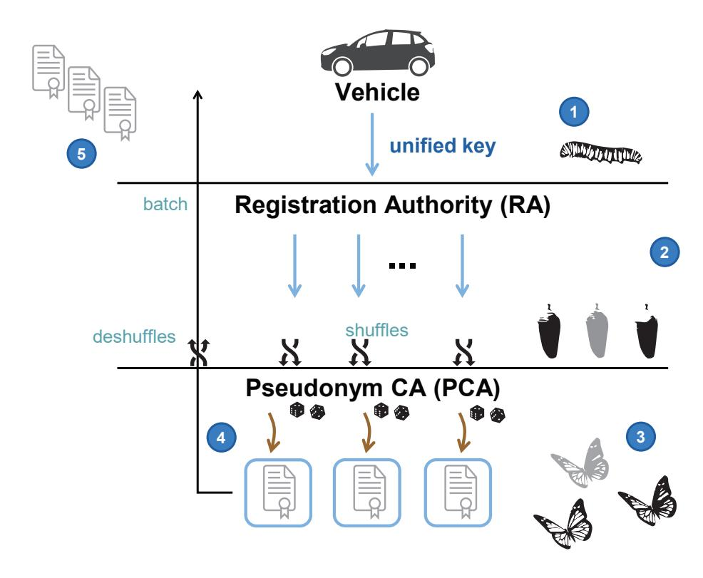

{0}------------------------------------------------

# **qSCMS: Post-quantum certificate provisioning process for V2X**

Paulo S. L. M. Barreto<sup>1</sup> , Jefferson E. Ricardini<sup>2</sup>*,*<sup>3</sup> , Marcos A. Simplicio Jr.<sup>2</sup> and Harsh Kupwade Patil<sup>3</sup>

<sup>1</sup> University of Washington Tacoma. [pbarreto@uw.edu](mailto:pbarreto@uw.edu) <sup>2</sup> Escola Politécnica, Universidade de São Paulo, Brazil. [{joliveira,mjunior}@larc.usp.br](mailto:joliveira@larc.usp.br,mjunior@larc.usp.br) <sup>3</sup> LG Electronics, USA. [{jefferson.ricardini,harsh.patil}@lge.com](mailto:jefferson.ricardini@lge.com,harsh.patil@lge.com)

**Abstract.** Security and privacy are paramount in the field of intelligent transportation systems (ITS). This motivates many proposals aiming to create a Vehicular Public Key Infrastructure (VPKI) for managing vehicles' certificates. Among them, the Security Credential Management System (SCMS) is one of the leading contenders for standardization in the US. SCMS provides a wide array security features, which include (but are not limited to) data authentication, vehicle privacy and revocation of misbehaving vehicles. In addition, the key provisioning process in SCMS is realized via the so-called *butterfly key expansion*, which issues arbitrarily large batches of pseudonym certificates in response to a single client request. Although promising, this process is based on classical elliptic curve cryptography (ECC), which is known to be susceptible to quantum attacks. Aiming to address this issue, in this work we propose a post-quantum *butterfly key expansion* process. The proposed protocol relies on lattice-based cryptography, which leads to competitive key, ciphertext and signature sizes. Moreover, it provides low bandwidth utilization when compared with other lattice-based schemes, and, like the original SCMS, addresses the security and functionality requirements of vehicular communication.

**Keywords:** [Vehicular communications (V2X) · post-quantum security · lattice-based cryptography]

## **1 Introduction**

With the growing interest in creating Intelligent Transportation Systems (ITS), the automotive industry is challenged to develop a variety of computing and communication capabilities [\[1\]](#page-14-0). In particular, we are witnessing a surge in Vehicle-to-Everything (V2X) communication capabilities that further enables vehicles to communicate with other entities (e.g. other vehicles, Road Side Units (RSUs), pedestrians, etc.) [\[2\]](#page-14-1). This trend not only makes vehicles an integral part of the Internet of Things (IoT) paradigm, but also enable more efficient and safe transportation systems [\[3\]](#page-14-2). Besides performance, security and privacy are essential requirements for the widespread deployment of V2X. A promising solution for addressing this requirement is the Security Credential Management System (SCMS) [\[4\]](#page-14-3), a Vehicular Public Key Infrastructure (VPKI) solution that is among the leading candidates for standardization in the United States [\[5\]](#page-14-4). Among other functionalities, SCMS provides revocable privacy and prevents other entities from tracking devices. These features are accomplished with the usage of pseudonym certificates, i.e., certificates that do not expose the identity of their owners. Such certificates are issued via an efficient process called the *butterfly key expansion*, and is even more cost-effective when implemented with the unified butterfly keys (UBK) [\[6\]](#page-15-0). Basically, the butterfly key expansion issues arbitrarily large batches of certificates from a single client request, while maintaining its

{1}------------------------------------------------

privacy. Hence, any internal or external entity cannot distinguish certificates issued to the same or different users.

Although promising, the current V2X solutions rely on classical Elliptic Curve Cryptography (ECC), which is known to be susceptible to quantum attacks [\[7,](#page-15-1) [8\]](#page-15-2). Such an attack can be devastating, since it would violate not only the system's privacy, but also its authenticity (i.e., attackers would be able to forge signatures). Although the quantum threat is foreseeable [\[9\]](#page-15-3), proactive countermeasures are underway. Indeed, the quantum computer menace has recently led to the *Call For Proposal* (CFP) for standardization and harmonization of post-quantum cryptosystems (PQC) by the National Institute of Standards and Technology (NIST) [\[10\]](#page-15-4).

Among the standardization candidates, lattice-based cryptosystems have gained significant importance due to their high flexibility to support a large variety of cryptographic primitives, i.e. we can build encryption, signature and key agreement schemes from the same underlying primitives. Additionally, when defined over ideal lattices where *Ring-Learning With Errors* (R-LWE) is the underlying hard problem, they offer competitive performance in sizes (key, signature and ciphertext) and compute time. Leveraging these benefits of RLWE-based cryptosystems, we propose a post-quantum pseudonym-certificate issuance process for V2X communications. The proposed scheme builds upon the aforementioned UBK approach, but replaces ECC-based operations by lattice-based constructions, creating a post-quantum UBK version (named qUBK). Therefore, such countermeasures lead to a post-quantum SCMS (or qSCMS, for short), which ensures that V2X communications remain secure and highly efficient even if large quantum computers become a reality.

The remainder of this paper is as follows. Section [3](#page-2-0) provides an overview of the SCMS key issuing process, with a particular focus on the UBK approach. Section [4](#page-5-0) presents basic concepts related to lattice-based cryptography and the list of notations. Section [5](#page-8-0) describes the proposed post-quantum UBK (qUBK). Section [7](#page-12-0) discusses practical aspects of qUBK, including parameterization, bandwidth occupation and efficiency. Finally, Section [8](#page-14-5) presents our conclusion.

## **2 General Notation**

For convenience, Table [1](#page-2-1) lists the main symbols and notation used along this document.

For the ECC version of UBK [\[6\]](#page-15-0) we assume standard algorithms for data encryption, hashing and digital signatures. For instance, the following algorithms are suggested: the AES block cipher [\[11\]](#page-15-5) or Present [\[12\]](#page-15-6)) for symmetric encryption, as well as ECIES [\[13\]](#page-15-7) for asymmetric encryption; SHA-2 [\[14\]](#page-15-8) or SHA-3 [\[15\]](#page-15-9) as hash function; and ECDSA [\[16\]](#page-15-10) or EdDSA [\[17\]](#page-15-11)) for implementing digital signatures.

For the post-quantum version hereby proposed, we assume the same symmetric algorithms as the classic version, adjusting the key sizes accordingly. For example, for a 128-bit security level, block ciphers should employ 256-bit keys and the hash function's digest size should be at least 256-bit long for collision and pre-image resistance [\[18,](#page-15-12) [19\]](#page-15-13). The asymmetric algorithms, on the other hand, are assumed to be: Lyubashevsky-Peikert-Regev (LPR) for asymmetric encryption [\[20\]](#page-16-0); and qTESLA [\[21\]](#page-16-1) for digital signatures.

Finally, to facilitate the mapping between the ECC and lattice-based versions of UBK, we use the same symbols for both constructions. However, we use **boldface** fonts for the lattice-based public and private keys aiming to avoid confusion with its ECC counterpart. In particular, when discussing RLWE elements, we use capital bold letters (**S**) to represent public uniformly random ring elements and small bold letters (**s**) to represent secret short ring elements.

{2}------------------------------------------------

<span id="page-2-1"></span>

| Symbol           | Meaning                                          |
|------------------|--------------------------------------------------|
| G                | The generator of an elliptic curve group         |
| G                | Lattice public basis                             |
| sig              | A digital signature                              |
| cert             | A digital certificate                            |
|                  | Public signature keys                            |
| U, U             | (stylized U: reserved for PCA)                   |
| u, U             | Private keys corresponding to U and U            |
| Y, y             | Public and private unified caterpillar keys      |
| Y , b yˆ         | Public and private unified cocoon keys           |
| b                | Number of cocoon keys in certificate batch       |
|                  | Pseudo-random functions                          |
| f, g             | (Subscript D: with a Gaussian distribution)      |
| Enc(K, str)      | Encryption of bit-string str with key K          |
| Dec(K, str)      | Decryption of bit-string str with key K          |
| Sign(K, str)     | Signature of bit-string str, using key K         |
| Ver(K, str, sig) | Verification of signature sig on str, with key K |
| H(·), H(·)       | Hash function.                                   |
|                  | (stylized H: Special hash function for Lattices) |

**Table 1:** General notation and symbols

## <span id="page-2-0"></span>**3 The Security Credential Management System**

The SCMS is one of the most prominent pseudonym-based VPKI the US [\[22\]](#page-16-2). In fact, it is the leading candidate design for protecting V2X communications in the United States [\[5\]](#page-14-4). In this section we explain its pseudonym certificate issuing process, which provides revocable privacy and prevents other entities from tracking devices.

In SCMS [\[4\]](#page-14-3), vehicles are provisioned with two types of certificates:

- 1. An enrollment certificate, which has a long validity time (e.g., 6 years [\[23\]](#page-16-3)). This certificate identifies authorized vehicles in the system, enabling them to acquire pseudonym certificates.
- 2. Multiple pseudonym certificates, which have short expiration times (e.g., 1 week) and do not explicitly identify their owners. Multiple pseudonym certificates are expected to be valid at the same time, so a vehicle can protect its own privacy by periodically changing the pseudonym certificate employed for signing its messages.

For enabling the distribution and revocation of pseudonym certificates, SCMS's architecture predominantly relies essentially on four entities [\[4\]](#page-14-3): Registration Authority (RA), Pseudonym Certificate Authority (PCA), Linkage Authorities (LA), and Misbehavior Authority (MA). Their roles in the system are:

- **Registration Authority (RA)**: It receives and validates requests for generating batches of pseudonym certificates from vehicles, which are identified by their enrollment certificates. The RA is responsible for expanding a vehicle's request into multiple individual requests, which is an integral part of the *butterfly key expansion* process. Requests associated to different vehicles are then shuffled together and forwarded to the PCA, thus preventing the latter from identifying which certificates belong to the same vehicle.
- **Pseudonym Certificate Authority (PCA)**: Responsible for issuing pseudonym certificates to vehicles, upon request by the RA. It signs the certificates and encrypts

{3}------------------------------------------------

them using a vehicle-provided (asymmetric) encryption key, so the RA does not learn its contents from the PCA's response. As a result, the RA is also unable to identify the owner of any given pseudonym certificate.

- Linkage Authorities (LA): They generate pseudo-random bit-strings that are placed into pseudonym certificates so they can be efficiently linked to the same vehicle if necessary. This enables, for example, the revocation of multiple pseudonym certificates simply by placing a small amount of information into certificate revocation lists (CRLs). SCMS employs two LAs, which need to collaborate in order to enable such linkage process. Consequently, no LA alone can track vehicles.
- Misbehavior Authority (MA): Responsible for receiving and processing misbehavior reports. If a malicious or malfunctioning vehicle is identified as a result of the MA's analysis, its pseudonym and enrollment certificates can be revoked via CRLs. As an alternative newer schemes has been proposed using certificates that must be activated before usage [24, 25]. Once a misbehavior is detected the future certificates of that vehicle are not activated, thus avoiding large CRLs [26]. This revocation process preserves the forward privacy of vehicles, meaning that only messages sent after the MA-defined revocation date can be linked to the same vehicle.

Since the focus of this article is on batch certificate provisioning rather than revocation, subsequently we further elaborate on the butterfly key expansion process. In particular, we focus on the unified butterfly keys (UBK) version [6], since it is more efficient than the conventional butterfly keys, and used as a basis for our post-quantum proposal. For further details on SCMS's revocation and certificate linkage procedure, we refer the reader to the original SCMS proposal [4], as well as to recently proposed works that improve this specific process [27, 26].

### 3.1 Unified butterfly key expansion

The butterfly key expansion process is an elegant way of enabling a proxy server (the RA) to turn a vehicle-provided public key into multiple public keys, while allowing only the requesting vehicle to compute the corresponding private keys. The public keys can then be placed into pseudonym certificates, signed by a trusted authority (the PCA), and delivered to the requester However, the original process described in [4] requires the vehicle to provide two different keys in its request. In contrast, the UBK design preserves the system's security and privacy while using a single key. As a result, UBK's efficiency gains can reach up to 50% in comparison with the original approach [6].

Figure 1 gives a graphical illustration of the steps involved in UBK [6], which are detailed in Table 2. First, the vehicle generates one *caterpillar* private/public key pair  $(y, Y = y \cdot \mathcal{G})$ . It then sends the public caterpillar key Y to the RA, along with a suitable pseudo-random function f.

Subsequently, the RA uses Y for generating b public cocoon public keys  $\widehat{Y}_i = Y + f(i) \cdot \mathcal{G}$ , where  $0 \leq i < b$  for an arbitrary (usually system-defined) value of b. Before sending the batch of cocoon keys  $\widehat{Y}_i$  to the PCA, the RA shuffles keys from different devices together. As a result, the PCA should be unable to tell whether two requests sent by the RA are associated to the same or to different vehicles.

After receiving a cocoon key  $\hat{Y}_i$ , the PCA computes the vehicle's public butterfly key as  $U_i = \hat{Y}_i + r_i \cdot \mathcal{G}$ , for a randomly picked  $r_i$ . The PCA inserts  $U_i$  into a certificate  $cert_i$ , together with any necessary metadata (e.g., a validity date), and digitally signs the resulting certificate. The pair  $(cert_i, r_i)$  is then encrypted using  $\hat{Y}_i$ , so only the vehicle who sent the request is able to decrypt the PCA's response. This encrypted package is sent to the RA, which relays it (in batch) to the requesting vehicle without learning the pseudonym certificates' contents.

{4}------------------------------------------------

<span id="page-4-0"></span>

Figure 1: Unified butterfly key (UBK) expansion

Finally, the vehicle decrypts the RA's response using  $\hat{y}_i = y + f(i)$ , obtaining  $U_i$  and computing the corresponding private key  $u_i = y + r_i + f(i)$ . To verify the correctness of the certificate provisioning process, the vehicle also (1) verifies the PCA's signature on  $cert_i$  and (2) verifies that  $u_i \cdot G = U_i$ .

<span id="page-4-1"></span>

| Vehicle                                                                       | $\rightarrow$ | RA                                                                          | $\rightarrow$   | PCA                                                                                                                                                                                                                                                                                                   | -RA→ | Vehicle                                                                                                                                                                                                                                              |
|-------------------------------------------------------------------------------|---------------|-----------------------------------------------------------------------------|-----------------|-------------------------------------------------------------------------------------------------------------------------------------------------------------------------------------------------------------------------------------------------------------------------------------------------------|------|------------------------------------------------------------------------------------------------------------------------------------------------------------------------------------------------------------------------------------------------------|
| $y \stackrel{\$}{\leftarrow} \mathbb{Z}_q$ $Y \leftarrow y \cdot \mathcal{G}$ | Y, f          | $\widehat{Y}_i \leftarrow Y + f(i) \cdot \mathcal{G}$ $(0 \leqslant i < b)$ | $\widehat{Y}_i$ | $ \begin{aligned} r_i &\overset{\$}{\leftarrow} \mathbb{Z}_q \\ U_i &\leftarrow \widehat{Y}_i + r_i \cdot \mathcal{G} \\ sig_i &\leftarrow Sign(u, \{U_i, \mathtt{meta}\}) \\ cert_i &\leftarrow \{U_i, \mathtt{meta}, sig_i\} \\ pkg &\leftarrow Enc(\widehat{Y}_i, \{cert_i, r_i\}) \end{aligned} $ | pkg  | $ \begin{cases} \hat{y}_i \leftarrow y + f(i) \\ \{cert_i, r_i\} \leftarrow Dec(\hat{y}_i, pkg) \\ Ver(\mathcal{U}, \{U_i, \mathtt{meta}\}, sig_i) \\ u_i \leftarrow \hat{y}_i + r_i \\ \mathrm{NB} \colon u_i \cdot \mathcal{G} = U_i \end{cases} $ |

**Table 2:** The ECC-based UBK protocol

### <span id="page-4-2"></span>3.2 The essential property for butterfly expansion: homomorphism

The (unified) butterfly key expansion process is only possible because ECC-based keys display additive homomorphism, meaning that  $u \cdot \mathcal{G} + u' \cdot \mathcal{G} \equiv (u + u') \cdot \mathcal{G}$ , where u and u' are integers and  $\mathcal{G}$  is the generator of an elliptic curve group. This homomorphism property ensures that, given two public keys  $U = u \cdot \mathcal{G}$  and  $U' = u' \cdot \mathcal{G}$ , their addition results in another valid public key, namely  $U'' = (u + u') \cdot \mathcal{G}$ . Moreover, the private key related to that new public key (u'' = u + u') is equivalent to the addition of the private keys corresponding to each of the public keys U and U'. This enables the vehicle to blindly transfer its private caterpillar key to the RA, so it can create multiple cocoon keys, and subsequently to the PCA, so it can randomize the resulting cocoon keys. This blind transfer of elliptic curve points is, thus, at the heart of the ECC-based UBK protocol.

Any adaptation of the butterfly key expansion procedure to a post-quantum domain requires, thus, a similar property to be satisfied. Fortunately, this requirement can be fulfilled using lattice-based cryptosystems, which are discussed in the following section.

{5}------------------------------------------------

## <span id="page-5-0"></span>4 Lattice-based cryptography

In this section, we first discuss some essential features of lattice-based cryptography, particularly those based in the (R)LWE problem. In addition, we provide an overview of the building blocks for qUBK, namely the qTesla signature scheme and the LPR public key encryption algorithm.

### 4.1 (Ring) Learning with Errors – (R)LWE

Among the many lattice-based cryptosystems available in the literature, schemes based on the Learning With Errors (LWE) problem the most efficient [28, Chapter 5.4]. The LWE problem is defined as follows: Let  $\mathbb{Z}_q$  be the set of the integers  $\mathbb{Z}/q\mathbb{Z}$ . Let A be an uniformly distributed matrix of size  $n \times m$  with elements in  $\mathbb{Z}_q$ , and v a vector of size n. Given the pair (A, v), one should tell whether the vector v was chosen uniformly at random or computed by an equation of the form  $v = s \cdot A + e$ , where s and e are integer vectors of size n sampled from their respective distributions  $\chi_s$  and  $\chi_e$ .

LWE can also be instantiated by defining elements as polynomial ring elements, instead of simply matrices and vectors, giving rise to the so-called Ring LWE (RLWE) problem. Which allows formal security reductions in the random oracle model [20]. More formally, the polynomial rings are defined as follows: Let  $n = 2^k$  for an integer k > 0. The ring  $\mathcal{R}_q := \mathbb{Z}_q[x]/\langle x^n + 1 \rangle$  is isomorphic to  $\mathbb{Z}_q^n$ , and the ring  $\mathcal{R} := \mathbb{Z}[x]/\langle x^n + 1 \rangle$  is isomorphic to  $\mathbb{Z}_q^n$ , where  $\mathbb{Z}_q^n$  (or  $\mathbb{Z}^n$ ) represents an array of size n with elements in  $\mathbb{Z}_q$  (or  $\mathbb{Z}$ ). Therefore, a ring element represented by  $a_0 + \cdots + a_{n-1}x^{n-1}$  is associated with the coefficient vector  $(a_0, \ldots, a_{n-1})$ . The RLWE problem can then be formulated as follows:

#### **Definition 1.** RLWE Problem

Let  $k, q \in \mathbb{N}$  be positive integers,  $n = 2^k$ , and let  $\chi$  be a probability distribution over  $\mathcal{R}$ . Let  $(\mathbf{s}, \mathbf{e}) \in \mathcal{R} \times \mathcal{R}$  be sampled from distributions  $\chi_s$  and  $\chi_e$  respectively, and  $\mathbf{A} \in \mathcal{R}_q$  be uniformly sampled. The *ring learning with errors (RLWE) problem* consists of distinguishing the RLWE distribution  $(\mathbf{A}, \mathbf{s} \cdot \mathbf{A} + \mathbf{e}) \in \mathcal{R}_q \times \mathcal{R}_q$  from the uniform distribution  $(\mathbf{A}, \mathbf{U}) \in \mathcal{R}_q \times \mathcal{R}_q$ .

Usually, the distributions  $\chi_s$  and  $\chi_e$  are both defined as a discrete Gaussian distribution  $\mathcal{D}_{\sigma}$  with standard deviation  $\sigma$ , defined as follows.

### **Definition 2.** Discrete Gaussian Distribution

Let  $\sigma \in \mathbb{R}$  be a strictly positive number. The *(centered) discrete Gaussian distribution*  $D_{\sigma}$  over  $\mathbb{Z}$  with standard deviation  $\sigma$  is the unique distribution such that the probability of any  $z \in \mathbb{Z}$  is  $\rho_{\sigma}(z)/\rho_{\sigma}(\mathbb{Z})$ , where  $\rho_{\sigma}(z) := e^{-\frac{z^2}{2\sigma^2}}$  and  $\rho_{\sigma}(\mathbb{Z}) := 1 + 2\sum_{z=1}^{\infty} \rho_{\sigma}(z)$ .

The operation of randomly sampling an integer d with discrete Gaussian distribution  $\mathcal{D}_{\sigma}$  is denoted  $d \leftarrow \mathcal{D}_{\sigma}$ . This may also be done in a pseudo-random manner, using a seed as the seed of the pseudo-random sampler, in which case we write  $d \leftarrow \mathcal{D}_{\sigma}[seed]$ . Likewise, the coefficient-wise extension of this operation to vectors, i.e., the sampling of a vector  $\mathbf{d} \in \mathbb{Z}^n$  whose components are all distributed according to  $\mathcal{D}_{\sigma}$ , is denoted by  $\mathbf{d} \leftarrow \mathcal{D}_{\sigma}^n$  or by  $\mathbf{d} \leftarrow \mathcal{D}_{\sigma}^n[seed]$  depending on whether the sampling is performed randomly or pseudo-randomly (respectively).

#### 4.2 The qTESLA digital signature scheme

The qTESLA signature scheme [21], which was selected in the first round of NIST's Post-Quantum Cryptography Standardization initiative, is the result of a long line of research starting with the scheme proposed by Bai and Galbraith [29]. This scheme in itself is based on the Fiat-Shamir's construction over lattices [30]. In the current form,

{6}------------------------------------------------

qTESLA combines the benefits of TESLA<sup>‡</sup> [31] and ring-TESLA [32]. Hence, it leverages efficient implementations and Gaussian sampling algorithm from TESLA<sup>‡</sup>, while including tightened security reductions from ring-TESLA. Its design can be summarized as follows.

Let  $\pi$  be a permutation that sorts the components of a ring element  $\mathbf{u}$  in decreasing order of their absolute magnitudes, i.e.,  $|\mathbf{u}_{\pi(0)}| \leq \cdots \leq |\mathbf{u}_{\pi(n-1)}|$ . In what follows, we adopt the following notation.  $\mathcal{H}(\cdot)$  is a hash function that maps from  $\{0,1\}^*$  to a ring element  $c \in \mathcal{R}_q$ . We write  $\max_i(\mathbf{u})$  to denote the *i*-th largest component of  $\mathbf{u}$  in absolute value, i.e.,  $\max_i(\mathbf{u}) = \mathbf{u}_{\pi(i)}$ . For any integer c and for a given parameter d,  $[c]_L$  denotes the unique integer in  $(-2^{d-1}, 2^{d-1}] \cap \mathbb{Z}$  such that  $c \equiv [c]_L \mod 2^d$ , i.e., the centered d least significant bits of c. Analogously,  $[c]_M$  denotes the value of  $(c - [c]_L)/2^d$ , i.e., the value represented by all but the d least significant bits of c. Finally, when  $\mathbf{u}$  is a polynomial ring element,  $[\mathbf{u}]_L$  and  $[\mathbf{u}]_M$  denotes the application of such bit-selection operations to all the polynomial coefficients.

Below we describe the qTESLA key generation, signature generation and verification in Algorithms 3, 4 and 5 respectively. For more details and implementations aspects, we refer the reader to [21].

Key generation in qTESLA requires two subroutines checkS (Algorithm 1) and checkE (Algorithm 2), described as follows in the algorithm's official documentation [21]:

```
Algorithm 1 checkS: simplifies the security reduction by ensuring that ||\mathbf{sc}||_{\infty} \leq L_S.

Require: \mathbf{s} \in \mathcal{R}_q

Ensure: \{0,1\} \triangleright \text{true}, false

1: if \sum_{i=0}^{h-1} \max_i(\mathbf{s}) > L_S then

2: return 1

3: return 0
```

```
Algorithm 2 checkE: ensures correctness of the scheme by checking that ||\mathbf{ec}||_{\infty} \leq L_E.

Require: \mathbf{e} \in \mathcal{R}

Ensure: \{0,1\} \triangleright \text{true}, false

1: if \sum_{i=0}^{h-1} \max_i(\mathbf{e}) > L_E then

2: return 1

3: return 0
```

```
Algorithm 3 qTESLAKeyGen
```

```
Require: n, q, \sigma, h, L_S, L_E, \mathbf{G}

Ensure: A qTESLA valid key pair \triangleright \mathbf{S}, \{\mathbf{s}, \mathbf{e}\}

1: do

2: \mathbf{s} \leftarrow \mathcal{D}_{\sigma}^{n}

3: while check\mathbf{S}(\mathbf{s}) \neq 0

4: do

5: \mathbf{e} \leftarrow \mathcal{D}_{\sigma}^{n}

6: while check\mathbf{E}(\mathbf{e}) \neq 0

7: Compute \mathbf{S} \leftarrow \mathbf{s} \cdot \mathbf{G} + \mathbf{e} \in \mathcal{R}_{q}

8: return The public key \mathbf{S}, and the secret key \{\mathbf{s}, \mathbf{e}\}
```

{7}------------------------------------------------

#### <span id="page-7-0"></span>Algorithm 4 qTESLASign

```
Require: n, q, B, L_S, d, G, s, e, S, msg \in \{0, 1\}^n
Ensure: A qTESLA valid signature \triangleright [C, Z]
 1: Sample y uniformly from [-B, B]^n \cap \mathbb{Z}
 2: \mathbf{V} \leftarrow \mathbf{y} \cdot \mathbf{G} \in \mathcal{R}_q
 3: \mathbf{C} \leftarrow \mathcal{H}([\mathbf{V}]_M, \mathbf{S}, \mathsf{msg}) \in \mathcal{R}_q
 4: \mathbf{Z} \leftarrow \mathbf{y} + \mathbf{s} \cdot \mathbf{C} \in \mathcal{R}_q
 5: if \max_0(\mathbf{Z}) > B - L_S then
            Restart
  6:
 7: \mathbf{W} \leftarrow \mathbf{V} - \mathbf{e} \cdot \mathbf{C} \in \mathcal{R}_q
 8: if \max_0([\mathbf{W}]_L) > 2^{d-1} - L_E or \max_0(\mathbf{W}) > \lfloor q/2 \rfloor - L_E then
            Restart
 9:
10: return The signature [C, Z] \triangleright typically C is represented as a short raw hash value
```

#### <span id="page-7-1"></span>**Algorithm 5** qTESLAVerify

```
Require: n, q, B, L_S, d, S, [C, Z], msg \in \{0, 1\}^n
Ensure: \{0,1\} Rejected, Accepted
 1: if \max_0(\mathbf{Z}) > B - L_S then
           return 0 ⊳ Reject Signature
 2:
 3: \mathbf{W} \leftarrow \mathbf{Z} \cdot \mathbf{G} - \mathbf{S} \cdot \mathbf{C} \in \mathcal{R}_q
 4: \mathbf{C}' \leftarrow \mathcal{H}([\mathbf{W}]_M, \mathbf{S}, \mathsf{msg}) \in \mathcal{R}_q
 5: if C' \neq C then
           return 0 ⊳ Reject Signature
 6:
 7: else
           return 1 \triangleright Accept Signature
 8:
```

#### The Lyubashevsky-Peikert-Regev (LPR) key encapsulation mech-4.3 anism

The Lyubashevsky-Peikert-Regev scheme [20] is a variant of the Gentry-Peikert-Vaikuntanathan (GPV) algorithm [33], which in turn is based on the seminal Regev cryptosystem [34]. The LPR key generation, encryption and decryption mechanisms are given in algorithms 6, 7 and 8, respectively. In these algorithms, we assume that  $\mathbf{G} \in \mathcal{R}_q$  is a uniformly sampled ring element that is shared among the users, although in other contexts it could be individually chosen as part of a user's public key. The encryption base G corresponds to the signing base  $-\mathbf{G}$ .

#### <span id="page-7-2"></span>Algorithm 6 LPRKeyGen

```
Require: n, q, \mathbf{G}
```

Ensure: A valid LPR key pair ▷ S, s

- 1:  $\mathbf{s}, \mathbf{e} \stackrel{\$}{\leftarrow} \mathcal{D}_{\sigma}^{n}$  until  $\mathbf{s}, \mathbf{e} \in \mathcal{R}_{q}^{\times}$
- 2: Compute  $\mathbf{S} \leftarrow \mathbf{s} \cdot \mathbf{G} + \mathbf{e} \in \mathcal{R}_q^{\times}$
- 3: **return** The public key S, and the secret key  $s \triangleright$  The e component remains secret but is not further used.

{8}------------------------------------------------

#### <span id="page-8-1"></span>Algorithm 7 LPREncrypt

```
Require: n, q, \sigma, \mathbf{G}, \mathbf{S}, \mathsf{msg} \in \{0, 1\}^{\lambda}

Ensure: The ciphertext [\mathbf{C}, \mathbf{D}]

1: \mathbf{u}, \mathbf{v} \overset{\$}{\leftarrow} \mathcal{D}_{\sigma}^{n} and \mathbf{w} \overset{\$}{\leftarrow} \mathcal{D}_{\sigma}^{\lambda}

2: Encode \mathsf{msg} as \mathbf{M} \leftarrow \lfloor q/2 \rfloor \cdot \mathsf{msg} \in \mathcal{R}_{q}, truncated to \lambda out of n coefficients.

3: \mathbf{C} \leftarrow \mathbf{u} \cdot \mathbf{G} + \mathbf{v} \in \mathcal{R}_{q}

4: \mathbf{D} \leftarrow (\mathbf{u} \cdot \mathbf{S})|_{\lambda} + \mathbf{w} + \mathbf{M} \in \mathcal{R}_{q}^{\lambda}

5: \mathsf{return} The ciphertext [\mathbf{C}, \mathbf{D}]
```

#### <span id="page-8-2"></span>Algorithm 8 LPRDecrypt

```
Require: n, q, \mathbf{s}, [\mathbf{C}, \mathbf{D}]

Ensure: msg

1: Compute \mathbf{M}' \leftarrow \mathbf{D} - \mathbf{s} \cdot \mathbf{C} \in \mathcal{R}_q.

2: For all 0 \leq j < n, decode \mathsf{msg}_j \leftarrow \lfloor |\mathbf{M}'_j|/(q/2) \rfloor

3: return msg
```

If msg is less than n bits long, the **D** component of the cryptogram can be restricted to its first  $\lambda$  bits, thereby considerably reducing bandwidth occupation and slightly speeding up both encryption and decryption. Actually, this is the usual case when LPR is used as KEM. In a KEM, the input for the encryption algorithm (msg) is an ephemeral symmetric key at the desired security level: e.g., it is only  $\lambda = 128$  bits long as compared to n = 1024, or  $\lambda = 256$  bits long as compared to n = 2048.

## <span id="page-8-0"></span>5 Post-quantum butterflies

The adaptation of the ECC-based UBK to a quantum-resistant setting requires that underlying schemes to support both encryption and signatures under key pairs that are related to each other. More precisely, the signature key pair needs to be derived from the encryption key pair. Indeed, the public key  $U_i = u_i \cdot \mathcal{G}$  that is used by the vehicle to sign messages is derived (using the randomization factor  $r_i$ ) from  $\widehat{Y}_i$ , which in turn is used by the PCA to encrypt that vehicle's certificate.

While this construction is trivially possible in the ECC setting, it precludes most post-quantum cryptosystems. Specifically, it precludes: hash-based schemes, which only support signatures; multivariate schemes, which mostly support signatures, while encryption/KEM are much less scrutinized for security and require entirely different algorithms and parameters; and also code-based and isogeny-based schemes, which mostly support encryption/KEM, while signatures are very hard to obtain, inefficient when available, and require entirely different parameters. However, it does not precludes lattice-based schemes, in special those based on the LWE problem.

Choosing suitable lattice-based cryptosystems for this purpose, on the other hand, must take into account some particularities of the target scenario. Notably, the cryptosystems must support the notion of *blind transference of LWE samples*, which parallels the possibility of blind transferring elliptic curve points discussed in Section 3.2. This depends crucially on the existence of an RLWE-based encryption (or more precisely, key encapsulation) scheme and a digital signature scheme that:

- Support additively homomorphic keys;
- Can use the same structure for the key pairs employed in their individual operations;
- Are similarly secure for the same set of distributions and parameters.

{9}------------------------------------------------

<span id="page-9-0"></span>

| Vehicle                                                                                                                                                                                                             | $\rightarrow$                                  | RA                                                                                                                                         | $\rightarrow$                       | PCA                                                                                                                                                                                                                                                                                                                                                                         | -RA→ | Vehicle                                                                                                                                                                                                                                                                                                                                                                                                                                                                                                                                                                                                                                                                                                                                                                                                                                                  |
|---------------------------------------------------------------------------------------------------------------------------------------------------------------------------------------------------------------------|------------------------------------------------|--------------------------------------------------------------------------------------------------------------------------------------------|-------------------------------------|-----------------------------------------------------------------------------------------------------------------------------------------------------------------------------------------------------------------------------------------------------------------------------------------------------------------------------------------------------------------------------|------|----------------------------------------------------------------------------------------------------------------------------------------------------------------------------------------------------------------------------------------------------------------------------------------------------------------------------------------------------------------------------------------------------------------------------------------------------------------------------------------------------------------------------------------------------------------------------------------------------------------------------------------------------------------------------------------------------------------------------------------------------------------------------------------------------------------------------------------------------------|
| $\begin{aligned} \mathbf{s}, \mathbf{e} & \overset{\$}{\leftarrow} \mathcal{D}_{\sigma}^n \ \mathbf{Y} \leftarrow \mathbf{s} \cdot \mathbf{G} + \mathbf{e} \ \mathbf{y} = \{\mathbf{s}, \mathbf{e}\} \end{aligned}$ | $\mathbf{Y}, f_{\mathcal{D}}, g_{\mathcal{D}}$ | $\widehat{\mathbf{Y}}_{\mathbf{i}} \leftarrow \mathbf{Y} + f_{\mathcal{D}}(i) \cdot \mathbf{G} + g_{\mathcal{D}}(i)$ $(0 \leqslant i < b)$ | $\widehat{\mathbf{Y}}_{\mathbf{i}}$ | $\mathbf{s_i'}, \mathbf{e_i'} \overset{\$}{\leftarrow} \mathcal{D}_{\sigma}^n[seed_i] \\ \mathbf{U_i} \leftarrow \widehat{\mathbf{Y}_i} + (\mathbf{s_i'} \cdot \mathbf{G} + \mathbf{e_i'}) \\ sig_i \leftarrow Sign(\mathbf{u}, \{\mathbf{U_i}, \mathtt{meta}\}) \\ clip_i \leftarrow (seed_i, \mathtt{meta}, sig_i) \\ pkg \leftarrow Enc(\widehat{\mathbf{Y}_i}, clip_i)$ |      | $\begin{split} \mathbf{\hat{s}_i} \leftarrow \mathbf{s} + f_{\mathcal{D}}(i),  \mathbf{\hat{e}_i} \leftarrow \mathbf{e} + g_{\mathcal{D}}(i) \\ \mathbf{\hat{y}_i} &= \{\mathbf{\hat{s}_i}, \mathbf{\hat{e}_i}\} \\ clip_i \leftarrow Dec(\mathbf{\hat{y}_i}, pkg) \\ \mathbf{s'_i}, \mathbf{e'_i} \overset{\$}{\leftarrow} \mathcal{D}_{\sigma}^n[seed_i] \\ \mathbf{U_i} \leftarrow \mathbf{\hat{Y}_i} + (\mathbf{s'_i} \cdot \mathbf{G} + \mathbf{e'_i}) \\ Ver(\mathcal{U}, \{\mathbf{U_i}, \mathtt{meta}\}, sig_i) \\ cert_i \leftarrow (\mathbf{U_i}, \mathtt{meta}, sig_i) \\ \mathbf{s_i} \leftarrow \mathbf{\hat{s}_i} + \mathbf{s'_i},  \mathbf{e_i} \leftarrow \mathbf{\hat{e}_i} + \mathbf{e'_i} \\ \mathbf{u_i} &= \{\mathbf{s_i}, \mathbf{e_i}\} \\ \mathrm{NB:}  \mathbf{s_i} \cdot \mathbf{G} + \mathbf{e_i} = \mathbf{U_i} \end{split}$ |

**Table 3:** Post-quantum UBK certificate provisioning process: qUBK

The most restrictive of these properties is the first one. It essentially means that: (1) the sum of two private keys  $(\mathbf{s}, \mathbf{e})$  and  $(\mathbf{s}', \mathbf{e}')$  is still an algebraically admissible private key  $(\mathbf{s}'', \mathbf{e}'') = (\mathbf{s} + \mathbf{s}', \mathbf{e} + \mathbf{e}')$ ; and (2) the sum of the corresponding public keys  $\mathbf{U}$  and  $\mathbf{U}'$  is not only still an algebraically admissible public key  $\mathbf{U}'' = \mathbf{U} + \mathbf{U}'$ , but actually the same key that naturally corresponds to the sum of private keys.

This is the case, for instance, when the keys have the form  $\mathbf{U} = \mathbf{s} \cdot \mathbf{G} + \mathbf{e}$  and  $\mathbf{U}' = \mathbf{s}' \cdot \mathbf{G} + \mathbf{e}'$ , whereby

$$\mathbf{U}'' = \mathbf{U} + \mathbf{U}'$$

$$= \mathbf{s} \cdot \mathbf{G} + \mathbf{e} + \mathbf{s}' \cdot \mathbf{G} + \mathbf{e}'$$

$$= (\mathbf{s} + \mathbf{s}') \cdot \mathbf{G} + (\mathbf{e} + \mathbf{e}')$$

$$= \mathbf{s}'' \cdot \mathbf{G} + \mathbf{e}''$$

Taking such restrictions into account, we hereby show that a lattice-based analogue of the ECC-based UBK is possible with (minor variants of) the qTESLA digital signature scheme and the LPR key encapsulation scheme described in Section 4.

#### 5.1 Post-quantum Unified Butterfly Keys: qUBK

Table 3 details the proposed lattice-based variant of the UBK protocol, named qUBK. As shown in this table, the message flow in qUBK is quite similar to UBK itself, but using RLWE keys instead of elliptic curve keys. More precisely, once again the vehicle starts by generating a caterpillar private/public key pair. In this case, however, the private caterpillar key has two components, the short ring elements ( $\mathbf{s}$  and  $\mathbf{e}$ ), which are obtained by random sampling the zero-centered discrete Gaussian distribution with standard deviation  $\sigma$ . The corresponding public caterpillar key is then computed as  $\mathbf{Y} = \mathbf{s} \cdot \mathbf{G} + \mathbf{e}$ , which corresponds to a ring element following the LWE distribution and, thus, is indistinguishable from random. This public caterpillar key  $\mathbf{Y}$  is then sent to the RA along with two suitable pseudo-random functions  $f_{\mathcal{D}}(i)$  and  $g_{\mathcal{D}}(i)$  that deterministically emulate sampling from  $\mathcal{D}_{\sigma}^{n}$ , with i as seed.

Similarly to the original UBK, the RA uses  $\mathbf{Y}$ , as well as the pseudo-random outputs from  $f_{\mathcal{D}}(i)$  and  $g_{\mathcal{D}}(i)$ , for generating b public cocoon public keys  $\widehat{\mathbf{Y}}_{\mathbf{i}} \leftarrow \mathbf{Y} + f_{\mathcal{D}}(i) \cdot \mathbf{G} + g_{\mathcal{D}}(i)$ , where  $0 \leq i < b$ . Then, the RA shuffles keys from different devices as usual, and sends the batch of cocoon keys  $\widehat{Y}_i$  to the PCA.

After receiving a cocoon key  $\hat{\mathbf{Y}}_i$ , the PCA computes the vehicle's public butterfly key as  $\mathbf{U_i} \leftarrow \hat{\mathbf{Y}}_i + (\mathbf{s_i'} \cdot \mathbf{G} + \mathbf{e_i'})$ . In this process, the randomization factors  $\mathbf{s_i'}$ ,  $\mathbf{e_i'} \stackrel{\$}{\leftarrow} \mathcal{D}_{\sigma}^n[seed_i]$  play a similar role to the random factor  $r_i$  in the ECC-based UBK, i.e., it prevents the RA from learning the vehicle's actual butterfly public key. The main difference is that they are obtained by pseudo-random sampling the zero-centered discrete Gaussian distribution with standard deviation  $\sigma$ , meaning that they can be recovered by the requesting vehicle as long as it is provided with the the pseudo-randomness source  $seed_i$ .

{10}------------------------------------------------

The corresponding pseudonym certificate is then created by the PCA similarly to the ECC-based UBK. Namely, the PCA signs the vehicle's public butterfly key  $\mathbf{U_i}$ , along with any required metadata (meta), using the qTESLA signature scheme and its own private key u. The set ( $seed_i$ , meta,  $sig_i$ ) is then encrypted using  $\widehat{\mathbf{Y_i}}$ , so only the vehicle who sent the request is able to decrypt the resulting package pkg. Subsequently, as in the original UBK, this encrypted package is sent to the RA, which forwards it to the vehicle.

Finally, the vehicle decrypts the RA's response using the private key  $\hat{\mathbf{y}}_{\mathbf{i}} = \{\mathbf{s} + f_{\mathcal{D}}(i), \mathbf{e} + g_{\mathcal{D}}(i)\}$ , thus recovering the set  $(seed_i, \mathtt{meta}, sig_i)$ . Notice that this set does not contain the public key  $U_i$  itself, but just the (more compact)  $seed_i$  that enables its computation. Therefore, the vehicle first computes  $U_i = \hat{\mathbf{Y}} + (\mathbf{s}'_i \cdot \mathbf{G} + \mathbf{e}'_i) = \mathbf{Y} + (f_{\mathcal{D}}(i) + \mathbf{s}'_i) \cdot \mathbf{G} + (g_{\mathcal{D}}(i) + \mathbf{e}'_i)$ , where  $\mathbf{s}'_i, \mathbf{e}'_i \stackrel{\$}{\leftarrow} \mathcal{D}^n_{\sigma}[seed_i]$ . It then checks the PCA's signature  $sig_i$  and, if the verification is successful, sets its i-th pseudonym certificate to  $cert_i \leftarrow (\mathbf{U}_i, \mathtt{meta}, sig_i)$  The qTesla private signature key corresponding to  $U_i$  is, thus,  $u_i = \{\mathbf{s}_i, \mathbf{e}_i\} = \{\hat{\mathbf{s}}_i + \mathbf{s}'_i, \hat{\mathbf{e}}_i + \mathbf{e}'_i\}$ . To ensure that this private key is correct, the vehicle also verifies that  $\mathbf{s}_i \cdot \mathbf{G} + \mathbf{e}_i = \mathbf{U}_i$ .

### <span id="page-10-0"></span>5.2 Intuition behind the blind transference of LWE samples

Intuitively, the blind transference of LWE samples in qUBK relies on the (pseudo)random sampling of (short and secret) ring elements by the different entities that participate in the protocol, namely vehicle, RA and PCA. Whenever such short elements are added to a public key, they create other valid keys that are indistinguishable from each other under the RLWE assumption. This indistinguishability property is actually quite similar to what happens when known ECC points are added to secret random points, as in the original UBK.

More formally, consider the following definition:

**Definition 3.** A  $\sigma_0$ -sample is a ring element on  $\mathcal{R}$  sampled from the (zero-centered) Gaussian distribution with standard deviation  $\sigma$ .

Let **G** and **H** be uniformly sampled from  $\mathcal{R}_q$ . The RLWE assumption for a sample of form  $\mathbf{L} \leftarrow \mathbf{s} \cdot \mathbf{G} + \mathbf{e}$  (where **s** and **e** are  $\mathcal{D}_{\sigma}^n$ -samples) is that distinguishing between **L** and **H** is hard. Therefore, we can write the following definition on the indistinguishability:

**Definition 4.** A ring element of form  $\mathbf{L} \leftarrow \mathbf{s} \cdot \mathbf{G} + \mathbf{e}$ , where  $\mathbf{s}$  and  $\mathbf{e}$  are  $\sigma$ -samples, will be called  $\sigma$ -indistinguishable (from a uniform random sample) under the RLWE assumption.

Here we assume that the RLWE assumption holds at the desired security level for all  $\sigma \in [\sigma_0, \sqrt{k}\sigma_0]$  where  $k \in \{1, 2, 3\}$ . If so:

- The vehicle's ring elements, of form  $\mathbf{Y} \leftarrow \mathbf{s} \cdot \mathbf{G} + \mathbf{e}$  for  $\sigma_0$ -samples  $\mathbf{s}$  and  $\mathbf{e}$ , are  $\sigma_0$ -indistinguishable from the point of view of the RA, the PCA, and other vehicles.
- The RA's ring elements, of form  $\widehat{\mathbf{Y}}_{\mathbf{i}} \leftarrow \mathbf{Y} + f_{\mathcal{D}}(i) \cdot \mathbf{G} + g_{\mathcal{D}}(i)$  for  $f_{\mathcal{D}}(i)$ ,  $g_{\mathcal{D}}(i)$  simulating  $\sigma_0$ -sampling, are  $\sqrt{2}\sigma_0$ -indistinguishable from the point of view of the PCA and other vehicles, since they do not know  $f_{\mathcal{D}}(i)$  and  $g_{\mathcal{D}}(i)$ .
  - This is because the RA is essentially masking the  $\sigma_0$ -indistinguishable element  $\mathbf{Y}$  with another  $\sigma_0$ -indistinguishable element, yielding a ring element identical to that obtained from ring elements  $\hat{\mathbf{s}}_i \leftarrow \mathbf{s} + f_{\mathcal{D}}(i)$ ,  $\hat{\mathbf{e}}_i \leftarrow \mathbf{e} + g_{\mathcal{D}}(i)$ , which are themselves identical to  $\sqrt{2}\sigma_0$ -samples by virtue of being the sum of two  $\sigma_0$ -samples each.
- The ring elements that are signed by the PCA, and have the form  $\mathbf{U_i} \leftarrow \mathbf{\hat{Y}_i} + (\mathbf{s_i'} \cdot \mathbf{G} + \mathbf{e_i'})$  for  $\sigma_0$ -samples  $\mathbf{s_i'}$  and  $\mathbf{e_i'}$ , are  $\sqrt{3}\sigma_0$ -indistinguishable from the point of view of the RA and other vehicles.

This is because the PCA is essentially masking the  $\sqrt{2}\sigma_0$ -indistinguishable element  $\hat{\mathbf{Y}}_{\mathbf{i}}$  with a  $\sigma_0$ -indistinguishable element, yielding a ring element identical to that

{11}------------------------------------------------

obtained from (the vehicle's new secret) ring elements  $\mathbf{s_i} \leftarrow \mathbf{\hat{s}_i} + \mathbf{s_i'}$ ,  $\mathbf{e_i} \leftarrow \mathbf{\hat{e}_i} + \mathbf{s_i'}$ , which are themselves identical to  $\sqrt{3}\sigma_0$ -samples by virtue of being the sum of a  $\sqrt{2}\sigma_0$ -sample and a  $\sigma_0$ -sample each.

### 5.3 Handling signature and decryption failures

When analyzing the building blocks that compose qUBK, note that qTESLA requires the private key samples to satisfy  $\mathsf{checkS}(\mathbf{s})$  and  $\mathsf{checkE}(\mathbf{e})$ , which means that these conditions must hold true for the vehicle's private key  $u_i = \{\mathbf{s_i}, \mathbf{e_i}\}$ . However, the PCA cannot perform this verification since it does not know  $\mathbf{s_i}$  nor  $\mathbf{e_i}$ , which are only known by the vehicles themselves. As a result, the vehicle is forced to reject a received key if it fails to pass either of those checks. Otherwise, accepting such keys might lead to failure when verifying genuine signatures.

Fortunately, it is possible to choose parameters such that the probability of key rejection is fairly low. Hence, by provisioning vehicles with a number of certificates that is slightly larger than the minimum necessary for their operation, eventual key rejections should not be an actual concern. Interestingly, this also covers the possibility of decryption failure for LPR encryption. This happens because (as further discussed in Section 5.5) the chance of decryption failure can be negligible even though one must use qTESLA parameters and keys.

Section 7 gives some specially tailored parameters for keeping key, signature and decryption rejection rates under control, for different security levels.

### 5.4 Signature scheme

Signing only requires functions  $f_{\mathcal{D}}(i)$  and  $g_{\mathcal{D}}(i)$  to deterministically emulate sampling from  $\mathcal{D}_{\sigma}^{n}$ , with i as seed. Accordingly, the PCA must sample  $\mathbf{s_{i}}$  and  $\mathbf{e_{i}}$  from  $\mathcal{D}_{\sigma}^{n}$ .

From the RLWE assumption,  $\mathbf{Y} = \mathbf{s} \cdot \mathbf{G} + \mathbf{e}$  is indistinguishable from uniformly random for  $\mathbf{s}$  and  $\mathbf{e}$  sampled with distribution parameter  $\sigma$ . Meanwhile, the  $\hat{\mathbf{Y}}_{\mathbf{i}} = \hat{\mathbf{s}}_{\mathbf{i}} \cdot \mathbf{G} + \hat{\mathbf{e}}_{\mathbf{i}}$  are indistinguishable from uniformly random for  $\hat{\mathbf{s}}_{\mathbf{i}}$  and  $\hat{\mathbf{e}}_{\mathbf{i}}$  sampled with distribution parameter  $\sqrt{2}\sigma$  by virtue of these secret components being each the sum of 2 identically parameterized Gaussian variables, namely  $\hat{\mathbf{s}}_{\mathbf{i}} = \mathbf{s} + f_{\mathcal{D}}(i)$  and  $\hat{\mathbf{e}}_{\mathbf{i}} = \mathbf{e} + g_{\mathcal{D}}(i)$ . Finally, the  $\mathbf{U}_{\mathbf{i}} = \mathbf{s}_{\mathbf{i}} \cdot \mathbf{G} + \mathbf{e}_{\mathbf{i}}$  is indistinguishable from uniformly random for  $\mathbf{s}_{\mathbf{i}}$  and  $\mathbf{e}_{\mathbf{i}}$  sampled with distribution parameter  $\sqrt{3}\sigma$  by virtue of these secret components being each the sum of 3 such variables, namely  $\mathbf{s}_{\mathbf{i}} = \mathbf{s} + f_{\mathcal{D}}(i) + \mathbf{s}'_{\mathbf{i}}$  and  $\mathbf{e}_{\mathbf{i}} = \mathbf{e} + g_{\mathcal{D}}(i) + \mathbf{e}'_{\mathbf{i}}$ .

The actual scheme parameters must be chosen to take these distributions into account, i.e., they must remain secure at the desired level or above for all of these distribution parameters. Furthermore, the parameters must ensure that all signature operations are efficient with distribution parameter  $\sqrt{3}\sigma$ , and related quantities (e.g., the qTESLA parameters  $L_S$  and  $L_E$ ). After all, the final certificate is equivalent to keys prepared according to this setting.

### <span id="page-11-0"></span>5.5 Encryption scheme

Encryption requires functions  $f_{\mathcal{D}}(i)$  and  $g_{\mathcal{D}}(i)$  to deterministically emulate sampling from  $\mathcal{D}_{\sigma}^{n}$ , with i as the seed, analogously to the signature scheme. Nevertheless, encryption imposes one additional constraint to these functions: the ring elements  $f_{\mathcal{D}}(i)$  and  $g_{\mathcal{D}}(i)$  must be both invertible, i.e., the sampling must be repeated until  $f_{\mathcal{D}}(i), g_{\mathcal{D}}(i) \in \mathcal{R}_{q}^{\times}$ . Accordingly, the PCA must sample  $\mathbf{s}'_{\mathbf{i}}, \mathbf{e}'_{\mathbf{i}}$  from  $\mathcal{D}_{\sigma}^{n}$  until  $\mathbf{s}'_{\mathbf{i}}, \mathbf{e}'_{\mathbf{i}} \in \mathcal{R}_{q}^{\times}$ .

Let  $\mathbf{G} := -\mathbf{G}$ , to bridge the qTESLA and LPR encryption notations. From the RLWE assumption,  $\mathbf{Y} = \mathbf{e} - \mathbf{s} \cdot \mathbf{\bar{G}}$  is indistinguishable from uniformly random for  $\mathbf{s}$  and  $\mathbf{e}$  sampled with distribution parameter  $\sigma$ . In addition, every  $\mathbf{\hat{Y}_i} = \mathbf{\hat{e}_i} - \mathbf{\hat{s}_i} \cdot \mathbf{\bar{G}}$  are indistinguishable from uniformly random for  $\mathbf{\hat{s}_i}$  and  $\mathbf{\hat{e}_i}$  sampled with distribution parameter  $\sqrt{2}\sigma$ . As discussed in

{12}------------------------------------------------

Section [5.2,](#page-10-0) this is by virtue of these secret components being each the sum of 2 identically parameterized Gaussian variables, namely **ˆs<sup>i</sup>** = **s** + *f*D(*i*) and **ˆe<sup>i</sup>** = **e** + *g*D(*i*).

Encryption occurs in the scheme only under the key pair (*y*ˆ = {**ˆs<sup>i</sup>** *,***ˆei**}*,* **<sup>Y</sup>**<sup>b</sup> **<sup>i</sup>**), so in principle the actual scheme parameters could be chosen to take only this into account. However, the final signature key pair already forces a more stringent condition. If the final key pair is used by the vehicle not only for signatures but for encryption as well, then the parameters must be doubly-checked. Nevertheless, this is unlike to be an actual issue because the requirements for encryption tend to be less stringent than those for signatures (e.g., the distributions need not be as precise).

## **6 Security analysis**

As in the original SCMS, the security goals of qSCMS are to ensure [\[6\]](#page-15-0):

- The confidentiality of the vehicle's private key *u<sup>i</sup>* ;
- The confidentiality of the pseudonym certificate generated by the PCA toward other entities;
- The integrity of the pseudonym certificates in the PCA's response; and
- The unlinkability of the pseudonym certificates with respect to any entity (e.g. vehicles, RSU, etc.)

Note that the above stated properties are expected to hold true as long as PCA and RA do not collude. A more detailed security analysis of the UBK is provided in [\[6\]](#page-15-0).

The security and privacy properties of SCMS rely on the fact that a public key on a ECC scheme (namely a elliptic curve point *P* = *s* · G, where *s* is the private key) is indistinguishable from a completely random point. On the other hand, signature unforgeability and ciphertext indistinguishability underlie on the corresponding security of each individual protocol, so they are referred to the original publications [\[16,](#page-15-10) [17,](#page-15-11) [13\]](#page-15-7).

We argue that qSCMS certificate provisioning process, using the qUBK protocol, provides the same security features as the ECC-based SCMS. Our argument comes from the fact that, as for ECC, RLWE public keys are also indistinguishable from random. Particularly, according to the RLWE assumption, a public key on a RLWE scheme (i.e., a ring element **P** = **s** · **G** + **e**, where **s** and **e** are the private key) is indistinguishable from a completely random ring element. On the other hand, the signature unforgeability and ciphertext indistinguishability also underlie on security properties of the individual protocol components, namely qTESLA signature and LPR encryption schemes [\[21,](#page-16-1) [20\]](#page-16-0).

Therefore, the base of qSCMS's security properties are the same ones presented in the original UBK [\[6\]](#page-15-0). Once the RLWE assumption is true, the property of being indistinguishable from random guarantees to qSCMS the same privacy properties as the original SCMS.

# <span id="page-12-0"></span>**7 Practical analysis**

In this section, we provide a practical analysis of our proposal, which includes parameter selection, key and signature sizes, and bandwidth usage.

The practical parameters were obtained by a modification of the NIST PQC standard candidate qTESLA [\[21\]](#page-16-1) Sage script, which in turn is based on the LWE-Estimator script available at [\[35\]](#page-17-1) and [\[36\]](#page-17-2). The analysis of all lattice-based NIST candidates is available at [\[37\]](#page-17-3).

Table [4](#page-13-0) shows the value for each parameter divided in three security level parameter sets.

{13}------------------------------------------------

<span id="page-13-0"></span>

| Parameter        | $2^{128}$ sec. level | $2^{192}$ sec. level | $2^{256}$ sec. level |
|------------------|----------------------|----------------------|----------------------|
| $\overline{q}$   | 16091137             | 25366529             | 55308289             |
| $\overline{k}$   | 10                   | 11                   | 11                   |
| $\sigma$         | 14.71                | 14.71                | 14.71                |
| h                | 36                   | 50                   | 72                   |
| $\overline{}$    | 1324                 | 1839                 | 2648                 |
| $\overline{L_S}$ | 1324                 | 1839                 | 2648                 |
| $\overline{d}$   | 22                   | 23                   | 24                   |
| $\overline{B}$   | $2^{21}-1$           | $2^{22}-1$           | $2^{23}-1$           |

**Table 4:** Parameter sets

The key, signature, certificate and encrypted package sizes are shown in Table 5. The sizes are given in bytes, and are divided in three security level parameter sets.

A public certificate  $cert_i$  contains:

- A qTESLA public key  $\mathbf{U_i}$  of size  $|\mathbf{U_i}| = n \lceil \lg q \rceil$  bits<sup>1</sup>;
- Meta-data of size  $|meta| = \mu$  bits;
- A qTESLA signature  $sig_i$  of size  $|sig_i| = \kappa + n(\lceil \lg(B L_S) + 1 \rceil)$  bits.

Hence the certificate size, in bits, is:

$$|cert_i| = |U_i| + |sig_i| + |meta|$$
  
=  $n\lceil \lg q \rceil + \kappa + n(\lceil \lg(B - L_S) + 1 \rceil) + \mu$ 

An encrypted clipped certificate pkg contains:

- An LPR key encapsulation  $[\mathbf{C}, \mathbf{D}]$  of size  $|[\mathbf{C}, \mathbf{D}]| = |\mathbf{C}| + |\mathbf{D}| = (n + \lambda)\lceil \lg q \rceil$  bits (where  $\mathbf{C}$  is the encryption nonce and  $\mathbf{D}$  is the encapsulation of a  $\lambda$ -bit symmetric key);
- A seed  $seed_i$  of size  $|seed_i| = \kappa$  bits for the blind LWE transfer;
- An encrypted pseudonym certificate  $n\lceil \lg q \rceil + \mu + \kappa + n(\lceil \lg(B L_S) + 1 \rceil)$  bits;
- A MAC tag  $\tau_i$  of size  $\kappa$  bits as part of the authenticated symmetric encryption of the clipped certificate.

Hence the Encrypted package size in bits is:

$$|pkg| = |[\mathbf{C}, \mathbf{D}]| + |cert| + |\tau_i| + |seed_i|$$

$$= (n+\lambda)\lceil \lg q \rceil + n\lceil \lg q \rceil + \mu + 3\kappa + n(\lceil \lg(B-L_S) + 1 \rceil)$$

Interestingly, the 192-bit level parameters appear to offer little bandwidth/storage improvements over the 256-bit parameters. This is not really surprising because there is no suitable intermediate lattice dimension between n = 1024 and n = 2048, since n must have form  $n = 2^k$  for the usual ring  $\mathcal{R}_q$ . This suggests that, in practice, it is reasonble to limit parameters to the 128-bit and 256-bit levels. More options may be available with other rings (e.g. modular lattices, which appear to support n = 1536 without an undue decrease in the security level); however, since they are less scrutinized, we do not presently recommend such choices.

<span id="page-13-1"></span><sup>&</sup>lt;sup>1</sup>Note that qTESLA would include a  $\kappa$ -bit seed for the pseudo-random choice of the base  $\mathbf{G}$ , but this is omitted here since the same  $\mathbf{G}$  must be used system-wide to preserve the vehicle's anonymity)

{14}------------------------------------------------

<span id="page-14-6"></span>

|                   | 128<br>2   | 192<br>2   | 256<br>2   |
|-------------------|------------|------------|------------|
|                   | sec. level | sec. level | sec. level |
| Public Key Size   | 3104       | 6432       | 6688       |
| Secret Key Size   | 2080       | 4128       | 4640       |
| Signature size    | 2848       | 5920       | 6176       |
| Certificate size  | 5920 + µ   | 12320 + µ  | 12832 + µ  |
| Encrypted package | 8288 + µ   | 17049 + µ  | 17888 + µ  |

**Table 5:** Key and Signature Sizes in bytes

## <span id="page-14-5"></span>**8 Conclusion**

Currently, the most well accepted solutions for provisioning certificates in the V2X scenario rely on classical cryptographic primitives, like ECC. As such, they are unable to withstand the threat posed by quantum computers, which are expected to become a reality in the future [\[10\]](#page-15-4). Unfortunately, this concern also applies to the prominent and quite efficient VPKI standardization candidates, such as the SCMS.

Aiming to tackle this issue, in this paper we present a post-quantum protocol for certificate provisioning for V2X. Our protocol is an adaption of the UBK process [\[6\]](#page-15-0), which in turn is a simplification and optimization of the well-known butterfly key expansion process (from the original SCMS architecture). The resulting post-quantum UBK (qUBK) uses lattices as the underlying primitive, in particular, schemes based on the (R)LWE security assumption. We also provide practical parameter sets for different security levels, which lead to competitive key and signature sizes, as well as bandwidth usage, when compared to other lattice-based protocols. By combining qUBK with SCMS's original linkage process, we hereby propose a post-quantum SCMS (qSCMS) architecture that, to the best of our knowledge, is the first post-quantum VPKI in the literature.

*Acknowledgements*. This study was financed by LG Electronics. We also thank William Whyte, Virendra Kumar and Jonathan Petit for their useful comments on this work.

## **References**

- <span id="page-14-0"></span>[1] L. Figueiredo, I. Jesus, J. Machado, J. Ferreira, and J. Carvalho, "Towards the development of intelligent transportation systems," in *Proc. of the IEEE Intelligent Transportation Systems (ITSC'2001)*, 2001, pp. 1206–1211.
- <span id="page-14-1"></span>[2] J. Harding, G. Powell, R. Yoon, J. Fikentscher, C. Doyle, D. Sade, M. Lukuc, J. Simons, and J. Wang, "Vehicle-to-vehicle communications: Readiness of V2V technology for application," NHTSA, Tech. Rep. DOT HS 812 014, 2014.
- <span id="page-14-2"></span>[3] P. Papadimitratos, A. L. Fortelle, K. Evenssen, R. Brignolo, and S. Cosenza, "Vehicular communication systems: Enabling technologies, applications, and future outlook on intelligent transportation," *IEEE Communications Magazine*, vol. 47, no. 11, pp. 84–95, November 2009.
- <span id="page-14-3"></span>[4] W. Whyte, A. Weimerskirch, V. Kumar, and T. Hehn, "A security credential management system for V2V communications," in *IEEE Vehicular Networking Conference (VNC'13)*, 2013, pp. 1–8.
- <span id="page-14-4"></span>[5] CAMP, "Security credential management system proof–of–concept implementation – EE requirements and specifications supporting SCMS software release 1.1," Vehicle Safety Communications Consortium, Tech. Rep., may 2016.

{15}------------------------------------------------

- <span id="page-15-0"></span>[6] M. A. Simplicio, E. L. Cominetti, H. Kupwade-Patil, J. E. Ricardini, and M. V. M. Silva, "The unified butterfly effect: Efficient security credential management system for vehicular communications," in *2018 IEEE Vehicular Networking Conference (VNC)*. Taipei, Taiwan: IEEE, 2018, pp. 1–8, see also [https://eprint.iacr.org/2018/089.](https://eprint.iacr.org/2018/089)
- <span id="page-15-1"></span>[7] P. W. Shor, "Polynomial-time algorithms for prime factorization and discrete logarithms on a quantum computer," *SIAM J. Comput.*, vol. 26, pp. 1484–1509, 1997.
- <span id="page-15-2"></span>[8] L. K. Grover, "A fast quantum mechanical algorithm for database search," in *Proceedings of the Twenty-Eighth Annual Symposium on the Theory of Computing*. ACM Press, 1996, pp. 212–19.
- <span id="page-15-3"></span>[9] The National Institute of Standards and Technology (NIST), "Submission requirements and evaluation criteria for the post-quantum cryptography standardization process," December, 2016. [Online]. Available: [https://csrc.nist.gov/CSRC/media/Projects/](https://csrc.nist.gov/CSRC/media/Projects/Post-Quantum-Cryptography/documents/call-for-proposals-final-dec-2016.pdf) [Post-Quantum-Cryptography/documents/call-for-proposals-final-dec-2016.pdf](https://csrc.nist.gov/CSRC/media/Projects/Post-Quantum-Cryptography/documents/call-for-proposals-final-dec-2016.pdf)
- <span id="page-15-4"></span>[10] L. Chen, S. Jordan, Y.-K. Liu, D. Moody, R. Peralta, R. Perlner, and D. Smith-Tone, "Report on Post-Quantum Cryptography (NIST IR 8105 draft)," National Institute of Standards and Technology (NIST), Gaithersburg (MD), USA, Tech. Rep., 2 2016. [Online]. Available: [http://csrc.nist.gov/publications/drafts/nistir-8105/nistir\\_8105\\_](http://csrc.nist.gov/publications/drafts/nistir-8105/nistir_8105_draft.pdf) [draft.pdf](http://csrc.nist.gov/publications/drafts/nistir-8105/nistir_8105_draft.pdf)
- <span id="page-15-5"></span>[11] NIST, *FIPS 197 – Advanced Encryption Standard (AES)*, National Institute of Standards and Technology, November 2001. [Online]. Available: [http:](http://csrc.nist.gov/publications/fips/fips197/fips-197.pdf) [//csrc.nist.gov/publications/fips/fips197/fips-197.pdf](http://csrc.nist.gov/publications/fips/fips197/fips-197.pdf)
- <span id="page-15-6"></span>[12] A. Bogdanov, L. R. Knudsen, G. Leander, C. Paar, A. Poschmann, M. J. B. Robshaw, Y. Seurin, and C. Vikkelsoe, "Present: An ultra-lightweight block cipher," in *Cryptographic Hardware and Embedded Systems - CHES 2007*, P. Paillier and I. Verbauwhede, Eds. Berlin, Heidelberg: Springer Berlin Heidelberg, 2007, pp. 450–466.
- <span id="page-15-7"></span>[13] IEEE, *IEEE Standard Specifications for Public-Key Cryptography – Amendment 1: Additional Techniques*, IEEE Computer Society, 2004.
- <span id="page-15-8"></span>[14] NIST, *FIPS 180-4 – Secure Hash Standard (SHS)*, National Institute of Standards and Technology, August 2015.
- <span id="page-15-9"></span>[15] NIST, *FIPS 202 – SHA-3 Standard: Permutation-Based Hash and Extendable-Output Functions*, National Institute of Standards and Technology, August 2015, dOI:10.6028/NIST.FIPS.202.
- <span id="page-15-10"></span>[16] ——, *FIPS 186-4 – Digital Signature Standard (DSS)*, National Institute of Standards and Technology, July 2013. [Online]. Available: [http://nvlpubs.nist.gov/nistpubs/](http://nvlpubs.nist.gov/nistpubs/FIPS/NIST.FIPS.186-4.pdf) [FIPS/NIST.FIPS.186-4.pdf](http://nvlpubs.nist.gov/nistpubs/FIPS/NIST.FIPS.186-4.pdf)
- <span id="page-15-11"></span>[17] D. Bernstein, N. Duif, T. Lange, P. Schwabe, and B.-Y. Yang, "High-speed highsecurity signatures," *Journal of Cryptographic Engineering*, vol. 2, no. 2, pp. 77–89, Sep 2012.
- <span id="page-15-12"></span>[18] D. J. Bernstein and T. Lange, "Post-quantum cryptography—dealing with the fallout of physics success," Cryptology ePrint Archive, Report 2017/314, 2017, [https://eprint.](https://eprint.iacr.org/2017/314) [iacr.org/2017/314.](https://eprint.iacr.org/2017/314)
- <span id="page-15-13"></span>[19] D. Bernstein, "Cost analysis of hash collisions : will quantum computers make SHARCS obsolete?" in *SHARCS'09 Workshop Record – Proceedings 4th Workshop on Special-purpose Hardware for Attacking Cryptograhic Systems)*, September 2009, pp. 105–116.

{16}------------------------------------------------

- <span id="page-16-0"></span>[20] V. Lyubashevsky, C. Peikert, and O. Regev, "On ideal lattices and learning with errors over rings," in *Advances in Cryptology – Eurocrypt 2010*, ser. Lecture Notes in Computer Science, H. Gilbert, Ed., vol. 6110. French Riviera, France: Springer, 2010, pp. 1–23.
- <span id="page-16-1"></span>[21] S. Akleylek, E. Alkim, P. S. L. M. Barreto, N. Bindel, J. Buchmann, E. Eaton, G. Gutoski, J. Krämer, P. Longa, H. Polat, J. E. Ricardini, and G. Zanon, "Latticebased digital signature scheme qtesla," qTESLA official website, 2017, [https://qtesla.](https://qtesla.org/) [org/.](https://qtesla.org/)
- <span id="page-16-2"></span>[22] J. Petit, F. Schaub, M. Feiri, and F. Kargl, "Pseudonym schemes in vehicular networks: A survey," *IEEE Communications Surveys Tutorials*, vol. 17, no. 1, pp. 228–255, 2015.
- <span id="page-16-3"></span>[23] CAMP, "PoC Certificate Expiration Timelines," CAMP Wiki, 2017, [https://wiki.](https://wiki.campllc.org/display/SCP/PoC+Certificate+Expiration+Timelines) [campllc.org/display/SCP/PoC+Certificate+Expiration+Timelines.](https://wiki.campllc.org/display/SCP/PoC+Certificate+Expiration+Timelines)
- <span id="page-16-4"></span>[24] E. Verheul, "Activate later certificates for V2X: Combining ITS efficiency with privacy," Cryptology ePrint Archive 2016/1158, 2016. [Online]. Available: <http://eprint.iacr.org/2016/1158>
- <span id="page-16-5"></span>[25] V. Kumar, J. Petit, and W. Whyte, "Binary hash tree based certificate access management for connected vehicles," in *Conference on Security and Privacy in Wireless and Mobile Networks (WiSec'17)*. New York, NY, USA: ACM, 2017, pp. 145–155.
- <span id="page-16-6"></span>[26] M. Simplicio Jr, E. Cominetti, H. Kupwade-Patil, J. Ricardini, and M. Silva, "ACPC: Efficient revocation of pseudonym certificates using activation codes," *Ad Hoc Networks*, p. (in press), 2018.
- <span id="page-16-7"></span>[27] M. Simplicio, E. Cominetti, H. Kupwade-Patil, J. Ricardini, L. Ferraz, and M. Silva, "A privacy-preserving method for temporarily linking/revoking pseudonym certificates in vanets," in *17th IEEE Int. Conf. On Trust, Security And Privacy In Computing And Communications (TrustCom'18)*, 2018, see also https://eprint.iacr.org/2018/185.
- <span id="page-16-8"></span>[28] D. J. Bernstein, J. Buchmann, and E. Dahmen, *Post-Quantum Cryptography*. Heidelberg, Deutschland: Springer, 2008.
- <span id="page-16-9"></span>[29] S. Bai and S. D. Galbraith, "An improved compression technique for signatures based on learning with errors," in *RSA Conference – Cryptographer's Track – CT-RSA 2014*, ser. Lecture Notes in Computer Science, J. Benaloh, Ed., vol. 8366. San Francisco, CA, USA: Springer, 2014, pp. 28–47.
- <span id="page-16-10"></span>[30] V. Lyubashevsky, "Lattice signatures without trapdoors," in *Advances in Cryptology – Eurocrypt 2012*, ser. Lecture Notes in Computer Science, D. Pointcheval and T. Johansson, Eds., vol. 7237. Cambridge, UK: Springer, 2012, pp. 738–755.
- <span id="page-16-11"></span>[31] P. S. L. M. Barreto, P. Longa, M. Naehrig, J. E. Ricardini, and G. Zanon, "Sharper ring-lwe signatures," Cryptology ePrint Archive, Report 2016/1026, 2016, [https:](https://eprint.iacr.org/2016/1026) [//eprint.iacr.org/2016/1026.](https://eprint.iacr.org/2016/1026)
- <span id="page-16-12"></span>[32] S. Gueron and F. Schlieker, "Optimized implementation of ring-TESLA," 2016, gitHub at [https://github.com/fschlieker/ring-TESLA.](https://github.com/fschlieker/ring-TESLA) [Online]. Available: <https://github.com/fschlieker/ring-TESLA>
- <span id="page-16-13"></span>[33] C. Gentry, C. Peikert, and V. Vaikuntanathan, "Trapdoors for hard lattices and new cryptographic constructions," in *Proceedings of the Fortieth Annual ACM Symposium on Theory of Computing*, ser. STOC '08. New York, NY, USA: ACM, 2008, pp. 197–206. [Online]. Available: <http://doi.acm.org/10.1145/1374376.1374407>

{17}------------------------------------------------

- <span id="page-17-0"></span>[34] O. Regev, "On lattices, learning with errors, random linear codes, and cryptography," *J. ACM*, vol. 56, no. 6, pp. 34:1–34:40, Sep. 2009. [Online]. Available: <http://doi.acm.org/10.1145/1568318.1568324>
- <span id="page-17-1"></span>[35] M. R. Albrecht, "lwe-estimator," 2017. [Online]. Available: [https://bitbucket.org/](https://bitbucket.org/malb/lwe-estimator) [malb/lwe-estimator](https://bitbucket.org/malb/lwe-estimator)
- <span id="page-17-2"></span>[36] M. R. Albrecht, B. R. Curtis, A. Deo, A. Davidson, R. Player, E. W. Postlethwaite, F. Virdia, and T. Wunderer, "Estimate all the {LWE, NTRU} schemes! - code," 2017. [Online]. Available: <https://bitbucket.org/malb/lwe-estimator>
- <span id="page-17-3"></span>[37] ——, "Estimate all the {LWE, NTRU} schemes!" 2017. [Online]. Available: <https://estimate-all-the-lwe-ntru-schemes.github.io/paper.pdf?v=aug18>