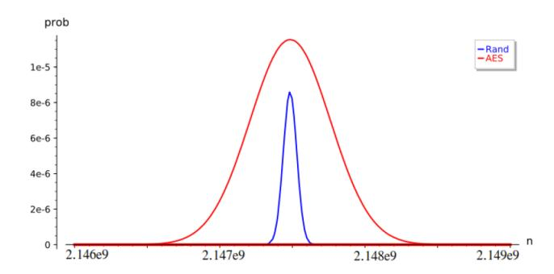
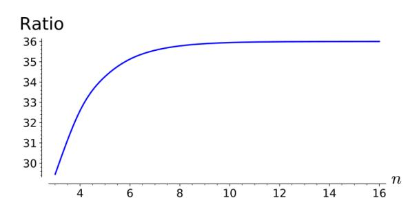

## Truncated Differential Properties of the Diagonal Set of Inputs for 5-round AES

(Extended Version)

Lorenzo Grassi1,2 and Christian Rechberger2

1 Digital Security Group, Radboud University, Nijmegen, Netherlands 2 IAIK, Graz University of Technology, Graz, Austria l.grassi@science.ru.nl, christian.rechberger@iaik.tugraz.at

Abstract. In the last couple of years, a new wave of results appeared, proposing and exploiting new properties of round-reduced AES. In this paper we survey and combine some of these results (namely, the multipleof-n property and the mixture differential cryptanalysis) in a systematic way in order to answer more general questions regarding the probability distribution of encrypted diagonal sets. This allows to analyze this special set of inputs, and report on new properties regarding the probability distribution of the number of different pairs of corresponding ciphertexts are equal in certain anti-diagonal(s) after 5 rounds.

An immediate corollary of the multiple-of-8 property is that the variance of such a distribution can be shown to be higher than for a random permutation. Surprisingly, also the mean of the distribution is significantly different from random, something which cannot be explained by the multiple-of-8 property. We propose a theoretical explanation of this, by assuming an APN-like assumption on the S-Box which closely resembles the AES-Sbox. By combining the multiple-of-8 property, the mixture differential approach, and the results just mentioned about the mean and the variance, we are finally able to formulate the probability distribution of the diagonal set after 5-round AES as a sum of independent binomial distributions.

Keywords: AES – Truncated-Differential Cryptanalysis – Distinguisher

#### 1 Introduction

AES (Advanced Encryption Standard) [16] is probably the most used and studied block cipher. Since the development of cryptanalysis of AES and AES-like constructions in the late 1990s, the set of input which differ only in one diagonal has special importance. Indeed, it appears in several attacks and distinguishers, including various (truncated) differential [24, 23], integral [14], and impossible differential attacks [6], among others. In particular, given a diagonal set of plaintexts and the corresponding ciphertexts after 4 rounds, it is well known that the XOR-sum of the ciphertexts is equal to zero [14], or that each pair of ciphertexts

Table 1. Expected properties of a diagonal set after 5-round encryption. Given a set of  $2^{32}$  chosen plaintexts all equal in three diagonals (that is, a diagonal set), we consider the distribution of the number of different pairs of ciphertexts that are equal in one anti-diagonal (equivalently, that lie in a particular subspace  $\mathcal{ID}_I$  for  $I \subseteq \{0, 1, 2, 3\}$  fixed with |I| = 3). Expected values for mean and variance of these distributions are given in this table for 5-round AES and for a random permutation. Practical results on AES are close and are discussed in Sect. 7.2.

|                               | Random Permutation           | 5-round AES                            |
|-------------------------------|------------------------------|----------------------------------------|
| Mean ⋆ (Theorem 4) | $2147483647.5\approx 2^{31}$ | $2147484685.6 \approx 2^{31} + 2^{10}$ |
| Variance (Theorem 4)          | $2147483647\approx 2^{31}$   | $76842293834.905 \approx 2^{36.161}$   |
| Multiple-of-8 [21]            |                              | ✓                                      |

 $^{\star}$  = assuming an "APN-like" S-Box (for the 5-round AES case)

cannot be equal in any of the four anti-diagonals, as shown by Biham and Keller in [7].

While a lot is known about the encryption of a diagonal set of plaintexts – that is, a set of plaintexts with one (or more) active diagonal(s) – for up to 4-round AES, an analysis for 5 or more rounds AES is still missing. At Eurocrypt 2017, a new property which is independent of the secret key has been found for 5-round AES [21]. By appropriate choices of a number of input pairs, it is possible to make sure that the number of times that the difference of the resulting output pairs lie in a particular subspace  $\mathcal{ID}$  is always a multiple of 8. Such a distinguisher has then been exploited in, e.g., [4,19] for setting up new competitive distinguishers and key-recovery attacks on round-reduced AES.

At the same time, some open questions arise from the result provided in [21]: does this property influence the average number of output pairs that lie in such a particular subspace (i.e., the mean)? Are other parameters (including the variance and the skewness) affected by the multiple-of-8 property?

In this paper, given a diagonal set of plaintexts, we consider the probability distribution of the corresponding number of pairs of ciphertexts that are equal in one fixed anti-diagonal after 5-round AES (without the final MixColumns operation) – equivalently, that belong to the same coset of a particular subspace  $\mathcal{ID}$  – denoted in the following as the "(average) number of collisions".

#### 1.1 Contributions

As the main contribution, we perform for the first time a differential analysis of such distribution after 5-round AES, and find significant deviations from random, supported by practical implementations and verification. For a theoretical explanation we have to resort to an APN-like assumption on the S-Box, which closely resembles the AES-Sbox. A numerical summary is given in Table 1. All the results presented in this paper are independent of the secret-key.

**Mean of 5-round AES.** Firstly, by an appropriate choice of  $2^{32}$  plaintexts in a diagonal space  $\mathcal{D}$ , we prove for the first time that the average number of times

that the resulting output pairs are equal in one fixed anti-diagonal (equivalently, the average number of times that the difference of the resulting output pairs lie in a particular subspace  $\mathcal{ID}$ ) is (a little) bigger for 5-round AES than for a random permutation, independently of the secret key. A complete proof of this result – under an "APN-like" assumption on the S-Box which closely resembles the AES S-Box – can be found in Sect. 6.

Variance of 5-round AES. Secondly, we theoretically compute the variance of the probability distribution just defined, and we show that it is higher (by a factor of approximately 36) for 5-round AES than for a random permutation. As we are going to show, this result is mainly due to the "multiple-of-8" result [21] proposed at Eurocrypt 2017. For this reason, with respect to the mean value, the variance is independent of the details of the S-Box.

Practical Verification & Influence of the S-Box Details on the Mean. We practically verified the mean on small-scale 5-round AES (namely, AES defined over  $\mathbb{F}_{2^4}^{4\times 4}$  as proposed in [13]), and the variance both for small-scale and real 5-round AES. As discussed in Sect. 7, practical results are close to the theoretical ones in both cases. Before going on, we mention that the theoretical and the practical results regarding the mean (almost) match if the the S-Box satisfies an "APN-like" assumption on the S-Box which closely resembles the AES S-Box, namely, if the solutions of the equality S-Box $(\cdot \oplus \Delta_I) \oplus S$ -Box $(\cdot) = \Delta_O$  are uniformly distributed for each non-zero input/output differences  $\Delta_I, \Delta_O \neq 0$ . In the case in which this assumption – also used in other related works as [3,5] – is not satisfied, then a gap between the theoretical and the practical results can

occur, as showed and discussed in details in App. C.

**Probability Distribution of 5-round AES.** By combining the multiple-of-8 property presented in [21], the mixture differential cryptanalysis [19, 20] and the results just mentioned about the mean and the variance, in Sect. 3 we show the following: given a diagonal space of  $2^{32}$  plaintexts with one active diagonal, the probability distribution of the number of different pairs of ciphertexts which are equal in one fixed anti-diagonal after 5-round AES (without the final MixColumns operation) with respect to (1st) all possible secret keys and (2nd) all possible initial diagonal spaces is well described by a sum of independent binomial distributions  $\mathfrak{B}(n,p)$ , that is

$$2^3 \times \mathfrak{B}(n_3, p_3) + 2^{10} \times \mathfrak{B}(n_{10}, p_{10}) + 2^{17} \times \mathfrak{B}(n_{17}, p_{17})$$

where the values of  $n_3$ ,  $n_{10}$ ,  $n_{17}$  and  $p_3$ ,  $p_{10}$ ,  $p_{17}$  are provided in the following.

#### 1.2 Follow-Up Works: Truncated Differentials for 5-/6-round AES

Before going on, we recall the other results concerning truncated differentials for 5- or 6-round AES present in the literature.

In [3], Bao, Guo and List presented "extended expectation cryptanalysis" (or "extended truncated differential") on round-reduced AES. By making use

of expectation-based distinguishers, they are able to show how to extend the well-known 3-round integral distinguisher to truncated differential secret-key distinguishers over 4, 5 and even 6 rounds. The technique exploited to derive such a result is based on results by Patarin [27], who observed that the expected (average) number of collisions differs slightly for a sum of permutations from the ideal. At the same time, authors showed that their results (namely, the expectation distinguishers over 4-, 5- and 6-round AES proposed in the main part of [3]) can be derived exploiting the same technique/strategy that we are going to propose in this paper in Sect. 6, as showed in details in [3, App. C].

Later on, in [5] Bardeh and Rønjom developed another technique in order to set an equivalent truncated differential distinguishers for up to 6-round AES. Such technique – called the "exchange equivalence attack" – resembles the yoyo technique [28] and the mixture differential cryptanalaysis [19], and it allows to give a precise estimation of the average number of pairs of ciphertexts that are equal in fixed anti-diagonal(s), given a particular set of chosen plaintexts. The corresponding secret-key distinguisher on 6-round AES has complexity of about 2 88.2 computations and chosen texts.

Remark. Before going on, we remark that all these results are valid only under the "APN" assumption of the S-Box previously mentioned. Namely, both our and the theoretical results proposed in [3, 5] regarding the average number of collisions after 5 or more rounds of AES hold only in the case in which the solutions of the equality S-Box(·⊕∆I )⊕S-Box(·) = ∆O are uniformly distributed for each non-zero input/output differences ∆I , ∆O 6= 0, an assumption that is (almost) satisfied by the AES S-Box. More details about this are provided in the following.

#### 2 Preliminary

#### 2.1 Advanced Encryption Standard (AES)

AES [16] is a Substitution-Permutation network based on the "Wide Trail Design" strategy [17], that supports key size of 128, 192 and 256 bits. The 128-bit plaintext initializes the internal state as a 4 × 4 matrix of bytes as values in the finite field F2 8 . Depending on the version of AES, Nr rounds are applied to the state: Nr = 10 for AES-128, Nr = 12 for AES-192 and Nr = 14 for AES-256. An AES round applies four operations to the state matrix:

- SubBytes (S-Box) applying the same 8-bit to 8-bit invertible S-Box 16 times in parallel on each byte of the state (provides non-linearity in the cipher);
- ShiftRows (SR) cyclic shift of each row to the left;
- MixColumns (MC) multiplication of each column by a constant 4 × 4 invertible matrix (MC and SR provide diffusion in the cipher);
- AddRoundKey (ARK) XORing the state with a 128-bit subkey k.

One round of AES can be described as R(x) = k ⊕ MC ◦ SR ◦ S-Box(x). In the first round an additional AddRoundKey operation (using a whitening key) is applied, and in the last round the MixColumns operation is omitted.

Notation Used in the Paper. Let x denote a plaintext, a ciphertext, an intermediate state or a key. Then,  $x_{i,j}$  with  $i,j \in \{0,\ldots,3\}$  denotes the byte in the row i and in the column j. We denote by R one round of AES (and  $R_f$  if the Mix-Columns operation is omitted), while we denote r rounds of AES by  $R^r$  (where we use the notation  $R_f^r$  in the case in which the last MixColumns operation is omitted). We also define the diagonal and the anti-diagonal of a text as follows. The i-th diagonal of a  $4 \times 4$  matrix A is defined as the elements that lie on row r and column c such that  $r - c \equiv_4 i$ . The i-th anti-diagonal of a  $4 \times 4$  matrix A is defined as the elements that lie on row r and column c such that  $r + c \equiv_4 i$ .

#### 2.2 Properties of an S-Box

Given a bijective S-Box function on  $\mathbb{F}_{2^n}$ , let  $\Delta_I, \Delta_O \in \mathbb{F}_{2^n}$ . Let  $N_{\Delta_I, \Delta_O}$  denotes the number of solutions of the equation

$$S-Box(x \oplus \Delta_I) \oplus S-Box(x) = \Delta_O$$
 (1)

for each  $\Delta_I \neq 0$  and  $\Delta_O \neq 0$ . Obviously, (i) x is a solution if and only if  $x \oplus \Delta_I$  is a solution, and (ii) if  $\Delta_O = 0$ , then any  $x \in \mathbb{F}_{2^n}$  is a solution if and only if  $\Delta_I = 0$  (the S-Box is bijective).

Let's analyze the probability distribution related to  $N_{\Delta_I,\Delta_O}$ .

**Mean Value.** Independently of the details of the S-Box, the mean value (or the average value) of  $N_{\Delta_I,\Delta_O}$  is equal to  $\mathbb{E}[N_{\Delta_I,\Delta_O}] = \frac{2^n}{2^n-1}$ . Indeed, observe that for each x and for each  $\Delta_I \neq 0$  there exists  $\Delta_O \neq 0$  (since S-Box is bijective) that satisfies Eq. (1). Thus, the average number of solutions is  $\frac{2^n \cdot (2^n-1)}{(2^n-1)^2} = \frac{2^n}{(2^n-1)}$  independently of the details of the (bijective) S-Box.

Variance. The variance  $\operatorname{Var}(N_{\Delta_I,\Delta_O})$  depends on the details of the S-Box. For the AES S-Box case, for each  $\Delta_I \neq 0$  there are 128 values of  $\Delta_O \neq 0$  for which Eq. (1) has no solution, 126 values of  $\Delta_O \neq 0$  for which Eq. (1) has 2 solutions ( $\hat{x}$  is a solution if and only if  $\hat{x} \oplus \Delta_I$  is a solution) and finally 1 value of  $\Delta_O \neq 0$  for which Eq. (1) has 4 solutions. The variance for the AES S-Box is so equal to  $\operatorname{Var}_{AES}(N_{\Delta_I,\Delta_O}) = 2^2 \cdot \frac{126}{255} + 4^2 \cdot \frac{1}{255} - \left(\frac{256}{255}\right)^2 = \frac{67064}{65025}$ .

Maximum Differential Probability. The Maximum Differential Probability  $DP_{max}$  of an S-Box is defined as

$$DP_{\max} = 2^{-n} \cdot \max_{\Delta_I \neq 0, \Delta_O} N_{\Delta_I, \Delta_O}. \tag{2}$$

Since  $\max_{\Delta_I \neq 0, \Delta_O} N_{\Delta_I, \Delta_O} \geq 2$ ,  $\mathtt{DP_{max}}$  is always bigger than or equal to  $2^{-n+1}$ . Permutations with  $\mathtt{DP_{max}} = 2^{-n+1}$  are called Almost Perfect Nonlinear (APN).

"Homogeneous" S-Box. Finally, given  $\Delta_I \neq 0$  (respectively,  $\Delta_O \neq 0$ ), consider the probability distribution of  $N_{\Delta_I,\Delta_O}$  with respect to  $\Delta_O \neq 0$  (respectively,  $\Delta_I \neq 0$ ): we say that the S-Box is (differential) "homogeneous" if such distribution is independent of  $\Delta_I$  (respectively,  $\Delta_O$ ). Some examples include:

- the AES S-Box, which is differential "homogeneous", since for each  $\Delta_I \neq 0$ (fixed),  $\Pr(N_{\Delta_I,\Delta_O}=2)=\frac{126}{255}$  and  $\Pr(N_{\Delta_I,\Delta_O}=4)=\frac{1}{255}$ ; the PRINCE S-Box, which is *not* differential "homogeneous", since e.g. the
- probability  $\Pr(N_{\Delta_I,\Delta_O}=4)$  depends on the value of  $\Delta_I\neq 0.1$

#### Probability Distribution for 5-round AES 3

In this section, we first recall some results already published in the literature about round-reduced AES. Then, given a diagonal space of 232 plaintexts with one active diagonal, we present the probability distribution of the number of different pairs of ciphertexts which are equal in one fixed anti-diagonal after 5-round AES (without the final MixColumns operation).

#### 3.1 Truncated Differentials for 2-round AES

Here we recall the truncated differential for 2-round AES using the subspace trail notation introduced in [22]—see also App. A for more details. In the following, we only work with vectors and vector spaces over  $\mathbb{F}_{2^n}^{4\times 4}$ , and we denote by  $\{e_{0,0},\ldots,e_{3,3}\}$  the unit vectors of  $\mathbb{F}_{2^n}^{4\times 4}$  (e.g.,  $e_{i,j}$  has a single 1 in row i and column i).

**Definition 1.** *For each*  $i \in \{0, 1, 2, 3\}$ *:*

- The column spaces  $C_i$  are defined as  $C_i = \langle e_{0,i}, e_{1,i}, e_{2,i}, e_{3,i} \rangle$ .
- The diagonal spaces  $\mathcal{D}_i$  are defined as  $\mathcal{D}_i = SR^{-1}(\mathcal{C}_i)$ . Similarly, the inversediagonal spaces  $\mathcal{ID}_i$  are defined as  $\mathcal{ID}_i = SR(\mathcal{C}_i)$ .
- The i-th mixed spaces  $\mathcal{M}_i$  are defined as  $\mathcal{M}_i = MC(\mathcal{ID}_i)$ .

**Definition 2.** For each  $I \subseteq \{0, 1, 2, 3\}$ , let  $C_I$ ,  $D_I$ ,  $ID_I$  and  $M_I$  be defined as

$$\mathcal{C}_I = \bigoplus_{i \in I} \mathcal{C}_i \,, \qquad \mathcal{D}_I = \bigoplus_{i \in I} \mathcal{D}_i \,, \qquad \mathcal{I} \mathcal{D}_I = \bigoplus_{i \in I} \mathcal{I} \mathcal{D}_i \,, \qquad \mathcal{M}_I = \bigoplus_{i \in I} \mathcal{M}_i \,.$$

**Definition 3.** Let  $t \in \mathbb{F}_{2^n}^{4\times 4}$  be a text in a coset of a space  $\mathcal{X} \subseteq \mathbb{F}_{2^n}^{4\times 4}$  such that  $\mathcal{X} = \langle x_0, x_1, \dots, x_{d-1} \rangle$  where  $\dim(\mathcal{X}) = d$ , namely  $t \in \mathcal{X} \oplus \gamma$ . Given  $\gamma$ ,  $(t_0, t_1, \ldots, t_{d-1}) \in \mathbb{F}_{2^n}^d$  are the generating variables of t if the following holds:

$$t \equiv (t_0, t_1, \dots, t_{d-1})$$
 if and only if  $t = \gamma \oplus \bigoplus_{j=0}^{d-1} t_j \cdot x_j$ .

As shown in detail in [22], for any coset  $\mathcal{D}_I \oplus \alpha$  there exists  $\beta \in \mathbb{F}_{28}^{4 \times 4}$  such that  $R(\mathcal{D}_I \oplus \alpha) = \mathcal{C}_I \oplus \beta$ . In a similar way, for any coset  $\mathcal{C}_I \oplus \beta$  there exists  $\gamma \in \mathbb{F}_{2^8}^{4 \times 4}$  such that  $R(\mathcal{C}_I \oplus \beta) = \mathcal{M}_I \oplus \gamma$ .

In more details,  $\Pr(N_{\Delta_I,\Delta_O} = 4 \mid \Delta_I = 0 \text{x} F) = 0$  (i.e.,  $N_{0 \text{x} F, \Delta_O} \neq 4$  for all  $\Delta_O$ ) while  $\Pr(N_{\Delta_I,\Delta_O} = 4 \mid \Delta_I = 0 \text{x} A) = \frac{2}{15}$  (two values of  $\Delta_O$  satisfy  $N_{0 \text{x} A, \Delta_O} = 4$ ). We refer to App. C for more details.

**Theorem 1** ([22]). For each  $I \subseteq \{0,1,2,3\}$  and for each  $\alpha \in \mathbb{F}_{2^8}^{4 \times 4}$ , there exists  $\beta \in \mathbb{F}_{28}^{4 \times 4}$  such that  $R^2(\mathcal{D}_I \oplus \alpha) = \mathcal{M}_I \oplus \beta$ . Equivalently:

$$Prob(R^2(x) \oplus R^2(y) \in \mathcal{M}_I \mid x \oplus y \in \mathcal{D}_I) = 1.$$
 (3)

#### Multiple-of-8 Property and Mixture Differential Cryptanalysis

As already recalled in the introduction, the first known property independent of the secret-key for 5-round AES – called "multiple-of-8" property [21] – has been presented at Eurocrypt 2017.

**Theorem 2** ([21]). Let  $\{p^i\}_{i \in \{0,1,\ldots,2^{32 \cdot d}-1\}}$  be  $2^{32 \cdot d}$  plaintexts with  $1 \leq d \leq 3$ active diagonals, or equivalently in the same coset of a diagonal subspace  $\mathcal{D}_I$  for a certain  $I \subseteq \{0,1,2,3\}$  with |I| = d. Consider the corresponding ciphertexts after 5 rounds (without the final MixColumns operation), that is,  $(p^i, c^i)$  for  $i \in \{0,\ldots,2^{32\cdot |I|}-1\}$  where  $c^i=R_f^5(p^i)$ . The number of different pairs of ciphertexts  $(c^i, c^j)$  that are equal in  $1 \le a \le 3$  anti-diagonals (i.e., that belong to the same coset of a subspace  $\mathcal{ID}_J$  for a certain  $J \subseteq \{0,1,2,3\}$  with |J| = 4-ais always a multiple of 8, independently of the secret key, of the details of the S-Box and of the MixColumns matrix.

We refer to [21, 19, 12] for details. Such a result is strictly related to the mixture differential cryptanalysis [19] proposed at FSE/ToSC'19.

**Theorem 3** ([19]). Let  $t^1, t^2$  be two texts in  $C_i \oplus \gamma$  for a certain  $i \in \{0, 1, 2, 3\}$ , namely two plaintexts that differ in the i-th column only. Let  $t^1 \equiv (x_0^1, x_1^1, x_2^1, x_3^1)$ and  $t^2 \equiv (x_0^2, x_1^2, x_2^2, x_3^2)$  be their generating variables. Let  $s^1, s^2 \in \mathcal{C}_i \oplus \gamma$  be defined

- $\begin{array}{l} \ \textit{if} \ x_i^1 \neq x_i^2 \ \textit{for a certain} \ i \in \{0,1,2,3\} \text{: the $i$-th generating variable} \ s_i^1 \ \textit{of} \ s^1 \\ \ \textit{is either} \ x_i^1 \ \textit{or} \ x_i^2, \ \textit{and the $i$-th generating variable} \ \textit{of} \ s^2 \ \textit{is} \ \{x_i^1, x_i^2\} \setminus s_i^1; \\ \ \ \textit{if} \ x_i^1 = x_i^2 \ \textit{for a certain} \ i \in \{0,1,2,3\} \text{: the $i$-th generating variable} \ s_i^1 \ \textit{of} \ s^1 \end{array}$
- is equal to the i-th generating variable of  $s^2$  (no condition on the value).

The following holds:

- 1.  $R^2(t^1) \oplus R^2(t^2) = R^2(s^1) \oplus R^2(s^2)$ ;
- 2. for each  $J \subseteq \{0, 1, 2, 3\}$ :

$$R^4(t^1) \oplus R^4(t^2) \in \mathcal{M}_J$$
 if and only if  $R^4(s^1) \oplus R^4(s^2) \in \mathcal{M}_J$ .

#### Main Result: Probability Distribution for 5-round AES

Given a set of  $2^{32 \cdot d}$  plaintexts with  $1 \leq d \leq 3$  active diagonal(s), consider the probability distribution of the number of pairs of ciphertexts which are equal in  $1 \le a \le 3$  fixed anti-diagonal(s) (without the final MixColumns operation):

 $\overline{\ }^2$  Two pairs (s,t) and (t,s) are considered to be equivalent (i.e., they count per 1).

- what can we say about the mean, the variance and the skewness of this distribution?
- does the multiple-of-8 property influence the average number of output pairs that lie in a particular subspace (i.e., the mean)? Are other parameters (as the variance and the skewness) affected by the multiple-of-8 property?

Here we answer these questions.

**Theorem 4.** Given an AES-like cipher that works with texts in  $\mathbb{F}_{2s}^{4\times4}$ , assume that (1st) the MixColumns matrix is an MDS matrix and that (2nd) the solutions of the equation S-Box $(x \oplus \Delta_I) \oplus$  S-Box $(x) = \Delta_O$  are uniformly distributed for each non-zero input/output difference  $\Delta_I \neq 0$  and  $\Delta_O \neq 0$ .

Given  $2^{32}$  plaintexts  $\{p^i\}_{i\in\{0,1,\ldots,2^{32}-1\}}$  with one active diagonal (i.e., in a coset of a diagonal subspace  $\mathcal{D}_i$  for  $i\in\{0,1,2,3\}$ ), consider the number of different pairs of ciphertexts  $(c^h,c^j)$  for  $h\neq j$  that belong into the same coset of  $\mathcal{ID}_J$  for any fixed  $J\subseteq\{0,1,2,3\}$  with |J|=3. The corresponding probability distribution – denoted in the following by  $\mathfrak{D}_{5\text{-}AES}$  – with respect to

- all possible initial coset of the diagonal space  $\mathcal{D}_i$ , and
- all possible secret keys

is given by

$$\mathfrak{D}_{5-AES} = 2^3 \times \mathfrak{B}(n_3, p_3) + 2^{10} \times \mathfrak{B}(n_{10}, p_{10}) + 2^{17} \times \mathfrak{B}(n_{17}, p_{17}), \tag{4}$$

where  $\mathfrak{B}_i \sim \mathfrak{B}(n_i, p_i)$  for  $i \in \{3, 10, 17\}$  are binomial distributions, and where  $n_i$  and  $p_i$  for  $i \in \{3, 10, 17\}$  are equal to

$$n_3 = 2^{28} \cdot (2^8 - 1)^4$$
,  $p_3 = 2^{-32} + 2^{-53.983}$ ;  $n_{10} = 2^{23} \cdot (2^8 - 1)^3$ ,  $p_{10} = 2^{-32} - 2^{-45.989}$ ;  $n_{17} = 3 \cdot 2^{15} \cdot (2^8 - 1)^2$ ,  $p_{17} = 2^{-32} + 2^{-37.986}$ .

Such distribution has mean value  $\mu=2\,147\,484\,685.6$ , and standard deviation  $\sigma=277\,204.426.$

In order to prove Theorem 4, we first derive the values  $n_i$  for i = 3, 10, 17 and prove the result given in Eq. (4). In the next sections, we formally compute the probabilities  $p_i$  for  $i \in \{3, 10, 17\}$ , the value of the mean and the variance.

An immediate corollary of the previous result is the following.

**Corollary 1.** Given an AES-like cipher that works with texts in  $\mathbb{F}_{2s}^{4\times4}$ , assume that (1st) the MixColumns matrix is an MDS matrix and that (2nd) the solutions of the equation S-Box $(x \oplus \Delta_I) \oplus$  S-Box $(x) = \Delta_O$  are uniformly distributed for each non-zero input/output difference  $\Delta_I \neq 0$  and  $\Delta_O \neq 0$ .

Given  $2^{32}$  plaintexts  $\{p^i\}_{i\in\{0,1,\ldots,2^{32}-1\}}$  with one active diagonal (i.e., in a coset of a diagonal subspace  $\mathcal{D}_i$  for  $i\in\{0,1,2,3\}$ ), the probability that  $n\in\mathbb{N}$  different pairs of ciphertexts  $(c^h,c^j)$  for  $h\neq j$  are equal in one fixed anti-diagonal

(equivalently, that belong to the same coset of  $\mathcal{ID}_J$  for  $J \subseteq \{0, 1, 2, 3\}$  fixed with |J| = 3) is given by:

$$Prob(n) = \begin{cases} 0 & \text{if } n \text{ mod } 8 \neq 0 \\ \sum_{(x_3, x_{10}, x_{17}) \in X_n} \left( \prod_{i \in \{3, 10, 17\}} \binom{n_i}{x_i} \cdot (p_i)^{x_i} \cdot (1 - p_i)^{n_i - x_i} \right) & \text{otherwise} \end{cases}$$
(5)

where

$$X_n = \left\{ (x_3, x_{10}, x_{17}) \in \mathbb{N} \times \mathbb{N} \times \mathbb{N} \middle| 0 \le x_i \le n_i \text{ and } 2^3 \cdot x_3 + 2^{10} \cdot x_{10} + 2^{17} \cdot x_{17} = n \right\}$$

and where  $n_i$  and  $p_i$  for  $i \in \{3, 10, 17\}$  are as in Theorem 4.

Note that
$$\text{Prob}(n > (2^3 \cdot n_3 + 2^{10} \cdot n_{10} + 2^{17} \cdot n_{17})) = 0$$
, since  $X_n = \emptyset$  for  $n > (2^3 \cdot n_3 + 2^{10} \cdot n_{10} + 2^{17} \cdot n_{17})$ .

#### 4 Initial Considerations

About the S-Box: "Uniform Distribution of the Solutions of S-Box  $(\cdot \oplus \Delta_I) \oplus \text{S-Box}(\cdot) = \Delta_O$ ". Before going further, we discuss the assumptions of Theorem 4, focusing on the one related to the properties/details of the S-Box. The fact that "the solutions of Eq. (1) are uniformly distributed for each  $\Delta_I \neq 0$  and  $\Delta_O \neq 0$ " basically corresponds to an S-Box that satisfies the following properties:

- 1. it is "homogeneous" (defined in Sect. 2.2);
- 2. its variance  $Var(N_{\Delta_I,\Delta_O})$  is as "lower" as possible.3

This is close to being true if the S-Box is APN, or if the S-Box is "close" to be APN. Although much is known for (bijective) APN permutations in odd dimension, it is known that there is no APN permutation of dimension 4 [25], there is at least one APN permutation, up to equivalence, of dimension 6 (that is, the Dillon's permutation), while the question of finding an APN bijective (n, n)-function for even  $n \geq 8$  is still open. As a result, in the case of dimensions equal to a power of 2 (e.g.,  $\mathbb{F}_{2^4}$  or  $\mathbb{F}_{2^8}$ ), the only (known) S-Box that (approximately) matches the assumptions of the Theorem in dimensions 4 or 8 is the one generated by the multiplicative-inverse permutation4, as for example the AES S-Box, which is not APN but differentially 4-uniform [26] (e.g., note that the variance of the AES S-Box is 67 064/65 025 vs 64 004/65 025 of an APN S-Box). As we are going to show, our practical results on small-scale AES (for which the S-Box has the same property as the full-size AES one) are very close to the one predicted by the previous Theorem.

&lt;sup>3 Note that even if the variance  $Var(N_{\Delta_I,\Delta_O})$  is related to  $DP_{max}$ , S-Boxes with equal  $DP_{max}$  can have very different variance. Moreover, the variance of an S-Box  $S_1$  can be bigger than the corresponding variance of an S-Box  $S_2$  even if  $DP_{max}$  of  $S_1$  is lower than  $DP_{max}$  of  $S_2$  (see Table 3 in App. C for concrete examples).

&lt;sup>4 Variance, homogeneous differential property and  $DP_{max}$  of an S-Box S remain unchanged if affine transformations are applied in the domain or co-domain of S.

We remark that even if the assumptions on the S-Box of Theorem 4 are restrictive, they match criteria used to design an S-Box which is strong against differential and linear cryptanalysis. As a result, many ciphers in the literature are built using S-Boxes which (are close to) satisfy the assumptions of Theorem 4.

Influence of the S-Box. If the S-Box does not satisfy the required properties related to the assumption of the Theorem, then the average number of collisions can be different from the one previously given. To be more concrete, in App. C we provide several practical examples of the dependency of the average number of collisions for small-scale AES-like ciphers with respect to the properties of the S-Box. We also mention that, in the case in which the assumption about the S-Box is not fulfilled, it turned out (by practical tests) that also the details of the MixColumns matrix can influence the average number of collisions.

**Probability Distribution of a Random Permutation.** Here we briefly compare the probability distribution for 5-round AES and the one of a random permutation. This fact can be used to set up new truncated differential distinguishers for 5-round AES, as we are going to show concretely in Sect. 8.

**Proposition 1.** Consider  $2^{32}$  plaintexts  $\{p^i\}_{i\in\{0,1,\dots,2^{32}-1\}}$  with one active diagonal (equivalently, a coset of a diagonal space  $\mathcal{D}_i$  for  $i\in\{0,1,2,3\}$ ), and the corresponding (cipher)texts generated by a random permutation  $\Pi$ , that is  $c^i = \Pi(p^i)$ . The probability distribution of the number of different pairs of ciphertexts  $(c^h, c^j)$  that belong to the same coset of  $\mathcal{I}\mathcal{D}_J$  for any fixed  $J\subseteq\{0,1,2,3\}$  with |J|=3 is given by a binomial distribution  $\mathfrak{B}(n,p)$ , where  $n=\binom{2^{32}}{2}=2^{31}\cdot(2^{32}-1)$  and  $p=\frac{2^{96}-1}{2^{128}-1}\approx 2^{-32}$ . The average number of collisions of such distribution is equal to  $2^{31}-0.5=2$  147 483 647.5, while its variance is equal to  $2^{14}$ 7 483 647  $\simeq 2^{31}$ .

#### It follows that:

- independently of the secret key, the average number of pairs of ciphertexts which are equal in one fixed anti-diagonal is (a little) bigger for 5-round AES than for a random permutation (approximately 1038.1 more collisions);
- independently of the secret key, the variance of the probability distribution of the number of collisions is much bigger for 5-round AES than for a random permutation (approximately of a factor 36).

To highlight this difference, Fig. 1 proposes a comparison between the probability distribution of the number of collisions for the AES case (approximated here for simplicity by a normal distribution) in red and of the random case in blue.

#### 5 Proof of Theorem 4: Sum of Binomial Distributions

Consider a set of  $2^{32}$  plaintexts with one active diagonal and the corresponding ciphertexts after 5-round AES (without the final MixColumns operation). As

Fig. 1. Comparison between the theoretical probability distribution of the number of collisions between 5-round AES (approximated – only here – by a normal distribution) and a random permutation. Remark: since the AES probability distribution – in red – satisfies the multiple-of-8 property, then the probability in the case in which the number of collision n is not a multiple of 8 is equal to zero, namely P rob(n 6= 8 · n 0 ) = 0.

shown by the multiple-of-8 property [21] and by the mixture differential cryptanalysis [19], the corresponding pairs of ciphertexts of such set of plaintexts are not independent/unrelated. In particular, these pairs of texts can be divided in n3 + n10 + n17 + n24 sets defined as in [19] (recalled in Theorem 3) such that

- 1. for each i ∈ {3, 10, 17, 24}, exactly ni sets have cardinality 2i ;
- 2. each one of these sets contains pairs of texts for which i out of the four generating variables are equal (and 4−i are different) after 1-round encryption;
- 3. given each one of such sets, it is not possible that some pairs of ciphertexts are equal in 1 ≤ a ≤ 3 anti-diagonals (i.e., that belong to the same coset of IDJ ) after 5-round, while other pairs of ciphertexts in the same set are not equal in those a anti-diagonals;
- 4. pairs of texts of different sets are independent (in the sense that pairs of texts of different sets do not satisfy the property just given for the case of pairs of texts that belong to the same set).

The values of n3, n10, n17, n24 are computed in details in the next paragraph.

Due to the impossible differential trail on 4-round AES [7, 22], if three out of the four generating variables of the input plaintexts are equal after 1-round encryption, then the corresponding ciphertexts cannot be equal in any antidiagonal. In other words, the probability p24 is equal to zero. For this reason, we will only focus on n3, n10, n17 in the following.

About the Values of n3, n10, n17. Given a set of 232 chosen texts with one active column5 , the number of pairs of texts with 0 ≤ v ≤ 3 equal generating variables (and 4 − v different generating variables) after one round is given by

$$\binom{4}{v} \cdot 2^{31} \cdot (2^8 - 1)^{4-v} \,. \tag{6}$$

5 One active diagonal is mapped to one active column after 1-round AES encryption.

Indeed, note that if v variables are equal for the two texts of the given pair, then these variables can take  $(2^8)^v$  different values. For each one of the remaining 4-v variables, the variables must be different for the two texts. Thus, these 4-v variables can take exactly  $\left[2^8\cdot(2^8-1)\right]^{4-v}/2$  different values. The result follows from the fact that there are  $\binom{4}{v}$  different combinations of v variables.

Due to Eq. (6), the number  $n_v$  of the sets of pairs of texts with "no equal generating variables" (namely, v = 0), the set of of pairs of texts with "one equal and three different generating variable(s)" (namely, v = 1) and finally the set of of pairs of texts with "two equal and two different generating variable" (namely, v = 2) are given by:

$$\forall v \in \{0, 1, 2\}: \qquad n_{7 \cdot v + 3} = \binom{4}{v} \cdot \frac{2^{31} \cdot (2^8 - 1)^{4 - v}}{2^{7 \cdot v + 3}}. \tag{7}$$

About Binomial Distributions  $B_i \sim \mathfrak{B}(n_i, p_i)$  for  $i \in \{3, 10, 17\}$ . Due to the previous facts, it follows that the probability of the event " $n = 8 \cdot n'$  pairs of ciphertexts equal in one fixed anti-diagonal" for  $n' \in \mathbb{N}$  – equivalently, " $n = 8 \cdot n'$  collisions" in a coset of  $\mathcal{ID}_J$  for  $J \subseteq \{0, 1, 2, 3\}$  with |J| = 3 – corresponds to the sum of the probabilities to have " $2^3 \cdot k_3$  collisions in the first set and  $2^{10} \cdot k_{10}$  collisions in the second set and  $2^{17} \cdot k_{17}$  collisions in the third set" for each  $k_3, k_{10}, k_{17}$  such that  $2^3 \cdot k_3 + 2^{10} \cdot k_{10} + 2^{17} \cdot k_{17} = n$ .

Each one of these (independent) events is well characterized by a binomial distribution. By definition, a binomial distribution with parameters n and p is the discrete probability distribution of the number of successes in a sequence of n independent yes/no experiments, each of which yields success with probability p. In our case, given n pairs of texts, each one of them satisfies or not the above property/requirement with the same probability p.

**Probability Distribution.** Due to all these initial considerations (based on the multiple-of-8 property and on the mixture differential cryptanalysis), it follows that the distribution 5-AES of the number of collisions for the AES case is well described by

$$\mathfrak{D}_{5\text{-AES}} = 2^3 \times \mathfrak{B}_3 + 2^{10} \times \mathfrak{B}_{10} + 2^{17} \times \mathfrak{B}_{17}$$

where  $\mathfrak{B}_i \sim \mathfrak{B}(n_i, p_i)$  for i = 3, 10, 17 are independent binomial distributions. In the following, we formally compute the values of  $n_i$  and of  $p_i$ .

Based on this fact, we can also compute the probability that  $n \in \mathbb{N}$  different pairs of ciphertexts  $(c^h, c^j)$  for  $h \neq j$  are equal in one fixed anti-diagonal, as given in (5). Given  $n \in \mathbb{N}$ , we can immediately conclude that  $\operatorname{Prob}(\mathfrak{D}_{5\text{-AES}} = n) = 0$  if  $n \neq 8 \cdot n'$ , that is, if n is not a multiple of 8 (due to the multiple-of-8 property). Otherwise, if  $n = 8 \cdot n'$  for  $n' \in \mathbb{N}$ , then:

$$\operatorname{Prob}(\mathfrak{D}_{5\text{-AES}} = n) = \operatorname{Prob}(2^{3} \cdot \mathfrak{B}_{3} + 2^{10} \cdot \mathfrak{B}_{10} + 2^{17} \cdot \mathfrak{B}_{17} = n) = \\
= \sum_{\substack{m_{3}, m_{10}, m_{17} \in \mathbb{N} \text{ s.t.} \\ m_{3} + m_{10} + m_{17} = n}} \operatorname{Prob}(2^{3} \cdot \mathfrak{B}_{3} = m_{3}) \times \operatorname{Prob}(2^{10} \cdot \mathfrak{B}_{10} = m_{10}) \\
\times \operatorname{Prob}(2^{17} \cdot \mathfrak{B}_{17} = m_{17}),$$

where remember that the distributions  $\mathfrak{B}_3, \mathfrak{B}_{10}$  and  $\mathfrak{B}_{17}$  are independent.

Since  $\operatorname{Prob}(2^i \cdot B_i = m_i) = 0$  if  $m_i$  is not a multiple of  $2^i$  for each  $i \in \{3, 10, 17\}$  (namely, if there is no  $x_i \in \mathbb{N}$  such that  $m_i \neq 2^i \cdot x_i$ ), it follows that

$$\begin{aligned} & \operatorname{Prob}\left(\mathfrak{D}_{5\text{-AES}} = n\right) = \operatorname{Prob}\left(2^{3} \cdot \mathfrak{B}_{3} + 2^{10} \cdot \mathfrak{B}_{10} + 2^{17} \cdot \mathfrak{B}_{17} = n\right) = \\ & = \sum_{\substack{m_{3}, m_{10}, m_{17} \in \mathbb{N} \text{ s.t.} \\ m_{3} + m_{10} + m_{17} = n}} \operatorname{Prob}(2^{3} \cdot \mathfrak{B}_{3} = m_{3}) \times \operatorname{Prob}(2^{10} \cdot \mathfrak{B}_{10} = m_{10}) \\ & \times \operatorname{Prob}(2^{17} \cdot \mathfrak{B}_{17} = m_{17}) \\ & = \sum_{x_{3}, x_{10}, x_{17} \in X_{n}} \operatorname{Prob}(\mathfrak{B}_{3} = x_{3}) \times \operatorname{Prob}(\mathfrak{B}_{10} = x_{10}) \times \operatorname{Prob}(\mathfrak{B}_{17} = x_{17}) \end{aligned}$$

where

$$X_n = \left\{ (x_3, x_{10}, x_{17}) \in \mathbb{N} \times \mathbb{N} \times \mathbb{N} \mid 0 \le x_i \le n_i \text{ and } 2^3 \cdot x_3 + 2^{10} \cdot x_{10} + 2^{17} \cdot x_{17} = n \right\}.$$

The probability given in (5) finally follows from the fact that  $\mathfrak{B}_i$  are binomial distributions, i.e.,

$$\operatorname{Prob}(\mathfrak{B}_i = x) = \binom{n_i}{x} \cdot (p_i)^x \cdot (1 - p_i)^{n_i - x},$$

where  $n_i$  and  $p_i$  for  $i \in \{3, 10, 17\}$  are given in Theorem 4.

Mean Value and Variance. Due to the results just presented, it follows that the mean value  $\mu$  of 5-AES is given by

$$\begin{split} \mu = & \mathbb{E}[\mathfrak{D}_{\text{5-AES}}] = \mathbb{E}[2^3 \times \mathfrak{B}_3 + 2^{10} \times \mathfrak{B}_{10} + 2^{17} \times \mathfrak{B}_{17}] \\ = & 2^3 \cdot \mathbb{E}[\mathfrak{B}_3] + 2^{10} \cdot \mathbb{E}[\mathfrak{B}_{10}] + 2^{17} \cdot \mathbb{E}[\mathfrak{B}_{17}] \\ = & 2^3 \cdot n_3 \cdot p_3 + 2^{10} \cdot n_{10} \cdot p_{10} + 2^{17} \cdot n_{17} \cdot p_{17} \,, \end{split}$$

where  $\mathbb{E}[a \cdot X + b \cdot Y + c] = a \cdot \mathbb{E}[X] + b \cdot \mathbb{E}[Y] + c$  for each  $a, b, c \in \mathbb{R}$  and for each random variable X and Y. Similarly, the variance  $\sigma^2$  is given by

$$\begin{split} \sigma^2 &= \operatorname{Var}(\mathfrak{D}_{\text{5-AES}}) = \operatorname{Var}(2^3 \times \mathfrak{B}_3 + 2^{10} \times \mathfrak{B}_{10} + 2^{17} \times \mathfrak{B}_{17}) \\ &= 2^6 \cdot \operatorname{Var}(\mathfrak{B}_3) + 2^{20} \cdot \operatorname{Var}(\mathfrak{B}_{10}) + 2^{34} \cdot \operatorname{Var}(\mathfrak{B}_{17}) \\ &= 2^6 \cdot n_3 \cdot p_3 \cdot (1 - p_3) + 2^{10} \cdot n_{10} \cdot p_{10} \cdot (1 - p_{10}) + 2^{17} \cdot n_{17} \cdot p_{17} \cdot (1 - p_{17}), \end{split}$$

where  $\operatorname{Var}(a \cdot X + b \cdot Y + c) = a^2 \cdot \operatorname{Var}(X) + b^2 \cdot \operatorname{Var}(Y)$  for each  $a, b, c \in \mathbb{R}$  under the assumption that X and Y are independent random variables (remember that  $\mathfrak{B}_3, \mathfrak{B}_{10}, \mathfrak{B}_{17}$  are independent).

#### 6 Proof of Theorem 4: About the Probabilities $p_3, p_{10}, p_{17}$

#### 6.1 Reduction to the Middle Round

In order to compute the probabilities  $p_3, p_{10}$  and  $p_{17}$  given before for 5 rounds AES, the idea is to work on an equivalent result on a single round. Due to the

2-round truncated differential with prob. 1 recalled in Sect. 3.1, we have that

$$\mathcal{D}_i \oplus \delta \xrightarrow{R^2(\cdot)} \mathcal{M}_i \oplus \omega \xrightarrow{R(\cdot)} \mathcal{D}_J \oplus \delta' \xrightarrow{R_f^2(\cdot)} \mathcal{I}\mathcal{D}_J \oplus \omega'. \tag{8}$$

For this reason, it is sufficient to focus on the middle round  $\mathcal{M}_i \oplus \omega \xrightarrow{R(\cdot)} \mathcal{D}_J \oplus \delta'$  in order to compute the desired result.

Sketch & Organization of the Proof. W.l.o.g., we limit ourselves to consider plaintexts in the same coset of  $\mathcal{M}_0$  and to count the number of texts which are equal in the first diagonal after one round (the other cases are analogous). By definition of  $\mathcal{M}_0$ , if  $p^1, p^2 \in \mathcal{M}_0 \oplus \omega$ , then there exist  $x^i, y^i, z^i, w^i \in \mathbb{F}_{2^8}$  for  $i \in \{1, 2\}$  such that:

$$p^i = \omega \oplus \begin{bmatrix} 2 \cdot x^i & y^i & z^i & 3 \cdot w^i \\ x^i & y^i & 3 \cdot z^i & 2 \cdot w^i \\ x^i & 3 \cdot y^i & 2 \cdot z^i & w^i \\ 3 \cdot x^i & 2 \cdot y^i & z^i & w^i \end{bmatrix} \,,$$

where  $2 \equiv 0 \times 02$  and  $3 \equiv 0 \times 03$ . In the following, we say that  $p^1$  is "generated" by the generating variables  $(x^1, y^1, z^1, w^1)$  and that  $p^2$  is "generated" by the generating variables  $(x^2, y^2, z^2, w^2)$ . As before, we use the notation  $p^i \equiv (x^i, y^i, z^i, w^i)$ . The proof is organized as follows:

- 1. first of all, we limit ourselves to consider a subset of 216 texts with only 2 active bytes. Since this case is much simpler to analyze than the generic one, it allows us to highlight the crucial points of the proof;
- 2. we then present the complete proof for the case of  $2^{32}$  texts in the same coset of  $\mathcal{M}_0$ . Roughly speaking, this case is split in various sub-cases: each one of them is studied/analyzed independently of the others using the same strategy proposed for the simplest case of  $2^{16}$  texts. The final result is obtained by simply combining the results of each one of these sub-cases.

We emphasize that the following computations are *not* influenced by neither the value of the secret key nor the value of the initial coset of the diagonal subspace  $\mathcal{D}_i$ . That is, the following results are the average with respect to these two values.

# 6.2 A "Simpler" Case: $2^{16}$ Texts with Two Equal Generating Variables

As a first case, we consider  $2^{16}$  texts for which two generating variables are equal, e.g.,  $z^1 = z^2$  and  $w^1 = w^2$ . Given two texts  $p^1$  generated by  $(x^1, y^1, 0, 0)$  and  $p^2$  generated by  $(x^2, y^2, 0, 0)$ , they are equal in the first diagonal after one round if

and only if the following four equations are satisfied

$$\begin{split} (R(p^1) \oplus R(p^2))_{0,0} = & 2 \cdot (\text{S-Box}(2 \cdot x^1 \oplus a_{0,0}) \oplus \text{S-Box}(2 \cdot x^2 \oplus a_{0,0})) \\ & \oplus 3 \cdot (\text{S-Box}(y^1 \oplus a_{1,1}) \oplus \text{S-Box}(y^2 \oplus a_{1,1})) = 0 \,, \\ (R(p^1) \oplus R(p^2))_{1,1} = & \text{S-Box}(3 \cdot x^1 \oplus a_{3,0}) \oplus \text{S-Box}(3 \cdot x^2 \oplus a_{3,0}) \\ & \oplus \text{S-Box}(y^1 \oplus a_{0,1}) \oplus \text{S-Box}(y^2 \oplus a_{0,1}) = 0 \,, \\ (R(p^1) \oplus R(p^2))_{2,2} = & 2 \cdot (\text{S-Box}(x^1 \oplus a_{2,0}) \oplus \text{S-Box}(x^2 \oplus a_{2,0})) \\ & \oplus 3 \cdot (\text{S-Box}(2 \cdot y^1 \oplus a_{3,1}) \oplus \text{S-Box}(2 \cdot y^2 \oplus a_{3,1})) = 0 \,, \\ (R(p^1) \oplus R(p^2))_{3,3} = & \text{S-Box}(x^1 \oplus a_{1,0}) \oplus \text{S-Box}(x^2 \oplus a_{1,0}) \\ & \oplus \text{S-Box}(3 \cdot y^1 \oplus a_{2,1}) \oplus \text{S-Box}(3 \cdot y^2 \oplus a_{2,1}) = 0 \,, \end{split}$$

where  $a_{\cdot,\cdot} \in \mathbb{F}_{2^8}$  depends on the initial key and on the constant  $\omega \in \mathbb{F}_{2^8}^{4 \times 4}$  that defines the coset. Equivalently, four equations of the form

$$A \cdot \left( \text{S-Box}(B \cdot x^1 \oplus a) \oplus \text{S-Box}(B \cdot x^2 \oplus a) \right)$$

$$\oplus C \cdot \left( \text{S-Box}(D \cdot y^1 \oplus c) \oplus \text{S-Box}(D \cdot y^2 \oplus c) \right) = 0$$
(9)

must be satisfied, where  $A, B, C, D \in \mathbb{F}_{2^8}$  depend on the MixColumns matrix, while  $a, c \in \mathbb{F}_{2^8}$  depend on the secret key and on the initial constant  $\omega$ .

Number of Solutions of Each Equation. Consider one of these four equations. By simple observation, Eq. (9) is satisfied if and only if the following system of equations is satisfied

$$S-Box(\hat{x} \oplus \Delta_I) \oplus S-Box(\hat{x}) = \Delta_O$$

$$S-Box(\hat{y} \oplus \Delta_I') \oplus S-Box(\hat{y}) = \Delta_O'$$

$$\Delta_O' = C^{-1} \cdot A \cdot \Delta_O$$
(10)

for each value of  $\Delta_O$ , where  $\hat{x} = B \cdot x^1 \oplus a$ ,  $\Delta_I = B \cdot (x^1 \oplus x^2)$ ,  $\hat{y} = D \cdot y^1 \oplus c$  and  $\Delta_I' = D \cdot (y^1 \oplus y^2)$ . We emphasize that we exclude null solutions.

What is the number of different (not null) solutions  $\{(x^1, y^1), (x^2, y^2)\}$  of Eq. (9)? Given  $\Delta_O \neq 0$ , each one of the first two equations of (10) admits 256 different solutions  $(\hat{x}, \Delta_I)$  (respectively,  $(\hat{y}, \Delta_I')$ ), since for each value of  $\hat{x} \in \mathbb{F}_{2^8}$ , there exists  $\Delta_I \neq 0$  that satisfies the first equation (similar for  $\hat{y}$  and  $\Delta_I'$ ). It follows that the number of different solutions  $\{(x^1, y^1), (x^2, y^2)\}$  of Eq. (9) considering all the 255 possible values of  $\Delta_O$  is exactly equal to

$$\frac{1}{2} \cdot 255 \cdot (256)^2 = 255 \cdot 2^{15} \,,$$

independent of the details of the S-Box. The factor 1/2 is due to the fact that we consider only different solutions, that is, two solutions of the form  $(p^1 \equiv (x^1, y^1), p^2 \equiv (x^2, y^2))$  and  $(p^2 \equiv (x^1, y^1), p^1 \equiv (x^2, y^2))$  are equivalent. In other words, a solution  $\{(x^1, y^1), (x^2, y^2)\}$  is valid if  $x^2 \neq x^1$  and  $y^1 < y^2$ .

Probability of Common Solutions. Knowing the number of solutions of Eq. (9), what is the number of common (different) solutions  $\{(x^1,y^1),(x^2,y^2)\}$  of four equations of the form (9)? We have just seen that each equation of the form (9) has exactly  $255 \cdot 2^{15}$  different (not null) solutions  $\{(x^1,y^1),(x^2,y^2)\}$ . Assuming the APN-like assumption on the S-Box and the fact that the MixColumns is defined by an MDS matrix, the probability that two equations admit the same solution (i.e., that  $\{(x^1,y^1),(x^2,y^2)\}$  – solution of one equation – is equal to  $\{(\hat{x}^1,\hat{y}^1),(\hat{x}^2,\hat{y}^2)\}$  – solution of another equation) is

$$(256 \cdot 255)^{-1} \cdot (255 \cdot 128)^{-1} = 255^{-2} \cdot 2^{-15}. \tag{11}$$

To explain this probability, the first term  $(256 \cdot 255)^{-1}$  is due to the fact that  $x^1 = \hat{x}^1$  with probability  $256^{-1}$ , while  $x^2 = \hat{x}^2$  with probability  $255^{-1}$ , since by assumption  $x^2$  (respectively,  $\hat{x}^2$ ) cannot be equal to  $x^1$  (respectively,  $\hat{x}^1$ ). The second term  $(128 \cdot 255)^{-1}$  is due to the assumption on the second variable, that is  $y^1 < y^2$ . To explain it, note that the possible number of pairs  $(y^1, y^2)$  with  $y^1 < y^2$  is  $\sum_{i=0}^{255} i = \frac{255 \cdot (255+1)}{2} = 255 \cdot 128$ . It follows that  $y^1$  and  $y^2$  are equal to  $\hat{y}^1$  and  $\hat{y}^2$  with probability  $(128 \cdot 255)^{-1}$ .

Total Number of (Different) Common Solutions. In conclusion, the average number of common (different) solutions  $\{(x^1, y^1), (x^2, y^2)\}$  of 4 equations of the form (9) is given by

$$(255 \cdot 2^{15})^4 \cdot (255^{-2} \cdot 2^{-15})^3 = \frac{2^{15}}{255^2} \simeq 0.503929258 \simeq 2^{-1} + 2^{-7.992} \,.$$

For comparison, in the case in which the ciphertexts are generated by a random permutation, the average number of pairs of ciphertexts that satisfy the previous property is approximately given by

$$\binom{2^{16}}{2} \cdot (2^{-8})^4 = \frac{2^{16} - 1}{2^{17}} \simeq 0.499992371 \simeq 2^{-1} - 2^{-17} \,.$$

Remark: About the MDS Assumption. We highlight that the probability (11) strongly depends on the assumptions that

- the solutions of Eq. (1) hence, the numbers  $N_{\Delta_I,\Delta_O}$  are uniformly distributed for each  $\Delta_I \neq 0$  and  $\Delta_O \neq 0$ ;
- there is "no (obvious/non-trivial) relation" between the solutions of the studied system of four equations of the form (9). This means that the four Equations (9) must be independent/unrelated, in the sense that the solution of one equation is not a solution of another one with probability different than the one given in (11).

&lt;sup>6 E.g., if  $y^1 = 0$ x0 then  $y^2$  can take 255 different values (all values except 0), if  $y^1 = 0$ x1 then  $y^2$  can take 254 different values (all values except 0x0, 0x1) and so on. Given  $y^1 = d$  with  $0 \le d \le 255$ , then  $y^2$  can take 255 - d different values.

Focusing here on this second requirement, a relation among solutions of different equations can arise if some relations hold between the coefficients A, B, C, D of different equations of the form (9). Since these are the coefficients of the MixColumns matrix and since such matrix is MDS, no non-trivial linear relation among the rows/columns of any submatrix exists.

#### 6.3 Generic Case: 232 Texts

As next step, we adapt the strategy just presented in order to analyze the case of  $2^{32}$  texts in the same coset of  $\mathcal{M}_0$ . Two texts  $p^1, p^2$  are equal in one diagonal after one round if and only if four equations of the form

$$A \cdot \left( \text{S-Box}(B \cdot x^{1} \oplus b) \oplus \text{S-Box}(B \cdot x^{2} \oplus b) \right)$$

$$\oplus C \cdot \left( \text{S-Box}(D \cdot y^{1} \oplus d) \oplus \text{S-Box}(D \cdot y^{2} \oplus d) \right)$$

$$\oplus E \cdot \left( \text{S-Box}(F \cdot z^{1} \oplus f) \oplus \text{S-Box}(F \cdot z^{2} \oplus f) \right)$$

$$\oplus G \cdot \left( \text{S-Box}(H \cdot w^{1} \oplus h) \oplus \text{S-Box}(H \cdot w^{2} \oplus h) \right) = 0$$

$$(12)$$

are satisfied, where  $A, B, C, D, E, F, G, H \in \mathbb{F}_{2^8}$  depend only on the MixColumns matrix, while  $b, d, f, h \in \mathbb{F}_{2^8}$  depend on the secret key and on the constant  $\omega$  that defined the initial coset, as before. Each one of these equations is equivalent to a system of equations like (10), that is:

$$S-Box(\hat{x} \oplus \Delta_I) \oplus S-Box(\hat{x}) = \Delta_O \qquad S-Box(\hat{y} \oplus \Delta_I') \oplus S-Box(\hat{y}) = \Delta_O''$$

$$S-Box(\hat{z} \oplus \Delta_I'') \oplus S-Box(\hat{z}) = \Delta_O''$$

$$S-Box(\hat{y} \oplus \Delta_I'') \oplus S-Box(\hat{y}) = \Delta_O''$$

together with one of the following conditions

- 1.  $\Delta_O^{'''} = \Delta_O^{''} = 0$  and  $\Delta_O' = C^{-1} \cdot A \cdot \Delta_O \neq 0$ , or analogous (six possibilities in total);
- 2.  $\Delta_O^{'''}=0$  and  $\Delta_O, \Delta_O^{'}, \Delta_O^{''}\neq 0$  and  $\Delta_O^{''}=E^{-1}\cdot (A\cdot \Delta_O\oplus C\cdot \Delta_O^{'})$ , or analogous (four possibilities in total);
- 3.  $\Delta_O, \Delta_O', \Delta_O'', \Delta_O''' \neq 0$  and  $\Delta_O''' = G^{-1} \cdot (A \cdot \Delta_O \oplus C \cdot \Delta_O' \oplus E \cdot \Delta_O'')$ .

First Case. Since the first case  $(\Delta_O^{'''}=\Delta_O^{''}=0)$  is analogous to the case in which two generating variables are equal, we can limit ourselves to re-use the previous computation. In the case  $\Delta_O^{'''}=\Delta_O^{''}=0$  and  $\Delta_O'=C^{-1}\cdot A\cdot \Delta_O\neq 0$ , the only possible solutions of the third and fourth equations are of the form  $(\hat{z},\Delta_I^{'''}=0)$  and  $(\hat{w},\Delta_I^{'''}=0)$  for each possible value of  $\hat{z},\hat{w}\in\mathbb{F}_{2^8}$ . Using the same computation as before, the average number of common solutions for this case is

$$\binom{4}{2} \cdot 256^2 \cdot \frac{2^{15}}{255^2} = \frac{2^{32}}{21675} \simeq 198153.047. \tag{13}$$

About Probability  $p_{17}$ . By definition of probability, the probability  $p_{17}$  – given in Theorem 4 – that pairs of texts with two equal (and two different) generating variables are equal in one diagonal after one round is given by:

$$p_{17} = \frac{1}{2^{17} \times n_{17}} \cdot \frac{2^{32}}{21675} = 2^{-32} + 2^{-37.98588}, \tag{14}$$

where  $2^{17} \times n_{17}$  is the *total* number of pairs of texts with two equal (and two different) generating variables.

**Second Case.** Consider now the case  $\Delta_O^{'''}=0$  and  $\Delta_O,\Delta_O',\Delta_O''\neq 0$  (i.e.,  $\Delta_I,\Delta_I',\Delta_I''\neq 0$ ). First of all, note that  $\Delta_O\neq 0$  can take 255 different values, while  $\Delta_O'\neq 0$  can take only 254 different values (since it must be different from 0 and from  $C^{-1}\cdot A\cdot \Delta_O$ ).

Using the same argumentation given before, for each Eq. (12) the number of different solutions  $\{(x^1,y^1,z^1,w^1),(x^2,y^2,z^2,w^2)\}$  – with  $z^1 < z^2$  and where  $w^1 = w^2$  – is given by  $\binom{4}{1} \cdot 256 \cdot \left(\frac{1}{2} \cdot 255 \cdot 254 \cdot (256)^3\right) = 2^{10} \cdot \left(32\,385 \cdot 2^{24}\right)$ , where the initial factor  $\binom{4}{1} \cdot 256$  is due to the condition  $w^1 = w^2$  and on the fact that there are four analogous cases (namely,  $x^1 = x^2$  or  $y^1 = y^2$  or  $z^1 = z^2$ ). Similar to before, the probability that two equations of the form (12) – where  $w^1 = w^2$  – have a common solution is given by  $(256 \cdot 255)^{-2} \cdot (128 \cdot 255)^{-1} = 2^{-23} \cdot 255^{-3}$  under (1st) the assumption of uniform distribution of the solutions  $n_{\Delta_I,\Delta_O}$  of Eq. (1) and (2nd) the assumption that there is "no (obvious/non-trivial) relation" between the solutions of the studied system of four equations of the form (12). It follows that the average number of common solutions for the four equations of the form (12) is

$$\binom{4}{1} \cdot 256 \cdot (32385 \cdot 2^{24})^4 \cdot (2^{-23} \cdot 255^{-3})^3 = \frac{127^4 \cdot 2^{37}}{255^5} \simeq 33160710.047. \quad (15)$$

About Probability  $p_{10}$ . As before, the probability  $p_{10}$  – given in Theorem 4 – that pairs of texts with one equal (and three different) generating variable(s) are equal in one diagonal after one round is given by:

$$p_{10} = \frac{1}{2^{10} \times n_{10}} \cdot \frac{127^4 \cdot 2^{37}}{255^5} = 2^{-32} - 2^{-45.98874}. \tag{16}$$

Third Case. We finally consider the case  $\Delta_O, \Delta'_O, \Delta'_O, \Delta''_O \neq 0$ . By simple computation, the number of different values that satisfy  $\Delta''_O = G^{-1} \cdot (A \cdot \Delta_O \oplus C \cdot \Delta'_O \oplus E \cdot \Delta''_O)$ . is given by  $255^3 - (255 \cdot 254) = 16516605$ . Indeed, the total number of  $\Delta_O, \Delta'_O, \Delta''_O \neq 0$  is  $255^3$ , while  $255 \cdot 254$  is the total number of values  $\Delta_O, \Delta'_O, \Delta''_O \neq 0$  for which  $\Delta'''_O$  is equal to zero (which is not possible since  $\Delta'''_O \neq 0$  by assumption). In more detail, firstly observe that for each value of  $\Delta_O$  there is a value of  $\Delta'_O$  that satisfies  $A \cdot \Delta_O = C \cdot \Delta'_O$ . For this pair of values  $(\Delta_O, \Delta'_O = C^{-1} \cdot A \cdot \Delta_O)$ , the previous equation  $\Delta'''_O = G^{-1} \cdot E \cdot \Delta''_O$  is always

different from zero, since  $\Delta_O'' \neq 0$ . Secondly, for each one of the 255 · 254 values of the pair  $(\Delta_O, \Delta_O' \neq C^{-1} \cdot A \cdot \Delta_O)$ , there is only one value of  $\Delta_O''$  such that the previous equation is equal to zero.

Hence, the total number of different solutions  $\{(x^1,y^1,z^1,w^1),(x^2,y^2,z^2,w^2)\}$  with  $w^1 < w^2$  of each equation corresponding to (12) is  $\frac{1}{2} \cdot 16 \cdot 516 \cdot 605 \cdot (256)^4 = 16 \cdot 516 \cdot 605 \cdot 2^{31}$ . Since the probability that two solutions  $\{(x^1,y^1,z^1,w^1),(x^2,y^2,z^2,w^2)\}$  and  $\{(\hat{x}^1,\hat{y}^1,\ \hat{z}^1,\hat{w}^1),(\hat{x}^2,\hat{y}^2,\hat{z}^2,\hat{w}^2)\}$  are equal is  $(255 \cdot 256)^{-3} \cdot (255 \cdot 128)^{-1} = 255^{-4} \cdot 2^{-31}$  under (1st) the assumption of uniform distribution of the solutions of Eq. (1) and (2nd) the assumption that that there is "no (obvious/non-trivial) relation" between the solutions of the studied system of four equations of the form (12), the average number of common solutions (with no equal generating variables) is

$$(16516605 \cdot 2^{31})^4 \cdot (255^{-4} \cdot 2^{-31})^3 = \frac{64771^4 \cdot 2^{31}}{255^8} \simeq 2114125822.5.$$
 (17)

About Probability  $p_3$ . As before, the probability  $p_3$  given in Theorem 4 that pairs of texts with no equal generating variable are equal in one diagonal after one round is given by:

$$p_3 = \frac{1}{2^3 \times n_3} \cdot \frac{64771^4 \cdot 2^{31}}{255^8} = 2^{-32} + 2^{-53.98306}. \tag{18}$$

Total Number of (Different) Common Solutions. Based on the results just proposed, given plaintexts in the same coset of  $\mathcal{M}_0$ , the number of different pairs of ciphertexts that are equal in one fixed diagonal after 1-round (equivalently, the number of collisions in  $\mathcal{D}_J$  for |J|=3) is

$$2\,114\,125\,822.5 + 33\,160\,710.047 + 198\,153.047 \simeq 2\,147\,484\,685.594 \simeq 2^{31} + 2^{10.02}\,2000000000000000000000000000000000$$

Since the total number of pairs of texts is  $2^{31} \cdot (2^{32} - 1)$ , the probability for the AES case that a couple of ciphertexts  $(c^1, c^2)$  satisfies  $c^1 \oplus c^2 \in \mathcal{D}_J$  for |J| = 3 fixed is equal to

$$p_{AES} \simeq \frac{2\,147\,484\,685.594}{2^{31}\cdot(2^{32}-1)} \simeq 2^{-32} + 2^{-52.9803}$$

versus  $\approx 2^{-32} - 2^{-128}$  for the case of a random permutation.

#### 7 Practical Results for 5-round AES

We have practically verified the mean and the variance for 5-round AES given above (in Theorem 4) using a C/C++ implementation7. In particular, we have verified the mean value on a small-scale AES as proposed in [13], and the variance value both on full-size and on the small-scale AES.

&lt;sup>7 The source codes of the distinguishers/attacks can be found at https://github.com/Krypto-iaik/TruncatedDiff5roundAES.

#### 7.1 Probability Distribution of 5-round AES over $(\mathbb{F}_{2^n})^{4\times 4}$

Firstly, we generalize Theorem 4 for the case of 5-round AES defined over  $\mathbb{F}_{2^n}^{4\times 4}$ .

**Proposition 2.** Consider an AES-like cipher that works with texts in  $\mathbb{F}_{2^n}^{4\times 4}$ , such that (1st) the MixColumns matrix is an MDS matrix and such that (2nd) the solutions of Eq. (1) are uniformly distributed for each input/output difference  $\Delta_I \neq 0$  and  $\Delta_O \neq 0$ . Given  $2^{4n}$  plaintexts  $\{p^i\}_{i\in\{0,1,\dots,2^{4n}-1\}}$  with one active diagonal (equivalently, in a coset of a diagonal space  $\mathcal{D}_i$  for  $i\in\{0,1,2,3\}$ ), consider the corresponding ciphertexts after 5 rounds without the final MixColumns operation, that is,  $c^i = R_f^i(p^i)$ . Independently of

- the initial coset of  $\mathcal{D}_i$ , and
- the value of the secret key,

the average number of different pairs of ciphertexts  $(c^h, c^j)$  for  $h \neq j$  that belong to the same coset of  $\mathcal{ID}_J$  for any fixed  $J \subseteq \{0, 1, 2, 3\}$  with |J| = 3 is equal to

$$\frac{2^{4n-1} \cdot (2^{2n} - 3 \cdot 2^n + 3)^4}{(2^n - 1)^8} + \frac{(2^{n-1} - 1)^4 \cdot 2^{4n+5}}{(2^n - 1)^5} + 3 \cdot \frac{2^{4n}}{(2^n - 1)^2},\tag{19}$$

and the variance of such distribution is given by

$$\frac{2^{4n+2} \cdot (2^{2n} - 3 \cdot 2^n + 3)^4}{(2^n - 1)^8} + \frac{(2^{n-1} - 1)^4 \cdot 2^{5n+7}}{(2^n - 1)^5} + \frac{3 \cdot 2^{6n+1}}{(2^n - 1)^2}.$$
 (20)

The proof is analogous to the one just given for  $\mathbb{F}_{2^8}^{4\times 4}$ , and it is provided in App. B.

## 7.2 Practical Results for 5-round AES over $\mathbb{F}_{2^n}^{4\times 4}$ for $n\in\{4,8\}$

Practical Results: Variance of 5-round AES over  $\mathbb{F}_{28}^{4\times4}$ . Our practical results regarding the variance  $\sigma^2$  for full-size AES over 320 different initial cosets and keys are

$$\sigma_T^2 = 76\,842\,293\,834.905 \simeq 2^{36.161}$$
 versus  $\sigma_P^2 = 73\,288\,132\,411.36 \simeq 2^{36.093}$

where the subscript  $\cdot_T$  denotes the theoretical value and the subscript  $\cdot_P$  the practical one.

Practical Results for 5-round AES over  $\mathbb{F}_{2^4}^{4\times 4}$ . Our practical results for small-scale AES regarding the mean  $\mu$  over  $125\,000\simeq 2^{17}$  different initial cosets and keys are

$$\begin{split} \mu_{AES}^T &= 32\,847.124 & \textit{versus} & \mu_{AES}^P &= 32\,848.57 \,; \\ \mu_{rand}^T &= 32\,767.5 & \textit{versus} & \mu_{rand}^P &= 32\,768.2 \,. \end{split}$$

Our practical results for small-scale AES regarding the standard deviation  $\sigma$  over 100 different initial cosets and keys are

$$\begin{split} \sigma_{AES}^T &= 1036.58 & versus & \sigma_{AES}^P &= 1027.93 \,; \\ \sigma_{rand}^T &= 181.02 & versus & \sigma_{rand}^P &= 182.42 \,. \end{split}$$

Fig. 2. Comparison between the probability distribution of the number of collisions between theoretical small-scale 5-round AES (approximated by a normal distribution) and the practical one. Remark: since the AES probability distribution satisfies the multiple-of-8 property, then the probability in the case in which the number of collisions n is not a multiple of 8 is equal to zero.

The probability distribution for 5-round AES is not Symmetric. Fig. 2 highlights the difference between the practical probability distribution of the number of collisions for small-scale AES and for a random permutation.

By Fig. 2, it turns out that small-scale 5-round AES distribution has a positive skew, while the skew of the random distribution is approximately equal to zero. The skewness is the parameter that measures the asymmetry of the probability distribution of a real-valued random variable about its mean. We practically derived the values of the skewness γ both for full-size AES and for small-scale one using 29 initial cosets, and we got the following results:

$$\gamma^{AES} \simeq 0.43786 \qquad and \qquad \gamma^{AES}_{\rm small-scale} \simeq 0.4687 \, ,$$

where the skew of a random permutation is close to zero. We leave the open problem to theoretically compute the skew for small/real-size AES (and to set up a corresponding distinguisher if possible) as a future work.

#### 8 Truncated Differential Distinguishers for 5-round AES

Differential attacks [8] exploit the fact that pairs of plaintexts with certain differences yield other differences in the corresponding ciphertexts with a non-uniform probability distribution. A variant of this attack/distinguisher is the truncated differential one [23], in which the attacker can predict only part of the difference between pairs of texts. Using the subspace terminology [9], given pairs of plaintexts that belong to the same coset of a subspace X , one considers the probability that the corresponding ciphertexts belong to the same coset of a subspace Y.

The truncated differential distinguishers that we present in this section for 5-round AES are based on the same principle. For the first time in the literature, we also present a truncated differential distinguisher based on the variance.

**Table 2.** Secret-key distinguishers for 5-round AES. The complexity is measured in minimum number of chosen plaintexts/ciphertexts (CP/CC) or/and adaptive chosen plaintexts/ciphertexts (ACP/ACC) which are needed to distinguish 5-round AES from a random permutation with probability bigger than 95%. Time complexity is measured in equivalent encryptions (E) or memory accesses (M) or XOR operations (XOR) – using the common approximation 20 M  $\approx$  1-round E. Our distinguishers are in bold.

| Property                        | Data (CP/CC)                               | Cost                                                  | Reference |
|---------------------------------|--------------------------------------------|-------------------------------------------------------|-----------|
| Yoyo                            | $2^{12} \text{ CP} + 2^{25.8} \text{ ACC}$ | $2^{24.8}$ XOR                                        | [28]      |
| Multiple-of-8                   | $2^{32}$ CP                                | $2^{35.6} \text{ M} \approx 2^{29} \text{ E}$         | [21]      |
| Truncated Variance Differential | $2^{34}$ CP                                | $2^{37.6} \; \mathrm{M} \approx 2^{31} \; \mathrm{E}$ | Sect. 8.1 |
| Truncated Mean Differential     | $2^{48.96} \text{ CP}$                     | $\mathbf{2^{52.6}~M} \approx \mathbf{2^{46}~E}$       | Sect. 8.3 |
| Prob. Mixture Differential      | $2^{52}$                                   | $2^{71.5} \text{ M} \approx 2^{64.9} \text{ E}$       | [20]      |

**Fig. 3.** Ratio between the variance for 5-round AES and for the case of a random permutation given texts in  $\mathbb{F}_{2^n}^{4\times 4}$  for  $n\geq 3$ .

#### 8.1 Truncated Differential Distinguisher based on the Variance

Since the variance of the AES case is different from the one of the random case independently of the secret-key, we can exploit this fact in order to set up a new secret-key distinguisher for 5-round AES.

We practically tested this distinguisher on a small-scale AES. By practical tests (the following probability of success have been computed over  $2\,500$  tests) on small-scale AES:

- given a single initial coset of  $\mathcal{D}_i$ , it is possible to distinguish small-scale AES from a random permutation with probability 98%;
- given two initial cosets of  $\mathcal{D}_i$ , it is possible to distinguish small-scale AES from a random permutation with probability 99.9%.

Note that for each initial coset of  $\mathcal{D}_i$ , it is possible to compute the number of collisions with respect to four different anti-diagonals, or equivalently four different subspaces  $\mathcal{ID}_J$ . We emphasize that the goal is not to compute the exact value of the variance for the two cases, but just to distinguish the two permutations.

Since the ratio between the variances for full-size 5-round AES and for a random permutation  $\Pi$  is similar to the same ratio for the case of small-scale

Data:  $2^{32}$  (plaintext, ciphertext) pairs  $(p^i,c^i)$  for  $i=0,\dots,2^{32}-1$  with one active diagonal (eq., in a coset of a diagonal subspace  $\mathcal{D}_I$  with |I|=1). Result: Number n of pairs of ciphertexts which are equal in the j-th anti-diagonal (equivalently, that belong in the same coset of  $\mathcal{ID}_J$  where  $J \equiv \{0,1,2,3\} \setminus j$ )

Let  $A[0,\dots,2^{32}-1]$  an array initialized to zero; for i from 0 to  $2^{32}-1$  do  $\begin{vmatrix} x \leftarrow \sum_{k=0}^3 c_{k,j-k}^i \cdot 256^k; & // c_{k,j-k}^i \text{ denotes the byte of } c^i \text{ in row } k \\ \text{and column } j-k \mod 4 \\ A[x] \leftarrow A[x]+1; & // A[x] \text{ denotes the value stored in the } x\text{-th} \\ \text{address of the array } A \end{vmatrix}$ \nend  $n \leftarrow \sum_{i=0}^{2^{32}-1} A[i] \cdot (A[i]-1)/2; & // n \equiv \text{Number of Collisions}$ return n.

**Algorithm 1:** Secret-Key Distinguisher for 5 Rounds of AES. It returns the number of pairs of ciphertexts which are equal in the j-th anti-diagonal (eq., the number of collisions in the same coset of  $\mathcal{ID}_J$  such that  $J \equiv \{0, 1, 2, 3\} \setminus j$ ).

AES (see Fig. 3), that is,

$$\frac{{\rm Var}({\rm AES^{8\text{-}bit}})}{{\rm Var}(\Pi^{8\text{-}bit})} \simeq \frac{2^{36.161}}{2^{31}} \approx 35.8 \qquad \textit{versus} \qquad \frac{{\rm Var}({\rm AES^{4\text{-}bit}})}{{\rm Var}(\Pi^{4\text{-}bit})} \simeq \frac{2^{20.035}}{2^{15}} \approx 32.8 \,,$$

we conjecture that the results obtained for the small-scale AES are applicable as well to full-size AES. That is, due to the relation between small-scale AES and full-size AES, we conjecture that the same number of initial cosets (namely, two) is sufficient to distinguish (full-size) AES from a random permutation (using this distinguisher based on the variance). However, just to have more confidence, we recommend 4 initial cosets in order to set up the distinguisher, for a data cost of  $4 \cdot 2^{32} = 2^{34}$  chosen plaintexts distributed in 4 initial cosets of  $\mathcal{D}_i$ . The computational cost is well approximated by the cost to compute the number of collisions. Using Algorithm 1, the cost is well approximated by 4 (initial cosets)  $\times 4$  (anti-diagonals)  $\times 3 \cdot 2^{32}$  (table look-ups)  $\approx 2^{37.6}$  table look-ups, that is, approximately  $2^{31}$  five-round encryptions.

# 8.2 Useful Approximation of the Probability Distribution for 5-round AES

For some concrete use cases (e.g., for setting up a truncated differential distinguisher based on the mean), we propose an approximation of the probability distribution for 5-round AES given in Theorem 4. In particular, we propose a normal approximation that can turn out to be (very) useful in all applications where the skewness does *not* play a crucial role (hence, that are (almost) independent of the bias in the skew).

As given in Theorem 4, the probability distribution for 5-round AES is well described by  $\mathfrak{D}_{5\text{-AES}} = 2^3 \times \mathfrak{B}(n_3, p_3) + 2^{10} \times \mathfrak{B}(n_{10}, p_{10}) + 2^{17} \times \mathfrak{B}(n_{17}, p_{17}),$

where  $\mathfrak{B}(n,p)$  are binomial distributions. De Moivre-Laplace Theorem claims that the normal distribution is a good approximation of the binomial one if the skewness of the binomial distribution is close to zero. In our case,  $\mathfrak{B}_3 \equiv \mathfrak{B}(n_3, p_3)$  and  $\mathfrak{B}_{10} \equiv \mathfrak{B}(n_{10}, p_{10})$  can be well approximated by a normal distribution, since their skewnesses are close to zero (skew( $\mathfrak{B}_3$ )  $\approx 2^{-14}$  and skew( $\mathfrak{B}_{10}$ )  $\approx 2^{-7.5}$ ). Unfortunately, this is not the case of  $\mathfrak{B}_{17} \equiv \mathfrak{B}(n_{17}, p_{17})$ , since skew( $\mathfrak{B}_{17}$ )  $\approx 0.813 \approx 2^{-0.3}$ . On the other hand, the number of pairs represented by  $X_{17}$  (that is, the pairs of texts with two equal generating variables) is very small compared to the number of all possible pairs of texts, precisely  $\frac{3 \cdot 2^{15} \cdot (2^8 - 1)^2}{2^{31} \cdot (2^{32} - 1)} \approx 2^{-30.4} \approx 10^{-7.15} \%$ . For this reason, and only in the case in which the skewness does not play a crucial role, we can approximate such binomial distribution with a normal one as well.

By exploiting the fact that the sum of normally distributed random variables is also normally distributed, that is, if  $X \sim \mathfrak{N}(\mu_X, \sigma_X^2)$  and  $Y \sim \mathfrak{N}(\mu_Y, \sigma_Y^2)$ , then  $X + Y \sim \mathfrak{N}(\mu_X + \mu_Y, \sigma_X^2 + \sigma_Y^2)$ , we get the following approximation:

**Lemma 1.** Consider an AES-like cipher that works with texts in  $\mathbb{F}_{2^8}^{4\times 4}$  and for which the assumptions of Theorem 4 hold.

Consider  $2^{32}$  plaintexts  $\{p^i\}_{i\in\{0,1,\dots,2^{32}-1\}}$  with one active diagonal (equivalently, a coset of a diagonal space  $\mathcal{D}_i$  for  $i\in\{0,1,2,3\}$ ), and the corresponding ciphertexts after 5 rounds without the final MixColumns operation, that is,  $c^i=R_f^5(p^i)$ . The probability distribution of the number of different pairs of ciphertexts  $(c^h,c^j)$  for  $h\neq j$  that are equal in one anti-diagonal (equivalently, that belong to the same coset of  $\mathcal{ID}_J$  for  $J\subseteq\{0,1,2,3\}$  fixed with |J|=3) is approximated by a normal distribution  $\mathfrak{N}(\mu,\sigma^2)$ , where the mean value is equal to  $\mu=2147\,484\,685.6=2^{32}+1\,037.6$  and the standard deviation is equal to  $\sigma=277\,204.426$ .

In other words, given  $2^{32}$  plaintexts with one active diagonal, the probability distribution of the number of collisions of the corresponding ciphertexts for 5-round AES is well approximated by  $8 \times X$ , where X is a normal distribution with mean value and variance as given in Lemma 1. That is, the (discrete) probability to have  $n \in \mathbb{N}$  collisions is given by:

$$\operatorname{Prob}(\mathfrak{D}_{5\text{-AES}} = n \mid \mu, \sigma^2) \approx \begin{cases} 0 & \text{if } n \bmod 8 \neq 0 \\ \frac{8}{\sqrt{2 \cdot \pi \cdot \sigma^2}} \cdot e^{-\frac{(n-\mu)^2}{2 \cdot \sigma^2}} & \text{otherwise} \end{cases}$$

About the factor 8 in the probability  $\operatorname{Prob}(n \mid \mu, \sigma^2)$ . Let  $\operatorname{Prob}(n)$  be the probability to have n collisions for 5-round AES. Since  $\operatorname{Prob}(n \neq 8 \cdot n') = 0$ , the factor 8 guarantees that the total probability is equal to 1:

$$\sum_{n} \text{Prob}(n) = \sum_{n=8 \cdot n'} \frac{8}{\sqrt{2 \cdot \pi \cdot \sigma^2}} \cdot e^{-\frac{(n-\mu)^2}{2 \cdot \sigma^2}} = \sum_{n'} \frac{1}{\sqrt{2 \cdot \pi \cdot (\sigma/8)^2}} \cdot e^{-\frac{(n' - (\mu/8))^2}{2 \cdot (\sigma/8)^2}} = 1.$$

#### 8.3 Truncated Differential Distinguisher based on the Mean

Using the previous results, we are now able to present and set up a new distinguisher based on the average mean of the presented truncated differential trails for 5-round AES. As we have just seen, the number of collisions for 5-round AES and for the random permutation can be described by normal distributions. For deriving concrete numbers for our distinguisher, we can simply consider the difference of the two distributions, which is again a normal distribution. That is, given  $X \sim \mathfrak{N}(\mu_1, \sigma_1^2)$  and  $Y \sim \mathfrak{N}(\mu_2, \sigma_2^2)$ , then  $X - Y \sim \mathfrak{N}(\mu, \sigma^2) = \mathfrak{N}(\mu_1 - \mu_2, \sigma_1^2 + \sigma_2^2)$ . As a result, the mean  $\mu$  and the variance  $\sigma^2$  of the difference between the AES and the random distributions are

$$\mu = |\mu_{AES} - \mu_{rand}| = n \cdot |p_{AES} - p_{rand}|,$$

$$\sigma^2 = \sigma_{rand}^2 + \sigma_{AES}^2 = n \cdot (p_{rand} \cdot (1 - p_{rand}) + 35.593 \cdot p_{AES} \cdot (1 - p_{AES})),$$

where we make used of the approximation  $\sigma_{AES}^2 \approx 35.593 \cdot n \cdot p_{AES} \cdot (1-p_{AES})$  introduced in Sect. 8.1. Since the probability density of the normal distribution is  $f(x \mid \mu, \sigma^2) = \frac{1}{\sigma \sqrt{2\pi}} \, e^{-\frac{(x-\mu)^2}{2\sigma^2}}$ , it follows that

$$\operatorname{prob} = \int_{-\infty}^{0} \frac{1}{\sigma\sqrt{2\pi}} e^{-\frac{(x-\mu)^2}{2\sigma^2}} dx = \frac{1}{2} \left( 1 + \operatorname{erf}\left(\frac{-\mu}{\sigma\sqrt{2}}\right) \right)$$

where  $\operatorname{erf}(x)$  is the error function, defined as the probability of a random variable with normal distribution of mean 0 and variance 1/2 falling in the range [-x, x]. We emphasize that the integral is computed in the range  $(-\infty, 0]$  since we are interested only in the case in which the average number of pairs with the required property in the random case is smaller than in the AES case.

In order to have a probability of success bigger than "prob", n must satisfy

$$n \ge \frac{73.186 \cdot \max(p_{rand}, p_{AES})}{(p_{rand} - p_{AES})^2} \cdot \left(\text{erfinv}(2 \cdot \text{prob} - 1)\right)^2.$$
 (21)

It follows that in order to have a probability of success bigger than 95%, the number of pairs must satisfy  $n \geq 2^{78.374}$  and since  $p_{rand} \approx p_{AES} \approx 2^{-30}$  and  $|p_{rand} - p_{AES}| \approx 2^{-50.98}$ . Given  $2^{32}$  chosen plaintexts with one active diagonal (equivalently, a coset of a diagonal space  $\mathcal{D}_i$ ), it is possible to construct approximately  $2^{63}$  different pairs of texts, which means that the distinguisher requires  $2^{15.374}$  different cosets for a data cost of  $2^{47.374}$  chosen plaintexts.

Practical Results on small-scale AES. Since the previous result has been obtained under the assumption that the distribution of AES is well approximated by a normal distribution, we practically tested the probability of success of such distinguisher on a small-scale AES. Using the same computation as before, it turns out that for small-scale AES for which

$$\mu_{AES^{4\text{-bit}}} = n \cdot p_{AES^{4\text{-bit}}} \quad \text{ and } \quad \sigma_{AES^{4\text{-bit}}}^2 = 29.983 \cdot n \cdot p_{AES^{4\text{-bit}}} \cdot \left(1 - p_{AES^{4\text{-bit}}}\right),$$

one needs

$$n > \frac{59.965 \cdot \max(p_{rand^{4\text{-bit}}}, \, p_{AES^{4\text{-bit}}})}{(p_{rand^{4\text{-bit}}} - p_{AES^{4\text{-bit}}})^2} \cdot \left(\text{erfinv}\big(2 \cdot \text{prob} - 1\big)\right)^2.$$

different pairs of texts to set up the distinguisher with probability "prob". For a probability of success bigger than 95% and since  $p_{rand^{4\text{-bit}}} \approx p_{AES^{4\text{-bit}}} \approx 2^{-14}$  and  $|p_{rand^{4\text{-bit}}} - p_{AES^{4\text{-bit}}}| \approx 2^{-22.68485}$ , the number of pairs must satisfy  $n \geq 2^{37.48}$ . Since each coset of  $\mathcal{D}_i$  contains  $2^{16}$  different texts and approximately  $2^{31}$  different pairs, this means that the distinguisher requires  $2^{6.48} \simeq 90$  cosets for a data cost of  $2^{22.48}$  chosen plaintexts. By practical tests on small-scale AES:

- 90 initial cosets of  $\mathcal{D}_i$  allows to distinguish small-scale AES from a random permutation with probability 92% (close to 95% used before);
- 180 initial cosets of  $\mathcal{D}_i$  allows to distinguish small-scale AES from a random permutation with probability 98.5%;
- 270 initial cosets of  $\mathcal{D}_i$  allows to distinguish small-scale AES from a random permutation with probability 99.9%;

where the previous probability of success have been computed over 2500 tests. The fact that the probability of success is a little smaller than expected is justified by the use of the normal approximation for the AES probability distribution.

Based on these practical results, due to the similarity between small-scale AES and AES (e.g., the value of the skewness is similar for these two cases – see Sect. 7) and just to have more confidence, we recommend  $3 \cdot 2^{15.375} = 2^{16.96}$  initial cosets of  $\mathcal{D}_j$  in order to set up the distinguisher for AES, for a data cost of  $2^{16.96} \cdot 2^{32} = 2^{48.96}$  chosen plaintexts.

Data and Computational Costs. As we have just seen,  $2^{48.96}$  chosen plaintexts (that is,  $2^{16.96}$  cosets of a diagonal subspace  $\mathcal{D}_i$  for  $i \in \{0,1,2,3\}$ ) are sufficient to distinguish a random permutation from 5 rounds of AES. Using Algorithm 1, the total computational cost can be well approximated by  $2^{52.6}$  table look-ups, or equivalently  $2^{46}$  five-round encryptions of AES (using the approximation – largely used in the literature – 20 table look-ups  $\approx 1$  round of AES).

Acknowledgements. This work was accomplished when L. Grassi was at IAIK, Graz University of Technology, Austria. Authors thank also anonymous reviewers for their valuable comments and suggestions. Authors thank Matthias Niel for implementing on C/C++ the truncated differential distinguishers on 6- and 8-bit AES presented in this paper. Authors also thank Anne Canteaut for pointing out the constant of the ratio between the variances for 5-round AES and for a random permutation given in Fig. 3. L. Grassi is currently supported by the European Research Council under the ERC advanced grant agreement under grant ERC-2017-ADG Nr. 788980 ESCADA.

#### References

- 1. M. R. Albrecht, B. Driessen, E. B. Kavun, G. Leander, C. Paar, and T. Yal¸cın, "Block Ciphers - Focus on the Linear Layer (feat. PRIDE)," in CRYPTO 2014, ser. LNCS, vol. 8616, 2014, pp. 57–76.
- 2. S. Banik, A. Bogdanov, T. Isobe, K. Shibutani, H. Hiwatari, T. Akishita, and F. Regazzoni, "Midori: A Block Cipher for Low Energy," in ASIACRYPT 2015, ser. LNCS, vol. 9453, 2015, pp. 411–436.
- 3. Z. Bao, J. Guo, and E. List, "Extended Truncated-differential Distinguishers on Round-reduced AES," IACR Trans. Symmetric Cryptol., vol. 2020, no. 3, pp. 197– 261, 2020.
- 4. A. Bar-On, O. Dunkelman, N. Keller, E. Ronen, and A. Shamir, "Improved Key Recovery Attacks on Reduced-Round AES with Practical Data and Memory Complexities," in CRYPTO 2018, ser. LNCS, vol. 10992, 2018, pp. 185–212.
- 5. N. G. Bardeh and S. Rønjom, "The Exchange Attack: How to Distinguish 6 Rounds of AES with 288.2 chosen plaintexts," in ASIACRYPT 2019, ser. LNCS, vol. 11923, 2019, pp. 347–370.
- 6. E. Biham, A. Biryukov, and A. Shamir, "Cryptanalysis of Skipjack Reduced to 31 Rounds Using Impossible Differentials," in EUROCRYPT 1999, ser. LNCS, vol. 1592, 1999, pp. 12–23.
- 7. E. Biham and N. Keller, "Cryptanalysis of Reduced Variants of Rijndael," 2001, unpublished, http://csrc.nist.gov/archive/aes/round2/conf3/papers/35-ebiham.pdf.
- 8. E. Biham and A. Shamir, "Differential cryptanalysis of DES-like cryptosystems," Journal of Cryptology, vol. 4, no. 1, pp. 3–72, Jan 1991.
- 9. C. Blondeau, G. Leander, and K. Nyberg, "Differential-Linear Cryptanalysis Revisited," Journal of Cryptology, vol. 30, no. 3, pp. 859–888, 2017.
- 10. A. Bogdanov, L. R. Knudsen, G. Leander, C. Paar, A. Poschmann, M. J. B. Robshaw, Y. Seurin, and C. Vikkelsoe, "PRESENT: An Ultra-Lightweight Block Cipher," in CHES 2007, ser. LNCS, vol. 4727, 2007, pp. 450–466.
- 11. J. Borghoff, A. Canteaut, T. G¨uneysu, E. B. Kavun, M. Knezevic, L. R. Knudsen, G. Leander, V. Nikov, C. Paar, C. Rechberger, P. Rombouts, S. S. Thomsen, and T. Yal¸cın, "PRINCE – A Low-Latency Block Cipher for Pervasive Computing Applications," in ASIACRYPT 2012, ser. LNCS, vol. 7658, 2012, pp. 208–225.
- 12. C. Boura, A. Canteaut, and D. Coggia, "A General Proof Framework for Recent AES Distinguishers," IACR Trans. Symmetric Cryptol., vol. 2019, no. 1, pp. 170– 191, 2019.
- 13. C. Cid, S. Murphy, and M. J. B. Robshaw, "Small Scale Variants of the AES," in FSE 2005, ser. LNCS, vol. 9054, 2005, pp. 145–162.
- 14. J. Daemen, L. R. Knudsen, and V. Rijmen, "The Block Cipher Square," in FSE 1997, ser. LNCS, vol. 1267, 1997, pp. 149–165.
- 15. J. Daemen, M. Peeters, G. V. Assche, and V. Rijmen, "Nessie proposal: the block cipher Noekeon," Nessie submission, 2000, http://gro.noekeon.org/.
- 16. J. Daemen and V. Rijmen, The Design of Rijndael: AES The Advanced Encryption Standard, ser. Information Security and Cryptography. Springer, 2002.
- 17. ——, "Security of a Wide Trail Design," in INDOCRYPT 2002, ser. LNCS, vol. 2551, 2002, pp. 1–11.
- 18. Z. Gong, S. Nikova, and Y. W. Law, "KLEIN: A New Family of Lightweight Block Ciphers," in RFID 2011, ser. LNCS, vol. 7055, 2012, pp. 1–18.
- 19. L. Grassi, "Mixture Differential Cryptanalysis: a New Approach to Distinguishers and Attacks on round-reduced AES," IACR Trans. Symmetric Cryptol., vol. 2018, no. 2, pp. 133–160, 2018.

- 20. ——, "Probabilistic Mixture Differential Cryptanalysis on Round-Reduced AES," in SAC 2019, ser. LNCS, vol. 11959, 2019, pp. 53–84.
- 21. L. Grassi, C. Rechberger, and S. Rønjom, "A New Structural-Differential Property of 5-Round AES," in EUROCRYPT 2017, ser. LNCS, vol. 10211, 2017, pp. 289– 317.
- 22. ——, "Subspace Trail Cryptanalysis and its Applications to AES," IACR Trans. Symmetric Cryptol., vol. 2016, no. 2, pp. 192–225, 2017.
- 23. L. R. Knudsen, "Truncated and higher order differentials," in FSE 1994, ser. LNCS, vol. 1008, 1995, pp. 196–211.
- 24. X. Lai, Higher Order Derivatives and Differential Cryptanalysis. Springer US, 1994, pp. 227–233.
- 25. G. Leander and A. Poschmann, "On the Classification of 4 Bit S-Boxes," in Arithmetic of Finite Fields - WAIFI 2007, ser. LNCS, vol. 4547, 2007, pp. 159–176.
- 26. K. Nyberg, "Perfect nonlinear S-boxes," in EUROCRYPT 1991, ser. LNCS, vol. 547, 1991, pp. 378–386.
- 27. J. Patarin, "Generic Attacks for the Xor of k Random Permutations," in ACNS 2013, ser. LNCS, vol. 7954, 2013, pp. 154–169.
- 28. S. Rønjom, N. G. Bardeh, and T. Helleseth, "Yoyo Tricks with AES," in ASI-ACRYPT 2017, ser. LNCS, vol. 10624, 2017, pp. 217–243.
- 29. W. Zhang, Z. Bao, D. Lin, V. Rijmen, B. Yang, and I. Verbauwhede, "RECTAN-GLE: a bit-slice lightweight block cipher suitable for multiple platforms," Science China Information Sciences, vol. 58, no. 12, pp. 1–15, Dec 2015.

### A Subspace Trail for AES – Details

The concept of trails of subspaces has been introduced in [22] as a generalization of invariant subspace trails.

Definition 4. Let F denote a round function in an iterative block cipher and let (V1, V2, . . . , Vr+1) denote a set of r + 1 subspaces with dim(Vi) ≤ dim(Vi+1). If for each i ∈ {1, . . . , r} and for each ai there exists ai+1 such that F(Vi ⊕ai) ⊆ Vi+1 ⊕ ai+1, then (V1, V2, . . . , Vr+1) is subspace trail of length r for the function F.

Here we briefly recall the subspace trails of AES presented in [22]. As already recalled in Sect. 3.1, for each i ∈ {0, 1, 2, 3}:

- The column spaces Ci are defined as Ci = he0,i, e1,i, e2,i, e3,ii.
- The diagonal spaces Di are defined as Di = SR−1 (Ci). Similarly, the inversediagonal spaces IDi are defined as IDi = SR(Ci).
- The i-th mixed spaces Mi are defined as Mi = MC(IDi).

For I ⊆ {0, 1, 2, 3}, let CI , DI , IDI and MI be defined as

$$C_I = \bigoplus_{i \in I} C_i$$
,  $D_I = \bigoplus_{i \in I} D_i$ ,  $D_I = \bigoplus_{i \in I} D_i$ ,  $D_I = \bigoplus_{i \in I} D_i$ ,

Concrete examples are the following:

•  $C_0$  corresponds to the symbolic matrix

$$\mathcal{C}_{0} = \left\{ \begin{bmatrix} x_{1} & 0 & 0 & 0 \\ x_{2} & 0 & 0 & 0 \\ x_{3} & 0 & 0 & 0 \\ x_{4} & 0 & 0 & 0 \end{bmatrix} \middle| \forall x_{1}, x_{2}, x_{3}, x_{4} \in \mathbb{F}_{2^{8}} \right\} \equiv \begin{bmatrix} x_{1} & 0 & 0 & 0 \\ x_{2} & 0 & 0 & 0 \\ x_{3} & 0 & 0 & 0 \\ x_{4} & 0 & 0 & 0 \end{bmatrix};$$

•  $\mathcal{D}_0$  and  $\mathcal{I}\mathcal{D}_0$  correspond to symbolic matrix

$$\mathcal{D}_0 \equiv \begin{bmatrix} x_1 & 0 & 0 & 0 \\ 0 & x_2 & 0 & 0 \\ 0 & 0 & x_3 & 0 \\ 0 & 0 & 0 & x_4 \end{bmatrix}, \qquad \mathcal{ID}_0 \equiv \begin{bmatrix} x_1 & 0 & 0 & 0 \\ 0 & 0 & 0 & x_2 \\ 0 & 0 & x_3 & 0 \\ 0 & x_4 & 0 & 0 \end{bmatrix}$$

for all  $x_1, x_2, x_3, x_4 \in \mathbb{F}_{2^8}$ ;

•  $\mathcal{M}_0$  corresponds to symbolic matrix

$$\mathcal{M}_0 \equiv \begin{bmatrix} 0 \text{x} 02 \cdot x_1 & x_4 & x_3 & 0 \text{x} 03 \cdot x_2 \\ x_1 & x_4 & 0 \text{x} 03 \cdot x_3 & 0 \text{x} 02 \cdot x_2 \\ x_1 & 0 \text{x} 03 \cdot x_4 & 0 \text{x} 02 \cdot x_3 & x_2 \\ 0 \text{x} 03 \cdot x_1 & 0 \text{x} 02 \cdot x_4 & x_3 & x_2 \end{bmatrix}$$

for all  $x_1, x_2, x_3, x_4 \in \mathbb{F}_{2^8}$ .

As shown in detail in [22]:

- For any coset  $\mathcal{D}_I \oplus a$ , there exists a unique  $b \in \mathcal{C}_I^{\perp}$  such that  $R(\mathcal{D}_I \oplus a) = \mathcal{C}_I \oplus b$ .
- For any coset  $C_I \oplus a$ , there exists a unique  $b \in \mathcal{M}_I^{\perp}$  such that  $R(C_I \oplus a) = \mathcal{M}_I \oplus b$ .

It follows that for each  $I \subseteq \{0, 1, 2, 3\}$  and for each  $a \in \mathcal{D}_I^{\perp}$ , there exists one and only one  $b \in \mathcal{M}_I^{\perp}$  such that  $R^2(\mathcal{D}_I \oplus a) = \mathcal{M}_I \oplus b$ .

Observe that if X is a subspace and if x and y are two elements of the same coset  $X \oplus a$ , then  $x \oplus y \in X$ . It follows that for all  $I \subseteq \{0, 1, 2, 3\}$ :

$$\operatorname{Prob}(R^2(x) \oplus R^2(y) \in \mathcal{M}_I \mid x \oplus y \in \mathcal{D}_I) = 1.$$

We also recall that for each  $I, J \subseteq \{0, 1, 2, 3\}$  then  $\mathcal{M}_I \cap \mathcal{D}_J = \{0\}$  if and only if  $|I| + |J| \le 4$ , as demonstrated in [22]. It follows that:

**Theorem 5** ([22]). Let  $I, J \subseteq \{0, 1, 2, 3\}$  such that  $|I| + |J| \le 4$ . For all x, y:

$$Prob(R^4(x) \oplus R^4(y) \in \mathcal{M}_I \mid x \oplus y \in \mathcal{D}_J, \quad x \neq y) = 0.$$
 (22)

Finally, we remark that all these results can be re-described using a more "classical" truncated differential notation. For example, if two texts  $t^1$  and  $t^2$  are equal except for the bytes in the i-th diagonal for each  $i \in I$ , then they belong to the same coset of  $\mathcal{D}_I$ . A coset of  $\mathcal{D}_I$  corresponds to a set of  $2^{32 \cdot |I|}$  texts with |I| active diagonals. Again, two texts  $t^1$  and  $t^2$  belong to the same coset of  $\mathcal{ID}_I$  if the difference of the bytes that lie in the i-th anti-diagonal for each  $i \notin I$  is equal to zero. Similar considerations hold for the column space  $\mathcal{C}_I$  and the mixed space  $\mathcal{M}_I$ .

## B Probability Distribution for 5-round AES over $(\mathbb{F}_{2^n})^{4\times 4}$

Preliminary Considerations. First of all, given a coset of  $C_i$  of  $2^{4n}$  chosen texts with one active column, we compute the number of different pairs of texts with v equal generating variables for  $0 \le v \le 3$ . Note that given a coset of  $C_i$  of  $2^{4n}$  chosen plaintexts, one can construct  $2^{4n-1} \cdot (2^{4n}-1) \simeq 2^{8n-1}$  different pairs. Among them, the number of pairs of texts with  $0 \le v \le 3$  equal generating variables (and 4-v different generating variables) after one round is given by

$$\binom{4}{v} \cdot 2^{4n-1} \cdot (2^n - 1)^{4-v} .$$

For the follow-up:

$$n_3 = {4 \choose 0} \cdot 2^{4n-1} \cdot (2^n - 1)^4,$$

$$n_{n+2} = {4 \choose 1} \cdot 2^{4n-1} \cdot (2^n - 1)^3,$$

$$n_{2n+1} = {4 \choose 2} \cdot 2^{4n-1} \cdot (2^n - 1)^2.$$

#### **B.1** Average Number of Collisions

In this section we compute the average number of collisions for 5-round AES defined over  $(\mathbb{F}_{2^n})^{4\times 4}$ . Since the idea of the proof is the same of the one given in Sect. 6, we limit ourselves to adapt it to the case of AES defined over  $(\mathbb{F}_{2^n})^{4\times 4}$ . Since

$$\mathcal{D}_I \oplus a' \xrightarrow{R^2(\cdot)} \mathcal{M}_I \oplus b' \xrightarrow{R(\cdot)} \mathcal{D}_J \oplus a'' \xrightarrow{R_f^2(\cdot)} \mathcal{I}\mathcal{D}_J \oplus b'',$$

in the following we consider  $2^{4n}$  plaintexts in the same coset of  $\mathcal{M}_i$  for  $i \in \{0,1,2,3\}$  and we compute the average number of collisions after one round in the same coset of  $\mathcal{D}_J$  for |J|=3 fixed. For simplicity, we limit ourselves to consider plaintexts in the same coset of  $\mathcal{M}_0$  and the diagonal space  $\mathcal{D}_{1,2,3}$  (the other cases are analogous).

Case:  $2^{2 \cdot n}$  Texts with Two Equal Generating Variables. As first case, we consider the case of  $2^{2n}$  plaintexts in the same coset of  $\mathcal{C}_{0,1} \cap \mathcal{M}_0$  (the other cases are equivalent). This is equivalent to consider texts with 2 equal generating variables, e.g.,  $x^1 \neq x^2$ ,  $y^1 \neq y^2$ ,  $z^1 = z^2$  and  $w^1 = w^2$ .

Thus, consider two plaintexts  $p^1$  generated by  $(x^1, y^1, 0, 0)$  and  $p^2$  generated by  $(x^2, y^2, 0, 0)$  in  $(\mathcal{C}_{0,1} \cap \mathcal{M}_0) \oplus b'$ . By simple computation,  $R(p^1) \oplus R(p^2) \in \mathcal{D}_{1,2,3}$  if four equations of the form

$$A \cdot (\text{S-Box}(B \cdot x^1 \oplus a) \oplus \text{S-Box}(B \cdot x^2 \oplus a))$$

$$\oplus C \cdot (\text{S-Box}(D \cdot y^1 \oplus c) \oplus \text{S-Box}(D \cdot y^2 \oplus c)) = 0$$
(23)

are satisfied, where A, B, C, D depend only on the MixColumns matrix definition, while a, c depend on the secret key and on the initial constant that defines the coset. Equivalently, four systems of two equations as follows must be satisfied

S-Box
$$(\hat{x} \oplus \Delta_I) \oplus$$
 S-Box $(\hat{x}) = \Delta_O$
S-Box $(\hat{y} \oplus \Delta'_I) \oplus$  S-Box $(\hat{y}) = \Delta'_O$  (24)

$$\Delta_O = C^{-1} \cdot A \cdot \Delta''_O.$$

Due to the same argumentation given in Sect. 6, the number of different (not null) solutions  $\{(x^1, y^1), (x^2, y^2)\}$  of Eq. (24) is approximately given by

$$\frac{1}{2} \cdot (2^n - 1) \cdot \left(\frac{2^n}{2^n - 1} \cdot (2^n - 1)\right)^2 = (2^n - 1) \cdot 2^{2n - 1}$$

independently of the details of the S-Box. Indeed, observe that given  $\Delta_O \neq 0$ , each one of the two equations (24) for small-scale AES admit  $\frac{2^n}{2^n-1} \cdot (2^n-1) = 2^n$  different solutions  $(\hat{x}, \Delta_I)$  – respectively,  $(\hat{y}, \Delta_I')$  – where  $\Delta_I, \Delta_I' \neq 0$  and  $2^n/(2^n-1)$  is the average number of solutions. Moreover, note that there are  $(2^n-1)$  values of  $\Delta_O \neq 0$  and that the condition  $y^1 < y^2$  holds.

Due to the same argumentation given in Sect. 6, the probability that two solutions of two different equations of the form (23) are equal is  $(2^n \cdot (2^n - 1))^{-1} \cdot ((2^n - 1) \cdot 2^{n-1})^{-1} = (2^n - 1)^{-2} \cdot 2^{-2n+1}$ . As a result, the number of common different (not null) solutions  $\{(x^1, y^1), (x^2, y^2)\}$  of four equations of the form (23) is approximately given by

$$\left( (2^n - 1) \cdot 2^{2n-1} \right)^4 \cdot \left( (2^n - 1)^{-2} \cdot 2^{-2n+1} \right)^3 = \frac{2^{2n-1}}{(2^n - 1)^2}.$$

Generic Case:  $2^{4 \cdot n}$  Texts. Next, we consider the case of  $2^{4n}$  texts in a coset of  $\mathcal{M}_0$ . As before, given two plaintexts  $p^1, p^2 \in \mathcal{M}_0 \oplus b'$ , they belong to the same coset of  $\mathcal{D}_{1,2,3}$  after one round if four equations of the form

$$\begin{split} A \cdot (\operatorname{S-Box}(B \cdot x^1 \oplus b) \oplus \operatorname{S-Box}(B \cdot x^2 \oplus b)) \\ \oplus C \cdot (\operatorname{S-Box}(D \cdot y^1 \oplus d) \oplus \operatorname{S-Box}(D \cdot y^2 \oplus d)) \\ \oplus E \cdot (\operatorname{S-Box}(F \cdot z^1 \oplus f) \oplus \operatorname{S-Box}(F \cdot z^2 \oplus f)) \\ \oplus G \cdot (\operatorname{S-Box}(H \cdot w^1 \oplus h) \oplus \operatorname{S-Box}(H \cdot w^2 \oplus h)) = 0 \end{split}$$

are satisfied, where A, B, C, D, E, F, G, H depend only on the MixColumns matrix definition, while b, d, f, h depend on the secret key and on the constant that defined the initial coset. Each one of these equations is equivalent to:

$$\begin{split} & \operatorname{S-Box}(\hat{x} \oplus \Delta_I) \oplus \operatorname{S-Box}(\hat{x}) = \Delta_O \\ & \operatorname{S-Box}(\hat{y} \oplus \Delta_I') \oplus \operatorname{S-Box}(\hat{y}) = \Delta_O' \\ & \operatorname{S-Box}(\hat{z} \oplus \Delta_I'') \oplus \operatorname{S-Box}(\hat{z}) = \Delta_O'' \\ & \operatorname{S-Box}(\hat{w} \oplus \Delta_I'') \oplus \operatorname{S-Box}(\hat{w}) = \Delta_O'' \end{split}$$

together with one of the following conditions

- $\begin{array}{l} 1. \ \ \Delta_O^{'''} = \Delta_O^{''} = 0 \ \text{and} \ \ \Delta_O' = C^{-1} \cdot A \cdot \Delta_O \neq 0 \ \text{or analogous} \ \ (6 \ \text{possibilities}); \\ 2. \ \ \Delta_O^{'''} = 0, \ \Delta_O, \Delta_O^{'}, \Delta_O^{''} \neq 0 \ \text{and} \ \ \Delta_O^{''} = E^{-1} \cdot (A \cdot \Delta_O \oplus C \cdot \Delta_O') \ \text{or analogous} \\ \ \ (4 \ \text{possibilities}); \\ 3. \ \ \Delta_O, \Delta_O^{'}, \Delta_O^{''}, \Delta_O^{'''} \neq 0 \ \text{and} \ \ \Delta_O^{'''} = G^{-1} \cdot (A \cdot \Delta_O \oplus C \cdot \Delta_O' \oplus E \cdot \Delta_O''). \end{array}$

First Condition. In the first case,  $\Delta_O^{"}=0$  implies  $\Delta_I^{"}=0$ , and z can take each possible value (similar for w). Using the same computations as before, it follows that the average number  $n_{2n+1}$  of (not null) common solutions for this case is

$$\binom{4}{2} \cdot (2^n)^2 \cdot \frac{2^{2n-1}}{(2^n-1)^2} = 3 \cdot \frac{2^{4n}}{(2^n-1)^2},$$

and that the probability  $p_{2n+1}$  is given by

$$p_{2n+1} = \frac{1}{n_{2n+1}} \cdot \frac{3 \cdot 2^{4n}}{(2^n - 1)^2} = \frac{1}{(2^n - 1)^4}.$$

Second Condition. In the second case, the number of different solutions  $\{(x^1, y^1, z^1, z^1, z^1, z^1, z^1, z^1, z^1, z$  $\{w\}, \{x^2, y^2, z^2, w\}$  where  $z^1 < z^2$  for each fixed w is given by  $(2^n - 1) \cdot (2^n - 2) \cdot (2^n - 2)$  $\frac{1}{2} \cdot (2^n)^3 = 2^{3n} \cdot (2^n - 1) \cdot (2^{n-1} - 1)$ . Moreover, the probability to have a common solution for two equations of the previous form is given by  $(2^n \cdot (2^n - 1))^{-2}$ .  $(2^{n-1} \cdot (2^n - 1))^{-1} = (2^n - 1)^{-3} \cdot 2^{-3n+1}$  under the given assumptions of the S-Box. It follows that the average number  $n_{n+2}$  of (not null) common solutions for this case is

$$\binom{4}{1} \cdot 2^n \cdot \frac{(2^{n-1}-1)^4 \cdot 2^{3n+3}}{(2^n-1)^5} = \frac{(2^{n-1}-1)^4 \cdot 2^{4n+5}}{(2^n-1)^5} \,,$$

and that the probability  $p_{n+2}$  is given by

$$p_{n+2} = \frac{1}{n_{n+2}} \cdot \frac{(2^{n-1} - 1)^4 \cdot 2^{4n+5}}{(2^n - 1)^5} = \frac{(2^{n-1} - 1)^4 \cdot 2^4}{(2^n - 1)^8}.$$

Third Condition. We finally consider the case  $\Delta_O, \Delta_O', \Delta_O'', \Delta_O''' \neq 0$ . As explained in the main text, the idea is to consider the total number of values of  $(\Delta_O, \Delta_O', \Delta_O'')$  that satisfy the equation  $C \cdot \Delta_O' \oplus A \cdot \Delta_O \oplus E \cdot \Delta_O'' \neq 0$  and such that  $\Delta_O \neq 0, \Delta'_O \neq 0, \Delta''_O \neq 0$ . By simple computation, this number is equal to  $(2^n - 1)^3 - (2^n - 1) \cdot (2^n - 2) = (2^n - 1) \cdot (2^{2n} - 3 \cdot 2^n + 3)$ , since  $(2^n - 1)^3$  is the total number of values and  $(2^n-1)\cdot(2^n-2)$  is the number of values for which the previous equation is equal to 0 (note that if  $C \cdot \Delta'_O \oplus A \cdot \Delta_O = 0$ , then the previous equation cannot be equal zero since  $\Delta_O^{"} \neq 0$ ). As a result, the total number of solutions for this case is

$$\frac{1}{2} \cdot (2^n - 1) \cdot (2^{2n} - 3 \cdot 2^n + 3) \cdot (2^n)^4 = 2^{4n - 1} \cdot (2^n - 1) \cdot (2^{2n} - 3 \cdot 2^n + 3) \,.$$

Since the probability that  $\{(x^1, y^1, z^1, w^1), (x^2, y^2, z^2, w^2)\}$  and  $\{(\hat{x}^1, \hat{y}^1, \hat{z}^1, \hat{w}^1), (\hat{x}^2, y^2, z^2, w^2)\}$  $(\hat{x}^2, \hat{y}^2, \hat{z}^2, \hat{w}^2)$  is equal to  $((2^n - 1) \cdot 2^n)^{-3} \cdot ((2^n - 1) \cdot 2^{n-1})^{-1} = (2^n - 1)^{-4}$ .

 $2^{-4n+1}$ , the average number  $n_3$  of (non null) common solutions with no equal generating variables is

$$= \frac{\left(2^{4n-1} \cdot (2^n - 1) \cdot (2^{2n} - 3 \cdot 2^n + 3)\right)^4 \cdot \left((2^n - 1)^{-4} \cdot 2^{-4n+1}\right)^3}{(2^n - 1)^8}.$$

Similar to before, the probability  $p_3$  is given by

$$p_3 = \frac{1}{n_3} \cdot \frac{2^{4n-1} \cdot (2^{2n} - 3 \cdot 2^n + 3)^4}{(2^n - 1)^8} = \frac{(2^{2n} - 3 \cdot 2^n + 3)^4}{(2^n - 1)^{12}}.$$

Total Number of Different (not null) Common Solutions –  $2^{4n}$  Texts in a Coset of  $\mathcal{M}_0$ . By simple computation, given plaintexts in the same coset of  $\mathcal{M}_0$ , the number of different pairs of ciphertexts that belong to the same coset of  $\mathcal{D}_{1,2,3}$  is approximately

$$\frac{2^{4n-1} \cdot (2^{2n} - 3 \cdot 2^n + 3)^4}{(2^n - 1)^8} + \frac{(2^{n-1} - 1)^4 \cdot 2^{4n+5}}{(2^n - 1)^5} + 3 \cdot \frac{2^{4n}}{(2^n - 1)^2}.$$

#### B.2 Variance

As already proved, the probability distribution of 5-round AES in  $(\mathbb{F}_{2^n})^{4\times 4}$  is well described by

$$\mathfrak{D}_{5-AES} = 2^3 \cdot \mathfrak{B}_3 + 2^{n+2} \cdot \mathfrak{B}_{n+2} + 2^{2n+1} \cdot \mathfrak{B}_{2n+1}$$

where  $\mathfrak{B}_i$  are binomial distributions. The pairs of texts with no equal generating variables are represented by  $2^3 \cdot \mathfrak{B}_3$ , the pairs of texts with 1 equal generating variable are represented by  $2^{n+2} \cdot \mathfrak{B}_{n+2}$  and finally the pairs of texts with 2 equal generating variables are represented by  $2^{2n+1} \cdot \mathfrak{B}_{2n+1}$ . We recall that given two plaintexts with three equal generating variables, then they cannot belong to the same coset of  $\mathcal{D}_J$  for  $|J| \leq 3$  after one round.

Since all the previous cases (namely,  $\mathfrak{B}_3$ ,  $\mathfrak{B}_{n+2}$  and  $\mathfrak{B}_{2n+1}$ ) are independent, the total variance of the probability distribution for 5-round AES case is given by

$$\begin{split} \operatorname{Var}(\mathfrak{D}_{5-AES}) &= \operatorname{Var}(2^3 \cdot \mathfrak{B}_3) + \operatorname{Var}(2^{n+2} \cdot \mathfrak{B}_{n+2}) + \operatorname{Var}(2^{2n+1} \cdot \mathfrak{B}_{2n+1}) \\ &= 2^6 \cdot \operatorname{Var}(\mathfrak{B}_3) + 2^{2n+4} \cdot \operatorname{Var}(\mathfrak{B}_{n+2}) + 2^{4n+2} \cdot \operatorname{Var}(\mathfrak{B}_{2n+1}) + 2^{4n+2} \cdot \operatorname{Var}(\mathfrak{B}_{2n+1}) + 2^{4n+2} \cdot \operatorname{Var}(\mathfrak{B}_{2n+1}) + 2^{4n+2} \cdot \operatorname{Var}(\mathfrak{B}_{2n+1}) + 2^{4n+2} \cdot \operatorname{Var}(\mathfrak{B}_{2n+1}) + 2^{4n+2} \cdot \operatorname{Var}(\mathfrak{B}_{2n+1}) + 2^{4n+2} \cdot \operatorname{Var}(\mathfrak{B}_{2n+1}) + 2^{4n+2} \cdot \operatorname{Var}(\mathfrak{B}_{2n+1}) + 2^{4n+2} \cdot \operatorname{Var}(\mathfrak{B}_{2n+1}) + 2^{4n+2} \cdot \operatorname{Var}(\mathfrak{B}_{2n+1}) + 2^{4n+2} \cdot \operatorname{Var}(\mathfrak{B}_{2n+1}) + 2^{4n+2} \cdot \operatorname{Var}(\mathfrak{B}_{2n+1}) + 2^{4n+2} \cdot \operatorname{Var}(\mathfrak{B}_{2n+1}) + 2^{4n+2} \cdot \operatorname{Var}(\mathfrak{B}_{2n+1}) + 2^{4n+2} \cdot \operatorname{Var}(\mathfrak{B}_{2n+1}) + 2^{4n+2} \cdot \operatorname{Var}(\mathfrak{B}_{2n+1}) + 2^{4n+2} \cdot \operatorname{Var}(\mathfrak{B}_{2n+1}) + 2^{4n+2} \cdot \operatorname{Var}(\mathfrak{B}_{2n+1}) + 2^{4n+2} \cdot \operatorname{Var}(\mathfrak{B}_{2n+1}) + 2^{4n+2} \cdot \operatorname{Var}(\mathfrak{B}_{2n+1}) + 2^{4n+2} \cdot \operatorname{Var}(\mathfrak{B}_{2n+1}) + 2^{4n+2} \cdot \operatorname{Var}(\mathfrak{B}_{2n+1}) + 2^{4n+2} \cdot \operatorname{Var}(\mathfrak{B}_{2n+1}) + 2^{4n+2} \cdot \operatorname{Var}(\mathfrak{B}_{2n+1}) + 2^{4n+2} \cdot \operatorname{Var}(\mathfrak{B}_{2n+1}) + 2^{4n+2} \cdot \operatorname{Var}(\mathfrak{B}_{2n+1}) + 2^{4n+2} \cdot \operatorname{Var}(\mathfrak{B}_{2n+1}) + 2^{4n+2} \cdot \operatorname{Var}(\mathfrak{B}_{2n+1}) + 2^{4n+2} \cdot \operatorname{Var}(\mathfrak{B}_{2n+1}) + 2^{4n+2} \cdot \operatorname{Var}(\mathfrak{B}_{2n+1}) + 2^{4n+2} \cdot \operatorname{Var}(\mathfrak{B}_{2n+1}) + 2^{4n+2} \cdot \operatorname{Var}(\mathfrak{B}_{2n+1}) + 2^{4n+2} \cdot \operatorname{Var}(\mathfrak{B}_{2n+1}) + 2^{4n+2} \cdot \operatorname{Var}(\mathfrak{B}_{2n+1}) + 2^{4n+2} \cdot \operatorname{Var}(\mathfrak{B}_{2n+1}) + 2^{4n+2} \cdot \operatorname{Var}(\mathfrak{B}_{2n+1}) + 2^{4n+2} \cdot \operatorname{Var}(\mathfrak{B}_{2n+1}) + 2^{4n+2} \cdot \operatorname{Var}(\mathfrak{B}_{2n+1}) + 2^{4n+2} \cdot \operatorname{Var}(\mathfrak{B}_{2n+1}) + 2^{4n+2} \cdot \operatorname{Var}(\mathfrak{B}_{2n+1}) + 2^{4n+2} \cdot \operatorname{Var}(\mathfrak{B}_{2n+1}) + 2^{4n+2} \cdot \operatorname{Var}(\mathfrak{B}_{2n+1}) + 2^{4n+2} \cdot \operatorname{Var}(\mathfrak{B}_{2n+1}) + 2^{4n+2} \cdot \operatorname{Var}(\mathfrak{B}_{2n+1}) + 2^{4n+2} \cdot \operatorname{Var}(\mathfrak{B}_{2n+1}) + 2^{4n+2} \cdot \operatorname{Var}(\mathfrak{B}_{2n+1}) + 2^{4n+2} \cdot \operatorname{Var}(\mathfrak{B}_{2n+1}) + 2^{4n+2} \cdot \operatorname{Var}(\mathfrak{B}_{2n+1}) + 2^{4n+2} \cdot \operatorname{Var}(\mathfrak{B}_{2n+1}) + 2^{4n+2} \cdot \operatorname{Var}(\mathfrak{B}_{2n+1}) + 2^{4n+2} \cdot \operatorname{Var}(\mathfrak{B}_{2n+1}) + 2^{4n+2} \cdot \operatorname{Var}(\mathfrak{B}_{2n+1}) + 2^{4n+2} \cdot \operatorname{Var}(\mathfrak{B}_{2n+1}) + 2^{4n+2} \cdot \operatorname{Var}(\mathfrak{B}_{2n+1}) + 2^{4n+2} \cdot \operatorname{Var}(\mathfrak{B}_{2n+1}) + 2^{4n+2} \cdot \operatorname{Var}(\mathfrak{B}_{2n+1}) + 2^{4n+2} \cdot \operatorname{Var}(\mathfrak{B}_{2$$

where  $\operatorname{Var}(\alpha \cdot X) = \alpha^2 \cdot \operatorname{Var}(X)$ . Since  $\mathfrak{B}_i$  are binomial distribution, it follows that

•  $Var(\mathfrak{B}_3)$  is equal to

$$\begin{aligned} \operatorname{Var}(\mathfrak{B}_3) &= \frac{n_3}{2^3} \cdot p_3 \cdot (1 - p_3) = 2^{4n - 4} \cdot (2^n - 1)^4 \cdot \frac{(2^{2n} - 3 \cdot 2^n + 3)^4}{(2^n - 1)^{12}} \cdot \\ &\cdot \left(1 - \frac{(2^{2n} - 3 \cdot 2^n + 3)^4}{(2^n - 1)^{12}}\right) \simeq \frac{2^{4n - 4} \cdot (2^{2n} - 3 \cdot 2^n + 3)^4}{(2^n - 1)^8} \, ; \end{aligned}$$

•  $Var(\mathfrak{B}_{n+2})$  is equal to

$$\operatorname{Var}(\mathfrak{B}_{n+2}) = \frac{n_{n+2}}{2^{n+2}} \cdot p_{n+2} \cdot (1 - p_{n+2}) = 2^{3n-1} \cdot (2^n - 1)^3 \cdot \frac{(2^{n-1} - 1)^4 \cdot 2^4}{(2^n - 1)^8} \cdot \left(1 - \frac{(2^{n-1} - 1)^4 \cdot 2^4}{(2^n - 1)^8}\right) \simeq \frac{(2^{n-1} - 1)^4 \cdot 2^{3n+3}}{(2^n - 1)^5};$$

•  $Var(\mathfrak{B}_{2n+1})$  is equal to

$$\begin{split} \operatorname{Var}(\mathfrak{B}_{2n+1}) &= \frac{n_{2n+1}}{2^{2n+1}} \cdot p_{2n+1} \cdot (1-p_{2n+1}) = 3 \cdot 2^{2n-1} \cdot (2^n-1)^2 \cdot \frac{1}{(2^n-1)^4} \cdot \\ & \cdot \left(1 - \frac{1}{(2^n-1)^4}\right) \simeq \frac{3 \cdot 2^{2n-1}}{(2^n-1)^2} \,. \end{split}$$

By combining all the previous results, it follows that  $Var(\mathfrak{D}_{5-AES})$  is (approximately) equal to

$$2^6 \cdot \underbrace{\frac{2^{4n-4} \cdot (2^{2n} - 3 \cdot 2^n + 3)^4}{(2^n - 1)^8}}_{\simeq \operatorname{Var}(\mathfrak{B}_3)} + 2^{2n+4} \cdot \underbrace{\frac{(2^{n-1} - 1)^4 \cdot 2^{3n+3}}{(2^n - 1)^5}}_{\simeq \operatorname{Var}(\mathfrak{B}_{n+2})} + 2^{4n+2} \cdot \underbrace{\frac{3 \cdot 2^{2n-1}}{(2^n - 1)^2}}_{\simeq \operatorname{Var}(\mathfrak{B}_{2n+1})} = \underbrace{\frac{2^{4n+2} \cdot (2^{2n} - 3 \cdot 2^n + 3)^4}{(2^n - 1)^8}}_{\simeq \operatorname{Var}(\mathfrak{B}_{2n+1})} + \underbrace{\frac{3 \cdot 2^{6n+1}}{(2^n - 1)^2}}_{\simeq \operatorname{Var}(\mathfrak{B}_{2n+1})} = \underbrace{\frac{2^{4n+2} \cdot (2^{2n} - 3 \cdot 2^n + 3)^4}{(2^n - 1)^8}}_{\simeq \operatorname{Var}(\mathfrak{B}_{2n+1})} + \underbrace{\frac{3 \cdot 2^{6n+1}}{(2^n - 1)^2}}_{\simeq \operatorname{Var}(\mathfrak{B}_{2n+1})}.$$

### C Influence of the Details of the S-Box and of the MixColumns Matrix on the 5-round Truncated Distinguisher based on the Mean

#### C.1 Influence of the Details of the S-Box

In this paper, we have presented a new truncated differential property for 5-round AES-like ciphers in the case in which "the solutions of Eq. (1) are uniformly distributed for each input/output difference  $\Delta_I \neq 0$  and  $\Delta_O \neq 0$ ", which is close to being true if the S-Box is APN, or if the SBox is "close" to be APN. Even if no S-Box can (completely) satisfy this assumption, the theoretically results of Theorem 4 are matched by the practical results obtained for the AES S-Box, which approximately satisfies the assumptions of such Proposition (as discussed in Sect. 4). Thus, natural questions arise: What happens when the AES S-Box is changed with an S-Box that does not satisfy (at all) the assumptions of Theorem 4? Is it possible to naturally extend our results to any general case?

We have studied this problem working on small-scale AES, and by practical results the answer to the second question seems to be negative. In other words, our theory does not extend naturally to generic S-Boxes, but it should be modified depending on the particular properties/details of the S-Box function.

Here we limit ourselves to present our practical results that allow to better understand which properties of the S-Box play a crucial role when computing

Table 3. Given (4-bit) 5-round AES, we provide the results of our practical tests about the number of different pairs of ciphertexts that belong to the same coset of MJ for J fixed with |J| = 3 when the AES S-Box is replaced by the S-Box of other ciphers. Together with the number of collisions, we give the variance Var of the probability distribution that describes the number of solutions of S-Box(x⊕ ∆I )⊕ S-Box(x) = ∆O and the "Diff." (= Difference) between the practical and the theoretical number (= 32 847.124) of collisions (under the assumptions of Theorem 4).

| Cipher S-Box        | Numb. Collisions | Diff.  | 4 2 ·DPmax | Var     | Homogeneous |
|---------------------|------------------|--------|------------------|---------|-------------|
| AES S-Box           | 32 848.6         | +1.5   | 4                | 344/225 | ✓           |
| KLEIN S-Box         | 32 849.8         | +2.7   | 4                | 344/225 |             |
| MIDORI SB1 S-Box | 32 843.0         | −4.10  | 4                | 344/225 |             |
| PRINCE S-Box        | 32 852.7         | +5.5   | 4                | 344/225 |             |
| Toy-6 S-Box         | 32 840.1         | −7.1   | 6                | 392/225 |             |
| RECTANGLE S-Box     | 32 861.2         | +14.0  | 4                | 416/225 |             |
| NOEKEON S-Box       | 32 878.7         | +31.6  | 4                | 416/225 |             |
| MIDORI SB0 S-Box | 32 882.8         | +35.7  | 4                | 416/225 |             |
| PRESENT S-Box       | 32 886.3         | +39.2  | 4                | 416/225 |             |
| PRIDE S-Box         | 32 806.6         | −40.5  | 4                | 416/225 |             |
| Toy-8 S-Box         | 32 815.7         | −31.5  | 8                | 464/225 |             |
| Toy-10 S-Box        | 32 919.0         | +71.9  | 10               | 864/225 |             |
| Toy-12 S-Box        | 32 684.1         | −163.0 | 12               | 896/225 |             |

the average number of collisions for 5-round AES. We leave the problem to theoretically explain such results open for future work.

In more details, we did several practical tests by counting the average number of collisions in the case in which the AES S-Box is replaced with other S-Box permutations present in the literature, including PRINCE [11], MIDORI [2], KLEIN [18], PRESENT [10], RECTANGLE [29], NOEKEON [15], and PRIDE [1], and with some "toy" S-Boxes (all details are given in Tables 4 – 5). For our tests, given 216 plaintexts with one active diagonal (equivalently, in the same coset of Di for i ∈ {0, 1, 2, 3}), we counted the average number of pairs of ciphertexts that are equal in one fixed anti-diagonal (equivalently, that belong in the same coset of IDJ for J fixed with |J| = 3), and we computed the mean. The obtained results are listed in Table 3, where we also highlight the difference between the number of collisions found by experiments and the theoretical number 32 847.124 under the assumptions of Theorem 4 (while the average number of collisions for a random permutation is 32 767.5). For each AES-like cipher, we used 125 000 ' 2 17 different initial cosets (given values are the average ones), where new (random) keys are generated for each test.

We emphasize that, while all AES-like ciphers satisfy the multiple-of-8 property, for some of them the average number of collisions is bigger than for the case of a random permutation (e.g., AES S-Box), while for others it is smaller (e.g., Toy-12 S-Box): this seems to suggest the independence between the multiple-of-8 property and the value of the mean.

Table 4. S-Box definitions. All the values in the table are in Hexadecimal.

| x            |  |  |  |  |  |  |  | 0 1 2 3 4 5 6 7 8 9 A B C D E F |  |
|--------------|--|--|--|--|--|--|--|---------------------------------|--|
| AES          |  |  |  |  |  |  |  | 6 B 5 4 2 E 7 A 9 D F C 3 1 0 8 |  |
| PRINCE       |  |  |  |  |  |  |  | B F 3 2 A C 9 1 6 7 8 0 E 5 D 4 |  |
| KLEIN        |  |  |  |  |  |  |  | 7 4 A 9 1 F B 0 C 3 2 6 8 E D 5 |  |
| Midori SB0   |  |  |  |  |  |  |  | C A D 3 E B F 7 8 9 1 5 0 2 4 6 |  |
| Midori SB1   |  |  |  |  |  |  |  | 1 0 5 3 E 2 F 7 D A 9 B C 8 4 6 |  |
| PRESENT      |  |  |  |  |  |  |  | C 5 6 B 9 0 A D 3 E F 8 4 7 1 2 |  |
| RECTANGLE    |  |  |  |  |  |  |  | 6 5 C A 1 E 7 9 B 0 3 D 8 F 4 2 |  |
| NOEKEON      |  |  |  |  |  |  |  | 7 A 2 C 4 8 F 0 5 9 1 e 3 D B 6 |  |
| PRIDE        |  |  |  |  |  |  |  | 0 4 8 F 1 5 E 9 2 7 A C B D 6 3 |  |
| Toy-6 S-Box  |  |  |  |  |  |  |  | 1 3 6 4 2 5 9 A 0 F 7 E C B D 8 |  |
| Toy-8 S-Box  |  |  |  |  |  |  |  | 1 3 6 4 2 5 A C 0 F 7 8 E B D 9 |  |
| Toy-10 S-Box |  |  |  |  |  |  |  | 6 4 C 5 0 7 2 E 1 F 3 D 8 A 9 B |  |
| Toy-12 S-Box |  |  |  |  |  |  |  | 1 3 6 4 A F D 8 2 9 5 E 0 7 B C |  |

Table 5. Differential Spectrum of the S-Boxes used in our experiments, that is probability that given an arbitrary ∆I 6= 0 and ∆O 6= 0, the equation "S-Box(x ⊕ ∆IN ) ⊕ S-Box(x) = ∆OUT " has n different solutions x (remember n is even).

| S-Box                                          | 0 sol.                            |       |      |   |   | 2 sol. 4 sol. 6 sol. 8 sol. 10 sol. 12 sol. |       |
|------------------------------------------------|-----------------------------------|-------|------|---|---|---------------------------------------------|-------|
| AES                                            | 8/15                              | 6/15  | 1/15 | 0 | 0 | 0                                           | 0     |
| PRINCE                                         | 8/15                              | 6/15  | 1/15 | 0 | 0 | 0                                           | 0     |
| KLEIN                                          | 8/15                              | 6/15  | 1/15 | 0 | 0 | 0                                           | 0     |
| MIDORI SB1                                     | 8/15                              | 6/15  | 1/15 | 0 | 0 | 0                                           | 0     |
| MIDORI SB0                                     | 43/75                             | 24/75 | 8/75 | 0 | 0 | 0                                           | 0     |
| PRESENT                                        | 43/75                             | 24/75 | 8/75 | 0 | 0 | 0                                           | 0     |
| RECTANGLE                                      | 43/75                             | 24/75 | 8/75 | 0 | 0 | 0                                           | 0     |
| NOEKEON                                        | 43/75                             | 24/75 | 8/75 | 0 | 0 | 0                                           | 0     |
| PRIDE                                          | 43/75                             | 24/75 | 8/75 | 0 | 0 | 0                                           | 0     |
| Toy-6 S-Box                                    | 125/225 81/225 18/225 1/225       |       |      |   | 0 | 0                                           | 0     |
| Toy-8 S-Box                                    | 130/225 74/225 18/225 2/225 1/225 |       |      |   |   | 0                                           | 0     |
| Toy-10 S-Box 140/225 60/225 17/225 7/225       |                                   |       |      |   | 0 | 1/225                                       | 0     |
| Toy-12 S-Box 162/225 24/225 27/225 8/225 3/225 |                                   |       |      |   |   | 0                                           | 1/225 |

Observations and (initial) Considerations. As expected, the (absolute) difference between the found number of collisions and the theoretical one seems to increase when the variance (of the S-Box) increases, while it seems to be independent of the maximum differential probability DPmax. Moreover, the difference between the theoretical number of collisions (given under the assumptions of Theorem 4, i.e., that the number of solutions N∆I ,∆O of Eq. (1) are uniformly distributed) and the practical one is minimum when the S-Box almost satisfies the assumption of Theorem 4 (e.g., the AES S-Box).

To explain these results, we must refer to the proof of Theorem 4 given in Sect. 6. The idea is to consider a system of 4 equations of the generic form (12), and to look for common solutions. In the case in which the solutions (in particular, the number of solutions N∆I ,∆O ) of Eq. (1) are uniformly distributed, the probability that a possible solution satisfies all the 4 equations of the system is well approximated by (255−4 ·2 −31) 3 , as explained in the proof of Sect. 6. This allows to (theoretically) predict the average number of common solutions, and so of collisions. Instead, in the case in which the solutions (in particular, the number of solutions N∆I ,∆O ) of Eq. (1) are not uniform distributed (e.g. if the variance of the S-Box is not "small"), the probability to have a common solution is in general different from the one just given. As a result, the number of solutions of a system of equations like (12) can be bigger or smaller with respect to the one given in Theorem 4 (and the difference can be also non-negligible). It follows that the number of collisions is influenced by the details of the S-Box (as expected). As future work, an open problem is to theoretically prove this conjecture about the link between the average number of collisions and the variance of the S-Box, and to theoretically derive the numbers given in Table 3.

What about the distinguisher based on the variance (Sect. 8.1)? To compute the value of the variance, we have exploited the "multiple-of-8" property [21], the properties of the Variance (if X is a random variable and a a scalar, then Var(α·X) = α 2 ·Var(X)) and the probability that – given a pair of plaintexts in a coset of Di – two ciphertexts are equal in one fixed anti-diagonal (equivalently, belong to the same coset of IDJ ) after 5 rounds. Since such probability depends on the details of the S-Box, it follows that also the value of the variance depends on it. On the other hand, we found by practical tests that the value of the variance changes much less than the corresponding value of the mean when the S-Box changes. In general, the value of the variance is "almost" independent of the details of the S-Box. Moreover, since the variance for an AES-like cipher is much bigger than the one of a random permutation, the proposed distinguisher works even if the value of the variance is (a little) different than the one given in Theorem 4.

#### C.2 Influence of the Details of the MixColumns Matrix

Until now, we have focused only on the details of the S-Box. How does the average number of collisions depend on the details of the MixColumns matrix?

MDS Matrix: "Good" vs "Bad" S-Box. We start by focusing on the case in which the MixColumns matrix is MDS, and then we briefly discuss the other cases. If the S-Box satisfies the assumptions of Theorem 4, then the average number of collisions is (almost) independent of the MixColumns matrix details. Instead, if the S-Box does not satisfy the previous requirement, this number depends also on the details of the MixColumns matrix. In particular, in this last case the solutions (and the corresponding number n∆I ,∆O ) of Eq. (1) are not uniformly distributed with respect to ∆I 6= 0 and ∆O 6= 0, and so the number of solutions of a system of 4 equations of the generic form (12) depends both on the details of the S-Box and of the linear layer. Indeed, remember that a system of equations of the generic form (12) depends on the coefficients of the MixColumns matrix, and so also the fact that a common solution exists.

To give a practical example, consider the circulant MixColumns matrix defined as MC = circ(0x01, 0x03, 0x02, 0x02), that is, the AES MixColumns matrix where 0x01 is replaced by 0x02 and vice-versa. We got that the number of collisions in the case of AES S-Box is 32 850.32, while in the case of PRESENT S-Box is 32 872.95. Thus, a difference in the MixColumns matrix implies almost no difference for the AES S-Box case (on average, there are +1.75 collisions for this new MDS matrix), while a higher difference occurs for the PRESENT S-Box case (on average, there are −13.37 collisions for this new MDS matrix). Again, this is due to the fact that the probability that a system of 4 equations of the generic form (12) admits a common solution depends both on the details of the S-Box and of the linear layer, in the case in which the S-Box is not "good" (with respect to the assumptions of Theorem 4). Similar results can be obtained using different MDS MixColumns matrices.

Non-MDS Matrix. Finally, if the AES MixColumns matrix is replaced by a non-MDS matrix (which does not satisfy the assumptions of Theorem 4), then the number of collisions can be different with respect to the one predicted by Theorem 4 also in the case of "good" S-Box:

- in the case of the circulant Midori matrix MCM idori = circ(0x00, 0x01, 0x01, 0x01) – where some coefficients are equal to zero – and the AES S-Box, the number of collisions after 5 rounds is on average 31 883.27 (instead of a theoretical number of 32 847.124);
- using the circulant matrix circ(0x02, 0x01, 0x01, 0x01) where all coefficients are non-zero – and the AES S-Box, the number of collisions after 5 rounds is on average 33 377.93 (instead of a theoretical number of 32 847.124).