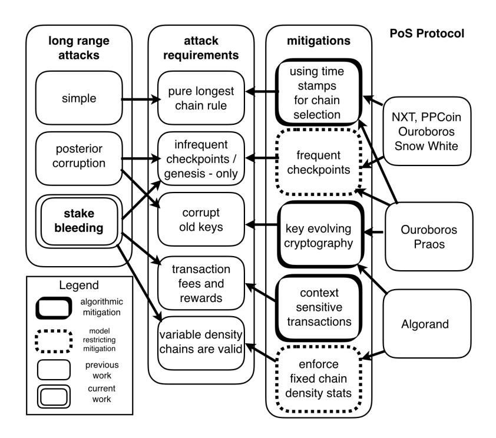

# Stake-Bleeding Attacks on Proof-of-Stake Blockchains

Aggelos Kiayias

Peter Gaziˇ IOHK

Email: peter.gazi@iohk.io University of Edinburgh & IOHK Email: aggelos.kiayias@ed.ac.uk

Alexander Russell University of Connecticut Email: acr@cse.uconn.edu

*Abstract*—We describe a general attack on proof-of-stake (PoS) blockchains without checkpointing. Our attack leverages transaction fees, the ability to treat transactions "out of context," and the standard longest chain rule to completely dominate a blockchain. The attack grows in power with the number of honest transactions and the stake held by the adversary, and can be launched by an adversary controlling any constant fraction of the stake.

With the present statistical profile of blockchain protocols, the attack can be launched given a few years of prior blockchain operation; hence it is within the realm of feasibility for PoS protocols. Most importantly, it demonstrates how closely transaction fees and rewards are coupled with the security properties of PoS protocols. More broadly, our attack must be reflected and countered in any future PoS design that avoids checkpointing, as well as any effort to remove checkpointing from existing protocols. We describe several mechanisms for protecting against the attack that include context-sensitivity of transactions and chain density statistics.

# I. INTRODUCTION

Proof-of-stake (PoS) blockchain protocols were envisioned as a solution to the immense energy demands of miner nodes in proof-of-work (PoW) based blockchain systems. PoS was proposed in discussions in the bitcoin forum[1](#page-0-0) and adopts the principle that the right to produce a new blockchain block should be awarded to a stakeholder with probability proportional to their current stake, as documented by the blockchain itself. Conceivably, such a blockchain discipline could yield desirable ledger properties without consuming significant real-world resources: no substantial energy expenditure would have to be invested to run the protocol. Such protocols would naturally replace the assumption of an honest majority of hashing power with the assumption of an honest majority of stake in the system. While the potential virtues of such PoS protocols are substantial, it was argued early on that the design of such schemes could be particularly challenging (see, e.g., [\[BGM14\]](#page-7-0)) or perhaps even infeasible (see, e.g., [\[Poe14\]](#page-7-1)).

One particularly critical threat in the PoS setting was documented by Buterin [\[But14\]](#page-7-2) who referred to it as the problem of "long-range attacks" (also related to the concept of "costless-simulation" in, e.g., [\[Poe15\]](#page-7-3)). This refers to the ability of a minority set of stakeholders to execute the blockchain protocol starting from the genesis block (or any sufficiently old state) and produce a valid alternative history of the system. Confronted with such alternative history and no other outside

information beyond the genesis block, a freshly joining node would have no ability to reliably distinguish between this alternate history and the actual history. It follows that with such an attack a minority set of stakeholders could doublespend or erase past transactions, violating the fundamental persistence property of the resulting ledger. In the same blog post [\[But14\]](#page-7-2), however, a glimmer of hope was also provided: it was observed that the blockchains produced by such a minority set of stakeholders may have characteristics that could be used to distinguish them from the actual blockchain maintained by the honest majority. In particular, if timestamps are included in each block, it would be the case that a simple simulation of the protocol by a minority set of stakeholders would result in a blockchain that is more sparse in the time domain and, as a result, a longest chain rule at any particular moment would favor the blockchain produced by the honest parties.

A number of PoS protocols were proposed and implemented, e.g., the PPCoin [\[KN12\]](#page-7-4) and NXT cryptocurrencies [\[Com14\]](#page-7-5). Recent efforts have additionally begun to rigorously analyze security in the PoS setting, leading to protocols with formal guarantees such as Algorand [\[Mic16\]](#page-7-6), Ouroboros [\[KRDO17\]](#page-7-7), Snow White [\[BPS16\]](#page-7-8), and Ouroboros Praos [\[DGKR17\]](#page-7-9). For the sake of the upcoming exposition, it will be useful to split these protocols into two classes:[2](#page-0-1)

- 1) Eventual-consensus protocols that apply some form of a longest-chain rule to the blockchain. In this setting the immutability of a block increases gradually with the number of blocks created on top of it.
- 2) Blockwise-BA protocols that achieve the immutability of every single block via a full execution of a Byzantine Agreement (BA) protocol before moving on to production of any subsequent block.

Of the above-listed PoS protocols, Algorand is a blockwise-BA protocol, while all the other protocols aim for eventual consensus. Looking ahead, our investigation proves relevant for the design of eventual-consensus PoS protocols; we mention Algorand here for the sake of comparison.

All of these protocols had to confront the problem of longrange attacks, which was eventually understood to be even more serious than originally thought. The additional complication aptly named "posterior corruption" in [\[BPS16\]](#page-7-8)—observes that simply examining time stamps will not be sufficient for dealing with long-range attacks. In fact, an attacker can attempt to

1See e.g., the post by user QuantumMechanic [https://bitcointalk.org/index.](https://bitcointalk.org/index.php?topic=27787.0) [php?topic=27787.0](https://bitcointalk.org/index.php?topic=27787.0) and the ensuing discussion in 2011.

2Note that we include only PoS protocols for which a a sufficiently detailed whitepaper exists, cf. Fig. [2.](#page-3-0)

corrupt the secret keys corresponding to accounts that possessed substantial stake at some past moment in the history of the system. Assuming that such accounts have small (or even zero) stake at the present time, they are highly susceptible to bribery (or simple carelessness) which would expose their secret keys to an attacker. Armed with such a set of (currently low-stake) keys, the attacker can mount the long-range attack and in this case the density of the resulting blockchain in the time domain could be indistinguishable from the honestly generated public blockchain.

To address the posterior corruption and other long range attacks, a number of mitigating approaches have been employed (sometimes in conjunction) and can be organised into three types:

- (i) Introduce some type of frequent *checkpointing mechanism*, that enables nodes to be introduced to the system by providing them a relatively recent block.
- (ii) Employ *key-evolving cryptography* [Fra06] that calls for users to evolve their secret keys so that past signatures cannot be forged, even when a complete exposure of their current secret state takes place.
- (iii) Enforce *strict chain density statistics*, where the expected number of participating players at any step of the protocol is known; thus alternative protocol execution histories that exhibit significantly smaller participation can be immediately dismissed as adversarial.

Out of the above-mentioned PoS schemes, all eventual-consensus protocols (i.e., NXT, PPCoin, Ouroboros, Snow White, and Ouroboros Praos) employ the first mitigation strategy and assume some form of checkpointing. Ouroboros Praos employs the first and the second approach (key-evolving signatures) to additionally handle adaptive corruptions, while Algorand adopts the second and the third approach (strict chain density statistics) to the same end.

It is worth appreciating the distinction between these methods to address posterior corruption and long range attacks. Checkpointing neutralizes the problem entirely by enabling nodes to ignore alternative chains that are not consistent with the most recent checkpoint known to the node. However, this comes with a significant model restriction: for any type of checkpointing to work, nodes must either be frequently online (so they adopt a recent checkpoint block they have received from the network as active participants) or receive reliable (trusted) information when (re)introduced to the system after a long period of being offline (or when they first join). This amounts to an additional trust assumption necessary for secure operation of the system, and as such is clearly undesirable in a decentralized, permissionless setting. Similarly, enforcing strict chain density statistics requires reliably estimating the number of participants at any stage of the protocol and is also model-restricting: the protocol will not be able to operate in an environment permitting an arbitrary number of parties to be invoked for execution. On the other hand, key evolving cryptography is a more algorithmic mitigation that comes with a minimal requirement on the model: nodes should merely have the ability to erase private state. Algorithmic mitigations seem clearly preferable to model-restricting ones whenever available.

It is important to observe that key-evolving cryptography, the only algorithmic mitigation listed above, focuses specifically

on the issue of posterior corruption; in particular, it is unclear if key evolution can thwart all possible long-range attacks. Thus, our work is motivated by the following question:

Is key-evolving cryptography sufficient to prevent all possible long-range attacks, and in this way achieve PoS that does not need to rely on any modelrestricting mitigations?

#### A. Our Results

We answer the above question in the negative by introducing a new class of long-range attacks against eventual-consensus PoS protocols, called *stake-bleeding* attacks. Stake-bleeding is an effective strategy for mounting a long-range attack that *does not rely on posterior corruption*; thus it cannot be prevented by key-evolving cryptographic techniques. The only requirement for the attack is that the underlying blockchain protocol allows transaction fees to be used as rewards for running the protocol, a standard feature in blockchain protocols to incentivize participation in ledger maintenance.

The idea of the attack is as follows: an attacking stakeholder minority coalition launches a long-range attack that at the same time includes all transactions that have been posted in the honestly maintained public blockchain. Given that the fees from the transactions will be used to reward the ones that produce the blocks in some way, a large number of the transaction fees in the private attacker blockchain will be collected by the malicious coalition (fees originating from accounts that do not exist in the private chain would have to be forfeited). Assuming the blockchain system has run for a substantial period of time, it is conceivable that the accrued transaction fees will turn the attacking minority coalition into a majority that will be able to advance the private blockchain at a speed faster than the honestly maintained public blockchain. Due to the costless simulation nature of the long-range attack it would be possible to mount a stake-bleeding attack from an arbitrary point in the past (assuming checkpointing is either not used or extends sufficiently back into the past) and thus the attacking coalition could rewrite the history of transactions.

We prove that the theoretical bound that the attacker would have to go back in the history of the PoS system to launch the attack is  $\approx (2-4\alpha_{\mathcal{A}})/f$  where  $\alpha_{\mathcal{A}}$  denotes the relative stake of the minority coalition and f is the relative fees that are made available per unit of time.

Using the Bitcoin blockchain as a basis for a feasibility evaluation, on November 3th, 2017 the 1-day average of transaction fees per block was 2.28BTC. The BTC in circulation on this same day are about 16.66 million, giving a relative fee rate of  $1.36 \cdot 10^{-7}$ . It follows that, at the current rate, a hypothetical PoS blockchain with the same fee–currency profile as bitcoin would be of theoretical interest only. Nevertheless, with a 20-fold increase in total transaction fees per unit of

&lt;sup>3Note that this is just for the sake of example as the Bitcoin blockchain is immune to long-range attacks. The point to consider is a hypothetical PoS-based blockchain that has the same statistical characteristics as the Bitcoin blockchain.

&lt;sup>4https://www.smartbit.com.au/charts/transaction-fees-per-block

&lt;sup>5https://blockchain.info/charts/total-bitcoins

| Attacker Relative Stake | Years of Operation |
|-------------------------|--------------------|
| 0.1                     | 11.11              |
| 0.2                     | 8.33               |
| 0.3                     | 5.55               |
| 0.4                     | 2.77               |

Fig. 1: Years of blockchain history needed to launch a stake-bleeding attack assuming a minimum relative transaction fee volume of  $2.73 \cdot 10^{-7}$  per minute (a 20-fold increase based on recent (3rd of November 2017) values drawn from the Bitcoin blockchain) in a hypothetical PoS blockchain.

time6 a stake bleeding attack would be feasible, requiring less than 6 years worth of history for a 30% attacker, cf. Figure 1. In particular, this indicates that stake-bleeding attacks must be a design consideration in the general threat model for long-lived PoS blockchain systems.

We then consider possible mitigation strategies for stake bleeding attacks. First, one can observe that stake bleeding attacks would result in a private blockchain that initially exhibits a sparse block density in the time-domain that gradually increases. This may be atypical for honestly maintained blockchains and could be used as part of the chain selection rule. Nevertheless, a different mitigation that is much simpler to implement is to introduce context in each transaction: a context-sensitive transaction is a transaction that includes the hash of the blockchain at some recent prior point. It is easy to see that such transactions cannot be transferred to an alternative blockchain that is privately maintained by a malicious set of stakeholders. We note that this mitigation has been considered before for a different purpose; see [Lar13] where it was employed to prevent an attacker to transfer "coinage-destroyed" to a secretly maintained blockchain.

To conclude we illustrate a systematized presentation of long-range attacks, their requirements and the way they can be mitigated in Figure 2. We observe that stake bleeding attacks would adversely affect all currently proposed eventual-consensus PoS protocols if the checkpointing mechanism was removed. Therefore, it has to be taken into account in any future effort to remove the undesirable checkpointing mechanism from these protocols, as well as when designing new eventual-consensus PoS protocols that do not rely on checkpointing. Introducing context-sensitivity in transactions is a simple "algorithmic" mitigation mechanism that can thus be added to the design arsenal of PoS blockchain protocols in order to relax model assumptions such as negligible transaction fees or frequent checkpointing.

#### II. PRELIMINARIES

# A. The Computational Model

The stake-bleeding attack can be launched even in a generous computational model that affords many advantages

to the blockchain protocol:

- The adversary requires no control over message delivery: the attack can be launched in a fully synchronous communication and computation environment, with all messages—including those generated by the adversary—delivered by reliable broadcast.
- The adversary requires no dynamic corruptions: the attack can be launched by a fixed collection of adversarial parties determined at the beginning of the execution.
- The adversary requires no introduction of new parties or deactivation of honest parties: the attack can be launched with a static population of fully participating parties.

Below, we outline a simple, strong computational model reflecting the features mentioned above. The model is obtained by suitably strengthening the framework from [KRDO17], and is sufficient to support our attack. We emphasize that adopting such a strong model only broadens the applicability and strength of the attack, which can be launched in typical blockchain models that provide the adversary significantly more power [GKL15], [PSS17], [BPS16], [DGKR17].

a) Time, slots, and synchrony: We consider a setting where time is unambiguously divided into discrete units called slots; participating parties are equipped with synchronized clocks that indicate the current slot. The model additionally permits reliable, synchronous broadcast: each party may broadcast, at the beginning of each time slot, a message which is then reliably delivered to all other parties by the end of the slot.

b) Adversarial corruption: The model involves a fixed collection of participating parties  $\mathcal{U}$ . An adversary  $\mathcal{A}$  in our model is associated with a fixed subset of adversarial parties. We overload the symbol  $\mathcal{A}$  to denote the subset of adversarial parties; the set of honest parties is denoted  $\mathcal{H}$ . Honest parties are active at all times, receiving all messages sent by the other parties, and follow the protocol under consideration. The adversary is activated in each slot, and may arbitrarily direct the behavior of adversarial parties. Note that messages sent by adversarial parties are subject to the broadcast constraint—they are synchronously delivered to all honest parties.

c) The INIT functionality; initial stake and transactions; the environment: The model is associated with an (idealized) initialization functionality INIT. The INIT functionality is parameterized by an initial stake distribution. This is an assignment of nonnegative numbers to the players which we write as  $\mathbb{S}_0 = \big((U_1,s_1),\ldots,(U_n,s_n)\big)$ . The functionality  $\text{INIT}^{\mathbb{S}_0}$  operates as follows:

- Prior to any computation of the parties, the functionality determines, for each party  $U \in \mathcal{U}$ , a pair of public and private keys  $(\mathsf{pk}_U, \mathsf{sk}_U)$ .
- During the protocol, the functionality responds to a message from the user U of the form key with  $sk_U$ , the secret key  $sk_U$  of the user U.
- During the protocol, the functionality responds to any message of the form <code>genesis\_block</code> with the "genesis block"  $B_0$  consisting of the initial stake distribution and the public keys associated with the users.

The model introduces a further entity: the *environment*  $\mathcal{Z}$ . In our setting, the environment is merely responsible for generating

&lt;sup>6Note that this does not necessarily mean that the fee per transaction need to increase; it would be sufficient for the blockchain system to process a larger number of transactions per unit of time. Actually a 20-fold increase (from 1MB to 20MB) was among various proposals that were vigorously debated in the period 2015-16, ultimately leading to a hard fork for the Bitcoin blockchain. For the original rationale behind the 20-fold increase see http://gavintech.blogspot.co.uk/2015/01/twenty-megabytes-testing-results.html.

Fig. 2: Overview of long-range attacks, the associated attack requirements, possible mitigations and our results. The term "pure longest chain rule" refers to a chain selection rule that considers the length of the blockchain as the sole criterion. A mitigation is classified as *algorithmic* if it prevents the attack by hardening the protocol without weakening the model; it is *model-restricting* if it strengthens the model assumptions so as to put the attack outside of the model or to otherwise restrict the execution environment in a significant way that is incongruent with the intended operational setting of decentralised blockchain protocols such as Bitcoin. Note that Algorand is a blockwise-BA protocol, the other depicted protocols are of the eventual-consensus type. We include all PoS protocols for which a sufficiently detailed whitepaper exists (specifically, PPCoin [\[KN12\]](#page-7-4), NXT [\[Com14\]](#page-7-5), Algorand [\[Mic16\]](#page-7-6), Ouroboros [\[KRDO17\]](#page-7-7), Snow White [\[BPS16\]](#page-7-8), and Ouroboros Praos [\[DGKR17\]](#page-7-9)). Others such as Casper and Bitshares are not sufficiently well documented to include in the comparison.∗

∗ Specifically, the description of Casper [\[BG17\]](#page-7-14) merely provides a "finality" layer on top of a non-specified PoS system; regarding Bitshares [\[SL15\]](#page-7-15), the whitepaper for distributed consensus to be found in http://docs.bitshares.org/bitshares/papers/index.html is not available (Checked March 4th, 2018)

*transactions*, which are provided as inputs to the parties. In particular, in each round of the protocol, the environment may provide each party with a collection of *transactions*; these have the form (U, U0 , s) which calls for the transfer of s stake from party U to party U 0 . (For our attack, it suffices to consider an environment as simply a fixed schedule of transactions delivered to the parties. Note that a typical blockchain security model would imbue the environment with significant further powers: an information channel to the adversary, adaptive choice of transactions, scheduling of message deliveries, etc.)

Finally, given an initialization functionality INITS0 and an environment Z, an *execution* of a protocol consists of the genesis block B0, the secret keys of the parties, the sequence of transactions delivered to the players by the environment, and the entire sequence of messages broadcast by the players.

## *B. Blockchains, Ledgers and Proof-of-stake Protocols*

*a) Transaction ledger properties:* A *blockchain* is a data structure which associates with each time slot (at most) one *block*. Individual blocks consist of a collection of *transactions*, in addition to protocol-specific *metadata*. In the context of the model described above, we assume that the genesis block B0 appears as a default initial block in any blockchain, associated with time 0. A chain also immediately induces a stake distribution, SC, given by applying the transactions in the chain to the stake distribution of the genesis block. For a blockchain C, we let Cb` denote the prefix of C obtained by removing the last ` blocks.

Intuitively, a blockchain protocol Π permits a collection of parties to collectively maintain a common ledger. We will focus on protocols that, in fact, maintain an individual ledger for each party (at each point of time); the notion of a *common* ledger is guaranteed by appropriate *persistence* and *liveness* properties of the protocol Π:

Persistence. Once a node of the system proclaims a certain transaction tx as *stable*, the remaining honest nodes, if queried, will either report tx in the same position in the ledger or will not report as stable any transaction in conflict to tx. Here the notion of stability is a predicate that is parameterized by a security parameter k; specifically, a transaction is declared *stable* (by a party with chain C) if and only if it appears in  $C^{\lfloor k}$ .

**Liveness.** If all honest nodes in the system attempt to include a certain transaction, then after the passing of time corresponding to u slots (called the transaction confirmation time), all nodes, if queried and responding honestly, will report the transaction as stable.

Intuitively speaking, a *secure blockchain protocol*  $\Pi$  guarantees that these properties are possessed by the ledgers (recorded in the blockchains) held by the honest parties, under appropriate constraints on the adversary  $\mathcal{A}$ .

- b) Chain selection rules; the longest chain rule: We focus our attention on protocols defined by a chain selection rule: Each step of the protocol calls for certain players to broadcast a blockchain; players then apply a selection rule which may result in replacing their local chain with one of the broadcast chains. We focus on the "longest chain rule": broadcast blockchains are checked for validity—a protocoldependent property—following which the longest valid chain, including the one held by the player, is adopted. (Length is simply the number of blocks; for concreteness, we assume ties are broken lexicographically.)
- c) Proof-of-stake protocols: We focus on ledgers that are maintained via a proof-of-stake protocol  $\Pi$ , which confers the right to extend a chain to a party U with probability proportional to the party's stake in (a prefix of) the chain.

**Stake-proportional growth.** The probability of a party being allowed to extend a given chain  $\mathbf{C}$  (an event denoted as  $\mathsf{ExtendOpportunity}_\Pi$ ) is proportional to the stake under control of this party according to  $\mathbb{S}_{\mathbf{C}^{\lfloor\ell}}$ , the stake distribution induced from  $\mathbf{C}^{\lfloor\ell}$ . Here  $\ell$  is a protocol-specific parameter typically related to the security parameter k discussed above.

We are intentionally vague about the details of the probability space in the description above, as this depends on the details of the underlying proof-of-stake protocol. Additionally, we ignore the issue of "persistence depth" in Theorem 1 below, simply setting  $\ell=0$ . Accounting for this would change the conclusion by an additive  $\ell$  factor.

- d) Relative stake and honest majority: As a matter of notation, for a set of parties  $\mathcal X$  and a stake distribution  $\mathbb S$ , we denote by  $\mathbb S(\mathcal X)$  the stake held by the parties in  $\mathcal X$ . At a particular moment in the execution of a blockchain protocol (often understood from the context), we let  $\alpha_{\mathcal X} \in [0,1]$  denote the relative stake of the parties in  $\mathcal X$ . Specifically, this is the quantity  $\mathbb S_{\mathbf C}(\mathcal X)/\mathbb S_{\mathbf C}(\mathcal U)$  where  $\mathbf C$  is the chain held by the honest users. (Note that due to the broadcast assumption, all honest players hold the same longest valid chain in each slot.) We say that an execution of  $\Pi$  has an honest majority if  $\alpha_{\mathcal A} < 1/2$  at every step of the protocol.
- e) Block rewards and transaction fees: Most blockchain protocols involve some form of block rewards and transaction fees. To be able to make generic statements about all the considered protocols, let us introduce the following notation:
- $$\begin{split} \mathsf{fees}_\Pi(\mathcal{E},i) & \text{ denotes the total fees (as a fraction of total stake)} \\ & \text{ of all new transactions that were created by } \mathcal{Z} & \text{ in the slot} \\ & i & \text{ of execution } \mathcal{E}. \end{split}$$

rewards $_{\Pi}(\mathbf{C},i)$  denotes the total amount of coins that were created by the protocol  $\Pi$  and given to the party creating the block in the blockchain  $\mathbf{C}$  in slot i.

transfers $_{\mathcal{X} \to \mathcal{Y}}(\mathbf{C}, i)$  denotes the total amount transferred from parties in  $\mathcal{X}$  to parties in  $\mathcal{Y}$  on the blockchain  $\mathbf{C}$  in slot i.

#### III. THE STAKE-BLEEDING ATTACK

# A. Attack Description

We first informally describe how our attack operates in the context of a generic proof-of-stake blockchain defined by a protocol  $\Pi$ . To simplify the presentation, we assume throughout that the attacker controls some moderate proportion of stake  $\alpha_{\mathcal{A}} < 1/2$ .

The adversary  $\mathcal A$  simulates the honest protocol  $\Pi$  and maintains a local copy of the current blockchain (denoted  $\mathbf C$ ) as prescribed by this protocol. Additionally, it also maintains an alternative blockchain  $\hat{\mathbf C}$  that is initially empty and is kept hidden from honest parties.

The adversary checks in every time slot whether it is allowed to extend the chain C or  $\hat{C}$  according to the rules of the protocol  $\Pi$ . It skips all opportunities to extend C, hence not contributing to its growth at all. On the other hand, whenever an opportunity to extend  $\hat{C}$  arises,  $\mathcal{A}$  extends  $\hat{C}$  with a new block, and inserts into this new block all the transactions from the honest chain  $\hat{C}$  that are not yet included in  $\hat{C}$  and are valid in the context of  $\hat{C}$  (or as many of them as allowed by the rules of  $\Pi$ ). This entitles  $\mathcal{A}$  to receive (on  $\hat{C}$ ) any block-creation reward and any transaction fees coming from the included transactions.

As the protocol progresses, with overwhelming probability both C and  $\hat{C}$  will be growing, with C growing more quickly. While the relative stake of A on C will possibly be decreasing due to the block-creation rewards granted to block creators in C, its relative stake on the chain C will be growing both due to the block rewards and transaction fees. Under some realistic assumptions on the relative sizes of the transaction fees and block rewards (that are spelled out in Section III-B), the adversarial relative stake in  $\hat{\mathbf{C}}$  will eventually exceed the honest relative stake in C. From this point on, the chain  $\hat{C}$  grows faster (in expectation) than the chain C and eventually becomes longer. If  $\Pi$  uses the plain longest-chain rule that rejects blocks in the future, A can now easily violate the persistence of the ledger by publishing  $\hat{\mathbf{C}}$ , which will be adopted by all honest parties following  $\Pi$ . Moreover, if A adds a transaction to the end of  $\hat{C}$  just before publishing it in which it transfers enough stake to honest parties to no longer control the majority, it will not violate the "honest majority" assumption as described in Section II-B.

A more concise description of the adversary that executes our attack is given in Figure 3. The description uses a generic ExtendOpportunity  $_{\Pi}(\mathbf{C})$  predicate that is true whenever  $\mathcal{A}$  is allowed to extend a given chain  $\mathbf{C}$  according to the rules of  $\Pi$ . Additionally, length( $\mathbf{C}$ ) denotes the length of the chain  $\mathbf{C}$  from the perspective of the adversary.

#### B. Attack Analysis

The proof-of-stake protocol  $\Pi$  has to satisfy several properties in order to be susceptible to the attack described in

# Adversary $\mathcal{A}$

The adversary  $\mathcal A$  maintains its view of the public chain  $\mathbf C$  according to  $\Pi$  and its own, private chain  $\hat{\mathbf C}$ ; both initially empty.  $\mathcal A$  follows  $\Pi$  with the following exceptions:

- Upon ExtendOpportunity $_{\Pi}(\mathbf{C})$ : Do nothing.
- Upon ExtendOpportunity $_{\Pi}(\hat{\mathbf{C}})$ : Extend  $\hat{\mathbf{C}}$  with a new block containing all transactions from  $\mathbf{C}$  that are not yet in  $\hat{\mathbf{C}}$  and do not compromise the validity of  $\hat{\mathbf{C}}$  according to  $\Pi$ . Keep  $\hat{\mathbf{C}}$  private.
- Upon length( $\hat{\mathbf{C}}$ ) > length( $\mathbf{C}$ ): Transfer stake majority in  $\hat{\mathbf{C}}$  to  $\mathcal{H}$ . Publish  $\hat{\mathbf{C}}$  according to  $\Pi$ .

Fig. 3: Adversary  ${\cal A}$  against an eventual-consensus proof-of-stake protocol  $\Pi.$ 

Section III-A. The main requirements are:

- (i) No frequent checkpoints. The protocol  $\Pi$  must operate according to the longest-chain rule: out of all valid chains seen by the honest parties,  $\Pi$  prescribes them to adopt the longest one.
  - While some deviations from this requirement are possible,  $\Pi$  must necessarily allow reorganizations long into the past: if a maximum depth of a reorganization is specified and small (i.e., an honest party is not allowed by  $\Pi$  to change its view of the main chain more than several blocks (or slots) into the past even if there was an otherwise-preferable candidate chain), then the attack is not applicable.
- (ii) Transaction fees. The protocol Π has to involve transaction fees, or more broadly, any transfers of coins from transacting parties to the parties maintaining the ledger. In greater detail, the attack only succeeds if Ĉ eventually grows faster than C. Since the growth speed of C (resp. Ĉ) is proportional to the relative stake of honest parties in C (resp. of the adversary in Ĉ), we need that the latter eventually exceeds the former.

Observe that the relative stake of the adversary in  $\hat{\mathbf{C}}$  is increased in every slot i when it creates a block by:

- the reward for this block rewards $\Pi$ ( $\hat{\mathbf{C}}$ , i);
- all transfers from honest to adversarial parties transfers $_{\mathcal{H} \to \mathcal{A}}(\hat{\mathbf{C}}, i)$ ;
- all the fees

$$\sum_{j=i'+1}^i \mathsf{fees}_\Pi(\mathcal{E},j)$$

for all slots  $j \leq i$  that followed after the slot i' containing the previous block in  $\hat{\mathbf{C}}$ .

On the other hand, the relative stake of the honest parties in  $\mathbf{C}$  is increased in every slot when a block is created in  $\mathbf{C}$  by rewards $_{\Pi}(\mathbf{C},i)$  (not by any fees $_{\Pi}$ , as all fees in  $\mathbf{C}$  are paid by honest parties); and decreased by transfers $_{\mathcal{H} \to \mathcal{A}}(\mathbf{C},i)$ . We assume

$$\mathrm{transfers}_{\mathcal{A}\to\mathcal{H}}(\mathbf{C},i) = \mathrm{transfers}_{\mathcal{A}\to\mathcal{H}}(\hat{\mathbf{C}},i) = 0\;.$$

(iii) Context-oblivious transactions. The valid transactions produced according to  $\Pi$  need to be oblivious to the

- context in which they are to be used within the blockchain:  $\Pi$  must allow  $\mathcal A$  to take transactions from  $\mathbf C$  and use them in the different context of  $\hat{\mathbf C}$ .
- (iv) Validity of low-growth chains. The protocol  $\Pi$  has to support "sleepy majority" to make sure that the chain  $\hat{C}$ , which is being extended only by a minority of stakeholders (and hence exhibits small chain growth at its beginning), is still considered valid according to the rules of  $\Pi$ .

In the following theorem, we give an estimate of the number of slots that are needed to perform our attack, as a function of the initial adversarial stake  $\alpha_{\mathcal{A}}$  and the amount of fees that are created in transactions in each slot. For the sake of simplicity, we analyze the case  $1/3 < \alpha_{\mathcal{A}} < 1/2$  even though the attack works for any constant  $\alpha_{\mathcal{A}} > 0$  (see the remarks at the end of the section for the explicit bound).

**Theorem 1.** Let  $\Pi$  be a proof-of-stake blockchain protocol with stake-proportional growth satisfying the conditions (i)-(iv) above. Consider an execution of the protocol  $\Pi$  with the adversary  $\mathcal{A}$  given in Figure 3. Assume that

$$\begin{aligned} \mathsf{transfers}_{\mathcal{H} \to \mathcal{A}}(\mathbf{C}, i) &= 0 \,, \\ \mathsf{rewards}_{\Pi}(\mathbf{C}', i) &= 0 \,, \quad \textit{and} \\ \mathsf{fees}_{\Pi}(\mathcal{E}, i) &\geq f \end{aligned}$$

are satisfied in execution  $\mathcal{E}$  for both  $\mathbf{C}' \in \{\mathbf{C}, \hat{\mathbf{C}}\}$  and all i > 0. Let  $1/3 < \alpha_{\mathcal{A}} < 1/2$  denote the initial relative stake of the adversary  $\mathcal{A}$ . Let T denote the slot in which  $\operatorname{length}(\hat{\mathbf{C}}) > \operatorname{length}(\mathbf{C})$  occurs. Then we have

$$\mathbb{E}[T] \le \frac{3 - 6\alpha_{\mathcal{A}}}{f}$$

and T will be tightly concentrated around its expectation.

*Proof:* Let  $\alpha_{\mathcal{P}}^{\mathbf{C}'}[i]$  for  $\mathcal{P} \in \{\mathcal{A},\mathcal{H}\}$ ,  $\mathbf{C}' \in \{\mathbf{C},\hat{\mathbf{C}}\}$  and i>0 denote the relative stake of the set of players  $\mathcal{P}$  in chain  $\mathbf{C}'$  in slot i (recall that  $\mathcal{A}$  and  $\mathcal{H}$  denote the adversary and the honest parties, respectively). Additionally, let length $_i(\mathbf{C}')$  denote the length of the chain  $\mathbf{C}'$  in slot i from the perspective of the adversary. Then the inequality  $\mathbb{E}[\operatorname{length}_T(\hat{\mathbf{C}})] > \mathbb{E}[\operatorname{length}_T(\mathbf{C})]$  translates (due to the stake-proportional growth assumption) to

$$\sum_{i=1}^{T} \alpha_{\mathcal{A}}^{\hat{\mathbf{C}}}[i] > \sum_{i=1}^{T} \alpha_{\mathcal{H}}^{\mathbf{C}}[i] . \tag{1}$$

Since  $\operatorname{rewards}_{\Pi}(\mathbf{C}',i)=0$  and the fees in  $\mathbf{C}$  are all paid (and received) by honest parties, we have  $\alpha_{\mathcal{H}}:=\alpha_{\mathcal{H}}^{\mathbf{C}}[i]=1-\alpha_{\mathcal{A}}$  for all i>0 and hence

$$\sum_{i=1}^{T} \alpha_{\mathcal{H}}^{\mathbf{C}}[i] = T(1 - \alpha_{\mathcal{A}}) .$$

To lower-bound the sum on the left-hand side of (1), define  $T_1$  (respectively  $T_2$ ) to be the minimum slot that satisfies  $\alpha_{\mathcal{A}}^{\hat{\mathbf{C}}}[T_1] \geq \alpha_{\mathcal{H}}$  (respectively  $\alpha_{\mathcal{A}}^{\hat{\mathbf{C}}}[T_2] \geq 2\alpha_{\mathcal{H}} - \alpha_{\mathcal{A}}$ ). Since the relative stake  $\alpha_{\mathcal{A}}^{\hat{\mathbf{C}}}$  grows by at least f per slot7 (as  $\mathcal{A}$  includes all

&lt;sup>7We commit a slight imprecision here by neglecting that the actual stake only grows after the transactions are included in a block, however this has no noticeable impact on our argument.

transactions from C into  $\hat{\mathbf{C}}$ ), we get  $\alpha_{\mathcal{A}} + (T_1 - 1)f \leq 1 - \alpha_{\mathcal{A}}$  (and similarly for  $T_2$ ), which gives us

$$T_1 \le \frac{1 - 2\alpha_{\mathcal{A}}}{f} + 1$$
 and  $T_2 \le \frac{2 - 4\alpha_{\mathcal{A}}}{f} + 1$ . (2)

Note now that  $\alpha_A^{\hat{\mathbf{C}}}[i]$  can be lower-bounded by

$$\alpha_{\mathcal{A}}^{\hat{\mathbf{C}}}[i] \leq \begin{cases} \alpha_{\mathcal{A}} & \text{for } i < T_1 \ , \\ 1 - \alpha_{\mathcal{A}} & \text{for } T_1 \leq i < T_2 \ , \\ 2 - 3\alpha_{\mathcal{A}} & \text{for } i > T_2 \ . \end{cases}$$

Therefore, (1) will be satisfied for any T that satisfies

$$\alpha_{\mathcal{A}}(T_1 - 1) + (1 - \alpha_{\mathcal{A}})(T_2 - T_1) + (2 - 3\alpha_{\mathcal{A}})(T - T_2 + 1) > (1 - \alpha_{\mathcal{A}})T.$$
 (3)

Using (2) and solving for T gives us the desired bound.

The concentration follows from the fact that the length of both  $\mathbf{C}$  and  $\hat{\mathbf{C}}$  at some slot i are determined by a sum of independent random variables for each slot  $1 \leq j \leq i$ .

We note that we weakened the statement of Theorem 1 in several ways in order to simplify the presentation of its proof.

First, we focus on  $1/3 < \alpha_{\mathcal{A}} < 1/2$  as otherwise the event defining  $T_2$  would never occur. Nonetheless, it is easy to see that while our attack benefits from higher (sub-50%) initial adversarial stake, it can be performed also with  $\alpha_{\mathcal{A}} < 1/3$  with a slightly modified analysis.

Second, Theorem 1 assumes zero block rewards and transfers from  $\mathcal{H}$  to  $\mathcal{A}$ . However, recall that  $\operatorname{transfers}_{\mathcal{H} \to \mathcal{A}}(\mathbf{C},i)$  are completely controlled by the environment, subject only to the restrictions described in Section II-A. (This is to capture that the security of the blockchain protocol does not rely on any particular assumption regarding the transactions that are to be stored in the ledger; rather it must operate securely for any such sequence of transactions.) Hence, for any rewards $\Pi(\mathbf{C},i)$ , a situation where the same analysis applies can be simply achieved by setting  $\operatorname{transfers}_{\mathcal{H} \to \mathcal{A}}(\mathbf{C},i)$  so that the honest stake ratio in  $\mathbf{C}$  remains constant (as the adversarial stake ratio in  $\hat{\mathbf{C}}$  will keep increasing). On the other hand, non-zero rewards $\Pi(\hat{\mathbf{C}},i)$  only make the attack succeed faster.

Finally, observe that we are quite pessimistic in the analysis, lower-bounding the values  $\alpha_{\mathcal{A}}^{\hat{\mathbf{C}}}[i]$  as if they were not changing except in the slots  $T_1$  and  $T_2$ . By a more careful accounting one can obtain a better bound  $T \approx (2 - 4\alpha_{\mathcal{A}})/f$ .

## C. Implications for Existing PoS Protocols

We now summarize to what extent are the preconditions described in Section III-B satisfied by various PoS protocols, both those coming from academic literature and real-world deployments, implying that stake-bleeding would be a consideration for them. We focus primarily on eventual consensus protocols, nevertheless we make a note on the applicability of our attack concept to the blockwise-BA setting.8 All of the eventual consensus protocols employ some form of checkpointing, presumably to prevent posterior corruption attacks; this

general countermeasure prevents the stake bleeding attack (and any other long-range attack) as well in a trivial (and model-restricting) manner. Interestingly, if we remove checkpointing, all of the considered eventual consensus constructions would be susceptible to our attack, as they all satisfy the conditions (ii)-(iv) from Section III-B: they admit transaction fees, their transactions are context-oblivious, and low-growth chains are considered valid. In more detail we have the following.

**NXT and PPCoin.** The NXT protocol only allows to reorganize the last 720 blocks, hence forming a so-called *moving checkpoint* and violating condition (i) from Section III-B. A similar checkpointing mechanism is employed in PPCoin [KN12].

**Snow White.** The Snow White protocol [BPS16] also uses moving checkpoints to prevent the posterior corruption attack, and would also be susceptible to the stake bleeding attack without it.

**Ouroboros** [KRDO17] uses moving checkpoints as a part of its maxvalid chain-selection rule, neutralizing longrange attacks. Without checkpointing, Ouroboros would be susceptible to both posterior-corruption and stake-bleeding attacks, as it does not employ key-evolving cryptography.

Ouroboros Praos [DGKR17] uses the same maxvalid chainselection rule as Ouroboros, imposing moving checkpoints. Without this countermeasure, Ouroboros Praos would still neutralize posterior corruption attacks thanks to its use of key-evolving signatures for signing blocks; however, it would be susceptible to our stake bleeding attack.

Algorand [Mic16], as already discussed, is not an eventual-consensus protocol, but rather follows the blockwise-BA approach. Nonetheless, one can consider the applicability of the core idea of the stake bleeding attack to Algorand, aiming for creating an alternative sequence of blocks and exploiting stake bleeding to gain temporary majority of stake there. However, in the case of Algorand this attack is prevented by requiring a sufficient fraction of stakeholders to certify the outcome of each BA, which can be seen as violating the requirement (iv) in Section III-B. In fact, Algorand enforces a strict participation rule and hence it can always find the correct protocol execution, in a model-restricting fashion.

As already indicated, the above results imply that any attempt to remove model-restricting assumptions from these protocols needs to put into play, at minimum, some countermeasure against the stake bleeding attack. We discuss these in the final section.

## IV. MITIGATIONS

A natural way to remedy our attack is to modify the protocol II to violate at least one of the requirements given in Section III-B. Doing this for requirements (i) or (ii) would lead to the trust assumption of a checkpointing service or to another model-restricting limitation bounding the transaction fees throughout the protocol execution to insignificant amounts. We hence rather focus on two alternative, algorithmic mitigations, aiming to violate the requirements (iii) and (iv).

a) Minimum Chain Density in the Time-Domain: A first observation that can be used to mitigate a stake bleeding attack is that a blockchain that is produced by the attack

&lt;sup>8Note that we include only PoS protocols for which a a sufficiently detailed whitepaper exists, cf. Fig.2.

of Section [III-A](#page-4-1) has a period over which the *density* of the blockchain is rather sparse. We clarify the concept of density next: in all PoS protocols, it is allowed that some of the parties may not be online all the time (despite the fact that they are elected to participate in the protocol). The absence of their participation is something that can be detected by observing the blockchain. For instance, in the case of Ouroboros [\[KRDO17\]](#page-7-7), there will be a number of "slots" that are left empty without a corresponding block; analogous observable quantities exist in the other protocols as well. This allows the protocol to detect and weed out blockchains with this deficiency that distinguishes them from the correct blockchain produced by honest parties. We do not pursue this direction further here.

*b) Context Sensitive Transactions:* A fundamental feature of a stake bleeding attack is taking a transaction "out of context" so to speak, i.e., copying it from the honestly maintained blockchain to the private blockchain maintained by the attacker. A very simple and effective way to prevent this from happening is to include "context", i.e., the hash of a recent block, into each transaction. This idea has been discussed in the PoS setting at least as early as Larimer's work in [\[Lar13\]](#page-7-11) (see also [\[Lar18\]](#page-7-16)) who introduced it to ensure that an attacker's secret chain cannot take advantage of honest parties' transactions to increase the total "coin-age" value of the secret-chain they maintain (as "coin-age-destroyed" was a suggested mechanism for PoS that was proposed there). Here we use it for a different objective: to prevent transaction fees to "bleed" to the malicious parties over a period of time in a private chain. Using context sensitivity, the validity of a transaction would require the presence of that hash in the blockchain. This would only allow adversarially generated transactions to be transferable to the private blockchain, hence completely neutralizing the attack (as there would be no "bleeding" of honest stake anymore in the private blockchain). We remark that a seemingly similar mitigation has been proposed in [\[BPS16\]](#page-7-8), Section 2.2.2, to resolve a different issue where an attacker attempts to fork the blockchain in order to collect transaction fees that have been issued in the last few blocks produced by the honest participants. The mitigation suggested requires the transaction to include a recent block *index* and is insufficient to protect against stake-bleeding. In contrast, context-sensitivity as defined in this section requires the transaction to include the hash of a recent block.

# V. CONCLUSIONS

We have presented a new class of long-range attacks, called stake-bleeding attacks, that are applicable to all investigated eventual-consensus PoS protocols when operated without any model-restricting assumptions. A stake-bleeding attack would require years of blockchain history to be successful given the current statistical profile of cryptocurrencies and hence they are not of immediate concern. Nevertheless, they point to an important design consideration from the cryptographic perspective. They show how it is possible to mount a longrange attack without relying on posterior corruptions, in fact without exploiting adaptivity of corruptions whatsoever. From this it is also easily inferred that key-evolving cryptography by itself is not a sufficient mitigation for long-range attacks and it is important to investigate additional algorithmic mitigations that thwart long rage attacks in trustless, permissionless

environments without the resorting to checkpointing or other model-restricting assumptions.

## ACKNOWLEDGMENT.

Aggelos Kiayias was partly supported by Horizon 2020 research and innovation programme, project PRIVILEDGE, under grant agreement No 780477. Alexander Russell was partly supported by the National Science Foundation under Grant No. 1717432.

# REFERENCES

- [BG17] Vitalik Buterin and Virgil Griffith. Casper the friendly finality gadget. *CoRR*, abs/1710.09437, 2017.
- [BGM14] Iddo Bentov, Ariel Gabizon, and Alex Mizrahi. Cryptocurrencies without proof of work. *CoRR*, abs/1406.5694, 2014.
- [BPS16] Iddo Bentov, Rafael Pass, and Elaine Shi. Snow white: Provably secure proofs of stake. Cryptology ePrint Archive, Report 2016/919, 2016. [http://eprint.iacr.org/2016/919.](http://eprint.iacr.org/2016/919)
- [But14] Vitalik Buterin. Long-range attacks: The serious problem with adaptive proof of work. [https://blog.ethereum.org/2014/05/15/](https://blog.ethereum.org/2014/05/15/long-range-attacks-the-serious-problem-with-adaptive-proof-of-work/) [long-range-attacks-the-serious-problem-with-adaptive-proof-of-work/,](https://blog.ethereum.org/2014/05/15/long-range-attacks-the-serious-problem-with-adaptive-proof-of-work/) 2014.
- [Com14] The NXT Community. NXT whitepaper. [https://bravenewcoin.](https://bravenewcoin.com/assets/Whitepapers/NxtWhitepaper-v122-rev4.pdf) [com/assets/Whitepapers/NxtWhitepaper-v122-rev4.pdf,](https://bravenewcoin.com/assets/Whitepapers/NxtWhitepaper-v122-rev4.pdf) July 2014.
- [DGKR17] Bernardo David, Peter Gazi, Aggelos Kiayias, and Alexander Rus- ˇ sell. Ouroboros praos: An adaptively-secure, semi-synchronous proof-of-stake protocol. Cryptology ePrint Archive, Report 2017/573, 2017. [http://eprint.iacr.org/2017/573.](http://eprint.iacr.org/2017/573) To appear at EUROCRYPT 2018.
- [Fra06] Matt Franklin. A survey of key evolving cryptosystems. *Int. J. Security and Networks*, 1(1/2), 2006.
- [GKL15] Juan A. Garay, Aggelos Kiayias, and Nikos Leonardos. The bitcoin backbone protocol: Analysis and applications. In Elisabeth Oswald and Marc Fischlin, editors, *EUROCRYPT 2015, Part II*, volume 9057 of *LNCS*, pages 281–310. Springer, Heidelberg, April 2015. Updated version at [http://eprint.iacr.org/2014/765.](http://eprint.iacr.org/2014/765)
- [KN12] Sunny King and Scott Nadal. Ppcoin: Peerto-peer crypto-currency with proof-of-stake. https://peercoin.net/assets/paper/peercoin-paper.pdf, August 2012.
- [KRDO17] Aggelos Kiayias, Alexander Russell, Bernardo David, and Roman Oliynykov. Ouroboros: A provably secure proof-of-stake blockchain protocol. In Jonathan Katz and Hovav Shacham, editors, *CRYPTO 2017, Part I*, volume 10401 of *LNCS*, pages 357–388. Springer, Heidelberg, August 2017.
- [Lar13] Dan Larimer. Transactions as proof-of-stake. [https://bravenewcoin.](https://bravenewcoin.com/assets/Uploads/TransactionsAsProofOfStake10.pdf) [com/assets/Uploads/TransactionsAsProofOfStake10.pdf,](https://bravenewcoin.com/assets/Uploads/TransactionsAsProofOfStake10.pdf) November 2013.
- [Lar18] Dan Larimer. Delegated proof-of-stake consensus. [https://](https://bitshares.org/technology/delegated-proof-of-stake-consensus/) [bitshares.org/technology/delegated-proof-of-stake-consensus/,](https://bitshares.org/technology/delegated-proof-of-stake-consensus/) accessed 21.3.2018, 2018.
- [Mic16] Silvio Micali. ALGORAND: The efficient and democratic ledger. *CoRR*, abs/1607.01341, 2016.
- [Poe14] Andrew Poelstra. Distributed consensus from proof of stake is impossible. https://download.wpsoftware.net/bitcoin/old-pos.pdf, May 2014.
- [Poe15] Andrew Poelstra. On stake and consensus. https://download.wpsoftware.net/bitcoin/pos.pdf, March 2015.
- [PSS17] Rafael Pass, Lior Seeman, and Abhi Shelat. Analysis of the blockchain protocol in asynchronous networks. In Jean-Sebastien ´ Coron and Jesper Buus Nielsen, editors, *EUROCRYPT 2017, Part II*, volume 10211 of *LNCS*, pages 643–673. Springer, Heidelberg, May 2017.
- [SL15] Fabian Schuh and Daniel Larimer. Bitshares 2.0: General overview. [https://bravenewcoin.com/assets/Whitepapers/](https://bravenewcoin.com/assets/Whitepapers/bitshares-general.pdf) [bitshares-general.pdf,](https://bravenewcoin.com/assets/Whitepapers/bitshares-general.pdf) December 2015.