# **MDS Matrices with Lightweight Circuits**

Sébastien Duval and Gaëtan Leurent

Inria, France [{sebastien.duval,gaetan.leurent}@inria.fr](mailto:sebastien.duval@inria.fr,gaetan.leurent@inria.fr)

**Abstract.** MDS matrices are an important element for the design of block ciphers such as the AES. In recent years, there has been a lot of work on the construction of MDS matrices with a low implementation cost, in the context of lightweight cryptography. Most of the previous efforts focused on local optimization, constructing MDS matrices with coefficients that can be efficiently computed. In particular, this led to a matrix with a direct xor count of only 106, while a direct implementation of the MixColumn matrix of the AES requires 152 bitwise xors.

More recently, techniques based on global optimization have been introduced, were the implementation can reuse some intermediate variables. In particular, Kranz *et al.* used optimization tools to a find good implementation from the description of an MDS matrix. They have lowered the cost of implementing the MixColumn matrix to 97 bitwise xors, and proposed a new matrix with only 72 bitwise xors, the lowest cost known so far.

In this work we propose a different approach to global optimization. Instead of looking for an optimized circuit of a given matrix, we run a search through a space of circuits, to find optimal circuits yielding MDS matrices. This results in MDS matrices with an even lower cost, with only 67 bitwise xors.

**Keywords:** MDS matrix · lightweight cryptography

# **1 Introduction**

Since the 1990s, Substitution-Permutation Networks have been a prominent structure to build symmetric-key ciphers. These networks have been thoroughly studied and extensively instantiated, as in the current standard AES (Advanced Encryption Standard) [\[DR02\]](#page-21-0). SPNs are made of three main components: a key schedule, a small (typically 4- or 8-bit) non-linear function called S-Box, and a large (typically 128-bit) linear function called the diffusion matrix. The role of the S-Box is to mix the bits inside 4- or 8-bit words and the role of the diffusion matrix is to mix words.

The security of SPN ciphers against classical attacks (differential and linear in particular) can be reduced to criteria on its components, following the wide trail design strategy [\[DR01\]](#page-21-1). The S-Box needs to have a small differential uniformity and a large non-linearity; optimal S-Boxes are called APN (Almost Perfect Nonlinear). The diffusion matrix needs to create dependency between input and output words, with a high branch number; optimal diffusion matrices are called MDS (because they are related to a Maximum Distance Separable code). MDS matrices are not only widely used in SPN ciphers but also in Feistel ciphers (Camellia [\[AIK](#page-20-0)<sup>+</sup>01], Twofish [\[SKW](#page-22-0)<sup>+</sup>99]), in hash functions (Whirlpool [\[RB01\]](#page-22-1), Grøstl[\[GKM](#page-21-2)<sup>+</sup>]) and even in stream ciphers (MUGI [\[WFY](#page-23-0)<sup>+</sup>02]).

Over the last decade, the urge for increasingly smaller electronic devices manipulating private data has triggered the exploration of novel cryptographic primitives with low implementation costs. Indeed, despite the standardization of resilient primitives, such as the AES [\[DR02\]](#page-21-0), constrained environments require some lighter crypytographic primitives. In particular, a natural means of lowering the cost of the SPN structure is to lower the

cost of its main components: the S-Box and the diffusion matrix. Considerable effort has been dedicated to finding such light components, for S-Boxes in [\[UDI](#page-23-1)<sup>+</sup>11, [LW14,](#page-22-2) [CDL16\]](#page-21-3) and for diffusion matrices in [\[SDMS12,](#page-22-3) [WWW13,](#page-23-2) [AF13,](#page-20-1) [SKOP15,](#page-22-4) [BKL16,](#page-20-2) [LS16,](#page-22-5) [LW16,](#page-22-6) [SS16\]](#page-23-3). Such improvements of the building blocks allowed for some new cipher proposals (such as Noekeon [\[DPVAR00\]](#page-21-4), Present [\[BKL](#page-20-3)<sup>+</sup>07], HIGHT [\[HSH](#page-21-5)<sup>+</sup>06], KATAN [\[CDK09\]](#page-21-6), LED [\[GPPR11\]](#page-21-7), LBlock [\[WZ11\]](#page-23-4), Twine [\[SMMK13\]](#page-22-7), Prince [\[BCG](#page-20-4)<sup>+</sup>12], Fantomas [\[GLSV15\]](#page-21-8), Skinny [\[BJK](#page-20-5)<sup>+</sup>16] and many others), which are candidates to achieve security in constrained environments.

In this article, we consider the problem of building lightweight linear layers for SPN ciphers. More precisely we look for new MDS matrices allowing a very efficient implementation; these matrices can be used in future cipher designs to reduce the implementation cost. We focus on hardware implementation, and assume that the full MDS matrix will be implemented so that it can be computed in a single cycle.

**Our contributions.** While there has been a number of works on the topic already [\[SKOP15,](#page-22-4) [BKL16,](#page-20-2) [LS16,](#page-22-5) [LW16,](#page-22-6) [SS16\]](#page-23-3), most of them focus on the coefficients of the matrix, looking for MDS matrices with many coefficients that are easy to evaluate (such as 1 or 2). The underlying assumption is that, for each line of the matrix, a circuit will evaluate all the coefficients and add them together, resulting in a minimal cost of *k*×(*k*−1) XORs on words for a *k* × *k* matrix.

This assumption was recently challenged by Kranz *et al.* [\[KLSW17\]](#page-22-8). They applied off-the-shelf optimization tools to classes of previously proposed MDS matrices, and the global optimization performed by the tools gave a very significant improvement compared to previous local optimization. In particular, these circuits are much smaller than the *k* × (*k* − 1) XORs on words that was considered a minimum in previous works.

In this work we take a different approach to find MDS matrices with a globally optimized implementation. Instead of optimizing a given MDS matrix, we run a search through a set of circuits, ordered by hardware cost, until we find a circuit corresponding to an MDS matrix. The circuit can reuse some intermediate values, which leads to global optimization reducing the number of gates required. Because the circuit for a full 32-bit linear layer is quite large, we consider a class of circuits that can be represented at the word level, using XORs and fixed linear mappings. The computational cost of the exploration is still high (in particular, in terms of memory usage), but with some optimization we can reach MDS matrices of sizes 3 × 3 and 4 × 4 over any word size. By construction, these matrices are optimal in the class of matrices considered, and they improve significantly over previous results, as seen in Table [1.](#page-2-0)

Our work combines ideas coming from different lines of research. The idea of exploring implementations until a suitable cryptographic component is found was notably applied to S-Boxes by Ullrich *et al.* in [\[UDI](#page-23-1)<sup>+</sup>11] and to linear functions for instance in [\[ADK](#page-20-6)<sup>+</sup>14], while the class of matrices we consider is inspired by previous works on recursive MDS matrices [\[SDMS12,](#page-22-3) [WWW13,](#page-23-2) [AF13\]](#page-20-1).

**Organization of the paper.** We begin with preliminaries in Section [2,](#page-1-0) to define MDS matrices and cost metrics, and review previous works. In Section [3](#page-7-0) we discuss the AES MixColumn matrix, and compare the effect of local and global optimization. We then explain our search algorithm in Section [4](#page-9-0) and present results in Section [5.](#page-13-0) Finally, we discuss concrete instantiation of our results in Section [6.](#page-17-0)

# <span id="page-1-0"></span>**2 Preliminaries**

In this work we focus on the linear layer used in SPN ciphers. We consider that the linear layer operates on *k* words of *n* bits; the state is an element of (F *n* 2 ) *k* , but we can also

<span id="page-2-0"></span>

|                       |                        |                                                 |       | Cost      |       |                                                               |
|-----------------------|------------------------|-------------------------------------------------|-------|-----------|-------|---------------------------------------------------------------|
| Size                  | Ring                   | Matrix                                          | Naive | Best      | Depth | Ref                                                           |
| $M_4(\mathbb{F}_2^8)$ | $GF(2^8)$              | $M_{\rm AES}$                                   | 152   | 97        | 3     | [KLSW17]                                                      |
| `                     | $\mathbb{F}_2[\alpha]$ | $M_{\rm AES}$                                   | 136   | 100       | 3     | Section 3                                                     |
|                       | $GL(8, \mathbb{F}_2)$  | Circulant                                       | 106   |           |       | [LW16]                                                        |
|                       | $GL(8, \mathbb{F}_2)$  | Subfield                                        |       | 72        | 6     | [KLSW17]                                                      |
|                       | $\mathbb{F}_2[\alpha]$ | $M_{4,6}^{8,3}$                                 | 161   | <b>67</b> | 6     | Fig. 7 with $\alpha = A_8$ or $A_8^{-1}$                      |
|                       | $\mathbb{F}_2[\alpha]$ | $M_{4,6}^{8,3} \ M_{4,5}^{8,3} \ M_{4,4}^{8,4}$ | 202   | 68        | 5     | Fig. 9 with $\alpha, \beta, \gamma = A_8, A_8^{-1}, A_8^{-2}$ |
|                       | $\mathbb{F}_2[\alpha]$ | $M_{4,4}^{8,4}$                                 | 198   | <b>70</b> | 4     | Fig. 12 with $\alpha = A_8$                                   |
|                       | $\mathbb{F}_2[\alpha]$ |                                                 | 154   | 77        | 3     | Fig. 15 with $\alpha = A_8$ or $A_8^{-1}$                     |
| $M_4(\mathbb{F}_2^4)$ | $GF(2^4)$              | $M_{4,n,4}$                                     | 58    | 58        | 3     | [JPST17]                                                      |
|                       | $GF(2^4)$              | Toeplitz                                        | 58    | 58        | 3     | [SS16]                                                        |
|                       | $GF(2^4)$              | Hadamard                                        |       | 36        | 6     | [KLSW17]                                                      |
|                       | $\mathbb{F}_2[\alpha]$ | $M_{4,6}^{8,3}$                                 | 89    | 35        | 6     | Fig. 7 with $\alpha = A_4$ or $A_4^{-1}$                      |
|                       | $\mathbb{F}_2[\alpha]$ | $M_{4,5}^{8,3-1}$                               | 114   | <b>36</b> | 5     | Fig. 9 with $\alpha, \beta, \gamma = A_4, A_4^{-1}, A_4^{-2}$ |
|                       | $\mathbb{F}_2[\alpha]$ | $M_{4,4}^{8,4}$                                 | 110   | <b>38</b> | 4     | Fig. 12 with $\alpha = A_4$                                   |
|                       | $\mathbb{F}_2[\alpha]$ | $M_{4,3}^{9,5}$                                 | 82    | <b>41</b> | 3     | Fig. 15 with $\alpha = A_4$ or $A_4^{-1}$                     |

**Table 1:** Comparison of the lightest MDS matrices  $(A_4)$  is the companion matrix of  $X^4 + X + 1$ ,  $A_8$  is the companion matrix of  $X^8 + X^2 + 1 = (X^4 + X + 1)^2$ .

consider it as a vector of nk bits in  $\mathbb{F}_2^{nk}$ . Similarly, the linear layer can be represented by a square  $nk \times nk$  binary matrix — i.e. an element of  $M_{nk}(\mathbb{F}_2)$  — or by a square  $k \times k$  matrix whose coefficients are linear mappings over  $\mathbb{F}_2^n$  — i.e. an element of  $M_k(M_n(\mathbb{F}_2))$ .

#### 2.1 Branch number and MDS matrices

For a given k-word state  $x \in (\mathbb{F}_2^n)^k$  we define its weight w(x) as the number of non-zero words. Following [DR01], the differential branch number and linear branch number of a linear mapping  $L \in M_k(M_n(\mathbb{F}_2))$  are defined as:

$$\mathcal{B}_d(L) = \min_{x \neq 0} \{ w(x) + w(L(x)) \}$$
  $\mathcal{B}_l(L) = \min_{x \neq 0} \{ w(x) + w(L^\top(x)) \},$ 

where  $L^{\top}$  is the linear mapping whose binary matrix representation is the transposed of that of L.

These notions are important in the context of linear and differential cryptanalysis: the number of non-zero elements in a state difference, or in a linear mask, corresponds to the number of active S-Boxes; and the differential (resp. linear) branch number corresponds to the minimum number of active S-Boxes in two consecutive rounds of an SPN cipher for differential (resp. linear) cryptanalysis. In particular the branch number is at most k+1, and the differential branch number is maximal if and only if the linear branch number is maximal.

Since linear mappings with maximum branch number can be built from MDS codes (Maximum Distance Separable), the matrix of a linear mapping with maximum branch number is called an MDS matrix. In particular, as MDS codes are defined over a field, we usually consider linear mappings over the field  $GF(2^n)$ , *i.e.* the coefficients of the matrix are multiplications by an element of the field, rather than arbitrary linear mappings in  $M_n(\mathbb{F}_2)$ . In this case, an efficient characterization is that a matrix in  $M_k(GF(2^n))$  is MDS if and only if all the minors (determinants of square submatrices) are non-zero.

A similar characterization is also valid over a commutative ring: a linear mapping has maximal branch number as long as all the minors are invertible [\[AF13\]](#page-20-1). When the elements of the matrix are arbitrary linear mappings in *Mn*(F2), we have to compute the determinants of the square submatrices as binary matrices, rather than as matrices over *Mn*(F2); again the mapping has maximum branch number if and only if all the determinants are non-zero.

## **2.2 Lightweight MDS matrices**

Since the linear layer of a cipher represents a significant part of the implementation cost, much effort has been made to reduce the implementation cost of MDS matrices. There are two main approaches towards lightweight MDS matrices. On the one hand, one can start from a given MDS matrix (for instance, the matrix used by the AES MixColumn operation) and lower its cost by finding a better implementation. On the other hand one can look for new matrices that allow a good implementation by design. The first approach is used to optimize the implementation of a standardized cipher, while the second can lead to new ciphers with better implementation properties.

In this paper we mostly focus on the cost of a hardware implementation, estimated as the number of bitwise xor gates necessary to implement the linear mapping. We also focus on hardware implementations where the full MDS matrix is implemented (*i.e.* the datapath of the implementation is larger than the size of the MDS matrix). This is usually the case for implementations targeting a good ratio between the size and the speed of the implementation.

#### **2.2.1 Previous works.**

MDS matrices have a long history in cryptography, and there have been a number of articles devoted to finding efficient MDS matrices. In particular, a common theme is to find MDS matrices with many coefficients that can be computed efficiently (such as 1, 2, or 4).

**Recursive MDS matrices.** An important idea to reduce the implementation footprint of MDS matrices was introduced by Guo, Peyrin and Poschmann in the lightweight hash function PHOTON [\[GPP11\]](#page-21-9), and later used in the lightweight block cipher LED [\[GPPR11\]](#page-21-7). They proposed to design an MDS matrix *M* that can be written as *M* = *A<sup>k</sup>* for some efficiently implementable matrix *A* (and some integer *k*). This allows to trade some implementation speed against implementation size: instead of implementing directly *M*, one can implement the lighter matrix *A*, and iterate it over *k* clock cycles.

This idea was later revisited to further reduce the cost of the implementation of *A*. In particular, a series of works [\[SDMS12,](#page-22-3) [WWW13,](#page-23-2) [AF13\]](#page-20-1) introduce the notion of a formal MDS matrix, where the coefficients are written as an abstract expression of an undefined linear function *α*. This allows to derive a set of conditions on *α* such that the matrix is MDS, and to select an *α* with very low implementation cost (typically a single bitwise xor). In particular, this generalizes the MDS notion from matrices over a field to general linear mappings.

**Optimizing coefficients.** In the context where the full MDS matrix will be implemented, several works looked for efficient MDS matrices in some special classes of matrices, such as circulant, Hadamard, or Toeplitz matrices [\[SKOP15,](#page-22-4) [LS16,](#page-22-5) [SS16\]](#page-23-3), using coefficients that can be efficiently computed. In particular, some of these results consider involutory matrices, that are equal to their inverse.

Moreover, the idea of moving away from finite field operations to more general linear operations has also been applied [\[BKL16,](#page-20-2) [LW16\]](#page-22-6), and leads to the lightest reported MDS matrix in *M*<sup>4</sup> *M*8(F2) at the time, with 106 bitwise xors [\[LW16\]](#page-22-6). In particular, the techniques of Li and Wang can be used when the coefficients in the matrix do not commute.

**Search of lightweight implementations.** In the design of PRIDE [\[ADK](#page-20-6)<sup>+</sup>14], the authors used a search over small hardware implementations using operations on bits to find an efficient matrix on 16 bits with branch number 4 (not MDS).

**Optimizing the implementation with automatic tools.** Another approach is to use tools to automatically find lightweight implementations of a linear function. This kind of tools was first used for the implementation of cryptographic functions in [\[BMP13\]](#page-20-7), where the authors used linear straight line programs to globally optimize the implementation of a predefined linear function. In this paper, the authors show that finding the optimal implementation for a given linear function is NP-hard, and they develop heuristics to optimize an implementation using linear operations at the bit level which allows cancellations (of variables in F2).

There had been early attempts to use synthesis tools to optimize existing MDS matrices (in particular, the AES MixColumn matrix [\[SMTM01,](#page-23-5) [ZWZZ16\]](#page-23-6)), but a large step was made very recently by Kranz, Leander, Stoffelen and Wiemer [\[KLSW17\]](#page-22-8). They applied straight line programs optimization tools to the AES MixColumn matrix, and to a number of known MDS matrices, and obtained significantly improved implementations. In particular, they reduced the cost of the AES MixColumn matrix from 103 to 97 bitwise xors, and found an MDS matrix that can be implemented with 67 bitwise xors while the best previous result required 106 bitwise xors.

**Our approach.** Our work starts from the same observation as the work of [\[KLSW17\]](#page-22-8), and was done independently. We observe that most of the previous works consider the cost of an MDS matrix as the sum of the costs of evaluating each coefficient on the one hand, and the cost of *k* × (*k* − 1) XORs on *n*-bit words on the other hand. While this is a valid upper bound on the cost, a globally optimized implementation can be significantly cheaper, because common intermediate values can be computed once and reused.

In [\[KLSW17\]](#page-22-8), the authors used automatic tools to optimize previously proposed MDS matrices. On the other hand, we aim to design a better MDS matrix while looking for a globally optimized implementation. Therefore, our goal will be to find a strategy to build new MDS matrices with a globally optimized implementation. As can be seen in Table [1,](#page-2-0) we very significantly improved previous results using local optimizations, but we also obtain better results than [\[KLSW17\]](#page-22-8).

In some way, our work can be seen as finding good linear straight line programs, however we limit the number of simultaneously available variables and only use operations on words rather than on bits (alternatively, we could say that we find straight line programs on a ring using additions in the ring and multiplications by constants). We note that our straight line programs also use cancellations.

Contrarily to previous works on searches of small implementations such as [\[ADK](#page-20-6)<sup>+</sup>14], we focus on a word-wise level rather than on bits, without fixing the word size.

#### **2.2.2 Metrics used.**

In order to estimate the hardware cost of a linear operation, we count the number of bitwise xors used in an implementation. In general, an implementation can be described as a sequence of operations *x<sup>i</sup>* ← *x<sup>a</sup><sup>i</sup>* ⊕*x<sup>b</sup><sup>i</sup>* with *a<sup>i</sup> , b<sup>i</sup> < i*, where *x*1*, . . . xn*×*<sup>k</sup>* is the input, and the output is some subset of the *x<sup>i</sup>* 's. This corresponds to a linear straight line program. Ideally, we would like to compute the minimum cost of any implementation, but this is

not always achievable in practice, and more practical metrics evaluate the number of xors in a more restricted class of implementations.

**Direct xor count.** A direct xor count was introduced by Sim, Khoo, Oggier and Peyrin in [SKOP15]. It corresponds to counting the number of gates used in a naive implementation of the linear mapping. When considering the binary matrix representing the linear mapping in  $M_{nk}(\mathbb{F}_2)$ , each line gives a formula to compute one output bit, and if there are t non-zero bits in a line, this formula is computed with t-1 xor gates. Therefore, the direct xor count is defined as the number of 1 bits in the binary matrix, minus  $k \times n$ .

The above metric was used in many works on lightweight MDS matrices, such as [SKOP15, LS16, LW16, SS16]. Interestingly, with this metric, the cost of an MDS matrix is equal to the cost of the evaluation of each coefficient plus the cost of  $k \times (k-1)$  XORs on n-bit words

**Sequential xor count.** A better approximation of the optimal implementation cost is the sequential xor count defined in [JPST17], and used to optimize the field multiplications used in an MDS matrix [BKL16, JPST17]. The sequential xor count is the number of bitwise xors in a sequential program limited to in-place operations without extra registers. This can be significantly lower than the direct xor count, but the restriction to in-place operations is still a strong one.

In the context of MDS matrices, this metric has been used to optimize the cost of field multiplications, but due to the computational cost it has not been used to optimize full MDS matrices (In [JPST17], the cost is still computed as the cost of each coefficient, plus the cost of the n-bit word XORs).

**Global optimization.** More recently, heuristic tools to find good straight line programs have been used to find good implementations of a given MDS matrix [KLSW17]. This leads to much better results than the previous implementation with only local optimization.

In our work we consider a slightly restricted class of implementations. We decompose the evaluation of an MDS matrix as a sequence of simple steps: word-wise xors and simple linear operations generalizing multiplication by a field element. We will also use some extra registers, to allow the reuse of intermediate values. We then perform an exhaustive search in this class of implementations, looking for an MDS matrix. As we will see, this class contains implementations of MDS matrices much lighter than those previously used.

**Metric comparison.** In order to compare some of these metrics, we consider two MDS matrices in  $M_3(\mathbb{F}_4)$  in Table 2. The first matrix is optimal for the direct xor count and for any metric that considers the coefficients independently, with a cost of  $3+4\times 3$ , while the second matrix is one of the matrices discovered by our tool,  $M_{3,4}^{5,1}$ , that can be implemented efficiently as shown in Figure 3. For each matrix, we evaluate the direct xor count (corresponding to a naive implementation), the sequential xor count given by the LIGHTER tool [JPST17] (since the size is small, we can compute the sequential xor count of the full matrix, rather than just the field multiplications), and the cost of the naive optimization after processing by synthesis tools Yosys and ABC. For the second matrix, we evaluate the implementation found by our tool, and we try to further optimize it with synthesis tools Yosys and ABC.

We can see several important results in the table. First, performing global optimization of the matrix, rather than optimization of the coefficients only, has a huge impact, reducing the xor count from 21 or 15 to 10. In particular, the best implementations we found require fewer bitwise xors than the 6 XORs on 2-bit words that are considered a fixed cost in many

<span id="page-5-0"></span><sup>&</sup>lt;sup>1</sup>When we mention registers, we use the term in the software sense: a register is used to keep track of some intermediate computation. In our hardware implementations this just corresponds to a wire.

<span id="page-6-0"></span>

| I                                                                     | Matrix                                                                                                                                                                                           | Xor count |             |         |      |            |  |
|-----------------------------------------------------------------------|--------------------------------------------------------------------------------------------------------------------------------------------------------------------------------------------------|-----------|-------------|---------|------|------------|--|
| GF(4)                                                                 | $\mathbb{F}_2$                                                                                                                                                                                   | Naive     | Naive+Yosys | LIGHTER | Ours | Ours+Yosys |  |
| $ \begin{bmatrix} 2 & 1 & 1 \\ 1 & 2 & 1 \\ 1 & 1 & 2 \end{bmatrix} $ | $\begin{bmatrix} 0 & 1 & 1 & 0 & 1 & 0 \\ 1 & 1 & 0 & 1 & 0 & 1 \\ \hline 1 & 0 & 0 & 1 & 1 & 0 \\ 0 & 1 & 1 & 1 & 0 & 1 \\ \hline 1 & 0 & 1 & 0 & 0 & 1 \\ 0 & 1 & 0 & 1 & 1 & 1 \end{bmatrix}$ | 15        | 12          | 10      |      |            |  |
| $\begin{bmatrix} 3 & 2 & 2 \\ 2 & 3 & 2 \\ 2 & 2 & 3 \end{bmatrix}$   | $\begin{bmatrix} 1 & 1 & 0 & 1 & 0 & 1 \\ 1 & 0 & 1 & 1 & 1 & 1 \\ \hline 0 & 1 & 1 & 1 & 0 & 1 \\ 1 & 1 & 1 & 0 & 1 & 1 \\ \hline 0 & 1 & 0 & 1 & 1 & 1 \\ 1 & 1 & 1 & 1 & 1 & 0 \end{bmatrix}$ | 21        | 14          | 11      | 11   | 10         |  |

**Table 2:** Comparison of metrics. Results shown as "+Yosys" have been optimized with synthesis tool Yosys (using ABC as a subroutine).

previous works. We also see that using additional registers can be helpful: the second matrix has an optimum cost of 11 without extra registers, but there is an implementation with only 10 xors using extra registers. Finally, we note that our new constructions are similar to previous MDS matrices in this small scale comparison, but the advantage of our approach is that it can be scaled up to matrices of size 4 over 8-bit words, while LIGHTER can only optimize linear layers with up to 8 inputs.

**Limitations.** Unfortunately, counting the number of xor gates of a circuit is not necessarily a good estimation of the true hardware cost of an implementation, for several reasons, First, the hardware design tools try to optimize the circuit. In particular, all the metrics considered are an overestimation of the minimal number of bitwise xors, and the relative cost of two circuits can change if further optimizations are found (as a concrete example, a naive implementation of the AES MDS matrix requires 152 bitwise xors, but synthesis tools Yosys and ABC can reduce it to 115 bitwise xors). Secondly, hardware circuits can use other gates than two-input xors. In particular, modern FPGA have relatively large LUT (look-up tables), so that a multi-input xor gate is not much more expensive than a two-input one. Again, this can change the relative cost of two circuits, but we expect this effect to be rather limited in the case of ASIC synthesis (where a three-input xor gate is almost twice as big as a two-input xor gate). Finally, another important criterion is the depth of the circuit. It impacts the propagation delay of signals, which defines the maximum frequency at which a circuit can be run, and strongly impacts performances (in particular, the throughput per area). This will be addressed in our work by proposing several MDS matrices reaching various trade-offs between the xor count and the depth of the implementation.

In general, our constructions offer a significant gain over previous proposals, and we expect to see real gains in concrete implementations, despite the limitations discussed above. We will use the number of xor gates as an evaluation metric in this paper because it has been widely used in previous work on lightweight MDS matrices, and it is hard to define a better estimation generically. We leave a more accurate comparison with real hardware implementations of various matrices to future work.

#### 2.3 Notations

We denote the size of the MDS matrix as k, and the size of the words as n (e.g. the matrix of the AES MixColumn corresponds to k = 4 and n = 8). We use "XOR" to denote the addition of n-bit words, and "bitwise xor" to denote a single xor gate. In particular, the

implementation of an XOR operation requires n bitwise xors.

Instead of considering MDS matrices over a field (i.e. each coefficient is a multiplication by a field element), we consider a more general class of matrices where each coefficient corresponds to a linear operation in  $M_n(\mathbb{F}_2)$ . For technical reasons, and following previous works [SDMS12, WWW13, AF13], we restrict the coefficients to powers of a single linear operation (in particular, this ensures that the coefficients commute). Therefore, the coefficients can be written as polynomials in  $\mathbb{F}_2[\alpha]$ , where the unknown  $\alpha$  represents an undefined linear operation.

Our search of MDS matrices has two steps: we first look for a formal MDS matrix M with coefficients in  $\mathbb{F}_2[\alpha]$  (as explained in Section 4), and we later select a suitable linear mapping A so that M(A) (the matrix where  $\alpha$  is replaced by A) is MDS (as explained in Section 6).

In particular, if  $\alpha$  is instantiated by the multiplication F by a generator of a field,  $\mathbb{F}_2[F]$  is isomorphic to the corresponding field. For a compact notation, we represent a polynomial by the integer with the same bit representation; for instance 2 represents element  $\alpha$  and 3 represents  $\alpha + 1$ .

## <span id="page-7-0"></span>3 On the AES MixColumn matrix

An important MDS matrix is the one used as the MixColumn operation in Rijndael, standardized as the AES. This matrix is defined as:

$$M_{\rm AES} = \begin{bmatrix} 2 & 3 & 1 & 1 \ 1 & 2 & 3 & 1 \ 1 & 1 & 2 & 3 \ 3 & 1 & 1 & 2 \end{bmatrix},$$

where 1, 2 and 3 represent elements of the finite field  $GF(2^8)$ . More precisely, the finite field is built as  $\mathbb{F}_2[\alpha]/(\alpha^8 + \alpha^4 + \alpha^3 + \alpha + 1)$ , and 2 and 3 denote elements  $\alpha$  and  $\alpha + 1$ , respectively.

A naive implementation of this matrix requires 1 multiplication by 2, 1 multiplication by 3, and 3 XORs for each row. In hardware, a simple implementation of these operations requires respectively 3 and 11 bitwise xors, leading to a full cost of  $4 \times (3+11+3\times8) = 152$  bitwise xors.

However, the best known implementations of the multiplication by 3 in the AES field requires only 9 bitwise xors [JPST17], leading to a full cost of 144 bitwise xors. Alternatively, Zhao, Wu, Zhang and Zhang used a heuristic approach to find a good sequence of bitwise xors to evaluate the AES MDS matrix (seen as a Boolean  $32 \times 32$  matrix). They found a representation with only 132 bitwise xors in [ZWZZ16].

Actually, we can get better results just by looking for common sub-expressions in the computation. Indeed, an evaluation of  $M_{AES}$  can be written as:

$$M_{\text{AES}}\begin{bmatrix} a \\ b \\ c \\ d \end{bmatrix} = \begin{bmatrix} 2 & 3 & 1 & 1 \\ 1 & 2 & 3 & 1 \\ 1 & 1 & 2 & 3 \\ 3 & 1 & 1 & 2 \end{bmatrix} \begin{bmatrix} a \\ b \\ c \\ d \end{bmatrix} = \begin{bmatrix} 2a \oplus 3b \oplus c \oplus d \\ a \oplus 2b \oplus 3c \oplus d \\ a \oplus b \oplus 2c \oplus 3d \\ 3a \oplus b \oplus c \oplus 2d \end{bmatrix} = \begin{bmatrix} 2a \oplus 2b \oplus b \oplus c \oplus d \\ a \oplus 2b \oplus 2c \oplus c \oplus d \\ a \oplus b \oplus 2c \oplus 2d \oplus d \\ 2a \oplus a \oplus b \oplus c \oplus 2d \end{bmatrix}.$$

With this expression, the evaluation of  $M_{\rm AES}$  requires only 4 multiplications by 2 (the values 2a, 2b, 2c, 2d are used twice) and 16 XORs; this translates to 140 bitwise xors, which is lower than a naive implementation. Furthermore, some intermediate values can also be reused. In particular, each of the values  $a \oplus b$ ,  $b \oplus c$ ,  $c \oplus d$ , and  $d \oplus a$  is used twice

if we slightly rewrite the output:

$$\begin{bmatrix} 2a \oplus 3b \oplus c \oplus d \\ a \oplus 2b \oplus 3c \oplus d \\ a \oplus b \oplus 2c \oplus 3d \\ 3a \oplus b \oplus c \oplus 2d \end{bmatrix} = \begin{bmatrix} 2(a \oplus b) \oplus b \oplus (c \oplus d) \\ 2(b \oplus c) \oplus c \oplus (d \oplus a) \\ 2(c \oplus d) \oplus d \oplus (a \oplus b) \\ 2(d \oplus a) \oplus a \oplus (b \oplus c) \end{bmatrix}.$$

With this formula, the matrix can be evaluated with just 12 XORs and 4 multiplications by 2, leading to a full cost of only 108 bitwise xors. As far as we can tell, this trick was first described in 2001 [SMTM01], and is used in the Atomic-AES implementation [BBR16].

For reference, the best currently known  $4 \times 4$  MDS matrix over 8-bit words obtained without global optimizations requires 106 bitwise xors [LW16]. This shows that optimizing the implementation of an MDS matrix can have a similar effect to optimizing the choice of the MDS matrix.

Choice of the field or ring. The choice of the field – or ring – also plays an important role in the implementation cost of an MDS matrix. MDS matrices are typically defined over a finite field (as mentioned above, the AES MixColumn matrix is defined over  $GF(2^8)$ ), but this is not necessary and better results can be achieved over commutative rings.

In particular, the sub-field construction used in [BBG<sup>+</sup>09, BNN<sup>+</sup>10, KPPY14] corresponds to using a product ring. It can be applied to  $M_{\rm AES}$  as follows: the inputs are considered as elements of the ring  ${\rm GF}(2^4)\times {\rm GF}(2^4)$ , and the coefficients 1 in the matrix are interpreted as (1,1), 2 as  $(\alpha,\alpha)$  and 3 as  $(\alpha\oplus 1,\alpha\oplus 1)$ , with  $\alpha$  a generator of the field. This actually corresponds to applying two copies of  $M_{\rm AES}$  defined over  ${\rm GF}(2^4)$ , independently on each nibble of the input. It is interesting because multiplication by  $\alpha$  in  ${\rm GF}(2^4)$  requires a single bitwise xor (there exist irreducible trinomials of degree 4 in  $\mathbb{F}_2[X]$ ), while multiplication by 2 in  ${\rm GF}(2^8)$  requires three bitwise xors (there are no irreducible trinomials of degree 8 in  $\mathbb{F}_2[X]$ ). Therefore multiplication by 2 in the ring requires only 2 bitwise xors rather than 3 in  ${\rm GF}(2^8)$ .

More generally, we can consider the matrix  $M_{\text{AES}}$  as a formal matrix, where 1 represents the identity, 2 an arbitrary linear operation  $\alpha$ , and 3 the linear operation  $x \mapsto \alpha(x) \oplus x$  (using ideas and formalism from [SDMS12, WWW13, AF13, BKL16]). The coefficients of the matrix are now polynomials in  $\alpha$ , i.e. elements of  $\mathbb{F}_2[\alpha]$ . When instantiating the matrix with a given transformation  $\alpha$ , the matrix will be MDS if and only if all the minors are invertible. The minors can be easily evaluated as polynomials; in this case they are:  $1, \alpha, \alpha \oplus 1, \alpha^2, \alpha^2 \oplus 1, \alpha^2 \oplus \alpha \oplus 1, \alpha^3 \oplus 1, \alpha^3 \oplus 1, \alpha^3 \oplus 1, \alpha^3 \oplus 1, \alpha^3 \oplus 1, \alpha^3 \oplus 1, \alpha^3 \oplus 1, \alpha^3 \oplus 1, \alpha^3 \oplus 1, \alpha^3 \oplus 1, \alpha^3 \oplus 1, \alpha^3 \oplus 1, \alpha^3 \oplus 1, \alpha^3 \oplus 1, \alpha^3 \oplus 1, \alpha^3 \oplus 1, \alpha^3 \oplus 1, \alpha^3 \oplus 1, \alpha^3 \oplus 1, \alpha^3 \oplus 1, \alpha^3 \oplus 1, \alpha^3 \oplus 1, \alpha^3 \oplus 1, \alpha^3 \oplus 1, \alpha^3 \oplus 1, \alpha^3 \oplus 1, \alpha^3 \oplus 1, \alpha^3 \oplus 1, \alpha^3 \oplus 1, \alpha^3 \oplus 1, \alpha^3 \oplus 1, \alpha^3 \oplus 1, \alpha^3 \oplus 1, \alpha^3 \oplus 1, \alpha^3 \oplus 1, \alpha^3 \oplus 1, \alpha^3 \oplus 1, \alpha^3 \oplus 1, \alpha^3 \oplus 1, \alpha^3 \oplus 1, \alpha^3 \oplus 1, \alpha^3 \oplus 1, \alpha^3 \oplus 1, \alpha^3 \oplus 1, \alpha^3 \oplus 1, \alpha^3 \oplus 1, \alpha^3 \oplus 1, \alpha^3 \oplus 1, \alpha^3 \oplus 1, \alpha^3 \oplus 1, \alpha^3 \oplus 1, \alpha^3 \oplus 1, \alpha^3 \oplus 1, \alpha^3 \oplus 1, \alpha^3 \oplus 1, \alpha^3 \oplus 1, \alpha^3 \oplus 1, \alpha^3 \oplus 1, \alpha^3 \oplus 1, \alpha^3 \oplus 1, \alpha^3 \oplus 1, \alpha^3 \oplus 1, \alpha^3 \oplus 1, \alpha^3 \oplus 1, \alpha^3 \oplus 1, \alpha^3 \oplus 1, \alpha^3 \oplus 1, \alpha^3 \oplus 1, \alpha^3 \oplus 1, \alpha^3 \oplus 1, \alpha^3 \oplus 1, \alpha^3 \oplus 1, \alpha^3 \oplus 1, \alpha^3 \oplus 1, \alpha^3 \oplus 1, \alpha^3 \oplus 1, \alpha^3 \oplus 1, \alpha^3 \oplus 1, \alpha^3 \oplus 1, \alpha^3 \oplus 1, \alpha^3 \oplus 1, \alpha^3 \oplus 1, \alpha^3 \oplus 1, \alpha^3 \oplus 1, \alpha^3 \oplus 1, \alpha^3 \oplus 1, \alpha^3 \oplus 1, \alpha^3 \oplus 1, \alpha^3 \oplus 1, \alpha^3 \oplus 1, \alpha^3 \oplus 1, \alpha^3 \oplus 1, \alpha^3 \oplus 1, \alpha^3 \oplus 1, \alpha^3 \oplus 1, \alpha^3 \oplus 1, \alpha^3 \oplus 1, \alpha^3 \oplus 1, \alpha^3 \oplus 1, \alpha^3 \oplus 1, \alpha^3 \oplus 1, \alpha^3 \oplus 1, \alpha^3 \oplus 1, \alpha^3 \oplus 1, \alpha^3 \oplus 1, \alpha^3 \oplus 1, \alpha^3 \oplus 1, \alpha^3 \oplus 1, \alpha^3 \oplus 1, \alpha^3 \oplus 1, \alpha^3 \oplus 1, \alpha^3 \oplus 1, \alpha^3 \oplus 1, \alpha^3 \oplus 1, \alpha^3 \oplus 1, \alpha^3 \oplus 1, \alpha^3 \oplus 1, \alpha^3 \oplus 1, \alpha^3 \oplus 1, \alpha^3 \oplus 1, \alpha^3 \oplus 1, \alpha^3 \oplus 1, \alpha^3 \oplus 1, \alpha^3 \oplus 1, \alpha^3 \oplus 1, \alpha^3 \oplus 1, \alpha^3 \oplus 1, \alpha^3 \oplus 1, \alpha^3 \oplus 1, \alpha^3 \oplus 1, \alpha^3 \oplus 1, \alpha^3 \oplus 1, \alpha^3 \oplus 1, \alpha^3 \oplus 1, \alpha^3 \oplus 1, \alpha^3 \oplus 1, \alpha^3 \oplus 1, \alpha^3 \oplus 1, \alpha^3 \oplus 1, \alpha^3 \oplus 1, \alpha^3 \oplus 1, \alpha^3 \oplus 1, \alpha^3 \oplus 1, \alpha^3 \oplus 1, \alpha^3 \oplus 1, \alpha^3 \oplus 1, \alpha^3 \oplus 1, \alpha^3 \oplus 1, \alpha^3 \oplus 1, \alpha^3 \oplus 1, \alpha^3 \oplus 1, \alpha^3 \oplus 1, \alpha^3 \oplus 1, \alpha^3 \oplus 1, \alpha^3 \oplus 1, \alpha^3 \oplus 1, \alpha^3 \oplus 1, \alpha^3 \oplus 1, \alpha^3 \oplus 1, \alpha^3 \oplus 1, \alpha^3 \oplus 1, \alpha^3 \oplus 1,$ 

In particular, if all the irreducible factors of the minimal polynomial of  $\alpha$  are of degree 4 or higher, then all the minors will be invertible. Concretely, if  $\alpha$  is the multiplication by a primitive element of a finite field  $GF(2^n)$ , the minimal polynomial of  $\alpha$  is irreducible and of degree n, therefore the matrix will be MDS as long as  $n \geq 4$ . In the AES,  $\alpha$  is not a primitive element, but its minimal polynomial is still irreducible and of degree 8.

We can now use even more efficient linear operations. For instance, the operation  $\alpha: x \mapsto (x \ll 1) \oplus ((x \gg 1) \land 1)$  can be implemented very efficiently in hardware, using just wires and a single bitwise xor. When used in  $M_{\text{AES}}$ , it also generates an MDS matrix, because its minimum polynomial is  $(x^4 \oplus x \oplus 1)^2$ . This new MDS matrix can be implemented with just 100 bitwise xors using the previous trick.

Surprisingly, this simple construction based on  $M_{AES}$  actually has a lower implementation cost than the best previously known lightweight MDS matrix in  $M_4(M_8(\mathbb{F}_2))$  (apart from ones obtained using global optimizations in [KLSW17]), and the same ideas also lead to a matrix in  $M_4(M_4(\mathbb{F}_2^4))$  with a lower implementation cost than previously known constructions. This example motivates the approach taken in this paper. We will consider MDS matrices defined over a ring, and study a circuit implementing the matrix, instead

of just counting the 1's in the binary matrix. We will search for new matrices with an efficient implementation, using a representation as a series of field (or ring) operations, and try to minimize the number of xors and linear operations *α* required to reach an MDS matrix.

# <span id="page-9-0"></span>**4 Graph-based Search for Efficient Implementations**

One possible approach to find efficient implementations is to run an exhaustive search over a class of implementations and to test whether each implementation corresponds to the target function. In particular, several previous works used a graph approach to perform this search [\[UDI](#page-23-1)<sup>+</sup>11, [JPST17\]](#page-22-9). An implementation is represented as a sequence of operations, and this implicitly defines a graph where the nodes are sequences of operations. More precisely, there is an edge *L*<sup>1</sup> op<sup>→</sup> *<sup>L</sup>*<sup>2</sup> between the sequences of operations *<sup>L</sup>*<sup>1</sup> and *<sup>L</sup>*<sup>2</sup> when *L*<sup>2</sup> = *L*1*,* op. In addition, sequences of operations defining the same function up to reordering of the inputs and outputs are considered equivalent.

Finding the optimal implementation of a given function (in the class of implementations corresponding to the operations used) corresponds to finding the shortest path between the empty circuit (corresponding to the identity) and the objective. Alternatively, this approach can be used to find an optimal member of a class of functions with some predefined property.

## **4.1 Previous works**

This approach was first used to design cryptographic components by Ullrich *et al.* [\[UDI](#page-23-1)<sup>+</sup>11], in the context of 4-bit S-Boxes. They work on 5 bit registers, and spawn a tree of implementations in which a transition consists in adding an operation in the set of AND, OR, XOR, NOT and COPY. The NOT operation takes one parameter, and the other operations take two parameters (for instance, the AND operation implements *x* ← *x* ∧ *y*)), so that there are 85 possible operations at each step. The extra register can store some intermediate values, so that the use of non-invertible operations does not necessarily lead to a non-invertible S-Box. Instead of looking for the implementation of the fixed S-Box, they look for the best implementation of any S-Box in a given equivalence class (up to affine equivalence).

They use several rules in order to reduce the branching factor; in particular, they verify that there is always a subset of the registers which encodes a permutation, and detect when two nodes are equivalent. Those rules strongly reduce the branching, and they manage to find a 9-instruction implementation of a 4-bit permutation with the best reachable differential and linear properties.

The metric they use to compare implementations is the number of operations, so that they can use a simple depth-first search to find the shortest path between the identity and a class of S-Boxes.

**Bidirectional search.** Recently, Jean, Peyrin and Sim [\[JPST17\]](#page-22-9) used a variant of this algorithm with a bidirectional search. They focus on optimizing the implementation of a given function, and they grow a tree in the forward direction starting from the identify, and in the backward direction starting from the target function. They also use different weights for the instructions, therefore their search algorithm is a bidirectional variant of Dijkstra's algorithm, where they use a priority queue to grow each tree.

This allows a more efficient search than the depth-first search of Ullrich *et al.*, but they have to use only invertible operations. In particular, they cannot use any extra register, and they have to combine elementary gates into invertible operations (such as

*x* ← *x* ⊕ (*y* ∧ *z*)). Because of those restrictions, the class of implementations considered is smaller, and the implementations obtained can potentially be worse.

### **4.2 Application to MDS search**

In our work, since we look for MDS matrices, we use *r* registers representing words in F *n* 2 (rather than bits), and we consider only linear operations:

- XOR of two words (*x* ← *x* ⊕ *y*);
- Copy of a register (*x* ← *y*);
- Application of an abstract linear mapping *α* to a register *x* ← *α*(*x*). (This generalizes multiplication by a generator *α* of a finite field)

We can represent the linear mapping corresponding to a sequence of instructions with a *k* × *r* matrix with coefficients in *Mn*(F2). The empty implementation corresponds to the identity matrix with extra zero columns, and every operation of an implementation can be translated to the corresponding operation on the columns of the matrix.

Since F2[*α*] is a commutative ring, we can test whether the matrix is MDS by computing the minors and testing whether they are the zero polynomnial. If a minor equals zero, then any choice of *α* will give a zero minor, therefore the corresponding linear mapping has a branch number smaller than *k*. However, if all the minors are non-zero, then *some* choices of *α* will give a linear mapping with maximum branch number, when *n* is large enough[2](#page-10-0) (See Section [6](#page-17-0) for more details).

**Use of** *A***<sup>∗</sup> algorithm.** We decided to use extra registers to enable better implementations. This prevents us from using a bidirectional search, but the strong properties of the set of MDS matrices allows us to use the *A*<sup>∗</sup> algorithm to guide the search towards MDS matrices.

The *A*<sup>∗</sup> algorithm [\[HNR68\]](#page-21-11) is an extension of Dijkstra's path finding algorithm [\[Dij59\]](#page-21-12). It is specialized in finding a path between a single source and destination, and uses a heuristic estimation *h* of the remaining distance between a node and the destination. *A*<sup>∗</sup> iteratively explores the node that minimizes *g*(*x*) + *h*(*x*), where *g*(*x*) is the distance from the source to *x*.

The heuristic *h* must be admissible, *i.e.* it must never overestimate the remaining distance, otherwise the algorithm might find a sub-optimal path. In addition, the heuristic is called monotone if *h*(*x*) ≤ *h*(*y*) + *d* for every pair of nodes *x, y* with an edge of weight *d*. When the heuristic is monotone, nodes only need to be explored once.

**Heuristic.** In our case, we need a heuristic to estimate the number of remaining operations before reaching an MDS matrix. Since the operations affect the columns of the matrix, we count how many columns of the current state matrix could be part of an MDS matrix. Clearly, every column that contains a zero coefficient can not be part of an MDS matrix. Moreover, columns that are linearly dependent can not be part of an MDS matrix together. Therefore we let *m* be the rank of the submatrix composed of all the columns with no zero coefficients. Our heuristic considers that we need at least *k* − *m* XOR operations to reach a *k* × *k* MDS matrix.

It is easy to see that this heuristic never overestimates the number of remaining operations, but we couldn't prove that it is monotone. However, our code tests the monotony condition every time it processes a node, and we never encountered a situation where it was violated.[3](#page-10-1)

<span id="page-10-0"></span><sup>2</sup>Note that if *n* is too small, there are no MDS matrices of size *k*.

<span id="page-10-1"></span><sup>3</sup> If it were to happen, we would just need to process the node a second time.

The use of *A*<sup>∗</sup> with this heuristic significantly improves the performance of our search, compared to the more simple algorithm of Dijkstra.

## **4.3 Search algorithm**

From a high level, our algorithm spans a massive tree of functions on which we test the MDS property. We start from the identity function, and every time we process a node, we test whether the corresponding matrix is MDS, and we spawn one child for each operation in our set.

We keep track of all the created nodes inside of two structures: the first structure (TestedStates) holds all nodes that have already been processed, while the second (UntestedStates) holds all the nodes that have been created but not yet processed. At each step of the algorithm, we select an element of minimum estimated weight in UntestedStates, and test whether it is already in TestedStates.

Following *A*<sup>∗</sup> , the estimated weight of a node is defined as the sum of the weight of the operations already performed, plus an estimation of the remaining operations to reach an MDS matrix.

Note that several paths in the tree can lead to the same state. Therefore, when we pick a new node, we first test if it belongs to TestedStates. Since we open the nodes by order of estimated weight and the heuristic for the remaining weight (experimentally) satisfies the monotony condition, the first time we process a node corresponds to an optimal implementation.

#### **4.3.1 Reducing the search space.**

In order to reduce the time and memory used by the search, we use some optimizations to reduce branching during the construction of the tree.

First, we notice that permuting the inputs or outputs of a circuit does not affect its cost, and preserves the MDS property. Therefore, we consider that matrices are equivalent up to reordering of the inputs and outputs. In practice, we associate to each matrix an identifier that is unique up to reordering of input/output words: we consider all permutations of the lines and columns, and use the largest matrix (for some ordering) as the identifier. In particular the TestedStates structure is replaced by a set of identifiers TestedIDs. Every time we select a node from UntestedStates, we compute its identifier, and test whether it is already in TestedIDs.

We also limit the use of copy operations, and consider only circuits where the next operation is a linear mapping or an XOR that overwrites the copied value. This does not limit the set of states that can be reached (circuits can be rewritten to obey this restriction), but it limits the branching at every step. In addition, after a copy operation, we test whether the circuit is still injective, and stop the exploration when it is not. Indeed, an MDS matrix is necessarily injective, and all the intermediate steps of the circuits must also be injective.

Finally we use a limit in the cost and depth of the circuits, so that we do not generate nodes that are too costly. When looking for minimal-cost MDS matrices, we repeatedly run the algorithm with increased limits, until the search succeeds with the minimal possible cost.

The resulting algorithm is given as Algorithm [1,](#page-24-0) in Appendix [A.](#page-24-1)

An other important question is that of the cost of operations. We considered the cost of the copy to be 0, the cost of *α* to be 1, and the cost of the word-wise XOR to be variable. We mostly considered an XOR of cost 8 (*i.e.* 8 times more costly than *α*, which corresponds for instance to the case of F 8 <sup>2</sup> with *α* a multiplication by the primitive element) and an XOR of cost 2 (lowest possible but higher than the cost of *α*, for performances reasons).

### **4.4 Extensions**

On top of the main algorithm, we added some extensions. These consist in extensions of the set of operations, which broaden the class of matrices that we consider. Of course, a larger class means more matrices to test, thus we can find new (and sometimes better) matrices, but the algorithm also requires more resources. These extensions can be used separately but combinations of extensions are possible. The first extensions adds more registers, while the others include several linear mappings instead of a single one.

#### **4.4.1 Additional read-only registers (RO\_IN).**

The first extension adds extra input registers to store the *k* input words (*k* new registers for matrices of size *k*). To limit the branching factor, these registers are used as input of an XOR or copy operation, but are never modified. In particular, with this extension, the full state is always injective.

#### **4.4.2 Using** *α***−<sup>1</sup> (INV).**

When we instantiate *α* with a concrete linear mapping, we will usually choose the companion matrix of a sparse polynomial (or equivalently, an LFSR) because of its low xor count. This implies that *α* <sup>−</sup><sup>1</sup> also has a low xor count [\[BKL16\]](#page-20-2), therefore it is interesting to add *α* −1 to the set of operations. This restricts instantiation choices to invertible linear mappings, but we can still compute the minors as polynomials in *α* and *α* −1 , and there exist good instantiations if and only if all the minors are non-zero polynomials (See Section [6\)](#page-17-0).

#### **4.4.3 Using small powers of** *α* **(MAX\_POW).**

When *α* is instantiated with the companion matrix of a sparse polynomial, *α* <sup>2</sup> also has a low xor count, therefore it is interesting to consider small powers of *α* (in particular, *α* 2 ) as extra operations.

When combined with the INV extension, small powers of *α* −1 (*e.g. α* −2 ) will also be added.

#### **4.4.4 Assuming independent linear operations (INDEP).**

More generally, we can assume that all the linear operations are independent, and write the coefficients of the matrix as multivariate polynomials in *α*, *β*, *γ*, ... Each linear operation is used only once, so that the polynomials are of degree at most one in each variable. Furthermore, we assume that all the mappings commute so that we can test efficiently the MDS property.

In practice, we instantiate *α*, *β*, *γ*, ... as powers of a single linear mapping, but the search space is smaller using the extension than using INV and MAX\_POW because a single linear mapping is considered at every step of the algorithm.

For implementation reasons, our code is limited to three linear operations in this case (for more details, see Section [4.5\)](#page-12-0).

#### <span id="page-12-0"></span>**4.5 Implementation choices**

**Memory.** When it comes to the implementation of this algorithm, the main issue is memory. Indeed, the algorithm spawns a huge tree. Each node consumes little memory (about 768 bits), but the number of nodes grows exponentially in the size of the set of operations. As seen in Table [4,](#page-16-0) the program requires hundreds of gigabytes of memory to find 4 × 4 MDS matrices, and even more with some extensions.

To reduce the memory needed, we store only the minimal required information in a node (the father and the last operation), and recompute other properties (e.g. the matrix representation and the identifier) when needed. This allows to trade time for memory.

**MDS test.** In order to test whether a node corresponds to an MDS matrix, we have to build the matrix and compute its minors. As mentioned already, the elements of the matrix are polynomials in  $\mathbb{F}_2[\alpha]$ . The empty implementation corresponds to the identity with extra zero columns,<sup>4</sup> and we apply each operation to the columns of the matrix to build the matrix of a given implementation: copy and XOR operations correspond to the same operations, while the linear operation  $\alpha$  corresponds to multiplying the polynomials by  $\alpha$ .

In our implementation, we store a polynomial as a bitfield, with each bit corresponding to a coefficient. In particular, multiplication by  $\alpha$  corresponds to a bit shift, and the carry less multiplication instruction of recent x86 processors (pclmulqdq) corresponds to multiplication of two polynomial of degree 64 (with an output of degree 128).

In practice, we build the matrix using 32-bit words (i.e. polynomials of degree at most 32), and the determinant of the full matrix is considered as a polynomial of degree 128 (our code only supports matrices of size  $k \leq 4$ ). We compute the minors with Laplace extension, because minors of smaller order have to be computed anyway.

INV extension. With the INV extension, we have to deal with  $\alpha^{-1}$  operations in the circuit. Therefore the coefficients of the matrix are polynomials with both positive and negative powers of  $\alpha$  (Laurent polynomials). For our implementation, we assume that the polynomials only contain terms between  $\alpha^{-16}$  and  $\alpha^{15}$ , and store them shifted by 16 bits, *i.e.* multiplied by  $\alpha^{16}$ . In particular, all the code testing the MDS property is still valid, working with those shifted polynomials.

INDEP extension. With the INDEP extension, we have to deal with three linear mappings  $\alpha$ ,  $\beta$ ,  $\gamma$ , and the coefficients of the matrix are multivariate polynomials in  $\mathbb{F}_2[\alpha, \beta, \gamma]$ . As explained, we assume that each linear operation is only used once, so that the coefficients of the matrix have degree at most one in each variable. During the computation of the determinants, we have to multiply at most k coefficients, so that all the terms have degree at most k in each variable. Therefore we can use an encoding as univariate polynomials in K, where  $\alpha$  is encoded as K, K as  $K^{k+1}$ , K as  $K^{(k+1)^2}$  and so forth. With this encoding, there is no ambiguity to represent terms of degree at most K in each variable, and multiplying two univariate polynomials corresponds to multiplying the related multivariate polynomials

In terms of implementation, this means that  $\alpha$  corresponds to a shift by 1 bit,  $\beta$  by k+1 bits,  $\gamma$  by  $(k+1)^2$  bits ... The rest of the implementation stays the same, and the code testing the MDS property remains valid with this representation. With k=4, the matrix contains terms up to  $\alpha\beta\gamma$ , encoded as  $X\cdot X^5\cdot X^{25}=X^{31}$  and they all fit in a 32-bit word.

#### <span id="page-13-0"></span>5 Results

We ran the algorithm for k=3 and k=4, using several sets of extensions.

The results for k=3 ran within microseconds on a common laptop. They are summed up in Table 3. The least costly matrix,  $M_{3,4}^{5,1}$ , uses 5 XORs on  $\mathbb{F}_2^k$  plus 1 linear operation. Interestingly, this is cheaper than the minimum cost of 6 XORs for a naive implementation.

<span id="page-13-1"></span><sup>&</sup>lt;sup>4</sup>With k = 3 and 4 registers, we start from  $\begin{bmatrix} 1 & 0 & 0 & 0 \\ 0 & 1 & 0 & 0 \\ 0 & 0 & 1 & 0 \end{bmatrix}$ 

<span id="page-14-0"></span>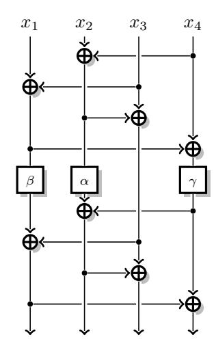

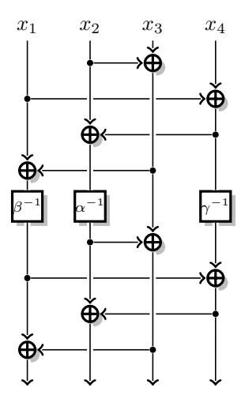

Figure 1:  $4 \times 4$  MDS with depth 5:  $M_{4,5}^{8,3}$ . Figure 2:  $4 \times 4$  MDS with depth 5:  $M_{4,5}^{8,3-1}$ .

With minimum depth (i.e. depth 2), our best result,  $M_{3,2}^{6,3}$ , takes 6 XORs on  $\mathbb{F}_2^k$  plus 3 linear operations, which does not improve over a naive implementation.

For k=4, however, the memory requirements are huge: some tests could not be performed because they require more than 2.5TB of memory. We used a machine with 4 Intel Xeon E7-4860 v2 CPUs (48 cores in total) running at 2.60GHz, with a total of 2.5TB of RAM. We parallelized the code and none of the runs took more than 24h in real time (the ones that could take longer ran out of memory beforehand). We note that parallelizing the code is rather easy, since we only need to share the structures which store the tested and untested states. The most interesting results are summed up in Table 4. The least costly matrix,  $M_{4,6}^{8,3}$ , requires 8 XORs on  $\mathbb{F}_2^k$  and 3 linear operations. At depth 3, our best result,  $M_{4,3}^{9,5}$ , requires 9 XORs on  $\mathbb{F}_2^k$  and 5 linear operations. Both results are significantly cheaper than the minimum of 12 XORs required in a naive implementation.

We note that we somewhat reached the limits, since running the algorithm with k=4 to find circuits of depth 6 with a lesser cost than the solution given in the table found no results and took 2.4TB of memory (using extensions RO\_IN and INDEP). Similarly, we could not find any circuit of depth 3 less costly than the one given, despite running the algorithm with multiple extensions and limits.

These results are formal matrices: instantiations on  $\mathbb{F}_2^4$  and  $\mathbb{F}_2^8$  are discussed in Section 6. Figures of the circuits are given in Appendix D (some of the circuits have been reorganized to make them easier to understand).

Implementation of the inverse matrix. When implementing the inverse of an SPN cipher, the inverse of the MDS matrix will be needed, and matrices whose inverse can also be implemented efficiently are desirable. In particular, a number of lightweight ciphers use an involutory matrix, so that the same implementation can be used for encryption and decryption. Our search algorithm does not allow us to look specifically for involutions (or even for matrices that are easy to invert), but several of our results allow an efficient implementation of the inverse.

Actually, most of the matrices in the table are easy to invert because their additional register only serves to build Feistel-like operations (this is not the case in general). In terms of implementation cost, it holds that the inverse matrix has the same implementation cost as the direct matrix. In terms of depth, however, there is no conservation between a matrix and its inverse.

To illustrate this, let us consider the example of  $M_{4,5}^{8,3}$ , and  $M_{4,5}^{8,3-1}$  shown in Figures 1

<span id="page-15-0"></span>

| Depth | Cost         | Extensions | Memory | M                                                                                                                                                                        | Fig. |
|-------|--------------|------------|--------|--------------------------------------------------------------------------------------------------------------------------------------------------------------------------|------|
| 4     | 5 XOR, 1 LIN |            | 14     | $M_{3,4}^{5,1} = \begin{bmatrix} 3 & 2 & 2 \\ 2 & 3 & 2 \\ 2 & 2 & 3 \end{bmatrix},  M_{3,4}^{5,1'} = \begin{bmatrix} 2 & 1 & 3 \\ 1 & 1 & 1 \\ 3 & 1 & 2 \end{bmatrix}$ | 3, 4 |
| 3     | 5 XOR, 2 LIN |            | 5      | $M_{3,3}^{5,2} = \begin{bmatrix} 3 & 1 & 3 \ 1 & 1 & 2 \ 2 & 1 & 1 \end{bmatrix} \ M_{3,2}^{6,3} = \begin{bmatrix} 1 & 2 & 1 \ 1 & 2 & 1 \ 1 & 1 & 2 \end{bmatrix}$      |      |
| 2     | 6 XOR, 3 LIN | RO_IN      | 4      | $M_{3,2}^{6,3} = \begin{bmatrix} 2 & 1 & 1 \ 1 & 2 & 1 \ 1 & 1 & 2 \end{bmatrix}$                                                                                        | 6    |

**Table 3:** Optimal  $3 \times 3$  MDS matrices (all results are obtained in less than 1 second, memory is given in MB).

and  $2.^5$   $M_{4,5}^{8,3}$  has depth 5 and costs 9 XORs and 3 linear operations. Over  $\mathbb{F}_2^8$ , the instantiation discussed in 6 gives that both  $M_{4,5}^{8,3}$  over  $\mathbb{F}_2^8$  and its inverse have the same depth (as well as the same cost). On the other hand, over  $\mathbb{F}_2^4$ , the instantiation of  $M_{4,5}^{8,3}$  requires the use of  $A_4$ ,  $A_4^{-1}$  and  $A_4^{2}$ , so that  $M_{4,5}^{8,3-1}$  uses  $A_4$ ,  $A_4^{-1}$  and  $A_4^{-2}$ , given as:

$$A_4 = \begin{bmatrix} \begin{smallmatrix} 0 & 1 & 0 & 0 \\ 0 & 1 & 0 & 0 \\ 0 & 0 & 1 & 0 \\ 1 & 1 & 0 & 0 \end{bmatrix} \qquad A_4^{-1} = \begin{bmatrix} \begin{smallmatrix} 1 & 0 & 0 & 1 \\ 1 & 0 & 0 & 0 \\ 0 & 1 & 0 & 0 \\ 0 & 0 & 1 & 0 \end{bmatrix} \qquad A_4^2 = \begin{bmatrix} \begin{smallmatrix} 1 & 0 & 1 & 1 \\ 1 & 0 & 0 & 1 \\ 1 & 0 & 0 & 0 \\ 0 & 1 & 0 & 0 \end{bmatrix} \qquad A_4^{-2} = \begin{bmatrix} \begin{smallmatrix} 0 & 0 & 1 & 0 \\ 0 & 0 & 0 & 1 \\ 1 & 1 & 0 & 0 \\ 0 & 1 & 1 & 0 \end{bmatrix}$$

 $A_4$  and  $A_4^{-1}$  have the same cost and depth, but  $A_4^2$  can only be implemented by 2 iterations of  $A_4$ , thus a depth 2 implementation, while  $A_4^{-2}$  has an implementation with depth 1. Summing up, over  $\mathbb{F}_2^4$ , both  $M_{4,5}^{8,3}$  and its inverse have the same cost, but  $M_{4,5}^{8,3}$  has depth 6 while  $M_{4,5}^{8,3^{-1}}$  has depth 5.

In addition some matrices are almost involutive. In particular one of the optimal matrices we have found in size 3 is  $M_{3,4}^{5,1'} = \begin{bmatrix} 2 & 1 & 3 \\ 1 & 1 & 1 \\ 3 & 1 & 2 \end{bmatrix}$ ; we note that its inverse is  $M_{3,4}^{5,1'-1} = \begin{bmatrix} 3 & 1 & 2 \\ 1 & 1 & 1 \\ 2 & 1 & 3 \end{bmatrix}$ , it can obviously be computed with the same circuit and an extra wire crossing.

**Details on the tables** All results are given supposing that the depth of  $\alpha$ ,  $\beta$  and  $\gamma$  is 1. The matrices given in these tables are *examples*. Our intention was in no way to be exhaustive in this table, the algorithm outputs many more formal matrices.

On the structure of the resulting circuits Although we did not find much structure in the results, it may be of interest that several circuits take the shape of a generalized Feistel network (as originally defined in [Nyb96] based on the work by Feistel, and studied in many works since), namely Figures 7, 9, 12, 13 and 14.

We would like to underline that the figures given in Appendix D have been intensively modified from the original output of the algorithm. We have reordered the input and output variables as well as some operations which commute in order to render the figures more readable and to put forward the structure.

On top of this, when it was possible, we replaced the use of an additional register by Feistel-like operations to ease the reading.

These are of course only examples of the outputs of the algorithm.

<span id="page-15-1"></span> $<sup>^5</sup>$ Note that the corresponding figure in Appendix D has been rearranged by permuting input and output variables

**Table 4:** Optimal  $4 \times 4$  MDS matrices.

<span id="page-16-0"></span>

| Fig.                            | ۲-                                                                                                            | 6                | œ                                                                  | 12, 13, 14                   | 11                                                                                                                                                                               | 10                                                                              | 15                                                                                                                                                                                                               |
|---------------------------------|---------------------------------------------------------------------------------------------------------------|------------------|--------------------------------------------------------------------|------------------------------|----------------------------------------------------------------------------------------------------------------------------------------------------------------------------------|---------------------------------------------------------------------------------|------------------------------------------------------------------------------------------------------------------------------------------------------------------------------------------------------------------|
| M                               | $M_{4,6}^{8,3} = \begin{bmatrix} 2 & 2 & 3 & 1 \ 1 & 3 & 6 & 4 \ 3 & 1 & 4 & 4 \ 3 & 2 & 1 & 3 \end{bmatrix}$ | $+$ $\wedge$ $+$ | $M_{4,5}^{9,3}=\begin{array}{cccccccccccccccccccccccccccccccccccc$ | 6715<br>2311<br>1567<br>1123 | $M_{4,4}^{9,3} = \begin{bmatrix} \alpha+1 & \alpha & \gamma+1 & \gamma+1 \ \beta & \beta+1 & 1 & \beta \ 1 & 1 & \gamma & \gamma+1 \ \alpha & \alpha+1 & \gamma+1 \end{bmatrix}$ | $M_{4,4}^{9,4} = \begin{array}{c} 1.243 \\ 2.323 \\ 3.351 \\ 3.113 \end{array}$ | $M_{4,3}^{9,5} = \begin{bmatrix} \alpha + \alpha^{-1} & \alpha & 1 & 1 \\ 1 & \alpha + 1 & \alpha & 1 \\ 1 + \alpha^{-1} & 1 & 1 + \alpha^{-1} \\ \alpha^{-1} & \alpha^{-1} & 1 + \alpha^{-1} & 1 \end{bmatrix}$ |
| Time (h)                        | 19.5                                                                                                          | 2.3              | 25.6                                                               | 30.2                         | 4.5                                                                                                                                                                              | 12.8                                                                            | 38.5                                                                                                                                                                                                             |
| Extensions Memory (GB) Time (h) | 30.9                                                                                                          | 24.3             | 154.5                                                              | 274                          | 46                                                                                                                                                                               | 7.77                                                                            | 279.1                                                                                                                                                                                                            |
| Extensions                      |                                                                                                               | INDEP            |                                                                    | $\mathtt{MAX\_POW} = 2$      | INDEP                                                                                                                                                                            |                                                                                 | INV                                                                                                                                                                                                              |
| Cost                            | 8 XOR, 3 LIN                                                                                                  | 8 XOR, 3 LIN     | 9 XOR, 3 LIN                                                       | 8 XOR, 4 LIN MAX_POW = 2     | 9 XOR, 3 LIN                                                                                                                                                                     | 9 XOR, 4 LIN                                                                    | 9 XOR, 5 LIN                                                                                                                                                                                                     |
| Depth                           | 9                                                                                                             | ಸಾ               | IJ                                                                 | 4                            | 4                                                                                                                                                                                | 4                                                                               | က                                                                                                                                                                                                                |

### <span id="page-17-0"></span>6 Instantiation

When we have a formal matrix M in  $\alpha$  with all the minors being non-zero polynomials, we can look for concrete choices of  $\alpha$  with a low implementation cost that give a linear mapping with maximum branch number. For a given matrix  $A \in M_n(\mathbb{F}_2)$ , we can build M(A) by substituting  $\alpha$  by A, and test whether the resulting linear mapping in  $M_k(M_n(\mathbb{F}_2))$  has maximum branch number. As seen in Section 2, the linear mapping has maximum branch number if and only if all square sub-matrices following the  $n \times n$  blocks are non-singular. Moreover, since all the blocks are polynomials in A, they commute, and we can compute the determinants by blocks [Sil00]. Indeed, with I, J subsets of the lines and columns, and  $m_{I,J} = \det_{\mathbb{F}_2[\alpha]}(M_{|I,J})$  the corresponding minor in  $\mathbb{F}_2[\alpha]$ , we have:

$$\det_{\mathbb{F}_2}(M(A)_{|I,J}) = \det_{\mathbb{F}_2}(\det_{M_n(\mathbb{F}_2)}(M(A)_{|I,J})) = \det_{\mathbb{F}_2}(m_{I,J}(A)).$$

Therefore, M(A) is MDS if and only if all the  $m_{I,J}(A)$  (the formal minors evaluated on A) are non-singular.

Finally, let  $\mu_A$  be the minimal polynomial of A (a minimal degree polynomial such that  $\mu_A(A) = 0$ ). We have the following characterization of A

<span id="page-17-1"></span>**Proposition 1.** Let  $M \in M_k(\mathbb{F}_2[\alpha])$  be a formal matrix, with formal minors  $m_{I,J}$ , and  $A \in M_n(\mathbb{F}_2)$  a linear mapping.

Then M(A) is MDS if and only if  $\mu_A$  is relatively prime with all the formal minors  $m_{I,J}$ .

*Proof.* If  $gcd(\mu_A, m_{I,J}) = 1$ , there exist polynomials u, v such that  $u\mu_A + vm_{I,J} = 1$  from Bezout identity. In particular

$$u(A)\mu_A(A) + v(A)m_{I,I}(A) = v(A)m_{I,I}(A) = 1,$$

therefore  $m_{I,J}(A)$  is non-singular. If this holds for all  $m_{I,J}$  then M(A) is MDS.

Reciprocally, we assume that there exist I, J such that  $p = \gcd(\mu_A, m_{I,J})$  is non-constant. Then p(A) must be singular (otherwise, we have  $\mu_A = pq$  with q(A) = 0 which contradicts the definition of the minimal polynomial  $\mu_A$ ). Therefore,  $m_{I,J}(A)$  is also singular and M(A) is not MDS.

In particular, if all the minors are of degree strictly lower than n, and  $\pi$  is an irreducible polynomial of degree n, then we can use the companion matrix of  $\pi$  as A, and this yields an MDS matrix M(A). In this case, A actually corresponds to multiplication in a finite field. More generally, we can use this construction even if  $\pi$  is not irreducible. As long as  $\pi$  is relatively prime with all the formal minors  $m_{I,J}$ , the resulting matrix M(A) will be MDS. In terms of implementation cost, choosing a trinomial for  $\pi$  will result in an optimal implementation for the evaluation of A: a single xor gate and only wire crossings in hardware, or a shift and conditional xor in software.

#### 6.1 With inverse

When we also use the inverse of  $\alpha$  to construct the matrix M, the coefficients of the matrix, and the formal minors  $m_{I,J}$ , will be Laurent polynomials in  $\mathbb{F}_2[\alpha,\alpha^{-1}]$ , rather than plain polynomials. In order to instantiate such a matrix M, we must use a non-singular matrix A, and we still have the property that M(A) is MDS if and only if all the  $m_{I,J}(A)$  are non-singular. Moreover, we can write  $m_{I,J} = \tilde{m}_{I,J} \times \alpha^{z_{I,J}}$  with  $\tilde{m}_{I,J}$  a polynomial  $(z_{I,J})$  is chosen to minimize the degree of  $\tilde{m}_{I,J}$ ), and  $m_{I,J}(A)$  is non-singular if and only if  $\tilde{m}_{I,J}(A)$  is non-singular, because A is necessarily non-singular. Therefore, we can still use a characterization based on the minimal polynomial  $\mu_A$ : M(A) is MDS if and only if  $\mu_A$  is relatively prime with all the  $\tilde{m}_{I,J}$ .

#### <span id="page-18-0"></span>6.2 With independent multiplications

When we use the independent multiplications extension of the algorithm, the result is a formal matrix with coefficients in  $\mathbb{F}_2[\alpha,\beta,\gamma]$ , whose minors are non-zero polynomials in  $\mathbb{F}_2[\alpha,\beta,\gamma]$ . Since the polynomial computations only make sense when  $\alpha$ ,  $\beta$  and  $\gamma$  commute, we will instantiate it with linear mappings that commute. If we use mappings A, B, C with AB = BA, AC = CA, BC = CB, polynomials evaluated in A, B, C commute, and M(A,B,C) is MDS if and only if all the  $m_{I,J}(A,B,C)$  (the formal minors evaluated in A, B, C) are non-singular.

In particular, if we instantiate  $\alpha$ ,  $\beta$  and  $\gamma$  as powers of a fixed linear mapping A, we can use the previous results to characterize the mappings A that yield an MDS matrix from their minimal polynomials.

#### 6.3 Low xor count instantiations

In practice, we want to choose A so that M(A) is MDS, and A also has a low implementation cost. Following the results of Beierle, Kranz, and Leander [BKL16], we know that multiplication by an element  $\alpha$  in  $GF(2^n)$  can be implemented with a single bitwise xor if and only if the minimal polynomial of  $\alpha$  is a trinomial of degree n. Moreover, their proof can be generalized to arbitrary mappings A in  $M_n(\mathbb{F}_2)$ , with the following result: if A can be implemented with a single xor then either A is singular (i.e.  $\alpha|\mu_A$ ), A+1 is singular (i.e.  $(\alpha+1)|\mu_A$ ) or  $\mu_A$  is a trinomial of degree n.

Since all the matrices we list in Table 3 and Table 4 have  $\alpha$  and  $\alpha+1$  as a minor, the only interesting candidates with an xor count of one are matrices with a minimal polynomial that is a trinomial of degree n. Therefore we concentrate our search on companion matrices of trinomials. (For a given trinomial t, there are many different matrices with an xor count of one and t as minimal polynomial, but they are either all MDS or all non-MDS, because of Proposition 1.)

We now instantiate the matrices from Table 1. We define  $A_8$  the companion matrix of  $X^8 + X^2 + 1$  over  $\mathbb{F}_2$ ;  $A_8^{-1}$  has minimal polynomial  $X^8 + X^6 + 1$ :

$$A_8 = \begin{bmatrix} \begin{smallmatrix} 0 & 1 & 0 & 0 & 0 & 0 & 0 & 0 \\ 0 & 0 & 1 & 0 & 0 & 0 & 0 & 0 \\ 0 & 0 & 0 & 1 & 0 & 0 & 0 & 0 \\ 0 & 0 & 0 & 1 & 0 & 0 & 0 & 0 \\ 0 & 0 & 0 & 0 & 1 & 0 & 0 & 0 \\ 0 & 0 & 0 & 0 & 0 & 1 & 0 & 0 \\ 0 & 0 & 0 & 0 & 0 & 0 & 1 & 0 \\ 0 & 0 & 0 & 0 & 0 & 0 & 0 & 1 \\ 1 & 0 & 1 & 0 & 0 & 0 & 0 & 0 \end{bmatrix} \qquad A_8^{-1} = \begin{bmatrix} 0 & 1 & 0 & 0 & 0 & 0 & 0 & 1 \\ 1 & 0 & 0 & 0 & 0 & 0 & 0 & 0 \\ 0 & 1 & 0 & 0 & 0 & 0 & 0 & 0 \\ 0 & 0 & 1 & 0 & 0 & 0 & 0 & 0 \\ 0 & 0 & 0 & 1 & 0 & 0 & 0 & 0 \\ 0 & 0 & 0 & 0 & 1 & 1 & 0 & 0 \\ 0 & 0 & 0 & 0 & 0 & 1 & 0 & 0 \\ 0 & 0 & 0 & 0 & 0 & 1 & 0 & 0 \\ 0 & 0 & 0 & 0 & 0 & 1 & 0 & 0 \\ 0 & 0 & 0 & 0 & 0 & 1 & 0 & 0 \\ 0 & 0 & 0 & 0 & 0 & 0 & 1 & 0 \end{bmatrix}$$

Similarly, we define  $A_4$  the companion matrix of  $X^4 + X + 1$  over  $\mathbb{F}_2$ ;  $A_4^{-1}$  has minimal polynomial  $X^4 + X^3 + 1$ :

$$A_4 = \begin{bmatrix} 0 & 1 & 0 & 0 \\ 0 & 1 & 0 & 0 \\ 0 & 0 & 1 & 0 \\ 1 & 1 & 0 & 0 \end{bmatrix} \qquad A_4^{-1} = \begin{bmatrix} 1 & 0 & 0 & 1 \\ 1 & 0 & 0 & 0 \\ 0 & 1 & 0 & 0 \\ 0 & 0 & 1 & 0 \end{bmatrix}$$

It is not generally the case, but for the matrices of Table 1,  $A_8$ ,  $A_4$ ,  $A_8^{-1}$  and  $A_4^{-1}$  are enough to instantiate the results of the algorithm over  $\mathbb{F}_2^8$ . For instance, over  $\mathbb{F}_2[X]$ :

#### The trinomials and their factorization are

$$X^{8} + X + 1 = (X^{2} + X + 1)(X^{6} + X^{5} + X^{3} + X^{2} + 1),$$

$$X^{8} + X^{2} + 1 = (X^{4} + X + 1)^{2},$$

$$X^{8} + X^{3} + 1 = (X^{3} + X + 1)(X^{5} + X^{3} + X^{2} + X + 1),$$

$$X^{8} + X^{4} + 1 = (X^{2} + X + 1)^{4},$$

$$X^{8} + X^{5} + 1 = (X^{3} + X^{2} + 1)(X^{5} + X^{4} + X^{3} + X^{2} + 1),$$

$$X^{8} + X^{6} + 1 = (X^{4} + X^{3} + 1)^{2},$$

$$X^{8} + X^{7} + 1 = (X^{2} + X + 1)(X^{6} + X^{4} + X^{3} + X + 1).$$

In particular, there are only 2 trinomials which factorize to degree 4 polynomials:  $X^8 + X^2 + 1 = (X^4 + X + 1)^2$  and  $X^8 + X^6 + 1 = (X^4 + X^3 + 1)^2$ .

The minors of 
$$M_{4,6}^{8,3} = \begin{bmatrix} 2 & 2 & 3 & 1 \\ 1 & 3 & 6 & 4 \\ 3 & 1 & 4 & 4 \\ 3 & 2 & 1 & 3 \end{bmatrix}$$
 are 
$$\{1, X, X+1, X^2, X^2+1, X^2+X, X^2+X+1, X^3, X^3+1, X^3+X, X^3+X+1, X^3+X+1, X^3+X+1, X^3+X+1, X^3+X+1, X^3+X+1, X^3+X+1, X^3+X+1, X^3+X+1, X^3+X+1, X^3+X+1, X^3+X+1, X^3+X+1, X^3+X+1, X^3+X+1, X^3+X+1, X^3+X+1, X^3+X+1, X^3+X+1, X^3+X+1, X^3+X+1, X^3+X+1, X^3+X+1, X^3+X+1, X^3+X+1, X^3+X+1, X^3+X+1, X^3+X+1, X^3+X+1, X^3+X+1, X^3+X+1, X^3+X+1, X^3+X+1, X^3+X+1, X^3+X+1, X^3+X+1, X^3+X+1, X^3+X+1, X^3+X+1, X^3+X+1, X^3+X+1, X^3+X+1, X^3+X+1, X^3+X+1, X^3+X+1, X^3+X+1, X^3+X+1, X^3+X+1, X^3+X+1, X^3+X+1, X^3+X+1, X^3+X+1, X^3+X+1, X^3+X+1, X^3+X+1, X^3+X+1, X^3+X+1, X^3+X+1, X^3+X+1, X^3+X+1, X^3+X+1, X^3+X+1, X^3+X+1, X^3+X+1, X^3+X+1, X^3+X+1, X^3+X+1, X^3+X+1, X^3+X+1, X^3+X+1, X^3+X+1, X^3+X+1, X^3+X+1, X^3+X+1, X^3+X+1, X^3+X+1, X^3+X+1, X^3+X+1, X^3+X+1, X^3+X+1, X^3+X+1, X^3+X+1, X^3+X+1, X^3+X+1, X^3+X+1, X^3+X+1, X^3+X+1, X^3+X+1, X^3+X+1, X^3+X+1, X^3+X+1, X^3+X+1, X^3+X+1, X^3+X+1, X^3+X+1, X^3+X+1, X^3+X+1, X^3+X+1, X^3+X+1, X^3+X+1, X^3+X+1, X^3+X+1, X^3+X+1, X^3+X+1, X^3+X+1, X^3+X+1, X^3+X+1, X^3+X+1, X^3+X+1, X^3+X+1, X^3+X+1, X^3+X+1, X^3+X+1, X^3+X+1, X^3+X+1, X^3+X+1, X^3+X+1, X^3+X+1, X^3+X+1, X^3+X+1, X^3+X+1, X^3+X+1, X^3+X+1, X^3+X+1, X^3+X+1, X^3+X+1, X^3+X+1, X^3+X+1, X^3+X+1, X^3+X+1, X^3+X+1, X^3+X+1, X^3+X+1, X^3+X+1, X^3+X+1, X^3+X+1, X^3+X+1, X^3+X+1, X^3+X+1, X^3+X+1, X^3+X+1, X^3+X+1, X^3+X+1, X^3+X+1, X^3+X+1, X^3+X+1, X^3+X+1, X^3+X+1, X^3+X+1, X^3+X+1, X^3+X+1, X^3+X+1, X^3+X+1, X^3+X+1, X^3+X+1, X^3+X+1, X^3+X+1, X^3+X+1, X^3+X+1, X^3+X+1, X^3+X+1, X^3+X+1, X^3+X+1, X^3+X+1, X^3+X+1, X^3+X+1, X^3+X+1, X^3+X+1, X^3+X+1, X^3+X+1, X^3+X+1, X^3+X+1, X^3+X+1, X^3+X+1, X^3+X+1, X^3+X+1, X^3+X+1, X^3+X+1, X^3+X+1, X^3+X+1, X^3+X+1, X^3+X+1, X^3+X+1, X^3+X+1, X^3+X+1, X^3+X+1, X^3+X+1, X^3+X+1, X^3+X+1, X^3+X+1, X^3+X+1, X^3+X+1, X^3+X+1, X^3+X+1, X^3+X+1, X^3+X+1, X^3+X+1, X^3+X+1, X^3+X+1, X^3+X+1, X^3+X+1, X^3+X+1, X^3+X+1, X^3+X+1, X^3+X+1, X^3+X+1, X^3+X+1, X^3+X+1, X^3+X+1, X$$

whose factors are

$${X, X + 1, X^3 + X + 1, X^2 + X + 1, X^3 + X^2 + 1}$$

None is of degree greater than 3, therefore they are all relatively prime with both  $X^8+X^2+1$  and  $X^8+X^6+1$ . Picking either  $\alpha=A_8$  or  $\alpha=A_8^{-1}$  therefore yields an MDS matrix over  $\mathbb{F}_2^8$ . A full implementation is given in Appendix C.

The factors of the minors of 
$$M_{4,4}^{8,4} = \begin{bmatrix} 5 & 7 & 1 & 3 \\ 4 & 6 & 1 & 1 \\ 1 & 3 & 5 & 7 \\ 1 & 1 & 4 & 6 \end{bmatrix}$$
 are

$${X, X + 1, X^3 + X + 1, X^2 + X + 1, X^3 + X^2 + 1, X^4 + X^3 + 1}$$

The only factor of degree 4 is  $X^4 + X^3 + 1$ , so there is at least one minor which is not relatively prime with  $X^8 + X^6 + 1$ , but they are all relatively prime with  $X^8 + X^2 + 1$ . Picking  $\alpha = A_8$  therefore yields an MDS matrix over  $\mathbb{F}_2^8$ .

The other results are obtained in a similar fashion.

$$\textbf{6.3.1} \quad \textbf{Instantiation of} \ M^{8,3}_{4,5} = \begin{bmatrix} \beta & 1 & \beta+1 & 1 \\ \gamma & \alpha & \gamma & \alpha+\gamma \\ \gamma & \alpha+1 & \gamma+1 & \alpha+\gamma+1 \\ \beta+\gamma & 1 & \beta+\gamma+1 & \gamma+1 \end{bmatrix}$$

Following Section 6.2, we first instantiate all the linear mappings as powers of single  $\alpha$ . Using the sage code given in Appendix B, we found that setting  $\beta = \alpha^{-1}$  and  $\gamma = \alpha^2$  still gives an MDS matrix. The factors of the minors of the resulting matrix are:

$$X, X + 1, X^2 + X + 1, X^3 + X + 1, X^3 + X^2 + 1, X^4 + X + 1$$

The only factor of degree 4 is  $X^4 + X^3 + 1$ , therefore  $\alpha = A^{-1}$  yields an MDS matrix over  $\mathbb{F}_2^8$ .

#### **Conclusion**

Like the parallel work of [KLSW17], our results show that global optimization of an MDS matrix is much more powerful than local optimization of the coefficients. Moreover, our approach allows to find new MDS matrices optimized for a global lightweight implementation, while the straight line tools used in [KLSW17] can only find a good implementation of a given matrix. As can be seen in Table 1, our approach leads to even better results. In particular, the best  $4\times 4$  MDS matrix with 8-bit words previously reported has an xor count of 72, while our best result has an xor count of only 67. Moreover, our approach can take into account the depth of the circuits. When considering results with a depth of 3 (the minimal depth possible), we still have an MDS matrix with xor count only 77 which would be challenging with straight line program optimizations. Finally, we tried to run the straight line program tools on the binary matrices found by our search, but the implementations found by the tools are not as good as ours.

# **References**

- <span id="page-20-6"></span>[ADK<sup>+</sup>14] Martin R. Albrecht, Benedikt Driessen, Elif Bilge Kavun, Gregor Leander, Christof Paar, and Tolga Yalçin. Block ciphers - focus on the linear layer (feat. PRIDE). In Juan A. Garay and Rosario Gennaro, editors, *CRYPTO 2014, Part I*, volume 8616 of *LNCS*, pages 57–76. Springer, Heidelberg, August 2014.
- <span id="page-20-1"></span>[AF13] Daniel Augot and Matthieu Finiasz. Exhaustive search for small dimension recursive MDS diffusion layers for block ciphers and hash functions. In *ISIT*, pages 1551–1555. IEEE, 2013.
- <span id="page-20-0"></span>[AIK<sup>+</sup>01] Kazumaro Aoki, Tetsuya Ichikawa, Masayuki Kanda, Mitsuru Matsui, Shiho Moriai, Junko Nakajima, and Toshio Tokita. Camellia: A 128-bit block cipher suitable for multiple platforms - Design and analysis. In Douglas R. Stinson and Stafford E. Tavares, editors, *SAC 2000*, volume 2012 of *LNCS*, pages 39–56. Springer, Heidelberg, August 2001.
- <span id="page-20-9"></span>[BBG<sup>+</sup>09] Ryad Benadjila, Olivier Billet, Henri Gilbert, Gilles Macario-Rat, Thomas Peyrin, Matt Robshaw, and Yannick Seurin. Sha-3 proposal: Echo. *Submission to NIST (updated)*, page 113, 2009.
- <span id="page-20-8"></span>[BBR16] Subhadeep Banik, Andrey Bogdanov, and Francesco Regazzoni. Atomic-AES: A compact implementation of the AES encryption/decryption core. In Orr Dunkelman and Somitra Kumar Sanadhya, editors, *INDOCRYPT 2016*, volume 10095 of *LNCS*, pages 173–190. Springer, Heidelberg, December 2016.
- <span id="page-20-4"></span>[BCG<sup>+</sup>12] Julia Borghoff, Anne Canteaut, Tim Güneysu, Elif Bilge Kavun, Miroslav Knežević, Lars R. Knudsen, Gregor Leander, Ventzislav Nikov, Christof Paar, Christian Rechberger, Peter Rombouts, Søren S. Thomsen, and Tolga Yalçin. PRINCE - A low-latency block cipher for pervasive computing applications - extended abstract. In Xiaoyun Wang and Kazue Sako, editors, *ASIACRYPT 2012*, volume 7658 of *LNCS*, pages 208–225. Springer, Heidelberg, December 2012.
- <span id="page-20-5"></span>[BJK<sup>+</sup>16] Christof Beierle, Jérémy Jean, Stefan Kölbl, Gregor Leander, Amir Moradi, Thomas Peyrin, Yu Sasaki, Pascal Sasdrich, and Siang Meng Sim. The SKINNY family of block ciphers and its low-latency variant MANTIS. In Matthew Robshaw and Jonathan Katz, editors, *CRYPTO 2016, Part II*, volume 9815 of *LNCS*, pages 123–153. Springer, Heidelberg, August 2016.
- <span id="page-20-3"></span>[BKL<sup>+</sup>07] Andrey Bogdanov, Lars R. Knudsen, Gregor Leander, Christof Paar, Axel Poschmann, Matthew J. B. Robshaw, Yannick Seurin, and C. Vikkelsoe. PRESENT: An ultra-lightweight block cipher. In Pascal Paillier and Ingrid Verbauwhede, editors, *CHES 2007*, volume 4727 of *LNCS*, pages 450–466. Springer, Heidelberg, September 2007.
- <span id="page-20-2"></span>[BKL16] Christof Beierle, Thorsten Kranz, and Gregor Leander. Lightweight multiplication in GF(2*<sup>n</sup>*) with applications to MDS matrices. In Matthew Robshaw and Jonathan Katz, editors, *CRYPTO 2016, Part I*, volume 9814 of *LNCS*, pages 625–653. Springer, Heidelberg, August 2016.
- <span id="page-20-7"></span>[BMP13] Joan Boyar, Philip Matthews, and René Peralta. Logic minimization techniques with applications to cryptology. *Journal of Cryptology*, 26(2):280–312, April 2013.

- <span id="page-21-10"></span>[BNN<sup>+</sup>10] Paulo Barreto, Ventzislav Nikov, Svetla Nikova, Vincent Rijmen, and Elmar Tischhauser. Whirlwind: a new cryptographic hash function. *Designs, Codes and Cryptography*, 56(2):141–162, Aug 2010.
- <span id="page-21-6"></span>[CDK09] Christophe De Cannière, Orr Dunkelman, and Miroslav Knežević. KATAN and KTANTAN - a family of small and efficient hardware-oriented block ciphers. In Christophe Clavier and Kris Gaj, editors, *CHES 2009*, volume 5747 of *LNCS*, pages 272–288. Springer, Heidelberg, September 2009.
- <span id="page-21-3"></span>[CDL16] Anne Canteaut, Sébastien Duval, and Gaëtan Leurent. Construction of lightweight S-boxes using Feistel and MISTY structures. In Orr Dunkelman and Liam Keliher, editors, *SAC 2015*, volume 9566 of *LNCS*, pages 373–393. Springer, Heidelberg, August 2016.
- <span id="page-21-12"></span>[Dij59] Edsger Wybe Dijkstra. A note on two problems in connexion with graphs. *Numerische Mathematik*, 1:269–271, 1959.
- <span id="page-21-4"></span>[DPVAR00] Joan Daemen, Michaël Peeters, Gilles Van Assche, and Vincent Rijmen. Nessie proposal: Noekeon, 2000.
- <span id="page-21-1"></span>[DR01] Joan Daemen and Vincent Rijmen. The wide trail design strategy. In Bahram Honary, editor, *8th IMA International Conference on Cryptography and Coding*, volume 2260 of *LNCS*, pages 222–238. Springer, Heidelberg, December 2001.
- <span id="page-21-0"></span>[DR02] Joan Daemen and Vincent Rijmen. *The Design of Rijndael: AES - The Advanced Encryption Standard*. Information Security and Cryptography. Springer, 2002.
- <span id="page-21-2"></span>[GKM<sup>+</sup>] P. Gauravaram, L.R. Knudsen, K. Matusiewicz, F. Mendel, C. Rechberger, M. Schläffer, and S.S. Thomsen. Grøstl — a SHA-3 candidate. Submission to NIST.
- <span id="page-21-8"></span>[GLSV15] Vincent Grosso, Gaëtan Leurent, François-Xavier Standaert, and Kerem Varici. LS-designs: Bitslice encryption for efficient masked software implementations. In Carlos Cid and Christian Rechberger, editors, *FSE 2014*, volume 8540 of *LNCS*, pages 18–37. Springer, Heidelberg, March 2015.
- <span id="page-21-9"></span>[GPP11] Jian Guo, Thomas Peyrin, and Axel Poschmann. The PHOTON family of lightweight hash functions. In Phillip Rogaway, editor, *CRYPTO 2011*, volume 6841 of *LNCS*, pages 222–239. Springer, Heidelberg, August 2011.
- <span id="page-21-7"></span>[GPPR11] Jian Guo, Thomas Peyrin, Axel Poschmann, and Matthew J. B. Robshaw. The LED block cipher. In Bart Preneel and Tsuyoshi Takagi, editors, *CHES 2011*, volume 6917 of *LNCS*, pages 326–341. Springer, Heidelberg, September / October 2011.
- <span id="page-21-11"></span>[HNR68] Peter E. Hart, Nils J. Nilsson, and Bertram Raphael. A formal basis for the heuristic determination of minimum cost paths. *IEEE Trans. Systems Science and Cybernetics*, 4(2):100–107, 1968.
- <span id="page-21-5"></span>[HSH<sup>+</sup>06] Deukjo Hong, Jaechul Sung, Seokhie Hong, Jongin Lim, Sangjin Lee, Bon-Seok Koo, Changhoon Lee, Donghoon Chang, Jesang Lee, Kitae Jeong, Hyun Kim, Jongsung Kim, and Seongtaek Chee. HIGHT: A new block cipher suitable for low-resource device. In Louis Goubin and Mitsuru Matsui, editors, *CHES 2006*, volume 4249 of *LNCS*, pages 46–59. Springer, Heidelberg, October 2006.

- <span id="page-22-9"></span>[JPST17] Jérémy Jean, Thomas Peyrin, Siang Meng Sim, and Jade Tourteaux. Optimizing implementations of lightweight building blocks. *IACR Trans. Symm. Cryptol.*, 2017(4):130–168, 2017.
- <span id="page-22-8"></span>[KLSW17] Thorsten Kranz, Gregor Leander, Ko Stoffelen, and Friedrich Wiemer. Shorter linear straight-line programs for MDS matrices. *IACR Trans. Symm. Cryptol.*, 2017(4):188–211, 2017.
- <span id="page-22-10"></span>[KPPY14] Khoongming Khoo, Thomas Peyrin, Axel York Poschmann, and Huihui Yap. FOAM: Searching for hardware-optimal SPN structures and components with a fair comparison. In Lejla Batina and Matthew Robshaw, editors, *CHES 2014*, volume 8731 of *LNCS*, pages 433–450. Springer, Heidelberg, September 2014.
- <span id="page-22-5"></span>[LS16] Meicheng Liu and Siang Meng Sim. Lightweight MDS generalized circulant matrices. In Thomas Peyrin, editor, *FSE 2016*, volume 9783 of *LNCS*, pages 101–120. Springer, Heidelberg, March 2016.
- <span id="page-22-2"></span>[LW14] Yongqiang Li and Mingsheng Wang. Constructing S-boxes for lightweight cryptography with Feistel structure. In Lejla Batina and Matthew Robshaw, editors, *CHES 2014*, volume 8731 of *LNCS*, pages 127–146. Springer, Heidelberg, September 2014.
- <span id="page-22-6"></span>[LW16] Yongqiang Li and Mingsheng Wang. On the construction of lightweight circulant involutory MDS matrices. In Thomas Peyrin, editor, *FSE 2016*, volume 9783 of *LNCS*, pages 121–139. Springer, Heidelberg, March 2016.
- <span id="page-22-11"></span>[Nyb96] Kaisa Nyberg. Generalized Feistel networks. In Kwangjo Kim and Tsutomu Matsumoto, editors, *ASIACRYPT'96*, volume 1163 of *LNCS*, pages 91–104. Springer, Heidelberg, November 1996.
- <span id="page-22-1"></span>[RB01] Vincent Rijmen and PSLM Barreto. The whirlpool hash function, 2001.
- <span id="page-22-3"></span>[SDMS12] Mahdi Sajadieh, Mohammad Dakhilalian, Hamid Mala, and Pouyan Sepehrdad. Recursive diffusion layers for block ciphers and hash functions. In Anne Canteaut, editor, *FSE 2012*, volume 7549 of *LNCS*, pages 385–401. Springer, Heidelberg, March 2012.
- <span id="page-22-12"></span>[Sil00] John R Silvester. Determinants of block matrices. *The Mathematical Gazette*, 84(501):460–467, 2000.
- <span id="page-22-4"></span>[SKOP15] Siang Meng Sim, Khoongming Khoo, Frédérique E. Oggier, and Thomas Peyrin. Lightweight MDS involution matrices. In Gregor Leander, editor, *FSE 2015*, volume 9054 of *LNCS*, pages 471–493. Springer, Heidelberg, March 2015.
- <span id="page-22-0"></span>[SKW<sup>+</sup>99] Bruce Schneier, John Kelsey, Doug Whiting, David Wagner, Chris Hall, and Niels Ferguson. *The Twofish encryption algorithm: a 128-bit block cipher*. John Wiley & Sons, Inc., 1999.
- <span id="page-22-7"></span>[SMMK13] Tomoyasu Suzaki, Kazuhiko Minematsu, Sumio Morioka, and Eita Kobayashi. twine : A lightweight block cipher for multiple platforms. In Lars R. Knudsen and Huapeng Wu, editors, *SAC 2012*, volume 7707 of *LNCS*, pages 339–354. Springer, Heidelberg, August 2013.

- <span id="page-23-5"></span>[SMTM01] Akashi Satoh, Sumio Morioka, Kohji Takano, and Seiji Munetoh. A compact Rijndael hardware architecture with S-box optimization. In Colin Boyd, editor, *ASIACRYPT 2001*, volume 2248 of *LNCS*, pages 239–254. Springer, Heidelberg, December 2001.
- <span id="page-23-3"></span>[SS16] Sumanta Sarkar and Habeeb Syed. Lightweight diffusion layer: Importance of Toeplitz matrices. *IACR Trans. Symm. Cryptol.*, 2016(1):95–113, 2016. <http://tosc.iacr.org/index.php/ToSC/article/view/537>.
- <span id="page-23-1"></span>[UDI<sup>+</sup>11] Markus Ullrich, Christophe De Cannière, Sebastian Indesteege, Özgül Küçük, Nicky Mouha, and Bart Preneel. Finding Optimal Bitsliced Implementations of 4x4-bit S-Boxes. In *SKEW 2011 Symmetric Key Encryption Workshop, Copenhagen, Denmark*, pages 16–17, 2011.
- <span id="page-23-0"></span>[WFY<sup>+</sup>02] Dai Watanabe, Soichi Furuya, Hirotaka Yoshida, Kazuo Takaragi, and Bart Preneel. A new keystream generator MUGI. In Joan Daemen and Vincent Rijmen, editors, *FSE 2002*, volume 2365 of *LNCS*, pages 179–194. Springer, Heidelberg, February 2002.
- <span id="page-23-2"></span>[WWW13] Shengbao Wu, Mingsheng Wang, and Wenling Wu. Recursive diffusion layers for (lightweight) block ciphers and hash functions. In Lars R. Knudsen and Huapeng Wu, editors, *SAC 2012*, volume 7707 of *LNCS*, pages 355–371. Springer, Heidelberg, August 2013.
- <span id="page-23-4"></span>[WZ11] Wenling Wu and Lei Zhang. LBlock: A lightweight block cipher. In Javier Lopez and Gene Tsudik, editors, *ACNS 11*, volume 6715 of *LNCS*, pages 327–344. Springer, Heidelberg, June 2011.
- <span id="page-23-6"></span>[ZWZZ16] Ruoxin Zhao, Baofeng Wu, Rui Zhang, and Qian Zhang. Designing optimal implementations of linear layers (full version). Cryptology ePrint Archive, Report 2016/1118, 2016. <http://eprint.iacr.org/2016/1118>.

# <span id="page-24-1"></span>**A Algorithm**

**return**

**Algorithm 1** Algorithm to search for MDS circuits.

<span id="page-24-0"></span>1: **function** Find MDS **Input:** MAX\_WEIGHT, MAX\_DEPTH, weights of operations. **Output:** All MDS matrices of weight lesser than MAX\_WEIGHT. 2: TestedIDs ← NULL 3: UntestedStates ← Identity 4: CurrentWeight ← 0 5: **for** state ∈ UntestedStates with state.weight = CurrentWeight **do** 6: **if** TestedIDs.contains(state.ID) **then** 7: **continue** 8: **if** state.isMDS() **then** 9: state.print()) 10: **continue** *▷* Children are equivalent or of bigger weight. 11: state.spawnChildren(UntestedStates) 12: **if** {UntestedStates with CurrentWeight} = ∅ **then** 13: CurrentWeight ← CurrentWeight + 1 **return** 14: **function** state.spawnChildren(UntestedStates) 15: **for** op ∈ opSet **do** 16: childState ← state.addOp(op) 17: **if** childState.weight *>* MAX\_WEIGHT or childState.depth *>* MAX\_DEPTH **then** 18: **continue** 19: **if** op = *COP Y* and childState.notInjective() **then** 20: **continue** 21: UntestedStates.append(childState)

- 22: **function** state.print Prints the state as a matrix, gives its weight and operations.
- 23: **function** state.isMDS Tests if the function is MDS by computing the determinant of all its square submatrices.
- 24: **function** state.notInjective Tests if the function is injective by computing its determinant (there are subtilities since some of the words are discarded in the end).
- 25: **function** state.addOp(op, from, to) Returns the child state from the father state and the new operation. Computes the child's weight.

# <span id="page-25-0"></span>**B Instantiation**

We can use the following sage program to instantiate the constructions of Section [6.](#page-17-0)

```
R.<a,b,c> = PolynomialRing(GF(2))
M = Matrix([[b,1,b+1,1], \
           [c,a,c,a+c], \
           [c,a+1,c+1,a+c+1], \
           [b+c,1,b+c+1,c+1]])
#M = Matrix([[a,a,a+1,1], \
# [1,a+1,a*(a+1),a^2], \
# [a+1,1,a^2,a^2], \
# [a+1,a,1,a+1]])
#M = Matrix([[a^2+1,a^2+a+1,1,a+1], \
# [a^2,a^2+a,1,1], \
# [1,a+1,a^2+1,a^2+a+1], \
# [1,1,a^2,a^2+a]])
#M = Matrix([[a+1,a,1,a+1], \
# [a,a+1,1,1], \
# [1,a+1,a^2+a,a^4], \
# [1,1,a^2,a^2+a]])
can_invert = lambda m: m.is_invertible() \
            if hasattr(m,"is_invertible") \
               else not m.is_zero()
all_minors = lambda M : [ m for k in range (M.nrows()) \
                          for m in M.minors(k+1) ]
minors_factor = lambda M : { p for m in all_minors(M) \
                             for p,_ in factor(m)}
is_MDS = lambda M : all(can_invert(m) for m in all_minors(M))
print is_MDS(M)
MS = MatrixSpace(GF(2),8,8)
MS.is_field = lambda proof=True: False
A_8 = MS([[0,1,0,0,0,0,0,0],[0,0,1,0,0,0,0,0], \
           [0,0,0,1,0,0,0,0],[0,0,0,0,1,0,0,0], \
           [0,0,0,0,0,1,0,0],[0,0,0,0,0,0,1,0], \
           [0,0,0,0,0,0,0,1],[1,0,1,0,0,0,0,0]])
A_8 = A_8^-1
print is_MDS(M.substitute({a:A_8,b:A_8^-1,c:A_8^-2}))
```

# <span id="page-26-0"></span>C Instantiation of $M_{4.6}^{8,3}$

The best MDS  $4 \times 4$  MDS matrix over 8-bit word that we found can be implemented with 67 bitwise xors. It is obtained from  $M_{4,6}^{8,3}$  with  $\alpha = A_8$ . This corresponds to the following binary matrix:

$$M_{4,6}^{8,3}(A_8) = \begin{bmatrix} A_8 \oplus I & I & A_8^2 & A_8^2 \\ I & A_8 \oplus I & A_8^2 \oplus A_8 & A_8^2 \\ A_8 & A_8 & A_8 \oplus I & I \end{bmatrix}$$

$$= \begin{bmatrix} 1 & 1 & 0 & 0 & 0 & 0 & 0 & 0 & 0 & 0 &$$

It can also be implemented with the following C code. The shifts are implicit and the linear function LIN corresponds to  $A_8$ . Other matrices can be implemented in a similar way.

```
#define ROT(x) (((x)<<1) | ((x)>>7))
#define LIN(x) (ROT((x)) ^ (((x)>>1)&1))
\nuint32_t MDS(uint32_t x) {
    uint8_t a = x, b = x>>8, c = x>>16, d = x>>24;
    a ^= b;
    c ^= d;
    d ^= LIN(a);
    b ^= c;
    b = LIN(b);
    a ^= b;
    c ^= LIN(d);
    d ^= a;
    b ^= c;
    return ((((((uint32_t)c<<8) | b)<<8) | a)<<8) | d;
}</pre>
```

#### <span id="page-27-1"></span>**Figures** D

#### <span id="page-27-0"></span>**D.1** $3 \times 3$ matrices

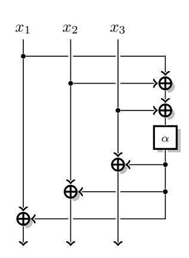

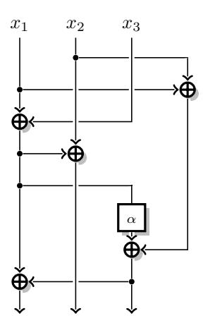

Figure 3:  $3 \times 3$  MDS matrix with depth 4: Figure 4:  $3 \times 3$  MDS matrix with depth 4:  $M_{3,4}^{5,1} = \begin{bmatrix} 3 & 2 & 2 \\ 2 & 2 & 3 \end{bmatrix}$   $M_{3,4}^{5,1'} = \begin{bmatrix} 2 & 1 & 3 \\ 1 & 1 & 1 \\ 3 & 1 & 2 \end{bmatrix}$ 

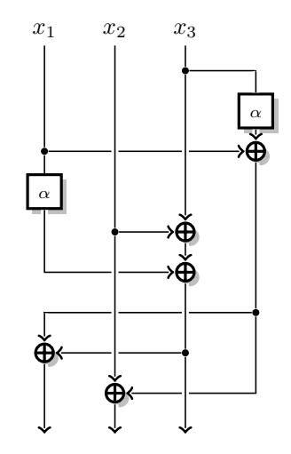

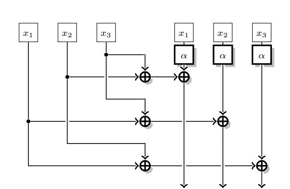

**Figure 5:**  $3 \times 3$  MDS matrix with depth 3:  $M_{3,3}^{5,2} = \begin{bmatrix} 3 & 1 & 3 \\ 1 & 1 & 2 \\ 2 & 1 & 1 \end{bmatrix}$ 

Figure 6:  $3 \times 3$  MDS matrix with depth 2:  $M_{3,2}^{6,3} = \begin{bmatrix} 2 & 1 & 1 \\ 1 & 2 & 1 \\ 1 & 1 & 2 \end{bmatrix}$ 

#### <span id="page-28-0"></span>**D.2** $4 \times 4$ matrices

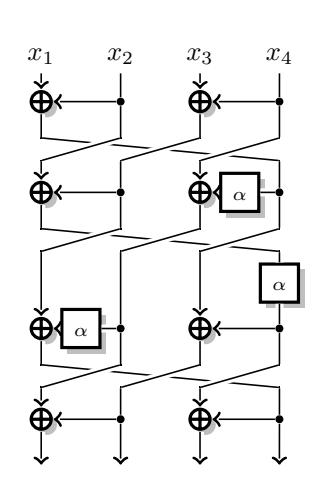

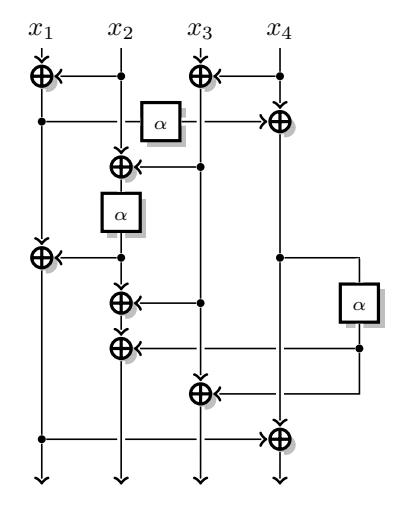

Figure 7:  $4 \times 4$  MDS matrix with depth 6: Figure 8:  $4 \times 4$  MDS matrix with depth 5:  $M_{4,6}^{8,3} = \begin{bmatrix} \frac{3}{1} & \frac{1}{4} & \frac{4}{4} \\ \frac{2}{2} & \frac{2}{3} & \frac{1}{1} \\ \frac{3}{2} & \frac{1}{2} & \frac{3}{3} \end{bmatrix}$   $M_{4,5}^{9,3} = \begin{bmatrix} \frac{2}{1} & \frac{2}{3} & \frac{3}{4} \\ \frac{3}{1} & \frac{1}{4} & \frac{4}{3} \\ \frac{3}{2} & \frac{1}{3} & \frac{3}{3} \end{bmatrix}$ 

 $x_2$ 

α **∳**Φ

 $x_3$ 

 $x_4$ 

 $x_1$ 

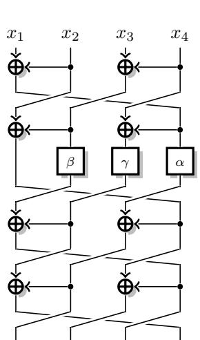

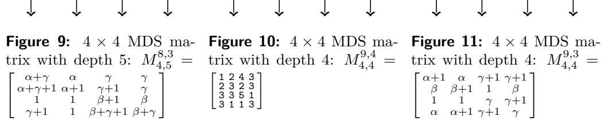

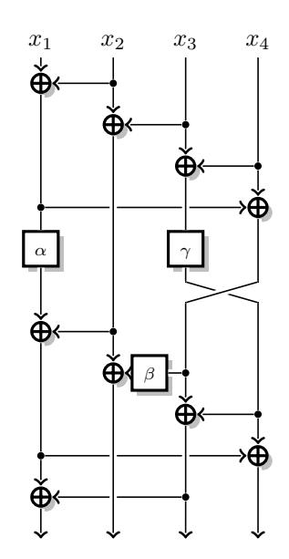

 $x_3$ 

 $x_4$ 

<span id="page-29-0"></span>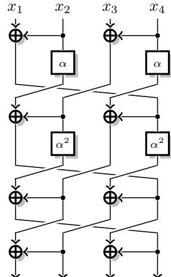

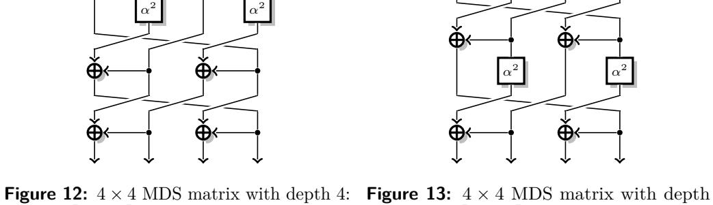

with  $\alpha = 2$ .

4:  $M_{4,4}^{8,4'} = \begin{bmatrix} 6 & 7 & 1 & 5 \\ 2 & 3 & 1 & 1 \\ 1 & 5 & 6 & 7 \\ 1 & 1 & 2 & 3 \end{bmatrix}$  with  $\alpha = 2$  ( $\alpha \leftrightarrow \alpha^2$  is also MDS).

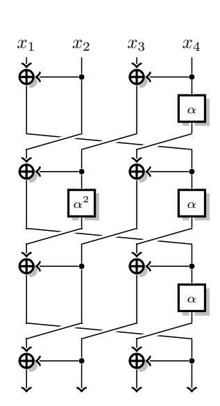

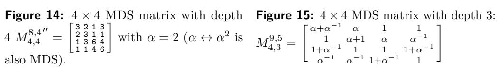

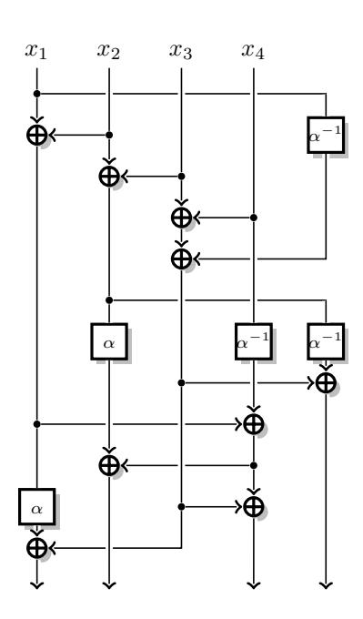