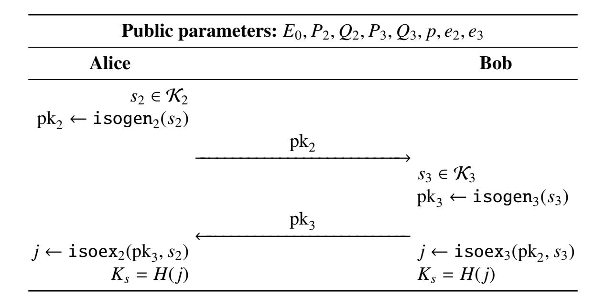
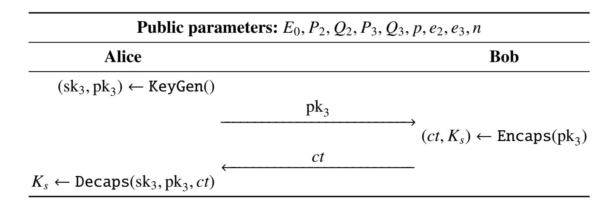
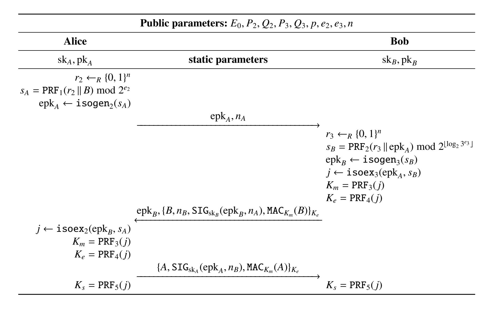
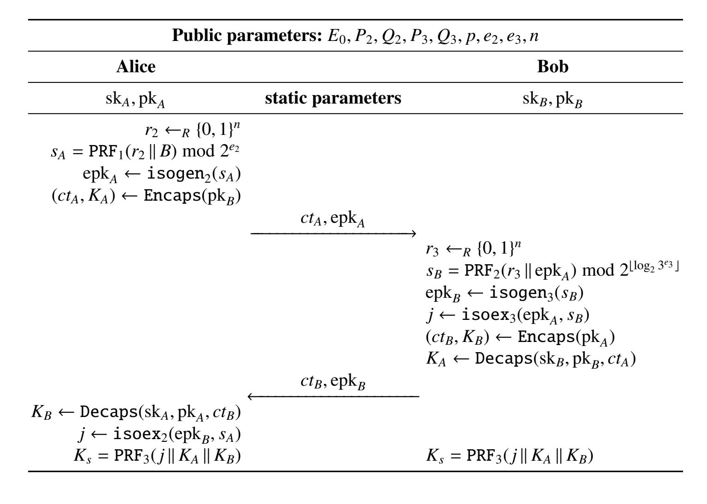
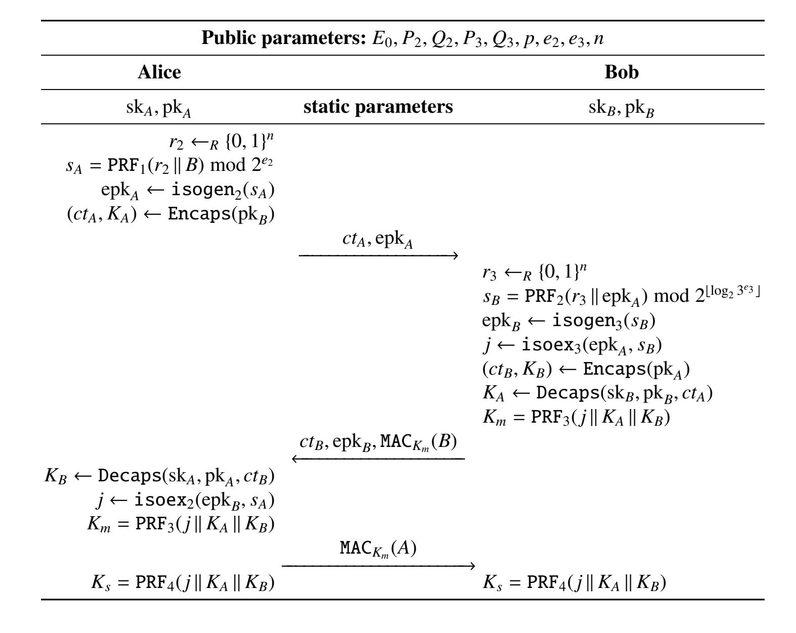

{0}------------------------------------------------

# A Note on Post-Quantum Authenticated Key Exchange from Supersingular Isogenies

Patrick Longa

Microsoft Research, USA plonga@microsoft.com

Abstract. In this work, we study several post-quantum authenticated key exchange protocols in the setting of supersingular isogenies. Leveraging the design of the well-studied schemes by Krawczyk (2003), Boyd et al. (2008), Fujioka et al. (2013), Krawczyk and Wee (2015), and others, we show how to use the Supersingular Isogeny Diffie-Hellman (SIDH) and Supersingular Isogeny Key Encapsulation (SIKE) protocols as basic building blocks to construct efficient and flexible authenticated key exchange schemes featuring different functionalities and levels of security.

This note is also intended to be a "gentle" introduction to supersingular isogeny based cryptography, and its most relevant constructions, for protocol designers and cryptographers.

Keywords: Authenticated key exchange, post-quantum cryptography, supersingular isogeny problem, SIDH, SIKE, Canetti-Krawczyk (CK) model, TLS 1.3.

# 1 Introduction

Quantum-resistant cryptography (a.k.a. post-quantum cryptography) has recently experienced a significant growth of interest from industry and academia, motivated in part by the so-called "Post-Quantum Cryptography Standardization" process recently launched by the National Institute of Standards and Technology (NIST) [28]. This multi-year effort, whose goal is to select the next-generation of publickey cryptographic algorithms that are resistant to *both* classical and quantum computer attacks, received a total of 69 submissions [29] —the largest number of submissions in any of the open cryptographic competitions organized by NIST. The various proposals include candidate algorithms for key encapsulation mechanisms (KEM), public-key encryption and digital signatures.

In the KEM category, the Supersingular Isogeny Key Encapsulation (SIKE) scheme [3] appears as one of the most attractive candidates, thanks in part to featuring the smallest keys among all the different post-quantum proposals. SIKE, which was designed by Costello, De Feo, Jao, Longa, Naehrig and Renes, builds upon the increasingly popular Supersingular Isogeny Diffie-Hellman key exchange (SIDH) protocol, a relatively young cryptographic primitive proposed by Jao and De Feo in 2011 [19]. The security of these primitives is based on the difficulty of computing isogenies between supersingular elliptic curves and, hence, they inherit the rich arithmetic of elliptic curves.

In this work, we illustrate how to use the basic isogeny-based primitives SIDH and SIKE to adapt two families of authenticated key exchange (AKE) protocols to the setting of supersingular isogenies. In most cases, the modifications are immediate, and the resulting schemes and their security proofs faithfully follow the original AKE constructions. However, given the myriad of papers on the topic, it seems relevant to summarize most representative protocols, give explicit constructions with well-defined security features and analyze their efficiency. This is especially important for the case of the new paradigms that arise in the post-quantum world, in which cryptographic primitives are either computationally expensive or demand much larger keys.

In summary, we describe:

{1}------------------------------------------------

- SIDH-based key exchange protocols authenticated with digital signatures using the SIGMA protocol construction by Krawczyk [21]. We describe protocols that require 2 passes (server-only authentication) or 3 passes (server-and-client authentication), achieve perfect forward secrecy (PFS), provide different degrees of identity protection, and include protection against several attacks including key-compromise impersonation and identity misbinding attacks. See Section 3.
- Implicitly authenticated key exchange protocols based on SIKE or a combination of SIDH and SIKE using the constructions by Boyd et al. [5] and Fujioka et al. [15]. We describe protocols that require between 1 and 3 passes and provide different levels of forward secrecy (no provision, with weak PFS or with full PFS). See Section 4.

The security analysis of these protocols is based on the powerful Canetti-Krawczyk (CK) model [6]. This security model allows us to capture a wide range of security properties, including basic session key security, and yet is flexible enough to cover additional requirements such as perfect forward secrecy (PFS) and key-compromise impersonation (KCI) resilience. For the case of the SIGMA-based protocols, we consider an extension of the CK model to the *post-specified peer* setting [7].

The paper is organized as follows. In Section 2, we give a "gentle" introduction to SIDH and SIKE, as well as some basic notions about AKE protocols and their security. The SIGMA-based protocols and the implicitly authenticated protocols using supersingular isogenies are described in Sections 3 and 4, respectively. In Section 5, we present a brief comparison of the different schemes and their variants, and provide some details about the expected performance in terms of bandwidth and computing cost. Finally, Appendix A discusses a straightforward adaptation of the SIGMA-based variants using SIDH to the handshake protocol in TLS 1.3.

#### 2 Preliminaries

The first part of this section sets the notation and describes SIDH and SIKE. The second part describes some relevant background on authenticated key exchange protocols, including basic notions about the CK model.

#### 2.1 Supersingular Isogeny Diffie-Hellman key exchange (SIDH)

The SIDH key exchange protocol by Jao and De Feo [19] is based on the difficulty of computing exponentially large-degree isogenies between supersingular elliptic curves. In this setting, these elliptic curves are also required to have smooth order, which makes the corresponding *smooth-degree* isogenies efficient to compute via composition of low-degree isogenies. As described in [13], such supersingular elliptic curves of smooth order are easy to construct: let p be a prime of the form  $p = \ell_A^{e_A} \ell_B^{e_B} f \pm 1$  for two small primes  $\ell_A$  and  $\ell_B$  and an integer cofactor f; then, define an elliptic curve E over  $\mathbb{F}_{p^2}$  of order  $(\ell_A^{e_A} \ell_B^{e_B} f)^2$ . It follows that  $E[\ell_A^{e_A}]$  and  $E[\ell_B^{e_B}]$  each contains  $\ell^{e-1}(\ell+1)$  distinct cyclic subgroups of order  $\ell^e$ , for  $\ell \in \{\ell_A, \ell_B\}$  and corresponding  $e \in \{e_A, e_B\}$ . Each cyclic subgroup corresponds to a different isogeny.

From now on, we will assume the parameterizations used in state-of-the-art realizations of SIDH [10, 11], which are based on 2- and 3-power degree isogenies. Accordingly, let the starting supersingular curve be defined by

$$E_0/\mathbb{F}_{n^2}: y^2 = x^3 + x,$$

where  $p = 2^{e_2}3^{e_2} - 1$ , i.e., we fix f = 1,  $\ell_A = A = 2$  and  $\ell_B = B = 3$ .

We are now in position to describe the SIDH key exchange protocol. The public parameters are the supersingular elliptic curve  $E_0/\mathbb{F}_{p^2}$  of order  $(2^{e_2}3^{e_3})^2$ , two independent points  $P_2$  and  $Q_2$  that generate  $E_0[2^{e_2}]$ , and two independent points  $P_3$  and  $Q_3$  that generate  $E_0[3^{e_3}]$ . Alice computes her keypair as

{2}------------------------------------------------



**Fig. 1.** (Ephemeral) SIDH key exchange — an unauthenticated key exchange with *ephemeral* keys. *H* is a hash function.

follows. She chooses the basis point  $R_2 = P_2 + [n_2]Q_2$  of order  $2^{e_2}$  using a *secret integer*  $n_2 \in \mathbb{Z}/2^{e_2}\mathbb{Z}$ . Her *secret key* is computed as the degree- $2^{e_2}$  isogeny  $\phi_2 \colon E_0 \to E_2$  with kernel  $R_2$ , and her *public key* is the isogenous curve  $E_2$  together with the image points  $\phi_2(P_3)$  and  $\phi_2(Q_3)$ . Similarly, Bob computes his keypair as follows. He computes  $R_3 = P_3 + [n_3]Q_3$  of order  $3^{e_3}$  using a *secret integer*  $n_3 \in \mathbb{Z}/3^{e_3}\mathbb{Z}$ . His *secret key* is then the degree- $3^{e_3}$  isogeny  $\phi_3 \colon E_0 \to E_3$  whose kernel is  $R_3$ , and his *public key* is  $E_3$  together with  $\phi_3(P_2)$  and  $\phi_3(Q_2)$ . To compute the shared secret, Alice uses her secret integer and Bob's public key to compute the degree- $2^{e_2}$  isogeny  $\phi_2' \colon E_3 \to E_{3,2}$  whose kernel is the point  $\phi_3(P_2) + [n_2]\phi_3(Q_2) = \phi_3(P_2 + [n_2]Q_2) = \phi_3(R_2)$ . Similarly, Bob uses his secret integer and Alice's public key to compute the degree- $3^{e_3}$  isogeny  $\phi_3' \colon E_2 \to E_{2,3}$  whose kernel is the point  $\phi_2(P_3) + [n_3]\phi_2(Q_3) = \phi_2(P_3 + [n_3]Q_3) = \phi_2(R_3)$ . Finally, given that  $E_{3,2}$  and  $E_{2,3}$  are isomorphic, the common j-invariant  $j(E_{3,2}) = j(E_{2,3})$  is used as the shared secret.

Fix  $\ell, m \in \{2, 3\}$ , with  $\ell \neq m$ . The two fundamental isogeny computations used in the key exchange mechanism described above can be denoted as follows:

- isogen<sub> $\ell$ </sub> outputs a public key pk<sub> $\ell$ </sub>, given as inputs the public parameters and a secret integer  $s_{\ell}$ .
- isoex<sub> $\ell$ </sub> outputs a shared secret j, given as inputs the public parameters, a public key  $pk_m$  and a secret integer  $s_{\ell}$ .

Figure 1 illustrates the flow of the SIDH protocol using the basic isogeny operations defined above. In the remainder, and following [11,3], we will assume that the keyspace  $\mathcal{K}_2$  for secret keys  $s_2$  corresponds to integers in the range  $\{0, 1, \ldots, 2^{e_2} - 1\}$  and the keyspace  $\mathcal{K}_3$  for secret keys  $s_3$  corresponds to integers in the range  $\{0, 1, \ldots, 2^{\lfloor \log_2 3^{e_3} \rfloor} - 1\}$ .

A distinctive feature of the SIDH protocol is that it resembles a DH-like flow: Alice and Bob can send their public keys in any order or simultaneously. No other post-quantum key exchange algorithm known in the literature has this flexibility. We should also remark that SIDH only works securely with *ephemeral* keys. Galbraith et al. [16] showed that an active attacker can exploit the use of static keys in order to gain access to the secret key. In practice, this means that keypairs generated by each party must be discarded after use. To solve this problem, Costello et al. [3] recently designed an IND-CCA secure key encapsulation mechanism (KEM) based on SIDH.

Supersingular Isogeny Key Encapsulation (SIKE). SIKE is an IND-CCA secure key encapsulation mechanism based on SIDH that derives from a transformation by Hofheinz, Hövelmanns and

{3}------------------------------------------------

#### Algorithm 1: SIKE's key generation, KeyGen

```
Input: ()
Output: sk_3 = (s, s_3), and pk_3

1 s_3 \leftarrow_R \{0, 1, ..., 2^{\lfloor \log_2 3^{e_3} \rfloor} - 1\}

2 pk_3 \leftarrow isogen_3(s_3)

3 s \leftarrow_R \{0, 1\}^n

4 return sk_3 = (s, s_3), pk_3
```

#### **Algorithm 2:** SIKE's key encapsulation, Encaps

```
Input: pk_3
Output: ct = (c_0, c_1), and K_s

1 m \leftarrow_R \{0, 1\}^n
2 r \leftarrow G(m \parallel pk_3) \mod 2^{e_2}
3 c_0 \leftarrow isogen_2(r)
4 j \leftarrow isoex_2(pk_3, r)
5 c_1 \leftarrow F(j) \oplus m
6 K_s \leftarrow H(m \parallel (c_0, c_1))
7 return ct = (c_0, c_1), K_s
```

#### Algorithm 3: SIKE's key decapsulation, Decaps

```
Input: sk_3 = (s, s_3), pk_3, and ct = (c_0, c_1)

Output: K_s

1 j \leftarrow isoex_3(c_0, s_3)

2 m' \leftarrow F(j) \oplus c_1

3 r' \leftarrow G(m' \parallel pk_3) \mod 2^{e_2}

4 c'_0 \leftarrow isogen_2(r')

5 if c'_0 = c_0 then

6 \mid K_s \leftarrow H(m' \parallel (c_0, c_1))

7 else

8 \mid K_s \leftarrow H(s \parallel (c_0, c_1))

9 return K_s
```

Kiltz [18] to an IND-CPA secure public-key encryption scheme [3]. SIKE consists of the triple KEM = {KeyGen, Encaps, Decaps}, defined by Algorithms 1–3:

- KeyGen: given the public parameters as inputs, this function outputs a secret key sk<sub>3</sub>, which consists of the concatenation of an *n*-bit random integer s and a random integer  $s_3 \in \mathcal{K}_3$ , together with a public key pk<sub>3</sub>.
- Encaps: given the public parameters and a public key  $pk_3$  as inputs, this function outputs a ciphertext ct and a shared secret  $K_s$ .
- Decaps: given the public parameters, a keypair ( $sk_3$ ,  $pk_3$ ) and a ciphertext ct as inputs, Decaps outputs a shared secret  $K_s$  if the ciphertext verifies correctly. Otherwise, the function outputs a random value.

{4}------------------------------------------------



Fig. 2. SIKE key exchange — an unauthenticated key exchange using a KEM.

The public parameters are the same as SIDH's (i.e., the supersingular elliptic curve  $E_0/\mathbb{F}_{p^2}$  of order  $(2^{e_2}3^{e_3})^2$ , two independent points  $P_2$  and  $Q_2$  that generate  $E_0[2^{e_2}]$ , and two independent points  $P_3$  and  $Q_3$  that generate  $E_0[3^{e_3}]$ ), together with an integer value n that corresponds to  $n \in \{192, 256, 320\}$  which, in turn, corresponds to the *three* parameter sets SIKEp503, SIKEp751 and SIKEp964 described in [3]. The reader is referred to [3, §1.5] for the explicit public parameters for SIKEp503, SIKEp751 and SIKEp964. It is conjectured that these parameter sets roughly match the brute-force security (classical and quantum) of AES-128, AES-192 and AES-256, respectively.

The encapsulation and decapsulation consist, essentially, of an encryption/decryption procedure of a message m hashed together with a public key  $pk_3$ . In Algorithm 2, this message m is chosen randomly such that  $m \in \mathcal{M} = \{0, 1\}^n$ . The three hash functions F, G and H that are used in SIKE are all instantiated with the SHA-3 derived function cSHAKE256 [20].

Figure 2 depicts a basic key exchange protocol based on SIKE. As advertised, SIKE solves the problem of static keys. That is, keypairs {sk<sub>3</sub>,pk<sub>3</sub>} can be cached and reused multiple times (in Figure 2, this can be exploited to save the time that takes to run the key generation). On the flip side, this protocol no longer exhibits a DH-like flow like SIDH does; messages need to be sent in a specific order. Likewise, the SIKE protocol, as well as the SIDH protocol from Figure 1, is only secure against passive attackers. More specifically, these basic protocols do not provide authentication and can be subjected to man-in-the-middle attacks. We discuss several *authenticated key exchange* schemes that address this issue in Sections 3 and 4.

**Security strength of SIDH and SIKE.** The security of SIDH and SIKE is based on the hardness of the supersingular isogeny Diffie-Hellman (SIDH) problem.

The SIDH problem. Given  $pk_2 = isogen_2(s_2)$  and  $pk_3 = isogen_3(s_3)$  for random secret values  $s_2 \in \mathcal{K}_2$  and  $s_3 \in \mathcal{K}_3$ , compute  $j = isoex_2(pk_3, s_2) = isoex_3(pk_2, s_3)$ .

The best known attacks against the SIDH problem are *claw-finding algorithms* whose asymptotic complexities are  $O(p^{1/4})$  and  $O(p^{1/6})$  for classical and quantum adversaries, respectively. These attacks are generic instances to solve the claw problem. Although the public keys  $pk_2$  and  $pk_3$  in the SIDH setting contain auxiliary information that is not available in the claw problem, to date no attack is able to exploit such additional information against SIDH and SIKE. Accordingly, the security of the claw problem and the SIDH problem are assumed to be equivalent.

There exist several computational problems adapted to the supersingular isogeny setting that are used to provide the underlying security of various protocols. For example, in Section 3 we use the supersingular decision Diffie-Hellman (SSDDH) problem to prove security of the SIGMA based protocols

{5}------------------------------------------------

using SIDH. The reader is referred to [13, §5] for complete details about these different computational problems.

In addition to the SIDH problem, SIKE's security also relies on the security of a public-key encryption scheme based on the classical hashed ElGamal scheme. This scheme converted to the setting of supersingular isogenies is proved IND-CPA secure in the random oracle model in [3, Prop. 1] (see also [13, Problem 5.4] for an alternative security proof in the standard model using the SSDDH problem). Finally, SIKE is proved IND-CCA secure in [3, Thm. 1] using a result by Hofheinz et al. [18].

#### 2.2 Authenticated key exchange

In this section, we give a quick overview of the basic concepts related to the security of key exchange protocols, closely following the security models introduced by Canetti and Krawczyk in [6] and [7]. For complete details, the readers are referred to the original papers.

In this work, we focus on two-party key exchange protocols whose ultimate goal is to securely derive a common and secret *session key*, even under the prospect of an active adversary. The most popular application of this mechanism is the establishment of a "secure-channel" by which the two parties can exchange messages securely using symmetric encryption under the derived session key. It can be argued that a "secure key exchange protocol" features the following *three* core requirements [21]: (i) authentication, which refers to the ability of each party in a key exchange session to verify the identity of the peer; (ii) secrecy, which refers to the inability of any third party to learn any information about a session key established between two other parties; and (iii) consistency, which refers to the ability of each party in a key exchange session to know with certainty the identity of the peer with which a session key is established.

The requirements of authentication and secrecy appear naturally in the context of a secure key exchange. However, the consistency requirement might need some additional explanation. By this requirement a key exchange protocol should guarantee that session keys are correctly binded to the corresponding peers. In particular, protocols should be secure against *identity misbinding attacks* (a.k.a. unknown key share (UKS) attacks). Under this attack, two parties Alice and Bob are able to compute the same session key, but while Alice is convinced that the key is shared with Bob, Bob is made believe that his peer is a third party Eve.

We remark that there are other features that are not part of the core requirements described above but that still can be attractive in certain applications. For example, we mention key confirmation —or the guarantee to a given party that its peer was alive during the protocol execution— and identity protection. The latter is an important consideration for expanding the security model used in the analysis of the SIGMA protocols, as explained later on.

Canetti-Krawczyk (CK) model. One of the most celebrated security models in the literature to prove the security of authenticated key exchange protocols is the Canetti-Krawczyk (CK) model [6]. This security model is powerful enough to capture a wide range of security properties, including basic session key security, and yet is flexible enough to cover additional requirements such as perfect forward secrecy (PFS) and key-compromise impersonation (KCI) resilience. The key exchange constructions studied in this work use the CK model in their security proofs.

We focus on *two* main approaches to authenticating a key exchange: using implicitly authenticated schemes (such as in (H)MQV [25, 22]) and using digital signatures (such as in the SIGMA protocols [21]). For the first case, the security proofs follow the original CK model (also referred to as CK model in the pre-specified peer setting). Protocols proven secure under this model are called sessionkey (SK) secure in the unauthenticated links model [6]. This model is appropriately extended in several follow-up works to capture forward secrecy and KCI resilience (e.g., see [22]). For the second case, 

{6}------------------------------------------------

Canetti and Krawczyk in [7] relaxed the security definition in the model above to support the "post-specified peers" setting. Protocols proven secure under this modified model are called session-key (SK) secure in the post-specified peer model [7]. These two models are explained in more detail below.

In the following, we assume that parties use some trusted mechanism, such as a certification authority (CA), to bind their identities with public keys. The corresponding *long-term* private keys can come in the form of digital signature keys (for schemes authenticated via signatures) or in the form of secret keys from a KEM (for implicitly authenticated schemes). Note that we do not make any additional assumptions about the behavior of the CA. In particular, security of the protocols discussed in this work only rely on the CA faithfully binding identities to public keys, and does not require, for example, that a CA request a "proof-of-possession" for the private key.

**CK model in the pre-specified peer setting.** In the CK model, a key exchange protocol is modeled as a multi-party protocol in which parties are interactive probabilistic polynomial-time (PPT) machines. An invocation of the protocol is called *session*, and each party may run many of these sessions at the same time. As part of a session, each party can be activated to initiate a session, generate and update a *session state*, send out messages, and eventually derive a *session key* and delete the session state. Sessions can also be aborted without producing a session key. Sessions are represented by the triple (P, Q, s), where P is the party in which the session was activated, Q is the peer in the key exchange, and s is a unique session identifier. Session activation can happen in two ways: (i) by a request to a party called *initiator* to start a key exchange, or (ii) by a key exchange initiation message that a given party sends to another party called *responder*. Sessions (P, Q, s) and (P', Q', s') are said to be *matching sessions* if P = Q', Q = P' and S = S'.

A relevant aspect in the CK model is to consider the possibility of leakage of either the long-term keys or some secret session-specific information (e.g., the ephemeral keys). In particular, there are two important security properties that are related to the effects of leakage of long-term keys: perfect forward secrecy (PFS) and key-compromise impersonation (KCI) resilience. In the case of PFS, if the long-term secret keys of one or more parties are compromised by an adversary, PFS guarantees the secrecy of the session keys that were produced and erased from memory before the leakage. There is also a weaker notion of PFS, referred to as *weak* perfect forward secrecy (wPFS), which was advanced in [22]. wPFS guarantees that if the long-term secret keys of one or more parties are compromised by an adversary, past session keys still remain secure against *passive* attackers. In the case of KCI, it is said that a protocol is KCI resistant if it does not allow an adversary who gained access to a party's (say, A's) long-term keys to impersonate other *uncorrupted* parties to A [25]. As stated, the security model in [6] also considers the effect of leakage of some secret session-specific information such as the ephemeral keys. In such an event, if a key exchange session is compromised by an attacker exploiting, for example, *known-key attacks* and *replay attacks*, the protocol should still guarantee the secrecy of past sessions.

To capture the scenarios above, the communication links are assumed to be in full control of an attacker Eve (also modeled as a PPT machine), whose capabilities include activating sessions, and blocking, delaying, injecting and interleaving messages. Besides, Eve can perform the following queries:

- session-state(P, Q, s), which returns all the internal state of the corresponding session, without including P's long-term key.
- session-key(P, Q, s), which returns the session key of the corresponding session.
- session-expiration(P, Q, s), which erases the session key on a completed session, which thereafter is said to be *expired*. This query is used for defining perfect forward secrecy (PFS).
- corrupt(*P*), which outputs the long-term secret key of *P*.
- test-session(P, Q, s), which outputs the corresponding session key if a bit b selected at random is 1. Otherwise (if b = 0), it outputs a random value from the probability distribution of keys.

{7}------------------------------------------------

The security of a protocol is analyzed by first allowing Eve to activate sessions and issue session-state, session-key, session-expiration and corrupt queries. Sessions and their matching sessions that have been subjected to session-state, session-key and corrupt queries are called *exposed*. Then, the attacker issues a test-session query for a party and an *unexposed* session of her choice. She can continue with the regular actions against the protocol, but no more test-sessions are allowed. Finally, the attacker outputs a bit b' as her guess for the bit b of the test-session. She succeeds in its distinguishing attack if b = b'.

**Definition 1.** A key exchange protocol is called SK-secure with PFS if the following holds for any attacker:

- 1. Two uncorrupted parties complete matching sessions and derive the same session key; and
- 2. The probability that an attacker succeeds in its test-session distinguishing attack is not more than 1/2 plus some negligible function (in the security parameter).

For the cases in which PFS is not relevant, the definition above can be easily adapted by not allowing session-expiration queries [6].

**CK model in the post-specified peer setting.** The model in the previous section makes the assumption that, at session activation, a party already knows the identity of the intended peer. In [7], Canetti and Krawczyk relaxed the SK-security definition to analyze protocols in which the peer of a session is decided or learned as the session evolves. This distinction is important for protocols that provide some form of *identity protection*, such as the SIGMA-I protocol from [21].

There are *two* changes that are required to adapt the original CK model to this post-specified peer setting. First, a session activated at a party is now identified by the triple (P, d, s), where the new input d corresponds to a "destination address" that does not identify a peer and only provides information for the delivery of messages. From the perspective of an attacker and the security analysis, sessions are simply identified by (P, s). Once completed, a session (P, s) outputs a public triple (P, Q, s), where Q is the peer in the session, and the secret session key. Second, the definition of matching sessions is modified in the following way: the matching session of a *completed* session (P, s) with output (P, Q, s) is the session (Q, s) if either (Q, s) is not completed, or (Q, s) is completed and its public output is (Q, P, s). The security definition in the post-specified peer setting follows.

**Definition 2.** *SK-security in the post-specified peer setting is defined as in Definition 1, but with the changes to the session identification and matching sessions detailed above.* 

Note that the security notion in Definition 2 constitutes a strict relaxation of the SK-security in Definition 1. However, it can be argued that the changes in the model still result in a solid guarantee of a protocol's security. See [7, §2.2] for a complete discussion.

**Notation and presentation of protocols.** For the remainder, we will represent the identities of the two parties establishing a secure channel by *A* and *B* in protocol descriptions.

There are some additional cryptographic primitives that are required to assemble a full protocol. In our case, this includes a pseudorandom function, a digital signature scheme, a message authentication code (MAC) and a symmetric encryption primitive. In this work, a secure pseudorandom function is denoted by PRF:  $K \times \{0,1\}^* \to K_o$ . Signature generation under a secret key sk is denoted by SIG<sub>sk</sub>(), while a MAC under a key  $K_o$  is represented by MAC<sub>Ko</sub>(). Both the digital signature and MAC primitives are assumed to be existentially unforgeable under chosen message attacks (EUF-CMA). Finally, the notation  $\{\ldots\}_{K_o}$  using brackets is used to represent symmetric encryption under a key  $K_o$ .

We emphasize that, throughout the paper, protocols are depicted in their simplest form, i.e., only showing their "cryptographic skeleton". That is, many elements that are required by real-world deployments are omitted for presentation purposes. This, for example, includes the omission of nonces, which are typically used to guarantee freshness of messages, and session identifiers.

{8}------------------------------------------------

# 3 Sign-and-MAC authenticated key exchange protocols using SIDH

Digital signatures are a useful tool to implement the authentication functionality during the setup of a secure channel. A representative family of protocols based on this premise is SIGMA [21]. The SIGMA protocols, which are essentially Diffie-Hellman key exchange schemes authenticated via digital signatures, provide many attractive security features, including perfect forward secrecy and different levels of identity protection. In this section, we describe SIDH-based key exchange protocols authenticated via digital signatures, closely following the SIGMA paradigm. In the following, we fix the set of public parameters  $\{E_0, P_2, Q_2, P_3, Q_3, p, e_2, e_3, n\}$  described in Section 2.1. Keypairs  $(sk_I, pk_I)$  for  $I \in \{A, B\}$  contain the parties' long-term, secret and public, signature keys.

The basic form of SIGMA without identity protection is described in [21, §5.1]. We begin by adapting this scheme to the setting of supersingular isogenies, and call the modified protocol SIGMA-SIDH. This is depicted in Figure 3.

SIGMA-SIDH is a 3-pass authenticated key exchange scheme based on SIDH that naturally inherits the attractive features found in SIGMA, among which we mention:

- The fresh generation (per session) of public/secret keypairs guarantees perfect forward secrecy.
- By including the value of each party's ephemeral public key in the signed message, these public keys get protected from modification or replacement.
- Message authentication codes (MACs) are used to bind the session key to the identity of each of the protocol parties. This provides protection against identity misbinding attacks.

A difference with SIGMA is that SIGMA-SIDH does not require the inclusion of the peer's public key in a party's signed message. Instead, SIGMA-SIDH mandates the use of a fresh nonce per session

| <b>Public parameters:</b> $E_0, P_2, Q_2, P_3, Q_3, p, e_2, e_3, n$                                         |                                                                                                                                  |                                                                                                                                                                                                                                                                                                        |  |  |  |  |  |
|-------------------------------------------------------------------------------------------------------------|----------------------------------------------------------------------------------------------------------------------------------|--------------------------------------------------------------------------------------------------------------------------------------------------------------------------------------------------------------------------------------------------------------------------------------------------------|--|--|--|--|--|
| Alice                                                                                                       |                                                                                                                                  | Bob                                                                                                                                                                                                                                                                                                    |  |  |  |  |  |
| $\operatorname{sk}_A,\operatorname{pk}_A$                                                                   | static parameters                                                                                                                | $\operatorname{sk}_B,\operatorname{pk}_B$                                                                                                                                                                                                                                                              |  |  |  |  |  |
| $r_2 \leftarrow_R \{0, 1\}^n$ $s_A = PRF_1(r_2 \parallel B) \bmod 2^{e_2}$ $epk_4 \leftarrow isogen_2(s_A)$ |                                                                                                                                  |                                                                                                                                                                                                                                                                                                        |  |  |  |  |  |
|                                                                                                             | $\operatorname{epk}_A, n_A$                                                                                                      |                                                                                                                                                                                                                                                                                                        |  |  |  |  |  |
|                                                                                                             | <b>,</b>                                                                                                                         | $r_3 \leftarrow_R \{0, 1\}^n$ $s_B = \operatorname{PRF}_2(r_3 \parallel \operatorname{epk}_A) \mod 2^{\lfloor \log_2 3^{e_3} \rfloor}$ $\operatorname{epk}_B \leftarrow \operatorname{isogen}_3(s_B)$ $j \leftarrow \operatorname{isoex}_3(\operatorname{epk}_A, s_B)$ $K_m = \operatorname{PRF}_3(j)$ |  |  |  |  |  |
|                                                                                                             | $\operatorname{epk}_B, B, n_B, \operatorname{SIG}_{\operatorname{sk}_B}(\operatorname{epk}_B, n_A), \operatorname{MAC}_{K_m}(B)$ |                                                                                                                                                                                                                                                                                                        |  |  |  |  |  |
| $j \leftarrow \mathtt{isoex}_2(\mathtt{epk}_B, s_A)$<br>$K_m = \mathtt{PRF}_3(j)$                           |                                                                                                                                  |                                                                                                                                                                                                                                                                                                        |  |  |  |  |  |
|                                                                                                             | $A, SIG_{sk_A}(epk_A, n_B), MAC_{K_m}(A)$                                                                                        |                                                                                                                                                                                                                                                                                                        |  |  |  |  |  |
| $K_s = PRF_4(j)$                                                                                            | <del></del>                                                                                                                      | $K_s = PRF_4(j)$                                                                                                                                                                                                                                                                                       |  |  |  |  |  |

**Fig. 3.** SIGMA-SIDH: a 3-pass key-exchange protocol based on SIDH with client-and-server authentication using a sign-and-MAC approach. If authentication of Alice (client) is not required, the last Alice-to-Bob message can be eliminated, turning the scheme into a 2-pass server-only authenticated protocol.

{9}------------------------------------------------

(denoted by  $n_I$ )<sup>1</sup>. Forcing the use of a fresh nonce guarantees protection against *replay attacks*, even in the event of an implementation erroneously reusing the value of the (supposedly ephemeral) public key.

In the original version of the SIDH key exchange (see Fig. 1), the protocol is susceptible to the catastrophic active attack by Galbraith et al. [16] if the secret/public keys are reused. An important design element in SIGMA-SIDH to minimize the risk to such an attack is to hash the random values  $(r_2 \text{ or } r_3)$  together with Bob's identity or Alice's ephemeral public key (resp.). This is similar to what is done at the beginning of SIKE's encapsulation procedure (see Alg. 2). In this case, the basic idea is to require some session-specific information to generate the secret input values to  $isogen_{\ell}$ , with the goal of disincentivizing implementers from caching the secret/public keypair. This measure also has the positive side effect of slightly reducing the amount of randomness that is required to generate secret values.

We remark that SIGMA-SIDH can be adapted to typical client-server scenarios in which only servers are required to authenticate, by eliminating the very last client-to-server (i.e., Alice-to-Bob) message in Figure 3. In this case, the first message from Alice would include  $(A, \operatorname{epk}_A, n_A)$ , and the scheme would effectively become a 2-pass protocol. This server-only authenticated protocol would not be protected against identity misbinding on Alice's side, but this is by definition acceptable for applications that do not require client's authentication.

We comment that it is possible to use SIKE in place of SIDH in the scheme above. However, the resulting protocol would be slightly slower, due to SIKE's re-encryption operation during decapsulation. Although the performance difference can be virtually eliminated if Alice caches her public key, the protocol would no longer guarantee PFS if this is done. Moreover, the use of SIDH favors an implementation in which the initiator (Alice) is a small device, since in the SIDH case this party is required to compute cheaper 2-power isogeny operations only (in contrast to the slightly more expensive isoex<sub>3</sub> operation that the protocol initiator would need to compute during decapsulation if the protocol is instantiated with SIKE).

**SIGMA-SIDH** with identity protection. The SIGMA-SIDH protocol described above does not protect the identity of the parties establishing a secure channel, given that the identity information is simply sent as plaintext. This could be a disadvantage in some applications. Following the SIGMA-I protocol [21], it is easy to extend SIGMA-SIDH to protect Alice's identity (initiator) against active attackers and Bob's identity from passive attackers. This variant, called SIGMA-I-SIDH, is depicted in Figure 4.

SIGMA-I-SIDH requires that each party's identity be sent encrypted. Since Alice (initiator) sends her identity in the last message, once Bob has been properly authenticated, her identity is protected against active adversaries. In contrast, it is easy to see that Bob's identity is only protected against passive attackers: if an attacker, Eve, replaces Alice's first message  $\operatorname{epk}_A$  by a public key  $\operatorname{epk}_{A'}$ , for which she knows the secret key  $s'_A$ , she can then use the generated key  $K_{e'}$  to decrypt Bob's response and access his identity information.

We remark that, in addition to achieving full PFS, all the SIGMA-based schemes described in this section also provide key confirmation for both parties (case of client-and-server authentication) or for the client (case of server-only authentication).

What signature scheme should be used? In general, one requires to simply double the key size of symmetric cryptographic algorithms to make them post-quantum ready. For example, the MACs required in the SIGMA-SIDH and SIGMA-I-SIDH protocols can be instantiated with KMAC256 using keys and outputs that are 256-bit long [20] in order to achieve 128 bits of quantum security while

<sup>&</sup>lt;sup>1</sup> Krawczyk [21] mentions that one must use either a fresh nonce or the party's own public key (if chosen fresh) in the signed message, leaving the decision to the protocol implementer.

{10}------------------------------------------------



**Fig. 4.** SIGMA-I-SIDH: a 3-pass key-exchange protocol based on SIDH with identity protection and client-and-server authentication using a sign-and-MAC approach. Alice's identity is protected against active attacks, whereas Bob's identity is protected against passive attacks. Similar to SIGMA-SIDH, if authentication of Alice (client) is not required, the last Alice-to-Bob message can be eliminated, turning the scheme into a 2-pass server-only authenticated protocol.

providing 256 bits of classical security. In contrast, digital signatures require a full replacement of the currently used classical algorithms by post-quantum secure alternatives. Nevertheless, in settings in which signatures are used exclusively for authentication (as in SIGMA-SIDH and SIGMA-I-SIDH), it is possible to continue using classical algorithms under the reasonable assumption that there are still several years ahead before a large-scale fault-tolerant quantum computer is developed. Note that this cannot be argued in the case of key exchange, for which current protocol deployments are advised to begin to plan support using a combination of classical and post-quantum secure algorithms, since communications taking place in the *present* need to be protected against attackers that could record these communications today to try to break their security in the *future*.

There exist several alternatives for post-quantum signatures, including hash-based schemes (e.g., Gravity-SPHINCS [2] and SPHINCS+ [4]), lattice-based schemes (e.g., Dilithium [12] and qTESLA [1]) and signature schemes based on multivariate quadratic equations (e.g., Rainbow [8]). Recently, Galbraith et al. [17] and Yoo et al. [30] independently proposed signature schemes based on supersingular isogenies. Unfortunately, these schemes are still impractical and their use would induce a significant increase in the computing cost of an authenticated protocol.

**Security proof.** The SIGMA protocols were proven secure under the notion of *session-key* (*SK*) *security in the post-specified peer model* by Canetti and Krawczik [7]; see §2.2. Their security proof used the decisional Diffie-Hellman (DDH) problem. Below, we show that it is straightforward to adapt a similar

{11}------------------------------------------------

proof to SIGMA-SIDH and SIGMA-I-SIDH using a decisional variant of the SIDH problem, namely the supersingular decision Diffie-Hellman (SSDDH) problem [13, Problem 5.4].

**Theorem 1.** SIGMA-SIDH and SIGMA-I-SIDH are SK-secure in the post-specified peer model, assuming that SIG and MAC are existentially unforgeable under chosen message attacks (EUF-CMA), that PRF is a secure pseudorandom function, and that the SSDDH assumption holds for the SIDH key exchange.

*Proof.* The proof follows [7, §4], while applying a similar methodology to [26, Thm 6.1]. There are two defining properties of SK-secure protocols that need to be proved in order to prove the theorem. The first property requires that two uncorrupted parties running the protocol derive the same session key. This is guaranteed by the correctness of the SIDH key exchange, as described in §2.1, and the unforgeability of the signature scheme. The second property requires that no efficient attacker can distinguish a real response to the test-session query from a random response with non-negligible advantage. The proof of this property is exactly the proof in [7] after replacing the Decisional Diffie-Hellman (DDH) assumption by the SSDDH assumption. Basically, [7] constructs a distinguisher  $\mathcal{D}$  for a DDH triple  $\{g^x, g^y, z\}$ , where z is either  $g^{xy}$  or a random value modulo the order of the group generated by g. As in §2.1, define the supersingular elliptic curve  $E_0/\mathbb{F}_{p^2}$  of order  $(2^{e_2}3^{e_3})^2$  where  $p=2^{e_2}3^{e_2}-1$ , two independent points  $P_2$  and  $Q_2$  that generate  $E_0[2^{e_2}]$ , and two independent points  $P_3$  and  $Q_3$  that generate  $E_0[3^{e_3}]$ . Let  $\phi_2: E_0 \to E_2$  be a degree- $2^{e_2}$  isogeny with kernel  $P_2 + [n_2]Q_2$  for a random integer value  $n_2 \in \mathcal{K}_2$ , and let  $\phi_3 : E_0 \to E_3$  be a degree- $3^{e_3}$  isogeny with kernel  $P_3 + [n_3]Q_3$  for a random integer value  $n_3 \in \mathcal{K}_3$ . It suffices to show that under the SSDDH assumption an analogous distinguisher can be constructed for an SSDDH tuple  $\{E_2, E_3, \phi_2(P_3), \phi_2(Q_3), \phi_3(P_2), \phi_3(Q_2), E_z\}$ , where  $E_z \cong E_{2,3} \cong E_0/\langle P_2 + [n_2]Q_2, P_3 +$  $[n_3]Q_3\rangle$  or  $E_z\cong E_r\cong E_0/\langle P_2+[n_2']Q_2,P_3+[n_3']Q_3\rangle$ , where  $n_2'$  and  $n_3'$  are chosen at random from  $\mathcal{K}_2$ and  $\mathcal{K}_3$ , respectively. 

# 4 Implicitly authenticated key exchange protocols based on SIDH and SIKE

In some settings, the combined use of key exchange and digital signatures to establish a secure channel can potentially increase the complexity of a protocol implementation. An alternative approach that helps to reduce such complexity is to use so-called *implicitly authenticated key exchange* protocols, in which authentication is performed as part of the procedure to establish the session key.

In this section, we focus specifically on protocols that use a KEM as building block [5, 14, 15]. We discuss several 2-pass implicitly authenticated key exchange schemes based on SIDH and SIKE that provide different levels of forward secrecy and authentication. The schemes follow the generic constructions presented by Boyd et al. [5] which, in turn, are based on an IND-CCA secure KEM. These constructions were proven secure using the CK model [6], in the standard model.

As before, the set of public parameters is given by  $\{E_0, P_2, Q_2, P_3, Q_3, p, e_2, e_3, n\}$  or, in some cases, by a subset of this. Each party's long-term keys consist of *one* SIKE keypair denoted by  $(sk_I, pk_I)$  for  $I \in \{A, B\}$ . These keypairs are generated using Algorithm 1. For the remainder, *ephemeral* public keys are denoted by  $epk_I$ .

Implicitly authenticated key exchange without PFS. The first variant, called AKE-SIKE, is an implicitly authenticated key exchange scheme based on SIKE with client-and-server authentication. The scheme is depicted in Figure 5. AKE-SIKE requires *two* Encaps/Decaps instantiations for its construction. Note that the elimination of either  $K_A$  or  $K_B$  from the shared secret would make the protocol vulnerable to a man-in-the-middle attacker able to replace the value  $ct_B$  or  $ct_A$  (resp.) by her own. On the flip side, the protocol can be easily adapted to a typical server-only authentication scenario by eliminating the second Encaps/Decaps computation pair that produces  $K_B$  (and its associated Bob-to-Alice

{12}------------------------------------------------

| <b>Public parameters:</b> $E_0, P_2, Q_2, P_3, Q_3, p, e_2, e_3$ |                   |                                                  |  |  |  |
|------------------------------------------------------------------|-------------------|--------------------------------------------------|--|--|--|
| Alice                                                            |                   | Bob                                              |  |  |  |
| $sk_A, pk_A$                                                     | static parameters | $sk_B, pk_B$                                     |  |  |  |
| $(ct_A, K_A) \leftarrow Encaps(pk_B)$                            |                   |                                                  |  |  |  |
|                                                                  | $ct_A$            |                                                  |  |  |  |
|                                                                  | 7                 | $(ct_B, K_B) \leftarrow Encaps(pk_A)$            |  |  |  |
|                                                                  |                   | $K_A \leftarrow \text{Decaps}(sk_B, pk_B, ct_A)$ |  |  |  |
|                                                                  | $ct_B$            |                                                  |  |  |  |
| $K_B \leftarrow \text{Decaps}(\text{sk}_A, \text{pk}_A, ct_B)$   | <del></del>       |                                                  |  |  |  |
| $K_s = \operatorname{PRF}_1(K_A \parallel K_B)$                  |                   | $K_s = PRF_1(K_A \parallel K_B)$                 |  |  |  |

**Fig. 5.** AKE-SIKE: a 2-pass implicitly authenticated key exchange protocol based on SIKE with client-and-server authentication, but without PFS. If authentication of Alice (client) is not required, the key share  $K_B$  and the corresponding Encaps/Decaps pair used for its computation can be eliminated, turning the scheme into a 1-pass server-only authenticated protocol.

message). In this case, the protocol would effectively become a *one-pass* protocol. This server-only authenticated protocol would not be protected against active attackers replacing  $ct_A$  with their own values, or against identity misbinding on Alice's side, but this is by definition acceptable for applications that do not require client's authentication.

Implicitly authenticated key exchange with wPFS and PFS. AKE-SIKE provides protection against KCI attacks, but since it lacks an ephemeral computation, the protocol does not provide PFS. To solve this, we present a second AKE scheme that combines SIDH and SIKE. This protocol, called AKE-SIDH-SIKE, is depicted in Figure 6. Following Boyd et al. [5], AKE-SIDH-SIKE is secure against several attacks including KCI attacks, and achieves *weak* perfect forward secrecy (wPFS).

It is easy to see that AKE-SIDH-SIKE does not achieve full PFS. First, consider that there are two uncorrupted parties, Alice and Bob, who wish to establish a secure channel. An attacker, Eve, produces the pair  $(s'_A, \operatorname{epk}'_A)$ , computes  $(ct'_A, K'_A) \leftarrow \operatorname{Encaps}(\operatorname{pk}_B)$ , and then sends the values  $(ct'_A, \operatorname{epk}'_A)$  as if they were part of a first message from Alice. Then, Bob produces the pair  $(s'_B, \operatorname{epk}'_B)$ , and computes  $(ct_B, K_B) \leftarrow \operatorname{Encaps}(\operatorname{pk}_A)$  and  $K'_A \leftarrow \operatorname{Decaps}(\operatorname{sk}_B, \operatorname{pk}_B, ct'_A)$ , which yields the shared secret  $K'_s = \operatorname{PRF}_3(j', K'_A, K_B)$  (note that Eve can use the value  $\operatorname{epk}'_B$  to obtain j'). Once the session terminates at Bob's side, assume that the attacker corrupts Alice and steals the private key  $\operatorname{sk}_A$ . Now, Eve can recover the missing piece, namely  $K_B$ , by computing  $K_B \leftarrow \operatorname{Decaps}(\operatorname{sk}_A, \operatorname{pk}_A, ct_B)$ , which then allows her to obtain the full shared secret  $K'_s = \operatorname{PRF}_4(j', K'_A, K_B)$  of an, otherwise, inaccessible past session, breaking the PFS property.

Additionally, the analysis above also shows that two is the minimal number of Encaps/Decaps instantiations —and also the minimal number of protocol passes— that is required in order to make the protocol resilient to man-in-the-middle attacks. Eliminating the need for computing either  $K_A$  or  $K_B$  immediately exposes the shared secret if an attacker is able to replace either the pair  $(ct_B, epk_B)$  or  $(ct_A, epk_A)$ , respectively, by her own values.

As detailed in [22], full PFS can be achieved by using a MAC and adding one more round to the protocol. By applying a similar modification to AKE-SIDH-SIKE we obtain what we refer to as AKE3-SIDH-SIKE, a 3-pass implicitly authenticated key agreement scheme based on SIDH and SIKE that provides full PFS (see Figure 7). In addition, we note that AKE3-SIDH-SIKE also offers *key confirmation* for both parties.

{13}------------------------------------------------



**Fig. 6.** AKE-SIDH-SIKE: a 2-pass implicitly authenticated key exchange protocol based on SIDH and SIKE with client-and-server authentication and *weak* perfect forward secrecy. If authentication of Alice (client) is not required, the key share  $K_B$  and the corresponding Encaps/Decaps pair used for its computation can be eliminated, turning the scheme into a 2-pass server-only authenticated protocol.

It should be noted that, as in the case of SIGMA-SIDH (see §3), the protocols above hash the random values ( $r_2$  or  $r_3$ ) together with Bob's identity or Alice's ephemeral public key (resp.), in order to disincentivize implementers from reusing the ephemeral public keys and making implementations vulnerable to the catastrophic active attack by Galbraith et al. [16].

**Security proofs.** The implicitly authenticated protocols discussed in this section closely follow the same generic construction of analogous schemes from [5, 14, 15], which were proven secure in the CK model including KCI resilience and forward secrecy. Thus, the security of AKE-SIKE and AKE-SIDH-SIKE follows from the generic bounds of these works. For the case of AKE-SIDH-SIKE, one simply needs to additionally replace the decision Diffie-Hellman (DDH) assumption by the supersingular decision Diffie-Hellman (SSDDH) assumption for the the security proof in [5, App. C.3] to apply.

Finally, note that Fujioka et al. [15] discuss how to relax some of the conditions from [5] by relying on the random oracle model instead of the standard model. In particular, the functions used for key derivation (function PRF in our case) are modeled as random oracles in [15].

# 5 Comparison and cost estimates

In this section we compare the different properties of the various authenticated protocols discussed in Sections 3 and 4, and give some rough estimates of their communication and computing costs.

Table 1 summarizes the main features and estimated communication and computing costs of the different protocols. The top rows detail the protocols authenticated via digital signatures ("sign-and-

{14}------------------------------------------------



**Fig. 7.** AKE3-SIDH-SIKE: a 3-pass implicitly authenticated key exchange protocol based on SIDH and SIKE with client-and-server authentication and *full* PFS. If authentication of Alice (client) is not required, the key share  $K_B$ , the corresponding Encaps/Decaps pair used for its computation, and the last Alice-to-Bob message can be eliminated, turning the scheme into a 2-pass server-only authenticated protocol.

MAC" method), while the rows at the bottom present the implicitly authenticated protocols ("implicit"). The table displays authentication coverage (server-and-client or server-only), the number of protocol passes, and other additional properties and protection levels to several relevant attacks, including perfect forward secrecy (PFS) support, key-compromise impersonation (KCI) resilience, identity misbinding (IM) resilience, key confirmation (KC) provision and identity protection (IP) support. The symbols  $\mathcal{M}$ ,  $\mathcal{S}$  and  $\mathcal{C}$  stand for mutual authentication, server-only (authentication or support) and client-only (support), respectively. For example, SIGMA-SIDH ( $\mathcal{S}$ ) —the second entry in Table 1— is a server-only authenticated key exchange protocol that uses the sign-and-MAC approach, requires *two* passes, offers PFS support, resilience to KCI attacks, resilience to identity misbinding attacks for the server and key confirmation for the client, but does not provide identity protection.

For our cost estimates, we consider two security levels denoted by P503 and P751, which correspond to the parameter sets SIDHp503/SIKEp503 and SIDHp751/SIKEp751, respectively (see §2.1). We assume that signature operations are carried out with the elliptic curve based signature scheme ECDSA, the MAC operations  $MAC_K()$  are instantiated with the SHA-3 variant KMAC256 [20] and the symmetric encryption operations  $\{\ldots\}_K$  are performed with an AES-256 based scheme. Note that as a result of the use of ECDSA as signature scheme, authentication is only classically protected. This is an acceptable choice for deployments in the near future, assuming that current systems only require protection of the key exchange portion of a secure channel establishment.

{15}------------------------------------------------

Table 1. Summary of features and costs of the various authenticated key exchange protocols based on SIDH and SIKE. Details include provision of perfect forward secrecy (PFS), key confirmation (KC) and identity protection (IP), and resistance to attacks such as key-compromise impersonation (KCI) and identity misbinding (IM). Communication cost estimates of the "cryptographic" messages are provided in terms of bytes, and computing costs (without including network delays, cost of signing, MACs and symmetric encryption) are provided in terms of milliseconds. These timings were obtained using the SIDH library [11] on a 3.4GHz Intel Core i7-6700 (Skylake) processor. Estimates are given for the SIDH and SIKE parameter sets SIDHp503/SIKEp503 ("P503") and SIDHp751/SIKEp751 ("P751").

| Protocol           | Method   |   | Auth. Passes | Features |     |    |    | Cost (P503) |       | Cost (P751) |       |      |
|--------------------|----------|---|--------------|----------|-----|----|----|-------------|-------|-------------|-------|------|
|                    |          |   |              | PFS      | KCI | IM | KC | IP          | Comm. | Time        | Comm. | Time |
| SIGMA-SIDH         | sign/MAC | M | 3            | ✓        | ✓   | ✓  | ✓  | ✗           | 948   | 10.3        | 1,320 | 31.5 |
| SIGMA-SIDH (S)     | sign/MAC | S | 2            | ✓        | ✓   | S  | C  | ✗           | 852   | 10.3        | 1,224 | 31.5 |
| SIGMA-I-SIDH       | sign/MAC | M | 3            | ✓        | ✓   | ✓  | ✓  | ✓ †         | 948   | 10.3        | 1,320 | 31.5 |
| SIGMA-I-SIDH (S)   | sign/MAC | S | 2            | ✓        | ✓   | S  | C  | S ††        | 852   | 10.3        | 1,224 | 31.5 |
| AKE-SIKE           | implicit | M | 2            | ✗        | ✓   | -  | ✗  | ✗           | 804   | 20.2        | 1,192 | 61.1 |
| AKE-SIKE (S)       | implicit | S | 1            | ✗        | ✓   | -  | ✗  | ✗           | 402   | 10.1        | 596   | 30.5 |
| AKE-SIDH-SIKE      | implicit | M | 2            | weak     | ✓   | -  | ✗  | ✗           | 1,560 | 30.5        | 2,320 | 92.6 |
| AKE-SIDH-SIKE (S)  | implicit | S | 2            | weak     | ✓   | -  | ✗  | ✗           | 1,158 | 20.4        | 1,724 | 62.1 |
| AKE3-SIDH-SIKE     | implicit | M | 3            | ✓        | ✓   | -  | ✓  | ✗           | 1,624 | 30.5        | 2,384 | 92.6 |
| AKE3-SIDH-SIKE (S) | implicit | S | 2            | ✓        | ✓   | -  | C  | ✗           | 1,190 | 20.4        | 1,756 | 62.1 |

<sup>†</sup> Client's identity (initiator) is protected against active attacks; server's identity (responder) is protected against passive attacks.

Communication costs, expressed in terms of bytes in Table 1, only include *cryptography-related* content. That is, for simplification purposes, they do not take into account some additional information that is needed in practice, such as nonces, identity information, session identifiers, etc. Computing costs were estimated by adding the timings of the corresponding SIDH/SIKE operations in the SIDH library [11], after running the software on a machine powered by a 3.4GHz Intel Core i7-6700 (Skylake) processor with Ubuntu 16.04.3 LTS. As standard practice, TurboBoost was turned off during the tests. For compilation we used clang version 3.8.0 with the command clang -O3. We remark that the estimates do not include the costs of signing, MACs and encryption, which are relatively small in comparison with the cost of supersingular isogeny computations. Likewise, we disregard network delays, which can add a significant overhead to the whole protocol cost. Running "real-world" benchmarking tests (using, for example, TLS with OpenSSL) is left as future work.

It can be seen that, in general, sign-and-MAC variants appear to offer a wider variety of security features at a lower computing cost. Nevertheless, in some settings implicitly authenticated protocols can offer higher overall performance, especially if network delays are relatively costly. For example, in cases in which mutual authentication and wPFS are required, AKE-SIDH-SIKE might result more efficient than any equivalent SIGMA-based option due to the reduced number of passes. Moreover, implicitly authenticated protocols are, in general, simpler and easier to implement, and their security relies on only *one* underlying hard problem for the public-key cryptography of the handshake <sup>2</sup> .

Notably, SIDH's bandwidth requirements can be reduced even further with the public key compression techniques proposed in [9] and further optimized in [31]. For example, the effect of compression over the results for the SIGMA-based protocols in Table 1 would be a reduction in roughly 40% of the bandwidth requirement at the expense of almost doubling the computing cost. Hence, this trade-off might be attractive for applications in which transmission size is a bottleneck.

It is recommended that near-term deployments use a combination of *classical* and *post-quantum* cryptography. This is because the security of most post-quantum algorithms, including SIDH, has not

<sup>††</sup> Server's identity (responder) is protected against passive attacks.

<sup>2</sup> This seems to hold even in a full post-quantum scenario in which supersingular isogeny based key exchange would have to be matched with a signature scheme based on a different underlying problem, given the current impracticality of isogeny-based signatures.

{16}------------------------------------------------

been fully studied and is still the focus of intense cryptanalytic research. In this direction, an EC-based scheme can be easily coupled with the protocols discussed in this work (the different key shares can be concatenated and hashed together to derive the keying material) with negligible impact to the computing time and communication bandwidth.

Using a PQ signature scheme. Future deployments of SIGMA-based schemes using SIDH might want to incorporate post-quantum digital signatures to achieve full security against classical and quantum attacks. In this case, these protocols can be upgraded without experiencing significant changes in speed efficiency. However, the communication bandwidth might be affected considerably. For example, if one assumes the use of the lattice-based signature scheme Dilithium —parameter set III [12], which roughly matches the security of P751— the communication bandwidth of SIGMA-SIDH increases in roughly 5,402 bytes, while the additional computing overhead is negligible.

Acknowledgments. The author would like to thank Michael Naehrig for his comments on an earlier version of this paper.

# References

- 1. Sedat Akleylek, Erdem Alkim, Paulo S. L. M. Barreto, Nina Bindel, Johannes Buchmann, Edward Eaton, Gus Gutoski, Juliane Kramer, Patrick Longa, Harun Polat, Jefferson E. Ricardini, and Gustavo Zanon. qTESLA – Submission to the NIST's post-quantum cryptography standardization process, 2017. Available at https://csrc.nist.gov/CSRC/media/Projects/Post-Quantum-Cryptography/documents/ round-1/submissions/qTESLA.zip.
- 2. Jean-Phillippe Aumasson and Guillaume Endignoux. Gravity-SPHINCS Submission to the NIST's post-quantum cryptography standardization process, 2017. Available at https://github.com/ gravity-postquantum/gravity-sphincs.
- 3. Reza Azarderakhsh, Matthew Campagna, Craig Costello, Luca De Feo, Basil Hess, Amir Jalali, David Jao, Brian Koziel, Brian LaMacchia, Patrick Longa, Michael Naehrig, Joost Renes, Vladimir Soukharev, and David Urbanik. Supersingular Isogeny Key Encapsulation – Submission to the NIST's post-quantum cryptography standardization process, 2017. Available at https://csrc.nist.gov/CSRC/media/Projects/ Post-Quantum-Cryptography/documents/round-1/submissions/SIKE.zip.
- 4. Daniel J. Bernstein, Christoph Dobraunig, Maria Eichlseder, Scott Fluhrer, Stefan-Lukas Gazdag, Andreas Hulsing, Panos Kampanakis, Stefan Kolbl, Tanja Lange, Martin M. Lauridsen, Florian Mendel, Ruben Niederhagen, Christian Rechberger, Joost Rijneveld, and Peter Schwabe. SPHINCS+ – Submission to the NIST's post-quantum cryptography standardization process, 2017. Available at https://sphincs.org/.
- 5. Colin Boyd, Yvonne Cliff, Juan Manuel Gonzalez Nieto, and Kenneth G. Paterson. E ´ fficient one-round key exchange in the standard model. In Yi Mu, Willy Susilo, and Jennifer Seberry, editors, *Australasian Conference on Information Security and Privacy (ACISP 2008)*, volume 5107 of *Lecture Notes in Computer Science*, pages 69–83. Springer, 2008.
- 6. Ran Canetti and Hugo Krawczyk. Analysis of key-exchange protocols and their use for building secure channels. In Birgit Pfitzmann, editor, *Advances in Cryptology - EUROCRYPT 2001*, volume 2045 of *Lecture Notes in Computer Science*, pages 453–474. Springer, 2001.
- 7. Ran Canetti and Hugo Krawczyk. Security analysis of IKE's signature-based key-exchange protocol. In Moti Yung, editor, *Advances in Cryptology - CRYPTO 2002*, volume 2442 of *Lecture Notes in Computer Science*, pages 143–161. Springer, 2002. Full version available at https://eprint.iacr.org/2002/120.ps.
- 8. Ming-Shing Chen, Jintai Ding, Albrecht Petzoldt, Dieter Schmidt, and Bo-Yin Yang. Rainbow – Submission to the NIST's post-quantum cryptography standardization process, 2017. Available at https://csrc.nist.gov/CSRC/media/Projects/Post-Quantum-Cryptography/documents/ round-1/submissions/Rainbow.zip.

{17}------------------------------------------------

- 9. Craig Costello, David Jao, Patrick Longa, Michael Naehrig, Joost Renes, and David Urbanik. Efficient compression of SIDH public keys. In Jean-Sebastien Coron and Jesper Buus Nielsen, editors, ´ *Advances in Cryptology - EUROCRYPT 2017*, volume 10210 of *Lecture Notes in Computer Science*, pages 679–706. Springer, 2017.
- 10. Craig Costello, Patrick Longa, and Michael Naehrig. Efficient algorithms for supersingular isogeny Diffie-Hellman. In Matthew Robshaw and Jonathan Katz, editors, *Advances in Cryptology - CRYPTO 2016*, volume 9814 of *Lecture Notes in Computer Science*, pages 572–601. Springer, 2016.
- 11. Craig Costello, Patrick Longa, and Michael Naehrig. SIDH Library. https://github.com/Microsoft/ PQCrypto-SIDH, 2016–2018.
- 12. Leo Ducas, Eike Kiltz, Tancrede Lepoint, Vadim Lyubashevsky, Peter Schwabe, Gregor Seiler, and Damien Stehle. Crystals-Dilithium – Submission to the NIST's post-quantum cryptography standardization process, 2017. Available at https://pq-crystals.org/dilithium/index.shtml.
- 13. Luca De Feo, David Jao, and Jer´ ome Pl ˆ ut. Towards quantum-resistant cryptosystems from supersingular ˆ elliptic curve isogenies. *J. Mathematical Cryptology*, 8(3):209–247, 2014.
- 14. Atsushi Fujioka, Koutarou Suzuki, Keita Xagawa, and Kazuki Yoneyama. Strongly secure authenticated key exchange from factoring, codes, and lattices. In Marc Fischlin, Johannes A. Buchmann, and Mark Manulis, editors, *Public Key Cryptography (PKC 2012)*, volume 7293 of *Lecture Notes in Computer Science*, pages 467–484. Springer, 2012.
- 15. Atsushi Fujioka, Koutarou Suzuki, Keita Xagawa, and Kazuki Yoneyama. Practical and post-quantum authenticated key exchange from one-way secure key encapsulation mechanism. In Kefei Chen, Qi Xie, Weidong Qiu, Ninghui Li, and Wen-Guey Tzeng, editors, *ACM Symposium on Information, Computer and Communications Security (AsiaCCS 2013)*, pages 83–94. ACM, 2013.
- 16. Steven D. Galbraith, Christophe Petit, Barak Shani, and Yan Bo Ti. On the security of supersingular isogeny cryptosystems. In Jung Hee Cheon and Tsuyoshi Takagi, editors, *Advances in Cryptology - ASIACRYPT 2016*, volume 10031 of *Lecture Notes in Computer Science*, pages 63–91, 2016.
- 17. Steven D. Galbraith, Christophe Petit, and Javier Silva. Identification protocols and signature schemes based on supersingular isogeny problems. In Tsuyoshi Takagi and Thomas Peyrin, editors, *Advances in Cryptology - ASIACRYPT 2017*, volume 10624 of *Lecture Notes in Computer Science*, pages 3–33. Springer, 2017.
- 18. Dennis Hofheinz, Kathrin Hovelmanns, and Eike Kiltz. A modular analysis of the Fujisaki-Okamoto trans- ¨ formation. In Yael Kalai and Leonid Reyzin, editors, *Theory of Cryptography (TCC 2017)*, volume 10677 of *Lecture Notes in Computer Science*, pages 341–371. Springer, 2017.
- 19. David Jao and Luca De Feo. Towards quantum-resistant cryptosystems from supersingular elliptic curve isogenies. In Bo-Yin Yang, editor, *Post-Quantum Cryptography (PQCrypto 2011)*, volume 7071 of *Lecture Notes in Computer Science*, pages 19–34. Springer, 2011.
- 20. John M. Kelsey, Shu-Jen H. Chang, and Ray Perlner. SHA-3 derived functions: cSHAKE, KMAC, TupleHash and ParallelHash, 2016. Available at http://nvlpubs.nist.gov/nistpubs/SpecialPublications/ NIST.SP.800-185.pdf.
- 21. Hugo Krawczyk. SIGMA: the 'SIGn-and-MAc' approach to authenticated Diffie-Hellman and its use in the IKE-protocols. In Dan Boneh, editor, *Advances in Cryptology - CRYPTO 2003*, volume 2729 of *Lecture Notes in Computer Science*, pages 400–425. Springer, 2003.
- 22. Hugo Krawczyk. HMQV: a high-performance secure Diffie-Hellman protocol. In Victor Shoup, editor, *Advances in Cryptology - CRYPTO 2005*, volume 3621 of *Lecture Notes in Computer Science*, pages 546–566. Springer, 2005.
- 23. Hugo Krawczyk. Cryptographic extraction and key derivation: The HKDF scheme. In Tal Rabin, editor, *Advances in Cryptology - CRYPTO 2010*, volume 6223 of *Lecture Notes in Computer Science*, pages 631–648. Springer, 2010.
- 24. Hugo Krawczyk and Hoeteck Wee. The OPTLS protocol and TLS 1.3. In *IEEE European Symposium on Security and Privacy (EuroS*&*P 2016)*, pages 81–96. IEEE, 2016.
- 25. Laurie Law, Alfred Menezes, Minghua Qu, Jerome A. Solinas, and Scott A. Vanstone. An efficient protocol for authenticated key agreement. *Des. Codes Cryptography*, 28(2):119–134, 2003.
- 26. Chris Peikert. Lattice cryptography for the Internet. In Michele Mosca, editor, *Post-Quantum Cryptography (PQCrypto 2014)*, volume 8772 of *Lecture Notes in Computer Science*, pages 197–219. Springer, 2014.
- 27. Eric Rescorla. The transport layer security (TLS) protocol version 1.3, draft-ietf-tls-tls13-26, 2018. Available at https://tools.ietf.org/html/draft-ietf-tls-tls13-26.

{18}------------------------------------------------

- 28. The National Institute of Standards and Technology (NIST). Post-quantum cryptography standardization, 2017–2018. https://csrc.nist.gov/projects/post-quantum-cryptography/ post-quantum-cryptography-standardization.
- 29. The National Institute of Standards and Technology (NIST). Post-quantum cryptography standardization – round 1 submissions, 2018. https://csrc.nist.gov/Projects/Post-Quantum-Cryptography/ Round-1-Submissions.
- 30. Youngho Yoo, Reza Azarderakhsh, Amir Jalali, David Jao, and Vladimir Soukharev. A post-quantum digital signature scheme based on supersingular isogenies. In Aggelos Kiayias, editor, *Financial Cryptography and Data Security (FC 2017)*, volume 10322 of *Lecture Notes in Computer Science*, pages 163–181. Springer, 2017.
- 31. Gustavo H. M. Zanon, Marcos A. Simplicio Jr., Geovandro C. C. F. Pereira, Javad Doliskani, and Paulo S. L. M. Barreto. Faster isogeny-based compressed key agreement. In *Post-Quantum Cryptography (PQCrypto 2018), to appear*, 2017. Available at https://eprint.iacr.org/2017/1143.

{19}------------------------------------------------

### A Authenticated key exchange in TLS 1.3

TLS 1.3, the new version of the Transport Layer Security (TLS) protocol, promises significant improvements in both security and performance. This includes, for example, the support of a zero-round-trip-time (0-RTT) mode that can be used to speed up connection setup for some application data, and a new pre-shared key (PSK) exchange.

Of particular interest to us is the handshake portion of the protocol, which is used by the client and server to negotiate the security parameters of a connection, optionally authenticate each other, and establish shared secret keying material that is used to protect the application layer traffic. In this appendix, we show how one can easily adapt some of the protocols described in §3 to the TLS handshake protocol, using version 26 of the TLS 1.3 IETF draft [27]. For details about the protocol specifications the reader is referred to [27], as well as other closely related work by Krawczyk and Wee [24].

The TLS 1.3 handshake consists of three modes: (i) 1-RTT non-static mode, (ii) PSK mode with (EC)DHE and optional early application data (0-RTT), and (iii) PSK-only mode with optional early application data (0-RTT).

In the following, we discuss the first two modes which are based on public-key authentication schemes. We use the exponential notation  $g^x$ , where g is a group generator.

**1-RTT non-static.** This TLS 1.3 mode, depicted in Figure 8, is a variant of the SIGMA-I protocol [21]. Therefore, it is straightforward to adapt it to the setting of supersingular isogenies using the SIGMA-I-SIDH protocol from §3. This is done in Figure 9.

In its simplest form, the 1-RTT non-static protocol requires only 2 passes (one round trip), but it is extended to 3 passes if client authentication is requested by the server.

Following the notation of previous sections, the server's secret and public keypairs {sssk, sspk} are represented by  $\{sk_B, pk_B\}$  in Fig. 9. Similarly, the client's secret and public keypairs {cssk, cspk} are represented by  $\{sk_A, pk_A\}$ . Note that the long-term public keys can come in the form of certificates; however, this is abstracted away in the descriptions. The keys epk<sub>A</sub> and epk<sub>B</sub> in Fig. 9 correspond to the client and server ephemeral key shares ceks and seks, respectively. All the keying material, including the client and server Finished keys cfk and sfk, the client and server handshake traffic keys chtk and shtk, and the client and server application traffic keys catk and satk, are derived using an HMAC-based key derivation function (HKDF) [23]. A key schedule repeats the application of HKDF combining secret inputs with fixed labels in order to generate a set of computationally independent keys [27]. This key schedule includes the transcript hash and, in the case of Fig. 9, the value *j* derived from the SIDH key exchange.

**PSK mode with (EC)DHE and optional early application data (0-RTT).** In this mode, a pre-shared key PSK that was produced either out-of-band or in a previous connection is used in combination with an (EC)DHE key exchange. Figure 10 illustrates this protocol mode. And Figure 11 shows how to adapt it to SIDH.

An attractive option in this mode is the use of early application data (0-RTT), in which a client is able to immediately transmit application data in the first pass of the protocol, using an eadk key for encryption. The optional operations that are required to use this feature are marked with † in Figure 11.

As before, all the keying material, including the early application data key eadk, the key client and server Finished keys cfk and sfk, the client and server handshake traffic keys chtk and shtk, and the client and server application traffic keys catk and satk, are derived using HKDF. In this case, the HKDF-based key schedule includes the transcript hash, the pre-shared key PSK and the value *j* derived from the SIDH key exchange.

{20}------------------------------------------------

**Fig. 8.** 1-RTT non-static mechanism in TLS 1.3 [27], with optional client authentication. Keys ceks and seks stand for client and server (resp.) ephemeral key shares; cspk and sspk represent client and server (resp.) certificates that correspond to client and server (resp.) static public keys; cssk and sssk stand for client and server (resp.) static secret keys; the client and server Finished keys, cfk and sfk (resp.), the client and server handshake traffic keys, chtk and shtk (resp.), and the client and server application traffic keys, catk and satk (resp.), are derived from the value  $g^{xy}$ . † The third pass is optional and is only used when client authentication is requested by the server.

| Alice (Client)                                                                                                                                                                                                                                                                                                                                                                                                         |                                      |
|------------------------------------------------------------------------------------------------------------------------------------------------------------------------------------------------------------------------------------------------------------------------------------------------------------------------------------------------------------------------------------------------------------------------|--------------------------------------|
| $r_{2} \leftarrow_{R} \{0, 1\}^{n}$ $s_{A} = PRF_{1}(r_{2} \parallel B) \mod 2^{e_{A}}$ $epk_{A} \leftarrow isogen_{2}(s_{A})$ $epk_{A} \longrightarrow$                                                                                                                                                                                                                                                               |                                      |
| $s_A = PRF_1(r_2 \parallel B) \mod 2^{e_A}$ $epk_A \leftarrow isogen_2(s_A)$ $epk_A \longrightarrow$                                                                                                                                                                                                                                                                                                                   |                                      |
| <del></del>                                                                                                                                                                                                                                                                                                                                                                                                            |                                      |
| (0.1)                                                                                                                                                                                                                                                                                                                                                                                                                  |                                      |
| $r_{3} \leftarrow_{R} \{0,1\}^{n}$ $s_{B} = \operatorname{PRF}_{2}(r_{3} \parallel \operatorname{epk}_{A}) \bmod \operatorname{epk}_{B} \leftarrow \operatorname{isogen}_{3}(s_{B})$ $j \leftarrow \operatorname{isoex}_{3}(\operatorname{epk}_{A}, s_{B})$ $\operatorname{Get} \operatorname{sfk}, \operatorname{shtk} \operatorname{using} j$ $i \leftarrow \operatorname{isoex}_{3}(\operatorname{epk}_{A}, s_{A})$ | $2^{\lfloor \log_2 3^{e_B} \rfloor}$ |
| $j \leftarrow isoex_2(epk_B, s_A)$ Get catk using $j$ † Get cfk, chtk using $j$                                                                                                                                                                                                                                                                                                                                        |                                      |
| $\dagger \{pk_A, SIG_{sk_A}(\ldots), MAC_{cfk}(\ldots)\}_{chtk}$                                                                                                                                                                                                                                                                                                                                                       |                                      |
| {application traffic data} <sub>satk</sub>                                                                                                                                                                                                                                                                                                                                                                             |                                      |
| {application traffic data} <sub>catk</sub>                                                                                                                                                                                                                                                                                                                                                                             |                                      |

**Fig. 9.** 1-RTT non-static with SIDH: a 2-pass key-exchange variant of SIGMA-SIDH with server authentication. † Adding the optional client authentication requires one extra pass.

{21}------------------------------------------------

$$\frac{\text{ceks}}{\text{chello, } g^x, \text{psk\_id, }^{\dagger}\{\text{earlydata}\}_{\text{eadk}}}$$

$$\frac{\text{seks}}{\text{shello, } g^y, \left\{\text{MAC}_{\text{sfk}}(\ldots)\right\}_{\text{shtk}}}$$

$$\dagger \dagger \left\{\text{MAC}_{\text{cfk}}(\ldots)\right\}_{\text{chtk}}$$

**Fig. 10.** PSK mode with (EC)DHE and optional early application data (0-RTT) [27]. The operation marked with  $\dagger$  is optional and only used for the early application data (0-RTT) mechanism. The corresponding *early application data key* is denoted as eadk. Keys ceks and seks stand for client and server (resp.) ephemeral key shares; the client and server Finished keys, cfk and sfk (resp.), the client and server handshake traffic keys, chtk and shtk (resp.), and the client and server application traffic keys, catk and satk (resp.), are derived from the value  $g^{xy}$  and the PSK key corresponding to a given psk\_id.  $\dagger$  The third pass is optional and is only used when client authentication is requested by the server.

| Public parameters: $E_0, P_2, Q_2, P_3, Q_3, e_A, e_B, n$                                                                                         |                                                                                                                  |                                                                                                                                                                                                                                                                                                     |  |  |  |  |  |
|---------------------------------------------------------------------------------------------------------------------------------------------------|------------------------------------------------------------------------------------------------------------------|-----------------------------------------------------------------------------------------------------------------------------------------------------------------------------------------------------------------------------------------------------------------------------------------------------|--|--|--|--|--|
| Alice (Client)                                                                                                                                    |                                                                                                                  | Bob (Server)                                                                                                                                                                                                                                                                                        |  |  |  |  |  |
| knows PSK and its psk_id                                                                                                                          | static parameters                                                                                                | knows PSK and its psk_id                                                                                                                                                                                                                                                                            |  |  |  |  |  |
| $r_2 \leftarrow_R \{0, 1\}^n$ $s_A = PRF_1(r_2 \parallel B) \bmod 2^{e_A}$ $epk_A \leftarrow isogen_2(s_A)$ $\dagger Get \; eadk \; using \; PSK$ |                                                                                                                  |                                                                                                                                                                                                                                                                                                     |  |  |  |  |  |
|                                                                                                                                                   | $\operatorname{epk}_A,\operatorname{psk\_id},\ ^\dagger\{\operatorname{earlydata}\}_{\operatorname{eadk}}$       |                                                                                                                                                                                                                                                                                                     |  |  |  |  |  |
|                                                                                                                                                   | $\operatorname{epk}_{R}, \left\{ \operatorname{MAC}_{\operatorname{sfk}}(\ldots) \right\}_{\operatorname{shtk}}$ | $r_3 \leftarrow_R \{0,1\}^n$ $s_B = \operatorname{PRF}_2(r_3 \parallel \operatorname{epk}_A) \mod 2^{\lfloor \log_2 3^{e_B} \rfloor}$ $\operatorname{epk}_B \leftarrow \operatorname{isogen}_3(s_B)$ $j \leftarrow \operatorname{isoex}_3(\operatorname{epk}_A, s_B)$ Get sfk, shtk using $j$ , PSK |  |  |  |  |  |
| $j \leftarrow \mathtt{isoex}_2(\mathtt{epk}_B, s_A)$                                                                                              | ← Sik(···/)shtk                                                                                                  |                                                                                                                                                                                                                                                                                                     |  |  |  |  |  |
| Get catk using $j$ , PSK<br>†† Get cfk, chtk using $j$ , PSK                                                                                      |                                                                                                                  | Get satk using $j$ , PSK                                                                                                                                                                                                                                                                            |  |  |  |  |  |
| , , ,                                                                                                                                             | $\dagger \dagger \{ \texttt{MAC}_{\texttt{cfk}}(\ldots) \}_{\texttt{chtk}}$                                      |                                                                                                                                                                                                                                                                                                     |  |  |  |  |  |
| -                                                                                                                                                 | {application traffic data} <sub>satk</sub>                                                                       | <del>)</del>                                                                                                                                                                                                                                                                                        |  |  |  |  |  |
| •                                                                                                                                                 | {application traffic data} <sub>catk</sub>                                                                       | -                                                                                                                                                                                                                                                                                                   |  |  |  |  |  |
|                                                                                                                                                   |                                                                                                                  | <del></del>                                                                                                                                                                                                                                                                                         |  |  |  |  |  |

**Fig. 11.** PSK mode with SIDH and optional early application data (0-RTT): a 2-pass key-exchange protocol with server authentication. Operations marked with † are optional and are only used when exploiting the *early application data* (0-RTT) mechanism. †† Adding the optional client authentication requires one extra pass.