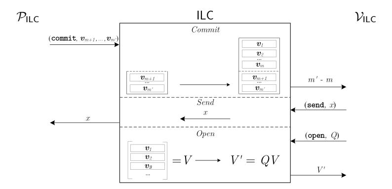
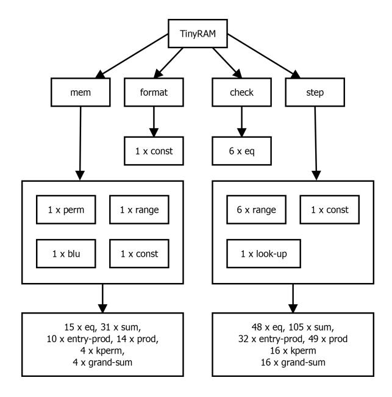
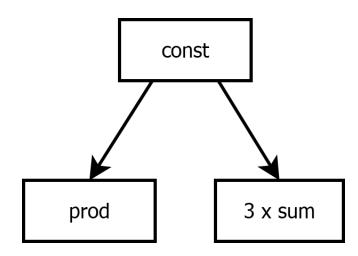
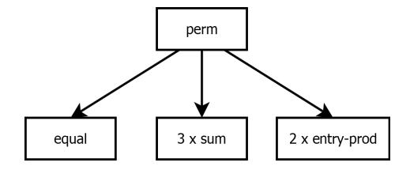
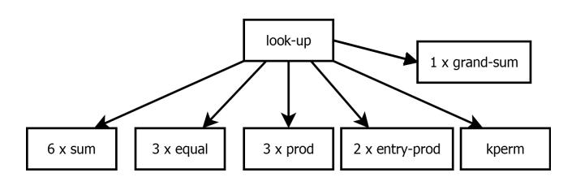
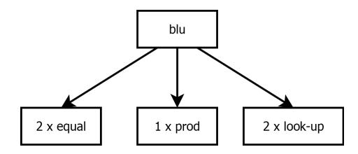
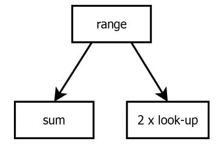
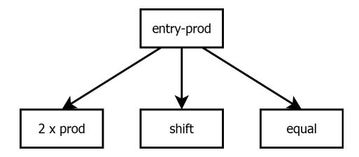

## Nearly Linear-Time Zero-Knowledge Proofs for Correct Program Execution?

Jonathan Bootle, Andrea Cerulli, Jens Groth, Sune Jakobsen, Mary Maller ??

University College London

Abstract. There have been tremendous advances in reducing interaction, communication and verification time in zero-knowledge proofs but it remains an important challenge to make the prover efficient. We construct the first zero-knowledge proof of knowledge for the correct execution of a program on public and private inputs where the prover computation is nearly linear time. This saves a polylogarithmic factor in asymptotic performance compared to current state of the art proof systems. We use the TinyRAM model to capture general purpose processor computation. An instance consists of a TinyRAM program and public inputs. The witness consists of additional private inputs to the program. The prover can use our proof system to convince the verifier that the program terminates with the intended answer within given time and memory

bounds. Our proof system has perfect completeness, statistical special honest verifier zero-knowledge, and computational knowledge soundness assuming linear-time computable collision-resistant hash functions exist. The main advantage of our new proof system is asymptotically efficient prover computation. The prover's running time is only a superconstant factor larger than the program's running time in an apples-to-apples comparison where the prover uses the same TinyRAM model. Our proof system is also efficient on the other performance parameters; the verifier's running time time and the communication are sublinear in the execution time of the program and we only use a log-logarithmic number of rounds.

Keywords. Zero-knowledge proofs, succinct arguments of knowledge, TinyRAM, ideal linear commitments.

## 1 Introduction

A zero-knowledge proof system [\[GMR85\]](#page-44-0) enables a prover to convince a verifier that a statement is true without revealing anything else. We are interested in proving statements of the form u ∈ L, where L is a language in NP. A zeroknowledge proof is an interactive protocol between a prover and a verifier, where both hold the same instance u, and the prover also holds a witness w to u ∈ L. The protocol should satisfy three properties:

<sup>?</sup> The research leading to these results has received funding from the European Research Council under the European Unions Seventh Framework Programme (FP/2007-2013) / ERC Grant Agreement n. 307937

<sup>??</sup> Supported by a scholarship from Microsoft Research

Completeness: A prover holding a witness to u ∈ L can convince the verifier. Soundness: A cheating prover cannot convince the verifier when u /∈ L. Zero-knowledge: The interaction only shows the statement u ∈ L is true. It reveals nothing else, in particular it does not disclose anything of the witness.

Zero-knowledge proofs have numerous applications and are for instance used in constructions of public-key encryption schemes secure against chosen ciphertext attack, digital signatures, voting systems, auction systems, e-cash, secure multiparty computation, and verifiable outsourced computation. The zero-knowledge proofs impact the performance of all these applications, and it is therefore important for them to be as efficient as possible.

There are many zero-knowledge proofs for dealing with arithmetic or boolean circuit satisfiability. However, in applications usually the type of statements we want to prove is that a protocol participant is following the protocol honestly; whatever that protocol may be. This means we want to express statements relating to program execution such as "running program P specified by the protocol on public input x and private input y returns the output z." In principle such a statement can be reduced to circuit satisfiability but the cost of the NP-reduction incurs a prohibitive cost. In this paper, we therefore focus on the important question of getting zero-knowledge proofs for statements relating directly to program execution.

Performance can be measured on a number of parameters including the prover's running time, the verifier's running time, the number of transmitted bits and the number of rounds the prover and verifier interact. Current state of the art zero-knowledge proofs get very good performance on verification time, communication and round complexity, which makes the prover's running time the crucial bottleneck. Indeed, since the other costs are so low, we would happily increase them for even modest savings on the proving time since this is the barrier that make some applications such as verifiable outsourced computation currently unviable. The research challenge we focus on is therefore to get prover-efficient zero-knowledge proofs for correct program execution.

## 1.1 Our Contribution

We use the TinyRAM model [\[BCG](#page-42-0)+13, [BSCG](#page-43-0)+13] for computation. TinyRAM specifies a random access machine with a small instruction set working on W-bit words and addresses. The specification of TinyRAM considers a Harvardarchitecture processor, which means that the program being executed is stored separately from the data being processed and does not change during execution.[1](#page-1-0) Experimental results [\[BCG](#page-42-0)<sup>+</sup>13] show that programs written in C can be compiled efficiently into TinyRAM programs and only have a modest constant overhead compared to optimized compilation to machine code on a modern processor.

<span id="page-1-0"></span><sup>1</sup> TinyRAM can with minor changes also be adapted to a von Neumann architecture where program instructions are fetched from memory [\[BCTV14b\]](#page-42-1). The performance of our proof systems adapted to a von Neumann architecture would remain the same up to a constant factor.

In our proof system, an instance consists of a TinyRAM program and public data given to the program, and a witness is private data given as input to the program. The statement is the claim that the TinyRAM program P running on given public and private data will terminate with answer 0 within specific time and memory bounds. When measuring performance we think of the prover and verifier as being TinyRAM programs with the same word size[2](#page-2-0) .

Our main contribution is an interactive proof system for correct TinyRAM computation, which has perfect completeness, statistical special honest-verifier zero-knowledge, and computational knowledge soundness based on collisionresistant hash functions. Knowledge soundness means that not only do we have soundness and it is infeasible to prove a false statement, but it is also a proof of knowledge such that given access to a successful prover it is possible to extract a witness. For maximal asymptotic efficiency we may use linear-time computable hash functions, which yields the performance given in Fig. [1.](#page-3-0)

Our proof system is highly efficient for computationally intensive programs where the execution time dominates other parameters (see Section [5.2](#page-40-0) for a detailed discussion of parameter choices). For a statement about the execution of a TinyRAM program of length L, running with time bound T and memory bound M, the prover runs in O(αT) steps[3](#page-2-1) for an arbitrarily small superconstant function α(λ) = ω(1). The proof system is also efficient on other performance parameters: the verifier running time and the communication grows roughly with the square-root of the execution time[4](#page-2-2) and we have log-logarithmic round complexity. Figure [1](#page-3-0) gives an efficiency comparison with a state of the art zk-SNARK [\[BCTV14b\]](#page-42-1) for verifying correct program execution on TinyRAM. Further discussion of other proof systems that can verify correct TinyRAM or other types of program execution can be found in Section [1.3.](#page-5-0) The best of these achieve similar asymptotic prover efficiency as [\[BCTV14b\]](#page-42-1).

Remarks. Our proof system assumes some public parameters to be set up that include a description of a finite field, an error-correcting code, and a collisionresistant hash function. The size of the public parameters is just √ poly(λ)(L+M + T) bits though and they can be computed from a small uniformly random string in poly(λ)(L + M + √ T) TinyRAM steps. This means the public parameters

<span id="page-2-0"></span><sup>2</sup> We stress the choice of comparing the prover and verifier to program execution on the same platform. We do this to get an apples-to-apples comparison; there are many zero-knowledge proofs that are "linear time" because they use different metrics for statement evaluation and the prover time, for instance that the cost of validating the statement given the witness is measured in field multiplications and the prover computation is measured in exponentiations.

<span id="page-2-1"></span><sup>3</sup> The big-O notation hides big constants and we do not recommend implementing the proof system as it is; our contribution is to make significant asymptotic gains compared to state-of-the-art zero-knowledge proofs by demonstrating that the prover's computation can be nearly linear.

<span id="page-2-2"></span><sup>4</sup> Disregarding the SHVZK property for a moment, this is also the first proof system for general purpose computation that has both nearly linear computation for the prover and sublinear communication.

<span id="page-3-0"></span>

| Work Prover |                         | Verifier                                           | Communication                                | Rounds                     | Assumption |  |
|-------------|-------------------------|----------------------------------------------------|----------------------------------------------|----------------------------|------------|--|
| [BCTV14b]   | $\Omega(T\log^2 T)$     | $\omega(L+ v )$                                    | $\omega(1)$                                  | 1                          | KoE        |  |
| This work   | $\mathcal{O}(\alpha T)$ | $\operatorname{poly}(\lambda)(\sqrt{T} + L +  v )$ | $\operatorname{poly}(\lambda)(\sqrt{T} + L)$ | $\mathcal{O}(\log \log T)$ | LT-CRHF    |  |

Fig. 1: Efficiency comparisons between our arguments and the most efficient zero-knowledge argument for the correct execution of TinyRAM programs, both at security level  $2^{-\omega(\log \lambda)}$ . Computation is measured in TinyRAM steps and communication in words of length  $W = \Theta(\log \lambda)$  with  $\lambda$  the security parameter. KoE stands for knowledge of exponent type assumption in pairing-based groups and LT-CRHF stands for linear-time collision resistant hash function. It is worth noting KoE assumptions do not resist quantum computers while a LT-CRHF may be quantum resistant.

have little effect on the overall efficiency of the proof system. Moreover, there are variants of the parameters where it is efficiently verifiable the public parameters have the correct structure. This means the prover does not need to trust the parameters to get special honest verifier zero-knowledge, so they can be chosen by the verifier making our proof systems work in the plain model without setup. We have chosen to separate the public parameters into a separate setup though because they are independent of the instance and can be used over many separate proofs.

We did not optimize communication and verification time to go below  $\sqrt{T}$  but if needed it is possible to compose our proof system with a verifier-efficient proof system and get verification time that grows logarithmically in T. This is done by letting the prover send linear-time computable hashes of her messages to the verifier instead of the full messages. Since our proof system is public coin the prover knows after this interaction exactly how the verifier in our proof system ought to run if given the messages in our proof system. She can therefore give a verifier-efficient proof of knowledge that she knows pre-images to the hashes that would make the verifier in our proof system accept.

## 1.2 New techniques

Ben-Sasson et al. [BCG $^+$ 13, BCTV14b] offer proof systems for correct TinyRAM program execution where the prover commits to a time-sorted execution trace as well as an address-sorted memory trace. They embed words, addresses and flags that describe the TinyRAM state at a given time into field elements. The correct transition in the execution trace between the state at time t and the state at time t+1 can then be checked by an arithmetic circuit, the correct writing and reading of memory at a particular address in the memory trace can be checked by another arithmetic circuit, and finally the consistency of memory values in the two traces can be checked by a third arithmetic circuit that embeds a permutation network. Importantly, in these proofs the state transitions can be proved with the same arithmetic circuits in each step so many of the proofs can be batched together at low average cost.

Combining their approach with the recent linear-time proofs for arithmetic circuit satisfiability by Bootle et al. [\[BCG](#page-42-2)+17] it would be possible to get a zeroknowledge proof system with sublinear communication and efficient verification. The prover time, however, would incur at least a logarithmic overhead compared to the time to execute the TinyRAM program. First, the use of an arithmetic circuit that embeds a permutation network to check consistency between execution and memory traces requires a logarithmic number of linear-size layers to describe an arbitrary permutation which translates into a logarithmic overhead when generating the proof. Second, TinyRAM allows both arithmetic operations such as addition and multiplication of words, and logical operations such as bit-wise XOR, AND and OR. To verify logical operations they decompose words into single bits that are handled individually. Bit-decomposition makes it easy to implement the logical operations, but causes an overhead when embedding bits into full size field elements. From a technical perspective our main contribution is to overcome these two obstacles.

To reduce the time required to prove the execution trace is consistent with the memory usage we do not embed a permutation network into an arithmetic circuit. Instead we relate memory consistency to the existence of a permutation that maps one memory access in the execution trace to the next access of the same memory address in the execution trace. Neff [\[Nef01\]](#page-44-1) proposed permutation proofs in the context of shuffle proofs used in mix-nets. Follow-up works [\[Gro10b,](#page-44-2) [GI08\]](#page-44-3) have improved efficiency of such proofs with Bayer and Groth [\[BG12\]](#page-42-3) giving a shuffle argument in the discrete logarithm setting where the prover uses a linear number of exponentiations and communication is sublinear. These shuffle proofs are proposed for the discrete logarithm setting and we do not want to pay the cost of computing exponentiations. The core of the shuffle proofs can be formulated abstractly using homomorphic commitments to vectors though. Since the proofs by Bootle et al. [\[BCG](#page-42-2)+17] also rely on an idealization of homomorphic commitments to vectors the ideas are compatible and we get permutation proofs that cost a linear number of field operations.

To remove the overhead of bit-decomposition we invent a less costly decomposition. While additions and multiplications are manageable using a natural embedding of words into field elements, such a representation is not well suited to logical operations though. However, instead of decomposing words into individual bits, we decompose them into interleaved odd-position bits and even-position bits. A nibble (a3, a2, a1, a0) can for instance be decomposed into (a3, 0, a1, 0)+(0, a2, 0, a0). The key point of this idea is that adding two interleaved even bit nibbles yields (0, a2, 0, a0)+(0, b2, 0, b0) = (a2∧b2, a2⊕b2, a0∧b0, a0⊕b0). So using another decomposition into odd-position and even-position bits we can now extract the XORs and the ANDs. Using this core idea, it is possible to represent all logical operations using field additions together with decomposition into odd and even-position bits. This reduces the verification of logical operations to verifying correct decomposition into odd and even bits.

To enable decomposition proofs into odd and even-position bits, we develop a new lookup proof that makes it possible to check that a field element belongs to a table of permitted values. By creating a lookup table of all words with even-position bits, we make it possible to verify such decompositions. Lookup proofs not only enable decomposition into odd and even-position bits but also turn out to have many other uses such as demonstrating that a field element represents a correct program instruction, or that a field element represents a valid word within the range  $\{0, \ldots, 2^W - 1\}$ .

Combining arithmetic circuits, permutations and table lookups we get a set of conditions for a TinyRAM execution being correct. The program execution of T steps on the TinyRAM machine can in our system be encoded as  $\mathcal{O}(T)$  field elements that satisfy the conditions. Using prime order fields of size  $2^{\mathcal{O}(W)}$  would make it possible to represent these field elements as  $\mathcal{O}(1)$  words each. However, the soundness of our proof systems depends on the field size and to get negligible soundness error we choose a larger field to get a superconstant ratio  $e = \frac{\log |\mathbb{F}|}{W}$ . This factors into the efficiency of our proof system giving a prover runtime of  $\mathcal{O}(\alpha T)$  TinyRAM steps for an instance requiring time T, where  $\alpha$  is a superconstant function which specifies how many steps it takes to compute a field operation, i.e.,  $\alpha = \mathcal{O}(e^2)$ .

Having the inner core of conditions in place: arithmetic circuits for instruction executions, permutations for memory consistency, and look-ups for word decompositions we now deploy the framework of Bootle et al. [BCG<sup>+</sup>17] to get a zero-knowlegde proof system. They use error-correcting codes and linear-time collision-resistant hash functions to give proof systems for arithmetic circuit satisfiability, while we will use their techniques to prove our conditions on the execution trace are satisfied. Their proof system for arithmetic circuit satisfiability requires the prover to use a linear number of field multiplications and the verifier to use a linear number of field additions. However, we can actually get sublinear verification when the program and the input is smaller than the execution time. Technically, the performance difference stems from the type of permutation proof that they use for verifying the correct wiring of the circuit and that we use for memory consistency in the execution trace. In their use, the permutation needs to be linked to the publicly known wiring of the arithmetic circuit and in order for the verifier to check the wiring is correct he must read the entire circuit. We on the other hand do not disclose the memory accesses in the execution trace to the verifier, indeed to get zero-knowledge it is essential the memory accesses remain secret. We therefore need a hidden permutation proof and such proofs can have sublinear verification time.

#### <span id="page-5-0"></span>1.3 Related work

**Interaction.** Interaction is measured by the number of rounds the prover and verifier exchange messages. Feige and Shamir [FS90] showed that constant round argument systems exist, and Blum, Feldman and Micali [BFM88] showed that if the prover and verifier have access to an honestly generated common reference string it is possible to have non-interactive zero-knowledge proofs where the prover sends a single message to the verifier.

Communication. A series of works [\[KR08,](#page-44-4) [IKOS09,](#page-44-5) [Gen09,](#page-43-2) [GGI](#page-43-3)<sup>+</sup>15] have constructed proof systems where the number of transmitted bits is proportional to the witness size. It is unlikely that sublinear communication is possible in proof systems with statistical soundness but Kilian [\[Kil92\]](#page-44-6) constructed an argument system, a computationally sound proof system, with polylogarithmic communication complexity. Kilian's zero-knowledge argument relies on probablistically checkable proofs [\[AS98\]](#page-42-5), which are still complex for practical use, but the invention of interactive oracle proofs [\[BCS16\]](#page-42-6) have made this type of proof system a realistic option. Ishai et al. [\[IKO07\]](#page-44-7) give laconic arguments where the prover's communication is minimal. Groth [\[Gro10a\]](#page-44-8), working in the common reference string model and using strong assumptions, gave a pairing-based non-interactive zero-knowledge argument consisting of a constant number of group elements. Follow-up works on succinct non-interactive arguments of knowledge (SNARKs) have shown that it is possible to have both a modest size common reference string and proofs as small as 3 group elements [\[BCCT12,](#page-42-7) [GGPR13,](#page-43-4) [PHGR16,](#page-44-9) [BCCT13,](#page-42-8) [Gro16\]](#page-44-10).

Verifier computation. In general the verifier has to read the entire instance since even a single deviating bit may render the statement u ∈ L false. However, in many cases an instance can be represented more compactly than the witness and the instance may be small compared to the computational effort it takes to verify a witness for the instance. In these cases it is possible to get sublinear verification time compared to the time it takes to check the relation defining the language L. This is for instance the case for the SNARKs mentioned above, where the verification time only depends on the size of the instance but not the complexity of the relation.

Prover computation. Given the success in reducing interaction, communication and verification time, the important remaining challenge is to get good efficiency for the prover.

Boolean and arithmetic circuits. Many classic zero-knowledge proofs rely on cyclic groups and have applications in digital signatures, encryption schemes, etc. The techniques first suggested by Schnorr [\[Sch91\]](#page-44-11) can be generalized to NP-completel languages such as boolean and arithmetic circuit satisfiability [\[CD98,](#page-43-5) [Gro09,](#page-44-12) [BCC](#page-42-9)+16]. In these proofs and arguments the prover uses O(N) group exponentiations, where N is the number of gates in the circuit. For the discrete logarithm assumption to hold, the groups must have superpolynomial size in the security parameter though, so exponentiations incur a significant overhead compared to direct evaluation of the witness in the circuit. The SNARKs mentioned earlier also rely on cyclic groups and likewise require the prover to do O(N) exponentiations. Recently, Bootle et al. [\[BCG](#page-42-2)<sup>+</sup>17] used the structure of [\[Gro09\]](#page-44-12) to give constant overhead zero-knowledge proofs for arithmetic circuit satisfiability, where the prover uses O(N) field multiplications, relying on error-correcting codes and efficient collision-resistant hash functions instead of cyclic groups.

An alternative to these techniques is to use the "MPC in the head" paradigm by Ishai et al. [\[IKOS09\]](#page-44-5). Relying on efficient MPC techniques, Damg˚ard, Ishai and Krøigaard gave zero-knowledge arguments with little communication and a prover complexity of polylog(λ)N. Instead of focusing on theoretical performance, ZKBoo [\[GMO16\]](#page-44-13) and its subsequent optimisation ZKB++ [\[CDG](#page-43-6)+17] are practical implementations of a "3PC in the head" style zero-knowledge proof for boolean circuit satisfiability. Communication grows linearly in the circuit size in both proofs, and a superlogarithmic number of repetitions is required to make the soundness error negligible, but the speed of the symmetric key primitives makes practical performance good. Ligero [\[AHIV17\]](#page-42-10) provides another implementiation using techniques related to [\[BCG](#page-42-2)<sup>+</sup>17]. It has excellent practical performance but asymptotically it is not as efficienct as [\[BCG](#page-42-2)<sup>+</sup>17] due to the use of more expensive error-correcting codes. Another alternative also inspired by the MPC world is to use garbled circuits to construct zero-knowledge arguments for boolean circuits [\[BP12,](#page-43-7) [JKO13,](#page-44-14) [FNO15\]](#page-43-8).The proofs grow linearly in the size of the circuit and there is a polylogarithmic overhead for the prover and verifier due to the cryptographic operations but implementations are practical [\[JKO13\]](#page-44-14).

There are several proof systems for efficient verification of outsourced computation [\[GKR08,](#page-44-15) [CMT12,](#page-43-9) [Tha13,](#page-45-0) [WHG](#page-45-1)+16]. While this line of works mostly focus on verifying deterministic computation and does not require zero-knowledge, recent works add in cryptographic techniques to obtain zero-knowledge [\[ZGK](#page-45-2)+17, [WJB](#page-45-3)<sup>+</sup>17, [WTas](#page-45-4)<sup>+</sup>17]. Hyrax [\[WTas](#page-45-4)<sup>+</sup>17] offers an implementation with good concrete performance. It has sublinear communication and verification, while the prover computation is dominated by O(dN + S log S) field operations for a depth d and width S circuit when the witness is small compared to the circuit size. If in addition the circuit can be parallelized into many identical sub-computations the prover cost can be further reduced to O(dN) field operations. The system vSQL [\[ZGK](#page-45-2)+17] is tailored towards verifing database queries and as in this work it avoids the use of permutation networks using permutation proofs based on invariance of roots in polynomials as first suggested by Neff [\[Nef01\]](#page-44-1).

Correct program execution. In practice, most computation does not resemble circuit evaluation but is instead done by computer programs processing one instruction at a time. There has been a sustained effort to construct efficient zero-knowledge proofs that support real-life computation, i.e., proving statements of the form "when executing program P on public input x and private input y we get the output z." In the context of SNARKs there are already several systems for proving correct execution of programs written in C [\[PHGR16,](#page-44-9) [BFR](#page-42-11)<sup>+</sup>13, [BCG](#page-42-0)<sup>+</sup>13, [WSR](#page-45-5)<sup>+</sup>15]. These system generally involve a front-end which compiles the program into an arithmetic circuit which is then fed into a cryptographic back-end. Much work has been dedicated to improving both sides and achieving different trade-offs between efficiency and expressiveness of the computation.

When we want to reason theoretically about zero-knowledge proofs for correct program execution, it is useful to abstract program execution as a random-access machine that in each instruction can address an arbitrary location in memory and do integer operations on it. For closer resemblance to real-life computation, we can bound the integers to a specific word size and specify a more general set of operations the random-access machine can execute. TinyRAM [\[BSCG](#page-43-0)<sup>+</sup>13, [BCG](#page-42-0)<sup>+</sup>13] is a prominent example of a computational model bridging the gap

between theory and real-word computation. It comes with a compiler from C to TinyRAM code and underpins several implementations of zero-knowledge proofs for correct program execution [BCG<sup>+</sup>13, BCTV14b, BCTV14a, CTV15, BBC<sup>+</sup>17] where the prover time is  $\Omega(T\log^2\lambda)$  for a program execution that takes time T. Similar efficiency is also achieved, asymptotically, by other proof systems that can compile (restricted) C programs and prove correct execution such as Pinocchio [PHGR16], Pantry [BFR<sup>+</sup>13] and Buffet [WSR<sup>+</sup>15]. Our work reduces the prover's overhead from  $\Omega(\log^2\lambda)$  to an arbitrary superconstant  $\alpha = \omega(1)$  and is therefore an important step towards optimal prover complexity.

Concurrent Work. Zhang et al. [ZGK+18] have concurrently with our work developed and implemented a scheme for verifying RAM computations. Like us and [ZGK<sup>+</sup>17], they avoid the use of permutation networks by using permutation proofs based on polynomial invariance by Neff [Nef01]. The idea underlying their technique for proving the correct fetch of an operation is related to the idea underpinning our look-up proofs. There are significant differences between the techniques used in our works; e.g. they rely on techniques from [CMT12] for instantiating proofs where we use techniques based on ideal linear commitments [BCG<sup>+</sup>17]. The proofs in [ZGK<sup>+</sup>18] are not zero-knowledge since they leak the number of times each type of instruction is executed, while our proofs are zero-knowledge. In terms of prover efficiency, [ZGK<sup>+</sup>18] focuses on concrete efficiency and yields impressive concrete performance. Asymptotically speaking, however, we are a polylogarithmic factor more efficient. This may require some explanation because they claim linear complexity for the prover. The reason is that they treat the prover as a TinyRAM machine with logarithmic word size in their performance measurement. Looking under the hood, we see that they use bit-decomposition to handle logical operations, which is constant overhead when you fix a particular word size (e.g. 32 bits) but asymptotically the cost of this is logarithmic since it is linear in the word size. Also, they base commitments on cyclic groups and the use of exponentiations incurs a superlogarithmic overhead for the prover when implemented in TinyRAM.

## 2 Preliminaries

#### 2.1 Notation

We write  $y \leftarrow A(x)$  for an algorithm returning y on input x. When the algorithm is randomized, we write  $y \leftarrow A(x;r)$  to explicitly refer to the random coins r picked by the algorithm. We use a security parameter  $\lambda$  to indicate the desired level of security. The higher the security parameter, the smaller the risk of an adversary compromising security should be. For functions  $f,g:\mathbb{N}\to[0,1]$ , we write  $f(\lambda)\approx g(\lambda)$  if  $|f(\lambda)-g(\lambda)|=\frac{1}{\lambda^{\omega(1)}}$ . We say a function f is overwhelming if  $f(\lambda)\approx 1$  and that it is negligible if  $f(\lambda)\approx 0$ . In general we want the adversary's chance of breaking our proof systems to be negligible in  $\lambda$ . As a minimum requirement for an algorithm or adversary to be efficient it has to run in polynomial time in the security parameter. We abbreviate probabilistic (deterministic) polynomial time

in the security parameter PPT (DPT). For a positive integer n, [n] denotes the set  $\{1, \ldots, n\}$ . We use bold letters such as  $\boldsymbol{v}$  for row vectors over a finite field  $\mathbb{F}$ .

## 2.2 Proofs of Knowledge

We follow [BCG<sup>+</sup>17] in defining proofs of knowledge over a communication channel and their specification of the ideal linear commitment channel and the standard channel. A *proof system* is defined by stateful PPT algorithms  $(\mathcal{K}, \mathcal{P}, \mathcal{V})$ . The setup generator  $\mathcal{K}$  is only run once to provide public parameters pp that will be used by the prover  $\mathcal{P}$  and verifier  $\mathcal{V}$ . We will in our security definitions just assume  $\mathcal{K}$  is honest, which is reasonable since in our constructions the public parameters are publicly verifiable and could even be generated by the verifier.

The prover and verifier communicate with each other through a communication channel  $\stackrel{\text{chan}}{\longleftrightarrow}$ . When  $\mathcal{P}$  and  $\mathcal{V}$  interact on inputs s and t through a channel  $\stackrel{\text{chan}}{\longleftrightarrow}$  we let  $\text{view}_{\mathcal{V}} \leftarrow \langle \mathcal{P}(s) \stackrel{\text{chan}}{\longleftrightarrow} \mathcal{V}(t) \rangle$  be the view of the verifier in the execution, i.e., all inputs he gets including random coins, and we let  $\text{trans}_{\mathcal{P}} \leftarrow \langle \mathcal{P}(s) \stackrel{\text{chan}}{\longleftrightarrow} \mathcal{V}(t) \rangle$  denote the transcript of the communication between prover and channel. The protocol ends with the verifier accepting or rejecting the proof. We write  $\langle \mathcal{P}(s) \stackrel{\text{chan}}{\longleftrightarrow} \mathcal{V}(t) \rangle = b$  depending on whether he accepts (b=1) or rejects (b=0).

In the  $standard\ channel\ \longleftrightarrow$ , all messages are forwarded between prover and verifier. As in [BCG<sup>+</sup>17], we also consider an  $ideal\ linear\ commitment$  channel,  $\stackrel{\text{ILC}}{\longleftrightarrow}$ , described in Figure 2. When using the ILC channel, the prover can submit a commit command to commit to vectors of field elements of some fixed length k, specified in the public parameters. The vectors remain secretly stored in the channel, and will not be forwarded to the verifier. Instead, the verifier only learns how many vectors the prover has committed to. The verifier can submit a send command to the ILC channel to send a mesage to the prover. In addition, the verifier can also submit open queries to the ILC channel to obtain openings of linear combinations of the vectors sent by the prover. We stress that the verifier can request several linear combinations of stored vectors within a single open query, as depicted in Figure 2 using matrix notation.

We say a proof system is *public coin* if the verifier's messages to the communication channel are chosen uniformly at random and independently of the actions of the prover, i.e., the verifier's messages to the prover correspond to the verifier's randomness  $\rho$ . All our proof systems will be public coin. In a proof system over the ILC channel, sequences of commit, send and open queries can alternate arbitrarily. However, since our proof systems are public coin we can without loss of generality assume the verifier will only make one big open query at the end of the protocol and then decide whether to accept or reject.

Let  $\mathcal{R}$  be an efficiently decidable relation of tuples (pp, u, w). We can define a matching language  $\mathcal{L} = \{(pp, u) | \exists w : (pp, u, w) \in \mathcal{R}\}$ . We refer to u as the instance and w as the witness to  $(pp, u) \in \mathcal{L}$ . The public parameter pp will specify the security parameter  $\lambda$ , perhaps implicitly through its length, and may also contain other parameters used for specifying the relation. Typically, pp will also

<span id="page-10-0"></span>

Fig. 2: Description of the ILC channel.

contain parameters that do not influence membership of R but may aid the prover and verifier, for instance the field and vector size in the ILC channel.

The protocol (K,P, V) is called a proof of knowledge over a communication channel chan ←→ for a relation R if it has perfect completeness and computational knowledge soundness as defined below.

Definition 1 (Perfect Completeness). A proof system is perfectly complete if for all PPT adversaries A

$$\Pr\left[\begin{array}{c} pp \leftarrow \mathcal{K}(1^{\lambda}); (u,w) \leftarrow \mathcal{A}(pp): \\ (pp,u,w) \notin \mathcal{R} \ \lor \ \langle \mathcal{P}(pp,u,w) \stackrel{\text{chan}}{\longleftrightarrow} \mathcal{V}(pp,u) \rangle = 1 \end{array}\right] = 1.$$

Definition 2 (Knowledge soundness). A public-coin proof system has computational (strong black-box) knowledge soundness if for all DPT P ∗ there exists an expected PPT extractor E such that for all PPT adversaries A

$$\Pr\left[\begin{array}{l} pp \leftarrow \mathcal{K}(1^{\lambda}); (u,s) \leftarrow \mathcal{A}(pp); w \leftarrow \mathcal{E}^{\langle \mathcal{P}^*(s) \overset{\text{chan}}{\longleftarrow} \mathcal{V}(pp,u) \rangle}(pp,u) : \\ b = 1 \ \land \ (pp,u,w) \notin \mathcal{R} \end{array}\right] \approx 0.$$

Here the oracle hP<sup>∗</sup> (s) chan ←→ V(pp, u)i runs a full protocol execution and if the proof is successful it returns the transcript trans<sup>P</sup> of the prover's communication with the channel. The extractor E can ask the oracle to rewind the proof to any point in a previous transcript and execute the proof again from this point on with fresh public-coin challenges from the verifier. We let b ∈ {0, 1} be the verifier's output in the first oracle execution, i.e., whether it accepts or not, and we think of s as the state of the prover. The definition can then be paraphrased as saying that if the prover in state s makes a convincing proof, then E can extract a witness.

If the definition holds also for unbounded P <sup>∗</sup> and A we say the proof has statistical knowledge soundness.

If the definition holds for a non-rewinding extractor, i.e., E only requires a single transcript of the prover's communication with the channel, we say the proof system has knowledge soundness with straight-line extraction.

We will construct public-coin proofs of knowledge that have special honest-verifier zero-knowledge. This means that if the verifier's challenges are known in advance then it is possible to simulate the verifier's view without knowing a witness. In our definition, the simulator works even for verifiers who may use adversarial biased coins in choosing their challenges as long as they honestly follow the specification of the protocol.

Definition 3 (Special Honest-Verifier Zero-Knowledge). A public-coin proof of knowledge is computationally special honest-verifier zero-knowledge (SHVZK) if there exists a PPT simulator S such that for all stateful interactive PPT adversaries A that output (u, w) such that  $(pp, u, w) \in R$  and randomness  $\rho$  for the verifier

$$\begin{split} & \Pr\left[\begin{array}{c} pp \leftarrow \mathcal{K}(1^{\lambda}); (u, w, \rho) \leftarrow \mathcal{A}(pp); \\ \mathsf{view}_{\mathcal{V}} \leftarrow \langle \mathcal{P}(pp, u, w) \overset{\mathrm{chan}}{\longleftrightarrow} \mathcal{V}(pp, u; \rho) \rangle : \mathcal{A}(\mathsf{view}_{\mathcal{V}}) = 1 \end{array}\right] \\ & \approx \Pr\left[pp \leftarrow \mathcal{K}(1^{\lambda}); (u, w, \rho) \leftarrow \mathcal{A}(pp); \mathsf{view}_{\mathcal{V}} \leftarrow \mathcal{S}(pp, u, \rho) : \mathcal{A}(\mathsf{view}_{\mathcal{V}}) = 1\right]. \end{split}$$

We say the proof is statistically SHVZK if the definition holds also against unbounded adversaries, and we say the proof is perfectly SHVZK if the probabilities are exactly equal.

<span id="page-11-0"></span>Full Zero-Knowledge SHVZK only guarantees the simulator works for honest verifiers. It is in some applications desirable to have full zero-knowledge where the simulator works for arbitrary malicious verifiers, even those that deviate from the protocol. However, it makes sense to simply focus on SHVZK since there are very efficient standard transformations from SHVZK to full zero-knowledge.

In the Fiat-Shamir transform [FS86] the verifier's challenges in a proof system are computed using a cryptographic hash function applied to the transcript up to the challenge. The Fiat-Shamir transform can therefore make a public-coin proof system non-interactive. Our proof system is such that the Fiat-Shamir heuristic yields a non-interactive proof that is knowledge sound and has full zero-knowledge in the random oracle model.

If the random oracle model is undesirable, an alternative is to use coin-flipping between the prover and verifier to decide on the challenges. We let the public parameters include a trapdoor commitment scheme. The prover commits to coins  $\delta_1, \ldots, \delta_\mu$  and starts executing the proof system, where in round i with challenge  $\rho_i$  from the verifier, the prover uses the modified challenge  $\rho_i' = \rho_i \oplus \delta_i$ . In the last round the prover then opens the commitment to  $\delta_1, \ldots, \delta_\mu$  so the verifier learns the modifiers and hence what the challenges were. The idea is now that we give the simulator the trapdoor for the commitment scheme. This means it can simulate the proof with random public coin challenges  $\rho_i'$ , and then at the end after seeing the verifier challenges  $\rho_i$  open the commitments to suitable  $\delta_i = \rho_i' \oplus \rho_i$  to make the simulation work.

## 2.3 TinyRAM

TinyRAM is a random-access machine model operating on W-bit words and using K registers. We now describe the key features of TinyRAM but refer the reader to the specification [\[BSCG](#page-43-0)<sup>+</sup>13] for full details. A state of the TinyRAM machine consists of a program P (list of L instructions), a program counter pc (word), K registers reg<sup>0</sup> , . . . ,regK−<sup>1</sup> (words), a condition flag flag (bit), and M words of memory with addresses 0, . . . , M − 1.

The TinyRAM specification includes two read-only tapes to retrieve its inputs but with little loss of efficiency we may assume the program starts by reading the tapes into memory[5](#page-12-0) We will therefore skip the reading phase and assume the memory is initialized with the inputs (and 0 for the remaining words). Also, we will assume on initialization that pc, the registers and flag are all set to 0.

The program consists of a sequence of L instructions that include bit-wise logical operations, arithmetic operations, shifts, comparisons, jumps, and storing and loading data in memory. The program terminates by using a special command answer that returns a word. We consider the program to have succeeded if it answers 0, otherwise we consider the answer to be a failure code.

We write reg<sup>i</sup> and r<sup>i</sup> when referring to register i and to its content, respectively. We write A to refer to either a register or an immediate value specified in a program instruction and write A for the value stored therein. Depending on the instruction a word a may be interpreted as an unsigned value in {0, . . . , 2<sup>W</sup> − 1} or as a signed value in {−2<sup>W</sup>−<sup>1</sup> , . . . , 2<sup>W</sup>−<sup>1</sup> − 1}. Signed values are in two's complement, so given a word a = (aw−1, . . . , a0) ∈ {0, 1}<sup>W</sup> the bit aW−<sup>1</sup> is the sign and the signed value is −2<sup>W</sup> + a if aW−<sup>1</sup> = 1 and a if aW−<sup>1</sup> = 0. We distinguish operations over signed values by using subscript s, e.g. a ×<sup>s</sup> b and a ≥<sup>s</sup> b are used to denote product and comparison over the signed values. With this notation in mind, we specify the instruction set in Table [1.](#page-13-0)

Correct Program Execution. It is often important to check that a protocol participant supposedly running program P on public input x and private input w provides the correct output z. Without loss of generality, we can formulate the verification as an extended program that takes public input v = (x, z) and answers 0 if and only if z is the output of the computation. We therefore formulate correct program execution as the program just answering 0.

We now give a relation that captures correct TinyRAM program execution. An instance is of the form u = (P, v, T, M), where P is a TinyRAM program, v is a list of words given as input to the program, T is a time bound, and M is the size of the memory. A witness w is another list of words. We assume without loss of generality that the witness is appended by 0's, such that |v| + |w| = M and the program starts with the memory being initialized to these words.

The statement we want to prove is that the program P terminates in T steps using M words of memory on the public input v and private input w with the

<span id="page-12-0"></span><sup>5</sup> The specification [\[BSCG](#page-43-0)<sup>+</sup>13] calls a program proper if it first reads all inputs into memory and provides a 7-line TinyRAM program that does this in ∼ 5M steps.

<span id="page-13-0"></span>

| Instruction          | Oper    | ands          |   | Effect                                                     | Flag                                      |
|----------------------|---------|---------------|---|------------------------------------------------------------|-------------------------------------------|
| and                  | $reg_i$ | $reg_i$       | A | compute $r_i$ as bitwise AND of $r_j$ and A                | result is $0^W$                           |
| or                   | $reg_i$ | $reg_i$       |   | compute $r_i$ as bitwise OR of $r_j$ and A                 | result is $0^W$                           |
| xor                  | $reg_i$ | $reg_i$       | A | compute $r_i$ as bitwise XOR of $r_j$ and A                | result is $0^W$                           |
| not                  | $reg_i$ | A             |   | compute $r_i$ as bitwise NOT of A                          | result is $0^W$                           |
| add                  | $reg_i$ | $reg_i$       | A | compute $r_i = r_j + A \mod 2^W$                           | overflow: $\mathbf{r}_j + A \geq 2^W$     |
| sub                  | $reg_i$ | $reg_i$       | A | compute $r_i = r_j - A \mod 2^W$                           | borrow: $r_j < A$                         |
| mull                 | $reg_i$ | $reg_i$       | A | compute $r_i = r_j \times A \mod 2^W$                      | $\neg$ overflow: $r_j \times A < 2^W$     |
| umulh                | $reg_i$ | $reg_{j}^{j}$ | A | compute $r_i$ as upper W bits of $r_j \times A$            | $\neg$ overflow: $\mathbf{r}_i = 0$       |
| smulh                | $reg_i$ | $reg_j^{J}$   | A | compute $r_i$ as upper W bits of the signed                | $\neg$ over/underflow: $\mathbf{r}_i = 0$ |
|                      |         | -             |   | $2W$ -bit $r_j \times_s A \text{ (mull gives lower word)}$ |                                           |
| udiv                 | $reg_i$ | $reg_j$       |   | compute $r_i$ as quotient of $r_j/A$                       | division by zero: $A = 0$                 |
| umod                 | $reg_i$ | $reg_j$       |   | compute $r_i$ as remainder of $r_j/A$                      | division by zero: $A = 0$                 |
| shl                  | $reg_i$ | $reg_j$       | A | compute $r_i$ as $r_i$ shifted left by A bits              | $MSB \text{ of } r_j$                     |
| $\operatorname{shr}$ | $reg_i$ | $reg_j$       | A | compute $r_i$ as $r_i$ shifted right by A bits             | LSB of $r_j$                              |
| cmpe                 | $reg_i$ | A             |   | compare if equal                                           | equal: $r_i = A$                          |
| cmpa                 | $reg_i$ | A             |   | compare if above                                           | above: $r_i > A$                          |
| cmpae                | $reg_i$ | A             |   | compare if above or equal                                  | above/equal: $r_i \geq A$                 |
| cmpg                 | $reg_i$ | A             |   | signed compare if greater                                  | greater: $r_i >_s A$                      |
| $\mathbf{cmpge}$     | $reg_i$ | A             |   | signed compare if greater or equal                         | greater/equal: $r_i \geq_s A$             |
| mov                  | $reg_i$ | A             |   | $set r_i = A$                                              | flag unchanged                            |
| cmov                 | $reg_i$ | A             |   | $\text{if flag} = 1 \text{ set } r_i = A$                  | flag unchanged                            |
| jmp                  | A       |               |   | set pc = A                                                 | flag unchanged                            |
| cjmp                 | A       |               |   | $\nif flag = 1 set pc = A $                                | flag unchanged                            |
| cnjmp                | A       |               |   | if $flag = 0$ set $pc = A$                                 | flag unchanged                            |
| store                |         | $eg_i$        |   | -                                                          | flag unchanged                            |
| load                 | $reg_i$ | A             |   | set $r_i$ to the word stored at address A                  | flag unchanged                            |
| answer               | A       |               |   | stall or halt returning the word A                         | flag unchanged                            |

Table 1: TinyRAM instruction set, excluding the **read** command. The flag is set equal to 1 if the condition is met and 0 otherwise. If the **pc** exceeds the program length, i.e.,  $pc \ge L$ , or we address a non-existing part of memory, i.e., in a **store** or **load** instruction  $A \ge M$ , the TinyRAM machine halts with answer 1.

instruction **answer** 0. We therefore define

$$\mathcal{R}_{\mathsf{TinyRAM}} = \left\{ \begin{array}{l} (pp, u, w) = ((W, K, *), (P, v, T, M), w) \mid \\ P \text{ is a TinyRAM program with $W$-bit words, $K$ registers,} \\ \text{and $M$ words of addressable memory, which on inputs $v$ and $w$ terminates in $T$ steps with the instruction answer 0. \end{array} \right.$$

Our main interest is to prove correct execution of programs that require heavy computation so we will throughout the article assume the number of steps outweigh the other parameters, i.e., T > L + M, where L is the number of instructions in the program.

## <span id="page-14-1"></span>3 Arithmetization of Correct Program Execution

As a first step towards the realization of proofs for the correct execution of TinyRAM programs we translate  $\mathcal{R}_{\mathsf{TinyRAM}}$  into a more amenable relation involving elements in a finite field. Given a TinyRAM machine with word-size W and a finite field  $\mathbb{F}$ , we can in a natural way embed words into field elements by encoding a word  $a \in \{0, \dots, 2^W - 1\}$  as the field element  $a1_{\mathbb{F}} = 1_{\mathbb{F}} + \dots + 1_{\mathbb{F}}$  (a times). We will use fields of characteristic  $p > 2^{2W} - 2^{W-1}$  because then sums and products of words are less than p and we avoid overflow in the field operations we apply to the embedded words.

We will encode the program, memory and states of a TinyRAM program as tuples of field elements. We then introduce a new relation  $\mathcal{R}^{\mathsf{field}}_{\mathsf{TinyRAM}}$  consisting of a set of arithmetic constraints these encodings should satisfy to guarantee the correct program execution. The relation will take instances u = (P, v, T, M), and witnesses w consisting of the encodings as well as a set of auxiliary field elements.

In this section we specify the structure of the witness w and how the relation of correct program execution decomposes into simpler sub-relations. It will be the case that the encoding of the witness can be done alongside an execution of the program in  $\mathcal{O}(L+M+T)$  field operations.

#### <span id="page-14-0"></span>3.1 Witness Structure

Given a correct program execution we encode program, memory and states of the TinyRAM machine as field elements and arrange them in a number of tables as pictured in Table 2. The execution table Exe, contains the field elements encoding of the states of the TinyRAM machine. It consists of T rows, where row t describes the state at the beginning of step t. A row includes field elements that encode the time t, the program counter  $\mathsf{pc}_t$ , the instruction  $\mathsf{inst}_{\mathsf{pc}_t}$  corresponding to  $\mathsf{pc}_t$ , an immediate value  $\mathsf{A}_t$ , the values  $\mathsf{r0}_t, \ldots, \mathsf{rK}_{-1,t}$  contained in the registers  $\mathsf{reg}_0, \ldots, \mathsf{reg}_{K-1}$  at time t, and the flag flag $_t$ . The next row contains the resulting state of the TinyRAM machine at time t+1. Each row also includes a memory address  $\mathsf{addr}_t$ , and the value  $\mathsf{vaddr}_t$  stored at this address after the execution of the step, as well as a constant number of auxiliary field elements to be specified later that will be used to check correctness of program execution.

<span id="page-15-0"></span>

| Time | рс         | Instruction       | Immediate | $reg_0$     |   | $reg_{K-1}$   | Flag         | Address      | Value            | $aux_{Exe}$ |
|------|------------|-------------------|-----------|-------------|---|---------------|--------------|--------------|------------------|-------------|
| 1    | 0          | $inst_0$          | $A_0$     | 0           |   | 0             | 0            | 0            | 0                |             |
|      |            |                   |           |             | : |               |              |              |                  |             |
| t    | $pc_t$     | $inst_{pc_t}$     | $A_t$     | $r_{0,t}$   |   | $r_{K-1,t}$   | $flag_t$     | $addr_t$     | $V_{addr_t}$     |             |
| t+1  | $pc_{t+1}$ | $inst_{pc_{t+1}}$ | $A_{t+1}$ | $r_{0,t+1}$ |   | $r_{K-1,t+1}$ | $flag_{t+1}$ | $addr_{t+1}$ | $V_{addr_{t+1}}$ |             |
|      |            |                   |           |             | : |               |              |              |                  |             |
| T    | $pc_T$     | answer 0          | 0         | $r_{0,T}$   |   | $r_{K-1,T}$   | $flag_T$     | $addr_T$     | $V_{addr_T}$     |             |

(a) The execution table Exe.

| рс  | Instruction       | Immediate | $aux_{Prog}$ |
|-----|-------------------|-----------|--------------|
| 0   | inst <sub>0</sub> | $A_0$     |              |
|     | :                 |           |              |
|     |                   |           |              |
| L-1 | $inst_{L-1}$      | $A_{L-1}$ |              |

(b) The program table Prog.

| Address | Initial value | usd |
|---------|---------------|-----|
| 0       | 0             | 0   |
| 1       | $v_1$         | 0   |
|         | :             |     |
| M-1     | $v_{M-1}$     | 0   |
| 0       | 0             | 1   |
| 1       | $v_1$         | 1   |
|         | ÷             |     |
| M-1     | $v_{M-1}$     | 1   |

|    | Values                              |  |
|----|-------------------------------------|--|
|    | 0                                   |  |
|    | 1                                   |  |
|    | 4                                   |  |
|    | 5                                   |  |
|    | :                                   |  |
|    | $\sum_{i=0}^{\frac{W}{2}-1} 2^{2i}$ |  |
| 1/ | The +                               |  |

(d) The table EvenBits.

(c) The memory table Mem.

Table 2: The execution table  $\mathsf{Exe},$  the program table  $\mathsf{Prog},$  the memory table  $\mathsf{Mem}$  and the table  $\mathsf{EvenBits}.$ 

The next table is the program table  $\mathsf{Prog}$ , which contains the field elements encoding of the TinyRAM program P. Each row contains the description of one line of the program, consisting of one instruction, at most three operands, and possibly an immediate value. Furthermore, we introduce a constant number of auxiliary field elements in each row. These entries can be efficiently computed given the program line stored in the same row and will help verifying its execution, e.g. we encode the position of input and output registers as auxiliary field elements.

The memory table Mem has rows that list the possible memory addresses, their initial values, and an auxiliary field element  $\mathsf{usd} \in \{0,1\}$ . For every pair of address and corresponding initial value, the memory table Mem contains a row in which  $\mathsf{usd} = 0$  and another row in which  $\mathsf{usd} = 1$ . Recall that the memory is initialized with input words listed in v, w, i.e., the input words contributing to the instance and witness of the relation  $\mathcal{R}_{\mathsf{TinyRAM}}$ .

In addition to these, we also consider an auxiliary lookup table EvenBits containing the encoding of words of length W whose binary expansion has 0 in all odd positions. The table contains  $2^{\frac{W}{2}}$  field elements and will be used as part of a check that certain field elements encode a word of length W.

Let (Exe, Prog, Mem, EvenBits) be the tuple of field elements encoding the program execution and the auxiliary values. We can now reformulate the correct execution of a TinyRAM program defined by  $\mathcal{R}_{\mathsf{TinyRAM}}$  as a relation that imposes a number of constraints the field elements should satisfy:

$$\mathcal{R}_{\mathsf{TinyRAM}}^{\mathsf{field}} = \left\{ \begin{array}{l} (pp, u, w) = ((W, K, \mathbb{F}, *), (P, v, T, M), \mathsf{w}) \ \ \, | \\ \mathsf{w} = (\mathsf{Exe}, \mathsf{Prog}, \mathsf{Mem}, \mathsf{EvenBits}, *) \\ (pp, (P, v, T, M), \mathsf{w}) \in \mathcal{R}_{\mathsf{check}} \\ (pp, (T, M), \mathsf{w}) \in \mathcal{R}_{\mathsf{mem}} \\ (pp, \bot, \mathsf{w}) \in \mathcal{R}_{\mathsf{step}} \end{array} \right\}$$

where the relations  $\mathcal{R}_{\mathsf{check}}$ ,  $\mathcal{R}_{\mathsf{mem}}$ ,  $\mathcal{R}_{\mathsf{step}}$  jointly guarantee the witness w consists of field elements encoding a correct TinyRAM execution that answers 0 in T steps using M words of memory, public input v, and additional private inputs.

Specifically, the relation  $\mathcal{R}_{\mathsf{check}}$  checks the initial values of the memory are correctly included into Mem, the program is correctly encoded in Prog, EvenBits contains the correct encodings of the auxiliary lookup table, the initial state of the TinyRAM machine is correct and that it terminates with answer 0 in step T. The role of  $\mathcal{R}_{\mathsf{mem}}$  is to check that memory usage is consistent throughout the execution of the program. That is, if a memory value is loaded at time t then it should match the last stored value at the same address. Finally,  $\mathcal{R}_{\mathsf{step}}$  checks that each step of the execution has been performed correctly. In the rest of the section we describe each of these sub-relations, decomposing them in terms of elemental relations such as equality, lookup, and range relations.

**Equality Relations.** An equality relation  $\mathcal{R}_{eq}$  can be used to check that rows  $\mathsf{Tab}_i$  of a table  $\mathsf{Tab}$  encode tuples  $v_1, \ldots, v_m$  of given W-bit words

$$\mathcal{R}_{\mathsf{eq}} = \left\{ \begin{array}{l} (pp, u, w) = ((W, K, \mathbb{F}, *), (\boldsymbol{v}_1, \dots, \boldsymbol{v}_m), \mathsf{Tab}) & | \\ \mathsf{Tab} = \{\mathsf{Tab}_i\}_i \wedge \mathsf{Tab}_i = \boldsymbol{v}_i \cdot 1_{\mathbb{F}} \; \forall \; i \in [m] \end{array} \right\}$$

**Lookup Relations.** A lookup relation can be used to check membership of a tuple of field elements  $\boldsymbol{w}$  in the set of rows of a table Tab

$$\mathcal{R}_{\mathsf{lookup}} = \left\{ \begin{array}{l} (pp, u, w) = ((W, K, \mathbb{F}, *), \bot, (\boldsymbol{w}, \mathsf{Tab})) & | \\ \mathsf{Tab} = \{\mathsf{Tab}_i\}_i \wedge \exists i : \mathsf{Tab}_i = \boldsymbol{w} \end{array} \right\}$$

We extend this relation in the natural way for checking the membership of multiple tuples  $w_1, w_2, \ldots$  in a table.

Range Relations. We will use a range relation to check that a field element a can be written as a W-bit word, i.e., a is in the range  $\{0,\ldots,2^W-1\}$ . One could use a lookup table of length  $2^W$  storing all values in the range and check that a is one of the entries in the table. However, this would give a table of size  $2^W$  which is too large. To get around this, we use  $a_e$  to store the integer corresponding to the even-position bits of the word stored in a, and for  $a_o$  to store the integer corresponding to the odd-position bits of a. For example, assume that a is a 4-bit value  $a = (a_3, a_2, a_1, a_0)$  then we set its decomposition to be

$$a_{e} = (0, a_{2}, 0, a_{0})$$
  $a_{o} = (0, a_{3}, 0, a_{1}),$ 

such that  $a=2a_o+a_e$ . Let EvenBits be the  $2^{\frac{W}{2}}$  word table storing all the words where all the odd bit positions are zero. We can now check that a is in the range  $\{0,\ldots,2^W-1\}$  by checking that  $a=2a_o+a_e$  for  $a_o,a_e\in \text{EvenBits}$ . This gives us the following relation for a value a to be contained in a range  $\{0,\ldots,2^W-1\}$ 

$$\mathcal{R}_{\mathsf{range}} = \left\{ \begin{array}{l} (pp, u, w) = ((W, K, \mathbb{F}, *), \bot, (\mathsf{a}, (\mathsf{a}_\mathsf{o}, \mathsf{a}_\mathsf{e}), \mathsf{EvenBits})) \ \big| \\ (pp, \bot, ((\mathsf{a}_\mathsf{o}, \mathsf{a}_\mathsf{e}), \mathsf{EvenBits})) \in \mathcal{R}_{\mathsf{lookup}} \ \land \ \mathsf{a} = 2\mathsf{a}_\mathsf{o} + \mathsf{a}_\mathsf{e} \end{array} \right\}.$$

**Permutation Relations.** A permutation relation can be used to check that two vectors are permutations of each other. The permutation is in the witness i.e. it is unknown to the verifier.

$$\mathcal{R}_{\mathsf{perm}} = \left\{ \begin{array}{l} (pp, u, w) = \left( (W, K, \mathbb{F}, *), T, \left( \{ \boldsymbol{a}_i, \boldsymbol{b}_i, \mathsf{Tab}_i \}_{i=1}^N, \pi \right) \right) \big| \\ \pi \text{ is a permutation over } \{1, \dots, T\} \land \pi(\boldsymbol{a}_i) = \boldsymbol{b}_i \end{array} \right\}.$$

## 3.2 Checking the Correctness of Values

The role of  $\mathcal{R}_{check}$  is to check that w consists of the correct number of field elements that can be partitioned into the appropriate tables and also to check that specific entries in these tables are correct. In details, the relation  $\mathcal{R}_{check}$  is specified by the following conditions

<span id="page-17-0"></span> $<sup>^6</sup>$  The relation can easily be extended to use decomposition into  $\kappa$  words of length  $\frac{W}{\kappa}$ ; thus reducing the size of the lookup table to  $|\mathsf{EvenBits}| = 2^{\frac{W}{\kappa}}$ . To get good efficiency the important thing is to have  $2^{\frac{W}{\kappa}} \ll T$ . In the article we assume for simplicity  $2^{\frac{W}{2}} \ll T$  enabling us to use  $\kappa = 2$  but our proof system can be modified to handle any  $T = \mathrm{poly}(\lambda)$  with appropriate choice of  $\kappa$ .

- The first row  $\mathsf{Exe}_1$  of the execution table  $\mathsf{Exe}$  contains the following values: time is set equal to 1, the program counter  $\mathsf{pc}_1$  is equal to 0, the instruction  $\mathsf{inst}_{\mathsf{pc}_1}$  is equal to the first instruction of the program, the immediate value  $\mathsf{A}_1$  is the first immediate value of the program, and the contents of the registers  $\mathsf{r}_{i,1}$ , the memory address  $\mathsf{addr}_1$  and its content value  $\mathsf{v}_{\mathsf{addr}_1}$  are all 0.
- The last row  $\mathsf{Exe}_T$  contains the following values: the time is set equal to T, the program counter is  $\mathsf{pc}_T = L 1$ , the instruction  $\mathsf{inst}_{\mathsf{pc}_T}$  is **answer**, and the immediate value is 0.
- The auxiliary lookup table EvenBits contains the embeddings of all W-bit words with 0 in all odd positions, i.e.

$$\mathsf{EvenBits} = \left(0, 1, 4, \dots, \sum_{i=0}^{\frac{W}{2}-1} 2^{2i}\right)$$

- The program table  $\operatorname{\sf Prog}$  contains the correct field element embedding of the program P as well as the correct auxiliary entries.
- The memory table  $\mathsf{Mem}$  contains the correct embedding of the input words listed in v and of the auxiliary entry  $\mathsf{usd}$ .

We formalize these equality checks in the relation

$$\mathcal{R}_{\mathsf{check}} = \left\{ \begin{array}{l} (pp, u, w) = ((W, K, \mathbb{F}, *), (P, v, T, M), \mathsf{w}) \mid \\ \mathsf{w} = (\mathsf{Exe}, \mathsf{Prog}, \mathsf{Mem}, \mathsf{EvenBits}, *), \\ \mathsf{Exe} = \{\mathsf{Exe}_t\}_{t=1}^T, \quad \mathsf{Prog} = \{\mathsf{Prog}_i\}_{i=0}^{L-1} \\ \mathsf{Prog}_0 = (0, \mathsf{inst}_0, \mathsf{A}_0, \ldots) \\ (pp, (1, 0, \mathsf{inst}_0, A_0, 0, \ldots, 0, \ldots), \mathsf{Exe}_1) \in \mathcal{R}_{\mathsf{eq}} \\ (pp, (T, \mathbf{answer}, 0, \ldots), \mathsf{Exe}_T) \in \mathcal{R}_{\mathsf{eq}} \\ \left(pp, \left(0, 1, 4, 5, \ldots, \sum_{i=0}^{\frac{W}{2}-1} 2^{2i}\right), \mathsf{EvenBits}\right) \in \mathcal{R}_{\mathsf{eq}} \\ (pp, P, \mathsf{Prog}) \in \mathcal{R}_{\mathsf{eq}} \quad (pp, v, \mathsf{Mem}) \in \mathcal{R}_{\mathsf{eq}} \end{array} \right\}.$$

In the relation  $\mathcal{R}_{eq}$  checking table Prog we omitted the auxiliary entries which we have not yet specified. It will later become clear that these entries can be efficiently computed given the program P and checked within the above relation.

## 3.3 Checking Memory Consistency

The relation  $\mathcal{R}_{\text{mem}}$  checks that the memory is used consistently across different steps in the execution. For instance, if at step t a value is loaded from memory, then it should be equal to the last value stored in the same address. If it is the first time a memory address is accessed, we need to ensure consistency with the initial values. If two consecutive memory accesses to the same address were placed into two adjacent rows of Exe it would be easy to check their consistency. However, this is generally not the case since the Exe table is sorted by execution time rather than memory access. Therefore, we need to devise a way to check consistency of memory accesses that could be located in any position of Exe.

To help with checking the memory consistency, we include in each row of the execution table the following auxiliary entries

$$\boldsymbol{aux}_{\mathsf{Exe}} = \boldsymbol{|\tau_{\mathrm{link}}|} \boldsymbol{|\tau_{\mathrm{link}}|} \boldsymbol{|\tau_{\mathrm{init}}|} \boldsymbol{|\tau_{\mathrm{sol}}|} \boldsymbol{\mathsf{S}} \boldsymbol{|\tau_{\mathrm{link}}|}$$

where  $\tau_{\rm link}$  contains the previous time-step at which the current address was accessed, unless this is the first time a location is accessed in which case it is set equal to the last time-step this location is accessed. Similarly,  $v_{\rm link}$  stores the value contained in the address after time  $\tau_{\rm link}$ , unless this is the first time that location is accessed, in which case it stores the last value stored in that location. The value  $v_{\rm init}$  is a copy of the initial value assigned to that memory location, which is also stored in the memory table Mem. The value usd is a flag which is set equal to 0 if this is the first time we access the current memory address, and 1 otherwise. The values S, L are flags set equal to 1 in case the current instruction is a **store** or **load** operation, respectively, and 0 otherwise. The values S, L are also stored in the auxiliary entries of the program table  $aux_{\rm Prog} = |S|L|\cdots|$ .

We check memory consistency by specifying cycles of memory accesses, so that consecutive terms in a cycle correspond to two consecutive accesses to the same memory location. By using the above auxiliary entries, we use the relation  $\mathcal{R}_{\text{cycle}}$  for the memory access pattern in the rows of Exe being in correspondence with a permutation  $\pi$  defined by such cycles. The relation  $\mathcal{R}_{\text{cycle}}$  checks that all memory accesses (with S+L=1) relative to the same address are connected into cycles and that rows not involving memory operations (S+L=0) are not included in these cycles. The relation does not include any explicit checks on whether S+L is equal to 0 or 1. It is sufficient to check that  $S_t+L_t=S_{t'}+L_{t'}$ ,  $t=\tau_{\text{link}t'}$ ,  $v_{\text{addr}_t}=v_{\text{link}t'}$  and  $\mathsf{addr}_t=\mathsf{addr}_{t'}$ , which ensures that operations which are not memory operations are not part of cycles including memory operations.

$$\mathcal{R}_{\mathsf{cycle}} = \left\{ \begin{array}{l} (pp, u, w) = ((W, K, \mathbb{F}, *), T, (\mathsf{Exe}, \pi)) \mid \\ \mathsf{Exe}_t = (t, \dots, \mathsf{addr}_t, \mathsf{v}_{\mathsf{link}_t}, \tau_{\mathsf{link}_t}, \dots, S_t, L_t, \dots) \mathsf{for} \ t \in [T] \\ \boldsymbol{a}_1 = \{t\}_{t \in [T]}, \boldsymbol{a}_2 = \{\mathsf{addr}_t\}_{t \in [T]}, \boldsymbol{a}_3 = \{\mathsf{v}_{\mathsf{addr}_t}\}_{t \in [T]}, \boldsymbol{a}_4 = \{\mathsf{S}_t + \mathsf{L}_t\}_{t \in [T]} \\ \boldsymbol{b}_1 = \{\tau_{\mathsf{link}_t}\}_{t \in [T]}, \boldsymbol{b}_2 = \{\mathsf{addr}_t\}_{t \in [T]}, \boldsymbol{b}_3 = \{\mathsf{v}_{\mathsf{link}_t}\}_{t \in [T]}, \boldsymbol{b}_4 = \{\mathsf{S}_t + \mathsf{L}_t\}_{t \in [T]} \\ ((W, K, \mathbb{F}, *), T, (\{\boldsymbol{a}_i, \boldsymbol{b}_i\}_{i=1}^4, \pi)) \in \mathcal{R}_{\mathsf{perm}} \end{array} \right\}$$

The above relation only guarantees the existence of cycles over the same memory location, but it does not guarantee that consecutive terms in a cycle correspond to consecutive time-steps in which the memory is accessed. To check that the memory cycles are time-ordered we can simply verify that  $t > \tau_{\text{link}t}$  for any given time-step  $t \in [T]^7$ . Since memory accesses are connected into cycles, the first time we access a new memory location the  $\tau_{\text{link}}$  entry stores the last point in time that location is accessed by the program. In this case (usd = 0), we verify that  $t \leq \tau_{\text{link}t}$ . The relation  $\mathcal{R}_{\text{time}}$  incorporates these conditions

$$\mathcal{R}_{\mathsf{time}} = \left\{ \begin{array}{c} (pp, u, w) = ((W, K, \mathbb{F}, *), T, \mathsf{Exe}) \mid \\ \mathsf{Exe}_t = (t, \dots, \tau_{\mathsf{link}t}, \dots, \mathsf{usd}_t, \dots) \text{ for } t \in [T] \\ \forall \ t \in [T] : (\mathsf{usd} = 0 \land t \leq \tau_{\mathsf{link}t}) \lor (\mathsf{usd} = 1 \land t > \tau_{\mathsf{link}t}) \end{array} \right\}$$

<span id="page-19-0"></span><sup>&</sup>lt;sup>7</sup> For this to be sufficient we also need the time-steps in the execution table to be correct but this is ensured by the  $\mathcal{R}_{\mathsf{check}}$  and  $\mathcal{R}_{\mathsf{consistent}}$  (appears later) relations.

Next, to ensure that the cycles correspond to sequences of memory addresses we also require that all the rows touching the same memory address are included in the *same* cycle. Since the cycles are time-ordered, they require one time-step for which  $\mathsf{usd} = 0$  in order to close a cycle. Thus, we can ensure each memory location to be part of at most on cycle by letting  $\mathsf{usd}$  to be set equal to 0 at most once for each memory address. We introduce a *bounded* lookup relation  $\mathcal{R}_{\mathsf{blookup}}$  to address this requirement. The relation checks that for any row in Exe, the tuple ( $\mathsf{addr}_t, \mathsf{v}_{\mathsf{init}t}, \mathsf{usd}$ ) is contained in one row of the table Mem and that each row  $(j, \mathsf{v}_i, 0)$  of Mem is accessed at most once by the program.

$$\mathcal{R}_{\mathsf{blookup}} = \left\{ \begin{array}{c} (pp, u, w) = ((W, K, \mathbb{F}, *), (T, M), (\mathsf{Exe}, \mathsf{Mem})) \mid \\ \mathsf{Exe}_t = (t, \dots, \mathsf{addr}_t, \dots, \mathsf{v}_{\mathsf{init}t}, \mathsf{usd}_t, \dots) \text{ for } t \in [T] \\ \forall \ t \in [T] \ (pp, \bot, ((\mathsf{addr}_t, \mathsf{v}_{\mathsf{init}t}, \mathsf{usd}_t), \mathsf{Mem})) \in \mathcal{R}_{\mathsf{lookup}} \land \\ \forall \ (j, \mathsf{v}_j, 0) \in \mathsf{Mem} : (\dots, j, \dots, \mathsf{v}_j, 0, \dots) \text{ occurs at most once in Exe} \end{array} \right\}$$

Finally, we are only left to check that if the program executes a **load** instruction the value  $v_{\mathsf{addr}_t}$  loaded from memory is consistent with the value stored at the same address at the previous access. Similarly, if **load** is executed on a new memory location, then the value loaded should match with the initial value  $v_{\mathrm{init}_t}$ . No additional checks are required for **store** instructions. These checks are incorporated in the relation  $\mathcal{R}_{\mathsf{load}}$ .

$$\mathcal{R}_{\mathsf{load}} = \left\{ \begin{array}{l} (pp, u, w) = ((W, K, \mathbb{F}, *), T, \mathsf{Exe}) \ \big| \\ \mathsf{Exe}_t = (t, \dots, \mathsf{addr}_t, \mathsf{v}_{\mathsf{addr}_t}, \tau_{\mathsf{link}_t}, \mathsf{v}_{\mathsf{link}_t}, \mathsf{v}_{\mathsf{init}_t}, \mathsf{usd}_t, \dots) \ \text{for} \ t \in [T] \\ \forall \ t \in [T] : \mathsf{L}_t(\mathsf{v}_{\mathsf{addr}_t} - \mathsf{v}_{\mathsf{init}_t} + \mathsf{usd}_t(\mathsf{v}_{\mathsf{init}_t} - \mathsf{v}_{\mathsf{link}_t})) = 0 \end{array} \right\}$$

Overall the memory consistency relation  $\mathcal{R}_{mem}$  decomposes as follows

$$\mathcal{R}_{\mathsf{mem}} = \left\{ \begin{array}{ll} (pp, u, w) = ((W, K, \mathbb{F}, *), (T, M), \mathsf{w}) \mid \\ \mathsf{w} = (\mathsf{Exe}, \mathsf{Prog}, \mathsf{Mem}, \mathsf{EvenBits}, \pi, *), \\ \mathsf{Exe} = \{\mathsf{Exe}_t\}_{t=1}^T & \mathsf{Mem} = \{\mathsf{Mem}_j\}_{j=0}^{2M-2} \\ (pp, T, (\mathsf{Exe}, \pi)) \in \mathcal{R}_{\mathsf{cycle}}, & (pp, T, \mathsf{Exe}) \in \mathcal{R}_{\mathsf{time}} \\ (pp, (T, M), (\mathsf{Exe}, \mathsf{Mem})) \in \mathcal{R}_{\mathsf{blookup}}, & (pp, T, \mathsf{Exe}) \in \mathcal{R}_{\mathsf{load}} \end{array} \right\}$$

## 3.4 Checking Correct Execution of Instructions

We use the relation  $\mathcal{R}_{\mathsf{step}}$  to guarantee that each step of the execution has been performed correctly. This involves checking for each row  $\mathsf{Exe}_t$  of the execution table that the stored words are in the range  $\{0,\ldots,2^W-1\}$ , the flag $_t$  is a bit, the program counter  $\mathsf{pc}_t$  matches the instruction and the immediate value  $\mathsf{A}_t$  in the program, and that  $\mathsf{inst}_t$  is correctly executed. An instruction takes some inputs, e.g., values indicated by the operands  $\mathsf{reg}_j$ , A or the flag and as a result may change the program counter, a register value, a value stored at a memory address, or the flag. Since we have already checked memory correctness, if the operation is a load or store we may assume the memory value is correct.

To help checking the consistency of the operations the rows of the execution and program tables include the following auxiliary entries

$$\begin{aligned} aux_\mathsf{Exe} &= \begin{aligned} \ldots |\mathsf{a}|\mathsf{b}|\mathsf{c}|\mathsf{d}|out|s_\mathsf{a}|s_\mathsf{b}|s_\mathsf{c}|s_\mathsf{d}|s_\mathrm{out}|s_\mathrm{ch}| \ldots \end{aligned} \ aux_\mathsf{Prog} &= \begin{aligned} \ldots |s_\mathsf{a}|s_\mathsf{b}|s_\mathsf{c}|s_\mathsf{d}|s_\mathrm{out}|s_\mathrm{ch}| \end{aligned}$$

These consist of some temporary variables a, b, c, d, an output vector out, and some selection vectors sa, . . . , sch which are also listed in the program table.

The temporary variables are used to store a copy of the inputs and outputs of an instruction. For example, if we have to check an addition operation add reg<sup>i</sup> reg<sup>j</sup> A, we let c = ri,t+1, a = rj,t, b = A<sup>t</sup> and check c = a + b. The advantage of the temporary variables is that for each addition operation we check, we will always have the inputs and output in a, b and c, instead of having to handle multiple registers holding inputs and output in arbitrary order.

Checking operations on temporary values a, b, c and d require us to multiplex the corresponding register, immediate, and memory values in and out of the temporary values. We do this using selection vectors sa, sb, sc, s<sup>d</sup> that are bitvectors encoding the operands of an instruction. Each row of the execution table includes multiple variables that may be selected as an operand, e.g., pc<sup>t</sup> , At,r0,t, . . . and variables in the next row of the execution table pct+1,At+1,r0,t+1, . . . may also be selected. A selection vector will have a bit for each of these variables indicating whether it is picked or not, so if we for instance let s<sup>a</sup> = (0, 0, 1, 0, . . . , 0) this corresponds to pick a as r0,t.

Multiplexing the operands into temporary variables leaves us with the task of checking correct instruction execution on a, b, c and d. TinyRAM has 26 instructions and since we want the proof system to be zero-knowledge, we cannot reveal which operation we execute in a given step. However, we can still obtain significant savings compared to using 26 independent instruction checkers. We make the key observation that many operations are closely related. For instance checking a subtraction operation sub reg<sup>i</sup> reg<sup>j</sup> A corresponds to checking c = a + b with c = rj,t, a = ri,t+1, b = At, which is of the same form as an addition operation. Using clever multiplexing we reduce the checking of the 26 possible instructions to 9 easily computable values AND, XOR, OR, SUM, SSUM, PROD, SPROD, MOD, SHIFT and 4 additional values FLAG1, FLAG2, FLAG3, FLAG<sup>4</sup> to check consistency of the flag. We include all these values into the vector out. Each instruction can be verified by checking that an appropriate subset of the values are 0. To check an addition operation, we will for instance check that SUM = 0. Similarly to the selection of the operands, we use a binary selection vector sout to select which entries of out are relevant for each operation and check that sout ◦ out = 0, where ◦ is the entry-wise product.

Verifying that rows of the execution table match with states of a TinyRAM machine also involves checking that entries that are not affected by an instruction remain the same in the next state. For this we use another selector vector sch with entries equal to 0, positioned in correspondence of entries that are changed during the execution, and 1 for entries that do not change in the execution. .

The relation  $\mathcal{R}_{\mathsf{step}}$  decomposes into the following sub-relations over each pair of consecutive rows  $\mathsf{Exe}_t, \mathsf{Exe}_{t+1}$  in the execution table.

- A multiplexing relation  $\mathcal{R}_{\text{mux}}$  checking that values  $a_t, b_t, c_t, d_t$  are consistent with operands contained in  $\text{inst}_t$ .
- A consistency relation  $\mathcal{R}_{\text{consistent}}$  checking that the time counter is correctly increased, the program counter is in the correct range, the instruction  $\mathsf{inst}_t$  and the immediate value  $\mathsf{A}_t$  are consistent with the ones specified in line  $\mathsf{pc}_t$  of the program, the correctness of the selector vectors, the entries in  $out_t$  relevant to  $\mathsf{inst}_t$  are all equal to zero and all registers are equal in the two rows unless specified by the instruction.
- An instruction checker relation  $\mathcal{R}_{ins}$  checking that entries  $\mathsf{a}_t, \mathsf{b}_t, \mathsf{c}_t, \mathsf{d}_t$  are in the range  $\{0, \ldots, 2^W 1\}$ , the vector  $out_t$  is consistent with  $\mathsf{a}_t, \mathsf{b}_t, \mathsf{c}_t, \mathsf{d}_t$ .

$$\mathcal{R}_{\mathsf{step}} = \left\{ \begin{array}{l} (pp, u, w) = ((W, K, \mathbb{F}, *), \bot, \mathsf{w}) \mid \\ \mathsf{w} = (\mathsf{Exe}, \mathsf{Prog}, \mathsf{Mem}, \mathsf{EvenBits}, *) \ \land \ \mathsf{Exe} = \{\mathsf{Exe}_t\}_{t=1}^T \\ \forall t \in \{1, \dots, T-1\} : \\ (pp, \bot, (\mathsf{Exe}_t, \mathsf{Exe}_{t+1})) \in \mathcal{R}_{\mathsf{mux}} \\ (pp, \bot, (\mathsf{Exe}_i, \mathsf{Exe}_{i+1}, \mathsf{Prog})) \in \mathcal{R}_{\mathsf{consistent}} \\ (pp, \bot, (\mathsf{Exe}_i, \mathsf{Exe}_{i+1}, \mathsf{EvenBits}, *)) \in \mathcal{R}_{\mathsf{ins}} \end{array} \right\}$$

Multiplexing Relation. The multiplexing relation  $\mathcal{R}_{mux}$  checks that a,b,c,d match with the entries in the rows selected by the vectors  $s_a, s_b, s_c, s_d$ .

Let  $\overline{\mathsf{Exe}}_t = (\mathsf{pc}_t, \mathsf{A}_t, \mathsf{r}_{0,t}, \dots, \mathsf{r}_{K-1,t}, \mathsf{flag}_t, \mathsf{addr}_t, \mathsf{v}_{\mathsf{addr}_t})$  be the tuples of selectable entries of row  $\mathsf{Exe}_t$  and let  $s_{\mathsf{a}t}, s_{\mathsf{b}t}, s_{\mathsf{c}t}, s_{\mathsf{d}t}$  be binary vectors of length  $2|\overline{\mathsf{Exe}}_t|$ . We can then express the multiplexing relation  $\mathcal{R}_{\mathsf{mux}}$  in terms of inner product relations as follows

$$\mathcal{R}_{\text{mux}} = \left\{ \begin{array}{l} (pp, u, w) = ((W, K, \mathbb{F}, *), \bot, (\mathsf{Exe}_t, \mathsf{Exe}_{t+1})) \ \big| \\ \mathsf{Exe}_t = (t, \dots, \mathsf{a}_t, \mathsf{b}_t, \mathsf{c}_t, \mathsf{d}_t, \boldsymbol{out}_t, s_{\mathsf{a}_t}, s_{\mathsf{b}_t}, \underline{s}_{\mathsf{c}_t}, \underline{s}_{\mathsf{d}_t}, \dots) \\ \mathsf{a}_t = s_{\mathsf{a}_t} \cdot (\overline{\mathsf{Exe}}_t || \overline{\mathsf{Exe}}_{t+1}) & \mathsf{b}_t = s_{\mathsf{b}_t} \cdot (\overline{\mathsf{Exe}}_t || \overline{\mathsf{Exe}}_{t+1}) \\ \mathsf{c}_t = s_{\mathsf{c}_t} \cdot (\overline{\mathsf{Exe}}_t || \overline{\mathsf{Exe}}_{t+1}) & \mathsf{d}_t = s_{\mathsf{d}_t} \cdot (\overline{\mathsf{Exe}}_t || \overline{\mathsf{Exe}}_{t+1}) \end{array} \right\}$$

Consistency Relation. The consistency relation  $\mathcal{R}_{\text{consistent}}$  is checks that the time is correctly incremented and that the program counter is in the correct range, i.e.  $\mathsf{pc}_{t+1} \in \{0,\ldots,L-1\}$  and is incremented unless a jump-instruction is executed. It also checks that the instruction, the immediate value and the selection vectors stored in the execution table are consistent with the program the line indexed  $\mathsf{pc}$ . Furthermore, it checks that the entries in  $out_t$  relevant to inst<sub>t</sub> are all equal to zero and that the contents of the registers do not change, unless specified by the instruction, e.g. the register storing the result of the computation.

Let  $s_{\text{ch}}$  be a binary vector of length K+2, let  $\widetilde{\mathsf{Exe}}_t = (\mathsf{pc}_t, \mathsf{r}_{0,t}, \dots, \mathsf{r}_{K-1,t}, \mathsf{flag}_t)$  be the restriction of the row  $\mathsf{Exe}_t$  to the entries concerning the program counter, the register values and the flag and let  $s_{\text{out}}$  be a binary vector of length

 $|s_{\text{out}}| = |out| = 13$ . The consistency relation  $\mathcal{R}_{\text{consistent}}$  is defined as follows

$$\mathcal{R}_{\mathsf{consistent}} = \left\{ \begin{array}{l} (pp, u, w) = ((W, K, \mathbb{F}, *), \bot, (\mathsf{Exe}_t, \mathsf{Exe}_{t+1}, \mathsf{Prog})) \mid \\ \mathsf{Exe}_t = (t, \mathsf{pc}_t, \mathsf{inst}_t, \mathsf{A}_t, \dots, \mathsf{r}_{0,t}, \dots, \mathsf{r}_{K-1,t}, \dots, \mathsf{S}_t, \mathsf{L}_t, \dots, out, s_{\mathsf{a}}, s_{\mathsf{b}}, s_{\mathsf{c}}, s_{\mathsf{d}}, s_{\mathsf{out}}, s_{\mathsf{ch}}) \land \\ \mathsf{Exe}_{t+1} = (t', \mathsf{pc}_{t+1}, \dots, \mathsf{r}_{0,t+1}, \dots, \mathsf{r}_{K-1,t+1}, \dots) \\ t' = t+1 \land \mathsf{pc}_{t+1} \in \{0, \dots, L-1\} \land \\ s_{\mathsf{ch}} \circ (\widetilde{\mathsf{Exe}}_{t+1} - \widetilde{\mathsf{Exe}}_t - (1, 0, \dots, 0)) = (0, 0, \dots, 0) \land s_{\mathsf{out}} \circ out = \mathbf{0} \land \\ (pp, \bot, ((\mathsf{pc}_t, \mathsf{inst}_t, \mathsf{A}_t, \mathsf{S}_t, \mathsf{L}_t, s_{\mathsf{a}}, s_{\mathsf{b}}, s_{\mathsf{c}}, s_{\mathsf{d}}, s_{\mathsf{out}}, \mathsf{prog})) \in \mathcal{R}_{\mathsf{lookup}} \end{array} \right\}$$

Instruction Relation. The role of the instruction checker relation  $\mathcal{R}_{ins}$  is to guarantee the correct execution of an instruction has taken place. We show that this can be reduced to check that  $a, b, c, d \in \{0, \dots, 2^W - 1\}$  and that the output vector  $\boldsymbol{out}$  is consistent with the temporary variables. We divide the entries of  $\boldsymbol{out}$  into 4 groups: logical (AND, XOR, OR), arithmetic (SUM, PROD, SSUM, SPROD, MOD), shift (SHIFT), and flag (FLAG<sub>1</sub>, FLAG<sub>2</sub>, FLAG<sub>3</sub>, FLAG<sub>4</sub>). By specifying constraints to all these entries, we can directly verify all the logical, arithmetic, and shifts operations after which the variables are named. In Section 3.5 we show choices of selection vectors which reduce the verification of any other operation to the ones contained in these 3 categories.

The  $\mathcal{R}_{\mathsf{ins}}$  can be thus decomposed into 3 sub-relations.

$$\mathcal{R}_{\mathsf{ins}} = \left\{ \begin{aligned} (pp, u, w) &= ((W, K, \mathbb{F}, *), \bot, (\mathsf{Exe}_t, \mathsf{Exe}_{t+1}, \mathsf{EvenBits}, *)) \ \mid \\ (pp, \bot, (\mathsf{Exe}_t, \mathsf{Exe}_{t+1}, \mathsf{EvenBits})) &\in \mathcal{R}_{\mathsf{logic}} \\ (pp, \bot, (\mathsf{Exe}_t, \mathsf{Exe}_{t+1}, \mathsf{EvenBits})) &\in \mathcal{R}_{\mathsf{arith}} \\ (pp, \bot, (\mathsf{Exe}_t, \mathsf{Exe}_{t+1}, \mathsf{EvenBits}, *)) &\in \mathcal{R}_{\mathsf{shift}} \end{aligned} \right\}$$

#### <span id="page-23-0"></span>3.5 A Breakdown of the Instruction Relation

We describe the instruction checker relation  $\mathcal{R}_{ins}$  that verifies correct execution of an instruction in a given time-step. We recall that for each operation we multiplex inputs and outputs into temporary variables a, b, c, d and use selection vectors  $s_a, s_b, s_c, s_d$  to ensure that this is done consistently with the the operands specified by the instruction. Since our aim is to construct zero-knowledge arguments, the relation  $\mathcal{R}_{ins}$  will incorporate checks concerning all possible TinyRAM instructions to hide which one was executed. We will show this can be reduced to 13 values stored in the output vector

```
out = (AND, XOR, OR, SUM, SSUM, PROD, SPROD, MOD, SHIFT, FLAG_1, FLAG_2, FLAG_3, FLAG_4)
```

Each instruction can be verified by checking that an entry of either the of **out** are 0, using a selection vector  $s_{\text{out}}$ . Similarly, we use vector  $s_{\text{ch}}$  to check that the program counter, registers and flag do not change unless the instruction specifies so. Here we assume the selection vectors stored in each row of the execution table to be consistent with the instruction and immediate value stored in the same row of Exe, as already ensured by the relation  $\mathcal{R}_{\text{consistent}}$ .

We decompose the relation  $\mathcal{R}_{\mathsf{ins}}$  into 3 sub-relations.

$$\mathcal{R}_{\mathsf{ins}} = \left\{ \begin{array}{l} (pp, u, w) = ((W, K, \mathbb{F}, *), \bot, (\mathsf{Exe}_t, \mathsf{Exe}_{t+1}, \mathsf{EvenBits}, *)) \mid \\ (pp, \bot, (\mathsf{Exe}_t, \mathsf{Exe}_{t+1}, \mathsf{EvenBits})) \in \mathcal{R}_{\mathsf{logic}} \\ (pp, \bot, (\mathsf{Exe}_t, \mathsf{Exe}_{t+1}, \mathsf{EvenBits})) \in \mathcal{R}_{\mathsf{arith}} \\ (pp, \bot, (\mathsf{Exe}_t, \mathsf{Exe}_{t+1}, \mathsf{EvenBits}, *)) \in \mathcal{R}_{\mathsf{shift}} \end{array} \right\}$$

In this section we describe all the sub-relations and reduce the verification of any operation to these by showing appropriate choices of selection vectors.

We recall that a line in the program consists of an instruction and up to three operands, e.g. add reg<sup>i</sup> reg<sup>j</sup> A. The first operand, reg<sup>i</sup> , usually points to the register storing the result of the operation, add, computed on the words specified by the next two operands, reg<sup>j</sup> , A. The last operand A indicates an immediate value that could be either used directly in the operation or to point to the content of another register. We refer to the value to be used in the operation generically as A, stressing that the selection between either the immediate value or a register value can be handled by using the appropriate selection vector.

In what follows we specify what constraints the entries of out need to satisfy and the appropriate choice of selection vectors for each operation. More precisely, which entries sa, sb, sc, sd, sout are set equal to 1 (with the rest set to 0) and which entries of sch are set equal to 0 (with the rest set to 1).

Logical Operations Logical operations can be verified using the odd and evenposition bits decomposition introduced in Section [3.1.](#page-14-0) Let a, b be the inputs of a logical operation, e.g. bit-wise AND, and let c be the output. To verify the correctness of the operation, e.g. a ∧ b = c, consider the decompositions of the inputs into their odd and even-position bits, namely a = 2a<sup>o</sup> +a<sup>e</sup> and b = 2b<sup>o</sup> +be.

Observe that taking the sum of the integers storing the even-positions of a and b gives

$$\begin{split} \mathbf{a}_{\mathrm{e}} + \mathbf{b}_{\mathrm{e}} &= (0, \mathbf{a}_{W-2}, \dots, 0, \mathbf{a}_{0}) + (0, \mathbf{b}_{W-2}, \dots, 0, \mathbf{b}_{0}) \\ &= (\mathbf{a}_{W-2} \wedge \mathbf{b}_{W-2}, \mathbf{a}_{W-2} \oplus \mathbf{b}_{W-2}, \dots, \mathbf{a}_{0} \wedge \mathbf{b}_{0}, \mathbf{a}_{0} \oplus \mathbf{b}_{0}) \end{split}$$

The above contains the bit-wise AND and XOR of the even bits of a and b placed in even in odd positions, respectively. Therefore we can consider taking again the decomposition of a<sup>e</sup> +b<sup>e</sup> into its odd and even-position bits, i.e. a<sup>e</sup> +b<sup>e</sup> = 2e<sup>o</sup> +e<sup>e</sup> so that half of the bits of a ∧ b are stored in e<sup>o</sup> and half of the bits of a ⊕ b are stored in ee. We can repeat the above procedure starting from the odd-position bits of a and b getting the following

$$\begin{aligned} \mathsf{a}_{\rm o} + \mathsf{b}_{\rm o} &= (0, \mathsf{a}_{W-1}, \dots, 0, \mathsf{a}_1) + (0, \mathsf{b}_{W-1}, \dots, 0, \mathsf{b}_1) \\ &= (\mathsf{a}_{W-1} \wedge \mathsf{b}_{W-1}, \mathsf{a}_{W-1} \oplus \mathsf{b}_{W-1}, \dots, \mathsf{a}_1 \wedge \mathsf{b}_1, \mathsf{a}_1 \oplus \mathsf{b}_1) \\ &= 2\mathsf{o}_{\rm o} + \mathsf{o}_{\rm e} \end{aligned}$$

where o<sup>o</sup> stores half of the bits of a ∧ b and o<sup>e</sup> stores and half of the bits of a ⊕ b. Putting everything together, given the decompositions ao, ae, bo, be, oo, oe, eo, e<sup>e</sup> ∈ EvenBits, if the following hold

$$\begin{aligned} \mathbf{a} &= 2\mathsf{a}_o + \mathsf{a}_e & \quad \mathsf{b} &= 2\mathsf{b}_o + \mathsf{b}_e \\ \\ \mathsf{a}_o + \mathsf{b}_o &= 2\mathsf{o}_o + \mathsf{o}_e & \quad \mathsf{a}_e + \mathsf{b}_e &= 2\mathsf{e}_o + \mathsf{e}_e \end{aligned}$$

then we also have

$$\mathsf{a} \wedge \mathsf{b} = 2o_o + e_o \qquad \mathsf{a} \oplus \mathsf{b} = 2o_e + e_e$$

Let  $\mathsf{AND} = 2\mathsf{o}_\mathsf{o} + \mathsf{e}_\mathsf{o} - \mathsf{c}$  and  $\mathsf{XOR} = 2\mathsf{o}_\mathsf{e} + \mathsf{e}_\mathsf{e} - \mathsf{c}$ . We can verify the execution of the **and**  $\mathsf{reg}_i$   $\mathsf{reg}_j$  A setting selection vectors so that  $\mathsf{a} = \mathsf{A}_t, \mathsf{b} = \mathsf{r}_{j,t}, \mathsf{c} = \mathsf{r}_{i,t+1}$  and checking that  $\mathsf{AND} = 0$ . Note that the latter is 0 if and only if  $\mathsf{c}$  contains the bit-wise AND of  $\mathsf{a}$  and  $\mathsf{b}$ . Similarly, the execution of  $\mathsf{xor}$   $\mathsf{reg}_i$   $\mathsf{reg}_j$  A can be verified by using the selector vectors as above and checking that  $\mathsf{XOR} = 0$ .

Given  $a \wedge b$  and  $a \oplus b$  we can compute the bit-wise OR of a and b in the following way

$$a \lor b = (a \land b) + (a \oplus b)$$

Let OR = XOR + AND + c. To verify the execution of **or**  $reg_i reg_j A$  it is sufficient to set the selection vectors such that  $a = A_t, b = r_{j,t}, c = r_{i,t+1}$  and check that OR = 0, which happens if and only if  $c = a \lor b$ .

Bit-wise NOT can be handled by computing bit-wise XOR of A with the word  $2^W - 1$ . We can use an additional auxiliary entry in the execution table storing the word  $2^W - 1$  and use the selector vector to route b to it. Similarly to the other logical operations, bit-wise NOT the same chek related to the flag, namely  $\mathsf{FLAG}_1 = 0$ ,  $\mathsf{FLAG}_2 = 0$ .

The execution of the above logical operations can also affect the flag. Specifically, the flag is set equal to 1 exactly when the output is equal to 0. This can be verified by letting

$$\mathsf{FLAG}_1 = \mathsf{flag}_{t+1} \cdot \mathsf{c} \qquad \mathsf{FLAG}_2 = (\mathsf{flag}_{t+1} + \mathsf{c}) \cdot \mathsf{a}_{\mathsf{flag}} - 1$$

and checking both of them to be equal to 0. The first condition guarantees that at least one among c and  $\mathsf{flag}_{t+1}$  is zero, while the second guarantees that not both of them are equal to zero. In fact,  $\mathsf{FLAG}_2$  can be made equal to 0 by choosing  $\mathsf{aflag}$  as the inverse of  $\mathsf{flag}_{t+1} + \mathsf{c}$  unless their sum is 0.

We append the decompositions of a,b,c,d as well as  $o_o,o_e,e_o,e_e$   $a_{flag}$  to the auxiliary entries of the execution table, i.e.

$$\boldsymbol{\mathit{aux}}_{\mathsf{Exe}} = \left[ \ldots \middle| \mathsf{a}_{\mathrm{o}} \middle| \mathsf{a}_{\mathrm{e}} \middle| \mathsf{b}_{\mathrm{o}} \middle| \mathsf{b}_{\mathrm{e}} \middle| \mathsf{c}_{\mathrm{o}} \middle| \mathsf{c}_{\mathrm{e}} \middle| \mathsf{d}_{\mathrm{o}} \middle| \mathsf{d}_{\mathrm{e}} \middle| \mathsf{o}_{\mathrm{o}} \middle| \mathsf{o}_{\mathrm{e}} \middle| \mathsf{e}_{\mathrm{o}} \middle| \mathsf{e}_{\mathrm{e}} \middle| \mathsf{a}_{\mathsf{flag}} \middle| \ldots \right]$$

We now give the  $\mathcal{R}_{logic}$  relation which includes all the above checks, as well as the range checks on a,b,c,d.

$$\mathcal{R}_{\text{logic}} = \left\{ \begin{array}{l} (pp, u, w) = ((W, K, \mathbb{F}, *), \bot, (\mathsf{Exe}_t, \mathsf{Exe}_{t+1}, \mathsf{EvenBits})) \mid \\ \\ \mathsf{Exe}_t = (t, \dots, \dots, \mathsf{a}, \mathsf{b}, \mathsf{c}, \mathsf{d}, \boldsymbol{out}, \dots, \mathsf{a}_\mathsf{o}, \mathsf{a}_\mathsf{e}, \mathsf{b}_\mathsf{o}, \mathsf{b}_\mathsf{e}, \mathsf{c}_\mathsf{o}, \mathsf{c}_\mathsf{e}, \mathsf{d}_\mathsf{o}, \mathsf{d}_\mathsf{e}, \mathsf{e}_\mathsf{o}, \mathsf{e}_\mathsf{e}, \mathsf{o}_\mathsf{o}, \mathsf{o}_\mathsf{e}, \mathsf{a}_\mathsf{flag}, \dots) \\ \boldsymbol{out} = (\mathsf{AND}, \mathsf{XOR}, \mathsf{OR}, \dots, \mathsf{FLAG}_1, \mathsf{FLAG}_2, \dots) \\ \\ \mathsf{Exe}_{t+1} = (t+1, \dots, \mathsf{flag}_{t+1}, \dots) \\ (pp, \bot, (\mathsf{a}, (\mathsf{a}_\mathsf{o}, \mathsf{a}_\mathsf{e}), \mathsf{EvenBits}) \in \mathcal{R}_{\mathsf{range}} \\ (pp, \bot, (\mathsf{b}, (\mathsf{b}_\mathsf{o}, \mathsf{b}_\mathsf{e}), \mathsf{EvenBits}) \in \mathcal{R}_{\mathsf{range}} \\ (pp, \bot, (\mathsf{d}, (\mathsf{d}_\mathsf{o}, \mathsf{d}_\mathsf{e}), \mathsf{EvenBits}) \in \mathcal{R}_{\mathsf{range}} \\ (pp, \bot, (\mathsf{d}, (\mathsf{d}_\mathsf{o}, \mathsf{d}_\mathsf{e}), \mathsf{EvenBits}) \in \mathcal{R}_{\mathsf{range}} \\ (pp, \bot, (\mathsf{a}_\mathsf{o} + \mathsf{b}_\mathsf{o}, (\mathsf{o}_\mathsf{o}, \mathsf{o}_\mathsf{e}), \mathsf{EvenBits}) \in \mathcal{R}_{\mathsf{range}} \\ \mathsf{XOR} = 2\mathsf{o}_\mathsf{e} + \mathsf{e}_\mathsf{e} - \mathsf{c} \quad \mathsf{AND} = 2\mathsf{o}_\mathsf{o} + \mathsf{e}_\mathsf{o} - \mathsf{c} \quad \mathsf{OR} = \mathsf{XOR} + \mathsf{AND} + \mathsf{c} \\ \mathsf{FLAG}_1 = \mathsf{flag}_{t+1} \cdot \mathsf{c} \\ \end{array} \right.$$

We summarise the choice of selector vectors for all the logical operations in Figure 3. The entries specified in the table correspond to the entries of  $s_a$ ,  $s_b$ ,  $s_c$ ,  $s_d$ ,  $s_{out}$  which are set equal to 1 and which entries of  $s_{ch}$  are set equal to 0. Note that none of the logical operations requires the temporary variable d, therefore we can simply let  $s_d$  to be the zero vector.

<span id="page-26-0"></span>

| Operation | and      | or       | xor                                                                    | not        |
|-----------|----------|----------|------------------------------------------------------------------------|------------|
| sa        | At       | At       | At                                                                     | At         |
| sb        | rj,t     | rj,t     | rj,t                                                                   | W − 1<br>2 |
| sc        | ri,t+1   | ri,t+1   | ri,t+1                                                                 | ri,t+1     |
| sd        | /        | /        | /                                                                      | /          |
| sout      |          |          | AND, FLAG1, FLAG2 OR, FLAG1, FLAG2 XOR, FLAG1, FLAG2 XOR, FLAG1, FLAG2 |            |
| sch       | ri, flag | ri, flag | ri, flag                                                               | ri, flag   |

Fig. 3: Logical operations

Integer Operations. Verifying integers operations is easier than logical operations because we embed words as values in a field that is large enough to contain the sum and product of words, without causing overflowing.

The execution of an addition operation add reg<sup>i</sup> reg<sup>j</sup> A can be verified by picking selection vectors such that a = At, b = rj,t, c = ri,t+1 and check that the following holds

$$\mathbf{a} + \mathbf{b} - \mathbf{c} - 2^W \mathsf{flag}_{t+1} = 0$$

Note that this is equal to 0 if and only if c contains the result of a + b with the flag flagt+1 indicating overflow.

The same check can be used to verify a subtraction operation sub reg<sup>i</sup> reg<sup>j</sup> A by swapping the role of the selection vector sb, s<sup>c</sup> and letting b = ri,t+1 and c = rj,t. The above equation is identically 0 if and only if b is equal to the difference of c and a where the flag flagt+1 denotes borrow.

Let SUM = a + b − c − 2<sup>W</sup> flagt+1 + d. We can check the both additions and subtractions by letting d = 0 and checking that SUM = 0. While the temporary variable d is not strictly required for the verification of the above operations, we will see later that including this variable into the equation will make the verification of other operations easier.

<span id="page-26-1"></span>Selection vectors for addition and subtraction are summarised in Figure [4.](#page-26-1)

| Operation | add    | sub               |
|-----------|--------|-------------------|
| sa        | At     | At                |
| sb        | rj,t   | ri,t+1            |
| sc        | ri,t+1 | rj,t              |
| sd        | 0      | 0                 |
| sout      | SUM    | SUM               |
| sch       |        | ri, flag ri, flag |

Fig. 4: Addition and subtraction.

TinyRAM instruction set includes three multiplication instructions: mull, for computing the lower word of the product of two unsigned integers; umull, for computing the upper word of the product of two unsigned integers; **umulh**, for computing the upper word of the product of two signed integers.

Let  $\mathsf{PROD} = \mathsf{a} \cdot \mathsf{b} - \mathsf{d} - 2^W \mathsf{c}$ . We can then verify the correct execution of **mull**  $\mathsf{reg}_i \; \mathsf{reg}_j \; A$  by setting the temporary variables such that  $\mathsf{a} = \mathsf{A}_t, \mathsf{b} = \mathsf{r}_{j,t}, \mathsf{d} = \mathsf{r}_{i,t+1}$ ,  $\mathsf{c}$  to contain some non-deterministic advice and check that  $\mathsf{PROD} = 0$ . Note that the latter is equal to 0 if and only if  $\mathsf{d}$  stores the lower word of the product  $\mathsf{a} \cdot \mathsf{b}$  and the upper word is stored in  $\mathsf{c}$ .

For the execution of **umulh**  $\operatorname{reg}_i \operatorname{reg}_j A$  we can simply change the role of the selector vectors  $\mathbf{s}_{\mathsf{c}}, \mathbf{s}_{\mathsf{d}}$ , letting  $\mathsf{c} = \mathsf{r}_{i,t+1}$  and  $\mathsf{d}$  be some non-deterministic advice, and checking that  $\mathsf{PROD} = 0$ .

Signed Integers. Signed W-bit words use the two's complement representation to store an integer. We write  $\sigma_{\mathsf{a}}$  for the most significant bit of a word  $\mathsf{a}$ . We recall that according to the two's complement representation, a negative word  $\mathsf{a}$  has  $\sigma_{\mathsf{a}}=1$ . We define the corresponding field element  $\mathsf{a}_\sigma=-\sigma_{\mathsf{a}}2^W+\mathsf{a}\in\{-2^{W-1},\ldots,2^{W-1}-1\}$ . Given the decomposition of  $\mathsf{a}$  it is easy to check the sign is correct by testing  $\mathsf{a}_\mathsf{o}+(1-2\sigma_\mathsf{a})2^{W-2}\in\mathsf{EvenBits}$ . Thus, in order to ensure that  $\mathsf{a},\mathsf{b},\mathsf{c},\mathsf{d}$  are in the correct range, and the matching signs and signed values are correct we include the following entries in the auxiliary inputs of the execution table  $\mathbf{aux}_{\mathsf{Exe}}=|\ldots|\mathsf{a}_\sigma|\sigma_\mathsf{a}|\mathsf{b}_\sigma|\sigma_\mathsf{b}|\mathsf{c}_\sigma|\sigma_\mathsf{c}|\ldots|$ .

To verify the execution of signed multiplication operations **smulh**  $\operatorname{reg}_i \operatorname{reg}_j A$  we proceed similarly to **umullh**. Let  $\operatorname{SPROD} = \mathsf{a}_\sigma \cdot \mathsf{b}_\sigma - \mathsf{d} - 2^W \mathsf{c}_\sigma$ . By selecting  $\mathsf{a} = \mathsf{A}_t, \mathsf{b} = \mathsf{r}_{i,t}, \mathsf{c} = \mathsf{r}_{i,t+1}$ , and letting d be some non-deterministic advice, we can verify the execution of signed multiplication by checking that  $\operatorname{SPROD} = 0$ .

The consistency of the flag of the multiplication operations can be verified by checking  $\mathsf{FLAG}_1 = 0$ ,  $\mathsf{FLAG}_2 = 0$ .

We notice that the two's complement representation allows to perform additions and subtractions by reusing the unsigned operation. However, in order to verify signed comparisons, it will be helpful to define a signed equivalent of SUM. Thus, we define  $SSUM = a_{\sigma} + b - c_{\sigma} - 2^{W} flag_{t+1} + d$ 

The selection vectors for the the multiplication operations are specified in Figure 5.

<span id="page-27-0"></span>

| Operation                     | mull                   | umulh                  | smulh                   |
|-------------------------------|------------------------|------------------------|-------------------------|
| $\boldsymbol{s}_a$            | $A_t$                  | $A_t$                  | $A_t$                   |
| $\boldsymbol{s}_{b}$          | $r_{j,t}$              | $r_{j,t}$              | $r_{j,t}$               |
| $\boldsymbol{s}_{c}$          | С                      | $r_{i,t+1}$            | $r_{i,t+1}$             |
| $\boldsymbol{s}_{d}$          | $r_{i,t+1}$            | d                      | d                       |
| $\boldsymbol{s}_{\text{out}}$ | $PROD, FLAG_1, FLAG_2$ | $PROD, FLAG_1, FLAG_2$ | $SPROD, FLAG_1, FLAG_2$ |
| $\boldsymbol{s}_{\rm ch}$     | $r_i,flag$             | $r_i,flag$             | $r_i,flag$              |

Fig. 5: Multiplications.

To check the execution of modular reduction  $\operatorname{\mathbf{umod}} \operatorname{\mathsf{reg}}_i \operatorname{\mathsf{reg}}_j A$ , let  $\operatorname{\mathsf{d}} = \operatorname{\mathsf{r}}_{j,t}$ , c the modulus  $\operatorname{\mathsf{A}}_t$ , b the quotient of the division  $\frac{\operatorname{\mathsf{d}}}{\operatorname{\mathsf{c}}}$ , and a the remainder  $\operatorname{\mathsf{r}}_{i,t+1}$ . We can then check that  $\operatorname{\mathsf{d}} - \operatorname{\mathsf{b}} \cdot \operatorname{\mathsf{c}} - \operatorname{\mathsf{a}} = 0$ . This check however is not sufficient to guarantee the correctness of the the operation  $\operatorname{\mathbf{umod}}$ . For example, in case the modulus is set equal to 0, the operation should return 0 and set the flag equal to 1. This can be solved first, by checking that  $\operatorname{\mathsf{FLAG}}_1 = 0$  and  $\operatorname{\mathsf{FLAG}}_2 = 0$  which ensure that  $\operatorname{\mathsf{flag}}_{t+1} = 1$  if and only if  $\operatorname{\mathsf{c}} = 0$  and second, by checking the following

<span id="page-28-0"></span>
$$-\mathsf{flag} \cdot \mathsf{d} + \mathsf{d} - \mathsf{b} \cdot \mathsf{c} - \mathsf{a} = 0 \tag{1}$$

In case c = 0, then  $\mathsf{flag}_{t+1} = 1$  and so  $\mathsf{a} = 0$ . Otherwise if  $\mathsf{c} \neq 0$ , then  $\mathsf{flag}_{t+1} = 0$  and the check correspond to the previous one.

The last thing that we need to check in order to guarantee the correctness of the computation is that a < c, in case  $c \neq 0.$  We can do this by doing a range check on the value c-a-1, which involves computing its even/odd decomposition  $r_o, r_e$  and check that  $c-a-1=2r_o+r_e.$  We can include the decomposition  $r_o, r_e$  into the auxiliary entries of the execution table and check that  $r_o, r_e \in \mathsf{EvenBits}$  and check that

<span id="page-28-1"></span>
$$(1 - \mathsf{flag}_{t+1})(\mathsf{c} - \mathsf{a} - 1 - 2\mathsf{r}_{o} - \mathsf{r}_{e}) = 0 \tag{2}$$

Since the above checks also include checking the correctness of the quotient of the division, we can reuse them to check the execution of **udiv** operation. It is sufficient to swap the selector vectors  $s_a$ ,  $s_b$  so that  $r_{i,t+1} = b$  and check that Eq. (1). Again, this check is not sufficient in the case of division by c = 0. In this case the operation is expected to return 0 and set the flag equal to 1. The above check does not suffice since it is merely checking that the remainder a is equal to 0, instead of the quotient b. This can be addressed by additionally checking the following

<span id="page-28-2"></span>
$$b \cdot \mathsf{flag}_{t+1} = 0 \tag{3}$$

In case  $c \neq 0$ , we still need to ensure that a < c to guarantee the correctness of the result. Note that we can combine Eq. (2) and (3) into a single equation

$$\mathsf{FLAG}_3 = \mathsf{b} \cdot \mathsf{flag}_{t+1} + (1 - \mathsf{flag}_{t+1})(\mathsf{c} - \mathsf{a} - 1 - 2\mathsf{r_o} - \mathsf{r_e})$$

This does not affect the **umod** operation since in case  $\mathsf{flag}_{t+1} = 1$ , the prover can simply set the non-deterministic advice  $\mathsf{b}$  equal to 0.

Looking ahead a little bit, Equation 1 will be used to check other operations by clever choice of the selector vector. With this goal in mind, it will be useful to replace Equation 1 with the following

$$\mathsf{MOD} = \mathsf{flag}_{t+1}(\mathsf{b} - \mathsf{d}) + \mathsf{d} - \mathsf{b} \cdot \mathsf{c} - \mathsf{a}$$

Note that replacing Eq. (1) with  $\mathsf{MOD} = 0$  does not affect the checks done for  $\mathsf{umod}, \mathsf{udiv}$ . In case  $\mathsf{flag}_{t+1} = 0$ , the two equations are equivalent. In case  $\mathsf{flag}_{t+1} = 1$ , we have that  $\mathsf{c} = 0$  which means that  $\mathsf{b} - \mathsf{a} = 0$ . In this case however we get that  $\mathsf{FLAG}_3 = 0$  implies  $\mathsf{b} = 0$ , and hence  $\mathsf{a} = 0$ , as in the case of Eq. (1). Details of the selection vector for  $\mathsf{umod}, \mathsf{udiv}$  operations are given in Figure 6.

<span id="page-29-0"></span>

| Operation                     | umod                          | udiv                          |
|-------------------------------|-------------------------------|-------------------------------|
| $\boldsymbol{s}_{a}$          | $r_{i,t+1}$                   | a                             |
| $\boldsymbol{s}_{b}$          | b                             | $r_{i,t+1}$                   |
| $s_{c}$                       | $A_t$                         | $A_t$                         |
| $\boldsymbol{s}_{d}$          | $r_{j,t}$                     | $r_{j,t}$                     |
| $\boldsymbol{s}_{\text{out}}$ | $MOD, FLAG_1, FLAG_2, FLAG_3$ | $MOD, FLAG_1, FLAG_2, FLAG_3$ |
| $\boldsymbol{s}_{\rm ch}$     | $r_i,flag$                    | $r_i,flag$                    |

Fig. 6: Modular reduction and division.

We can give the relation  $\mathcal{R}_{arith}$  for the verification of arithmetic operations.

```
\mathcal{R}_{\text{arith}} = \begin{cases} (pp, u, w) = ((W, K, \mathbb{F}, *), \bot, (\mathsf{Exe}_t, \mathsf{Exe}_{t+1}, \mathsf{EvenBits})) \mid \\ \mathsf{Exe}_t = (t, \dots, \mathsf{flag}_t, \dots, \mathsf{a}, \mathsf{b}, \mathsf{c}, \mathsf{d}, \boldsymbol{out}, \dots, \mathsf{a}_\mathsf{o}, \mathsf{b}_\mathsf{o}, \mathsf{c}_\mathsf{o}, \dots \sigma_{\mathsf{a}}, \sigma_{\mathsf{b}}, \sigma_{\mathsf{c}}, \mathsf{r}_\mathsf{o}, \mathsf{r}_\mathsf{e} \dots, )\\ \boldsymbol{out} = (\dots, \mathsf{SUM}, \mathsf{SSUM}, \mathsf{PROD}, \mathsf{SPROD}, \mathsf{MOD}, \dots, \mathsf{FLAG}_3, \dots)\\ \mathsf{Exe}_{t+1} = (t+1, \dots, \mathsf{flag}_{t+1}, \dots)\\ (pp, \bot, ((\mathsf{a}_\mathsf{o} + (1-2\sigma_\mathsf{a})2^{W-2}, \mathsf{EvenBits}) \in \mathcal{R}_{\mathsf{lookup}}\\ (pp, \bot, \mathsf{c}_\mathsf{o} + (1-2\sigma_\mathsf{c})2^{W-2}), \mathsf{EvenBits}) \in \mathcal{R}_{\mathsf{lookup}}\\ (pp, \bot, \mathsf{b}_\mathsf{o} + (1-2\sigma_\mathsf{b})2^{W-2}, \mathsf{EvenBits}) \in \mathcal{R}_{\mathsf{lookup}}\\ (pp, \bot, \mathsf{b}_\mathsf{o} + (1-2\sigma_\mathsf{b})2^{W-2}, \mathsf{EvenBits}) \in \mathcal{R}_{\mathsf{lookup}}\\ \sigma_{\mathsf{a}}, \sigma_\mathsf{b}, \sigma_\mathsf{c}, \mathsf{flag}_t, \mathsf{flag}_{t+1} \in \{0, 1\} & \mathsf{a}_\sigma = -\sigma_\mathsf{a}2^W + \mathsf{a}\\ \mathsf{b}_\sigma = -\sigma_\mathsf{b}2^W + \mathsf{b} & \mathsf{c}_\sigma = -\sigma_\mathsf{c}2^W + \mathsf{c}\\ \mathsf{SUM} = \mathsf{a} + \mathsf{b} - \mathsf{c} - 2^W \mathsf{flag}_{t+1} + \mathsf{d} & \mathsf{PROD} = \mathsf{a} \cdot \mathsf{b} - \mathsf{d} - 2^W \mathsf{c}\\ \mathsf{MOD} = \mathsf{flag}_{t+1}(\mathsf{b} - \mathsf{d}) + \mathsf{d} - \mathsf{b} \cdot \mathsf{c} - \mathsf{a}\\ \mathsf{SSUM} = \mathsf{a}_\sigma + \mathsf{b} - \mathsf{c}_\sigma - 2^W \mathsf{flag}_{t+1} + \mathsf{d} & \mathsf{SPROD} = \mathsf{a}_\sigma \cdot \mathsf{b}_\sigma - \mathsf{d} - 2^W \mathsf{c}_\sigma\\ \mathsf{FLAG}_3 = \mathsf{b} \cdot \mathsf{flag}_{t+1} + (1 - \mathsf{flag}_{t+1})(\mathsf{c} - \mathsf{a} - 1 - 2\mathsf{r}_\mathsf{o} - \mathsf{r}_\mathsf{e}) \end{cases}
```

Shift Operations. Operations shl reg<sub>i</sub> reg<sub>j</sub> A and shr reg<sub>i</sub> reg<sub>j</sub> A are used to shift the word  $r_{j,t}$  of A positions to the left, respectively to the right, filling the vacant positions with 0. The flag is set to the most significant bit and least significant bit of  $r_{j,t}$ , respectively.

Following the observation that shifting a word by A positions is equivalent to multiply or divide  $r_{j,t}$  by  $2^A$ , we can treat shifts similarly to the integers operations shown above. To efficiently check the correctness of shift operations we include into w the table Pow storing the pairs  $(a, 2^a \mod 2^W)$  for  $a \in [W]$ 

Note that the Pow table contains only 2W + 2 entries, which is considerably smaller than the other tables included in the witness w.

In addition to Pow we store two additional values  $a_{\text{shift}}, a_{\text{power}}$  in the auxiliary entries of Exe. Say that a stores the value  $A_t$ , the offset of a shift operation. Then the entry  $a_{\text{shift}}$  can be used to check if  $A_t \in [W]$  by checking that

<span id="page-29-1"></span>
$$\mathsf{a}_{\mathrm{shift}}(\mathsf{a}_{\mathrm{shift}}-1) = 0 \qquad \land \qquad (1-\mathsf{a}_{\mathrm{shift}})(W-\mathsf{a}-2\mathsf{r}_{\mathrm{o}}-\mathsf{r}_{\mathrm{e}}) = 0 \qquad (4)$$

where the first equation checks that  $a_{\rm shift}$  is a bit and the second checks that if W < a then  $a_{\rm shift} = 1$ . The entry  $a_{\rm power}$  can be used to store the element  $2^a$ 

| Values | Powers    |
|--------|-----------|
| 0      | 1         |
| 1      | 2         |
| 2      | 4         |
| 3      | 8         |
| :      | :         |
| W-1    | $2^{W-1}$ |
| W      | 0         |

Table 3: Table Pow.

 $\mod 2^W$  in case  ${\sf a}_{\rm shift}=0$  and 0 otherwise. We can then check that  ${\sf a}_{\rm power}$  is consistent with  ${\sf a}$  by checking that

<span id="page-30-0"></span>
$$(pp, (\mathsf{a} + \mathsf{a}_{\mathrm{shift}}(W - \mathsf{a}), \mathsf{a}_{\mathrm{power}}), \mathsf{Pow}) \in \mathcal{R}_{\mathsf{lookup}}$$
 (5)

A left shift operation **shl** can be checked by setting  $b = r_{j,t}, d = r_{i,t+1}$ , respectively, and check that the following is equal to 0

<span id="page-30-1"></span>
$$\mathsf{SHIFT} = \mathsf{a}_{\mathsf{power}} \cdot \mathsf{b} - \mathsf{d} - 2^{W} \mathsf{c} \tag{6}$$

where c is some non-deterministic advice. The consistency of the flag with the most significant bit of  $r_{j,t}$  is checked by the following

$$flag_{t+1} - \sigma_b = 0$$

Observe that if we had registers storing two words of W-bits each, shifting a W-bit word to the right of A positions would correspond to shift the same word to the left by  $W - \mathsf{A}$  positions and taking the resulting upper W bits. Since the size of the field  $\mathbb{F}$  is big enough, we can use the above observations to check a right shift as a left shift. This allows to reuse most of the above checks. It is sufficient to set  $\mathsf{a} = W - \mathsf{A}_t, \mathsf{b} = \mathsf{r}_{j,t}, \mathsf{d} = \mathsf{r}_{i,t+1}$ , let  $\mathsf{c}$  be some non-deterministic advice and check conditions (4), (5) and (6) as well as the following

$$\mathsf{flag}_{t+1} - \rho_{\mathsf{b}} = 0$$

where  $\rho_b$  is the least significant bit of b. We can introduce an additional auxiliary value  $b_{flag}$  in the auxiliary information of the program and duplicated in the execution table which is set equal to for left shifts and equal to 0 otherwise. we can then merge the above flag checks in the following

$$\mathsf{FLAG}_4 = \mathsf{flag}_{t+1} - \mathsf{b}_{\mathsf{flag}} \sigma_{\mathsf{b}} - (1 - \mathsf{b}_{\mathsf{flag}}) \rho_{\mathsf{b}}$$

We can now give the relation Rshift for the correct execution of shifts operations and summarise the selection vectors of these in Figure [7.](#page-31-0)

```
Rshift =

                   (pp, u, w) = ((W, K, F, ∗), ⊥,(Exet, Exet+1,(EvenBits, Pow)))
            Exet = (t, . . . , flagt
                                 , . . . , a, b, c, d, out, . . . , be, . . . , bflag, σb, . . . , ashift, apower)
            out = (. . . , SHIFT, . . . , FLAG4)
            Exet+1 = (t + 1, . . . , flagt+1, . . .)
            ashift ∈ {0, 1}
            (pp, ⊥, be + (1 − 2ρb), EvenBits) ∈ Rlookup
            (pp,(a + ashift(W − a), apower), Pow) ∈ Rlookup
            SHIFT = apower · b − d − 2W c
            FLAG4 = flagt+1 − bflagσb − (1 − bflag)ρb
```

<span id="page-31-0"></span>

| Operation | shl          | shr          |
|-----------|--------------|--------------|
| sa        | At           | At           |
| sb        | rj,t         | rj,t         |
| sc        | c            | ri,t+1       |
| sd        | ri,t+1       | d            |
| sout      | SHIFT, FLAG4 | SHIFT, FLAG4 |
| sch       | ri,flag      | ri, flag     |

Fig. 7: Shift Operations

Comparison Operations. The instruction compe reg<sup>i</sup> A sets the flag equal to 1 if ri,t = At, and 0 otherwise. To check the execution of this operation we can set a = At, b = ri,t and check their bit-wise XOR is equal to 0 or that flagt+1 = 0. Therefore, we can reuse the checks specified for the bit-wise XOR to check the compare-equal instruction.

The compare-above instruction compa reg<sup>i</sup> A sets the flag equal to 1 if and only if ri,t > A<sup>t</sup> and to 0 otherwise. Let a = ri,t, c = At, d = 0, and b store some non-deterministic advice. By checking that SUM = 0 we have that (a − c) = (2<sup>W</sup> flagt+1 − b). Note that if flagt+1 = 1, the right-hand side is greater than 0, since b ∈ {0, . . . , 2<sup>W</sup> −1}, and so is the left-hand side. Thus, if flagt+1 = 1, a > c. On the other hand if flagt+1 = 0, the right-hand side is less or equal than 0, and thus a ≤ c. The operation compg is the equivalent of compa for the comparison of signed integers and can be checked in a similar way by checking that SSUM = a<sup>σ</sup> + b − c<sup>σ</sup> − 2<sup>W</sup> flagt+1 + d is equal to 0, where d is also set equal to 0 and the other temporary variables are set as above.

Similarly, the compae reg<sup>i</sup> A sets the flag equal to 1 if and only if ri,t ≥ A<sup>t</sup> and to 0 otherwise. We can set the selection vector as for the previous operation while setting d = 1. Whenever SUM = 0 we will have that (a−c) = (2<sup>W</sup> flagt+1 −b−1). Now, flagt+1 = 1 makes the right-hand side greater or equal than 0, and thus

a ≥ c. On the other hand, flagt+1 = 0 makes the right-hand side strictly less than 0, giving us a < c. The operation compg is the equivalent of compa for the comparison of signed integers and can be checked in a similar way by checking that SSUM = a<sup>σ</sup> + b − c<sup>σ</sup> − 2<sup>W</sup> flagt+1 + d is equal to 0, where d is also set equal to 1 and the other temporary variables are set as above.

<span id="page-32-0"></span>Selection vectors of the comparison operations are summarised in Figure [8.](#page-32-0)

| Operation | cmpe              |      | cmpa cmpae cmpg cmpge |      |           |
|-----------|-------------------|------|-----------------------|------|-----------|
| sa        | At                | ri,t | ri,t                  | ri,t | ri,t      |
| sb        | ri,t              | b    | b                     | b    | b         |
| sc        | c                 | At   | At                    | At   | At        |
| sd        | /                 | 0    | 1                     | 0    | 1         |
| sout      | XOR, FLAG1, FLAG2 | SUM  | SUM                   |      | SSUM SSUM |
| sch       | flag              | flag | flag                  | flag | flag      |

Fig. 8: Comparison operations.

## 3.6 Selection Vectors for Rmux and Rconsistent

The instruction relation insures that logic, arithmetic and shift operations are carried out correctly. Remaining operations that need to be checked are move and jump operations, memory operations, and a terminating answer operation. Correct execution can be ensured whenever Rmux and Rconsistent are satisfied with a certain choice of selection vectors. Here we specify these remaining selection vectors.

Move and Jump Operations. The instruction mov reg<sup>i</sup> A stores the value A<sup>t</sup> into reg<sup>i</sup> and the instruction jmp A sets the program counter pct+1 equal to At. We can check both this operations by storing input and output in a and b, respectively, and check that their bit-wise XOR is equal to 0. We summarise the selection vectors for these operations in Figure [9.](#page-33-0)

The operation cmov is the conditional operation executing a mov instruction only in the case the flag<sup>t</sup> is set equal to 1. It can be verified by setting the selection vectors so that a = ri,t+1, b = At, c = 0, d = ri,t and check that MOD = 0. Note that when c = 0, the latter amounts to check

$$\mathsf{flag}_{t+1}(\mathsf{b}-\mathsf{d})+\mathsf{d}-\mathsf{a}=0$$

To conclude, by setting the entry of vector sch relative to the flag equal to 1, we can check that flag<sup>t</sup> = flagt+1.

The conditional operation cjmp executes a jump operation only in case flag<sup>t</sup> = 1. This can be checked in the same way as above by setting a = pct+1, b = At, c = 0, d = pc<sup>t</sup> + 1 and check that MOD = 0. Note that exceptionally we allow the selector vector s<sup>c</sup> to have two entries set equal to 1. Note that Rins also performs a range check on the size of c. Thus we would require the length of the program to be such that L < 2<sup>W</sup> − 1. However, this is already implied by the parameter selection of Section [5.2.](#page-40-0) The conditional operations cnjmp only performs a jump instruction if flag<sup>t</sup> = 0. It is sufficient to swap the roles of b a d and check MOD = 0.

<span id="page-33-0"></span>Selection vectors for the above operations are summarised in Figure [9.](#page-33-0) We recall that for all the above operations the selection vector sch is set so that we check the flag does not change during the execution of the instruction.

| Operation mov jmp cmov |        |       |             |            | cjmp cnjmp |
|------------------------|--------|-------|-------------|------------|------------|
| sa                     | At     | At    | ri,t+1      | pct+1      | pct+1      |
| sb                     | ri,t+1 | pct+1 | At          | At         | pct<br>+ 1 |
| sc                     | 0      | 0     | 0           | 0          | 0          |
| sd                     | /      | /     | rj,t        | pct<br>+ 1 | At         |
| sout                   |        |       | XOR XOR MOD | MOD        | MOD        |
| sch                    | ri     | pc    | ri          | pc         | pc         |

Fig. 9: Move and Jump operations.

<span id="page-33-1"></span>Memory Operations. The consistency of memory operations across the execution has been checked by the memory check relation Rmem. Among other things, Rmem checks that entries addr<sup>t</sup> and vaddr<sup>t</sup> are updated consistently. The last thing that remains to check is that when performing load and store operations, the registers are updated consistently to the value stored in vaddr<sup>t</sup> . This involves checking equality between vaddr<sup>t</sup> and either the value stored in the input or output register, which can be done by checking that their bit-wise XOR is equal to 0. Details of the selection vectors are given in Figure [10.](#page-33-1)

| Operation store load |        |        |
|----------------------|--------|--------|
| sa                   | vaddrt | vaddrt |
| sb                   | ri,t   | ri,t+1 |
| sc                   | 0      | 0      |
| sd                   | 0      | 0      |
| sout                 | XOR    | XOR    |
| sch                  | none   | ri     |

Fig. 10: Store/load.

Answer. A correct program execution terminates in step T with answer 0. With little loss of generality we can assume this is done by jumping to the last line of the program, which has instruction answer A specifying immediate value A = 0, which we check in Rcheck. A correct program execution only executes answer once so we also need to ensure the program execution does not encounter an answer instruction prematurely. We ensure this by removing all answer instructions from the program table Prog such that no execution step checked by Rins for t = 1, . . . , T − 1 can be an answer instruction.

## <span id="page-34-1"></span>4 Proofs for the Correct Program Execution over the ILC Channel

In this section we give an overview of our proof system for correct TinyRAM program execution over the ILC channel by giving a breakdown of it into simpler proofs, which are detailed in Appendix [A,](#page-46-0) [B,](#page-48-0) and [C.](#page-62-0) Recall that in the idealised linear commitment channel ILC the prover can submit commit commands to commit vectors of field elements of length k. The vectors remain secretly stored in the channel. The verifier can do two things: it can use a send command to send a message to the prover; and it can submit open queries to the ILC channel for obtaining the openings of linear combinations of vectors committed by the prover. The field F and the vector length k are specified by the public parameter ppILC. It will later emerge that the best communication and computation complexity for a TinyRAM program terminating in <sup>T</sup> is achieved when <sup>k</sup> is approximately <sup>√</sup> T.

In Section [3](#page-14-1) we broke the relation of correct program execution down to a number of sub-relations defined over a finite field F. Our strategy for proving that they are all satisfied is to commit the extended witness to the ILC channel and then give an sub-proofs for each sub-relation. To begin we describe how we commit to the execution trace to the ILC model and discuss a relation Rformat for checking that the commitments are well formed. We then take a top down approach in order to describe how to check in the ILC model that the program has been executed correctly. In the first layer we describe a proof for correct TinyRAM execution in the ILC model. This proof decomposes into proofs checking that Rcheck, Rmem, Rstep, and Rformat all hold. In the second layer we then decompose proofs for Rformat, Rcheck, Rmem, and Rstep in terms of generic proofs for checking relations Rconst, Rperm, Rrange, Req, Rblookup and Rlookup. We detail this decomposition in Appendix [A.](#page-46-0) In the third layer we detail how these proofs decompose into proofs in ILC for elemental relations, such as sums, products, shifts, known permutations, and entry products of committed vectors. Details of this decomposition can be found in Appendix [B.](#page-48-0) Our fourth and final layer will provide proofs in the ILC for these elemental relations, which are detailed in Appendix [A.](#page-46-0) A breakdown of these layers is given in Figure [11.](#page-35-0)

## <span id="page-34-0"></span>4.1 Commitments to the Tables

In our proof system, the prover first commits to the extended witness w. The extended witness includes the field elements in the execution table Exe, the

<span id="page-35-0"></span>

Fig. 11: A breakdown of the relations required at each layer to prove correct TinyRAM execution.

memory table Mem, the program table Prog, the range table EvenBits and the exponent table Pow. The prover arranges these tables in multiple matrices and to their rows.

The prover commits to each column of the execution table (such as the T entries containing the time t, the T entries containing the programt counter  $\mathsf{pc}_t$ , etc.) by arranging it into an  $\ell$  by k matrix, and making a commitment to each row of the resulting matrix. Entries of Exe relative to the same TinyRAM state will be inserted in the same position across the different matrices. Furthermore, in all these matrices the last entry of each column is duplicated in the first entry of the next column. As an example, let consider the first column of Exe which contains field elements representing the time-steps of the execution. Without loss of generality let  $T = (\ell-1)k+1$ , where T is the number of steps executed by the program and k is the vector length of the ILC. The prover organizes the field elements representing time in a matrix  $\mathsf{E}_t \in \mathbb{F}^{\ell \times k}$ 

$$\mathsf{E}_{t} = \begin{pmatrix} 1 & \ell & 2\ell - 1 \dots \\ 2 & \ell + 1 & 2\ell & \dots \\ \vdots & & \ddots \\ \ell - 1 & 2\ell - 2 & 3\ell - 3 \dots (\ell - 1)k \\ \ell & 2\ell - 1 & 3\ell - 2 \dots & T \end{pmatrix}$$

Similarly, the prover organizes the rest of the Exe table into matrices  $\mathsf{E}_{\mathsf{pc}}$ ,  $\mathsf{E}_{\mathsf{inst}}$ ,  $\mathsf{E}_A$ , ... one for each column. Let E be the matrix obtained by stacking all matrices on top of each other and let  $\mathsf{E} = \{e_i\}$ , for  $e_i \in \mathbb{F}^k$ . The prover commits to Exe by sending the command (commit,  $\{e_i\}_i$ ) to the ILC.

Each column of the program table is also committed to the ILC separately. In case  $L \leq k$  we can store each column of Prog in one vector, i.e.

$$\mathsf{P} = \begin{pmatrix} \mathsf{P}_{\mathsf{pc}} \\ \mathsf{P}_{\mathsf{inst}} \\ \mathsf{P}_{A} \\ \dots \end{pmatrix} = \begin{pmatrix} 0 & 1 & \dots & L-1 \\ \mathsf{inst}_0 \; \mathsf{inst}_1 \; \dots \; \mathsf{inst}_{L-1} \\ A_0 & A_1 & \dots \; A_{L-1} \\ \dots & \dots & \dots \end{pmatrix}$$

otherwise, multiple rows can be used. The prover sends  $(commit, \{P_{pc}, P_{inst}, \ldots\})$  to the ILC channel to commit to P.

The memory table Mem, the auxiliary lookup table EvenBits and the exponent table Pow can be committed in a similar way using matrices M,R and S, respectively

$$\mathsf{M} = \begin{pmatrix} \mathsf{M}_0 \\ \mathsf{M}_1 \end{pmatrix} \quad \mathsf{R} = \begin{pmatrix} 0 \ 1 \ 4 \ 5 \dots \sum_{i=0}^{\frac{W}{2}-1} k_i 2^{2i} \\ & \ddots \\ & & \sum_{i=0}^{\frac{W}{2}-1} 2^{2i} \end{pmatrix} \quad \mathsf{S} = \begin{pmatrix} 0 \ 1 \ 2 \ 3 \dots W - 1 \ W \\ 1 \ 2 \ 4 \ 8 & \ddots & 2^{W-1} & 0 \end{pmatrix}$$

where

$$\mathsf{M}_0 = \begin{pmatrix} \mathsf{M}_{\mathsf{addr},0} \\ \mathsf{M}_{\mathsf{v},0} \\ \mathsf{M}_{\mathsf{usd},0} \end{pmatrix} = \begin{pmatrix} 0 & 1 & \dots & M-1 \\ \mathsf{v}_0 & \mathsf{v}_1 & \dots & \mathsf{v}_{M-1} \\ 0 & 0 & \dots & 0 \end{pmatrix} \quad \mathsf{M}_1 = \begin{pmatrix} \mathsf{M}_{\mathsf{addr},1} \\ \mathsf{M}_{\mathsf{v},1} \\ \mathsf{M}_{\mathsf{usd},1} \end{pmatrix} = \begin{pmatrix} 0 & 1 & \dots & M-1 \\ \mathsf{v}_0 & \mathsf{v}_1 & \dots & \mathsf{v}_{M-1} \\ 1 & 1 & \dots & 1 \end{pmatrix}$$

and  $(k_{\underline{w}-1},\ldots,k_0)$  is the binary expansion of k.

In order to show that the tables are committed to in the above manner the prover will show that the first row each of the matrices describing [Exe] is a shift the last row.

$$\mathcal{R}_{\mathsf{format}} = \left\{ \begin{array}{l} (pp, u, w) = ((W, K, \mathbb{F}, *), [\mathsf{E}], \bot) \mid \\ \text{for } 1 \leq j \leq k - 1 : [\mathsf{E}]_{\ell, j} = [\mathsf{E}]_{1, j + 1} \end{array} \right\}$$

## 4.2 Proof for Correct TinyRAM Execution in the ILC Model

Given the witness for the correct execution of a TinyRAM program, we now describe how a prover can use the ILC channel to convince a verifier that the trace satisfies the relation  $\mathcal{R}_{\mathsf{TinyRAM}}^{\mathsf{field}}$  corresponding to the correct program execution. The prover and verifier are given in Figure 12.

<span id="page-36-0"></span>**Theorem 1.**  $(\mathcal{K}_{\mathsf{ILC}}, \mathcal{P}_{\mathsf{TinyRAM}}, \mathcal{V}_{\mathsf{TinyRAM}})$  is a proof system for  $\mathcal{R}_{\mathsf{TinyRAM}}$  over the ILC channel with perfect completeness, statistical knowledge soundness with straight-line extraction, and perfect special honest-verifier zero-knowledge.

```
\mathcal{P}_{\text{TinyRAM}}(pp_{\mathsf{ILC}}, u, w)
                                                                                                                                                           V_{\text{TinyRAM}}(pp_{\text{ILC}}, u)
    - Parse u = (P, v, T, M).
                                                                                                                                                                     parse u = \{ [E], [P], [M], [R] \}
    - Extend w to w and parse it as
                                                                                                                                                               - \mathcal{V}_{\mathrm{check}}(pp_{\mathsf{ILC}}, u)
               \left\{\begin{array}{lll} \text{xtend } w \text{ to w and } p_{abo} \dots & \\ \mathsf{E}_{\ell}, \mathsf{E}_{\mathsf{pc}}, \mathsf{E}_{\mathsf{inst}}, \mathsf{E}_{A}, \mathsf{E}_{\mathsf{reg}_{0}}, \dots, \mathsf{E}_{\mathsf{reg}_{K}-1}, \dots \\ & & \mathsf{M}_{\mathsf{a} \dots \mathsf{d}} \dots & \mathsf{R} \end{array}\right\} \text{ as in Sec-}
                                                                                                                                                                - V_{\text{mem}}(pp_{\text{ILC}}, u)
          \left\{\begin{array}{l} P_{pc}, P_{inst}, \dots, M_{0,addr}, M_{0,val}, \dots, R \\ \text{tion 4.1. Commit w in this form to the ILC channel.} \end{array}\right\} \text{ as in Section 4.1.}
                                                                                                                                                               - \ \mathcal{V}_{\mathrm{step}}(pp_{\mathsf{ILC}}, u)
                                                                                                                                                               - \mathcal{V}_{\mathrm{format}}(pp_{\mathsf{ILC}}, [\mathsf{E}])
    - \mathcal{P}_{\text{check}}(pp_{\mathsf{ILC}}, u, \mathsf{w})
                                                                                                                                                                     Return 1 if all checks pass
    - \mathcal{P}_{mem}(pp_{ILC}, u, w)
                                                                                                                                                                      Return 0 otherwise
    - \mathcal{P}_{\text{step}}(pp_{\text{ILC}}, u, w)
    -\mathcal{P}_{\text{format}}(pp_{\text{ILC}}, u, w)
```

Fig. 12: Proof of correct TinyRAM execution in the ILC model

*Proof.* Perfect completeness follows from the perfect completeness of the sub-proofs. Perfect SHVZK follows from the perfect SHVZK of the sub-proofs. A simulated transcript is obtained by combining the outputs of the simulators of all the sub-proofs. Statistical knowledge soundness follows from the knowledge soundness of the sub-proofs. Since all sub-proofs have knowledge soundness with straight-line extraction, so does the main proof.

The efficiency of our TinyRAM proof in the ILC model is given in Figure 13. The asymptotic results displayed below are obtained when the parameter k specified by  $pp_{\mathsf{ILC}}$  is approximately  $\sqrt{T}$ . The query complexity qc is the number of linear combinations the verifier queries from the ILC channel in the opening query. The verifier communication  $C_{\mathsf{ILC}}$  is the number of messages sent from the verifier to the prover via the ILC channel and in our proof system it is proportional to the number of rounds. Let  $\mu$  be the number of rounds in the ILC proof and  $t_1, \ldots, t_{\mu}$  be the numbers of vectors that the prover sends to the ILC channel in each round, and let  $t = \sum_{i=1}^{\mu} t_i$ .

<span id="page-37-1"></span>

| Prover computation                | $T_{\mathcal{P}_{LC}} = \mathcal{O}(T)$ multiplications in $\mathbb{F}$                              |
|-----------------------------------|------------------------------------------------------------------------------------------------------|
| Verifier computation              | $T_{\mathcal{V}_{ILC}} = \mathrm{poly}(\lambda)(L +  v  + \sqrt{T})$ multiplications in $\mathbb{F}$ |
| Query complexity                  | $qc = \mathcal{O}(1)$                                                                                |
| Verifier communication            | $C_{ILC} = \mathcal{O}(\log \log T)$ field elements                                                  |
| Round complexity                  | $\mu = \mathcal{O}(\log \log T)$                                                                     |
| Total number of committed vectors | $t = \mathcal{O}\left(\sqrt{T}\right) \text{ vectors in } \mathbb{F}^k$                              |

Fig. 13: Efficiency of our TinyRAM proof in the ILC model for  $(pp, u, w) \in \mathcal{R}_{\mathsf{TinyRAM}}$ . Here we are assuming that the number of instructions and words of memory  $L, M < \sqrt{T}$ , and that the number of registers K is constant.

# 5 Proofs for the Correct Program Execution over the Standard Channel

In the previous section we gave an efficient SHVZK proof of knowledge over the ILC channel for correct TinyRAM program execution. We now want to give a SHVZK proof of knowledge for correct TinyRAM program execution in the standard communication model where messages are exchanged directly between prover and verifier. To do this, we use the compiler from Bootle et al. [BCG<sup>+</sup>17] who use an error-correcting code and a collision-resistant hash function to compile a zero-knowledge proof over the ILC channel to a zero-knowledge proof over the standard communication channel. In the compilation the hash function is used to instantiate a non-interactive commitment scheme which realizes the commitment functionality of the ILC in the standard model. The compilation by Bootle et al. relies on a common reference string that specifies the error-correcting code and the hash function. However, the common reference string is instance-independent, it just sets up an ILC channel. Moreover, it can be generated from uniformly random bits in  $poly(\lambda)(L+M+\sqrt{T})$  TinyRAM steps and has similar size, so it has little effect on the overall performance of the system.

Linear Error-Correcting Codes With Linear Distance. A linear code over a finite field  $\mathbb{F}$  encodes messages in  $\mathbb{F}^k$  as codewords in  $\mathbb{F}^n$ . The code  $\mathcal{C}$  is defined by an  $\mathbb{F}$ -linear map  $\mathsf{E}_{\mathcal{C}}: \mathbb{F}^k \to \mathbb{F}^n$ . The rate of the code is defined to be  $\frac{k}{n}$  and the minimum Hamming distance  $\mathsf{hd}_{\min}$  is the smallest number of entries two distinct codewords  $\boldsymbol{x}, \boldsymbol{y} \in \mathbb{F}^n$  differ in. We need our codes to be efficiently generatable, i.e., there should be a polynomial time setup algorithm  $\mathsf{Gen}_{\mathsf{E}_{\mathcal{C}}}$  that given  $\mathbb{F}$  and k outputs an encoding function  $\mathsf{E}_{\mathcal{C}}$ 

In the compilation of proof systems over the ILC channel to the standard channel, Bootle et al. use efficiently generatable codes with constant rate and linear minimum distance, i.e.,  $n=\mathcal{O}(k)$  and  $\frac{k}{n}=\Omega(1)$ . From a computational perspective it will be desirable for the codes to be as efficiently encodable as possible. A rich body of research [GDP73, Spi96, GI01, GI02, GI03, GI05, DI14, CDD+16] has studied constant-rate linear minimum distance codes that also have linear-time encoding. Druk and Ishai [DI14] for instance show that there are constants  $\nu>1,\delta>0$  such that for every finite field  $\mathbb F$  there is an efficiently generatable family of codes with dimension  $n=\lceil \nu k \rceil$  and minimum distance  $\mathsf{hd}_{\min}=\lfloor \delta k \rfloor$ , where the encoding functions only use  $\mathcal{O}(k)$  field additions.

Linear-Time Non-Interactive Commitments. A commitment scheme allows a prover to commit to a secret message. The prover may then later open the commitment and reveal the message inside. Once the commitment has been sent, the prover cannot open the same commitment to two different messages, a property known as binding. At the same time the commitment does not reveal the committed message to the receiver, a property known as hiding.

Halevi and Micali [HM96] show that a collision-resistant hash function gives rise to a compact statistically hiding commitment scheme. Their transformation

is very efficient, so starting with a linear-time hash function such as the one by Applebaum et al. [AHI<sup>+</sup>17], which is public coin, we obtain a linear-time public-coin statistically hiding commitment scheme.

## 5.1 Compiling ILC proofs into the Proofs over the Standard Channel

Let now  $(\mathcal{K}_{\mathsf{ILC}}, \mathcal{V}_{\mathsf{ILC}})$  be a proof for a relation  $\mathcal{R}$  over the ILC channel that is straight-line extractable and where all the verifier queries are sent in parallel at the end. Bootle et al. adapt the setup algorithm to take the field  $\mathbb{F}$  and vector size k specified in the ILC parameters and generate a matching linear-distance linear error correcting code  $\mathbb{E}_{\mathcal{C}}: \mathbb{F}^k \to \mathbb{F}^n$  and a commitment key ck that will be included in the public parameters alongside the original ILC parameters  $pp_{\mathsf{ILC}}$ .

Figure 14 illustrates the instantiation of the ILC model. The core idea is to commit to a vector by first mapping it into a codeword and then apply the commitment scheme to entries in the codeword. For high efficiency, this is done not just on one vector at a time but to a batch of vectors  $\mathbf{v}_1, \ldots, \mathbf{v}_m$  at once. More precisely, the vectors  $\mathbf{v}_1, \ldots, \mathbf{v}_m$  are organised as rows in a matrix V and then each row is encoded. Let us define  $E = \mathsf{E}_{\mathcal{C}}(V)$  as the matrix where the rows are the corresponding codewords  $\mathbf{e}_1, \ldots, \mathbf{e}_m$  and let us write  $E_j$  for column j of the matrix E. Bootle et al. suggest committing to the row vectors in V by committing to each column of the matrix  $E = \mathsf{E}_{\mathcal{C}}(V)$ , giving commitments  $c_1, \ldots, c_n$ .

<span id="page-39-0"></span>
$$\begin{pmatrix} - & \boldsymbol{v}_1 & - \ & \vdrsymbol{\vdrsymbol{\varphi}} & - & \boldsymbol{v}_m & - \ & \vdrsymbol{\vdrsymbol{\varphi}} & - & \boldsymbol{\vdrsymbol{\varphi}} & - & \boldsymbol{\varphi}_{\mathcal{C}} & \boldsymbol{\varphi}_{\mathcal{C}} & - & \boldsymbol{\varphi}_{\mathcal{C}}(\boldsymbol{v}_1) & - \ & \boldsymbol{\varphi}_{\mathcal{C}} & - & \boldsymbol{\varphi}_{\mathcal{C}}(\boldsymbol{v}_m) & - \ \end{pmatrix} \ \begin{pmatrix} - & \boldsymbol{\varphi}_{\mathcal{C}}(\boldsymbol{v}_m) & - \ \end{pmatrix} \ \begin{pmatrix} - & \boldsymbol{\varphi}_{\mathcal{C}}(\boldsymbol{v}_m) & - \ \end{pmatrix} \ \begin{pmatrix} - & \boldsymbol{\varphi}_{\mathcal{C}}(\boldsymbol{v}_m) & - \ \end{pmatrix} \ \begin{pmatrix} - & \boldsymbol{\varphi}_{\mathcal{C}}(\boldsymbol{v}_m) & - \ \end{pmatrix} \ \begin{pmatrix} - & \boldsymbol{\varphi}_{\mathcal{C}}(\boldsymbol{v}_m) & - \ \end{pmatrix} \ \begin{pmatrix} - & \boldsymbol{\varphi}_{\mathcal{C}}(\boldsymbol{v}_m) & - \ \end{pmatrix} \ \begin{pmatrix} - & \boldsymbol{\varphi}_{\mathcal{C}}(\boldsymbol{v}_m) & - \ \end{pmatrix} \ \begin{pmatrix} - & \boldsymbol{\varphi}_{\mathcal{C}}(\boldsymbol{v}_m) & - \ \end{pmatrix} \ \begin{pmatrix} - & \boldsymbol{\varphi}_{\mathcal{C}}(\boldsymbol{v}_m) & - \ \end{pmatrix} \ \begin{pmatrix} - & \boldsymbol{\varphi}_{\mathcal{C}}(\boldsymbol{v}_m) & - \ \end{pmatrix} \ \begin{pmatrix} - & \boldsymbol{\varphi}_{\mathcal{C}}(\boldsymbol{v}_m) & - \ \end{pmatrix} \ \begin{pmatrix} - & \boldsymbol{\varphi}_{\mathcal{C}}(\boldsymbol{v}_m) & - \ \end{pmatrix} \ \begin{pmatrix} - & \boldsymbol{\varphi}_{\mathcal{C}}(\boldsymbol{v}_m) & - \ \end{pmatrix} \ \begin{pmatrix} - & \boldsymbol{\varphi}_{\mathcal{C}}(\boldsymbol{v}_m) & - \ \end{pmatrix} \ \begin{pmatrix} - & \boldsymbol{\varphi}_{\mathcal{C}}(\boldsymbol{v}_m) & - \ \end{pmatrix} \ \begin{pmatrix} - & \boldsymbol{\varphi}_{\mathcal{C}}(\boldsymbol{v}_m) & - \ \end{pmatrix} \ \begin{pmatrix} - & \boldsymbol{\varphi}_{\mathcal{C}}(\boldsymbol{v}_m) & - \ \end{pmatrix} \ \begin{pmatrix} - & \boldsymbol{\varphi}_{\mathcal{C}}(\boldsymbol{v}_m) & - \ \end{pmatrix} \ \ \ \ \ \ \ \ \ \ \ \ \ \ \ \ \$$

Fig. 14: Vectors  $\mathbf{v}_1, \ldots, \mathbf{v}_m$  organized in matrix V are encoded row-wise as matrix  $E = \mathsf{E}_{\mathcal{C}}(V)$ . The prover commits to each column of E and given query  $\mathbf{q} = (q_1, \ldots, q_m) \in \mathbb{F}^m$  for a linear combination she sends  $\mathbf{v} = \mathbf{q}V$ . The verifier now asks for openings of  $\lambda$  columns  $\{j_1, \ldots, j_{\lambda}\}$  in E and verifies for these columns that  $\mathsf{E}_{\mathcal{C}}(\mathbf{v})_j = \mathbf{q}E_j$ . If the spot checks pass, the verifier believes that  $\mathbf{v} = \mathbf{q}V$ .

Later when the verifier makes a query to the ILC channel to open some linear combination of the vectors  $v_1, \ldots, v_m$  the prover will first send the resulting linear combination  $v = \sum_{i=1}^m q_i v_i$ . The verifier can now pick at random a set of columns to open, for instance  $\lambda$  columns indexed by  $j_1, \ldots, j_{\lambda}$ . The prover opens the corresponding commitments  $c_{j_1}, \ldots, c_{j_{\lambda}}$  to the verifier by revealing the field elements and randomness.

If the prover is honest we should have  $\mathbf{v} = \sum_{i=1}^m v_i$  and since the code is linear  $\mathsf{E}_{\mathcal{C}}(\mathbf{v}) = \sum_{i=1}^m q_i \mathbf{e}_i$ . The verifier spot checks in the opened columns that this is indeed the case. Since the verifier only needs to encode one codeword and check on  $\lambda$  columns this is highly efficient for the verifier. Yet, since the code has linear minimum distance a cheating prover has overwhelming probability of being caught unless each row in the committed E is close to a codeword and the encoded vectors  $\mathbf{v}_1, \ldots, \mathbf{v}_m$  indeed do satisfy  $\mathbf{v} = \sum_{i=1}^m q_i \mathbf{v}_i$ .

The idea as described is not zero-knowledge because revealing parts of a codeword leaks information about the encoded vector. However, by replacing the encoding with a randomized exposure-resilient encoding and some other modifications, Bootle et al. get an instantiation of the ILC channel where the prover only has negligible chance of opening a wrong linear combination of the committed vectors. The following theorem follows directly from their work.

**Theorem 2 (Bootle et al. [BCG**<sup>+</sup>**17]).** Using a linear-distance linear error-correcting code and a statistically-hiding commitment scheme, we can compile a public-coin straight-line extractable proof  $(\mathcal{K}_{\mathsf{ILC}}, \mathcal{P}_{\mathsf{ILC}}, \mathcal{V}_{\mathsf{ILC}})$  for a relation  $\mathcal{R}$  over the ILC channel to a proof  $(\mathcal{K}, \mathcal{P}, \mathcal{V})$  for  $\mathcal{R}$  over the standard channel. The compilation is computationally knowledge sound, statistically SHVZK, and preserves perfect completeness of the ILC proof.

If instead of being statistically hiding the commitment scheme is statistically binding, the compilation gives a statistically knowledge sound and computationally SHVZK proof system. However, since our main interest is to get high efficiency we want the commitment scheme to be compact to get low communication and we therefore do not consider statistically binding commitments here.

Combining the above with Theorem 1 we get our main theorem.

**Theorem 3 (Main theorem).** Compiling the ILC proof system ( $\mathcal{K}_{ILC}$ ,  $\mathcal{P}_{TinyRAM}$ ,  $\mathcal{V}_{TinyRAM}$ ) of Fig. 12, we get a proof system over the standard channel for correct TinyRAM program execution with perfect completeness, statistical SHVZK, and computational knowledge soundness assuming the existence of collision-resistant hash functions. Moreover, using coin flipping as described in Section 2.2 we get a proof system for correct TinyRAM program execution with perfect completeness, statistical zero-knowledge, and computational knowledge soundness.

In the following section we detail the efficiency of the proof system obtained by compiling the proof system of Fig. 12.

## <span id="page-40-0"></span>5.2 Efficiency of the compiled TinyRAM Proof System

Computation is feasible only when it is polynomial in the security parameter, i.e.,  $T = \text{poly}(\lambda)$  and  $M = \text{poly}(\lambda)$ . Assuming  $T, M \ge \lambda$ , this means  $\log T = \Theta(\log \lambda)$  and  $\log M = \Theta(\log \lambda)$ . To address all memory we therefore need  $W = \Omega(\log \lambda)$ . To keep the circuit size of a processor modest, it is reasonable to keep the word size low, so we will assume  $W = \Theta(\log \lambda)$ . Our proof system also works for larger word size but it is less efficient when the word size is superlogarithmic. Note that

we can at the cost of a constant factor overhead store register values in memory and therefore without loss of generality assume  $K = \mathcal{O}(1)$ .

To get negligible knowledge error we need the field to have superpolynomial size  $|\mathbb{F}| = \lambda^{\omega(1)}$ . This means we need a superconstant ratio  $e = \frac{\log |\mathbb{F}|}{W} = \omega(1)$ . On a TinyRAM machine, field elements require e words to store and using school book arithmetic field operations can be implemented in  $\alpha = \mathcal{O}(e^2)$  steps<sup>8</sup>

Our proof system is designed for a setting where the running time is large, so we will assume  $T\gg L+M$ . In the ILC proof for correct program execution the prover commits to  $\mathcal{O}(T)$  field elements and uses  $\mathcal{O}(T)$  field operations. The verifier on the other hand, only uses  $\mathcal{O}(L+|v|+\sqrt{T})$  field operations.

To compile the ILC proof into a proof over the standard channel, Bootle et al. use a linear-time collision-resistant hash function and linear error-correcting codes. The collision-resistant hash function by Applebaum et al. [AHI<sup>+</sup>17] based on the bSVP assumption for sparse matrices is computable in linear time and can be used to instantiate the statistically hiding commitment scheme used in the compilation. As the hash function operates over bit-strings we need to ensure that the efficiency is preserved once implemented in a TinyRAM program. If we stored each bit in a separate word of size  $W = \Theta(\log \lambda)$  we would incur a logarithmic overhead. However, the hash function is computable by a linear-size boolean circuit and we can therefore apply a bit-slicing technique. We view the hash of an n-word string as W parallel hashes of n-bit strings. Each of the bit-strings is processed with the same boolean circuit, which means they can computed in parallel in one go by a TinyRAM program using a linear number of steps.

The error-correcting codes by Druk and Ishai [DI14] have constant rate and can be computed with a linear number of field additions. Applying the error-correcting codes therefore only changes the prover and verifier complexities by constant factors during the compilation. This means the compilation preserves the efficiency of the ILC proof up to constant factors. Taking into account the overhead of doing field operations, we summarize the efficiency of our proof system in Table 15.

<span id="page-41-1"></span>

|                      | Field operations                                                   | TinyRAM operations                                   |  |  |
|----------------------|--------------------------------------------------------------------|------------------------------------------------------|--|--|
| Prover Computation   | $\mathcal{O}(T)$ operations in $\mathbb{F}$                        | $\mathcal{O}(\alpha T)$ TinyRAM steps                |  |  |
| Verifier Computation | $\operatorname{poly}(\lambda)(L+ v +\sqrt{T})$ ops in $\mathbb{F}$ | $\operatorname{poly}(\lambda)(L+ v +\sqrt{T})$ steps |  |  |
| Communication        | $\operatorname{poly}(\lambda)\sqrt{T}$ field elements              | $\operatorname{poly}(\lambda)\sqrt{T}$ words         |  |  |
| Round Complexity     | $\mathcal{O}(\log \log T)$                                         | $\mathcal{O}(\log \log T)$                           |  |  |

Fig. 15: Efficiency of our proof system for  $\mathcal{R}_{\mathsf{TinyRAM}}$  under the assumption  $W = \Theta(\log \lambda)$ ,  $K = \mathcal{O}(1)$ ,  $L + M < T \approx 2^W$ ,  $k \approx \sqrt{T}$ , and  $\log |\mathbb{F}| = \Theta(\sqrt{\alpha}) \log \lambda$  for an arbitrarily small  $\alpha = \omega(1)$ .

<span id="page-41-0"></span><sup>&</sup>lt;sup>8</sup> More sophisticated techniques such as FFT may reduce the cost of field multiplications to  $\mathcal{O}(e\log e)$  steps, but if e is only slightly superconstant it will take a long time before the asymptotics kick in.

## References

- <span id="page-42-14"></span>AHI<sup>+</sup>17. Benny Applebaum, Naama Haramaty, Yuval Ishai, Eyal Kushilevitz, and Vinod Vaikuntanathan. Low-complexity cryptographic hash functions. Electronic Colloquium on Computational Complexity (ECCC), 24:8, 2017.
- <span id="page-42-10"></span>AHIV17. Scott Ames, Carmit Hazay, Yuval Ishai, and Muthuramakrishnan Venkitasubramaniam. Ligero: Lightweight sublinear arguments without a trusted setup. In Conference on Computer and Communications Security, CCS 2017, pages 2087–2104, 2017.
- <span id="page-42-5"></span>AS98. Sanjeev Arora and Shmuel Safra. Probabilistic checking of proofs: A new characterization of NP. J. ACM, 45(1):70–122, 1998.
- <span id="page-42-13"></span>BBC<sup>+</sup>17. Eli Ben-Sasson, Iddo Bentov, Alessandro Chiesa, Ariel Gabizon, Daniel Genkin, Matan Hamilis, Evgenya Pergament, Michael Riabzev, Mark Silberstein, Eran Tromer, and Madars Virza. Computational integrity with a public random string from quasi-linear pcps. In EUROCRYPT 2017, pages 551–579, 2017.
- <span id="page-42-9"></span>BCC<sup>+</sup>16. Jonathan Bootle, Andrea Cerulli, Pyrros Chaidos, Jens Groth, and Christophe Petit. Efficient zero-knowledge arguments for arithmetic circuits in the discrete log setting. In EUROCRYPT 2016, pages 327–357, 2016.
- <span id="page-42-7"></span>BCCT12. Nir Bitansky, Ran Canetti, Alessandro Chiesa, and Eran Tromer. From extractable collision resistance to succinct non-interactive arguments of knowledge, and back again. In Innovations in Theoretical Computer Science ITCS 2012, pages 326–349, 2012.
- <span id="page-42-8"></span>BCCT13. Nir Bitansky, Ran Canetti, Alessandro Chiesa, and Eran Tromer. Recursive composition and bootstrapping for SNARKS and proof-carrying data. In Symposium on Theory of Computing Conference, STOC'13, pages 111–120, 2013.
- <span id="page-42-0"></span>BCG<sup>+</sup>13. Eli Ben-Sasson, Alessandro Chiesa, Daniel Genkin, Eran Tromer, and Madars Virza. Snarks for C: verifying program executions succinctly and in zero knowledge. In CRYPTO 2013, pages 90–108, 2013.
- <span id="page-42-2"></span>BCG<sup>+</sup>17. Jonathan Bootle, Andrea Cerulli, Essam Ghadafi, Jens Groth, Mohammad Hajiabadi, and Sune K. Jakobsen. Linear-time zero-knowledge proofs for arithmetic circuit satisfiability. In ASIACRYPT 2017, pages 336–365, 2017.
- <span id="page-42-6"></span>BCS16. Eli Ben-Sasson, Alessandro Chiesa, and Nicholas Spooner. Interactive oracle proofs. In Theory of Cryptography, TCC 2016-B, pages 31–60, 2016.
- <span id="page-42-12"></span>BCTV14a. Eli Ben-Sasson, Alessandro Chiesa, Eran Tromer, and Madars Virza. Scalable zero knowledge via cycles of elliptic curves. In CRYPTO 2014, pages 276–294, 2014.
- <span id="page-42-1"></span>BCTV14b. Eli Ben-Sasson, Alessandro Chiesa, Eran Tromer, and Madars Virza. Succinct non-interactive zero knowledge for a von neumann architecture. In Proceedings of the 23rd USENIX Security Symposium., pages 781–796, 2014.
- <span id="page-42-4"></span>BFM88. Manuel Blum, Paul Feldman, and Silvio Micali. Non-interactive zeroknowledge and its applications (extended abstract). In ACM Symposium on Theory of Computing, STOC'98, pages 103–112, 1988.
- <span id="page-42-11"></span>BFR<sup>+</sup>13. Benjamin Braun, Ariel J. Feldman, Zuocheng Ren, Srinath T. V. Setty, Andrew J. Blumberg, and Michael Walfish. Verifying computations with state. In ACM Symposium on Operating Systems Principles, SOSP, pages 341–357, 2013.
- <span id="page-42-3"></span>BG12. Stephanie Bayer and Jens Groth. Efficient zero-knowledge argument for correctness of a shuffle. In EUROCRYPT 2012, pages 263–280, 2012.

- <span id="page-43-7"></span>BP12. Nir Bitansky and Omer Paneth. Point obfuscation and 3-round zeroknowledge. In Theory of Cryptography - TCC 2012, pages 190–208, 2012.
- <span id="page-43-0"></span>BSCG<sup>+</sup>13. Eli Ben-Sasson, Alessandro Chiesa, Daniel Genkin, Eran Tromer, and Madars Virza. Tinyram architecture specification, v0. 991, 2013.
- <span id="page-43-5"></span>CD98. Ronald Cramer and Ivan Damg˚ard. Zero-knowledge proofs for finite field arithmetic; or: Can zero-knowledge be for free? In CRYPTO '98, pages 424–441, 1998.
- <span id="page-43-16"></span>CDD<sup>+</sup>16. Ignacio Cascudo, Ivan Damg˚ard, Bernardo David, Nico D¨ottling, and Jesper Buus Nielsen. Rate-1, linear time and additively homomorphic UC commitments. In CRYPTO 2016, pages 179–207, 2016.
- <span id="page-43-6"></span>CDG<sup>+</sup>17. Melissa Chase, David Derler, Steven Goldfeder, Claudio Orlandi, Sebastian Ramacher, Christian Rechberger, Daniel Slamanig, and Greg Zaverucha. Post-quantum zero-knowledge and signatures from symmetric-key primitives. In ACM Conference on Computer and Communications Security, CCS 2017, pages 1825–1842, 2017.
- <span id="page-43-9"></span>CMT12. Graham Cormode, Michael Mitzenmacher, and Justin Thaler. Practical verified computation with streaming interactive proofs. In Innovations in Theoretical Computer Science, ITCS'12, pages 90–112, 2012.
- <span id="page-43-10"></span>CTV15. Alessandro Chiesa, Eran Tromer, and Madars Virza. Cluster computing in zero knowledge. In EUROCRYPT 2015, pages 371–403, 2015.
- <span id="page-43-15"></span>DI14. Erez Druk and Yuval Ishai. Linear-time encodable codes meeting the gilbertvarshamov bound and their cryptographic applications. In Innovations in Theoretical Computer Science, ITCS'14, pages 169–182, 2014.
- <span id="page-43-8"></span>FNO15. Tore Kasper Frederiksen, Jesper Buus Nielsen, and Claudio Orlandi. Privacyfree garbled circuits with applications to efficient zero-knowledge. In EU-ROCRYPT 2015, pages 191–219, 2015.
- <span id="page-43-11"></span>FS86. Amos Fiat and Adi Shamir. How to prove yourself: Practical solutions to identification and signature problems. In CRYPTO '86, pages 186–194, 1986.
- <span id="page-43-1"></span>FS90. Uriel Feige and Adi Shamir. Witness indistinguishable and witness hiding protocols. In ACM Symposium on Theory of Computing, STOC 1990, pages 416–426, 1990.
- <span id="page-43-12"></span>GDP73. S. I. Gelfand, R. L. Dobrushin, and M. S. Pinsker. On the complexity of coding. In 2nd International Symposium of Information Theory, pages 177–184, 1973.
- <span id="page-43-2"></span>Gen09. Craig Gentry. Computing on encrypted data. In Cryptology and Network Security,CANS 2009, page 477, 2009.
- <span id="page-43-3"></span>GGI<sup>+</sup>15. Craig Gentry, Jens Groth, Yuval Ishai, Chris Peikert, Amit Sahai, and Adam D. Smith. Using fully homomorphic hybrid encryption to minimize non-interative zero-knowledge proofs. J. Cryptology, 28(4):820–843, 2015.
- <span id="page-43-4"></span>GGPR13. Rosario Gennaro, Craig Gentry, Bryan Parno, and Mariana Raykova. Quadratic span programs and succinct nizks without pcps. In EURO-CRYPT 2013, pages 626–645, 2013.
- <span id="page-43-13"></span>GI01. Venkatesan Guruswami and Piotr Indyk. Expander-based constructions of efficiently decodable codes. In Symposium on Foundations of Computer Science, FOCS 2001, pages 658–667, 2001.
- <span id="page-43-14"></span>GI02. Venkatesan Guruswami and Piotr Indyk. Near-optimal linear-time codes for unique decoding and new list-decodable codes over smaller alphabets. In ACM Symposium on Theory of Computing, STOC 2002, pages 812–821, 2002.

- <span id="page-44-16"></span>GI03. Venkatesan Guruswami and Piotr Indyk. Linear time encodable and list decodable codes. In ACM Symposium on Theory of Computing, STOC 2003, pages 126–135, 2003.
- <span id="page-44-17"></span>GI05. Venkatesan Guruswami and Piotr Indyk. Linear-time encodable/decodable codes with near-optimal rate. IEEE Trans. Information Theory, 51(10):3393– 3400, 2005.
- <span id="page-44-3"></span>GI08. Jens Groth and Yuval Ishai. Sub-linear zero-knowledge argument for correctness of a shuffle. In EUROCRYPT 2008, pages 379–396, 2008.
- <span id="page-44-15"></span>GKR08. Shafi Goldwasser, Yael Tauman Kalai, and Guy N. Rothblum. Delegating computation: interactive proofs for muggles. In Proceedings of the 40th Annual ACM Symposium on Theory of Computing, Victoria, British Columbia, Canada, May 17-20, 2008, pages 113–122, 2008.
- <span id="page-44-13"></span>GMO16. Irene Giacomelli, Jesper Madsen, and Claudio Orlandi. Zkboo: Faster zero-knowledge for boolean circuits. In 25th USENIX Security Symposium, pages 1069–1083, 2016.
- <span id="page-44-0"></span>GMR85. Shafi Goldwasser, Silvio Micali, and Charles Rackoff. The knowledge complexity of interactive proof-systems (extended abstract). In ACM Symposium on Theory of Computing, STOC 1985, pages 291–304, 1985.
- <span id="page-44-12"></span>Gro09. Jens Groth. Linear algebra with sub-linear zero-knowledge arguments. In CRYPTO 2009, pages 192–208, 2009.
- <span id="page-44-8"></span>Gro10a. Jens Groth. Short pairing-based non-interactive zero-knowledge arguments. In ASIACRYPT 2010, pages 321–340, 2010.
- <span id="page-44-2"></span>Gro10b. Jens Groth. A verifiable secret shuffle of homomorphic encryptions. J. Cryptology, 23(4):546–579, 2010.
- <span id="page-44-10"></span>Gro16. Jens Groth. On the size of pairing-based non-interactive arguments. In EUROCRYPT 2016, pages 305–326, 2016.
- <span id="page-44-18"></span>HM96. Shai Halevi and Silvio Micali. Practical and provably-secure commitment schemes from collision-free hashing. In CRYPTO '96, pages 201–215, 1996.
- <span id="page-44-7"></span>IKO07. Yuval Ishai, Eyal Kushilevitz, and Rafail Ostrovsky. Efficient arguments without short pcps. In IEEE Conference on Computational Complexity, CCC 2007, pages 278–291, 2007.
- <span id="page-44-5"></span>IKOS09. Yuval Ishai, Eyal Kushilevitz, Rafail Ostrovsky, and Amit Sahai. Zeroknowledge proofs from secure multiparty computation. SIAM J. Comput., 39(3):1121–1152, 2009.
- <span id="page-44-14"></span>JKO13. Marek Jawurek, Florian Kerschbaum, and Claudio Orlandi. Zero-knowledge using garbled circuits: how to prove non-algebraic statements efficiently. In ACMConference on Computer and Communications Security, CCS'13, pages 955–966, 2013.
- <span id="page-44-6"></span>Kil92. Joe Kilian. A note on efficient zero-knowledge proofs and arguments (extended abstract). In ACM Symposium on Theory of Computing, STOC 1992, pages 723–732, 1992.
- <span id="page-44-4"></span>KR08. Yael Tauman Kalai and Ran Raz. Interactive PCP. In ICALP 2008, pages 536–547, 2008.
- <span id="page-44-1"></span>Nef01. C. Andrew Neff. A verifiable secret shuffle and its application to e-voting. In ACM Conference on Computer and Communications Security, CCS 2001, pages 116–125, 2001.
- <span id="page-44-9"></span>PHGR16. Bryan Parno, Jon Howell, Craig Gentry, and Mariana Raykova. Pinocchio: nearly practical verifiable computation. Commun. ACM, 59(2):103–112, 2016.
- <span id="page-44-11"></span>Sch91. Claus-Peter Schnorr. Efficient signature generation by smart cards. J. Cryptology, 4(3):161–174, 1991.

- <span id="page-45-7"></span>Spi96. Daniel A. Spielman. Linear-time encodable and decodable error-correcting codes. IEEE Trans. Information Theory, 42(6):1723–1731, 1996.
- <span id="page-45-0"></span>Tha13. Justin Thaler. Time-optimal interactive proofs for circuit evaluation. In CRYPTO 2013, volume 8043 of Lecture Notes in Computer Science, pages 71–89, 2013.
- <span id="page-45-1"></span>WHG<sup>+</sup>16. Riad S. Wahby, Max Howald, Siddharth Garg, Abhi Shelat, and Michael Walfish. Verifiable ASICs. In IEEE Symposium on Security and Privacy, SP 2016, pages 759–778, 2016.
- <span id="page-45-3"></span>WJB<sup>+</sup>17. Riad S. Wahby, Ye Ji, Andrew J. Blumberg, Abhi Shelat, Justin Thaler, Michael Walfish, and Thomas Wies. Full accounting for verifiable outsourcing. In ACM Conference on Computer and Communications Security, CCS 2017, pages 2071–2086, 2017.
- <span id="page-45-5"></span>WSR<sup>+</sup>15. Riad S. Wahby, Srinath T. V. Setty, Zuocheng Ren, Andrew J. Blumberg, and Michael Walfish. Efficient RAM and control flow in verifiable outsourced computation. In Network and Distributed System Security Symposium, NDSS 2015, 2015.
- <span id="page-45-4"></span>WTas<sup>+</sup>17. Riad S. Wahby, Ioanna Tzialla, abhi shelat, Justin Thaler, and Michael Walfish. Doubly-efficient zksnarks without trusted setup. Cryptology ePrint Archive, Report 2017/1132, 2017. <https://eprint.iacr.org/2017/1132>.
- <span id="page-45-2"></span>ZGK<sup>+</sup>17. Yupeng Zhang, Daniel Genkin, Jonathan Katz, Dimitrios Papadopoulos, and Charalampos Papamanthou. vsql: Verifying arbitrary SQL queries over dynamic outsourced databases. In IEEE Symposium on Security and Privacy, SP 2017, pages 863–880, 2017.
- <span id="page-45-6"></span>ZGK<sup>+</sup>18. Yupeng Zhang, Daniel Genkin, Jonathan Katz, Dimitrios Papadopoulos, and Charalampos Papamanthou. vram: Faster verifiable ram with programindependent preprocessing, 2018.

## <span id="page-46-0"></span>A Layer 2 Proofs of Correct TinyRAM Execution

Recall that we take a top down approach in order to describe how to check that program has been executed correctly in the ILC model. In Section 4 we gave the first layer for a proof for correct TinyRAM execution in the ILC model. This proof required provers for  $\mathcal{R}_{\text{format}}$ ,  $\mathcal{R}_{\text{check}}$ ,  $\mathcal{R}_{\text{mem}}$ , and  $\mathcal{R}_{\text{step}}$ . In this section we describe these provers in a model independent manner i.e. we give the second layer of provers. We will use provers for the relations  $\mathcal{R}_{\text{const}}$ ,  $\mathcal{R}_{\text{perm}}$ ,  $\mathcal{R}_{\text{range}}$ ,  $\mathcal{R}_{\text{eq}}$ ,  $\mathcal{R}_{\text{blookup}}$  and  $\mathcal{R}_{\text{lookup}}$ . Instantiations of these third layer provers will be given in the ILC model in Section B.

## A.1 Checking the Algebraic Constraints

Many of the subproofs we use in checking memory consistency and correct execution trace include algebraic constraints on the variables in the form of quadratic equations. We shall store every quadratic constraint that needs checking in a list const. For instance, suppose that in each row of the execution table the flag should satisfy  $\mathsf{flag}(\mathsf{flag}-1)=0$  in order to guarantee it is a bit. Then the constraints list would equal  $\mathsf{const}=\{[\mathsf{E}_{\mathsf{flag}}]\circ[\mathsf{E}_{\mathsf{flag}}-J]=[O])\}$  where J is a committed matrix containing all ones and O is a committed matrix containing all zeros. We then define the relation  $\mathcal{R}_{\mathsf{const}}$  to be satisfied if and only if every constraint in the list constraints holds.

$$\mathcal{R}_{\mathsf{const}} = \left\{ \begin{array}{c} (pp, u, w) = ((W, K, \mathbb{F}, *), (\mathsf{const}, [\mathsf{w}]), \mathsf{w}) \ \middle| \\ \text{The committed value [w] satisfies all of the constraints in } \mathsf{const} \end{array} \right\}.$$

#### A.2 Correct Format of Committed Matrices

Our execution table is committed in a particular format. The reason this is necessary is that we aim to check that each time step is carried out correctly. However, if there was no format to the entries, it would require addition checks to ensure that the final entry in a matrix column is correctly transitioned into the first entry in the next matrix column. Instead, we force the prover to repeat their the final entry into the first entry of the next column. This is the role of  $\mathcal{R}_{\text{format}}$  whose proof is described in Figure 16. The proof simply consists of checking that a constraint relation holds.

## A.3 Checking Correctness of Values

Figure 17 provides a proof that  $\mathcal{R}_{\mathsf{check}}$  holds i.e. that certain values in the tables have been committed to correctly.

#### A.4 Memory Consistency

Figure 18 provides a proof that  $\mathcal{R}_{\mathsf{mem}}$  holds i.e. that the memory is consistent. It uses the matrix of ones  $J = (1, 1, \ldots)$ .

```
 \begin{array}{lll} & & & & & & & & \\ & & & & & \\ & & - & const = \ add \ checks \ for \ \mathcal{R}_{format} & & & - \ Run \ \mathcal{V}_{const}(pp_{\mathsf{ILC}}, (\mathsf{const}, [\mathsf{E}_\ell], [\mathsf{E}_1])) & & - \ Return \ 1 \ if \ all \ proofs \ accept, \\ & & & & \\ & & & & \\ & & & & \\ & & & & \\ & & & & \\ & & & & \\ & & & & \\ & & & \\ & & & \\ & & & \\ & & & \\ & & & \\ & & & \\ & & & \\ & & \\ & & & \\ & & \\ & & \\ & & \\ & & \\ & & \\ & & \\ & & \\ & & \\ & & \\ & & \\ & & \\ & & \\ & & \\ & & \\ & & \\ & & \\ & & \\ & & \\ & & \\ & & \\ & & \\ & & \\ & & \\ & & \\ & & \\ & \\ & & \\ & \\ & & \\ & \\ & \\ & & \\ & \\ & \\ & \\ & \\ & \\ & \\ & \\ & \\ & \\ & \\ & \\ & \\ & \\ & \\ & \\ & \\ & \\ & \\ & \\ & \\ & \\ & \\ & \\ & \\ & \\ & \\ & \\ & \\ & \\ & \\ & \\ & \\ & \\ & \\ & \\ & \\ & \\ & \\ & \\ & \\ & \\ & \\ & \\ & \\ & \\ & \\ & \\ & \\ & \\ & \\ & \\ & \\ & \\ & \\ & \\ & \\ & \\ & \\ & \\ & \\ & \\ & \\ & \\ & \\ & \\ & \\ & \\ & \\ & \\ & \\ & \\ & \\ & \\ & \\ & \\ & \\ & \\ & \\ & \\ & \\ & \\ & \\ & \\ & \\ & \\ & \\ & \\ & \\ & \\ & \\ & \\ & \\ & \\ & \\ & \\ & \\ & \\ & \\ & \\ & \\ & \\ & \\ & \\ & \\ & \\ & \\ & \\ & \\ & \\ & \\ & \\ & \\ & \\ & \\ & \\ & \\ & \\ & \\ & \\ & \\ & \\ & \\ & \\ & \\ & \\ & \\ & \\ & \\ & \\ & \\ & \\ & \\ & \\ & \\ & \\ & \\ & \\ & \\ & \\ & \\ & \\ & \\ & \\ & \\ & \\ & \\ & \\ & \\ & \\ & \\ & \\ & \\ & \\ & \\ & \\ & \\ & \\ & \\ & \\ & \\ & \\ & \\ & \\ & \\ & \\ & \\ & \\ & \\ & \\ & \\ & \\ & \\ & \\ & \\ & \\ & \\ & \\ & \\ & \\ & \\ & \\ & \\ & \\ & \\ & \\ & \\ & \\ & \\ & \\ & \\ & \\ & \\ & \\ & \\ & \\ & \\ & \\ & \\ & \\ & \\ & \\ & \\ & \\ & \\ & \\ & \\ & \\ & \\ & \\ & \\ & \\ & \\ & \\ & \\ & \\ & \\ & \\ & \\ & \\ & \\ & \\ & \\ & \\ & \\ & \\ & \\ & \\ & \\ & \\ & \\ & \\ & \\ & \\ & \\ & \\ & \\ & \\ & \\ & \\ & \\ & \\ & \\ & \\ & \\ & \\ & \\ & \\ & \\ & \\ & \\ & \\ & \\ & \\ & \\ & \\ & \\ & \\ & \\ & \\ & \\ & \\ & \\ & \\ & \\ & \\ & \\ & \\ & \\ & \\ & \\ & \\ & \\ & \\ & \\ & \\ & \\ & \\ & \\ & \\ & \\ & \\ & \\ & \\ & \\ & \\ & \\ & \\ & \\ & \\ & \\ & \\ & \\ & \\ & \\ & \\ & \\ & \\ & \\ & \\ & \\ & \\ & \\ & \\ & \\ & \\ & \\ & \\ & \\ & \\ & \\ & \\ & \\ & \\ & \\ & \\ & \\ & \\ & \\ & \\ & \\ & \\ & \\ & \\ & \\ & \\ & \\ & \\ & \\ & \\ & \\ & \\ & \\ & \\ & \\ & \\ & \\ & \\ & \\ & \\ & \\ & \\ & \\ & \\ & \\ & \\ & \\ & \\ & \\ & \\ & \\ & \\ & \\ & \\ & \\ & \\ & \\ & \\ & \\ & \\ & \\ & \\ & \\ & \\ & \\ & \\ & \\ & \\ & \\ & \\ & \\ & \\ & \\ & \\ & \\ & \\ & \\
```

Fig. 16: Argument that  $\mathcal{R}_{\mathsf{format}}$  holds for a committed execution table.

```
\overline{\mathcal{P}_{\mathsf{check}}(pp_{\mathsf{ILC}},(\mathsf{inst}_0,A_0,\mathbf{answer},[\mathsf{w}]),(\mathsf{E},\mathsf{P},\mathsf{M},\mathsf{R},\mathsf{S}))} \quad \mathcal{V}_{\mathsf{check}}(pp_{\mathsf{ILC}},(\mathsf{inst}_0,A_0,\mathbf{answer},[\mathsf{E}],[\mathsf{P}],[\mathsf{M}],[\mathsf{R}],[\mathsf{S}]))
     \begin{array}{ll} - & \textit{Initial program state correct.} \\ & \mathcal{P}_{eq} \left( \begin{array}{ll} pp_{\mathsf{ILC}}, (1,0,\mathsf{inst}_0,0,\ldots), \\ [(\mathsf{E}_t)_{0,0}, (\mathsf{E}_{\mathsf{pc}})_{0,0}, (\mathsf{E}_{\mathsf{inst}})_{0,0}, . \end{array} \right. \end{array} 
                                                                                                                                                                                \mathcal{V}_{\mathrm{eq}} \left( \begin{bmatrix} pp_{\mathsf{ILC}}, (1,0,\mathsf{inst}_0,0,\ldots), \\ [(\mathsf{E}_t)_{0,0}, (\mathsf{E}_{\mathsf{pc}})_{0,0}, (\mathsf{E}_{\mathsf{inst}})_{0,0},\ldots] \end{bmatrix} \right)
                                                                                                                                                                                                  pp_{\mathsf{ILC}}, (T, L-1, \mathbf{answer}, 0, \ldots),
          Final program state correct.
                                                                                                                                                                                                 [(\mathsf{E}_t)_{\ell-1,k-1},(\mathsf{E}_{\mathsf{pc}})_{\ell-1,k-1},(\mathsf{E}_{\mathsf{inst}})_{\ell-1,k-1},\ldots] )
           \mathcal{P}_{eq}\left(\begin{matrix}pp_{\mathsf{ILC}}, (T, L-1, \mathbf{answer}, 0, \ldots), \\ [(\mathsf{E}_t)_{\ell-1, k-1}, (\mathsf{E}_{\mathsf{pc}})_{\ell-1, k-1}, (\mathsf{E}_{\mathsf{inst}})_{\ell-1, k}\end{matrix}\right)
                                                                                                                                                                          - \mathcal{V}_{eq}(pp_{\mathsf{ILC}}, \mathsf{EvenBits}, [\mathsf{R}])
                                                                                                                                                                          - \mathcal{V}_{eq} (pp_{ILC}, Pow, [S])
          Range table correct.
                                                                                                                                                                          - \mathcal{V}_{eq}(pp_{\mathsf{ILC}}, \mathsf{Prog}, ([\mathsf{P}]))
            \mathcal{P}_{\mathrm{eq}}\left(pp_{\mathsf{ILC}},\mathsf{EvenBits},[\mathsf{R}]\right)
                                                                                                                                                                          - \mathcal{V}_{eq}(pp_{ILC}, v, [M_v])
           Power table correct
                                                                                                                                                                          - Return 1 if all proofs accept,
            \mathcal{P}_{\mathrm{eq}}\left(pp_{\mathsf{ILC}},\mathsf{Pow},[\mathsf{S}]\right)
                                                                                                                                                                                Return 0 otherwise

    Program table correct.

            \mathcal{P}_{\mathrm{eq}}(\mathit{pp}_{\mathsf{ILC}},\mathsf{Prog},([\mathsf{P}]))
           Memory table correctly initialised with instance
            \mathcal{P}_{eq}(pp_{\mathsf{ILC}}, v, [\mathsf{M}_v])
```

Fig. 17: Prover and Verifier for Proof of Correctness of Values.

```
\overline{\mathcal{P}_{\mathsf{mem}}(pp_{\mathsf{ILC}},([\mathsf{E}],[\mathsf{M}]),(\mathsf{E},\mathsf{M},\pi))}
                                                                                                                                            \mathcal{V}_{\mathsf{mem}}(pp_{\mathsf{ILC}},([\mathsf{E}],[\mathsf{M}]))
         Memory accesses form cycles in Exe i.e. \mathcal{R}_{cycle}.
                                                                                                                                                     [A_1], \ldots, [A_4], [B_1], \ldots [B_4] = same as prover.
          Set [A_1] = [\mathsf{E}_t], [A_2] = [\mathsf{E}_\mathsf{addr}], [A_3] = [\mathsf{E}_\mathsf{v}]
                                                                                                                                                  Run \mathcal{V}_{perm}\left(pp_{\mathsf{ILC}}, (T, \{[A_i], [B_i]\}_{i=1}^4)\right)
- \mathcal{V}_{range}(pp_{\mathsf{ILC}}, ([M_1], [\mathsf{R}]))
          Commit to A_4 = S + L
          Set [B_1] = [\mathsf{E}_{\tau_{\mathrm{link}}}], [B_2]
                                                                                                    [\mathsf{E}_{\mathsf{addr}}], [B_3]
                                                                                                                                               \begin{split} & \mathcal{V}_{\text{range}}(Pp_{\text{ILC}}, ([M1], [N])) \\ & \mathcal{V}_{\text{blookup}}(pp_{\text{ILC}}, (\{[\mathsf{E}_{\mathsf{add}t_t}], [\mathsf{E}_{\mathsf{v}_{\text{init}\,t}}], [\mathsf{Eusd}_t]\}, [\mathsf{M}])) \\ & \mathcal{V}_{\text{const}}(pp_{\text{ILC}}, (\mathsf{const}, [\mathsf{E}], [O], [J], [M_1], [M_2], [A_4])) \end{split}
          [\mathsf{E}_{\mathsf{v}_{\mathrm{link}}}],[B_4]=[A_4]
          const = \mathrm{add}\ \mathrm{checks}\ \mathrm{for}\ \mathcal{R}_{format}

    Return 1 if all proofs accept,

          \mathcal{P}_{\text{perm}}\left(\,pp_{\mathsf{ILC}},(T,\{[A_i],[B_i]\}_{i=1}^4),\pi)\,\right)
                                                                                                                                                     Return 0 otherwise
         The cycles are in the correct order i.e. \mathcal{R}_{time}
          Commit to M_1 = (J - \mathsf{E}_{\mathsf{usd}}) \circ (\mathsf{E}_{\tau_{\mathrm{link}}} - \mathsf{E}_t) + \mathsf{E}_{\mathsf{usd}} \circ
          (\mathsf{E}_t - \mathsf{E}_{\tau_{\rm link}} - J)
          const = add \ checks \ for \ \mathcal{R}_{time}
          \mathcal{P}_{\mathrm{range}}(pp_{\mathsf{ILC}}, [M_1], [R])

    Cycles are disjoint i.e. R<sub>blookuj</sub>

          \mathcal{P}_{\mathrm{blookup}}(\mathit{pp}_{\mathsf{ILC}}, (\{\mathsf{E}_{\mathsf{addr}}, \mathsf{E}_{\mathsf{v}_{\mathrm{init}}}, \mathsf{Eusd}\}, [\mathsf{M}])).

    Loads and stores are consistent i.e. R<sub>load</sub>.

          const = add checks for \mathcal{R}_{load}
    -\mathcal{P}_{const}(pp_{\mathsf{ILC}}, (\mathsf{const}, [\mathsf{E}], [M_1], [A_4]))
```

Fig. 18: Prover and Verifier for Proof of Memory Consistency.

#### A.5 Instruction Correctness

Figure 19 provides a proof that  $\mathcal{R}_{\text{step}}$  holds i.e. that each step of the program has been evaluated correctly. It uses the matrix of ones J = (1, 1, ...).

```
\mathcal{P}_{\mathsf{step}}(\mathit{pp}_{\mathsf{ILC}},([\mathsf{E}],[\mathsf{P}],[\mathsf{R}],[\mathsf{S}]),(\mathsf{E},\mathsf{P},\mathsf{R},\mathsf{S}))
                                                                                                                                                               \mathcal{V}_{\mathsf{step}}(pp_{\mathsf{ILC}}, ([\mathsf{E}], [\mathsf{P}], [\mathsf{R}], [\mathsf{S}]))

    Multiplexer relations are satisfied i.e. Rmuy

                                                                                                                                                                          V_{\text{lookup}}(pp_{\mathsf{ILC}},
                                                                                                                                                                                                                       \{[\mathsf{E}_{\mathsf{pc}}],[\mathsf{P}_{\mathsf{pc}}]\})
           const = add checks for \mathcal{R}_{min}
                                                                                                                                                                                                                          \Big\{ \big( [\mathsf{E}_{\mathsf{pc}}], [\mathsf{E}_{\mathsf{inst}}], \, [\mathsf{E}_{\mathsf{A}}], [\mathsf{E}_{\mathsf{S}}], \, [\mathsf{E}_{\mathsf{L}}], [\mathsf{E}_{s_{\mathsf{a}}}], \,
                                                                                                                                                                                                   pp_{\mathsf{ILC}}, \ [\mathsf{E}_{s_{\mathsf{b}}}], [\mathsf{E}_{s_{\mathsf{c}}}], \ [\mathsf{E}_{s_{\mathsf{d}}}], \ [\mathsf{E}_{s_{\mathrm{out}}}], [\mathsf{E}_{s_{\mathrm{ch}}}]),

    Exe and Prog are consistent i.e. R<sub>consistent</sub>.

           \mathcal{P}_{\mathrm{lookup}}(pp_{\mathsf{ILC}}, \{[\mathsf{E}_{\mathsf{pc}}], [\mathsf{P}_{\mathsf{pc}}]\})
                                                                                                                                                                                                                        [Prog]
                                                          \Big\{ \big( [\mathsf{E}_{\mathsf{pc}}], [\mathsf{E}_{\mathsf{inst}}], \, [\mathsf{E}_{\mathsf{A}}], [\mathsf{E}_{\mathsf{S}}], \, [\mathsf{E}_{\mathsf{L}}], [\mathsf{E}_{s_{\mathsf{a}}}],
                                                                                                                                                                          \begin{split} &\mathcal{V}_{\mathrm{range}}(pp_{\mathsf{ILC}},([\mathsf{E}_{\mathtt{a}}],[\mathsf{R}])),\\ &\mathcal{V}_{\mathrm{range}}(pp_{\mathsf{ILC}},([\mathsf{E}_{\mathtt{c}}],[\mathsf{R}])), \end{split}
                                                                                                                                                                                                                                                            V_{\mathrm{range}}(pp_{\mathsf{ILC}},([\mathsf{E}_{\mathsf{b}}],[\mathsf{R}])),
                                     pp_{\mathsf{ILC}}, \ [\dot{\mathsf{E}}_{s_{\mathsf{b}}}], [\dot{\mathsf{E}}_{s_{\mathsf{c}}}], [\mathsf{E}_{s_{\mathsf{d}}}], \ [\mathsf{E}_{s_{\mathrm{out}}}], [\mathsf{E}_{s_{\mathrm{ch}}}]),
                                                                                                                                                                                                                                                            V_{\mathrm{range}}(pp_{\mathsf{ILC}},([\mathsf{E}_{\mathsf{d}}],[\mathsf{R}])),
                                                         [Prog]
                                                                                                                                                                           V_{\text{range}}(pp_{\mathsf{ILC}},([M_3],[\mathsf{R}])),
                                                                                                                                                                                                                                                           \mathcal{V}_{\text{range}}(pp_{\mathsf{ILC}},([M_4],[\mathsf{R}]))
                                                                                                                                                                           V_{\text{lookup}}(pp_{\mathsf{ILC}}, \{([M_5], [\mathsf{R}]), ([M_6], [\mathsf{R}]), ([M_7], [\mathsf{R}])\}),
           const = add checks for \mathcal{R}_c
                                                                                                                                                                           V_{\text{lookup}}(pp_{\mathsf{ILC}}, \{([M_8], [\mathsf{R}]), (([M_9], [\mathsf{E}_{\mathsf{a}_{\mathsf{power}}}]), [\mathsf{S}])\}).

    Instructions are satisfied i.e. R<sub>ins</sub>

                                                                                                                                                                    - \mathcal{V}_{\text{const}}(pp_{\mathsf{ILC}}, (\mathsf{const}, [\mathsf{E}], [M_3], \dots, [M_9]))
           Logic instructions
                                                                                                                                                                          Return 1 if all proofs accept,
           \mathcal{P}_{\mathrm{range}}(pp_{\mathsf{ILC}},([\mathsf{E}_{\mathsf{a}}],[\mathsf{R}])),
                                                                                           \mathcal{P}_{\mathrm{range}}(\mathit{pp}_{\mathsf{ILC}},([\mathsf{E}_{\mathsf{b}}],[\mathsf{R}])),
                                                                                                                                                                          Return 0 otherwise
           \mathcal{P}_{\mathrm{range}}(\mathit{pp}_{\mathsf{ILC}},([\mathsf{E}_\mathsf{c}],[\mathsf{R}])),\,\mathcal{P}_{\mathrm{range}}(\mathit{pp}_{\mathsf{ILC}},([\mathsf{E}_\mathsf{d}],[\mathsf{R}])),
           Commit to M_3 = \mathsf{Exe}_{\mathsf{a}_o} + \mathsf{Exe}_{\mathsf{b}_o} M_4 = \mathsf{Exe}_{\mathsf{a}_e} + \mathsf{Exe}_{\mathsf{a}_e}
           \mathcal{P}_{\text{range}}(pp_{\mathsf{ILC}},([M_3],[\mathsf{R}])),\,\mathcal{P}_{\text{range}}(pp_{\mathsf{ILC}},([M_4],[\mathsf{R}]))
           const = add \ checks \ for \ \mathcal{R}_{logic}
           Arithmetic instructions
           Commit to M_5=\operatorname{Exe}_{a_o}+(J-2\operatorname{Exe}_{\sigma_{\mathsf{a}}})2^{W-2} M_6=\operatorname{Exe}_{b_o}+(J-2\operatorname{Exe}_{\sigma_{\mathsf{b}}})2^{W-2}
           M_7 = \mathsf{Exe}_{c_o} + (J - 2\mathsf{Exe}_{\sigma_c})^{2W-2}
           const = add \ checks \ for \ \mathcal{R}_{arith}
           \mathcal{P}_{\text{lookup}}(pp_{\mathsf{ILC}}, \{([M_5], [\mathsf{R}]), ([M_6], [\mathsf{R}]), ([M_7], [\mathsf{R}])\}).
           Shift\ instructions
           Commit to M_8 = \operatorname{\mathsf{Exe}}_{\mathsf{b}_e} + (J - 2\operatorname{\mathsf{Exe}}_{\rho_\mathsf{b}}),
           M_9 = \mathsf{Exe_a} + \mathsf{Exe_{a_{\mathsf{shift}}}} \circ (WJ - \mathsf{Exe_a})
           const = \mathrm{add}\ \mathrm{checks}\ \mathrm{for}\ \mathcal{R}_{mshift}
           \mathcal{P}_{\mathrm{lookup}}(pp_{\mathsf{ILC}}, \{([M_8], [\mathsf{R}]), (([M_9], [\mathsf{E}_{\mathsf{a}_{\mathsf{power}}}]), [\mathsf{S}])\})
           \mathcal{P}_{\text{const}}(pp_{\mathsf{ILC}}, (\mathsf{const}, [\mathsf{E}], [M_3], \dots, [M_9]))
```

Fig. 19: Prover and Verifier for Correctness of Instruction Execution.

## A.6 Efficiency of Layer 2 Provers.

The efficiency of the proof system is given in the following table, where  $T_{\mathcal{P}}$  and  $T_{\mathcal{V}}$  refers to the prover and verifier computation (measured in field operations), qc is the query complexity (measured in the number of linear combination the verifier asks for), and t is the number of vectors the prover commits to during the proof.

## <span id="page-48-0"></span>B Layer 3 Proofs of Correct TinyRAM Execution

Recall that we take a top down approach in order to describe how to check that program has been executed correctly in the ILC model. In Appendix A we

|                        | $T_{\mathcal{P}}$                   | $T_{\mathcal{V}}$        | qc   | #rounds      | t                 |
|------------------------|-------------------------------------|--------------------------|------|--------------|-------------------|
| $\mathcal{R}_{format}$ | $\mathcal{O}(kN\log N + kMN)$ mult. | $\mathcal{O}(kMN)$ mult. | 6    | $\log M + 2$ | $\mathcal{O}(MN)$ |
| $\mathcal{R}_{check}$  | 0                                   | $\mathcal{O}(tk)$ add.   | 6    | 0            | 0                 |
| $\mathcal{R}_{mem}$    | $\mathcal{O}(kN\log N + kMN)$ mult. | $\mathcal{O}(kMN)$ mult. | 308  | $\log M + 2$ | $\mathcal{O}(MN)$ |
| $\mathcal{R}_{step}$   | $\mathcal{O}(kN\log N + kMN)$ mult. | $\mathcal{O}(kMN)$ mult. | 1452 | $\log M + 2$ | $\mathcal{O}(MN)$ |

Table 4: Efficiency of protocols in Layer 2. The values M, N are tuneable parameters in the Hadamard product proof; good performance is achieved in the condition  $N_* = MN$ .

gave the second layer for a proofs for correct TinyRAM execution in the ILC model. These proof required provers for  $\mathcal{R}_{\mathsf{const}}$ ,  $\mathcal{R}_{\mathsf{perm}}$ ,  $\mathcal{R}_{\mathsf{range}}$ ,  $\mathcal{R}_{\mathsf{eq}}$ ,  $\mathcal{R}_{\mathsf{lookup}}$ , and  $\mathcal{R}_{\mathsf{blookup}}$ . In this section we describe these provers in the ILC model i.e. we give the third layer of provers. We will use ILC provers for sums, products, known permutations, shifts, entry-products and grand sums. Instantiations or references for these fourth layer ILC provers will be given in Appendix C.

## **B.1** Buildling Blocks

Sums and Products Let  $[A_1], \ldots, [A_n], [B]$  be matrices committed to the ILC. Then the relation  $\mathcal{R}_{\text{sum}}$  is given by

$$\mathcal{R}_{\mathsf{sum}} = \left\{ \begin{array}{l} (pp_{\mathsf{ILC}}, u) = ((\mathbb{F}, k) \ , \ (\mathbf{v}, [A_1], \dots, [A_n], [B]), \ (A_1, \dots, A_n, B)) : \\ \mathbf{v} \in \mathbb{F}^n \wedge A_1, \dots, A_n, B \in \mathbb{F}^{N_* \times k} \ \wedge \ \sum_{i=1}^n \mathbf{v}_i A_i = B \end{array} \right\}.$$

Let [A], [B], [C] be matrices committed to the ILC. Then the relation  $\mathcal{R}_{\mathsf{prod}}$  is given by

$$\mathcal{R}_{\mathrm{prod}} = \left\{ \begin{array}{l} (pp_{\mathsf{ILC}}, u) = ((\mathbb{F}, k) \;,\; ([A], [B], [C]), \; (A, B, C)) : \\ A, B \in \mathbb{F}^{NM \times k} \; \wedge \quad A \circ B = C \end{array} \right\}.$$

**Known Permutations** Let  $[A], [B] \in \mathbb{F}^{N_* \times k}$  be matrices committed to the ILC, and  $\pi$  be a permutation  $\pi \in \Sigma_{[N_*] \times [k]}$ . Then the relation  $\mathcal{R}_{\mathsf{kperm}}$  is given by

$$\mathcal{R}_{\mathsf{kperm}} = \left\{ \begin{matrix} (pp_{\mathsf{ILC}}, u) = ((\mathbb{F}, k) \;,\; (\pi, [A], [B]),\; (A, B)) : \\ A, B \in \mathbb{F}^{N_* \times k} & \land \quad \pi \in \varSigma_{[N_*] \times [k]} \quad \text{and} \quad A = B^\pi \end{matrix} \right\}.$$

Shifts Let [A], [B], be matrices committed to the ILC which have MN rows, given respectively by vectors  $\mathbf{a}_{i,j}, \mathbf{b}_{i,j} \in \mathbb{F}^k$ , with  $0 \le i \le M-1, 1 \le j \le N$ . The shift condition specifies that A is a shift of B. This means that: the top-right element of A is a 1; columns 2 up to k of A are equal to columns 1 up to k-1 of B; we can obtain the final column of B from the first column of A by deleting the first entry and appending some quantity. The relation  $\mathcal{R}_{\text{mshift}}$  is given by

$$\mathcal{R}_{\mathsf{mshift}} = \left\{ \begin{array}{l} (pp_{\mathsf{ILC}}, u) = ((\mathbb{F}, k) \;,\; ([A], [B]),\; (A, B)) : \\ A, B \; \text{satisfy the shift condition} \end{array} \right\}.$$

Entry Products Let [A], [P], be matrices committed to the ILC where [P] is committed by itself as the final entry of a vector whose other entries are all zero. Then then relation  $\mathcal{R}_{\mathsf{entry-prod}}$  is given by

$$\mathcal{R}_{\mathsf{entry-prod}} = \left\{ \begin{array}{l} (pp_{\mathsf{ILC}}, u) = ((\mathbb{F}, k) \ , \ ([A], [P]), (A, P)) : \\ A \in \mathbb{F}^{N_* \times k} \quad \land \quad A = (a_{i,j}) \\ \land \quad P = \prod_{i,j} a_{i,j} \end{array} \right\}.$$

**Grandsum** Let [A] be a matrix committed to the ILC, and  $x \in \mathbb{F}$ . Then the relation  $\mathcal{R}_{grandsum}$  is given by

$$\mathcal{R}_{\mathrm{grandsum}} = \left\{ \begin{array}{l} (pp_{\mathrm{ILC}}, u) = ((\mathbb{F}, k) \ , \ (x, [A]), \ (A)) : \\ A \in \mathbb{F}^{N_* \times k} \ \land \ \sum_{i,j} a_{i,j} = x \end{array} \right\}.$$

#### **B.2** Proofs of Correct Openings

In the ILC model, [BCG<sup>+</sup>17] gives a proof for checking consistency of committed vectors with values in the instance. In their proof, the prover  $\mathcal{P}_{eq}$  simply commits to a set of vectors by sending (commit,  $u_1, \ldots, u_t$ ) to the ILC channel. Let  $U = (u_i)_{i=1}^t$  be the part of a given table that we are interested in. We denote by [U] the committed values stored in the ILC. The verifier asks for a random linear combination of the corresponding vectors and checks it against the values  $u_1, \ldots, u_t$  in the instance. The corresponding relation is

$$\mathcal{R}_{\mathsf{eq}} = \left\{ \begin{array}{l} (pp_{\mathsf{ILC}}, u) = ((\mathbb{F}, k), (\boldsymbol{u}_1, \dots, \boldsymbol{u}_t, [U]), \ (U)) : \\ \boldsymbol{u}_1, \dots, \boldsymbol{u}_t \in \mathbb{F}^k \quad \land \quad U = (\boldsymbol{u}_i)_{i=1}^t \end{array} \right\}.$$

**Theorem 4** ([BCG<sup>+</sup>17]). There is a proof system  $(\mathcal{K}_{ILC}, \mathcal{P}_{eq}, \mathcal{V}_{eq})$  for the relation  $\mathcal{R}_{eq}$  in the ILC model with perfect completeness, statistical knowledge soundness with straight-line extraction and perfect special honest verifier zero-knowledge.

#### B.3 Arithmetic Constraints

Recall that the relation  $\mathcal{R}_{const}$  is given by

$$\mathcal{R}_{\mathsf{const}} = \left\{ \begin{array}{c} (pp, u, w) = ((W, K, \mathbb{F}, *), (\mathsf{const}, [\mathsf{w}]), \mathsf{w}) \ \middle| \\ \text{The committed value } [\mathsf{w}] \text{ satisfies all of the constraints in } \mathsf{const} \end{array} \right\}$$

In order to simultaneously check that all of the different equations are satisfied, we use a quadratic arithmetic program (QAP) based approach [GGPR13]. Quadratic arithmetic programs are a means to batch together a set of quadratic equations with a single multiplication each into a polynomial equation. While QAPs have mainly been used to construct pairing-based SNARKs, we find that they can also be used in interactive proofs.

We will extend the QAP approach to give a new batch-QAP argument for the same QAP holding over many sets of variables. We can specify the algebraic constraints over each consecutive rows in the execution table as a QAP. Now we need to prove the QAP holds over the variables in each of the T-1 pairs of consecutive rows.

Formally, we will be working with QAPs that have the following description

$$\mathsf{QAP} = \left(\mathbb{F}, n, \{u_i(\bar{X}), v_i(\bar{X}), w_i(\bar{X})\}_{i=0}^m, t(\bar{X})\right),$$

where  $1 \leq n \leq m$ ,  $u_i(X), v_i(X), w_i(X), t(X) \in \mathbb{F}[X]$  and  $u_i(X), v_i(X), w_i(X)$  have strictly lower degree than n, the degree of t(X). The polynomials can be determined from a list of quadratic constraints. In our case these are the constraints stored in **const**. A quadratic arithmetic program with such a description defines the following binary relation, where we define  $a_0 = 1$ ,

$$\mathcal{R} = \left\{ \begin{aligned} &(pp_{\mathsf{ILC}}, u, w) = ((\mathbb{F}, k) \;,\; (x, \mathsf{QAP}) \;, w) : \\ &x = (a_i)_{i=n}^I \in \mathbb{F}^k \;,\; w = (a_i)_{i=1}^{n-1} \in \mathbb{F}^k \\ &\exists z(X) \in \mathbb{F}[X], \deg(h) \leq n-2 : \\ &(\sum_{i=0}^m a_i u_i(X)) \cdot (\sum_{i=0}^m a_i v_i(X)) = \sum_{i=0}^m a_i w_i(X) + z(X)t(X) \end{aligned} \right\}$$

It follows from [GGPR13] that the algebraic constraints we have can be bundled together and expressed as a QAP. To provide a proof for a correct TinyRAM execution, we will require a batched argument for checking many identical QAPs using a single proof. For  $x=(\boldsymbol{a}_{i,j})_{i=n,j=1}^{I,MN}\in\mathbb{F}^k$  and a witness known only to the prover  $w=(\boldsymbol{a}_{i,j})_{i=1,j=1}^{n-1,MN}\in\mathbb{F}^k$  the prover shows that for all j, there is a polynomial  $\boldsymbol{z}_j(X)\in\mathbb{F}^k[X]$  of  $\deg\leq n-2$  such that

$$\left(\sum_{i=1}^I \boldsymbol{a}_{i,j} u_i(\bar{X})\right) \cdot \left(\sum_{i=1}^I \boldsymbol{a}_{i,j} v_i(\bar{X})\right) = \sum_{i=1}^I \boldsymbol{a}_{i,j} u_i(\bar{X}) + \boldsymbol{z}_j(X) t(X).$$

**Formal Description.** Next, we provide a formal description of the proof of knowledge of committed matrices satisfying the relation  $\mathcal{R}_{const}$ .



Fig. 20: QAP Proof decomposed into sub-proofs.

#### **Proof:**

Instance: The prover has already sent  $[a_{i,i,j}]_{i=n+1,j=1}^{I,MN}$  to the ILC channel.

 $\mathcal{P}_{\mathsf{const}} \to \mathsf{ILC}$ : For  $1 \leq j \leq MN$ , the prover computes

$$\left[\left(\sum_{i=1}^{I}\boldsymbol{a}_{i,j}u_{i}(\bar{X})\right)\circ\left(\sum_{i=1}^{I}\boldsymbol{a}_{i,j}v_{i}(\bar{X})\right)-\sum_{i=1}^{I}\boldsymbol{a}_{i,j}w_{i}(\bar{X})\right]/t(\bar{X})=\sum_{i=1}^{I}\boldsymbol{z}_{i,j}\bar{X}^{i}$$

The prover sends  $\{z_{i,j}\}_{i=1,j=1}^{I,MN}$  to ILC.

 $\mathsf{ILC} \leftarrow \mathcal{V}_{\mathsf{const}}$ : Verifier sends  $\bar{x} \leftarrow \mathbb{F}^{\times}$  to  $\mathsf{ILC}$ .

 $\mathcal{P}_{\mathsf{const}} \to \mathsf{ILC}$ : For each j, the prover computes

$$\begin{aligned} \hat{\boldsymbol{a}}_j &= \sum_{i=1}^I \boldsymbol{a}_{i,j} u_i(\bar{x}) \ \hat{\boldsymbol{b}}_j &= \sum_{i=1}^I \boldsymbol{a}_{i,j} v_i(\bar{x}) \ \hat{\boldsymbol{c}}_j &= \sum_{i=1}^I \boldsymbol{a}_{i,j} w_i(\bar{x}) + \sum_{i=1}^I \boldsymbol{z}_{i,j} \bar{x}^i t(\bar{x}) \end{aligned}$$

The prover sends  $[\hat{a}_j]_{j=1}^{MN}$ ,  $[\hat{b}_j]_{j=1}^{MN}$ ,  $[\hat{c}_j]_{ij=1}^{MN}$  to ILC.

 $\mathcal{P}_{\mathsf{const}} \to \mathsf{ILC} \leftarrow \mathcal{V}_{\mathsf{const}}$ : The prover and verifier engage in three sum sub-proofs in order to show that  $\hat{a}_j$ ,  $\hat{b}_j$  and  $\hat{c}_j$  were formed correctly from previously committed values and the public QAP wire values.

The prover and verifier engage in a product proof in order to show that for each j, we have  $\hat{a}_j \circ \hat{b}_j = \hat{c}_j$ .

#### Security Analysis.

**Theorem 5.**  $(\mathcal{K}_{\mathsf{ILC}}, \mathcal{P}_{\mathsf{const}}, \mathcal{V}_{\mathsf{const}})$  is a proof system for the relation  $\mathcal{R}_{\mathsf{QAP}}$  in the ILC model with perfect completeness, statistical knowledge soundness with straight-line extraction, and perfect special honest verifier zero-knowledge.

*Proof.* Perfect completeness follows by careful inspection of the protocol and considering the various polynomial expressions computed by the prover.

Next, we show that the proof has statistical knowledge soundness with straight-line extraction. This is because the knowledge extractor already has access to the committed matrices [A] and [Z], having seen all messages sent between the prover and the ILC. It remains to show that for any deterministic malicious prover  $\mathcal{P}_{\text{QAP}}^*$ , if the committed vectors are not a valid witness for  $\mathcal{R}_{\text{QAP}}$ , then there is

negligible probability of accept. By the knowledge-soundness of the sum proof, it must be the case that for each j, the values aˆ<sup>j</sup> , ˆb<sup>j</sup> , cˆ<sup>j</sup> were computed correctly.

$$\begin{aligned} \hat{\boldsymbol{a}}_j &= \sum_{i=1}^I \boldsymbol{a}_{i,j} u_i(\bar{x}) \ \hat{\boldsymbol{b}}_j &= \sum_{i=1}^I \boldsymbol{a}_{i,j} v_i(\bar{x}) \ \hat{\boldsymbol{c}}_j &= \sum_{i=1}^I \boldsymbol{a}_{i,j} w_i(\bar{x}) + \sum_{i=1}^I \boldsymbol{z}_{i,j} \bar{x}^i t(\bar{x}) \end{aligned}$$

By the knowledge-soundness of the product proof, we see that we must have

$$\left(\sum_{i=1}^{I} \boldsymbol{a}_{i,j} u_i(\bar{x})\right) \circ \left(\sum_{i=1}^{I} \boldsymbol{a}_{i,j} v_i(\bar{x})\right) = \sum_{i=1}^{I} \boldsymbol{a}_{i,j} w_i(\bar{x}) + \sum_{i=1}^{I} \boldsymbol{z}_{i,j} \bar{x}^i t(\bar{x}).$$

Since the prover committed to ai,j and zi,j before seeing the challenge x¯, these values must be constant and independent of x¯. By the Schwarz-Zippel lemma, if the ai,j do not form valid QAP wire assignments, then there is negligible probability for the above equality to hold over the random choice of x¯. Therefore, we have statistical knowledge-soundness.

Finally, we show that the proof is honest-verifier zero-knowledge. This follows trivially from the fact that the sum and product sub-proofs are all honest-verifier zero-knowledge. ut

Efficiency. The efficiency of the proof system is given in Table [5,](#page-63-0) and since the cost is dominated by the cost of the product argument, the efficiency of the protocol is similar asymptotically. In the verification of a TinyRAM execution, we need only consider QAPs with constant size I. Therefore, we exclude I in our efficiency estimates, as it only introduces a constant overhead over the costs in the product proof, for example.

## B.4 Unknown Permutations

We will now give an unknown permutation proof for the relation Rperm. To correspond to the matrix values committed to the ILC, we write the values being permuted as matrices. Our techniques are inspired by the shuffle proofs of Neff [\[Nef01\]](#page-44-1). Suppose the prover has committed to the rows of two matrices A, B ∈ F N∗×k , which we will write with square brackets. Then the claim is that the committed matrices satisfy B = A<sup>π</sup> for some permutation π, where the notation A<sup>π</sup> means the matrix with entries a π i,j = aπ(i,j) . We generalise this notion to extend to the case of multiple pairs of permuted matrices.



Fig. 21: Unknown Permutation Proof decomposed into sub-proofs.

Define  $J \in \mathbb{F}^{N_* \times k}$  to be the matrix that has 1 in all entries, i.e.,

$$J = \begin{pmatrix} 1 & 1 \\ \ddots & \\ 1 & 1 \end{pmatrix}.$$

Our permutation proof for  $\mathcal{R}_{\mathsf{perm}}$  is given in Fig. 22. The idea behind the construction is to let the verifier pick random challenges x, y and let the prover commit to A - xJ and B - xJ. The prover will now convince the verifier that the product of the entries in A - xJ is equal to the product of the entries in B - xJ. What happens if the prover is trying to cheat and  $B \neq A^{\pi}$ ? Writing out the products of entries, we then get that to cheat the prover must have

$$\prod_{i,j} (a_{i,j} - x) = \prod_{i,j} (b_{i,j} - x).$$

By the Schwartz-Zippel lemma this is unlikely to hold over the random choice of x unless indeed B contains a permutation of the entries in A.

The final permutation proof applies also to lookups over tuples of length n, rather than single elements. See B.6 for a discussion on how to extend the permutation proof to permutations of tuples.

**Theorem 6.**  $(\mathcal{K}_{ILC}, \mathcal{P}_{perm}, \mathcal{V}_{perm})$  is a proof system for the relation  $\mathcal{R}_{perm}$  in the ILC model with perfect completeness, statistical knowledge soundness with straight-line extraction, and perfect special honest verifier zero-knowledge.

*Proof.* Perfect completeness follows by inspection.

For statistical soundness, note that by the knowledge soundness of the equality and sum proofs we know the prover has indeed committed correctly to A-xJ and B-xJ and can extract these committed values. By the knowledge soundness of the entry product and sum proofs, we get  $\prod_{i,j}(a_{i,j}-x)=\prod_{i,j}(b_{i,j}-x)$ . The Schwartz-Zippel Lemma tells us that if A and B have different entries, then the probability that this equality holds over the random choice of  $x \leftarrow \mathbb{F}$  is at most  $\frac{N_*k}{|\mathbb{F}|}$ , which is negligible. Finally, note that each sub-protocol has straight-line extraction.

To see we have perfect special honest verifier zero-knowledge, simulate that the verifier receives commitments to three matrices in  $\mathbb{F}^{N_* \times k}$  and run the perfect special honest verifier zero-knowledge simulators on the equality, sum and same product proofs.

```
\mathcal{P}_{perm}(pp_{ILC}, (\{[A_i], [B_i]\}_{i=1}^n), (\pi, \{A_i, B_i\}_{i=1}^n))
                                                                                                          \mathcal{V}_{\mathsf{perm}}(pp_{\mathsf{ILC}}, (\{[A_i], [B_i]\}_{i=1}^n))
  - If n > 1:
                                                                                                             - If n > 1:
                Get challenge z\in\mathbb{F} from \mathsf{ILC}
                                                                                                                          Pick z \in \mathbb{F}
                Commit to A = \sum_{i=1}^{n} A_i z^i

Commit to B = \sum_{i=1}^{n} B_i z^i

Set \mathbf{z} = (z, z^2, \dots, z^n)
                                                                                                                          Send z to ILC
                                                                                                                          Commit to A = \sum_{i=1}^{n} A_i z^i
Commit to B = \sum_{i=1}^{n} B_i z^i
Set \mathbf{z} = (z, z^2, \dots, z^n)
                                   p_{\mathsf{ILC}}, (\mathbf{z}, [A_1], \dots, [A_n], [A]),
                                     (A_1,\ldots,A_n,A)
                                                                                                                          Run \mathcal{V}_{\mathsf{sum}}(pp_{\mathsf{ILC}},(\mathbf{z},[A_1],\ldots,[A_n],[A]))
                                     pp_{\mathsf{ILC}}, (\mathbf{z}, [B_1], \dots, [B_n], [B]),
                                                                                                                          Run \mathcal{V}_{\mathsf{sum}}(pp_{\mathsf{ILC}}, (\mathbf{z}, [B_1], \dots, [B_n], [B]))
                                    (B_1,\ldots,B_n,B)
                                                                                                                          Run \mathcal{V}_{\mathsf{perm}}(pp_{\mathsf{ILC}}, (\{[A], [B]\}))
                Run \mathcal{P}_{perm}(pp_{ILC}, (\{[A], [B]\}), (\pi, A, B))
                                                                                                                          Return 1 if all proofs accept
  – Get challenge x \in \mathbb{F} from ILC
                                                                                                                          Return 0 otherwise
  - Let U = -xJ
                                                                                                             - Pick x \leftarrow \mathbb{F}
  - Let A' = A - xJ and

    Send x to ILC

       B' = B - xJ
                                                                                                             - Compute U = -xJ
  - Commit to the rows of U, A', B'
                                                                                                             - Run V_{eq}(pp_{ILC}, (U, [U]))
  - Run \mathcal{P}_{eq}(pp_{\mathsf{ILC}}, (U, [U]), (U))
                                                                                                             - Run V_{sum}(pp_{ILC}, ((1,1), [A], [U], [A'])
  - Run \mathcal{P}_{\text{sum}}(pp_{\text{ILC}}, ((1,1), [A], [U], [A']), (A, U, A'))
- Run \mathcal{P}_{\text{sum}}(pp_{\text{ILC}}, ((1,1), [A], [U], [B']), (B, U, B'))
                                                                                                             - Run V_{sum}(pp_{ILC}, ((1,1), [B], [U], [B'])
                                                                                                            - Run \mathcal{V}_{\mathsf{entry-prod}}(pp_{\mathsf{ILC}}, ([A'], [P_A]))
- Run \mathcal{V}_{\mathsf{entry-prod}}(pp_{\mathsf{ILC}}, ([B'], [P_B]))
  - Run \mathcal{P}_{\mathsf{entry-prod}}(pp_{\mathsf{ILC}},([A'],[P_A]),(A',P_A))
- Run \mathcal{P}_{\mathsf{entry-prod}}(pp_{\mathsf{ILC}},([B'],[P_B]),(B',P_B))
                                                                                                             - Run V_{\text{sum}}(pp_{\text{ILC}}, ((1,1), [P_A], [0], [P_B]))
  - Run \mathcal{P}_{sum}(pp_{ILC}, ((1,0), [P_A], [O], [P_B]), (P_A, O, P_B))

    Return 1 if all proofs accept,

                                                                                                                 Return 0 otherwise
```

Fig. 22: Unknown permutation proof for two committed matrices.

#### B.5 Lookups



Fig. 23: Lookup Proof decomposed into sub-proofs.

We will now give a novel lookup proof for matrices, which shows that every element of a given matrix is an element of another committed matrix. We will use the notation  $A\subseteq B$  to mean that the set of field elements in the entries of A is a subset of the set of field elements in the entries of B. Suppose the prover has committed to the rows of a matrix  $A\in\mathbb{F}^{N_*\times k}$  and the rows of  $B\in\mathbb{F}^{K\times k}$ . Then the claim is that every entry  $a_{i,j}$  of the committed matrix A is equal to some entry  $b_{i,k}$  of B. We generalise this to the case of multiple pairs of matrices. The corresponding relation is

$$\mathcal{R}_{\mathsf{lookup}} = \left\{ \begin{aligned} (pp_{\mathsf{ILC}}, u) &= ((\mathbb{F}, k) \;,\; (\{[A_i], [B_i]\}_{i=1}^n),\; (\{A_i, B_i\}_{i=1}^n)) : \\ for 1 \leq i \leq n, \quad A_i \in \mathbb{F}^{N_* \times k} \; \wedge \; B_i \in \mathbb{F}^{K \times k} \; \wedge \; A_i \subseteq B_i \end{aligned} \right\}.$$

We give the lookup proof for  $\mathcal{R}_{\mathsf{lookup}}$  in Fig. 24. The idea behind the construction is that if  $\{a_{i,j}\} \subset \{b_{i,j}\}$  then we can express the polynomial  $\prod_{i,j} (X - a_{i,j})$  as  $\prod_{i,j} (X - b_{i,j})^{e_{i,j}}$  for non-negative integers  $e_{1,1}, \ldots, e_{K,k}$  which sum to  $N_* \times k$ . To construct the argument, we let the verifier pick a random challenge x, and let the prover commit to A - xJ and the binary expansions of  $e_{1,1}, \ldots, e_{K,k}$ . The prover will now use the entry-product argument to compute the product of the entries in A - xJ, and compute  $\prod_{i,j} (X - b_{i,j})^{e_{i,j}}$  in a verifiable manner using a square-and-multiply algorithm and several product arguments. What happens if the prover is trying to cheat? Writing out the products of entries, we then get that to cheat the prover must have

$$\prod_{i,j} (a_{i,j} - x) = \prod_{i,j} (b_{i,j} - x)^{e_{i,j}}.$$

By the Schwartz-Zippel lemma this is unlikely to hold over the random choice of x unless indeed  $\{a_{i,j}\} \subset \{b_{i,j}\}.$ 

It is relatively simple for the prover to compute the product  $\prod_{i,j}(a_{i,j}-x)$  in a verifiable manner. They first use the sum and equality arguments to prove that they have correctly committed to A' = A - xJ. They then commit to P with a single non-zero entry in the bottom left corner equal to  $\prod_{i,j} x - a_{i,j}$  and use the entry-product argument on A' and P.

Implementing the square-and-multiply algorithm requires more steps. The prover commits to a matrix  $E \in \mathbb{F}^{K \log(N_*k) \times k}$ , such that the first row consists of the lowest order binary digits of  $e_{1,1},\ldots,e_{1,k}$ , the second row consists of the next digits, and so on. We use the notation  $e_{i,j}[\ell]$  to refer to the  $\ell$ th binary digit of  $e_{i,j}$ . After  $\log(N_*k)$  rows, the matrix continues with the digits of  $e_{2,1},\ldots,e_{2,k}$ , and so on. The prover also computes a matrix  $V \in \mathbb{F}^{K \log(N_*k) \times k}$ , such that the first row is  $(x-b_{1,1},\ldots,x-b_{1,k})$ , the second row consists of  $(x-b_{1,1})^2,\ldots,(x-b_{1,k})^2$ , and so on. Again, after  $\log(N_*k)$  rows, the matrix continues with rows corresponding to  $b_{2,1},\ldots,b_{2,k}$ , and so on.

$$E = \begin{pmatrix} e_{1,1}[1] & \dots & e_{1,k}[1] \\ \vdots & & \vdots \\ e_{1,1}[\log(N_*k)] & \dots & e_{1,k}[\log(N_*k)] \\ e_{2,1}[1] & \dots & e_{2,k}[1] \\ \vdots & & \vdots \\ e_{K,1}[\log(N_*k)] & \dots & e_{K,k}[\log(N_*k)] \end{pmatrix} \quad V = \begin{pmatrix} (x - b_{1,1}) & \dots & (x - b_{1,k}) \\ (x - b_{1,1})^2 & \dots & (x - b_{1,k})^4 \\ \vdots & & \vdots \\ (x - b_{1,1})^{N_*k} & \dots & (x - b_{1,k})^{N_*k} \\ \vdots & & \vdots \\ (x - b_{K,1})^{N_*k} & \dots & (x - b_{K,k})^{N_*k} \end{pmatrix}.$$

The prover needs to demonstrate that both of these matrices are correctly formed. In order to show that E is correctly formed it does two things. It first uses a product argument to show that  $E \circ E = E$ , and hence that the entries of E must consist of zeroes and ones. In order to check that the sum of the  $e_{i,j}$  is equal to  $N_* \times k$ , the prover first commits to the matrix  $R \in \mathbb{F}^{K \log(N_*k) \times k}$  whose rows contain powers of 2  $(r_{i,j} = 2^i)$ . It runs an equality argument on R. It calculates

the matrix  $E_{\sf exp} = E \circ R$  and runs a product argument.

$$E_{\mathsf{exp}} = \begin{pmatrix} e_{1,1}[1] & \dots & e_{1,k}[1] \\ \vdots & & \vdots \\ 2^{\log(N_*k)-1}e_{1,1}[\log(N_*k)] & \dots & 2^{\log(N_*k)-1}e_{1,k}[\log(N_*k)] \\ e_{2,1}[1] & \dots & e_{2,k}[1] \\ \vdots & & & \vdots \\ 2^{\log(N_*k)-1}e_{K,1}[\log(N_*k)] & \dots & 2^{\log(N_*k)-1}e_{K,k}[\log(N_*k)] \end{pmatrix}$$

Finally, it runs the grand sum argument on  $E_{\text{exp}}$ .

In order to show that E is correctly formed it does the following. First it demonstrates that the rows containing linear terms in x were computed correctly showing that  $V_{\mathsf{linear}} = xJ^* - B$ , where  $J^*$  is an all ones matrix of the same size as B and  $V_{\mathsf{linear}} = V_{(i-1) \times \log(N_*k)+1}$ . Let  $V_{\top}$  be V with the rows corresponding to most significant bits removed, and let  $V_{\perp}$  be V with the rows corresponding to least significant bits removed.

$$\begin{array}{l} V_{\top} = V_1, \dots, V_{\log(N_*k)-1}, \ V_{\log(N_*k)+1}, \dots, V_{2\log(N_*k)-1}, \ V_{2\log(N_*k)+1}, \dots \\ V_{\bot} = V_2, \dots, V_{\log(N_*k)}, \quad V_{\log(N_*k)+2}, \dots, V_{2\log(N_*k)}, \quad V_{2\log(N_*k)+2}, \dots \end{array}$$

The prover runs a product proof to demonstrate that  $V_{\top} \circ V_{\top} = V_{\perp}$ , which proves that the other elements of V are well-formed.

Let J' be the matrix with the same dimensions as E and V that contains 1 in all entries. The prover computes  $G = E \circ V + J' - E$ , and uses several sub-proofs to demonstrate that it is correctly formed. The matrix G was chosen because it contains all 2-powers of the factors  $(x - b_{i,j})$  which multiply together to give  $\prod_{i,j} (x - b_{i,j})$ . Finally, the prover uses an entry product argument on G and P. Since P is the same value as before, the proof will only work if the entry-product of A is equal to the entry-product of B.

The final lookup proof applies also to lookups over tuples of length n, rather than single elements. See B.6 for a discussion on how to extend the lookup proof to tuples.

**Theorem 7.**  $(\mathcal{K}_{\mathsf{ILC}}, \mathcal{P}_{\mathsf{lookup}}, \mathcal{V}_{\mathsf{lookup}})$  is a proof system for the relation  $\mathcal{R}_{\mathsf{lookup}}$  in the ILC model with perfect completeness, statistical knowledge soundness with straight-line extraction, and perfect special honest verifier zero-knowledge.

*Proof.* Perfect completeness follows by inspection.

For statistical soundness, note that by the knowledge soundness of the various sub-proofs we know the prover has indeed committed correctly to  $\prod_{i,j}(a_{i,j}-x)$  and  $\prod_{i,j}(b_{i,j}-x)^{e_{i,j}}$  and can extract these committed values. By the knowledge soundness of the sum proof, we get  $\prod_{i,j}(a_{i,j}-x)=\prod_{i,j}(b_{i,j}-x)^{e_{i,j}}$ . The Schwartz-Zippel Lemma tells us that if the entries of A are not all entries of B, then the probability over the random choice of  $x \leftarrow \mathbb{F}$  of this equality to hold is at most  $\frac{N_*k}{|\mathbb{F}|}$ , which is negligible. Finally, note that each sub-protocol has straight-line extraction.

To see we have perfect special honest verifier zero-knowledge, simulate that the verifier receives commitments to the correct number of matrices, with the

```
\mathcal{P}_{\mathsf{lookup}}(pp_{\mathsf{ILC}}, (\{[A_i]\}_{i=1}^n, \{[B_i]\}_{i=1}^n), (\{A_i, B_i\}_{i=1}^n)) \quad \mathcal{V}_{\mathsf{lookup}}(pp_{\mathsf{ILC}}, (\{[A_i]\}_{i=1}^n, \{[B_i]\}_{i=1}^n))
    - If n > 1:
                                                                                                                                                                               - If n > 1:
                         Get challenge z \in \mathbb{F} from ILC
                                                                                                                                                                                                  Pick z\in\mathbb{F}
                         Commit to A = \sum_{i=1}^{n} A_i z^i

Commit to B = \sum_{i=1}^{n} B_i z^i

Set \mathbf{z} = (z, z^2, \dots, z^n)
                                                                                                                                                                                                   Send z to \mathsf{ILC}
                                                                                                                                                                                                   Send z to ILC

Commit to A = \sum_{i=1}^{n} A_i z^i

Commit to B = \sum_{i=1}^{n} B_i z^i

Set \mathbf{z} = (z, z^2, \dots, z^n)

Run \mathcal{V}_{\text{sum}}(pp_{\text{ILC}}, (\mathbf{z}, [A_1], \dots, [A_n], [A]))

Run \mathcal{V}_{\text{sum}}(pp_{\text{ILC}}, (\mathbf{z}, [B_1], \dots, [B_n], [B]))
                         Run \mathcal{P}_{\text{sum}} \begin{pmatrix} pp_{\text{BLC}}, (\mathbf{z}, [A_1], \dots, [A_n], [A]), \\ (A_1, \dots, A_n, A) \end{pmatrix}

Run \mathcal{P}_{\text{sum}} \begin{pmatrix} pp_{\text{BLC}}, (\mathbf{z}, [B_1], \dots, [B_n], [B]), \\ (B_1, \dots, B_n, B) \end{pmatrix}
                                                                                                                                                                                                   Run \mathcal{V}_{\mathsf{lookup}}(pp_{\mathsf{ILC}}, (\{[A], [B]\}))
   - Run \mathcal{P}_{\mathsf{lookup}}(pp_{\mathsf{ILC}},(\{[A],[B]\},(A,B))
- Get challenge x \in \mathbb{F} from \mathsf{ILC}.
                                                                                                                                                                                                    Return 1 if all proofs accept
                                                                                                                                                                                                   Return 0 otherwise
                                                                                                                                                                               - Send x \in \mathbb{F} to the ILC.
    - Find \prod_{i,j} x - a_{i,j}
                                                                                                                                                                               \begin{array}{l} - \mathcal{V}_{\text{sum}}(pp_{\text{ILC}},((x,-1),[J],[A],[A'])). \\ - \mathcal{V}_{\text{entry-prod}}(pp_{\text{ILC}},([A'],[P])). \\ - \mathcal{V}_{\text{prod}}(pp_{\text{ILC}},([E],[E],[E])). \end{array} 
            Commit to A' = xJ - A and P.
            \begin{array}{l} \mathcal{P}_{\mathsf{sum}}(pp_{\mathsf{ILC}}, ((x,-1),[J],[A],[A']), (J,A,A')). \\ \mathcal{P}_{\mathsf{entry-prod}}(pp_{\mathsf{ILC}}, ([A'],[P]), (A',P)). \end{array} 
                                                                                                                                                                              -\mathcal{V}_{\mathsf{eq}}(pp_{\mathsf{ILC}},(R,[R])).
                                                                                                                                                                               - \mathcal{V}_{\text{prod}}(pp_{\text{ILC}}, ([E], [R], [E_{\text{exp}}])).
    - \ Find \ binary \ expansion \ of \ exponents
                                                                                                                                                                              \begin{array}{l} - v_{\text{prod } VP\text{ILC}, ([E], [I], [Eep])).} \\ - \mathcal{V}_{\text{grandsum}}(pp_{\text{ILC}}, (N_* \times k, [E])).} \\ - \mathcal{V}_{\text{sum}}(pp_{\text{ILC}, ([x, -1], [J^*], [B], [V_{\text{inear}}])).} \\ - \mathcal{V}_{\text{prod}}(pp_{\text{ILC}, ([Y^-], [V^-], [V_-])).} \\ - \mathcal{V}_{\text{prod}}(pp_{\text{ILC}, ([E], [V], [E \circ V])).} \\ - \mathcal{V}_{\text{sum}}(pp_{\text{ILC}, ([A, 1, -1], [E \circ V], [J'], [E], [G]))} \\ - \mathcal{V}_{\text{prod}}(pp_{\text{ILC}, ([C], [D]))} \end{array}
           Commit to E, R, E_{\text{exp}}.

\mathcal{P}_{\text{prod}}(pp_{\text{ILC}}, ([E], [E], [E]), (E, E, E)).
            \mathcal{P}_{eq}(pp_{\mathsf{ILC}}, (R, [R]), (R)).
           \mathcal{P}_{\text{prod}}(pp_{\text{ILC}}, ([E], [R], [E_{\text{exp}}]), (E, R, E_{\text{exp}})).
\mathcal{P}_{\text{grandsum}}(pp_{\text{ILC}}, (N_* \times k, [E]), (E)).
                                                                                                                                                                              - \ \mathcal{V}_{\mathsf{entry-prod}}(pp_{\mathsf{ILC}}, ([G], [P])).
                                                                                                                                                                               - Return 1 if all proofs accept,
    - Find matrix of values (x - b_{i,j})^{\ell}.
                                                                                                                                                                                     Return 0 otherwise
            Commit to V.
            \begin{array}{l} \mathcal{P}_{\text{sum}}(pp_{\text{ILC}},((x,-1),[J^*],[B],[V_{\text{linear}}]),(B',B,xJ^*)). \quad \underline{\phantom{aaaaaaaaaaaaaaaaaaaaaaaaaaaaaaaaaaa
    – Find \prod_{i,j} (x - b_{i,j})^{e_{i,j}}
            Commit to G = E \circ V + J' - E, and to E \circ V.
           \begin{array}{ll} \mathcal{P}_{\text{prod}}(pp_{\text{ILC}},([E],[V],[E\circ V]),(E,V,E\circ V)). \\ \mathcal{P}_{\text{sum}}(pp_{\text{ILC}},((1,1,-1),[E\ \circ\ V],[J'],[E],[G]),(E\ \circ\ V). \end{array}
           V, J', E, G)
            \mathcal{P}_{\mathsf{entry-prod}}(pp_{\mathsf{ILC}},([G],[P]),(G,P)).
```

Fig. 24: Lookup proof

correct dimensions, and run the perfect special honest verifier zero-knowledge simulators on the sub-proofs.  $\Box$ 

#### B.6 Bounded Lookups



Fig. 25: Bounded Lookup Proof decomposed into sub-proofs.

Based on the lookup proof, we present an efficient proof for checking bounded lookups. More precisely, the prover is able to convince the verifier that every element of the conjugation of committed columns of the execution table  $[E_{addr}], [E_{v_{\rm init}}], [E_{usd}]$  appear in the committed memory table [M], and that moreover every entry in  $[M_1]$  occurs at most once in  $[E_{addr}], [E_{v_{\rm init}}], [E_{usd}]$ . The protocol is given in Fig. 26.

The proof begins by running the lookup argument as a sub-proof. This involves committing to the binary matrix E that encodes information about the number of times  $e_{i,j}$  that each  $\mathsf{M}_\ell$  appears in  $[\mathsf{E}_{\mathsf{addr}}], [\mathsf{E}_{\mathsf{v}_{\mathsf{init}}}], [\mathsf{E}_{\mathsf{usd}}]$ . Each column of E contains the binary expansion of several  $e_{i,j}$ . Use the notation  $e_{0,k}$  for the number of times each  $\mathsf{M}_{0k}$  occurs and  $e_{1,k}$  for the number of times each  $\mathsf{M}_{1k}$  occurs. To prove that entries in  $\mathsf{M}_0$  occur no more than once in  $[\mathsf{E}_{\mathsf{addr}}], [\mathsf{E}_{\mathsf{v}_{\mathsf{init}}}], [\mathsf{E}_{\mathsf{usd}}],$  the prover commits to a matrix of Q.

This Q contains zeros for all entries corresponding to  $e_{1,k}$ , and ones in all entries corresponding to  $e_{0,k}$  except those corresponding to the least significant bit. The entries corresponding to the lsb are 0. The prover and verifier then engage in an equality proof to demonstrate that Q is correctly formed. Next, the prover shows that  $O = Q \circ E$ . The prover now has that, Q contains all zeroes for entries corresponding to  $M_0$ , except possibly the least significant bit, which may be a zero or a one.

<span id="page-59-0"></span>Note on Bounded Lookup Arguments for Tuples As stated, the bounded lookup proofs deal with single values. In order to run the argument for constant-sized tuples of values, which will be very useful when verifying a correct TinyRAM execution, we can do as follows. First, the verifier picks a random challenge  $z \leftarrow \mathbb{F}$ . Now, if the prover wanted to run a bounded lookup argument to show that tuples  $\{(a_1, a_2, a_3)\}$  were elements of the collection of tuples  $\{(b_1, b_2, b_3)\}$ , stored in matrices  $A_1, A_2, A_3$  and  $B_1, B_2, B_3$ , then the prover could commit to matrices  $A_1, A_2, A_3$  and  $A_1, A_2, A_3$  and  $A_2, A_3, A_3$  and  $A_3, A_4, A_5, A_5$  and  $A_4, A_5, A_5, A_5$  and  $A_5, A_5, A_5, A_5$  and  $A_5, A_5, A_5, A_5$  and  $A_5, A_5, A_5, A_5$  and  $A_5, A_5, A_5, A_5$  and  $A_5, A_5, A_5, A_5$  and  $A_5, A_5, A_5, A_5$  and  $A_5, A_5, A_5, A_5, A_5$  and  $A_5, A_5, A_5, A_5, A_5$  and  $A_5, A_5, A_5, A_5, A_5$  and  $A_5, A_5, A_5, A_5, A_5$  and  $A_5, A_5, A_5, A_5, A_5$  and  $A_5, A_5, A_5, A_5, A_5$  and  $A_5, A_5, A_5, A_5, A_5$  and  $A_5, A_5, A_5, A_5, A_5, A_5$  and  $A_5, A_5, A_5, A_5, A_5, A_5, A_5, A_5$  and  $A_5, A_5, A_5, A_5, A_5, A_5, A_5, A_5,$ 

that A and B are correctly formed with little overhead using a sum argument. By the Schwarz-Zippel lemma, with high probability, running a bounded lookup argument on the new matrices A and B demonstrates that the tuples of elements in  $B_1, B_2, B_3$  in entries defined by S will only appear at most once in  $A_1, A_2, A_3$ . The same trick applies to regular lookup proofs and permutation arguments.

```
\mathcal{P}_{\mathsf{blookup}}(\mathit{pp}_{\mathsf{ILC}},([\mathsf{E}_{\mathsf{addr}}],[\mathsf{E}_{\mathsf{v}_{\mathrm{init}}}],[\mathsf{E}_{\mathsf{usd}}],[\mathsf{M}]),(\mathsf{E},\mathsf{M}))
                                                                                                                                                                                                         \mathcal{V}_{\mathsf{blookup}}(pp_{\mathsf{ILC}},([\mathsf{E}_{\mathsf{addr}}],[\mathsf{E}_{\mathsf{v}_{\mathsf{init}}}],[\mathsf{E}_{\mathsf{usd}}],[\mathsf{M}]))
      – Get challenge z \in \mathbb{F} from ILC
                                                                                                                                                                                                              – Pick z \in \mathbb{F}
     – Commit to A = \mathsf{E}_{\mathsf{addr}} z + \mathsf{E}_{\mathsf{v}_{\mathsf{init}}} z^2 + \mathsf{E}_{\mathsf{usd}} z^3

    Send z to ILC

     - Commit to B = \mathsf{M}_{\mathsf{addr}}z + \mathsf{M}_{\mathsf{v}_{\mathsf{init}}}z^2 + \mathsf{M}_{\mathsf{usd}}z^3
                                                                                                                                                                                                             - \operatorname{Set} \mathbf{z} = (z, z^2, z^3)
     - Set \mathbf{z} = (z, z^2, z^3)
                                                                                                                                                                                                             - \ \mathcal{V}_{\mathsf{sum}}(pp_{\mathsf{ILC}}, (\mathbf{z}, [\mathsf{E}_{\mathsf{addr}}], [\mathsf{E}_{\mathsf{v}_{\mathsf{init}}}], [\mathsf{E}_{\mathsf{usd}}], [A]))
    \begin{split} & \mathcal{E} = (\mathbf{z}, \mathbf{z}, \mathbf{z}) \\ & - \mathcal{P}_{\text{sum}} \left( \begin{aligned} pp_{\text{ILC}}, (\mathbf{z}, [\mathsf{E}_{\text{addr}}], [\mathsf{E}_{\mathsf{v}_{\text{init}}}], [\mathsf{E}_{\text{usd}}], [A]), \\ (\mathsf{Eaddr}, \mathsf{E}_{\mathsf{v}_{\text{init}}}, \mathsf{E}_{\text{usd}}) \end{aligned} \right) \\ & - \mathcal{P}_{\text{sum}} \left( \begin{aligned} pp_{\text{ILC}}, (\mathbf{z}, [\mathsf{M}_{\text{addr}}], [\mathsf{M}_{\mathsf{v}_{\text{init}}}], [\mathsf{M}_{\text{usd}}], [B]), \\ (\mathsf{M}_{\text{addr}}, \mathsf{M}_{\mathsf{v}_{\text{init}}}, \mathsf{M}_{\text{usd}}) \end{aligned} \right) \\ & - \mathcal{P}_{\text{lockup}}(pp_{\text{ILC}}, ([A], [B]), (A, B)). \end{split}
                                                                                                                                                                                                             - \ \mathcal{V}_{\mathsf{sum}}(pp_{\mathsf{ILC}}, (\mathbf{z}, [\mathsf{M}_{\mathsf{addr}}], [\mathsf{M}_{\mathsf{v}_{\mathsf{init}}}], [\mathsf{M}_{\mathsf{usd}}], [B]))
                                                                                                                                                                                                             - \ \mathcal{V}_{\mathsf{lookup}}(pp_{\mathsf{ILC}}, [A], [B]).
                                                                                                                                                                                                             - \mathcal{V}_{eq}(pp_{ILC}, Q, [Q]).
                                                                                                                                                                                                              - \mathcal{V}_{\mathsf{prod}}(pp_{\mathsf{ILC}}, ([Q], [E], [O])).

    Return 1 if all proofs accept,

    Commit to Q

                                                                                                                                                                                                                       Return 0 otherwise
      - \mathcal{P}_{\text{equal}}(pp_{\text{ILC}}, (Q, [Q]), (Q)).
      - \mathcal{P}_{\mathsf{prod}}(pp_{\mathsf{ILC}}, ([Q], [E], [O]), (Q, E, O)).
```

Fig. 26: Bounded lookup proof.

**Theorem 8.**  $(\mathcal{K}_{ILC}, \mathcal{P}_{blookup}, \mathcal{V}_{blookup})$  is a proof system for  $\mathcal{R}_{blookup}$  in the ILC model with perfect completeness, statistical knowledge soundness with straight-line extraction, and perfect special honest verifier zero-knowledge.

*Proof.* Perfect completeness follows by inspection.

Let n = 1. For statistical soundness, by the soundness of the lookup proof, we know that every entry of  $A_1$  is an element of  $B_1$ . The soundness of the equality and product proofs, ensure both that Q' was computed correctly, and imply that the relevant entries of E are zero. Finally, note that each sub-protocol has straight-line extraction.

If n > 1, then by the soundness of the argument for n = 1, we know that every entry of A is an element of B. By the Schwarz-Zippel lemma, if the tuples given by  $A_1, \ldots, A_n$  are not elements in the table of tuples given by  $B_1, \ldots, B_n$ , this is only true for randomly chosen z with probability  $1/|\mathbb{F}|$ . The additional sub-protocols used in this case all have straight-line extraction.

To see we have perfect special honest verifier zero-knowledge, simulate that the verifier receives commitments to two matrices of the correct sizes, and run the perfect special honest verifier zero-knowledge simulators on the sub-proofs.  $\Box$ 



Fig. 27: Range Proof decomposed into sub-proofs.

#### B.7 Range Checks

Based on the lookup proof and the constraints proof, we present an efficient proof for checking that all of the elements of a committed matrix are in a given range  $[0, 2^W - 1]$ , where W is the word-length of the TinyRAM machine. As we store entries of the tables with field elements, we often need to check that a given entry can be written as a W-bit word. Let A be a matrix containing integers in the range. We could simply imagine checking that each element was in the range using a simple lookup proof. One could use a table of length  $2^W$  storing all values in the range and check that a is one of the entries in the table. However, this would give a table of size  $2^W$  which is too large, as it exceeds the running time of the program.

We give a more efficient solution in Fig. 28. Intuitively, this works as follows. Suppose that we need to check that  ${\sf a}$  is in the range  $\{0,\ldots,2^W-1\}$ . To get around using a large lookup table, we can decompose  ${\sf a}$  into two words  ${\sf a}_e, {\sf a}_o$  of length  $2^{\frac{W}{2}}$ . By using a table of length  $2^{\frac{W}{2}}$  we can then check that  ${\sf a}_e, {\sf a}_o$  are entries in the table. The only thing left to check is that  ${\sf a}_e, {\sf a}_o$  are the correct decomposition of  ${\sf a}$ .

For the decomposition, we use  $a_e$  to store the integer corresponding to the even bits of the binary decomposition of a, and for  $a_o$  to store the integer corresponding to the odd bits of a shifted in even position. For example, assume that a is a 4 bit value  $a = (a_3, a_2, a_1, a_0)$  then we set its decomposition to be

$$a_e = (0, a_2, 0, a_0)$$
  $a_o = (0, a_3, 0, a_1)$ 

Let EvenBits be the table storing all the integers of of this form. Note that this table has size  $2^{\frac{W}{2}}$ . By checking that  $a_e, a_o$  are entries in EvenBits we can check that a is in the range  $\{0, \ldots, 2^W - 1\}$  by checking that

$$a = 2a_o + a_e$$

Overall, we can write the relation for a value  ${\sf a}$  to be contained in a range  $\{0,\dots,2^W-1\}$  as follows

$$\mathcal{R}_{\mathsf{range}} = \left\{ \begin{aligned} &(pp, u, w) = ((W, K, \mathbb{F}, *), \mathsf{a}, (\mathsf{a}_{\mathsf{o}}, \mathsf{a}_{\mathsf{e}}, \mathsf{EvenBits}) \ \big| \\ &(pp, \mathsf{a}_{\mathsf{o}}, \mathsf{EvenBits}) \in \mathcal{R}_{\mathsf{lookup}} \ \land \ (pp, \mathsf{a}_{\mathsf{e}}, \mathsf{EvenBits}) \in \mathcal{R}_{\mathsf{lookup}} \\ &\land \mathsf{a} = 2\mathsf{a}_{\mathsf{o}} + \mathsf{a}_{\mathsf{e}} \end{aligned} \right\}$$

The above process can be easily extended to use decomposition into  $\kappa$  words of length  $\frac{W}{\kappa}$ . As long as  $\kappa = \mathcal{O}(1)$ , the number of arithmetic constraints introduced is still constant. In the rest of the paper we mostly refer to the decomposition into two words to keep the exposition simpler, however, later when we consider efficiency of the whole system we will use that it is easy to decompose a range check into more pieces.

```
 \begin{array}{lll} & \mathcal{P}_{\mathsf{range}}(pp_{\mathsf{ILC}},([A],[\mathsf{EvenBits}]),(A,\mathsf{EvenBits})) & \mathcal{V}_{\mathsf{range}}(pp_{\mathsf{ILC}},([A],[\mathsf{EvenBits}])) \\ & - & \mathsf{Compute}\ A_e \ \text{and}\ A_o \ \text{by decomposing each entry of} \\ & A. & - & \mathsf{Run}\ \mathcal{V}_{\mathsf{lookup}}(pp_{\mathsf{ILC}},[A_e],[\mathsf{EvenBits}]). \\ & - & \mathsf{Run}\ \mathcal{V}_{\mathsf{lookup}}(pp_{\mathsf{ILC}},([A_e],[\mathsf{EvenBits}]). \\ & - & \mathsf{Run}\ \mathcal{V}_{\mathsf{lookup}}(pp_{\mathsf{ILC}},([A_e],[\mathsf{EvenBits}]). \\ & - & \mathsf{Run}\ \mathcal{V}_{\mathsf{lookup}}(pp_{\mathsf{ILC}},([A_e],[\mathsf{EvenBits}]). \\ & - & \mathsf{Run}\ \mathcal{V}_{\mathsf{lookup}}(pp_{\mathsf{ILC}},([A_e],[\mathsf{A}_o],[A])). \\ & - & \mathsf{Return}\ 1 \ \text{if all proofs accept}, \\ & \mathsf{Return}\ 0 \ \text{otherwise} \\ \end{array}
```

Fig. 28: Range proof for a committed matrix.

**Theorem 9.**  $(\mathcal{K}_{ILC}, \mathcal{P}_{range}, \mathcal{V}_{range})$  is a proof system for the relation  $\mathcal{R}_{range}$  in the ILC model with perfect completeness, statistical knowledge soundness with straight-line extraction, and perfect special honest verifier zero-knowledge.

*Proof.* Perfect completeness follows by inspection.

For statistical soundness, note that by the knowledge soundness of the lookup and sum proofs, we know the prover has indeed committed correctly to  $A_e$  and  $A_o$  whose entries are in EvenBits, and that  $A=2A_o+A_e$ , which implies that every element of A is in the desired range. Finally, note that each sub-protocol has straight-line extraction.

To see we have perfect special honest verifier zero-knowledge, simulate that the verifier receives commitments to two matrices in  $\mathbb{F}^{N_* \times k}$  and run the perfect special honest verifier zero-knowledge simulators on the sub-proofs.

## B.8 Efficiency of Layer 3 Provers.

The efficiency of the proof system is given in the following table, where  $T_{\mathcal{P}}$  and  $T_{\mathcal{V}}$  refers to the prover and verifier computation (measured in field operations), qc is the query complexity (measured in the number of linear combination the verifier asks for), and t is the number of vectors the prover commits to during the proof.

## <span id="page-62-0"></span>C Layer 4 Proofs of Correct TinyRAM Execution

Recall that we take a top down approach in order to describe how to check that the program has been executed correctly in the ILC model. In Appendix B we

<span id="page-63-0"></span>

|        | TP                                               | TV           | qc  | #rounds   | t     |
|--------|--------------------------------------------------|--------------|-----|-----------|-------|
| Req    | 0                                                | O(tk) add.   | 1   | 0         | 0     |
| Rconst | O(kN log N + kMN) mult.                          | O(kMN) mult. | 6   | log M + 4 | O(MN) |
| Rperm  | O(kN log N + kMN) mult. O(MN + k) mult.          |              | 24  | log M + 2 | O(MN) |
|        | Rlookup O(kN log N + kMN) mult. O(MN + k) mult.  |              | 90  | log M + 2 | O(MN) |
|        | Rblookup O(kN log N + kMN) mult. O(MN + k) mult. |              | 95  | log M + 2 | O(MN) |
|        | Rrange O(kN log N + kMN) mult.                   | O(kMN) add.  | 181 | log M + 2 | O(MN) |

Table 5: Efficiency of protocols in Layer 3. The values M, N are tuneable parameters in the Hadamard product proof; good performance is achieved in the condition N<sup>∗</sup> = MN.

gave the third layer for proofs for correct TinyRAM execution. These provers required provers for Rsum, Rprod, Rmshift, Rkperm, Rentry-prod, Rgrandsum. These basic proof systems rely on known techniques, several of them appearing in [\[BCG](#page-42-2)+17].

## C.1 Proof for the Sum of Committed Matrices

In the ILC model, [\[BCG](#page-42-2)<sup>+</sup>17] gives a proof of knowledge of committed matrices A, B, C ∈ F N∗×k such that A + B = C. The proof trivially generalizes to sums of more matrices, and arbitrary linear combinations of matrices.

Theorem 10 ([\[BCG](#page-42-2)+17]). There is a proof system (KILC,Psum, Vsum) for the relation Rsum in the ILC model with perfect completeness, statistical knowledge soundness with straight-line extraction, and perfect special honest verifier zeroknowledge.

## C.2 Proof for the Hadamard Product of Committed Matrices

In the ILC model, [\[BCG](#page-42-2)+17] describes a proof of knowledge of matrices A, B, C ∈ FMN×k such that A ◦ B = C, where A ◦ B is the Hadamard (entry-wise) product of the matrices.

Theorem 11 ([\[BCG](#page-42-2)+17]). There is a proof system (KILC,Pprod, Vprod) for the relation Rprod in the ILC model with perfect completeness, statistical knowledge soundness with straight-line extraction and perfect special honest verifier zeroknowledge.

## C.3 Proof for Known Permutation of Matrices

In the ILC model, [\[BCG](#page-42-2)<sup>+</sup>17] gives a known permutation proof for two committed matrices. The claim is that the matrices A, B ∈ FMN×<sup>k</sup> satisfy B = A<sup>π</sup> , where the notation A<sup>π</sup> means the matrix with entries a π i,j = aπ(i,j) .

Theorem 12 ([\[BCG](#page-42-2)<sup>+</sup>17]). There is a proof system (KILC,Pkperm, Vkperm) for the relation Rkperm in the ILC model with perfect completeness, statistical knowledge soundness with straight-line extraction, and perfect special honest verifier zero-knowledge.

#### C.4 Proof for the Shift of Committed Matrices

We will now give a shift proof. The proof is a tweak of the double-shift proof in [BCG<sup>+</sup>17]. Consider the matrices A and B, which have MN rows, given respectively by vectors  $\mathbf{a}_{i,j}, \mathbf{b}_{i,j} \in \mathbb{F}^k$ , with  $0 \le i \le M-1, 1 \le j \le N$ . The top-right element of A is a 1. Columns 2 up to k of A are equal to columns 1 up to k-1 of B. Further, we can obtain the final column of B from the first column of A by deleting the first entry and appending C. In this case, C is said to be the shift of B.

$$\begin{array}{c} \mathbf{a}_{0,1} & \begin{pmatrix} 1 & a_{1,2} & \cdots & a_{1,k} \\ a_{2,1} & a_{2,2} & \cdots & a_{2,k} \\ \vdots & \vdots & \ddots & \vdots \\ a_{M-1,N} & a_{MN,1} & a_{MN,2} & \cdots & a_{MN,k} \end{pmatrix} \quad \begin{array}{c} \mathbf{b}_{0,1} & \begin{pmatrix} a_{1,2} & a_{1,3} & \cdots & a_{1,k} & a_{2,1} \\ a_{1,1} & a_{2,2} & a_{2,3} & \cdots & a_{2,k} & a_{3,1} \\ \vdots & \vdots & \ddots & \vdots & \vdots \\ a_{MN,2} & a_{MN,3} & \cdots & a_{MN,k} & c \end{pmatrix}$$

Here, we give an proof which allows a prover to convince a verifier in zero knowledge that for committed matrices A and B, we have A the shift of B. This is referred to as the *shift condition*.

Parsing each matrix as a collection of row vectors as above, we now describe a proof of knowledge of vectors satisfying the stated shift condition. The shift condition can be encoded as many linear consistency constraints between the entries of A and B. For example, for the shift condition to hold, it is necessary that  $(a_{0,1})_2 - (b_{0,1})_1 = 0$ . We will use a random challenge y to embed all linear consistency constraints into one, with each individual constraint embedded with a different power of y.

We use challenges  $X_0, \ldots, X_{M'-1}$ , where  $M = 2^{M'}$ , for compression, and reduce the number of vectors from 4MN to 4N. Vectors are compressed as follows

$$\hat{\boldsymbol{a}}_{j}(x_{0},\ldots,x_{M'-1}) = \sum_{i=0}^{M-1} \boldsymbol{a}_{i,j} x_{0}^{i_{0}} x_{1}^{i_{1}} \ldots x_{M'-1}^{i_{M'-1}}$$

with a similar expression when a is replaced by b.

We then embed the compressed vectors into polynomials in X, again with a similar expression for a replaced by b.

$$\hat{a}(X, x_0, \dots, x_{M'-1}) = \sum_{j=1}^{N} \hat{a}_j(x_0, \dots, x_{M'-1})X^j$$

We embed all linear consistency constraints into vectors  $\hat{\boldsymbol{w}}_a$  and  $\hat{\boldsymbol{w}}_b$  as follows. Set  $\boldsymbol{y} = (1, y, \dots, y^{k-1})$ . Set

$$\hat{\boldsymbol{w}}_{a}(y, X, x_{0}, \dots, x_{M'}) = \boldsymbol{y} \sum_{i=0, j=1}^{M-1, N} y^{k(i+(j-1)M)} x_{0}^{-i_{0}} \dots x_{M'-1}^{-i_{M'-1}} X^{-j}$$

$$\hat{\boldsymbol{w}}_b(y, X, x_0, \dots, x_{M'}) = -y \; \hat{\boldsymbol{w}}_a(y, X, x_0, \dots, x_{M'})$$

$$+ (0, \dots, 0, y^{LMN-1} x_0^{-1} \dots x_{M'-1}^{-1} X^{-N})$$

To explain our choice of linear consistency constraint vectors, consider computing the scalar product of  $\hat{a}(y,X,x_0,\ldots,x_{M'})$  and  $\hat{w}_a(y,X,x_0,\ldots,x_{M'})$ . Focussing on the constant term in  $X,x_0,\ldots,x_{M'}$ , we see that the only contributions come from perfect cancellation of a monomial  $x_0^{i_0}x_1^{i_1}\ldots x_{M'-1}^{i_{M'-1}}X^j$  in  $\hat{a}$  with a corresponding monomial  $x_0^{-i_0}\ldots x_{M'-1}^{-i_{M'-1}}X^{-j}$  in  $\hat{w}_a$ . In addition, each monomial in  $\hat{w}_a$  is multiplied by a unique power of  $y^k$ . Since  $\hat{w}_a$  also contains y as a factor, the constant term of the expression is a sum of all elements of the matrix A, each separated by a unique power of y. We can also multiply by powers of y to move all elements of the matrix to different powers of y. It is then straightforward to see that we can encode the shift condition for A and B by using this trick, and subtracting one monomial to ensure that the final element of B is not included.

Careful calculation shows that

$$\hat{a} \cdot \hat{w}_a(y, X, x_0, \dots, x_{M'-1}) + \hat{b} \cdot \hat{w}_b(y, X, x_0, \dots, x_{M'-1})$$

has constant term in  $X, x_0, \ldots, x_{M'}$  equal to 1 if and only if A and B satisfy the shift condition. This happens because when we take the scalar products of the vectors of polynomials, all of the linear consistency constraints end up in the constant term in X, separated by different powers of y. All other waste terms end up in other coefficients.

The verifier will check the following polynomial expression evaluated in x.

$$\hat{\boldsymbol{a}} \cdot \hat{\boldsymbol{w}}_a(X, x_0, \dots, x_{M'-1}) + \hat{\boldsymbol{b}} \cdot \hat{\boldsymbol{w}}_b(X, x_0, \dots, x_{M'-1}) = 1 + \sum_{t=0}^{M'-1} (f_t^+ x_t + f_t^- x_t^{-1}) + \sum_{r=1-N, r \neq 0}^{N-1} g_r X^r$$

In this expression, the values  $f_j^+, f_j^-$  can be seen as compression factors to make up for the lossy compression, and the  $g_r$  are coefficients containing waste values.

As part of this protocol, the prover is required to send single values to ILC rather than vectors, but this is easily incorporated into the model by padding, and has no impact on the asymptotic efficiency.

Note that the polynomials chosen above leak information about the wire values, so we must also incorporate some random blinders  $\hat{a}_0$  and  $\hat{b}_0$  into the real protocol to achieve zero-knowledge.

**Formal Description.** Next, we provide a formal description of the proof of knowledge of committed matrices satisfying the shift relation  $\mathcal{R}_{mshift}$ .

#### **Proof:**

Instance: The prover has already sent  $[a_{i,j}, b_{i,j}]_{i=0,j=1}^{M-1,N}$  to the ILC channel.

 $\mathcal{P}_{\mathsf{shift}} \to \mathsf{ILC}$ : The prover randomly selects  $\hat{a}_0, \hat{b}_0 \leftarrow \mathbb{F}^k$ . The prover sends  $\hat{a}_0$  and  $\hat{b}_0$  to  $\mathsf{ILC}$ .

ILC $\leftarrow \mathcal{V}_{\mathsf{shift}}$ : Verifier sends  $y \leftarrow \mathbb{F}^{\times}$  to ILC.

 $\mathcal{P}_{\mathsf{shift}} \to \mathsf{ILC}$ : The prover computes the following polynomial with vector coefficients in the variables  $X_0, \ldots, X_{M'-1}$ , where  $M = 2^{M'}$ , and similar polynomials with a replaced by b, c and d. Here,  $i_0, \ldots, i_{M'-1}$  represent the digits of the binary expansion of i.

$$\hat{a}_j(X_0,\ldots,X_{M'-1}) = \sum_{i=0}^{M-1} a_{i,j} X_0^{i_0} X_1^{i_1} \ldots X_{M'-1}^{i_{M'-1}}$$

The prover computes the following polynomials with vector coefficients in the variable X, and similarly for b.

$$\hat{\boldsymbol{a}}(X, X_0, \dots, X_{M'-1}) = \hat{\boldsymbol{a}}_0 + \sum_{j=1}^N \hat{\boldsymbol{a}}_j(X_0, \dots, X_{M'-1})X^j$$

$$\hat{\boldsymbol{w}}_{a}(y, X, x_{0}, \dots, x_{M'}) = \boldsymbol{y} \sum_{i=0, j=1}^{M-1, N} y^{k(i+(j-1)M)} x_{0}^{-i_{0}} \dots x_{M'-1}^{-i_{M'-1}} X^{-j}$$

The prover finally takes the scalar product of the previous vectors of polynomials

$$\hat{\boldsymbol{a}}(X, X_0, \dots, X_{M'-1}) \cdot \hat{\boldsymbol{w}}_a(X, X_0, \dots, X_{M'-1})$$

$$+ \hat{\boldsymbol{b}}(X, X_0, \dots, X_{M'-1}) \cdot \hat{\boldsymbol{w}}_b(X, X_0, \dots, X_{M'-1}) = 1 + f_0^+ X_0 + f_0^- X_0^{-1} + f_1^+ (X_0) X_1 + f_1^- (X_0) X_1^{-1}$$

$$\vdots$$

$$+ f_{M'-1}^+ (X_0, \dots, X_{M'-2}) X_{M'-1} + f_{M'-1}^- (X_0, \dots, X_{M'-2}) X_{M'-1}^{-1} + \sum_{r=-N, r\neq 0}^{N-1} g_r(X_0, \dots, X_{M'-1}) X^r$$

The prover sends  $f_0^+, f_0^-$  to ILC.

ILC $\leftarrow \mathcal{V}_{\mathsf{shift}}$ : The verifier sends  $x_0 \leftarrow \mathbb{F}^{\times}$  to ILC.

 $\mathcal{P}_{\text{shift}} \to \text{ILC: The prover sends } f_1^+ = f_1^+(x_0), f_1^- = f_1^-(x_0) \text{ to ILC.}$ 

For t = 1 to M' - 2:

- ILC $\leftarrow \mathcal{V}_{\mathsf{shift}}$ : The verifier sends  $x_t \leftarrow \mathbb{F}^{\times}$  to ILC
- $\mathcal{P}_{\mathsf{shift}} \to \mathsf{ILC}$ : The prover sends  $f_{t+1}^+ = f_{t+1}^+(x_0, \dots, x_t), f_{t+1}^- = f_{t+1}^-(x_0, \dots, x_t)$  to  $\mathsf{ILC}$ .

 $\mathsf{ILC} \leftarrow \mathcal{V}_{\mathsf{shift}} : \text{The verifier sends } x_{M'-1} \leftarrow \mathbb{F}^{\times} \text{ to } \mathsf{ILC}.$ 

 $\mathcal{P}_{\mathsf{shift}} \to \mathsf{ILC:}$  The prover computes  $g_r = g_r(x_0, \dots, x_{M'-1})$  for  $-N \leq r \leq N-1, r \neq 0$ .

The prover sends  $\{g_r\}_{r=-N,r\neq 0}^{N-1}$  to ILC.

**Verification:** The verifier selects  $x \leftarrow \mathbb{F}^{\times}$  uniformly at random. The verifier queries the ILC channel to get

$$\hat{a} = \hat{a}_0 + \sum_{i=0,j=1}^{M-1,N} a_{i,j} x_0^{i_0} x_1^{i_1} \dots x_{M'-1}^{i_{M'-1}} x^j$$

and similarly for b. The verifier also queries the ILC channel to get

$$\hat{e} = 1 + \sum_{t=0}^{M'-1} \left( f_t^+ x_t + f_t^- x_t^{-1} \right) + \sum_{r=-N, r \neq 0}^{N-1} g_r x^r$$

The verifier then checks whether the following equation holds and in that case accepts.

$$\hat{\boldsymbol{a}} \cdot \hat{\boldsymbol{w}}_a(x, x_0, \dots, x_{M'-1})$$
  
+
$$\hat{\boldsymbol{b}} \cdot \hat{\boldsymbol{w}}_b(x, x_0, \dots, x_{M'-1}) \stackrel{?}{=} \hat{\boldsymbol{e}}$$

**Security Analysis.** Before analysing the security of the above protocol, we state a variation of the Schwarz-Zippel Lemma taken from [BCG<sup>+</sup>17].

<span id="page-67-0"></span>**Lemma 1** ([BCG<sup>+</sup>17]). Let  $\mathbb{F}$  be a field. Let P be a function of the following form, where  $p_{0,i_0}$  are constant values, and  $p_{1,i_1}(Z_0), \ldots, p_{u,i_u}(Z_0, \ldots, Z_{u-1})$  are

arbitrary functions and not necessarily polynomials.

$$P(Z_0, \dots, Z_u) = \sum_{i_0 = -d_0}^{d_0} p_{0, i_0} Z_0^{i_0} + \sum_{i_1 = -d_1, i_1 \neq 0}^{d_1} p_{1, i_1}(Z_0) Z_1^{i_1} + \dots + \sum_{i_u = -d_u, i_u \neq 0}^{d_u} p_{u, i_u}(Z_0, \dots, Z_{u-1}) Z_u^{i_u}$$

Let S be a finite subset of  $\mathbb{F}^{\times}$ . Let  $z_0, \ldots, z_u$  be selected at random independently and uniformly from S. Let F be the event that at least one value among  $p_{0,i_0}$  or  $p_{s,i_s}(z_0,\ldots,z_{s-1})$  is not zero.

Then

$$\Pr\left[\left\{P(z_0, \dots, z_u) = 0\right\} \land F\right] \le \frac{\sum_{t=0}^{u} (2d_t + 1)}{|S|}$$

**Theorem 13.**  $(\mathcal{K}_{ILC}, \mathcal{P}_{shift}, \mathcal{V}_{shift})$  is a proof system for the relation  $\mathcal{R}_{mshift}$  in the ILC model with perfect completeness, statistical knowledge soundness with straight-line extraction, and perfect special honest verifier zero-knowledge.

*Proof.* Perfect completeness follows by careful inspection of the protocol and considering the various polynomial expressions computed by the prover.

Next, we show that the proof has statistical knowledge soundness with straight-line extraction. This is because the knowledge extractor already has access to the committed matrices [A] and [B], having seen all messages sent between the prover and the ILC. It remains to show that for any deterministic malicious prover  $\mathcal{P}_{\mathrm{shift}}^*$ , if the committed vectors are not a valid witness for  $\mathcal{R}_{\mathrm{mshift}}$ , then there is negligible probability of accept. Recall that verifier queries to get the right-hand side of the following equations.

$$\hat{\boldsymbol{a}} = \hat{\boldsymbol{a}}_0 + \sum_{i=0,j=1}^{M-1,N} \boldsymbol{a}_{i,j} x_0^{i_0} x_1^{i_1} \dots x_{M'-1}^{i_{M'-1}} x^j$$

$$\hat{\boldsymbol{b}} = \hat{\boldsymbol{b}}_0 + \sum_{i=0,j=1}^{M-1,N} \boldsymbol{b}_{i,j} x_0^{i_0} x_1^{i_1} \dots x_{M'-1}^{i_{M'-1}} x^j$$

$$\hat{\boldsymbol{a}} \cdot \hat{\boldsymbol{w}}_a(x, x_0, \dots, x_{M'-1}) + \hat{\boldsymbol{b}} \cdot \hat{\boldsymbol{w}}_b(x, x_0, \dots, x_{M'-1}) = \sum_{t=0}^{M'-1} \left( f_t^+ x_t + f_t^- x_t^{-1} \right) + \sum_{r=-N, r \neq 0}^{N-1} g_r x^r.$$

Now, substitute in the expressions for  $\hat{a}$  and  $\hat{b}$  into the left-hand side of the final equality. The verifier only accepts if the last equation holds. By assumption,  $\mathcal{P}_{\text{shift}}^*$ 

is deterministic, and we know when it made its commitments. Hence,  $\hat{\boldsymbol{a}}_0$  and  $\hat{\boldsymbol{b}}_0$  are constants,  $f_0^+, f_0^-$  are functions of y, and  $f_1^+, f_1^-$  are functions of y and  $x_0, \ldots, x_{M'-1}$ , and the  $g_r$  are functions of  $y, x_0, \ldots, x_{M'-1}$ . We can now apply Lemma 1. Let  $\boldsymbol{A}$  denote the concatenation of all the  $\boldsymbol{a}$  vectors, indexed from 0 so that  $\boldsymbol{A}_{l-1+k(i+(j-1)M)} = (\boldsymbol{a}_{i,j})_l$ , and similarly for b. Suppose the committed vectors  $\boldsymbol{a}_{i,j}, \boldsymbol{b}_{i,j}$  do not satisfy the shift relation. This can happen in two ways:

1.  $\mathbf{A}_0 \neq 1$ 2.  $\mathbf{A}_i \neq \mathbf{B}_{i-1}$  for some  $i \in [N-1]$ 

Consider the coefficients of the powers of y in the equation obtained when substituting the expressions for  $\hat{a}$ ,  $\hat{b}$ ,  $\hat{c}$  and  $\hat{d}$  into the left-hand side of the above equation. The constant is  $A_0$  on the left hand side and 1 on the right-hand side. Hence, in the first of the five cases, the constant term would be different and we have the event F. For i from 1 to N-1, we see that the coefficient of  $y^i$  is  $A_i - B_{i-1}$  on the left-hand side and 0 on the right-hand side, so in the second case, we will also have event F. So if the input does not satisfy the shift relation, we have event F. Now Lemma 1 implies that there is negligible probability that the equation will be satisfied, and hence negligible probability that verifier will accept.

Finally, we show that the proof is honest-verifier zero-knowledge. We describe how to simulate the verifier's view efficiently, given values  $y, x_0, \ldots, x_{M'-1}, x \leftarrow \mathbb{F}^{\times}$  for the random challenges used in the protocol. In an honest transcript,  $\hat{a}_0$  is chosen uniformly at random and added to something independent of  $\hat{a}_0$  to obtain  $\hat{a}$ . Hence  $\hat{a}$  is uniformly distributed and can easily be simulated. Similarly for b, c and d. The final value to simulate is  $\hat{e}$ , but for an accepting transcript this is uniquely determined and easy to compute given  $\hat{a}$  and  $\hat{b}$ . Therefore, we can simulate the transcript and the proof system has special honest verifier zero knowledge.

**Efficiency.** The verifier has a query complexity of 3 and sends  $\mu+1$  field elements to the prover. The prover commits to a total of 2M'+2N vectors in  $\mathbb{F}^k$ .

In the protocol as written, the prover has computed on multivariate polynomials with vector coefficients. However, the prover only needs to commit to elements of  $\mathbb{F}^k$ . Therefore, the prover can save considerable computational effort by computing mostly on vectors, and using challenges  $y, x_0, \ldots, x_{M'-1}$  as they become available to partially evaluate expressions and 'collapse' multiple vectors into fewer vectors. We analyse the prover's computation from the final round to the first round.

After receiving  $x_{M'-1}$ , and computing  $\dot{a}_j, \dot{b}_j$ , the prover must compute the values  $e_r$ . This is done by expressing  $\dot{a}, \dot{b}$  as polynomials in X of degree N, with vector coefficients  $\dot{a}_j, \dot{b}_j$ . Then, the  $e_r$  are the coefficients of the Hadamard product polynomial. Using FFT techniques for each vector component, the cost is  $O(kN \log N)$ .

Now we explain how the prover computes the values  $f_j^+, f_j^-$  by computing the values of  $\dot{a}_j, \dot{b}_j$  and  $\dot{a}_j \circ \dot{b}_j$  recursively. Consider the following expressions,

assuming that the prover has already evaluated in all challenges preceding  $X_{M'-1}$ .

$$\dot{\boldsymbol{a}}_{j}(x_{0},\ldots,x_{M'-2},X_{M'-1}) = \sum_{i=0}^{M-1} \boldsymbol{a}_{i,j} y^{i} x_{0}^{i_{0}} x_{1}^{i_{1}} \ldots x_{M'-2}^{i_{M'-2}} X_{M'-1}^{i_{M'-1}} = \boldsymbol{A}_{0,j} + \boldsymbol{A}_{1,j} X_{M'-1}$$

$$\dot{\boldsymbol{b}}_{j}(x_{0},\ldots,x_{M'-2},X_{M'-1}) = \sum_{i=0}^{M-1} \boldsymbol{b}_{i,j} x_{0}^{-i_{0}} x_{1}^{-i_{1}} \ldots x_{M'-2}^{-i_{M'-2}} X_{M'-1}^{-i_{M'-1}} = \boldsymbol{B}_{0,j} + \boldsymbol{B}_{1,j} X_{M'-1}^{-1}$$

By assumption,  $A_{0,j}$ ,  $A_{1,j}$ ,  $B_{0,j}$ ,  $B_{1,j}$  have already been computed at this stage. The cost of evaluating  $\dot{a}_j$ ,  $\dot{b}_j$  and  $\dot{a}_j \circ \dot{b}_j$  and its  $X_{M'-1}$  coefficients is then 5k multiplications to compute the necessary Hadamard products and multiply by  $x_{M'-1}$  and its inverse, giving 5Nk multiplications, since we do the computation for  $1 \leq j \leq N$ . Now,  $f_{M'-1}^+ = \sum_{j=1}^N A_{1,j} \cdot B_{0,j}$ , and  $d_{M'-1}^-$  can be computed using a similar expression, which costs only (N-1)k additions, given that the Hadamard products, such as  $A_{1,j} \circ B_{0,j}$ , were already computed in evaluating  $\dot{a}_j$  and  $\dot{b}_j$ .

Clearly  $A_{0,j}, A_{1,j}, B_{0,j}, B_{1,j}$  have the same structure as  $\dot{a}_j, \dot{b}_j$ , but without the variable  $X_{M'-1}$ . Splitting into coefficients of  $X_{M'-2}$  in a similar way as with  $X_{M'-1}$ , and assuming that we already have evaluations with respect to  $X_0, \ldots, X_{M'-3}$ , we can use the same techniques as above twice to obtain  $A_{0,j}, A_{1,j}, B_{0,j}, B_{1,j}$ , associated Hadamard products  $A_{0,j} \circ B_{0,j}, A_{1,j} \circ B_{1,j}$ , and  $f_{M'-2}^+, f_{M'-2}^-$  using  $2 \cdot 5Nk$  multiplications.

By repeatedly splitting and applying this procedure M' times, we can use the same techniques 4, then 8, up to  $2^{M'-1}$  times. Summing up, the overall cost is dominated by  $5kN(2^{M'}-1)$  multiplications, which is  $\mathcal{O}(kNM)$  multiplications.

Altogether, the computational costs for the prover are  $\mathcal{O}(kN\log N + kNM)$  multiplications in  $\mathbb{F}$ .

Note also that both prover and verifier must compute  $\hat{\boldsymbol{w}}_a(y,x,x_0,\ldots,x_{M'-1})$ , and similarly for b, in terms of the random challenges. We have that  $\boldsymbol{y}=(1,y,\ldots,y^{k-1})$  and

$$\hat{\boldsymbol{w}}_{a}(y, x, x_{0}, \dots, x_{M'}) = \boldsymbol{y} \sum_{i=0, j=1}^{M-1, N} y^{k(i+(j-1)M)} x_{0}^{-i_{0}} \dots x_{M'-1}^{-i_{M'-1}} x^{-j}$$

This can be done using  $\mathcal{O}(MN+k)$  multiplications in  $\mathbb{F}$ , since  $\boldsymbol{y}$  requires  $\mathcal{O}(k)$  multiplications to compute, and the sum requires  $\mathcal{O}(MN)$ . Aside from that, the dominant costs of the other parts of the protocol are the same, resulting in a cost of  $\mathcal{O}(kN\log N + kMN)$  multiplications in  $\mathbb{F}$  for the prover, and  $\mathcal{O}(MN+k)$  multiplications in  $\mathbb{F}$  for the verifier.

#### C.5 Proof for the Entry-Product of Matrices

Now that we have a proof for the shift condition, and a Hadamard-product proof, it is easy to construct a proof which shows that the product of all entries in a



Fig. 29: Entry-Product Proof decomposed into sub-proofs.

matrix A was computed correctly. Bootle et al. [BCG<sup>+</sup>17] gave an ILC model proof for the product of all entries in two matrices yielding the same value, so this proof system can be seen as a tweak that handles the simpler setting with a single matrix.

The proof is constructed by computing the partial products of entries of the matrix A, beginning with 1, and storing them in a matrix  $A_1$  with the same dimensions as A. The partial products, ending with the product of all elements of A, are stored in another matrix  $A_2$ , of which P is the final entry. Now,  $A_2 = A \circ A_1$  by design. Note that the product of all entries in A was correctly computed if and only if  $A_1$  and  $A_2$  satisfy the shift condition. This gives rise to the entry-product proof shown in Fig. 31. An example follows.

$$A = \begin{pmatrix} a_{1,1} & a_{1,2} \\ a_{2,1} & a_{2,2} \end{pmatrix},$$

$$A_1 = \begin{pmatrix} 1 & a_{1,1} \\ a_{1,1}a_{1,2} & a_{1,1}a_{1,2}a_{2,1} \end{pmatrix},$$

$$A_2 = \begin{pmatrix} a_{1,1} & a_{1,1}a_{1,2} \\ a_{1,1}a_{1,2}a_{2,1} & a_{1,1}a_{1,2}a_{2,1}a_{2,2} \end{pmatrix},$$

**Theorem 14.**  $(\mathcal{K}_{\mathsf{ILC}}, \mathcal{P}_{\mathsf{entry-prod}}, \mathcal{V}_{\mathsf{entry-prod}})$  is a proof system for the relation  $\mathcal{R}_{\mathsf{entry-prod}}$  in the ILC model with perfect completeness, statistical knowledge soundness with straight-line extraction, and perfect special honest verifier zero-knowledge.

*Proof.* Perfect completeness follows by inspection.

For statistical knowledge soundness with straight-line extraction, let matrix A be given. If there exist  $A_1, A_2$  such that  $((\mathbb{F}, k), ([A], [A_1], [A_2]), (A, A_1, A_2)) \in \mathcal{R}_{\mathsf{prod}}$  and  $((\mathbb{F}, k), ([A_1], [A_2]), (A_1, A_2)) \in \mathcal{R}_{\mathsf{mshift}}$ , and the final row of  $A_2$  contains the value P, then  $((\mathbb{F}, k), ([A], [P]), (A, P)) \in \mathcal{R}_{\mathsf{entry-prod}}$ . So by the soundness property of the underlying protocols, if  $((\mathbb{F}, k), ([A], [B]), (A, B)) \notin \mathcal{R}_{\mathsf{entry-prod}}$ , one of the sub-protocols will have negligible probability of accept. Since the extractor can read the committed values, we have statistical knowledge soundness with straight-line extraction.

```
 \begin{array}{lll} & \mathcal{P}_{\mathsf{entry-prod}}(pp_{\mathsf{ILC}},([A],[P]),(A,P)) & \mathcal{V}_{\mathsf{entry-prod}}(pp_{\mathsf{ILC}},([A],[P])) \\ & - \mathrm{Commit} \ \ \mathrm{to} \ \ \mathrm{matrices} \ \ A_1,A_2, \ \ \mathrm{i.e.} \ \ \mathrm{the} \ \ - \ \mathrm{Run} \ \mathcal{V}_{\mathsf{prod}}(pp_{\mathsf{ILC}},([A],[A_1],[A_2])) \\ & - \mathrm{Run} \ \mathcal{P}_{\mathsf{prod}}(pp_{\mathsf{ILC}},([A],[A_1],[A_2]),(A,A_1,A_2) \\ & - \mathrm{Run} \ \mathcal{P}_{\mathsf{prod}}(pp_{\mathsf{ILC}},([A_1],[A_2]),(A,A_1,A_2) \\ & - \mathrm{Run} \ \mathcal{P}_{\mathsf{prod}}(pp_{\mathsf{ILC}},([A_1],[A_2]),(A_1,A_2)) & - \mathrm{Run} \ \mathcal{V}_{\mathsf{prod}}(pp_{\mathsf{ILC}},([p],[v],[P])) \\ & - \mathrm{Commit} \ \ \mathrm{to} \ \ v = (0,\ldots,0,1). & - \mathrm{Return} \ 1 \ \ \mathrm{if} \ \ \mathrm{all} \ \ \mathrm{proofs} \ \ \mathrm{accept}, \\ & - \mathrm{Run} \ \mathcal{P}_{\mathsf{prod}}(pp_{\mathsf{ILC}},([p],[v]),(v)) & \mathrm{Return} \ \ 0 \ \ \mathrm{otherwise} \\ & - \mathrm{Run} \ \mathcal{P}_{\mathsf{prod}}(pp_{\mathsf{ILC}},([p],[v],[P]),(p,v,P)) \\ \end{array}
```

Fig. 30: Entry-Product Argument for two committed matrices.

To see we have perfect special honest verifier zero-knowledge, simulate that the verifier receives commitments to a matrix in  $\mathbb{F}^{N_* \times k}$ , commit to random matrices  $A_1$  and  $A_2$  in in  $\mathbb{F}^{N_* \times k}$ , and run the perfect special honest verifier zero-knowledge simulators on the product and shift proofs.

#### C.6 Grandsum

In the ILC model, we describes a proof the entries in a matrix  $A \in \mathbb{F}^{MN \times k}$  sum to a known value x.

The prover wishes to show that the committed matrix [A] is such that  $\sum_{i,j} a_{i,j} = x$ . The prover begins by committing to a matrix of zeros in all but the final row, which contains all ones. It also commits to a matrix with ones in the first column and zeros everywhere else. It then commits to a matrix that contains the all zeros in all but the final row, which contains the column-wise sum of the matrix A, and the transpose of this matrix.

$$J_2 = \begin{pmatrix} 0 & \dots & 0 \\ & \ddots & \\ 0 & \dots & 0 \\ 1 & \dots & 1 \end{pmatrix}, \quad V = \begin{pmatrix} 0 & \dots & 0 \\ & \ddots & \\ 0 & \dots & 0 \\ \sum_{i,1} a_{i,1} & \dots & \sum_{i,k} a_{i,k} \end{pmatrix},$$

$$J_2^T = \begin{pmatrix} 1 & 0 & \dots & 0 \\ \vdots & \ddots & \\ 1 & 0 & \dots & 0 \end{pmatrix}, V^T = \begin{pmatrix} \sum_{i,1} a_{i,1} & 0 & \dots & 0 \\ & \ddots & \\ \sum_{i,k} a_{i,k} & 0 & \dots & 0 \end{pmatrix}.$$

If the dimensions do not match then the required matrices are padded with zeros. To show that these values are calculated correctly, it runs an equality argument with  $J_2$ ,  $J_2^T$ , a product argument to show that  $V \circ J_2 = V$  and  $V^T \circ J_2^T = V^T$ , and then a sum argument to show that  $\sum [A_i] = V$ . Afterwards, it runs an

unknown permutation argument to show that every entry in V appears in  $V^T$  (it does not matter which row the entries occur in because the values will be summed later anyway).

Finally, the prover commits to the matrix X containing x in the bottom left corner and zeros everywhere else (and runs an equality argument). It runs a sum argument to show that  $\sum [V^T]_i = [X]$ .

```
 \begin{array}{c|ccccccccccccccccccccccccccccccccccc
```

Fig. 31: Entry-Product Argument for two committed matrices.

**Theorem 15.** There is a proof system  $(\mathcal{K}_{ILC}, \mathcal{P}_{grandsum}, \mathcal{V}_{grandsum})$  for the relation  $\mathcal{R}_{grandsum}$  in the ILC model with perfect completeness, statistical knowledge soundness with straight-line extraction and perfect special honest verifier zero-knowledge.

*Proof.* Perfect completeness follows by inspection.

For statistical knowledge soundness with straight-line extraction, let matrix A be given. If there exist  $V, V^T$  such that  $((\mathbb{F},k),([V],[J_2],[V]),(V,V^T)) \in \mathcal{R}_{\mathsf{prod}}$  and  $((\mathbb{F},k),([V^T],[J_2^T],[V^T]),(V^T,J_2^T,V^T)) \in \mathcal{R}_{\mathsf{prod}}$  then V contains zeros except in the final row and  $V^T$  contains zeros except in the first column. If further  $((\mathbb{F},k),((1,\ldots,1),[A]_i,[V]),(A_1,\ldots,V)) \in \mathcal{R}_{\mathsf{sum}}$  then V contains the columnwise sum (which must be in the final row because this is the only non-zero row). The requirement that  $((\mathbb{F},k),([V],[V^T]),(V,V^T)) \in \mathcal{R}_{\mathsf{perm}}$  means that all the entries in [V] must occur in the first column of  $V^T$ . Finally, if  $((\mathbb{F},k),((1,\ldots,1),[V^T]_i,X),(V_1^T,\ldots,X)) \in \mathcal{R}_{\mathsf{sum}}$  then the sum of all the entries in A must be equal to x. So by the soundness property of the underlying protocols, if  $((\mathbb{F},k),(x,[A]),(A)) \not\in \mathcal{R}_{\mathsf{grandsum}}$ , one of the sub-protocols will have negligible probability of accept. Since the extractor can read the committed values, we have statistical knowledge soundness with straight-line extraction.

To see we have perfect special honest verifier zero-knowledge, simulate that the verifier receives commitments to a matrix in  $\mathbb{F}^{N_* \times k}$ , commit to random matrices V and  $V^T$  in in  $\mathbb{F}^{N_* \times k}$ , and run the perfect special honest verifier zero-knowledge simulators on the product, sum, and permuation proofs.

#### C.7 Efficiency of Level 4 Provers

The efficiency of the protocol is given in the following table, where  $T_{\mathcal{P}}$  and  $T_{\mathcal{V}}$  refers to the prover and verifier computation (measured in field operations), qc is the query complexity (measured in the number of linear combinations the verifier asks for), and t is the number of vectors the prover commits to during the proof.

|                            | $T_{\mathcal{P}}$                   | $T_{\mathcal{V}}$         | qc | #rounds      | t                 |
|----------------------------|-------------------------------------|---------------------------|----|--------------|-------------------|
| $\mathcal{R}_{sum}$        | 0                                   | $N_* - 1$ mult.           | 1  | 0            | 0                 |
|                            | $\mathcal{O}(kN\log N + kMN)$ mult. | $\mathcal{O}(MN+k)$ mult. | 3  | $\log M + 2$ | 2M' + 2N + 3      |
| $\mathcal{R}_{kperm}$      | $\mathcal{O}(kN\log N + kMN)$ mult. | $\mathcal{O}(kMN)$ add.   | 15 | $\log M + 2$ | $\mathcal{O}(MN)$ |
| $\mathcal{R}_{mshift}$     | $\mathcal{O}(kN\log N + kMN)$ mult. | $\mathcal{O}(MN+k)$ mult. | 3  | $\log M + 2$ | 2M' + 2N          |
| $\mathcal{R}_{entry-prod}$ | $\mathcal{O}(kN\log N + kMN)$ mult. | $\mathcal{O}(MN+k)$ mult. | 10 | $\log M + 2$ | $\mathcal{O}(MN)$ |
|                            | $\mathcal{O}(kN\log N + kMN)$ mult. |                           | 35 | $\log M + 2$ | $\mathcal{O}(MN)$ |

Table 6: Efficiency of protocols in Layer 4. The values M, N are tuneable parameters in the Hadamard product proof; good performance is achieved on the condition  $N_* = MN$