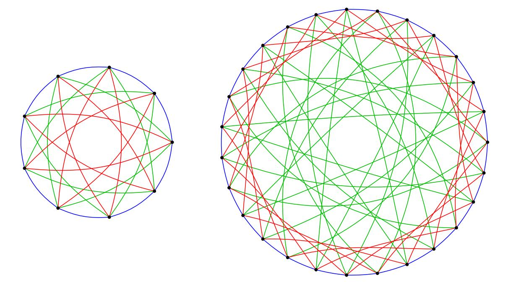
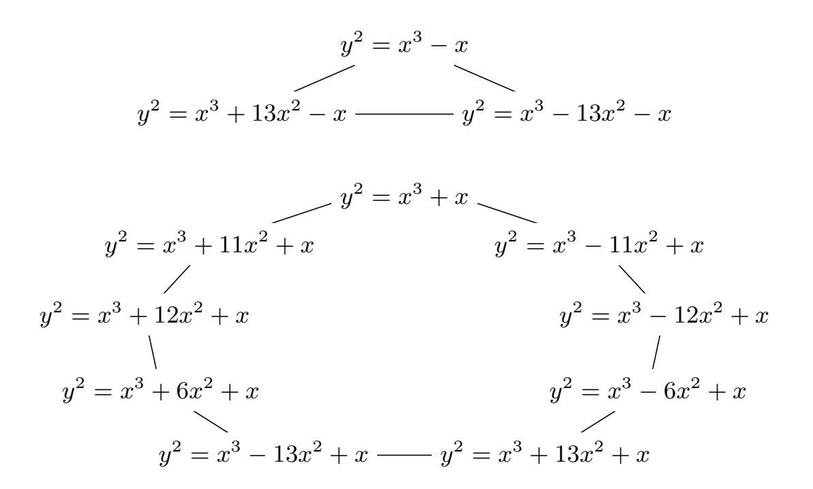
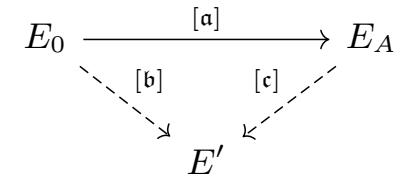

{0}------------------------------------------------

# CSIDH: An Efficient Post-Quantum Commutative Group Action

Wouter Castryck<sup>1</sup> , Tanja Lange<sup>2</sup> , Chloe Martindale<sup>2</sup> , Lorenz Panny<sup>2</sup> , and Joost Renes<sup>3</sup>

wouter.castryck@esat.kuleuven.be, tanja@hyperelliptic.org, chloemartindale@gmail.com, lorenz@yx7.cc, j.renes@cs.ru.nl

 Department of Mathematics and imec-COSIC, KU Leuven, Belgium Department of Mathematics and Computer Science, Technische Universiteit Eindhoven, The Netherlands Digital Security Group, Radboud Universiteit, The Netherlands

Abstract. We propose an efficient commutative group action suitable for non-interactive key exchange in a post-quantum setting. Our construction follows the layout of the Couveignes–Rostovtsev–Stolbunov cryptosystem, but we apply it to supersingular elliptic curves defined over a large prime field Fp, rather than to ordinary elliptic curves. The Diffie–Hellman scheme resulting from the group action allows for publickey validation at very little cost, runs reasonably fast in practice, and has public keys of only 64 bytes at a conjectured AES-128 security level, matching NIST's post-quantum security category I.

Keywords: Post-quantum cryptography, isogeny-based cryptography, class-group action, non-interactive key exchange, key confirmation.

# 1 Introduction

During the past five to ten years, elliptic-curve cryptography (ECC) has taken over public-key cryptography on the internet and in security applications. Many protocols such as Signal (<https://signal.org>) or TLS 1.3 rely on the small key sizes and efficient computations to achieve forward secrecy, often meaning that keys are used only once. However, it is also important to notice that security does not break down if keys are reused. Indeed, some implementations of TLS, such as Microsoft's SChannel, reuse keys for some fixed amount of time rather than

<sup>∗</sup> Author list in alphabetical order; see [https://www.ams.org/profession/leaders/](https://www.ams.org/profession/leaders/culture/CultureStatement04.pdf) [culture/CultureStatement04.pdf](https://www.ams.org/profession/leaders/culture/CultureStatement04.pdf). This work was supported in part by the Commission of the European Communities through the Horizon 2020 program under project number 643161 (ECRYPT-NET), 645622 (PQCRYPTO), 645421 (ECRYPT-CSA), and CHIST-ERA USEIT (NWO project 651.002.004); the Technology Foundation STW (project 13499 – TYPHOON) from the Dutch government; and the Research Foundation - Flanders (FWO) through the WOG Coding Theory and Cryptography. The first listed author is affiliated on a free basis with the Department of Mathematics, Ghent University. Date of this document: 2018.11.18.

{1}------------------------------------------------

for one connection [3]. Google's QUIC (https://chromium.org/quic) relies on servers keeping their keys fixed for a while to achieve quick session resumption. Several more examples are given by Freire, Hofheinz, Kiltz, and Paterson in their paper [26] formalizing non-interactive key exchange. Some applications require this functionality and for many it provides significant savings in terms of roundtrips or implementation complexity. Finding a post-quantum system that permits non-interactive key exchange while still offering decent performance is considered an open problem. Our paper presents a solution to this problem.

Isogeny-based cryptography is a relatively new kind of elliptic-curve cryptography, whose security relies on (various incarnations of) the problem of finding an explicit isogeny between two given isogenous elliptic curves over a finite field  $\mathbb{F}_q$ . One of the main selling points is that quantum computers do not seem to make the isogeny-finding problem substantially easier. This contrasts with regular elliptic-curve cryptography, which is based on the discrete-logarithm problem in a group and therefore falls prey to a polynomial-time quantum algorithm designed by Shor in 1994 [58].

The first proposal of an isogeny-based cryptosystem was made by Couveignes in 1997 [18]. It described a non-interactive key exchange protocol where the space of public keys equals the set of  $\mathbb{F}_q$ -isomorphism classes of ordinary elliptic curves over  $\mathbb{F}_q$  whose endomorphism ring is a given order  $\mathcal{O}$  in an imaginary quadratic field and whose trace of Frobenius has a prescribed value. It is wellknown that the ideal-class group  $cl(\mathcal{O})$  acts freely and transitively on this set through the application of isogenies. Couveignes' central observation was that the commutativity of  $cl(\mathcal{O})$  naturally allows for a key-exchange protocol in the style of Diffie and Hellman [24]. His work was only circulated privately and thus not picked up by the community; the corresponding paper [18] was never formally published and posted on ePrint only in 2006. The method was eventually independently rediscovered by Rostovtsev and Stolbunov in 2004 (in Stolbunov's master's thesis [61] and published on ePrint as [55] in 2006). In 2010, Childs, Jao and Soukharev [13] showed that breaking the Couveignes–Rostovtsev–Stolbunov scheme amounts to solving an instance of the abelian hidden-shift problem, for which quantum algorithms with a time complexity of  $L_q[1/2]$  are known to exist; see [44, 53]. While this may be tolerable (e.g., classical subexponential factorization methods have not ended the widespread use of RSA), a much bigger concern is that the scheme is unacceptably slow: despite recent clever speed-ups due to De Feo, Kieffer, and Smith [22, 42], several minutes are needed for a single key exchange at a presumed classical security level of 128 bits. Nevertheless, in view of its conceptual simplicity, compactness, and flexibility, it seems a shame to discard the Couveignes–Rostovtsev–Stolbunov scheme.

The attack due to Childs–Jao–Soukharev strongly relies on the fact that  $cl(\mathcal{O})$  is commutative, hence indirectly on the fact that  $\mathcal{O}$  is commutative. This led Jao and De Feo [39] to consider the use of supersingular elliptic curves, whose full ring of endomorphisms is an order in a quaternion algebra; in particular it is non-commutative. Their resulting (interactive) key-agreement scheme, which nowadays goes under the name "Supersingular Isogeny Diffie–Hellman" (SIDH),

{2}------------------------------------------------

has attracted almost the entire focus of isogeny-based cryptography over the past six years. The current state-of-the-art implementation is SIKE [38], which was recently submitted to the NIST competition on post-quantum cryptography [49].

It should be stressed that SIDH is *not* the Couveignes–Rostovtsev–Stolbunov scheme in which one substitutes supersingular elliptic curves for ordinary elliptic curves; in fact SIDH is much more reminiscent of a cryptographic hash function from 2006 due to Charles, Goren, and Lauter [12]. SIDH's public keys consist of the codomain of a secret isogeny and the image points of certain public points under that isogeny. Galbraith, Petit, Shani, and Ti showed in [30] that SIDH keys succumb to active attacks and thus should not be reused, unless combined with a CCA transform such as the Fujisaki–Okamoto transform [27].

In this paper we show that adapting the Couveignes–Rostovtsev–Stolbunov scheme to supersingular elliptic curves is possible, provided that one restricts to supersingular elliptic curves defined over a prime field  $\mathbb{F}_p$ . Instead of the full ring of endomorphisms, which is non-commutative, one should consider the subring of  $\mathbb{F}_p$ -rational endomorphisms, which is again an order  $\mathcal{O}$  in an imaginary quadratic field. As before  $\mathrm{cl}(\mathcal{O})$  acts via isogenies on the set of  $\mathbb{F}_p$ -isomorphism classes of elliptic curves whose  $\mathbb{F}_p$ -rational endomorphism ring is isomorphic to  $\mathcal{O}$  and whose trace of Frobenius has a prescribed value; in fact if  $p \geq 5$  then there is only one option for this value, namely 0, in contrast with the ordinary case. See e.g. [71, Theorem 4.5], with further details to be found in [9, 23] and in Section 3 of this paper. Starting from these observations, the desired adaptation of the Couveignes–Rostovtsev–Stolbunov scheme almost unrolls itself; the details can be found in Section 4. We call the resulting scheme CSIDH, where the C stands for "commutative".<sup>1</sup>

While this fails to address Jao and De Feo's initial motivation for using supersingular elliptic curves, which was to avoid the  $L_q[1/2]$  quantum attack due to Childs–Jao–Soukharev, we show that CSIDH eliminates the main problem of the Couveignes–Rostovtsev–Stolbunov scheme, namely its inefficiency. Indeed, in Section 8 we will report on a proof-of-concept implementation which carries out a non-interactive key exchange at a presumed classical security level of 128 bits and a conjectured post-quantum security level of 64 bits in about 80 milliseconds, while using key sizes of only 64 bytes. This is over 2000 times faster<sup>2</sup> than the current state-of-the-art instantiation of the Couveignes–Rostovtsev–Stolbunov scheme by De Feo, Kieffer and Smith [22, 42], which itself presents many new ideas and speedups to even achieve that speed.

For comparison, we remark that SIDH, which is the NIST submission with the smallest combined key and ciphertext length, uses public keys and ciphertexts of over 300 bytes each. More precisely SIKE's version p503 uses uncompressed keys of 378 bytes long [38] for achieving CCA security. The optimized SIKE imple-

<span id="page-2-0"></span><sup>&</sup>lt;sup>1</sup> Since this work was started while being very close to a well-known large body of salt water, we pronounce CSIDH as ['six,said] rather than spelling out all the letters.

<span id="page-2-1"></span><sup>&</sup>lt;sup>2</sup> This speed-up is explained in part by comparing our own C implementation to the sage implementation of De Feo-Kieffer-Smith.

{3}------------------------------------------------

mentation is about ten times faster than our proof-of-concept C implementation, but even at 80 ms, CSIDH is practical.

Another major advantage of CSIDH is that we can efficiently validate public keys, making it possible to reuse a key without the need for transformations to confirm that the other party's key was honestly generated.

Finally we note that just like the original Couveignes–Rostovtsev–Stolbunov scheme, CSIDH relies purely on the isogeny-finding problem; no extra points are sent that could potentially harm security, as argued in [51].

To summarize, CSIDH is a new cryptographic primitive that can serve as a drop-in replacement for the (EC)DH key-exchange protocol while maintaining security against quantum computers. It provides a non-interactive (static-static) key exchange with full public-key validation. The speed is practical while the public-key size is the smallest for key exchange or KEM in the portfolio of post-quantum cryptography. This makes CSIDH particularly attractive in the common scenario of prioritizing bandwidth over computational effort. In addition, CSIDH is compatible with 0-RTT protocols such as QUIC.

Why supersingular? To understand where the main speed-up comes from, it suffices to record that De Feo-Kieffer-Smith had the idea of choosing a field of characteristic p, where p is congruent to -1 modulo all small odd primes  $\ell$  up to a given bound. They then look for an ordinary elliptic curve  $E/\mathbb{F}_p$  such that  $\#E(\mathbb{F}_p)$  is congruent to 0 modulo as many of these  $\ell$ 's as possible, i.e., such that points of order  $\ell$  exist over  $\mathbb{F}_p$ . These properties ensure that  $\ell\mathcal{O}$  decomposes as a product of two prime ideals  $\mathfrak{l}=(\ell,\pi-1)$  and  $\mathfrak{l}=(\ell,\pi+1)$ , where  $\pi$  denotes the Frobenius endomorphism. For such primes the action of the corresponding ideal classes  $[\mathfrak{l}]$  and  $[\bar{\mathfrak{l}}] = [\mathfrak{l}]^{-1}$  can be computed efficiently through an application of Vélu-type formulae to E (resp. its quadratic twist  $E^t$ ), the reason being that only  $\mathbb{F}_p$ -rational points are involved. If this works for enough primes  $\ell$ , we can expect that a generic element of  $cl(\mathcal{O})$  can be written as a product of small integral powers of such  $|\mathfrak{l}|$ , so that the class-group action can be computed efficiently. However, finding an ordinary elliptic curve  $E/\mathbb{F}_p$  such that  $\#E(\mathbb{F}_p)$  is congruent to 0 modulo many small primes  $\ell$  is hard, and the main focus of De Feo-Kieffer-Smith is on speeding up this search. In the end it is only practical to enforce this for 7 primes, thus they cannot take full advantage of the idea.

However, in the supersingular case the property  $\#E(\mathbb{F}_p) = p+1$  implies that  $\#E(\mathbb{F}_p)$  is congruent to 0 modulo all primes  $\ell \mid p+1$  that we started from in building p! Concretely, our proof-of-concept implementation uses 74 small odd primes, corresponding to prime ideals  $\mathfrak{l}_1, \mathfrak{l}_2, \ldots, \mathfrak{l}_{74}$  for which we heuristically expect that almost all elements of our 256-bit size class group can be written as  $[\mathfrak{l}_1]^{e_1}[\mathfrak{l}_2]^{e_2}\cdots[\mathfrak{l}_{74}]^{e_{74}}$ , where the exponents  $e_i$  are taken from the range  $\{-5,\ldots,5\}$ ; indeed, one verifies that  $\log{(2\cdot 5+1)^{74}}\approx 255.9979$ . The action of such an element can be computed as the composition of at most  $5\cdot 74=370$  easy isogeny evaluations. This should be compared to using 7 small primes, where the same approach would require exponents in a range of length about  $2^{256/7}\approx 2^{36}$ , in view of which De Feo-Kieffer-Smith also resort to other primes with less beneficial properties, requiring to work in extensions of  $\mathbb{F}_p$ .

{4}------------------------------------------------

The use of supersingular elliptic curves over  $\mathbb{F}_p$  has various other advantages. For instance, their trace of Frobenius t is 0, so that the absolute value of the discriminant  $|t^2 - 4p| = 4p$  is as large as possible. As a consequence, generically the size of the class group  $\operatorname{cl}(\mathcal{O})$  is close to its maximal possible value for a fixed choice of p. Conversely, this implies that for a fixed security level we can make a close-to-minimal choice for p, which directly affects the key size. Note that this contrasts with the CM construction from [10], which could in principle be used to construct ordinary elliptic curves having many points of small order, but whose endomorphism rings have very small class groups, ruling them out for the Couveignes–Rostovtsev–Stolbunov key exchange.

To explain why key validation works, note that we work over  $\mathbb{F}_p$  with  $p \equiv 3 \pmod{8}$  and start from the curve  $E_0 \colon y^2 = x^3 + x$  with  $\mathbb{F}_p$ -rational endomorphism ring  $\mathcal{O} = \mathbb{Z}[\pi]$ . As it turns out, all Montgomery curves  $E_A \colon y^2 = x^3 + Ax^2 + x$  over  $\mathbb{F}_p$  that are supersingular appear in the  $\mathrm{cl}(\mathcal{O})$ -orbit of  $E_0$ . Moreover their  $\mathbb{F}_p$ -isomorphism class is uniquely determined by A. So all one needs to do upon receiving a candidate public key  $y^2 = x^3 + Ax^2 + x$  is check for supersingularity, which is an easy task; see Section 5. The combination of large size of  $\mathrm{cl}(\mathcal{O})$  and representation by a single  $\mathbb{F}_p$ -element A explains the small key size of 64 bytes.

#### <span id="page-4-0"></span>1.1 One-way group actions

Although non-interactive key exchange is the main application of our primitive, it is actually more general: It is (conjecturally) an instance of Couveignes' hard homogeneous spaces [18], ultimately nothing but a finite commutative group action for which some operations are easy to compute while others are hard. Such group actions were first formalized and studied by Brassard and Yung [8]. We summarize Couveignes' definition:

**Definition 1.** A hard homogeneous space consists of a finite commutative group G acting freely and transitively on some set X.

The following tasks are required to be easy (e.g., polynomial-time):

- Compute the group operations in G.
- Sample randomly from G with (close to) uniform distribution.
- Decide validity and equality of a representation of elements of X.
- Compute the action of a group element  $g \in G$  on some  $x \in X$ .

The following problems are required to be hard (e.g., not polynomial-time):

- Given  $x, x' \in X$ , find  $g \in G$  such that g \* x = x'.
- Given  $x, x', y \in X$  such that x' = g \* x, find y' = g \* y.

Any such primitive immediately implies a natural Diffie–Hellman protocol: Alice and Bob's private keys are random elements a, b of G, their public keys are  $a * x_0$  resp.  $b * x_0$ , where  $x_0 \in X$  is a public fixed element, and the shared secret is  $b * (a * x_0) = a * (b * x_0)$ . The private keys are protected by the difficulty of the first hard problem above, while the shared secret is protected by the second problem. Note that traditional Diffie–Hellman on a cyclic group C is an instance of this, where X is the set of generators of C and G is the multiplicative group  $(\mathbb{Z}/\#C)^*$  acting by exponentiation.

{5}------------------------------------------------

#### 1.2 Notation and terminology

We stress that throughout this paper, we consider two elliptic curves defined over the same field identical whenever they are isomorphic over that field. Note that we do not identify curves that are only isomorphic over some extension field, as opposed to what is done in SIDH, for instance. In the same vein, for an elliptic curve E defined over a finite field  $\mathbb{F}_p$ , we let  $\operatorname{End}_p(E)$  be the subring of the endomorphism ring  $\operatorname{End}(E)$  consisting of endomorphisms defined over  $\mathbb{F}_p$ . This subring is always isomorphic to an order in an imaginary quadratic number field. Conversely, for a given order  $\mathcal{O}$  in an imaginary quadratic field and an element  $\pi \in \mathcal{O}$ , we let  $\operatorname{\mathcal{E}\!\ell}_p(\mathcal{O},\pi)$  denote the set of elliptic curves E defined over  $\mathbb{F}_p$  with  $\operatorname{End}_p(E) \cong \mathcal{O}$  such that  $\pi$  corresponds to the  $\mathbb{F}_p$ -Frobenius endomorphism of E. In particular, this implies that  $\varphi \circ \beta = \beta \circ \varphi$  for all  $\mathbb{F}_p$ -isogenies  $\varphi$  between two curves in  $\operatorname{\mathcal{E}\!\ell}_p(\mathcal{O},\pi)$  and all  $\beta \in \mathcal{O}$  interpreted as endomorphisms.

Ideals are always assumed to be non-zero.

The notation "log" refers to the base-2 logarithm.

Acknowledgements. This project started during a research retreat on post-quantum cryptography, organized by the European PQCRYPTO and ECRYPT-CSA projects in Tenerife from 29 January until 1 February 2018. We would like to thank Jeffrey Burdges, whose quest for a flexible post-quantum key exchange protocol made us look for speed-ups of the Couveignes–Rostovtsev–Stolbunov scheme. We are grateful to Luca De Feo, Jean Kieffer, and Ben Smith for sharing a draft of their paper in preparation, and to Daniel J. Bernstein, Luca De Feo, Jeroen Demeyer, Léo Ducas, Steven Galbraith, David Jao, and Fré Vercauteren for helpful feedback.

## 2 Isogeny graphs

Good mixing properties of the underlying isogeny graph are relevant for the security of isogeny-based cryptosystems. Just as in the original Couveignes–Rostovtsev–Stolbunov cryptosystem, in our case this graph is obtained by taking the union of several large subgraphs (each being a union of large isomorphic cycle graphs) on the same vertex set, one for each prime  $\ell$  under consideration; see Figure 1 for a (small) example. Such a graph is the *Schreier graph* associated with our class-group action and the chosen generators. We refer to the lecture notes of De Feo [20, §14.1] for more background and to [41] for a discussion of its rapid mixing properties. One point of view on this is that one can quickly move between distant nodes in the subgraph corresponding to one generator by switching to the subgraph corresponding to another generator. This thereby replaces the square-and-multiply algorithm in exponentiation-based cryptosystems (such as classical Diffie–Hellman).

The goal of this section is to analyze the structure of the individual cycles.

<span id="page-5-0"></span><sup>&</sup>lt;sup>3</sup> This constraint only makes a difference for supersingular curves: in the ordinary case, all endomorphisms are defined over the base field.

{6}------------------------------------------------



<span id="page-6-0"></span>**Figure 1.** Union of the supersingular  $\ell$ -isogeny graphs for  $\ell \in \{3, 5, 7\}$  over  $\mathbb{F}_{419}$ . CSIDH makes use of the larger component, corresponding to curves whose ring of  $\mathbb{F}_{419}$ -rational endomorphisms is isomorphic to  $\mathbb{Z}[\sqrt{-419}]$ .

**Definition 2.** For a field k and a prime  $\ell \nmid \text{char } k$ , the k-rational  $\ell$ -isogeny graph  $G_{k,\ell}$  is defined as having all the elliptic curves defined over k as its vertices, and having a directed edge  $(E_1, E_2)$  for each k-rational  $\ell$ -isogeny from  $E_1$  to  $E_2$ .

<span id="page-6-2"></span>Remark 3. A priori  $G_{k,\ell}$  is a directed graph, but given two elliptic curves  $E_1$  and  $E_2$  whose j-invariants are not in  $\{0, 1728\}$ , there are exactly as many edges  $(E_2, E_1)$  as  $(E_1, E_2)$ , obtained by taking dual isogenies. Annoyingly, the nodes with j-invariants 0 and 1728 are more complicated, since these are exactly the curves with extra automorphisms: an elliptic curve E in  $G_{k,\ell}$  has fewer incoming than outgoing edges if and only if either j(E) = 0 and  $\sqrt{-3} \in k$ , or if j(E) = 1728 and  $\sqrt{-1} \in k$ . Throughout this paper, we will assume for simplicity that  $\sqrt{-3}, \sqrt{-1} \notin k$ , so that neither of these automorphisms are defined over k and we may view  $G_{k,\ell}$  as an undirected graph. In the case of a finite prime field  $k = \mathbb{F}_p$ , it suffices to restrict to  $p \equiv 11 \pmod{12}$ , which will be satisfied in the class of instantiations we suggest.

If  $k = \mathbb{F}_q$  is a finite field, then  $G_{k,\ell}$  is a finite graph that is the disjoint union of ordinary connected components and supersingular connected components. The ordinary components were studied in Kohel's PhD thesis [43]. Due to their regular structure, these components later became known as *isogeny volcanoes*.

In general (e.g. over non-prime fields), the supersingular components may bear no similarity at all to the volcanoes of the ordinary case. Traditionally, following Pizer [52], one instead studies the unique supersingular component of  $G_{k,\ell}$  where  $k = \overline{\mathbb{F}}_q$ , which turns out to be a finite  $(\ell+1)$ -regular Ramanujan graph and forms the basis for the SIDH protocol.

<span id="page-6-1"></span><sup>&</sup>lt;sup>4</sup> Due to our convention of identifying k-isomorphic curves, we also identify isogenies if they are k-isomorphic, i.e., equal up to post-composition with a k-isomorphism.

{7}------------------------------------------------

However, Delfs and Galbraith [23] showed that if  $k = \mathbb{F}_p$  is a finite prime field, then all connected components are volcanoes, even in the supersingular case (where the depth is at most 1 at  $\ell = 2$  and 0 otherwise). We present a special case of a unified statement, restricting our attention to the cases in which  $G_{\mathbb{F}_p,\ell}$  is a cycle. Recall that  $\operatorname{End}_p(E)$  is an order  $\mathcal{O}$  in the imaginary quadratic field

$$\operatorname{End}_p(E) \otimes_{\mathbb{Z}} \mathbb{Q} \cong \mathbb{Q}(\sqrt{t^2 - 4p}) = K,$$

where  $|t| \leq 2\sqrt{p}$  denotes the (absolute value of the) trace of the Frobenius endomorphism, and that two curves are isogenous over  $\mathbb{F}_p$  if and only if their traces of Frobenius are equal [67, Theorem 1].

<span id="page-7-0"></span>**Theorem 4 (Kohel, Delfs–Galbraith).** Let  $p \geq 5$  be a prime number and let V be a connected component of  $G_{\mathbb{F}_p,\ell}$ . Assume that  $p \equiv 11 \pmod{12}$  or that V contains no curve with j-invariant 0 or 1728. Let t be the trace of Frobenius common to all vertices in V, and let K be as above. Assume that  $\ell \nmid t^2 - 4p$ .

Then all elliptic curves in V have the same  $\mathbb{F}_p$ -rational endomorphism ring  $\mathcal{O} \subseteq K$ , and  $\mathcal{O}$  is locally maximal at  $\ell$ . Moreover if  $t^2 - 4p$  is a (non-zero) square modulo  $\ell$ , then V is a cycle whose length equals the order of  $[\mathfrak{I}]$  in  $\mathrm{cl}(\mathcal{O})$ , where  $\mathfrak{I}$  is a prime ideal dividing  $\ell\mathcal{O}$ . If not, then V consists of a single vertex and no edges.

*Proof.* In the case of an ordinary component this is just a special case of [66, Theorem 7]. In the case of a supersingular component this follows from the proof of [23, Theorem 2.7]. (In both cases, we could alternatively (re)prove this theorem by proving that an  $\ell$ -isogeny can only change the conductor of the endomorphism ring of an elliptic curve locally at  $\ell$  and applying Theorem 7.)

In the ordinary case a curve and its quadratic twist can never appear in the same component because they have a different trace of Frobenius. This is the main difference with the supersingular case, where this possibility is not excluded. To avoid confusion, we clarify that by the quadratic twist of a given elliptic curve  $E: y^2 = f(x)$  over  $\mathbb{F}_p$  we mean the curve  $E^t: dy^2 = f(x)$ , where  $d \in \mathbb{F}_p^*$  is any non-square. If  $p \equiv 3 \pmod{4}$  and j(E) = 1728 then this may deviate from what some readers are used to, because in this case  $E^t$  and E are  $\mathbb{F}_p$ -isomorphic. Note that such a curve is necessarily supersingular.

<span id="page-7-1"></span>Remark 5. In fact, if  $p \equiv 3 \mod 4$  then there are two non-isomorphic curves over  $\mathbb{F}_p$  with j-invariant 1728, namely  $y^2 = x^3 - x$  and  $y^2 = x^3 + x$ , whose endomorphism rings are the full ring of integers  $\mathbb{Z}[(1 + \sqrt{-p})/2]$  and the order  $\mathbb{Z}[\sqrt{-p}]$  of conductor 2 respectively. The connected component of each curve is "symmetric": if E is n steps along  $G_{\mathbb{F}_p,\ell}$  in one direction from a curve of j-invariant 1728 then the curve that is n steps in the other direction is the quadratic twist of E. In the case of  $G_{\mathbb{F}_{83},3}$  we can see this in Figure 2, which is taken from [23, Figure 8].

It is also interesting to observe that the symmetry around j = 1728 confirms the known fact that the class numbers of  $\mathbb{Z}[(1+\sqrt{-p})/2]$  and  $\mathbb{Z}[\sqrt{-p}]$  are odd, at least in the case that  $p \equiv 3 \pmod{4}$ ; see [48].

{8}------------------------------------------------



<span id="page-8-1"></span>Figure 2. The two supersingular components of  $G_{\mathbb{F}_{83},3}$ . The curves in the top component have  $\mathbb{F}_p$ -rational endomorphism ring  $\mathbb{Z}[(1+\sqrt{-83})/2]$ , while those in the lower component correspond to  $\mathbb{Z}[\sqrt{-83}]$ . Running clockwise through these components corresponds to the repeated action of  $[(3, \pi - 1)]$ .

### <span id="page-8-0"></span>3 The class-group action

It is well-known that the ideal-class group of an imaginary quadratic order  $\mathcal{O}$  acts freely via isogenies on the set of elliptic curves with  $\mathbb{F}_p$ -rational endomorphism ring  $\mathcal{O}$ . Using this group action on a set of ordinary elliptic curves for cryptographic purposes was first put forward by Couveignes [18] and independently rediscovered later by Rostovtsev and Stolbunov [61, 55]. Our suggestion is to use the equivalent of their construction in the supersingular setting, thus the following discussion covers both cases at once. For concreteness, we focus on prime fields with  $p \geq 5$  and point out that the ordinary (but not the supersingular) case generalizes to all finite fields. We recall the following standard lemma:

<span id="page-8-3"></span>**Lemma 6.** Let  $E/\mathbb{F}_p$  be an elliptic curve and G a finite  $\mathbb{F}_p$ -rational (i.e., stable under the action of the  $\mathbb{F}_p$ -Frobenius) subgroup of E. Then there exists an elliptic curve  $E'/\mathbb{F}_p$  and a separable isogeny  $\varphi \colon E \to E'$  defined over  $\mathbb{F}_p$  with kernel G. The codomain E' and isogeny  $\varphi$  are unique up to  $\mathbb{F}_p$ -isomorphism.<sup>5</sup>

*Proof.* [60, Proposition III.4.12, Remark III.4.13.2, and Exercise III.3.13e].

The ideal-class group. We recall the definitions and basic properties of class groups of quadratic orders that will be needed in the following. This section is based on [19, §7]. Let K be a quadratic number field and  $\mathcal{O} \subseteq K$  an order (that is, a subring which is a free  $\mathbb{Z}$ -module of rank 2). The *norm* of an  $\mathcal{O}$ -ideal

<span id="page-8-2"></span><sup>&</sup>lt;sup>5</sup> This statement remains true in vast generality, but we only need this special case.

{9}------------------------------------------------

 $\mathfrak{a} \subseteq \mathcal{O}$  is defined as  $N(\mathfrak{a}) = |\mathcal{O}/\mathfrak{a}|$ ; it is equal to  $gcd(\{N(\alpha) \mid \alpha \in \mathfrak{a}\})$ . Norms are multiplicative:  $N(\mathfrak{a}\mathfrak{b}) = N(\mathfrak{a})N(\mathfrak{b})$ .

A fractional ideal of  $\mathcal{O}$  is an  $\mathcal{O}$ -submodule of K of the form  $\alpha \mathfrak{a}$ , where  $\alpha \in K^*$  and  $\mathfrak{a}$  is an  $\mathcal{O}$ -ideal. Fractional ideals can be multiplied and conjugated in the evident way, and the norm extends multiplicatively to fractional ideals. A fractional  $\mathcal{O}$ -ideal  $\mathfrak{a}$  is invertible if there exists a fractional  $\mathcal{O}$ -ideal  $\mathfrak{b}$  such that  $\mathfrak{a}\mathfrak{b} = \mathcal{O}$ . If such a  $\mathfrak{b}$  exists, we define  $\mathfrak{a}^{-1} = \mathfrak{b}$ . Clearly all principal fractional ideals  $\alpha \mathcal{O}$ , where  $\alpha \in K^*$ , are invertible.

By construction, the set of invertible fractional ideals  $I(\mathcal{O})$  forms an abelian group under ideal multiplication. This group contains the principal fractional ideals  $P(\mathcal{O})$  as a (clearly normal) subgroup, hence we may define the *ideal-class group* of  $\mathcal{O}$  as the quotient

$$\operatorname{cl}(\mathcal{O}) = I(\mathcal{O})/P(\mathcal{O})$$
.

Every ideal class  $[\mathfrak{a}] \in \mathrm{cl}(\mathcal{O})$  has an integral representative, and for any non-zero  $M \in \mathbb{Z}$  there even exists an integral representative of norm coprime to M.

There is a unique maximal order of K with respect to inclusion called the ring of integers and denoted  $\mathcal{O}_K$ . The conductor of  $\mathcal{O}$  (in  $\mathcal{O}_K$ ) is the index  $f = [\mathcal{O}_K : \mathcal{O}]$ . Away from the conductor, ideals are well-behaved; every  $\mathcal{O}$ -ideal of norm coprime to the conductor is invertible and factors uniquely into prime ideals.

The class-group action. Fix a prime  $p \geq 5$  and an (ordinary or supersingular) elliptic curve E defined over  $\mathbb{F}_p$ . The Frobenius endomorphism  $\pi$  of E satisfies a characteristic equation

$$\pi^2 - t\pi + p = 0$$

in  $\operatorname{End}_p(E)$ , where  $t \in \mathbb{Z}$  is the trace of Frobenius. The curve E is supersingular if and only if t = 0. The  $\mathbb{F}_p$ -rational endomorphism ring  $\operatorname{End}_p(E)$  is an order  $\mathcal{O}$  in the imaginary quadratic field  $K = \mathcal{O} \otimes_{\mathbb{Z}} \mathbb{Q} \cong \mathbb{Q}(\sqrt{\Delta})$ , where  $\Delta = t^2 - 4p$ . We note that  $\mathcal{O}$  always contains the Frobenius endomorphism  $\pi$ , and hence the order  $\mathbb{Z}[\pi]$ .

Any invertible ideal  $\mathfrak{a}$  of  $\mathcal{O}$  splits into a product of  $\mathcal{O}$ -ideals as  $(\pi \mathcal{O})^r \mathfrak{a}_s$ , where  $\mathfrak{a}_s \not\subseteq \pi \mathcal{O}$ . This defines an elliptic curve  $E/\mathfrak{a}$  and an isogeny

$$\varphi_{\mathfrak{a}} \colon E \to E/\mathfrak{a}$$

of degree N( $\mathfrak{a}$ ) as follows [71]: the separable part of  $\varphi_{\mathfrak{a}}$  has kernel  $\bigcap_{\alpha \in \mathfrak{a}_s} \ker \alpha$ , and the purely inseparable part consists of r iterations of Frobenius. The isogeny  $\varphi_{\mathfrak{a}}$  and codomain  $E/\mathfrak{a}$  are both defined over  $\mathbb{F}_p$  and are unique up to  $\mathbb{F}_p$ -isomorphism (by Lemma 6), justifying the notation  $E/\mathfrak{a}$ . Multiplication of ideals corresponds to the composition of isogenies. Since principal ideals correspond to endomorphisms, two ideals lead to the same codomain if and only if they

<span id="page-9-0"></span><sup>&</sup>lt;sup>6</sup> Note that the use of the word "ideal" is inconsistent in the literature. We make the convention that "ideal" without qualification refers to an *integral O*-ideal (i.e., an ideal in the sense of ring theory), while fractional ideals are clearly named as such.

{10}------------------------------------------------

are equal up to multiplication by a principal fractional ideal. Moreover, every Fpisogeny ψ between curves in E``p(O, π) comes from an invertible O-ideal in this way, and the ideal a<sup>s</sup> can be recovered from ψ as a<sup>s</sup> = {α ∈ O | ker α ⊇ ker ψ}. In other words:

<span id="page-10-0"></span>Theorem 7. Let O be an order in an imaginary quadratic field and π ∈ O such that E``p(O, π) is non-empty. Then the ideal-class group cl(O) acts freely and transitively on the set E``p(O, π) via the map

$$cl(\mathcal{O}) \times \mathcal{E}\ell_p(\mathcal{O}, \pi) \longrightarrow \mathcal{E}\ell_p(\mathcal{O}, \pi)$$

$$([\mathfrak{a}], E) \longmapsto E/\mathfrak{a},$$

in which a is chosen as an integral representative.

*Proof.* See [71, Theorem 4.5]. Erratum: [56, Theorem 4.5]. 
$$\square$$

To emphasize the fact that we are dealing with a group action, we will from now on write [a] ∗ E or simply [a]E for the curve E/a defined above.

The structure of the class group. The class group cl(O) is a finite abelian group whose cardinality is asymptotically [\[59\]](#page-32-8)

$$\#cl(\mathcal{O}) \approx \sqrt{|\Delta|}.$$

More precise heuristics actually predict that p #cl(O) grows a little bit faster than |∆|, but the ratio is logarithmically bounded so we content ourselves with the above estimate. The exact structure of the class group can be computed in subexponential time L<sup>|</sup>∆<sup>|</sup> [1/2; <sup>√</sup> 2 + o(1)] using an algorithm of Hafner and McCurley [\[34\]](#page-30-7). Unfortunately, this requires too much computation for the sizes of ∆ we are working with, but there are convincing heuristics concerning the properties of the class group we need. See Section [7.1](#page-17-0) for these arguments. If the absolute value |t| of the trace of Frobenius is "not too big", the discriminant ∆ is about the size of p, hence by the above approximation we may assume #cl(O) ≈ <sup>√</sup>p. This holds in particular when <sup>E</sup> is supersingular, where <sup>t</sup> = 0, hence |∆| = 4p.

We are interested in primes ` that split in O, i.e., such that there exist (necessarily conjugate) distinct prime ideals l, l of O with `O = ll. Such ` are known as Elkies primes in the point-counting literature. The ideal l is generated as l = (`, π−λ), where λ ∈ Z/` is an eigenvalue of the Frobenius endomorphism π on the `-torsion, and its conjugate is l = (`, π −p/λ), where by abuse of notation p/λ denotes any integral representative of that quotient modulo `. Note that ` splits in O if and only if ∆ is a non-zero square modulo `.

<span id="page-10-1"></span>Computing the group action. Any element of the class group can be represented as a product of small prime ideals [\[11,](#page-29-8) Propositions 9.5.2 and 9.5.3], hence we describe how to compute [l]E for a prime ideal l = (`, π − λ). There are (at least) the following ways to proceed, which vary in efficiency depending on the circumstances [\[22,](#page-30-2) [42\]](#page-31-2):

{11}------------------------------------------------

- Find  $\mathbb{F}_p$ -rational roots of the modular polynomial  $\Phi_{\ell}(j(E), Y)$  to determine the two j-invariants of possible codomains (i.e., up to four non-isomorphic curves, though in the ordinary case wrong twists can easily be ruled out); compute the kernel polynomials [43]  $\chi \in \mathbb{F}_p[x]$  for the corresponding isogenies (if they exist); if  $(x^p, y^p) = [\lambda](x, y)$  modulo  $\chi$  and the curve equation, then the codomain was correct, else another choice is correct.
- Factor the  $\ell^{\text{th}}$  division polynomial  $\psi_{\ell}(E)$  over  $\mathbb{F}_p$ ; collect irreducible factors with the right Frobenius eigenvalues (as above); use Kohel's formulas [43, Section 2.4] to compute the codomain.
- Find a basis of the ℓ-torsion possibly over an extension field and compute the eigenspaces of Frobenius; apply Vélu's formulas [70] to a basis point of the correct eigenspace to compute the codomain.

As observed in [22, 42], the last method is the fastest if the necessary extension fields are small. The optimal case is  $\lambda = 1$ ; in that case, the curve has a rational point defined over the base field  $\mathbb{F}_p$ . If in addition  $p/\lambda = -1$ , the other eigenspace of Frobenius modulo  $\ell$  is defined over  $\mathbb{F}_{p^2}$ , so both codomains can easily be computed using Vélu's formulas over an at most quadratic extension (but in fact, a good choice of curve model allows for pure prime field computations, see Section 8; alternatively one could switch to the quadratic twist). Note that if  $p \equiv -1 \pmod{\ell}$ , then  $\lambda = 1$  automatically implies  $p/\lambda = -1$ .

Much of De Feo-Kieffer-Smith's work [22, 42] is devoted to finding an ordinary elliptic curve E with many small Elkies primes  $\ell$  such that both E and its quadratic twist  $E^t$  have an  $\mathbb{F}_p$ -rational  $\ell$ -torsion point. Despite considerable effort leading to various improvements, the results are discouraging. With the best parameters found within 17 000 hours of CPU time, evaluating one class-group action still requires several minutes of computation to complete. This suggests that without new ideas, the original Couveignes-Rostovtsev-Stolbunov scheme will not become anything close to practical in the foreseeable future.

### <span id="page-11-0"></span>4 Construction and design choices

In this section, we discuss the construction of our proposed group action and justify our design decisions. For algorithmic details, see Section 8. Notice that the main obstacle to performance in the Couveignes–Rostovtsev–Stolbunov scheme — constructing a curve with highly composite order — becomes trivial when using supersingular curves instead of ordinary curves, since for  $p \geq 5$  any supersingular elliptic curve over  $\mathbb{F}_p$  has exactly p+1 rational points.

The cryptographic group action described below is a straightforward implementation of this construction. Note that we require  $p \equiv 3 \pmod{4}$  so that we can easily write down a supersingular elliptic curve over  $\mathbb{F}_p$  and so that an implementation may use curves in Montgomery form. It turns out that this choice is also beneficial for other reasons. In principle, this constraint is not necessary for the theory to work, although the structure of the isogeny graph changes slightly (see [23] and Remark 3 for details).

{12}------------------------------------------------

**Parameters.** Fix a large prime p of the form  $4 \cdot \ell_1 \cdots \ell_n - 1$ , where the  $\ell_i$  are small distinct odd primes. Fix the elliptic curve  $E_0 \colon y^2 = x^3 + x$  over  $\mathbb{F}_p$ ; it is supersingular since  $p \equiv 3 \pmod{4}$ . The Frobenius endomorphism  $\pi$  satisfies  $\pi^2 = -p$ , so its  $\mathbb{F}_p$ -rational endomorphism ring is an order in the imaginary quadratic field  $\mathbb{Q}(\sqrt{-p})$ . More precisely, Proposition 8 (below) shows  $\operatorname{End}_p(E_0) = \mathbb{Z}[\pi]$ , which has conductor 2.

Rational Elkies primes. By Theorem 4, the choices made above imply that the  $\ell_i$ -isogeny graph is a disjoint union of cycles. Moreover, since  $\pi^2 - 1 \equiv 0 \pmod{\ell_i}$  the ideals  $\ell_i \mathcal{O}$  split as  $\ell_i \mathcal{O} = \mathfrak{l}_i \overline{\mathfrak{l}_i}$ , where  $\mathfrak{l}_i = (\ell_i, \pi - 1)$  and  $\overline{\mathfrak{l}_i} = (\ell_i, \pi + 1)$ . In other words, all the  $\ell_i$  are Elkies primes. In particular, we can use any one of the three algorithms described at the end of Section 3 to walk along the cycles.

Furthermore, the kernel of  $\varphi_{\mathfrak{l}_i}$  is the intersection of the kernels of the scalar multiplication  $[\ell_i]$  and the endomorphism  $\pi-1$ . That is, it is the subgroup generated by a point P of order  $\ell_i$  which lies in the kernel of  $\pi-1$  or, in other words, is defined over  $\mathbb{F}_p$ . Similarly, the kernel of  $\varphi_{\overline{\mathfrak{l}_i}}$  is generated by a point Q of order  $\ell_i$  that is defined over  $\mathbb{F}_{p^2}$  but not  $\mathbb{F}_p$  and such that  $\pi(Q) = -Q$ . This greatly simplifies and accelerates the implementation, since it allows performing all computations over the base field (see Section 8 for details).

<span id="page-12-1"></span>Sampling from the class group. Ideally,<sup>7</sup> we would like to know the exact structure of the ideal-class group  $cl(\mathcal{O})$  to be able to sample elements uniformly at random. However, such a computation is currently not feasible for the size of discriminant we need, hence we resort to heuristic arguments. Assuming that the  $\mathfrak{l}_i$  do not have very small order and are "evenly distributed" in the class group, we can expect ideals of the form  $\mathfrak{l}_1^{e_1}\mathfrak{l}_2^{e_2}\cdots\mathfrak{l}_n^{e_n}$  for small  $e_i$  to lie in the same class only very occasionally. For efficiency reasons, it is desirable to sample the exponents  $e_i$  from a short range centered around zero, say  $\{-m,\ldots,m\}$  for some integer m. We will argue in Section 7.1 that choosing m such that  $2m+1 \geq \sqrt[n]{\#cl(\mathcal{O})}$  is sufficient. Since the prime ideals  $\mathfrak{l}_i$  are fixed global parameters, the ideal  $\prod_i \mathfrak{l}_i^{e_i}$  may simply be represented as a vector  $(e_1,\ldots,e_n)$ .

Evaluating the class-group action. Computing the action of an ideal class represented by  $\prod_i \mathfrak{l}_i^{e_i}$  on an elliptic curve E proceeds as outlined in Section 3. Since  $\pi^2 = -p \equiv 1 \pmod{\ell_i}$ , we are now in the favourable situation that the eigenvalues of Frobenius on all  $\ell_i$ -torsion subgroups are +1 and -1. Hence we can efficiently compute the action of  $\mathfrak{l}_i$  (resp.  $\overline{\mathfrak{l}_i}$ ) by finding an  $\mathbb{F}_p$ -rational point (resp.  $\mathbb{F}_{p^2}$ -rational with Frobenius eigenvalue -1) of order  $\ell_i$  and applying Vélutype formulas. This step could simply be repeated for each ideal  $\mathfrak{l}_i^{\pm 1}$  whose action is to be evaluated, but see Section 8 for a more efficient method.

<span id="page-12-0"></span><sup>&</sup>lt;sup>7</sup> No pun intended.

{13}------------------------------------------------

# <span id="page-13-0"></span>5 Representing and validating $\mathbb{F}_p$ -isomorphism classes

A major unsolved problem of SIDH is its lack of public-key validation, i.e., the inability to verify that a public key was honestly generated. This shortcoming leads to polynomial-time active attacks [30] on static variants for which countermeasures are expensive. For example, the actively secure variant SIKE [38] applies a transformation proposed by Hofheinz, Hövelmanns, and Kiltz [37] which is similar to the Fujisaki–Okamoto transform [27], essentially doubling the running time on the recipient's side compared to an ephemeral key exchange.

The following proposition tackles this problem for our family of CSIDH instantiations. Moreover, it shows that the Montgomery coefficient forms a unique representative for the  $\mathbb{F}_p$ -isomorphism class resulting from the group action, hence may serve as a shared secret without taking j-invariants.

<span id="page-13-1"></span>**Proposition 8.** Let  $p \geq 5$  be a prime such that  $p \equiv 3 \pmod{8}$ , and let  $E/\mathbb{F}_p$  be a supersingular elliptic curve. Then  $\operatorname{End}_p(E) = \mathbb{Z}[\pi]$  if and only if there exists  $A \in \mathbb{F}_p$  such that E is  $\mathbb{F}_p$ -isomorphic to the curve  $E_A \colon y^2 = x^3 + Ax^2 + x$ . Moreover, if such an A exists then it is unique.

*Proof.* First suppose that E is isomorphic over  $\mathbb{F}_p$  to  $E_A$  for some  $A \in \mathbb{F}_p$ . If  $E_A$  has full  $\mathbb{F}_p$ -rational 2-torsion, then Table 1 of [17] shows that either  $E_A$  or its quadratic twist must have order divisible by 8. However, both have cardinality  $p+1 \equiv 4 \pmod{8}$ . Hence  $E_A$  can only have one  $\mathbb{F}_p$ -rational point of order 2. With Theorem 2.7 of [23], we can conclude  $\operatorname{End}_p(E) = \operatorname{End}_p(E_A) = \mathbb{Z}[\pi]$ .

Now assume that  $\operatorname{End}_p(E) = \mathbb{Z}[\pi]$ . By Theorem 7, the class group  $\operatorname{cl}(\mathbb{Z}[\pi])$  acts transitively on  $\mathcal{E}\ell_p(\mathbb{Z}[\pi], \pi)$ , so in particular there exists  $[\mathfrak{a}] \in \operatorname{cl}(\mathbb{Z}[\pi])$  such that  $[\mathfrak{a}]E_0 = E$ , where  $E_0 \colon y^2 = x^3 + x$ . Choosing a representative  $\mathfrak{a}$  that has norm coprime to 2p yields a separable  $\mathbb{F}_p$ -isogeny  $\varphi_{\mathfrak{a}} \colon E_0 \to E$  of odd degree. Thus, by [54, Proposition 1] there exists an  $A \in \mathbb{F}_p$  and a separable isogeny  $\psi \colon E_0 \to E_A \colon y^2 = x^3 + Ax^2 + x$  defined over  $\mathbb{F}_p$  such that  $\ker \psi = \ker \varphi_{\mathfrak{a}}$ . As isogenies defined over  $\mathbb{F}_p$  with given kernel are unique up to post-composition with  $\mathbb{F}_p$ -isomorphisms (Lemma 6), we conclude that E is  $\mathbb{F}_p$ -isomorphic to  $E_A$ .

Finally, let  $B \in \mathbb{F}_p$  such that  $E_A \cong E_B \colon Y^2 = X^3 + BX^2 + X$ . Then by [60, Proposition III.3.1(b)] there exist  $u \in \mathbb{F}_p^*$  and  $r, s, t \in \mathbb{F}_p$  such that

$$x = u^2X + r$$
,  $y = u^3Y + su^2X + t$ .

Substituting this into the curve equation for  $E_A$  and subtracting the equation of  $E_B$  (scaled by  $u^6$ ) equals zero in the function field and thus leads to a linear relation over  $\mathbb{F}_p$  between the functions 1, X,  $X^2$ , Y, and XY. Writing  $\infty$  for the point at infinity of  $E_B$ , it follows from Riemann–Roch [60, Theorem 5.4] that  $\mathcal{L}(5(\infty))$  is a 5-dimensional  $\mathbb{F}_p$ -vector space with basis  $\{1, X, Y, X^2, XY\}$ . Hence the obtained linear relation must be trivial, and a straightforward computation yields the relations

$$s = t = 0$$
,  $3r^2 + 2Ar + 1 = u^4$ ,  $3r + A = Bu^2$ ,  $r^3 + Ar^2 + r = 0$ .

{14}------------------------------------------------

But since  $E_A$  only has a single  $\mathbb{F}_p$ -rational point of order 2, the only  $r \in \mathbb{F}_p$  such that  $r^3 + Ar^2 + r = 0$  is simply r = 0. In that case  $u^4 = 1$ , and hence  $u = \pm 1$ since  $p \equiv 3 \pmod{8}$ . In particular,  $u^2 = 1$  and thus A = B. 

Therefore, by choosing public keys to consist of a Montgomery coefficient  $A \in \mathbb{F}_p$ , Proposition 8 guarantees that A represents a curve in the correct isogeny class  $\mathcal{E}\ell_p(\mathcal{O},\pi)$ , where  $\pi=\sqrt{-p}$  and  $\mathcal{O}=\mathbb{Z}|\pi|$ , under the assumption that it is smooth (i.e.  $A \notin \{\pm 2\}$ ) and supersingular.

<span id="page-14-2"></span>**Verifying supersingularity.** As  $p \geq 5$ , an elliptic curve E defined over  $\mathbb{F}_p$ is supersingular if and only if  $\#E(\mathbb{F}_p) = p+1$  [60, Exercise 5.10]. In general, proving that an elliptic curve has a given order N is easy if the factorization of N is known; exhibiting a subgroup (or in particular, a single point) whose order d is a divisor of N greater than  $4\sqrt{p}$  implies the order must be correct. Indeed, the condition  $d > 4\sqrt{p}$  implies that there exists only one multiple of d in the Hasse interval  $[p+1-2\sqrt{p}; p+1+2\sqrt{p}]$  [36]. This multiple must be the group order by Lagrange's theorem.

Now note that a random point generally has very large order d. In our case  $E(\mathbb{F}_p) \cong \mathbb{Z}/4 \times \prod_{i=1}^n \mathbb{Z}/\ell_i$ , so that  $\ell_i \mid d$  with probability  $(\ell_i - 1)/\ell_i$ . Ignoring the even part, this shows that the expected order is lower bounded by

$$\prod_{i=1}^{n} \left( \ell_i - 1 + \frac{1}{\ell_i} \right).$$

This product is about the same size as p, and it is easily seen that a random point will with overwhelming probability have order (much) greater than  $4\sqrt{p}$ . This observation leads to a straightforward verification method, see Algorithm 1.8

#### **Algorithm 1:** Verifying supersingularity.

```
Input: An elliptic curve E/\mathbb{F}_p, where p = 4 \cdot \ell_1 \cdots \ell_n - 1.
```

Output: supersingular or ordinary.

Randomly pick a point  $P \in E(\mathbb{F}_p)$  and set  $d \leftarrow 1$ .

for each  $\ell_i$  do

```
Set Q_i \leftarrow [(p+1)/\ell_i]P.
```

If  $[\ell_i]Q_i \neq \infty$  then return ordinary. // since  $\#E(\mathbb{F}_p) \nmid p+1$ // since  $\ell_i \mid \operatorname{ord} P$ 

If  $Q_i \neq \infty$  then set  $d \leftarrow \ell_i \cdot d$ .

If  $d > 4\sqrt{p}$  then return supersingular.

If the condition  $d > 4\sqrt{p}$  does not hold at the end of Algorithm 1, the point P had too small order to prove  $\#E(\mathbb{F}_p) = p+1$ . In this case one may retry with a new random point P (although this outcome has negligible probability and

<span id="page-14-1"></span><sup>&</sup>lt;sup>8</sup> The same idea gives rise to a simpler Monte Carlo algorithm which does not require the factorization of p+1 but has a chance of false positives [65, Section 2.3].

{15}------------------------------------------------

could just be ignored). There is no possibility of wrongly classifying an ordinary curve as supersingular.

Note moreover that if x-only Montgomery arithmetic is used (as we suggest) and the point P is obtained by choosing a random x-coordinate in  $\mathbb{F}_p$ , there is no need to differentiate between points defined over  $\mathbb{F}_p$  and  $\mathbb{F}_{p^2}$ ; any x-coordinate in  $\mathbb{F}_p$  works. Indeed, any point that has an x-coordinate in  $\mathbb{F}_p$  but is only defined over  $\mathbb{F}_{p^2}$  corresponds to an  $\mathbb{F}_p$ -rational point on the quadratic twist, which is supersingular if and only if the original curve is supersingular.

There are more optimized variants of this algorithm; the bulk of the work are the scalar multiplications required to compute the points  $Q_i = [(p+1)/\ell_i]P$ . Since they are all multiples of P with shared factors, one may more efficiently compute all  $Q_i$  at the same time using a divide-and-conquer strategy (at the expense of higher memory usage). See Section 8, and in particular Algorithm 3, for details.

# 6 Non-interactive key exchange

Starting from the class-group action on supersingular elliptic curves and the parameter choices outlined in Sections 3 and 4, one obtains the following non-interactive key-exchange protocol.

**Setup.** Global parameters of the scheme are a large prime  $p = 4 \cdot \ell_1 \cdots \ell_n - 1$ , where the  $\ell_i$  are small distinct odd primes, and the supersingular elliptic curve  $E_0: y^2 = x^3 + x$  over  $\mathbb{F}_p$  with endomorphism ring  $\mathcal{O} = \mathbb{Z}[\pi]$ .

**Key generation.** The private key is an n-tuple  $(e_1, \ldots, e_n)$  of integers, each sampled randomly from a range  $\{-m, \ldots, m\}$ . These integers represent the ideal class  $[\mathfrak{a}] = [\mathfrak{l}_1^{e_1} \cdots \mathfrak{l}_n^{e_n}] \in \operatorname{cl}(\mathcal{O})$ , where  $\mathfrak{l}_i = (\ell_i, \pi - 1)$ . The public key is the Montgomery coefficient  $A \in \mathbb{F}_p$  of the elliptic curve  $[\mathfrak{a}]E_0 \colon y^2 = x^3 + Ax^2 + x$  obtained by applying the action of  $[\mathfrak{a}]$  to the curve  $E_0$ .

**Key exchange.** Suppose Alice and Bob have key pairs ( $[\mathfrak{a}]$ , A) and ( $[\mathfrak{b}]$ , B). Upon receiving Bob's public key  $B \in \mathbb{F}_p \setminus \{\pm 2\}$ , Alice verifies that the elliptic curve  $E_B \colon y^2 = x^3 + Bx^2 + x$  is indeed in  $\mathcal{E}\ell_p(\mathcal{O}, \pi)$  using Algorithm 1. She then applies the action of her secret key  $[\mathfrak{a}]$  to  $E_B$  to compute the curve  $[\mathfrak{a}]E_B = [\mathfrak{a}][\mathfrak{b}]E_0$ . Bob proceeds analogously with his own secret  $[\mathfrak{b}]$  and Alice's public key A to compute the curve  $[\mathfrak{b}]E_A = [\mathfrak{b}][\mathfrak{a}]E_0$ . The shared secret is the Montgomery coefficient S of the common secret curve  $[\mathfrak{a}][\mathfrak{b}]E_0 = [\mathfrak{b}][\mathfrak{a}]E_0$  written in the form  $y^2 = x^3 + Sx^2 + x$ , which is the same for Alice and Bob due to the commutativity of  $cl(\mathcal{O})$  and Proposition 8.

Remark 9. Besides key exchange, we expect that our cryptographic group action will have several other applications, given the resemblance with traditional Diffie–Hellman and the ease of verifying the correctness of public keys. We refer to previous papers on group actions for a number of suggestions in this direction, in particular Brassard–Yung [8], Couveignes [18, §4], and Stolbunov [62].

{16}------------------------------------------------

We highlight the following 1-bit identification scheme, which in our case uses a key pair ( $[\mathfrak{a}], A$ ) as above. One randomly samples an element  $[\mathfrak{b}] \in \operatorname{cl}(\mathcal{O})$  and commits to a curve  $E' = [\mathfrak{b}]E_0$ . Depending on a challenge bit b, one then releases either  $[\mathfrak{b}]$  or  $[\mathfrak{c}] := [\mathfrak{b}][\mathfrak{a}]^{-1}$ , as depicted in Figure 3. As already pointed out in Stolbunov's PhD thesis  $[63, \S 2.B]$ , this can be turned into a signature scheme by repeated application of the 1-bit protocol and by applying the Fiat–Shamir [25] or Unruh [69] transformation. However, we point out that it is not immediately clear how to represent  $[\mathfrak{c}]$  in a way that is efficiently computable and leaks no information about the secret key  $[\mathfrak{a}]$ . We leave a resolution of this issue for future research, but mention that a related problem was recently tackled by Galbraith, Petit and Silva [31] who studied a similar triangular identification protocol in the context of SIDH.



<span id="page-16-0"></span>Figure 3. A 1-bit identification protocol.

# 7 Security

The central problem of our new primitive is the following analogue to the classical discrete-logarithm problem.

<span id="page-16-2"></span>Problem 10 (Key recovery). Given two supersingular elliptic curves E, E' defined over  $\mathbb{F}_p$  with the same  $\mathbb{F}_p$ -rational endomorphism ring  $\mathcal{O}$ , find an ideal  $\mathfrak{a}$  of  $\mathcal{O}$  such that  $[\mathfrak{a}]E = E'$ . This ideal must be represented in such a way that the action of  $[\mathfrak{a}]$  on a curve can be evaluated efficiently, for instance  $\mathfrak{a}$  could be given as a product of ideals of small norm.

Note that just like in the classical group-based scenario, security notions of Diffie–Hellman schemes built from our primitive rely on slightly different hardness assumptions (cf. Section 1.1) that are straightforward translations of the computational and decisional Diffie–Hellman problems. However, continuing the analogy with the classical case, and since we are not aware of any ideas to attack the key exchange without recovering one of the keys, we will assume in the following analysis that the best approach to breaking the key-exchange protocol is to solve Problem 10.

We point out that the "inverse Diffie-Hellman problem" is easy in the context of CSIDH: given  $[\mathfrak{a}]E_0$  we can compute  $[\mathfrak{a}]^{-1}E_0$  by mere quadratic twisting; see

<span id="page-16-1"></span><sup>&</sup>lt;sup>9</sup> The "square" SIDH counterparts of this protocol, as considered in [21, 31, 72], are not meaningful in the case of a commutative group action.

{17}------------------------------------------------

Remark 5. This contrasts with the classical group-based setting [29, §21.1]. Note that just like identifying a point (x, y) with its inverse (x, -y) in an ECDLP setting, this implies a security loss of one bit under some attacks: An attacker may consider the curves  $[\mathfrak{a}]E$  and  $[\mathfrak{a}]^{-1}E$  identical, which reduces the search space by half.

No torsion-point images. One of the most worrying properties of SIDH seems to be that Alice and Bob publish the images of known points under their secret isogenies along with the codomain curve, i.e., a public key is of the form  $(E', \varphi(P), \varphi(Q))$  where  $\varphi \colon E \to E'$  is a secret isogeny and  $P, Q \in E$  are publicly known points. Although thus far nobody has succeeded in making use of this extra information to break the original scheme, Petit presented an attack using these points when overstretched, highly asymmetric parameters are used [51]. The Couveignes–Rostovtsev–Stolbunov scheme, and consequently our new scheme CSIDH, does not transmit such additional points — a public key consists of *only* an elliptic curve. Thus we are confident that a potential future attack against SIDH based on these torsion points would not apply to CSIDH.

Chosen-ciphertext attacks. As explained in Section 5, the CSIDH group action features efficient public-key validation. This implies it can be used without applying a CCA transform such as the Fujisaki–Okamoto transform [27], thus enabling efficient non-interactive key exchange and other applications in a post-quantum world.

#### <span id="page-17-2"></span>7.1 Classical security

We begin by considering classical attacks.

<span id="page-17-0"></span>**Exhaustive key search.** The most obvious approach to attack any cryptosystem is to simply search through all possible keys. In the following, we will argue that our construction provides sufficient protection against key search attacks, including dumb brute force and (less naïvely) a meet-in-the-middle approach.

As explained in Section 4, a private key of our scheme consists of an exponent vector  $(e_1, \ldots, e_n)$  where each  $e_i$  is in the range  $\{-m, \ldots, m\}$ , representing the ideal class  $[\mathfrak{l}_1^{e_1}\mathfrak{l}_2^{e_2}\cdots\mathfrak{l}_n^{e_n}]\in \mathrm{cl}(\mathcal{O})$ . There may (and typically will) be multiple such vectors that represent the same ideal class and thus form equivalent private keys. However, we argue (heuristically) that the number of *short* representations per ideal class is small. Here and in the following, "short" means that all  $e_i$  are in the range  $\{-m,\ldots,m\}$ . The maximum number of such short representations immediately yields the min-entropy<sup>10</sup> of our sampling method, which measures the amount of work a brute-force attacker has to do while conducting an exhaustive search for the key.

<span id="page-17-1"></span>The min-entropy of a random variable is the negative logarithm of the probability of the most likely outcome.

{18}------------------------------------------------

We assume in the following discussion that  $cl(\mathcal{O})$  is "almost cyclic" in the sense that it has a very large cyclic component, say of order N not much smaller than  $\#cl(\mathcal{O})$ . According to a heuristic of Cohen and Lenstra, this is true with high probability for a "random" imaginary quadratic field [14, §9.I], and this conjecture is in line with our own experimental evidence. So suppose

$$\rho \colon \mathrm{cl}(\mathcal{O}) \twoheadrightarrow (\mathbb{Z}/N, +)$$

is a surjective group homomorphism (which may be thought of as a projection to the large cyclic subgroup followed by an isomorphism) and define  $\alpha_i = \rho([\mathfrak{l}_i])$ . We may assume that  $\alpha_1 = 1$ ; this can be done without loss of generality whenever at least one of the  $[\mathfrak{l}_i]$  has order N in the class group. For some fixed  $[\mathfrak{a}] \in \mathrm{cl}(\mathcal{O})$ , any short representation  $[\mathfrak{l}_1^{e_1}\mathfrak{l}_2^{e_2}\cdots\mathfrak{l}_n^{e_n}] = [\mathfrak{a}]$  yields a short solution to the linear congruence

$$e_1 + e_2\alpha_2 + \dots + e_n\alpha_n \equiv \rho([\mathfrak{a}]) \pmod{N},$$

so counting solutions to this congruence gives an upper bound on the number of short representations of  $[\mathfrak{a}]$ . These solutions are exactly the points in some shifted version (i.e., a coset) of the integer lattice spanned by the rows of the matrix

$$L = \begin{pmatrix} N & 0 & 0 & \cdots & 0 \\ -\alpha_2 & 1 & 0 & \cdots & 0 \\ -\alpha_3 & 0 & 1 & \cdots & 0 \\ \vdots & \vdots & \vdots & \ddots & \vdots \\ -\alpha_n & 0 & 0 & \cdots & 1 \end{pmatrix},$$

so by applying the Gaussian heuristic [50, Chapter 2, Definition 8] one expects

$$vol[-m; m]^n / \det L = (2m+1)^n / N$$

short solutions. Since we assumed  $cl(\mathcal{O})$  to be almost cyclic, this ratio is not much bigger than  $(2m+1)^n/\#cl(\mathcal{O})$ , which is not very large for our choice of m as small as possible with  $(2m+1)^n \geq \#cl(\mathcal{O})$ .

As a result, we expect the complexity of a brute-force search to be around  $2^{\log \sqrt{p}-\varepsilon}$  for some positive  $\varepsilon$  that is small relative to  $\log \sqrt{p}$ . To verify our claims, we performed computer experiments with many choices of p of up to 40 bits (essentially brute-forcing the number of representations for all elements) and found no counterexamples to the heuristic result that our sampling method loses only a few bits of brute-force security compared to uniform sampling from the class group. For our sizes of p, the min-entropy was no more than 4 bits less than that of a perfectly uniform distribution on the class group (i.e.  $\varepsilon \leq 4$ ). Of course this loss factor may grow in some way with bigger choices of p (a plot of the data points for small sizes suggests an entropy loss proportional to  $\log \log p$ ), but we see no indication for it to explode beyond a few handfuls of bits, as long as we find m and n so that  $(2m+1)^n$  is not much larger than  $\#cl(\mathcal{O})$ .

{19}------------------------------------------------

Meet-in-the-middle key search. Since a private key trivially decomposes into a product of two smooth ideals drawn from smaller sets (e.g. splitting  $[\mathfrak{l}_1^{e_1}\mathfrak{l}_2^{e_2}\cdots\mathfrak{l}_n^{e_n}]$  as  $[\mathfrak{l}_1^{e_1}\cdots\mathfrak{l}_{\nu+1}^{e_{\nu}}]\cdot[\mathfrak{l}_{\nu+1}^{e_{\nu+1}}\cdots\mathfrak{l}_n^{e_n}]$  for some  $\nu\in\{1,\ldots,n\}$ ), the usual time-memory trade-offs à la baby-step giant-step [57] with an optimal time complexity of  $O(\sqrt{\#\mathrm{cl}(\mathcal{O})})\approx O(\sqrt[4]{p})$  apply. Another interpretation of this algorithm is finding a path between two nodes in the underlying isogeny graph by constructing a breadth-first tree starting from each of them, each using a certain subset of the edges, and looking for a collision. Details, including a memoryless variation of this concept, can be found in Delfs and Galbraith's paper [23], and for the ordinary case in [28].

Remark 11. The algorithms mentioned thus far scale exponentially in the size of the key space, hence they are asymptotically more expensive than the quantum attacks outlined below which is subexponential in the class-group size. This implies one could possibly balance the costs of the different attacks and use a key space smaller than  $\#cl(\mathcal{O})$  without any loss of security (unless the key space is chosen particularly badly, e.g., as a subgroup), which leads to improved performance. We leave a more thorough analysis of this idea for future work.

**Pohlig–Hellman-style attacks.** Notice that the set  $\mathcal{E}\ell_p(\mathcal{O}, \pi)$  we are acting on does not form a group with efficiently computable operations (that are compatible with the action of  $cl(\mathcal{O})$ ). Thus there seems to be no way to apply Pohlig–Hellman-style algorithms making use of the decomposition of finite abelian groups. In fact, the Pohlig–Hellman algorithm relies on efficiently computable homomorphisms to proper subgroups, which in the setting at hand would correspond to an efficient algorithm that "projects" a given curve to the orbit of  $E_0$  under a subgroup action. Therefore, we believe the structure of the class group to be largely irrelevant (assuming it is big enough); in particular, we do not require it to have a large prime-order subgroup.

### 7.2 Quantum security

We now discuss the state of quantum algorithms to solve Problem 10.

Grover's algorithm and claw finding. Applying Grover search [33] via claw finding as described in [39] is fully applicable to CSIDH as well, leading to an attack on Problem 10 in  $O(\sqrt[6]{p})$  calls to a quantum oracle that computes our group action. The idea is to split the search space for collisions into a classical  $O(\sqrt[6]{p})$  target part and a  $O(\sqrt[3]{p})$  search part on which a quantum search is applied. Our choices of p that lead to classical security are also immediately large enough to imply quantum security against this attack (cf. [49, §4.A.5 in Call for

<span id="page-19-0"></span>Strictly speaking, the complexity depends on the size of the subset one samples private keys from, rather than the size of the class group, but as was argued before, these are approximately equal for our choice of m and n.

{20}------------------------------------------------

Proposals]). That is, the number of queries to our quantum oracle necessary to solve Problem 10 is larger than the number of quantum queries to an AES oracle needed to retrieve the key of the corresponding AES instantiation via Grover's algorithm. For example, an AES-128 key can be recovered with approximately  $2^{64}$  (quantum) oracle queries, which requires us to set  $p > 2^{384}$ . However, p is much larger than that (see Table 1) due to the existence of subexponential quantum attacks.

The abelian hidden-shift problem. A crucial result by Kuperberg [44] is an algorithm to solve the hidden-shift problem with time, query and space complexity  $2^{O(\sqrt{\log N})}$  in an abelian group H of order N. He also showed that any abelian hidden-shift problem reduces to a dihedral hidden-subgroup problem on a different but closely related oracle. A subsequent alternative algorithm by Regev [53] achieves polynomial quantum space complexity with an asymptotically worse time and query complexity of  $2^{O(\sqrt{\log N \log \log N})}$ . A follow-up algorithm by Kuperberg [45] uses  $2^{O(\sqrt{\log N})}$  time, queries and classical space, but only  $O(\log N)$  quantum space. All these algorithms have subexponential time and space complexity.

Attacking the isogeny problem. The relevance of these quantum algorithms to Problem 10 has been observed by Childs–Jao–Soukharev [13] in the ordinary case and by Biasse–Jao–Sankar [5] in the supersingular setting. By defining functions  $f_0, f_1: \operatorname{cl}(\mathcal{O}) \to \mathcal{E}\mathcal{U}_p(\mathcal{O}, \pi)$  as  $f_0: [\mathfrak{b}] \mapsto [\mathfrak{b}]E$  and  $f_1: [\mathfrak{b}] \mapsto [\mathfrak{b}]E' = [\mathfrak{b}][\mathfrak{a}]E$ , the problem can be viewed as an abelian hidden-shift problem with respect to  $f_0$  and  $f_1$ . We note that each query requires evaluating the functions  $f_i$  on arbitrary ideal classes (i.e. without being given a representative that is a product of ideals of small prime norm) which is non-trivial. However, Childs–Jao–Soukharev show this can be done in subexponential time and space [13, §4].

Subexponential vs. practical. An important remark about all these quantum algorithms is that they do not immediately lead to estimates for runtime and memory requirements on concrete instantiations with  $H = \operatorname{cl}(\mathcal{O})$ . Although the algorithms by Kuperberg and Regev are shown to have subexponential complexity in the limit, this asymptotic behavior is not enough to understand the space and time complexity on actual (small) instances. For example, Kuperberg's first paper [44, Theorem 3.1] mentions  $O(2^{3\sqrt{\log N}})$  oracle queries to achieve a non-negligible success probability when N is a power of a small integer. It also presents a second algorithm that runs in  $\tilde{O}(3^{\sqrt{2\log_3 N}}) = O(2^{1.8\sqrt{\log N}})$  [44, Theorem 5.1]. His algorithms handle arbitrary group structures but he does not work out more exact counts for those. Of course, this does not contradict the time complexity of  $2^{O(\sqrt{\log N})}$  as stated above, but for a concrete security analysis the hidden constants certainly matter a lot and ignoring the O typically underestimates the security. Childs–Jao–Soukharev [13, Theorem 5.2] prove a query

{21}------------------------------------------------

complexity of

<span id="page-21-0"></span>
$$L_N[1/2, \sqrt{2}] = \exp\left[\left(\sqrt{2} + o(1)\right)\sqrt{\ln N \ln \ln N}\right],\tag{1}$$

where N = #cl(O), for using Regev's algorithm for solving the hidden-shift problem. This estimates only the query complexity, so does not include the cost of queries to the quantum oracle (i.e. the isogeny oracle). Childs–Jao–Soukharev present two algorithms to compute the isogeny oracle, the fastest of which is due to Bisson [\[6\]](#page-29-12). In [\[13,](#page-29-2) Remark 4.8] Childs–Jao–Soukharev give an upper bound of

<span id="page-21-1"></span>
$$L_p[1/2, 1/\sqrt{2}] = \exp\left[\left(1/\sqrt{2} + o(1)\right)\sqrt{\ln p \ln \ln p}\right]$$
 (2)

on the running time of Bisson's algorithm.

Remark 12. Childs–Jao–Soukharev compute the total cost for computing the secret isogeny in [\[13,](#page-29-2) Remark 5.5] to be Lp[1/2, 3/ √ 2] (using Regev and Bisson's algorithms, requiring only polynomial space). They appear to obtain this by setting N = p when multiplying [\(1\)](#page-21-0) and [\(2\)](#page-21-1), but as N ∼ <sup>√</sup><sup>p</sup> this is an overestimation and should be Lp[1/2, 1 + 1/ √ 2]. Either way, this is the largest asymptotic complexity of the estimates. Also, Galbraith and Vercauteren [\[32\]](#page-30-15) point out this algorithm actually has superpolynomial space complexity due to the high memory usage of the isogeny oracle in [\[13\]](#page-29-2), but see [\[40\]](#page-31-14).

Childs–Jao–Soukharev additionally compute the total time Lp[1/2, 1/ √ 2] for computing the secret isogeny combining Kuperberg [\[44\]](#page-31-0) and Bisson. This requires superpolynomial storage (also before considering the memory usage of the oracle). Note that in this combination the costs of the oracle computation dominate asymptotically.

It is important to mention that asymptotically worse algorithms may provide practical improvements on our "small" instances over either of the algorithms studied by Childs–Jao–Soukharev: For example, Couveignes [\[18,](#page-29-1) §5] provides heuristic arguments that one can find smooth representatives of ideal classes by computing the class-group structure (which can be done in polynomial time on a quantum computer [\[35\]](#page-30-16)) and applying a lattice-basis-reduction algorithm such as LLL [\[46\]](#page-31-15) to its lattice of relations. This might be more efficient than using Childs–Jao–Soukharev's subexponential oracle. However, note that this method makes evaluating the oracle several times harder for the attacker than for legitimate users, thus immediately giving a few additional bits of security, since users only evaluate the action of very smooth ideals by construction. We believe further research in this direction is necessary and important, since it will directly impact the cost of an attack, but we consider a detailed analysis of all these algorithms and possible trade-offs to be beyond the scope of this work.[12](#page-21-2)

Remark 13. After we posted a first version of this paper on the Cryptology ePrint Archive, there were several independent attempts at assessing the security of CSIDH.

<span id="page-21-2"></span><sup>12</sup> The page margins are certainly too narrow to contain such an analysis.

{22}------------------------------------------------

Biasse, Iezzi, and Jacobson [4] work out some more details of the attack ideas mentioned above for Regev's algorithm. They focus on the class-group-computation part of the oracle and they work out how to represent random elements of the class group as a product of small prime ideals. Their analysis is purely asymptotic and an assessment of the actual cost on specific instances is explicitly left for future work.

Bonnetain and Schrottenloher [7] determine (quantum) query complexities for breaking CSIDH under the assumption that the quantum memory can be made very large, which implies that Kuperberg's faster algorithms would be applicable. They estimate the number of oracle queries as  $(5\pi^2/4)2^{1.8\sqrt{\log N}}$ . The 1.8 appears to approximate the  $\sqrt{2\log 3}$  in Kuperberg [44, Theorem 5.1]. They state  $2^{1.8\sqrt{\log N}+2.3}$  for the number of qubits.

While we ignored Kuperberg's algorithm due to the large memory costs, they take the stance that "the most time-efficient version is relevant", and so do not ignore this algorithm. For small N the number of qubits stated in [7] might be possible, which would indeed make Kuperberg's algorithm relevant for these sizes. However, in this case the total cost is dominated by the high cost of computing the oracle, which Childs–Jao–Soukharev placed at  $L_p[1/2, 1/\sqrt{2}]$ . Bonnetain and Schrottenloher instead make use of Couveignes' (exponential-time, but perhaps better for small parameters) LLL-based method for the oracle computation, but apply BKZ for more effective lattice-basis reduction.

The current version of Bonnetain–Schrottenloher [7] also presents concrete estimates for the attack costs for our parameter sets, but unfortunately this version ignores most of the cost of evaluating isogenies. For example: (1) Algorithm 2 in our paper makes heavy use of input-dependent branches, which is impossible in superposition [40, Section 4]; (2) [7] skips finding points of order  $\ell_i$  which are needed as the kernel of the  $\ell_i$ -isogeny; (3) [7] applies a result for multiplication costs in  $\mathbb{F}_{2^n}$  to multiplications in  $\mathbb{F}_p$ . We analyzed the (significantly higher) cost of a quantum oracle for isogeny evaluation and conclude that the current estimates of Bonnetain–Schrottenloher do *not* imply that CSIDH-512 (see Section 7.3) is broken under NIST level 1 (cf. the reference to [2] below).

Jao, LeGrow, Leonardi, and Ruiz-Lopez recently made a preprint [40] of their MathCrypt paper available to us. They address the issue of superpolynomial space in the oracle computation identified by Galbraith and Vercauteren (stated above) and give a new algorithm for finding short representations of elements. Their paper focuses on the asymptotic analysis of the oracle step so that they achieve overall polynomial quantum space, but does not obtain any concrete cost estimates.

Bernstein, Lange, Martindale, and Panny analyze the cost of quantum evaluation of the CSIDH group action in [2]. Even after introducing several speedups to arithmetic in finite fields and computing isogenies in superposition, for CSIDH-512 it still takes  $2^{40}$  quantum operations on a quantum computer of  $2^{40}$  qubits to compute a single evaluation of the Kuperberg or Regev oracle for success probability  $2^{-32}$  and reduced range of exponents. They also give a more detailed analysis of the shortcomings and errors in [7] mentioned above.

{23}------------------------------------------------

#### <span id="page-23-0"></span>7.3 Instantiations

Finally we present estimates for some sizes of p.

Security estimates. As explained in §7.1, the best classical attack has query complexity  $O(\sqrt[4]{p})$ , and the number of queries has been worked out for different quantum attacks. We consider [13] in combination with Regev and Kuperberg  $(L_p[1/2,3/\sqrt{2}] \text{ and } L_p[1/2,1/\sqrt{2}], \text{ respectively})$  as well as the pure query complexity of Regev's and Kuperberg's algorithms  $(L_N[1/2,\sqrt{2}], O(2^{3\sqrt{\log N}}), \text{ and } O(2^{1.8\sqrt{\log N}}), \text{ respectively})$ . We summarize the resulting attack complexities, ignoring the memory costs and without restricting the maximum depth of quantum circuits, for some sizes of p in Table 1. We note again that we expect these complexities to be subject to more careful analysis, taking into account the implicit constants,  $^{13}$  the (in-)feasibility of long sequential quantum operations, and the large memory requirement. We also include the recent estimates on the query complexity and full attack complexity by Bonnetain and Schrottenloher [7].

We point out a recent analysis [1] which shows that the classical attack on SIDH (which is the same for CSIDH) is likely slower in practice than current parameter estimates assumed, which is due to the huge memory requirements of the searches. Similarly, the cost of the quantum attacks is significantly higher than just the query complexity times the cost of the group action because evaluating the oracle in superposition is significantly more expensive than a regular group action.

Recall that public keys consist of a single element  $A \in \mathbb{F}_p$ , which may be represented using  $\lceil \log p \rceil$  bits. A private key is represented as a list of n integers in  $\{-m, \ldots, m\}$ , where m was chosen such that  $n \log(2m+1) \approx \log \sqrt{p}$ , hence it may be stored using roughly  $(\log p)/2$  bits. Therefore the rows of Table 1 correspond to public key sizes of 64, 128, and 224 bytes, and private keys are approximately half that size when encoded optimally.

**Security levels.** We approximate security levels as proposed by NIST for the post-quantum standardization effort [49, §4.A.5]. That is, the k-bit security level means that the required effort for the best attacks is at least as large as that needed for a key-retrieval attack on a block cipher with a k-bit key (e.g. AES-k for  $k \in \{128, 192, 256\}$ ). In other words, under the assumption that the attacks query an oracle on a circuit at least as costly as AES, we should have a query complexity of at least  $2^{k-1}$  resp.  $\sqrt{2^k}$  to a classical resp. quantum oracle. NIST further restricts the power of the quantum computation to circuits of maximum

<span id="page-23-1"></span>This is illustrated dramatically by the eighth column stating a complexity of  $L_p[1/2, 1/\sqrt{2}]$  for [13]-Kuperberg, which we recall arises by multiplying the query complexity of Kuperberg's (first) algorithm and Childs–Jao–Soukharev's estimate  $L_p[1/2, 1/\sqrt{2}]$  for the running time of Bisson's algorithm; so here it would make more sense to add the corresponding entries of the fourth column, but we decided to leave the numbers as they are in order to be consistent in the way we discard o(1)'s.

{24}------------------------------------------------

<span id="page-24-1"></span>**Table 1.** Estimated attack complexities ignoring limits on depth. The three rightmost columns state costs for the complete attack; the others state classical and quantum query complexities. All numbers are rounded to whole bits and use  $N = \#\text{cl}(\mathcal{O}) = \sqrt{p}$ , o(1) = 0, and all hidden O-constants 1, except for numbers taken from [7].

| CSIDH-logp | classical $\log \sqrt[4]{p}$ | Regev [53] $\log L_N[1/2,\sqrt{2}]$ | Kuperberg [44] $3\sqrt{\log N}$ | Kuperberg [44] $1.8\sqrt{\log N}$ | Table 7 in [7] | [13]-Regev $\log L_p[1/2, 3/\sqrt{2}]$ | [13]-Kuperberg $\log L_p[1/2, 1/\sqrt{2}]$ | Table 8 in [7] |
|------------|------------------------------|-------------------------------------|---------------------------------|-----------------------------------|----------------|----------------------------------------|--------------------------------------------|----------------|
| CSIDH-512  | 128                          | 62                                  | 48                              | 29                                | 32.5           | 139                                    | 47                                         | 71             |
| CSIDH-1024 | 256                          | 94                                  | 68                              | 41                                | 44.5           | 209                                    | 70                                         | 88             |
| CSIDH-1792 | 448                          | 129                                 | 90                              | 54                                | 57.5           | 288                                    | 96                                         | 104            |

depth  $2^{40}$  up to  $2^{96}$ , meaning that theoretically optimal tradeoffs (such as the formulas in Table 1 above) might not be possible for cryptographic sizes.

The parameters for CSIDH-log p were chosen to match the query complexity of Regev's attack on the hidden-shift problem (see the third column in Table 1) for roughly  $2^{k/2}$ , which should match NIST levels 1-3 as the group action computation has depth at least as large as AES.

Some other algorithms give lower estimates which makes it necessary to evaluate the exact cost of the oracle queries or compute the lower-order terms in the complexity. The analysis in [7, Table 8] states lower overall costs compared to AES. While this is a significant improvement, we believe that this does not affect our security claim when accounting precisely for the actual cost of oracle queries, as stated above. Our preliminary analysis shows costs of more than  $2^{50}$  qubit operations for evaluating the oracle for  $\log p = 512$ , where [7] assumes  $2^{37}$ . This means that the NIST levels are reached even with the low query numbers in [7]. More analysis is certainly needed and it is unclear whether that will result in larger or smaller choices of p.

Note that adjusting parameters only involves changing the prime p (and a few numbers derived from it) and is therefore very simple, should it turn out that our initial estimates are insufficient.

# <span id="page-24-0"></span>8 Implementation

In this section, we outline our most important tricks to make the system easier to implement or the code faster. As pointed out earlier, the crucial step is to use a field of size  $4 \cdot \ell_1 \cdots \ell_n - 1$ , where the  $\ell_i$  are small distinct odd primes; this implies that all  $\ell_i$  are Elkies primes for a supersingular elliptic curve over  $\mathbb{F}_p$  and that the action of ideals  $(\ell_i, \pi \pm 1)$  can be computed efficiently using  $\mathbb{F}_p$ -rational points. See Section 4 for these design decisions. The following section focuses on lower-level implementation details.

{25}------------------------------------------------

Montgomery curves. The condition  $p+1 \equiv 4 \pmod{8}$  implies that all curves in  $\mathcal{E}\mathcal{U}_p(\mathbb{Z}[\pi],\pi)$  can be put in the form  $y^2=x^3+Ax^2+x$  (cf. Proposition 8) for some  $A\in\mathbb{F}_p$  via an  $\mathbb{F}_p$ -isomorphism. This is commonly referred to as the Montgomery form [47] of an elliptic curve and is popular due to the very efficient arithmetic on its x-line. This extends well to computations of isogenies on the x-line, as was first shown by Costello–Longa–Naehrig [16, §3]. Our implementation uses exactly the same formulas for operations on curves. For isogeny computations on Montgomery curves we use a projectivized variant (to avoid almost all inversions) of the formulas from Costello–Hisil [15] and Renes [54]. This can be done as follows.

For a fixed prime  $\ell \geq 3$ , a point P of order  $\ell$ , and an integer  $k \in \{1, \ldots, \ell-1\}$ , let  $(X_k : Z_k)$  be the projectivized x-coordinate of [k]P. Then by defining  $c_i \in \mathbb{F}_p$  such that

$$\prod_{i=1}^{\ell-1} (Z_i w + X_i) = \sum_{i=0}^{\ell-1} c_i w^i$$

as polynomials in w, we observe that

$$(\tau(A-3\sigma):1) = (Ac_0c_{\ell-1} - 3(c_0c_{\ell-2} - c_1c_{\ell-1}):c_{\ell-1}^2),$$

where

$$\tau = \prod_{i=1}^{\ell-1} \frac{X_i}{Z_i}, \quad \sigma = \sum_{i=1}^{\ell-1} \left( \frac{X_i}{Z_i} - \frac{Z_i}{X_i} \right)$$

and A is the Montgomery coefficient of the domain curve. By noticing that  $x([k]P) = x([\ell-k]P)$  for all  $k \in \{1, \dots, (\ell-1)/2\}$  we can reduce the computation needed by about half. That is, we can compute  $(\tau(A-3\sigma):1)$  iteratively in about  $5\ell \mathbf{M} + \ell \mathbf{S}$  operations<sup>14</sup>, noting that  $\tau(A-3\sigma)$  is the Montgomery coefficient of the codomain curve of an isogeny with kernel  $\langle P \rangle$  [54, Proposition 1]. If necessary, a single division at the end of the computation suffices to obtain an affine curve constant. We refer to the implementation for more details.

Note that for a given prime  $\ell$ , we could reduce the number of field operations by finding an appropriate representative of the isogeny formulas modulo (a factor of) the  $\ell$ -division polynomial  $\psi_{\ell}$  (as done in [16] for 3- and 4-isogenies). Although this would allow for a more efficient implementation, we do not pursue this now for the sake of simplicity.

**Rational points.** Recall that the goal is to evaluate the action of (the class of) an ideal  $\mathfrak{l}_1^{e_1} \cdots \mathfrak{l}_n^{e_n}$  on a curve  $E \in \mathcal{E}\ell_p(\mathbb{Z}[\pi], \pi)$ , where each  $\mathfrak{l}_i = (\ell_i, \pi - 1)$  is a prime ideal of small odd norm  $\ell_i$  and the  $e_i$  are integers in a short range  $\{-m, \ldots, m\}$ . We assume E is given in the form  $E_A : y^2 = x^3 + Ax^2 + x$ .

The obvious way to do this is to consider each factor  $\ell_i^{\pm 1}$  in this product and to find the abscissa of a point P of order  $\ell_i$  on E, which (depending on the sign) is defined over  $\mathbb{F}_p$  or  $\mathbb{F}_{p^2} \setminus \mathbb{F}_p$ . This exists by our choice of p and  $\ell_i$  (cf.

<span id="page-25-0"></span>Here **M** and **S** denote a multiplication and squaring in  $\mathbb{F}_p$ .

{26}------------------------------------------------

Section 4). Finding such an abscissa amounts to sampling a random  $\mathbb{F}_p$ -rational x-coordinate, checking whether  $x^3 + Ax^2 + x$  is a square or not (for  $\mathfrak{l}_i^{+1}$  resp.  $\mathfrak{l}_i^{-1}$ ) in  $\mathbb{F}_p$  (and resampling if it was wrong), followed by a multiplication by  $(p+1)/\ell_i$  and repeating from the start if the result is  $\infty$ . The kernel of the isogeny given by  $\mathfrak{l}_i^{\pm 1}$  is then  $\langle P \rangle$ , so the isogeny may be computed using Vélu-type formulas. Repeating this procedure for all  $\mathfrak{l}_i^{\pm 1}$  gives the result.

However, fixing a sign before sampling a random point effectively means wasting about half of all random points, including an ultimately useless square test. Moreover, deciding on a prime  $\ell_i$  before sampling a point and doing the cofactor multiplication wastes another proportion of the points, including both an ultimately useless square test and a scalar multiplication. Both of these issues can be remedied by not fixing an  $\ell_i$  before sampling a point, but instead taking any x-coordinate, determining the smallest field of definition (i.e.  $\mathbb{F}_p$  or  $\mathbb{F}_{p^2}$ ) of the corresponding point, and then performing whatever isogeny computations are possible using that point (based on its field of definition and order). The steps are detailed in Algorithm 2.

### **Algorithm 2:** Evaluating the class-group action.

```
Input: A \in \mathbb{F}_p and a list of integers (e_1, \dots, e_n).

Output: B such that [\mathfrak{I}_1^{e_1} \cdots \mathfrak{I}_n^{e_n}] E_A = E_B (where E_B \colon y^2 = x^3 + Bx^2 + x).

While some e_i \neq 0 do

Sample a random x \in \mathbb{F}_p.

Set s \leftarrow +1 if x^3 + Ax^2 + x is a square in \mathbb{F}_p, else s \leftarrow -1.

Let S = \{i \mid e_i \neq 0, \text{ sign}(e_i) = s\}. If S = \emptyset then start over with a new x.

Let k \leftarrow \prod_{i \in S} \ell_i and compute Q \leftarrow [(p+1)/k]P.

For each i \in S do

Compute R \leftarrow [k/\ell_i]Q. If R = \infty then skip this i.

Compute an isogeny \varphi \colon E_A \to E_B \colon y^2 = x^3 + Bx^2 + x with \ker \varphi = R.

Set A \leftarrow B, Q \leftarrow \varphi(Q), k \leftarrow k/\ell_i, and finally e_i \leftarrow e_i - s.

Return A.
```

Due to the commutativity of  $cl(\mathcal{O})$ , and since we only decrease (the absolute value of) each  $e_i$  once we successfully applied the action of  $\mathfrak{l}_i^{\pm 1}$  to the current curve, this algorithm indeed computes the action of  $[\mathfrak{l}_1^{e_1}\mathfrak{l}_2^{e_2}\cdots\mathfrak{l}_n^{e_n}]$ .

Remark 14. Since the probability that a random point has order divisible by  $\ell_i$  (and hence leads to an isogeny step in Algorithm 2) grows with  $\ell_i$ , the isogeny steps for big  $\ell_i$  are typically completed before those for small  $\ell_i$ . Hence it may make sense to sample the exponents  $e_i$  for ideals  $\ell_i$  from different ranges depending on the size of  $\ell_i$ , or to not include any very small  $\ell_i$  in the factorization of p+1 at all to reduce the expected number of repetitions of the loop above. Note moreover that doing so may also improve the performance of straightforward constant-time adaptions of our algorithms, since it yields stronger upper bounds on the maximum number of required loop iterations (at the expense of

{27}------------------------------------------------

slightly higher cost per isogeny computation). Varying the choice of the `<sup>i</sup> can also lead to performance improvements if the resulting prime p has lower Hamming weight. Finding such a p is a significant computational effort but needs to be done only once; all users can use the same finite field.

Remark 15. Algorithm [2](#page-26-0) is obviously strongly variable-time when implemented naïvely. Indeed, the number of points computed in the isogeny formulas is linear in the degree, hence the iteration counts of certain loops in our implementation are very directly related to the private key. We note that it would not be very hard to create a constant-time implementation based on this algorithm by always performing the maximal required number of iterations in each loop and only storing the results that were actually needed (using constant-time conditional instructions), although this incurs quite a bit of useless computation, leading to a doubling of the number of curve operations on average. We leave the design of optimized constant-time algorithms for future work.

<span id="page-27-0"></span>Public-key validation. Recall that the public-key validation method outlined in Section [5](#page-14-2) essentially consists of computing [(p+ 1)/`<sup>i</sup> ]P for each i, where P is a random point on E. Performing this computation in the straightforward way is simple and effective. On the other hand, a divide-and-conquer approach, such as the following recursive algorithm, yields better speeds at the expense of slightly higher memory usage. Note that Algorithm [3](#page-27-1) only operates on public data, hence need not be constant-time in a side-channel resistant implementation.

```
Algorithm 3: Batch cofactor multiplication. [64, Algorithm 7.3]
Input: An elliptic-curve point P and positive integers (k1, . . . , kn).
Output: The points (Q1, . . . , Qn), where Qi =
                                            -
                                              Q
                                               j6=i
                                                  kj

                                                     P.
If n = 1 then return (P). // base case
Set m ← dn/2e and let u ←
                          Qm
                            i=1 ki, v ←
                                       Qn
                                         i=m+1 ki.
Compute L ← [v]P and R ← [u]P.
Recurse with input L,(k1, . . . , km) giving (Q1, . . . , Qm). // left half
Recurse with input R,(km+1, . . . , kn) giving (Qm+1, . . . , Qn). // right half
Return (Q1, . . . , Qn).
```

This routine can be used for verifying that an elliptic curve E/F<sup>p</sup> is supersingular as follows: Pick a random point P ∈ E(Fp) and run Algorithm [3](#page-27-1) on input [4]P and (`1, . . . , `n) to obtain the points Q<sup>i</sup> = [(p + 1)/`<sup>i</sup> ]P. Then continue like in Algorithm [1](#page-14-0) to verify that E is supersingular using these precomputed points.

In practice, it is not necessary to run Algorithm [3](#page-27-1) as a black-box function until it returns all the points Q1, . . . , Qn: The order checking in Algorithm [1](#page-14-0) can be performed as soon as a new point Q<sup>i</sup> becomes available, i.e., in the base case of Algorithm [3.](#page-27-1) This reduces the memory usage (since the points Q<sup>i</sup> can be discarded immediately after use) and increases the speed (since the algorithm terminates as soon as enough information was obtained) of public-key 

{28}------------------------------------------------

validation using Algorithms [1](#page-14-0) and [3.](#page-27-1) We note that the improved performance of this algorithm compared to Algorithm [1](#page-14-0) alone essentially comes from a timespace trade-off, hence the memory usage is higher (cf. Section [8.1\)](#page-28-1). On severely memory-constrained devices one may instead opt for the naïve algorithm, which requires less space but is slower.

### <span id="page-28-1"></span>8.1 Performance results

On top of a minimal implementation in the sage computer algebra system [\[68\]](#page-32-18) for demonstrative purposes, we created a somewhat optimized proof-of-concept implementation of the CSIDH group action for a particular 512-bit prime p. While this implementation features 512-bit field arithmetic written in assembly (for Intel Skylake processors), it also contains generic C code supporting other field sizes and can therefore easily be ported to other computer architectures or parameter sets if desired.[15](#page-28-2)

The prime p is chosen as p = 4·`<sup>1</sup> · · · `74−1 where `<sup>1</sup> through `<sup>73</sup> are the smallest 73 odd primes and `<sup>74</sup> = 587 is the smallest prime distinct from the other `<sup>i</sup> that renders p prime. This parameter choice implies that public keys have a size of 64 bytes. Private keys are stored in 37 bytes for simplicity, but an optimal encoding would reduce this to only 32 bytes. Table [2](#page-28-3) summarizes performance numbers for our proof-of-concept implementation. Note that private-key generation is not listed as it only consists of sampling n random integers in a small range {−m, . . . , m}, which has negligible cost.

Table 2. Performance numbers for our proof-of-concept implementation (2018.08.26), averaged over 10 000 runs on an Intel Skylake i5 processor clocked at 3.5 GHz.

<span id="page-28-3"></span>

|                | Clock cycles    | Wall-clock time | Stack memory |
|----------------|-----------------|-----------------|--------------|
| Key validation | 5.5 · 106<br>cc | 2.1 ms          | 4 368 bytes  |
| Group action   | 106 · 106<br>cc | 40.8 ms         | 2 464 bytes  |

We emphasize that both our implementations are intended as a proof of concept and unfit for production use; in particular, they are explicitly not side-channel resistant and may contain any number of bugs. We leave the design of hardened and more optimized implementations for future work.

# References

<span id="page-28-0"></span>[1] Gora Adj, Daniel Cervantes-Vázquez, Jesús-Javier Chi-Domínguez, Alfred Menezes, and Francisco Rodríguez-Henríquez. On the cost of computing isogenies between supersingular elliptic curves, 2018. IACR Cryptology ePrint Archive 2018/313. <https://ia.cr/2018/313>. To appear at SAC 2018.

<span id="page-28-2"></span><sup>15</sup> All our code is published in the public domain and is available for download at <https://yx7.cc/code/csidh/csidh-latest.tar.xz>.

{29}------------------------------------------------

- <span id="page-29-15"></span>[2] Daniel J. Bernstein, Tanja Lange, Chloe Martindale, and Lorenz Panny. Quantum circuits for the CSIDH: optimizing quantum evaluation of isogenies, 2018. IACR Cryptology ePrint Archive 2018/1059. <https://ia.cr/2018/1059>.
- <span id="page-29-0"></span>[3] Daniel J. Bernstein, Bernard van Gastel, Wesley Janssen, Tanja Lange, Peter Schwabe, and Sjaak Smetsers. TweetNaCl: A crypto library in 100 tweets. In LATINCRYPT, volume 8895 of Lecture Notes in Computer Science, pages 64–83. Springer, 2014.
- <span id="page-29-13"></span>[4] Jean-François Biasse, Annamaria Iezzi, and Michael J. Jacobson, Jr. A note on the security of CSIDH, 2018. <https://arxiv.org/abs/1806.03656>.
- <span id="page-29-11"></span>[5] Jean-François Biasse, David Jao, and Anirudh Sankar. A quantum algorithm for computing isogenies between supersingular elliptic curves. In INDOCRYPT, volume 8885 of Lecture Notes in Computer Science, pages 428–442. Springer, 2014.
- <span id="page-29-12"></span>[6] Gaetan Bisson. Computing endomorphism rings of elliptic curves under the GRH. J. Mathematical Cryptology, 5(2):101–114, 2012.
- <span id="page-29-14"></span>[7] Xavier Bonnetain and André Schrottenloher. Quantum security analysis of CSIDH and ordinary isogeny-based schemes, 2018. IACR Cryptology ePrint Archive 2018/537, version 20180621:135910. [https://eprint.iacr.org/2018/](https://eprint.iacr.org/2018/537/20180621:135910) [537/20180621:135910](https://eprint.iacr.org/2018/537/20180621:135910).
- <span id="page-29-6"></span>[8] Gilles Brassard and Moti Yung. One-way group actions. In CRYPTO, volume 537 of Lecture Notes in Computer Science, pages 94–107. Springer, 1990.
- <span id="page-29-4"></span>[9] Reinier Bröker. A p-adic algorithm to compute the Hilbert class polynomial. Math. Comput., 77(264):2417–2435, 2008.
- <span id="page-29-5"></span>[10] Reinier Bröker and Peter Stevenhagen. Efficient CM-constructions of elliptic curves over finite fields. Math. Comput., 76(260):2161–2179, 2007.
- <span id="page-29-8"></span>[11] Johannes Buchmann and Ulrich Vollmer. Binary quadratic forms: an algorithmic approach, volume 20 of Algorithms and Computation in Mathematics. Springer, 2007.
- <span id="page-29-3"></span>[12] Denis X. Charles, Kristin E. Lauter, and Eyal Z. Goren. Cryptographic hash functions from expander graphs. J. Cryptology, 22(1):93–113, 2009. [https://ia.](https://ia.cr/2006/021) [cr/2006/021](https://ia.cr/2006/021).
- <span id="page-29-2"></span>[13] Andrew M. Childs, David Jao, and Vladimir Soukharev. Constructing elliptic curve isogenies in quantum subexponential time. J. Mathematical Cryptology, 8(1):1–29, 2014. <https://arxiv.org/abs/1012.4019>.
- <span id="page-29-10"></span>[14] Henri Cohen and Hendrik W. Lenstra, Jr. Heuristics on class groups of number fields. In Hendrik Jager, editor, Number Theory Noordwijkerhout 1983, pages 33–62. Springer, 1984.
- <span id="page-29-17"></span>[15] Craig Costello and Hüseyin Hisil. A simple and compact algorithm for SIDH with arbitrary degree isogenies. In ASIACRYPT (2), volume 10625 of Lecture Notes in Computer Science, pages 303–329. Springer, 2017. <https://ia.cr/2017/504>.
- <span id="page-29-16"></span>[16] Craig Costello, Patrick Longa, and Michael Naehrig. Efficient algorithms for Supersingular Isogeny Diffie–Hellman. In CRYPTO (1), volume 9814 of Lecture Notes in Computer Science, pages 572–601. Springer, 2016. [https://ia.cr/2016/](https://ia.cr/2016/413) [413](https://ia.cr/2016/413).
- <span id="page-29-9"></span>[17] Craig Costello and Benjamin Smith. Montgomery curves and their arithmetic: The case of large characteristic fields, 2017. IACR Cryptology ePrint Archive 2017/212. <https://ia.cr/2017/212>.
- <span id="page-29-1"></span>[18] Jean-Marc Couveignes. Hard Homogeneous Spaces, 2006. IACR Cryptology ePrint Archive 2006/291. <https://ia.cr/2006/291>.
- <span id="page-29-7"></span>[19] David A. Cox. Primes of the form x <sup>2</sup> + ny<sup>2</sup> : Fermat, class field theory, and complex multiplication. Pure and applied mathematics. Wiley, 2nd edition, 2013.

{30}------------------------------------------------

- <span id="page-30-6"></span>[20] Luca De Feo. Mathematics of isogeny based cryptography, 2017. [https://arxiv.](https://arxiv.org/abs/1711.04062) [org/abs/1711.04062](https://arxiv.org/abs/1711.04062).
- <span id="page-30-11"></span>[21] Luca De Feo, David Jao, and Jérôme Plût. Towards quantum-resistant cryptosystems from supersingular elliptic curve isogenies. Journal of Mathematical Cryptology, 8(3):209–247, 2014. IACR Cryptology ePrint Archive 2011/506. [https:](https://ia.cr/2011/506) [//ia.cr/2011/506](https://ia.cr/2011/506).
- <span id="page-30-2"></span>[22] Luca De Feo, Jean Kieffer, and Benjamin Smith. Towards practical key exchange from ordinary isogeny graphs, 2018. IACR Cryptology ePrint Archive 2018/485. <https://ia.cr/2018/485>. To appear at Asiacrypt 2018.
- <span id="page-30-5"></span>[23] Christina Delfs and Steven D. Galbraith. Computing isogenies between supersingular elliptic curves over Fp. Des. Codes Cryptography, 78(2):425–440, 2016. <https://arxiv.org/abs/1310.7789>.
- <span id="page-30-1"></span>[24] Whitfield Diffie and Martin E. Hellman. New directions in cryptography. IEEE Trans. Information Theory, 22(6):644–654, 1976.
- <span id="page-30-9"></span>[25] Amos Fiat and Adi Shamir. How to prove yourself: Practical solutions to identification and signature problems. In CRYPTO, volume 263 of Lecture Notes in Computer Science, pages 186–194. Springer, 1986.
- <span id="page-30-0"></span>[26] Eduarda S. V. Freire, Dennis Hofheinz, Eike Kiltz, and Kenneth G. Paterson. Noninteractive key exchange. In Public Key Cryptography, volume 7778 of Lecture Notes in Computer Science, pages 254–271. Springer, 2013. IACR Cryptology ePrint Archive 2012/732. <https://ia.cr/2012/732>.
- <span id="page-30-4"></span>[27] Eiichiro Fujisaki and Tatsuaki Okamoto. Secure integration of asymmetric and symmetric encryption schemes. In CRYPTO, volume 1666 of Lecture Notes in Computer Science, pages 537–554. Springer, 1999.
- <span id="page-30-13"></span>[28] Steven D. Galbraith. Constructing isogenies between elliptic curves over finite fields. LMS Journal of Computation and Mathematics, 2:118–138, 1999.
- <span id="page-30-12"></span>[29] Steven D. Galbraith. Mathematics of Public-Key Cryptography. Cambridge University Press, 2012.
- <span id="page-30-3"></span>[30] Steven D. Galbraith, Christophe Petit, Barak Shani, and Yan Bo Ti. On the security of supersingular isogeny cryptosystems. In ASIACRYPT (1), volume 10031 of Lecture Notes in Computer Science, pages 63–91. Springer, 2016. IACR Cryptology ePrint Archive 2016/859. <https://ia.cr/2016/859>.
- <span id="page-30-10"></span>[31] Steven D. Galbraith, Christophe Petit, and Javier Silva. Identification protocols and signature schemes based on supersingular isogeny problems. In ASIACRYPT (1), volume 10624 of Lecture Notes in Computer Science, pages 3–33. Springer, 2017. IACR Cryptology ePrint Archive 2016/1154. <https://ia.cr/2016/1154>.
- <span id="page-30-15"></span>[32] Steven D. Galbraith and Frederik Vercauteren. Computational problems in supersingular elliptic curve isogenies. Quantum Information Processing, 17, 2018. IACR Cryptology ePrint Archive 2017/774. <https://ia.cr/2017/774>.
- <span id="page-30-14"></span>[33] Lov K. Grover. A fast quantum mechanical algorithm for database search. In STOC, pages 212–219. ACM, 1996. <https://arxiv.org/abs/quant-ph/9605043>.
- <span id="page-30-7"></span>[34] James L. Hafner and Kevin S. McCurley. A rigorous subexponential algorithm for computation of class groups. J. Amer. Math. Soc., 2(4):837–850, 1989.
- <span id="page-30-16"></span>[35] Sean Hallgren. Fast quantum algorithms for computing the unit group and class group of a number field. In STOC, pages 468–474. ACM, 2005. [http://cse.psu.](http://cse.psu.edu/~sjh26/unitgroup.pdf) [edu/~sjh26/unitgroup.pdf](http://cse.psu.edu/~sjh26/unitgroup.pdf).
- <span id="page-30-8"></span>[36] Helmut Hasse. Zur Theorie der abstrakten elliptischen Funktionenkörper iii. Die Struktur des Meromorphismenrings. Die Riemannsche Vermutung. Journal für die reine und angewandte Mathematik, 175:193–208, 1936.

{31}------------------------------------------------

- <span id="page-31-11"></span>[37] Dennis Hofheinz, Kathrin Hövelmanns, and Eike Kiltz. A modular analysis of the Fujisaki–Okamoto transformation. In TCC (1), volume 10677 of Lecture Notes in Computer Science, pages 341–371. Springer, 2017. <https://ia.cr/2017/604>.
- <span id="page-31-4"></span>[38] David Jao, Reza Azarderakhsh, Matthew Campagna, Craig Costello, Luca De Feo, Basil Hess, Amir Jalali, Brian Koziel, Brian LaMacchia, Patrick Longa, Michael Naehrig, Joost Renes, Vladimir Soukharev, and David Urbanik. SIKE. Submission to [\[49\]](#page-31-5). <http://sike.org>.
- <span id="page-31-3"></span>[39] David Jao and Luca De Feo. Towards quantum-resistant cryptosystems from supersingular elliptic curve isogenies. In PQCrypto, volume 7071 of Lecture Notes in Computer Science, pages 19–34. Springer, 2011. [https://eprint.iacr.org/](https://eprint.iacr.org/2011/506/20110918:024142) [2011/506/20110918:024142](https://eprint.iacr.org/2011/506/20110918:024142).
- <span id="page-31-14"></span>[40] David Jao, Jason LeGrow, Christopher Leonardi, and Luis Ruiz-Lopez. A subexponential-time, polynomial quantum space algorithm for inverting the CM group action, 2018. To appear at MathCrypt 2018.
- <span id="page-31-7"></span>[41] David Jao, Stephen D. Miller, and Ramarathnam Venkatesan. Expander graphs based on GRH with an application to elliptic curve cryptography. J. Number Theory, 129(6):1491–1504, 2009. <https://arxiv.org/abs/0811.0647>.
- <span id="page-31-2"></span>[42] Jean Kieffer. Étude et accélération du protocole d'échange de clés de Couveignes– Rostovtsev–Stolbunov. Mémoire du Master 2, Université Paris VI, 2017. [https:](https://arxiv.org/abs/1804.10128) [//arxiv.org/abs/1804.10128](https://arxiv.org/abs/1804.10128).
- <span id="page-31-8"></span>[43] David Kohel. Endomorphism rings of elliptic curves over finite fields. PhD thesis, University of California at Berkeley, 1996. [http://iml.univ-mrs.fr/~kohel/](http://iml.univ-mrs.fr/~kohel/pub/thesis.pdf) [pub/thesis.pdf](http://iml.univ-mrs.fr/~kohel/pub/thesis.pdf).
- <span id="page-31-0"></span>[44] Greg Kuperberg. A subexponential-time quantum algorithm for the Dihedral Hidden Subgroup Problem. SIAM J. Comput., 35(1):170–188, 2005. [https://](https://arxiv.org/abs/quant-ph/0302112) [arxiv.org/abs/quant-ph/0302112](https://arxiv.org/abs/quant-ph/0302112).
- <span id="page-31-13"></span>[45] Greg Kuperberg. Another subexponential-time quantum algorithm for the Dihedral Hidden Subgroup Problem. In TQC, volume 22 of LIPIcs, pages 20–34. Schloss Dagstuhl – Leibniz-Zentrum für Informatik, 2013. [https://arxiv.org/](https://arxiv.org/abs/1112.3333) [abs/1112.3333](https://arxiv.org/abs/1112.3333).
- <span id="page-31-15"></span>[46] Hendrik W. Lenstra, Jr., Arjen K. Lenstra, and Lászlo Lovász. Factoring polynomials with rational coefficients. Mathematische Annalen, 261:515–534, 1982.
- <span id="page-31-16"></span>[47] Peter L. Montgomery. Speeding the Pollard and elliptic curve methods of factorization. Mathematics of Computation, 48(177):243–264, 1987.
- <span id="page-31-10"></span>[48] Louis J. Mordell. The congruence (p−1/2)! ≡ ±1 mod p. American Mathematical Monthly, 68(2):145–146, 1961.
- <span id="page-31-5"></span>[49] National Institute of Standards and Technology. Post-quantum cryptography standardization, December 2016. [https://csrc.nist.gov/Projects/](https://csrc.nist.gov/Projects/Post-Quantum-Cryptography/Post-Quantum-Cryptography-Standardization) [Post-Quantum-Cryptography/Post-Quantum-Cryptography-Standardization](https://csrc.nist.gov/Projects/Post-Quantum-Cryptography/Post-Quantum-Cryptography-Standardization).
- <span id="page-31-12"></span>[50] Phong Q. Nguyen and Brigitte Vallée, editors. The LLL Algorithm. Springer, 2010.
- <span id="page-31-6"></span>[51] Christophe Petit. Faster algorithms for isogeny problems using torsion point images. In ASIACRYPT (2), volume 10625 of Lecture Notes in Computer Science, pages 330–353. Springer, 2017. <https://ia.cr/2017/571>.
- <span id="page-31-9"></span>[52] Arnold K. Pizer. Ramanujan graphs and Hecke operators. Bull. Amer. Math. Soc. (N.S.), 23(1):127–137, 1990. [https://projecteuclid.org:443/euclid.bams/](https://projecteuclid.org:443/euclid.bams/1183555725) [1183555725](https://projecteuclid.org:443/euclid.bams/1183555725).
- <span id="page-31-1"></span>[53] Oded Regev. A subexponential time algorithm for the dihedral hidden subgroup problem with polynomial space, 2004. [https://arxiv.org/abs/quant-ph/](https://arxiv.org/abs/quant-ph/0406151) [0406151](https://arxiv.org/abs/quant-ph/0406151).

{32}------------------------------------------------

- <span id="page-32-10"></span>[54] Joost Renes. Computing isogenies between Montgomery curves using the action of (0, 0). In PQCrypto, volume 10786 of Lecture Notes in Computer Science, pages 229–247. Springer, 2018. <https://ia.cr/2017/1198>.
- <span id="page-32-2"></span>[55] Alexander Rostovtsev and Anton Stolbunov. Public-key cryptosystem based on isogenies, 2006. IACR Cryptology ePrint Archive 2006/145. [https://ia.cr/](https://ia.cr/2006/145) [2006/145](https://ia.cr/2006/145).
- <span id="page-32-7"></span>[56] René Schoof. Nonsingular plane cubic curves over finite fields. J. Comb. Theory, Ser. A, 46(2):183–211, 1987.
- <span id="page-32-16"></span>[57] Daniel Shanks. Class number, a theory of factorization, and genera. In Proc. Symp. Pure Math, volume 20, pages 415–440, 1971.
- <span id="page-32-0"></span>[58] Peter W. Shor. Polynomial-time algorithms for prime factorization and discrete logarithms on a quantum computer. SIAM J. Comput., 26(5):1484–1509, 1997. <https://arxiv.org/abs/quant-ph/9508027>.
- <span id="page-32-8"></span>[59] Carl Siegel. Über die Classenzahl quadratischer Zahlkörper. Acta Arithmetica, 1(1):83–86, 1935.
- <span id="page-32-6"></span>[60] Joseph H. Silverman. The arithmetic of elliptic curves. Number 106 in Graduate Texts in Mathematics. Springer, 2nd edition, 2009.
- <span id="page-32-1"></span>[61] Anton Stolbunov. Public-key encryption based on cycles of isogenous elliptic curves. Master's thesis, Saint-Petersburg State Polytechnical University, 2004. In Russian.
- <span id="page-32-12"></span>[62] Anton Stolbunov. Constructing public-key cryptographic schemes based on class group action on a set of isogenous elliptic curves. Adv. in Math. of Comm., 4(2):215–235, 2010.
- <span id="page-32-13"></span>[63] Anton Stolbunov. Cryptographic Schemes Based on Isogenies. PhD thesis, Norwegian University of Science and Technology, 2011.
- <span id="page-32-17"></span>[64] Andrew V. Sutherland. Order computations in generic groups. PhD thesis, Massachusetts Institute of Technology, 2007. [https://groups.csail.mit.edu/cis/](https://groups.csail.mit.edu/cis/theses/sutherland-phd.pdf) [theses/sutherland-phd.pdf](https://groups.csail.mit.edu/cis/theses/sutherland-phd.pdf).
- <span id="page-32-11"></span>[65] Andrew V. Sutherland. Identifying supersingular elliptic curves. LMS Journal of Computation and Mathematics, 15:317–325, 2012. [https://arxiv.org/abs/](https://arxiv.org/abs/1107.1140) [1107.1140](https://arxiv.org/abs/1107.1140).
- <span id="page-32-5"></span>[66] Andrew V. Sutherland. Isogeny volcanoes. In ANTS X, volume 1 of The Open Book Series, pages 507–530. Mathematical Sciences Publishers, 2012. [https:](https://arxiv.org/abs/1208.5370) [//arxiv.org/abs/1208.5370](https://arxiv.org/abs/1208.5370).
- <span id="page-32-4"></span>[67] John Tate. Endomorphisms of abelian varieties over finite fields. Inventiones mathematicae, 2(2):134–144, 1966.
- <span id="page-32-18"></span>[68] The Sage Developers. SageMath, the Sage Mathematics Software System (version 8.1), 2018. <https://sagemath.org>.
- <span id="page-32-14"></span>[69] Dominique Unruh. Quantum proofs of knowledge. In EUROCRYPT, volume 7237 of Lecture Notes in Computer Science, pages 135–152. Springer, 2012. [https:](https://ia.cr/2010/212) [//ia.cr/2010/212](https://ia.cr/2010/212).
- <span id="page-32-9"></span>[70] Jacques Vélu. Isogénies entre courbes elliptiques. Comptes Rendus de l'Académie des Sciences de Paris, 273:238–241, 1971.
- <span id="page-32-3"></span>[71] William C. Waterhouse. Abelian varieties over finite fields. Annales scientifiques de l'École Normale Supérieure, 2:521–560, 1969.
- <span id="page-32-15"></span>[72] Youngho Yoo, Reza Azarderakhsh, Amir Jalali, David Jao, and Vladimir Soukharev. A post-quantum digital signature scheme based on supersingular isogenies. In Financial Cryptography and Data Security, volume 10322 of Lecture Notes in Computer Science, pages 163–181. Springer, 2017. IACR Cryptology ePrint Archive 2017/186. <https://ia.cr/2017/186>.