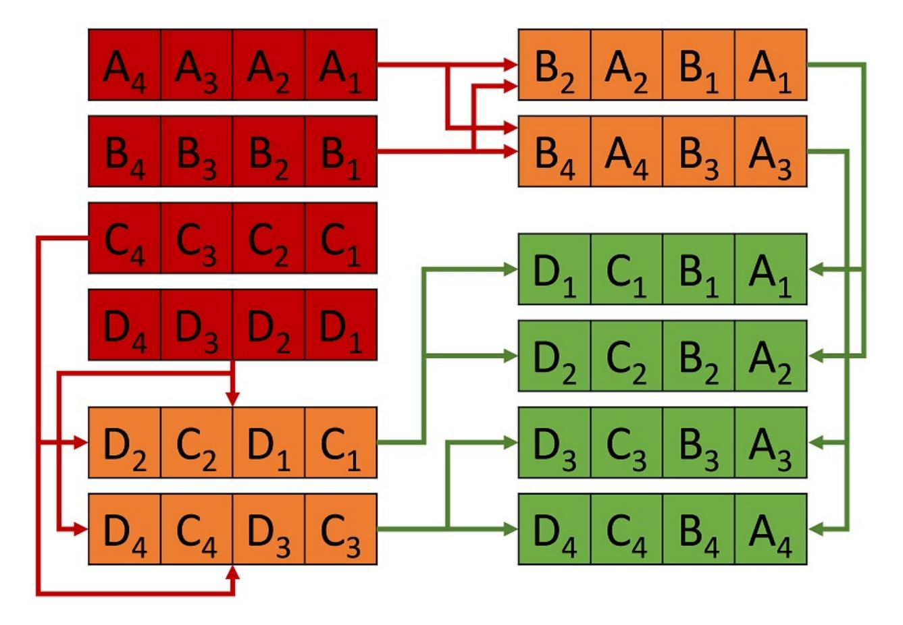

{0}------------------------------------------------

# <span id="page-0-0"></span>Making AES great again: the forthcoming vectorized AES instruction

Nir Drucker1,<sup>2</sup> , Shay Gueron1,<sup>2</sup> , and Vlad Krasnov<sup>3</sup>

<sup>1</sup>University of Haifa, Haifa, Israel, <sup>2</sup>Amazon Web Services Inc., Seattle, WA , USA? <sup>3</sup> CloudFlare, Inc. San Francisco, USA

Abstract. The introduction of the processor instructions AES-NI and VPCLMULQDQ, that are designed for speeding up encryption, and their continual performance improvements through processor generations, has significantly reduced the costs of encryption overheads. More and more applications and platforms encrypt all of their data and traffic. As an example, we note the world wide proliferation of the use of AES-GCM, with performance dropping down to 0.64 cycles per byte (from ∼ 23 before the instructions), on the latest Intel processors. This is close to the theoretically achievable performance with the existing hardware support. Anticipating future applications and increasing demand for high performance encryption, Intel has recently announced [\[1\]](#page-9-0) that its future architecture (codename "Ice Lake") will introduce new encryption instructions. These will be able to vectorize the AES-NI and VPCLMULQDQ instructions, on wide registers that are available on the AVX512 architectures. In this paper, we explain how these new instructions can be used effectively, and how properly using them can lead to the anticipated theoretical encryption throughput of around 0.16 cycles per byte. The included examples demonstrate AES encryption in various modes of operation, AEAD such as AES-GCM, and the emerging nonce misuse resistant variant AES-GCM-SIV.

# 1 Introduction

AES is the most ubiquitous symmetric cipher, used in many applications and scenarios. A prominent example is the exponentially growing volume of encrypted online data. Evidence for this growth, which is strongly supported by the industry (e. g., Intel's new AES-NI instructions [\[2](#page-9-1)[–4\]](#page-9-2), and Google's announcement [\[5\]](#page-9-3) on favoring sites that use HTTPS) can be observed, for example, in [\[6\]](#page-9-4) showing that more than 70% of online websites today use encryption.

This makes the performance of AES a major target for optimization in software and hardware. Dedicated hardware solutions were presented (e. g., [\[7,](#page-9-5) [8\]](#page-9-6)) and via the introduction of the AES-NI instructions that were added to x86 general purpose CPUs (and other architectures). These instructions, together with the progress made in processors' microarchitectures, allow software to run

<sup>?</sup> This work was done prior to joining Amazon.

{1}------------------------------------------------

the [Authenticated Encryption with Additional Authentication Data \(AEAD\)](#page-0-0) scheme [AES-GCM](#page-0-0) at 0.64 cycles per byte (C/B hereafter), approaching the theoretical performance of encryption only, 0.625 C/B, on such CPUs. Other software optimizations, written in OpenCL or CUDA that aim for the [Graphical](#page-0-0) [Processor Unit \(GPU\)](#page-0-0) [\[9,](#page-9-7)[10\]](#page-9-8) achieve the performance of 0.56 C/B and 0.44 C/B, respectively. Last year, AMD introduced the new "Zen" processor that has two [AES](#page-0-0) units [\[11\]](#page-9-9), and this reduces the theoretical throughput of AES encryption to 0.31 C/B.

Recently, Intel has announced [\[1\]](#page-9-0) that its future architecture, microarchitecture codename "Ice Lake", will add vectorized capabilities to the existing AES-NI instructions, namely VAESENC, VAESENCLAST, VAESDEC, and VAESDECLAST ( VAES\* for short). These instructions are intended to push the performance of [AES](#page-0-0) software further down, to a new theoretical throughput of 0.16 C/B.

This can directly speed up [AES](#page-0-0) modes such as [AES-CTR](#page-0-0) and [AES-CBC,](#page-0-0) and also more elaborate schemes such as [AES-GCM](#page-0-0) and [AES-GCM-SIV](#page-0-0) [\[12,](#page-9-10)[13\]](#page-9-11) (a nonce misuse resistant [AEAD\)](#page-0-0). These two schemes require fast computations of the almost XOR-universal hash functions GHASH and POLYVAL, which are significantly sped up with dedicated "carry-less multiplication" instruction PCLMULQDQ [\[3,](#page-9-12)[14\]](#page-9-13). Indeed, fast [AES-GCM\(](#page-0-0)-SIV) implementations can be achieved by using the new instruction that vectorizes the PCLMULQDQ instruction (VPCLMULQDQ) (see [\[15\]](#page-9-14)).

In this paper, we demonstrate how to write software that efficiently uses the new VAES\* and VPCLMULQDQ instructions. While the correctness of our algorithms (and code) can be verified with existing public tools, the actual performance measurements require a real CPU, which is currently unavailable. To address this difficulty, we give predictions based on instructions' count of current and new implementations.

The paper is organized as follows. Section [2](#page-1-0) describes the new VAES\* and VPCLMULQDQ instructions. Section [3](#page-3-0) describes our implementations of [AES](#page-0-0) encryption modes [AES-CTR](#page-0-0) and [AES-CBC.](#page-0-0) Section [4](#page-5-0) focuses on the [AEAD](#page-0-0) schemes [AES-GCM](#page-0-0) and [AES-GCM-SIV.](#page-0-0) In Section [5,](#page-7-0) we explain our results, and we conclude in Section [6.](#page-8-0)

# <span id="page-1-0"></span>2 Preliminaries

We use [AES](#page-0-0) to refer to [AES1](#page-0-0)28. The xor operation is denoted by ⊕, and concatenation is denoted by || (e. g., 00100111||10101100 = 0010011110101100, which, in hexadecimal notation, is the same as 0x27 || 0xac = 0x27ac). The notation X[j : i], j > i refers to the values of an array X between positions i and j (included). The case i = j degenerates to X[i]. Here, X can be an array of bits or of bytes, depending on the context. For an array of bytes X, we denote by X the corresponding byte swapped array (e. g., X =0x1234, X =0x3412). The two new vectorized AES-NI and PCLMULQDQ instructions are described next. The description of other assembly instructions can be found in [\[16\]](#page-9-15).

{2}------------------------------------------------

### 2.1 Vectorized AES-NI

Intel's AES-NI instructions (AES\*) include AESKEYGENASSIST and AESIMC to support [AES](#page-0-0) key expansion and AESENC/DEC(LAST) to support the [AES](#page-0-0) encryption/decryption, respectively. Alg. [1](#page-2-0) illustrates the new VAES\* instructions. These are able to perform one round of [AES](#page-0-0) encryption/decryption on KL = 1/2/4 128-bit operands (two qwords), having both register-memory and register-register variant (we use only the latter here). The inputs are two source operands, which are 128/256/512-bit registers (named xmm, ymm, zmm, respectively), that (presumably) represent the round key and the state (plaintext/ciphertext). The special case KL = 1 using xmm registers degenerates to the current version of AES\*.

```
Inputs: SRC1, SRC2 (wide registers)
  Outputs: DST (a wide register)
1: procedure VAES*(SRC1, SRC2)
2: for i := 0 to KL − 1 do
3: j = 128i
```

<span id="page-2-0"></span>Algorithm 1 VAES\*, and VPCLMULQDQ instructions [\[1\]](#page-9-0)

4: RoundKey[127 : 0] = SRC2[j + 127 : j] 5: T[127 : 0] = (Inv)ShiftRows(SRC1[j + 127 : j])

```
6: T[127 : 0] = (Inv)SubBytes(T[127 : 0])
7: T[127 : 0] = (Inv)MixColumns(T[127 : 0])
                                               . Only on VAESENC/VAESDEC.
8: DST[j + 127 : j] = T[127 : 0] ⊕ RoundKey[127 : 0]
9: return DST
  Inputs: SRC1, SRC2 (wide registers) Imm8 (8 bits)
```

```
Outputs: DST (a wide register)
1: procedure VPCLMULQDQ(SRC1, SRC2, Imm8)
2: for i := 0 to KL − 1 do
3: j1 = 2i + Imm8[0]
4: j2 = 2i + Imm8[4]
5: T1[ 63 : 0 ] = SRC1[ 64(j1 + 1) − 1 : 64j1 ]
6: T2[ 63 : 0 ] = SRC2[ 64(j2 + 1) − 1 : 64j2 ]
7: DST[ 128(i + 1) − 1 : 128i ] = PCLMULQDQ( T1, T2 )
8: return DST
```

## 2.2 Vectorized **VPCLMULQDQ**

Alg. [1](#page-2-0) (bottom) illustrate the functionality of the new vectorized VPCLMULQDQ instruction. It vectorizes polynomial (carry-less) multiplication, and is able to perform KL = 1/2/4 multiplications of two qwords in parallel. The 64-bit multiplicands are selected from two source operands and are determined by the

{3}------------------------------------------------

value of the immediate byte. The case KL = 1 degenerates to the current VPCLMULQDQ instruction.

# <span id="page-3-0"></span>3 Accelerating AES with **VAES**\*

The use of the VAES\* instructions for optimizing the various uses of [AES](#page-0-0) is straightforward for some cases (e. g., [AES-ECB,](#page-0-0) [AES-CTR,](#page-0-0) [AES-CBC](#page-0-0) decryption). For example, to optimize [AES-CTR,](#page-0-0) which is a naturally parallelizable mode, we only need to replace each xmm with zmm register and handle the counter in a vectorized form. In some other case, using the new instruction is more elaborate (e. g., optimizing [AES-CBC](#page-0-0) encryption, [AES-GCM,](#page-0-0) or [AES-](#page-0-0)[GCM-SIV\)](#page-0-0).

Fig. [1](#page-3-1) compares legacy (Panel a.) and vectorized (Panel b.) codes of [AES-](#page-0-0)[CTR.](#page-0-0) In both cases, the counter is loaded and incremented first (Steps 6-8 and 7-8, respectively). In Panel b., Steps 9-11, the key schedule is duplicated 4 times in 11-zmm registers (zmm0-zmm10). The encryption is executed in Steps 9-13, and 12-16, of Panels a and b, respectively. Finally, the plaintext is xored and the results are stored.

```
(a) Legacy AES-CTR (b) Vectorized AES-CTR
 1 . s e t t , %xmm12
 2 . s e t ctrReg , %xmm11
 3 inc m a sk :
 4 . long 0 , 0 , 0 , 0 x01000000
 5
 6 vmovdqu ( c t r ) , c t rReg
 7 . i r p j , 1 , 2 , 3 , 4
 8 vpadd inc m a sk(% r i p ) , c t rReg
 9 vpxor ( key ) , ctrReg , t
10 . i r p i , 1 , 2 , 3 , 4 , 5 , 6 , 7 , 8 , 9
11 vaesenc \ i ∗0 x10 ( key ) , t , t
12 .endr
13 vaesenc last 10∗0 x10 ( key ) , t , t
14 vpxor ( pt ) , t , t
15 vmovdqu tmp , ( c t )
16 lea 0 x10 ( pt ) , pt
17 lea 0 x10 ( c t ) , c t
18 .endr
                                           1 . s e t t , %zmm12
                                           2 . s e t ctrReg , %zmm11
                                           3 inc m a sk :
                                           4 . long 0 , 0 , 0 , 0 x01000000 , 0 , 0 , 0 , 0 x02000000
                                           5 . long 0 , 0 , 0 , 0 x03000000 , 0 , 0 , 0 , 0 x04000000
                                           6
                                           7 vbroadcasti64x2 ( c t r ) , c t rReg
                                           8 vpadd inc m a sk(% r i p ) , c t rReg
                                           9 . i r p i , 0 , 1 , 2 , 3 , 4 , 5 , 6 , 7 , 8 , 9 , 1 0 , 1 1
                                          10 vbroadcasti64x2 \ i ∗0 x10 ( key ) ,%zmm\ i
                                          11 .endr
                                          12 vpxorq %zmm0, ctrReg , t
                                          13 . i r p i , 1 , 2 , 3 , 4 , 5 , 6 , 7 , 8 , 9
                                          14 vaesenc %zmm\ i , t , t
                                          15 .endr
                                          16 vaesenc last %zmm10, t , t
                                          17 vpxorq ( pt ) , t , t
                                          18 vmovdqu64 t , ( c t )
```

<span id="page-3-1"></span>Fig. 1. [AES-CTR](#page-0-0) sample (AT&T assembly syntax); ct[511 : 0][=AES-CTR\(](#page-0-0)pt[511 : 0], key).

A mode like [AES-CBC](#page-0-0) encryption is serial by nature, and cannot be parallelized. However, we note that the VAES\* instructions encrypt 2/4 independent plaintext streams in parallel. To do this, we need to rearrange ("transpose") the inputs/outputs in order to make them suitable for vectorized code such as in Fig. [1.](#page-3-1)

Fig. [2](#page-4-0) illustrates how to handle four independent 4∗128-bit plaintext streams (A, B, C, D). We first load the four 512-bit values into four zmm registers (red

{4}------------------------------------------------



<span id="page-4-0"></span>Fig. 2. Transposing a 4 × 4 128-bit (input in red; output in green) by executing eight VPERMI2Q instructions. Every group of four instructions can run in parallel.

upper left vectors), then use the VPERMI2Q instruction to permute the qwords of each two vectors A, B and C, D (orange vectors). VPERMI2Q receives two source operands and a mask operand, which is also the destination operand (all are wide registers). Therefore, the mask must be re-set before each VPERMI2Q execution. Finally, we use the VPERMI2Q instruction to calculate the final results (green right bottom vectors). The flow requires 4 loads 8 permutations and 8 mask preparations, with total of 20 instructions per 256-bytes of processed data (e. g., plaintexts). We find this method to be very efficient. Other transposing methods can use the VPGATHERQQ/VPSCATTERQQ or the VPUNPCK instructions, but suffer from high instructions' latency, or need to use more instructions for the same task. Note that the VPUNPCK instruction is recommended for transposing a matrix of size 4 × 4 with elements of size 4 ∗ 64-bit, but this is not the case here.

Leveraging the pipeline capabilities efficienly Fast [AES](#page-0-0) computations need to operate on multiple independent blocks in parallel [\[4\]](#page-9-2), in order to hide the latency of the instrcutions and make the flow depend only on their throughput. The optimal number of blocks is determined by the latency and throughput of the VAES\* instructions [\[17\]](#page-9-16), and the number of available registers. The latency of VAES\* is 4 cycles on architecture codename "Skylake" (was 7 cycles on earlier processor generations), and their throughput is 1 cycle. In addition, the AVX512 architecture has 32 zmm registers, which can be used together with the VAES\* instructions. For example, in [AES-CTR](#page-0-0) we can allocate 11 registers 

{5}------------------------------------------------

for the [AES](#page-0-0) round keys, and split the rest among the counters and their the plaintext/ciphertext states (∼ 10 each). Consequently, it is possible to process 10 packets of 4 blocks in parallel, instead of only 8 packets of 1 block, as with the current instructions.

# <span id="page-5-0"></span>4 AES-GCM and AES-GCM-SIV

[AES-GCM](#page-0-0) [\[18,](#page-10-0)[19\]](#page-10-1) and [AES-GCM-SIV](#page-0-0) [\[12,](#page-9-10)[13\]](#page-9-11) are [AEAD](#page-0-0) schemes [\(AES-GCM-](#page-0-0)[SIV](#page-0-0) is nonce-misuse resistant). Their encryption flows are outlined in Algorithms [2](#page-5-1) and [3.](#page-5-2) Both modes include [AES-CTR](#page-0-0) encryption (the code is already shown in Fig. [1\)](#page-3-1).

## <span id="page-5-1"></span>Algorithm 2 [AES-GCM](#page-0-0) encryption [\[18,](#page-10-0) [19\]](#page-10-1)

```
Inputs: K (128 bits), IV (96 bits), A (AAD), M (message)
  Outputs: T (tag, 128 bits), C (ciphertext)
1: procedure AES-GCM(K, IV , A, M)
2: H = AES(K, 0128)
3: CT R0 = IV ||0
                  311
4: for i = 0, 1, . . . , v − 1 do
5: CT Ri = CT R[127 : 32]||((CT R[31 : 0] + i) (mod 232)
6: Ci =AES(K, CT Ri) ⊕ Mi
7: T = GHASH(H, A, C) ⊕ AES(K, CT R0)
8: return C, T
```

### <span id="page-5-2"></span>Algorithm 3 [AES-GCM-SIV](#page-0-0) encryption [\[12,](#page-9-10) [13\]](#page-9-11)

```
Inputs: K1 (128 bits), K2 (128 or 256 bits), N (96 bits), A (AAD), LA (A length
  in bytes), M (message), LM (M length in bytes)
  Outputs: T (tag, 128 bits), C (ciphertext)
1: procedure AES-GCM-SIV(K1, K2, N, A, LA, M, LM)
2: Tmp = POLYVAL(K1, A||M||LA||LM)
3: T = AES(K2, 0||(Tmp ⊕ N)[126 : 0])
4: for i = 0, 1, . . . , v − 1 do
5: CT Ri = 1||T[126 : 32]||((T[31 : 0] + i) (mod 232))
6: Ci = AES(K2, CT Ri) ⊕ Mi
7: return C = (C1, . . . , Cv−1), T
```

We focus on optimizing the universal hashing parts of these algorithms, which are not identical: [AES-GCM](#page-0-0) uses GHASH and [AES-GCM-SIV](#page-0-0) uses POLYVAL. 

{6}------------------------------------------------

Both hash functions operate in F = F<sup>2</sup> <sup>128</sup> (but with different reduction polynomials) and evaluate a polynomial with coefficients X1, X2, . . . , X<sup>s</sup> (for some s) in F at some point H ∈ F (which is the hash key). As shown in [\[13\]](#page-9-11):

$$\frac{POLYVAL(H, X_1, X_2, \dots, X_s) =}{(GHASH((\overline{H} \otimes x), (\overline{X_1}), (\overline{X_2}), \dots, (\overline{X_s})))}$$

so if suffices to demonstrate the implementation of POLYVAL.

The "Aggregated Reduction" method (see [\[14\]](#page-9-13)) replaces Hoeren's method with a per-block reduction (T<sup>i</sup> = ((Xi⊕Ti−1)⊗H) (mod Q(x))), with a deferred reduction based on pre-computing t > 0 powers of H stored in a table (Htbl).

$$T_i = ((X_i \otimes H) \oplus (X_{i-1} \otimes H^2) \oplus \cdots \oplus (X_{i-(t-1)} + T_{i-t}) \otimes H^t) \pmod{Q(x)}$$

(⊗ is field multiplication; Q(x) is the reduction polynomial).

Fig. [3](#page-6-0) compares codes for initializing Htbl. Panel (a) describes the legacy implementation with t = 8. Panel (b) describes a vectorized implementation for calculating t = 4 ∗ 8 powers of H. Both snippets use the GFMUL function for the field multiplication. Fig. [4](#page-7-1) presents GFMUL4 that performs 4 multiplications in parallel. The same code is used for GFMUL and GFMUL2, but over different registers (xmm/ymm). Steps 1-10 perform "Schoolbook" multiplication, and Steps 12-20 perform the reduction (see [\[14\]](#page-9-13)). An implementation that uses "Aggregated Reduction" should first perform H ⊗X<sup>t</sup> as in Fig. [4,](#page-7-1) Steps 1-5. Then process H<sup>i</sup> ⊗ Xt−<sup>i</sup> , i = 1, . . . , t − 1 in parallel and accumulate the results. Subsequently, perform the reduction steps 7-20.

```
(a) Legacy Htbl-init(8) (b) Vectorized Htbl-init(32)
1 vmovdqu (H) , %xmm0
2 vmovdqu %xmm0, %xmm1
3 . i r p i , 0 , 1 , 2 , 3 , 4 , 5 , 6
4 vmovdqu %xmm0, \ i ∗0 x10 ( Htbl )
5 c a l l GFMUL
6 .endr
7 vmovdqu %xmm0, 7∗0 x10 ( Htbl )
8 ret
                                  1 vmovdqu (H) , %xmm0
                                  2 vmovdqu %xmm0, %xmm1
                                  3 vmovdqu %xmm0, ( Htbl )
                                  4 c a l l GFMUL
                                  5 vmovdqu %xmm0, 0 x10 ( Htbl )
                                  6 c a l l GFMUL
                                  7 vbroadcasti64x2 0 x10 ( Htbl ) ,%ymm1
                                  8 vmovdqu64 ( Htbl ) , %ymm0
                                  9 c a l l GFMUL2
                                 10 vmovdqu64 %ymm0, 0 x20 ( Htbl )
                                 11 vbroadcasti64x2 0 x30 ( Htbl ) ,%zmm1
                                 12 vmovdqu64 ( Htbl ) , %zmm0
                                 13 . i r p i , 1 , 2 , 3 , 4 , 5 , 6 , 7
                                 14 c a l l GFMUL4
                                 15 vmovdqu64 %zmm0, \ i ∗0 x40 ( Htbl )
                                 16 .endr
                                 17 ret
```

<span id="page-6-0"></span>Fig. 3. Initializing the HTBL. (a) legacy t = 8, (b) vectorized t = 8 ∗ 4

{7}------------------------------------------------

```
1 vpclmulqdq $0x00 , %zmm1, %zmm0, %zmm2
2 vpclmulqdq $0x11 , %zmm1, %zmm0, %zmm5
3 vpclmulqdq $0x10 , %zmm1, %zmm0, %zmm3
4 vpclmulqdq $0x01 , %zmm1, %zmm0, %zmm4
5 vpxorq %zmm4, %zmm3, %zmm3
6
7 vpslldq $8 , %zmm3, %zmm4
8 vpsrldq $8 , %zmm3, %zmm3
9 vpxorq %zmm4, %zmm2, %zmm2
10 vpxorq %zmm3, %zmm5, %zmm5
11
12 vpclmulqdq $0x10 , p ol y (% r i p ) , %zmm2, %zmm3
13 vpshufd $78 , %zmm2, %zmm4
14 vpxorq %zmm4, %zmm3, %zmm2
15
16 vpclmulqdq $0x10 , p ol y (% r i p ) , %zmm2, %zmm3
17 vpshufd $78 , %zmm2, %zmm4
18 vpxorq %zmm4, %zmm3, %zmm2
19
20 vpxorq %zmm5, %zmm2, %zmm0
21 ret
```

<span id="page-7-1"></span>Fig. 4. The function GFMUL4, performs vectorized A<sup>1</sup> ⊗ A<sup>2</sup> (mod Q(x)).

In the vectorized implementation we load 4 values from Htbl into each zmm register e. g., zmm(i)= {H4<sup>i</sup> , H4i+1, H4i+2, H4i+3}. To multiply the matching values (H<sup>i</sup> , Xt−i), we first need to reverse their order e. g., zmm(i) = {H4i+3, H4i+2, H4i+1, H4i}. We do this using the VSHUFI64X2 instruction: "vshufi64x2 0x1b, %zmm(i), %zmm(i), %zmm(i)". Eventually, we end with T<sup>j</sup> = P i≡j (mod 4) i=1,...,t (H<sup>i</sup> ⊗ Xt−i), j = 1, . . . , 4. Fig. [5](#page-7-2) shows the final aggregation step.

```
1 vextracti64x4 $1 , %zmm0, %ymm1
2 vpxor %ymm1, %ymm0, %ymm0
3 vextracti128 $1 , %ymm0, %xmm1
4 vpxor %ymm1, %xmm0, %xmm0
```

<span id="page-7-2"></span>Fig. 5. The vectorized Aggregated Reduction method - Final aggregation.

# <span id="page-7-0"></span>5 Results

We implemented x86 assembly code for [AES-CTR](#page-0-0) and POLYVAL , using VAES\* and VPCLMULQDQ instructions, pipelining 1 or 8 streams in parallel (the suffix "x8" distinguishes the implementations). To predict the potential improvement on future architectures before real samples are available, we used the Intel [Soft](#page-0-0)[ware Developer Emulator \(SDE\)](#page-0-0) [\[20\]](#page-10-2). This tool allows us to count the number of instructions executed during each of the tested functions. We marked the start/end boundaries of each function with "SSC marks" 1 and 2, respectively. 

{8}------------------------------------------------

This is done by executing "movl ssc mark, %ebx; .byte 0x64, 0x67, 0x90" and invoking the [SDE](#page-0-0) with the flags "-start ssc mark 1 -stop ssc mark 2 -mix -icl". The rationale is that a reduced number of instructions typically indicates improved performance that will be observed on a real processor (although the exact relation between the instructions count and the eventual cycles count is not known in advanced).

Table [1](#page-8-1) compares the instructions count in our implementations. The results confirm our prediction that [AES](#page-0-0) algorithms can be sped up by a factor of 3 −4x and that better speedups are expected when operating on larger buffers.

| Algorithm | PT SIZE | Legacy | Vectorized | Ratio |
|-----------|---------|--------|------------|-------|
|           | (bytes) | impl.  | impl.      |       |
| AES-CTR   | 512     | 608    | 178        | 3.42  |
| AES-CTR   | 8,192   | 9,248  | 2,338      | 3.96  |
| AES-CTRx8 | 512     | 493    | 150        | 3.29  |
| AES-CTRx8 | 8,192   | 7,453  | 1,890      | 3.94  |
| POLYVALx8 | 4,096   | 2,816  | 794        | 3.55  |
| POLYVALx8 | 8,192   | 5,536  | 1,474      | 3.76  |
| POLYVALx8 | 16,384  | 10,976 | 2,834      | 3.87  |

<span id="page-8-1"></span>Table 1. Instructions count comparison (lower is better)

# <span id="page-8-0"></span>6 Conclusion

This paper shows how to leverage Intel's new instruction VPCLMULQDQ and VAES\* for accelerating encryption with [AES.](#page-0-0) Our results predict that optimized vectorized [AES](#page-0-0) code can approach the new theoretical bound of 0.16 C/B on forthcoming CPUs, about 4x faster than current implementations. We demonstrated optimized [AES-CTR](#page-0-0) and [AES-GCM\(](#page-0-0)-SIV) code snippets that can approach this limit. For serial mode such as [AES-CBC,](#page-0-0) we showed how to optimize code by processing multiple message streams in parallel.

# Acknowledgements

This research was supported by: The Israel Science Foundation (grant No. 1018/ 16); The Ministry of Science and Technology, Israel, and the Department of Science and Technology, Government of India; The BIU Center for Research in Applied Cryptography and Cyber Security, in conjunction with the Israel National Cyber Bureau in the Prime Minister's Office; The Center for Cyber Law and Policy at the University of Haifa.

{9}------------------------------------------------

# References

- <span id="page-9-0"></span>1. −: Intel architecture instruction set extensions programming reference. https://software.intel.[com/sites/default/files/managed/c5/15/](https://software.intel.com/sites/default/files/managed/c5/15/architecture-instruction-set-extensions-programming-reference.pdf) [architecture-instruction-set-extensions-programming-reference](https://software.intel.com/sites/default/files/managed/c5/15/architecture-instruction-set-extensions-programming-reference.pdf).pdf (October 2017)
- <span id="page-9-1"></span>2. Gueron, S.: Intel <sup>R</sup> Advanced Encryption Standard (AES) New Instructions Set Rev. 3.01. Intel Software Network (2010)
- <span id="page-9-12"></span>3. Gueron, S., Kounavis, M.: Efficient implementation of the Galois Counter Mode using a carry-less multiplier and a fast reduction algorithm. Information Processing Letters 110(14) (2010) 549 – 553
- <span id="page-9-2"></span>4. Gueron, S.: Intel's New AES Instructions for Enhanced Performance and Security. In: FSE. Volume 5665., Springer (2009) 51–66
- <span id="page-9-3"></span>5. Bahajji, Z.A.: Indexing HTTPS pages by default. [https://](https://security.googleblog.com/2015/12/indexing-https-pages-by-default.html) security.googleblog.[com/2015/12/indexing-https-pages-by-default](https://security.googleblog.com/2015/12/indexing-https-pages-by-default.html).html (Dec 2015)
- <span id="page-9-4"></span>6. −: Percentage of Web Pages Loaded by Firefox Using HTTPS. [https://](https://letsencrypt.org/stats/#percent-pageloads) letsencrypt.[org/stats/#percent-pageloads](https://letsencrypt.org/stats/#percent-pageloads) (Jan 2018)
- <span id="page-9-5"></span>7. Hodjat, A., Verbauwhede, I.: Area-throughput trade-offs for fully pipelined 30 to 70 Gbits/s AES processors. IEEE Transactions on Computers 55(4) (April 2006) 366–372
- <span id="page-9-6"></span>8. Mathew, S., Satpathy, S., Suresh, V., Anders, M., Kaul, H., Agarwal, A., Hsu, S., Chen, G., Krishnamurthy, R.: 340 mV #x2013;1.1 V, 289 Gbps/W, 2090-Gate NanoAES Hardware Accelerator With Area-Optimized Encrypt/Decrypt GF(2 4 ) 2 Polynomials in 22 nm Tri-Gate CMOS. IEEE Journal of Solid-State Circuits 50(4) (April 2015) 1048–1058
- <span id="page-9-7"></span>9. Manavski, S.A.: CUDA Compatible GPU as an Efficient Hardware Accelerator for AES Cryptography. In: 2007 IEEE International Conference on Signal Processing and Communications. (Nov 2007) 65–68
- <span id="page-9-8"></span>10. Patchappen, M., Yassin, Y.M., Karuppiah, E.K.: Batch processing of multi-variant AES cipher with GPU. In: 2015 Second International Conference on Computing Technology and Information Management (ICCTIM). (April 2015) 32–36
- <span id="page-9-9"></span>11. −: The "Zen" Core Architecture. http://www.amd.[com/en/technologies/zen](http://www.amd.com/en/technologies/zen-core)[core](http://www.amd.com/en/technologies/zen-core) (Jan 2018)
- <span id="page-9-10"></span>12. Gueron, S., Lindell, Y.: GCM-SIV: Full Nonce Misuse-Resistant Authenticated Encryption at Under One Cycle Per Byte. In: Proceedings of the 22Nd ACM SIGSAC Conference on Computer and Communications Security. CCS '15, New York, NY, USA, ACM (2015) 109–119
- <span id="page-9-11"></span>13. Gueron, S., Langley, A., Lindell, Y.: AES-GCM-SIV: Specification and Analysis. Cryptology ePrint Archive, Report 2017/168 (2017) [https://eprint](https://eprint.iacr.org/2017/168).iacr.org/ [2017/168](https://eprint.iacr.org/2017/168).
- <span id="page-9-13"></span>14. Gueron, S., Kounavis, M.E.: Intel <sup>R</sup> carry-less multiplication instruction and its usage for computing the GCM mode. White Paper (2010)
- <span id="page-9-14"></span>15. Drucker, N., Gueron, S., Krasnov, V.: Fast multiplication of binary polynomials with the forthcoming vectorized VPCLMULQDQ instruction. In: 2018 IEEE 25th Symposium on Computer Arithmetic (ARITH). (June 2018)
- <span id="page-9-15"></span>16. −: Intel <sup>R</sup> 64 and IA-32 architectures software developers manual. Volume 3a: System Programming Guide (September 2015)
- <span id="page-9-16"></span>17. −: Intel <sup>R</sup> 64 and IA-32 Architectures Optimization Reference Manual. (June 2016)

{10}------------------------------------------------

- <span id="page-10-0"></span>18. McGrew, D., Viega, J.: The Galois/counter mode of operation (GCM). Submission to NIST Modes of Operation Process 20 (2004)
- <span id="page-10-1"></span>19. McGrew, D.A., Viega, J.: The Security and Performance of the Galois/Counter Mode (GCM) of Operation. In Canteaut, A., Viswanathan, K., eds.: Progress in Cryptology - INDOCRYPT 2004, Berlin, Heidelberg, Springer Berlin Heidelberg (2005) 343–355
- <span id="page-10-2"></span>20. −: Intel <sup>R</sup> Software Development Emulator. [https://software](https://software.intel.com/en-us/articles/intel-software-development-emulator).intel.com/en-us/ [articles/intel-software-development-emulator](https://software.intel.com/en-us/articles/intel-software-development-emulator)