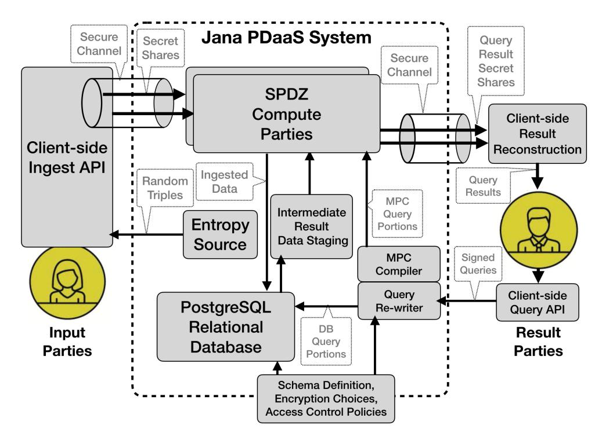
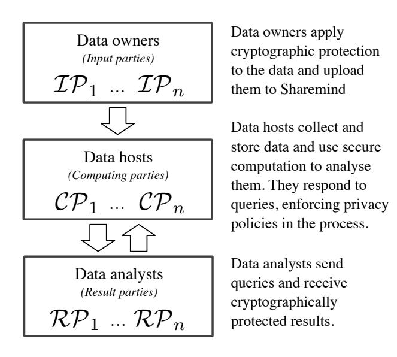
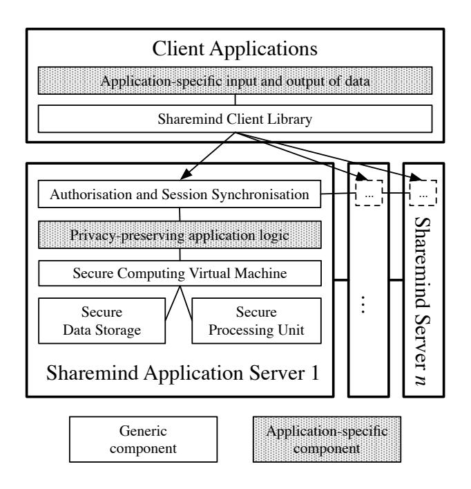
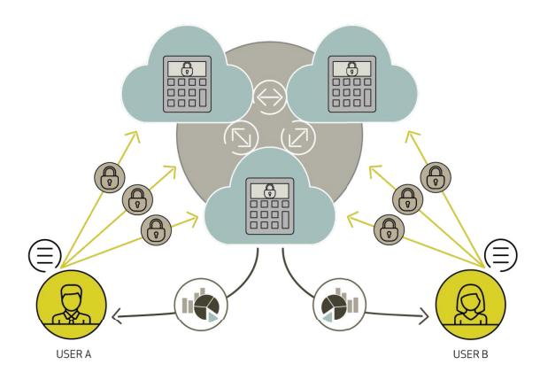
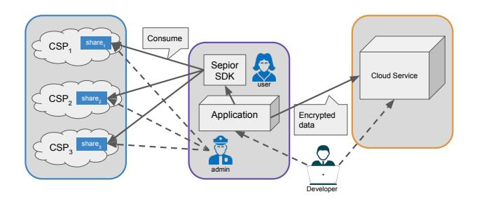
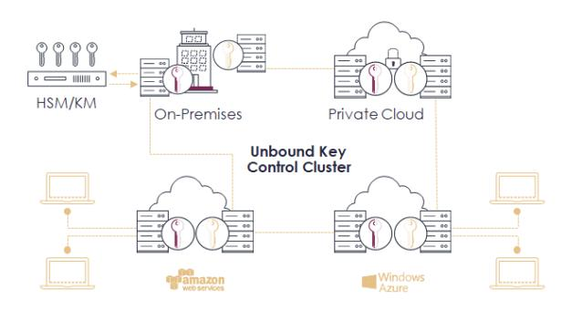
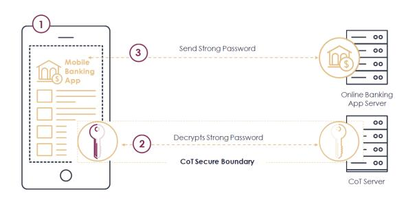

# From Keys to Databases – Real-World Applications of Secure Multi-Party Computation

David W. Archer<sup>3</sup> , Dan Bogdanov<sup>2</sup> , Liina Kamm<sup>2</sup> , Yehuda Lindell1,<sup>8</sup> , Kurt Nielsen5,7,10, Jakob Illeborg Pagter5,<sup>7</sup> , Nigel P. Smart4,8,<sup>9</sup> , and Rebecca N. Wright<sup>6</sup>

```
1 Bar-Ilan University, Israel
      2 Cybernetica AS, Estonia
          3 Galois Inc, USA
       4 KU Leuven, Belgium
      5 Partisia ApS, Denmark
      6 Rutgers University, USA
       7 Sepior ApS, Denmark
       8 Unbound Tech, Israel
     9 University of Bristol, UK
10 University of Copenhagen, Denmark
```

dwa@galois.com, {dan.bogdanov, liina.kamm}@cyber.ee, Yehuda.Lindell@biu.ac.il, {jip, kn}@partisia.com, nigel.smart@kuleuven.be, rebecca.wright@rutgers.edu

Abstract. We discuss the widely increasing range of applications of a cryptographic technique called Multi-Party Computation. For many decades this was perceived to be of purely theoretical interest, but now it has started to find application in a number of use cases. We highlight in this paper a number of these, ranging from securing small high value items such as cryptographic keys, through to securing an entire database.

# 1 Introduction

In general, strong encryption is a fundamentally sound way to protect data, and solutions for securing data "in transit" and "at rest" are standardised and contained in certified commercial products. The missing part is a generic standardised and certified "Computation on Encrypted Data" (CoED), for which Multi-Party Computation (MPC) is a strong candidate technology. MPC deals with the problem of jointly computing a function among a set of (possibly mutually distrusting) parties. MPC has a long story in the cryptographic literature, with origins in the early 1980s work of Yao [\[1\]](#page-29-0). In MPC, a group of parties compute an agreed-upon function on their private inputs. For example, suppose three parties, Alice, Bob and Charlie, hold private inputs x, y, and z respectively. They agree to compute the value of the function

$$F(x, y, z) = \max(x, y, z).$$

while keeping those inputs private. To do so the parties engage in a protocol to obtain the desired output: namely the value of the function. In an MPC protocol, all that the parties learn is what they can learn from that output and their own private input. Thus in the above example, if the output is z, then Charlie learns only that his z is the maximum value, while Alice and Bob learn (if x, y and z are distinct) only that their input is not equal to the maximum, and that the maximum held is equal to z. This basic scenario can be easily generalised to where the parties have several inputs and outputs, and the function outputs different values to different parties.

We might think of a protocol as a set of instructions in a distributed computer program. That program consists of a series of interactive rigid steps which are known by all participating parties beforehand. Each party inputs a secret piece of information and gets back an output value. An intuitive way of thinking about protocols is as a random process, or functionality, that maps inputs to outputs: a generalisation of normal functions, in the sense that normal functions are functionalities with no inner randomness (that is, they are deterministic). Informally speaking, the basic properties that a multi-party computation protocol aims to ensure are:

- 1. Input privacy: The information derived from the execution of the protocol should not allow any inference of the private data held by the parties, bar what is inherent from the output of the function.
- 2. Robustness: Any proper subset of adversarial colluding parties willing to share information or deviate from the instructions during the protocol execution should not be able to force honest parties to output an incorrect result.

In some situations, we are willing to give up the robustness property: instead of a protocol always terminating with the correct output for honest parties, we may allow the honest parties to abort if they detect an error in the protocol. The reason for loosening the requirements is that obtaining robustness can be impossible in many practical situations. Protocols which allow such aborts are called unfair since the adversary may learn the function output and then force the honest players to abort without learning the result.

The classical example of an MPC problem is that of the Millionaire's Problem: two millionaires want to know who is richer, in such a way that neither of them learns the net worth of his fellow. A solution to this situation is essentially to securely evaluate the comparison function. Around fifteen years ago, even computing this function securely was beyond the range of existing protocols. However, in the mid 2000's early commercial deployment started for simple MPC operations, and since then performance has improved tremendously. Today, a variety of commercial MPC systems exist. In this article, we explain to the non-expert where the real-world uses of MPC are currently being extended.

A key point to understand is that MPC is not a single protocol but rather a growing class of solutions that differs with respect to properties and performance. However, common for most MPC systems are the three basic roles:

- The Input Parties (IP) delivering sensitive data to the confidential computation.
- The Result Parties (RP) receiving results or partial results from the confidential computation.
- The Computing Parties (CP) jointly computing the confidential computation.

Each person or organisation involved in an MPC computation may hold one or more of these roles. As an example, in the case of financial off-exchange matching described below in Section [5.1,](#page-17-0) the involved buyers and sellers of securities hold all three roles. In the case of the vHSM described in Section [6.1](#page-23-0) a single organisation holds all these roles, but the organization has different machines performing the different roles.

Common for all MPC protocols is the concept of "no single point of trust", meaning that none of the involved CPs can unilaterally gain access to the encrypted input. The different MPC protocols have different properties that enhance the security, improve the efficiency or make the MPC system more robust. The list below provides the most important properties[11](#page-1-0):

- The number of CPs involved in the MPC system (n).
- The threshold of CPs that cannot run the intended protocol or take control of the MPC system (t), meaning that t + 1 CPs can use or misuse the system.
- Passive security, which does not guarantee that a corrupt CP computes the intended protocol, but still gaurantees privacy of the inputs. With passive security, the CPs that make up the MPC system should be mutually trusted to execute the protocol correctly.
- Active security (with abort), which guarantees that a corrupt CP must run the intended protocol, otherwise the protocol will abort with overwhelming probability.
- Active security (with fault tolerance) guarantees that the MPC system will continue to operate even if a CP intentionally or unintentionally fails to operate or operate correctly.

With either form of active security, mutually distrusted CPs can make up the MPC system.

The number of CPs can be two or more, and the threshold can be any number below n. For t = n − 1 it takes all CPs to break the security of the MPC system. If the IPs are the CPs, then the confidentiality cannot be compromised without consensus among all input providers (IPs). With active security, the MPC system may consist of CPs with opposing interests, such as buyers and sellers, which may be both a cheaper

<span id="page-1-0"></span><sup>11</sup> Other important characteristics are the different types of basic operations such as arithmetic or boolean, and different types of cryptographic technologies such as secret sharing and homomorphic encryption.

and a stronger way to create trust as opposed to involving third parties. The computation speed is heavily dependent on the choice of parameters. While "honest majority" (e.g. n = 3 and t = 1) with passive security will typically allow for a fast protocol,"dishonest majority" (e.g. n = 2 and t = 1), with active security, is a more secure system, but usually slower by at least an order of magnitude.

MPC is a CoED technique that does not rely on trusted individuals or institutions. Therefore, MPC can be used to create more trustworthy institutions than those we have today. One solution is to use MPC to combine existing trusted institutions to create one that is more neutral and trustworthy (like use cases we outline below using Sharemind and with Partisia and Statistics Denmark). Another solution is to use opposing interests to further increase the trustworthiness of the MPC system (like the case with off-exchange matching below). A further solution is to take a potential single point of security failure, and then distribute the trust amongst a set of a parties, thus providing the attacker with a more complex multi-party attack surface (like the vHSM use case of Unbound Tech. below).

The generic use of MPC may be impractical in certain fields of application today. However, generic use may also be unnecessary. Tailoring the MPC protocols to the relevant computations or applications can ensure the optimal result. This is further emphasised by the MPC applications presented in this paper, which all utilise, to some extent, specially tailored MPC protocols to the specific application domains.

#### 1.1 Our Case Studies

We look at four case studies of MPC systems which have been deployed in the real world. The first is the Jana system developed by Galois Inc., with help from various universities and other companies. The Jana system provides an MPC-secured database, implementing a Private Data as a Service (PDaaS) system for relational data. Thus Jana is unique among encrypted databases: traditional encrypted databases typically bring data into the clear at least during data processing (such as query evaluation), thus only providing encryption during data storage as opposed to processing.

The second case study is a similar MPC-secure database system developed by Cybernetica (an Estonian based company) called Sharemind, which instead of having a centralized encrypted database goes for a distributed secret-shared database. Sharemind is focused around the problems of data sharing and analytics. All kinds of organisations use distributed computer systems with the purpose of storing data. Initially, information distribution is asymmetric and data flows from people to organisations or between organisations. This asymmetry has turned out to be a source of power as more information can make one more successful and efficient. There are attempts to limit that power, e.g., governments enacting privacy regulation, companies distrusting each other, and some groups of individuals avoiding certain online services. Sharemind is a cryptographic solution to the data sharing problem. It allows organisations to implement anonymous processing, where confidential input data remains private throughout the computation and the results are published to authorised parties. The design was proposed in a Master's thesis in 2007 [\[2\]](#page-29-1) and refined in follow-up publications [\[3,](#page-29-2)[4\]](#page-29-3). Sharemind is one of the few solutions validated against data protection regulations.

Our third case study is from Denmark, where Partisia has been a pioneer in the commercial use of MPC and has been involved in commercial MPC activities since 2009. The initial commercial application was auctions, which was also the first large scale use of MPC in the (now famous) sugar beet auction [\[5\]](#page-29-4). Today, Partisia is a commercial platform focusing on MPC from R&D to commercial activities within market design (like auctions and matching), data analytics (like benchmarking and credit scoring) as well as basic infrastructure (like key management and data exchange). The commercial activities of Partisia has resulted in separate investor supported spinouts, with Sepior as the most ambitious focusing on key management and related infrastructure. We report on two recent applications within market design and data analytics as well as prospects on the future use of MPC in combination with blockchain.

Our fourth, and final, case study is Unbound Tech, is a company based in Israel with customers throughout the world. At the heart of Unbound's product offering is a long research history on technologies related to Multi-Party Computation (MPC). The goal of Unbound Tech is to protect any corporate secret, in any situation/use case, using actively secure MPC protocols. Many of the use-cases we describe below can be solved with generic MPC solutions, but a key differentiator of Unbound Tech's approach is that often specific situations can allow for tailor made/bespoke MPC solutions.

### <span id="page-3-1"></span>2 An Overview of the Use Cases

One can easily see a clear division into two sets of applications in our use cases. The first division is into applications which provide database style applications in order to extract statistical information; whilst the second division is into controlling and processing cryptographic data such as keys.

#### 2.1 Securing a Database

The large and increasing amounts of detailed (big) data makes it possible to improve data-driven decisions, from overall strategic decisions to automated operational micro-decisions. From an economic perspective, all decisions can be boiled down to choices from a set of alternatives. With more detailed information about the alternatives, as well as the preferences regarding these alternatives, it is possible to guide individuals to make better decisions and to better predict future outcomes. Consequently, these data can help us in making better decisions that can improve our lives and improve the utilisation of our scarce resources.

Sensitive personal and company information is highly valued in research and services, with benefits for individual citizens, companies and society in general. However, the most valuable data are also the most sensitive, such as information about individuals' and companies' private preferences and decisions. On the one hand, it is predicted that data-driven decisions and analytics will be a tremendous growth area in the years to come. On the other hand, data which are used outside their original context may violate fundamental rights to privacy and weaken the "bargaining position" of individuals and companies in general. The latter was acknowledged early on by Google's chief economist, Hal Varian, in an early paper on market design for automated trading [\[6\]](#page-29-5).

Increasing political awareness has resulted in new regulation that is primarily aimed at protecting personal data. The Japanese Act on the Protection of Personal Information came into effect May 30th, 2017 and the European General Data Protection Regulation (GDPR) entered into force on May 25th, 2018. There are also efforts in the technology and digital services industry to deploy Privacy Enhancing Technologies (PETs) and use them to differentiate the product in the market. Notable examples include, but are not limited to, the deployment of differential privacy by Apple and the use of secure computing techniques by Google.

Below, we outline three different systems which approach this problem in different ways: The Jana system provides a single encrypted database whose data is processed by MPC engines so as to service the users' queries. A key aspect of the Jana system is how it integrates MPC, differential privacy, and searchable encryption in a seamless manner. The Sharemind system provides a shared database, whose goal is to enable the joint analysis and sharing of data from multiple sources without revealing any information about the shared records. Partisia has also conducted experiments of secure statistical data processing using MPC enabling banks to share customer data, without compromising the customers' privacy.

The use of such systems is not just focused on problems related to data-sharing, but also to risk mitigation. Large organisations that worry about data security can adopt a distributed storage architecture and keep different databases in different departments or agencies. For example, some governments adopt this approach to avoid centralised "superdatabases". While this reduces the risk of large-scale data leakage, it complicates statistical studies that require linking data over multiple databases. Due to regulatory reasons, personal data collected for a single purpose cannot be re-used, even if it is for a greater good.

An example of such a scenario occurred in Estonia, where in 2014 the government noticed that students of computer science and software engineering have a low graduation rate compared to other curricula. Universities raised the hypothesis that working during studies, popular among CS students, causes the students to overextend their study time or even quit. This hypothesis could be tested by linking governmental records on working (from the taxation authority) with the records on higher education (from the education authority). However, such an operation would need to be compliant with the Personal Data Protection Act and the tax secrecy clauses of the Taxation Act and this was nearly impossible at the time. We describe later work on this precise problem and how it was solved. A similar data sharing of education records and financial information has recently been proposed in the United States as well, with MPC being one of the preferred options[12](#page-3-0) .

<span id="page-3-0"></span><sup>12</sup> <https://www.cep.gov/news/sept6news.html>

Another issue with privacy sensitive data is how to increase the value held within the data. All countries conduct censuses and produce vast amounts of statistical information. Querying this data needs to be done carefully, so as to preserve the confidentiality of the data. In addition the pooling of data across national borders can unlock additional value, in terms of planning of major international efforts. But again this usually comes with too high a privacy cost. Various national agencies, and indeed the United Nations, as part of the United Nations Global Data Platform, are now looking at using MPC-enabled systems to help increase the value of collected statistics, whilst maintaining privacy. Below we also report on one such trial done by Partisia for Statistics Denmark.

#### 2.2 Securing Cryptographic Data

We first outline how traditional cryptography is used in many large corporations. With a large corporation one not only has a large number of keys to manage, but also a plethora of different cryptographic tasks which have to be performed on different data in different situations. The storage, control and usage of these keys is usually done using so-called Hardware Security Modules (HSMs). These are dedicated appliances which are plugged into the corporate network to provide corporate-wide cryptographic operations.

Cryptographic keys may be imported into the HSM, or exported, using so-called Key-Wrap methods. Usually, keys are created within the HSM, and the design is such that they never leave the HSM. By ensuring that either keys do not leave the HSM, or if they do they are protected by a Key-Wrap method, one obtains strong guarantees of key protection.

Most HSMs support a standard cryptographic API (such as PKCS #11), and via this one can call a number of cryptographic operations using the keys embedded within the HSM. For example, one can perform digital signatures, public key encryption, produce and verify message authentication codes, encrypt data streams and so on.

However, these benefits come with considerable cost. The most important of these is lack of flexibility. The HSM is essentially a special purpose computer/appliance and so a corporation needs to purchase enough HSMs to supply its peak load needs. Then during periods of low load the HSMs are lying idle. Thus the flexibility one has with modern computer systems of "spinning-up" new instances in a virtual environment as a peak load is met cannot be met with HSM technology.

Another lack of flexibility comes with the algorithms supported by an HSM. Not all HSMs support all cryptographic algorithms. Indeed, companies can be led to adopt a lowest common denominator approach to choosing algorithms; i.e. one needs to select algorithms which all HSMs support [\[7\]](#page-29-6). As time progresses and new algorithms, key sizes, or modes are adopted, one's existing investment in HSMs becomes obsolete. One, often, cannot just perform a software update like one would with traditional cryptographic libraries on a desk top machine.

Such lack of flexibility is most acute in cloud environments where the elastic nature of compute capability is exploited by organisations to react to changing demands on their compute capability. Traditional HSM appliances need either to be stored on premise, and hence need to be called by the cloud infrastructure, or they are part of the cloud infrastructure themselves. A cloud infrastructure can take many forms:

- Infrastructure as-a-Service (IaaS) where the cloud service provider (CSP) offers raw computing power accessible as virtual machines, and storage, e.g. Amazon EC2 and S3.
- Platform as-a-Service (PaaS) where the CSP offers (e.g.) a full application stack, e.g. Microsoft Azure.
- Software as-a-Service (SaaS) where the CSP offers a full application, e.g Salesforce.com.

To ensure data confidentiality it is usually considered best practice to encrypt data when using cloud services. The protection offered by encryption in itself depends on where data is made available as clear text, and independently of this how encryption keys are stored and used.

The most fundamental form of protection is achieved through encryption of data at rest, meaning that any data stored at the CSP is stored in encrypted form. Across different software solutions and architectures, encryption may happen in different places, but overall a critical part of any encryption scheme for encrypting data-at-rest is the so-called key-and-lock-separation principle, which states that the encryption keys must be stored separately from where the encrypted data is stored. For a cloud application this means that keys are not stored at the CSP where data is stored.

Thus, to realise key-and-lock-separation, some third party, and not the CSP holding the data, must hold the encryption keys. This third party could be the cloud customer (who owns the data) herself, but this would require the cloud customer to operate her own key management solution, which is contradictory to the desire for using cloud services. In the cloud community the feature which allows users to achieve key-and-lock-separation is typically called Bring Your Own Key (BYOK). The support for BYOK is gaining traction is the cloud industry, including offerings from some of the biggest players like Amazon Web Services, Salesforce, Google and several others.

Beyond BYOK another general trend in the cloud industry is that most companies use multiple cloud services. The reason for this can be both a defensive strategy for availability and avoidance of vendor lock-in, but also a more positive strategy where different cloud offerings are combined to achieve some desirable set of features. In this way, the seemingly simple problem of encrypting data used in cloud services ends up being a sophisticated multi-cloud, multi-application, and multi-user problem, the complexities of which cloud users and providers are only beginning to dive into. In addition to the key-and-lock-separation principle another important principle is needed for proper key management. This is the hardening principle, which states that it must be (very) hard to access any encryption key (without proper credentials).

For many cloud users however, HSMs are out of reach because they are too expensive and do not fit well into a multi-cloud architecture. The Sepior KMaaS described later is a solution to this problem tailored to the cloud computing environment, whereas the Unbound vHSM, also described later, is a generic drop in replacement for an HSM. Both systems make use of tailored MPC protocols to achieve key separation and control, and to mitigate the threat of locating keys in a single location.

## 3 Jana: Private Data as a Service

Data as a Service (DaaS) is a popular scalable model where potentially many result parties access a longlived, updatable shared data resource. The archetype of such services, the relational database, continues to be the dominant data management and analytics tool in many domains. However, ubiquitous security breaches and legal but unintended use of DaaS-stored data regularly compromise privacy and well-being of the subjects of that data (which we refer to here as input parties).

In response to such compromise, privacy regulations, such as the aforementioned GDPR, have emerged to protect privacy of input parties by stipulating what data can be collected, how long it can be kept, and which result parties may use it for what purposes. Conversely, those same regulations often impose hardship on result parties – those that query the data. For example, contractual obligation typically requires result parties to accept liability for protecting the confidentiality of data they access, while anonymization or other privacy-preserving obscuration of data may reduce its utility. Coull and Kenneally addressed this tension between risk on the part of input parties and utility on the part of result parties, suggesting a policy-based approach independent of privacy-preserving technology [\[8\]](#page-29-7).

How then might we protect the privacy of input parties while retaining utility of and access to data by result parties? We hypothesize that cryptographic protections applied while such data is in transit, at rest, and under computation, along with automatically enforced access restrictions for results of such computations can address these opposing concerns. Such technology, which we call Private Data as a Service (PDaaS), would be a sea change in favor of enabling providers to contribute data with confidence, and enabling the workflows of result parties. This section describes one such system called Jana, which utilises a combination of advanced cryptographic techniques, in addition to MPC, to secure data from before it is contributed by input parties until final computation results are revealed to result parties. Query results are additionally protected using differential privacy mechanisms, where appropriate. The Jana system is currently being tested in a variety of different use cases as part of the DARPA-funded Brandeis program.

#### 3.1 Jana PDaaS Overview

In Jana, data is encrypted at all times (unless explicitly chosen for storage in plaintext form), starting before it leaves the stewardship of authorized input parties and ending only when policy-protected query results are revealed to authorized result parties. Ephemeral public key generation and encryption is used to protect data in transit from input parties to Jana, and from Jana to result parties. Public key encryption, deterministic symmetric encryption, and order revealing encryption are used to protect data at rest in Jana's relational data store.

Each SQL feature, operator, or function supported in Jana may be executed on one or more encryptions that we support. Jana can store and efficiently process data in plaintext, for example when attributes are not sensitive. Jana at present provides two distinct property-preserving encryptions: deterministic (equalitypreserving) encryption via the MiMC block cipher [\[9\]](#page-29-8); and order revealing encryption encrypted as POPE indexes [\[10\]](#page-29-9). These encryptions allow Jana to use its database query engine to efficiently process operators such as equi-JOIN (using deterministic encryption) and range selection (using order revealing encryption), at some cost in information leakage. In addition, Jana supports encrypted secret shares suitable for linear secret sharing based processing of most query operators using the SPDZ protocol developed by Damgård et al. [\[11\]](#page-29-10). Encrypted secret shared representation of data allows Jana to use the SPDZ engine as a set of compute parties to securely process data at some cost in performance. In some cases, an administrator may choose to replicate data, storing it redundantly in more than one encryption scheme, to allow for more query optimisation choices at the cost of additional storage and potentially additional privacy leakage.

Jana provides an environment to study the trade-space between security and performance in a real-world setting. In contrast, typical cryptosystems research fixes a level of security, argued on standard assumptions. For example, secure multi-party computation systems are typically characterized as providing a certain level of security against either a semi-honest, covert, or malicious adversary model. Such systems also fix a concomitant level of performance for applications. Thus such systems support no trade-space in which to study the implications of security and performance on each other. In addition, Jana allows for study of the implications on performance of full, end-to-end security, while typical cryptosystems research seldom takes into account all steps in the information flow from data provider to query result. Thus it would be misleading to characterize a Jana system as offering a certain level of security. We can, however, characterize the security offered by the diverse protections used in Jana. Data in transit in Jana (from input party into Jana, between Jana compute parties, and from Jana outbound to result parties) is typically protected by public-key cryptography using Curve 25519 - roughly providing 128-bit security. This protection method and security level can be varied in our configuration files. Data at rest in Jana is protected by diverse methods. Secret share attribute values to be used by our multi-party computation engine are encrypted using the MiMC block cipher mentioned above, providing 256-bit security. Deterministically encrypted attribute values that preserve equality are similarly protected, though these attribute values are subject to leakage due to their equality preservation. We do not attempt to formalize a level of security loss due to this leakage, in part because this leakage is difficult to reason about intuitively or use to determine concrete levels of risk of security loss. Attribute values protected with the POPE order revealing encryption scheme are 128-bit secure, although they are also subject to leakage. These admittedly leaky schemes [\[12\]](#page-29-11) are part of Jana so that we can characterize performance-leakage trade-offs in diverse applications, with the goal of charting out some small part of that trade-space during the course of our research. During computation over secret shares by compute parties, we rely on the underlying security of the SPDZ engine. Its off-line phase provides 128-bit security, while its on-line phase provides information-theoretic security with a minority collusion assumption.

Choices for which cryptographic protections to provide are made by the Jana administrator at schema definition time, just as data types and integrity constraints for our database are also chosen at definition time. We note that Jana offers some protection for data after query answers are provided: differential privacy is optionally enforced on the SQL aggregate operators we provide, such as SUM and COUNT [\[13\]](#page-29-12) [\[14\]](#page-29-13). Uniquely, Jana uses linear secret sharing methods to compute and apply such differential privacy protection, so that query results are never "in the clear" within the Jana system.

Figure [1](#page-7-0) shows the high-level structure of Jana. We assume Jana may be attacked by adversaries from a variety of vantage points. Some adversaries monitor data in transit between trusted client platforms (used by

<span id="page-7-0"></span>

Fig. 1. Architecture of the Jana PDaaS System.

input parties and result parties) and Jana. Other adversaries have a persistent presence "inside-the-box" of Jana, where they monitor data at rest, the workings of compute parties, and all transit points in the system. We assume that such persistent adversaries may act maliciously in order to glean information protected by the system. Yet other adversaries act as authorized queriers of the system in order to exfiltrate sensitive information through the system's query interface. To mitigate this strong adversary model somewhat, we assume that no adversary compromises a majority of compute parties in our secure multi-party computation engine.

At bottom center in Figure [1](#page-7-0) is a commercial open-source relational database, PostgreSQL, that stores plaintext or encrypted data in a typical relational schema. One or more input parties, shown at left in the figure, encrypt data on their trusted clients before sending that data to Jana. Jana provides client-side tools for this encryption. Specifically, such encryption is accomplished by separating each data item into two or more distinct cryptographic shares, and then transmitting each share to one compute party of Jana's SPDZ engine over distinct secure channels. SPDZ then uses those shares to compute the encryptions required by the database schema and store those results in the Jana database. This portion of the Jana workflow assures that data remains privacy-protected from before leaving the input party's client until it is stored securely in Jana's database. Jana supports data creation and deletion by data providers at any time. However, input parties are limited to identifying data to be deleted through the use of plaintext attributes for now.

At top right in the figure, Jana receives queries from authorized queriers (result parties). First, Jana verifies the credentials of each result party. Next, our query re-writer takes as input the query and the list of available encryptions stored in the database for each attribute in each relation. For each operator in the query, our query re-writer chooses whether to execute that operator using the relational database's built-in query engine, or to execute the operator using the SPDZ MPC engine. If deterministic or order revealing encryptions are usable by an operator, and are available for the attributes accessed by the operator, our rewriter may construct query portions to run in PostgreSQL, because such queries will run more quickly than functionally equivalent query portions run in SPDZ. When such encryptions are not available or applicable, our re-writer constructs query portions that simply retrieve necessary secret shared data from PostgreSQL along with byte-code programs that evaluate those operators (taking that data as input) in SPDZ. In each case, the final result of a query is produced in secret shared form. For example, consider the following query:

```
SELECT a t t r 1 FROM r e l WHERE a t t r 2 > 10
```

where the attribute "attr2" is encrypted in secret shared form. The database portion of Jana alone cannot evaluate this query because the comparison of values of "attr2" cannot be performed while those values remain in secret shares. Thus to evaluate this query in Jana and provide the expected result to the querier, Jana "partitions" the query into two pieces: an initial query that retrieves relevant secret shared data from the relational database, and a SPDZ program that executes the "WHERE" clause on that secret shared data. In this example, the initial query that Jana runs on the database is

```
SELECT a t t r1 , a t t r 2 FROM r e l
```

while the SPDZ bytecode automatically written and run in our secure computation engine corresponds to the clauses

```
SELECT a t t r 1
WHERE a t t r 2 > 10
```

That is, SPDZ performs the projection and selection operators on the intermediate results returned from the PostgreSQL subsystem to obtain the final query results.

Alternatively, suppose that in our example the database administrator chose at design time to include a searchable encryption of "attr2" in the database schema. In this case, the "WHERE" clause is automatically delegated by the query re-writer to run in our PostgreSQL engine. Such a choice allows the query to run faster, though the inclusion of a searchable-encrypted "attr2" attribute increases leakage of information. By thus combining schema design-time selections of encryptions and run-time re-writing of queries to take advantage of available encryptions, Jana aims to make queries run as efficiently as possible, given choices made by database administrators.

One interesting aspect of SQL queries is that they may be nested. That is, queries may be asked that take as input views over database content. Jana supports some aspects of nested queries, in particular through support of the SQL "IN" feature. For example, consider the query:

```
SELECT ∗ FROM r e l 1
WHERE a t t r IN (SELECT a t t r
                   FROM r e l 2 WHERE . . . )
```

To evaluate this query, Jana runs two MPC instances: one for the subquery and one for the parent query. The subquery MPC instance receives the encrypted database results of the subquery and performs the remaining clause evaluation (the "WHERE" clause). That instance then sends the final encrypted subquery results to the parent instance so that the "attr IN (...)" clause can be evaluated, after which the final parent query results are provided to the querier. Thus Jana automatically re-writes nested queries into a hierarchical set of database queries and SPDZ programs to attain a final query answer.

Query results are formulated in secret shares during SPDZ processing. Each result share is then returned to the result party's platform over a secure channel. The shares are then combined by client-side Jana tools to provide query results in usable form. Thus data remains privacy-protected during all query processing within Jana, and also in transit to its final reconstruction at the result party's platform.

#### 3.2 Jana Query Language

Input parties and result parties interact with Jana in the same way they would interact with an unremarkable relational database - through use of the SQL declarative query language. Because our query re-writer must implement and compose query operators (in particular when some operators in a query must be implemented in SPDZ), we selectively support the SQL standard. Certain constructions, such as recursive queries, are not

<span id="page-9-0"></span>

| SQL and Extra Features | SQL Operators | Functions      |
|------------------------|---------------|----------------|
| SELECT                 | <             | ABS()          |
| SUM                    | >             | POWER()        |
| AVG                    | >=            | GPS_DISTANCE() |
| COUNT(*)               | <=            | NOW()          |
| DP_COUNT               | EQUALS        | LENGTH()       |
| DP_SUM                 | !=, <>        |                |
| DP_AVG                 | +, -, *, /    |                |
| DP_HISTOGRAM           | AND, OR, NOT  |                |
| x IN (y,) sub-queries  |               |                |
| JOIN                   |               |                |
| WHERE                  |               |                |
| GROUP BY               |               |                |
| ORDER BY               |               |                |

Fig. 2. SQL Features, Operators, and Auxiliary Functions Supported in Jana.

implemented. Some other constructions are limited. The table in Figure [2](#page-9-0) summarises the subset of SQL currently supported by Jana.

At left in the table, we show major SQL features that we support today. In addition to the usual SELECT, FROM, WHERE features, we support equi-JOIN, GROUP BY and ORDER BY. Nested queries, via the IN feature, are supported as well. Several aggregate features are also supported, including four that implement differential privacy, as described below. At center in the table, we show the comparison and arithmetic operators supported by Jana. While this set is not exhaustive, it supports a wide variety of queries including all we have encountered so far in our demonstration settings. At right in the table, we show auxiliary functions supported in Jana. Note that our GPS DISTANCE operator is not part of the SQL standard. Instead, we implement this function specifically for prototype use cases in our research project.

#### 3.3 Differential Privacy in Jana

As shown in Figure [2,](#page-9-0) Jana supports differentially private aggregate functions: DP\_COUNT, DP\_SUM, DP\_AVG, and DP\_HISTOGRAM. Our query re-writer may replace standard SQL aggregate operators specified by result parties in queries with these operators when required by access control policy rules specified by the Jana administrator. In each case, these features take as input the usual SQL parameters, along with one additional parameter. In one variant of each aggregate, that parameter is a maximum value of noise to be applied to the result of the aggregate function. When instances of these functions are evaluated, the maximum noise value is used to determine how much privacy can be given — that is, how little privacy budget can be expended. In another variant of each aggregate, the extra parameter is a privacy budget factor. For both variants, Jana implements a distributed random generator in the SPDZ engine [\[15\]](#page-29-14) to generate a geometric distribution from which noise values are drawn, keeping those values in secret shared form. The shares of noise are then added to the shares of the query result to produce a noisy query result, and only then is the actual query result computed and output. Thus Jana computes and applies differential privacy protection on certain aggregate query results while protecting relevant data using secret shared computation.

#### 3.4 Jana Data Types

Jana's query processor supports a variety of data types typically supported by relational databases. We support Boolean, string, unsigned integer, signed integer, signed fixed-point, latitude-longitude, and timedate representations. All data types are supported in plaintext (that is, unencrypted), and also in secretshared representations. Some data types such as Booleans, integers (signed and unsigned), latitude-longitude, and date-time types are supported in property-preserving encryptions as well, so that operations on those types can be accelerated using the relational database engine. Finally, Jana supports a variety of literal data: integer and fixed-point numeric values, strings, Booleans, and date values.

#### 3.5 Contributions of Jana

Jana is currently in use as a privacy-preserving database by several prototype platforms in the DARPA Brandeis program. These prototypes implement complex, nested queries to provide situational awareness in simulated disaster relief, infectious disease management, and other settings. Typical schemas for such settings may include up to ten or more relations, correctly normalized, with each relation containing many attributes. Relation cardinalities vary from small tables of a few tens of records to moderate-sized tables of up to 500,000 records. Performance assessment of Jana so far is ad hoc and subjective, with query times ranging from less than one second up to several minutes, depending on query complexity, schema complexity, and relation cardinality. Configuration trade-offs between leakage and performance substantially affect performance levels.

A key contribution of the Jana project so far is in enabling contributions to the literature of privacypreserving and cryptographic mechanisms. For example, Jana's need to encrypt and decrypt without bringing data "into the clear" fostered significant progress in pseudo-random functions and block ciphers that are efficiently computable under linear secret sharing computation [\[16\]](#page-29-15). Jana's goal of enabling a space of tradingoffs, of privacy and performance, also fostered new progress by David Cash at Rutgers University [\[12\]](#page-29-11) and Charles Wright and David Pouliot at Portland State University on property-preserving encryption.

Jana's need to provide differential privacy to protect query results without bringing those query results "into the clear" leads to the search for more methods of computing distributed noise that is compatible with SPDZ or other secret shared computation. Our partners Rebecca Wright and Anand Sarwate, also at Rutgers, are developing these methods in ongoing work. Jana's goal of improving secure computation performance to achieve practical privacy fostered contributions by our partner Dov Gordon at George Mason University in using differentially private access patterns as a more efficient data access method than the traditional secure computation approach of touching all data [\[17\]](#page-29-16).

#### 3.6 Future Work

Jana is a continuing research project. Our roadmap of future feature additions and evaluations is extensive. We describe salient upcoming features, both near-term and long-term, in this section.

Some features of our query engine are not fully complete. For example, today JOIN operators can be processed only for plaintext or deterministically encrypted JOIN attributes. In an upcoming feature, we will provide JOIN capability on other encryptions such as secret shared data.

We aim to incrementally extend the subset of SQL that Jana supports. One such planned extension is to support UNION, INTERSECT, and EXCEPT operators.

One important aspect of differential privacy protection for aggregate functions over data is that such protection is incrementally leaky. That is, given many samples of a differentially protected value, a result party may be able to statistically remove the added noise at least in part, revealing more about the data than the data provider intended. In differential privacy literature, the notion of a privacy budget is typically used to prevent a result party from obtaining sufficient samples to perform such noise removal. One problem with this approach is that, in practice, users seem to have poor intuition about how to impose or spend privacy budgets. However, input parties still may have an interest in knowing something about their exposure risk due to result party attempts to "reverse engineer" noise in differentially private results. Thus in an upcoming feature, we will compute and retain the relevant epsilon values from all aggregate queries, based on their maximum noise value parameters. We will provide a modified SQL EXPLAIN feature to report the accumulated epsilons in the form of a participation risk factor that input parties may consult to determine their risk due to offering their data in a Jana instance.

Another protective technique for differential privacy is to implement memoization of differential privacy noise, so that on repeated queries, the same noise values are selected. This technique may be useful in reducing an adversary's ability to reverse engineer noise distributions and thus discover true values of aggregate results. We are currently considering the complexity of including such a feature in Jana.

Data update and deletion is a key part of effective data management. Input parties must be able to update their data to keep it current, or delete it when they choose to no longer participate in a database. However, those parties may not always be able to describe which records to update or delete based solely on the plaintext attributes supported by Jana for update and delete selection today. To address this issue, an upcoming feature in Jana will allow for input parties to specify record selection using attributes regardless of available encryptions of those attributes.

In an upcoming planned feature, Jana will take as input a set of technical access control rules. The language for those rules allows access privileges to be granted to specific authorized queriers. Access may be granted to data in full detail, in reduced precision (masked) detail, in aggregate (SUM, COUNT, AVERAGE, or HISTOGRAM) form, or in differential privacy-protected aggregate form. While these access controls are not exhaustive, they provide a starting point for evaluation of the utility of privacy-preserving controls in systems such as Jana. We will enforce such access controls within the SPDZ engine, so that data continues to be fully protected throughout query processing.

One privacy concern we have yet to address is that portions of queries processed in our relational database may leak access pattern information. We are currently examining the use of differentially private access patterns to introduce principled noise in those access patterns [\[18\]](#page-30-0). Another privacy concern yet unaddressed is that different queriers may have different restrictions, but a conservative implementation should be aware that users cannot in general be trusted not to share results they have obtained.

# 4 Sharemind: The Secure Analytics System

As explained in Section [2,](#page-3-1) there is a strong regulatory push towards controlling data sharing, as exemplified by the GDPR regulations. Sharemind is a solution developed over the last ten years in Estonia to deal with this data-sharing problem. With the advent of this regulatory push, this long track record is now bearing fruit.

#### 4.1 The Sharemind Solution

Figure [3](#page-12-0) shows the flow of data between the stakeholders in a Sharemind deployment. The input parties (IPs) own the confidential data. They use the cryptographic protection mechanism specified by the secure computing protocol and distribute the results among the computing parties (CPs). The computing parties are unable to recover the confidential inputs due to the protective mechanism used by the input parties.

The result parties (RP) send queries to the computing parties. The computing parties use the secure computing protocols to derive the results from the collected input data without leaking the inputs. The result parties receive the results protected by a cryptographic mechanism designated by the secure computing protocol. The result parties use the result recovery algorithm and learn the result of the computation.

Sharemind applications seek to achieve the following four security goals. These goals and the means to achieve them were proposed by [\[3\]](#page-29-2) and refined in [\[19\]](#page-30-1).

- 1. Cryptographic privacy no computing party shall learn a private value held by an input party.
- 2. Source privacy no computing party shall be able to relate the results of a computation to the inputs of a certain input party.
- 3. Query restrictions no result party or an unauthorised set of computing parties shall be able to successfully initiate and complete a query that has not been authorised by the computing parties.
- 4. Output privacy no result party shall learn a private value held by an input party from the results of queries.

Sharemind is implemented as a distributed computing system with each party running a part of the Sharemind platform, depicted in Figure [4.](#page-13-0) Input parties and result parties run client applications that connect to Sharemind, provide data, request computations and return results. These applications consist of

<span id="page-12-0"></span>

Fig. 3. The stakeholders and data flow in Sharemind

the user or computer interface responsible for data input and output and the secure part implemented with the Sharemind Client API (Application Programming Interface). This API is responsible for automatically applying the cryptographic algorithms on the inputs and outputs of computations and communicating with the Sharemind Application Server.

The computing parties run the Sharemind Application Server software—a distributed system that receives queries from Sharemind Client applications and runs the cryptographic protocols to complete the requested computing tasks. After receiving a request, the servers authenticate the client and apply access control restrictions. If these pass, the servers synchronously start a privacy-preserving computing process based on a program description stored at each server and retrieved by name according to the query. This feature helps achieve the query restrictions security goal, as the agreement of all computing parties is needed to perform a particular query.

The program is executed by Sharemind's Secure Computing Virtual Machine with inputs received from the client application. The virtual machine uses Sharemind's Secure Data Storage and Secure Processing Unit components to complete the task. After completion, the application server returns the results marked for publication by the program to the client application.

Sharemind provides central services for randomness generation, secure channels and access control for its applications. These are modular and can be replaced with newer implementations as required.

#### 4.2 Sharemind's Programming Model

Sharemind's virtual machine is designed to support various secure computing techniques. While originally built for secure multi-party computation, it has been extended to support technologies like homomorphic encryption and trusted execution environments. The main requirement is that the secure computing paradigm provides a data encryption scheme with a matching set of programmable primitive operations—a concept called a protection domain. The list of protection domain implementations at the time of writing this survey is given in Table [1.](#page-13-1) Published implementations are based on cryptographic techniques, but the solution also works for techniques like trusted execution environments [\[20\]](#page-30-2).

Sharemind has a two-level programming model. Privacy-preserving business logic is implemented using the SecreC 2 programming language [\[21\]](#page-30-3), an extension of SecreC 1 [\[22\]](#page-30-4). SecreC is a high-level procedural language for writing privacy-preserving algorithms without any knowledge of the underlying cryptographic protocol. SecreC exposes the available protection domains through a specially crafted type system.

<span id="page-13-0"></span>

Fig. 4. Simplified architecture of the Sharemind platform

<span id="page-13-1"></span>

|          | No. of No. of |                                                                               |
|----------|---------------|-------------------------------------------------------------------------------|
| Name     | IPs/RPs       | CPs Storage mechanism Processing mechanism<br>Adversarial model               |
| public   | Any           | 1n Replicated plaintext<br>Standard processor<br>None                         |
| shared2p | Any           | 2 Additive secret sharing Secure multi-party computation Honest-but-curious   |
| shared2a | Any           | 2 Additive secret sharing Secure multi-party computation Malicious            |
| shared3p | Any           | 3 Additive secret sharing Secure multi-party computation Honest-but-curious   |
| sharednp | Any           | 3n Shamir secret sharing<br>Secure multi-party computation Honest-but-curious |
|          |               | Table 1. Sharemind Protection Domain implementations                          |

The code example in Listing [1.1](#page-14-0) uses SecreC 2 with a shared3p protection domain instance [\[21\]](#page-30-3) to solve the classic millionaires' problem of which of two millionaires is richer. In this simple example, the two private input arguments are collected from a single input party and the results are published to the same party, acting in the result party role as well. The code example starts by importing the standard library module for the shared3p protection domain kind and instantiates the domain with the type name pd\_sharedp. It then reads the two inputs, compares them and publishes the result.

Listing 1.1. Solution of the Millionaires' problem in SecreC 2 with the shared3p protection domain.

```
import shared3p ;
domain pd_shared3p shared3p ;
void main () {
    pd_shared3p uint x = argument ( " FirstIncome " );
    pd_shared3p uint y = argument ( " SecondIncome " );
    publish (" result " , x < y );
}
```

SecreC allows developers to write code for any protection domain by using protection domain polymorphism. Listing [1.2](#page-14-1) shows a generic, unoptimised function that returns the number of times a value appears in a one-dimensional array. The function is polymorphic over the template variable D that specifies the protection domain instance. The function then iterates over all values in the one-dimensional array data, securely compares values, casts the comparison result to 0 or 1 and adds this to the count. Note that SecreC makes no attempt at hiding the program flow and leaves that to the developer. However, the SecreC standard library provides a range of oblivious functions for choice and array access.

Listing 1.2. Generic counting function in SecreC 2

```
template < domain D >
D uint count (D uint32 [[1]] data , D uint32 value ) {
    D uint matchCounter = 0;
    for ( uint i = 0; i < size ( data ); ++ i )
         matchCounter += ( uint ) ( data [ i] == value );
    return matchCounter ;
}
```

Furthermore, for protection domains that provide efficient parallel functions for counting or comparison, template specialisation can be used to improve efficiency. Listing [1.3](#page-14-2) shows a vectorised comparison function that performs all comparisons with a single SIMD (Single Instruction, Multiple Data) operation available in shared2p and then returns the sum of the resulting Boolean values. Note that SecreC automatically expands value into an array with the required size for a pointwise comparison.

Listing 1.3. Counting function optimised for the shared2p domain

```
template < domain D: shared2p >
D uint count (D uint32 [[1]] data , D uint32 value ) {
    D bool [[1]] comparisonResults = ( data == value );
    return sum (( uint ) comparisonResults );
}
```

Secure instructions in Sharemind protection domains are designed to be composable sequentially (one after the other) to form programs and, in parallel, to enable SIMD operations. The respective composition model is described in [\[23\]](#page-30-5). Protection domains can provide different data types and operations, depending on which protocols have been implemented. Table [2](#page-15-0) gives an overview of the number of instructions, data types and bit widths supported by Sharemind's protection domains at the time of writing this paper. Some protection domain implementations are machine-optimised for a lower round count by using a special MPC protocol language [\[21\]](#page-30-3).

#### 4.3 The Rmind Statistical Environment

Sharemind's client libraries are designed to help the developer in creating custom data importers and query interfaces. Sharemind also provides standardised tools for commonly occurring tasks. The most complete toolkit is the Rmind statistical analysis environment together with the data file importer tool [\[19,](#page-30-1)[28\]](#page-30-6). Rmind

<span id="page-15-0"></span>

|          | No. of            |   |                                                                                     |     |        |              |                 |
|----------|-------------------|---|-------------------------------------------------------------------------------------|-----|--------|--------------|-----------------|
| Name     | Instructions bool |   | uint                                                                                | int | fixed  |              | float Reference |
| public   |                   |   | 6789 1 bit 8/16/32/64 bits 8/16/32/64 bits                                          |     |        | — 32/64 bits | —               |
| shared2p |                   |   | 548 1 bit 8/16/32/64 bits 8/16/32/64 bits                                           |     | —      | —            | [24]            |
| shared2a | 19                | — | 32 bits                                                                             |     | —<br>— | —            | [25]            |
| shared3p |                   |   | 787 1 bit 8/16/32/64 bits 8/16/32/64 bits 32/64 bits 32/64 bits                     |     |        |              | [26]            |
| sharednp |                   |   | 207 1 bit 8/16/32/64 bits 8/16/32/64 bits                                           |     | —      | —            | [27]            |
|          |                   |   | Table 2. Sharemind Protection Domain instruction overview with supported bit widths |     |        |              |                 |

is modelled after the popular statistical analysis environment R [13](#page-15-1). Both are interactive environments where the statistician can enter commands to perform data manipulations and analytics. The difference is in the mode of operation. R works with data available locally, while Rmind connects to a remote Sharemind instance to process data uploaded with the file upload tool.

The upload tool takes a file in the CSV (Comma-Separated Values) format and uses Sharemind's client API to protect each value separately. Then it uploads the table and its metadata to a Sharemind instance running the Rmind SecreC package. Rmind parses commands from the user and connects to Sharemind using the client API to complete the queries on uploaded data tables. Rmind's SecreC implementations enforce the query restrictions configured by the computing parties to ensure that the user follows the study plan and does not break output privacy.

Rmind's privacy preserving business logic is implemented with over 10 000 lines of SecreC 2 source code. It supports privacy-preserving calculation of new attributes from existing ones, date manipulation, filtering, descriptive statistics, outlier detection, statistical tests, multiple tests, linear regression, linear modelling, sorting, aggregation, database join and plotting results as graphs.

Rmind is designed to support exploratory data analysis where the statistician has limited freedom to pick the next hypothesis to check. Once the analytical workflow is finalised, it is preferable to create a separate implementation in SecreC using the statistical library. This way, the task can be further optimised and it is also easier to analyse output privacy guarantees.

#### 4.4 Applications and Performance

KPI Analysis for an Industrial Sector The first Sharemind application on real-world data was the analysis of Key Performance Indicators (KPIs) for the Estonian Association of Information Technology and Telecommunications (ITL) [\[29\]](#page-30-11). The ITL board proposed collecting certain financial metrics and analysing them to better understand the state of the industry. The member companies expressed concerns over the confidentiality of the metrics, as they would be handing them out to competitors. This prompted the use of secure computing and a Sharemind-based solution that was deployed in 2011.

Participating ITL members acted as the input parties who uploaded their financial metrics to three computing parties. The computing parties were selected among ITL member companies with the capability to host the Sharemind platform. ITL management acted as the result party, leading the processing and dissemination of results. Data collection and queries were implemented as web applications integrated into the ITL intranet. The metrics for the application are given in Table [3.](#page-15-2)

<span id="page-15-2"></span>Operations Integer arithmetic, sorting

Lines of SecreC code 1000 lines Amount of data 17 companies Performance 2 minutes

Table 3. Key metrics for the KPI analysis application

<span id="page-15-1"></span><sup>13</sup> The R Project for Statistical Computing — <https://www.r-project.org>, last accessed May 25th, 2018

Social Studies on Tax and Education Records In [\[30](#page-30-12)[,31\]](#page-30-13), the authors propose a solution based on Sharemind for the earlier mentioned problem of testing the hypothesis as to whether working during studies caused CS students in Estonia to extend, or quit, their studies. The solution had two input parties – Tax and Customs Board, and the Ministry of Education and Research. The data import was secured using Sharemind's file importer tool to protect and upload the working and study records. Sharemind would be hosted by the IT Centre of the Ministry of Finance, the Information System Authority, and Cybernetica (the company developing Sharemind). Queries would be made by economists in the Estonian Centre for Applied Research (CentAR) using the Rmind tool.

The plan was vetted with the Data Protection Authority (DPA) and the Internal Control Department at the Tax and Customs Board. The DPA stated that as identifiable records do not exist outside the input parties and the outputs are highly aggregated statistics, the application is not processing personal data and is exempt from the Personal Data Protection Act. The Tax and Customs Board performed a code review and studied the system in a testing environment with artificial data before agreeing to provide real tax records.

The real-world study was conducted in 2015 with the metrics shown in Table [4.](#page-16-0) It included both CS students and non-CS students, with the latter being the control group. The economists failed to find a clear correlation between working and failing to graduate on time. Further studies have been performed using similar techniques, e.g., for analysing the labour market survival of pupils who had special educational needs.

<span id="page-16-0"></span>Operations Integer and floating point arith-

metic, all features of Rmind

Lines of SecreC code over 10000 (Rmind source code) Amount of data 10 495 760 tax records, 623 361

education records

Performance 384 hours and 25 minutes dur-

ing live study, 5 hours 2 minutes after optimisations using machine-optimised protocols in

similar conditions

Table 4. Key metrics for the social study application

Tax Fraud Detection Pilot Project Law enforcement organisations require information to perform their investigations. However, investigations can be started under reasonable suspicion. In order to find many suspects at once, governments have been rolling out mass surveillance systems that engage in data collection on a wide scale. Processing these data is supposed to identify potential suspects who can be investigated further.

In 2016, the Estonian government passed regulation that would force all companies to declare all transactions with their partners to the tax authority, if these transactions add up to at least 1000 euros. This information would be used to fight Value Added Tax fraud, which was costing the government several hundreds of millions of euros in tax revenue. There was a major backlash from companies who would need to change all accounting systems and put up with the government having a database of the whole economy [\[32\]](#page-30-14).

In response, the authors of [\[32\]](#page-30-14) implemented a privacy-preserving version of the fraud detection process that sets all companies up as input parties. The cryptographically protected transactions would be uploaded to a Sharemind instance deployed jointly by the tax authority and an organisation representing the companies paying VAT. This would give both parties control over what is being calculated, but prevent a single party from accessing the information.

The initial implementation in [\[32\]](#page-30-14) was not performant enough to be considered for practical use. However, a parallelised version running on the public cloud could find companies with four different risk flags from 100 million transactions in under an hour [\[33\]](#page-30-15). See Table [5](#page-17-1) for key performance results.

<span id="page-17-1"></span>Operations Integer arithmetic

Lines of SecreC code under 3000

Amount of data up to 100 000 000 records of ar-

tificial data

Performance 2 hours to find four risk scores

for each company with 80 parallel processes over 12 physical nodes in data centres dis-

tributed across Europe

Table 5. Key metrics for the tax fraud pilot

Other Applications of Interest Sharemind has been used to implement complex analytical functions in order to predict satellite collisions in Low Earth Orbit [\[34\]](#page-30-16). Furthermore, it has been used to demonstrate the feasibility of genome-wide association studies with multiple data providers [\[35\]](#page-30-17).

# 5 Partisia and Sepior: MPC applications

In this section, we outline a handful of the solutions developed by the companies Partisia and Sepior (a spinout from Partisia). These range from off-exchange matching of buyers and sellers in a market place, privacy preserving statistics, collaborative statistics, as well as novel key-management solutions.

### <span id="page-17-0"></span>5.1 Off-Exchange Matching

A significant share of all financial trading of securities is done directly between buyers and sellers and outside of the normal financial exchanges. For some of this off-exchange trading, buyers and sellers are matched through highly specialised matching services i.e. off-exchange matching. These specialised matching services are called Alternative Trading Systems (ATS) and used world-wide and regulated by national and regional regulation.

To facilitate the matching of buying and selling orders, the ATS receives a lot of private information about buyers' "willingness to pay" and sellers' "willingness to accept". Confidential handling of this private information as well as information about the actual outcomes of the matching (prior to public announcement), is one of the most important roles of any ATS. As a single point of trust, ATSs are vulnerable to security attacks and data breaches.

In collaboration with Tora[14](#page-17-2), Partisia has developed a new MPC protocol for secure infrastructure for a new generation of ATS with no single point of trust. The new MPC protocol is called MACE (Multiparty Agile Computation Engine) and it meets the very high security, efficiency and flexibility requirements needed. MACE is active secure, which makes it possible for the buyers and sellers with opposing interests to control the CPs. The protocol is also fault tolerant, which is required to ensure a stable and reliable MPC system.

The matching service continuously matches incoming orders and compares with price signals from realised trades. The number of orders, and the frequency of external price signals define the performance requirements.

#### 5.2 Privacy-Preserving Statistics

This subsection briefly presents two pilot applications of MPC based statistics developed within the Danish R&D project "Big Data by Security" [15](#page-17-3), which is financed by the Danish Industry Foundation[16](#page-17-4). The first

<span id="page-17-2"></span><sup>14</sup> Tora is the provider of the industry's most advanced cloud-based order and execution platform (OEMS) and operator of Crosspoint, a Hong Kong licensed ATS. Every day over three billion dollars of institutional volume is traded through the Tora platform.

<span id="page-17-3"></span><sup>15</sup> https://bigdatabysecurity.dk.

<span id="page-17-4"></span><sup>16</sup> The work built on top of a number of R&D projects including the Danish research center CFEM (http://cs.au.dk/research/centers/cfem) and the EU-project PRACTICE (https://practice-project.eu). Some of the previous results has been published in [\[36\]](#page-30-18).

<span id="page-18-0"></span>

Fig. 5. The generic MPC based module for privacy-preserving collecting and using of data.

pilot application functions as a Proof-of-Concept of how MPC facilitates a new type of collaborative statistics among banks and banks' customers. The second pilot application functions as a Proof-of-Concept of how MPC can enhance the use of highly sensitive data at Statistics Denmark.

Both applications consists of a generic data module and a number of statistical applications that collectively make up the statistical services as illustrated in Figure [5.](#page-18-0)

The data module allows an organizer to orchestrate a data collection job, where a number of providers supply data from independent sources. The data are encrypted when it leaves the provider's computer and remains encrypted at all times. All conflicts involved in merging data from different sources are solved without decrypting the data. The consolidated and encrypted data can be used in concrete applications that are specifically tailored and designed for the relevant end users. The data provider knows the intended analyses in advance and accepts the usage when entering data through the data module.

The IPs are the data providers who submit encrypted sensitive data to the CPs. The CPs ensure that the data stays encrypted at all times. The RPs are the users of the application that utilize the encrypted data, and receive the results from the approved confidential computations, or the approved application.

We conclude the section by briefly introducing a third project on developing a secure infrastructure for data exchange.

Collaborative Statistics in Finance Collaborative statistics is an application that allows confidential data collaboration among competing banks. In addition to the confidential sharing of data, the banks also submit encrypted credit scoring functions, such as so-called "probability of default" functions. The data and the credit scoring functions are encrypted at all times, and only the results are returned to the relevant users, which are the banks or the banks' customers.

The statistical service focuses on risk assessment by providing statistics in the following ways:

- To help the customers select the most relevant/appropriate banks and financial products: The service provides the banks' customers, both new and existing, with statistics about their relative performance, as well as credit scoring.
- To help the banks assess existing and potential customers as well as their entire portfolios: The service provides the banks with relative performance data and credit scoring about existing and prospective customers, and their portfolios.

This type of collaborative statistics may result in new types of statistics and insights into the users. Two examples could be:

– To a new bank customer (an outsider): You are among the 50% best scoring customers in Bank A with Bank A's own credit scoring function.

– To a bank: Your portfolio is 10% better than the market measured with your own credit scoring function.

While privacy-preserving data collaboration itself improves the quality of traditional statistics, the examples above represent new insights that would not be possible without confidential data collaboration.

Increasing Statistical Value This application has been developed in close collaboration with Statistics Denmark and the purpose is to investigate how MPC can increase the use of sensitive data from Statistics Denmark, without compromising confidentiality[17](#page-19-0) .

The generic MPC application for privacy-preserving statistics illustrated in Figure [5](#page-18-0) has been tailored for benchmarking energy efficiency. The application utilises data from Statistics Denmark and the so-called Datahub at Energinet.dk. The MPC system has been deployed within Statistics Denmark's data service for researchers and is currently being evaluated by Statistics Denmark. The ongoing evaluation process focus on future use of the implemented MPC system to allow non-researchers to compute directly on sensitive data from Statistics Denmark using MPC. In parallel, the evaluation process involves an extended use of MPC to merge sensitive data across existing public databases, e.g. health data from the Danish Health Data Organisation and socio-economic background data from Statistics Denmark. The evaluation process with Statistics Denmark is expected to finish in 2018 and complements the political agenda on how to benefit from the many decades of very detailed data on all Danish citizens without compromising confidentiality.

Secure Infrastructure for Data Exchange A basic challenge within privacy-preserving statistics is to define a scalable infrastructure for secure data exchange that is both easy to use and meets all of the increasing data protection requirements.

In collaboration with Insights Network, Partisia is designing and developing an MPC- and Blockchainbased decentralised data exchange. The solution supports one of the strongest data protection trends by allowing individual persons or companies to control their own data. The combined use of Blockchain and MPC ensure that the bilateral exchange of data happens in a frictionless manner and without involving anyone but the data requester and the data providers. Also, the exchange of data and payment is controlled by neither the requester nor the provider and is enforceable without any third party involvement. The project is fully funded and under development[18](#page-19-1) .

#### 5.3 Sepior KMaaS: Key Management for the Cloud

The overall goal of Sepior KMaaS is to provide a cost-efficient - yet secure - way to simultaneously enforce principles such as key-and-lock-separation in a cloud-native manner. To deliver this service, three important requirements must be met:

- 1. Security in particular confidentiality of key material
- 2. Administration must be easy yet provide sufficient information for control and audit
- 3. Integration must be easy for application developers and (almost) transparent for end-users.

Essentially the security requirements means that the hardening principle is supported; how is described below. Key-and-lock-separation is — of course — also a part of security, but to offer it in a way consistent with what cloud customers expect in terms of economics and usability, it must be easy to integrate into applications and it must be easy to use for customers.

Figure [6](#page-20-0) shows at a high level the architecture of Sepior KMaaS. As can be seen all components are deployed in a public cloud[19](#page-19-2), are programmatically accessible and are managed through a simple web portal. Sepior KMaaS is used by two different types of users:

<span id="page-19-0"></span><sup>17</sup> This work has a direct link to the final report from the Commission on Evidence-Based Policymaking in the US. This report explores how to increase the availability of data for assessing government programs, without compromising privacy and confidentiality. The report explains how MPC can be part of the solution as currently tested by Statistics Denmark.

<span id="page-19-1"></span><sup>18</sup> For more, see the white paper available at <https://insights.network>.

<span id="page-19-2"></span><sup>19</sup> Since the system leverages virtual platforms, deploying in private or hybrid clouds is also possible

<span id="page-20-0"></span>

Fig. 6. Sepior High Level Architecture

- An End-customer is the entity which owns the cryptographic keys and the (encrypted) data in the application.
- An Integration partner is the the entity which owns the application offering BYOK.

Administration For a Sepior end-customer, the first encounter with the service is the Sepior Portal through which the cluster of key servers is managed. This portal allows for the management of a number of standard features of a cloud service such as user management and billing. Beyond this, it also provides management of a set of key management specific features:

- Authentication and access control for cryptographic keys.
- Audit log
- Backup

All these elements are realised in a standard way and will not be described further.

Integration An integration partner is the (cloud) application provider offering a service which supports BYOK, and will do the technical application integration with Sepior KMaaS. Integration can be done in two ways: using a Software Development Kit (SDK) or using a plugin.

- An SDK is a component that an integration partner uses to build Sepior support into the partners cloud (SaaS) application.
- A plugin is a component that an integration partner or an end-customer uses to build Sepior support into a third-party cloud service.

Using an SDK requires a change to the underlying cloud application, i.e. the integration partner must do development work (as is the case for the pilots in this project). Currently SDKs are available for Java, Swift, Node.js, python, and .Net.

As an example, using the Sepior Java SDK one would have to instantiate a client that can communicate with the Sepior key servers. This can be done via a configuration file containing user credentials and the key server urls in standard JSON format as shown in Figure [7.](#page-21-0)

The client can then be retrieved from the configuration file (see Figure [8\)](#page-21-1) and used to encrypt some resource (e.g. a file or a chunk of data):

Using a plugin requires little to no change to the underlying (third-party) cloud application. Depending the architecture of the concrete solution, some work may be required on the application using the third-party cloud service. Plugins will typically leverage Sepior's own SDKs to build the required functionality, but will hide the details from the user.

Using the same configuration as before, a user can now upload and download encrypted data using the interface of the standard AWS S3 SDK (see Figure [9\)](#page-22-0).

```
{
       " u s e r I d " : " t e s t −u s e r " ,
       " password " : " t e s t −password " ,
       " k e y S e r v e rU r i s " :
               " h t t p s : / / k e y s e r v e r 1 . s e p i o r . n e t " ,
               " h t t p s : / / k e y s e r v e r 2 . s e p i o r . n e t " ,
               " h t t p s : / / k e y s e r v e r 3 . s e p i o r . n e t "
}
```

Fig. 7. Example configuration file

```
Path c o n f i g P a t h
    = Paths . g e t ( ? c o n f i g _ f i l e . j s o n ? ) ;
S e p i o r S e r v i c e s C l i e n t C o n f i g u r a t i o n c o n f
   = S e p i o r U t i l s . g e t C o n f i g u r a t i o n F r om F i l e ( c o n f i g P a t h ) ;
S e p i o r S e r v i c e s C l i e n t c l i e n t
   = S e p i o r U t i l s . g e t S e p i o r S e r v i c e s C l i e n t ( c o n f ) ;
S t r i n g r e s o u r c e I d = S e p i o r U t i l s . g e n e r a t eU n i q u e I d ( ) ;
c l i e n t . c r e a t e R e s o u r c e ( nu l l , r e s o u r c e I d ) ; // Resource i s r o o t ( pa r en t == n u l l )
S t r i n g c l e a r T x t = " Th is ␣ i s ␣ th e ␣ p l a i n t e x t . " ;
ByteArrayOutputStream baos = new ByteArrayOutputStream ( ) ;
OutputStream en crypStr eam = c l i e n t . g etEn crypt ingOutputStr eam ( docId , baos ) ;
en c r yp t in gS t r e am . w r i t e ( c l e a r T x t . g e tB y t e s ( ) ) ;
en c r yp t in gS t r e am . c l o s e ( ) ;
byte [ ] en c r yp t ed = baos . toByt eArray ( ) ;
```

Fig. 8. Example use of Java SDK

```
S e p i o r S e r v i c e s C l i e n t C o n f i g u r a t i o n s e p i o r C o n f i g
  = S e p i o r U t i l s . g e t C o n f i g u r a t i o n F r om F i l e
         ( Paths . g e t ( s e p i o r S e r v i c e s C l i e n t C o n f i g u r a t i o n F i l e ) ) ;
S e p i o r S e r v i c e s C l i e n t s e p i o r C l i e n t
  = S e p i o r U t i l s . g e t S e p i o r S e r v i c e s C l i e n t ( s e p i o r C o n f i g ) ;
AWSCredent ia ls a w s C r e d e n t i a l s
  = new P r o p e r t i e s F i l e C r e d e n t i a l s P r o v i d e r ( am a z o n S 3C o n f i g u r a t i o n F i l e )
          . g e t C r e d e n t i a l s ( ) ;
/∗ Create S ep io r S3 en c r y p t i on o b j e c t
∗ w i th t h e g i v en c o n f i g u r a t i o n and g e t an AWS c l i e n t . ∗/
s3Enc = new S e p i o r S 3 E n c r y p t i o n ( s e p i o r C l i e n t , a w s C r e d e n t i a l s ) ;
pr ivate s t a t i c void uploadUsingAmazonSDK
      ( S t r i n g s3Bucket , S t r i n g s3Key , S t r i n g f i l e n am e )
      throws S e p i o r S e r v i c e E x c e p t i o n , S e p i o rU s e r E x c e p t i o n {
   AmazonS3 aw sC l i e n t = s3Enc . getAmazonS3 ( ) ;
   PutOb j e ctR equ est put
         = s3Enc . g e tPu tOb j e c tR equ e s t ( s3Bucket , s3Key , new F i l e ( f i l e n am e ) ) ;
   aw sC l i e n t . pu tOb j e ct ( put ) ;
}
pr ivate s t a t i c void downloadUsingAmazonSDK
      ( S t r i n g s3Bucket , S t r i n g s3Key , S t r i n g f i l e n am e )
      throws IOEx c ept ion {
   AmazonS3 aw sC l i e n t = s3Enc . getAmazonS3 ( ) ;
   G etOb j e ctR equ est g e t = new G etOb j e ctR equ est ( s3Bucket , s3Key ) ;
   S3Ob j e ct s 3Ob j e c t = aw sC l i e n t . g e tO b j e c t ( g e t ) ;
   try ( InputStr eam i n = s 3Ob j e c t . g e tOb j e c tC on t en t ( ) ) {
      F i l e s . copy ( in , Paths . g e t ( f i l e n am e ) ) ;
   }
}
```

Fig. 9. Example use of Amazon S3 plugin

Security In terms of Multi-Party Computation (MPC), the interesting part about Sepior KMaaS is the fact that it provides security through a threshold scheme based on MPC. Essentially any key in Sepior KMaaS is distributed across a number of key servers which together form a cluster.

The overall idea then is to deploy each key server at a different CSP, meaning that to compromise several key servers an attacker must compromise software running at several CSPs. Currently the product supports Amazon Web Services, Google Compute Engine, DigitalOcean, Rackspace, SwissCom, with more in the pipeline.

A crucial aspect is who owns the key servers that constitute a cluster. Currently two different choices are provided for the customer of Sepior KMaaS. 1) Sepior owns and operates all the key servers in a cluster, with a number of default options provided. 2) The customer owns all the key servers, which are operated by Sepior's software through a client-side (browser-based) application. In this model Sepior does not have any access to cryptographic keys, or any other sensitive information. It is immediately clear, that in option 1) the customer must trust Sepior completely, whereas in option 2) she only needs to trust Sepior's software.

For a given cluster the trust model is given by two parameters t and n, where n is the number of servers in the cluster, and t + 1 is the number of servers an attacker needs to compromise to compromise the confidentiality of the keys in the system. In other words, as long as at most t servers are "dishonest" in a (t, n)-cluster, security is upheld.

The trust model can be realised in two ways, active or passive. In the passive model a compromised key server is still expected to follow the prescribed protocol — in other words integrity is intact. This may seem like a weak model, but it can in fact be useful against powerful "read-only" attacks such as Spectre and Meltdown. In the active model, a dishonest key server can behave any way it wants, yet as long as no more than t servers are compromised confidentiality is maintained.

The MPC protocol details, which makes a given computation actively or passively secure, are protocol specific. In this case, different protocols are used to implement different cryptographic ciphers. So, for a given (t, n)-cluster, each cryptographic principle could be available in a passive and/or active version.

For a cryptographic key in Sepior KMaaS the following essential operations are possible:

- **Generation:** The key is generated in a secret-shared fashion obeying the (t, n)-model.
- Client-side encryption (decryption): The individual key shares are exported from each key server and assembled by the client and the cleartext is encrypted through a local process on the client.
- Server-side encryption (decryption): In this case the key shares never leave the key servers, instead the cleartext is blinded and then the key servers in the cluster execute an MPC protocol to encrypt.
- **Re-encryption:** Let the ciphertext be  $c^1 = E_{k^1}(m)$  (with m the ciphertext), then re-encryption transforms  $c^1$  to  $c^2 = E_{k^2}(m)$ . In other words, given an input encrypted under key  $k^1$ , the output is the same cleartext encrypted under  $k^2$ . This all happens under the (t, n)-model.

The latter, re-encryption, is also known as key rotation. For an MPC setup it allows us to provide so-called pro-active security, which means that the key servers can take a ciphertext under one (old) key and replace it with a ciphertext under another (new) key, allowing for general automated key hygiene and compliance with different key life-cycle policies without having to decrypt data or allow privileged access to encryption keys. Re-encryption is also useful for cases where certain keys are suspected to be compromised.

Currently the Sepior KMaaS product is centred around a proprietary stream cipher leveraging AES as the fundamental building block. Implementations of RSA, AES, ECDSA and other standard ciphers are underway.

## 6 Unbound Technology: Using MPC to secure enterprise secrets

A major question in securing corporate level cryptographic keys is whether one can get some of the benefits of an HSM (strong guarantees of key security provided by hardware) combined with the benefits of pure software solutions with regards to flexibility (as traditionally provided by cryptographic software libraries)? Clearly, any approach to answer this question is a trade-off, and many potential answers exist. One such trade-off is provided by Unbound Tech's core vHSM (virtual-HSM) product, which is based on Multi-Party Computation. After describing this core-product in detail we go on to discuss various applications and use cases, which go beyond that traditionally seen in the pure-HSM or the pure-software library approach.

#### <span id="page-23-0"></span>6.1 Virtual-HSM

The Unbound Tech vHSM product is built upon the concept of secret sharing. No sensitive information is ever stored, or reconstructed, on a single machine. Since all data is stored, and processed, in secret shared form, the vHSM makes full use of modern MPC capabilities.

It has long been known that secret sharing of cryptographic public keys can enable a form of distributed cryptography. Early examples include [37] for RSA signatures. Much of the early works were purely interested in protecting the cryptographic key via distribution, they did not protect the data or intermediate values (a topic we will come back to below).

A major research effort over the last ten years, spawned from an initial paper co-authored by Unbound Tech's founder Smart [38], has shown that a similar situation can also be applied to evaluating symmetric cryptographic primitives such as the AES and DES block ciphers. Indeed the throughput and latency one can now achieve for so-called oblivious evaluation of AES is a major improvement over initial results [39].

However, in both situations the academic work is not the whole picture. If one is performing (say) an OAEP RSA decryption, one not only needs to keep the decryption keys in a secret shared form, one also needs to ensure (to ensure the CCA security proof remains valid), that the entire OAEP padding process also occurs in secret shared form. Thus the processing of something as simple as RSA decryption for key wrapping and unwrapping could become a relatively complex MPC computation; involving not only distributed number theoretic operations but also oblivious evaluations of symmetric key primitives in order to perform the complete cryptographic operation.

A similar situation occurs when applying PRFs like AES. One never uses AES on its own, it is always combined in a mode of operation (for encryption) or in another similar scheme (for message authentication).

The internal states of these operations also need to be securely processed, with appropriate padding and other matters taken into account.

The Unbound Tech vHSM product is an MPC "engine" which is able to perform any cryptographic operation found in a standard cryptographic API in a distributed manner. Thus one could (for instance) compute the GCM mode over secret shared input, to obtain secret shared output, using a secret shared key. With the entire state being kept secure during this process.

Rather than being wedded to a specific MPC technology, the vHSM uses different MPC techniques for different situations. Sometimes the vHSM uses arithmetic sharing and evaluations via "secret sharing"-based MPC, and sometimes it uses garbled circuit techniques. Data is freely transmitted between the different paradigms using specific bespoke conversion operations.

Thus the vHSM is a set of machines (usually two) which sit on the network much like an HSM would. Applications can then talk to the vHSM using exactly the same protocols they would use to talk to an HSM. However, instead of securing the secrets via the trust in the hardware, one now secures the secrets via trust in secret sharing. Thus one does not obtain the same security guarantee as for an HSM, however, one has stronger security guarantees than one has with a pure-software library solution as the cryptographically sensitive key material is never stored in a single location.

One also obtains more than just security via secret sharing the data. By enforcing segregation of machines, and plurality of environments, one can protect against attacks against specific operating systems. Security similar to that obtained by HSMs can be provided by using hardened machines for the MPC engines, by closing off ports and other applications which are not needed for the vHSM appliance application.

Thus whilst an HSM might provide a single potential target for an attacker, in a single location, a vHSM can only be attacked if all the component machines are attacked simultaneously in different physical locations, each with different access control stipulations.

On the other hand, as the vHSM is a software solution running on commodity hardware one is able to spin-up new instances of a vHSM as and when required. Cryptographic keys can be transferred between the existing instance and the new instance by using standard KeyWrap methodologies, which are then evaluated using MPC. Thus we obtain a strong security guarantee whilst maintaining high flexibility.

<span id="page-24-0"></span>Additional benefits include the fact that the vHSM can be extended to cope with new cryptographic algorithms, for example post-quantum algorithms, by simply performing a software update. Another benefit comes from being able to run arbitrary control/monitoring code on the vHSM which can monitor for anomalous operation, or to enable fine grained access control to specific operations. This is something which traditional HSMs find hard, or which needs to be done externally by surrounding appliances in a pure HSM environment.



Fig. 10. Unbound Tech Architecture

As Figure [10](#page-24-0) explains one can implement the Unbound vHSM architecture in many ways. For example, some of the MPC nodes can be held in different public cloud environments, such as Azure or Amazon, some of the nodes being in a private cloud, and some nodes can be held on-premise supported by traditional HSMs. Thus differing customer use cases and security considerations can be supported by the single vHSM environment. This is made possible by using industry standard interfaces, to enable easy deployment in different ways.

It is not only in a robust and industry standard engineering approach in which the vHSM differs from academic prototypes described in papers. In building the vHSM appliance various cryptographic problems needed to be solved. Examples of these, which are in the public domain include a fast method for distributed ECDSA signing [\[40\]](#page-30-22) (which is orders of magnitude more efficient than prior methods), or a method for RSA key generation [\[41\]](#page-31-0) which (unlike most previous methods) is highly practical.

In summary the vHSM is an appliance, consisting of communicating MPC parties which enables the oblivious evaluation of whole cryptographic operations such as symmetric modes of operation, message authentication codes, public key encryption, public key signatures, key-wrap algorithms.

The vHSM is designed so that all MPC operations are performed in an actively secure manner. Thus even if one of the two machines comprising the vHSMs is compromised, and is made to execute arbitrary code, the underlying secret data is still secure.

In addition the vHSM offers a form of pro-active security. At specified time intervals the secret sharing of secrets between the MPC engines is refreshed. This means that an adversary needs to break into all paired MPC parties within a given time period in order to break the underlying security.

Another benefit of using an MPC solution is that passive side-channel style adversaries are also protected against. A spy-process running on the same machine as one of the MPC engines can capture the entire state of that MPC engine, and still the security of the underlying secrets will be maintained.

#### 6.2 Use Cases

Having explained the basic architecture of the vHSM we now elaborate on some of the use cases of the technology which goes beyond the kind of applications seen with standard cryptographic applications (be they HSM or standard software libraries).

TLS Key Protection The main use of HSM technology is to secure critical keys for very high value operations. For example HSMs are used heavily in the banking sector to secure the keys used in ATM machines and to secure data in card payment systems. These high value targets warrant expensive infrastructure to protect them. But cryptography is used everywhere, and often organisations need to secure keys whose value is high to the business, but for which the expense of an HSM is not justified.

A classic example of this is to secure the private keys in TLS connections. Using modern forwardsecure TLS handshake operations this means securing the signing keys for RSA and ECDSA signatures. Traditional techniques secure these within the web server itself using a software library such as openssl. Only organisations with existing HSM infrastructures can afford to secure keys for TLS operations on HSMs. However, the low cost of a vHSM means that one can use vHSMs easily to secure TLS private keys even for smaller companies. The TLS private key is split between the vHSM MPC engines, and every time a TLS handshake is required the server calls out to the MPC engine to perform the distributed signing operation.

That the vHSM talks standard cryptographic APIs, like PKCS #11, makes integration of vHSMs within standard web server software a triviality. In addition the software nature means that integration within the modern cloud environments which serve many organisations web servers is also easier to accomplish than when using HSMs.

Password Authentication A major problem with existing computing infrastructure is how to secure passwords. Users use passwords to login to various applications, and these are usually stored in a central password file for an application to check. If a corporation follows best security practice this password file does not store the passwords in plaintext, but instead stores them as salted hash values.

These password files have been the subject of many high profile data breaches over the last five years. If a password file contains plaintext passwords, as in the case of many of these breaches, then all user's credentials are totally compromised. This is particularly worrisome as users often use the same password across many organisations and applications.

In the case where the password file is stored as salted hashes, then only users who have selected a low entropy password are at risk. This is better, but given the number of users' accounts compromised in this way, we still have data breaches directly affecting millions of users every year.

The obvious solution is to encrypt the user's passwords and then check, at each login attempt, whether the entered password is the same as the encrypted password. Using a strong IND-CCA encryption scheme to encrypt each password then means that even if the password file is compromised no users' passwords are compromised, even if they select a very weak one.

However, this solution itself raises an issue, as to how the password is actually checked at login. Clearly we cannot decrypt the encrypted password and check it against the entered password, as that would mean the real password is in the clear in memory at some point. Neither, can we encrypt the entered password and compare the resulting ciphertext with the stored ciphertext, after all we are using an IND-CCA encryption scheme which by definition is randomised.

Here is where the vHSM distributed cryptographic system can be deployed. One can define an MPC protocol which compares the entered plaintext password against the encrypted password and returns either accept or reject. This MPC protocol, takes as input a shared decryption key for the encryption scheme, but never results in the key or decrypted password being held in the clear.

A minor modification can also deal with the case where the password is entered at login time on a remote device, e.g. a phone, and this is then encrypted by the remote device before being sent to the authentication service. This provides even greater forms of privacy, which we expand upon in the following use-case.

Biometric Identification It is not just cryptographic secrets, or passwords, which can be secured in this way. Consider a biometric identification system, be it face, fingerprint or retina scan based. Here there is a central database which contains the recorded feature vectors of every user in the system. Then on a remote device a user tries to present their biometric information.

To protect the central database we would like the feature vectors to never be revealed to the identifying device. On the other hand, to protect the user, we do not want the entered biometric information to be sent to the authentication service. This is very much like the previous password example, except that instead of comparing exact matching of passwords we are now comparing a stored "encrypted" feature vector against a presented "encrypted" feature vector.

Again, this is easily solved by having the authentication service running as an MPC application which can perform the "decryption", and then perform a comparison between the two feature vectors. If the comparison is under some threshold, i.e. the feature vectors are close, then the presented biometric is accepted, otherwise it is rejected.

Clearly, as we are using an MPC application one does not necessarily need to apply pure encryption here. The use of secret sharing can also provide the same overal security benefit. Hence, our use of "encryption" and "decryption" in quotes.

Key Control In some applications even a single malicious use of a cryptographic key can cause disaster. Consider a hot-wallet in a crypto-currency trading platform. If the underlying secret key is ever used maliciously then all the current value being held by the platform, on behalf of customers, could be lost. Such compromises have happened, resulting many millions of dollars of value being lost. For example in 2016 \$72 million in bitcoin was stolen from the BitFinex exchange. As another example consider a code-signing key. If such a key is ever compromised and a rogue software update is released into the wild, then entire eco-systems can become infected with rogue software.

Thus in some high value situations one needs strong control over when a key is used. In some existing HSM based applications this is done via elaborate human controled "key ceremonies", where multiple humans (with different credentials) are needed to interact with the HSM so as to perform a highly sensitive operation. This is very secure, but only is useful for operations which are done very rarely, for example in entering a master key into an HSM.

For our examples above the number of valid key operations can run into the thousands per day; so human intervention to approve of these operations is not viable. Yet on the other hand we need to provide strong access control to ensure that no rogue operation is performed; since even a single rogue operation can bring the business to its knees.

<span id="page-27-0"></span>Here, secret sharing techniques can be applied yet again. It is well known that secret sharing can support arbitrarily complex access structures in a relatively simple way. Thus one can utilize the secret sharing at the heart of the MPC protocols, and then combine it with any desired access structure, to obtain strong control over such operations.



Fig. 11. Unbound Tech Mobile MPC Appliction

Mobile Applications Perhaps a more surprising application, for those embedded in academic MPC research, is to perform the above applications on a mobile device, where the cryptographic key is split between a mobile device and a server. See Figure [11](#page-27-0) for a simple use case in which a user uses a PIN to participate in an MPC algorithm with a paired MPC server (called a Crypto-of-Things (CoT) server in this example). In this use case the user's strong password is sent to the bank, without either the MPC server, or the mobile device, or the user, needing to store their password. Similar architectures can be used to produce EMV style authentications (via CBC-MAC) of banking datagrams.

The advantages of this architecture is that the banking server does not need to change the way it operates or the algorithms it supports, the mobile device does not need to be trusted with the full cryptographic key or password, and neither does the first MPC server. Essentially, one is giving users a virtual smart card on the mobile device, with the MPC algorithms being able to produce precisely the same cryptographic messages as when they are implemented on a smart card. But now the keys are distributed, meaning losing the mobile device is no longer catastrophic, and removing the need to secure the mobile application against side-channel attacks.

The surprising aspect is that this can be accomplished using very small bandwidth. Traditional MPC solutions require one to either transmit large garbled circuits, equating to many bits per single AND gate when one expresses the function as a boolean circuit, or to transmit a round of communication (of many bits) for every multiplication operation in an arithmetic circuit representation of the function. However, one can perform the same task, in an actively secure way, in which the mobile device only sends and receives a small number of bytes. Irrespective of the complexity of the function being computed. This is accomplished by using a three party MPC protocol [\[42\]](#page-31-1), which is a minor variant of the protocol which appeared in [\[43\]](#page-31-2).

# 7 Conclusion

We have outlined a number of applications of MPC which are currently either in deployment as products, or close to deployment as products. Unlike the academic literature, which generally focuses on protocols which enable the most number of parties with the highest security (i.e. robust active securty), we see that in practice applications often make use of a small number of parties and can often rely on weaker forms of security. This does not imply the overall system is less secure, it is more a reflection of the trust relationship that the parties have.

On a high level the systems we have looked at fall into three broad categories; database applications as typified by Sharemind and Jana, key management applications as typified by the products of Sepior and Unbound, and specific point-solutions as typified by the work of Partisia.

The two database applications of MPC are strikingly different in their architectures. Sharemind distributes the data between the MPC computing parties, thus the database is itself shared and each party holds a share of the database. In Jana, on the other hand, a single encrypted database is held in one location, and the queries to that database are processed using MPC. In terms of the MPC used the two systems are also very distinct. Sharemind uses 3-party passively secure MPC engine based on replicated secret sharing, which can tolerate a single adversary, The Jana system, however, uses a two party MPC system which provides activesecurity with abort. The Jana restriction to two parties is purely dictated by the envisioned use cases, as it is based on SPDZ the underlying MPC system can cope with an arbitrary number of parties, tolerating all bar one being corrupt. This does not mean Sharemind is less secure, as the application space of Sharemind is one of collaborative computing, in which case each party has an external incentive not to deviate from the protocol.

The applications of Sepior and Unbound also look similar on the surface. However the Sepior solution is currently positioned as a pure cloud key management proposition, as opposed to Unbound's more generic vHSM architecture. Under the hood, Sepior makes use of proprietary encryption algorithms to achieve good MPC performance, whereas Unbound uses standards based cryptographic algorithms, and then tunes to MPC to these algorithms. In terms of numbers of parties, Sepior's current implementation of their cipher is via an honest majority passively secure protocol. The number of parties can be scaled from three to around ten. Unbound on the other hand uses actively secure protocols and limits to a system with two or three parties only.

The point-solution applications from Partisia use different MPC underlying technologies for the different application domains. For example the off-exchange matching application uses a varying number of computing parties (from three to six), in which each trader is operating a computing node. Since each trader may have an economic incentive to cheat the underlying protocol used is a robust actively secure protocol in which one needs to have trust that a majority of the computing nodes are honest.

The incentives to cheat in the collaborative statistics application between banks is less and for scalability reasons, the MPC computations will be delegated to two interest organisations one representing the banks and one representing the banks customers. However, the number of computing parties is restricted to two and hence one needs to give up on the robustness guarantees. Whereas in the large scale applications between Statistics Denmark and the Danish Health Data Organization a two party actively secure solution is used, although in this case active security is less of a concern. However, a two-party MPC collaboration is ideal as it requires fewer (almost no) political compromises.

It is clear that the growth of MPC is going to accelerate in the next few years. With more applications coming to market and different use-cases being explored. It is also clear that the technology will stay as series of different tools as opposed to a single one-size-fits-all tool.

# Acknowledgements

This work has been supported in part by ERC Advanced Grant ERC-2015-AdG-IMPaCT; by the European Union's Horizon 2020 research and innovation programme under grant agreement No 697515; by the Danish Industry Foundation (Industriens Fond), under the project 'Big Data by Security' (project number 2015- 0069); by the Estonian Research Council, grant no. IUT27-1; by the European Regional Development Fund through the Estonian Centre of Excellence in ICT, EXCITe; and by the Defense Advanced Research Projects Agency (DARPA) and Space and Naval Warfare Systems Center, Pacific (SSC Pacific) under contract No. N66001-15-C-4070 (DARPA Distribution Statement "A"; Approved for Public Release, Distribution Unlimited).

# References

- <span id="page-29-0"></span>1. Yao, A. C. (1986) How to generate and exchange secrets (extended abstract). 27th Annual Symposium on Foundations of Computer Science, Toronto, Canada, 27-29 October 1986, pp. 162–167. IEEE Computer Society.
- <span id="page-29-1"></span>2. Bogdanov, D. (2007) How to securely perform computations on secret-shared data. Master's thesis. University of Tartu.
- <span id="page-29-2"></span>3. Bogdanov, D. (2013) Sharemind: programmable secure computations with practical applications. PhD thesis University of Tartu.
- <span id="page-29-3"></span>4. Bogdanov, D., Laur, S., and Willemson, J. (2008) Sharemind: A Framework for Fast Privacy-Preserving Computations. In Jajodia, S. and Lopez, J. (eds.), Proceedings of the 13th European Symposium on Research in Computer Security - ESORICS'08, Lecture Notes in Computer Science, 5283, pp. 192–206. Springer Berlin / Heidelberg.
- <span id="page-29-4"></span>5. Bogetoft, P., Christensen, D. L., Damgård, I., Geisler, M., Jakobsen, T. P., Krøigaard, M., Nielsen, J. D., Nielsen, J. B., Nielsen, K., Pagter, J., Schwartzbach, M. I., and Toft, T. (2009) Secure multiparty computation goes live. In Dingledine, R. and Golle, P. (eds.), Financial Cryptography and Data Security, 13th International Conference, FC 2009, Accra Beach, Barbados, February 23-26, 2009. Revised Selected Papers, Lecture Notes in Computer Science, 5628, pp. 325–343. Springer.
- <span id="page-29-5"></span>6. Varian, H. R. (1995) Economic mechanism design for computerized agents. First USENIX Workshop on Electronic Commerce, New York, New York, USA, July 11-12, 1995. USENIX Association.
- <span id="page-29-6"></span>7. Bond, M., French, G., Smart, N. P., and Watson, G. J. (2013) The low-call diet: Authenticated encryption for call counting HSM users. In Dawson, E. (ed.), Topics in Cryptology - CT-RSA 2013 - The Cryptographers' Track at the RSA Conference 2013, San Francisco,CA, USA, February 25-March 1, 2013. Proceedings, Lecture Notes in Computer Science, 7779, pp. 359–374. Springer.
- <span id="page-29-7"></span>8. Coull, S. E. and Kenneally, E. (2013) Toward a comprehensive disclosure control framework for shared data. Technologies for Homeland Security (HST), 2013 IEEE International Conference on, pp. 93–98. IEEE.
- <span id="page-29-8"></span>9. Albrecht, M., Grassi, L., Rechberger, C., Roy, A., and Tiessen, T. (2016) MiMC: Efficient encryption and cryptographic hashing with minimal multiplicative complexity. International Conference on the Theory and Application of Cryptology and Information Security, pp. 191–219. Springer.
- <span id="page-29-9"></span>10. Roche, D. S., Apon, D., Choi, S. G., and Yerukhimovich, A. (2016) POPE: Partial order preserving encoding. Proceedings of the 2016 ACM SIGSAC Conference on Computer and Communications Security, pp. 1131–1142. ACM.
- <span id="page-29-10"></span>11. Damgård, I., Keller, M., Larraia, E., Pastro, V., Scholl, P., and Smart, N. P. (2013) Practical covertly secure mpc for dishonest majority–or: breaking the spdz limits. European Symposium on Research in Computer Security, pp. 1–18. Springer.
- <span id="page-29-11"></span>12. Cash, D., Grubbs, P., Perry, J., and Ristenpart, T. (2015) Leakage-abuse attacks against searchable encryption. Proceedings of the 22Nd ACM SIGSAC Conference on Computer and Communications Security, New York, NY, USA CCS '15, pp. 668–679. ACM.
- <span id="page-29-12"></span>13. Dwork, C., McSherry, F., Nissim, K., and Smith, A. (2006) Calibrating noise to sensitivity in private data analysis. Theory of Cryptography Conference, pp. 265–284. Springer.
- <span id="page-29-13"></span>14. Dwork, C., Roth, A., et al. (2014) The algorithmic foundations of differential privacy. Foundations and Trends <sup>R</sup> in Theoretical Computer Science, 9, 211–407.
- <span id="page-29-14"></span>15. Dwork, C., Kenthapadi, K., McSherry, F., Mironov, I., and Naor, M. (2006) Our data, ourselves: Privacy via distributed noise generation. Annual International Conference on the Theory and Applications of Cryptographic Techniques, pp. 486–503. Springer.
- <span id="page-29-15"></span>16. Grassi, L., Rechberger, C., Rotaru, D., Scholl, P., and Smart, N. P. (2016) Mpc-friendly symmetric key primitives. Proceedings of the 2016 ACM SIGSAC Conference on Computer and Communications Security, pp. 430–443. ACM.
- <span id="page-29-16"></span>17. Mazloom, S. and Gordon, S. D. (2017). Differentially private access patterns in secure computation. Cryptology ePrint Archive, Report 2017/1016. <https://eprint.iacr.org/2017/1016>.

- <span id="page-30-0"></span>18. Kellaris, G., Kollios, G., Nissim, K., and O'Neill, A. (2017) Accessing data while preserving privacy. arXiv preprint arXiv:1706.01552 , ?
- <span id="page-30-1"></span>19. Bogdanov, D., Kamm, L., Laur, S., and Sokk, V. (2016) Rmind: a tool for cryptographically secure statistical analysis. IEEE Transactions on Dependable and Secure Computing, PP, 1–14.
- <span id="page-30-2"></span>20. Bogdanov, D., Laud, P., and Randmets, J. (2014) Domain-polymorphic programming of privacy-preserving applications. Proceedings of the Ninth Workshop on Programming Languages and Analysis for Security PLAS'14, pp. 53–65. ACM.
- <span id="page-30-3"></span>21. Randmets, J. (2017) Programming Languages for Secure Multi-party Computation Application Development. PhD thesis University of Tartu.
- <span id="page-30-4"></span>22. Jagomägis, R. (2010) SecreC: a Privacy-Aware Programming Language with Applications in Data Mining. Master's thesis. Institute of Computer Science, University of Tartu.
- <span id="page-30-5"></span>23. Bogdanov, D., Laud, P., Laur, S., and Pullonen, P. (2014) From input private to universally composable secure multi-party computation primitives. IEEE 27th Computer Security Foundations Symposium, CSF 2014, July, pp. 184–198. IEEE.
- <span id="page-30-7"></span>24. Siim, S. (2016) A Comprehensive Protocol Suite for Secure Two-Party Computation. Master's thesis. Institute of Computer Science, University of Tartu.
- <span id="page-30-8"></span>25. Pullonen, P. (2013) Actively Secure Two-Party Computation: Efficient Beaver Triple Generation. Master's thesis. Institute of Computer Science, University of Tartu.
- <span id="page-30-9"></span>26. Bogdanov, D., Niitsoo, M., Toft, T., and Willemson, J. (2012) High-performance secure multi-party computation for data mining applications. International Journal of Information Security, 11, 403–418.
- <span id="page-30-10"></span>27. Turban, T. (2014) Secure Multi-Party Computation Protocol Suite Inspired by Shamir's Secret Sharing Scheme. Master's thesis. Institute of Computer Science, University of Tartu.
- <span id="page-30-6"></span>28. Kamm, L. (2015) Privacy-preserving statistical analysis using secure multi-party computation. PhD thesis University of Tartu.
- <span id="page-30-11"></span>29. Bogdanov, D., Talviste, R., and Willemson, J. (2012) Deploying secure multi-party computation for financial data analysis (short paper). Proceedings of the 16th International Conference on Financial Cryptography and Data Security. FC'12, pp. 57–64.
- <span id="page-30-12"></span>30. Bogdanov, D., Kamm, L., Kubo, B., Rebane, R., Sokk, V., and Talviste, R. (2016) Students and Taxes: a Privacy-Preserving Study Using Secure Computation. PoPETs, 2016, 117–135.
- <span id="page-30-13"></span>31. Talviste, R. (2016) Applying Secure Multi-party Computation in Practice. PhD thesis University of Tartu.
- <span id="page-30-14"></span>32. Bogdanov, D., Jõemets, M., Siim, S., and Vaht, M. (2015) How the Estonian Tax and Customs Board Evaluated a Tax Fraud Detection System Based on Secure Multi-party Computation. Financial Cryptography and Data Security - 19th International Conference, FC 2015, San Juan, Puerto Rico, January 26-30, 2015, Revised Selected Papers, LNCS, 8975, pp. 227–234. Springer.
- <span id="page-30-15"></span>33. Bogdanov, D., Jõemets, M., Siim, S., and Vaht, M. (2016) Privacy-preserving tax fraud detection in the cloud with realistic data volumes. Technical Report T-4-24. Cybernetica AS, <http://research.cyber.ee/>.
- <span id="page-30-16"></span>34. Kamm, L. and Willemson, J. (2015) Secure Floating-Point Arithmetic and Private Satellite Collision Analysis. International Journal of Information Security, 14, 531–548.
- <span id="page-30-17"></span>35. Kamm, L., Bogdanov, D., Laur, S., and Vilo, J. (2013) A new way to protect privacy in large-scale genome-wide association studies. Bioinformatics, 29, 886–893.
- <span id="page-30-18"></span>36. Damgård, I., Damgård, K., Nielsen, K., Nordholt, P. S., and Toft, T. (2017) Confidential benchmarking based on multiparty computation. In Grossklags, J. and Preneel, B. (eds.), Financial Cryptography and Data Security, pp. 169–187. Springer.
- <span id="page-30-19"></span>37. Santis, A. D., Desmedt, Y., Frankel, Y., and Yung, M. (1994) How to share a function securely. In Leighton, F. T. and Goodrich, M. T. (eds.), Proceedings of the Twenty-Sixth Annual ACM Symposium on Theory of Computing, 23-25 May 1994, Montréal, Québec, Canada, pp. 522–533. ACM.
- <span id="page-30-20"></span>38. Pinkas, B., Schneider, T., Smart, N. P., and Williams, S. C. (2009) Secure two-party computation is practical. In Matsui, M. (ed.), Advances in Cryptology - ASIACRYPT 2009, 15th International Conference on the Theory and Application of Cryptology and Information Security, Tokyo, Japan, December 6-10, 2009. Proceedings, Lecture Notes in Computer Science, 5912, pp. 250–267. Springer.
- <span id="page-30-21"></span>39. Araki, T., Barak, A., Furukawa, J., Lichter, T., Lindell, Y., Nof, A., Ohara, K., Watzman, A., and Weinstein, O. (2017) Optimized honest-majority MPC for malicious adversaries - breaking the 1 billion-gate per second barrier. 2017 IEEE Symposium on Security and Privacy, SP 2017, San Jose, CA, USA, May 22-26, 2017, pp. 843–862. IEEE Computer Society.
- <span id="page-30-22"></span>40. Lindell, Y. (2017) Fast secure two-party ECDSA signing. In Katz, J. and Shacham, H. (eds.), Advances in Cryptology - CRYPTO 2017 - 37th Annual International Cryptology Conference, Santa Barbara, CA, USA, August 20-24, 2017, Proceedings, Part II, Lecture Notes in Computer Science, 10402, pp. 613–644. Springer.

- <span id="page-31-0"></span>41. Frederiksen, T. K., Lindell, Y., Osheter, V., and Pinkas, B. (2018). Fast distributed RSA key generation for semi-honest and malicious adversaries. To appear at CRYPTO 2018.
- <span id="page-31-1"></span>42. Lindell, Y. (May 2017). Highly efficient, actively secure, three-party computation with security under one corruption. Unbound Technical Report.
- <span id="page-31-2"></span>43. Mohassel, P., Rosulek, M., and Zhang, Y. (2015) Fast and secure three-party computation: The garbled circuit approach. In Ray, I., Li, N., and Kruegel, C. (eds.), Proceedings of the 22nd ACM SIGSAC Conference on Computer and Communications Security, Denver, CO, USA, October 12-6, 2015, pp. 591–602. ACM.