{0}------------------------------------------------


# **Time–space complexity of quantum search algorithms in symmetric cryptanalysis: applying to AES and SHA-2**

**Panjin Kim<sup>1</sup> · Daewan Han<sup>1</sup> · Kyung Chul Jeong[1](http://orcid.org/0000-0001-7988-6761)**

Received: 30 July 2018 / Accepted: 22 October 2018 © The Author(s) 2018

### **Abstract**

Performance of cryptanalytic quantum search algorithms is mainly inferred from*query* complexity which hides overhead induced by an implementation. To shed light on quantitative complexity analysis removing hidden factors, we provide a framework for estimating time–space complexity, with carefully accounting for characteristics of target cryptographic functions. Processor and circuit parallelization methods are taken into account, resulting in the time–space trade-off curves in terms of *depth* and *qubit*. The method guides how to rank different circuit designs in order of their efficiency. The framework is applied to representative cryptosystems NIST referred to as a guideline for security parameters, reassessing the security strengths of AES and SHA-2.

**Keywords** Quantum circuit · Grover · Parallelization · Resource estimates · AES · SHA-2

**Mathematics Subject Classification** 94A60 · 68Q12 · 81P68

# **1 Introduction**

Quantum cryptanalysis is an area of study that has long been developed alongside the field of quantum computing, as many cryptosystems are expected to be directly affected by quantum algorithms. It is thus natural that cryptographic communities are putting more and more efforts for preparing post-quantum era as quantum computing communities are making progress. A notable effort being made by National Institute of Standards and Technology (NIST) primarily concerns new public-key cryptosystems leveraged by the quantum period-finding algorithm that might make some currently used public-key schemes obsolete once a practical quantum computer becomes available [\[1](#page-36-0)]. Unlike public-key schemes, however, the significance of quantum search

<sup>1</sup> National Security Research Institute, Daejeon 34044, Korea


B Kyung Chul Jeong jeongkc@nsr.re.kr

{1}------------------------------------------------

algorithms in symmetric cryptosystems is arguable. It had been widely known that most symmetric cryptosystem's security levels will be simply reduced by half due to the asymptotic behavior of the query complexity of Grover's algorithm under the oracle assumption [\[2](#page-36-1)]. Square-root improvement in exhaustive-search ability seems on the one hand not negligible and may affect the current symmetric cryptosystems like in key sizes. On the other hand, when the detailed mechanism 'how quantum objects or Grover's speedup work' comes into account, there exist claims that the threat is not as harmful as it has been believed to be [\[1](#page-36-0)[,3](#page-36-2)].[1](#page-1-0) The main reason for devaluating the algorithm in symmetric cryptography stems from its 'poor parallelizability.'

As the field has matured over decades, not mere asymptotic but more quantitative approaches to the cryptanalysis are also being considered recently [\[4](#page-36-3)[–9](#page-36-4)]. These works have substantially improved the understanding of quantum attacks by systematically estimating quantum resources. Nevertheless, it is still noticeable that the existing works on resource estimates are more intended for suggesting exemplary quantum circuits (so that one can count the number of required gates and qubits explicitly) than fine-tuning of actual attack designs. Furthermore, despite that the parallelizability of quantum search algorithms is the main source of the debate on the quantum threat in symmetric cryptography, the resource cost of parallel quantum attack has never been estimated quantitatively. In fact, quantum search algorithms have never been applied to parallel applications in gate-level details, not just in quantum cryptanalysis but in the whole field of quantum information. There could be various difficulties hampering the parallelizing quantum algorithms, just as many classical serial applications cannot find its parallel counterparts easily.

The importance of estimating costs of quantum search algorithms beyond pioneering works should be emphasized as it can be utilized to suggest practical security levels in the post-quantum era. NIST indeed suggested security levels based on the resistances of advanced encryption standard (AES) and secure hash algorithm (SHA) to quantum attacks in PQC standardization call for proposals document [\[10\]](#page-36-5). In addition, the difficulty of measuring the complexity of quantum attacks was questioned in the first NIST PQC standardization workshop[.2](#page-1-1) The main purpose of this work is to formulate the time–space complexity of quantum search algorithms in order to provide reliable quantum security strengths of classical symmetric cryptosystems.

### **1.1 This work**

There exist two noteworthy points overlooked in the previous works. First, the target function to be inverted is generally a pseudo-random function or a cryptographic hash function. Under the characteristics of such functions, bijective correspondence between input and output is not guaranteed. This makes Grover's algorithm *seemingly* inapplicable due to the unpredictability of the number of targets. The second point is a time–space trade-off of quantum resources. Earlier works on quantitative resource

<span id="page-1-1"></span><sup>2</sup> Interested readers are suggested to look into 'Moody, D.: Let's get ready to rumble—the NIST PQC "competition." PQCrypto 2018 invited presentation (2018).'

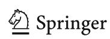

<span id="page-1-0"></span><sup>1</sup> See also 'S. Fluhrer, Reassessing Grover's algorithm, [http://eprint.iacr.org/2017/811,](http://eprint.iacr.org/2017/811)' which analyzed parallelizability of Grover's algorithm in conjunction with cryptosystems.

{2}------------------------------------------------

estimates have implicitly or explicitly assumed a single quantum processor. Presuming that the *resource* in classical estimates includes the number of processors the adversary is equipped with, the single processor assumption is something that should be revised.

Being aware of the issues, we come up with a framework for analyzing the time– space complexity of cryptanalytic quantum search algorithms. The main consequences we present in this paper are threefolded:

# **1.1.1 Precise query complexity involving parallelization**

The number of oracle queries, or equivalently Grover iterations, is first estimated as exactly as possible, reasonably accounting for previously overlooked points. Random statistics of the target function are carefully handled which lead to increase in iteration number compared with the case of a unique target. Surprisingly, however, the cost of dealing with random statistics in this paper is not expensive compared with the previous work [\[6](#page-36-6)] under the single processor assumption. Furthermore, when processor parallelization is considered, we observed that this extra cost gets even more negligible. It is also interesting to recognize that the parallelization methods could vary depending on the search problems. After taking the asymptotical big O notation off, the relation between time and space in terms of Grover iterations and number of processors, called *trade-off curve*, is obtained. Apart from resource estimates, investigating the trade-off curve of state-of-the-art collision finding algorithm in [\[11](#page-37-0)] with optimized parameters is one of our major concerns.

# **1.1.2 Depth-qubit trade-off and circuit design tuning**

In the next stage, time and space resources are defined in a way that they can be interpreted as physical quantities. Cost of quantum circuits for cryptanalytic algorithms can be estimated in units of *Toffoli-depths* and *logical qubits*. Taking the total number of gates as time complexity disturbs accurate estimates for the speed of quantum algorithms due to far different overheads introduced by various gates in real operation. With the definitions of quantum resources, the trade-off curve now describes the relation between circuit depths and number of qubits. Since we are given a 'relation' between time and space, it is then possible to grade the various quantum circuits in order of efficiency. In other words, the method described so far enables one to tell which attack design is more cost-effective.

By applying generic methodology newly introduced, time–space complexities of AES and SHA-2 against quantum attacks are measured in the following way.[3](#page-2-0) Various designs are constructed by assembling different circuit components with options such as reduced depth at the cost of the increase in qubits (or vice versa). Design candidates are then subjected to the trade-off relation for comparison. The trade-off coefficient of the most efficient design represents the hardness of quantum cryptanalysis. Compared with pre-existing circuit designs, we have improved the circuits by reducing required

<span id="page-2-0"></span><sup>3</sup> We concluded that quantum cost of attacking SHA-3 is more expansive than that of SHA-2, based on [\[5](#page-36-7)] and further improvement we have made in SHA-2 circuit in Sect. [6.](#page-29-0) Security strength of hash functions is therefore measured only for SHA-2 in this work.


{3}------------------------------------------------

339 Page 4 of 39 P. Kim et al.

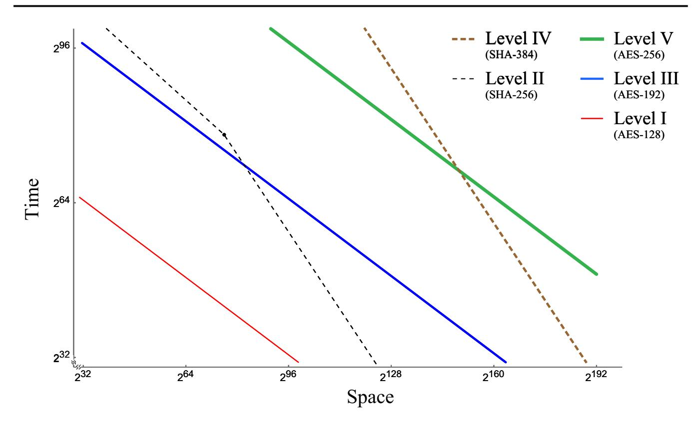

<span id="page-3-0"></span>**Fig. 1** Time—space cost, which has conditional ordering, of the quantum attacks on five security strength category representatives of NIST PQC standardization

qubits and/or depths in various ways. However, we do not claim that we have found the optimal attacks for AES and SHA-2. The method enables us to select the best one out of candidates at hand.

#### 1.1.3 Revisiting the security levels of NIST PQC standardization

The procedure is applied to each primitive of security strength categories NIST specified in [10]. A new threshold that is required for the category classification, based on the cost metric proposed in this work, is provided in Fig. 1. It includes a wide range of parameters and the quantum collision finding algorithms which do not outperform classical counterparts to explicitly recognize the quantum-side complexities of all the categories.

We end this subsection with two important caveats. One is that a use of classical resources appears in this paper, but we do not handle the complexity induced by it because of unclear comparison criteria for quantum and classical resources. The other is that our focus is put on specific algorithms implemented in the level of elementary gates. Readers are however encouraged not to rule out other algorithms that quantum computing communities also pursuit, for example, ones using quantum memory.

### 1.2 Organization

Next section covers the backgrounds including Grover's algorithm, its parallelization, other variants, and a short introduction to AES and SHA-2. In Sect. 3, the time—space complexity of relevant algorithms in a unit of Grover iteration is investigated. A basic unit of quantum computation is proposed in Sect. 4 as well as introducing a concept of trade-off in quantum resources. Sections 5, 6, and 7 show the results of applying the


{4}------------------------------------------------

time—space analysis to AES and SHA-2. In Sect. 8, based on the observations made in the previous sections, a comprehensive figure summarizing the quantum security strengths of AES and SHA-2 is drawn. Section 9 summarizes the paper.

### 2 Backgrounds

Grover's algorithm, the success probability, parallelization methods, and some generalizations or variants are explained briefly. A brief review of AES and SHA-2, and an introduction to related works on resource estimates are followed. We do not cover the basics of quantum computing, but leave the references [12,13] for interested readers. Throughout the paper, the target function is denoted by f,  $N = 2^n$  for some  $n \in \mathbb{N}$  and every bra or ket state is normalized.

#### 2.1 Grover's algorithm

Consider a set X of size N and a function  $f: X \to \{0, 1\}$ ,

$$f(x) = \begin{cases} 1, & \text{if } x \in T, \\ 0, & \text{otherwise,} \end{cases}$$

where T of size t is a set of targets to be found.

Grover's algorithm [2] is an algorithm that repeatedly applies an operator

$$Q = -AS_0A^{-1}S_f,$$

called *Grover iteration*, to the initial state  $|\Psi\rangle = A|0\rangle$ , where

$$A = H^{\otimes n}, \ S_0 = I - 2|0\rangle\langle 0|, \ S_f = I - 2|\tau\rangle\langle \tau|, \tag{1}$$

where  $H^{\otimes n}$  is a set of Hadamard operators and  $|\tau\rangle$  is a target state which is an equalphase and equal-weight superposition of  $|x\rangle$  for all  $x \in T$ . The roles of  $S_0$  and  $S_f$  are to swap the sign of zero and  $|\tau\rangle$  states, respectively.

The operators  $S_f$  and  $-AS_0A^{-1}$  are known as *oracle* and *diffusion* operators, respectively. By acting the oracle operator on a state, only the target state is marked through the sign change. The diffusion operator flips amplitudes around the average.

Success probability of measurement as a function of the number of iterations has been studied in [14], observing the optimal number of iterations that minimizes the ratio of the iterations to success rate. We introduce the results below with notation that is used throughout the paper.

By applying Q on the initial state i-times, the success probability of measuring one of the t solutions, denoted by  $p_{t,N} \colon \mathbb{Z}_{\geq 0} \to [0, 1]$ , becomes

$$p_{t,N}(i) = \sin^2\left[(2i+1) \cdot \theta_{t,N}\right],\tag{2}$$

<span id="page-4-0"></span>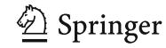

{5}------------------------------------------------

339 Page 6 of 39 P. Kim et al.

where  $\sin(\theta_{t,N}) = \sqrt{t/N}$  (=  $\langle \Psi | \tau \rangle$ ). The number of repetitions of Q maximizing the probability of measurement, denoted by  $I_{t,N}^{\text{mp}} \in \mathbb{N}$ , is estimated as<sup>4</sup>

<span id="page-5-2"></span><span id="page-5-1"></span>
$$I_{t,N}^{\text{mp}} = \frac{\pi}{4} \cdot \sqrt{\frac{N}{t}}.$$
 (3)

When the measurement is made after i-repetitions of Q, the expected number of Grover iterations to find one of the targets can be expressed as a function of i. For t targets in the domain of size N, the function is denoted by  $I_{t,N} : \mathbb{N} \to \mathbb{R}_{>0}$  which reads  $I_{t,N}(i) = i/p_{t,N}(i)$ . The optimal number of iterations  $i_{t,N} \in \mathbb{N}$  that minimizes  $I_{t,N}$  is found to be  $i_{t,N} = 0.583 \dots \sqrt{N/t}$ , and then the expected number of iterations, denoted by  $I_{t,N} \in \mathbb{N}$ , reads

$$I_{t,N} = I_{t,N}(i_{t,N}) = 0.690 \dots \sqrt{\frac{N}{t}}.$$
 (4)

In some cases, the domain size N is omitted such as  $p_t(i) (= p_{t,N}(i))$  or  $I_t(= I_{t,N})$ , for readability.

#### 2.2 Parallelization

Parallelization of Grover's algorithm using multiple quantum computers has been investigated in applications to cryptanalysis [1,10,15]. Consideration of parallelization in a hybrid algorithm can be found in [16]. Asymptotically the execution time is reduced by a factor of the square root of the number of quantum computers. There are two straightforward parallelization methods having such property, called *inner* and *outer* parallelization.

Parameters  $T_q$  and  $S_q$  stand for the number of sequential Grover iterations and the number of quantum computers, respectively.  $S_c$  stands for the amount of classical resources, such as the size of storage and/or the number of processors. Definitions of two parallelization methods can be given as follows.

**Definition 1** [Inner Parallelization (IP)] After dividing the entire search space into  $S_q$  disjoint sets, each machine searches one of the sets for the target. The number of iterations can be reduced due to the reduced domain size.

**Definition 2** [Outer Parallelization (OP)] Copies of Grover's algorithm on the entire search space are run on  $S_q$  machines. Since it is successful if any of the  $S_q$  machines finds the target, the number of iterations can be reduced.

Parallelization is inevitable once the notion of MAXDEPTH is considered [10]. MAXDEPTH is a parameter for a circuit depth that a quantum computer can run without errors. We do not cover the reasoning behind the notion, but suggest for interested readers to look into NIST's PQC call for proposals document and related comments. Three MAXDEPTH parameters we adopt from [10] are as follows.

<span id="page-5-0"></span><sup>&</sup>lt;sup>4</sup> In trivial cases, rounding function is not explicitly used in this paper for simplicity.

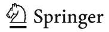

{6}------------------------------------------------

- 240: Approximate number of logical gates that presently envisioned quantum computing architectures are expected to serially perform in a year.
- 264: Approximate number of logical gates that current classical computing architectures can perform serially in a decade.
- 296: Approximate number of logical gates that atomic scale qubits with speed of light propagation times could perform in a millennium.

# <span id="page-6-1"></span>**2.3 Generalizations and variants**

Fixed-point [\[17](#page-37-6)] and quantum amplitude amplification (QAA) [\[18\]](#page-37-7) algorithms are generalizations of Grover's algorithm. A brief review of QAA is given in this subsection which appears as a component of a collision finding algorithm in later sections. We skip over the fixed-point algorithm as it has no advantage over Grover's algorithm and QAA in this work.[5](#page-6-0)

There exist a number of variants of Grover's algorithm in application to collision finding. In [\[19](#page-37-8)], Brassard, Høyer, and Tapp suggested a quantum collision finding algorithm (BHT) of *O*(*N*1/3) query complexity using *quantum memory* amounting to *O*(*N*1/3) classical data. A multi-collision algorithm using BHT was suggested in [\[20\]](#page-37-9). In this work however, we do not consider BHT as a candidate algorithm for the following reasons. One is that the algorithm entails a need for quantum memory where the realization and the usage cost are controversial [\[21\]](#page-37-10), and the other is that we are unable to come up with any implementation restricted to use of elementary gates that do not exceed the total cost of *O*(*N*1/2).

Apart from quantum circuits, algorithms primarily designed for other type of models such as measurement-based quantum computation also exist, for example quantum walk search [\[22](#page-37-11)[,23\]](#page-37-12) or element distinctness [\[24](#page-37-13)], but we do not cover them as stateof-the-art quantum architecture is targeting for circuit computation. Interested readers may further refer to [\[20](#page-37-9)] and related references therein for more information on quantum collision finding.

Bernstein analyzed quantum and classical collision finding algorithms in [\[3](#page-36-2)]. Quoting the work, no quantum algorithm with better time–space product complexity than *O*(*N*1/2) which is achieved by the state-of-the-art classical algorithm [\[25](#page-37-14)] had not been reported. If Grover's algorithm is parallelized with the distinguished point method, complexity of *O*(*N*1/2) can be achieved. This is one of the examples of *immediate ways* to combine quantum search with the rho method as mentioned in [\[3](#page-36-2)]. We denote it as Grover with distinguished point (GwDP) algorithm in this paper.

In ASIACRYPT 2017, Chailloux, Naya-Plasencia, and Schrottenloher suggested a new quantum collision finding algorithm, called CNS algorithm, of *O*(*N*2/5) query complexity using *O*(*N*1/5) classical memory [\[11\]](#page-37-0).

<span id="page-6-0"></span><sup>5</sup> There are two reasons. One is that fixed-point search requires *two* oracle queries per iteration, and the other is log(2/δ) factor in Eq. [3](#page-5-1) in [\[17](#page-37-6)] which also increases the required number of iterations depending on the bounding parameter δ. Comparing these factors with the overhead in our method introduced by random statistics, we concluded that the fixed-point algorithm is not favored.

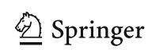

{7}------------------------------------------------

339 Page 8 of 39 P. Kim et al.

#### 2.3.1 QAA algorithm

Basic structure of QAA is the same as Grover's original algorithm. Initial state  $|\Psi\rangle = A|0\rangle$  is prepared, and then Grover iteration Q is repeatedly applied i times to get success probability Eq. 2. The only difference is that in QAA, the preparation operator A is not restricted to  $H^{\otimes n}$  where  $N=2^n$ , and so thus the search space can be arbitrarily defined. Detailed derivation is not covered here, but instead we describe the key feature in an example.

As a trivial example, let us assume we are given a quantum computer and try to find a target bit-string 110011 in a set  $N = \{x \mid x \in \{0, 1\}^6 \text{ and two middle bits are 0}\}$ . Domain size is not equal to  $2^6$ , and the initial state can be prepared by  $A = H_1H_2H_5H_6$  where  $H_r$  is Hadamard gate acting on r-th qubit. Remaining processes are to apply Grover iterations  $Q = -AS_0A^{-1}S_f$  with A given by the state preparation operator just mentioned. The search space examined is rather trivial, but QAA also works on arbitrary domain. Nontrivial domain can be given as something like  $N = \{x \mid x \in \{0, 1\}^6, f(x) \neq 0\}$  for some given function f. It is a matter of preparing a state encoding appropriate search space, or in other words, that is to find an operator A. Once A is constructed, QAA works in the same way as in Grover's algorithm.

#### 2.3.2 GwDP algorithm

GwDP algorithm is a parallelization of Grover's algorithm. Distinguished points (DP) can be defined by function outputs whose d most significant bits are zeros, denoted by d-bit DP. We allow the notation DP to indicate inputs to produce DP or pairs of DP and corresponding input.

For  $S_q = S_c = 2^s$ , we use (n-2s)-bit DP. By running  $T_q = O\left(2^{n/2-s}\right)$  times of Grover iterations, DP is expected to be found on each machine. Storing  $O(2^s)$  DPs sorted according to the output, a collision is found with high probability. The time–space product is always  $T_q S_q = O\left(N^{1/2}\right)$ .

#### 2.3.3 CNS algorithm

Instead of the details of CNS algorithm [11], we briefly mention the high-level description and the corresponding complexities.

CNS algorithm consists of two phases, the list preparation and the collision finding. In the list preparation phase, a list of size  $2^l$  of d-bit DPs is drawn up with the time complexity of  $O(2^{l+d/2})$  and the classical storage of size  $O(2^l)$ . In the collision finding phase QAA algorithm is used. Each iteration of QAA algorithm consists of  $O(2^{d/2})$  Grover iterations and  $O(2^l)$  operations for the list comparison. After  $O\left(2^{(n-d-l)/2}\right)$  QAA iterations, a collision is expected to be found. In total, CNS algorithm has  $O\left(2^{l+d/2}+2^{(n-d-l)/2}(2^{d/2}+2^l)\right)$  time complexity and uses  $O(2^l)$  classical memory. With the optimal parameters l=d/2 and d=2n/5, a collision is found in  $T_q=O(N^{2/5})$  with  $S_c=O(N^{1/5})$ .

If  $S_q = 2^s$ , time complexity becomes  $O(2^{(n-d-l-s)/2}(2^{d/2} + 2^l) + 2^{l+d/2-s})$  for  $s \le \min(l, n - d - l)$ . When l = d/2 and  $d = 2/5\{n + s\}$ , the complexities satisfy  $(T_q)^5(S_q)^3 = O(N^2)$  and  $T_q(S_c)^3 = O(N)$ .


{8}------------------------------------------------

### 2.4 AES and SHA-2 algorithms

A brief review of AES and SHA-2 is given in this subsection. Specifically, AES-128 and SHA-256 algorithms are described which will form the main body of later sections.

#### 2.4.1 AES-128

Only the encryption procedure of AES-128 which is relevant to this work will be shortly reviewed. See [26] for details.

*Round* AES round consists of four elementary operations: SubBytes, ShiftRows, MixColumns, and AddRoundKey.<sup>6</sup> Each operation applies to internal state, which is represented by  $4 \times 4$  array of bytes  $S_{i,j}$ , as shown in Fig. 2a.

- ShiftRows does cyclic shifts of the last three rows of the internal state by different offsets.
- MixColumns does a linear transformation on each column of the internal state that mixes the data.
- AddRoundKey does an addition of the internal state and the round key by an XOR operation.
- SubBytes does a nonlinear transformation on each byte. SubBytes works as substitution-boxes (S-box) generated by computing a multiplicative inverse, followed by a linear transformation and an addition of S-box constant.

Key Schedule AES key schedule consists of four operations: RotWord, SubWord, Rcon, and addition by XOR operation. The sequence of key scheduling is described in Fig. 2b. Each operation applies to 32-bit word  $w_i$ , which is represented by  $4 \times 1$  array of bytes  $k_{i,j}^d$ . First four words are given by original key which become the zeroth round key. More words—40 in AES-128—are then generated by recursively processing previous words. Every sixteen-byte  $k_{i,j}^d$  constitutes d-th round key. RotWord, SubWord, and Rcon only apply to every fourth word  $w_i$ ,  $i \in \{3, 7, 11, \dots 39\}$ .

- RotWord does a cyclic shift on four bytes.
- Rcon does an addition of the constant and the word by XOR operation.
- SubWord does an S-box operation on each byte in word.

#### 2.4.2 SHA-256

For brevity, only SHA-256 hashing algorithm for one message block which is relevant to this work will be reviewed. Description of preprocessing including message padding, parsing, and setting initial hash value is also omitted here. See [27] for details.

Round SHA-2 round consists of five operations: Ch, Maj,  $\Sigma_0$ ,  $\Sigma_1$ , and addition modulo  $2^{32}$ . Round operations apply on eight 32-bit working variables denoted by a, b, c, d, e, f, g, h. See Fig. 3a for procedures.


<span id="page-8-0"></span><sup>&</sup>lt;sup>6</sup> The first and the last rounds are different, but will not be covered in detail here.

{9}------------------------------------------------

339 Page 10 of 39 P. Kim et al.

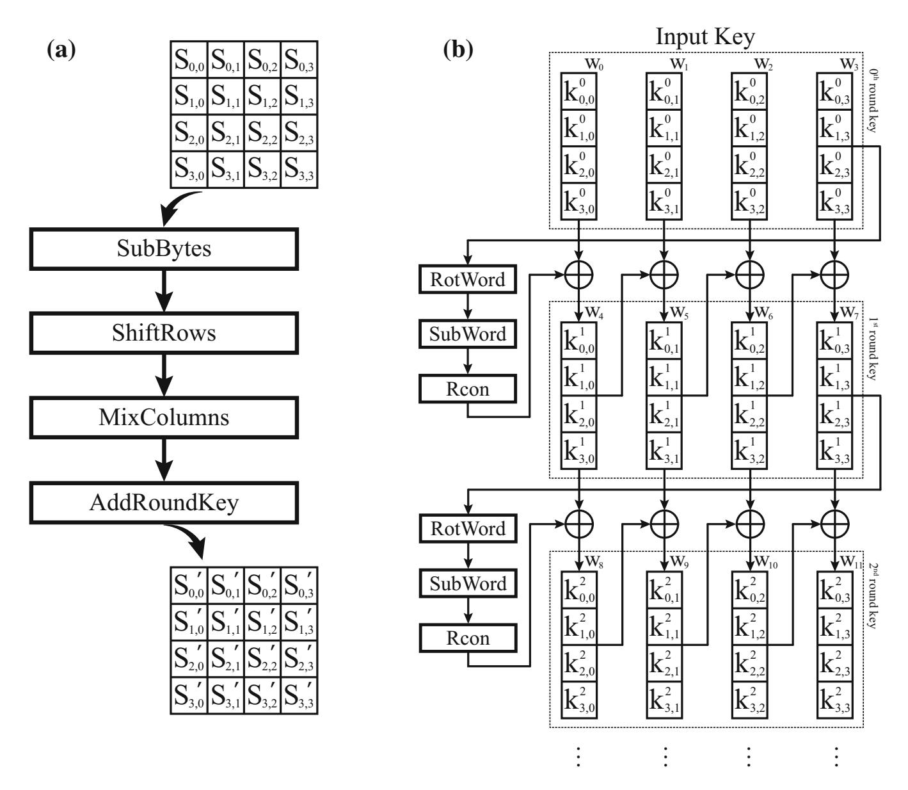

<span id="page-9-0"></span>**Fig. 2** a Round operations and **b** key schedule of AES-128 algorithm. Each square box accommodates one byte. In key schedule, 128-bit key is divided into four 32-bit words

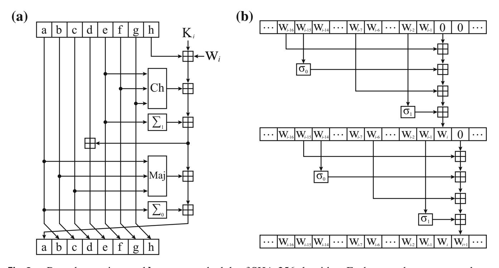

<span id="page-9-1"></span>Fig. 3 a Round operations and b message schedule of SHA-256 algorithm. Each square box accommodates 32-bit word. The symbol  $\boxplus$  is addition modulo  $2^{32}$ . Note that new word can be overwritten on existing word if the word has already been fed to round


{10}------------------------------------------------

```
- Ch(x, y, z) = (x \land y) \oplus (\neg x \land z),

- Maj(x, y, z) = (x \land y) \oplus (x \land z) \oplus (y \land z),

- \Sigma_0(x) = ROTR^2(x) \oplus ROTR^{13}(x) \oplus ROTR^{22}(x),

- \Sigma_1(x) = ROTR^6(x) \oplus ROTR^{11}(x) \oplus ROTR^{25}(x),

where ROTR^n(x) is circular right shift of x by n positions.
```

Message Schedule SHA-2 message schedule consists of three operations:  $\sigma_0$ ,  $\sigma_1$ , and addition modulo  $2^{32}$ . The sequence of message scheduling is described in Fig. 3b. Each operation applies to 32-bit word  $W_i$ . First 16 words are given by original message block which become the first 16 words fed to SHA-256 rounds. More words—48 in SHA-256—are then generated by recursively processing previous words.

```
- \sigma_0(x) = ROTR^7(x) \oplus ROTR^{18}(x) \oplus SHR^3(x),

- \sigma_1(x) = ROTR^{17}(x) \oplus ROTR^{19}(x) \oplus SHR^{10}(x),

where SHR^n(x) is right shift of x by n positions.
```

### 2.5 Quantum resource estimates

Quantum resource estimates of Shor's period-finding algorithm have long been studied in the various literature. See for example [8,28] and referenced materials therein. On the other hand, quantitative quantum analysis on cryptographic schemes other than period finding is still in its early stage. Partial list may include attacks on multivariate-quadratic problems [9], hash functions [5,7], and AES [4,6]. We introduce two of them which are the most relevant to our work.

### 2.5.1 AES key search

Grassl et al. reported the quantum costs of AES-k key search for  $k \in \{128, 192, 256\}$  in the units of logical qubit and gate [6]. In estimating the time cost, the author's focus was put on a specific gate called 'T' gate and its depth, although the overall gate count was also provided. Space cost was simply estimated as the total number of qubits required to run Grover's algorithm.

There are two points we pay attention on. First is that the authors ensured a single target key. Since AES algorithm works like a random function, there is nonnegligible probability that a plaintext ends up with the same ciphertext when encrypted by two different keys. To avoid the cases, the authors encrypt  $r \in \{3, 4, 5\}$  plaintext blocks simultaneously to obtain r ciphertexts so that only the true key results in given ciphertexts. The procedure removes the ambiguity in the number of iterations. Note, however, that the removal of the ambiguity comes in exchange of at least tripling the space cost. The other point is that reversible circuit implementation of internal functions of AES was always aimed at reducing the number of qubits. One may see proposed circuit design as space-optimized.

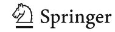

{11}------------------------------------------------

339 Page 12 of 39 P. Kim et al.

### 2.5.2 SHA-2 and SHA-3 pre-image search

Amy et al. reported the quantum costs of SHA-2 and SHA-3 pre-image search in the units of logical and physical qubit and gate [5]. The method considers an error-correction scheme called surface code. Time cost was set considering the scheme. Estimating the costs of T gates in terms of physical resources was one of the main results. One point we would like to address in the work is that random-like behavior of SHA function was not considered. It is assumed in the paper that the unique pre-image of a given hash exists.

### <span id="page-11-0"></span>3 Trade-off in query complexity

In this section, the definitions of cryptographic search problems and the query-based time cost of the corresponding quantum search algorithms are discussed. The trade-off equations between the number of queries and the number of machines are given as a result.

#### 3.1 Types of search problems

We assume that  $f: X \to Y$  is a random function which means f is selected from the set of all functions from X to Y uniformly at random. Useful statistics of random functions can be found in [29]. The probabilities related to the number of pre-images are quoted below. When an element x is selected from a set X uniformly at random, it is denoted by  $x \stackrel{\$}{\leftarrow} X$ .

When |Y| = N and  $|X| = aN \in \mathbb{N}$  for some  $a \in \mathbb{Q}$ , an element  $y \in Y$  is called a *j-node* if it has j pre-images, i.e.,  $|\{x \in X : f(x) = y\}| = j$ . For  $y \xleftarrow{\$} Y$ , the probability of y to be a j-node, denoted by  $q_{(aN)} : \mathbb{Z}_{\geq 0} \to [0, 1]$ , is

<span id="page-11-1"></span>
$$q_{(aN)}(j) \approx \frac{1}{e^a} \cdot \frac{a^j}{j!}.$$
 (5)

For  $x \stackrel{\$}{\leftarrow} X$ , the probability of f(x) to be a *j*-node, denoted by  $r_{(aN)} : \mathbb{N} \to [0, 1]$ , is

<span id="page-11-2"></span>
$$r_{(aN)}(j) \approx j \cdot q_{(aN)}(j).$$
 (6)

These approximations can hold when aN is larger than j. However, since the values are very small at large j, we may assume that Eqs. 5 and 6 are valid in the entire domain.

The target function in cryptanalytic search problems is usually modeled as a pseudo-random function (PRF) or a cryptographic hash function (CHF). The precise interpretation of this notions can be found in Sects. 3.5 and 5.5 of [30]. It can be assumed that PRF and CHF have similar statistic behaviors to a random function.


{12}------------------------------------------------

The formal definitions of search problems relevant to symmetric cryptanalysis can be described with random functions. The way of generating the given information in each problem is carefully distinguished. The first is Key Search generalized from the secret key search problem using a pair of plaintext and ciphertext of an encryption algorithm.

**Definition 3** [Key Search (KS)] For a random function  $f: X \to Y$ ,  $y = f(x_0)$  is generated from an  $x_0 \in X$ . Key Search is to find the target  $x_0$  for given f and y.

The existence of the target  $x_0$  in X is always ensured. However, pre-images of y other than  $x_0$  can be found, which is called a *false alarm*. The false alarms have to be resolved by additional information since no clue (that helps to recognize the real target) is given within the problem.

Definitions generalized from the pre-image and the collision problems of CHF are given as follows.

**Definition 4** [Pre-image Search (PS)] For a random function  $f: \{0, 1\}^* \to Y$ , y is chosen at random,  $y \overset{\$}{\leftarrow} Y$ , or equivalently,  $y = f(x_0)$  for an  $x_0 \in \{0, 1\}^*$ . Pre-image Search is to find any  $x \in \{0, 1\}^*$  satisfying f(x) = y for given f and y.

There is no false alarm in Pre-image Search. However, the existence of a pre-image in a fixed subset of  $\{0, 1\}^*$  cannot be ensured.

**Definition 5** [Collision Finding (CF)] For a given random function  $f: \{0, 1\}^* \to Y$ , Collision Finding is to find any inputs  $x_1, x_2 \in \{0, 1\}^*$  satisfying  $f(x_1) = f(x_2)$ .

#### 3.2 Trade-off in Grover's algorithm for Key Search

In this subsection, the expected iteration number and the parallelization trade-off of Grover's algorithm are given. We assume that  $f: X \to Y$  and |X| = |Y| = N.

In Key Search, the given  $y \in Y$  becomes t-node with probability r(t) of Eq. 6. The probability that one of the pre-images of y is found by the measurement after i-times Grover iterations becomes  $p_t(i)$  of Eq. 2. Since only one target among t pre-images is the true key, the probability that the answer is correct is 1/t. For  $P_{\text{rand}}^{\text{KS}} \colon \mathbb{N} \to [0, 1]$ ,  $P_{\text{rand}}^{\text{KS}}(i)$  denotes the success probability after i-times Grover iterations of the Key Search. To emphasize that f is assumed to be a random function, the subscript 'rand' is specified.  $P_{\text{rand}}^{\text{KS}}(i)$  is the summation over possible t's,

$$P_{\text{rand}}^{\text{KS}}(i) = \sum_{t \ge 1} r(t) \cdot p_t(i) \cdot \frac{1}{t}. \tag{7}$$

Proposition about the optimal expected iterations follows.

**Proposition 1** The optimal expected number,  $I_{\text{rand}}^{\text{KS}}$ , of Grover iterations for Key Search becomes

$$I_{\rm rand}^{\rm KS} = 0.951 \dots \sqrt{N}$$
.

<span id="page-12-0"></span>

{13}------------------------------------------------

339 Page 14 of 39 P. Kim et al.

**Proof** This proof is similar to the one in Sect. 4 of [14].

If the measurement is taken after *i*-times Grover iterations, the expected number of iterations can be expressed as a function of *i*, denoted by  $I_{\text{rand}}^{\text{KS}} \colon \mathbb{N} \to \mathbb{R}_{>0}$ , which reads

$$I_{\text{rand}}^{\text{KS}}(i) = \frac{i}{P_{\text{rand}}^{\text{KS}}(i)}.$$

The optimal value,  $I_{\mathrm{rand}}^{\mathrm{KS}} \in \mathbb{N}$ , is approximated as the first positive local minimum value of  $I_{\mathrm{rand}}^{\mathrm{KS}}(i)$ . The integer closest to the first positive root of derivative of  $I_{\mathrm{rand}}^{\mathrm{KS}}(i)$ , denoted by  $i_{\mathrm{rand}}^{\mathrm{KS}} \in \mathbb{N}$ , can be calculated by a numerical method. The result is  $i_{\mathrm{rand}}^{\mathrm{KS}} = 0.434\ldots\sqrt{N}$  and  $I_{\mathrm{rand}}^{\mathrm{KS}} = I_{\mathrm{rand}}^{\mathrm{KS}}(i_{\mathrm{rand}}^{\mathrm{KS}})$ .

Comparing  $I_{\text{rand}}^{\text{KS}}$  with  $I_1$  of Eq. 4, the expected iteration increases by 37.8...%.

The parallel trade-off curve of Key Search is calculated in the rest of this subsection. If inner parallelization method is taken for  $S_q \gg 1$ , the number of pre-images of y in each divided space becomes only 0 or 1 for overwhelming probability, even though f is a random function. Therefore, the success probability after i-times iterations, denoted by  $P_{\text{rand}}^{\text{KS:IP}} \colon \mathbb{N} \to [0, 1]$ , reads

<span id="page-13-2"></span>
$$P_{\text{rand}}^{\text{KS:IP}}(i) \left(= P_{\text{rand},N}^{\text{KS:IP}}(i)\right) = p_{1,(N/S_q)}(i), \tag{8}$$

from Eq. 2. The optimal expected iteration number is similar to Eq. 4 as

$$I_{\text{rand}}^{\text{KS:IP}} = I_{1,(N/S_q)} = 0.690 \dots \sqrt{(N/S_q)}.$$
 (9)

In outer parallelization method, the success probability after i-times iterations becomes

<span id="page-13-1"></span>
$$P_{\text{rand}}^{\text{KS:OP}}(i) = 1 - \left(1 - P_{\text{rand}}^{\text{KS}}(i)\right)^{S_q},$$

and then the optimal expected iteration number for  $S_q \gg 1$  is given by

$$I_{\text{rand}}^{\text{KS:OP}} = 0.784... \cdot \sqrt{(N/S_q)}.$$
 (10)

As a result, inner parallelization is 11.9...% more efficient than outer method in Key Search. We denote the number of machines used in Key Search  $S_q^{KS}$ . The optimal expected number of iterations in Key Search, denoted by  $T_q^{KS}$ , can be considered as  $I_{\rm rand}^{\rm KS:IP}$ .

<span id="page-13-0"></span>**Proposition 2** (KS trade-off curve) For  $S_q^{\text{KS}} \gg 1$ , the parallelization trade-off of Grover's algorithm for Key Search is given by

$$\left(T_q^{\text{KS}}\right)^2 S_q^{\text{KS}} = 0.476 \dots N.$$

In the followings, the optimal expected number of iterations and trade-off curves are defined and analyzed in the same way as in this subsection, but briefly.


{14}------------------------------------------------

### <span id="page-14-1"></span>3.3 Trade-off in Grover's algorithm for Pre-image Search

Let X be the restricted domain of the function  $f: \{0, 1\}^* \to Y$ , and assume |X| = |Y| = N. We may assume that the restriction of f on X, denoted by  $f|_X$ , is also a random function. In Pre-image Search, there exist t pre-images of the given y with probability q(t) in Eq. 5. The success probability of measuring one of the targets after i-times iterations is a summation of  $q(t) \cdot p_t(i)$  over possible t's as

$$P_{\text{rand}}^{\text{PS}}(i) = \sum_{t>0} q(t) \cdot p_t(i).$$

Since  $p_0(i) = 0$  and q(t) = r(t)/t for  $t \ge 1$ , it can be written as  $P_{\rm rand}^{\rm PS}(i) = P_{\rm rand}^{\rm KS}(i)$ . The important difference between Key Search and Pre-image Search is the existence of failure probability. If the domain of size N is used, the probability there is no pre-image of y in X is  $q(0) = 1/e \approx 0.368...$ 

Two resolutions can be sought. The first is to change the domain X in every execution of Grover's algorithm. In this case, the result on the optimal iteration number of Preimage Search becomes the same as Proposition 1. The second is to expand the domain,  $|X| = aN \in \mathbb{N}$  for some a > 1. The success probability then reads  $P_{\mathrm{rand},(aN)}^{\mathrm{PS}}(i) = \sum_{t \geq 1} q_{(aN)}(t) \cdot p_{t,(aN)}(i)$ .

<span id="page-14-2"></span>**Proposition 3** If  $|X| \gg N$ , the optimal expected number of iterations, denoted by  $I_{\text{rand},(\gg N)}^{\text{PS}}$ , for Pre-image Search is written as

$$I_{\text{rand},(\gg N)}^{\text{PS}} = 0.690 \dots \sqrt{N}.$$

When  $N=2^{256}$ , the proposition can be assumed to hold for  $a \ge 2^{10}$ . Subscript ' $\gg 1$ ' specifies the assumption. The fact that  $I_{\mathrm{rand},(\gg N)}^{\mathrm{PS}} \approx I_{1,N}$ , i.e., better performance up to some converged value for larger domain size, is remarked. If a grows to 8, the failure probability decreases below  $0.0004\ldots\approx 1/e^8$ .

In the case of inner parallelization for |X| = |Y|, the pre-images of y are distributed to different divided spaces with overwhelming probability when  $S_q \gg 1$ . The success probability reads

$$P_{\text{rand},N}^{\text{PS:IP}}(i) = \sum_{t \ge 1} q(t) \cdot \left\{ 1 - \left( 1 - p_{1,(N/S_q)}(i) \right)^t \right\}.$$

and the optimal expected iteration number is written as

$$I_{\text{rand},N}^{\text{PS:IP}} = 0.981 \dots \sqrt{(N/S_q)}.$$
 (11)

Since  $P_{\text{rand}}^{\text{PS}}(i) = P_{\text{rand}}^{\text{KS}}(i)$ , the behavior of outer parallelization of Pre-image Search is the same as in Key Search. The optimal expected iteration number is

$$I_{\text{rand}}^{\text{PS:OP}} = 0.784 \dots \sqrt{(N/S_q)} \left(= I_{\text{rand}}^{\text{KS:OP}}\right).$$
 (12)

<span id="page-14-0"></span>

{15}------------------------------------------------

339 Page 16 of 39 P. Kim et al.

When  $|X| = aN \in \mathbb{N}$  for some a > 1, if  $S_q > a^2$ , it can be assumed that all pre-images of y are separately distributed to the divided space in inner parallelization. For both of inner and outer parallelization, the optimal expected iteration converges to the value of Eq. 12 when  $a \gg 1$  and  $S_q > a^2$ .

There are subtleties in comparing inner and outer parallelization which are inappropriate to be pointed out here. We conclude that it is always favored to enlarge the domain size, and then for large  $S_q$ , two parallelization methods show asymptotically the same performance. Denoting the optimal time and space complexities for Pre-image Search by  $T_q^{\rm PS}$  and  $S_q^{\rm PS}$ , the trade-off curve is given as follows.

**Proposition 4** (PS trade-off curve) For  $S_q^{PS} \gg 1$ , the parallelization trade-off of Grover's algorithm for Pre-image Search is given by

<span id="page-15-0"></span>
$$\left(T_q^{\rm PS}\right)^2 S_q^{\rm PS} = 0.614 \dots \cdot N.$$

Note that while the inner parallelization is a better option in Key Search, both parallelization methods have similar behaviors in Pre-image Search.

### 3.4 Trade-off in quantum collision finding algorithms

A collision could be found by using Grover's algorithm in the way of *second pre-image* search. This has the same result as Sect. 3.3 if the input of the given pair of 'first pre-image' is not included in the domain. Apart from Grover's algorithm, the optimal expected iterations and trade-off curves for parallelizations of two collision finding algorithms, GwDP and CNS, are given in this subsection.

In collision finding algorithms, searching for a pre-image of large set is required. Let  $f: \{0, 1\}^* \to Y$  and  $X \subset \{0, 1\}^*$  be a set of size N. For  $f|_X$  and  $y \overset{\$}{\leftarrow} Y$ , the expected number of pre-images of y becomes  $1 \approx \sum_{j \geq 1} j \cdot q(j)$ . If the size of a set  $A \subset Y$  is large enough, it can be assumed that the number of pre-images of A = |A|.

### 3.4.1 GwDP algorithm

Let  $S_q = 2^s$  for some  $s \in \mathbb{N}$  and  $X \subset \{0, 1\}^*$  be a set of size N. In each quantum machine, a parameter (n - 2s + 2) is used for the number of bits to be fixed in DPs. The parameter (n - 2s + 2) is chosen as an optimal one only among integers in order to allow the easier implementation by quantum gates.

After *i*-times Grover iterations, the success probability of measuring a DP becomes  $p_{(2^{2s-2})}(i)$  from Eq. 2. The expected number of DPs found is  $2^s \cdot p_{(2^{2s-2})}(i)$  by measurements after *i*-times iterations on each machine. As a result of *birthday problem* (BP) if there are *k* samples independently selected out of  $2^{2s-2}$  DPs, the probability of at least one coincidence, denoted by  $p_{(2^{2s-2})}^{BP} : \mathbb{N} \to [0, 1]$ , is approximated

$$p_{(2^{2s-2})}^{\text{BP}}(k) = 1 - \exp\left(\frac{-k^2}{2 \cdot 2^{2s-2}}\right).$$


{16}------------------------------------------------

Details of approximation can be found in Sect. A.4 of [30]. The probability of finding at least one collision, denoted by  $P_{\text{rand}}^{\text{GwDP}} \colon \mathbb{N} \to [0, 1]$ , is then

$$P_{\text{rand}}^{\text{GwDP}}(i) = p_{(2^{2s-2})}^{\text{BP}} (2^s \cdot p_{(2^{2s-2})}(i)).$$

The optimal expected iteration reads

<span id="page-16-1"></span><span id="page-16-0"></span>
$$I_{\text{rand}}^{\text{GwDP}} = 1.532 \dots \cdot \frac{\sqrt{N}}{2^s}.$$
 (13)

Denoting the optimal time and space complexities by  $T_q^{\rm GwDP}$  and  $S_q^{\rm GwDP}$  for Collision Finding by GwDP algorithm, the trade-off curve is given as follows.

**Proposition 5** (GwDP trade-off curve) For  $S_q^{\text{GwDP}} = 2^s \gg 1$ , the trade-off curve of GwDP algorithm for Collision Finding is given by

$$T_q^{\text{GwDP}} S_q^{\text{GwDP}} = 1.532 \dots \sqrt{N}.$$

Note that the algorithm also requires  $S_c^{\text{GwDP}} = O(2^s)$  classical storage.

### 3.4.2 CNS algorithm

In the list preparation phase, a list L of size  $2^l$ , a subset of d-bit DPs, is to be made. Set  $X_1 \subset \{0, 1\}^*$  of size  $N = 2^n$  and the function

$$f_{\text{DP}}(x) = \begin{cases} 1, & \text{if } f(x) \text{ is DP,} \\ 0, & \text{otherwise.} \end{cases}$$

Let  $f_{DP}|_{X_1}$  be the restriction of  $f_{DP}$  on  $X_1$ . The iteration in this phase is defined by

$$Q_1 = -A_1 S_0 A_1^{-1} S_{f_{\text{DP}}|X_1},$$

where the oracle operator  $S_{f_{DP}|X_1}$  is a quantum implementation of the function  $f_{DP}|X_1$  and  $A_1$  is the usual state preparation operator  $H^{\otimes n}$ .

Since there are about  $2^{n-d}$  (=  $|X_1|/2^d$ ) DPs in  $X_1$ , the expected number of Grover iterations to find a DP is the same as  $I_{2^{n-d}} = 0.690 \dots 2^{d/2}$  of Eq. 4. The expected number of Grover iterations to build L is  $0.690 \dots 2^{d/2} \cdot 2^l$ . A classical storage of size  $O(2^l)$  is required in addition.

In the collision finding phase, let  $X_2 \subset \{0, 1\}^*$  be a set of size N such that  $X_1 \cap X_2 = \emptyset$ . Let the state  $|\psi\rangle$  be an equal-phase and equal-weight superposition of states encoding all the DPs in  $X_2$ . State preparation operator  $A_2$  such that  $|\psi\rangle = A_2|0\rangle$  is explicitly

$$A_2 = \left(-A_1 S_0 A_1^{-1} S_{f_{\text{DP}}|_{X_2}}\right)^{\frac{\pi}{4} \cdot 2^{d/2}} A_1,$$


{17}------------------------------------------------

339 Page 18 of 39 P. Kim et al.

which is Grover iterations similar to  $Q_1$  with repetition number  $I_{2^{n-d}}^{mp}$  of Eq. 3. The function  $f_L: X_2 \to \{0, 1\}$  is defined as

$$f_L(x) = \begin{cases} 1, & \text{if } f(x) \in L, \\ 0, & \text{otherwise.} \end{cases}$$

To realize the oracle operator  $S_{f_L}$ —a quantum implementation of  $f_L$ —without a need for quantum memory, the authors of CNS algorithm have suggested a computational method taking  $O(2^l)$  elementary operations per quantum  $f_L$  query.

QAA iteration  $Q_2$  of the collision finding phase consists of two steps. The first is acting of the oracle operator  $S_{f_L}$ . Let  $t_L$  be the ratio of the time cost of  $S_{f_L}$  per list element of L to that of Grover iteration. The second step is acting of the diffusion operator  $-A_2S_0A_2^{-1}$ .

The success probability of QAA algorithm is known to have the same behaviors of Grover's algorithm [18]. Since there are about  $2^{n-d}$  DPs encoded in the state with equal probabilities and about  $2^l$  pre-images of L in  $|\psi\rangle$ , by applying  $Q_2$  operator  $I_{(2^l),(2^{n-d})}=0.690\ldots 2^{(n-d-l)/2}$  times on  $|\psi\rangle$ , the algorithm is expected to find a collision. The time cost of the collision finding phase reads

$$0.690...\cdot 2^{\frac{n-d-l}{2}}\cdot \left(2\cdot \frac{\pi}{4}\cdot 2^{\frac{d}{2}}+t_L\cdot 2^l\right).$$

Note that the time cost of  $S_0$  in collision finding phase and the initial  $A_2$  are negligible. The time cost of CNS algorithm in terms of Grover iterations denoted by  $I_{\rm rand}^{\rm CNS}(d,l)$  reads

$$I_{\text{rand}}^{\text{CNS}}(d,l) = \left\{0.690\dots 2^{l+\frac{d}{2}}\right\} + \left\{0.690\dots 2^{\frac{n-d-l}{2}}\left(\frac{\pi}{2}\cdot 2^{\frac{d}{2}} + t_L\cdot 2^l\right)\right\}. \quad (14)$$

<span id="page-17-0"></span>The optimal value  $I_{\text{rand}}^{\text{CNS}}$  is given as follows.

**Proposition 6** The optimal expected number of Grover iterations in CNS algorithm for Collision Finding reads

<span id="page-17-1"></span>
$$I_{\text{rand}}^{\text{CNS}} = 3.150 \dots t_I^{\frac{1}{5}} \cdot N^{\frac{2}{5}},$$

when  $l = d/2 + \log_2(\pi/(2t_L))$ , and  $d = 2/5\{n + \log_2((2t_L)^3/\pi)\}$ .

Using  $S_q = 2^s$  quantum machines, natural parallelization of the list preparation phase is finding  $2^{l-s}$  elements on each machine. Outer parallelization of QAA algorithm in the collision finding phase has the same expected iterations as Eq. 12. The expected number of Grover iterations, denoted by  $I_{\rm rand}^{\rm CNS:OP}(d,l)$ , where  $s < \min(l, n-d-l)$ , is written as

$$I_{\text{rand}}^{\text{CNS:OP}}(d,l) = \left\{0.690\dots 2^{l+\frac{d}{2}-s}\right\} + \left\{0.784\dots 2^{\frac{n-d-l-s}{2}} \left(\frac{\pi}{2} \cdot 2^{\frac{d}{2}} + t_L 2^l\right)\right\}.$$


{18}------------------------------------------------

When  $l = d/2 + \log_2(\pi/(2t_L))$ , and  $d = 2/5\{n + s + \log_2(1.291...(2t_L)^3/\pi)\}$ , the optimal expected number of iterations reads

<span id="page-18-2"></span><span id="page-18-1"></span>
$$I_{\text{rand}}^{\text{CNS:OP}} = 3.488 \dots \frac{t_L^{\frac{1}{5}} N^{\frac{2}{5}}}{2^{\frac{3}{5}s}}.$$
 (15)

We denote the optimal time and space complexities by  $T_q^{\rm CNS}$  and  $S_q^{\rm CNS}$  for Collision Finding by CNS algorithm.  $T_q^{\rm CNS}$  can be considered as  $I_{\rm rand}^{\rm CNS:OP}$ . The trade-off curve of CNS algorithm is then given as follows.

**Proposition 7** (CNS trade-off curve) For  $S_q^{\text{CNS}} \gg 1$ , the parallelization trade-off curve of CNS algorithm for Collision Finding is given by

$$\left(T_q^{\text{CNS}}\right)^5 \left(S_q^{\text{CNS}}\right)^3 = (3.488...)^5 \cdot t_L \cdot N^2.$$

The algorithm also requires the classical resource  $S_c^{\text{CNS}} = O\left(N^{1/5}(S_q^{\text{CNS}})^{1/5}\right)$ . If the constant  $t_L$  is determined, the time–space complexity of CNS algorithm could be derived from this trade-off curve.

### <span id="page-18-0"></span>4 Depth-qubit cost metric

Universal quantum computers are capable of carrying out elementary logic operations such as Pauli X, Hadamard, CNOT, T. See [13] for details on quantum gates. Implementation of any cryptographic operation in this paper is restricted such that it can only be realized by using these gates. One may think of the restriction as a quantum version of software implementation in classical computing. Quantum security of symmetric cryptosystems can then be estimated in units of elementary logic gates.

It is generally known that each elementary gate has different physical implementation time. Considering various aspects of quantum computing, we suggest to simplify a measure of computation time and to ignore all the other factors or gates that complicates the analysis of quantum algorithms.

Two primary resources in quantum computing, circuit depth and qubit, can be exchanged to meet a certain attack design criteria. Time—space complexity investigated in the previous section can be used to give an attribute 'efficiency' to each and every design. To further quantify *depth—qubit complexity* and to be able to rank the efficiency, we briefly cover the time—space trade-off of quantum resources in this section.

#### 4.1 Cost measure

Difficulties often arise when it comes to setting quantum complexity measures that are physically interpretable. There exists a number of factors making it complicate, for example different architecture each experimental group is pursuing. A qubit or a certain gate may cost differently in each architecture. It is therefore hardly possible to

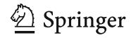

{19}------------------------------------------------

339 Page 20 of 39 P. Kim et al.

accurately assess operational time of each type of gate in general and to estimate overall run time. Despite the notable difficulty in quantifying the basic unit cost of quantum computation, a number of groups have attempted to estimate the algorithm costs in various applications [\[5](#page-36-7)[–7](#page-36-10)]. The cost metric varies depending on author's viewpoint. For example, one considering the fault-tolerant computation would estimate the cost involving specific hardware implementations or error-correction schemes. On the other hand, one that is not to impose constraints on hardware or error-correction scheme would estimate the cost in logical qubits and gates. The latter approach is adopted in this work. Readers should keep in mind that this approach ignores the overheads introduced by fault tolerance[.7](#page-19-0)

High-level circuit description of Grover iteration involves not only elementary gates but also larger gates such as C*k*NOT. It is very unlikely that such gates can be directly operated in any realistic universal quantum computers. Decomposition of those gates into smaller ones is thus required in practical estimates.

Determining the unit time cost is a subtle matter. We would like to address that the simplest, yet justified time cost measure involves Toffoli gate.

**Definition 6** A unit of quantum computational time cost is the time required to operate a nonparallelizable logical Toffoli gate.

In other words, Toffoli-depth will be the time cost of the algorithm. We will look into its justification in Sect. [4.3.](#page-22-0)

Space cost is estimated as a total number of logical qubits required to perform the quantum search algorithm.

**Definition 7** Quantum computational space cost is the number of logical qubits required to run the entire circuit.

Decomposition of a high-level circuit component into smaller ones often entails a need for additional qubits, which sometimes turn into garbage bits or get cleaned after certain operations. Overall space cost mainly comes from these qubits. To avoid confusion caused by terminology, we clarify five kinds of qubits.

- 1. *Data qubits* are qubits of which the space is searched by the quantum search algorithm. For example in AES-128, the size of the key space is 2<sup>128</sup> which requires 128 data qubits.
- 2. *Work qubits* are initialized qubits those assist certain operation. Whether it stays in an initialized value or gets written depends on the operation.
- 3. *Garbage qubits* are previously initialized work qubits, which then get written unwanted information after a certain operation.
- 4. *Output qubits* are previously initialized work qubits, which then get written the output information of a certain operation.
- 5. *Oracle qubit* is a single qubit used for phase kick-back (sign change) in oracle and diffusion operators.

<span id="page-19-0"></span><sup>7</sup> Fault-tolerant cost could be in general huge, but we expect that logical cost to fault-tolerant cost conversion would be more or less uniform.

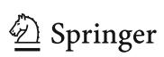

{20}------------------------------------------------

There is one more type of qubit not falling into above categories, a borrowed qubit [31]. The concept of the borrowed qubit is not considered in this work. Garbage and output qubits must be re-initialized before the diffusion of Grover iteration to be disentangled from data qubits.

### <span id="page-20-1"></span>4.2 Time-space trade-off

Readers those are familiar with quantum circuit model can safely skip over this subsection as it covers some general facts about depth—qubit trade-off. In quantum circuit model, it is often possible to sacrifice efficiency in qubits for better performance in time and vice versa. Quantum version of such time—space trade-off forms a main body of Sects. 5 and 6. As a preliminary we give an example to introduce the general concept of trade-off in quantum circuits.

Consider a function f that carries out binary multiplications of k single bit values. At the end of this subsection we will deal with general k, but for now, let us explicitly write down the description with k = 2, the multiplication of two bits a and b as f(a, b) = ab.

In quantum circuit, the implementation of a function has to be a unitary transformation such that the input can be retrieved back by knowing the output. The implementation of the two-bit binary multiplication in classical setting can be achieved by using AND gate. Similar implementation cannot be adopted in quantum setting. However, classically, by keeping the information of one input stored in one extra bit, the function would be a reversible classical circuit. Similarly in quantum setting, one may think of the implementation where the input information is kept all the way through the operation such as

<span id="page-20-0"></span>
$$U_f|a\rangle|b\rangle|0\rangle = |a\rangle|b\rangle|0 \oplus ab\rangle, \tag{16}$$

where  $|a\rangle$  and  $|b\rangle$  are quantum states encoding a and b, and  $U_f$  is the quantum implementation of the function f. Previously zeroed qubit represented by the state  $|0\rangle$  on the left-hand side holds the result after the operation. There exists a quantum gate that exactly performs the operation by  $U_f$  called a k-fold controlled-NOT ( $C^k$ NOT) with k=2 or better known as Toffoli gate. Figure 4a illustrates the graphical representation of Toffoli gate achieving Eq. 16. General  $C^k$ NOT gates read k input bits carried by wires intersecting with black dots and change a target bit carried by a wire intersecting with Exclusive-Or symbol. In this case, the gate works as NOT on target bit if a=b=1 and identity otherwise.

Similarly, multiplications of four bits can be implemented by using C<sup>4</sup>NOT gate as shown in Fig. 4b. C<sup>4</sup>NOT gate carries out NOT operation on target bit if a = b = c = d = 1 and nothing otherwise.

Now assume we are to split up a C<sup>4</sup>NOT gate into multiple Toffoli gates with the help of a few extra qubits. Decomposing a large gate into smaller gates is a typical task one confront in compilation [7]. There can be various ways to achieve the goal, and one of the immediate designs is the one in Fig. 5a.


{21}------------------------------------------------

339 Page 22 of 39 P. Kim et al.

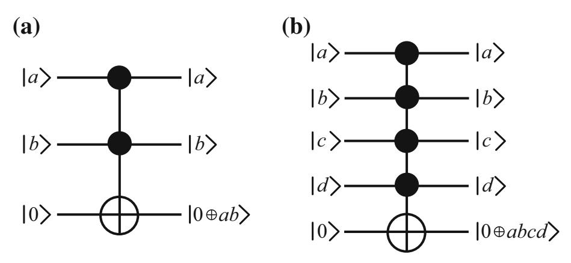

<span id="page-21-0"></span>Fig. 4 a  $C^2NOT$  (Toffoli) gate and b  $C^4NOT$  gate

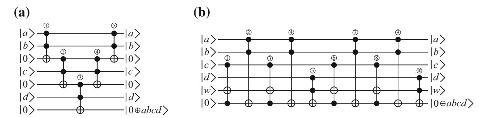

<span id="page-21-1"></span>**Fig. 5** Decomposition of  $C^4NOT$  gate into **a** five Toffoli gates and **b** ten Toffoli gates. In (**a**), the third and the fifth zeroed qubits from the top are work qubits, whereas in (**b**), only the fifth arbitrary-valued qubit is a work qubit

Let us examine the action of each Toffoli gate on the register one-by-one,

<span id="page-21-3"></span>
$$|a\rangle|b\rangle|0\rangle|c\rangle|0\rangle|d\rangle|0\rangle \qquad \stackrel{\text{\scriptsize (1)}}{\mapsto} \qquad |a\rangle|b\rangle|ab\rangle|c\rangle|0\rangle|d\rangle|0\rangle \qquad \qquad \stackrel{\text{\scriptsize (2)}}{\mapsto} \qquad |a\rangle|b\rangle|ab\rangle|c\rangle|abc\rangle|d\rangle|abcd\rangle \qquad \stackrel{\text{\scriptsize (3)}}{\mapsto} \qquad |a\rangle|b\rangle|ab\rangle|c\rangle|abc\rangle|d\rangle|abcd\rangle \qquad \stackrel{\text{\scriptsize (3)}}{\mapsto} \qquad |a\rangle|b\rangle|ab\rangle|c\rangle|0\rangle|d\rangle|abcd\rangle, \qquad (17)$$

$$\stackrel{\text{\scriptsize (4)}}{\mapsto} \qquad |a\rangle|b\rangle|ab\rangle|c\rangle|0\rangle|d\rangle|abcd\rangle \qquad \stackrel{\text{\scriptsize (5)}}{\mapsto} \qquad |a\rangle|b\rangle|0\rangle|c\rangle|0\rangle|d\rangle|abcd\rangle, \qquad (17)$$

where the circled number above the mapping arrow indicates the corresponding Toffoli gate in Fig. 5a. The result actually comes out after ③, but we further perform a kind of un-computation with two extra Toffoli gates to re-initialize the work qubits. It is up to users to decide whether the procedure should stop just after ③ at the cost of two garbage qubits being generated or go all the way to the end of the circuit. As one can notice, it is already the trade-off.

A less straightforward decomposition can be found in Fig. 5b. It makes use of twice as many Toffoli gates as Fig. 5a but requires only a single arbitrary work qubit. Similar to Eq. 17, ten Toffoli gates transform the input state into the output state.

Both designs work as desired. In fact for general k, time-efficient design as in Fig. 5a requires k-2 zeroed work qubits within depth 2k-3, whereas space-efficient design as in Fig. 5b uses only one arbitrary qubit within depth 8k-24 (for  $k \ge 5$ ) [32]. We denote time- and space-efficient designs lower-depth and less-qubit  $C^k$  NOT, respectively.

<span id="page-21-2"></span><sup>&</sup>lt;sup>8</sup> The first Toffoli gate in Fig. 5b is redundant in this case, but needed if one wants to carry out  $z \oplus abcd$ , where z is the initial value of the last qubit.

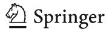

{22}------------------------------------------------

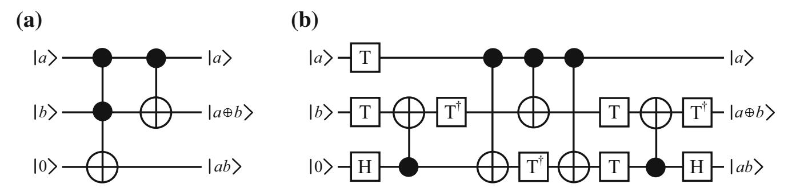

<span id="page-22-1"></span>**Fig. 6** Addition of two bits a and b in terms of **a** Toffoli and **b** T gates (Fig. 7(d) in [46]). The third qubit (output qubit) is written a carry. The third and the second qubits save the binary representation of a + b as  $ab \cdot 2^1 + (a \oplus b) \cdot 2^0$ 

Bit multiplication is one of examples qubit and depth are mutually exchangeable. In Sects. 5 and 6 we will compare multiple circuits that do the same job with a different number of qubits, and examine the consequence of each design when parallelized.

### <span id="page-22-0"></span>4.3 Remarks on Toffoli gate

Toffoli gate plays an important role in this work as it is defined as a basic time unit. Some remarks on Toffoli gates are given below.

First, Toffoli (and single) gates are universal [33–35]. Any quantum mechanically permitted computations can be implemented by these gates.

Second, circuits consisting only of Clifford gates are not advantageous over classical computing, implying that a use of non-Clifford gates such as Toffoli is essential for quantum benefit [36,37].

Third, logical Toffoli gates are expected to be the main source of time bottleneck in real applications [5,38–40]. Interested readers are encouraged to refer to [39], where resources for quantum applications are counted in terms of Toffoli gates. To summarize their reasoning, presently envisioned quantum computing architecture will dedicate its performance mostly on producing a special gate called T gate [41]. Production or preparation of T gates is hardware-dependent, whereas the number of Toffoli gates (which consists of several T gates) is machine-independent but rather depends only on the algorithm, justifying the choice for the resource unit. Similar analysis that T gates are much more expansive than all the other gates can be found in [5], where the ratio of physical execution time in all Clifford gates to all T gates is about 0.0001 in breaking SHA-256. Because of the importance of T gates, there are scientific communities focusing on finding better implementation of T [41–44] and reducing the number of T gates applied [8,45–48]. Therefore, it is more transparent to connect the time complexity with Toffoli gates than any other gates.

Toffoli gate is a non-Clifford gate that is composed of a few T and Clifford gates. Taking Toffoli gate over T gate as a basic unit of time resource has its merits and demerits. We cautiously compare the relation between Toffoli and T to the one between high- and low-level languages. Example of implementation of a two-bit addition in terms of Toffoli and T gates is given in Fig. 6.

Being reminded that Toffoli and CNOT operate as

TOFFOLI
$$|a\rangle|b\rangle|0\rangle = |a\rangle|b\rangle|0\oplus ab\rangle$$
, CNOT $|a\rangle|b\rangle = |a\rangle|a\oplus b\rangle$ ,


{23}------------------------------------------------

339 Page 24 of 39 P. Kim et al.

respectively, it is immediately noticeable from Fig. 6a that the circuit works as a two-bit addition operator. The same operation realized by depth-optimized Clifford+T set [46] is described in Fig. 6b. Assuming that a given quantum computer can only perform gates in Clifford+T set, this circuit enables more transparent expectation of runtime.

Typically in previous studies a quantum algorithm is first implemented in Toffoli level, and then, the circuit undergoes a kind of 'compilation' process that looks for an elementary-level circuit [5,8]. Finding an optimal compiling method is very complicated and worth researching [7]. At this stage however, it is hardly possible to find true optimal elementary-level circuit from compiling huge high-level circuit. In this work therefore, we stay in Toffoli-level implementation conforming the purpose of providing a general framework.

### <span id="page-23-0"></span>5 Complexity of AES-128 Key Search

This section presumes that readers are familiar with standard AES-128 encryption algorithm [26]. We assume that a quantum adversary is given a plaintext—ciphertext pair and asked to find the key used for the encryption. Since AES-128 works as a PRF, it is possible that multiple keys lead to the same ciphertext,

$$AES(k_0, p) = AES(k_1, p) = \cdots$$

where  $k_i \in \{0, 1\}^{128}$  are different keys and p is a given plaintext. The term pre-image will be used to denote each key  $k_i$  that generates given ciphertext upon the encryption of given plaintext.

The idea of applying Grover's algorithm to exhaustive attack on AES-128 is as follows. Linearly superposed  $2^{128}$  input keys encoded in 128 data qubits are fed as an input to AES- $\mathcal C$  shown in Fig. 7. AES- $\mathcal C$  contains a reversible circuit implementation of AES-128 encryption algorithm. The AES- $\mathcal C$  encrypts the given plaintext, outputting superposed ciphertexts encoded in output qubits. Superposed ciphertexts are then compared with given ciphertext via  $C^{128}NOT$  gate to mark the target. After marking is done, every qubit except the oracle qubit is passed on to AES- $\mathcal C$  Reverse to disentangle the data qubits from other qubits.

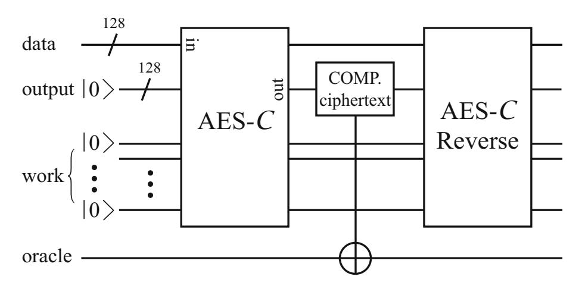

<span id="page-23-1"></span>Fig. 7 Oracle circuit for the key search attack on AES


{24}------------------------------------------------

#### 5.1 Circuit implementation cost

AES-128 encryption internally performs SubBytes, MixColumns, ShiftRows, AddRoundKey, SubWord, RotWord, and Rcon. Quantum circuits for these operations are mostly adopted from [6] with improvements and fixes.

MixColumns, ShiftRows, and RotWord are linear operations acting on 32 bits that do not require any work qubit nor Toffoli gate. Among them, last two are simple bit permutations which require no quantum gates (by re-wiring) or at most SWAP gates. MixColumns needs to be treated more carefully as it is not a bit permutation. Treating each four-byte column of the internal state as a length-four vector, MixColumns is expressed as a matrix multiplication,

<span id="page-24-0"></span>
$$\begin{pmatrix}
s'_{0,j} \\
s'_{1,j} \\
s'_{2,j} \\
s'_{3,j}
\end{pmatrix} = \begin{pmatrix}
02 & 03 & 01 & 01 \\
01 & 02 & 03 & 01 \\
01 & 01 & 02 & 03 \\
03 & 01 & 01 & 02
\end{pmatrix} \begin{pmatrix}
s_{0,j} \\
s_{1,j} \\
s_{2,j} \\
s_{3,j}
\end{pmatrix}, \text{ for } 0 \le j \le 3, \tag{18}$$

where 01, 02, 03 are submatrices when each byte  $s_{i,j}$  is treated as a length-eight vector, written as

$$01 = \begin{pmatrix} 1 & 0 & 0 & 0 & 0 & 0 & 0 \\ 0 & 1 & 0 & 0 & 0 & 0 & 0 \\ 0 & 0 & 1 & 0 & 0 & 0 & 0 \\ 0 & 0 & 0 & 1 & 0 & 0 & 0 & 0 \\ 0 & 0 & 0 & 1 & 0 & 0 & 0 & 0 \\ 0 & 0 & 0 & 0 & 1 & 0 & 0 & 0 \\ 0 & 0 & 0 & 0 & 0 & 1 & 0 & 0 \\ 0 & 0 & 0 & 0 & 0 & 0 & 1 & 0 \\ 0 & 0 & 0 & 0 & 0 & 0 & 1 & 0 \\ 0 & 0 & 0 & 0 & 0 & 0 & 1 & 1 \\ 1 & 0 & 0 & 0 & 0 & 0 & 0 & 0 & 1 \end{pmatrix}, \quad 02 = \begin{pmatrix} 0 & 1 & 0 & 0 & 0 & 0 & 0 & 0 \\ 0 & 0 & 1 & 0 & 0 & 0 & 0 & 0 \\ 1 & 0 & 0 & 1 & 1 & 0 & 0 & 0 & 0 \\ 0 & 0 & 0 & 0 & 0 & 1 & 1 & 0 & 0 \\ 1 & 0 & 0 & 0 & 0 & 0 & 1 & 1 & 0 \\ 1 & 0 & 0 & 0 & 0 & 0 & 1 & 1 \\ 1 & 0 & 0 & 0 & 0 & 0 & 0 & 1 \end{pmatrix}.$$

Since an explicit form of transformation matrix is given in Eq. 18, the quantum circuit implementation of the matrix can be found by methods given in [49,50].

AddRoundKey and Rcon are XOR-ings of fixed-size strings which can also be efficiently realized by CNOT or X gates only.

SubBytes and SubWord are the only operations which require quantum resources. Since SubBytes and SubWord consist of 16 and 4 S-boxes, the S-box is the only operation to be carefully discussed.

Classically, S-box can be implemented as a look-up table. However, a quantum counterpart of such table should involve the notion of the quantum memory aforementioned in Sect. 2.3. Therefore in this work, S-box is realized by explicitly calculating multiplicative inverse followed by affine transformations as described in Sect. 3.2.1 of [6].

S-box is realized by calculating multiplicative inverse followed by GF-linear mapping and addition of S-box constant. By treating a byte as an element in  $GF(2^8) = GF(2)[x]/(x^8 + x^4 + x^3 + x + 1)$ , GF-linear mapping and addition of S-box constant are summarized as the equation


{25}------------------------------------------------

339 Page 26 of 39 P. Kim et al.

$$\begin{array}{c|ccccccccccccccccccccccccccccccccccc$$

<span id="page-25-1"></span>Fig. 8 Finding multiplicative inverse of  $\alpha$  with seven multipliers involved

<span id="page-25-0"></span>
$$\begin{pmatrix} x'_0 \\ x'_1 \\ x'_2 \\ x'_3 \\ x'_4 \\ x'_5 \\ x'_6 \\ x'_7 \end{pmatrix} = \begin{pmatrix} 1 & 0 & 0 & 0 & 1 & 1 & 1 & 1 & 1 & 1 &$$

where addition is XOR operation and  $x_i$  are coefficients of polynomial of order  $x^7$ . No work qubit nor Toffoli gate is required in this step. While XOR operation is simply done by applying X gates to relevant qubits, implementing a transformation matrix in Eq. 19 is not trivial. See [49,50] for general methods of realizing linear transformations.

Resource estimate of quantum AES-128 encryption has been narrowed down to estimate the cost of finding multiplicative inverse of the element  $\alpha$  in GF(2<sup>8</sup>). In [6], multiplicative inverse of  $\alpha$  is calculated by using two arithmetic circuits, Maslov et al.'s modular multiplier [51] and in-place squaring [6]. Slight modification of previous method is found in this work with seven multipliers being used, verified by the quantum circuit simulation by matrix product state [52]. We visualize the sequence in a simplified way such that for example,  $|\alpha\rangle|0\rangle|0\rangle|0\rangle|0\rangle \stackrel{\text{CNOTs}}{\longmapsto} |\alpha\rangle|0\rangle|\alpha\rangle|0\rangle|0\rangle$  means CNOT gates are used to copy the string in the first eight-bit register to the third register.

The entire sequence is given in Fig. 8, where each state ket represents eight-bit register, and Sq and Mul denote modular squaring and multiplication operations. One can see that in Fig. 8, only seven multipliers have been used. Almazrooie et al. also came up with a design for multiplicative inverse [4]. We briefly compare the existing circuit designs in Table 1.

As squaring in  $GF(2^8)$  is linear, it does not involve the use of Toffoli nor work qubits. Therefore, it is only required to estimate the cost of multipliers. Table 2 summarizes

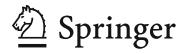

{26}------------------------------------------------

<span id="page-26-0"></span>**Table 1** Comparison of circuit designs for finding multiplicative inverse

|                           | Grassl et al.'s | Almazrooie et al's | This work |
|---------------------------|-----------------|--------------------|-----------|
| Number of qubits          | 40              | 48                 | 40        |
| Number of multiplications | 8               | 7                  | 7         |

<span id="page-26-1"></span>**Table 2** Costs of elementary operations in AES-128

|               | Less-qubit |       | Lower-depth |       |
|---------------|------------|-------|-------------|-------|
|               | Multiplier | S-box | Multiplier  | S-box |
| Toffoli-depth | 18         | 126   | 8           | 56    |
| Work qubits   | 8          | 32    | 27          | 108   |

A quarter of work qubits needed in S-box turn into garbage qubits

the elementary operation costs in AES-128. Two distinct multipliers are considered in this work, Maslov et al.'s design [51] and Kepley and Steinwandt's design [53].

First four multiplications in S-box are aimed at computing the multiplicative inverse. Remaining three (reverse) multiplications are then used to clean garbage qubits produced by previous multiplications. At the end of S-box, a quarter of total work qubits needed in S-box turn into garbage qubits.

### 5.2 Design candidates

Four main trade-off points are considered. First point that has an impact on the overall design is to determine whether key schedule and AES rounds are carried out in parallel. As S-box is used in both key schedule and AES round, schedule-round parallel implementation would require more work qubits. This option is denoted by *serial/parallel schedule-round*.

Second, AES round functions can be reversed in the middle of encryption process to save work qubits. The idea of reverse AES round was suggested in Sect. 3.2.3 in [6]. Since each run of round function produces garbage qubits, forward running of 10 rounds accumulates  $\geq$  1280 garbage qubits. Putting reverse rounds in between forward rounds reduces a large amount of work qubits at the cost of longer Toffolidepth. This option is denoted by *reverse round* when applied.

Thirdly, a choice of multiplier could make an important trade-off point. Less-qubit and lower-depth multipliers are two options. For simplicity, we do not consider adaptive use of both multipliers although it is possible to improve the efficiency by using appropriate multiplier in different part of circuit. This option is denoted by *less-qubit/lower-depth multiplier*.

Fourth, to present the extremely depth-optimized circuit design, the cleaning process in S-box could be skipped leaving every work qubit used in S-box garbage. This option is denoted by *S-box un-cleaning* when applied.

In total, there exist  $16 (= 2^4)$  different circuit designs. We only take six of them into account as others seem to be flawed compared with the six. Six designs are denoted as follows.


{27}------------------------------------------------

339 Page 28 of 39 P. Kim et al.

|                     | AES-128       |        | Grover                    |        |
|---------------------|---------------|--------|---------------------------|--------|
|                     | Toffoli-depth | Qubits | Toffoli-depth             | Qubits |
| AES-C1              | 11088         | 984    | $1.360 \times 2^{78}$     | 985    |
| AES- $C2$           | 4928          | 3017   | $1.290\ldots\times2^{77}$ | 3018   |
| AES- $C3$           | 1260          | 2208   | $1.405\ldots\times2^{75}$ | 2209   |
| AES- $C4$           | 560           | 7148   | $1.510\ldots\times2^{74}$ | 7149   |
| AES- $C5$           | 720           | 6654   | $1.808\ldots\times2^{74}$ | 6655   |
| AES- $\mathcal{C}6$ | 320           | 21854  | $1.064\ldots\times2^{74}$ | 21855  |

<span id="page-27-0"></span>**Table 3** Costs of AES-128 encryption circuit and entire attack circuit on a single quantum processor

MAXDEPTH is not considered

<span id="page-27-1"></span>**Table 4** Comparison of time–space complexity of different AES-128 circuit designs

|                                            | AES-C1 | AES-C2 | AES-C6 | AES-C5 | AES-C3 | AES-C4 |
|--------------------------------------------|--------|--------|--------|--------|--------|--------|
| $c_{\#}^{\mathrm{KS}}/c_{4}^{\mathrm{KS}}$ | 28.606 | 19.705 | 1.519  | 1.333  | 1.070  | 1      |

The smallest  $c_{\#}^{\text{KS}}$  is found by AES-C4 with  $c_{4}^{\text{KS}}=1.048\ldots\times 2^{33}$ . Other values are divided by  $c_{4}^{\text{KS}}$  for easier comparison

- AES-C1: Serial schedule-round, reverse-round, less-qubit multiplier
- AES-C2: Serial schedule-round, reverse-round, lower-depth multiplier
- AES-C3: Parallel schedule-round, less-qubit multiplier
- AES-C4: Parallel schedule-round, lower-depth multiplier
- AES-C5: Parallel schedule-round, less-qubit multiplier, S-box un-cleaning
- AES-C6: Parallel schedule-round, lower-depth multiplier, S-box un-cleaning.

#### 5.3 Comparison

Toffoli-depth and total number of qubits are carefully estimated for each design. Costs of quantum AES-128 encryption circuit and entire Grover's algorithm on a single quantum processor are summarized in Table 3. Estimates for single Grover iteration is omitted from the table as it can easily be calculated from costs of AES-128 encryption circuit;

$$cost(Grover iteration) = 2 \cdot cost(AES-128) + 2 \cdot cost(C^{128}NOT),$$

where cost(C) is Toffoli-depth of a circuit C. Note that full Toffoli-depth of the entire Grover's algorithm is estimated considering  $I_{rand}^{KS}$  in Proposition 1.

Proposition 2 basically sets up the criterion for a comparison of circuit designs. Here we replace  $T_q^{\rm KS}$  and  $S_q^{\rm KS}$  by  $T_q^{\rm KS}$  and  $S_q^{\rm KS}$ , respectively, denoting Toffoli-depth and total number of qubits in Key Search, i.e.,

<span id="page-27-2"></span>
$$\left(\mathcal{T}_q^{\text{KS}}\right)^2 \mathcal{S}_q^{\text{KS}} = c_\#^{\text{KS}} N,\tag{20}$$


{28}------------------------------------------------

|            | AES-128       |        | Grover                |        |  |
|------------|---------------|--------|-----------------------|--------|--|
|            | Toffoli-depth | Qubits | Toffoli-depth         | Qubits |  |
| Unique Key | 560           | 14296  | $1.269 \times 2^{74}$ | 14297  |  |
| AES-C4     | 560           | 7148   | $1.510 \times 2^{74}$ | 7149   |  |

<span id="page-28-0"></span>**Table 5** Comparison of attack design with and without a single target

Toffoli-depth of encryption circuit is the same in both, because the same AES design is implemented. It is noticeable that the full Toffoli-depth of *Unique Key* is not far different from that of AES-C4, although the number of qubits is nearly doubled

where  $c_{\#}^{\text{KS}}$  varies depending on circuit designs. Now a parameter  $c_{\#}^{\text{KS}}$  is the only 'yard-stick' that tells us which design is better. When parallelized for large  $S_q$ , the expected iteration number converges to the one given in Eq. 9. Taking the converged value, the  $c_{\#}^{\text{KS}}$  for each circuit design is summarized in Table 4. Assuming the MAXDEPTH is capped at some fixed value smaller than  $\sqrt{N}$ , the table indicates that for example AES- $\mathcal{C}1$  requires about 28.6...times as many qubits as AES- $\mathcal{C}4$ .

#### 5.4 Comparison to ensured single target

It is possible to guarantee an existence of a single target by using multiple plaintext-ciphertext pairs. To ensure a single target, the oracle now performs r AES encryptions simultaneously. In [6], r = 3 is chosen for AES-128. Each AES box encrypts different plaintext with the same superposed input keys. As a result, for example for r = 3 in AES-128, the probability that two pre-images exist is the same as for  $k_1$  to exist such that

$$AES(k_0, p_1) \| AES(k_0, p_2) \| AES(k_0, p_3) = AES(k_1, p_1) \| AES(k_1, p_2) \| AES(k_1, p_3),$$

where  $\parallel$  is concatenation,  $k_0$  is the true key, and  $p_i$  are distinct plaintexts. The cost of guaranteeing a single target is more or less multiplying the total number of qubits by r.

It is now natural to ask whether the oracle operator with a single target is more cost-efficient than the random function oracle with less qubits. Assuming r=2 guarantees a single target, we compare a design dubbed *Unique Key* with AES- $\mathcal{C}4$ . *Unique Key*'s encryption circuit design is chosen to be the same as AES- $\mathcal{C}4$ , meaning that the difference in efficiency solely comes from ensuring a single target. Results are summarized in Table 5. Full Toffoli-depth of *Unique Key* is estimated considering  $I_1$  in Eq. 4. With a guaranteed single target, Toffoli-depth is expected to be shortened compared with AES- $\mathcal{C}4$  at the cost of doubling qubits. Although ensuring single target can be regarded as an optimization point when using single processor, it *strictly* cannot be an option in parallel attack since the inner parallelization removes a penalty of random characteristics as in Eq. 8. Finally regarding Almazrooie et al.'s design [4], we notice that the authors reduce the number of qubits at the cost of lengthening


{29}------------------------------------------------

339 Page 30 of 39 P. Kim et al.

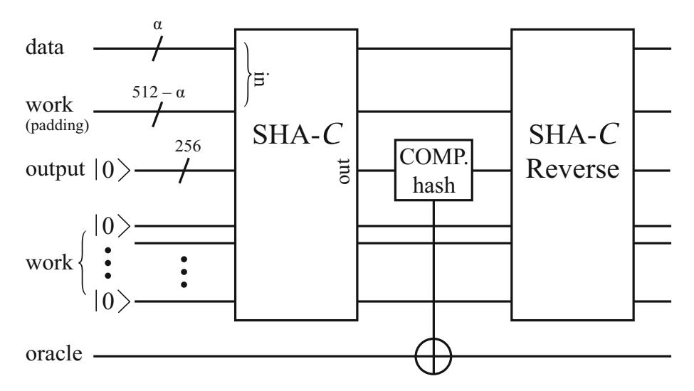

<span id="page-29-2"></span>Fig. 9 Oracle circuit for pre-image attack on SHA-2

the oracle circuit. We would address that, however, both previous designs result in inefficient trade-off curves.

### <span id="page-29-0"></span>6 Complexity of SHA-256 Pre-image Search

This section presumes that readers are familiar with standard SHA-256 [27]. The idea of applying Grover's algorithm to pre-image attack on SHA-256 is as follows.

A message block consisting of  $\alpha$  bits of message and  $512-\alpha$  bits of padding is input to SHA- $\mathcal{C}$  as shown in Fig. 9. SHA- $\mathcal{C}$  contains a reversible circuit implementation of SHA-256 to permit superposed input. The input of linearly superposed  $2^{\alpha}$  messages is then passed on to SHA- $\mathcal{C}$  resulting in superposed corresponding hashes. Processed hashes are then compared with the given hash via  $C^{256}NOT$  gate. After the target is marked, the entire qubits except the oracle qubit are further processed through SHA- $\mathcal{C}$  Reverse as in Fig. 9. The quantum state of the data qubits at the end of Fig. 9 reads

$$|\psi\rangle = \frac{1}{\sqrt{2^{\alpha}}} (|00\cdots 0\rangle + |00\cdots 1\rangle + \cdots - |t_i\rangle + \cdots + |11\cdots 1\rangle) \otimes |padding\rangle,$$

where each ket state encodes a message and  $t_i$ 's are pre-images of the given hash value. The number of targets probabilistically varies depending on  $\alpha$  which is capped at 447 (= 512 - 64 - 1).

#### 6.1 Circuit implementation cost

SHA-256 internally performs five elementary operations,  $\sigma_{0(1)}$ ,  $\Sigma_{0(1)}$ , Ch, Maj, and ADDER (modular addition) [27].

Among internal operations carried out in SHA-256,  $\Sigma_{0(1)}$  consists only of XORings of bit permutations. Results of three *ROTR* operations are written on 32-bit output register, with being successively XOR-ed. Only CNOT gates are involved in implementation with 32 work qubits.

<span id="page-29-1"></span><sup>&</sup>lt;sup>9</sup> Compared with [6], the circuit is about three times longer but requires one-third of qubits.


{30}------------------------------------------------

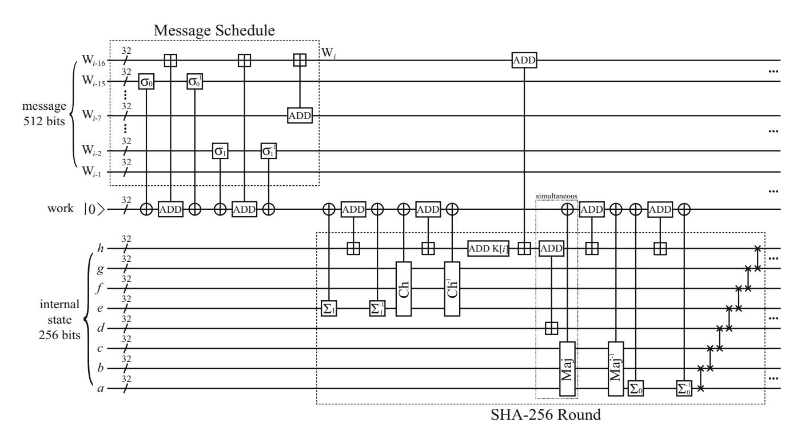

<span id="page-30-0"></span>Fig. 10 Reversible circuit for serial implementation of SHA-256 message schedule and round function. The message block consisting of 16 words is recursively updated in place. Note that it is straightforward to make message schedule and round functions work in parallel by expanding the work space. Seven two-qubit gates at the end of round are SWAP gates. The symbol  $\boxplus$  is addition modulo  $2^{32}$ 

<span id="page-30-1"></span>**Table 6** Costs of elementary operations in SHA-256

|               | ADDER (poly) | ADDER (log) | $\sigma_{0(1)},  \Sigma_{0(1)}$ | Ch | Мај |
|---------------|--------------|-------------|---------------------------------|----|-----|
| Toffoli-depth | 61           | 22          | 0                               | 1  | 2   |
| Work qubits   | 1            | 53          | 32                              | 32 | 32  |

Work qubits in *ADDER* columns get cleaned within the respective Toffoli-depth. Outputs of  $\sigma_{0(1)}$ ,  $\Sigma_{0(1)}$ , Ch, and Maj are written on work qubits

Similarly,  $\sigma_{0(1)}$  is implemented with one difference from  $\Sigma_{0(1)}$ , that is *SHR*. *SHR* itself is not linear, but writing a result of *SHR* on 32-bit output register is possible. Therefore,  $\sigma_{0(1)}$  is also efficiently realized by CNOT gates with 32 work qubits.

*Ch* and *Maj* are bit-wise operations that do require Toffoli gates. We adopt Amy et al.'s design where *Ch* and *Maj* require one and two Toffoli gates, respectively. See Figs. 4 and 5 in [5].

Serial schedule-round implementation of SHA-256 is illustrated in Fig. 10.

Low-level circuit design for each function in this work is mostly adopted from [5] except *ADDER* choice and totally re-designed message schedule. A few options are available for *ADDER* circuits one can adopt (see for example, [28]). For our purpose of comparing various circuit designs, we choose two versions of adders, a poly-depth *ADDER* [54] and a log-depth *ADDER* [55]. Table 6 summarizes resource costs of elementary operations in SHA-256.

#### 6.2 Design candidates

Three optimization points are considered. First point, that has an impact on the overall design, is to determine whether message schedule and round functions are carried out in


{31}------------------------------------------------

339 Page 32 of 39 P. Kim et al.

parallel. Figure 10 shows a serial circuit implementation of SHA-256. In the algorithm description, i-th round function is fed by i-th word from the schedule meaning that parallel implementation is possible if enough work qubits are given. This option is denoted by *serial/parallel schedule-round*.

Second point is to determine which *ADDER* is to be used. Use of the poly-depth *ADDER* is better in saving work space, whereas the log-depth *ADDER* could shorten the execution time. For simplicity, we do not consider adaptive use of both *ADDER*s although it is possible to improve the efficiency by using appropriate *ADDER* in different part of circuit. This option is denoted by *poly-depth/log-depth ADDER*.

Lastly, it is now optional to decide how many work qubits are to be used to implement  $C^{256}NOT$  gate for marking the targets (hash comparison). As discussed in Sect. 4.2,  $C^kNOT$  gate can be one of the trade-off points. However in AES-128, we do not need to consider  $C^{128}NOT$  as an optimization point seriously since the encryption process accompanies enough number of work qubits that can be reused in lower-depth  $C^{128}NOT$  gate. Situation is different in SHA-256. It is noticeable that hashing process of SHA-256 does not involve as many work qubits as AES-128, meaning that the lower-depth  $C^{256}NOT$  gate cannot be implemented unless more qubits are introduced solely for hash comparison. Toffoli-depth and work qubits required for lower-depth (less-qubit)  $C^{256}NOT$  gate are 509 (2024) and 254 (1), respectively. Note that lower-depth and less-qubit  $C^kNOT$  gates present here are only two extreme exemplary designs. This option is denoted by *less-qubit/lower-depth*  $C^{256}NOT$ .

In total, there exist  $8 (=2^3)$  distinct circuit designs. We only analyze six of them since others do not seem to have merits. Six designs are denoted as follows.

- SHA-C1: Serial schedule-round, poly-depth *ADDER*, less-qubit  $C^{256}NOT$
- SHA-C2: Serial schedule-round, log-depth *ADDER*, less-qubit C<sup>256</sup>NOT
- SHA-C3: Serial schedule-round, log-depth ADDER, lower-depth C<sup>256</sup>NOT
- SHA-C4: Parallel schedule-round, poly-depth *ADDER*, less-qubit  $C^{256}NOT$
- SHA-C5: Parallel schedule-round, log-depth *ADDER*, less-qubit C<sup>256</sup>NOT
- SHA-C6: Parallel schedule-round, log-depth ADDER, lower-depth C<sup>256</sup>NOT.

#### 6.3 Comparison

Toffoli-depth and the total number of qubits are carefully estimated for each design. The number of data qubits  $\alpha$  has to be determined at this point. In our numerical calculation,  $\alpha = 266$  seems to safely achieve the optimal expected iteration number given by Proposition 3 and to remove the failure probability. Costs of quantum SHA-256 hashing circuit and the entire Grover's algorithm on a single quantum processor are summarized in Table 7. Estimates for single Grover iteration are omitted from the table as it can easily be calculated from costs of SHA-256 circuit;

$$cost(Grover iteration) = 2 \cdot cost(SHA-256) + cost(C^{256}NOT) + cost(C^{266}NOT).$$

Proposition 4 establishes the criterion for the comparison. Similar to Eq. 20, we replace  $T_q^{PS}$  and  $S_q^{PS}$  by  $T_q^{PS}$  and  $S_q^{PS}$ , respectively, denoting Toffoli-depth and total number of qubits, i.e.,


{32}------------------------------------------------

|           | SHA-256       |        | Grover                     |        |
|-----------|---------------|--------|----------------------------|--------|
|           | Toffoli-depth | Qubits | Toffoli-depth              | Qubits |
| SHA-C1    | 36368         | 801    | $1.586 \times 2^{143}$     | 802    |
| SHA- $C2$ | 13280         | 853    | $1.227\ldots\times2^{142}$ | 854    |
| SHA-C3    | 13280         | 853    | $1.163\ldots\times2^{142}$ | 1023   |
| SHA-C4    | 27584         | 834    | $1.216\ldots\times2^{143}$ | 835    |
| SHA-C5    | 10112         | 938    | $1.919\ldots\times2^{141}$ | 939    |
| SHA-C6    | 10112         | 938    | $1.792\ldots\times2^{141}$ | 1023   |

<span id="page-32-1"></span>**Table 7** Costs of SHA-256 hashing circuit and entire attack circuit on a single quantum processor

MAXDEPTH is not considered

<span id="page-32-2"></span>**Table 8** Comparison of trade-off coefficients of different SHA-256 circuit designs

|                          | SHA- $\mathcal{C}1$ | SHA-C4 | SHA-C3 | SHA- $C2$ | SHA-C5 | SHA-C6 |
|--------------------------|---------------------|--------|--------|-----------|--------|--------|
| $c_{\#}^{PS}/c_{6}^{PS}$ | 9.830               | 6.015  | 1.685  | 1.565     | 1.053  | 1      |

The smallest  $c_{\#}^{PS}$  is found by SHA-C6 with  $c_{6}^{PS} = 1.034... \times 2^{38}$ . Other values are divided by  $c_{6}^{PS}$  for easier comparison

$$\left(\mathcal{T}_q^{\text{PS}}\right)^2 \mathcal{S}_q^{\text{PS}} = c_\#^{\text{PS}} N,\tag{21}$$

where  $c_{\#}^{PS}$  varies depending on the efficiency of circuits. When parallelized for large  $S_q$ , the expected iteration number converges to the one given in Eq. 12. Taking the converged value,  $c_{\#}^{PS}$  for each design is summarized in Table 8. If MAXDEPTH is capped at some fixed value smaller than  $\sqrt{N}$ , the table indicates that for example SHA- $\mathcal{C}1$  requires about 9.8...times as many qubits as SHA- $\mathcal{C}6$ .

### <span id="page-32-0"></span>7 Complexity of SHA-256 Collision Finding

Costs of two collision finding algorithms, GwDP and CNS, are to be estimated in this section. We adopt SHA- $\mathcal{C}6$  which also turn out to be the most efficient in time–space complexity in GwDP and CNS algorithms.<sup>10</sup>

#### 7.1 GwDP algorithm

Estimating the cost of GwDP algorithm is straightforward. Basically, this algorithm constructs a set of DPs by running multiple instances of Grover's algorithm so that

<span id="page-32-3"></span><sup>&</sup>lt;sup>10</sup> Details on circuit comparisons in GwDP and CNS algorithms are dropped from the main text. An interesting point worth noticing is that SHA- $\mathcal{C}5$  has small advantageous range of  $S_q$  (<  $2^8$ ) over SHA- $\mathcal{C}6$ . The reason is that while SHA- $\mathcal{C}5$  requires zero additional qubits in hash comparison, SHA- $\mathcal{C}6$  needs (256 – d – 2) qubits in comparison where d is the number of fixed bits in DP. Since d grows as  $S_q$  increases, there occurs crossover point. It is also noticeable that SHA- $\mathcal{C}6$  cannot exactly fit into Proposition 5 for the same reason just mentioned, but the deviation is small.

{33}------------------------------------------------

339 Page 34 of 39 P. Kim et al.

<span id="page-33-0"></span>**Table 9** Costs of GwDP algorithm for various number of machines

| $\overline{S_q}$ | Toffoli-depth              | Qubits                     |
|------------------|----------------------------|----------------------------|
| $2^{2}$          | $1.986\ldots\times2^{141}$ | 4084                       |
| $2^4$            | $1.985\ldots\times2^{139}$ | 16272                      |
| $2^8$            | $1.984\ldots\times2^{135}$ | 258304                     |
| $2^{16}$         | $1.981\ldots\times2^{127}$ | $6.508\times10^7$          |
| $2^{32}$         | $1.975\ldots\times2^{111}$ | $4.127\ldots\times10^{12}$ |
| $2^{64}$         | $1.963\ldots\times2^{79}$  | $1.732\ldots\times10^{22}$ |

Note that the algorithm also requires classical memory of size  $O(S_q)$ 

there occurs collision in the set. By using Eq. 13, costs of GwDP algorithm for the selected number of machines are summarized in Table 9.

If  $T_q^{\text{GwDP}}$  and  $S_q^{\text{GwDP}}$  in Proposition 5 are replaced by Toffoli-depth  $T_q^{\text{GwDP}}$  and number of qubits  $S_q^{\text{GwDP}}$ , the trade-off curve reads

<span id="page-33-2"></span>
$$\mathcal{T}_q^{\text{GwDP}} \mathcal{S}_q^{\text{GwDP}} = c^{\text{GwDP}} \cdot \sqrt{N},$$
 (22)

where  $c^{\text{GwDP}}$  is found to be 1.802...  $\times$  2<sup>25</sup> by using  $S_q = 2^{64}$  case.

### <span id="page-33-3"></span>7.2 CNS algorithm

Proposition 6 suggests the optimal expected number of iterations in terms of  $t_L$ . The only extra work needs to be done here is to determine  $t_L$  explicitly. From the definition of  $t_L$ , it reads

$$t_{L} = \frac{\cos(S_{f_{L}})}{2^{l} \cdot \cos(G)},$$

$$\cos(S_{f_{L}}) = 2 \cdot \cos(SHA-256) + 2^{l} \cdot \cos\left(C^{(256-d)}NOT\right),$$

$$\cos(G) = 2 \cdot \cos(SHA-256) + \cot\left(C^{d}NOT\right) + \cot\left(C^{256}NOT\right),$$

$$l = \frac{d}{2} + \log_{2}\left(\frac{\pi}{2t_{L}}\right), \qquad d = \left\lfloor \frac{512}{5} + \frac{2}{5}\log_{2}\left(\frac{(2t_{L})^{3}}{\pi}\right) \right\rfloor, \tag{23}$$

where G is Grover iteration. Numerical approach was taken to find  $t_L$ , d, and l, which came out to be 0.015182..., 96 and 54.538..., respectively. By substituting these values for parameters in Eq. 14, the expected number of iterations becomes  $I_{\rm rand}^{\rm CNS} = 1.856... \times 2^{102}$ . Note that this value is somewhat different from that of Proposition 6 as d has been rounded off. Finally by multiplying  $I_{\rm rand}^{\rm CNS}$  and the time cost of G, we obtain the total Toffoli-depth of CNS algorithm as

<span id="page-33-1"></span>
$$I_{\text{rand}}^{\text{CNS}} \cdot \text{cost}(G) = 1.184... \times 2^{117}.$$
 (24)


{34}------------------------------------------------

Quantum space cost is cheaper than SHA- $\mathcal{C}6$  because  $C^{(256-d)}NOT$  gate used for list comparison requires less work qubits than C<sup>256</sup>NOT in Pre-image Search. It is estimated to be 939 qubits in total.

When parallelized,  $t_L$  slightly changes since l and d depend on  $S_q (= 2^s)$ , the number of machines. Modified l and d reads

$$l = \frac{d}{2} + \log_2\left(\frac{\pi}{2t_L}\right), \quad d = \left[\frac{512 + 2s}{5} + \frac{2}{5}\log_2\left(\frac{1.291...(2t_L)^3}{\pi}\right)\right],$$

where  $t_L$ ,  $cost(S_{f_L})$  and cost(G) are the same as in Eq. 23. We have estimated the quantum resource costs of CNS algorithm for a few  $S_q$  values as summarized in Table 10. Note that estimated time complexities are different from ones given by Eq. 15 as the equation is obtained for large  $S_a$ , and d here has been rounded off to the nearest integer. Due to the bound  $s < \min(l, n - d - l)$ ,  $S_q = 2^{66}$  is almost the maximum number of quantum machines Proposition 7 holds.

### <span id="page-34-0"></span>8 Security strengths of AES and SHA-2

Based on the results of previous sections, quantum security strengths of AES and SHA-2 are drawn in this section. Three MAXDEPTH parameters, 2<sup>40</sup>, 2<sup>64</sup>, and 2<sup>96</sup>, are adopted from [10]. Note that using these values of MAXDEPTH in our analysis is a conservative approach as our estimates only count Toffoli gates as time resources, whereas NIST has counted all gates. Security strength of SHA-2 is determined by Collision Finding, not by Pre-image Search.

Resource estimates for AES-128 Key Search with circuit AES-C4 are extended to AES-192 and AES-256, and similarly that of SHA-256 Collision Finding with circuit SHA-C6 is applied to SHA-384 and SHA-512. Since depth-qubit trade-off curves Eqs. 20 and 22 must hold for larger key and message digest sizes, we only compare their trade-off coefficients in Table 11. There is a tendency that the values of coefficients grow as the key or message digest sizes get larger. Increasing coefficient values reflect various complexity factors added, more rounds, longer schedules, larger word size, and

<span id="page-34-1"></span>Table 10 Parameter values and costs of CNS algorithm for various number of machines

| $S_q$    | 1      | d   | $t_L$    | Toffoli-depth              | Qubits                     |
|----------|--------|-----|----------|----------------------------|----------------------------|
| $2^{2}$  | 55.155 | 97  | 0.015064 | $1.353 \times 2^{116}$     | 3756                       |
| $2^4$    | 55.558 | 98  | 0.014987 | $1.203\ldots\times2^{115}$ | 15024                      |
| $2^8$    | 56.364 | 99  | 0.014834 | $1.729\ldots\times2^{112}$ | 240384                     |
| $2^{16}$ | 57.976 | 102 | 0.014527 | $1.960\ldots\times2^{107}$ | $6.154\times10^7$          |
| $2^{32}$ | 61.201 | 109 | 0.013914 | $1.352\ldots\times2^{98}$  | $4.033\ldots\times10^{12}$ |
| $2^{64}$ | 67.654 | 121 | 0.012692 | $1.100\ldots\times2^{79}$  | $1.732\ldots\times10^{22}$ |

Note that the algorithm also requires  $O(N^{1/5}S_q^{1/5})$  classical resources


{35}------------------------------------------------

339 Page 36 of 39 P. Kim et al.

<span id="page-35-0"></span>

| <b>Table 11</b> Trade-off coefficients of AES-k Key Search for $k \in \{128, 192, 256\}$ and SHA-m Collision                  |
|-------------------------------------------------------------------------------------------------------------------------------|
| Finding for $m \in \{256, 384, 512\}$ . Coefficients $c_k^{KS}$ and $c_m^{CF}$ are divided by their respective minimal values |
| $c_{128}^{\text{KS}} = c_4^{\text{KS}}$ and $c_{256}^{\text{CF}} = c^{\text{GwDP}}$                                           |

|                                       | AES-128 | AES-192 | AES-256 |
|---------------------------------------|---------|---------|---------|
| $c_k^{\text{KS}}/c_{128}^{\text{KS}}$ | 1       | 1.560   | 2.586   |
|                                       | SHA-256 | SHA-384 | SHA-512 |
| $c_m^{\text{CF}}/c_{256}^{\text{CF}}$ | 1       | 3.837   | 3.940   |

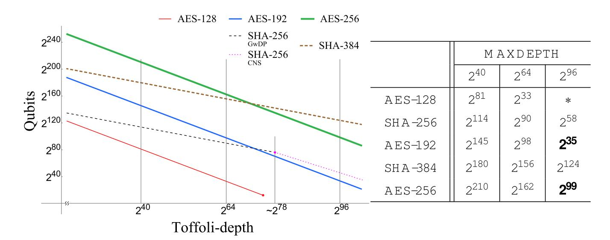

<span id="page-35-1"></span>Fig. 11 Security strengths of AES and SHA-2. This figure shows the trade-off curves of each algorithm with three MAXDEPTHs marked. Toffoli-depth  $2^{78}$  is the minimum depth that CNS algorithm has advantages over GwDP in SHA-256. Values in the table are the approximated numbers of qubits required to run the respective algorithm for given MAXDEPTH

so on. Especially in hash, size of the message block in SHA-384 is doubled compared with SHA-256 leading to large gap between  $c_{256}^{\rm CF}$  and  $c_{384}^{\rm CF}$ . In contrast,  $c_{384}^{\rm CF}$  and  $c_{512}^{\rm CF}$  do not show much difference as SHA-384 and SHA-512 algorithms are identical except truncation and initial values. The result of Sect. 7.2 is also extended to SHA-384 and reflected in Fig. 11.

Once trade-off coefficients are obtained, we are able to draw the security strength of each algorithm in terms of required qubits as a function of Toffoli-depth. Note that somewhere between MAXDEPTH =  $2^{64}$  and  $2^{96}$ , security strengths of SHA-256 (SHA-384) and AES-192 (AES-256) are reversed in order, due to their different trade-off curve behaviors. One minor note is that for large MAXDEPTH (for example,  $2^{96}$ ), Proposition 2 does not exactly hold since the size of the domain is larger than that of the codomain in AES-192 and AES-256. This factor is handled in a conservative way and reflected in Fig. 11.

Figure 11 summarizes the results which can be interpreted as another threshold to be used, for the security strength classification of proposed schemes in NIST PQC standardization process.


{36}------------------------------------------------

# <span id="page-36-8"></span>**9 Summary**

Instead of conventional query complexity, we have examined the time–space complexity of Grover's algorithm and its variants. Three categories of cryptographic search problems and their characteristics are carefully considered in conjunction with the probabilistic nature of quantum search algorithms.

To relate the time–space complexity with physical quantity, we have proposed a way of quantifying the computational power of quantum computers. Despite its simplicity, counting the number of sequential Toffoli gates reflects the reliable time complexity in estimating security levels of symmetric cryptosystems. With simplified cost measure, one can estimate the quantum complexity of a cryptosystem concisely by counting (and focusing) relevant operations only. It is worth noting that the above scheme is general for quantum resource estimates in symmetric cryptanalysis.

The scheme has been applied to resource estimates for AES and SHA-2. When multiple quantum trade-off options are given, the time–space complexity provides clear criteria to tell which is more efficient. Based on the trade-off observations made in AES and SHA-2, security strengths of respective systems are investigated with the MAXDEPTH assumption.

**Acknowledgements** We are grateful to Brandon Langenberg, Martin Rötteler, and Rainer Steinwandt for helpful discussion and sharing details of their previous work which has motivated us.

**Open Access** This article is distributed under the terms of the Creative Commons Attribution 4.0 International License [\(http://creativecommons.org/licenses/by/4.0/\)](http://creativecommons.org/licenses/by/4.0/), which permits unrestricted use, distribution, and reproduction in any medium, provided you give appropriate credit to the original author(s) and the source, provide a link to the Creative Commons license, and indicate if changes were made.

# **References**

- <span id="page-36-0"></span>1. Bernstein, D.J., Lange, T.: Post-quantum cryptography. Nature **549**(7671), 188–194 (2017)
- <span id="page-36-1"></span>2. Grover, L.K.: Quantum mechanics helps in searching for a needle in a haystack. Phys. Rev. Lett. **79**(2), 325–328 (1997)
- <span id="page-36-2"></span>3. Bernstein, D.J.: Cost analysis of hash collisions: Will quantum computers make SHARCS obsolete?. In: SHARCS '09, pp. 105–116 (2009)
- <span id="page-36-3"></span>4. Almazrooie, M., Samsudin, A., Abdullah, R., Mutter, K.N.: Quantum reversible circuit of AES-128. Quantum Inf. Process. **17**(5), 112 (2018)
- <span id="page-36-7"></span>5. Amy, M., Di Matteo, O., Gheorghiu, V., Mosca, M., Parent, A., Schanck, J.: Estimating the cost of generic quantum pre-image attacks on SHA-2 and SHA-3. In: SAC 2016, pp. 317–337. ISBN: 978-3- 319-69453-5 (2017)
- <span id="page-36-6"></span>6. Grassl, M., Langenberg, B., Rötteler, M., Steinwandt, R.: Applying Grover's algorithm to AES: quantum resource estimates. In: PQCrypto 2016, pp. 29–43. ISBN: 978-3-319-29360-8 (2016)
- <span id="page-36-10"></span>7. Parent, A., Rötteler, M., Svore, K.M.: Reversible circuit compilation with space constraints. arXiv preprint [arXiv:1510.00377](http://arxiv.org/abs/1510.00377) (2015)
- <span id="page-36-9"></span>8. Rötteler, M., Naehrig, M., Svore, K.M., Lauter, K.: Quantum resource estimates for computing elliptic curve discrete logarithms. In: ASIACRYPT 2017, pp. 241–270. ISBN: 978-3-319-70697-9 (2017)
- <span id="page-36-4"></span>9. Schwabe, P., Westerbaan, B.: Solving binary *MQ* with Grover's algorithm. In: SPACE 2016, pp. 303–322. ISBN: 978-3-319-49445-6 (2016)
- <span id="page-36-5"></span>10. NIST: Post-quantum cryptography—call for proposals (2017). [https://csrc.nist.gov/Projects/Post-](https://csrc.nist.gov/Projects/Post-Quantum-Cryptography/Post-Quantum-Cryptography-Standardization/Call-for-Proposals)[Quantum-Cryptography/Post-Quantum-Cryptography-Standardization/Call-for-Proposals](https://csrc.nist.gov/Projects/Post-Quantum-Cryptography/Post-Quantum-Cryptography-Standardization/Call-for-Proposals)

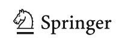

{37}------------------------------------------------

339 Page 38 of 39 P. Kim et al.

<span id="page-37-0"></span>11. Chailloux, A., Naya-Plasencia, M., Schrottenloher, A.: An efficient quantum collision search algorithm and implications on symmetric cryptography. In: ASIACRYPT 2017, pp. 211–240. ISBN: 978-3-319- 70697-9. (2017)

- <span id="page-37-1"></span>12. Bernstein, D.J., Buchmann, J., Dahmen, E.: Post Quantum Cryptography, 1st edn. Springer, Berlin (2008)
- <span id="page-37-2"></span>13. Nielsen, M.A., Chuang, I.L.: Quantum Computation and Quantum Information, 10 Anniversary edn. Cambridge University Press, Cambridge (2010)
- <span id="page-37-3"></span>14. Boyer, M., Brassard, G., Høyer, P., Tapp, A.: Tight bounds on quantum searching. Fortschritte der Physik **46**(4–5), 493–505 (1998)
- <span id="page-37-4"></span>15. Zalka, C.: Grover's quantum searching algorithm is optimal. Phys. Rev. A **60**(4), 2746–2751 (1999)
- <span id="page-37-5"></span>16. Bernstein, D.J., Yang, B.Y.: Asymptotically faster quantum algorithms to solve multivariate quadratic equations. In: PQCrypto 2018, pp. 487–506. ISBN: 978-3-319-79063-3 (2018)
- <span id="page-37-6"></span>17. Yoder, T.J., Low, G.H., Chuang, I.L.: Fixed-point quantum search with an optimal number of queries. Phys. Rev. Lett. **113**(21), 210501 (2014)
- <span id="page-37-7"></span>18. Brassard, G., Høyer, P., Mosca, M., Tapp, A.: Quantum amplitude amplification and estimation. AMS Contemp. Math. **305**, 53–74 (2002)
- <span id="page-37-8"></span>19. Brassard, G., Høyer, P., Tapp, A.: Quantum cryptanalysis of hash and claw-free functions. In: LATIN '98, pp. 163–169. ISBN: 978-3-540-69715-2 (1998)
- <span id="page-37-9"></span>20. Hosoyamada, A., Sasaki, Y., Xagawa, K.: Quantum multicollision-finding algorithm. In: ASIACRYPT 2017, pp. 179–210. ISBN: 978-3-319-70697-9 (2017)
- <span id="page-37-10"></span>21. Arunachalam, S., Gheorghiu, V., Jochym-O'Connor, T., Mosca, M., Srinivasan, P.V.: On the robustness of bucket brigade quantum RAM. New J. Phys. **17**(12), 123010 (2015)
- <span id="page-37-11"></span>22. Shenvi, N., Kempe, J., Whaley, K.B.: Quantum random-walk search algorithm. Phys. Rev. A **67**(5), 052307 (2003)
- <span id="page-37-12"></span>23. Childs, A.M., Goldstone, J.: Spatial search by quantum walk. Phys. Rev. A **70**(2), 022314 (2004)
- <span id="page-37-13"></span>24. Ambainis, A.: Quantum walk algorithm for element distinctness. SIAM J. Comput. **37**(1), 210–239 (2007)
- <span id="page-37-14"></span>25. van Oorschot, P.C., Wiener, M.J.: Parallel collision search with cryptanalytic applications. J. Cryptol. **12**(1), 1–28 (1999)
- <span id="page-37-15"></span>26. NIST: Advanced Encryption Standard (AES), FIPS PUB 197 (2001)
- <span id="page-37-16"></span>27. NIST: Secure Hash Standard (SHS), FIPS PUB 180-4 (2015)
- <span id="page-37-17"></span>28. Pavlidis, A., Gizopoulos, D.: Fast quantum modular exponentiation architecture for Shor's factoring algorithm. Quantum Inf. Comput. **14**(7 & 8), 649–682 (2014)
- <span id="page-37-18"></span>29. Flajolet, P., Odlyzko, A.M.: Random mapping statistics. In: EUROCRYPT '89, pp. 329–354. Springer, Berlin Heidelberg. ISBN: 978-3-540-46885-1 (1990)
- <span id="page-37-19"></span>30. Katz, J., Lindell, Y.: Introduction to Modern Cryptography, 2nd edn. Chapman & Hall/CRC, London (2007)
- <span id="page-37-20"></span>31. Häner, T., Rötteler, M., Svore, K.M.: Factoring using 2*n* + 2 qubits with Toffoli based modular multiplication. Quantum Inf. Comput. **17**(7 & 8), 673 (2017)
- <span id="page-37-21"></span>32. Barenco, A., Bennett, C.H., Cleve, R., DiVincenzo, D.P., Margolus, N., Shor, P., Sleator, T., Smolin, J.A., Weinfurter, H.: Elementary gates for quantum computation. Phys. Rev. A **52**, 3457–3467 (1995)
- <span id="page-37-22"></span>33. Deutsch, D.: Quantum computational networks. Proc. R. Soc. Lond. A **425**(1868), 73–90 (1989)
- 34. Shi, Y.: Both Toffoli and controlled-NOT need little help to do universal quantum computing. Quantum Inf. Comput. **3**(1), 84–92 (2003)
- <span id="page-37-23"></span>35. Toffoli, T.: Reversible computing. In: de Bakker, J., van Leeuwen, J. (eds.) Automata, Languages and Programming, pp. 632–644. Springer, Berlin Heidelberg (1980)
- <span id="page-37-24"></span>36. Gottesman, D.: The Heisenberg representation of quantum computers. In: GP22: ICGTMP '98, pp. 32–43 (1998)
- <span id="page-37-25"></span>37. Aaronson, S., Gottesman, D.: Improved simulation of stabilizer circuits. Phys. Rev. A **70**(5), 052328 (2004)
- <span id="page-37-26"></span>38. Fowler, A.G., Mariantoni, M., Martinis, J.M., Cleland, A.N.: Surface codes: towards practical largescale quantum computation. Phys. Rev. A **86**(3), 032324 (2012)
- <span id="page-37-28"></span>39. Jones, N.C., Van Meter, R., Fowler, A.G., McMahon, P.L., Kim, J., Ladd, T.D., Yamamoto, Y.: Layered architecture for quantum computing. Phys. Rev. X **2**(3), 031007 (2012)
- <span id="page-37-27"></span>40. O'Gorman, J., Campbell, E.T.: Quantum computation with realistic magic-state factories. Phys. Rev. A **95**(3), 032338 (2017)


{38}------------------------------------------------

- <span id="page-38-1"></span>41. Bravyi, S., Kitaev, A.: Universal quantum computation with ideal Clifford gates and noisy ancillas. Phys. Rev. A **71**(2), 022316 (2005)
- 42. Bravyi, S., Haah, J.: Magic-state distillation with low overhead. Phys. Rev. A **86**(5), 052329 (2012)
- 43. Jones, C.: Multilevel distillation of magic states for quantum computing. Phys. Rev. A **87**(4), 042305 (2013)
- <span id="page-38-2"></span>44. Meier, A.M., Eastin, B., Knill, E.: Magic-state distillation with the four-qubit code. Quantum Inf. Comput. **13**(3–4), 195–209 (2013)
- <span id="page-38-3"></span>45. Amento, B., Rötteler, M., Steinwandt, R.: Efficient quantum circuits for binary elliptic curve arithmetic: reducing T-gate complexity. Quantum Inf. Comput. **13**(7–8), 631–644 (2013)
- <span id="page-38-0"></span>46. Amy, M., Maslov, D., Mosca, M., Rötteler, M.: A meet-in-the-middle algorithm for fast synthesis of depth-optimal quantum circuits. IEEE Trans. Comput. Aided Des. Integr. Circuits Syst. **32**(6), 818–830 (2013)
- 47. Bocharov, A., Svore, K.M.: Resource-optimal single-qubit quantum circuits. Phys. Rev. Lett. **109**(19), 190501 (2012)
- <span id="page-38-4"></span>48. Gosset, D., Kliuchnikov, V., Mosca, M., Russo, V.: An algorithm for the T-count. Quantum Inf. Comput. **14**(15–16), 1261–1276 (2014)
- <span id="page-38-5"></span>49. Beth, T., Rötteler, M.: Quantum algorithms: applicable algebra and quantum physics. In: Alber, G. (ed.) Quantum Information: An Introduction to Basic Theoretical Concepts and Experiments, pp. 96–150. Springer, Berlin Heidelberg (2001)
- <span id="page-38-6"></span>50. Patel, K.N., Markov, I.L., Hayes, J.P.: Optimal synthesis of linear reversible circuits. Quantum Inf. Comput. **8**(3), 282–294 (2008)
- <span id="page-38-7"></span>51. Maslov, D., Mathew, J., Cheung, D., Pradhan, D.K.: An  $O(m^2)$ -depth quantum algorithm for the elliptic curve discrete logarithm problem over  $GF(2^m)^a$ . Quantum Inf. Comput. **9**(7), 610–621 (2009)
- <span id="page-38-8"></span>52. Vidal, G.: Efficient classical simulation of slightly entangled quantum computations. Phys. Rev. Lett. **91**(14), 147902 (2003)
- <span id="page-38-9"></span>53. Kepley, S., Steinwandt, R.: Quantum circuits for  $\mathbb{F}_{2^n}$ -multiplication with subquadratic gate count. Quantum Inf. Process. **14**(7), 2373–2386 (2015)
- <span id="page-38-10"></span>54. Cuccaro, S.A., Draper, T.G., Kutin, S.A., Moulton, D.P.: A new quantum ripple-carry addition circuit. arXiv preprint arXiv:quant-ph/0410184 (2004)
- <span id="page-38-11"></span>55. Draper, T.G., Kutin, S.A., Rains, E.M., Svore, K.M.: A logarithmic-depth quantum carry-lookahead adder. Quantum Inf. Comput. **6**(4 & 5), 351–369 (2006)

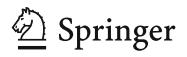