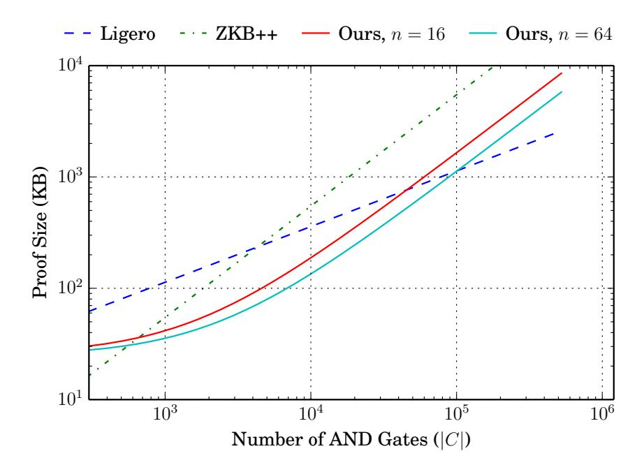

# Improved Non-Interactive Zero Knowledge with Applications to Post-Quantum Signatures

Jonathan Katz University of Maryland jkatz@cs.umd.edu

Vladimir Kolesnikov Georgia Tech kolesnikov@gatech.edu

Xiao Wang University of Maryland wangxiao@cs.umd.edu

#### Abstract

Recent work, including ZKBoo, ZKB++, and Ligero, has developed efficient non-interactive zero-knowledge proofs of knowledge (NIZKPoKs) for Boolean circuits based on symmetric-key primitives alone, using the "MPC-in-the-head" paradigm of Ishai et al. We show how to instantiate this paradigm with MPC protocols in the preprocessing model; once optimized, this results in an NIZKPoK with shorter proofs (and comparable computation) as in prior work for circuits containing roughly 300–100,000 AND gates. In contrast to prior work, our NIZKPoK also supports witness-independent preprocessing, which allows the prover to shift most of its work to an offline phase before the witness is known.

We apply our ideas to construct a signature scheme based only on symmetric-key primitives (and hence with "post-quantum" security). The resulting scheme has shorter signatures than the scheme built using ZKB++ (and comparable signing/verification time), and is even competitive with hash-based signature schemes.

To further highlight the flexibility and power of our ideas, we also build efficient ring and group signatures based on symmetric-key primitives alone. To our knowledge, the resulting schemes are the most efficient constructions of these primitives that offer post-quantum security.

## 1 Introduction

Zero-knowledge (ZK) proofs[1](#page-0-0) [\[29,](#page-23-0) [28\]](#page-23-1) and non-interactive zero-knowledge (NIZK) proofs [\[11,](#page-22-0) [10,](#page-22-1) [22\]](#page-23-2) are among the most fundamental and versatile cryptographic primitives. In the present context, (NI)ZK proofs of knowledge (PoKs) [\[29,](#page-23-0) [5,](#page-21-0) [20\]](#page-23-3) allow a prover to convince a verifier, who holds a circuit C, that the prover knows an input (or "witness") w for which C(w) = 1. Historically, research on (NI)ZK proofs has followed two largely independent paths: some work gave asymptotic improvements for generic proofs that can be used for arbitrary circuits (by reducing a circuit to an NP-complete problem) but had poor concrete efficiency; other work explored efficient proofs tailored to specific, "algebraic" computations (e.g., group exponentiation).

More recently, researchers have merged these two directions and have developed (NI)ZKPoKs for general circuits with good concrete efficiency. We highlight in particular recent constructions of succinct non-interactive arguments of knowledge (SNARKs) [\[25,](#page-23-4) [40,](#page-24-0) [7,](#page-22-2) [19,](#page-23-5) [30\]](#page-24-1), which can be used to generate proofs for arbitrary circuits that are shorter than the input w itself. (Prior work showing ZK proofs with size sublinear in the input [\[35,](#page-24-2) [38\]](#page-24-3) demonstrated feasibility, but was concretely inefficient.) Unfortunately, existing SNARKs suffer from several disadvantages. First,

1 In this paper we do not distinguish between computational and information-theoretic soundness, and thus refer to both arguments and proofs simply as "proofs."

although they have excellent proof size and verification time, the computational efficiency of the prover is poor. Second, most constructions require public parameters generated and published by some semi-trusted party. Security of existing SNARKs is based on non-standard and poorly understood knowledge assumptions, and to some extent this is inherent [\[26\]](#page-23-6). Finally, most existing constructions of SNARKs rely on bilinear maps and are thus insecure against quantum attackers. (One exception is the recent work of Boneh et al. [\[13\]](#page-22-3). This scheme still has the other drawbacks, and its concrete efficiency is unclear.)

In another recent line of work, researchers have shown how to use protocols for secure multiparty computation (MPC) to obtain (NI)ZKPoKs with excellent concrete performance (even if the communication is no longer sublinear in the circuit size |C|). Jawurek et al. [\[33\]](#page-24-4) (see also [\[24\]](#page-23-7)) showed that two-party protocols based on garbled circuits could be used to construct efficient ZKPoKs; their approach requires interaction as well as the use of public-key primitives. Hazay and Venkitasubramaniam [\[31\]](#page-24-5) show a public-coin protocol based on garbled circuits that avoids public-key primitives; its practical performance is likely worse than the approaches we discuss next. Ishai et al. (IKOS) [\[32\]](#page-24-6), using the so-called "MPC-in-the-head" approach, showed how to use MPC protocols to obtain ZKPoKs whose security can be based entirely on symmetric-key primitives; their approach yields public-coin protocols, and so can be made non-interactive via the Fiat-Shamir transform [\[23\]](#page-23-8). Based on the IKOS approach, Giacomelli et al. [\[27\]](#page-23-9) developed and implemented a protocol called ZKBoo that supports efficient NIZKPoKs for arbitrary circuits. (Concurrently, Ranellucci et al. [\[43\]](#page-25-0) proposed an NIZKPoK with similar asymptotic performance.) Chase et al. [\[16\]](#page-22-4) introduced ZKB++, which improves the performance of ZKBoo; they also showed that ZKB++ could be used to construct an efficient signature scheme based on symmetric-key primitives alone. (A version of their scheme called Picnic [\[15\]](#page-22-5) was submitted to the NIST postquantum standardization effort.) Ames et al. [\[4\]](#page-21-1) subsequently proposed Ligero, which offers proofs that are sublinear in |C| and so asymptotically outperforms ZKBoo and ZKB++; see further discussion in Section [3.](#page-11-0)

### 1.1 Our Contributions

We show here a novel way to instantiate the "MPC-in-the-head" approach that leads to NIZKPoKs with shorter proofs than (and comparable computation to) the best prior work [\[27,](#page-23-9) [43,](#page-25-0) [16,](#page-22-4) [4\]](#page-21-1) for "medium-size" circuits with roughly 300–100,000 gates. (Although we focus on Boolean circuits, our ideas can be extended to arithmetic circuits as well.) As we show, this range covers many "cryptographically interesting" circuits that incorporate hashing, block-cipher evaluations, etc.

Our main insight leading to improved performance is that the "MPC-in-the-head" paradigm can be instantiated using MPC protocols designed in the preprocessing model. (A detailed overview of our approach is given in Section [1.2.](#page-2-0)) This greatly increases the space of MPC protocols that can be used, and in particular makes it competitive to use protocols designed for a large number of parties (in contrast to prior work) and hence achieve better efficiency for the same level of security.

As in the work of Chase et al. [\[16\]](#page-22-4), we may apply our NIZKPoK to construct an efficient signature scheme based on symmetric-key primitives alone and thus offering "post-quantum" security. Our resulting scheme has signatures roughly 3.2× shorter than those of Chase et al.; in fact, we can achieve signatures that are even shorter than some leading constructions of (stateless) hashbased signature schemes [\[9\]](#page-22-6). We can also trade off signature length and computation, giving some flexibility in the design. We are currently working with the Picnic team to incorporate our work in their submission to NIST.

As an additional application highlighting the power of our new NIZKPoK, we show how to use it to build efficient ring and group signatures based on symmetric-key primitives alone. (Similar ideas, but using ZKB++, have been pursued in concurrent work [\[21,](#page-23-10) [12\]](#page-22-7).) The main challenge here is to build schemes in which signing corresponds to generating an NIZKPoK for a circuit that is not too large; we defer additional details to Section [4.](#page-16-0) Our resulting schemes are, to the best of our knowledge, the most efficient constructions of ring/group signatures with post-quantum security.

#### 1.2 Overview of Our Techniques

We provide the high-level intuition for our improved NIZKPoK. Here (and in Section [2.2\)](#page-5-0) we describe a 5-round, public-coin proof of knowledge that is honest-verifier zero knowledge (HVZK). In Section [2.4](#page-11-1) we then show how it can be "compressed" to three rounds (while remaining publiccoin and HVZK). Either of these proofs can, in turn, be compiled to achieve zero knowledge against a malicious verifier using standard techniques. Alternatively—and of most interest to us—the 3 round version can be made non-interactive in the random-oracle model using the Fiat-Shamir transform [\[23\]](#page-23-8).

Our starting point is the "MPC-in-the-head" paradigm of Ishai et al. [\[32\]](#page-24-6) for constructing publiccoin HVZK proofs of knowledge based on protocols for secure computation. Roughly speaking, the main idea is for the prover to simulate an execution of an n-party secure-computation protocol Π that evaluates a given circuit C on the prover's input w, and then for the prover to commit to the views of the parties in the protocol. The verifier chooses a random subset of those parties (we call those parties "opened"), and the prover opens their corresponding views. The verifier then checks that the views of the opened parties are consistent with each other and with an honest execution of Π that yields output 1.

As observed in prior work [\[27\]](#page-23-9), efficiency considerations for the protocol Π used in the "MPCin-the-head" paradigm differ from efficiency considerations for standard applications of MPC. For example, in this context Π can freely rely on "oblivious-transfer channels" in addition to standard point-to-point channels; in fact, Π can freely use any (deterministic) two-party functionality as a building block, since such functionalities incur no additional cost for the prover to simulate them, and consistency between pairs of opened parties can still be checked. We stress that this does not immediately extend to using t-party functionalities for t > 2, since it may no longer be possible to verify consistent execution unless all t parties using the functionality are opened.

Giacomelli et al. [\[27\]](#page-23-9) and Chase et al. [\[16\]](#page-22-4) gave concrete instantiations of the "MPC-in-thehead" approach, and determined that using a 3-party protocol Π resulted in optimal performance for the space of protocols they considered. Since the number of parties is small, the soundness of the resulting HVZK proof is poor; a large number of parallel repetitions is thus needed to obtain negligible soundness. (We discuss the work of Ames et al. [\[4\]](#page-21-1) in Section [3.1.](#page-11-2))

Our main conceptual insight is that the "MPC-in-the-head" approach can be modified so the underlying n-party protocol Π can rely on any n-party functionality, as long as that functionality is used during preprocessing. At first glance, using an n-party functionality does not seem compatible with the IKOS paradigm: the only way to verify that the functionality was run honestly is to open all parties, but then privacy (which translates to zero-knowledge) cannot possibly hold. We overcome this difficulty by having the verifier issue its challenges in two phases, thus giving a 5-round HVZK proof. Roughly, the HVZK proof works as follows:

1. The prover commits to multiple (independent) executions of the preprocessing phase, where

each commitment also commits to the state of each party at the end of that phase.

- 2. The verifier challenges the prover to open some of the executions of the preprocessing phase. For each challenged execution, the prover opens the state of all parties, thus allowing the verifier to check those executions.
- 3. Using each of the remaining (unchallenged) executions of the preprocessing phase, the prover simulates an execution of Π that evaluates C on input w. It then commits to each party's view in the protocol, including its state from the preprocessing phase.
- 4. As in the original IKOS approach, for each execution of Π the verifier chooses a random subset of the parties to open. Now, however, opening a party involves opening the commitment to that party's state following the preprocessing phase (from step 1) as well as its view in the online execution of the protocol (from step 3). The verifier then checks that all the opened parties are consistent with each other and with an honest execution of Π (using the state from the preprocessing phase) that yields output 1.

The fact that the n-party functionality is executed during a preprocessing phase is essential here; the execution of that functionality is independent of the parties' inputs, and so opening the views of all parties from the preprocessing phase does not reveal any information about w.

As a consequence of being able to rely on preprocessing, the space of possible protocols Π we can use is greatly expanded. In particular, we find that we obtain much shorter proofs by using an n-party protocol (secure against semi-honest corruption of all-but-one of the parties) with n as high as 64. The ability to rely on preprocessing is critical here: the communication complexity of traditional MPC protocols (that do not rely on preprocessing) with security against all-but-one corruption is quadratic in the number of parties, but by relying on preprocessing and broadcast we can obtain proof size independent of n.

Further optimizations and specific parameter choices for the above proof are discussed in the remainder of the paper.

#### 1.3 Outline of the Paper

In Section [2,](#page-3-0) we present the details of the MPC protocol Π we use, and describe more fully how to convert it into a 3-round, public-coin HVZK proof whose security relies on symmetric-key primitives alone. By applying the Fiat-Shamir transform to our 3-round proof, we obtain an NIZKPoK; the resulting construction is analyzed and compared to prior work in Section [3.1,](#page-11-2) where we show that it yields shorter proofs than prior work for a large range of circuit sizes. As in prior work, we can use our NIZKPoK to build a signature scheme based only on symmetric-key primitives (and hence offering "post-quantum" security); performance of this scheme is discussed in Section [3.2.](#page-15-0) We explore the applicability of our work to constructing "post-quantum" ring and group signatures in Section [4.](#page-16-0)

# 2 HVZK Proofs of Knowledge

We construct our HVZK proofs by instantiating the "MPC-in-the-head" paradigm using an MPC protocol Π designed in the preprocessing model. We first describe the MPC protocol we rely on, and then discuss how to build HVZK proofs based on it.

**Notation.** We denote the *n*-out-of-*n* (XOR-based) secret sharing of a bit x by [x]. Throughout,  $\kappa$  and  $\rho$  denote computational and statistical security parameters, respectively. We let |C| denote the number of AND gates in a circuit C.

### 2.1 A Suitable MPC protocol

In this section we describe an n-party protocol  $\Pi$  run by parties  $S_1, \ldots, S_n$  in the preprocessing model, secure against semi-honest corruption of all-but-one of the parties. The protocol is inspired by recent work of Wang et al. [48].

Recall that our goal is to use this protocol to instantiate the "MPC-in-the-head" approach efficiently, and so in particular we are interested in minimizing the communication needed to verify consistency and correct computation for any n-1 parties chosen by the verifier. As explained in more detail in the next section, our protocol  $\Pi$  ends up having communication comparable to the 3-party MPC protocols used by ZKBoo and ZKB++, but because we set n>3 we are able to achieve much lower soundness error per protocol execution and thus better communication complexity overall for our resulting interactive proof system.

Our protocol  $\Pi$  maintains the invariant that, for each wire in the circuit, the parties hold an n-out-of-n secret sharing of a random mask along with the (public) masked value of the wire. Specifically, if we let  $z_{\alpha}$  denote the value of wire  $\alpha$  in the circuit C when evaluated on input w, then the parties will hold  $[\lambda_{\alpha}]$  (for uniform  $\lambda_{\alpha} \in \{0,1\}$ ) along with the value  $\hat{z}_{\alpha} \stackrel{\text{def}}{=} z_{\alpha} \oplus \lambda_{\alpha}$ .

**Preprocessing phase.** In the preprocessing phase, shares are set up among the parties as follows. For each wire  $\alpha$  that is either an input wire of the circuit or the output wire of an AND gate, the parties are given  $[\lambda_{\alpha}]$ , where  $\lambda_{\alpha} \in \{0,1\}$  is uniform. For an XOR gate with input wires  $\alpha, \beta$  and output wire  $\gamma$ , define  $\lambda_{\gamma} \stackrel{\text{def}}{=} \lambda_{\alpha} \oplus \lambda_{\beta}$ ; note the parties can compute  $[\lambda_{\gamma}]$  locally. Finally, for each AND gate with input wires  $\alpha, \beta$ , the parties are given  $[\lambda_{\alpha,\beta}]$ , where  $\lambda_{\alpha,\beta} \stackrel{\text{def}}{=} \lambda_{\alpha} \cdot \lambda_{\beta}$ .

A key observation is that the shares of the  $\{\lambda_{\alpha}\}$  are uniform, and so can be generated by having each party  $S_i$  apply a pseudorandom generator to a short, random seed  $\mathsf{seed}_i$  given to that party, and then (implicitly) defining the  $\{\lambda_{\alpha}\}$  based on the resulting shares. All-but-one of the shares of the  $\{\lambda_{\alpha,\beta}\}$  can also be generated in this way, but the final share is constrained by the values of  $\lambda_{\alpha}, \lambda_{\beta}$ . To ensure that the shares of the  $\{\lambda_{\alpha,\beta}\}$  are correct,  $S_n$  can be given an additional |C| "correction bits" that determine its share of  $\lambda_{\alpha,\beta}$  for each AND gate with input wires  $\alpha,\beta$ .

To summarize: each  $S_i$  is given a  $\kappa$ -bit seed  $\mathsf{seed}_i \in \{0,1\}^{\kappa}$ , and  $S_n$  is additionally given |C| bits denoted by  $\mathsf{aux}_n$ . We refer to this information as the  $\mathsf{state}$  of the parties, and denote the state of  $S_i$  by  $\mathsf{state}_i$ . In the online phase of the protocol, each party  $S_i$  uses  $\mathsf{seed}_i$  to generate its shares of the  $\{\lambda_{\alpha}\}$ ; for  $1 \leq i \leq n-1$ , party  $S_i$  also uses  $\mathsf{seed}_i$  to generate its shares of the  $\{\lambda_{\alpha,\beta}\}$ . Party  $S_n$  uses  $\mathsf{aux}_n$  as its shares of the  $\{\lambda_{\alpha,\beta}\}$ .

**Protocol execution.** Note that in our setting, where all parties are semi-honest, we can perform public reconstruction of a shared value [x] by simply having each party broadcast its share.

We assume the parties begin the protocol holding a masked value  $\hat{z}_{\alpha}$  for each input wire  $\alpha$ . (In our context these masked values will be provided to the parties by the prover who is simulating execution of the protocol.) These masked values, along with the corresponding  $\{\lambda_{\alpha}\}$ , define an effective input to the protocol. During the online phase of the protocol, the parties inductively compute  $\hat{z}_{\alpha}$  for all wires in the circuit. Specifically, for each gate of the circuit with input wires  $\alpha, \beta$  and output wire  $\gamma$ , where the parties already hold  $\hat{z}_{\alpha}, \hat{z}_{\beta}$ , the parties do:

- If the gate is an XOR gate, then the parties locally compute  $\hat{z}_{\gamma} := \hat{z}_{\alpha} \oplus \hat{z}_{\beta}$ .
- If the gate is an AND gate, the parties locally compute

$$[s] := \hat{z}_{\alpha}[\lambda_{\beta}] \oplus \hat{z}_{\beta}[\lambda_{\alpha}] \oplus [\lambda_{\alpha,\beta}] \oplus [\lambda_{\gamma}],$$

and then publicly reconstruct s. Finally, they compute  $\hat{z}_{\gamma} := s \oplus \hat{z}_{\alpha}\hat{z}_{\beta}$ . One can verify that  $\hat{z}_{\gamma} = z_{\gamma} \oplus \lambda_{\gamma}$ .

Once the parties have computed  $\hat{z}_{\alpha}$  for the output wire  $\alpha$ , the output value  $z_{\alpha}$  is computed by publicly reconstructing  $\lambda_{\alpha}$  and then setting  $z_{\alpha} := \hat{z}_{\alpha} \oplus \lambda_{\alpha}$ .

We remark that the online phase of this protocol is deterministic. Also observe that all communication is due to share reconstruction: for a circuit with |C| AND gates, at most |C| + 1 share reconstructions are needed. We will see in the following sections that these properties are advantageous for our application.

#### 2.2 Our Basic HVZK Proof

In this section we describe a basic, 5-round HVZK proof based on the MPC protocol from the previous section. We defer discussion of further optimizations to the following section, and a description of a 3-round variant to Section 2.4.

**Notation.** In this section, H is a collision-resistant hash function. (Later in the paper, we will model H as a random oracle.) We let  $\mathsf{Com}$  denote a non-interactive2 commitment scheme, where a commitment to a value x is generated by choosing a uniform  $r \in \{0,1\}^{\kappa}$  and computing  $\mathsf{com} := \mathsf{Com}(x;r)$ ; decommitment is done by simply revealing x and r. Computational binding and hiding suffices.

Overview. Recall from Section 1.2 that, because we rely on an MPC protocol  $\Pi$  designed in the preprocessing model, we modify the "MPC-in-the-head" approach and construct a 5-round proof of the following format: First, the prover commits to m executions of the preprocessing phase, where each such commitment includes a commitment to the state of each party. The verifier then challenges the prover to open all-but-one of those executions, and verifies that all the state information given to the parties in the opened executions is correct. The remaining (unopened) execution of the preprocessing phase is then used by the prover to simulate the online phase of the n-party protocol  $\Pi$  on a shared input w, and the prover commits to the view of each party in this execution. The verifier then chooses all-but-one of the parties to be opened; for each opened party, the prover opens that party's state from the preprocessing phase as well as its view from the online phase. The verifier then checks consistency of the parties' views as well as correct behavior. We provide details about each of these steps next.

Checking the preprocessing phase. Recall from the previous section that, following the preprocessing phase, the state of party  $S_i$  for  $1 \le i \le n-1$  is a seed  $\mathsf{seed}_i$ , while the state of party  $S_n$  is a seed  $\mathsf{seed}_n$  along with a |C|-bit string  $\mathsf{aux}_n$ . Thus, in a naive implementation of the idea outlined above, for each execution of the preprocessing phase the prover would  $\mathsf{send}(\mathsf{com}_1, \ldots, \mathsf{com}_n)$ , where  $\mathsf{com}_i$  is a commitment to the state of  $S_i$ . Then, for each challenged execution of the preprocessing phase, the prover would  $\mathsf{send}(\mathsf{seed}_1, \ldots, \mathsf{seed}_n, \mathsf{aux}_n, r_1, \ldots, r_n)$ , where  $r_i$  denotes the randomness

&lt;sup>2We could also use a two-round commitment scheme by adding one additional round to the proof system.

### An HVZK proof

**Inputs:** Both parties have a circuit C; the prover also holds w with C(w) = 1. Values m, n are parameters of the protocol.

**Round 1** For each  $j \in [m]$ , the prover emulates the preprocessing phase as follows:

- 1. Choose uniform  $\operatorname{\mathsf{seed}}_j^* \in \{0,1\}^\kappa$  and use it to generate values  $\operatorname{\mathsf{seed}}_{j,1}, \ r_{j,1}, \ \ldots, \\ \operatorname{\mathsf{seed}}_{j,n}, r_{j,n}.$  Also compute  $\operatorname{\mathsf{aux}}_{j,n} \in \{0,1\}^{|C|}$  as described in the text. For  $i = 1, \ldots, n-1$ , let  $\operatorname{\mathsf{state}}_{j,i} := \operatorname{\mathsf{seed}}_{j,i}$ ; let  $\operatorname{\mathsf{state}}_{j,n} := \operatorname{\mathsf{seed}}_{j,n} \|\operatorname{\mathsf{aux}}_{j,n}.$
- 2. For  $i \in [n]$ , compute  $com_{j,i} := Com(state_{j,i}; r_{j,i})$ .
- 3. Compute  $h_j := H(\mathsf{com}_{j,1}, \ldots, \mathsf{com}_{j,n})$ .

Compute  $h := H(h_1, \ldots, h_m)$  and send h to the verifier.

**Round 2** The verifier chooses uniform  $c \in [m]$  and sends it to the prover.

**Round 3** The prover sends  $\{seed_i^*\}_{j\neq c}$  to the verifier.

The prover simulates the online phase of the n-party protocol  $\Pi$  (as described in the text) using the state generated by the cth preprocessing phase, beginning by computing the masked values  $\{\hat{z}_{\alpha}\}$  for the input wires (based on w and the  $\{\lambda_{\alpha}\}$  defined by the cth preprocessing phase). Let  $\mathsf{msgs}_i$  denote the messages broadcast by  $S_i$  in the protocol execution. The prover sends the initial masked values  $\{\hat{z}_{\alpha}\}$  as well as  $h' := H(\mathsf{msgs}_1, \ldots, \mathsf{msgs}_n)$  to the verifier.

**Round 4** The verifier chooses uniform  $p \in [n]$  and sends it to the prover.

**Round 5** The prover sends  $\{\mathsf{state}_{c,i},\,r_{c,i}\}_{i\neq p},\,\mathsf{com}_{c,p},\,\mathsf{and}\,\,\mathsf{msgs}_p.$ 

Verification The verifier accepts iff all the following checks succeed:

- 1. For  $i \neq p$ , the verifier uses  $\mathsf{state}_{c,i}$  and  $r_{c,i}$  to compute  $\mathsf{com}_{c,i}$ . It then computes  $h_c := H(\mathsf{com}_{c,1}, \ldots, \mathsf{com}_{c,n})$ .
- 2. For  $j \neq c$ , the verifier uses  $\operatorname{seed}_{j}^{*}$  to compute  $h_{j}$  as an honest prover would. It then checks that  $h \stackrel{?}{=} H(h_{1}, \ldots, h_{m})$ .
- 3. The verifier simulates the online phase of  $\Pi$  among the  $\{S_i\}_{i\neq p}$  using  $\{\mathsf{state}_{c,i}\}_{i\neq p}$ , masked input-wire values  $\{\hat{z}_\alpha\}$ , and  $\mathsf{msgs}_p$ . This yields  $\{\mathsf{msgs}_i\}_{i\neq p}$  and an output bit b. The verifier checks that  $b \stackrel{?}{=} 1$ .
- 4. The verifier checks that  $h' \stackrel{?}{=} H(\mathsf{msgs}_1, \dots, \mathsf{msgs}_n)$ .

Figure 1: Our basic HVZK proof.

used for the *i*th commitment. For the unchallenged execution (used for the subsequent execution of  $\Pi$ ), the prover will be able to decommit to the states of any subset of the parties. The

communication complexity of this approach is  $O(m|C| + mn\kappa)$ .

We improve the communication complexity in several ways (cf. Round 1 and steps (1) and (2) of verification in Figure (1)):

- 1. The prover computes  $H(\mathsf{com}_1, \dots, \mathsf{com}_n)$ , and then sends the hash of the results from all m executions; thus, it sends just a single hash value to the verifier.
- 2. When opening a challenged execution, it is unnecessary for the prover to send  $\mathsf{aux}_n$  since the correct value of  $\mathsf{aux}_n$  can be computed from  $\mathsf{seed}_1, \ldots, \mathsf{seed}_n$ . This gives an asymptotic improvement in the communication in this step.
- 3. By generating the  $\{\mathsf{seed}_i\}$  and the  $\{r_i\}$  from a "master" seed  $\mathsf{seed}^* \in \{0,1\}^\kappa$ , the prover can open a challenged execution of the preprocessing phase by simply sending  $\mathsf{seed}^*$ .

The overall communication complexity of the initial checking phase can thus be reduced to  $O(m\kappa)$ , which is independent of |C| and n.

Checking the online execution. An execution of our protocol proceeds gate-by-gate, with the processing of each AND gate requiring reconstruction of one shared value. Although the communication complexity of share reconstruction in our protocol is n bits (one bit per party), for our purposes we do not need the prover to send n bits per gate in order to prove consistent execution. This is because the verifier only needs to obtain the protocol messages sent by the (single) unopened party in order to check the execution of the n-1 opened parties. Thus, it suffices for the prover to send just a single bit per AND gate.

In addition to the protocol messages sent by the unopened party, the prover also needs to reveal the state (from the preprocessing phase) of every opened party. For each opened party  $S_i$ ,  $i \neq n$ , this involves just  $O(\kappa)$  bits; if  $S_n$  is opened then this requires  $|C| + O(\kappa)$  bits due to  $\mathsf{aux}_n$ . In either case the marginal communication complexity per AND gate is *independent* of the number of parties n.

The above ideas (with a few optimizations) are encapsulated in Figure 1. Security of the scheme is given by the following theorem.

**Theorem 2.1.** Let H be collision-resistant, and Com be a secure commitment scheme. The protocol in Figure 1 is an honest-verifier ZKPoK with soundness/knowledge error  $\max\{\frac{1}{m},\frac{1}{n}\}$ .

*Proof.* Completeness of the protocol is immediate, and we thus focus on proving honest-verifier zero knowledge and soundness.

Honest-verifier zero knowledge follows easily from semi-honest security of  $\Pi$  (for corruption of any n-1 parties) and hiding of the commitment scheme. Specifically, if we let  $\mathsf{Sim}_{\Pi}$  denote a simulator for  $\Pi$ , then we can construct an honest-verifier zero-knowledge simulator for our protocol as follows:

- Choose uniform  $c \in [m]$  and  $p \in [n]$ .
- Run  $\mathsf{Sim}_\Pi$  to simulate the views of parties  $\{S_i\}_{i\neq p}$  in an execution of  $\Pi$  when evaluating C with output 1. This results in values  $\{\mathsf{state}_i\}_{i\neq p}$ , masked input-wire values  $\{\hat{z}_\alpha\}$ , and  $\mathsf{msgs}_p$ . From the respective views,  $\{\mathsf{msgs}_i\}_{i\neq p}$  can be computed. The simulator computes h' as the honest prover would.

- For  $j \neq c$ , the simulator computes  $h_j$  exactly as the honest prover would. For  $i \neq p$ , the simulator sets  $\mathsf{state}_{c,i} := \mathsf{state}_i$ , chooses uniform  $r_{c,i}$ , and computes  $\mathsf{com}_{c,i}$  as the honest prover would. It computes  $\mathsf{com}_{c,p}$  as a commitment to a 0-string of the appropriate length. It then computes  $h_c$  and h as the honest prover would.
- The simulator outputs the transcript with h, c,  $\{\text{seed}_j^*\}_{j\neq c}$ ,  $\{\hat{z}_{\alpha}\}$ , h', p,  $\{\text{state}_{c,i}, r_{c,i}\}_{i\neq p}$ ,  $\text{com}_{c,p}$ , and  $\text{msgs}_p$ .

A straightforward hybrid argument shows that transcripts output by the simulator are computationally indistinguishable from transcripts of real executions of the protocol with an honest verifier.

We next show that given accepting transcripts for challenges (c, p),  $(c', \star)$ , and (c, p'), with  $c \neq c'$  and  $p \neq p'$ , it is possible to extract a witness w for which C(w) = 1 unless there is a hash collision or binding of the commitment scheme fails. It follows using standard techniques that the protocol has soundness/knowledge error  $\max\{\frac{1}{m}, \frac{1}{n}\}$ .

In the discussion that follows we assume for simplicity that no hash collisions occur and that binding of the commitment scheme never fails. From the accepting transcript with challenges  $(c', \star)$ , we can compute for any  $c \neq c'$  values  $\mathsf{state}_{c,1}, \ldots, \mathsf{state}_{c,n}$  that are mutually consistent (i.e., are a correct outcome of the preprocessing phase); moreover, those values are equal to the corresponding values sent in round 5 of the other two accepting transcripts (with initial challenge c). These values of the state define a value  $\lambda_{\alpha}$  for each input wire  $\alpha$ ; from these and the masked inputs  $\{\hat{z}_{\alpha}\}$  used in either of the other accepting transcripts we may compute an effective input w.

We now show that C(w) = 1:

- From the transcript with challenges (c, p), we obtain the state of all parties besides  $S_p$ ; these will be exactly equal to the values  $\{\mathsf{state}_{c,i}\}_{i\neq p}$  computed above. We also derive  $\{\mathsf{msgs}_i\}_{i\in [n]}$ . Moreover, these values are all consistent with an honest execution of  $\Pi$  by parties  $\{S_i\}_{i\neq p}$  resulting in output 1.
- From the transcript with challenges (c, p'), we can obtain  $\{\mathsf{state}_{c,i}\}_{i \neq p'}$  along with protocol messages  $\{\mathsf{msgs}_i\}_{i \in [n]}$  that must be equal to those obtained above. These values are consistent with an honest execution of  $\Pi$  by parties  $\{S_i\}_{i \neq p'}$  resulting in output 1.

Since the masked input-wire values  $\{\hat{z}_{\alpha}\}$  are fixed in the above, the  $\{\mathsf{state}_{c,i}\}_{i\in[n]}$  and the  $\{\mathsf{msgs}_i\}_{i\in[n]}$  must all be mutually consistent with an honest execution of  $\Pi$ , beginning with correct state and effective input w, resulting in output 1. This implies C(w) = 1.

#### 2.3 Additional Optimizations

Here we describe some additional optimizations that can be used to further improve the concrete performance of our protocol.

Reducing the number of random seeds. In the cth emulation of the preprocessing phase, the prover generates n seeds  $\mathsf{seed}_{c,1}, \ldots, \mathsf{seed}_{c,n}$  from a master seed  $\mathsf{seed}_c^*$ , commits to the n generated seeds, and then sends n-1 of those seeds to the verifier. The second step requires  $(n-1) \cdot \kappa$  bits of communication.

Motivated by the NNL scheme for stateless revocation [39], we observe that we can reduce the communication by generating the seeds in a more structured way. Namely, imagine labeling the root of a binary tree of depth  $\log n$  with  $\operatorname{seed}_c^*$ , and then inductively labeling the children

|                | $\rho = 128$ |     |     |     |     |     | $\rho = 256$ |     |     |      |      |      |
|----------------|--------------|-----|-----|-----|-----|-----|--------------|-----|-----|------|------|------|
| n              | 4            | 8   | 16  | 32  | 64  | 128 | 4            | 8   | 16  | 32   | 64   | 128  |
| $\overline{M}$ | 218          | 252 | 352 | 462 | 631 | 916 | 456          | 533 | 781 | 1024 | 1662 | 2540 |
| $\tau$         | 65           | 44  | 33  | 27  | 23  | 20  | 129          | 87  | 65  | 53   | 44   | 38   |

Table 1: Sample values of M, n, and  $\tau$  to achieve statistical security  $\rho \in \{128, 256\}$ . M is the number of executions simulated by the prover; n is number of parties in the MPC protocol;  $\tau$  is the number of executions of the online phase of the MPC protocol.

of each node with the output of a pseudorandom generator applied to the node's label. The  $\{\mathsf{seed}_{c,i}\}_{i\in[n]}$  will be the labels of the n leaves of the tree. To reveal  $\{\mathsf{seed}_{c,i}\}_{i\neq p}$ , it suffices to reveal the labels on the siblings of the path from the root of the tree to leaf p. Those labels allow the verifier to reconstruct  $\{\mathsf{seed}_{c,i}\}_{i\neq p}$  while still hiding  $\mathsf{seed}_{c,p}$ . Applying this optimization reduces the communication complexity to  $\kappa \cdot \log n$  for revealing the seeds used by the n-1 opened parties.

We can, in fact, apply the same idea to the master seeds  $\{\sec d_j^*\}_{j=1}^m$  used for the different emulations of the preprocessing phase; this reduces the communication required to reveal all-but-one of those seeds in Round 3 from  $(m-1) \cdot \kappa$  bits to  $\kappa \cdot \log m$  bits. Looking ahead to the next optimization, we remark that we are not limited to revealing all-but-one of the leaf labels; more generally, the scheme just described supports revealing all-but- $\tau$  of the leaf labels using communication at most  $\kappa \cdot \tau \log \frac{m}{\tau}$  bits (cf. [39]).

Beating parallel repetition. The basic protocol analyzed in the previous section has soundness error  $\max\{\frac{1}{m},\frac{1}{n}\}$ ; we can achieve soundness error  $2^{-\rho}$  by running  $\tau=\frac{\rho}{\log\min\{m,n\}}$  independent, parallel repetitions of the basic protocol. This would require  $\tau m$  emulations of the preprocessing phase, followed by  $\tau$  executions of an n-party protocol.

We can do better by performing a more general cut-and-choose over the emulations of the preprocessing phase. That is, the prover now runs M emulations of the preprocessing phase and the verifier selects  $M-\tau$  of those to check; the remaining  $\tau$  executions of the preprocessing phase are then used to run  $\tau$  (independent) instances of  $\Pi$ . Each of those instances of  $\Pi$  is then verified by revealing the view of all-but-one party as before. If a cheating prover generates  $k \geq M-\tau$  correct emulations of the preprocessing phase and M-k incorrect emulations, then its probability of successfully passing the first phase of the proof is at most  $\binom{k}{M-\tau} \cdot \binom{M}{M-\tau}^{-1}$ ; conditioned on passing the first phase, its probability of passing the second phase is at most  $1/n^{k-M+\tau}$ . The soundness error is therefore

$$\epsilon(M, n, \tau) \stackrel{\text{def}}{=} \max_{M - \tau \le k \le M} \left\{ \frac{\binom{k}{M - \tau}}{\binom{M}{M - \tau} \cdot n^{k - M + \tau}} \right\}. \tag{1}$$

In Table 1 we show some values of M, n, and  $\tau$  that give soundness  $2^{-128}$  or  $2^{-256}$ . (In each case, for fixed choice of n we find  $M, \tau$  with minimum  $\tau$  for which  $\epsilon(M, n, \tau)$  is below the desired soundness error.) For an interactive protocol, soundness  $2^{-40}$  may be sufficient; however, for our later applications to non-interactive protocols better soundness is needed.

### A 3-round HVZK proof

**Inputs:** Both parties have a circuit C; the prover also holds w with C(w) = 1. Values  $M, n, \tau$  are parameters of the protocol.

**Round 1** For each  $j \in [M]$ , the prover does:

- 1. Choose uniform  $\operatorname{\mathsf{seed}}_j^* \in \{0,1\}^\kappa$  and use it to generate values  $\operatorname{\mathsf{seed}}_{j,1}, \ r_{j,1}, \ \ldots, \\ \operatorname{\mathsf{seed}}_{j,n}, r_{j,n}.$  Also compute  $\operatorname{\mathsf{aux}}_j \in \{0,1\}^{|C|}$  as described in the text. For  $i=1,\ldots,n-1,$  let  $\operatorname{\mathsf{state}}_{j,i} := \operatorname{\mathsf{seed}}_{j,i};$  let  $\operatorname{\mathsf{state}}_{j,n} := \operatorname{\mathsf{seed}}_{j,n} \|\operatorname{\mathsf{aux}}_j.$
- 2. For  $i \in [n]$ , compute  $com_{j,i} := Com(state_{j,i}; r_{j,i})$ .
- 3. The prover simulates the online phase of the n-party protocol  $\Pi$  (as described in the text) using  $\{\mathsf{state}_{j,i}\}_i$ , beginning by computing the masked inputs  $\{\hat{z}_{j,\alpha}\}$  (based on w and the  $\{\lambda_{j,\alpha}\}$  defined by the preprocessing). Let  $\mathsf{msgs}_{j,i}$  denote the messages broadcast by  $S_i$  in this protocol execution.
- 4. Let  $h_j := H(\mathsf{com}_{j,1}, \ldots, \mathsf{com}_{j,n})$  and  $h'_j := H(\{\hat{z}_{j,\alpha}\}, \mathsf{msgs}_{j,1}, \ldots, \mathsf{msgs}_{j,n}, r_j)$ , where  $r_j \in \{0,1\}^{\kappa}$  is uniform.

Compute  $h := H(h_1, \ldots, h_M)$  and  $h' := H(h'_1, \ldots, h'_M)$  and send  $h^* := H(h, h')$  to the verifier.

**Round 2** The verifier chooses a uniform  $\tau$ -sized set  $\mathcal{C} \subset [M]$  and  $\mathcal{P} = \{p_j\}_{j \in \mathcal{C}}$  where each  $p_j \in [n]$  is uniform. Send  $(\mathcal{C}, \mathcal{P})$  to the prover.

**Round 3** For each  $j \in [M] \setminus \mathcal{C}$ , the prover sends  $seed_j^*, h_j'$  to the verifier.

For each  $j \in \mathcal{C}$ , the prover sends  $\{\mathsf{state}_{j,i}, r_{j,i}\}_{i \neq p_j}, \mathsf{com}_{j,p_j}, \{\hat{z}_{j,\alpha}\}, r_j, \text{ and } \mathsf{msgs}_{j,p_j} \text{ to the verifier.}$ 

**Verification** The verifier accepts iff all the following checks succeed:

- 1. For every  $j \in \mathcal{C}$ ,  $i \neq p_j$ , the verifier uses  $\mathsf{state}_{j,i}$  and  $r_{j,i}$  to compute  $\mathsf{com}_{j,i}$ . It then computes  $h_j := H(\mathsf{com}_{j,1}, \ldots, \mathsf{com}_{j,n})$ .
- 2. For  $j \in [M] \setminus \mathcal{C}$ , the verifier uses  $\mathsf{seed}_j^*$  to compute  $h_j$  as an honest prover would. It then computes  $h := H(h_1, \ldots, h_M)$ .
- 3. For each  $j \in \mathcal{C}$ , the verifier simulates an execution of  $\Pi$  among the  $\{S_i\}_{i \neq p_j}$  using  $\{\mathsf{state}_{j,i}\}_{i \neq p_j}$ , masked input-wire values  $\{\hat{z}_{j,\alpha}\}$ , and  $\mathsf{msgs}_{j,p_j}$ . This yields  $\{\mathsf{msgs}_i\}_{i \neq p_j}$  and an output bit b. The verifier checks that  $b \stackrel{?}{=} 1$  and computes  $h'_j := H(\{\hat{z}_{j,\alpha}\}, \mathsf{msgs}_{j,1}, \ldots, \mathsf{msgs}_{j,n}, r_j)$  as well as  $h' := H(h'_1, \ldots, h'_m)$ .
- 4. The verifier checks that  $H(h, h') \stackrel{?}{=} h^*$ .

Figure 2: Our 3-round HVZK proof.

#### 2.4 A 3-Round Protocol

For applications where an interactive proof suffices, the 5-round protocol described previously can be used. If a non-interactive proof is needed, however, then it is easier to start with a 3-round protocol. (Although it is possible to apply the Fiat-Shamir transform to any *constant-round*, public-coin, HVZK protocol [1], we obtain better efficiency for a given security level by starting with a 3-round protocol.) We present a 3-round version of our proof here.

The high-level idea of our 3-round variant is to have the prover now simulate the online phase of II for *every* emulation of the preprocessing phase, and then commit to all the resulting executions. The verifier then challenges the prover to open some of the preprocessing phases, as well as all-but-one party from each of the unopened preprocessing phases, as before. The modified protocol is shown in Figure 2. In that figure, we also incorporate the cut-and-choose optimization discussed in the previous section. A proof of the following theorem relies on the same ideas as in the proof of Theorem 2.1, and so is omitted.

**Theorem 2.2.** Let H be collision-resistant, and let Com be a secure commitment scheme. Then the protocol in Figure 2 is an honest-verifier ZK proof of knowledge with soundness/knowledge  $error \epsilon(M, n, \tau)$ .

As mentioned in the previous section, instead of computing  $h':=H(h'_1,\ldots,h'_M)$  the prover can compute h' as the root of a Merkle tree with the  $\{h'_j\}$  as leaves. Then, in the third round it suffices for the prover to send at most  $\tau\log\frac{M}{\tau}$  values instead of sending the  $M-\tau$  values  $\{h'_j\}_{j\notin\mathcal{C}}$ . Applying this optimization, assuming commitment is done using a random oracle as described in the next section, and assuming the output length of H is  $2\kappa$  bits, the communication complexity of our protocol is at most

$$2\kappa + \tau \cdot \log \frac{M}{\tau} \cdot 3\kappa + \tau \cdot (\kappa \log n + 2|C| + |w| + 3\kappa)$$

bits.

# 3 Removing Interaction

In this section we describe how our 3-round protocol can be converted into a general NIZKPoK as well as a signature scheme. We also report on implementations of the resulting schemes. We implemented our protocol in C++ and will make the code available as open-source. All experiments (here and in Section 4) were carried out using a single core of an Intel Xeon E5-2666v3 CPU running at 2.9 GHz.

#### 3.1 An NIZKPoK

We can apply the Fiat-Shamir transform [23] to our 3-round protocol to obtain a non-interactive ZKPoK. In more detail, in this modified proof system the prover will compute the first-round message as before, and then derive a challenge by hashing the first message using a hash function G modeled as a random oracle. The proof then consists of the first-round message plus the response to that challenge; it can be verified in the standard way.

| Circuit size: | 1,000 |        |         |        | 10,000 |         | 100,000 |         |         |  |
|---------------|-------|--------|---------|--------|--------|---------|---------|---------|---------|--|
|               | σ     | ttotal | tonline | σ      | ttotal | tonline | σ       | ttotal  | tonline |  |
| n = 64     | 37 KB | 128 ms | 10 ms   | 136 KB | 851 ms | 220 ms  | 1126 KB | 7865 ms | 2207 ms |  |
| n = 32     | 39 KB | 51 ms  | 7 ms    | 159 KB | 420 ms | 149 ms  | 1351 KB | 4015 ms | 1498 ms |  |
| n = 16     | 44 KB | 28 ms  | 7 ms    | 190 KB | 250 ms | 105 ms  | 1652 KB | 2408 ms | 1039 ms |  |
| n = 8      | 50 KB | 16 ms  | 4 ms    | 246KB  | 190 ms | 87 ms   | 2203 KB | 1886 ms | 883 ms  |  |

Table 2: Performance of our NIZKPoK. Parameters of all schemes were set to achieve 128-bit quantum security, as discussed in the text. |σ| is the proof size; ttotal is the total computation time; tonline is the online time.

Zero-knowledge of the resulting non-interactive proof system (in the random-oracle model) follows immediately from the fact that the 3-round interactive protocol is honest-verifier zero knowledge. Soundness—or, equivalently, the fact that the proof system is a proof of knowledge—can be proved using standard results about the Fiat-Shamir transform [\[42\]](#page-25-2). Directly applying those results unfortunately results in a relatively loose concrete-security bound due to use of the "forking lemma." We discuss later how we can obtain a better concrete-security reduction.

Security against quantum algorithms. The preceding analysis assumes a classical attacker. We are not aware of any quantum attacks on our NIZKPoK that perform better than classical attacks, other than for quantum attacks on the underlying primitives (e.g., preimage attacks using Grover's algorithm, or better collision-finding attacks) that can be handled by simply increasing parameters. It is in this sense that we claim "post-quantum" security for our NIZKPoK. Nevertheless, we note that there are no known proofs of security for the Fiat-Shamir transform against quantum adversaries, except in some special cases [\[46,](#page-25-3) [18\]](#page-23-11).

It is possible to apply Unruh's transformation [\[45\]](#page-25-4) to our 3-round proof to obtain a noninteractive scheme with provable security against quantum attacks (in the quantum random-oracle model); this was done in the Picnic submission [\[15\]](#page-22-5). We are currently exploring the impact of this on the efficiency of our scheme.

Implementation optimizations. One potential source of overhead in our scheme is the large number of parties in the underlying MPC protocol. To reduce the impact of this, we utilize bitlevel parallelization by packing all parties' shares into one word. This is efficient because most of the computations on parties' shares are identical, and therefore SIMD-friendly. This optimization works regardless of the topology of the circuit C.

Note, however, that each party's share is generated from a different seed, and so that step is not compatible with bit-packing. To address this, our implementation uses efficient bit-matrix transposition based on SSE instructions [\[47,](#page-25-5) [34\]](#page-24-8): namely, we first generate a matrix of random bits contiguously aligned in memory, where each row is generated from one random seed, and then apply bit-level matrix transposition such that each column is a word containing one share of each party. Now, operating on shares of all parties takes only one instruction.

Our MPC protocol is designed in the preprocessing model. We can leverage this feature in our resulting proof system so as to allow the prover to perform most of its computation in an offline phase before the witness is known: specifically, the prover can compute h (cf. Figure [2\)](#page-10-0) without knowledge of w. Note that for other MPC-in-the-head proof systems where the underlying MPC protocol does not use preprocessing, most of the prover's computation cannot be done before the witness is known because the prover cannot begin emulating the MPC protocol without knowing the witness.

Improved commitments. In our protocol we use a commitment scheme to hide the states of the parties following the preprocessing phase. If we are willing to model H as a random oracle, we can streamline things by observing that all committed values have min-entropy at least  $\kappa$  (see further discussion below) and can thus be committed by direct evaluation of H (i.e., we may set  $\mathsf{com}_{j,i} := H(\mathsf{state}_{j,i})$ ). For the same reason, we can also omit  $r_j$ . These optimizations reduce communication since no additional randomness is needed for decommitment. We use these optimizations for the performance results reported in this paper.

We stress that implementing commitments in this way is no longer zero knowledge: in particular, it is possible to verify a guess for w given n-1 of the parties' states, a deterministic commitment to the remaining party's state, and the transcript of the online execution of the protocol. Nevertheless, for our primary application to signatures (where w is hard for the attacker to compute), this form of commitment suffices.

Interestingly, we observe that once commitments are done in this way, then it is possible to extract (with high probability) a valid witness w from a successful forgery without any rewinding at all; by avoiding the forking lemma, we thus obtain a tighter security reduction. In a bit more detail: consider some attacker  $\mathcal{A}$  making  $q_G$  queries to the hash function G. (Recall G is the hash used for the Fiat-Shamir transform.) Each time  $\mathcal{A}$  makes a query of the form  $G(h^*)$ , where  $h^*$  represents a first-round message in the 3-round protocol, the previous H-queries made by  $\mathcal{A}$  define3 values corresponding to M executions of the entire protocol  $\Pi$  (i.e., both the preprocessing phase and the online phase). If any of those M executions is "correct," then that execution defines a value w such that C(w) = 1, i.e., a witness is extracted. Otherwise, the probability that the response to that G-query allows  $\mathcal{A}$  to generate a valid proof is bounded by  $\epsilon(M, n, \tau)$ . The overall probability that  $\mathcal{A}$  can generate a valid proof, yet a witness cannot be extracted, is thus dominated by  $q_G \cdot \epsilon(M, n, \tau)$ . (A full analysis would also take into account the negligible-probability events from footnote 3. Details will be given in the full version.) Chase et al. do not claim tight security for the non-interactive version of ZKB++, and this observation is, to the best of our knowledge, new to our work.

Computation/communication trade off. In Table 2 we show the proof size and running time of the prover for circuits of various sizes. (A comparison to prior work is given below.) For computation time, we show both the total time  $(t_{\text{total}})$  to compute a proof, as well as the online time  $(t_{\text{online}})$ , assuming all witness-independent work is done by the prover during an offline phase. The running time of the verifier is always roughly the same as the (total) running time of the prover, and so we do not report it. In all cases we set the parameters of the protocols so as to achieve 128-bit security against known quantum attacks; in particular, we use SHA-256 as the hash function and AES-256 for pseudorandom number generation, and set  $M, n, \tau$  so that  $\epsilon(M, n, \tau) \leq 2^{-256}$ .

Interestingly, our protocol offers the ability to trade off communication and computation by varying n. We show the effect of this in Table 2. By increasing n from 8 to 64, we can reduce the proof size almost by half; however, this results in a  $4 \times$  slowdown in the computation. Nevertheless, there may be applications that prefer to optimize proof length vs. computation time, or vice versa.

 $^3$ It is possible that  $\mathcal{A}$  has not made H-queries defining those values, but in that case it is easy to see that the probability  $\mathcal{A}$  is able to use the response from the G-query to generate a valid proof is negligible. Alternately, a hash collision would mean that the values are ill-defined; such collisions occur with negligible probability.

Figure 3: Proof size of ZKB++, Ligero, and our protocols. Observe that our protocol yields the smallest proof size for circuits containing  $\approx 300-100,000$  AND gates.

| Scheme                | $ \sigma $          | Gen                | Sign             | Vrfy               | sk                | pk                | Assumption                  |
|-----------------------|---------------------|--------------------|------------------|--------------------|-------------------|-------------------|-----------------------------|
| This paper $(n = 64)$ |                     |                    |                  |                    |                   |                   | random-oracle model         |
| This paper $(n = 16)$ | 45.9 KB             | $0.01~\mathrm{ms}$ | 28  ms           | 28  ms             | 32 B              | 64 B              | random-oracle model         |
| ZKB++[16]             | $118.5~\mathrm{KB}$ | $0.01~\mathrm{ms}$ | $25~\mathrm{ms}$ | $17~\mathrm{ms}$   | $32~\mathrm{B}$   | 64 B              | random-oracle model         |
| SPHINCS-256 $[9]$     | $41~\mathrm{KB}$    | $0.82~\mathrm{ms}$ | $13~\mathrm{ms}$ | $0.58~\mathrm{ms}$ | $1088~\mathrm{B}$ | $1056~\mathrm{B}$ | collision-resistant hashing |

Table 3: Performance of signature schemes with 128-bit quantum security. We report times for key generation, signing, and verification, as well as the lengths of the signature  $\sigma$ , private key sk, and public key pk.

Comparison to prior work. We compare the performance of our scheme to the most relevant prior work, namely, ZKB++ and Ligero. As in those works, we view the size of the resulting proofs as the primary metric of interest and so focus on that.

At the time of this writing, neither ZKB++ nor Ligero is available as an open-source implementation: ZKB++ (and Picnic) is only available as a signature scheme rather than as a full-fledged NIZKPoK, and code for Ligero is not available. We calculate communication complexity based on equations provided in the original papers [16, 4], but are unable to report on the computational time required by the other protocols.

For a circuit having |C| AND gates, the proofs in our NIZKPoK have length  $O(\kappa \cdot |C|/\log n)$  whereas those in ZKB++ have length  $O(\kappa \cdot |C|)$ . Since in our scheme n can vary (in contrast to ZKB++ which fixes n=3), we can obtain asymptotically shorter proofs. More importantly, as discussed below, we obtain concretely shorter proofs than in ZKB++ for medium-size circuits even

when we fix  $n \in \{16, 64\}$  as we do in our experiments.

The communication complexity of our scheme is asymptotically worse than that of Ligero, which has proofs of size  $O(\kappa \cdot \sqrt{|C| \log |C|})$ . However, the computational complexity of the prover in Ligero is  $O(|C| \log^2 |C|)$ , which is significant for large circuits. In contrast, the computational complexity of the prover in our protocol (after applying all the optimizations described in the text) is O(|C|). Concretely, we note that in our protocol all operations can use hardware acceleration, whereas Ligero requires field operations that are expected to be much slower.

Notwithstanding the fact that the communication complexity in Ligero is asymptotically better than in ours, there is a range of circuit sizes for which the concrete communication of our protocol is best. This is demonstrated in Figure 3, where we plot the communication complexity of ZKB++, Ligero4, and our protocol (for two different values of n) as the circuit size varies, for a fixed input length |w|=256. (In all cases, parameters were set so as to achieve 128-bit quantum security.) Figure 3 shows that for very small circuits (below  $\approx 300$  AND gates), ZKB++ offers the lowest communication complexity; for very large circuits (above  $\approx 100,000$  AND gates), Ligero is best. But in the range of 300–100,000 AND gates, our protocol outperforms both of those. This range captures many circuits of cryptographic interest, including those used in our signature scheme and the more advanced schemes introduced in Section 4.

### 3.2 A Post-Quantum Signature Scheme

As in the work of Chase et al. [16, 15], we can use our NIZKPoK to obtain a signature scheme whose security is based on symmetric-key primitives only. Specifically, the private key is a uniform value  $k \in \{0,1\}^{\kappa}$ ; the public key is  $y := \operatorname{PRF}_k(0^{\kappa})$ , where PRF is a block cipher; and a signature is an NIZKPoK of k, where the message being signed is included as input to the hash function G used to compute the challenge. For 128-bit quantum security, we use a block cipher with 256-bit key and block length.

We implemented the resulting signature scheme, instantiating PRF with the LowMC block cipher [3] that was designed to be efficient for MPC applications. Our implementation was meant to enable an "apples-to-apples" comparison to the signature scheme of Chase et al. [16] at a 128-bit quantum security level. In particular, we use the same hash function, pseudorandom generator, and instantiation of PRF as they do.

In Table 3 we display the performance of our scheme and compare it to other post-quantum signatures based on symmetric-key primitives. Performance numbers for the ZKB++ signature scheme were obtained from a most recent technical report [41] that is slightly better than what is reported in [16].5 For our scheme, we report performance for n = 16 and n = 64. We find that both versions of our scheme achieve better signature length compared to the scheme of Chase et al., with an improvement of  $2.6-3\times$ . The running time of our scheme is comparable to their scheme when n = 16. When n = 64, our running time is noticeably worse, but nevertheless still practical. Interestingly, the signature length of our scheme is even competitive with hash-based signature schemes (not constructed using NIZKPoKs); in particular, when n = 64 our signatures are 6% shorter than those of SPHINCS-256 [9].

&lt;sup>4Numbers for Ligero are conservative estimates; their paper only considers 40-bit security in an interactive setting. 5We take the numbers for the version of their scheme using the same LowMC circuit we use.

### 4 Constructing Ring and Group Signatures

To highlight the flexibility and power of our NIZKPoK, we also use it to build efficient ring/group signatures based on symmetric-key primitives alone.6 To the best of our knowledge, the resulting schemes are the most efficient constructions of these primitives that can claim to offer post-quantum security.

### 4.1 Ring Signatures

Ring signatures were introduced by Rivest, Shamir, and Tauman [44]. Roughly, they allow a user to adaptively define a  $ring\ R$  of users (of which it is a member), and then generate a signature that can be verified as having been generated by some user in that ring (without revealing precisely which one). Importantly, this can be done without the involvement of the other users in the ring.

Formally, a ring signature scheme consists of three probabilistic polynomial-time algorithms (Gen, Sign, Vrfy) defined as follows:

- The key-generation algorithm Gen takes as input the security parameter  $\kappa$  and generates public key pk and associated private key sk.
- The signing algorithm Sign takes as input a set (or "ring")  $R = \{pk_i\}$  of distinct public keys, a secret key sk corresponding to one of the public keys in R, and a message M. It outputs a signature  $\sigma$ .
- The verification algorithm Vrfy takes as input a ring R of distinct public keys, a message M, and a signature  $\sigma$ . It outputs a single bit indicating acceptance or rejection.

Correctness requires that for any collection of keys  $\{(pk_i, sk_i)\}_{i \in [\ell]}$  output by Gen, any message M, and any  $j \in [\ell]$ , we have

$$\mathsf{Vrfy}(\{\mathsf{pk}_i\}, M, \mathsf{Sign}(\{\mathsf{pk}_i\}, \mathsf{sk}_j, M)) = 1.$$

Ring signatures have two security requirements: unforgeability and anonymity. We present formal definitions below, following Bender et al. [8].

**Unforgeability.** Intuitively, unforgeability means that an adversary not in R should not be able to generate a valid signature  $\sigma$  on a message M relative to a ring R unless some honest user in R had previously signed M (relative to the same ring) [8, Definition 8].

**Definition 4.1.** Ring signature scheme (Gen, Sign, Vrfy) is unforgeable if, for any PPT adversary  $\mathcal{A}$  and any polynomial  $\ell$ , the probability that  $\mathcal{A}$  succeeds in the following experiment is negligible in  $\kappa$ :

- $1. \ \textit{Keys} \ \{(\mathsf{pk}_i, \mathsf{sk}_i)\}_{i=1}^\ell \ \textit{are generated by} \ \mathsf{Gen}(1^\kappa). \ \textit{The public keys} \ S \stackrel{\mathrm{def}}{=} \{\mathsf{pk}_i\}_{i=1}^\ell \ \textit{are given to} \ \mathcal{A}.$
- 2. A may query an oracle  $\operatorname{Sign}'(\cdot,\cdot,\cdot)$ , where  $\operatorname{Sign}'(R,i,M)$  (with  $\operatorname{pk}_i \in R$ ) outputs  $\operatorname{Sign}(R,\operatorname{sk}_i,M)$ . (Note that we do not require  $R \subseteq S$ .)
- 3. A may also query a corruption oracle Corrupt that on input i returns  $sk_i$ . If A queries Corrupt(i) then we say that  $pk_i$  is corrupted. We let C be the set of corrupted public keys at the end of the experiment.

&lt;sup>6Note that group signatures with full anonymity imply public-key encryption [2], and thus the group signatures we construct will meet a slightly weaker definition.

4. A outputs  $M^*, R^*, \sigma^*$ . It succeeds if (1)  $Vrfy(R^*, M^*, \sigma^*) = 1$ ; (2)  $R^* \subseteq S \setminus C$ ; and (3) A never queried  $Sign'(R^*, \star, M^*)$ .

**Anonymity.** Intuitively, anonymity ensures that a valid signature with respect to a ring R does not reveal which secret key (corresponding to some public key in R) was used to generate the signature. Our definition is based on [8, Definition 5], slightly simplified for our context.

**Definition 4.2.** Ring signature scheme (Gen, Sign, Vrfy) is anonymous if, for any PPT adversary  $\mathcal{A}$  and any polynomial  $\ell$ , the probability that  $\mathcal{A}$  succeeds in the following experiment is at most  $1/2 + \mathsf{negl}(\kappa)$ :

- 1. Keys  $\{(\mathsf{pk}_i, \mathsf{sk}_i)\}_{i=1}^\ell$  are generated by  $\mathsf{Gen}(1^\kappa)$  and all keys (both public and private) are given to  $\mathcal{A}$ .
- 2. A outputs a message M, a ring R, and  $i_0, i_1 \in [\ell]$ . A uniform  $b \in \{0, 1\}$  is chosen, and A is given  $\mathsf{Sign}(R', sk_{i_b}, M)$ , where  $R' = R \cup \{\mathsf{pk}_{i_0}, \mathsf{pk}_{i_1}\}$ .
- 3. A outputs a bit b', and succeeds if b' = b.

Constructing a ring signature scheme. The main idea is to generate a ring signature with respect to a ring R by generating an NIZKPoK of the secret key corresponding to one of the public keys in R. The main question is how to do so while reducing the size of the proof as much as possible.

A naive solution to building a ring signature scheme, based on the signature scheme from the previous section, is as follows. As before, key generation chooses a uniform key  $k \in \{0,1\}^{\kappa}$ ; the corresponding public key is  $y := \operatorname{PRF}_k(0^{\kappa})$ . Given a ring  $R = \{y_i\}_{i=1}^{\ell}$  of public keys, let C be the circuit that takes as input a key k and outputs 1 iff  $\operatorname{PRF}_k(0^{\kappa}) = y_i$  for some i. (Alternately, it can take as input k, i and output 1 iff  $\operatorname{PRF}_k(0^{\kappa}) = y_i$ . This does not materially affect the parameters.) A signature will then be an NIZKPoK of an input  $k_i$  such that  $C(k_i) = 1$ . The size of C (and hence the size of a signature) grows linearly in  $\ell = |R|$ .

Efficiency can be improved using a Merkle tree. Given a ring R as before, we define a (public) mechanism for computing a Merkle root  $h^*$  starting from values  $y_1, \ldots, y_\ell$  at the leaves; assume for simplicity that  $\ell = 2^q$  for some integer q. Let C be a circuit that takes as input k, i, and an auxiliary value path; computes  $y := \operatorname{PRF}_k(0^\kappa)$ ; and then outputs 1 if path is a valid Merkle proof (with respect to root  $h^*$ ) for value y at leaf i. As before, a signature is an NIZKPoK of an input for which C evaluates to 1. Importantly, the size of C (and hence the signature length) is now only logarithmic in  $\ell$ .

Anonymity of the scheme is ensured by the zero-knowledge property of the NIZKPoK. Given an adversary who forges a signature for some ring  $R^*$  of uncorrupted keys (and assuming the hash function used for the Merkle tree is collision-resistant), we can use the knowledge extractor of the NIZKPoK to extract k, i such that  $PRF_k(0^{\kappa}) = y_i$  for some uncorrupted party i. That is, the adversary is able to find a private key for some uncorrupted party, which happens with negligible probability. As in the previous section, since the scheme relies on symmetric-key primitives alone it can be said to offer post-quantum security. We refer to Section 4.3 for a performance evaluation of the scheme.

| Ring/group size:   | 27      |       | 10 2 |       | 13 2 |       |
|--------------------|---------|-------|---------|-------|---------|-------|
|                    | σ       | t     | σ       | t     | σ       | t     |
| Derler et al. [21] | 982 KB  | —     | 1.35 MB | —     | 1.72 MB | —     |
| Here               | 285 KB  | 2.0 s | 388 KB  | 2.8 s | 492 KB  | 3.6 s |
| Boneh et al. [12]  | 1.37 MB | —     | 1.85 MB | —     | —       | —     |
| Here               | 315 KB  | 2.3 s | 418 KB  | 3.0 s | 532 KB  | 3.8 s |

Table 4: Performance of our ring/group signature schemes, and comparison to prior work. |σ| is the signature size, and t is the signing/verification time. The top two schemes are ring signatures; the bottom two are group signatures.

### 4.2 Group Signatures

A group signature scheme [\[17\]](#page-22-9) also allows users in a group to sign messages without revealing their identity (beyond the fact that they belong to the group). The main differences between group signatures and ring signatures are that (1) in the context of group signatures, a group manager determines membership in the group; and (2) the group manager has the ability to violate anonymity by tracing the user who generated a given signature.

We focus on the case of static groups for simplicity. Formally, a group signature scheme consists of four probabilistic polynomial-time algorithms (Gen, Sign, Vrfy, Open) with the following functionality:

- The key-generation algorithm Gen takes as input the security parameter κ and the number of group members `, and generates a master public key gpk, master private key gmsk, and signing keys gsk1 , . . . , gsk` .
- The signing algorithm Sign takes as input a signing key gski and a message M, and outputs a signature σ.
- The verification algorithm Vrfy takes as input the master public key gpk, a message M, and a signature σ. It outputs a bit indicating acceptance or rejection.
- The tracing algorithm Open takes as input the master private key gmsk, a message M, and a signature σ. It outputs an index i ∈ [`] or a failure symbol ⊥.

Correctness requires that for any gpk, gmsk, gsk1 , . . . , gsk` output by Gen, any message M, and any i ∈ [`], we have

$$\mathsf{Vrfy}(\mathsf{gpk}, M, \mathsf{Sign}(\mathsf{gsk}_i, M)) = 1$$

and

$$\mathsf{Open}(\mathsf{gmsk}, M, \mathsf{Sign}(\mathsf{gsk}_i, M)) = i.$$

Bellare et al. [\[6\]](#page-21-5) define two security requirements for group signatures: traceability and anonymity. We follow their definitions here with some differences described below.

Traceability. The traceability property requires that an attacker who colludes with some set C of group members cannot output a valid signature that fails to be traced by the group manager to some member of C.

**Definition 4.3.** Group signature scheme (Gen, Sign, Vrfy, Open) is traceable if, for any PPT adversary  $\mathcal A$  and any polynomial  $\ell$ , the probability that  $\mathcal A$  succeeds in the following experiment is negligible in  $\kappa$ :

- 1. Keys gpk, gmsk, gsk1,..., gsk $\ell$  are output by Gen(1 $\kappa$ , 1 $\ell$ ), and gpk, gmsk are given to A.
- 2. A may query an oracle  $Sign'(\cdot,\cdot)$ , where  $Sign'(i,M,\cdot)$  outputs  $Sign(gsk_i,M)$ .
- 3. A may also query a corruption oracle Corrupt that on input i returns  $\mathsf{gsk}_i$ ; in this case we say that user i is corrupted. We let  $\mathcal C$  denote the set of corrupted users at the end of the experiment.
- 4. A outputs  $M, \sigma$ , and succeeds if: (1)  $\mathsf{Vrfy}(\mathsf{gpk}, M, \sigma) = 1$ ; (2)  $\mathsf{Open}(\mathsf{gmsk}, M, \sigma) \not\in \mathcal{C}$ ; and (3) the adversary never made a query  $\mathsf{Sign}'(\star, M)$ .

As shown by Bellare et al. [6], traceability implies unforgeability (simply consider  $\mathcal{C} = \emptyset$  in the above definition). One could also consider a weaker definition of traceability (that still implies unforgeability) in which gmsk is not given to the adversary. Our scheme can be made more efficient if that weaker definition suffices.

Anonymity. As in the case of ring signatures, anonymity implies that a valid signature does not reveal the user who generated that signature (except to the group manager who holds  $\mathsf{gmsk}$ ); this should hold even if the adversary is given access to a tracing oracle to which it can submit any other signature. The notion of full anonymity considered by Bellare et al. [6] requires signatures produced by a user i to remain anonymous even if the secret key  $\mathsf{gsk}_i$  of that user is known to the adversary. A weaker notion [14] requires anonymity only for uncorrupted users. Previous work [2] shows that fully anonymous group signatures imply public-key encryption. Since our goal is to construct a scheme based on symmetric-key primitives alone, we consider the weaker notion of anonymity here.

**Definition 4.4.** Group signature scheme (Gen, Sign, Vrfy, Open) satisfies weak anonymity if, for any PPT adversary  $\mathcal{A}$  and any polynomial  $\ell$ , the probability that  $\mathcal{A}$  succeeds in the following experiment is at most  $1/2 + \text{negl}(\kappa)$ :

- 1. Keys gpk, gmsk, gsk1,..., gsk $\ell$  are output by Gen(1 $^{\kappa}$ , 1 $^{\ell}$ ), and gpk is given to  $\mathcal{A}$ .
- 2. A is given access to the following oracles:
  - A signing oracle that on input M, i outputs  $Sign(gsk_i, M)$ .
  - A corruption oracle that on input i outputs  $\operatorname{\mathsf{gsk}}_i$ . We let  $\mathcal C$  denote the set of queries made by  $\mathcal A$  to this oracle at the end of the experiment.
  - A tracing oracle that outputs  $Open(gmsk, M, \sigma)$ .
- 3. At some point,  $\mathcal{A}$  outputs a message  $M^*$  and  $i_0, i_1 \in [\ell]$ . Then a uniform  $b \in \{0, 1\}$  is chosen,  $\sigma^* \leftarrow \mathsf{Sign}(\mathsf{gsk}_{i_b}, M)$  is computed, and  $\mathcal{A}$  is given  $\sigma^*$ .
- 4. A may continue to query all the oracles above, except that it may not query its tracing oracle on  $M^*, \sigma^*$ .
- 5. A outputs a bit b', and succeeds if  $i_0, i_1 \notin C$  and b' = b.

Constructing a group signature scheme. Analogous to our construction of a ring signature scheme, the basic idea here is for a user to generate a signature by generating an NIZKPoK of a secret key corresponding to the group public key. Here, however, we must also ensure traceability, which adds additional complications.

Assume for simplicity that  $\ell=2^q$  for some integer q. In our scheme, the private key  $\mathsf{gsk}_i$  of a user now includes two uniform and independent keys  $k_i^0, k_i^1$ ; we set  $y_i^b := \mathsf{PRF}_{k_i^b}(0^\kappa)$ . The master private key  $\mathsf{gmsk}$  consists of the  $\{k_i^0\}$  but, importantly, does not include the  $\{k_i^1\}$ . A Merkle root  $h^*$  is then computed for the Merkle tree with values  $(y_1^0, y_1^1), \ldots, (y_\ell^0, y_\ell^1)$  at the  $\ell$  leaves of the tree. The master public key is  $h^*$ , and the private key  $\mathsf{gsk}_i$  of a user includes the Merkle proof (with respect to  $h^*$ ) for  $(y_i^0, y_i^1)$ .

Let  $C_{x,y}$  be a circuit that has values x, y hardcoded; takes as input  $k^0, k^1$ , i, and an auxiliary value path; computes  $y^0 := \operatorname{PRF}_{k^0}(0^{\kappa})$  and  $y^1 := \operatorname{PRF}_{k^1}(0^{\kappa})$ ; and then outputs 1 iff  $y = \operatorname{PRF}_{k^0}(x)$  and path is a valid Merkle proof (with respect to  $h^*$ ) for the value  $(y^0, y^1)$  at leaf i. To sign a message M, a user i holding  $k_i^0, k_i^1$  computes  $y = \operatorname{PRF}_{k_i^0}(H(M))$  and then generates an NIZKPoK of an input for which the circuit  $C_{H(M),y}$  outputs 1; the signature includes both y and the resulting proof. Tracing is done by finding the key  $k_i^0$  for which  $\operatorname{PRF}_{k_i^0}(H(M)) = y$ . We refer to Section 4.3 for a performance evaluation of the scheme.

Traceability and weak anonymity of the above construction follows using standard techniques; we omit the details.

### 4.3 Implementation and Performance

We implemented the ring and group signature schemes described in the previous sections, using our NIZKPoK from Section 3.1 with n=64 so as to optimize the signature length. As previously, we target 128-bit quantum security. Both of our schemes involving constructing a circuit that can verify a Merkle path, which requires several hash-function computations. To minimize the circuit size, we derived a fixed-length hash function mapping 512-bit inputs to 256-bit outputs by applying the Davies-Meyer construction to the LowMC cipher with 256-bit key/block size. (This matches what was done in concurrent work [21, 12] mentioned below.) We summarize the performance of our schemes in Table 4.

The signature length in our ring signature scheme asymptotically matches what is achieved by the state-of-the-art, lattice-based ring signature scheme by Libert et al. [36], but the concrete efficiency of our scheme (both in terms of communication and computation) appears to be significantly better. (Libert et al. do not provide an implementation of their scheme.) As compared to their scheme, ours has the advantage of not having to rely on trusted public parameters.

Recent work by Ling et al. [37] gives a group signature scheme based on lattices for which the signature size is independent of the number of users in the group. However, they do not investigate the concrete efficiency of their scheme, and it appears that our scheme will out-perform theirs for practical settings of the parameters.

Some concurrent works [21, 12] have proposed constructions of ring and group signature schemes based on ideas similar to ours, but using ZKB++ as the underlying NIZKPoK. As shown in Table 4, by using our NIZKPoK in place of ZKB++ we are able to generate signatures roughly  $3.5-4.4\times$  shorter than in their work. (They do not provide implementations, so we are unable to determine the running times for their schemes.)

## 5 Conclusion

We show here a new construction of a "post-quantum" NIZKPoK with shorter proof size than in prior work. We also explored applications of our work in the context of various signature schemes. It remains interesting to explore other applications of our work, e.g., to smart contracts and/or verification of arithmetic circuits.

## Acknowledgments

We thank Claudio Orlandi, Akira Takahashi, and Greg Zaverucha for pointing out a bug in Figure 2. This material is based on work supported by NSF awards #1111599 and #1563722. Work of the second and third authors was done in part while at Bell Labs, and was supported in part by the Office of Naval Research (ONR) under contract number N00014-14-C0113. The U.S. Government is authorized to reproduce and distribute reprints for Governmental purposes not withstanding any copyright notation thereon. The views, opinions, and/or findings expressed are those of the authors and should not be interpreted as representing the official views or policies of the Department of Defense or the U.S. Government.

## References

- [1] Michel Abdalla, Jee Hea An, Mihir Bellare, and Chanathip Namprempre. From identification to signatures via the Fiat-Shamir transform: Minimizing assumptions for security and forwardsecurity. In Lars R. Knudsen, editor, EUROCRYPT 2002, volume 2332 of LNCS, pages 418– 433, Amsterdam, The Netherlands, April 28 – May 2, 2002. Springer, Heidelberg, Germany.
- [2] Michel Abdalla and Bogdan Warinschi. On the minimal assumptions of group signature schemes. In Javier L´opez, Sihan Qing, and Eiji Okamoto, editors, ICICS 04, volume 3269 of LNCS, pages 1–13, Malaga, Spain, October 27–29, 2004. Springer, Heidelberg, Germany.
- [3] Martin R. Albrecht, Christian Rechberger, Thomas Schneider, Tyge Tiessen, and Michael Zohner. Ciphers for MPC and FHE. In Elisabeth Oswald and Marc Fischlin, editors, EU-ROCRYPT 2015, Part I, volume 9056 of LNCS, pages 430–454, Sofia, Bulgaria, April 26–30, 2015. Springer, Heidelberg, Germany.
- [4] Scott Ames, Carmit Hazay, Yuval Ishai, and Muthuramakrishnan Venkitasubramaniam. Ligero: Lightweight sublinear arguments without a trusted setup. In ACM CCS 2017, pages 2087–2104. ACM Press, 2017.
- [5] Mihir Bellare and Oded Goldreich. On defining proofs of knowledge. In Ernest F. Brickell, editor, CRYPTO'92, volume 740 of LNCS, pages 390–420, Santa Barbara, CA, USA, August 16–20, 1993. Springer, Heidelberg, Germany.
- [6] Mihir Bellare, Daniele Micciancio, and Bogdan Warinschi. Foundations of group signatures: Formal definitions, simplified requirements, and a construction based on general assumptions. In Eli Biham, editor, EUROCRYPT 2003, volume 2656 of LNCS, pages 614–629, Warsaw, Poland, May 4–8, 2003. Springer, Heidelberg, Germany.

- [7] Eli Ben-Sasson, Alessandro Chiesa, Daniel Genkin, Eran Tromer, and Madars Virza. SNARKs for C: Verifying program executions succinctly and in zero knowledge. In Ran Canetti and Juan A. Garay, editors, CRYPTO 2013, Part II, volume 8043 of LNCS, pages 90–108, Santa Barbara, CA, USA, August 18–22, 2013. Springer, Heidelberg, Germany.
- [8] Adam Bender, Jonathan Katz, and Ruggero Morselli. Ring signatures: Stronger definitions, and constructions without random oracles. Journal of Cryptology, 22(1):114–138, January 2009.
- [9] Daniel J. Bernstein, Daira Hopwood, Andreas H¨ulsing, Tanja Lange, Ruben Niederhagen, Louiza Papachristodoulou, Michael Schneider, Peter Schwabe, and Zooko Wilcox-O'Hearn. SPHINCS: Practical stateless hash-based signatures. In Elisabeth Oswald and Marc Fischlin, editors, EUROCRYPT 2015, Part I, volume 9056 of LNCS, pages 368–397, Sofia, Bulgaria, April 26–30, 2015. Springer, Heidelberg, Germany.
- [10] Manuel Blum, Alfredo De Santis, Silvio Micali, and Giuseppe Persiano. Noninteractive zeroknowledge. SIAM Journal on Computing, 20(6):1084–1118, 1991.
- [11] Manuel Blum, Paul Feldman, and Silvio Micali. Non-interactive zero-knowledge and its applications. In 20th ACM STOC, pages 103–112, Chicago, IL, USA, May 2–4, 1988. ACM Press.
- [12] Dan Boneh, Saba Eskandarian, and Ben Fisch. Post-quantum EPID group signatures from symmetric primitives. Cryptology ePrint Archive, Report 2018/261, 2018.
- [13] Dan Boneh, Yuval Ishai, Amit Sahai, and David J. Wu. Lattice-based SNARGs and their application to more efficient obfuscation. In Jean-S´ebastien Coron and Jesper Buus Nielsen, editors, EUROCRYPT 2017, Part III, volume 10212 of LNCS, pages 247–277, Paris, France, April 30 – May 4, 2017. Springer, Heidelberg, Germany.
- [14] Jan Camenisch and Jens Groth. Group signatures: Better efficiency and new theoretical aspects. In Carlo Blundo and Stelvio Cimato, editors, SCN 04, volume 3352 of LNCS, pages 120–133, Amalfi, Italy, September 8–10, 2005. Springer, Heidelberg, Germany.
- [15] Melissa Chase, David Derler, Steven Goldfeder, Claudio Orlandi, Sebastian Ramacher, Christian Rechberger, Daniel Slamanig, and Greg Zaverucha. The picnic signature scheme design document (version 1.0), 2017. Available at https://microsoft.github.io/Picnic.
- [16] Melissa Chase, David Derler, Steven Goldfeder, Claudio Orlandi, Sebastian Ramacher, Christian Rechberger, Daniel Slamanig, and Greg Zaverucha. Post-quantum zero-knowledge and signatures from symmetric-key primitives. In Bhavani M. Thuraisingham, David Evans, Tal Malkin, and Dongyan Xu, editors, ACM CCS 2017, pages 1825–1842, Dallas, TX, USA, October 31 – November 2, 2017. ACM Press.
- [17] David Chaum and Eug`ene van Heyst. Group signatures. In Donald W. Davies, editor, EURO-CRYPT'91, volume 547 of LNCS, pages 257–265, Brighton, UK, April 8–11, 1991. Springer, Heidelberg, Germany.

- [18] Ming-Shing Chen, Andreas H¨ulsing, Joost Rijneveld, Simona Samardjiska, and Peter Schwabe. SOFIA: MQ-based signatures in the QROM. In Michel Abdalla and Ricardo Dahab, editors, PKC 2018, Part II, volume 10770 of LNCS, pages 3–33, Rio de Janeiro, Brazil, March 25–29, 2018. Springer, Heidelberg, Germany.
- [19] Craig Costello, C´edric Fournet, Jon Howell, Markulf Kohlweiss, Benjamin Kreuter, Michael Naehrig, Bryan Parno, and Samee Zahur. Geppetto: Versatile verifiable computation. In 2015 IEEE Symposium on Security and Privacy, pages 253–270, San Jose, CA, USA, May 17–21, 2015. IEEE Computer Society Press.
- [20] Alfredo De Santis and Giuseppe Persiano. Zero-knowledge proofs of knowledge without interaction. In 33rd FOCS, pages 427–436, Pittsburgh, PA, USA, October 24–27, 1992. IEEE Computer Society Press.
- [21] David Derler, Sebastian Ramacher, and Daniel Slamanig. Post-quantum zero-knowledge proofs for accumulators with applications to ring signatures from symmetric-key primitives. Cryptology ePrint Archive, Report 2017/1154, 2017.
- [22] Uriel Feige, Dror Lapidot, and Adi Shamir. Multiple non-interactive zero knowledge proofs based on a single random string. In 31st FOCS, pages 308–317, St. Louis, MO, USA, October 22–24, 1990. IEEE Computer Society Press.
- [23] Amos Fiat and Adi Shamir. How to prove yourself: Practical solutions to identification and signature problems. In Andrew M. Odlyzko, editor, CRYPTO'86, volume 263 of LNCS, pages 186–194, Santa Barbara, CA, USA, August 1987. Springer, Heidelberg, Germany.
- [24] Tore Kasper Frederiksen, Jesper Buus Nielsen, and Claudio Orlandi. Privacy-free garbled circuits with applications to efficient zero-knowledge. In Elisabeth Oswald and Marc Fischlin, editors, EUROCRYPT 2015, Part II, volume 9057 of LNCS, pages 191–219, Sofia, Bulgaria, April 26–30, 2015. Springer, Heidelberg, Germany.
- [25] Rosario Gennaro, Craig Gentry, Bryan Parno, and Mariana Raykova. Quadratic span programs and succinct NIZKs without PCPs. In Thomas Johansson and Phong Q. Nguyen, editors, EUROCRYPT 2013, volume 7881 of LNCS, pages 626–645, Athens, Greece, May 26–30, 2013. Springer, Heidelberg, Germany.
- [26] Craig Gentry and Daniel Wichs. Separating succinct non-interactive arguments from all falsifiable assumptions. In Lance Fortnow and Salil P. Vadhan, editors, 43rd ACM STOC, pages 99–108, San Jose, CA, USA, June 6–8, 2011. ACM Press.
- [27] Irene Giacomelli, Jesper Madsen, and Claudio Orlandi. ZKBoo: Faster zero-knowledge for boolean circuits. In USENIX Security Symposium, 2016.
- [28] Oded Goldreich, Silvio Micali, and Avi Wigderson. Proofs that yield nothing but their validity or all languages in NP have zero-knowledge proof systems. Journal of the ACM, 38(3):691–729, 1991.
- [29] Shafi Goldwasser, Silvio Micali, and Charles Rackoff. The knowledge complexity of interactive proof systems. In 17th ACM STOC, pages 291–304, Providence, RI, USA, May 6–8, 1985. ACM Press.

- [30] Jens Groth. On the size of pairing-based non-interactive arguments. In Marc Fischlin and Jean-S´ebastien Coron, editors, EUROCRYPT 2016, Part II, volume 9666 of LNCS, pages 305–326, Vienna, Austria, May 8–12, 2016. Springer, Heidelberg, Germany.
- [31] Carmit Hazay and Muthuramakrishnan Venkitasubramaniam. On the power of secure twoparty computation. In Matthew Robshaw and Jonathan Katz, editors, CRYPTO 2016, Part II, volume 9815 of LNCS, pages 397–429, Santa Barbara, CA, USA, August 14–18, 2016. Springer, Heidelberg, Germany.
- [32] Yuval Ishai, Eyal Kushilevitz, Rafail Ostrovsky, and Amit Sahai. Zero-knowledge from secure multiparty computation. In David S. Johnson and Uriel Feige, editors, 39th ACM STOC, pages 21–30, San Diego, CA, USA, June 11–13, 2007. ACM Press.
- [33] Marek Jawurek, Florian Kerschbaum, and Claudio Orlandi. Zero-knowledge using garbled circuits: How to prove non-algebraic statements efficiently. In Ahmad-Reza Sadeghi, Virgil D. Gligor, and Moti Yung, editors, ACM CCS 2013, pages 955–966, Berlin, Germany, November 4–8, 2013. ACM Press.
- [34] Marcel Keller, Emmanuela Orsini, and Peter Scholl. MASCOT: Faster malicious arithmetic secure computation with oblivious transfer. In Edgar R. Weippl, Stefan Katzenbeisser, Christopher Kruegel, Andrew C. Myers, and Shai Halevi, editors, ACM CCS 2016, pages 830–842, Vienna, Austria, October 24–28, 2016. ACM Press.
- [35] Joe Kilian. A note on efficient zero-knowledge proofs and arguments. In 24th ACM STOC, pages 723–732, Victoria, BC, Canada, May 4–6, 1992. ACM Press.
- [36] Benoˆıt Libert, San Ling, Khoa Nguyen, and Huaxiong Wang. Zero-knowledge arguments for lattice-based accumulators: Logarithmic-size ring signatures and group signatures without trapdoors. In Marc Fischlin and Jean-S´ebastien Coron, editors, EUROCRYPT 2016, Part II, volume 9666 of LNCS, pages 1–31, Vienna, Austria, May 8–12, 2016. Springer, Heidelberg, Germany.
- [37] San Ling, Khoa Nguyen, Huaxiong Wang, and Yanhong Xu. Constant-size group signatures from lattices. In Michel Abdalla and Ricardo Dahab, editors, PKC 2018, Part II, volume 10770 of LNCS, pages 58–88, Rio de Janeiro, Brazil, March 25–29, 2018. Springer, Heidelberg, Germany.
- [38] Silvio Micali. Computationally sound proofs. SIAM Journal on Computing, 30(4):1253–1298, 2000.
- [39] Dalit Naor, Moni Naor, and Jeffery Lotspiech. Revocation and tracing schemes for stateless receivers. In Joe Kilian, editor, CRYPTO 2001, volume 2139 of LNCS, pages 41–62, Santa Barbara, CA, USA, August 19–23, 2001. Springer, Heidelberg, Germany.
- [40] Bryan Parno, Jon Howell, Craig Gentry, and Mariana Raykova. Pinocchio: Nearly practical verifiable computation. In 2013 IEEE Symposium on Security and Privacy, pages 238–252, Berkeley, CA, USA, May 19–22, 2013. IEEE Computer Society Press.

- [41] L Perrin, Angela Promitzer, Sebastian Ramacher, and Christian Rechberger. Improvements to the linear layer of LowMC: A faster picnic. Cryptology ePrint Archive, Report 2017/1148, 2017.
- [42] David Pointcheval and Jacques Stern. Security arguments for digital signatures and blind signatures. *Journal of Cryptology*, 13(3):361–396, 2000.
- [43] Samuel Ranellucci, Alain Tapp, and Rasmus Winther Zakarias. Efficient generic zero-knowledge proofs from commitments. In Anderson C. A. Nascimento and Paulo Barreto, editors, *ICITS 16*, volume 10015 of *LNCS*, pages 190–212, Tacoma, WA, USA, August 9–12, 2016. Springer, Heidelberg, Germany.
- [44] Ronald L. Rivest, Adi Shamir, and Yael Tauman. How to leak a secret. In Colin Boyd, editor, *ASIACRYPT 2001*, volume 2248 of *LNCS*, pages 552–565, Gold Coast, Australia, December 9–13, 2001. Springer, Heidelberg, Germany.
- [45] Dominique Unruh. Non-interactive zero-knowledge proofs in the quantum random oracle model. In Elisabeth Oswald and Marc Fischlin, editors, EUROCRYPT 2015, Part II, volume 9057 of LNCS, pages 755–784, Sofia, Bulgaria, April 26–30, 2015. Springer, Heidelberg, Germany.
- [46] Dominique Unruh. Post-quantum security of Fiat-Shamir. In Tsuyoshi Takagi and Thomas Peyrin, editors, ASIACRYPT 2017, Part I, volume 10624 of LNCS, pages 65–95, Hong Kong, China, December 3–7, 2017. Springer, Heidelberg, Germany.
- [47] Xiao Wang, Alex J. Malozemoff, and Jonathan Katz. Faster secure two-party computation in the single-execution setting. In Jean-Sébastien Coron and Jesper Buus Nielsen, editors, EUROCRYPT 2017, Part III, volume 10212 of LNCS, pages 399–424, Paris, France, April 30 – May 4, 2017. Springer, Heidelberg, Germany.
- [48] Xiao Wang, Samuel Ranellucci, and Jonathan Katz. Authenticated garbling and efficient maliciously secure two-party computation. In Bhavani M. Thuraisingham, David Evans, Tal Malkin, and Dongyan Xu, editors, ACM CCS 2017, pages 21–37, Dallas, TX, USA, October 31 – November 2, 2017. ACM Press.

# A Proof of Security for the Signature Scheme

In this section, we give a dedicated proof of security for the signature scheme constructed using our ideas. In doing so, our goals are both to give a complete proof (taking into account certain optimizations mentioned in the text), as well as to highlight the concrete-security bound we obtain.

We abstract our scheme by assuming that the key-generation algorithm Gen outputs a pair (C, w) with C(w) = 1, where we view C as the public key and w as the private key. We assume  $|C| \ge \kappa$  and  $w \in \{0, 1\}^{\kappa}$ . Our hardness assumption is that, given C as output by Gen, it is hard to find w' for which C(w') = 1. More formally, we say that Gen is  $(t, \epsilon)$ -one way if for all adversaries  $\mathcal{A}$  running in time at most t we have

$$\Pr[(C, w) \leftarrow \mathsf{Gen}; w' \leftarrow \mathcal{A}(C) : C(w') = 1] \le \epsilon.$$

## Signing

**Keys:** The public key is a circuit C; the private key is a value w for which C(w) = 1. Values  $M, n, \tau$  are parameters of the protocol.

To sign message m, the signer does the following.

**Step 1** For each  $j \in [M]$ :

- 1. Choose uniform  $\operatorname{\mathsf{seed}}_j^* \in \{0,1\}^\kappa$  and use it to generate values  $\operatorname{\mathsf{seed}}_{j,1}, \ldots, \operatorname{\mathsf{seed}}_{j,n}$  with a PRG. Also compute  $\operatorname{\mathsf{aux}}_j \in \{0,1\}^{|C|}$  as described in the text. For  $i=1,\ldots,n-1$ , let  $\operatorname{\mathsf{state}}_{j,i} := \operatorname{\mathsf{seed}}_{j,i}$ ; let  $\operatorname{\mathsf{state}}_{j,n} := \operatorname{\mathsf{seed}}_{j,n} \|\operatorname{\mathsf{aux}}_j$ .
- 2. For  $i \in [n]$ , compute  $com_{j,i} := H_0(state_{j,i})$ .
- 3. The signer runs the online phase of the *n*-party protocol  $\Pi$  (as described in the text) using  $\{\mathsf{state}_{j,i}\}_i$ , beginning by computing the masked inputs  $\{\hat{z}_{j,\alpha}\}$  (based on w and the  $\{\lambda_{j,\alpha}\}$  defined by the preprocessing). Let  $\mathsf{msgs}_{j,i}$  denote the messages broadcast by  $S_i$  in this protocol execution.
- 4. Let  $h_j := H_1(\mathsf{com}_{j,1}, \dots, \mathsf{com}_{j,n})$  and  $h'_j := H_2(\{\hat{z}_{j,\alpha}\}, \mathsf{msgs}_{j,1}, \dots, \mathsf{msgs}_{j,n})$ .
- Step 2 Compute  $(\mathcal{C}, \mathcal{P}) := G(m, h_1, h'_1, \dots, h_M, h'_M)$ , where  $\mathcal{C} \subset [M]$  is a set of size  $\tau$ , and  $\mathcal{P} = \{p_j\}_{j \in \mathcal{C}}$  with  $p_j \in [n]$ . The signature includes  $(\mathcal{C}, \mathcal{P})$ .
- **Step 3** For each  $j \in [M] \setminus \mathcal{C}$ , the signer includes  $\mathsf{seed}_j^*, h_j'$  in the signature. Also, for each  $j \in \mathcal{C}$ , the signer includes  $\{\mathsf{state}_{j,i}\}_{i \neq p_j}, \mathsf{com}_{j,p_j}, \{\hat{z}_{j,\alpha}\}, \text{ and } \mathsf{msgs}_{j,p_j} \text{ in the signature.}$

Figure 4: The signing algorithm in our signature scheme.

**Theorem A.1.** Suppose the PRG used is  $(t, \epsilon_{PRG})$ -secure, Gen is  $(t, \epsilon_{OW})$ -one-way. and that the MPC protocol described in the next section is  $(t, \epsilon_{\Pi})$ -secure. Model  $H_0, H_1, H_2$ , and G as random oracles where  $H_0, H_1, H_2$  have  $2\kappa$ -bit output length. Then any attacker carrying out an adaptive chosen-message attack on the scheme of Figure 4, running in time t, making  $q_s$  signing queries, and making  $q_0, q_1, q_2, q_G$  queries, respectively, to the random oracles, succeeds in outputting a valid forgery with probability at most

$$\Pr[\mathsf{Forge}] \leq q_s \cdot \tau \cdot \epsilon_{PRG} + O\left(\frac{(q_0 + q_1 + q_2 + Mnq_s)^2}{2^{2\kappa}}\right) + \epsilon_{OW} + q_G \cdot \epsilon(M, n, \tau) + \epsilon_{\Pi},$$

where

$$\epsilon(M, n, \tau) = \max_{M - \tau \le k \le M} \left\{ \frac{\binom{k}{M - \tau}}{\binom{M}{M - \tau} \cdot n^{k - M + \tau}} \right\}.$$

*Proof.* Fix some attacker  $\mathcal{A}$ . Let  $q_s$  denote the number of signing queries made by  $\mathcal{A}$ ; let  $q_0, q_1, q_2$ , respectively, denote the number of queries to  $H_0, H_1, H_2$  made by  $\mathcal{A}$ , and let  $q_G$  denote the number of queries to G made by  $\mathcal{A}$ . To prove security we define a sequence of experiments involving  $\mathcal{A}$ , where the first corresponds to the experiment in which  $\mathcal{A}$  interacts with the real signature scheme. We let  $\Pr_i[\cdot]$  refer to the probability of an event in experiment i. We let t denote the running time

#### Verification

A signature  $(\mathcal{C}, \mathcal{P}, \{\mathsf{seed}_j^*, h_j'\}_{j \notin \mathcal{C}}, \{\{\mathsf{state}_{j,i}\}_{i \neq p_j}, \mathsf{com}_{j,p_j}, \{\hat{z}_{j,\alpha}\}, \mathsf{msgs}_{j,p_j}\}_{j \in \mathcal{C}})$  on a message m is verified as follows:

- 1. For every  $j \in \mathcal{C}$  and  $i \neq p_j$ , set  $\mathsf{com}_{j,i} := H_0(\mathsf{state}_{j,i})$ ; then compute the value  $h_j := H_1(\mathsf{com}_{j,1}, \ldots, \mathsf{com}_{j,n})$ .
- 2. For  $j \notin \mathcal{C}$ , use  $\mathsf{seed}_j^*$  to compute  $h_j$  as the signer would.
- 3. For each  $j \in \mathcal{C}$ , run an execution of  $\Pi$  among the parties  $\{S_i\}_{i \neq p_j}$  using  $\{\mathsf{state}_{j,i}\}_{i \neq p_j}$ ,  $\{\hat{z}_\alpha\}$ , and  $\mathsf{msgs}_{j,p_j}$ ; this yields  $\{\mathsf{msgs}_i\}_{i \neq p_j}$  and an output bit b. Check that  $b \stackrel{?}{=} 1$ . Then compute  $h'_j := H_2(\{\hat{z}_{j,\alpha}\}, \mathsf{msgs}_{j,1}, \ldots, \mathsf{msgs}_{j,n})$ .
- 4. Check that  $(\mathcal{C}, \mathcal{P}) \stackrel{?}{=} G(m, h_1, h'_1, \dots, h_M, h'_M)$ .

Figure 5: The verification algorithm in our signature scheme.

of the entire experiment, i.e., including both  $\mathcal{A}$ 's running time and the time required to answer signing queries and to verify  $\mathcal{A}$ 's output.

**Experiment 1.** This corresponds to the interaction of  $\mathcal{A}$  with the real signature scheme. In more detail: first Gen is run to obtain (C, w), and  $\mathcal{A}$  is given the public key C. In addition, we assume the random oracles  $H_0, H_1, H_2$ , and G are chosen uniformly from the appropriate spaces.  $\mathcal{A}$  may make signing queries, which will be answered as in Figure 4;  $\mathcal{A}$  may also query any of the random oracles. Finally,  $\mathcal{A}$  outputs a message/signature pair; we let Forge denote the event that the message was not previously queried by  $\mathcal{A}$  to its signing oracle, and the signature is valid. We are interested in upper-bounding  $\Pr[\mathsf{Forge}]$ .

**Experiment 2.** We abort the experiment if, during the course of the experiment, a collision in  $H_0$ ,  $H_1$ , or  $H_2$  is found. Suppose  $q = \max\{q_0, q_1, q_2\}$ , then the number of queries to any oracle throughout the experiment (by either the adversary or the signing algorithm) is at most  $(q+Mnq_s)$ . Thus,

$$|\mathrm{Pr}_1[\mathsf{Forge}] - \mathrm{Pr}_2[\mathsf{Forge}]| \leq \frac{3(q+Mnq_s)^2}{2^{2\kappa}}.$$

**Experiment 3.** Here we modify the way signing is done. Specifically, when signing a message m we begin by choosing  $(\mathcal{C}, \mathcal{P})$  uniformly. Steps 1 and 3 of the signing algorithm are computed as before, but in step 2 we simply set the output of G equal to  $(\mathcal{C}, \mathcal{P})$ . Formally, a signature on a message m is now computed as follows:

**Step 0** Choose uniform  $(\mathcal{C}, \mathcal{P})$ , where  $\mathcal{C} \subset [M]$  is a set of size  $\tau$ , and  $\mathcal{P} = \{p_j\}_{j \in \mathcal{C}}$  with  $p_j \in [n]$ .

**Step 1** For each  $j \in [M]$ :

1. Choose uniform  $\operatorname{\mathsf{seed}}_j^* \in \{0,1\}^\kappa$  and use it to generate values  $\operatorname{\mathsf{seed}}_{j,1}, \ldots, \operatorname{\mathsf{seed}}_{j,n}$  and  $\operatorname{\mathsf{aux}}_i \in \{0,1\}^{|C|}$ . For  $i=1,\ldots,n-1$ , let  $\operatorname{\mathsf{state}}_{j,i} := \operatorname{\mathsf{seed}}_{j,i}$ ; let  $\operatorname{\mathsf{state}}_{j,n} := \operatorname{\mathsf{seed}}_{j,n} \|\operatorname{\mathsf{aux}}_j.$ 

- 2. For  $i \in [n]$ , compute  $com_{j,i} := H_0(state_{j,i})$ .
- 3. Run the online phase of the *n*-party protocol  $\Pi$  using  $\{\mathsf{state}_{j,i}\}_i$ , beginning by computing the masked inputs  $\{\hat{z}_{j,\alpha}\}$  (based on w and the  $\{\lambda_{j,\alpha}\}$  defined by the preprocessing). Let  $\mathsf{msgs}_{j,i}$  denote the messages broadcast by  $S_i$  in this protocol execution.
- 4. Let  $h_j := H_1(\mathsf{com}_{j,1}, \dots, \mathsf{com}_{j,n})$  and  $h'_j := H_2(\{\hat{z}_{j,\alpha}\}, \mathsf{msgs}_{j,1}, \dots, \mathsf{msgs}_{j,n}).$
- **Step 2** Set  $G(m, h_1, h'_1, \ldots, h_M, h'_M)$  equal to  $(\mathcal{C}, \mathcal{P})$ . (I.e., if  $\mathcal{A}$  subsequently makes the query  $G(m, h_1, h'_1, \ldots, h_M, h'_M)$ , return  $(\mathcal{C}, \mathcal{P})$  as the output.) Include  $(\mathcal{C}, \mathcal{P})$  in the signature.
- **Step 3** For each  $j \in [M] \setminus \mathcal{C}$ , the signer includes  $\mathsf{seed}_j^*, h_j'$  in the signature. Also, for each  $j \in \mathcal{C}$ , the signer includes  $\{\mathsf{state}_{j,i}\}_{i \neq p_j}, \mathsf{com}_{j,p_j}, \{\hat{z}_{j,\alpha}\}$ , and  $\mathsf{msgs}_{j,p_j}$  in the signature.

The only difference between this experiment and the previous one occurs if, in the course of answering a signing query, the query to G in step 2 was ever made before (by either the adversary or as part of answering some other signing query). Letting  $\mathsf{InputColl}_G$  denote this event, we have

$$|\operatorname{Pr}_3[\mathsf{Forge}] - \operatorname{Pr}_2[\mathsf{Forge}]| \leq \operatorname{Pr}_3[\mathsf{InputColl}_G].$$

**Experiment 4.** Here we again modify the way signing is done. Now, the signer chooses uniform  $\{\text{seed}_{j,i}\}_{i=1}^n$  for all  $j \in \mathcal{C}$ . That is, signatures are now computed as follows:

**Step 0** Choose uniform  $(\mathcal{C}, \mathcal{P})$ , where  $\mathcal{C} \subset [M]$  is a set of size  $\tau$ , and  $\mathcal{P} = \{p_j\}_{j \in \mathcal{C}}$  with  $p_j \in [n]$ .

**Step 1** For each  $j \in [M]$ :

- 1. If  $j \notin \mathcal{C}$ , choose uniform  $\mathsf{seed}_j^* \in \{0,1\}^{\kappa}$  and use it to generate values  $\mathsf{seed}_{j,1}, \ldots, \mathsf{seed}_{j,n}$ . If  $j \in \mathcal{C}$ , choose uniform  $\mathsf{seed}_{j,1}, \ldots, \mathsf{seed}_{j,n} \in \{0,1\}^{\kappa}$ .
- 2. Compute  $\mathsf{aux}_j \in \{0,1\}^{|C|}$  based on  $\{\mathsf{seed}_{j,i}\}_i$ . For  $i=1,\ldots,n-1$ , let  $\mathsf{state}_{j,i} := \mathsf{seed}_{j,i}$ ; let  $\mathsf{state}_{j,n} := \mathsf{seed}_{j,n} \| \mathsf{aux}_j$ .
- 3. For  $i \in [n]$ , compute  $\mathsf{com}_{j,i} := H_0(\mathsf{state}_{j,i})$ .
- 4. Run the online phase of the *n*-party protocol  $\Pi$  using  $\{\mathsf{state}_{j,i}\}_i$ , beginning by computing the masked inputs  $\{\hat{z}_{j,\alpha}\}$  (based on w and the  $\{\lambda_{j,\alpha}\}$  defined by the preprocessing). Let  $\mathsf{msgs}_{j,i}$  denote the messages broadcast by  $S_i$  in this protocol execution.
- 5. Let  $h_j:=H_1(\mathsf{com}_{j,1},\ldots,\mathsf{com}_{j,n})$  and  $h_j':=H_2(\{\hat{z}_{j,\alpha}\},\mathsf{msgs}_{j,1},\ldots,\mathsf{msgs}_{j,n}).$
- **Step 2** Set  $G(m, h_1, h'_1, \ldots, h_M, h'_M)$  equal to  $(\mathcal{C}, \mathcal{P})$ . (I.e., if  $\mathcal{A}$  subsequently makes the query  $G(m, h_1, h'_1, \ldots, h_M, h'_M)$ , return  $(\mathcal{C}, \mathcal{P})$  as the output.) Include  $(\mathcal{C}, \mathcal{P})$  in the signature.
- **Step 3** For each  $j \notin \mathcal{C}$ , include  $\mathsf{seed}_j^*, h_j'$  in the signature. For each  $j \in \mathcal{C}$ , include  $\{\mathsf{state}_{j,i}\}_{i \neq p_j}, \mathsf{com}_{j,p_j}, \{\hat{z}_{j,\alpha}\}$ , and  $\mathsf{msgs}_{j,p_j}$  in the signature.

It is easy to see that if the pseudorandom generator is  $(t, \epsilon_{PRG})$ -secure, then

$$|\Pr_4[\mathsf{Forge}] - \Pr_3[\mathsf{Forge}]| \leq q_s \cdot \tau \cdot \epsilon_{PRG} \ \text{ and } \ |\Pr_4[\mathsf{InputColl}_G] - \Pr_3[\mathsf{InputColl}_G]| \leq q_s \cdot \tau \cdot \epsilon_{PRG}.$$

We now bound  $\Pr_4[\mathsf{InputColl}_G]$ . Fix some previous query  $(m, h_1, h'_1, \ldots, h_M, h'_M)$  to G, and look at a query  $G(\hat{m}, \hat{h}_1, \hat{h}'_1, \ldots, \hat{h}_M, \hat{h}'_M)$  made while responding to some signing query. (In the rest of

this discussion, we will use  $\hat{\cdot}$  to represent values computed as part of answering that signing query.) For some fixed  $j \in \hat{\mathcal{C}}$ , it is not hard to see that the probability of the event  $\hat{h}_j = h_j$  is maximized if  $h_j$  was output by a previous query  $H_1(\mathsf{com}_1, \ldots, \mathsf{com}_n)$ , and each  $\mathsf{com}_i$  was output by a previous query  $H_0(\mathsf{state}_i)$ . (In all cases, the relevant prior query must be unique since the experiment is aborted if there is a collision in  $H_0$  or  $H_1$ .) In that case, the probability that  $\hat{h}_j = h_j$  is at most

$$(2^{-\kappa} + 2^{-2\kappa})^n + 2^{-2\kappa} \le 2 \cdot 2^{-2\kappa}$$

(assuming  $n \geq 3$ ), and thus the probability that  $\hat{h}_j = h_j$  for all  $j \in \hat{\mathcal{C}}$  is at most  $2^{-\tau \cdot (2\kappa - 1)}$ . Taking a union bound over all signing queries and all queries made to G (including those made during the course of answering signing queries), we conclude that

$$\Pr_4[\mathsf{InputColl}_G] \le q_s \cdot (q_s + q_G) \cdot 2^{-\tau \cdot (2\kappa - 1)}.$$

Experiment 5. Here we again modify the way signing is done. Now:

- For each  $j \in \mathcal{C}$ , choose uniform  $\mathsf{com}_{j,p_j}$  (i.e., without making the corresponding query to  $H_0$ ).
- For each  $j \notin \mathcal{C}$ , choose uniform  $h'_j$  (i.e., without making the corresponding query to  $H_2$ ).

So, signatures are now computed as follows:

**Step 0** Choose uniform  $(\mathcal{C}, \mathcal{P})$ , where  $\mathcal{C} \subset [M]$  is a set of size  $\tau$ , and  $\mathcal{P} = \{p_j\}_{j \in \mathcal{C}}$  with  $p_j \in [n]$ .

**Step 1** For each  $j \in [M]$ :

- 1. If  $j \notin \mathcal{C}$ , choose uniform  $\mathsf{seed}_j^* \in \{0,1\}^{\kappa}$  and use it to generate values  $\mathsf{seed}_{j,1}, \ldots, \mathsf{seed}_{j,n}$ . If  $j \in \mathcal{C}$ , choose uniform  $\mathsf{seed}_{j,1}, \ldots, \mathsf{seed}_{j,n} \in \{0,1\}^{\kappa}$ .
- 2. Compute  $\mathsf{aux}_j \in \{0,1\}^{|C|}$  based on  $\{\mathsf{seed}_{j,i}\}_i$ . For  $i=1,\ldots,n-1$ , let  $\mathsf{state}_{j,i} := \mathsf{seed}_{j,i}$ ; let  $\mathsf{state}_{j,n} := \mathsf{seed}_{j,n} \| \mathsf{aux}_j$ .
- 3. For  $j \in \mathcal{C}$ , choose uniform  $\mathsf{com}_{j,p_j} \in \{0,1\}^{2\kappa}$ . For all other j,i, set  $\mathsf{com}_{j,i} := H_0(\mathsf{state}_{j,i})$ .
- 4. Run the online phase of the *n*-party protocol  $\Pi$  using  $\{\mathsf{state}_{j,i}\}_i$ , beginning by computing the masked inputs  $\{\hat{z}_{j,\alpha}\}$  (based on w and the  $\{\lambda_{j,\alpha}\}$  defined by the preprocessing). Let  $\mathsf{msgs}_{j,i}$  denote the messages broadcast by  $S_i$  in this protocol execution.
- 5. Let  $h_j := H_1(\mathsf{com}_{j,1}, \ldots, \mathsf{com}_{j,n})$ . If  $j \in \mathcal{C}$ , set  $h'_j := H_2(\{\hat{z}_{j,\alpha}\}, \mathsf{msgs}_{j,1}, \ldots, \mathsf{msgs}_{j,n})$ ; otherwise, choose uniform  $h'_j \in \{0,1\}^{2\kappa}$ .
- **Step 2** Set  $G(m, h_1, h'_1, \ldots, h_M, h'_M)$  equal to  $(\mathcal{C}, \mathcal{P})$ . (I.e., if  $\mathcal{A}$  subsequently makes the query  $G(m, h_1, h'_1, \ldots, h_M, h'_M)$ , return  $(\mathcal{C}, \mathcal{P})$  as the output.) Include  $(\mathcal{C}, \mathcal{P})$  in the signature.
- **Step 3** For each  $j \notin \mathcal{C}$ , include  $\mathsf{seed}_j^*, h_j'$  in the signature. For each  $j \in \mathcal{C}$ , include  $\{\mathsf{state}_{j,i}\}_{i \neq p_j}$ ,  $\mathsf{com}_{j,p_j}, \{\hat{z}_{j,\alpha}\}$ , and  $\mathsf{msgs}_{j,p_j}$  in the signature.

The only difference between this experiment and the previous one occurs if, during the course of answering a signing query,  $\mathsf{state}_{j,p_j}$  (for some  $j \in \mathcal{C}$ ) is queried to  $H_0$  at some other point in the experiment, or  $(\{\hat{z}_{j,\alpha}\}, \mathsf{msgs}_{j,1}, \ldots, \mathsf{msgs}_{j,n})$  (for some  $j \notin \mathcal{C}$ ) is ever queried to  $H_2$  at some other point in the experiment. Denoting this event by  $\mathsf{InputColl}_H$ , we thus have

$$|\operatorname{Pr}_5[\mathsf{Forge}] - \operatorname{Pr}_4[\mathsf{Forge}]| \leq \operatorname{Pr}_5[\mathsf{InputColl}_H].$$

**Experiment 6.** We again modify the signing algorithm. Now, for  $j \in \mathcal{C}$  the signer uses the simulator for  $\Pi$  (namely,  $\mathsf{Sim}_{\Pi}$ ) to generate the views of the parties  $\{S_i\}_{i\neq p_j}$  in an execution of  $\Pi$  when evaluating C with output 1. This results in values  $\{\mathsf{state}_{j,i}\}_{i\neq p_j}$ , masked input-wire values  $\{\hat{z}_{j,\alpha}\}$ , and  $\mathsf{msgs}_{j,p_j}$ . From the respective views,  $\{\mathsf{msgs}_{j,i}\}_{i\neq p_j}$  can be computed, and  $h_j, h'_j$  can be computed as well. Thus, signatures are now computed as follows:

**Step 0** Choose uniform  $(\mathcal{C}, \mathcal{P})$ , where  $\mathcal{C} \subset [M]$  is a set of size  $\tau$ , and  $\mathcal{P} = \{p_j\}_{j \in \mathcal{C}}$  with  $p_j \in [n]$ .

### Step 1 For $j \notin C$ :

- 1. Choose uniform  $\operatorname{\mathsf{seed}}_j^* \in \{0,1\}^\kappa$  and use it to generate values  $\operatorname{\mathsf{seed}}_{j,1}, \ldots, \operatorname{\mathsf{seed}}_{j,n}$ . Compute  $\operatorname{\mathsf{aux}}_j \in \{0,1\}^{|C|}$  based on  $\{\operatorname{\mathsf{seed}}_{j,i}\}_i$ . For  $i=1,\ldots,n-1$ , let  $\operatorname{\mathsf{state}}_{j,i} := \operatorname{\mathsf{seed}}_{j,i}$ ; let  $\operatorname{\mathsf{state}}_{j,n} := \operatorname{\mathsf{seed}}_{j,n} \|\operatorname{\mathsf{aux}}_j$ .
- 2. For all i, set  $com_{j,i} := H_0(\mathsf{state}_{j,i})$ .
- 3. Let  $h_j := H_1(\mathsf{com}_{j,1}, \dots, \mathsf{com}_{j,n})$ . Choose uniform  $h'_i \in \{0,1\}^{2\kappa}$ .

For each  $j \in \mathcal{C}$ :

- 1. Compute  $(\{\mathsf{state}_{j,i}\}_{i\neq p_j}, \{\hat{z}_{j,\alpha}\}, \mathsf{msgs}_{j,p_j}) \leftarrow \mathsf{Sim}_{\Pi}(p_j)$ . Compute  $\{\mathsf{msgs}_{j,i}\}_{i\neq p_j}$  based on this information.
- 2. Choose uniform  $com_{j,p_i} \in \{0,1\}^{2\kappa}$ . For all other i, set  $com_{j,i} := H_0(\mathsf{state}_{j,i})$ .
- 3. Let  $h_j := H_1(\mathsf{com}_{j,1}, \dots, \mathsf{com}_{j,n})$  and  $h'_j := H_2(\{\hat{z}_{j,\alpha}\}, \mathsf{msgs}_{j,1}, \dots, \mathsf{msgs}_{j,n})$ .
- **Step 2** Set  $G(m, h_1, h'_1, \ldots, h_M, h'_M)$  equal to  $(\mathcal{C}, \mathcal{P})$ . (I.e., if  $\mathcal{A}$  subsequently makes the query  $G(m, h_1, h'_1, \ldots, h_M, h'_M)$ , return  $(\mathcal{C}, \mathcal{P})$  as the output.) Include  $(\mathcal{C}, \mathcal{P})$  in the signature.
- **Step 3** For each  $j \notin \mathcal{C}$ , the signer includes  $\operatorname{\mathsf{seed}}_j^*, h_j'$  in the signature. Also, for each  $j \in \mathcal{C}$ , the signer includes  $\{\operatorname{\mathsf{state}}_{j,i}\}_{i \neq p_j}, \operatorname{\mathsf{com}}_{j,p_j}, \{\hat{z}_{j,\alpha}\}$ , and  $\operatorname{\mathsf{msgs}}_{j,p_j}$  in the signature.

Observe that w is no longer used for generating signatures. It is immediate that

$$|\Pr_{6}[\mathsf{Forge}] - \Pr_{5}[\mathsf{Forge}]| \leq \tau \cdot q_s \cdot \epsilon_{\Pi} \ \ \text{and} \ \ |\Pr_{6}[\mathsf{InputColl}_H] - \Pr_{5}[\mathsf{InputColl}_H]| \leq \tau \cdot q_s \cdot \epsilon_{\Pi}.$$

We now bound  $\operatorname{Pr}_{6}[\operatorname{InputColl}_{H}]$ . For any particular signing query and any  $j \in \mathcal{C}$ , the value  $\operatorname{state}_{j,p_{j}}$  has min-entropy at least  $\kappa$  and is not used anywhere else in the experiment. Similarly, for any  $j \notin \mathcal{C}$ , the value  $\{\hat{z}_{j,\alpha}\}$  has min-entropy at least  $\kappa$ , since the input is  $\kappa$ -bit and they are all uniform according to the simulator defined in the next section. and is not used anywhere else in the experiment. Thus,

$$\Pr_{6}[\mathsf{InputColl}_{H}] \leq M \cdot q_{s} \cdot (Mq_{s} + q_{0} + q_{2}) \cdot 2^{-\kappa}.$$

**Experiment 7.** We first define some notation. At any point during the experiment, we classify a pair (h, h') in one of the following ways:

1. If h was output by a previous query  $H_1(\mathsf{com}_1, \ldots, \mathsf{com}_n)$ , and each  $\mathsf{com}_i$  was output by a previous query  $H_0(\mathsf{state}_i)$  where the  $\{\mathsf{state}_i\}$  form a valid preprocessing, then say (h, h') defines correct preprocessing.

- 2. If h was output by a previous query  $H_1(\mathsf{com}_1, \ldots, \mathsf{com}_n)$ , and each  $\mathsf{com}_i$  was output by a previous query  $H_0(\mathsf{state}_i)$ , and h' was output by a previous query  $H_2(\{\hat{z}_{\alpha}\}, \mathsf{msgs}_1, \ldots, \mathsf{msgs}_n)$  where  $\{\mathsf{state}_i\}, \{\hat{z}_{\alpha}\}, \{\mathsf{msgs}_i\}$  are consistent with an online execution of  $\Pi$  among all parties with output 1 (but the  $\{\mathsf{state}_i\}$  may not form a valid preprocessing), then say (h, h') defines correct execution.
- 3. In any other case, say (h, h') is bad.

(Note that in all cases the relevant prior query, if it exists, must be unique since the experiment is aborted if there is ever a collision in  $H_0, H_1$ , or  $H_2$ .)

In Experiment 7, for each query  $G(m, h_1, h'_1, \ldots, h_M, h'_M)$  made by the adversary (where m was not previously queried to the signing oracle), check if there exists an index j for which  $(h_j, h'_j)$  defines correct preprocessing and correct execution. We let Invert be the event that this occurs for some query to G. Note that if that event occurs, the  $\{\mathsf{state}_i\}, \{\hat{z}_\alpha\}$  (which can be determined from the oracle queries of the adversary) allow computation of w' for which C(w') = 1. Thus,  $\Pr_{7}[\mathsf{Invert}] \leq \epsilon_{OW}$ .

We claim that

$$\Pr_{T}[\mathsf{Forge} \wedge \overline{\mathsf{Invert}}] \leq q_G \cdot \epsilon(M, n, \tau).$$

To see this, assume Invert does not occur. For any query  $G(m,h_1,h'_1,\ldots,h_M,h'_M)$  made during the experiment (where m was not previously queried to the signing oracle), let Pre denote the set of indices for which  $(h_j,h'_j)$  defines correct preprocessing (but not correct execution), and let k=|Pre|. Let  $(\mathcal{C},\mathcal{P})$  be the (random) answer from this query to G. The attacker can only possibly generate a forgery (using this G-query) if (1)  $[M] \setminus \mathcal{C} \subseteq \text{Pre}$ , and (2) for all  $j \in \text{Pre} \cap \mathcal{C}$ , the value  $p_j$  is chosen to be the unique party such that the views of the remaining parties  $\{S_i\}_{i\neq p_j}$  are consistent. Since  $|M\setminus\mathcal{C}|=M-\tau$ , the number of ways the first event can occur is  $\binom{k}{M-\tau}$ ; given this, there are  $k-(M-\tau)$  elements remaining  $\text{Pre} \cap \mathcal{C}$ . Thus, the overall probability with which the attacker can generate a forgery using this G-query is

$$\epsilon(M, n, \tau, k) = \frac{\binom{k}{M-\tau} \cdot n^{M-k}}{\binom{M}{M-\tau} \cdot n^{\tau}}$$

$$= \frac{\binom{k}{M-\tau}}{\binom{M}{M-\tau} \cdot n^{k-M+\tau}}$$

$$\leq \epsilon(M, n, \tau) = \max_{k} \left\{ \epsilon(M, n, \tau, k) \right\}.$$

The final bound is obtained by taking a union bound over all queries to G.

#### A.1 Proof of Security of the Underlying MPC Protocol

Our protocol  $\Pi$ , simulated in the Prover's head, maintains the invariant that, for each wire in the circuit, the parties hold the (public) masked value of the wire and an n-out-of-n secret sharing of the corresponding random mask. Specifically, if we let  $z_{\alpha}$  denote the value of wire  $\alpha$  in the circuit C when evaluated on input w, then the parties will hold  $[\lambda_{\alpha}]$  (for uniform  $\lambda_{\alpha} \in \{0,1\}$ ) along with the value  $\hat{z}_{\alpha} \stackrel{\text{def}}{=} z_{\alpha} \oplus \lambda_{\alpha}$ .

#### A.2 Summary of the MPC Protocol

Preprocessing phase. The preprocessing phase outputs a seed seedi to each party i ∈ [n], which will be used to derive longer randomness. In addition, the preprocessing sends aux, a n-bit string to Pn.

In more detail, for each wire α that is either an input wire of the circuit or the output wire of an AND gate, the parties are given [λα] which is derived from their own seeds. For an XOR gate with input wires α, β and output wire γ, define λγ def = λα ⊕ λβ; note the parties can compute [λγ] locally. Finally, for each AND gate with input wires α, β, the parties are given [λα,β], where λα,β def = λα · λβ. All shares are derived from the seed, except that for party n, its share of [λα,β] is explicitly included in aux.

Protocol execution. Note that in our setting, where all parties are semi-honest, we can perform public reconstruction of a shared value [x] by letting each party send its share to a designated party (e.g., party n) who will reconstruct and broadcast the value.

We assume the parties begin the protocol holding a masked value ˆzα for each input wire α. These masked values, along with the corresponding {λα}, define an effective input to the protocol. During the online phase of the protocol, the parties inductively compute ˆzα for all wires in the circuit. Specifically, for each gate of the circuit with input wires α, β and output wire γ, where the parties already hold ˆzα, zˆβ, the parties do:

- If the gate is an XOR gate, then the parties locally compute ˆzγ := ˆzα ⊕ zˆβ.
- If the gate is an AND gate, the parties locally compute

$$[s] := \hat{z}_{\alpha}[\lambda_{\beta}] \oplus \hat{z}_{\beta}[\lambda_{\alpha}] \oplus [\lambda_{\alpha,\beta}] \oplus [\lambda_{\gamma}],$$

and then publicly reconstruct s. Finally, they compute ˆzγ := s ⊕ zˆαzˆβ. One can verify that zˆγ = zγ ⊕ λγ.

Once the parties have computed ˆzα for the output wire α, the output value zα is computed by publicly reconstructing λα and then setting zα := ˆzα ⊕ λα.

## A.3 Proof of Security

The above protocol is secure against an all-but-one corruption in the semi-honest model.

Lemma A.1. Suppose there exists a (t, P RG)-PRG. Then there exists a simulator for the above MPC protocol such that no distinguisher running in time t can distinguish between the real-world execution and ideal-world execution defined by this simulator with better than P RG probability.

Proof. We first describe a simulator SP (1κ , y, C) that outputs the view of all parties except for P. Denote the input and output sizes of C are m and l respectively. The simulator works as follows:

- 1. If P = n, set statei ← {0, 1} k for all i 6= P. Otherwise, set statei ← {0, 1} k , for i 6∈ {n, P} and set staten ← {0, 1} k+|C| .
- 2. Pick ˆz ← {0, 1} m, msgsP ← {0, 1} |C|+l .

3. Use  $\{\mathsf{state}_i\}_{i\neq P}$ ,  $\hat{z}$  and  $\mathsf{msgs}_P$  to simulate the online phase of the MPC protocol until the output reconstruction step, such that the simulator obtains share of outputs [y] for  $i\neq P$ . Compute  $[y]_P := \bigoplus_{i\neq P} [y]_i \oplus y$ . Append  $[y]_P$  to  $\mathsf{msgs}_P$ .

**Hybrid1.** Same as the real-world protocol, except use true randomness, instead of seed-derived, for party *P*. String aux is computed as described in the protocol, based on true randomness.

It is easy to see that the probability of distinguishing  $\mathbf{Hybrid_1}$  and the real-world protocol in running time t is no more than  $\epsilon_{PRG}$ .

 $\mathbf{Hybrid_2}$ . Replace  $\mathsf{aux}$  in  $\mathbf{Hybrid_1}$  by uniformly random string of the same length.

If P = n, then aux is not part of the view of the adversary; if  $P \neq n$ , then bits of aux are computed by XORing one bit of randomness from each seed from party  $i \neq P$ , then XORing one bit of randomness from party P (which is uniformly random in  $\mathbf{Hybrid_1}$ ). Therefore  $\mathbf{aux}$  is uniformly random in  $\mathbf{Hybrid_1}$ .

Therefore,  $\mathbf{Hybrid_1}$  and  $\mathbf{Hybrid_2}$  are identical.

**Hybrid3.** Same as **Hybrid2**, except that  $\hat{z}$  is changed to uniform string; The last message from party P is replaced by a message computed from the output as defined in the simulator. In more detail, use  $\{\mathsf{state}_i\}_{i\neq P}$ ,  $\hat{z}$  and  $\mathsf{msgs}_P$  to simulate the online phase of the MPC protocol locally, such that in the end, the simulator obtains share of outputs  $[y]_i$  for  $i\neq P$ . Compute  $[y]_P := \bigoplus_{i\neq P} \oplus y$ . Replace the last message from party P for reconstructing the output to  $[y]_P$ .

It is easy to see that  $\hat{z}$  is uniformly random in both hybrids since the share of the mask held by party P is uniformly random.  $[y]_P$  is identically distributed in two hybrids given the perfect correctness of the protocol: in both worlds,  $[y]_P$  is a deterministic function of the output y and the messages send by parties other than P.

Therefore,  $Hybrid_3$  and  $Hybrid_2$  are identical.