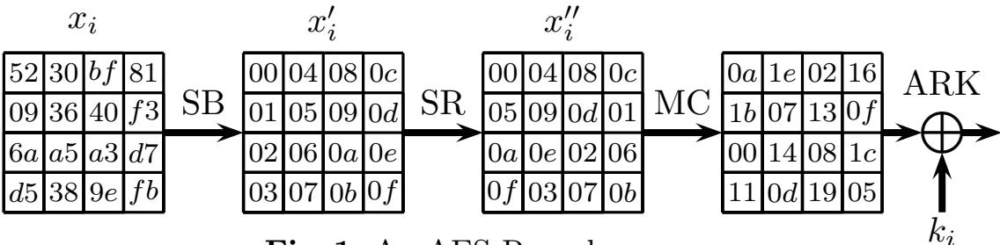

{0}------------------------------------------------

# Improved Key Recovery Attacks on Reduced-Round AES with Practical Data and Memory Complexities

Achiya Bar-On<sup>1</sup> , Orr Dunkelman<sup>2</sup> , Nathan Keller<sup>1</sup> , Eyal Ronen<sup>3</sup> , and Adi Shamir<sup>3</sup>

- <sup>1</sup> Department of Mathematics, Bar-Ilan University, Israel
- <sup>2</sup> Computer Science Department, University of Haifa, Israel
- <sup>3</sup> Computer Science Department, The Weizmann Institute, Rehovot, Israel

Abstract. Determining the security of AES is a central problem in cryptanalysis, but progress in this area had been slow and only a handful of cryptanalytic techniques led to significant advancements. At Eurocrypt 2017 Grassi et al. presented a novel type of distinguisher for AESlike structures, but so far all the published attacks which were based on this distinguisher were inferior to previously known attacks in their complexity. In this paper we combine the technique of Grassi et al. with several other techniques in a novel way to obtain the best known key recovery attack on 5-round AES in the single-key model, reducing its overall complexity from about 2<sup>32</sup> to less than 2<sup>22</sup>. Extending our techniques to 7-round AES, we obtain the best known attacks on AES-192 which use practical amounts of data and memory, breaking the record for such attacks which was obtained in 2000 by the classical Square attack.

# 1 Introduction

The Advanced Encryption Standard (AES) is the best known and most widely used secret key cryptosystem, and determining its security is one of the most important problems in cryptanalysis. Since there is no known attack which can break the full AES significantly faster than via exhaustive search, researchers had concentrated on attacks which can break reduced round versions of AES. Such attacks are important for several reasons. First of all, they enable us to assess the remaining security margin of AES, defined by the ratio between the number of rounds which can be successfully attacked and the number of rounds in the full AES. In addition, they enable us to develop new attack techniques which may become increasingly potent with additional improvements. Finally, there are many proposals for using reduced round AES (and especially its 4 or 5 rounds versions) as components in larger schemes, and thus successful cryptanalysis of these variants can be used to attack those schemes. Examples of such proposals include ZORRO [17], LED [22] and AEZ [23] which use 4-round AES, and WEM [7], Hound [16], and ELmD [3] which use 5-round AES.

Over the last twenty years, dozens of papers on the cryptanalysis of reducedround AES were published, but only a few techniques led to significant reductions 

{1}------------------------------------------------

in the complexity of key recovery attacks. In the standard model (where the attack uses a single key rather than related keys), these techniques include the Square attack [8, 15], impossible differential cryptanalysis [1, 24], the Demirci-Sel¸cuk attack [10, 12], and the Biclique attack [2]. In most of these cases, it took several years -- and a series of subsequent improvements — from the invention of the technique until it was developed into its current form. For example, impossible differential cryptanalysis was applied to AES already in 2000 [1] as an attack on 5-round AES, but it was only very recently that Boura et al. [6] improved it into its best currently known variant which breaks 7-round AES with an overall complexity of about 2107. The Demirci-Sel¸cuk attack was presented in 2005 [10] with a huge memory complexity of over 2200, and it took 8 years before Derbez et al. [12] enhanced it in 2013 into an attack on 7-round AES with an overall complexity which is just below 2100. Therefore, the development of any new attack technique is a major breakthrough with potentially far reaching consequences.

The latest such development happened in 2017, when Grassi et al. [21] published a new property of AES, called multiple-of-8, which had not been observed before by other researchers. At first, it was not clear whether the new observation can at all lead to attacks on AES which are competitive with respect to previously known results. This question was partially resolved by Grassi [20], who used this observation to develop a new type of attack which can break 5-round AES in data, memory and time complexities of 2<sup>32</sup>. However, a variation of the Square attack [15] can break the same variant with comparable data and time complexities but with a much lower memory complexity of 2<sup>9</sup> . Consequently, the new technique did not improve the best previously known attack on 5 rounds, and its extensions to more than 5 rounds (see [19]) were significantly inferior to other attacks.

In this paper we greatly improve Grassi's attack, and show how to attack 5-round AES in data, memory and time complexities of 2<sup>21</sup>.<sup>5</sup> , which is more than 1000 times faster than any previous attack on the same variant. Due to the exceptionally low complexity of our attack, we could verify it experimentally by running it on real data generated from a thousand randomly chosen keys. As we expected, the success rate of our full key recovery attack rose sharply from 0.16 to almost 1 as we increased the amount of available data from 2<sup>21</sup> to 2<sup>22</sup> in tiny increments of 20.25. For data complexity of 221.<sup>5</sup> , the success rate was 52%.

By extending our technique to larger versions of AES, we obtain new attacks on AES-192 and AES-256 which have the best time complexity among all the attacks on 7-round AES which have practical data and memory complexities.

Low data and memory attacks were studied explicitly in a number of papers (e.g., [4, 5, 12]), but progress in applying such attacks to AES had been even slower than the progress in the "maximum complexity" metric. While some results were obtained on variants with up to 5 rounds, the best such attack on 6 and more rounds is still the improved Square attack presented by Ferguson et al. [15] in 2000. We use the observation of Grassi et al., along with the dissection technique [14] and several other techniques, to beat this 18-year old record and 

{2}------------------------------------------------

develop the best attacks on 7-round AES in this model. In particular, our attack on 7-round AES with 192-bit keys requires 2<sup>26</sup> data, 2<sup>32</sup> memory and 2<sup>153</sup> time, which outperforms the Square attack in all three complexity measures simultaneously.

In addition to developing our new attacks on reduced-round AES, we apply our techniques to the seemingly unrelated collision attack of Gilbert and Minier [18] on 7-round AES. We succeed to reduce the memory complexity of the Gilbert-Minier attack from 2<sup>80</sup> to 2<sup>40</sup> and reduce the data complexity from 2 <sup>32</sup> to 230, without affecting the time complexity.

A summary of the known and new key recovery attacks in the single key model on 5 and 7 rounds of AES appears in Tables 1 and 2, respectively. The specified complexities describe how difficult it is to find some of the key bytes. Since our new attacks can find with the same complexity any three key bytes which share the same generalized diagonal, we can rerun them several times for different diagonals to find the full key with only slightly elevated complexities.

| Attack               | Data                                               | Memory    | Time      |
|----------------------|----------------------------------------------------|-----------|-----------|
|                      | (Chosen plaintexts) (128-bit blocks) (encryptions) |           |           |
| MitM [11]            | 8                                                  | 256       | 64<br>2   |
| Imp. Polytopic [26]  | 15                                                 | 241       | 70<br>2   |
| Partial Sum [27]     | 28                                                 | small     | 238       |
| Square [9]           | 211                                                | small     | 244       |
| Square [9]           | 233                                                | 32<br>2   | 34<br>2   |
| Improved Square [15] | 233                                                | small     | 233       |
| Yoyo [25]            | 211.3 ACC                                          | small     | 231       |
| Imp. Diff. [1]       | 231.5                                              | 38<br>2   | 33<br>2   |
| Mixture Diff. [20]   | 232                                                | 32<br>2   | 32<br>2   |
| Our Attack (Sect. 4) | 221.5                                              | 21.5<br>2 | 21.5<br>2 |

ACC Adaptive Chosen Plaintexts and Ciphertexts

Table 1. Attacks on 5-Round AES (partial key recovery)

The paper is organized as follows. In Section 2 we briefly describe AES and introduce our notations, and in Section 3 we describe the new 4-round distinguisher which was discovered and used by Grassi. In Section 4 we show how to exploit Grassi's distinguisher in a better way to obtain improved attacks on 5-round AES. We extend the attack to 6-round AES in Section 5, and then extend it again to 7 rounds in Section 6. In Section 7 we use our techniques to improve the Gilbert-Minier [18] attack on 7-round AES. In Section 8 we present a detailed probabilistic analysis which explains the reduced data complexity we obtain in our attacks and the attacks' success rate. Section 9 summarizes our paper.

{3}------------------------------------------------

| Variant Attack               | Data                                               | Memory     | Time        |
|------------------------------|----------------------------------------------------|------------|-------------|
|                              | (Chosen Plaintexts) (128-bit blocks) (encryptions) |            |             |
| AES-128 Imp. Diff. [6]       | 2105                                               | 74<br>2    | 106.88<br>2 |
| MitM [13]                    | 297                                                | 98<br>2    | 99<br>2     |
| AES-192 MitM [13]            | 297                                                | 98<br>2    | 99<br>2     |
| MitM [12]                    | 232                                                | 129.7<br>2 | 129.7<br>2  |
| Collision [18]               | 232                                                | 80<br>2    | 146.3<br>2  |
| Square [15]                  | 236.2                                              | 36.2<br>2  | 155<br>2    |
| Our Attack (Sect. 6.3)       | 226                                                | 32<br>2    | 153<br>2    |
| Our Attack (Sect. 6.2)       | 226                                                | 40<br>2    | 146.3<br>2  |
| Improved Collision (Sect. 7) | 230                                                | 40<br>2    | 146.3<br>2  |
| Improved Collision (Sect. 7) | 230                                                | 32<br>2    | 153<br>2    |
| AES-256 MitM [13]            | 297                                                | 98<br>2    | 99<br>2     |
| MitM [12]                    | 232                                                | 133.7<br>2 | 133.7<br>2  |
| Collision [18]               | 232                                                | 80<br>2    | 140<br>2    |
| Square [15]                  | 236.4                                              | 36.4<br>2  | 172<br>2    |
| Our Attack (Sect. 6.2)       | 226                                                | 40<br>2    | 146.3<br>2  |
| Improved Collision (Sect. 7) | 230                                                | 40<br>2    | 146.3<br>2  |

Table 2. Attacks on 7-Round AES (full key recovery)

# 2 Brief Introduction to the AES

#### 2.1 A Short Description of AES

The Advanced Encryption Standard (AES) [9] is a substitution-permutation network which has 128 bit plaintexts and 128, 192, or 256 bit keys. Its 128 bit internal state is treated as a byte matrix of size 4x4, where each byte represents a value in GF(2<sup>8</sup> ). An AES round (described in Figure 1) applies four operations to this state matrix:

- SubBytes (SB) applying the same 8-bit to 8-bit invertible S-box 16 times in parallel on each byte of the state,
- ShiftRows (SR) cyclically shifting the i'th row by i bytes to the left,
- MixColumns (MC) multiplication of each column by a constant 4x4 matrix over the field GF(2<sup>8</sup> ), and
- AddRoundKey (ARK) XORing the state with a 128-bit subkey.

An additional AddRoundKey operation is applied before the first round, and in the last round the MixColumns operation is omitted.

For the sake of simplicity we shall denote AES with n-bit keys by AES-n. The number of rounds depends on the key length: 10 rounds for 128-bit keys, 12 rounds for 192-bit keys, and 14 rounds for 256-bit keys. The rounds are numbered 0, . . . , Nr − 1, where Nr is the number of rounds. We use 'AES' to denote all three variants of AES.

{4}------------------------------------------------

The key schedule of AES transforms the key into Nr+1 128-bit subkeys. We denote the subkey array by  $W[0, \ldots, 4 \cdot Nr+3]$ , where each word of  $W[\cdot]$  consists of 32 bits. When the length of the key is Nk 32-bit words, the user supplied key is loaded into the first Nk words of  $W[\cdot]$ , and the remaining words of  $W[\cdot]$  are updated according to the following rule:

- For  $i = Nk, \dots, 4 \cdot Nr + 3$ , do
  - If  $i \equiv 0 \mod Nk$  then  $W[i] = W[i Nk] \oplus SB(W[i 1] \ll 8) \oplus RCON[i/Nk],$
  - else if Nk = 8 and  $i \equiv 4 \mod 8$  then  $W[i] = W[i-8] \oplus SB(W[i-1])$ ,
  - Otherwise  $W[i] = W[i-1] \oplus W[i-Nk],$

where  $\ll$  denotes rotation of the word by 8 bits to the left, and  $RCON[\cdot]$  is an array of predetermined constants.

#### 2.2 Notations

In the sequel we use the following definitions and notations.

The state matrix at the beginning of round i is denoted by  $x_i$ , and its bytes are denoted by  $0, 1, 2, \ldots, 15$ , as described in Figure 1. Similarly, the state matrix after the SubBytes and the ShiftRows operations of round i are denoted by  $x'_i$  and  $x''_i$ , respectively. The difference between two values in state  $x_i$  is denoted by  $\Delta(x_i)$ . We use this notation only when it is clear from the context which are the values whose difference we refer to.

We denote the subkey of round i by  $k_i$ , and the first (whitening) key by  $k_{-1}$ , i.e.,  $k_i = W[4 \cdot (i+1)]||W[4 \cdot (i+1) + 1]||W[4 \cdot (i+1) + 2]||W[4 \cdot (i+1) + 3].$  In some cases, we are interested in interchanging the order of the MixColumns operation and the subkey addition. As these operations are linear they can be interchanged, by first XORing the data with an equivalent subkey and only then applying the MixColumns operation. We denote the equivalent subkey for the altered version by  $u_i$ , i.e.,  $u_i = MC^{-1}(k_i)$ . The bytes of the subkeys are numbered by  $0, 1, \ldots, 15$ , in accordance with the corresponding state bytes.

The plaintext is sometimes denoted by  $x_{-1}$ , and so  $x_0 = x_{-1} \oplus k_{-1}$ .

The j'th byte of the state  $x_i$  is denoted  $x_{i,j}$ . When several bytes  $j_1, \ldots, j_\ell$  are considered simultaneously, they are denoted  $x_{i,\{j_1,\ldots,j_\ell\}}$ . When a full column is considered, it is denoted  $x_{i,\operatorname{Col}(j)}$ , and if several columns are considered simultaneously, we denote them by  $x_{i,\operatorname{Col}(j_1,\ldots,j_\ell)}$ .

Sometimes we are interested in 'shifted' columns, i.e., the result of the application of ShiftRows to a set of columns. This is denoted by  $x_{i,SR(\text{Col}(j_1,...,j_\ell))}$ . Similarly, a set of 'inverse shifted' columns (i.e., the result of the application of  $SR^{-1}$  to a set of columns) is denoted by  $x_{i,SR^{-1}(\text{Col}(j_1,...,j_\ell))}$ .

In the attacks on 5-round AES (both Grassi's attack and our attack), we consider encryptions of a quartet of values. To simplify notations, while the plaintext/ciphertext pairs are denoted by  $(P_j, C_j)$ , j = 1, ..., 4, we denote the intermediate values by  $(x_i, y_i, z_i, w_i)$ , where  $x_i$  corresponds to the encryption process of  $P_1$  and so  $x_{-1} = P_1$ ,  $y_i$  corresponds to the encryption process of  $P_2$  and so  $y_{-1} = P_2$ , etc.

{5}------------------------------------------------



Fig. 1. An AES Round

In the attacks on 6-round and 7-round AES, we consider encryptions of several (e.g., 8) pairs of values. To simplify notations, in such a case we denote the plaintext pairs by  $(P_j, \hat{P}_j)$ , j = 1, ..., 8, the corresponding ciphertext pairs by  $(C_j, \hat{C}_j)$ , j = 1, ..., 8, and the corresponding pairs of intermediate values by  $(x_{i,\ell}^j, \hat{x}_{i,\ell}^j)$ , for j = 1, ..., 8.

In all attacks, we exploit plaintext pairs  $(P, \hat{P})$  for which the corresponding intermediate values satisfy  $\Delta(x_{4,SR(\text{Col}(0))}'') = 0$  (i.e., have a zero difference in the first shifted column just before the MixColumns operation of round 4). Hence, throughout the paper we call such pairs *good pairs*.

Finally, we measure the time complexity of all the attacks in units which are equivalent to a single encryption operation of the relevant reduced round variant of AES. We measure the space complexity in units which are equivalent to the storage of a single plaintext (namely, 128 bits). To be completely fair, we count all operations carried out during our attacks, and in particular we do not ignore the time and space required to prepare the various tables we use.

# 3 The 4-round Distinguishers of Grassi

In this section we present the distinguishers for 4-round AES, which serve as the basis to all our attacks. The distinguishers were presented by Grassi [20], as a variant of the 5-round distinguisher introduced at Eurocrypt'17 by Grassi et al. [21]. Note that the distinguishers hold in a more general setting than the one presented here. For sake of simplicity, we concentrate on the special case used in our attacks.

**Definition 1.** Let  $x_i, y_i$  be two intermediate values at the input to round i of AES, such that  $x_{i,\text{Col}(1,2,3)} = y_{i,\text{Col}(1,2,3)}$  (i.e.,  $x_i$  and  $y_i$  may differ only in the first column). We say that  $(z_i, w_i)$  is a mixture (or a mixture counterpart) of  $(x_i, y_i)$  if  $x_i, y_i, z_i, w_i$  are distinct, and for each j = 0, 1, 2, 3, the quartet  $(x_{i,j}, y_{i,j}, z_{i,j}, w_{i,j})$  consists of two pairs of equal values.

In particular, if for some  $0 \le j \le 3$  we have  $x_{i,j} \ne y_{i,j}$  then either the j'th bytes of  $z_i$  and  $w_i$  are equal to those of  $x_i$  and  $y_i$ , respectively, or they are swapped; and if  $x_{i,j} = y_{i,j}$ , then the j'th bytes of  $z_i$  and  $w_i$  can assume any pair of equal values. (Note that it is allowed that for some j, we have  $x_{i,j} = y_{i,j} = z_{i,j} = w_{i,j}$ .)

In either case,  $(x_i, y_i, z_i, w_i)$  is called a mixture quadruple.

Remark 1. Note that for each  $(x_i, y_i)$  such that  $x_{i,j} \neq y_{i,j}$  for all j = 0, 1, 2, 3, there are 7 possible (unordered) mixtures that contain the pair  $(x_i, y_i)$ . These

{6}------------------------------------------------

mixtures can be represented by vectors in  $\{0,1\}^4$  which record whether  $z_{i,j}$  is equal to  $x_{i,j}$  or to  $y_{i,j}$ , for j=0,1,2,3. For example, (1000) corresponds to the mixture  $(z_i, w_i)$  such that  $z_{i,\text{Col}(0)} = (x_{i,0}, y_{i,1}, y_{i,2}, y_{i,3})$  and  $w_{i,\text{Col}(0)} = (y_{i,0}, x_{i,1}, x_{i,2}, x_{i,3})$ .

Pairs  $(x_i, y_i)$  such that  $x_{i,j} = y_{i,j}$  for exactly one value  $j_0 \in \{0, 1, 2, 3\}$ , are contained in about  $4 \cdot 2^8 = 2^{10}$  unordered mixtures (as the pair  $(z_{i,j_0}, w_{i,j_0})$  can assume  $2^8$  possible values, each of the other pairs  $(z_{i,j}, w_{i,j})$  can assume two possible values, and we have to divide by 2 since we consider unordered mixtures).

Pairs such that  $x_{i,j} = y_{i,j}$  for exactly two values  $j_0, j_1 \in \{0, 1, 2, 3\}$ , are contained in about  $2 \cdot 2^{16} = 2^{17}$  unordered mixtures, and pairs such that  $x_{i,j} = y_{i,j}$  for exactly three values  $j_0, j_1, j_2 \in \{0, 1, 2, 3\}$ , are contained in about  $2^{24}$  unordered mixtures.

Remark 2. We note that both mixtures with  $x_{i,j} \neq y_{i,j}$  for all j = 0, 1, 2, 3 and mixtures with equality in at least one byte were considered in [20, Section 4]. The former type was considered in [20, Theorem 3] and used in the 5-round key recovery attack of [20] which we present below, while the latter was considered in [20, Theorem 4] and used in the 5-round distinguisher of [20] which we do not use in this paper. We use both types of mixtures in our attacks.

**Observation 1.** Let  $(x_i, y_i, z_i, w_i)$  be a mixture quadruple of intermediate values at the input to round i of AES. Then the corresponding intermediate values  $(x_{i+2}, y_{i+2}, z_{i+2}, w_{i+2})$  sum up to zero, i.e.,

$$x_{i+2} \oplus y_{i+2} \oplus z_{i+2} \oplus w_{i+2} = 0. \tag{1}$$

Consequently, if for some  $j \in \{0, 1, 2, 3\}$  we have  $x_{i+2, SR^{-1}(\operatorname{Col}(j))} \oplus y_{i+2, SR^{-1}(\operatorname{Col}(j))} = 0$ , then the corresponding intermediate values  $(x''_{i+3}, y''_{i+3}, z''_{i+3}, w''_{i+3})$  (i.e., just before the MixColumns operation of round i+3) satisfy

$$x''_{i+3,SR(\text{Col}(j))} \oplus y''_{i+3,SR(\text{Col}(j))} = z''_{i+3,SR(\text{Col}(j))} \oplus w''_{i+3,SR(\text{Col}(j))} = 0.$$

Proof. Let  $(x_i, y_i, z_i, w_i)$  be as in the assumption. The mixture structure is preserved through the SubBytes operation of round i, and then ShiftRows spreads the active bytes between the columns, such that each column contains exactly one of them. As a result, for each  $j \in \{0,1,2,3\}$ , either the unordered pairs  $(x''_{i,\operatorname{Col}(j)}, y''_{i,\operatorname{Col}(j)})$  and  $(z''_{i,\operatorname{Col}(j)}, w''_{i,\operatorname{Col}(j)})$  are equal or else the unordered pairs  $(x''_{i,\operatorname{Col}(j)}, z''_{i,\operatorname{Col}(j)})$  and  $(y''_{i,\operatorname{Col}(j)}, w''_{i,\operatorname{Col}(j)})$  are equal. Both of these properties are clearly preserved by MixColumns and by the subsequent AddRoundKey and SubBytes operations. It follows that the intermediate values  $(x'_{i+1}, y'_{i+1}, z'_{i+1}, w'_{i+1})$  sum up to zero. As ShiftRows, MixColumns, and AddRoundKey are linear operations, this implies  $x_{i+2} \oplus y_{i+2} \oplus z_{i+2} \oplus w_{i+2} = 0$ .

Now, if for some j we have  $x_{i+2,SR^{-1}(\operatorname{Col}(j))} \oplus y_{i+2,SR^{-1}(\operatorname{Col}(j))} = 0$ , then by the round structure of AES we have  $x_{i+3,\operatorname{Col}(j)} \oplus y_{i+3,\operatorname{Col}(j)} = 0$ , and thus,  $x''_{i+3,SR(\operatorname{Col}(j))} \oplus y''_{i+3,SR(\operatorname{Col}(j))} = 0$ . Furthermore, by (1) we have  $z_{i+2,SR^{-1}(\operatorname{Col}(j))} \oplus w_{i+2,SR^{-1}(\operatorname{Col}(j))} = 0$ , and thus by the same reasoning as for (x,y), we get  $z''_{i+3,SR(\operatorname{Col}(j))} \oplus w''_{i+3,SR(\operatorname{Col}(j))} = 0$ , as asserted.

{7}------------------------------------------------

Grassi [20] used his distinguisher (actually, only with one type of mixtures, as mentioned in Remark 2) to mount an attack on 5-round AES with data, memory, and time complexities of roughly 232. The attack algorithm is given in Algorithm 1.

# Algorithm 1 Grassi's 5-Round Attack

- 1: Ask for the encryption of 2<sup>32</sup> chosen plaintexts in which SR<sup>−</sup><sup>1</sup> (Col(0)) assumes all 2 <sup>32</sup> possible values and the rest of the bytes are constant.
- 2: Find a pair of ciphertexts (C1, C2) = (x5, y5) with zero difference in SR(Col(0)).
- 3: for each guess of k<sup>−</sup>1,SR−1(Col(0)) do
- 4: Partially encrypt the corresponding plaintexts (P1, P2) = (x<sup>−</sup>1, y<sup>−</sup>1) through AddRoundKey and round 0 to obtain (x1, y1).
- 5: Let (z1, w1) be a mixture of (x1, y1), partially decrypt it to find the corresponding plaintext pair (P3, P4) = (z<sup>−</sup>1, w<sup>−</sup>1), and denote the corresponding ciphertexts by (C3, C4) = (z5, w5).
- 6: if (z5, w5) does not satisfy z5,SR(Col(0)) ⊕ w5,SR(Col(0)) = 0 then
- 7: discard the key guess k<sup>−</sup>1,SR−1(Col(0)).
- 8: Repeat Steps (1)–(8) for the other three columns, and check the remaining key guesses by trial encryption.

The structure of chosen plaintexts is expected to contain about 2<sup>63</sup> · 2 <sup>−</sup><sup>32</sup> = 2 <sup>31</sup> pairs for which the ciphertexts have a zero difference in SR(Col(0)). The adversary can find one of them easily in time 2<sup>32</sup>, using a hash table. Step 3 of the attack requires only a few operations for each key guess. Since (x1, y1, z1, w1) form a mixture quadruple, by Observation 1 we know that if (x5, y5) have zero difference in SR(Col(0)), then we must have z<sup>5</sup>,SR(Col(0)) ⊕ w<sup>5</sup>,SR(Col(0)) = 0. (Note that the MixColumns operation in the last round is omitted, and thus, the difference in the state z<sup>5</sup> is equal to the difference in the state z 00 <sup>4</sup> discussed in Observation 1.) Therefore, if the condition fails, we can safely discard the key guess. The probability of a random key to pass this filtering is 2−<sup>32</sup>, and thus, we expect only a few key guesses to remain. Thus, the data, memory, and time complexities for recovering 32 key bits are 2<sup>32</sup>, and for recovering the full key are about 2<sup>34</sup> .

# 4 Improved Attack on 5-Round AES

In this section we present our improved attack on 5-round AES, which requires 2 <sup>21</sup>.<sup>5</sup> data, memory, and time to recover 24 key bits and less than 2<sup>25</sup> data, memory, and time to recover the full key. This is the first attack on 5-round AES whose all complexities are below 2<sup>32</sup>. The attack was fully verified experimentally.

Our attack is based on Grassi's attack and enhances it using several observations. First we present and analyze the observations, then we present the attack 

{8}------------------------------------------------

algorithm and analyze its complexity, and finally we describe the experiments we performed to verify the attack.

# 4.1 The Observations Behind the Attack

1. Reducing the data complexity to 2 24 . Our first observation is that we can reduce the amount of data used in Grassi's attack significantly, and still find the mixture quadruple we need for applying the attack. Indeed, as will be shown in Corollary 1, a structure of 2<sup>32</sup> plaintexts that agree on bytes SR−<sup>1</sup> (Col(1, 2, 3)) and attain all values in SR−<sup>1</sup> (Col(0)) (which is the data set used in Grassi's attack) contains about 3.2·2 <sup>64</sup> quartets that evolve into a mixture quadruple, and for more than 2<sup>32</sup> among them, it is expected that the corresponding ciphertexts can be divided into pairs that have zero difference in bytes SR(Col(0)). (We do not make the exact calculation here, as this step will be later replaced by an upgraded step, for which we will perform the exact calculation.) Hence, it is expected that the data set contains more than 2<sup>32</sup> mixture quadruples that can be used for the attack, while we need only one mixture quadruple.

Instead, we may start with 2<sup>24</sup> plaintexts taken arbitrarily from the structure of size 2<sup>32</sup> used in Grassi's attack. These plaintexts are expected to contain at least one mixture quadruple that can be used for the attack with a high probability. (Note that as we operate with quartets of plaintexts, reducing the data by a factor of 2<sup>8</sup> reduces the number of mixture quadruples by a factor of 2 <sup>32</sup>.)

However, if we simply apply Grassi's attack with the reduced number of plaintexts, its time complexity is increased significantly, since for most of the choices of (z1, w1) in Step 5 of the attack, the corresponding plaintexts are not included in our data set. Actually, the probability that both plaintexts are included in the data set is about (2<sup>24</sup> · 2 <sup>−</sup><sup>32</sup>) <sup>2</sup> = 2−<sup>16</sup>, and hence, the time complexity of the attack is increased to 2<sup>48</sup>. This will be resolved in the next observations.

2. Reducing the time complexity by changing the order of operations. Our second observation is that if (x1, y1, z1, w1) is a mixture quadruple then x<sup>1</sup> ⊕y<sup>1</sup> ⊕z<sup>1</sup> ⊕w<sup>1</sup> = 0, and consequently, by the linearity of the MixColumns and AddRoundKey operations, x 00 <sup>0</sup> ⊕y 00 <sup>0</sup> ⊕z 00 <sup>0</sup> ⊕w 00 <sup>0</sup> = 0 as well. This allows to perform a preliminary check of whether (x1, y1, z1, w1) can be a mixture quadruple, by checking a local condition for each of the bytes in k−1,SR−1(Col(0)) separately (i.e., bytes 0,5,10,15). That is, given a quartet of plaintexts (P1, P2, P3, P4), we can perform the check whether it is a mixture quadruple, using Algorithm 2 presented below.

We can use this procedure to replace the guess of k−1,SR−1(Col(0)) performed in Grassi's attack. Specifically, given 2<sup>24</sup> plaintexts, we expect 2<sup>15</sup> pairs in which the ciphertexts have zero difference in SR(Col(0)). We take all 2<sup>29</sup> pairs of such pairs, and apply Algorithm 2 for each of them.

As Steps 1–7 offer a 32-bit filtering condition, it is expected that only a few suggestions of the key k−1,SR−1(Col(0)) pass to Steps 8–11. Then, each suggestion is checked using a 1-round partial encryption. It is clear that if the data set

{9}------------------------------------------------

# Algorithm 2 Efficient Guessing of k−1,SR−1(Col(0))

- 1: for each each guess of k<sup>−</sup>1,<sup>0</sup> do
- 2: Compute the corresponding differences x 00 <sup>0</sup>,<sup>0</sup> ⊕ y 00 <sup>0</sup>,<sup>0</sup> and z 00 <sup>0</sup>,<sup>0</sup> ⊕ w 00 <sup>0</sup>,0.
- 3: if x 00 <sup>0</sup>,<sup>0</sup> ⊕ y 00 <sup>0</sup>,<sup>0</sup> 6= z 00 <sup>0</sup>,<sup>0</sup> ⊕ w 00 <sup>0</sup>,<sup>0</sup> then
- 4: Discard the guess of k<sup>−</sup>1,0.
- 5: Repeat the above steps for bytes 5,10,15 of k<sup>−</sup><sup>1</sup> and bytes 1,2,3 of x 00 , y 00 , z <sup>00</sup>, and w <sup>00</sup>, respectively.
- 6: for each remaining guess of k<sup>−</sup>1,{SR−1(Col(0))} do
- 7: Encrypt the quartet through round 0.
- 8: Check whether the values (x1, y1, z1, w1) constitute a mixture quadruple.

contains a mixture quadruple (which occurs with a high probability, as described above), then the procedure will succeed for the right guess of k−1,SR−1(Col(0)). For a wrong guess, the probability to pass Steps 1 and 2 is 2−<sup>64</sup>, and so all wrong guesses are expected to be discarded.

Let us analyze the complexity of the attack. In Steps 1–6 we go over the 2<sup>8</sup> possible values of k−1,<sup>0</sup>, and check the condition for each of them separately. The same goes for each repetition of Step 7. The complexity of Steps 8-11 is even lower. Hence, the overall complexity of the attack is 2<sup>29</sup> · 2 8 · 4 = 2<sup>39</sup> applications of a single S-box, which are roughly equivalent to 2<sup>33</sup> encryptions.

3. Reducing the time complexity even further by using a precomputed table. We can further reduce the time complexity of this step using a precomputed table of size 2<sup>21</sup>.<sup>4</sup> bytes. To construct the table, we consider each quartet of inputs to SubBytes of the form (0, a, b, c), where (a, b, c) are arranged in increasing order (e.g., as numbers in base 2).<sup>1</sup> For each quartet, we go over the 2<sup>8</sup> values of the key byte ˆk and store in the entry (a, b, c) of the table the values of ˆk for which

$$SB(\hat{k}) \oplus SB(a \oplus \hat{k}) \oplus SB(b \oplus \hat{k}) \oplus SB(c \oplus \hat{k}) = 0.$$
 (2)

It is expected that a single value of ˆk satisfies Condition (2). Now, if we are given a quartet (x, y, z, w) of plaintext bytes and want to find the value of k−1,<sup>0</sup> such that the four intermediate values after SubBytes sum up to zero, we do the following:

- 1. Consider the quartet (0, y ⊕ x, z ⊕ x, w ⊕ x).
- 2. Reorder it using the binary ordering to obtain (0, a, b, c) with a < b < c. Then access the table at the entry (a, b, c) and retrieve the value ˆk.
- 3. Set <sup>k</sup>−1,<sup>0</sup> <sup>=</sup> <sup>ˆ</sup><sup>k</sup> <sup>⊕</sup> <sup>x</sup>.

<sup>1</sup> If in some byte, not all four values are distinct, then the quartet can evolve into a mixture only if the plaintext values in that byte can be divided into two pairs of equal values. In this case, all possible values of the corresponding key byte pass the first filtering and so there is no need to look at the table.

{10}------------------------------------------------

The key  $k_{-1,0}$  we found is indeed the right one, since the values after the addition of  $k_{0,-1}$  are  $(\hat{k}, \hat{k} \oplus y, \hat{k} \oplus z, \hat{k} \oplus w)$ , and thus, Condition (2) means exactly that the four values after SubBytes sum up to zero.

The table requires  $2^{24}/3! \approx 2^{21.4}$  bytes of memory. In a naive implementation, its generation requires  $2^{21.4} \cdot 2^8 = 2^{29.4}$  applications of a single S-box and a few more XOR operations, which is less than  $2^{23.4}$  5-round encryptions. However, it can be generated much faster, as follows.

Instead of going over all triplets (a,b,c) and for each of them going over all values of  $\hat{k}$ , we go over triplets  $a,b,\hat{k}$ . For each of them, we compute  $t=SB(\hat{k})\oplus SB(a\oplus \hat{k})\oplus SB(b\oplus \hat{k})$ . We know that Condition (2) holds for  $(a,b,c,\hat{k})$  if and only if  $SB(c\oplus \hat{k})=t$ , or equivalently,  $c=SB^{-1}(t)\oplus \hat{k}$ . (Note that this condition can be satisfied by more than one value of c. In such a case, all values are inserted into the table). Therefore, we write  $\hat{k}$  in the table entry/entries of  $(a,b,SB^{-1}(t)\oplus \hat{k})$  and move to the next value of  $\hat{k}$ . In this way, the table generation requires less than  $2^{24}$  S-box applications, which is negligible with respect to other steps of the attack.

Once the table is constructed, Step 1 of Algorithm 2 can be performed by 4 table lookups. Hence, the total time complexity of the attack is reduced to  $2^{29}$  times (4 table lookups plus one round of encryption), which is less than  $2^{29}$  encryptions.

4. Reducing the overall complexity to  $2^{21.5}$  by a wise choice of plaintexts. So far, we reduced the data and memory complexity to  $2^{24}$  and the time complexity to  $2^{29}$ . We show now that all three parameters can be reduced to about  $2^{21.5}$  by a specific choice of the plaintexts.

Recall that in Improvement 1 we assumed that the  $2^{24}$  plaintexts are arbitrarily taken from the structure of size  $2^{32}$  used in Grassi's attack (in which  $SR^{-1}(\text{Col}(0))$  assume all possible values and the rest of the bytes are constant). Instead of doing this, we choose all plaintexts such that byte 0 is constant in all of them. As will be shown in Section 8, this significantly increases the probability of a plaintext quartet to form a mixture quadruple, thus allowing us to reduce the data complexity, and consequently, also the memory and time complexities.

Assume that we start with  $2^{21.5}$  plaintexts, taken arbitrarily from the  $2^{24}$  plaintexts that assume all values in bytes 5, 10, 15 and have all other bytes constant. As will be shown in Proposition 7, with a non-negligible probability the data set contains at least one good mixture quadruple and the attack can be applied. (The exact probability was verified experimentally to be about 51%; see Section 4.3).

In the attack, we first insert the ciphertexts into a hash table to find the pairs for which the ciphertexts have zero difference in SR(Col(0)). It is expected that  $2^{42} \cdot 2^{-32} = 2^{10}$  pairs are found. Then, for each of the  $(2^{10})^2/2 = 2^{19}$  pairs-of-pairs, we check whether the corresponding intermediate values  $(x_1, y_1, z_1, w_1)$  constitute a mixture quadruple, as described in Improvement 3. Thus, the time complexity is reduced by a factor of  $2^{10}$  (as we have to check  $2^{19}$  quartets instead of  $2^{29}$ ), and so the overall time complexity is dominated by  $2^{21.5}$  encryptions, which is the time required for encrypting the plaintexts.

{11}------------------------------------------------

5. Increasing the success probability by checking several columns instead of one. Finally, the success probability of the attack can be increased by considering not only plaintext pairs for which the ciphertexts have zero difference in SR(Col(0)), but also pairs for which the ciphertexts satisfy the same condition for one of the columns 1,2,3. This increases the probability of a quartet to be useful for the attack by a factor of about 4, and thus, allows us to either reduce the data complexity by another factor of 41/<sup>4</sup> = √ 2 for roughly the same success probability, or to maintain the data complexity and increase the success probability. On the other hand, this requires to use four hash tables to filter the ciphertexts (each corresponding to a different shifted column of the ciphertext), and thus, increases the memory complexity by a factor of 4. We compromise on using one additional column, which increases the success probability from 51% to about (1 − 0.49<sup>2</sup> ) ≈ 76%, while keeping the memory complexity dominated by storing the 2<sup>21</sup>.<sup>5</sup> plaintext/ciphertext pairs.

### 4.2 The Attack Algorithm and its Analysis

The algorithm of our 5-round attack is given in Algorithm 3.

As described in Improvement 4, T can be prepared in time of 2<sup>21</sup>.<sup>4</sup> S-box evaluations, and contains 2<sup>21</sup>.<sup>4</sup> byte values. Steps 5,6 can be easily performed in time 2<sup>21</sup>.<sup>5</sup> using two hash tables of size 2<sup>21</sup>.<sup>5</sup> 53-bit values, which are less than 2 <sup>21</sup>.<sup>5</sup> 128-bit blocks. The expected size of each list L<sup>j</sup> is 2<sup>42</sup> · 2 <sup>−</sup><sup>32</sup> = 2<sup>10</sup>. Hence, Steps 9–22 are performed for 2<sup>19</sup> pairs of pairs. As described in Improvement 4, these steps take less than a single encryption for each quartet, and thus, their total complexity is less than 2<sup>19</sup> encryptions. Therefore, the data complexity of the attack is 2<sup>21</sup>.<sup>5</sup> chosen plaintexts, the memory complexity is 2<sup>21</sup>.<sup>5</sup> 128-bit blocks, and the time complexity is dominated by encrypting the plaintexts.

It is clear from the algorithm that if the data contains a mixture quadruple for which the ciphertexts (P1, P2) have zero difference in SR(Col(0)), then for the right value of k−1,{5,10,15}, this quadruple will be found and so the right key will remain. The probability of a wrong key suggestion to remain is extremely low, as in the attack we examine ((2<sup>21</sup>.<sup>5</sup> ) <sup>2</sup>/2)<sup>2</sup>/2 = 2<sup>83</sup> quartets and the filtering condition is on about 114.25 bits (which consist of 64 bits on the ciphertext side – requiring zero difference in SR(Col(0)) for two ciphertext pairs, and 50.25 bits on the plaintext side – requiring that the values (x1, y1, z1, w1) constitute a mixture quadruple, where the calculation uses Claim 2 below). So, the probability for a wrong key to pass the filtering is 2−33.<sup>25</sup>. As there are 2<sup>24</sup> possible key suggestions, with a high probability no wrong keys remain.

Note that the attack does not recover the value of k−1,<sup>0</sup> since the question whether a quartet of plaintexts in the structure evolves into a mixture quadruple or not, does not depend on k−1,<sup>0</sup>.

In order to recover the full key, we repeat the attack for each of the four columns on the plaintext side, and apply it once again for the first column, with byte 15 as the 'constant byte' instead of byte 0. This time, we take an increased data complexity of 2<sup>21</sup>.<sup>75</sup> for each attack, in order to increase the success probability (as now we have to succeed 5 times and not only one time).

{12}------------------------------------------------

#### Algorithm 3 Efficient 5-Round Attack

#### Preprocessing

- 1: Initialize an empty table T.
- 2: for all a < b < c do
- 3: Store in T[a, b, c] all bytes values  $\hat{k}$  which satisfy  $SB(\hat{k}) \oplus SB(a \oplus \hat{k}) \oplus SB(b \oplus \hat{k}) \oplus SB(c \oplus \hat{k}) = 0$ .

#### Online phase

- 4: Ask for the encryption of  $2^{21.5}$  chosen plaintexts in which bytes 5, 10, 15 assume different values and the rest of the bytes are constant.
- 5: Store in a list  $L_0$  all ciphertext pairs  $(C_1, C_2)$  such that  $C_{1,SR(Col(0))} \oplus C_{2,SR(Col(0))} = 0$ .
- 6: Repeat the previous step for Column 1 instead of Column 0, with a list  $L_1$ .
- 7: **for** j = 0, 1 **do**
- 8: **for** all pairs of pairs  $(C_1, C_2), (C_3, C_4) \in L_j$  **do**
- 9: Let the corresponding plaintexts be  $(P_1, P_2, P_3, P_4) = (x_{-1}, y_{-1}, z_{-1}, w_{-1})$ , respectively.
- 10: Compute the values  $(y_{-1,5} \oplus x_{-1,5}, z_{-1,5} \oplus x_{-1,5}, w_{-1,5} \oplus x_{-1,5})$ , and sort the three bytes in an increasing order to obtain (a, b, c).
- 11: **for** each value  $\hat{k}$  in T[a, b, c] **do**
- 12: Store in  $L_5$  the value  $k_{-1,5} = k \oplus x_{-1,5}$ .
- 13: Repeat the above steps for bytes 10 and 15 (with lists  $L_{10}$  and  $L_{15}$ , respectively).
- 14: for all subkey candidates  $(k_{-1,5} \in L_5, k_{-1,10} \in L_{10}, k_{-1,15} \in L_{15})$  do
- 15: Partially encrypt  $(P_1, P_2, P_3, P_4)$  through round 0 and compute  $x_1, y_1, z_1, w_1$ .
- 16: if  $(x_1, y_1, z_1, w_1)$  does not constitute a mixture quadruple then
- 17: Discard subkey candidate.
- 18: Output all guesses of  $k_{-1,5}$ ,  $k_{-1,10}$ ,  $k_{-1,15}$  which remained.

This recovers  $4 \cdot 24 + 8 = 104$  bits of the key, and the rest of the key can be recovered by exhaustive key search. Therefore, for full key recovery we need data complexity of  $5 \cdot 2^{21.75} \approx 2^{24}$  chosen plaintexts, memory complexity of  $2^{21.5}$  128-bit blocks (as the memory can be reused between the attacks), and time complexity of less than  $2^{25}$  encryptions.

It is clear from the above analysis that the attack succeeds with a high probability, that can be made very close to 100% by slightly increasing the data complexity. The experimental verification presented below shows that for  $2^{24}$  chosen plaintexts, the success probability is about 75%, while for  $2^{24.25}$  plaintexts, the success probability is already about 99%.

#### 4.3 Experimental Verification

We have successfully implemented the 5-round attack. To verify our attack success probability and its dependence on the data complexity, we performed the following experiment. We took 7 possible amounts of data, between  $2^{21}$  and  $2^{23}$  chosen plaintexts, and for each of them we ran the attack which recovers 3 key

{13}------------------------------------------------

| Structure size | One diagonal |           | Two diagonals |           |
|----------------|--------------|-----------|---------------|-----------|
| Key material   | 3 Bytes      | Full key2 | 3 Bytes       | Full key3 |
| 22.5<br>2      | 1            | 1         | 1             | 1         |
| 22<br>2        | 0.95         | 0.77      | 0.998         | 0.99      |
| 21.75<br>2     | 0.76         | 0.26      | 0.94          | 0.75      |
| 21.5<br>2      | 0.52         | 0.04      | 0.77          | 0.27      |

Table 3. Success probability of the attack for different data complexities

bytes for 1000 different keys. The results we obtained were the following: For 2<sup>21</sup> plaintexts, the attack succeeded 162 times. For 221.<sup>25</sup> plaintexts, the attack succeeded 312 times. For 221.<sup>5</sup> plaintexts, the attack succeeded 518 times, and for 2 <sup>21</sup>.<sup>75</sup> plaintexts, the attack succeeded 764 times. For 2<sup>22</sup> plaintexts, the attack succeeded 949 times, and for 2<sup>22</sup>.<sup>5</sup> plaintexts, the attack succeeded in all 1000 experiments.

Based on these experiments, we calculated the success probability of full key recovery as p 5 , where p is the probability of recovering three key bytes (as in order to recover the full key we have to perform 5 essentially independent variants of the attack). Similarly, we calculated the probability of recovering three key bytes when two diagonals in the ciphertext are examined as 1−(1−p) 2 , since the attack fails only if two essentially independent applications of the basic attack fail.

The full details are given in Table 3. As can be seen in the table, with 2<sup>21</sup>.<sup>75</sup> chosen plaintexts and checking two diagonals on the ciphertext side, the success rate for recovering the first 3 key bytes is about 94%. The success rate for recovering the entire key is about 75% (where the data complexity is increased to 5 ·2 <sup>21</sup>.<sup>75</sup> ≈ 2 <sup>24</sup>, as a different data set is required for each of the 5 applications of the basic attack). Starting with 2<sup>22</sup> plaintexts and checking two diagonals on the ciphertext side, the success rate for recovering 3 key bytes is very close to 1, and the induced success for recovering the entire key (with about 2<sup>24</sup>.<sup>25</sup> chosen plaintexts) is about 99%.

The experimental results clearly support our analysis presented in Section 8. We note that the significant increase of the success rate when the data complexity is increased very moderately follows from the fact that the attack examines quartets, and so multiplying the data by a modest factor of 20.<sup>25</sup> doubles the number of quartets that can be used in the attack.

# 5 Attacks on 6-Round AES

In this section we present attacks on 6-round AES. We start with a simple extension of Grassi's attack to 6 rounds, and then we present two improvements that allow reducing the attack complexity significantly. Our best attack has data

<sup>2</sup> Data complexity increased by a factor of 5.

<sup>3</sup> Data complexity increased by a factor of 5.

{14}------------------------------------------------

complexity of  $2^{26}$ , memory complexity of  $2^{35}$ , and time complexity of  $2^{80}$ . These results are not very interesting on their own sake, as they are clearly inferior to the improved Square attack on the same variant of AES [15]. However, a further extension of the same attack techniques will allow us obtaining an attack on 7-round AES-192, which clearly outperforms all known attacks on reduced-round AES-192 with practical data and memory complexities (including the improved Square attack).

### 5.1 An Extension of Grassi's Attack to 6 Rounds

Recall that in Grassi's attack on 5-round AES, we take a structure of  $2^{32}$  plaintexts that differ only in  $SR^{-1}(\text{Col}(0))$ , and search for ciphertext pairs that have zero difference in SR(Col(0)). Actually, the 4-round distinguisher underlying the attack guarantees a zero difference only in the state  $x''_{4,SR(\text{Col}(0))}$ , but as the 5th round is the last one, the MixColumns operation is omitted, and so, the zero difference can be seen in the ciphertext.

When we consider 6-round AES, in order to recover the difference in the state  $x''_{4,SR(\text{Col}(0))}$  by partial decryption, we must guess all 128 key bits. However, we can recover the difference in one of these 4 bytes by guessing only four key bytes. Indeed, if we guess  $k_{5,SR(\text{Col}(0))}$  and interchange the order between the MixColumns and AddRoundKey operations of round 4, we can partially decrypt the ciphertexts through round 5 and MixColumns to obtain the value of byte 0 before MixColumns. As AddRoundKey does not affect differences, this allows us evaluating differences at the state  $x''_{4,0}$ .

By the distinguisher, the difference in this byte for both pairs in the mixture quadruple is zero. However, this is only an 16-bit filtering. In order to obtain an additional filtering, we recall that by Remark 1, each pair has at least 7 mixtures. Checking the condition for seven of them, we get a 64-bit filtering, that is sufficient for discarding almost all wrong key guesses. The attack is given in Algorithm 4.

For the right key guess, it is expected that after  $2^{32}$  pairs  $(P_1, \hat{P}_1)$ , we will encounter a good pair (i.e., a pair for which the difference in the state  $x''_{4,SR(\text{Col}(0))}$  is zero), and then by the distinguisher, the difference in the same state for all other 7 mixtures is zero as well. Hence, the right key is expected to be suggested. (Concretely, the probability that the right key is not suggested is  $(1-2^{-32})^{2^{32}} \approx e^{-1}$ ). For wrong key guesses, for each pair  $(P_1, \hat{P}_1)$ , the probability to pass the filtering of Step 11 is  $2^{-64}$ , and thus, the probability that there exists a guess of  $k_{5,SR(\text{Col}(0))}$  that passes it is  $2^{-32}$ . Hence, for all values of  $(P_1, \hat{P}_1)$  except a few values, the list  $L_1$  remains empty and the pair is discarded after Step 16. For the few remaining pairs, the probability that there exists a guess of  $k_{5,SR(\text{Col}(1))}$  that passes the filtering of Step 18 is again  $2^{-32}$ , and so, for all but very few guesses of  $k_{-1,\{SR^{-1}(\text{Col}(0))\}}$ , all pairs are discarded. The few remaining guesses are easily checked by trial encryption.

The most time consuming part of the attack is Steps 10,12 which are performed for  $2^{64}$  key guesses and  $2^{32}$  plaintext pairs. (Note that Steps 18,20 are performed for a much smaller number of pairs, and thus are negligible.) Steps 10,12

{15}------------------------------------------------

#### Algorithm 4 Attacking 6-Round AES

```
1: Ask for the encryption of 2^{32} chosen plaintexts in which SR^{-1}(\text{Col}(0)) assumes all
     2^{32} possible values and the rest of the bytes are constant.
 2: for each guess of k_{-1,SR^{-1}(\text{Col}(0))} do
         Select arbitrarily 2^{32} plaintexts pairs (P_1^i, \hat{P}_1^i) from the structure. for each pair (x_{-1}^1, y_{-1}^1) = (P_1, \hat{P}_1) do

Partially encrypt (x_{-1}^1, \hat{x}_{-1}^1) through round 0, obtain (x_1^1, \hat{x}_1^1).
 3:
 4:
 5:
              Take 7 mixtures of (x_1^1, \hat{x}_1^1) and denote them (x_1^2, \hat{x}_1^2), \dots, (x_1^8, \hat{x}_1^8).
 6:
               Partially decrypt the 7 mixtures to obtain the plaintext pairs (P_2, \tilde{P}_2) =
 7:
     (x_{-1}^2, \hat{x}_{-1}^2), \dots, (P_8, \hat{P}_8) = (x_{-1}^8, \hat{x}_{-1}^8).
              for each value of k_{5,SR(\text{Col}(0))} do
 8:
                    Take all ciphertext pairs (C_1, \hat{C}_1), \ldots, (C_8, \hat{C}_8).
 9:
                    Partially decrypt them through rounds 5,4.
10:
                    if for all 1 \le j \le 8: x_{4,0}^{j''} \oplus \hat{x}_{4,0}^{j''} = 0 (i.e., all 8 pairs have a zero difference
11:
     in byte 0 before the MixColumns of round 4) then
12:
                         Store k_{5,SR(Col(0))} in a list L_1.
13:
               if L_1 is empty then
                    Discard the pair (P_1, P_1).
14:
15:
               else
                    Repeat the same procedure for k_{5,SR(\text{Col}(1))}, with respect to the byte
16:
     x_{4,7}'' and L_2.
                    if L_2 is not empty then
17:
                         Repeat the same procedure for k_{5,SR(\text{Col}(2))} and k_{5,SR(\text{Col}(3))}, with
18:
     respect to bytes x''_{4,10} and x''_{4,15}, respectively.
19:
                         Output the remaining key suggestions.
20:
                    else
                         Discard the pair (P_1, \hat{P}_1). \triangleright If no pairs remain, move to the next guess of k_{-1,SR^{-1}(\text{Col}(0))}.
21:
```

essentially consist of partial decryption of one column through round 5 for 16 values – which is clearly less than a single 6-round encryption. Therefore, the time complexity of the attack is  $2^{64} \cdot 2^{32} = 2^{96}$  encryptions. The memory complexity is  $2^{32}$  (dominated by storing the plaintexts), and the success probability is  $1 - e^{-1} = 0.63$ . The attack recovers the full subkey  $k_5$ , which yields immediately the full secret key via the key scheduling algorithm.<sup>4</sup>

#### 5.2 Improvements of the 6-Round Attack

In this section we present two improvements of the 6-round attack described above, which allow us to reduce its complexity significantly. While the resulting attack is still inferior to some previously known attacks on 6-round AES, we describe the improvements here since they will be used in our attack on 7-round AES, and will be easier to understand in the 'simpler' case of the 6-round variant.

<sup>&</sup>lt;sup>4</sup> We assume, for sake of simplicity, that the attack is mounted on AES-128. When the attack is applied to AES-192 or AES-256, the rest of the key can be recovered easily by auxiliary techniques.

{16}------------------------------------------------

1. Using the meet-in-the-middle (MITM) approach. We observe that instead of guessing the subkey  $k_{5,\{0,7,10,13\}}$ , we can use a MITM procedure. Indeed, the difference in the byte  $x''_{4,0}$  (which we want to evaluate in the attack) is a linear combination of the differences in the four bytes  $x_{5,0}, x_{5,1}, x_{5,2}, x_{5,3}$ . Specifically, by the definition of MixColumns<sup>-1</sup>, we have

$$\Delta(x_{4,0}'') = 0E_x \cdot \Delta(x_{5,0}) \oplus 0B_x \cdot \Delta(x_{5,1}) \oplus 0D_x \cdot \Delta(x_{5,2}) \oplus 09_x \cdot \Delta(x_{5,3}),$$

and thus the equation  $\Delta(x_{4,0}'') = 0$  can be written in the form

$$0E_x \cdot \Delta(x_{5,0}) \oplus 0B_x \cdot \Delta(x_{5,1}) = 0D_x \cdot \Delta(x_{5,2}) \oplus 09_x \cdot \Delta(x_{5,3}). \tag{3}$$

Hence, instead of guessing the four key bytes  $k_{5,\{0,7,10,13\}}$  which allow us to compute the values of  $x_{5,0}, x_{5,1}, x_{5,2}, x_{5,3}$  and to check the 64-bit condition on the differences in  $x''_{4,0}$ , we can do the following:

- 1. Guess bytes  $k_{5,\{0,7\}}$  and compute  $x_{5,0}, x_{5,1}$ . Store in a table the contribution of these bytes to Equation (3), i.e., the concatenation of the values  $0E_x \cdot \Delta(x_{5,0}^j) \oplus 0B_x \cdot \Delta(x_{5,1}^j)$  for  $j = 1, \ldots, 8$ .
- 2. Guess bytes  $k_{5,\{10,13\}}$  and compute  $x_{5,2}, x_{5,3}$ . Compute the contribution of these bytes to Equation (3), i.e., the concatenation of the values  $0D_x \cdot \Delta(x_{5,2}^j) \oplus 09_x \cdot \Delta(x_{5,3}^j)$  for  $j = 1, \ldots, 8$ , and search it in the table.
- 3. For each match in the table, store in  $L_1$  the combination  $k_{5,\{0,7,10,13\}}$ . If there are no matches in the table, discard the pair  $(P_1, \hat{P}_1)$ .

This meet-in-the-middle procedure is clearly equivalent to guessing  $k_{5,\{0,7,10,13\}}$  and checking the condition on  $x''_{4,0}$  directly. The time complexity of the procedure, for each pair  $(P_1, \hat{P}_1)$ , is  $2 \cdot 2^{16}$  evaluations of two S-boxes for 16 ciphertexts, and  $2 \cdot 2^{16}$  lookups into a table of size  $2^{16}$ , which are less than  $2^{16}$  encryptions.

This procedure can replace Steps 8–11 in the attack presented above, while all other parts of the attack remain unchanged. (Of course, Steps 18,20 can be replaced similarly, but their complexity is anyway negligible.) This reduces the time complexity of the attack to  $2^{32} \cdot 2^{32} \cdot 2^{16} = 2^{80}$  encryptions, without affecting the data and memory complexities.

2. Reducing the data complexity using pairs of a special structure. Note that the attack succeeds as long as the data set contains at least one good pair for which at least 7 mixture counterparts are decrypted into plaintexts that exist in the data set. In the basic attack presented above, the way to obtain such a good pair was to take a pair of intermediate values at the beginning of round 1, look at its 7 mixture counterparts, decrypt them into plaintexts using the guess of  $k_{-1,SR^{-1}(\text{Col}(0))}$ , assume that the corresponding ciphertext pairs are good, and apply the attack on the last round. Once the pair we start with is a good pair (which happens after about  $2^{32}$  trials), the attack is supposed to succeed. This method requires the entire structure of  $2^{32}$  plaintexts that assume all possible values at bytes  $SR^{-1}(\text{Col}(0))$ . We observe that a good pair with 7 mixture counterparts can be found in much smaller data sets, by looking at pairs of a very specific structure.

{17}------------------------------------------------

We consider pairs of intermediate values  $(x_1, y_1)$ , such that  $x_{1,j} = y_{1,j}$  holds for exactly two of j = 0, 1, 2, 3. As we show in Section 8.2, each such pair (called there 'special pair') has as many as  $2^{17}$  mixture counterparts, and therefore, even if we take a much smaller data structure (e.g., of size  $2^{26}$ ), one still expects that many of them are included in the structure. Moreover, if  $x_1 = (c_1, c_2, \gamma_1, \delta_1)$  and  $y_1 = (c_1, c_2, \gamma_2, \delta_2)$  then all the mixture counterparts are pairs of the form  $(z_1, w_1)$ , where either  $z_1 = (c'_1, c'_2, \gamma_1, \delta_1)$  and  $w_1 = (c'_1, c'_2, \gamma_2, \delta_2)$  for some  $c'_1, c'_2$ , or  $z_1 = (c'_1, c'_2, \gamma_1, \delta_2)$  and  $w_1 = (c'_1, c'_2, \gamma_2, \delta_1)$  for some  $c'_1, c'_2$ . Furthermore, any two pairs of pairs of the described form constitute a mixture. Therefore, not only smaller data sets contain good pairs with many mixture counterparts, but also these pairs can be found efficiently.

Formally, it is shown in Proposition 5 below that if we take a structure of  $2^{26}$  plaintexts that agree on the bytes of  $SR^{-1}(\text{Col}(1,2,3))$ , then with probability of about 95%, the data set contains at least one good pair of the form described above. In order to detect the 'special' good pair, we make the following modification to Steps 1–6 of the attack:

- 1. Take a structure of  $2^{26}$  chosen plaintexts with the same value in all bytes, except possibly for bytes 0, 5, 10, 15.
- 2. For each guess of subkey  $k_{-1,SR^{-1}(\text{Col}(0))}$ , do the following:
  - (a) Partially encrypt all plaintexts through AddRoundKey and round 0 to obtain the intermediate values at the state  $x_1$ . Find all pairs  $(x_1, \hat{x}_1)$  of intermediate values for which  $x_{1,j} = \hat{x}_{1,j}$  holds for exactly two values of j. Divide them into 6 classes  $C_{j_1,j_2}$ , according to the pair of values of j in which equality holds.
  - (b) For  $j_1 = 0, j_2 = 1$ :
    - i. Consider all pairs  $(x_1^i, y_1^i)$  in the class  $C_{0,1}$ . Insert them into a hash table indexed by the four byte values at positions  $x_{1,\{2,3\}}, y_{1,\{2,3\}}$ . Unify the cells that correspond to  $((\gamma_1, \delta_1), (\gamma_2, \delta_2))$  and  $((\gamma_1, \delta_2), (\gamma_2, \delta_1))$  for all values of  $\gamma_1, \gamma_2, \delta_1, \delta_2$ . Discard all cells that contain less than 8 pairs.
    - ii. For each remaining cell, take 8 pairs from the cell, compute the 8 corresponding plaintexts  $(P_1, \hat{P}_1), \ldots, (P_8, \hat{P}_8)$  and store the octet of pairs in a list L.
  - (c) Repeat the above steps with other classes  $C_{j_1,j_2}$ , until the size of the list L reaches  $2^{32}$ .
  - (d) Continue the attack with  $2^{32}$  octets of plaintexts from the list L.

Step 2(a) can be performed using a hash table, with complexity of about  $2^{26}$  for each guess of  $k_{-1,SR^{-1}(\text{Col}(0))}$ , and thus, a total complexity of  $2^{58}$ . The expected number of remaining pairs is about  $2^{35}$ . Step 2(b) consists of inserting the remaining pairs into a hash table with  $2^{31}$  cells, and then going over the cells and extract octets of values from each cell, until  $2^{32}$  octets are extracted. This can be done with complexity of  $2^{35}$  for each key guess, and thus, total complexity of  $2^{61}$  that is negligible with respect to other steps of the attack. Step 3 also takes at most  $2^{32}$  operation for each key. Hence, the overall time complexity of

{18}------------------------------------------------

the attack remains about  $2^{80}$  encryptions, and the success probability is close to  $1-(1-2^{-32})^{2^{32}}\approx 1-e^{-1}=0.63$ , as in the original attack.

We note that actually, the data complexity can be further reduced to  $2^{25}$  chosen plaintexts, using the fact that on the ciphertext side, we can consider zero difference in bytes SR(Col(1)), SR(Col(2)), or SR(Col(3)) instead of SR(Col(0)), as suggested in Improvement 5 of the 5-round attack. As this somewhat reduces the success rate of the attack and slightly increases the time complexity, we preferred to keep the data complexity at  $2^{26}$  instead.

To summarize, the data complexity of the improved attack is  $2^{26}$ , its memory complexity is about  $2^{35}$  (needed to store the pairs in Step 2 of the attack), and its time complexity is  $2^{80}$  encryptions. Both improvements will be used in the 7-round attacks presented in the next section.

# 6 Attacks on 7-Round AES-192 and AES-256

In this section we present our new attacks on 7-round AES. First we present the attack on AES-256, which extends the 6-round attack by another round using a MITM technique, and then uses dissection [14] to reduce the memory complexity of the attack. Then we show how in the case of AES-192, the key schedule can be used (in conjunction with a more complex dissection attack) to further reduce the memory complexity of the attack. Our best attack on AES-192 recovers the full key with data complexity of  $2^{26}$ , memory complexity of  $2^{32}$ , and time complexity of  $2^{152}$ , which is better than all previously known attacks on reduced-round AES-192 with practical data and memory complexities.

#### 6.1 Basic Attack on AES-192 and AES-256

The basic attack is a further extension by one round of the 6-round attack. Recall that in the 6-round attack we guess the subkey bytes  $k_{5,\{0,7,10,13\}}$  and check whether the state bytes  $x_{5,\{0,1,2,3\}}$  satisfy a linear condition (Equation 3). When we consider 7-round AES, in order to check this condition we have to guess the entire subkey  $k_6$  and bytes 0, 7, 10, 13 of the equivalent subkey  $u_5$ . Of course, this leads to an extremely high time complexity. In addition, the filtering condition – which is on only 64 bits (i.e., 8 pairs with zero difference in a single byte) – is far from being sufficient for discarding such a huge amount of key material.

In order to improve the filtering condition, we use the 'special pairs' introduced in the second improvement of the 6-round attack. Namely, we consider pairs of intermediate values  $(x_1, y_1)$ , such that  $x_{1,j} = y_{1,j}$  holds for exactly two of j = 0, 1, 2, 3. Each such pair has as many as  $2^{17}$  mixture counterparts, and as we show in Proposition 5 below, if we take a structure of  $2^{26}$  plaintexts that agree on bytes  $SR^{-1}(\text{Col}(1,2,3))$ , then with probability of about 95%, the data set contains at least one good pair of this form, along with at least 12 of its mixture counterparts. In order to detect the (about)  $2^{32}$  special pairs needed

{19}------------------------------------------------

for the attack, we do not even need the procedure described in the 6-round attack. Instead, for each guess of the subkey  $k_{-1,SR^{-1}(\text{Col}(0))}$ , we encrypt all  $2^{26}$  plaintexts to compute the intermediate values at the state  $x_1$ ; we find all pairs of intermediate values with equality in two of bytes 0,1,2,3; for each such pair, we go over all its  $2^{17}$  possible mixture counterparts, partially decrypt them and check whether at least 12 of the corresponding plaintext pairs belong to the plaintext structure. This step does not require extra memory complexity, and its time complexity is at most  $2^{32} \cdot 2^{51} \cdot 6 \cdot 2^{-16} \cdot 2^{17} = 2^{86.6}$ , which is dominated by the complexity of other steps of the attack, as we shall see below. Then, the following steps of the attack are performed for 13 mixtures, instead of 8 mixtures in the 6-round attack.

In order to reduce the time complexity, we extend the MITM procedure described in Section 5.2 to cover round 6 as well. Specifically, we modify the MITM procedure described in Improvement 1 of Section 5.2 as follows:

- 1. Guess bytes  $k_{6,SR(\text{Col}(0,3))}$  and  $u_{5,\{0,13\}}$ , and compute  $x_{5,0}, x_{5,1}$ . Store in a table the contribution of bytes  $x_{5,0}, x_{5,1}$  to Equation (3) (i.e., the concatenation of the values  $0E_x \cdot \Delta(x_{5,0}^j) \oplus 0B_x \cdot \Delta(x_{5,1}^j)$  for  $j = 1, \ldots, 13$ ) 104 bits in total. (Note that we have 13 mixtures instead of 8 mixtures in the 6-round attack, in order to improve the filtering condition.)
- 2. Guess bytes  $k_{6,SR(Col(1,2))}$  and  $u_{5,\{7,10\}}$ , and compute  $x_{5,2}, x_{5,3}$ . Compute the contribution of bytes  $x_{5,2}, x_{5,3}$  to Equation (3), and search it in the table.
- 3. For each match in the table, store in  $L_1$  the combination  $k_6, u_{5,\{0,7,10,13\}}$ .

After the MITM procedure, for each guess of  $k_{-1,SR^{-1}(\text{Col}(0))}$  and for each pair  $(P_1, \hat{P}_1)$ , we remain with  $2^{160} \cdot 2^{-104} = 2^{56}$  key suggestions. To discard the wrong ones, we repeat the attack for Col(1) of  $x_5$  (where now the only key bytes we need to guess are  $u_{5,\{1,4,11,14\}}$  and we can again use MITM). In total, we have a 208-bit filtering, and so at most a few suggestions of the entire key  $k_6$  and 64 bits of  $u_5$  remain. The attack can be completed easily be recovering the rest of  $u_5$  via repeating the above procedure for Columns (2,3) of  $x_5$ ; this also provides additional filtering, and hence, only the correct key guess remains with an overwhelming probability.

What is the time complexity of the attack? The most time consuming operation is the first MITM procedure which is performed for  $2^{32}$  guesses of  $k_{-1,SR^{-1}(\text{Col}(0))}$  and for  $2^{32}$  pairs  $(P_1, \hat{P}_1)$ , and consists of  $2^{80}$  times decrypting a full AES round and one column of another round, for 26 ciphertexts, plus  $2 \cdot 2^{80}$  table lookups. Estimating a table lookup as one full AES round (following common practice), the total time complexity is  $2^{32} \cdot 2^{32} \cdot 2^{80} \cdot 5 = 2^{146.3}$  encryptions. The memory complexity is  $2^{80}$ , required for the MITM procedure, and the data complexity of the attack is  $2^{26}$  chosen plaintexts.

We do not present the attack algorithm here, as it will be subsumed by the improved attack algorithm we present in the next subsection.

{20}------------------------------------------------

## 6.2 Improved Attack on AES-192 and AES-256 Using Dissection

In this section we show that the memory complexity of the attack described above can be reduced from 2<sup>80</sup> to 2<sup>40</sup> without affecting the data and time complexities, using the dissection technique [14].

For ease of exposition, we first briefly recall the generic dissection attack on 4-encryption (denoted in [14] Dissect2(4, 1)) and then present its application in our case.

The algorithm Dissect2(4, 1) is given four plaintext/ciphertext pairs (P1, C1), . . . ,(P4, C4) to a 4-round cipher. It is assumed that the block length is n bits, and that in each round i (for i = 0, 1, 2, 3) there is an independent n-bit key k<sup>i</sup> . The algorithm finds all values of (k0, k1, k2, k3) that comply with the 4 plaintext/ciphertext pairs (the expected number of keys is, of course, one), in time O(22n) and memory O(2n). Instead of using the notations of [14], we will be consistent with our notations, and denote the plaintexts by (x0, y0, z0, w0) and the intermediate values before round i by (x<sup>i</sup> , y<sup>i</sup> , z<sup>i</sup> , wi).

The dissection algorithm is the following:

- 1. Given plaintexts (x0, y0, z0, w0) = (P1, P2, P3, P4) and their corresponding ciphertexts (x4, y4, z4, w4) = (C1, C2, C3, C4), for each candidate value of x2:
- 2. (a) Run a standard MITM attack on 2-round encryption with (x0, x2) as a single plaintext/ciphertext pair, to find all keys (k0, k1) which 'encrypt' x<sup>0</sup> to x2. For each of these 2<sup>n</sup> values, partially encrypt y<sup>0</sup> = P<sup>2</sup> using (k0, k1), and store in a table the corresponding values of y2, along with the values of (k0, k1).
  - (b) Run a standard MITM attack on 2-round encryption with (x2, x4) as a single plaintext/ciphertext pair, to find all keys (k2, k3) which 'encrypt' x<sup>2</sup> to x4. For each of these 2<sup>n</sup> values, partially decrypt C<sup>2</sup> using (k2, k3) and check whether the suggested value for y<sup>2</sup> appears in the table. If so, check whether the key (k0, k1, k2, k3) suggested by the table and the current (k2, k3) candidate encrypts P<sup>3</sup> and P<sup>4</sup> into C<sup>3</sup> and C4, respectively.

We call the two 2-round MITM procedures internal ones, and the final MITM step external.

The time complexity of each of the two internal 2-round MITM attacks is about 2<sup>n</sup>, and so is the time complexity of the external MITM procedure. As these procedures are performed for each value of x2, the time complexity of the attack is O(2<sup>2</sup><sup>n</sup>) operations. The memory complexity is O(2<sup>n</sup>), required for each of the MITM procedures. Note that the time complexity of the attack is not better than the complexity of a simple MITM attack on a 4-round cipher with independent round keys. The advantage of dissection is the significant reduction in memory complexity – from 2<sup>2</sup><sup>n</sup> to O(2<sup>n</sup>).

While this may not be clear at a first glance, a standard MITM attack can be transformed into a Dissect2(4, 1) attack whenever each of the two parts of the MITM procedure can be further subdivided into two parts whose contributions are independent, given that a 'partial guess in the middle' (like the guess of x<sup>2</sup> above) can be performed. This is the case in our attack.

{21}------------------------------------------------

Note that the contribution of the first part of the MITM procedure described above to Equation (3) can be represented as the XOR of two independent contributions: the contribution of state byte  $x_{5,0}$ , which can be computed by guessing  $k_{6,SR(\text{Col}(0))}$  and  $u_{5,0}$ , and the contribution of state byte  $x_{5,1}$  which can be computed by guessing  $k_{6,SR(\text{Col}(3))}$  and  $u_{5,13}$ . The second half can be divided similarly. The contribution of each side to Equation (3) plays the role of the guessed intermediate value. Hence, we introduce the following auxiliary notations. For  $1 \leq j \leq 13$ , let

$$a_j = 0E_x \cdot \Delta(x_{5,0}^j) \oplus 0B_x \cdot \Delta(x_{5,1}^j) = 0D_x \cdot \Delta(x_{5,2}^j) \oplus 09_x \cdot \Delta(x_{5,3}^j)$$
 (4)

denote the contributions of the two sides to Equation (3) for ciphertext pair  $(C_j, \hat{C}_j)$ .

The resulting attack algorithm is Algorithm 5.

#### **Algorithm 5** Attacking 7-Round AES

```
1: Take a structure S of 2^{26} chosen plaintexts with the same value in all bytes,
    except possibly for bytes 0, 5, 10, 15, and ask for its encryption.
 2: for each guess of k_{-1,SR^{-1}(Col(0))} do
         for all plaintexts P_i \in S do
 3:
             Partially encrypt P_i through the first round to x_i
 4:
        Find all pairs (x_1, \hat{x}_1) equal exactly in two bytes j_1 and j_2
 5:
        Divide these pairs into 6 classes C_{j_1,j_2} according to the equal byte posi-
 6:
    tions (Find candidate mixtures)
         for (j_1, j_2) \in \{0, 1, 2, 3\}, j_1 < j_2 do
 7:
             for all pairs (x_1^i, y_1^i) \in C_{j_1, j_2}, denote x_1 = (c_1, c_2, \gamma_1, \delta_1), y_1 = (c_1, c_2, \gamma_2, \delta_2)
 8:
    and do
                 for all c'_1, c'_2 do
 9:
                     Let x_1' = (c_1', c_2', \gamma_1, \delta_1), y_1 = (c_1', c_2', \gamma_2, \delta_2) and x_1'' = (c_1', c_2', \gamma_1, \delta_2),
10:
    y_1'' = (c_1', c_2', \gamma_2, \delta_1)
                      Partially decrypt (x'_1, y'_1) and (x''_1, y''_1)
11:
                      if the pair of decrypted values is in S then
12:
                          Add the pair to the list tmp
13:
                 if the list tmp has at least 12 pairs then
14:
                      Add (x_1, y_1) and the (at least) 12 pairs of tmp to L
15:
        for all 13-tuple of plaintexts in L, denoted by (P_i, \hat{P}_i) (i = 1, ..., 13) do
16:
             for all candidate value of (a_1, a_2, a_3, a_4, a_5) do
17:
                 for all guesses of k_{6,SR(Col(0))} and u_{5,0} do
18:
                      Compute x_{5,0}'s contribution to Eq. (3), for the five pairs (C_1, \hat{C}_1), \ldots,
19:
    (C_5, \hat{C}_5) and store it in the hash table T_1, i.e., 0E_x \cdot \Delta(x_{5,0}^j) \oplus a_j for j =
    1,\ldots,5
                 for all guesses of k_{6,SR(\text{Col}(3))} and u_{5,13} do
20:
                      Compute x_{5,1}'s contribution to Eq. (3), for the five pairs (C_1, \hat{C}_1), \ldots,
21:
    (C_5, \hat{C}_5), i.e., 0B_x \cdot \Delta(x_{5,0}^j) \oplus a_j for j = 1, \dots, 5
                      if the computed contribution is in T_1 then
22:
```

{22}------------------------------------------------

```
23:
                         Obtain the suggested value for k_{6,SR(Col(0,3))} and u_{5,\{0,13\}}
    and use the suggestion to compute (a_6, a_7, \ldots, a_{13}) for the other ciphertext
    pairs
                         Store in a hash table T_2 the proposed values of (a_6, a_7, \ldots, a_{13})
24:
    together with k_{6,SR(Col(0,3))} and u_{5,\{0,13\}}
                 for all guesses of k_{6,SR(Col(1))} and u_{5,7} do
25:
                     Compute x_{5,3}'s contribution to Eq. (3), for the five pairs (C_1, \hat{C}_1), \ldots,
26:
    (C_5, \hat{C}_5) and store it in a hash table T_1, i.e., 09_x \cdot \Delta(x_{5,0}^j) \oplus a_j for j = 1, \ldots, 5
                 for all guesses of k_{6,SR(Col(2))} and u_{5,10} do
27:
                     Compute x_{5,2}'s contribution to Eq. (3), for the five pairs (C_1, \tilde{C}_1), \ldots,
28:
    (C_5, C_5), i.e., 0D_x \cdot \Delta(x_{5,0}^j) \oplus a_j for j = 1, ..., 5
                     if the computed contribution is in T_1 then
29:
                         Obtain the suggested value for k_{6,SR(Col(1,2))} and u_{5,\{7,10\}},
30:
    and use the suggestion to compute (a_6, a_7, \ldots, a_{13}) for the other ciphertext
    pairs
                         if The values of (a_6, a_7, \ldots, a_{13}) in T_2 then
31:
                              Extract the value of k_{6.SR(Col(0.3))} and u_{5.\{0.13\}} from T_2
32:
                              Repeat the attack using the other three shifted columns
33:
    of u_5 and the guess of k_6
```

The memory complexity of the attack is  $2^{40}$  104-bit values (required in Steps 19 and 26), which are less than  $2^{40}$  128-bit blocks. As for the time complexity, for each guess of  $k_{-1,\{0,5,10,15\}}$ , each 13-tuple  $((P_1,\hat{P}_1),\ldots,(P_{13},\hat{P}_{13}))\in L$ , and each guessed 40-bit value  $(a_1,\ldots,a_5)$ , the internal MITM procedures take  $2^{40}$  time and the external MITM procedure consists of  $2^{40}$  times decrypting a full AES round and one column of another round, for 26 ciphertexts, plus  $2 \cdot 2^{80}$  table lookups. Estimating a table lookup as one full AES round, the total time complexity of this step is  $2^{32} \cdot 2^{32} \cdot 2^{40} \cdot 2^{40} \cdot 5 = 2^{146.3}$  encryptions. The complexity of all other steps is negligible.

Therefore, the data complexity of the attack is  $2^{26}$  chosen plaintexts, the memory complexity is  $2^{40}$  128-bit blocks, and the time complexity is  $2^{146.3}$  encryptions. The success probability is about 95% (which is the complexity that the data structure S contains a good special pair along with 12 of its mixture counterparts).

# 6.3 An Attack with Lower Memory Complexity on AES-192, Exploiting the Key Schedule

As in the attack presented above, we guess a significant amount of subkey material, it is reasonable to ask whether the attack can be enhanced by exploiting relations between the guessed subkey bits that hold due to the AES key schedule. In the case of AES-256, the subkeys  $u_5$  and  $k_6$  are completely independent, and so the only relation that can theoretically be exploited is between the guessed bytes of  $u_5$ ,  $k_6$  and the guessed bytes of  $k_{-1}$ . Due to the large distance between the subkeys, we weren't able to find such exploitable relations.

{23}------------------------------------------------

The situation for AES-192 is different, as there exists a strong relation between u<sup>5</sup> and k6. Specifically, by the AES key schedule we have

$$k_{5,\text{Col}(1)} = k_{6,\text{Col}(2)} \oplus k_{6,\text{Col}(3)},$$

and

$$k_{5,\text{Col}(0)} = k_{6,\text{Col}(2)} \oplus SB(k_{6,\text{Col}(1)} \ll 8) \oplus RCON[5].$$

Since u5,Col(j) = MC−<sup>1</sup> (k5,Col(j)) for each j, two columns of u<sup>5</sup> can be expressed as a combination of bytes of k6. As these two columns contain two of the four bytes of u<sup>5</sup> guessed in the attack, we will be able to use this relation to reduce the memory complexity of our attack (in exchange for increasing the time complexity).

Specifically, we use the following equations:

$$u_{5,0} = MC^{-1}(k_{5,\text{Col}(0)})_0 = 0E_x \cdot k_{5,0} \oplus 0B_x \cdot k_{5,1} \oplus 0D_x \cdot k_{5,2} \oplus 09_x \cdot k_{5,3}$$
$$= 0E_x \cdot (k_{6,8} \oplus SB(k_{6,7}) \oplus 20_x) \oplus 0B_x \cdot (k_{6,9} \oplus SB(k_{6,4})) \oplus$$
$$\oplus 0D_x \cdot (k_{6,10} \oplus SB(k_{6,5})) \oplus 09_x \cdot (k_{6,11} \oplus SB(k_{6,6})),$$

and

$$u_{5,7} = MC^{-1}(k_{5,\text{Col}(1)})_3 = 0B_x \cdot k_{5,4} \oplus 0D_x \cdot k_{5,5} \oplus 09_x \cdot k_{5,6} \oplus 0E_x \cdot k_{5,7}$$
$$= 0B_x \cdot (k_{6,8} \oplus k_{6,12}) \oplus 0D_x \cdot (k_{6,9} \oplus k_{6,13}) \oplus$$
$$\oplus 09_x \cdot (k_{6,10} \oplus k_{6,14}) \oplus 0E_x \cdot (k_{6,11} \oplus k_{6,15}).$$

As a preparation for modifying the MITM procedure, we rewrite the equations such that each side will consist of bytes guessed in one side of the MITM, and denote the equal parts by c<sup>1</sup> and c2. We get:

$$c_{1} = 0E_{x} \cdot 20_{x} \oplus u_{5,0} \oplus 0E_{x} \cdot SB(k_{6,7}) \oplus 0B_{x} \cdot k_{6,9} \oplus 0D_{x} \cdot k_{6,10} \oplus 09_{x} \cdot SB(k_{6,6}) = 0E_{x} \cdot k_{6,8} \oplus 0B_{x} \cdot SB(k_{6,4}) \oplus 0D_{x} \cdot SB(k_{6,5}) \oplus 09_{x} \cdot k_{6,11},$$

$$(5)$$

and

$$c_{2} = 0B_{x} \cdot k_{6,12} \oplus 0D_{x} \oplus k_{6,13} \oplus 0D_{x} \cdot k_{6,9} \oplus \oplus 09_{x} \cdot k_{6,10} = u_{5,7} \oplus 09_{x} \cdot k_{6,14} \oplus 0E_{x} \cdot k_{6,15} \oplus 0B_{x} \cdot k_{6,8} \oplus \oplus 0E_{x} \cdot k_{6,11}.$$

$$(6)$$

Note that the values c1, c<sup>2</sup> can be computed independently by the two sides of the MITM procedure presented above. These values can be used as an additional filtering condition in the MITM process; however, we do not need more filtering conditions as the mixture counterparts can supply us with practically any number of filtering conditions we need. Instead, we use these values to reduce the memory complexity using a more involved MITM procedure.

We add c<sup>1</sup> and c<sup>2</sup> to the external guess before the MITM procedure. As a result, the external guess increases to 32 + 32 + 16 = 80 bits (i.e., 4 bytes of 

{24}------------------------------------------------

<sup>k</sup>−1, 2<sup>32</sup> pairs, and the values <sup>c</sup>1, c2), while the MITM procedure still guesses 80 key bits in each side. This seems to be non-optimal, as the time complexity seems to increase to 2160. However, as the values c1, c<sup>2</sup> are known, each side of the MITM can guess only 64 bits (i.e., 8 byte values) instead of 80, and recover the two remaining bytes via Equations (5),(6), using the knowledge of c<sup>1</sup> and c2. Thus, the MITM procedure effectively has only 64 subkey bits on each side, and hence, its time and memory complexities in a straightforward application are about 264. Hence, applying this modification to the basic MITM attack presented above reduces its memory complexity from 2<sup>80</sup> to 264, while leaving the time complexity unchanged.

However, recall that in our actual attack, the memory complexity of the MITM procedure is much lower – 2<sup>40</sup> – due to the use of dissection. Can we reduce the memory complexity of the dissection procedure using the external subkey guess? It turns out we can, but this is more complex. The problem is that in the internal MITM procedures, where only 5 subkey bytes are guessed from each side, the values of c1, c<sup>2</sup> are not sufficient for guessing only 4 subkey bytes from each side and retrieving the fifth one, since each side of Equations (5), (6) contains values from the two sides of each internal MITM procedure.

Instead, we have to further subdivide Equations (5),(6) and introduce additional guesses of intermediate values into the internal MITM procedures. To this end, we define c3, c4, c5, c6, which break each of the parts of Equations (5),(6) into two parts. We start with Equation (5):

$$c_{3} = c_{1} \oplus 0E_{x} \cdot 20_{x} \oplus u_{5,0} \oplus 0E_{x} \cdot SB(k_{6,7}) \oplus 0D_{x} \cdot k_{6,10} = = 0B_{x} \cdot k_{6,9} \oplus 09_{x} \cdot SB(k_{6,6}),$$

$$(7)$$

and

$$c_4 = c_1 \oplus 0B_x \cdot SB(k_{6,4}) \oplus 09_x \cdot k_{6,11} = 0E_x \cdot k_{6,8} \oplus 0D_x \cdot SB(k_{6,5}). \tag{8}$$

Note that in Equation 7, the left hand side can be computed given only the subkey bytes k<sup>6</sup>,SR(Col(0)) and u<sup>5</sup>,<sup>0</sup>, while the right hand side can be computed given only the subkey bytes k<sup>6</sup>,SR(Col(3)) and u<sup>5</sup>,<sup>13</sup>. Hence, each side of the first internal MITM procedure is able to compute c3. Similarly, in Equation 8, the left hand side can be computed given only the subkey bytes k<sup>6</sup>,SR(Col(1)) and u<sup>5</sup>,<sup>7</sup> while the right hand side can be computed given only the subkey bytes k<sup>6</sup>,SR(Col(2)) and u<sup>5</sup>,<sup>10</sup>. Hence, each side of the second internal MITM procedure is able to compute c4.

We do the same for Equation 6:

$$c_5 = c_2 \oplus 0D_x \cdot k_{6,13} \oplus 09_x \cdot k_{6,10} = 0B_x \cdot k_{6,12} \oplus 0D_x \cdot k_{6,9}, \tag{9}$$

and

$$c_6 = c_2 \oplus u_{5,7} \oplus 09_x \cdot k_{6,14} \oplus 0E_x \cdot k_{6,11} = 0E_x \cdot k_{6,15} \oplus 0B_x \cdot k_{6,8}. \tag{10}$$

Now we are ready to present the improved attack algorithm and analyze it:

{25}------------------------------------------------

- 1. Constructing the plaintext pool. Take a structure S of  $2^{26}$  chosen plaintexts with the same value in all bytes, except possibly for bytes 0, 5, 10, 15.
- 2. For each guess of subkey  $k_{-1,SR^{-1}(\text{Col}(0))}$ , do the following:
  - (a) Construct the list L of 13-tuples, in the same way as in Algorithm 5
  - (b) For each 13-tuple of plaintexts in L, which we henceforth denote by  $(P_i, \hat{P}_i)$  (for i = 1, 2, ..., 13), do the following:
    - i. External guess of two auxiliary bytes. Guess the byte values  $c_1, c_2$  defined in Equations (5) and (6).
    - ii. For each candidate value of  $(a_1, a_2, a_3, a_4)$  defined in Equation 4:

# iii. First internal MITM procedure:

- A. Guess bytes  $c_3$  and  $c_5$  defined in Equations (7) and (9), respectively.
- B. Guess bytes  $k_{6,\{0,7,10\}}$  and use the knowledge of  $c_3, c_5$  to compute  $k_{6,13}$  and  $u_{5,0}$ . Partially decrypt the ciphertext pairs to obtain the values in the state  $x_{5,0}$ . Store in a table the contribution of the byte  $x_{5,0}$  to Equation (3) for the pairs  $(C_1, \hat{C}_1), \ldots, (C_4, \hat{C}_4)$ , i.e., the concatenation of the values  $0E_x \cdot \Delta(x_{5,0}^i) \oplus a_i$  for  $i = 1, \ldots, 4 32$  bits in total.
- C. Guess bytes  $k_{6,\{3,9\}}$  and  $u_{5,13}$  and use the knowledge of  $c_3, c_5$  to compute  $k_{6,6}$  and  $k_{6,12}$ . Partially decrypt the ciphertext pairs to obtain the values in the state  $x_{5,1}$ . Compute the contribution of the byte  $x_{5,1}$  to Equation (3) for the pairs  $(C_1, \hat{C}_1), \ldots, (C_4, \hat{C}_4)$ , i.e., the concatenation of the values  $0B_x \cdot \Delta(x_{5,1}^i)$  for  $i = 1, \ldots, 4$ , and check it in the table.
- D. For each value found in the table, use the suggested value of  $k_{6,SR(\text{Col}(0,3))}$  and  $u_{5,\{0,13\}}$  and partially decrypt the ciphertexts to obtain the values  $(a_5, a_6, \ldots, a_{13})$ . Store them in a table, together with the suggestion for  $k_{6,SR(\text{Col}(0,3))}$  and  $u_{5,\{0,13\}}$ .

#### iv. Second internal MITM procedure:

- A. Guess bytes  $c_4$  and  $c_6$  defined in Equations (8) and (10), respectively.
- B. Guess bytes  $k_{6,\{1,11\}}$  and  $u_{5,7}$  and use the knowledge of  $c_4, c_6$  to compute  $k_{6,4}$  and  $k_{6,14}$ . Partially decrypt the ciphertext pairs to obtain the values in the state  $x_{5,3}$ . Store in a table the contribution of the byte  $x_{5,3}$  to Equation (3) for the pairs  $(C_1, \hat{C}_1), \ldots, (C_4, \hat{C}_4)$ , i.e., the concatenation of the values  $09_x \cdot \Delta(x_{5,3}^i) \oplus a_i$  for  $i = 1, \ldots, 4-32$  bits in total.
- C. Guess bytes  $k_{6,\{2,8\}}$  and  $u_{5,10}$  and use the knowledge of  $c_4$ ,  $c_6$  to compute  $k_{6,5}$  and  $k_{6,15}$ . Partially decrypt the ciphertext pairs to obtain the values in the state  $x_{5,2}$ . Compute the contribution of the byte  $x_{5,2}$  to Equation (3) for the pairs  $(C_1, \hat{C}_1), \ldots, (C_4, \hat{C}_4)$ , i.e., the concatenation of the values  $0D_x \cdot \Delta(x_{5,1}^i)$  for  $i = 1, \ldots, 4$ , and check it in the table.
- D. For each value found in the table, use the suggested value of  $k_{6,SR(\text{Col}(1,2))}$  and  $u_{5,\{7,10\}}$  and partially decrypt the ciphertexts

{26}------------------------------------------------

- to obtain the values  $(a_5, a_6, \ldots, a_{13})$ . Check whether the vector exists in the table. If yes, output the suggested value of  $k_6$  and  $u_{5,SR(\text{Col}(0))}$  for subsequent analysis.
- v. For all remaining suggestions of  $k_6$  and  $u_{5,SR(\text{Col}(0))}$ , retrieve the rest of  $u_5$  by mounting similar attacks on the other three columns sequentially, and then use  $k_6$  and  $u_5$  to retrieve the secret key.

Let us analyze the time complexity of the attack. The first internal MITM procedure (Step 2(b(iii))) is performed for each guess of  $k_{-1,SR^{-1}(Col(0))}$ , each of  $2^{32}$  13-tuples in L and each guess of  $c_1, c_2, a_1, a_2, a_3, a_4$  – that is,  $2^{112}$  times in total. In this procedure, we guess two more bytes  $(c_3, c_5)$  and for each guess, we perform 2<sup>24</sup> decryptions of two columns through one AES round for 8 ciphertexts, plus  $2 \cdot 2^{24}$  table lookups, which are roughly equivalent to  $2^{24}$  full encryptions. Hence, the time complexity of this step is  $2^{112} \cdot 2^{16} \cdot 2^{24} = 2^{152}$  encryptions. The complexity of the second internal MITM procedure (Step 2(b(iv))) is the same. Each of the internal MITM procedures yields  $2^{32}$  key suggestions (as a total of 10 key bytes are guessed, and there is a 48-bit filtering), and thus the external MITM procedure takes  $2^{112} \cdot 2^{32} = 2^{144}$  time, which is negligible with respect to the previous steps. At the end of Step 2(b(v)), we are left with  $2^{48}$  suggestions. Hence, the remaining steps are negligible with respect to the previous ones. The total amount of filtering is  $13 \cdot 32 = 416$  bits, and thus, only the correct key guess is expected to remain. Therefore, the total time complexity of the attack is  $2^{153}$  encryptions.

As for the memory complexity: Storing the plaintexts requires  $2^{26}$  128-bit blocks. The internal MITM procedures require  $2^{24}$  (due to the external guesses), the external MITM procedure requires  $2^{32}$  80-bit values, and the other steps are negligible. Therefore, the total memory complexity of the attack is less than  $2^{32}$  128-bit blocks.

To summarize, the attack requires  $2^{26}$  chosen plaintexts, and has memory and time complexities of  $2^{32}$  and  $2^{153}$ , respectively.

# 7 Improving the Collision Attack of Gilbert and Minier on 7-round AES

One of the first published attacks on the AES is a collision attack on 7-round AES proposed by Gilbert and Minier [18] in 2000. The attack is applicable to AES-192 and AES-256, and has data complexity of  $2^{32}$ , memory complexity of  $2^{80}$ , and time complexity of about  $2^{140}$ . In this section we show that for both AES-192 and AES-256, our techniques can be used to reduce the memory

<sup>&</sup>lt;sup>5</sup> We note that the memory complexity of the attack is not stated explicitly in [18]. However, as the attack uses a MITM procedure with 80 key bits involved on each side, it is clear that its memory complexity is at least 2<sup>80</sup>; on the other hand, one can easily see that more is not needed. In addition, the time complexity of the attack is not analyzed in [18], and instead it is only claimed that it is 'about 2<sup>140</sup>'. Our analysis presented below indicates that the correct complexity is about 2<sup>146.3</sup> encryptions.

{27}------------------------------------------------

complexity to  $2^{40}$  without affecting the time complexity. In addition, for AES-192, the memory complexity can be reduced even further to  $2^{32}$ , at the expense of increasing the time complexity to  $2^{153}$ . In parallel, the data complexity can be slightly reduced to  $2^{30}$ . The idea behind the results is that while the technique of Gilbert and Minier is very different from our techniques, it turns out that their actual attack shares many features with our attack, and so, some of our techniques can improve their attack as well.

#### 7.1 A Brief Description of the Gilbert-Minier Attack

The Gilbert-Minier (in the sequel: GM) attack is based on the following observation. Let A be a set of 256 plaintexts that are equal in all bytes except for byte 0, and assume all 256 possible values in byte 0. Consider the corresponding intermediate values before the MixColumns operation of round 3, i.e., at the state  $x_3''$ . It turns out that the sequence S of 256 corresponding  $x_3''$  values is fully determined by 10 byte parameters, where only 4 of them depend on the constant value of bytes 1, 2, 3 of the plaintexts. Note that all 10 parameters are key-dependent, and some of them depend on other plaintext bytes. However, if we assume that all plaintexts considered in the attack are constant in bytes Col(1, 2, 3), we can treat these bytes in all plaintexts, as well as all key material, as fixed, and consider the dependence of the sequence S on the values of bytes 1, 2, 3 of the plaintexts, which we denote by  $(c_1, c_2, c_3)$ .

As only 4 byte parameters the depend on  $(c_1, c_2, c_3)$  affect S, it follows that if we take about  $2^{16}$  different triples  $(c_1, c_2, c_3)$  and compute the sequence S for each of them, it is expected that two of the resulting sequences will collide with a non-negligible probability.

This property can be used to attack 7-round AES, using the following algorithm.

- 1. Take a structure A of  $2^{32}$  chosen plaintexts that assume all possible values in the bytes of  $SR^{-1}(\text{Col}(0))$  and are constant in the rest of the bytes.
- 2. For each guess of the subkey  $k_{-1,SR^{-1}(\text{Col}(0))}$ , do the following:
  - (a) Take  $2^{17}$  different triples  $(c_1^i, c_2^i, c_3^i)$ . For each of them, do the following:
    - i. Consider a sequence  $T_i$  of 256 intermediate values at the state  $x_1$  whose first column is of the form  $(j, c_1^i, c_2^i, c_3^i)_{j=0,1,\dots,255}$ , and partially decrypt them to obtain the corresponding sequence  $T_i'$  of plaintexts.
    - ii. Go to the corresponding sequence  $R'_i$  of ciphertexts. (This is possible, as the plaintexts belong to the data structure A.)
    - iii. Guess the subkey  $k_6$  and the equivalent subkey  $u_{5,SR(\text{Col}(0))}$ , partially decrypt the sequence  $R'_i$  to obtain the corresponding sequence  $S_i$  of the intermediate values at the state  $x''_4$ . Store the sequence  $S_i$  in a hash table.
  - (b) Check whether there is a collision in the hash table. If yes, output the guess  $k_{-1,SR^{-1}(\text{Col}(0))}, u_{5,SR(\text{Col}(0))}, k_6$  as a possible key candidate. Otherwise, discard the guessed keys.

{28}------------------------------------------------

3. Check the remaining key candidates by exhaustive search over the rest of the key.

It is easy to see that the attack recovers the right key with a high probability. The authors of [18] suggested to use a MITM approach to speed up Step 2(a) of the attack. That is, instead of guessing the subkeys  $k_6$  and  $u_{5,SR(\text{Col}(0))}$  – a total of 160 key bits, one can perform a MITM procedure with 80 bits on each side. On the other hand, this necessitates to consider each pair of structures  $T_i$  separately, and repeat the MITM procedure for about  $2^{32}$  pairs of structures. This leads to time complexity of about  $2^{32} \cdot 2^{32} \cdot 2^{80}$  encryptions, and to memory complexity of about  $2^{80}$ . In addition, Gilbert and Minier suggested to consider only a small part of the 256-values sequence which is sufficient for filtering all wrong key candidates – e.g., a 16-value sequence is sufficient. We refer the reader to [18] for the full details and analysis.

## 7.2 Improving the Attack Using Our Techniques

We observe that while the idea behind the GM attack is very different from ours, the attack itself is very similar to our attack on 7-round AES in several of its parts. Namely, once the subkey  $k_{-1,SR^{-1}(\text{Col}(0))}$  is guessed, and the pair of structures  $(T_i, \hat{T}_i)$  is fixed, the attack amounts to partially decrypting some ciphertexts to obtain the values at the state  $x_4''$ , and checking for a collision between two sequences of such values. This is exactly the situation we face in our 7-round attack, once the subkey  $k_{-1,SR^{-1}(\text{Col}(0))}$  is guessed and the special pair of  $x_1$  states and its mixture counterparts are fixed.

Hence, one can apply the dissection-based attacks presented in Sections 6.2 and 6.3 directly to the GM attack, to reduce its memory complexity. For both AES-256 and AES-192, we obtain a reduction of the memory complexity from  $2^{80}$  to  $2^{40}$  by using the dissection technique, just like in our attack in Section 6.2. For AES-192, we can further reduce the memory complexity to  $2^{32}$  at the expense of increasing the time complexity to  $2^{153}$ , like in our more involved dissection attack presented in Section 6.3.

In addition, we can slightly reduce the data complexity by observing that once the subkey  $k_{-1,SR^{-1}(\text{Col}(0))}$  is guessed and two structures  $T_i, \hat{T}_i$  are fixed, it is sufficient that for some subset  $B \subset \{0,1,2,\ldots,255\}$  of size 16, the plaintexts which correspond to the sets of intermediate values  $(j,c_1^i,c_2^i,c_3^i)_{j\in B}$  and  $(j,\hat{c}_1^i,\hat{c}_2^i,\hat{c}_3^i)_{j\in B}$  belong to the plaintext structure. Furthermore, it is sufficient that this event holds only for one out of  $2^{15}$  pairs of  $(T_i,\hat{T}_i)$ , as we have  $2^{47}$  such pairs, and about  $2^{32}$  are sufficient for the attack to succeed with probability of about 1-1/e=63%. Therefore, we can reduce the size of the structure A to  $2^{30}$ , and the only required change is to go over all pairs of sequences  $(T_i,\hat{T}_i)$ , and for each pair, to find the subset B of values of j for which the corresponding plaintexts are included in the structure, for both  $T_i$  and  $\hat{T}_i$ . The time complexity of this check is negligible with respect to other steps of the attack.

We thus obtain an attack with data complexity of  $2^{30}$  chosen plaintexts, memory complexity of  $2^{40}$ , and time complexity of  $2^{146.3}$  on both AES-192 and

{29}------------------------------------------------

AES-256, and an attack with data complexity of  $2^{30}$ , memory complexity of  $2^{32}$ , and time complexity of  $2^{153}$  on AES-192.

# 8 The Distribution of the Number of Mixtures in Certain Data Structures

**Definition 2.** Let  $(x_1, y_1, z_1, w_1)$  be a mixture. We say that it is a good mixture if the corresponding intermediate values just before the MixColumns operation of round 4, that is,  $(x''_4, y''_4, z''_4, w''_4)$ , can be divided into two pairs of values that have zero difference in the bytes of SR(Col(0)), or are all equal in these bytes.

In all our attacks in this paper, we considered a structure S of plaintexts that are all equal in bytes  $SR^{-1}(\operatorname{Col}(1,2,3))$ , and exploited the fact that the intermediate values after one round which correspond to the plaintexts in S contain a good mixture. For the 5-round attacks, a single good mixture is sufficient; the 6-round and 7-round attacks require the intermediate values to contain a single pair that has at least 7 or 12 mixture counterparts (respectively) which complete it into a good mixture.

In this section we analyze the distribution of the number of good mixtures contained in such data structures. A main observation we prove is that when S consists of all  $2^{24}$  plaintexts that are equal in all bytes but 5, 10, 15 and assume all  $2^{24}$  possible values in these three bytes, then the number of good mixtures is surprisingly high. The results of this section explain the reduced data complexity of our attacks we found in our experiments, and serve as a basis for all calculations of their success rates.

It turns out that the distribution of the number of good mixtures contained in data structures is rather complex, and in particular, has an extremely large variance in many of the cases. To analyze it, we first compute the *expected* number of contained good mixtures, then we explore specific classes of pairs that have surprisingly many mixture counterparts, and finally we analyze the distribution of the number of good mixtures, taking into account the effect of pairs with many good mixture counterparts. As our analysis uses randomness and independence assumptions, we support it by experimental evidence.

Throughout this section,  $\mathscr{S}$  denotes a structure of plaintexts that are all equal in bytes  $SR^{-1}(\operatorname{Col}(1,2,3))$ , and  $\mathcal{T}$  denotes a substructure of  $\mathscr{S}$  of size  $2^{24}$  which consists of all plaintexts that are all equal in bytes  $SR^{-1}(\operatorname{Col}(1,2,3))$  and byte 0 and assume all possible values in the three remaining bytes. In our attacks, we use two types of data structures. The first type (used in the 6-round and 7-round attacks) is a substructure of  $\mathscr{S}$  that consists of  $\alpha \cdot 2^{32}$  randomly chosen plaintexts, for  $0 < \alpha \le 1$ ; we call such a structure of type S. The second type (used in the 5-round attacks) is a substructure of  $\mathscr{T}$  that consists of  $\beta \cdot 2^{24}$  randomly chosen plaintexts, for  $0 < \beta \le 1$ ; we call such a structure 'a structure of type T'. We consider the corresponding structures  $\mathscr{S}', \mathscr{S}', \mathscr{T}'$ , and T' of intermediate values at the beginning of round 1, and count the number of mixtures and good mixtures in these structures.

{30}------------------------------------------------

#### 8.1 The Expected Number of Good Mixtures

We start with counting the number of mixtures in  $\mathcal{S}'$ .

**Proposition 1.** The number of ordered mixtures  $(x_1, y_1, z_1, w_1)$  in  $\mathcal{S}'$  is approximately  $77 \cdot 2^{64}$ .

*Proof.* Let  $(x_1, y_1, z_1, w_1)$  be a quadruple of AES intermediate values at the beginning of round 1 that agree on the bytes of Col(1, 2, 3). In order for the quadruple to be a mixture, for each j = 0, 1, 2, 3, the quadruple  $(x_{1,j}, y_{1,j}, z_{1,j}, w_{1,j})$  has to consist of two pairs of equal values. We say that a quadruple is *normal* if for all j's, the values  $x_{1,j}, y_{1,j}, z_{1,j}, w_{1,j}$  are not all equal, and otherwise we say that the quadruple is singular.

The normal quadruples which are mixtures can be indexed by a vector  $v \in \{0,1,2\}^4$  whose j+1'st coordinate represents the division of  $(x_{1,j},y_{1,j},z_{1,j},w_{1,j})$  into two pairs. We set  $v_{j+1}=0$  if  $x_{1,j}=y_{1,j},v_{j+1}=1$  if  $x_{1,j}=z_{1,j}$ , and  $v_{j+1}=2$  if  $x_{1,j}=w_{1,j}$ . This divides the normal quadruples into 81 types. The types which correspond to v=(l,l,l,l) for l=0,1,2 are not counted (since for these types,  $x_1,y_1,z_1,w_1$  are not all distinct), and so we are left with 78 types. Once the type is given, the number of mixtures of that type is easy to count: for each j, two of  $x_{1,j},y_{1,j},z_{1,j},w_{1,j}$  can attain arbitrary distinct values and this determines the other two. Hence, the number of normal mixtures is  $78 \cdot (256 \cdot 255)^4 \approx 76.8 \cdot 2^{64}$ .

The number of singular quadruples which are mixtures is significantly smaller. Indeed, here the total number of types (taking into account all possible values of the j's for which all four elements of the quadruple are equal) is less than 200, and the number of mixtures of each type is at most  $2^{56}$ . Therefore, the overall number of mixtures is dominated by the number of normal mixtures. This completes the proof.

Proposition 1 allows us to estimate the expected number of mixtures in structures of type S of arbitrary size.

Corollary 1. For any  $0 < \alpha \le 1$ , the expected number of mixtures in a structure S' of size  $\alpha \cdot 2^{32}$  is approximately  $3.2\alpha^4 \cdot 2^{64}$ .

*Proof.* Consider a single unordered quartet  $(x_1, y_1, z_1, w_1)$  of elements in S'. By Proposition 1, the probability that the quartet is a mixture is approximately  $77 \cdot 2^{64}/2^{128} = 77 \cdot 2^{-64}$ . As the total number of unordered quartets in S' is approximately  $(\alpha \cdot 2^{32})^4/4!$ , it follows by linearity of expectation that the expected number of unordered mixtures contained in S' is

$$\frac{(\alpha \cdot 2^{32})^4}{4!} \cdot 77 \cdot 2^{-64} \approx 3.21 \alpha^4 \cdot 2^{64},$$

as asserted.

Now we analyze the expected number of mixtures in structures of type T, and show that it is significantly larger than the expected number of mixtures in structures of type S of the same size.

{31}------------------------------------------------

**Proposition 2.** For any  $0 < \beta \le 1$ , the expected number of mixtures in a structure T' of size  $\beta \cdot 2^{24}$  is approximately  $2.25\beta^4 \cdot 2^{40}$ .

Note that denoting the size of T' by  $M = \beta \cdot 2^{32}$ , we obtain that the expected number of mixtures in T' is  $2.25M^4 \cdot 2^{-56}$ . On the other hand, by Corollary 1, the expected number of mixtures in a structure S' of the same size is  $3.2M^4 \cdot 2^{-64}$  – almost  $2^8$  times less!

Proof (of Proposition 2). Like in the case of S' considered above, we start with a quartet  $(x_1, y_1, z_1, w_1)$  of intermediate values in T', and want to calculate the probability that the quartet is a mixture. Note that if  $(x_1, y_1, z_1, w_1)$  is a mixture, then  $x_1 \oplus y_1 \oplus z_1 \oplus w_1 = 0$ . Hence, denoting by A the event that  $(x_1, y_1, z_1, w_1)$  is a mixture and by B the event  $x_1 \oplus y_1 \oplus z_1 \oplus w_1 = 0$ , we may calculate the desired probability as  $\Pr[A|B] \Pr[B]$ .

In order to calculate  $\Pr[B]$ , we observe that by linearity of the AddRoundKey and MixColumns operations, the condition  $x_1 \oplus y_1 \oplus z_1 \oplus w_1 = 0$  is equivalent to the condition  $x_0'' \oplus y_0'' \oplus z_0'' \oplus w_0'' = 0$ , which amounts to four independent conditions on bytes 0, 1, 2, 3. In our case, the condition for byte 0 holds for sure, by the assumption that  $P_1, P_2, P_3, P_4$  are all equal in byte 0. In each of the other bytes, the condition holds with probability of approximately  $2^{-8}$ . (Here we use a standard randomness assumption.) Hence, we have  $\Pr[B] \approx 2^{-24}$ .

In order to calculate  $\Pr[A|B]$ , we note that once the type of mixture is specified, the conditional probability of being a mixture of the specified type given event B is  $2^{-32}$ . Indeed, in each byte  $j \in \{0, 1, 2, 3\}$ , once the value  $x_{1,j}$  is chosen, all other values are determined by the assumption that  $(x_1, y_1, z_1, w_1)$  is a mixture of the specified type and the assumption  $x_{1,j} \oplus y_{1,j} \oplus z_{1,j} \oplus w_{1,j} = 0$ . Therefore, it is only left to count the number of possible types.

Here we observe that by the definition of MixColumns, if two inputs to MixColumns are equal in one byte, then the corresponding outputs must differ in at least two bytes. As in our case, all four inputs to MixColumns are equal in byte 0, a type is possible only if the corresponding vector  $v \in \{0, 1, 2\}^4$  does not contain three equal coordinates (which means that no two outputs of MixColumns agree in at least three places). The number of vectors in  $\{0, 1, 2\}^4$  with exactly three equal coordinates is  $4 \cdot 3 \cdot 2 = 24$ , and hence, the number of remaining types is 78 - 24 = 54. Assuming that for each of these types, the probability of belonging to it given event B is  $2^{-32}$ , we obtain  $\Pr[A|B] = 54 \cdot 2^{-32}$ . Thus, the probability that  $(x_1, y_1, z_1, w_1)$  is a mixture is

$$\Pr[A|B]\Pr[B] = 54 \cdot 2^{-32} \cdot 2^{-24} = 54 \cdot 2^{-56}.$$

As the total number of unordered quartets in T' is approximately  $(\beta \cdot 2^{24})^4/4!$ , it follows by linearity of expectation that the expected number of unordered mixture quadruples contained in T' is

$$\frac{(\beta \cdot 2^{24})^4}{4!} \cdot 54 \cdot 2^{-56} = 2.25\beta^4 \cdot 2^{40},$$

as asserted.

{32}------------------------------------------------

| Structure size | Expected number | Standard deviation | Theoretical prediction |
|----------------|-----------------|--------------------|------------------------|
|                | of mixtures     |                    | Theoretical prediction |
| $2^{23}$       | 92.4            | 545.0              | 108                    |
| $2^{22.5}$     | 23.2            | 146.1              | 27                     |
| $2^{22}$       | 5.8             | 38.0               | 6.7                    |
| $2^{21.75}$    | 2.8             | 19.6               | 3.4                    |
| $2^{21.5}$     | 1.4             | 10.8               | 1.7                    |
| $2^{21.25}$    | 0.63            | 5.3                | 0.84                   |
| $2^{21}$       | 0.39            | 5.1                | 0.42                   |

**Table 4.** Expected number and standard deviation of the number of good mixtures in structures of type T of different sizes

Next, we estimate the expected number of good mixtures in a structure of type T. (We do not present the same estimate for structures of type S, since it is not used in any of our attacks).

**Proposition 3.** For any  $0 < \beta \le 1$ , the expected number of good mixtures in a structure T' of size  $\beta \cdot 2^{24}$  is approximately  $6.75\beta^4 \cdot 2^8$ .

*Proof.* By the proof argument of Proposition 2, the probability of a quartet in T' to constitute a mixture is  $54 \cdot 2^{-56}$ . The probability of a quartet to be good is approximately  $3 \cdot 2^{-32}$ , as there are three possible ways to divide the corresponding quartet  $(x_4'', y_4'', z_4'', w_4'')$  into a pair of pairs. Assuming that these two events are independent as they are separated by several AES rounds, the overall probability is  $162 \cdot 2^{-88}$ , and thus, the expected number of unordered good mixtures is

$$\frac{(\beta \cdot 2^{24})^4}{4!} \cdot 54 \cdot 2^{-56} \cdot 3 \cdot 2^{-32} = 6.75\beta^4 \cdot 2^8,\tag{11}$$

We have verified Proposition 3 experimentally, using 1000 different keys and structures of different sizes. The results are presented in Table 4. As can be seen in the table, the expected number of good mixtures in structures of type T is close to the theoretical prediction. However, the standard deviation is huge – it exceeds the expectation by almost an order of magnitude! Since for computing the success probability of our attacks we are not interested in the expected number of good mixtures in T' but rather in the probability that the number of good mixtures is non-zero, we need a finer analysis of the distribution of the number of mixtures in T'. This analysis is presented in the next subsections.

#### 8.2 The Giant Mixtures

It turns out that the large variance in the number of good mixtures in T' results from a 'giant mixture' which is included in T' with a small probability, and

{33}------------------------------------------------

thus it is essential to study its properties. For example, in the structure  $\mathcal{T}'$  (of size  $2^{24}$ ), the giant mixture is a family of 512 pairs such that any pair of them constitutes a good mixture. This family alone contributes  $\binom{512}{2} \approx 130,000$  to the count of good mixtures in  $\mathcal{T}'$ , while the expected number of good mixtures in  $\mathcal{T}'$  (found by us experimentally, by averaging over 200 different keys) is 2093. This discrepancy is explained by the fact that this giant mixture is contained in  $\mathcal{T}'$  with probability of only about  $3 \cdot 2^{-8}$ .

In this subsection we describe the giant mixtures and compute the probability that such a giant mixture is included in a structure of type S and in a structure of type T. Primarily, this will allow us to compute the probability that a structure of type T contains a good mixture, and thus, to compute the success probability of our 5-round attacks. Secondarily, this will allow us to use the giant mixtures in order to generate good pairs that have many mixture counterparts, which are needed for our 6-round and 7-round attacks.

The giant mixture consists of good pairs that have many mixture counterparts. Hence, in order to examine it, we consider the number of mixture counterparts of pairs  $(x_1, y_1)$  of intermediate values after the first round.

Recall that by Remark 1, the number of possible mixture counterparts of a pair of the form  $(x_1, y_1)$  depends on the number of j's such that  $x_{1,j} = y_{1,j}$ . If equality does not hold for any j = 0, 1, 2, 3, then  $(x_1, y_1)$  has only 7 mixture counterparts. If equality holds for exactly 1, 2, or 3 bytes, then the number of possible mixture counterparts is about  $2^{10}$ ,  $2^{17}$ , and  $2^{24}$ , respectively.

There is no need to consider pairs with equality for three values of j, as for such pairs,  $x_1$  and  $y_1$  differ only in a single byte; by the structure of AES, this implies that the corresponding  $x_3, y_3$  values must differ in all 16 bytes of the state, and thus,  $(x_1, y_1)$  cannot be a good pair. Pairs for which equality does not hold for any value of j have a very few mixture counterparts. Pairs with equality for one value of j have more mixture counterparts, but it can be shown that for structures of type T and for structures of type S of size at most  $2^{26}$  (which are the only types of structures that are used in our attacks), too few of the mixture counterparts are included in the structure, and so, such good pairs and their mixture counterparts have only a small effect on the total number of good mixtures in the structure. We thus concentrate on pairs with equality for two values of j, and make the following definition:

**Definition 3.** A pair  $(x_1, y_1)$  of intermediate values at the beginning of round 1 that are equal in Col(1, 2, 3) is called special if  $x_{1,j} = y_{1,j}$  holds for exactly two values of  $j \in \{0, 1, 2, 3\}$ .

The good special pairs can be naturally divided into 6 classes, according to the location of the two bytes for which we have  $x_{1,j} = y_{1,j}$ . (Recall that for a good pair, equality in more than two bytes is impossible). Hence, we may consider good special pairs with equality in bytes 0, 1 and then repeat the argument for the other classes.

We thus let  $(x_1, y_1)$  be a good pair, where  $x_1 = (c_1, c_2, \gamma_1, \delta_1)$  and  $y_1 = (c_1, c_2, \gamma_2, \delta_2)$ , and denote such a pair by  $(x_1, y_1)_{(c_1, c_2)}$  The fact that  $(x_1, y_1)$  is a good pair implies that for any  $(c'_1, c'_2) \in (\{0, 1\}^8)^2$ , the pair  $(x_1, y_1)_{(c'_1, c'_2)}$ 

{34}------------------------------------------------

is a good pair as well, and so are the pairs  $\overline{(x_1,y_1)}_{(c_1',c_2')}$  composed of  $x_1' = (c_1',c_2',\gamma_1,\delta_2)$  and  $y_1' = (c_1',c_2',\gamma_2,\delta_1)$ . Any pair of pairs among these  $2^{17}$  pairs constitutes a good mixture quadruple, and so in total this giant mixture consists of  $\binom{2^{17}}{2} \approx 2^{33}$  good mixture quadruples.

It is important to notice that for such a family of  $2^{17}$  pairs, either all pairs included in it are good (i.e., the corresponding  $(x_4'', y_4'')$  values have zero difference in bytes SR(Col(0))), or none of them is good. This induces a partition of the space of  $2^{48}$  pairs  $(x_1, y_1)$  with equality in the first two bytes into  $2^{31}$  families of size  $2^{17}$  each, such that each family is either a giant mixture or does not contain good pairs at all. The following proposition is now immediate.

**Proposition 4.** The expected number of giant mixtures in the structure  $\mathcal{S}'$  is 3.

*Proof.* For each of the 6 classes of special pairs, there are  $2^{31}$  families of size  $2^{17}$  that can compose a giant mixture. For each such family, the probability that one of the pairs in the family is a good pair is  $2^{-32}$ , and this is the probability that the entire family composes a giant mixture. Hence, the expected number of giant mixtures of each class is  $2^{31} \cdot 2^{-32} = 1/2$ , and so, the total expected number of giant mixtures is  $6 \cdot 1/2 = 3$ .

Once a giant mixture is included in  $\mathscr{S}'$ , it is expected that for a substructure S' of size  $\alpha \cdot 2^{32}$ , about  $\alpha^2 \cdot 2^{17}$  of the pairs are included in S'. This allows us to deduce the following proposition, that lies the foundation of the reduced data complexity of our 6-round and 7-round attacks presented in the previous sections.

**Proposition 5.** Consider a structure S' of size  $\alpha \cdot 2^{-32}$ , where  $\alpha \geq 2^{-6}$ . With a very high probability, S' contains a good pair that has at least 12 mixture counterparts in S'.

Proof. By Proposition 4, the expected number of giant mixtures in the structure  $\mathscr{S}'$  to which S' belongs is 3. Assuming that the number of giant mixtures in  $\mathscr{S}'$  is distributed according to the Poisson distribution, the probability that  $\mathscr{S}'$  contains a giant mixture is about  $1 - e^{-3} \approx 0.95$ . For each such giant mixture, S' is expected to contain  $\alpha^2 \cdot 2^{17} \geq 32$  of its  $2^{17}$  pairs. Hence, with an overwhelming probability, S' contains at least 13 of the pairs. All these pairs are mixture counterparts of each other, and hence, with probability of at least 95%, S' contains a good pair with at least 12 mixture counterparts.

Now we analyze the giant mixtures in a structure of type T. By the above argument, it is expected that for a giant mixture included in the structure  $\mathscr{S}'$  to which  $\mathcal{T}'$  belongs, only  $2^{-16} \cdot 2^{17} = 2$  of the pairs are included in a given substructure of size  $2^{24}$ . However, due to the special form of the structures of type T, the situation for them is cardinally different.

**Proposition 6.** Consider a giant mixture M composed of all  $2^{16}$  pairs of the form  $(x_1, y_1)_{(c'_1, c'_2)}$ , where  $x_1 = (c'_1, c'_2, \gamma_1, \delta_1)$  and  $y_1 = (c'_1, c'_2, \gamma_2, \delta_2)$  and all  $2^{16}$ 

{35}------------------------------------------------

pairs of the form  $(x_1, y_1)_{(c'_1, c'_2)}$ , where  $x'_1 = (c'_1, c'_2, \gamma_1, \delta_2)$  and  $y'_1 = (c'_1, c'_2, \gamma_2, \delta_1)$ , included in  $\mathscr{S}'$ . If

$$\left(MixColumns^{-1}(0,0,\gamma_1\oplus\gamma_2,\delta_1\oplus\delta_2)\right)_0=0,$$
(12)

then the structure  $\mathcal{T}'$  contains exactly 512 elements of M. Otherwise,  $\mathcal{T}'$  does not contain any element of M.

*Proof.* Recall that  $\mathcal{T}'$  consists of all  $2^{24}$  values of  $x_1$ , for which the corresponding values  $x_0''$  form an affine subspace of  $(\{0,1\}^8)^4$  of the form  $\{(v_0, v_1, v_2, v_3) : v_0 = 0\} + (v_0', v_1', v_2', v_3')$ .

Assume that Condition (12) holds. Consider the 256 values of the form  $x_1^i = (i, c_2, \gamma_1, \delta_1)$ , where  $\gamma_1, \delta_1$  are as in the assumption of the proposition,  $c_2$  is a constant, and i goes over the 256 possible values. By the properties of the MixColumns transformation of AES, the 256 values  $\{MixColumns^{-1}(x_1^i)\}$  assume all 256 possible values in each of the four bytes of Col(0). In particular, exactly one of them belongs to  $\mathcal{T}'$ . Denote this value by  $x_1 = (\epsilon, c_2, \gamma_1, \delta_1)$ .

Let  $y_1 = (\epsilon, c_2, \gamma_2, \delta_2)$ . As  $x_1 \oplus y_1 = (0, 0, \gamma_1 \oplus \gamma_2, \delta_1 \oplus \delta_2)$ , Condition (12) implies that  $(MC^{-1}(x_1) \oplus MC^{-1}(y_1))_0 = (MC^{-1}(x_1 \oplus y_1))_0 = 0$ , and so, by the structure of  $\mathcal{T}'$ , we have  $y_1 \in \mathcal{T}'$  as well. Hence,  $(x_1, y_1)$  is a pair from the giant mixture that is contained in  $\mathcal{T}'$ .

The same reasoning works for other values of  $c_2$ : for each fixed value  $c_2'$ , there exists a unique value  $\epsilon'$  such that  $x_1' = (\epsilon', c_2', \gamma_1, \delta_1) \in \mathcal{T}'$ , and the corresponding value  $y_1' = (\epsilon', c_2', \gamma_2, \delta_2)$  belongs to  $\mathcal{T}'$  as well. Thus, we found 256 pairs  $(x_1', y_1')$  from the giant mixture that are contained in  $\mathcal{T}'$ .

Finally, the same reasoning works also for values  $x_1''$  of the form  $(\epsilon', c_2', \gamma_1, \delta_2)$  (i.e., for each  $c_2'$  there exists a unique  $\epsilon'$  such that  $(\epsilon', c_2', \gamma_1, \delta_2) \in \mathcal{T}'$ ), and the corresponding values  $y_1'' = (\epsilon', c_2', \gamma_2, \delta_1)$  belong to  $\mathcal{T}'$  as well. Therefore, we found 512 pairs from the giant mixture that are contained in  $\mathcal{T}'$ , and these pairs give rise to  $\binom{512}{2} \approx 2^{17}$  good mixtures.

On the other direction, assume that Condition (12) fails. Consider an element  $x_1 = (c_1, c_2, \gamma_1, \delta_1) \in \mathcal{T}'$ , and let  $y_1 = (c_1, c_2, \gamma_2, \delta_2)$  be its counterpart in the giant mixture. As  $x_1 \oplus y_1 = (0, 0, \gamma_1 \oplus \gamma_2, \delta_1 \oplus \delta_2)$ , we know from the failure of Condition (12) that  $(x_0'' \oplus y_0'')_0 = (MC^{-1}(0, 0, \gamma_1 \oplus \gamma_2, \delta_1 \oplus \delta_2))_0 \neq 0$ , and hence,  $y_1 \notin \mathcal{T}'$ . Therefore,  $\mathcal{T}$  does not contain any pair from the giant mixture, as asserted.

Since the probability that a good special pair satisfies Condition (12) is  $2^{-8}$ , we obtain the following corollary.

**Proposition 7.** Consider a structure T' of type T, of size  $|T'| = \beta \cdot 2^{24}$ . With probability of approximately  $1 - \frac{3}{256} \approx 0.988$ , T' does not contain any pairs that belong to a good giant mixture. With probability of approximately 3/256, T' contains  $\beta^2 \cdot 512$  pairs that belong to a single giant mixture, and these pairs contribute about  $\beta^4 \cdot 2^{17}$  to the count of good mixtures in T'.

*Proof.* Consider the structures  $\mathcal{T}'$  (of size  $2^{24}$ ) and  $\mathcal{S}'$  (of size  $2^{32}$ ) to which the structure T' belongs. Recall that by Proposition 4 and the subsequent discussion,

{36}------------------------------------------------

the number of giant mixtures that are included in the structure  $\mathscr{S}'$  can be approximated by a random variable X distributed according to the Poisson(3) distribution. By Proposition 6, for each giant mixture M that belongs to  $\mathscr{S}'$ , the probability that at least one pair from M belongs to  $\mathcal{T}'$  is 1/256. Therefore, the probability that there exists a giant mixture such that at least one of its pairs belongs to  $\mathcal{T}'$  is, approximately,

$$\sum_{k} \frac{k}{256} \Pr[X = k] = \frac{1}{256} \sum_{k} k \Pr[X = k] = \frac{1}{256} \mathbb{E}[X] = \frac{3}{256}.$$

It follows that with probability of  $1 - \frac{3}{256}$ ,  $\mathcal{T}'$  does not contain any pair that comes from a giant mixture, and thus, T' also does not contain any such pair.

Furthermore, with an overwhelming probability, if  $\mathcal{T}'$  does contain pairs that come from some giant mixture, then this happens only for a single giant mixture, and hence, by Proposition 6, the number of such pairs is exactly 512. Finally, as T' is a random subset of  $\mathcal{T}'$ , it is expected that  $\beta^2 \cdot 512$  of these 512 pairs belong to T'. This completes the proof.

Remark 3. Proposition 7 implies that for our 6-round and 7-round attacks, where we need a good pair that has at least 8 good mixture counterparts, we cannot use structures of type T. Indeed, for such a structure, with probability of about 99% the structure does not contain any pair with at least 8 mixture counterparts, since it does not contain pairs included in giant mixtures.

Hence, while in the 5-round attack we enjoy a reduction in both the data and the time complexity by using a data structure of type T, such a reduction leads to a complete failure of the attack in the 6-round and 7-round cases. This subtlety emphasizes the importance of the analysis presented in this section, especially as the 6-round and 7-round attacks cannot be verified experimentally.

We checked experimentally the probability that a structure T' contains good pairs that belong to a giant mixture. The experiment was performed for 1000 different keys; for each of them, we checked whether a structure T' of size  $2^{23}$  contains such good pairs. (We did not check the full structure T of size  $2^{24}$  due to the large time complexity of the check. However, the probability that the structure T contains pairs that belong to a giant mixture and all of them avoid a sub-structure of size  $2^{23}$  is extremely low, and thus, our check is sufficient.)

The result of the experiment was that only for 5 out of the 1000 keys, T' contained good pairs that belong to a giant mixture. The result corresponds to a probability of 1/200 of containing such pairs, while the theoretical estimate for this probability given in Proposition 7 is 3/256 which is about twice larger. The discrepancy between the results seems to indicate that some more non-random effects should be taken into account. We leave this question open for further work.

#### 8.3 The Distribution of the Number of Good Mixtures

We are ready to describe the distribution of the number of good mixtures in a structure of type T.

{37}------------------------------------------------

Let T' be a structure of size  $|T'| = \beta \cdot 2^{24}$ . By Proposition 3, the expected number of good mixtures in T' is  $\beta^2 \cdot 1728$ . By Proposition 7, the contribution of giant mixtures to this expected number is

$$\frac{3}{256} \cdot \beta^2 \cdot 2^{17} = \beta^2 \cdot 1536.$$

That is, *most* of the expected number of good mixtures comes from the contribution of rarely-occurring giant mixtures. This, of course, explains the extremely large standard deviation of the number of good mixtures.

We hypothesize that when the contribution of the giant mixtures is removed from the count of good mixtures, the number of remaining good mixtures can be approximated by a random variable distributed according to the Poisson distribution. Hence, the probability that T' contains at least one good mixture, which is the success probability of our attack, can be estimated as

Pr[ At least one good mixture] 
$$\approx (1 - \frac{3}{256})(1 - e^{-\lambda}) + \frac{3}{256}$$
, (13)

where  $\lambda$  is the expected number of good mixtures that do not come from a giant mixture.

In order to check our hypothesis, we conducted extensive experiments with different secret keys and different sizes of the structure T'. The results of the experiments are presented in Table 5 below. For each size of structure we computed the expected number of good mixtures and the expected number of good mixtures that do not come from a giant mixture, along with the standard deviations of both quantities. Then, we computed the value  $(1-\frac{3}{256})(1-e^{-\lambda})+\frac{3}{256}$  predicted by (13) and compared it to the experimentally-obtained probability that the number of mixtures in T' is non-zero. As can be seen, the experimental results are close to the theoretical prediction. We do not anticipate the results to be closer, since our estimate is based on multiple randomness and independence assumptions; anyway, the experimental results show that our theoretical analysis is sound, even if not exact.

# 9 Summary

In this paper we developed and experimentally verified the best known key recovery attack on 5-round AES, reducing its total complexity from  $2^{32}$  to  $2^{21.5}$ . We then extended the attack to 7-round AES, obtaining the best key recovery attacks on the 192 and 256 bit versions of this cryptosystem which have practical data and memory complexities. The main problems left open by our results is whether it is possible to extend our new attacks to larger versions of AES, and whether it is possible to use our results to attack other primitives which use reduced-round AES (e.g., 5-round AES) as a component.

### References

1. Biham, E., Keller, N.: Cryptanalysis of Reduced Variants of Rijndael (1999), unpublished manuscript.

{38}------------------------------------------------

|            |          |           | Structure Expected Standard Expected no. Standard |                 | Prob.  | Theoretical |
|------------|----------|-----------|---------------------------------------------------|-----------------|--------|-------------|
| size       | number   | deviation | of mixtures                                       | deviation       | exists | prediction  |
|            | of       |           | without                                           | without mixture |        |             |
|            | mixtures |           | giant                                             | giant           |        |             |
| 23<br>2    | 92.4     | 545.0     | 54.0                                              | 9.51            | 1      | 1           |
| 22.5<br>2  | 23.2     | 146.1     | 13.1                                              | 4.20            | 1      | 1           |
| 22<br>2    | 5.78     | 38.0      | 3.21                                              | 1.94            | 0.949  | 0.959       |
| 21.75<br>2 | 2.77     | 19.6      | 1.48                                              | 1.28            | 0.764  | 0.772       |
| 21.5<br>2  | 1.36     | 10.7      | 0.90                                              | 2.78            | 0.518  | 0.594       |
| 21.25<br>2 | 0.63     | 5.3       | 0.47                                              | 1.72            | 0.312  | 0.373       |
| 21<br>2    | 0.39     | 5.1       | 0.23                                              | 0.96            | 0.162  | 0.203       |

Table 5. The number of good mixtures, with and without the giant mixture, in structures of type T of different sizes

- 2. Bogdanov, A., Khovratovich, D., Rechberger, C.: Biclique Cryptanalysis of the Full AES. In: Lee, D.H., Wang, X. (eds.) Advances in Cryptology - ASIACRYPT 2011 - 17th International Conference on the Theory and Application of Cryptology and Information Security, Seoul, South Korea, December 4-8, 2011. Proceedings. Lecture Notes in Computer Science, vol. 7073, pp. 344–371. Springer (2011)
- 3. Bossuet, L., Datta, N., Mancillas-L´opez, C., Nandi, M.: ELmD: A Pipelineable Authenticated Encryption and Its Hardware Implementation. IEEE Trans. Computers 65(11), 3318–3331 (2016)
- 4. Bouillaguet, C., Derbez, P., Dunkelman, O., Fouque, P., Keller, N., Rijmen, V.: Low-Data Complexity Attacks on AES. IEEE Trans. Information Theory 58(11), 7002–7017 (2012)
- 5. Bouillaguet, C., Derbez, P., Fouque, P.: Automatic Search of Attacks on Round-Reduced AES and Applications. In: Rogaway, P. (ed.) Advances in Cryptology - CRYPTO 2011 - 31st Annual Cryptology Conference, Santa Barbara, CA, USA, August 14-18, 2011. Proceedings. Lecture Notes in Computer Science, vol. 6841, pp. 169–187. Springer (2011)
- 6. Boura, C., Lallemand, V., Naya-Plasencia, M., Suder, V.: Making the impossible possible. J. Cryptology 31(1), 101–133 (2018), https://doi.org/10.1007/ s00145-016-9251-7
- 7. Cho, J., Choi, K.Y., Dinur, I., Dunkelman, O., Keller, N., Moon, D., Veidberg, A.: WEM: A New Family of White-Box Block Ciphers Based on the Even-Mansour Construction. In: Handschuh, H. (ed.) Topics in Cryptology - CT-RSA 2017 - The Cryptographers' Track at the RSA Conference 2017, San Francisco, CA, USA, February 14-17, 2017, Proceedings. Lecture Notes in Computer Science, vol. 10159, pp. 293–308. Springer (2017)
- 8. Daemen, J., Knudsen, L.R., Rijmen, V.: The Block Cipher Square. In: Biham, E. (ed.) Fast Software Encryption, 4th International Workshop, FSE '97, Haifa, Israel, January 20-22, 1997, Proceedings. Lecture Notes in Computer Science, vol. 1267, pp. 149–165. Springer (1997)
- 9. Daemen, J., Rijmen, V.: The Design of Rijndael: AES The Advanced Encryption Standard. Information Security and Cryptography, Springer (2002)
- 10. Demirci, H., Sel¸cuk, A.A.: A Meet-in-the-Middle Attack on 8-Round AES. In: Nyberg, K. (ed.) Fast Software Encryption, 15th International Workshop, FSE

{39}------------------------------------------------

- 2008, Lausanne, Switzerland, February 10-13, 2008, Revised Selected Papers. Lecture Notes in Computer Science, vol. 5086, pp. 116–126. Springer (2008), https://doi.org/10.1007/978-3-540-71039-4
- 11. Derbez, P.: Meet-in-the-middle attacks on AES. Ph.D. thesis, Ecole Normale Suprieure de Paris — ENS Paris (2013)
- 12. Derbez, P., Fouque, P.: Exhausting Demirci-Sel¸cuk Meet-in-the-Middle Attacks Against Reduced-Round AES. In: Moriai, S. (ed.) Fast Software Encryption - 20th International Workshop, FSE 2013, Singapore, March 11-13, 2013. Revised Selected Papers. Lecture Notes in Computer Science, vol. 8424, pp. 541–560. Springer (2013)
- 13. Derbez, P., Fouque, P., Jean, J.: Improved Key Recovery Attacks on Reduced-Round AES in the Single-Key Setting. In: Johansson, T., Nguyen, P.Q. (eds.) Advances in Cryptology - EUROCRYPT 2013, 32nd Annual International Conference on the Theory and Applications of Cryptographic Techniques, Athens, Greece, May 26-30, 2013. Proceedings. Lecture Notes in Computer Science, vol. 7881, pp. 371–387. Springer (2013), https://doi.org/10.1007/978-3-642-38348-9\_23
- 14. Dinur, I., Dunkelman, O., Keller, N., Shamir, A.: Efficient Dissection of Composite Problems, with Applications to Cryptanalysis, Knapsacks, and Combinatorial Search Problems. In: Safavi-Naini, R., Canetti, R. (eds.) Advances in Cryptology - CRYPTO 2012 - 32nd Annual Cryptology Conference, Santa Barbara, CA, USA, August 19-23, 2012. Proceedings. Lecture Notes in Computer Science, vol. 7417, pp. 719–740. Springer (2012)
- 15. Ferguson, N., Kelsey, J., Lucks, S., Schneier, B., Stay, M., Wagner, D.A., Whiting, D.: Improved Cryptanalysis of Rijndael. In: Schneier, B. (ed.) Fast Software Encryption, 7th International Workshop, FSE 2000, New York, NY, USA, April 10- 12, 2000, Proceedings. Lecture Notes in Computer Science, vol. 1978, pp. 213–230. Springer (2000)
- 16. Fouque, P., Karpman, P., Kirchner, P., Minaud, B.: Efficient and Provable White-Box Primitives. In: Cheon, J.H., Takagi, T. (eds.) Advances in Cryptology - ASI-ACRYPT 2016 - 22nd International Conference on the Theory and Application of Cryptology and Information Security, Hanoi, Vietnam, December 4-8, 2016, Proceedings, Part I. Lecture Notes in Computer Science, vol. 10031, pp. 159–188 (2016)
- 17. G´erard, B., Grosso, V., Naya-Plasencia, M., Standaert, F.: Block Ciphers That Are Easier to Mask: How Far Can We Go? In: Bertoni, G., Coron, J. (eds.) Cryptographic Hardware and Embedded Systems - CHES 2013 - 15th International Workshop, Santa Barbara, CA, USA, August 20-23, 2013. Proceedings. Lecture Notes in Computer Science, vol. 8086, pp. 383–399. Springer (2013)
- 18. Gilbert, H., Minier, M.: A collision attack on 7 rounds of rijndael. In: AES Candidate Conference. pp. 230–241 (2000)
- 19. Grassi, L.: Mixture Differential Cryptanalysis: New Approaches for Distinguishers and Attacks on round-reduced AES. Cryptology ePrint Archive, Report 2017/832 (2017), https://eprint.iacr.org/2017/832
- 20. Grassi, L.: Mixture differential cryptanalysis: a new approach to distinguishers and attacks on round-reduced aes. IACR Transactions on Symmetric Cryptology 2018(2), 133–160 (Jun 2018), https://tosc.iacr.org/index.php/ToSC/article/ view/891
- 21. Grassi, L., Rechberger, C., Rønjom, S.: A New Structural-Differential Property of 5-Round AES. In: Coron, J., Nielsen, J.B. (eds.) Advances in Cryptology - EUROCRYPT 2017 - 36th Annual International Conference on the Theory and Applications of Cryptographic Techniques, Paris, France, April 30 - May 4, 2017,

{40}------------------------------------------------

- Proceedings, Part II. Lecture Notes in Computer Science, vol. 10211, pp. 289–317 (2017)
- 22. Guo, J., Peyrin, T., Poschmann, A., Robshaw, M.J.B.: The LED Block Cipher. In: Preneel, B., Takagi, T. (eds.) Cryptographic Hardware and Embedded Systems - CHES 2011 - 13th International Workshop, Nara, Japan, September 28 - October 1, 2011. Proceedings. Lecture Notes in Computer Science, vol. 6917, pp. 326–341. Springer (2011)
- 23. Hoang, V.T., Krovetz, T., Rogaway, P.: Robust Authenticated-Encryption AEZ and the Problem That It Solves. In: Oswald, E., Fischlin, M. (eds.) Advances in Cryptology - EUROCRYPT 2015 - 34th Annual International Conference on the Theory and Applications of Cryptographic Techniques, Sofia, Bulgaria, April 26- 30, 2015, Proceedings, Part I. Lecture Notes in Computer Science, vol. 9056, pp. 15–44. Springer (2015)
- 24. Mala, H., Dakhilalian, M., Rijmen, V., Modarres-Hashemi, M.: Improved Impossible Differential Cryptanalysis of 7-Round AES-128. In: Gong, G., Gupta, K.C. (eds.) Progress in Cryptology - INDOCRYPT 2010 - 11th International Conference on Cryptology in India, Hyderabad, India, December 12-15, 2010. Proceedings. Lecture Notes in Computer Science, vol. 6498, pp. 282–291. Springer (2010)
- 25. Rønjom, S., Bardeh, N.G., Helleseth, T.: Yoyo Tricks with AES. In: Takagi, T., Peyrin, T. (eds.) Advances in Cryptology - ASIACRYPT 2017 - 23rd International Conference on the Theory and Applications of Cryptology and Information Security, Hong Kong, China, December 3-7, 2017, Proceedings, Part I. Lecture Notes in Computer Science, vol. 10624, pp. 217–243. Springer (2017)
- 26. Tiessen, T.: Polytopic Cryptanalysis. In: Fischlin, M., Coron, J. (eds.) Advances in Cryptology - EUROCRYPT 2016 - 35th Annual International Conference on the Theory and Applications of Cryptographic Techniques, Vienna, Austria, May 8-12, 2016, Proceedings, Part I. Lecture Notes in Computer Science, vol. 9665, pp. 214–239. Springer (2016)
- 27. Tunstall, M.: Improved "Partial Sums"-based Square Attack on AES. In: Samarati, P., Lou, W., Zhou, J. (eds.) SECRYPT 2012 - Proceedings of the International Conference on Security and Cryptography, Rome, Italy, 24-27 July, 2012, SECRYPT is part of ICETE - The International Joint Conference on e-Business and Telecommunications. pp. 25–34. SciTePress (2012)