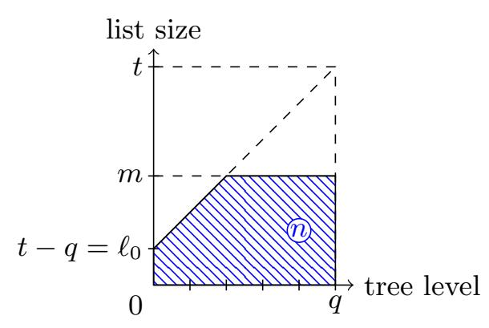

{0}------------------------------------------------

# Quantum Security Analysis of CSIDH

Xavier Bonnetain1,<sup>2</sup> and Andr´e Schrottenloher<sup>1</sup>

1 Inria, France <sup>2</sup> University of Waterloo, ON, Canada

Abstract. CSIDH is a recent proposal for post-quantum non-interactive key-exchange, based on supersingular elliptic curve isogenies. It is similar in design to a previous scheme by Couveignes, Rostovtsev and Stolbunov, but aims at an improved balance between efficiency and security. In the proposal, the authors suggest concrete parameters in order to meet some desired levels of quantum security. These parameters are based on the hardness of recovering a hidden isogeny between two elliptic curves, using a quantum subexponential algorithm of Childs, Jao and Soukharev. This algorithm combines two building blocks: first, a quantum algorithm for recovering a hidden shift in a commutative group. Second, a computation in superposition of all isogenies originating from a given curve, which the algorithm calls as a black box.

In this paper, we give a comprehensive security analysis of CSIDH. Our first step is to revisit three quantum algorithms for the abelian hidden shift problem from the perspective of non-asymptotic cost, with tradeoffs between their quantum and classical complexities. Second, we complete the non-asymptotic study of the black box in the hidden shift algorithm. We give a quantum procedure that evaluates CSIDH-512 using less than 40 000 logical qubits.

This allows us to show that the parameters proposed by the authors of CSIDH do not meet their expected quantum security.

Keywords: Post-quantum cryptography, isogeny-based cryptography, quantum cryptanalysis, quantum circuits, hidden shift problem

# 1 Introduction

Problems such as factoring and solving discrete logarithms, believed to be classically intractable, underlie the security of most asymmetric cryptographic primitives in use today. After Shor found a quantum polynomial-time algorithm for both [\[45\]](#page-29-0), the cryptographic community has been actively working on replacements, culminating with the ongoing NIST call for post-quantum primitives [\[38\]](#page-29-1).

One of the families of problems studied concerns elliptic curve isogenies. In this setting, we consider a graph, whose vertices are elliptic curves, and whose edges are non constant morphisms (isogenies). The problem of finding a path between two given curves was first used in the design of the CGL hash functions [\[12\]](#page-28-0) with supersingular isogeny graphs. Afterwards, a key-exchange based 

{1}------------------------------------------------

on ordinary curves (CRS) was proposed independently by Rostovtsev and Stolbunov [\[46\]](#page-29-2) and Couveignes [\[17\]](#page-28-1). Later, a quantum algorithm was given in [\[15\]](#page-28-2), that could find an isogeny between two such curves in subexponential time, a problem for which classical algorithms still require exponential time. Although it is not broken in quantum polynomial time, the scheme became considered as too inefficient with respect to its post-quantum security.

Meanwhile, a key-exchange based on supersingular elliptic curves isogenies was proposed [\[20\]](#page-28-3), and the candidate SIKE was selected for the second round of the NIST standardization process. The quantum algorithm for finding ordinary isogenies cannot be applied for the supersingular graphs, and the best known quantum algorithm for breaking SIKE has an exponential time complexity.

CSIDH. CSIDH is a new primitive presented at ASIACRYPT 2018 [\[11\]](#page-28-4). Its name stands for "commutative supersingular isogeny Diffie-Hellman", and its goal is to make isogeny-based key exchange efficient in the commutative case, analogous to a regular non-interactive Diffie-Hellman key exchange. CSIDH uses supersingular elliptic curves defined over Fp. In this case, the Fp-isogeny graph has a structure analogous to the ordinary isogeny graph, and the subexponential quantum attack of [\[15\]](#page-28-2) also applies. CSIDH aims at an improved balance between efficiency and security with respect to the original CRS scheme. However, it stands in a peculiar situation. To the best of our knowledge, it is the only postquantum scheme actively studied[3](#page-1-0) against which a quantum adversary enjoys more than a polynomial speedup. Schemes based on lattices, codes, or SIKE, rely on problems with a quantum speedup quadratic at best.

In only two years, CSIDH has been the subject of many publications, showing a renewed interest for protocols based on commutative elliptic curve isogenies. It has been used in [\[19\]](#page-28-5) to devise the signature scheme SeaSign. CSIDH and SeaSign were further studied and their efficiency was improved in [\[35,](#page-29-3)[25,](#page-28-6)[34,](#page-29-4)[21\]](#page-28-7), the last two works published at PQCRYPTO 2019.

Meanwhile, there has been a few works dealing with the security of CSIDH. The asymptotic cost of attacking the scheme, with classical precomputations and a quantum polynomial-space algorithm, was studied in [\[7\]](#page-27-0). Asymptotically also, it was shown in [\[26\]](#page-28-8) that CSIDH (and CRS) could be attacked in polynomial space. Next, a quantum-classical trade-off using Regev's variant [\[40\]](#page-29-5) of Kuperberg's sieve was proposed in [\[8\]](#page-28-9). Only two works studied the concrete parameters proposed in [\[11\]](#page-28-4): independently from us, Peikert [\[39\]](#page-29-6) attacked CSIDH-512 using Kuperberg's collimation sieve [\[31\]](#page-29-7). Contrary to us, he uses classical memory with quantum random access. Finally, the number of Toffoli gates required to implement a CSIDH-512 key-exchange in constant time has been studied in full detail in [\[4\]](#page-27-1), published at EUROCRYPT 2019. However, the authors designed an irreversible classical circuit, and the memory usage of an immediate translation to a quantum circuit seems massive (see the appendix of [\[4\]](#page-27-1)).

<span id="page-1-0"></span><sup>3</sup> Unfortunately, CSIDH was published after the beginning of the NIST call, and it could not be submitted to the standardization process.

{2}------------------------------------------------

Contributions. In this paper, we make a decisive move towards understanding the quantum security of CSIDH. First, we revisit three quantum abelian hidden shift algorithms from the available literature, that can be used to recover the secret key in a CSIDH key-exchange, from the point of view of non-asymptotic cost. We give a wide range of trade-offs between their quantum and classical time and memory complexities. Second, we give quantum circuits for computing the isogenies in CSIDH. Building on [\[4\]](#page-27-1), with the addition of quantum timespace tradeoffs for reversible computations and refined quantum search, we give a quantum procedure that computes the action of the class group in CSIDH-512 using 249.<sup>8</sup> Toffoli gates and less than 40 000 qubits. Putting together our improved query complexities and this new quantum circuit, we are able to attack CSIDH-512, -1024 and -1792 in 2<sup>10</sup> to 2<sup>48</sup> less quantum time than expected, using only tens of thousands of logical qubits.

Paper Outline. Section [2](#page-2-0) below presents the context of the CSIDH group action and outlines the attack. We next go into the details of the two building blocks: a quantum black-box hidden shift algorithm, and a quantum procedure to evaluate the class group action. In Section [3,](#page-5-0) we present the three main quantum algorithms for finding abelian hidden shifts. Our contribution here is to give nonasymptotic estimates of them, and to write a simple algorithm for cyclic hidden shift (Algorithm [2\)](#page-8-0), which can be easily simulated. In Section [4,](#page-15-0) we show how to replace the class group action oracle by the CSIDH group action oracle using lattice reduction. We study the latter in Section [5.](#page-16-0) We summarize our complexity analysis in Section [6.](#page-23-0)

# <span id="page-2-0"></span>2 Preliminaries

In this section, we present the rationale of CSIDH and the main ideas of its quantum attack. Throughout this paper, we use extensively standard notions of quantum computing such as qubits, ancilla qubits, quantum gates, entanglement, uncomputing, quantum Fourier Transform (QFT), CNOT and Toffoli gates. A reminder of these notions is available in Appendix.We use the Dirac notation of quantum states |i. We analyze quantum algorithms in the quantum circuit model, where the number of qubits represents the quantum space used, including ancilla qubits which are restored to their initial state after the computation. Time is the number of quantum gates in the circuit (we do not consider the metric of circuit depth). We use the standard "Clifford+T" universal gate set for all our benchmarks [\[24\]](#page-28-10) and focus notably on the T-gate count, as T-gates are usually considered an order of magnitude harder to realize than Clifford gates. It is possible to realize the Toffoli gate with 7 T-gates.

## 2.1 Context of CSIDH

Let p > 3 be a prime number. In general, supersingular elliptic curves over F<sup>p</sup> are defined over a quadratic extension Fp<sup>2</sup> . However, the case of supersingular 

{3}------------------------------------------------

curves defined over  $\mathbb{F}_p$  is special. When  $\mathcal{O}$  is an order in an imaginary quadratic field, each supersingular elliptic curve defined over  $\mathbb{F}_p$  having  $\mathcal{O}$  as its  $\mathbb{F}_p$ -rational endomorphism ring corresponds to an element of  $\mathcal{C}\ell(\mathcal{O})$ , the ideal class group of  $\mathcal{O}$ . Moreover, a rational  $\ell$ -isogeny from such a curve corresponds to an ideal of norm  $\ell$  in  $\mathcal{C}\ell(\mathcal{O})$ . The (commutative) class group  $\mathcal{C}\ell(\mathcal{O})$  acts on the set of supersingular elliptic curves with  $\mathbb{F}_p$ -rational endomorphism ring  $\mathcal{O}$ .

One-way Group Action. All use cases of the CSIDH scheme can be pinned down to the definition of a one-way group action (this is also the definition of a hard homogeneous space by Couveignes [17]). A group G acts on a set X. Operations in G, and the action g \* x for  $g \in G, x \in X$ , are easy to compute. Recovering g given x and x' = g \* x is hard. In the case of CSIDH, X is a set of Montgomery curves of the form  $E_A: y^2 = x^3 + Ax^2 + x$  for  $A \in \mathbb{F}_p$ , and the group G is  $\mathcal{C}\ell(\mathcal{O})$  for  $\mathcal{O} = \mathbb{Z}[\sqrt{-p}]$ . Taking g \* x for an element in  $\mathcal{C}\ell(\mathcal{O})$  (i.e. an isogeny) and a curve corresponds to computing the image curve of x by this isogeny.

CSIDH and CRS both benefit from this action of the class group, which also exists in the ordinary case. Quantum algorithms for recovering abelian hidden shifts solve exactly this problem of finding g when G is commutative. There exists a family of such algorithms, initiated by Kuperberg. The variant of [15] targets precisely the context of ordinary curves, and it can be applied to CSIDH.

Representation of  $\mathcal{C}\ell(\mathcal{O})$ . The designers choose a prime p of the form:  $p = 4 \cdot \ell_1 \cdots \ell_u - 1$  where  $\ell_1, \ldots, \ell_u$  are small primes. This enables to represent the elements of  $\mathcal{C}\ell(\mathcal{O})$  (hence, the isogenies) in a way that is now specific to CSIDH, and the main reason of its efficiency. Indeed, since each of the  $\ell_i$  divides  $-p-1=\pi^2-1$ , the ideal  $\ell_i\mathcal{O}$  splits and  $\mathfrak{l}_i=(\ell_i,\pi-1)$  is an ideal in  $\mathcal{O}$ . The image curves by these ideals can be computed efficiently [11, Section 8].

The designers consider the set  $\{\prod_{i=1}^u [\mathfrak{l}_i]^{e_i}, -m \leq e_i \leq m\} \subseteq \mathcal{C}\ell(\mathcal{O}),$  where  $[\mathfrak{l}_i]$  is the class of  $\mathfrak{l}_i$ . If we suppose that these products fall randomly in  $\mathcal{C}\ell(\mathcal{O})$ , which has  $O(\sqrt{p})$  elements, it suffices to take  $2m+1 \simeq p^{1/(2u)}$  in order to span the group  $\mathcal{C}\ell(\mathcal{O})$  or almost all of it. Since a greater m yields more isogeny computations, u should be the greatest possible. With this constraint in mind, we estimate u=132 and u=209 for CSIDH-1024 and CSIDH-1792 respectively (for CSIDH-512, we know that u=74 and the list of primes is given in [11]).

Given an element of  $\mathcal{C}\ell(\mathcal{O})$  of the form  $[\mathfrak{b}] = \prod_{i=1}^u [\mathfrak{l}_i]^{e_i}$ , we compute  $E' = [\mathfrak{b}] \cdot E$  by applying a sequence of  $\sum_i e_i$  isogenies. The CSIDH public keys are curves. The secret keys are isogenies of this form.

CSIDH Original Security Analysis. The problem underlying the security of CSIDH is: given two Montgomery curves  $E_A$  and  $E_B$ , recover the isogeny  $[\mathfrak{b}] \in \mathcal{C}\ell(\mathcal{O})$  such that  $E_B = [\mathfrak{b}] \cdot E_A$ . Moreover, the ideal  $\mathfrak{b}$  that represents it should be sufficiently "small", so that the action of  $[\mathfrak{b}]$  on a curve can be evaluated. The authors study different ways of recovering  $[\mathfrak{b}]$ . The complexity of these methods depends on the size of the class group  $N = \#\mathcal{C}\ell(\mathcal{O}) = O(\sqrt{p})$ . Classically, the best method seems the exhaustive key search of  $[\mathfrak{b}]$  using a meet-in-the-middle

{4}------------------------------------------------

approach: it costs  $O(p^{1/4})$ . Quantumly, they use the cost given in [15] for ordinary curves:  $\exp\left((\sqrt{2} + o(1))\sqrt{\log N \log \log N}\right)$ .

Levels of Security. In [11], the CSIDH parameters 512, 1024 and 1792 bits are conjectured secure up to the respective levels 1, 3 and 5 of the NIST call [38]. These levels correspond respectively to a key-recovery on AES-128, on AES-192 and AES-256. A cryptographic scheme, instantiated with some parameter size, matches level 1 if there is no quantum key-recovery running faster than quantum exhaustive search of the key for AES-128, and classical key-recovery running faster than classical exhaustive search. The NIST call considered the quantum gate counts given in [24]. These were improved later in [32], and we choose to adopt these improvements in this paper. For example, AES-128 key-recovery can be done with Grover search using  $1.47 \cdot 2^{81}$  T-gates and 865 qubits. Hence any algorithm using less than  $1.47 \cdot 2^{81}$  T-gates and  $2^{128}$  classical computations breaks the NIST level 1 security, as it runs below the security level of AES-128.

#### 2.2 Attack Outline

Algorithm 1 outlines a quantum key-recovery on CSIDH. Given  $E_A, E_B$ , we find a vector  $\bar{e}$  such that  $E_B = \prod_i [\mathfrak{l}_i]_i^e \cdot E_A$ . We will not retrieve the exact secret key which was selected at the beginning, but the output  $\bar{e}$  will have an  $L_1$  norm small enough that it can be used instead, and impersonate effectively the secret key.

#### <span id="page-4-0"></span>**Algorithm 1** Key Recovery

**Input:** The elements  $([\mathfrak{l}_1], \ldots, [\mathfrak{l}_u])$ , two curves  $E_B$  and  $E_A$  defined over  $\mathbb{F}_p$ , a generating set of  $\mathcal{C}\ell(\mathcal{O})$ :  $([\mathfrak{g}_1], \ldots, [\mathfrak{g}_k])$ 

**Output:** A vector  $(e_1, \ldots, e_u)$  such that  $\prod_{i=1}^u [\mathfrak{l}_i]^{e_i} \cdot E_A = E_B$ 

- 1: Define  $f: [x] \in \mathcal{C}\ell(\mathcal{O}) \mapsto [x] \cdot E_A$  and  $g: [x] \in \mathcal{C}\ell(\mathcal{O}) \mapsto [x] \cdot E_B$ .
- 2: There exists  $[\mathfrak{s}]$  such that  $E_B = [\mathfrak{s}] \cdot E_A$ , hence  $f([\mathfrak{s}][x]) = g([x])$  for all [x].
- 3: Apply a quantum abelian hidden shift algorithm, which recovers the "shift" between f and g. Obtain  $[\mathfrak{s}]$ .
- 4: Decompose  $[\mathfrak{s}]$  as  $\prod_{i=1}^{u} [\mathfrak{l}_i]^{e_i}$  with small  $e_i$ .
- 5: **return**  $(e_1, \ldots, e_u)$

In order to evaluate the cost of Algorithm 1, we need to study the *quantum* query complexity of the black-box hidden shift algorithm applied, but also its classical complexity, as it will often contain some quantum-classical trade-off. Afterwards, we need to analyze the quantum gate complexity of an oracle for the action of the ideal class group on Montgomery curves. There will also be classical precomputations.

In [15], in the context of ordinary curves, the authors show how to evaluate  $[x] \cdot E$  for any ideal class [x] in superposition, in subexponential time. For CSIDH, in a non-asymptotic setting, it is best to use the structure provided by the scheme (contrary to [7]). We have supposed that the class group is spanned by products of the form  $[\mathfrak{l}_1]^{e_1} \dots [\mathfrak{l}_u]^{e_u}$  with small  $e_i$ . If we are able to rewrite any [x] as such a product, then the evaluation of the class group action  $[x] \cdot E$  costs no more

{5}------------------------------------------------

than the evaluation of the CSIDH group action Q i [li ] ei · E. Here, a technique based on lattice reduction intervenes, following [\[17](#page-28-1)[,6,](#page-27-2)[7\]](#page-27-0).

In general, although the class group is spanned by the products used in the CSIDH key-exchange: {[l1] e1 . . . [lu] <sup>e</sup><sup>u</sup> , −m ≤ e<sup>i</sup> ≤ m}, we cannot retrieve the shortest representation of a given [x]. There is some approximation overhead, related to the quality of the lattice precomputations. In Section [4,](#page-15-0) we will show that this overhead is minor for the CSIDH original parameters.

# <span id="page-5-0"></span>3 Quantum Abelian Hidden Shift Algorithms

In this section, we present in detail three quantum algorithms for solving the hidden shift problem in commutative (abelian) groups. For each of them, we give tradeoff formulas and non-asymptotic estimates. The first one (Section [3.2\)](#page-6-0) is a new variant of [\[30\]](#page-29-9) for cyclic groups, whose behavior is easy to simulate. The second is by Regev [\[40\]](#page-29-5) and Childs, Jao and Soukharev [\[15\]](#page-28-2). The third is Kuperberg's second algorithm [\[31\]](#page-29-7).

#### 3.1 Context

The hidden shift problem is defined as follows:

Problem 1 (Hidden shift problem). Let (G, +) be a group, f, g : G → G two permutations such that there exists s ∈ G such that, for all x, f(x) = g(x + s). Find s.

Classically, this problem essentially reduces to a collision search, but in the case of commutative groups, there exists quantum subexponential algorithms. The first result on this topic was an algorithm with low query complexity, by Ettinger and Høyer [\[23\]](#page-28-11), which needs O(log(N)) queries and O(N) classical computations to solve the hidden shift in Z/NZ. The first time-efficient algorithms were proposed by Kuperberg in [\[30\]](#page-29-9). His Algorithm 3 is shown to have a complexity in quantum queries and memory of <sup>O</sup><sup>e</sup> 2 √ 2 log<sup>2</sup> (3) log<sup>2</sup> (N) for the group Z/NZ for smooth N, and his Algorithm 2 is in O 2 3 √ log<sup>2</sup> (N) , for any N. This has been followed by a memory-efficient variant by Regev, with a query complexity in L<sup>N</sup> (1/2, √ 2) and a polynomial memory complexity, in [\[40\]](#page-29-5), which has been generalized by Kuperberg in [\[31\]](#page-29-7), with an algorithm in <sup>O</sup><sup>e</sup> 2 √ 2 log<sup>2</sup> (N) quantum queries and classical memory, and a polynomial quantum memory. Regev's variant has been generalized to arbitrary commutative groups in the appendix of [\[15\]](#page-28-2), with the same complexity. A complexity analysis of this algorithm with tighter exponents can be found in [\[9\]](#page-28-12).

A broad presentation of subexponential-time quantum hidden shift algorithms can be found in [\[40\]](#page-29-5). Their common design is to start with a pool of labeled qubits, produced using quantum oracle queries for f and g. Each qubit contains information in the form of a phase shift between the states |0i and |1i. 

{6}------------------------------------------------

This phase shift depends on the (known) label  $\ell$  and on the (unknown) hidden shift s. Then, they use a combination procedure that consumes labeled qubits and creates new ones. The goal is to make the label  $\ell$  reach some wanted value  $(e.g.\ 2^{n-1})$ , at which point meaningful information on s  $(e.g.\ one\ bit)$  can be extracted.

Cyclic Groups and Concrete Estimates. In [10], the authors showed that the polynomial factor in the  $\widetilde{O}$ , for a variant of Kuperberg's original algorithm, is a constant around 1 if N is a power of 2. In the context of CSIDH, the cardinality of the class group  $\mathcal{C}\ell(\mathcal{O})$  is not a power of 2, but in most cases, its odd part is cyclic, as shown by the Cohen–Lenstra heuristics [16]. So we choose to approximate the class group as a cyclic group. This is why we propose in what follows a generalization of [10, Algorithm 2] that works for any N, at essentially the same cost. We suppose that an arbitrary representation of the class group is available; one could be obtained with the quantum polynomial-time algorithm of [13], as done in [15].

## <span id="page-6-0"></span>3.2 A First Hidden Shift Algorithm

In this section, we present a generic hidden shift algorithm for  $\mathbb{Z}/N\mathbb{Z}$ , which allows us to have the concrete estimates we need. We suppose an access to the quantum oracle that maps  $|x\rangle |0\rangle |0\rangle$  to  $|x\rangle |0\rangle |f(x)\rangle$ , and  $|x\rangle |1\rangle |0\rangle$  to  $|x\rangle |1\rangle |g(x)\rangle$ .

Producing the Labeled Qubits. We begin by constructing the uniform superposition on  $N \times \{0,1\}$ :  $\frac{1}{\sqrt{2N}} \sum_{x=0}^{N-1} |x\rangle \left(|0\rangle + |1\rangle\right) |0\rangle$ . Then, we apply the quantum oracle, and get

$$\frac{1}{\sqrt{2N}} \sum_{x=0}^{N-1} |x\rangle (|0\rangle |f(x)\rangle + |1\rangle |g(x)\rangle).$$

We then measure the final register. We obtain a value  $y = f(x_0) = g(x_0 + s)$  for some random  $x_0$ . The two first registers *collapse* on the superposition that corresponds to this measured value:  $\frac{1}{\sqrt{2}}(|x_0\rangle |0\rangle + |x_0 + s\rangle |1\rangle)$ .

Finally, we apply a Quantum Fourier Transform (QFT) on the first register and measure it, we obtain a label  $\ell$  and the state

$$|\psi_{\ell}\rangle = \frac{1}{\sqrt{2}} \left( |0\rangle + \chi \left( s \frac{\ell}{N} \right) |1\rangle \right), \chi \left( x \right) = \exp \left( 2i\pi x \right).$$

The phase  $\chi\left(s\frac{\ell}{N}\right)$ , which depends on s and  $\frac{\ell}{N}$ , contains information on s. We now apply a *combination routine* on pairs of labeled qubits  $(|\psi_{\ell}\rangle, \ell)$  as follows.

Combination Step. If we have obtained two qubits  $|\psi_{\ell_1}\rangle$  and  $|\psi_{\ell_2}\rangle$  with their corresponding labels  $\ell_1$  and  $\ell_2$ , we can write the (disentangled) joint state of  $|\psi_{\ell_1}\rangle$  and  $|\psi_{\ell_2}\rangle$  as:

$$|\psi_{\ell_1}\rangle \otimes |\psi_{\ell_2}\rangle = \frac{1}{2} \left( |00\rangle + \chi \left( s \frac{\ell_1}{N} \right) |10\rangle + \chi \left( s \frac{\ell_2}{N} \right) |01\rangle + \chi \left( s \frac{\ell_1 + \ell_2}{N} \right) |11\rangle \right) .$$

{7}------------------------------------------------

We apply a CNOT gate, which maps  $|00\rangle$  to  $|00\rangle$ ,  $|01\rangle$  to  $|01\rangle$ ,  $|10\rangle$  to  $|11\rangle$  and  $|11\rangle$  to  $|10\rangle$ . We obtain the state:

$$\frac{1}{2} \left( |00\rangle + \chi \left( s \frac{\ell_2}{N} \right) |01\rangle + \chi \left( s \frac{\ell_1 + \ell_2}{N} \right) |10\rangle + \chi \left( s \frac{\ell_1}{N} \right) |11\rangle \right) .$$

We measure the second qubit. If we measure 0, the first qubit collapses to:

$$\frac{1}{\sqrt{2}}\left(|0\rangle + \chi\left(s\frac{\ell_1 + \ell_2}{N}\right)|1\rangle\right) = |\psi_{\ell_1 + \ell_2}\rangle$$

and if we measure 1, it collapses to:

$$\frac{1}{\sqrt{2}} \left( \chi \left( s \frac{\ell_2}{N} \right) |0\rangle + \chi \left( s \frac{\ell_1}{N} \right) |1\rangle \right) = \chi \left( s \frac{\ell_2}{N} \right) |\psi_{\ell_1 - \ell_2}\rangle .$$

A common phase factor has no incidence, so we can see that the combination either produces  $|\psi_{\ell_1+\ell_2}\rangle$  or  $|\psi_{\ell_1-\ell_2}\rangle$ , with probability  $\frac{1}{2}$ . Furthermore, the measurement of the first qubit gives us which of the labels we have obtained. Although we cannot choose between the two cases, we can perform favorable combinations: we choose  $\ell_1$  and  $\ell_2$  such that  $\ell_1 \pm \ell_2$  is a multiple of 2 with greater valuation than  $\ell_1$  and  $\ell_2$  themselves.

Goal of the Combinations. In order to retrieve s, we want to produce the qubits with label  $2^i$  and apply a Quantum Fourier Transform. Indeed, we have

$$QFT \bigotimes_{i=0}^{n-1} |\psi_{2^i}\rangle = \frac{1}{2^{n/2}} QFT \sum_{k=0}^{2^n - 1} \chi\left(\frac{ks}{N}\right) |k\rangle$$

$$= \frac{1}{2^n} \sum_{t=0}^{2^n - 1} \left(\sum_{k=0}^{2^n - 1} \chi\left(k\left(\frac{s}{N} + \frac{t}{2^n}\right)\right)\right) |t\rangle.$$

The amplitude associated with t is  $\frac{1}{2^n} \left| \frac{1 - \chi \left( 2^n \left( \frac{s}{N} + \frac{t}{2^n} \right) \right)}{1 - \chi \left( \frac{s}{N} + \frac{t}{2^n} \right)} \right|$ . If we note  $\theta = \frac{s}{N} + \frac{t}{2^n}$ , this amplitude is  $\frac{1}{2^n} \left| \frac{\sin(2^n \pi \theta)}{\sin(\pi \theta)} \right|$ . For  $\theta \in \left[0; \frac{1}{2^{n+1}}\right]$ , this value is decreasing, from 1 to  $\frac{1}{2^n \sin \frac{\pi}{2^{n+1}}} \simeq \frac{2}{\pi}$ . Hence, when measuring, we obtain a t such that  $\left| \frac{s}{N} + \frac{t}{2^n} \right| \leq \frac{1}{2^{n+1}}$  with probability greater than  $\frac{4}{\pi^2}$ . Such a t always exists, and uniquely defines s if  $n > \log_2(N)$ .

From  $2^n$  to any N. We want to apply this simple algorithm to any cyclic group, with any N. A solution is to not take into account the modulus N in the combination of labels. We only want combinations such that  $\sum_k \pm \ell_k = 2^i$ . At each combination step, we expect the 2-valuation of the output label to increase (we collide on the lowest significant bits), but its maximum size can also increase:  $\ell_1 + \ell_2$  is bigger than  $\ell_1$  and  $\ell_2$ . However, the size can increase of at most one

{8}------------------------------------------------

bit per combination, while the lowest significant 1 position increases on average in  $\sqrt{n}$ . Hence, the algorithm will eventually produce the correct value.

We note  $\operatorname{val}_2(x) = \max_i 2^i | x$  the 2-valuation of x. The procedure is Algorithm 2. Each label is associated to its corresponding qubit, and the operation  $\pm$  corresponds to the combination.

### <span id="page-8-0"></span>**Algorithm 2** Hidden shift algorithm for $\mathbb{Z}/N\mathbb{Z}$

```
Input: N, a number of queries Q, a quantum oracle access to f and g such that
    f(x) = g(x+s), x \in \mathbb{Z}/N\mathbb{Z}
    Output: s
 1: Generate Q random labels in [0; N) using the quantum oracles
 2: Separate them in pools P_i of elements e such that val_2(x) = i
 3: i \leftarrow 0, R = \emptyset, n \leftarrow \lfloor \log_2(N) \rfloor.
 4: while some elements remain do
        if i \leq n then
 5:
 6:
            Pop a few elements e from P_i, put (e, i) in R.
 7:
        end if
        for (e, j) \in R do
 8:
9:
            if val_2(e-2^j)=i then
                Pop a of P_i which maximizes \operatorname{val}_2(a+e-2^j) or \operatorname{val}_2(e-2^j-a)
10:
11:
                e = e \pm a
            end if
12:
        end for
13:
14:
        if \{(2^i, i)|0 \le i \le n\} \subset R then
            Apply a QFT on the qubits, measure a t
15:
            s \leftarrow \left\lceil \frac{-Nt}{2^{n+1}} \right\rfloor \mod N
16:
17:
            return s
18:
        end if
19:
        while |P_i| \geq 2 do
20:
            Pop two elements (a, b) of P_i which maximizes val_2(a + b) or val_2(a - b)
21:
            c = a \pm b
22:
            Insert c in the corresponding P_j
23:
        end while
        i \leftarrow i + 1
24:
25: end while
26: return Failure
```

Intuitively, the behavior of this algorithm will be close to the one of [10], as we only have a slightly higher amplitude in the values, and a few more elements to produce. The number of oracle queries Q is exactly the number of labeled qubits used during the combination step. Empirically, we only need to put 3 elements at each step in R in order to have a good success probability. This algorithm is easily simulated, because we only need to reproduce the combination step, by generating at random the new labels obtained at each combination. We estimate the total number of queries to be around  $12 \times 2^{1.8\sqrt{n}}$ .

{9}------------------------------------------------

Table 1: Simulation results for Algorithm 2, for 90% success

| $\boxed{ \left  \log_2(N) \left  \log_2(Q) \right  1.8 \sqrt{\log_2(N)} + 2.3 \right  \left  \log_2(N) \left  \log_2(Q) \right  1.8 \sqrt{\log_2(N)} + 2.3 \right  }$ |      |      |     |      |      |  |  |
|-----------------------------------------------------------------------------------------------------------------------------------------------------------------------|------|------|-----|------|------|--|--|
| 20                                                                                                                                                                    | 10.1 | 10.3 | 64  | 16.7 | 16.7 |  |  |
| 32                                                                                                                                                                    | 12.4 | 12.5 | 80  | 18.4 | 18.4 |  |  |
| 50                                                                                                                                                                    | 15.1 | 15.0 | 100 | 20.3 | 20.3 |  |  |

For the CSIDH parameters of [4], we have three group sizes (in bits): n = 256, 512 and 896 respectively. We obtain  $2^{33}$ ,  $2^{45}$  and  $2^{58}$  oracle queries to build the labeled qubits, with  $2^{31}$ ,  $2^{43}$  and  $2^{56}$  qubits to store in memory. A slight overhead in time stems from the probability of success of  $\frac{4}{\pi^2}$ ; the procedure needs to be repeated at most 4 times. In CSIDH, the oracle has a high gate complexity. The number of CNOT quantum gates applied during the combination step (roughly equal to the number of labeled qubits at the beginning) is negligible. Notice also that the production of the labeled qubits can be perfectly parallelized.

#### <span id="page-9-0"></span>3.3 An Approach Based on Subset-sums

Algorithm 2 is only a variant of the first subexponential algorithm by Kuperberg in [30]. We develop here on a later approach used by Regev [40] and Childs, Jao and Soukharev [15] for odd N.

Subset-sum Combination Routine. This algorithm uses the same labeled qubits as the previous one. The main idea is to combine not 2, but k qubits:

$$\bigotimes_{i \le k} |\psi_{\ell_i}\rangle = \sum_{j \in \{0,1\}^k} \chi\left(\frac{j \cdot (\ell_1, \dots, \ell_k)}{N} s\right) |j\rangle$$

and apply  $|x\rangle\,|0\rangle\mapsto|x\rangle\,|\lfloor x\cdot(\ell_1,\ldots,\ell_k)/B\rfloor\rangle$  for a given B that controls the cost of the combination routine and depends on the tradeoffs of the complete algorithm. Measuring the second register yields a value  $V=\lfloor x\cdot(\ell_1,\ldots,\ell_k)/B\rfloor$ , the state becoming

$$\sum_{\lfloor j \cdot (\ell_1, \dots, \ell_k)/B \rfloor = V} \chi \left( \frac{j \cdot (\ell_1, \dots, \ell_k)}{N} s \right) |j\rangle .$$

In order to get a new labeled qubit, one can simply project on any pair  $(j_1, j_2)$  with  $j_1$  and  $j_2$  among this superposition of j. This is easy to do as long as the j are classically known. They can be computed by solving the equation  $|j \cdot (\ell_1, \ldots, \ell_k)/B| = V$ , which is an instance of the subset-sum problem.

This labeled qubit obtained is of the form:

$$\chi\left(\frac{j_1\cdot(\ell_1,\ldots,\ell_k)}{N}s\right)|j_1\rangle + \chi\left(\frac{j_2\cdot(\ell_1,\ldots,\ell_k)}{N}s\right)|j_2\rangle$$

which, up to a common phase factor, is:

$$|j_1\rangle + \chi \left(\frac{(j_2-j_1)\cdot (\ell_1,\ldots,\ell_k)}{N}s\right)|j_2\rangle$$
.

{10}------------------------------------------------

We observe that the new label in the phase, given by  $(j_2 - j_1) \cdot (\ell_1, \dots, \ell_k)$ , is less than B. If we map  $j_1$  and  $j_2$  respectively to 0 and 1, we obtain a labeled qubit  $|\psi_{\ell}\rangle$  with  $\ell < B$ . Now we can iterate this routine in order to get smaller and smaller labels, until the label 1 is produced. If N is odd, one reaches the other powers of 2 by multiplying all the initial labels by  $2^{-a}$  and then applying normally the algorithm.

#### <span id="page-10-0"></span>**Algorithm 3** Combination routine

Input:  $(|\psi_{\ell_1}\rangle, \ldots, |\psi_{\ell_k}\rangle), r$ Output:  $|\psi_{\ell'}\rangle$ ,  $\ell' < B$ 

- 1: Tensor  $\bigotimes_i |\psi_{\ell_i}\rangle = \sum_{j \in \{0,1\}^k} \chi\left(\frac{j \cdot (\ell_1, \dots, \ell_k)}{N} s\right) |j\rangle$
- 2: Add an ancilla register, apply  $|\hat{x}\rangle|0\rangle\mapsto|x\rangle||x\cdot(\ell_1,\ldots,\ell_k)/B|\rangle$
- 3: Measure the ancilla register, leaving with

$$V \text{ and } \sum_{\lfloor j \cdot (\ell_1, \dots, \ell_k)/B \rfloor = V} \chi \left( \frac{j \cdot (\ell_1, \dots, \ell_k)}{N} s \right) |j\rangle$$

- 4: Compute the corresponding j
- 5: Project to a pair  $(j_1, j_2)$ . The register is now  $\chi\left(\frac{j_1\cdot(\ell_1,\ldots,\ell_k)}{N}s\right)|j_1\rangle + \chi\left(\frac{j_2\cdot(\ell_1,\ldots,\ell_k)}{N}s\right)|j_2\rangle$
- 6: Map  $|j_1\rangle$  to  $|0\rangle$ ,  $|j_2\rangle$  to  $|1\rangle$ 7: Return  $|0\rangle + \chi\left(\frac{(j_2-j_1)\cdot(\ell_1,\dots,\ell_k)}{N}s\right)|1\rangle$

There are  $2^k$  sums, and N/B possible values, hence we can expect to have  $2^k B/N$  solutions. If we take  $k \simeq \log_2(N/B)$ , we can expect 2 solutions on average. In order to obtain a labeled qubit in the end, we need at least two solutions, and we need to successfully project to a pair  $(j_1, j_2)$  if there are more than two solutions.

The case where a single solution exists cannot happen more than half of the time, as there are twice many inputs as outputs. We consider the case where we have strictly more than one index j in the sum. If we have an even number of such indices, we simply divide the indices j into a set of pairs, project onto a pair, and map one of the remaining indexes to 0 and the other to 1. If we have an odd number of such indices, since it is greater or equal than 3, we single out a solitary element, and do the projections as in the even case. The probability to fall on this element is less than  $\frac{1}{t} \leq \frac{1}{3}$  if there are t solutions, hence the probability of success in this case is more than  $\frac{2}{3}$ .

This combination routine can be used recursively to obtain the label we want.

Linear number of queries. Algorithm 3 can directly produce the label 1 if we choose  $k = \lceil \log_2(N) \rceil$  and B = 2. In that case, we will either produce 1 or 0 with a uniform probability, as the input labels are uniformly distributed.

If the group has a component which is a small power of two, the previous routine can be used with B=1 in order to force the odd cyclic component at zero. Then the algorithms of [10] can be used, with a negligible overhead.

{11}------------------------------------------------

Overall, the routine can generate the label 1 using  $\log_2(N)$  queries with probability one half. This also requires to solve a subset-sum instance, which can be done in only  $\widetilde{O}\left(2^{0.291\log_2(N)}\right)$  classical time and memory [2].

We need to obtain  $\log_2(N)$  labels, and then we can apply the Quantum Fourier Transform as before, to recover s, with a success probability  $\frac{4}{\pi^2}$ . So we expect to reproduce this final step 3 times. The total number of queries will be  $8\log_2(N)^2$ , with a classical time and memory cost in  $\widetilde{O}\left(2^{0.291\log_2(N)}\right)$ .

We note that this variant is the most efficient in quantum resources, as we limit the quantum queries to a polynomial amount. The classical complexity remains exponential, but we replace the complexity of a collision search (with an exponent of 0.5) by that of the subset-sum problem (an exponent of 0.291). In the case  $N \simeq 2^{256}$  (CSIDH-512), by taking into account the success probability of the final Quantum Fourier Transform, we obtain  $2^{19}$  quantum queries and  $2^{86}$  classical time and memory.

Time/query tradeoffs. There are many possible tradeoffs, as we can adjust the number of steps and their sizes. For example, we can proceed in two steps: the first step will produce labels smaller than  $\sqrt{N}$ , and the second will use them to produce the label 1. The subset-sum part of each step, done classically, will cost  $\widetilde{O}\left(2^{0.291\log_2(N)/2}\right)$  time and memory, and it has to be repeated  $\log(N)^2/4$  times per label. Hence, the total cost in queries is in  $O(\log(N)^3)$ , with a classical time and and memory cost in  $\widetilde{O}\left(2^{0.291\log_2(N)/2}\right)$ .

For  $N \simeq 2^{256}$ , we can use Algorithm 3 to obtain roughly 130 labels that are smaller than  $2^{128}$ , and then apply Algorithm 3 on them to obtain the label 1. We can estimate the cost to be roughly  $2^{24}$  quantum queries,  $2^{60}$  classical time and  $2^{45}$  memory.

This method generalizes to any number of steps. If we want a subexponential classical time, then the number of steps has to depend on N. Many tradeoffs are possible, depending on the resources of the quantum attacker (see [9]).

#### <span id="page-11-0"></span>3.4 Kuperberg's Second Algorithm

This section revisits the algorithm from [31] and builds upon tradeoffs developed in [9]. We remark that the previous labeled qubits  $|\psi_{\ell}\rangle$  were a particular case of qubit registers of the form

$$\left|\psi_{(\ell_0,\dots,\ell_{k-1})}\right\rangle = \frac{1}{\sqrt{k}} \sum_{0 \le i \le k-1} \chi\left(s\frac{\ell_i}{N}\right) \left|i\right\rangle .$$

These multi-labeled qubit registers become the new building blocks. They are not indexed by a label  $\ell$ , but by a vector  $(\ell_0, \dots, \ell_{k-1})$ . We can remark that if we consider the joint state (tensor) of j single-label qubits  $|\psi_{\ell_i}\rangle$ , we directly obtain a multi-labeled qubit register of this form:

$$\bigotimes_{0 \le i \le j-1} |\psi_{\ell_i}\rangle = \left| \psi_{\left(\ell'_0, \dots, \ell'_{2^{j-1}}\right)} \right\rangle, \quad \text{with } \ell'_k = k \cdot (\ell_0, \dots, \ell_{j-1}).$$

{12}------------------------------------------------

#### <span id="page-12-0"></span>Algorithm 4 A general combination routine

Input: 
$$(\left|\psi_{(\ell_0,\dots,\ell_{M-1})}\right\rangle, \left|\psi_{(\ell'_0,\dots,\ell'_{M-1})}\right\rangle) : \forall i, \ell_i < 2^a, \ell'_i < 2^a, r$$
Output:  $\left|\psi_{(v_0,\dots,v_{M'-1})}\right\rangle : \forall i, v_i < 2^{a-r}$ 

- 1: Tensor  $\left|\dot{\psi}_{(\ell_0,...,\ell_{M-1})}\right\rangle \left|\dot{\psi}_{(\ell'_0,...,\ell'_{M-1})}\right\rangle = \sum_{i,j=0}^{M-1} \chi\left(\frac{s(\ell_i + \ell'_j)}{N}\right) \left|i\right\rangle \left|j\right\rangle$
- 2: Add an ancilla register, apply  $|i\rangle |j\rangle |0\rangle \mapsto |i\rangle |j\rangle |(\ell_i + \ell'_j)/2^{a-r}|\rangle$
- 3: Measure the ancilla register, leaving with

$$V$$
 and 
$$\sum_{i,j:\lfloor(\ell_i+\ell'_i)/2^{a-r}\rfloor=V} \chi\left(\frac{s(\ell_i+\ell'_j)}{N}\right)|i\rangle|j\rangle$$

- 4: Compute the M' corresponding pairs (i, j)
- 5: Apply to the state a transformation f from (i, j) to [0; M' 1].
- 6: Return the state and the vector v with  $v_{f(i,j)} = \ell_i + \ell'_j$ .

These registers can again be combined by computing and measuring a partial sum, as in Algorithm 4. While Algorithm 3 was essentially a subset-sum routine, Algorithm 4 is a 2-list merging routine. Step 4 simply consists in iterating trough the sorted lists of  $(\ell_0, \ldots, \ell_{M-1})$  and  $(\ell'_0, \ldots, \ell'_{M-1})$  to find the matching values (and this is exactly a classical 2-list problem). Hence, it costs  $\widetilde{O}(M)$  classical time, with the lists stored in classical memory. The memory cost is  $\max(M, M')$ . The quantum cost comes from the computation of the partial sum and from the relabeling. Both can be done sequentially, in  $O(\max(M, M'))$  quantum time.

This routine can also be generalized to merge more than two lists. The only difference will be that at Step 4, we will need to apply another list-merging algorithm to find all the matching values. In particular, if we merge 4k lists, we can use the Schroeppel-Shamir algorithm [44], to obtain the solutions in  $O(M^{2k})$  classical time and  $O(M^k)$  classical memory.

Once we are finished, we project the vector to a pair of values with difference 1, as in Algorithm 3, with the same success probability, better than 1/3.

Complete Algorithm. The complete algorithm uses Algorithm 4 recursively. As before, the final cost depends on the size of the lists, the number of steps and the number of lists we merge at each step. Then, we can see the algorithm as a merging tree.

The most time-efficient algorithms use 2-list merging. The merging tree is binary, the number of lists at each level is halved. We can save some time if we allow the lists to double in size after a merging step. In that case, the merging of two lists of size  $2^m$  to one list of size  $2^{m+1}$  allows to constrain m-1 bits<sup>4</sup>, at a cost of  $O(2^m)$  in classical and quantum time and classical memory. If we have e levels in the tree and begin with lists of size  $2^{\ell_0}$ , then the quantum query

<span id="page-12-1"></span><sup>&</sup>lt;sup>4</sup> As in the end, we only need a list of size two, the bit we lose here is regained in the last step.

{13}------------------------------------------------

cost is  $\ell_0 2^e$ . The time cost will be in  $\widetilde{O}(2^{\ell_0+e})$ , as the first step is performed  $2^e$  times, the second  $2^{e-1}$  times, and so on.

Allowing the lists to grow saves some time, but costs more memory. To save memory, we can also combine lists and force the output lists to be of roughly the same size. Hence, the optimal algorithm will double the list sizes in the first levels until the maximal memory is reached, when the list size has to stay fixed.

Overall, let us omit polynomial factors and denote the classical and quantum time as  $2^t$ . We use at most  $2^m$  memory and make  $2^q$  quantum queries, begin with lists of size  $2^{\ell_0}$  and double the list sizes until we reach  $2^m$ . Hence, the list size levels are distributed as in Figure 1. We have q equal to the number of levels, and t equals the number of levels plus  $\ell_0$ . As each level constrains as many bits as the log of its list size, the total amount of bits constrained by the algorithm corresponds to the hatched area.



<span id="page-13-0"></span>Fig. 1: Size of the lists in function of the tree level, in  $\log_2$  scale, annotated with the different parameters.

Hence, with  $\max(m,q) \le t \le m+q$ , we can solve the hidden shift problem for  $N < 2^n$  with

$$-\frac{1}{2}(t - m - q)^2 + mq = n$$

We directly obtain the cost of  $\widetilde{O}\left(2^{\sqrt{2n}}\right)$  from [31] if we consider t=m=q.

Classical/Quantum Tradeoffs. The previous approach had the inconvenience of using equal classical and quantum times, up to polynomial factors. In practice, we can expect to be allowed more classical operations than quantum gates. We can obtain different tradeoffs by reusing the previous 2-list merging tree, and seeing it as a  $2^k$ -list merging tree. That is, we see k levels as one, and merge the  $2^k$  lists at once. This allows to use the Schroeppel-Shamir algorithm for merging, with a classical time in  $2^{2^k/2}$  and a classical memory in  $2^{2^k/4}$ . This operation is purely classical, as we are computing lists of labels, and it does not impact the quantum cost. Moreover, while we used to have a constraint on  $\log(k)m$  bits, we now have a constraint on (k-1)m bits.

For k=2, omitting polynomial factors, with a classical time of  $2^{2t}$  and quantum time of  $2^t$ , a memory of  $2^m$ , a number of quantum queries of  $2^q$  and  $\max(m,q) \leq t \leq m+q$ , we can solve the hidden shift problem for  $N < 2^n$  with

$$-\frac{1}{2}(t-m-q)^2 + mq = 2n/3.$$

{14}------------------------------------------------

In particular, if we consider that t=m=q, we obtain an algorithm with a quantum time and query and classical memory complexity of  $\widetilde{O}(2^{2\sqrt{\frac{n}{3}}})$  and a classical time complexity of  $\widetilde{O}(2^{4\sqrt{\frac{n}{3}}})$ , and if we consider that t=2m=2q, we obtain a quantum query and classical memory cost in  $\widetilde{O}(2^{\sqrt{\frac{2n}{3}}})$ , a classical time in  $\widetilde{O}(2^{4\sqrt{\frac{2n}{3}}})$  and a quantum time in  $\widetilde{O}(2^{2\sqrt{\frac{2n}{3}}})$ .

Concrete estimates. If we consider  $N \simeq 2^{256}$ , with the 2-list merging method we can succeed with  $2^{23}$  initial lists of size 2. We double the size of the list at each level until we obtain a list of size  $2^{24}$ . In that case, we obtain classical and quantum time cost in  $2^{39}$ , a classical memory in  $2^{29}$  and  $2^{34}$  quantum queries.

Using the 4-list merging, we can achieve the same in 10 steps with roughly  $2^{55}$  classical time,  $2^{23}$  classical memory,  $2^{35}$  quantum time,  $2^{31}$  quantum queries.

Other tradeoffs are also possible. We can reduce the number of queries by beginning with larger lists. We can also combine the k-list approach with the subset-sum approach to reduce the quantum time (or the classical memory, if we use a low-memory subset-sum algorithm).

For example, if we consider a 4-level tree, with a 4-list merging, an initial list size of  $2^{24}$  and lists that quadruple in size, the first combination step can constrain  $24 \times 3 - 2 = 70$  bits, the second  $26 \times 3 - 2 = 76$  and the last  $28 \times 4 - 1 = 111$  bits (for the last step, we do not need to end with a large list, but only with an interesting element, hence we can constrain more). We bound the success probability by the success probability of one complete merging (greater than 1/3) times the success probability of the Quantum Fourier Transform (greater than  $\pi^2/4$ ), for a total probability greater than 1/8.

The cost in memory is of  $2^{30}$ , as we store at most 4 lists of size  $2^{28}$ . For the number of quantum queries: there are  $4^3=64$  initial lists in the tree, each costs 24 queries (to obtain a list of  $2^{24}$  labels by combining). We have to redo this 256 times to obtain all the labels we want, and to repeat this 8 times due to the probability of success. Hence, the query cost is  $24 \times 64 \times 256 \times 8 \simeq 2^{22}$ . The classical time cost is in  $256 \times 8 \times 3 \times 2^{28} \simeq 2^{69}$ . The quantum time cost is in  $256 \times 8 \times 3 \times 2^{28} \simeq 2^{41}$ .

We summarize the results of this section in Table 2.

<span id="page-14-0"></span>Table 2: Hidden shift costs tradeoffs that will be used in the following sections. Quantum memory is only the inherent cost needed by the algorithm and excludes the oracle cost.  $n = \log_2(N)$ .

| Classical time                         | Classical memory    | Quantum<br>memory   | Quantum<br>queries                                 | Approach |
|----------------------------------------|---------------------|---------------------|----------------------------------------------------|----------|
| $1.8\sqrt{n} + 4.3$                    | $1.8\sqrt{n} + 2.3$ | $1.8\sqrt{n} + 2.3$ | $1.8\sqrt{n} + 4.3$                                | Sec. 3.2 |
| $0.291n + \log_2(n) + 3$               | 0.291n              | $\log_2(n)$         | $2\log_2(n) + 3$                                   | Sec. 3.3 |
| $4\sqrt{\frac{2n}{3}} + \log_2(n) + 3$ | $\sqrt{2n/3}$       | $\log_2(n)$         | $\left \sqrt{\frac{2n}{3}} + \log_2(n) + 3\right $ | Sec. 3.4 |

{15}------------------------------------------------

## <span id="page-15-0"></span>4 Reduction in the Lattice of Relations

This section reviews the lattice reduction technique that allows to go from an arbitrary representation of an ideal class [x] to a representation on a basis of arbitrary ideals:  $[x] = [\mathfrak{l}_i]^{x_i}$ , with short exponents  $x_i$ . This allows to turn an oracle for the CSIDH group action, computing  $\prod_i [\mathfrak{l}_i]^{e_i} \cdot E$ , into an oracle for the action of  $\mathcal{C}\ell(\mathcal{O})$ .

### 4.1 The Relation Lattice

Given p and the ideal classes  $[\mathfrak{l}_1], \ldots, [\mathfrak{l}_u]$ , the integer vectors  $\bar{e} = (e_1, \ldots e_u)$  such that  $[\mathfrak{l}_1]^{e_1} \ldots [\mathfrak{l}_u]^{e_u} = \mathbf{1}$  form an integer lattice in  $\mathbb{R}^u$ , that we denote  $\mathcal{L}$ , the relation lattice. This lattice is ubiquitous in the literature on CRS and CSIDH (see [6] or [26] for a CSIDH context).

The lattice  $\mathcal{L}$  depends only on the prime parameter p, hence all computations involving  $\mathcal{L}$  are precomputations. First, we notice that  $\mathcal{L}$  is the kernel of the map:  $(e_1, \ldots e_u) \mapsto [\mathfrak{l}_1]^{e_1} \ldots [\mathfrak{l}_u]^{e_u}$ . Finding a basis of  $\mathcal{L}$  is an instance of the Abelian Stabilizer Problem, that Kitaev introduces and solves in [27] in quantum polynomial time.

Lattice Reduction. Next, we compute an approximate short basis B and its Gram-Schmidt orthogonalization  $B^*$ . All this information about  $\mathcal{L}$  will be stored classically. We compute B using the best known algorithm to date, the Block Korkine Zolotarev algorithm (BKZ) [43]. Its complexity depends on the dimension u and the block size, an additional parameter which determines the quality of the basis. For any dimension u, BKZ gives an approximation factor  $c^u$  for some constant c depending on the block size:  $||b_1||_2 \leq c^u \lambda_1(\mathcal{L})$  where  $\lambda_1(\mathcal{L})$  is the euclidean norm of the smallest vector in  $\mathcal{L}$ . In our case, assuming that the products  $[\mathfrak{l}_i]^{e_i}$  with  $-m \leq e_i \leq m$  span the whole class group, one of these falls on  $\mathbf{1}$  and we have:  $\lambda_1(\mathcal{L}) \leq 2m\sqrt{u}$ .

#### 4.2 Solving the Approximate CVP with a Reduced Basis

In this section, we suppose that a product  $\prod_i [\mathfrak{l}_i]^{t_i}$  for some large  $t_i$  is given (possibly as large as the cardinality of the class group, hence  $O(\sqrt{p})$ ). In order to evaluate the action of  $\prod_i [\mathfrak{l}_i]^{t_i}$ , we would like to reduce  $\bar{t} = t_1, \ldots t_u$  to a vector  $\bar{e} = e_1, \ldots e_u$  with small norm, such that  $\prod_i [\mathfrak{l}_i]^{e_i} = \prod_i [\mathfrak{l}_i]^{t_i}$ . In other words, we want to solve the approximate closest vector problem (CVP) in  $\mathcal{L}$ : given the target  $\bar{t}$ , we search for the closest vector  $\bar{v}$  in  $\mathcal{L}$  and set  $\bar{e} = \bar{v} - \bar{t}$ .

Babai's Algorithm. The computation of a short basis B of  $\mathcal{L}$  has to be done only once, but the approximate CVP needs to be solved on the fly and for a target  $\bar{t}$  in superposition. As in [7], we use a simple polynomial-time algorithm, relying on the quality of the basis B: Babai's nearest-plane algorithm [1]. We detail it in Appendix B.4. Given the target vector  $\bar{t}$ , B and its Gram-Schmidt orthogonalization  $B^*$ , this algorithm outputs in polynomial time a vector  $\bar{v}$  in the

{16}------------------------------------------------

lattice  $\mathcal{L}$  such that  $||\bar{v} - \bar{t}||_2 \leq \frac{1}{2} \sqrt{\sum_{i=1}^u ||b_i^{\star}||_2^2}$ . This bound holds simultaneously for every target vector  $\bar{t}$  and corresponding output  $\bar{v}$  (as  $\bar{t}$  will actually be a superposition over all targets, this is important for us).

Effect on the  $L_1$  Norm. Our primary concern is the number of isogenies that we compute, so we will measure the quality of our approximation with the  $L_1$  norm of the obtained  $\bar{e} = \bar{v} - \bar{t}$ . The bound on the  $L_1$  norm is:  $||\bar{v} - \bar{t}||_1 \le \sqrt{u} \, ||\bar{v} - \bar{t}||_2 = \frac{\sqrt{u}}{2} \sqrt{\sum_{i=1}^u ||b_i^*||_2^2}$ . Naturally, if we manage to solve the exact CVP, and obtain always the closest vector to  $\bar{t}$ , any evaluation of  $[x] \cdot E_A$  will cost exactly the same as an evaluation of  $\prod_i [\mathfrak{l}_i]^{e_i} \cdot E_A$  with the bounds on the exponents  $e_i$  specified by the CSIDH parameters; hence the class group action collapses to the CSIDH group action.

Our Simulations. We performed simulations by modeling  $\mathcal{C}\ell(\mathcal{O})$  as a cyclic group of random cardinality  $q \simeq \sqrt{p}$ . Then we take u elements at random in this group, of the form  $g^{a_i}$  for some generator g and compute two-by-two relations between them, as:  $(g^{a_i})^{a_{i+1}} \cdot (g^{a_{i+1}})^{-a_i} = 1$ . With such a basis, the computational system Sage [47] performs BKZ reduction with block size 50 in a handful of minutes, even in dimension 200. We compute the  $L_1$  bound  $\frac{\sqrt{u}}{2} \sqrt{\sum_{i=1}^u ||b_i^{\star}||_2^2}$  for many lattices generated as above, reduced with BKZ-50. We obtain on average, for CSIDH -512, -1024 and -1792 (of dimensions 74, 132 and 209 respectively), 1300, 4000 and 10000. The standard deviation of the values found does not exceed 10%. Notice that the bound is a property of the lattice, so we can take the average here, even though we will apply Babai's algorithm to a superposition of inputs.

Faster Evaluations of the Class Group Action. In the context of speeding up the classical group action, the authors of [5] computed the structure of the class group for CSIDH-512, the relation lattice and a small basis of it. They showed that the class group was cyclic. Given an ideal class [x], they use Babai's algorithm with another refinement [22]. It consists in keeping a list of short vectors and adding them to the output of Babai's algorithm, trying to reduce further the  $L_1$  norm of the result.

In particular for CSIDH-512, they are able to compute vectors of  $L_1$  norm even shorter on average than the original bound of  $5 \times 74 = 370$ , reaching an average 240 with BKZ-40 reduction. This suggests that, with lattice reduction, there may be actually *less* isogenies to compute than in the original CSIDH group action. However, we need a bound guaranteed for all target vectors, since we are computing in superposition, which is why we keep the bounds of above.

# <span id="page-16-0"></span>5 A Quantum Circuit for the Class Group Action

In this section, we first analyze the cost of a quantum circuit that evaluates the CSIDH group action on a given Montgomery curve  $E_A$  represented by  $A \in \mathbb{F}_p$ :

$$|e_1, \dots e_u\rangle |A\rangle |0\rangle \mapsto |e_1, \dots e_u\rangle |A\rangle |L_{\ell_1}^{e_1} \circ \dots \circ L_{\ell_u}^{e_u}(A)\rangle$$

{17}------------------------------------------------

where L`<sup>i</sup> corresponds to applying [l<sup>i</sup> ] to a given curve, and the e<sup>i</sup> are possibly greater than the CSIDH original exponents. We will then move to the class group action, which computes [x] · E<sup>A</sup> in superposition for any [x].

Following previous literature on the topic [\[4,](#page-27-1)[42\]](#page-29-13), we count the number of Toffoli gates and logical qubits used, as both are considered the most determinant factors for implementations. Our goal is to give an upper bound of resources for CSIDH-512 and an estimate for any CSIDH parameters, given a prime p of n bits and the sequence of small primes `<sup>i</sup> such that p = 4 · Q i `<sup>i</sup> − 1.

It was shown in [\[26\]](#page-28-8) that the group action could be computed in polynomial quantum space. A non-asymptotic study of the gate cost has been done in [\[4\]](#page-27-1). However, the authors of [\[4\]](#page-27-1) were concerned with optimizing a classical circuit for CSIDH, without reversibility in mind. This is why the appendix of [\[4\]](#page-27-1), mentions a bewildering amount of "537503414" logical qubits [\[4,](#page-27-1) Appendix C.6] (approx. 2 <sup>29</sup>). In this section, we will show that the CSIDH-512 group action can be squeezed into 40 000 logical qubits.

We adopt a bottom-up approach. We first introduce some significant tools and components, then show how to find, on an input curve EA, a point that generates a subgroup of order `. We give a circuit for computing an isogeny, a sequence of isogenies, and combine this with lattice reduction to compute the class group action.

### 5.1 Main Tools.

Bennett's Conversion. One of the most versatile tools for converting an irreversible computation into a reversible one is Bennett's time-space tradeoff [\[3\]](#page-27-6). Precise evaluations were done in [\[33,](#page-29-14)[29\]](#page-29-15).

Assume that we want to compute, on an input x of n bits, a sequence ft−<sup>1</sup> ◦ . . . ◦ f0(x), where each f<sup>i</sup> can be computed out of place with a quantum circuit using T<sup>f</sup> Toffoli gates and a ancilla qubits: |xi |0i 7→ |xi |fi(x)i. We could naturally compute the whole sequence using tn ancilla qubits, but this rapidly becomes enormous. Bennett remarks that we can separate the sequence ft−<sup>1</sup> ◦ . . . ◦ f<sup>0</sup> = G ◦ F, with F and G functions using m<sup>F</sup> and m<sup>G</sup> ancillas respectively, and compute:

1. 
$$|x\rangle |F(x)\rangle |0\rangle$$
  
2.  $|x\rangle |F(x)\rangle |G \circ F(x)\rangle$   
3.  $|x\rangle |0\rangle |G \circ F(x)\rangle$ 

If T<sup>F</sup> and T<sup>G</sup> are the respective Toffoli counts of the circuits for F and G, the total is 2T<sup>F</sup> + T<sup>G</sup> and the number of ancillas used is max(m<sup>F</sup> , mG) + n. Afterwards, we cut F and G recursively. Bennett obtains that for any > 0, an irreversible circuit using S space and running in time T can be converted to a reversible circuit running in time T 1+ and using O(S log T) space.

Adding One More Step. It often happens for us that the final result of the fisequence is actually not needed, we need only to modify the value of another 

{18}------------------------------------------------

one-bit register depending on  $f_{t-1} \circ ... \circ f_0(x)$  (for example, flipping the phase). This means that at the highest level of the conversion, all functions are actually uncomputed. This can also mean that we do not compute  $f_{t-1} \circ ... \circ f_0(x)$ , but  $f \circ f_{t-1} \circ ... \circ f_0(x)$  for some new f. Hence the cost is the same as if we added one more step before the conversion, and often negligible.

Number of Steps Given a Memory Bound. We want to be as precise as possible, so we follow [29]. In general, we are free to cut the t operations in any way, and finding the best recursive way, given a certain ancilla budget, is an optimization problem. Let B(t,s) be the least number of computation steps, for a total Toffoli cost  $B(t,s)T_f$ , given sn + m available ancilla qubits, to obtain reversibly  $f_{t-1} \circ \ldots \circ f_0(x)$  from input x. We have:

<span id="page-18-0"></span>Theorem 1 (Adaptation of [29], Theorem 2.1). B(t,s) satisfies the recursion:

$$B(t,s) = \begin{cases} 1 & \text{for } t = 1 \text{ and } s \ge 0\\ \infty & \text{for } t \ge 2 \text{ and } s = 0\\ \min_{1 \le k < t} B(k,s) + B(k,s-1) + B(t-k,s-1) \text{ for } t \ge 2 \text{ and } s \ge 1 \end{cases}$$

In all the costs formulas that we write below, we add a trade-off parameter s in the memory used and B(t,s) in the time.

Basic Arithmetic Modulo p. The Toffoli cost of the group action oracle is almost totally consumed by arithmetic operations modulo p (a prime of n bits), and in the following, we count the time in multiples of these basic operations. We do not make a difference between multiplication and squaring, as we use a single circuit for both, and denote  $T_M$  the Toffoli gate count of a multiplication in  $\mathbb{F}_p$ , using  $Q_M$  ancilla qubits. We also denote  $T_I$  the Toffoli count of an inversion and  $Q_I$  its ancilla count. As n will remain the same parameter throughout this section, we deliberately omit it in these notations, although  $T_M, T_I, Q_I, Q_M$  are functions of n. Note that [4] considers that the inversion modulo p costs an n-bit exponentiation, far more than with the circuit of [42].

**Lemma 1 ([42], Table 1).** There is a quantum circuit for (out of place) inversion modulo a prime p of n bits:  $|x\rangle |0\rangle \mapsto |x\rangle |x^{-1} \mod p\rangle$  that uses  $T_I = 32n^2 \log_2 n$  Toffoli gates and  $Q_I = 5n + 2 \lceil \log_2 n \rceil + 7$  qubits.

This circuit is *out of place*: the input registers are left unchanged, and the result is written on an n-bit output register. Circuits for in-place modular addition and doubling are also given in [42] and their Toffoli counts remain in  $O(n \log_2 n)$ , hence negligible with respect to the multiplications.

We use the best modular multipliers given in [41] with 3n qubits and  $4n^2$  Toffoli gates (dismissing terms of lower order). Note that, although the paper is focused on in-place multiplication by a classically known Y (i.e. computing  $|x\rangle \mapsto |xY\rangle$ ), the same resource estimations apply to the out-of-place multiplication of two quantum registers:  $|x\rangle |y\rangle |0\rangle \mapsto |x\rangle |y\rangle |xy\rangle$  (see [41, Section 2.5]). Implementing a controlled multiplication (an additional register chooses to apply it or not) is not much more difficult than a multiplication.

{19}------------------------------------------------

In-place Multiplication. The in-place multiplication:  $|x\rangle |y\rangle \mapsto |x\rangle |x\cdot y\rangle$  is not reversible if x is not invertible, and in this case, we can simply rewrite  $|y\rangle$  in the output register. We reuse the modular inversion circuit of [42] to compute  $|x^{-1}\rangle$ . Then we compute  $|x\cdot y\rangle$  and erase the  $|y\rangle$  register by computing  $|x\cdot y\cdot x^{-1}\rangle$ .

**Lemma 2 (In-place multiplication).** There is a circuit that on input  $|x\rangle |y\rangle$  returns  $|x\rangle |x \cdot y\rangle$  if x is invertible and  $|x\rangle |y\rangle$  otherwise. It uses  $T_M' = 2T_M + 2T_I$  Toffoli gates and  $Q_M' = Q_I + n$  ancillas.

Modular Exponentiation. Given a t-bit exponent m, we write  $m = \sum_{i=0}^{t-1} m_i 2^i$ . We give a circuit that maps  $|m\rangle |x\rangle |0\rangle$  to  $|m\rangle |x\rangle |x^m\rangle$ . Contrary to the modular exponentiation in Shor's algorithm, in our case, both x and m are quantum, which means that we cannot classically precompute powers of x (see e.g. [42]).

We use a simple square-and-multiply approach with Bennett's time-space tradeoff. We perform t steps requiring each a squaring and a controlled multiplication by x: on input  $|y\rangle |0\rangle |0\rangle$ , we compute  $|y\rangle |x \cdot y\rangle |0\rangle$  then  $|y\rangle |x \cdot y\rangle |0\rangle$ , then  $|y\rangle |x \cdot y\rangle |(x \cdot y)^2\rangle$  and erase the second register with another multiplication. Hence a single step uses  $3T_M$  Toffolis and  $Q_M + n$  ancillas.

<span id="page-19-0"></span>**Lemma 3.** There is a quantum circuit for t-bit modular exponentiation (with quantum input x and m) using  $3B(t,s)T_M$  Toffolis and  $(s+1)n+Q_M$  ancillas, where s is a trade-off parameter.

Legendre Symbol. The Legendre symbol of x modulo p is 1 if x is a square modulo p, -1 if not, 0 if x is a multiple of p. It can be computed as  $x^{(p-1)/2}$  mod p. We deduce from Lemma 3, for an n-bit p, a cost of  $3B(n,s)T_M$  Toffolis and  $(s+1)n+Q_M$  ancillas for any trade-off parameter s.

Reversible Montgomery Ladder. Most of the work in the group action oracle is spent computing the (x-coordinate of the) m-th multiple of a point P on a Montgomery elliptic curve given by its coefficient A, for a quantum input m. Following the presentation in [4, Section 3.3], made reversible and combined with Bennett's time-space tradeoff, we prove Lemma 4 in Appendix . Notice that mP can be transformed back to affine coordinates with little overhead, since the inversion in  $\mathbb{F}_p$  costs  $T_I = O\left(n^2 \log n\right)$  Toffolis.

<span id="page-19-1"></span>**Lemma 4.** There exists a circuit to compute, given A, on input P (a point in affine coordinates) and m (an integer of t bits), the x-coordinate of mP (in projective coordinates), using  $15B(t,s)T_M$  Toffolis and  $Q_M + 2n + 4sn$  ancilla qubits, where s is a trade-off parameter.

## 5.2 Finding a Point of Order $\ell$

Given A in input, we want to compute  $B = L_{\ell}(A)$ , the coefficient of the curve  $\ell$ -isogenous to A. This requires to find a subgroup of order  $\ell$  of the curve  $E_A$ . In CSIDH, this is done by first finding a point P on  $E_A$ , then computing  $Q = ((p+1)/\ell)P$ . if Q is not the point at infinity, it generates a subgroup of order  $\ell$ .

{20}------------------------------------------------

Quantum Search for a Good Point. Let  $\operatorname{test}(x)$  be a function that, on input  $x \in \mathbb{F}_p^*$ , returns 1 if x is the x-coordinate x of such a good point P, and 0 otherwise. We will first build a quantum circuit that on input A and  $x \in \mathbb{F}_p^*$ , flips the phase:  $|A\rangle |x\rangle \mapsto (-1)^{\operatorname{test}(x)} |A\rangle |x\rangle$ . We will use this circuit as a test in a modified Grover search.

Testing if P is on the Curve. We compute  $x^3+Ax^2+x$  using some multiplications and squarings (a negligible amount), then the Legendre symbol of  $x^3 + Ax^2 + x$ . For exactly half of  $\mathbb{F}_p^*$ , we obtain 1, which means that x is the x-coordinate of a point on the curve. For the other half, we obtain -1, and x is actually the x-coordinate of a point on its twist.

Multiplication by the Cofactor. Assume that the x-coordinate obtained above is that of a point P on the curve. We compute  $Q = ((p+1)/\ell)P$  using our reversible Montgomery ladder. Then, another failure occurs if  $Q = \infty$ . This happens with probability  $1/\ell$ . Hence, the probability of success of the sampling-and-multiplication operation is  $\frac{1}{2}\left(1-\frac{1}{\ell}\right)$ . In the circuit that we are building right now, we don't need the value of Q, only the information whether  $Q = \infty$  or not. Bennett's conversions of both the Legendre symbol computation and the Montgomery ladder can take into account the fact that we merely need to flip the phase of the input vector.

<span id="page-20-0"></span>**Lemma 5.** There exists a quantum circuit that, on input  $|A\rangle |x\rangle$ , flips the phase by  $(-1)^{test(x)}$ , using  $15B(n,s)T_M + 3B(n,s')T_M$  Toffolis and  $\max(Q_M + 2n + 4sn, (s'+1)n + Q_M)$  ancillas, where s and s' are trade-off parameters.

With this phase-flip oracle, we can obtain a point of order  $\ell$  with a quantum search. Instead of using Elligator as proposed in [4], we follow the "conventional" approach outlined in [4, Section 4.1], not only because it is simpler, but also because its probability of success is exactly known, which makes the search operator cheaper. More details are given in Appendix B.1.

Quantum Search with High Success Probability. We start by generating the uniform superposition  $\sum_{x \in \mathbb{F}_p^*} |x\rangle$  using a Quantum Fourier Transform (this is very efficient with respect to arithmetical operations). We use a variant of amplitude amplification for the case where the probability of success is high [14]. This variant is exact, but requires to use a phase shift whose angle depends on the success probability.

We know that the proportion of good x is exactly  $g = \frac{1}{2} \left(1 - \frac{1}{\ell}\right)$ . Normally, a Grover search iteration contains a phase flip and a diffusion transform which, altogether, realize an "inversion about average" of the amplitudes of the vectors in the basis. In [14], this iteration is modified into a controlled-phase operator which multiplies the phase of "good vectors" by  $e^{i\gamma}$  instead of -1 and a " $\beta$ -phase diffusion transform". Then by [14, Theorem 1], if  $\frac{1}{4} \leq g \leq 1$  and we set  $\beta = \gamma = \arccos(1 - 1/(2g))$ , the amplitude of the "bad" subspace is reduced to zero. Such a phase shift can be efficiently approximated with the Solovay-Kitaev

{21}------------------------------------------------

algorithm [18]. For a phase shift gate synthesized from Clifford+T gates, we estimate from [28] that it can be approximated up to an error of  $2^{-50}$  using around  $2^{14}$  T-gates, which is negligible compared to the cost of the exponentiation in the test function.

Detecting the errors. If the error probability is low enough, we can assume that the end state is perfect. However, we can avoid these errors if, after computing the superposition of good points, we reapply the test function, add the result in an ancilla qubit and measure this qubit. In general, such a measurement could disrupt the computation. This is not the case here: measuring whether x is a good point for A, while A is in superposition, does not affect the register A, as the set of good points is always of the same size. With probability  $\geq 1-2^{-50}$  we measure 1 and the state collapses to the exact superposition of good points for the given A. Otherwise we stop the procedure here. When we need to uncompute this procedure, we revert the same single-iteration quantum search and perform the same measurement, with the same success probability.

**Lemma 6.** There exists a quantum procedure that, on input (affine) A, finds the x-coordinate x of a "good" point on  $E_A$ :  $|A\rangle |0\rangle \mapsto |A\rangle (\sum_x |x\rangle)$ . It uses  $30B(n,s)T_M + 6B(n,4s)T_M$  Toffolis and  $Q_M + 2n + 4sn$  ancillas, and its probability of failure is less than  $2^{-50}$ .

*Proof.* This procedure runs as follows (we say "procedure" instead of "circuit", since it contains a measurement):

- Compute the superposition of points  $S = \sum_{x \in \mathbb{F}_p^*} |x\rangle$ ;
- Apply the modified Grover operator: it contains the computation of S (negligible) and the computation of  $|x\rangle \mapsto \left(e^{i\gamma}\right)^{\operatorname{test}(x)}|x\rangle$
- We actually do not obtain a single x, but a superposition close to the superposition of suitable x
- Recompute the test in a single-bit ancilla register:  $|x\rangle |0\rangle \mapsto |x\rangle |\text{test}(x)\rangle$
- Measure the ancilla register, forcing a collapse on the exact superposition of suitable x.

We set s' = 4s in Lemma 5. All in all, we use two Legendre symbol computations and two n-bit reversible Montgomery ladders.

#### 5.3 Computing an Isogeny

From the x-coordinate of a point Q on  $E_A$  of order  $\ell$ , we can compute the coefficient B of the  $\ell$ -isogenous curve  $E_B$ . The details are in Appendix .

<span id="page-21-0"></span>**Lemma 7 (Isogeny from point).** There is a circuit that on input  $|A\rangle |Q\rangle |0\rangle$ , computes  $|A\rangle |Q\rangle |B\rangle$  using  $Q_I + (4s + 9)n$  ancilla qubits and

$$7B\left(\frac{\ell-1}{2}+1,s\right)T_M+6B(\lceil \log_2 \ell \rceil,4s)T_M+(4\ell-1)T_I+(4\ell+3)T_M$$

Toffolis, where s is a tradeoff parameter.

{22}------------------------------------------------

We now put together the last subsections in order to perform an `-isogeny mapping: |Ai |0i 7→ |Ai |L`(A)i with overwhelming probability of success and detectable failure. We suppose that the cofactor (p + 1)/` has been classically precomputed. The isogeny computation is performed as follows:

- 1. On input |Ai, produce the superposition of good points P, that are on E<sup>A</sup> and have order p + 1 (detectable failures happen here)
- 2. On input |Ai |Pi, compute a reversible Montgomery ladder to obtain Q = ((p + 1)/`)P
- 3. On input |Ai |Qi, obtain the coefficient B = L`(A) of the image curve
- 4. Uncompute the Montgomery ladder for Q
- 5. Uncompute the superposition of good points (detectable failures happen here)

The ancilla cost of an out of place isogeny computation is the maximum between n + Q<sup>M</sup> + 2n + 4sn (computing the good points and the ladder for Q = ((p + 1)/`)P) and n + Q<sup>I</sup> + (4s <sup>0</sup> + 9)n (computing the image curve). We set s = s 0 in order to use Q<sup>I</sup> + (4s+ 11)n ancillas at most. Next, we denote T`(s) the Toffoli count of this operation. It sums 60B(n, s) + 12B(n, 4s)T<sup>M</sup> (computing the good points), the cost of Lemma [7](#page-21-0) and 30B(n, s)T<sup>M</sup> (computing the ladder).

Computing the inverse of an isogeny is not difficult, as noticed in [\[4\]](#page-27-1), as we have L −1 ` (A) = −L`(−A). Hence, by doubling the cost, we are able to compute isogenies in place. On input |Ai, we compute |Ai |L`(A)i, then we compute L −1 ` to erase |Ai. We will see that most of the computation is spent computing the 12 reversible Montgomery ladders P 7→ ((p + 1)/`)P.

<span id="page-22-0"></span>Lemma 8. There exists a quantum procedure that performs an `-isogeny mapping in place: |Ai 7→ |L`(A)i with an overwhelming probability of success (≤ 2 <sup>−</sup>50) and detectable failure using 2T`(s) Toffolis and Q<sup>I</sup> + (4s + 11)n ancillas.

#### 5.4 Computing a Sequence of Isogenies

Using the computation in place of L`<sup>i</sup> , we now compute the image of an input A by a sequence of isogenies, described by ¯e = e1, . . . eu:

$$|e_1, \dots e_u\rangle |A\rangle \mapsto |e_1, \dots e_u\rangle |L_{\ell_1}^{e_1} \circ \dots \circ L_{\ell_u}^{e_u}(A)\rangle$$
.

If we need to apply the backwards and not the forwards isogeny (e<sup>i</sup> is negative), we apply L −1 `i (A) = −L`<sup>i</sup> (−A), so we just need to change the signs of the registers, in place, with negligible overheads (in computations and qubits). In general, contrary to the standard CSIDH key-exchange, we do not have a guarantee on max<sup>i</sup> e<sup>i</sup> . Instead, we only know that ke¯k<sup>1</sup> = P i |ei | ≤ M for some bound M. We follow the idea of [\[4\]](#page-27-1) of having a single quantum circuit for any `i-isogeny computation, controlled by which isogeny we want to apply. Given an input vector e1, . . . eu, we apply isogenies one by one by decrementing always the top nonzero exponent (or incrementing it, if it is negative).

Since the procedure for the isogeny sequence considers all cases in superposition, it will always apply exactly M controlled isogenies, depending only on the 

{23}------------------------------------------------

promised bound M. Contrary to modular exponentiation, we don't need a time-space tradeoff for this sequence of computations, as isogenies can be computed in place (Lemma 8). Finally, if single isogenies fail with probability f, the total failure probability is lower than Mf.

A Constant Success Probability is Enough. The success probability  $2^{-50}$  given Lemma 8 is actually more than enough. Indeed, failures are detected and failed oracle queries can be discarded. One should note that the quantum hidden shift algorithms that apply to the cryptanalysis of CSIDH precisely allow this, since they start by applying the oracle many independent times before combining the results. Before the combination step, we can discard all the failed queries and the complexity is only multiplied by 1/(1-(Mf)). Hence, compared to [4], we do not only obtain a better success probability in a simpler way using quantum search, but we also reduce considerably the required success rate. In our case, we expect  $M \ll 2^{50}$ , a negligible failure probability, hence a negligible overhead.

Finally, we can transform the CSIDH group action into the class group action, using the lattice reduction technique of Section 4. We show in Appendix B.4that, using [26] and Babai's algorithm together, we can achieve a negligible computational and memory overhead.

<span id="page-23-1"></span>**Lemma 9 (Group action).** Let M be the  $L_1$  bound obtained by reducing the lattice of relations. Assume that  $M \ll 2^{50}$  and  $\ell$  is the maximal small prime used. Then there exists a quantum circuit for the class group action using  $2MT_{\ell}(s)$  Toffolis and  $Q_I + (4s + 11)n$  ancillas, where s is an integer trade-off parameter, with negligible probability of failure.

## <span id="page-23-0"></span>6 Estimating the Security of CSIDH Parameters

In this section, we assess the quantum security of the original parameters proposed in [11]. We count the number of T-gates necessary to attack CSIDH and compare to the targeted security levels.

#### 6.1 Cost of the Group Action Oracle

In CSIDH-512, the base prime p has n=511 bits, and there are u=74 small primes whose maximum is  $\ell=587$ . We will first count the number of Toffoli gates required in terms of  $T_M$  and  $T_I$ , before plugging the cost of a reversible multiplication modulo p.

In Section 4, we have estimated that Babai's algorithm would return a vector of  $L_1$  norm smaller than 1300. Hence, the oracle of Lemma 9 needs to apply M = 1300 in-place isogenies, more than the  $74 \cdot 5 = 370$  required by the "legitimate" group action. We choose s = 15 in Lemma 9. Using Lemma 1, we compute B(512, 15) = 3553 and B(512, 60) = 1925. We further have  $\lceil \log_2 \ell \rceil = 10$  and B(10, 60) = 17,  $(\ell + 1)/2 = 294$  and B(294, 15) = 1809. For a single in-place isogeny, the number of multiplications is:  $639540 = 2^{19.3}$  for the Montgomery

{24}------------------------------------------------

ladders, 46200 for the Legendre symbols, 30232 for computing the isogeny from a point, and there are 4694 inversions. For 1300 isogenies, we need  $2^{29.8}$  multiplications, among which  $2^{29.6}$  for the Montgomery ladders. There are approximately 38912 ancillas. A 512-bit multiplication costs  $2^{20}$  Toffoli [41], hence the 512-bit class group action can be performed with  $2^{49.8}$  Toffoli gates, *i.e.*  $2^{52.6}$  T-gates.

Time Complexity for CSIDH-1024 and CSIDH-1792. Since the time is dominated by the Montgomery ladders, and  $Q_I \simeq 5n$ , we simplify the Toffoli cost of an isogeny into  $180B(n,s)T_M$  and the ancilla cost into (4s+16)n. We compute B(n,s) for various values of s and propose the trade-offs of Table 3.

<span id="page-24-0"></span>Table 3: Quantum time and qubits for the *class group action* for the original CSIDH parameters (computed with the simplified formula). We put in bold the trade-offs selected for the next section.

|                                              |                                |                                                                          | s        | B(n,s)                          | Toffoli<br>gates                                                              | T-gates                                  | Ancilla<br>qubits                             |
|----------------------------------------------|--------------------------------|--------------------------------------------------------------------------|----------|---------------------------------|-------------------------------------------------------------------------------|------------------------------------------|-----------------------------------------------|
| 512<br>  1024<br>  1024<br>  1792            | 1300<br>4000<br>4000<br>10 000 | $ \begin{vmatrix} 2^{20} \\ 2^{22} \\ 2^{22} \\ 2^{23.6} \end{vmatrix} $ | 10<br>15 | 3553<br>27231<br>10465<br>51953 | $ \begin{array}{c} 2^{49.6} \\ 2^{56.2} \\ 2^{54.8} \\ 2^{60.1} \end{array} $ | $2^{52.4}  2^{59.0}  2^{57.6}  2^{62.9}$ | < 40 000<br>< 60 000<br>< 80 000<br>< 110 000 |
| $\begin{vmatrix} 1792 \\ 1792 \end{vmatrix}$ |                                | $\begin{vmatrix} 2 \\ 2^{23.6} \end{vmatrix}$                            |          | 22753                           | $2^{58.9}$                                                                    | $2^{61.7}$                               | < 140 000 < 140 000                           |

### 6.2 Attacking CSIDH

The parameters in [11] are aimed at three security levels defined by the NIST call [38]: NIST 1 should be as computationally hard as recovering the secret key of AES-128 (with quantum or classical resources), NIST 3 should be as hard as key-recovery of AES-192 and NIST 5 key-recovery of AES-256. The NIST call referred to quantum estimates of [24], but they have been improved in [32]. We plug our class group action oracle into the three quantum hidden shift algorithms of Sections 3.2, 3.3 and 3.4, and compute the resulting complexities (note that, in terms of quantum time, we compare only the T-gate counts). The results are summarized in Table 4.

The first generic hidden-shift algorithm that we presented (Section 3.2) uses a large amount of quantum memory (resp.  $2^{31}$ ,  $2^{43}$  and  $2^{56}$  qubits), as it needs to store all of its labeled qubits. Besides, as the quantum queries are very costly in the case of CSIDH, it is advantageous to reduce their count, even by increasing the classical complexity.

With the variant of Section 3.3, we see that the quantum query complexity decreases dramatically. If N is the cardinality of the class group (roughly  $\sqrt{p}$ ), we solve  $8(\log_2 N)$  classical subset-sum instances on  $\log_2 N$  bits (one for each label produced before the final QFT, and a success probability of  $\frac{1}{8}$  in total), each of

{25}------------------------------------------------

<span id="page-25-0"></span>Table 4: Attack trade-offs, in log<sup>2</sup> scale, rounded to the first decimal. "<" in the quantum memory complexity means that the memory comes mainly from the oracle. We put in bold the most significant trade-offs that we obtained for each variant.

| Conjectured level of<br>security in [11]<br>and corresp. resources |     |                         | Attacks of this paper            |                   |                                                             |                  |                        |  |
|--------------------------------------------------------------------|-----|-------------------------|----------------------------------|-------------------|-------------------------------------------------------------|------------------|------------------------|--|
|                                                                    |     | C. time T-gates<br>[32] | Hidden<br>shift<br>variant       | Quant.<br>queries | T-gates                                                     |                  | C. time Q. mem         |  |
| NIST 1<br>CSIDH<br>512                                             | 128 | 81.6                    | Sec. 3.2<br>Sec. 3.3<br>Sec. 3.4 | 33<br>19<br>24    | 33 + 52.6 = 85.6<br>19 + 52.6 = 71.6<br>24 + 52.6 = 76.6    | 33<br>86<br>63   | 31<br>< 15.3<br>< 15.3 |  |
| NIST 3<br>CSIDH<br>1024                                            | 192 | 114.7                   | Sec. 3.2<br>Sec. 3.3<br>Sec. 3.4 | 45<br>21<br>30.5  | 45 + 57.6 = 102.6<br>21 + 57.6 = 78.6<br>30.5 + 57.6 = 88.1 | 45<br>161<br>86  | 43<br>< 16.3<br>< 16.3 |  |
| NIST 5<br>CSIDH<br>1792                                            | 256 | 147.0                   | Sec. 3.2<br>Sec. 3.3<br>Sec. 3.4 | 58<br>22<br>37    | 58 + 62.9 = 120.9<br>22 + 62.9 = 84.9<br>37 + 62.9 = 99.9   | 58<br>274<br>111 | 56<br>< 16.7<br>< 16.7 |  |

which costs 20.291 log<sup>2</sup> <sup>N</sup> . [5](#page-25-1) We make a total 8(log<sup>2</sup> N) <sup>2</sup> quantum oracle queries. The quantum memory used depends only on the quantum oracle implementation.

Going further, we can trade between classical and quantum cost with the algorithm of Section [3.4.](#page-11-0) We use 4-list merging, equal quantum query and classical memory costs (excluding polynomial factors). Hence we consider lists of size 2 √ 2 log<sup>2</sup> (N)/3 everywhere and p log<sup>2</sup> (N)/6 steps, obtaining the costs of Table [4](#page-25-0) with respectively 218, 2<sup>25</sup> and 2<sup>31</sup> classical memory.

#### 6.3 Going Further

All the parameter sizes proposed in [\[11\]](#page-28-4) fall below their targeted security levels. In table [4,](#page-25-0) we see that the best strategy to apply varies with the size of the parameter p. With the small instance CSIDH-512, it is better to reduce at most the number of quantum queries, even if it means increasing the classical time complexity. With CSIDH-1792, the variant of Section [3.3](#page-9-0) with a polynomial number of quantum queries cannot be applied anymore, due to a too high classical complexity. However, the trade-off that we propose with Kuperberg's second algorithm (Section [3.4\)](#page-11-0) allows to attack CSIDH-1024 and CSIDH-1792

<span id="page-25-1"></span><sup>5</sup> In classical time complexities, contrary to quantum time complexities, we dismiss the subset-sum polynomial factor, as we dismiss the cost of a single AES query, which is a standard approach.

{26}------------------------------------------------

with a significant quantum advantage. In order to meet the NIST security levels, the bit-size of the parameter p needs to be increased.

For CSIDH-512, it seems unlikely to us that the query count of 2<sup>19</sup> may be significantly decreased; however, there is room for improvement in the quantum oracle. Currently, our oracle performs 1300 in-place isogeny computations, each of which requires 12 Montgomery ladders with 512 steps. With more precise estimations, and improving our current use of Babai's algorithm, one might reduce the number of isogenies down to ∼ 240 [\[5\]](#page-27-5). But this would require to implement the algorithm of [\[22\]](#page-28-16) as a quantum circuit and requires further investigation. We use currently 40 000 logical qubits; this could be reduced with more aggressive optimizations (for example, using dirty ancillas that don't need to start in the state |0i). We also notice that in general, quantum multiplication circuits are optimized in order to use few ancilla qubits, with Shor's algorithm in mind. In the case of CSIDH, the prime p is smaller than an RSA modulus, but the number of ancillas can be higher, and different trade-offs might be used.

# 7 Conclusion

We performed the first non-asymptotic quantum security assessment of CSIDH, a recent and promising key-exchange primitive based on supersingular elliptic curve isogenies. We presented the main variants of quantum commutative hidden shift algorithms, which are used as a building block in attacking CSIDH. There are many tradeoffs in quantum hidden shift algorithms. This makes the security analysis of CSIDH all the more challenging, and we tried to be as exhaustive as possible regarding the current literature.

We gave tradeoffs, estimates and experimental simulations of their complexities. Next, we gave a quantum procedure for the class group action oracle in CSIDH, completing and extending the previous literature. Consequently, we were able to propose the first non-asymptotic cost estimates of attacking CSIDH.

Comparing these to the targeted security levels, as defined in the ongoing NIST call, we showed that the parameters proposed [\[11\]](#page-28-4) did not meet these levels. We used different trade-offs between classical and quantum computations depending on the parameters targeted. In particular, the CSIDH-512 proposal is at least 1 000 times easier to break quantumly than AES-128, using a variant polynomial in quantum queries and exponential in classical computations.

Safe instances. The minimal size for which the attacks presented here are out of reach is highly dependent both on the way we estimate the costs (as they are subexponential) and the interpretation of the NIST metrics. In particular, does NIST 1 allows for a classical part with Time = Memory = 2<sup>128</sup>, or only Time×Memory=2<sup>128</sup>? Moreover, the oracle cost vastly depends on the amount of qubits used inside.

We can propose two sets of parameters for security level NIST 1: one aggressive, and one conservative. If we consider that NIST 1 allows for a classical time-memory product of 2<sup>128</sup>, 2<sup>20</sup> quantum queries and we neglect the polynomial factors, then the minimal size would be p ∼ 2260 bits, which corresponds 

{27}------------------------------------------------

to a multiplication by 4 of the parameter size. Our best attack would use Kuperberg's second algorithm and 2-list merging, at a cost of 2<sup>69</sup> classical time, 2<sup>59</sup> classical memory, 2<sup>20</sup> quantum queries and 2<sup>18</sup> qubits.

For a more conservative estimation, we can consider that classical time can reach 2<sup>128</sup> and classical memory 264, that the quantum oracle for CISDH can be reduced down to 2<sup>40</sup> T-gates, that a quantum key recovery on AES-128 costs 2 <sup>80</sup> T-gates (which allows for 2<sup>40</sup> queries and 2<sup>80</sup> quantum time), and neglect polynomial factors. Then this would require p ∼ 5280 bits, that is, multiplying by 10 the parameter size. Our best attack uses 4-list merging in Kuperberg's second algorithm, for a cost in classical time of 2128, 2<sup>64</sup> classical memory, 2<sup>40</sup> quantum queries, and as many qubits as required by the hypothetical improved CSIDH oracle.

Acknowledgements. The authors want to thank Mar´ıa Naya-Plasencia for her helpful comments, Alain Couvreur and Jean-Pierre Tillich for helpful discussions on isogeny-based cryptography, Lorenz Panny and Joost Renes for their valuable comments on a draft of this paper. Thanks to Jean-Fran¸cois Biasse for pointing out the reference [\[6\]](#page-27-2), Luca De Feo, Ben Smith and Steven Galbraith for helpful comments on Kuperberg's algorithm and discussions on the NIST benchmark. Thanks to the anonymous Eurocrypt referees for helpful remarks.

This project has received funding from the European Research Council (ERC) under the European Union's Horizon 2020 research and innovation programme (grant agreement n<sup>o</sup> 714294 - acronym QUASYModo).

# References

- <span id="page-27-4"></span>1. Babai, L.: On Lov´asz' lattice reduction and the nearest lattice point problem. Combinatorica 6(1), 1–13 (1986), <https://doi.org/10.1007/BF02579403>
- <span id="page-27-3"></span>2. Becker, A., Coron, J., Joux, A.: Improved generic algorithms for hard knapsacks. In: EUROCRYPT. Lecture Notes in Computer Science, vol. 6632, pp. 364–385. Springer (2011)
- <span id="page-27-6"></span>3. Bennett, C.H.: Time/space trade-offs for reversible computation. SIAM J. Comput. 18(4), 766–776 (1989)
- <span id="page-27-1"></span>4. Bernstein, D.J., Lange, T., Martindale, C., Panny, L.: Quantum circuits for the CSIDH: optimizing quantum evaluation of isogenies. In: EUROCRYPT (2). Lecture Notes in Computer Science, vol. 11477, pp. 409–441. Springer (2019)
- <span id="page-27-5"></span>5. Beullens, W., Kleinjung, T., Vercauteren, F.: Csi-fish: Efficient isogeny based signatures through class group computations. IACR Cryptology ePrint Archive 2019, 498 (2019), <https://eprint.iacr.org/2019/498>
- <span id="page-27-2"></span>6. Biasse, J.F., Fieker, C., Jacobson, M.J.: Fast heuristic algorithms for computing relations in the class group of a quadratic order, with applications to isogeny evaluation. LMS Journal of Computation and Mathematics 19(A), 371–390 (2016)
- <span id="page-27-0"></span>7. Biasse, J.F., Jacobson, M.J., Iezzi, A.: A note on the security of CSIDH. In: Chakraborty, D., Iwata, T. (eds.) Progress in Cryptology - INDOCRYPT 2018 - 19th International Conference on Cryptology in India, New Delhi, India, December 9-12, 2018, Proceedings. Lecture Notes in Computer Science, vol. 11356, pp. 153–168. Springer (2018), [https://doi.org/10.1007/978-3-030-05378-9\\_9](https://doi.org/10.1007/978-3-030-05378-9_9)

{28}------------------------------------------------

- <span id="page-28-9"></span>8. Biasse, J.F., Bonnetain, X., Pring, B., Schrottenloher, A., Youmans, W.: A tradeoff between classical and quantum circuit size for an attack against CSIDH. Journal of Mathematical Cryptology (2019)
- <span id="page-28-12"></span>9. Bonnetain, X.: Improved low-qubit hidden shift algorithms. CoRR abs/1901.11428 (2019), <http://arxiv.org/abs/1901.11428>
- <span id="page-28-13"></span>10. Bonnetain, X., Naya-Plasencia, M.: Hidden shift quantum cryptanalysis and implications. In: ASIACRYPT (1). Lecture Notes in Computer Science, vol. 11272, pp. 560–592. Springer (2018)
- <span id="page-28-4"></span>11. Castryck, W., Lange, T., Martindale, C., Panny, L., Renes, J.: CSIDH: an efficient post-quantum commutative group action. In: ASIACRYPT (3). Lecture Notes in Computer Science, vol. 11274, pp. 395–427. Springer (2018)
- <span id="page-28-0"></span>12. Charles, D.X., Lauter, K.E., Goren, E.Z.: Cryptographic hash functions from expander graphs. J. Cryptology 22(1), 93–113 (2009)
- <span id="page-28-15"></span>13. Cheung, K.K.H., Mosca, M.: Decomposing finite abelian groups. Quantum Information & Computation 1(3), 26–32 (2001), [http://portal.acm.org/citation.](http://portal.acm.org/citation.cfm?id=2011341) [cfm?id=2011341](http://portal.acm.org/citation.cfm?id=2011341)
- <span id="page-28-17"></span>14. Chi, D.P., Kim, J.: Quantum database search by a single query. In: NASA International Conference on Quantum Computing and Quantum Communications. pp. 148–151. Springer (1998)
- <span id="page-28-2"></span>15. Childs, A.M., Jao, D., Soukharev, V.: Constructing elliptic curve isogenies in quantum subexponential time. J. Mathematical Cryptology 8(1), 1–29 (2014)
- <span id="page-28-14"></span>16. Cohen, H., Lenstra, H.W.: Heuristics on class groups of number fields. In: Number Theory Noordwijkerhout 1983, pp. 33–62. Springer (1984)
- <span id="page-28-1"></span>17. Couveignes, J.M.: Hard homogeneous spaces. Cryptology ePrint Archive, Report 2006/291 (2006), <https://eprint.iacr.org/2006/291>
- <span id="page-28-18"></span>18. Dawson, C.M., Nielsen, M.A.: The Solovay-Kitaev algorithm. Quantum Information & Computation 6(1), 81–95 (2006)
- <span id="page-28-5"></span>19. De Feo, L., Galbraith, S.D.: Seasign: Compact isogeny signatures from class group actions. In: EUROCRYPT (3). Lecture Notes in Computer Science, vol. 11478, pp. 759–789. Springer (2019)
- <span id="page-28-3"></span>20. De Feo, L., Jao, D., Plˆut, J.: Towards quantum-resistant cryptosystems from supersingular elliptic curve isogenies. J. Mathematical Cryptology 8(3), 209–247 (2014)
- <span id="page-28-7"></span>21. Decru, T., Panny, L., Vercauteren, F.: Faster SeaSign signatures through improved rejection sampling. IACR Cryptology ePrint Archive 2018, 1109 (2018)
- <span id="page-28-16"></span>22. Doulgerakis, E., Laarhoven, T., de Weger, B.: Finding closest lattice vectors using approximate voronoi cells. In: PQCrypto. Lecture Notes in Computer Science, vol. 11505, pp. 3–22. Springer (2019)
- <span id="page-28-11"></span>23. Ettinger, M., Høyer, P.: On quantum algorithms for noncommutative hidden subgroups. In: Meinel, C., Tison, S. (eds.) STACS 99. pp. 478–487. Springer Berlin Heidelberg, Berlin, Heidelberg (1999)
- <span id="page-28-10"></span>24. Grassl, M., Langenberg, B., Roetteler, M., Steinwandt, R.: Applying grover's algorithm to AES: quantum resource estimates. In: Takagi, T. (ed.) Post-Quantum Cryptography - 7th International Workshop, PQCrypto 2016, Fukuoka, Japan, February 24-26, 2016, Proceedings. Lecture Notes in Computer Science, vol. 9606, pp. 29–43. Springer (2016)
- <span id="page-28-6"></span>25. Jalali, A., Azarderakhsh, R., Kermani, M.M., Jao, D.: Towards optimized and constant-time CSIDH on embedded devices. In: COSADE. Lecture Notes in Computer Science, vol. 11421, pp. 215–231. Springer (2019)
- <span id="page-28-8"></span>26. Jao, D., LeGrow, J., Leonardi, C., Ruiz-Lopez, L.: A subexponential-time, polynomial quantum space algorithm for inverting the CM group action. Journal of Mathematical Cryptology (2018)

{29}------------------------------------------------

- <span id="page-29-11"></span>27. Kitaev, A.Y.: Quantum measurements and the abelian stabilizer problem. Electronic Colloquium on Computational Complexity (ECCC) 3(3) (1996)
- <span id="page-29-17"></span>28. Kliuchnikov, V., Maslov, D., Mosca, M.: Fast and efficient exact synthesis of single-qubit unitaries generated by clifford and T gates. Quantum Information & Computation 13(7-8), 607–630 (2013)
- <span id="page-29-15"></span>29. Knill, E.: An analysis of Bennett's pebble game. CoRR abs/math/9508218 (1995)
- <span id="page-29-9"></span>30. Kuperberg, G.: A Subexponential-Time Quantum Algorithm for the Dihedral Hidden Subgroup Problem. SIAM J. Comput. 35(1), 170–188 (2005)
- <span id="page-29-7"></span>31. Kuperberg, G.: Another Subexponential-time Quantum Algorithm for the Dihedral Hidden Subgroup Problem. In: 8th Conference on the Theory of Quantum Computation, Communication and Cryptography, TQC 2013, May 21-23, 2013, Guelph, Canada. pp. 20–34 (2013), http://dx.doi.org/10.4230/LIPIcs.TQC.2013.20
- <span id="page-29-8"></span>32. Langenberg, B., Pham, H., Steinwandt, R.: Reducing the cost of implementing AES as a quantum circuit. IACR Cryptology ePrint Archive 2019, 854 (2019)
- <span id="page-29-14"></span>33. Levin, R.Y., Sherman, A.T.: A note on Bennett's time-space tradeoff for reversible computation. SIAM J. Comput. 19(4), 673–677 (1990)
- <span id="page-29-4"></span>34. Meyer, M., Campos, F., Reith, S.: On lions and elligators: An efficient constant-time implementation of CSIDH. Cryptology ePrint Archive, Report 2018/1198 (2018), https://eprint.iacr.org/2018/1198
- <span id="page-29-3"></span>35. Meyer, M., Reith, S.: A faster way to the CSIDH. In: INDOCRYPT. Lecture Notes in Computer Science, vol. 11356, pp. 137–152. Springer (2018)
- <span id="page-29-19"></span>36. Moody, D., Shumow, D.: Analogues of vélu's formulas for isogenies on alternate models of elliptic curves. Math. Comput. 85(300), 1929–1951 (2016), https://doi.org/10.1090/mcom/3036
- <span id="page-29-18"></span>37. Nielsen, M.A., Chuang, I.: Quantum computation and quantum information. AAPT (2002)
- <span id="page-29-1"></span>38. NIST: Submission requirements and evaluation criteria for the post-quantum cryptography standardization process (2016), https://csrc.nist.gov/CSRC/media/Projects/Post-Quantum-Cryptography/documents/call-for-proposals-final-dec-2016.pdf
- <span id="page-29-6"></span>39. Peikert, C.: He gives C-Sieves on the CSIDH. IACR Cryptology ePrint Archive 2019, 725 (2019)
- <span id="page-29-5"></span>40. Regev, O.: A Subexponential Time Algorithm for the Dihedral Hidden Subgroup Problem with Polynomial Space. CoRR (2004), http://arxiv.org/abs/quant-ph/0406151
- <span id="page-29-16"></span>41. Rines, R., Chuang, I.: High performance quantum modular multipliers. CoRR abs/1801.01081 (2018), http://arxiv.org/abs/1801.01081
- <span id="page-29-13"></span>42. Roetteler, M., Naehrig, M., Svore, K.M., Lauter, K.E.: Quantum resource estimates for computing elliptic curve discrete logarithms. In: ASIACRYPT (2). Lecture Notes in Computer Science, vol. 10625, pp. 241–270. Springer (2017)
- <span id="page-29-12"></span>43. Schnorr, C., Euchner, M.: Lattice basis reduction: Improved practical algorithms and solving subset sum problems. Math. Program. 66, 181–199 (1994)
- <span id="page-29-10"></span>44. Schroeppel, R., Shamir, A.: A  $T = O(2^{n/2})$ ,  $S = O(2^{n/4})$  algorithm for certain np-complete problems. SIAM J. Comput. 10(3), 456–464 (1981)
- <span id="page-29-0"></span>45. Shor, P.W.: Algorithms for quantum computation: Discrete logarithms and factoring. In: 35th Annual Symposium on Foundations of Computer Science, Santa Fe, New Mexico, USA, 20-22 November 1994. pp. 124–134. IEEE Computer Society (1994), http://dx.doi.org/10.1109/SFCS.1994.365700
- <span id="page-29-2"></span>46. Stolbunov, A.: Constructing public-key cryptographic schemes based on class group action on a set of isogenous elliptic curves. Adv. in Math. of Comm. 4(2), 215–235 (2010), https://doi.org/10.3934/amc.2010.4.215

{30}------------------------------------------------

<span id="page-30-0"></span>47. The Sage Developers: SageMath, the Sage Mathematics Software System, http://www.sagemath.org

# Appendix

# A Preliminaries of Quantum Computing

For the interested reader [\[37\]](#page-29-18) provides a comprehensive introduction to quantum computing. We merely review some basic notions.

Since the early years of quantum computing, the quantum circuit model has arisen as the standard way of describing the computations running on a universal quantum computer. In this model, we stand at the logical level of quantum computing, not the implementation level. We do not estimate the physical resources required to emulate a quantum circuit.

A quantum circuit is made of wires and gates. Contrary to classical boolean circuits, whose wires and logical gates can be implemented as hardware, a quantum circuit represents a sequence of operations performed on some quantum system. Each wire represents a qubit, which is a two-dimensional quantum system. Qubits are often said to be the analogue of classical logical bits. The state of a qubit is represented by a vector in a two-dimensional Hilbert space H, on an arbitrary basis |0i, |1i which is denoted as the computational basis. In general, it is of the form α |0i + β |1i where α andβ are complex numbers and |α| <sup>2</sup> + |β| <sup>2</sup> = 1. The numbers |α| <sup>2</sup> and |β| <sup>2</sup> = 1 represent respectively the probabilities, upon measurement of the qubit, to obtain |0i or |1i.

Due to the property of entanglement, the state of an n-qubit system lies in H<sup>2</sup> n = H<sup>⊗</sup>n, the tensor product of n copies of H. It has 2<sup>n</sup> basis vectors, which are all n-bit strings. Measuring gives one of this n-bit strings with some probability corresponding to its amplitude. In practice, considering the tensor of two quantum states simply means that we put them together.

A quantum computation starts with all qubits initialized to |0i and disentangled. It then performs a sequence of self-adjoint (linear) operators of H<sup>2</sup> n and measurements. During the computation, due to constructive and destructive interferences, the probability amplitudes of the states on the computational basis are modified. All amplitude should be moved towards n-big strings giving a meaningful result (for example, towards the expected secret).

An ubiquitous building block in the quantum algorithms studied in this paper is the Quantum Fourier Transform (QFT). We will note χ(x) = exp(2iπx). The QFT maps a state |ki, representing a number between 0 and N − 1, to:

$$\frac{1}{\sqrt{N}} \sum_{j=0}^{N-1} \chi\left(\frac{jk}{N}\right) |j\rangle .$$

Its name stems from the analogy with a classical discrete Fourier transform, although the result is a superposition. If the input is |0i (0 modulo N), we get a uniform superposition over all j ∈ {0, . . . , N − 1}: <sup>√</sup> 1 N P<sup>N</sup>−<sup>1</sup> <sup>j</sup>=0 |ji.

{31}------------------------------------------------

Except in the case where we assume an *online oracle access* to some quantum black-box, which is not the case in this paper, the computations performed can be ultimately broken down into *quantum gates*. If the qubits are analog of classical bits, then quantum gates are analog of classical gates. They represent a set of basic operations with cost 1. Most of the times, a single processor model is assumed. At each time step, the quantum computer applies a gate to a qubit, or to a pair of qubits; so it makes sense to define the quantum time complexity as the total number of gates. The term "ancilla qubits" refers to additional qubits initialized to  $|0\rangle$  and returned afterwards to this state. The less ancillas we use, the more often they have to be returned to  $|0\rangle$ . This can induce an overhead in quantum gates.

There exists multiple universal gate sets, all of which allow to perform all meaningful quantum computations. We can only compare quantum time complexities between two circuits written with the same gate set. Since we wish to compare some of our complexities with [24], we use the standard "Clifford+T" set for all our benchmarks. The Clifford set contains the controlled-Z (or CNOT) gate and the Hadamard gate. The (single-qubit) Hadamard gate maps  $|0\rangle$  to  $\frac{1}{\sqrt{2}}|0\rangle + \frac{1}{\sqrt{2}}|1\rangle$  and  $|1\rangle$  to  $\frac{1}{\sqrt{2}}|0\rangle - \frac{1}{\sqrt{2}}|1\rangle$ . The (two-qubit) CNOT gate maps  $|x\rangle$   $|b\rangle$  to  $|x\rangle$   $|x\oplus b\rangle$ . The (single-qubit) T-gate maps  $|0\rangle$  to  $|0\rangle$  and  $|1\rangle$  to  $|1\rangle$  to  $|1\rangle$  In currently envisioned quantum computing architectures, the T-gate seems the most costly to implement fault-tolerantly, due to its behavior with quantum error correcting codes. It is possible to realize the Toffoli gate with 7 T-gates. T-gates are considered generally an order of magnitude more difficult to realize than Clifford gates, which is why we focus on them for our gate counts and comparisons.

Simulations in the Quantum Circuit Model. Some of our work relies on simulations of Kuperberg's algorithm for finding an abelian hidden shift. This algorithm can be described as a single, massive quantum circuit, but it is better understood as a sequence of quantum computations and measurements. The result of each measurement controls the next quantum computations applied. The precise time complexity, *i.e.* the number of quantum gates in total, can be analyzed asymptotically. But since intermediate measurements are probabilistic, the most precise way to study the time complexity of this algorithm is to simulate it, by randomly selecting outputs at each measurement and counting the number of subsequent operations to perform. The key fact is that these simulations remain sound in the quantum circuit model. They give an average quantum time which is meaningful, although not exact.

# B Quantum Circuit for the Class Group Action (Technical Details)

### <span id="page-31-0"></span>B.1 Reversible Search with a Measurement

In order to compute an isogeny of degree  $\ell$ , we need to sample a point of order  $\ell$  on a given curve. Let  $\operatorname{ord}(P)$  be the order of a point P on a curve. Note

{32}------------------------------------------------

that, in this section, we do not go into the details of how points and curves are represented in qubit registers.

We apply a quantum search: a unitary U which computes, from a curve  $|E\rangle$ , the superposition  $|E\rangle\sum_{P\in E:\ell|\mathsf{ord}(P)}|P\rangle$ . This search is exact. However, it involves a phase shift gate that we can only approximate. Hence, in practice, we can only compute a unitary  $\hat{U}$  which will produce a state of the form

$$a\left(|E\rangle \sum_{P\in E:\ell|\operatorname{ord}(P)}|P\rangle\right) + b\left(|E\rangle \sum_{P\in E:\ell\nmid\operatorname{ord}(P)}|P\rangle\right),$$

with a very small b. The two terms correspond to the "good" and "bad" states of the quantum search.

In the complete circuit, we begin with a superposition of curves, of the form

$$\sum_{E} \alpha_{E} |E\rangle |0\rangle .$$

Then, applying  $\hat{U}$ , we obtain

$$\sum_{E} \alpha_{E} |E\rangle \left( a \sum_{P \in E: \ell | \operatorname{ord}(P)} |P\rangle + b \sum_{P \in E: \ell \nmid \operatorname{ord}(P)} |P\rangle \right)$$

We notice that a and b do not depend on E, as it only depends on the number of solutions of the quantum search (which depends on  $\ell$ , but not on the curve E) and the quality of the approximation of the phase shift gate. We can reapply the test function of the quantum search on an ancilla qubit, to obtain

$$\sum_{E} \alpha_{E} |E\rangle \left( a \sum_{P \in E: \ell | \operatorname{ord}(P)} |P\rangle |1\rangle + b \sum_{P \in E: \ell \nmid \operatorname{ord}(P)} |P\rangle |0\rangle \right) .$$

By measuring the ancilla qubit, we obtain, with probability  $a^2$ ,

$$\sum_{E} \alpha_{E} |E\rangle \sum_{P \in E: \ell | \operatorname{ord}(P)} |P\rangle,$$

which is exactly the state we would have obtained if we could compute U. This allows to simulate U, but has a small probability of failure (in our applications, smaller than  $2^{-50}$ ). As it involves a measurement, it is not reversible. However, we can also simulate uncomputing: as  $\hat{U}$  allows to approximate U,  $\hat{U}^{\dagger}$  allows to approximate  $U^{\dagger}$ . Applying  $\hat{U}^{\dagger}$  on the state

$$\sum_{E} \alpha_E |E\rangle \sum_{P \in E: \ell | \mathsf{ord}(P)} |P\rangle$$

will produce a state of the form

$$\sum_{E} \alpha_{E} |E\rangle \left( a |0\rangle + b \sum_{x \neq 0} |x\rangle \right)$$

{33}------------------------------------------------

Hence, it suffices to measure the second register to simulate the action of  $U^{\dagger}$ , which will also succeed with probability  $a^2$ .

#### **B.2** Reversible Montgomery Ladder

We start with the x-coordinate of a point P on a Montgomery curve  $E_A$ , given by its coefficient A. We want to compute the x-coordinate of mP, where m is an integer of t bits. We follow the presentation of the Montgomery ladder of [4], including the notations, that we make reversible.

The Montgomery ladder performs t "ladder steps" operating on four n-bit registers  $X_2, Z_2, X_3, Z_3$ . The initial state is  $1, 0, x_1, 1$  where  $x_1$  is the x-coordinate of P. The input point P and A are represented in affine coordinates. At the end, the registers  $X_2, Z_2$  give the projective coordinates of mP.

A ladder step consists in the following operations, where b is the current bit of m:

- 1. Conditioned on b, swap  $X_2, Z_2$  with  $X_3, Z_3$  (this is easily done quantumly)
- 2. Perform a point doubling: first compute  $Y = X_2 Z_2, Y^2$ . Compute similarly  $T = X_2 + Z_2, T^2$ , then  $X_4 = T^2Y^2$  and  $E = T^2 Y^2$ , finally  $Z_4 = E(Y^2 + ((A+2)/4)E)$ .
- 3. Perform a differential addition: compute  $C = X_3 + Z_3$ ,  $D = X_3 Z_3$ , DT, CY,  $X_5 = (DT + CY)^2$  and  $Z_5 = x_1(DT CY)^2$ .
- 4. The output register for this step is  $X_4, Z_4, X_5, Z_5$
- 5. Perform another conditional swap between  $(X_4, Z_4)$  and  $(X_5, Z_5)$

We make these operations reversible by uncomputing the partial results. With 4 input registers, 4 output registers and only 2 ancilla registers, we can compute as follows (we omit the  $|\rangle$  notations). We use only out of place modular multiplication and squarings, and in-place additions. Notice that since in-place additions are cheap, we can always replace one of  $X_2$  or  $Z_2$  by Y or T (resp. for  $X_3, Z_3$  and C, D) and that we can replace  $Y^2, T^2$  by  $Y^2, E = T^2 - Y^2$ . Notice also that we swap the order of the point doubling and differential addition; this allows to save one ancilla register.

{34}------------------------------------------------

```
1. X_2 Z_2 X_3 Z_3 0 0
                               0
                                             0 \ 0 \ 0
2. X_2 Y X_3 C CY 0
                               0
                                             0 \ 0 \ 0
3. X_2 T X_3 D CY DT
                               0
                                             0 \ 0 \ 0
4. X_2 T X_3 D CY DT + CY 0
                                             0 0 0
5. X_2 T X_3 D CY DT + CY 0
                                             0 X_5 0
6. X_2 T X_3 D CY DT - CY 0
                                             0 X_5 0
7. X_2 T X_3 D CY DT - CY (DT - CY)^2 0 X_5 0
8. X_2 T X_3 D CY DT - CY (DT - CY)^2 0 X_5 Z_5
9. X_2 T X_3 D CY DT - CY 0
                                             0 X_5 Z_5
10. X_2 T X_3 Z_3 0 0
11. X_2 T X_3 Z_3 Y^2 0
12. X_2 T X_3 Z_3 Y^2 T^2
                               0
                                             0 X_5 Z_5
                               0
                                             0 X_5 Z_5
                               0
                                             0 X_5 Z_5
13. X_2 T X_3 Z_3 Y^2 T^2
                               0
                                             0 X_5 Z_5
\begin{array}{cccccccccccccccccccccccccccccccccccc
19. X_2 T X_3 Z_3 0 0
                               X_4
                                             Z_4 X_5 Z_5
```

Thanks to the in-place additions and subtractions modulo p, only 2 ancilla n-bit registers are required. The multiplications and squarings are performed in this order and at the following steps: 2. compute CY, 3. compute DT, 5. compute  $(CY + DT)^2 = X_5$ , 7. compute  $(CY - DT)^2$ , 8. compute  $Z_5$ , 9. erase  $(CY - DT)^2$ , 10. erase CY and DT, 11. compute  $Y^2$ , 12. compute  $T^2$ , 15. compute (A+2)/4E, 16. compute  $Z_4$ , 17. erase (A+2)/4E, 18. compute  $Z_4$ , 19. erase  $Y^2$  and  $T^2$ .

**Lemma 10.** A ladder step has 4 n-bit input registers and 4 n-bit output registers. It uses  $2n + Q_M$  additional ancilla qubits. It requires 7 squarings and 8 multiplications, hence  $15T_M$  Toffolis.

Notice that we need only the registers  $X_2, Z_2$  in the end, so in the last step, the second pair is not actually computed, and the complete ladder maps a single register  $|x_1\rangle$  to  $|x_1\rangle |X_2, Z_2\rangle$  with some ancillas. By performing Bennet's timespace tradeoff, we obtain Lemma 4.

Remark 1. Most of the qubits used in our group action oracle come from this reversible ladder combined with a trade-off. We leave as an open question whether this cost can be significantly reduced. A direction would be to squeeze the current state of the m-th multiple computation into 2n qubits or less. Indeed, when performing Bennett's conversion, we store a number of intermediate ladder step states, of currently 4n qubits each. By reducing these intermediate states to 2n qubits, we could gain a factor 2 in memory.

{35}------------------------------------------------

#### **B.3** Isogeny From a Point

We follow point by point Section 5.3 of [4] (including their notations). First we need to compute the sequence of points  $Q, 2Q, \ldots ((\ell-1)/2)Q$ , more precisely their x-coordinates. Then we use formulas of [36] as proposed in [35]:

- 1. Compute a = A + 2 and d = A 2
- 2. Compute the Edwards y-coordinates y = (x-1)/(x+1) for each x-coordinate of the iQ. In projective coordinates, compute Y = X Z and T = Y + Z (then y is given as Y/T)
- 3. Compute the products  $\prod Y$  and  $\prod T$
- 4. Compute  $a' = a^{\ell} (\prod T)^8$  and  $d' = d^{\ell} (\prod Y)^8$
- 5. Compute B = 2(a' + d')/(a' d')

In [4], the evaluation of the sequence iQ is performed with Montgomery ladder steps, alternating differential additions and doubling. Doubling allows to save some computing power but increases the memory used, so we perform a sequence of  $((\ell-1)/2)$  differential additions instead (we repeatedly add the point Q). We reuse Bennett's time-space trade-off in the reversible Montgomery ladder of Lemma 4. However, the cost of a ladder step is reduced to 2 squarings and 5 multiplications, since we only need the differential addition step.

The variables Y and T that we want to accumulate appear during the computation of the ladder. To keep things simple, we start with two additional registers holding the value 1 and then perform a sequence of in-place multiplications by the Y and T, as they are produced by the ladder.

**Lemma 11.** There is a quantum circuit that, on input A and Q, computes (out of place)  $((\ell-1)/2)Q$ ,  $\prod Y$  and  $\prod T$  using:

$$7B\left(\frac{\ell-1}{2}, s\right) T_M + (\ell-3)T_M' = 7B\left(\frac{\ell-1}{2}, s\right) T_M + (\ell-3)(2T_M + 2T_I)$$

To ffolis and  $2n + Q'_M + 4sn = 3n + Q_I + 4sn$  ancilla qubits, where s is a trade-off parameter.

Before that, we compute  $a^{\ell}$  and  $d^{\ell}$  using modular exponentiation, with  $6B(\lceil \log_2 \ell \rceil, s')T_M$  Toffolis and  $Q_M + (s'+1)n$  ancillas. From h, we can compute  $h^8$  out of place using 5 squarings and  $2n + Q_M$  ancilla qubits: we compute  $h^2, h^4, h^8$  and then erase  $h^2$  and  $h^4$ . We do this to compute  $(\prod T)^8$  and  $(\prod Y)^8$ . At this point our registers contain:

$$A,Q,((\ell-1)/2)Q,\prod Y,\prod T,\left(\prod T\right)^{8},\left(\prod Y\right)^{8},a^{\ell},d^{\ell}$$

Then we compute a' and d' in place using two more in-place multiplications into the  $a^{\ell}$ ,  $d^{\ell}$  registers. Finally, from a', d' we compute a' - d', d',  $1/(a' - d') \rightarrow a' + d'$ , d', (a' + d')/(a' - d') using an inversion and an in-place multiplication. We finish B with an in-place doubling.

{36}------------------------------------------------

Now we uncompute a', d', but also  $\prod T$ ,  $\prod Y$  and the whole ladder, keeping only B. The Bennett conversion ensures that the whole ladder is computed only once; a' and d' are computed "in the middle", before the backwards recomputation of the ladder steps. This increases the ancilla usage, since we have started with only A and Q, and in the middle, when we have obtained  $((\ell-1)/2)Q$ , we need to perform the computation of a', d' and B. The total number of ancilla used is:

$$3n + Q_I + 4sn + 2n + 2n + 2n = Q_I + (4s + 9)n$$

with respective terms for: the ladder, the registers holding  $\prod Y$ ,  $\prod T$ , the registers for  $(\prod T)^8$ ,  $(\prod Y)^8$ , a', b' (the final result is written to a new *n*-bit register). By setting s' = 4s, we ensure that the exponentiation-by- $\ell$  step does not consume more ancillas. and the total number of Toffoli used:

$$7B\left(\frac{\ell-1}{2}+1,s\right)T_M+2(\ell-3)(2T_M+2T_I)+6B(\lceil \log_2 \ell \rceil,4s)T_M +5T_M+5(2T_M+2T_I)+T_I$$

where the last terms account for the computations in the middle, but they are negligible (the computation is dominated by the ladder for  $((\ell-1)/2)Q)$ ). We obtain Lemma 7.

#### <span id="page-36-0"></span>B.4 Computing the Action of any Class Group Element

The group action oracle that we plug in our hidden shift algorithms takes in input a classically given curve  $E_A$  and an ideal class  $[x] \in \mathcal{C}\ell(\mathcal{O})$ . Since we know the structure of the class group, [x] can be represented on an arbitrary basis. Then it performs the following:

- 1. Represent [x] as a sequence of exponents  $\bar{e} = e_1, \dots e_u$ , by decomposing it on the basis of ideals  $[\mathfrak{l}_i]$  given by the scheme:  $[x] = \prod_i [\mathfrak{l}_i]^{e_i}$ . This decomposition gives also a bound on the total  $L_1$  norm:  $\sum_i |e_i|$ , which determines the number of isogenies to compute (and the resulting complexity)
- 2. On input  $e_1, \ldots e_u$ , compute the curve  $E_B = \prod_i [\mathfrak{l}_i]^{e_i} \cdot E_A$ .

We have seen how to perform the second step. We now focus on the first one. There are two substeps involved:

- 1.1 Using Shor's algorithm, decompose [x] over the  $[\mathfrak{l}_i]$ , as  $[x] = \prod_i [\mathfrak{l}_i]^{t_i}$ .
- 1.2 On input  $\bar{t} = t_1, \dots t_u$ , compute a short equivalent representation  $\bar{e} = e_1, \dots e_u$ , by solving the approximate closest vector problem in the lattice of relations, using Babai's nearest-plane algorithm [1].

If we assume that the class group  $\mathcal{C}\ell(\mathcal{O})$  is cyclic, any [x] can be represented as  $[\mathfrak{l}_1]^t$  for some t. In fact, we start directly with this t, and there is no need to apply Shor's algorithm at all: our class group action oracle takes in input t and  $E_A$ , and finds  $E_B = [\mathfrak{l}_1]^t \cdot E_A$ . This is the case for CSIDH-512 [5]. Asymptotically,

{37}------------------------------------------------

Shor's algorithm requires an n-bit exponentiation in the class group, hence the complexity of this step is of the same order as a single isogeny computation.

Furthermore, we can do a very efficient precomputation for step 1.2, similar to [26]. Assume that we have classically precomputed relations  $[\mathfrak{l}_1]^{2^j} = \prod_{i\geq 1} [\mathfrak{l}_i]^{e_{ij}}$  for small  $e_{ij}$ . Then on input  $t=\sum_j b_j 2^j$ , using controlled additions depending on the bits  $b_j$ , we compute a first vector  $\bar{t}=\sum_j b_j \bar{e_j}$ , which is such that  $[x]=\prod_i [\mathfrak{l}_i]^{t_i}$  and the  $t_i$  are small. If M is the  $L_1$  norm bound given by Babai's algorithm, then the bound for this first approximation is (n/2)M (as we expect t to have n/2 bits). Asymptotically, we can stop here. In practice, we use this precomputation to reduce the coefficients of the vector to a size  $\lceil \log_2((n/2)M) \rceil$  bits, before running Babai's algorithm on it.

**Babai's Algorithm.** We continue to denote by M the bound on the  $L_1$  norm in output, which depends on the precomputation (see Section 4). After running the computation proposed in [26], we have a vector  $\bar{t}$  such that  $[x] = \prod_i [\mathfrak{l}_i]^{t_i}$  and  $|t_i| \leq \log_2((n/2)M)$ . We now reduce  $\bar{t}$  further with Babai's algorithm [1]. As  $B = (b_1, \ldots b_u)$  and  $B^* = (b_1^*, \ldots b_u^*)$  were classically precomputed, they can be considered as fixed constants.

#### Algorithm 5 Finding a short representation via Babai's method

```
Input: \bar{t}
Output: A vector \bar{e} = (e_1, \dots, e_u) such that \prod_{i=1}^u [\mathfrak{l}_i]^{e_i - t_i} = \mathbf{1} and L_1(\bar{e}) \leq M
1: \bar{e} \leftarrow \bar{t}
2: for i = u downto 1 do
3: y \leftarrow (\bar{e} \cdot b_i^*) / ||b_i^*||^2
4: y \leftarrow \lfloor y \rfloor (the nearest integer)
5: \bar{e} \leftarrow \bar{e} - yb_i
6: end for
7: return \bar{e}
```

Memory Usage. Before the precomputation, each coordinate of the input vector  $\bar{t}$  has bit-size n/2, hence 256 bits. However, after the precomputation, before running Babai's algorithm, the input bit-size has been reduced to  $u \lceil \log_2((n/2)M) \rceil$ , which is small. In the case of CSIDH-512, this represents 1406 logical qubits.

Performing a Step. We show how to perform a single step of Babai's reduction in place, without using a significant number of ancilla registers. We assume that all norms  $||b_i^{\star}||^2$  have been precomputed. The main issue we have to deal with is that the coefficients of  $B^{\star}$  are rational numbers.

Let m be an integer. We approximate  $(b_i^*)^j$  as being between  $f_{ij}/2^m$  and  $(f_{ij}+1)/2^m$  where  $f_{ij}$  is an integer. Next, we also approximate  $f_i/2^{m'} \leq 1/\|b_i^*\|^2 < (f_i+1)/2^{m'}$ .

{38}------------------------------------------------

Then the "true" y at step i will be close to  $\frac{1}{2^{m+m'}}f_i\left(\sum e_i f_{ij}\right)$ , up to a precision of  $\frac{1}{2^{m'}}\left(\sum e_j f_{ij}\right)$ . In order to round it off, we instead perform a Euclidean division of  $f_i\left(\sum e_j f_{ij}\right)$  by  $2^{m+m'}$ . These operations do require only  $O\left(m+m'\right)$  space, as additions can be performed in place, and we can accumulate  $\sum e_i f_{ij}$  in a single register. Hence the computation of the scalar product does not need Bennett's time-space tradeoff.

The precise value of m, m' that we need depends on the coefficients of  $B^*$ . The  $(b_i^*)^j$  can actually be bounded by small integers, depending on the quality of the basis. With a constant approximation factor, as it can be considered for the CSIDH original parameters, the  $(b_i^*)^j$  are bounded by a small constant. We can take m = m' = 2n for example. Multiplications on n bits require  $O(n^2)$  gates and divisions require  $O(n^2 \log n)$  gates. When y is finally computed, we perform multiplications by  $(b_i)^j$  and modify the registers for the  $e_i$  in place. There are in total  $O(u^2n^2 + un^2 \log n)$  Toffoli gates and O(n) qubits.

In the case of CSIDH-512, even by considering a massive precision, the cost of this step remains negligible with respect to the CSIDH oracle.