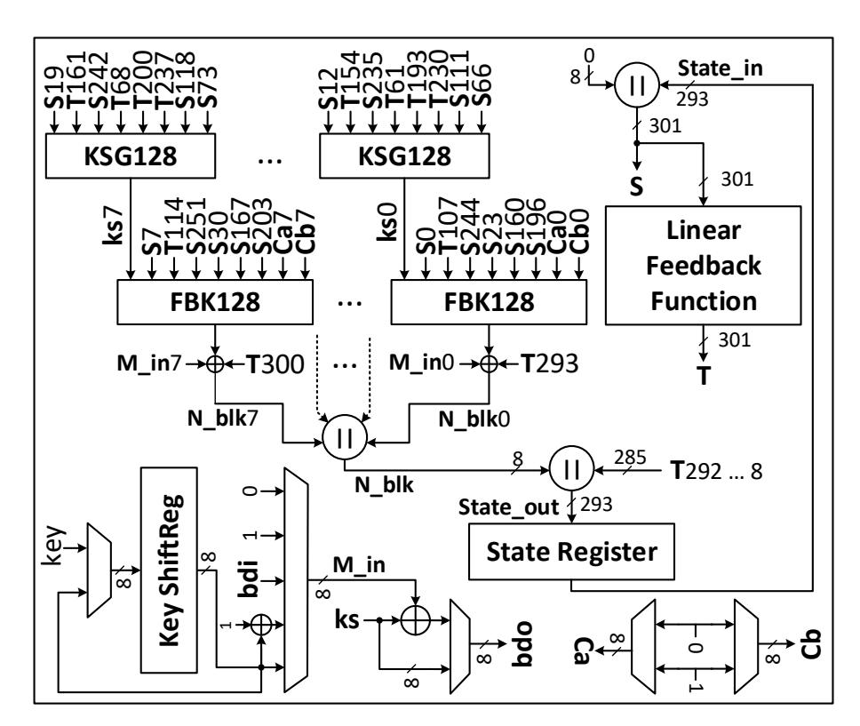
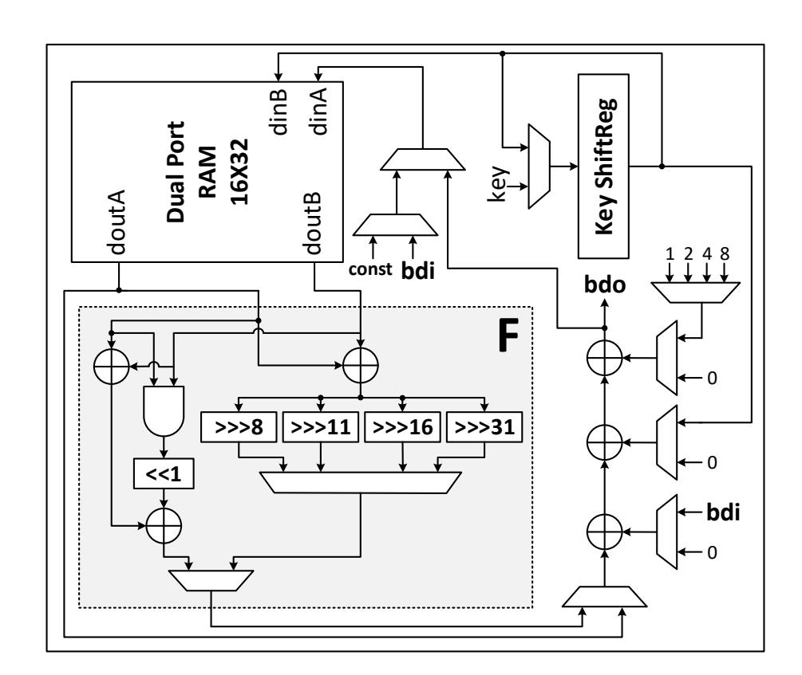
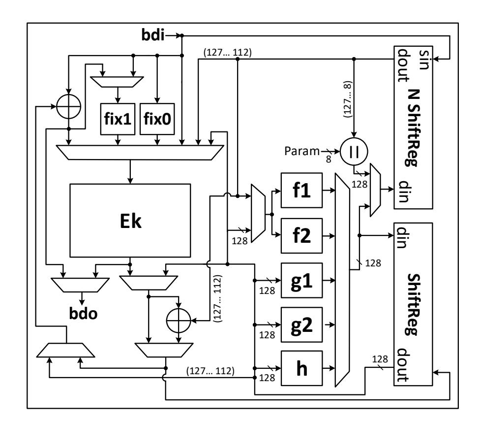
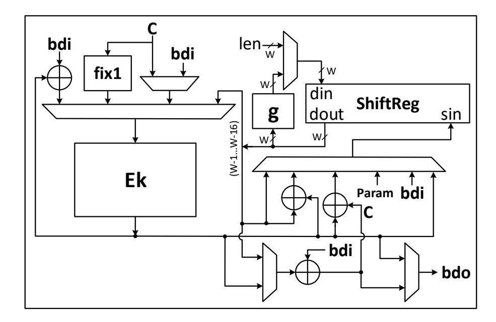
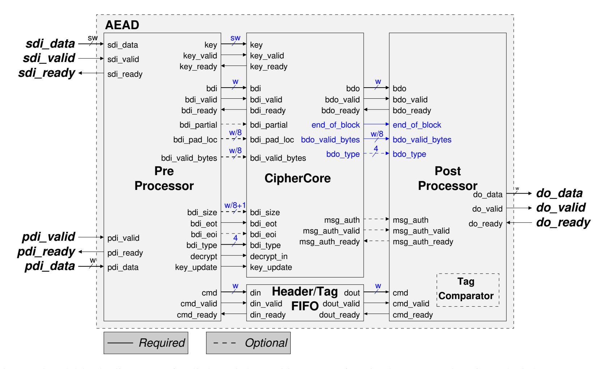
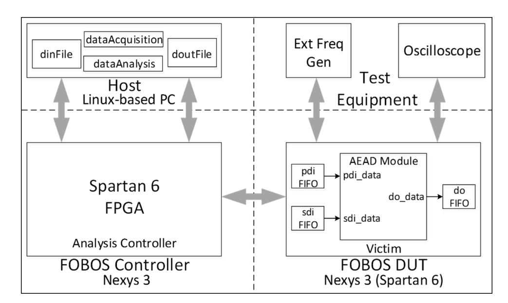

{0}------------------------------------------------

# Improved Lightweight Implementations of CAESAR Authenticated Ciphers

Farnoud Farahmand, William Diehl, Abubakr Abdulgadir, Jens-Peter Kaps and Kris Gaj *Department of Electrical and Computer Engineering George Mason University, Fairfax, U.S.A. Email:* {*ffarahma, wdiehl, aabdulga, jkaps, kgaj*}*@gmu.edu*

*Abstract*—Authenticated ciphers offer potential benefits to resource-constrained devices in the Internet of Things (IoT). The CAESAR competition seeks optimal authenticated ciphers based on several criteria, including performance in resourceconstrained (i.e., low-area, low-power, and low-energy) hardware. Although the competition specified a "lightweight" use case for Round 3, most hardware submissions to Round 3 were not lightweight implementations, in that they employed architectures optimized for best throughput-to-area (TP/A) ratio, and used the Pre- and PostProcessor modules from the CAE-SAR Hardware (HW) Development Package designed for highspeed applications. In this research, we provide true lightweight implementations of selected ciphers (ACORN, NORX, CLOC-AES, SILC-AES, and SILC-LED). These implementations use an improved version of the CAESAR HW Development Package designed for lightweight applications, and are fully compliant with the CAESAR HW Application Programming Interface for Authenticated Ciphers. Our lightweight implementations achieve an average of 55% reduction in area and 40% reduction in power compared to their corresponding high-speed versions. Although the average energy per bit of lightweight ciphers increases by a factor of 3.6, the lightweight version of NORX actually uses 47% less energy per bit than its corresponding high-speed implementation.

*Keywords*-Reconfigurable, FPGA, Lightweight, Power, Energy, Authenticated Cipher, CAESAR, FOBOS

# I. INTRODUCTION

Edge devices in the emerging Internet of Things (IoT) often perform transactions on sensitive data and require cryptographic protections. Examples of such devices include unmanned vehicle operations, cyber-physical systems (CPS), and remote wireless sensor nodes. Since authenticated ciphers combine the cryptographic services of confidentiality, integrity, and authentication into one algorithm, they can potentially replace distinct block ciphers and hash functions that are required to work together, which both reduces resources, and eliminates potential security vulnerabilities.

The Competition for Authenticated Encryption – Security, Applicability, and Robustness (CAESAR), now entering its final stages, evaluates candidates based on several criteria, including performance in hardware, to choose a portfolio of authenticated ciphers that offer advantages over AES-GCM, and are suitable for widespread adoption [\[1\]](#page-7-0). Beginning with Round 3 in 2016, the CAESAR Committee specified use cases, under which candidates would be evaluated. One such use case is "lightweight" (LW) applications, for which desired characteristics include performance and energy efficiency in resource-constrained hardware and software [\[2\]](#page-7-1).

Hardware submissions of CAESAR Round 3 candidates, in the form of VHDL or Verilog code compliant with the CAESAR Hardware (HW) Applications Programming Interface (API) for Authenticated Ciphers ( [\[3\]](#page-7-2) and [\[4\]](#page-7-3)), were made available for public evaluation and FPGA benchmarking in July 2017. However, the majority of these implementations were optimized for high speed (HS), in that they employed either basic iterative or unrolled architectures, and used full-width datapaths and large I/O bus widths. Such design choices are not surprising, in that HW submissions are historically evaluated based on best throughput-to-area (TP/A) ratios, which are achieved using the aforementioned architectures [\[5\]](#page-7-4). Of note, results of HW implementations, shown at [\[6\]](#page-7-5), prominently display TP/A ratios.

Additionally, the majority of HW submissions were implemented using the CAESAR HW Development Package, discussed at [\[7\]](#page-7-6) and available at [\[8\]](#page-7-7). At the time, the HS package was the only available version, but was not optimal for LW implementations, in that the minimum I/O bus width was 32 bits, and I/O modules often contained resourceintensive units (e.g., a universal padding unit) not necessary for certain designs.

As a result, the true LW potential of candidates stating a LW use case, as intended by the CAESAR committee, was not evaluated. Additionally, third-party evaluations of these implementations in resource-constrained environments (e.g., low-cost FPGAs with minimum area budgets) are more difficult. Finally, it is more difficult to develop and evaluate cipher versions protected against side-channel attacks, which was also an evaluation goal of CAESAR Round 3.

We address the above shortfalls in this research by providing true LW implementations of selected CAESAR Round 3 ciphers: ACORN, NORX, CLOC-AES, SILC-AES, and SILC-LED. Our implementations achieve reduced area and power consumption by using reduced internal datapath widths, and a new version of the CAESAR Development Package supporting LW implementations [\[8\]](#page-7-7). We benchmark each HS and LW implementation pair in the Spartan-6 FPGA, and compare them in terms of area (LUTs), throughput (TP) (Mbps), and TP/A ratio (Mbps/LUT). We measure power using both Xilinx XPower Analyzer (XPA), and on actual hardware using the open-source FOBOS test bench 

{1}------------------------------------------------

and a Nexys-3 Spartan-6 FPGA Trainer Board. Finally, we compute energy per bit (nJ/bit) based on measured mean power consumption for each implementation pair.

#### II. BACKGROUND AND PREVIOUS RESEARCH

#### *A. Authenticated Ciphers*

Authenticated ciphers are intended to improve upon AES-GCM as standardized in [\[9\]](#page-7-8), where input data typically consist of message *M*, associated data *AD* (including header or protocol information that will not be encrypted), and a public message number *Npub*. Using *Key* and *Npub*, *M* is encrypted block-by-block to ciphertext *C*, which fulfills the confidentiality service. Integrity of data and authenticity of sender are ensured by a keyed-hash computation which occurs on all blocks of *Npub*, *AD* and *M*. The result of these computations is forwarded to the recipient as a *Tag*. In authenticated decryption, the recipient receives original *AD* and *Npub*, along with *C* and *Tag*, and uses *Key* to decrypt *C* to *M*. The authenticated decryption recreates a *Tag'*, and releases the decrypted message if and only if T ag0 = T ag.

## *B. Ciphers in this research*

The specifications of authenticated ciphers implemented in this project, ACORN, NORX, CLOC-AES, SILC-AES, and SILC-LED, are defined in [\[10\]](#page-7-9)–[\[12\]](#page-7-10). Their HS implementations referenced in this research are found at [\[13\]](#page-7-11) (ACORN), [\[14\]](#page-7-12) (NORX), [\[15\]](#page-7-13) (CLOC-AES and SILC-AES), and [\[16\]](#page-7-14) (SILC-LED). Their characteristics are summarized in Table [I.](#page-2-0)

#### *C. Previous lightweight implementations*

"Lightweight cryptography" can be achieved by fundamental algorithmic or architectural choices intended to achieve reductions in area and/or power at the cost of possible losses in security and performance [\[5\]](#page-7-4). Our research examines cases using the latter methodology, namely, attempts to reduce the area and power consumption of ciphers through architectural choices.

Subsequent to the standardization of AES-GCM, there were early attempts to provide dedicated LW authenticated encryption schemes. One example is Hummingbird-2, which required 2.2 kGE (Kilo-Gate Equivalent) of area in ASIC [\[17\]](#page-7-15). Later, AES-Based LW Authenticated Encryption (ALE) achieved an area of 2.5 kGE with 128-bit security while using the standard AES cryptographic primitive [\[18\]](#page-7-16).

CAESAR intends to select a portfolio of authenticated ciphers that are optimized for certain criteria, including performance in hardware. Certain CAESAR candidates with stated LW use cases can be realized using low area implementations. An example is the Ascon x-low-area, which uses 2.57 kGE in 90 nm ASIC technology, documented at [\[19\]](#page-7-17). However, this version is not compliant with the CAESAR HW API, and is not easily comparable to other CAESAR candidates. Other LW implementations include an 8-bit ACORN implementation at [\[13\]](#page-7-11), and several versions of NORX available at [\[20\]](#page-7-18).

Our work builds on [\[21\]](#page-7-19), where authors present LW implementations of CAESAR candidates Ketje Sr, Ascon-128, and Ascon-128a. In particular, using an example of Ascon-128, they demonstrate that use of a prototype version of the LW Development Package significantly reduces the overhead of Pre- and PostProcessor modules compared to the previous HS Development Package. Characteristics of LW implementations from [\[21\]](#page-7-19), specified in [\[22\]](#page-7-20) (Ascon) and [\[23\]](#page-7-21) (Ketje Sr), are shown in Table [I.](#page-2-0) Additionally, the first external use of the LW Development Package (by designers different than co-authors of the package) was reported in [\[20\]](#page-7-18).

### *D. Our contribution*

We present the first medium-scale study of LW implementations of CAESAR Round 3 candidates targeting Use Case 1 (Lightweight Applications), and document tangible reduction in area and power consumption compared to their corresponding HS versions. Our open-source implementations, documented at [\[6\]](#page-7-5) and available at [\[14\]](#page-7-12), support further evaluation of CAESAR candidates before the end of the competition, and provide useful starting points for more efficient side-channel resistant cipher implementations.

Additionally, we illustrate a methodology for measuring power and energy consumption during actual FPGA device operation using relevant test vectors, and compare measurements with those obtained through less timeconsuming vector-less post-implementation simulation using Xilinx XPower Analyzer (XPA) in Xilinx ISE. Implementation in actual hardware, and verification of expected output, provides a higher confidence factor that both our LW implementations, and the newly-released LW CAESAR HW Development Package, are free from bugs not easily detected in simulation.

## III. METHODOLOGY

#### *A. Designs of selected lightweight authenticated ciphers*

Our design methodology is register-transfer level (RTL) design. We improve upon the HS implementations of subject ciphers by designing true LW implementations. Our design methodology consists of two aspects: 1) Use of the LW CAESAR HW Development Package, with I/O bus widths (e.g., public data width (W) or secret data width (SW)) of 8, 16, or 32 bits, and 2) Use of internal datapaths for cryptographic primitives and authenticated cipher layer operations, which are matched to their corresponding I/O bus widths.

Design strategies for specific ciphers are further discussed below and summarized in Table [I,](#page-2-0) where "datapath width" denotes the number of bits of internal state on which register writes occur in one clock cycle.

{2}------------------------------------------------

| Algorithm Specification |               |                |               |                       | High-Speed             |                             |                         |             |           | Lightweight |                             |                         |             |              |
|-------------------------|---------------|----------------|---------------|-----------------------|------------------------|-----------------------------|-------------------------|-------------|-----------|-------------|-----------------------------|-------------------------|-------------|--------------|
|                         | Key [bits] | Npub [bits] | Tag [bits] | AD block [bits] | Msg block [bits] | Datapath Width [bits] | #Cycles per block | W [bits] | SW [bits] | Ref         | Datapath Width [bits] | #Cycles per block | W [bits] | SW [bits] |
| ACORN                   | 128           | 128            | 128           | 1                     | 1                      | 325                         | 1/32                    | 32          | 32        | [13]        | 301                         | 1/8                     | 8           | 8            |
| NORX                    | 128           | 64             | 128           | 384                   | 384                    | 512                         | 4                       | 128         | 32        | [14]        | 32                          | 12                      | 32          | 32           |
| CLOC-AES                | 128           | 96             | 64            | 128                   | 128                    | 128                         | 23                      | 32          | 32        | [15]        | 16                          | 190                     | 16          | 16           |
| SILC-AES                | 128           | 96             | 64            | 128                   | 128                    | 128                         | 23                      | 32          | 32        | [15]        | 16                          | 182                     | 16          | 16           |
| SILC-LED                | 80            | 48             | 32            | 64                    | 64                     | 64                          | 98                      | 64          | 40        | [15]        | 16                          | 490                     | 16          | 16           |
| Ascon-128               | 128           | 128            | 128           | 64                    | 64                     | 320                         | 7                       | 32          | 32        | [14]        | 64                          | 228                     | 32          | 32           |
| Ascon-128a              | 128           | 128            | 128           | 128                   | 128                    | 320                         | 9                       | 32          | 32        | [14]        | 64                          | 304                     | 32          | 32           |
| Ketje Sr                | 128           | 128            | 128           | 32                    | 32                     | 400                         | 1                       | 32          | 32        | [24]        | 16                          | 160                     | 16          | 16           |

Table I: Characteristics of authenticated ciphers and their implementations investigated in this work

1) ACORN: ACORN is the only stream cipher-based CAESAR candidate in this study; all other authenticated ciphers are based on block cipher primitives. The state size is 293 bits long and is stored in state register. There are three functions in ACORN-128: 1) the function KSG128, used to generate the keystream bits ks7..ks0, 2) the function FBK128, used to compute the overall feedback bits N\_blk7..N\_blk0, and 3) the Linear Feedback Function, used to calculate the majority of the new state, State\_out, bits. The ACORN top-level datapath is shown in Fig. 1.

This LW implementation of ACORN-128 receives input data in 8-bit blocks. After initialization and the keystream bit generation step, it produces 8 bits of output data per clock cycle. The initialization and keystream bit generation take 194 clock cycles. The ACORN basic specification is based on a 293-bit state and processing of one bit at a time (e.g., per clock cycle). However, in our implementation, we increase the state size from 293 bits to 301 bits (i.e., 8 bits larger) and instantiate the KSG128 and FBK128 blocks (i.e., the underlying nonlinear functions which processes 8 bits

Figure 1: ACORN top-level datapath. All buses are 1-bit unless noted.

in each clock cycle. Blocks of M and AD arrive through the bdi port, and Key is loaded through the key port. Ca and Cb are constant values, and can either be all zeros or all ones.  $N\_blk$  is the new 8-bit block generated based on the current state. It is concatenated with the output of the six linear feedback functions to create the new state, which is loaded to the state register (shown in Fig. 1). In ACORN-128, a Tag is generated after a finalization step, which takes 96 clock cycles to run in our implementation.

2) NORX: NORX [11] is an authenticated encryption scheme based on Addition, Rotation, and XOR (ARX) primitives that do not use modular additions. NORX has a unique parallel architecture based on the monkeyDuplex construction, where the degree of parallelism and tag size can be changed arbitrarily. However, in this project we implement the LW version which does not use parallelism features. A NORX instance is denoted by NORXw-l-p-t, and is a choice of values for four parameters w, l, p, and t which are word size, round number, parallelism degree, and tag size, respectively. We implement NORX 32-4-1-128 with 128 bit Key and Tag.

Figure 2: NORX top-level datapath. All buses are 32 bits.

{3}------------------------------------------------

Figure 3: CLOC top-level datapath. All buses are 16 bits unless noted.

The core algorithm F is a permutation of b = r + c bits. In the 32-bit (w) version, b, r and c are 512, 384 and 128, respectively. The state consists of a concatenation of 16 words, i.e., S = s0||...||s15, where s0, ..., s11 are the locations where data blocks are injected, and s12, ..., s15 remain untouched.

Our LW implementation of NORX32-4-1 receives input data in 32-bit blocks from the bdi port (shown in Fig. [2\)](#page-2-2), and after the initialization step, produces 32 bits of output data per clock cycle. The initialization step takes 534 clock cycles. In addition, T ag is generated after a finalization step and takes 521 clock cycle to run. The memory employed to hold the 512-bit state in LW NORX is a 16 × 32 dual port RAM. Accordingly, the output words are read in 32-bit blocks from 16 different locations of this RAM.

*3) CLOC-AES:* CLOC, or Compact Low-Overhead Counter Feedback Mode (CFB) [\[12\]](#page-7-10) is a block cipher mode of operation for authenticated encryption. CLOC targets optimization of implementation overhead beyond the block cipher, pre-computation complexity, and memory requirements. CLOC is efficient in the case of short input data, and supports AES as an underlying block cipher. The CLOC top-level datapath is shown in Fig. [3.](#page-3-0)

We use AES-128 with a 16-bit datapath as the primitive block cipher, which is the same datapath width used in our LW implementation of CLOC. Regardless of internal datapath width of AES primitive, however, the CLOC block size is 128 bits. CLOC receives input data in 16-bit words through the bdi port, and processes eight words (i.e., one 128-bit block) in 190 clock cycles. f1, f2, g1, g2 and h are the nonlinear functions used in CLOC, so as illustrated in Fig. [3,](#page-3-0) the input and output size of these units are equal to W which is the block size of the block cipher (128 bits in

Figure 4: SILC top-level datapath. All buses are 16 bits unless noted. W is 128 for SILC-AES and 64 in case of SILC-LED.

case of AES).

*4) SILC-AES:* SILC, or Simple Lightweight CFB [\[12\]](#page-7-10) is a block cipher mode of operation for authenticated encryption. SILC is built upon CLOC; its design goal is to optimize the HW implementation cost of CLOC. In other words, SILC is a lighter version of CLOC. SILC can be implemented based on the AES-128 block cipher for a 16 byte block length. The SILC datapath is shown in Fig. [4.](#page-3-1)

Our SILC-AES implementation uses the same AES core used for CLOC-AES, with a 16-bit datapath width. However, SILC processes eight words (i.e., one 128-bit block) in only 182 clock cycles. SILC uses only one nonlinear function g, which significantly reduces datapath complexity in comparison to CLOC as shown in Fig. [4.](#page-3-1)

*5) SILC-LED:* Our SILC-LED LW implementation is similar to SILC-AES in terms of top-level datapath (shown in Fig. [4\)](#page-3-1). However, the employed block cipher is LED, which has a 64-bit block size. We use an LED-80 RTL implementation with a 16-bit datapath that matches the SILC datapath width.

SILC-LED processes four words of data (i.e., one 64 bit block) in 490 clock cycles. SILC-LED has Key, N pub and T ag sizes of 80, 48, and 32, respectively, which are recommended in the SILC specification [\[12\]](#page-7-10).

#### *B. CAESAR Hardware API for Authenticated Ciphers*

In cryptographic contests, such as Advanced Encryption Standard (AES), Secure Hash Algorithm (SHA-3), and the current CAESAR, winners are often selected based on performance in SW and HW. In order to 1) implement a large number of potential candidates as early as possible in the competition (e.g., there were 57 CAESAR Round 1 and 29 CAESAR Round 2 candidates), and 2) fairly evaluate different candidates based on a common interface and protocol, it is desirable to have a common API. Although a SW API was specified at the beginning of the CAESAR

{4}------------------------------------------------

Figure 5: Top-level block diagram of a lightweight architecture of a single-pass authenticated cipher core, AEAD [7]

competition in 2012, an official HW API – the CAESAR HW API for Authenticated Ciphers – was not established until 2016.

The first version of the CAESAR HW Development Package (v1.0) was implemented in 2016 to support CAESAR Round 2 submissions. Although the API allows for LW implementations with external data bus widths of 8, 16, or 32 bits (i.e., pdi or sdi), Development Package v1.0 did not support bus widths of less than 32 bits. Though "work-arounds" are possible, this shortfall discouraged the submission of true LW CAESAR Round 3 candidates, which were due in Summer 2017.

Subsequently, the LW CAESAR HW Development Package (v2.0) was validated in [21], released in Dec. 2017 [8], and facilitates lower-area implementations by 1) permitting external bus widths of 8, 16, or 32 bits, and 2) reducing the amount of functionality automatically provided by Pre- and PostProcessor. Our LW implementations in this research are fully-compliant with the CAESAR API, and are implemented using Development Package v2.0. Our generation of correct output test vectors (in conjunction with FOBOS power measurements) validate that the Development Package v2.0 is free from FPGA-specific hardware-dependent bugs, such as latches, under-defined FSM states, gated clocks, and asynchronous sets and resets.

The top-level external module, AEAD, with Pre- and PostProcessors, is shown in Fig. 5. In accordance with [7], designers implement their design in CipherCore, and signal the Pre- and PostProcessor (usually through a user-defined

controller), to control input and output conditions. In contrast to v1.0, any required padding (a common operation in authenticated ciphers) should be performed in CipherCore, rather than in the PreProcessor. Additionally, the user has the option to perform tag validation in CipherCore, or in PostProcessor.

#### C. Measurement of Power and Computation of Energy

Measurement or computation of power and energy usage of a given authenticated cipher is desirable for multiple reasons. For example, power (measured in mW) influences type of power supply, conductor sizes, and cooling capacity. Energy per bit (expressed in nJ/bit) determines the amount of energy consumed per bit of processed data (*AD* and *M*), and influences the battery life time, assuming a given average amount of traffic.

Although FPGA designers (e.g., Xilinx or Intel) provide an array of tools to estimate power consumption with incrementally increasing accuracy, power measurement on actual hardware is more desirable than simulation, since experimental measurement results more accurately account for glitch transitions, environmental conditions, process variations, and parasitic effects of other devices running on the same hardware (e.g., Nexys 3). Additionally, instantiation of ciphers in actual hardware, with relevant test vectors, provides a much higher confidence factor that the algorithm and interface are correctly implemented.

We adapt the Flexible Open-source workBench fOr Sidechannel analysis (FOBOS) to measure power consumed 

{5}------------------------------------------------

by the Spartan-6 1.2V line, e.g., V ccINT , by measuring current through a 1Ω shunt resistor. Our current is amplified by the TI INA225 amplifier, rendered as a voltage in an oscilloscope, and offloaded to an attached PC for post-run power computation. FOBOS uses a separate control board and victim board, where the Device Under Test (DUT), or "victim", is instantiated in the victim board, e.g., Digilent Nexys 3.

Power measurements are recorded at discrete time intervals corresponding to sample rate. Our current FOBOS installation computes about 18,000 samples per trace. 20 FOBOS traces (using various test vectors of up to 2000 bytes each) are used to form the power profile of each cipher at a select frequency. The power measurements contain a combination of static and dynamic power at each sample. For our typical authenticated cipher design (according to XPA simulation results at 10 MHz), V ccINT accounts for roughly 72% of the dynamic power, but only about 32% of the total static power (the other power consumers are the 2.5V V ccAUX and 3.3V V cco33). Therefore, our power measurement underestimates actual device usage at lower frequencies, but improves in accuracy with increasing frequency (i.e., as a larger share of power becomes dynamic). Our methodology also accurately captures the relative differences in dynamic power between HS and LW versions.

During post-analysis, mean power (Pmean) is computed by averaging instantaneous power measurements over the entire time domain, while maximum power (Pmax) is estimated by sampling the highest peaks during each trace. Energy per bit (nJ/bit) is then estimated as Pmean(mJ/s)/T P(M bps), where TP (throughput) is the throughput of an authenticated encryption of a long message. Note that estimating TP based on a long message tends to negate "short-message" abnormalities, such as associated data processing, key, or state variable initializations.

For authenticated ciphers, the FOBOS DUT victim wrapper is configured with separate FIFOs corresponding to the data ports prescribed in [\[3\]](#page-7-2), including pdi, sdi, and do. The test vectors fully conform to the CAESAR HW API [\[3\]](#page-7-2), are generated with the test vector generator aeadtvgen.py [\[8\]](#page-7-7), and are located in dinFile.txt in the host PC prior to acquisition. Post-acquisition cipher results are collected in doutFile.txt, which verifies proper operation of the cipher.

The baseline FOBOS suite, with software coded in Python, and firmware coded in VHDL, is available for download at [\[25\]](#page-7-24). The modified FOBOS for power measurement of authenticated ciphers is shown in Fig. [6.](#page-5-0)

Figure 6: FOBOS block diagram.

#### IV. RESULTS

### *A. Comparison of Area, Throughput, and Throughput-toarea Ratio*

Pairs of corresponding HS and LW cipher implementations are benchmarked in the Spartan-6 FPGA (xc6slx16 csg324-3). All ciphers are implemented in a wrapper (AEAD Wrapper, available at [\[8\]](#page-7-7)) in order to meet I/O pin constraints on this device. Implementations are additionally optimized with the ATHENa optimization tool (available at [\[26\]](#page-7-25)) using a "lowest area" optimization target. ATHENa suppresses Block RAM (BRAM) generation during synthesis results, in order to ensure that all area requirements are in terms of LUTs, thus ensuring a fair comparison of area. Results are shown in Table [II.](#page-5-1) Results for Ascon HS implementation from [\[14\]](#page-7-12) and Ascon LW, Ketje Sr HS, and Ketje Sr LW implementations reported in [\[21\]](#page-7-19) are also

Table II: Results of Implementations of Ciphers in Spartan-6 FPGA. "Red" is reduction in LW compared to HS.

| Algorithm     | Area [LUT] | Red [%] | Freq [MHz] | TP [Mbps] | Red [%] | TP/A [Mbps /LUT] |  |  |  |  |
|---------------|---------------|------------|---------------|--------------|------------|------------------------|--|--|--|--|
| High-Speed    |               |            |               |              |            |                        |  |  |  |  |
| ACORN         | 1024          | -          | 124.6         | 3986.6       | -          | 3.826                  |  |  |  |  |
| NORX          | 3065          | -          | 53.4          | 5125.2       | -          | 1.672                  |  |  |  |  |
| CLOC-AES      | 3147          | -          | 127.5         | 709.5        | -          | 0.225                  |  |  |  |  |
| SILC-AES      | 3404          | -          | 127.0         | 706.9        | -          | 0.208                  |  |  |  |  |
| SILC-LED      | 1575          | -          | 162.1         | 105.8        | -          | 0.067                  |  |  |  |  |
| Ascon-128     | 1402          | -          | 208.5         | 1906.3       | -          | 1.360                  |  |  |  |  |
| Ascon-128a    | 1712          | -          | 202.8         | 2884.3       | -          | 1.684                  |  |  |  |  |
| Ketje Sr [21] | 2415          | -          | 124.3         | 3979.0       | -          | 1.648                  |  |  |  |  |
|               |               |            | Lightweight   |              |            |                        |  |  |  |  |
| ACORN         | 418           | 59.2       | 153.2         | 1225.5       | 69.3       | 2.932                  |  |  |  |  |
| NORX          | 1424          | 53.5       | 93.4          | 2989.0       | 41.7       | 2.099                  |  |  |  |  |
| CLOC-AES      | 1604          | 49.0       | 101.9         | 68.7         | 90.3       | 0.043                  |  |  |  |  |
| SILC-AES      | 1052          | 69.1       | 109.0         | 76.6         | 89.2       | 0.073                  |  |  |  |  |
| SILC-LED      | 872           | 44.6       | 115.5         | 15.1         | 85.7       | 0.017                  |  |  |  |  |
| Ascon-128     | 684           | 51.2       | 216.0         | 60.1         | 96.8       | 0.088                  |  |  |  |  |
| Ascon-128a    | 684           | 60.0       | 216.0         | 90.9         | 97.7       | 0.133                  |  |  |  |  |
| [21]          |               |            |               |              |            |                        |  |  |  |  |
| Ketje Sr [21] | 450           | 81.4       | 120.1         | 24.0         | 99.4       | 0.053                  |  |  |  |  |

{6}------------------------------------------------

shown in Table [II](#page-5-1) for purposes of comparison.

The results show that our LW implementations achieve an area (in terms of LUTs) on average 55% lower than their corresponding HS implementations, while throughput (TP) (Mbps) decreases by 75% on average, and throughput-toarea (TP/A) (Mbps/LUT) decreases by 44%. The reduction in TP and TP/A ratio is an expected consequence of our architectural choices, which sacrifice latency and throughput for reduced area. However, the TP/A ratio for the LW implementation of NORX actually improves by 26%. Further, the area results for ACORN (this work) and ASCON-128 [\[21\]](#page-7-19) support these respective candidates' selection to the CAESAR final round for the lightweight use case. All results are available in the ATHENa database of results in the Ranking View [\[27\]](#page-7-26) (please choose Spartan 6, and click Update) and in the Table View [\[28\]](#page-8-0) (choose Family: Spartan 6, Arch Type: Lightweight).

#### *B. Comparison of Power and Energy*

The results in Table [III](#page-6-0) show simulated power, mean experimental power Pmean, and peak experimental power Pmax. Pmean and Pmax are measured as described above, while simulated power is generated by XPA using a fully placed-and-routed design, and "vector-less" estimation, i.e., default toggle rates and static probabilities. The XPA calculations are constrained by actual clock frequency in the constraints (.ucf) file, and environmental factors are set to 21°C ambient temperature with zero airflow. Additionally, only simulated power generated by the 1.2V V ccINT is included, in order to directly compare to FOBOS. The results show that our LW cipher implementations use on average 43% less power according to simulation; and 40% less Pmean and 41% less Pmax than their corresponding HS implementations, when clocked by an external frequency generator at 10 MHz.

Based on observed mean power, the LW ciphers use on average 3.6 times more energy per bit than their corresponding HS versions, which is explained by the fact that throughput is lower in the LW versions. However, the LW NORX actually uses 47% less energy per bit than its corresponding HS version, meaning that LW NORX is lower-area, lower-power, and lower-energy than its HS counterpart. The relatively high power consumption of the HS NORX is likely due to the lengthy chain of complex logic in its critical path, where glitch transitions (i.e., multiple transitions per clock cycle) consume excessive power. Additionally, the HS version of ACORN (i.e., the version with 32 streaming output bits delivered in parallel) is the most energy efficient of all 10 implementations. Overall, the low power and energy results for both HS and LW ACORN implementations further support ACORN's selection to the CAESAR final round.

The XPA simulation results compare favorably with actual observations on hardware – even using vector-less estimation. The degree to which the simulated power overestimates observed power averages to only 0.7%, although a standard deviation of 14% indicates that a generalized magnitude and direction of any difference is not predictable.

Table III: Power and Energy Consumption on Spartan-6 FPGA at 10 MHz. "Sim Pwr" is a simulated power, "Exp Pwr" is a mean experimental power; "Red" is the reduction of Exp Pwr in LW over Exp Pwr in HS, "Peak Pwr" is a peak experimental power; "E2S" is the percentage increase of Exp Pwr over Sim Pwr; "Epb" is the Energy per bit; "L2H" is the ratio of Epb in LW compared to Epb in HS.

| Algorithm   | Sim Pwr [mW] | Exp Pwr [mW] | Red [%] | Peak Pwr [mW] | E2S [%] | Epb [nJ/bit] | L2H  |  |  |  |
|-------------|--------------------|--------------------|------------|---------------------|------------|-----------------|------|--|--|--|
| High-Speed  |                    |                    |            |                     |            |                 |      |  |  |  |
| ACORN       | 12.6               | 10.9               | -          | 11.9                | -15.6      | 0.034           | -    |  |  |  |
| NORX        | 53.1               | 69.7               | -          | 99.6                | 23.8       | 0.073           | -    |  |  |  |
| CLOC-AES    | 17.3               | 16.9               | -          | 19.3                | -2.4       | 0.304           | -    |  |  |  |
| SILC-AES    | 15.4               | 16.4               | -          | 19.1                | 6.1        | 0.295           | -    |  |  |  |
| SILC-LED    | 13.0               | 10.9               | -          | 11.7                | -19.3      | 1.670           | -    |  |  |  |
| Lightweight |                    |                    |            |                     |            |                 |      |  |  |  |
| ACORN       | 9.2                | 7.9                | 28         | 8.9                 | -16.5      | 0.099           | 2.90 |  |  |  |
| NORX        | 12.8               | 12.3               | 82         | 15.9                | -4.1       | 0.038           | 0.53 |  |  |  |
| CLOC-AES    | 10.8               | 10.6               | 37         | 11.5                | -1.9       | 1.573           | 5.18 |  |  |  |
| SILC-AES    | 9.2                | 11.6               | 29         | 12.6                | 20.7       | 1.649           | 5.60 |  |  |  |
| SILC-LED    | 8.4                | 8.6                | 21         | 9.3                 | 2.3        | 6.567           | 3.93 |  |  |  |

#### V. CONCLUSIONS

In this research, we produced and verified five lightweight (LW) implementations of CAESAR Round 3 candidate authenticated ciphers with LW use cases. Our LW implementations successfully validated the improved features of the LW CAESAR HW Development Package v2.0, and showed that the utilities in the Development Package perform correctly in actual hardware. We benchmarked both our LW designs and corresponding publicly-available highspeed (HS) implementations in the Spartan-6 FPGA. Our LW designs used on average 55% less area (in terms of LUTs) than their corresponding HS versions. As a cost, the throughput (TP), and throughput-to-area (TP/A) ratios of the LW versions decreased by 75% and 44%, respectively. However, the TP/A ratio of LW NORX actually improved by 26%.

Using the FOBOS architecture, we measured power and computed energy consumption on all implementation pairs during operation at 10 MHz on a Spartan-6 FPGA on a Nexys-3 board. The LW implementations used an average of 40% less power than their corresponding HS versions. Although the LW implementations consumed an average of 3.6 times more energy per bit, our LW NORX actually consumed 47% less energy per bit than its corresponding HS version.

Our estimation of power based on partial power measurements on actual hardware tracks nominally with estimated power using Xilinx XPower Analyzer (XPA), using production vector-less simulation, although the variance of 

{7}------------------------------------------------

differences between simulated and observed power is too high to generalize a magnitude or direction of error.

#### VI. AREAS FOR FUTURE RESEARCH

Future research could include LW implementations of additional ciphers, analyzed on advanced FPGAs, and optimized using the Minerva hardware optimization tool [\[29\]](#page-8-1).

#### REFERENCES

- [1] "CAESAR Competition for Authenticated Encryption: Security, Applicability, and Robustness," 2012, [http://competitions.](http://competitions.cr.yp.to/caesar.html) [cr.yp.to/caesar.html.](http://competitions.cr.yp.to/caesar.html)
- [2] D. Bernstein. (2016, Jul) Cryptographic Competitions. [Online]. Available: [https://groups.google.com/forum/#!](https://groups.google.com/forum/#!forum/crypto-competitions) [forum/crypto-competitions](https://groups.google.com/forum/#!forum/crypto-competitions)
- [3] E. Homsirikamol, W. Diehl, A. Ferozpuri, F. Farahmand, P. Yalla, J. Kaps, and K. Gaj, "CAESAR Hardware API," Cryptology ePrint Archive, Report 2016/626, 2016, [http:](http://eprint.iacr.org/2016/626) [//eprint.iacr.org/2016/626.](http://eprint.iacr.org/2016/626)
- [4] ——. (2016, Jun) Addendum to the CAE-SAR Hardware API v1.0. [Online]. Available: [https://cryptography.gmu.edu/athena/CAESAR](https://cryptography.gmu.edu/athena/CAESAR_HW_API/CAESAR_HW_API_v1.0_Addendum.pdf) HW API/CAESAR HW API v1.0 [Addendum.pdf](https://cryptography.gmu.edu/athena/CAESAR_HW_API/CAESAR_HW_API_v1.0_Addendum.pdf)
- [5] A. Biryukov and L. Perrin, "State of the Art in Lightweight Symmetric Cryptography," Cryptology ePrint Archive, Report 2017/511, 2017, [https://eprint.iacr.org/2017/511.](https://eprint.iacr.org/2017/511)
- [6] CERG. (2017, Aug) Hardware Benchmarking of CAESAR Candidates. [Online]. Available: [https://cryptography.gmu.](https://cryptography.gmu.edu/athena/index.php?id=CAESAR) [edu/athena/index.php?id=CAESAR](https://cryptography.gmu.edu/athena/index.php?id=CAESAR)
- [7] E. Homsirikamol, W. Diehl, A. Ferozpuri, F. Farahmand, and K. Gaj. (2017, Dec) Implementer's Guide to Hardware Implementations Compliant with the CAESAR Hardware API, v2.0. [Online]. Available: [https://cryptography.gmu.edu/athena/CAESAR](https://cryptography.gmu.edu/athena/CAESAR_HW_API/CAESAR_HW_Implementers_Guide_v2.0.pdf) HW [API/CAESAR](https://cryptography.gmu.edu/athena/CAESAR_HW_API/CAESAR_HW_Implementers_Guide_v2.0.pdf) HW Implementers Guide v2.0.pdf
- [8] CERG. (2017, Dec) Development Package for Hardware Implementations Compliant with the CAESAR Hardware API, v2.0. [Online]. Available: [https://cryptography.gmu.edu/](https://cryptography.gmu.edu/athena/index.php?id=CAESAR) [athena/index.php?id=CAESAR](https://cryptography.gmu.edu/athena/index.php?id=CAESAR)
- [9] National Institute of Standards and Technology. (2007, Nov) Recommendation for Block Cipher Modes of Operation: Galois/Counter Mode (GCM) and GMAC. [Online]. Available: [http://nvlpubs.nist.gov/nistpubs/Legacy/](http://nvlpubs.nist.gov/nistpubs/Legacy/SP/nistspecialpublication800-38d.pdf) [SP/nistspecialpublication800-38d.pdf](http://nvlpubs.nist.gov/nistpubs/Legacy/SP/nistspecialpublication800-38d.pdf)
- [10] H. Wu. ACORN: A Lightweight Authenticated Cipher. Accessed March 23, 2018. [Online]. Available: [https:](https://competitions.cr.yp.to/round3/acornv3.pdf) [//competitions.cr.yp.to/round3/acornv3.pdf](https://competitions.cr.yp.to/round3/acornv3.pdf)
- [11] J. Aumasson, P. Jovanovic, and S. Neves. NORX. Accessed March 23, 2018. [Online]. Available: [https://competitions.cr.](https://competitions.cr.yp.to/round3/norxv30.pdf) [yp.to/round3/norxv30.pdf](https://competitions.cr.yp.to/round3/norxv30.pdf)
- [12] T. Iwata, K. Minematsu, J. Guo, S. Morioka, and E. Kobayashi. CLOC and SILC. Accessed March 23, 2018. [Online]. Available: [https://competitions.cr.yp.](https://competitions.cr.yp.to/round3/clocsilcv3.pdf) [to/round3/clocsilcv3.pdf](https://competitions.cr.yp.to/round3/clocsilcv3.pdf)

- [13] T. Huang. (2017, Jul) Round 3 hardware submission: ACORN. [Online]. Available: [https://groups.google.com/](https://groups.google.com/forum/#!forum/crypto-competitions) [forum/#!forum/crypto-competitions](https://groups.google.com/forum/#!forum/crypto-competitions)
- [14] GMU Source Code of Round 3 & Round 2 CAESAR Candidates, AES-GCM, AES, AES-HLS, and Keccak Permutation F. [Online]. Available: [https://cryptography.gmu.](https://cryptography.gmu.edu/athena/index.php?id=CAESAR _source_codes) [edu/athena/index.php?id=CAESAR](https://cryptography.gmu.edu/athena/index.php?id=CAESAR _source_codes) source codes
- [15] T. Iwata. (2017, Jul) CLOC and SILC—Authenticated Encryption Schemes for Constrained Devices. [Online]. Available:<http://www.nuee.nagoya-u.ac.jp/labs/tiwata/AE/>
- [16] ——. (2017, Jul) HW for CLOC and SILC 64-bit BC. [Online]. Available: [https://groups.google.com/forum/#!](https://groups.google.com/forum/#!forum/crypto-competitions) [forum/crypto-competitions](https://groups.google.com/forum/#!forum/crypto-competitions)
- [17] D. Engels, M.-J. O. Saarinen, P. Schweitzer, and E. M. Smith, "The Hummingbird-2 Lightweight Authenticated Encryption Algorithm," in *RFID. Security and Privacy: 7th International Workshop, RFIDSec 2011, Amherst, USA, June 26-28, 2011, Revised Selected Papers*, Jun 2012, pp. 19–31.
- [18] A. Bogdanov, F. Mendel, F. Regazzoni, V. Rijmen, and E. Tischhauser, "ALE: AES-Based Lightweight Authenticated Encryption," in *Fast Software Encryption*, S. Moriai, Ed. Berlin, Heidelberg: Springer Berlin Heidelberg, 2014, pp. 447–466.
- [19] H. Groß, E. Wenger, C. Dobraunig, and C. Ehrenhofer, ¨ "Suit up! – Made-to-Measure Hardware Implementations of ASCON," in *2015 Euromicro Conference on Digital System Design*, Aug 2015, pp. 645–652.
- [20] S. Schelle and M. Tempelmeier. (2017, Dec) NORX Implementations. [Online]. Available: [https://gitlab.lrz.de/](https://gitlab.lrz.de/tueisec/crypto-implementations) [tueisec/crypto-implementations](https://gitlab.lrz.de/tueisec/crypto-implementations)
- [21] P. Yalla and J. P. Kaps, "Evaluation of the CAESAR Hardware API for Lightweight Implementations," in *International Conference on Reconfigurable Hardware (ReConFig 2017)*, Dec 2017, pp. 1–6.
- [22] C. Dobraunig, M. Eichlseder, F. Mendel, and M. Schlaffer. ¨ (2016, Sep) Ascon v1.2 Submission to the CAESAR Competition. [Online]. Available: [https://competitions.cr.yp.](https://competitions.cr.yp.to/round3/asconv12.pdf) [to/round3/asconv12.pdf](https://competitions.cr.yp.to/round3/asconv12.pdf)
- [23] G. Bertoni, J. Daemen, M. Peeters, G. Van Assche, and R. Van Keer. (2016, Sep) CAESAR Submission: Ketje v2. [Online]. Available:<https://competitions.cr.yp.to/round3/ketjev2.pdf>
- [24] Ketje's and Keyak's VHDL implementation for the CAESAR competition. Accessed March 23, 2018. [Online]. Available: [https://github.com/guidobertoni/caesar](https://github.com/guidobertoni/caesar_gmu_vhdl) gmu vhdl
- [25] CERG. (2016, Oct) Flexible Open-source workBench fOr Side-channel analysis (FOBOS). [Online]. Available: <https://cryptography.gmu.edu/fobos/>
- [26] ——. Automated Tool for Hardware Evaluation (ATHENa). [Online]. Available:<https://cryptography.gmu.edu/athena>
- [27] CERG. ATHENa Database of results: Authenticated encryption FPGA ranking. [Online]. Available: [https://cryptography.](https://cryptography.gmu.edu/athenadb/fpga_auth_cipher/rankings_view) [gmu.edu/athenadb/fpga](https://cryptography.gmu.edu/athenadb/fpga_auth_cipher/rankings_view) auth cipher/rankings view

{8}------------------------------------------------

- [28] ——. Database of FPGA results for Authenticated Ciphers. [Online]. Available: [https://cryptography.gmu.edu/athenadb/](https://cryptography.gmu.edu/athenadb/fpga_auth_cipher/table_view) fpga auth [cipher/table](https://cryptography.gmu.edu/athenadb/fpga_auth_cipher/table_view) view
- [29] F. Farahmand, A. Ferozpuri, W. Diehl, and K. Gaj, "Minerva: Automated Hardware Optimization Tool," in *2017 International Conference on ReConFigurable Computing and FPGAs (ReConFig)*.