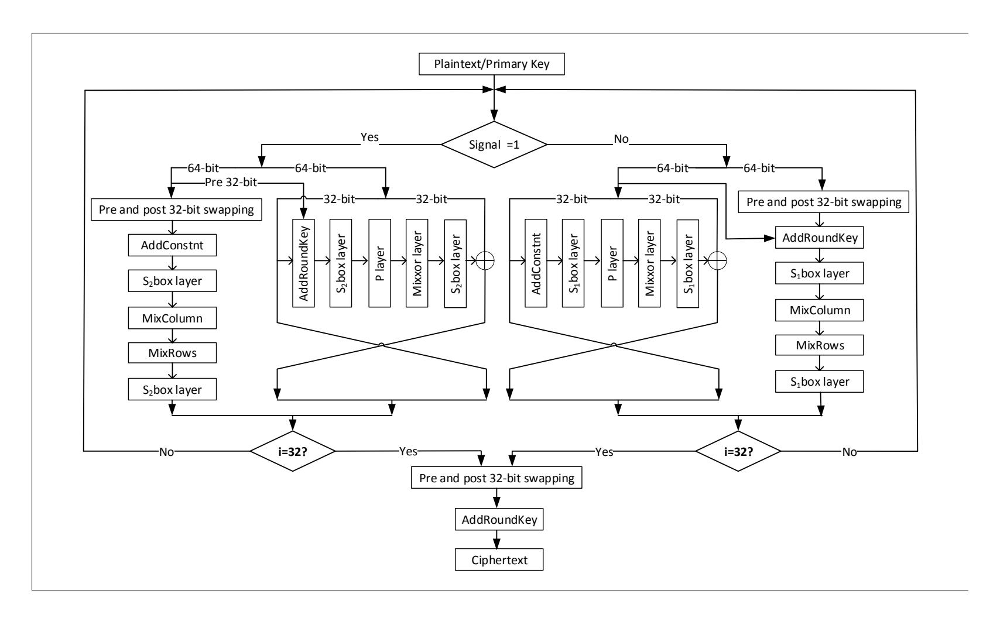
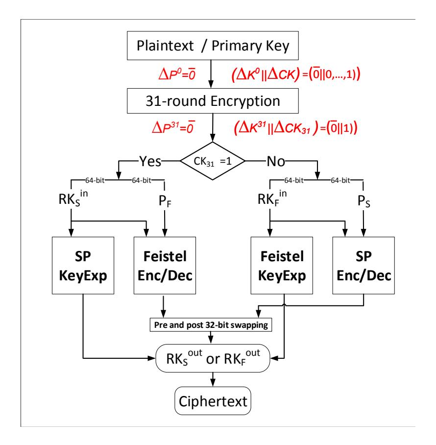

{0}------------------------------------------------

# Cryptanalysis of SFN Block Cipher

Sadegh Sadeghi1 , Nasour Bagheri2

1 Kharazmi University, Tehran, Iran, S.Sadeghi.Khu@gmail.com 2 Electrical Engineering Department, Shahid Rajaee Teacher Training University, Iran NBagheri@sru.ac.ir

Abstract. SFN is a lightweight block cipher designed to be compact in hardware environment and also efficient in software platforms. Compared to the conventional block ciphers that are either Feistel or Substitution-Permutation (SP) network based, SFN has a different encryption method which uses both SP network structure and Feistel network structure to encrypt. SFN supports key lengths of 96 bits and its block length is 64 bits. In this paper, we propose an attack on full SFN by using the related key distinguisher. With this attack, we are able to recover the keys with a time complexity of 260.58 encryptions. The data and memory complexity of the attacks are negligible. In addition, in the single key mode, we present a meet in the middle attack against the full rounds block cipher for which the time complexity is 280 SFN calculations and the memory complexity is 287 bytes. The date complexity of this attack is only a single known plaintext and its corresponding ciphertext.

Keywords: Lightweight block cipher, SFN, Related key differential cryptanalysis, Meet in the middle attack.

# 1 Introduction

Encryption systems have been known to exist for more than a millennium; most of the earlier systems can be considered as block ciphers. Block ciphers gained popularity after Data Encryption Standard was published in 1977. Block ciphers play a significant role in the security of communications as cryptography algorithms. Hence, security analysis of block ciphers is of particular importance. To this end, in this paper, we apply related key attack to analyze the lightweight block cipher SFN [\[5\]](#page-6-0).

The notion of related key attack functions based on the idea that the attacker has a prior awareness that (or chooses) there exists a relation between a number of keys and thus she can access the encryption functions under such related keys. The purpose of the attacker could be to recover the exact values of the keys. The earliest attacks of this kind were developed independently by Biham [\[2\]](#page-5-0) and Knudsen [\[4\]](#page-5-1), and the concept of a related key attack was delineated by [\[2\]](#page-5-0). An arbitrary bijective function R (or even a group of such functions) that is specified (or identified) beforehand by the adversary [\[1\]](#page-5-2) can constitute the relation between the keys. The simplest form of this attack can be when such a relation is just a XOR having a constant: K2 = K1 ⊕ C, in which the constant C is chosen by the adversary. This type of relation enables the adversary to track down the propagation of XOR differences that are caused by the key difference C through the key schedule of the cipher. Nevertheless, in more complex forms of this attack, other (possibly non-linear) relations between the keys are made possible, e.g. [\[2,](#page-5-0) [3\]](#page-5-3) are examples for this case.

SFN [\[5\]](#page-6-0) was proposed in 2018 by Li et. al. It is a 64-bit block cipher in which the round function uses both SP network structure and Feistel network structure to encrypt. In this 

{1}------------------------------------------------

paper, we analyse the security of SFN block cipher against the related key cryptanalysis and meet in the middle attack. Our attacks compromise the security of this block cipher both in related key mode and single key mode of operation. All attacks works on full rounds of the block cipher.

## 1.1 Outline.

This article is organised as follows. in Section [2](#page-1-0) we present some notations and also a brief description of SFN. The description of the related key differential attack is given in Section [3](#page-2-0) and Section [4](#page-3-0) explains meet in the middle attack. Finally, the conclusion and closing remarks are presented in Section [5.](#page-5-4)

## 2 Preliminaries

In this section, we give some notations and a brief description of SFN block cipher which will be used in the following parts.

## 2.1 Notations

Throughout this paper, we use the following notations:

- || : is the concatenation of two binary strings.
- ∆X : represents a non-zero difference of X.
- ∆Pi : represents the input difference of the (i + 1)-th round encryption (i = 0, · · · 31).
- ∆RKi : represents the difference of the (i + 1)-th round keys (i = 0, · · · 31).
- ∆CK : represents the difference of the control signal keys and ∆CKi represents the difference of the i-th bit (i = 0, · · · 31) of CK.
- CKi : represents the i-th bit (i = 0, · · · 31) of CK.
- RKin F , RKout F : represent the input and the output states of the Feistel key expansion structure of the round 32, respectively.
- RKin S , RKout S : represent the input and the output states of the SP key expansion structure of the round 32, respectively.
- PF , PS : represent the input states of the Feistel structure and SP structure of encryption in round 32, respectively.
- 0 : represents a sequence of 64 bits as 0.

## 2.2 Brief description of SFN

SFN, as a unique structure, consists of an SP network and a Feistel network [\[5\]](#page-6-0). Its block length and the key length are 64 bits and 96 bits, respectively. The 96-bit key is divided into two parts, one of which acts as the front 64-bit to perform AddRoundKey and KeyExpansion, and the other is rest 32-bit to function as the control signal. In addition, this signal is used to control two network structures, one of which is responsible for encryption or decryption, and the other is assigned with KeyExpansion. Each bit of the control signal carries out one round 

{2}------------------------------------------------

operation, and the SFN includes 32 rounds. In case of a detailed signal key, that is, when the bit of the control signal is 0, SFN chooses SP network structure to perform encryption or decryption, while Feistel network structure conducts KeyExpansion. However, if the bit of the signal is 1, SFN selects Feistel network structure to carry out encryption or decryption and the SP network structure pursues KeyExpansion [\[5\]](#page-6-0) (see Figure [2\)](#page-5-5).

When SFN round function uses the SP network structure for encryption or decryption, its round function is composed of such operations as: AddRoundKey, S1-box layer, Mix-Columns, MixRows, and S1-box layer. When the SP network structure carries out KeyExpansion, its round function is composed of such operations as: AddConstants, S2-box layer, MixColumns, MixRows, and S2-box layer. Simultaneously, When SFN round function uses the Feistel network structure for encryption or decryption, its round function is composed of such operations as: AddRoundKey, S2-box layer, P layer, MixXors, and S2-box layer. When the Feistel network structure carries out KeyExpansion, its round function is composed of such operations as: AddConstants, S1-box layer, P layer, MixXors, and S1-box layer. The mechanism of the round function is given in Figure [2.](#page-5-5) For more details of SFN structure we

Fig. 1. Encryption procedure of SFN cipher [\[5\]](#page-6-0).

refer the readers to [\[5\]](#page-6-0).

## 3 Related Key Cryptanalysis

In cryptography, a distinguishing attack defined as any form of data cryptanalysis by a cipher that enables a potential attacker to distinguish between the encrypted and random 

{3}------------------------------------------------

data. Modern symmetric-key ciphers are specifically developed to be secure against such attacks. In case an algorithm can be found that is able to distinguish the output of a cipher from a random sequence more efficiently and faster than a brute force search, then that algorithm possibly can be used to break of the cipher and recover the secret key. In the next section, we will discuss the security of SFN against the related key differential cryptanalysis.

## 3.1 Attack Procedure

The SFN's designers claim that the cipher is secure against the related key attacks. However, in this section, we show that by encrypting different plaintexts under related keys, the secret key of SFN can be extracted with a time complexity of 260.58 encryptions.

In SFN cipher, the 96-bit main key is divided into the 64-bit round key as RK0 ∈ {0, 1} 64 and 32-bit control key as CK ∈ {0, 1} 32. The RK0 conducts AddRoundKey and KeyExpansion, and the CK = CK0||CK1|| · · · ||CK30||CK31 is considered to be the control signal, and each bit of the control signal carries out one and only one round operation. Consider the two secret related-key inputs to be K0 = (RK0 ||CK) and K0 = (RK0 ||CK), where ∆CK = CK0 ⊕ CK0 = 0, · · · 0, 1 and hence ∆K0 = K0 ⊕ K0 = 0||0, · · · 0, 1 . Using this information:

- The adversary chooses a random base plaintext P 0 and requests the corresponding ciphertext C for (P 0 , K0 ).
- The adversary chooses a plaintext P0 = P 0 and requests the corresponding ciphertext C for (P0, K0).

It is trivial to see from the definition of the SFN cipher that the output differentials after 31 round encryption are ∆P31 = 0 and ∆K31 = (∆RK31||∆CK31) = (0||1) with a probability of 1, which is a distinguisher for 31 rounds of SFN. Since ∆CK31 = 1, refer to Fig. [2,](#page-5-5) the adversary would not be able to determine the difference of ciphertexts (differential output). However, give the distinguisher for 31 rounds of SFN, we are able to do key recovery on the 32th round of the cipher. The procedure of the key recovery of this round is given in Algorithem [1.](#page-4-0)

Complexity. According to Algorithm [1,](#page-4-0) there are 264 choices of RK32 F . So, for each choice, the attacker has the cost of 3-round encryption (one round in step 1, one round in step 2, and one round in step 4(a)) to determine the round key candidate. Also, we exhaustively search the 32 bits of CK that are not involved in the attack to find the correct key. Therefore, the total time complexity of the attack is (264 × 3) 1 32 + 232 ' 2 60.58 32-round SFN encryptions.

## 4 Meet in the middle attack

Following the SFN's description, given the 96-bit main key K = RKkCK, the fraction RK ∈ {0, 1} 64 is used to generate the round keys and CK ∈ {0, 1} 32 is used as the control signal to determine whether in each round key-expansion/round-function the Feistel structure is used

{4}------------------------------------------------

### Algorithm 1: A Key Recovery Attack on SFN

For each choice of  $RK_F^{out}$  (264 choices) do

- 1. Decrypt one round Feistel KeyExpansion to calculate the value of  $RK_F^{in}$ . Since  $\Delta RK^{31} = \overline{0}$ , the value of  $RK_S^{in}$  can be derived. So, encrypt one round SP KeyExpansion from the knowledge of  $RK_S^{in}$  to calculate the value of  $RK_S^{out}$ .
- 2. Calculate one round encryption for  $(C, R\tilde{K}_F^{out})$  and  $(\overline{C}, RK_S^{out})$  to determine the value of  $P_S$  and  $P_F$ .
- 3. If  $P_S \oplus P_F = \overline{0}$  then go to step 5. end If
- 4. If  $P_S \oplus P_F \neq \overline{0}$  then
  - (a). Calculate one round encryption for  $(\overline{C}, RK_F^{out})$  and  $(C, RK_S^{out})$  to determine the value of  $P_S$  and  $P_F$ .
  - (b). If  $P_S \oplus P_F = \overline{0}$  then go to step 5. end If
  - (c). If  $P_S \oplus P_F \neq \overline{0}$  then abort and start with a new choice of  $RK_F^{out}$ . end If
    - end If
- 5. Return  $RK_F^{out}$  as the correct round key. end For

or the SPN. Notice that each bit of the control signal is used in one and only one round of SFN, this block cipher will be an appropriate candidate for meet in the middle attack.

Given that the key-expansion's round function is a permutation, given  $RK^{i}$  and  $CK_{i}$  it would be easy to determine  $RK^{i-1}$ . Hence, given a plaintext P and related cipher text C, the adversary guesses  $RK^0$  and  $CK_{0\sim15}$  to determine the internal state after round 15, i.e.  $P^{15}$ , and related subkey, i.e  $RK^{15}$ , by encryption for 16 rounds. on the other hand, given the ciphertext C, the adversary guesses  $RK^{32}$  and  $CK_{31\sim16}$ , decryption C for 16 rounds using the partial guessed value of subkeys and determine the internal state before round 16, i.e.  $P'^{15}$ , and related subkey, i.e  $RK'^{15}$ , by encryption for 16 rounds. Now, if the adversary guesses are correct then the internal values should match, i.e.  $RK^{15} = RK'^{15}$  and  $P^{15} = P'^{15}$ . These happens for the correct guess of keys with the probability of 1 while for the wrong guess of keys the matching probability would be  $2^{-128}$ . To provide a trade-off between the time and the memory complexity of the attack, the adversary guess all possible values in forward direct,  $2^{80}$  possible guesses, and stores them in a table T properly. Next, for each guess in the backward direction, it looks for a matching record in T. If there is no matching in the table for a that guess, ignore it; otherwise returns the guessed key and related matching as the correct key. Following the previous discussion, we expect no wrong key to survive. Hence, considering the cost of a decryption round the same as the cost of an encryption round, the

{5}------------------------------------------------

Fig. 2. A Distinguisher on full SFN.

time complexity of the provided attack would be  $2^{80}$  calls to SFN. The memory complexity of the attack is dominated by the size of T which is at most  $2^{80}$  words,  $2^{87}$  bytes.

## 5 Conclusion

This paper investigates the security level on SFN against the related key attack and meet in the middle attack. The encryption of SFN involves a SP network structure and a Feistel network structure. The SFN fixes 64-bit block with 96-bit key. We have proposed an efficient attack against SFN, taking advantage of the related key distinguisher. With this attack we have shown that SFN provides at most  $2^{60.58}$  encryptions security. In addition, in the single key mode, we presented a meet in the middle attack for which the time complexity was  $2^{80}$  and the memory complexity was  $2^{87}$  bytes. The attack complexity should be compared with the complexity of exhaustive key search which is  $2^{96}$ .

## References

- 1. M. Bellare and T. Kohno. A theoretical treatment of related-key attacks: Rka-prps, rka-prfs, and applications. In *International Conference on the Theory and Applications of Cryptographic Techniques*, pages 491–506. Springer, 2003.
- 2. E. Biham. New types of cryptanalytic attacks using related keys. *Journal of Cryptology*, 7(4):229–246, 1994.
- 3. A. Biryukov and D. Khovratovich. Related-key cryptanalysis of the full AES-192 and AES-256. In *International Conference on the Theory and Application of Cryptology and Information Security*, pages 1–18. Springer, 2009.
- 4. L. R. Knudsen. Cryptanalysis of LOKI 91. In *International Workshop on the Theory and Application of Cryptographic Techniques*, pages 196–208. Springer, 1992.

{6}------------------------------------------------

5. L. Li, B. Liu, Y. Zhou, and Y. Zou. SFN: A new lightweight block cipher. Microprocessors and Microsystems, 2018.