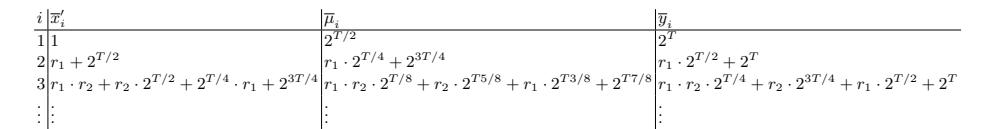

## Simple Verifiable Delay Functions

Krzysztof Pietrzak\* pietrzak@ist.ac.at

IST Austria

**Abstract.** We construct a verifiable delay function (VDF) by showing how the Rivest-Shamir-Wagner time-lock puzzle can be made publicly verifiable.

Concretely, we give a statistically sound public-coin protocol to prove that a tuple (N, x, T, y) satisfies  $y = x^{2^{T}} \pmod{N}$  where the prover doesn't know the factorization of N and its running time is dominated by solving the puzzle, that is, compute  $x^{2^{T}}$ , which is conjectured to require T sequential squarings. To get a VDF we make this protocol non-interactive using the Fiat-Shamir heuristic.

The motivation for this work comes from the Chia blockchain design, which uses a VDF as a key ingredient. For typical parameters ( $T \leq 2^{40}, N = 2048$ ), our proofs are of size around 10KB, verification cost around three RSA exponentiations and computing the proof is 8000 times faster than solving the puzzle even without any parallelism.

### 1 introduction

### 1.1 The RSW time-lock puzzle

Rivest, Shamir and Wagner [RSW96] introduced the concept of a timelock puzzle, and proposed the following elegant construction

The puzzle is a tuple (N, x, T) where  $N = p \cdot q$  is an RSA modulus,  $x \in \mathbb{Z}_N^*$  is random and  $T \in \mathbb{N}$  is a time parameter.

The solution of the puzzle is  $y = x^{2^T} \mod N$ . It can be computed making two exponentiations by the party who generates the puzzle (and thus knows the group order  $\phi(N) = (p-1)(q-1)$ ) as

$$e := 2^T \mod \phi(N) \quad , \quad y := x^e \mod N \tag{1}$$

but is conjectured to require T sequential squarings if the group order (or equivalently, the factorization of N) is not known

$$x \to x^2 \to x^{2^2} \to x^{2^3} \to \dots \to x^{2^T} \mod N$$
 (2)

\* Supported by the European Research Council (ERC) consolidator grant 682815 -TOCNeT. This paper appeared at ITCS 2019 [Pie19] and was posted on eprint on June 20 2018, this is the eprint version complied on April 30, 2019.

To be more precise, the conjecture here is that T sequential steps are necessary to compute x 2 (mod N) even if one can use large parallelism.

As an application, [RSW96] show how to "encrypt to the future": sample a puzzle (N, x, T) together with its solution y, then derive a key ky from y and encrypt a message m into a ciphertext c = ENC(ky, m). Given (N, x, T) and c one can recover the message m in time required to compute T squarings sequentially, but (under the above conjecture) not faster.

## 1.2 Proofs of sequential work (PoSW)

Proofs of sequential work (PoSW) are closely related to time-lock puzzles. PoSW were introduced in [MMV13], and informally are proof systems where on input a random challenge x and time parameter T one can compute a publicly verifiable proof making T sequential computations, but it's hard to come up with an accepting proof in significantly less than T sequential steps, even given access to massive parallelism.

The PoSW constructed in [MMV13] is not very practical (at least for large T) as the prover needs not only T time, but also linear in T space to compute a proof. Recently [CP18] constructed a very simple and practical PoSW in the random oracle model. They were interested in PoSW as they serve as a key ingredient in the Chia blockchain design (chia.net).

The main open problem left open in [CP18] was to construct PoSW that is unique, in the sense that one cannot compute two accepting proofs on the same challenge. The existing PoSW all allow to generate many accepting proofs at basically the same cost as honestly computing the proof. Unfortunately such PoSW cannot be used for the blockchain application just mentioned, as this would allow for so called grinding attacks. More precisely, the output of the PoSW is used to compute a challenge for generating the next block. If the PoSW is not unique, a malicious miner could compute many proofs, and then pick the one which results in a challenge that is most favourable for him.

### 1.3 Verifable delay functions (VDF)

Boneh, Bonneau, B¨unz and Fisch [BBBF18] recently introduced the notion of a verifiable delay function (VDF). A VDF can be seen as a relaxation of unique PoSW which still suffices for all known applications of unique PoSW. We refer the reader to [BBBF18] for a thorough discussion on VDFs including many interesting applications. In a VDF the proof on challenge (x, T) has two parts (y, π), where y is a deterministic function of x that needs T sequential time to compute, and π is a proof that y was correctly computed (the reason this is not necessarily a unique PoSW is the fact that this π does not need to be unique). It must be possible to compute π with low parallelism and such that π can be output almost at the same time as y. In [BBBF18] this is achieved using incrementally verifiable computation [Val08]. The (very high level) idea is to compute a hash chain

$$y = \underbrace{h(h(\dots h(x)\dots))}_{T \text{ times}}$$

and at the same time use incrementally verifiable computation to compute the proof π, so the proof will be ready shortly after y is computed. To make this generic approach actually practical the h used in [BBBF18] is a particular algebraic function (a permutation polynomial) which has the property that one can invert it significantly faster than compute in forward direction (so instead of verifying the evaluation of h(·), one can just verify the the much simpler computation of h −1 (·)), and also the proof system used to compute π is tailored so it can exploit the algebraic structure of h.

## 1.4 A VDF from RSW

The RSW time-lock puzzle looks like a promising starting point for constructing a VDF. The main difficulty one needs to solve is achieving public verifiability: to efficiently verify y ?= x 2 T (mod N) one needs the group order of Z ∗ N (or equivalently, the factorization of N). But the factorization cannot be public as otherwise also computing y becomes easy.

One idea to solve this issue is to somehow obfuscate the group order so it can only be used to efficiently verify if a given solution is correct, but not to speed up its computation. There currently is no known instantiation to this approach.

In this work we give a different solution. We construct a protocol where a prover P can convince a verifier V it computed the correct solution y = x 2 T (mod N) without either party knowing the factorization (or any other hard to compute function) of N. Our interactive protocol is public-coin, but can be made non-interactive – and thus give a VDF – by the Fiat-Shamir transformation. Here the prover's messages are replaced by simply applying a random function to the transcript. The Fiat-Shamir transformation applied to any constant-round public-coin interactive proof systems results in a sound non-interactive proof system in the random oracle model. Although our proof is not constant-round, we can still show that this transformation works, i.e., gives a sound non-interactive proof system relative to a random function (i.e., in the random oracle model). In practice the random function is instantiated with an actual hash-function like SHA256, as then soundness only holds computationally, such systems are called arguments, not proofs.

Our protocol is inspired by the sumcheck protocol [LFKN90,Sha90]. The key idea of the proof is very simple. Assume  $\mathcal{P}$  wants to convince  $\mathcal{V}$  that a tuple (x,y) satisfies  $y=x^{2^T}$ . For this,  $\mathcal{P}$  first sends  $\mu=x^{2^{T/2}}$  to  $\mathcal{V}$ . Now  $\mu=x^{2^{T/2}}$  together with  $y=\mu^{2^{T/2}}$  imply  $y=x^{2^T}$ . The only thing we have achieved at this point is to reduce the time parameter from T to T/2 at the cost of having two instead just one statement to verify. We then show that the verifier can merge those two statements in a randomized way into a single statement  $(x',y')=(x^r\cdot\mu,\mu^r\cdot y)$  that satisfies  $y'=x'^{2^{T/2}}$  if the original statement  $y=x^{2^T}$  was true (and  $\mathcal{P}$  sends the correct  $\mu$ ), but is almost certainly wrong (over the choice of the random exponent r) if the original statement was wrong, no matter what  $\mu$  the malicious prover did send. This subprotocol is repeated  $\log(T)$  times – each time halving the time parameter T – until T=1, at which point  $\mathcal{V}$  can efficiently verify correctness of the claim itself.

The VDF we get has short proofs and is efficiently verifiable. For typical parameters (2048 bit modulus and  $\log(T) \leq 40$ ) a proof is about 10KB large and the cost for verification is around three full exponentiations (for comparison, a standard RSA decryption or RSA signature computation requires one full exponentiation).

The algebraic setting of our proof systems differs a bit from RSW, as we'll discuss in §2. In a nutshell, to prove statistical soundness, we need to assume that N is the product of two safe primes, i.e.,  $N = p \cdot q$  where p' = (p-1)/2 and q' = (q-1)/2 are prime, as then a random quadratic residue  $x \in QR_N$  almost certainly is a generator of  $QR_N$ . We'll actually preform all computations in the group of signed quadratic residues  $QR_N^+$ , as unlike for  $QR_N$ , one can efficiently decide if an element is in  $QR_N^+$ , which will make the protocol slightly simpler and more efficient. Using  $QR_N^+$  instead of  $QR_N$  will also make the proof unique, so our VDF is a unique PoSW.

### 1.5 Wesolowski's VDF

A closely related result to our VDF is a concurrent paper by Wesolowski [Wes18]. A recent survey [BBF18] compares his construction with the one presented in this paper.

We solowski also constructs a VDF by making the RSW time-lock puzzle publicly verifiable. The prover, who claims  $y=x^{2^T}$ , receives as challenge a large prime B, and must respond with the proof  $\pi=x^{\lfloor \frac{2^T}{B}\rfloor}.$  To verify this proof one checks  $\pi^B\cdot x^{2^T\bmod B}\stackrel{?}{=}y.^1$  To get a VDF one makes this protocol non-interactive using the Fiat-Shamir heuristic, i.e., B=hash(y) is computed as a hash of the first message.

To prove soundness (i.e., that it's hard to come up with a  $z \neq x^{2^T}$  together with a  $\pi$  that passes verification) one needs a computational hardness assumption which basically states that for any  $z \neq 1$  it is hard to compute the B'th root of z (i.e. a y s.t.  $z^B = y$ ) in the underlying group when B is a large random prime (whereas soundness of our proof is unconditional).

The main advantage of Wesolowski's construction over ours is that his proof is just a single group element, and thus about a  $\log(T)$  factor smaller than in our VDF, also verification time is about this factor smaller. A drawback of his construction is that the overhead for computing the proof  $\pi$  is larger, though it improved significantly in the latest writeup. It's currently at  $O(T/\log(T))$  multiplications (our construction just needs  $O(\sqrt{T} \cdot \log(T))$ ). The computation of the proof can be parallelized to some extent in both constructions.

Another potential advantage (communicated to us by Dan Boneh) of our proof system is that it can be applied for any underlying endomorphism, not just the squaring operation. This could be useful to construct new VDFs, potentially achieving post-quantum security, though currently we don't know of any such instantiations.

In summary, Wesolowski's proof system has shorter proofs and faster verification time. Our proof system allows for more efficient computation of the proof, does not require any computational assumptions and seems to apply in a more general setting.

We selowski and the survey [BBF18] also discuss how to instantiate those proof systems in other groups than  $\mathbb{Z}_N^*$ , including groups that will not require trusted setup. We'll discuss this in more detail in §6.1, for now let us just mention that if instantiated in such groups the proof systems will rely on a computational assumption (for Wesolowski's construction, in addition the root assumption), which basically states that it must be hard to find group elements of small order.

&lt;sup>1 This construction appears in the 2nd version of the eprint paper [Wes18] from July 1st and improves over the construction in the first posting.

### 1.6 Outline

In §2 we discuss the slightly different algebraic setting used here as compared to [RSW96]. We then present the protocol in §3 and the security proof in §4. In §5 we define VDFs, and in §6 we discuss how the protocol is turned into a VDF and discuss several efficiency and security issues.

### 1.7 Notation

For a set  $\mathcal{X}$ ,  $x \overset{\$}{\leftarrow} \mathcal{X}$  means x is assigned a random value from  $\mathcal{X}$ . For a randomized algorithm alg we denote with  $x \overset{\$}{\leftarrow}$  alg that x is assigned the output of alg on fresh random coins, if alg is deterministic we just write  $x \leftarrow \mathsf{alg}$ .

## 2 The algebraic setting

The exact algebraic setting for our proof system differs slightly from the setting of the original RSW time-lock puzzle [RSW96]. First, we require that  $N = p \cdot q$  is the product of safe primes (a prime p is safe if (p-1)/2 is also prime), and moreover we perform the computation in the group of signed quadratic residues  $QR_N^+$ . In an earlier version of this paper we used "normal" quadratic residues  $QR_N$ .  $QR_N^+$  is isomorphic to  $QR_N$ , but makes the protocol slightly simpler as unlike for  $QR_N$ , one can efficiently decide if an element is in  $QR_N^+$ . Moreover using  $QR_N^+$  instead of  $QR_N$  will make the proof unique, i.e., it's hard to come up with any proof other than the one generated by the honest prover, so we even get a unique PoSW. As working with  $QR_N$  instead of  $QR_N^+$  is more intuitive, in the proof we'll assume the proof is over  $QR_N$ .

As we'll outline below, if computing  $x^{2^T}$  is hard in the original RSW setting, it will remain hard in our setting (the other direction is not clear, it might be that our setting is more secure).

### 2.1 Signed quadratic residues

For two safe primes p and q, and  $N:=p\cdot q$  we denote the quadratic residues with  $QR_N\stackrel{def}{=}\{z^2 \bmod N: z\in \mathbb{Z}_N^*\}$ , and the signed quadratic residues [FS00,HK09] are defined as the group

$$QR_N^+ \stackrel{def}{=} \{|x| : x \in QR_N\},\$$

where |x| is the absolute value when representing the elements of  $\mathbb{Z}_N^*$  as  $\{-(N-1)/2,\ldots,(N-1)/2\}$ . Since  $-1\in\mathbb{Z}_N^*$  is a quadratic non-residue

with Jacobi symbol +1, the map  $|\cdot|$  acts as an (efficiently-computable) isomorphism2 from  $QR_N$  to  $QR_N^+$ , and as a result  $QR_N^+$  is also a cyclic group, with the group operation defined as

$$a \circ b \stackrel{def}{=} |a \cdot b \bmod N|.$$

However, unlike for  $QR_N$ , membership in  $QR_N^+$  can be efficiently tested since  $QR_N^+ = J_N^+$  where  $J_N$  is the group of elements with Jacobi symbol +1 and

$$J_N^+ \stackrel{def}{=} \{|x| : x \in J_N\} = J_N/\{\pm 1\}.$$

In other words, to test whether a given  $x \in \mathbb{Z}_N^*$  (represented as  $\{-(N-1)/2, \ldots, (N-1)/2\}$ ) belongs also to  $QR_N+$ , ensure that  $x \geq 0$  and that its Jacobi symbol is +1.

# 2.2 Using $(QR_N^+, \circ)$ instead $(\mathbb{Z}_N^*, \cdot)$

Recall that the assumption underlying the security of the RSW time-lock puzzle [RSW96] states that computing  $x^{2^T}$  is hard in  $(\mathbb{Z}_N^*,\cdot)$ . We note that using  $(QR_N^+,\circ)$  instead (i.e., when  $x\in QR_N^+$  and squaring is defined as  $x^2\stackrel{def}{=} x\circ x$ ), as we require for our protocol, will not make this assumption any weaker. By the two reductions below, we'll lose at most a factor  $4\cdot 2=8$  in advantage.

First, let us observe that using  $(QR_N, \cdot)$  instead of  $(\mathbb{Z}_N^*, \cdot)$  can only make the problem harder: Because  $|QR_N| = |\mathbb{Z}_N^*|/4$ , a random element in  $\mathbb{Z}_N^*$  also belongs to  $QR_N$  with probability 1/4. So if one can break the assumption with probability  $\epsilon$  over  $QR_N$ , we still can break it with probability  $\epsilon/4$  over  $\mathbb{Z}_N^*$ .

Second, we observe that using  $(QR_N^+, \circ)$  instead of  $(QR_N, \cdot)$  will not make computing  $x^{2^T}$  significantly easier: Consider any  $x \in QR_N$  and let  $y := x^{2^T} \mod N$  in  $(QR_N, \cdot)$ , and let x' = |x| and  $y' := x'^{2^T}$  in  $(QR_N^+, \circ)$ , as the groups are isomorphic, y' = |y|, so  $y = |y'|^{-1}$ , which means  $y \in \{y', N - y'\}$ . Although we can't efficiently decide if y = y' or y = N - y' (as it would contradict the quadratic residuosity assumption), we can pick one of the two values at random and will get the right one with probability 1/2. This shows that given an algorithm that finds  $x^{2^T}$  in  $QR_N^+$  in time t with probability  $\delta$ , we get an algorithm that computes  $x^{2^T}$  in  $QR_N^+$  in basically the same time t and probability  $\delta/2$ .

 $^{2}$  Note, however, that the inverse of this isomorphism is hard to compute under the quadratic residuosity assumption.

## 2.3 On using safe primes

Another difference to the setting of [RSW96] is that we assume that  $N=p\cdot q$  is the product of random safe primes, whereas [RSW96] just assume random primes. We do this to make sure that  $QR_N$  (and thus also  $QR_N^+$ ) contains no sub-group of small order, this property is required to prove statistical soundness.

It is conjectured that for some constant c, there are  $c \cdot 2^{\lambda}/n^2$  safe  $\lambda$ -bit primes (cf. [vzGS13]), so a random n bit prime is safe with probability  $\approx c/n$ . Under this assumption, the product of two random n-bit primes will be the product of two safe primes with probability  $c^2/n^2$ .

## 3 The protocol

Our protocol, where  $\mathcal P$  convinces  $\mathcal V$  it solved an RSW puzzle, goes as follows:

- The verifier  $\mathcal{V}$  and prover  $\mathcal{P}$  have as common input an RSW puzzle (N, x, T) and a statistical security parameter  $\lambda$ . Here  $T \in \mathbb{N}$ ,  $N = p \cdot q$  is the product of safe primes and  $x \in QR_N^+$ .
- $-\mathcal{P}$  solves the puzzle by computing  $y=x^{2^T}$  (making T sequential squarings in  $(QR_N^+,\circ)$ ), and sends y to  $\mathcal{V}$ .
- Now  $\mathcal{P}$  and  $\mathcal{V}$  iterate the "halving protocol" below. In this subprotocol, on common input (N, x, T, y) the output is either of the form  $(N, x', \lceil T/2 \rceil, y')$ , in which case it is used as input to the next iteration of the halving subprotocol, or the protocol has stopped with verifier output in  $\{\text{reject}, \text{accept}\}$ .

### 3.1 The halving subprotocol

On common input (N, x, T, y)

- 1. If T=1 then  $\mathcal V$  outputs accept if  $y=x^{2^T}=x^2$  and reject otherwise. If T>1 go to the next step.
- If T > 1 go to the next step. 2. The prover  $\mathcal{P}$  sends  $\mu = x^{2^{T/2}}$  to  $\mathcal{V}$ .
- 3. If  $\mu \notin QR_N^+$  then  $\mathcal{V}$  outputs reject, otherwise  $\mathcal{V}$  samples a random  $r \stackrel{\$}{\leftarrow} \mathbb{Z}_{2^{\lambda}}$  and sends it to  $\mathcal{P}$ .
- 4. If T/2 is even,  $\mathcal{P}$  and  $\mathcal{V}$  output

$$(N, x', T/2, y')$$

where

$$x' := x^r \cdot \mu \quad \left(= x^{r+2^{T/2}}\right)$$
$$y' := \mu^r \cdot y \quad \left(= x^{r \cdot 2^{T/2} + 2^T}\right)$$

(note that if  $y = x^{2^T}$  then  $y' = x'^{2^{T/2}}$ ). If T/2 is odd, output

$$(N, x', (T+1)/2, y'^2)$$
.

#### 3.2 Security statement

**Theorem 1.** If the input (N, x, T) to the protocol satisfies

- 1.  $N = p \cdot q$  is the product of safe primes, i.e., p = 2p' + 1, q = 2q' + 1for primes p', q'. 2.  $\langle x \rangle = QR_N^+$ . 3.  $2^{\lambda} \le \min\{p', q'\}$

Then for any malicious prover  $\widetilde{\mathcal{P}}$  who sends as first message y anything else than the solution to the RSW time-lock puzzle, i.e.,

$$y \neq x^{2^T}$$

V will finally output accept with probability at most

$$\frac{3\log(T)}{2^{\lambda}} \ .$$

## Security proof

# Usage of $QR_N$ instead $QR_N^+$ in the proof

We'll prove Theorem 1 where the signed quadratic residues  $(QR_N^+, \circ)$  are replaced with regular quadratic residues  $(QR_N, \cdot)$  throughout. This will make the proof a bit more intuitive as multiplication modulo N as in  $QR_N$ is a more familiar and simpler operation than the  $\circ$  operation in  $QR_N^+$ (which additionally requires the  $|\cdot|$  mapping after each multiplication). As discussed in §2, those two groups are isomorphic, so the proof for  $(QR_N, \cdot)$  implies the same security for  $(QR_N^+, \circ)$ .

 $\overline{\ }^3$  That is, x generates  $QR_N^+$ , the quadratic residues modulo N. For our choice of Nwe have  $|QR_N^+|=|QR_N|=p'q',$  so  $\langle x\rangle\stackrel{def}{=}\{x,x^2,\dots,x^{p'q'}\}=QR_N^+$  .

The main reason we don't use  $(QR_N, \cdot)$  in the actual protocol is only because in step 3. of the halving subprotocol  $\mathcal{V}$  needs to check if  $\mu \in QR_N^+$ , which would not be efficient if we used  $QR_N$  (in an earlier version of the protocol we did use  $QR_N$ , and  $\mathcal{P}$  had to send  $\mu'$  s.t.  $\mu'^2 = \mu$ , the verifier would then compute  $\mu := \mu'^2$  can thus could be sure that  $\mu \in QR_N$ . As here  $\mathcal{P}$  can send any of the 4 roots of  $\mu$ , this protocol was not unique).

## 4.2 The language $\mathcal{L}$

It will be convenient to define the language

$$\mathcal{L} = \{ (N, x, T, y) : y \neq x^{2^T} \bmod N \text{ and } \langle x \rangle = QR_N \}$$

We'll establish the following lemma.

**Lemma 1.** For  $N, \lambda$  as in Thm. 1, and any malicious prover  $\widetilde{\mathcal{P}}$  the following holds. If the input to the halving protocol in §3.1 satisfies

$$(N, x, T, y) \in \mathcal{L}$$

then with probability  $\geq 1-3/2^{\lambda}$  (over the choice of r) V's output is either reject or satisfies

$$(N, x', \lceil T/2 \rceil, y') \in \mathcal{L}$$

Before we prove the lemma, let's see how it implies Theorem 1.

Proof (Proof of Theorem 1). In every iteration of the halving protocol the time parameter decreases from T to  $\lceil T/2 \rceil$  and it stops once T=1, this means we iterate for at most  $\lceil \log(T) \rceil$  rounds. By assumption, the input (N,x,T,y) to the first iteration is in  $\mathcal{L}$ , and by construction, the only case where  $\mathcal{V}$  outputs accept is on an input (N,x,1,y) where  $y=x^{2^T}=x^2 \mod N$ , in particular, this input is not in  $\mathcal{L}$ .

So, if  $\mathcal V$  outputs accept, there must be one iteration of the halving protocol where the input is in  $\mathcal L$  but the output is not. By Lemma 1, for any particular iteration this happens with probability  $\leq 3/2^{\lambda}$ . By the union bound, the probability of this happening in any of the  $\lceil \log(T) \rceil - 1$  rounds can be upper bounded by  $3\log(T)/2^{\lambda}$  as claimed.

Proof (Proof of Lemma 1). We just consider the case where T is even, the odd T case is almost identical.

Assuming the input to the halving protocol satisfies  $(N, x, T, y) \in \mathcal{L}$ , we must bound the probability that  $\mathcal{V}$  outputs reject or the output  $(N, x', T/2, y') \notin \mathcal{L}$ .

If T=1 then  $\mathcal V$  outputs reject and we're done. Otherwise, if  $\widetilde{\mathcal P}$  sends a  $\mu \notin QR_N$  in step 2. then  $\mathcal V$  outputs reject in step 3. and we're done. So from now we assume  $\mu \in QR_N$ . We must bound

$$\Pr_r[(y'={x'}^{2^{T/2}}) \lor (\langle x' \rangle \neq QR_N)] \le 3/2^{\lambda}$$

using  $\Pr[a \vee b] = \Pr[a \wedge \overline{b}] + \Pr[b]$  we rewrite this as

$$\Pr_{r}[y' = {x'}^{2^{T/2}} \wedge \langle x' \rangle = QR_N] + \Pr_{r}[\langle x' \rangle \neq QR_N] \le 3/2^{\lambda}$$
 (3)

Eq.(3) follows by the two claims below.

Claim.
$$\Pr_r[\langle x' \rangle \neq QR_N] \leq 2/2^{\lambda}$$
.

Proof (Proof of Claim). We'll denote with  $e_{\mu}$  the unique value in  $\mathbb{Z}_{p'q'}$  satisfying  $x^{e_{\mu}} = \mu$  (it's unique as  $\mu \in \langle x \rangle = QR_N$  and  $|QR_N| = p'q'$ ). As  $x, \mu \in QR_N$ , also  $x' = x^r \cdot \mu = x^{r+e_{\mu}}$  is in  $QR_N$ , and  $\langle x' \rangle = QR_N$  holds if ord(x') = p'q', which is the case except if  $(r + e_{\mu}) = 0 \mod p'$  or  $(r + e_{\mu}) = 0 \mod q'$  or equivalently (using that  $2^{\lambda} < \min(p', q')$ ) if

$$r \in \mathcal{B} \stackrel{def}{=} \left\{ \mathbb{Z}_{2^{\lambda}} \cap \{ (-e_{\mu} \bmod p'), (-e_{\mu} \bmod q') \} \right\} . \tag{4}$$

Clearly  $|\mathcal{B}| \leq 2$  and the claim follows.

Claim.
$$\Pr_r[y' = {x'}^{2^{T/2}} \mod N \wedge \langle x' \rangle = QR_N] \le 1/2^{\lambda}$$
.

Proof (Proof of Claim). If  $y \notin QR_N$ , then also  $y' = \mu^r \cdot y \notin QR_N$  (as  $a \in QR_N, b \notin QR_N$  implies  $a \cdot b \notin QR_N$ ). As  $\langle x' \rangle = QR_N$  and  $y' \neq {x'}^{2^{T/2}}$  can't hold simultaneously in this case the probability in the claim is 0. From now on we consider the case  $y \in QR_N$ . We have

$$\Pr_{r}[y' = {x'}^{2^{T/2}} \wedge \langle x' \rangle = QR_{N}] =$$

$$\Pr_{r}[y' = {x'}^{2^{T/2}} \mid \langle x' \rangle = QR_{N}] \cdot \Pr_{r}[\langle x' \rangle = QR_{N}]$$
(5)

For the second factor in (5) we have with  $\mathcal{B}$  as in (4)

$$\Pr_r[\langle x' \rangle = QR_N] = \frac{2^{\lambda} - |\mathcal{B}|}{2^{\lambda}} \ . \tag{6}$$

Conditioned on  $\langle x' \rangle = QR_N$  the r is uniform in  $\mathbb{Z}_{2^{\lambda}} \setminus \mathcal{B}$ , so the first factor in (5) is

$$\Pr_{r}[y' = {x'}^{2^{T/2}} \mid \langle x' \rangle = QR_{N}] = \Pr_{r \in \mathbb{Z}_{2\lambda} \setminus \mathcal{B}}[y' = {x'}^{2^{T/2}}] . \tag{7}$$

Let ey ∈ Zp 0q 0 be the unique value such that x ey = y. Using hxi = QRN in the last step below we can rewirte

$$y' = {x'}^{2^{T/2}} \mod N \iff$$

$$\mu^r y = (x^r \mu)^{2^{T/2}} \mod N \iff$$

$$x^{r \cdot e_\mu + e_y} = x^{(r + e_\mu) \cdot 2^{T/2}} \mod N \iff$$

$$r \cdot e_\mu + e_y = (r + e_\mu) \cdot 2^{T/2} \mod p'q'$$

rearranging terms

$$r(e_{\mu} - 2^{T/2}) + e_y - e_{\mu} 2^{T/2} = 0 \mod p'q'$$
 (8)

If eµ = 2T /2 this becomes

$$e_y - 2^T = 0 \bmod p'q'$$

which does not hold as by assumption we have y 6= x 2 T . So from now on we assume eµ 6= 2T /2 mod p 0 q 0 . Then for a = eµ − 2 T /2 6= 0 mod p 0 q 0 (and b = ey − eµ2 T /2 ) eq.(8) becomes

$$r \cdot a = b \bmod p'q'$$

which holds for at most one choice of r from its domain Z2 λ \ B, thus

$$\Pr_{r \in \mathbb{Z}_{2^{\lambda}} \setminus \mathcal{B}}[y' = x'^{2^{T/2}}] \le \frac{1}{2^{\lambda} - |\mathcal{B}|}$$

and the claim follows from the above equation and (5)-(7) as

$$\Pr_{r}[y' = {x'}^{2^{T/2}} \wedge \langle x' \rangle = QR_{N}] =$$

$$\Pr_{r \in \mathbb{Z}_{2^{\lambda}} \setminus \mathcal{B}}[y' = {x'}^{2^{T/2}}] \cdot \Pr_{r}[\langle x' \rangle = QR_{N}] \le \frac{1}{2^{\lambda} - |\mathcal{B}|} \cdot \frac{2^{\lambda} - |\mathcal{B}|}{2^{\lambda}} \le \frac{1}{2^{\lambda}}.$$

## 5 Verifiable delay functions

In this section we define verifiable delay functions (VDF) mostly following the definition from [BBBF18]. A VDF is defined by a four-tuple of algorithms:

VDF.Setup(1λ ) → pp on input a statistical security parameter 1λ outputs public parameters pp.

 $\mathsf{VDF}.\mathsf{Gen}(\mathbf{pp},T) \to (x,T)$  on input a time parameter  $T \in \mathbb{N}$ , samples an input x.

 $\mathsf{VDF}.\mathsf{Sol}(\mathbf{pp},(x,T)) \to (y,\pi)$  on input (x,T) outputs  $(y,\pi)$ , where  $\pi$  is a proof that the output y has been correctly computed.

 $\mathsf{VDF}.\mathsf{Ver}(\mathbf{pp},(x,T),(y,\pi)) \to \{\mathsf{accept/reject}\} \ \ \mathsf{given} \ \ \mathsf{an input/output} \ \ \mathsf{tuple} \ (x,T),(y,\pi) \ \mathsf{outputs} \ \mathsf{either accept} \ \mathsf{or reject}.$

The VDF.Setup and VDF.Gen algorithms are probabilistic, VDF.Sol and VDF.Ver are deterministic. They all run in time  $poly(log(T), \lambda)$ .

## 5.1 The statistical security parameter

 $\lambda$  measures the bit-security we expect from our protocol, i.e., an adversary of complexity  $\tau$  should have advantage no more than  $\approx \tau/2^{\lambda}$  in breaking the scheme. It only makes sense to consider time parameters T that are much smaller than  $2^{\lambda}$  (say we require  $T \leq 2^{\lambda/2}$ ) so the sequential running time of the honest prover is much smaller than what is required to break the underlying hardness assumptions.

## 5.2 Efficiency of solving

The VDF.Sol algorithm can compute the output y in T sequential steps (in this work a "sequential step" is the  $\circ$  operation, which basically is a multiplication modulo N). Moreover we require that  $\pi$  can be computed with in much fewer than T steps. As we'll discuss in §6.2, we'll achieve  $O(\sqrt{T}\log(T))$  sequential steps, and less if parallelism is available. In [BBBF18] the requirement is more relaxed, they compute  $\pi$  in parallel with y using bounded  $\operatorname{poly}(\log(T), \lambda)$  parallelism, so the  $\pi$  is available shortly after y is computed, but overall the computation is much larger than T. As discussed in the introduction, Wesolowski's VDF [Wes18] requires  $O(T/\log(T))$  steps to compute  $\pi$ .

### 5.3 Completeness

The completeness property simply requires that correctly generated proofs will always accept, that is, for any  $\lambda, T$

$$\Pr \begin{bmatrix} \mathsf{VDF.Ver}(\mathbf{pp},(x,T),(y,\pi)) = \mathsf{accept} \\ \mathsf{where} \\ \mathbf{pp} \xleftarrow{\$} \mathsf{VDF.Setup}(1^{\lambda}) \\ (x,T) \xleftarrow{\$} \mathsf{VDF.Gen}(\mathbf{pp},T) \\ (y,\pi) \leftarrow \mathsf{VDF.Sol}(\mathbf{pp},(x,T)) \end{bmatrix} = 1$$

## 5.4 Security (sequentiality)

The first security property is sequentiality. For this we consider a two part adversary  $\mathcal{A} = (\mathcal{A}_1, \mathcal{A}_2)$ , where  $\mathcal{A}_1$  can run a pre-computation and choose T. Then  $\mathcal{A}_2$  gets a random challenge for time T together with the output state of the precomputation, we require that whenever

$$\Pr \begin{bmatrix} \mathsf{VDF}.\mathsf{Ver}(\mathbf{pp},(x,T),(\tilde{y},\widetilde{\pi})) = \mathsf{accept} \\ \mathsf{where} \\ \mathbf{pp} \overset{\$}{\leftarrow} \mathsf{VDF}.\mathsf{Setup}(1^{\lambda}) \\ (T,\mathsf{state}) \overset{\$}{\leftarrow} \mathcal{A}_1(\mathbf{pp}) \\ (x,T) \overset{\$}{\leftarrow} \mathsf{VDF}.\mathsf{Gen}(\mathbf{pp},T) \\ (\tilde{y},\widetilde{\pi}) \overset{\$}{\leftarrow} \mathcal{A}_2(\mathbf{pp},(x,T),\mathsf{state}) \end{bmatrix} \neq \mathsf{negl}(\lambda)$$

the  $\mathcal{A}_2$  adversary must use almost the same sequential time T as required by an honest execution of VDF.Sol( $\mathbf{pp}, (\pi, T)$ ), and this even holds if  $\mathcal{A}$  is allowed massive parallel computation (say we just bound the total computation to  $2^{\lambda/2}$ ). This means there's no possible speedup to compute the VDF output by using parallelism. Let us stress that by this we mean any parallelism that goes beyond what can be used to speed up a single sequential step, which here is a multiplication in  $\mathbb{Z}_N^*$ , and we assume the honest prover can use such bounded parallelism.

### 5.5 Security (soundness)

The second security property is soundness, which means that one cannot come up with an accepting proof  $\tilde{\pi}$  for a wrong statement. Formally, for an adversary  $\mathcal{A} = (\mathcal{A}_1, \mathcal{A}_2)$  we have (unlike in the previous definition, here we don't make any assumption about  $\mathcal{A}_2$ 's sequential running time, just the total running time of  $\mathcal{A}$  must be bounded to, say  $2^{\lambda/2}$ )

$$\Pr \begin{bmatrix} \mathsf{VDF.Ver}(\mathbf{pp},(x,T),(\tilde{y},\tilde{\pi})) = \mathsf{accept} \\ \mathsf{and} \ \tilde{y} \neq y \\ \mathsf{where} \\ \mathbf{pp} \overset{\$}{\leftarrow} \mathsf{VDF.Setup}(1^{\lambda}) \\ (T,\mathsf{state}) \overset{\$}{\leftarrow} \mathcal{A}_1(\mathbf{pp}) \\ (x,T) \overset{\$}{\leftarrow} \mathsf{VDF.Gen}(\mathbf{pp},T) \\ (y,\pi) \leftarrow \mathsf{VDF.Sol}(\mathbf{pp},(x,T)) \\ (\tilde{y},\tilde{\pi}) \overset{\$}{\leftarrow} \mathcal{A}_2(\mathbf{pp},(x,T),\mathsf{state}) \end{bmatrix} = \mathsf{negl}(\lambda)$$

In this section we explain the simple transformation of the protocol from  $\S 3$  into a VDF and then discuss the efficiency, security and some other issues of this construction.

To keep things simple we'll assume that the time parameter  $T=2^t$  is a power of two. The four algorithms from §5 are instantiated as

VDF.Setup(1 $^{\lambda}$ ) The statistical security parameter  $\lambda$  defines another security parameter  $\lambda_{\mathsf{RSA}}$  specifying the bitlength of an RSA modulus, where  $\lambda_{\mathsf{RSA}}$  should be at least as large so that an  $\lambda_{\mathsf{RSA}}$  bit RSA modulus offers  $\lambda$  bits of security (e.g.  $\lambda=100$  and  $\lambda_{\mathsf{RSA}}=2048$ ). As hardness of factoring is subexponential, while the soundness of our protocol is exponentially small in  $\lambda$  (in the random oracle model), we can without loss of generality assume that  $\lambda \leq \lambda_{\mathsf{RSA}}/2$ , so point 3. in the statement of Theorem 1 is satisfied.

The setup algorithm samples two random  $\lambda_{\mathsf{RSA}}/2$  bit safe primes p,q and output as public parameters the single  $\lambda_{\mathsf{RSA}}$  bit RSA modulus  $N := p \cdot q$ .

 $\mathsf{VDF}.\mathsf{Gen}(N,T)$  samples a random  $x \in QR_N^+$  and outputs (x,T).

VDF.Sol(N,(x,T)) outputs  $(y,\pi)$  where  $y=x^{2^T}$  is the solution of the RSW time-lock puzzle (but over  $(QR_N^+,\circ)$  not  $(\mathbb{Z}_N^*,\cdot)$ ) and  $\pi=\{\mu_i\}_{i\in[t]}$  is a proof that y has been correctly computed. It is derived by applying the Fiat-Shamir heuristic to the protocol in §3. Recall that in this heuristic the public-coin challenges  $r_i\in\mathbb{Z}_{2^\lambda}$  of the verifier are replaced with a hash of the last prover message. Concretely, we fix a hash function  $hash: \mathbb{Z}\times\mathbb{Z}_N^4\to\mathbb{Z}_{2^\lambda}$ , let  $(x_1,y_1):=(x,y)$  and for  $i=1\dots t$  let4

Note that in the Fiat-Shamir heuristic, we not just hash the first prover message  $\mu_i$  in eq.(9), but also the statement  $(x_i, T/2^{i-1}, y_i)$  of the halving subprotocol. It has been observed that this is necessary in a setting like ours, where the prover has some influence on the statement to be proven [BPW12]. There exists an easy attack (communicated to us by Benjamin Wesolowski) on uniqueness of the VDF if the y's are not included in the hash: for  $(x,T)=(x_1,T_1)$ , pick  $\mu_1$  at random, let  $r_1=hash((x,T),\mu_1),y=(x^{2^{T/2}}/\mu_1)^{r_1}\mu_1^{2^{T/2}},x_2=x_1^{r_1}\mu_1,y_2=\mu_1^{r_1}y$ . The above y is almost certainly wrong, i.e.,  $y\neq x^{2^T}$ , but by construction  $y_2=x_2^{2^{T/2}}$ , so one can continue with the honest proof.

$$\mu_{i} := x_{i}^{2^{T/2^{i}}} \in QR_{N}^{+}$$

$$r_{i} := hash((x_{i}, T/2^{i-1}, y_{i}), \mu_{i}) \in \mathbb{Z}_{2^{\lambda}}$$

$$x_{i+1} := x_{i}^{r_{i}} \circ \mu_{i}$$

$$y_{i+1} := \mu_{i}^{r_{i}} \circ y_{i}$$
(9)

VDF.Ver $(N,(x,T),(y,\pi))$  parses  $\pi = \{\mu_i\}_{i \in [t]}$  and checks if x,y and all  $\mu_i$  are in  $QR_N^+$ , if this is not the case output reject. Otherwise set  $(x_1,y_1) := (x,y)$  and then for  $i=1\ldots t$  compute

$$r_i := hash((x_i, T/2^{i-1}, y_i), \mu_i)$$

 $x_{i+1} := x_i^{r_i} \circ \mu_i$  (10)

$$y_{i+1} := \mu_i^{r_i} \circ y_i \tag{11}$$

Finally check whether

$$y_{t+1} \stackrel{?}{=} x_{t+1}^2 \tag{12}$$

and output accept if this holds, otherwise output reject.

## 6.1 Public parameters for the VDF

For the security of the VDF it's crucial that a prover does not know the factorization of the public parameter N, as otherwise he could compute  $x^{2^T}$  in just two exponentiations as in eq.(1). Thus one either has to rely on a trusted party, or use multiparty-computation to sample N. In particular, it's possible to sample N securely as long as not all the participants in the multiparty computation are malicious. Such an "MPC ceremony" has been done before, e.g. to set up the common random string for Zcash. This is in contrast to the random-oracle based PoSW [MMV13,CP18] which don't require a setup procedure at all.

To avoid trusted setup, Boneh et al. [BBF18] and Wesolowski [Wes18] suggested to use class groups of an imaginary quadratic field [BBHM02] instead of an RSA group. Recall that the statistical soundness of our proof systems relies on the fact that the underlying group (the quadratic residues of  $\mathbb{Z}_N^*$  where N is the product of safe primes) has no subgroups of small order. If the underlying group does have groups of small order, then *computational* soundness holds under the assumption that it's hard to find elements of small order, which is conjectured to hold for the class groups mentioned above.

&lt;sup>5 https://z.cash/technology/paramgen.html

## 6.2 Efficiency of the VDF

Cost of verification The cost of running the verification VDF.Ver $(N, (x, T = 2^t), (y, \pi))$  is dominated by the 2t exponentiations (with  $\lambda$  bit long exponents) in eq.(10-11). As exponentiation with a random  $\lambda$  bit exponent costs about  $1.5\lambda$  multiplications, the cost of verification is around  $3 \cdot \lambda \cdot t$  multiplications. For concreteness, consider an implementation where  $\lambda = 100, \lambda_{\mathsf{RSA}} = 2048$  and assume t = 40, this gives a cost of about  $3 \cdot \lambda \cdot t = 12000$  multiplications, which corresponds to  $12000/(2048 \cdot 1.5) \approx 4$  full exponentiations in  $\mathbb{Z}_N^*$ .

A minor efficiency improvement There's a simple way to save on verification time and proof size. Currently, for  $T=2^t$  we run the halving protocol for t rounds, and then in eq.(12) check if  $y_{t+1} \stackrel{?}{=} x_{t+1}^2$ . For any integer  $\Delta \geq 0$  we could run the protocol for just  $t-\Delta$  rounds, but then the verifier must check if  $y_{t+1-\Delta} \stackrel{?}{=} x_{t+1-\Delta}^{2^2}$ , which requires  $2^\Delta$  squarings (more generally, if T is not a power of 2 then the check becomes  $y_{t+1-\Delta} \stackrel{?}{=} x_{t+1-\Delta}^{2^{T}t+1-\Delta} \mod N$  where  $T_1 = T, T_i = \lceil T_{i-1}/2 \rceil$ ).

If we set, say  $\Delta = 10$ , this saves 10 rounds and thus reduces the proof size by 25% from 40 to 30 elements. The verification time decreases by around 15% (we save 20 short exponentiations as in eq.(10,11) at the price of 1024 extra squarings).

Cost of computing the proof Computing the proof  $(y, \pi) \leftarrow \mathsf{VDF}.\mathsf{Sol}(N, (x, T))$  requires one to solve the underlying RSW puzzle  $y = x^{2^T}$ , which is done by squaring x sequentially T times (the security of the RSW puzzle and thus also our VDF relies on the assumption that there's no shortcut to this computation).

On top of that, for the VDF we also must compute the proof  $\pi = \{\mu_i\}_{i \in [t]}$  where  $\mu_i = x_i^{2^{T/2^i}}$ . But we still assume that  $T = 2^t$  is a power of 2.

If naïvely implemented, computing the  $\mu_i$  will require T/2 squarings for  $\mu_1$ , T/4 for  $\mu_2$  etc., adding up to a total of  $T \approx T/2 + T/4 + T/8 \dots + 1$

&lt;sup>6 Exponentiation is typically done via "square and multiply", which for a z bit exponent with hamming weight h(z) requires z + h(z) multiplications, or about  $1.5 \cdot z$  multiplication for a random exponent (where  $h(z) \approx z/2$ ).

&lt;sup>7 Here multiplication means the  $\circ$  operation, which requires one multiplication modulo N, followed by the map  $|\cdot|$ . As the cost of this map is marginal compared to the multiplication we just ignore it.

sequential steps. Fortunately we don't have to compute  $\mu_1 = x^{2^{T/2}}$  as we already did so while computing  $y = x^{2^T}$  by repeated squaring (cf. eq.(2)). This observation already saves us half the overhead. We can also compute the remaining  $\mu_2, \mu_3, \ldots$  using stored values, but it becomes increasingly costly, as we discuss below.

In general, for some  $s \in [t]$  the prover can compute  $\mu_1, \ldots, \mu_s$  using stored values, and then fully recompute the remaining  $\mu_{s+1} = x_{s+1}^{2^{T/2^{s+1}}}, \mu_{s+2}, \ldots, \mu_t$  which will only require  $T/2^{s+1} + T/2^{s+2} \ldots < T/2^s$  squarings.

To see how the  $\mu_i$ 's can be efficiently computed for small i, for  $z \in QR_N^+$  let  $\overline{z}$  denote z's log to basis x, i.e.,  $x^{\overline{z}} = z$ . We have  $\overline{x}_1 = 1$ ,  $\overline{y}_1 = 2^T$  and

$$\begin{split} \overline{\mu}_i &:= \overline{x}_i \cdot 2^{T/2^i} \\ \overline{x}_{i+1} &:= r_i \cdot \overline{x}_i + \overline{\mu}_i \\ \overline{y}_{i+1} &:= r_i \cdot \overline{\mu}_i + \overline{y}_i \end{split}$$

How those exponents concretely develop for i=1 to 3 is illustrated in Figure 1. For example, we can compute  $\mu_3$  assuming we stored the  $x^{2^{T/8}}, x^{2^{T3/8}}, x^{2^{T5/8}}, x^{2^{T7/8}}$  values as

$$\mu_3 = (x^{2^{T/8}})^{r_1 \cdot r_2} \cdot (x^{2^{T5/8}})^{r_2} \cdot (x^{2^{T3/8}})^{r_1} \cdot x^{2^{T7/8}}$$

In general, computing  $\mu_1, \ldots, \mu_s$  will require to store  $2^s$  values  $\{x^{2^{T \cdot i/2^s}}\}_{i \in [2^s]}$ , and then compute  $2^s$  exponentiations with exponents of bitlength at most  $\lambda \cdot (s-1)$  (and half that on average). We can't speed this up by first taking the exponents modulo the group order p'q' as it is not know, but if we have bounded parallelism  $2^p$ ,  $p \le (s-2)$  this can be done in  $2^{s-p} \cdot \lambda \cdot (s-1) \cdot \frac{3}{4}$  sequential steps. Summing up, with sufficient space to store  $2^s$  elements in  $\mathbb{Z}_N$  and  $2^p \le 2^s$  parallelism the proof  $\pi$  can be computed in roughly

$$2^{s-\mathsf{p}} \cdot \lambda \cdot (s-1) \cdot \frac{3}{4} + 2^{t-s}$$
 sequential steps and  $2^s \cdot \log(N)$  bits of storage

after y has been computed. For example with a single core p = 0 and  $s = t/2 - \log(t \cdot \lambda)/2$  the number of steps (i.e.,  $\circ$  operations) becomes

$$2^{t/2 - \log(t \cdot \lambda)/2} \cdot \lambda \cdot (s-1) \cdot \frac{3}{4} + 2^{t/2 + \log(t \cdot \lambda)/2} = 2^{t/2} \left( \frac{\lambda(s-1)}{\sqrt{t\lambda}} \cdot \frac{3}{4} + \sqrt{t\lambda} \right) < \sqrt{T} \cdot \frac{11}{8} \cdot \sqrt{\log(T) \cdot \lambda}$$

For our typical values  $t=40, \lambda=100$  this is  $\leq 2^{27}$ , and thus over  $2^{40-27}=2^{13}$  times faster than computing y, e.g. if computing y takes 1h, computing  $\pi$  just takes half a second on top. The memory required (to store intermediate values) is around  $2^s \cdot \log N = 2^{t/2 - \log(t \cdot \lambda)/2} \cdot 1024 \leq 2^{27}$  bits, or 8MB.

**Fig. 1.** Exponents of the values in the protocol, here  $z = x^{\overline{z}}$ .

### 6.3 Security of the VDF

**Soundness** If we model *hash* as a random oracle, then by Lemma 1 (which is used in the proof of Theorem 1) we are guaranteed that a malicious prover will not find an accepting proof  $(\tilde{y}, \tilde{\pi})$  for a wrong statement  $\tilde{y} \neq x^{2^T}$  except with exponentially small probability. We can even let the malicious prover choose the challenge (x, T) for which it must forge such a proof itself, the only restriction being that x must be a generator  $\langle x \rangle = QR_N^+$  (a random  $x \in QR_N^+$  satisfies this almost certainly, but we can't efficiently verify if a given x is such a generator).

The well known Fiat-Shamir heuristic states that replacing the prover's queries with the output of a random oracle in a sound public-coin interactive proof system results in a sound non-interactive proof system, but this only applies for protocols with a constant number of rounds.

Even though our protocol has logarithmically many rounds, we can directly conclude that our non-interactive proof is sound as follows: if we are given a valid proof for a wrong statement, then, during the execution of the verification algorithm for this proof, we must make a query  $hash(x_i, T/2^{i-1}, y_i, \mu_i)$  where  $(N, x_i, T/2^{i-1}, y_i) \in \mathcal{L}$  ( $\mathcal{L}$  as defined in §4) but for the next query made  $hash(x_{i+1}, T/2^i, y_{i+1}, \mu_{i+1})$  we have  $(N, x_{i+1}, T/2^i, y_{i+1}) \notin \mathcal{L}$ . By Lemma 1, every random oracle query will correspond to such a query with probability at most  $3/2^{\lambda}$ . Thus, by the union bound, the probability that a malicious prover that makes up to q queries to hash will find such a query (which as outlined is necessary to find an accepting proof for a wrong statement) is at most  $q \cdot 3/2^{\lambda}$ .

**Sequentiality** To break sequentiality means computing y faster than in T sequential computations. We rely on the same assumption as [RSW96], which simply states that such a shortcut does not exist. As outlined in  $\S 2$ , the fact that we work over  $(QR_N^+, \circ)$  not  $(\mathbb{Z}_N, \cdot)$  only makes the assumption on which we rely weaker, and the fact that in our case N is the product of safe primes doesn't affect the assumption assuming that safe primes are not too sparse.

## References

- [BBBF18] Dan Boneh, Joseph Bonneau, Benedikt B¨unz, and Ben Fisch. Verifiable delay functions. In Hovav Shacham and Alexandra Boldyreva, editors, CRYPTO 2018, Part I, volume 10991 of LNCS, pages 757–788. Springer, Heidelberg, August 2018.
- [BBF18] Dan Boneh, Benedikt B¨unz, and Ben Fisch. A survey of two verifiable delay functions. Cryptology ePrint Archive, Report 2018/712, 2018. https://eprint.iacr.org/2018/712.
- [BBHM02] Ingrid Biehl, Johannes A. Buchmann, Safuat Hamdy, and Andreas Meyer. A signature scheme based on the intractability of computing roots. Des. Codes Cryptography, 25(3):223–236, 2002.
- [BPW12] David Bernhard, Olivier Pereira, and Bogdan Warinschi. How not to prove yourself: Pitfalls of the Fiat-Shamir heuristic and applications to Helios. In Xiaoyun Wang and Kazue Sako, editors, ASIACRYPT 2012, volume 7658 of LNCS, pages 626–643. Springer, Heidelberg, December 2012.
- [CP18] Bram Cohen and Krzysztof Pietrzak. Simple proofs of sequential work. In Jesper Buus Nielsen and Vincent Rijmen, editors, EUROCRYPT 2018, Part II, volume 10821 of LNCS, pages 451–467. Springer, Heidelberg, April / May 2018.
- [FS00] Roger Fischlin and Claus-Peter Schnorr. Stronger security proofs for RSA and Rabin bits. Journal of Cryptology, 13(2):221–244, March 2000.
- [HK09] Dennis Hofheinz and Eike Kiltz. The group of signed quadratic residues and applications. In Shai Halevi, editor, CRYPTO 2009, volume 5677 of LNCS, pages 637–653. Springer, Heidelberg, August 2009.
- [LFKN90] Carsten Lund, Lance Fortnow, Howard J. Karloff, and Noam Nisan. Algebraic methods for interactive proof systems. In 31st FOCS, pages 2–10. IEEE Computer Society Press, October 1990.
- [MMV13] Mohammad Mahmoody, Tal Moran, and Salil P. Vadhan. Publicly verifiable proofs of sequential work. In Robert D. Kleinberg, editor, ITCS 2013, pages 373–388. ACM, January 2013.
- [Pie19] Krzysztof Pietrzak. Simple verifiable delay functions. In 10th Innovations in Theoretical Computer Science Conference, ITCS 2019, January 10-12, 2019, San Diego, California, USA, pages 60:1–60:15, 2019.
- [RSW96] R. L. Rivest, A. Shamir, and D. A. Wagner. Time-lock puzzles and timedrelease crypto. Technical report, Cambridge, MA, USA, 1996.
- [Sha90] Adi Shamir. IP=PSPACE. In 31st FOCS, pages 11–15. IEEE Computer Society Press, October 1990.
- [Val08] Paul Valiant. Incrementally verifiable computation or proofs of knowledge imply time/space efficiency. In Ran Canetti, editor, TCC 2008, volume 4948 of LNCS, pages 1–18. Springer, Heidelberg, March 2008.
- [vzGS13] Joachim von zur Gathen and Igor E. Shparlinski. Generating safe primes. J. Mathematical Cryptology, 7(4):333–365, 2013.
- [Wes18] Benjamin Wesolowski. Efficient verifiable delay functions. Cryptology ePrint Archive, Report 2018/623, 2018. https://eprint.iacr.org/2018/623.