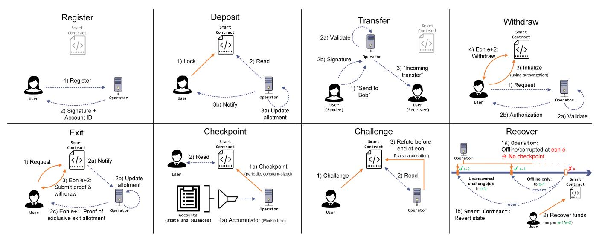
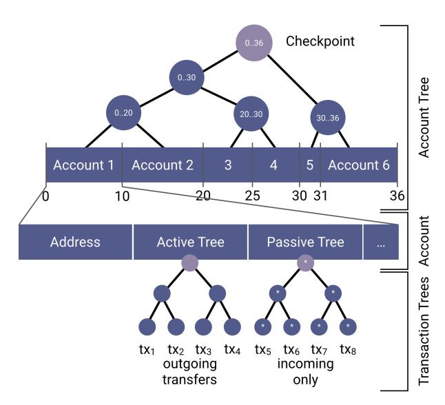
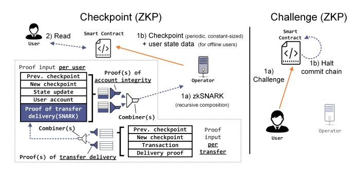
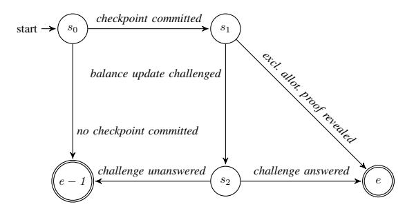
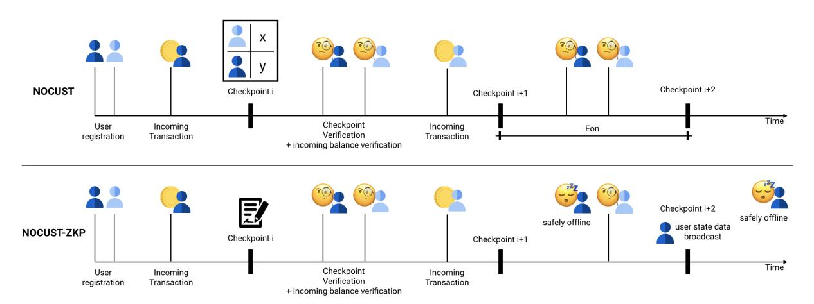

# Commit-Chains: Secure, Scalable Off-Chain Payments

Rami Khalil Imperial College London Liquidity Network rami.khalil@imperial.ac.uk

Pedro Moreno-Sanchez TU Wien pedro.sanchez@tuwien.ac.at

Alexei Zamyatin Imperial College London alexei.zamyatin17@imperial.ac.uk

> Arthur Gervais Imperial College London Liquidity Network arthur@gervais.cc

Guillaume Felley Liquidity Network guillaume.felley@liquidity.network

*Abstract*—Current permissionless blockchains suffer from scalability limitations. To scale without changing the underlying blockchain, one avenue is to lock funds into blockchain smartcontracts (collateral) and enact transactions outside, or offthe blockchain, via accountable peer-to-peer messages. Disputes among peers are resolved with appropriate collateral redistribution *on* the blockchain. In this work we lay the foundations for *commit-chains*, a novel off-chain scaling solution for existing blockchains where an untrusted and non-custodial operator *commits* the state of its user account balances via *constant-sized*, periodic checkpoints. Users dispute operator misbehavior via a smart contract. The commit-chain paradigm enables for the first time that off-chain users can receive payments while being offline. Moreover, locked funds can be managed efficiently at constant communication costs, alleviating collateral fragmentation.

We instantiate two *account-based* commit-chain constructions: NOCUST, based on a cost-effective challenge-response dispute mechanism; and NOCUST-ZKP, which provides provably correct operation via zkSNARKs. These constructions offer a trade-off between correctness, verification, and efficiency while both are practical and ensure key properties such as balance safety; that is, no honest user loses coins. We implemented both constructions on a smart contract enabled blockchain. Our evaluation demonstrates that NOCUST's operational costs in terms of computation and communication scale logarithmically in the number of users and transactions, and allow very efficient lightweight clients (a user involved in e.g. 100 daily transactions only needs to store a constant 46 kb of data, allowing secure payments even on mobile devices). NOCUST is operational in production since March 2019.

## I. INTRODUCTION

Since the beginning of centralized banking in Mesopotamia [\[1\]](#page-13-0), financial intermediaries evolved as middlemen between parties that have surplus capital and others that desire access to liquid funds. Such financial intermediaries traditionally operate as custodians, as they (temporarily) hold the transmitted funds, and therefore are entrusted with enacting secure transaction policies.

While the emergence of decentralized Proof-of-Work (PoW) ledgers have portrayed a mechanism of performing financial transactions without a centralized intermediary, lowthroughput and volatility of transaction fees constraints are fundamentally hindering the practical use of such ledgers. To improve transaction throughput, different classes of blockchain scaling solutions are being pursued. One such class of scaling solutions focuses on alternative consensus mechanisms [\[2,](#page-13-1) [3\]](#page-13-2) or sharding [\[4,](#page-13-3) [5\]](#page-13-4). They, however, typically introduce different trust assumptions and are therefore not backwards compatible with current widely deployed blockchains.

Off-chain scaling (state-of-the-art). In this paper we focus on 2nd-layer (or off-chain) scaling solutions such as payment channels and payment channel networks (PCN) [\[6\]](#page-13-5), which reduce the load on the blockchain ledger by performing operations securely off-chain. Numerous contributions address the performance characteristics of payment channel networks [\[7–](#page-13-6) [13\]](#page-13-7). While PCN improve transaction throughput and enable decentralized channel topologies, they still leave room for future work: (i) bootstrapping cost: each channel establishment requires at least one (expensive and slow) blockchain transaction, (ii) user churn: *a user must be continuously online to receive incoming transfers* - a drawback over traditional on-chain payments and (iii) collateral management: funds are typically bound to channels between two parties, leading to rigid collateral fragmentation, while transfers that form a path across multiple channels require fee-contingent routing. PCN's decentralisation requires complex routing topologies which induce setup and maintenance costs.

To alleviate routing challenges, payment channels can be organized in a star-like topology, with one entity maintaining many channels, forming a so-called *payment channel hub* (PCH) [\[14\]](#page-13-8). Given a network of a few PCHs, with long-lived peering and routing agreements, channel routing complexities can be reduced. However, PCH inherit the aforementioned challenges of PCN, namely, bootstrapping cost, user churn and collateral management. For instance, user churn leads to costly recovery and refilling of fragmented collateral: O(n) on-chain transactions for n channels.

Commit-chains (this work). We introduce *commit-chains*, a novel 2 nd-layer scheme that combines a permissionless blockchain and a centralized, but untrusted payment provider to scale off-chain payments. A commit-chain is instantiated with a (i) *non-custodial* operator (i.e., users maintain full control over their funds at all times) who processes cryptocurrency payments between the system's users *off-chain*, and (ii) an *on-chain* smart contract which enforces the operator's correct behavior. The operator *commits* the latest state of the user's account balances to the smart contract in *regular intervals* via constant-sized *checkpoints*. These checkpoints (i) allow users to challenge the operator in case of disputes or (ii) enable the smart contract to verify and enforce correct operation.

While pursuing the same overall goals, commit-chains and PCNs provide a tradeoff in terms of bootstrapping, user churn, collateral management and decentralization. First, a user can join the commit-chain by only exchanging authenticated offchain messages with the operator. Second, commit-chain users can receive payments while being offline and are only required to surface online once within a checkpoint interval. Similarly to PCN, commit-chains can provide *instant payment finalization* to users at *full operator transaction volume collateralization*[1](#page-1-0) . Unlike PCNs, commit-chains can additionally provide *delayed payment finalization* at *no operator transaction volume collateralization*. Finally, the collateral in a commit-chain allocated at a checkpoint can be fully reused in the following checkpoints, and redistributed with a single on-chain transaction, *independent of the number of registered users*. Commit-chains provide these advantages at the cost of centralization (rely on a single, untrusted operator) and lack of interoperability (rely on blockchains with support for Turingcomplete smart contracts).

Our contributions. Summarizing, this paper makes the following contributions:

- We introduce commit-chains, a novel scheme for offchain payments. We show that commit-chains can be combined with any smart-contract capable blockchain to construct fully-fledged *account-based* payment systems.
- We present two practical commit-chain constructions, building upon a novel multi-layered *Merkelized interval tree*: (i) NOCUST, which relies on a lowcost challenge-response dispute mechanism, and (ii) NOCUST-ZKP, which achieves provably correct operation via *Zero Knowledge Proofs* (recursively composed zkSNARKs [\[15](#page-13-9)[–18\]](#page-13-10)). We provide a security analysis for both constructions.
- We implement and evaluate NOCUST and NOCUST-ZKP. We show that a commit-chain can scale towards hundreds of thousands of users, while it costs less than 1.5 USD per month to operate NOCUST, irrespective of the number of users and transfers enacted. We make our smart contract code available as open-source on Github[2](#page-1-1) . We went the last mile and deployed NOCUST in production, where it serves reliably zero fee transactions for users since March 24, 2019.

Outline. Section [II](#page-1-2) provides the background and reviews related work, while Section [IV](#page-3-0) provides an overview of commitchains. Section [V](#page-4-0) presents the details of NOCUST and Section [VI](#page-8-0) of NOCUST-ZKP. Section [VII](#page-9-0) provides the security analysis, Section [VIII](#page-11-0) evaluates NOCUST and NOCUST-ZKP in practice, Section [IX](#page-12-0) discusses open challenges and future work. We conclude the paper in Section [X.](#page-12-1)

## II. BACKGROUND AND RELATED WORK

<span id="page-1-2"></span>Blockchains allow to build an append-only immutable ledger that is maintained by a distributed network of nodes [\[19\]](#page-13-11). Permissionless blockchains in particular allow any party to join/leave the network, write to the underlying ledger, and participate in consensus. The majority of such systems [\[19,](#page-13-11) [20\]](#page-13-12) rely on a random leader election process as part of their consensus mechanism. An elected participant decides on the current state transition: a set of *transactions* altering the ledger state, arranged in a so called *block*. For example, in Proof-of-Work blockchains, the leader is the first participant to solve a computationally expensive puzzle [\[21\]](#page-13-13).

Permissionless blockchains, however, face a significant performance bottleneck: to take effect, a transaction must be included in a block, which is broadcast to the majority of participants, who must then agree on its validity. Transactions are then considered *final* after a stabilization phase [\[22–](#page-13-14) [24\]](#page-14-0) of k blocks, where k is the security parameter of the underlying system [\[25,](#page-14-1) [26\]](#page-14-2). Adjusting the number of transactions per block or the block generation interval thereby warrants caution, as bullish parameterization may severely impact security [\[25,](#page-14-1) [27,](#page-14-3) [28\]](#page-14-4). As a result, the most widely used permissionless blockchains, such as Bitcoin [\[19\]](#page-13-11) and Ethereum [\[29\]](#page-14-5), process only up to 10 transactions per second.

Payment channel networks (PCN) enable rapid one-way [\[30,](#page-14-6) [31\]](#page-14-7) or bi-directional [\[6\]](#page-13-5) payments without publishing each transfer on-chain. Each channel is established between two parties and follows three phases: *(i)* an on-chain channel establishment, *(ii)* off-chain channel state transition(s) and *(iii)* an on-chain dispute/closure. PCN have received attention from both academia and industry [\[7](#page-13-6)[–9,](#page-13-15) [32](#page-14-8)[–34\]](#page-14-9). Many works cover privacy enhanced PCN designs [\[14,](#page-13-8) [34–](#page-14-9)[39\]](#page-14-10). The Fulgor and Rayo protocols [\[12\]](#page-13-16) demonstrate tradeoffs between concurrency and privacy in PCN. Perun [\[10\]](#page-13-17) reduces communication complexity through virtual channels. Teechan [\[40\]](#page-14-11) and Teechain [\[41\]](#page-14-12) trade the need for a blockchain clock with a trusted hardware assumption increase efficiency. State channels [\[42\]](#page-14-13) extend payment channels to support execution of arbitrary smart contracts, whereby participants unanimously agree on state transitions off-chain. A payment-channel hub (PCH) [\[10,](#page-13-17) [14\]](#page-13-8) is an entity that opens many payment channels with different users in a star-like topology so they can pay each other with at most one hop via the intermediate operator. Albeit PCH, PCN and state channel networks undoubtedly improve the scalability of current blockchains, they all share room for improvement. First, users are required to be online to receive payments, hindering utility in certain applications

<span id="page-1-0"></span><sup>1</sup>Collateral is defined as a volume of assets locked by an off-chain participant (e.g., user or operator) as a security lockup. Users need to lock up the transaction volume they transmit off-chain. If the operator also fully collateralizes payments, then 2X collateral is locked up to facilitate payments worth 1X.

<span id="page-1-1"></span><sup>2</sup><https://github.com/liquidity-network/nocust-contracts-solidity>

(e.g., offline/energy saving mobile recipients). Second, bootstrapping in this paradigm mandates an on-chain transaction for each channel, which is reasonable for senders (i.e., users that introduce coins into the off-chain system), but not for exclusively recipient users. For instance, assume a PCH with n users, where Alice has n − 1 coins and wants to send 1 coin to every other user. In this scenario, the PCH operator needs to anticipate and allocate collateral among the other n − 1 user channels, at a cost of n − 1 on-chain transactions. We conjecture that it is feasible to have an off-chain system where this scenario can occur with only a single on-chain transaction. Finally, current off-chain channel systems handle the collateral (i.e., coins locked on-chain) sub-optimally. In our PCH example, assume that the PCH allocates one coin in each n − 1 receiver channel. In this case, Alice cannot pay more than one coin to any single receiver, even though her balance is n−1 coins. The PCH would have to allocate n−1 coins in the channel of each receiver to permit this, requiring that the PCH locks n ·(n−1) coins to allow only n−1 coins to be transacted.

Plasma [\[43\]](#page-14-14) is an effort by the Ethereum community for central operators to maintain UTXO based ledgers atop of an account-based blockchain to enable transfers. The downsides of this UTXO approach compared to ours include a lack of native fungible payment support, a lack of instant finality mechanisms, and linearly growing data storage and computation costs with each ledger update. Several informal variants of this approach, none of which have lead to practical solutions to the best of our knowledge, surfaced across multiple community websites[3](#page-2-0) to attempt to remedy these downsides.

In this state of affairs, the current landscape of offchain scalability solutions has room for alternative execution paradigms that fill the aforementioned gaps.

## III. COMMIT-CHAINS: PROBLEM DEFINITION

In this section, we introduce the notion of *commit-chains*, where we overview the system model and main functionality, describe the communication and threat models, and finally present the security goals.

## *A. Commit-chain*

Actors. A commit-chain is composed of the following actors:

- *User.* A user owns at least one private key/account in the blockchain and acts as a participant in the blockchain and in the commit-chain.
- *Operator.* The commit-chain operator, who is also uniquely identifiable with a private/public key pair account, handles user transactions and commits data to the blockchain that updates the commit-chain ledger.
- *Smart Contract.* The smart contract(s) on the blockchain defines and enforces mechanisms in the commitchain protocol. This component, since it lives on the blockchain, enforces correct execution of operations it

receives. Depending on the blockchain, this component may provide also privacy guarantees.

Functionality. Commit-chains process transactions off-chain following a model similar to that of payment channel hubs: a central entity maintains a service for multiple users. To execute transactions in a cost-efficient manner, users submit most of the transactions they would otherwise do in the blockchain to the operator to amortize their blockchain transaction costs. The users then only interact with the parent-chain to carry out tasks that cannot be carried out securely solely through the operator depending on the use-case, such as potentially moderating the operator behavior, or making transfers into or out of the commit-chain. Commit-chains are deployed alongside a blockchain, referred to as the parent-chain, that can already establish consensus in the network. The parent-chain exhibits ledger functionality, containing a global view of user accounts and transactions. Each account is controlled by a private key.

## *B. Communication Model*

A commit-chain operates under the bounded synchronous communication setting [\[44\]](#page-14-15), where the execution of the protocol happens in discrete rounds (that we refer to as *eons* in the rest of this paper). The parties are always aware of the current round and if a message is sent at round i, then it is delivered to the recipient at the beginning of round i + 1. We further assume an upper bound δ on the delay between transaction broadcast an inclusion in the underlying blockchain. We remark that these are standard assumptions in blockchain literature [\[6,](#page-13-5) [7,](#page-13-6) [10,](#page-13-17) [12\]](#page-13-16).

The operator and users participating in the commit-chain each have a verification/signing key pair (e.g., key pair from the parent-chain). Moreover, each user knows the verification key of the operator. Finally, all users are aware of the smart contract for the commit-chain. In practice, the operator can announce its public key and the commit-chain contract on its website and users can verify it by checking the publicly available blockchain.

## <span id="page-2-2"></span>*C. Threat Model*

We assume that the cryptographic primitives of the blockchain hosting the smart contract are secure, and that the adversary cannot corrupt any trusted setup component in the cryptographic primitives used[4](#page-2-1) . We further assume that adversaries are computationally bounded and can corrupt at most 1/3 of the consensus participants of the blockchain (or 33% of the computational power for blockchains with Nakamoto consensus [\[25,](#page-14-1) [27,](#page-14-3) [48\]](#page-14-16)). As such, users can always read and write to the blockchain and an adversary cannot tamper with the correct execution of the smart contract. However, we allow an adversary to corrupt the commit chain operator and an arbitrary number of commit-chain users, as well as to execute Sybil [\[49\]](#page-14-17) and Denial-of-Service attacks. Under these assumptions, commit-chain users must be online at least once within an *eon* (unless this requirement is outsourced to

<span id="page-2-0"></span><sup>3</sup>Compiled at https://www.learnplasma.org/en/

<span id="page-2-1"></span><sup>4</sup> e.g. zkSNARK setup is done via a secure multiparty computation [\[45](#page-14-18)[–47\]](#page-14-19).

a monitoring service (e.g., a watchtower [\[50\]](#page-14-20)), or the operator broadcasts an offline user's state to the blockchain as in NOCUST-ZKP).

## <span id="page-3-5"></span>*D. Security Goals*

- Safety. Generally, safety means that the system should not be exploited to mint nonexistent coins or steal from honest users. Specifically, the system must provide the following guarantes: (i) the total funds locked into a commit-chain must correspond 1-1 with the balances of the registered users; (ii) The adversary cannot debit a user without the user's authorization, and must correctly credit the intended recipient; (iii) User balances must be correctly updated by the system operations even in the presence of the adversary.
- Liveness. Essentially, we formulate liveness as the guarantee that an honest user will always be able to access its funds within a bounded amount of time, regardless of adversary behavior. More explicitly, users must always be able to: (i) learn the latest confirmed states of their commit-chain accounts; (ii) withdraw their balances to their blockchain accounts.

We make several remarks here. First, the above two guarantees are only provided as securely as the underlying parentchain can also provide them in their own sense. For example, a parent-chain with a consensus protocol that does not provide liveness would also affect the guarantees of our commit-chain. As mentioned in [subsection III-C,](#page-2-2) in this work we assume the underlying parent-chain is operated by an honest majority.

Second, the safety property largely resembles that of balance security defined for payment-channel hubs [\[14,](#page-13-8) [35\]](#page-14-21) and payment-channel networks [\[12,](#page-13-16) [13\]](#page-13-7). However, balance security in payment-channels does not cover offline transfer delivery, which is crucial for commit-chains and thus covered by our safety definition.

Third, since a commit-chain operator manages the balance of many users on their behalf (even when some of them might be offline), achieving liveness is crucial to commitchains. A similar property has not been defined for paymentchannel hubs/networks since users actively participate in each operation that updates their account.

Finally, it is important to note that safety and liveness only disqualify the operator from being a trusted custodian of its users' funds. These guarantees need to be provided by the system to an honest participant regardless of the behavior of the operator or any other participant (cf. proofs in Section [VII\)](#page-9-0). However, the operator can still selectively censor users from performing transfers in the commit-chain, and leave them no option but to withdraw their funds back into their blockchain accounts.

## IV. SOLUTION OVERVIEW

<span id="page-3-0"></span>Our objective is to increase the transaction throughput by safely offloading payments from the parent-chain to a commitchain. Users register with an operator without publishing messages in the parent-chain. Transfers are sent through the operator, who periodically commits to the latest state of user balances on the smart contract. Transfers are considered final once the corresponding commitments stabilize in the parentchain, i.e., received k confirmations[5](#page-3-1) . Users come online to retain custody of their account balances once per checkpoint interval.

## *A. High-Level Operation*

Figure [1](#page-4-1) presents an overview of our systems' lifecycles.

Register. A user registers with the operator via an off-chain message, receiving a new account identifier in the commitchain. Afterwards, the user can solicit payments from other users in the commit-chain.

Deposit. Users lock the desired amount of coins in the smart contract. Then they can *send them off-chain to any other user registered in the commit-chain* or *always claim them back*. Recipients do not need to perform any deposits.

Transfer. Users authorize the operator to debit their accounts, and credit the recipients. The recipient can then *immediately transfer these funds to other commit-chain users* or *withdraw them after finalization*.

Withdraw/Exit. Users submit off-chain requests to the operator, who queues withdrawals in the smart contract within the following checkpoint. Alternatively, users can initiate full forced exits via the smart contract, closing their commitchain accounts and refunding all their balances.

Checkpoint. At the end of each *eon*, the operator commits the latest state of all user accounts to the smart contract. [6](#page-3-2) User operations are then only finalized once the corresponding state changes are reflected in an on-chain checkpoint and passed a dispute period.

Challenge. If an operator misbehaves in any way, users publish challenges on the smart contract, which secures user funds and penalizes the operator in case of fraud. [7](#page-3-3)

Recover. If the operator is penalized, the smart contract forces the commit-chain into recovery mode. The smart contract no longer accepts checkpoints, halting the commit-chains. Users can then recover their funds, at their earliest convenience, from the last valid checkpoint via on-chain transactions. [8](#page-3-4)

## *B. Design Roadmap: NOCUST and NOCUST-ZKP*

NOCUST: In Section [V](#page-4-0) our first construction follows a simple but cost-effective approach. Checkpoints represent the root (hash) of our novel *multi-layered Merkelized interval tree*

<span id="page-3-1"></span><sup>5</sup>Note: in challenge-based schemes e.g. NOCUST, an additional dispute period is introduced.

<span id="page-3-2"></span><sup>6</sup>Each checkpoint requires an on-chain transaction and thus clearly imposes a burden on the blockchain that does not exist with payment channels. The periodicity of checkpoints must be thus carefully adjusted as a system parameter and the size of each checkpoint must be minimized. This is a tradeoff of commit-chains in lieu of improving bootstrapping costs, user churn and collateral fragmentation.

<span id="page-3-3"></span><sup>7</sup>The operator is given time to reply to a challenge by publishing on-chain a proof of correct operation.

<span id="page-3-4"></span><sup>8</sup>Both challenge and recover operations are crucial to eliminate the trust of the commit-chain operator and ensure the safety for users. Thus, commitchains do not trade off the crucial aspect of security with respect to payment channels.

<span id="page-4-1"></span>

Fig. 1: Overview of the main NOCUST commit-chain sub-protocols: *Register*, *Deposit*, *Transfer*, *Withdraw*, *Exit*, *Checkpoint*, *Challenge* and *Recover*. Solid orange lines represent *on-chain* transactions. Blue dotted lines denote *off-chain* messages/actions. The operator handles transfers between users and commits the state of all accounts to the smart contract once per *eon*. Users come online once per *eon* and, in case of disputes, challenge the operator via the smart contract, recovering funds in case of failure. Protocol steps correspond to descriptions in Section [V-E.](#page-6-0)

introduced in this paper (Section [V-B\)](#page-5-0), which aggregates the state of all user accounts and their balances. In case a checkpoint containing invalid account changes is published at the end of an eon, or none at all, users must challenge the operator via the smart contract. The operator in turn must produce a proof of adherence to the protocol. Thereby, users can only challenge the *most recent* checkpoint, and must *come online once per eon* to *ensure the safety and liveness of their funds*. Our novel commitment data-structure facilitates this process securely and efficiently.

NOCUST-ZKP: In Section [VI](#page-8-0) our second construction mitigates safety and liveness risks by requiring the operator to construct a *non-interactive Zero Knowledge Proof* (NIZKP) [\[16,](#page-13-18) [51\]](#page-15-0), proving to the smart contract that all updates to user accounts are correct and have been signed by users. We present constraint systems that can be utilized through *recursive composition* of zkSNARKS [\[17,](#page-13-19) [18\]](#page-13-10), allowing incremental computation of proofs, while maintaining constant verification time and cost (Section [VIII\)](#page-11-0). As a result, the operator can no longer submit an inconsistent checkpoint or withhold user state data. Users still come *online once per eon* to *check the freshness of their account and balance*, i.e., verify that the operator has included all relevant transactions and not gone offline. This approach improves security guarantees at the cost of zero-knowledge proof generation and potential additional data submission to the smart contract, but still offers zero-gas fees on commit-chain transfers to honest parties.

## V. NOCUST: A PRACTICAL COMMIT-CHAIN

## <span id="page-4-0"></span>*A. The Commit-Chain Data Scheme*

The commit-chain ledger is divided into: (i) *local*, information stored locally at the operator about balances or transfers performed through the operator; and (ii) *global*, information stored at the blockchain and globally available to all participants that covers balances or operations done through the smart contract. We note that naturally, different parties may have different views of *local* information whereas they must have the same view of *global* information, as we trust the blockchain for availability and integrity.

Local Information. The operator stores the following in the local ledger for every user i at every *eon* e:

allotmenti(e): The allotted balance.

receivedi(e): The total received.

senti(e): The total sent.

positioni (e): The offset of the last outgoing transfer.

txOuti(e): Outgoing commit-chain transfers.

txIni(e): Incoming commit-chain transfers.

collateral <sup>i</sup>(e): The instant finality collateral.

Global Information. The contract stores the following in the global ledger for every user i at every *eon* e:

depositedi (e): The total deposited in e.

withdrawni(e): The total requested for withdrawal in e.

exiti(e): A flag for whether an exit was requested.

extrai(e): The extra insurance collateral for *eon* e.

troot(e): The state commitment of *eon* e.

Additionally the smart contract can store the challenges posted by users until the operator responds.

The initially allotted balance of a user in the current *eon* is calculated from all the data of the previous *eon* as the sum of: (i) the user's initially allotted balance, (ii) the amount deposited, (iii) the amount received in the commit-chain (iv) minus the amount requested for withdrawal, and (v) minus the amount sent in the commit-chain.

#### <span id="page-5-0"></span>B. Merkleized Interval Tree-Structure

To provably account for the balances and additional collateral of each user at each eon, we design a novel Merklelized interval tree. The nodes in this Merkle tree [52] are augmented with continuous intervals so that the smart contract can efficiently verify the correct and exclusive allotment of funds by the operator. A node  $t_n(e)$  whose contents represent information at  $eon\ e$  is structured as defined in Equation 1.

<span id="page-5-1"></span>
$$t_n(e) := \langle \text{ offset } _n(e), \text{ information}_n(e), \text{ allotment}_n(e) \rangle$$
 (1)

allotment is defined as the amount exclusively allotted to the node, while offset is defined per Equation 2. information is a cryptographic commitment to the information within this node. **Leaves.** A leaf  $t_i(e)$  is used to represent the commit-chain account of user i at  $eon\ e$ , whereby  $\operatorname{allotment}_i(e)$  is equal to their starting balance in  $eon\ e$ , and  $\operatorname{offset}_i(e)$  corresponds to the sum of the starting balances of all users ordered before user i.

<span id="page-5-2"></span>offset 
$$i(e) = \sum_{j < i} \text{allotment}_j(e)$$
 (2)

Using these two numeric values, a balance can then be represented as the length of the interval [ offset , offset + allotment). We utilize the condition that different intervals do not intersect each other to secure users' accounts and transfers in NOCUST.  $information_i(e)$  is the cryptographic hash of the blockchain address of the user and the commitment of the last state update the user signed in the previous eon, as defined in Equation 3:

<span id="page-5-3"></span>
$$\{\operatorname{address}_{i}, \operatorname{update}_{i}^{p}(e-1), \operatorname{update}_{i}^{a}(e-1)\}$$
 (3)

where  $\operatorname{update}_i^p(e-1)$  and  $\operatorname{update}_i^a(e-1)$  represent the last passive and authorized state updates, respectively, of the commit-chain account of the i<sup>th</sup> user at  $eon\ e-1$ , as explained further in Section V.

**Internal Nodes.** An internal node  $t_u(e)$ , with a left child  $t_p(e)$  and a right child  $t_q(e)$ , is constructed per Eq. 4 and Eq. 5:

<span id="page-5-4"></span>
$$\operatorname{allotment}_{u}(e) = \operatorname{allotment}_{p}(e) + \operatorname{allotment}_{q}(e)$$
 (4)

<span id="page-5-5"></span>
$$offset_{u}(e) = offset_{p}(e)$$
 (5)

 $\inf_u(e)$  is a cryptographic commitment to  $t_p(e)$  and  $t_q(e)$ , with  $\inf_u(e)$  as a middle border value.

<span id="page-5-6"></span>
$$information_u(e) := \{t_p(e), offset_q(e), t_q(e)\}$$
 (6)

With these definitions, an internal node  $t_u$  then takes the offset of its left child  $t_p$  as its own, and the offset of its right child  $t_q$  as a border between the two children. It is important to note that the middle value of offset  $_q(e)$  is interchangeable with that of offset  $_p(e)$  + allotment  $_p(e)$  as they must be equal in correct intersection-free instances of this interval structure.



Fig. 2: Visualization of a Merkleized interval tree representing the commit-chain accounts. There are six accounts with their respective balances (36 total commit-chain coins) visualized. An account consists of an address, the roots of the active/authorized and passive trees (and additional data relevant for implementation). Intermediate nodes are annotated with balance intervals (cf. Section V-B). Note: only the passive tree of incoming transactions is annotated with intervals.

#### C. Monotonic User-State Structure

The information in  $\operatorname{update}_i(e)$  is divided into an authorized/active portion  $\operatorname{update}_i^a(e)$ , and a passive portion  $\operatorname{update}_i^p(e)$ . The authorized portion must be accompanied by a signature from the user, while the passive portion can be set by the operator. The authorized portion  $\operatorname{update}_i^a(e)$  is structured as follows:

$$\operatorname{update}_{i}^{a}(e) = \langle \operatorname{txOut}_{i}(e), \operatorname{sent}_{i}(e) \rangle \tag{7}$$

 $\mathbf{txOut}_i(e)$  is committed to using an unannotated Merkle tree where the leaves are the individual commit-chain transfers authorized by the user during  $eon\ e$ . A commit-chain transfer is a tuple of the following information:

(eon, sender, recipient, nonce, amount, offset)

The passive portion  $update_i^p(e)$  is structured as follows:

$$update_{i}^{p}(e) = \langle txIn_{i}(e), position_{i}(e), received_{i}(e) \rangle$$
 (8)

 $\operatorname{position}_i(e)$  is a numeric offset value specified by the operator to secure delivered transfers. Like offset values, the position value is used to ensure that intervals representing transfer amounts do not intersect.  $\operatorname{txIn}_i(e)$  may only contain incoming transfers for the user during e, and the commitment is constructed using the annotated Merkle tree structure from Section V-B where, for a leaf, allotment equals the transfer amount, and information is a commitment to the transfer.

## <span id="page-6-3"></span>*D. Proofs Of Exclusive Allotment*

We now describe the proofs that are derived from this annotated merkle-tree structure to efficiently secure NOCUST balances and transfers. These proofs are extensively utilized throughout Section [V-E.](#page-6-0) We prove in Appendix [B-A](#page-16-0) that no valid instance of our annotated merkle trees may contain two overlapping allotments, and therefore that a fraudulent proof of exclusive allotment cannot be constructed or be accepted by an honest verifier such as the smart-contract.

User Balances. For each user, a proof of exclusive balance allotment is constructed. The main goal of this construct is to prove that the user *exclusively* owns an allotment of size allotmenti(e) within the pool of user funds at the beginning of an *eon*. This proof is constructed similar to a regular Merkle tree membership proof: the proof consists of the hashes of the siblings of the nodes in the path from the root to the leaf. However, in addition to the hash, a boundary value Ω is required for each sibling tn(e) along the path to the root:

$$\Omega(t_n(e)) = \begin{cases} \text{offset } n(e) & t_n(e) \text{ is L. child} \\ \text{offset } n(e) + \text{allotment}_n(e) & t_n(e) \text{ is R. child} \end{cases}$$
(9)

Verification is similar to validating set membership in a Merkle tree, but node reconstruction is done per the definitions in Section [V-B](#page-5-0) using the Ω values. The size of this proof then grows *logarithmically* in the *number of users*. [9](#page-6-1)

Transfer Delivery. We utilize our exclusive allotment datastructure to ensure that the operator properly credits the amounts to offline recipients through making any misbehavior efficiently provable. A proof of transfer membership in txIni(e) includes the respective Ω values, similar to a balance proof. The root node allotment is the value of receivedi(e), which is the total amount received by a participant, while each leaf's allotment is the transferred amount.

Account Exits. The operator is required to post a commitment to an annotated-merkle tree that enables users to exit from the commit-chain instance with all of their funds. In this structure, informationi(e) is only comprised of address<sup>i</sup> and allotmenti(e). The latter represents the finalized balance the user can claim. Insurance Collateral. To guarantee instant transaction finality, the operator stakes additional collateral that recipients claim in case of failure to finalize transactions within *two eons*. To efficiently manage the allocations of the staked collateral, the operator commits each *eon* e to an annotated merkle-tree that *exclusively* divides the insurance collateral pool among the users. All funds in this pool are separated from those in the user account balance pool. In the collateral structure, informationi(e) in leaf nodes is only comprised of address<sup>i</sup> , while allotmenti(e) is equal to the allocated collateral.

## <span id="page-6-0"></span>*E. Subprotocols*

In this section we describe the sub-protocols in NOCUST. We utilize the following symbols to refer to participants in the

<span id="page-6-1"></span><sup>9</sup>For comparison: a classic Merkle membership proof grows also logarithmically in the size of the number of elements in the set.

protocols. U: User, O: Operator, S: Sender, R: Recipient, and C: Contract.

## Register:

- 1) The User submits a signed update of an empty account {|update<sup>a</sup> U (e)|}<sup>U</sup> to the Operator;
- 2) The Operator verifies the User's signature, countersigns and returns the empty account update {|update<sup>a</sup> U (e)|}<sup>O</sup> to the user.

After verifying the Operator's signature, the User can safely make deposits and solicit payments.

### Deposit:

- 1) The User sends a transaction to the Contract, which adds the amount to deposited<sup>U</sup> (e) in its memory.
- 2) The Operator reads this deposit from the Contract.
- 3) The Operator updates the user allotment in *local* and notifies the User of its commit-chain balance increase.

The User can then transfer these funds or withdraw them. The user may also later exit with them or challenge that they were not credited.

#### Transfer:

- 1) The Sender creates a new active state update to authorize the transfer. If the Sender's positionS(e) is not empty before enacting a new transfer, then the new active state update must also move this value into the offset field of the previous outgoing transfer. The new transfer is inserted into txOutS(e), and the authorized state update is sent to the Operator.
- 2) The Operator validates if the received update is correct and the Sender has sufficient balance to carry out the transfer. The Operator then decides on the offset of the transfer, and copies the offset value into the Sender's positionS(e) value. This marks exactly where the transferred amount was allotted in txInR(e), without this value being known beforehand by the Sender to safely avoid race conditions. The Operator responds to the Sender with its countersignature on update<sup>a</sup> S (e)kpositionS(e).
- 3) The Operator simply notifies the Recipient that a transfer was received whenever the Recipient comes online.[10](#page-6-2)

The funds can then be transferred or withdrawn by the Recipient, or its delivery can be disputed.

## Withdraw:

- 1) The User submits its withdrawal request to the Operator.
- 2) The Operator validates that the user possesses sufficient balance, and responds with the authorization.
- 3) The User (or any party) submits the authorization to the smart contract to *initiate* the withdrawal.
- 4) After the current *eon* e and the next *eon* e + 1 *successfully* pass without challenges, the User finalizes this withdrawal request, and the Contract credits the User with the funds in a parent-chain transaction.

*Instant Withdrawal.* Additionally, an Operator can immediately pay out the withdrawal from its own personal funds and

<span id="page-6-2"></span><sup>10</sup>Or the Sender notifies the Recipient out of band.

```
\overline{\text{Exit.}}
1. U \to C:
Register.
                                                                                                                                                         Challenge (Transfer Delivery).
                         \{| \text{update}_{U}^{a}(e)| \}_{U} 
 \{| \text{update}_{U}^{a}(e)| \}_{O} 
                                                                                                    requestExit()
   1. U \rightarrow O:
                                                                                                                                                                                Accounting data for S in eon e,
  2. U \leftarrow O:
                                                                              2. O \leftarrow C:
                                                                                                    ExitInitialization(e,\, U)
                                                                                                                                                                                • Exclusive allotment proof
                                                                              3. U \rightarrow C:
Deposit.
                                                                                                    Exclusive allotment proof in e+2
                                                                                                                                                                                • update_{S}^{a}(e-1)
   1. U \rightarrow C:
                        Transaction(U, C, amount)
                                                                              4. U \leftarrow C:
                                                                                                    Transaction(C, U, Amount)
                                                                                                                                                                                • Transfer debit proof
  2. O \leftarrow C:
3. O \rightarrow U:
                                                                            Checkpoint.
                        Deposit(e, U, amount)
                                                                                                                                                           2. O \leftarrow C:
                                                                                                                                                                                Challenge(e, S, R, Transfer)
                                                                              1. O \rightarrow C
                        Balance update
                                                                                                    t_{root}(e)
                                                                                                                                                           3. O \rightarrow C:
                                                                                                                                                                                Accounting data for R in eon e.
Transfer. 1. S \rightarrow O:
                                                                              2. U \leftarrow C:
                                                                                                    CheckpointSubmission(e, t_{root}(e))
                                                                                                                                                                                 • Exclusive allotment proof
                        \{|\operatorname{update}_{S}^{a}(e)|\}_{S} 
\{|\operatorname{update}_{S}^{a}(e)|\}_{O},
                                                                            Challenge (State
                                                                                                    Update).
                                                                                                                                                                                \bullet \ \mathbf{update}_R(e-1)
   2. S \leftarrow O:
                                                                                                    Accounting data for U in eon e-1.
                                                                               1. U \rightarrow C:

    Transfer credit proof

                                                                                                    • Exclusive allotment proof
                        \operatorname{position}_{S}(e)
                                                                                                                                                        \begin{array}{c} \textbf{Recover.} \\ \text{1. } U \rightarrow C \text{:} \end{array}
   3. R \leftarrow O:
                        Balance undate
                                                                                                    • \operatorname{update}_U^a(e-1)
                                                                                                                                                                                Last confirmed accounting data for U,
Withdraw.
1. U \rightarrow O:
                                                                              2. O \leftarrow C:
                                                                                                    Challenge(e, U)

    Exclusive allotment proof

                         \{ | C, O, U, Expiry, Amount | \}_U
                                                                              3. O \rightarrow C:
                                                                                                    Accounting data for U in eon e,
                                                                                                                                                                                • Insurance collateral proof
  2. U \leftarrow O:
                           C, O, U, Expiry, Amount|}<sub>O</sub>
                                                                                                    • Exclusive allotment proof
                                                                                                                                                           2. U \leftarrow C:
                                                                                                                                                                                Transaction(C, User, Amount)
  3. U \rightarrow C:
                        \{ \mid C, O, U, Expiry, Amount \mid \}_O
                                                                                                                                                         Audit.

1. U \rightarrow O:
                                                                                                    • \operatorname{update}_{U}^{a}(e-1)
  4. U \leftarrow C:
                        WithdrawalInitialization(e, U, Amount)
                                                                                                                                                                                 \{ | e | \}_U
  5. U \rightarrow C:
                        confirmWithdrawal(e + 2)
                                                                                                                                                           2. U \leftarrow O:
                                                                                                                                                                                Exclusive allotment proof
  6. U \leftarrow C:
                        Transaction(C, U, Amount)
                                                                                                                                                                                Transfer delivery proofs
```

Fig. 3: Communication flow of the NOCUST sub-protocols. Communication with the Contract (C) is visible to all observers of the blockchain. Users interact only with the Operator in Registration, Transfer and Audit.

replace the intended recipient of the withdrawal finalization in  $e+\mathcal{Z}$  with itself.

#### Exit:

- 1) The User submits an exit request to the Contract.
- 2) The Operator is notified that this User must exit in the next  $eon\ e+1$ . The Operator then moves this User's funds from the balance allotment tree to the exit allotment tree, and provides the User with a proof of exclusive exit allotment in  $eon\ e+1$ .
- 3) If  $eon\ e+1$  passes successfully without challenge. The User, in possession of its exclusive exit allotment proof, finalizes its exit in  $eon\ e+2$ . In this process the Contract credits the User with the funds in a parent-chain transaction.

The Exit protocol is a fallback for Users to recover their funds from the commit-chain if the Operator blocks withdrawals. If the Operator fails to comply with the request then it gets punished by a state update challenge from the user.

#### **Checkpoint:**

- The Operator submits the merkleized interval treestructure checkpoint to the Contract, which will reject the checkpoint if the Operator is suspended, or if a checkpoint has already been submitted for the current *eon* e, or if the sizes of the root allotments are inconsistent.
- 2) Users can then read on the parent-chain that a new checkpoint had been submitted and audit their proofs from the Operator.

The Operator needs to respond to User audits with proofs to avoid being challenged and allow efficient validation of its operations. The Operator can increase individual collateral allotments on the blockchain of individual participants during the current  $eon\ e$ , and submit a complete re-assignment of all collateral that takes effect starting from e+2 using a  $single\ constant\text{-}sized\ commitment}$ . The Operator is required to commit to valid instances of the collateral, account balance and exit tree commitments within the first epoch of every eon. Commitments are rejected by the Contract in case of any outstanding challenges from  $eon\ e-1$ .

#### **Challenge (State Update):**

- 1) The User sends to the Contract its accounting data for the  $eon \ e-1$ .
- 2) The Operator reads that a challenge has been initiated.
- 3) The Operator responds with the accounting data for *eon e* before an epoch passes, and this data has to be consistent with what the Contract expects. Such that the authorized update in the response, which is used to construct the proof of exclusive allotment, is at least as fresh as the one in the challenge, and the allotment size of the proof corresponds to the expected amount.

Reading the challenge response allows the User to retain custody of its account. If the User had requested an exit in e-1, then the response will be the proof of exit allotment for finalizing its exit.

## **Challenge (Transfer Delivery):**

- 1) The accounting data used to initiate this challenge is that of the current *eon e*, where the exclusive allotment proof, authorized state update, and outgoing transfer inclusion proof are validated.
- 2) The Operator reads that a challenge has been initiated.
- 3) The Operator responds within an epoch with the corresponding transfer credit proof to avoid being punished by the Contract.

Senders directly communicate with Recipients to verify the delivery of transfers before issuing this challenge to avoid parent-chain costs and only issue challenges that they know the Operator won't be able to respond to.

## **Recover:**

- 1) In case the commit-chain is halted at  $eon\ e$ , the exclusive allotment trees are reverted to those of  $eon\ e-1$ . The User submits its exclusive allotment proofs from e-1, and the Contract accepts the request only once if the commit-chain is indeed suspended.
- 2) The Contract credits the User with the funds in a parentchain transaction.

All unfinalized transactions that were to be committed to in the reverted *eon* are then also cancelled, and only a User's insurance collateral may be collected instead.

#### **Audit:**

- 1) The User simply requests its proofs related to the checkpoint of *eon* e from the Operator.
- 2) The Operator responds with the requested proofs.

If valid proofs are not provided, such that the updated balances are inconsistent, an outdated authorized state was used, or a transfer was not properly delivered, then Users resort to the challenge operations to retain custody of their accounts and potentially punish the Operator.

### VI. NOCUST-ZKP: PROVABLE SECURITY

<span id="page-8-0"></span>NOCUST-ZKP is our second commit-chain construction which augments NOCUST with provably secure checkpoints. The crux of this design is requiring the operator to generate a non-interactive Zero-Knowledge Proof (NIZKP) at every checkpoint, proving that all user account updates are *safe*, i.e., authorized by the users and executed according to the commitchain safety criteria, and *live*, i.e., the users have received their proofs of exclusive allotment or can infer them from some additional data posted in the parent-chain by the operator. The smart contract then only accepts a checkpoint as valid if the provided proof is correct. This proof needs to be provided for the last submitted checkpoint (within one *eon*) before a new checkpoint can be submitted.

Proving Methodology. We refer to the publicly available statement of the NIZKP as the verifier input, and to the private witness as prover input (i.e., input only known to the prover). Naively, including all proofs individually with each checkpoint explicitly, or constructing a constraint system with very large verifier inputs, would require a significant amount of additional on-chain storage and computation that would completely defeat our scalability efforts. In NOCUST-ZKP, instead, we combine all zero-knowledge proofs into a single one using recursive composition [\[15](#page-13-9)[–18\]](#page-13-10), and employ several methods to minimize the verifier overhead. In a hierarchical recursive manner, we combine the results from every two related NIZKP into one parent NIZKP as in [\[18\]](#page-13-10). For different procedures, proof combination requires different validations and steps to ensure the consistency of the protocol. For example, in some contexts we validate the merger of two adjacent continuous intervals, while in other contexts we open the commitments provided in the verifier inputs of the nested verifiers (cf. Appendix [C\)](#page-18-0). This generic concept enables NOCUST-ZKP's flexibility, security and efficiency. *The sizes of the verifier input and prover output from the final combiner remain constant while encapsulating several sub-proofs*. [11](#page-8-1)

Safety Constraints. We designed our constraint systems to non-interactively prove the *safety* of the checkpoint posted by the operator in zero knowledge. First, we validate that for each user, the transfers included in txOut are correctly delivered, such that they have a verifiable exclusive allotment proof in the intended recipient's txIn annotated merkle tree. Second, the complete state update transition applied by the operator is validated to have correctly calculated each user's allotment in the new *eon*, from all *global* and *local* information. Finally, the user's signature on the authorized state update that was used to construct the new checkpoint is validated. This entire proof is akin to successfully simulating state update and transfer delivery challenges on the new checkpoint for every single account and transfer without any inconsistency.



Fig. 4: High-level overview of the *Checkpoint* and *Challenge* sub-protocols in NOCUST-ZKP. The checkpoint is validated in the zkSNARK. In addition to the constant-sized checkpoint, the operator broadcasts the *state data* for offline users.

Liveness Constraints. *Liveness* is achieved when a user learns its exclusive allotment proof to access its account balance. To prove this, the NIZKP must attest that all users achieved liveness. This then warrants an extension of the *audit* subprotocol to end with the user providing this receipt to the operator after successful validation. Honest users online within an eon send the operator a signed proof-receipt, and the operator includes these receipts in the NIZKP. For users that don't provide receipts, the operator broadcasts their *state data* h address[12](#page-8-2), state[13](#page-8-3), allotment[14](#page-8-4) i to guarantee these users' liveness via the parent-chain, and proves broadcasting this data in the NIZKP instead of obtaining a receipt (cf. Appendix [C-C](#page-19-0) and Figure [8\)](#page-21-0). The operator moreover disables the offline users from further transfers, until they surface back online and provide receipts. If a user remains offline for more subsequent *eons*, the user state data does not need to be broadcast again. Because broadcasting this data would incur additional parentchain transaction costs for the operator, the user and the operator pre-agree to an amount that will be deducted from the user account balance to make up for the broadcast cost. If the user account balance cannot cover this amount, the data is never broadcast and instead the account is simply closed with the fee burned in the parent-chain. Moreover, if the operator broadcasts the user state data at a cost less than what was agreed upon (e.g. the operator used a small gas price in Ethereum), the difference is kept by the user. This broadcast debit is also verified in our constraint systems. The operator must maintain the freshness of the authorized state

<span id="page-8-1"></span><sup>11</sup>Although we're not aware of a formal security proof in related work that attests that recursively composed proofs enjoy the same security as standard proofs, related work has argued that no evidence suggests their security is weaker [\[18\]](#page-13-10). For all intents and purposes, our constraint systems can be simply combined and flattened to a single monolithic constraint system if necessary.

<span id="page-8-2"></span><sup>12</sup>Replaceable by numeric id if user was registered prior to previous *eon*.

<span id="page-8-4"></span><span id="page-8-3"></span><sup>13</sup>Omittable in case user does not care about proving debits.

<sup>14</sup>A pre-agreed upon value is deducted from the expected amount to compensate the operator for the data broadcast costs in the blockchain.

updates it applies, and periodically commit checkpoints. The challenges that users can now issue in the smart-contract are non-interactive simplified versions. The first proves that the operator had countersigned an authorized state update that is more fresh than the one applied in the checkpoint. The second proves that the operator had countersigned a transfer to be delivered, but never included it in the checkpoint[15](#page-9-1) .

Specification. We present an extended specification detailing the NIZK constraint systems required to enforce this system in Appendix [C,](#page-18-0) along with the additional cryptographic accumulators and datastructures required to enable this construction. Admittedly, even though we design NOCUST-ZKP to minimize running costs, this approach still comes at the added burdens of proof generation, verification and non-constant sized checkpoints, which are now comprised of merkle roots, and offline user state data. NOCUST-ZKP raises the bar for the adversary to carry out withholding attacks or grief the operator while lowering the dependence on the security of the parent-chain.

## VII. SECURITY ANALYSIS

<span id="page-9-0"></span>In this section we analyze the security and prove the provision of our required guarantees by NOCUST and NOCUST-ZKP under our stated system, communication and threat models. As a proof strategy, we argue that an honest participant or honest operator following the prescribed protocol may not end in a state where they cannot utilize the smart contract to enforce the safety or liveness of the commit-chain.

## *A. Safety*

By breaking down our protocol into smaller sub-properties and proving their security, our analysis demonstrates that an adversary who attempts to violate the safety guarantees of our protocols would have to violate the security of at least one of these sub-properties.

Off-Chain Registration. As fully off-chain channel establishment is not common in 2 nd-layer solutions, we start our discussion with why our commit-chains securely provide this feature. The registration procedure allows a user to learn the operator's signature on an initially empty account. This signature and the account information allow the user to instantiate challenges in the smart contract, even in case no other operations involving the user were performed. This guarantees that a participant would be able to initiate a state update challenge in case it has not received a proof of its expected allotment in the next *eon* e + 1 , and allows the operator to securely federate user entry. An adversary that attempts to misbehave with a newly registered account would then be left vulnerable to a state update challenge by its owner.

Balance Update. The exclusive allotment guarantees of the proofs from Section [V-D](#page-6-3) prevent an adversary from minting new funds and creating an exclusive allotment tree with a root allotment not greater than the total funds locked in the smart contract. Such an allotment would trigger an immediate rejection by the smart-contract. Moreover, an adversary who attempts to seize user funds or break the 1-1 correspondence between user balances and the funds locked in the smartcontract would be left vulnerable to a state update challenge by the affected users. The exclusive allotment(e) of a user at a given *eon* e is directly derived from its operations in the previous *eon* e − 1 , which are verified by a state update challenge to protect from any inconsistency in this information. A correct response to a state update challenge proves that the user balance was updated correctly according to the operations in the parent-chain and the commit-chain.

Due to the implicit validation in zero-knowledge by the smart-contract of all user account data in NOCUST-ZKP, an adversarial operator is left unable to mint or seize funds.

Transfer Delivery. A participant in possession of its proofs of exclusive allotment can decide if it needs to challenge the correct delivery of a transfer. Our communication model assumes that participants are able to communicate directly. Without this assumption, and assuming that the operator is withholding data, the ability of a participant to reason in advance whether a transfer delivery challenge is justifiable, before incurring the costs of issuing that challenge in the blockchain, is hindered.

A recipient of a transfer (t1) can immediately check whether it knows of a different incoming transfer (t2) in the same *eon* where the intervals [ offset <sup>t</sup><sup>1</sup> , offset <sup>t</sup><sup>1</sup> + t1.amount) and [ offset <sup>t</sup><sup>2</sup> , offset <sup>t</sup><sup>2</sup> + t2.amount) intersect, or if offset <sup>t</sup><sup>1</sup> + t1.amount > receivedi(e − 1). All it requires is a proof that the transfer was debited from the sender, along with the corresponding offset <sup>t</sup><sup>1</sup> value, either in the form of position(e) or t1.offset. If there is an inconsistency, then the receiving participant can infer that a transfer delivery challenge should be executed as it will not be refutable by the operator. This is because txIni(e−1) is constructed with its transfers reserving exclusive allotments for their amounts. An adversarial operator is then vulnerable to a transfer delivery challenge by an honest user in two cases. 1) It debits the sender but does not credit the recipient, or 2) It colludes with the sender to exclude the transfer from the next checkpoint after notifying the recipient.

NOCUST-ZKP improves the safety of this guarantee, as all committed transfers are correctly verified to have been delivered in the zero knowledge proof to the smart-contract, eliminating the possibility to debit the sender without crediting the recipient.

Instant Transaction Finality. The halt of the commit-chain can cause financial damage to a recipient that accepted a nonfinalized transaction. The instant finality mechanism guarantees that a recipient can always claim owed amounts, up to the coverage of the finality collateral, in case of failure. The smart contract maintains the insurance collateral pool balance so that a valid proof of exclusive collateral allotment can always be used at most once in case the commit-chain instance enters recovery to claim the amount allotted. A user waiting for its incoming transfers to be committed and finalized can then either withdraw its funds from the smart contract starting from *eon* e + 2 if the commit-chain instance remains operational, or

<span id="page-9-1"></span><sup>15</sup>because another transfer's exclusive allotment interval intersects with its interval, or the recipient's total incoming value does not cover it.

can withdraw the insurance collateral from the smart contract if the instance enters recovery during *eons* e or e + 1 . For a participant to guarantee itself instant finality on its incoming amounts, it must only solicit incoming transfers if they do not lead to a state update that violates either of the following two constraints[16](#page-10-0):

<span id="page-10-2"></span><span id="page-10-1"></span>
$$\operatorname{received}_{i}(e-1,e) \leq \operatorname{collateral}_{i}(e) + \operatorname{extra}_{i}(e-1,e) \quad (10)$$

$$\operatorname{received}_{i}(e) \leq \operatorname{collateral}_{i}(e+1) + \operatorname{extra}_{i}(e) \quad (11)$$

We refer the reader to Appendix [B-E](#page-17-0) for our proof of soundness of this methodology, which prevents an adversary from breaking the safety of instant finalization.

Double-Spending. In the following we define doublespending as an attempt by the adversary to perform one of the following two actions while in control of a participant, and possibly while colluding with the operator:

- 1) Spend the same balance more than once in the commitchain.
- 2) Spend its balance in the commit-chain and then withdraw it onto the blockchain.

An adversary without control of the operator cannot doublespend in the commit-chain as an honest operator would not countersign invalid transfers. Similarly, attempted withdrawals in *eon* e of funds spent in e − 1 are denied by an honest operator through withholding the signatures required for initiation. Even with control of the operator, an adversary may not double-spend in the current *eon* e and be able to construct valid exclusive allotment trees in the next *eon* e + 1 . Since instances that contain no interval intersections guarantee exclusive allotments, the allotment sizes must correspond to the confirmed balances expected by each honest participant (cf. Appendix [B-C](#page-16-1) for our proof). In case an honest user receives an invalid (intersecting) proof of exclusive allotment, then it can initiate an irrefutable state update challenge using the smart-contract. In NOCUST-ZKP, the smart contract will reject a checkpoint violating any of the balance conditions.

Thus far, each safety goal presented in Section [III-D](#page-3-5) was covered by at least one of the above sub-properties, which are all simultaneously enforceable by an honest user.

## *B. Liveness*

We assume that the underlying parent-chain is secure (e.g., there are no blockchain forks) and provides enough bandwidth to handle challenges and dispute resolutions (cf. Section [III-D\)](#page-3-5), as largely assumed in related literature [\[10,](#page-13-17) [12\]](#page-13-16). We follow the strategy of proving the security of sub-properties of our protocol to demonstrate the liveness of the overall system. Data Availability. Honest users must maintain ongoing knowledge about their states to be able to utilize the smart contract for dispute and account access. This requirement holds regardless of how other users or the operator behave. By keeping track of every authorized update<sup>a</sup> i (e) and every exclusive allotment proof from the operator for previous *eons*, a user can open a balance update challenge in case the operator fails to provide a proof of exclusive allotment for the current *eon*. This guarantees that users are *always* able to learn correct exclusive allotment proofs, or halt the commit-chain.

In NOCUST, an adversarial operator can take note of which users went offline and did not acquire their proofs of exclusive balance allotment in the previous *eon*. The operator can then submit a new checkpoint that seizes the balance of the offline users, knowing that they no longer possess sufficient data to initiate any challenges. On the other hand, an adversary only in control of a sizeable portion of users can flood the smartcontract with unwarranted challenges. To mitigate this Denial-Of-Service vulnerability, the operator should be selective about user registrations (e.g. requiring human verification) and the smart-contract should require that the transaction fees incurred by the operator to answer a challenge are subsidized by the users.

NOCUST-ZKP resolves this issue and neither leaves the operator open to the same griefing vector by adversarial users, nor allows the operator to withholding user state data, as users who do not provide receipts may always resort to reading data from the parent-chain.

Checkpoint Freshness. Honest users should be able to ensure that the operator does not commit outdated states of their accounts. Learning the operator's countersignature on an authorized state update in the current *eon* allows a user to enforce that the commit-chain is reverted if a state update is dropped.

In NOCUST, we recall what the smart contract accepts as a valid response from the operator to a state update challenge. The update<sup>a</sup> i (e − 1) in the commitment must be as recent as that submitted in the challenge by the user, and must bear the user's signature. This prevents the operator from attempting to commit an outdated or forged authorized state, and provides users with sufficient knowledge to enact any future delivery challenges. Therefore, if the operator constructs the checkpoint without the most fresh version of update<sup>a</sup> i (e−1), then it would not be able to answer the user's state update challenge, and the user can effectively halt the commit-chain.

In NOCUST-ZKP, the state update challenge is reduced to only handle the freshness of accounts. As both the data availability and consistency of the update are already guaranteed, the state update challenge only becomes a non-interactive challenge, where the user submits a countersigned update<sup>a</sup> i (e− 1) that is fresher than the one the operator committed to in the user's exclusive allotment proof, immediately halting the commit-chain. The transfer delivery challenge is further simplified to allow an honest sender or recipient who learns of the operator's countersignature on an authorized state update to be able to non-interactively prove that the state update was not committed. Moreover, these two challenges may now be submitted at any point in time, and not just during the *eon* at which they are relevant.

Withdrawal. Users are guaranteed to be able to transfer their commit-chain balances back to their parent-chain accounts through withdrawal, exit or recovery. The Withdrawal can be

<span id="page-10-0"></span><sup>16</sup>This implies that a new participant who joins during the current *eon* does not have any stake allocated to it upon registration, and thus has no instant finality guarantees until insurance-collateral is allocated to it.

censored by the operator, but Exit and Recovery mechanisms are guaranteed to progress by the smart-contract.

Analysing the exit protocol, we see that the operator cannot stop the user from initiating the exit request. If the operator does not move the user data from the balance allotment tree to the exit allotment tree, and provide the relevant proof to the user, it can be halted by a state update challenge, or have its next checkpoint rejected in NOCUST-ZKP.

In case of halt, the user can then simply utilize the recovery protocol, using the proofs of exclusive allotment that it already knows to retrieve its confirmed commit-chain balance, unclaimed deposits, unfinalized withdrawals, and any pending insurance collateral.

#### VIII. IMPLEMENTATION AND EVALUATION

<span id="page-11-0"></span>We implement NOCUST (1894 LOC) and NOCUST-ZKP (2782 LOC) in Solidity 0.4.24 and release the smart-contract code as open source<sup>17</sup>. We implement the operator code in Python 3.6 (6937 LOC) and the NIZK proof generation (18864 LOC) in C++11 (gcc 7.4 compiler). We also develop a JavaScript wallet (9281 LOC) for users.

In the following, we evaluate NOCUST and NOCUST-ZKP in terms of real-world practicality and light-client usability. For our measurements, we deploy the smart contracts on a local Ethereum blockchain using the Parity 2.5.1 client<sup>18</sup>. We assume a gas price of 5 Gwei and an Ether price of 150 USD (as per 13 September 2019). We also deploy NOCUST on the Ethereum mainnet and process real-world payments.

**Operation costs.** We registered a large number of addresses in exponential steps to measure gas costs (cf. Figure 5). We repeatedly chose 10 random users to make 20 random transactions, and then commit a checkpoint. Table I shows the base gas costs and complexity of all blockchain operations. Contract Storage: A deposit adds 160 bytes, a withdrawal 192 bytes. A checkpoint to 68 bytes and hash of all blockchain operations amounts to 32 bytes. User Storage: Users store at least the data for the current and previous eons, including the account state (529 bytes) and all signed commit-chain transfers (312 bytes/transfer). The exclusive allotment proof sizes grow logarithmically, 1280 bytes for 1M users, 1920 bytes for 1B users, allowing efficient lightweight clients. Operator Storage: User accounts (529 bytes/tx) and signed transfers in the current and previous eons (312 bytes/tx). Transaction Throughput: We benchmark a single-threaded prototype implementation. Remote clients initiate transactions with a network latency of 19ms to the operator (16GB RAM, 4 virtual cores, SSD). We measured a throughput of 28 transactions per second, with a countersignature latency (avg. over 100 transactions) of  $435 \text{ms} \pm 257.8 \text{ms}$ .

**zkSNARK Evaluation.** Table II shows the complexities and experimental computing times of our libsnark implementation, built to verify commitments containing up to 4 billion users.

<span id="page-11-3"></span>

Fig. 5: Costs in Ethereum gas and USD for challenges and exits depending on the number of users in the commit-chain. Costs increase with each *additional height* of the Merkle trees, remaining below 0.3 USD with 100000 addresses.

<span id="page-11-4"></span>

| NOCUST Operation            | Paid by  | Gas         | USD   | Complexity                     |
|-----------------------------|----------|-------------|-------|--------------------------------|
| Checkpoint                  | Operator | 96 073      | 0.07  | $\mathcal{O}(1)$               |
| Deposit                     | User     | 64 720      | 0.05  | $\mathcal{O}(1)$               |
| Exit                        | User     | 169 238     | 0.13  | $\mathcal{O}(\log n)$          |
| Initiate State Challenge    | User     | 281 786     | 0.21  | $\mathcal{O}(\log n)$          |
| Answer State Challenge      | Operator | 80 769      | 0.06  | $\mathcal{O}(\log n)$          |
| Initiate delivery Challenge | User     | 225 642     | 0.17  | $\mathcal{O}(\log n + \log v)$ |
| Answer delivery Challenge   | Operator | 68 152      | 0.05  | $\mathcal{O}(\log n + \log v)$ |
| ZK Checkpoint               | Operator | 523 618     | 0.39  | O(1)                           |
| + Offline User State        | User     | 160 to 3876 | 0.003 | $\mathcal{O}(f)$               |

TABLE I: Blockchain costs for a NOCUST commit-chain with 10 users. The cost complexity depends on: n, the number of commit-chain users. v, the number of transfers in the eon of the challenged user. f the number of offline users.

Verification times are all  $\leq 0.01s$ , practical for smart contracts. The operator can parallelize checkpoint proof(constant-size 2690 bits) generation. Figure 6 shows proving times depending on the fraction of users collaborating (ignoring network latencies) with the operator. Given e.g. one billion users, 25 transfers per eon per user, generating a checkpoint proof requires about 6 hours with only 3% of all users' computational power.

Our measured zkSNARK[53] verification cost on the Ethereum mainnet at the time of writing is  $523\,618$  gas (0.39 USD). Moreover, depending on the state of users, between 0 and 58 bytes of data is broadcast, costing 680 to  $3\,876$  gas, for each offline user within the last *eon*. At the time of writing, the planned upgrade to the Ethereum network<sup>19</sup> should reduce the verification costs to around  $100\,000$  gas<sup>20</sup> and the cost per offline user to be between 160 and 912 gas<sup>21</sup>.

In Table II (cf. Appendix), we observe that the NIZK proof sizes range from 128 to 187 bytes. With the task of generating the checkpoint proof designed as a hierarchical tree of subtasks, where each node represents a proof, and edges represent dependencies, the storage required for storing the

<span id="page-11-1"></span><sup>&</sup>lt;sup>17</sup>https://github.com/liquidity-network/nocust-contracts-solidity

<span id="page-11-2"></span><sup>&</sup>lt;sup>18</sup>https://github.com/paritytech/parity-ethereum

<span id="page-11-5"></span><sup>&</sup>lt;sup>19</sup>Istanbul: https://eth.wiki/en/roadmap/istanbul

<span id="page-11-6"></span><sup>&</sup>lt;sup>20</sup>https://github.com/ethereum/EIPs/blob/master/EIPS/eip-1108.md

<span id="page-11-7"></span><sup>&</sup>lt;sup>21</sup>https://github.com/ethereum/EIPs/blob/master/EIPS/eip-2028.md

<span id="page-12-2"></span>

Fig. 6: Estimated time required to create a checkpoint consistency proof with a fraction of users generating proofs in parallel. We assume one user runs one CPU.

output (proof) of a task is then  $\leq 187$  bytes per task<sup>22</sup>.

The proof generation time must be taken into consideration when deciding the length of an *eon*, such that the operator is granted a sufficient amount of time to prove the consistency of a checkpoint. From Figure 6, we can observe that with a 5% proving power it would take about 2 hours to generate a consistency proof. While this is a considerable amount of time, it is shorter than our 36 hour *eon*. To accommodate a shorter *eon*, more computational power should be invested.

**Instant Finality Collateral Costs.** No stake is required to provide transaction finality within two *eons*. For *instant* finality, only the incoming transactions of a user within two *eons* need collateralization.

With a 24-hour eon, the operator can stake e.g. 2M USD to provide instant transaction finality towards its users, at e.g. n=100k users, each receiving at most 10 USD. If the operator halves the eon duration to 12 hours, it can still provide the same instant transaction finality volume within 24 hours while halving the required stake to 1M USD. Shortening the eon, however, also reduces the maximum transaction amount that a user can instantly receive within an eon. Following the previous example, in a 12-hour eon, a user can accept instantly at most 5 USD in a 12-hour period.

**Live Deployment.** We deployed an instance of NOCUST on the Ethereum mainnet<sup>23</sup> on 24 March 2019. The deployment costs amounted to 3.9M gas (11.14 USD). Since then, we count over 37 244 registered user accounts and observed 15 577 off-chain payments. At the time of writing, the total amount of deposited funds into the smart contract accounts for 7.312 ETH (about 1300 USD). We set a 36 hour *eon* interval to allow for sufficient time to manually intervene if necessary.

#### IX. DISCUSSION

<span id="page-12-0"></span>**Centralization.** A shortcoming of our commit-chains, and PCH designs, is that the operator becomes a central point of failure. Some possible countermeasures to this issue could be

as follows. Watchtowers [50, 54, 55] can act as mirrors of all the data in a checkpoint, and the operator could possibly be required to provide the signatures of multiple watch towers on the checkpoint before the smart contract can accept it. One other possible strategy to explore would be to require that users retrieve the data of several other users and not just their own. Users could be offered an incentive to recover other users' accounts, such as a fee paid per recovery from the balance of that account. We leave an extensive analysis of how to build incentive compatible redundancy mechanisms as an open avenue for future work.

Multiple Commit-Chains. We have presented a protocol for users only within the same commit-chain to transfer funds among each other. A protocol to perform cross-commit-chain payments without users having to migrate funds could reduce the disincentive for users to join small hubs, promoting more decentralization in the network, and amortizing costs even further. To this end, well known cross-chain communication protocols [56–58] can be adopted, but an extensive specification is outside the scope of our work.

**Privacy.** The commit-chain operator learns all data in the commit-chain, while users learn some information about other users through commit-chain and parent-chain operations. A possible direction for future work would be to design a scheme to minimize information leakage, possibly hiding transaction details from the operator, and possibly minimizing the information leakage that occurs in the smart-contract.

**Eon Duration.** In NOCUST the fixed *eon* length sets the lower and upper bounds on when a checkpoint can be submitted. While this permits disputes and reduces user online presence, it would be useful to make it dynamic. An interesting mechanism to design would be a securely adaptive upperbound for submission based on blockchain congestion, or how much activity occurred in the commit-chain. More concrete strategies for how to determine the best *eon* time for certain use cases would be an interesting future work.

NIZK Costs. Proving costs must be taken into consideration by the operator when deciding the fees to place on the transactions, which would raise the minimum value that is cost effective to transfer using NOCUST-ZKP compared to NOCUST. We have chosen to evaluate NOCUST-ZKP using zkSNARKS in this work. An interesting avenue of future work would be to explore the efficacy of utilizing other non-interactive proving systems such as Bulletproofs or zkSTARKS. While the proof sizes for these other systems are, to the best of our knowledge as of today, not as small as those of zkSNARKS, we leave exploring whether other advantages may offset the difference in the cost of verification in the blockchain for future work.

#### X. CONCLUSION

<span id="page-12-1"></span>Off the chain transactions have emerged as a promising scalability solution for blockchains. In this work, we lay the foundations for a novel paradigm for off-chain transactions: *commit-chains*, whereby non-custodial operators that can securely facilitate payments among users without participating

<span id="page-12-4"></span><span id="page-12-3"></span><sup>&</sup>lt;sup>22</sup>The operator can drop the results of tasks whose dependents completed <sup>23</sup>NOCUST smart contract address on Ethereum mainnet: 0x83aFD697144408C344ce2271Ce16F33A74b3d98b

in a consensus algorithm (as in side-chains) and without forcing users to remain always online to receive payments (as in payment channels). Additionally, commit-chains eliminate blockchain costs for user-onboarding, amortizing user registration costs. The collateral management cost complexity for instant finality of commit-chains is O(1), instead of O(n) as in payment channels.

We instantiate two account-based commit-chain constructions: NOCUST, and NOCUST-ZKP. Their security guarantees rely on a practical challenge-response protocol and proactive asserts via zkSNARKs. Our evaluation demonstrates that commit-chains can accommodate hundreds of thousands of users while enabling efficient, lightweight clients with only tens of kilobytes of data storage requirements.

## XI. ACKNOWLEDGEMENTS

This work is partially funded by the Imperial College London President's PhD Scholarship.

## REFERENCES

- <span id="page-13-0"></span>[1] Jimuta Naik. Beginning of the early banking industry in mesopotamia civilization from 8th century bce. 2014. [https://ssrn.com/abstract=2377309.](https://ssrn.com/abstract=2377309)
- <span id="page-13-1"></span>[2] Eleftherios Kokoris Kogias, Philipp Jovanovic, Nicolas Gailly, Ismail Khoffi, Linus Gasser, and Bryan Ford. Enhancing bitcoin security and performance with strong consistency via collective signing. In *25th* {*USENIX*} *Security Symposium (*{*USENIX*} *Security 16)*, pages 279– 296, 2016.
- <span id="page-13-2"></span>[3] Rafael Pass and Elaine Shi. Hybrid consensus: Efficient consensus in the permissionless model. In *31st International Symposium on Distributed Computing, DISC 2017, October 16-20, 2017, Vienna, Austria*, pages 39:1–39:16, 2017.
- <span id="page-13-3"></span>[4] Loi Luu, Viswesh Narayanan, Chaodong Zheng, Kunal Baweja, Seth Gilbert, and Prateek Saxena. A secure sharding protocol for open blockchains. In *Proceedings of the 2016 ACM SIGSAC Conference on Computer and Communications Security*, pages 17–30. ACM, 2016.
- <span id="page-13-4"></span>[5] Eleftherios Kokoris-Kogias, Philipp Jovanovic, Linus Gasser, Nicolas Gailly, Ewa Syta, and Bryan Ford. Omniledger: A secure, scale-out, decentralized ledger via sharding. In *2018 IEEE Symposium on Security and Privacy (SP)*, pages 583–598. IEEE, 2018.
- <span id="page-13-5"></span>[6] Joseph Poon and Thaddeus Dryja. The bitcoin lightning network: Scalable off-chain instant payments, 2015. [https://lightning.network.](https://lightning. network)
- <span id="page-13-6"></span>[7] Andrew Miller, Iddo Bentov, Ranjit Kumaresan, and Patrick McCorry. Sprites: Payment channels that go faster than lightning. In *Financial Cryptography and Data Security*, 2019.
- [8] Pavel Prihodko, Slava Zhigulin, Mykola Sahno, Aleksei Ostrovskiy, and Olaoluwa Osuntokun. Flare: An approach to routing in lightning network. 2016. [https://bitfury.com/content/downloads/whitepaper](https://bitfury.com/content/downloads/whitepaper_flare_an_approach_to_routing_in_lightning_network_7_7_2016.pdf)

- flare an [approach](https://bitfury.com/content/downloads/whitepaper_flare_an_approach_to_routing_in_lightning_network_7_7_2016.pdf) to routing in lightning network 7 7 [2016.pdf.](https://bitfury.com/content/downloads/whitepaper_flare_an_approach_to_routing_in_lightning_network_7_7_2016.pdf)
- <span id="page-13-15"></span>[9] Rami Khalil and Arthur Gervais. Revive: Rebalancing off-blockchain payment networks. *Proceedings of the 2017 ACM SIGSAC Conference on Computer and Communications Security*, 2017.
- <span id="page-13-17"></span>[10] Stefan Dziembowski, Lisa Eckey, Sebastian Faust, and Daniel Malinowski. Perun: Virtual payment channels over cryptographic currencies. In *Security and Privacy (SP), 2019 IEEE Symposium on*. IEEE, 2019.
- [11] Matthew Green and Ian Miers. Bolt: Anonymous payment channels for decentralized currencies. In *Proceedings of the 2017 ACM SIGSAC Conference on Computer and Communications Security*, pages 473–489. ACM, 2017.
- <span id="page-13-16"></span>[12] Giulio Malavolta, Pedro Moreno-Sanchez, Aniket Kate, Matteo Maffei, and Srivatsan Ravi. Concurrency and privacy with payment-channel networks. In *Proceedings of the 2017 ACM SIGSAC Conference on Computer and Communications Security*, pages 455–471. ACM, 2017.
- <span id="page-13-7"></span>[13] Giulio Malavolta, Pedro Moreno-Sanchez, Clara Schneidewind, Aniket Kate, and Matteo Maffei. Anonymous multi-hop locks for blockchain scalability and interoperability. In *Network and Distributed System Security Symposium (NDSS)*, 2019.
- <span id="page-13-8"></span>[14] Ethan Heilman, Leen Alshenibr, Foteini Baldimtsi, Alessandra Scafuro, and Sharon Goldberg. Tumblebit: An untrusted bitcoin-compatible anonymous payment hub. *Proceedings of NDSS 2017*, 2017.
- <span id="page-13-9"></span>[15] Uriel Feige, Amos Fiat, and Adi Shamir. Zero-knowledge proofs of identity. *Journal of cryptology*, 1(2):77–94, 1988.
- <span id="page-13-18"></span>[16] Nir Bitansky, Ran Canetti, Alessandro Chiesa, and Eran Tromer. From extractable collision resistance to succinct non-interactive arguments of knowledge, and back again. In *Proceedings of the 3rd Innovations in Theoretical Computer Science Conference*, pages 326–349. ACM, 2012.
- <span id="page-13-19"></span>[17] Nir Bitansky, Ran Canetti, Alessandro Chiesa, and Eran Tromer. Recursive composition and bootstrapping for snarks and proof-carrying data. In *Proceedings of the forty-fifth annual ACM symposium on Theory of computing*, pages 111–120. ACM, 2013.
- <span id="page-13-10"></span>[18] Eli Ben-Sasson, Alessandro Chiesa, Eran Tromer, and Madars Virza. Scalable zero knowledge via cycles of elliptic curves. *Algorithmica*, 79(4):1102–1160, 2017.
- <span id="page-13-11"></span>[19] Satoshi Nakamoto. Bitcoin: A peer-to-peer electronic cash system. 2008.
- <span id="page-13-12"></span>[20] Gavin Wood. Ethereum: A secure decentralised generalised transaction ledger. *Ethereum Project Yellow Paper*, 2014.
- <span id="page-13-13"></span>[21] Cynthia Dwork and Moni Naor. Pricing via processing or combatting junk mail. In *Annual International Cryptology Conference*, pages 139–147. Springer, 1992.
- <span id="page-13-14"></span>[22] Dana Angluin, James Aspnes, Zoe Diamadi, Michael J ¨ Fischer, and Rene Peralta. Computation in networks ´

- of passively mobile finite-state sensors. *Distributed computing*, 18(4):235–253, 2006.
- [23] Marko Vukolic. Eventually returning to strong consistency. *IEEE Data Eng. Bull.*, 39(1):39–44, 2016.
- <span id="page-14-0"></span>[24] Nicholas Stifter, Aljosha Judmayer, Philipp Schindler, Alexei Zamyatin, and Edgar Weippl. Agreement with satoshi–on the formalization of nakamoto consensus. 2018.
- <span id="page-14-1"></span>[25] Arthur Gervais, Ghassan O Karame, Karl Wust, Vasileios ¨ Glykantzis, Hubert Ritzdorf, and Srdjan Capkun. On the security and performance of proof of work blockchains. In *Proceedings of the 2016 ACM SIGSAC Conference on Computer and Communications Security*, pages 3–16. ACM, 2016.
- <span id="page-14-2"></span>[26] Juan Garay, Aggelos Kiayias, and Nikos Leonardos. The bitcoin backbone protocol: Analysis and applications. In *Annual International Conference on the Theory and Applications of Cryptographic Techniques*, pages 281– 310. Springer, 2015.
- <span id="page-14-3"></span>[27] Ittay Eyal and Emin Gun Sirer. Majority is not enough: ¨ Bitcoin mining is vulnerable. In *Financial Cryptography and Data Security*, pages 436–454. Springer, 2014.
- <span id="page-14-4"></span>[28] Christian Decker and Roger Wattenhofer. Information propagation in the bitcoin network. In *IEEE P2P 2013 Proceedings*, pages 1–10. IEEE, 2013.
- <span id="page-14-5"></span>[29] Vitalik Buterin. Ethereum: A next-generation smart contract and decentralized application platform. *URL https://github. com/ethereum/wiki/wiki/% 5BEnglish% 5D-White-Paper*, 2014.
- <span id="page-14-6"></span>[30] Mike Hearn. Micro-payment channels implementation now in bitcoinj, 2013. Available at: [https://bitcointalk.](https://bitcointalk.org/index.php?topic=244656.0) [org/index.php?topic=244656.0.](https://bitcointalk.org/index.php?topic=244656.0)
- <span id="page-14-7"></span>[31] Christian Decker and Roger Wattenhofer. A fast and scalable payment network with bitcoin duplex micropayment channels. In *Symposium on Self-Stabilizing Systems*, pages 3–18. Springer, 2015.
- <span id="page-14-8"></span>[32] Conrad Burchert, Christian Decker, and Roger Wattenhofer. Scalable funding of bitcoin micropayment channel networks. *Royal Society open science*, 5(8):180089, 2018.
- [33] Christian Decker, Rusty Russell, and Olaoluwa Osuntokun. eltoo: A simple layer2 protocol for bitcoin. *White paper: https://blockstream. com/eltoo. pdf*, 2018.
- <span id="page-14-9"></span>[34] Ethan Heilman, Sebastien Lipmann, and Sharon Goldberg. The arwen trading protocols.
- <span id="page-14-21"></span>[35] Matthew Green and Ian Miers. Bolt: Anonymous payment channels for decentralized currencies. In *Proceedings of the 2017 ACM SIGSAC Conference on Computer and Communications Security*, pages 473–489. ACM, 2017.
- [36] The inevitability of privacy in lightning networks. https://www.kristovatlas.com/the-inevitability-ofprivacy-in-lightning-networks/.
- [37] Stefanie Roos, Pedro Moreno-Sanchez, Aniket Kate, and Ian Goldberg. Settling payments fast and private: Efficient decentralized routing for path-based transactions.

- In *25th Annual Network and Distributed System Security Symposium, NDSS 2018, San Diego, California, USA, February 18-21, 2018*, 2018.
- [38] Christoph Egger, Pedro Moreno-Sanchez, and Matteo Maffei. Atomic multi-channel updates with constant collateral in bitcoin-compatible payment-channel networks. Cryptology ePrint Archive, Report 2019/583, 2019. [https://eprint.iacr.org/2019/583.](https://eprint.iacr.org/2019/583)
- <span id="page-14-10"></span>[39] Erkan Tairi, Pedro Moreno-Sanchez, and Matteo Maffei. A 2 l: Anonymous atomic locks for scalability and interoperability in payment channel hubs. Cryptology ePrint Archive, Report 2019/589, 2019. [https://eprint.iacr.org/](https://eprint.iacr.org/2019/589) [2019/589.](https://eprint.iacr.org/2019/589)
- <span id="page-14-11"></span>[40] Joshua Lind, Ittay Eyal, Peter Pietzuch, and Emin Gun¨ Sirer. Teechan: Payment channels using trusted execution environments. *arXiv preprint arXiv:1612.07766*, 2016.
- <span id="page-14-12"></span>[41] Joshua Lind, Oded Naor, Ittay Eyal, Florian Kelbert, Peter R. Pietzuch, and Emin Gun Sirer. Teechain: ¨ Reducing storage costs on the blockchain with offline payment channels. In *Proceedings of the 11th ACM International Systems and Storage Conference, SYSTOR 2018, HAIFA, Israel, June 04-07, 2018*, page 125, 2018.
- <span id="page-14-13"></span>[42] Stefan Dziembowski, Sebastian Faust, and Kristina Hostakov ´ a. General state channel networks. In ´ *Proceedings of the 2018 ACM SIGSAC Conference on Computer and Communications Security*, pages 949–966. ACM, 2018.
- <span id="page-14-14"></span>[43] Joseph Poon and Vitalik Buterin. Plasma: Scalable autonomous smart contracts. *White paper*, 2017.
- <span id="page-14-15"></span>[44] Hagit Attiya and Jennifer Welch. *Distributed computing: fundamentals, simulations, and advanced topics*, volume 19. John Wiley & Sons, 2004.
- <span id="page-14-18"></span>[45] Eli Ben-Sasson, Alessandro Chiesa, Matthew Green, Eran Tromer, and Madars Virza. Secure sampling of public parameters for succinct zero knowledge proofs. In *2015 IEEE Symposium on Security and Privacy*, pages 287–304. IEEE, 2015.
- [46] Sean Bowe, Ariel Gabizon, and Ian Miers. Scalable multiparty computation for zk-snark parameters in the random beacon model. Technical report, Cryptology ePrint Archive, Report 2017/1050, 2017.
- <span id="page-14-19"></span>[47] Sean Bowe, Ariel Gabizon, and Matthew D Green. A multi-party protocol for constructing the public parameters of the pinocchio zk-snark. In *International Conference on Financial Cryptography and Data Security*, pages 64–77. Springer, 2018.
- <span id="page-14-16"></span>[48] Ayelet Sapirshtein, Yonatan Sompolinsky, and Aviv Zohar. Optimal selfish mining strategies in bitcoin. In *International Conference on Financial Cryptography and Data Security*, pages 515–532. Springer, 2016.
- <span id="page-14-17"></span>[49] John R Douceur. The sybil attack. In *International workshop on peer-to-peer systems*, pages 251–260. Springer, 2002.
- <span id="page-14-20"></span>[50] Patrick McCorry, Surya Bakshi, Iddo Bentov, Andrew Miller, and Sarah Meiklejohn. Pisa: Arbitration outsourcing for state channels. *IACR Cryptology ePrint Archive*,

- 2018:582, 2018.
- <span id="page-15-0"></span>[51] Manuel Blum, Paul Feldman, and Silvio Micali. Noninteractive zero-knowledge and its applications. In *Proceedings of the twentieth annual ACM symposium on Theory of computing*, pages 103–112. ACM, 1988.
- <span id="page-15-1"></span>[52] Ralph C. Merkle. *A Digital Signature Based on a Conventional Encryption Function*, pages 369–378. Springer Berlin Heidelberg, Berlin, Heidelberg, 1988.
- <span id="page-15-2"></span>[53] Jens Groth. On the size of pairing-based non-interactive arguments. In *Annual International Conference on the Theory and Applications of Cryptographic Techniques*, pages 305–326. Springer, 2016.
- <span id="page-15-3"></span>[54] Georgia Avarikioti, Felix Laufenberg, Jakub Sliwinski, Yuyi Wang, and Roger Wattenhofer. Towards secure and efficient payment channels. *arXiv preprint arXiv:1811.12740*, 2018.
- <span id="page-15-4"></span>[55] Georgia Avarikioti, Eleftherios Kokoris Kogias, and Roger Wattenhofer. Brick: Asynchronous state channels. *arXiv preprint arXiv:1905.11360*, 2019.
- <span id="page-15-5"></span>[56] Maurice Herlihy. Atomic cross-chain swaps. In *Proceedings of the 2018 ACM Symposium on Principles of Distributed Computing*, pages 245–254. ACM, 2018.
- [57] Aggelos Kiayias and Dionysis Zindros. Proof-of-work sidechains. In *International Conference on Financial Cryptography and Data Security*. Springer, 2018.
- <span id="page-15-6"></span>[58] Alexei Zamyatin, Dominik Harz, Joshua Lind, Panayiotis Panayiotou, Arthur Gervais, and William Knottenbelt. Xclaim: Trustless, interoperable, cryptocurrency-backed assets. *IEEE Security and Privacy. IEEE*, 2019.
- <span id="page-15-7"></span>[59] Ran Canetti. Universally composable security: A new paradigm for cryptographic protocols. In *Foundations of Computer Science, 2001. Proceedings. 42nd IEEE Symposium on*, pages 136–145. IEEE, 2001.
- <span id="page-15-8"></span>[60] Ran Canetti. Universally composable signature, certification, and authentication. In *17th IEEE Computer Security Foundations Workshop, (CSFW-17 2004), 28-30 June 2004, Pacific Grove, CA, USA*, page 219, 2004.
- <span id="page-15-9"></span>[61] Ran Canetti and Marc Fischlin. Universally composable commitments. In *Advances in Cryptology - CRYPTO 2001, 21st Annual International Cryptology Conference, Santa Barbara, California, USA, August 19-23, 2001, Proceedings*, pages 19–40, 2001.
- <span id="page-15-10"></span>[62] Ahmed E. Kosba, Zhichao Zhao, Andrew Miller, Yi Qian, T.-H. Hubert Chan, Charalampos Papamanthou, Rafael Pass, Abhi Shelat, and Elaine Shi. How to use snarks in universally composable protocols. *IACR Cryptology ePrint Archive*, 2015:1093, 2015.
- <span id="page-15-11"></span>[63] Merkle mountain ranges, 2019. [https://github.com/](https://github.com/opentimestamps/opentimestamps-server/blob/master/doc/merkle-mountain-range.md) [opentimestamps/opentimestamps-server/blob/master/](https://github.com/opentimestamps/opentimestamps-server/blob/master/doc/merkle-mountain-range.md) [doc/merkle-mountain-range.md.](https://github.com/opentimestamps/opentimestamps-server/blob/master/doc/merkle-mountain-range.md)

## APPENDIX A FURTHER DISCUSSION AND FUTURE WORK

In this section, we briefly discuss some important points about NOCUST that can be considered for future work.

## *A. Security Analysis in the Universal Composability (UC) framework*

The UC framework [\[59\]](#page-15-7) facilitates the analysis of the security for novel and complex cryptographic protocols. As this work presents a full-fledged system that relies on fairly studied, standard cryptographic operations used independently of each other, we have not analyzed the security of NOCUST in the UC framework. However, we envision that the security of NOCUST can also be seamlessly analyzed in the UC framework, constituting thus an interesting future work direction.

In a nutshell, the security in the UC framework requires to show that, in the presence of an environment that establishes the inputs for parties, an adversary that controls the set of corrupted parties cannot distinguish whether it is executing an instance of the ideal world functionalities or an instance of the protocol. For that, one should show that the view (i.e., the set of input and output messages) of the adversary in both scenarios is indistinguishable.

A bare bone proof sketch may look as follows. The ideal and real world are differentiated by the cryptographic operations and we note that NOCUST relies on three cryptographic schemes: (i) a digital signature scheme instantiated with ECDSA; (ii) a non-interactive zero-knowledge (NIZK) scheme instantiated with zk-SNARKS; and (iii) cryptographic accumulators instantiated with our novel Merkleized interval tree (which one can see as a version of a Merkle tree tailored to represent the data required in NOCUST).

In such setting, one could define the following hybrid scenarios:

- H0: real world protocol as defined for NOCUST.
- H1: H<sup>0</sup> where, additionally, digital signatures are replaced by their corresponding ideal functionality F*SIG* [\[60\]](#page-15-8).
- H2: H<sup>1</sup> where, additionally, the cryptographic accumulator is replaced by the coresponding ideal functionality F*COM* [\[61\]](#page-15-9).
- H3: H<sup>2</sup> where, additionally, the NIZK scheme is replaced by F*NIZK* [\[62\]](#page-15-10).

One could argue then that H<sup>0</sup> ≈ H<sup>1</sup> assuming that ECDSA is a secure digital signature scheme. Similarly, one could argue that H<sup>1</sup> ≈ H<sup>2</sup> and H<sup>2</sup> ≈ H3. Thus H<sup>0</sup> ≈ H3, showing that real world (H0) and ideal world (H3) are indistinguishable. We remark, nevertheless, that a detailed security analysis in the UC framework constitutes an interesting future work.

## *B. Transfer method selection strategy*

NOCUST significantly reduces the best case scenario cost of its committed payments. However, the finality guarantees offered by this scheme may not be the best choice for largevalue transactions, or others, willing to pay the costs of blockchain transactions. Moreover, with future advances in blockchain transaction throughput, it will become cheaper to utilize the blockchain for payments rather than a commitchain. The future may also bear other blockchain constructs significantly different from state of the art payment-channels and commit-chains.

This motivates us to conclude that participants wishing to transact using a blockchain would have to make a decision on the best strategy or method to receive their payments or assets. A dynamic method for concluding the best transfer strategy while considering different parameters, such as the current blockchain transaction fees, the transaction volume, or the finality requirements, would certainly be an interesting avenue to explore.

For example, if a machine wishes to perform towards another machine a series of nano-value transactions whose values are less than those of blockchain transfer fees at the time, it could conclude NOCUST to be the most viable option to utilize depending on the operator fee schedule.

## APPENDIX B PROOFS

#### <span id="page-16-0"></span>A. Exclusive Allotment

We proceed to prove that no valid instance of our annotated merkle tree may be used to construct an exclusive allotment proof that permits a non-exclusive allotment by contradiction. Assume a valid tree instance, and without loss of generality let  $t_x$  and  $t_y$  be two successively neighboring nodes (y>x) that have overlapping allotments, where offset  $y < \text{offset } x + \text{allotment}_x$ .

Let  $t_u$  be their least common ancestor with  $t_p$  and  $t_q$  as its direct children such that  $t_p$  is an ancestor of  $t_x$ , and  $t_q$  of  $t_y$ . Without loss of generality, assume  $t_p$  and  $t_q$  are correctly reconstructible from the exclusive allotment proofs of  $t_x$  and  $t_y$  respectively.

Given the proof of  $t_x$ , constructing  $t_u$  on the path up to  $t_{root}$  will be performed with knowledge of offset p and allotment p (from reconstructing  $t_p$ ) and the boundary value and commitment of  $t_q$  supplied in the proof.

$$\Omega(t_u, t_q) = \text{offset } q + \text{allotment}_q$$
 (12)

Recall the definition in Section V-B. As offset q is interchangeable with offset p + allotment p, reconstructing  $t_u$  will need to be performed as follows due to the lack of presence of offset q in the proof by substitution in equation 6 as follows:

$$information_u = \{t_p, offset_p + allotment_p, t_q\}$$
 (13)

Given the correctness of the sub-tree of  $t_p$  in isolation, it follows that offset p+ allotment p= offset x+ allotment x, and therefore, assuming offset q was used in the original commitment to the considered exclusive allotment tree instance, the reconstructed  $t_u$  will not match, and the remaining trail of reconstructed nodes from the proof of  $t_x^{24}$  will lead to a  $t'_{root} \neq t_{root}$ , violating the assumption that the considered instance is a valid tree and that the proof is acceptable

#### B. Balance Custody

We proceed to prove how an honest participant in NOCUST can protect its funds through modelling the state of a participant's custody as a finite state machine whereby the participant may always reach a custodian state. A participant is considered a non-custodian in  $eon\ e$  if e-1 had passed successfully (the commit-chain did not enter recovery) without the participant learning valid proofs of exclusive allotment that exclusively account for its confirmed balance, assuming the participant joined the commit-chain prior to e-1.

<span id="page-16-3"></span>

Fig. 7: Finite state automaton capturing the custodian state of an honest participant during an *eon e*. Given the operator's commitment to exclusive allotment trees, an honest participant always knows a valid proof of exclusive balance allotment either from a cooperative or through the smart contract. Terminal states denote which eon's balance the participant is given custody of.

It's straightforward to infer from the automaton in Figure 7 that a participant may always reach a state of custody from  $s_1$  given that the operator commits to the exclusive allotment trees within the first epoch. <sup>25</sup> Recall that if the operator does not commit to this data within the first *epoch*, the commitchain instance is halted, and therefore the participant retains custody of the previous allotment which it may claim through the smart contract's recovery. This may also happen if the operator ignores the participant's challenge.

#### <span id="page-16-1"></span>C. Double-Spend Futility

Let the participant and the operator be under the control of the adversary such that the running balance of the participant during  $eon\ e$  is double-spent towards a set of other participants whereby  ${\tt allotment}_i(e+1)<0$  holds by the end of e. The adversary must construct a valid exclusive balance allotment tree for e+1 to commit the transfers in e and successfully double-spend, while avoiding the halt of the commit-chain by an honest participant.

With Equation 14 in mind, if the adversary were double-spending in the commit-chain by not updating  $\mathtt{sent}_i(e),$  then  $\sum_j \mathtt{received}_j(e) - \mathtt{sent}_j(e) > 0$  would follow, and  $\mathtt{allotment}_{root}(e+1) < \sum_j \mathtt{allotment}_j(e+1)$  would lead to a challenge in e+1 by the affected honest participant whose allotment is incorrect, foiling as well any concurrent double-spend in the commit-chain.

Moreover, if the adversary were double-spending in the commit-chain and updating  $sent_i(e)$  such

<span id="page-16-2"></span> $<sup>^{24}\</sup>mathrm{A}$  symmetric argument can be made for the proof of  $t_y$ 

<span id="page-16-4"></span><sup>&</sup>lt;sup>25</sup>For simplicity we omit states and transitions whereby a user does not receive a valid exclusive allotment proof from the operator and chooses to not resort to the smart contract to demand its broadcast within the next *epoch*, as this behavior does not describe an honest user.

<span id="page-17-1"></span>

| Procedure                    | Constraints |     | Variables |      | <b>V</b> Inputs |     | Generation (s) |    | Proving (s) |       |     | Recurrence |      |     |     |                      |
|------------------------------|-------------|-----|-----------|------|-----------------|-----|----------------|----|-------------|-------|-----|------------|------|-----|-----|----------------------|
|                              | S           | W   | C         | S    | W               | C   | S              | Ŵ  | C           | S     | W   | C          | S    | W   | C   | S                    |
| Merkle Membership            | 81k         | 19k | -         | 81k  | 19k             | -   | 5              | 5  | -           | 2.2   | 0.7 | -          | 1.3  | 0.8 | -   | T                    |
| Exclusive Allotment          | 178k        | 29k | -         | 178k | 29k             | -   | 8              | 8  | -           | 3.9   | 1.1 | -          | 2.9  | 1.1 | -   | $ T  +  \mathbb{P} $ |
| Transfer Inclusion           | 47k         | -   | -         | 47k  | -               | -   | 7              | -  | -           | 1.8   | -   | -          | 1.8  | -   | -   | T                    |
| Transfer Delivery            | 84k         | 19k | 56k       | 84k  | 19k             | 56k | 5              | 5  | 5           | 2.1   | 0.8 | 1.5        | 2.7  | 1.1 | 1.9 | T                    |
| Deposit/Withdrawal           | 58k         | -   | -         | 58k  | -               | -   | 5              | -  | -           | 2.3   | -   | -          | 2.6  | -   | -   | ĺ₽ľ                  |
| Exit Notification            | 38k         | -   | -         | 38k  | -               | -   | 4              | -  | -           | 1.6   | -   | -          | 1.9  | -   | -   | ĺ₽ĺ                  |
| Chain Accumulator            | 92k         | 25k | -         | 97k  | 25k             | -   | 6              | 6  | -           | 2.3   | 1.1 | -          | 2.9  | 1.4 | -   | ĺ₽ĺ                  |
| Account Integrity            | 106k        | 35k | 92k       | 121k | 35k             | 96k | 12             | 12 | 5           | 2.7   | 1.5 | 2.4        | 3.2  | 1.8 | 2.9 | ĺ₽ĺ                  |
| $MNT \rightarrow BN Wrapper$ | 7.4M        | -   | -         | 7.6M | -               | -   | 1              | -  | -           | 140.0 | -   | -          | 63.8 | -   | -   | 1                    |

TABLE II:  $zk\underline{SNARKs}$  implemented in libsnark.  $\underline{Wrapper}$  circuits convert the generated snark from one verifiable in the MNT6 curve to one verifiable in the MNT4 curve.  $\underline{Combiner}$  circuits merge two proofs into one. The MNT  $\rightarrow$  BN Wrapper is implemented using long-integer arithmetic to provide efficient verification using pre-compiled Ethereum contracts. zkSNARKs proving and generation times expressed in seconds. Measured on an Intel i9-9980HK 5.00GHz CPU, and 2x 32GB 2667 MT/s DDR4 RAM. Measured verification times were  $\leq 0.01s$ .

<span id="page-17-2"></span>
$$\sum_{j} \operatorname{allotment}_{j}(e+1) = \sum_{j} \operatorname{allotment}_{j}(e) + \operatorname{received}_{j}(e) + \operatorname{deposited}_{j}(e) - \operatorname{withdrawn}_{j}(e) - \operatorname{sent}_{j}(e)$$

$$= \sum_{j} \operatorname{allotment}_{j}(e) + \sum_{j} \operatorname{deposited}_{j}(e) - \operatorname{withdrawn}_{j}(e) + \sum_{j} \operatorname{received}_{j}(e) - \operatorname{sent}_{j}(e)$$

$$= \operatorname{allotment}_{root}(e+1) + \sum_{j} \operatorname{received}_{j}(e) - \operatorname{sent}_{j}(e)$$

$$(14)$$

that  $\sum_{j \text{ received}_{j}}(e) - \text{sent}_{j}(e) = 0$ , and/or double-spending through withdrawals to the blockchain, then an  $\text{allotment}_{root}(e+1)$  would be rejected by the smart contract.

#### D. Provable Integrity

We proceed to prove how an honest operator in NO-CUST can maintain functionality under a subset of malicious participants, and how a dishonest operator that attempts to compromise transfers will lead to the commit-chain instance being stopped through a proof by case analysis. An operator is defined as maintaining provable integrity during *eon e* so long as it is able to close any challenge using the smart contract.

- Given no interactions between the operator and a participant during e, an honest operator may create exclusive allotment trees with  $\operatorname{allotment}_i(e+1)$  equal to  $\operatorname{allotment}_i(e) + \operatorname{received}_i(e)$  and no  $\operatorname{update}_i^a(e)$  applied.
- Once a participant requests an exit, an honest operator can construct the tree of exclusive exit allotment and retain all information necessary to close any balance update challenge.
- The operator can justifiably authorize a participant to initiate a partial withdrawal using the smart contract as long as it does not allow the participant to request to overdraw its funds.
- Given an  $\operatorname{update}_i^a(e)$  signed by the sender, an honest operator may discard or enact the transfer, or commit to its delivery by revealing its countersignature on  $\operatorname{update}_i^a(e)$  and then must enforce its delivery in the tree of exclusive allotment. The operator retains sufficient information to respond to any challenge.

Moreover, a dishonest server which tries to debit a participant without authorization, or without crediting the corresponding recipient in case of a transfer, or one that provides partial withdrawal authorizations that overspend a participant's balance, may not find itself in a state of provable integrity in e+1.

- Given no interactions between the operator and a participant during e, the operator cannot construct a valid exclusive allotment tree containing an  $\operatorname{update}_i^a(e)$  signed by the participant. As the operator cannot forge the participant's signature, it cannot respond to a balance update challenge.
- If the operator authorizes a participant to initiate a partial withdrawal using the smart contract that overdraws its funds, it will not be able to satisfy the exclusive allotment constraint for all users in e+1.
- Given an update<sup>a</sup><sub>i</sub>(e) signed by a sender, the operator cannot construct a valid exclusive allotment tree where the delivered transfer does not reserve an exclusive allotment in txIn<sub>j</sub>. A transfer delivery challenge by a custodian sender/recipient will not be closeable by the operator.
- Once the operator delivers a countersigned  $\operatorname{update}_i^a(e)$  to the sender, it may not back out of enforcing the transfer, as the operator will not be able to close a balance update challenge if it includes an outdated state that does not include the transfer in the exclusive allotment tree.

#### <span id="page-17-0"></span>E. Instant Transaction Finality

We proceed to prove prove how a participant enacting transfers in a commit-chain instance is guaranteed to be able to finalize receipt of incoming amounts up to a known total amount, regardless of the adversary's behavior while controlling the operator and/or all other participants.

The proof that a participant observing the constraints in Equation 10 and Equation 11 has guaranteed finality of receipt on countesigned incoming transfers is straightforward.

- If the commit-chain instance fails during *eon* e, then the participant can recover an amount equal to the R.H.S of Equation 10.
- If the commit-chain instance fails during  $eon\ e+1$ , then the participant can recover an amount equal to the R.H.S of Equation 11.
- Otherwise, the transfer has been in included in the tree of exclusive allotment, and its amount can be withdrawn in e+2.

 $\operatorname{extra}_i(e-1)$  and  $\operatorname{extra}_i(e)$  are accounted for by the smart contract, while  $\operatorname{collateral}_i(e)$  and  $\operatorname{collateral}_i(e+1)$  committed to by the operator and learned by the participant before e on e commences, or assumed to be zero. The exclusivity of the collateral amounts are guaranteed through validation of the proofs of exclusive collateral allotment (ref. B-A)

Moreover, the operator cannot withdraw staked collateral such the total amount,  $\operatorname{allotment}_{root}$ , promised in the tree of exclusive insurance collateral allotment, is unavailable in the smart contract for recovery, which means the recoverable amount from a proof is always available in  $eon\ e.$ 

## <span id="page-18-0"></span>APPENDIX C NOCUST-ZKP: EXTENDED SPECIFICATION

Throughout this specification, we denote a proof of a NIZKP as  $\Pi$ .

## A. Consistency Verifications

**Transfer Delivery Consistency.** We show how to guarantee that every transfer debited from a participant was correctly credited to the intended recipient. Algorithm 3 (cf. Appendix) ensures that a single transfer delivery is enforced in an exclusive balance allotment tree. To verify that a larger set of transfers is entirely enforced, we compose a series of verifiers that combine two proofs by verifying that both proofs validate the same exclusive allotment tree root in their public statements, and that the public statement of this combiner includes the same allotment tree root and a hash of the two verified transaction merkle-subtrees. Consequently, the public statement of the top combiner will contain the merkle root of the set of transfers whose enforcement is being proven for a single user<sup>26</sup>.

**State Update Consistency.** Algorithm 4 (cf. Appendix) similarly enforces the correct balance update and consistency of a single participant's account. It validates that the exclusive balance allotment in the new checkpoint is correctly calculated using the exclusive balance allotment of the previous checkpoint, and the amounts deposited, withdrawn, and transferred

in the previous eon. Moreover, it validates that the authorized state update  $\operatorname{update}_i^a$  committed in the balance tree is signed by the participant if the update is non-empty for this eon. Lastly, it verifies that all transfers under  $\operatorname{txOut}_i$  are correctly delivered using an embedded transfer delivery combiner verifier as previously described. Proofs from this system can then combined to reach a single top-level proof for an entire tree of exclusive balance allotment. The details of this combiner are left as an exercise to the reader, bearing in mind that the combination verifier must merge continuous intervals.

**Non-collaborative Exit Consistency.** Algorithm 5 (cf. Appendix) can be combined similar to Algorithm 4 to verify the integrity of a exclusive exit allotment tree commitment.

## B. Bi-Modal Ledger For zkSNARKS

The motivation for this extended specification is to provide specifications for the three global ledger verifiers:  $\mathbb{V}_D$ ,  $\mathbb{V}_W$ , and  $\mathbb{V}_E$ , that are required in Algorithms 4 and 5 without worrying about the storage introspection details of the underlying blockchain. For every  $eon\ e$ , the global ledger is amended with the following:

An accumulator of the smart contract operations performed during  $eon\ e.$ 

The accumulator is structured as a set of Merkle Mountain Ranges [63] that are built up as deposits, withdrawals and exits are performed using the smart contract during the current *eon e*. To enable this structure to be usable, the smart contract will need to keep track of the current set of roots for the current eon accumulator, and append a new element for every deposit made to the deposit accumulator, withdrawal initialized to the withdrawal accumulator and exit requested to the exit accumulator. Each element should be a commitment of the details of the operation made:

The operator then re-organizes two of these three accumulators into Merkle tree structures for deposits and withdrawals. Designed to group fragmented amounts of deposit and withdrawal operations according to the participant, these trees are built up as Merkleized Interval Trees akin to the exclusive balance allotment tree structure from Section V-B, and are referred to as operation consolidators.

The following definitions are used for the leaves of the deposit, and similarly for withdrawal, accumulator along with that of Equation 2:

$$\operatorname{allotment}_{i}(e) = \operatorname{accumulated}_{i}(e)$$
 (15)

$$information_i(e) = \{address_i, fragmented_i(e)\}$$
 (16)

fragmented is defined as another annotated Merkle tree which contains all the operations in the accumulator as leaves for one participant. Meaning that each leaf in a consolidator contains a commitment to the root of the subtree fragmented, and the allotment size of the consolidator leaf is the allotment size of the root of the fragment subtree. The allotment size

<span id="page-18-1"></span><sup>&</sup>lt;sup>26</sup>The definition leaves no room for sets whose size is not a perfect power of two, but we forgo discussing obvious remedies to this nuisance, such as using filler values.

then of the leaves of the fragment subtree are the individual amounts of the operations, and the information within them are commitments to their respective details.

The global ledger in the smart contract is further amended to then store commitments to the roots of the consolidators. The smart contract is then extended to accept the submission of these commitments only when they are correctly constructed, the allotment of the root of the consolidators is equal to the total amount of the operation, and the consolidator leaves obey the following constraints:

```
\forall p_i, p_j \in consolidator : i < j \rightarrow \text{address}_i < \text{address}_j op \in accumulator \leftrightarrow \exists i : op \in consolidator_i. \text{fragmented}
```

The conditions on the allotment of the two deposit and withdrawal consolidator roots are easy to validate in the smart contract, but verifying the correct construction of the underlying data and the validity of the above two constraints will require the usage of the same zkSNARK combination scheme previously described in Section VI.

#### Algorithm 1: verifySingleDepositOperationInclusion

#### **Verifier Input:**

- Deposit accumulator root
- Deposit consolidator root
- offset, information, allotment

#### **Prover Input**:

- Proof of inclusion of operation in accumulator
- Proof of exclusive allotment of deposit in fragment tree
- Proof of exclusive allotment of fragment tree root in consolidator
- deposit

verify proof of inclusion of operation in accumulator leads to accumulator root

verify proof of exclusive allotment of deposit in the fragment tree leads to the fragment tree root

verify proof of exclusive allotment of the fragment tree root leads to the consoildator root

<span id="page-19-2"></span>verify offset, information, allotment are equal to deposit information

The combiner for the procedure defined in Algorithm 1, denoted as  $\mathbb{V}_{DI}$ , is left as an exercise to the reader, noting that it will have to be instantiated twice to prove both sides of the bi-implication in the second constraint. The verifiers and their combiners for proving the consistency of the withdrawal consolidator with respect to its accumulator will be symmetric to those of deposits.

The combiner for the procedure defined in Algorithm 2 is left as an exercise to the reader, noting that the combiner should enforce the ordering constraint on leaf addresses. Our sought after  $\mathbb{V}_D$  then becomes a procedure for retrieving the allotment of a participant from the deposit consolidator, another exercise for the reader. The verifiers and their combiners for proving the consistency of withdrawal consolidators with respect to their accumulators will be symmetric to those of deposits, along with  $\mathbb{V}_W$ .

The full specification of  $V_E$  then becomes an exercise for the reader, where the exit consolidator contains no subtrees

#### Algorithm 2: verifyConsolidatedDepositAllotment

## Verifier Input:

- Deposit accumulator root
- Deposit consolidator root
- offset i(e), informationi(e), allotmenti(e)

## **Prover Input**:

- Proof of exclusive allotment of consolidated deposits in consolidator
- Proof of inclusion of all participant operations in consolidator
- ZKP:  $\pi_{DI}$

verify  $\mathbb{V}_{DI}^{\pi_{DI}}$  (accumulator root, consolidator root, offset  $_i(e)$ , information  $_i(e)$ , allotment  $_i(e)$ ) returns 1 verify that the proof of exclusive allotment leads to the expected consolidator root

<span id="page-19-3"></span>and is easily verifiable and a participant's exit entry is easily retrievable.

## Algorithm 3: verifySingleTransferDelivery

#### Verifier Input:

- Exclusive allotment tree root
- transfer hash

#### **Prover Input**:

- · Proof of recipient exclusive balance allotment
- Recipient state update
- Proof of transfer inclusion in recipient state
- transfer

verify recipient's exclusive balance allotment proof leads to the expected tree root

verify that the recipient state update is the one in the proof of exclusive balance allotment

verify the proof of inclusion of the transfer in the recipient's state update

<span id="page-19-1"></span>verify hash(transfer) is equal to transfer\_hash

Algorithm 4 requires the pre-establishment of four verification procedures:  $\mathbb{V}_D$ ,  $\mathbb{V}_W$ , and  $\mathbb{V}_E$ , are plug-in subroutines which return deposit and withdrawal request values, along with the exit request flag from the global ledger. These first three procedures must be implemented to verifiably provide global storage values from the blockchain to the calling procedure. Lastly,  $\mathbb{V}_T$  is defined to be the top-level instance of the transfer delivery proof combiner defined in the previous paragraph. Enabling the verification then of an entire exclusive balance commitment is accomplished through combining proofs to output the reconstructed parent node of two verified neighbors, along with its offset and allotment.

#### <span id="page-19-0"></span>C. Liveness Verifications

Algorithm 6 presents a recursively composeable procedure to verify that the entire set of user accounts has its data available either with the users themselves, or in the additional data broadcast on-chain by the operator. Combining this procedure to produce a single top-level proof will then entail recomposing the exclusive allotment tree verified, and composing a merkle tree of broadcast data, along with its running hash. The merkle tree root of the broadcast data will permit clients to construct proofs of exclusive allotment, while

#### Algorithm 4: verifyAccountIntegrity

#### Verifier Input:

- · last tree root
- new tree root
- offset i(e), informationi(e), allotmenti(e)

#### **Prover Input**:

- Proof of exclusive balance allotment in last tree
- Proof of exclusive balance allotment in new tree
- Participant's  $update_i(e-1)$
- ZKPs:  $\pi_D$ ,  $\pi_W$ ,  $\pi_E$ ,  $\pi_T$

verify Proof of exclusive balance allotment in last tree leads to the last tree root

Proof of exclusive balance allotment in new tree leads to the new tree root

Verify that  $\operatorname{update}_i(e-1)$  is the state update applied in the proof of exclusive balance allotment for the new tree verify that  $\operatorname{update}_i(e-1)$  is signed by the participant if the update is not empty

deposited  $\leftarrow \mathbb{V}_D^{\pi_D}$  (deposit accumulator, participant) requested  $\leftarrow \mathbb{V}_W^{\pi_W}$  (withdrawal accumulator, participant) exit  $\leftarrow \mathbb{V}_E^{\pi_E}$  (exit accumulator, participant) verify the  $\operatorname{allotment}_i(e)$  update and exit status verify result of  $\mathbb{V}_T^{\pi_T}$  (new tree root) is equal to  $\operatorname{txOut}_i(e)$ 

verify that (offset i(e), information i(e), allotment i(e)) are equal to the leaf values of the exclusive balance allotment proof in the new tree

## <span id="page-20-0"></span>**Algorithm 5:** verifyExitIntegrity

#### Verifier Input:

- Previous balance allotment tree root
- Current exit allotment tree root
- offset i(e), informationi(e), allotmenti(e)

#### **Prover Input**:

- Proof of exclusive balance allotment in previous tree
- Proof of exclusive exit allotment in current tree
- Participant's  $update_i(e-1)$
- ZKPs:  $\pi_D$ ,  $\pi_W$ ,  $\pi_E$ ,  $\pi_T$

exit\_requested  $\leftarrow \mathbb{V}_{E}^{\pi_{E}}$  (exit accumulator, participant) assert exit requested is true

verify proof of exclusive balance allotment leads to previous balance tree root

verify proof of exclusive exit allotment leads to current exit tree

verify that the proof of exit allotment applies  $\operatorname{update}_i(e-1)$  verify that  $\operatorname{update}_i(e-1)$  is signed by the participant if it is not empty

deposited  $\leftarrow \mathbb{V}_D^{\pi_D}(\text{deposit accumulator, participant})$  requested  $\leftarrow \mathbb{V}_W^{\pi_W}(\text{withdrawal accumulator, participant})$  verify that the exit allotment amount corresponds to the expected final balance of the participant

<span id="page-20-1"></span>verify that (offset i(e), information i(e), allotment i(e)) are equal to the leaf values of the exclusive exit allotment proof

the running hash of the broadcast data will permit the toplevel NIZKP verifier to only validate a single input instead of processing the entire dataset as verifier input.

## Algorithm 6: verifyDataAvailability

#### **Verifier Input:**

- · Current checkpoint
- offset i(e), information i(e), allotment i(e)
- previous running hash
- next running hash

#### **Prover Input**:

- Proof of exclusive allotment in current checkpoint
- Receipt by user on  $t_{root}(e)$
- Signature by user on broadcast costs

verify proof of exclusive allotment

verify signature by user on broadcast costs

verify receipt if it is not empty

assert next running hash is equal to previous running hash if receipt is not empty

<span id="page-20-2"></span>assert next running hash appends broadcast data to previous running hash if receipt is empty and balance is sufficient for broadcast costs

<span id="page-21-0"></span>

Fig. 8: Comparison between NOCUST and NOCUST-ZKP. Users in NOCUST must come online every *eon*, regardless whether they received a transaction and verify their account balance representation in the checkpoint. Users in NOCUST-ZKP can safely remain offline if they have not received any transactions.