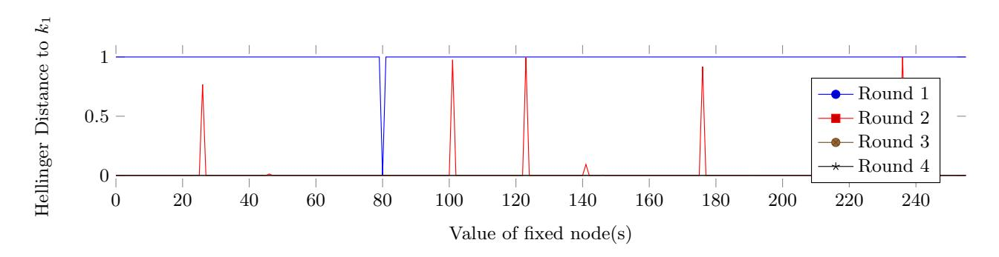
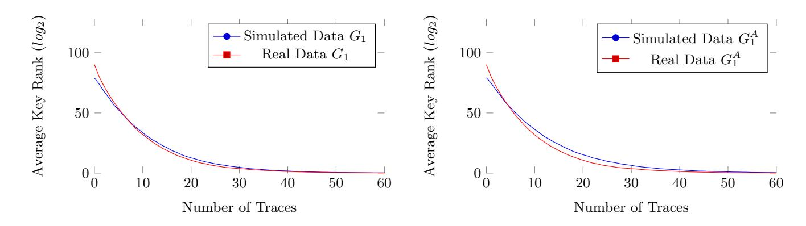
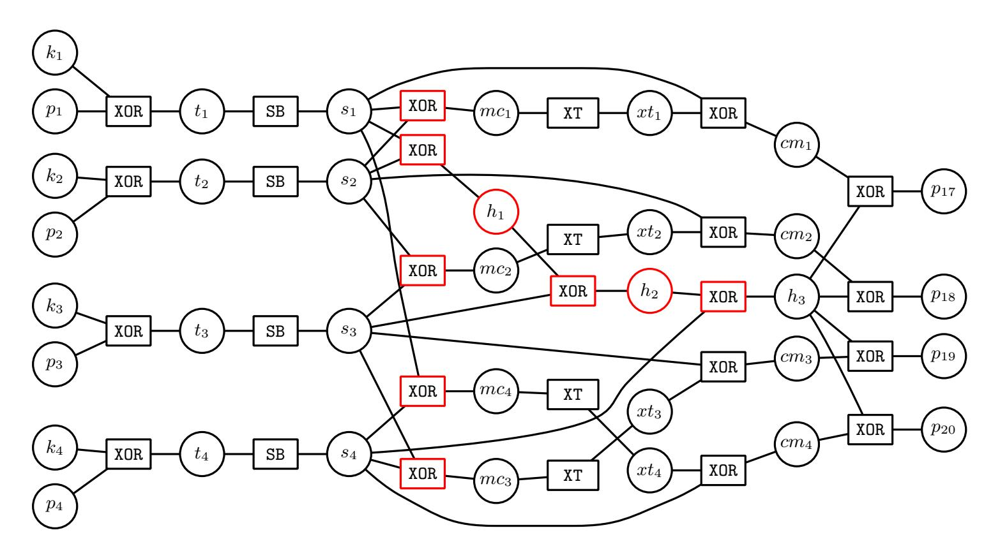
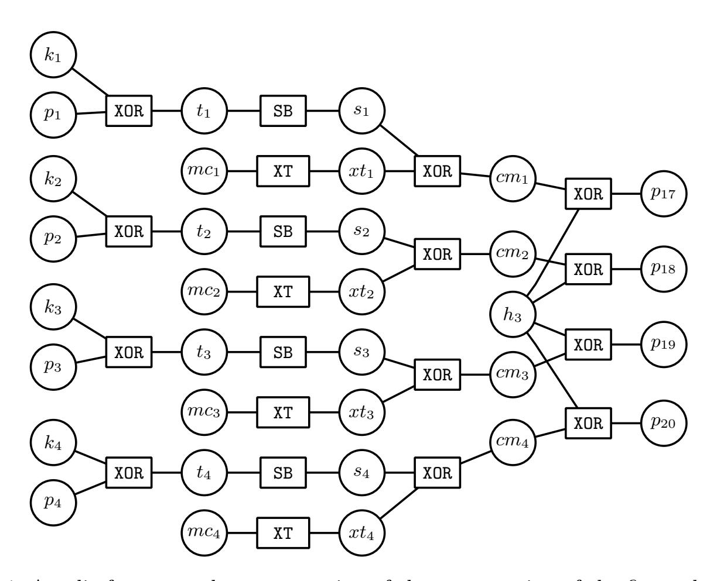
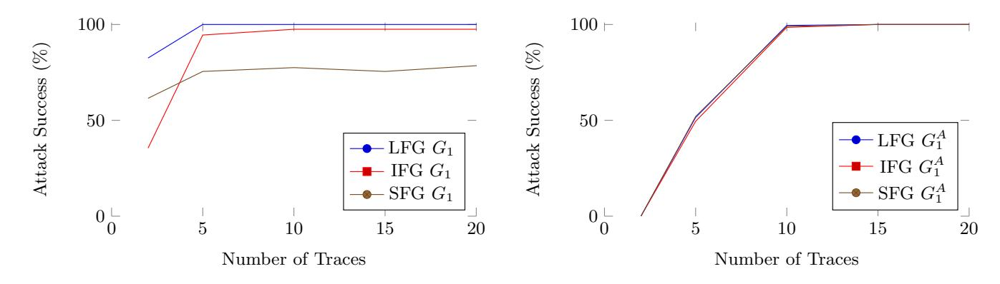
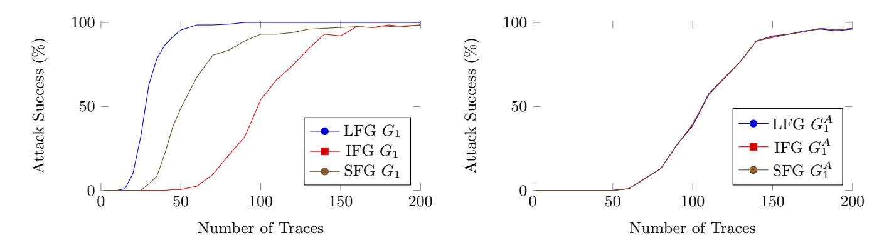
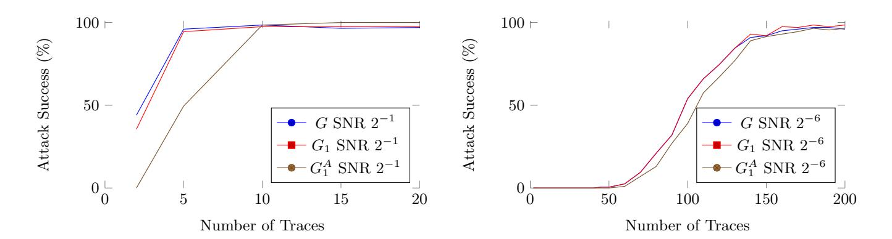

{0}------------------------------------------------

## A Systematic Study of the Impact of Graphical Models on Inference-based Attacks on AES

Joey Green, Elisabeth Oswald, Arnab Roy

Department of Computer Science, University of Bristol, Merchant Venturers Building, Woodland Road, Bristol, BS8 1UB, United Kingdom. firstname.lastname@bristol.ac.uk

Abstract. Belief propagation, or the sum-product algorithm, is a powerful and well known method for inference on probabilistic graphical models, which has been proposed for the specific use in side channel analysis by Veyrat-Charvillon et al. [13].

We define a novel metric to capture the importance of variable nodes in factor graphs, we propose two improvements to the sum-product algorithm for the specific use case in side channel analysis, and we explicitly define and examine different ways of combining information from multiple side channel traces. With these new considerations we systematically investigate a number of graphical models that "naturally" follow from an implementation of AES. Our results are unexpected: neither a larger graph (i.e. more side channel information) nor more connectedness necessarily lead to significantly better attacks. In fact our results demonstrate that in practice the (on balance) best choice is to utilise an acyclic graph in an independent graph combination setting, which gives us provable convergence to the correct key distribution. We provide evidence using both extensive simulations and a final confirmatory analysis on real trace data.<sup>1</sup>

Keywords: Belief Propagation, Factor Graphs, AES, Inference Based Attacks, Side Channel Attacks, Template Attacks

## 1 Introduction

Side channels in the form of power or EM traces are a significant source of information for adversaries. Extracting as much as possible of this information is clearly desirable, and the utilisation of graphical models for this purpose was early on described in publications such as [5,11,2]. These papers represented the algorithm under attack as a Markov model and inferred information about the underlying hidden state by using statistical inference, e.g. the max-product algorithm.

The key idea in such types of attacks is that the graphical model defines how variables (observed and hidden) depend on each other. By using different types of algorithms it is possible to infer information about the hidden variables. The

<sup>1</sup> This is the full version of the paper published at CARDIS 2018 with the same title.

{1}------------------------------------------------

use of the sum-product algorithm (aka belief propagation, BP) on a factor graph was proposed recently in [13] as a way to utilise graphical models for complex algorithms such as AES. It proved to be very powerful: in comparison to other profiled attacks, this method can cope with very noisy side channel traces, and even combine information from many traces effectively. In follow on works this type of attack was compared to other types of DPA style attacks [3], and used in different contexts [12]. Although the method performed well in all these papers, it is well known that there are no guarantees for convergence, or even for the inferred distributions to be at all meaningful. This is due to the nature of the factor graphs that result from a typical implementation of e.g. AES. Thus like many other analysis methods it is possible that the method completely fails in some contexts, but is strong in other contexts.

In this submission we set out to determine how to best configure a graphical model to ensure attack success. We focus our study around the AES algorithm that was also chosen by the seminal papers introducing this method. Our results challenge in particular the intuition that "more" leakage makes for stronger attacks. This is interesting because more leakage intuitively implies more potential information: even if multiple leakages may provide redundant information (it is well known that AES achieves full diffusion after two rounds), this redundant information could be hoped to implicitly improve the signal quality. Consequently, one could expect that the more leakage information about AES is included in a factor graph, the more of this information can propagate to the key bytes.

#### 1.1 Contributions and Outline of this Paper

We review the necessary background on using (loopy) belief propagation in Section 2, covering the basic concepts ranging from the definition of a factor graph, over the sum-product algorithm to implementation specifics for the AES factor graph and our attack setup.

Thereafter in Section 3 we explain two improvements of the sum-product algorithm. The first improvement is a termination criterion that signals when no further significant information is propagating to the key nodes. The second improvement is a check for the consistency of the belief about the plaintext bytes after the sum-product algorithm has finished. We compare the belief about the plaintext bytes before and after the run of the sum-product algorithm: if as a result of the sum-product algorithm we find that our new belief is highly inconsistent with what we know to be the "truth" about the plaintext, we are able to discard the plaintext that led to this result as "too bad". Hence we can avoid introducing false beliefs into our graphs, which can be detrimental to attack results.

In Section 4 we give a novel definition that captures the importance of a variable node. We also define several variations of factor graphs of particular interest for attacks on AES. These variations essentially represent progressively smaller graphs, whereby the smallest is an acyclic graph requiring the least memory. For this graph the results guarantee convergence of the sum-product 

{2}------------------------------------------------

algorithm without any loss of success rate and efficiency. We also spell out three methods for combining multiple traces.

Sections 5, 6, and 7 present results of experiments using simulated (we simulate leakage according to a weighted bit model, and add Gaussian noise) and real trace data. Surprisingly we observe that our round reduced and node reduced graphs do not result in severely weakened attack performances. In fact we observe that except for the noisiest of cases the acyclic graph with the most pragmatic trace combination method is on par with more complex variations. Hence unexpectedly the acyclic graph offers the most reliable attack success (guaranteed convergence with the least memory overhead).

To aid the flow of the paper we opted to supplying comprehensive tables and figures primarily in the appendix. The text however does summarise the most important findings from both tables and figures.

### 2 Preliminaries

The key ingredients for the attacks that we aim to study are a suitable graphical model and an algorithm for inference. We review these briefly using and relating them to AES as appropriate (for a more in-depth description we refer the reader to [6]). At the end of this section we provide the necessary details about our simulation environment.

#### 2.1 Inference on Graphical Models

A factor graph is a bipartite graph  $G = (\mathcal{V}, \mathcal{F}, \mathcal{E})$  where  $\mathcal{V}, \mathcal{F}$  are two finite sets of vertices and  $\mathcal{E}$  ( $\subset \mathcal{V} \times \mathcal{F}$ ) is a set of undirected edges. We will refer to the vertices in  $\mathcal{V}$  as variable nodes and the vertices in  $\mathcal{F}$  as factor nodes. We will use the i, j, k to denote the variable nodes and f, g, h to denote the factor nodes. Given  $i \in \mathcal{V}$ , the set  $\partial i$  is defined as  $\partial i := \{f \in \mathcal{F} : (i, f) \in \mathcal{E}\}$ . For any  $f \in \mathcal{F}$  the adjacent vertices  $\partial f$  is defined in the same way.

A factor graph gives the joint distribution of the random variables  $\mathbf{X}_{\mathcal{V}} := (X_1, \dots, X_{|\mathcal{V}|})$  where each  $X_i$  corresponds to a vertex in  $\mathcal{V}$ . For any subset of variable nodes  $\mathcal{I} := \{i_1, i_2, \dots, i_m\} \subset \mathcal{V}$  we will denote the corresponding random variables as

 $\mathbf{X}_{\mathcal{I}} := (X_{i_1}, X_{i_2}, \dots, X_{i_m})$ . The values of these random variables  $\mathbf{x}_{\mathcal{I}}$ , are also defined in a similar way.

For our application each random variable  $X_i$  can have values  $x_i \in \mathcal{X} := \{0,1\}^n$ . For the rest of this article  $\mathcal{X}$  will denote the set  $\{0,1\}^n$  unless specified otherwise.

**Definition 1.** The joint distribution  $\mu$  over  $\mathbf{x} \in \mathcal{X}^{\mathcal{V}}$  factors in the factor graph  $G = (\mathcal{V}, \mathcal{F}, \mathcal{E})$  if there exists a set of functions  $\beta = \{\beta_f : f \in \mathcal{F}\}$  and  $\beta_f : \mathcal{X}^{\partial f} \to \mathbb{R}_+$  such that

{3}------------------------------------------------

$$\mu(\mathbf{x}) = \frac{1}{Z} \prod_{f \in F} \beta_f(\mathbf{x}_{\partial f}) \tag{1}$$

The normalisation constant Z is given as

$$Z = \sum_{\mathbf{x}} \prod_{f \in F} \beta_f(\mathbf{x}_{\partial a})$$

Note that there must be at least one  $\mathbf{x} \in \mathcal{X}^V$  for which  $\beta_f(\mathbf{x}_{\partial a}) > 0$  so that the distribution is well defined.

Constructing a factor graph A factor graph can be constructed from (the implementation of) any iterative function  $F^2$ . The input variables, intermediate variables used in the iterative function, and the output variables are represented as the variable nodes of the factor graph. The factor nodes correspond to the basic functions/operations used to define (or implement) F. A factor node is usually connected to two or more variable nodes which represent the inputs and outputs of the function.

In practice an AES assembly implementation can be easily translated to a factor graph. The sixteen plaintext bytes and key bytes are represented as variable nodes. Parsing the (assembly) code, whenever an arithmetic operation is performed we add a factor node for this operation, and a new variable node to represent the output of the operation, and connect these elements to the existing graph. Although leaky, we excluded memory operations, such as ldr and str operations from our factor graph (so we do not artificially inflate leakages). Our AES factor graph thus includes the following factor operations: XOR, SBOX, and XTIMES.

The sum-product algorithm The sum-product algorithm, also known as the belief propagation (BP) algorithm, is an iterative "message" passing algorithm where the messages are the probability distributions over the single variable space  $\mathcal{X}$ . For each edge in  $\mathcal{E}$  there are two such distributions  $\nu_{i\to f}(\cdot)$ , which is the message from variable node to factor node and  $\tilde{\nu}_{f\to i}(\cdot)$ , which is the message from a function node to variable node. The messages at the tth iteration are denoted as  $\nu_{i\to f}^{(t)}$  and  $\tilde{\nu}_{f\to i}^{(t)}$ .

For any function f the compatibility function  $\psi_f$  (in Eq. 3) is defined as the indicator function  $\chi_f$  of the corresponding function i.e  $\psi_f := \chi_f(\mathbf{x}, y)$ .

$$\chi_f = \begin{cases} 1, & \text{if } f(\mathbf{x}) = y \\ 0, & \text{otherwise} \end{cases}$$

<sup>&</sup>lt;sup>2</sup> A factor graph can also be constructed for non-iterative functions but this is not necessary for our work

{4}------------------------------------------------

At each iteration the messages are updated according to the following rules

$$\nu_{i\to f}^{(t+1)}(x_i) = \frac{1}{Z_{i\to f}} \prod_{g\in\partial i\setminus f} \tilde{\nu}_{g\to i}^{(t)}(x_i)$$
(2)

$$\tilde{\nu}_{f \to i}^{(t+1)}(x_i) = \frac{1}{Z_{f \to i}} \sum_{\mathbf{x}_{\partial f \setminus i}} \psi_f(\mathbf{x}_{\partial f}) \prod_{k \in \partial f \setminus i} \nu_{k \to f}^{(t)}(x_k)$$
(3)

where Zi→<sup>f</sup> and Zf→<sup>i</sup> are normalisation constants and ψ<sup>f</sup> is the compatibility function. In the BP algorithm the updates are done in parallel for all the variable nodes and then in parallel for all the function nodes, and so on.

It can be proven that in a tree-structured graph the BP algorithm converges to a fixed point ν ∗ , ν˜ <sup>∗</sup> after t ∗ iterations which is equal to the diameter of the graph. In other words, for any t ≥ t ∗ , ν (t) = ν <sup>∗</sup> and ˜ν <sup>∗</sup> = ˜ν (t) .

After t iterations the estimate of the marginal distribution µ(xi) of any variable x<sup>i</sup> is given by Q <sup>f</sup>∈∂i ν˜f→i(xi). The marginal distribution is exact when computed on a tree-structured graph.

The BP algorithm can be applied to cyclic graphical structures by following the same message update rules given in the equations 2 and 3. This is known as loopy belief propagation. However, the sequence of messages is not guaranteed to converge to a fixed point after any number of iterations. A frequently used heuristic to stop the BP algorithm in such cases is to terminate after tmax iterations which is a fixed parameter to the algorithm. Typically one chooses tmax in line with the size (i.e. diameter) of the graph.

For further details on factor graphs and BP algorithm we refer the interested readers to [6,10].

In our implementation, all variable nodes send their initial distribution along all their connected edges in the first round of the algorithm. Once completed, the factor nodes send their messages, by selecting an adjacent variable node, then collecting all incoming messages (excluding the one from the target variable node) and applying their own 'function' on these messages. They do this for all adjacent variable nodes. Upon termination of the algorithm, the marginal distributions of all sixteen key bytes are computed. This is done by taking the product of each key's initial distribution with all incoming messages to the respective key byte. To judge success of an attack, the keys are ranked according their probability.

### 2.2 Attack Setup and Implementation Details

The work presented in this paper uses an adaptation of AES FURIOUS (originally written for Atmel's AVR) written in the ARM Thumb assembly language. Our lab setup consists of custom host board with an ARM Cortex-M0 of the LPC series. The board has an on board signal amplifier and filter. We utilise a stable external clock running at 125MHz. The data is recorded by a PicoScope 2000 Series instrument. We took 150000 traces, of which 120000 were used for template 

{5}------------------------------------------------

building and 30000 for doing repeat attacks. In any attack the result of the template matching is utilised as the input probability distributions for the (leaky) variable nodes.

Because real trace data implies a fixed device leakage model and a corresponding signal-to-noise ratio (SNR), we also performed two types of simulations with varying SNRs. The first simulation was via using the tool ELMO [9], which emulates the leakage of a Cortex-M0. The emulator was built by profiling a different type of M0, manufactured by ST Micro. Thus we would expect the simulation results (when appropriate levels of Gaussian noise is added) to match our real trace results. We also performed Hamming weight (HW) based simulation, which turned out to give identical results to the ELMO simulations hence we opted to not include them in our tables.

In our implementation we set the value of tmax (used by the BP algorithm) to be 50. This value was chosen because it is greater than the diameter of the largest graph G (which has a diameter of 42), and thus gives room for propagation around the loops. For the calculation of first-order success rates (SR) and key ranks, we follow the recommendation of [8] and compute average key ranks over 200 repeat experiments.

## 3 Improving Loopy Belief Propagation

Different variations of the (loopy) BP algorithm are proposed in the literature. We add our own improvements and explain the resulting algorithm in this section.

#### 3.1 Epsilon Exhaustion

One of the parameters for the Belief Propagation Algorithm is how many iterations to run. This is represented by the value tmax. In this paper we propose an additional termination criterion, which allows the algorithm to terminate early, if certain conditions are met. As the BP algorithm is a message passing algorithm, there may come a point after a number of iterations where the messages being updated have received most of the information in the graph, and will not change significantly. If this is detected over a series of consecutive rounds, we can deduce that the factor graph has reached a stable equilibrium, and we can therefore terminate the algorithm without being at risk of discarding useful information.

We implement this by having two user defined parameters, ε and εs. After each iteration of the BP algorithm, we observe the incoming messages at the sixteen key byte nodes. If the Euclidean distance between the message from the current iteration and the message from the previous iteration is greater than the threshold ε, we conclude that the current round did not provide the key bytes with enough new information. If this occurs over ε<sup>s</sup> consecutive rounds, we conclude that as enough information has propagated, further rounds would not benefit the key bytes, and it is safe to terminate the BP algorithm early.

{6}------------------------------------------------

**Algorithm 1:** BP algorithm with epsilon exhaustion and ground truth check

```
1 function BPA(\mathcal{G}_{aes}, \varepsilon, \varepsilon_s, \varepsilon_g, t_{max}, k^*, i_p)
                 /* k^\ast, i_p are the variable nodes corresponding to the key and
           plaintext respectively */
         Initialize the messages as i.i.d uniform random variables
 \mathbf{2}
         count := 0
 3
         foreach t \in \{1, \ldots, t_{max}\} do
 4
              foreach (i, f) \in \mathcal{E} do
 5
                   update \nu_{i\to f}^{(t)} according to (2)
 6
               end
 7
              for
each (i,f) \in \mathcal{E} do
 8
                   update \tilde{\nu}_{f \to i}^{(t)} according to (3)
 9
              end
10
              if (k^*, f) \in \mathcal{E}, \|\tilde{\nu}_{f \to k^*}^{(t)} - \tilde{\nu}_{f \to k^*}^{(t-1)}\|_{\infty} < \varepsilon then
11
                   count = count + 1
12
                   if count == \varepsilon_s then
13
                                                             /* Epsilon Exhaustion check */
                        break
14
               else
15
                   count = 0
16
              end
17
         end
18
         if \|\nu_{f\to i_p} - \mu_{\mathcal{L}}[i_p]\|_{\infty} < \varepsilon_g then
19
                                                                       /* Ground truth check */
                                /* \mu_{\mathcal{L}}[i_p] is the leakage distribution at node i_p */
              return 0;
20
         else
21
                                                                                /* Discard trace */
              return -1
22
```

We used the Euclidean distance metric to measure the difference between two probability distributions after considering other possibilities, see also Sect. 4.1.

#### 3.2 Ground Truth Checking

One open problem encountered in template-based DPA style attacks is differentiating a 'good' trace from a 'bad' one, when it is not simply characterised by a large variance. For instance, even a small clock jitter can slightly misalign a trace in relation to the template values, which typically means that template matching gives very poor results. Due to the nature of the Belief Propagation algorithm, we compute the marginal distribution of the key bytes by taking the product of all their incoming messages (Section 2.1). If an erroneous trace is computed in an attack, an erroneous distribution sent to a key byte can detrimentally alter the marginal; in a worst case scenario, if the erroneous message has probability 0 for the correct key byte value, the attack will never successfully recover the key.

{7}------------------------------------------------

In this paper we present a way of detecting an erroneous trace, by considering a known plaintext attack against AES.

Assuming we know the plaintext values, the idea is to check the "belief" about them after BP has terminated. We would expect that for a good trace, once all information has propagated through the graph, the belief about the plaintext values would be consistent with what we know to be the true values. If this is not the case, then BP is unlikely to have converged to a meaningful key distribution either. We measure the consistency between the initial distribution of the plaintext bytes and the distribution after BP using the Euclidean distance (as with the termination criterion).

For the ground truth check to work we need to assume some leakage on the key bytes in the graph (this may come from the key schedule for instance). If the probability distribution on the key bytes was uniform (i.e. we assume no information on the key bytes), then, because the key byte nodes are connected to the plaintext byte nodes via an XOR factor node, we could not infer any information about the plaintext byte nodes. This is due to the XOR "locking effect": XOR the acts like a one-time pad if one of the two inputs is uniform.

## 4 Studying AES FURIOUS Factor Graphs

Previous work already explored the effect of some choices regarding the actual construction of the factor graph for implementations of AES. We are interested whether or not there is a trade-off between the number of included factor nodes and the efficiency of an attack. Utilising fewer nodes is advantageous in practice not only because fewer profiles have to be created (and therefore fewer profiling traces are required) but also because having to correctly match fewer templates during an attack leads to more robust attacks (in practice traces are not perfectly aligned).

Our "base" graph G takes into account all intermediate steps, and we also assume some leakage via the key schedule on the key bytes. We then introduce a measure that is novel in the context of Belief Propagation in the context of side channels to judge the "importance" of a node in relation to the key bytes in Sect. 4.1, and then study reduced graphs systematically in Sect. 4.2.

#### 4.1 Importance of a Variable node

We want to assess whether or not it is necessary to include all the nodes of the factor graph from the full AES. More specifically, one could wonder what "effect" the information from nodes from the second and further rounds of AES have on the key. It is known that AES reaches full state diffusion after two rounds of AES, but there is no implication that nodes from future rounds provide more or less information than nodes in the first two rounds.

To quantify the "effect" of a node we somehow want to consider its contribution in the detection of the (unknown) key. For an important node we would 

{8}------------------------------------------------

expect that any change in it's input distribution would result in a change in a key byte(s) distribution.

The effect or importance of a node in the factor graph is quantified by the "distance" of it's distribution from the key node distribution. In the graphical model the variable nodes have an associated (discrete) distribution. Thus it seems natural to look for a suitable distance metric in relation to (discrete) distributions.

We determine the marginal distribution of the key node say K, given the distribution of the other nodes: we thus determine  $\mu(K) = \sum_{X_i} \Pr(K, X_1, X_2, \ldots)$  where  $X_i$  is the random variable corresponding to the variable node in the factor graph. In the AES factor graph these nodes correspond to the different intermediate variables e.g.  $k_1, t_1$  etc in figure 4. In the following paragraph we will refer to a node by the associated random variable.

For a (randomly) fixed unknown key and a fixed plaintext the value of the intermediate variable at the node  $X_i$  is also fixed. Suppose we have a perfect leakage corresponding to the different values of the intermediate variable at  $X_i$ . This can be described by fixing a value of the random variable  $X_i = x$  and  $\Pr(X_i = x) = 1$  whereas  $\Pr(X_i \neq x) = 0$ . For the correct value of  $X_i$ , the distribution  $\mu_x(K) = \sum_{X_j} \Pr(K, X_1, X_2, \dots, X_i = x, X_{i+1}, \dots)$  is expected to be "closer" to  $\mu$  compared to the distribution obtained by fixing an incorrect value of  $X_i$ . For defining this notion of distance between two distribution we use Hellinger distance. The Hellinger distance is a well known measure to quantify the similarity of two distributions. In contrast to other (similar) measures it is directly related to the Euclidean distance metric (in the discrete case) and thus is an actual distance metric.

**Definition 2.** The importance of a node X is defined as

$$\mathcal{I}(X) = \{ D(\mu(K), \mu_{X=x}(K)) \}$$

where  $D(\cdot, \cdot)$  is the Hellinger distance between the distributions.

Note that  $\mathcal{I}(X)$  is a set of "distances" for different values x of X.

**Definition 3.** (Hellinger Distance) For two discrete distributions  $\{p_i\}$  and  $\{q_i\}$  the Hellinger distance is defined as

$$D(p,q) = \frac{1}{\sqrt{2}} \sqrt{\sum_{i} (\sqrt{p_i} - \sqrt{q_i})^2}.$$
 (4)

Because we are in a profiled scenario, we know all the necessary distributions to compute this distance metric for any node in the graph.

#### 4.2 AES Factor Graphs

We now detail the graphs that we study. They range from a "full graph", including nodes for intermediates across all ten AES rounds, to a very sparse graph,

{9}------------------------------------------------

including only a few intermediates from the first round. The larger the graph is, the more memory it requires. The memory requirements can be derived based on the number of nodes and edges. All variable nodes store an initial distribution, and each edge has two probability distributions, corresponding to incoming and outgoing messages from the connected variable node. Because AES FURIOUS essentially is byte oriented implementation of AES, all distributions in our graph are represented by 256 floating point values. The exact memory requirements are thus dependent on the specific implementation/use of a float. In the following description we assume the use of a C style floating point data type (four bytes).

- G : corresponds to the full AES encryption algorithm. It requires  $\approx 6.6 \mathrm{MB}$  of memory per trace.
- $G_1$ : corresponds to the first encryption round only, excluding the key schedule. We provide (part of) this graph in Fig. 3, which shows the first column of the first round. It requires  $\approx 0.7 \text{MB}$  of memory per trace. Several factor nodes are drawn in red in this graph. Removing them leads to  $G_1^A$ .
- $G_2$ : corresponds to  $G_1$ , with the addition of the Add Round Key step and the SubBytes output of the second round. It requires  $\approx 0.9 \text{MB}$  of memory per trace.
- $G_1^A$ : corresponds to an acyclic factor graph of the first encryption round, as shown in Fig. 4. It requires  $\approx 0.54 \text{MB}$  of memory per trace.
- $G_1^{KS}$ : corresponds to  $G_1$ , with the addition of the key schedule variables. It requires  $\approx 0.84 \text{MB}$  of memory per trace.

As an example, to mount a 200 trace BPA attack against graph G, one would require  $\approx 1.3$ GB memory. To mount an attack using the graphs  $G_1$  and  $G_1^A$  one would only need  $\approx 140$ MB and  $\approx 108$ MB memory respectively.

Considerations regarding node removal for  $G_1^A$  To convert the one round AES factor graph  $G_1$  into an acyclic graph  $G_1^A$  we choose to remove a set of factor nodes which are marked in red in Figure 3. One obvious reason to choose this set of nodes is that in the AES algorithm these nodes are part of the diffusion layer. Since the diffusion layer causes the cyclic structure of the AES factor graph, removal of these nodes leaves the factor graph acyclic. Removal of any node naturally is followed by the removal of the edges to that node, along with any leaf nodes (which would otherwise be disconnected from the rest of the graph and thus not contributing any messages).

## 4.3 Combining AES Factor Graphs

In many real world settings adversaries may gain access to several leakage traces. These traces may correspond to different inputs for instance. In any case so far we have only discussed factor graphs that take input (e.g. the plaintext) and thus we now look at ways in which we can process multiple inputs.

{10}------------------------------------------------

Large Factor Graph (LFG) Method. In [13] they approach the problem of combining graphs from different inputs by associating each input with a dedicated graph, and then they produce a "large factor graph" by connecting all factor graphs through some common nodes. In the particular case of AES (the same would apply to other algorithms too), the nodes representing the key bytes are common (because all traces would be for the same unknown secret key). We call this method the LFG Method.

The potential advantage of this method is that information from one trace can propagate through the common nodes into the "adjacent' graph, which may (positively) affect the attack outcome. However, the clear downside to this method is that it potentially incurs a large memory overhead (unless one swaps "subgraphs" in and out of memory but this clearly implies a performance penalty and potentially some limitations on the message passing). It is also difficult to apply our ground truth check in this case because our intuition of "discarding" traces is made challenging due to all traces being interconnected; as information can propagate from one trace to another, it is not possible to pinpoint which trace affected the plaintext bytes. Finally there are a large number of cycles in such a graph, which means that it is impossible to make any statements about convergence or any meaningful outcome.

Independent Factor Graph (IFG) method. In contrast to assembling one large graph, we could also treat each leakage trace independently and only have one copy of the graph in memory. Each trace then produces a set of distributions for the unknown key bytes, which can be combined using Bayes theorem.

The advantage for this method is that it can be executed in parallel (distributed over different cores) or sequential, allowing an easy speed-memory tradeoff. Also, no further cycles are added, thus for our acyclic graphs we can be assured of convergence even in a multiple trace setting. The disadvantage may be that information cannot propagate from one leakage trace (associated graph) to another. It is possible to use the ground truth check here.

Sequential Factor Graph (SFG) method. An easy tweak to the IFG method that enables information to "propagate" from one graph to another, would be to use the key distribution that is derived from the i − 1th leakage trace as prior distribution for the graph with the i−th leakage trace. This turns the IFG method into a strictly sequential method (thus SFG); it thus retains IFG's memory efficiency, convergence for acyclic graphs, and the possibility to implement a ground truth check.

## 5 Studying the Effect of Reduced Graphs in a Single Trace Setting

In the remainder of this paper we discuss experiments that aim to determine the impact of our tweaks to the BP algorithm, the variations of graphs and 

{11}------------------------------------------------

graph combination methods. We start in a single trace setting, and first consider the effects of nodes in later rounds, then we examine the effectiveness of our improvements on the BP algorithm, followed by an enquiry into the impact of using reduced graphs (in particular  $G_1$  and  $G_1^A$ ) on the attack outcomes.

#### 5.1 Effect of Nodes in Later Rounds

We previously defined a metric that enables us to judge the effect that a node in the graphical model has on the key bytes. To use this metric practically we set up an experiment on the full graph G in which we supply simulated, HW based leaks with minimal noise (SNR = 2) and we let the BP algorithm run for the full  $t_{max} = 50$ . As implied by the definition, we first let BP run and produce a key distribution. Then we fix the input for the node that we are computing the effect of and fix this to a value (running through all input values of this node one by one), which enables us to compute the effect as defined in Sect. 4.1.



**Fig. 1.** Hellinger Distance of  $k_1$  to different fixed value s nodes

Our findings are that variable nodes from later rounds have no effect on the key distribution. To provide some evidence for this, we include one graph that is representative for all results. Figure 1 visualises the result from the variable node s (which corresponds to the Sbox output) in different rounds of AES to key byte  $k_1$ . Recall that our definition is based on the Hellinger distance metric: any number that is close to zero indicates that a node has no effect. Figure 1 demonstrates then that this particular node as a great effect in round one, and some small effect in round two, but thereafter it has no effect on this key byte. Other variable nodes show the same behaviour: first round nodes have an effect, second round nodes have a very small effect, and from round three onwards our metric indicates that they have no effect.

#### 5.2 Effectiveness of our Improvements to the BP Algorithm

We investigated the effect of our epsilon exhaustion technique on by running repeat experiments using ELMO simulations. These showed that in cases of high and low noise, the information can be exhausted before reaching  $t_{max}$  iterations (nearly all experiments terminated via the epsilon exhaustion rather than  $t_{max}$ ).

{12}------------------------------------------------

Interestingly having more noise does not mean that the algorithm is more likely to run up to tmax iterations. In fact often the epsilon exhaustion was considerably earlier, e.g. in for SNR=2<sup>1</sup> on average around 20 Belief Propagation iterations are required before reaching a stable point.

We also investigated how often the ground truth check kicks in. We configured our criterion to reject only "extreme outliers". Unsurprisingly, we found that it is much harder to detect such cases in high noise settings, where the information from a single trace is insufficient for any meaningful result. We note that in such cases, where one would require multiple traces anyway, the ground truth check could be applied to consecutive traces and we noticed in our implementation that if there are two "bad" traces fed into BP consecutively, then our ground truth method would pick this up. The experiments also indicate that cycles in the graph may "amplify" unhelpful information, because in the experiments on graphs without cycles our ground truth check criterion was never met; the ground truth method spotted erroneous traces after BP had iterated for more than 15 rounds, but as the acyclic graph is run for a maximum of 8 iterations, these erroneous messages did not appear.

Data from this experiment can be found in the appendix. Table 1 shows the percentage of traces terminated through the Epsilon Exhaustion tweak for two different graphs (we did not include the acyclic graph G<sup>A</sup> <sup>1</sup> because it provably terminates after 8 iterations, which corresponds to the diameter of the graph). Table 2 shows how many traces were detected to be "bad".

#### 5.3 Impact of Graphs on Attack Success

As measures for the success of attacks we look at the (first-order) success rate, as well as the lowest (i.e. best) rank for the key. For the specific purpose of this experiment, we elected not to invoke our termination criterion for the cyclic graphs and instead allow BP to run up to 50 iterations (for G we did experimentally verify that increasing tmax did not lead to better success). We did this for a range of SNR's. In both settings, the high signal and the high noise, the performance of the attack using G<sup>1</sup> is nearly identical to the performance of the attack using the whole AES graph, or when including the key schedule, or when looking at two rounds, whereas there is a clear gap to the performance when using G<sup>A</sup> 1 . This shouldn't come as a huge surprise: we know from works such as [7,1] on SPA attacks on block ciphers, that the information from either the key schedule or just the encryption round goes a long way to recovering the key.

With such little difference in performance between the whole graph and G1, it seems reasonable to utilise only the first round. This has not only the advantage of dealing with much smaller graphs, crucially it implies that also less profiling effort is necessary, which could be a practical advantage. For instance, if traces become increasingly misaligned (e.g. because the clock frequency of the processor is changeable), having to only profile the beginning (or end) round of an implementation could be more feasible than having to profile across the entire trace. With respect to G<sup>A</sup> 1 , although we see a large performance gap in the success rate (when compared to the whole graph and G1), the 'Best Rank' results 

{13}------------------------------------------------

show that the  $G_1^A$  method is still effective as an attack. The advantage  $G_1^A$  has in this attack scenario is that convergence is guaranteed after 8 BP iterations.

Our results also showed, surprisingly, that better SNRs do not imply that fewer BP iterations are required. We observed that for SNR =  $2^1$ , we needed 20 BP iterations; but for SNR =  $2^{-3}$  we needed fewer iterations, namely 15. We also noticed that, for SNR =  $2^1$  in the case of G, there was a success rate drop when using 50 iterations over 25. We speculate that this is due to the large number of cycles in the graph. From these results clear that there is no simple way of choose  $t_{max}$  optimally. However, by using our Epsilon Exhaustion improvement (see Section 3.1) we can terminate BP when the information updating the key has reached a stable equilibrium.

# 6 Studying the Effect of Different Graph Combination Methods

Having established that attack results based on using the whole graph or just  $G_1$  are nearly identical in a single trace setting, we now turn our attention to attacks that utilise multiple leakage traces. We now compare the performance of the  $G_1$  and the  $G_1^A$  graphs specifically to see if the performance difference between them persists across different trace combination methods.

We ran simulations ranging from high signal to high noise scenarios. In the high signal scenarios there were no differences between the graphs w.r.t different combination methods. Only in noisy scenarios did we observe differences. For our discussion we include two particularly striking sets of results in Figure 5 and Figure 6 in the appendix. In the high noise scenario we provided more traces than in the high signal case. The figure shows attack outcomes for the different graph combination methods as applied to different graphs.

In the case of SNR of  $2^{-1}$  we see, surprisingly, that the acyclic graph  $G_1^A$  can outperform  $G_1$  across different combination methods, and that LFG for  $G_1^A$  isn't strictly the best method. When we use ten or more traces,  $G_1^A$  has a constant success rate, compared to  $G_1$  when using IFG and SFG for the same number of traces. We saw the same results for an SNR of  $2^{-3}$ . Only when decreasing the SNR to  $2^{-6}$ ,  $G_1$  performed better than  $G_1^A$  and LFG is the best combination for  $G_1$ . The IFG method with  $G_1$  only starts to succeed after 45 traces, when the LFG method has over a 90% success rate. We also observe here that although IFG is favoured over SFG when the SNR is high  $(2^{-1})$ , SFG becomes more effective when the SNR is lower, needing around 70 traces to have an 80% success rate. When using  $G_1^A$  in a low noise scenario, the graph connecting method seems to have little effect on the results, and we see no signs of success until we use 60 or more traces. We hypothesise that in a low SNR setting having more dependent variables helps to compensate for the noise, an observation that has been made elsewhere in the same context [4]. However it would appear that in the context of a relatively large graph that takes into account "sufficient" leakage from the first round, extra information from later rounds is not as important. These results 

{14}------------------------------------------------

show that neither more rounds nor more intermediates or more connected graphs necessarily make for a more effective attack overall.

## 7 Studying the Effect of Reduced Graphs in a Multiple Traces Setting

As a final experiment we simulated multiple trace attacks (with IFG) using reduced graphs. We studied different noise levels (low, medium, and high), and provide Figure 7 in the appendix. In short, only when moving to high noise settings the larger graphs proved to be slightly advantageous (in line with the observations in the previous section) in terms of first-order success rate. However, if we consider the median ranks of the experiments, we see the effectiveness of the acyclic methods is still comparable to the cyclic methods; when using 90 traces, the acyclic graphs ranked the correct key with the second highest probability.

For confirmation purposes we also ran these attacks on our real trace set. We determined the SNR on those traces and reran the simulations with a matching SNR (= $2^{-5}$ ). Fig. 2 shows the outcomes of these experiments. In the left pane we visualise the comparison based on using  $G_1$  between real and simulated traces. The right pane shows the same comparison using  $G_1^A$ . Clearly the simulation results are a very good match with the real traces. We can also see that the performance of  $G_1^A$  is again nearly identical to  $G_1$ .



**Fig. 2.** Comparison of a BP Attack on Real Trace Data against Simulated Data (SNR  $2^{-5}$ ), using Graphs  $G_1$  and  $G_1^A$ .

## 8 Recommendations for Practical Use

In this paper we perform our experiments on the AES FURIOUS implementation. We found most success using the Independent Factor Graph connection method, and removing the cycles in the graph to get  $G_1^A$ . We arrived at these results after experimenting with each method in a controlled enviornment, and comparing the attack success of each method. However, we understand that these choices are implementation dependent. We will therefore provide intuition to extend these results to other implementations.

{15}------------------------------------------------

For block ciphers we are aware of, the cyclic attribute of the algorithm can lead to uncontrolled loopy belief propagation. Because of this, we suggest that users remove the cycles and run the attack on a reduced graph. Additionally, by using the Hellinger Distance metric to measure the 'importance' of each node in the graph, the user can carefully select the desired factor graph for the implementation. Upon finding the optimal structure of the graph, the user then has a choice for the graph connection method; in this paper we propose using the Independent Graph connection method, as it does not incur a large memory overhead when dealing with multiple traces (the noisier the trace set, the more traces will be required for the attack phase). However, if the user has access to a large amount of memory and computational power, they may instead opt to use the Large Factor Graph method, as we show in our results it performs marginally better over other graph connection methods.

## 9 Conclusions

The approach of using a belief propagation algorithm on a factor graph that describes an implementation under attack leads to a very powerful attack strategy. However there are many options to concretely instantiate this idea, and these options are expected to have an impact on the performance of concrete attacks. So far there exist very few publications about this important attack vector and none of them has drilled into the details related to building a graph for a specific implementation.

Our submission makes the first step into developing an understanding how choices in instantiating this attack vector impact on the resulting attacks. We specialise our investigation to AES FURIOUS, and look at the attack performance when reducing elements from the graph as it would "immediately" follow from the AES FURIOUS implementation. Alongside our experiments we provide a new metric to capture the effect of a variable node, and introduce two improvements to the (loopy) Belief Propagation algorithm that are useful specifically in the context of side channel analysis.

Our findings show that assumptions that might have been made in previous work, and that seem to naturally follow from the intuition about the working principle of Belief Propagation on factor graphs are not always met in practice. E.g. including more leakage does not always make a significant difference (our findings show that only in very noisy settings there is a slight advantage for our full factor graph). Combining multiple traces into a large factor graph is also not necessarily the best option. In fact our experiments suggest that the best option (except for the noisiest of settings) is to use an acyclic graph (which is guaranteed to converge to a correct result) in either the independent or sequential combination method because this will guarantee attack success at the expense of marginally more traces (in medium noise settings the approach works in fact as well as the best other approach). This is particularly interesting for the potential use of such a method in an evaluation setting: as a configuration is possible that guarantees convergence, and we have theoretical understanding about the 

{16}------------------------------------------------

necessary number of Belief Propagation iterations, we can avoid the attack failing with no explanation.

## 10 Acknowledgements

Joey Green has been funded by an NCSC studentship. Arnab Roy and Elisabeth Oswald were funded in part by EPSRC under grant agreement EP/N011635/1 (LADA) and the ERC via the grant SEAL (Project Reference 725042).

## References

- 1. V. Banciu and E. Oswald. Pragmatism vs. elegance: Comparing two approaches to simple power attacks on AES. In Constructive Side-Channel Analysis and Secure Design - 5th International Workshop, COSADE 2014, Paris, France, April 13-15, 2014. Revised Selected Papers, pages 29–40, 2014.
- 2. P. J. Green, R. Noad, and N. P. Smart. Further hidden Markov model cryptanalysis. In J. R. Rao and B. Sunar, editors, CHES 2005, volume 3659 of LNCS, pages 61–74. Springer, Heidelberg, Aug. / Sept. 2005.
- 3. V. Grosso and F.-X. Standaert. ASCA, SASCA and DPA with enumeration: Which one beats the other and when? In T. Iwata and J. H. Cheon, editors, ASIACRYPT 2015, Part II, volume 9453 of LNCS, pages 291–312. Springer, Heidelberg, Nov. / Dec. 2015.
- 4. V. Grosso and F.-X. Standaert. Masking proofs are tight (and how to exploit it in security evaluations). Cryptology ePrint Archive, Report 2017/116, 2017. http://eprint.iacr.org/2017/116.
- 5. C. Karlof and D. Wagner. Hidden Markov model cryptanalysis. In C. D. Walter, C¸ etin Kaya. Ko¸c, and C. Paar, editors, CHES 2003, volume 2779 of LNCS, pages 17–34. Springer, Heidelberg, Sept. 2003.
- 6. D. J. C. MacKay. Information theory, inference, and learning algorithms. Cambridge University Press, 2003.
- 7. S. Mangard. A simple power-analysis (spa) attack on implementations of the AES key expansion. In P. J. Lee and C. H. Lim, editors, ICISC 02, volume 2587 of LNCS, pages 343–358. Springer, Heidelberg, Nov. 2003.
- 8. D. P. Martin, L. Mather, E. Oswald, and M. Stam. Characterisation and estimation of the key rank distribution in the context of side channel evaluations. In J. H. Cheon and T. Takagi, editors, ASIACRYPT 2016, Part I, volume 10031 of LNCS, pages 548–572. Springer, Heidelberg, Dec. 2016.
- 9. D. McCann, E. Oswald, and C. Whitnall. Towards practical tools for side channel aware software engineering: 'grey box' modelling for instruction leakages. In 26th USENIX Security Symposium, USENIX Security 2017, Vancouver, BC, Canada, August 16-18, 2017., pages 199–216, 2017.
- 10. M. Mezard and A. Montanari. Information, Physics, and Computation. Oxford University Press, Inc., New York, NY, USA, 2009.
- 11. E. Oswald. Enhancing simple power-analysis attacks on elliptic curve cryptosystems. In B. S. Kaliski Jr., C¸ etin Kaya. Ko¸c, and C. Paar, editors, CHES 2002, volume 2523 of LNCS, pages 82–97. Springer, Heidelberg, Aug. 2003.
- 12. R. Primas, P. Pessl, and S. Mangard. Single-trace side-channel attacks on masked lattice-based encryption. In CHES 2017, LNCS, pages 513–533. Springer, Heidelberg, 2017.

{17}------------------------------------------------

13. N. Veyrat-Charvillon, B. Gérard, and F.-X. Standaert. Soft analytical side-channel attacks. In P. Sarkar and T. Iwata, editors, *ASIACRYPT 2014*, *Part I*, volume 8873 of *LNCS*, pages 282–296. Springer, Heidelberg, Dec. 2014.



Fig. 3. Factor graph representing the computation of a column in the first round of AES FURIOUS.

{18}------------------------------------------------



Fig. 4. Acyclic factor graph representation of the computation of the first column in the first round of AES FURIOUS.

{19}------------------------------------------------

 $\begin{array}{c|ccccccccccccccccccccccccccccccccccc$ 



**Fig. 5.** Graph combination methods using Graphs  $G_1$  and  $G_1^A$ , SNR  $2^{-1}$ 

{20}------------------------------------------------



**Fig. 6.** Graph combination methods using Graphs  $G_1$  and  $G_1^A$ , SNR  $2^{-6}$ 



Fig. 7. Reduced Graph comparison using SNRs  $2^{-1}$  and  $2^{-6}$  respectively