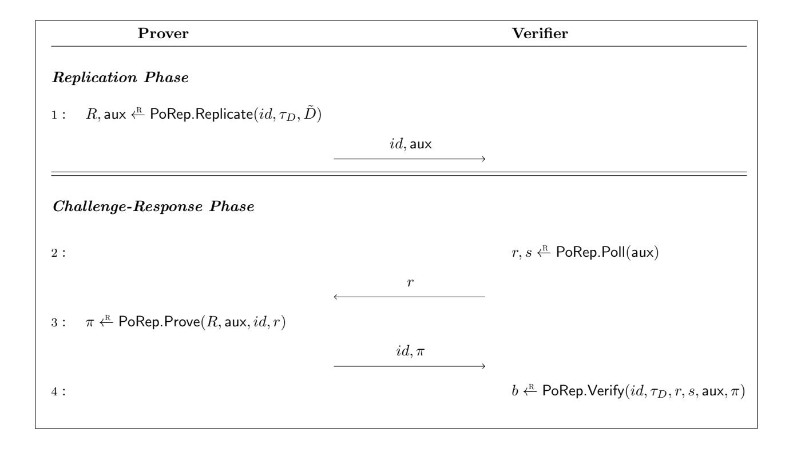
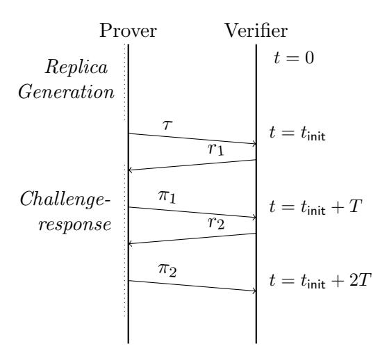
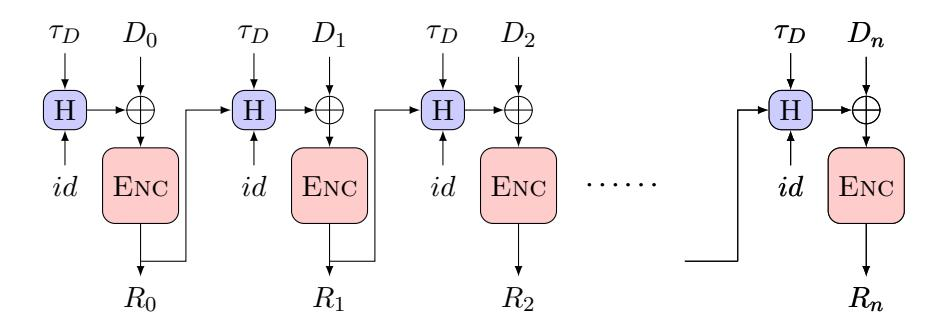
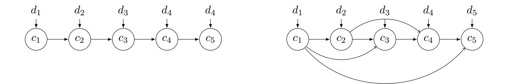

# PoReps: Proofs of Space on Useful Data

## Ben Fisch

Stanford University, Protocol Labs

#### Abstract

A proof-of-replication (PoRep) is an interactive proof system in which a prover defends a publicly verifiable claim that it is dedicating unique resources to storing one or more retrievable replicas of a data file. In this sense a PoRep is both a proof of space (PoS) and a proof of retrievability (PoR). This paper establishes a foundation for PoReps, exploring both their capabilities and their limitations. While PoReps may unconditionally demonstrate possession of data, they fundamentally cannot guarantee that the data is stored redundantly. Furthermore, as PoReps are proofs of space, they must rely either on rational time/space tradeoffs or timing bounds on the online prover's runtime. We introduce a rational security notion for PoReps called -rational replication based on the notion of an -Nash equilibrium, which captures the property that a server does not gain any significant advantage by storing its data in any other (non-redundant) format. We apply our definitions to formally analyze two recently proposed PoRep constructions based on verifiable delay functions and depth robust graphs. Lastly, we reflect on a notable application of PoReps—its unique suitability as a Nakamoto consensus mechanism that replaces proof-of-work with PoReps on real data, simultaneously incentivizing and subsidizing the cost of file storage.

## <span id="page-0-0"></span>1 Introduction

A proof-of-replication (PoRep) builds on the two prior concepts of proofs-of-retrievability (PoR) [\[30\]](#page-35-0) and proofs-of-space (PoS) [\[24\]](#page-34-0). In the former a prover demonstrates that it can retrieve a file and in the latter the prover demonstrates that it is using some minimum amount of space to store information. Most proofs of space require the prover to use this space to store junk information that is only relevant to the PoS protocol. A PoRep, in essence, embeds a PoR within a PoS. It enables the prover to demonstrate that it is using some minimum amount of space while simultaneously allowing it to actually use that space to store useful information. An additional critical property of a PoRep is that the storage costs required to succeed in the protocol depend only on the size of the data inputs and are otherwise independent of the data inputs. In particular, the cost to succeed in the protocol should not depend on whether or not this data was privately preprocessed (e.g. encrypted by a client) or generated by the server itself. As another special case, if the input to the protocol were k redundant copies of the same file then this would cost the same as running the protocol on k distinct data files. Intuitively, this would achieve the following property: even if a PoRep prover could pass the protocol without storing the data redundantly (e.g. by deduplicating the k copies), there would be no advantage to doing so. In other words, it would be rational for a PoRep prover in this scenario to honestly store k copies of the data.

Consider as a thought exercise a simple composition of a PoR protocol and PoS protocol that would not succeed in achieving these goals. This simple protocol requires the prover to use a total of 2N space. The prover uses half of this space to produce a PoS (i.e. it runs a standard PoS protocol that requires it to fill this space with random data) and it uses the other half to actually store some useful data file of size N and produce PoRs of the file. This satisfies both a PoR and a PoS with only 2N storage and therefore shows both that the prover is using some minimum Ω(N) amount of storage and is able to retrieve the data of interest. However, it fails the "independent cost" criterion. Namely, it is more expensive for the prover to run this protocol on useful data (requiring 2N space to store both the useful data and the random data) than to just store the useless random data required for the PoS and provide a PoR for this random data (requiring only N space). Moreover, consider if the prover were asked to store k redundant copies of the same file D and use this protocol to prove that it (a) is using at least kN space to store these copies and (b) is able to retrieve D. Following the protocol honestly requires 2kN space: kN space to store the k copies of D and kN space to store the random data required for the PoS. Unfortunately, the most rational strategy would be to store only the random data and a single copy of D as this uses only (k + 1)N space and still allows the prover to successfully pass the protocol.

While standard PoRs can provide proofs of data duplication in a private-verifier[1](#page-1-0) setting where the client preprocesses its own data before sending it to the server, their security relies on a non-colluding client to privately preprocess the data. One advantage of PoReps over standard PoRs for proofs of data duplication is that multiple clients could contribute data to a single database and would not need to trust any single client to preprocess the data. PoReps could also be used to provide proofs of storage for publicly available data. For example, a consensus server in a massively distributed and open state-replication system such as Bitcoin could provide a PoRep that it is storing a complete history of the state-machine transcript (i.e. in blockchain systems like Bitcoin this is referred to as a "full node" storing the "chain"). Unlike PoRs, PoReps could be used to provide this proof without requiring all the verifiers to send the server their own preprocessed copy of the public transcript (incurring impractical communication).

PoReps provide a publicly verifiable proof of data duplication, secure against adversaries who will not deviate from an -rational honest strategy. The notion of an -equilibrium is used in game theory as a generalization of a Nash equilibrium where players gain at most an advantage from deviating. This solution concept is appropriate for a malicious-but-lazy adversary, or in conjunction with the status-quo-bias assumption: you are on the couch and the TV remote is across the room, so you continue to watch the same channel. This may seem like a strangely weak security property to achieve in a cryptographic protocol. For a very simple reason it is actually the best possible security that PoReps can achieve, at least in the standard[2](#page-1-1) model of computation for cryptographic analysis. In short, any prover storing k independent replicas of the file could intentionally correlate these replicas in a way that it can still efficiently retrieve each in its original format. For example, it could encrypt them and store the key.

However, the primary use case of PoReps is probably not a proof of storage system that weakly discourages de-duplication. The properties achieved by PoReps make it uniquely suited

<span id="page-1-0"></span><sup>1</sup>Verification of PoRs can also be outsourced. Proofs of retrievability where a client can outsource the work of verifying proofs were previously referred to as publicly verifiable PoRs or "public PoRs", however the label outsourceable appropriately distinguishes their security property from the public verifiability of PoReps and proofs of space.

<span id="page-1-1"></span><sup>2</sup>This does not preclude secure hardware solutions or proofs based on network timing.

for a Nakamoto consensus mechanism (also known as blockchain consensus) that use PoReps as a useful proof of space in place of Bitcoin's proof-of-work to achieve sybil-resistance. Briefly, Nakamoto consensus mechanisms and its variants are a special type of state-machine replication process managed by an unpermissioned, asynchronous, and distributed network of consensus participants, with the additional feature that the state-machine itself encodes fungible tokens of value. In particular, a defining characteristic of these consensus mechanisms is their ability to mint new tokens in the state machine in order to reward and incentivize consensus participants (termed miners), taking for granted that these tokens represent real-world assets.

Blockchain systems based on proof-of-space have been proposed [\[19,](#page-34-1)[42\]](#page-35-1) and are in active development, pursuing goals including energy efficiency and more egalitarian distribution.[3](#page-2-0) PoReps target a different advantage entirely: they simultaneously incentivize useful peer-to-peer data storage. This is the basis of Filecoin [\[1\]](#page-33-0). The miners that manage the system's distributed state-machine are required to produce PoReps in order to append transactions, or equivalently, be elected as temporary consensus leaders, and are rewarded with freshly minted coins in return. Accepting the hypothesis that the miners will be incentivized by these rewards alone to produce PoReps, just as Bitcoin miners produce wasteful proofs-of-work, the rewards–in effect–subsidize the auxiliary useful work accomplished by the PoRep: file storage.

The utility of -rational replication in this context is immediately transparent. It characterizes the cost required to nudge a data replication strategy from a weak equilibrium strategy into a strong one. In other words, it represents the cost that clients must pay (in a stylized model that ignores other market variables) to convince miners to encode their real data inside PoReps rather than "useless" generated data, and therefore the degree to which a system such as Filecoin subsidizes storage costs. PoReps thus sit at an exciting crossroads of economics and cryptography:

PoReps epitomize a cryptographic mechanism that is concerned not solely with the actions and capabilities of an adversary, nor penalties levied for misbehavior, but rather its broader effect on behaviors in an economy.

## <span id="page-2-1"></span>1.1 Related work

Proofs of storage Cryptographic proofs of storage have been proposed in a variety of flavors throughout the literature. Broadly speaking, proofs of storage are interactive protocols between a server (prover) and client (verifier) with different goals relating to statements about the server's storage. Proofs-of-retrievability (PoR) [\[30\]](#page-35-0) demonstrate that the prover can retrieve some specified data known to the verifier. A public-key PoR is outsourceable, meaning that the client can provide a public authentication tag that any verifier can use to verify the server's proofs. Unless the data itself is incompressible, a PoR does not necessarily prove anything to the verifier about how much space the prover is using in order to retrieve the file. In particular, in the public-key setting the third party verifier does not know whether the client is colluding with the server or not, and therefore a PoR is not a truly publicly verifiable claim of storage. In proofs-of-space (PoS) [\[24\]](#page-34-0) a time-constrained prover demonstrates that it is storing some incompressible string of Ω(N) bits, and therefore using at least Ω(N) bits of space. This formulation of PoS is sometimes referred to as a proof of persistent space as opposed to a proof of transient space [\[46\]](#page-35-2). Timing assumptions are inherently required in proofs of persistent space due to the efficiency

<span id="page-2-0"></span><sup>3</sup>The Chia Network is a blockchain system based on PoS, <https://chia.net/>.

requirement that the communication between the prover and verifier is required to be compact, as otherwise the prover can store only the communication transcript and recompute the advice. Proofs-of-secure-erasure (PoSE) [\[44\]](#page-35-3) are protocols similar to a PoS intended to demonstrate that a storage-bound prover has erased all of its storage. An important difference between PoSE and the standard PoS notion is that they involve a private-key verifier who preprocesses data, similar to a PoR proof. They were suggested as a protocol for a memory-bound embedded device to prove to a server that it has erased private data or all prior code before an update, e.g. to ensure that any malware has been erased.

Rationally secure storage protocols All of the above proof of storage protocols are unconditionally secure, or at least characterize security in terms of strong time-space lower bounds. However, there are additionally a class of proof of storage protocols that are secure in a weaker rational adversary model. The model considered in all of these works is an adversary that acts to minimize its storage costs. Storage enforcing commitments [\[28\]](#page-35-4) were a precursor to PoR that require the prover to dedicate a minimum amount of storage in order to pass the protocol for a committed file F (preprocessed by a client with a secret key). Their constructions did not guarantee unconditionally that the prover was actually storing F, and were therefore only secure in an epsilon-rational sense. Hourglass schemes [\[51\]](#page-36-0) were proposed as a generic method to prove that a server is storing data encoded in a specified format, in particular for the use cases of encryption-at-rest and file watermarking. Similarly, they leave open the possibility that the server is also storing a plaintext or non-watermarked version of the file. It only guarantees that such a server must use twice the storage resources to act maliciously.

Proof of data replication vs PoReps A proof of data replication/duplication, specifically in the sense of proving that data is stored in a redundant format, is a special case of hourglass schemes. Proofs of data replication/duplication have been explored primarily in the privateclient setting similar to proofs of retrievability [\[7,](#page-34-2)[47\]](#page-35-5). In this setting a client is somehow involved in preprocessing the data and either the client is the verifier or the client outsources its own verification work. The system Mirror [\[7\]](#page-34-2) is one such example, which proposed a way for the server to replicate the client's initially preprocessed file without requiring further communication from the client. The main technique in Mirror is a variant on RSA time-lock puzzles, and the security relies on timing assumptions similar to PoS. Several days ago another paper exploring this line of work was posted, which proposed a construction of proof of data replication in the private-client setting without timing assumptions [\[21\]](#page-34-3).

The term proof-of-replication (PoRep), which is the focus of our work, was proposed by the Filecoin project [\[2\]](#page-33-1) in reference to a hybrid of a PoR and PoS that demonstrates in a publicly verifiable way that the prover is using space to store a unique replica of a file, or even several unique replicas of the same file. The main intent of this proposed primitive was to resist the so called "generation attack", i.e. it should be a publicly verifiable proof of space even when the server may collude with a client. A nearly equivalent concept to proof-of-replication was proposed earlier by Sergio Demian Lerner in 2014 under the name proof of unique blockchain storage [\[33\]](#page-35-6). It focussed on the special case where all provers/verifiers in the system know at least one copy of the replicated file. For instance, it was proposed as a mechanism for demonstrating publicly that the Bitcoin blockchain is highly replicated. Lerner proposed using time-asymmetric encodings to apply a slow transformation to a file using a unique identifier as a key. Boneh et. al. generalized this construction using a new primitive called a decodable verifiable delay function (VDF) [\[14\]](#page-34-4). New constructions of PoReps using more traditional tools from proofs of space (i.e. hard-to-pebble graphs) were concurrently proposed in [\[26,](#page-35-7) [45\]](#page-35-8).

Tight proofs of space As we develop in this work, there is a strong connection between tight proofs of space and PoReps. A tight proof of space is one where any adversarial prover implementing an attack uses only an fraction less space than the honest prover where can be made arbitrarily small. Intuitively, if a PoRep is not a tight proof of space (e.g. = 1/2) then there may be some adversary that would be rationally incentivized to deviate from honest behavior and therefore likely destroy the replication format. Pietrzak [\[45\]](#page-35-8) constructed the first tight PoS, although the proof size is O(1/<sup>2</sup> ) and depended on depth robust graphs with rather special properties [\[6\]](#page-34-5). Concretely, according to the analysis it requires graphs of degree 2, 760 log N just to achieve 1/2 space gap. The PoRep based on verifiable delay encodings as a moderately hard function [\[14\]](#page-34-4) is in fact an arbitrarily tight PoS, however it is exceedingly inefficient to generate on large data (scaling quadratically in the data size).

## <span id="page-4-0"></span>1.2 Contributions and Organization

This work is a foundational study of PoReps. Primarily, we motivate the goals of PoReps and explore what they are in contrast to other cryptographic primitives. Although many of the related primitives including proofs of retrievability, proofs of space, and proofs of data replication (private-client setting) were formally defined and studied in prior works, this is the first comprehensive formal study of PoReps. While a presentation at BPASE 2018 [\[26\]](#page-35-7) provided the first basic definitions for PoReps and intuition about both the impossibility of ideal security and how to define -rational replication, we build upon this further and provide a comprehensive model and definitions. In particular, our framework also addresses issues of composable security noted in a recent paper by Fisch and Silas [\[27\]](#page-35-9)—namely the issue that the prover may be incentivized to deviate from a rational replication strategy if deviating somehow benefits another simultaneous storage mechanism (e.g., perhaps it could use the PoRep data to compress auxiliary data that it is storing).

Relevant background information and preliminary tools are discussed in the Appendix [A.](#page-36-1) While for the most part this is a review, we also present a new formulation of a primitive we call proof of retrievable commitment (PoRC) and a simple generic construction based on vector commitments. This generalizes the simple public proof of retrievability on Merkle commitments that is used ubiquitously, particularly as a subprotocol in proofs of space. Section [2](#page-5-0) defines PoReps abstractly and presents our security model for -rational replication (Definition [6\)](#page-14-0). We show that this definition implies that the PoRep is a PoS, although it does not demand it explicitly. Proving that a PoRep construction satisfies the definition also likely requires "knowledge of compression assumptions" [\[27\]](#page-35-9). We formulate one such assumption along with a key lemma (Lemma [2\)](#page-16-0) that establishes sufficient criteria for -rational replication, showing that if a PoRep construction satisfies PoRC and PoS in a certain sense then it will also satisfy -rational replication. This greatly simplifies the analysis of candidate PoRep constructions. Section [3](#page-20-0) presents in detail the two constructions Basic-VDE-PoRep from VDFs [\[14\]](#page-34-4) and DRG-PoRep [\[26\]](#page-35-7) that fuses more traditional techniques in PoS (hard-to-pebble DAGs) with VDFs. Finally, Section [4](#page-29-0) applies the model, definitions, and Lemma [2](#page-16-0) of Section [2](#page-5-0) to formally analyze and prove secure both constructions DRG-PoRep and Basic-VDE-PoRep.

## Contents

| 1 |                                | Introduction                                             | 1  |  |  |
|---|--------------------------------|----------------------------------------------------------|----|--|--|
|   | 1.1                            | Related work<br>                                         | 3  |  |  |
|   | 1.2                            | Contributions and Organization<br>                       | 5  |  |  |
| 2 |                                | Proof-of-Replication                                     | 6  |  |  |
|   | 2.1                            | Replication Security Model<br>                           | 10 |  |  |
|   |                                | 2.1.1<br>Impossibility of ideal replication security<br> | 13 |  |  |
|   |                                | 2.1.2<br>Rational adversary model<br>                    | 13 |  |  |
|   |                                | 2.1.3<br>Security for decentralized storage networks<br> | 20 |  |  |
| 3 |                                | Constructions                                            | 21 |  |  |
|   | 3.1                            | Basic PoRep from Verifiable Delay Encodings<br>          | 21 |  |  |
|   |                                | 3.1.1<br>Basic-VDE-PoRep<br>                             | 22 |  |  |
|   | 3.2                            | Block Chaining Encodings<br>                             | 23 |  |  |
|   | 3.3                            | DRG PoRep<br>                                            | 25 |  |  |
|   |                                | 3.3.1<br>DRG-PoRep<br>                                   | 26 |  |  |
| 4 | Formal security analysis<br>30 |                                                          |    |  |  |
|   | 4.1                            | Labeling games with VDEs<br>                             | 31 |  |  |
|   | 4.2                            | Security claims<br>                                      | 32 |  |  |
| A |                                | Preliminaries and Background                             | 37 |  |  |
|   | A.1                            | Compression and Erasure Codes<br>                        | 37 |  |  |
|   | A.2                            | Proofs of Retrievability<br>                             | 38 |  |  |
|   | A.3                            | Vector Commitments<br>                                   | 39 |  |  |
|   | A.4                            | Proof of Retrievable Commitment<br>                      | 40 |  |  |
|   |                                | A.4.1<br>PoRC Syntax and Definitions<br>                 | 41 |  |  |
|   |                                | A.4.2<br>PoRC from Vector Commitments<br>                | 44 |  |  |
|   | A.5                            | Verifiable Delay Encodings<br>                           | 46 |  |  |
|   |                                | A.5.1<br>VDE security<br>                                | 47 |  |  |
|   | A.6                            | Depth Robust Graphs<br>                                  | 48 |  |  |
|   | A.7                            | Proofs of Space<br>                                      | 50 |  |  |
|   | A.8                            | Graph pebbling games<br>                                 | 51 |  |  |

# <span id="page-5-0"></span>2 Proof-of-Replication

We begin with defining the syntax for a proof-of-replication (PoRep). A PoRep operates on arbitrary data D ∈ {0, 1} <sup>∗</sup> of up to O(poly(λ)) size for a given security parameter λ. All algorithms are assumed to operate in the RAM model of computation (in particular reading a bit of an input is assumed to be an O(1) operation). Parallel algorithms operate in the PRAM model.

- 1. PoRep.Setup(λ, T) → pp is a one-time setup that takes in a security parameter λ, time parameter T, and outputs public parameters pp. T determines the challenge-response period.[4](#page-6-0)
- 2. PoRep.Preproc(sk, D) → D, τ ˜ <sup>D</sup> is a preprocessing algorithm that may take a secret key sk along with the data input D and outputs preprocessed data D˜ along with its data tag τD, which at least includes the size N = |D| of the data. The preprocessor operates in keyless mode when sk = ⊥ .
- 3. PoRep.Replicate(id, τD, D˜) → R, aux takes a replica identifier id and the preprocessed data D˜ along with its tag τD. It outputs a replica R and (compact) auxilliary information aux which will be an input for the Prove and Verify procedures. (For example, aux could contain a proof about the replication output or a commitment).
- 4. PoRep.Extract(pp, id, τD, R) → D˜ on input replica R and identifier id and data tag τ<sup>D</sup> outputs the data D˜ (and verifies its consistency with τD).
- 5. PoRep.Prove(R, aux, id, r) → π on input replica R, auxilliary information aux, replica identifier id, and challenge r, outputs a proof πid.
- 6. PoRep.Poll(aux) → r, s: This takes as input the auxiliary replica information aux and outputs a public challenge r along with any private randomness s used to produce this challenge. For public coin constructions s = ⊥.
- 7. PoRep.Verify(id, τD, r, s, aux, π) → {0, 1} on input replica identifier id, data tag τD, public challenge r, private randomness s (used to produce r), auxilliary replication information aux, and proof π it outputs a decision to accept (1) or reject (0) the proof.

PoRep interactive protocol These algorithms are used in an interactive protocol as illustrated in Figure 1. The setup (whether a deterministic, trusted, or transparent public setup, such as one involving a public random source) is run externally and pp is given as an input to all parties. For each file D, a preprocessor (a special party or the prover when operating in keyless mode, but not the verifier) runs (D, τ ˜ <sup>D</sup>) ← PoRep.Preproc(sk, D). The outputs D, τ ˜ <sup>D</sup> are inputs to the prover and τ<sup>D</sup> to the verifier.

Transparency, public coin, and public verifiability A PoRep scheme may involve a trusted one-time setup, in which case PoRep.Setup is run by a trusted party[5](#page-6-1) and the output pp is published for all parties to see. A transparent PoRep scheme is one in which the setup does not involve any private information. This trusted setup is an independent, one-time procedure, and the trusted party that runs the setup should have no further involvement in the interactive protocol. The data preprocessor on the other hand may use a secret-key, but it is not trusted. In

<span id="page-6-0"></span><sup>4</sup>An alternative formulation may allow for a variable challenge-response period T that might depend on the size of the data input. Our formulation does not allow this, implying that the online prover PoRep.Prove must run in parallel time less than T (including transmission time of the its proof to the verifier) independent of the data size (up to O(poly(λ)) in length). Achieving a fixed polling period T for all input data of any reasonable length (i.e.poly(λ)) is important in practice.

<span id="page-6-1"></span><sup>5</sup>As usual, the trusted party can also be replaced with a committee that runs a multi-party computation (MPC) protocol to generate the public parameters



Figure 2.1: The diagram illustrates the interaction between a prover and verifier in a PoRep protocol. The setup and data preprocessing is run externally generating pp ← PoRep.Setup(λ, T) and D, τ ˜ <sup>D</sup> ← PoRep.Preproc(sk, D). The challenge-response protocol is timed, and the verifier rejects any response that is received more than T time steps after sending the challenge. This is formally captured by requiring PoRep.Prove to run in parallel time at most T. The propogation delay on the communication channel between Prover and Verifier is assumed to be nominal in comparison to T.

particular, the verifier is oblivious to whether the preprocessor colludes with the server or not. As we will discuss next the secret-key preprocessor only has implications for data retrievability, but not for the security of the publicly verifiable data replication (or proof of space). This is an important distinction from the notion of proof of data replication proposed in the system Mirror. A PoRep scheme may be private coin if the private input r to PoRep.Poll is non-empty, and it is public coin if r = s. A public coin PoRep has the additional desirable property that the challenge output by PoRep.Poll could be replaced by a challenge derived from an unpredictable public random beacon[6](#page-7-0) .

Data preprocessing and data retrievability When the data input is preprocessed using a secret-key the resulting PoRep is a public-coin PoR (among satisfying other properties regarding replication and proof of space that we will discuss further in the following section on the PoRep security model). In this scenario we can imagine the preprocessor is a single client who wants to store (and replicate) data on a server, and generates the data tag τ<sup>D</sup> to outsource this verification

<span id="page-7-0"></span><sup>6</sup>Proofs-of-space-time [\[2\]](#page-33-1) is a proposed construction that non-interactively chains several PoReps by using the output of the last PoRep as a seed to the next, and would only work for an underlying PoRep that is public coin.



Figure 2.2: Space-time diagram of the PoRep protocol. Following a phase of length  $t_{\text{init}}$  during which the prover generates a new replica, the verifier repeatedly challenges the prover to produce a PoRep within a challenge time period length T in order to verify that the prover is still storing the unique replica of the original data. For this proof system to be sound it is necessary that  $t_{\text{init}} >> T$ .

work. When the preprocessor runs in keyless mode the resulting PoRep is a PoRC (Section A.4) with respect to the output  $\tau_D$ , which includes a commitment to the data D. Any (stateful) verifier that is at one point given the opening of the commitment can thereafter use the tag to verify PoReps as standard PoRs. This is particularly useful for a setting in which multiple clients pool their files together and want to receive a single PoRep for the entire dataset, but they do not mutually trust one another to share a private-key. It is also appropriate for a dynamic setting where new clients are made aware of the data stored on the server and wish to verify retrievability without trusting the original client's private-key preprocessing.

Treating data preprocessing in this way as a separate "layer of the stack" allows for a wider variety of constructions appropriate in different settings without impinging on the efficiency of the underlying PoRep protocol itself. In fact, a PoRep protocol that (without preprocessing) satisfies  $(\delta, \mathcal{C})$ -PoRC (e.g. for  $\mathcal{C}$  partitioning the data into constant size blocks) can immediately be compiled into either a public-key PoR or a PoRC using any number of previous techniques. We highlight the two scenarios:

1. A client has a data file D and uses a randomly generated secret key sk to produce  $\tilde{D}, \tau_D \leftarrow \mathsf{PoRep.Preproc}(sk, D)$  which applies a rate- $\delta$  adversarial erasure code [15] to D (i.e. one that is resilient to arbitrary adversarial deletions of up to  $\delta$  fraction of the blocks in  $\tilde{D}$ ). The tag  $\tau_D$  is a commitment to  $\tilde{D}$ . The adversarial erasure code may involve a secret transformation using sk and requires sk as well to recover from these errors. The private-key setting enables using more efficient erasure codes that only tolerate random deletions because they can be combined with a secret pseudorandom permutation of the data so that an adversary will only succeed in targeted deletions with up to negligible probability [15,48]. The client then uses  $\tau_D$  for verification in the PoRep protocol, which we assume is already a  $(\delta, \mathcal{C})$ -PoRC with respect to  $\tau_D$ . Any verifier  $\mathcal{V}$  can publicly verify that a  $\delta$  fraction of the committed  $\tilde{D}$  is retrievable (and indeed there is a public extraction algorithm for a  $\delta$  fraction of blocks in  $\tilde{D}$ ), which is sufficient for the private client to recover D using sk.

2. A keyless preprocessor transforms the data file D into a single code word of a deterministic rate- $\delta$  optimal erasure code (e.g., Reed-Solomon) with symbol size equal to the block size in  $\mathcal{C}$ . It outputs  $\tau_D$  as a deterministic commitment to  $\tilde{D}$ , which is also a deterministic commitment to D. Due to the resilience of the erasure code (D can be recovered from any  $\delta$  fraction of the symbols in  $\tilde{D}$ ), the PoRep ( $\delta, \mathcal{C}$ )-PoRC of  $\tilde{D}$  becomes a PoRC of D.

Efficiency All algorithms must run in time  $O(\operatorname{poly}(\lambda))$  and with up to at most  $O(\operatorname{poly}(\lambda))$  parallelism. We don't directly impose further efficiency requirements in the PoRep definition, but implicitly a PoRep scheme cannot be simultaneously correct and secure unless PoRep.Poll and PoRep.Prove have a lower parallel time complexity than PoRep.Replicate on  $O(\operatorname{poly}(\lambda))$  processors. Otherwise, for correctness to hold the challenge-response period will be long enough for an adversarial prover to rerun the replica generation from scratch. Furthermore, for practical purposes it is highly desirable for PoRep.Prove and PoRep.Verify to run in constant or  $O(\operatorname{polylog}(|D|))$  time, where |D| is the length of the data file. Among other benefits, this enables batched proofs and verification of multiple replicas of the same (or distinct) files, which scales sublinearly in the number of replicas/files. Replica generation PoRep.Replicate runs in time greater than  $\max(T,|D|)$ , however it is desirable for this runtime to be sublinear in  $T \cdot |D|$  as the size of the file increases.

Correctness In a correct PoRep construction, a prover who runs PoRep.Replicate and PoRep.Prove honestly must pass verification with probability 1. In order to pass verification the algorithm PoRep.Prove must run in parallel time at most T as otherwise the verifier will not receive the output within the challenge-response period. In addition, PoRep.Extract must correctly extract the original data from a replica generated with PoRep.Replicate.

<span id="page-9-2"></span>**Definition 1** (PoRep correctness). A PoRep construction is correct if for any security parameter  $\lambda$ , any id and data input D, there exists  $T_{\lambda}$  such that for all  $T \geq T_{\lambda}$ ,  $pp \leftarrow PoRep.Setup(\lambda, T)$ , and  $(R, \tau) \leftarrow PoRep.Replicate(pp, id, D)$  it holds that:

$$Pr \left[ \textit{PoRep.Verify}(pp, id, r, s, \tau, \pi) = Accept \; \left| \begin{array}{c} (r, s) \leftarrow \textit{PoRep.Poll}(pp, \tau) \\ \pi \leftarrow \textit{PoRep.Prove}(pp, R, id, r) \end{array} \right] = 1$$

and PoRep.Prove(pp, R, id, r) runs in parallel time at most  $T_{\lambda}$ .<sup>7</sup> Additionally:

$$Pr \left[ \tilde{D} = D \, \left| \, \begin{matrix} R \leftarrow \textit{PoRep.Replicate}(pp, id, D) \\ \tilde{D} \leftarrow \textit{PoRep.Extract}(pp, id, R) \end{matrix} \right. \right] = 1$$

#### <span id="page-9-0"></span>2.1 Replication Security Model

An ideal security goal for PoRep protocols, beyond satisfying the standard definition of a PoR, would be to guarantee the following properties, described informally:

<span id="page-9-1"></span><sup>&</sup>lt;sup>7</sup>Mere existence of  $T_{\lambda}$  may seem like a weak requirement as  $T_{\lambda}$  could be arbitrarily large, however it is soundness that will fail in this case not correctness. For both soundness and correctness to hold there must exist some  $T_{\lambda}$  such that the honest prover can succeed in time  $T_{\lambda}$  and the cheating adversary cannot.

```
Adverary Challenger
1 : Apre chooses D~ = D1, ..., Dk;
~id = id1, ..., idk; and computes
data tags ~τ = τD1
             , ...., τDk
2 : σ, aux ~ ← Apre(pp, z, ~id, ~τ, D~ )
                         z, ~id, aux ~ = aux1, ..., auxk
3 : ∀i ri ←R
                                                  PoRep.Poll(auxi)
                             ~r = r1, ..., rk
4 : ˆz, ~π ← Aonl(pp, σ, aux ~ ,
                   ~id, ~r)
                            ~π = π1, ..., πk
5 : bi ← PoRep.Verify(idi
                                                           , τDi
                                                              , ri
                                                                , auxi
                                                                    , πi)
Output ˆz Output ˆb =
                                                     ^
                                                     i
                                                       bi
```

Figure 2.3: The diagram illustrates the PoRep security game between an adversary and a challenger. Several inputs come from the environment, which runs the setup pp ← PoRep.Setup(λ, T) and chooses an auxiliary input z for the adversary. The adversary is split into two components: Apre and Aonl. They may share initial static state but cannot communicate during the game. In particular, Aonl does not see the input z nor D~ chosen by Apre(z). It does obtain the inputs pp, σ, ~aux. This restriction captures the fact that σ may encode a function of auxiliary information z in addition to the replicas of D~ . Moreover, Aonl runs in parallel time at most Tonl whereas Apre is only restricted to run in total time O(poly(λ)).

- 1. Any prover who simultaneously passes verification in k distinct PoRep protocols (under k distinct identities) where the input to PoRep.Replicate is a file D<sup>i</sup> in the ith protocol must be storing k independent replicas, one for each D<sup>i</sup> , even if several of the files are identical.
- 2. A prover who passes verification in a PoRep protocol where the input to PoRep.Replicate is a file D˜ = D ◦ · · · ◦ D (consisting of k copies of the same file D) must be storing k independent physical copies of D.

We will capture these security goals more formally through a game between a PoRep prover (adversary) and a challenger (Figure [2.3\)](#page-10-0). A high level overview of the game is as follows. The prover/adversary is split into two components: a replication adversary and an online adversary whose sequential running time (i.e. parallel time) is bounded by a parameter T. The replication adversary is allowed to select the data inputs and the number of replicas k. The replicas do not need to be of all the same files. Specifically, we represent this input as a vector D = (D1, ..., Dk) of data files D<sup>i</sup> each of size N, where some (or all) of the files are identical. The adversary also chooses k unique distinct identifiers for each file and k file tags. The prover can then compute on the data (as in phase 1 of replication) to produce an advice string σ for the online adversary as well as the auxiliary output ~aux, which includes N (the claimed size of each data file component). The online adversary receives a vector of k challenges from the challenger and must output k proofs. The challenger then runs the PoRep verifier on each and outputs the verifier's accept/reject decision.

k-replication To capture "storing k independent replicas" we say that σ is a k-replication of a file D if the string σ can be partitioned into k substrings σ1, ..., σ<sup>k</sup> such that each allow full recovery of the file D. Formally:

Definition 2. Let S be a data source on {0, 1} n . A string σ is a k-replication of a data sample D = (d1, ..., dk) ← S<sup>k</sup> if and only if there is a lossless randomized encoding scheme (enc, dec) and a partition of σ into k substrings σ1, ..., σ<sup>k</sup> such that enc(di) = σ<sup>i</sup> and dec(σi) = d<sup>i</sup> for all i = 1, ..., k.

Intuitively, security goal (1) can be captured by requiring that any online adversary in the PoRep game who is not given a k-replication of the data by the preprocessor adversary will fail with overwhelming probability. This would imply that if several provers each provide distinct PoReps of the same file then they are each dedicating unique resources[8](#page-11-0) to storing the file. It would also imply that a prover who claims in a single proof to be storing multiple replicas of a file cannot physically deduplicate its storage. Unfortunately, this security property is impossible to achieve in a classical model of interactive computation (that does not include timing bounds on communication[9](#page-11-1) ), as we explain next. Instead, we will need to relax the security model to consider rational adversaries and bound the cost savings (measured in storage resources) of adversaries who do not store a k-replication of the data input. The security notion we call -rational replication could be informally interpreted as security against an "honest-butopportunistic" adversary that will only employ a malicious strategy if they stand to save more than some cost doing so.

Data tag verification oracle In order to be as general as possible we don't explicitly require τ<sup>D</sup> to be a commitment to D. Instead, we assume the existence of an oracle Ocheck that implements a verification procedure on a data/tag pair, perhaps provided additional advice aux, i.e. on input (D, τD, aux) it returns Ocheck(D, τD, aux) → b ∈ {0, 1}. A special case is where τ<sup>D</sup> is a commitment to D, aux is the opening hint, and Ocheck runs the commitment verification. In other scenarios Ocheck might verify signatures. As discussed previously, we allow for constructions that run in a private-key preprocessor mode and the data inputs/tags are provided by the preprocessor. For instance, they may be data authentication tags like in a more standard PoR scheme.

Definition 3. PoRep-Exp(A) (z, pp) = (ˆz, ˆb) is the PoRep game experiment (defined in Figure [2.3\)](#page-10-0) with adversary A = (Apre, Aonl) on inputs z, pp from the environment, represented as a random variable where zˆ is the output of A and ˆb is the challenger's output. OutA(pp, z) = ˆz is

<span id="page-11-0"></span><sup>8</sup>The provers may be storing all the replicas on the same hard-drive, hence PoReps alone do not give a meaningful guarantee of fault-tolerant data storage.

<span id="page-11-1"></span><sup>9</sup>Consider a model with network communication round trip bounds and distance between parties. Two servers claim to be in two different locations and are each storing a replica of the same file. We could use distance bounding protocols combined with proofs of retrievability to verify the claim [\[52\]](#page-36-4)

the random variable representing the first component of PoRep-Exp<sup>(A)</sup>(z, pp), and Succ<sub>A</sub> is the probability that  $\hat{b} = 1$ .

**Definition 4** (Admissible PoRep adversary). For any  $pp \leftarrow PoRep.Setup(\lambda, T)$  a  $PoRep \ game \ adversary \ \mathcal{A} = (\mathcal{A}_{pre}, \mathcal{A}_{onl})$  is admissible for the experiment  $PoRep.Exp^{(\mathcal{A})}(z, pp)$  if  $\mathcal{A}_{pre}$  runs in  $O(poly(\lambda))$  and  $\mathcal{A}_{onl}$  runs in parallel time at most T. The adversary  $\mathcal{A}$  is  $\mu$ -admissible if additionally  $\mathcal{A}_{pre}$  chooses data inputs  $\vec{D}$  and tags  $\vec{\tau}$  where for each i there exists  $\mathsf{aux}_i$  such that  $\mathcal{O}_{\mathsf{check}}(D_i, \tau_{D_i}, \mathsf{aux}_i) = 1$  and  $\mathsf{Succ}_{\mathcal{A}} \geq \mu$ .

### <span id="page-12-0"></span>2.1.1 Impossibility of ideal replication security

Suppose that the PoRep adversary stores the replicas in a string  $\sigma$ . The adversary can then "sabotage" the replication by using say the first  $\lambda$  bits of  $\sigma$  as a key to encrypt the rest, and store the transformed string  $\sigma'$  that includes the  $\lambda$  bit key and ciphertext. Since the adversary can efficiently decode  $\sigma$  from  $\sigma'$  it will still pass the protocol with the same success probability (i.e. it efficiently decodes  $\sigma'$  and retrieves  $\sigma$ , and then follows whatever protocol behavior it would have initially on  $\sigma$ ). Indeed, such "scrambling" attacks are impossible to prevent as there is always a trivially fast way to encode/decode one's state in a way that destroys the k-replication format. We state this formally in the following proposition. Our proof is in the random oracle model for simplicity, although an analogous statement can be proven in the plain model from symmetric key encryption (i.e. PRPs) as long as  $|\sigma| > \lambda$  (this will always be true for  $\mathcal A$  that succeeds on  $|\vec{\mathcal D}| > \lambda$ , i.e. causes the challenger to output 1 with non-negligible probability).

**Proposition 1.** For any admissible adversary  $\mathcal{A} = (\mathcal{A}_{pre}, \mathcal{A}_{onl})$  there exists an admissible adversary  $\mathcal{A}' = (\mathcal{A}'_{pre}, \mathcal{A}'_{onl})$  (with access to a random oracle H) such that for all pp, z and  $\vec{D} = (D_1, ..., D_k)$  chosen by  $\mathcal{A}_{pre}$  for any k > 1 the distributions  $PoRep-Exp^{(\mathcal{A})}(z, pp)$  and  $PoRep-Exp^{(\mathcal{A}')}(z, pp)$  are identical and for  $\sigma, \sigma'$  output by  $\mathcal{A}_{onl}/\mathcal{A}'_{onl}$  respectively (in Figure 2.3, line 3), at most one of  $\sigma, \sigma'$  is a k-replication of  $\vec{D}$  and yet  $|\sigma'| = |\sigma|$ .

Proof.  $\mathcal{A}'$  runs exactly as  $\mathcal{A}$  with the following modifications.  $\mathcal{A}'_{\text{pre}}$  runs  $\mathcal{A}_{\text{pre}}$  until Line 2 of the game, obtaining  $\sigma$ ,  $a\vec{u}x$ . If  $|\sigma|=1$  then  $\mathcal{A}'_{\text{pre}}$  outputs  $\sigma$ ,  $a\vec{u}x$  and  $\mathcal{A}'_{\text{onl}}$  on a 1-bit  $\sigma$  runs exactly like  $\mathcal{A}_{\text{onl}}$ . By hypothesis k>1, hence a 1-bit  $\sigma$  is not a k-replication by definition. In case  $|\sigma|>1$ , then let  $\sigma_0$  denote the first bit of  $\sigma$ .  $\mathcal{A}'_{\text{pre}}$  computes  $H(\sigma_0)=r$ , truncating the output of H such that  $|r|=|\sigma|-1$  (as  $\mathcal{A}_{\text{pre}}$  runs in time  $O(poly(\lambda))$ ) we may assume w.l.o.g. that the output of H is longer than  $\sigma$ ) and sets  $\sigma'=\sigma\oplus 0||r$ . Note that only the first bit of  $\sigma'$  (i.e.  $\sigma_0$ ) contains information about  $\sigma$ . All substrings of the remaining  $|\sigma|-1$  bits are uniformly distributed (they have zero mutual information with the remainder of  $\sigma$ ). Therefore, assuming that  $\sigma$  is a k-replication of  $\vec{D}$ , then  $\sigma'$  is not a k-replication for k>1. Finally,  $\mathcal{A}'_{\text{onl}}$  receives  $\sigma'$ , computes  $r=H(\sigma_0)$  by reading the first bit of  $\sigma'$ , and then recovers  $\sigma=\sigma'\oplus 0||r$ . Then  $\mathcal{A}'_{\text{onl}}$  uses  $\sigma$  to run  $\mathcal{A}_{\text{onl}}$ . The output is identical to PoRep-Exp $^{(\mathcal{A})}(z,pp)$ .

#### <span id="page-12-1"></span>2.1.2 Rational adversary model

Given the impossibility of achieving PoRep security entirely based on cryptographic guarantees, we turn instead to a framework of modeling attacks based on incentives. A rational adversary model has been used many times before in related works. In fact, it is implicit in proofs of space where security is reasoned via time/space tradeoffs [40] rather than challenge-response timing,

which is necessary in proofs of space that are not parallel sound [\[3,](#page-33-2) [46\]](#page-35-2). It was also invoked to model security in storage enforcing commitments, hourglass schemes, and private-client proof of data replication [\[7,](#page-34-2) [28,](#page-35-4) [51\]](#page-36-0). The threat model considered in all of these works is an adversary that acts to minimize its costs, measured in storage or work (and combinations of the two).

In our setting, independent from any client setup/preprocessing, any prover that passes k independent PoRep interactive protocols on k data file commitments should not save any costs by running a strategy that does not store a recoverable copy of the file in each protocol, even if this involves storing duplicate copies of the same file. The same holds if the prover passes a single PoRep interactive protocol on a single committed data file that contains redundant data. More precisely, for any successful strategy there is another "well-behaved" and efficiently computable strategy satisfying k-replication that uses no more than a factor 1/(1 − ) more storage, i.e the adversarial strategy saves at most an fraction of the storage by deviating from honest k-replication. Importantly, this "well-behaved" strategy should still retain all the information that the original adversary was storing, which we capture by saying that the new strategy simulates the output distribution of the original adversary in the security game. We call this security notion -rational replication.

Security under composition A challenge that arises in both defining and proving -rational replication for PoReps is showing that adversarial strategies do not save costs even in composition with other protocols, in particular in the presence of auxiliary data on the server. While composition is always a security challenge often overlooked, it is especially salient here. One might think it would be sufficient to show that the adversary cannot compress its replicas by encoding them in a different (malicious) format that no longer preserves replication. However, we must also consider that the adversary may be able to use the replica storage to help store other useful information on its hard drive. Suppose, for instance, that the (incompressible) replicas could be used as a seed to compress this auxiliary data, yet in a way that also entangles the seed together with the auxiliary data, destroying the replication format (i.e. a weak compression Definition [11\)](#page-37-1). In this case, the adversary may actually save costs by deviating.

Fisch and Silas [\[27\]](#page-35-9) showed that proving this is likely impossible without strong knowledge assumptions. Their analysis focussed on the "weak compression attack" described above, where the PoRep storage could be used as a seed to compress auxiliary data in a way that also destroys the replication format. One might hope to prove rational security by showing that any adversary who weakly compresses auxiliary data in this way can be converted to a better adversary that compresses its auxiliary storage just as well without destroying its replicas, i.e. coverts the weak compression to a strong compression (Definition [12\)](#page-37-2) that would save the seed independently in its original format. However, they prove that any black-box reduction of strong compression to weak compression for a given class of sources would yield a universal compression scheme for that class in the random oracle model. In other words, proving this is as hard as constructing a universal compression scheme that works on any source in the class.

"Knowledge-of-compression" assumptions In light of their result, Fisch and Silas propose using a "knowledge of compression" assumption. Intuitively, any adversary who knows a way to compress auxiliary data z using an incompressible string s must only be taking advantage of the compressibility of z, hence entangling z together with s should not help. Specifically, the minimal assumption proposed in their paper is that any adversary who can compute a weak compression of z with an independent uniformly sampled seed s can also extract a strong compression of z. They also remark that some PoS constructions are proven secure by showing that the advice output s directly encodes part of a random oracle's function table, and in this case the minimal assumption suffices to show that any weak compression involving the PoS advice s as a seed can be converted to a strong compression. Unfortunately, this property is not true of PoReps because the underlying PoS advice actually encodes the committed data file D.<sup>10</sup> Therefore, we require a stronger knowledge of compression assumption that applies to any incompressible seed s, even where the incompressibility applies only to strictly time bounded compression schemes.

**Definition 5** (Time bounded incompressibility). A source S is  $(T_1, T_2)$ -incompressible to k bits if there does not exist (for any constant  $\delta$ ) a  $\delta$ -lossy strong compression scheme (enc, dec) where enc runs in parallel time  $T_1$  and dec runs in parallel time  $T_2$  that compresses S to  $k - \log(1/\delta)$  bits.

<span id="page-14-4"></span>**Assumption 1** (Knowledge of strong compression). Let S and X be any two samplable sources over  $\{0,1\}^n$  such that S is  $(T_1,T_2)$ -incompressible to  $(1-\epsilon)n$  bits for some  $\epsilon < 1$ . For any compression scheme (enc, dec) that compresses  $S \times X$  to m bits where enc runs in parallel time  $T_1$  or dec runs in parallel time  $T_2$ , there exists a strong compression scheme (enc\*, dec\*) running in parallel time  $T_1$  and  $T_2$  respectively that compresses X to length  $m - (1 - \epsilon)n$  bits sampling seeds from S. Moreover, for any algorithm A that on inputs S and n outputs (enc, dec), there exists an efficient "extractor" which observes A's internal state and outputs (enc\*, dec\*).

**Definition of rational replication** We will fix several notations regarding discrete probability distributions before presenting our formal definition of  $\epsilon$ -rational replication. If X is a 0/1 random variable with probability mass function  $p_X$  and Y is a discrete random variable on the same probability space then  $p_X|Y: \operatorname{Sup}(Y) \to \mathbb{R}$  is the function  $p_X|Y(w) = Pr[X = 1|Y = w]$ . If f, g are two real valued functions on a set  $\Omega$  then  $f \succeq g$  if and only if  $f(w) \geq g(w)$  for all  $w \in \Omega$ , i.e. f is an upper bound on g.

Finally, for any two random variables X, Y let  $X(\lambda) \stackrel{\lambda}{\approx} Y(\lambda)$  denote that the distributions of X and Y are computationally indistinguishable.<sup>11</sup>

<span id="page-14-0"></span>**Definition 6** (Rational replication). A PoRep construction is a  $\mu$ -sound  $\epsilon$ -rational replication if for any  $\mu$ -admissible adversary  $\mathcal{A} = (\mathcal{A}_{pre}, \mathcal{A}_{onl})$  there exists an admissible adversary  $\mathcal{A}' = (\mathcal{A}'_{pre}, \mathcal{A}'_{onl})$  such that for all pp, z sampled by the environment and  $\vec{D} = (D_1, ..., D_k)$  chosen by  $\mathcal{A}_{pre}$ , and for  $\sigma$ ,  $\sigma'$  output by  $\mathcal{A}_{onl}/\mathcal{A}'_{onl}$  respectively (in Figure 2.3, line 2) then for all z from the environment and pp  $\leftarrow$  PoRep.Setup $(\lambda, T)$  it holds that:

- 1.  $|\sigma| \le (1 \epsilon)|\sigma'|$
- 2.  $\sigma'$  is a k-replication of  $\vec{D}$
- 3.  $Out_{\mathcal{A}'}(pp,z) \stackrel{\lambda}{\approx} Out_{\mathcal{A}}(pp,z)$  and  $Succ_{\mathcal{A}'}|Out_{\mathcal{A}'}(pp,z) \succeq Succ_{\mathcal{A}}|Out_{\mathcal{A}}(pp,z).^{12}$

<span id="page-14-1"></span> $<sup>^{10}</sup>$ The security might still be proven by showing how to encode a random oracle table using S together with D [45], but the remark in [27] no longer applies in this case. Moreover, the prover can even choose D to be correlated with the auxiliary data z.

<span id="page-14-2"></span><sup>&</sup>lt;sup>11</sup>The standard definition of computationally indistinguishable distributions with respect to a security parameter  $\lambda$  is that no poly( $\lambda$ ) time algorithms can distinguish samples from the two distributions except with probability negligible in  $\lambda$ .

<span id="page-14-3"></span>This says that for any value of  $\hat{z}$  the probability  $\mathcal{A}$  succeeds given that it outputs  $\hat{z}$  is bounded by the probability that  $\mathcal{A}'$  succeeds given that it outputs  $\hat{z}$ .

Necessary and sufficient conditions for  $\epsilon$ -rational replication. PoReps satisfying  $\epsilon$ -rational replication are implicitly proofs of space with an  $\epsilon$  space gap. The converse is not necessarily true, i.e.  $\epsilon$ -tight proofs of space are not immediately PoReps satisfying  $\epsilon$ -rational replication. Furthermore, unless  $\tau_D$  is binding to D relative to  $\mathcal{O}_{\mathsf{check}}$ , meaning that for any  $\tau_D$  there does not exist (or it is computationally difficult to produce)  $D' \neq D$  and  $\mathsf{aux}', \mathsf{aux}$  such that  $\mathcal{O}_{\mathsf{check}}(D,\tau_D,\mathsf{aux}) = \mathcal{O}_{\mathsf{check}}(D',\tau_D,\mathsf{aux}') = 1$ , then it is unclear how a scheme could satisfy our definition (or any meaningful definition of replication security for that matter where the adversary is allowed to choose the data). If  $\mathcal{O}_{\mathsf{check}}$  is not binding then even rational replication security would likely fail because the adversary could find an alternative data input  $D' \neq D$  consistent with the same tag and run the rest of the protocol successfully on D' as if it were the input. Formally, this would fail our security definition if any adversary that stores a k-replication of the original data input D could not output the same distribution (e.g. the adversary's output  $\hat{z}$  is some function of z and D').

**Implicit PoS protocol** If a PoRep construction satisfies Definition 6 then PoRep.Setup, PoRep.Replicate, PoRep.Prove, and PoRep.Verify implicitly define a secure PoS as follows:

- Setup runs PoRep.Setup $(\lambda, T)$
- Initialization The prover runs R, aux  $\stackrel{\mathbb{R}}{\leftarrow}$  PoRep.Replicate $(id, \tau_D, \tilde{D})$  and outputs  $\tau_D = \mathsf{aux}$  and S = R.
- Execution The verifier's challenge is  $r \leftarrow \mathsf{PoRep.Poll}(\mathsf{aux})$  and the prover responds with the proof  $\pi \leftarrow \mathsf{PoRep.Prove}(R, \mathsf{aux}, id, r)$ . The verifier runs  $\mathsf{PoRep.Verify}(id, \tau_D, r, \mathsf{aux}, \pi)$ .

We say that a PoRep scheme is an  $(s, t, \mu)$ -sound PoS if its implicit PoS protocol is an  $(s, t, \mu)$ -sound PoS (see Section A.7, or Definition 23).

<span id="page-15-0"></span>**Lemma 1** (PoS is necessary). If a PoRep is a  $\mu$ -sound  $\epsilon$ -rational replication then it is an  $((1-\epsilon)kN, T, \mu)$ -sound PoS.

*Proof.* Suppose not, i.e. there is some PoS adversary that succeeds in passing verification with probability greater than  $\mu$  using only  $(1 - \epsilon)kN$  storage.

Let D be a vector of k identical copies of an incompressible data input D. By incompressible, we mean that for any randomized enc/dec scheme such that  $Pr[enc(dec(D)) = D] = \xi$  then  $|\mathsf{enc}(D)| \geq N - \log(1/\xi)$  where N = |D|. It follows that any k-replication of D must be at least kN bits long because by definition it can be partitioned into k substrings each of which are a deterministic encoding of D. Now take the PoS adversary  $\mathcal{A}_{PoS}$  who is able to pass Execution within time T with  $(1 - \epsilon)kN$  storage and construct  $\mathcal{A}_{PoRep} = (\mathcal{A}_{pre}, \mathcal{A}_{onl})$ .  $\mathcal{A}_{pre}$  simulates the Initialization phase for  $\mathcal{A}_{PoS}$  to obtain the outputs  $(\Phi, S)$ . It then sets  $\mathsf{aux} = \Phi$  and  $\sigma = S$ . Then for each challenge query,  $\mathcal{A}_{onl}$  simulates the Execution phase for  $\mathcal{A}_{PoS}$ , passing it  $\Phi$  and S. Thus, by assumption  $\mathcal{A}_{onl}$  succeeds (i.e. the challenger outputs  $\hat{b}=1$ ) with probability greater than  $\mu$ . In other words,  $\mathcal{A}_{PoRep}$  is  $\mu$ -admissible. Now, since  $|\sigma| \leq (1-\epsilon)kN$  it cannot be a k-replication of D due to the fact that D is incompressible and any k-replication of Dmust be at least kN bits long. In fact, if any  $(\mathcal{A}'_{pre}, \mathcal{A}'_{onl})$  outputs  $\sigma'$  where  $\sigma'$  is a k-replication of D then  $|\sigma'| \geq kN > |\sigma|/(1-\epsilon)$ . On the other hand, by the hypothesis that the PoRep is a  $\mu$ -sound  $\epsilon$ -rational replication, there exists some  $(\mu - \mathsf{negl}(\lambda))$ -admissible  $\mathcal{A}'$  that outputs a k-replication  $\sigma'$  (Condition 3 + Condition 2) such that  $|\sigma'| < |\sigma|/(1-\epsilon)$  (Condition 1). This is a contradiction.  Implicit PoRC protocol If the data tag  $\tau_D$  is binding to the data input D and  $\overrightarrow{aux}$  is a binding commitment to the replica R then a PoRep may implicitly define a  $(\delta, \mathcal{C})$ -PoRC protocol of (D, R) with respect to  $(\tau_D, \mathbf{aux})$  (Section A.4). The cover  $\mathcal{C}$  in this case is the set of pairs of blocks  $(R_i, D_i)$  such that R is defined to be the correct output of PoRep.Replicate $(id_i, \tau_D, D)$ ,  $D_i$  is the ith block of D, and  $D_i$  is the ith block of  $D_i$ . The setup just runs the PoRep setup and outputs parameters p. The PoRC.Prove and PoRC.Verify procedures simply run the PoRep prover and verify procedures.

- PoRC.Commit(pp, D): Run PoRep.Preproc(sk, D) to obtain the data tag  $\tau_D$  along with  $\tilde{D}$ . Then run PoRep.Replicate $(id, \tau_D, \tilde{D})$  to get  $(R, \mathsf{aux})$ . Save the hint  $\Lambda = (R, id)$ . Output the commitment  $com = (\tau_D, \mathsf{aux})$ .
- PoRC.Open $(pp, com, \Lambda)$ : Parse  $\Lambda = (R, id)$  and  $com = (\tau_D, \mathsf{aux})$ . Next run the extraction procedure PoRep.Extract $(pp, id, \tau_D, R)$  to obtain D. Query  $b \leftarrow \mathcal{O}_{\mathsf{check}}(D, \tau_D, \mathsf{aux})$ . If b = 0 output  $\bot$  otherwise output (D, R).
- PoRC.Prove $(pp, com, \Lambda, c)$ : Parse  $\Lambda = (R, id)$  and  $com = (\tau_D, \mathsf{aux})$ . Generate the PoRep proof  $\pi'$  as PoRep.Prove $(R, \mathsf{aux}, id, r)$  output the PoRC proof  $\pi = (\pi', id)$ .
- PoRC.Verify $(pp, com, c, \pi)$ : Parse  $com = (\tau_D, \mathsf{aux})$  and  $\pi = (\pi', id)$ . Output the result b of PoRep.Verify $(id, \tau_D, c, \mathsf{aux}, \pi')$ .

We say that a PoRep scheme is a  $\mu$ -sound  $\delta$ -PoRC if its implicit  $(\delta, \mathcal{C})$ -PoRC protocol as just described is  $\mu$ -sound (see Definition 18).

The following powerful lemma establishes criteria that along with Assumption 1 are sufficient for  $\epsilon$ -rational replication. This greatly simplifies the analysis for any PoRep construction that is also implicitly a secure public-coin PoRC protocol.

<span id="page-16-0"></span>**Lemma 2** (Sufficient conditions for rational replication). Given Assumption 1, if a PoRep construction with setup parameters  $T, \lambda$  satisfies the following conditions for some integer c:

- (a) It is correct (see Definition 1)
- (b) It is a  $\mu$ -sound  $(1-\delta)$ -PoRC, and the parallel runtime blowup of the extractor is less than a factor c, i.e. it is PRAM strongly  $\mu$ -sound (see Definition 18).
- (c) k independent PoReps are a parallel  $((1-\epsilon+\delta)kN,(c+1)T,\mu)$ -sound PoS (see Section A.7, or Definition 23).

then the PoRep construction is a  $\mu$ -sound  $\epsilon$ -rational-replication.

Proof. The outline for the proof is as follows. We consider any  $\mu$ -admissible PoRep adversary  $\mathcal{A} = \mathcal{A} = (\mathcal{A}_{\text{pre}}, \mathcal{A}_{\text{onl}})$  and construct the "well-behaved" adversary  $\mathcal{A} = (\mathcal{A}'_{\text{pre}}, \mathcal{A}'_{\text{onl}})$  that satisfies the three conditions of Definition 6. Since  $\mathcal{A}$  is  $\mu$ -admissible for each i it chooses each  $D_i, \tau_{D_i}$  and outputs  $\mathsf{aux}_i$  such that  $\mathcal{O}_{\text{check}}(D_i, \tau_{D_i}, \mathsf{aux}_i) = 1$ . A  $\mu$ -admissible PoRep adversary is also a  $\mu$ -admissible PoRC adversary in the implicit  $(1 - \delta, \mathcal{C})$ -PoRC protocol. Hypothesis (b), that the implicit  $(1 - \delta, \mathcal{C})$ -PoRC protocol is  $\mu$ -sound, by definition means there exists a public extraction algorithm  $\mathcal{E}_{\mathcal{A}}$  that  $\mathcal{A}'_{\text{onl}}$  could run with  $\mathcal{A}_{\text{onl}}$  to extract at least a  $(1 - \delta)$  fraction of the correct blocks in each  $(R_i, D_i)$ , denoted by  $(R_i^*, D_i^*)$ . Let  $R^* = (R_1^*, ..., R_k^*)$  and  $D^* = (D_1^*, ..., D_k^*)$ .  $\mathcal{E}_{\mathcal{A}}$ 

runs in time at most  $c \cdot t_{\text{onl}}$  where  $t_{\text{onl}} < T$  is the runtime of  $\mathcal{A}_{\text{onl}}$  (by the assumption that  $\mathcal{A}$  is admissible).

We show (in Subclaim 1) that  $\mathcal{A}_{\mathrm{pre}}$ ,  $\mathcal{A}_{\mathrm{onl}}$ , and  $\mathcal{E}_{\mathcal{A}}$  can be used to construct a lossless compression scheme (enc, dec) that encodes  $\mathcal{E}_{\mathcal{A}}$ 's output  $R^*$  and  $\mathcal{A}$ 's output  $\hat{z} = \mathrm{Out}^{\mathcal{A}}(pp,z)$  in PoRep-Exp $^{(\mathcal{A}}(pp,z)$ , where  $\mathrm{enc}(R^*,\hat{z}) = (\sigma^*,\mathrm{aux})$  such that  $|\sigma^*| \leq |\sigma| + \mathrm{negl}(\lambda)$  and dec runs in total time cT. On the other hand, we show (in Subclaim 2) that Hypothesis (c) implies that  $R^*$  is  $(\mathrm{poly}(N),(c+1)T,\mu)$ -incompressible to  $(1-\epsilon)kN$  bits. Together with Assumption 1, Subclaim 1 and Subclaim 2 imply that  $\mathcal{A}'_{\mathrm{onl}}$  can compute a new strong compression scheme (enc\*, dec\*) that uses  $R^*$  as a seed to encode compress  $\hat{z}$  to  $|\sigma^*| - (1-\epsilon)kN \leq |\sigma| - (1-\epsilon)kN + \mathrm{negl}(\lambda)$  bits. Finally,  $\mathcal{A}'_{\mathrm{pre}}$  outputs  $\sigma' = R||enc^*(R^*,\hat{z})$  and the same  $\mathrm{aux}$ , and  $\mathcal{A}'_{\mathrm{onl}}$  uses  $dec^*$  to recover  $\hat{z}$ . Note that  $|\sigma'| \leq |R| + |\sigma| - (1-\epsilon)kN + \mathrm{negl}(\lambda) = |\sigma| + \epsilon kN + \mathrm{negl}(\lambda)$ .  $\mathcal{A}'_{\mathrm{onl}}$  finally runs the honest PoRep.Prove so  $\mathrm{Succ}_{\mathcal{A}'} = 1$  and  $\mathrm{Out}_{\mathcal{A}'} \approx \mathrm{Out}_{\mathcal{A}}$  are identically distributed.

The existence of this  $\mathcal{A}'$  for any  $\mu$ -admissible adversary  $\mathcal{A}$  shows that the PoRep satisfies  $\mu$ -sound  $\epsilon$ -rational replication. It satisfies  $\mathsf{Out}^{\mathcal{A}'} \approx \mathsf{Out}_{\mathcal{A}}$  and  $\mathsf{Succ}\mathcal{A}'|\mathsf{Out}_{\mathcal{A}'} \succeq \mathsf{Succ}_{\mathcal{A}}|\mathsf{Out}_{\mathcal{A}}$ . The the advice  $\sigma'$  includes R and is thus a k-replication of D (Condition 2) with  $|\sigma'| \leq \epsilon kN + |\sigma| + \mathsf{negl}(\lambda) \leq \frac{\epsilon}{1-\epsilon}|\sigma| + |\sigma| + \mathsf{negl}(\lambda) \leq |\sigma|/(1-\epsilon) + \mathsf{negl}(\lambda)$  (Condition 1).

Proof of Subclaim 1: Let  $\mathcal{R}$  denote the distribution of  $R^*$  extracted by  $\mathcal{E}_{\mathcal{A}}$  over the randomness of  $\mathcal{E}_{\mathcal{A}}$ ,  $\mathcal{A}_{\text{pre}}$ , and  $\mathcal{A}_{\text{onl}}$ . Note that because  $\mathcal{A}$  is  $\mu$ -sound  $R^*$  always contains a  $1-\delta$  fraction of the blocks of R, where R is the correct output on the input D chosen by  $\mathcal{A}_{\text{pre}}$  except with at most probability  $\operatorname{negl}(\lambda)$  (that either the binding of  $\mathcal{O}_{\operatorname{check}}$  is broken or the extraction fails). Let  $\mathcal{Z}$  denote the distribution of  $\hat{z}$  given the fixed environment inputs z, pp. By simulating the game for  $\mathcal{A}$  and running the extractor  $\mathcal{E}_{\mathcal{A}}$  we can perfectly sample both of these distributions. The sampled values  $R^*$  and  $\hat{z}$  are given as input to enc along with aux and the randomness  $\rho$  used in the sampling. The randomness  $\rho$  and aux will be shared by both enc and dec so we treat this as a seed.

- enc uses  $\rho$  to deterministically rerun  $\mathcal{A}_{pre}$  to obtain  $\sigma$  and sets  $enc(\rho, R^*, \hat{z}) = \sigma$ .
- dec runs  $\mathcal{E}_{\mathcal{A}}$  with inputs  $\sigma$  and  $\overrightarrow{\mathsf{aux}}$  to extract  $R^*$  from  $\mathcal{A}_{\mathrm{onl}}$  (in parallel time at most  $c \cdot t_{\mathrm{onl}}$ ) and outputs  $R^*$  while also using  $\rho$  to rerun  $\mathcal{A}_{\mathrm{onl}}$  on a given challenge vector to obtain  $\hat{z}$ . decoutputs  $R^*$  and  $\hat{z}$ . Hence, (enc, dec) is a strong compression scheme on the source  $\mathcal{R} \times \mathcal{Z}$  with loss negligible in  $\lambda$ , i.e.  $Pr[\operatorname{dec}(\rho, \operatorname{enc}(\rho, R^*, \hat{z}) = R^*, \hat{z}] > 1 \operatorname{negl}(\lambda)$ . Finally, by Fact 1, it can be converted to a lossless compression with a  $\operatorname{negl}(\lambda)$  increase in output length.

Proof of Subclaim 2: As R is the correct output of PoRep.Replicate and the PoRep construction is a  $((1-\epsilon+\delta)kN,(c+1)T,\mu)$ -sound PoS, R is  $(\text{poly}(N),(c+1)T,\mu)$ -incompressible to  $(1-\epsilon+\delta)kN$  bits. Otherwise, for some  $\mu'>\mu$  an adversary could compress R during the replication phase to  $(1-\epsilon+\delta)kN$  bits and store this  $\mu'$ -lossy compression as its advice. It could then recover R in the challenge-response phase with probability  $\mu'$  and run the honest PoRep.Prove in total parallel time less than (c+1)T. This adversary would break the presumed PoS soundness. Likewise, as  $R^*$  consists of a  $1-\delta$  fraction of blocks from R, it is  $(\text{poly}(N),(c+1)T,\mu)$ -incompressible to  $(1-\epsilon)kN$  bits, because compressing  $R^*$  to  $(1-\epsilon)kN$  bits is equivalent to compressing R to  $(1-\epsilon+\delta)kN$  bits.

Remark on  $\delta$  loss: Lemma 2 requires that the PoRep has only a  $\epsilon - \delta$  space gap as PoS in order to prove it satisfies  $\epsilon$ -rational-replication, where  $\delta$  is the loss in the PoRC. The reason this affects

the proof that the PoRep is  $\epsilon$ -rational-replication is entirely due to the environment auxiliary input z and the need to show that the adversary  $\mathcal{A}'$  can still output the same distribution (including the function of z) as the adversary  $\mathcal{A}$ . (This necessitated constructing  $\mathcal{A}'$  that extracts the replica R from  $\mathcal{A}$ ). If this requirement were dropped (or the auxiliary input z is empty) then conditions (a) and (c) suffice without any  $\delta$  loss, i.e. if the PoRep is correct and a  $(1-\epsilon)kN, T$ )-sound PoS then it is  $\epsilon$ -rational secure. The reason is that  $\mathcal{A}'$  could just run the honest replication strategy, where  $\sigma' = R$  and |R| = kN. Any adversary that causes the challenger to output  $\hat{b} = 1$  must use  $\sigma$  of size at least  $(1-\epsilon)kN$  by the PoS soundness.

What is missed by simply composing PoR and PoS? It is instructive to consider simply combining a proof of retrievability (PoR) with a proof of space (PoS) as a trivial candidate PoRep. For a file D of size N, the honest prover would use N bits of storage to produce a PoS and separately store D. First, this results in at least a factor two space gap (the gap between the honest prover's total space usage and the lower bound on an adversary's space). The more criticial issue is that the adversary is clearly incentivized to only use N bits of storage for the PoS and drop the file entirely, provided that it can recover the file from another source. There is explicitly a factor two added cost for storing the file in addition to producing a proof of space. A prover is strongly incentivized to deduplicate its storage. In other words, this protocol fails  $\epsilon$ -rational replication for any  $\epsilon < 1$ , nor does it have data-independent costs. Thus we can see that at a minimum our definition requires that PoReps are simultaneously a PoS and PoR without costing the miner any extra space to store the entire file (or some encoding thereof that allows full recovery).

Space utilization There is still a silly way to combine PoS and PoR to achieve  $\epsilon$ -rational replication without imposing another efficiency requirement on the construction that has to do with space utilization. Suppose a PoS of N bits guarantees that the adversary is using at least  $\delta N$  bits (while the honest prover uses N bits). The trivial PoRep construction on a file D of size N would be a  $\delta$ -PoS on m >> N bits (say  $m \geq kN$ ) combined with a PoR of D. The naive prover following this protocol uses at least (k+1)N bits, while an adversary must use at least  $\delta kN$  bits. The additional cost to this adversary of storing D is at most N bits, for a total storage of  $(\delta k+1)N$ , which is an  $\epsilon=1/(\delta k)$  overhead. This can be made arbitrarily small by increasing k. More generally, we can modify any PoRep scheme that is both a PoR and a  $\delta$ -PoS to operate on padded data  $D||0^m$  for m=k|D| so that there is ony an  $\epsilon=1/(\delta k)$  cost to additionally storing the file. However, at the same time, this generic construction utilizes only an  $\epsilon$  fraction of the prover's total space for useful storage. Ideally, we would like a construction that utilizes most of the space, independent of  $\epsilon$ . Restricting to PoRep constructions that can be tuned to satisfy  $\epsilon$ -rational replication using O(N) space even as  $\epsilon \to 0$  excludes these wasteful constructions.

**Private-verifier setting** We note that these subtleties in defining proofs of replication are also relevant in the private-verifier setting of proofs of data replication. They were missed in the security model proposed by Mirror [7], whose definition is in fact satisfied by even the trivial combination of a PoS and PoR. Mirror's security definition compares the adversary's storage to the storage of a prover who stores both the original file D and r replicas specified by the protocol. Consider the trivial construction in which each "replica" is simply an independent

proof of space initialization, and the verification procedure involves a PoR of D along with r PoS verifications. Since in this setting the data file is chosen by the verifier/challenger and is assumed to be incompressible, the adversary must use as much space as the honest prover in order to pass verification.[13](#page-19-1)

### <span id="page-19-0"></span>2.1.3 Security for decentralized storage networks

As we touched upon in the introduction, a primary intended use-case for PoReps is as a protocol that will help both incentivize and monitor file storage in a distributed network of nodes, which are compensated by the network in return for storing client data. Critically, these nodes are not directly compensated by the client. Rather, they are compensated for storing any data as long as the network verifiers (distinct from clients submitting data) can publicly verify they are storing the data. In fact, the network protocol may aggregate data pieces from several clients together and pass that to a storage node.

If clients were to pay storage nodes directly, say by putting a lump sum of money in escrow that the storage node receives in installments for continuing to store the file, then PoReps aren't necessary. The role of network verifiers would be to verify that the storage node is still storing the client's file using a standard proof of retrievability with outsourced verification, and then approve transfer of installment funds from the escrow account to the storage node. The storage node has nothing to gain from colluding with the client. It is only when we want the network itself to incentive storage participation from a source external to the client/node that PoReps actually become relevant.

The main thesis of the Filecoin [\[1\]](#page-33-0) protocol is that by double using PoReps as a "proof-ofresource" (i.e in place of proof-of-work) and proof-of-storage both the network and the client simultaneously benefit.[14](#page-19-2) The network rewards the storage miners by printing inflationary rewards (similar to mining rewards for Bitcoin proofs-of-work miners), thereby subsidizing the cost of file storage. Notice how this application of PoReps as a "useful" proof-of-storage to mine Filecoin and subsidize storage costs is extremely sensitive to the security property of PoReps. Consider a PoRep such as the naive combination of PoS and PoR, which does not satisfy replication (for < 1). A miner would actually double its profits in Filecoin mining rewards by deduplicating storage because it could now use the extra storage space to generate twice as many proofs of storage. Morever, miners could double their Filecoin rewards by producing PoReps for useless files that the prover generates from a small seed instead of storing real client data (called the "generation attack" in [\[2\]](#page-33-1). This means that Filecoin miners will charge even more to use their space to store user files, raising rather than subsidizing the cost of storage. More generally, if the PoReps do not have data-independent costs then the Filecoin mining rewards could have adverse effects on storage costs, driving miners to increase the cost of some files while lowering the cost of others.

<span id="page-19-2"></span><span id="page-19-1"></span><sup>13</sup>It satisfies Mirror's definition of δ-binding as long as the PoS has at most a 1 − δ space gap.

<sup>14</sup>Decentralized transactional networks that follow the Nakamoto paradigm for consensus, i.e. proof-of-work blockchains, require consensus nodes to produce some form of "proof-of-resource" to ensure Sybil resistance. Depending on its instantiation, this proof-of-resource may also contribute global costs to transacting by adding an expense to transaction processing. Often these systems reduce the local impact of this cost on transaction fees by printing an inflationary reward that goes directly to the consensus node processing the transaction (although the inflation silently taxes the economy). This has the effect of subsidizing the cost of transacting, the same way that governments may use inflation to subsidize food or economic activity to stimulate an increase in GDP. It has been observed that the inflationary reward is more than just a subsidy mechanism, as it is actually critical to the

#### <span id="page-20-0"></span>3 Constructions

In all of the constructions we describe in this report we will skip the description of PoRep.Preproc. The data is preprocessed in one of the modes described, and we start with the preprocessed data  $\tilde{D}$  and data tag  $\tau_D$ . We also assume there is an external verification procedure that the verifier may query on any block  $d_i$  of the file  $\tilde{D}$ , its position i, and  $\tau_D$ , which returns a result that we denote by  $\mathcal{O}_{\mathsf{check}}(d_i, i, \tau_D) \to b \in \{0, 1\}$ .

**Building blocks** All constructions use a VDE scheme {VDE.Setup, VDE.Enc, VDE.Dec} with identical input space and code space over  $\{0,1\}^m$  for some  $m = O(\lambda)$  determined by the VDE setup, as well as a hash function  $H: \{0,1\}^* \to \{0,1\}^m$  modeled as a random oracle (i.e. mapping strings of arbitrary length to strings of length m).

The construction DRG-PoRep uses DRG.Sample(n,d), which outputs an  $(\alpha n, \beta n, d)$  depth robust graph with probability  $1 - \mathsf{negl}(n)$  for  $d = O(\log n)$ . In the Section ?? we discuss instantiations of DRG.Sample and how d can be chosen to target different values of the constants  $0 < \beta < \alpha < 1$  (both analytically and empirically given our implementation of the best known attacks). In particular, in DRG-PoRep the value of  $\alpha$  must be very small, as this will determine the  $\epsilon$ -rational security of the scheme (in fact  $\epsilon = \alpha$ ).

The latter two constructions also use a vector commitment scheme with algorithms VC.Setup, VC.Com, VC.Open, and VC.Verify.

Security parameters Each PoRep scheme will take two security parameters  $\lambda$ ,  $\kappa$  as input. The parameter  $\lambda$  determines the overall security level of the construction (e.g. 80-bit, 128-bit, 256-bit), whereas the parameters  $\kappa$  determines the soundness of the "online" proofs generated by PoReP.Prove. Since these are run repeatedly in a challenge-response protocol, we leave open the possibility that certain applications may target a non-negligible online soundness error such as 1/1,000,1/100 or even 1/3. Each challenge-response proof will be subject to this soundness bound independently thus security is amplified against a prover that tries to cheat many times. We will discuss how concrete choices for each of the schemes impact security/efficiency.

### <span id="page-20-1"></span>3.1 Basic PoRep from Verifiable Delay Encodings

A very basic PoRep construction is simply to use the VDE scheme to derive a unique replica  $R_{id}$  as a slow encoding of the file F on a given id. This scheme was already sketched in [14], which generalized a scheme originally proposed by Sergio Demian Lerner [33], although neither works provided a formal security analysis. During the challenge-response period, the verifier periodically checks that the server has been persistently storing the encoding  $R_{id}$  by challenging the server for  $R_{id}$  itself. If the delay parameter of the VDE scheme is set appropriately relative to the verifier's polling period, then a prover that has deleted the replica  $R_{id}$  at any point during the polling period will not be able to re-derive the encoding in time to respond to the verifier's challenge. We also need to ensure that the replicas on two different ids are independent, and cannot be derived from one another more quickly than deriving each from scratch. The

security of Nakamoto consensus [39]

relevant security property of a VDE scheme is that on any independent random challenge it is sequentially hard to compute, even given a polynomial number of prior encodings of other points. We can enforce the independence of inputs by using a random oracle[15](#page-21-1) H applied to the replica id. Specifically, instead of encoding F directly, we encode F ⊕ H(id). Recovery of F is still possible as id is known to the decoder. Technically, as F may consist of multiple blocks of length m we will encode each ith block individually XORed with H(i||id). The verifier only needs to challenge for a randomly sampled constant number of the encoded blocks (and check them individually) in order to ensure that no more than an fraction have been deleted.

Lerner's initial proposal of this protocol used a Pohlig-Hellman cipher as a weak instantiation of the VDE and also focussed on the special use-case of proving unique storage of a copy of a fixed file known to all the verifiers (it was proposed as a way to prove unique storage of a copy of a blockchain). In our case, we need to adapt the protocol to handle data files specified only by their commitment tag τ<sup>D</sup> that may be initially unknown to the verifier. The PoRep needs to still be a PoS in this case. Fundamentally, for this to be secure the slow replica encoding must depend on this tag. Otherwise, the prover can first set the PoRep replica to any arbitrary value and then run the data extraction algorithm on a particular id to find data consistent with this replica. This requires only a simple modification which is to use both id and τ<sup>D</sup> as input to the random oracle H.

### <span id="page-21-0"></span>3.1.1 Basic-VDE-PoRep

PoRep.Setup(λ, T) → pp Set ∆ = 2T and run VDE.Setup(∆, λ) → ppvde. This specifies the block length m, and provides implicit input parameters to VDE.Enc and VDE.Dec. Lastly the setup specifies an integer ` = `(λ) of size O(λ).

PoRep.Replicate(id, τD, D˜) → R, aux Parse D˜ as a file of N blocks d1, ..., d<sup>N</sup> each a string in {0, 1} <sup>m</sup>. For each i compute R<sup>i</sup> = VDE.Enc(d<sup>i</sup> ⊕ H(id||τD||i)). Output R = (R1, ..., R<sup>N</sup> ) and aux = N.

PoRep.Extract(id, τD, R) → D˜ Parse R = (R1, ..., R<sup>N</sup> ) and for each i compute d<sup>i</sup> = VDE.Dec(Ri)⊕ H(id||τD||i). Output D˜ = (d1, ..., d<sup>N</sup> ).

PoRep.Poll(N) → r For i = 1 to ` randomly sample r<sup>i</sup> ←<sup>R</sup> [N]. Output r = (r1, ..., r`).

PoRep.Prove(R, N, id, r) → π Parse R = (R1, ..., R<sup>N</sup> ) and r = (r1, ..., r`). Output the proof π = (Rr<sup>1</sup> , ..., Rr` ).

PoRep.Verify(id, τD, r, N, π) → 0/1 Parse the proof π = (π1, ..., π`) as ` strings in {0, 1} <sup>m</sup>. For each i = 1 to ` do:

- 1. Compute ˆd<sup>i</sup> = VDE.Dec(πi) ⊕ H(id||ri)
- 2. Query b<sup>i</sup> ← Ocheck( ˆdi , r<sup>i</sup> , τD)

If b<sup>i</sup> = 1 for all i then output 1 (accept), otherwise output 0 (reject).

<span id="page-21-1"></span><sup>15</sup>The random oracle can be replaced with a collision-resistant hash function if only a pebbling adversary is considered in the security analysis.

VDE instantiation We can instantiate the basic PoRep construction with the Sloth [\[32\]](#page-35-12) VDE. With a block size of m = 4096 and time delay T of 10 minutes the Sloth decode takes approximately 0.15 seconds. For the same target delay with m = 512 decoding takes approximately 3 seconds. These were measured on a 2.3 GHz Intel Core i7.

Replication time For a target polling period of 5 minutes, choosing the block size gives a tradeoff between proof size and initialization time. With a block size of m = 4096 and time delay T of 10 minutes, replication of files up to 50KB (N = 100) takes approximately 1 hour on 16 parallel cores. With block size m = 256 we can only support files up to 320 bytes for replication under 1 hour. If instead we fix the file size (e.g. up to 50KB) but decrease block size by a factor κ, then we both increase initialization time by a factor κ and decrease proof size by a factor κ.

Proof size The proof size is a constant `m bits independent of the file size. To ensure (with soundness error δ) that no more than an fraction of the blocks have been deleted the number of queries ` should be set to ` = log(δ)/ log(1 − ). For example to detect deletion of 1% of the data blocks with soundness error 1/3 we would require ` ≈ 100, in which case the proof might as well include the entire replica for N < 100. To detect deletion of 5% with soundness 1/3 only requires ` ≈ 20. For 80% we can set ` ≈ 5.

Correctness and Security Correctness is immediate from the construction and correctness of the underlying primitives. The construction's rational security is optimally tight, i.e. it satisfies µ-sound -rational-replication for any arbitrary < 1 and µ = negl(λ). We provide the formal analysis in Section [4](#page-29-0) (Theorem [1\)](#page-32-0). The construction is also therefore a tight[16](#page-22-1) (Lemma [1\)](#page-15-0).

Erasure code preprocessing In combination with an optimal rate 1 − erasure code during preprocessing then it becomes perfectly rational for the prover to store a recoverable encoding of the file because even if it deletes an fraction of the blocks it will still be perfectly recoverable. Likewise, if the prover generates k independent replicas of a file D then because it uses (1−)kN space overall it can store N blocks of each replica so that D is still recoverable from each. Increasing the tolerance of the erasure codes results in an increase in replica size, but may justify reducing the tightness of the PoS/rational-replication security (i.e. reduce ). For example, on N = 100 blocks, setting = 0.01 and using an erasure code that recovers from 1% deletion results in only a 1% increase in file size but reducing a proof that is equal in size to the original file. On the other hand if = 0.20 and D is preprocessed with an erasure code that tolerates 20% deletion, then we trade an increase in the replica size by 20% for a proof size of only 6% of the original file size.

#### <span id="page-22-0"></span>3.2 Block Chaining Encodings

The Basic-VDE-PoRep is impractical for large file sizes. A 1 GB size file with block size of 512 bytes would take over 13 days to replica on a machine with limited parallelism. Increasing the block size to reduce replication time impacts proof size and is also limited by the message

<span id="page-22-1"></span><sup>16</sup>Although the VDE based PoRep is a concretely tight proof of space with practical proof sizes, unlike other proofs of space in the literature it does not have an efficient execution time, which scales quadratically as O(NT) = O(N 2 ) where T is the time delay parameter.

| Data File     | e                                                                                      | Replica |
|---------------|----------------------------------------------------------------------------------------|---------|
| $\tilde{D}_1$ | $\begin{aligned} VDE.Enc(\tilde{D}_1 \oplus H(id  i)) \ \longrightarrow \end{aligned}$ | $R_1$   |
| $\tilde{D}_2$ | $VDE.Enc(\tilde{D}_2 \oplus H(id  i)) \to$                                             | $R_1$   |
| :             | :                                                                                      | :       |
| $\tilde{D}_N$ | $VDE.Enc(\tilde{D}_N \oplus H(id  N)) {\longrightarrow}$                               | $R_N$   |
|               |                                                                                        |         |

<span id="page-23-0"></span>Figure 3.1: Illustration of PoRep.Replicate in the basic PoRep construction using a VDE.



Figure 3.2: Basic-VDE-PoRep in CBC-mode (insecure).

space of the VDE scheme. VDE schemes like Sloth operate on relatively small input spaces as larger input spaces are more susceptible to parallelization attacks. The fundamental issue in the Basic-VDE-PoRep construction is that the VDE is applied individually to each block of the file thus allowing a fully parallel attacker to derive the entire replica within time T whereas it takes a non-parallel prover take time TN. In fact, the prover can re-derive the specific challenged blocks in total time  $\ell T$  (or parallel time T with only  $\ell$  parallelism).

A natural way to reduce the overall replication time while maintaining the sequential hardness is to *chain* the encodings of each block, similar to encryption in block chaining cipher modes. A simple chaining would modify PoRep.Replicate in the Basic-VDE-PoRep by deriving from each  $R_i$  (encoding of block  $d_i$ ) a key  $k_i = H(id||R_i)$  to be used in the encoding  $R_{i+1} = \text{VDE.Enc}(d_{i+1} \oplus k_i)$  (of block  $d_{i+1}$ ) as shown in Figure 3.2. Each  $R_i$  can still be decoded locally given only  $R_{i-1}$  as  $D_i = \text{VDE.Dec}(R_i \oplus k_i)$  where  $k_i = H(id||R_{i-1})$ . We would then reduce the time delay T for each call to VDE.Enc such that  $T \cdot N$  is equal to the desired replication time.

The problem with this basic chaining method is that it has a smooth time/space tradeoff. An adversarial prover can store only each kth block (reducing overall storage by a factor k) and yet it can recompute any individual block with only k calls to VDE.Enc. With sufficient parallelism it can re-derive the entire replica in time kT instead of NT, and worse yet it can



Figure 3.3: Illustration of block dependency DAG configurations in cipher block chaining encodings. On the left is a simple chain (as in the chained Basic-VDE-PoRep) whereas the right depicts a mock depth robust chaining. For each chained encoding, the ith encoding is derived as R<sup>i</sup> ← Enc(k<sup>i</sup> , di) where k<sup>i</sup> = H(id||parents(i)) and parents(i) denotes the set of encodings on nodes j with a directed edge to i.

respond to the verifier's ` random challenges in time kT with only ` parallelism. As a result to ensure the server is storing at least 1/k fraction of blocks the replication time must be at least a factor N/k longer than the polling period.

Dependency graphs The issue with the simple cipher block chaining method is that the dependency graph of the block encodings is not depth robust (see Section [A.6\)](#page-47-0). Let each block of the file represent a node in a graph where a directed edge is placed between the ith node and the jth node if the encoding of the jth block of the file depends on the encoding of the ith block. The resulting graph is a directed acyclic graph (DAG). By the properties of H and VDE.Enc the dependencies are cryptographically enforced: if the jth block is dependent on the ith block then the jth encoding cannot be computed unless the ith encoding is known except with negligible probability. If the dependency graph is (α, β) depth robust then deleting any αN fraction of the encodings will contain a dependency path of length βN inside the deleted subgraph, meaning that it will require at least βN sequential calls to VDE.Enc to re-derive the deleted blocks. On the other hand, the dependency graph of the cipher block chained Basic-VDE-PoRep is a line, and as demonstrated by the time/space tradeoff attack described above it is at most (1 − 1/k, k/N) depth robust for any k < N (as storing only every kth node partitions the deleted set of nodes into lines of length k). More generally we can consider the parallel pebbling complexity of the dependency graph (Section [A.8\)](#page-50-0).

## <span id="page-24-0"></span>3.3 DRG PoRep

The construction DRG-PoRep [\[26\]](#page-35-7) extends the Basic-VDE-PoRep by chaining block dependencies using a depth robust chaining as described above. As a PoS, it can be viewed as the generic PoS from the graph labeling game (Section [A.8\)](#page-50-0) on a depth robust graph, where the random oracle queries are combined with VDE queries to introduce more asymmetry between initializing the PoS and extracting data from it. Using an (N, α, β, d)-DRG we are able to reduce the time delay T for each block encoding as N increases, such that the total time NT remains the same and the polling period is tuned to βT N. A prover that deletes more than an α fraction of the block encodings will not be able to respond to challenges correctly (and quickly enough) during the challenge-response period. This achieves α-rational replication and replication time that is a factor 1/β longer than the polling period. The security can be amplified using stronger DRGs for smaller  $\alpha > 0$ , at the cost of increasing the degree by  $O(1/\alpha)$  as well as the replication time relative to polling period.

As in the generic PoS from labeling games, the protocol separates out two kinds of proofs. As a part of the aux output during the replication the prover generates a proof that the depth robust chaining of the encodings were "mostly" correct. Unlike in the Basic-VDE-PoRep where the verifier can completely verify the correctness of a block using VDE.Dec, here the verifier cannot check that all the correct dependencies were enforced as this would not be a compact proof. Here, the prover will first derive the entire encoding (consisting of labels on each node of the graph) and provide the verifier with a compact vector commitment to these labels. The verifier will query for several randomly sampled nodes of the graph and challenge the prover to open the commitment to labels on both this node and the labels on all of its parent nodes. The verifier can then check that the encodings correctly observed the dependency. This convinces the verifier that a constant fraction of the nodes in the graph are correct. Because the graph is  $(\alpha, \beta)$  depth robust, the (sufficiently large) subgraph of correct nodes is also depth robust. Put another way, the small fraction of incorrect labels do not help the adversary any more than putting several additional initial pebbles on the graph "for free". The proof is made non-interactive using the Fiat-Shamir heuristic.

The second "online" proof is a simple proof of retrievable commitment. The verifier simply challenges for several indices of the prover's vector commitment to the replica block encodings and the prover sends back these openings.

### <span id="page-25-0"></span>3.3.1 DRG-PoRep

**PoRep.Setup** $(\lambda, \kappa, T) \to pp$ : The setup obtains as input security parameters  $\lambda, \kappa$ , as well as the delay parameter T, sets  $\Delta = 2T/(\beta N - 1)$  to be the VDE delay parameter and runs  $pp_{\text{vde}} \leftarrow \text{VDE.Setup}(\lambda, \Delta)$ . This determines a block size m and  $\mathcal{M} = \{0, 1\}^m$ . The setup then runs  $pp_{\text{vc}} \leftarrow \text{VC.Setup}(1^{\lambda}, N_{max}, \mathcal{M})$  where  $N_{max}$  is the maximum supported data length<sup>17</sup>. Finally the setup also defines two integers  $\ell_1 = \ell_1(\lambda)$  and  $\ell_2 = \ell_2(\kappa)$ . The setup outputs  $pp = (pp_{\text{vde}}, pp_{\text{vc}}, m, \ell_1, \ell_2)$ .

**PoRep.Replicate** $(id, \tau_D, \tilde{D}) \to R, aux$ : The input to the replicate procedure is the preprocessed data file  $\tilde{D}$  consisting of N blocks of size m, along with data tag  $\tau_D$  and replica identifier id.

- 1. Apply random oracle  $H(id||\tau_D) = \sigma$ . Implicitly  $\sigma$  defines a graph  $G \leftarrow \mathsf{DRG.Sample}(N, \sigma)$ , however the prover does not need to run this function explicitly as it will use the parent function instead.
- 2. Parse  $\tilde{D}$  as data blocks  $(d_1,...,d_N)$ , each  $d_i \in \{0,1\}^m$ . We define the following subroutine DRGEnc that operates on  $\vec{d}, m, N$ , and  $\sigma$  and outputs the replica R.

<span id="page-25-1"></span><sup>&</sup>lt;sup>17</sup>Some vector commitments, such as a Merkle commitment, do not require specifiying the data length in the setup. In this case  $N_{max} = \infty$ .

```
\begin{split} \mathsf{DRGEnc}(\vec{d}, m, N, \sigma) \{ \\ \mathbf{for} \ i &= 1 \ to \ N : \\ (v_1, ..., v_d) \leftarrow \mathsf{DRG.Parents}(N, \sigma, i) \\ k_i \leftarrow H(\sigma||c_{v_1}|| \cdots ||c_{v_d}) \\ c_i \leftarrow \mathsf{VDE.Enc}(pp_{\mathsf{vde}}, k_i \oplus d_i) \\ R \leftarrow (c_1, ..., c_n) \\ \mathbf{return} \ R \} \end{split}
```

- 3. Compute vector commitment  $com_R$ ,  $\tau_R \leftarrow VC.Com(pp_{vc}, R)$ .
- 4. Now use H to derive the (non-interactive) a challenge vector  $\rho = (\rho_1, ..., \rho_{\ell_1})$  by computing  $\rho_i = H(\sigma||com_R||i)$ . Set  $C^{\mathsf{nodes}} = (c_{\rho_1}, ..., c_{\rho_{\ell_1}})$ . For each i set  $\mathsf{parents}(\rho_i) \leftarrow \mathsf{DRG.Parents}(N, \sigma, \rho_i)$  and set  $C^{\mathsf{parents}}(\rho_i) = (c_{v_1}, ..., c_{v_d})$  where  $\{v_1, ..., v_d\} = \mathsf{parents}(\rho_i)$ .
- 5. Compute vector commitment opening proofs on the indices specified by the challenges:

```
\begin{split} &\Lambda \leftarrow \mathsf{VC.Open}(pp_{\mathsf{vc}}, C^{\mathsf{nodes}}, \rho, \tau_R) \\ &\mathbf{for} \ i = 1 \ to \ \ell_1: \\ &\Lambda_i \leftarrow \mathsf{VC.Open}(pp_{\mathsf{vc}}, C^{\mathsf{parents}}(\rho_i), \mathsf{parents}(\rho_i), \tau_R) \end{split}
```

6. Output R and  $aux = com_R$ ,  $\sigma$ ,  $\rho$ ,  $C^{\mathsf{nodes}}$ ,  $C^{\mathsf{parents}}(\rho_1), ..., C^{\mathsf{parents}}(\rho_{\ell_1}), \Lambda, \Lambda_1, ..., \Lambda_{\ell_1}$ .

**PoRep.Poll** $(N) \to r$ : For i = 1 to  $\ell_2$  randomly sample  $r_i \stackrel{\mathbb{R}}{\leftarrow} [N]$ . Output  $r = (r_1, ..., r_{\ell_2})$ .

**PoRep.Prove** $(R, aux, id, r) \to \pi$ : The input is the replica  $R = (c_1, ..., c_N)$ , id, aux output of replicate (which includes  $com_R$ ), a challenge vector  $\vec{r} = (r_1, ..., r_{\ell_2})$ . Derive  $\sigma = H(id||\tau_D)$ . Set  $\vec{c} = (c_{r_1}, ..., c_{r_{\ell_2}})$ . For each  $r_i$  also derive parents $(r_i) \leftarrow \mathsf{DRG.Parents}(N, \sigma, r_i)$ , set  $C^{\mathsf{parents}}(r_i)$  to be the concatenation of  $c_j$  for all  $j \in \mathsf{parents}(r_i)$  (ordered by increasing indices), and compute  $k_{r_i} = H(\sigma||C^{\mathsf{parents}}(r_i), i)$ . Set  $\vec{k} = (k_{r_1}, ..., k_{r_{\ell_2}})$ .

Compute  $\Lambda \leftarrow VC.Open(pp_{vc}, com_R, \vec{c}, \vec{r}, \tau_R)$ . Output  $\pi = (\Lambda_{ret}, \vec{c}, \vec{k})$ .

**PoRep.Verify** $(id, \tau_D, r, aux, \pi) \to b$  Parse the input aux as a list of values  $com_R$ ,  $\sigma$ ,  $\rho$ ,  $C^{\mathsf{nodes}}$ ,  $C^{\mathsf{parents}}(\rho_1), ..., C^{\mathsf{parents}}(\rho_{\ell_1})$ ,  $\Lambda$ ,  $\Lambda_1, ..., \Lambda_{\ell_1}$  as well as the input  $\pi = \Lambda_{\mathsf{ret}}, \vec{c}$ . Parse  $\pi = (\Lambda_{\mathsf{ret}}, \vec{c}, \vec{k})$ .

1. First verify aux.<sup>18</sup> Check  $H(id||\tau_D) = \sigma$  and  $H(\sigma||com_R||i) = \rho_i$  for each i = 1 to  $\ell_1$ . If any checks fail output 0 and terminate. Next derive  $\mathsf{parents}(\rho_i) \leftarrow \mathsf{DRG}.\mathsf{Parents}(N,\sigma,\rho_i)$ . Run the following verifications on the vector commitment openings  $\Lambda, \Lambda_1, ..., \Lambda_{\ell_1}$ :

```
\begin{split} b_0 &\leftarrow \mathsf{VC.Verify}(pp_{\mathsf{vc}}, C^{\mathsf{nodes}}, \rho, \Lambda) \\ \mathbf{for} \ i &= 1 \ to \ \ell_1 : \\ b_i &\leftarrow \mathsf{VC.Verify}(pp_{\mathsf{vc}}, C^{\mathsf{parents}}(\rho_i), \mathsf{parents}(\rho_i), \Lambda_i) \end{split} If b_0 \wedge b_1 \wedge \cdots \wedge b_{\ell_1} = 0 \ \mathrm{then} \ \mathrm{output} \ 0 \ \mathrm{and} \ \mathrm{terminate}. \end{split}
```

<span id="page-26-0"></span><sup>&</sup>lt;sup>18</sup>In the interactive protocol, as long as the verifier is stateful then the input aux only needs to be verified the first time the verifier runs PoRep.Verify on its first poll as it can remember the verification result for subsequent polls.

Finally for each  $c_{\rho_i} \in C^{\mathsf{nodes}}$  the key  $k_i = H(\sigma||c_{v_1}||\cdots||c_{v_d})$  where  $\{v_1, ..., v_d\} = \mathsf{parents}(\rho_i)$  and compute  $d_i \leftarrow \mathsf{VDE}.\mathsf{Dec}(pp_{\mathsf{vde}}, k_i \oplus c_{\rho_i})$  and query the check oracle  $b \leftarrow \mathcal{O}_{\mathsf{check}}(d_i, \rho_i, \tau_D)$ . If b = 0 output 0 and terminate.

2. Second verify the "online" proof  $\pi$ . First compute  $b \leftarrow \mathsf{VC.Verify}(pp_{\mathsf{vc}}, \vec{c}, \vec{r}, \Lambda_{\mathsf{ret}})$ . Next for each  $i \in [\ell_2]$  compute  $d_i \leftarrow \mathsf{VDE.Dec}(pp_{\mathsf{vde}}, k_i \oplus c_{r_i})$  and query the oracle  $b_i' \leftarrow \mathcal{O}_{\mathsf{check}}(d_i, r_i, \tau_D)$ . Output  $b \wedge b_1' \wedge \cdots \wedge b_{\ell_2}'$ .

Replication and extraction time The main achievement of the DRG PoRep construction is its scalable replication time, which is now a fixed multiple of the polling period (dependent only on  $\alpha, \beta$ ) and in particular is independent of the number of blocks in the file. The extraction time is also optimal, as any block can be locally decoded by applying the hash function H to  $d = O(\log n)$  labels and making a single call to VDE.Dec, which should take under 1 second.

Batched vector commitment openings In the construction description above we listed the vector commitment openings  $\Lambda$ ,  $\Lambda_1,...,\Lambda_{\ell_1}$  for  $C^{\mathsf{nodes}}$  and all  $C^{\mathsf{parents}}(\rho_{\ell_i})$  separately inside the parameter  $\mathsf{aux}$ , and they were verified separately as well. This was done mostly for clarify of presentation. This would be necessary if the vector commitments are instantiated with Merkle commitments. However, one of the major advantages of using vector commitments with batchable openings is that these can all be compressed to a single constant size opening. In this case  $\mathsf{aux}$  only includes the labels  $C^{\mathsf{nodes}}$  and all  $C^{\mathsf{parents}}(\rho_{\ell_i})$  for each i along with a single opening proof  $\Lambda$ .

Vector commitment storage If the prover uses a Merkle tree as its vector commitment then it will either need to additionally store the hashes on internal Merkle nodes or recompute them on the fly. At first glance this may appear to destroy the tightness of the PoS because storing the Merkle tree is certainly not a PoS. However, because the time/space tradeoff in storing this tree is so smooth the honest prover can delete the hashes on nodes on the first k levels of the tree to save a factor  $2^k$  space and re-derive all hashes along a Merkle path by reading at most  $2^k$  nodes and computing at most  $2^k$  hashes. If k = 7 this is less than a 1% overhead in space, and requires at most 128 additional hashes and reads. Furthermore, as remarked in [45] these  $2^k$  reads are sequential memory reads, which in practice are inexpensive compared to the random reads for challenge labels.

Relaxing soundness: interaction and time/space tradeoffs The size of  $\ell_1$  is a significant factor in blowing up the size of aux. The reason why in general we need to set  $\ell_1$  to be large is that otherwise the prover can brute force a favorable challenge in the non-interactive proof. There are two ways to improve on this. First, we could get rid of the non-interactive proof in aux and required the verifier to challenge the prover for a fresh aux proof on their first interaction. Second, the non-interactive challenge "grinding" attack ignores the fact that the prover will need to rerun replication many times in expectation. As this is already a memory/sequentially hard computation (taking at least around 10-60 min), we can relax the security model to assume there is some bound on the initial computation that the malicious prover is willing to do in order to save a fraction of space during the online phase. If we can just achieve soundness 1/1000 instead of  $2^{-80}$  then even a massively parallelized prover will need to grind in expectation for 3.47 days. For this soundness level we can set  $\ell_1 \approx 100$ .

Proof sizes There are two types of proofs, the "offline" non-interactive proof contained in aux and the "online" proofs output by PoRep.Prove. The proof contained in aux is much larger (although it is only sent once to each verifier, which amortizes the cost). The proof size in aux is `1(d + 1)m + L(N, m, `1(d + 1)) where L(N, m, `1(d + 1)) is the size of the vector commitment opening proof on a vector of length N of elements of size m. As aux is non-interactive the soundness error needs to be exponentially small, therefore we set `<sup>1</sup> = λ/ − log(1 − α). For example with λ = 80 and α = 0.20 this is `<sup>1</sup> = 825. However, as described above, in practice we could set `<sup>1</sup> = 100 if we are willing to assume a malicious prover will not find it rational to work for 4 days to save a fraction of the space. With d = 5 and m = 128 the total proof size is approximately 10 KB, independent of the data input size. Note that the data input size could range up to gigabytes or terabytes.

Compressing proofs with SNARGs We can further compress the size of the aux proof by using SNARGs, or any other form of succinct proofs. To maximally compress the proof size, the prover can compute a SNARG over the circuit PoRep.Verify with the proof π as a witness. To optimize the performance of this SNARG it would be important to choose instantiations of vector commitments and slow encodings that minimize the multiplicative complexity of checking inclusion proofs and decoding. If the main cost in the proof size comes from the degree d of the DRGs (see Section ??), then we can already substantially decrease the proof size by using SNARGs only to eliminate the parent nodes of each c<sup>i</sup> . In this case, the SNARG would only prove knowledge of d encodings c1, ..., cd, their valid inclusion proofs in com<sup>R</sup> at the appropriate positions, and that k<sup>i</sup> = H(c1, ..., cd). We can also replace the hash function H with a suitable key-derivation function (KDF) that minimizes multiplicative complexity. Since the proof of security holds in the random oracle model, it is important that the KDF should retain properties similar to a random oracle. At a minimum it needs to be collision-resistant.

The Jubjub[19](#page-28-0) Pedersen hash over BLS12-381 is an attractive candidate as it achieves a circuit complexity of only 4 multiplication gates per input bit (61,440 gates per Merkle commitment opening with a 32GB file). This can be used to instantiate both Merkle commitments and the function H. If the VDE is instantiated with Sloth++ [\[14\]](#page-34-4) over the scalar field of BLS12-381, then verification of a 5 min delay involves roughly 6 million multiplication gates. This is due to the fact that Sloth++ iterates a square-root round function 30 million times. However, with a 1GB file the delay T will be reduced drastically, e.g. with β = 1/100 it will require only 3 iterations of the Sloth++ round function. Furthermore, if a longer delay (on the order of 5 minutes) is necessary then we can instead use a VDE based on inverting permutation polynomials over F<sup>p</sup> described in [\[14\]](#page-34-4), which is a nominal added cost in combination with the Merkle inclusion proof. For sequential security this would require tuning the polling period to the time it would take a prover running on an industry standard GPU as the polynomial GCD computations do admit some parallelism. The total circuit size for verifying aux with m = 256, N = 2<sup>30</sup> , d = 20, and `<sup>1</sup> = 100 is approximately 124 million gates, and would take approximately 5 hours to compute on a single-threaded 2.4 GHz Intel E7-8870 CPU [\[12\]](#page-34-7). With modest parallelism (e.g. 16 threads) this can easily be reduced to below the raw replication time.

Towards both tight and efficient PoReps The DRG-PoRep construction improved significantly on replication time while maintaining terrific extraction efficiency. However, it com-

<span id="page-28-0"></span><sup>19</sup><https://z.cash/technology/jubjub.html>

promised on -rational security and the tightness of the proof of space. In order to achieve -arbitrarily small, we required DRG graphs that were robust in -fraction subgraphs. Not only does this degrade the practicality of the DRG construction, it also worsens the gap between polling and replication time, which necessarily increases as O(1/). Thus it does not really achieve arbitrarily small -rational security in the same sense as Basic-PoRep. Furthermore, by increasing dependencies between blocks, erasure code preprocessing is no longer guaranteed to recover the file from arbitrary deletion of an fraction of the blocks (only the N topologically last blocks).

Pietrzak [\[45\]](#page-35-8) also proposed using depth robust graphs for proofs of replication and presented a slightly different construction to DRG-PoRep that partially resolves the issues of space-tightness in an elegant way. The construction uses the recent [\[6\]](#page-34-5) DRGs which are (n, α, β, O(log n/)) depth robust for all (α, β) such that 1 − α + β ≥ 1 − . Instead of embedding the data on all nodes of the graph, the construction generates a graph on 4n nodes, but only encodes the data on the topologically last n nodes. The replication procedure still generates a labelling of the entire graph upon which the last n block encodings are dependent, but only outputs the labels on the last n nodes. Pietrzak shows that a prover who deletes an 0 fraction of the labels on the last n nodes will not be able to re-derive them in fewer than n sequential steps. The value 0 can be made arbitrarily small however < 0/4, so the degree of the graph must increase as 1/<sup>0</sup> . Furthermore, although the graphs in [\[6\]](#page-34-5) achieve asymptotic efficiency and are incredibly intriguing from a theoretical perspective, they still do not have concretely practical degrees (their asymptotic degree starts to kick in on graphs with over a billion nodes).

Pietrzak's construction did not incorporate delay encodings into the DRG PoRep construction and this could easily be added just as in DRG-PoRep. If only SHA256 is called for each labeling this means that only graphs of a minimum size over 1 billion nodes can achieve a 10 min delay. SHA256 can be intentionally slowed with iterations, but then extraction becomes as inefficient as the replica generation. Hence the main advantage of the VDEs is in lowering the gap between extraction/replication on graphs of smaller size. However, since Pietrzak's construction only embeds the data on the last level the data extraction is already as inefficient as data replication (the labels on the first 3n labels needs to be re-derived before the data can be extracted), hence the VDEs will not help as much.

# <span id="page-29-0"></span>4 Formal security analysis

This section applies the framework and definitions of Section [2](#page-5-0) to formally analyze the security of the two constructions Basic-VDE-PoRep and DRG-PoRep. The focus of our analysis is on proving -rational-security. In fact, Lemma [2](#page-16-0) established sufficiency conditions that greatly simplify proving -rational security. Both constructions are each a δ-PoRC of the replica R and data D almost by construction (and PRAM strongly sound as proven in Lemma [3\)](#page-44-0), and the main work left is show that each is a parallel sound proof of space. Both of the constructions can be viewed as PoS variants of the generic graph labeling PoS (with a tweak for incorporating VDEs). Furthermore, due to Pietrzak's recent result [\[45\]](#page-35-8), we can contain our analysis to parallel pebbling games, which translates to unconditional security in the random oracle model with some small loss (Theorem [4\)](#page-52-0). (Before this result graph labeling PoS constructions were still analyzed via pebbling games and the correspondence was taken for granted). There is a small catch in relying on this correspondence in our setting, however, which is that Pietrzak's analysis applied to pure random oracle labeling games and did not involve VDEs.

#### <span id="page-30-0"></span>4.1 Labeling games with VDEs

Pebbling game model Pebbling games appropriately model labeling games with collision resistant one-way hash functions informally because of the property that labels on distinct nodes do not repeat with any significant probability and computing new labels cannot be predicted without knowing all the inputs to the labeling function, i.e. all the dependency labels. The independence of labels even holds when there are no dependency edges by incorporating the unique index of the node as the first input. In the labeling games with VDEs that we consider, a collision resistant hash function (or random oracle) is used to first derive a key from all the dependencies of a node. The key is then XORed with a (non-unique) data input, and the result is passed to a VDE to derive the node's label. Conditioned on fixed data inputs, these "key labels" are uniquely determined, and are derived as the output of collision resistant hash functions just as in usual labeling games.

The important distinction, however, is that the call to the VDE is much more expensive than the call to the hash function to derive the key. The cost of "placing a pebble" is dominated by the VDE time delay. The sequentiality security property of a VDE (Definition [19\)](#page-46-1) says that evaluating the VDE on a point will be hard on a random input, even given an arbitrary polynomially sized table of evaluations on other points. If the hash function used to derive the key labels is modeled as random oracle then the input to each VDE call is an independent uniform random point.

As we are focussed on a parallel adversary, we may assume for the purpose of our analysis that the adversary always calls the VDE to derive the label whenever a key and input is available. In fact, for the purpose of analyzing PoS security of PoRep constructions we may assume that the data inputs are (they are assumed to be available externally in the worst case). This way the underlying pebbling game is largely unchanged, and we can model the VDE and random oracle queries as a single pebbling move that can be made only when there are labels on all the dependencies.

Committed data inputs As we already noted, it is crucial that the auxiliary data inputs are committed (or publicly known) and that the labeling is uniquely dependent on this commitment. Otherwise, the prover can place any arbitrary labels on the nodes and use the VDE decode algorithm to find corresponding data inputs consistent with these labels and the key derived from labels on all neighboring nodes. This allows the prover to circumvent the labeling dependencies of the underlying graph or even the cost of evaluating the VDE. The issue is resolved by using the data commitment τ<sup>D</sup> of all data inputs to sample the random oracle Hσ. Intuitively, the pebbling game is still an accurate security model because the adversary must "know" D before labeling the graph using Hσ.

Parallel pebbling vs labeling Intuitively, any labeling strategy starting from an initial advice string that simply stores a set of graph labels then this directly translates to a pebbling strategy in the corresponding pebbling game and thus inherits the security of the pebbling game. Moreover, when the labels themselves encode entries in a random oracle's function table they are incompressible (Fact [2\)](#page-37-4). However, the labeling adversary's initial advice (equiv. the PoS adversary's persistent storage) need not encode these labels explicitly.

Pietrzak's unconditional proof of this equivalence in the random oracle model first demonstrates how to translate a certain set F called "fresh" queries (roughly those queries that contain any label which has not yet been received as an output of another query) made by a successful labeling strategy into a successful parallel pebbling strategy that uses |F| initial pebbles. Hence, if the pebbling game is hard without Ω(n) initial pebbles then |F| = Ω(n). Intuitively, the labeling adverary's initial advice s must somehow encode F, and therefore should have at least the same size as F is incompressible (Fact [2\)](#page-37-4). The next step of the proof demonstrates this formally by showing how to construct an encoding scheme that uses the adversary as a black box to encode these |F| entries in the random oracle's function table using just ≈ |s| bits.

It is not immediately clear that this equivalence still holds when comparing the parallel pebbling game with the VDE cost function to the parallel hardness of the VDE labeling game. Pietrzak proved the equivalence still holds when the auxiliary data inputs are simply XORed with the random oracle "key" outputs, and assuming the commitment τ<sup>D</sup> is extractable (e.g., a commitment that uses the random oracle itself, such as a Merkle commitment, is extractable in the random oracle model). In this case the encoding scheme in the proof works roughly the same way but first extracts the data inputs from the adversary and uses the data to recover the incompressible "keys". In the constructions we analyze in this paper the "keys" are similarly XORed with the data inputs before they are passed to the VDE. Moreover, the VDE is invertible so the the key labels are still extractable from the output given the data.

However, the security of the construction relies on the cost of querying the VDE, which is significantly greater than querying the random oracle. One way to address this is to use the IDP oracle (Definition [20\)](#page-47-1) to model queries to the VDE separately from queries to the random oracle, and then adapt the analysis of [\[45\]](#page-35-8) to show that an adversary who wins the labeling storing too little advice either can compress the random permutation table of VDE.Enc or the random function table of Hσ. This analysis is beyond the scope of the current document.

#### <span id="page-31-0"></span>4.2 Security claims

For the following claims we assume that Ocheck is perfectly binding on pairs (τD, D) such that each τ<sup>D</sup> is a position binding vector commitment to D, i.e. for each τ<sup>D</sup> and i there exists a unique D<sup>i</sup> such that Ocheck(τD, i, D, aux) = 1 for some aux.

<span id="page-31-1"></span>Claim 1. Basic-VDE-PoRep is (PRAM strongly) µ-sound (1−δ)-PoRC for any µ > (1−δ) `(λ)+ negl(λ) and with constant additive extractor blowup.

Proof. The implicit PoRC protocol of Basic-VDE-PoRep is just an instantiation of PoRC from vector commitments Section [A.4.2.](#page-43-0) The vector commitment is (τD, N) and the opening advice is (R, id). Each R<sup>i</sup> = VDE.Enc(d<sup>i</sup> ⊕ H(id||τD||i) where H is a collision hash function and each output of VDE.Enc is uniquely decodable. VC.Open on τD, an index i ∈ [N], block di , and the opening advice R<sup>i</sup> computes VDE.Dec(Ri) ⊕ H(id||τD||i) = d<sup>i</sup> and then verifies Ocheck(τD, i, D, aux) = 1. This satisfies position binding by the assumption that Ocheck is position binding. Moreover, since R<sup>i</sup> is uniquely determined from d<sup>i</sup> by the properties of VDE and collision resistance of H the commitment to d<sup>i</sup> is also position binding to R<sup>i</sup> . In the PoRC protocol each challenge in the challenge vector specifies an index i for the ith pair (R<sup>i</sup> , di), and the proof value R<sup>i</sup> is an opening of this pair. Therefore the claim follows from Theorem [3.](#page-44-1)

<span id="page-31-2"></span>Claim 2. The composition of k instances of Basic-VDE-PoRep on distinct ids id1, ..., id<sup>k</sup> is a parallel ((1 − + δ)kN, 2T,(1 − + δ) `(λ) )-sound PoS for any 1 > > δ > 0.

Proof. The implicit PoS in a single instance of Basic-VDE-PoRep is a graph labeling PoS on a disconnected graph on N, with  $V_C = [N]$ , and Chal the uniform distribution over [N]. The cost of placing a single pebble is T, i.e.  $c(N) = \Delta = 2T$ , i.e. when the VDE delay  $\Delta$  is set to 2T. The random black pebbling game on a disconnected graph on N nodes with  $V_C = [N]$  is  $(\gamma, 1, \gamma)$ -parallel-hard for any  $\gamma$  because the challenge node is unpebbled with probability at least  $1 - \gamma$  and it requires 1 move/round to pebble an unpebbled challenge node. Since there are no edge dependencies the adversary cannot place any red pebbles, i.e.  $\delta = 0$ . Therefore, Claim 8 can actually be strengthened in this case to say the PoS is parallel  $(\gamma N, T, \gamma^k)$ -sound. Composition follows from Claim 9. Setting  $\gamma = 1 - \epsilon + \delta$  gives  $\mu = (1 - \epsilon + \delta)^k$ .

<span id="page-32-0"></span>**Theorem 1.** Basic-VDE-PoRep with VDE delay parameter  $\Delta = 2T$  is  $e^{-\lambda}$ -sound  $\epsilon$ -rational secure when  $\ell(\lambda) = 2\lambda/\epsilon$ .

*Proof.* Claim 1 proves condition (b) of Lemma 2 with extractor blowup factor  $c \approx 1$  and Claim 2 proves condition (c) of Lemma 2. Together with the correctness of the construction for an honest prover, these claims therefore establish that Basic-VDE-PoRep is  $\mu$ -sound  $\epsilon$ -rational secure for any  $\mu > max((1-\delta)^\ell, (1-\epsilon+\delta^\ell))$  and any  $\delta < \epsilon$ . The maximum value of  $\mu$  is at  $\delta = \epsilon/2$ , where  $\mu = (1-\epsilon/2)^\ell$ . If  $\ell = \frac{2\lambda}{\epsilon}$  then  $(1-\frac{\epsilon}{2})^\ell = (1-\frac{\epsilon}{2})^{2\lambda/\epsilon} < e^{-\lambda}$ .

Claim 3. DRG-PoRep is a (PRAM strongly)  $\mu$ -sound  $(1 - \delta)$ -PoRC for any  $\mu > (1 - \delta)^{\ell_2(\kappa)} + \text{negl}(\lambda)$  with constant additive PRAM extractor blowup.

Proof. We similarly claim that the implicit PoRC protocol of DRG-PoRep is a PoRC from vector commitments with the security parameter  $\ell_2(\kappa)$  determining the number of challenges. Here the vector commitment explicitly uses a vector commitment scheme VC as an abstract primitive. The commitment is  $(\tau_D, com_R, N)$  where  $com_R$  is a vector commitment to the replica R consisting of labels on the DRG nodes. The opening advice for an index i is the label  $R_i = c_i$  on the ith node along with the key  $k_i$  derived from the parent labels. The opening value  $d_i$  is then computed as VDE.Dec $(c_i \oplus k_i) = d_i$  and the opening to  $d_i$  is then checked by querying the oracle on  $O_{\text{check}}(\tau_d, i, D, \text{aux})$ . Additionally the opening value  $R_i$  is verified against  $com_R$  using the VC functionality. Correctness is immediate and binding follows from the assumption that  $\mathcal{O}_{\text{check}}$  is position binding and the security properties of VC (i.e. it is also position binding). The opening advice is contained in the "online proof"  $\Lambda_{\text{ret}}$ . Note that PoRep.Verify also runs a verification procedure on aux (this is important for the PoS property), however this is not necessary for the PoRC verification and can be ignored for the purpose of showing that this is a PoRC. Finally the claim follows from Theorem 3.

Claim 4. The composition of k instances of DRG-PoRep on distinct ids  $id_1, ..., id_k$  is a parallel  $((1 - \epsilon + \delta)kN, 2T, \mu)$ -sound PoS for  $\mu = max\{(1 - \delta)^{\ell_1(\lambda)}, (1 - \epsilon + \alpha + 2\delta)^{\ell_2(\lambda)}\}$  for any  $\delta > 0$  when the graph used is an  $(N, \alpha, \beta)$  DRG and the delay parameter is  $\Delta = 2T/(\beta N - 1)$ .

Proof. The implicit PoS protocol of each instance of DRG-PoRep is the generic graph labeling PoS on a  $(N, \alpha, \beta)$  depth robust graph. By Lemma 4, the graph labeling PoS on a family G(N) of  $(N, \alpha, \beta)$  depth robust graphs with labeling cost function c(N) is an  $(\gamma n, (\beta N - 1)c(N), \max\{(1 - \delta)^{\ell_1}, (\alpha + \gamma + \epsilon)^{\ell_2}\}$ -parallel-sound PoS for any  $\delta < 1$ . Setting  $\gamma = 1 - \epsilon + \delta$  gives  $\mu = \max((1 - \delta)^{\ell_1(\lambda)}, (1 - \epsilon + 2\delta + \alpha)^{\ell_2(\kappa)})$ . For simplicity we set  $\lambda = \kappa$  (recall the distinction was to heuristically allow for different levels of security for online vs. offline proofs). Finally, the pebbling cost is

c(N) = 2T when the VDE delay parameter ∆ = 2T /(βN − 1). Moreover, this PoS is secure under composition (Lemma [4\)](#page-55-0).

<span id="page-33-3"></span>Theorem 2. DRG-PoRep on an (N, α, β) DRG and with VDE delay parameter ∆ = 2T /(βN−1) is e −λ -sound -rational secure when `<sup>1</sup> < `<sup>2</sup> and `1(λ) = λ/δ and `2(λ) = λ/( − α − 2δ) for any 0 < δ < ( − α)/2.

Proof. Claim [1](#page-31-1) proves condition (b) of Lemma [2](#page-16-0) with extractor blowup factor c ≈ 1 and Claim [2](#page-31-2) proves condition (c) of Lemma [2.](#page-16-0) Together with the correctness of the construction for an honest prover, these claims therefore establish that DRG-PoRep is µ-sound -rational secure for any:

$$\mu > \max\{(1-\delta)^{\ell_2}, (1-\delta)^{\ell_1}, (1-\epsilon+\alpha+2\delta)^{\ell_2}\}$$

In general for practicality it is desirable that `<sup>1</sup> is as small as possible, whereas `<sup>2</sup> may be larger. Therefore, we may assume that `<sup>1</sup> < `<sup>2</sup> and can ignore the (1 − δ) `<sup>2</sup> term. Finally, setting `<sup>1</sup> = λ/δ and `<sup>2</sup> = λ/( − α − 2δ) yields (1 − δ) `<sup>1</sup> < e−<sup>λ</sup> and (1 − + α + 2δ) `<sup>2</sup> < e−<sup>λ</sup> .

The parameter δ in Theorem [2](#page-33-3) allows one to tune the relative size of `<sup>1</sup> and `<sup>2</sup> to maintain the same level of security in the parameter λ. Decreasing δ increases `<sup>1</sup> and decreases `2.

# Acknowledgements

Joseph Bonneau, Nicola Grecco, and Juan Benet provided critical input throughout the development of this work and are coauthors on a related systems project prototyping practical implementations of PoReps, including the constructions presented at BPASE 2018 and discussed in further detail in this work. Nicola Grecco also helped run the experimental attacks on DRGs presented in Section ??. Many others have contributed through helpful comments and conversations, including Dan Boneh, Rafael Pass, Ethan Cecchetti, Benedikt B¨unz, and Florian Tramer.

# References

- <span id="page-33-0"></span>[1] Filecoin: A decentralized storage network. Protocol Labs, 2017. [https://filecoin.io/](https://filecoin.io/filecoin.pdf) [filecoin.pdf](https://filecoin.io/filecoin.pdf).
- <span id="page-33-1"></span>[2] Proof of replication. Protocol Labs, 2017. [https://filecoin.io/proof-of-replication.](https://filecoin.io/proof-of-replication.pdf ) [pdf](https://filecoin.io/proof-of-replication.pdf ).
- <span id="page-33-2"></span>[3] Hamza Abusalah, Jo¨el Alwen, Bram Cohen, Danylo Khilko, Krzysztof Pietrzak, and Leonid Reyzin. Beyond hellman's time-memory trade-offs with applications to proofs of space. In ASIACRYPT, 2017.
- <span id="page-33-4"></span>[4] Martin R. Albrecht, Lorenzo Grassi, Christian Rechberger, Arnab Roy, and Tyge Tiessen. Mimc: Efficient encryption and cryptographic hashing with minimal multiplicative complexity. In ASIACRYPT, pages 191–219, 2016.
- <span id="page-33-5"></span>[5] Jo¨el Alwen, Jeremiah Blocki, and Benjamin Harsha. Practical graphs for optimal sidechannel resistant memory-hard functions. In CCS, 2017.

- <span id="page-34-5"></span>[6] Jo¨el Alwen, Jeremiah Blocki, and Krzysztof Pietrzak. Sustained space complexity. In EUROCRYPT, 2018.
- <span id="page-34-2"></span>[7] Frederik Armknecht, Ludovic Barman, Jens-Matthias Bohli, and Ghassan O. Karame. Mirror: Enabling proofs of data replication. In 25th USENIX Security Symposium, 2016.
- <span id="page-34-10"></span>[8] Giuseppe Ateniese, Randal Burns, Reza Curtmola, Joseph Herring, Lea Kissner, Zachary Peterson, and Dawn Song. Provable data possession at untrusted stores. In ACM Conference on Computer and Communications Security, 2007.
- <span id="page-34-11"></span>[9] Giuseppe Ateniese, Seny Kamara, and Jonathan Katz. Proofs of storage from homomorphic identification protocols. In Asiacrypt, 2009.
- <span id="page-34-13"></span>[10] Niko Bar´ıc and Birgit Pfitzmann. Collision-free accumulators and fail-stop signature schemes without trees. In Advances in Cryptology - EUROCRYPT '97, International Conference on the Theory and Application of Cryptographic Techniques, Konstanz, Germany, May 11-15, 1997, Proceeding, pages 480–494, 1997.
- <span id="page-34-15"></span>[11] Eli Ben-Sasson, Alessandro Chiesa, Daniel Genkin, Eran Tromer, and Madars Virza. SNARKs for C: Verifying program executions succinctly and in zero knowledge. In CRYPTO, 2013.
- <span id="page-34-7"></span>[12] Eli Ben-Sasson, Alessandro Chiesa, Daniel Genkin, Eran Tromer, and Madars Virza. Snarks for C: verifying program executions succinctly and in zero knowledge. In CRYPTO, 2013.
- <span id="page-34-14"></span>[13] Josh Cohen Benaloh and Michael de Mare. One-way accumulators: A decentralized alternative to digital sinatures (extended abstract). In EUROCRYPT, 1993.
- <span id="page-34-4"></span>[14] Dan Boneh, Joseph Bonneau, Benedikt Bunz, and Ben Fisch. Verifiable delay functions. 2018. To appear in CRYPTO 2018.
- <span id="page-34-6"></span>[15] Kevin D. Bowers, Ari Juels, and Alina Oprea. Proofs of retrievability: theory and implementation. In CCSW'09 Proceedings of the 2009 ACM workshop on Cloud computing security), 2009.
- [16] Jan Camenisch and Anna Lysyanskaya. Dynamic accumulators and application to efficient revocation of anonymous credentials. In CRYPTO, 2002.
- <span id="page-34-12"></span>[17] Dario Catalano and Dario Fiore. Vector commitments and their applications. In PKC 2013, 2013.
- <span id="page-34-17"></span>[18] F.R.K. Chung. On concentrators, superconcentrators, generalizers, and nonblocking networks. In Bell System Technical Journal, 1979.
- <span id="page-34-1"></span>[19] Bram Cohen. Proofs of space and time. Blockchain Protocol Analysis and Security Engineering, 2017. <https://cyber.stanford.edu/sites/default/files/bramcohen.pdf>.
- <span id="page-34-18"></span>[20] Moni Naor Cynthia Dwork and Hoeteck Wee. Pebbling and proofs of work. In CRYPTO, 2005.
- <span id="page-34-3"></span>[21] Ivan Damgard, Chaya Ganesh, and Claudio Orlandi. Proofs of replicated storage without timing assumptions. Cryptology ePrint Archive, Report 2018/654, 2018. [https://eprint.](https://eprint.iacr.org/2018/654) [iacr.org/2018/654](https://eprint.iacr.org/2018/654).
- <span id="page-34-8"></span>[22] Anindya De, Luca Trevisan, and Madhur Tulsiani. Time space tradeoffs for attacks against one-way functions and prgs. In CRYPTO, 2010.
- <span id="page-34-9"></span>[23] Yevgeniy Dodis, Salil Vadhan, and Daniel Wichs. Proofs of retrievability via hardness amplification. In Theory of Cryptography Conference (TCC), 2009.
- <span id="page-34-0"></span>[24] Stefan Dziembowski, Sebastian Faust, Vladimir Kolmogorov, and Krzysztof Pietrzak. Proofs of space. In CRYPTO, 2015.
- <span id="page-34-16"></span>[25] Uriel Fiege, Amos Fiat, and Adi Shamir. Zero-knowledge proofs of identity. In Journal of Cryptology, 1988.

- <span id="page-35-7"></span>[26] Ben Fisch, Joseph Bonneau, Juan Benet, and Nicola Greco. Proofs of replication using depth robust graphs. In Blockchain Protocol Analysis and Security Engineering 2018, 2018. <https://cyber.stanford.edu/bpase2018>.
- <span id="page-35-9"></span>[27] Ben Fisch and Shashwat Silas. Weak compression and (in)security of rational proofs of storage. Cryptology ePrint Archive, Report 2018/514, 2018. [https://eprint.iacr.org/](https://eprint.iacr.org/2018/514) [2018/514](https://eprint.iacr.org/2018/514).
- <span id="page-35-4"></span>[28] Philippe Golle, Stanislaw Jarecki, and Ilya Mironov. Cryptographic primitives enforcing communication and storage complexity. In Financial Cryptography, 2002.
- <span id="page-35-21"></span>[29] Chethan Kamath Vladimir Kolmogorov Krzysztof Pietrzak Jo¨oel Alwen, Binyi Chen and Stefano Tessaro. On the complexity of scrypt and proofs of space in the parallel random oracle model. In EUROCRYPT, 2016.
- <span id="page-35-0"></span>[30] Ari Juels and Burton S Kaliski Jr. Pors: Proofs of retrievability for large files. In Proceedings of the 14th ACM conference on Computer and communications security, pages 584–597. Acm, 2007.
- <span id="page-35-16"></span>[31] Arjen K Lenstra and Benjamin Wesolowski. A random zoo: sloth, unicorn, and trx. IACR Cryptology ePrint Archive, 2015, 2015.
- <span id="page-35-12"></span>[32] Hendrik W Lenstra Jr. Factoring integers with elliptic curves. Annals of mathematics, pages 649–673, 1987.
- <span id="page-35-6"></span>[33] Sergio Demian Lerner. Proof of unique blockchain storage, 2014. [https://bitslog.](https://bitslog.wordpress.com/2014/11/03/proof-of-local-blockchain-storage/ ) [wordpress.com/2014/11/03/proof-of-local-blockchain-storage/](https://bitslog.wordpress.com/2014/11/03/proof-of-local-blockchain-storage/ ).
- <span id="page-35-14"></span>[34] Benoˆıt Libert, Somindu C. Ramanna, and Moti Yung. Functional commitment schemes: From polynomial commitments to pairing-based from simple assumptions. In ICALP, 2016.
- <span id="page-35-13"></span>[35] Benoˆıt Libert and Moti Yung. Concise mercurial vector commitments and independent zero-knowledge sets with short proofs. In TCC, 2010.
- <span id="page-35-20"></span>[36] Mohammad Mahmoody, Tal Moran, and Salil P Vadhan. Time-lock puzzles in the random oracle model. In CRYPTO. Springer, 2011.
- <span id="page-35-15"></span>[37] Ueli Maurer. Unifying proofs of knowledge. In CRYPTO, 2009.
- <span id="page-35-17"></span>[38] Ueli Maurer, Renato Renner, and Clemens Holenstein. Indifferentiability, impossibility results on reductions, and applications to the random oracle methodology. In TCC, 2004.
- <span id="page-35-11"></span>[39] S. Matthew Weinberg Miles Carlsten, Harry Kalodner and Arvind Narayanan. On the instability of bitcoin without the block reward. In ACM CCS, 2016.
- <span id="page-35-10"></span>[40] Tal Moran and Ilan Orlov. Rational Proofs of Space-Time. Cryptology ePrint Archive # 2016/035, 2016.
- <span id="page-35-19"></span>[41] Salil Vadhan Omer Reingold and Avi Wigderson. Entropy waves, the zig-zag graph product, and new constant-degree expanders and extractors. In FOCS, 2000.
- <span id="page-35-1"></span>[42] Sunoo Park, Krzysztof Pietrzak, Albert Kwon, Jo¨el Alwen, Georg Fuchsbauer, and Peter Gai. Spacemint: A cryptocurrency based on proofs of space. Cryptology ePrint Archive, Report 2015/528, 2015. <http://eprint.iacr.org/2015/528>.
- <span id="page-35-18"></span>[43] Ronald L. Graham Paul Erd¨os and Endre Szemeredi. On sparse graphs with dense long paths. In Computers & Mathematics with Applications, 1975.
- <span id="page-35-3"></span>[44] Daniele Perito and Gene Tsudik. Secure code update for embedded devices via proofs of secure erasure. In ESORICS, 2010.
- <span id="page-35-8"></span>[45] Krzysztof Pietrzak. Proofs of Catalytic Space. Cryptology ePrint Archive # 2018/194, 2018.
- <span id="page-35-2"></span>[46] Ling Ren and Srinivas Devadas. Proof of space from stacked expanders. In TCC, 2016.
- <span id="page-35-5"></span>[47] Randal Burns Reza Curtmola, Osama Khan and Giuseppe Ateniese. Mr-pdp: Multiple-

- replica provable data possession. In In Distributed Computing Systems, 2008. ICDCS08., 2008.
- <span id="page-36-3"></span>[48] Hovav Shacham and Brent Waters. Compact proofs of retrievability. In Asiacrypt, 2008.
- <span id="page-36-5"></span>[49] Luca Trevisan, Salil Vadhan, and David Zuckerman. Compression of samplable sources. Computational Complexity, 14(3):186–227, 2005.
- [50] Leslie G. Valiant. Graph-theoretic arguments in low-level complexity. In Mathematical Foundations of Computer Science, 1977.
- <span id="page-36-0"></span>[51] Marten van Dijk, Ari Juels, Alina Oprea, Ronald L. Rivest, Emil Stefanov, and Nikos Triandopoulos. Hourglass schemes: how to prove that cloud files are encrypted. In ACM CCS, 2012.
- <span id="page-36-4"></span>[52] Gaven J. Watson, Reihaneh Safavi-Naini, Mohsen Alimomeni, Michael E. Locasto, and Shivaramakrishnan Narayan. Lost: location based storage. In CCSW, 2012.

# <span id="page-36-1"></span>A Preliminaries and Background

## <span id="page-36-2"></span>A.1 Compression and Erasure Codes

A source S over {0, 1} n is a distribution over strings in {0, 1} n . Encoding schemes consist of a pair of algorithms (enc, dec) such that enc maps strings from the support Sup(S) of a source S to a code space Σ<sup>m</sup> over an alphabet Σ, and dec recovers inputs in Sup(S) from codes in Σm. If Sup(S) = {0, 1} <sup>n</sup> and the distribution S is not relevant to the properties of (enc, dec) then we may just call it an encoding scheme on {0, 1} n . The two types of encoding schemes of interest here are compression and erasure codes, which have opposite goals.

Erasure codes Erasure codes, as the name suggests, can tolerate deletion of a constant fraction of symbols in a code and still recover the encoded data. They are an extreme form of redundant storage.

Definition 7. An (r, δ) erasure code is an encoding scheme (enc, dec) on {0, 1} n to Σ <sup>n</sup> where n/m = r (called the rate) and for all x ∈ {0, 1} n such that enc(x) = (w1, ..., wm) the decoding algorithm dec can recover x from any (1 − δ)m symbols in w, i.e. if E ⊂ [m] is any m size subset and wˆ = ( ˆw1, ..., wˆm) where wˆ<sup>i</sup> = ⊥ for i ∈ E and wˆ<sup>i</sup> = w<sup>i</sup> for all i 6∈ E then dec( ˆw) = x. A (1 − δ, δ) erasure code is called an optimal rate 1 − δ erasure code.

Compression schemes The goal of compression, in contrast, is to encode the original data source with the smallest possible number of symbols such that the data can still be decoded efficiently (at least with high probability). Often a compression scheme will output codes of variable length depending on the input, however for simplicity the following definitions and facts focus on the special case that all outputs are padded to the same length. Unlike erasure codes, compression schemes are not concerned with structural properties of the code other than its overall length, hence without loss of generality the alphabet is Σ = {0, 1}.

Definition 8 (Compression scheme). An (S, k)-compression scheme for a source S over {0, 1} n is an encoding scheme (enc, dec) such that enc : {0, 1} <sup>n</sup> → {0, 1} <sup>k</sup> and dec(enc(s)) = s for all s ∈ Sup(S).

Definition 9 (k-Compressible). A source S is said to be k-compressible (or compressible to k bits) if there exists a (S, k)-compression and incompressible to k bits otherwise.

By this definition of an (S, k)-compression scheme it is necessary that k is at least the max entropy of S, i.e.  $k \ge \log_2 |\operatorname{Sup}(S)|$ , because it must uniquely encode every string in the support. A lossy compression scheme compromises on the probability of recovery, but may be able to compress to fewer bits than the max entropy.

**Definition 10.** A  $\delta$ -lossy  $(\mathcal{S}, k)$ -compression scheme is an encoding scheme (enc, dec) where enc:  $\{0,1\}^n \to \{0,1\}^k$  and  $Pr_{s} \subset \mathbb{F}[\operatorname{dec}(\operatorname{enc}(s)) = s] = 1 - \delta$ .  $\mathcal{S}$  is said to be  $\delta$ -lossy compressible to k bits if and only if such an encoding scheme exists and  $\delta$ -lossy incompressible otherwise.

Randomized compression In randomized compression schemes, enc and dec use an additional entropy source to aid in compression. In the most general case enc and dec may simply run independent randomized algorithms. More typically, they will share information about a seed, either communicated through the encoding output itself or pre-shared, which we may assume is a uniformly random string  $\rho \stackrel{\mathbb{R}}{\leftarrow} \mathbb{U}_r$  ( $\mathbb{U}_r$  denotes the uniform distribution over  $\{0,1\}^r$ ). Following the terminology of [27] we distinguish weak and strong randomized compression (similar to weak vs strong randomness extractors). Strong compression stores the seed separately from the compressed data, and is equivalent to compression with shared randomness. Weak compression may entangle the seed and the data in the code in such a way that the decoder can still recover both the data and the seed.

<span id="page-37-1"></span>**Definition 11** (Weak compression). A  $\delta$ -lossy  $(\mathcal{S}, r, k)$ -weak compression for a source  $\mathcal{S}$  over  $\{0,1\}^n$  is an encoding scheme (enc, dec) such that enc :  $\{0,1\}^r \times \{0,1\}^n \to \{0,1\}^{r+k}$  and  $Pr_{\rho} \in \mathbb{U}_r, s \in \mathcal{S}[\operatorname{dec}(\operatorname{enc}(r,s)) = (r,s)] = 1 - \delta$ .

<span id="page-37-2"></span>**Definition 12** (Strong compression). A  $\delta$ -lossy  $(\mathcal{S}, r, k)$ -strong compression for a source  $\mathcal{S}$  over  $\{0,1\}^n$  is an encoding scheme (enc, dec) where enc :  $\{0,1\}^r \times \{0,1\}^n \to \{0,1\}^k$  and dec :  $\{0,1\}^r \times \{0,1\}^k \to \{0,1\}^n$  such that  $Pr_{\rho \xleftarrow{\mathbb{R}} \mathbb{U}_r, s \xleftarrow{\mathbb{R}} \mathcal{S}}[dec(\rho, enc(\rho, s)) = s] = 1 - \delta$ .

A lossy strong compression scheme can be made lossless for a small decrease in compression [49]. Even strong compression schemes cannot compress a uniformly random data source [22].

<span id="page-37-3"></span>**Fact 1.** If there exists a  $\delta$ -lossy (S, r, k)-strong compression for a source S then there exists an  $(S, r, k + \delta(n - k) + 1)$ -strong compression of S with no loss.

<span id="page-37-4"></span>**Fact 2.** The uniform distribution  $U_n$  over  $\{0,1\}^n$  is incompressible to n-1 bits and  $\delta$ -lossy incompressible to  $n-\log(1/\delta)-1$ . Likewise, there does not exist a  $\delta$ -lossy  $(U_n, r, n-\log(1/\delta)-1)$ -strong compression scheme.

## <span id="page-37-0"></span>A.2 Proofs of Retrievability

A proof-of-retrievability (PoR) is an interactive proof system in which a verifier sends a file F to a prover, retains a compact verification key, and later obtains a compact proof that prover can retrieve F intact. The compactness requirement excludes trivial solutions, such as sending the full file F back to the verifier or requiring the verifier to retain F. They were introduced in [30] and further developed in [15, 23, 48]. The related (weaker) concept of provable-data-possession (PDP) was independently introduced in [8]. Abstractly, these constructions involve two layers of encodings. First an erasure code is applied to the file F to generate  $\tilde{F}$ , which guarantees that F can be decoded from adversarial deletion of an  $\epsilon$  fraction of  $\tilde{F}$ . Next, the

file F˜ is transformed using a secret-key encoding (essentially a type of authentication code), and the verifier retains the key. The second encoding can be checked through a constant size challenge-response protocol, which the prover will fail if it cannot recover at least a 1− fraction of F˜. An important security property of PoR is that the verifier can extract and recover the file F through sufficiently many successful challenge-response queries to the prover.

While a standard PoR requires a secret key to verify, there are also constructions that allow for outsourced verification where anyone can verify without knowledge of the secret [\[30,](#page-35-0)[48\]](#page-36-3). We refer to this as a public-key PoR to distinguish it from a private-key PoR that requires a private key for verification. Shacham and Waters [\[48\]](#page-36-3) construct an efficient public-key PoR (from CDH in bilinear groups) using the homomorphic properties of BLS signatures. Their construction was generalized to rely on a broader class of homomorphic linear authenticators [\[9\]](#page-34-11). This property has been described as "public verifiability", however these proofs still rely on a private-key client to privately preprocess the file. If the prover and client collude then the proof does not demonstrate anything meaningful to a third party observer.

A Merkle commitment (i.e. a Merkle tree over the blocks of the file) can be be used to construct a simple, albeit less efficent, publicly verifiable PoR [\[30\]](#page-35-0). The verifier need only retain the Merkle commitment root. To verify that the prover is still storing a (1 − ) fraction of the committed file blocks it queries for a randomly selected constant number of blocks. The prover then responds with the blocks and Merkle inclusion proofs for each. This public PoR is keyless, which is an important difference from the public PoR of Shacham and Waters. For example, it can be used to give a publicly verifiable proof-of-retrievability of a committed file, where the even the prover itself sets up the commitment. We present this as a standalone primitive and describe a generalized construction using vector commitments.

## <span id="page-38-0"></span>A.3 Vector Commitments

A vector commitment (VC) [\[17,](#page-34-12)[35\]](#page-35-13) is a cryptographic commitment to an ordered sequence of m values (x1, ..., xm) that admits succinct openings at specific positions (e.g., prove that x<sup>i</sup> is the i-th committed message). For security, VCs are required to satisfy position binding, which states that an adversary should not be able to open a commitment to two different values at the same position. Moreover, VCs are required to be concise, i.e. the size of the commitment string and of its openings is independent of the vector length. Usually VCs are also required to be hiding, meaning that opening at several positions does not leak any information about the committed values at other positions. A Merkle tree is an example of a simple vector commitment that is binding and concise but not hiding. The main drawback of Merkle commitments are that proofs are of size λ log<sup>2</sup> m bits where m is the length of the vector and λ is the length of the hash output (e.g. λ = 256 for collision resistance).

Catalano and Fiore [\[17\]](#page-34-12) gave several constructions of vector commitments achieving both hiding and constant size openings, one from RSA and the other from CDH over bilinear groups. These were further improved upon in [\[34\]](#page-35-14). The main drawback of these constructions are the size of the public parameters, which are linear in the length of the vectors. As noted in [\[17\]](#page-34-12), the RSA-based vector commitment can be modified to reduce the size of the public parameters, but at the expense of a significant increase in verification work.

Cryptographic accumulators [\[10,](#page-34-13)[13\]](#page-34-14) give constant size commitments to a set of elements with constant size inclusion proofs of a single element, however they do not yield a vector commitment (i.e. commitment to an ordered set) with efficient inclusion proof at a specified index. This is due the fact that they are not naturally binding to an element at a particular index—the natural idea of prepending an index to each element inserted does not preclude inserting more than one element with the same prepended index.

**Vector commitment syntax** We provide a redacted syntax for vector commitments (omitting functionality for updating commitments) and allowing for batched openings.

- 1. VC.Setup( $1^{\lambda}$ , n,  $\mathcal{M}$ )  $\to pp$  Given security parameter  $\lambda$ , length n of the vector, and message space of vector components  $\mathcal{M}$ , output public parameters pp, which are implicit inputs to all the following algorithms.
- 2.  $\mathsf{VC.Com}(\vec{m}) \to \tau, c$  Given an input  $\vec{m} = (m_1, ..., m_n)$  output a commitment c and advice  $\tau$ .
- 3. VC.Open $(\vec{m}, c, S, \tau) \to \Lambda_S$  On input  $\vec{m}$ , a vector of indices S, the commitment c, and advice  $\tau$  output an opening  $\Lambda_S$  that proves  $m_i$  is the ith committed element of c for all S[i] (where S[i] denotes the ith element of S).
- 4. VC.Verify $(c, m'_1, ..., m'_q, S, \Lambda_S) \to 0/1$  On input commitment c, a vector S of indices in [n], and an opening proof  $\Lambda_S$  output 1 (accept) if and only if  $\Lambda_S$  is a valid proof that c is a commitment to a vector  $\vec{m}$  such that  $m_{S[j]} = m'_j$  for  $j \in [q]$ . If  $S = \emptyset$  then  $\Lambda$  should be a normal opening, i.e. proof that c is a commitment to m s.t.  $m_i = m'_i$  for all i (and q = n).

**Binding commitments** The main security property of vector commitments (of interest in the present work) is position binding. The security game augments the standard binding commitment game

**Definition 13.** A vector commitment scheme VC is position binding if for all  $O(poly(\lambda, n)$ -time adversaries A and for all  $S', S \subseteq [n]$  with |S| = q and |S'| = q' and  $i \in [q], j \in [q']$  the following probability is at most negligible in  $\lambda$ :

$$Pr \begin{bmatrix} \textit{VC.Verify}(c, \vec{m}, S, \Lambda) = 1 & \land \textit{VC.Verify}(c, \vec{m}', S', \Lambda') = 1 \\ \land S[i] = S'[j] \land m_i \neq m_j' \\ \end{bmatrix} \begin{array}{c} pp \leftarrow \textit{VC.Setup}(1^{\lambda}, n, \mathcal{M}) \\ (c, \vec{m}, \vec{m}', \Lambda, \Lambda') \leftarrow \mathcal{A}(pp) \\ \end{bmatrix}$$

### <span id="page-39-0"></span>A.4 Proof of Retrievable Commitment

We describe here a primitive that we call a *proof of retrievable commitment* (PoRC), or alternatively a *keyless* PoR, which allows a prover to give a compact proof of retrievability for a committed value. Similar to a public PoR, the proof verification algorithm does not take a private key. However, it additionally does not involve any private-key preprocessing of the file. Therefore, unlike public-key PoRs where the verification may only be *outsourceable*, PoRs are truly publicly verifiable: a PoRC is a standard PoR to any verifier that is first given the opening of the commitment (to a particular file) and retains the commitment as a tag. Indeed the concepts of a PoRC and keyless PoR are roughly equivalent, as any keyless PoR must involve a keyless data extractor, implying that it can be used as a binding commitment scheme (where opening is through extraction).<sup>20</sup> A PoRC is also similar to a succinct proof of knowledge (PoK),

<span id="page-39-1"></span> $<sup>^{20}</sup>$ This has also been referred to as a PoR with public extraction in [48].

or SNARK [\[11\]](#page-34-15), of a committed value. The difference lies still in the type of extraction, which unlike knowledge extraction does not require reading the prover's internal state.

The notion of a PoRC was already implicit in the literature on proofs of retrievability, a simple example being the PoR from Merkle commitments suggested by [\[30\]](#page-35-0), although a formal presentation and proof of security was not given therein. We present a more general construction of PoRC from any vector commitment scheme and provide a formal proof of security.[21](#page-40-1)

### <span id="page-40-0"></span>A.4.1 PoRC Syntax and Definitions

Our syntax for a PoRC with a message space M ⊆ {0, 1} n is as follows.

- 1. PoRC.Setup(1<sup>λ</sup> ,M) → pp,M on input security parameter λ and message space M output public parameters pp.
- 2. PoRC.Commit(pp, m) → com,Λ, α on input pp and a message m ∈ M outputs a binding commitment com to the message m along with an opening hint Λ and additional advice α for the prover.
- 3. PoRC.Open(pp, com,Λ) → m opens the commitment com to a message m ∈ M ∪ ⊥ given the opening hint Λ. The output is ⊥ if and only if Λ is an invalid opening.
- 4. PoRC.Prove(pp, α, com, c) → π is a proof generation algorithm that takes pp, the storage advice α, the commitment com, a challenge c (from either the verifier or possibly a public source) and outputs a proof π.
- 5. PoRC.Verify(pp, com, c, π) → 0/1 receives pp, the commitment com, challenge c, and proof π and outputs either 1 (accept) or 0 (reject).

PoRC protocol We define the PoRC interactive protocol between a prover P and verifier V. The PoRC interactive protocol as we define it here is public coin, but could be expanded to allow for private coin protocols as well. First P runs PoRC.Commit(pp, m), sends the output com to the verifier, and stores both the opening hint Λ and additional advice α. Next V samples a random challenge c and sends this to P. Finally, P runs PoRC.Prove(pp, α, com, c) and sends the output π to V, who runs PoRC.Verify(pp, com, c, π) and outputs its decision 0/1. Note that PoRC.Open is not used in the protocol, but its existence (satisfying a message binding property) is necessary for security. Furthermore, a verifier may use PoRC.Open to obtain an opening of the commitment at any point, or alternatively its description (e.g. in order to verify a zeroknowledge proof of some property of the message).

Correctness For a PoRC to be correct we require the commitment com to be compact, i.e. logarithmic in the length of m. Furthermore, in the PoRC interactive protocol with an honest prover and verifier (for any m ∈ M) should output 1 (accept) with probability 1. (We omit further formalism as this is standard).

<span id="page-40-1"></span><sup>21</sup>Our proof is a straightforward coupon collector's argument, following the same proof technique from [\[48\]](#page-36-3) and [\[23\]](#page-34-9). The reason the proof is non-trivial to begin with arises from the fact that all challenges are given to the prover in parallel (rather than sequentially) to amplify soundness. This is more broadly connected to direct product theorems in hardness amplification. In fact, Lemma 1 follows from a more general and previously known result (Lemma 7 of [\[23\]](#page-34-9)), however we still include our own analysis in the special setting of PoRC from vector commitments, both for completeness of presentation and the benefit of the reader.

**Soundness** The PoRC soundness property is more subtle and has two components: commitment binding and retrievability. These properties are intertwined as together they say that for any admissible prover (loosely one that is sufficiently successful) there exists an extraction process that extracts a message m unique to the commitment com.

The first requirement is that PoRC.Commit/PoRC.Open is a binding commitment scheme in the standard sense:

**Definition 14.** A PoRC scheme is binding if for all  $O(poly(\lambda))$  adversaries  $\mathcal{A}$  the probability over  $pp \leftarrow PoRC.Setup(\lambda, \mathcal{M})$  and  $(\Lambda, \Lambda', c^*) \leftarrow \mathcal{A}(pp)$  and  $m \leftarrow PoRC.Open(pp, c^*, \Lambda)$  and  $m' \leftarrow PoRC.Open(pp, c^*, \Lambda')$  that  $m' \neq m \neq \bot$  is negligible in  $\lambda$ .

Next we define retrievability. Intuitively, the desired property is that any adversary who is a able to produce a commitment com, open this commitment to a value m (e.g. for a client), and then succeed with non-negligible probability in the PoRC protocol with a public verifier must still be able to retrieve the value m, i.e. there is an extractor that can run the prover on public verifier challenges in order to uniquely extract the same value m. We define a game played between an adversary  $\mathcal{A} = (A_1, A_2)$  and a challenger which essentially just runs the public-coin PoRC protocol. The game is simpler than the PoR games in [23,48] because of our restriction to a public coin verifier. The game is parametrized by input  $m \in \mathcal{M}$  and public parameters pp and runs as follows:

- 1.  $A_1$  on input pp and m outputs a message  $com^*$  (adversarial commitment) along with  $\alpha^*, \Lambda^*$ . It passes  $\alpha^*$  to  $A_2$  and sends  $com^*, \Lambda^*$  to the challenger. The challenger runs  $m^* \leftarrow \mathsf{PoRC.Open}(pp, com^*, \Lambda)$ . If  $m^* \neq m$  then the challenger outputs 0 and terminates the game.
- 2. The challenger samples a challenge c uniformly at random from the domain of challenges and sends this to  $A_2$ .
- 3.  $A_2$  (running on c,  $\alpha^*$ , and  $com^*$ ) outputs an adversarial proof  $\pi^*$ .
- 4. The challenger computes  $b \leftarrow \mathsf{PoRC.Verify}(pp, com^*, c, \pi^*)$  and outputs b.

For any  $m \in \mathcal{M}$  we denote the challenger's output in the game as a probability distribution PoRC-Exp $(\mathcal{A}, m, pp)$  over the randomness of  $\mathcal{A}$ , the challenger's queries, and  $pp \leftarrow \mathsf{PoRC.Setup}(\lambda, \mathcal{M})$ .<sup>22</sup>

**Definition 15.** A PoRC adversary  $\mathcal{A}$  is  $\epsilon$ -admissible on input m if and only if  $A_1$  outputs  $com^*$  such that  $PoRC.Open(pp, com^*, \Lambda) \neq \bot$  with probability  $1 - negl(\lambda)$  and  $PoRC-Exp(\mathcal{A}, m, pp) = 1$  with probability at least  $\epsilon$ .

We define a PoRC extractor  $\mathcal{E}$  (akin to the extractor in a proof of knowledge) as an oracle algorithm that is given the output  $com^*$  of the PoRC adversary  $\mathcal{A}$  and simulate the interaction between the challenger and  $A_2$ . An important modification is that the extractor can rewind  $A_2$  and reissue fresh challenges (for further formalism on extractor machines that can rewind adversaries see [25, 37]). The key difference between our extractor and a standard knowledge

<span id="page-41-0"></span><sup>&</sup>lt;sup>22</sup>The adversary in the game is non-adaptive, which at first glance may appear to weaken the adversary. Note that the challenger in the game is entirely public-coin. The adversary can simulate any polynomial number of adaptive rounds of the game in his head before engaging in a final real round with the challenger.

extractor is that it cannot read the internal state or inputs of the adversary in the game, only the power to rewind its randomness. More specifically, in each run of the extractor playing the game PoRC-Exp(A, m, pp) with A, it first obtains a commitment c <sup>∗</sup> and then repeatedly queries A<sup>2</sup> (possibly rewinding A<sup>2</sup> at some points), until it finally outputs either a message m<sup>∗</sup> ∈ M or ⊥ (indicating failure). Let m<sup>∗</sup> ← EA(m) (pp) denote the output distribution of this experiment.

<span id="page-42-0"></span>Definition 16. A PoRC is -sound if it is binding and additionally for every λ there exists a PoRC extractor E that runs in time poly(λ, n, 1/) such that for any m ∈ M and any adversary A that is -admissible on m the probability over pp ← PoRC.Setup(λ,M) and m<sup>∗</sup> ← EA(m) (pp) that m<sup>∗</sup> 6= m is at most negl(λ).

Definition [16](#page-42-0) captures that any adversary who passes the PoRC protocol with non-negligible probability at least must be able to retrieve the underlying data by running the extractor in time O(1/poly()) with its own code.[23](#page-42-1) If on the other hand the adversary does not pass the PoRC with probability at least then the soundness error of the protocol with this adversary is in the standard sense (i.e. it is caught with probability at least 1 − ).

Extractor runtime Extractors always have a larger runtime complexity than the original adversary A. Extractors are considered stronger the smaller this overhead. In our case A<sup>1</sup> first generates a commitment that is then given to A<sup>1</sup> (we do not count the runtime of A<sup>1</sup> on pp as part of the extractor's runtime). We say that the extractor has constant blowup if the runtime is only a constant factor larger than A2. It turns out that the parallel runtime of the PoRC extractor will be highly relevant to the security analysis of PoRep schemes. We say the extractor has constant PRAM blowup if the parallel runtime is only a constant factor larger than the parallel runtime of A2.

Definition 17. A PoRC is PRAM strongly -sound if it is -sound and additionally the extractor has constant PRAM blowup.

Partial retrievability Sometimes proofs of retrievability can be useful even if they only prove partial recovery, e.g. that a constant fraction of the bits of the message can be retrieved. In fact, all known constructions of PoR effectively first prove partial recovery, which is amplified to a proof of full recovery through erasure coding. The proof of partial recovery itself is more efficient because it does not require blowing up the size of the message. Even if partial recovery is not the end goal it is useful to abstract this as a standalone primitive that can be used as a subcomponent of cryptographic protocol (in our case PoReps).

We define a δ-PoRC as a proof that a δ fraction of a committed message can be retrieved. We generalize this even further to a (δ, C)-PoRC where C is any set cover of the committed message m, each set consisting of bit indices of m (assume w.l.o.g. that m is represented as a bit vector). This is useful when it is important to ensure that the missing fraction of bits isn't completely arbitrary, for example that at least a δ fraction of complete message blocks are retrievable. A δ-PoRC is equivalent to the special case where the set cover consists of disjoint singleton sets, each containing a single bit of the message.

<span id="page-42-1"></span><sup>23</sup>Due to the fact that the extraction algorithm is public, this is stronger than standard knowledge extraction, where only the adversary who generated the adversarial code in the first place necessarily can extract the witness. For instance, the interactive adversary in the protocol may have been given obfuscated code that hides the witness.

The security game and extractor for a  $(\delta, \mathcal{C})$ -PoRC is unchanged from the definition of PoRC and only the definition of  $\epsilon$ -soundness needs to be modified. For any pair of equal length messages |m| = |m'| = n and index subset  $S \subseteq [n]$  let  $m \equiv_S m'$  denote that  $m_i = m'_i$  for all  $i \in S$ .

<span id="page-43-1"></span>**Definition 18.** A  $(\delta, \mathcal{C})$  PoRC is  $\epsilon$ -sound if it is binding and additionally for some<sup>24</sup>  $\lambda_{\epsilon,\delta} \in O(\log \epsilon/\log \delta)$  and every  $\lambda > \lambda_{\epsilon,\delta}$  there exists an extractor  $\mathcal{E}$  that runs in time  $\operatorname{poly}(\lambda, n, 1/\epsilon)$  such that for any  $m \in \mathcal{M}$  and any adversary  $\mathcal{A}$  that is  $\epsilon$ -admissible on m the probability over  $\operatorname{pp} \leftarrow \operatorname{PoRC.Setup}(\lambda, \mathcal{M})$  and  $m^* \leftarrow \mathcal{E}^{\mathcal{A}(m)}(\operatorname{pp})$  that  $m \equiv_S m^*$  for at least a  $\delta$  fraction of the sets  $S \in \mathcal{C}$  is greater than  $1 - \operatorname{negl}(\lambda)$ . It is PRAM strongly  $\epsilon$ -sound if  $\mathcal{E}$  has constant PRAM blowup.

#### <span id="page-43-0"></span>A.4.2 PoRC from Vector Commitments

We describe a construction of a  $(\delta, \mathcal{C})$ -PoRC for blocked messages of a fixed length consisting of n blocks from a message space  $\mathcal{M}$ , and any set cover  $\mathcal{C}$  consisting of unions of at most  $O(\log n)$  blocks. For applications with variable length commitments we can run the setup for each  $n=2^k$  up to a maximum size. The construction also easily generalizes to set covers consisting of sets that are unions of at most O(polylog(n)) bit indices, regardless of the block size. We use a vector commitment scheme VC = (VC.Setup, VC.Com, VC.Open, VC.Verify) as a black box.

#### Construction VC-PoRC

- 1. PoRC.Setup( $1^{\lambda}$ ): Run VC.Setup( $1^{\lambda}, n, \mathcal{M}$ )  $\rightarrow pp_{vc}$ . Output pp.
- 2. PoRC.Commit(pp, m): Parse m as a vector  $\vec{m} = (m_1, ..., m_n)$  where  $m_i \in \mathcal{M}$ . Run  $VC.Com(\vec{m}) \to \tau, com$ , and output  $\tau, com$ .
- 3. PoRC.Prove $(pp, \tau, com, c)$ : Let  $C = \{S_1, ..., S_k\}$  where each  $S_i \subset [n]$ . Parse c as integers  $c_1, ..., c_{\lambda} \in [k]$ . Let  $S = \bigcup_{i=1}^{\lambda} S_{c_i}$ . Run VC.Open $(\vec{m}, c, S, \tau) \to \Lambda$ . Output the proof  $\pi$  consisting of all  $\{m_j\}$  for  $j \in S$  and  $\Lambda$ .
- 4. PoRC.Verify $(pp, com, c, \pi)$ : On  $c = c_1, ..., c_{\lambda} \in [k]$  define  $S = \bigcup_{i=1}^{\lambda} S_{c_i}$ . Parse  $\pi = (m'_1, ..., m'_{\ell}, \Lambda)$  and output 0 (reject) if  $|S| \neq \ell$ . Run VC.Verify $(com, m'_1, ..., m'_{\ell}, S, \Lambda)$  (given input S as a sorted ordered list) and output the result.

**Proof size** Let s(n,k) denote an upper bound on the size of proofs output by VC.Open for vectors of length n over the message space  $\mathcal{M}$  and index subset of size k. Let  $k_{max}$  denote the largest set in  $\mathcal{C}$ . The total proof size output by PoRC.Prove is at most  $s(n, \lambda k_{max}) + \lambda k_{max} log(|\mathcal{M}|)$ , which by definition of VC is asymptotically  $O(\lambda \log^2 n)$ . For instantiations of VC with constant size openings, i.e.  $s(n,k) \in O(\lambda k)$ , the proof size is  $O(\lambda^2 \log n)$ . If VC supports batching the size is brought down to  $O(\lambda \log n)$ , which is the size of the  $\lambda$  sampled sets (i.e. the vector commitment opening proof is no longer the bottleneck).

Correctness As explained above, the proof size is compact, i.e. at most  $O(\lambda \log^2 n)$ . An honest prover who stores the input message m is able to pass verification by correctness of the vector commitment scheme VC.

<span id="page-43-2"></span><sup>&</sup>lt;sup>24</sup>The definition would still be technically equivalent in an asymptotic sense if it read "for every  $\lambda$ " without further requirement, however the rewording helps to clarify that in general we cannot hope the extractor will succeed for  $\epsilon \leq \delta^{\lambda}$ .

**Soundness** We show that there is an extractor  $\mathcal{E}$  such that  $\mathcal{E}^{\mathcal{A}(m)}(pp)$  outputs the file m with overwhelming probability for any adversary  $\mathcal{A}$  that is  $\epsilon$ -admissible on m, where  $\epsilon > \delta^{\lambda}$  is non-negligible.

<span id="page-44-1"></span>**Theorem 3.** VC-PoRC with security parameter  $\lambda$  is an  $\epsilon$ -sound  $(\delta, \mathcal{C})$ -PoRC for any  $\epsilon > 0$  such that  $\epsilon - \delta^{\lambda} > negl(\lambda)$ .

*Proof.* We define  $\mathcal{E}_{\mathcal{A}}$  with  $\mathcal{A} = (A_1, A_2)$  is given pp from PoRC.Setup $(1^{\lambda})$  (sampled in the game PoRC-Exp $(\mathcal{A}, \lambda)$ ), and the index set cover  $\mathcal{C} = \{S_1, ..., S_k\}$  and runs as follows.

- 1. Query  $A_1$  to get  $com^*$ . Initialize a round counter r=0. Initialize a set  $D=\emptyset$  and initialize a length n vector  $\vec{v}=(0,...,0)$  of 0s.
- 2. Increment the counter r := r + 1. Sample a random challenge vector  $c = (c_1, ..., c_{\lambda}) \in [k]^{\lambda}$  and query  $A_2$  on c and record the response  $\pi_c$ .
- 3. Run  $b \leftarrow \mathsf{PoRC.Verify}(pp, com^*, c, \pi_c)$ . If b = 0 do nothing. If b = 1, let  $S = \bigcup_{i=1}^{\lambda} S_{c_i}$  and parse  $\pi_c = (m'_1, ..., m'_{\ell}, \Lambda)$  where  $\ell = |S|$  (if  $\pi_c$  could not be parsed this way it would have been rejected). Write S as a sorted list of its elements and for any  $j \in [\ell]$  let S[j] denote the index at the jth position of the sorted list. If any  $c_i \notin D$  (for  $1 \le i \le \lambda$ ), then update  $D := D \cup \{c_i\}$ . For each  $j \in [\ell]$  update  $v_{S[j]} = m'_j$ .
- 4. If  $r = \frac{2(\lambda+1)\delta n}{(\epsilon-\delta^{\lambda})^2}$  or if  $|D| \geq \delta k$  then terminate and output  $m^* = \vec{v}$ . Otherwise rewind  $A_2$  and repeat from Step 2.

The extractor's goal is to obtain components of m for all indices covered by a  $\delta$  fraction of index sets in  $\mathcal{C}$ . Step 3 runs the adversary on a fresh challenge to open  $com^*$  on all indices of  $\lambda$  sampled sets from  $\mathcal{C}$ . If the adversary passes the challenge (verification succeeds) in Step 3, then by the security of the commitment scheme the extractor obtains the components of m on all these queried indices. The extractor checks off any newly covered index sets and terminates if it has already covered at least a  $\delta$  fraction. Otherwise it repeats (rewinding the adversary to use the same randomness) until the max round is reached. Finally, note that although in the description of  $\mathcal{E}_{\mathcal{A}}$  runs for r sequential rounds, observe that all the queries to  $A_2$  (Step 2) are independent of state and thus can be run in parallel.  $A_2$  is rewound for each query, therefore querying r copies of  $A_2$  in parallel achieves the same result. The bookkeeping in Step 3 can be run in parallel on the outputs of all these queries.

Lemma 3 proves that the  $(\delta, \mathcal{C})$ -PoRC from vector commitments is  $\epsilon$ -sound for any  $\epsilon > \delta^{\lambda} + \mathsf{negl}(\lambda)$ . In light of the above remark, the construction is PRAM strongly  $\epsilon$ -sound with only constant *additive* PRAM blowup.

<span id="page-44-0"></span>**Lemma 3.** Assuming VC is a position binding vector commitment scheme, then for any  $\epsilon$ -admissible  $\mathcal{A}$  where  $\epsilon > \delta^{\lambda}$  is non-negligible, the extractor  $\mathcal{E}_{\mathcal{A}}$  outputs  $m^*$  such that  $m^* \equiv_S m$  for at least a  $\delta$  fraction of index sets  $S \in \mathcal{C}$  except with probability  $2^{-\lambda}$ .

*Proof.* First recall that an  $\epsilon$ -admissible adversary will cause the challenger to output 1 in Step 1 except with negligible probability.

From here the proof proceeds in two parts. First, we say that  $\mathcal{A} = (A_1, A_2)$  is well-behaved if whenever  $A_1$  passes Step 1 of the game PoRC-Exp $(\mathcal{A}, \lambda)$ ) (i.e. presents  $com^*$  and

 $m=(m_1,...,m_n)$  to the challenger with opening  $\Lambda$  such that VC.Verify $(com^*,m_1,...,m_n,\Lambda)=1$ ) and  $A_2$  responds to some query c with a proof  $\pi_c$  such that PoRC.Verify $(pp,com^*,c,\pi_c)=1$  then  $\pi_c=(m'_1,...,m'_\ell,\Lambda')$  and  $m'_j=m_{S[j]}$  for all  $j\in[\ell]$ , where  $S=\bigcup_{i=1}^{\lambda}S_{c_i}$  (the indices covered by the query c). We claim that A is well-behaved except with probability  $\operatorname{negl}(\lambda)$ .

Indeed if the PoRC verification passes on  $\pi_c$  then VC.Verify $(com^*, m'_1, ..., m'_\ell, S, \Lambda') = 1$ . If  $m'_j \neq m_{S[j]}$  on some j then  $com^*, m', \Lambda', m, \Lambda$  is an opening collision of the vector commitment scheme. If this happens with non-negligible probability (conditioned on  $A_1$  passing Step 1), then because by hypothesis  $A_1$  passes Step 1 at least with non-negligible probability  $\epsilon$ , we can use  $\mathcal{A}$  to break the position binding of VC with non-negligible probability, a contradiction.

For the second part we assume that  $\mathcal{A}$  is well-behaved. Queries c for which  $A_2$  passes verification are "good" queries, and all other queries are "bad" queries. Consider any iteration of the extractor where  $D \subset [n]$  and  $|D| < \delta k$ . If the extractor asks a "good" query  $c = (c_1, ..., c_{\lambda})$  such that  $c_w \notin D$  for some  $w \in \lambda$ , then in Step 3 it adds  $c_w$  to D increasing the size by (at least) 1. Furthermore, because  $\mathcal{A}$  is well-behaved the extractor updates  $v_{S[j]} = m'_j = m_{S[j]}$  for each index  $S[j], j \in \ell$  covered by the query. Thus at the end of each round, for any  $i \in D$  the vector v is identical to m on all indices in  $S_i$ , i.e.  $v \equiv_{S_i} m$ . If the extractor asks a "bad" query or a query that does not hit any new sets, i.e.  $c_w \in D$  for all  $w \in [\lambda]$ , then the size of D does not increase in this round. The query is "bad" with at most probability  $1 - \epsilon$  and since each  $c_w$  is uniformly sampled from [k] the latter occurs with probability at most  $\delta^{\lambda}$ . Thus, by a union bound, in each round the size of D increases by 1 with probability at least  $1 - (1 - \epsilon + \delta^{\lambda}) = \epsilon - \delta^{\lambda}$ .

Let r denote the total number of rounds, and let  $X_i$  for  $1 \le i \le r$  be an indicator random variable such that  $X_i = 1$  if either |D| increases in the ith round or  $|D| \ge \delta k$  by the ith round. Above we established that  $Pr[X_i = 1] \ge p = \epsilon - \delta^{\lambda}$ . The size of D after r rounds is at least  $min(\sum X_i, \delta k)$ . Thus it suffices to establish that  $\sum X_i \ge \delta k$  with probability at least  $1 - 2^{-\lambda}$ . The variables  $X_i$  are not independent so we cannot immediately apply the Chernoff-Hoeffding bound. However due to the fact that  $Pr[X_i] \ge p$  conditioned on any values of  $X_1, ..., X_{i-1}$ , if we define independent 0/1 variables  $Z_1, ..., Z_r$  such that  $Pr[Z_i = 1] = p$  for all i, then it follows that  $Pr[\sum_i X_i \le \delta k] \le Pr[\sum_i Z_i \le \delta k]$ . Finally, setting  $r \ge (2\delta k/p)$  and the Chernoff-Hoeffding bound then implies:  $Pr[\sum_i Z_i \le \delta k] \le Pr[\sum_i Z_i \le rp/2] < 2e^{-rp^2/2}$ . Finally we can choose r such that  $rp^2/2 \ge \lambda + 1$ . Finally, to satisfy both conditions we set  $r \ge max(2\delta k/p, 2(\lambda + 1)/p^2)$ , e.g.  $r = 2\delta k(\lambda + 1)/p^2 = 2\delta k(\lambda + 1)/(\epsilon - \delta^{\lambda})^2$ .

#### <span id="page-45-0"></span>A.5 Verifiable Delay Encodings

A verifiable delay encoding (VDE) is an encoding that is slow to compute yet fast to decode. The encoding requires non-parallelizable sequential work to evaluate and therefore in theory cannot be computed in shorter than some minimum wall-clock time. A VDE is a special case of a verifiable delay function recently introduced in [14]. Practical (heuristic) examples of VDEs include Sloth [31], MiMC [4], and a special class of permutation polynomials [14].

Formally, a VDE is a tuple of three algorithms VDE = VDE.Setup, VDE.Enc, VDE.Dec defined as follows.

1.  $\mathsf{VDE}.\mathsf{Setup}(t,\lambda) \to pp$  is given security parameter  $\lambda$  and delay parameter t produce public parameters  $\mathsf{pp}$ . By convention, the public parameters also specify an input space  $\mathcal X$  and a code space  $\mathcal Y$ . We assume that  $\mathcal X$  is efficiently samplable.  $\mathsf{VDE}.\mathsf{Setup}$  might need secret randomness, leading to a scheme requiring a trusted setup.

- 2.  $VDE.Enc(pp, x) \rightarrow y$  takes an input  $x \in \mathcal{X}$  and produces an output  $y \in \mathcal{Y}$ .
- 3. VDE.Dec $(pp, y) \to x$  takes an input  $y \in \mathcal{Y}$  and produces an output  $x \in \mathcal{X}$ .

**Correctness** For all pp generated by VDE.Setup( $\lambda, t$ ) and all  $x \in \mathcal{X}$ , algorithm VDE.Enc(pp, x) must run in parallel time t with poly( $\log(t), \lambda$ ) processors, and VDE.Dec(pp, VDE.Enc(pp, x)) = x with probability 1.

Parallelism The practical significance of allowing  $poly(log(t), \lambda)$  parallelism in VDE.Enc is that any implementation must have this much parallelism in order to evaluate within the delay time t. The security property of a VDE will bound the success probability of an adversary running in less than time t. If the construction demands VDE.Enc to use a significant amount of parallelism to complete in a time t for which this sequentiality bound holds (i.e. the adversary cannot gain further speedup) then it may only be useful for applications where the "honest" evaluators have this much parallelism available. Constructions that do not require any parallelism to evaluate VDE.Enc in the optimal number of sequential steps are obviously superior. However, it is unlikely that such constructions exist (without trusted hardware). In fact, it is necessary that  $\mathcal{Y} > poly(t)$  (otherwise the output can be guessed and checked quickly using VDE.Dec) and hence the challenge inputs have size poly log(t). Therefore, at a minimum we must allow up to poly log(t) parallelism. In practice, much of this parallelism may already be taken advantage of by the hardware (e.g. word sizes on modern processors and/or SIMD instructions).

### <span id="page-46-0"></span>A.5.1 VDE security

The main security property of a VDE is  $\sigma$ -sequentiality, which characterizes that no adversary running in parallel time significantly less than t is able to compute VDE.Enc on a random input in  $\mathcal{X}$ , even given preprocessing advice. <sup>25</sup>This captures an unpredictability property given time constraints on the adversary.

<span id="page-46-1"></span>**Definition 19** (sequentiality). For a function  $\sigma(t)$  a VDE is  $\sigma$ -sequential if for any pair of randomized algorithms  $\mathcal{A}_0$ , which runs in total time  $O(\operatorname{poly}(t,\lambda))$ , and  $\mathcal{A}_1$ , which runs in parallel time  $t-\sigma(t)$  on at most  $O(\operatorname{poly}(t))$  processors, the following probability distribution over  $\operatorname{pp} \leftarrow \operatorname{VDE}.\mathsf{Setup}(t,\lambda)$  is negligible:

$$Pr \begin{bmatrix} y \leftarrow \mathcal{A}_1(\alpha, \mathbf{pp}, x) & x \xleftarrow{\mathbb{R}} \mathcal{X} \\ \wedge \ y = \textit{VDE.Enc}(x) & \alpha \leftarrow \mathcal{A}_0(\lambda, \mathbf{pp}, t) \end{bmatrix} < \textit{negl}(\lambda)$$

A second (stronger) property concerns the pseudorandomness of the output. Clearly the output of VDE.Enc on an input x is not indistinguishable from random as we can run VDE.Dec to recover the input, however we may want the property that  $\mathsf{Encode}(pp,\cdot)$  is indistinguishable from a random permutation (if  $\mathcal{X} = \mathcal{Y}$ ) for pp sampled from the setup, similar to modeling block ciphers as an  $\mathit{ideal\ cipher}$ . We formalize the ideal delay encoding object (for the special case of a permutation) as an oracle in the following definition.

<span id="page-46-2"></span><sup>&</sup>lt;sup>25</sup>Asymptotically t must be subexponential in  $\lambda$ . The reason for this is that the adversary needs to be able to run in time at least t, and if t is exponential in  $\lambda$  then the adversary might be able to break the computational security underlying  $\sigma$ -sequentiality. Of course, if  $\sigma$ -sequentiality is somehow achieved unconditionally then this constraint no longer applies.

<span id="page-47-1"></span>**Definition 20.** An ideal delay permutation (IDP) is a family of oracles  $\{\mathcal{O}_{\mathsf{IDP}}^{(t)}\}$  that implement a random permutation  $\Pi$  and respond to two types of queries. On a query (q,0) the oracle  $\mathcal{O}_{\mathsf{IDP}}^{(t)}$  internally simulates t sequential queries to  $\Pi^{-1}$  and then outputs  $\Pi(q)$ . On a query (q,1) it outputs  $\Pi^{-1}(q)$ .

Indifferentiability on random inputs One would hope to instantiate an IDP given oracle access to a random permutation  $\Pi$ ,  $\Pi^{-1}$ , and any o(1)-sequential VDE. A first attempt would be the system  $\mathcal{C}$  which first samples  $pp \leftarrow \mathsf{VDE}.\mathsf{Setup}(t,\lambda)$  for sufficiently large  $\lambda$  and then on input (q,0) returns  $\iota(q) = \Pi(\mathsf{VDE}.\mathsf{Enc}(pp,\Pi(q)))$  and on input (q,1) returns  $\iota^{-1}(q) = \Pi^{-1}(\mathsf{VDE}.\mathsf{Dec}(pp,\Pi^{-1}(q)))$ . We would further hope to argue that  $\mathcal{C}$  is indifferentiable from  $\mathcal{O}^{(t)}_{\mathsf{IDP}}$  in the sense of Maurer et. al. [38]. Unfortunately, due to the fact that  $\Pi$  used in the construction is necessarily available to the adversary as well, the adversary can choose any value (say 0) and query for  $x = \Pi^{-1}(0)$ , and then query C on input x. Since  $\mathsf{VDE}$  is only necessarily sequential on random inputs the adversary may be able to find an input x in this way that causes C to output  $\iota(x)$  in significantly fewer than t steps, which would enable it to distinguish C from  $\mathcal{O}^{(t)}_{\mathsf{IDP}}$ . Nonetheless, it is still possible that indifferentiability is achieved when the distinguisher is restricted to random queries (and for applications that only make random queries this may be good enough).

## <span id="page-47-0"></span>A.6 Depth Robust Graphs

An  $(n, \alpha, \beta, d)$  depth robust graph (DRG) is a directed acyclic graph G = (V, E) on n = |V| nodes with regular in-degree d that has the property that any subgraph of at least  $\alpha n$  nodes contains a path of length at least  $\beta n$ . We define the depth of a node v in a DRG, denoted depth(v), as the longest path from some other node w in the graph to v. Depth robust graphs thus have the property that any sufficiently large subgraph contains some node of high depth in that subgraph. In fact, we can show that sufficiently large subgraphs contain many nodes of high depth.

**Claim 5.** In any  $(n, \alpha, \beta, d)$  DRG for constants  $\alpha, \beta < 1$ , every subgraph of size  $(\alpha + \delta)n$  nodes contains at least  $\lfloor \delta n \rfloor$  nodes of depth at least  $\beta n$ .

Proof. Let  $\alpha' = \alpha + \delta < 1$ . Consider any subgraph  $G_1$  of size  $\alpha' n$ . There exists a node  $v_1 \in G_1$  of depth  $\beta n$ . Remove  $v_1$  from  $G_1$  to form the subgraph  $G_2$ . Continue this process, removing a node  $v_i$  of depth  $\beta n$  from the *i*th subgraph  $G_i$ , which can be found as long as  $|G_i| = \alpha' n - i \ge \alpha n$ . This process locates a sequence of distinct nodes  $v_1..., v_t$  all of depth at least  $\beta n$  in  $G_1$ , where  $t = \lfloor \delta n \rfloor$ .

For example, if G is a (n, 1/2, 1/4, d) DRG then at least 15% of the nodes in any subgraph on 50% of the nodes have depth at least n/10.

A directed graph has B-bounded outdegree if the outdegree of any node is bounded by some integer B. Not that any DAG with regular in-degree d has average out-degree d, however it may not have bounded outdegree. Intuitively, any DRGs with regular in-degree should have bounded out-degree, as otherwise one could delete many edges by removing only several nodes of high degree, reducing the depth of the remaining subgraph substantially.

Depth robust graph constructions A classical construction by Erd˝os, Graham, and Szemeredi [\[43\]](#page-35-18) showed how to construct DRGs explicitly from extreme constant-degree bipartite expander graphs. Using their construction, one can obtain an (n, α, β, c log n) DRG on n nodes for particular constants, e.g. α = 0.99 and β = 0.1, and sufficiently large n. The constant factor c depends on the degree of the bipartite expander graphs used in the iterated construction. While explicit constructions of these graphs exist [\[41\]](#page-35-19), they are complex and have either large constant degree or only achieve the requisite expansion properties for a significantly large number of nodes. Mahmoody, Moran, and Vadhan [\[36\]](#page-35-20) use denser bipartite expander graphs to construct for any < 1 a DRG family that is (n, α, α − , c log<sup>2</sup> n) depth robust for all α < 1. Again, instantiating this construction with explicit expanders will result in graphs that have an impractically large degree. Alwen et. al. [\[6\]](#page-34-5) recently improved the EGS construction to obtain DRGs for arbitrary α, β as well and O(log n) degree (an asymptotic improvement over MMV), however all of these constructions still require concretely high degree due to their use of bipartite expander graphs with extreme expansion properties.

A probabilistic DRG construction compromises on explicitness, and instead outputs a graph that is a DRG with overwhelming probability. This allows for much more efficient constructions. For example, one can immediately replace the bipartite expander graphs in the MMV/EGS constructions with random bipartite graphs, which are known to have strong expansion properties with high probability. Recently, Alwen et. al. [\[5\]](#page-33-5) proposed and analyzed a highly efficient probabilistic DRG sampling algorithm that outputs concretely low-degree DRGs on n nodes with with failure probability negligible in n.

Another useful property of the ABH probabilistic DRG construction is that they are locally navigatable. That is, it outputs a graph equipped with an efficient parent function to derive the parents of any node in the graph using polylog time and space. A probabilistic instantiation of MMV with random bipartite graphs would also have this property. This is a critical property that we take advantage of in our construction as it allows our prover and verifier to interactively agree on a freshly sampled DRG with only O(1) communication and O(polylog(n)) computation/space on the verifier.

Definition 21. A locally navigatable DRG sampling algorithm for an (n, α, β, d)-DRG is a pair of deterministic algorithms that share a common s-bit seed σ ←<sup>R</sup> {0, 1} <sup>s</sup> where |s| = O(n log n) that operate as follows:

- 1. DRG.Sample(n, σ) → G outputs a graph on the node set indexed by integers in [n].
- 2. DRG.Parents(n, σ, i) → P outputs a list P ⊆ [n] of the parents of the node at index i ∈ [n] in the graph G<sup>σ</sup> ← DRG.Sample(n, σ).

DRG.Sample(n, σ) runs in time O(n log n) and DRG.Parents(n, σ, i) runs in time O(polylogn). Finally the graph G is an (n, α, β, d)-DRG with probability 1 − negl(n) over σ ←<sup>R</sup> {0, 1} s .

In practice, the s-bit size of size O(n log n) can be derived pseudorandomly from a much smaller seed of size O(λ) given a strong pseudorandom number generator (PRNG) with security parameter λ, or a random oracle. As n is presumed to be of feasible size, i.e. O(poly(λ)), we do not require PRNGs with exponential stretch and thus cryptographic PRGs built from any one-way function suffice.

## <span id="page-49-0"></span>A.7 Proofs of Space

A proof of space (PoS) [24] is an interactive proof between and prover and verifier that demonstrates the prover is storing an advice string of a minimum size. The framework for proofs of space inherently requires a computational resource bound on the adversary. PoS constructions are built from puzzles that have time/space tradeoffs, and the PoS guarantees that an adversary who has not stored advice of a sufficient length will require computation exceeding this bound in order to pass the interactive proof. If the time/space tradeoff holds in the parallel computation model (i.e. passing the verifier's challenge with too few bits of advice is sequentially hard) then security can be enforced unconditionally by forcing the prover to respond to the verifier within a time bound.

We present here a slight variant on the PoS definition from [24] that additionally incorporates a data input D. This is a blend of the storage enforcing commitment concept and PoS. The PoS interactive protocol involves two phases and a setup procedure.

- Setup The setup runs on security parameters  $\lambda$  and outputs public parameters pp for the scheme. The public parameters are implicit inputs to the next two protocols.
- Initialization is an interactive protocol between a prover P and verifier V that run on shared input (id, N) and P is additionally given data D. P outputs  $\Phi$  and S, where S is its storage advice and  $\Phi$  is a compact O(polylog(N)) string given to the verifier.
- Execution is an interactive protocol between P and V where P runs on input S and V runs on input  $\Phi$ . V sends challenges to P, obtains back a proof  $\pi$ , and outputs accept or reject.

Efficiency, Completeness, and Soundness PoS protocols are required to have efficient verification, namely the verifier should run in time  $O(\operatorname{polylog}(N))$ . The PoS protocol has perfect completeness if the verifier always outputs accept in interaction with an honest prover with probability 1 over the randomness of both parties. The PoS protocol is  $(s,t,\mu)$ -sound if any adversarial prover  $P^*$  that runs in time complexity at most t and storage at most s during Execution, where  $s = |S| \leq N$ , passes verification with probability at most  $\mu = \operatorname{negl}(\lambda)$ . We may also express that the protocol is  $\operatorname{parallel}(s,t,\mu)$ -sound if the time bound t is in parallel time (e.g. circuit depth, PRAM complexity, or parallel rounds of queries to an oracle). In either case there is no time bound on P's running time during Initialization, other than  $O(\operatorname{poly}(\lambda))$  when the scheme's security depends on computational assumptions about the setup parameters. We additionally say the PoS is  $\operatorname{data}$  committing if the output  $\Phi$  is a binding cryptographic commitment (not necessarily hiding) to the data input D.

Tight security and the space gap The space gap in a PoS is the fraction  $\epsilon = (N-s)/N$ . This captures the difference between the (persistent) space utilization of the best possible attack and the honest prover's storage. A PoS with a tighter lower bound on the adversarial prover's space (persistent storage) will have a smaller space gap. As the best possible attack is probably not known, a PoS protocol with a larger space gap has a weaker security guarantee. Nearly all known PoS protocols to date have considerably large space gaps.

The original PoS of Dziembowski et. al. [24] leaves a space gap of at least  $1 - \frac{1}{512}$ . The construction of Ren and Devadas from stacked bipartite expander graphs made dramatic improvements, but still leaves space gap of at least 1/2 (and much larger with practical parameters,

e.g. their construction requires at least degree 40 graphs to achieve a space gap of less than 2/3). This appears fundamental to the construction, which is also not secure against parallel attacks, rather than a gap in the analysis. The recent proofs of space based on function tables[26](#page-50-1) [\[3\]](#page-33-2) has an enormous (even asymptotic) space gap of 1 − 64 log N .

Most recently, Pietrzak constructed an asymptotically tight PoS relying on a strong property of the EGS depth robust graphs that was also recently proven [\[6\]](#page-34-5). This property (which is stronger than normal depth robustness) is that for any arbitrarily small a graph G on N nodes with degree O(log N/) can be constructed such that if any α fraction of nodes are removed the remaining nodes contain a path of length β such that α + β < 1 − . Using a graph with this property, Pietrzak's PoS then achieves a space gap of 4. However, the construction relies on bipartite graphs with extreme expansion called δ-local expanders[27](#page-50-2) where δ < /4, and the final graph has degree at least 10c<sup>δ</sup> log N where c<sup>δ</sup> is the degree of the δ-local expander. Concretely, even the best known non-explicit randomized construction of a δ-expander (e.g. Chung's expander, which define edges by a random permutation [\[18\]](#page-34-17)) would require degree greater than 40 for = 1/2 and degree greater than 276 for = 1/8. To achieve just an 1/2 space gap would thus require a graph with degree d = 2, 760 log N. Even for 10-bit security the proof size would be at least 26MB

## <span id="page-50-0"></span>A.8 Graph pebbling games

Pebbling games are the main analytical tool used in graph-based proofs of space and memory hard functions.

Black pebbling game The black pebbling game is a single-player game on a DAG G = (V, E). At the start of the game the player chooses a starting configuration of P<sup>0</sup> ⊆ V of vertices that contain black pebbles. The game then proceeds in rounds where in each round the player may place a black pebble on a vertex only if all of its parent vertices currently contain pebbles placed in some prior round. In this case we say that the vertex is available. Placing a pebble constitutes a move, whereas placing pebbles on all simultaneously available vertices consumes a round. The adversary may also remove any black pebble at any point. The game stops once the adversary has placed pebbles on all vertices in some target/challenge set V<sup>C</sup> ⊆ V .

Pebbling complexity There are different pebbling complexity measures taking into account how many rounds, steps, and/or pebbles are needed to finish the game from any given starting configuration. We say that the pebbling game on graph G with vertex set V and target set V<sup>C</sup> ⊆ V is (s, t)-hard if no player can pebble the set V<sup>C</sup> in t moves (or fewer) starting from s initial pebbles, and is (s, t)-parallel-hard if no player can complete the pebbling in t rounds (or fewer) starting from an initial configuration of at most s pebbles. These are the two measures we are most interested in. If the hardness holds for any subset containing an α fraction of V<sup>C</sup> then we write that the pebbling game on (G, VC) is (s, t, α)-(parallel)-hard. From a fixed starting

<span id="page-50-2"></span><span id="page-50-1"></span><sup>26</sup>These are the proofs of space that are being deployed by Chia Network, <https://chia.net/>.

<sup>27</sup>Bipartite δ-local expanders require the property that there is an edge between any δ fraction of sinks and δ fraction of sources.

<span id="page-50-3"></span><sup>28</sup>The proof size is at least O(λd), so even for λ = 10 (i.e. 10 bit security) and N = 2<sup>30</sup> (i.e. a 32GB PoS because each node is a 32 bytes value) the proof size would be at least 26MB. Furthermore, as decreases λ = O(1/) to maintain the same security level. To achieve a space gap of 1/10 with 10-bit security would require d = 19, 310 log N and λ = 60 for a proof size of at least 1GB.

configuration P<sup>0</sup> the number of parallel rounds required to pebble all nodes in the set V<sup>C</sup> is equal to the maximum number of parallel rounds requires to pebble any individual v ∈ VC.

Random pebbling games are also considered, where a challenge node is sampled randomly from V<sup>C</sup> after the player commits to the initial configuration P<sup>0</sup> of s vertices, and the hardness measure includes the adversary's probability of success. The random pebbling game is (s, t, )- (parallel)-hard if from any s fixed initial pebbles the probability that a uniformly sampled challenge node can be pebbled in t or fewer moves (resp. t or fewer rounds) is less than . There is also a general correspondence between the parallel hardness of random and deterministic pebbling games on a given graph.

<span id="page-51-0"></span>Claim 6. The random pebbling game on a DAG G on n nodes with target set V<sup>C</sup> is (s, t, α) parallel-hard if and only if the deterministic pebbling game on G with target set V<sup>C</sup> is (s, t, α) parallel-hard.

Proof. Fix any P<sup>0</sup> of size s. If the random pebbling game on G with target set V<sup>C</sup> is (s, t, α) parallel-hard then less than an α fraction of the nodes in V<sup>C</sup> can be pebbled individually in t rounds starting from P0. Therefore, every subset U in V<sup>C</sup> of size α|VC| contains at least one node that cannot be pebbled individually in t rounds, hence the (deterministic) pebbling game is (s, t, α)-parallel-hard. Conversely, if G is (s, t, α)-parallel-hard then less than an α fraction of nodes in V<sup>C</sup> can be pebbled individually in r rounds. Otherwise, these nodes form a subset U of size α|VC| and they can all be simultaneously pebbled in parallel in t rounds. This implies that the probability a randomly sampled node from V<sup>C</sup> can be pebbled in t rounds is less than α.

<span id="page-51-1"></span>Claim 7. A random pebbling game with a single challenge is (s, t, α)-parallel-hard if and only if the the random pebbling with κ challenges is (s, t, α<sup>k</sup> )-parallel-hard.

Proof. If the random pebbling game is (s, t, α) hard then by Claim [6](#page-51-0) the deterministic pebbling game is (s, r, α) hard, hence there are at most an α fraction of the nodes in V<sup>C</sup> that can be pebbled in r rounds from s initial pebbles. The probability that κ independent random challenges are all nodes from this α fraction is at most α κ . Conversely, if the random pebbling game is not (s, t, α) hard then the adversary can pebble all the κ challenges simultaneously in parallel time t succeeding on each challenge individually with probability greater than α, hence succeeding on all the challenges with probability greater that α κ .

From pebbling to graph labeling A labeling game on a degree d DAG G is analogous to the pebbling game except that the pebbling rules are "enforced" using a cryptographic hash function H : {0, 1} dm → {0, 1} <sup>m</sup>, often modeled as a random oracle. The vertices of the graph are indexed in [n] and each ith vertex associated with the label c<sup>i</sup> where c<sup>i</sup> = H(i) if i is a source vertex, or otherwise c<sup>i</sup> = H(i||`parents(i)) where `parents(i) = {cv<sup>1</sup> , ..., cv<sup>d</sup> } if v1, ..., v<sup>d</sup> are the parents of the ith vertex, i.e. the vertices with a directed edge to vertex i. The game ends when the player has computed all the labels on a target/challenge set of vertices VC. A "fresh" labeling of G could be derived by choosing a salt id for the hash function so that Hid(x) = H(id||x), and the labeling may be associated with the identifier id. The complexity of the labeling game (on a fresh identifier id) is measured analogously to the pebbling game, but in terms of queries to the hash function instead of pebbles. This includes the number of labels initially stored, the total number of queries, and the total rounds of sequential queries, etc. The labeling game is  $(s, r, q, \epsilon, \delta)$ -labeling-hard if no algorithm that stores initial advice of size s and after receiving a uniform random challenge node  $v \in [n]$  makes a total of q queries to H in r sequential rounds can output the correct label on v with probability greater than  $\epsilon$  over the challenge v and  $\delta$  over the random oracle H.

Random oracle query complexity While the pebbling complexity of the underlying graph  $\mathcal{G}$  provides strong intuition about the query complexity of the labeling game, proving this equivalence is highly non-trivial. The "ex post facto" technique of [20] allows one to prove this when the initial configuration of pebbles is empty and the target set  $V_C$  is chosen deterministically. Progress towards a general correspondence was made in [29, 45]. In particular, Pietrzak [45] showed an equivalence between the parallel hardness of the randomized pebbling game and the parallel hardness of the random oracle labeling game for arbitrary initial configurations  $S_0$ . Demonstrating (or refuting) an equivalence for the non-parallel hardness of the two games is still open.

<span id="page-52-0"></span>**Theorem 4** (Pietrzak [45]). If the random pebbling game on a DAG G with n nodes and indegree d is  $(s, r, \epsilon)$ -parallel-hard then the labeling game on G with a random oracle  $H: \{0, 1\}^{md} \to \{0, 1\}^m$  is  $(s', r, \epsilon, \delta, q)$ -labeling-hard with  $s' = s(m - 2(\log n + \log q)) - \log(1/\delta)$ .

Generic PoS from graph labeling game Most PoS constructions are based on the graph labeling game [24, 45, 46]. Let  $\mathcal{G}(\cdot)$  be a family of d-in-regular DAGs such that  $G_n \leftarrow \mathcal{G}(n)$  is a d-in-regular DAG on N > n nodes and  $V_C(n)$  is a subset of n nodes from  $G_n$ . Let  $H: \{0,1\}^{dm} \to \{0,1\}^m$  be a collision-resistant hash function (or random oracle). Let  $\mathsf{Chal}(n)$  denote a distribution over  $[N]^{\lambda}$ . For each  $n \in \mathbb{N}$ , the generic PoS based on the labeling game with  $G_n$  and target set  $V_C(n)$  is as follows:

- 1. Initialization: The prover plays the labeling game on  $G_n$  using a hash function H salted with the proof identifier id, i.e.  $H_{id} = H(id||\cdot)$ . While computing the labels on all nodes of  $\mathcal{G}$ , the prover adds these to a vector commitment (e.g. Merkle tree) denoted com. Then it derives  $\lambda$  non-interactive challenges by sampling a vector  $\vec{c} \stackrel{\mathbb{R}}{\leftarrow} \mathsf{Chal}(n)$  using as a seed  $H_{id}(com)$ . For each of the challenges  $c_1, ..., c_{\lambda}$ , the prover opens the label on the  $c_i$ th node of  $G_n$ , which was committed in com, as well as the labels of all its parent nodes. The labels are added to a list L with corresponding opening proofs in a list  $\Lambda$  and the prover outputs the non-interactive proof  $\Phi = (com, L, \Lambda)$ . A verifier (at any point in time) accepts  $\Phi$  if it successfully verifies the openings  $\Lambda$  with respect to com and also that for each challenge  $v \in [N]$  with corresponding  $\ell_v$  and purported parent labels  $\ell_1^{(v)}, ..., \ell_d^{(v)}$  listed in L that  $\ell_v = H_{id}(v||\ell_1^{(v)}||\cdots||\ell_d^{(v)})$ . Finally, the prover stores as S only the n labels in  $V_C$ .
- 2. Execution: The verifier selects  $\kappa$  challenge nodes  $v_1, ..., v_{\kappa}$  uniformly at random from  $V_C$ . The online prover uses its input S to respond with the label on v and an opening of com at the appropriate index.

Roughly, the generic construction is a PoS when the pebbling game on G and  $V_C$  is "hard" in some pebbling complexity sense. Our security analysis will focus on parallel pebbling complexity as this is a stronger security notion, particularly considering its general correspondence to the parallel hardness of the labeling game in the random oracle model.

Red-black pebbling game The soundness of the generic labeling PoS is a bit more nuanced than just the parallel hardness of the black pebbling game on  $\mathcal{G}$  with  $V_C$ . It is best abstracted through the red-black pebbling game, where red pebbles correspond to incorrect labels that the adversary computes and includes in its commitment during Initialization (i.e. where the adversary cheats). We may assume without loss of generality that whenever the adversary cheats it generates some label that does not require any space to store, essentially placing a "free" pebble on this node. Naturally, by committing to the labels the adversary commits to all these red pebbles during Initialization. The adversary's choice of red pebble placements is also constrained by the  $\lambda$  non-interactive challenges, which may catch these red pebbles and reveal them to the verifier. The formal description of the red-black pebbling security game for a graph labeling PoS construction with  $\mathcal{G}(n)$ ,  $V_C(n)$ , and  $\mathsf{Chal}(n)$  is as follows.

## Red-Black-Pebbles $^{\mathcal{A}}(\mathcal{G}, V_{C}, \mathsf{Chal}, t)$ :

- 1.  $\mathcal{A}$  outputs a set  $R \subseteq [N]$  (of red pebble indices) and  $S \subseteq [N]$  (of black pebble indices).
- 2. The challenger samples  $c_1, ..., c_{\lambda} \stackrel{\mathbb{R}}{\leftarrow} \mathsf{Chal}(n)$ . If  $c_i \in R$  for some i then  $\mathcal{A}$  immediately loses. The challenger additionally samples  $v_1, ...., v_{\kappa}$  uniformly at random from indices in  $V_C(n)$  and sends these to  $\mathcal{A}$ .
- 3.  $\mathcal{A}$  plays the random (black) pebbling game on  $\mathcal{G}(n)$  with the challenges  $v_1, ..., v_{\kappa}$  and initial pebble configuration  $P_0 = R \cup S$ . It runs for t parallel rounds and outputs its final pebble configuration  $P_t$ .  $\mathcal{A}$  wins if  $P_t$  contains pebbles on all of  $v_1, ..., v_{\kappa}$ .

Although we have been loosely referencing PoS (S,T)-soundness, we now formally define this for the special case of any graph labeling PoS in terms of complexity of Red-Black-Pebbles<sup>A</sup> $(\mathcal{G}, V_C, t)$ . Let  $c: \mathbb{N} \to N$  denote a cost function  $c: \mathbb{N} \to \mathbb{N}$  representing the parallel time cost (e.g. in sequential steps on a PRAM machine) of computing a label on a node of  $\mathcal{G}(n)$  for each  $n \in \mathbb{N}$ .

**Definition 22.** A graph labeling PoS with  $\mathcal{G}(n)$ ,  $V_C(n)$ , Chal(n) and cost function c(n) is parallel  $(s, c(n) \cdot t, \mu)$ -sound if and only if the probability that any  $\mathcal{A}$  wins Red-Black-Pebbles<sup>A</sup> $(\mathcal{G}, V_C, \mathsf{Chal}, t)$  is bounded by  $\mu$  where |S| = s.

Composition For the security of several graph labeling games to compose the independent instances of the games must involve either independent labelings or independent hash function. This is the function of id in the generic PoS construction from a graph labeling, which specifies a fresh hash function  $H_{id}$ . In the random oracle model this is represented as a freshly sampled random function. When this is the case the composition of k independent games is equivalent to a single game on a large graph containing k distinctly labeled copies of the graph, where the new distribution of Chal is a k fold direct product.

<span id="page-53-0"></span>**Definition 23.** An  $(s, c(n) \cdot t, \mu)$ -sound graph labeling PoS with  $\mathcal{G}(n), V_C(n)$ , Chal(n) and cost function c(n) is secure under k-fold composition if and only if the graph labeling PoS with  $\mathcal{G}^*(n), V_C^*(n)$ , Chal(n) is  $(sk, c(n) \cdot t, \mu)$ -sound, where  $\mathcal{G}^*(n)$  consists of k copies of  $\mathcal{G}(n), V_C^*(n)$  is the union of the images of  $V_C(n)$  in each copy, and Chal(n) is the direct product distribution  $Chal_1(n) \times \cdots \times Chal_k(n)$  where each  $Chal_i(n)$  is the distribution Chal(n) projected onto the ith copy of the graph.

Uniform challenges In the special case that Chal is the uniform distribution over [N] λ then the hardness of Red-Black-PebblesA(G, VC, Chal, t) is simply implied by the hardness of the random black pebbling game.

<span id="page-54-0"></span>Claim 8. If the random black pebbling game on G(n) is ((γ + δ)n, t, µ)-parallel-hard and Chal is the uniform distribution over [N] λ then the graph labeling PoS with G(n), VC(n), and c(n) is (γn, c(n) · t, max((1 − δ) λ , µ<sup>κ</sup> ))-sound.

Proof. The λ challenges ensure that that A wins the game Red-Black-PebblesA(G, VC, Chal, t) with probability at most (1−δ) λ if the number of red pebbles (i.e. |R|) exceeds δN. If |R| ≤ δN and |S| ≤ γN, then the adversary plays the random black pebbling game with κ challenges and an initial configuration of at most (γ + δ)N pebbles. If the random black pebbling game (with a single challenge) is ((γ + δ)N, t, µ)-parallel-hard then A succeeds in playing this game with κ simultaneous challenges (Step 3) with probability at most µ κ (by Claim [7\)](#page-51-1). Therefore, if the random black pebbling game is hard then the adversary's overall success probability is bounded by the maximum of its success probability in the two cases regarding the size of R, i.e. max(µ κ ,(1 − δ) λ ).

In this case we can also make a simple claim about the composition of a graph labeling P oS where Chal is the uniform distribution. It follows from a general claim pertaining a graph G(n) that is the composition of k subgraphs G1(n), ..., Gk(n) which all have the same random black pebbling complexity and Chal samples λ challenges from the uniform distribution on each.

<span id="page-54-1"></span>Claim 9. If G(n) contains subgraphs G1(n), ..., Gk(n) and for each i the random black pebbling game on Gi(n) is ((γ + δ)n, t, µ)-parallel-hard and Chal = Chal<sup>1</sup> × · · · × Chal<sup>k</sup> where Chal<sup>i</sup> is the uniform distribution over the indices of the nodes contained in G<sup>i</sup> then the graph labeling PoS with G(n), VC(n), and c(n) is (kγn, c(n) · t, max((1 − δ) λ , µ<sup>κ</sup> ))-sound.

Proof. The λ challenges sampled from each Chal<sup>i</sup> ensure that that A wins the game Red-Black-PebblesA(G, VC, Chal, t) with probability at most (1 − δ) λ if the number of red pebbles exceeds δN in any subgraph G<sup>i</sup> . Suppose there are γiN black pebbles initially on each G<sup>i</sup> and at most δN red pebbles (total of P i γi initial black pebbles overall. The adversary plays the random black pebbling game with κ challenges on each G<sup>i</sup> with an initial configuration of at most (γ<sup>i</sup> + δ)N pebbles. Since the random black pebbling game on each G<sup>i</sup> is ((γ + δ)N, t, µ)-parallel-hard then A succeeds in playing this game with κ simultaneous challenges (Step 3) with probability at most µ κ if γ<sup>i</sup> < γ. The probability A succeeds in all the k games is bounded by the minimum of its success probabilities in each, hence its overall success probability is at most µ κ if γ<sup>i</sup> < γ for any i, i.e. if P i γ<sup>i</sup> < kγ. Therefore, if the total number of initial pebbles is less than kγ then the adversary's overall success probability is bounded by max(µ κ ,(1 − δ) λ ).

Pebbling DRGs We now state several facts regarding the pebbling complexity of a depth robust graph.

<span id="page-54-2"></span>Claim 10. If G is a (n, α, β)-depth-robust DAG then pebbling any αn initially unpebbled nodes requires at least βn rounds.

Proof. A subgraph of unpebbled αn nodes contains a path P of length βn. To pebble the entire set of unpebbled αn nodes requires sequentially pebbling all the βn nodes along the path P.

<span id="page-55-1"></span>Claim 11. For any α < µ < 1, the random black pebbling game on an (n, α, β)-depth-robust DAG G is ((µ − α)n, βn − 1, µ)-parallel-hard.

Proof. Consider any µ > α. If (µ − α)n black pebbles are placed anywhere on the graph then at least (1 + α − µ)n nodes are missing pebbles. Any subset of µn nodes of the graph therefore include at least αn nodes that are missing pebbles. By Claim [10](#page-54-2) these subsets require at least βn rounds to pebble. This means that the pebbling game on G is ((µ−α)n, βn−1, µ)-parallel-hard. The random pebbling game on G is equivalently hard by Claim [6.](#page-51-0)

PoS from DRGs The claims established thus far imply PoS soundness of the generic graph labeling PoS on a graph G that is (n, α, β, d) depth robust, with challenge set V<sup>C</sup> = [n], and where Chal is the uniform distribution over [n] λ . By Claim [8](#page-54-0) and Claim [11,](#page-55-1) this PoS is ((µ − α − δ)n, c(n)·(βn − 1), max((1 − δ) λ , µ<sup>κ</sup> ))-sound for any µ > α + δ. In particular, setting κ = λ and µ = 1 − δ, the PoS is ((1 − α − 2δ)n, c(n) · (βn − 1),(1 − δ) λ )-sound. As δ can be made arbitrarily small for an increase in λ, the space gap of this PoS is approximately α. Theoretically, there are DRG constructions that achieve arbitrarily small α which would seem to imply tight space-hardness. However, this space-hardness is not really tight as decreasing α decreases the space gap but also reduces the time bound t = βn).

<span id="page-55-0"></span>Lemma 4. The graph labeling PoS on a family G(n) of (n, α, β) depth robust graphs with labeling cost function c(n) is an (s, t, µ)-parallel-sound PoS where for any δ < 1:

$$s = \gamma n$$
  $t = c(n)(\beta n - 1)$   $\mu = max((1 - \delta)^{\lambda}, (\alpha + \delta + \gamma)^{\kappa})$ 

The composition of k independent graph labeling PoS protocols on this family of depth robust graphs is a (k · s, t, µ)-parallel-sound PoS.

Proof. As described above, this follows from Claim [8](#page-54-0) and Claim [11,](#page-55-1) setting γ = µ − α − δ. Composition follows from Claim [9](#page-54-1) because this is equivalent to a graph labeling PoS on G<sup>∗</sup> (n) that is the concatenation of k copies of G(n) and Chal = Chal<sup>1</sup> × · · · Chal<sup>k</sup> where each Chal<sup>i</sup> is the uniform distribution over [i · n,(i + 1)n) λ .