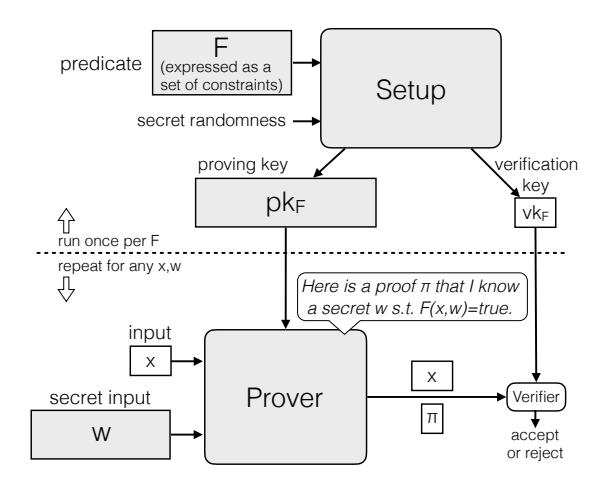
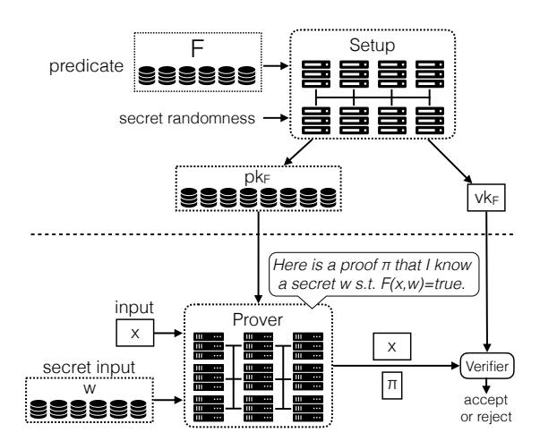
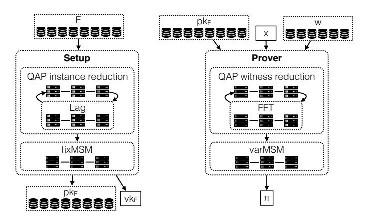
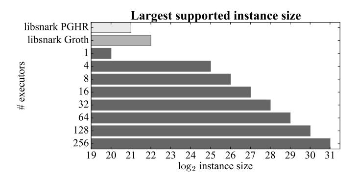
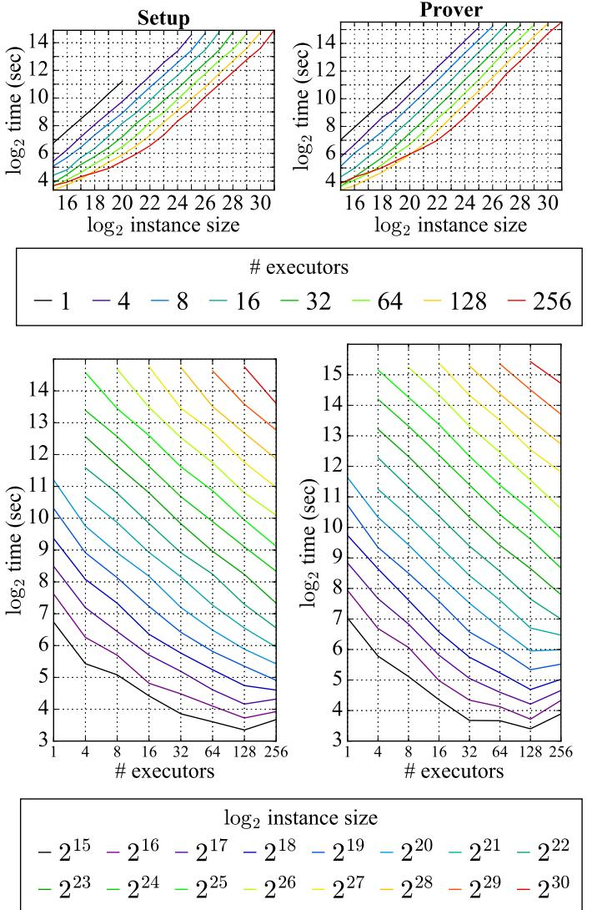
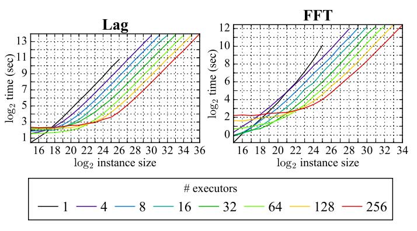
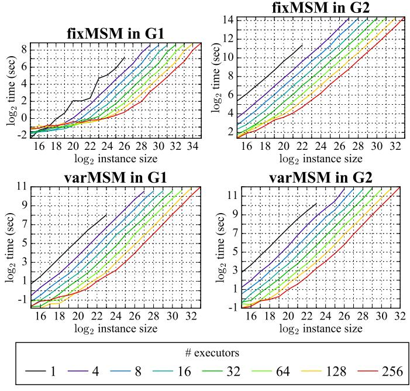

# DIZK: A Distributed Zero Knowledge Proof System\*

Howard Wu

Wenting Zheng

howardwu@berkeley.edu UC Berkeley

wzheng@eecs.berkeley.edu UC Berkeley

Alessandro Chiesa

Raluca Ada Popa

Ion Stoica

alexch@berkeley.edu UC Berkeley

raluca.popa@berkeley.edu UC Berkeley

istoica@berkeley.edu UC Berkeley

#### Abstract

Recently there has been much academic and industrial interest in practical implementations of *zero knowledge proofs*. These techniques allow a party to *prove* to another party that a given statement is true without revealing any additional information. In a Bitcoin-like system, this allows a payer to prove validity of a payment without disclosing the payment's details.

Unfortunately, the existing systems for generating such proofs are very expensive, especially in terms of memory overhead. Worse yet, these systems are "monolithic", so they are limited by the memory resources of a single machine. This severely limits their practical applicability.

We describe DIZK, a system that *distributes* the generation of a zero knowledge proof across machines in a compute cluster. Using a set of new techniques, we show that DIZK scales to computations of up to billions of logical gates (100× larger than prior art) at a cost of 10 µs per gate (100× faster than prior art). We then use DIZK to study various security applications.

Keywords: zero knowledge proofs; cluster computing; SNARKs

\*The authors are grateful to Jiahao Wang for participating in early stages of this work. This work was supported by the Intel/NSF CPS-Security grants #1505773 and #20153754, the UC Berkeley Center for Long-Term Cybersecurity, and gifts to the RISELab from Amazon, Ant Financial, CapitalOne, Ericsson, GE, Google, Huawei, IBM, Intel, Microsoft, and VMware. The authors thank Amazon for donating compute credits to RISELab, which were extensively used in this project.

# Contents

| 1 | Introduction                                                                                                                                                                                                                                                                                                                                             | 3                                            |
|---|----------------------------------------------------------------------------------------------------------------------------------------------------------------------------------------------------------------------------------------------------------------------------------------------------------------------------------------------------------|----------------------------------------------|
| 2 | Background on zkSNARKs 2.1 High-level description 2.2 The zkSNARK language and interface 2.3 The zkSNARK protocol of Groth                                                                                                                                                                                                             | 5 5 6 7                             |
| 3 | Design overview of DIZK                                                                                                                                                                                                                                                                                                                                  | 10                                           |
| 4 | Design: distributing arithmetic 4.1 Distributed fast polynomial arithmetic  4.1.1 Arithmetic via evaluation and interpolation  4.1.2 Distributed FFT  4.1.3 Distributed Lag  4.2 Distributed multi-scalar multiplication  fixMSM 4.2.1 Distributed  varMSM 4.2.2 Distributed  | 11 11 11 11 12 12 13 13 |
| 5 | Design: distributing the zkSNARK setup                                                                                                                                                                                                                                                                                                                   | 13                                           |
| 6 | Design: distributing the zkSNARK prover                                                                                                                                                                                                                                                                                                                  | 15                                           |
| 7 | Applications 7.1 Authenticity of photos  7.2 Integrity of machine learning models                                                                                                                                                                                                                                                         | 16 17 18                               |
| 8 | Implementation                                                                                                                                                                                                                                                                                                                                           | 19                                           |
| 9 | Experimental setup                                                                                                                                                                                                                                                                                                                                       | 20                                           |
|   | 10 Evaluation of the distributed zkSNARK 10.1 Evaluation of the setup and prover  10.2 Evaluation of the components 10.2.1 Field components: Lag and FFT  10.2.2 Group components: fixMSM and varMSM  10.3 Effectiveness of our techniques                                                               | 20 20 21 21 21 21             |
|   | 11 Evaluation of applications                                                                                                                                                                                                                                                                                                                            | 24                                           |
|   | 12 Related work                                                                                                                                                                                                                                                                                                                                          | 24                                           |
|   | 13 Limitations and the road ahead                                                                                                                                                                                                                                                                                                                        | 25                                           |
|   | 14 Conclusion                                                                                                                                                                                                                                                                                                                                            | 25                                           |
|   | References                                                                                                                                                                                                                                                                                                                                               | 26                                           |

# 1 Introduction

Cryptographic proofs with strong privacy and efficiency properties, known as *zkSNARKs* (*zero-knowledge Succinct Non-interactive ARgument of Knowledge*) [\[Mic00,](#page-28-0) [GW11,](#page-27-0) [BCCT12\]](#page-25-1), have recently received much attention from academia and industry [\[BCS16,](#page-25-2) [BBC](#page-25-3)+17, [Gro10,](#page-27-1) [Lip12,](#page-28-1) [BCI](#page-25-4)+13, [GGPR13,](#page-27-2) [PGHR13,](#page-28-2) [BCG](#page-25-5)+13, [BCTV14b,](#page-25-6) [KPP](#page-27-3)+14, [ZPK14,](#page-29-0) [CFH](#page-26-0)+15, [DFKP13,](#page-26-1) [BCG](#page-25-7)+14, [WSR](#page-29-1)+15, [CFH](#page-26-0)+15, [JKS16,](#page-27-4) [KMS](#page-27-5)+16, [NT16,](#page-28-3) [DFKP16,](#page-27-6) [BFR](#page-25-8)+13], and have seen industrial deployments [\[ZCa17,](#page-29-2) [QED17,](#page-28-4) [Chr17,](#page-26-2) [JPM17\]](#page-27-7).

For example, zkSNARKs are the core technology of Zcash [\[ZCa17,](#page-29-2) [BCG](#page-25-7)+14], a popular cryptocurrency that, unlike Bitcoin, preserves a user's payment privacy. Bitcoin requires users to broadcast their private payment details in the clear on the public blockchain, so other participants can check the validity of the payment. In contrast, zkSNARKs enable users to broadcast *encrypted* transactions details and *prove* the validity of the payments without disclosing what the payments are.

More formally, zkSNARKs allow a *prover* (e.g., a Zcash user making a payment) to convince a *verifier* (e.g., any other Zcash user) of a statement of the form "*given a function* F *and input* x*, there is a secret* w *such that* F(x, w) = true". In the cryptocurrency example, w is the private payment details, x is the encryption of the payment details, and F is a predicate that checks that x is an encryption of w and w is a valid payment. These proofs provide two useful properties: *succinctness* and *zero knowledge*. The first property offers extremely small proofs (128 B) and cheap verification (2 ms plus a few µs per byte in x), regardless of how long it takes to evaluate F (even if F takes years to compute). The second property enables privacy preservation, which means that the proof reveals *no* information about the secret w (beyond what is already implied by the statement being proved).

The remarkable power of zkSNARKs comes at a cost: the prover has a significant overhead. zkSNARKs are based on *probabilistically checkable proofs* (PCPs) from Complexity Theory, which remained prohibitively slow for two decades until a line of recent work brought them closer to practical systems (see Section [12](#page-23-1) and Fig. [1\)](#page-4-2). One of the main reasons for the prover's overhead is that the statement to be proved must be represented via a set of logical gates forming a *circuit*, and the prover's cost is quasi-linear in this circuit's size. Unfortunately, this prover cost is not only in time but also in space.

Thus, in existing systems, the zkSNARK prover is a *monolithic* process running on a single machine that quickly exceeds memory bounds as the circuit size increases. State-of-the-art zkSNARK systems [\[SCI17\]](#page-28-5) can only support statements of up to 10-20 million gates, at a cost of more than 1 ms per gate. Let us put this size in perspective via a simple example: the SHA-256 compression function, which maps a 512-bit input to a 256-bit output, has more than 25,000 gates [\[BCG](#page-25-7)+14]; no more than 400 evaluations of this function fit in a circuit of 10 million gates, and such a circuit can be used to hash files of up to a mere 13 kB. In sum, 10 million gates is *not many*.

This bottleneck severely limits the applicability of SNARKs, and motivates a basic question: *can zkSNARKs be used for circuits of much larger sizes, and at what cost?*

DIZK. We design and build DIZK (*DIstributed Zero Knowledge*), a zkSNARK system that far exceeds the scale of previous state-of-the-art solutions. At its core, DIZK distributes the execution of a zkSNARK across a compute cluster, thus enabling it to leverage the aggregated cluster's memory and computation resources. This allows DIZK to support circuits with *billions* of gates (100× larger than prior art) at a cost of 10 µs per gate (100× faster than prior art).

We evaluate DIZK on two applications: proving authenticity of edited photos (as proposed in [\[NT16\]](#page-28-3)), and proving integrity of machine learning models. In both cases, DIZK allows reaching much larger instance sizes. E.g., we ran image editing transformations on photos of 2048 by 2048 pixels.

Overall, DIZK makes a significant and conceptual step forward, enlarging the class of applications

feasible for zkSNARKs. We have implemented DIZK via Apache Spark [\[Apa17\]](#page-25-9), and will release it under a permissive software license.

DIZK does inherit important limitations of zkSNARKs (see Section [13\)](#page-24-0). First, while DIZK supports larger circuits than prior systems, its overhead is still prohibitive for many practical applications; improving the efficiency of zkSNARKs for both small and large circuits remains an important challenge. Also, like other zkSNARKs, DIZK requires a trusted party to run a *setup* procedure that uses secret randomness to sample certain public parameters; the cost of this setup grows with circuit size, which means that this party must also use a cluster, which is harder to protect against attackers than a single machine.

Nevertheless, the recent progress on zkSNARKs has been nothing short of spectacular, which makes us optimistic that future advancements will address these challenges, and bring the power of zkSNARKs to many more practical applications.

Challenges and techniques. Distributing a zkSNARK is challenging. Protocols for zkSNARKs on large circuits involve solving multiple large instances of tasks about polynomial arithmetic over cryptographicallylarge prime fields and about multi-scalar multiplication over elliptic curve groups. For example, generating proofs for billion-gate circuits requires multiplying polynomials of degree that is in the billions, and merely representing these polynomials necessitates terabit-size arrays. Even more, fast algorithms for solving these tasks, such as Fast Fourier Transforms (FFTs), are notoriously memory intensive, and rely on continuously accessing large pools of shared memory in complex patterns. But each node in a compute cluster can store only a small fraction of the overall state, and thus memory is distributed and communication between nodes incurs network delays. In addition, these heavy algorithmic tasks are all intertwined, which is problematic as reshuffling large amounts of data from the output of one task to give as input to the next task is expensive.

We tackle the above challenges in two steps. First, we single out basic computational tasks about field and group arithmetic and achieve efficient distributed realizations of these. Specifically, for finite fields, DIZK provides distributed FFTs and distributed Lagrange interpolant evaluation (Section [4.1.1\)](#page-10-2); for finite groups, it provides distributed multi-scalar multiplication with fixed bases and with variable bases (Section [4.2\)](#page-11-1). Throughout, we improve efficiency by leveraging characteristics of the zkSNARK setting instead of implementing agnostic solutions.

Second, we build on these components to achieve a distributed zkSNARK. Merely assembling these components into a zkSNARK as in prior monolithic systems, however, does *not* yield good efficiency. zkSNARKs transform the computation of a circuit into an equivalent representation called a *Quadratic Arithmetic Program* [\[GGPR13,](#page-27-2) [PGHR13\]](#page-28-2): a circuit with N wires and M gates is transformed into a satisfaction problem about O(N) polynomials of degree O(M). The evaluations of these polynomials yield matrices of size O(N) × O(M) that are sparse, with only O(N + M) non-zero entries. While this sparsity gives rise to straightforward serial algorithms, the corresponding distributed computations suffer from consistent stragglers that incur large overheads.

The reason lies in how the foregoing transformation is used in a zkSNARK. Different parts of a zkSNARK leverage the sparsity of the matrices above in different ways: the so-called *QAP instance reduction* relies on their column sparsity (Section [5\)](#page-12-2), while the corresponding *QAP witness reduction* relies on their row sparsity (Section [6\)](#page-14-0). However, it turns out that the columns and rows are *almost* sparse: while most columns and rows are sparse, some are dense, and the dense ones create stragglers.

We address this issue via a two-part solution. First, we run a lightweight distributed computation that quickly identifies and annotates the circuit with information about which columns/rows are dense. Second, we run a hybrid distributed computation that uses different approaches to process the sparse and dense columns/rows. Overall we achieve efficient distributed realizations for these QAP routines. This approach outperforms merely invoking generic approaches that correct for load imbalances such as skewjoin [\[ske17\]](#page-28-6).

Finally, we emphasize that most of the technical work described above can be *re-used* as the starting point to distribute many other similar proof systems (see Fig. [1\)](#page-4-2). We have thus packaged these standalone components as a separate library, which we deem of independent interest.

We also briefly mention that supporting billion-gate circuits required us to generate and use a pairingfriendly elliptic curve suitable for this task. See Section [9](#page-19-0) for details.

Authenticity of photos & integrity of ML models. We study the use of DIZK for two natural applications: (1) authenticity of edited photos [\[NT16\]](#page-28-3) (see Section [7.1\)](#page-16-0); and (2) integrity of machine learning models (see Section [7.2\)](#page-17-0). Our experiments show that DIZK enables such applications to scale to much larger instance sizes than what is possible via previous (monolithic) systems.

An application uses DIZK by constructing a circuit for the desired computation, and by computing values for the circuit's wires from the application inputs. We do this, for the above applications, via distributed algorithms that exploit the parallel nature of computations underlying editing photos and ML training algorithms. Circuit gates, and their evaluations, are jointly computed by machines in the compute cluster.

Cryptography at scale? DIZK exemplifies a new paradigm. Cryptographic tools are often executed as monolithic procedures, which hampers their applicability to large problem sizes. We believe that explicitly designing such tools with distributed architectures like compute clusters in mind will help create a toolkit for "cryptography at scale", and we view DIZK as a step in this direction for the case of zkSNARKs.

|                 |                  |                           | Does it benefit from distributed |               |            |            |
|-----------------|------------------|---------------------------|----------------------------------|---------------|------------|------------|
| Type of         | Theory           | Built                     | FFT?                             | variable-base | fixed-base | QAP        |
| proof system    | foundations      | systems                   |                                  | MSM?          | MSM?       | reduction? |
| batch arguments |                  | [SBW11, SMBW12, SVP+12]   | ✓                                | ✓             | ✓          | ✓          |
| based on LPCPs  | [IKO07]          | [SBV+13, VSBW13, BFR+13]  |                                  |               |            |            |
| SNARKs          |                  | [BBC+17, BBHR18]          | ✓                                |               |            |            |
| based on PCPs   | [Mic00, BCS16]   |                           |                                  |               |            |            |
| SNARKs          | [Gro10, Lip12]   | [PGHR13, BCG+13, BCTV14b] | ✓                                | ✓             | ✓          | ✓          |
| based on LPCPs  | [BCI+13, GGPR13] | [KPP+14, ZPK14, CFH+15]   |                                  |               |            |            |

Figure 1: Some proof systems that can benefit from the library of distributed subroutines that we develop.

# 2 Background on zkSNARKs

The notion of a zkSNARK, formulated in [\[Mic00,](#page-28-0) [GW11,](#page-27-0) [BCCT12\]](#page-25-1), has several definitions. The one that we consider here is known as *publicly-verifiable preprocessing zkSNARK* (see [\[BCI](#page-25-4)+13, [GGPR13\]](#page-27-2)).

We cover necessary background on zkSNARKs: we provide a high-level description (Section [2.1\)](#page-4-1), an informal definition (Section [2.2\)](#page-5-0), and the protocol that forms our starting point (Section [2.3\)](#page-6-0).

### 2.1 High-level description

A zkSNARK can be used to prove/verify statements of the form "*given a public predicate* F *and a public input* x*, I know a secret input* w *such that* F(x, w) = true". It consists of three algorithms: the *setup*, *prover*, and *verifier*. (See Fig. [2.](#page-5-1))

• The setup receives a predicate F (expressed in a certain way as discussed in Section [2.2\)](#page-5-0) and outputs a proving key pkF and verification key vkF . Both keys are published as public parameters and pkF /vkF can be used to prove/verify any number of statements about F (involving different inputs). In particular, the setup for F needs to be run only once.

statements about large computations. Prior systems run these as monolithic procedures on a single machine.

Figure 2: Components of a zkSNARK. Shaded components Figure 3: A distributed zkSNARK. The setup algorithm is are those that we distribute so to support proving/verifying run on a compute cluster, and generates a long proving key pk, held in distributed storage, and a short verification key vk. The prover algorithm is also run on a compute cluster.

While the setup outputs keys that are public information, its intermediate computation steps involve secret values that must remain secret. This means that the setup must be run by a trusted party — this is, of course, a challenging requirement, and prior work has studied mitigations (see Section 13).

- The prover receives the proving key pkF, a public input x for F, and a secret input w for F, and outputs a proof  $\pi$ . The proof attests to the statement "given F and x, I know a secret w such that F(x, w) = true", but reveals no information about w (beyond what is implied by the statement). The generation of  $\pi$  involves randomness that imbues it with zero knowledge. Anyone can run the prover.
- The verifier receives the verification key  $vk_F$ , a public input x for F, and a proof  $\pi$ , and outputs a decision bit ("accept" or "reject"). Anyone can run the verifier.

A zkSNARK's costs are determined by the "execution time"  $T_F$  of F (see Section 2.2) and the size k of the input x (which is at most  $T_F$ ). The execution time is at least the size of the input and, in many applications, much larger than it. Thus we think of  $T_F$  as very big and k as much smaller than  $T_F$ .

The key efficiency feature of a zkSNARK is that the verifier running time is proportional to k alone (regardless of  $T_F$ ) and the proof has constant size (regardless of  $k, T_F$ ). The size of  $vk_F$  is proportional to k (regardless of  $T_F$ ).

However, the setup and the prover are very expensive: their running times are (at least) proportional to  $T_F$ . The size of  $pk_F$  is large, because it is proportional to  $T_F$ .

Running the setup and prover is a severe bottleneck in prior zkSNARK systems since time and space usage grows in  $T_F$ . Our focus is to overcome these bottlenecks.

#### 2.2 The zkSNARK language and interface

While typically one expresses a computation F via a high-level programming language, a zkSNARK requires expressing F via a set of quadratic constraints  $\phi_F$ , which is closely related to circuits of logical gates. A zkSNARK proof then attests that such a set of constraints is *satisfiable*. The size of  $\phi_F$  is related to the execution time of F. There has been much research [\[PGHR13,](#page-28-2) [BCG](#page-25-5)+13, [BCTV14b,](#page-25-6) [BFR](#page-25-8)+13, [KPP](#page-27-3)+14, [ZPK14,](#page-29-0) [CFH](#page-26-0)+15, [WSR](#page-29-1)+15, [BCTV14a,](#page-25-11) [ZGK](#page-29-5)+17, [ZGK](#page-29-6)+18, [KPS18\]](#page-27-9) devoted to techniques for encoding programs via sets of constraints, but this is not our focus; in this paper, we consider φF as *given*.

The zkSNARK language. We describe the type of computation used in the interface of a zkSNARK. Rather than being boolean, values are in a field F of a large prime order p.

An R1CS instance φ over F is parameterized by the number of inputs k, number of variables N (with k ≤ N), and number of constraints M; φ is a tuple (k, N, M, a, b, c) where a, b, c are (1 + N) × M matrices over F.

An *input* for φ is a vector x in F k , and a *witness* for φ is a vector w in F N−k . An input-witness pair (x, w) *satisfies* φ if, letting z be the vector F 1+N that equals the concatenation of 1, x, and w, the following holds for all j ∈ [M]:

$$\left(\sum_{i=0}^{N} \mathbf{a}_{i,j} z_i\right) \cdot \left(\sum_{i=0}^{N} \mathbf{b}_{i,j} z_i\right) = \sum_{i=0}^{N} \mathbf{c}_{i,j} z_i.$$

One can think of each quadratic constraint above as representing a logical gate. Indeed, boolean (and arithmetic) circuits are easily reducible to this form. We can thus view a, b, c as containing the "left", "right", and "output" coefficients respectively; rows index variables and columns index constraints.

The zkSNARK interface. A zkSNARK consists of three algorithms: *setup* S, *prover* P, and *verifier* V.

- *Setup.* On input a R1CS instance φ = (k, N, M, a, b, c), S outputs a proving key pk and verification key vk.
- *Prover.* On input a proving key pk (generated for an R1CS instance φ), input x in F k , and witness w in F N−k , P outputs a proof π attesting that φ(x, ·) is satisfiable.
- *Verifier.* On input a verification key vk (also generated for φ), input x in F k , and proof π, V outputs a decision bit.

The zkSNARK properties. The key properties of a zkSNARK are the following. Let φ be any R1CS instance, and let (pk, vk) be a key pair generated by S on input φ. (The statements below hold for a random choice of such keys.)

- *Completeness.* For every input-witness pair (x, w) that satisfies φ, any proof sampled as π ← P(pk, x, w) is such that V(vk, x, π) = 1.
- *Soundness.* For every input x such that φ(x, ·) is not satisfiable, no efficient malicious prover can produce a proof π such that V(vk, x, π) = 1.
- *Zero knowledge.* For every input-witness pair (x, w) that satisfies φ, a proof sampled as π ← P(pk, x, w) reveals no information about the witness w (beyond the fact that the statement being proved is true).
- *Succinctness.* The proof π has size O(1) and the running time of V is O(k). (Both expressions hide a polynomial dependence on the security parameter.)

### 2.3 The zkSNARK protocol of Groth

Our system provides a distributed implementation of a zkSNARK protocol due to Groth [\[Gro16\]](#page-27-10). We selected Groth's protocol because it is one of the most efficient zkSNARK protocols. That said, our techniques are easily adapted to similar zkSNARK protocols [\[GGPR13,](#page-27-2) [BCI](#page-25-4)+13, [PGHR13,](#page-28-2) [DFGK14,](#page-26-3) [GM17\]](#page-27-11). In order to facilitate later discussions, we now describe Groth's protocol, limiting our description to outlining the steps in its setup, prover, and verifier. We refer the reader to [\[Gro16\]](#page-27-10) for more details, including for the cryptographic assumptions that underlie security (briefly, the protocol is proved secure in the so-called generic group model). For reference, we include the full protocol in Fig. [4](#page-8-0) using the notation introduced in this section.

QAPs. Groth's zkSNARK protocol uses *Quadratic Arithmetic Programs* (QAPs) [\[GGPR13,](#page-27-2) [PGHR13\]](#page-28-2) to efficiently express the satisfiability of R1CS instances via certain low-degree polynomials. Essentially, the

M constraints are "bundled" into a single equation that involves univariate polynomials of degree O(M). The prover's goal is then to convince the verifier that this equation holds. In fact, it suffices for the verifier to know that this equation holds at a random point because distinct polynomials of small degree (relative to the field size) can only agree on a small number of points.

In more detail, we now define what is a QAP instance, and what does satisfying such an instance mean. A QAP instance  $\Phi$  over  $\mathbb{F}$  has three parameters, the number of inputs k, number of variables N (with  $k \leq N$ ), and degree M;  $\Phi$  is a tuple  $(k, N, M, \mathbf{A}, \mathbf{B}, \mathbf{C}, D)$  where  $\mathbf{A}, \mathbf{B}, \mathbf{C}$  are each a vector of 1 + N polynomials over  $\mathbb{F}$  of degree M, and D is a subset of  $\mathbb{F}$  of size M.

An *input* for  $\Phi$  is a vector x in  $\mathbb{F}^k$ , and a *witness* for  $\Phi$  is a pair (w,h) where w is a vector in  $\mathbb{F}^{N-k}$  and h is a vector in  $\mathbb{F}^{M-1}$ . An input-witness pair (x,(w,h)) satisfies  $\Phi$  if, letting  $z\in\mathbb{F}^{1+N}$  be the concatenation of 1,x, and w:

$$\begin{split} \left(\sum_{i=0}^{N} \mathbf{A}_{i}(X)z_{i}\right) \cdot \left(\sum_{i=0}^{N} \mathbf{B}_{i}(X)z_{i}\right) \\ &= \sum_{i=0}^{N} \mathbf{C}_{i}(X)z_{i} + \left(\sum_{i=0}^{M-2} h_{i}X^{i}\right) \cdot Z_{D}(X) , \end{split}$$

where  $Z_D(X) := \prod_{\alpha \in D} (X - \alpha)$ .

One can efficiently reduce R1CS instances to QAP instances [GGPR13, PGHR13]: there is a *QAP instance reduction* qapl and a *QAP witness reduction* qapW. Our system provides distributed implementations of both, so we now describe how they work.

QAP instance reduction. For every R1CS instance  $\phi = (k, N, M, \mathbf{a}, \mathbf{b}, \mathbf{c})$ ,  $\mathsf{qapl}(\phi)$  outputs a QAP instance  $\Phi = (k, N, M, \mathbf{A}, \mathbf{B}, \mathbf{C}, D)$  that preserves satisfiability: for every input x in  $\mathbb{F}^k$ ,  $\phi(x, \cdot)$  is satisfiable iff  $\Phi(x, \cdot)$  is satisfiable. It works as follows: let D be a subset of  $\mathbb{F}$  of size M and then, for each  $i \in \{0, 1, \ldots, N\}$ , let  $\mathbf{A}_i$  be the polynomial of degree < M that interpolates over D the i-th row of the matrix  $\mathbf{a}$ ; similarly for each  $\mathbf{B}_i$  and  $\mathbf{C}_i$  with regard to rows of  $\mathbf{b}$  and  $\mathbf{c}$ .

QAP witness reduction. For every witness w in  $\mathbb{F}^{N-k}$  s.t. (x,w) satisfies  $\phi$ ,  $\operatorname{qapW}(\phi,x,w)$  outputs h in  $\mathbb{F}^{M-1}$  s.t. (x,(w,h)) satisfies  $\Phi$ . It works as follows: let h be the coefficients of the polynomial H(X) of degree less than M-1 that equals the quotient of  $(\sum_{i=0}^{N}\mathbf{A}_{i}(X)z_{i})\cdot(\sum_{i=0}^{N}\mathbf{B}_{i}(X)z_{i})-\sum_{i=0}^{N}\mathbf{C}_{i}(X)z_{i}$  and  $Z_{D}(X)$ .

**Bilinear encodings.** Groth's protocol uses *bilinear encodings*, which enable hiding secrets while still allowing for anyone to homomorphically evaluate linear functions as well as zero-test quadratic functions. These rely on *bilinear groups*.

We denote by  $\mathbb{G}$  a group, and consider only groups that have a prime order p, which are generated by an element  $\mathcal{G}$ . We use additive notation for group arithmetic:  $\mathcal{P} + \mathcal{Q}$  denotes addition of the two elements  $\mathcal{P}$  and  $\mathcal{Q}$ . Thus,  $s \cdot \mathcal{P}$  denotes scalar multiplication of  $\mathcal{P}$  by the scalar  $s \in \mathbb{Z}$ . Since  $p \cdot \mathcal{P}$  equals the identity element, we can equivalently think of a scalar s as in the field  $\mathbb{F}$  of size p. The *encoding* (relative to  $\mathcal{G}$ ) of a scalar  $s \in \mathbb{F}$  is  $[s] := s \cdot \mathcal{G}$ ; similarly, the encoding of a vector of scalars  $s \in \mathbb{F}^n$  is  $[s] := (s_1 \cdot \mathcal{G}, \ldots, s_n \cdot \mathcal{G})$ . The encoding of a scalar can be efficiently computed via the double-and-add algorithm; yet (for suitable choices of  $\mathbb{G}$ ) its inverse is conjecturally hard to compute, which means that [s] hides (some) information about s. Encodings are also linearly homomorphic:  $[\alpha s + \beta t] = \alpha[s] + \beta[t]$  for all  $\alpha, \beta, s, t \in \mathbb{F}$ .

Bilinear encodings involve *three* groups of order  $p: \mathbb{G}_1, \mathbb{G}_2, \mathbb{G}_3$  generated by  $\mathcal{G}_1, \mathcal{G}_2, \mathcal{G}_3$  respectively. The encoding of a scalar  $s \in \mathbb{F}$  in  $\mathbb{G}_i$  is  $[s]_i := s \cdot \mathcal{G}_i$ . Moreover, there is also an efficiently computable map  $e: \mathbb{G}_1 \times \mathbb{G}_2 \to \mathbb{G}_3$ , called *pairing*, that is bilinear: for every nonzero  $\alpha, \beta \in \mathbb{F}$ , it holds that  $e([\alpha]_1, [\beta]_2) = \alpha\beta \cdot e(\mathcal{G}_1, \mathcal{G}_2)$ . (Also, e is non-degenerate in the sense that  $e([1]_1, [1]_2) \neq [0]_3$ .) Pairings allow zero-testing quadratic polynomials evaluated on encodings. For example, given  $[s]_1, [t]_2, [u]_1$ , one can test if st + u = 0 by testing if  $e([s]_1, [t]_2) + e([u]_1, [1]_2) = [0]_3$ .

**Setup.** The setup  $\mathcal{S}$  receives an R1CS instance  $\phi = (k, N, M, \mathbf{a}, \mathbf{b}, \mathbf{c})$  and then samples a proving key pk and a verification key vk as follows. First,  $\mathcal{S}$  reduces the R1CS instance  $\phi$  to a QAP instance  $\Phi = (k, N, M, \mathbf{A}, \mathbf{B}, \mathbf{C}, D)$  by running the algorithm qapl. Then,  $\mathcal{S}$  samples random elements  $t, \alpha, \beta, \gamma, \delta$  in  $\mathbb{F}$  (this is the randomness that must remain secret). After that,  $\mathcal{S}$  evaluates the polynomials in  $\mathbf{A}, \mathbf{B}, \mathbf{C}$  at the element t, and computes

$$\begin{split} \mathbf{K}^{\mathsf{vk}}(t) &:= \left(\frac{\beta \mathbf{A}_i(t) + \alpha \mathbf{B}_i(t) + \mathbf{C}_i(t)}{\gamma}\right)_{i=0,\dots,k} \\ \mathbf{K}^{\mathsf{pk}}(t) &:= \left(\frac{\beta \mathbf{A}_i(t) + \alpha \mathbf{B}_i(t) + \mathbf{C}_i(t)}{\delta}\right)_{i=k+1,\dots,N} \end{split}$$

and

$$\mathbf{Z}(t) := \left(\frac{t^j Z_D(t)}{\delta}\right)_{j=0,\dots,M-2}$$

Finally, the setup algorithm computes encodings of these elements and outputs pk and vk defined as follows:

$$\begin{split} \operatorname{pk} &:= \left( [\alpha]_1, \, [\beta]_1, [\delta]_1 \\ [\beta]_2, [\delta]_2, [\mathbf{A}(t)]_1, \, [\mathbf{B}(t)]_1 \\ [\mathbf{B}(t)]_2, \, [\mathbf{Z}(t)]_1 \\ \end{aligned} \right) \\ \operatorname{vk} &:= (e\left(\alpha,\beta\right), [\gamma]_2, [\delta]_2, [\mathbf{K}^{\operatorname{vk}}(t)]_1) \ . \end{split}$$

**Prover.** The prover  $\mathcal{P}$  receives a proving key pk, input x in  $\mathbb{F}^k$ , and witness w in  $\mathbb{F}^{N-k}$ , and then samples a proof  $\pi$  as follows. First,  $\mathcal{P}$  extends the x-witness w for the R1CS instance  $\phi$  to a x-witness (w,h) for the QAP instance  $\Phi$  by running the algorithm qapW. Then,

 $\mathcal P$  samples random elements r,s in  $\mathbb F$  (this is the randomness that imbues the proof with zero knowledge). Next, letting  $z:=1\|x\|w$ ,  $\mathcal P$  computes three encodings obtained as follows

$$[A_r]_1 := [\alpha]_1 + \sum_{i=0}^N z_i [\mathbf{A}_i(t)]_1 + r[\delta]_1 ,$$
  

$$[B_s]_1 := [\beta]_1 + \sum_{i=0}^N z_i [\mathbf{B}_i(t)]_1 + s[\delta]_1 ,$$
  

$$[B_s]_2 := [\beta]_2 + \sum_{i=0}^N z_i [\mathbf{B}_i(t)]_2 + s[\delta]_2 .$$

Then  $\mathcal{P}$  uses these two compute a fourth encoding:

$$\begin{split} [K_{r,s}]_1 := s[A_r]_1 + r[B_s]_1 - rs[\delta]_1 \\ + \sum_{i=k+1}^N z_i [\mathbf{K}_i^{\mathsf{pk}}(t)]_1 + \sum_{j=0}^{M-2} h_j [\mathbf{Z}_j(t)]_1 \enspace . \end{split}$$

The output proof is  $\pi := ([A_r]_1, [B_s]_2, [K_{r,s}]_1)$ .

**Verifier.** The verifier  $\mathcal{V}$  receives a verification key vk, input x in  $\mathbb{F}^k$ , and proof  $\pi$ , and, letting  $x_0 := 1$ , checks that the following holds:

$$\begin{split} e\left([A_r]_1, [B_s]_2\right) &= e\left(\alpha, \beta\right) \\ &+ e\left(\sum_{i=0}^k x_i [\mathbf{K}_i^{\mathsf{vk}}(t)]_1, [\gamma]_2\right) + e\left([K_{r,s}]_1, [\delta]_2\right) \ . \end{split}$$

Figure 4: The zkSNARK setup, prover, and verifier of Groth [Gro16] (using notation from Section 2.3).

# 3 Design overview of DIZK

Fig. [3](#page-5-2) shows the outline of DIZK's design. The setup and the prover in DIZK are modified from monolithic procedures to distributed jobs on a cluster; F, pkF , and w are stored as data structures distributed across multiple machines instead of on a single machine. The verifier remains unchanged from the vanilla protocol as it is inexpensive, enabling DIZK's proofs to be verified by existing implementations of the verifier. The underlying zkSNARK protocol that we implement is due to Groth [\[Gro16\]](#page-27-10), and is described in Section [2.3.](#page-6-0)

Spark. We implemented DIZK using Apache Spark [\[Apa17\]](#page-25-9), a popular framework for cluster computing. The design principles behind DIZK can be applied to other frameworks [\[DG04,](#page-27-12) [Had17,](#page-27-13) [IBY](#page-27-14)+07].

Spark consists of two components: the driver and executors. Applications are created by the driver and consist of jobs broken down into stages that dictate a set of tasks. An executor is a unit of computation. Large data is represented via *Resilient Distributed Datasets* (RDDs).

System interface. The interface of DIZK matches the interface of a zkSNARK for proving/verifying satisfiability of R1CS instances (see Section [2.2\)](#page-5-0) except that large objects are represented via RDDs.

- The setup receives an R1CS instance φ = (k, N, M, a, b, c) and outputs corresponding keys pk and vk. As instance size grows (i.e., as the number of variables N and of constraints M grow), φ and pk grow in size (linearly in N and M), so both are represented as RDDs.
- The prover receives the proving key pk, input x in F k , and witness w in F N−k . The prover outputs a proof π of constant size (128 B). The input size k is typically small while the witness size N − k is typically large, so we represent the input as a simple array and the witness as an RDD.

When using DIZK in an application, the application setup needs to provide φ to the DIZK setup, and the application prover needs to provide x and w to the DIZK prover. Since these items are big, they may also need to be generated in a distributed way; we do so for our applications in Section [7.](#page-15-0)

High-level approach. The setup and prover in serial implementations of zkSNARKs run monolithic space-intensive computations that quickly exceed memory bounds. Our approach for an efficient distributed implementation is as follows.

First, we identify the heavy computational tasks that underlie the setup and prover. In Groth's protocol (Fig. [4\)](#page-8-0) these fall in three categories: (1) arithmetic (multiplication and division) for polynomials of large degree over large prime fields; (2) multi-scalar multiplication over large prime groups; (3) the QAP instance and witness reductions described in Section [2.3.](#page-6-0) Such computations underlie other proof systems (see Fig. [1\)](#page-4-2).

Second, we design distributed implementations of these components. While there are simple strawman designs that follow naive serial algorithms, these are too expensive (e.g., run in quadratic time); on the other hand, non-naive serial algorithms gain efficiency by leveraging large pools of memory. We explain how to distribute these memory-intensive algorithms.

Finally, we assemble the aforementioned distributed components into a distributed setup and prover. This assembly poses additional challenges because the data workflow from one component to the next involves several large-scale re-shuffles that need to be tackled with tailored data structures.

Fig. [5](#page-10-4) presents a diagram of the main parts of the design, and we describe them in the following sections: Section [4](#page-10-0) discusses how to distribute polynomial arithmetic and multi-scalar multiplication; Section [5](#page-12-2) discusses how to distribute the QAP instance reduction, and how to obtain the distributed setup from it; Section [6](#page-14-0) discusses how to distribute the QAP witness reduction, and how to obtain the distributed prover from it.

Figure 5: Distributed setup and prover (and sub-components).

# 4 Design: distributing arithmetic

We describe the computational tasks involving finite field and finite group arithmetic that arise in the zkSNARK, and how we distribute these tasks. These form subroutines of the distributed setup and prover computations (see Sections 5 and 6).

### 4.1 Distributed fast polynomial arithmetic

The reduction from an R1CS instance  $\phi = (k, N, M, \mathbf{a}, \mathbf{b}, \mathbf{c})$  to a QAP instance  $\Phi = (k, N, M, \mathbf{A}, \mathbf{B}, \mathbf{C}, D)$  (in the setup) and its witness reduction (in the prover) involves arithmetic on  $\Theta(N)$  polynomials of degree  $\Theta(M)$ ; see Section 2.3. (Recall that N is the number of variables and M is the number of constraints.) We distribute the necessary polynomial arithmetic, allowing us to scale to N and M that are in the billions.

#### 4.1.1 Arithmetic via evaluation and interpolation

Fast polynomial arithmetic is well-known to rely on fast algorithms for two fundamental tasks: polynomial *evaluation* and *interpolation*. In light of this, our approach is the following: (i) we achieve distributed fast implementations of evaluation and interpolation, and (ii) use these to achieve distributed fast polynomial arithmetic such as multiplication and division.

Recall that (multi-point) polynomial evaluation is the following problem: given a polynomial  $P(X) = \sum_{j=0}^{n-1} c_j X^j$  over  $\mathbb{F}$  and elements  $u_1, \ldots, u_n$  in  $\mathbb{F}$ , compute the elements  $P(u_1), \ldots, P(u_n)$ . One can do this by simply evaluating P at each point, costing  $\Theta(n^2)$  field operations overall.

Conversely, polynomial interpolation is the following problem: given elements  $u_1, v_1, \ldots, u_n, v_n$  in  $\mathbb{F}$ , compute the polynomial  $P(X) = \sum_{j=0}^{n-1} c_j X^j$  over  $\mathbb{F}$  such that  $v_i = P(u_i)$  for every  $i \in \{1, \ldots, n\}$ . One can do this by using  $u_1, \ldots, u_n$  to compute the Lagrange interpolants  $L_1(X), \ldots, L_n(X)$ , which costs  $\Theta(n^2 \log n)$  field operations [vG13], and then output  $\sum_{j=1}^n v_j L_j(X)$ , which costs another  $\Theta(n^2)$ .

Both are straightforward to distribute, but they are too expensive due to the quadratic growth in n.

#### **4.1.2 Distributed FFT**

Fast Fourier Transforms (FFTs) [vG13] provide much faster solutions, which run in time  $\tilde{O}(n)$ .

For instance, the Cooley–Tukey algorithm [CT65] solves *both* problems with  $O(n \log n)$  field operations, provided that  $\mathbb F$  has suitable algebraic structure (in our setting it does). The algorithm requires storing an array of n field elements in working memory, and performing  $O(\log n)$  "passes" on this array, each costing O(n). The structure of this algorithm can be viewed as a *butterfly network* since each pass requires shuffling the array according to certain memory patterns.

While the Cooley–Tukey algorithm implies a fast parallel algorithm, its communication structure is not suitable for compute clusters. Informally, at each layer of the butterfly network, half of the executors are left idle and the other half have their memory consumption doubled; moreover, each such layer requires a shuffle involving the entire array.

We take a different approach, suggested by Sze [Sze11], who studies the problem of computing the product of terabit-size integers on compute clusters, via MapReduce. Sze's approach uses only a *single* shuffle. Roughly, an FFT computation with input size n is reduced to *two* batches of  $\sqrt{n}$  FFT computations, each on input size  $\sqrt{n}$ . The first batch is computed by the mappers; after the shuffle, the second batch is computed by the reducers. We use the same approach, and achieve a distributed FFT for finite fields.

### **4.1.3 Distributed** Lag

An additional task that arises (in the setup, see Section 5) is a problem related to polynomial evaluation that we call Lag (from "Lagrange"): given a domain  $\{u_1, \ldots, u_n\} \subseteq \mathbb{F}$  and an element  $t \in \mathbb{F}$ , compute the evaluation at t of all Lagrange interpolants  $L_1(X), \ldots, L_n(X)$  for the domain.

A common approach to do so is via the *barycentric Lagrange formula* [BT04]: compute the barycentric weights  $r_1, \ldots, r_n$  as  $r_i := 1/\prod_{j \neq i} (u_i - u_j)$ , and then compute  $L_1(t), \ldots, L_n(t)$  as  $L_i(t) := \frac{r_i}{t - u_i} \cdot L(t)$  where  $L(X) := \prod_{j=1}^n (X - u_j)$ .

When the domain is a multiplicative subgroup of the field generated by some  $\omega \in \mathbb{F}$  (in our setting it is), this approach results in an expression,  $L_i(X) = \frac{\omega^i/n}{X-\omega^i} \cdot (X^n-1)$ , that is cheap to evaluate. This suggests a simple but effective distributed strategy: each executor in the cluster receives the value  $t \in \mathbb{F}$  and a chunk of the index space i, and uses the inexpensive formula to evaluate  $L_i(t)$  for each index in that space.

### 4.2 Distributed multi-scalar multiplication

In addition to the expensive finite field arithmetic discussed above, the setup and prover also perform expensive group arithmetic, which we must efficiently distribute.

After obtaining the evaluations of  $\Theta(N+M)$  polynomials, the setup encodes these values in the groups  $\mathbb{G}_1$  and  $\mathbb{G}_2$ , performing the encoding operations  $s \to [s]_1$  and  $s \to [s]_2$  for  $\Theta(N+M)$  values of s. In contrast, the prover computes linear combinations of  $\Theta(N+M)$  encodings. (See Fig. 4.) Again, we seek to scale to N and M that are in the billions.

These operations can be summarized as two basic computational problems within a group  $\mathbb{G}$  of a prime order p (where scalars come from the field  $\mathbb{F}$  of size p).

- Fixed-base multi-scalar multiplication (fixMSM). Given a vector of scalars s in  $\mathbb{F}^n$  and element  $\mathcal{P}$  in  $\mathbb{G}$ , compute the vector of elements  $\mathbf{s} \cdot \mathcal{P}$  in  $\mathbb{G}^n$ .
- Variable-base multi-scalar multiplication (varMSM). Given a vector of scalars  $\mathbf{s}$  in  $\mathbb{F}^n$  and a vector of elements  $(\mathcal{P}_i)_{i=1}^n$  in  $\mathbb{G}^n$ , compute the element  $\sum_{i=1}^n \mathbf{s}_i \cdot \mathcal{P}_i$  in  $\mathbb{G}$ .

For small n, both problems have simple solutions: for fixMSM, compute each element  $\mathbf{s}_i \cdot \mathcal{P}$  and output it; for varMSM, compute each element  $\mathbf{s}_i \cdot \mathcal{P}_i$  and output the sum of all these elements.

In our setting, these solutions are expensive not only because n is huge, but also because the scalars are (essentially) random in  $\mathbb{F}$ , whose cryptographically-large prime size p has  $k \approx 256$  bits. This means that the (average) number of group operations in these simple solutions is  $\approx 1.5kn$ , a prohibitive cost.

Both problems can be solved via algorithms that, while being much faster, make an intensive use of memory. We next discuss our approach to efficiently distribute these.

#### **4.2.1 Distributed** fixMSM

Efficient algorithms for fixMSM use time-space tradeoffs [BGMW93]. Essentially, one first computes a certain look-up table of multiples of  $\mathcal{P}$ , and then uses it to compute each  $\mathbf{s}_i \cdot \mathcal{P}$ . As a simple example, via  $\log |\mathbb{F}|$  group operations, one can compute the table  $(\mathcal{P}, 2 \cdot \mathcal{P}, 4 \cdot \mathcal{P}, \dots, 2^{\log |\mathbb{F}|} \cdot \mathcal{P})$ , and then compute each  $\mathbf{s}_i \cdot \mathcal{P}$  with only  $\log |\mathbb{F}|/2$  group operations (on average). More generally one can increase the "density" of the look-up table and further reduce the time to compute each  $\mathbf{s}_i \cdot \mathcal{P}$ . As n increases, it is better for the look-up table to also grow, but larger tables require more memory to store them.

A natural approach to distribute this workload across a cluster is to evenly divide the n scalars among the set of executors, have each executor build its own in-memory look-up table and perform all assigned scalar multiplications aided by that table, and then assemble the output from all executors.

This approach does not fit Spark well, because each executor receives many "partitions" and these cannot hold shared references to local results previously computed by the executor.

Instead, we let a single executor (the driver) build the look-up table and *broadcast* it to all other executors. Each executor receives this table and a share of the scalars, and computes all its assigned scalar multiplications.

#### **4.2.2 Distributed** varMSM

An efficient algorithm for varMSM is Pippenger's algorithm [Pip76], which is within 1 + o(1) of optimal for nearly all scalar vectors [Pip80]. In the setting of serial zkSNARKs this algorithm outperforms, by 20-30%, the popular Bos–Coster algorithm [de 94, §4]. (Other well-known algorithms like Straus' algorithm [Str64] and the Chang–Lou algorithm [CL03] are not as fast on large instances; see [BDL012].)

Given scalars  $s_1, \ldots, s_n$  and their bases  $\mathcal{P}_1, \cdots, \mathcal{P}_n$ , Pippenger's algorithm chooses a radix  $2^c$ , computes  $\lfloor s_1/2^c \rfloor \mathcal{P}_1 + \cdots + \lfloor s_n/2^c \rfloor \mathcal{P}_n$ , doubles it c times, and sums it to  $(s_1 \bmod 2^c)\mathcal{P}_1 + \cdots + (s_n \bmod 2^c)\mathcal{P}_n$ . To perform the last step efficiently, the algorithm sorts the base elements into  $2^c$  buckets according to  $(s_1 \bmod 2^c), \ldots, (s_n \bmod 2^c)$  (discarding bucket 0), sums the base elements in the remaining buckets to obtain intermediate sums  $\mathcal{Q}_1, \ldots, \mathcal{Q}_{2^c-1}$ , and computes  $\mathcal{Q}_1 + 2\mathcal{Q}_2 + \cdots + (2^c-1)\mathcal{Q}_{2^c-1} = (s_1 \bmod 2^c)\mathcal{P}_1 + \cdots + (s_n \bmod 2^c)\mathcal{P}_n$ . For a suitable choice of  $2^c$ , this last step saves computation because each bucket contains the sum of several input bases.

A natural approach to distribute Pippenger's algorithm is to set the number of partitions to  $2^c$  and use a custom partitioner that takes in a scalar  $s_i$  as the key and maps its base element  $b_i$  to partition ( $s_i \mod 2^c$ ). While this approach is convenient, we find in practice that the cost of shuffling in this approach is too high. Instead, we find it much faster to merely split the problem evenly across executors, run Pippenger's algorithm serially on each executor, and combine the computed results.

# 5 Design: distributing the zkSNARK setup

The zkSNARK setup receives as input an R1CS instance  $\phi = (k, N, M, \mathbf{a}, \mathbf{b}, \mathbf{c})$  and then samples a proving key pk and a verification key vk, following the protocol in Fig. 4.

Informally, the protocol has three stages: (i) evaluate the polynomials A, B, C at a random element t, where A, B, C are from the QAP instance  $\Phi = (k, N, M, A, B, C, D)$  corresponding to  $\phi$ ; (ii) compute certain random linear combinations of these; (iii) compute encodings of corresponding vectors. The second stage is straightforward to distribute, and the third stage is an instance of fixMSM (see Section 4.2.1). Thus here we discuss efficient distribution of the first stage only.

Recall from the QAP instance reduction (in Section 2.3) that  $\mathbf{A} = (\mathbf{A}_0, \dots, \mathbf{A}_N)$  where  $\mathbf{A}_i$  is the polynomial of degree < M that interpolates over D the i-th row of the matrix a; similarly for each B and C with regard to b and c. Focusing on a for simplicity and letting  $L_1, \ldots, L_M$  be the Lagrange interpolants for the set D (i.e.,  $L_i$  evaluates to 1 at the j-th element of D and to 0 everywhere else in D), the task we need to solve in a distributed way is the following.

$$\begin{array}{ll} \text{in:} & \mathbf{a} \in \mathbb{F}^{(1+N) \times M} \text{ and } t \in \mathbb{F} \\ \text{out:} & (\mathbf{A}_i(t))_{i=0}^N \text{ where } \mathbf{A}_i(t) := \sum_{j=1}^M \mathbf{a}_{i,j} L_j(t) \end{array}$$

One should treat the parameters N and M as huge (no single machine can store vectors of length N or M). In both serial zkSNARK systems and in our distributed system, the first step is to compute  $(L_j(t))_{j=1}^M$ . We do so via the distributed Lag protocol described in Section 4.1.3, which computes and stores  $(L_j(t))_{j=1}^M$ in an RDD. We now focus on the remainder of the task.

A key property of the matrix a exploited in serial zkSNARK systems is its sparsity, i.e., a contains very few non-zero entries. This enables the serial algorithm to iterate through every nonzero  $\mathbf{a}_{i,j}$ , look up the value  $L_i(t)$ , and add  $\mathbf{a}_{i,i}L_i(t)$  to the i-th entry in  $\mathbf{A}(t)$ . Distributing this approach in the natural way, however, results in a solution that is both inefficient in time and cannot scale to large N and M, as discussed next.

**Strawman.** Represent  $\mathbf{a} = (\mathbf{a}_{i,j})_{i,j}$  and  $(L_i(t))_j$  as two RDDs and perform the following computations:

- 1. Join the set  $(\mathbf{a}_{i,j})_{i,j}$  with the set  $(L_j(t))_j$  by index j.
- 2. Map each pair  $(\mathbf{a}_{i,j}, L_j(t))$  to its product  $\mathbf{a}_{i,j} L_j(t)$ . 3. Reduce the evaluations by i to get  $(\sum_{j=1}^M \mathbf{a}_{i,j} L_j(t))_{i=0}^N$ .

When running this computation, we encounter notable issues at every step: the set of joined pairs  $(\mathbf{a}_{i,j}, L_j(t))$ is unevenly distributed among executors, the executors take drastically differing amounts of time to perform the pair evaluations, and a small set of executors quickly exceed memory bounds from insufficient heap space.

Our problems lie in that, while the matrix a is sparse, its columns are merely *almost* sparse: most columns are sparse, but a few are dense. This occurs when in an R1CS instance  $\phi$  some constraints "touch" many variables. This is not a rarity, but a common occurrence in typical constraint systems. E.g., consider the basic linear-algebraic operation of computing the dot product between a large variable vector and a large constant vector. The single constraint in  $\phi$  that captures this dot product has as many variables as the number of non-zero constants in the constant vector, inducing a dense column.

The default (hash-based) partitioner of the join algorithm maps all entries in a column to the same executor, and thus executors for dense columns become stragglers due to overload.

While there exist alternative join algorithms to handle load imbalances, like block join and skewjoin [ske17], these do not perform well in our setting, as we now explain.

First, block join replicates each entry in one RDD (the one for  $(L_i(t))_i$ ) in the hopes that when joining with the other RDD (the one for  $(\mathbf{a}_{i,j})_{i,j}$ ) the partitions will be more evenly spread across executors. However, in our setting we cannot afford blowing up the size of the first RDD.

Second, skewjoin takes a more fine-grained approach, by first computing statistics of the second RDD and then using these to inform how much to replicate each entry in the first RDD. While the blow up in space is smaller, it is still undesirable.

Even so, a problem of both approaches is that replicating entries entails *changing the keys of the two RDDs*, by first adding certain counters to each key before the join and then removing these after the join to continue with the protocol. Each of these changes requires expensive shuffles to relocate keys to the correct partitions based on their hash. Also, another inefficiency is due to performing a single monolithic join on the two (modified) RDDs, which uses a lot of working memory.

We circumvent all these problems via a systematic two-part solution tailored to our setting, as described below. (And only briefly mention that the foregoing skewjoin approach does not scale beyond 50 million constraints on even 128 executors and, until then, is twice as slow as our solution below.)

**Part 1: identify dense vectors.** Before running the setup, DIZK runs a lightweight, distributed computation to identify the columns that have many non-zero elements and annotates them for Part 2. Using a straightforward map and reduce computation would also result in stragglers because of the dense columns. DIZK avoids stragglers for this task as follows. Suppose that the matrix  $\mathbf{a}$  is stored as an RDD with  $\ell$  partitions. First, DIZK assigns each partition to a random executor. Second, each executor computes, for every column j, the number of non-zero elements it receives. Third, the executors run a shuffle, during which the elements for the same column go to the same executor. Finally, each executor computes the final count for the columns assigned to it. Thus even dense columns will have at most  $\ell$  values to aggregate, which avoids stragglers.

DIZK then identifies which columns have more than a threshold of non-zero elements and annotates them for use in Part 2. We heuristically set the threshold to be  $\sqrt{M}$ . Since a is overall sparse, there are not many dense constraints. Let  $J_{\mathbf{a}}$  be the set of indices j identified as dense.

Part 2: employ a hybrid solution. DIZK now executes two jobs: one for the few dense columns, and one for the many sparse columns. The first computation filters each dense column into multiple partitions, so that no executor deals with an entire dense column but only with a part of it, and evaluates the joined pairs. The second computation is the strawman above, limited to indices not in  $J_a$ . We do so without having to re-key RDDs or incur any replication. In more detail, the computation is:

- 1. For all dense column indices  $j \in J_a$ :
  - (a) filter a by index j to obtain column  $a_j$  as an RDD;
  - (b) join the RDD  $(\mathbf{a}_{i,j})_{i,j}$  with  $L_i(t)$  for j;
  - (c) map each pair  $(\mathbf{a}_{i,j}, L_i(t))$  to its product  $\mathbf{a}_{i,j}L_i(t)$ .
- 2. Join the set  $(\mathbf{a}_{i,j})_{i,j\notin J_{\mathbf{a}}}$  with  $L_j(t)$  by index j.
- 3. Map each pair  $(\mathbf{a}_{i,j}, L_j(t))$  to its evaluation  $\mathbf{a}_{i,j}L_j(t)$ .
- 4. Union  $(\mathbf{a}_{i,j}L_j(t))_{j\in J_{\mathbf{a}}}$  with  $(\mathbf{a}_{i,j}L_j(t))_{j\notin J_{\mathbf{a}}}$ .
- 5. Reduce all  $\mathbf{a}_{i,j}L_j(t)$  by i using addition to get  $(\mathbf{A}_i(t))_{i=0}^N$ .

# 6 Design: distributing the zkSNARK prover

The zkSNARK prover receives a proving key pk, input x in  $\mathbb{F}^k$ , and witness w in  $\mathbb{F}^{N-k}$ , and then samples a proof  $\pi$ , following the protocol in Fig. 4.

Informally, the protocol has two stages: (i) extend the x-witness w for the R1CS instance  $\phi$  to a x-witness (w,h) for the QAP instance  $\Phi$ ; (ii) use x,w,h and additional randomness to compute certain linear combinations of pk. The second stage is an instance of varMSM (see Section 4.2.2). Thus here we discuss efficient distribution of the first stage only.

Recall from the QAP witness reduction (in Section 2.3) that h is the vector of coefficients of the

polynomial H(X) of degree less than M-1 that equals the ratio

$$\frac{\left(\sum_{i=0}^{N} \mathbf{A}_i(X)z_i\right) \cdot \left(\sum_{i=0}^{N} \mathbf{B}_i(X)z_i\right) - \sum_{i=0}^{N} \mathbf{C}_i(X)z_i}{Z_D(X)}.$$

This polynomial division can be achieved by: (a) choosing a domain D' disjoint from D of size M (so that the denominator  $Z_D(X)$  never vanishes on D', avoiding divisions by zero); (b) computing the component-wise ratio of the evaluations of the numerator and denominator on D' and then interpolating the result. Below we discuss how to evaluate the numerator on D' because the same problem for the denominator is not hard since  $Z_D(X)$  is a sparse polynomial (for suitably chosen D).

The evaluation of the numerator on D' can be computed by first evaluating the numerator on D, and then using FFT techniques to convert this evaluation into an evaluation on the disjoint domain D' (run an inverse FFT on D and then a forward FFT on D'). The second part can be done via a distributed FFT (Section 4.1.2) but the first part needs a discussion.

Let us focus for simplicity on computing the evaluation of the polynomial  $\mathbf{A}_z(X) := \sum_{i=0}^N \mathbf{A}_i(X)z_i$  on D, which is one of the terms in the numerator. Since the evaluation of  $A_i$  on D equals the i-th row of a, the task that needs to be solved in a distributed way is the following.

in: 
$$\mathbf{a} \in \mathbb{F}^{(1+N) \times M}$$
 and  $z \in \mathbb{F}^{1+N}$  out:  $(\sum_{i=0}^{N} \mathbf{a}_{i,j} z_i)_{j=1}^{M}$ 

Again, the parameters N and M are huge, so no single machine can store arrays with N or M field elements. **Strawman.** Encode  $\mathbf{a}=(\mathbf{a}_{i,j})_{i,j}$  and  $z=(z_i)_i$  as two RDDs and perform the following distributed computation:

- 1. Join the set  $(\mathbf{a}_{i,j})_{i,j}$  and the set  $(z_i)_i$  by the index i.
- 2. Map each  $(\mathbf{a}_{i,j}, z_i)$  pair to their product  $\mathbf{a}_{i,j}z_i$ . 3. Reduce the evaluations by index j to get  $(\sum_{i=0}^{N} \mathbf{a}_{i,j}z_i)_{j=1}^{M}$ .

When running this computation, we ran into a stragglers problem that is the converse of that described in Section 5: while the matrix a is sparse, its rows are almost sparse because, while most rows are sparse, some rows are dense. The join was overloading the executors assigned to dense rows.

The reason underlying the problem is also the converse: some variables participate in many constraints. This situation too is a common occurrence in R1CS instances. For example, the constant value 1 is used often (e.g., every constraint capturing boolean negations) and this constant appears as an entry in z.

Generic solutions for load imbalances like skewjoin [ske17] were not performant for the same reasons as in Section 5.

Our approach. We solve this problem via a two-part solution analogous to that in Section 5, with the change that the computation is now for rows instead of columns. The dense vectors depend on the constraints alone so they do not change during proving, even for different inputs x. Hence, Part 1 runs once during setup, and not again during proving (only Part 2 runs then).

# **Applications**

We study two applications for our distributed zkSNARK: (1) authenticity of edited photos [NT16] (see Section 7.1); and (2) integrity of machine learning models (see Section 7.2). In both cases the application consists of algorithms for two tasks. One task is expressing the application predicate as an R1CS instance, which means generating a certain set of constraints (ideally, as small as possible) to pass as input to the setup. The other task is mapping the application inputs to a satisfying assignment to the constraints, to pass as input to the prover.

Recall that our distributed zkSNARK expects the R1CS instance (set of constraints) and witness (assignment) to be distributed data structures (see Section 3). In both applications above, distributing the constraint generation and witness generation across multiple machines is not hard, and thus we write our algorithms to do so, for convenience. (For large enough instance sizes, this also confers greater efficiency.)

We now describe our approach to constraint and witness generation for each application, and how we distribute these.

### 7.1 Authenticity of photos

Authenticity of photos is crucial for journalism and investigations but is difficult to ensure due to powerful digital editing tools. One approach is to rely on special cameras that sign photos via secret keys embedded in them, so that anyone can verify the signature accompanying an image. (Some such cameras already exist.) However, often it is not useful or acceptable to release the original photograph because, e.g., some information needs to be redacted or blurred. These operations, however, cause the problem that the signature will not verify relative to the edited photo. A recent paper proposes an approach, called PhotoProof [NT16], that relies on zkSNARKs to prove, in zero knowledge, that the edited image was obtained from a signed (and thus valid) input image only according to a set of permissible transformations. (More precisely, the camera actually signs a commitment to the input image, and this commitment and signature also accompany the edited image, and thus can be verified separately.)

We benchmark our system on this application because the system implemented in [NT16] relies on monolithic zkSNARK implementations and is thus limited to small photo sizes. Additionally, the generation of constraints and witnesses for many photo transformations is easy to distribute across machines. Overall, the greater scalability of our distributed zkSNARK allows reaching relatively large images (see Section 11). Below we describe the three transformations that we implemented: crop, rotation, and blur; the first two are also implemented in [NT16], while the third one is from [Kut]. Throughout, we consider images of dimension  $r \times c$  that are black and white, which means that each pixel is an integer between 0 and 255; we represent such an image as a list of rc field elements each storing a pixel. Our algorithms can be extended to color images via RGB representation, but we do not do so in this work.

**Crop.** The crop transformation is specified by a  $r \times c$  mask and maps an input  $r \times c$  image into an output  $r \times c$  image by keeping or zeroing out each pixel according to the corresponding bit in the mask. This choice is realized via a MUX gadget controlled by the mask's bit. We obtain that the number of constraints is rc and the number of variables is 3rc. In our implementation, we distribute the generation of constraints and variable assignment by individually processing blocks of pixels.

**Rotation.** The rotation transformation is specified by an angle  $\theta \in [0, \pi/4]$  and maps a pixel in position (x, y) to position  $\begin{pmatrix} \cos \theta & -\sin \theta \\ \sin \theta & \cos \theta \end{pmatrix}(x, y)$ ; this rotates the image by angle  $\theta$  around (0, 0). Some pixels go outside the image and are thus lost, while "new" pixels appear and we set those to zero.

We follow the approach of [NT16], and use the method of *rotation by shears* [Pae86], which uses the identity  $\binom{\cos\theta - \sin\theta}{\sin\theta \cos\theta} = \binom{1 - \tan(\theta/2)}{0} \binom{1 - 0}{\sin\theta} \binom{1 - \tan(\theta/2)}{0}$ . The first is a shear by row, the second a shear by column, and the third again a shear by row. Each shear is performed by individually invoking a barrel shifter to every row or column, with the correct offset.

Computing the correct offsets involves computing, for each row index  $i \in [r]$  the integer  $\lfloor \tan(\theta/2) \cdot i \rfloor$  and for each column index  $j \in [c]$  the integer  $\lfloor \sin(\theta) \cdot j \rfloor$ , which amounts to r + c real number multiplications

followed by rounding. Computing  $\tan(\theta/2)$  and  $\sin(\theta)$  from  $\theta$  may seem expensive, but [NT16] shows how to use non-deterministic advice to do so cheaply: given a and b that allegedly equal  $\tan(\theta/2)$  and  $\sin\theta$ , the prover also supplies c and d that allegedly equal  $\sin(\theta/2)$  and  $\cos(\theta/2)$ , and the constraints check that  $c^2+d^2=1$ , da=c, and 2cd=b. These equations are also over the real numbers. Overall, this amounts to r+c+O(1) arithmetic operations on real numbers, which we realize via finite field operations by considering finite-precision representations of these numbers.

Once all offsets are computed (and represented in binary) we perform the shears. A row shear uses  $rc\log(c)$  constraints and  $rc\log(c)$  variables, because each of the r row barrel shifters uses  $c\log(c)$  constraints and  $c\log(c)$  variables. Similarly, a column shear uses  $rc\log(r)$  constraints and  $rc\log(r)$  variables. Thus, the three shears (row, column, row) overall use  $rc(2\log(c) + \log(r))$  constraints and  $rc(2\log(c) + \log(r))$  variables. These costs dominate the costs of computing offets.

In our implementation, we distribute the generation of constraints and variable assignment by distributing each shear, by generating each barrel shifter's constraints and variable assignment in parallel.

**Blur.** The blur transformation is specified by a position (x,y), height u, and width v; it maps an input  $r \times c$  image into an output  $r \times c$  image in which Gaussian blur has been applied to the  $u \times v$  rectangle whose bottom-left corner is at (x,y). More precisely, we approximate Gaussian blur via three sequential box blurs [Kut]. Each box blur consists of a horizontal blur followed by a vertical blur; each of these directional blurs is specified by a length r. Informally, each pixel in the selected region is replaced with the average of the 2r+1 pixels at distance at most r in either direction (including itself). Overall, Gaussian blur is approximated by six directional blurs.

To realize this transformation as constraints, we need to verify, for each of the uv positions in the selected region and for each of the 6 directional blurs, that the new pixel is the correct (rounded) average of the 2r+1 pixels in the old image.

Letting v be the new pixel and  $v_0, \ldots, v_{2r}$  the old pixels, we check that  $\sum_{i=0}^r v_i = (2r+1)v + w$  via one constraint and w < 2r+1 via an integer comparison (we view v and w as the quotient and remainder when dividing the sum by 2r+1). This uses  $1 + \lceil \log_2(2r+1) \rceil$  constraints and variables.

Overall, we use  $uv \cdot 6 \cdot (1 + \lceil \log_2(2r+1) \rceil)$  constraints and  $uv \cdot (13 + 6\lceil \log_2(2r+1) \rceil)$  variables.

In our implementation, since each new pixel only depends on few surrounding pixels, we distribute the generation of constraints and witnesses by blocks in the selected region.

### 7.2 Integrity of machine learning models

Suppose that a hospital owns sensitive patient data, and a researcher wishes to build a (public) model by running a (public) training algorithm on this sensitive data. The hospital does not want (or legally cannot) release the data; on the other hand, the researcher wants others to be able to check the integrity of the model. One way to resolve this tension is to have the hospital use a zkSNARK to prove that the model is the output obtained when running it on the sensitive data.1

In this paper, we study two operations: linear regression and covariance matrix calculation (an important subroutine for classification algorithms). Both use core linear-algebraic operations, which are computations that are simple to express as constraints and to distribute across machines.

**Linear regression.** Least-squares linear regression is a popular supervised machine learning training

&lt;sup>1More precisely, the hospital also needs to prove that the input data is consistent, e.g., with some public commitment that others trust is a commitment to the hospital's data. This can be a very expensive computation to prove, but we do not study it in this paper since hash-based computations have been studied in many prior works, and we instead focus on the machine learning algorithms. In a real-world application both computations should be proved.

algorithm that models the relationship between variables as linear. The input is a labeled dataset D=(X,Y) where the rows of  $X\in\mathbb{R}^{n\times d}$  and  $Y\in\mathbb{R}^{n\times 1}$  are the observations' independent and dependent variables.

Assuming that  $Xw \approx Y$  for some  $w \in \mathbb{R}^{d \times 1}$ , the algorithm's goal is to find such a w. The algorithm finds w by minimizing the mean squared-error loss:  $\frac{1}{n} \min_{w} \sum_{i=1}^{n} (X_i w - Y_i)^2$ , where  $X_i$  is the i-th row of X and  $Y_i$  the i-th entry of Y. The solution to this optimization problem is  $w = (X^T X)^{-1} X^T Y$ .

While the formula to compute w uses a matrix inversion, one can easily check correctness of w without inversions by checking that  $X^TXw = X^Ty$ . The problem is thus reduced to checking matrix multiplications, which can be easily expressed and distributed as we now describe.

In a matrix multiplication AB=C where A is  $n_1\times n_2$  and B is  $n_2\times n_3$  there are  $n_1n_3$  dot products. We check each dot product via  $n_2+1$  constraints:  $n_2$  constraints to check pairwise multiplications, and one constraint to check their summation. Overall, we use  $n_1n_3\cdot (n_2+1)$  constraints, which involve  $n_1n_2+n_2n_3+n_1n_3\cdot (n_2+1)$  variables.

We generate the constraints and variable assignments by following a distributed block-based algorithm for matrix multiplication [Can69, LRF97, vW97]. Such an algorithm splits the output matrix into blocks, and assigns each block to a machine. After shuffling values of the input matrices so that values needed to produce a block are on the same machine, the output matrix is obtained by independently computing each block via matrix multiplication on the shuffled values. We follow this simple approach: each block independently generates its constraints and variable assignments after receiving the necessary values. This simple approach works well for us because memory usage is dominated by the number of constraints and variables rather than the size of the input/output matrices.

**Covariance matrix.** Computing covariance matrices is an important subroutine in classification algorithms such as Gaussian naive Bayes and linear discriminant analysis [Bis06]. These algorithms classify observations into discrete classes, e.g., images into digits [LeC98], by constructing a probability distribution for each class. This reduces to computing the mean and covariance matrix for each class of sample points.

Namely, suppose that  $\{x_i \in \mathbb{R}^{d \times 1}\}_{i=1..n}$  is an input data set from a single class. Its covariance matrix is  $M := \frac{1}{n-1} \sum_{i=1}^n (x_i - \bar{x})(x_i - \bar{x})^T \in \mathbb{R}^{d \times d}$ , where  $\bar{x} := (\frac{1}{n} \sum_{i=1}^n x_i) \in \mathbb{R}^{d \times 1}$  is the average of the n observations.

We check correctness of M as follows. First, we check correctness of the mean  $\bar{x}$  by individually checking each of the d entries; for each entry we use the same approach as in the case of blur (in Section 7.1) and thus use  $1+\lceil\log_2 n\rceil$  constraints and variables; overall this costs  $d\cdot(1+\lceil\log_2 n\rceil)$  constraints and variables. Then, we check correctness of each matrix multiplication  $(x_i-\bar{x})(x_i-\bar{x})^T$ , using  $n\cdot 2(d+d^2)$  constraints and variables. Finally, we check correctness of the "average" of the n resulting matrices, using  $d^2\cdot(1+\lceil\log_2(n-1)\rceil)$  constraints and variables. This all adds up to  $d(1+\lceil\log_2 n\rceil)+2(d+d^2)n+d^2(1+\lceil\log_2(n-1)\rceil)$  constraints and variables.

# 8 Implementation

We implemented the distributed zkSNARK in around 10K lines of Java code over Apache Spark [Apa17], a popular cluster computing framework. All data representations are designed to fit within the Spark computation model. For example, we represent an R1CS instance  $\phi = (k, N, M, \mathbf{a}, \mathbf{b}, \mathbf{c})$  via three RDDs, one for each of the three matrices  $\mathbf{a}, \mathbf{b}, \mathbf{c}$ , and each record in an RDD is a tuple (j, (i, v)) where v is the (i, j)-th entry of the matrix. (Recall from Section 2.2 that  $\mathbf{a}, \mathbf{b}, \mathbf{c}$  are coefficient matrices that determine all constraints of the instance.) Since DIZK deals with large instances, we carefully adjust the RDD partition size such that each partition fits on an executor's heap space.

### 9 Experimental setup

We evaluated DIZK on Amazon EC2 using r3.large instances (2 vCPUs, 15 GiB of memory) and r3.8xlarge instances (32 vCPUs, 244 GiB of memory). For single-machine experiments, we used one r3.large instance. For distributed experiments, we used a cluster of ten r3.8xlarge instances for up to 128 executors, and a cluster of twenty r3.8xlarge for 256 executors.

We instantiate the zkSNARK via a 256-bit Barreto–Naehrig curve [BN06], a standard choice in prior zkSNARK implementations. This means that  $\mathbb{G}_1$  and  $\mathbb{G}_2$  are elliptic curve groups of a prime order p of 256 bits, and the scalar field  $\mathbb{F}$  has this same size.

An important technicality is that we cannot rely on curves used in prior zkSNARK works, because they do not support the large instance sizes in this work, as we now explain. To allow for efficient implementations of the setup and the prover one needs a curve in which the group order p is such that p-1 is divisible by  $2^a$ , where  $2^a$  is larger than the maximum instance size to be supported [BCG+13]. As the instance sizes that we support are in the billions, we would like, say,  $a \ge 40$ .

We thus generated (by modifying the sampling algorithm in [BN06]) a 256-bit Barreto–Naehrig curve with a=50, which suffices for our purposes. The curve is  $E/\mathbb{F}_q\colon y^2=x^3+13$  with q=17855808334804 902850260923831770255773779740579862519338010824535856509878273, and its order is p=178558 08334804902850260923831770255773646114952324966112694569107431857586177.

### 10 Evaluation of the distributed zkSNARK

We evaluated our distributed zkSNARK and established that:

- We support instances of *more than a billion gates*, a significant improvement over serial implementations, which exceed memory bounds at 10-20 million gates.
- Fixing a number of executors on the cluster and letting the instance size increase (from several millions to over a billion), the running time of the setup and prover increases close to linearly as expected, demonstrating scalability over this range of instance sizes.
- Fixing an input size and letting the number of executors grow (from a few to hundreds), the running time of
  the setup and prover decreases close to linearly as expected, demonstrating parallelization over this range
  of executors.

In the next few sub-sections we support these findings.

#### 10.1 Evaluation of the setup and prover

We evaluate our distributed implementation of the zkSNARK setup and prover. Below we use "instance size" to denote the number of constraints M in a R1CS instance.2

First, we measure the largest instance size (as a power of 2) that is supported by:

- the serial implementation of Groth's protocol in libsnark [SCI17], a state-of-the-art zkSNARK library;
- our distributed implementation of the same protocol.

&lt;sup>2The number of variables N also affects performance, but it is usually close to M and so our discussions only mention M with the understanding that  $N \approx M$  in our experiments. The number of inputs k in an R1CS instance is bounded by the number of variables N, and either way does not affect the setup's and prover's performance by much; moreover, k is much, much smaller than N in typical applications and so we do not focus on it.

(Also, we plot the same for the serial implementation of PGHR [\[PGHR13\]](#page-28-2)'s protocol in libsnark, a common zkSNARK choice.)

Data from our experiments, reported in Fig. [6,](#page-21-0) shows that using more executors allows us to support larger instance sizes, in particular supporting *billions* of constraints with sufficiently many executors. Instances of this size are much larger than what was previously possible via serial techniques.

Next, we measure the running time of the setup and the prover on an increasing number of constraints and with an increasing number of executors. Data from our experiments, reported in Fig. [7,](#page-21-1) shows that (a) for a given number of executors, running times increase nearly linearly as expected, demonstrating *scalability* over a wide range of instance sizes; (b) for a given instance size, running times decrease nearly linearly as expected, demonstrating *parallelization* over a wide range of number of executors.

Finally, we again stress that we do not evaluate the zkSNARK verifier because it is a simple and fast algorithm that can be run even on a smartphone. Thus, we simply use libsnark's implementation of the verifier [\[SCI17\]](#page-28-5), whose running time is ≈ 2 ms + 0.5 µs · k where k is the number of field elements in the R1CS input (not a large number in typical applications).

### 10.2 Evaluation of the components

We separately evaluate the performance and scalability of key components of our distributed SNARK implementation: the field algorithms for Lag and FFT (Section [10.2.1\)](#page-20-1) and group algorithms for fixMSM and varMSM (Section [10.2.2\)](#page-20-2). We single out these components since they are starting points to distribute proof systems similar to the one that we study (see Fig. [1\)](#page-4-2).

### 10.2.1 Field components: Lag and FFT

We evaluate our distributed implementation of Lag (used in the setup) and FFT (used in the prover). For the scalar field F, we measure the running time, for an increasing instance size and increasing number of executors in the cluster. Data from our experiments, reported in Fig. [8,](#page-21-2) shows that our implementation behaves as desired: for a given number of executors, running times increase close to linearly in the instance size; also, for a given instance size, running times decrease close to linearly as the number of executors grow.

### 10.2.2 Group components: fixMSM and varMSM

We evaluate our implementation of distributed algorithms for fixMSM (used in the setup) and varMSM (used in the prover). For each of the elliptic-curve groups G1 and G2, we measure the total running time, for increasing instance size and number of executors in the cluster. Data from our experiments, reported in Fig. [9,](#page-21-3) shows that our implementation behaves as desired: for a given number of executors, running times increase close to linearly in the instance size; also, for a given instance size, running times decrease close to linearly in the number of executors.

### 10.3 Effectiveness of our techniques

We ran experiments (32 and 64 executors for all feasible instances) comparing the performance of the setup and prover with two implementations: (1) the implementation that is part of DIZK, which has optimizations described in the design sections (Section [4,](#page-10-0) Section [5,](#page-12-2) Section [6\)](#page-14-0); and (2) an implementation that does not employ these optimizations (e.g., uses skewjoin instead of our solution, and so on). Our data established that our techniques allow achieving instance sizes that are 10 times larger, at a performance that is 2-4 times faster in the setup and prover.

**Figure 6:** Largest instance size supported by libsnark's serial implementation of PGHR's protocol [PGHR13] and Groth's protocol [Gro16] vs. our distributed system.

**Figure 7:** Setup and prover running times for different combinations of instance size and number of executors.

**Figure 8:** Running times of Lag and FFT over  $\mathbb{F}$  for different combinations of instance size and number of executors.

**Figure 9:** Running times of fixMSM, varMSM over  $\mathbb{G}_1$ ,  $\mathbb{G}_2$  for combinations of instance size and number of executors.

Figure 10: Scalability of linear regression.

| Applic                        | ation        | Size            | Generate       | Generate         |
|-------------------------------|--------------|-----------------|----------------|------------------|
|                               |              |                 | constraints    | witness          |
| matrix mult                   | iplication   |                 |                |                  |
| $(of 700 \times 70$           | 0 matrices)  | 685 M           | $12\mathrm{s}$ | $62\mathrm{s}$   |
| covariance (for 20K points | in 100 dims) | 402 M           | 13 s           | 67 s             |
| linear regression             |              |                 |                |                  |
| (for 20K points               | in 100 dims) | $404\mathrm{M}$ | 18 s           | $77\mathrm{s}$   |
| $2048 \times 2048$ image      | blur         | 13.6 M          | $3\mathrm{s}$  | $31\mathrm{s}$   |
|                               | crop         | $4.2\mathrm{M}$ | 1 s            | $34\mathrm{s}$   |
| Image                         | rotation     | 138 M           | 7 s            | $14.6\mathrm{s}$ |

**Figure 11:** Costs of some applications: number of constraints, time to generate constraints, and time to generate the witness. (Both times are for 64 executors.)

# 11 Evaluation of applications

We evaluated the performance of constraint and witness generation for the applications described in Section [7.](#page-15-0) Fig. [11](#page-22-0) shows, for various instances of our applications, the number of constraints and the performance of constraint and witness generation. In all cases, witness generation is markedly more expensive than constraint generation due to data shuffling. Either way, both costs are insignificant when compared to the corresponding costs of the SNARK setup and prover. Hence, we did not try to optimize this performance further.

Fig. [10](#page-22-1) shows the scaling behavior of constraint and witness generation for one application, linear regression. Figs. [10a](#page-22-2) and [10b](#page-22-3) show the time for constraint and witness generation when fixing the number of executors and increasing the instance size (as determined by the number of constraints); the graphs show that time scales nearly linearly, which means that the algorithm parallelizes well with respect to instance size. On the other hand, Figs. [10c](#page-22-4) and [10d](#page-22-5) show the time for constraint and witness generation when fixing the instance size and increasing the number of executors; the graphs show that the system scales well as the number of executors are increased (at some point, a fixed overhead dominates, so the time flattens out).

# 12 Related work

Optimization and implementation of proof systems. Recent years have seen beautiful works that optimize and implement information-theoretic and cryptographic proof systems. These proof systems enable a weak verifier (e.g., a mobile device) to outsource an expensive computation to a powerful prover (e.g., a cloud provider). For example, doubly-efficient interactive proofs for parallel computation [\[GKR15\]](#page-27-15) have been optimized and implemented in software [\[CMT12,](#page-26-12) [TRMP12,](#page-29-10) [Tha13,](#page-29-11) [Tha15\]](#page-29-12) and hardware [\[WHG](#page-29-13)+16, [WJB](#page-29-14)+17]. Also, batch arguments based on Linear PCPs [\[IKO07\]](#page-27-8) have attained remarkable efficiency [\[SBW11,](#page-28-7) [SMBW12,](#page-28-8) [SVP](#page-29-3)+12, [SBV](#page-28-9)+13, [VSBW13,](#page-29-4) [BFR](#page-25-8)+13].

Some proof systems, such as zkSNARKs, also provide zero knowledge, which is important for applications [\[DFKP13,](#page-26-1) [BCG](#page-25-7)+14, [WSR](#page-29-1)+15, [CFH](#page-26-0)+15, [JKS16,](#page-27-4) [KMS](#page-27-5)+16, [NT16,](#page-28-3) [DFKP16\]](#page-27-6).

Approaches to construct zkSNARKs include using PCPs [\[Mic00,](#page-28-0) [BCS16,](#page-25-2) [BBC](#page-25-3)+17, [BBHR18\]](#page-25-10), Linear PCPs [\[Gro10,](#page-27-1) [Lip12,](#page-28-1) [BCI](#page-25-4)+13, [GGPR13,](#page-27-2) [PGHR13,](#page-28-2) [BCG](#page-25-5)+13, [BCTV14b,](#page-25-6) [KPP](#page-27-3)+14, [ZPK14,](#page-29-0) [CFH](#page-26-0)+15, [Gro16,](#page-27-10) [GM17\]](#page-27-11), Interactive Proofs [\[ZGK](#page-29-5)+17, [ZGK](#page-29-6)+18, [WTS](#page-29-15)+18], and others. Other works relax the requirement that proof verification is cheap, aiming only at short proofs [\[GMO16,](#page-27-16) [AHIV17,](#page-25-13) [BBB](#page-25-14)+18].

The comparison between all of these approaches, and their various instantiations, is multi-faceted and lies beyond the scope of this work. We only mention that the zkSNARK considered in this work belongs to the second approach, and to the best of our knowledge achieves the smallest known proof length.

Proof systems & distributed systems. While prior work does not distribute the prover's computation across a cluster, some prior work studied how even monolithic provers can be used to prove correct execution of distributed computations. For example, the system Pantry [\[BFR](#page-25-8)+13] transforms a proof system such as a batch argument or a zkSNARK into an interactive argument for outsourcing MapReduce computations (though it does not preserve zero knowledge). Also, the framework of Proof-Carrying Data [\[CT10,](#page-26-13) [CT12\]](#page-26-14) allows reasoning, and proving the correctness of, certain distributed computations via the technique of recursive proof composition of SNARKs. This technique can be used to attain zkSNARKs for MapReduce [\[CTV15\]](#page-26-15), and also for "breaking up" generic computation into certain sub-computations while proving each of these correct [\[BCTV14a,](#page-25-11) [CFH](#page-26-0)+15].

Our work is *complementary to the above approaches*: prior work can leverage our distributed zkSNARK (instead of a "monolithic" one) so to enlarge the instance sizes that it can feasibly support. For instance, Pantry can use our distributed zkSNARK as the starting point of their transformation.

Trusted hardware. If one assumes trusted hardware, achieving "zero knowledge proofs", even ones that are short and cheap to verify, is easier. For example, trusted hardware with attested execution (e.g. Intel SGX) suffices [\[TZL](#page-29-16)+17, [PST17\]](#page-28-17). DIZK does not assume trusted hardware, and thus protects against a wider range of attackers at the prover than these approaches.

# 13 Limitations and the road ahead

While we are excited about scaling to larger circuits, zkSNARKs continue to suffer from important limitations. First, even if DIZK enables using zkSNARKs for much larger circuits than what was previously possible, doing so is still very expensive (we resort to using a compute cluster!) and so scaling to even larger sizes (say, hundreds of billions of gates) requires resources that may even go beyond those of big clusters. Making zkSNARKs more efficient overall (across *all* circuit sizes) remains a challenging open problem.

Second, the zkSNARKs that we study require a trusted party to run a *setup* procedure that uses secret randomness to sample certain public parameters. This setup is needed only once per circuit, but its time and space costs also grow with circuit size. While DIZK provides a distributed setup (in addition to the same for the prover), performing this setup in practice is challenging due to many real-world security concerns. Currently-deployed zkSNARKs have relied on Secure Multi-party Computation "ceremonies" for this [\[BCG](#page-25-15)+15, [BGG16\]](#page-26-16), and it remains to be studied if those techniques can be distributed by building on our work, perhaps by considering multiple clusters each owned by a party in the ceremony.

Our outlook is optimistic. The area of efficient proof systems has seen tremendous progress [\[WB15\]](#page-29-17), not only in terms of real-world deployment [\[ZCa17\]](#page-29-2) but also for zkSNARK constructions that, while still somewhat expensive, merely rely on public randomness [\[BCS16,](#page-25-2) [BBC](#page-25-3)+17, [BBHR18\]](#page-25-10). (No setup is needed!)

# 14 Conclusion

We design and build DIZK, a distributed zkSNARK system. While prior systems only support circuits of up to 10-20 million gates (at a cost of 1 ms per gate in the prover), DIZK leverages the combined CPU and memory resources in a cluster to support circuits of up to billions of gates (at a cost of 10 µs per gate in the prover). This is a qualitative leap forward in the capabilities zkSNARKs, a recent cryptographic tool that has garnered much academic and industrial interest.

# References

- [AHIV17] Scott Ames, Carmit Hazay, Yuval Ishai, and Muthuramakrishnan Venkitasubramaniam. Ligero: Lightweight sublinear arguments without a trusted setup. In *Proceedings of the 24th ACM Conference on Computer and Communications Security*, CCS '17, pages 2087–2104, 2017.
- [Apa17] Apache Spark, 2017. <http://spark.apache.org/>.
- [BBB+18] Benedikt Bunz, Jonathan Bootle, Dan Boneh, Andrew Poelstra, Pieter Wuille, and Greg Maxwell. ¨ Bulletproofs: Short proofs for confidential transactions and more. In *Proceedings of the 39th IEEE Symposium on Security and Privacy*, S&P '18, pages 319–338, 2018.
- [BBC+17] Eli Ben-Sasson, Iddo Bentov, Alessandro Chiesa, Ariel Gabizon, Daniel Genkin, Matan Hamilis, Evgenya Pergament, Michael Riabzev, Mark Silberstein, Eran Tromer, and Madars Virza. Computational integrity with a public random string from quasi-linear PCPs. In *Proceedings of the 36th Annual International Conference on Theory and Application of Cryptographic Techniques*, EUROCRYPT '17, pages 551–579, 2017.
- [BBHR18] Eli Ben-Sasson, Iddo Bentov, Yinon Horesh, and Michael Riabzev. Scalable, transparent, and postquantum secure computational integrity. Cryptology ePrint Archive, Report 2018/046, 2018.
- [BCCT12] Nir Bitansky, Ran Canetti, Alessandro Chiesa, and Eran Tromer. From extractable collision resistance to succinct non-interactive arguments of knowledge, and back again. In *Proceedings of the 3rd Innovations in Theoretical Computer Science Conference*, ITCS '12, pages 326–349, 2012.
- [BCG+13] Eli Ben-Sasson, Alessandro Chiesa, Daniel Genkin, Eran Tromer, and Madars Virza. SNARKs for C: Verifying program executions succinctly and in zero knowledge. In *Proceedings of the 33rd Annual International Cryptology Conference*, CRYPTO '13, pages 90–108, 2013.
- [BCG+14] Eli Ben-Sasson, Alessandro Chiesa, Christina Garman, Matthew Green, Ian Miers, Eran Tromer, and Madars Virza. Zerocash: Decentralized anonymous payments from Bitcoin. In *Proceedings of the 2014 IEEE Symposium on Security and Privacy*, SP '14, pages 459–474, 2014.
- [BCG+15] Eli Ben-Sasson, Alessandro Chiesa, Matthew Green, Eran Tromer, and Madars Virza. Secure sampling of public parameters for succinct zero knowledge proofs. In *Proceedings of the 36th IEEE Symposium on Security and Privacy*, S&P '15, pages 287–304, 2015.
- [BCI+13] Nir Bitansky, Alessandro Chiesa, Yuval Ishai, Rafail Ostrovsky, and Omer Paneth. Succinct non-interactive arguments via linear interactive proofs. In *Proceedings of the 10th Theory of Cryptography Conference*, TCC '13, pages 315–333, 2013.
- [BCS16] Eli Ben-Sasson, Alessandro Chiesa, and Nicholas Spooner. Interactive oracle proofs. In *Proceedings of the 14th Theory of Cryptography Conference*, TCC '16-B, pages 31–60, 2016.
- [BCTV14a] Eli Ben-Sasson, Alessandro Chiesa, Eran Tromer, and Madars Virza. Scalable zero knowledge via cycles of elliptic curves. In *Proceedings of the 34th Annual International Cryptology Conference*, CRYPTO '14, pages 276–294, 2014. Extended version at <http://eprint.iacr.org/2014/595>.
- [BCTV14b] Eli Ben-Sasson, Alessandro Chiesa, Eran Tromer, and Madars Virza. Succinct non-interactive zero knowledge for a von Neumann architecture. In *Proceedings of the 23rd USENIX Security Symposium*, Security '14, pages 781–796, 2014. Extended version at <http://eprint.iacr.org/2013/879>.
- [BDLO12] Daniel J. Bernstein, Jeroen Doumen, Tanja Lange, and Jan-Jaap Oosterwijk. Faster batch forgery identification. In *Proceedings of the 13th International Conference on Cryptology in India*, INDOCRYPT '12, pages 454–473, 2012.
- [BFR+13] Benjamin Braun, Ariel J. Feldman, Zuocheng Ren, Srinath Setty, Andrew J. Blumberg, and Michael Walfish. Verifying computations with state. In *Proceedings of the 25th ACM Symposium on Operating Systems Principles*, SOSP '13, pages 341–357, 2013.

- [BGG16] Sean Bowe, Ariel Gabizon, and Matthew Green. A multi-party protocol for constructing the public parameters of the Pinocchio zk-SNARK. [https://github.com/zcash/mpc/blob/master/](https://github.com/zcash/mpc/blob/master/whitepaper.pdf) [whitepaper.pdf](https://github.com/zcash/mpc/blob/master/whitepaper.pdf), 2016.
- [BGMW93] Ernest F. Brickell, Daniel M. Gordon, Kevin S. McCurley, and David B. Wilson. Fast exponentiation with precomputation. In *Proceedings of the 11th Annual International Conference on Theory and Application of Cryptographic Techniques*, EUROCRYPT '92, pages 200–207, 1993.
- [Bis06] Christopher M. Bishop. *Pattern recognition and machine learning*. Springer-Verlag New York, 2006.
- [BN06] Paulo S. L. M. Barreto and Michael Naehrig. Pairing-friendly elliptic curves of prime order. In *Proceedings of the 12th International Conference on Selected Areas in Cryptography*, SAC'05, pages 319–331, 2006.
- [BT04] Jean-Paul Berrut and Lloyd N. Trefethen. Barycentric Lagrange interpolation. *SIAM Review*, 46(3):501– 517, 2004.
- [Can69] Lynn E Cannon. A cellular computer to implement the Kalman filter algorithm. Technical report, DTIC Document, 1969.
- [CFH+15] Craig Costello, Cedric Fournet, Jon Howell, Markulf Kohlweiss, Benjamin Kreuter, Michael Naehrig, ´ Bryan Parno, and Samee Zahur. Geppetto: Versatile verifiable computation. In *Proceedings of the 36th IEEE Symposium on Security and Privacy*, S&P '15, pages 250–273, 2015.
- [Chr17] Chronicled, 2017. <https://www.chronicled.com/>.
- [CL03] Chin-Chen Chang and Der-Chyuan Lou. Fast parallel computation of multi-exponentiation for public key cryptosystems. In *Proceedings of the 4th International Conference on Parallel and Distributed Computing, Applications and Technologies*, PDCAT '2003, pages 955–958, 2003.
- [CMT12] Graham Cormode, Michael Mitzenmacher, and Justin Thaler. Practical verified computation with streaming interactive proofs. In *Proceedings of the 4th Symposium on Innovations in Theoretical Computer Science*, ITCS '12, pages 90–112, 2012.
- [CT65] James W. Cooley and John W. Tukey. An algorithm for the machine calculation of complex Fourier series. *Mathematics of Computation*, 19:297–301, 1965.
- [CT10] Alessandro Chiesa and Eran Tromer. Proof-carrying data and hearsay arguments from signature cards. In *Proceedings of the 1st Symposium on Innovations in Computer Science*, ICS '10, pages 310–331, 2010.
- [CT12] Alessandro Chiesa and Eran Tromer. Proof-carrying data: Secure computation on untrusted platforms (high-level description). *The Next Wave: The National Security Agency's review of emerging technologies*, 19(2):40–46, 2012.
- [CTV15] Alessandro Chiesa, Eran Tromer, and Madars Virza. Cluster computing in zero knowledge. In *Proceedings of the 34th Annual International Conference on Theory and Application of Cryptographic Techniques*, EUROCRYPT '15, pages 371–403, 2015.
- [de 94] Peter de Rooij. Efficient exponentiation using precomputation and vector addition chains. In *Proceedings of the 13th Annual International Conference on Theory and Application of Cryptographic Techniques*, EUROCRYPT '94, pages 389–399, 1994.
- [DFGK14] George Danezis, Cedric Fournet, Jens Groth, and Markulf Kohlweiss. Square span programs with applications to succinct NIZK arguments. In *Proceedings of the 20th International Conference on the Theory and Application of Cryptology and Information Security*, ASIACRYPT '14, pages 532–550, 2014.
- [DFKP13] George Danezis, Cedric Fournet, Markulf Kohlweiss, and Bryan Parno. Pinocchio Coin: building Zerocoin from a succinct pairing-based proof system. In *Proceedings of the 2013 Workshop on Language Support for Privacy Enhancing Technologies*, PETShop '13, 2013.

- [DFKP16] Antoine Delignat-Lavaud, Cedric Fournet, Markulf Kohlweiss, and Bryan Parno. Cinderella: Turning ´ shabby X.509 certificates into elegant anonymous credentials with the magic of verifiable computation. In *Proceedings of the 37th IEEE Symposium on Security and Privacy*, S&P '16, pages 235–254, 2016.
- [DG04] Jeffrey Dean and Sanjay Ghemawat. MapReduce: Simplified data processing on large clusters. In *Proceedings of the 6th Symposium on Operating System Design and Implementation*, OSDI '04, pages 137–149, 2004.
- [GGPR13] Rosario Gennaro, Craig Gentry, Bryan Parno, and Mariana Raykova. Quadratic span programs and succinct NIZKs without PCPs. In *Proceedings of the 32nd Annual International Conference on Theory and Application of Cryptographic Techniques*, EUROCRYPT '13, pages 626–645, 2013.
- [GKR15] Shafi Goldwasser, Yael Tauman Kalai, and Guy N. Rothblum. Delegating computation: Interactive proofs for muggles. *Journal of the ACM*, 62(4):27:1–27:64, 2015.
- [GM17] Jens Groth and Mary Maller. Snarky signatures: Minimal signatures of knowledge from simulationextractable SNARKs. In *Proceedings of the 37th Annual International Cryptology Conference*, CRYPTO '17, pages 581–612, 2017.
- [GMO16] Irene Giacomelli, Jesper Madsen, and Claudio Orlandi. ZKBoo: Faster zero-knowledge for boolean circuits. In *Proceedings of the 25th USENIX Security Symposium*, Security '16, pages 1069–1083, 2016.
- [Gro10] Jens Groth. Short pairing-based non-interactive zero-knowledge arguments. In *Proceedings of the 16th International Conference on the Theory and Application of Cryptology and Information Security*, ASIACRYPT '10, pages 321–340, 2010.
- [Gro16] Jens Groth. On the size of pairing-based non-interactive arguments. In *Proceedings of the 35th Annual International Conference on Theory and Application of Cryptographic Techniques*, EUROCRYPT '16, pages 305–326, 2016.
- [GW11] Craig Gentry and Daniel Wichs. Separating succinct non-interactive arguments from all falsifiable assumptions. In *Proceedings of the 43rd Annual ACM Symposium on Theory of Computing*, STOC '11, pages 99–108, 2011.
- [Had17] Apache Hadoop, 2017. <http://hadoop.apache.org/>.
- [IBY+07] Michael Isard, Mihai Budiu, Yuan Yu, Andrew Birrell, and Dennis Fetterly. Dryad: distributed dataparallel programs from sequential building blocks. In *Proceedings of the 2007 EuroSys Conference*, EuroSys '07, pages 59–72, 2007.
- [IKO07] Yuval Ishai, Eyal Kushilevitz, and Rafail Ostrovsky. Efficient arguments without short PCPs. In *Proceedings of the Twenty-Second Annual IEEE Conference on Computational Complexity*, CCC '07, pages 278–291, 2007.
- [JKS16] Ari Juels, Ahmed E. Kosba, and Elaine Shi. The ring of Gyges: Investigating the future of criminal smart contracts. In *Proceedings of the 2016 ACM SIGSAC Conference on Computer and Communications Security*, CCS '16, pages 283–295, 2016.
- [JPM17] J.P. Morgan Quorum, 2017. <https://www.jpmorgan.com/country/US/EN/Quorum>.
- [KMS+16] Ahmed E. Kosba, Andrew Miller, Elaine Shi, Zikai Wen, and Charalampos Papamanthou. Hawk: The blockchain model of cryptography and privacy-preserving smart contracts. In *Proceedings of the 2016 IEEE Symposium on Security and Privacy*, SP '16, pages 839–858, 2016.
- [KPP+14] Ahmed E. Kosba, Dimitrios Papadopoulos, Charalampos Papamanthou, Mahmoud F. Sayed, Elaine Shi, and Nikos Triandopoulos. TRUESET: Faster verifiable set computations. In *Proceedings of the 23rd USENIX Security Symposium*, Security '14, pages 765–780, 2014.
- [KPS18] Ahmed E. Kosba, Charalampos Papamanthou, and Elaine Shi. xJsnark: A framework for efficient verifiable computation. In *Proceedings of the 39th IEEE Symposium on Security and Privacy*, S&P '18, pages 543–560, 2018.

- [Kut] Ivan Kutskir. Fastest Gaussian blur (in linear time). [http://blog.ivank.net/](http://blog.ivank.net/fastest-gaussian-blur.html) [fastest-gaussian-blur.html](http://blog.ivank.net/fastest-gaussian-blur.html).
- [LeC98] Yann LeCun. The MNIST database of handwritten digits, 1998. [http://yann.lecun.com/exdb/](http://yann.lecun.com/exdb/mnist/) [mnist/](http://yann.lecun.com/exdb/mnist/).
- [Lip12] Helger Lipmaa. Progression-free sets and sublinear pairing-based non-interactive zero-knowledge arguments. In *Proceedings of the 9th Theory of Cryptography Conference on Theory of Cryptography*, TCC '12, pages 169–189, 2012.
- [LRF97] Hyuk-Jae Lee, James P. Robertson, and Jose A. B. Fortes. Generalized Cannon's algorithm for parallel ´ matrix multiplication. In *Proceedings of the 11th International Conference on Supercomputing*, ICS '97, pages 44–51, 1997.
- [Mic00] Silvio Micali. Computationally sound proofs. *SIAM Journal on Computing*, 30(4):1253–1298, 2000. Preliminary version appeared in FOCS '94.
- [NT16] Assa Naveh and Eran Tromer. Photoproof: Cryptographic image authentication for any set of permissible transformations. In *Proceedings of the 2016 IEEE Symposium on Security and Privacy*, SP '16, pages 255–271, 2016.
- [Pae86] Alan W. Paeth. A fast algorithm for general raster rotation. In *Proceedings on Graphics Interface '86/Vision Interface '86*, pages 77–81, 1986.
- [PGHR13] Brian Parno, Craig Gentry, Jon Howell, and Mariana Raykova. Pinocchio: Nearly practical verifiable computation. In *Proceedings of the 34th IEEE Symposium on Security and Privacy*, Oakland '13, pages 238–252, 2013.
- [Pip76] Nicholas Pippenger. On the evaluation of powers and related problems. In *Proceedings of the 17th Annual Symposium on Foundations of Computer Science*, FOCS '76, pages 258–263, 1976.
- [Pip80] Nicholas Pippenger. On the evaluation of powers and monomials. *SIAM Journal on Computing*, 9(2):230– 250, 1980.
- [PST17] Rafael Pass, Elaine Shi, and Florian Tramer. Formal abstractions for attested execution secure processors. ` In *Proceedings of the 36th Annual International Conference on Theory and Application of Cryptographic Techniques*, EUROCRYPT '17, pages 260–289, 2017.
- [QED17] QED-it, 2017. <http://qed-it.com/>.
- [SBV+13] Srinath Setty, Benjamin Braun, Victor Vu, Andrew J. Blumberg, Bryan Parno, and Michael Walfish. Resolving the conflict between generality and plausibility in verified computation. In *Proceedings of the 8th EuoroSys Conference*, EuroSys '13, pages 71–84, 2013.
- [SBW11] Srinath Setty, Andrew J. Blumberg, and Michael Walfish. Toward practical and unconditional verification of remote computations. In *Proceedings of the 13th USENIX Conference on Hot Topics in Operating Systems*, HotOS '11, pages 29–29, 2011.
- [SCI17] SCIPR Lab. libsnark: a C++ library for zkSNARK proofs, 2017. [https://github.com/](https://github.com/scipr-lab/libsnark) [scipr-lab/libsnark](https://github.com/scipr-lab/libsnark).
- [ske17] skewjoin, 2017. <https://github.com/tresata/spark-skewjoin>.
- [SMBW12] Srinath Setty, Michael McPherson, Andrew J. Blumberg, and Michael Walfish. Making argument systems for outsourced computation practical (sometimes). In *Proceedings of the 2012 Network and Distributed System Security Symposium*, NDSS '12, 2012.
- [Str64] Ernst G. Straus. Addition chains of vectors (problem 5125). *The American Mathematical Monthly*, 71(7):806–808, 1964.

- [SVP+12] Srinath Setty, Victor Vu, Nikhil Panpalia, Benjamin Braun, Andrew J. Blumberg, and Michael Walfish. Taking proof-based verified computation a few steps closer to practicality. In *Proceedings of the 21st USENIX Security Symposium*, Security '12, pages 253–268, 2012.
- [Sze11] Tsz-Wo Sze. Schonhage–Strassen algorithm with mapreduce for multiplying terabit integers. In ¨ *Proceedings of the 2011 International Workshop on Symbolic-Numeric Computation*, SNC '11, pages 54–62, 2011.
- [Tha13] Justin Thaler. Time-optimal interactive proofs for circuit evaluation. In *Proceedings of the 33rd Annual International Cryptology Conference*, CRYPTO '13, pages 71–89, 2013.
- [Tha15] Justin Thaler. A note on the GKR protocol. [http://people.cs.georgetown.edu/jthaler/](http://people.cs.georgetown.edu/jthaler/GKRNote.pdf) [GKRNote.pdf](http://people.cs.georgetown.edu/jthaler/GKRNote.pdf), 2015.
- [TRMP12] Justin Thaler, Mike Roberts, Michael Mitzenmacher, and Hanspeter Pfister. Verifiable computation with massively parallel interactive proofs. In *Proceedings of the 4th USENIX Workshop on Hot Topics in Cloud Computing*, HotCloud '12, 2012.
- [TZL+17] Florian Tramer, Fan Zhang, Huang Lin, Jean-Pierre Hubaux, Ari Juels, and Elaine Shi. Sealed-glass ` proofs: Using transparent enclaves to prove and sell knowledge. In *Proceedings of the 2017 IEEE European Symposium on Security and Privacy*, EuroS&P '17, pages 19–34, 2017.
- [vG13] Joachim von zur Gathen and Jurgen Gerhard. ¨ *Modern Computer Algebra*. Cambridge University Press, 3rd edition, 2013.
- [VSBW13] Victor Vu, Srinath Setty, Andrew J. Blumberg, and Michael Walfish. A hybrid architecture for interactive verifiable computation. In *Proceedings of the 34th IEEE Symposium on Security and Privacy*, Oakland '13, pages 223–237, 2013.
- [vW97] Robert A. van de Geijn and Jerrell Watts. SUMMA: scalable universal matrix multiplication algorithm. *Concurrency - Practice and Experience*, 9(4):255–274, 1997.
- [WB15] Michael Walfish and Andrew J. Blumberg. Verifying computations without reexecuting them. *Communications of the ACM*, 58(2):74–84, 2015.
- [WHG+16] Riad S. Wahby, Max Howald, Siddharth J. Garg, Abhi Shelat, and Michael Walfish. Verifiable ASICs. In *Proceedings of the 37th IEEE Symposium on Security and Privacy*, S&P '16, pages 759–778, 2016.
- [WJB+17] Riad S. Wahby, Ye Ji, Andrew J. Blumberg, Abhi Shelat, Justin Thaler, Michael Walfish, and Thomas Wies. Full accounting for verifiable outsourcing. Cryptology ePrint Archive, Report 2017/242, 2017.
- [WSR+15] Riad S. Wahby, Srinath Setty, Zuocheng Ren, Andrew J. Blumberg, and Michael Walfish. Efficient RAM and control flow in verifiable outsourced computation. In *Proceedings of the 22nd Network and Distributed System Security Symposium*, NDSS '15, 2015.
- [WTS+18] Riad S. Wahby, Ioanna Tzialla, Abhi Shelat, Justin Thaler, and Michael Walfish. Doubly-efficient zkSNARKs without trusted setup. In *Proceedings of the 39th IEEE Symposium on Security and Privacy*, S&P '18, pages 975–992, 2018.
- [ZCa17] ZCash Company, 2017. <https://z.cash/>.
- [ZGK+17] Yupeng Zhang, Daniel Genkin, Jonathan Katz, Dimitrios Papadopoulos, and Charalampos Papamanthou. vSQL: Verifying arbitrary SQL queries over dynamic outsourced databases. In *Proceedings of the 38th IEEE Symposium on Security and Privacy*, S&P '17, pages 863–880, 2017.
- [ZGK+18] Yupeng Zhang, Daniel Genkin, Jonathan Katz, Dimitrios Papadopoulos, and Charalampos Papamanthou. vRAM: Faster verifiable RAM with program-independent preprocessing. In *Proceedings of the 39th IEEE Symposium on Security and Privacy*, S&P '18, pages 203–220, 2018.
- [ZPK14] Yupeng Zhang, Charalampos Papamanthou, and Jonathan Katz. Alitheia: Towards practical verifiable graph processing. In *Proceedings of the 21st ACM Conference on Computer and Communications Security*, CCS '14, pages 856–867, 2014.