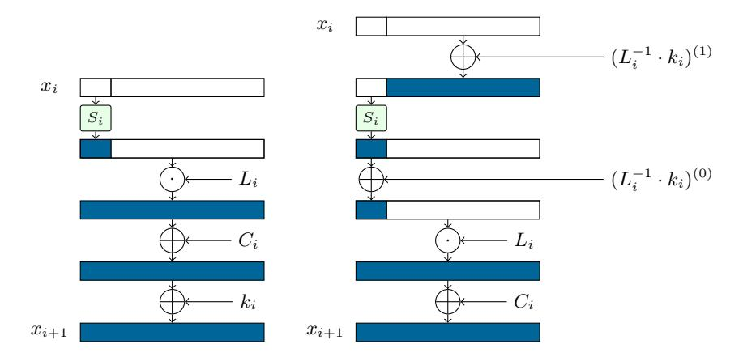

# Linear Equivalence of Block Ciphers with Partial Non-Linear Layers: Application to LowMC

Itai Dinur<sup>1</sup> , Daniel Kales<sup>2</sup> , Angela Promitzer<sup>3</sup> , Sebastian Ramacher<sup>2</sup> , and Christian Rechberger<sup>2</sup>

<sup>1</sup> Department of Computer Science, Ben-Gurion University, Israel <sup>2</sup> Graz University of Technology, Austria 3 Independent

Abstract. LowMC is a block cipher family designed in 2015 by Albrecht et al. It is optimized for practical instantiations of multi-party computation, fully homomorphic encryption, and zero-knowledge proofs. LowMC is used in the Picnic signature scheme, submitted to NIST's post-quantum standardization project and is a substantial building block in other novel post-quantum cryptosystems. Many LowMC instances use a relatively recent design strategy (initiated by G´erard et al. at CHES 2013) of applying the non-linear layer to only a part of the state in each round, where the shortage of non-linear operations is partially compensated by heavy linear algebra. Since the high linear algebra complexity has been a bottleneck in several applications, one of the open questions raised by the designers was to reduce it, without introducing additional non-linear operations (or compromising security).

In this paper, we consider LowMC instances with block size n, partial non-linear layers of size s ≤ n and r encryption rounds. We redesign LowMC's linear components in a way that preserves its specification, yet improves LowMC's performance in essentially every aspect. Most of our optimizations are applicable to all SP-networks with partial non-linear layers and shed new light on this relatively new design methodology.

Our main result shows that when s < n, each LowMC instance belongs to a large class of equivalent instances that differ in their linear layers. We then select a representative instance from this class for which encryption (and decryption) can be implemented much more efficiently than for an arbitrary instance. This yields a new encryption algorithm that is equivalent to the standard one, but reduces the evaluation time and storage of the linear layers from r · n <sup>2</sup> bits to about r · n <sup>2</sup> − (r − 1)(n − s) 2 . Additionally, we reduce the size of LowMC's round keys and constants and optimize its key schedule and instance generation algorithms. All of these optimizations give substantial improvements for small s and a reasonable choice of r. Finally, we formalize the notion of linear equivalence of block ciphers and prove the optimality of some of our results.

Comprehensive benchmarking of our optimizations in various LowMC applications (such as Picnic) reveals improvements by factors that typically range between 2x and 40x in runtime and memory consumption.

Keywords: Block cipher, LowMC, Picnic signature scheme, linear equivalence

## 1 Introduction

LowMC is a block cipher family designed by Albrecht et al. [\[ARS](#page-29-0)+15], and is heavily optimized for practical instantiations of multi-party computation (MPC), fully homomorphic encryption (FHE), and zero-knowledge proofs. In such applications, non-linear operations incur a higher penalty in communication and computational complexity compared to linear ones. Due to its design strategy, LowMC is a popular building block in post-quantum designs that are based on MPC and zero-knowledge protocols (cf. [\[BEF18,](#page-29-1)[CDG](#page-29-2)+17a[,DRS18b](#page-30-0)[,KKW18,](#page-30-1)[DRS18a\]](#page-30-2)). Most notably, it is used in the Picnic signature algorithm [\[CDG](#page-29-3)+17b] which is a candidate in NIST's post-quantum cryptography standardization project.[4](#page-1-0)

Instances of LowMC are designed to perform well in two particular metrics that measure the complexity of non-linear operations over GF(2). The first metric is multiplicative complexity (MC), which simply counts the number of multiplications (AND gates in our context) in the circuit. The second metric is the multiplicative (AND) depth of the circuit.

The relevance of each metric depends on the specific application. For example, in the context of MPC protocols, Yao's garbled circuits [\[Yao86\]](#page-31-0) with the free-XOR technique [\[KS08\]](#page-30-3) (and many of their variants) have a constant number of communication rounds. The total amount of communication depends on the MC of the circuit as each AND gate requires communication, whereas XOR operations can be performed locally. In an additional class of MPC protocols (e.g., GMW [\[GMW87\]](#page-30-4)), the number of communication rounds is linear in the ANDdepth of the evaluated circuit. The performance of these protocols depends on both the MC and ANDdepth of the circuit.

In order to reduce the complexity of non-linear operations for a certain level of security, LowMC combines very dense linear layers over GF(2)<sup>n</sup> (where n is the block size) with simple non-linear layers containing 3 ×3 Sboxes of algebraic degree 2. The LowMC block cipher family includes a huge number of instances, where for each instance, the linear layer of each round is chosen independently and uniformly at random from all invertible n × n matrices.

The design strategy of LowMC attempts to offer flexibility with respect to both the MC and ANDdepth metrics. In particular, some LowMC instances minimize the MC metric by applying only a partial non-linear layer to the state of the cipher at each round, while the linear layers still mix the entire state. In general, this approach requires to increase the total number of rounds in the scheme in order to maintain a certain security level, but this is compensated by the reduction in the size of the non-linear layers and the total AND count is generally reduced. The global parameters of LowMC that are most relevant for this paper are (1) the block size of n bits, (2) the number of rounds r (which is determined according to the desired security level), and (3) a parameter s which

<span id="page-1-0"></span><sup>4</sup> [https://csrc.nist.gov/Projects/Post-Quantum-Cryptography/](https://csrc.nist.gov/Projects/Post-Quantum-Cryptography/Round-1-Submissions) [Round-1-Submissions](https://csrc.nist.gov/Projects/Post-Quantum-Cryptography/Round-1-Submissions)

denotes the domain length of each non-linear layer, namely, the number of bits on which it operates (which may be smaller than n).<sup>5</sup>

While LowMC's design aims to minimize the non-linear complexity of the scheme at the expense of using many linear algebra (XOR) operations, in several practical applications, XORs do not come for free and may become a bottleneck in the implementation. This phenomenon was already noted and demonstrated in the original LowMC paper. Indeed, due to the large computational cost of LowMC's dense linear layers, one of the open problems raised by its designers was to reduce their computational cost, presumably by designing more specific linear layers that offer the same security level with improved efficiency.

More recently, the high cost of LowMC's linear operations influenced the design of the PICNIC signature algorithm, where the most relevant metric is the MC that affects the signature size. In order to minimize the AND count (and the signature size), the LowMC instances used by PICNIC should have a very small partial non-linear layer in each round (perhaps using only a single  $3\times3$  Sbox). However, such an instance has a large number of rounds r and each encryption requires computation of r matrix-vector products that increase the signing and verification times. Consequently, the PICNIC designers settled for non-linear layers of intermediate size in order to balance the signature size on one hand and the signing and verification times on the other.

In fact, in Picnic there is another source of inefficiency due to the heavy cost of the linear operations in LowMC's key schedule: the computation of LowMC inside Picnic involves splitting the LowMC instance to 3 related instances which are evaluated with a fresh share of the key in each invocation. Therefore, in contrast to standard applications, the key schedule has to be run before each cipher invocation and it is not possible to hard-code the round keys into the LowMC instance in this specific (and very important) application. In LowMC, each of the r+1 round keys is generated by applying an independent  $n \times \kappa$  random linear transformation to the  $\kappa$ -bit master key. Therefore, the total complexity of the key schedule is  $(r+1) \cdot n \cdot \kappa$  in both time and memory, which is a substantial overhead on the signing and verification processes in Picnic.

Our Contribution In this paper we revisit the open problem of the LowMC designers to reduce the complexity of its linear operations, focusing on instances with partial non-linear layers (i.e., s < n). We consider a generalized LowMC construction in which the r linear layers are selected uniformly at random from the set of all invertible matrices and the non-linear layers are arbitrary and applied to s bits of the n-bit internal state in each of the r rounds. Our results are divided into several parts.

1. The round keys and constants of a generalized LowMC cipher require memory of  $(r+1) \cdot n$  bits. We compress them to  $n+r \cdot s$  bits. We then consider LowMC's linear key schedule (with a master key of size  $\kappa$  bits) and reduce

<span id="page-2-0"></span><sup>&</sup>lt;sup>5</sup> The LowMC specification denotes by m the number of  $3 \times 3$  Sboxes in each non-linear layer and therefore s=3m in our context.

- its complexity from  $(r+1) \cdot n \cdot \kappa$  to  $n \cdot \kappa + r \cdot (s \cdot \kappa)$ . This has a substantial effect on the performance of Picnic, as described above.
- 2. The linear algebra of the encryption (and decryption) algorithm requires matrices of size  $r \cdot n^2$  bits and performs matrix-vector products with about the same complexity. We describe a new algorithm that uses matrices requiring only  $r \cdot n^2 (r-1)(n-s)^2$  bits of storage and about the same linear algebra time complexity (using standard matrix-vector products<sup>6</sup>).
- 3. We consider the complexity of generating a generalized LowMC instance, assuming its linear layers are sampled at random. We devise a new sampling algorithm that reduces this complexity<sup>7</sup> from about  $r \cdot n^3$  to  $n^3 + (r-1) \cdot (s^2 \cdot n)$ . Our sampling algorithm further reduces the number of uniform (pseudo) random bits required to sample the linear layers from about  $r \cdot n^2$  to  $n^2 + (r-1) \cdot (n^2 (n-s)^2)$ . These optimizations are useful in applications that require frequent instance generation, e.g. for the RASTA design strategy [DEG<sup>+</sup>18].
- 4. We address the question of whether the linear layer description we use during encryption is optimal (i.e., minimal) or can be further compressed. Indeed, it may seem that the formula  $n^2 + (r-1)(n^2 (n-s)^2)$  is suboptimal, and the formula  $n^2 + (r-1) \cdot s \cdot n^2$  is more reasonable, as it is linear in s (similarly to the reduction in the size of the round keys). However, we prove (under two assumptions which we argue are natural) that no further optimizations that reduce the linear layer sizes are possible without changing their functionality.

Table 1 summarizes our improvements and the assumptions under which they can be applied to an SP-network with partial non-linear layers. Surprisingly, although the open problem of the LowMC designers presumably involved changing the specification of LowMC's linear layers to reduce its linear algebra complexity, our improvements achieve this without any specification change. All of these improvements are significant for  $s \ll n$  and r that is not too small.

We stress that our optimized encryption algorithm is applicable to any SP-network with partial non-linear layers (such as Zorro<sup>8</sup> [GGNS13]) since it does not assume any special property of the linear or non-linear layers. Yet, if the linear layers are not selected uniformly at random, the question of whether our algorithm is more efficient compared to the standard one depends on the specific design. On the other hand, when designing new SP-networks with partial non-linear layers, one may use our optimized linear layers as a starting point for additional improvements. We further note that the reduced complexity of the linear layer evaluation during encryption is also useful for adversaries that attempt to break LowMC instances via exhaustive search.

<span id="page-3-0"></span> $<sup>^6</sup>$  Optimizations in matrix-vector multiplications (such as the "method of four Russians" [ABH10]) can be applied to both the standard and to our new encryption algorithm.

<span id="page-3-1"></span>Using asymptotically fast matrix multiplication and invertible matrix sampling algorithms will reduce the asymptotic complexity of both the original and our new algorithm. Nevertheless, it is not clear whether they would reduce their concrete complexity for relevant choices of parameters.

<span id="page-3-2"></span><sup>8</sup> Although Zorro is broken [BDD+15,RASA14,WWGY14], its general design strategy remains valid.

|               | Metric | Unoptimized                 | Optimized                                                                          | Sect. | Assumption         |
|---------------|--------|-----------------------------|------------------------------------------------------------------------------------|-------|--------------------|
| RK and RC     | M      | $(r+1) \cdot n$             | $n + s \cdot r$                                                                    | 3.1   | None               |
| KS            | T/M    | $(r+1)\cdot(n\cdot\kappa)$  | $n \cdot \kappa + r \cdot (s \cdot \kappa)$                                        | 3.2   | Linear KS          |
| LL evaluation | T/M    | $r \cdot n^2$               | $n^{2} + (r-1) \cdot (n^{2} - (n-s)^{2})$                                          | 5     | None               |
| LL sampling   | T R    | $r \cdot n^3$ $r \cdot n^2$ | $n^{3} + (r-1) \cdot (s^{2} \cdot n)$<br>$n^{2} + (r-1) \cdot (n^{2} - (n-s)^{2})$ | 7     | Random LL sampling |

<span id="page-4-0"></span>**Table 1.** Improvements in time/memory/randomness (T/M/R) and assumptions under which they are applicable (RK = round keys, RC = round constants, KS = key schedule, LL = linear layer).

| Pa  | ramet | ers | Memory | Runtime |        |  |
|-----|-------|-----|--------|---------|--------|--|
| n   | s     | r   |        | LowMC   | PICNIC |  |
| 128 | 30    | 20  | 2.38x  | 1.41x   | 1.34x  |  |
| 192 | 30    | 30  | 3.99x  | 2.48x   | 1.72x  |  |
| 256 | 30    | 38  | 4.84x  | 2.82x   | 2.01x  |  |
| 128 | 3     | 182 | 16.51x | 6.57x   | 4.74x  |  |
| 192 | 3     | 284 | 31.85x | 11.50x  | 7.97x  |  |
| 256 | 3     | 363 | 39.48x | 16.18x  | 10.83x |  |

<span id="page-4-1"></span>**Table 2.** Multiplicative gains (previous / new) in memory consumption and in runtimes for LowMC encryption and Picnic signing and verification.

Table 2 compares<sup>9</sup> the size of LowMC's linear layers in previous implementations to our new encryption algorithm for several instances. The first three instances are the ones used by the Picnic signature algorithm and for them we obtain a multiplicative gain of between 2.38x and 4.84x in memory consumption. Runtime-wise we obtain an improvement of a factor between 1.41x to 2.82x for LowMC encryption and by a factor between 1.34x to 2.01x for Picnic.

Even more importantly, prior to this work, reducing s (in order to optimize the MC metric) while increasing r (in order to maintain the same security level for a LowMC instance) increased the linear algebra complexity proportionally to the increase in the number of rounds, making those instances impractical. One of the main consequences of this work is that such a reduction in s now also reduces the linear algebra complexity per round, such that the larger number of rounds is no longer a limiting factor. In particular, the last three instances in Table 2 correspond to a choice of parameters with a minimal value of s that minimizes signature sizes in Picnic. For those instances, we reduce the size of the linear layers by a factor between 16.51x to 39.48x and improve runtimes by up to a factor of 16x. Moreover, compared to the *original* Picnic instances that use s=30, using our optimizations, instances with s=3 reduce memory consumption and achieve comparable runtime results.

<span id="page-4-2"></span><sup>&</sup>lt;sup>9</sup> For key size and the allowed data complexity, we refer to Appendix C.

Our Techniques The first step in reducing the size of the round keys and constants is to exchange the order of the key and constant additions with the application of the linear layer in a round of the cipher. While this is a common technique in symmetric cryptography, we observe that in case s < n, after reordering, the constant and key additions of consecutive rounds can be merged through the n − s bits of the state that do not go through the non-linear transformation. Applying this process recursively effectively eliminates all the key and constant additions on n − s bits of the state (except for the initial key and constant additions). We then exploit the linear key schedule of LowMC and compute the reduced round keys more efficiently from the master key.

In order to derive our new encryption algorithm, we show that each (generalized) LowMC instance belongs to a class of equivalent instances which is of a very large size when s n. We then select a representative member of the equivalence class that can be implemented efficiently using linear algebra optimizations which apply matrices with a special structure instead of random matrices (yet the full cipher remains equivalent). This requires a careful examination of the interaction between linear operations in consecutive rounds which is somewhat related to (but more complex than) the way that round keys and constants of consecutive rounds interact. After devising the encryption algorithm, we show how to sample a representative member of an equivalence class more efficiently than a random member. Our new sampling algorithm breaks dependencies among different parts of the linear layers in a generalized LowMC cipher, shedding further light on its internal structure.

Finally, we formalize the notion of linear equivalence among generalized LowMC ciphers. This allows us to prove (based on two natural assumptions) that we correctly identified the linear equivalence classes and hence our description of the linear layers is optimal in size and we use the minimal amount of randomness to sample it. The formalization requires some care and the proof of optimality is somewhat non-standard (indeed, the claim that we prove is nonstandard).

Related Work Previous works [\[BB02,](#page-29-6)[BCBP03\]](#page-29-7) investigated equivalent representations of AES and other block ciphers obtained by utilizing the specific structure of their Sboxes (exploiting a property called self-affine equivalence [\[BCBP03\]](#page-29-7)). On the other hand, our equivalent representation and encryption algorithm is independent of the non-linear layer and can be applied regardless of its specification. Yet we only deal with block ciphers with partial non-linear layers in this paper.

Paper Organization The rest of the paper is organized as follows. We describe some preliminaries in Section [2.](#page-6-0) Our first optimizations regarding round keys, constants, and the key schedule are described in Section [3.](#page-8-1) In Section [4,](#page-10-0) we prove basic linear algebra properties, which are then used in our optimized encryption algorithm, described in Section [5.](#page-14-0) Our evaluation of LowMC implementations that make use of these optimization are detailed in Section [6.](#page-18-0) Next, our optimized instance generation algorithm for sampling the linear layers is given in Section 7. Finally, we prove the optimality of our description of the linear layers in Section 8 and conclude in Section 9.

## <span id="page-6-0"></span>2 Preliminaries

#### 2.1 Notation

Given a string of bits  $x \in \{0,1\}^n$ , denote by x[|d] its d most significant bits (MSBs) and by x[d|] its d least significant bits (LSBs). Given strings x,y, denote by x||y their concatenation. Given a matrix A, denote by A[\*,i] its i'th column, by A[\*,d|] its first d columns and by A[\*,|d] its last d columns. Given two matrices  $A \in \mathrm{GF}(2)^{d_1 \times d_2}$  and  $B \in \mathrm{GF}(2)^{d_1 \times d_3}$  denote by  $A||B| \in \mathrm{GF}(2)^{d_1 \times (d_2 + d_3)}$  their concatenation. Denote by  $I_d \in \mathrm{GF}(2)^{d \times d}$  the identity matrix.

Throughout this paper, addition x + y between bit strings  $x, y \in \{0, 1\}^n$  is performed bit-wise over  $GF(2)^n$  (i.e., by XORing them).

## 2.2 Generalized LowMC Ciphers

We study generalized LowMC (GLMC) ciphers where the block size is n bits, and each non-linear layer operates on  $s \leq n$  bits of the state. Each instance is characterized by a number of rounds r, round keys  $k_i$  for  $i \in \{0, ..., r\}$  and round constants  $C_i$ , for  $i \in \{0, ..., r\}$ . The cipher consists of r (partial) invertible nonlinear layers  $S_i : \{0, 1\}^s \to \{0, 1\}^s$  and r invertible linear layers  $L_i \in GF(2)^{n \times n}$  for  $i \in \{1, ..., r\}$ .

A GLMC instance is generated by choosing each  $L_i$  independently and uniformly at random among all invertible  $n \times n$  matrices.<sup>10</sup> However, we note that the main encryption algorithm we devise in Section 5 is applicable regardless of the way that the linear layers are chosen. We do not restrict the invertible non-linear layers.

The encryption procedure manipulates n-bit words that represent GLMC states, while breaking them down according to their s LSBs (which we call "part 0 of the state") and n-s MSBs (which we call "part 1 of the state"). To simplify our notation, given any n-bit string x, we denote  $x^{(0)} = x[s]$  and  $x^{(1)} = x[|n-s|]$ .

<span id="page-6-2"></span>The basic GLMC encryption procedure is given in Algorithm 1. Decryption is performed by applying the inverse operations to a ciphertext.

Key Schedule The key schedule optimization of Section 3.2 assumes that round keys are generated linearly from the master key (as in LowMC) and we now define appropriate notation. The master key k is of length  $\kappa$  bits. It is used to generate round key  $k_i$  for  $i \in \{0, 1, \ldots, r\}$  using the matrix  $K_i \in GF(2)^{n \times \kappa}$ , namely,  $k_i = K_i \cdot k$ . During instance generation, each matrix  $\{K_i\}_{i=0}^r$  is chosen uniformly at random among all  $n \times \kappa$  matrices.

<span id="page-6-1"></span> $<sup>^{10}</sup>$  Alternatively, they can be selected in a pseudo-random way from a short seed, as in LowMC.

```
\begin{array}{l} \textbf{Input} & : x_0 \\ \textbf{Output} : x_{r+1} \\ \textbf{begin} \\ & x_1 \leftarrow x_0 + k_0 + C_0 \\ & \textbf{for} \ i \in \{1, 2, \dots, r\} \ \textbf{do} \\ & & | \ y_i \leftarrow S_i(x_i^{(0)}) \| x_i^{(1)} \\ & | \ x_{i+1} \leftarrow L_i(y_i) + k_i + C_i \\ & \textbf{end} \\ & \textbf{return} \ x_{r+1} \\ \textbf{end} \end{array}
```

Algorithm 1: Basic encryption.

#### <span id="page-7-0"></span>2.3 Breaking Down the Linear Layers

Given  $L_i$  (which is an  $n \times n$  matrix), we partition its n-bit input into the first s LSBs (part 0 of the state that is output by  $S_i$ ) and the remaining n-s bits (part 1 of the state). Similarly, we partition its n-bit output into the first s LSBs (that are inputs of  $S_{i+1}$ ) and the remaining n-s bits. We define 4 sub-matrices of  $L_i$  that map between the 4 possible pairs of state parts:

$$\begin{split} L_i^{00} &\in \mathrm{GF}(2)^{s \times s}, L_i^{01} \in \mathrm{GF}(2)^{s \times (n-s)}, \\ L_i^{10} &\in \mathrm{GF}(2)^{(n-s) \times s}, L_i^{11} \in \mathrm{GF}(2)^{(n-s) \times (n-s)}. \end{split}$$

Thus, in our notation  $L_i^{ab}$  for  $a, b \in \{0, 1\}$  maps the part of the state denoted by b to the part of the state denoted by a.

$$L_{i} = \left[ \underbrace{\frac{L_{i}^{00} \mid L_{i}^{01}}{L_{i}^{10} \mid L_{i}^{11}}}_{s} \right] \begin{cases} s \\ n-s \end{cases}$$

We extend our notation  $L_i^{ab}$  by allowing  $a,b\in\{0,1,*\}$ , where the symbol '\*' denotes the full state. Therefore,

$$L_i^{0*} \in \mathrm{GF}(2)^{s \times n}, L_i^{1*} \in \mathrm{GF}(2)^{(n-s) \times n}, L_i^{*0} \in \mathrm{GF}(2)^{n \times s}, L_i^{*1} \in \mathrm{GF}(2)^{n \times (n-s)},$$

are linear transformations which are sub-matrices of  $L_i$ , as shown below.

$$L_i = \left[\frac{L_i^{0*}}{L_i^{1*}}\right], \, L_i = \left[L_i^{*0} \middle| L_i^{*1}\right]$$

These linear transformation satisfy several basic equalities, e.g., for each  $y \in \{0,1\}^n$ :

$$L_i^{0*}(y) = L_i(y)^{(0)} = L_i^{00}(y^{(0)}) + L_i^{01}(y^{(1)}),$$


$$L_i^{1*}(y) = L_i(y)^{(1)} = L_i^{10}(y^{(0)}) + L_i^{11}(y^{(1)}).$$

#### 2.4 Complexity Evaluation

In this paper, we analyze the complexity of the linear layers of generalized LowMC schemes. We will be interested in the two natural measures of time complexity (measured by the number of bit operations) and memory complexity (measured by the number of stored bits) of a single encryption (or decryption) of an arbitrary plaintext (or ciphertext). The linear layers are naturally represented by matrices, and thus evaluating a linear layer on a state is a simply a matrix-vector product. Since the time and memory complexities of evaluating and storing the linear layers are proportional in this paper, we will typically refer to both as the linear algebra complexity of the linear layers. For algorithms that generate GLMC instances, we will be interested in time complexity and in the number of random bits (or pseudo-random bits) that they use.

## <span id="page-8-1"></span>3 Optimized Round Key Computation and Constant Addition

In this section we optimize the round key computation and constant addition in a GLMC cipher. First, we show how to compress the round keys and constants and then we optimize the key schedule of the cipher, assuming it is linear. These optimizations are significant in case we need to run the key schedule for every cipher invocation (which is the case in PICNIC).

#### <span id="page-8-0"></span>3.1 Compressing the Round Keys and Constants

We combine the last two linear operations in encryption Algorithm 1 and obtain  $x_{i+1} \leftarrow L_i(y_i) + k_i + C_i$ . Moreover,  $y_i \leftarrow S_i(x_i^{(0)}) \| x_i^{(1)}$ , namely  $S_i$  only operates on the first s bits of the state and does not change  $x_i^{(1)}$ . Based on this observation, we perform the following:

- Modify  $x_{i+1} \leftarrow L_i(y_i) + k_i + C_i$  to  $x_{i+1} \leftarrow L_i(y_i + L_i^{-1} \cdot k_i) + C_i$ . - Split  $L^{-1} \cdot k_i$  into the lower splits (the "non-linear part" is  $C_i = C_i$ .
- Split  $L_i^{-1} \cdot k_i$  into the lower s bits (the "non-linear part", i.e.,  $(L_i^{-1} \cdot k_i)^{(0)}$ ) and the upper n-s bits (the "linear part", i.e.,  $(L_i^{-1} \cdot k_i)^{(1)}$ ) and move the addition of the upper n-s bits before the Sbox layer.

Figure 1 demonstrates one round of the cipher with the above modifications (which do not change its output).

Next, we observe that the addition of  $(L_i^{-1} \cdot k_i)^{(1)}$  at the beginning of the round can be combined with the addition of  $k_{i-1}$  in the previous round. We can now perform similar operations to round i-1 and continue recursively until all additions to the linear part of the state have been moved to the start of the algorithm. In general, starting from the last round and iterating this procedure down to the first, we eliminate all additions of the linear parts of the round keys and move them before the first round. For each round  $i \geq 1$ , we are left with a reduced round key of size s.



<span id="page-9-1"></span>Fig. 1. One round before (left) and after (right) splitting the round key addition.

In total, the size of the round keys is reduced from  $n \cdot (r+1)$  to  $n+s \cdot r$ . We remark that the same optimization can be performed to the constant additions, reducing their size by the same amount. We denote the new reduced round key of round i by  $k_i'$  and the new reduced round constant by  $C_i'$ . The new encryption procedure is given in Algorithm 2. Observe that all the values  $\{k_i' + C_i'\}_{i=0}^r$  can be computed and stored at the beginning of the encryption and their total size is  $n+s \cdot r$ .

```
\begin{array}{ll} \textbf{Input} & : x_0 \\ \textbf{Output} : x_{r+1} \\ \textbf{begin} \\ & \left| \begin{array}{l} x_1 \leftarrow x_0 + k_0' + C_0' \\ \textbf{for} \ i \in \{1, 2, \dots, r\} \ \textbf{do} \\ & \left| \begin{array}{l} y_i \leftarrow (S_i(x_i^{(0)}) + k_i' + C_i') \|x_i^{(1)} \\ x_{i+1} \leftarrow L_i(y_i) \end{array} \right. \\ & \text{end} \\ & \text{return} \ x_{r+1} \end{array}
```

<span id="page-9-2"></span>**Algorithm 2:** Encryption with reduced round keys and constants.

### <span id="page-9-0"></span>3.2 Optimizing the Key Schedule

We now deal with optimizing the round key computation of Algorithm 2, assuming a linear key schedule. The original key schedule applies r+1 round key matrices  $K_i$  to the  $\kappa$ -bit key k in order to compute the round keys  $k_i = K_i \cdot k$ . It therefore has a complexity of  $(r+1) \cdot (n \cdot \kappa)$  (using a similar amount of memory). We show how to reduce this complexity to  $n \cdot \kappa + r \cdot (s \cdot \kappa)$ .

The main observation is that all transformations performed in Section 3.1 in order to calculate the new round keys from the original ones are linear. These linear transformations can be composed with the linear transformations  $K_i$  in order to define linear transformations that compute the new round keys directly from the master key k. Since the total size of the round keys is  $n+s\cdot r$  bits, we can define matrices of total size  $n\cdot \kappa + r\cdot (s\cdot \kappa)$  that calculate all round keys from the master  $\kappa$ -bit key.

More specifically, we define the matrix  $\overline{L_i^{-1}}$  which is the inverse of the linear layer matrix  $L_i$ , with the first s rows of this inverse set to 0. Applying the iterative procedure defined in Section 3.1 from round r down to round i, we obtain

$$P_{N,i} = \sum_{j=i}^{r} \left( \prod_{\ell=i}^{j} \overline{L_{\ell}^{-1}} \right) \cdot K_{j}.$$

For  $i \geq 1$ , the new round key  $k'_i$  (for the non-linear part of the state) is computed by taking the s least significant bits of  $P_{N,i} \cdot k$ . Using the notation of Section 2.3, we have

$$k_i' = (P_{N,i})^{0*} \cdot k.$$

Observe that the total size of all  $\{(P_{N,i})^{0*}\}_{i=1}^r$  is  $r \cdot (s \cdot \kappa)$  bits. Finally, the new round key  $k'_0$  is calculated by summing the contributions from the linear parts of the state, using the matrix

$$P_L = K_0 + \sum_{j=1}^r \left( \prod_{\ell=1}^j \overline{L_{\ell}^{-1}} \right) \cdot K_j.$$

Therefore, we have  $k'_0 = P_L \cdot k$ , where  $P_L$  is an  $n \times \kappa$  matrix. All matrices  $\{(P_{N,i})^{0*}\}_{i=1}^r, P_L$  can be precomputed after instance generation and we do not need to store the original round key matrices  $K_i$ .

## <span id="page-10-0"></span>4 Linear Algebra Properties

In this section we describe the linear algebra properties that are relevant for the rest of this paper. We begin by describing additional notational conventions.

## <span id="page-10-1"></span>4.1 General Matrix Notation

The superscript of  $L_i^{ab}$  introduce in Section 2.3 has a double interpretation, as specifying both the dimensions of the matrix and its location in  $L_i$ . We will use this notation more generally to denote sub-matrices of some  $n \times n$  matrix A, or simply to define a matrix with appropriate dimensions (e.g.,  $A^{01} \in \mathrm{GF}(2)^{s \times (n-s)}$  may be defined without defining A and this should be clear from the context). Therefore, dimensions of the matrices in the rest of the paper will be explicitly specified in superscript as  $A^{ab}$ , where  $a, b \in \{0, 1, *\}$  (we do not deal with matrices of other dimensions). In case the matrix  $A^{ab}$  is a sub-matrix of a larger

matrix A, the superscript has a double interpretation as specifying both the dimensions of  $A^{ab}$  and its location in A. When no superscript is given, the relevant matrix is of dimensions  $n \times n$ . There will be two exceptions to this rule which will be specified separately.

## 4.2 Invertible Binary Matrices

Denote by  $\alpha_n$  the probability that an  $n \times n$  uniformly chosen binary matrix is invertible. We will use the following well-known fact:

Fact 1 [[Kol99], page 126, adapted] The probability that an  $n \times n$  uniform binary matrix is invertible is  $\alpha_n = \prod_{i=1}^n (1-1/2^i) > 0.2887$ . More generally, for positive integers  $d \leq n$ , the probability that a  $d \times n$  binary matrix, chosen uniformly at random, has full row rank of d is  $\prod_{i=n-d+1}^n (1-1/2^i) = (\prod_{i=1}^n (1-1/2^i))/(\prod_{i=1}^{n-d} (1-1/2^i)) = \alpha_n/\alpha_{n-d}$ .

We will be interested in invertibility of matrices of a special form, described in the following fact (which follows from basic linear algebra).

**Fact 2** An  $n \times n$  binary matrix of the form

<span id="page-11-4"></span><span id="page-11-1"></span>
$$\left[ \frac{A^{00} | A^{01}}{A^{10} | I_{n-s}} \right]$$

is invertible if and only if the  $s \times s$  matrix  $B^{00} = A^{00} + A^{01}A^{10}$  is invertible and its inverse is given by

$$\left\lceil \frac{(B^{00})^{-1}}{-A^{10}\cdot(B^{00})^{-1}} \middle| \frac{-(B^{00})^{-1}\cdot A^{01}}{I_{n-s}-A^{10}\cdot(B^{00})^{-1}\cdot A^{01}} \right\rceil.$$

<span id="page-11-3"></span>Finally, we prove (in Appendix A) a simple proposition regarding random matrices.

**Proposition 1.** Let  $A \in GF(2)^{n \times n}$  be an invertible matrix chosen uniformly at random and let  $B^{11} \in GF(2)^{(n-s) \times (n-s)}$  be an arbitrary invertible matrix (for  $s \leq n$ ) that is independent from A. Then the matrix

$$C = \left[ \frac{A^{00} |A^{01} \cdot B^{11}|}{A^{10} |A^{11} \cdot B^{11}|} \right]$$

is a uniform invertible matrix.

#### 4.3 Normalized Matrices

<span id="page-11-2"></span><span id="page-11-0"></span>**Definition 1.** Let  $A^{1*}$  be a Boolean matrix with full row rank of n-s (and therefore it has n-s linearly independent columns). Let  $\mathrm{COL}(A)$  denote the first set of n-s linearly independent columns of  $A^{1*}$  in a fixed lexicographic ordering of columns sets. Then, these columns form an  $(n-s)\times (n-s)$  invertible matrix which is denoted by  $\dot{A}$ , while the remaining columns form an  $(n-s)\times s$  matrix which is denoted by  $\ddot{A}$ . Moreover, denote  $\dot{A}=\dot{A}^{-1}\cdot A^{1*}\in\mathrm{GF}(2)^{(n-s)\times}$  (in this matrix  $\dot{A}$ , the columns of  $\mathrm{COL}(A)$  form the identity matrix).

Remark 1. The only exception to the rule of Section 4.1 has to do with Definition 1 (and later with the related Definition 2). In this paper, the decomposition of Definition 1 is always applied to matrices  $A^{1*} \in \mathrm{GF}(2)^{(n-s)\times n}$  (in case  $A^{1*}$  is a sub-matrix of A, it contains the bottom n-s rows of A). Hence the resulting matrices  $\dot{A} \in \mathrm{GF}(2)^{(n-s)\times (n-s)}$ ,  $\ddot{A} \in \mathrm{GF}(2)^{(n-s)\times s}$  and  $\hat{A} \in \mathrm{GF}(2)^{(n-s)\times n}$  have fixed dimensions and do not need any superscript. On the other hand, we will use superscript notation to denote sub-matrices of these. For example  $\hat{A}^{10} \in \mathrm{GF}(2)^{(n-s)\times s}$  is a sub-matrix of  $\hat{A}$ , consisting of its first s columns.

It will be convenient to consider a lexicographic ordering in which the columns indices of  $A^{1*}$  are reversed, i.e., the first ordered set of n-s columns is  $\{n,n-1,\ldots,s+1\}$ , the second is  $\{n,n-1,\ldots,s+2,s\}$ , etc. To demonstrate the above definition, assume that  $\mathrm{COL}(A) = \{n,n-1,\ldots,s+1\}$  is a consecutive set of linearly independent columns. Then, the matrix  $A^{1*}$  is shown below.

$$A^{1*} = \left[\underbrace{\ddot{A}}_{s} \middle| \underbrace{\dot{A}}_{n-s} \right] \quad \right\} n - s$$

We can write  $A = (\dot{A} \cdot \dot{A}^{-1}) \cdot A = \dot{A} \cdot (\dot{A}^{-1} \cdot A) = \dot{A} \cdot \hat{A}$ , where

<span id="page-12-1"></span>
$$\hat{A} = \dot{A}^{-1} \cdot A^{1*} = \left[\underbrace{\dot{A}^{-1} \cdot \ddot{A}}_{s} \underbrace{I_{n-s}}_{n-s}\right] \quad \right\} n - s. \tag{1}$$

Normalized Equivalence Classes Given an invertible matrix  $A \in GF(2)^{n \times n}$ , define

$$N(A) = \left[\frac{A^{0*}}{\hat{A}}\right] = \left[\frac{A^{0*}}{\dot{A}^{-1} \cdot A^{1*}}\right] = \left[\frac{I_s \mid \mathbf{0}^{01}}{\mathbf{0}^{10} \mid \dot{A}^{-1}}\right] \cdot A.$$

The transformation  $N(\cdot)$  partitions the set of invertible  $n \times n$  boolean matrices into normalized equivalence classes, where A, B are in the same normalized equivalence class if N(A) = N(B). We denote  $A \leftrightarrow_N B$  the relation N(A) = N(B).

<span id="page-12-0"></span>**Proposition 2.** Two invertible  $n \times n$  boolean matrices A, B satisfy  $A \leftrightarrow_N B$  if and only if there exists an invertible matrix  $C^{11}$  such that

<span id="page-12-2"></span>
$$A = \left[ \frac{I_s \mid \mathbf{0}^{01}}{\mathbf{0}^{10} \mid C^{11}} \right] \cdot B.$$

For the proof of Proposition 2, we refer the reader to Appendix A.

Let  $\Phi = \{N(A) \mid A \in \mathrm{GF}(2)^{n \times n} \text{ is invertible}\}$  contain a representative from each normalized equivalence class. Using Fact 1 and Proposition 2, we deduce the following corollary.

Corollary 1. The following properties hold for normalized equivalence classes:

- 1. Each member of  $\Phi$  represents a normalized equivalence class whose size is equal to the number of invertible  $(n-s)\times (n-s)$  matrices  $C^{11}$ , which is  $\alpha_{n-s}\cdot 2^{(n-s)^2}$ .
- 2. The size of  $\Phi$  is

$$|\Phi| = \frac{\alpha_n \cdot 2^{n^2}}{\alpha_{n-s} \cdot 2^{(n-s)^2}} = \alpha_n / \alpha_{n-s} \cdot 2^{n^2 - (n-s)^2}.$$

#### 4.4 Matrix-Vector Product

<span id="page-13-0"></span>**Definition 2.** Let  $A^{1*}$  and  $B^{*1}$  be two Boolean matrices such that  $A^{1*}$  has full row rank of n-s. Define  $\check{B}_A=B\cdot\dot{A}\in\mathrm{GF}(2)^{n\times(n-s)}$ .

When A is understood from the context, we simply write  $\check{B}$  instead of  $\check{B}_A$ .

Remark 2. The notational conventions that apply to Definition 1 also apply Definition 2 (see Remark 1), as it is always applied to matrices  $A^{1*} \in \mathrm{GF}(2)^{(n-s)\times n}$  and  $B^{*1} \in \mathrm{GF}(2)^{n\times (n-s)}$ , where  $\check{B} \in \mathrm{GF}(2)^{n\times (n-s)}$  (and its sub-matrices are denoted using superscript).

<span id="page-13-2"></span>**Proposition 3.** Let  $A^{1*}$  and  $B^{*1}$  be two Boolean matrices such that  $A^{1*}$  has full row rank of n-s. Let  $C=B^{*1}\cdot A^{1*}\in \mathrm{GF}(2)^{n\times n}$ . Then, after preprocessing  $A^{1*}$  and  $B^{*1}$ , C can be represented using  $b=n^2-s^2+n$  bits. Moreover, given  $x\in \mathrm{GF}(2)^n$ , the matrix-vector product Cx can be computed using O(b) bit operations.

Note that the above representation of the  $n\times n$  matrix C is more efficient than the trivial representation that uses  $n^2$  bits (ignoring the additive lower order term n). It is also more efficient than a representation that uses the decomposition  $C=B^{*1}\cdot A^{1*}$  which requires  $2n(n-s)=(n^2-s^2)+(n-s)^2\geq n^2-s^2$  bits. Proof. The optimized representation is obtained by "pushing" linear algebra operations from  $A^{1*}$  into  $B^{*1}$ , which "consumes" them, as formally described next. Note that since  $A^{1*}$  has full row rank of n-s, we use definitions 1 and 2, and write  $C=B^{*1}\cdot A^{1*}=B^{*1}\cdot (\dot{A}\cdot\dot{A}^{-1})\cdot A^{1*}=(B^{*1}\cdot\dot{A})\cdot (\dot{A}^{-1}\cdot A^{1*})=\check{B}\cdot\hat{A}$ , where  $\check{B}$  and  $\hat{A}$  can be computed during preprocessing. Let us assume that the last n-s columns of  $A^{1*}$  are linearly independent (namely,  $\mathrm{COL}(A^{1*})=\{n,n-1,\ldots,s+1\}$ ). Then due to (1),  $\hat{A}$  can be represented using s(n-s) bits and the matrix-vector product s(n-s) are computed using s(n-s) bits and the matrix-vector product s(n-s) computing s(n-s) bits and the matrix-vector product s(n-s) computing s(n-s) bits operations by computing s(n-s) bits operations by computing s(n-s) bits operations by computing s(n-s) bits and s(n-s) bits operations by computing s(n-s) bits operations by computing s(n-s) bits operations by computing s(n-s) bits operations by computing s(n-s) bits operations by computing s(n-s) bits operations by computing s(n-s) bits operations by computing s(n-s) bits operations by computing s(n-s) bits operations by computing s(n-s) bits operations by computing s(n-s) bits operations by computing s(n-s) bits operations by computing s(n-s) bits operations by computing s(n-s) bits operations of s(n-s) bits operations by computing s(n-s) bits operations of s(n-s) bits operations of s(n-s) bits operations of s(n-s) bits operations of s(n-s) bits operations of s(n-s) bits operations of s(n-s) bits operations of s(n-s) bits operations of s(n-s) bits

We assumed that the last n-s columns of  $A^{1*}$  are linearly independent. If this is not the case, then  $COL(A^{1*})$  can be specified explicitly (to indicate the columns of  $\hat{A}$  that form the identity) using at most n additional bits. The product  $\hat{A}x$  is computed by decomposing x according to  $COL(A^{1*})$  (rather than according to its s LSBs).

<span id="page-13-3"></span>Remark 3. Consider the case that  $A^{1*}$  is selected uniformly at random among all matrices of full row rank. Then, using simple analysis based on Fact 1, n-s linearly independent columns of  $A^{1*}$  are very likely to be found among its n-s+3 last columns. Consequently, the additive low-order term n in the representation size of C can be reduced to an expected size of about  $3 \log n$  (specifying the 3 indices among are final n-s+3 that do not belong in  $\mathrm{COL}(A^{1*})$ ). Moreover, computing the product  $\hat{A}x$  requires permuting only 3 pairs of bits of x on average (and then decomposing it as in the proof above).

Remark 4. Instead of simplifying  $A^{1*}$  to contain the identity matrix, we can alternatively simplify  $B^{*1}$  assuming it has full column rank.<sup>11</sup> It is easy to verify that both simplifications give essentially the same result in terms of linear algebra complexity.

<span id="page-13-1"></span><sup>&</sup>lt;sup>11</sup> One can also simplify both  $A^{1*}$  and  $B^{*1}$ , but this is never useful in our application.

```
\begin{array}{l} \textbf{Input} \quad : x_0 \\ \textbf{Output} : x_{r+1} \\ \textbf{begin} \\ \mid \quad x_1 \leftarrow x_0 + k_0 \\ \mid \quad \text{for } i \in \{1, 2, \dots, r\} \ \textbf{do} \\ \mid \quad y_i \leftarrow S_i(x_i^{(0)}) \| x_i^{(1)} \\ \mid \quad x_{i+1} \leftarrow L_i(y_i) \\ \mid \quad \textbf{end} \\ \mid \quad \textbf{return } x_{r+1} \\ \textbf{end} \end{array}
```

**Algorithm 3:** Simplified encryption.

## <span id="page-14-0"></span>5 Optimized Linear Layer Evaluation

In this section, we describe our encryption algorithm that optimizes the linear algebra of Algorithm 2. We begin by optimizing the implementation of a 2-round GLMC cipher and then consider a general r-round cipher.

It will be convenient to further simplify Algorithm 2 by defining  $k_0'' = k_0' + C_0'$ . For i > 0, we move the addition of  $k_i' + C_i'$  into  $S_i$  by redefining  $S_i''(x_i^{(0)}) = S_i(x_i^{(0)}) + k_i' + C_i'$ . This makes the Sbox key-dependent, which is not important for the rest of the paper. Finally, we abuse notation for simplicity and rename  $k_0''$  and  $S_i''$  back to  $k_0$  and  $S_i$ , respectively. The outcome is given in Algorithm 3.

## <span id="page-14-4"></span><span id="page-14-1"></span>5.1 Basic 2-Round Encryption Algorithm

We start with a basic algorithm that attempts to combine the linear algebra computation of two rounds. This computation can be written as

$$\left(\frac{x_3^{(0)}}{x_3^{(1)}}\right) = \left[\frac{L_2^{00}|L_2^{01}|}{L_2^{10}|L_2^{1T}}\right] \left(\frac{y_2^{(0)}}{y_2^{(1)}}\right), \left(\frac{x_2^{(0)}}{x_2^{(1)}}\right) = \left[\frac{L_1^{00}|L_1^{01}|}{L_1^{10}|L_1^{1T}}\right] \left(\frac{y_1^{(0)}}{y_1^{(1)}}\right).$$

Note that  $x_2^{(0)}$  and  $y_2^{(0)}$  are related non-linearly as  $y_2^{(0)} = S_2(x_2^{(0)})$ . On the other hand, since  $x_2^{(1)} = y_2^{(1)}$  we can compute the contribution of  $y_2^{(1)}$  to  $x_3$  at once from  $y_1$  by partially combining the linear operations of the two rounds as

<span id="page-14-2"></span>
$$\left( \frac{t_3^{(0)}}{t_3^{(1)}} \right) = \left[ \frac{L_2^{01} L_1^{10} \left| L_2^{01} L_1^{11} \right|}{L_2^{11} L_1^{10} \left| L_2^{11} L_1^{11} \right|} \left| \frac{y_1^{(0)}}{y_1^{(1)}} \right|.$$
 (2)

The linear transformation of (2) is obtained from the product  $L_2 \cdot L_1$  by ignoring the terms involving  $L_2^{00}$  and  $L_2^{10}$  (that operate on  $y_2^{(0)}$ ). Note that (2) defines an  $n \times n$  matrix that can be precomputed.

We are left to compute the contribution of  $y_2^{(0)}$  to  $x_3$ , which is done directly as in Algorithm 3 by

<span id="page-14-3"></span>
$$x_2^{(0)} \leftarrow L_1^{0*}(y_1), y_2^{(0)} \leftarrow S_2(x_2^{(0)}), t_3' \leftarrow L_2^{*0}(y_2^{(0)}).$$
 (3)

This calculation involves  $s \times n$  and  $n \times s$  matrices. Finally, combining the contributions of (2) and (3), we obtain

$$x_3 \leftarrow t_3 + t_3'$$
.

Overall, the complexity of linear algebra in the two rounds is  $n^2 + 2sn$  instead of  $2n^2$  of Algorithm 3. This is an improvement provided that s < n/2, but is inefficient otherwise.

## 5.2 Optimized 2-Round Encryption Algorithm

The optimized algorithm requires a closer look at the linear transformation of (2). Note that this matrix can be rewritten as the product

<span id="page-15-1"></span>
$$\left(\frac{t_3^{(0)}}{t_3^{(1)}}\right) = \left[\frac{L_2^{01}}{L_2^{11}}\right] \left[L_1^{10} \middle| L_1^{11}\right] \left(\frac{y_1^{(0)}}{y_1^{(1)}}\right).$$
(4)

More compactly, this  $n \times n$  linear transformation is decomposed as  $L_2^{*1} \cdot L_1^{1*}$ , namely, it is a product of matrices with dimensions  $(n-s) \times n$  and  $n \times (n-s)$ . In order to take advantage of this decomposition, we use Proposition 3 which can be applied since  $L_1^{1*}$  has full row rank of n-s. This reduces linear algebra complexity of  $L_2^{*1} \cdot L_1^{1*}$  from  $n^2$  to  $n(n-s)+n(n-s)-(n-s)^2=n^2-s^2$ , ignoring an additive low order term of n - s = n + 1 in Remark 3.

```
\begin{array}{llllllllllllllllllllllllllllllllllll
```

Algorithm 4 exploits the decomposition  $L_2^{*1} \cdot L_1^{1*} = \check{L}_2 \cdot \hat{L}_1$ . Altogether, the linear algebra complexity of 2 rounds is reduced to

$$n^2 + 2sn - s^2 = 2n^2 - (n - s)^2$$

(or  $2n^2 - (n-s)^2 + 3\log n$  after taking Remark 3 into account). This is an improvement by an additive factor of about  $s^2$  compared to the basic 2-round algorithm above and is an improvement over the standard complexity of  $2n^2$  for essentially all s < n.

#### 5.3 Towards an Optimized r-Round Encryption Algorithm

The optimization applied in the 2-round algorithm does not seem to generalize to an arbitrary number of rounds in a straightforward manner. In fact, there is more than one way to generalize this algorithm (and obtain improvements over the standard one in some cases) using variants of the basic algorithm of Section 5.1 which directly combines more that two rounds. These variants are sub-optimal since they do not exploit the full potential of Proposition 3.

The optimal algorithm is still not evident since the structure of the rounds of Algorithm 4 does not resemble their structure in Algorithm 3 that we started with. Consequently, we rewrite it in Algorithm 5 such that  $z_2^{(1)} = \hat{L}_1(y_1)$  is computed already in round 1 instead of round 2. The linear algebra in round 2 of Algorithm 5 can now be described using the  $n \times n$  transformation

$$\begin{pmatrix} x_3^{(0)} \\ \overline{x_3^{(1)}} \end{pmatrix} = \begin{bmatrix} \underline{L_2^{00}} \middle| \check{L}_2^{01} \\ \overline{L_2^{10}} \middle| \check{L}_2^{11} \end{bmatrix} \begin{pmatrix} \underline{y_2^{(0)}} \\ \overline{z_2^{(1)}} \end{pmatrix}.$$

Note that  $z_2^{(1)}$  is a value that is never computed by the original Algorithm 3.

When we add additional encryption rounds, we can apply Proposition 3 again and "push" some of the linear algebra of round 2 into round 3, then "push" some of the linear algebra of round 3 into round 4, etc. The full algorithm is described in detail next.

## <span id="page-16-0"></span>5.4 Optimized r-Round Encryption Algorithm

In this section, we describe our optimized algorithm for evaluating r rounds of a GLMC cipher. We begin by defining the following sequence of matrices.

$$\begin{aligned} \text{For } i = 1: & R_1^{1*} = L_1^{1*} \\ \hat{R}_1 &= (\dot{R}_1)^{-1} \cdot R_1^{1*}. \end{aligned}$$

$$\begin{aligned} \hat{T}_i &= L_i^{*1} \cdot \dot{R}_{i-1} \\ R_i^{1*} &= L_i^{10} || \check{T}_i^{11}. \\ \hat{R}_i &= (\dot{R}_i)^{-1} \cdot R_i^{1*}. \end{aligned}$$

$$\begin{aligned} \hat{T}_i &= L_i^{10} \cdot \dot{R}_i^{1*}. \\ \hat{T}_i &= L_i^{10} \cdot \dot{R}_i^{1*}. \end{aligned}$$
 For  $i = r$ :
$$\dot{T}_r &= L_r^{*1} \cdot \dot{R}_{r-1}. \end{aligned}$$

Basically, the matrix  $\check{T}_i$  combines the linear algebra of round i with the linear algebra that is pushed from the previous round (represented by  $\dot{R}_{i-1}$ ). The matrix  $\hat{R}_i$  is the source of optimization, computed by normalizing the updated round matrix (after computing  $\check{T}_i$ ). The byproduct of this normalization is  $\dot{R}_i$ , which is pushed into round i+1, and so forth.

Before we continue, we need to prove the following claim (the proof is given in Appendix B).

<span id="page-16-1"></span>**Proposition 4.** The matrix  $R_i^{1*}$  has full row rank of n-s for all  $i \in \{1, \ldots, r-1\}$ , hence  $(\dot{R}_i)^{-1}$  exists.

```
\begin{array}{l} \text{Input} & : x_0 \\ \text{Output} : x_{r+1} \\ \text{begin} \\ & \quad x_1 \leftarrow x_0 + k_0 \\ & \quad y_1 \leftarrow S_1(x_1^{(0)}) \| x_1^{(1)} \\ & \quad y_1 \leftarrow S_1(x_1^{(0)}) \| x_1^{(1)} \\ & \quad z_2^{(0)} \leftarrow L_1^{0*}(y_1) \\ & \quad z_2^{(1)} \leftarrow \hat{R}_1(y_1) \\ & \quad z_2^{(1)} \leftarrow \hat{R}_1(y_1) \\ & \quad for \ i \in \{2, \dots, r-1\} \ \text{do} \\ & \quad \quad \left| \begin{array}{c} y_i^{(0)} \leftarrow S_i(x_i^{(0)}) \\ x_{i+1}^{(0)} \leftarrow L_i^{(0)}(y_i^{(0)}) + \check{T}_i^{(0)}(z_i^{(1)}) \\ & \quad z_{i+1}^{(1)} \leftarrow \hat{R}_i(y_i^{(0)} \| z_i^{(1)}) \\ & \quad \text{end} \\ & \quad y_r^{(0)} \leftarrow S_r(x_r^{(0)}) \\ & \quad x_{r+1} \leftarrow L_r^{*0}(y_r^{(0)}) + \check{T}_r(z_r^{(1)}) \\ & \quad \text{return} \ x_{r+1} \end{array} \right. \Rightarrow \text{Round} \ r
```

**Algorithm 6:** Optimized r-round encryption.

<span id="page-17-0"></span>The general optimized encryption algorithm is given in Algorithm 6. At a high level, the first round can be viewed as mapping the "real state"  $(y_1^{(0)}, y_1^{(1)})$  into the "shadow state"  $(x_2^{(0)}, z_2^{(1)})$  using the linear transformation

$$\left(\frac{x_2^{(0)}}{z_2^{(1)}}\right) = \left[\frac{L_1^{00} \left| L_1^{01} \right|}{\hat{R}_1^{10} \left| \hat{R}_1^{11} \right|} \left(\frac{y_1^{(0)}}{y_1^{(1)}}\right).$$

In rounds  $i \in \{2, \ldots, r-1\}$ , the shadow state  $(y_i^{(0)}, z_i^{(1)})$  (obtained after applying  $S_i(x_i^{(0)})$ ) is mapped to the next shadow state  $(x_{i+1}^{(0)}, z_{i+1}^{(1)})$  using the linear transformation

$$\begin{pmatrix} x_{i+1}^{(0)} \\ z_{i+1}^{(1)} \end{pmatrix} = \begin{bmatrix} L_i^{00} \middle| \check{T}_i^{01} \\ \hat{R}_i^{10} \middle| \hat{R}_i^{11} \end{bmatrix} \begin{pmatrix} y_i^{(0)} \\ z_i^{(1)} \end{pmatrix}.$$

Finally, in round r, the shadow state  $(y_r^{(0)}, z_r^{(1)})$  is mapped to the final real state  $(x_{r+1}^{(0)}, x_{r+1}^{(1)})$  using the linear transformation

$$\begin{pmatrix} x_{r+1}^{(0)} \\ x_{r+1}^{(1)} \end{pmatrix} = \begin{bmatrix} L_r^{00} | \check{T}_r^{01} \\ L_r^{10} | \check{T}_r^{11} \end{bmatrix} \begin{pmatrix} y_r^{(0)} \\ z_r^{(1)} \end{pmatrix}.$$

Complexity Evaluation As noted above, Algorithm 6 applies r linear transformation, each of dimension  $n \times n$ . Hence, ignoring the linear algebra optimizations for each  $\hat{R}_i$ , the linear algebra complexity of each round is  $n^2$ , leading to a total complexity of  $r \cdot n^2$ . Taking the optimizations into account, for each  $i \in \{1, \ldots, r-1\}$ , the actual linear algebra complexity of  $\hat{R}_i$  is reduced by  $(n-s)^2$  to  $n^2 - (n-s)^2$

(as  $\hat{R}_i$  contains the  $(n-s)\times(n-s)$  identity matrix). Therefore, the total linear algebra complexity is

$$r \cdot n^2 - (r-1)(n-s)^2$$
.

Taking Remark 3 into account, we need to add another factor of  $3(r-1)\log n$ .

Remark 5. Note that Algorithm 6 is obtained from Algorithm 3 independently of how the instances of the cipher are generated. Hence, Algorithm 6 is applicable in principle to all SP-networks with partial non-linear layers.

Correctness We now prove correctness of Algorithm 6 by showing that its output value is identical to a standard implementation of the scheme in Algorithm 3. For each  $i \in \{0, 1, \ldots, r+1\}$ , denote by  $\bar{x}_i$  the state value at the beginning of round i in a standard implementation and by  $\bar{y}_i$  the state after the application of  $S_i$ . The proof of Proposition 5 are given in Appendix B.

**Proposition 5.** For each
$$i \in \{1, ..., r-1\}$$
 in Algorithm 6,  $y_i^{(0)} = \bar{y}_i^{(0)}, x_{i+1}^{(0)} = \bar{x}_{i+1}^{(0)}$  and  $z_{i+1}^{(1)} = (\dot{R}_i)^{-1}(\bar{x}_{i+1}^{(1)})$ .

**Proposition 6.** Algorithm 6 is correct, namely  $x_{r+1} = \bar{x}_{r+1}$ .

Proof. By Algorithm 6 and using Proposition 5,

$$x_{r+1} = L_r^{*0}(y_r^{(0)}) + \check{T}_r(z_r^{(1)}) = L_r^{*0}(\bar{y}_r^{(0)}) + L_r^{*1} \cdot \dot{R}_{r-1}((\dot{R}_{r-1})^{-1}(\bar{x}_r^{(1)})) = L_r^{*0}(\bar{y}_r^{(0)}) + L_r^{*1}(\bar{y}_r^{(1)}) = L_r(\bar{y}_r) = \bar{x}_{r+1}.$$

<span id="page-18-1"></span>

# <span id="page-18-0"></span>6 Applications to LowMC in Picnic and Garbled Circuits

To verify the expected performance and memory improvements, we evaluate both suggested optimizations in three scenarios: LowMC encryption, the digital signature scheme Picnic, and in the context of Yao's garbled circuits. We discuss the details on the choice of LowMC instances and how LowMC is used in Picnic and garbled circuits and their applications in Appendix C. Throughout this section, we benchmark LowMC instances with block size n, non-linear layer size s and r rounds and simply refer to them as LowMC-n-s-r. For the evaluation in the context of Picnic, we integrated our optimizations in the SIMD-optimized implementation available on GitHub. For the evaluation in a garbled circuit framework, we implement it from scratch. All benchmarks presented in this section were performed on an Intel Core i7-4790 running Ubuntu 18.04.

<span id="page-18-2"></span><sup>&</sup>lt;sup>12</sup> See https://github.com/IAIK/Picnic for the integration in PICNIC and https://github.com/IAIK/Picnic-LowMC for the matrix generation.

#### 6.1 LowMC

We first present benchmarking results for encryption of LowMC instances selected for the Picnic use-case, i.e., with data complexity 1, and s=3, as well as the instances currently used in Picnic with s=30. While the optimized round key computation and constant addition (ORKC, Section 3) already reduces the runtime of a single encryption by half, which we would also obtain by pre-computing the round keys (when not used inside Picnic), the optimized linear layer evaluation (OLLE, Section 5) significantly reduces the runtime even using a SIMD optimized implementation. For s=30, we achieve improvements by a factor up to 2.82x and for s=3 up to a factor of 16.18x, bringing the performance of the instances with only one Sbox close to ones with more Sboxes.

Memory-wise we observe huge memory reductions for the instances used in Picnic. While ORKC reduces the required storage for the LowMC matrices and constants to about a half, OLLE further reduces memory requirements substantially. As expected, the instances with a small number of Sboxes benefit most significantly from both optimizations. For example, for LowMC-256-10-38 the matrices and constants shrink from 620.8 KB to 128.3 KB, a reduction by 79 %, whereas for LowMC-256-1-363 instead of 5861.4 KB encryption requires only 148.5 KB, i.e., only 2.5 % of the original size. The full benchmark results and sizes of the involved matrices and constants are given in Table 3.

#### 6.2 Picnic

We continue with evaluating our optimizations in Picnic itself. In Table 4 we present the numbers obtained from benchmarking Picnic with the original LowMC instances, as well as those with  $s=3.^{13}$  For instances with 10 Sboxes we achieve an improvement of up to a factor of 2.01x. For the extreme case using only 1 Sbox, even better improvements of up to a factor of 10.83x are possible. With OLLE those instances are close to the performance numbers of the instances with 10 Sboxes, reducing the overhead from a factor 8.4x to a factor 1.6x. Thus those instances become practically useful alternatives to obtain the smallest possible signatures.

## 6.3 Garbled Circuits

Finally, we evaluated LowMC in the context of garbled circuits, where we compare an implementation using the standard linear layer and round-key computation (utilizing the method of four Russians to speed up the matrix-vector products) to an implementation using our optimizations. In Table 5 we present the results of our evaluation. We focus on LowMC instances with 1 Sbox, since

<span id="page-19-0"></span><sup>&</sup>lt;sup>13</sup> PICNIC instances may internally use the Fiat-Shamir (FS) or Unruh (UR) transforms. However, as both evaluate LowMC exactly in the same way, only numbers for PICNIC instances using the FS transform are given. Namely, improvements to LowMC encryption apply to PICNIC-FS and PICNIC-UR in the same way.

| LowMC-n-s-r |   |        |        |       | w/o opt. with ORKC with OLLE Improv. (old / new) |
|-------------|---|--------|--------|-------|--------------------------------------------------|
|             | R | 3.29   | 2.36   | 2.33  | 1.41x                                            |
| 128-30-20   | S | 84.2   | 55.0   | 35.4  | 2.38x                                            |
|             | R | 10.03  | 5.64   | 4.04  | 2.48x                                            |
| 192-30-30   | S | 369.8  | 211.2  | 92.8  | 3.99x                                            |
|             | R | 16.41  | 9.21   | 5.81  | 2.82x                                            |
| 256-30-38   | S | 620.8  | 353.5  | 128.3 | 4.84x                                            |
| 128-3-182   | R | 30.93  | 17.13  | 4.71  | 6.57x                                            |
|             | S | 749.9  | 383.9  | 45.4  | 16.51x                                           |
|             | R | 90.99  | 47.32  | 7.91  | 11.50x                                           |
| 192-3-284   | S | 3449.5 | 1743.2 | 108.3 | 31.85x                                           |
|             | R | 167.05 | 78.64  | 10.32 | 16.18x                                           |
| 256-3-363   | S | 5861.4 | 2963.7 | 148.5 | 39.48x                                           |

<span id="page-20-1"></span>Table 3. Benchmarks (R) of LowMC-n-s-r instances using SIMD, without optimization, with ORKC, and OLLE (in µs). Sizes (S) of matrices and constants stored in compiled implementation (in KB).

|                  |                     | w/o opt.    |             | with ORKC with OLLE |      |                          |       | Improv. (old / new) |
|------------------|---------------------|-------------|-------------|---------------------|------|--------------------------|-------|---------------------|
| Parameters       |                     | Sign Verify |             | Sign Verify         |      | Sign Verify              | Sign  | Verify              |
| Picnic-128-30-20 | 3.56                | 2.41        | 2.71        | 1.89                | 2.65 | 1.87                     | 1.34x | 1.29x               |
| Picnic-192-30-30 | 10.91               | 7.76        | 7.52        | 5.22                | 6.33 | 4.44                     | 1.72x | 1.75x               |
| Picnic-256-30-38 | 22.80               |             | 15.63 15.41 | 10.82 11.37         |      | 7.88                     | 2.01x | 1.98x               |
| Picnic-128-3-182 | 20.49               |             | 14.23 11.78 | 8.28                | 4.32 | 3.11                     | 4.74x | 4.57x               |
| Picnic-192-3-284 | 80.76               |             | 58.23 42.85 | 29.94 10.13         |      | 7.29                     | 7.97x | 7.99x               |
| Picnic-256-3-363 | 192.65 139.62 91.77 |             |             |                     |      | 64.45 18.47 12.89 10.43x |       | 10.83x              |

<span id="page-20-2"></span>Table 4. Benchmarks of Picnic-n-s-r using SIMD without optimizations, with ORKC, and OLLE (in ms).

in the context of garbled circuits, the number of AND gates directly relates to the communication overhead. Instances with only 1 Sbox thus minimize the size of communicated data. In terms of encryption time, we observe major improvements of up to a factor of 24.72x when compared to an implementation without any optimizations, and a factor of 15.9x when compared to an implementation using the method of four Russians. Since in this type of implementation we have to operate on a bit level instead of a word or 256-bit register as in Picnic, the large reduction of XORs has a greater effect in this scenario, especially since up to 99% of the runtime of the unoptimized GC protocol is spent evaluating the LowMC encryption circuit.

## <span id="page-20-0"></span>7 Optimized Sampling of Linear Layers

In this section we optimize the sampling of linear layers of generalized LowMC ciphers, assuming they are chosen uniformly at random from the set of all invert-

| Parameters      | w/o opt. | with M4RM | with OLLE | Improv. (old / new) |
|-----------------|----------|-----------|-----------|---------------------|
| LowMC-128-3-287 | 8.46     | 8.01      | 0.69      | 12.26x              |
| LowMC-192-3-413 | 25.26    | 20.59     | 1.54      |                     |
| LowMC-256-3-537 | 66.50    | 40.88     | 2.69      | 24.72x              |

<span id="page-21-0"></span>**Table 5.** Benchmarks of LowMC-*n-s-r* instances with standard linear layer using method of four Russians (M4RM) and OLLE (in seconds for 2<sup>10</sup> circuit evaluations).

ible matrices. Sampling the linear layers required by Algorithm 6 in a straightforward manner involves selecting r invertible matrices and applying additional linear algebra operations that transform them to normalized form. This increases the complexity compared to merely sampling these r matrices in complexity  $O(r \cdot n^3)$  using a simple rejection sampling algorithm (or asymptotically faster using the algorithm of [Ran93]) and encrypting with Algorithm 3.

We show how to reduce the complexity from  $O(r \cdot n^3)$  to<sup>14</sup>

$$O(n^3 + (r-1)(s^2 \cdot n)).$$

We also reduce the amount of (pseudo) random bits requires to sample the linear layers from about  $r \cdot n^2$  to about  $r \cdot n^2 - (r-1) \left( (n-s)^2 - 2(n-s) \right)$ . We note that similar (yet simpler) optimizations can be applied to sampling the key schedule matrices of the cipher (in case it is linear and its matrices are selected at random, as considered in Section 3.2).

The linear layer sampling complexity is reduced in three stages. The first stage breaks the dependency between matrices of different rounds. The second stage breaks the dependency in sampling the bottom part of each round matrix (containing n-s rows) from its top part. Finally, the substantial improvement in complexity for small s is obtained in the third stage that optimizes the sampling of the bottom part of the round matrices. Although the first two stages do not significantly reduce the complexity, they are necessary for applying the third stage and are interesting in their own right.

## 7.1 Breaking Dependencies Among Different Round Matrices

Recall that for  $i \in \{2, ..., r\}$ , the linear transformation of round i is generated from the matrix

<span id="page-21-2"></span>
$$\left[\frac{L_i^{00}|\check{T}_i^{01}}{L_i^{10}|\check{T}_i^{11}}\right]$$
(5)

where

$$\check{T}_i = L_i^{*1} \cdot \dot{R}_{i-1}.$$

For i=r, this gives the final linear transformation, while for i< r, the final transformation involves applying the decomposition of Definition 1 to  $L_i^{10} \| \check{T}_i^{11}$ . Since  $\check{T}_i$  depends on the invertible  $(n-s) \times (n-s)$  matrix  $\dot{R}_{i-1}$  (computed in the

<span id="page-21-1"></span><sup>14</sup> Further asymptotic improvements are possible using fast matrix multiplication.

previous round), a naive linear transformation sampling algorithm would involve computing the linear transformations in their natural order by computing  $\dot{R}_{i-1}$  in round i-1 and using it in round i. However, this is not required, as the linear transformation of each round can be sampled independently. Indeed, by using Proposition 1 with the invertible matrix  $B^{11} = \dot{R}_{i-1}$ , we conclude that in round i we can simply sample the matrix given in (5) as a uniform invertible  $n \times n$  matrix without ever computing  $\dot{R}_{i-1}$ . Therefore, the linear transformation sampling for round r simplifies to selecting a uniform invertible  $n \times n$  matrix,  $L_r$ . For rounds  $i \in \{1, \ldots, r-1\}$ , we can select a uniform invertible  $n \times n$  matrix,  $L_i$ , and then normalize it and discard  $\dot{R}_i$  after the process. This simplifies Algorithm 6, and it can be rewritten as in Algorithm 7. Note that we have renamed the sequence  $\{z_i^{(1)}\}$  to  $\{x_i^{(1)}\}$  for convenience.

We stress that the dependency between the round matrices could be broken in Algorithm 7 only since the linear transformation in each round is a uniform invertible matrix. If this is not the case, one can still rename the matrices of Algorithm 6 and derive an algorithm of the form of Algorithm 7. However, computing these matrices would still require deriving  $\check{T}_i$  and  $\hat{R}_i$  as defined in Section 5.4.

```
\begin{array}{l} \text{Input} & : x_0 \\ \text{Output} : x_{r+1} \\ \text{begin} \\ & \left| \begin{array}{l} x_1 \leftarrow x_0 + k_0 \\ \text{for } i \in \{1, \dots, r-1\} \text{ do} \\ & \left| \begin{array}{l} y_i \leftarrow S_i(x_i^{(0)}) \| x_i^{(1)} \\ & x_{i+1} \leftarrow L_i^{(0*)}(y_i) \| \hat{L}_i(y_i) \end{array} \right. \\ & \left| \begin{array}{l} x_{r+1} \leftarrow L_i^{(0*)}(y_i) \| \hat{L}_i(y_i) \\ \end{array} \right. \\ & \left| \begin{array}{l} x_{r+1} \leftarrow L_r(y_r) \\ x_{r+1} \leftarrow L_r(y_r) \\ \end{array} \right. \\ & \left| \begin{array}{l} \text{Found } r \\ \end{array} \right. \\ & \left| \begin{array}{l} \text{Found } r \\ \end{array} \right. \\ & \left| \begin{array}{l} \text{Found } r \\ \end{array} \right. \\ & \left| \begin{array}{l} \text{Found } r \\ \end{array} \right. \\ & \left| \begin{array}{l} \text{Found } r \\ \end{array} \right. \\ & \left| \begin{array}{l} \text{Found } r \\ \end{array} \right. \\ & \left| \begin{array}{l} \text{Found } r \\ \end{array} \right. \\ & \left| \begin{array}{l} \text{Found } r \\ \end{array} \right. \\ & \left| \begin{array}{l} \text{Found } r \\ \end{array} \right. \\ & \left| \begin{array}{l} \text{Found } r \\ \end{array} \right. \\ & \left| \begin{array}{l} \text{Found } r \\ \end{array} \right. \\ & \left| \begin{array}{l} \text{Found } r \\ \end{array} \right. \\ & \left| \begin{array}{l} \text{Found } r \\ \end{array} \right. \\ & \left| \begin{array}{l} \text{Found } r \\ \end{array} \right. \\ & \left| \begin{array}{l} \text{Found } r \\ \end{array} \right. \\ & \left| \begin{array}{l} \text{Found } r \\ \end{array} \right. \\ & \left| \begin{array}{l} \text{Found } r \\ \end{array} \right. \\ & \left| \begin{array}{l} \text{Found } r \\ \end{array} \right. \\ & \left| \begin{array}{l} \text{Found } r \\ \end{array} \right. \\ & \left| \begin{array}{l} \text{Found } r \\ \end{array} \right. \\ & \left| \begin{array}{l} \text{Found } r \\ \end{array} \right. \\ & \left| \begin{array}{l} \text{Found } r \\ \end{array} \right. \\ & \left| \begin{array}{l} \text{Found } r \\ \end{array} \right. \\ & \left| \begin{array}{l} \text{Found } r \\ \end{array} \right. \\ & \left| \begin{array}{l} \text{Found } r \\ \end{array} \right. \\ & \left| \begin{array}{l} \text{Found } r \\ \end{array} \right. \\ & \left| \begin{array}{l} \text{Found } r \\ \end{array} \right. \\ \\ & \left| \begin{array}{l} \text{Found } r \\ \end{array} \right. \\ \\ & \left| \begin{array}{l} \text{Found } r \\ \end{array} \right. \\ \\ & \left| \begin{array}{l} \text{Found } r \\ \end{array} \right. \\ \\ & \left| \begin{array}{l} \text{Found } r \\ \end{array} \right. \\ \\ & \left| \begin{array}{l} \text{Found } r \\ \end{array} \right. \\ \\ \\ & \left| \begin{array}{l} \text{Found } r \\ \end{array} \right. \\ \\ \\ \\ \\ \\ \\ \\ \\ \\ \\ \\ \\ \\ \\ \\ \\ \\
```

**Algorithm 7:** Simplified and optimized *r*-round encryption.

#### 7.2 Reduced Sampling Space

We examine the sample space of the linear layers more carefully.

For each of the first r-1 rounds, the sampling procedure for Algorithm 7 involves selecting a uniform invertible matrix and then normalizing it according to Definition 1. However, by Corollary 1, since each normalized equivalence class contains the same number of  $\alpha_{n-s} \cdot 2^{(n-s)^2}$  invertible matrices, this is equivalent to directly sampling a uniform member from  $\Phi$  to represent its normalized equivalence class. If we order all the matrices in  $\Phi$ , then sampling from it can be done using  $\log |\Phi|$  uniform bits. However, encrypting with Algorithm 7 requires

an explicit representation of the matrices and using an arbitrary ordering is not efficient in terms of complexity. In the rest of this section, our goal is to optimize the complexity of sampling from Φ, but first we introduce notation for the full sampling space.

Let the set Λ<sup>r</sup> contain r-tuples of matrices defined as

<span id="page-23-0"></span>
$$\Lambda_r = \Phi^{r-1} \times \{ A \in \mathrm{GF}(2)^{n \times n} \text{ is invertible} \},$$

where
$$\Phi^{r-1} = \underbrace{\Phi \times \Phi \dots \times \Phi}_{r-1 \text{ times}}$$
.

The following corollary is a direct continuation of Corollary [1.](#page-12-2)

Corollary 2. The following properties hold:

1. Each r-tuple (L1, . . . , Lr−1, Lr) ∈ Λ<sup>r</sup> represents a set of size (αn−s) r−1 · 2 (r−1)(n−s) containing r-tuples of matrices (L 0 1 , . . . , L<sup>0</sup> r−1 , L<sup>0</sup> r ) such that

$$(N(L'_1), \dots, N(L'_{r-1}), L'_r) = (L_1, \dots, L_{r-1}, L_r).$$

2. Λ<sup>r</sup> contains

$$|A_r| = \frac{(\alpha_n)^r \cdot 2^{n^2}}{(\alpha_{n-s})^{r-1} \cdot 2^{(r-1)(n-s)^2}} = (\alpha_n)^r / (\alpha_{n-s})^{r-1} \cdot 2^{r \cdot n^2 - (r-1)(n-s)^2}$$

r-tuples of matrices.

As noted above, sampling from Λ<sup>r</sup> reduces to sampling the first r−1 matrices uniformly from Φ and using a standard sampling algorithm for the r'th matrix.

### 7.3 Breaking Dependencies Between Round Sub-Matrices

We describe how to further simplify the algorithm for sampling the linear layers by breaking the dependency between sampling the bottom and top sub-matrices in each round. From this point, we will rename the round matrix L<sup>i</sup> to a general matrix A ∈ GF(2)n×<sup>n</sup> for convenience. In order to sample from Φ, the main idea is to sample the bottom n − s linearly independent rows of A first, apply the decomposition of Definition [1](#page-11-0) and then use this decomposition in order to efficiently sample the remaining s linearly independent rows of A. Therefore, we never directly sample the larger n × n matrix, but obtain the same distribution on output matrices as the original sampling algorithm.

Sampling the Bottom Sub-Matrix We begin by describing in Algorithm [8](#page-24-0) how to sample and compute Bˆ (which will be placed in the bottom n − s rows of A) and COL(B<sup>1</sup><sup>∗</sup> ) using simple rejection sampling. It uses the sub-procedure GenRand(n1, n2) that samples an n<sup>1</sup> × n<sup>2</sup> binary matrix uniformly at random.

Correctness of the algorithm follows by construction. In terms of complexity, we keep track of the span of B˙ using simple Gaussian elimination. Based on Fact [1,](#page-11-1) the expected complexity of (a naive implementation of) the algorithm until it succeeds is O((n − s) <sup>3</sup> + s 2 (n − s)) due to Gaussian elimination and matrix multiplication.

```
Output: Round matrix for
  Output: \hat{B}, COL(B^{1*})
                                                                                       Algorithm 7
  begin
                                                                       begin
       B^{1*} \leftarrow \mathbf{0}^{(n-s)\times n}, \dot{B} \leftarrow \mathbf{0}^{(n-s)\times (n-s)}
                                                                             \hat{B}, COL(B^{1*}) \leftarrow
       COL(B^{1*}) \leftarrow \emptyset, rank \leftarrow 0
                                                                              SampleBottom()
       for i \in \{n, n-1, ..., 1\} do
                                                                             A^{1*} \leftarrow \hat{B}
             B^{1*}[*,i] \leftarrow GenRand(n-s,1)
                                                                             C^{00} \leftarrow GenInv(s)
             if rank = n - s or
                                                                             A'^{01} \leftarrow GenRand(s, n-s)
               B^{1*}[*,i] \in \operatorname{span}(\dot{B}) then
                                                                             D^{10} \leftarrow (\hat{B} \cdot P)^{10}
              continue
                                                                             A'^{00} \leftarrow C^{00} + A'^{01} \cdot D^{10}
                                                                             A^{0*} \leftarrow (A'^{00} || A'^{01}) \cdot P^{-1}
             rank \leftarrow rank + 1
             COL(B^{1*}) \leftarrow COL(B^{1*}) \cup \{i\}
                                                                             \mathbf{return}\ A
                                                                       end
            \dot{B}[*, rank] \leftarrow B^{1*}[*, i]
                                                                     Algorithm
                                                                                             9:
                                                                                                    Optimized
                                                                    round matrix sampling.
       if rank = n - s then
             \hat{B} \leftarrow (\dot{B})^{-1} \cdot B^{1*}
             return \hat{B}, COL(B^{1*})
       else
        ∣ return FAIL
       end
Algorithm 8: SampleBottom() itera-
```

The Optimized Round Matrix Sampling Algorithm Let us first assume that after application of Algorithm 8, we obtain  $\hat{B}$ ,  $COL(B^{1*})$  such that  $COL(B^{1*})$  includes the n-s last columns (which form the identity matrix in  $\hat{B}$ ). The matrix A is built by placing  $\hat{B}$  in its bottom n-s columns, and in this case it will be of the block form considered in Fact 2. There is a simple formula (stated in Fact 2) that determines if such matrices are invertible, and we can use this formula to efficiently sample the top s rows of A, while making sure that the full  $n \times n$  matrix is invertible. In case  $COL(B^{1*})$  does not include the n-s last columns, then a similar idea still applies since A would be in the special form after applying a column permutation determined by  $COL(B^{1*})$ . Therefore, we assume that A is of the special form, sample the top s rows accordingly and then apply the inverse column permutation to these rows. Algorithm 9 gives the details of this process. It uses a column permutation matrix, denoted by P (computed from  $COL(B^{1*})$ , such that  $\hat{B} \cdot P = ((\dot{B})^{-1} \cdot \ddot{B}) ||I_{n-s}|$  is of the required form. The algorithm also uses two sub-procedures:

- 1.  $GenRand(n_1, n_2)$  samples an  $n_1 \times n_2$  binary matrix uniformly at random.
- 2.  $GenInv(n_1)$  samples a uniform invertible  $n_1 \times n_1$  matrix.

<span id="page-24-2"></span>The complexity of the algorithm is  $O((n-s)^3+s^2(n-s)+s^3+s^2(n-s)+sn) = O((n-s)^3+s^2(n-s)+s^3)$  (using naive matrix multiplication and invertible matrix sampling algorithms), where the dominant factor for small s is  $(n-s)^3$ . The algorithm requires about  $sn+n(n-s)=n^2$  random bits.

**Proposition 7.** Algorithm 9 selects a uniform matrix in  $\Phi$ , namely, the distribution of the output A is identical to the distribution generated by sampling a uniform invertible  $n \times n$  matrix and applying the transformation of Definition 1 to its bottom n-s rows.

For the proof of Proposition 7 we refer the reader to Appendix D.

## 7.4 Optimized Sampling of the Bottom Sub-Matrix

For small values of s, the complexity of Algorithm 9 is dominated by Algorithm 8 (SampleBottom()), whose complexity is  $O((n-s)^3 + s^2(n-s))$ . We now show how to reduce this complexity to O(s(n-s)) on average. Thus, the total expected complexity of Algorithm 9 becomes

$$O(s^{2}(n-s) + s^{3}) = O(s^{2} \cdot n)$$

(using naive matrix multiplication and invertible matrix sampling algorithms). Moreover, the randomness required by the algorithm is reduced from about  $sn+n(n-s)=n^2$  to about

$$sn + (s+2)(n-s) = n^2 - (n-s)^2 + 2(n-s).$$

Below, we give an overview of the algorithm. Its formal description and analysis are given in Appendix E.

Recall that the output of SampleBottom() consists of  $\hat{B}$ ,  $COL(B^{1*})$ , where  $\hat{B}$  contains  $I_{n-s}$  and s additional columns of n-s bits. The main idea is to directly sample  $\hat{B}$  without ever sampling the full  $B^{1*}$  and normalizing it. In order to achieve this, we have to artificially determine the column set  $COL(B^{1*})$  (which contains the identity matrix in  $\hat{B}$ ), and the values of the remaining s columns.

Remark 6. In general, the distribution of  $\hat{B}$  in some alternative SampleBottom() implementation does not have to be identical to the one of Algorithm 8, as we can select  $COL(B^{1*})$  in a different way (i.e., using a different method to enumerate the columns). The important requirement is that under any enumeration,  $\dot{B} \cdot \hat{B} = B^{1*}$  should be a uniform matrix of full row rank. Consider the following trivial optimization attempt of SampleBottom(): sample  $COL(B^{1*})$  uniformly at random among all column sets of n-s indices (and then sample the remaining columns of  $\hat{B}$  uniformly). This algorithm does not satisfy the requirement, as the distribution of  $\dot{B} \cdot \dot{B}$  for  $\dot{B}$  sampled with this algorithm gives more weight to any matrix with many sets of n-s linearly independent columns over any matrix with fewer such sets.

The optimized algorithm simulates SampleBottom() (Algorithm 8). This is performed by maintaining and updating the  $COL(B^{1*})$  and rank variables as in SampleBottom() and sampling concrete vectors only when necessary. For example, the columns of  $COL(B^{1*})$  are not sampled at all and will simply consist of the identity matrix in the output of the algorithm. There are 3 important cases to simulate in the optimized algorithm when considering column i:

- 1. In SampleBottom(), full rank is not reached (i.e., rank < n − s) and column i is added to COL(B1<sup>∗</sup> ). Equivalently, the currently sampled vector in SampleBottom() is not in the subspace spanned by the previously sampled vectors (whose size is 2rank). This occurs with probability 1 − 2 rank/2 <sup>n</sup>−<sup>s</sup> = 1 − 2 (n−s)−rank and can be simulated exactly by (at most) (n − s) − rank coin tosses in the optimized algorithm (without sampling any vector).
- 2. In SampleBottom(), full rank is not reached (i.e., rank < n − s) and column i is not added to COL(B1<sup>∗</sup> ). This is the complementary event to the first, which occurs with probability 2(n−s)−rank. In SampleBottom(), such a column i is sampled uniformly from the subspace spanned by the previously sampled vectors whose size is 2rank. The final multiplication with (B˙) −1 is a change of basis which transforms the basis of the previously sampled columns to the last rank vectors in the standard basis e(n−s)−rank+1, e(n−s)−rank+2, . . . , en−s. Hence, column i is a uniform vector in the subspace spanned by e(n−s)−rank+1, e(n−s)−rank+2, . . . , en−<sup>s</sup> and the optimized algorithm samples a vector from this space (using rank coin tosses).
- 3. In SampleBottom(), full rank is reached (i.e., rank = n−s). The optimized algorithm samples a uniform column using n − s coin tosses. This can be viewed as a special case of the previously considered one, for rank = n − s.

Note that no linear algebra operations are performed by the optimized algorithm and it consists mainly of sampling operations.

Decryption We conclude this section by considering efficient sampling of linear layers for decryption. The inverse of the round encryption matrix is of the form shown in Fact [2](#page-11-4) after a row permutation (which is the inverse of a column permutation induced by COL(B1<sup>∗</sup> )). This inverse is generated as a byproduct of Algorithm [9](#page-24-1) above for sampling the encryption matrix (which uses the optimized sampling algorithm). Furthermore, matrix-vector product with the inverse matrix (during decryption) can be computed in about n <sup>2</sup> − (n − s) <sup>2</sup> bit operations, hence decryption can be performed in about the same complexity as encryption.

## <span id="page-26-0"></span>8 Optimality of Linear Representation

In this section, we prove that the representation of the linear layers used by Algorithm [7](#page-22-0) for a GLMC cipher is essentially optimal. Furthermore, we show that the number of uniform (pseudo) random bits used by the sampling algorithm derived in Section [7](#page-20-0) is close to optimal. More specifically, we formulate two assumptions and prove the following theorem under these assumptions, recalling the value of |Λr| from Corollary [2.](#page-23-0)

Theorem 1. Sampling an instance of a GLMC cipher with uniform linear layers must use at least

<span id="page-26-1"></span>
$$b = \log |\Lambda_r| = \log \left( (\alpha_n)^r / (\alpha_{n-s})^{r-1} \cdot 2^{r \cdot n^2 - (r-1)(n-s)^2} \right) \ge r \cdot n^2 - (r-1)(n-s)^2 - 3.5r.$$

uniform random bits and its encryption (or decryption) algorithm requires at least b bits of storage on average. Moreover, if a secure PRG is used to generate the randomness for sampling, then it must produce at least b pseudo-random bits and the encryption (and decryption) process requires at least b bits of storage on average, assuming that it does not have access to the PRG.

We mention that the theorem does not account for the storage required by the non-linear layers. The theorem implies that the code size of Algorithm 7 is optimal up to an additive factor of about  $r \cdot (3.5 + 3 \log n)$ , which is negligible (less than  $0.01 \cdot b$  for reasonable choices of parameters).

## <span id="page-27-0"></span>8.1 Basic Assumptions

The proof relies on the following two assumptions regarding a GLMC cipher, which are further discussed in Appendix F.

- 1. If a PRG is used for the sampling process, it is not used during encryption.
- 2. The linear layers are stored in a manner which is independent of the specification of the non-linear layers. Namely, changing the specification of the non-linear layers does not affect the way that the linear layers are stored.

#### 8.2 Model Formalization

We now define our model which formalizes the assumptions above and allows to prove the optimality of our representation.

**Definition 3.** Given a triplet of global parameters (n, s, r), a (simplified) standard representation of a GLMC cipher is a triplet  $\mathcal{R} = (k_0, \mathcal{S}, \mathcal{L})$  such that  $k_0 \in \{0, 1\}^n$ ,  $\mathcal{S} = (S_1, S_2, \dots, S_r)$  is an r-tuple containing the specifications of r non-linear invertible layers  $S_i : \{0, 1\}^s \to \{0, 1\}^s$  and  $\mathcal{L} = (L_1, L_2, \dots, L_r)$  is an r-tuple of invertible matrices  $L_i \in \mathrm{GF}(2)^{n \times n}$ . The r-tuple  $\mathcal{L}$  is called a standard linear representation.

To simplify notation, given a standard representation  $\mathcal{R} = (k_0, \mathcal{S}, \mathcal{L})$ , we denote the encryption algorithm defined by Algorithm 3 as  $E_{\mathcal{R}} : \{0, 1\}^n \to \{0, 1\}^n$ .

**Definition 4.** Two standard cipher representations  $\mathcal{R}, \mathcal{R}'$  are equivalent (denoted  $\mathcal{R} \equiv \mathcal{R}'$ ) if for each  $x \in \{0,1\}^n$ ,  $E_{\mathcal{R}}(x) = E_{\mathcal{R}'}(x)$ .

<span id="page-27-1"></span>**Definition 5.** Two standard linear representations  $\mathcal{L}, \mathcal{L}'$  are equivalent (denoted  $\mathcal{L} \equiv \mathcal{L}'$ ) if for each tuple of non-linear layers  $\mathcal{S}$ , and key  $k_0$ ,  $(k_0, \mathcal{S}, \mathcal{L}) \equiv (k_0, \mathcal{S}, \mathcal{L}')$ .

The requirement that  $(k_0, \mathcal{S}, \mathcal{L}) \equiv (k_0, \mathcal{S}, \mathcal{L}')$  for any  $\mathcal{S}, k_0$  captures the second assumption of Section 8.1 that a standard representation of the linear layers is independent of the non-linear layers (and the key).

Clearly, the linear equivalence relation partitions the r-tuples of standard linear representations into linear equivalence classes. It is important to mention that Theorem 1 does not assume that the encryption algorithm uses Algorithm 3 or represents the linear layers as an r-tuple of matrices. These definitions are merely used in its proof, as shown next.

#### 8.3 Proof of Theorem 1

We will prove the following lemma regarding linear equivalence classes, from which Theorem 1 is easily derived.

<span id="page-28-1"></span>**Lemma 1.** For any  $\mathcal{L} \neq \mathcal{L}' \in \Lambda_r$ ,  $\mathcal{L} \not\equiv \mathcal{L}'$ .

The lemma states that each r-tuple of  $\Lambda_r$  is a member of a distinct equivalence class, implying that we have precisely identified the equivalence classes. Proof (of Theorem 1). Lemma 1 asserts that there are at least  $|\Lambda_r|$  linear equivalence classes. Corollary 2 asserts that each r-tuple in  $\Lambda_r$  represents a set of linear layers of size  $(\alpha_{n-s})^{r-1} \cdot 2^{(r-1)(n-s)^2}$ , hence every r-tuple in  $\Lambda_r$  has the same probability weight when sampling the r linear layers uniformly at random. The theorem follows from the well-known information theoretic fact that sampling and representing a uniform string (an r-tuple in  $\Lambda_r$ ) chosen out of a set of  $2^t$  strings requires at least t bits on average (regardless of any specific sampling or representation methods).

The proof of Lemma 1 relies on two propositions which are implications of the definition of equivalence of standard linear representations (Definition 5).

<span id="page-28-2"></span>**Proposition 8.** Let  $\mathcal{L} \equiv \mathcal{L}'$  be two equivalent standard linear representations. Given  $k_0, \mathcal{S}$ , let  $\mathcal{R} = (k_0, \mathcal{S}, \mathcal{L})$  and  $\mathcal{R}' = (k_0, \mathcal{S}, \mathcal{L}')$ . Fix any  $x \in \{0, 1\}^n$  and  $i \in \{0, 1, \ldots, r+1\}$ , and denote by  $x_i$  (resp.  $x_i'$ ) the value  $E_{\mathcal{R}}(x)$  (resp.  $E_{\mathcal{R}'}(x)$ ) at the beginning of round i. Then  $x_i^{(0)} = x_i'^{(0)}$ .

Namely, non-linear layer inputs (and outputs) have to match at each round when encrypting the same plaintext with ciphers instantiated with equivalent standard linear representations (and use the same key and non-linear layers).

<span id="page-28-3"></span>**Proposition 9.** Let  $\mathcal{L} \equiv \mathcal{L}'$  be two equivalent standard linear representations. Given  $k_0, \mathcal{S}$ , let  $\mathcal{R} = (k_0, \mathcal{S}, \mathcal{L})$  and  $\mathcal{R}' = (k_0, \mathcal{S}, \mathcal{L}')$ . Fix any  $x \in \{0, 1\}^n$  and  $i \in \{0, 1, \ldots, r+1\}$ , and denote by  $x_i$  (resp.  $x_i'$ ) the value  $E_{\mathcal{R}}(x)$  (resp.  $E_{\mathcal{R}'}(x)$ ) at the beginning of round i. Moreover, fix  $\bar{x} \neq x$  such that  $\bar{x}_i = \bar{x}_i^{(0)}, \bar{x}_i^{(1)}$ , where  $\bar{x}_i^{(0)} \neq x_i^{(0)}$ , but  $\bar{x}_i^{(1)} = x_i^{(1)}$ . Then,  $\bar{x}_i'^{(1)} = x_i'^{(1)}$ .

The proposition considers two plaintexts x and  $\bar{x}$  whose encryptions under the first cipher in round i differ only in the 0 part of the state. We then look at the second cipher (formed using equivalent standard linear representations) and claim that the same property must hold for it as well. Namely, the encryptions of x and  $\bar{x}$  under the second cipher in round i differ only on the 0 part of the state. For the proofs of Propositions 8 and 9 and Lemma 1, we refer the reader to Appendix G.

#### <span id="page-28-0"></span>9 Conclusions

SP-networks with partial non-linear layers (i.e., s < n) have shown to be beneficial in several applications that require minimizing the AND count of the

cipher. Initial cryptanalytic results analyzing ciphers built with this recent design strategy contributed to our understanding of their security. In this paper, we contribute to the efficient implementation of these SP-networks. In particular, we redesign the linear layers of LowMC instances with s < n in a way that does not change their specifications, but significantly improves their performance. We believe that our work will enable designing even more efficient SP-networks with s < n by using our optimizations as a starting point, allowing to use this design strategy in new applications.

Acknowledgements We thank Tyge Tiessen for interesting ideas and discussions on optimizing LowMC's round key computation. I. Dinur has been supported by the Israeli Science Foundation through grant n◦573/16 and by the European Research Council under the ERC starting grant agreement n◦757731 (LightCrypt). D. Kales has been supported by IOV42. S. Ramacher, and C. Rechberger have been supported by EU H2020 project Prismacloud, grant agreement n◦644962. S. Ramacher has additionally been supported by A-SIT. C. Rechberger has additionally been supported by EU H2020 project PQCRYPTO, grant agreement n◦645622.

## References

- <span id="page-29-4"></span>ABH10. Martin R. Albrecht, Gregory V. Bard, and William Hart. Algorithm 898: Efficient multiplication of dense matrices over GF(2). ACM Trans. Math. Softw., 37(1):9:1–9:14, 2010.
- <span id="page-29-0"></span>ARS<sup>+</sup>15. Martin R. Albrecht, Christian Rechberger, Thomas Schneider, Tyge Tiessen, and Michael Zohner. Ciphers for MPC and FHE. In EURO-CRYPT (1), volume 9056 of LNCS, pages 430–454. Springer, 2015.
- <span id="page-29-6"></span>BB02. Elad Barkan and Eli Biham. In how many ways can you write rijndael? In ASIACRYPT, volume 2501 of LNCS, pages 160–175. Springer, 2002.
- <span id="page-29-7"></span>BCBP03. Alex Biryukov, Christophe De Canni`ere, An Braeken, and Bart Preneel. A toolbox for cryptanalysis: Linear and affine equivalence algorithms. In EUROCRYPT, volume 2656 of LNCS, pages 33–50. Springer, 2003.
- <span id="page-29-5"></span>BDD<sup>+</sup>15. Achiya Bar-On, Itai Dinur, Orr Dunkelman, Virginie Lallemand, Nathan Keller, and Boaz Tsaban. Cryptanalysis of SP networks with partial nonlinear layers. In EUROCRYPT (1), volume 9056 of LNCS, pages 315–342. Springer, 2015.
- <span id="page-29-1"></span>BEF18. Dan Boneh, Saba Eskandarian, and Ben Fisch. Post-quantum group signatures from symmetric primitives. IACR ePrint, 2018:261, 2018.
- <span id="page-29-2"></span>CDG<sup>+</sup>17a. Melissa Chase, David Derler, Steven Goldfeder, Claudio Orlandi, Sebastian Ramacher, Christian Rechberger, Daniel Slamanig, and Greg Zaverucha. Post-quantum zero-knowledge and signatures from symmetric-key primitives. In CCS, pages 1825–1842. ACM, 2017.
- <span id="page-29-3"></span>CDG<sup>+</sup>17b. Melissa Chase, David Derler, Steven Goldfeder, Claudio Orlandi, Sebastian Ramacher, Christian Rechberger, Daniel Slamanig, and Greg Zaverucha. The Picnic Signature Algorithm Specification, 2017. [https://github.com/](https://github.com/Microsoft/Picnic/blob/master/spec.pdf) [Microsoft/Picnic/blob/master/spec.pdf](https://github.com/Microsoft/Picnic/blob/master/spec.pdf).

- <span id="page-30-5"></span>DEG<sup>+</sup>18. Christoph Dobraunig, Maria Eichlseder, Lorenzo Grassi, Virginie Lallemand, Gregor Leander, Eik List, Florian Mendel, and Christian Rechberger. Rasta: A cipher with low anddepth and few ands per bit. In CRYPTO (1), volume 10991 of LNCS, pages 662–692. Springer, 2018.
- <span id="page-30-2"></span>DRS18a. David Derler, Sebastian Ramacher, and Daniel Slamanig. Generic doubleauthentication preventing signatures and a post-quantum instantiation. In ProvSec, volume 11192 of LNCS, pages 258–276. Springer, 2018.
- <span id="page-30-0"></span>DRS18b. David Derler, Sebastian Ramacher, and Daniel Slamanig. Post-quantum zero-knowledge proofs for accumulators with applications to ring signatures from symmetric-key primitives. In PQCrypto, volume 10786 of LNCS, pages 419–440. Springer, 2018.
- <span id="page-30-14"></span>FIPR05. Michael J. Freedman, Yuval Ishai, Benny Pinkas, and Omer Reingold. Keyword search and oblivious pseudorandom functions. In TCC, volume 3378 of LNCS, pages 303–324. Springer, 2005.
- <span id="page-30-12"></span>FS86. Amos Fiat and Adi Shamir. How to prove yourself: Practical solutions to identification and signature problems. In CRYPTO, volume 263 of LNCS, pages 186–194. Springer, 1986.
- <span id="page-30-6"></span>GGNS13. Benoˆıt G´erard, Vincent Grosso, Mar´ıa Naya-Plasencia, and Fran¸cois-Xavier Standaert. Block ciphers that are easier to mask: How far can we go? In CHES, volume 8086 of LNCS, pages 383–399. Springer, 2013.
- <span id="page-30-11"></span>GMO16. Irene Giacomelli, Jesper Madsen, and Claudio Orlandi. Zkboo: Faster zeroknowledge for boolean circuits. In USENIX Security Symposium, pages 1069–1083. USENIX Association, 2016.
- <span id="page-30-4"></span>GMW87. Oded Goldreich, Silvio Micali, and Avi Wigderson. How to play any mental game or A completeness theorem for protocols with honest majority. In STOC, pages 218–229. ACM, 1987.
- <span id="page-30-15"></span>HL08. Carmit Hazay and Yehuda Lindell. Efficient protocols for set intersection and pattern matching with security against malicious and covert adversaries. In TCC, volume 4948 of LNCS, pages 155–175. Springer, 2008.
- <span id="page-30-10"></span>IKOS07. Yuval Ishai, Eyal Kushilevitz, Rafail Ostrovsky, and Amit Sahai. Zeroknowledge from secure multiparty computation. In STOC, pages 21–30. ACM, 2007.
- <span id="page-30-1"></span>KKW18. Jonathan Katz, Vladimir Kolesnikov, and Xiao Wang. Improved noninteractive zero knowledge with applications to post-quantum signatures. In CCS, pages 525–537. ACM, 2018.
- <span id="page-30-8"></span>Kol99. Valentin F. Kolchin. Random Graphs. Cambridge Univ. Press, 1999.
- <span id="page-30-3"></span>KS08. Vladimir Kolesnikov and Thomas Schneider. Improved garbled circuit: Free XOR gates and applications. In ICALP (2), volume 5126 of LNCS, pages 486–498. Springer, 2008.
- <span id="page-30-16"></span>LTW13. Sven Laur, Riivo Talviste, and Jan Willemson. From oblivious AES to efficient and secure database join in the multiparty setting. In ACNS, volume 7954 of LNCS, pages 84–101. Springer, 2013.
- <span id="page-30-13"></span>Rab81. Michael Rabin. How to exchange secrets with oblivious transfer. In Technical Report TR-81. Aiken Computation Laboratory: Harvard University, 1981.
- <span id="page-30-9"></span>Ran93. Dana Randall. Efficient generation of random nonsingular matrices. Random Struct. Algorithms, 4(1):111–118, 1993.
- <span id="page-30-7"></span>RASA14. Shahram Rasoolzadeh, Zahra Ahmadian, Mahmood Salmasizadeh, and Mohammad Reza Aref. Total Break of Zorro using Linear and Differential Attacks. ISeCure, The ISC International Journal of Information Security, 6(1):23–34, 2014.

<span id="page-31-3"></span>RST18. Christian Rechberger, Hadi Soleimany, and Tyge Tiessen. Cryptanalysis of low-data instances of full lowmcv2. *IACR Trans. Symmetric Cryptol.*, 2018(3):163–181, Sep. 2018.

<span id="page-31-4"></span>Unr<br/>15. Dominique Unruh. Non-interactive zero-knowledge proofs in the quantum random oracle model. In EUROCRYPT (2), volume 9057 of LNCS, pages 755–784. Springer, 2015.

<span id="page-31-1"></span>WWGY14. Yanfeng Wang, Wenling Wu, Zhiyuan Guo, and Xiaoli Yu. Differential cryptanalysis and linear distinguisher of full-round zorro. In ACNS, volume 8479 of LNCS, pages 308–323. Springer, 2014.

<span id="page-31-0"></span>Yao86. Andrew Chi-Chih Yao. How to generate and exchange secrets (extended abstract). In *FOCS*, pages 162–167. IEEE Computer Society, 1986.

## <span id="page-31-2"></span>A Proofs from Section 4

Proof (of Proposition 1). The proof follows from the bijection

$$C = \begin{bmatrix} \frac{A^{00} | A^{01} \cdot B^{11}}{A^{10} | A^{11} \cdot B^{11}} \end{bmatrix} = \begin{bmatrix} \frac{A^{00} | A^{01}}{A^{10} | A^{11}} \end{bmatrix} \cdot \begin{bmatrix} \frac{I_s | \mathbf{0}^{01}}{\mathbf{0}^{10} | B^{11}} \end{bmatrix}$$

between the uniform matrix A and C. This is indeed a bijection since  $B^{11}$  is invertible as the inverse is given by

$$\left[ \frac{I_s \mid \mathbf{0}^{01}}{\mathbf{0}^{10} \mid (B^{11})^{-1}} \right].$$

Proof (of Proposition 2). If  $A \leftrightarrow_N B$  then

$$\left\lceil \frac{I_s \mid \mathbf{0}^{01}}{\mathbf{0}^{10} \mid \dot{A}^{-1}} \right\rceil \cdot A = \left\lceil \frac{I_s \mid \mathbf{0}^{01}}{\mathbf{0}^{10} \mid \dot{B}^{-1}} \right\rceil \cdot B$$

or

$$A = \left[ \frac{I_s \mid \mathbf{0}^{01}}{\mathbf{0}^{10} \mid \dot{A} \cdot \dot{B}^{-1}} \right] \cdot B$$

For the other direction, if

$$A = \left\lceil \frac{I_s \mid \mathbf{0}^{01}}{\mathbf{0}^{10} \mid C^{11}} \right\rceil \cdot B$$

then

$$\left[ \frac{A^{0*}}{A^{1*}} \right] = \left[ \frac{B^{0*}}{C^{11} \cdot B^{1*}} \right].$$

Observe that  $COL(A^{1*}) = COL(B^{1*})$ , as left multiplication with the invertible  $C^{11}$  does not affect the linear dependencies among the columns of  $B^{1*}$ . Furthermore,

$$\hat{A} = \dot{A}^{-1} \cdot A^{1*} = \dot{A}^{-1} \cdot C^{11} \cdot B^{1*} =$$

$$\dot{A}^{-1} \cdot C^{11} \cdot \dot{B} \cdot \hat{B} = (\dot{A}^{-1} \cdot C^{11} \cdot \dot{B}) \cdot \hat{B}.$$

Thus, the normalized forms  $\hat{A}, \hat{B}$  are related by the invertible linear transformation  $\dot{A}^{-1} \cdot C^{11} \cdot \dot{B}$ . Since  $\mathrm{COL}(A^{1*}) = \mathrm{COL}(B^{1*})$ , this linear transformation maps the identity matrix in  $\hat{B}$  to the identity matrix in  $\hat{A}$ , implying that  $\dot{A}^{-1} \cdot C^{11} \cdot \dot{B} = I_{n-s}$  and  $\hat{A} = \hat{B}$ . Combined with the equality  $A^{0*} = B^{0*}$  we obtain  $A \leftrightarrow_N B$ .

## <span id="page-32-0"></span>B Proofs from Section 5

Proof (of Proposition 4). The proof is by induction on i. For  $i=1,\,R_1^{1*}=L_1^{1*}$  has full row rank by the invertibility of  $L_1$ . For  $i\in\{2,\ldots,r-1\},\,R_i^{1*}=L_i^{10}\|\check{T}_i^{11}$ . Observe that the matrix  $L_i^{1*}=L_i^{10}\|L_i^{11}$  has full row rank and thus column rank of n-s. The matrix  $\check{T}_i^{11}$  is obtained from  $L_i^{11}$  by right multiplication with the matrix  $\dot{R}_{i-1}$  which has full rank by the induction hypothesis. Hence  $\check{T}_i^{11}$  and  $L_i^{11}$  have the same column span. Therefore, the column spans of  $L_i^{10}\|L_i^{11}$  and  $R_i^{1*}=L_i^{10}\|\check{T}_i^{11}$  are identical, implying that their column and row ranks are n-s.

*Proof (of Proposition 5).* The proof is by induction on i. For i=1, clearly  $y_1^{(0)}=\bar{y}_1^{(0)},x_2^{(0)}=\bar{x}_2^{(0)}$  and

$$z_2^{(1)} = \hat{R}_1(y_1) = (\dot{R}_1)^{-1} \cdot R_1^{1*}(\bar{y}_1) = (\dot{R}_1)^{-1} \cdot L_1^{1*}(\bar{y}_1) = (\dot{R}_1)^{-1}(\bar{x}_2^{(1)}).$$

For  $i \in \{2, ..., r-1\}$ , using the induction hypothesis we obtain

$$y_i^{(0)} = S_i(x_i^{(0)}) = S_i(\bar{x}_i^{(0)}) = \bar{y}_i^{(0)},$$

and

$$\begin{split} x_{i+1}^{(0)} &= L_i^{00}(y_i^{(0)}) + \check{T}_i^{01}(z_i^{(1)}) = \\ L_i^{00}(\bar{y}_i^{(0)}) + \check{T}_i^{01} \left( (\dot{R}_{i-1})^{-1}(\bar{x}_i^{(1)}) \right) = \\ L_i^{00}(\bar{y}_i^{(0)}) + L_i^{01} \cdot \dot{R}_{i-1} \cdot (\dot{R}_{i-1})^{-1}(\bar{x}_i^{(1)}) = \\ L_i^{00}(\bar{y}_i^{(0)}) + L_i^{01}(\bar{y}_i^{(1)}) = \\ L_i^{0*}(\bar{y}_i) = \\ \bar{x}_{i+1}^{(0)}. \end{split}$$

Finally,

$$z_{i+1}^{(1)} = \hat{R}_i(y_i^{(0)} || z_i^{(1)}) =$$

$$(\dot{R}_i)^{-1} \cdot R_i^{1*} (\bar{y}_i^{(0)} || (\dot{R}_{i-1})^{-1} (\bar{x}_i^{(1)})) =$$

$$(\dot{R}_i)^{-1} \cdot \left( L_i^{10} || \check{T}_i^{11} \right) (\bar{y}_i^{(0)} || (\dot{R}_{i-1})^{-1} (\bar{x}_i^{(1)})) =$$

$$(\dot{R}_i)^{-1} \cdot \left( L_i^{10} (\bar{y}_i^{(0)}) + \check{T}_i^{11} \cdot (\dot{R}_{i-1})^{-1} (\bar{x}_i^{(1)}) \right) =$$

$$(\dot{R}_i)^{-1} \cdot \left( L_i^{10} (\bar{y}_i^{(0)}) + L_i^{11} \cdot \dot{R}_{i-1} \cdot (\dot{R}_{i-1})^{-1} (\bar{x}_i^{(1)}) \right) =$$

$$(\dot{R}_i)^{-1} \cdot \left( L_i^{10} (\bar{y}_i^{(0)}) + L_i^{11} (\bar{x}_i^{(1)}) \right) =$$

$$(\dot{R}_i)^{-1} \cdot \left( L_i^{1*} (\bar{y}_i) \right) =$$

$$(\dot{R}_i)^{-1} \cdot \left( L_i^{1*} (\bar{y}_i) \right) =$$

# <span id="page-33-0"></span>C Discussion of Applications

LowMC instances used for benchmarking are depicted in Table 6. The number of rounds in all these instances was selected according to the round formula presented in [RST18], such that they provide the desired security level (for a certain data complexity, available to the attacker). The first two sets of instances were selected for PICNIC, the third set of parameters for evaluation in a garbled circuit. Round key matrices and constant pre-computations for ORKC (Section 3) as well as the optimized linear layer for OLLE (Section 5) were implemented on top of the LowMC reference implementation. <sup>15</sup>

| Block size $(n)$ Non-linear | layer size $(s)$ | Key size $(\kappa)$ Da | ata complexity (d) | Rounds $(r)$ |
|-----------------------------|------------------|------------------------|--------------------|--------------|
| 128                         | 30               | 128                    | 1                  | 20           |
| 192                         | 30               | 192                    | 1                  | 30           |
| 256                         | 30               | 256                    | 1                  | 38           |
| 128                         | 3                | 128                    | 1                  | 182          |
| 192                         | 3                | 192                    | 1                  | 284          |
| 256                         | 3                | 256                    | 1                  | 363          |
| 128                         | 3                | 128                    | 128                | 287          |
| 192                         | 3                | 192                    | 192                | 413          |
| 256                         | 3                | 256                    | 256                | 537          |

<span id="page-33-1"></span>Table 6. LowMC parameters used for benchmarking.

<span id="page-33-2"></span><sup>15</sup> https://github.com/LowMC/LowMC

## C.1 Picnic - Post-Quantum Secure Signatures from Symmetric-Key Primitives

The post-quantum digital signature scheme PICNIC [CDG<sup>+</sup>17a,CDG<sup>+</sup>17b] is based on zero-knowledge proofs of knowledge of pre-images of one-way functions. There, the one-way functions are instantiated using LOWMC. PICNIC relies on a proof system called ZKB++, which is based on the "MPC-in-the-head" [IKOS07] paradigm. In the following, we shortly discuss some aspects of ZKB++ that explain the relation of signature size and multiplicative complexity of the underlying symmetric primitives, and give an overview of the computational overhead caused by the zero-knowledge proof system.

At the core ZKB++, circuit decomposition is used as protocol for jointly computing a circuit. In a (2,3)-decomposition there are three players and the protocol has 2-privacy, i.e., it remains secure even if two of the three players are corrupted. We discuss some definitions from [GMO16] and the instantiation in PICNIC [CDG<sup>+</sup>17a].

**Definition 6 ((2,3)-decomposition).** Let f be a function that is computed by an n-gate circuit  $\phi$  such that  $f(x) = \phi(x) = y$ . Let  $k_1, k_2$ , and  $k_3$  be tapes of length  $\kappa$  chosen uniformly at random from  $\{0,1\}^{\kappa}$  corresponding to players  $P_1, P_2$  and  $P_3$ , respectively. The tuple of algorithms (Share, Update, Output, Reconstruct) are defined as follows:

Share $(x, k_1, k_2, k_3)$ : On input of the secret value x, outputs the initial views for each player containing the secret share  $x_i$  of x.

Update(view<sub>i</sub><sup>(j)</sup>, view<sub>i+1</sub><sup>(j)</sup>,  $k_i$ ,  $k_i$ ,  $k_i$ ): On input of the views view<sub>i</sub><sup>(j)</sup>, view<sub>i+1</sub><sup>(j)</sup> and random tapes  $k_i$ ,  $k_{i+1}$ , compute wire values for the next gate and returns the updated view view<sub>i</sub><sup>(j+1)</sup>.

Output(view<sub>i</sub><sup>(n)</sup>): On input of the final view view<sub>i</sub><sup>(n)</sup>, returns the output share  $y_i$ . Reconstruct( $y_1, y_2, y_3$ ): On input of output shares  $y_i$ , reconstructs and returns y.

Correctness requires that reconstructing a (2,3)-decomposed evaluation of a circuit  $\phi$  yields the same value as directly evaluating  $\phi$  on the input value. The 2-privacy property requires that revealing the values from two shares reveals nothing about the input value.

The  $\Sigma$ -protocol ZKB++ constructs the (2,3)-decomposition of a circuit as follows: Let R be an arbitrary finite ring and  $\phi$  a function such that  $\phi: R^m \to R^\ell$  can be expressed by an n-gate arithmetic circuit over the ring using addition (respectively multiplications) by constants, and binary addition and binary multiplication gates. A (2,3)-decomposition of  $\phi$  is then given by:

Share $(x, k_1, k_2, k_3)$ : Samples random  $x_1, x_2 \in \mathbb{R}^m$  from  $k_1$  and  $k_2$  and computes  $x_3$  such that  $x_1 + x_2 + x_3 = x$ . Returns views containing  $x_1, x_2, x_3$ .

 $\mathsf{Update}_{i}^{(j)}(\mathsf{view}_{i}^{(j)},\mathsf{view}_{i+1}^{(j)},k_{i},k_{i+1})\colon \mathsf{Computes}\ P_{i}$ 's view of the output wire of gate  $g_{j}$  and appends it to the view. For the k-th wire  $w_{k}$  where  $w_{k}^{(i)}$  denotes  $P_{i}$ 's view, the update operation is defined as follows:

```
Addition by constant (w_b = w_a + c): w_b^{(i)} = w_a^{(i)} + c if i = 1 and w_b^{(i)} = w_a^{(i)} otherwise.

Multiplication by constant (w_b = c \cdot w_a): w_b^{(i)} = c \cdot w_a^{(i)}

Binary addition (w_c = w_a + w_b): w_c^{(i)} = w_a^{(i)} + w_b^{(i)}

Binary multiplication (w_c = w_a \cdot w_b): w_c^{(i)} = w_a^{(i)} \cdot w_b^{(i)} + w_a^{(i+1)} \cdot w_b^{(i)} + w_a^{(i)} \cdot w_b^{(i+1)} + R_i(c) - R_{i+1}(c) where R_i(c) is the c-th output of a pseudorandom generator seeded with k_i.
```

Output<sub>i</sub>(view<sub>i</sub><sup>(n)</sup>): Return the  $\ell$  output wires stored in the view view<sub>i</sub><sup>(n)</sup>. Reconstruct $(y_1, y_2, y_3)$ : Computes  $y = y_1 + y_2 + y_3$  and returns y.

Note that  $P_i$  can compute all gate types with the exception of binary multiplication gates locally. The latter however requires inputs from  $P_{i+1}$ .

With the (2,3)-decomposition in place, the  $\Sigma$ -protocols works as follows: the prover computes fresh shares of the secret input, computes the circuit and then commits to the so-obtained views. Those commitments are then sent to the verifier. The verifier then selects two views to be opened uniformly at random. The prover opens the commitments to those two views and the verifier checks the consistency of the opened views. The  $\Sigma$ -protocol can then be transformed into a non-interactive zero-knowledge proof system using standard techniques, e.g. the Fiat-Shamir transform [FS86] (in the ROM) or the Unruh transform [Unr15] (in the QROM). Additionally binding the proofs to a message allows one to obtain a signature scheme.

As noted above, only binary multiplications gates require communication. Thus for every binary multiplication gate, one element from R needs to be stored in the view. Consequently, the proof and also signature size directly relate to the number of binary multiplication gates times the size of the ring R. Hence suitable symmetric-key primitives ideally have a small number of multiplication gates, so that the signature sizes are minimal. For LowMC this means that view size is  $3 \cdot m \cdot r$  bits with m Sboxes and r rounds.

Runtime performance-wise, additions by constant cost exactly the same as before. The cost of multiplications by constants and binary additions triples and for binary multiplications 9 multiplications and 12 additions have to be performed. The two matrix multiplications in LowMC thus contribute even more two the overall performance. One has to essentially perform three matrix-vector multiplications to derive the round key from the key shares and then again perform three matrix-vector multiplications to apply the linear layer to the current state.

#### C.2 Garbled Circuits

Yao's garbled circuits (GC) protocol [Yao86] a prominent technique for secure two-party function evaluation. The two parties, called the *garbler* and *evaluator*, communicate to evaluate a function f(x, y) on their respective inputs x and y, so that they only learn the result of the evaluation and nothing more about the other parties' input than can be inferred by the function output. The basic

working principle behind garbled circuits is the following: The function f is represented as a Boolean circuit which is garbled into a garbled circuit that is sent to the evaluator, along with the garbled input of the garbler. The evaluator then uses oblivious transfer [\[Rab81\]](#page-30-13) to retrieve the garbled labels corresponding to his input. Using the garbled input labels the evaluator evaluates the garbled circuit and computes the output of the computation.

Several optimizations to Yao's garbled circuits have been proposed in the past, with one the most important techniques being the free XOR optimization [\[KS08\]](#page-30-3). This optimization allows to evaluate XOR gates without cryptographic operations and even more importantly, without any communication between the parties. While LowMC is designed to have a low number of AND gates and is therefore well suited to be evaluated using garbled circuits, the large number of XOR gates in a standard LowMC circuit means that the XORgates "are no longer free" [\[ARS](#page-29-0)<sup>+</sup>15], but take up a considerable fraction of the generation and evaluation time of the garbled circuit.

One application of garbled circuits is the evaluation of a pseudo-random function in an oblivious way, where one party provides the key to the PRF and the other party provides the input. Such an oblivious pseudo-random function (OPRF) [\[FIPR05\]](#page-30-14) can be used to build private set-intersection [\[HL08\]](#page-30-15) and secure database join [\[LTW13\]](#page-30-16) protocols. We briefly discuss the private-set intersection construction: The server samples a random PRF key and applies the PRF to its set and sends the encrypted set to the client. The client then evaluates each of his items using the OPRF and performs an intersection of the encrypted server set and his encrypted client items. Since the communication of the OPRF scales with the number of AND gates in circuit of the evaluated PRF, instances of LowMC with only one Sbox are interesting for this use-case.

# <span id="page-36-0"></span>D Proofs from Section [7](#page-20-0)

Proof (of Proposition [7\)](#page-24-2). First, note that the bottom n−s rows of A are in normalized form after the transformation A1<sup>∗</sup> = Bˆ = (B˙) −1 ·B1<sup>∗</sup> in SampleBottom(). We show that A is sampled correctly by showing that reversing this transformation gives a uniform invertible matrix. Namely,

$$H = \left[\frac{A^{0*}}{B^{1*}}\right] = \left[\frac{A^{0*}}{\dot{B} \cdot \dot{B}}\right]$$

is a uniform invertible random matrix.

In order to show that H is invertible, note that

$$\left[\frac{I_s \mid \mathbf{0}^{01}}{\mathbf{0}^{10} \mid (\dot{B})^{-1}}\right] \cdot H = \left[\frac{I_s \mid \mathbf{0}^{01}}{\mathbf{0}^{10} \mid (\dot{B})^{-1}}\right] \cdot \left[\frac{A^{0*}}{\dot{B} \cdot \hat{B}}\right] = \left[\frac{A^{0*}}{\hat{B}}\right] = A.$$

Therefore, it suffices to prove that A is invertible, which is true if and only if A · P is invertible. We have

$$A^{1*} \cdot P = \hat{B} \cdot P = ((\dot{B})^{-1} \cdot \ddot{B}) \| I_{n-s} = D^{10} \| I_{n-s}.$$

Hence

$$A \cdot P = \left[ \frac{A^{0*} \cdot P}{A^{1*} \cdot P} \right] = \left[ \frac{A'^{00} \left| A'^{01} \right|}{D^{10} \left| I_{n-s} \right|} \right] = \left[ \frac{C^{00} + A'^{01} \cdot D^{10} \left| A'^{01} \right|}{D^{10} \left| I_{n-s} \right|} \right].$$

By Fact 2 (and change of notation), in order to show that  $A \cdot P$  is an invertible matrix, we need to verify that  $(C^{00} + A'^{01} \cdot D^{10}) + A'^{01} \cdot D^{10} = C^{00}$  is invertible. This indeed holds by the way that  $C^{00}$  is sampled.

It remains to show that H is sampled uniformly among invertible matrices. For this purpose, we show that (a) the number of possible triplets of  $B^{1*}$ ,  $C^{00}$ ,  $A'^{01}$  sampled uniformly in Algorithm 9 is  $\prod_{i=1}^{n} (1-1/2^i) \cdot 2^{n^2} = \alpha_n \cdot 2^{n^2}$ , and (b) every such triplet gives a different (invertible) matrix H. Since the number of invertible matrices is  $\alpha_n \cdot 2^{n^2}$  by Fact 1, (a) and (b) combined with the fact that the algorithm only samples invertible matrices H completes the proof.

We begin by counting the number of triplets  $B^{1*}$ ,  $C^{00}$ ,  $A'^{01}$ . By Fact 1, the number of possible values for  $B^{1*}$  is  $\alpha_n/\alpha_s \cdot 2^{n(n-s)}$ , as it is a uniform  $(n-s) \times n$  matrix with full row rank. Again, by Fact 1, the number of invertible matrices  $C^{00}$  is  $\alpha_s \cdot 2^{s^2}$ , while the number of values of  $A'^{01}$  is  $2^{s(n-s)}$ . Altogether, the number of triplets is

$$\alpha_n/\alpha_s \cdot 2^{n(n-s)} \cdot \alpha_s \cdot 2^{s^2} \cdot 2^{s(n-s)} = \alpha_n \cdot 2^{n^2},$$

as claimed.

Finally, we show that every such triplet gives a different matrix H. Let  $B_1^{1*}, C_1^{00}, A_1^{\prime 01}$  and  $B_2^{1*}, C_2^{00}, A_2^{\prime 01}$  be two triplets sampled by executions of Algorithm 9 and assume that they both give rise to the same matrix H. We show that these triplets are equal. First, note that  $H^{1*} = B_1^{1*} = B_2^{1*}$  which also implies that the value of  $D^{10}$  and P computed in Algorithm 9 (which only depends on  $B^{1*}$ ) is identical for both executions. Next, the value of  $H^{0*} = A^{0*}$  is computed in two different ways as

$$A^{0*} = (A_1^{\prime 00} \| A_1^{\prime 01}) \cdot P^{-1} = (A_2^{\prime 00} \| A_2^{\prime 01}) \cdot P^{-1} \rightarrow$$

$$A_1^{\prime 00} \| A_1^{\prime 01} = A_2^{\prime 00} \| A_2^{\prime 01} \rightarrow$$

$$A_1^{\prime 01} = A_2^{\prime 01} \text{ and } A_1^{\prime 00} = A_2^{\prime 00} \rightarrow$$

$$A_1^{\prime 01} = A_2^{\prime 01} \text{ and } C_1^{00} + A_1^{\prime 01} \cdot D^{10} = C_2^{00} + A_2^{\prime 01} \cdot D^{10} \rightarrow$$

$$A_1^{\prime 01} = A_2^{\prime 01} \text{ and } C_1^{00} = C_2^{00},$$

as claimed.

# <span id="page-37-0"></span>E Optimized Algorithm for Sampling the Bottom Sub-Matrix

<span id="page-37-1"></span>Algorithm 10 gives the full procedure for sampling the bottom sub-matrix as part of the sampling algorithm of Section 7.

```
Output : B, ˆ COL(B
                  1∗
                   )
begin
   COL(B
         1∗
           ) ← ∅
   rank ← 0
   for i ∈ {n, n − 1, . . . , 1} do
      if rank = n − s then
                                           . already obtained full rank
         Bˆ[∗, i] ← GenRand(n − s, 1) . sample column uniformly
         continue
      end
      for j ∈ {1, . . . ,(n − s) − rank} do
         b ←rand
               {0, 1} . sample uniform bit
         if b = 1 then
                                                . column in COL(B
                                                                 1∗
                                                                   )
             rank ← rank + 1
             COL(B
                   1∗
                     ) ← COL(B
                               1∗
                                 ) ∪ {i}
             continue . sample next column
         end
      end
                                            . column not in COL(B
                                                                 1∗
                                                                   )
      if rank = 0 then
         Bˆ[∗, i] ← 0
         continue
      end
      v ←rand
            {0, 1}
                 rank . sample rank uniform bits
      Bˆ[∗, i] ← 0
               (n−s)−rankkv . prepend (n − s) − rank zeros to v
   end
   if rank < n − s then
      return FAIL
   end
   return B, ˆ COL(B
                   1∗
                     )
end
```

Algorithm 10: OptSampleBottom() iteration

Proposition 10. The output distribution of OptSampleBottom() (Algorithm [10\)](#page-37-1) is identical to the output distribution of a single iteration of SampleBottom() (Algorithm [8\)](#page-24-0).

Proof. First, we show that the distributions of COL(B1<sup>∗</sup> ) in each stage i ∈ {n, n − 1, . . . , 1} of the algorithms are identical. Note that in both algorithms, the size of COL(B1<sup>∗</sup> ) at each stage is rank, hence this will also show that the distributions of rank are identical (and imply that both algorithms have the same failure probability). At the beginning, COL(B1<sup>∗</sup> ) = ∅ in both and it suffices to show that this variable is updated correctly in OptSampleBottom() for each i ∈ {n, n − 1, . . . , 1}. Indeed, in SampleBottom() column i is added to COL(B1<sup>∗</sup> ) if the currently sampled vector is not in the subspace spanned by the previously sampled vectors (whose size is 2rank). This occurs with probability 1−2 rank/2 <sup>n</sup>−<sup>s</sup> = 1−2 (n−s)−rank and is simulated exactly by the (n−s)−rank coin tosses of OptSampleBottom().

It remains to show that the output distributions of Bˆ in the two algorithms are identical. Since we showed that the distributions of COL(B1<sup>∗</sup> ) are identical at each stage i ∈ {n, n − 1, . . . , 1}, it is sufficient to show that the output distributions of Bˆ are identical, conditioned on COL(B1<sup>∗</sup> ). Clearly, the columns of COL(B1<sup>∗</sup> ), which contain the identity matrix in both algorithms, are identical. Moreover, the columns sampled after rank = n − s are uniformly distributed in both algorithms (as multiplication with the independent invertible matrix (B˙) −1 does not change their distribution in SampleBottom()). It remains to consider the columns of i ∈ {n, n − 1, . . . , 1} which are sampled when rank < n − s and are not added to COL(B1<sup>∗</sup> ). In SampleBottom(), such a column i is sampled uniformly from the subspace spanned by the previously sampled vectors whose size is 2rank. The final multiplication with (B˙) −1 is a change of basis which transforms the basis of the previously sampled columns to the last rank vectors in the standard basis e(n−s)−rank+1, e(n−s)−rank+2, . . . , en−s. Hence, after fixing COL(B1<sup>∗</sup> ), in the output Bˆ of SampleBottom(), column i is a uniform vector in the subspace spanned by e(n−s)−rank+1, e(n−s)−rank+2, . . . , en−s, which is identical to its distribution in OptSampleBottom().

Complexity The computational effort of the algorithm is proportional to its number of coin tosses (note that it does not involve any linear algebra). Hence, to analyze the complexity, we count the expected number of coin tosses. Simple probabilistic analysis shows that when the iteration succeeds, the expected number of coin tosses can be upper bounded by 2(n − s) + s(n − s) = (s + 2)(n − s), where the factor 2(n − s) accounts for coin tosses for the n − s columns in COL(B<sup>1</sup><sup>∗</sup> ) and the s(n − s) accounts for sampling the s columns outside of COL(B<sup>1</sup><sup>∗</sup> ). For a reasonable[16](#page-39-0) value of s ≥ 3, by Fact [1,](#page-11-1) the first iteration will succeed with probability of more than 0.87. Moreover, we can reduce the expected number of coin tosses (while maintaining the output distribution) to less

<span id="page-39-0"></span><sup>16</sup> For s = 1 or s = 2, the "non-linear" permutation layer is actually linear which makes the cipher insecure.

than (s + 2)(n − s) + 0.3n ≈ (s + 2)(n − s) by sampling the columns that are not in COL(B1<sup>∗</sup> ) only if an iteration succeeds. In fact, it is possible to sample COL(B1<sup>∗</sup> ) directly without using rejection sampling, but this is more complicated and does not lead to a substantial improvement in complexity.

## <span id="page-40-0"></span>F Discussion About the Assumptions of Section [8.1](#page-27-0)

We motivate the assumptions of Section [8.1](#page-27-0) by arguing that implementations that bypass these assumptions are either not useful in practice, or they do not decrease by much the total amount of memory required to encrypt with an instance of a GLMC cipher (even though they may reduce the storage size of the linear layers).

Regarding the first assumption, it is possible to encrypt (or decrypt) using very little memory by generating the linear layers from the seed on-the-fly during the encryption (or decryption) process. However, this is very inefficient in terms time complexity. Therefore, we assume that the encryption maintains an explicit representation of the linear layers (as indeed maintained by current LowMC implementations), and for this purpose, they can be assumed to be truly random based on the pseudo-randomness of the generator.

The second assumption is bypassed (for example) by standard AES software implementations that combine the linear layers with the AES Sbox and form look-up tables which clearly depend on the AES Sbox specification. However, this only increases the total size of the code (in exchange for improved performance on some platforms) and is not a useful way to bypass the second assumption with respect to implementation size. A more meaningful way to bypass the second assumption consists of optimizations that make use of equivalent representations of the cipher which are dependent on its non-linear layers. For example, if the "non-linear" layers are actually linear, then all the linear layers can be combined into a single matrix, equivalent to all combined matrices. Of course, this results in a linear and insecure cipher, but a more realistic approach would consider non-linear layers that are self-affine equivalent (cf. [\[BCBP03\]](#page-29-7)), which implies that they have several equivalent representations. However, unless the non-linear layers are close to being truly linear, the number of such equivalent representations is small compared to the total possible number of linear layers in a GLMC cipher (and in the specific case of LowMC) and they do not allow a substantial saving in the implementation size.[17](#page-40-1)

Finally, we note that implementations which try to combine the linear layers in various ways (that are independent of the non-linear layers), or manipulate them (such as the "method of four Russians") do fall within our model and we prove that they cannot reduce the storage size.

<span id="page-40-1"></span><sup>17</sup> It is possible to optimize the representation of Algorithm [7](#page-22-0) to take advantage of selfaffine equivalent non-linear layers. However, this is out of the scope of this paper and as noted above, has very limited effect for a reasonable choice of non-linear layers.

## <span id="page-41-0"></span>G Proofs from Section 8

Proof (of Proposition 8). The proposition clearly holds for i=0 and i=r+1 (as the outputs of equivalent ciphers have to match for any x). Assume towards contradiction that  $x_i^{(0)} \neq x_i'^{(0)}$  for some  $i \in \{1, ..., r\}$ . Recall that linear equivalence implies that  $(k_0, \mathcal{S}, \mathcal{L}) \equiv (k_0, \mathcal{S}, \mathcal{L}')$  for any  $k_0, \mathcal{S}$ . In particular, consider  $\mathcal{S}^*$  for which the only change from  $\mathcal{S}$  is that  $S_i$  is modified to  $S_i^*$  and exchanges the output values of  $x_i'^{(0)}$  and some  $u_i^{(0)}$  (for  $u_i^{(0)} \neq x_i^{(0)}$  and  $u_i^{(0)} \neq x_i'^{(0)}$ ), namely,  $S_i^*(x_i'^{(0)}) = S_i(u_i^{(0)})$  and  $S_i^*(u_i^{(0)}) = S_i(x_i'^{(0)})$ .

Since  $S_i(x_i'^{(0)}) \neq S_i^*(x_i'^{(0)})$ , then  $E_{(k_0,\mathcal{S},\mathcal{L}')}(x) \neq E_{(k_0,\mathcal{S}^*,\mathcal{L}')}(x)$ . Indeed, the state values up to the i'th non-linear layer match in  $E_{(k_0,\mathcal{S},\mathcal{L}')}(x)$  and  $E_{(k_0,\mathcal{S}^*,\mathcal{L}')}(x)$ ,

Since  $S_i(x_i'^{(0)}) \neq S_i^*(x_i'^{(0)})$ , then  $E_{(k_0,\mathcal{S},\mathcal{L}')}(x) \neq E_{(k_0,\mathcal{S}^*,\mathcal{L}')}(x)$ . Indeed, the state values up to the *i*'th non-linear layer match in  $E_{(k_0,\mathcal{S},\mathcal{L}')}(x)$  and  $E_{(k_0,\mathcal{S}^*,\mathcal{L}')}(x)$  but then diverge as  $S_i(x_i'^{(0)}) \neq S_i^*(x_i'^{(0)})$ . Since the remaining partial encryption algorithm (consisting of  $L_i'$  and rounds  $i+1,\ldots,r$ ) is a permutation which is identical in both ciphers, the state values cannot converge.

On the other hand  $E_{(k_0,\mathcal{S}^*,\mathcal{L})}(x) = E_{(k_0,\mathcal{S},\mathcal{L})}(x)$  as  $S_i(x_i^{(0)}) = S_i^*(x_i^{(0)})$ . Therefore, either  $E_{(k_0,\mathcal{S},\mathcal{L})}(x) \neq E_{(k_0,\mathcal{S},\mathcal{L}')}(x)$  or

$$E_{(k_0,\mathcal{S}^*,\mathcal{L})}(x) = E_{(k_0,\mathcal{S},\mathcal{L})}(x) = E_{(k_0,\mathcal{S},\mathcal{L}')}(x) \neq E_{(k_0,\mathcal{S}^*,\mathcal{L}')}(x),$$

and in any case  $\mathcal{L} \not\equiv \mathcal{L}'$  in contradiction.

Proof (of Proposition 9). Consider  $\mathcal{S}^*$  for which the only change from  $\mathcal{S}$  is that  $S_i$  is modified to  $S_i^*$  and exchanges the output values of  $x_i^{(0)}$  and  $\bar{x}_i^{(0)}$  (in particular  $S_i^*(\bar{x}_i^{(0)}) = S_i(x_i^{(0)})$ ). Consider  $E_{(k_0,\mathcal{S}^*,\mathcal{L})}(\bar{x})$  and note that the state obtained after i rounds (that are unchanged from  $(k_0,\mathcal{S},\mathcal{L})$ ) is equal to

$$\bar{x}_i = \bar{x}_i^{(0)}, \bar{x}_i^{(1)} = \bar{x}_i^{(0)}, x_i^{(1)}.$$

After application of  $S_i^*$ , the 0 part of the state is modified to  $S_i^*(\bar{x}_i^{(0)}) = S_i(x_i^{(0)}) = y_i^{(0)}$ . Hence, the full state of  $E_{(k_0, S^*, \mathcal{L})}(\bar{x})$  after i encryption rounds and the nonlinear layer application is  $y_i^{(0)}, x_i^{(1)} = y_i^{(0)}, y_i^{(1)} = y_i$ .

Since the mappings from  $y_i$  to the output in the remaining *i*'th linear layer and last r - i + 1 round functions in  $(k_0, \mathcal{S}^*, \mathcal{L})$  and  $(k_0, \mathcal{S}, \mathcal{L})$  are identical, we have

$$E_{(k_0,\mathcal{S}^*,\mathcal{L})}(\bar{x}_i) = E_{(k_0,\mathcal{S},\mathcal{L})}(x_i).$$

In other words, exchanging the non-linear layer values canceled the change caused the exchanging the plaintexts.

Since  $\mathcal{L} \equiv \mathcal{L}'$ , then

$$E_{(k_0,\mathcal{S}^*,\mathcal{L}')}(\bar{x}_i) = E_{(k_0,\mathcal{S}^*,\mathcal{L})}(\bar{x}_i) = E_{(k_0,\mathcal{S},\mathcal{L})}(x_i) = E_{(k_0,\mathcal{S},\mathcal{L}')}(x_i).$$

Once again, the last r-i+1 round functions after applications of  $S_i^*$  and  $S_i$  in  $(k_0, \mathcal{S}^*, \mathcal{L}')$  and  $(k_0, \mathcal{S}, \mathcal{L}')$  (respectively) are identical permutations and their outputs are identical by the above equality. Hence, the inputs to the final

rounds (obtained after i encryption rounds and application of the i'th non-linear layer) are identical, and in particular the values of their part 1 of the state are identical. In  $E_{(k_0,\mathcal{S}^*,\mathcal{L}')}(\bar{x}_i)$  it is  $\bar{y}_i'^{(1)} = \bar{x}_i'^{(1)}$  as the first r rounds of  $E_{(k_0,\mathcal{S}^*,\mathcal{L}')}$  and  $E_{(k_0,\mathcal{S},\mathcal{L}')}$  are identical. In  $E_{(k_0,\mathcal{S},\mathcal{L}')}(x_i)$  is it  $y_i'^{(1)} = x_i'^{(1)}$  by definition. We conclude that  $\bar{x}_i'^{(1)} = x_i'^{(1)}$  as claimed.

Proof (of Lemma 1). The proof is by induction of r.

For r=1,  $\Lambda_1$  is the set of invertible matrices. We show that every different invertible matrix  $\mathcal{L}=(L_1)$  forms a linear equivalence class. Indeed, assume that for some  $K, \mathcal{S}$  and all x,  $E_{(k_0,\mathcal{S},(L_1))}(x)=E_{(k_0,\mathcal{S},(L_1'))}(x).^{18}$  Then after adding  $k_0$  and applying  $S_1$  (which are the same for both schemes), we get  $L_1(y_1)=L_1'(y_1)$ . In particular, this holds for the n vectors of the standard basis  $y_1 \in \{e_1,e_2,\ldots,e_n\}$  which give (in matrix notation)  $L_1 \cdot I_n = L_1' \cdot I_n$  or  $L_1 = L_1'$ .

Assume correctness for i=r and add a round at the beginning, noticing that rounds  $2, \ldots, r+1$  form an r-round scheme with zero initial round key.

Let  $(L_1, \mathcal{L}) \neq (L'_1, \mathcal{L}') \in \Lambda_{r+1}$  such that  $\mathcal{L}, \mathcal{L}' \in \Lambda_r$ . We need to prove  $(L_1, \mathcal{L}) \not\equiv (L'_1, \mathcal{L}')$ . We divide the proof into three cases.

If  $\mathcal{L} = \mathcal{L}'$  but  $L_1 \neq L'_1$ , then for any corresponding ciphers, we have

$$E_{(k_0,S,(L_1,\mathcal{L}))}(x) \neq E_{(k_0,S,(L'_1,\mathcal{L}))}(x)$$

on every x for which the outputs of the first round differs (since rounds  $2, \ldots, r+1$  are identical).

If  $\mathcal{L} \neq \mathcal{L}'$  and  $L_1 = L_1'$ , then by the induction hypothesis,  $\mathcal{L} \not\equiv \mathcal{L}'$ . If we start with non-equivalent r-round ciphers and add an identical round at the beginning, clearly the schemes remain non-equivalent.

Finally, it remains to prove the induction step for the case that  $\mathcal{L} \neq \mathcal{L}'$  and  $L_1 \neq L'_1$ . Assume towards contradiction that  $(L_1, \mathcal{L}) \equiv (L'_1, \mathcal{L}')$ . We will prove that in this case,  $L_1 \leftrightarrow_N L'_1$ . However, by the definition of  $\Lambda_{r+1}$ , we select only one matrix from each normalized equivalence class and hence  $L_1 = L'_1$  in contradiction.

In order to derive  $L_1 \leftrightarrow_N L'_1$ , fix a key  $k_0$ , an (r+1)-tuple of non-linear layers S and pick some plaintext  $x \in \{0,1\}^n$ . Denote the state values for round i of the first cipher  $E_{(k_0,S,(L_1,\mathcal{L}))}(x)$  by  $x_i$  and  $y_i$  and similarly, denote by  $x'_i$  and  $y'_i$  these values for  $E_{(k_0,S,(L'_1,\mathcal{L}'))}(x)$ . Since the initial round keys and  $S_1$  are identical,  $y_1 = y'_1$  and therefore,

$$x_2 = L_1 \cdot \left(\frac{y_1^{(0)}}{y_1^{(1)}}\right), \ x_2' = L_1' \cdot \left(\frac{y_1^{(0)}}{y_1^{(1)}}\right),$$

for the encryption of any  $x \in \{0,1\}^n$ . We consider the transformation

$$(L_1' \cdot (L_1)^{-1})(x_2) = x_2'.$$

<span id="page-42-0"></span>The definition of linear equivalence requires that  $E_{(k_0,\mathcal{S},(L_1))}(x) = E_{(k_0,\mathcal{S},(L_1'))}(x)$  holds for any  $k_0,\mathcal{S}$ , so it obviously must hold for an arbitrary choice of  $k_0,\mathcal{S}$ .

Our goal is to show that

<span id="page-43-0"></span>
$$L_1' \cdot (L_1)^{-1} = \left[ \frac{I_s \mid \mathbf{0}^{01}}{\mathbf{0}^{10} \mid C^{11}} \right]$$
 (6)

for some invertible  $C^{11}$ , which proves  $L_1 \leftrightarrow_N L'_1$  by Proposition 2. Since we assume  $(L_1, \mathcal{L}) \equiv (L'_1, \mathcal{L}')$ , then by Proposition 8 we must have

Since we assume  $(L_1, L) \equiv (L_1, L)$ , then by Proposition 8 we must have  $x_2^{\prime(0)} = x_2^{(0)}$  at the input of the second linear layer. By setting  $x_2 \in \{e_1, e_2, \dots, e_n\}$  to be the n standard basis vectors and using the equality  $x_2^{\prime(0)} = x_2^{(0)}$ , we conclude that the top s rows of  $L_1' \cdot (L_1)^{-1}$  are of the form of (6).

It remains to prove that the bottom-left  $(n-s) \times s$  block of  $L_1' \cdot (L_1)^{-1}$  is equal to  $\mathbf{0}^{10}$ . Equivalently, we need to show that changing  $x_2^{(0)}$  (without changing  $x_2^{(1)}$ ) at the input of  $L_1' \cdot (L_1)^{-1}$  does not change  $x_2'^{(1)}$  at the output (but will obviously set  $x_2'^{(0)} = x_2^{(0)}$ ). Indeed, this property is directly implied by Proposition 9.