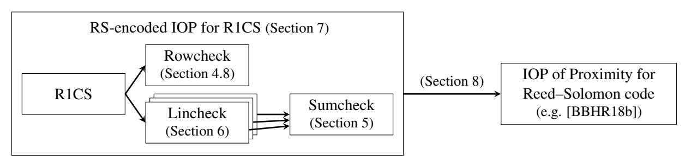
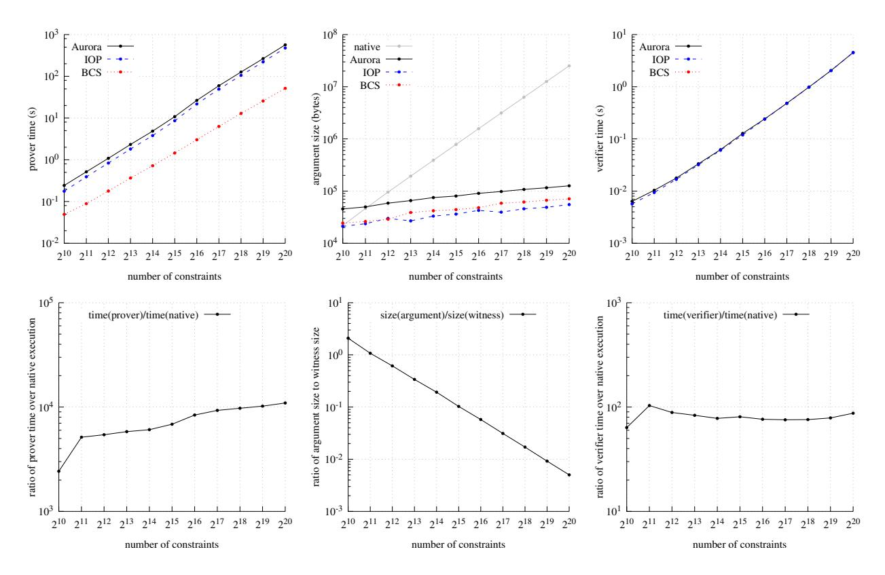

# <span id="page-0-0"></span>Aurora: Transparent Succinct Arguments for R1CS

Eli Ben-Sasson

eli@cs.technion.ac.il Technion

Nicholas Spooner

nick.spooner@berkeley.edu UC Berkeley

Alessandro Chiesa

alexch@berkeley.edu UC Berkeley

Madars Virza

madars@mit.edu MIT Media Lab

Michael Riabzev

mriabzev@cs.technion.ac.il Technion

Nicholas P. Ward

npward@berkeley.edu UC Berkeley

May 8, 2019

#### Abstract

We design, implement, and evaluate a zkSNARK for Rank-1 Constraint Satisfaction (R1CS), a widelydeployed NP-complete language that is undergoing standardization. Our construction uses a transparent setup, is plausibly post-quantum secure, and uses lightweight cryptography. A proof attesting to the satisfiability of n constraints has size O(log<sup>2</sup> n); it can be produced with O(n log n) field operations and verified with O(n). At 128 bits of security, proofs are less than 130 kB even for several million constraints, more than 20× shorter than prior zkSNARK with similar features.

A key ingredient of our construction is a new Interactive Oracle Proof (IOP) for solving a *univariate* analogue of the classical sumcheck problem [LFKN92], originally studied for *multivariate* polynomials. Our protocol verifies the sum of entries of a Reed–Solomon codeword over any subgroup of a field.

We also provide libiop, an open-source library for writing IOP-based arguments, in which a toolchain of transformations enables programmers to write new arguments by writing simple IOP subcomponents. We have used this library to specify our construction and prior ones.

Keywords: zero knowledge; interactive oracle proofs; succinct arguments; sumcheck protocol

## Contents

| 1.2<br>Our goal                                                                                                | The need for a transparent setup<br>3 |
|----------------------------------------------------------------------------------------------------------------|---------------------------------------|
| 1.3<br>Our contributions<br><br>1.4<br>Prior implementations of transparent succinct non-interactive arguments | 4<br>5<br>6                           |
|                                                                                                                |                                       |
| 2<br>Techniques<br>2.1<br>Our interactive oracle proof for R1CS                                                | 9<br>9                                |
| 2.2<br>A sumcheck protocol for univariate polynomials<br>                                                      | 10                                    |
| 2.3<br>Efficient zero knowledge from algebraic techniques                                                      | 11                                    |
| 2.4<br>Perspective on our techniques                                                                           | 12                                    |
| 3<br>Roadmap                                                                                                   | 14                                    |
| 4<br>Preliminaries                                                                                             | 15                                    |
| 4.1<br>Codes<br><br>4.2<br>Representations of polynomials                                                      | 15<br>15                              |
| 4.3<br>The fast Fourier transform                                                                              | 15                                    |
| 4.4<br>Subspace polynomials                                                                                    | 15                                    |
| 4.5<br>Interactive oracle proofs                                                                               | 16                                    |
| 4.6<br>Zero knowledge                                                                                          | 17                                    |
| 4.7<br>Reed–Solomon encoded IOP<br><br>4.8<br>Univariate rowcheck                                              | 18<br>20                              |
|                                                                                                                |                                       |
| 5<br>Univariate sumcheck                                                                                       | 21                                    |
| 5.1<br>Zero knowledge                                                                                          | 23                                    |
| 5.2<br>Amortization                                                                                            | 24                                    |
| 6<br>Univariate lincheck                                                                                       | 26                                    |
| 7<br>An RS-encoded IOP for rank-one constraint satisfaction                                                    | 28                                    |
| 7.1<br>Zero knowledge                                                                                          | 30                                    |
| 7.2<br>Amortization                                                                                            | 32                                    |
| 8<br>From RS-encoded provers to arbitrary provers<br>8.1<br>Zero knowledge                                     | 34<br>37                              |
| 9<br>Aurora: an IOP for rank-one constraint satisfaction (R1CS)                                                | 40                                    |
|                                                                                                                |                                       |
| 10 libiop: a library for IOP-based non-interactive arguments                                                   | 43                                    |
| 10.1 Library for IOP protocols<br><br>10.2 BCS transformation                                                  | 43<br>43                              |
| 10.3 Portfolio of IOP protocols and sub-components                                                             | 44                                    |
|                                                                                                                |                                       |
| 11 Evaluation                                                                                                  | 45                                    |
| 11.1 Performance of Aurora<br><br>11.2 Comparison of Ligero, Stark, and Aurora                                 | 45<br>45                              |
|                                                                                                                |                                       |
| A<br>Proof of Lemma 5.4                                                                                        | 48                                    |
| B<br>Adaptation of Ligero to the R1CS relation                                                                 | 49                                    |
| B.1<br>Interleaved lincheck                                                                                    | 49                                    |
| B.2<br>Interleaved rowcheck<br><br>B.3<br>Interleaved ZKIPCP for R1CS                                          | 50<br>51                              |
| B.4<br>From encoded IPCP to regular IPCP<br>                                                                   | 55                                    |
| C<br>Additional comparisons                                                                                    | 57                                    |
| C.1<br>Comparison of the LDTs in Ligero, Stark, and Aurora<br>                                                 | 57                                    |
| C.2<br>Comparison of the IOPs in Ligero, Stark, and Aurora                                                     | 57                                    |
| Acknowledgments                                                                                                | 59                                    |
| References                                                                                                     | 59                                    |

## <span id="page-2-0"></span>1 Introduction

A zero knowledge proof is a protocol that enables one party (the *prover*) to convince another (the *verifier*) that a statement is true without revealing any information beyond the fact that the statement is true. Since their introduction [\[GMR89\]](#page-61-0), zero knowledge proofs have become fundamental tools not only in the theory of cryptography but also, more recently, in the design of real-world systems with strong privacy properties.

For example, zero knowledge proofs are the core technology in Zcash [\[BCGGMTV14;](#page-59-0) [Zca\]](#page-63-0), a popular cryptocurrency that preserves a user's payment privacy. While in Bitcoin [\[Nak09\]](#page-62-0) users broadcast their private payment details in the clear on the public blockchain (so other participants can check the validity of the payment), users in Zcash broadcast *encrypted* transaction details and *prove*, in zero knowledge, the validity of the payments without disclosing what the payments are.

Many applications, including the aforementioned, require that proofs are *succinct*, namely, that proofs scale *sublinearly* in the size of the witness for the statement, or perhaps even in the size of the computation performed to check the statement. This strong efficiency requirement cannot be achieved with statistical soundness (under standard complexity assumptions) [\[GH98\]](#page-61-1), and thus one must consider proof systems that are merely computationally sound, known as *argument systems* [\[BCC88\]](#page-59-1). Many applications further require that a proof consists of a single non-interactive message that can be verified by anyone; such proofs are cheap to communicate and can be stored for later use (e.g., on a public ledger). Constructions that satisfy these properties are known as (publicly verifiable) *succinct non-interactive arguments* (SNARGs) [\[GW11\]](#page-61-2).

In this work we present Aurora, a zero knowledge SNARG of knowledge (zkSNARK) for (an extension of) arithmetic circuit satisfiability whose argument size is polylogarithmic in the circuit size. Aurora also has attractive features: it uses a transparent setup, is plausibly post-quantum secure, and only makes black-box use of fast symmetric cryptography (any cryptographic hash function modeled as a random oracle).

Our work makes an exponential asymptotic improvement in argument size over Ligero [\[AHIV17\]](#page-58-2), a recent zero knowledge non-interactive argument with similar features but where proofs scale as the *square root* of the circuit size. For example, Aurora's proofs are 30× smaller than Ligero's for circuits with a million gates (which already suffices for representative applications such as Zcash).

Our work also complements and improves on Stark [\[BBHR18a\]](#page-58-3), a recent zkSNARK that targets computations expressed as bounded halting problems on random access machines. While Stark was designed for a different computation model, we can still study its efficiency when applied to arithmetic circuits. In this case Aurora's prover is faster by a logarithmic factor (in the circuit size) and Aurora's proofs are concretely much shorter, e.g., 20× smaller for circuits with a million gates.

The efficiency features of Aurora stem from a new Interactive Oracle Proof (IOP) that solves a *univariate* analogue of the celebrated sumcheck problem [\[LFKN92\]](#page-62-1), in which query complexity is *logarithmic* in the degree of the polynomial being summed. This is an *exponential* improvement over the original multi-variate protocol, where communication complexity is (at least) *linear* in the degree of the polynomial. We believe this protocol and its analysis are of independent interest.

### <span id="page-2-1"></span>1.1 The need for a transparent setup

The first succinct argument is due to Kilian [\[Kil92\]](#page-61-3), who showed how to use collision-resistant hashing to compile any Probabilistically Checkable Proof (PCP) [\[BFLS91;](#page-60-0) [FGLSS96;](#page-60-1) [AS98;](#page-58-4) [ALMSS98\]](#page-58-5) into a corresponding interactive argument. Micali showed how a similar construction, in the random oracle model, yields succinct *non*-interactive arguments (SNARGs) [\[Mic00\]](#page-62-2). Subsequent work showed that Micali's construction preserves a PCP's zero knowledge [\[IMSX15\]](#page-61-4) and proof of knowledge [\[Val08\]](#page-63-1) properties. However PCPs remain expensive, and this approach has not led to SNARGs with good concrete efficiency.

In light of this, a different approach was initially used to achieve SNARG implementations with good concrete efficiency [\[PGHR13;](#page-62-3) [BCGTV13\]](#page-59-2). This approach, pioneered in [\[Gro10;](#page-61-5) [GGPR13;](#page-61-6) [Lip13;](#page-62-4) [BCIOP13\]](#page-59-3), relied on combining certain linearly homomorphic encodings with lightweight information-theoretic tools known as linear PCPs [\[IKO07;](#page-61-7) [BCIOP13;](#page-59-3) [SBVBPW13\]](#page-62-5); this approach was refined and optimized in several works [\[BCTV14b;](#page-59-4) [BCTV14a;](#page-59-5) [CFHKKNPZ15;](#page-60-2) [Gro16;](#page-61-8) [BISW17;](#page-60-3) [GM17\]](#page-61-9). These constructions underlie widely-used open-source libraries [\[SCI\]](#page-63-2) and deployed systems [\[Zca\]](#page-63-0), and their main feature is that proofs are very short (a few hundred bytes) and very cheap to verify (a few milliseconds).

Unfortunately, the foregoing approach suffers from a severe limitation, namely, the need for a central party to generate system parameters for the argument system. Essentially, this party must run a probabilistic algorithm, publish its output, and "forget" the secret randomness used to generate it. This party must be trustworthy because knowing these secrets allows forging proofs for false assertions. While this may sound like an inconvenience, it is a *colossal* challenge to real-world deployments. When using cryptographic proofs in distributed systems, relying on a central party negates the benefits of distributed trust and, even though it is invoked only once in a system's life, a party trusted by all users typically *does not exist*!

The responsibility for generating parameters can in principle be shared across multiple parties via techniques that leverage secure multi-party computation [\[BCGTV15;](#page-59-6) [BGG17;](#page-60-4) [BGM17\]](#page-60-5). This was the approach taken for the launch of Zcash [\[The\]](#page-63-3), but it also demonstrated how unwieldy such an approach is, involving a costly and logistically difficult real-world multi-party "ceremony". Successfully running such a multi-party protocol was a singular feat, and systems without such expensive setup are decidedly preferable.

*Some* setup is unavoidable because if SNARGs without *any* setup existed then so would sub-exponential algorithms for SAT [\[Wee05\]](#page-63-4). Nevertheless, one could still aim for a "transparent setup", namely one that consists of *public randomness*, because in practice it is cheaper to realize. Recent efforts have thus focused on designing SNARGs with transparent setup (see discussion in [Section 1.4\)](#page-5-0).

### <span id="page-3-0"></span>1.2 Our goal

The goal of this paper is to obtain *transparent zkSNARKs* that satisfy the following desiderata.

- *Post-quantum security.* Practitioners, and even standards bodies [\[NIS16\]](#page-62-6), have a strong interest in cryptographic primitives that are plausibly secure against efficient quantum adversaries. This is motivated by the desire to ensure long-term security of deployed systems and protocols.
- *Concrete efficiency.* We seek argument systems that not only exhibit good asymptotics (in argument size and prover/verifier time) but also demonstrably offer good efficiency via a prototype.

The second bullet warrants additional context. Most argument systems support an NP-complete problem, so they are in principle equivalent under polynomial-time reductions. Yet, whether such protocols can be efficiently used in practice actually depends on: (a) the particular NP-complete problem "supported" by the protocol; (b) the concrete efficiency of the protocol relative to this problem. This creates a complex tradeoff.

Simple NP-complete problems, like boolean circuit satisfaction, facilitate simple argument systems; but reducing the statements we wish to prove to boolean circuits is often expensive. On the other hand, one can design argument systems for rich problems (e.g., an abstract computer) for which it is cheap to express the desired statements; but such argument systems may use expensive tools to support these rich problems.

Our goal is concretely-efficient argument systems for *rank-1 constraint satisfaction* (R1CS), which is the following natural NP-complete problem: given a vector v ∈ F k and three matrices A, B, C ∈ F m×n , can one augment v to z ∈ F n such that Az ◦ Bz = Cz? (We use "◦" to denote the entry-wise product.)

We choose R1CS because it strikes an attractive balance: it generalizes circuits by allowing "native" field arithmetic and having no fan-in/fan-out restrictions, but it is simple enough that one can design efficient argument systems for it. Moreover, R1CS has demonstrated *strong empirical value*: it underlies real-world systems [Zca] and there are compilers that reduce program executions to it (see [WB15] and references therein). This has led to efforts to standardize R1CS formats across academia and industry [Zks].

#### <span id="page-4-0"></span>1.3 Our contributions

In this work we study *Interactive Oracle Proofs* (IOPs) [BCS16; RRR16], a notion of "multi-round PCPs" that has recently received much attention [BCGV16; BCFGRS17; BBCGGHPRSTV17; BBHR18b; BBHR18a; BKS18]. These types of interactive proofs can be compiled into non-interactive arguments in the random oracle model [BCS16], and in particular can be used to construct transparent SNARGs. The properties of zero knowledge and proof of knowledge are inherited from the IOP, leading to transparent zkSNARKs.

Building on this approach, we present several contributions: (1) an IOP protocol for R1CS with attractive efficiency features; (2) design, implementation, and evaluation of a transparent zkSNARK for R1CS, based on this IOP; (3) a library for writing IOP-based non-interactive arguments. We now describe each contribution.

(1) **IOP for R1CS.** We construct a zero knowledge IOP protocol for rank-1 constraint satisfaction (R1CS) with *linear* proof length and *logarithmic* query complexity.

Given an R1CS instance  $\mathcal{C}=(A,B,C)$  with  $A,B,C\in\mathbb{F}^{m\times n}$ , we denote by  $N=\Omega(m+n)$  the total number of non-zero entries in the three matrices and by  $|\mathcal{C}|$  the number of bits required to represent these; note that  $|\mathcal{C}|=\Theta(N\log|\mathbb{F}|)$ . One can view N as the number of "arithmetic gates" in the R1CS instance.

<span id="page-4-1"></span>**Theorem 1.1** (informal). There is an  $O(\log N)$ -round IOP protocol for R1CS with proof length O(N) over alphabet  $\mathbb{F}$  and query complexity  $O(\log N)$ . The prover uses  $O(N \log N)$  field operations, while the verifier uses O(N) field operations. The IOP protocol is public coin and is a zero knowledge proof of knowledge.

The core of our result is a solution to a *univariate* analogue of the classical sumcheck problem [LFKN92]. Our protocol (including zero knowledge and soundness error reduction) is relatively simple: it is specified in a single page (see Fig. 5 in Section 9), given a low-degree test as a subroutine. The low degree test that we use is a recent highly-efficient IOP for testing proximity to the Reed–Solomon code [BBHR18b].

(2) zkSNARK for R1CS. We design, implement, and evaluate Aurora, a zero knowledge SNARG of knowledge (zkSNARK) for R1CS with several notable features: (a) it only makes black-box use of fast symmetric cryptography (any cryptographic hash function modeled as a random oracle); (b) it has a transparent setup (users merely need to "agree" on which cryptographic hash function to use); (c) it is plausibly post-quantum secure (there are no known efficient quantum attacks against this construction). These features follow from the fact that Aurora is obtained by applying the transformation of [BCS16] to our IOP for R1CS. This transformation preserves both zero knowledge and proof of knowledge of the underlying IOP. The following theorem is obtained straightforwardly by combining Theorem 1.1 with [BCS16, Theorem 7.1].

**Theorem 1.2** (informal). There exists a zkSNARK for R1CS that is unconditionally secure in the random oracle model with proof length  $O_{\lambda}(\log^2 N)$ . The prover runs in time  $O_{\lambda}(N \log N)$  and the verifier in time  $O_{\lambda}(N)$ . (Here for simplicity we take the field  $\mathbb{F}$  to have size  $2^{\Theta(\lambda)}$  where  $\lambda$  is the security parameter.)

For example, setting our implementation to a security level of 128 bits over a 192-bit finite field, proofs range from  $40\,\mathrm{kB}$  to  $130\,\mathrm{kB}$  for instances of up to millions of gates; producing proofs takes on the order of several minutes and checking proofs on the order of several seconds. (See Section 11 for details.)

Overall, as indicated in Fig. 2, we achieve the smallest argument size among (plausibly) post-quantum non-interactive arguments for circuits, *by more than an order of magnitude*. Other approaches achieve smaller argument sizes by relying on (public-key) cryptography that is insecure against quantum adversaries.

(3) **libiop**: a library for non-interactive arguments. We provide libiop, a codebase that enables the design and implementation of non-interactive arguments based on IOPs. The codebase uses the C++ language and has three main components: (1) a library for writing IOP protocols; (2) a realization of [\[BCS16\]](#page-59-7)'s transformation, mapping any IOP written with our library to a corresponding non-interactive argument; (3) a portfolio of IOP protocols. We have released libiop under a permissive software license for the community (see <https://github.com/scipr-lab/libiop>). We believe that our library will serve as a useful tool in meeting the increasing demand by practitioners for transparent non-interactive arguments.

### <span id="page-5-0"></span>1.4 Prior implementations of transparent succinct non-interactive arguments

We summarize prior work that has designed *and implemented* transparent SNARGs; see [Fig. 2.](#page-7-0)[1](#page-0-0)

Based on asymmetric cryptography. *Bulletproofs* [\[BCCGP16;](#page-59-10) [BBBPWM18\]](#page-58-8) proves the satisfaction of an N-gate arithmetic circuit via a recursive use of a low-communication protocol for inner products, achieving a proof with O(log N) group elements. *Hyrax* [\[WTSTW17\]](#page-63-7) proves the satisfaction of a *layered* arithmetic circuit of depth D and width W via proofs of O(D log W) group elements; the construction applies the Cramer–Damgard transformation [\[CD98\]](#page-60-7) to doubly-efficient Interactive Proofs [\[GKR15;](#page-61-10) [CMT12\]](#page-60-8). Both ˚ approaches use Pedersen commitments, and so are *vulnerable to quantum attacks*. Also, in both approaches the verifier performs *many expensive cryptographic operations*: in the former, the verifier uses O(N) group exponentiations; in the latter, the verifier's group exponentiations are linear in the circuit's witness size. (Hyrax allows fewer group exponentiations but with longer proofs; see [\[WTSTW17\]](#page-63-7).)

Based on symmetric cryptography. The "original" SNARG construction of Micali [\[Mic00;](#page-62-2) [IMSX15\]](#page-61-4) has advantages beyond transparency. First, it is unconditionally secure given a random oracle, which can be instantiated with fast symmetric cryptography.[2](#page-0-0) Second, it is plausibly post-quantum secure, in that there are no known efficient quantum attacks. But the construction relies on PCPs, which remain expensive.

IOPs are "multi-round PCPs" that can also be compiled into non-interactive arguments in the random oracle model [\[BCS16\]](#page-59-7). This compilation retains the foregoing advantages (transparency, lightweight cryptography, and plausible post-quantum security) and, *in addition*, facilitates greater efficiency, as IOPs have superior efficiency compared to PCPs [\[BCGV16;](#page-59-8) [BCFGRS17;](#page-59-9) [BBCGGHPRSTV17;](#page-58-6) [BBHR18b;](#page-58-7) [BBHR18a\]](#page-58-3).

In this work we follow the above approach, by constructing a zkSNARK based on a new IOP protocol. Two recent works have also taken the same approach, but with different underlying IOP protocols, which have led to different features. We provide both of these works as part of our library [\(Section 10\)](#page-42-0), and experimentally compare them with our protocol [\(Section 11\)](#page-44-0). The discussion below is a qualitative comparison.

- Ligero [\[AHIV17\]](#page-58-2) is a non-interactive argument that proves the satisfiability of an N-gate circuit via proofs of size O( √ N) that can be verified in O(N) cryptographic operations. As summarized in [Fig. 1,](#page-7-1) the IOP underlying Ligero achieves the same oracle proof length, prover time, and verifier time as our IOP. However, we reduce query complexity from O( √ N) to O(log N), which is an exponential improvement, at the expense of increasing round complexity from 2 to O(log N). The arguments that we obtain are still non-interactive, but our smaller query complexity translates into shorter proofs (see [Fig. 2\)](#page-7-0).
- Stark [\[BBHR18a\]](#page-58-3) is a non-interactive argument for bounded halting problems on a random access machine. Given a program P and a time bound T, it proves that P accepts within T steps on a certain abstract

<sup>1</sup>We omit a discussion of prior works without implementations, or that study *non-transparent* succinct non-interactive arguments; we refer the reader to the survey of Walfish and Blumberg [\[WB15\]](#page-63-5) for an overview of sublinear argument systems. We also note that recent work [\[BBCPGL18\]](#page-58-9) has used lattice cryptography to achieve sublinear zero knowledge arguments that are plausibly post-quantum secure, which raises the exciting question of whether these recent protocols can lead to efficient implementations.

Some cryptographic hash functions, such as BLAKE2, can process almost 1 gibibyte per second [\[ANWOW13\]](#page-58-10).

computer (when given suitable nondeterministic advice) via succinct proofs of size polylog(T). Moreover, verification is *also* succinct: checking a proof takes time only |P| + polylog(T), which is polynomial in the size of the statement and much better than "naive verification" which takes time Ω(|P| + T).

The main difference between Stark and Aurora is the computational models that they support. While Stark supports *uniform* computations specified by a program and a time bound, Aurora supports *non-uniform* computations specified by an explicit circuit (or constraint system). Despite this difference, we can compare the cost of Stark and Aurora with respect to the explicit circuit model, since one can reduce a given N-gate circuit (or N-constraint system) to a corresponding bounded halting problem with |P|, T = Θ(N).

In this case, Stark's verification time is the same as Aurora's, O(N); this is best possible because just *reading* an N-gate circuit takes time Ω(N). But Stark's prover is a logarithmic factor more expensive because it uses a switching network to verify a program's accesses to memory. Stark's prover uses an IOP with oracles of size O(N log N), leading to an arithmetic complexity of O(N log<sup>2</sup> N). (See [Figs. 1](#page-7-1) and [2.](#page-7-0))

Both Stark and Aurora have argument size O(log<sup>2</sup> N), but additional costs in Stark (e.g., due to switching networks) result in Stark proofs being *one order of magnitude larger* than Aurora proofs. That said, we view Stark and Aurora as complementing each other: Stark offers savings in verification time for succinctly represented programs, while Aurora offers savings in argument size for explicitly represented circuits.

|        | protocol | round      | proof length | query           | prover time | verifier time |
|--------|----------|------------|--------------|-----------------|-------------|---------------|
|        | type     | complexity | (field elts) | complexity<br>√ | (field ops) | (field ops)   |
| Ligero | IPCP †   | 2          | O(N)         | O(<br>N)        | O(N log N)  | O(N)          |
| Stark  | IOP      | O(log N)   | O(N log N)   | O(log N)        | O(N log2 N) | O(N)          |
| Aurora | IOP      | O(log N)   | O(N)         | O(log N)        | O(N log N)  | O(N)          |

<span id="page-7-1"></span>Figure 1: Asymptotic comparison of the information-theoretic proof systems underlying Ligero, Stark, and Aurora, when applied to an N-gate arithmetic circuit.

† An IPCP [\[KR08\]](#page-61-11) is a PCP oracle that is checked via an Interactive Proof; it is a special case of an IOP.

|                  |              |         | post     | argument size |         |         |                                  | verifier | non-interactivity |
|------------------|--------------|---------|----------|---------------|---------|---------|----------------------------------|----------|-------------------|
|                  | name         | setup   | quantum? | asymptotic    | N = 106 | time    | technology                       |          |                   |
| [Gro10][GGPR13]  | various      | private | no       | Oλ(1)         | 128 B   | Oλ(k) † | linear PCP + linear encoding     |          |                   |
| [Lip13][BCIOP13] |              |         |          |               |         |         |                                  |          |                   |
| [ZGKPP17a]       | ZK-vSQL      | private | no       | Oλ(d log N)   | N/A     | Oλ(N)   | apply [CD98]-transform to doubly |          |                   |
|                  |              |         |          |               |         |         | efficient IP [GKR15; CMT12]      |          |                   |
| [WTSTW17]        | Hyrax        | public  | no       | Oλ(d log N) ‡ | 50 kB   | Oλ(N)   | as above (but using a different  |          |                   |
|                  |              |         |          |               |         |         | polynomial commitment)           |          |                   |
| [BCCGP16]        | Bulletproofs | public  | no       | Oλ(log N)     | 1.5 kB  | Oλ(N)   | recursive inner product argument |          |                   |
| [BBBPWM18]       |              |         |          | √             |         |         |                                  |          |                   |
| [AHIV17]         | Ligero       | public  | yes      | Oλ(<br>N)     | 4.0 MB  | Oλ(N)   | apply [BCS16]-transform to IPCP  |          |                   |
| [BBHR18a]        | Stark        | public  | yes      | Oλ(log2 N)    | 3.2 MB  | Oλ(N)   | apply [BCS16]-transform to IOP   |          |                   |
| this work        | Aurora       | public  | yes      | Oλ(log2 N)    | 130 kB  | Oλ(N)   | apply [BCS16]-transform to IOP   |          |                   |

<span id="page-7-0"></span>Figure 2: Comparison of some non-interactive zero knowledge arguments for proving statements of the form "there exists a secret w such that C(x, w) = 1" for a given arithmetic circuit C of N gates (and depth d) and public input x of size k. The table is grouped by "technology", and for simplicity assumes that the circuit's underlying field has size 2 <sup>O</sup>(λ) where λ is the security parameter. Approximate argument sizes are given for N = 10<sup>6</sup> gates over a cryptographically-large field, and a security level of 128 bits; some argument sizes may differ from those reported in the cited works because size had to be re-computed for the security level and N used here; also, [\[ZGKPP17a\]](#page-63-8) reports no implementation.

<sup>†</sup> Given a per-circuit preprocessing step.

<sup>‡</sup> A tradeoff between argument size and verifier time is possible; see [\[WTSTW17\]](#page-63-7).

## <span id="page-8-0"></span>2 Techniques

Our main technical contribution is a linear-length logarithmic-query IOP for R1CS [\(Theorem 1.1\)](#page-4-1), which we use to design, implement, and evaluate a transparent zkSNARK for R1CS. Below we summarize the main ideas behind our protocol, and postpone to [Sections 10](#page-42-0) and [11](#page-44-0) discussions of our system. In [Section 2.1,](#page-8-1) we describe our approach to obtain the IOP for R1CS; this approach leads us to solve the univariate sumcheck problem, as discussed in [Section 2.2;](#page-9-0) finally, in [Section 2.3,](#page-10-0) we explain how we achieve zero knowledge. In [Section 2.4](#page-11-0) we conclude with a wider perspective on the techniques used in this paper.

### <span id="page-8-1"></span>2.1 Our interactive oracle proof for R1CS

The R1CS relation consists of instance-witness pairs ((A, B, C, v), w), where A, B, C are matrices and v, w are vectors over a finite field F, such that (Az)◦(Bz) = Cz for z := (1, v, w) and "◦" denotes the entry-wise product.[3](#page-0-0) For example, R1CS captures arithmetic circuit satisfaction: A, B, C represent the circuit's gates, v the circuit's public input, and w the circuit's private input and wire values.[4](#page-0-0)

We describe the high-level structure of our IOP protocol for R1CS, which has linear proof length and logarithmic query complexity. The protocol tests satisfaction by relying on two building blocks, one for testing the entry-wise vector product and the other for testing the linear transformations induced by the matrices A, B, C. Informally, we thus consider protocols for the following two problems.

- Rowcheck: given vectors x, y, z ∈ F <sup>m</sup>, test whether x ◦ y = z, where "◦" denotes entry-wise product.
- Lincheck: given vectors x ∈ F <sup>m</sup>, y ∈ F n and a matrix M ∈ F m×n , test whether x = My.

One can immediately obtain an IOP for R1CS when given IOPs for the rowcheck and lincheck problems. The prover first sends four oracles to the verifier: the satisfying assignment z and its linear transformations y<sup>A</sup> := Az, y<sup>B</sup> := Bz, y<sup>C</sup> := Cz. Then the prover and verifier engage in four IOPs in parallel:

- An IOP for the lincheck problem to check that "y<sup>A</sup> = Az". Likewise for y<sup>B</sup> and yC.
- An IOP for the rowcheck problem to check that "y<sup>A</sup> y<sup>B</sup> = yC".

Finally, the verifier checks that z is consistent with the public input v. Clearly, there exist z, yA, yB, y<sup>C</sup> that yield valid rowcheck and lincheck instances if and only if (A, B, C, v) is a satisfiable R1CS instance.

The foregoing reduces the goal to designing IOPs for the rowcheck and lincheck problems.

As stated, however, the rowcheck and lincheck problems only admit "trivial" protocols in which the verifier queries all entries of the vectors in order to check the required properties. In order to allow for sublinear query complexity, we need the vectors x, y, z to be *encoded* via some error-correcting code. We use the Reed–Solomon (RS) code because it ensures constant distance with constant rate while at the same time it enjoys efficient IOPs of Proximity [\[BBHR18b\]](#page-58-7).

Given an evaluation domain L ⊆ F and rate parameter ρ ∈ [0, 1], RS [L, ρ] is the set of all codewords f : L → F that are evaluations of polynomials of degree less than ρ|L|. Then, the encoding of a vector v ∈ F <sup>S</sup> with S ⊆ F and |S| < ρ|L| is vˆ|<sup>L</sup> ∈ F <sup>L</sup> where vˆ is the unique polynomial of degree |S| − 1 such that vˆ|<sup>S</sup> = v. Given this encoding, we consider "encoded" variants of the rowcheck and lincheck problems.

<sup>3</sup>Throughout, we assume that F is "friendly" to FFT algorithms, i.e., F is a binary field or its multiplicative group is smooth.

<sup>4</sup>The reader may be familiar with a standard arithmetization of circuit satisfaction (used, e.g., in the inner PCP of [\[ALMSS98\]](#page-58-5)). Given an arithmetic circuit with m gates and n wires, each addition gate x<sup>i</sup> ← x<sup>j</sup> + x<sup>k</sup> is mapped to the linear constraint x<sup>i</sup> = x<sup>j</sup> + x<sup>k</sup> and each product gate x<sup>i</sup> ← x<sup>j</sup> · x<sup>k</sup> is mapped to the quadratic constraint x<sup>i</sup> = x<sup>j</sup> · xk. The resulting system of equations can be written as A · ((1, x) ⊗ (1, x)) = b for suitable A ∈ F m×(n+1)<sup>2</sup> and b ∈ F <sup>m</sup>. However, this reduction results in a quadratic blowup in the instance size. There is an alternative reduction due to [\[Mei12;](#page-62-8) [GGPR13\]](#page-61-6) that avoids this.

- Univariate rowcheck (Definition 4.9): given a subset  $H \subseteq \mathbb{F}$  and codewords  $f, g, h \in \mathrm{RS}\,[L, \rho]$ , check that  $\hat{f}(a) \cdot \hat{g}(a) \hat{h}(a) = 0$  for all  $a \in H$ . (This is a special case of the definition that we use later.)
- Univariate lincheck (Definition 6.1): given subsets  $H_1, H_2 \subseteq \mathbb{F}$ , codewords  $f, g \in \mathrm{RS}\,[L, \rho]$ , and a matrix  $M \in \mathbb{F}^{H_1 \times H_2}$ , check that  $\hat{f}(a) = \sum_{b \in H_2} M_{a,b} \cdot \hat{g}(b)$  for all  $a \in H_1$ .

Given IOPs for the above problems, we can now get an IOP protocol for R1CS roughly as before. Rather than sending z, Az, Bz, Cz, the prover sends their encodings  $f_z$ ,  $f_{Az}$ ,  $f_{Bz}$ ,  $f_{Cz}$ . The prover and verifier then engage in rowcheck and lincheck protocols as before, but with respect to these encodings.

For these encoded variants, we achieve IOP protocols with linear proof length and logarithmic query complexity, as required. We obtain a protocol for rowcheck via standard techniques from the probabilistic checking literature [BS08]. As for lincheck, we do not use any routing and instead use a technique (dating back at least to [BFLS91]) to reduce the given testing problem to a *sumcheck instance*. However, since we are not working with multivariate polynomials, we cannot rely on the usual (multivariate) sumcheck protocol. Instead, we present a novel protocol that realizes a univariate analogue of the classical sumcheck protocol, and use it as the testing "core" of our IOP protocol for R1CS. We discuss univariate sumcheck next.

**Remark 2.1.** The verifier receives as input an explicit (non-uniform) description of the set of constraints, namely, the matrices A, B, C. In particular, the verifier runs in time that is at least linear in the number of non-zero entries in these matrices (if we consider a sparse-matrix representation for example).

### <span id="page-9-0"></span>2.2 A sumcheck protocol for univariate polynomials

A key ingredient in our IOP protocol is a *univariate* analogue of the classical (multivariate) sumcheck protocol [LFKN92]. Recall that the classical sumcheck protocol is an IP for claims of the form " $\sum_{\vec{a} \in H^m} f(\vec{a}) = 0$ ", where f is a given polynomial in  $\mathbb{F}[X_1, \ldots, X_m]$  of individual degree d and H is a subset of  $\mathbb{F}$ . In this protocol, the verifier runs in time  $\operatorname{poly}(m, d, \log |\mathbb{F}|)$  and accesses f at a single (random) location. The sumcheck protocol plays a fundamental role in computational complexity (it underlies celebrated results such as IP = PSPACE [Sha92] and MIP = NEXP [BFL91]) and in efficient proof protocols [GKR15; CMT12; TRMP12; Tha13; Tha15; WHGSW16; WJBSTWW17; ZGKPP17b; ZGKPP17a; WTSTW17].

We work with univariate polynomials instead, and need a univariate analogue of the sumcheck protocol (see previous subsection): how can a prover convince the verifier that " $\sum_{a\in H} f(a) = 0$ " for a given polynomial  $f\in \mathbb{F}[X]$  of degree d and subset  $H\subseteq \mathbb{F}$ ? Designing a "univariate sumcheck" is not straightforward because univariate polynomials (the Reed–Solomon code) do not have the tensor structure used by the sumcheck protocol for multivariate polynomials (the Reed–Muller code). In particular, the sumcheck protocol has m rounds, each of which reduces a sumcheck problem to a simpler sumcheck problem with one variable fewer. When there is only one variable, however, it is not clear to what simpler problems one can reduce.

Using different ideas, we design a natural protocol for univariate sumcheck in the cases where H is an additive or multiplicative coset in  $\mathbb{F}$  (i.e., a coset of an additive or multiplicative subgroup of  $\mathbb{F}$ ).

**Theorem** (informal). The univariate sumcheck protocol over additive or multiplicative cosets has a  $O(\log d)$ -round IOP with proof complexity O(d) over alphabet  $\mathbb F$  and query complexity  $O(\log d)$ . The IOP prover uses  $O(d\log |H|)$  field operations and the IOP verifier uses  $O(\log d + \log^2 |H|)$  field operations.

We now provide the main ideas behind the protocol, when H is an additive coset in  $\mathbb{F}$ .

Suppose for a moment that the degree d of f is less than |H| (we remove this restriction later). A theorem of Byott and Chapman [BC99] states that the sum of f over (an additive coset) H is zero if and only if the

coefficient of X|H|−<sup>1</sup> in f is zero. In particular, P <sup>a</sup>∈<sup>H</sup> f(a) is zero if and only if f has degree less than |H| − 1. Thus, the univariate sumcheck problem over H when d < |H| is equivalent to low-degree testing.

The foregoing suggests a natural approach: test that f has degree less than |H| − 1. Without any help from the prover, the verifier would need at least |H| queries to f to conduct such a test, which is as expensive as querying all of H. However, the prover can help by engaging with the verifier in an IOP of Proximity for the Reed–Solomon code. For this we rely on the recent construction of Ben-Sasson et al. [\[BBHR18b\]](#page-58-7), which has proof length O(d) and query complexity O(log d).

In our setting, however, we need to also handle the case where the degree d of f is larger than |H|. For this case, we observe that we can split any polynomial f into two polynomials g and h such that f(x) ≡ g(x) + Q <sup>α</sup>∈H(x − α) · h(x) with deg(g) < |H| and deg(h) < d − |H|; in particular, f and g agree on H, and thus so do their sums on H. This observation suggests the following extension to the prior approach: the prover sends g (as an oracle) to the verifier, and then the verifier performs the prior protocol with g in place of f. Of course, a cheating prover may send a polynomial g that has nothing to do with f, and so the verifier must also ensure that g is consistent with f. To facilitate this, we actually have the prover send h rather than g; the verifier can then "query" g(x) as f(x) − Q <sup>α</sup>∈H(x − α) · h(x); the prover then shows that f, g, h are all of the correct degrees.

A similar reasoning works when H is a multiplicative coset in F (see [Remark 5.6\)](#page-21-0). It remains an interesting open problem to establish whether the foregoing can be extended to any subset H in F.

Remark 2.2 (vanishing vs. summing). The following are both linear subcodes of the Reed–Solomon code:

```
VanishRS[F, L, H, d] :={f : L → F | f has degree less than d and is zero everywhere on H} ,
  SumRS[F, L, H, d] :={f : L → F | f has degree less than d and sums to zero on H} .
```

Our univariate sumcheck protocol is an IOP of Proximity for SumRS, and is reminiscent of IOPs of Proximity for VanishRS (e.g., see [\[BBHR18a\]](#page-58-3)). Nevertheless, there are also intriguing differences between the two cases. For example, while it is known how to test proximity to VanishRS for general H, we only know how to test proximity to SumRS when H is a coset. Additionally, our IOP protocol for R1CS from [Section 2.1](#page-8-1) can be viewed as a reduction from checking satisfaction of R1CS to testing proximity to SumRS; we do not know how to carry out a similar reduction to VanishRS. Indeed, there is an interactive reduction from VanishRS to SumRS, but no reduction in the other direction is known.

### <span id="page-10-0"></span>2.3 Efficient zero knowledge from algebraic techniques

The ideas discussed thus far yield an IOP protocol for R1CS with linear proof length and logarithmic query complexity. However these by themselves do not provide zero knowledge.

We achieve zero knowledge by leveraging recent algebraic techniques [\[BCGV16\]](#page-59-8). Informally, we adapt these techniques to achieve efficient zero knowledge variants of key sub-protocols, including the univariate sumcheck protocol (see [Section 5.1\)](#page-22-0) and low-degree testing (see [Section 8.1\)](#page-36-0), and combine these to achieve a zero knowledge IOP protocol for R1CS (see [Sections 7.1](#page-29-0) and [9\)](#page-39-0).

We summarize the basic intuition for how we achieve zero knowledge in our protocols.

First, we use *bounded independence*. Informally, rather than encoding a vector z ∈ F <sup>H</sup> by the unique polynomial of degree |H| − 1 that matches z on H, we instead sample uniformly at random a polynomial of degree, say, |H| + 9 conditioned on matching z on H. Any set of 10 evaluations of such a polynomial are independently and uniformly distributed in F (and thus reveal no information about z), *provided these evaluations are outside of* H. To ensure this latter condition, we choose the evaluation domain L of Reed–Solomon codewords to be disjoint from H. Thus, for example, if H is a linear space (an additive subgroup of  $\mathbb{F}$ ) then we choose L to be an affine subspace (a coset of some additive subgroup), since the underlying machinery for low-degree testing (e.g., [BBHR18b]) requires codewords to be evaluated over algebraically-structured domains. All of our protocols are robust to these variations.

Bounded independence alone does not suffice, though. For example, in the sumcheck protocol, consider the case where the input vector  $z \in \mathbb{F}^H$  is all zeroes. The prover samples a random polynomial  $\hat{f}$  of degree |H|+9, such that  $\hat{f}(a)=0$  for all  $a\in H$ , and sends its evaluation f over L disjoint from H to the verifier. As discussed, any ten queries to f result in ten independent and uniformly random elements in  $\mathbb{F}$ . Observe, however, that when we run the sumcheck protocol on f, the polynomial g (the remainder of  $\hat{f}$  when divided by  $\prod_{\alpha\in H}(x-\alpha)$ ) is the zero polynomial: all randomness is removed by the division.

To remedy this, we use self-reducibility to reduce a sumcheck claim about the polynomial f to a sumcheck claim about a random polynomial. The prover first sends a random Reed–Solomon codeword r, along with the value  $\beta:=\sum_{a\in H}r(a)$ . The verifier sends a random challenge  $\rho\in\mathbb{F}$ . Then the prover and verifier engage in the univariate sumcheck protocol with respect to the new claim " $\sum_{a\in H}\rho f(a)+r(a)=\beta$ ". Since r is uniformly random,  $\rho f+r$  is uniformly random for any  $\rho$ , and thus the sumcheck protocol is performed on a random polynomial, which ensures zero knowledge. Soundness is ensured by the fact that if f does not sum to 0 on H then the new claim is true with probability  $1/|\mathbb{F}|$  over the choice of  $\rho$ .

### <span id="page-11-0"></span>2.4 Perspective on our techniques

A linear-length logarithmic-query IOP for a "circuit-like" NP-complete relation like R1CS (Theorem 1.1) may come as a surprise. We wish to shed some light on our IOP construction by connecting the ideas behind it to prior ideas in the probabilistic checking literature, and use these connections to motivate our construction.

A significant cost in all known PCP constructions with good proof length is using *routing networks* to reduce combinatorial objects (circuits, machines, and so on) to structured algebraic ones;<sup>5</sup> routing also plays a major role in many IOPs [BCGV16; BCFGRS17; BBCGGHPRSTV17; BBHR18a]. While it is plausible that one could adapt routing techniques to route the constraints of an R1CS instance (similarly to [PS94]), such an approach would likely incur logarithmic-factor overheads, precluding *linear*-size IOPs.

A recent work [BCGRS17] achieves linear-length constant-query IOPs for boolean circuit satisfaction without routing the input circuit. Unfortunately, [BCGRS17] relies on other expensive tools, such as algebraic-geometry (AG) codes and quasilinear-size PCPs of proximity [BS08]; moreover, it is not zero knowledge. Informally, [BCGRS17] tests arbitrary (unstructured) constraints by invoking a sumcheck protocol [LFKN92] on a O(1)-wise tensor product of AG codes; this latter is then locally tested via tools in [BS06; BS08].

One may conjecture that, to achieve an IOP for R1CS like ours, it would suffice to merely replace the AG codes in [BCGRS17] with the Reed–Solomon code, since both codes have constant rate. But taking a tensor product exponentially deteriorates rate, and testing proximity to that tensor product would be expensive.

An alternative approach is to solve a sumcheck problem *directly* on the Reed–Solomon code. Existing protocols are not of much use here: the multivariate sumcheck protocol relies on a tensor structure that is *not* available in the Reed–Solomon code, and recent IOP implementations either use routing [BBCGGHPRSTV17; BBHR18a] or achieve only sublinear query complexity [AHIV17].

Instead, we design a completely new IOP for a sumcheck problem on the Reed–Solomon code. We then combine this solution with ideas from [BCGRS17] (to avoid routing) and from [BCGV16] (to achieve zero

<sup>&</sup>lt;sup>5</sup>Polishchuk and Spielman [PS94] reduce boolean circuit satisfaction to a trivariate algebraic coloring problem with "low-degree" neighbor relations, by routing the circuit's wires over an arithmetized routing network. Ben-Sasson and Sudan [BS08] reduce nondeterministic machine computations to a univariate algebraic satisfaction problem by routing the machine's memory accesses over another arithmetized routing network. Routing is again a crucial component in the linear-size sublinear-query PCPs of [BKKMS13].

knowledge) to obtain our linear-length logarithmic-query IOP for R1CS. Along the way, we rely on recent efficient proximity tests for the Reed–Solomon code [\[BBHR18b\]](#page-58-7).

## <span id="page-13-0"></span>3 Roadmap

In [Section 4](#page-14-0) we provide necessary definitions about codes, proof systems, and other notions. Subsequent sections describe subprotocols, presented as *Reed–Solomon encoded* IOPs, which are IOPs for which soundness only holds against provers whose messages are Reed–Solomon codewords of specified rates, that are later compiled into standard IOPs. Specifically: the sumcheck protocol is in [Section 5;](#page-20-0) the lincheck protocol in [Section 6;](#page-25-0) and the rowcheck protocol in [Section 4.8.](#page-19-0) In [Section 7](#page-27-0) we combine the rowcheck and lincheck protocols to obtain an RS-encoded IOP for R1CS. In [Section 8](#page-33-0) we explain how to transform RS-encoded IOPs to standard IOPs, and in [Section 9](#page-39-0) we apply this transformation to our RS-encoded IOP for R1CS. [Fig. 3](#page-13-1) summarizes the structure of our IOP for R1CS. Finally, in [Section 10](#page-42-0) we describe our implementation and in [Section 11](#page-44-0) we report on its evaluation.

Throughout, we focus on the case where all relevant domains are *additive* cosets (affine subspaces) in F. The case where domains are *multiplicative* cosets is similar, with only minor modifications (see [Remark 5.6\)](#page-21-0). Moreover, while for convenience we limit our discussions to establishing soundness, all protocols described in this paper are easily seen to satisfy the stronger notion of proof of knowledge. Informally, this is because we prove soundness by showing that oracles sent by convincing provers can be decoded to valid witnesses.

### IOP for R1CS [\(Section 9\)](#page-39-0)



<span id="page-13-1"></span>Figure 3: Structure of our IOP for R1CS in terms of key sub-protocols.

### <span id="page-14-0"></span>4 Preliminaries

Given a relation  $\mathcal{R} \subseteq S \times T$ , we denote by  $\mathcal{L}(\mathcal{R}) \subseteq S$  the set of  $s \in S$  such that there exists  $t \in T$  with  $(s,t) \in \mathcal{R}$ ; for  $s \in S$ , we denote by  $\mathcal{R}|_s \subseteq T$  the set  $\{t \in T : (s,t) \in \mathcal{R}\}$ . Given a set S and strings  $v,w \in S^n$  for some  $n \in \mathbb{N}$ , the fractional Hamming distance  $\Delta(v,w) \in [0,1]$  is  $\Delta(v,w) := \frac{1}{n}|\{i : v_i \neq w_i\}|$ .

#### <span id="page-14-1"></span>4.1 Codes

**Interleaved codes.** Given linear codes  $C_1, \ldots, C_m \subseteq \mathbb{F}^n$  with alphabet  $\mathbb{F}$ , we denote by  $\prod_{i=1}^m C_i \subseteq (\mathbb{F}^m)^n \equiv \mathbb{F}^{m \times n}$  the linear "interleaved" code with alphabet  $\mathbb{F}^m$  that equals the set of all  $m \times n$  matrices whose i-th row is in  $C_i$ . If  $C_1 = \cdots = C_m$ , we write  $C^m$  for  $\prod_{i=1}^m C_i$ . Since the alphabet is  $\mathbb{F}^m$ , the Hamming distance is taken *column-wise*: for  $A, A' \in \mathbb{F}^{m \times n}$ ,  $\Delta(A, A') := \frac{1}{n} |\{j \in [n] : \exists i \in [m] \text{ s.t. } A_{i,j} \neq A'_{i,j}\}|$ .

The Reed–Solomon code. Given a subset L of a field  $\mathbb{F}$  and  $\rho \in (0,1]$ , we denote by  $\mathrm{RS}\,[L,\rho] \subseteq \mathbb{F}^L$  all evaluations over L of univariate polynomials of degree less than  $\rho|L|$ . That is, a word  $c \in \mathbb{F}^L$  is in  $\mathrm{RS}\,[L,\rho]$  if there exists a polynomial p of degree less than  $\rho|L|$  such that  $c_a = p(a)$  for every  $a \in L$ . We denote by  $\mathrm{RS}\,[L,(\rho_1,\ldots,\rho_n)] := \prod_{i=1}^n \mathrm{RS}\,[L,\rho_i]$  the interleaving of Reed–Solomon codes with rates  $\rho_1,\ldots,\rho_n$ .

### <span id="page-14-2"></span>4.2 Representations of polynomials

We frequently move from univariate polynomials over  $\mathbb F$  to their evaluations on chosen subsets of  $\mathbb F$ , and back. We use plain letters like  $f,g,h,\pi$  to denote *evaluations* of polynomials, and "hatted letters"  $\hat f,\hat g,\hat h,\hat \pi$  to denote corresponding polynomials. This bijection is well-defined only if the size of the evaluation domain is larger than the degree. Formally, if  $f\in\mathrm{RS}\,[L,\rho]$  for  $L\subseteq\mathbb F,\,\rho\in(0,1]$ , then  $\hat f$  is the unique polynomial of degree less than  $\rho|L|$  whose evaluation on L equals f. Likewise, if  $\hat f\in\mathbb F[X]$  with  $\deg(f)<\rho|L|$ , then  $f_L:=\hat f|_L\in\mathrm{RS}\,[L,\rho]$  (but we will drop the subscript when the choice of subset is clear from context).

#### <span id="page-14-3"></span>4.3 The fast Fourier transform

We often rely on polynomial arithmetic, which can be efficiently performed via fast Fourier transforms and their inverses. In particular, polynomial evaluation and interpolation over an (affine) subspace of size n of a finite field can be performed in  $O(n \log n)$  field operations via an additive FFT [LCH14]. Because in practice the number of FFTs we perform is important, when discussing complexities we use the notation  $FFT(\mathbb{F}, m)$  for the cost of a single additive FFT (or IFFT) on a subspace of  $\mathbb{F}$  of size m.

**Remark 4.1.** Strictly, an additive FFT evaluates a polynomial of degree d on a subspace of size d+1. To evaluate on a larger subspace (of size n), one can run an FFT over each coset of the smaller space inside the larger one at a cost of  $\frac{n}{d} \cdot O(d \log d) = O(n \log d)$ . We will suppress this technicality when it appears, and upper bound the cost of such an evaluation by an FFT on a subspace of size n.

#### <span id="page-14-4"></span>4.4 Subspace polynomials

Let  $\mathbb{F}$  be an extension field of a prime field  $\mathbb{F}_p$ , and H be a subset of  $\mathbb{F}$ . We denote by  $\mathbb{Z}_H$  the unique monic polynomial of degree at most |H| that is zero on H. If H is an (affine) subspace of  $\mathbb{F}$ , then  $\mathbb{Z}_H$  is called an (affine) subspace polynomial. In this case, there exist coefficients  $c_0,\ldots,c_k\in\mathbb{F}$ , where  $k:=\dim(H)$ , such that  $\mathbb{Z}_H(X)=X^{p^k}+\sum_{i=1}^k c_i X^{p^{i-1}}+c_0$  (if H is linear then  $c_0=0$ ). See [LN97, Chapter 3.4] and [BCGT13, Remark C.8] for how to find the coefficients  $c_0,\ldots,c_k$  in  $O(k^2\log p)$  field operations. Polynomials of this

type are called *linearized* because they are  $\mathbb{F}_p$ -affine maps: if  $H = H_0 + \beta$  for a subspace  $H_0 \subseteq \mathbb{F}$  and shift  $\beta \in \mathbb{F}$ , then  $\mathbb{Z}_H(X) \equiv \mathbb{Z}_{H_0}(X) - \mathbb{Z}_{H_0}(\beta)$ , and  $\mathbb{Z}_{H_0}$  is an  $\mathbb{F}_p$ -linear map.

### <span id="page-15-0"></span>4.5 Interactive oracle proofs

The information-theoretic protocols in this paper are *Interactive Oracle Proofs* (IOPs) [BCS16; RRR16], which combine aspects of Interactive Proofs [Bab85; GMR89] and Probabilistically Checkable Proofs [BFLS91; AS98; ALMSS98], and also generalize the notion of Interactive PCPs [KR08].

A k-round public-coin IOP has k rounds of interaction. In the *i*-th round of interaction, the verifier sends a uniformly random message  $m_i$  to the prover; then the prover replies with a message  $\pi_i$  to the verifier. After k rounds of interaction, the verifier makes some queries to the oracles it received and either accepts or rejects.

An *IOP system* for a relation  $\mathcal{R}$  with round complexity k and soundness error  $\varepsilon$  is a pair (P, V), where P, V are probabilistic algorithms, that satisfies the following properties. (See [BCS16; RRR16] for details.)

Completeness: For every instance-witness pair (x, w) in the relation  $\mathcal{R}$ , (P(x, w), V(x)) is a k(n)-round interactive oracle protocol with accepting probability 1.

Soundness: For every instance  $x \notin \mathcal{L}(\mathcal{R})$  and unbounded malicious prover  $\tilde{P}$ ,  $(\tilde{P}, V(x))$  is a k(n)-round interactive oracle protocol with accepting probability at most  $\varepsilon(n)$ .

Like the IP model, a fundamental measure of efficiency is the round complexity k. Like the PCP model, two additional fundamental measures of efficiency are the *proof length* p, which is the total number of alphabet symbols in all of the prover's messages, and the *query complexity* q, which is the total number of locations queried by the verifier across all of the prover's messages.

We say that an IOP system is *non-adaptive* if the verifier queries are non-adaptive, namely, the queried locations depend only on the verifier's inputs and its randomness. All of our IOP systems will be non-adaptive.

Since the verifier is public coin, its behavior in the interactive part of the protocol is easy to describe. We can therefore think of V as a randomized algorithm which, given its prior random messages and oracle access to the prover's messages, makes queries to the prover's messages and either accepts or rejects.

The foregoing division allows us to separately consider the randomness and soundness error for these two phases, which is useful for a more fine-grained soundness-error reduction. Letting  $r_i$  and  $r_q$  be the randomness complexities of interaction and query phases respectively, the quantities  $\varepsilon_i$  and  $\varepsilon_q$  satisfy the following relation (for all instances  $x \notin \mathcal{L}(\mathcal{R})$  and malicious provers  $\tilde{P}$ ):

$$\Pr\left[\Pr_{r \leftarrow \{0,1\}^{\mathsf{r}_{\mathsf{q}}}}[V^{\pi_1,\dots,\pi_{\mathsf{k}}}(\mathbf{x},m_1,\dots,m_{\mathsf{k}};r) = 1] \geq \varepsilon_{\mathsf{q}} \left| \begin{array}{c} (m_1,\dots,m_{\mathsf{k}}) \leftarrow \{0,1\}^{\mathsf{r}_{\mathsf{i}}} \\ \pi_1,\dots,\pi_{\mathsf{k}} \leftarrow (\tilde{P},(m_1,\dots,m_{\mathsf{k}})) \end{array} \right] \leq \varepsilon_{\mathsf{i}} \right.$$

That is, the probability that random messages make V accept with probability at least  $\varepsilon_q$  (over internal randomness) is at most  $\varepsilon_i$ . In particular, the overall soundness error is at most  $\varepsilon_i + \varepsilon_q$ . Note that an IOP with  $\varepsilon_i = 0$  is a PCP, an IOP with  $\varepsilon_q = 0$  is an IP, and an IOP with both  $\varepsilon_i = \varepsilon_q = 0$  is a deterministic (NP) proof.

Given the above, consider a "semi-black-box" example of soundness-error reduction: the interactive phase is run once, and then we repeat the query phase  $\ell$  times with fresh randomness. This yields an IOP with query complexity  $\ell \cdot q$ , randomness complexity  $r_i + \ell \cdot r_q$ , and soundness error  $\varepsilon_i + \varepsilon_q^\ell$ , but with the *same* proof length and number of rounds. The running time of the prover is unchanged, and the verifier runs in time  $O(\ell \cdot t_V)$ . By comparison, repetition of the entire protocol yields proof length  $\ell \cdot p$  and  $\ell \cdot k$  rounds, for soundness error  $(\varepsilon_i + \varepsilon_q)^\ell$ ; the prover runs in time  $O(\ell \cdot t_P)$  and the verifier in time  $O(\ell \cdot t_V)$ .

**Proof of knowledge.** The IOP protocols presented in this paper satisfy a stronger notion of soundness called *proof of knowledge*: if a prover algorithm  $\tilde{P}$  convinces the verifier with sufficiently high probability, it

is possible to efficiently extract a witness from  $\tilde{P}$ . In order to give a formal definition, we define the quantity  $w_{\mathcal{R}}(n) := \max\{|\mathbf{w}| \colon (\mathbf{x},\mathbf{w}) \in \mathcal{R}, |\mathbf{x}| = n\}$ , the maximum witness length for an instance of length n.

*Proof of knowledge:* There exists a probabilistic polynomial-time algorithm E such that for every instance x and unbounded malicious prover  $\tilde{P}$  that makes V accept with probability  $\mu$ ,  $E^{\tilde{P}}(x, 1^{w_{\mathcal{R}}(n)})$  outputs w such that  $(x, w) \in \mathcal{R}$  with probability at least  $\mu - \varepsilon(n)$ .

### <span id="page-16-1"></span>4.5.1 IOPs of proximity

An IOP of Proximity extends an IOP the same way that PCPs of Proximity extend PCPs. An IOPP system for a relation  $\mathcal{R}$  with round complexity k, soundness error  $\varepsilon$ , and proximity parameter  $\delta$  is a pair (P,V) that satisfies the following properties.

Completeness: For every instance-witness pair (x, w) in the relation  $\mathcal{R}$ ,  $(P(x, w), V^w(x))$  is a k(n)-round interactive oracle protocol with accepting probability 1.

Soundness: For every instance-witness pair (x, w) with  $\Delta(w, \mathcal{R}|_x) \geq \delta(n)$  and unbounded malicious prover  $\tilde{P}$ ,  $(\tilde{P}, V^w(x))$  is a k(n)-round interactive oracle protocol with accepting probability at most  $\varepsilon(n)$ .

Efficiency measures for IOPs are as for IOPs, except that we also count queries to the witness. Namely, if V makes at most  $q_w$  queries to w and at most  $q_\pi$  queries across all prover messages, the query complexity is  $q := q_w + q_\pi$ . Like with IOPs, we divide public-coin IOPPs into an interaction phase and a query phase.

**Low-degree testing.** For the purposes of this paper, a low-degree test is an IOPP for the Reed–Solomon relation  $\mathcal{R}_{RS} := \{((L, \rho), p) : L \subseteq \mathbb{F}, \rho \in (0, 1], p \in RS [L, \rho]\}$ . In this case  $\varepsilon$  and  $\delta$  are functions of  $\rho$ .

### <span id="page-16-0"></span>4.6 Zero knowledge

The definitions of unconditional (perfect) zero knowledge that we use for IOPs and for IOPs follow those in [GIMS10; IW14; BCFGRS17]. We first define the notion of a view and of straightline access; after that we define zero knowledge for IOPs and for IOPPs in a way that suffices for our purposes.

**Definition 4.2.** Let A, B be algorithms and x, y strings. We denote by View(B(y), A(x)) the **view** of A(x) in an interactive oracle protocol with B(y), i.e., the random variable  $(x, r, a_1, \ldots, a_n)$  where x is A's input, r is A's randomness, and  $a_1, \ldots, a_n$  are the answers to A's queries into B's messages.

**Definition 4.3.** An algorithm B has **straightline access** to an algorithm A if B interacts with A, without rewinding, by exchanging messages with A and answering any oracle queries along the way.

We denote by  $B^A$  the concatenation of A's random tape and B's output when it has straightline access to A. (Since A's random tape could be super-polynomially large, B cannot sample it for A and then output it; instead, we restrict B to not see it, and we prepend it to B's output.)

For IOPs, we consider unconditional (perfect) zero knowledge against bounded-query verifiers.

<span id="page-16-2"></span>**Definition 4.4.** An IOP system (P,V) for a relation  $\mathcal{R}$  is (**perfect**) zero knowledge against query bound b if there exists a simulator algorithm S such that for every b-query algorithm  $\tilde{V}$  and instance-witness pair  $(x,w) \in \mathcal{R}$ ,  $S^{\tilde{V}}(x)$  and View  $(P(x,w),\tilde{V}(x))$  are identically distributed. (An algorithm is b-query if, on input x, it makes at most b(|x|) queries to any oracles it has access to.) Moreover, S must run in time  $poly(|x|+q_{\tilde{V}}(|x|))$ , where  $q_{\tilde{V}}(\cdot)$  is  $\tilde{V}$ 's query complexity.

For zero knowledge against arbitrary polynomial-time adversaries, it suffices for b to be superpolynomial. Note that S's running time is required to be polynomial in the input size  $|\mathbf{x}|$  and the *actual* number of queries  $\tilde{V}$  makes (as a random variable) and, in particular, may be polynomial even if b is not. We do not restrict  $\tilde{V}$  to make queries only at the end of the interaction; all of our protocols will be zero knowledge against the more general class of verifier that can, at any time, make queries to any oracle it has already received.

For IOPPs, we consider unconditional (perfect) zero knowledge against unbounded-query verifiers.

**Definition 4.5.** An IOPP system (P, V) for a relation  $\mathcal{R}$  is (perfect) zero knowledge against unbounded queries if there exists a simulator algorithm S such that for every algorithm  $\tilde{V}$  and instance-witness pair  $(x, w) \in \mathcal{R}$ , the following two random variables are identically distributed:

$$\left(S^{\tilde{V}, \mathsf{W}}(\mathsf{x}) \;,\; q_S\right) \quad \textit{and} \quad \left(\mathrm{View}\; (P(\mathsf{x}, \mathsf{w}), \tilde{V}^{\mathsf{W}}(\mathsf{x})) \;,\; q_{\tilde{V}}\right) \;,$$

where  $q_S$  is the number of queries to w made by S, and  $q_{\tilde{V}}$  is the number of queries to w or to prover messages made by  $\tilde{V}$ . Moreover, S must run in time  $\operatorname{poly}(|x| + q_{\tilde{V}}(|x|))$ , where  $q_{\tilde{V}}(\cdot)$  is  $\tilde{V}$ 's query complexity.

#### <span id="page-17-0"></span>4.7 Reed-Solomon encoded IOP

We typically first describe IOPs for which soundness only holds against provers whose messages are Reed–Solomon codewords of specified rates and on which certain *rational constraints* hold, and later "compile" them into standard IOPs.<sup>6</sup> This facilitates focusing on a protocol's key ideas, and leaves handling provers that do not respect this restriction to generic tools. We first define what we mean by a rational constraint.

**Definition 4.6.** A rational constraint is a pair  $(C, \sigma)$  where C = (N, D),  $N : \mathbb{F}^{1+\ell} \to \mathbb{F}$ ,  $D : \mathbb{F} \to \mathbb{F}$  are arithmetic circuits and  $\sigma \in (0, 1]$  is a rate parameter. A rational constraint  $(C, \sigma)$  and an interleaved word  $f \in (L \to \mathbb{F})^{\ell}$  jointly define a codeword  $C[f] : L \to \mathbb{F}$ , given by  $C[f](\alpha) := \frac{N(\alpha, f_1(\alpha), \dots, f_{\ell}(\alpha))}{D(\alpha)}$  for all  $\alpha \in L$ . A rational constraint  $(C, \sigma)$  is satisfied by f if  $C[f] \in RS[L, \sigma]$ .

An Reed–Solomon encoded IOP (RS-encoded IOP) for a relation  $\mathcal R$  is a tuple  $(P,V,(\vec{\rho_i})_{i=1}^{\mathsf k})$ , where P and V are probabilistic algorithms and  $\vec{\rho_1} \in (0,1]^{\ell_1},\ldots,\vec{\rho_k} \in (0,1]^{\ell_k}$ , that satisfies the following properties.

Completeness: For every instance-witness pair (x, w) in the relation  $\mathcal{R}$ , (P(x, w), V(x)) is a k(n)-round interactive oracle protocol, where the i-th message of P is a codeword of  $\mathrm{RS}\left[L, \vec{\rho_i}\right]$ , and V outputs a set of rational constraints that are satisfied with respect to the prover's messages with probability 1.

Soundness: For every instance  $x \notin \mathcal{L}(\mathcal{R})$  and unbounded malicious prover  $\tilde{P}$  whose i-th message is a codeword of  $\mathrm{RS}\left[L,\vec{\rho_i}\right],\ (\tilde{P},V(\mathbf{x}))$  is a  $\mathsf{k}(n)$ -round interactive oracle protocol wherein the set of rational constraints output by V are satisfied with respect to the prover's messages with probability at most  $\varepsilon(n)$ .

All RS-encoded IOPs that we consider also satisfy a proof of knowledge property.

Proof of knowledge: There exists a probabilistic polynomial-time algorithm E such that for every instance  $\mathbf{x}$  and unbounded malicious prover  $\tilde{P}$ , whose i-th message is a codeword of  $\mathrm{RS}\left[L,\vec{\rho_i}\right]$ , that makes V output satisfiable rational constraints with probability  $\mu$ ,  $E^{\tilde{P}}(\mathbf{x},1^{w_{\mathcal{R}}(n)})$  outputs  $\mathbf{w}$  such that  $(\mathbf{x},\mathbf{w})\in\mathcal{R}$  with probability at least  $\mu-\varepsilon(n)$ .

<sup>&</sup>lt;sup>6</sup>Rational constraints enable us to capture useful optimizations that involve testing "virtual oracles" implicitly derived from oracles sent by the prover. Such optimizations reduce argument size in the resulting zkSNARKs as discussed, e.g., in [BBHR18a]. <sup>7</sup>For  $\alpha \in L$ , if  $D(\alpha) = 0$  then we define  $C[f](\alpha) := \bot$ . Note that if this holds for some  $\alpha \in L$  then, for *any* word f and rate

A useful complexity measure of a Reed–Solomon encoded IOP is its *maximum rate*, which informally is the maximum over the (prescribed) rates of codewords sent by the prover and those induced by the verifier's rational constraints. To formally define it, we need to first introduce the *degree* and *rate* of a circuit.

**Definition 4.7.** The **degree** of an arithmetic circuit  $C: \mathbb{F}^{1+\ell} \to \mathbb{F}$  on input degrees  $d_1, \ldots, d_\ell \in \mathbb{N}$ , denoted  $\deg(C; d_1, \ldots, d_\ell)$ , is the smallest integer e such that for all  $p_i \in \mathbb{F}^{\leq d_i}[X]$  there exists a polynomial  $q \in \mathbb{F}^{\leq e}[X]$  such that  $C(X, p_1(X), \ldots, p_\ell(X)) \equiv q(X)$ . Given domain  $L \subseteq \mathbb{F}$  and rates  $\vec{\rho} \in (0, 1]^\ell$ , the **rate** of C is  $\text{rate}(C; \vec{\rho}) := \deg(C; \rho_1|L|, \ldots, \rho_\ell|L|)/|L|$ . (The domain L will be clear from context.) Note that if  $\ell = 0$  then the foregoing notion of degree coincides with the usual one (namely,  $\deg(C)$  is the degree of the polynomial described by C), and the foregoing notion of rate is simply  $\text{rate}(C) := \deg(C)/|L|$ .

A Reed–Solomon encoded IOP  $(P, V, (\vec{\rho_i})_{i=1}^k)$  has maximum rate  $(\sigma^*, \rho^*)$  if:

- $\sigma^*$  is (at least) the maximum among the rates in  $\vec{\rho} := (\vec{\rho_i})_{i=1}^k$  and the rates in  $\{\sigma: \mathfrak{C} \in V, (\mathcal{C}, \sigma) \in \mathfrak{C}\}$ ;
- $\rho^*$  is (at least) the maximum among  $\sigma^*$  and the rates in  $\{ \text{rate}(N; \vec{\rho}), \sigma + \text{rate}(D) : \mathfrak{C} \in V, (\mathcal{C}, \sigma) \in \mathfrak{C} \}$ .

This definition above may appear mysterious, but it is naturally motivated by the proof of Theorem 8.1.

**Remark 4.8.** The model of RS-encoded IOPs does not forbid the verifier from making queries to messages. However, in all of our protocols to achieve soundness it suffices for the rational constraints output by the verifier to be satisfied (and so the verifier does not make any queries). For this reason, we do not consider query complexity when discussing RS-encoded IOPs. Naturally, after we "compile" an RS-encoded IOP into a corresponding (regular) IOP, the resulting verifier will make queries to the proof; for details, see Section 8.

### 4.7.1 Proximity

In an RS-encoded IOP of Proximity (RS-encoded IOPP), soundness must hold only if prover messages are Reed–Solomon codewords and the witness is a tuple of Reed–Solomon codewords. Formally, a Reed–Solomon IOPP system for a relation  $\mathcal{R} \subseteq \{0,1\}^n \times \mathrm{RS}\left[L, \vec{\rho}_{\mathtt{W}}\right]$  is a tuple  $(P,V,(\vec{\rho_i})_{i=1}^k)$ , where P and V are probabilistic algorithms, that satisfies the properties below. Note that the rational constraints output by the verifier may now also take the witness as input; the definition of maximum rate is modified accordingly.

Completeness: For every instance-witness pair (x, w) in the relation  $\mathcal{R}$ ,  $(P(x, w), V^w(x))$  is a k(n)-round interactive oracle protocol with accepting probability 1, where the i-th message of P is a codeword of  $RS[L, \vec{\rho_i}]$ , and V outputs a set of rational constraints that are satisfied with respect to the witness and the prover's messages with probability 1.

Soundness: For every instance-witness pair (x, w) with  $w \in (RS[L, \vec{\rho_w}] \setminus \mathcal{R}|_x)$  and unbounded malicious prover  $\tilde{P}$  whose i-th message is a codeword of  $RS[L, \vec{\rho_i}]$ ,  $(\tilde{P}, V^w(x))$  is a k(n)-round interactive oracle protocol wherein the set of rational constraints output by V are satisfied with respect to the witness and the prover's messages with probability at most  $\varepsilon(n)$ .

While the soundness condition does not consider "distance" of candidate witnesses to  $\mathcal{R}|_x$  (as in Section 4.5.1), we think of the notion above as an IOPP because soundness holds with respect to a particular witness provided as an oracle to the verifier. (This is analogous to "exact" PCPPs in [IW14].)

#### 4.7.2 Zero knowledge

The definition of zero knowledge for RS-encoded IOPs (resp., RS-encoded IOPs) equals that for IOPs (resp., IOPPs). This is because the definitions of RS-encoded IOPs and (standard) IOPs differ only in the soundness condition. Note that while the honest verifiers that we consider never make queries, a malicious verifier may do so. Indeed, we *must* allow malicious verifiers to make queries in order to "lift" zero knowledge guarantees from an RS-encoded IOP to a corresponding (regular) IOP, and thereby achieve the notion of zero knowledge against a given query bound b stated in Section 4.6. We further note that the structure of the compiler that performs this lifting (see Section 8) motivates a definition of query bound b that can lead to more efficient constructions. Namely, since all of the prover messages and witnesses are over the same domain L, we merely count the number of *distinct* queries to this common domain, i.e., if a malicious verifier queries multiple prover messages (or witnesses) at the same position  $\alpha \in L$ , we consider it a single query.

### <span id="page-19-0"></span>4.8 Univariate rowcheck

We describe *univariate rowcheck*, a noninteractive RS-encoded IOPP for simultaneously testing satisfaction of a given arithmetic constraint on a large number of inputs. The next definition captures this.

<span id="page-19-1"></span>**Definition 4.9** (rowcheck relation). The relation  $\mathcal{R}_{ROW}$  is the set of all pairs  $((\mathbb{F}, L, H, \rho, \mathsf{w}, \mathsf{c}), (f_1, \ldots, f_\mathsf{w}))$  where  $\mathbb{F}$  is a finite field, L, H are affine subspaces of  $\mathbb{F}$  with  $L \cap H = \emptyset$ ,  $\rho \in (0, 1)$ ,  $\mathsf{w} \in \mathbb{N}$ ,  $\mathsf{c} \colon \mathbb{F}^\mathsf{w} \to \mathbb{F}$  is an arithmetic circuit,  $f_1, \ldots, f_\mathsf{w} \in RS[L, \rho]$ , and  $\forall a \in H$   $\mathsf{c}(\hat{f}_1(a), \ldots, \hat{f}_\mathsf{w}(a)) = 0$ .

Standard techniques for testing membership in the *vanishing subcode* of the Reed–Solomon code [BS08] directly imply a non-interactive RS-encoded IOPP for the above rowcheck relation. Namely, the system of equations  $\{c(\hat{f}_1(a),\ldots,\hat{f}_w(a))=0\}_{a\in H}$  is equivalent via the factor theorem to the statement "there exists  $g\in \mathrm{RS}[L,\deg(c)\rho-|H|/|L|]$  such that  $\hat{g}(X)\cdot\prod_{a\in H}(X-a)\equiv c(\hat{f}_1(X),\ldots,\hat{f}_w(X))$ ". Therefore, the prover could send g to the verifier, who could probabilistically check the identity at a random point of L, with a soundness error of  $\deg(c)\rho$ . In fact, within the formalism of RS-encoded IOPPs (and given that  $L\cap H=\emptyset$ ) there is no need for the prover to send anything: the verifier can simply check that  $p\in\mathrm{RS}[L,\deg(c)\rho-|H|/|L|]$  for the function  $p\colon L\to \mathbb{F}$  defined by

$$\forall a \in L, \ p(a) := \frac{\mathsf{c}(\hat{f}_1(a), \dots, \hat{f}_{\mathsf{w}}(a))}{\mathbb{Z}_H(a)} \ .$$

The maximum rate for the foregoing RS-encoded IOPP is  $(\sigma^*, \rho^*) = (\max\{\rho, \deg(\mathsf{c})\rho - |H|/|L|\}, \deg(\mathsf{c})\cdot\rho)$ . Note that the verifier can simulate oracle access to the function p when given oracle access to the witness oracles  $f_1, \ldots, f_w$ . Each query to p requires evaluating the arithmetic circuit  $\mathsf{c}$  and the vanishing polynomial  $\mathbb{Z}_H$ . Throughout, we directly use the above ideas without encapsulating them in "rowcheck sub-protocols".

#### <span id="page-20-0"></span>**Univariate sumcheck**

We describe univariate sumcheck, an RS-encoded IOPP for testing whether a low-degree univariate polynomial f sums to zero on a given subspace  $H \subseteq \mathbb{F}$ . This protocol is a univariate analogue of the multi-variate sumcheck protocol [LFKN92].

If  $\hat{f}$  has degree less than d, then  $\hat{f}$  can be uniquely decomposed into polynomials  $\hat{q}$ ,  $\hat{h}$  of degrees less than |H| and d-|H| (respectively) such that  $\hat{f} \equiv \hat{g} + \mathbb{Z}_H \cdot \hat{h}$ , where  $\mathbb{Z}_H$  is the vanishing polynomial of H (see Section 4.4). This implies that  $\sum_{a \in H} \hat{f}(a) = \sum_{a \in H} (\hat{g}(a) + \mathbb{Z}_H(a) \cdot \hat{h}(a)) = \sum_{a \in H} \hat{g}(a)$ . By Lemma 5.4 below, this latter expression is equal to  $\beta \sum_{a \in H} a^{|H|-1}$ , where  $\beta$  is the coefficient of  $X^{|H|-1}$  in  $\hat{g}(X)$ . Note that  $\sum_{a \in H} a^{|H|-1} \neq 0$  since otherwise this would imply that all functions sum to zero on H. Thus,  $\sum_{a \in H} \hat{f}(a) = 0$  if and only if  $\beta = 0$ .

This suggests the following RS-encoded IOPP (actually an RS-encoded PCPP). The prover sends g, h(the evaluations of  $\hat{g}, \hat{h}$ ). The verifier now must check that (a)  $\hat{f} \equiv \hat{g} + \mathbb{Z}_H \cdot \hat{h}$ , and (b) the coefficient of  $X^{|H|-1}$  in  $\hat{g}$  is zero. For both conditions we use the definition of an RS-encoded IOPP: the verifier outputs a rational constraint specifying that the polynomial  $\hat{f} - \mathbb{Z}_H \cdot \hat{h}$  is of degree less than |H| - 1, which corresponds to forcing the coefficient of  $X^{|H|-1}$  to be zero. In the final (non-encoded) IOPP protocol this will correspond to testing proximity of  $\hat{f} - \mathbb{Z}_H \cdot \hat{h}$  to a Reed-Solomon code with rate parameter (|H| - 1)/|L|.

Below we consider the more general case of testing that the sum equals a given  $\mu \in \mathbb{F}$  (rather than zero).

<span id="page-20-3"></span>**Definition 5.1** (sumcheck relation). The relation  $\mathcal{R}_{SUM}$  is the set of all pairs  $((\mathbb{F}, L, H, \rho, \mu), f)$  where  $\mathbb{F}$  is a finite field, L, H are affine subspaces of  $\mathbb{F}$ ,  $\rho \in (0,1)$ ,  $\mu \in \mathbb{F}$ ,  $f \in \mathrm{RS}[L,\rho]$ , and  $\sum_{a \in H} \hat{f}(a) = \mu$ .

<span id="page-20-4"></span>**Theorem 5.2.** There exists an RS-encoded IOPP (Protocol 5.3) for the sumcheck relation  $\mathcal{R}_{SUM}$  with the *following parameters:* 

```
alphabet
number of rounds k
proof length
randomness
soundness error
                             = O(|L|\log|H|) + 2 \cdot \text{FFT}(\mathbb{F}, |L|)
= O(\log^2|H|)
prover time
verifier time
maximum rate
```

<span id="page-20-2"></span>**Protocol 5.3.** Let  $f \in RS[L, \rho]$  be the witness oracle, and let  $\hat{f}$  be the unique polynomial of degree at most  $\rho|L|$  that agrees with f. The RS-encoded IOP protocol (P, V) for  $\mathcal{R}_{\text{SUM}}$  proceeds as follows.

- 1. P computes the unique polynomials  $\hat{g}$  and  $\hat{h}$  and unique element  $\beta \in \mathbb{F}$  such that  $\deg(\hat{g}) < |H| 1$ ,  $\deg(\hat{h}) < \rho|L| - |H|$ , and  $\hat{f}(X) \equiv \hat{g}(X) + \beta X^{|H|-1} + \mathbb{Z}_H(X)\hat{h}(X)$ .
- 2. P sends  $h := \hat{h}|_L \in \mathrm{RS}[L, \rho |H|/|L|]$  to V. 3. V computes  $\xi := \sum_{a \in H} a^{|H|-1}$  (this can be done efficiently as explained below), and accepts if and only if  $p \in \mathrm{RS}[L, (|H|-1)/|L|]$  where  $\hat{p}(X) := \xi \cdot \hat{f}(X) - \mu \cdot X^{|H|-1} - \xi \cdot \mathbb{Z}_H(X)\hat{h}(X)$ . In the formalism of RS-encoded IOPs (see Section 4.7), this corresponds to the rational constraint  $(C, \sigma) := ((N, D), \frac{|H|-1}{|L|})$ where  $N(X, Z_1, Z_2) := \xi \cdot Z_1 - \mu \cdot X^{|H|-1} - \xi \cdot \mathbb{Z}_H(X) \cdot Z_2$  and D(X) := 1.

Note that the maximum rate in the above protocol (as defined in Section 4.7) is  $\rho$ .

<span id="page-20-1"></span>*Proof.* Completeness and soundness rely on the following lemma:

**Lemma 5.4** ([BC99, Theorem 1], restated). Let H be an affine subspace of  $\mathbb{F}$ , and let  $\hat{g}(x)$  be a univariate polynomial over  $\mathbb{F}$  of degree (strictly) less than |H|-1. Then

$$\sum_{a \in H} \hat{g}(a) = 0.$$

We provide a self-contained proof of this statement in Appendix A.

**Completeness.** Consider  $f \in RS[L, \rho]$  with  $\sum_{a \in H} \hat{f}(a) = \mu$ . Then, by definition of g, h and Lemma 5.4,

$$\mu = \sum_{a \in H} \left( \hat{g}(a) + \beta \cdot a^{|H|-1} + \mathbb{Z}_H(a)\hat{h}(a) \right) = \beta \xi .$$

Therefore,

$$\begin{split} &\xi \cdot \hat{f}(X) - \mu \cdot X^{|H|-1} - \xi \cdot \mathbb{Z}_H(X) \hat{h}(X) \\ &\equiv \xi \cdot \left( \hat{g}(X) + \beta X^{|H|-1} + \mathbb{Z}_H(X) \hat{h}(X) \right) - \mu \cdot X^{|H|-1} - \xi \cdot \mathbb{Z}_H(X) \hat{h}(X) \\ &\equiv \xi \cdot \hat{g}(X) + \xi \beta X^{|H|-1} - \mu \cdot X^{|H|-1} \equiv \xi \cdot \hat{g}(X) \ . \end{split}$$

Hence  $\hat{p}(X) \equiv \xi \cdot \hat{g}(X)$ , and so  $p \in \mathrm{RS}[L, \frac{|H|-1}{|L|}]$ .

**Soundness.** Consider  $f \in \mathrm{RS}\,[L,\rho]$  with  $\sum_{a\in H} \hat{f}(a) = \mu' \neq \mu$ . We show that for any  $h \in \mathrm{RS}[L,\rho-\frac{|H|}{|L|}]$ , it holds that  $p \notin \mathrm{RS}[L,\frac{|H|-1}{|L|}]$ . Suppose towards contradiction that  $p \in \mathrm{RS}[L,\frac{|H|-1}{|L|}]$ . Then, by Lemma 5.4, we have that  $\sum_{a\in H} \hat{p}(a) = 0$ . But also we have that

$$\sum_{a \in H} \hat{p}(a) = \sum_{a \in H} (\xi \cdot \hat{f}(a) - \mu \cdot a^{|H|-1}) = \xi(\mu' - \mu) \neq 0$$

since  $\xi \neq 0$ . This is a contradiction.

Efficiency. For computational efficiency of the verifier, we use an additional lemma due to [BC99].

**Lemma 5.5** ([BC99], implicit in the proof of Theorem 1). *If* H *is an affine subspace of*  $\mathbb{F}$ , *then*  $\sum_{a \in H} a^{|H|-1}$  *equals the linear term of*  $\mathbb{Z}_H$ .

The verifier runs in time  $O(\log^2 |H|)$ : its work consists of finding the linear term of  $\mathbb{Z}_H$ , which can be achieved via a divide-and-conquer algorithm, and evaluating  $\mathbb{Z}_H$  at a single point. The prover runs in time  $O(|L|\log |H|) + 2 \cdot \mathrm{FFT}(\mathbb{F}, |L|)$ : the polynomial division can be performed by interpolating (one IFFT) over L to obtain the coefficients of f, running a divide-and-conquer algorithm to obtain the  $O(\log |H|)$  coefficients of  $\mathbb{Z}_H$ , performing standard polynomial division to obtain  $\hat{h}$ , and computing its evaluation h via an FFT.  $\square$ 

<span id="page-21-0"></span>**Remark 5.6.** The univariate sumcheck relation states that H, L are affine subspaces of  $\mathbb{F}$  (Definition 5.1). One can define a similar relation where H, L are *multiplicative* cosets in  $\mathbb{F}$ , in which case Theorem 5.2 holds essentially unchanged. The protocol is similar to Protocol 5.3, except that  $\hat{g}$  and  $\hat{h}$  are such that  $\hat{f}(X) = X \cdot \hat{g}(X) + \beta + \mathbb{Z}_H(X)\hat{h}(X)$ . The rational constraint becomes  $(\mathcal{C}, \sigma) := ((N, D), \frac{|H|-1}{|L|})$  where  $N(X, Z_1, Z_2) := |H| \cdot Z_1 - \mu - |H| \cdot \mathbb{Z}_H(X) \cdot Z_2$ , D(X) := X. Correctness of this protocol follows from the fact that, if H is a multiplicative coset,  $\sum_{\alpha \in H} \hat{p}(\alpha) = \hat{p}(0) \cdot |H|$  for all polynomials  $\hat{p}$  with  $\deg(\hat{p}) < |H|$ .

### <span id="page-22-0"></span>5.1 Zero knowledge

We describe how to modify Protocol 5.3 to achieve zero knowledge; the modification is an adaptation of algebraic techniques from [BCGV16; BCFGRS17]. The prover first sends a random Reed–Solomon codeword  $q \in \mathrm{RS}\,[L,\rho]$ . The verifier then replies with a random "challenge" element  $c \in \mathbb{F}$ . Finally, the prover and verifier engage in Protocol 5.3 with respect to the "virtual" oracle  $p := c \cdot f + q$ , and new target value  $c \cdot \mu + \sum_{a \in H} \hat{q}(a)$ . Since p is an (almost) uniformly random Reed–Solomon codeword, one can efficiently simulate the sumcheck prover with input p. We obtain the following theorem.

**Theorem 5.7.** There exists an RS-encoded IOPP (Protocol 5.8) for the sumcheck relation  $\mathcal{R}_{SUM}$  (Definition 5.1), which is zero knowledge against unbounded queries, with the following parameters:

```
\begin{array}{llll} \textit{alphabet} & \Sigma & = & \mathbb{F} \\ \textit{number of rounds} & \mathsf{k} & = & 1 \\ \textit{proof length} & \mathsf{p} & = & \mathbf{2}|L| \\ \textit{randomness} & \mathsf{r} & = & \log|\mathbb{F}| \\ \textit{soundness error} & \varepsilon & = & \mathbf{1}/|\mathbb{F}| \\ \textit{prover time} & \mathsf{tp} & = & O(|L|\log|H|) + \mathbf{3} \cdot \mathrm{FFT}(\mathbb{F},|L|) \\ \textit{verifier time} & \mathsf{t_V} & = & O(\log^2|H|) \\ \textit{maximum rate} & (\sigma^*,\rho^*) & = & (\rho,\rho) \end{array}
```

<span id="page-22-1"></span>**Protocol 5.8.** Let  $f \in RS[L, \rho]$  be the witness oracle. Let  $(P_{SUM}, V_{SUM})$  be the RS-encoded IOP for  $\mathcal{R}_{SUM}$  (Protocol 5.3). The zero knowledge RS-encoded IOP (P, V) for  $\mathcal{R}_{SUM}$  proceeds as follows.

- 1. P samples  $q \in RS[L, \rho]$  uniformly at random and sends it to V, along with  $\beta := \sum_{a \in H} q(a)$ .
- 2. V samples  $c \in \mathbb{F}$  uniformly at random, and sends it to P.
- 3. P and V invoke  $(P_{\text{SUM}}(\mathbf{x}', c \cdot f + q), V_{\text{SUM}}^{c \cdot f + q}(\mathbf{x}'))$ , where  $\mathbf{x}' := (\mathbb{F}, L, H, \rho, c \cdot \mu + \beta)$ .

Proof.

Completeness. Follows from the completeness of univariate sumcheck.

**Soundness.** Suppose that  $\sum_{a\in H} \hat{f}(a) = \alpha \neq \mu$ . Let  $\beta' := \sum_{a\in H} q'(a)$ , where q' is sent by  $\tilde{P}$  in the first round. Then  $\sum_{a\in H} (c\cdot \hat{f}+q')(a) = c\cdot \alpha + \beta'$ , which is equal to  $c\cdot \mu + \beta$  if and only if  $c=\frac{\beta-\beta'}{\alpha-\mu}$ , which happens with probability  $1/|\mathbb{F}|$  for any fixed  $\beta,\beta'$ . Hence with probability  $1-1/|\mathbb{F}|$ ,  $(x',c\cdot \mu+\beta)\notin \mathcal{R}_{\text{SUM}}$ , and soundness follows by the soundness of the standard protocol.

**Zero knowledge.** We describe a simulator S that, given straightline access to a (malicious) verifier  $\tilde{V}$  and oracle access to a witness oracle  $f \in \mathrm{RS}\,[L,\rho]$ , perfectly simulates  $\tilde{V}$ 's view in the real protocol.

- 1. Sample  $q_{\text{sim}} \in \text{RS}\left[L, \rho\right]$  uniformly at random and start simulating  $\tilde{V}$ .
- 2. Answer any query to f by querying f, and answer any query to q by querying  $q_{\text{sim}}$ . Let  $Q_{\text{sim}} \subseteq L$  be  $\tilde{V}$ 's queries to q from the beginning of the simulation until the next step.
- 3. Send  $\beta_{\text{sim}} := \sum_{a \in H} \hat{q}_{\text{sim}}(a)$  to  $\tilde{V}$ .
- 4. Receive  $\tilde{c}_{\text{sim}} \in \mathbb{F}$  from  $\tilde{V}$ .
- 5. Sample  $p_{\text{sim}} \in \text{RS}\left[L, \rho\right]$  uniformly at random such that, for every  $\omega \in Q_{\text{sim}}$ ,  $p_{\text{sim}}(\omega) = \tilde{c}_{\text{sim}} \cdot f(\omega) + q_{\text{sim}}(\omega)$  and  $\sum_{a \in H} p_{\text{sim}}(a) = \tilde{c}_{\text{sim}} \cdot \mu + \beta_{\text{sim}}$ ; this requires  $|Q_{\text{sim}}|$  queries to f. (Note that if  $|Q_{\text{sim}}| > \rho |L|$  then  $p_{\text{sim}} \equiv \hat{f} + r_{\text{sim}}$ .)
- 6. Answer any query to f by querying f (as before), and answer any query to q by querying  $p_{\text{sim}} \tilde{c}_{\text{sim}} \cdot f$ .

7. Simulate the interaction of  $P_{\text{SUM}}(x', p_{\text{sim}})$  and  $\tilde{V}$ .

Note that S runs in polynomial time, and the number of queries it makes to f is exactly the number of queries that  $\tilde{V}$  makes to f and g.

To see that V's view is perfectly simulated, we consider a hybrid experiment in which the "hybrid prover" reads all of f (like the honest prover in the real world) but can modify messages after they are sent (like the simulator in the ideal world).

- 1. Sample  $q \in \text{RS}[L, \rho]$  uniformly at random and start simulating  $\tilde{V}$ .
- 2. Send q to  $\tilde{V}$ , along with  $\beta := \sum_{a \in H} q(a)$ . Let  $Q \subseteq L$  be  $\tilde{V}$ 's queries to q from the beginning of the simulation until the next step.
- 3. Receive  $\tilde{c} \in \mathbb{F}$  from  $\tilde{V}$ .
- 4. Sample  $p \in \mathrm{RS}\left[L, \rho\right]$  uniformly at random such that, for every  $\omega \in Q$ ,  $p(\omega) = \tilde{c} \cdot f(\omega) + q(\omega)$  and  $\sum_{a \in H} p(a) = \tilde{c} \cdot \mu + \beta$ .
- 5. Replace q with  $p \tilde{c} \cdot f$ .
- 6. Simulate the interaction of  $P_{\text{SUM}}(\mathbf{x}', p)$  and  $\tilde{V}$ .

The distribution of  $\tilde{V}$ 's view in the real protocol is identical to the distribution of  $\tilde{V}$ 's view in the above experiment. In particular, all of  $\tilde{V}$ 's queries to q after its replacement by  $p-c\cdot f$  have the correct distribution. Moreover, it is not hard to see that  $\tilde{V}$ 's view in the above experiment and S's output are identically distributed. **Efficiency.** Most of the parameters are seen from the protocol description. We require the prover to send  $q\in\mathrm{RS}\left[L,\rho\right]$  uniformly at random, which can be done by choosing  $\rho|L|$  coefficients uniformly at random and performing one FFT to evaluate that polynomial over L.

#### <span id="page-23-0"></span>5.2 Amortization

Given  $\ell$  instance-witness pairs for univariate sumcheck  $\left((\mathbb{F},L,H,\rho_i,\mu_i),f_i\right)_{i\in[\ell]}$ , we want to test that all of them are in  $\mathcal{R}_{\text{SUM}}$ . This is achieved with an  $\ell$ -fold increase in complexity, but we want to do this much more efficiently. This will be crucial in our final protocol. We first state formally the relation we will test.

<span id="page-23-1"></span>**Definition 5.9** ( $\ell$ -sumcheck relation). The relation  $\mathcal{R}^{\ell}_{\text{SUM}}$  is the set of all  $\ell$ -tuples  $((x_1, \ldots, x_{\ell}), (f_1, \ldots, f_{\ell}))$  such that, for every  $i \in \{1, \ldots, \ell\}$ ,  $x_i = (\mathbb{F}, L, H, \rho_i, \mu_i)$ , and  $(x_i, f_i) \in \mathcal{R}_{\text{SUM}}$ .

The idea is to have the verifier choose  $z_1,\ldots,z_\ell\in\mathbb{F}$  uniformly at random and send them to the prover, and then to test that  $\sum_{a\in H}\sum_{i=1}^\ell z_i f_i(a)=\sum_{i=1}^\ell z_i \mu_i$ . Completeness is easy to see, and soundness follows from properties of random linear combinations. The verifier runtime is increased only by an additive  $\ell$  term, which corresponds to sending  $z_1,\ldots,z_\ell$  and querying each  $f_i$  in one position. Crucially, the proof length is unchanged, and the prover still only performs three FFTs. We obtain the following lemma.

<span id="page-23-2"></span>**Lemma 5.10.** There is an RS-encoded IOPP for the univariate  $\ell$ -sumcheck relation (Definition 5.9) with the following parameters:

```
\begin{array}{llll} \textit{alphabet} & \Sigma & = & \mathbb{F} \\ \textit{number of rounds} & \mathsf{k} & = & 1 \\ \textit{proof length} & \mathsf{p} & = & |L| \\ \textit{randomness} & \mathsf{r} & = & \ell \log |\mathbb{F}| \\ \textit{soundness error} & \varepsilon & = & 1/|\mathbb{F}| \\ \textit{prover time} & \mathsf{tp} & = & O(|L|\log |H| + \ell \cdot |L|) + 2 \cdot \mathrm{FFT}(\mathbb{F}, |L|) \\ \textit{verifier time} & \mathsf{t_V} & = & O(\log^2 |H| + \ell) \\ \textit{maximum rate} & (\sigma^*, \rho^*) & = & (\rho, \rho) \end{array}
```

for any instance  $\vec{\mathbf{x}} = (\mathbf{x}_1, \dots, \mathbf{x}_\ell) = ((\mathbb{F}, L, H, \rho_i, \mu_i))_{i=1}^\ell$ , where  $\rho := \max_i \rho_i$ .

**Protocol 5.11.** Let  $\rho := \max_i \rho_i$ , and let  $f_1, \ldots, f_\ell \in \operatorname{RS}[L, \rho]$  be the witness oracles. Let  $(P_{\text{SUM}}, V_{\text{SUM}})$  be the standard RS-encoded IOP for univariate sumcheck (Protocol 5.3). The RS-encoded IOP protocol for univariate  $\ell$ -sumcheck proceeds as follows.

- 1. V chooses  $z_1, \ldots, z_\ell \in \mathbb{F}$  uniformly at random, and sends them to P.
- 2. P and V invoke  $\left(P_{\text{SUM}}(\mathbf{x}^*, \mathbf{w}^*), V_{\text{SUM}}^{\mathbf{w}^*}(\mathbf{x}^*)\right)$ , where  $\mathbf{x}^* := (\mathbb{F}, L, H, \rho, \sum_{i=1}^{\ell} z_i \mu_i)$ ,  $\mathbf{w}^* := \sum_{i=1}^{\ell} z_i f_i$ .

### Proof.

**Completeness.** Suppose that, for all  $i \in [\ell]$ ,  $(x_i, f_i) \in \mathcal{R}_{\text{SUM}}$ . Then for any choice of  $z_1, \ldots, z_\ell \in \mathbb{F}$ ,  $\sum_{a \in H} \sum_{i=1}^{\ell} z_i f_i(a) = \sum_{i=1}^{\ell} z_i \mu_i$ , so  $(x^*, w^*) \in \mathcal{R}_{\text{SUM}}$ .

**Soundness.** Suppose that, for some  $i \in [\ell]$ ,  $(x_i, f_i) \notin \mathcal{R}_{\text{SUM}}$ . Then since  $z_1, \dots, z_\ell \in \mathbb{F}$  are uniformly random,  $\sum_{a \in H} \sum_{i=1}^\ell z_i f_i(a) = \sum_{i=1}^\ell z_i \mu_i$  (i.e.,  $(x^*, w^*) \in \mathcal{R}_{\text{SUM}}$ ) with probability at most  $1/|\mathbb{F}|$ .

**Efficiency.** The efficiency of the system corresponds to a single invocation of univariate sumcheck. The prover, in addition to the cost of running  $P_{\text{SUM}}$ , pays  $O(\ell \cdot |L|)$  to construct  $w^*$ . The verifier pays only an additive  $O(\ell)$  to pick  $z_1, \ldots, z_\ell$  and construct  $x^*$ .

### <span id="page-25-0"></span>6 Univariate lincheck

We describe *univariate lincheck*, an RS-encoded IOPP for verifying linear relations on Reed–Solomon codewords. Given  $H_1, H_2 \subseteq \mathbb{F}$ ,  $f_1, f_2 \in \mathrm{RS}\,[L,\rho]$ , and a coefficient matrix  $M \in \mathbb{F}^{H_1 \times H_2}$ , we want to check that  $\hat{f}_1|_{H_1} = M \cdot \hat{f}_2|_{H_2}$ , where  $\cdot$  is standard matrix multiplication over  $\mathbb{F}$ . The next definition captures this.

<span id="page-25-1"></span>**Definition 6.1** (lincheck relation). The relation  $\mathcal{R}_{\text{LIN}}$  is the set of all pairs  $(\mathbb{F}, L, H_1, H_2, \rho, M), (f_1, f_2)$  where  $\mathbb{F}$  is a finite field,  $L, H_1, H_2$  are affine subspaces of  $\mathbb{F}$ ,  $\rho \in (0, 1)$ ,  $f_1, f_2 \in \text{RS}[L, \rho]$ ,  $M \in \mathbb{F}^{H_1 \times H_2}$ , and  $\forall a \in H_1$   $\hat{f}_1(a) = \sum_{b \in H_2} M_{a,b} \cdot \hat{f}_2(b)$ .

To build intuition, consider that, given vectors  $x \in \mathbb{F}^m, y \in \mathbb{F}^n$  and a matrix  $M \in \mathbb{F}^{m \times n}$ , a simple probabilistic test for the claim "x = My" is to check that  $\langle r, x - My \rangle = 0$  for a random  $r \in \mathbb{F}^m$ . Indeed, if  $x \neq My$  then  $\Pr_r[\langle r, x - My \rangle = 0] = 1/|\mathbb{F}|$ . However, this approach would require the verifier to sample m random field elements, and send these to the prover. A straightforward modification (used also, e.g., in [BFLS91, §5.2]) requires only a single random field element and incurs only a modest increase in soundness error. Namely, letting  $h(X) := \langle \vec{X}, x - My \rangle$  where  $\vec{X} := (1, X, \dots, X^{m-1})$ , if  $x \neq My$  then h(X) is a non-zero polynomial of degree less than m over  $\mathbb{F}$ , and thus  $\Pr_{\alpha \in \mathbb{F}}[h(\alpha) = 0] \leq m/|\mathbb{F}|$ . The verifier now merely has to sample and send  $\alpha \in \mathbb{F}$ , and the prover must then prove the claim " $h(\alpha) = 0$ " to the verifier. This latter claim is in fact a claim about sums: one can rewrite h(X) as  $\langle \vec{X}, x \rangle - \langle M^\top \vec{X}, y \rangle$  and, expanding the inner products, we obtain the two-sum expression  $h(\alpha) = \sum_{i=1}^m \alpha^{i-1} x_i - \sum_{j=1}^n (\sum_{i=1}^m M_{i,j} \alpha^{i-1}) y_j$ .

We now return to the RS-encoded version of the problem (defined above), and explain how the prover can handle the claim " $h(\alpha) = 0$ " via the univariate sumcheck protocol.

We can think of  $\hat{f}_1$  and  $\hat{f}_2$  as the low-degree extensions of some  $x \in \mathbb{F}^{H_1}$  and  $y \in \mathbb{F}^{H_2}$  with  $m := |H_1|$  and  $n := |H_2|$ . The verifier samples and sends  $\alpha \in \mathbb{F}$  to the prover; the prover and verifier each compute the low-degree extension  $\hat{p}_{\alpha}^{(1)}$  of  $\vec{\alpha} := (1, \alpha, \dots, \alpha^{m-1})$ , and the low-degree extension  $\hat{p}_{\alpha}^{(2)}$  of  $M^{\top}\vec{\alpha}$ . We can then write  $h(\alpha) = \sum_{a \in H_1} \hat{p}_{\alpha}^{(1)}(a)\hat{f}_1(a) - \sum_{b \in H_2} \hat{p}_{\alpha}^{(2)}(b)\hat{f}_2(b)$ . In sum, we reduced the claim " $h(\alpha) = 0$ " to a sumcheck instance of the polynomial  $\hat{p}_{\alpha}^{(1)}(\cdot)\hat{f}_1(\cdot)$  over  $H_1$  and one of the polynomial  $\hat{p}_{\alpha}^{(2)}(\cdot)\hat{f}_2(\cdot)$  over  $H_2$ .

While  $h(\alpha)$  equals zero in the honest case, the value of each summation may reveal information. Therefore, to ensure zero knowledge, we combine these two summations into a single summation over the affine space  $H_1 \diamond H_2$ , defined to be the smallest affine space that contains both  $H_1$  and  $H_2$  (and note that if  $H_1, H_2$  are linear subspaces then  $H_1 \diamond H_2 = H_1 + H_2$ ). Since the precise choice of  $H_1, H_2$  is not important, for efficiency we will typically choose  $H_1 \subseteq H_2$  or  $H_2 \subseteq H_1$  in order to minimize  $|H_1 \diamond H_2|$ .

**Theorem 6.2.** Protocol 6.3 below is an RS-encoded IOPP for  $\mathcal{R}_{LIN}$  (Definition 6.1) with parameters:

```
alphabet
number of rounds k
                                             1
                                        =
proof length
                                        = |L|
randomness
                                        = \log |\mathbb{F}|
soundness error
                                        = |H_1|/|\mathbb{F}|
                                        = O(\|M\| + |L|\log s) + 4 \cdot \mathrm{FFT}(\mathbb{F}, |L|) + \mathsf{t}(P_{\text{SUM}}; \mathbb{F}, |L|, s)
prover time
                                        = O(||M|| + s) + \mathsf{t}(V_{\text{SUM}}; \mathbb{F}, |L|, s)
verifier time
                          (\sigma^*, \rho^*) = (\rho, \rho + s/|L|)
maximum rate
```

<span id="page-25-2"></span>where  $s := |H_1 \diamond H_2|$  and ||M|| is the number of nonzero entries of M.

**Protocol 6.3.** Let  $f_1, f_2 \in \mathrm{RS}\,[L, \rho]$  be the witness oracles, and let  $\hat{f}_1, \hat{f}_1$  be the unique polynomials of degree at most  $\rho|L|$  that agree with  $f_1, f_2$ . For every  $\alpha \in \mathbb{F}$ , we define  $q_\alpha \in \mathrm{RS}\,[L, \rho + |H_1 \diamond H_2|/|L|]$  to be the codeword obtained by evaluating on L the following polynomial:

$$\hat{q}_{\alpha}(X) := \hat{f}_1(X)\hat{p}_{\alpha}^{(1)}(X) - \hat{f}_2(X)\hat{p}_{\alpha}^{(2)}(X)$$
,

where

- $\hat{p}_{\alpha}^{(1)}$  is the unique polynomial of degree less than  $|H_1 \diamond H_2|$  s.t.  $\hat{p}_{\alpha}^{(1)}(a) = \alpha^{\gamma(a)}$  for all  $a \in H_1$ , and  $\hat{p}_{\alpha}^{(1)}(b) = 0$  for all  $b \in H_1 \diamond H_2 \setminus H_1$ ;
- $\hat{p}_{\alpha}^{(2)}$  is the unique polynomial of degree less than  $|H_1 \diamond H_2|$  s.t.  $\hat{p}_{\alpha}^{(2)}(b) = \sum_{a \in H_1} M_{a,b} \cdot \alpha^{\gamma(a)}$  for all  $b \in H_2$ , and  $\hat{p}_{\alpha}^{(2)}(a) = 0$  for all  $a \in H_1 \diamond H_2 \setminus H_2$ .

Denote by  $(P_{\text{SUM}}, V_{\text{SUM}})$  the RS-encoded IOPP for univariate sumcheck (Protocol 5.3). The RS-encoded IOPP (P, V) for  $\mathcal{R}_{\text{LIN}}$  works as follows.

- 1. P and V agree in advance on an ordering  $\gamma \colon H_1 \to \{0, \dots, |H_1| 1\}$  of  $H_1$ .
- 2. V draws a uniformly random  $\alpha \in \mathbb{F}$  and sends it to P. This, along with the witness oracles  $f_1$  and  $f_2$ , defines the polynomial  $q_{\alpha}$ . Note that V can use its oracles  $f_1$ ,  $f_2$  to simulate access to the oracle  $q_{\alpha}$ .
- 3. P and V run  $(P_{\text{SUM}}(\mathbf{x}', q_{\alpha}), V_{\text{SUM}}^{q_{\alpha}}(\mathbf{x}'))$  where  $\mathbf{x}' := (\mathbb{F}, L, H_1 \diamond H_2, \rho + |H_1 \diamond H_2|/|L|, \mu = 0)$ .
- 4. V accepts if and only if  $V_{\text{SUM}}$  accepts.

*Proof.* Completeness and soundness rely on the fact that, by rearranging terms, for every  $\alpha \in \mathbb{F}$  it holds that:

$$h(\alpha) := \sum_{b \in H_1 \diamond H_2} \hat{q}_{\alpha}(b) = \sum_{a \in H_1} \hat{f}_1(a) \alpha^{\gamma(a)} - \sum_{b \in H_2} \sum_{a \in H_1} M_{a,b} \hat{f}_2(b) \alpha^{\gamma(a)}$$
$$= \sum_{a \in H_1} \left( \hat{f}_1(a) - \sum_{b \in H_2} M_{a,b} \cdot \hat{f}_2(b) \right) \cdot \alpha^{\gamma(a)} .$$

**Completeness.** Suppose that, for all  $a \in H_1$ ,  $\hat{f}_1(a) = \sum_{b \in H_2} M_{a,b} \cdot \hat{f}_2(b)$ . For every  $\alpha \in \mathbb{F}$ ,  $h(\alpha) = 0$  and thus  $\sum_{b \in H_2} \hat{q}_{\alpha}(b) = 0$ . Completeness of the univariate sumcheck implies that  $V_{\text{SUM}}$  always accepts.

**Soundness.** Suppose that there exists  $a \in H_1$  such that  $\hat{f}_1(a) \neq \sum_{b \in H_2} M_{a,b} \cdot \hat{f}_2(b)$ . This implies that h is a nonzero polynomial of degree less than  $|H_1|$ , and so  $\Pr_{\alpha \in \mathbb{F}}[h(\alpha) = 0] < |H_1|/|\mathbb{F}|$ . If  $h(\alpha) \neq 0$ , then  $\sum_{b \in H_2} \hat{q}_{\alpha}(b) \neq 0$  and in this case  $V_{\text{SUM}}$  rejects.

**Efficiency.** Both parties run the univariate sumcheck as a subroutine. In addition, the prover needs to compute  $q_{\alpha} = \hat{q}_{\alpha}|_{L}$  (the evaluation of  $\hat{q}_{\alpha}$  over L), for example as follows: (i) evaluate  $\hat{p}_{\alpha}^{(1)}$  over L in time  $O(|H_{1} \diamond H_{2}|) + 2 \cdot \mathrm{FFT}(\mathbb{F}, |L|)$ ; (ii) evaluate  $\hat{p}_{\alpha}^{(2)}$  over L in time  $O(|M| + |H_{1} \diamond H_{2}|) + 2 \cdot \mathrm{FFT}(\mathbb{F}, |L|)$ ; (iii) compute  $q_{\alpha}$  from these components in time O(|L|). The verifier needs to construct a circuit that simulates oracle access to  $q_{\alpha}$ , which can be done in time  $O(|M| + |H_{1} \diamond H_{2}|)$ , and then run  $V_{\mathrm{SUM}}$ .

#### <span id="page-27-0"></span>7 An RS-encoded IOP for rank-one constraint satisfaction

We describe an RS-encoded IOP for rank-one constraint satisfaction (R1CS). An R1CS instance consists of matrices  $A, B, C \in \mathbb{F}^{m \times (n+1)}$  and explicit input  $v \in \mathbb{F}^k$ , and it is satisfiable if there exists  $w \in \mathbb{F}^{n-k}$  such that  $Az \circ Bz = Cz$  where  $z = (1, v, w) \in \mathbb{F}^{n+1}$  and  $\circ$  denotes entry-wise (Hadamard) product.

<span id="page-27-2"></span>**Definition 7.1** (R1CS relation). The relation  $\mathcal{R}_{R1CS}$  is the set of all pairs  $((\mathbb{F}, k, n, m, A, B, C, v), w)$  where  $\mathbb{F}$  is a finite field,  $k, n, m \in \mathbb{N}$  denote the number of inputs, variables and constraints respectively  $(k \leq n)$ , A, B, C are  $m \times (1+n)$  matrices over  $\mathbb{F}$ ,  $v \in \mathbb{F}^k$ , and  $w \in \mathbb{F}^{n-k}$ , such that for all  $i \in [m]$   $(\sum_{j=0}^n A_{i,j}z_j) \cdot (\sum_{j=0}^n B_{i,j}z_j) = (\sum_{j=0}^n C_{i,j}z_j)$ , where  $z := (1, v, w) \in \mathbb{F}^{n+1}$ .

We describe how to obtain an RS-encoded IOP for R1CS by using RS-encoded IOPPs for lincheck (which we obtained in Section 6) and rowcheck (see Section 4.8).

Let  $H_1, H_2$  be subspaces of  $\mathbb{F}$  such that  $|H_1| = m$  and  $|H_2| = n+1$ , and view A, B, C as matrices in  $\mathbb{F}^{H_1 \times H_2}$ . The prover first sends four oracles:  $f_z$  that (purportedly) is the low-degree extension of  $z \colon H_2 \to \mathbb{F}$ ; and  $f_{Az}, f_{Bz}, f_{Cz}$  that (purportedly) are the low-degree extensions of  $Az, Bz, Cz \colon H_1 \to \mathbb{F}$ . The verifier uses the lincheck protocol to test that, indeed,  $f_{Az}$  is a low-degree extension of Az, and likewise for  $f_{Bz}, f_{Cz}$ . Then the verifier uses the rowcheck protocol to check that  $f_{Az}(a) \cdot f_{Bz}(a) = f_{Cz}(a)$  for all  $a \in H_1$ .

The above protocol almost works, with the one problem being that the prover could cheat by sending  $f_z$  that is inconsistent with the explicit input v. We remedy this by (roughly) having the prover send the low-degree extension  $f_w$  of w instead of  $f_z$ . The verifier only needs to query one point of  $f_z$ , which it can do by making one query to  $f_w$  and evaluating the low-degree extension of v at one point.

The above protocol uses three linchecks and one rowcheck. Each lincheck is a probabilistic reduction to sumcheck; this means running the sumcheck protocol three times (in parallel). The sumcheck protocol is relatively expensive, so we use the optimization of bundling these sumcheck instances (see Section 5.2). We also save computation by choosing the same challenge  $\alpha$  for each of the linchecks.

Below we provide details about the foregoing intuition. After that we provide additional subsections that explain how to modify the "basic" protocol to achieve additional goals: in Section 7.1 we describe how to achieve zero knowledge; in Section 7.2 we describe how to amortize the cost of verifying the satisfaction of multiple R1CS instances (sharing the same matrices) at the same time.

<span id="page-27-3"></span>**Theorem 7.2.** Protocol 7.3 below is an RS-encoded IOP of knowledge for  $\mathcal{R}_{R1CS}$  (Definition 7.1) with parameters:

```
\begin{array}{cccccccccccccccccccccccccccccccccccc
```

for any instance  $x = (\mathbb{F}, k, n, m, A, B, C, v)$  and any affine subspace L of  $\mathbb{F}$ .

<span id="page-27-1"></span>**Protocol 7.3.** The prover P and verifier V both receive as input an R1CS instance  $(\mathbb{F}, k, n, m, A, B, C, v)$ , and the prover P also receives as input a corresponding R1CS witness w; as above,  $z := (1, v, w) \in \mathbb{F}^{n+1}$ .

Below,  $(P_{LIN}, V_{LIN})$  denotes the RS-encoded IOPP for univariate lincheck (Protocol 6.3).

Let  $H_1, H_2$  be two affine subspaces of  $\mathbb{F}$  with  $|H_1| = m$  and  $|H_2| = n + 1$  such that  $H_1 \subseteq H_2$  or  $H_2 \subseteq H_1$ ; this implies that  $H_1 \diamond H_2 = H_1 \cup H_2$ . (We assume without loss of generality that m, n+1, and k+1 are powers of char( $\mathbb{F}$ ).) Let  $\gamma\colon H_1\cup H_2\to \{0,\ldots,|H_1\cup H_2|-1\}$  be an ordering on  $H_1\cup H_2$  such that  $\gamma(H_i) = \{0, \dots, |H_i| - 1\}$  for  $i \in \{1, 2\}$ . We view A, B, C as matrices in  $\mathbb{F}^{H_1 \times H_2}$  via this ordering.

<span id="page-28-4"></span>1. Compute LDE of the input. Letting  $H_2^{\leq k} := \{b \in H_2 : 0 \leq \gamma(b) \leq k\}$ , P and V construct  $\hat{f}_{(1,v)}(X)$ , the unique polynomial of degree less than  $|H_2^{\leq k}| = k+1$  such that, for all  $b \in H_2^{\leq k}$ ,

$$\hat{f}_{(1,v)}(b) = \begin{cases} 1 & \text{if } \gamma(b) = 0, \\ v_i & \text{if } \gamma(b) = i \text{ and } i \in \{1, \dots, k\}. \end{cases}$$

- 2. Witness and auxiliary oracles. P sends to V the oracle codewords  $f_w \in \mathrm{RS}[L, \frac{n-k}{|L|}]$  and  $f_{Az}, f_{Bz}, f_{Cz} \in \mathbb{R}$  $RS[L, \frac{m}{|L|}]$  defined as follows.
  - $f_w := \hat{f}_w|_L$  where  $\hat{f}_w$  is the unique polynomial of degree less than n-k such that

$$\forall\,b\in H_2 \text{ with } k<\gamma(b)\leq n, \quad \hat{f}_w(b)=\frac{w_{\gamma(b)-k}-\hat{f}_{(1,v)}(b)}{\mathbb{Z}_{H_2^{\leq k}}(b)} \ \ .$$

- $f_{Az} := \hat{f}_{Az}|_L$  where  $\hat{f}_{Az}$  is the unique polynomial of degree less than m such that, for all  $a \in H_1$ ,  $\hat{f}_{Az}(a) = \sum_{b \in H_2} A_{a,b} \cdot z_{\gamma(b)} = (Az)_a$ . The other codewords,  $f_{Bz}$  and  $f_{Cz}$ , are defined similarly. The above implicitly define the "virtual oracle"  $f_z := \hat{f}_z|_L$  where  $\hat{f}_z(X) := \hat{f}_w(X) \cdot \mathbb{Z}_{H_z^{\leq k}}(X) +$  $\hat{f}_{(1,v)}(X)$ . Note that  $\hat{f}_z(b) = z_{\gamma(b)}$  for all  $b \in H_2$ , and  $f_z \in \text{RS}[L, \frac{n+1}{|L|}]$ .
- <span id="page-28-5"></span><span id="page-28-3"></span><span id="page-28-2"></span><span id="page-28-1"></span><span id="page-28-0"></span>3. **Run subprotocols.** P and V run the following in parallel:

  - (a)  $(P_{\text{LIN}}(\mathbf{x}_{\text{LIN}}^{B}, (f_{Az}, f_{z})), V_{\text{LIN}}^{f_{Az}, f_{z}}(\mathbf{x}_{\text{LIN}}^{A}))$  with  $\mathbf{x}_{\text{LIN}}^{A} := (\mathbb{F}, L, H_{1}, H_{2}, |H_{1} \cup H_{2}|/|L|, A)$ . (b)  $(P_{\text{LIN}}(\mathbf{x}_{\text{LIN}}^{B}, (f_{Bz}, f_{z})), V_{\text{LIN}}^{f_{Bz}, f_{z}}(\mathbf{x}_{\text{LIN}}^{B}))$  with  $\mathbf{x}_{\text{LIN}}^{B} := (\mathbb{F}, L, H_{1}, H_{2}, |H_{1} \cup H_{2}|/|L|, B)$ . (c)  $(P_{\text{LIN}}(\mathbf{x}_{\text{LIN}}^{C}, (f_{Cz}, f_{z})), V_{\text{LIN}}^{f_{Cz}, f_{z}}(\mathbf{x}_{\text{LIN}}^{C}))$  with  $\mathbf{x}_{\text{LIN}}^{C} := (\mathbb{F}, L, H_{1}, H_{2}, |H_{1} \cup H_{2}|/|L|, C)$ .

  - (d) Check that  $p \in \text{RS}[L, (|H_1| 1)/|L|]$  where  $\hat{p}(X) := (f_{Az}(X) \cdot f_{Bz}(X) f_{Cz}(X))/\mathbb{Z}_{H_1}(X)$ . In the formalism of RS-encoded IOPs (see Section 4.7), this corresponds to the rational constraint  $(\mathcal{C}, \sigma) := ((N, D), (|H_1|-1)/|L|)$  where  $N(X, Z_1, Z_2, Z_3) := Z_1 \cdot Z_2 - Z_3$  and  $D(X) := \mathbb{Z}_{H_1}(X)$ . This realizes the required rowcheck (see Section 4.8).
- 4. V accepts if and only if all of the above subverifiers accept. Note that the maximum rate across the protocol is  $\rho^* = 2|H_1 \cup H_2|/|L|$ .

#### Proof.

**Completeness.** Suppose that  $w \in \mathbb{F}^{n-k}$  is a valid witness for the instance  $(\mathbb{F}, k, n, m, A, B, C, v)$ , and define  $z:=(1,v,w)\in\mathbb{F}^{n+1}$ . By construction,  $\hat{f}_z$  is a low-degree extension of z over  $H_2$  (i.e.,  $\hat{f}_z(b)=z_{\gamma(b)}$ for all  $b \in H_2$ ). Therefore, for all  $a \in H_1$  it holds that  $\hat{f}_A(a) = \sum_{b \in H_2} A_{a,b} z_{\gamma(b)} = \sum_{b \in H_2} A_{a,b} \hat{f}_z(b)$ , and so Step 3a (lincheck on  $(f_{Az}, f_z)$ ) always accepts. By the same argument, Steps 3b and 3c always accept. Finally, the fact that w is a valid witness implies that, for all  $a \in H_1$ , it holds that  $\hat{f}_A(a) \cdot \hat{f}_B(a) - \hat{f}_C(a) =$  $(\sum_{b\in H_2}A_{a,b}z_{\gamma(b)})\cdot(\sum_{b\in H_2}B_{a,b}z_{\gamma(b)})-(\sum_{b\in H_2}C_{a,b}z_{\gamma(b)})=0,$  which means that Step 3d always accepts. **Soundness.** Suppose that the instance  $(\mathbb{F}, k, n, m, A, B, C, v)$  is not satisfiable, i.e., for all  $w \in \mathbb{F}^{n-k}$ , letting z := (1, v, w), there exists  $i \in [m]$  such that  $(\sum_{i=0}^n A_{i,j} z_j) \cdot (\sum_{i=0}^n B_{i,j} z_j) \neq (\sum_{i=0}^n C_{i,j} z_j)$ . Let the oracles sent by a malicious prover be  $f'_w, f'_A, f'_B, f'_C$ , and let  $f'_z := \hat{f}'_z|_H$  where  $\hat{f}'_z(X) := \hat{f}'_w(X)$  $\mathbb{Z}_{H^{\leq k}_{\infty}}(X) + \hat{f}_{(1,v)}(X)$ . We distinguish between multiple cases.

- (i) There exists  $a \in H_1$  for which  $\hat{f}'_A(a) \neq \sum_{b \in H_2} A_{a,b} \hat{f}'_z(b)$ . Then, by soundness of the lincheck protocol, Step 3a accepts with probability  $\frac{|H_1|}{|\mathbb{F}|}$ .
- (ii) If analogous statements hold for  $f'_B$  or  $f'_C$ , then analogous conclusions hold for Step 3b or Step 3c.
- (iii) For all  $a \in H_1$  it holds that  $\hat{f}_A'(a) = \sum_{b \in H_2} A_{a,b} \hat{f}_z'(b)$ , and likewise for  $\hat{f}_B'$ ,  $\hat{f}_C'$ . Then by assumption there exists  $a \in H_1$  such that  $f_A'(a) \cdot f_B'(a) f_C'(a) \neq 0$ . We conclude that  $\hat{f}_{Az}'(X) \cdot \hat{f}_{Bz}'(X) \hat{f}_{Cz}'(X)$  is not divisible by  $\mathbb{Z}_{H_1}(X)$ , which implies that the ratio of these two polynomials does not yield a codeword  $p \in \text{RS}[L, (|H_1| 1)/|L|]$ , so the verifier rejects (with probability 1).

The soundness error is given by maximizing over the above cases.

Next, we discuss several optimizations that come from viewing the lincheck protocols as probabilistic interactive reductions to sumcheck: given an instance-witness pair  $((\mathbb{F}, L, H_1, H_2, \rho, M), (f_1, f_2))$ , the lincheck protocol outputs an instance-witness pair  $((\mathbb{F}, L, H_1 \cup H_2, \rho + |H_1 \cup H_2|/|L|, 0), q_{\alpha})$  for sumcheck.

**Optimization: one sumcheck suffices.** All lincheck summations are taken over the same space, so we can save costs by running a single execution of the *amortized* sumcheck protocol (see Lemma 5.10 in Section 5.2).

**Optimization: re-use**  $\alpha$ . Each lincheck protocol instructs the verifier to send a random  $\alpha \in \mathbb{F}$  to the prover. The verifier thus chooses  $\alpha_1, \alpha_2, \alpha_3 \in \mathbb{F}$  uniformly and independently, and sends  $(\alpha_1, \alpha_2, \alpha_3)$  to the prover. But this means that the verifier must compute  $\hat{p}_{\alpha_i}$  for each i. We observe that choosing  $\alpha_1 = \alpha_2 = \alpha_3 \in \mathbb{F}$  uniformly at random does not affect soundness, which means that the verifier only has to compute  $\hat{p}_{\alpha}$  for one  $\alpha$ . This will become more important later in Section 7.2 when we consider amortizing multiple instances.

**Efficiency.** The prover computes Az, Bz, Cz and their low-degree extensions, along with the low-degree extensions of w and z, in time  $O(\|A\| + \|B\| + \|C\| + n + m) + 5 \cdot \mathrm{FFT}(\mathbb{F}, |L|)$ . The verifier evaluates  $f_z$  at a single point in L, which costs O(n+m). Summing over the costs of the subprotocols and amortizing the sumcheck cost across the four instances yields the stated expressions.

**Proof of knowledge.** Suppose that  $\tilde{P}$  causes the verifier's rational constraints to be satisfied with probability at least  $\mu$ . Then by the soundness analysis with probability at least  $\mu - \frac{m+1}{\mathbb{F}}$  it holds that  $\hat{f}_A(a) \cdot \hat{f}_B(a) - \hat{f}_C(a) = (\sum_{b \in H_2} A_{a,b} \hat{f}_z(b)) \cdot (\sum_{b \in H_2} B_{a,b} \hat{f}_z(b)) - (\sum_{b \in H_2} C_{a,b} \hat{f}_z(b)) = 0$ . Hence it holds that  $f_w$  encodes a valid witness w for x. The extractor queries  $f_w$  at sufficiently many points to decode w.

#### <span id="page-29-0"></span>7.1 Zero knowledge

We describe how to modify Protocol 7.3 to achieve zero knowledge against bounded-query malicious verifiers; the modification is an adaptation of algebraic techniques from [BCGV16; BCFGRS17]. Essentially, instead of providing the *unique* low-degree extensions of w, Az, Bz, Cz, the prover provides *randomized* low-degree extensions that are over a domain  $L \subseteq \mathbb{F}$  chosen such that  $(H_1 \cup H_2) \cap L = \emptyset$  (in particular, L will be *affine* so that  $0_{\mathbb{F}} \notin L$ ). This ensures that a bounded number of queries to the witness and auxiliary oracles does not reveal any information about w. Then, both prover and verifier use our zero knowledge sumcheck protocol (see Protocol 5.8 in Section 5.1) instead of the "plain" sumcheck protocol used above.

<span id="page-29-1"></span>**Theorem 7.4.** For any b:  $\mathbb{N} \to \mathbb{N}$ , Protocol 7.5 below is an RS-encoded IOP of knowledge for  $\mathcal{R}_{R1CS}$ 

(Definition 7.1) that is zero knowledge against query bound b with parameters:

```
\begin{array}{lll} \textit{alphabet} & \Sigma & = & \mathbb{F} \\ \textit{number of rounds} & \mathsf{k} & = & 2 \\ \textit{proof length} & \mathsf{p} & = & \mathbf{6}|L| \\ \textit{randomness} & \mathsf{r} & = & O(\log|\mathbb{F}|) \\ \textit{soundness error} & \varepsilon & = & \frac{m+1}{|\mathbb{F}|} \\ \textit{prover time} & \mathsf{tp} & = & O(|L| \cdot \log(n+m) + \|A\| + \|B\| + \|C\|) + \mathbf{18} \cdot \mathrm{FFT}(\mathbb{F}, |L|) \\ \textit{verifier time} & \mathsf{t}_{\mathsf{V}} & = & O(\|A\| + \|B\| + \|C\| + n + m) \\ \textit{maximum rate} & (\sigma^*, \rho^*) & = & (\frac{2\max(m, n+1) + 2\mathbf{b}}{|L|}, \frac{2\max(m, n+1) + 2\mathbf{b}}{|L|}) \\ \end{array}
```

for any instance  $\mathbf{x} = (\mathbb{F}, k, n, m, A, B, C, v)$ .

<span id="page-30-0"></span>**Protocol 7.5** (ZK variant of Protocol 7.3). We use the same notation as in Protocol 7.3, with the only additional constraint that  $(H_1 \cup H_2) \cap L = \emptyset$ .

- 1. **Compute LDE of the input.** Same as Step 1 in Protocol 7.3.
- 2. Witness and auxiliary oracles. P sends to V the oracle codewords  $f_w \in RS[L, \frac{n-k+b}{|L|}]$  and  $f_{Az}, f_{Bz}, f_{Cz} \in RS[L, \frac{m+b}{|L|}]$  defined as follows.
  - $\bullet$   $f_w:=\bar{f}_w|_L$  where  $\bar{f}_w$  is a random polynomial of degree less than n-k+b such that

$$\forall\,b\in H_2 \text{ with } k<\gamma(b)\leq n, \quad \bar{f}_w(b)=\frac{w_{\gamma(b)-k}-\hat{f}_{(1,v)}(b)}{\mathbb{Z}_{H_2^{\leq k}}(b)} \ \ .$$

- $f_{Az}:=\bar{f}_{Az}|_L$  where  $\bar{f}_{Az}$  is a random polynomial of degree less than m+b such that, for all  $a\in H_1$ ,  $\bar{f}_{Az}(a)=\sum_{b\in H_2}A_{a,b}\cdot z_{\gamma(b)}=(Az)_a$ . The other codewords,  $f_{Bz}$  and  $f_{Cz}$ , are defined similarly. As before, the above implicitly define the "virtual oracle"  $f_z:=\hat{f}_z|_L$  where  $\hat{f}_z(X):=\bar{f}_w(X)\cdot \mathbb{Z}_{H_2^{\leq k}}(X)+\hat{f}_{(1,v)}(X)$ . Again  $\hat{f}_z(b)=z_{\gamma(b)}$  for all  $b\in H_2$ , but now  $f_z\in\mathrm{RS}[L,\frac{n+1+b}{|L|}]$  since  $\bar{f}_w$  has higher degree.
- 3. **Run subprotocols.** The same as Step 3 in Protocol 7.3, except that *P* and *V* run the (amortized) zero knowledge sumcheck protocol (see Protocol 5.8 in Section 5.1). Several rates need to be adjusted to take into account the fact that the codewords encoding the satisfying assignment (and its linear transformations) have degree higher by b. This results in the following maximum rate

$$(\sigma^*, \rho^*) = \left(\frac{2|H_1 \cup H_2| + 2b}{|L|}, \frac{2|H_1 \cup H_2| + 2b}{|L|}\right).$$

4. V accepts if and only if all of the above subverifiers accept.

*Proof.* Completeness, soundness, and proof of knowledge follow almost directly from the proof of Theorem 7.2, so we do not discuss them. Before discussing zero knowledge, we note that the round complexity can be reduced to 2 by running the first round of the zero knowledge sumcheck protocol (Protocol 5.8) in parallel with the first round of Protocol 7.5. We now argue the zero knowledge guarantee (see Definition 4.4): we need to construct a probabilistic simulator S that, given as input a satisfiable R1CS instance  $(\mathbb{F}, k, n, m, A, B, C, v)$  and straightline access to a b-query malicious verifier V, outputs a view that is identically distributed as V's view when interacting with an honest prover.

At a high level, S simulates the oracles  $f_w$ ,  $f_{Az}$ ,  $f_{Bz}$ ,  $f_{Cz}$  by answering each query with uniformly random field elements. Given these, it runs the simulator for the amortized zero knowledge sumcheck, answering the subsimulator's queries to the virtual oracle by "querying" the appropriate locations of  $f_w$ ,  $f_{Az}$ ,  $f_{Bz}$ ,  $f_{Cz}$ . More precisely, on input x, the simulator operates as follows.

- 1. Prepare a table T for  $(f_{Az}, f_{Bz}, f_{Cz}, f_w)$  which is initially empty. Whenever we "query" an oracle  $f_x$  at a point  $a \in L$ , where x is one of Az, Bz, Cz, w, if  $(a, b_{Az}, b_{Bz}, b_{Cz}, b_w) \in T$  then output  $b_x$ ; otherwise, choose  $b_{Az}, b_{Bz}, b_{Cz}, b_w \in \mathbb{F}$  uniformly at random, add  $(a, b_{Az}, b_{Bz}, b_{Cz}, b_w)$  to T and output  $b_x$ .
- 2. "Send" the oracles  $f_{Az}$ ,  $f_{Bz}$ ,  $f_{Cz}$ ,  $f_w$  to  $\tilde{V}$ . In parallel, "send" the first prover message r in the univariate ZK sumcheck protocol (Protocol 5.8), and use the simulator for that protocol to answer queries to r.
- 3. Run the prover for each subprotocol in Step 3, except that we do not explicitly construct any witness (we think of them as arithmetic circuits with oracle gates), and we do not run the sumcheck protocol.
- 4. Pass the instances constructed in the previous step to the simulator for the zero knowledge 3-sumcheck protocol. When the subsimulator queries one of the oracles, evaluate the corresponding circuit and use T to look up the necessary values of  $f_{Az}$ ,  $f_{Bz}$ ,  $f_{Cz}$ ,  $f_w$ .

The subsimulator makes the same number of queries to the "amortized" virtual oracle as the verifier makes to the sumcheck proof oracle; in particular, this is at most b. By inspecting the virtual oracle, we see that the answer to a query  $a \in \mathbb{F}$  depends only on  $f_{Az}(a), f_{Bz}(a), f_{Cz}(a), f_w(a)$  (and  $f_v(a)$ , which is known). Hence  $|T| \leq b$ . It remains to show that T is consistent with the real view.

We look at  $f_w$ ; the other cases are essentially identical. We can write  $\bar{f}_w$  as

$$\bar{f}_w := \hat{f}_w(X) + \mathbb{Z}_{H_2^{>k}}(X) \cdot R(X) ,$$

where R(X) is a uniformly random polynomial of degree less than b and  $H_2^{>k}:=H_2\setminus H_2^{\leq k}$ . Since  $\mathbb{Z}_{H_2^{>k}}$  is nonzero outside of  $H_2^{>k}$ , any vector  $\left(\bar{f}_w(a)\right)_{a\in Q}$  is distributed uniformly in  $\mathbb{F}^Q$  for any  $Q\subseteq \mathbb{F}$  such that  $Q\cap H_2=\varnothing$  and  $|Q|\leq$  b. In particular, this holds for the set of query positions asked by the subsimulator, even if they are chosen adaptively based on the answers to previous queries.

#### <span id="page-31-0"></span>7.2 Amortization

We describe efficiency savings that can be made when one considers multiple R1CS instances with the same constraints (but different inputs). More precisely, we seek an RS-encoded IOP for the following relation:

<span id="page-31-1"></span>**Definition 7.6** ( $\ell$ -wise R1CS relation). The relation  $\mathcal{R}^{\ell}_{R1CS}$  is the set of all pairs  $((x_1, \ldots, x_{\ell}), (w_1, \ldots, w_{\ell}))$  such that, for every  $i \in \{1, \ldots, \ell\}$ ,  $x_i = (\mathbb{F}, k, n, m, A, B, C, v^{(i)})$  and  $(x_i, w_i) \in \mathcal{R}_{R1CS}$ .

We have already obtained an RS-encoded IOP for  $\mathcal{R}_{R1CS}$  (Protocol 7.3), so we can obtain an RS-encoded IOP for  $\mathcal{R}_{R1CS}^{\ell}$  by running this IOP in parallel  $\ell$  times. Note, however, that the running time of both the prover and the verifier increases by a multiplicative factor of  $\ell$ .

We modify this strategy to ensure that the verifier's running time increases by only an *additive* factor in  $\ell$ , for a total of  $O(\|A\| + \|B\| + \|C\| + n + m + \ell)$ . This is significant because, as  $\ell$  increases, the amortized per-instance cost becomes constant. The modification follows from an observation used in the proof of Theorem 7.2: we choose the same random  $\alpha \in \mathbb{F}$  for all lincheck instances that result from the  $\ell$  parallel executions, and then amortize all of the resulting sumcheck instances (see Section 5.2). The verifier then only has to evaluate the auxiliary lincheck polynomials *once*.

**Corollary 7.7.** For every  $\ell \in \mathbb{N}$  there exists an RS-encoded IOP for  $\mathcal{R}^{\ell}_{\mathrm{R1CS}}$  (Definition 7.6) with parameters:

```
\begin{array}{lll} \textit{alphabet} & \Sigma & = & \mathbb{F} \\ \textit{number of rounds} & \mathsf{k} & = & 2 \\ \textit{proof length} & \mathsf{p} & = & (4 \textcolor{red}{\ell} + 1) |L| \\ \textit{randomness} & \mathsf{r} & = & O(\textcolor{red}{\ell} \log |\mathbb{F}|) \\ \textit{soundness error} & \varepsilon & = & \frac{m+1}{|\mathbb{F}|} \\ \textit{prover time} & \mathsf{tp} & = & \textcolor{red}{\ell} \cdot O(|L| \cdot \log(n+m) + ||A|| + ||B|| + ||C||) + 17 \cdot \mathrm{FFT}(\mathbb{F}, |L|) \\ \textit{verifier time} & \mathsf{tv} & = & O(||A|| + ||B|| + ||C|| + n + m + \textcolor{red}{\ell}) \\ \textit{maximum rate} & (\sigma^*, \rho^*) & = & (\frac{\max(m, n+1)}{|L|}, \frac{2\max(m, n+1)}{|L|}) \end{array}
```

### <span id="page-33-0"></span>8 From RS-encoded provers to arbitrary provers

In prior sections we have designed IOP protocols based on the simplifying assumption that a malicious prover is restricted to sending Reed–Solomon codewords of prescribed rates. In this section we describe how to transform any IOP protocol that is sound under this assumption into one that is sound against all provers.

This by itself should not be surprising: the probabilistic checking literature is rich with such transformations, which are enabled by the tools of *low-degree testing* and *self-correction*. However, our goal here is to obtain a transformation that is particularly efficient for the setting of *this* paper, as we now explain.

There is a straightforward approach to using low-degree testing, which we now spell out since it serves as a comparison point. Suppose that we have a low-degree test for RS  $[L, \rho]$  with soundness error  $\varepsilon^{\text{LDT}}$  and proximity parameter  $\delta^{\text{LDT}}$ , and we wish to transform a given RS-encoded IOP  $(P, V, (\vec{\rho_i})_{i=1}^k)$  into a corresponding IOP that is sound against all provers. Let us assume for simplicity that  $\vec{\rho_1} = \cdots = \vec{\rho_k} = (\rho)$  for some  $\rho \in (0, 1]$ , that is, each prover message consists of one codeword in RS  $[L, \rho]$ .

The naive approach is to individually run the low-degree test on each prover message. If all tests pass with probability greater than  $\varepsilon^{\text{LDT}}$ , then every message  $\tilde{\pi}_i$  is  $\delta^{\text{LDT}}$ -close to some codeword  $\pi_i \in \text{RS}\left[L,\rho\right]$ . If the verifier makes q uniform queries, the probability that any one of these queries does not "see"  $(\pi_i)_{i=1}^k$  is at most  $\mathbf{q} \cdot \delta^{\text{LDT}}$ . Conditioned on the verifier "seeing"  $(\pi_i)_{i=1}^k$ , the verifier's acceptance probability is exactly the same as in the RS-encoded protocol.

While the foregoing approach "works", it has two inefficiencies. First, it runs one low-degree test for each purported codeword, which is undesirable because low-degree tests are expensive. Second, the soundness error of the RS-encoded IOP typically decreases by increasing q, which creates a trade-off with the soundness error  $\mathbf{q} \cdot \delta^{\mathrm{LDT}}$  of the transformation.

We address the first problem by testing a random linear combination of the  $\pi_i$ , following an idea introduced in [RVW13] (in the context of interactive proofs of proximity) and applied in [AHIV17] (in the context of interactive PCPs of proximity). The verifier samples  $a_1,\ldots,a_k\in\mathbb{F}$  uniformly and independently at random, and sends these to the prover; the prover and verifier then engage in a low-degree test for the "virtual oracle"  $\tilde{\pi}:=\sum_{i=1}^k a_i\tilde{\pi}_i$ . If  $\tilde{\pi}_i\in\mathrm{RS}\,[L,\rho]$  for all i, then  $\tilde{\pi}\in\mathrm{RS}\,[L,\rho]$ . If instead  $\tilde{\pi}_i$  is  $\delta$ -far from  $\mathrm{RS}\,[L,\rho]$  for some i (and  $\delta$  small enough), then one can show that  $\tilde{\pi}$  is also  $\delta$ -far with high probability. Thus, a single low-degree test is run, regardless of the number of oracles k.

We address the second problem by using an observation due to [BBHR18a] about testing *rational* constraints (see Section 4.7). In the encoded protocols in this work (and in [BBHR18a]), soundness entails testing both that the prover's messages are low-degree and that they satisfy some existentially-quantified polynomial equations; for example, "message f is low-degree and there is a low-degree g such that  $f \equiv g \cdot \mathbb{Z}_H$ ". The standard way to test this property is for the prover to send g; the verifier can then check the relation by querying at a uniformly random point in the domain, but this creates the aforementioned trade-off. However, [BBHR18a] observe that the verifier can simulate queries to g itself, given query access to f, since  $g(\alpha) = f(\alpha)/\mathbb{Z}_H(\alpha)$  (when  $\mathbb{Z}_H(\alpha) \neq 0$ ). Thus the prover does not have to send g, but only has to show that g is low-degree. In all of our protocols, this observation results in RS-encoded IOPs with g = 0, and we will assume that this is the case in the transformation described in this section.

In this exposition we have made the simplifying assumption that the desired rate for each codeword in each proof is the same. In our protocols (in particular, the sumcheck protocol) this will not be the case, and so we must also handle differing rates. In some settings it suffices to test for proximity to  $\mathrm{RS}\left[L, \max_i \rho_i\right]^k$ , but not in our setting. This is because the soundness of univariate sumcheck relies on g being close to  $\mathrm{RS}\left[L, (|H|-1)/|L|\right]$ ; soundness breaks if g is merely close to (say)  $\mathrm{RS}\left[L, |H|/|L|\right]$  (or RS codes with bigger rates). Following [BS08], we instead multiply each  $\tilde{\pi}_i$  by an appropriately-chosen monomial and

then take a random linear combination. We show that if  $\tilde{\Pi}$  is  $\delta$ -far from RS  $[L, (\rho_1, \dots, \rho_k)]$  then with high probability  $\tilde{\pi}$  is far from RS  $[L, \max_i \rho_i]$ , which suffices for soundness. We obtain the following theorem.

#### <span id="page-34-0"></span>**Theorem 8.1.** *Suppose that we are given:*

- an RS-encoded IOP  $(P_{\mathcal{R}}, V_{\mathcal{R}}, (\vec{\rho_i})_{i=1}^{\mathbf{k}^{\mathcal{R}}})$ , with maximum rate  $(\sigma^*, \rho^*)$ , for a relation  $\mathcal{R}$ ;
- an IOPP  $(P_{\text{LDT}}, V_{\text{LDT}})$  for the RS code RS  $[L, \sigma^*]$ .

Then we can combine these two ingredients to obtain an IOP (P, V) for  $\mathcal{R}$  with the following parameters:

$$\begin{array}{llll} & \textit{alphabet} & \Sigma & = & \Sigma^{\mathcal{R}} \\ & \textit{number of rounds} & \mathsf{k} & = & \mathsf{k}^{\mathcal{R}} + \mathsf{k}^{\mathrm{LDT}} \\ & \textit{proof length} & \mathsf{p} & = & \mathsf{p}^{\mathcal{R}} + \mathsf{p}^{\mathrm{LDT}} \\ & \textit{query complexity} & \mathsf{q}_{\pi} & = & \mathsf{q}_{\pi}^{\mathrm{LDT}} + \mathsf{q}_{w}^{\mathrm{LDT}} \cdot \sum_{i=1}^{\mathsf{k}} \ell_{i}^{\mathcal{R}} \\ & \textit{randomness} & (\mathsf{r}_{\mathsf{i}}, \mathsf{r}_{\mathsf{q}}) & = & \left(\mathsf{r}_{\mathsf{i}}^{\mathcal{R}} + \mathsf{r}_{\mathsf{i}}^{\mathrm{LDT}} + \left(\sum_{i=1}^{\mathsf{k}} \ell_{i}^{\mathcal{R}} + c\right) \log |\mathbb{F}|, \mathsf{r}_{\mathsf{q}}^{\mathrm{LDT}}\right) \\ & \textit{soundness error} & (\varepsilon_{\mathsf{i}}, \varepsilon_{\mathsf{q}}) & = & \left(\varepsilon^{\mathcal{R}} + \frac{|L|}{|\mathbb{F}|} + \varepsilon_{\mathsf{i}}^{\mathrm{LDT}}, \varepsilon_{\mathsf{q}}^{\mathrm{LDT}}\right) \\ & \textit{prover time} & \mathsf{tp} & = & O(\mathsf{t}_{\mathsf{p}}^{\mathcal{R}} + \mathsf{t}_{\mathsf{p}}^{\mathrm{LDT}}) \\ & \textit{verifier time} & \mathsf{tv} & = & O(\mathsf{t}_{\mathsf{V}}^{\mathcal{R}} + \mathsf{t}_{\mathsf{D}}^{\mathrm{LDT}}) \end{array}$$

provided  $\delta^{\text{LDT}} < \min(\frac{1-2\sigma^*}{2}, \frac{1-\sigma^*}{3}, 1-\rho^*)$ , and where c is the maximum size of a constraint set output by  $V_{\mathcal{R}}$ . (Parameters with superscript " $\mathcal{R}$ " and " $^{\text{LDT}}$ " are parameters for  $(P_{\mathcal{R}}, V_{\mathcal{R}})$  and  $(P_{\text{LDT}}, V_{\text{LDT}})$  respectively.) Moreover, if  $(P_{\mathcal{R}}, V_{\mathcal{R}})$  is an RS-encoded IOP of knowledge, then (P, V) is an IOP of knowledge.

Recall that  $\ell_i^{\mathcal{R}}$  is the height of the *i*-th prover message, i.e., the *i*-th prover message has alphabet  $\mathbb{F}^{\ell_i^{\mathcal{R}}}$ .

<span id="page-34-1"></span>**Protocol 8.2.** Letting  $(P_{\mathcal{R}}, V_{\mathcal{R}})$  and  $(P_{\text{LDT}}, V_{\text{LDT}})$  be as in the theorem statement, we need to construct an IOP (P, V) for  $\mathcal{R}$ . The prover P and verifier V both receive as input an instance x, and the prover P also receives as input a corresponding witness w.

- 1. **RS-encoded IOP for**  $\mathcal{R}$ . P and V simulate  $(P_{\mathcal{R}}(x,w),V_{\mathcal{R}}(x))$ . During this protocol, the prover sends oracle codewords  $\pi_1 \in \mathrm{RS}\left[L,\vec{\rho}_1\right],\ldots,\pi_{\mathsf{k}^{\mathcal{R}}} \in \mathrm{RS}\left[L,\vec{\rho}_{\mathsf{k}^{\mathcal{R}}}\right]$ , and the verifier outputs a set of rational constraints  $\mathfrak{C}$ . Let  $\ell := \sum_{i=1}^{\mathsf{k}^{\mathcal{R}}} \ell_i + |\mathfrak{C}|, \vec{\rho} = (\vec{\rho}_1,\ldots,\vec{\rho}_{\mathsf{k}^{\mathcal{R}}}), \vec{\rho}_{\mathfrak{C}} := (\sigma)_{(\mathcal{C},\sigma) \in \mathfrak{C}}$ , and  $\vec{\sigma} := (\vec{\rho},\vec{\rho}_{\mathfrak{C}}) \in (0,1]^{\ell}$ .
- 2. **Random linear combination.** V samples  $\vec{z} \in \mathbb{F}^{2\ell}$  uniformly at random and sends it to P.
- 3. Low-degree test. P and V simulate  $(P_{\text{LDT}}(\vec{z}^{\top}\Pi), V_{\text{LDT}}^{\vec{z}^{\top}\Pi})$  where  $\Pi := \begin{bmatrix} \Pi_0 \\ \Pi_1 \end{bmatrix} \in \mathbb{F}^{2\ell \times L}$  is as follows:
  - $\Pi_0' \in \mathbb{F}^{\ell \times L}$  is the matrix obtained by "stacking" vertically the matrices  $\pi_1, \dots, \pi_{\mathsf{k}^{\mathcal{R}}}$ , and  $\Pi_0$  is obtained by stacking  $\Pi_0'$  with  $(\mathcal{C}[\Pi_0'])_{(\mathcal{C},\sigma) \in \mathfrak{C}}$ .
  - $\Pi_1 \in \mathbb{F}^{\ell \times L}$  is the matrix whose entries are  $(\Pi_1)_{i,a} := a^{(\sigma^* \sigma_i)|L|} \cdot (\Pi_0)_{i,a}$  for all  $i \in \{1, \dots, \ell\}, a \in L$ .
- 4. V accepts if and only if  $V_{\rm LDT}$  accepts.

#### Proof.

**Completeness.** If  $\pi_i \in \mathrm{RS}\left[L, \vec{\rho_i}\right]$  for all i, then  $\vec{z}^\top \Pi \in \mathrm{RS}\left[L, \sigma^*\right]$  and thus  $P_{\mathrm{LDT}}$  makes  $V_{\mathrm{LDT}}$  accept. Completeness then follows immediately from the completeness of the RS-encoded IOP  $(P_{\mathcal{R}}, V_{\mathcal{R}})$ .

**Soundness.** Suppose that  $x \notin \mathcal{L}(\mathcal{R})$  and fix a malicious prover; let  $\delta := \delta^{\text{LDT}}$ . During the protocol, the prover sends oracles  $\tilde{\pi}_1, \dots, \tilde{\pi}_{k^{\mathcal{R}}}$ ; let  $\tilde{\Pi} := \begin{bmatrix} \tilde{\Pi}_0 \\ \tilde{\Pi}_1 \end{bmatrix}$  be as in the protocol description but with respect to the messages  $\tilde{\pi}_i$ . We argue that the verifier accepts with probability at most  $\varepsilon^{\mathcal{R}} + |L|/|\mathbb{F}| + \varepsilon_i^{\text{LDT}}$ . To do this, we first show that it must hold that  $\Delta(\tilde{\Pi}_0, \text{RS}[L, \vec{\sigma}]) > \delta$ ; then we show that given this, the verifier's acceptance probability is bounded as required. Recall that here  $\Delta$  denotes the column-wise distance (see Section 4.1).

Let E be the event that the verifier accepts in the query phase with probability greater than  $\varepsilon_{\mathsf{q}}^{\scriptscriptstyle \mathrm{LDT}}$ , given the transcript of the interactive phase. Observe that

$$\begin{split} \Pr[E] &= \Pr[E \mid \Delta(\tilde{\Pi}_0, \operatorname{RS}\left[L, \vec{\sigma}\right]) > \delta] \cdot \Pr[\Delta(\tilde{\Pi}_0, \operatorname{RS}\left[L, \vec{\sigma}\right]) > \delta] \\ &+ \Pr[E \mid \Delta(\tilde{\Pi}_0, \operatorname{RS}\left[L, \vec{\sigma}\right]) \leq \delta] \cdot \Pr[\Delta(\tilde{\Pi}_0, \operatorname{RS}\left[L, \vec{\sigma}\right]) \leq \delta] \\ &\leq \Pr[E \mid \Delta(\tilde{\Pi}_0, \operatorname{RS}\left[L, \vec{\sigma}\right]) > \delta] + \Pr[\Delta(\tilde{\Pi}_0, \operatorname{RS}\left[L, \vec{\sigma}\right]) \leq \delta] \enspace . \end{split}$$

We will bound each of these terms individually. First, recall from Section 4.7 the properties of  $\rho^*$  and  $\sigma^*$ .

- $\sigma^*$  is (at least) the maximum among the rates in  $\vec{\rho} := (\vec{\rho_i})_{i=1}^k$  and the rates in  $\{\sigma: \mathfrak{C} \in V, (\mathcal{C}, \sigma) \in \mathfrak{C}\}$ ;
- $\rho^*$  is (at least) the maximum among  $\sigma^*$  and the rates in  $\{ \operatorname{rate}(N; \vec{\rho}), \sigma + \operatorname{rate}(D) : \mathfrak{C} \in V, (\mathcal{C}, \sigma) \in \mathfrak{C} \}$ . In particular,  $\rho^* \geq \sigma^*$ .
- The probability of E when  $\Delta(\tilde{\Pi}_0, \operatorname{RS}[L, \vec{\sigma}]) > \delta$ . First we argue that if  $\Delta(\tilde{\Pi}_0, \operatorname{RS}[L, \vec{\sigma}]) > \delta$  then  $\Delta(\tilde{\Pi}, \operatorname{RS}[L, \sigma^*]^{2\ell}) > \delta$ ; then we cite a claim stating that, given this, a random linear combination of  $\tilde{\Pi}$  is  $\delta$ -far from  $\operatorname{RS}[L, \sigma^*]$  with high probability; finally we derive the bound of the aforementioned probability.

Claim 8.3. For any 
$$\delta < (1-2\sigma^*)/2$$
, if  $\Delta(\tilde{\Pi}_0, \operatorname{RS}[L, \vec{\sigma}]) > \delta$  then  $\Delta(\tilde{\Pi}, \operatorname{RS}[L, \sigma^*]^{2\ell}) > \delta$ .

*Proof.* Suppose by way of contradiction that  $\Delta(\tilde{\Pi}, \operatorname{RS}[L, \sigma^*]^{2\ell}) \leq \delta$ , and let  $\hat{\Pi} =: \begin{bmatrix} \hat{\Pi}_0 \\ \hat{\Pi}_1 \end{bmatrix} \in \operatorname{RS}[L, \sigma^*]^{\ell}$  be such that  $\Delta(\tilde{\Pi}, \hat{\Pi}) \leq \delta$ . For each i, let  $p_i, p_i' \in \operatorname{RS}[L, \sigma^*]$  be the i-th rows of  $\hat{\Pi}_0, \hat{\Pi}_1$  respectively. We argue that  $p_i \in \operatorname{RS}[L, \sigma_i]$  for every i, which implies  $\hat{\Pi}_0 \in \operatorname{RS}[L, \vec{\sigma}]$ , so  $\Delta(\tilde{\Pi}_0, \operatorname{RS}[L, \vec{\sigma}]) \leq \Delta(\tilde{\Pi}_0, \hat{\Pi}_0) \leq \Delta(\tilde{\Pi}, \hat{\Pi}) \leq \delta$ , which is a contradiction.

Suppose towards contradiction that there exists i such that  $p_i \in \operatorname{RS}[L,\sigma^*] \setminus \operatorname{RS}[L,\sigma_i]$ . Then  $q := p_i \cdot X^{(\sigma^*-\sigma_i)|L|} \in \operatorname{RS}[L,2\sigma^*-\sigma_i] \setminus \operatorname{RS}[L,\sigma^*]$ ; in particular,  $q \neq p_i'$ , which implies that  $\Delta(q,p_i') \geq 1 - (2\sigma^*-\sigma_i)$ . However, because  $\Delta(\tilde{\Pi},\operatorname{RS}[L,\sigma^*]^{2\ell}) \leq \delta$ , we have that, letting  $\tilde{p}_i$  be the i-th row of  $\tilde{\Pi}_0$ ,  $\Delta(\tilde{p}_i \cdot X^{(\sigma^*-\sigma_i)|L|},q) = \Delta(\tilde{p}_i,p_i) \leq \delta$  and  $\Delta(\tilde{p}_i \cdot X^{(\sigma^*-\sigma_i)|L|},p_i') \leq \delta$ . By the triangle inequality we have that  $\Delta(q,p_i') \leq 2\delta < 1 - (2\sigma^*-\sigma_i)$ , which is a contradiction.

Claim 8.4. For all 
$$\delta=d/|L|<(1-\sigma^*)/3$$
, if  $\Delta(\tilde{\Pi}, \mathrm{RS}\,[L,\sigma^*]^{2\ell})>\delta$  then

$$\Pr_{\vec{z} \leftarrow \mathbb{F}^{2\ell}} \left[ \Delta(\vec{z}^{\top} \tilde{\Pi}, \operatorname{RS}\left[L, \sigma^{*}\right]) \geq \delta \right] \geq 1 - \frac{|L|}{|\mathbb{F}|} \enspace.$$

*Proof.* It suffices to show that there *exists*  $\vec{z}_0$  such that  $\Delta(\vec{z}_0^\top \tilde{\Pi}, \operatorname{RS}[L, \sigma^*]) > \delta$ . The claim then follows from [BKS18, Theorem 4.1] by setting  $\epsilon := (|L| + |\mathbb{F}|^{-2\ell})^{-1}$ , since  $\Delta(\vec{z}^\top \tilde{\Pi}, \operatorname{RS}[L, \sigma^*])$  is an integer multiple of  $|L|^{-1}$  and the above probability is an integer multiple of  $|\mathbb{F}|^{-2\ell}$ .

If there exists a row  $\tilde{\pi}_i$  of  $\tilde{\Pi}$  such that  $\Delta(\tilde{\pi}_i, \operatorname{RS}[L, \sigma^*]) > \delta$  then we are done. So we assume that all rows are at a distance at most  $\delta$  from  $\operatorname{RS}[L, \sigma^*]$ .

We may assume without loss of generality that the closest codeword to each row of  $\tilde{\Pi}$  is zero, since distance is preserved under shifting by codewords. By assumption the number of nonzero columns of  $\tilde{\Pi}$  is more than d. The probability that the inner product of a nonzero column with  $\vec{z}$  is zero is  $1/|\mathbb{F}|$ , so by a union bound the probability that the inner product of any nonzero column with  $\vec{z}$  is zero is at most  $|L|/|\mathbb{F}|$ ; hence with probability at least  $1-|L|/|\mathbb{F}|$  it holds that  $\Delta(\vec{z}^{\top}\tilde{\Pi},0)>\delta$ . Fix some  $\vec{z}$  such that this inequality holds. We show that there exists  $\vec{z}_0$  such that  $\Delta(\vec{z}_0^{\top}\tilde{\Pi},0)\leq 2\delta<2(1-\sigma^*)/3$ ; this implies that  $\Delta(\vec{z}_0^{\top}\tilde{\Pi},\mathrm{RS}\,[L,\sigma^*])>\delta$  by the triangle inequality and the distance property of the code.

For each  $i \in [2\ell]$ , let  $p_i := \sum_{j=1}^i z_j \tilde{\pi}_j$ ; then  $p_0 = 0$  and  $p_{2\ell} = \vec{z}^\top \tilde{\Pi}$ . We therefore have that  $\Delta(p_0, 0) = 0$  and  $\Delta(p_{2\ell}, 0) \geq \delta$ . We also have that  $\Delta(p_i, p_{i+1}) \leq \delta$ , and so there exists  $i^*$  such that  $\delta < \Delta(p_{i^*}, 0) \leq 2\delta$ . We choose  $\vec{z}_0$  to be the vector of the first  $i^*$  entries of  $\vec{z}$  followed by zeroes.

Combining the two claims: if  $\Delta(\tilde{\Pi}_0, \operatorname{RS}[L, \vec{\sigma}]) > \delta$  then, with probability at least  $1 - |L|/|\mathbb{F}|$ , it holds that  $\Delta(\vec{z}^{\mathsf{T}}\tilde{\Pi}, \operatorname{RS}[L, \sigma^*]) \geq \delta$ . Then  $\Pr[E \mid \Delta(\tilde{\Pi}_0, \operatorname{RS}[L, \vec{\sigma}]) > \delta] \leq \varepsilon_{\mathsf{i}}^{\scriptscriptstyle \mathrm{LDT}} + |L|/|\mathbb{F}|$  by definition of  $\varepsilon_{\mathsf{q}}^{\scriptscriptstyle \mathrm{LDT}}$ .

• The probability that  $\Delta(\tilde{\Pi}_0, \operatorname{RS}[L, \vec{\sigma}]) \leq \delta$ . Let  $\pi_1 \in \operatorname{RS}[L, \vec{\rho}_1], \ldots, \pi_{\mathsf{k}^{\mathcal{R}}} \in \operatorname{RS}[L, \vec{\rho}_{\mathsf{k}^{\mathcal{R}}}]$  be the closest codewords to the prover's messages  $\tilde{\pi}_1, \ldots, \tilde{\pi}_{\mathsf{k}^{\mathcal{R}}}$ . We can construct a prover  $\hat{P}$  for the encoded IOP, which sends messages  $\pi_1, \ldots, \pi_{\mathsf{k}^{\mathcal{R}}}$ . We show that if  $\Delta(\tilde{\Pi}_0, \operatorname{RS}[L, \vec{\sigma}]) \leq \delta$ , then for all  $(\mathcal{C}, \sigma) \in \mathfrak{C}$  it holds that  $\mathcal{C}[\hat{\Pi}'_0] \in \operatorname{RS}[L, \sigma]$ . By the soundness of the encoded IOP, this occurs with probability at most  $\varepsilon^{\mathcal{R}}$ .

Take some  $(\mathcal{C}, \sigma) \in \mathfrak{C}$ , and let  $\pi_{\mathcal{C}} \in \mathrm{RS}[L, \sigma]$  be the (unique) closest codeword to  $\mathcal{C}[\tilde{\Pi}'_0]$ . Since  $\Delta(\tilde{\Pi}'_0, \mathrm{RS}[L, \vec{\rho}]) \leq \delta$  and  $\mathcal{C}$  operates column-wise, we have that  $\Delta(\pi_{\mathcal{C}}, \mathcal{C}[\hat{\Pi}'_0]) \leq \delta$ .

Let  $(N,D):=\mathcal{C}$ ; then  $\Delta(\pi_{\mathcal{C}}\cdot D,N[\hat{\Pi}'_0])\leq \delta$ . Since  $\pi_{\mathcal{C}}\cdot D\in\mathrm{RS}\,[L,\sigma+\mathrm{rate}(D)]$  and  $N[\hat{\Pi}'_0]\in\mathrm{RS}\,[L,\mathrm{rate}(N;\vec{\rho})]$ , we have that  $\pi_{\mathcal{C}}\cdot D\equiv N[\hat{\Pi}'_0]$  since  $\delta<1-\rho^*\leq 1-\max(\mathrm{rate}(N;\vec{\rho}),\sigma+\mathrm{rate}(D))$ . In particular, this implies that D divides  $N[\hat{\Pi}'_0]$  as a polynomial, and so  $\mathcal{C}[\hat{\Pi}'_0]\in\mathrm{RS}\,[L,\mathrm{rate}(N;\vec{\rho})-\mathrm{rate}(D)]$ . (Note that  $\bot\notin\mathcal{C}[\hat{\Pi}'_0]$  because otherwise the completeness condition of the RS-encoded IOP would fail to hold.) We conclude that  $\mathcal{C}[\hat{\Pi}'_0]=\pi_{\mathcal{C}}\in\mathrm{RS}\,[L,\sigma]$ .

**Proof of knowledge.** Suppose that  $\tilde{P}$  causes the verifier to accept with probability  $\mu$ . By a union bound, the probability that  $\Delta(\tilde{\Pi}_0, \operatorname{RS}[L, \vec{\sigma}]) \leq \delta$  is at least  $\mu - (|L|/|\mathbb{F}| + \varepsilon_i^{\operatorname{LDT}} + \varepsilon_q^{\operatorname{LDT}})$ . Using an efficient algorithm for Reed–Solomon decoding (such as Berlekamp–Welch), we can recover  $\hat{\Pi}_0'$  from  $\tilde{\Pi}_0'$ . By the above soundness analysis, we have that for all  $(\mathcal{C}, \sigma) \in \mathfrak{C}$  we have  $\mathcal{C}[\hat{\Pi}_0'] \in \operatorname{RS}[L, \sigma]$ . The extractor runs  $\tilde{P}$ , corrects its messages and forwards them to the extractor for the RS-encoded IOP. By the knowledge guarantee of the RS-encoded IOP, the extractor succeeds with probability at least  $\mu - (|L|/|\mathbb{F}| + \varepsilon_i^{\operatorname{LDT}} + \varepsilon_{\mathbf{q}}^{\operatorname{LDT}} + \varepsilon_{\mathcal{R}})$ .

#### <span id="page-36-0"></span>8.1 Zero knowledge

We describe how to modify the transformation above to preserve zero knowledge, thereby showing how to efficiently convert an RS-encoded IOP with a zero knowledge guarantee into a corresponding IOP with the same zero knowledge guarantee. The transformation uses the random self-reducibility of Reed–Solomon proximity testing, which implies that the low-degree test used in the transformation need not be zero knowledge (the only requirement is that its honest prover must run in polynomial time). In particular, the honest prover in the new protocol will send, in addition to the messages of the underlying RS-encoded IOP, a random codeword r, which is added to the linear combination of messages that are tested for proximity to RS.

#### <span id="page-36-1"></span>**Theorem 8.5.** *Suppose that we are given:*

- an RS-encoded IOP  $(P_{\mathcal{R}}, V_{\mathcal{R}}, (\vec{\rho_i})_{i=1}^{k_{\mathcal{R}}})$ , with maximum rate  $(\sigma^*, \rho^*)$ , for a relation  $\mathcal{R}$  that is zero knowledge against b queries;
- an IOPP  $(P_{\text{LDT}}, V_{\text{LDT}})$  for the RS code RS  $[L, \sigma^*]$  with a polynomial-time honest prover (not necessarily zero knowledge).

Then we can combine these two ingredients to obtain an IOP (P, V) for  $\mathcal{R}$ , also zero knowledge against b

*queries, with the following parameters:* 

$$\begin{array}{llll} \textit{alphabet} & \Sigma & = & \Sigma^{\mathcal{R}} \\ \textit{number of rounds} & \mathsf{k} & = & \mathsf{k}^{\mathcal{R}} + \mathsf{k}^{\mathrm{LDT}} + \mathbf{1} \\ \textit{proof length} & \mathsf{p} & = & \mathsf{p}^{\mathcal{R}} + \mathsf{p}^{\mathrm{LDT}} + \mathbf{|L|} \\ \textit{query complexity} & \mathsf{q}_{\pi} & = & \mathsf{q}_{\pi}^{\mathrm{LDT}} + \mathsf{q}_{\mathsf{w}}^{\mathrm{LDT}} \cdot \sum_{i=1}^{\mathsf{k}} \ell_{i}^{\mathcal{R}} \\ \textit{randomness} & (\mathsf{r}_{\mathsf{i}}, \mathsf{r}_{\mathsf{q}}) & = & \left(\mathsf{r}_{\mathsf{i}}^{\mathcal{R}} + \mathsf{r}_{\mathsf{i}}^{\mathrm{LDT}} + \left(\sum_{i=1}^{\mathsf{k}} \ell_{i}^{\mathcal{R}} + c\right) \log |\mathbb{F}|, \mathsf{r}_{\mathsf{q}}^{\mathrm{LDT}}\right) \\ \textit{soundness error} & (\varepsilon_{\mathsf{i}}, \varepsilon_{\mathsf{q}}) & = & \left(\varepsilon^{\mathcal{R}} + \frac{|L|}{|\mathbb{F}|} + \varepsilon_{\mathsf{i}}^{\mathrm{LDT}}, \varepsilon_{\mathsf{q}}^{\mathrm{LDT}}\right) \\ \textit{prover time} & \mathsf{tp} & = & O(\mathsf{t}_{\mathsf{P}}^{\mathcal{R}} + \mathsf{t}_{\mathsf{p}}^{\mathrm{LDT}}) \\ \textit{verifier time} & \mathsf{ty} & = & O(\mathsf{t}_{\mathsf{V}}^{\mathcal{R}} + \mathsf{t}_{\mathsf{V}}^{\mathrm{LDT}}) \end{array}$$

provided  $\delta^{\text{LDT}} < \min(\frac{1-2\sigma^*}{2}, \frac{1-\sigma^*}{3}, 1-\rho^*)$ , and where c is the maximum size of a constraint set output by  $V_{\mathcal{R}}$ . (Parameters with superscript " $\mathcal{R}$ " and " $^{\text{LDT}}$ " are parameters for  $(P_{\mathcal{R}}, V_{\mathcal{R}})$  and  $(P_{\text{LDT}}, V_{\text{LDT}})$  respectively; highlights denote parameter differences with Theorem 8.1.)

<span id="page-37-0"></span>**Protocol 8.6.** Letting  $(P_{\mathcal{R}}, V_{\mathcal{R}})$  and  $(P_{\text{LDT}}, V_{\text{LDT}})$  be as in the theorem statement, we need to construct an IOP (P, V) for  $\mathcal{R}$ . The prover P and verifier V both receive as input an instance x, and the prover P also receives as input a corresponding witness w.

- 1. Masking codeword for low-degree test. P sends to V a random  $r \in RS[L, \sigma^*]$ .
- 2. **RS-encoded IOP for**  $\mathcal{R}$ . In parallel to the above, P and V simulate  $(P_{\mathcal{R}}(\mathbf{x}, \mathbf{w}), V_{\mathcal{R}}(\mathbf{x}))$ . In the course of this protocol, the prover sends oracle codewords  $\pi_1 \in \mathrm{RS}\left[L, \vec{\rho}_1\right], \ldots, \pi_{\mathsf{k}^{\mathcal{R}}} \in \mathrm{RS}\left[L, \vec{\rho}_{\mathsf{k}^{\mathcal{R}}}\right]$ , and the verifier specifies a set of rational constraints  $\mathfrak{C}$ . Let  $\ell := \sum_{i=1}^{\mathsf{k}^{\mathcal{R}}} \ell_i + |\mathfrak{C}|$ .
- 3. Random linear combination. V samples  $\vec{z} \in \mathbb{F}^{2\ell}$  uniformly at random and sends it to P.
- 4. Low-degree test. P and V simulate  $(P_{\text{LDT}}(\vec{z}^{\top}\Pi + r), V_{\text{LDT}}^{\vec{z}^{\top}\Pi + r})$  where  $\Pi := \begin{bmatrix} \Pi_0 \\ \Pi_1 \end{bmatrix} \in \mathbb{F}^{2\ell \times L}$  is defined as in Protocol 8.2.
- 5. V accepts if only if  $V_{\rm LDT}$  accepts.

*Proof.* Completeness and soundness follow almost immediately from those of Protocol 8.2. Indeed, we can view Protocol 8.6 as Protocol 8.2 modified so that  $(P_{\mathcal{R}}, V_{\mathcal{R}})$  begins with an additional "dummy" round where the prover just sends a random codeword. (Note that we can fix  $\vec{z}$ 's random coefficient for r to be 1 almost without loss of generality since distance to Reed–Solomon codewords is preserved under multiplication by a nonzero constant.) We now focus on arguing the zero knowledge property.

Let  $S_{\mathcal{R}}$  be the simulator for  $(P_{\mathcal{R}}, V_{\mathcal{R}})$ , witnessing zero knowledge against b queries. The simulation guarantee for  $S_{\mathcal{R}}$  is that, for any  $\tilde{V}_{\mathcal{R}}$  that makes at most b distinct queries across all oracles,  $\mathrm{View}(P_{\mathcal{R}}(\mathbf{x}, \mathbf{w}), \tilde{V}_{\mathcal{R}})$  and the output of  $S_{\mathcal{R}}^{\tilde{V}_{\mathcal{R}}}(\mathbf{x})$  are identically distributed.

Consider the simulator S for (P, V) that, given a malicious verifier  $\tilde{V}$ , constructs a new malicious verifier  $\tilde{V}_{\mathcal{R}}$  (defined below), then runs  $S_{\mathcal{R}}$  on  $\tilde{V}_{\mathcal{R}}$ , and finally outputs what  $\tilde{V}_{\mathcal{R}}$  outputs given its simulated view.

- 1. Start running  $\tilde{V}$ .
- 2. Sample  $r_{\text{sim}} \in \text{RS}[L, \sigma^*]$  uniformly at random, and answer  $\tilde{V}$ 's queries to r with  $r_{\text{sim}}$ ; let  $Q_{\text{sim}}$  be the verifier's queries to r in this phase.
- 3. For  $k^{\mathcal{R}}$  rounds, forward  $\tilde{V}$ 's messages to the prover. Answer all of  $\tilde{V}$ 's queries to the received oracles honestly. Receive a set of rational constraints  $\tilde{\mathfrak{C}}$  from  $\tilde{V}$ .
- 4. Receive  $\tilde{z} \in \mathbb{F}^{2\ell}$  from  $\tilde{V}$ .
- 5. For every  $\omega \in Q_{\text{sim}}$ , query every oracle received at  $\omega$ . For each oracle defined by a rational constraint  $(\tilde{\mathcal{C}}, \tilde{\sigma}) \in \tilde{\mathfrak{C}}$ , evaluate  $\tilde{\mathcal{C}}$  at  $\omega$ .

- 6. Let  $p_0^{(\omega)} \in \mathbb{F}^\ell$  be the value of each oracle at point  $\omega$ ,  $p_1^{(\omega)}$  be given by  $(p_1^{(\omega)})_i := \omega^{\rho \sigma_i}(p_0^{(\omega)})_i$  for  $i \in [\ell]$ , and  $p^{(\omega)} \in \mathbb{F}^{2\ell}$  be the concatenation of  $p_0^{(\omega)}$  and  $p_1^{(\omega)}$ .
- 7. Sample  $p_{\text{sim}} \in \text{RS}\left[L, \sigma^*\right]$  uniformly at random such that, for every  $\omega \in Q_{\text{sim}}$ ,  $p_{\text{sim}}(\omega) = \tilde{z}^\top p^{(\omega)} + r_{\text{sim}}(\omega)$ .
- 8. Now when  $\tilde{V}$  queries r at  $\omega$ , query every oracle received at  $\omega$  and answer with  $p_{\text{sim}}(\omega) \tilde{z}^{\top}p^{(\omega)}$ .
- 9. Simulate the interaction of  $P_{\text{LDT}}(p)$  and  $\tilde{V}$ .
- 10. Output the view of the simulated  $\tilde{V}$ .

For every query that  $\tilde{V}$  makes to r,  $\tilde{V}_{\mathcal{R}}$  makes a query to every oracle it has received in the same location. Similarly, for each query  $\tilde{V}$  makes to any other oracle,  $\tilde{V}_{\mathcal{R}}$  makes at most one query to some received oracle. Hence  $\tilde{V}_{\mathcal{R}}$  makes at most b distinct queries across all oracles, and so the simulation guarantee holds.

To show zero knowledge, we exhibit the following hybrid experiment, in which the view of  $\tilde{V}$  is identically distributed to the output of the simulator.

- 1. Run the honest prover  $P_{\mathcal{R}}(\mathbf{x}, f)$ ; let  $\Pi$  be as in the protocol.
- 2. Sample  $r \in \operatorname{RS}[L, \sigma^*]$  uniformly at random and send it to  $\tilde{V}$ . Let  $Q \subseteq L$  be the verifier's queries to r in this phase.
- 3. Receive  $\tilde{z} \in \mathbb{F}^{2\ell}$  from  $\tilde{V}$ .
- 4. Sample  $p \in \mathrm{RS}\left[L, \sigma^*\right]$  uniformly at random such that, for every  $\omega \in Q$ ,  $p(\omega) = (\tilde{z}^\top \Pi)_\omega + r(\omega)$ .
- 5. Replace r with  $p \tilde{z}^{\top} \Pi$ .
- 6. Simulate the interaction of  $P_{\text{LDT}}(p)$  and  $\tilde{V}$ .

One can verify that the view of  $\tilde{V}$  in this hybrid is also identically distributed to the view of  $\tilde{V}$  in the real protocol. In particular, all answers to  $\tilde{V}$ 's queries to r after its replacement by p are correctly distributed.  $\square$ 

### <span id="page-39-0"></span>9 Aurora: an IOP for rank-one constraint satisfaction (R1CS)

We describe the IOP for R1CS (Definition 7.1) that comprises the main technical contribution of this paper, and also underlies the zkSNARK for R1CS that we have designed and built (more about this in Section 10).

For the discussions below, we introduce notation about the low-degree test in [BBHR18b], known as "Fast Reed–Solomon IOPP" (FRI): given a subspace L of a binary field  $\mathbb F$  and rate  $\rho \in (0,1)$ , we denote by  $\varepsilon_{\mathsf i}^{\mathrm{FRI}}(\mathbb F,L)$  and  $\varepsilon_{\mathsf q}^{\mathrm{FRI}}(L,\rho,\delta)$  the soundness error of the interactive and query phases in FRI (respectively) when testing proximity of a  $\delta$ -far function to  $\mathrm{RS}\,[L,\rho]$ . See Appendix C.1 for details about these functions. We first provide a "barebones" statement with constant soundness error and no zero knowledge.

**Theorem 9.1.** There is an IOP of knowledge for  $\mathcal{R}_{R1CS}$  (Definition 7.1) over binary fields  $\mathbb{F}$  that, given an R1CS instance having n variables and m constraints, letting  $\rho \in (0,1)$  be a constant and L be any subspace of  $\mathbb{F}$  such that  $2 \max(m, n+1) \leq \rho |L|$ , has the following parameters:

```
 \begin{array}{llll} & alphabet & \Sigma & = & \mathbb{F} \\ & number\ of\ rounds & \mathsf{k} & = & O(\log|L|) \\ & proof\ length & \mathsf{p} & = & (5+\frac{1}{3})|L| \\ & query\ complexity & \mathsf{q}_\pi & = & O(\log|L|) \\ & randomness & & (\mathsf{r_i},\mathsf{r_q}) & = & (O(\log|L|\cdot\log|\mathbb{F}|),O(\log|L|)) \\ & soundness\ error & & (\varepsilon_{\mathsf{i}},\varepsilon_{\mathsf{q}}) & = & \left(\frac{m+1}{|\mathbb{F}|} + \frac{|L|}{|\mathbb{F}|} + \varepsilon_{\mathsf{i}}^{\mathrm{FRI}}(\mathbb{F},L),\varepsilon_{\mathsf{q}}^{\mathrm{FRI}}(L,\rho,\delta)\right) \\ & prover\ time & & \mathsf{t_P} & = & O(|L|\cdot\log(n+m) + ||A|| + ||B|| + ||C||) + 17\cdot\mathrm{FFT}(\mathbb{F},|L|) \\ & verifier\ time & & \mathsf{t_V} & = & O(||A|| + ||B|| + ||C|| + n + m + \log|L|) \\ \end{array}
```

where 
$$\delta := \min(\frac{1-2(\rho/2)}{2}, \frac{1-(\rho/2)}{3}, 1-\rho)$$
.

*Proof.* Apply the transformation in Section 8 (see Theorem 8.1) to two ingredients: (a) the RS-encoded IOP for R1CS in Section 7 (see Theorem 7.2); and (b) the FRI low-degree test with proximity parameter  $\delta^{\text{LDT}} := \delta$ . Note that the condition on  $\delta^{\text{LDT}}$  is satisfied by definition. The resulting protocol is sound against *all* malicious provers (and not just provers that send oracles that are Reed–Solomon codewords).

Next, we provide a statement that additionally has parameters for controlling the soundness error, is zero knowledge, and includes other (whitebox) optimizations; the proof is analogous except that we use zero knowledge components (the RS-encoded IOP of Theorem 7.4 and the transformation of Theorem 8.5). The resulting IOP protocol, fully specified in Fig. 5, underlies our zkSNARK for R1CS (see Section 10).

<span id="page-39-1"></span>**Theorem 9.2.** There is an IOP of knowledge for  $\mathcal{R}_{R1CS}$  (Definition 7.1) over binary fields  $\mathbb{F}$  that, given an R1CS instance having n variables and m constraints, letting  $\rho \in (0,1)$  be a constant and L be any subspace of  $\mathbb{F}$  such that  $2 \max(m, n+1) + 2b \le \rho |L|$ , is zero knowledge against b queries and has the following parameters:

```
 \begin{array}{llll} & alphabet & \Sigma & = & \mathbb{F} \\ & number\ of\ rounds & \mathsf{k} & = & O(\log|L|) \\ & proof\ length & \mathsf{p} & = & (4+2\lambda_{\mathsf{i}}+\lambda_{\mathsf{i}}'\lambda_{\mathsf{i}}^{\mathrm{FRI}}/3)|L| \\ & query\ complexity & \mathsf{q}_{\pi} & = & O(\lambda_{\mathsf{i}}\lambda_{\mathsf{i}}^{\mathrm{FRI}}\lambda_{\mathsf{q}}^{\mathrm{FRI}}\log|L|) \\ & randomness & (\mathsf{r}_{\mathsf{i}},\mathsf{r}_{\mathsf{q}}) & = & \left(O((\lambda_{\mathsf{i}}\lambda_{\mathsf{i}}'+\lambda_{\mathsf{i}}^{\mathrm{FRI}}\log|L|)\log|\mathbb{F}|),O(\lambda_{\mathsf{q}}^{\mathrm{FRI}}\log|L|)\right) \\ & soundness\ error & (\varepsilon_{\mathsf{i}},\varepsilon_{\mathsf{q}}) & = & \left((\frac{m+1}{|\mathbb{F}|})^{\lambda_{\mathsf{i}}}+(\frac{|L|}{|\mathbb{F}|})^{\lambda_{\mathsf{i}}'}+\varepsilon_{\mathsf{i}}^{\mathrm{FRI}}(\mathbb{F},L)^{\lambda_{\mathsf{i}}^{\mathrm{FRI}}},\varepsilon_{\mathsf{q}}^{\mathrm{FRI}}(L,\rho,\delta)^{\lambda_{\mathsf{q}}^{\mathrm{FRI}}}\right) \\ & prover\ time & \mathsf{tp} & = & \lambda_{\mathsf{i}}\cdot O(|L|\cdot(\log(n+m)+\|A\|+\|B\|+\|C\|)+18\cdot\mathrm{FFT}(\mathbb{F},|L|))+O(\lambda_{\mathsf{i}}'\lambda_{\mathsf{i}}^{\mathrm{FRI}}|L|) \\ & verifier\ time & \mathsf{tv} & = & \lambda_{\mathsf{i}}\cdot O(\|A\|+\|B\|+\|C\|+n+m+\log|L|)+O(\lambda_{\mathsf{i}}'\lambda_{\mathsf{i}}^{\mathrm{FRI}}\lambda_{\mathsf{q}}^{\mathrm{PRI}}\log|L|) \\ \end{array}
```

where  $\delta:=\min(\frac{1-2\rho}{2},\frac{1-\rho}{3},1-\rho)$ . Setting  $b\geq q_\pi$  ensures honest-verifier zero knowledge.

Given an R1CS instance  $(\mathbb{F},k,n,m,A,B,C,v)$ , we fix subspaces  $H_1,H_2\subseteq\mathbb{F}$  such that  $|H_1|=m$  and  $|H_2|=n+1$  (padding to the nearest power of 2 if necessary) with  $H_1\subseteq H_2$  or  $H_2\subseteq H_1$ , and a sufficiently large affine subspace  $L\subseteq\mathbb{F}$  such that  $L\cap (H_1\cup H_2)=\varnothing$ . We let  $t:=|H_1\cup H_2|=\max(m,n+1)$ . Fig. 4 below gives polynomials and codewords used in Fig. 5. We also define  $\xi:=\sum_{a\in H_1\cup H_2}a^{t-1}$ . Finally, we note that we have tailored the transformation from Section 8 to the RS-encoded IOP from

Finally, we note that we have tailored the transformation from Section 8 to the RS-encoded IOP from Section 7 in the sense that for most oracles of sub-maximal rate it actually suffices to test proximity to the maximal rate so they only appear once (unshifted) in the matrix  $\Pi$ . The single exception is the (virtual) oracle  $g_i$  used in the sumcheck protocol, for which we *must* test proximity with rate exactly (t-1)/|L|. Because of this,  $g_i$  is the only oracle for which we test both  $g_i$  and a shift of it, as is shown in the matrix  $\Pi$  in Fig. 5.

| polynomial         | degree                                               | values that define the polynomial                                                                                                                                                                        |
|--------------------|------------------------------------------------------|----------------------------------------------------------------------------------------------------------------------------------------------------------------------------------------------------------|
| $p_{\alpha}$       | t-1                                                  | $\hat{p}_{\alpha}(a) = \begin{cases} \alpha^{\gamma(a)} & \text{for } a \in H_1\\ 0 & \text{for } a \in (H_1 \cup H_2) \setminus H_1 \end{cases}$                                                        |
| $p_{\alpha}^{(M)}$ | t-1                                                  | $\hat{p}_{\alpha}^{(M)}(b) = \begin{cases} \sum_{a \in H_1} M_{a,b} \cdot \alpha^{\gamma(a)} & \text{for } b \in H_2\\ 0 & \text{for } b \in (H_1 \cup H_2) \setminus H_2 \end{cases}$                   |
| codeword           | code                                                 | polynomial that defines the codeword                                                                                                                                                                     |
| $f_w$              | $\operatorname{RS}\left[L, \frac{n-k+b}{ L }\right]$ | random polynomial $\bar{f}_w$ of degree less than $n-k+b$ such that, for all $b\in H_2$ with $k<\gamma(b)\leq n,$ $\bar{f}_w(b)=\frac{w_{\gamma(b)-k}-\hat{f}_{(1,v)}(b)}{\mathbb{Z}_{H_2^{\leq k}}(b)}$ |
| $f_{Mz}$           | $\operatorname{RS}\left[L, \frac{m+b}{ L }\right]$   | random polynomial $\bar{f}_{Az}$ of degree less than $m+b$ such that, for all $a\in H_1$ , $\bar{f}_{Az}(a)=\sum_{b\in H_2}M_{a,b}\cdot z_{\gamma(b)}=(Mz)_a$                                            |

<span id="page-40-0"></span>Figure 4: Polynomials and codewords used in the IOP protocol given in Fig. 5.

### Sample (as in Fig. 4):

#### reduction from R1CS to sumcheck

• 
$$f_w \in \operatorname{RS}\left[L, \frac{n-k+\mathsf{b}}{|L|}\right]$$

• 
$$f_w \in \operatorname{RS}\left[L, \frac{n-k+\mathsf{b}}{|L|}\right]$$
  $f_w, f_{Az}, f_{Bz}, f_{Cz}$   
•  $f_{Az}, f_{Bz}, f_{Cz} \in \operatorname{RS}\left[L, \frac{m+\mathsf{b}}{|L|}\right]$   $f_z := f_w \cdot \mathbb{Z}_{H_2^{\leq k}} + f_{(1,v)}$ 

repeat for  $i = 1, ..., \lambda_i$  in parallel:

Sample  $r_i \leftarrow \mathrm{RS}\left[L, \frac{2t+\mathsf{b}-1}{|L|}\right]$ for univariate sumcheck below, and compute

$$\mu_i := \sum_{a \in H_1 \cup H_2}^{r} r_i(a)$$

$$\alpha_i, \vec{s}_i$$

$$\alpha_i \leftarrow \mathbb{F}, \vec{s}_i \leftarrow \mathbb{F}^3$$

lincheck

$$q_{i,1} := f_{Az} \cdot p_{\alpha_i} - f_z \cdot p_{\alpha_i}^{(A)}$$
 virtual oracles for lincheck 
$$q_{i,2} := f_{Bz} \cdot p_{\alpha_i} - f_z \cdot p_{\alpha_i}^{(B)}$$
 
$$q_{i,3} := f_{Cz} \cdot p_{\alpha_i} - f_z \cdot p_{\alpha_i}^{(C)}$$

amortized zero knowledge univariate sumcheck

$$g_i \in \operatorname{RS}\left[L, \frac{t-1}{|L|}\right], h_i \in \operatorname{RS}\left[L, \frac{t+\mathsf{b}}{|L|}\right]$$
  
s.t.  $\hat{r}_i(X) + \sum_{j=1}^3 s_{i,j} \hat{q}_{i,j}(X)$   $h_i$ 

$$= \hat{g}_i(X) + \xi^{-1} \mu_i \cdot X^{t-1} + \mathbb{Z}_{H_1 \cup H_2}(X) \cdot \hat{h}_i(X)$$

For all 
$$a \in L$$
,  $g_i(a) :=$ 

$$r_i(a) + \sum_{j=1}^{3} s_{i,j} q_{i,j}(a)$$

$$- \xi^{-1} \mu_i \cdot a^{t-1}$$

$$- \mathbb{Z}_{H_1 \cup H_2}(a) \cdot h_i(a)$$

$$\Pi := \begin{bmatrix} f_w \\ f_{Az} \\ f_{Bz} \\ f_{Cz} \\ (f_{Az} \cdot f_{Bz} - f_{Cz})/\mathbb{Z}_{H_1} \\ r_1; \dots; r_{\lambda_i} \\ h_1; \dots; h_{\lambda_i} \\ g_1; \dots; g_{\lambda_i} \\ (X^{(2t+2\mathbf{b})-(t-1)}g_i)_{i=1}^{\lambda_i} \end{bmatrix} \xrightarrow{\begin{aligned} r_{\text{LDT}}^{(1)}, \dots, r_{\text{LDT}}^{(\lambda_i')} \\ r_{\text{LDT}}, \dots, r_{\text{LDT}}^{(\lambda_i')} \\ \vec{y}_1, \dots, \vec{y}_{\lambda_i'} \\ \vec{y}_1, \dots, \vec{y}_{\lambda_i'} \\ \vec{y}_1, \dots, \vec{y}_{\lambda_i'} \\ \vec{y}_1, \dots, \vec{y}_{\lambda_i'} \\ \vec{y}_1, \dots, \vec{y}_{\lambda_i'} \\ \vec{y}_1, \dots, \vec{y}_{\lambda_i'} \\ \vec{y}_1, \dots, \vec{y}_{\lambda_i'} \\ \vec{y}_1, \dots, \vec{y}_{\lambda_i'} \\ \vec{y}_1, \dots, \vec{y}_{\lambda_i'} \\ \vec{y}_1, \dots, \vec{y}_{\lambda_i'} \\ \vec{y}_1, \dots, \vec{y}_{\lambda_i'} \\ \vec{y}_1, \dots, \vec{y}_{\lambda_i'} \\ \vec{y}_1, \dots, \vec{y}_{\lambda_i'} \\ \vec{y}_1, \dots, \vec{y}_{\lambda_i'} \\ \vec{y}_1, \dots, \vec{y}_{\lambda_i'} \\ \vec{y}_1, \dots, \vec{y}_{\lambda_i'} \\ \vec{y}_1, \dots, \vec{y}_{\lambda_i'} \\ \vec{y}_1, \dots, \vec{y}_{\lambda_i'} \\ \vec{y}_1, \dots, \vec{y}_{\lambda_i'} \\ \vec{y}_1, \dots, \vec{y}_{\lambda_i'} \\ \vec{y}_1, \dots, \vec{y}_{\lambda_i'} \\ \vec{y}_1, \dots, \vec{y}_{\lambda_i'} \\ \vec{y}_1, \dots, \vec{y}_{\lambda_i'} \\ \vec{y}_1, \dots, \vec{y}_{\lambda_i'} \\ \vec{y}_1, \dots, \vec{y}_{\lambda_i'} \\ \vec{y}_1, \dots, \vec{y}_{\lambda_i'} \\ \vec{y}_1, \dots, \vec{y}_{\lambda_i'} \\ \vec{y}_1, \dots, \vec{y}_{\lambda_i'} \\ \vec{y}_1, \dots, \vec{y}_{\lambda_i'} \\ \vec{y}_1, \dots, \vec{y}_{\lambda_i'} \\ \vec{y}_1, \dots, \vec{y}_{\lambda_i'} \\ \vec{y}_1, \dots, \vec{y}_{\lambda_i'} \\ \vec{y}_1, \dots, \vec{y}_{\lambda_i'} \\ \vec{y}_1, \dots, \vec{y}_{\lambda_i'} \\ \vec{y}_1, \dots, \vec{y}_{\lambda_i'} \\ \vec{y}_1, \dots, \vec{y}_{\lambda_i'} \\ \vec{y}_1, \dots, \vec{y}_{\lambda_i'} \\ \vec{y}_1, \dots, \vec{y}_{\lambda_i'} \\ \vec{y}_1, \dots, \vec{y}_{\lambda_i'} \\ \vec{y}_1, \dots, \vec{y}_{\lambda_i'} \\ \vec{y}_1, \dots, \vec{y}_{\lambda_i'} \\ \vec{y}_1, \dots, \vec{y}_{\lambda_i'} \\ \vec{y}_1, \dots, \vec{y}_{\lambda_i'} \\ \vec{y}_1, \dots, \vec{y}_{\lambda_i'} \\ \vec{y}_1, \dots, \vec{y}_{\lambda_i'} \\ \vec{y}_1, \dots, \vec{y}_{\lambda_i'} \\ \vec{y}_1, \dots, \vec{y}_{\lambda_i'} \\ \vec{y}_1, \dots, \vec{y}_{\lambda_i'} \\ \vec{y}_1, \dots, \vec{y}_{\lambda_i'} \\ \vec{y}_1, \dots, \vec{y}_{\lambda_i'} \\ \vec{y}_1, \dots, \vec{y}_{\lambda_i'} \\ \vec{y}_1, \dots, \vec{y}_{\lambda_i'} \\ \vec{y}_1, \dots, \vec{y}_{\lambda_i'} \\ \vec{y}_1, \dots, \vec{y}_{\lambda_i'} \\ \vec{y}_1, \dots, \vec{y}_{\lambda_i'} \\ \vec{y}_1, \dots, \vec{y}_{\lambda_i'} \\ \vec{y}_1, \dots, \vec{y}_{\lambda_i'} \\ \vec{y}_1, \dots, \vec{y}_{\lambda_i'} \\ \vec{y}_1, \dots, \vec{y}_{\lambda_i'} \\ \vec{y}_1, \dots, \vec{y}_{\lambda_i'} \\ \vec{y}_1, \dots, \vec{y}_{\lambda_i'} \\ \vec{y}_1, \dots, \vec{y}_{\lambda_i'} \\ \vec{y}_1, \dots, \vec{y}_{\lambda_i'} \\ \vec{y}_1, \dots, \vec{y}_{\lambda_i'} \\ \vec{y}_1, \dots, \vec{y}_{\lambda_i'} \\ \vec{y}_1, \dots, \vec{y}_{\lambda_i'} \\ \vec{y}_1, \dots, \vec{y}_{\lambda_i'} \\ \vec{y}_1, \dots, \vec{y}_{\lambda_i'} \\ \vec{y}_1, \dots, \vec{y}_{\lambda_i'} \\ \vec{y}_1, \dots, \vec{y}_{\lambda_i'} \\ \vec{y}_1, \dots, \vec{y}_{\lambda_i'} \\ \vec{y}_1, \dots,$$

<span id="page-41-0"></span>Figure 5: Diagram of the zero knowledge IOP for R1CS that proves Theorem 9.2.

## <span id="page-42-0"></span>10 **libiop**: a library for IOP-based non-interactive arguments

We provide libiop (see <https://github.com/scipr-lab/libiop>), a codebase that enables the design and implementation of IOP-based non-interactive arguments. The codebase uses the C++ language and has three main components: (1) a library for writing IOP protocols; (2) a realization of the [\[BCS16\]](#page-59-7) transformation, mapping any IOP written with our library to a corresponding non-interactive argument; (3) a portfolio of IOP protocols. We discuss each of these components in turn.

### <span id="page-42-1"></span>10.1 Library for IOP protocols

We provide a library that enables a programmer to write IOP protocols. Informally, the programmer provides a blueprint of the IOP by specifying, for each round, the number and sizes of oracle messages (and non-oracle messages) sent by the prover, as well as the number of random bytes subsequently sent by the verifier. For the prover, the programmer specifies how each message is to be computed. For the verifier, the programmer specifies how oracle queries are generated and, also, how the verifier's decision is computed based on its random choices and information received from the prover. Notable features of our library include:

- Support for writing new IOPs by using other IOPs as sub-protocols. This includes juxtaposing or interleaving selected rounds of these sub-protocols. This latter feature not only facilitates reducing round complexity in complex IOP constructions but also makes it possible to take advantage of optimizations such as column hashing (discussed in [Section 10.2\)](#page-42-2) when constructing a non-interactive argument.
- A realization of the transformation described in [Section 8,](#page-33-0) which constructs an IOP by combining an encoded IOP (as defined in [Section 4.7\)](#page-17-0) and a low-degree test (as defined in [Section 4.5.1\)](#page-16-1). This is a powerful paradigm (it applies to essentially all published IOP protocols) that reduces the task of writing an IOP to merely providing suitable choices of these two simpler ingredients.

### <span id="page-42-2"></span>10.2 BCS transformation

We realize the transformation of [\[BCS16\]](#page-59-7), by providing code that maps any IOP written in our library into a corresponding non-interactive argument (which consists of a prover algorithm and a verifier algorithm).

We use BLAKE2b [\[ANWOW13\]](#page-58-10) to instantiate the random oracle in the [\[BCS16\]](#page-59-7) transformation (our code allows to conveniently specify alternative instantiations). This hash function is an improvement to BLAKE (a finalist in the SHA-3 competition) [\[AMPH14\]](#page-58-11), and its performance on all recent x86 platforms is competitive with the most performant (and often hardware-accelerated) hash functions [\[CS17\]](#page-60-13). Moreover, BLAKE2b can be configured to output digests of any length between 1 and 64 bytes (between 8 and 512 bits in multiples of 8). When aiming for a security level of λ bits, we only need the hash function to output digests of 2λ bits, and our code automatically sets this length.

Our code incorporates additional optimizations that, while simple, are generic and effective.

One is *column hashing*, which informally works as follows. In many IOP protocols (essentially all published ones, including Ligero [\[AHIV17\]](#page-58-2) and Stark [\[BBHR18a\]](#page-58-3)), the prover sends multiple oracles over the same domain in the same round, and the verifier accesses all of them at the same index in the domain. The prover can then build a Merkle tree over *columns* consisting of corresponding entries of the oracles, rather than building separate Merkle trees for each or a single Merkle tree over their concatenation. This reduces a non-interactive proof's length, because the proof only has to contain a *single* authentication path for the desired column, rather than authentication paths corresponding to the indices across all the oracles.

Another optimization is *path pruning*. When providing multiple authentication paths relative to the same root (in the non-interactive argument), some digests become redundant and can thus be omitted. For example, if one considers the authentication paths for all leaves in a particular sub-tree, then one can simple provide the authentication path for the root of the sub-tree. A simple way to view this optimization is to provide the smallest number of digests to authenticate a *set* of leaves.

### <span id="page-43-0"></span>10.3 Portfolio of IOP protocols and sub-components

We have used our library to realize the IOP protocols below. (We have publicly released the first two.)

- Aurora: our IOP protocol for R1CS (specifically, the one provided in [Fig. 5](#page-41-0) in [Section 9\)](#page-39-0).
- Ligero: an adaptation of the IOP protocol in [\[AHIV17\]](#page-58-2) to R1CS. While the protocol(s) in [\[AHIV17\]](#page-58-2) are designed for (boolean or arithmetic) circuit satisfiability, the same ideas can be adapted to support R1CS *at no extra cost*. This simplifies comparisons with R1CS-based arguments, and confers additional expressivity. For convenience, we provide the foregoing adaptation in [Appendix B.](#page-48-0)
- Stark: the IOP protocol in [\[BBHR18a\]](#page-58-3) for *Algebraic Placement and Routing* (APR), a language that is a "succinct" analogue of algebraic satisfaction problems such as R1CS. (See [\[BBHR18a\]](#page-58-3) for details.)

Each of these IOPs is obtained by specifying an encoded IOP and a low-degree test. As explained in [Sections 10.1](#page-42-1) and [10.2,](#page-42-2) our library compiles these into an IOP protocol, and the latter into a non-interactive argument. This toolchain enables writing protocols with fewer lines of code, and enhances code auditability. The IOP protocols above benefit from several algebraic components that our library also provides.

- *Finite field arithmetic.* We support prime and binary fields. Our prime field arithmetic uses Montgomery representation [\[Mon85\]](#page-62-16). Our binary field arithmetic uses the carryless multiplication instructions [\[Gue11\]](#page-61-14); these are ubiquitous in x86 CPUs and, being used in AES-GCM computations, are highly optimized.
- *FFT algorithms.* The choice of FFT algorithm depends on whether the R1CS instance (and thus the rest of the protocol) is defined over a prime or binary field. In the former case, we use the radix-2 FFT (whose evaluation domain is a multiplicative coset of order 2 a for some a) [\[CT65\]](#page-60-14). In the latter case, we use an additive FFT (whose evaluation domain is an affine subspace of the binary field) [\[Can89;](#page-60-15) [GM10;](#page-61-15) [BC14;](#page-58-12) [LCH14;](#page-62-13) [LAH16\]](#page-62-17). We also provide the respective inverse FFTs, and variants for cosets of the base domains.

Remark 10.1. Known techniques can be used to reduce given programs or general machine computations to low-level representations such as R1CS and APR (see, e.g., [\[BCTV14b;](#page-59-4) [WSRBW15;](#page-63-13) [BBHR18a\]](#page-58-3)). Such techniques have been compared in prior work, and our library does not focus on these.

## <span id="page-44-0"></span>11 Evaluation

In [Section 11.1](#page-44-1) we evaluate the performance of Aurora. Then, in [Section 11.2](#page-44-2) we compare Aurora with Ligero [\[AHIV17\]](#page-58-2) and Stark [\[BBHR18a\]](#page-58-3), two other IOP-based zkSNARKs. Our experiments not only demonstrate that Aurora's performance matches the theoretical predictions implied by the protocol but also that Aurora achieves the smallest argument size of any IOP-based zkSNARK, *by more than an order of magnitude*.

That said, there is still a sizable gap between the argument sizes of IOP-based zkSNARKs and other zkSNARKs that use public-key cryptographic assumptions vulnerable to quantum adversaries; see [Fig. 2](#page-7-0) for how argument sizes vary across these. It remains an exciting open problem to close this gap.

Experiments ran on a machine with an Intel Xeon W-2155 3.30GHz 10-core processor and 64GB of RAM.

### <span id="page-44-1"></span>11.1 Performance of Aurora

We consider Aurora at the standard security level of 128 bits, over the binary field F<sup>2</sup> <sup>192</sup> . We report data on key efficiency measures of a zkSNARK: the time to generate a proof (running time of the prover), the length of a proof, and the time to check a proof (running time of the verifier). We also indicate how much of each cost is due to the IOP protocol, and how much is due to the BCS transformation [\[BCS16\]](#page-59-7).

In Aurora, all of these quantities depend on the number of constraints m in an R1CS instance.[8](#page-0-0) Our experiments report how these quantities change as we vary m over the range {2 10 , 2 11 , . . . , 2 <sup>20</sup>}.

Prover running time. In [Fig. 6](#page-46-0) we plot the running time of the prover, as absolute cost (top graph) and as relative cost when compared to native execution (bottom graph). For R1CS, *native execution* is the time that it takes to check that an assignment satisfies the constraint system. The plot confirms the quasilinear complexity of the prover; proving times range from fractions of a second to several minutes. Proving time is dominated by the cost of running the underlying IOP prover.

Argument size. In [Fig. 7](#page-46-1) we plot argument size, as absolute cost (top graph) and as relative cost when compared to native witness size (bottom graph). For R1CS, *native witness size* is the number of bytes required to represent an assignment to the constraint system. The plot shows that compression (argument size is smaller than native witness size) occurs for m ≥ 2000. The plot also shows that argument size ranges from 40 kB to 130 kB, and is dominated by the cryptographic digests to authenticate query answers.

Verifier running time. In [Fig. 8](#page-46-2) we plot the running time of the verifier, as absolute cost (top graph) and as relative cost when compared to native execution (bottom graph). The plot shows that verification times range from milliseconds to seconds, and confirms that our implementation incurs a constant multiplicative overhead over native execution.

### <span id="page-44-2"></span>11.2 Comparison of Ligero, Stark, and Aurora

In [Figs. 9](#page-46-3) to [11](#page-46-4) we compare costs (proving time, argument size, and verification time) on R1CS instances for three IOP-based zkSNARKs: Ligero [\[AHIV17\]](#page-58-2), Stark [\[BBHR18a\]](#page-58-3), and Aurora (this work). As in [Section 11.1,](#page-44-1) we plot costs as the number of constraints m increases (and with n ≈ m variables as explained in [Footnote 8\)](#page-44-1); we also set security to the standard level of 128 bits and use the binary field F<sup>2</sup> <sup>192</sup> .

Comparison of Ligero and Aurora. Ligero natively supports R1CS so a comparison with Aurora is straightforward. [Fig. 10](#page-46-5) shows that argument size in Aurora is much smaller than in Ligero, even for a

<sup>8</sup>The number of variables n also affects performance, but it is usually close to m and so we take n ≈ m in our experiments. The number of inputs k in an R1CS instance is at most n, and in typical applications it is much smaller than n, so we do not focus on it.

relatively small number of constraints. The gap between the two grows bigger as the number of constraints increases, as Aurora's argument size is polylogarithmic while Ligero's is only sublinear (an exponential gap).

Comparison of Stark and Aurora. Stark does not natively support the NP-complete relation R1CS but instead natively supports an NEXP-complete relation known as *Algebraic Placement and Routing* (APR). These two relations are quite different,[9](#page-0-0) and so to achieve a meaningful comparison, we consider an APR instance that *simulates* a given R1CS instance. We thus plot the costs of Stark on a hand-optimized APR instance that simulates R1CS instances. Relying on the reductions described in [\[BBHR18a\]](#page-58-3), we wrote an APR instance that realizes a simple abstract computer that checks that a variable assignment satisfies each one of the rank-1 constraints in a given R1CS instance.

[Fig. 10](#page-46-5) shows that argument size in Aurora is much smaller than in Stark, even if both share the same asymptotic growth. This is due to the fact that R1CS and APR target different computation models (explicit circuits vs. uniform computations), so Stark incurs significant overheads when used for R1CS. [Fig. 11](#page-46-4) shows that verification time in Stark grows linearly with the number of constraints (like Ligero and Aurora); indeed, the verifier must read the description of the statement being proved, which is the entire constraint system.

<sup>9</sup>Using notation for APR introduced in [Appendix C.2,](#page-56-2) one can think of APR as a *succinctly-represented* system of |H| · |C| equations over |H| · |R| variables, in which equations have total degree at most D := maxc∈C deg c. When D = 2, one could be led to view APR as "comparable" to R1CS with m = |H| · |C| constraints over n = |H| · |R| variables. This comparison, however, is misleading in that one is *simply comparing the total number of constraints and variables*, ignoring what they actually represent.



<span id="page-46-0"></span>Figure 6: Proving time in Aurora.

<span id="page-46-1"></span>Figure 7: Argument size in Aurora.

<span id="page-46-2"></span>Figure 8: Verification time in Aurora.


<span id="page-46-3"></span>Figure 9: Proving time in Aurora, Ligero, Stark.

<span id="page-46-5"></span>Figure 10: Argument size in Aurora, Ligero, Stark.

<span id="page-46-4"></span>Figure 11: Verification time in Aurora, Ligero, Stark.

### <span id="page-47-0"></span>A Proof of Lemma 5.4

**Definition A.1.** For a field  $\mathbb{F}$  of characteristic p, the generalized derivative of a function f in a direction  $a \in \mathbb{F}$  is  $\Delta_a(f) := \sum_{b \in \mathbb{F}_p} f(X + ba)$ . For  $a_1, \ldots, a_k \in \mathbb{F}$ , we inductively define  $\Delta_{a_1, \ldots, a_k}(f) := \Delta_{a_1}(\Delta_{a_2, \ldots, a_k}(f))$ .

Note that if  $\mathbb{F}$  has characteristic 2 then this coincides with the directional derivative. If H is a subspace of  $\mathbb{F}$  with basis  $a_1, \ldots, a_n$  then for any  $a_0 \in \mathbb{F}$ ,

<span id="page-47-2"></span>
$$\Delta_{a_1,\dots,a_k}(f)(a_0) = \sum_{a \in H_0} f(a_0 + a) . \tag{1}$$

For a natural number  $c = \sum_{i=0}^k c_i p^i$ ,  $0 \le c_i < p$ , let  $\operatorname{wt}(c) = \sum_{i=0}^k c_i$ . For a polynomial  $P(X) = \sum_{j \ge 0} \alpha_j X^j$  define  $\operatorname{wt}(P) := \max\{\operatorname{wt}(j) : \alpha_j \ne 0\}$ .

<span id="page-47-1"></span>**Claim A.2.** For any polynomial  $P \in \mathbb{F}[X]$  and any  $a \in \mathbb{F}$ ,

$$\operatorname{wt}(\Delta_a(P)) \le \max(\operatorname{wt}(P) - (p-1), 0)$$
.

Moreover, if wt(P) < p-1, then  $\Delta_a(P)$  is identically zero.

*Proof.* By linearity of  $\Delta_a$ , it suffices to prove the claim for a single monomial; that is,  $P(X) = X^c$  for some integer  $c \geq 0$ . Let  $c = \sum_{i=0}^k c_i p^i$  be the p-ary expansion of c for some integer k. For a natural number  $d = \sum_{i=0}^k d_i p^i$  we write  $d \leq_p c$  if  $d_i \leq c_i$  for all i.

$$\begin{split} \Delta_a(X^c) &= \sum_{b \in \mathbb{F}_p} (X + ba)^c = \sum_{b \in \mathbb{F}_p} \sum_{d=0}^c \binom{c}{d} X^d b^{c-d} a^{c-d} \\ &= \sum_{d=0}^c \binom{c}{d} X^d a^{c-d} \Big( \sum_{b \in \mathbb{F}_p} b^{c-d} \Big) = \sum_{d=0}^c \binom{c}{d} X^d a^{c-d} \Big( \sum_{b \in \mathbb{F}_p} b^{\sum_{i=0}^k (c_i - d_i) p^i} \Big) \\ &= \sum_{d=0}^c \binom{c}{d} X^d a^{c-d} \Big( \sum_{b \in \mathbb{F}_p} b^{\sum_{i=0}^k (c_i - d_i)} \Big) = \sum_{d \le pc} \binom{c}{d} X^d a^{c-d} \cdot \Big( \sum_{b \in \mathbb{F}_p} b^{\operatorname{wt}(c) - \operatorname{wt}(d)} \Big) \enspace , \end{split}$$

where in the penultimate equality we used that  $b^{p^i} = b$  for  $b \in \mathbb{F}_p$ , and in the last equality we used that  $\binom{c}{d} \equiv 0 \pmod{p}$  unless  $d \leq_p c$ . Recall that for  $0 \leq m < p-1$ ,  $\sum_{b \in \mathbb{F}_p} b^m = 0$ . Hence the terms in the above sum where  $\operatorname{wt}(c) - \operatorname{wt}(d) < p-1$  all vanish. Any remaining terms thus have weight at most  $\operatorname{wt}(c) - (p-1)$ . In particular, if  $\operatorname{wt}(c) < p-1$  then all terms vanish.

<span id="page-47-3"></span>**Lemma A.3.** Let  $\mathbb{F}$  be a field of characteristic p, and let  $P \in \mathbb{F}[X]$  have degree less than  $p^k - 1$ . Then for any  $a_1, \ldots, a_k \in \mathbb{F}$ ,  $\Delta_{a_1, \ldots, a_k}(P)$  is identically zero.

*Proof.* We have  $\operatorname{wt}(P) < (p-1)k$ . By Claim A.2,  $\operatorname{wt}(\Delta_{a_2,\dots,a_k}(P)) < p-1$ , and so  $\Delta_{a_1,\dots,a_k}(P)$  is identically zero.

Proof of Lemma 5.4. For some  $a_0, a_1, \ldots, a_k \in \mathbb{F}$ ,  $H = a_0 + H_0$  where  $H_0$  is the linear subspace with basis  $a_1, \ldots, a_k$ . By Eq. (1) and Lemma A.3 we conclude  $\sum_{a \in H} g(a) = \Delta_{a_1, \ldots, a_k}(g)(a_0) = 0$ .

 $<sup>^{10}</sup>$ This quantity is called the 'q-ary digit sum' in [BC99].

### <span id="page-48-0"></span>**B** Adaptation of Ligero to the R1CS relation

We describe R1CS-Ligero, an adaptation of the Ligero protocol for the R1CS relation (Definition 7.1). This adaptation captures as a special case, and at no additional cost, the arithmetic circuits considered in [AHIV17]. The high-level structure of the protocol is analogous to that described in Section 2.1. Namely, given a satisfying assignment z to an R1CS instance with matrices A, B, C, the prover computes  $y_A := Az$ ,  $y_B := Bz$ ,  $y_C := Cz$ , and sends to the verifier certain encodings of  $z, y_A, y_B, y_C$ . After that, the prover convinces the verifier that " $y_M = Mz$ " for  $M \in \{A, B, C\}$  via three suitable lincheck protocols, and that " $y_A \circ y_B = y_C$ " via a suitable rowcheck protocol. A key aspect is that the encoding of N field elements consists of  $O(\sqrt{N})$  Reed—Solomon codewords of block length  $O(\sqrt{N})$  rather than a single Reed—Solomon codeword of length O(N) — this aspect is what determines the design of the aforementioned sub-protocols. As in [AHIV17], the final protocol is an IPCP, i.e., an IOP wherein only the first prover message is an oracle.

The rest of this section is structured as follows. In Appendix B.1 and Appendix B.2 we describe lincheck and rowcheck protocols for information encoded via the *interleaved* Reed–Solomon code. In Appendix B.3 we show how to combine these to obtain an RS-encoded IPCP for the R1CS relation; this protocol also takes care of additional goals such as zero knowledge and input consistency. In Appendix B.4 we explain how how generic tools can augment this latter protocol to a standard IPCP (that is sound against all provers).

Unlike in an RS-encoded IOP, in an RS-encoded IPCP we count queries to the first (oracle) message only. All other messages are read in full by the verifier, and we charge their length to communication complexity.

#### <span id="page-48-1"></span>**B.1** Interleaved lincheck

Let  $\mathbb F$  be a field and L, H subsets of  $\mathbb F$  of sizes l, h respectively (with  $l \geq h$ ). Let M be a  $m_1h \times m_2h$  matrix over  $\mathbb F$ , for two positive integers  $m_1, m_2$ . Below we describe an RS-encoded IPCP protocol for testing that two given oracles  $F_x \in \mathrm{RS}\,[L,h/l]^{m_1}$  and  $F_y \in \mathrm{RS}\,[L,h/l]^{m_2}$  encode messages  $x \in \mathbb F^{m_1h}$  and  $y \in \mathbb F^{m_2h}$  such that x = My. This can be viewed as the interleaved analogue of the RS-encoded IOP in Section 6, and is a modification of the "Test-Linear-Constraints-IRS" protocol in [AHIV17] in which the result of the linear transformation is encoded by an oracle rather than being known to the verifier.

The protocol below is summarized in Fig. 12, and implicitly assumes an ordering  $\gamma_H \colon H \to \{1, \dots, h\}$  on H. The parameter  $\lambda_q$  controls the number of query repetitions in the verifier.

- 1. The verifier V samples random vectors  $r_1, \ldots, r_{m_1} \in \mathbb{F}^h$  and sends these to P.
- 2. The verifier V and prover P compute:
  - $(s_1,\ldots,s_{m_2}):=(r_1,\ldots,r_{m_1})^\top M;$
  - for  $i \in [m_1]$ , the polynomial  $\hat{r}_i$  of degree less than h that evaluates to  $r_i \in \mathbb{F}^h$  on H;
  - for  $i \in [m_2]$ , the polynomial  $\hat{s}_i$  of degree less than h that evaluates to  $s_i \in \mathbb{F}^h$  on H.
- 3. The prover P sends the 2h-1 coefficients of the polynomial  $\hat{p} = \sum_{i=1}^{m_1} \hat{r}_i \cdot \hat{f}_{x,i} \sum_{i=1}^{m_2} \hat{s}_i \cdot \hat{f}_{y,i}$ , where  $\hat{f}_{x,i}, \hat{f}_{y,i}$  are the polynomials of degree less than h corresponding to the i-th row of  $F_x, F_y$ .
- 4. The verifier V samples random indices  $\alpha_1,\ldots,\alpha_{\lambda_{\mathsf{q}}}\leftarrow L$ , queries  $F_x,F_y$  at  $\alpha_k$  for  $k\in[\lambda_{\mathsf{q}}]$ , and checks that: (a)  $\sum_{\alpha\in H}\hat{p}(\alpha)=0$ ; (b)  $\hat{p}(\alpha_k)=\sum_{i=1}^{m_1}\hat{r}_i(\alpha_k)\cdot F_x[i,\alpha_k]-\sum_{i=1}^{m_2}\hat{s}_i(\alpha_k)\cdot F_y[i,\alpha_k]$  for all  $k\in[\lambda_{\mathsf{q}}]$ .

**Completeness.** If x = My and P sends the correct  $\hat{p}$  then, letting  $r = (r_1, \dots, r_{m_1})$  and  $s = (s_1, \dots, s_{m_2})$ ,

$$\begin{split} \sum_{\alpha \in H} \hat{p}(\alpha) &= \sum_{\alpha \in H} \left( \sum_{i=1}^{m_1} \hat{r}_i(\alpha) \cdot \hat{f}_{x,i}(\alpha) - \sum_{i=1}^{m_2} \hat{s}_i(\alpha) \cdot \hat{f}_{y,i}(\alpha) \right) \\ &= \sum_{i=1}^{m_1} r_i^\top x_i - \sum_{i=1}^{m_2} s_i^\top y_i \\ &= r^\top x - s^\top y \\ &= r^\top (My) - (r^\top M)y \\ &= 0 \ . \end{split}$$

so the verifier's first test passes. Correctness of the second test follows directly from the definition of  $\hat{p}$ .

**Soundness.** If  $x \neq My$ , there is a  $1/\mathbb{F}$  probability over the choice of  $r_1, \ldots, r_{m_1}$  that  $(r_1, \ldots, r_{m_1})^\top x = (r_1, \ldots, r_{m_1})^\top My$ . Letting  $\hat{p}$  be the polynomial to be sent by an honest prover, if  $(r_1, \ldots, r_{m_1})^\top x \neq (r_1, \ldots, r_{m_1})^\top My$  then  $\hat{p}$  does not sum to 0 over H. If the polynomial  $\hat{p}'$  actually sent by the prover is equal to  $\hat{p}$ , then V rejects (always). Otherwise, as both are polynomials of degree less than 2h-1,  $\hat{p}$  and  $\hat{p}'$  agree on at most 2h-2 points. The verifier accepts only if all of its queries lie in this set.

**Efficiency.** The prover and the verifier perform matrix multiplication by M, whose cost depends on the number of nonzero entries in M. Each also performs interpolations to find the polynomials  $\hat{s}_i$  and  $\hat{r}_i$ . Additionally, the prover finds  $\hat{p}$  by evaluating  $\hat{s}_i$  and  $\hat{r}_i$  over L, suitably combining these with evaluations of  $\hat{f}_{x,i}$  and  $\hat{f}_{y,i}$ , and interpolating the result. The verifier also evaluates  $\hat{p}$  on H for its first test, and performs simple arithmetic to check the answer of each of its queries.

**Summary.** The aforementioned protocol is an RS-encoded IOP with the following parameters.

```
\begin{array}{llll} \text{alphabet} & \Sigma & = & \mathbb{F} \\ \text{number of rounds} & \mathsf{k} & = & 1 \\ \text{communication} & \mathsf{c} & = & 2h-1 \\ \text{query complexity} & \mathsf{q} & = & (m_1+m_2)\lambda_{\mathsf{q}} \\ \text{randomness} & & (\mathsf{r_i},\mathsf{r_q}) & = & (m_1h\log|\mathbb{F}|,\lambda_{\mathsf{q}}\log l) \\ \text{soundness error} & & (\varepsilon_{\mathsf{i}},\varepsilon_{\mathsf{q}}) & = & \left(\frac{1}{|\mathbb{F}|},\left(\frac{2h-2}{l}\right)^{\lambda_{\mathsf{q}}}\right) \\ \text{prover time} & & \mathsf{t_P} & = & O(\|M\|) + (m_1+m_2)\mathrm{FFT}(\mathbb{F},h) + (m_1+m_2+1)\mathrm{FFT}(\mathbb{F},l) + O((m_1+m_2)h) \\ \text{verifier time} & & \mathsf{t_V} & = & O(\|M\|) + (m_1+m_2)\mathrm{FFT}(\mathbb{F},h) + \mathrm{FFT}(\mathbb{F},2h) + O(\lambda_{\mathsf{q}}(m_1+m_2)h) \end{array}
```

#### <span id="page-49-0"></span>**B.2** Interleaved rowcheck

Let  $\mathbb F$  be a field; L, H subsets of  $\mathbb F$  of sizes l, h respectively (with  $l \geq h$ ). Below we describe an RS-encoded IOP protocol for testing that three given oracles  $F_x, F_y, F_z \in \mathrm{RS}\left[L, h/l\right]^m$  encode messages  $x, y, z \in \mathbb F^{mh}$  such that  $x \circ y = z$ . This can be viewed as the interleaved analogue of the RS-encoded IOP in Section 4.8, and is a straightforward modification of the "Test-Quadratic-Constraints-IRS" protocol in [AHIV17].

The protocol below is summarized in Fig. 13, and implicitly assumes an ordering  $\gamma_H \colon H \to \{1, \dots, h\}$  on H. The parameter  $\lambda_q$  controls the number of query repetitions in the verifier.

- 1. The verifier V samples random  $t \in \mathbb{F}^m$  and sends t to P.
- 2. The prover P sends the 2h-1 coefficients of the polynomial  $\hat{p} = \sum_{i=1}^{m} t_i \cdot (\hat{f}_{x,i} \cdot \hat{f}_{y,i} \hat{f}_{z,i})$  where  $\hat{f}_{x,i}, \hat{f}_{y,i}, \hat{f}_{z,i}$  are the polynomials of degree less than h corresponding to the i-th row of  $F_x, F_y, F_z$ .

3. The verifier V samples indices  $\alpha_1,\ldots,\alpha_{\lambda_{\mathsf{q}}}\leftarrow L$ , queries  $F_x,F_y,F_z$  at  $\alpha_k$  for every  $k\in[\lambda_{\mathsf{q}}]$ , and checks that: (a)  $\hat{p}(H)=\{0\}$ ; (b)  $\hat{p}(\alpha_k)=\sum_{i=1}^m t_i\cdot(F_x[i,\alpha_k]\cdot F_y[i,\alpha_k]-F_z[i,\alpha_k])$  for every  $k\in[\lambda_{\mathsf{q}}]$ .

**Completeness.** If  $x \circ y = z$  and P sends the correct  $\hat{p}$  then, for every  $\alpha \in H$ ,

$$\hat{p}(\alpha) = \sum_{i=1}^{m} t_i \cdot \left( \hat{f}_{x,i}(\alpha) \cdot \hat{f}_{y,i}(\alpha) - \hat{f}_{z,i}(\alpha) \right) = \sum_{i=1}^{m} t_i \cdot \left( x_{i,\gamma_H(\alpha)} \cdot y_{i,\gamma_H(\alpha)} - z_{i,\gamma_H(\alpha)} \right) = \sum_{i=1}^{m} t_i \cdot 0 = 0 ,$$

so the verifier's first test passes. Correctness of the second test follows directly from the definition of  $\hat{p}$ .

**Soundness.** If  $x \circ y \neq z$ , there is a  $1/\mathbb{F}$  probability over the choice of t that  $t^{\top}(x \circ y - z) = 0$ , where x, y, z are viewed as  $m \times h$  matrices. Letting  $\hat{p}$  be the polynomial to be sent by an honest prover, if  $t^{\top}(x \circ y - z) \neq 0$  then  $\hat{p}$  does not vanish on H. If the polynomial  $\hat{p}'$  actually sent by the prover is equal to  $\hat{p}$ , then V rejects (always). Otherwise, as both are polynomials of degree less than 2h - 1,  $\hat{p}$  and  $\hat{p}'$  agree on at most 2h - 2 points. The verifier accepts only if all of its queries lie in this set.

**Efficiency.** The prover obtains  $\hat{p}$  by suitably combining evaluations of  $\hat{f}_{x,i}$ ,  $\hat{f}_{y,i}$ ,  $\hat{f}_{z,i}$  and then interpolating. The verifier evaluates  $\hat{p}$  on H for its first test, and performs simple arithmetic to check answers to its queries. **Summary.** The aforementioned protocol is an RS-encoded IOP with the following parameters.

 $\begin{array}{cccccccccccccccccccccccccccccccccccc$ 

#### <span id="page-50-0"></span>**B.3** Interleaved ZKIPCP for R1CS

We describe an RS-encoded IPCP protocol for the R1CS relation (see Definition 7.1). This can be viewed as an interleaved analogue of the RS-encoded IOP for R1CS in Section 7, and is a modification of the IPCP for arithmetic circuits in [AHIV17] to work for R1CS.

Let  $(\mathbb{F}, k, n, m, A, B, C, v)$  be an R1CS instance and w a witness for it. The prover and verifier receive the instance as input, and the prover additionally receives the witness as input. Define  $z := (1, v, w) \in \mathbb{F}^{n+1}$ .

Let L, H be disjoint subsets of  $\mathbb{F}$  of sizes l, h respectively (with  $l \ge h$ ) and let  $m_2, m_1$  be integers such that  $m_1 h = m$  and  $m_2 h = 1 + n$ . Let b be the query bound for zero knowledge.

The protocol below is summarized in Fig. 14, and implicitly assumes an ordering  $\gamma_H \colon H \to \{1, \dots, h\}$  on H. The parameter  $\lambda_i$  controls the number of repetitions of the sub-protocols, and  $\lambda_q$  controls the number of query repetitions in the verifier.

• Oracle: The prover P sends an oracle  $F \in \mathrm{RS}\left[L, \vec{\rho}\right]^{m_2 + 3m_1 + 4\lambda_{\mathsf{i}}}$  that is computed as follows. Extend the witness  $w \in \mathbb{F}^{n-k}$  to  $\overline{w} := (0^{1+k}, w) \in \mathbb{F}^{1+n}$ , and sample a random codeword  $F_{\overline{w}} \in \mathrm{RS}\left[L, \frac{h+\mathsf{b}}{l}\right]^{m_2}$  such that the evaluation over H of the interpolation of the i-th row of  $F_{\overline{w}}$  is the i-th block of h entries in  $\overline{w}$  (note that  $1+n=m_2h$ ). Compute vectors  $a:=Az, b:=Bz, c:=Cz\in\mathbb{F}^m$ , and sample random codewords  $F_a, F_b, F_c \in \mathrm{RS}\left[L, \frac{h+\mathsf{b}}{l}\right]^{m_1}$  such that the evaluation over H of the interpolation of the i-th row of  $F_a, F_b, F_c$  is the i-th block of h entries in a, b, c respectively (note that  $m=m_1h$ ). For

every  $\iota \in [\lambda_i]$ , sample random codewords  $q_\iota^a, q_\iota^b, q_\iota^c \in \mathrm{RS}\left[L, \frac{2h+b-1}{l}\right]$  such that each of  $\hat{q}_\iota^a, \hat{q}_\iota^b, \hat{q}_\iota^c$  sums to zero on H, and random codeword  $q_\iota^{\mathrm{ROW}} \in \mathrm{RS}\left[L, \frac{2h+2b-1}{l}\right]$  such that  $\hat{q}_\iota^{\mathrm{ROW}}$  vanishes everywhere on H. The oracle F is the vertical juxtaposition of  $F_{\overline{w}}, F_a, F_b, F_c$  as well as  $q_\iota^a, q_\iota^b, q_\iota^c, q_\iota^{\mathrm{ROW}}$ . Note that each codeword in  $F_{\overline{w}}, F_a, F_b, F_c$  is b-wise independent (because of the way they are sampled), and thus any set of b evaluations are uniformly distributed (in particular, they reveal no information about w, a, b, c).

#### • The interactive protocol:

- 1. The prover P and verifier V extend the public input v to  $\overline{v}:=(1,v,0^{n-k})$ , and compute the codeword  $F_{\overline{v}} \in \mathrm{RS}\left[L,\frac{h}{l}\right]^{m_2}$  such that the evaluation over H of the interpolation of the i-th row of  $F_{\overline{v}}$  is the i-th block of h entries in  $\overline{v}$  (note that  $1+n=m_2h$ ). By linearity,  $F_{\overline{v}}+F_{\overline{w}}$  encodes  $z=(1,v,w)\in\mathbb{F}^{n+1}$ .
- 2. For every  $\iota \in [\lambda_i]$ , V samples vectors  $r_{\iota,1}, \ldots, r_{\iota,m_1} \leftarrow \mathbb{F}^h$  (for lincheck) and  $t_{\iota} \in \mathbb{F}^{m_1}$  (for rowcheck).
- 3. For every  $\iota \in [\lambda_i]$ , the prover P and verifier V compute several vectors:

$$(s_{\iota,1}^{a}, \dots, s_{\iota,m_{2}}^{a}) := (r_{\iota,1}, \dots, r_{\iota,m_{1}})^{\top} A ,$$
  

$$(s_{\iota,1}^{b}, \dots, s_{\iota,m_{2}}^{b}) := (r_{\iota,1}, \dots, r_{\iota,m_{1}})^{\top} B ,$$
  

$$(s_{\iota,1}^{c}, \dots, s_{\iota,m_{2}}^{c}) := (r_{\iota,1}, \dots, r_{\iota,m_{1}})^{\top} C .$$

They also find the polynomial  $\hat{r}_{\iota,i}$  of degree less than h that evaluates to  $r_{\iota,i}$  on H (for  $i \in [m_1]$ ), and the polynomials  $\hat{s}^a_{\iota,i}, \hat{s}^b_{\iota,i}, \hat{s}^c_{\iota,i}$  of degree less than h that evaluate to  $s^a_{\iota,i}, s^b_{\iota,i}, s^c_{\iota,i}$  on H (for  $i \in [m_2]$ ).

- 4. For every  $\iota \in [\lambda_i]$ , P responds with (the coefficients of) several polynomials:
  - For every  $\diamond \in \{a, b, c\}$ , a lincheck polynomial  $\hat{p}_{\iota}^{\diamond}$  of degree less than 2h + b 1 defined as

$$\hat{p}_{\iota}^{\diamond} := \hat{q}_{\iota}^{\diamond} + \sum_{i=1}^{m_1} \hat{r}_{\iota,i} \cdot \hat{f}_{\diamond,i} - \sum_{i=1}^{m_2} \hat{s}_{\iota,i}^{\diamond} \cdot (\hat{f}_{\overline{v},i} + \hat{f}_{\overline{w},i})$$

where

- \*  $\hat{f}_{\diamond,i}$  is the polynomial of degree less than  $h+\mathsf{b}$  that interpolate the i-th row of  $F_{\diamond}$  (for  $i\in[m_1]$ );
- \*  $\hat{f}_{\overline{v},i}$  is the polynomial of degree less than h+ b that interpolates the i-th row of  $F_{\overline{v}}$  (for  $i\in[m_2]$ );
- \*  $\hat{f}_{\overline{w},i}$  is the polynomial of degree less than h+b the interpolates the i-th row of  $F_{\overline{w}}$  (for  $i\in[m_2]$ ).
- A rowcheck polynomial  $\hat{p}_{\iota}^{\text{ROW}}$  of degree less than  $2h+2\mathsf{b}-1$  defined as

$$\hat{p}_{\iota}^{\text{ROW}} := \hat{q}_{\iota}^{\text{ROW}} + \sum_{i=1}^{m_1} t_{\iota,i} \cdot (\hat{f}_{a,i} \cdot \hat{f}_{b,i} - \hat{f}_{c,i})$$

where  $\{\hat{f}_{a,i}, \hat{f}_{b,i}, \hat{f}_{c,i}\}$  are the polynomials of degree less than h+b that interpolate the i-th row of  $\{F_a, F_b, F_c\}$  respectively.

5. The verifier V samples random indices  $\alpha_1, \ldots, \alpha_{\lambda_q} \leftarrow L$  and, for every  $k \in [\lambda_q]$ , queries F at  $\alpha_k$  thereby obtaining

$$F[\alpha_k] = (F_{\overline{w}}[\alpha_k], F_a[\alpha_k], F_b[\alpha_k], F_c[\alpha_k], q_\iota^a[\alpha_k], q_\iota^b[\alpha_k], q_\iota^c[\alpha_k], q_\iota^{\text{ROW}}[\alpha_k]) \ .$$

The verifier V accepts if and only if for every  $\iota \in [\lambda_i]$  the following tests pass.

- Lincheck tests. For every  $\diamond \in \{a, b, c\}$ ,  $\sum_{\alpha \in H} \hat{p}_{\iota}^{\diamond}(\alpha) = 0$  and for every  $k \in [\lambda_{\mathsf{q}}]$  it holds that

$$\hat{p}_{\iota}^{\diamond}(\alpha_k) = q_{\iota}^{\diamond}[\alpha_k] + \sum_{i=1}^{m_1} \hat{r}_{\iota,i}(\alpha_k) \cdot F_{\diamond}[i,\alpha_k] - \sum_{i=1}^{m_2} \hat{s}_{\iota,i}^{\diamond}(\alpha_k) \cdot (F_{\overline{v}}[i,\alpha_k] + F_{\overline{w}}[i,\alpha_k]) .$$

– Rowcheck test.  $\hat{p}_{\iota}^{\text{ROW}}(H)=\{0\}$  and for every  $k\in[\lambda_{\mathbf{q}}]$  it holds that

$$\hat{p}_{\iota}^{\text{ROW}}(\alpha_k) = q_{\iota}^{\text{ROW}}[\alpha_k] + \sum_{i=1}^{m_1} t_{\iota,i} \cdot (F_a[i,\alpha_k] \cdot F_b[i,\alpha_k] - F_c[i,\alpha_k]) .$$

**Completeness.** If w is in fact a satisfying witness for the R1CS instance, and the prover is honest, then the rowcheck and lincheck correctness tests pass, by arguments analogous to those made for the previous two protocols. The masking codewords  $\{q_{\iota}^{a}, q_{\iota}^{b}, q_{\iota}^{c}, q_{\iota}^{\text{ROW}}\}_{\iota \in [\lambda_{i}]}$  are chosen so that completeness is unaffected.

**Soundness.** Assume that the R1CS instance is not satisfiable. Let  $\tilde{F}$  be the codeword sent by the prover. Let  $\tilde{w}$  be the candidate witness encoded in  $\tilde{F}$ ; note that  $A\tilde{z} \circ B\tilde{z} \neq C\tilde{z}$  where  $\tilde{z} = (1, v, \tilde{w})$ . Let  $\tilde{a}, \tilde{b}, \tilde{c}$ be the alleged linear transformations of  $\tilde{z}$  encoded in  $\tilde{F}$ . One of the following equations cannot hold:  $\tilde{a} = A\tilde{z}, \tilde{b} = B\tilde{z}, \tilde{c} = C\tilde{z}, \tilde{a} \circ \tilde{b} = \tilde{c}$ . If one of the first three equations fails to hold, the corresponding lincheck sub-protocol will reject with high probability; if the last equation fails to hold, the rowcheck sub-protocol will reject with high probability. The interactive phase of each of these sub-protocols is repeated  $\lambda_i$  times, bringing the corresponding soundness error down from  $1/|\mathbb{F}|$  to  $1/|\mathbb{F}|^{\lambda_i}$ ; the subsequent query phase is repeated  $\lambda_{\mathsf{q}}$  times, bringing the corresponding soundness error down from  $\frac{2h+2\mathsf{b}-2}{l}$  to  $(\frac{2h+2\mathsf{b}-2}{l})^{\lambda_{\mathsf{q}}}$ .

Note that the masking codewords  $q_t^a, q_t^b, q_t^c, q_t^{\text{ROW}}$  do not affect soundness, as we now explain. In the "no" case for the lincheck protocol, the summation  $\sum_{\alpha \in H} \hat{p}(\alpha)$  is uniform over  $\mathbb{F}$ . In the "no" case for the rowcheck protocol, there exists some  $\alpha \in H$  such that  $\hat{p}(\alpha)$  is uniform over  $\mathbb{F}$ . Thus in both cases, regardless of the (possibly malicious) choice of mask the probability that the verifier accepts remains  $1/|\mathbb{F}|$ .

**Zero knowledge.** We construct a probabilistic simulator S that, given as input a satisfiable R1CS instance  $(\mathbb{F}, k, n, m, A, B, C, v)$  and straightline access to a b-query malicious verifier V, outputs a view that is identically distributed as  $\tilde{V}$ 's view when interacting with an honest prover.

- 1. Use the public input v to compute  $F_{\overline{v}} \in \mathrm{RS}\left[L, \frac{h}{l}\right]^{m_2}$  like the honest prover does. 2. Sample  $F_{\overline{w}} \in (\mathbb{F}^L)^{m_2}$  and  $F_a, F_b, F_c \in (\mathbb{F}^L)^{m_1}$  uniformly at random. For every  $\iota \in [\lambda_i]$ , sample  $q_\iota^a, q_\iota^b, q_\iota^c \in \mathrm{RS}\left[L, \frac{2h+b-1}{l}\right]$  uniformly at random given that the interpolation of  $q_\iota^a, q_\iota^b, q_\iota^c$  sums to zero on H. For every  $\iota \in [\lambda_i]$ , sample  $q_\iota^{\text{ROW}} \in \text{RS}\left[L, \frac{2h+2b-1}{l}\right]$  uniformly at random given that its interpolation vanishes everywhere on H. Set  $F = (F_{\overline{w}}, F_a, F_b, F_c, q_\iota^a, q_\iota^b, q_\iota^c, q_\iota^{\text{ROW}})$ , and start simulating V.
- 3. Use F to answer any queries by  $\tilde{V}$ . Let  $Q \subseteq L$  be the queries asked by  $\tilde{V}$  until the next step.
- 4. Receive a challenge  $\{r_{\iota,1},\ldots,r_{\iota,m_1},t_{\iota}\}_{\iota\in[\lambda_i]}$  from  $\tilde{V}$ .
- 5. For every  $\iota \in [\lambda_i]$ , sample  $\hat{p}_{\iota}^a, \hat{p}_{\iota}^b, \hat{p}_{\iota}^c \in \mathrm{RS}\left[L, \frac{2h+b-1}{l}\right]$  uniformly at random such that each of  $\hat{p}_{\iota}^{a}, \hat{p}_{\iota}^{b}, \hat{p}_{\iota}^{c}$  sums to 0 on H and, for every  $\alpha \in Q$ , the following hold:
  - $\begin{array}{l} \bullet \ \ \hat{p}_{\iota}^{a}(\alpha) = \sum_{i=1}^{m_{1}} \hat{r}_{\iota,i}(\alpha) \cdot F_{a}[i,\alpha] + \sum_{i=1}^{m_{2}} \hat{s}_{\iota,i}^{a}(\alpha) \cdot (F_{\overline{v}}[i,\alpha] + F_{\overline{w}}[i,\alpha]) q_{\iota}^{a}[\alpha], \\ \bullet \ \ \hat{p}_{\iota}^{b}(\alpha) = \sum_{i=1}^{m_{1}} \hat{r}_{\iota,i}(\alpha) \cdot F_{b}[i,\alpha] + \sum_{i=1}^{m_{2}} \hat{s}_{\iota,i}^{b}(\alpha) \cdot (F_{\overline{v}}[i,\alpha] + F_{\overline{w}}[i,\alpha]) q_{\iota}^{b}[\alpha], \\ \bullet \ \ \hat{p}_{\iota}^{c}(\alpha) = \sum_{i=1}^{m_{1}} \hat{r}_{\iota,i}(\alpha) \cdot F_{c}[i,\alpha] + \sum_{i=1}^{m_{2}} \hat{s}_{\iota,i}^{c}(\alpha) \cdot (F_{\overline{v}}[i,\alpha] + F_{\overline{w}}[i,\alpha]) q_{\iota}^{c}[\alpha]. \end{array}$
- 6. For every  $\iota \in [\lambda_i]$ , sample  $\hat{p}_{\iota}^{\text{ROW}} \in \text{RS}\left[L, \frac{2h+2b-1}{l}\right]$  uniformly at random such that  $\hat{p}_{\iota}^{\text{ROW}}$  evaluates to 0 everywhere on H, and, for every  $\alpha \in Q$ , the following holds:

```
• \hat{p}_{\iota}^{\text{ROW}}(\alpha) = \sum_{i=1}^{m_1} t_{\iota,i} \cdot (F_a[i,\alpha] \cdot F_b[i,\alpha] - F_c[i,\alpha]) - q_{\iota}^{\text{ROW}}[\alpha].
```

- 7. Send  $\{\hat{p}_{\iota}^{a},\hat{p}_{\iota}^{b},\hat{p}_{\iota}^{c},\hat{p}_{\iota}^{\mathrm{ROW}}\}_{\iota\in[\lambda_{i}]}$  to  $\tilde{V}$ .

  8. Answer any query  $\alpha\in L$  by  $\tilde{V}$  by using  $F_{\overline{w}},F_{a},F_{b},F_{c}$  (as before) but for  $q_{\iota}^{a},q_{\iota}^{b},q_{\iota}^{c},q_{\iota}^{\mathrm{ROW}}$  use:

  - $\begin{array}{l} \bullet \ \ q_{\iota}^{a}[\alpha] = \hat{p}_{\iota}^{a}(\alpha) \sum_{i=1}^{m_{1}} \hat{r}_{\iota,i}(\alpha) \cdot F_{a}[i,\alpha] + \sum_{i=1}^{m_{2}} \hat{s}_{\iota,i}^{a}(\alpha) \cdot (F_{\overline{v}}[i,\alpha] + F_{\overline{w}}[i,\alpha]), \\ \bullet \ \ q_{\iota}^{b}[\alpha] = \hat{p}_{\iota}^{b}(\alpha) \sum_{i=1}^{m_{1}} \hat{r}_{\iota,i}(\alpha) \cdot F_{b}[i,\alpha] + \sum_{i=1}^{m_{2}} \hat{s}_{\iota,i}^{b}(\alpha) \cdot (F_{\overline{v}}[i,\alpha] + F_{\overline{w}}[i,\alpha]), \\ \bullet \ \ q_{\iota}^{c}[\alpha] = \hat{p}_{\iota}^{c}(\alpha) \sum_{i=1}^{m_{1}} \hat{r}_{\iota,i}(\alpha) \cdot F_{c}[i,\alpha] + \sum_{i=1}^{m_{2}} \hat{s}_{\iota,i}^{c}(\alpha) \cdot (F_{\overline{v}}[i,\alpha] + F_{\overline{w}}[i,\alpha]), \\ \bullet \ \ q_{\iota}^{\text{ROW}}[\alpha] = \hat{p}_{\iota}^{\text{ROW}}(\alpha) \sum_{i=1}^{m_{1}} t_{\iota,i} \cdot (F_{a}[i,\alpha] \cdot F_{b}[i,\alpha] F_{c}[i,\alpha]). \end{array}$

To see that the view of  $\tilde{V}$  is perfectly simulated, we consider a hybrid experiment in which a "hybrid prover" sends actual codewords for the blinding vectors (like the honest prover in the real world) but can modify messages after they are sent (like the simulator in the ideal world).

- 1. Use the public input v to compute  $F_{\overline{v}} \in \mathrm{RS}\left[L, \frac{h}{l}\right]^{m_2}$  like the honest prover does. 2. Sample  $F_{\overline{w}} \in (\mathbb{F}^L)^{m_2}$  and  $F_a, F_b, F_c \in (\mathbb{F}^L)^{m_1}$  uniformly at random. For every  $\iota \in [\lambda_i]$ , sample  $q_t^a, q_t^b, q_t^c \in \text{RS}\left[L, \frac{2h+b-1}{l}\right]$  uniformly at random given that the interpolation of  $q_t^a, q_t^b, q_t^c$  sums to zero on H. For every  $\iota \in [\lambda_i]$ , sample  $q_\iota^{\text{ROW}} \in \operatorname{RS}\left[L, \frac{2h+2b-1}{l}\right]$  uniformly at random given that its interpolation vanishes everywhere on H. Set  $F = (F_{\overline{w}}, F_a, F_b, F_c, q_\iota^a, q_\iota^b, q_\iota^c, q_\iota^{\text{ROW}})$ , and start simulating V.
- 3. Use F to answer any queries by  $\tilde{V}$ . Let  $Q\subseteq L$  be the queries asked by  $\tilde{V}$  until the next step.
- 4. Receive a challenge  $\{r_{\iota,1},\ldots,r_{\iota,m_1},t_{\iota}\}_{\iota\in[\lambda_i]}$  from  $\tilde{V}$ .
- 5. For every  $\iota \in [\lambda_i]$ , sample  $\hat{p}_{\iota}^a, \hat{p}_{\iota}^b, \hat{p}_{\iota}^c \in \operatorname{RS}\left[L, \frac{2h+b-1}{l}\right]$  uniformly at random such that each of  $\hat{p}_{\iota}^{a}, \hat{p}_{\iota}^{b}, \hat{p}_{\iota}^{c}$  sums to 0 on H and, for every  $\alpha \in Q$ , the following hold:

  - $\begin{array}{l} \bullet \ \ \hat{p}_{\iota}^{a}(\alpha) = \sum_{i=1}^{m_{1}} \hat{r}_{\iota,i}(\alpha) \cdot F_{a}[i,\alpha] + \sum_{i=1}^{m_{2}} \hat{s}_{\iota,i}^{a}(\alpha) \cdot (F_{\overline{v}}[i,\alpha] + F_{\overline{w}}[i,\alpha]) q_{\iota}^{a}[\alpha], \\ \bullet \ \ \hat{p}_{\iota}^{b}(\alpha) = \sum_{i=1}^{m_{1}} \hat{r}_{\iota,i}(\alpha) \cdot F_{b}[i,\alpha] + \sum_{i=1}^{m_{2}} \hat{s}_{\iota,i}^{b}(\alpha) \cdot (F_{\overline{v}}[i,\alpha] + F_{\overline{w}}[i,\alpha]) q_{\iota}^{b}[\alpha], \\ \bullet \ \ \hat{p}_{\iota}^{c}(\alpha) = \sum_{i=1}^{m_{1}} \hat{r}_{\iota,i}(\alpha) \cdot F_{c}[i,\alpha] + \sum_{i=1}^{m_{2}} \hat{s}_{\iota,i}^{c}(\alpha) \cdot (F_{\overline{v}}[i,\alpha] + F_{\overline{w}}[i,\alpha]) q_{\iota}^{c}[\alpha]. \end{array}$
- 6. For every  $\iota \in [\lambda_i]$ , sample  $\hat{p}_{\iota}^{\text{ROW}} \in \text{RS}\left[L, \frac{2h+2b-1}{l}\right]$  uniformly at random such that  $\hat{p}_{\iota}^{\text{ROW}}$  evaluates to 0 everywhere on H, and, for every  $\alpha \in Q$ , the following hold:
  - $\hat{p}_{\iota}^{\text{ROW}}(\alpha) = \sum_{i=1}^{m_1} t_{\iota,i} \cdot (F_a[i,\alpha] \cdot F_b[i,\alpha] F_c[i,\alpha]) q_{\iota}^{\text{ROW}}[\alpha].$
- 7. Send  $\{\hat{p}_{\iota}^{a}, \hat{p}_{\iota}^{b}, \hat{p}_{\iota}^{c}, \hat{p}_{\iota}^{\text{ROW}}\}_{\iota \in [\lambda_{i}]}$  to  $\tilde{V}$ .
- 8. For every  $\iota \in [\lambda_i]$ , replace  $q_{\iota}^a$ ,  $q_{\iota}^b$ ,  $q_{\iota}^c$ ,  $q_{\iota}^{ROW}$  with the following codewords respectively:
  - $\begin{array}{l} \bullet \ \ \{\hat{p}_{\iota}^{a}(\alpha) \sum_{i=1}^{m_{1}}\hat{r}_{\iota,i}(\alpha) \cdot F_{a}[i,\alpha] + \sum_{i=1}^{m_{2}}\hat{s}_{\iota,i}^{a}(\alpha) \cdot (F_{\overline{v}}[i,\alpha] + F_{\overline{w}}[i,\alpha])\}_{\alpha \in L}; \\ \bullet \ \ \{\hat{p}_{\iota}^{b}(\alpha) \sum_{i=1}^{m_{1}}\hat{r}_{\iota,i}(\alpha) \cdot F_{b}[i,\alpha] + \sum_{i=1}^{m_{2}}\hat{s}_{\iota,i}^{b}(\alpha) \cdot (F_{\overline{v}}[i,\alpha] + F_{\overline{w}}[i,\alpha])\}_{\alpha \in L}; \\ \bullet \ \ \{\hat{p}_{\iota}^{c}(\alpha) \sum_{i=1}^{m_{1}}\hat{r}_{\iota,i}(\alpha) \cdot F_{c}[i,\alpha] + \sum_{i=1}^{m_{2}}\hat{s}_{\iota,i}^{c}(\alpha) \cdot (F_{\overline{v}}[i,\alpha] + F_{\overline{w}}[i,\alpha])\}_{\alpha \in L}; \\ \bullet \ \ \ \{\hat{p}_{\iota}^{\text{ROW}}(\alpha) \sum_{i=1}^{m_{1}}t_{\iota,i} \cdot (F_{a}[i,\alpha] \cdot F_{b}[i,\alpha] F_{c}[i,\alpha])\}_{\alpha \in L}. \end{array}$
- 9. Finish simulating the interaction with  $\tilde{V}$ .

The distribution of  $\tilde{V}$ 's view in the real protocol is identical to the distribution of  $\tilde{V}$ 's view in the above experiment. In particular, since  $\tilde{V}$  makes at most b queries, the answers to its queries to  $F_a, F_b, F_c, F_{\overline{w}}$  are uniformly random in the real world, and hence are perfectly simulated, and it is easy to check that its queries to  $q_{i}^{a}, q_{i}^{b}, q_{i}^{c}, q_{i}^{c}$  after their replacement by the new values have the correct distribution. Moreover, it is not hard to see that  $\tilde{V}$ 's view in the above experiment and S's output are identically distributed.

**Efficiency.** Both the prover and the verifier perform matrix multiplications, which take time proportional to the number of non-zero elements of the matrices. The prover also performs  $O(m_2 + m_1 + \lambda_i)$  FFTs over the systematic subspace H (of size  $h \leq l$ ) and the codeword subspace L (of size l) to construct the codewords in F and, later, also to construct the response polynomials. The verifier performs FFTs to evaluate the four response polynomials over H; then, after interpolating its challenges, the verifier also performs  $O((m_2 + m_1)h)$  field operations for each interactive repetition and each query.

**Summary.** The aforementioned protocol is an RS-encoded IOP with the following parameters. One should think of  $m_1, m_2, h$  as on the order of square root of the number of constraints/variables in the R1CS instance. To achieve soundness  $2^{-\lambda}$ , we can set  $\lambda_i := \lfloor \lambda/\log|\mathbb{F}| \rfloor + 1$  and  $\lambda_q := \lfloor \lambda/\log(\frac{l}{2h+2b-2}) \rfloor + 1$  for example.

```
alphabet \Sigma = \mathbb{F} number of rounds k = 2 oracle length p = (m_2 + 3m_1 + 4\lambda_i)l communication p = (m_2 + 3m_1 + 4\lambda_i)l query complexity p = (m_2 + 3m_1 + 4\lambda_i)\lambda_q randomness p = (m_1 + 1)m_1 \log |\mathbb{F}|, \lambda_q \log l soundness error p = p = p = p = p = p = p = p = p = p = p = p = p = p = p = p = p = p = p = p = p = p = p = p = p = p = p = p = p = p = p = p = p = p = p = p = p = p = p = p = p = p = p = p = p = p = p = p = p = p = p = p = p = p = p = p = p = p = p = p = p = p = p = p = p = p = p = p = p = p = p = p = p = p = p = p = p = p = p = p = p = p = p = p = p = p = p = p = p = p = p = p = p = p = p = p = p = p = p = p = p = p = p = p = p = p = p = p = p = p = p = p = p = p = p = p = p = p = p = p = p = p = p = p = p = p = p = p = p = p = p = p = p = p = p = p = p = p = p = p = p = p = p = p = p = p = p = p = p = p = p = p = p = p = p = p = p = p = p = p = p = p = p = p = p = p = p = p = p = p = p = p = p = p = p = p = p = p = p = p = p = p = p = p = p = p = p = p = p = p = p = p = p = p = p = p = p = p = p = p = p = p = p = p = p = p = p = p = p = p = p = p = p = p = p = p = p = p = p = p = p = p = p = p = p = p = p = p = p = p = p = p = p = p = p = p = p = p = p = p = p = p = p = p = p = p = p = p = p = p = p = p = p = p = p = p = p = p = p = p = p = p = p = p = p = p = p = p = p = p = p = p = p = p = p = p = p = p = p = p = p = p = p = p = p = p = p = p = p = p = p = p = p = p = p = p = p = p = p = p
```

### <span id="page-54-0"></span>**B.4** From encoded IPCP to regular IPCP

The IPCP for R1CS described in the prior section is *RS-encoded* because soundness assumes that the oracle sent by the prover is an interleaved Reed–Solomon codeword (a list of Reed–Solomon codewords over the same domain). Such a protocol can be transformed into a (regular) IPCP for R1CS by generically combining it with any low-degree test, as described in Section 8 for example. Informally, the verifier tests that a suitable linear combination of words in the oracle is close to the Reed–Solomon code. The low-degree test that we use here is the *direct* one, namely, the prover sends, as a message, the coefficients of the polynomial that interpolates the linear combination, and the verifier probabilistically checks that this polynomial is consistent with the oracle; this subroutine corresponds to the "Test-Interleaved" protocol in [AHIV17].

This compilation has an impact on several parameters, which we now sketch. Let  $\lambda_i^{\text{LDT}}$  denote the number of linear combinations that the verifier considers, and let  $\lambda_q^{\text{LDT}}$  denote the number of times that the verifier repeats the consistency check. Let  $\ell := m_2 + 3m_1 + 4\lambda_i$  be the number of words in the oracle.

Randomness complexity in the interactive phase increases by  $\lambda_{\bf i}^{\rm LDT} \ell \log |\mathbb{F}|$  and in the query phase by  $\lambda_{\bf q}^{\rm LDT} \log l$ ; query complexity increases by  $\ell \lambda_{\bf q}^{\rm LDT}$ ; communication complexity increases by the maximum degree (plus 1) across all words. Soundness error in the interactive phase increases by  $(\frac{l}{|\mathbb{F}|})^{\lambda_{\bf i}^{\rm LDT}}$  (this is a fairly coarse bound) and soundness error in the query phase becomes  $(\varepsilon_{\bf q} + \delta^{\rm LDT})^{\lambda_{\bf q}} + (1 - \delta^{\rm LDT})^{\lambda_{\bf q}^{\rm LDT}}$  for any proximity parameter  $\delta^{\rm LDT} < \frac{1-\rho}{4}$  (where  $\rho := \frac{2h+2b-1}{l}$  is the maximum codeword rate). The choice of  $\delta^{\rm LDT}$  balances the probability of a non-codeword oracle being caught by the low-degree test with its ability to cheat on the protocol's tests; an optimal value, to minimize overall soundness error, can be found numerically for given choices of the other parameters.

$$P(\mathbb{F},L,H,m_1,m_2,M) \qquad \qquad F_y \in \mathrm{RS}\left[L,h/l\right]^{m_2} \qquad V(\mathbb{F},L,H,m_1,m_2,M,\lambda_{\mathsf{q}})$$

$$F_y \in \mathrm{RS}\left[L,h/l\right]^{m_1} \qquad V(\mathbb{F},L,H,m_1,m_2,M,\lambda_{\mathsf{q}})$$

$$F_1,\ldots,r_{m_1} \qquad \qquad r_1,\ldots,r_{m_1} \leftarrow \mathbb{F}^h$$
Both prover and verifier compute:
$$\bullet \ (s_1,\ldots,s_{m_2}) := (r_1,\ldots,r_{m_1})^\top M$$

$$\bullet \ \forall i \in [m_1], \ \hat{r}_i \ \text{s.t.} \ \hat{r}_i|_H = r_i$$

$$\bullet \ \forall i \in [m_2], \ \hat{s}_i \ \text{s.t.} \ \hat{s}_i|_H = s_i$$

$$\bullet \ \forall i \in [m_2], \ \hat{s}_i \ \text{s.t.} \ \hat{s}_i|_H = s_i$$

$$\uparrow p$$
Sample  $\alpha_1,\ldots,\alpha_{\lambda_{\mathsf{q}}} \leftarrow L$  and check that  $\sum_{\alpha \in H} \hat{p}(\alpha) = 0$  and  $\forall k \in [\lambda_{\mathsf{q}}]$ 

$$\hat{p}(\alpha_k) = \sum_{i=1}^{m_1} \hat{r}_i(\alpha_k) \cdot F_x[i,\alpha_k] - \sum_{i=1}^{m_2} \hat{s}_i(\alpha_k) \cdot F_y[i,\alpha_k]$$

<span id="page-55-0"></span>Figure 12: Diagram of the interleaved lincheck protocol.

$$P(\mathbb{F},L,H,m) \qquad \text{oracles: } F_x,F_y,F_z \in \operatorname{RS}\left[L,h/l\right]^m \qquad V(\mathbb{F},L,H,m,\lambda_{\mathsf{q}})$$
 
$$\qquad \qquad \qquad \qquad \qquad \qquad \qquad \qquad \qquad \qquad \qquad \qquad \qquad \qquad \qquad \qquad \qquad \qquad$$

<span id="page-55-1"></span>Figure 13: Diagram of the interleaved rowcheck protocol.

$$\begin{array}{lll} P((\mathbb{F},k,n,m,A,B,C,v),w,\lambda_{\rm i}) & V((\mathbb{F},k,n,m,A,B,C,v),\lambda_{\rm i},\lambda_{\rm q}) \\ \hline \text{Compute vectors} & {\rm Sample codewords} \\ \bullet a := Az & \bullet F_{\overline{w}},F_a,F_b,F_c \\ \bullet b := Bz & \bullet \{q_t^a,q_t^b,q_t^c,q_t^{\rm ROW}\}_{\iota\in[\lambda_{\rm i}]} \\ \bullet c := Cz & F := F_{\overline{w}},F_a,F_b,F_c,\{q_t^a,q_t^b,q_t^c,q_t^{\rm ROW}\}_{\iota\in[\lambda_{\rm i}]} \\ \hline \\ & \{p_t^a,\hat{p}_t^b,\hat{p}_t^c,\hat{p}_t^{\rm ROW}\}_{\iota\in[\lambda_{\rm i}]} & \{r_{\iota,1},\ldots,r_{\iota,m_1}\leftarrow\mathbb{F}^h\}_{\iota\in[\lambda_{\rm i}]} \\ \hline \\ & \{\hat{p}_t^a,\hat{p}_t^b,\hat{p}_t^c,\hat{p}_t^{\rm ROW}\}_{\iota\in[\lambda_{\rm i}]} & \{r_{\iota,1},\ldots,r_{\iota,m_1}\leftarrow\mathbb{F}^h\}_{\iota\in[\lambda_{\rm i}]} \\ \hline \\ & {\rm Sample} \; \alpha_1,\ldots,\alpha_{\lambda_{\rm q}}\leftarrow L \; {\rm and} \; \forall_{\iota}\in[\lambda_{\rm i}] \; {\rm check} \; {\rm that} \\ \bullet \; \forall \diamond \in \{a,b,c\}, \; \sum_{\alpha\in H}\hat{p}_t^{\diamond}(\alpha) = 0 \; {\rm and}, \; \forall k\in[\lambda_{\rm q}], \; \hat{p}_t^{\diamond}(\alpha_k) = q_t^{\diamond}[\alpha_k] + \sum_{i=1}^{m_1}\hat{r}_{\iota,i}(\alpha_k) \cdot F_{\diamond}[i,\alpha_k] - \sum_{i=1}^{m_2}\hat{s}_{\iota,i}^{\diamond}(\alpha_k) \cdot (F_v[i,\alpha_k]+F_w[i,\alpha_k]) \\ \bullet \; \hat{p}_t^{\rm ROW}(\alpha_k) = q_t^{\rm ROW}[\alpha_k] + \sum_{i=1}^{m_1}t_{\iota,i}\cdot(F_a[i,\alpha_k]\cdot F_b[i,\alpha_k]-F_c[i,\alpha_k]) \\ \hline \end{array}$$

<span id="page-55-2"></span>Figure 14: Diagram of the interleaved R1CS protocol.

### <span id="page-56-0"></span>C Additional comparisons

We provide additional comparisons across Ligero, Stark, and Aurora: in Appendix C.1 we compare the low-degree tests that they rely on, and in Appendix C.2 we compare their underlying IOP protocols.

### <span id="page-56-1"></span>C.1 Comparison of the LDTs in Ligero, Stark, and Aurora

A key ingredient in Ligero [AHIV17], Stark [BBHR18a], and Aurora (this work) are low-degree tests (LDTs). Formally, each of these systems relies on an IOPP for the Reed–Solomon relation (see Section 4.5.1). The LDT is then generically "lifted" to an LDT for the interleaved Reed–Solomon code (see Section 4.1), by taking a random linear combination as in Section 8. Below (and in Fig. 15) we discuss aspects of the LDTs underlying these systems that are important in the comparison in Appendix C.2.

**Direct LDT.** Ligero uses a *direct* LDT: the verifier is given oracle access to a function  $f: L \to \mathbb{F}$ , receives from the prover  $a_0, \ldots, a_{\rho|L|-1} \in \mathbb{F}$  (allegedly, coefficients of the polynomial  $\hat{f}$  obtained by interpolating f), and checks that f and  $\sum_{i=0}^{\rho|L|-1} a_i X^i$  agree at a random point of |L|. If f is  $\delta$ -far from RS  $[L, \rho]$  then the verifier accepts with probability at most  $1-\delta$ . This probability can be reduced to  $(1-\delta)^t$  via t independent checks. Overall, the verifier queries f at t points, and reads  $\rho|L|$  field elements sent by the prover. One should think of t as much less than  $\rho|L|$ , which facilitates lifting to an LDT for the interleaved Reed–Solomon code.

**FRI LDT.** Stark and Aurora use FRI [BBHR18b], a LDT in which the verifier is given oracle access to a function  $f\colon L\to \mathbb{F}$  and, in each of a sequence of rounds, sends a random field element to the prover, who replies with an oracle; at the end of the interaction, the verifier makes a certain number of queries to f and the oracles, and then either accepts or rejects. (The domain L here is an additive or multiplicative coset in  $\mathbb{F}$  whose order is a power of 2.) In more detail, given a *localization parameter*  $\eta\in\mathbb{N}$ , the number of rounds is  $\frac{\log\rho|L|}{\eta}$ , and in the i-th round the prover sends an oracle over a domain of size  $|L|/2^{i\eta}$ ; thus, the total number of elements sent across all oracles is less than  $\sum_{i=1}^{\infty}|L|/2^{i\eta}=|L|/(2^{\eta}+1)$ . After the interaction, the verifier queries f at a point, and every other oracle at  $2^{\eta}-1$  points; given the corresponding answers, the verifier performs  $O(2^{\eta}\log\rho|L|)$  arithmetic operations, and then accepts or rejects. If f is  $\delta$ -far from RS  $[L,\rho]$  then the verifier, with probability at most  $\varepsilon_{\mathbf{q}}^{\mathrm{FRI}}(\mathbb{F},L)$  over its random messages to the prover, will accept with probability greater than  $\varepsilon_{\mathbf{q}}^{\mathrm{FRI}}(L,\rho,\delta)$ . In [BBHR18b] it is proved that  $\varepsilon_{\mathbf{i}}^{\mathrm{FRI}}(\mathbb{F},L)=3|L|/|\mathbb{F}|$  and  $\varepsilon_{\mathbf{q}}^{\mathrm{FRI}}(L,\rho,\delta)=1-\min\{\delta,(1-3\rho-2^{\eta}|L|^{-1/2})/4\}$ . In [BKS18] this was improved to  $\varepsilon_{\mathbf{i}}^{\mathrm{FRI}}(\mathbb{F},L)=2\log|L|/\epsilon^3|\mathbb{F}|$  and  $\varepsilon_{\mathbf{q}}^{\mathrm{FRI}}(L,\rho,\delta)=1-\min\{\delta,J_{\epsilon}(J_{\epsilon}(1-\rho))\}+\epsilon\log|L|$  for any  $\epsilon>0$ , where  $J_{\epsilon}(x):=1-\sqrt{1-x(1-\epsilon)}$ . In [BBHR18b] it is conjectured that the best possible values are  $\varepsilon_{\mathbf{i}}^{\mathrm{FRI}}(\mathbb{F},L)=2^{\eta}\log^2(|L|)/\epsilon\eta^2|\mathbb{F}|$  and  $\varepsilon_{\mathbf{q}}^{\mathrm{FRI}}(L,\rho,\delta)=1-\delta(1-\epsilon)$  for any  $\epsilon>0$ .

#### <span id="page-56-2"></span>C.2 Comparison of the IOPs in Ligero, Stark, and Aurora

Each of Ligero [AHIV17], Stark [BBHR18a], and Aurora (this work) is an IOP (satisfying zero knowledge and proof of knowledge) that is compiled into a zkSNARK via a transformation of Ben-Sasson et al. [BCS16]. Comparing these zkSNARKs (essentially) reduces to comparing the underlying IOPs, which we do below.

**Construction blueprint.** The IOPs in the aforementioned systems can *all* be viewed as combining an encoded IOP (as defined in Section 4.7) and a low-degree test (as defined in Section 4.5.1), via the transformation described in Section 8. Informally, this transformation invokes the low-degree test on a suitable random linear combination of the oracles sent by the encoded IOP prover (more generally, of "virtual" oracles implied by these), thereby ensuring that the codeword obtained by stacking these oracles is close to the interleaved

|        |      | number of queries                  |                                                              |
|--------|------|------------------------------------|--------------------------------------------------------------|
| LDT    | to f | to aux oracles                     | soundness error                                              |
| direct | t    | ρ L                                | t<br>(1 − δ)                                                 |
| FRI    | t    | log ρ L <br>t · (2η −<br>1) ·<br>η | (F, L) +<br>t<br>ε<br>FRI<br>ε<br>FRI<br>(L, ρ, δ)<br>i<br>q |

<span id="page-57-0"></span>Figure 15: Parameters of the direct low-degree test and FRI low-degree test when invoked on a function f : L → F that is δ-far from RS [L, ρ] ⊆ F <sup>L</sup>. Note that δ always lies in [0, 1 − ρ].

| IOP    | relation | number of queries                                                   |
|--------|----------|---------------------------------------------------------------------|
| Stark  | APR      | qFRI<br> R  + 1, 4( H  + b), ρ<br>+ qFRI<br> N   + 1, D( H  + b), ρ |
| Ligero | R1CS     | qDIR<br>4(h + 1), 2m/h, ρ                                           |
| Aurora | R1CS     | qFRI<br>5, 2m + 2b, ρ                                               |

<span id="page-57-1"></span>Figure 16: Aspects of the IOPs underlying Stark, Ligero, and Aurora.

Reed–Solomon code (more generally, a codeword obtained by applying a transformation to these oracles is close to the interleaved Reed–Solomon code); one can then reduce to soundness of the encoded IOP.

For a given soundness error, the query complexity of an IOP constructed via the blueprint above is determined by the query complexity of the underlying low-degree test, while (typically) the prover and verifier complexities are dominated by the encoded IOP's prover and verifier complexities.

The three IOPs. In light of the foregoing blueprint, we describe the differences across the three IOPs by discussing the differences across the respective encoded IOPs and low-degree tests (see [Fig. 16\)](#page-57-1). Recall that b denotes the query bound for zero knowledge (as defined in [Section 4.6\)](#page-16-0); the bound is later set to equal the number of queries of the honest verifier. Moreover, for notational simplicity, below we use q k, d, ρ to denote the query complexity of a low-degree test invoked on a function f ∗ : L → F derived entry-wise from k oracles f<sup>i</sup> : L → F sent by the encoded IOP prover, with each oracle (allegedly) having degree less than d = ρ|L|; using a low-degree test in this way follows the general paradigm described in [Section 4.1.](#page-14-1)

- *The IOP in Aurora.* The IOP in Aurora is obtained by combining an encoded IOP for R1CS (described in [Section 7\)](#page-27-0) and the FRI low-degree test. Given an R1CS instance with m constraints, the IOP invokes the low-degree test on 5 oracles having maximal degree 2m + 2b, resulting in qFRI 5, 2m + 2b, ρ queries.
- *The IOP in Ligero.* The IOP in Ligero (adapted for R1CS) is obtained by combining an encoded IOP for R1CS and a direct low-degree test (see [Appendix C.1\)](#page-56-1). Given an R1CS instance with m constraints and for a parameter h ≈ √ m, the IOP invokes the low-degree test on 4(h + 1) oracles of maximal degree 2m/h, resulting in qDIR 4(h + 1), 2m/h, ρ queries.
- *The IOP in Stark.* The IOP in Stark natively supports *Algebraic Placement and Routing* (APR), which is the following problem: given a finite field F, subset H ⊆ F, algebraic registers R, neighbors N , and set of polynomial constraints C, are there functions w = (w<sup>i</sup> : H → F)i∈R such that for every element α ∈ H and every constraint c ∈ C it holds that c α,(wi(f(α)))(i,f)∈N = 0? (See [\[BBHR18a\]](#page-58-3) for details.)

The IOP in Stark is obtained by combining an encoded IOP for APR and the FRI low-degree test. The latter is used twice: once on |R| + 1 oracles of maximal degree 4(|H| + b); once on |N | + 1 oracles of maximal degree D(|H|+b). This results in qFRI |R|+ 1, 4(|H|+b), ρ + qFRI |N |+ 1, D(|H|+b), ρ queries.

## <span id="page-58-0"></span>Acknowledgments

We thank Alexander Chernyakhovsky and Tom Gur for helpful discussions, Dev Ojha for many useful comments that improved this paper and for terrific help in implementing libiop, and Aleksejs Popovs for help in implementing binary field algorithms. This work was supported in part by: the Ethics and Governance of Artificial Intelligence Fund; a Google Faculty Award; the Israel Science Foundation (grant 1501/14); the UC Berkeley Center for Long-Term Cybersecurity; the US-Israel Binational Science Foundation (grant 2015780); and donations from the Ethereum Foundation, the Interchain Foundation, and Qtum.

## <span id="page-58-1"></span>References

<span id="page-58-11"></span><span id="page-58-10"></span><span id="page-58-8"></span><span id="page-58-6"></span><span id="page-58-5"></span><span id="page-58-4"></span><span id="page-58-2"></span>

| [AHIV17]        | Scott Ames, Carmit Hazay, Yuval Ishai, and Muthuramakrishnan Venkitasubramaniam.<br>"Ligero: Lightweight Sublinear Arguments Without a Trusted Setup". In: Proceedings of<br>the 24th ACM Conference on Computer and Communications Security. CCS '17. 2017,<br>pp. 2087–2104.                                                                                                                                                   |
|-----------------|----------------------------------------------------------------------------------------------------------------------------------------------------------------------------------------------------------------------------------------------------------------------------------------------------------------------------------------------------------------------------------------------------------------------------------|
| [ALMSS98]       | Sanjeev Arora, Carsten Lund, Rajeev Motwani, Madhu Sudan, and Mario Szegedy. "Proof<br>verification and the hardness of approximation problems". In: Journal of the ACM 45.3 (1998).<br>Preliminary version in FOCS '92., pp. 501–555.                                                                                                                                                                                           |
| [AMPH14]        | Jean-Philippe Aumasson, Willi Meier, Raphael Phan, and Luca Henzen. The Hash Function<br>BLAKE. Springer-Verlag Berlin Heidelberg, 2014. ISBN: 9783662447567.                                                                                                                                                                                                                                                                    |
| [ANWOW13]       | Jean-Philippe Aumasson, Samuel Neves, Zooko Wilcox-O'Hearn, and Christian Winnerlein.<br>BLAKE2: simpler, smaller, fast as MD5. https://blake2.net/blake2.pdf. 2013.                                                                                                                                                                                                                                                             |
| [AS98]          | Sanjeev Arora and Shmuel Safra. "Probabilistic checking of proofs: a new characterization of<br>NP". In: Journal of the ACM 45.1 (1998). Preliminary version in FOCS '92., pp. 70–122.                                                                                                                                                                                                                                           |
| [BBBPWM18]      | Benedikt Bunz, Jonathan Bootle, Dan Boneh, Andrew Poelstra, Pieter Wuille, and Greg<br>¨<br>Maxwell. "Bulletproofs: Short Proofs for Confidential Transactions and More". In: Proceed<br>ings of the 39th IEEE Symposium on Security and Privacy. S&P '18. 2018, pp. 315–334.                                                                                                                                                    |
| [BBCGGHPRSTV17] | Eli Ben-Sasson, Iddo Bentov, Alessandro Chiesa, Ariel Gabizon, Daniel Genkin, Matan<br>Hamilis, Evgenya Pergament, Michael Riabzev, Mark Silberstein, Eran Tromer, and Madars<br>Virza. "Computational integrity with a public random string from quasi-linear PCPs". In:<br>Proceedings of the 36th Annual International Conference on Theory and Application of<br>Cryptographic Techniques. EUROCRYPT '17. 2017, pp. 551–579. |
| [BBCPGL18]      | Carsten Baum, Jonathan Bootle, Andrea Cerulli, Rafael del Pino, Jens Groth, and Vadim<br>¨<br>Lyubashevsky. "Sub-linear Lattice-Based Zero-Knowledge Arguments for Arithmetic Cir<br>cuits". In: Proceedings of the 38th Annual International Cryptology Conference. CRYPTO '18.<br>2018, pp. 669–699.                                                                                                                           |
| [BBHR18a]       | Eli Ben-Sasson, Iddo Bentov, Yinon Horesh, and Michael Riabzev. Scalable, transparent, and<br>post-quantum secure computational integrity. Cryptology ePrint Archive, Report 2018/046.<br>2018.                                                                                                                                                                                                                                  |
| [BBHR18b]       | Eli Ben-Sasson, Iddo Bentov, Ynon Horesh, and Michael Riabzev. "Fast Reed–Solomon<br>Interactive Oracle Proofs of Proximity". In: Proceedings of the 45th International Colloquium<br>on Automata, Languages and Programming. ICALP '18. 2018, 14:1–14:17.                                                                                                                                                                       |
| [BC14]          | Daniel J. Bernstein and Tung Chou. "Faster Binary-Field Multiplication and Faster Binary<br>Field MACs". In: Proceedings of the 21st International Conference on Selected Areas in                                                                                                                                                                                                                                               |

<span id="page-58-12"></span><span id="page-58-9"></span><span id="page-58-7"></span><span id="page-58-3"></span>*Cryptography*. SAC '14. 2014, pp. 92–111.

<span id="page-59-14"></span><span id="page-59-13"></span><span id="page-59-12"></span><span id="page-59-10"></span><span id="page-59-9"></span><span id="page-59-2"></span><span id="page-59-1"></span><span id="page-59-0"></span>[BC99] Nigel P. Byott and Robin J. Chapman. "Power Sums over Finite Subspaces of a Field". In: *Finite Fields and Their Applications* 5.3 (July 1999), pp. 254–265. [BCC88] Gilles Brassard, David Chaum, and Claude Crepeau. "Minimum disclosure proofs of knowl- ´ edge". In: *Journal of Computer and System Sciences* 37.2 (1988), pp. 156–189. [BCCGP16] Jonathan Bootle, Andrea Cerulli, Pyrros Chaidos, Jens Groth, and Christophe Petit. "Efficient Zero-Knowledge Arguments for Arithmetic Circuits in the Discrete Log Setting". In: *Proceedings of the 35th Annual International Conference on Theory and Application of Cryptographic Techniques*. EUROCRYPT '16. 2016, pp. 327–357. [BCFGRS17] Eli Ben-Sasson, Alessandro Chiesa, Michael A. Forbes, Ariel Gabizon, Michael Riabzev, and Nicholas Spooner. "Zero Knowledge Protocols from Succinct Constraint Detection". In: *Proceedings of the 15th Theory of Cryptography Conference*. TCC '17. 2017, pp. 172–206. [BCGGMTV14] Eli Ben-Sasson, Alessandro Chiesa, Christina Garman, Matthew Green, Ian Miers, Eran Tromer, and Madars Virza. "Zerocash: Decentralized Anonymous Payments from Bitcoin". In: *Proceedings of the 2014 IEEE Symposium on Security and Privacy*. SP '14. 2014, pp. 459–474. [BCGRS17] Eli Ben-Sasson, Alessandro Chiesa, Ariel Gabizon, Michael Riabzev, and Nicholas Spooner. "Interactive Oracle Proofs with Constant Rate and Query Complexity". In: *Proceedings of the 44th International Colloquium on Automata, Languages and Programming*. ICALP '17. 2017, 40:1–40:15. [BCGT13] Eli Ben-Sasson, Alessandro Chiesa, Daniel Genkin, and Eran Tromer. "Fast Reductions from RAMs to Delegatable Succinct Constraint Satisfaction Problems". In: *Proceedings of the 4th Innovations in Theoretical Computer Science Conference*. ITCS '13. 2013, pp. 401–414. [BCGTV13] Eli Ben-Sasson, Alessandro Chiesa, Daniel Genkin, Eran Tromer, and Madars Virza. "SNARKs for C: Verifying Program Executions Succinctly and in Zero Knowledge". In: *Proceedings of the 33rd Annual International Cryptology Conference*. CRYPTO '13. 2013, pp. 90–108. [BCGTV15] Eli Ben-Sasson, Alessandro Chiesa, Matthew Green, Eran Tromer, and Madars Virza. "Secure Sampling of Public Parameters for Succinct Zero Knowledge Proofs". In: *Proceedings of the 36th IEEE Symposium on Security and Privacy*. S&P '15. 2015, pp. 287–304. [BCGV16] Eli Ben-Sasson, Alessandro Chiesa, Ariel Gabizon, and Madars Virza. "Quasilinear-Size Zero Knowledge from Linear-Algebraic PCPs". In: *Proceedings of the 13th Theory of Cryptography Conference*. TCC '16-A. 2016, pp. 33–64. [BCIOP13] Nir Bitansky, Alessandro Chiesa, Yuval Ishai, Rafail Ostrovsky, and Omer Paneth. "Succinct Non-Interactive Arguments via Linear Interactive Proofs". In: *Proceedings of the 10th Theory of Cryptography Conference*. TCC '13. 2013, pp. 315–333. [BCS16] Eli Ben-Sasson, Alessandro Chiesa, and Nicholas Spooner. "Interactive Oracle Proofs". In: *Proceedings of the 14th Theory of Cryptography Conference*. TCC '16-B. 2016, pp. 31–60. [BCTV14a] Eli Ben-Sasson, Alessandro Chiesa, Eran Tromer, and Madars Virza. "Scalable Zero Knowledge via Cycles of Elliptic Curves". In: *Proceedings of the 34th Annual International Cryptology Conference*. CRYPTO '14. Extended version at [http://eprint.iacr.org/](http://eprint.iacr.org/2014/595) [2014/595](http://eprint.iacr.org/2014/595). 2014, pp. 276–294. [BCTV14b] Eli Ben-Sasson, Alessandro Chiesa, Eran Tromer, and Madars Virza. "Succinct Non-Interactive Zero Knowledge for a von Neumann Architecture". In: *Proceedings of the 23rd USENIX Security Symposium*. Security '14. Extended version at [http://eprint.iacr.org/](http://eprint.iacr.org/2013/879) [2013/879](http://eprint.iacr.org/2013/879). 2014, pp. 781–796. [BFL91] Laszl ´ o Babai, Lance Fortnow, and Carsten Lund. "Non-Deterministic Exponential Time ´ has Two-Prover Interactive Protocols". In: *Computational Complexity* 1 (1991). Preliminary

<span id="page-59-11"></span><span id="page-59-8"></span><span id="page-59-7"></span><span id="page-59-6"></span><span id="page-59-5"></span><span id="page-59-4"></span><span id="page-59-3"></span>version appeared in FOCS '90., pp. 3–40.

<span id="page-60-11"></span><span id="page-60-10"></span><span id="page-60-9"></span><span id="page-60-6"></span><span id="page-60-5"></span><span id="page-60-4"></span><span id="page-60-3"></span><span id="page-60-0"></span>[BFLS91] Laszl ´ o Babai, Lance Fortnow, Leonid A. Levin, and Mario Szegedy. "Checking computations ´ in polylogarithmic time". In: *Proceedings of the 23rd Annual ACM Symposium on Theory of Computing*. STOC '91. 1991, pp. 21–32. [BGG17] Sean Bowe, Ariel Gabizon, and Matthew Green. *A multi-party protocol for constructing the public parameters of the Pinocchio zk-SNARK*. Cryptology ePrint Archive, Report 2017/602. 2017. [BGM17] Sean Bowe, Ariel Gabizon, and Ian Miers. *Scalable Multi-party Computation for zk-SNARK Parameters in the Random Beacon Model*. Cryptology ePrint Archive, Report 2017/1050. 2017. [BISW17] Dan Boneh, Yuval Ishai, Amit Sahai, and David J. Wu. "Lattice-Based SNARGs and Their Application to More Efficient Obfuscation". In: *Proceedings of the 36th Annual International Conference on Theory and Applications of Cryptographic Techniques*. EUROCRYPT '17. 2017, pp. 247–277. [BKKMS13] Eli Ben-Sasson, Yohay Kaplan, Swastik Kopparty, Or Meir, and Henning Stichtenoth. "Constant Rate PCPs for Circuit-SAT with Sublinear Query Complexity". In: *Proceedings of the 54th Annual IEEE Symposium on Foundations of Computer Science*. FOCS '13. 2013, pp. 320–329. [BKS18] Eli Ben-Sasson, Swastik Kopparty, and Shubhangi Saraf. "Worst-Case to Average Case Reductions for the Distance to a Code". In: *Proceedings of the 33rd ACM Conference on Computer and Communications Security*. CCS '18. 2018, 24:1–24:23. [BS06] Eli Ben-Sasson and Madhu Sudan. "Robust locally testable codes and products of codes". In: *Random Structures and Algorithms* 28.4 (2006), pp. 387–402. [BS08] Eli Ben-Sasson and Madhu Sudan. "Short PCPs with Polylog Query Complexity". In: *SIAM Journal on Computing* 38.2 (2008). Preliminary version appeared in STOC '05., pp. 551–607. [Bab85] Laszl ´ o Babai. "Trading group theory for randomness". In: ´ *Proceedings of the 17th Annual ACM Symposium on Theory of Computing*. STOC '85. 1985, pp. 421–429. [CD98] Ronald Cramer and Ivan Damgard. "Zero-Knowledge Proofs for Finite Field Arithmetic; ˚ or: Can Zero-Knowledge be for Free?" In: *Proceedings of the 18th Annual International Cryptology Conference*. CRYPTO '98. 1998, pp. 424–441. [CFHKKNPZ15] Craig Costello, Cedric Fournet, Jon Howell, Markulf Kohlweiss, Benjamin Kreuter, Michael ´ Naehrig, Bryan Parno, and Samee Zahur. "Geppetto: Versatile Verifiable Computation". In: *Proceedings of the 36th IEEE Symposium on Security and Privacy*. S&P '15. 2015, pp. 250– 273. [CMT12] Graham Cormode, Michael Mitzenmacher, and Justin Thaler. "Practical Verified Computation with Streaming Interactive Proofs". In: *Proceedings of the 4th Symposium on Innovations in Theoretical Computer Science*. ITCS '12. 2012, pp. 90–112. [CS17] eBACS: ECRYPT Benchmarking of Cryptographic Systems. *Measurements of hash functions, indexed by machine*. 2017. URL: [https://bench.cr.yp.to/results- hash.](https://bench.cr.yp.to/results-hash.html) [html](https://bench.cr.yp.to/results-hash.html). [CT65] James W. Cooley and John W. Tukey. "An algorithm for the machine calculation of complex Fourier series". In: *Mathematics of Computation* 19 (1965), pp. 297–301. [Can89] David G. Cantor. "On arithmetical algorithms over finite fields". In: *Journal of Combinatorial Theory, Series A* 50.2 (1989), pp. 285–300. [FGLSS96] Uriel Feige, Shafi Goldwasser, Laszlo Lovasz, Shmuel Safra, and Mario Szegedy. "Interactive ´ proofs and the hardness of approximating cliques". In: *Journal of the ACM* 43.2 (1996).

<span id="page-60-15"></span><span id="page-60-14"></span><span id="page-60-13"></span><span id="page-60-12"></span><span id="page-60-8"></span><span id="page-60-7"></span><span id="page-60-2"></span><span id="page-60-1"></span>Preliminary version in FOCS '91., pp. 268–292.

<span id="page-61-15"></span><span id="page-61-12"></span><span id="page-61-10"></span><span id="page-61-9"></span><span id="page-61-6"></span><span id="page-61-5"></span><span id="page-61-2"></span><span id="page-61-1"></span><span id="page-61-0"></span>

| [GGPR13] | Rosario Gennaro, Craig Gentry, Bryan Parno, and Mariana Raykova. "Quadratic Span Pro<br>grams and Succinct NIZKs without PCPs". In: Proceedings of the 32nd Annual International<br>Conference on Theory and Application of Cryptographic Techniques. EUROCRYPT '13. 2013,<br>pp. 626–645. |
|----------|--------------------------------------------------------------------------------------------------------------------------------------------------------------------------------------------------------------------------------------------------------------------------------------------|
| [GH98]   | Oded Goldreich and Johan Hastad. "On the complexity of interactive proofs with bounded<br>˚<br>communication". In: Information Processing Letters 67.4 (1998), pp. 205–214.                                                                                                                |
| [GIMS10] | Vipul Goyal, Yuval Ishai, Mohammad Mahmoody, and Amit Sahai. "Interactive locking,<br>zero-knowledge PCPs, and unconditional cryptography". In: Proceedings of the 30th Annual<br>Conference on Advances in Cryptology. CRYPTO'10. 2010, pp. 173–190.                                      |
| [GKR15]  | Shafi Goldwasser, Yael Tauman Kalai, and Guy N. Rothblum. "Delegating Computation:<br>Interactive Proofs for Muggles". In: Journal of the ACM 62.4 (2015), 27:1–27:64.                                                                                                                     |
| [GM10]   | Shuhong Gao and Todd Mateer. "Additive Fast Fourier Transforms Over Finite Fields". In:<br>IEEE Transactions on Information Theory 56.12 (2010), pp. 6265–6272.                                                                                                                            |
| [GM17]   | Jens Groth and Mary Maller. "Snarky Signatures: Minimal Signatures of Knowledge from<br>Simulation-Extractable SNARKs". In: Proceedings of the 37th Annual International Cryptol<br>ogy Conference. CRYPTO '17. 2017, pp. 581–612.                                                         |
| [GMR89]  | Shafi Goldwasser, Silvio Micali, and Charles Rackoff. "The knowledge complexity of in<br>teractive proof systems". In: SIAM Journal on Computing 18.1 (1989). Preliminary version<br>appeared in STOC '85., pp. 186–208.                                                                   |
| [GW11]   | Craig Gentry and Daniel Wichs. "Separating Succinct Non-Interactive Arguments From All<br>Falsifiable Assumptions". In: Proceedings of the 43rd Annual ACM Symposium on Theory of<br>Computing. STOC '11. 2011, pp. 99–108.                                                                |
| [Gro10]  | Jens Groth. "Short Pairing-Based Non-interactive Zero-Knowledge Arguments". In: Proceed<br>ings of the 16th International Conference on the Theory and Application of Cryptology and<br>Information Security. ASIACRYPT '10. 2010, pp. 321–340.                                            |
| [Gro16]  | Jens Groth. "On the Size of Pairing-Based Non-interactive Arguments". In: Proceedings<br>of the 35th Annual International Conference on Theory and Applications of Cryptographic<br>Techniques. EUROCRYPT '16. 2016, pp. 305–326.                                                          |
| [Gue11]  | Shay Gueron. Intel Carry-Less Multiplication Instruction and its Usage for Computing the<br>GCM Mode. https : / / software . intel . com / en - us / articles / intel -<br>carry-less-multiplication-instruction-and-its-usage-for-computing<br>the-gcm-mode. 2011.                        |
| [IKO07]  | Yuval Ishai, Eyal Kushilevitz, and Rafail Ostrovsky. "Efficient Arguments without Short<br>PCPs". In: Proceedings of the Twenty-Second Annual IEEE Conference on Computational<br>Complexity. CCC '07. 2007, pp. 278–291.                                                                  |
| [IMSX15] | Yuval Ishai, Mohammad Mahmoody, Amit Sahai, and David Xiao. On Zero-Knowledge PCPs:<br>Limitations, Simplifications, and Applications. Available at http://www.cs.virginia.<br>edu/˜mohammad/files/papers/ZKPCPs-Full.pdf. 2015.                                                           |
| [IW14]   | Yuval Ishai and Mor Weiss. "Probabilistically Checkable Proofs of Proximity with Zero<br>Knowledge". In: Proceedings of the 11th Theory of Cryptography Conference. TCC '14. 2014,<br>pp. 121–145.                                                                                         |
| [KR08]   | Yael Kalai and Ran Raz. "Interactive PCP". In: Proceedings of the 35th International Collo<br>quium on Automata, Languages and Programming. ICALP '08. 2008, pp. 536–547.                                                                                                                  |
| [Kil92]  | Joe Kilian. "A note on efficient zero-knowledge proofs and arguments". In: Proceedings of                                                                                                                                                                                                  |

<span id="page-61-14"></span><span id="page-61-13"></span><span id="page-61-11"></span><span id="page-61-8"></span><span id="page-61-7"></span><span id="page-61-4"></span><span id="page-61-3"></span>*the 24th Annual ACM Symposium on Theory of Computing*. STOC '92. 1992, pp. 723–732.

<span id="page-62-17"></span><span id="page-62-16"></span><span id="page-62-15"></span><span id="page-62-14"></span><span id="page-62-13"></span><span id="page-62-12"></span><span id="page-62-11"></span><span id="page-62-10"></span><span id="page-62-9"></span><span id="page-62-8"></span><span id="page-62-7"></span><span id="page-62-6"></span><span id="page-62-5"></span><span id="page-62-4"></span><span id="page-62-3"></span><span id="page-62-2"></span><span id="page-62-1"></span><span id="page-62-0"></span>[LAH16] Sian-Jheng Lin, Tareq Y. Al-Naffouri, and Yunghsiang S. Han. "FFT Algorithm for Binary Extension Finite Fields and Its Application to Reed–Solomon Codes". In: *IEEE Transactions on Information Theory* 62.10 (2016), pp. 5343–5358. [LCH14] Sian-Jheng Lin, Wei-Ho Chung, and Yunghsiang S. Han. "Novel Polynomial Basis and Its Application to Reed–Solomon Erasure Codes". In: *Proceedings of the 55th Annual IEEE Symposium on Foundations of Computer Science*. FOCS '14. 2014, pp. 316–325. [LFKN92] Carsten Lund, Lance Fortnow, Howard J. Karloff, and Noam Nisan. "Algebraic Methods for Interactive Proof Systems". In: *Journal of the ACM* 39.4 (1992), pp. 859–868. [LN97] Rudolf Lidl and Harald Niederreiter. *Finite Fields*. Second Edition. Cambridge University Press, 1997. [Lip13] Helger Lipmaa. "Succinct Non-interactive Zero Knowledge Arguments from Span Programs and Linear Error-Correcting Codes". In: *Proceedings of the 19th International Conference on the Theory and Application of Cryptology and Information Security*. ASIACRYPT '13. 2013, pp. 41–60. [Mei12] Or Meir. "Combinatorial PCPs with Short Proofs". In: *Proceedings of the 26th Annual IEEE Conference on Computational Complexity*. CCC '12. 2012. [Mic00] Silvio Micali. "Computationally Sound Proofs". In: *SIAM Journal on Computing* 30.4 (2000). Preliminary version appeared in FOCS '94., pp. 1253–1298. [Mon85] Peter L. Montgomery. "Modular Multiplication without Trial Division". In: *Mathematics of Computation* 44.170 (1985), pp. 519–521. [NIS16] NIST. *Post-Quantum Cryptography*. 2016. URL: [https://csrc.nist.gov/Projects/](https://csrc.nist.gov/Projects/Post-Quantum-Cryptography) [Post-Quantum-Cryptography](https://csrc.nist.gov/Projects/Post-Quantum-Cryptography). [Nak09] Satoshi Nakamoto. *Bitcoin: a peer-to-peer electronic cash system*. 2009. URL: [http://www.](http://www.bitcoin.org/bitcoin.pdf) [bitcoin.org/bitcoin.pdf](http://www.bitcoin.org/bitcoin.pdf). [PGHR13] Brian Parno, Craig Gentry, Jon Howell, and Mariana Raykova. "Pinocchio: Nearly Practical Verifiable Computation". In: *Proceedings of the 34th IEEE Symposium on Security and Privacy*. Oakland '13. 2013, pp. 238–252. [PS94] Alexander Polishchuk and Daniel A. Spielman. "Nearly-linear size holographic proofs". In: *Proceedings of the 26th Annual ACM Symposium on Theory of Computing*. STOC '94. 1994, pp. 194–203. [RRR16] Omer Reingold, Ron Rothblum, and Guy Rothblum. "Constant-Round Interactive Proofs for Delegating Computation". In: *Proceedings of the 48th ACM Symposium on the Theory of Computing*. STOC '16. 2016, pp. 49–62. [RVW13] Guy N. Rothblum, Salil P. Vadhan, and Avi Wigderson. "Interactive proofs of proximity: delegating computation in sublinear time". In: *Proceedings of the 45th ACM Symposium on the Theory of Computing*. STOC '13. 2013, pp. 793–802. [SBVBPW13] Srinath Setty, Benjamin Braun, Victor Vu, Andrew J. Blumberg, Bryan Parno, and Michael Walfish. "Resolving the conflict between generality and plausibility in verified computation". In: *Proceedings of the 8th EuoroSys Conference*. EuroSys '13. 2013, pp. 71–84. [Sha92] Adi Shamir. "IP = PSPACE". In: *Journal of the ACM* 39.4 (1992), pp. 869–877. [TRMP12] Justin Thaler, Mike Roberts, Michael Mitzenmacher, and Hanspeter Pfister. "Verifiable Computation with Massively Parallel Interactive Proofs". In: *CoRR* abs/1202.1350 (2012). [Tha13] Justin Thaler. "Time-Optimal Interactive Proofs for Circuit Evaluation". In: *Proceedings of the 33rd Annual International Cryptology Conference*. CRYPTO '13. 2013, pp. 71–89.

<span id="page-63-9"></span>[Tha15] Justin Thaler. *A Note on the GKR Protocol*. [http://people.cs.georgetown.edu/](http://people.cs.georgetown.edu/jthaler/GKRNote.pdf)

[jthaler/GKRNote.pdf](http://people.cs.georgetown.edu/jthaler/GKRNote.pdf). 2015.

<span id="page-63-3"></span>[The] *The Zcash Ceremony*. [https://z.cash/blog/the-design-of-the-ceremony.](https://z.cash/blog/the-design-of-the-ceremony.html)

[html](https://z.cash/blog/the-design-of-the-ceremony.html). 2016.

<span id="page-63-1"></span>[Val08] Paul Valiant. "Incrementally Verifiable Computation or Proofs of Knowledge Imply Time/Space

Efficiency". In: *Proceedings of the 5th Theory of Cryptography Conference*. TCC '08. 2008,

pp. 1–18.

<span id="page-63-5"></span>[WB15] Michael Walfish and Andrew J. Blumberg. "Verifying Computations Without Reexecuting

Them". In: *Communications of the ACM* 58.2 (Jan. 2015), pp. 74–84.

<span id="page-63-10"></span>[WHGSW16] Riad S. Wahby, Max Howald, Siddharth J. Garg, Abhi Shelat, and Michael Walfish. "Verifiable

ASICs". In: *Proceedings of the 37th IEEE Symposium on Security and Privacy*. S&P '16.

2016, pp. 759–778.

<span id="page-63-11"></span>[WJBSTWW17] Riad S. Wahby, Ye Ji, Andrew J. Blumberg, Abhi Shelat, Justin Thaler, Michael Walfish, and

Thomas Wies. "Full Accounting for Verifiable Outsourcing". In: *Proceedings of the 24th ACM Conference on Computer and Communications Security*. CCS '17. 2017, pp. 2071–2086.

<span id="page-63-13"></span>[WSRBW15] Riad S. Wahby, Srinath Setty, Zuocheng Ren, Andrew J. Blumberg, and Michael Walfish.

"Efficient RAM and control flow in verifiable outsourced computation". In: *Proceedings of the 22nd Annual Network and Distributed System Security Symposium*. NDSS '15. 2015.

<span id="page-63-7"></span>[WTSTW17] Riad S. Wahby, Ioanna Tzialla, Abhi Shelat, Justin Thaler, and Michael Walfish. *Doubly-*

*efficient zkSNARKs without trusted setup*. Cryptology ePrint Archive, Report 2017/1132.

2017.

<span id="page-63-4"></span>[Wee05] Hoeteck Wee. "On Round-Efficient Argument Systems". In: *Proceedings of the 32nd Interna-*

*tional Colloquium on Automata, Languages and Programming*. ICALP '05. 2005, pp. 140–

152.

<span id="page-63-8"></span>[ZGKPP17a] Yupeng Zhang, Daniel Genkin, Jonathan Katz, Dimitrios Papadopoulos, and Charalampos Pa-

pamanthou. *A Zero-Knowledge Version of vSQL*. Cryptology ePrint Archive, Report 2017/1146.

2017.

<span id="page-63-12"></span>[ZGKPP17b] Yupeng Zhang, Daniel Genkin, Jonathan Katz, Dimitrios Papadopoulos, and Charalampos

Papamanthou. "vSQL: Verifying Arbitrary SQL Queries over Dynamic Outsourced Databases". In: *Proceedings of the 38th IEEE Symposium on Security and Privacy*. S&P '17. 2017, pp. 863–

880.

<span id="page-63-0"></span>[Zca] *ZCash Company*. <https://z.cash/>. 2014.

<span id="page-63-6"></span>[Zks] *Zero Knowledge Proof Standardization*. <https://zkproof.org/>. 2017.

<span id="page-63-2"></span>[SCI] SCIPR Lab. *libsnark: a C++ library for zkSNARK proofs*. URL: [https://github.com/](https://github.com/scipr-lab/libsnark)

[scipr-lab/libsnark](https://github.com/scipr-lab/libsnark).