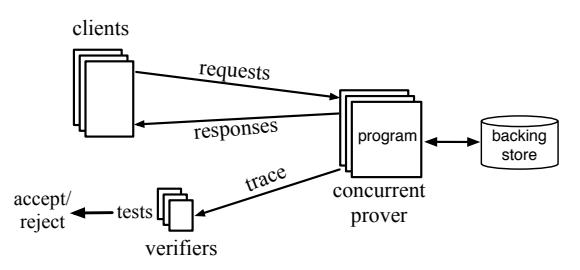
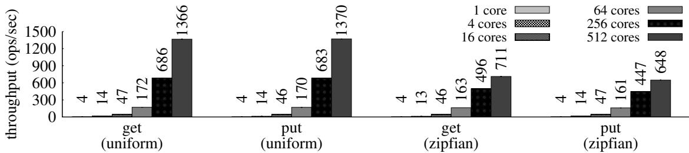
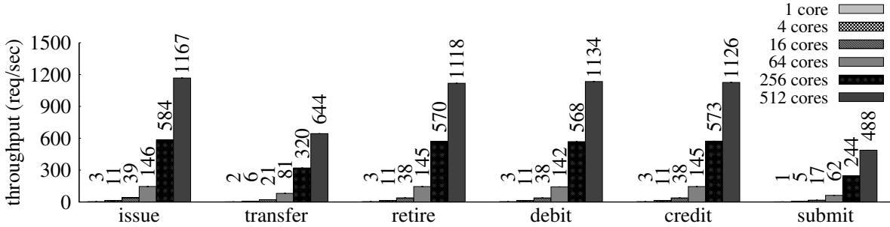

# Proving the correct execution of concurrent services in zero-knowledge (extended version)<sup>∗</sup>

Srinath Setty<sup>⋆</sup> , Sebastian Angel<sup>⋆</sup><sup>⋄</sup> , Trinabh Gupta<sup>⋆</sup>† , and Jonathan Lee<sup>⋆</sup> <sup>⋆</sup>*Microsoft Research* <sup>⋄</sup>*University of Pennsylvania* †*UCSB*

Abstract. This paper introduces Spice, a system for building *verifiable state machines (VSMs)*. A VSM is a request-processing service that produces proofs establishing that requests were executed correctly according to a specification. Such proofs are *succinct* (a verifier can check them efficiently without reexecution) and *zeroknowledge* (a verifier learns nothing about the content of the requests, responses, or the internal state of the service). Recent systems for proving the correct execution of stateful computations—Pantry [\[25\]](#page-23-0), Geppetto [\[35\]](#page-23-1), CTV [\[31\]](#page-23-2), vSQL [\[88\]](#page-25-0), etc.—implicitly implement VSMs, but they incur prohibitive costs. Spice reduces these costs significantly with a new storage primitive. More notably, Spice's storage primitive supports multiple writers, making Spice the first system that can succinctly prove the correct execution of concurrent services. We find that Spice running on a cluster of 16 servers achieves 488–1167 transactions/second for a variety of applications including inter-bank transactions [\[28\]](#page-23-3), cloud-hosted ledgers [\[29\]](#page-23-4), and dark pools [\[66\]](#page-24-0). This represents an 18,000–685,000× higher throughput than prior work.

# <span id="page-0-0"></span>1 Introduction

We are interested in a system for building *verifiable state machines (VSMs)*. A VSM is similar to a traditional state machine except that it produces correctness proofs of its state transitions. Such proofs can be checked efficiently by a verifier without locally reexecuting state transitions and without access to the (plaintext) content of requests, responses, or the internal state of the machine. Consequently, VSMs enable a wide class of realworld services to prove their correct operation—without compromising privacy. For example, by appropriately programming state transitions, VSMs can implement verifiable versions of payment networks [\[28,](#page-23-3) [64\]](#page-24-1), dark pools [\[66\]](#page-24-0), ad exchanges [\[4\]](#page-22-0), blockchains and smart contracts [\[12,](#page-22-1) [30,](#page-23-5) [50,](#page-24-2) [62\]](#page-24-3), and any request-processing application that interacts with a database.

There is an elegant solution to build VSMs by employing *efficient arguments* [\[41,](#page-23-6) [44,](#page-24-4) [48,](#page-24-5) [49,](#page-24-6) [58,](#page-24-7) [61\]](#page-24-8), a primitive that composes probabilistically checkable proofs (PCPs) [\[6,](#page-22-2) [7\]](#page-22-3) with cryptography. Specifically, an untrusted service can maintain state (e.g., in a key-value store), run appropriate computations that manipulate that state in response to clients' requests, and produce proofs

that it faithfully executed each request on the correct state. Such proofs are *succinct*, in the sense that the proofs are small (e.g., constant-sized) and are efficient to verify. In some constructions, the proofs are *zero-knowledge* [\[43\]](#page-24-10), meaning that they reveal nothing beyond their validity: the state maintained by the service, along with the content of requests and responses, is kept private from a verifier.

While the original theory is too expensive to implement, recent systems [\[8,](#page-22-4) [14,](#page-23-7) [18,](#page-23-8) [25,](#page-23-0) [34,](#page-23-9) [35,](#page-23-1) [39,](#page-23-10) [51,](#page-24-11) [67,](#page-24-12) [69–](#page-24-13) [71,](#page-24-14) [73,](#page-25-1) [76,](#page-25-2) [77,](#page-25-3) [80–](#page-25-4)[84,](#page-25-5) [87–](#page-25-6)[89\]](#page-25-7) make significant progress. Beyond reducing the costs of the theory by over 10<sup>20</sup>×, some of them can prove the correct execution of stateful computations like MapReduce jobs and database queries.

Despite this progress, the costs remain prohibitive: the service incurs several CPU-seconds per storage operation (e.g., put, get on a key-value store) when generating a proof of correct execution ([§2.1,](#page-2-0) [§7\)](#page-11-0). This is over 10<sup>6</sup>× slower than an execution that does not produce proofs. Besides costs, storage primitives in prior systems support only a single writer, which limits them to a sequential model of execution. Consequently, they cannot scale out with additional resources by processing requests concurrently; this limits throughput that applications built atop prior systems can achieve.

We address these issues with *Spice*, a new system for building VSMs. Spice introduces a storage primitive with a key-value store interface, called *SetKV*, that is considerably more efficient than storage primitives used by prior systems ([§3\)](#page-3-0). Furthermore, SetKV admits concurrent writers with sequential consistency [\[54\]](#page-24-15) (and in some cases linearizability [\[46\]](#page-24-16)) semantics, and supports serializable transactions [\[21,](#page-23-11) [65\]](#page-24-17). This makes Spice the first system to build VSMs with support for a concurrent execution model ([§4\)](#page-7-0). Finally, we compose SetKV with prior and new techniques to ensure that a verifier can check the correct execution of requests using only cryptographic commitments that hide the content of requests, responses, and the state of the service ([§3–](#page-3-0)[5\)](#page-9-0).

In more detail, SetKV extends a decades-old mechanism for verifying the correctness of memories [\[5,](#page-22-5) [23,](#page-23-12) [32,](#page-23-13) [36\]](#page-23-14). SetKV is based on set data structures whereas prior systems employ (Merkle) trees [\[25,](#page-23-0) [31\]](#page-23-2) or commitments [\[35,](#page-23-1) [88\]](#page-25-0). This has two implications. First, the cost of a storage operation is a constant under SetKV (when amortized over a batch of operations) whereas in prior storage primitives it is logarithmic [\[25,](#page-23-0) [31\]](#page-23-2) or linear [\[35,](#page-23-1) [88\]](#page-25-0) in the size of the state. Second, SetKV allows concurrent writers since operations on sets—such

<sup>∗</sup>This is the full version of [\[68\]](#page-24-9). This version includes additional details and security proofs in the appendices.

as adding an element to a set—commute.

We implement Spice atop a prior framework [\[1,](#page-22-6) [83\]](#page-25-8). A programmer can express a VSM in a broad subset of C (augmented with APIs for SetKV and transactions), and compile it to executables of clients that generate requests, servers that process those requests and generate proofs, and verifiers that check the correctness of responses by verifying proofs. We build several realistic applications with Spice: an inter-bank transaction service [\[28\]](#page-23-3), a cloud-hosted ledger [\[29\]](#page-23-4), and a dark pool [\[66\]](#page-24-0). Our experimental evaluation shows that Spice's VSMs are 29–2,000× more CPU-efficient than the same VSMs built with prior work. Furthermore, they achieve 18,000– 685,000× higher throughput than prior work by employing multiple CPUs. Concretely, Spice's VSMs support 488–1167 transactions/second on a cluster of 16 machines, each with 32 CPU cores and 256 GB of RAM.

Despite these advances, Spice has limitations. To achieve high throughput, Spice proves state transitions in batches, so one must wait for a batch to be verified before determining the correctness of any individual request, which introduces latency ([§3,](#page-3-0) [§7.2\)](#page-12-0). The CPU cost to produce proofs remains large ([§7.1,](#page-11-1) [§7.3\)](#page-13-0) when compared to an execution that does not produce proofs. Nevertheless, Spice opens the door to VSMs that support a concurrent model of computation and to many exciting applications.

# <span id="page-1-1"></span>2 Problem statement and background

Spice's goal is to produce *verifiable state machines (VSMs)*. We begin by reviewing state machines, which we use as an abstraction to represent a request-processing service. A state machine is specified by a tuple (Ψ, S0), where Ψ is a deterministic program that encodes state transitions, and S<sup>0</sup> is the initial state of the machine (e.g., a set of key-value pairs). The state machine maintains its state with S*cur*, which is initialized to S0. When the machine receives a request *x*, it executes Ψ with *x* and its state S*cur* as inputs; this mutates the state of the machine and produces a response *y*. More formally, the machine executes a request *x* to produce a response *y* as follows:

$$(S_i, y) \leftarrow \Psi(S_{cur}, x)$$
$$S_{cur} \leftarrow S_i$$

A state machine may execute a batch of requests concurrently to achieve a higher throughput. In such a case, the *behavior* of the state machine (i.e., the state after executing a batch of requests, and the responses produced by the machine) depends on the desired correctness condition for concurrent operations. In this paper we focus on *sequential consistency* [\[54\]](#page-24-15) as the correctness condition for concurrent operations on single objects, and *serializability* for multi-object transactions [\[21,](#page-23-11) [65\]](#page-24-17).

A *verifiable* state machine permits the verification of state transitions without reexecution and without access

<span id="page-1-0"></span>

FIGURE 1—Overview of verifiable state machines (see text).

to the (plaintext) contents of requests, responses, and the state of the machine (S*cur*). Specifically, a VSM is a protocol involving a *prover* P, a set of clients that issue requests, and one or more *verifiers* {V1, . . . , Vℓ} that check the correctness of the execution (clients can be verifiers). We depict this protocol in Figure [1;](#page-1-0) it proceeds as follows.

- 1. P runs a state machine (Ψ, S0) that processes requests concurrently and maintains its state on a persistent storage service (e.g., a key-value store).
- 2. Clients issue a set of requests, *x*1, . . . , *xm*, concurrently to P and get back responses, *y*1, . . . , *ym*.
- <span id="page-1-2"></span>3. Each verifier V*<sup>j</sup>* receives an opaque *trace* from P and runs a local check on the trace that outputs accept or reject. Concretely, the trace contains a *commitment*<sup>1</sup> to the initial state of the machine, a commitment to the final state after executing the batch of requests, and a commitment and proof for each request-response pair.

An efficient VSM must satisfy the following properties.

- Correctness. If P is *honest* (i.e., P's behavior is equivalent to a correct execution of requests in a sequential order) then P can make a V*<sup>j</sup>* output true.
- Soundness. If P errs (e.g., it does not execute Ψ or violates semantics of storage), then Pr[V*<sup>j</sup>* outputs true] ≤ ϵ, where ϵ is small (e.g., 1/2 <sup>128</sup>).<sup>2</sup>
- Zero-knowledge. The trace does not reveal anything to a verifier V*<sup>j</sup>* beyond the correctness of P, the number of requests executed by P, and the size of P's state.
- Succinctness. The size of each entry in the trace should be small, ideally a constant (e.g., a few hundred bytes). The cost to a V*<sup>j</sup>* to verify an entry is linear in the size of the entry (e.g., a few milliseconds of CPU-time).
- Throughput. P should be able to execute (and generate proofs for) hundreds of requests/second.

VSMs are related to recent systems for proving the correct execution of stateful computations [\[8,](#page-22-4) [25,](#page-23-0) [31,](#page-23-2) [35,](#page-23-1) [39,](#page-23-10)

<sup>1</sup> A commitment *c* to a value *x* is *hiding* and *binding*. Hiding means that *c* does not reveal anything about *x*. Binding means that it is infeasible to find a value *x* ′ ̸= *x* which produces the same commitment.

<sup>2</sup>We discuss how to prevent P from *equivocating* (i.e., showing different traces to different verifiers) or omitting requests in Section [9.](#page-14-0)

[88\]](#page-25-0). However, in prior systems: (1) P lacks mechanisms to prove that it correctly executed requests concurrently, and (2) P incurs high CPU costs to produce proofs. Consequently, prior systems do not satisfy our throughput requirement. We provide an overview of a prior system below, but note that Spice addresses both issues.

#### <span id="page-2-0"></span>2.1 A prior instantiation of VSMs

We now describe a prior system that implements VSMs; our goal is to introduce concepts necessary to describe Spice and to highlight why prior systems are inefficient. We focus on Pantry [\[25\]](#page-23-0); Section [8](#page-13-1) discusses other work.

Programming model and API. Pantry [\[25\]](#page-23-0) follows the VSM protocol structure introduced above. In Pantry, a state machine's program (i.e., Ψ) is expressed in a subset of C, which includes functions, structs, typedefs, preprocessor macros, if-else statements, loops (with static bounds), explicit type conversions, and standard integer and bitwise operations. For Ψ to interact with a storage service, Pantry augments the above C subset with several storage APIs; an example is the get and put API of a key-value store. Also, Pantry supports commit (and decommit) APIs to convert blobs of data (e.g., a request) into commitments (and back)—to hide data from verifiers.

Mechanics. Pantry meets the correctness, soundness, zero-knowledge, and succinctness properties of VSMs ([§2\)](#page-1-1). To explain how, we provide an overview of Pantry's machinery; we start with a toy computation.

```
int increment(int x) {
   int y = x + 1;
   return y;
}
```

Pantry proceeds in three steps to execute a computation.

(1) Express and compile. A programmer expresses the desired computation in the above subset of C, and uses Pantry's compiler to transform the program into a low-level mathematical model of computation called *algebraic constraints*. This is essentially a system of equations where variables can take values from a *finite field* F*<sup>p</sup>* over a large prime *p* (i.e., the set {0, 1, . . . , *p* − 1}). For the above toy computation, Pantry's compiler produces the following system of equations (uppercase letters denote variables and lowercase letters denote concrete values):

$$C = \left\{ \begin{array}{rcl} X - x & = & 0 \\ Y - (X+1) & = & 0 \\ Y - y & = & 0 \end{array} \right\}$$

A crucial property of this transformation is that the set of equations is *satisfiable*—there exists a solution (a setting of values to variables) to the system of equations *if and only if* the output is correct. For the above constraint set, observe that if *y* = *x* + 1, {*X* ← *x*, *Y* ← *y*} is a

solution. If *y* ̸= *x* + 1, then there does not exist any solution and the constraint set is not satisfiable.

- (2) Solve. The prover *solves* the equations using the input *x* provided by the client. In other words, the prover obtains an assignment for each of the variables in the system of equations and sends the output *y* to the client.
- (3) Argue. The prover *argues* (or proves) that the system of equations has a solution (which by the above transformation property establishes that *y* is the correct output of the computation with *x* as the input). To prove that a system of equations is satisfiable, the prover could send its solution (i.e., values for each of the variables in the equation) to a verifier, and the verifier could check that each equation is satisfiable. However, this approach meets neither the succinctness nor the zero-knowledge requirement of VSMs: the size of the proof is linear in the running time of the computation, and the solution reveals inputs, outputs, and the internal state of the computation.

To guarantee both properties, Pantry employs an argument protocol referred to as a zkSNARK [\[22\]](#page-23-15) to encode the prover's solution to the system of equations as a short proof. Furthermore, a zkSNARK is *non-interactive* and often supports *public verifiability*, meaning that anyone (acting as a verifier) can check the correctness of proofs without having to interact with the prover. Details of how these protocols work are elsewhere [\[14,](#page-23-7) [18,](#page-23-8) [25,](#page-23-0) [45,](#page-24-18) [67,](#page-24-12) [83,](#page-25-8) [86\]](#page-25-9); we first focus on costs and then discuss a subset of mechanisms in Pantry that are relevant to our work.

*Pantry's costs.* Since costs depend on the choice of argument protocol and Pantry implements several [\[67,](#page-24-12) [70\]](#page-24-19), we assume a recent protocol due to Groth [\[45\]](#page-24-18). The costs to a V*<sup>j</sup>* are small: the proof produced by P and sent over the network to V*<sup>j</sup>* per Ψ is short (128 bytes); V*j*'s cost to validate a proof is only a few milliseconds of CPU-time. P's costs to produce a proof scale (roughly) linearly with the number of constraints of the program; concretely, this cost is ≈150µs of CPU-time per constraint.<sup>3</sup>

### 2.1.1 Interacting with external resources

A key limitation of the above algebraic constraint formalism is that it cannot handle interactions with the external "world" such as accessing disk, or sending and receiving packets over a network. To address this, Pantry relies on the concept of *exogenous computations*.

An exogenous computation is a remote procedure call (RPC) to an external service, which can be used to read from a disk or interact with remote servers (using OS services). Such an external service is executed outside of the constraint formalism (hence the name). The RPC simply returns a response that is then assigned to appro-

<sup>3</sup>The time complexity and the concrete per-constraint cost we provide assume that the constraint set is produced in the *quadratic form* [\[41,](#page-23-6) [70\]](#page-24-19): each constraint is of the form *P*<sup>1</sup> · *P*<sup>2</sup> = *P*3, where *P*1, *P*2, and *P*<sup>3</sup> are degree-1 polynomials over the variables in the constraint set.

priate variables in the constraint set of a computation. We illustrate this concept with an example below. √

Suppose that the computation is *y* = *x*, where *x* is a perfect square. Of course, one could represent the square-root function using constraints and apply the above machinery, but the resulting constraint set is highly verbose (which increases the prover's cost to solve and argue). Exogenous computations offer a way to express the equivalent (and much cheaper) computation with:

```
int sqrt(int x) {
  int y = RPC(SQRT, x); //exogenous computation
  assert(y*y == x);
  return y;
}
```

The above code compiles to the following constraint set:

$$C = \left\{ \begin{array}{rcl} X - x & = & 0 \\ (Y_{exo} \cdot Y_{exo}) - X & = & 0 \\ Y_{exo} - y & = & 0 \end{array} \right\}$$

The prover computes <sup>√</sup> *x* outside of constraints (e.g., by running a Python program) and assigns the result to *Yexo* when solving the equations (Step 2). The assert statement becomes an additional constraint that essentially forces the prover to prove that it has verified the correctness of *Yexo*. A similar approach can be used to interact with services like databases. The challenge is defining an appropriate assert statement, as we discuss next.

#### <span id="page-3-1"></span>2.1.2 Handling state

As discussed above, exogenous computations enable a program Ψ to interact with a key-value store by issuing an RPC. This alone is insufficient because the prover is untrusted and can return any response to RPCs. For example, if the prover maintains a key-value store with the tuple (*k*, *v*), and Ψ issues an RPC(GET, k); the prover could return *v* ′ ̸= *v*. Consequently, as in the above sqrt example, Ψ must verify the result of every RPC.

To enable this verification, Pantry borrows the idea of *self-verifying* data blocks from untrusted storage systems: it names data blocks using their collision-resistant hashes (or *digests*). The following example takes as input a digest and increments the value of the corresponding data.

```
Digest increment(Digest d) {
  // prover supplies value of block named by d
  int block = RPC(GETBLOCK, d);
  assert(d == Hash(block));
  int new_block = block + 1;
  // supply to prover a new block and get digest
  Digest new_d = RPC(PUTBLOCK, new_block);
  assert(new_d == Hash(new_block));
  return new_d;
}
```

Pantry abstracts these operations with two APIs: (1) PutBlock which takes as input a block of data and returns its digest, and (2) GetBlock which returns a previously stored block of data given its digest (these APIs take care of the RPC call and the appropriate asserts and invocations of the hash function). Atop this API, Pantry builds more expressive storage abstractions using prior ideas [\[23,](#page-23-12) [40,](#page-23-16) [56,](#page-24-20) [60\]](#page-24-21). To support RAM, Pantry encodes the state in a Merkle tree [\[23,](#page-23-12) [60\]](#page-24-21). To support a key-value store, Pantry uses a *searchable* Merkle tree: an AVL tree where internal nodes store a hash of their children. To read (or update) state in these tree-based storage primitives, the program executes a series of GetBlock (and PutBlock) calls starting with the root of the tree.

*Hiding requests and responses.* The above storage primitive can be used to hide requests and responses from a verifier. Specifically, the prover keeps the plaintext requests and responses in its persistent storage and releases cryptographic commitments to requests and responses to a verifier. As in the increment example, a C program must take as input a commitment to a request, obtain the plaintext version of it using an RPC, and produce a commitment to the response. This logic is abstracted with the commit and decommit APIs.

Costs. We now assess the cost of a key-value store operation under Pantry. A get(*k*) makes ⌈log<sup>2</sup> *n*⌉ calls to GetBlock (where *n* is the number of key-value pairs), and each GetBlock call requires encoding a hash function as constraints (to represent the assert statement that verifies the return value of the RPC); a put requires twice as many operations. Thus, a single get on a key-value store that supports as few as *n* = 1,000 entries requires 44,000 constraints ([§7.1\)](#page-11-1); this translates to 6.6 CPU-seconds for producing a proof. Furthermore, in Pantry the root of a Merkle tree is a point of contention so a batch of operations cannot execute concurrently.

### 2.2 Outlook and roadmap

Given the overwhelming expense to execute (and produce a proof for) a simple storage operation when using a treebased data structure, we believe that making meaningful progress requires revisiting mechanisms for verifying interactions with storage. In Section [3.1,](#page-4-0) we describe an entirely different way to verify storage operations that relies on a set—rather than a tree—data structure. In Section [3.2,](#page-6-0) we show how to employ this set-based storage primitive to realize efficient VSMs, and in Section [4](#page-7-0) we show how, unlike Merkle trees, this set-based primitive allows requests to be processed concurrently. Finally, Section [5](#page-9-0) describes how to instantiate the set-based storage primitive efficiently such that each get and put operation can be represented with about a thousand constraints.

# <span id="page-3-0"></span>3 Efficient storage operations in VSMs

This section presents a new mechanism to handle storage operations in VSMs. We first discuss the design of a *verifiable key-value store* based on set data structures; the design itself is orthogonal to VSMs and can be used to build a stand-alone untrusted storage service. We then show to how to compose the new key-value store with prior machinery to realize efficient VSMs.

### <span id="page-4-0"></span>3.1 SetKV: A verifiable key-value store

The goal of a verifiable key-value store is to enable an entity V<sup>K</sup> to outsource a key-value store K to an untrusted server PK, while being able to verify that interactions with K are correct. Specifically, P<sup>K</sup> receives operations from V<sup>K</sup> and executes them on K such that V<sup>K</sup> can check that a get on a key returns the value written by the most recent put to that key. This protocol proceeds as follows.

- 1. V<sup>K</sup> calls init to obtain an object that encodes the initial empty state of K.
- 2. V<sup>K</sup> issues inserts, gets, and puts sequentially to P<sup>K</sup> and receives responses. V<sup>K</sup> locally updates its object for every request-response pair.
- 3. After a batch of operations, V<sup>K</sup> runs audit that computes over its local object (and auxiliary responses from PK), and outputs whether or not P<sup>K</sup> operated correctly. We desire the following properties from this protocol.
- If P<sup>K</sup> correctly executes operations on K, then it can make VK's audit output true.
- If P<sup>K</sup> errs, then Pr{audit outputs true} < θ, where θ is very small (e.g., 1/2 <sup>128</sup>).
- V<sup>K</sup> maintains little state (e.g., tens of bytes).

Figure [2](#page-4-1) depicts our construction. We call this construction SetKV for ease of reference, but note that it introduces small—albeit critical—changes to the offline memory checking scheme of Blum et al. [\[23\]](#page-23-12) (and its follow-up refinement [\[32\]](#page-23-13)) and the Concerto key-value store [\[5\]](#page-22-5). We discuss our modifications at the end of this subsection; these changes are necessary to build VSMs using SetKV ([§3.2\)](#page-6-0). We prove that SetKV meets all desired properties in Appendix [C.1.](#page-18-0) Below, we describe how SetKV works starting with a straw man design.

A straw man design. Suppose V<sup>K</sup> maintains a totallyordered log where it records all key-value operations it issues to P<sup>K</sup> along with the responses supplied by PK. V<sup>K</sup> can execute the following audit procedure: for each get on a key *k* recorded in the log, identify the most recent put to *k* (by traversing the log backwards starting from the point at which the get is recorded) and check if the value returned by the get matches the value written by the put. If all the checks pass, V<sup>K</sup> outputs true.

There are two issues with this straw man: (1) VK's log size is proportional to the number of key-value store operations and it grows indefinitely; (2) the cost to verify

```
1: function init( )
 2: return s ← VKState{0, 0, 0}
 3: function insert(s, k, v)
 4: ts′ ← s.ts + 1
 5: RPC(INSERT, k,(v, ts′
                         )) // PK executes INSERT on K
 6: ws′ ← s.ws ⊙ H({(k, v, ts′
                              )})
 7: return VKState{s.rs, ws′
                             , ts′
                                }
 8: function get(s, k)
 9: (v, t) ← RPC(GET, k) // PK executes GET on K
10: rs′ ← s.rs ⊙ H({(k, v, t)})
11: ts′ ← max (s.ts, t) + 1
12: RPC(PUT, k,(v, ts′
                      )) // PK executes PUT on K
13: ws′ ← s.ws ⊙ H({(k, v, ts′
                              )})
14: return VKState{rs′
                        , ws′
                            , ts′
                                }, v
15: function audit(s)
16: rs′ ← s.rs
17: keys ← RPC(GETKEYS) // PK returns a list of keys in K
18: for k in keys do
19: (v, t) ← RPC(GET, k) // PK executes GET on K
20: rs′ ← rs′ ⊙ H({(k, v, t)})
21: if keys has duplicates or rs′
                               ̸= s.ws then return false
22: else return true
```

FIGURE 2—SetKV: A verifiable key-value store based on set data structures [\[5,](#page-22-5) [23,](#page-23-12) [32,](#page-23-13) [36\]](#page-23-14). The logic depicted here is run by VK; P<sup>K</sup> responds to RPCs. VK's state consists of two set-digests and a timestamp *ts*; H is an incremental set collision-resistant hash function; see text for details. A put is similar to get except that lines [11](#page-4-1) and [13](#page-4-1) use the value being written instead of *v*.

the correctness of each get is linear in the size of the log.

Mechanics of SetKV. SetKV addresses both issues associated with the straw man. It lowers verification cost by relying on two sets instead of an append-only log, and it reduces the size of the state maintained by V<sup>K</sup> by leveraging a particular type of cryptographic hash function that operates on sets. We elaborate on these next.

(1) Using sets. Instead of a totally-ordered log, suppose that V<sup>K</sup> maintains a local timestamp counter *ts* along with two sets, a "read set" (*RS*) and a "write set" (*WS*). SetKV's key idea is to design a mechanism that combines all the checks in the straw man design (performed on the return value of each get using a log) into a single check on these two sets; if the server executes any operation incorrectly, the check fails. Of course, unlike the above log-based checks, if the set-based check fails, V<sup>K</sup> will not know which particular operation was executed incorrectly by PK, but this dramatically reduces verification costs.

*Details of the set-based check.* First, we structure the key-value store K so that each entry is of the form (*k*, *v*, *t*) where *k* is a key, *v* is the associated value, and *t* is a timestamp (more precisely a Lamport clock [\[53\]](#page-24-22)) that indicates the last time the key was read (or updated). V<sup>K</sup> initializes *RS* and *WS* to empty, and *ts* to 0. When V<sup>K</sup> wants to insert a new key-value pair (*k*, *v*) into K, it increments the local timestamp *ts*, adds the tuple (*k*, *v*, *ts*) into WS, and sends this tuple to  $\mathcal{P}_{\mathcal{K}}$ . Similarly, when  $\mathcal{V}_{\mathcal{K}}$  wishes to execute a get (or a put) operation on an existing key k,  $\mathcal{V}_{\mathcal{K}}$  performs the following five steps:

- 1. Get from  $\mathcal{P}_{\mathcal{K}}$  via an RPC the current value v and timestamp t associated with key k
- 2. Add the tuple (k, v, t) into RS
- 3. Update the local timestamp  $ts \leftarrow \max(ts, t) + 1$
- 4. Add the tuple (k, v', ts) into WS (where v' = v for a get, or the new value for a put)
- 5. Send the new tuple (k, v', ts) to  $\mathcal{P}_{\mathcal{K}}$  via an RPC

Observe that the sets maintained by  $\mathcal{V}_{\mathcal{K}}$  preserve two important invariants: (1) every element added to RS and WS is unique because ts is incremented after each operation; and (2) RS "trails" WS by exactly the last write to each key (i.e.,  $RS \subseteq WS$ ). These lead to an efficient audit procedure:  $\mathcal{V}_{\mathcal{K}}$  can request the current state of  $\mathcal{K}$  (i.e., the set of key, value, and timestamp tuples) from  $\mathcal{P}_{\mathcal{K}}$  (denote this returned set as M), and check if:

$$RS \cup M = WS$$

There is also a check in audit that verifies whether all the keys in M are unique. This check prevents the following double insertion attack: if  $\mathcal{V}_{\mathcal{K}}$  issues to  $\mathcal{P}_{\mathcal{K}}$  an insert operation with a key that already exists in  $\mathcal{K}$ , a correct  $\mathcal{P}_{\mathcal{K}}$  should return an error message. However, a malicious  $\mathcal{P}_{\mathcal{K}}$  could return success for both inserts, and in the future, return either value for a get on such a key.

Correctness intuition. We now use an example to provide intuition about the set-based check. Suppose that after initialization,  $\mathcal{V}_{\mathcal{K}}$  inserts a new key-value pair (k, v) into  $\mathcal{K}$  (via the above protocol).  $\mathcal{V}_{\mathcal{K}}$ 's state will be:

$$RS={\}, WS={(k, v, 1)}, ts=1}$$

If  $\mathcal{V}_{\mathcal{K}}$  runs the audit procedure, then a correct  $\mathcal{P}_{\mathcal{K}}$  can return its state, which in this case is simply  $M = \{(k, v, 1)\}$ . This leads  $\mathcal{V}_{\mathcal{K}}$ 's audit to return true since  $RS \cup M = WS$ , and the set of keys in M has no duplicates. Suppose that  $\mathcal{V}_{\mathcal{K}}$  then calls get(k) and  $\mathcal{P}_{\mathcal{K}}$  misbehaves by returning (v', 1) where  $v' \neq v$ .  $\mathcal{V}_{\mathcal{K}}$ 's state will be updated to:

$$RS = \{(k, v', 1)\}, WS = \{(k, v, 1), (k, v', 2)\}, ts = 2$$

Observe that for any set M,  $RS \cup M \neq WS$  (this is because  $RS \nsubseteq WS$ ). By returning an incorrect response,  $\mathcal{P}_{\mathcal{K}}$  permanently damaged its ability to pass a future audit.

(2) Compressing  $\mathcal{V}_{\mathcal{K}}$ 's state.  $\mathcal{V}_{\mathcal{K}}$  cannot track the two sets explicitly since they are larger than  $\mathcal{K}$ . Instead,  $\mathcal{V}_{\mathcal{K}}$  employs a particular type of hash function  $\mathcal{H}(\cdot)$  that acts on sets and produces a succinct *set-digest* [9, 32].  $\mathcal{H}$  meets two properties. First, it is *set collision-resistant*, meaning that it is computationally infeasible to find two different

sets that hash to the same set-digest. Second,  $\mathcal{H}$  is *incremental*: given a set-digest  $d_S$  for a set S, and a set W, one can efficiently compute a set-digest for  $S \cup W$ . Specifically, there is an operation  $\odot$  (that takes time linear in the number of elements in W) such that:

$$\mathcal{H}(S \cup W) = \mathcal{H}(S) \odot \mathcal{H}(W)$$
$$= d_S \odot \mathcal{H}(W)$$

 $\mathcal{V}_{\mathcal{K}}$  leverages  $\mathcal{H}$  to create (and incrementally update) set-digests that encode RS and WS, and it keeps these digests and the local timestamp in a small data structure:

```
struct VKState {
   SetDigest rs; // a set-digest of RS
   SetDigest ws; // a set-digest of WS
   int ts;
}
```

The same correctness argument (discussed above) applies except that we must account for the case where  $\mathcal{P}_{\mathcal{K}}$  identifies a collision in  $\mathcal{H}$ , which can allow it to misbehave and still pass the audit. Fortunately, the probability that  $\mathcal{P}_{\mathcal{K}}$  can find any collision is very small ( $\theta \leq 2^{-128}$ ).

Note that while the audit procedure (Figure 2) appears to require  $\mathcal{V}_{\mathcal{K}}$  to keep state linear in the size of  $\mathcal{K}$  to store the set of all keys (to check for duplicates), this is not the case. If getkeys (Fig. 2, Line 17) returns a sorted list of keys, the uniqueness check can be expressed as a streaming computation. Consequently,  $\mathcal{V}_{\mathcal{K}}$  only needs enough state for VKState, and the metadata required to track the status of the streaming computation; all of this is tens of bytes, which meets our requirement.

Differences with prior designs. SetKV supports inserting any number of keys, whereas offline memory checking protocols [23, 32, 36] have a fixed memory size. To support insertion, we add the insert procedure, the getkeys RPC, and the uniqueness check (Figure 2, Line 21). To prevent  $\mathcal P$  from denying that a particular key has been inserted, and to disallow  $\mathcal P$  from maintaining a key-value store with duplicate keys, we have additional checks (Appendix A.4). Concerto [5] also supports inserts but it is more expensive than SetKV since it requires  $\mathcal V_{\mathcal K}$  to issue two additional RPCs per insert (and two additional calls to  $\mathcal H$  to update  $\mathit{rs}$  and  $\mathit{ws}$ ) to maintain an index of keys, so Concerto's approach is up to  $3\times$  more expensive than SetKV for  $\mathcal V_{\mathcal K}$ .

Several prior schemes [5, 23, 36] use instances of  $\mathcal{H}$  that require  $\mathcal{V}_{\mathcal{K}}$  to use cryptographic material that must be kept secret from  $\mathcal{P}_{\mathcal{K}}$ . While this is not an issue in the standalone setting presented in this section (since  $\mathcal{V}_{\mathcal{K}}$  updates set-digests locally), it is problematic in the VSM context where the prover  $\mathcal{P}$  executes these operations on behalf of clients (§3.2). In contrast, our construction of  $\mathcal{H}$  does not require secret cryptographic material (§5.2). Finally, the audit procedure of SetKV does not modify

VK's set-digests (as is the case in Concerto's), which lowers the costs of audit by 2×.

#### <span id="page-6-0"></span>3.2 Building VSMs using SetKV

Spice follows an approach similar to Pantry to build VSMs. As with the Pantry baseline discussed in the prior section, Spice uses Groth's argument protocol [\[45\]](#page-24-18) as a black box (Spice can also use many other argument protocols, as we discuss in Section [9\)](#page-14-0). The principal difference between the two systems is in how they handle storage operations, which we discuss next.

Recall from Section [2.1](#page-2-0) that a VSM's program Ψ interacts with external services (e.g., a storage service) by issuing RPCs. Since the prover is untrusted and can return incorrect responses to RPCs, Ψ must verify each RPC response via an assert; Section [2.1.2](#page-3-1) discusses the verification mechanism in Pantry. We now discuss an alternate mechanism based on SetKV.

At a high level, Spice's idea is to employ SetKV's verifier (i.e., VK) to check the interactions of Ψ with a storage service. To accomplish this, we build a C library that implements the init, insert, get, put, and audit procedures in Figure [2.](#page-4-1) A VSM programmer uses this library to write Ψ, and compiles Ψ into algebraic constraints (and client, server, verifier executables). To illustrate this idea, we start with an example in which Ψ increments an integer value associated with a key requested by a client.

```
Value increment(VKState* s, Key k) {
  Value v;
  // prover supplies value v for key k
  get(s, k, &v); //setkv library call (updates s)
  v = (Value) ((int) v + 1);
  put(s, k, v); // setkv library call (updates s)
  // batch-verify all storage operations
  assert(audit(*s) == true); // setkv library call
  return v;
}
```

Observe that the high-level structure of the above program is nearly identical to the example we discussed in the context of Pantry. A key difference, however, is that under Pantry, Ψ verifies each storage operation (e.g., GetBlock) with an assert; under Spice, Ψ verifies all storage operations at the end with a single assert that calls SetKV's audit procedure.

Costs. Since init, insert, get, and put execute a constant number of arithmetic operations (Figure [2\)](#page-4-1), Spice compiles them into a constant number of equations when transforming Ψ into the constraint formalism. audit, however, computes over the entire state of the key-value store, so it compiles to a constraint set with size linear in the number of objects in the key-value store (say *n*). Fortunately, audit is called only once, so its costs are amortized over all storage operations in Ψ.

In more detail, if Ψ executes *O*(*n*) storage operations before calling audit, the (amortized) cost of each storage operation is a constant. However, for the services that Spice targets ([§1,](#page-0-0) [§6\)](#page-10-0), Ψ executes far fewer storage operations than *n*. This leads to an undesirable situation: the amortized cost of a storage operation can be worse than in Pantry (where each storage operation's cost is logarithmic in *n*). Spice addresses this by decoupling the call to audit from the rest of Ψ. We discuss this below.

Spice's VSMs. Let Ψ be a program with the same structure as the previous increment example: Ψ takes as input a request *x* and a VKState *s*, interacts with the storage via RPCs, verifies those interactions at the end via assert, updates *s*, and outputs a response *y*. Spice splits Ψ into two independent programs: Ψ*req* and Ψ*audit*, where Ψ*req* is same as Ψ except that it does not have the assert statement at the end; Ψ*audit* is the following program:

```
void audit_batch(VKState s) {
  assert(audit(s) == true);
}
```

This decomposition achieves the following: proving the correct execution of *m* instances of Ψ is *equivalent* to proving the correct execution of the corresponding *m* instances of Ψ*req* and a single instance of Ψ*audit*. By equivalent, we mean that a verifier V outputs true to *m*+1 proofs (one per instance of Ψ*req* and Ψ*audit*) if and only if V would have output true to the *m* proofs produced by instances of Ψ. Thus, if *m*=*O*(*n*), the *O*(*n*) constraints needed to express Ψ*audit* are effectively amortized over the *m* requests, making the (amortized) number of constraints for each storage operation in Ψ*req* a constant. Note that the costs of Ψ*audit* can actually be amortized across *different* computations (they can be instances of different Ψ*req*).

This approach has two drawbacks. First, it increases latency since V confirms the correct execution of any given instance Ψ*req* only after it has verified all *m* + 1 proofs. Second, if the proof of Ψ*audit* fails, V does not learn which of the storage operations (and therefore which instance of Ψ*req*) returned an incorrect result. However, as we show in our evaluation ([§7\)](#page-11-0), this decomposition reduces the cost of storage operations by orders of magnitude over Pantry, even for modest values of *m*.

*Trace.* Recall from Section [2](#page-1-1) that each verifier V*<sup>j</sup>* receives a *trace* from P to verify a batch of *m* instances of Ψ*req*. This trace contains *m* tuples and a proof for Ψ*audit*:

$$(x_i, s_{i-1}, y_i, s_i, \pi_i) \forall i \in [1, m]$$
 and  $\pi_{audit}$ 

where π*<sup>i</sup>* is the proof of correct execution of the *i th* instance of Ψ*req* with (*si*−1, *xi*) as input and (*s<sup>i</sup>* , *yi*) as output. Each state *s<sup>i</sup>* is an object of type VKState (*s*<sup>0</sup> is a VKState object for an empty key-value store), *x<sup>i</sup>* is a request, and *y<sup>i</sup>* is the corresponding response. π*audit* establishes the correct execution of Ψ*audit* with *s<sup>m</sup>* as input.

Observe that the above trace is sufficient to guarantee correctness and soundness (since each  $V_j$  has all the information needed to verify the actions of  $\mathcal{P}$ ), but it does not satisfy zero-knowledge or succinctness. This trace is not succinct since the sizes of requests and responses could be large (they depend on the application). The trace is not zero-knowledge since requests and responses appear in plaintext. Moreover, a VKState object leaks the timestamp field and the set-digests (unlike commitments, hashes bind the input but do not hide it; see Footnote 1).

**Commitments.** To make the trace succinct and zero-knowledge, a programmer writes a VSM that takes as input (and produce as output) commitments to requests, responses, and VKState. For example, the programs  $\Psi_{req}$  and  $\Psi_{audit}$  discussed earlier are expressed as:

```
Commitment incr_comm(Commitment* cs, Commitment ck) {
    // prover passes value via RPC (checked by assert)
    VKState s = (VKState) decommit(*cs);
    Key k = (Key) decommit(ck);
    Value v = increment(&s, k); // prior program logic
    *cs = commit(s);
    return commit(v);
}

void audit_batch_comm(Commitment cs) {
    VKState s = (VKState) decommit(cs);
    audit_batch(s); // prior program logic
}
```

In more detail, a client sends to  $\mathcal{P}$  the plaintext request  $x_i$  (k in the example).  $\mathcal{P}$  computes the program (without commitments) outside of the constraint formalism and sends back to the client the output  $y_i$  (v in the example).  $\mathcal{P}$  then generates a proof  $\pi_i$  for the version of the program that uses commitments (incr\_comm in the example). Specifically,  $\mathcal{P}$  first generates a commitment to  $x_i$ outside of the constraint formalism and uses it to solve the constraint set of  $\Psi_{req}$  (Section 9 discusses what prevents  $\mathcal{P}$  from omitting requests or generating an incorrect commitment).  $\mathcal{P}$  then adds to its trace commitments to each of  $(s_i, x_i, y_i)$  and the corresponding proof  $\pi_i$ . Each verifier  $V_i$  uses these commitments—instead of their plaintext versions—when verifying proofs (including  $\pi_{audit}$ ), since the above programs use commitments as inputs and outputs. Thus, a verifier  $V_i$  does not learn anything about the requests, responses, or states beyond their correctness, the number of requests, and the size of the state. Also, since the size of each commitment and each proof is a constant, it satisfies the succinctness property of VSMs.

#### <span id="page-7-0"></span>4 Supporting concurrent services

Prior instantiations of VSMs—including our design in Section 3—do not support a prover  $\mathcal{P}$  that executes requests concurrently. A key challenge is producing proofs that establish that  $\mathcal{P}$  met a particular consistency semantic. Note that this problem is hard even without the zero-knowledge or succinctness requirements of VSMs [75].

#### <span id="page-7-1"></span>4.1 Executing requests concurrently

concurrent version of SetKV, called C-SetKV, which we later integrate with Spice's design from the prior section. C-SetKV's prover  $\mathcal{P}_{\mathcal{K}}$  interacts with multiple instances of  $\mathcal{V}_{\mathcal{K}}$  ( $\mathcal{V}_{\mathcal{K}}^{(0)},\ldots,\mathcal{V}_{\mathcal{K}}^{(\ell)}$ ) that issue insert, put, and get requests concurrently. C-SetKV guarantees sequential consistency [54]: an audit returns true if and only if the concurrent execution is equivalent to a sequential execution of operations and the sequential execution respects the order of operations issued by individual instances of  $\mathcal{V}_{\mathcal{K}}$ . In a few cases, C-SetKV guarantees linearizability [46]. We formalize these guarantees and provide details in Appendix C.2, but the key differences between C-SetKV and SetKV are:

To make  $\mathcal{P}$  execute requests concurrently, we introduce a

- 1. Enforcement of isolation. In SetKV (Figure 2),  $\mathcal{V}_{\mathcal{K}}$  issues two RPCs for each get and put; they are executed in isolation by a correct  $\mathcal{P}_{\mathcal{K}}$  because there is only one outstanding operation. In C-SetKV,  $\mathcal{P}_{\mathcal{K}}$  must explicitly ensure that both RPCs are executed in isolation since it receives and executes many concurrent operations.
- 2. Support for independent VKStates. In SetKV,  $\mathcal{V}_{\mathcal{K}}$  maintains a single VKState object that encodes its key-value store operations since initialization. In C-SetKV, each  $\mathcal{V}_{\mathcal{K}}^{(j)}$  has its own independent VKState object that contains only the effects of operations issued by  $\mathcal{V}_{\mathcal{K}}^{(j)}$ .

We discuss the details of these differences below.

Enforcement of isolation. We now discuss how a correct  $\mathcal{P}_{\mathcal{K}}$  can execute C-SetKV's four key-value store operations in isolation. It is straightforward to execute insert in isolation since it issues a single RPC. audit does not modify  $\mathcal{P}_{\mathcal{K}}$ 's state, so  $\mathcal{P}_{\mathcal{K}}$  can executes it in isolation using a snapshot of its state. To ensure the two RPCs of put and get execute in isolation (in the presence of multiple instances of  $\mathcal{V}_{\mathcal{K}}$ ),  $\mathcal{P}_{\mathcal{K}}$  can keep track of when the first RPC starts and block any other request that attempts to operate on the same key until the second RPC (for the same key) completes. A simple approach to achieve this is for  $\mathcal{P}_{\mathcal{K}}$  to lock a key during the first RPC and release the lock on the second RPC. A malicious  $\mathcal{P}_{\mathcal{K}}$  could of course choose not to guarantee isolation, but as we show in Appendix C.2, a future audit will fail. Note that in Spice,  $\mathcal{P}_{\mathcal{K}}$  corresponds to the external storage, so the mechanism that ensures isolation happens outside of the constraint formalism (i.e., it is not encoded in  $\Psi$ ).

**Support for independent VKStates.** Since each  $\mathcal{V}_{\mathcal{K}}^{(j)}$  issues requests independently, it maintains a local VKState object. This creates two issues. First, the set-digests and timestamp in the VKState object of  $\mathcal{V}_{\mathcal{K}}^{(j)}$  do not capture the operations issued by other instances of  $\mathcal{V}_{\mathcal{K}}$ . As a result, we need a mechanism to combine the VKState objects of

all instances of  $\mathcal{V}_{\mathcal{K}}$  prior to invoking audit—since audit accepts a single VKState object. Second, the timestamp field ts is no longer unique for each operation since each  $\mathcal{V}_{\mathcal{K}}^{(j)}$  initializes its VKState object with ts=0. We discuss how we address these issues below.

Combining VKState objects. To obtain a single VKState object, each  $\mathcal{V}_{\mathcal{K}}^{(j)}$  collects VKState objects from every other instance and locally combines all objects. Combining set-digests is possible because sets are unordered and the union operation is commutative. Moreover,  $\mathcal{H}(\cdot)$  preserves this property since the operation  $\odot$  is commutative. As a result, each  $\mathcal{V}_{\mathcal{K}}^{(j)}$  constructs set-digests that capture the operations of all instances of  $\mathcal{V}_{\mathcal{K}}$  as if they were issued by a single entity. For example, the combined read set-digest is computed as  $rs = rs^{(0)} \odot \ldots \odot rs^{(j)}$  (similarly for ws). Finally, the timestamp of the combined VKState object is simply 0 since it is not used in audit.

**Handling duplicate entries.** Since different  $\mathcal{V}_{\mathcal{K}}$  instances start with the same timestamp ts=0, it is possible for two different instances to add the same element into their local set-digests (in a VKState object); this creates a problem when multiple VKState objects are combined. We use an example to illustrate the problem. Suppose there are three instances of  $\mathcal{V}_{\mathcal{K}}$ :  $\mathcal{V}_{\mathcal{K}}^{(1)}$ ,  $\mathcal{V}_{\mathcal{K}}^{(2)}$ ,  $\mathcal{V}_{\mathcal{K}}^{(3)}$ . Suppose  $\mathcal{V}_{\mathcal{K}}^{(1)}$  calls insert $(k, \nu)$ , making its VKState:

$$ws = \mathcal{H}(\{(k, v, 1)\}), rs = \mathcal{H}(\{\}), ts = 1$$

Suppose  $\mathcal{V}_{\mathcal{K}}^{(2)}$  and  $\mathcal{V}_{\mathcal{K}}^{(3)}$  call  $\mathtt{get}(k)$  concurrently and  $\mathcal{P}_{\mathcal{K}}$  returns an incorrect value  $v' \neq v$ . Specifically,  $\mathcal{P}_{\mathcal{K}}$  returns (k,v',1) to both, so their VKState object is:

$$ws = \mathcal{H}(\{(k, v', 2)\}), rs = \mathcal{H}(\{(k, v', 1)\}), ts = 2$$

Now, if each  $\mathcal{V}_{\mathcal{K}}$  instance combines set-digests in the three VKState objects, they get the following (we use exponents to indicate the number of copies of an element):

$$ws = \mathcal{H}(\{(k, v, 1), (k, v', 2)^2\}), rs = \mathcal{H}(\{(k, v', 1)^2\})$$

Unfortunately, since  $\mathcal{H}(\cdot)$  is a set hash function the above leads to undefined behavior:  $\mathcal{H}$ 's input domain is a set, but the above is a *multiset*.<sup>5</sup> Worse, some constructions [5] use XOR for  $\odot$ , so  $\mathcal{H}(\{(k,v',1)^2\} = \mathcal{H}(\{\})$  (i.e., adding an element that already exists to a set-digest removes the element!). Such a hash function would lead to the following combined set-digests:

$$ws = \mathcal{H}(\{(k, v, 1)\}), rs = \mathcal{H}(\{\})$$

For these set-digests, a  $\mathcal{P}_{\mathcal{K}}$  can make audit pass by returning  $M = \{(k, v, 1)\}$ —even though it misbehaved by returning an incorrect value to  $\mathcal{V}_{\mathcal{K}}^{(2)}$  and  $\mathcal{V}_{\mathcal{K}}^{(3)}$ .

There are two solutions. First, we can use a  $\mathcal{H}(\cdot)$  that is multiset collision-resistant (our construction in Section 5 satisfies this). In that case, even if different instances of  $\mathcal{V}_{\mathcal{K}}$  add the same elements to their set-digests, the aggregated set-digest will track the *multiplicity* of set members (i.e., the number of times an element is added to a set-digest). If  $\mathcal{P}_{\mathcal{K}}$  misbehaves, the aggregated rs will not be a submultiset of the aggregated ws, which prevents a future audit from passing (Appendix C.2). The second solution is to guarantee that there are no duplicate entries. We discuss this second solution in detail in Appendix A.1.

Using C-SetKV to execute requests concurrently.  $\mathcal{P}$  executes (and generates proofs for) multiple instances of  $\Psi_{req}$  simultaneously using different threads of execution (e.g., on a cluster of VMs). As before, each instance of  $\Psi_{req}$  interacts with a storage service through exogenous computation. A key difference is that unlike the design in Section 3.2, each instance of  $\Psi_{req}$  checks the response from the storage service using a different instance of C-SetKV's verifier. This is essentially the desired solution, but we now specify a few details.

A verifier  $\mathcal{V}_j$  receives commitments to a set of VKState objects, one from each thread of execution, in  $\mathcal{P}$ 's trace. This means that  $\mathcal{V}_j$  cannot execute the  $\odot$  operator on the commitments sent by  $\mathcal{P}$ , since  $\odot$  works on set-digests and not on commitments. To address this,  $\mathcal{P}$  supports a computation  $\Psi_{comb}$  that takes as input commitments to VKState objects and outputs a commitment to the combined VKState object. That is,  $\mathcal{P}$  helps  $\mathcal{V}_j$  combine commitments to VKState objects—without revealing anything about the objects and without requiring  $\mathcal{V}_j$  to trust  $\mathcal{P}$  ( $\mathcal{P}$  produces a proof for  $\Psi_{comb}$ ).  $\mathcal{V}_j$  then uses the resulting commitment in  $\Psi_{audit}$ .

#### <span id="page-8-0"></span>4.2 Supporting transactional semantics

Many services compute over multiple key-value tuples when processing a request, so they require transactional semantics. To support such services, we first build low-level mutual-exclusion primitives. We then use these primitives to build a transactional interface to C-SetKV that guarantees serializability [21, 65]. Finally, we show how those low-level primitives can be used to build other concurrency control protocols.

Mutual-exclusion primitives. Spice supports two APIs: (1) lock takes as input a key and returns the current value associated with the key; and (2) unlock takes as input a key and an updated value, and associates the new value with the key before unlocking the key. Figure 3 depicts our implementation of these APIs by essentially decomposing SetKV's get and put (Figure 2).

In essence, these primitives provide mutual-exclusion semantics by leveraging the requirement that  $\mathcal{P}_{\mathcal{K}}$  in C-SetKV must execute GET and PUT RPCs on the same key

<sup>&</sup>lt;sup>4</sup>Exchanging VKState objects is easy in the context of VSMs since (commitments to) all VKState objects appear in the trace.

<sup>&</sup>lt;sup>5</sup>A multiset is a set that can contain duplicate elements.

```
1: function lock(s, k)
 2: (v, t) ← RPC(GET, k) // PK executes GET and locks k
 3: rs′ ← s.rs ⊙ H({(k, v, t)})
 4: ts′ ← max (s.ts, t)
 5: return VKState{rs′
                          ,s.ws, ts′
                                  }, v
 6: function unlock(s, k, v)
 7: ts′ ← s.ts + 1
 8: RPC(PUT, k,(v, ts′
                       )) // PK executes PUT and unlocks k
 9: ws′ ← s.ws ⊙ H({(k, v, ts′
                                )})
10: return VKState{s.rs, ws′
                               , ts′
                                  }
```

FIGURE 3—Mechanics of lock and unlock (see text).

```
1: function beg_txn(s, keys)
 2: s
      ′ ← s, vals ← [ ]
 3: for k in keys do
 4: (s
          ′
          , v) ← lock(s
                        ′
                        , k)
 5: vals ← vals + (v) // append the value
 6: return s
             ′
              , vals
 7: function end_txn(s, tuples)
 8: s
      ′ ← s
 9: for (k, v) in tuples do
10: s
         ′ ← unlock(s
                      ′
                       , k, v)
11: return s
             ′
```

FIGURE 4—Mechanics of beg\_txn and end\_txn (see text).

in isolation. Specifically, if a request executes lock on a key *k*, P<sup>K</sup> must block all operations on *k* until the lockowner calls unlock (otherwise a future audit fails).

Simple transactions. We now describe how the above mutual-exclusion primitives can be used to build transactions with known read/write sets: all the keys that will be accessed are known before the transaction execution begins. Spice abstracts this transactional primitive with two APIs: (1) beg\_txn takes as input a list of keys on which a transaction wishes to operate and returns the values associated with those keys; (2) end\_txn takes as input the list of keys and the values that the transaction wishes to commit. Between calls to these two APIs, a program Ψ*req* can execute arbitrary computation in Spice's subset of C.

Figure [4](#page-9-3) depicts our implementation of these APIs. beg\_txn calls lock on each key in its argument to get back the current value associated with the key. end\_txn calls unlock on each key (which stores the updated value before releasing the lock). This guarantees serializability since lock and unlock ensure mutual-exclusion.<sup>6</sup>

General transactions. We note that a transaction executed by Ψ*req* does not need to acquire locks on all keys involved in the transaction at once. A programmer can write a Ψ*req* that acquires locks on keys (using lock) over its lifetime and then releases locks (using unlock). This supports transactions with arbitrary read/write sets and guarantees serializability if Ψ*req* implements two-phase

locking: all locks on keys involved in the transaction are acquired before releasing any lock. Appendix [A.3](#page-15-1) discusses how to implement serializable transactions with optimistic concurrency control instead.

# <span id="page-9-0"></span>5 Efficient instantiations

We now describe an efficient implementation of Ψ*audit* and the cryptographic primitives necessary to build Spice.

### <span id="page-9-4"></span>5.1 Parallelizing audits

Recall from Section [3.2](#page-6-0) that P periodically produces π*audit* to prove the correct execution of Ψ*audit*. We observe that Ψ*audit* can be expressed as a MapReduce job; thus, P can use existing verifiable MapReduce frameworks [\[25,](#page-23-0) [35,](#page-23-1) [39\]](#page-23-10) to reduce the latency of producing π*audit* by orders of magnitude. The details (of what each mapper and reducer computes) are in Appendix [A.2,](#page-15-2) but we discuss the costs. This approach increases each verifier's CPU costs and the size of π*audit* by a factor of |mappers| + |reducers|. This is because each mapper and reducer generates a separate proof.<sup>7</sup> This is an excellent trade-off since checking π*audit* is relatively cheap: 3 ms of CPU-time to check a mapper's (or a reducer's) proof, and each proof is 128 bytes.

# <span id="page-9-1"></span>5.2 Efficient cryptographic primitives

Set hash function. Recall from Section [3.2](#page-6-0) that Spice represents the logic of SetKV's V<sup>K</sup> (Figure [2\)](#page-4-1) in constraints. An important component is encoding H(·) as a set of equations; all other operations in V<sup>K</sup> (such as comparisons and integer arithmetic) are already supported by the existing framework ([§6\)](#page-10-0). Spice instantiates H(·) using MSet-Mu-Hash [\[32\]](#page-23-13) defined over an elliptic curve *EC*:

$$\mathcal{H}(\{e_1,\ldots e_\ell\}) = \sum_{i=1}^\ell H(\{e_i\})$$

where *H*(·) is a *random oracle* that maps a multiset of elements to a point in *EC*, and point addition is the group operation. We use an elliptic curve group since prior work [\[17,](#page-23-17) [35,](#page-23-1) [52\]](#page-24-23) shows how to express elliptic curve operations with only a handful of constraints.

However, one issue remains: we need a candidate for *H*(·) with an efficient representation as a constraints set. Our starting point for *H*(·) is *H*(·) = ϕ(*R*(·)), where *R*(·) is a random oracle (instantiated using a collision-resistant hash function). *R* takes as input a multiset of elements and outputs an element of a set *S* (e.g., SHA-256 maps an arbitrary length binary string to a 256-bit string); ϕ(·) maps elements in *S* uniformly to a point in *EC*.

<sup>6</sup>Deadlock can be avoided by acquiring locks in a deterministic order.

<sup>7</sup>CTV [\[31\]](#page-23-2) avoids the cost increase for a verifier, but incurs >10× higher expense for P. The recent work of Wu et al. [\[87\]](#page-25-6) offers an alternative by distributing P's work for any computation in a blackbox manner; applying it to audit\_batch is future work.

A challenge is that building  $\phi(\cdot)$  using prior techniques [37] is expensive; more critically, common hash functions (e.g., SHA-256, Keccak) perform bitwise operations (XOR, shift, etc.), which are expensive to express with algebraic constraints (it takes at least 1 constraint for each bit of the inputs) [67, 72]. We discuss our solution in detail in Appendix B, but we make the following contribution. We show that the requirement that  $H(\cdot)$  be a random oracle can be relaxed (we still require its constituent  $R(\cdot)$ to be a random oracle). We leverage this relaxation to construct an efficient  $\phi(\cdot)$  from Elligator-2 [20]; to build  $R(\cdot)$ , we use a relatively new block cipher called MiMC [2], which is more efficient than SHA-256 in the constraints formalism. In summary, our construction of  $\mathcal{H}(\cdot)$  requires 10,000× fewer constraints than using SHA-256 and a prior construction for  $\phi(\cdot)$  [37].

**Commitments.** Pantry [25] employs HMAC-SHA256 to implement commit() but requires  $\approx 250,000$  constraints to generate a commitment to a 150-byte message. Spice takes a different approach. For a message  $x \in \mathbb{F}_p$  (recall from §2.1 that constraint variables are elements in  $\mathbb{F}_p$ ), a commitment is (x + t, R(t)) where  $t \in \mathbb{F}_p$  is a randomlychosen value and  $R(\cdot)$  is the MiMC-based random oracle introduced above. This is binding because R(t) binds t due to the collision-resistance of  $R(\cdot)$ . It is hiding because x+tis uniformly random; hence the tuple (x + t, R(t)) is independent of the message x. Finally, the scheme generalizes to larger messages  $x \in \mathbb{F}_p^k$  in two ways: commit to each component of x independently (which increases the size of the commitment by k times), or output (R(x) + t, R(t)). Compared to Pantry's HMAC-SHA256, Spice's commitments require  $\approx 300 \times$  fewer constraints.

#### <span id="page-10-0"></span>6 Implementation and applications

We build Spice atop pequin [1], which provides a compiler to convert a broad subset of C to constraints, and links to libsnark [57] for the argument protocol (step 3; §2.1). We extend this compiler with Spice's SetKV API (including transactions and commitments) based on the design discussed in Sections 3–5. Spice uses leveldb [42] as its backing store to provide persistent state. In total, Spice adds about 2,000 LOC to Pequin. Our implementation of the applications discussed below consists of 1,300 lines of C and calls to Spice's API.

#### 6.1 Applications of Spice

We built three applications atop Spice. These applications require strong integrity and privacy guarantees, and have transactions on state that can be executed concurrently. Furthermore, they tolerate batch verification (i.e.,  $\mathcal{P}$  can produce  $\pi_{audit}$  after many requests) since clients can levy financial penalties if they detect misbehavior ex post facto.

```
// pk_c is the public key of the caller\nissue(VKState* s, PK pk_c, PK pk, Asset as, int a) {
  return insert(s, pk||as, a); // || is concatenation
}

retire(VKState* s, PK pk, Asset as, int a) {
  Value v[1];
  beg_txn(s, [pk||as], v); // updates s and v
  if (v[0] >= a) v[0] -= a;
  end_txn(s, [(pk||as, v[0])]); // updates s
}

// pk1, pk2 are the keys of caller and recipient
transfer(VKState* s, PK pk1, PK pk2, Asset as, int a) {
  Value v[2];
  beg_txn(s, [pk1||as, pk2||as], v); // updates s, v
  if (v[0] >= a) { v[0] -= a; v[1] += a; }
  end_txn(s, [(pk1||as, v[0]), (pk2||as, v[1])]);
}
```

FIGURE 5—Pseudocode for a Sequence-like app using Spice's API (Figure 11). The requests, except the public key of the caller, are wrapped in commitments; however, this part is not depicted.

Cloud-based ledger service. We consider a cloudhosted service that maintains a ledger with balances of assets for different clients. Examples of assets include currency in a mobile wallet (e.g., Square, WeChat) and credits in a ride-sharing application. Clients submit three types of requests: transfer, issue, and retire. transfer moves an assert from one client to another, whereas issue and retire move external assets in and out of the ledger. For example, in WeChat, clients move currency from their bank accounts to their mobile wallets. This application is inspired by Sequence [29]. However, to verify the correct operation of Sequence, a verifier needs access to sensitive details of clients' requests (e.g., the amount of money) and the service's state. We address this limitation by implementing a Sequence-like service as a VSM using Spice. The ledger maintained by the service is the VSM's state and the request types discussed above are state transitions. Figure 5 depicts our implementation of this application in Spice's programming model.

Payment networks. Our second application is a payment network inspired by Solidus [28]. Banks maintain customer balances, and customers submit requests to move money from their accounts to other accounts (in the same bank or a different bank). This is similar to the previous application except that it also supports an inter-bank transfer. For such a transfer, the sender and recipient's banks must coordinate out-of-band: the sender's bank executes the debit part of a transfer and the recipient's bank executes the credit part. A verifier can check that banks are processing requests correctly without learning the content of requests: destination account, amount, etc.

<span id="page-10-2"></span>A securities exchange (dark pool). A securities exchange is a service that allows buyers to bid for securities

(e.g., stock) sold by sellers. The service maintains an *order book*—a list of buy and sell orders sorted by price. Clients submit buy or sell orders to the service, who either fulfills the order if there is a match, or adds the order to the order book. Although traditional exchanges are public (clients can see the order book), private exchanges (or *dark pools*) have gained popularity in light of attacks such as "front-running" [\[66\]](#page-24-0). Dark pools, however, are opaque; indeed, there are prior incidents where dark pools have failed to match orders correctly [\[38,](#page-23-20) [63\]](#page-24-27).

We implement the exchange as a VSM: the order book is the state, and *submit* and *withdraw* order are state transitions. At a high level, we represent the sorted order book as a doubly-linked list using Spice's storage API. Then, submit removes or inserts nodes to the list depending on whether there is a match or not, and withdraw removes nodes from the list. With Spice, verifiers learn nothing about the orders beyond the identity of the submitter, and yet they can check the correct operation of the exchange.

# <span id="page-11-0"></span>7 Experimental evaluation

We answer the following questions in the context of our prototype implementation and applications ([§6\)](#page-10-0).

- 1. How does Spice compare to prior work?
- 2. How well does Spice scale with more CPUs?
- 3. What is the performance of apps built with Spice?

Baselines. We compare Spice to two prior systems for building VSMs: Pantry [\[25\]](#page-23-0) and Geppetto [\[35\]](#page-23-1). Sections [2.1](#page-2-0) and [8](#page-13-1) provide details of their storage primitives, but briefly, Pantry's storage operations incur costs logarithmic in the size of the state (due its use of Merkle trees), and the costs are linear in the size of the state in Geppetto. Besides these baselines, we consider a Pantry variant, which we call *Pantry+Jubjub*, that uses a Merkle tree instantiated with a recent hash function [\[33\]](#page-23-21). Finally, we compare our payment network app ([§7.3\)](#page-13-0) to Solidus [\[28\]](#page-23-3).

Setup and metrics. We use a cluster of Azure D64s\_v3 instances (32 physical CPUs, 2.4 GHz Intel Xeon E5- 2673 v3, 256 GB RAM) running Ubuntu 17.04. We measure CPU-time, storage costs, and network transfers at the prover P and each verifier V*<sup>j</sup>* , and the throughput and latency of P. Finally, we measure Spice's performance experimentally, but estimate baselines' performance through microbenchmarks and prior cost models; we use the same argument protocol for Spice and the baselines, so P's CPU costs in all the systems scale (roughly) linearly with the number of constraints of a Ψ.

Microbenchmarks. To put our end-to-end results in context, we measure the costs to each V*<sup>j</sup>* and P in Spice's underlying argument protocol ([§6\)](#page-10-0), and the number of constraints needed to represent Spice's cryptographic primitives. Figure [6](#page-11-2) depicts our results.

<span id="page-11-2"></span>

| costs of argument protocol (§2.1, §6)    |           |
|------------------------------------------|-----------|
| P's CPU-time per constraint              | ≈ 149 µs  |
| V's CPU-time to check a proof            | ≈ 3 ms    |
| size of a proof                          | 128 bytes |
| #constraints for basic primitives (§5.2) |           |
| random oracle R(·) on a 32-byte message  | 167       |
| map ϕ(·) on a 32-byte element to EC      | 105       |
| add two points in EC (i.e., ⊙ in §3.1)   | 8         |
| commit to a 32-byte message              | 168       |

FIGURE 6—Microbenchmarks.

### <span id="page-11-1"></span>7.1 Spice's approach to state VS. prior solutions

We consider a computation Ψ that invokes a batch of get (or put) operations on a key-value store preloaded with a varying number of key-value pairs; each key and each value is 64 bits. Our metric here is the number of constraints required to represent a storage operation. Figure [7](#page-12-1) depicts the cost of different key-value store operations under Spice and our baselines. For Spice, the reported costs include error-checking code that prevents P from claiming that a key does not exist (Appendix [A.4\)](#page-16-0).

We find that the cost of a storage operation is lower for Spice than prior works as long as P's state contains at least a few hundred key-value pairs. As an example, for a get on 1M key-value pairs in P's state, Spice requires 57× fewer constraints than Pantry, 29× fewer than Pantry+Jubjub, and 2,000× fewer than Geppetto.

However, Spice must execute (and produce a proof for) Ψ*audit*, which requires constraints linear in the size of the state ([§3.2\)](#page-6-0). Fortunately, this can be amortized over a batch of *m* operations on state. Naturally, if *m* = 1 (i.e., we run Ψ*audit* after every storage operation), then Spice's costs are higher than prior systems. But even for modest values of *m*, Spice comes out on top. For example, when the state is 1M key-value pairs, *m* ≥ 6,920 is sufficient to achieve per-operation costs that are lower than Pantry. Furthermore, each request in our applications (e.g., financial transactions) perform multiple storage operations; the number of requests per batch that must be verified to outperform the baselines is much smaller.

### 7.2 Benefits of Spice's concurrent execution

We now assess how well Spice's prover P can leverage multiple CPUs and concurrent execution to achieve better throughput. For these experiments, we assume P executes Ψ*audit* periodically in the background (e.g., every minute). We discuss Spice's throughput, latency, and the amortized costs of operations as a function of audit frequency.

Throughput. We setup P with a key-value store preloaded with 1M key-value pairs. We then have P run Ψ*req* instances on a varying number of CPU cores, where each instance invokes a batch of get (or put) operations; Ψ*req* selects keys according to two different distributions:

<span id="page-12-1"></span>

| size of state (# key-value pairs) |        | get cost        |                 |       | put cost |                 |
|-----------------------------------|--------|-----------------|-----------------|-------|----------|-----------------|
|                                   | 1      | 10 <sup>3</sup> | 10 <sup>6</sup> | 1     | $10^{3}$ | 10 <sup>6</sup> |
| Pantry                            | 4.1K   | 44.9K           | 85.7K           | 8.2K  | 89.8K    | 171.5K          |
| Geppetto                          | 3      | 3.0K            | 3.0M            | 4     | 4.0K     | 4.0M            |
| Pantry+Jubjub                     | 2.1K   | 23.1K           | 44.1K           | 4.2K  | 46.2K    | 88.2K           |
| Spice                             | 1.5K   | 1.5K            | 1.5K            | 1.5K  | 1.5K     | 1.5K            |
| $\Psi_{audit}$                    | 1250/m | 561K/m          | 582M/m          | 561/m | 561K/m   | 582M/m          |

FIGURE 7—Per-operation cost of get and put—in terms of number of algebraic constraints—for Spice and its baselines with varying number of key-value pairs in  $\mathcal{P}$ 's state. We also depict the costs for Spice's  $\Psi_{audit}$ ; m denotes the number of storage operations after which  $\mathcal{P}$  runs  $\Psi_{audit}$  to produce  $\pi_{audit}$ . Figure 6 depicts  $\mathcal{P}$ 's and each  $\mathcal{V}_i$ 's CPU-time as a function of the number of constraints.

<span id="page-12-2"></span>

FIGURE 8—Benefits of Spice's concurrent request execution. The workload is a stream of gets or puts and  $\mathcal{P}$ 's state contains 1M key-value pairs. The keys are chosen uniformly at random or follow a Zipfian distribution (exponent of 1.0).

<span id="page-12-3"></span>

|                     | get   | put   |
|---------------------|-------|-------|
| Pantry              | 0.078 | 0.039 |
| Pantry+Jubjub       | 0.153 | 0.076 |
| Geppetto            | 0.002 | 0.002 |
| Spice (1-thread)    | 3.6   | 3.6   |
| Spice (512-threads) | 1366  | 1370  |

FIGURE 9—Throughput (ops/sec) for get and put in Spice and its baselines. The size of the state is 1M key-value pairs.

uniform and Zipfian (exponent of 1.0). We measure the number of storage operations performed (and proofs produced) by  $\mathcal{P}$  per second. Figure 8 depicts our results.

We find that Spice's prover achieves a near-linear speedup with increasing number of cores. When keys are chosen uniformly,  $\mathcal{P}$  (with 512 cores) achieves  $379\times$  higher throughput compared to a single-core execution (for both get and put workloads). When the workload is Zipfian, the speedup is  $180\times$  due to higher contention (recall from Section 4.1 that  $\mathcal{P}$  locks keys outside of the constraint formalism to guarantee isolation). In absolute terms, Spice's prover executes 648–1,370 key-value store operations/second on 512 CPU cores.

Compared to its baselines (Figure 9), Spice's throughput is  $92\times$  that of Pantry,  $47\times$  that of Pantry+Jubjub, and  $1,800\times$  that of Geppetto for puts. The gap widens when Spice leverages 512 cores: Spice' throughput is  $35,100\times$  higher than Pantry,  $18,000\times$  higher than Pantry+Jubjub, and  $685,000\times$  higher than Geppetto.

<span id="page-12-0"></span>**Latency.**  $\mathcal{P}$  needs additional resources to periodically produce  $\pi_{audit}$ . Meanwhile, the time that  $\mathcal{P}$  needs to gener-

ate  $\pi_{audit}$  dictates the latency of storage operations—since a verifier  $\mathcal{V}_j$  must check  $\pi_{audit}$  before establishing the correctness of prior storage operations (§3.2). We start by measuring  $\mathcal{P}$ 's time to run  $\Psi_{audit}$  and produce  $\pi_{audit}$ .

Recall from Section 5.1 that the cost of generating  $\pi_{\text{audit}}$  scales linearly with the size of  $\mathcal{P}$ 's state and we parallelize this using MapReduce (§5.1). We experiment with  $\mathcal{P}$ 's state containing 1M key-value pairs. We run a MapReduce job on 1,024 CPU cores consisting of 1,024 mappers, where each mapper reads 1,024 key-value tuples and produces a single set-digest (the details of the MapReduce job are in Appendix A.2). We then run 33 reducers (split over two levels containing 32 and 1 reducers) and a final aggregator. We find that the job (including proof generation) takes 3.63 minutes. As a result, if  $\mathcal{P}$  runs  $\Psi_{audit}$  every k minutes the latency of any key-value store operation is at most k+3.63 minutes.

Amortized costs of storage operations. Suppose we set k=10 minutes, which covers a batch of 800,000 storage operations (recall that  $\mathcal{P}$  executes 1,360 ops/sec under a uniform distribution). The amortized cost of  $\Psi_{audit}$  would be  $582 \cdot 10^6/800,000 \approx 728$  constraints, and the peroperation storage cost (in terms of #constraints) would be  $728 + 1500 \approx 2228$  constraints. This is  $76 \times$  lower than Pantry,  $39 \times$  lower than Pantry+Jubjub, and  $1790 \times$  lower than Geppetto for put operations (1M key-value pairs in  $\mathcal{P}$ 's state). With larger k (larger latency), this gap widens.

**Verifier's costs.** A verifier's costs to check a proof of correct execution for a  $\Psi_{req}$  is 3 ms of CPU-time; the

<span id="page-13-2"></span>

FIGURE 10—Throughput (requests processed/second) for the various applications (§6). Requests of type issue, transfer, and retire are for the cloud-based ledger service (Figure 5); issue, transfer, retire, debit, and credit are for the payment network application; and, submit requests are for the dark pool application.

proof itself is only 128 bytes (Figure 6). As we discuss in Section 5.1, the size of a proof and cost to verify  $\Psi_{audit}$  depends on the chosen MapReduce parameters. In particular, the size of  $\pi_{audit}$  is  $(M+R+1)\cdot 128$  bytes since each mapper and each reducer produce a different proof, and verifying the entire proof takes  $(M+R+1)\cdot 3$  ms. For the above MapReduce job (M=1024,R=33), checking  $\pi_{audit}$  takes 3.2 CPU-seconds.

### <span id="page-13-0"></span>7.3 Performance of apps built with Spice

We now assess whether Spice's prover  $\mathcal{P}$  meets our throughput requirement (§2). We experiment with the applications that we built using Spice (§6). Specifically, we run a concurrent  $\mathcal{P}$  with a varying number of CPUs and measure its throughput for different transaction types (e.g., credit, debit). The keys for various requests are chosen according to both uniform and Zipfian distributions, and requests compute over a million key-value pairs.

Figure 10 depicts our results for the uniform distribution case; for the Zipfian case, the throughput is 2–  $3.3\times$  lower due to higher contention. Across the board,  $\mathcal P$  achieves a near-linear speedup in transaction-processing throughput with a varying number of CPUs. Furthermore, when using 512 CPU cores,  $\mathcal P$  achieves 488–1167 requests/second, which exceeds our throughput requirement. We now discuss the specifics of each application.

Cloud-based ledger service. Among the three transaction types supported by our first application, issue and retire involve a single storage operation whereas transfer requires two (to update the balances at the sender and the recipient of a transaction). Note that these storage operations are in addition to various checks on balances (see Figure 5). However, in terms of the number of constraints, storage operations dominate. As a result,  $\mathcal{P}$ 's throughput for issue and retire is about  $2 \times$  higher than that of transfer. Furthermore, the throughput for issue and retire is roughly the throughput that Spice's prover achieves for a get (or a put) workload (Figure 8).

**Payment networks.** We only experiment with interbank transaction types: credit and debit (intra-bank

transfers are the same as in our first application). These transactions involve one storage operation, so  $\mathcal{P}$ 's throughput is similar to issue and retire in the first application. We compare with Solidus [28], which achieves similar guarantees as our app with specialized machinery. Solidus with 32K accounts (i.e., key-value tuples) achieves 20 storage ops/sec and up to 10 tx/sec, whereas Spice's payment network on 512 CPU cores supports >1,000 tx/sec (100× higher throughput). Note that unlike our implementation, Solidus hides the sender's identity in a transaction from a verifier; achieving this in our context is future work.

**Dark pools.** Our third app supports two transactions, submit and withdraw. We depict only submit because withdraw has similar costs.  $\mathcal{P}$  achieves 488 tx/second. This is lower than our other apps because the dark pool application is more complex: the state is a linked list layered on top of a key-value store (where each operation on the linked list is multiple storage operations), and transactions manipulate the linked list to process orders (§6.1).

#### <span id="page-13-1"></span>8 Related work

#### Proving correct executions via efficient arguments.

The problem of proving the correct execution of a computation is decades old [7]; many systems have reduced the expense of this theory (see [86] for a survey of this progress). While early works [34, 51, 67, 69, 71, 73, 76, 77, 80] support only stateless computations, recent systems [8, 14, 18, 25, 31, 35, 39, 83, 88, 89] support state. Section 2.1 discusses the approach in Pantry [25]; below, we discuss other approaches and how they relate to Spice.

Ben-Sasson et al. [14, 18], Buffet [83], and vRAM [89] propose a RAM abstraction based on permutation networks [13, 19, 85]. This technique can be more efficient than using Merkle trees. For example, Buffet [83] shows that each RAM operation (load, store, etc.) can be represented with several hundred constraints (compared to tens of thousands under Pantry's RAM). However, the permutation networks technique cannot be used to maintain state that persists across different request executions—a requirement of VSMs (§2).

Geppetto [\[35\]](#page-23-1) can transfer values associated with program variables (int, char, etc.) from one computation to another. To support this, Geppetto introduces custom machinery that requires a single constraint per value transferred, so this is more efficient than Pantry for certain scenarios (e.g., sending output of a mapper as input to a reducer in MapReduce). However, it is not a good substitute to Merkle trees for key-value stores (or RAM): each storage operation requires scanning all the state. Fiore et al. [\[39\]](#page-23-10) hybridize Geppetto-style and Pantry-style storage primitives, but it incurs the same costs as Pantry to support a key-value store.

ADSNARK [\[8\]](#page-22-4) supports computations over state represented with an authenticated digest, but this approach does not support transferring state to other computations. vSQL [\[88\]](#page-25-0) builds a storage primitive by representing state (e.g., a database table) as a polynomial. However, this storage primitive has the same issue as Geppetto: reading or updating a single value of the state (e.g., a row) inside a Ψ*req* requires scanning the entire state.

Compared to prior systems, Spice proposes a cheaper and more expressive storage primitive (under a batch verification setting): Spice supports a transactional key-value store ([§3,](#page-3-0) [§4\)](#page-7-0), which makes it possible to build useful services with plausible performance ([§6–](#page-10-0)[§7\)](#page-11-0). Two exceptions: (1) for random access over state within a single computation, permutation networks are more efficient (indeed, Spice relies on Buffet for RAM within threads); (2) for intermediate state in a MapReduce job, Geppetto-style state transfer can be more efficient.

Concurrent systems with verifiability. Spice's use of offline memory checking [\[23,](#page-23-12) [32\]](#page-23-13) is inspired by Concerto [\[5\]](#page-22-5), but there are three differences. First, Concerto is limited to a key-value store whereas Spice supports (arbitrary) concurrent services expressed in a large subset of C. Second, Spice supports transactional semantics whereas Concerto is limited to single-object key-value operations. Finally, Concerto requires trusted hardware (e.g., Intel SGX) to run VK. It is possible to avoid trusted hardware by letting clients act as verifiers, but the resulting system would expose the content of the key-value store (along with requests and responses); it would not guarantee zero-knowledge or succinctness ([§2\)](#page-1-1).

Orochi [\[75\]](#page-25-10) enables verifiability for concurrent applications (and the underlying data store) running on an untrusted server. Orochi's key technique is a clever reexecution of all requests at the verifier—one that accommodates concurrent execution of requests at the server. Compared to Spice, Orochi imposes minimal overheads to the server. However, Orochi's verifier must keep a full copy of the server's state to verify requests along with contents of all requests and the corresponding responses. Consequently, Orochi does not satisfy the zero-knowledge or succinctness properties of VSMs ([§2\)](#page-1-1).

# <span id="page-14-0"></span>9 Discussion and summary

Equivocation and omission. Spice's P proves its correct operation by producing a trace that is checked by verifiers. However, P can equivocate: it can expose different traces to different verifiers. If the set of verifiers forms a *permissioned* group (i.e., admitting new verifiers requires approval from a quorum of existing verifiers), then verifiers can agree on a single trace by employing traditional distributed consensus [\[27,](#page-23-23) [55\]](#page-24-28), thus preventing equivocation. If the set of verifiers is unbounded, P can embed metadata about its trace in a permissionless blockchain [\[78\]](#page-25-12). Besides equivocation, P can omit clients' requests. To address this, clients must check if their requests are included in the trace agreed upon by verifiers.

Fault-tolerance. We can make Spice's services faulttolerant via standard techniques. This does not require implementing a replication protocol as a VSM. This is because Spice's services maintains their internal state in a database (Spice uses leveldb), and interacts with it via RPCs ([§2.1\)](#page-2-0). Thus, the service could instead keep the state in a fault-tolerant storage system (e.g., DynamoDB).

Trusted setup. Spice can use many different argument protocols, but our implementation employs an argument [\[45\]](#page-24-18) that requires a *trusted setup*: a trusted party must create cryptographic material that depends on Ψ but not on inputs or outputs to Ψ. In our context ([§6\)](#page-10-0), such a trusted setup can be executed by a verifier (if there is a single verifier), or in a distributed protocol [\[15\]](#page-23-24) (when there is more than one verifier). Recent arguments [\[3,](#page-22-10) [10,](#page-22-11) [11,](#page-22-12) [16,](#page-23-25) [24,](#page-23-26) [84\]](#page-25-5) do not require such a trusted setup. We leave it to future work to integrate them with Spice and explore trade-offs.

Summary. Spice is a substantial improvement over prior systems that implement VSMs: it improves transactionprocessing throughput by over four orders of magnitude. And, although Spice's absolute costs (e.g., prover's CPUtime) are large, it enables a new set of realistic services by opening up a concurrent model of computation and achieving throughputs of over a thousand transactions/second.

### Acknowledgments

We thank Weidong Cui, Esha Ghosh, Jay Lorch, Ioanna Tzialla, Riad Wahby, Michael Walfish, the OSDI reviewers, and our shepherd, Raluca Ada Popa, for helpful comments that significantly improved the content and presentation of this work. We also thank Ben Braun for help with enhancing pequin. We benefited from insightful conversations with Arvind Arasu, Donald Kossmann, and Ravi Ramamurthy about Concerto [\[5\]](#page-22-5), and Melissa Chase and Michael Naehrig about multiset hash functions. Sebastian Angel was partially funded by AFOSR grant FA9550-15- 1-0302, and NSF CNS-1514422.

# A Details of Spice

This appendix covers an alternate construction of Spice that uses C-SetKV without a multiset collision-resistant hash function (Appendix A.1), provides details of parallelizing audits with MapReduce (Appendix A.2), how to build transactions with optimistic concurrency control (Appendix A.3), and how to prevent a prover from denying that a key-value pair exists (Appendix A.4). The full API of all operations supported by Spice in its programming model is in Figure 11.

### <span id="page-15-0"></span>A.1 Construction of Spice with unique ids

In Section 4.1 we describe how C-SetKV can be implemented using either a multiset collision-resistant hash function, or a set collision-resistant hash function and guaranteeing that there are no duplicate entries. Here, we provide details of the latter approach.

Recall that the goal is to ensure that every element that is inserted into a set-digest is unique. This is achieved by assigning to each  $\mathcal{V}_{\mathcal{K}}$  a unique identifier. The combination of the timestamp and the identifier acts as a Lamport clock [53] that replaces the timestamp field in SetKV (§3.1). In other words, the timestamp field is updated as before, but the key-value store now consist of tuples of the form (k, v, ts, tid), where k is a key, v is a value, ts is the timestamp, and tid is the identifier of the last writer. A VKState object is:

```
struct VKState {
   SetDigest rs; // a set-digest of RS
   SetDigest ws; // a set-digest of WS
   int ts; // timestamp
   int tid; // a unique identifier
}
```

Assigning thread identifiers. In C-SetKV, we assumed each instance of  $\mathcal{V}_{\mathcal{K}}$  is given a unique identifier; we now specify who does this and how uniqueness is enforced, in the context of Spice, where  $\mathcal{P}$  proves that it ran each instance of  $\mathcal{V}_{\mathcal{K}}$  correctly. Since  $\mathcal{P}$  spawns different threads of execution, we let  $\mathcal{P}$  pick identifiers. To accomplish this, we augment  $\Psi_{req}$  to call a library function init\_vkstate as the first program statement: it sets the tid field in the input VKState object with an identifier (purported to be unique) that it obtains via an exogenous computation. Of course  $\Psi_{req}$  cannot verify the uniqueness of thread-identifiers across different requests, but the uniqueness is checked by  $\Psi_{aggr}$  (§4.1).

#### <span id="page-15-2"></span>A.2 Parallelizing Spice's audit with MapReduce

Recall from Section 3.2 that  $\Psi_{audit}$  takes as input a commitment to VKState object cs, and outputs a Boolean; note that it also takes as input, from  $\mathcal{P}$  (via exogenous computations), a set of tuples of the form (k, v, ts) (or of the form (k, v, ts, tid) if threads are assigned unique identifiers, as discussed above). In more detail,  $\Psi_{audit}$  checks

<span id="page-15-3"></span>API description

```
init(VKState*)
```

lock(VKState\*, Key, Value\*) lock a key\nunlock(VKState\*, Key, Value) unlock a key

beg\_txn(VKState\*, Key[], Value\*\*) begin one-shot txn\nend\_txn(VKState\*, Key[], Value[]) end one-shot txn

Commitment commit(Message) commit to a message Message decommit(Commitment) decommit a commitment

FIGURE 11—Spice's APIs. VSM programmers express  $\Psi_{req}$  in a subset of C agumented with the above API.

the following conditions.

- 1. The keys given by  $\mathcal{P}$ ,  $[k_1, \ldots, k_n]$ , have no duplicates.
- 2.  $s.rs \odot rs' = s.ws$  where  $rs' \leftarrow \mathcal{H}(\{e_1, \ldots, e_n\})$ ,  $(e_1, \ldots, e_n)$  are tuples supplied by  $\mathcal{P}$ , and s is a VKState object whose commitment is cs.

We now discuss a MapReduce job that checks the above conditions. The job is organized as a tree (we discuss binary for simplicity) where mappers are leaves and reducers are internal nodes that read inputs from their children (there is no shuffling). Suppose there are n tuples in  $\mathcal{P}$ 's state (without loss of generality, let n be a power of two).

- Each mapper takes as input two tuples  $(e_i, e_j)$ , asserts that  $e_i.k < e_j.k$ , and outputs commitments to  $(\mathcal{H}(\{e_i, e_j\}), e_i.k, e_j.k)$ , say  $(cd, ck_1, ck_2)$ .
- Each reducer reads its input from its two children (e.g.,  $(cd, ck_1, ck_2)$  and  $(cd', ck'_1, ck'_2)$ ), asserts that  $k_2 < k'_1$ , and outputs commitments to  $(d \odot d', k_1, k'_2)$ , where  $(d, k_1, k_2, d', k'_1, k'_2)$  are plaintext values of commitments  $(cd, ck_1, ck_2, cd', ck'_1, ck'_2)$  respectively.

Finally, a special program, called a *final aggregator*, takes as input a commitment to a VKState object cs and the output of the root reducer of the MapReduce job  $(cd_{root}, ck_1, ck_2)$ , and asserts:  $s.rs \odot d_{root} = s.ws$  and  $k_1 < k_2$  where  $(s, d_{root}, k_1, k_2)$  are plaintext values of commitments  $(cs, cd_{root}, ck_1, ck_2)$  respectively.

#### <span id="page-15-1"></span>A.3 Implementing optimistic concurrency control

We now discuss how to implement optimistic concurrency control using the lock and unlock primitives discussed in Section 4.2. This requires maintaining metadata alongside the value of a corresponding key. Specifically, each value contains a *version* counter that gets incremented when the rest of the value changes. With such a facility, a  $\Psi_{req}$  can issue get operations to obtain current values and version numbers associated with keys. Then, it exe-

cutes the logic of the transaction locally (without writing anything to the key-value store). To commit or abort this locally-executed transaction,  $\Psi_{req}$  proceeds as follows.  $\Psi_{req}$  acquires locks on all keys involved in the transaction (using lock), verifies that all keys it read did not change (by checking the version numbers in the values returned by lock operations); it then either commits (by updating values and releasing locks using unlock) or aborts (by simply releasing locks) the transaction.  $\Psi_{req}$  can retry executing the transaction, but the number of retries must be statically bounded (since Spice's compiler only supports bounded loops in its programming model). Of course, a client can retry a transaction any number of times by simply submitting a new request for each retry.

Finally, we leave it to future work to leverage metadata (similar to the version counter) inside a value to implement other mutual-exclusion primitives (e.g., read locks), and other isolation levels (e.g., snapshot isolation).

#### <span id="page-16-0"></span>A.4 Error handling

In Concerto [5], if  $\mathcal{V}_{\mathcal{K}}$  asks for a key that does not exist it receives an error and a proof showing that the key has not been inserted. But, Spice's SetKV handles this differently as we discuss next. In particular, we discuss how Spice defends against a malicious  $\mathcal{P}_{\mathcal{K}}$  that can lie and report that a key does not exist when in fact it exists in its state.

In SetKV, we introduce a function called InsertIfNotExists: it calls a new operation RPC(EXISTS) that returns an untrusted hint true (if the key already exists) or false (if the key does not exist). Depending on the untrusted hint,  $\mathcal{V}_{\mathcal{K}}$  executes insert or get. We essentially force  $\mathcal{P}_{\mathcal{K}}$  to choose between the two via the untrusted hint. Suppose the key exists but  $\mathcal{P}_{\mathcal{K}}$  pretends that it does not: this causes the key to be inserted twice, which is caught during audit (due to the uniqueness check). On the other hand, if the key does not exist but  $\mathcal{P}_{\mathcal{K}}$  claims that it does, InsertIfNotExists behaves like a get. This triggers an RPC(GET), which leads to a bogus entry being added to the read set RS  $(\mathcal{P}_{\mathcal{K}} \text{ cannot control the timestamp } \mathcal{V}_{\mathcal{K}} \text{ uses when the}$ key-value-timestamp tuple is added to RS, which prevents it from reordering requests). Since this entry does not appear in WS, audit fails.

We take a similar error handling approach for put and get operations. We define PutIfExists and GetIfExists operations. If  $\mathcal{P}_{\mathcal{K}}$  erroneously claims that a key does not exist during a PutIfExists (or GetIfExists), a default value for the key is inserted (leading to a double insert), which prevents audit from passing. If, on the other hand,  $\mathcal{P}_{\mathcal{K}}$  correctly outputs an error when a key does not exist, the operation simply becomes a regular insert with a default value.

# <span id="page-16-1"></span> $B \quad Multiset \ collision\text{-resistant hash} \ \mathcal{H}(\cdot)$

This appendix discusses the details of our incremental multiset collision-resistant hash function, and how Spice encodes it as set of algebraic constraints. Appendix B.1 gives the high level construction of our hash function based on prior work. Appendix B.2 proves that we can relax some of the requirements of the underlying hash function; we leverage this new result to propose a more efficient construction in Appendix B.3.

#### <span id="page-16-2"></span>**B.1** Multiset hash function construction

Clarke et al. [32] propose several (incremental) set and multiset collision-resistant hash functions. We borrow notation, definitions, and terminology from their paper.

Multiset (respectively, set) hash functions map multisets (respectively, sets) of arbitrary finite size to digests of fixed length with the property that it is computationally infeasible to find two distinct multisets (respectively, sets) of polynomial size that map to the same digest. Any multiset collision-resistant hash function is a set collision-resistant hash function, so we focus on the latter.

Suppose M is a multiset of elements from a countable set B. We denote the number of times an element  $b \in B$  appears in M as  $M_b$ , and call it the *multiplicity* of b in M. Suppose  $H(\cdot)$  is a function that maps elements of B to an additive group  $\mathbb{G}$ , that is,  $H:B\to\mathbb{G}$ . Furthermore, suppose  $H(\cdot)$  is a *random oracle*. We consider the incremental multiset collision resistant hash function Mset-Mu-Hash from Clarke et al. [32, §5]:

$$\mathcal{H}_H(M) = \sum_{b \in B} H(b) \cdot M_b$$

Clarke et al. [32] prove that the above is a multiset collision-resistant hash function if the discrete logarithm problem is hard in  $\mathbb{G}$  and if  $H(\cdot)$  is a random oracle. Thus, to instantiate Mset-Mu-Hash, we must choose a candidate group  $\mathbb{G}$  where the discrete logarithm problem is hard and also choose a suitable  $H(\cdot)$ .

In Spice's context, it is more natural to work with  $\mathbb{G}=E(\mathbb{F}_p)$  an elliptic curve. Arithmetic over the curve is naturally expressed as arithmetic in  $\mathbb{F}_p$ , which is "natively" supported by Spice's underlying arguments machinery, as observed by prior work [17, 35, 52]. Thus, we need to build a random oracle  $H:B\to E(\mathbb{F}_p)$ . This can be done in two steps. First we map from elements in B to  $\mathbb{F}_p$  using a hash function  $R(\cdot)$  such as SHA-256, and then map the resulting elements to points in the curve using another function  $\phi(\cdot)$ . In other words,  $H(\cdot)=\phi(R(\cdot))$ .

While we could use many different candidates for  $R(\cdot)$  we want to keep the multiplicative complexity of the mapping  $B \to \mathbb{F}_p$  low.<sup>8</sup> We therefore build a hash function

<sup>&</sup>lt;sup>8</sup>The higher the multiplicative complexity, the more constraints that we need to represent the function, and hence more costs to the prover to solve and argue constraints (§2.1).

from an element in B to  $\mathbb{F}_p$  using the MiMC block cipher [2], which has a low multiplicative complexity (we discuss this in Appendix B.3).

We could then use a prior function to map from a random element in  $\mathbb{F}_p$  to a point in the curve [20, 47, 74, 79]. However, these functions only map to a fraction of all of the points in  $E(\mathbb{F}_p)$ , making them easy to differentiate from a random oracle; consequently, they are unsuitable for our purposes. Fortunately, Farashahi et al. [37] show that sums in  $E(\mathbb{F}_p)$  of multiple invocations of these mapping functions are indifferentiable from a uniform random mapping to a point in  $E(\mathbb{F}_p)$ . The drawback of this approach is that it requires computing mapping functions multiple times, which is expensive. We avoid this overhead by relaxing requirements on  $H(\cdot)$ . We then build a mapping function  $\phi(\cdot)$  directly from the Elligator-2 map [20], as we discuss next.

# <span id="page-17-0"></span>**B.2** Relaxing requirements on $H(\cdot)$

We now show that the random oracle requirement on  $H(\cdot)$  can be relaxed, while still ensuring that  $\mathcal{H}_H$  (based on Mset-Mu-Hash) remains an incremental multiset collision-resistant hash function. The relaxation that we present below allows us to use a more efficient construction for  $H(\cdot)$  (we give the details in Appendix B.3).

Throughout, we assume  $\mathbb{G}$  is a group on which discrete logarithms take  $\sim 2^{\lambda}$  steps, and all polynomial or negligible factors are functions of  $\lambda$  (i.e.,  $\lambda$  is the security parameter). Recall from the prior section that  $H(\cdot)$  is a random oracle from a multiset to an element in  $\mathbb{G}$ . Furthermore, recall that we compute  $H: B \to \mathbb{G}$  with a composition of two functions:  $R: B \to S$  and  $\phi: S \to \mathbb{G}$ . R hashes multisets to some arbitrary set S (e.g., binary strings,  $\mathbb{F}_p$ ), and  $\phi$  maps elements in S to an element in  $\mathbb{G}$ .

**Claim.** We prove that  $\mathcal{H}_H$  remains multiset collision-resistant even when  $\phi(\cdot)$  is not indifferentiable from a random oracle, assuming that  $R(\cdot)$  is a random oracle. Using the notation of [59], we have:

<span id="page-17-1"></span>**Theorem B.1.** Let  $\mathbb{G} = \mathbb{G}_1 \oplus \mathbb{G}_2$  be a cyclic group with  $\mathbb{G}_1$  prime. Let S be an arbitrary set,  $R: B \to S$  be a random oracle, and  $\phi: S \to \mathbb{G}$  be an efficiently computable partial function such that:

- $\forall x \in \mathbb{G}$ , the set  $\phi^{-1}(x)$  is computable in polynomial time and has size  $\leq \alpha$  for  $\alpha \in \mathbb{N}$ .
- $\mathbb{E}_x(|\phi^{-1}(x)|/\alpha) \ge 1/\beta$  for  $\beta$  bounded.
- $\sum_{x} |\phi^{-1}(x)|/|S| \ge 1 \epsilon \text{ for } \epsilon = \text{negl}(\lambda).$

Then if the discrete logarithm problem in  $\mathbb{G}_1$  is hard,  $\mathcal{H}_{\phi \circ R}$  is a multiset collision resistant hash function

This is a generalization of the results in [59], which apply only to total functions. The intuition behind the proof

is that if  $R(\cdot)$  is a random oracle, we can sample outputs of  $\phi \circ R$  in  $\mathbb G$  with known logarithms, by first choosing the logarithm, choosing a random preimage under  $\phi(\cdot)$  with some probability, and using these to fix the random oracle on certain inputs. Then if multiset collisions for  $\mathcal H_{\phi \circ R}$  are found, we recover a random linear relation between logarithms, which allows us to find discrete logarithms quickly in  $\mathbb G$ , resulting in a contradiction.

*Proof.* Let *G* be a generator of  $\mathbb{G}$ , and fix a point  $P \in \mathbb{G}$  to be determined later. Consider the following randomized function *F*:

- 1. Sample  $e, f \stackrel{R}{\leftarrow} \{0, \dots, |\mathbb{G}| 1\}$ , set Y = eP + fG.
- 2. Return to step 1 with probability  $1 |\phi^{-1}(Y)|/\alpha$ .
- 3. Choose  $h \in \phi^{-1}(Y)$  uniformly at random.
- 4. Return (h, e, f).

**Lemma B.1.** If  $(h,e,f) \leftarrow F(P)$ , then e is uniformly random in  $\{0,\ldots,|\mathbb{G}|-1\}$  and independent of h, and the distribution of h is within statistical distance  $2\epsilon$  of uniform over S.

*Proof.* As G generates  $\mathbb{G}$ , Y is independent of e and uniform in  $\mathbb{G}$ . Since the probability of a sampled value for e being returned as the output of S is determined by Y, and e is sampled uniformly, the returned values of e are uniform in  $\{0,\ldots,|\mathbb{G}|-1\}$ . For a fixed h, if a sample at (1) causes h to be returned, the following events must occur:

- $Y = \phi(h)$
- We do not return to (1) at (2)
- h is chosen from  $\phi^{-1}(Y)$

These are independent, and Y is uniform in  $\mathbb{G}$  as discussed. So the probability that any given sample at (1) causes h to be returned is:

$$\frac{1}{|\mathbb{G}|} \cdot \frac{|\phi^{-1}(Y)|}{\alpha} \cdot \frac{1}{|\phi^{-1}(Y)|} = \frac{1}{\alpha \cdot |\mathbb{G}|}$$

Since the above is independent of h, the returned values of h are uniform over  $\phi^{-1}(\mathbb{G})$ . Recall from our third requirement in Theorem B.1 that  $\phi^{-1}(\mathbb{G})$  is a subset of S of size greater than  $(1-\epsilon)|S|$ . Hence, the statistical distance between the distribution of h and a uniform distribution over S is  $\leq 2\epsilon$ .

We replace  $H(\cdot)$  with a function  $\tilde{F}(\cdot)$ , which when called on a new input, samples  $(h,e,f) \leftarrow F(P)$ , retains (h,e,f), and returns h. On later calls with the same input it returns the retained h. Since the distribution of h is within  $2\epsilon$  of uniform over S and H is invoked at most  $\operatorname{poly}(\lambda)$  times, this can be detected with advantage  $\leq 2 \cdot \epsilon \cdot \operatorname{poly}(\lambda) = \operatorname{negl}(\lambda)$ . Hence it suffices to show:

**Lemma B.2.** If the discrete logarithm problem in  $\mathbb{G}$  is hard, then it is infeasible to find two distinct multisets A, B with multiplicities  $< poly(\lambda)$  such that  $\mathcal{H}_{\phi \circ \tilde{F}}(A) = \mathcal{H}_{\phi \circ \tilde{F}}(B)$ .

*Proof.* We give a reduction from finding logarithms in  $\mathbb{G}$  of elements of  $\mathbb{G}_1$  to finding collisions. This suffices to find logarithms in  $\mathbb{G}_1$ . We are given  $P \in \mathbb{G}_1$ , and we wish to find s such that  $s \cdot G = P$ . Construct  $\tilde{F}$  as above, and assume that a collision is found. Then we have:

$$\sum_{x \in A} \phi(\tilde{F}(x)) - \sum_{x \in B} \phi(\tilde{F}(x)) = 0$$

Without loss of generality, we can assume A and B are disjoint, as removing an element from both A, B yields a smaller pair of colliding multisets. Let  $\{x_1, \ldots x_k\}$  be the set of distinct elements of A, B, and let  $r_i = A_{x_i} - B_{x_i}$  mod  $|\mathbb{G}|$ . Then since  $A_{x_i}, B_{x_i} \in \{0, \ldots, |\mathbb{G}| - 1\}$ , these  $r_i$  are not all 0. Note also that  $\phi(\tilde{F}(x_i)) = e_i P + f_i G$ , for  $e_i, f_i$  known. Then:

$$\sum_{i} r_{i} \phi(\tilde{F}(x_{i})) = \left(\sum_{i} r_{i} e_{i}\right) P + \left(\sum_{i} r_{i} f_{i}\right) G = 0$$

in the curve. The  $e_i$  are independent, uniformly random in  $\{0,\ldots,|\mathbb{G}|-1\}$ . Recall  $|\mathbb{G}_1|=p$  a prime, so  $p\not\mid\sum_i r_ie_i$  with probability 1-1/p.

If  $\sum_{i} r_{i}e_{i}$  has an inverse c modulo p, we obtain:

$$P = \left(-c\sum_{i} r_{i} f_{i}\right) G \Rightarrow s = -c\sum_{i} r_{i} f_{i}.$$

Hence a multiset collision in  $\mathcal{H}_{\phi\circ\tilde{F}}$  recovers a logarithm in polynomial time with probability 1-1/p>1/2. By repeating this process, we can amplify the success probability and recover a logarithm in polynomial time.

#### <span id="page-18-1"></span>**B.3** Instantiating $H(R \text{ and } \phi)$

**Corollary B.1.** Let E be an elliptic curve with a point of order 2. Let  $\phi$  be the Elligator-2 map [20]. If  $R: B \to \mathbb{F}_p$  is a random oracle and the discrete logarithm problem in  $E(\mathbb{F}_p)$  is hard, then  $\mathcal{H}_{\phi \circ R}$  is multiset collision resistant.

*Proof.* We take  $S = \mathbb{F}_p$ ,  $\mathbb{G} = E(\mathbb{F}_p)$ , and R as discussed below. It suffices to check that  $\phi$  meets the conditions of Theorem B.1.

- $\phi$  produces, for all but at most 6 points in  $\mathbb{F}_p$ , an element of  $E(\mathbb{F}_p)$ .
- The preimage of any point  $(x, y) \in Im(\phi)$  is guaranteed to be of form  $\{r, -r\}$ . Hence  $|Im(\phi)| > (p-7)/2$ , and so  $|\phi(S)|/|\mathbb{G}| = 1/2 + O(p^{-1/2})$ .

•  $Im(\phi)$  is the set of points (x, y) in  $E(\mathbb{F}_p)$  such that  $x \neq -A$ , y = 0 implies x = 0, and  $-ux \cdot (x + A)$  is square in  $\mathbb{F}_p$ . On this set  $\phi$  is invertible [20].

Take  $\alpha = 2$ , and  $\mathbb{E}_r(|\phi^{-1}(r)|/\alpha) \ge 1 - 7/2p > \beta$ . If discrete logarithms in  $E(\mathbb{F}_p)$  are hard, there must be a prime subgroup of  $E(\mathbb{F}_p)$  of order q on which the discrete logarithm problem is hard. Sampling  $\mathbb{G}_2$  is trivial, as this is the set of multiples of q in  $\mathbb{G}$ .

In our case, we have  $E(\mathbb{F}_p) = 4r$  where r is a prime since we choose E to be a Twisted Edwards curve.

**Instantiating** *R***.** The MiMC-n/n block cipher [2]. is defined over  $\mathbb{F}_{2^n}$ ; it iterates the following function:

$$x \to (x \oplus k \oplus c_i)^3$$
,

where  $c_i$  are round constants and k is the key. The number of rounds is chosen such that the degree of MiMC-n/n(x,k) as a polynomial in x is  $\sim 2^n$ .

In Spice's context, we instantiate the above block cipher over  $\mathbb{F}_p$ . Furthermore, in our choice of p,  $\gcd(3,p-1)>1$  so the above cubing function is not a permutation over  $\mathbb{F}_p$ . However,  $\gcd(5,p-1)=1$ , so we define the following keyed permutations:

$$F_{i,k}(x) = (x + k + c_i)^5$$
  
$$F_k(x) = (F_{r-1,k} \circ F_{r-2,k} \circ \dots \circ F_{0,k})(x) + k$$

where  $c_i$  a sequence of round constants. We choose r such that  $\deg(F_k) \sim 2^{\lambda}$ . We then define a compression function by using  $F_k$  in the Miyaguchi-Preneel construction, and build  $R(\cdot)$  from this compression function by the Merkle-Damgård construction. Specifically, it proceeds as follows:

$$h_0 = \text{iv} \ h_i = h_{i-1} + m_i + F_{h_{i-1}}(m_i) \ R(\{m_i\}_{i=1}^{\alpha}) = h_\ell$$

### C Security of Spice

In Appendix C.1 we show that the SetKV protocol of Section 3.1 is correct and sound. Appendix C.2 then proves that C-SetKV and Spice (§4) provide sequential consistency (and in some cases, a notion of linearizability).

#### <span id="page-18-0"></span>C.1 Proof of SetKV

We adapt the proof given in Concerto [5] to our design. We assume throughout this section that all operations use the error handling procedures described in Appendix A.4. We denote RPC procedures (e.g., RPC(GET)) with capital letters ("GET").

<span id="page-18-2"></span>**Lemma C.1** (ideal audit). *If*  $V_K$  *tracks sets (i.e., read-set RS and write-set WS) instead of set-digests following the* 

logic in Figure 2, then audit returns true if and only if SetKV returns, for every get operation on a key k, the value written by the most recent put (or insert) to k.

**Proof.** The reverse direction (i.e., that the protocol is correct) is straightforward. The timestamp field in VKState is updated after every operation so every element is unique. After k successful insert operations, there are k entries added to the write set WS. Each put and get adds exactly one entry to RS (in particular the entry with the highest timestamp for a given key in WS) and one entry to WS (the entry read but with a larger timestamp and a potentially new value). audit scans through all the elements in the key-value store (K), and adds k entries to RS (in particular the entries with the highest timestamp for each key in WS). As a result, RS and RS have the same number of entries, and these entries are the same when  $P_K$  behaves correctly.

We prove the forward direction (i.e., that the protocol is sound) by contradiction. Suppose that  $\mathcal{P}_{\mathcal{K}}$  misbehaves and yet audit passes. Then there exists some GET(k) call that returns a value inconsistent with the previous write to key k. We show that this is not possible.

The audit passes only when  $RS \cup M = WS$  and when keys has no duplicates. These two checks imply that there could be no two inserts with the same key (otherwise either  $RS \cup M \neq WS$  or keys has duplicates). Let H be the history of invocation/response pairs of INSERT, PUT, and GET RPCs. Consider the earliest inconsistent GET in H, and call it  $g_i$ . Let  $(k_i, v_i)$  be the key-value pair associated with  $g_i$ ; consequently  $(k_i, v_i) \in RS$  due to Line 10 in Figure 2 (note that put also results in an GET, see the caption of Figure 2 for more details). If  $(k_i, v_i) \notin WS$ , then  $RS \cup M \neq WS$  for any M, so the audit could not have passed, which leads to a contradiction.

If  $(k_i, v_i)$  does occur in WS, then the unique PUT or INSERT that writes  $(k_i, v_i)$  should occur in H before  $g_i$ . Call this operation w. This is due to the fact that timestamps increase monotonically and that after Line 11 the timestamp associated with the value of key  $k_i$  is incremented (so no further operation can add a value with a lower timestamp to WS). Consider g to be the first GET for key k after operation w. If  $g = g_i$ , then  $g_i$  would be consistent which contradicts our setup. Hence, g is a GET that occurs before  $g_i$ . Furthermore, since  $g_i$  is the earliest inconsistent GET, then g must be consistent and as a result it must add  $(k_i, v_i)$  to RS. This means that  $(k_i, v_i)$  occurs at least twice in RS. Given that WS has no repeated entries, this implies that  $RS \cup M \neq WS$  for any M and audit fails, which yields a contradiction.

<span id="page-19-1"></span>**Lemma C.2** (Digest audit completeness). *If the ideal audit returns true, the audit using set-digests instead of sets returns true.* 

*Proof.* We assume that  $\mathcal{V}_{\mathcal{K}}$  uses a set (or a multiset) collision resistant hash function  $\mathcal{H}(\cdot)$  to produce set-digests instead of keeping track of *RS* and *WS* explicitly. Correctness follows immediately from the correctness of  $\mathcal{H}(\cdot)$  [32].

<span id="page-19-2"></span>**Lemma C.3** (Digest audit soundness). *If the ideal audit returns false, the audit using set-digests instead of sets returns true with negligible probability.* 

*Proof.* We prove this by reduction to the set collision resistant property of  $\mathcal{H}(\cdot)$ . Assume that for sets RS and WS, and a list of keys, audit returns false. Meanwhile, for  $rs \leftarrow \mathcal{H}(RS)$ ,  $ws \leftarrow \mathcal{H}(WS)$ , and keys, audit returns true. Since keys is the same in both cases, and the uniqueness check ensures there are no duplicates, this means that the ideal audit returns false because  $RS \neq WS$  (and not because keys had duplicates, as otherwise the digest audit would fail too). Since the digest audit returns true, we have that rs = ws despite  $RS \neq WS$ . This constitutes a collision in  $\mathcal{H}(\cdot)$ , but the probability of finding any collision in  $\mathcal{H}(\cdot)$  is negligible.

#### <span id="page-19-0"></span>C.2 Proof of C-SetKV and Spice

We reason about C-SetKV in isolation and prove that it ensures sequential consistency [54] when processing concurrent requests (§4.1). We then show that C-SetKV can also guarantee linearizability [46] under certain conditions. Finally, prior results (e.g., [26, Appendix A]) establish that composing a verifiable storage primitive, such as C-SetKV, with efficient arguments (e.g., as we do in Spice) preserves the above consistency semantics.

To prove C-SetKV's consistency semantics, we adapt the proof given in Appendix C.1 and a proof in Concerto [5] to our particular design. Unlike the prior section, there are multiple instances of  $\mathcal{V}_{\mathcal{K}}$ ; we denote them as:  $\mathcal{V}_{\mathcal{K}}^{(1)},\ldots,\mathcal{V}_{\mathcal{K}}^{(\ell)}$ . Recall that each of these verifiers starts with a timestamp ts initialized to 0, and executes a sequence of key-value store operations and maintain a local VKState object. To execute audit, they obtain the VKState of all other verifiers and combine them. That is, they compute  $rs_{comb} = rs_1 \odot rs_2 \odot \ldots rs_\ell$ , where  $rs_1,\ldots,rs_\ell$  are the read set-digests of different verifiers. The same is done for the write set-digest (ws). The timestamp of the combined VKState object is set to 0.

We prove the two versions of C-SetKV: the one given in Appendix A.1 that uses a unique id and a set collision-resistant hash function, and the one described in the main text (§4) that relies on a multiset collision-resistant hash function. We denote RPC procedures (e.g., RPC(GET)) with capital letters ("GET").

#### C.2.1 Proof of C-SetKV with unique ids

<span id="page-19-3"></span>**Lemma C.4** (Ideal audit using unique ids). *If each*  $\mathcal{V}_{\mathcal{K}}^{(i)}$  *keeps track of sets (i.e., read-set RS*<sup>(i)</sup> *and write-set WS*<sup>(i)</sup>)

instead of set-digests following the logic in Figure 2 (and the unique ids modification in Appendix A.1), then audit returns true if and only if C-SetKV respects sequential consistency.

*Proof.* The reverse direction (i.e., that the protocol is correct) is straightforward and is similar to Lemma C.1. We prove the forward direction (i.e., that the protocol is sound) by contradiction.

Suppose that  $\mathcal{P}_{\mathcal{K}}$  misbehaves, so C-SetKV does not provide sequential consistency, and yet audit passes. Then, there exists some GET RPC that returns a value inconsistent with the previous write to the same key. We show that this is not possible.

Let RS denote the union of read sets from all the threads; and WS denote the union of write sets from all the instances of  $\mathcal{V}_{\mathcal{K}}$ . Since each  $\mathcal{V}_{\mathcal{K}}^{(j)}$  has a Lamport clock consisting of the unique identifier of  $\mathcal{V}_{\mathcal{K}}^{(j)}$  and a monotonically increasing timestamp, there are no duplicates in any of the local write sets and hence no duplicates in WS. The audit passes only when  $RS \cup M = WS$  (for some set M) and when keys has no duplicates. These two checks imply that there could be no two inserts with the same key (otherwise either  $RS \cup M \neq WS$  or keys has duplicate).

Let  $L^{(j)}$  be the history of invocation/response pairs of INSERT, PUT, and GET requests associated with  $\mathcal{V}_{\mathcal{K}}^{(j)}$ . Consider the sequence  $L_{comb}$  that contains all operations in  $L^{(j)}$ , for all  $j \in [1,\ell]$  ordered first by their timestamp field ts, then PUT and INSERT precede GET, and finally by the tid field to break ties. Within each  $L^{(j)}$  timestamps increase monotonically; thus, the ordering of operations in  $L_{comb}$  respects the ordering of operations issued by each  $\mathcal{V}_{\mathcal{K}}$  instance.

By assumption,  $L_{comb}$  does not obey sequential consistency. Consider the earliest inconsistent GET in  $L_{comb}$ , and call it  $g_i$ . Let  $(k_i, v_i, ts_i, tid_i)$  be the key, value, timestamp and thread-id tuple associated with  $g_i$ ; consequently  $(k_i, v_i, ts_i, tid_i) \in RS$  due to Line 10 in Figure 2 (note that put requests also result in an GET operation, see the caption of Figure 2 for more details). If  $(k_i, v_i, ts_i, tid_i) \notin WS$ , then  $RS \cup M \neq WS$  for any M, so the audit could not have passed, which leads to a contradiction.

If  $(k_i, v_i, ts_i, tid_i)$  does occur in WS, the unique PUT or INSERT that writes  $(k_i, v_i, ts_i, tid_i)$  should occur in  $L_{comb}$  before  $g_i$ . Call this operation w. This is due to the fact that timestamps increase after every operation: after  $g_i$ , the timestamp of  $\mathcal{V}_{\mathcal{K}}^{(tid_i)}$  is incremented in Line 11 so no further operation can add an element with thread id  $tid_i$  and a timestamp that is less than or equal to  $ts_i$  to the set WS. Consider g to be the first GET of key k after operation w. If  $g = g_i$ , then  $g_i$  would be consistent which contradicts our setup. Hence, g is an GET that occurs before  $g_i$ . Furthermore, since  $g_i$  is the earliest inconsistent GET, then g must be consistent and as a result it must add  $(k_i, v_i, ts_i, tid_i)$  to

RS. This means that  $(k_i, v_i, t_i, tid_i)$  occurs at least twice in RS. Given that WS has no repeated entries, this implies that  $RS \cup M \neq WS$  for any M and audit fails, which yields a contradiction.

#### C.2.2 Proof of C-SetKV with multisets

**Definition C.1** (*t*-reachable submultiset). Let  $M_b$  denote the multiplicity of element b in a multiset M. Let X and Y be multisets of elements from a set D. We say that X is a *t*-reachable submultiset of Y if for all  $b \in D$ :

$$Y_b \ge X_b \wedge Y_b - X_b \le t$$

In other words,  $X \subseteq Y$  and it is possible to make X equal to Y by adding to X at most t copies of each element in D.

**Lemma C.5** (Audit requires 1-reachable submultiset). If the read multiset RS is not a 1-reachable submultiset of the write multiset WS, an ideal audit (that acts on multisets instead of digests) returns false.

*Proof.* Observe that if *keys* has duplicates then audit returns false (Figure 2, Line 21). Therefore for audit to return true, the state supplied by  $\mathcal{P}_{\mathcal{K}}$ , call it M, cannot contain duplicate entries since each key must be unique. As a result, the multiplicity of all elements in M is 1, which implies that  $RS \cup M = WS$  only if RS is a 1-reachable submultiset of WS. Consequently, if RS is not a 1-reachable submultiset of WS audit returns false.

<span id="page-20-0"></span>**Lemma C.6** (At most one insert). *If there is more than one insert to a given key, audit returns false.* 

*Proof.* If there are two or more insert operations to a key k, then the number of elements in the write set WS that have key k is at least 2 greater than the number of elements with key k in the read set RS (since insert does not add entries to RS, and all other operations add entries to both). Therefore, RS is not a 1-reachable submultiset of WS, and as a result audit returns false.

<span id="page-20-1"></span>**Lemma C.7** (Ideal audit using multisets). If each  $\mathcal{V}_{\mathcal{K}}^{(i)}$  keeps track of multisets (i.e., read multiset  $RS^{(i)}$  and write multiset  $WS^{(i)}$ ) instead of set-digests following the logic in Figure 2, then audit returns true if and only if C-SetKV respects sequential consistency.

*Proof.* The reverse direction (i.e., that the protocol is correct) is straightforward and is similar to Lemma C.1. We now prove the forward direction (i.e., that the protocol is sound).

We are given that  $\operatorname{audit}$  returns true. Let RS denote the union of read sets from all instances of  $\mathcal{V}_{\mathcal{K}}$ ; and WS denote the union of write-sets from all the instances of  $\mathcal{V}_{\mathcal{K}}$ . Since each  $\mathcal{V}_{\mathcal{K}}^{(j)}$  has a monotonically increasing timestamp, there are no duplicates in any of the local write sets, but there

may be duplicates across different instances of  $\mathcal{V}_{\mathcal{K}}$ , so WS is a multiset. audit returns true only if there exists M such that  $RS \cup M = WS$ , so  $RS \subseteq WS$ . Furthermore, since audit returns true there is at most one insert operation to the same key (Lemma C.6).

Let  $L^{(j)}$  be the history of invocation/response pairs of INSERT, PUT, and GET requests associated with a  $\mathcal{V}_{\mathcal{K}}^{(j)}$ . Consider the sequence  $L_{comb}$  that contains all operations in  $L^{(j)}$ , for all  $j \in [1, \ell]$ , ordered first by their timestamp field ts, then PUT and INSERT precede GET, and finally by the identifier of the history they came from (i.e., j is the identifier of the history for  $L^{(j)}$ ). We now prove that  $L_{comb}$  respects sequential consistency. This requires proving two conditions on  $L_{comb}$ . First, the ordering of operations in  $L_{comb}$  respects the ordering of operations issued by each  $\mathcal{V}_{\mathcal{K}}$  instance. Second, the history is readwrite consistent (i.e., a get on a key returns the value written by the most recent put or insert on the same key). The first condition holds because within each  $L^{(j)}$ timestamps increase monotonically; thus, the ordering of operations in  $L_{comb}$  respects the ordering of operations issued by each  $\mathcal{V}_{\mathcal{K}}^{(j)}$ . We now prove the second condition.

Since  $RS \subseteq WS$ , there exists an injective function that maps every element in RS to an element in WS. This is because GET adds an element into RS and the other RPCs add an element to WS. We now establish that this function respects the ordering of operations in  $L_{comb}$ . What we mean by this is that we pair up each GET with a prior PUT (or INSERT) such that the GET appears later than the PUT (or INSERT) and GET returns the value written by PUT (or INSERT). We do this by induction.

**Base case.** For each key k, we find the earliest GET in  $L_{comb}$ , call it g; we then identify the unique INSERT that wrote the key-value-timestamp tuple returned by g. If we cannot find such an INSERT, it leads to a contradiction as discussed next. If the tuple returned by g is not written by a prior PUT or INSERT, then the tuple (which exists in RS) does not belong to WS, so  $RS \not\subseteq WS$  (a contradiction). If the tuple returned by g is written by a prior PUT, then observe that in Figure 2 PUT RPCs are always preceded by a GET to the same key. Therefore, g is not the earliest GET to key k (a contradiction).

**Inductive hypothesis.** Assume that, for each key k, there exists a sequence of i alternating GET and PUT operations to key k following an INSERT to key k such that the sequence is read-write consistent.

**Inductive step.** We now show that the (i+1)th GET (call it q) returns the value written by the ith PUT. Suppose it does not. There are two cases. First, q returns a value that is not in WS, then  $RS \not\subseteq WS$  (a contradiction). Second, q returns a prior key-value-timestamp tuple. Then the corresponding PUT or INSERT must appear earlier in  $L_{comb}$  because  $L_{comb}$  is ordered by timestamp and PUT and INSERT precede GETs. Since all earlier operations have

already been paired with a GET RPC (say  $q' \neq q$ ) it means two GET RPCs (i.e., both q and q') returned the same tuple. This implies that there exists two copies of the tuple in RS and a single copy of the tuple in RS (since there are no duplicate INSERTs). As a result,  $RS \subseteq WS$ , so audit could not have passed. A contradiction.

**Lemma C.8** (Digest audit completeness). If the ideal audit returns true, the audit using set-digests instead of sets (and multisets) returns true.

*Proof.* The argument is similar to Lemma C.2.  $\Box$ 

**Lemma C.9** (Digest audit soundness). *If the ideal audit returns false, the audit using set-digests instead of sets (and multisets) returns true with negligible probability.* 

*Proof.* The argument is similar to Lemma C.3 when applied to Lemma C.4 or C.7.  $\Box$ 

#### C.2.3 C-SetKV's linearizability semantics

We consider C-SetKV in the following setting: there is a sequence of batches where each batch contains a set of concurrent key-value store operations.  $\mathcal{P}_{\mathcal{K}}$  executes the operations in each batch concurrently and runs audit at the end of each batch.

We now discuss when C-SetKV guarantees *linearizability* [46], which, in addition to sequential consistency, preserves a notion of real-time as discussed next. Suppose  $x_1$  and  $x_2$  are two key-value store operations executed by  $\mathcal{P}_{\mathcal{K}}$  where  $x_2$  was issued (by a  $\mathcal{V}_{\mathcal{K}}$  instance) after  $\mathcal{P}_{\mathcal{K}}$  has returned a response for  $x_1$ . Linearizability requires not only that these operations execute atomically but also that  $x_2$  observes the effects of  $x_1$ . In other words, linearizability requires that the behavior of the key-value store (i.e., responses) be equivalent to the case where  $x_1$  and  $x_2$  were issued sequentially one after the other.

In C-SetKV, requests in the same batch are concurrent (and hence have no real-time guarantees), but requests in batch i+1 execute after requests in batch i, and hence must observe their effect. We prove this below.

**Lemma C.10.** *C-SetKV satisfies linearizability across batches if and only if* audit *returns* true.

*Proof.* The proof is by induction. The base case is that the key-value store is empty and no operations were issued. It satisfies linearizability trivially. Assume linearizability holds for the first i batches. We now show that under the above definition of concurrent requests, audit returns true for the (i+1)th batch if and only if C-SetKV satisfies linearizability. The reverse direction (i.e., if linearizability holds audit returns true) is simple and similar to Lemma C.1, so we omit it.

By the inductive hypothesis, linearizability holds for the first i batches. This means that there exists a linear

ordering of all requests in the first i batches such that: (1) if we executed operations in that linear order one by one, each operation returns a response consistent with the already observed output for that request, and (2) the linear ordering respects real-time constrains (i.e., if an operation  $x_2$  was issued after  $x_1$  and both belong to different batches,  $x_1$  appears before  $x_2$  in the linear order). We are also given audit returns true for the previous i batches and the (i+1)th batch audit returns true for the (i+1)th batch implies that there is a serial ordering of all requests consistent with external responses (Lemma C.4 or C.7).

Given these two, we can construct a linear ordering of all operations such that (i) it satisfies requirement (1) above, and (ii) the operations in the (i+1)th batch appear as a suffix (i.e., they happen in real-time after all operations in the first i batches). Requirement (1) follows from the existence of a serial ordering of all requests. We prove requirement (2) by contradiction.

There are two cases. First, an operation x in batch (i+1) reads from (or writes to) a tuple that was created in a prior batch. If x must appear in the linear ordering before operations in prior batches, then it means x must exist in prior batches for those batches to be sequentially consistent. A contradiction. Second, an operation x in batch (i+1) is an insert to a new key that never existed and *must* be placed in the linear ordering before an operation from a prior batch. In the linear ordering of all operations, this operation can occur anywhere in the past including the case where it is included after all operations from the first i batches. A contradiction. Thus, C-SetKV preserves linearizability for operations in different batches.

An example. The above lemma shows that C-SetKV guarantees linearizability for operations across batches since the linearization point occurs after audit. But why must we consider operations within the same batch concurrent? In other words, why can we not have a finer slicing of time? To answer this, we use an example. Consider the case where a  $\mathcal{V}_{\mathcal{K}}^{(i)}$  issues a key-value store operation  $x_1 = \text{get}(k)$  for a key k that does not exist in  $\mathcal{P}_{\mathcal{K}}$ 's key-value store. A correct  $\mathcal{P}_{\mathcal{K}}$  would respond with an error code. However, suppose a malicious  $\mathcal{P}_{\mathcal{K}}$  responds with (k, v, 1) for some v. Naturally, if we run audit now, it will return false.

However, suppose we do not run audit immediately and later a  $\mathcal{V}_{\mathcal{K}}^{(j)}$   $(j \neq i)$  issues  $x_2 = \mathtt{insert}(k, v)$  and suppose it assigns a timestamp of 1 (this is possible since, recall from Section 4.1, each  $\mathcal{V}_{\mathcal{K}}$  instance starts with a timestamp of 0). Now, if we run audit, it returns true—even though  $x_2$  is ordered before  $x_1$  in the linear history despite the fact that  $x_2$  was executed after  $x_1$  in the real execution. In essence,  $\mathcal{P}_{\mathcal{K}}$  violates the real-time constraint of linearizability and yet audit passes.

#### References

- <span id="page-22-6"></span>[1] Pequin: An end-to-end toolchain for verifiable computation, SNARKs, and probabilistic proofs. https://github.com/pepper-project/pequin, 2016.
- <span id="page-22-8"></span>[2] M. Albrecht, L. Grassi, C. Rechberger, A. Roy, and T. Tiessen. MiMC: Efficient encryption and cryptographic hashing with minimal multiplicative complexity. In Proceedings of the International Conference on the Theory and Application of Cryptology and Information Security (ASIACRYPT), 2016.
- <span id="page-22-10"></span>[3] S. Ames, C. Hazay, Y. Ishai, and M. Venkitasubramaniam. Ligero: Lightweight sublinear arguments without a trusted setup. In *Proceedings of the ACM Conference on Computer and Communications Security (CCS)*, 2017.
- <span id="page-22-0"></span>[4] S. Angel and M. Walfish. Verifiable auctions for online ad exchanges. In *Proceedings of the ACM SIGCOMM Conference*, 2013.
- <span id="page-22-5"></span>[5] A. Arasu, K. Eguro, R. Kaushik, D. Kossmann, P. Meng, V. Pandey, and R. Ramamurthy. Concerto: A high concurrency key-value store with integrity. In Proceedings of the ACM International Conference on Management of Data (SIGMOD), 2017.
- <span id="page-22-2"></span>[6] S. Arora, C. Lund, R. Motwani, M. Sudan, and M. Szegedy. Proof verification and the hardness of approximation problems. *Journal of the ACM (JACM)*, 45(3), May 1998.
- <span id="page-22-3"></span>[7] L. Babai, L. Fortnow, L. A. Levin, and M. Szegedy. Checking computations in polylogarithmic time. In Proceedings of the ACM Symposium on Theory of Computing (STOC), 1991.
- <span id="page-22-4"></span>[8] M. Backes, M. Barbosa, D. Fiore, and R. M. Reischuk. ADSNARK: Nearly practical and privacy-preserving proofs on authenticated data. In *Proceedings of the IEEE Symposium on Security and Privacy (S&P)*, 2015.
- <span id="page-22-7"></span>[9] M. Bellare and D. Micciancio. A new paradigm for collision-free hashing: Incrementality at reduced cost. In Proceedings of the International Conference on the Theory and Applications of Cryptographic Techniques (EUROCRYPT), 1997.
- <span id="page-22-11"></span>[10] E. Ben-Sasson, I. Ben-Tov, A. Chiesa, A. Gabizon, D. Genkin, M. Hamilis, E. Pergament, M. Riabzev, M. Silberstein, E. Tromer, and M. Virza. Computational integrity with a public random string from quasi-linear PCPs. In Proceedings of the International Conference on the Theory and Applications of Cryptographic Techniques (EUROCRYPT), 2017.
- <span id="page-22-12"></span>[11] E. Ben-Sasson, I. Bentov, Y. Horesh, and M. Riabzev. Scalable, transparent, and post-quantum secure computational integrity. Cryptology ePrint Archive, Report 2018/046, 2018.
- <span id="page-22-1"></span>[12] E. Ben-Sasson, A. Chiesa, C. Garman, M. Green, I. Miers, E. Tromer, and M. Virza. Zerocash: Decentralized anonymous payments from Bitcoin. In *Proceedings of the IEEE Symposium on Security and Privacy (S&P)*, 2014.
- <span id="page-22-9"></span>[13] E. Ben-Sasson, A. Chiesa, D. Genkin, and E. Tromer. Fast reductions from RAMs to delegatable succinct constraint satisfaction problems: Extended abstract. In

- *Proceedings of the Innovations in Theoretical Computer Science (ITCS) Conference*, 2013.
- <span id="page-23-7"></span>[14] E. Ben-Sasson, A. Chiesa, D. Genkin, E. Tromer, and M. Virza. SNARKs for C: Verifying program executions succinctly and in zero knowledge. In *Proceedings of the International Cryptology Conference (CRYPTO)*, Aug. 2013.
- <span id="page-23-24"></span>[15] E. Ben-Sasson, A. Chiesa, M. Green, E. Tromer, and M. Virza. Secure sampling of public parameters for succinct zero knowledge proofs. In *Proceedings of the IEEE Symposium on Security and Privacy (S&P)*, 2015.
- <span id="page-23-25"></span>[16] E. Ben-Sasson, A. Chiesa, M. Riabzev, N. Spooner, M. Virza, and N. P. Ward. Aurora: Transparent succinct arguments for R1CS. Cryptology ePrint Archive, Report 2018/828, 2018.
- <span id="page-23-17"></span>[17] E. Ben-Sasson, A. Chiesa, E. Tromer, and M. Virza. Scalable zero knowledge via cycles of elliptic curves. In *Proceedings of the International Cryptology Conference (CRYPTO)*, 2014.
- <span id="page-23-8"></span>[18] E. Ben-Sasson, A. Chiesa, E. Tromer, and M. Virza. Succinct non-interactive zero knowledge for a von Neumann architecture. In *Proceedings of the USENIX Security Symposium*, 2014.
- <span id="page-23-22"></span>[19] V. Beneš. *Mathematical theory of connecting networks and telephone traffic*. Mathematics in Science and Engineering. Elsevier Science, 1965.
- <span id="page-23-19"></span>[20] D. J. Bernstein, M. Hamburg, A. Krasnova, and T. Lange. Elligator: Elliptic-curve points indistinguishable from uniform random strings. In *Proceedings of the ACM Conference on Computer and Communications Security (CCS)*, 2013.
- <span id="page-23-11"></span>[21] P. A. Bernstein, D. W. Shipman, and W. S. Wong. Formal aspects of serializability in database concurrency control. *IEEE Transactions on Software Engineering*, SE-5(3), May 1979.
- <span id="page-23-15"></span>[22] N. Bitansky, R. Canetti, A. Chiesa, and E. Tromer. From extractable collision resistance to succinct non-interactive arguments of knowledge, and back again. In *Proceedings of the Innovations in Theoretical Computer Science (ITCS) Conference*, 2012.
- <span id="page-23-12"></span>[23] M. Blum, W. Evans, P. Gemmell, S. Kannan, and M. Naor. Checking the correctness of memories. In *Proceedings of the IEEE Symposium on Foundations of Computer Science (FOCS)*, 1991.
- <span id="page-23-26"></span>[24] J. Bootle, A. Cerulli, P. Chaidos, J. Groth, and C. Petit. Efficient zero-knowledge arguments for arithmetic circuits in the discrete log setting. In *Proceedings of the International Conference on the Theory and Applications of Cryptographic Techniques (EUROCRYPT)*, 2016.
- <span id="page-23-0"></span>[25] B. Braun, A. J. Feldman, Z. Ren, S. Setty, A. J. Blumberg, and M. Walfish. Verifying computations with state. In *Proceedings of the ACM Symposium on Operating Systems Principles (SOSP)*, 2013.
- <span id="page-23-27"></span>[26] B. Braun, A. J. Feldman, Z. Ren, S. Setty, A. J. Blumberg, and M. Walfish. Verifying computations with state (extended version). Cryptology ePrint Archive, Report 2013/356, 2013.
- <span id="page-23-23"></span>[27] M. Castro and B. Liskov. Practical Byzantine fault tolerance and proactive recovery. *ACM Transactions on*

- *Computer Systems (TOCS)*, 20(4):398–461, Nov. 2002.
- <span id="page-23-3"></span>[28] E. Cecchetti, F. Zhang, Y. Ji, A. Kosba, A. Juels, and E. Shi. Solidus: Confidential distributed ledger transactions via PVORM. In *Proceedings of the ACM Conference on Computer and Communications Security (CCS)*, 2017.
- <span id="page-23-4"></span>[29] Chain. Introducing Sequence. https://blog.chain.[com/introducing-sequence](https://blog.chain.com/introducing-sequence-e14ff70b730)[e14ff70b730](https://blog.chain.com/introducing-sequence-e14ff70b730), 2017.
- <span id="page-23-5"></span>[30] J. P. M. Chase. ZSL Proof of Concept. [https:](https://github.com/jpmorganchase/quorum/wiki/ZSL) //github.[com/jpmorganchase/quorum/wiki/ZSL](https://github.com/jpmorganchase/quorum/wiki/ZSL), 2017.
- <span id="page-23-2"></span>[31] A. Chiesa, E. Tromer, and M. Virza. Cluster computing in zero knowledge. In *Proceedings of the International Conference on the Theory and Applications of Cryptographic Techniques (EUROCRYPT)*, 2015.
- <span id="page-23-13"></span>[32] D. Clarke, S. Devadas, M. V. Dijk, B. Gassend, G. Edward, and S. Mit. Incremental multiset hash functions and their application to memory integrity checking. In *Proceedings of the International Conference on the Theory and Application of Cryptology and Information Security (ASIACRYPT)*, 2003.
- <span id="page-23-21"></span>[33] Z. E. C. Company. What is Jubjub? https://z.[cash/technology/jubjub](https://z.cash/technology/jubjub.html).html, 2017.
- <span id="page-23-9"></span>[34] G. Cormode, M. Mitzenmacher, and J. Thaler. Practical verified computation with streaming interactive proofs. In *Proceedings of the Innovations in Theoretical Computer Science (ITCS) Conference*, 2012.
- <span id="page-23-1"></span>[35] C. Costello, C. Fournet, J. Howell, M. Kohlweiss, B. Kreuter, M. Naehrig, B. Parno, and S. Zahur. Geppetto: Versatile verifiable computation. In *Proceedings of the IEEE Symposium on Security and Privacy (S&P)*, May 2015.
- <span id="page-23-14"></span>[36] C. Dwork, M. Naor, G. N. Rothblum, and V. Vaikuntanathan. How efficient can memory checking be? In *Theory of Cryptography Conference (TCC)*, 2009.
- <span id="page-23-18"></span>[37] R. R. Farashahi, P. Fouque, I. E. Shparlinski, M. Tibouchi, and J. F. Voloch. Indifferentiable deterministic hashing to elliptic and hyperelliptic curves. *Mathematics of Computation*, 82(281), 2013.
- <span id="page-23-20"></span>[38] Financial Industry Regulatory Authority. FINRA fines Goldman Sachs Execution & Clearing, L.P. \$800,000 for failing to prevent trade-throughs in its alternative trading system.
  - https://www.finra.[org/newsroom/2014/finra](https://www.finra.org/newsroom/2014/finra-fines-goldman-sachs-execution-clearing-lp-800000-failing-prevent-trade-throughs)[fines-goldman-sachs-execution-clearing-lp-](https://www.finra.org/newsroom/2014/finra-fines-goldman-sachs-execution-clearing-lp-800000-failing-prevent-trade-throughs)[800000-failing-prevent-trade-throughs](https://www.finra.org/newsroom/2014/finra-fines-goldman-sachs-execution-clearing-lp-800000-failing-prevent-trade-throughs), July 2014.
- <span id="page-23-10"></span>[39] D. Fiore, C. Fournet, E. Ghosh, M. Kohlweiss, O. Ohrimenko, and B. Parno. Hash first, argue later: Adaptive verifiable computations on outsourced data. In *Proceedings of the ACM Conference on Computer and Communications Security (CCS)*, 2016.
- <span id="page-23-16"></span>[40] K. Fu, M. F. Kaashoek, and D. Mazières. Fast and secure distributed read-only file system. In *Proceedings of the USENIX Symposium on Operating Systems Design and Implementation (OSDI)*, 2000.
- <span id="page-23-6"></span>[41] R. Gennaro, C. Gentry, B. Parno, and M. Raykova. Quadratic span programs and succinct NIZKs without

- PCPs. In *Proceedings of the International Conference on the Theory and Applications of Cryptographic Techniques (EUROCRYPT)*, 2013.
- <span id="page-24-26"></span>[42] S. Ghemawat and J. Dean. LevelDB: a fast and lightweight key/value database library by Google. https://github.[com/google/leveldb](https://github.com/google/leveldb), 2011.
- <span id="page-24-10"></span>[43] S. Goldwasser, S. Micali, and C. Rackoff. The knowledge complexity of interactive proof-systems. In *Proceedings of the ACM Symposium on Theory of Computing (STOC)*, 1985.
- <span id="page-24-4"></span>[44] J. Groth. Short pairing-based non-interactive zero-knowledge arguments. In *Proceedings of the International Conference on the Theory and Application of Cryptology and Information Security (ASIACRYPT)*, 2010.
- <span id="page-24-18"></span>[45] J. Groth. On the size of pairing-based non-interactive arguments. In *Proceedings of the International Conference on the Theory and Applications of Cryptographic Techniques (EUROCRYPT)*, 2016.
- <span id="page-24-16"></span>[46] M. P. Herlihy and J. M. Wing. Linearizability: A correctness condition for concurrent objects. *ACM Transactions on Programming Languages and Systems (TOPLAS)*, 12(3), July 1990.
- <span id="page-24-29"></span>[47] T. Icart. How to hash into elliptic curves. In *Proceedings of the International Cryptology Conference (CRYPTO)*, 2009.
- <span id="page-24-5"></span>[48] Y. Ishai, E. Kushilevitz, and R. Ostrovsky. Efficient arguments without short PCPs. In *IEEE Conference on Computational Complexity*, 2007.
- <span id="page-24-6"></span>[49] J. Kilian. A note on efficient zero-knowledge proofs and arguments (extended abstract). In *Proceedings of the ACM Symposium on Theory of Computing (STOC)*, 1992.
- <span id="page-24-2"></span>[50] A. Kosba, A. Miller, E. Shi, Z. Wen, and C. Papamanthou. Hawk: The blockchain model of cryptography and privacy-preserving smart contracts. In *Proceedings of the IEEE Symposium on Security and Privacy (S&P)*, 2016.
- <span id="page-24-11"></span>[51] A. Kosba, D. Papadopoulos, C. Papamanthou, M. F. Sayed, E. Shi, and N. Triandopoulos. TRUESET: Faster verifiable set computations. In *Proceedings of the USENIX Security Symposium*, 2014.
- <span id="page-24-23"></span>[52] A. Kosba, Z. Zhao, A. Miller, Y. Qian, H. Chan, C. Papamanthou, R. Pass, abhi shelat, and E. Shi. C∅C∅: A framework for building composable zero-knowledge proofs. Cryptology ePrint Archive, Report 2015/1093, 2015.
- <span id="page-24-22"></span>[53] L. Lamport. Time, clocks, and the ordering of events in a distributed system. *Communications of the ACM*, 21, July 1978.
- <span id="page-24-15"></span>[54] L. Lamport. How to make a multiprocessor computer that correctly executes multiprocess programs. *IEEE Transactions on Computers*, C-28(9), Sept. 1979.
- <span id="page-24-28"></span>[55] L. Lamport. The part-time parliament. *ACM Transactions on Computer Systems (TOCS)*, 16(2):133–169, May 1998.
- <span id="page-24-20"></span>[56] J. Li, M. Krohn, D. Mazières, and D. Shasha. Secure untrusted data repository (SUNDR). In *Proceedings of the USENIX Symposium on Operating Systems Design and Implementation (OSDI)*, 2004.
- <span id="page-24-25"></span>[57] libsnark. A C++ library for zkSNARK proofs. https://github.[com/scipr-lab/libsnark](https://github.com/scipr-lab/libsnark), 2012.

- <span id="page-24-7"></span>[58] H. Lipmaa. Progression-free sets and sublinear pairing-based non-interactive zeroknowledge arguments. In *Theory of Cryptography Conference (TCC)*, 2012.
- <span id="page-24-30"></span>[59] J. Maitin-Shepard, M. Tibouchi, and D. F. Aranha. Elliptic curve multiset hash. *The Computer Journal*, 60(4), 2017.
- <span id="page-24-21"></span>[60] R. C. Merkle. A digital signature based on a conventional encryption function. In *Proceedings of the International Cryptology Conference (CRYPTO)*, 1988.
- <span id="page-24-8"></span>[61] S. Micali. CS proofs. In *Proceedings of the IEEE Symposium on Foundations of Computer Science (FOCS)*, 1994.
- <span id="page-24-3"></span>[62] I. Miers, C. Garman, M. Green, and A. D. Rubin. Zerocoin: Anonymous distributed e-cash from Bitcoin. In *Proceedings of the IEEE Symposium on Security and Privacy (S&P)*, 2013.
- <span id="page-24-27"></span>[63] L. Moyer. Regulators aren't done with 'dark pool' investigations. https://www.nytimes.[com/2016/02/](https://www.nytimes.com/2016/02/02/business/dealbook/regulators-arent-done-with-dark-pool-investigations.html) [02/business/dealbook/regulators-arent-done](https://www.nytimes.com/2016/02/02/business/dealbook/regulators-arent-done-with-dark-pool-investigations.html)[with-dark-pool-investigations](https://www.nytimes.com/2016/02/02/business/dealbook/regulators-arent-done-with-dark-pool-investigations.html).html, Feb. 2016.
- <span id="page-24-1"></span>[64] N. Narula, W. Vasquez, and M. Virza. zkLedger: Privacy-preserving auditing for distributed ledgers. In *Proceedings of the USENIX Symposium on Networked Systems Design and Implementation (NSDI)*, 2018.
- <span id="page-24-17"></span>[65] C. H. Papadimitriou. The serializability of concurrent database updates. *Journal of the ACM (JACM)*, 26(4), Oct. 1979.
- <span id="page-24-0"></span>[66] D. C. Parkes, C. Thorpe, and W. Li. Achieving trust without disclosure: Dark pools and a role for secrecy-preserving verification. In *Proceedings of the Conference on Auctions, Market Mechanisms and Their Applications*, 2015.
- <span id="page-24-12"></span>[67] B. Parno, C. Gentry, J. Howell, and M. Raykova. Pinocchio: Nearly practical verifiable computation. In *Proceedings of the IEEE Symposium on Security and Privacy (S&P)*, May 2013.
- <span id="page-24-9"></span>[68] S. Setty, S. Angel, T. Gupta, and J. Lee. Proving the correct execution of concurrent services in zero-knowledge. In *Proceedings of the USENIX Symposium on Operating Systems Design and Implementation (OSDI)*, Oct. 2018.
- <span id="page-24-13"></span>[69] S. Setty, A. J. Blumberg, and M. Walfish. Toward practical and unconditional verification of remote computations. In *Proceedings of the USENIX Workshop on Hot Topics in Operating Systems (HotOS)*, May 2011.
- <span id="page-24-19"></span>[70] S. Setty, B. Braun, V. Vu, A. J. Blumberg, B. Parno, and M. Walfish. Resolving the conflict between generality and plausibility in verified computation. In *Proceedings of the ACM European Conference on Computer Systems (EuroSys)*, Apr. 2013.
- <span id="page-24-14"></span>[71] S. Setty, R. McPherson, A. J. Blumberg, and M. Walfish. Making argument systems for outsourced computation practical (sometimes). In *Proceedings of the Network and Distributed System Security Symposium (NDSS)*, Feb. 2012.
- <span id="page-24-24"></span>[72] S. Setty, V. Vu, N. Panpalia, B. Braun, M. Ali, A. J. Blumberg, and M. Walfish. Taking proof-based verified computation a few steps closer to practicality (extended version). Cryptology ePrint Archive, Report 2012/598,

- 2012.
- <span id="page-25-1"></span>[73] S. Setty, V. Vu, N. Panpalia, B. Braun, A. J. Blumberg, and M. Walfish. Taking proof-based verified computation a few steps closer to practicality. In *Proceedings of the USENIX Security Symposium*, Aug. 2012.
- <span id="page-25-13"></span>[74] A. Shallue and C. E. van de Woestijne. Construction of rational points on elliptic curves over finite fields. In *Proceedings of the International Conference on Algorithmic Number Theory*, 2006.
- <span id="page-25-10"></span>[75] C. Tan, L. Yu, J. B. Leners, and M. Walfish. The efficient server audit problem, deduplicated re-execution, and the Web. In *Proceedings of the ACM Symposium on Operating Systems Principles (SOSP)*, 2017.
- <span id="page-25-2"></span>[76] J. Thaler. Time-optimal interactive proofs for circuit evaluation. In *Proceedings of the International Cryptology Conference (CRYPTO)*, 2013.
- <span id="page-25-3"></span>[77] J. Thaler, M. Roberts, M. Mitzenmacher, and H. Pfister. Verifiable computation with massively parallel interactive proofs. In *Proceedings of the USENIX Workshop on Hot Topics in Cloud Computing (HotCloud)*, 2012.
- <span id="page-25-12"></span>[78] A. Tomescu and S. Devadas. Catena: Efficient non-equivocation via Bitcoin, 2017.
- <span id="page-25-14"></span>[79] M. Ulas. Rational points on certain hyperelliptic curves over finite fields. *Bulletin of the Polish Academy of Sciences. Mathematics*, 55(2), 2007.
- <span id="page-25-4"></span>[80] V. Vu, S. Setty, A. J. Blumberg, and M. Walfish. A hybrid architecture for verifiable computation. In *Proceedings of the IEEE Symposium on Security and Privacy (S&P)*, 2013.
- [81] R. S. Wahby, M. Howald, S. Garg, abhi shelat, and M. Walfish. Verifiable ASICs. In *Proceedings of the IEEE Symposium on Security and Privacy (S&P)*, 2016.
- [82] R. S. Wahby, Y. Ji, A. J. Blumberg, abhi shelat, J. Thaler, M. Walfish, and T. Wies. Full accounting for verifiable outsourcing. In *Proceedings of the ACM Conference on Computer and Communications Security (CCS)*, 2017.
- <span id="page-25-8"></span>[83] R. S. Wahby, S. Setty, Z. Ren, A. J. Blumberg, and M. Walfish. Efficient RAM and control flow in verifiable outsourced computation. In *Proceedings of the Network and Distributed System Security Symposium (NDSS)*, 2015.
- <span id="page-25-5"></span>[84] R. S. Wahby, I. Tzialla, abhi shelat, J. Thaler, and M. Walfish. Doubly-efficient zkSNARKs without trusted setup. In *Proceedings of the IEEE Symposium on Security and Privacy (S&P)*, 2018.
- <span id="page-25-11"></span>[85] A. Waksman. A permutation network. *Journal of the ACM (JACM)*, 15(1):159–163, Jan. 1968.
- <span id="page-25-9"></span>[86] M. Walfish and A. J. Blumberg. Verifying computations without reexecuting them: From theoretical possibility to near practicality. *Communications of the ACM*, 58(2), Jan. 2015.
- <span id="page-25-6"></span>[87] H. Wu, W. Zheng, A. Chiesa, R. A. Popa, and I. Stoica. DIZK: A distributed zero-knowledge proof system. In *Proceedings of the USENIX Security Symposium*, 2018.
- <span id="page-25-0"></span>[88] Y. Zhang, D. Genkin, J. Katz, D. Papadopoulos, and C. Papamanthou. vSQL: Verifying arbitrary SQL queries over dynamic outsourced databases. In *Proceedings of the IEEE Symposium on Security and Privacy (S&P)*, 2017.
- <span id="page-25-7"></span>[89] Y. Zhang, D. Genkin, J. Katz, D. Papadopoulos, and

C. Papamanthou. vRAM: Faster verifiable RAM with program-independent preprocessing. In *Proceedings of the IEEE Symposium on Security and Privacy (S&P)*, 2018.