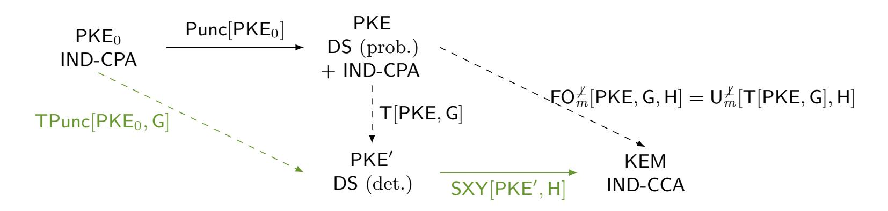
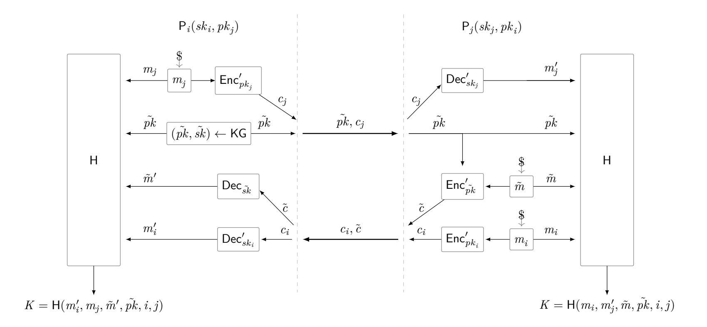
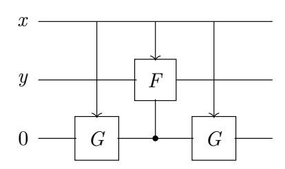

{0}------------------------------------------------

## <span id="page-0-1"></span><span id="page-0-0"></span>**Generic Authenticated Key Exchange in the Quantum Random Oracle Model (full version)**

Kathrin Hövelmanns <sup>1</sup> Eike Kiltz <sup>1</sup> Sven Schäge <sup>1</sup> Dominique Unruh <sup>2</sup> January 29, 2020

> <sup>1</sup> Ruhr-Universität Bochum [{kathrin.Hoevelmanns,eike.kiltz,sven.schaege}@rub.de](mailto:mail here ) <sup>2</sup> University of Tartu [unruh@ut.ee](mailto:mail here )

## **Abstract**

We propose FOAKE, a generic construction of two-message authenticated key exchange (AKE) from any passively secure public key encryption (PKE) in the quantum random oracle model (QROM). Whereas previous AKE constructions relied on a Diffie-Hellman key exchange or required the underlying PKE scheme to be perfectly correct, our transformation allows arbitrary PKE schemes with non-perfect correctness. Dealing with imperfect schemes is one of the major difficulties in a setting involving active attacks. Our direct construction, when applied to schemes such as the submissions to the recent NIST post-quantum competition, is more natural than previous AKE transformations. Furthermore, we avoid the use of (quantum-secure) digital signature schemes which are considerably less efficient than their PKE counterparts. As a consequence, we can instantiate our AKE transformation with any of the submissions to the recent NIST competition, e.g., ones based on codes and lattices.

FOAKE can be seen as a generalisation of the well known Fujisaki-Okamoto transformation (for building actively secure PKE from passively secure PKE) to the AKE setting. As a helper result, we also provide a security proof for the Fujisaki-Okamoto transformation in the QROM for PKE with non-perfect correctness which is tighter and tolerates a larger correctness error than previous proofs.

**Keywords:** Authenticated key exchange, quantum random oracle model, NIST, Fujisaki-Okamoto.

## **1 Introduction**

Authenticated Key Exchange. Besides public key encryption (PKE) and digital signatures, authenticated key exchange (AKE) is arguably one of the most important cryptographic building blocks in modern security systems. In the last two decades, research on AKE protocols has made tremendous progress in developing more solid theoretical foundations [\[11,](#page-28-0) [20,](#page-29-0) [39,](#page-30-0) [32\]](#page-30-1) as well as increasingly efficient designs of AKE protocols [\[38,](#page-30-2) [48,](#page-31-0) [45\]](#page-31-1). Most AKE protocols rely on constructions based on an ad-hoc Diffie-Hellman key exchange that is authenticated either via digital signatures, non-interactive key exchange (usually a Diffie-Hellman key exchange performed on long-term Diffie-Hellman keys), or public key encryption. While in the literature one can find many protocols that use one of the two former building blocks, results for PKE-based authentication are rather rare [\[8,](#page-28-1) [18\]](#page-28-2). Even rarer are constructions that only rely on PKE, discarding Diffie-Hellman key exchanges entirely. Notable recent exceptions are [\[24,](#page-29-1) [25\]](#page-29-2) and the protocol in [\[2\]](#page-27-0), the latter of which has been criticised for having a flawed security proof and a weak security model [\[47,](#page-31-2) [40\]](#page-30-3).

The NIST Post-Quantum Competition. Recently, some of the above mentioned designs have gathered renewed interest in the quest of finding AKE protocols that are secure against quantum adversaries, i.e., adversaries equipped with a quantum computer. In particular, the National Institute of Standards and Technology (NIST) announced a competition with the goal to standardise new PKE and signature

{1}------------------------------------------------

<span id="page-1-2"></span>algorithms [\[42\]](#page-30-4) with security against quantum adversaries. With the understanding that an AKE protocol can be constructed from low level primitives such as quantum-secure PKE and signature schemes, the NIST did not require the submissions to describe a concrete AKE protocol. Many PKE and signature candidates base their security on the hardness of certain problems over lattices and codes, which are generally believed to resist quantum adversaries.

The quantum ROM. Quantum computers may execute all "offline primitives" such as hash functions on arbitrary superpositions, which motivated the introduction of the quantum (accessible) random oracle model (QROM) [\[15\]](#page-28-3). While the adversary's capability to issue quantum queries to the random oracle renders many proof strategies significantly more complicated, it is nowadays generally believed that only proofs in the QROM imply provable security guarantees against quantum adversaries.

AKE and Quantum-Secure Signatures. Digital signatures are useful for the "authentication" part in AKE, but unfortunately all known quantum-secure constructions would add a considerable overhead to the AKE protocol. Therefore, if at all possible, we prefer to build AKE protocols only from PKE schemes, without using signatures.[1](#page-1-0) Our ultimate goal is to build a system that remains secure in the presence of quantum computers, meaning that even currently employed (very fast) signatures schemes based on elliptic curves are not an option.

Central Research Question for Quantum-Secure AKE. In summary, motivated by post-quantum secure cryptography and the NIST competition, we are interested in the following question:

## **How to build an actively secure AKE protocol from any passively secure PKE in the quantum random oracle model, without using signatures?**

(The terms "actively secure AKE" and "passively secure PKE" will be made more precise later.) Surprisingly, one of the main technical difficulties is that the underlying PKE scheme might come with a small probability of decryption failure, i.e., first encrypting and then decrypting does not yield the original message. This property is called non-perfect correctness, and it is common for quantum-secure schemes from lattices and codes, rendering them useless for all previous constructions that relied on perfect correctness.[2](#page-1-1)

Previous Constructions of AKE from public-key primitives. The generic AKE protocol of Fujioka et al. [\[24\]](#page-29-1) (itself based on [\[18\]](#page-28-2)) transforms a passively secure PKE scheme PKE and an actively (i.e., IND-CCA) secure PKE scheme PKEcca into an AKE protocol. We will refer to this transformation as FSXY[PKE*,* PKEcca]. Since the FSXY transformation is in the standard model, it is likely to be secure with the same proof in the post-quantum setting and thus also in the QROM. The standard way to obtain actively secure encryption from passively secure ones is the Fujisaki-Okamoto transformation PKEcca = FO[PKE*,* G*,* H] [\[26,](#page-29-3) [27\]](#page-29-4). In its "implicit rejection" variant [\[29\]](#page-29-5), it comes with a recently discovered security proof [\[44\]](#page-31-3) that models the hash functions G and H as quantum random oracles. Indeed, the *combined AKE transformation* FSXY[PKE*,* FO[PKE*,*G*,* H]] transforms passively secure encryption into AKE that is very likely to be secure in the QROM, without using digital signatures, hence giving a first answer to our above question. It has, however, two main drawbacks.

- **Perfect correctness requirement.** Transformation FSXY is not known to have a security proof if the underlying scheme does not satisfy perfect correctness. Likewise, the relatively tight QROM proof for FO that was given in [\[44\]](#page-31-3) requires the underlying scheme to be perfectly correct, and a generalisation of the proof for schemes with non-perfect correctness is not straightforward. Hence, it is unclear whether FSXY[PKE*,* FO[PKE*,*G*,* H]] can be instantiated with lattice- or code-based encryption schemes.
- **Lack of simplicity.** The Fujisaki-Okamoto transformation already involves hashing the key using hash function H, and FSXY involves even more (potentially redundant) hashing of the (already

<span id="page-1-0"></span><sup>1</sup>Clearly, PKE requires a working public-key infrastructure (PKI) which in turn requires signatures to certify the publickey. However, a user only has to verify a given certificate once and for all, which means the overhead of a quantum-secure signature can be neglected.

<span id="page-1-1"></span><sup>2</sup> There exist generic transformations that can immunise against decryption errors (e.g., [\[23\]](#page-29-6)). Even though they are quite efficient in theory, the induced overhead is still not acceptable for practical purposes. While lattice schemes could be rendered perfectly correct by putting a limit on the noise, and setting the modulus of the LWE instance large enough (see, e.g., [\[13,](#page-28-4) [30\]](#page-29-7)), the security level cannot be maintained without increasing the problem's dimension, accordingly. Since this modification would lead to increased public-key and ciphertext length, many NIST submissions deliberately made the design choice of having imperfect correctness.

{2}------------------------------------------------

<span id="page-2-0"></span>hashed) session key. Overall, the combined transformation seems overly complicated and hence impractical.

In [25], a transformation was given that started from oneway-secure KEMs, but its security proof was given in the ROM, and its generalisation to the QROM was explicitly left as an open problem. Furthermore, it involves more hashing, similar to transformation FSXY.

Hence, it seems desirable to provide a simplified transformation that gets rid of unnecessary hashing steps, and that can be proven secure in the QROM even if the underlying scheme does not satisfy perfect correctness. As a motivating example, note that the Kyber AKE protocol [17] can be seen as a result of applying such a simplified transformation to the Kyber PKE scheme, although coming without a formal security proof.

## 1.1 Our Contributions

Our main contribution is a transformation, FO<sub>AKE</sub>[PKE, G, H] ("Fujisaki-Okamoto for AKE") that converts any passively secure encryption scheme into an actively secure AKE protocol, with provable security in the quantum random oracle model. It can deal with non-perfect correctness and does not use digital signatures. Our transformation FO<sub>AKE</sub> can be viewed as a modification of the transformation given in [25]. Furthermore, we provide a precise game-based security definition for two-message AKE protocols. As a side result, we also give a security proof for the Fujisaki-Okamoto transformation in the QROM in Section 3 that deals with correctness errors. It can be seen as the KEM analogue of our main result, the AKE proof. Our proof strategy differs from and improves on the bounds of a previously published proof of the Fujisaki-Okamoto transformation for KEMs in the QROM [33].

#### 1.1.1 FO transformation for KEMs.

To simplify the presentation of FO<sub>AKE</sub>, we first give some background on the Fujisaki-Okamoto transformation for KEMs. In its original form [26, 27], FO yields an encryption scheme that is IND-CCA secure in the random oracle model [10] from combining any One-Way secure asymmetric encryption scheme with any one-time secure symmetric encryption scheme. In "A Designer's Guide to KEMs", Dent [22] provided FO-like IND-CCA secure KEMs. (Recall that any IND-CCA secure Key Encapsulation Mechanism can be combined with any (one-time) chosen-ciphertext secure symmetric encryption scheme to obtain a IND-CCA secure PKE scheme [21].) Since all of the transformations mentioned above required the underlying PKE scheme to be perfectly correct, and due to the increased popularity of lattice-based schemes with non-perfect correctness, [29] gave several modularisations of FO-like transformations and proved them robust against correctness errors. The key observation was that FO-like transformations essentially consists of two separate steps and can be dissected into two transformations, as sketched in the introduction of [29]:

• Transformation T: "Derandomise" and "re-encrypt". Starting from an encryption scheme PKE and a hash function G, encryption of PKE' = T[PKE, G] is defined by

$$\mathsf{Enc}'(pk, m) := \mathsf{Enc}(pk, m; \mathsf{G}(m)),$$

where G(m) is used as the random coins for Enc, rendering Enc' deterministic. Dec'(sk, c) first decrypts c into m' and rejects if  $Enc(pk, m'; G(m')) \neq c$  ("re-encryption").

• Transformation  $\mathsf{U}_m^{\not\perp}$ : "Hashing". Starting from an encryption scheme  $\mathsf{PKE}'$  and a hash function  $\mathsf{H}$ , key encapsulation mechanism  $\mathsf{KEM}_m^{\not\perp} = \mathsf{U}_m^{\not\perp}[\mathsf{PKE}',\mathsf{H}]$  with "implicit rejection" is defined by

$$\mathsf{Encaps}(pk) := (c \leftarrow \mathsf{Enc}'(pk, m), K := \mathsf{H}(m)), \tag{1}$$

where m is picked at random from the message space, and

$$\mathsf{Decaps}(sk,c) = \begin{cases} \mathsf{H}(m) & m \neq \bot \\ \mathsf{H}(s,c) & m = \bot \end{cases},$$

where  $m := \mathsf{Dec}(sk, c)$  and s is a random seed which is contained in sk. In the context of the FO transformation, implicit rejection was first introduced by Persichetti [43, Sec. 5.3].

{3}------------------------------------------------

<span id="page-3-2"></span>Transformation T was proven secure both in the (classical) ROM and the QROM, and  $\mathsf{U}_m^{\not\perp}$  was proven secure in the ROM. To achieve QROM security, [29] gave a modification of  $\mathsf{U}_m^{\not\perp}$ , called  $\mathsf{Q}\mathsf{U}_m^{\not\perp}$ , but its security proof in the QROM suffered from a quartic<sup>3</sup> loss in tightness, and furthermore, most real-world proposals are designed such that they fit the framework of  $\mathsf{FO}_m^{\not\perp} = \mathsf{U}_m^{\not\perp} \circ \mathsf{T}$ , not  $\mathsf{Q}\mathsf{U}_m^{\not\perp} \circ \mathsf{T}$ .

A slightly different modularisation was introduced in [44]: they gave transformations TPunc ("Puncturing and Encrypt-with-Hash") and SXY ("Hashing with implicit reject and reencryption"). SXY differs from  $U_m^{\not\perp}$  in that it reencrypts during decryption. Hence, it can only be applied to deterministic schemes. Even in the QROM, its CCA security tightly reduces to an intermediate notion called Disjoint Simulatability (DS) of ciphertexts. Intuitively, disjoint simulatability means that we can efficiently sample "fake ciphertexts" that are computationally indistinguishable from real PKE ciphertexts ("simulatability"), while the set of possible fake ciphertexts is required to be (almost) disjoint from the set of real ciphertexts. DS is naturally satisfied by many code/lattice-based encryption schemes. Additionally, it can be achieved using transformation Punc, i.e., by puncturing the underlying schemes' message space at one point and using this message to sample fake encryptions. Deterministic DS can be achieved by using transformation TPunc, albeit non-tightly: the reduction suffers from quadratic loss in security and an additional factor of q, the number of the adversary's hash queries.



Figure 1: Comparison of [44]'s modular transformation (green) with ours. Solid arrows indicate tight reductions, dashed arrows indicate non-tight reductions.

However, the reduction that is given in [44] requires the underlying encryption scheme to be perfectly correct. Later, [33] gave non-modular security proofs for the transformations  $\mathsf{FO}_m^{\not\perp}$  and  $\mathsf{FO}^{\not\perp}$  as well as a security proof for  $\mathsf{SXY}^4$  for schemes with correctness errors, which still suffered from quadratic loss in security and an additional factor of q, the latter of which this work improves to  $\sqrt{q}$ .

Our transformation  $\mathsf{FO}_m^{\not\perp}$  can be applied to any PKE scheme that is both IND-CPA and DS secure. The reduction is tighter than the one that results from combining those of TPunc and SXY in [44], and also than the reduction given in [34]. This is due to our use of the improved Oneway-to-Hiding lemma [3, Thm. 1: "Semi-classical O2H"]. Furthermore, we achieve a better correctness bound (the square of the bound given in [34]) due to a better bound for the generic distinguishing problem. In cases where PKE is not already DS, this requirement can be waived with negligible loss of efficiency: To rely on IND-CPA alone, all that has to be done is to plug in transformation Punc. A visualisation is given in Figure 1.

#### 1.1.2 Security Model for Two-Message Authenticated Key Exchange.

We introduce a simple game-based security model for (non-parallel) two-message AKE protocols, i.e., protocols where the responder sends his message only after having received the initiator's message. Technically, in our model, and similar to previous literature, we define several oracles that the attacker has access to. However, in contrast to most other security models, the inner workings of these oracles and their management via the challenger are precisely defined with pseudo-code.

DETAILS ON OUR MODELS. We define two security notions for two-message AKEs: key indistinguishability against active attacks (IND-AA) and the weaker notion of indistinguishability against active attacks without state reveal in the test session (IND-StAA). IND-AA captures the classical notion of key indistinguishability

<span id="page-3-1"></span><span id="page-3-0"></span><sup>&</sup>lt;sup>3</sup>not just quadratic, but indeed quartic

<sup>&</sup>lt;sup>4</sup> Note that nomenclature of [34] is a bit misleading: while the respective KEM is called  $\mathsf{U}_m^{\not\perp}$ , it is actually transformation SXY (it reencrypts during decryption, which  $\mathsf{U}_m^{\not\perp}$  does not).

{4}------------------------------------------------

<span id="page-4-1"></span>(as introduced by Bellare and Rogaway [11]) as well as security against reflection attacks, key compromise impersonation (KCI) attacks, and weak forward secrecy (wFS) [38]. It is based on the Canetti-Krawczyk (CK) model and allows the attacker to reveal (all) secret state information as compared to only ephemeral keys. As already pointed out by [18], this makes our model incomparable to the eCK model [39] but strictly stronger than the CK model. Essentially, the IND-AA model states that the session key remains indistinguishable from a random one even if

- 1. the attacker knows either the long-term secret key or the secret state information (but not both) of both parties involved in the test session, as long as it did not modify the message received by the test session,
- 2. and also if the attacker modified the message received by the test session, as long as it did not obtain the long-term secret key of the test session's peer.

We also consider the slightly weaker model IND-StAA (in which we will prove the security of our AKE protocols), where 2. is substituted by

2'. and also if the attacker modified the message received by the test session, as long as it did neither obtain the long-term secret key of the test session's peer **nor the test session's state**. The latter strategy, we will call a *state attack*.

We remark that IND-StAA security is essentially the same notion that was achieved by the FSXY transformation [24].<sup>5</sup> In Section 5 we provide a more general perspective on how our model compares to existing ones.

#### 1.1.3 Our Authenticated Key-Exchange Protocol.

Our transformation  $FO_{AKE}$  transforms any passively secure PKE (with potential non-perfect correctness) into an IND-StAA secure AKE.  $FO_{AKE}$  is a simplification of the transformation FSXY[PKE, FO[PKE, G, H]] mentioned above, where the derivation of the session key K uses only one single hash function H.  $FO_{AKE}$  can be regarded as the AKE analogue of the Fujisaki-Okamoto transformation.

Transformation  $FO_{AKE}[PKE,G,H]$  is described in Figure 2 and uses transform PKE' = T[PKE,G] as a building block. (The full construction is given in Figure 19, see Section 6.) Our main security result (Theorem 4) states that  $FO_{AKE}[PKE,G,H]$  is an IND-StAA-secure AKE if the underlying probabilistic PKE is DS as well as IND-CPA secure and has negligible correctness error, and furthermore G and H are modeled as quantum random oracles.

The proof essentially is the AKE analogue to the security proof of  $\mathsf{FO}_m^{\not\perp}$  we give in Section 3.2: By definition of our security model, it always holds that at least one of the messages  $m_i$ ,  $m_j$  and  $\tilde{m}$  is hidden from the adversary (unless it loses trivially) since it may not reveal a party's secret key and its session state at the same time. Adapting the simulation technique in [44], we can simulate the session keys even if we do not know the corresponding secret key  $sk_i$  ( $sk_j$ ,  $\tilde{sk}$ ). Assuming that PKE is DS, we can replace the corresponding ciphertext  $c_i$  ( $c_j$ ,  $\tilde{c}$ ) of the test session with a fake ciphertext, rendering the test session's key completely random from the adversary's view due to PKE's disjointness.

Let us add two remarks. Firstly, we cannot prove the security of  $FO_{AKE}[PKE, G, H]$  in the stronger sense of IND-AA and actually, it is not secure against state attacks. Secondly, note that our security statement involves the probabilistic scheme PKE rather than PKE'. Unfortunately, we were not able to provide a modular proof of AKE solely based on reasonable security properties of PKE' = T[PKE, G]. The reason for this is indeed the non-perfect correctness of PKE. This difficulty corresponds to the difficulty to generalise [44]'s result for deterministic encryption schemes with correctness errors discussed above.

CONCRETE APPLICATIONS. Our transformation can be applied to any scheme that is IND-CPA secure with post-quantum security, e.g., Frodo [41], Kyber [17], and Lizard [5]. Recall that the additional requirement of DS can be achieved with negligible loss of efficiency. However, in many applications even this negligible loss is inexistent since most of the aforementioned schemes can already be proven DS under the same assumption that their IND-CPA security is based upon.

<span id="page-4-0"></span><sup>&</sup>lt;sup>5</sup>The difference is that the model from [24] furthermore allows a "partial reveal" of the test session's state. For simplicity and due to their little practical relevance, we decided not to include such partial session reveal queries in our model. We remark that, however, our protocol could be proven secure in this slightly stronger model.

{5}------------------------------------------------

<span id="page-5-1"></span>

Figure 2: A visualisation of our authenticated key-exchange protocol  $\mathsf{FO}_{\mathsf{AKE}}$ . We make the convention that, in case any of the  $\mathsf{Dec}'$  algorithms returns  $\bot$ , the session key K is derived deterministically and pseudorandomly from the player's state ("implicit rejection").

#### 1.1.4 Subsequent work.

Since this paper was published on eprint, there has been more work on CCA security of FO in the QROM ([36, 14]), essentially achieving the same level of tightness as this work. [14] achieves more modularity, and covers a class of schemes that is both less and more restrictive at the same time: They only require schemes to be oneway-secure (instead of CPA, as required in this work), but the schemes have to meet an additional injectivity requirement (specified below).

TIGHTNESS FOR FO. Reductions from CCA security to CPA security in the QROM usually suffer from tightness loss in two separate ways: The best known bounds for probabilistic schemes to this date are essentially of the form  $\sqrt{q}\sqrt{\epsilon}$ , where q is the number of the adversary's hash queries, and  $\epsilon$  is the reduction's CPA advantage. Hence, the loss consists of both a loss regarding q (q-nontightness), and worse, a quadratic loss regarding the level of CPA security (root-nontightness). For the general setting where one starts from a probabilistic scheme, there have not been tightness improvements since this work:

Essentially, [36] is an update of [33] that makes use of the improved Oneway-to-Hiding bounds given in [3], thereby improving [33]'s bound  $q\sqrt{\epsilon}$  to  $\sqrt{q}\sqrt{\epsilon}$ , with the security requirement switching from onewayness to IND-CPA. The result seems to differ from this work solely in its (nonmodular) proof structure.

In [14], a new modular proof for FO was given by starting from probabilistic onewayness and choosing deterministic oneway-security as their intermediate  $^6$  notion, opposed to our (strictly stronger) intermediate notion of deterministic DS. This approach matches the observation that if one can start from a scheme that already is deterministically oneway-secure (like [13]), derandomisation step T is superfluous. In this case, only transformation U has to be applied, which is proven secure q-tightly. The weaker intermediate notion, however, shifts the root-nontightness to second transformation U. Therefore, the result still is heavily non-tight, even if derandomising via T is skipped. Furthermore, no tightness improvements whatsoever are achieved if the underlying scheme is not already deterministic, and thus has to be derandomised using T first.

Modular proof of [14] is achieved by introducing an additional notion for the intermediate scheme that deals with correctness errors. Unfortunately, the possibility of correctness errors complicate modular attempts on analysing FO: For underlying probabilistic schemes, [14] requires more than this work since its approach only is applicable if the "intermediate" scheme is injective with overwhelming probability. It is very likely that the modular approach of [14] could be generalised to an

<span id="page-5-0"></span><sup>&</sup>lt;sup>6</sup> By "intermediate", we mean the deterministic scheme that is to be plugged into one of the U-transforms. In most cases, it is derived by starting from a probabilistic scheme and first applying derandomisation transformation T.

{6}------------------------------------------------

<span id="page-6-1"></span>AKE proof that similarly is modular and hence, conceptually nicer. But this gain in modularity would come at a cost: The approach only is applicable if the derandomised scheme is essentially injective. We would, therefore, add an unnecessary restriction on the class of schemes that AKE can be based upon.

#### 1.1.5 Open Problems.

In the literature, one can find several Diffie-Hellman based protocols that achieve IND-AA security, for example HMQV [38]. However, none of them provides security against quantum computers. We leave as an interesting open problem to design a generic and efficient two-message AKE protocol in our stronger IND-AA model, preferably with a security proof in the QROM to guarantee its security even in the presence of quantum adversaries.

While [14] gave a proof of CCA security that is conceptually cleaner, it still is heavily non-tight due to its root-nontightness, with the root-nontightness stemming from its usage of a standard Oneway-to-Hiding strategy. Recent work [35] proved that for reductions using this standard approach, suffering from quadratic security loss is inevitable. We would like to point out, however, that we do not view this result as an impossibility result<sup>7</sup>. It rather proves impossibility of root-tightness for a certain type of reduction, and thereby informs us how to adapt possible future proof strategies: A root-tight proof of CCA security still might be achievable, but the respective reduction would have to be more sophisticated than extracting oneway solutions for the underlying scheme by simply applying Oneway-to-Hiding.

## 2 Preliminaries

For  $n \in \mathbb{N}$ , let  $[n] := \{1, \ldots, n\}$ . For a set S, |S| denotes the cardinality of S. For a finite set S, we denote the sampling of a uniform random element x by  $x \leftarrow_{\$} S$ , while we denote the sampling according to some distribution  $\mathfrak{D}$  by  $x \leftarrow \mathfrak{D}$ . By  $[\![B]\!]$  we denote the bit that is 1 if the boolean Statement B is true, and otherwise 0.

ALGORITHMS. We denote deterministic computation of an algorithm A on input x by y := A(x). We denote algorithms with access to an oracle O by  $A^O$ . Unless stated otherwise, we assume all our algorithms to be probabilistic and denote the computation by  $y \leftarrow A(x)$ .

GAMES. Following [46, 12], we use code-based games. We implicitly assume boolean flags to be initialised to false, numerical types to 0, sets to  $\varnothing$ , and strings to the empty string  $\epsilon$ . We make the convention that a procedure terminates once it has returned an output.

#### 2.1 Public-key Encryption

SYNTAX. A public-key encryption scheme PKE = (KG, Enc, Dec) consists of three algorithms, and a finite message space  $\mathcal{M}$  which we assume to be efficiently recognisable. The key generation algorithm KG outputs a key pair (pk, sk), where pk also defines a finite randomness space  $\mathcal{R} = \mathcal{R}(pk)$  as well as a ciphertext space  $\mathcal{C}$ . The encryption algorithm Enc, on input pk and a message  $m \in \mathcal{M}$ , outputs an encryption explicit by writing c := Enc(pk, m; r), where  $r \leftarrow_{\$} \mathcal{R}$ . The decryption algorithm Dec, on input sk and a ciphertext c, outputs either a message  $m = \text{Dec}(sk, c) \in \mathcal{M}$  or a special symbol  $\bot \notin \mathcal{M}$  to indicate that c is not a valid ciphertext.

**Definition 2.1** (Collision probability of key generation.). We define

$$\mu(\mathsf{KG}) := \Pr[(pk, sk) \leftarrow \mathsf{KG}, (pk', sk') \leftarrow \mathsf{KG} : pk = pk']$$
.

**Definition 2.2** (Collision probability of ciphertexts.). We define

$$\mu(\mathsf{Enc}) := \Pr[(pk, sk) \leftarrow \mathsf{KG}, m, m' \leftarrow_{\$} \mathcal{M}, c \leftarrow \mathsf{Enc}(pk, m), c' \leftarrow \mathsf{Enc}(pk, m') : c = c'] \ .$$

<span id="page-6-0"></span><sup>&</sup>lt;sup>7</sup> A strict impossibility result would have to consist of a concrete scheme as well as a concrete attack, with the latter matching the given upper bound.

{7}------------------------------------------------

<span id="page-7-1"></span>**Definition 2.3** ( $\gamma$ -Spreadness.). [26] We say that PKE is  $\gamma$ -spread iff for all key pairs  $(pk, sk) \in \text{supp}(\mathsf{KG})$  and all messages  $m \in \mathcal{M}$  it holds that

$$\max_{c \in \mathcal{C}} \Pr[r \leftarrow_{\$} \mathcal{R} : \mathsf{Enc}(pk, m; r) = c] \le 2^{-\gamma} .$$

**Definition 2.4** (Correctness). [29] We define  $\delta := \mathbf{E}[\max_{m \in \mathcal{M}} \Pr[c \leftarrow \mathsf{Enc}(pk, m) : \mathsf{Dec}(sk, c) \neq m]]$ , where the expectation is taken over  $(pk, sk) \leftarrow \mathsf{KG}$ .

SECURITY. We now define the notion of <u>Ind</u>istinguishability under <u>C</u>hosen <u>P</u>laintext <u>A</u>ttacks (IND-CPA) for public-key encryption.

**Definition 2.5** (IND-CPA). Let PKE = (KG, Enc, Dec) be a public-key encryption scheme. We define game IND-CPA game as in Figure 3, and the IND-CPA advantage function of a quantum adversary  $A = (A_1, A_2)$  against PKE (such that  $A_2$  has binary output) as

$$\mathrm{Adv}_{\mathsf{PKE}}^{\mathsf{IND-CPA}}(\mathsf{A}) \mathrel{\mathop:}= |\Pr[\mathsf{IND-CPA}_1^\mathsf{A} \Rightarrow 1] - \Pr[\mathsf{IND-CPA}_0^\mathsf{A} \Rightarrow 1]| \ .$$

<span id="page-7-0"></span>We also define IND-CPA security in the random oracle model model, where PKE and adversary A are given access to a random oracle.

| GAME IND-CPA <sub>b</sub>                         | GAME IND-CCA                                           | $Decaps(c \neq c^*)$                   |
|---------------------------------------------------|--------------------------------------------------------|----------------------------------------|
| $01 \ (pk, sk) \leftarrow KG$                     | 06 $(pk, sk) \leftarrow KG$                            | $\overline{12\ K := Decaps}(sk, c)$    |
| 02 $(m_0^*, m_1^*, \text{st}) \leftarrow A_1(pk)$ | of $b \leftarrow_{\$} \mathbb{F}_2$                    | 13 $\operatorname{\mathbf{return}}\ K$ |
| 03 $c^* \leftarrow Enc(pk, m_b^*)$                | 08 $(K_0^*, c^*) \leftarrow Encaps(pk)$                |                                        |
| 04 $b' \leftarrow A_2(pk, c^*, \mathrm{st})$      | 09 $K_1^* \leftarrow_{\$} \mathcal{K}$                 |                                        |
| 05 $\mathbf{return}\ b'$                          | 10 $b' \leftarrow A^{\mathrm{DECAPS}}(pk, c^*, K_b^*)$ |                                        |
|                                                   | 11 return $\llbracket b' = b \rrbracket$               |                                        |

Figure 3: Games IND-CPA<sub>b</sub> for PKE  $(b \in \mathbb{F}_2)$  and game IND-CCA for KEM.

DISJOINT SIMULATABILITY. Following [44], we consider PKE where it is possible to efficiently sample fake ciphertexts that are indistinguishable from proper encryptions, while the probability that the sampling algorithm hits a proper encryption is small.

**Definition 2.6** (DS) Let PKE = (KG, Enc, Dec) be a PKE scheme with message space  $\mathcal{M}$  and ciphertext space  $\mathcal{C}$ , coming with an additional PPT algorithm  $\overline{Enc}$ . For quantum adversaries A, we define the advantage against PKE's disjoint simulatability as

$$\begin{split} \operatorname{Adv}_{\mathsf{PKE},\overline{\mathsf{Enc}}}^{\mathsf{DS}}(\mathsf{A}) \coloneqq &|\Pr[pk \leftarrow \mathsf{KG}, m \leftarrow_{\$} \mathcal{M}, c \leftarrow \mathsf{Enc}(pk, m) : 1 \leftarrow \mathsf{A}(pk, c)] \\ &- \Pr[pk \leftarrow \mathsf{KG}, c \leftarrow \overline{\mathsf{Enc}}(pk) : 1 \leftarrow \mathsf{A}(pk, c)]| \enspace . \end{split}$$

When there is no chance of confusion, we will drop  $\overline{\mathsf{Enc}}$  from the advantage's subscript for convenience. We call PKE  $\epsilon_{dis}$ -disjoint if for all  $pk \in \mathrm{supp}(\mathsf{KG})$ ,  $\Pr[c \leftarrow \overline{\mathsf{Enc}}(pk) : c \in \mathsf{Enc}(pk, \mathcal{M}; \mathcal{R})] \leq \epsilon_{\mathrm{dis}}$ .

#### 2.2 Key Encapsulation

SYNTAX. A key encapsulation mechanism KEM = (KG, Encaps, Decaps) consists of three algorithms. The key generation algorithm KG outputs a key pair (pk, sk), where pk also defines a finite key space  $\mathcal{K}$ . The encapsulation algorithm Encaps, on input pk, outputs a tuple (K, c) where c is said to be an encapsulation of the key K which is contained in key space K. The deterministic decapsulation algorithm Decaps, on input sk and an encapsulation c, outputs either a key  $K := \mathsf{Decaps}(sk, c) \in \mathcal{K}$  or a special symbol  $\bot \notin \mathcal{K}$  to indicate that c is not a valid encapsulation.

We call KEM  $\delta$ -correct if

$$\Pr\left[\mathsf{Decaps}(sk,c) \neq K \mid (pk,sk) \leftarrow \mathsf{KG}; (K,c) \leftarrow \mathsf{Encaps}(pk)\right] \leq \delta$$
.

{8}------------------------------------------------

<span id="page-8-0"></span>Note that the above definition also makes sense in the random oracle model since KEM ciphertexts do not depend on messages.

Security. We now define a security notion for key encapsulation: <u>Indistinguishbility under Chosen Ciphertext Attacks</u> (IND-CCA).

**Definition 2.7** (IND-CCA). We define the IND-CCA game as in Figure 3 and the IND-CCA advantage function of an adversary A (with binary output) against KEM as

$$Adv_{KEM}^{IND-CCA}(A) := |Pr[IND-CCA^A \Rightarrow 1] - 1/2|$$
.

## 2.3 Quantum computation

QUBITS. For simplicity, we will treat a qubit as a vector  $|\varphi\rangle \in \mathbb{C}^2$ , i.e., a linear combination  $|\varphi\rangle = \alpha \cdot |0\rangle + \beta \cdot |1\rangle$  of the two basis states (vectors)  $|0\rangle$  and  $|1\rangle$  with the additional requirement to the probability amplitudes  $\alpha, \beta \in \mathbb{C}$  that  $|\alpha|^2 + |\beta|^2 = 1$ . The basis  $\{|0\rangle, |1\rangle\}$  is called standard orthonormal computational basis. The qubit  $|\varphi\rangle$  is said to be in superposition. Classical bits can be interpreted as quantum bits via the mapping  $(b \mapsto 1 \cdot |b\rangle + 0 \cdot |1 - b\rangle)$ .

QUANTUM REGISTERS. We will treat a quantum register as a collection of multiple qubits, i.e. a linear combination  $|\varphi\rangle := \sum_{x \in \mathbb{F}_2^n} \alpha_x \cdot |x\rangle$ , where  $\alpha_x \in \mathbb{C}$ , with the additional restriction that  $\sum_{x \in \mathbb{F}_2^n} |\alpha_x|^2 = 1$ . As in the one-dimensional case, we call the basis  $\{|x\rangle\}_{x \in \mathbb{F}_2^n}$  the standard orthonormal computational basis. We say that  $|\varphi\rangle = \sum_{x \in \mathbb{F}_2^n} \alpha_x \cdot |x\rangle$  contains the classical query x if  $\alpha_x \neq 0$ .

MEASUREMENTS. Qubits can be measured with respect to a basis. In this paper, we will only consider measurements in the standard orthonormal computational basis, and denote this measurement by MEASURE(·), where the outcome of MEASURE( $|\varphi\rangle$ ) for a single qubit  $|\varphi\rangle = \alpha \cdot |0\rangle + \beta \cdot |1\rangle$  will be 0 with probability  $|\alpha|^2$  and 1 with probability  $|\beta|^2$ , and the outcome of measuring a qubit register  $|\varphi\rangle = \sum_{x \in \mathbb{F}_2^n} \alpha_x \cdot |x\rangle$  will be x with probability  $|\alpha_x|^2$ . Note that the amplitudes collapse during a measurement, this means that by measuring  $\alpha \cdot |0\rangle + \beta \cdot |1\rangle$ ,  $\alpha$  and  $\beta$  are switched to one of the combinations in  $\{\pm(1,0), \pm(0,1)\}$ . Likewise, in the n-dimensional case, all amplitudes are switched to 0 except for the one that belongs to the measurement outcome and which will be switched to 1.

QUANTUM ORACLES AND QUANTUM ADVERSARIES. Following [15, 6], we view a quantum oracle  $|\mathbf{0}\rangle$  as a mapping

$$|x\rangle|y\rangle \mapsto |x\rangle|y \oplus O(x)\rangle$$
,

where  $O : \mathbb{F}_2^n \to \mathbb{F}_2^m$ , and model quantum adversaries A with access to O by a sequence  $U_1, |O\rangle, U_2, \cdots, |O\rangle, U_N$  of unitary transformations. We write  $A^{|O\rangle}$  to indicate that the oracles are quantum-accessible (contrary to oracles which can only process classical bits).

QUANTUM RANDOM ORACLE MODEL. We consider security games in the quantum random oracle model (QROM) as their counterparts in the classical random oracle model, with the difference that we consider quantum adversaries that are given **quantum** access to the (offline) random oracles involved, and **classical** access to all other (online) oracles. For example, in the IND-CPA game, the adversary only obtains a classical encryption, like in [19], and unlike in [16]. In the IND-CCA game, the adversary only has access to a classical decryption oracle, unlike in [28] and [1].

Zhandry [49] proved that no quantum algorithm  $A^{|O\rangle}$ , issuing at most q quantum queries to  $|O\rangle$ , can distinguish between a random function  $O: \mathbb{F}_2^m \to \mathbb{F}_2^n$  and a 2q-wise independent function  $f_{2q}$ . For concreteness, we view  $f_{2q}: \mathbb{F}_2^m \to \mathbb{F}_2^n$  as a random polynomial of degree 2q over the finite field  $\mathbb{F}_{2^n}$ . The running time to evaluate  $f_{2q}$  is linear in q. In this article, we will use this observation in the context of security reductions, where quantum adversary B simulates quantum adversary  $A^{|O\rangle}$  issuing at most q queries to  $|O\rangle$ . Hence, the running time of B is  $\mathrm{Time}(B) = \mathrm{Time}(A) + q \cdot \mathrm{Time}(O)$ , where  $\mathrm{Time}(O)$  denotes the time it takes to simulate  $|O\rangle$ . Using the observation above, B can use a 2q-wise independent function in order to (information-theoretically) simulate  $|O\rangle$ , and we obtain that the running time of B is  $\mathrm{Time}(B) = \mathrm{Time}(A) + q \cdot \mathrm{Time}(f_{2q})$ , and the time  $\mathrm{Time}(f_{2q})$  to evaluate  $f_{2q}$  is linear in q. Following [44] and [37], we make use of the fact that the second term of this running time (quadratic in q) can be further reduced to linear in q in the quantum random-oracle model where B can simply use another random oracle to simulate  $|O\rangle$ . Assuming evaluating the random oracle takes one time unit, we write  $\mathrm{Time}(B) = \mathrm{Time}(A) + q$ , which is approximately  $\mathrm{Time}(A)$ .

{9}------------------------------------------------

Oneway to Hiding with semi-classical oracles. In [3], Ambainis et al. defined semi-classical oracles that return a state that was measured with respect to one of the input registers. In particular, to any subset  $S \subset X$ , they associated the following semi-classical oracle  $O_S^{SC}$ : Algorithm  $O_S^{SC}$ , when queried on  $|\psi,0\rangle$ , measures with respect to the projectors  $M_1$  and  $M_0$ , where  $M_1 := \sum_{x \in S} |x\rangle\langle x|$  and  $M_0 := \sum_{x \notin S} |x\rangle\langle x|$ . The oracle then initialises the second register to  $|b\rangle$  for the measured bit b. This means that  $|\psi,0\rangle$  collapses to either a state  $|\psi',0\rangle$  such that  $|\psi'\rangle$  only contains elements of  $X \setminus S$  or to a state  $|\psi',1\rangle$  such that  $|\psi'\rangle$  only contains elements of S. Let FIND denote the event that the latter ever is the case, i.e., that  $O_S^{SC}$  ever answers with  $|\psi',1\rangle$  for some  $\psi'$ . To a quantum-accessible oracle G and a subset  $S \subset X$ , Ambainis et al. associate the following punctured oracle  $G \setminus S$  that removes S from the domain of G unless FIND occurs.

$$\begin{array}{|c|c|}
\hline
G \setminus S|\psi,\phi\rangle \\
\hline
01 & |\psi',b\rangle := O_S^{SC}|\psi,0\rangle \\
02 & \mathbf{return} & U_G|\psi',\phi\rangle
\end{array}$$

Figure 4: Punctured oracle  $G \setminus S$  for O2H.

The following theorem is a simplification of statement (2) given in [3, Thm. 1: "Semi-classical O2H"], and of [3, Cor. 1]. It differs in the following way: While [3] consider adversaries that might execute parallel oracle invocations and therefore differentiate between query depth d and number of queries q, we use the upper bound  $q \ge d$  for simplicity.

**Theorem 2.8** Let  $S \subset X$  be random. Let  $G, H \in Y^X$  be random functions such that  $G_{|X\setminus S} = H_{|X\setminus S}$ , and let z be a random bitstring. (S, G, H, and z may have an arbitrary joint distribution.) Then, for all quantum algorithms A issuing at most <math>q queries that, on input z, output either 0 or 1,

$$|\Pr[1 \leftarrow \mathsf{A}^{|\mathsf{G}\rangle}(z)] - \Pr[1 \leftarrow \mathsf{A}^{|\mathsf{H}\rangle}(z)]| \le 2 \cdot \sqrt{q \Pr[b \leftarrow \mathsf{A}^{|\mathsf{G}\backslash\mathsf{S}\rangle}(z) : \mathrm{FIND}]} \ .$$

If furthermore  $S := \{x\}$  for  $x \leftarrow_{\$} X$ , and x and z are independent,

$$\Pr[b \leftarrow \mathsf{A}^{|\mathsf{G}\setminus\mathsf{S}\rangle}(z) : \mathrm{FIND}] \le \frac{4q}{|X|}$$
.

GENERIC QUANTUM DISTINGUISHING PROBLEM WITH BOUNDED PROBABILITIES. For  $\lambda \in [0,1]$ , let  $B_{\lambda}$  be the Bernoulli distribution, i.e.,  $\Pr[b=1] = \lambda$  for the bit  $b \leftarrow B_{\lambda}$ . Let X be some finite set. The generic quantum distinguishing problem ([4, Lemma 37], [31, Lem. 3]) is to distinguish quantum access to an oracle  $F: X \to \mathbb{F}_2$ , such that for each  $x \in X$ , F(x) is distributed according to  $B_{\lambda}$ , from quantum access to the zero function. We will need the following slight variation. The Generic quantum Distinguishing Problem with Bounded probabilities GDPB is like the quantum distinguishing problem with the difference that the Bernoulli parameter  $\lambda_x$  may depend on x, but still is upper bounded by a global  $\lambda$ . The upper bound we give is the same as in [31, Lem. 3].

**Lemma 2.9** (Generic Distinguishing Problem with Bounded Probabilities). [Generic Distinguishing Problem with Bounded Probabilities] Let X be a finite set, and let  $\lambda \in [0,1]$ . Then, for any (unbounded, quantum) algorithm A issuing at most q quantum queries,

$$|\Pr[\mathsf{GDPB}_{\lambda,0}^\mathsf{A}\Rightarrow 1] - \Pr[\mathsf{GDPB}_{\lambda,1}^\mathsf{A}\Rightarrow 1]| \le 8(q+1)^2 \cdot \lambda,$$

where games  $\mathsf{GDPB}_{\lambda,b}^\mathsf{A}$  (for bit  $b \in \mathbb{F}_2$ ) are defined as follows:

{10}------------------------------------------------

```
GAME GDPB<sub>\lambda,b</sub>
01 \quad (\lambda_x)_{x \in X} \leftarrow \mathsf{A}_1
02 \quad \text{if} \quad \exists x \in X \text{ s.t. } \lambda_x > \lambda \text{ return } 0
03 \quad \text{if} \quad b = 0
04 \quad F := 0
05 \quad \text{else for all } x \in X
06 \quad F(x) \leftarrow B_{\lambda_x}
07 \quad b' \leftarrow \mathsf{A}_2^{|F|}
08 \quad \text{return } b'
```

<span id="page-10-1"></span><span id="page-10-0"></span>*Proof.* In this proof, let  $\mathsf{CGDPB}_{\lambda}$  denote the game  $\mathsf{GDPB}_{\lambda}$  as defined in [4] and [31], i.e., defined such that  $\lambda_x = \lambda$  for all x. (Hence, we call it constant  $\mathsf{GDPB}$ ). The bound on  $\mathsf{GDPB}_{\lambda}$  can be reduced to the known bound on  $\mathsf{CGDPB}_{\lambda}$  by coupling the Bernoulli parameter to obtain the dependence on each  $x \in X$ : Let  $\mathsf{A}$  be an adversary against game  $\mathsf{GDPB}_{\lambda}$ , issuing at most q queries. Without loss of generality, we can assume that  $\lambda > 0$ . Consider adversary  $\mathsf{B}$  against game  $\mathsf{CGDPB}_{\lambda}$ , given in Figure 5.

$$\begin{array}{c|c}
\underline{B_1} & \underline{B_2^{|F\rangle}} \\
01 & (\lambda_x)_{x \in X} \leftarrow \mathsf{A}_1 \\
02 & \lambda := \max_{x \in X} \lambda_x \\
03 & \mathbf{for} \text{ all } x \in X \\
04 & \mu_x := \frac{\lambda_x}{\lambda} \\
05 & G(x) \leftarrow B_{\mu_x} \\
06 & \mathbf{return} \ \lambda
\end{array}$$

Figure 5: Adversary B for the proof of Lemma 1.

For each  $x \in X$ , B picks G(x) according to  $B_{\mu_x}$ , where  $\mu_x := \frac{\lambda_x}{\lambda} \in [0, 1]$ . B then executes A with oracle access to  $|F \cdot G\rangle$  and returns A's output bit. If F(x) is distributed according to  $B_{\lambda}$  for each x, then  $(F \cdot G)(x)$  is distributed according to  $B_{\lambda_x}$ , and if F is the constant zero function, so is  $F \cdot G$ , hence B perfectly simulates game  $\mathsf{GDPB}_{\lambda}$  for A and

$$|\Pr[\mathsf{GDPB}^\mathsf{A}_{\lambda,0} \Rightarrow 1] - \Pr[\mathsf{GDPB}^\mathsf{A}_{\lambda,1} \Rightarrow 1]| = |\Pr[\mathsf{CGDPB}^\mathsf{B}_{\lambda,0} \Rightarrow 1] - \Pr[\mathsf{CGDPB}^\mathsf{B}_{\lambda,1} \Rightarrow 1]| \ .$$

We now argue that B can realise A's oracle access to  $|F \cdot G\rangle$  in a way such that any query to  $|F \cdot G\rangle$  by A triggers at most one query to  $|F\rangle$ . To verify this claim, consider the following state transitions:



The dot indicates execution of F(x), conditioned on G(x). It's easy to see that  $|x, y, 0\rangle$  transitions to  $|x, y \oplus F(x), 0\rangle$  if G(x) = 1, and that  $|x, y, 0\rangle$  transitions to  $|x, y, 0\rangle$  if G(x) = 0, hence  $|x, y, 0\rangle$  transitions to  $|x, y \oplus (F \cdot G)(x), 0\rangle$ , either way, and B can answer queries to  $|F \cdot G\rangle$  by querying  $|F\rangle$  just once. Since B issues at most q queries to  $|F\rangle$ , we can apply [31, Lem. 3] and obtain

$$|\Pr[\mathsf{CGDPB}_{\lambda,0}^{\mathsf{B}} \Rightarrow 1] - \Pr[\mathsf{CGDPB}_{\lambda,1}^{\mathsf{B}} \Rightarrow 1]| \leq 8(q+1)^2 \cdot \lambda$$
.

{11}------------------------------------------------

# <span id="page-11-1"></span>3 The FO Transformation: QROM security with correctness errors

In Section 3.1, we modularise transformation TPunc that was given in [44] and that turns any public key encryption scheme that is IND-CPA secure into a deterministic one that is DS. Transformation TPunc essentially consists of first puncturing the message space at one point (transformation Punc, to achieve probabilistic DS), and then applying transformation T. Next, in Section 3.2, we show that transformation  $U_m^{\not\perp}$ , when applied to T, transforms any encryption scheme that is DS as well as IND-CPA into a KEM that is IND-CCA secure. We believe that many lattice-based schemes fulfill DS in a natural way,<sup>8</sup> but for the sake of completeness, we will show in Section 3.3 how transformation Punc can be used to waive the requirement of DS with negligible loss of efficiency.

## 3.1 Modularisation of TPunc

We modularise transformation TPunc ("Puncturing and Encrypt-with-Hash") that was given in [44], and that turns any IND-CPA secure PKE scheme into a deterministic one that is DS. Note that apart from reencryption, TPunc[PKE<sub>0</sub>, G] given in [44] and our modularisation T[Punc[PKE<sub>0</sub>], G] are equal. We first give transformation Punc that turns any IND-CPA secure scheme into a scheme that is both DS and IND-CPA. In Section 3.1, we show that transformation T turns any scheme that is DS as well as IND-CPA secure into a deterministic scheme that is DS.

#### 3.1.1 Transformation Punc: From IND-CPA to probabilistic DS security

Transformation Punc turns any IND-CPA secure public-key encryption scheme into a DS secure one by puncturing the message space at one message and sampling encryptions of this message as fake encryptions.

THE CONSTRUCTION. To a public-key encryption scheme  $PKE_0 = (KG_0, Enc_0, Dec_0)$  with message space  $\mathcal{M}_0$ , we associate  $PKE := Punc[PKE_0, \hat{m}] := (KG := KG_0, Enc, Dec := Dec_0)$  with message space  $\mathcal{M} := \mathcal{M}_0 \setminus \{\hat{m}\}$  for some message  $\hat{m} \in \mathcal{M}$ . Encryption and fake encryption sampling of PKE are defined in Figure 6. Note that transformation Punc will only be used as a helper transformation to achieve DS, generically.

| $Enc(pk, m \in \mathcal{M})$                      | $\overline{Enc}(pk)$                                                 |
|---------------------------------------------------|----------------------------------------------------------------------|
| $\boxed{\texttt{01} \ c \leftarrow Enc_0(pk, m)}$ | $\overline{\texttt{O3} \ c \leftarrow}  Enc_0(\mathit{pk}, \hat{m})$ |
| 02 <b>return</b> c                                | 04 $\operatorname{\mathbf{return}}\ c$                               |

Figure 6: Encryption and fake encryption sampling of  $PKE = Punc[PKE_0]$ .

#### 3.1.2 Transformation T: From probabilistic to deterministic DS security

Transformation T [7] turns any probabilistic public-key encryption scheme into a deterministic one. The transformed scheme is DS, given that PKE is DS as well as IND-CPA secure. Our security proof is tighter than the proof given for TPunc (see [44, Theorem 3.3]) due to our use of the semi-classical O2H theorem.

THE CONSTRUCTION. Take an encryption scheme PKE = (KG, Enc, Dec) with message space  $\mathcal{M}$  and randomness space  $\mathcal{R}$ . Assume PKE to be additionally endowed with a sampling algorithm  $\overline{Enc}$  (see Definition 6). To PKE and random oracle  $G : \mathcal{M} \to \mathcal{R}$ , we associate PKE' = T[PKE, G], where the algorithms of  $PKE' = (KG' := KG, Enc', Dec', \overline{Enc}' := \overline{Enc})$  are defined in Figure 7. Note that Enc' deterministically computes the ciphertext as c := Enc(pk, m; G(m)).

The following lemma states that combined IND-CPA and DS security of PKE imply the DS security of PKE'.

<span id="page-11-0"></span><sup>&</sup>lt;sup>8</sup>Fake encryptions could be sampled uniformly random. DS would follow from the LWE assumption, and since LWE samples are relatively sparse, uniform sampling should be disjoint.

{12}------------------------------------------------

<span id="page-12-3"></span><span id="page-12-0"></span>

| Enc'(pk,m)                                    | Dec'(sk,c)                                            |
|-----------------------------------------------|-------------------------------------------------------|
| $\overline{\text{O1 } c := Enc}(pk, m; G(m))$ | $\overline{\tt 03} \ m' := \overline{\sf Dec}(sk,c).$ |
| 02 $\operatorname{\mathbf{return}}\ c$        | 04 if $m' = \bot$ or $Enc(pk, m'; G(m')) \neq c$      |
|                                               | os return $\perp$                                     |
|                                               | 06 else return $m'$                                   |

Figure 7: Deterministic encryption scheme PKE' = T[PKE, G].

**Lemma 3.1** (DS security of PKE'). If PKE is  $\epsilon$ -disjoint, so is PKE'. For all adversaries A issuing at most  $q_G$  (quantum) queries to G, there exist an adversary  $B_{IND}$  and an adversary  $B_{DS}$  such that

$$\begin{split} \operatorname{Adv}_{\mathsf{PKE}'}^{\mathsf{DS}}(\mathsf{A}) & \leq \operatorname{Adv}_{\mathsf{PKE}}^{\mathsf{DS}}(\mathsf{B}_{\mathsf{DS}}) + 2 \cdot \sqrt{q_{\mathsf{G}} \cdot \operatorname{Adv}_{\mathsf{PKE}}^{\mathsf{IND-CPA}}(\mathsf{B}_{\mathsf{IND}}) + \frac{4q_{\mathsf{G}}^2}{|\mathcal{M}|}} \\ & \leq \operatorname{Adv}_{\mathsf{PKE}}^{\mathsf{DS}}(\mathsf{B}_{\mathsf{DS}}) + 2 \cdot \sqrt{q_{\mathsf{G}} \cdot \operatorname{Adv}_{\mathsf{PKE}}^{\mathsf{IND-CPA}}(\mathsf{B}_{\mathsf{IND}})} + \frac{4q_{\mathsf{G}}}{\sqrt{|\mathcal{M}|}} \;\;, \end{split}$$

and the running time of each adversary is about that of B.

*Proof.* It is straightforward to prove disjointness since  $\mathsf{Enc}'(pk,\mathcal{M})$  is subset of  $\mathsf{Enc}(pk,\mathcal{M};\mathcal{R})$ . Let A be a DS adversary against PKE'. Consider the sequence of games given in Figure 8. Per definition,

$$\begin{aligned} \operatorname{Adv}_{\mathsf{PKE'}}^{\mathsf{DS}}(\mathsf{A}) &= |\Pr[G_0^{\mathsf{A}} \Rightarrow 1] - \Pr[G_1^{\mathsf{A}} \Rightarrow 1]| \\ &\leq |\Pr[G_0^{\mathsf{A}} \Rightarrow 1] - \Pr[G_3^{\mathsf{A}} \Rightarrow 1]| + |\Pr[G_1^{\mathsf{A}} \Rightarrow 1] - \Pr[G_3^{\mathsf{A}} \Rightarrow 1]| . \end{aligned}$$

<span id="page-12-2"></span>

| Games $G_0$ - $G_3$                                                  | Game $G_4$ - $G_5$                         | $G\setminus\{m^*\} \psi,\phi\rangle$                                    |
|----------------------------------------------------------------------|--------------------------------------------|-------------------------------------------------------------------------|
| 01 $pk \leftarrow KG$                                                | 10 $FIND := false$                         | $\overline{$ 18 $ \psi',b\rangle := O^{SC}_{\{m^*\}} \psi,0\rangle \  $ |
| 02 $m^* \leftarrow_\$ \mathcal{M}$                                   | 11 $pk \leftarrow KG$                      | 19 if $b=1$                                                             |
| 1 / / / /                                                            | 12 $m^* \leftarrow_\$ \mathcal{M}$         | 20 FIND := $\mathbf{true}$                                              |
| \ \ \ \ \ \ \ \ \ \ \ \ \ \ \ \ \ \ \ \                              | 13 $r^* \leftarrow_\$ \mathcal{R}$         | 21 <b>return</b> $U_{G} \psi',\phi\rangle$                              |
| $05 r^* \leftarrow_{\$} \mathcal{R} \qquad /\!\!/ G_2 \text{-} G_3$  | 14 $c^* := Enc(pk, m^*; r^*) \ /\!\!/ G_4$ | 1,7,7,                                                                  |
| 06 $c^* := \operatorname{Enc}(pk, m^*; r^*)$ $/\!\!/ G_1 - G_3$      |                                            |                                                                         |
| 07 $b' \leftarrow A^{ G\rangle}(pk, c^*)$ // $/\!\!/ G_0 - G_1, G_3$ |                                            |                                                                         |
| $08 \ b' \leftarrow A^{ H\rangle}(pk, c^*) \qquad /\!\!/ G_2$        | 17 <b>return</b> FIND                      |                                                                         |
| 09 return $b'$                                                       |                                            |                                                                         |

Figure 8: Games  $G_0$  -  $G_5$  for the proof of Lemma 2.

<span id="page-12-1"></span>To upper bound  $|\Pr[G_0^{\mathsf{A}} \Rightarrow 1] - \Pr[G_3^{\mathsf{A}} \Rightarrow 1]|$ , consider adversary  $\mathsf{B}_{\mathsf{DS}}$  against the disjoint simulatability of the underlying scheme PKE, given in Figure 9.  $\mathsf{B}_{\mathsf{DS}}$  runs in the time that is required to run A and to simulate G for  $q_{\mathsf{G}}$  queries. Since  $\mathsf{B}_{\mathsf{DS}}$  perfectly simulates game  $G_0$  if run with a fake ciphertext as input, and game  $G_3$  if run with a random encryption  $c \leftarrow \mathsf{Enc}(pk, m^*)$ ,

$$|\Pr[G_0^{\mathsf{A}} \Rightarrow 1] - \Pr[G_3^{\mathsf{A}} \Rightarrow 1]| = \operatorname{Adv}_{\mathsf{PKE}}^{\mathsf{DS}}(\mathsf{B}_{\mathsf{DS}}).$$

It remains to upper bound  $|\Pr[G_1^{\mathsf{A}} \Rightarrow 1] - \Pr[G_3^{\mathsf{A}} \Rightarrow 1]|$ . We claim that there exists an adversary  $\mathsf{B}_{\mathsf{IND}}$  such that

$$|\Pr[G_1^{\mathsf{A}} \Rightarrow 1] - \Pr[G_3^{\mathsf{A}} \Rightarrow 1]| \le 2\sqrt{q_{\mathsf{G}} \cdot \operatorname{Adv}_{\mathsf{PKE}}^{\mathsf{IND-CPA}}(\mathsf{B}_{\mathsf{IND}}) + \frac{4q_{\mathsf{G}}^2}{|\mathcal{M}|}}$$
.

GAME  $G_2$ . In game  $G_2$ , we replace oracle access to G with oracle access to H in line 08, where H is defined as follows: we pick a uniformly random  $r^*$  in line 05 and let H(m) := G(m) for all  $m \neq m^*$ , and  $H(m^*) := r^*$ . Note that this change also affects the challenge ciphertext  $c^*$  since it is now defined relative to this new  $r^*$ , i.e., we now have  $c^* = \text{Enc}(pk, m^*; H(m^*))$ . Since  $r^*$  is uniformly random and G is a random oracle, so is H, and since we kept  $c^*$  consistent, this change is purely conceptual and

$$\Pr[G_1^{\mathsf{A}} \Rightarrow 1] = \Pr[G_2^{\mathsf{A}} \Rightarrow 1]$$
.

{13}------------------------------------------------

<span id="page-13-1"></span>

| $B_{DS}(\mathit{pk},\mathit{c})$                         | $B_{IND,1}(pk)$                                             | $G\setminus\{m^*\} \psi,\phi\rangle$                                     |
|----------------------------------------------------------|-------------------------------------------------------------|--------------------------------------------------------------------------|
| $ \boxed{\text{O1 } b' \leftarrow A^{ G\rangle}(pk,c)} $ | $\overline{\text{03}}\ m^* \leftarrow_\$ \mathcal{M}$       | $\overline{{}_{O8}\  \psi',b\rangle := O^{SC}_{\{m^*\}}  \psi,0\rangle}$ |
| 02 return $b'$                                           | 04 <b>return</b> $(0, m^*, \operatorname{st} := m^*)$       | 09 <b>if</b> $b = 1$                                                     |
|                                                          |                                                             | 10 $FIND := true$                                                        |
|                                                          | $B_{IND,2}(pk,c^*,st := m^*)$                               | 11 return $U_{G} \psi',\phi\rangle$                                      |
|                                                          | 05 $FIND := false$                                          |                                                                          |
|                                                          | 06 $b' \leftarrow A^{ G \setminus \{m^*\}\rangle}(pk, c^*)$ |                                                                          |
|                                                          | 07 <b>return</b> FIND                                       |                                                                          |

<span id="page-13-0"></span>Figure 9: Adversaries  $\mathsf{B}_{\mathsf{DS}}$  and  $\mathsf{B}_{\mathsf{IND}}$  for the proof of Lemma 2.

GAME  $G_3$ . In game  $G_3$ , we switch back to oracle access to  $G_4$ , but keep  $c^*$  unaffected by this change. We now are ready to use Oneway to Hiding with semi-classical oracles. Intuitively, the first part of O2H states that if oracles  $G_4$  and  $G_4$  only differ on point  $G_4$ , the probability of an adversary being able to tell  $G_4$  and  $G_4$  apart is directly related to  $G_4$  being detectable in its random oracle queries. Detecting  $G_4$  in which each of the random oracle queries of  $G_4$  is measured with respect to projector  $G_4$  in which each of the random oracle queries of  $G_4$  is measured with respect to projector  $G_4$  in thereby collapsing the query to either  $G_4$  (and switching flag FIND to  $G_4$ ) or a superposition that does not contain  $G_4$  at all. Following the notation of  $G_4$ , we denote this process by a call to oracle  $G_4$ , see line 08. Applying the first statement of Theorem 1 for  $G_4$  in  $G_4$  and  $G_4$  in  $G_4$  in  $G_4$  in  $G_4$  in  $G_4$  in  $G_4$  in  $G_4$  in  $G_4$  in  $G_4$  in  $G_4$  in  $G_4$  in  $G_4$  in  $G_4$  in  $G_4$  in  $G_4$  in  $G_4$  in  $G_4$  in  $G_4$  in  $G_4$  in  $G_4$  in  $G_4$  in  $G_4$  in  $G_4$  in  $G_4$  in  $G_4$  in  $G_4$  in  $G_4$  in  $G_4$  in  $G_4$  in  $G_4$  in  $G_4$  in  $G_4$  in  $G_4$  in  $G_4$  in  $G_4$  in  $G_4$  in  $G_4$  in  $G_4$  in  $G_4$  in  $G_4$  in  $G_4$  in  $G_4$  in  $G_4$  in  $G_4$  in  $G_4$  in  $G_4$  in  $G_4$  in  $G_4$  in  $G_4$  in  $G_4$  in  $G_4$  in  $G_4$  in  $G_4$  in  $G_4$  in  $G_4$  in  $G_4$  in  $G_4$  in  $G_4$  in  $G_4$  in  $G_4$  in  $G_4$  in  $G_4$  in  $G_4$  in  $G_4$  in  $G_4$  in  $G_4$  in  $G_4$  in  $G_4$  in  $G_4$  in  $G_4$  in  $G_4$  in  $G_4$  in  $G_4$  in  $G_4$  in  $G_4$  in  $G_4$  in  $G_4$  in  $G_4$  in  $G_4$  in  $G_4$  in  $G_4$  in  $G_4$  in  $G_4$  in  $G_4$  in  $G_4$  in  $G_4$  in  $G_4$  in  $G_4$  in  $G_4$  in  $G_4$  in  $G_4$  in  $G_4$  in  $G_4$  in  $G_4$  in  $G_4$  in  $G_4$  in  $G_4$  in  $G_4$  in  $G_4$  in  $G_4$  in  $G_4$  in  $G_4$  in  $G_4$  in  $G_4$  in  $G_4$  in  $G_4$  in  $G_4$  in  $G_4$  in  $G_4$  in  $G_4$  in  $G_4$  in  $G_4$  in  $G_4$  in  $G_4$  in  $G_4$  in  $G_4$  in  $G_4$  in  $G_4$  in  $G_4$  in  $G_4$  in  $G_4$  in  $G_4$  in  $G_4$  in

$$|\Pr[G_2^{\mathsf{A}} \Rightarrow 1] - \Pr[G_3^{\mathsf{A}} \Rightarrow 1]| \le 2 \cdot \sqrt{q_{\mathsf{G}} \cdot \Pr[G_4^{\mathsf{A}} \Rightarrow 1]}$$
.

GAME  $G_5$ . In game  $G_5$ ,  $c^* \leftarrow \mathsf{Enc}(pk, m^*)$  is replaced with an encryption of 0. Since in game  $G_5$ ,  $(pk, c^*)$  is independent of  $m^*$ , we can apply the second statement of O2H that upper bounds the probability of finding an independent point  $m^*$ , relative to the number of queries and the size of the search space  $\mathcal{M}$ . We obtain

$$\Pr[G_5^{\mathsf{A}} \Rightarrow 1] \le \frac{4q_{\mathsf{G}}}{|\mathcal{M}|}$$
.

To upper bound  $|\Pr[G_4^{\mathsf{A}} \Rightarrow 1] - \Pr[G_5^{\mathsf{A}} \Rightarrow 1]|$ , consider adversary  $\mathsf{B}_{\mathsf{IND}}$  against the IND-CPA security of PKE, also given in Figure 9.  $\mathsf{B}_{\mathsf{IND}}$  runs in the time that is required to run A and to simulate the measured version of oracle G for  $q_{\mathsf{G}}$  queries.  $\mathsf{B}_{\mathsf{IND}}$  perfectly simulates game  $G_4$  if run in game IND-CPA<sub>0</sub> and game  $G_5$  if run in game IND-CPA<sub>1</sub>, therefore,

$$|\Pr[G_4^{\mathsf{A}} \Rightarrow 1] - \Pr[G_5^{\mathsf{A}} \Rightarrow 1]| = \operatorname{Adv}_{\mathsf{PKE}}^{\mathsf{IND-CPA}}(\mathsf{B}_{\mathsf{IND}})$$
.

Collecting the probabilities yields

$$\Pr[G_4^{\mathsf{A}} \Rightarrow 1] \le \operatorname{Adv}_{\mathsf{PKE}}^{\mathsf{IND-CPA}}(\mathsf{B}_{\mathsf{IND}}) + \frac{4q_{\mathsf{G}}}{|\mathcal{M}|}.$$

## 3.2 Transformation $FO_m^{\perp}$ and correctness errors

Transformation SXY [44] got rid of the additional hash (sometimes called key confirmation) that was included in [29]'s quantum transformation  $QU_m^{\not\perp}$ . SXY is essentially the (classical) transformation  $U_m^{\not\perp}$  that was also given in [29], and apart from doing without the additional hash, it comes with a tight security reduction in the QROM. SXY differs from the (classical) transformation  $U_m^{\not\perp}$  only in the regard that it reencrypts during decapsulation. (In [29], reencryption is done during decryption of T.)

The security proof given in [44] requires the underlying encryption scheme to be perfectly correct, and it turned out that their analysis cannot be trivially adapted to take possible decryption failures into account in a generic setting. SXY starts from a deterministic encryption scheme PKE', and it is unclear how to reasonably define correctness for deterministic encryption schemes such that it fits the proof's strategy. The correctness term  $\delta$  we have to consider reduces to the probability that for the sampled key pair, at least one message exists that inhibits decryption failure, i.e., the probability that the scheme is

{14}------------------------------------------------

<span id="page-14-1"></span>not perfectly correct for the sampled key pair. But with this definition, the security statements given in the theorem are not meaningful for most lattice-based encryption schemes since in most cases, there exist some messages inducing decryption failure for each key pair. What we show instead is that the combined transformation  $\mathsf{FO}_m^{\not\perp} = \mathsf{U}_m^{\not\perp}[\mathsf{T}[-,\mathsf{G}],\mathsf{H}]$  turns any encryption scheme that is DS as well as IND-CPA into a KEM that is IND-CCA secure in the QROM, even if the underlying encryption scheme comes with a small probability of decryption failure. This is achieved by modifying random oracle  $\mathsf{G}$  during the proof such that the encryption scheme is rendered perfectly correct. Our reduction is tighter as the (combined) reduction in [44] due to our tighter security proof for  $\mathsf{T}$ .

<span id="page-14-0"></span>The Construction. To PKE = (KG, Enc, Dec) with message space  $\mathcal{M}$  and randomness space  $\mathcal{R}$ , and random oracles  $H: \mathcal{M} \to \mathcal{K}$ ,  $G: \mathcal{M} \to \mathcal{R}$ , and an additional internal random oracle  $H_r: \mathcal{C} \to \mathcal{K}$  that can not be directly accessed, we associate KEM =  $FO_m^{\perp}[PKE, G, H] := U_m^{\perp}[T[PKE, G], H]$ , where the algorithms of KEM = (KG, Encaps, Decaps) are given in Figure 10.

| Encaps(pk)                                                        | $Decaps(\mathit{sk}, c)$                                       |
|-------------------------------------------------------------------|----------------------------------------------------------------|
| $\overline{\text{O1}} \ m \leftarrow_{\$} \overline{\mathcal{M}}$ | $\overline{\text{05}} \ m' := \overline{\text{Dec}}(sk, c)$    |
| 02 $c := Enc(pk, m; G(m))$                                        | 06 <b>if</b> $m' = \bot$ <b>or</b> $Enc(pk, m'; G(m')) \neq c$ |
| os $K := H(m)$                                                    | or return $K := H_r(c)$                                        |
| 04 return $(K, c)$                                                | 08 else return $K := H(m')$                                    |

Figure 10: Key encapsulation mechanism  $\mathsf{KEM} = \mathsf{FO}_m^{\not\perp}[\mathsf{PKE},\mathsf{G},\mathsf{H}] = \mathsf{U}_m^{\not\perp}[\mathsf{T}[\mathsf{PKE},\mathsf{G}],\mathsf{H}]$ . Oracle  $\mathsf{H}_\mathsf{r}$  is used to generate random values whenever reencryption fails. This strategy is called implicit reject. Amongst others, it is used in [29], [44], and [33]. For simplicity of the proof,  $\mathsf{H}_\mathsf{r}$  is modelled as an internal random oracle that cannot be accessed directly. For implementation, it would be sufficient to use a PRF.

SECURITY OF KEM. The following theorem (whose proof is essentially the same as in [44] except for the consideration of possible decryption failure) establishes that IND-CCA security of KEM reduces to DS and IND-CPA security of PKE, in the quantum random oracle model.

**Theorem 3.2** (PKE DS + IND-CPA  $\stackrel{QROM}{\Rightarrow}$  KEM IND-CCA). Assume PKE to be  $\delta$ -correct, and to come with a fake sampling algorithm  $\overline{\mathsf{Enc}}$  such that PKE is  $\epsilon_{dis}$ -disjoint. Then, for any (quantum) IND-CCA adversary A issuing at most  $q_D$  (classical) queries to the decapsulation oracle DECAPS, at most  $q_H$  quantum queries to H, and at most  $q_G$  quantum queries to G, there exist (quantum) adversaries  $\mathsf{B}_{DS}$  and  $\mathsf{B}_{IND}$  such that

$$\begin{split} \mathrm{Adv}_{\mathsf{KEM}}^{\mathsf{IND-CCA}}(\mathsf{A}) &\leq 8 \cdot (2 \cdot q_{\mathsf{G}} + q_{\mathsf{H}} + q_D + 4)^2 \cdot \delta + \mathrm{Adv}_{\mathsf{PKE}}^{\mathsf{DS}}(\mathsf{B}_{\mathsf{DS}}) \\ &+ 2 \cdot \sqrt{(q_{\mathsf{G}} + q_{\mathsf{H}}) \cdot \mathrm{Adv}_{\mathsf{PKE}}^{\mathsf{IND-CPA}}(\mathsf{B}_{\mathsf{IND}}) + \frac{4(q_{\mathsf{G}} + q_{\mathsf{H}})^2}{|\mathcal{M}|}} + \epsilon_{dis} \enspace , \end{split}$$

and the running time of B<sub>DS</sub> and B<sub>IND</sub> is about that of A.

*Proof.* Let A be an adversary against the IND-CCA security of KEM, issuing at most  $q_D$  queries to DECAPS, at most  $q_H$  queries to the quantum random oracle H, and at most  $q_G$  queries to the quantum random oracle G. Consider the sequence of games given in Figure 11.

GAME  $G_0$ . Since game  $G_0$  is the original IND-CCA game,

$$\operatorname{Adv}_{\mathsf{KEM}}^{\mathsf{IND-CCA}}(\mathsf{A}) = |\Pr[G_0^{\mathsf{A}} \Rightarrow 1] - 1/2|$$
.

GAME  $G_1$ . In game  $G_1$ , we enforce that no decryption failure will occur: For fixed (pk, sk) and message  $m \in \mathcal{M}$ , let

$$\mathcal{R}_{\mathrm{bad}}(pk, sk, m) := \{ r \in \mathcal{R} \mid \mathsf{Dec}(sk, \mathsf{Enc}(pk, m; r)) \neq m \}$$

denote the set of "bad" randomness. We replace random oracle  $\mathsf{G}$  in line 05 with  $\mathsf{G}_{pk,sk}$  that only samples from good randomness. Further, define

$$\delta(pk, sk, m) := |\mathcal{R}_{\text{bad}}(pk, sk, m)|/|\mathcal{R}| \tag{2}$$

{15}------------------------------------------------

```
/\!\!/ G_0 - G_2
                                                                                                                                                                                                              Decaps (c \neq c^*)
        GAMES G_0 - G_6
     01 \overline{(pk,sk)} \leftarrow \mathsf{KG}
                                                                                                                                                                                                              19 m' := Dec(sk, c)
      02 H_r \leftarrow_{\$} \mathcal{K}^{\mathcal{C}}
                                                                                                                                                                                                              20 if m' = \bot
      03 G \leftarrow_{\$} \mathcal{R}^{\mathcal{M}}
                                                                                                                                   /\!\!/ G_0, G_4 - G_6
                                                                                                                                                                                                                            or \operatorname{Enc}(pk, m'; \mathsf{G}(m')) \neq c
      04 Pick 2q-wise hash f
                                                                                                                                                     /\!\!/ G_1 - G_3
                                                                                                                                                                                                                                      return K := \mathsf{H}_{\mathsf{r}}(c)
                                                                                                                                                                                                              21
     05 G := G_{pk,sk}
06 H \leftarrow_{\$} \mathcal{K}^{\mathcal{M}}
                                                                                                                                                       /\!\!/ G_1 - G_3
                                                                                                                                                                                                              22 else
   06 H \leftarrow_{\$} \mathcal{K}^{\mathcal{M}}                                   
                                                                                                                                                                                                                                     return K := \mathsf{H}(m')
                                                                                                                                                                                                              23
                                                                                                                                                                                                                                                                                                                                                                          /\!\!/ G_0 - G_1
                                                                                                                                                                                                                                                                                                                                                                           /\!\!/ G_2 - G_6
                                                                                                                                                                                                              24
                                                                                                                                                                                                                                     return K := H_q(c)

\begin{array}{cccccccccccccccccccccccccccccccccccc
                                                                                                                                                                                                                                                                                                                                                                          /\!\!/ G_3 - G_6
                                                                                                                                                                                                             \frac{\text{DECAPS}(c \neq c^*)}{\text{25 return } K := \mathsf{H}_{\mathsf{q}}(c)
                                                                                                                                                 /\!\!/G_5 - G_6 G_{pk,sk}(m) G_0 - G_1 G_0 - G_1 G_0 - G_1 G_0 - G_1 G_0 - G_1 G_0 - G_1 G_0 - G_1 G_0 - G_1 G_0 - G_1 G_0 - G_1 G_0 - G_1 G_0 - G_1 - G_1 - G_1 - G_1 - G_1 - G_1 - G_1 - G_1 - G_1 - G_1 - G_1 - G_1 - G_1 - G_1 - G_1 - G_1 - G_1 - G_1 - G_1 - G_1 - G_1 - G_1 - G_1 - G_1 - G_1 - G_1 - G_1 - G_1 - G_1 - G_1 - G_1 - G_1 - G_1 - G_1 - G_1 - G_1 - G_1 - G_1 - G_1 - G_1 - G_1 - G_1 - G_1 - G_1 - G_1 - G_1 - G_1 - G_1 - G_1 - G_1 - G_1 - G_1 - G_1 - G_1 - G_1 - G_1 - G_1 - G_1 - G_1 - G_1 - G_1 - G_1 - G_1 - G_1 - G_1 - G_1 - G_1 - G_1 - G_1 - G_1 - G_1 - G_1 - G_1 - G_1 - G_1 - G_1 - G_1 - G_1 - G_1 - G_1 - G_1 - G_1 - G_1 - G_1 - G_1 - G_1 - G_1 - G_1 - G_1 - G_1 - G_1 - G_1 - G_1 - G_1 - G_1 - G_1 - G_1 - G_1 - G_1 - G_1 - G_1 - G_1 - G_1 - G_1 - G_1 - G_1 - G_1 - G_1 - G_1 - G_1 - G_1 - G_1 - G_1 - G_1 - G_1 - G_1 - G_1 - G_1 - G_1 - G_1 - G_1 - G_1 - G_1 - G_1 - G_1 - G_1 - G_1 - G_1 - G_1 - G_1 - G_1 - G_1 - G_1 - G_1 - G_1 - G_1 - G_1 - G_1 - G_1 - G_1 - G_1 - G_1 - G_1 - G_1 - G_1 - G_1 - G_1 - G_1 - G_1 - G_1 - G_1 - G_1 - G_1 - G_1 - G_1 - G_1 - G_1 - G_1 - G_1 - G_1 - G_1 - G_1 - G_1 - G_1 - G_1 - G_1 - G_1 - G_1 - G_1 - G_1 - G_1 - G_1 - G_1 - G_1 - G_1 - G_1 - G_1 - G_1 - G_1 - G_1 - G_1 - G_1 - G_1 - G_1 - G_1 - G_1 - G_1 - G_1 - G_1 - G_1 - G_1 - G_1 - G_1 - G_1 - G_1 - G_1 - G_1 - G_1 - G_1 - G_1 - G_1 - G_1 - G_1 - G_1 - G_1 - G_1 - G_1 - G_1 - G_1 - G_1 - G_1 - G_1 - G_1 - G_1 - G_1 - G_1 - G_1 - G_1 - G_1 - G_1 - G_1 - G_1 - G_1 - G_1 - G_1 - G_1 - G_1 - G_1 - G_1 - G_1 - G_1 - G
                                                                                                                                                                                                              27 return r
    16 K_1^* \leftarrow_{\$} \mathcal{K}
17 b' \leftarrow \mathsf{A}^{\mathrm{DECAPS}, |\mathsf{H}\rangle, |\mathsf{G}\rangle}(pk, c^*, K_b^*)
      18 return \llbracket b' = b \rrbracket
```

<span id="page-15-9"></span><span id="page-15-8"></span><span id="page-15-5"></span>Figure 11: Games  $G_0$  -  $G_6$  for the proof of Theorem 2. f (lines 04 and 26) is an internal 2q-wise independent hash function, where  $q := q_{\mathsf{G}} + q_{\mathsf{H}} + 2 \cdot q_D + 1$ , that cannot be accessed by A. Sample(Y) is a probabilistic algorithm that returns a uniformly distributed  $y \leftarrow_{\$} Y$ . Sample(Y; f(m)) denotes the deterministic execution of Sample(Y) using explicitly given randomness f(m).

as the fraction of bad randomness, and  $\delta(pk, sk) := \max_{m \in \mathcal{M}} \delta(pk, sk, m)$ . With this notation,  $\delta = \mathbf{E}[\max_{m \in \mathcal{M}} \delta(pk, sk, m)]$ , where the expectation is taken over  $(pk, sk) \leftarrow \mathsf{KG}$ .

To upper bound  $|\Pr[G_0^{\mathsf{A}} = 1] - \Pr[G_1^{\mathsf{A}} = 1]|$ , we construct an (unbounded, quantum) adversary B against the generic distinguishing problem with bounded probabilities GDPB (see Lemma 1) in Figure 12, issuing  $q_{\mathsf{G}} + q_D + 1$  queries to F. B draws a key pair  $(pk, sk) \leftarrow \mathsf{KG}$  and computes the parameters  $\lambda(m)$  of the generic distinguishing problem as  $\lambda(m) := \delta(pk, sk, m)$ , which are bounded by  $\lambda := \delta(pk, sk)$ . To analyze B, we first fix (pk, sk). For each  $m \in \mathcal{M}$ , by the definition of game  $\mathsf{GDPB}_{\lambda,1}$ , the random variable  $\mathsf{F}(m)$  is bernoulli-distributed according to  $B_{\lambda(m)} = B_{\delta(pk,sk,m)}$ . By construction, the random variable  $\mathsf{G}(m)$  defined in line 19 if  $\mathsf{F}(m) = 0$  and in line 21 if  $\mathsf{F}(m) = 1$  is uniformly distributed in  $\mathcal{R}$ . Therefore,  $\mathsf{G}$  is a (quantum-accessible) random oracle, and  $\mathsf{B}^{|\mathsf{F}\rangle}$  perfectly simulates game  $G_0$  if executed in game  $\mathsf{GDPB}_{\lambda,1}$ . Since  $\mathsf{B}^{|\mathsf{F}\rangle}$  also perfectly simulates game  $G_1$  if executed in game  $\mathsf{GDPB}_{\lambda,0}$ ,

$$|\Pr[G_0^{\mathsf{A}} = 1] - \Pr[G_1^{\mathsf{A}} = 1]| = |\Pr[\mathsf{GDPB}_{\lambda,1}^{\mathsf{B}} = 1] - \Pr[\mathsf{GDPB}_{\lambda,0}^{\mathsf{B}} = 1]|$$

and according to Lemma 1,

$$|\Pr[\mathsf{GDPB}_{\lambda,1}^{\mathsf{B}} = 1] - \Pr[\mathsf{GDPB}_{\lambda,0}^{\mathsf{B}} = 1]| \le 8 \cdot (q_{\mathsf{G}} + q_D + 2)^2 \cdot \delta$$
.

GAME  $G_2$ . In game  $G_2$ , we prepare getting rid of the secret key by plugging in encryption into random oracle H: Instead of drawing  $H \leftarrow_{\$} \mathcal{K}^{\mathcal{M}}$ , we draw  $H_{\mathsf{q}} \leftarrow_{\$} \mathcal{K}^{\mathcal{C}}$  in line 07 and define  $H := \mathsf{H}_{\mathsf{q}}(\mathsf{Enc}(pk, -; \mathsf{G}(-)))$  in line 08. For consistency, we also change key  $K_0^*$  in line 14 from letting  $K_0^* := \mathsf{H}(m^*)$  to letting  $K_0^* := \mathsf{H}_{\mathsf{q}}(c^*)$ , which is a purely conceptual change since  $c^* = \mathsf{Enc}(pk, m^*; \mathsf{G}(m^*))$ . Additionally, we make the change of H explicit in oracle DECAPS, i.e., we change oracle DECAPS in line 24 such that it returns  $K := \mathsf{H}_{\mathsf{q}}(c)$  whenever  $\mathsf{Enc}(pk, m'; \mathsf{G}(m')) = c$ . Since  $\mathsf{G}$  only samples from good randomness, encryption is rendered perfectly correct and hence, injective. Since encryption is injective,  $\mathsf{H}$  still is uniformly random. Furthermore, since we only change DECAPS for ciphertexts c where  $c = \mathsf{Enc}(pk, m'; \mathsf{G}(m'))$ , we maintain consistency of  $\mathsf{H}$  and DECAPS. In conclusion,  $\mathsf{A}$ 's view is identical in both games and

$$\Pr[G_1^{\mathsf{A}} = 1] = \Pr[G_2^{\mathsf{A}} = 1]$$
.

GAME  $G_3$ . In game  $G_3$ , we change oracle DECAPS such that it always returns  $K := \mathsf{H}_{\mathsf{q}}(c)$ , as opposed to returning  $K := \mathsf{H}_{\mathsf{r}}(c)$  as in game  $G_2$  whenever decryption or reencryption fails (see line 21). We argue

{16}------------------------------------------------

```
B_1 = B_1'
                                                                        Decaps (c \neq c^*)
                                                                                                                                              //Adversary B
01 (pk, sk) \leftarrow \mathsf{KG}
                                                                       22 m' := Dec'(sk, c)
02 for m \in \mathcal{M}
                                                                        23 if m' = \bot
       \lambda(m) := \delta(pk, sk, m)
03
                                                                              or \operatorname{Enc}(pk, m'; \mathsf{G}(m')) \neq c
04 return (\lambda(m))_{m \in \mathcal{M}}
                                                                                  return K := \mathsf{H}_{\mathsf{r}}(c)
                                                                        24
                                                                        25 else return K := \mathsf{H}(m')
B_2^{|H_r\rangle,|H\rangle,|F\rangle}
05 Pick 2q-wise hash f
                                                                       \frac{\text{DECAPS}(c \neq c^*)}{\text{26 return } K := \mathsf{H}_{\mathsf{q}}(c)
                                                                                                                                             //Adversary B'
06 b \leftarrow_{\$} \mathbb{F}_2
07 m^* \leftarrow \mathcal{M}
08 c^* := \text{Enc}(pk, m^*; \mathsf{G}(m^*))
                                                                        \mathsf{G}(m)
09 K_0^* := \mathsf{H}(m^*)
                                                                        27 if F(m) = 0
10 K_1^* \leftarrow_{\$} \mathcal{K}
11 b' \leftarrow \mathsf{A}^{\mathrm{DECAPS}, |\mathsf{H}\rangle, |\mathsf{G}\rangle}(pk, c^*, K_b^*)
                                                                                  \mathsf{G}(m) := \mathsf{Sample}(\mathcal{R} \setminus \mathcal{R}_{\mathrm{bad}}(pk, sk, m); f(m))
                                                                        28
                                                                        29 else
12 return \llbracket b' = b \rrbracket
                                                                                  \mathsf{G}(m) := \mathsf{Sample}(\mathcal{R}_{\mathrm{bad}}(pk, sk, m); f(m))
                                                                        30
                                                                        31 return G(m)
B_2^{\prime |H_r\rangle,|H_q\rangle,|F\rangle}
13 Pick 2q-wise hash f
14 H := H_q(Enc(pk, -; G(-)))
15 b \leftarrow_{\$} \mathbb{F}_2
16 m^* \leftarrow \mathcal{M}
17 c^* := \mathsf{Enc}(pk, m^*; \mathsf{G}(m^*))
18 K_0^* := \mathsf{H}_\mathsf{q}(c^*)
19 K_1^* \leftarrow_{\$} \mathcal{K}
20 b' \leftarrow A^{\text{Decaps},|\mathsf{H}\rangle,|\mathsf{G}\rangle}(pk,c^*,K_b^*)
21 return \llbracket b' = b \rrbracket
```

Figure 12: Adversaries B and B' executed in game  $\mathsf{GDPB}_{\delta(pk,sk)}$  with access to F (and additional oracles  $\mathsf{H_r}$  and H or  $\mathsf{H_q}$ , respectively) for the proof of Theorem 2. Parameters  $\delta(pk,sk,m)$  are defined in Equation (5). Function f (lines 19 and 21) is an internal 2q-wise independent hash function, where  $q := q_\mathsf{G} + q_D + 1$  for B, and  $q_\mathsf{G} + q_\mathsf{H} + 1$  for B', that cannot be accessed by A.

that this change does not affect A's view: If there exists no message m such that  $c = \mathsf{Enc}(pk, m; \mathsf{G}(m))$ , oracle  $\mathsf{DECAPS}(c)$  returns a random value (that can not possibly correlate to any random oracle query to H) in both games, therefore  $\mathsf{DECAPS}(c)$  is a random value independent of all other input to A in both games. And if there exists some message m such that  $c = \mathsf{Enc}(pk, m; \mathsf{G}(m))$ ,  $\mathsf{DECAPS}(c)$  would have returned  $\mathsf{H}_{\mathsf{q}}(c)$  in both games, anyway: Since  $\mathsf{G}(m) \in \mathcal{R} \setminus \mathcal{R}_{\mathsf{bad}}(pk, sk, m)$  for all messages m, it holds that  $m' := \mathsf{Dec}(sk, c) = m \neq \bot$  and that  $\mathsf{Enc}(pk, m'; \mathsf{G}(m')) = c$ . Hence, A's view is identical in both games and

$$\Pr[G_2^{\mathsf{A}} = 1] = \Pr[G_3^{\mathsf{A}} = 1]$$
.

GAME  $G_4$ . In game  $G_4$ , we switch back to using  $G \leftarrow_{\$} \mathcal{R}^{\mathcal{M}}$  instead of  $G_{pk,sk}$ . With the same reasoning as for the gamehop from game  $G_0$  to  $G_1$ ,

$$|\Pr[G_3^{\mathsf{A}} = 1] - \Pr[G_4^{\mathsf{A}} = 1]| = |\Pr[\mathsf{GDPB}_{\lambda,1}^{\mathsf{B}'} = 1] - \Pr[\mathsf{GDPB}_{\lambda,0}^{\mathsf{B}'} = 1]|$$
  
  $\leq 8 \cdot (q_{\mathsf{G}} + q_{\mathsf{H}} + 2)^2 \cdot \delta$ ,

where adversary B' (that issues at most issuing  $q_{\mathsf{G}} + q_{\mathsf{H}} + 1$  queries to F) is also given in Figure 12. So far, we established

$$\mathrm{Adv}_{\mathsf{KEM}}^{\mathsf{IND-CCA}}(\mathsf{A}) \le |\Pr[G_4^{\mathsf{A}} \Rightarrow 1] - 1/2| + 8 \cdot (2 \cdot q_{\mathsf{G}} + q_{\mathsf{H}} + q_D + 4)^2 \cdot \delta$$
.

The rest of the proof proceeds similar to the proof in [44], aside from the fact that we consider the particular scheme T[PKE, G] instead of a generic encryption scheme that is deterministically DS.

GAME  $G_5$ . In game  $G_5$ , the challenge ciphertext  $c^*$  gets decoupled from message  $m^*$  by sampling  $c^* \leftarrow \overline{\mathsf{Enc}}(pk)$  in line 12 instead of letting  $c^* \coloneqq \mathsf{Enc}(pk, m^*; \mathsf{G}(m^*))$ . Consider the adversary  $\mathsf{C}_{\mathsf{DS}}$  against the disjoint simulatability of  $\mathsf{T}[\mathsf{PKE}, \mathsf{G}]$  given in Figure 13. Since  $\mathsf{C}_{\mathsf{DS}}$  perfectly simulates game  $G_4$  if run

{17}------------------------------------------------

<span id="page-17-1"></span>with deterministic encryption  $c^* := \text{Enc}(pk, m^*; G(m^*))$  of a random message  $m^*$ , and game  $G_5$  if run with a fake ciphertext,

$$|\Pr[G_4^{\mathsf{A}} = 1] - \Pr[G_5^{\mathsf{A}} = 1]| = \operatorname{Adv}_{\mathsf{T[PKE.G]}}^{\mathsf{DS}}(\mathsf{C}_{\mathsf{DS}}),$$

and according to Lemma 2, there exist an adversary  $\mathsf{B}_{\mathsf{DS}}$  and an adversary  $\mathsf{B}_{\mathsf{IND}}$  with roughly the same running time such that

<span id="page-17-0"></span>
$$\mathrm{Adv}_{\mathsf{T}[\mathsf{PKE},\mathsf{G}]}^{\mathsf{DS}}(\mathsf{C}_{\mathsf{DS}}) \leq \!\! \mathrm{Adv}_{\mathsf{PKE}}^{\mathsf{DS}}(\mathsf{B}_{\mathsf{DS}}) + 2 \cdot \sqrt{(\mathit{q}_{\mathsf{G}} + \mathit{q}_{\mathsf{H}}) \cdot \mathrm{Adv}_{\mathsf{PKE}}^{\mathsf{IND-CPA}}(\mathsf{B}_{\mathsf{IND}}) + \frac{4(\mathit{q}_{\mathsf{G}} + \mathit{q}_{\mathsf{H}})^2}{|\mathcal{M}|}} \ .$$

$$\frac{\mathsf{C}_{\mathsf{DS}}^{|\mathsf{G}\rangle,|\mathsf{H}_{\mathsf{r}}\rangle|\mathsf{H}_{\mathsf{q}}\rangle}(pk,c^*)}{\mathsf{01}\ b\leftarrow_{\$}\mathbb{F}_{2}} \qquad \qquad \frac{\mathsf{DECAPS}(c\neq c^*)}{\mathsf{06}\ \mathbf{return}\ K:=} \mathsf{H}_{\mathsf{q}}(c) \\
\mathsf{02}\ K_{0}^*:=\mathsf{H}_{\mathsf{q}}(c^*) \\
\mathsf{03}\ K_{1}^*\leftarrow_{\$}\mathcal{K} \\
\mathsf{04}\ b'\leftarrow\mathsf{A}^{\mathsf{DECAPS},|\mathsf{H}\rangle,|\mathsf{G}\rangle}(pk,c^*,K_{b}^*) \\
\mathsf{05}\ \mathbf{return}\ \llbracket b'=b\rrbracket$$

Figure 13: Adversary  $C_{DS}$  (with access to additional oracles  $H_r$  and  $H_q$ ) against the disjoint simulatability of T[PKE,G] for the proof of Theorem 2.

GAME  $G_6$ . In game  $G_6$ , the game is changed in line 15 such that it always uses a randomly picked challenge key. Since both  $K_0^*$  and  $K_1^*$  are independent of all other input to A in game  $G_6$ ,

$$\Pr[G_e^{\mathsf{A}} \Rightarrow 1] = 1/2$$
.

It remains to upper bound  $|\Pr[G_5^{\mathsf{A}} = 1] - \Pr[G_6^{\mathsf{A}} = 1]|$ . To this end, it is sufficient to upper bound the probability that any of the queries to  $\mathsf{H_q}$  could possibly contain  $c^*$ . Each query to  $\mathsf{H_q}$  is either a classical query, triggered by A querying Decaps on some ciphertext c, or a query in superposition, triggered by A querying H. Since queries to Decaps on  $c^*$  are explicitly forbidden, the only possibility would be one of A's queries to H. A's queries to H trigger queries to  $\mathsf{H_q}$  that are of the form  $\sum_m \alpha_m |\mathsf{Enc}(pk, m; \mathsf{G}(m))\rangle$ . They cannot contain  $c^*$  unless there exists some message m such that  $\mathsf{Enc}(pk, m; \mathsf{G}(m)) = c^*$ . Since we assume PKE to be  $\epsilon_{\mathrm{dis}}$ -disjoint,

$$|\Pr[G_5^{\mathsf{A}} = 1] - \Pr[G_6^{\mathsf{A}} = 1]| \le \epsilon_{\mathrm{dis}}$$
.

#### 3.3 CCA security without disjoint simulatability.

In this section, we show that the requirement of disjoint simulatability can be waived with negligible loss of efficiency. Recall that transformation Punc punctures the message space at one message and samples encryptions of this message as fake encryptions, see Figure 6. We will now argue that Punc both achieves (probabilistic) DS and maintains IND-CPA security. Subsequent application of transformation T (resulting in transformation TPunc) therefore achieves deterministic DS. Hence, TPunc can be plugged into transformation  $U_m^{\chi}$  to achieve CCA security.

The following lemma states that IND-CPA security of PKE<sub>0</sub> implies DS security of PKE. Note that we do not specify  $\epsilon_{\rm dis}$  due to the following reason: While  $\epsilon_{\rm dis}$ -disjointness would follow naturally from injective encryption, this requirement might not be met by many schemes. We will bypass this issue during our proof of CCA security (Theorem 3), in which we will achieve disjointness by switching G to a function that renders the encryption scheme perfectly correct and hence, injective.

**Lemma 3.3** (DS security of Punc). If  $PKE_0$  is  $\delta$ -correct, so is PKE. For all adversaries A, there exists an IND-CPA adversary B such that

$$\operatorname{Adv}^{\mathsf{DS}}_{\mathsf{PKE}}(\mathsf{A}) \leq \operatorname{Adv}^{\mathsf{IND\text{-}CPA}}_{\mathsf{PKE}_0}(\mathsf{B}) \ .$$

{18}------------------------------------------------

*Proof.* Let A be a DS adversary against PKE. Consider the games given in Figure 14.

$$\operatorname{Adv}_{\mathsf{PKE}}^{\mathsf{DS}}(\mathsf{A}) = |\Pr[G^{\mathsf{A}} \Rightarrow 1] - \frac{1}{2}|.$$

|                                                            | D (1)                                                    |
|------------------------------------------------------------|----------------------------------------------------------|
| $\underline{\text{Game } G}$                               | $B_1(pk)$                                                |
| of $pk \leftarrow KG_0$                                    | 08 $m \leftarrow_\$ \mathcal{M}_0 \setminus \{\hat{m}\}$ |
| 02 $m \leftarrow_{\$} \mathcal{M}_0 \setminus \{\hat{m}\}$ | 09 $\mathbf{return}\ (m,\hat{m})$                        |
| os $b \leftarrow_{\$} \mathbb{F}_2$                        |                                                          |
| 04 $c_0 \leftarrow Enc_0(pk, m)$                           | $B_2(c)$                                                 |
| 05 $c_1 \leftarrow Enc_0(pk,\hat{m})$                      | $\overline{10 \ b'} \leftarrow A(pk,c)$                  |
| 06 $b' \leftarrow A(pk, c_b)$                              | 11 return $b'$                                           |
| 07 <b>return</b> $\llbracket b' = b \rrbracket$            |                                                          |

Figure 14: Game G and IND-CPA adversary  $B = (B_1, B_2)$  for the proof of Lemma 3.

Consider the IND-CPA adversary  $B := (B_1, B_2)$  also given in Figure 14. Since B perfectly simulates game G,

$$|\Pr[G^{\mathsf{A}} \Rightarrow 1] - \frac{1}{2}| = \operatorname{Adv}_{\mathsf{PKE}}^{\mathsf{IND-CPA}}(\mathsf{B})$$
.

The following lemma states that IND-CPA security of  $PKE_0$  translates to IND-CPA security of PKE. Its proof is straightforward.

**Lemma 3.4** (IND-CPA security of Punc). For all IND-CPA adversaries A there exists an adversary B such that

$$\operatorname{Adv}_{\mathsf{PKE}}^{\mathsf{IND}\text{-}\mathsf{CPA}}(\mathsf{A}) \leq \operatorname{Adv}_{\mathsf{PKE}_0}^{\mathsf{IND}\text{-}\mathsf{CPA}}(\mathsf{B})$$
.

Applying Lemma 2, we obtain the following corollary. It states that combining T with Punc turns IND-CPA security into (deterministic) DS security.

**Corollary 3.5** (DS security of TPunc). For all adversaries A issuing at most  $q_G$  queries to  $|G\rangle$ , there exist two adversaries  $B_1$  and  $B_2$  such that

$$\mathrm{Adv}^{\mathsf{DS}}_{\mathsf{T}[\mathsf{Punc}[\mathsf{PKE}_0,\hat{m}],\mathsf{G}]}(\mathsf{A}) \leq \mathrm{Adv}^{\mathsf{IND-CPA}}_{\mathsf{PKE}_0}(\mathsf{B}_1) + 2 \cdot \sqrt{q_{\mathsf{G}} \cdot \mathrm{Adv}^{\mathsf{IND-CPA}}_{\mathsf{PKE}_0}(\mathsf{B}_2) + \frac{4q_{\mathsf{G}}^2}{|\mathcal{M}| - 1}} \ ,$$

and the running time of each adversary is about that of B.

The following theorem establishes that plugging in transformation Punc (before using  $\mathsf{FO}_m^{\cancel{1}}$ ) achieves IND-CCA security from IND-CPA security alone, as long as PKE is  $\gamma$ -spread (see Definition 3).

**Theorem 3.6** (CCA security of  $FO_m^{\chi} \circ Punc.$ ). Assume  $PKE_0$  to be  $\delta$ -correct and  $\gamma$ -spread, and let  $\hat{m} \in \mathcal{M}$ . Let  $KEM := FO_m^{\chi}[Punc[PKE, \hat{m}], G, H]$ . Then, for any (quantum) IND-CCA adversary A issuing at most  $q_D$  (classical) queries to the decapsulation oracle DECAPS, at most  $q_H$  quantum queries to H, and at most H quantum queries to H, there exist (quantum) CPA adversaries H and H against H action that

$$\begin{split} \mathrm{Adv}_{\mathsf{KEM}}^{\mathsf{IND-CCA}}(\mathsf{A}) &\leq (8 \cdot (3 \cdot q_{\mathsf{G}} + 2 \cdot q_{\mathsf{H}} + q_{D} + 6)^{2} + 1) \cdot \delta + \mathrm{Adv}_{\mathsf{PKE}_{0}}^{\mathsf{IND-CPA}}(\mathsf{B}_{1}) \\ &+ 2 \cdot \sqrt{(q_{\mathsf{G}} + q_{\mathsf{H}}) \cdot \mathrm{Adv}_{\mathsf{PKE}_{0}}^{\mathsf{IND-CPA}}(\mathsf{B}_{2}) + \frac{4(q_{\mathsf{G}} + q_{\mathsf{H}})^{2}}{|\mathcal{M}| - 1}} + 2^{-\gamma} \;\;, \end{split}$$

and the running time of  $B_1$  and  $B_2$  is about that of A.

*Proof.* Let A be an adversary against the IND-CCA security of KEM, issuing at most  $q_D$  queries to DECAPS, at most  $q_H$  queries to random oracle H, and at most  $q_G$  queries to random oracle G. It is easy to verify that we can apply the first 5 game-hops of our proof of Theorem 2 to  $\mathsf{FO}^{\not\perp}_m[\mathsf{Punc}[\mathsf{PKE},\hat{m}],\mathsf{G},\mathsf{H}]$ : We first

{19}------------------------------------------------

enforce that no decryption failure will occur by replacing G with oracle  $G_{pk,sk}$  that only samples from good randomness. Note that since  $\mathsf{PKE}_0$  is  $\delta$ -correct, so is  $\mathsf{Punc}[\mathsf{PKE}, \hat{m}]$ . Afterwards, we plug encryption into the random oracle, and then change oracle Decaps such that it always returns  $K := \mathsf{H}_{\mathsf{q}}(c)$ , as opposed to implicitly rejecting whenever decryption or reencryption fails. Both changes are not recognisable by A. After evening out the decapsulation oracle, we switch back to using random oracle G and obtain the upper bound

 $\text{Adv}_{\text{KFM}}^{\text{IND-CCA}}(A) \leq |\Pr[G_4^{\text{A}} \Rightarrow 1] - 1/2| + 8 \cdot (2 \cdot q_{\text{G}} + q_{\text{H}} + q_D + 4)^2 \cdot \delta$ .

Since for  $\mathsf{PKE} = \mathsf{Punc}[\mathsf{PKE}, \hat{m}]$ , our fake encryptions are encryptions of  $\hat{m}$ , we next replace the challenge ciphertext  $c^*$  with an encryption of  $\hat{m}$ . We know that there exists an adversary  $\mathsf{C}_{\mathsf{DS}}$  against the disjoint simulatability of  $\mathsf{T}[\mathsf{Punc}[\mathsf{PKE}_0, \hat{m}], \mathsf{G}]$  such that

$$|\Pr[G_4^{\mathsf{A}} = 1] - \Pr[G_5^{\mathsf{A}} = 1]| = \operatorname{Adv}_{\mathsf{T}[\mathsf{Punc}[\mathsf{PKE}_0, \hat{m}], \mathsf{G}]}^{\mathsf{DS}}(\mathsf{C}_{\mathsf{DS}}),$$

and according to Corollary 1, there exist CPA adversaries  $B_1$  and  $B_2$  against  $PKE_0$  such that

$$\begin{split} \mathrm{Adv}^{\mathsf{DS}}_{\mathsf{T}[\mathsf{Punc}[\mathsf{PKE}_0,\hat{m}],\mathsf{G}]}(\mathsf{C}_{\mathsf{DS}}) \\ & \leq \mathrm{Adv}^{\mathsf{IND-CPA}}_{\mathsf{PKE}_0}(\mathsf{B}_1) + 2 \cdot \sqrt{(\mathit{q}_\mathsf{G} + \mathit{q}_\mathsf{H}) \cdot \mathrm{Adv}^{\mathsf{IND-CPA}}_{\mathsf{PKE}_0}(\mathsf{B}_2) + \frac{4(\mathit{q}_\mathsf{G} + \mathit{q}_\mathsf{H})^2}{|\mathcal{M}| - 1}} \ . \end{split}$$

```
 \begin{array}{|c|c|c|c|} \hline \mathbf{GAMES} & G_5 - G_8 \\ \hline 01 & (pk, sk) \leftarrow \mathsf{KG} \\ \hline 02 & \mathrm{Pick} & 2q \mathrm{-wise} & \mathrm{hash} & f & /\!\!/ G_7 - G_8 \\ \hline 03 & \mathsf{G} := \mathsf{G}_{pk, sk} & /\!\!/ G_7 - G_8 \\ \hline 04 & \mathsf{H} := \mathsf{H}_{\mathsf{q}}(\mathsf{Enc}_0(pk, -; \mathsf{G}(-))) & \overline{16} & r := \mathsf{Sample}(\mathcal{R} \setminus \mathcal{R}_{\mathrm{bad}}(pk, sk, m); f(m)) \\ \hline 05 & b \leftarrow_{\$} \mathbb{F}_2 & \overline{17} & \mathbf{return} & r \\ \hline 06 & m^* \leftarrow \mathcal{M} \setminus \{\hat{m}\} & \overline{17} & \mathbf{return} & r \\ \hline 09 & \mathsf{ABORT} & /\!\!/ G_6 - G_8 \\ \hline 10 & K_0^* := \mathsf{H}_{\mathsf{q}}(c^*) & /\!\!/ G_5 - G_7 \\ \hline 11 & K_0^* \leftarrow_{\$} & \mathcal{K} & /\!\!/ G_8 \\ \hline 12 & K_1^* \leftarrow_{\$} & \mathcal{K} & /\!\!/ G_8 \\ \hline 13 & b' \leftarrow \mathsf{A}^{\mathrm{DECAPS}, |\mathsf{H}\rangle, |\mathsf{G}\rangle}(pk, c^*, K_b^*) \\ \hline 14 & \mathbf{return} & \llbracket b' = b \rrbracket \\ \hline \end{array}
```

<span id="page-19-1"></span>Figure 15: Games  $G_5$  -  $G_8$  for the proof of Theorem 3.

To justify that we can replace the real key with random, we give a sequence of games in Figure 15. GAME  $G_6$ . In game  $G_6$ , we abort in line 09 if the deterministic encryption hits the challenge ciphertext, i.e., if  $\mathsf{Enc}_0(pk,\hat{m};\mathsf{G}(\hat{m})=c^*$ . Since  $\mathsf{G}$  is a random oracle, and PKE is  $\gamma$ -spread,

$$|\Pr[G_5^{\mathsf{A}} \Rightarrow 1] - \Pr[G_6^{\mathsf{A}} \Rightarrow 1]| \le 2^{-\gamma}$$
.

GAME  $G_7$ . In game  $G_7$ , we enforce that no decryption failure will occur once more: again, we switch to  $G_{pk,sk}$ . With the same argument as for former game-hops,

$$|\Pr[G_6^{\mathsf{A}} \Rightarrow 1] - \Pr[G_7^{\mathsf{A}} \Rightarrow 1]| = |\Pr[\mathsf{GDPB}_{\lambda,1}^{\mathsf{C}} = 1] - \Pr[\mathsf{GDPB}_{\lambda,0}^{\mathsf{C}} = 1]|$$
,

where C is given in Figure 16, and according to Lemma 1,

$$|\Pr[\mathsf{GDPB}_{\lambda,1}^{\mathsf{C}} = 1] - \Pr[\mathsf{GDPB}_{\lambda,0}^{\mathsf{C}} = 1]| \le 8 \cdot (q_{\mathsf{G}} + q_{\mathsf{H}} + 2)^2 \cdot \delta$$
.

GAME  $G_8$ . In game  $G_8$ , the game is changed in line 15 such that it always uses a randomly picked challenge key. Since both  $K_0^*$  and  $K_1^*$  are independent of all other input to A in game  $G_8$ ,

$$\Pr[G_8^{\mathsf{A}} \Rightarrow 1] = 1/2 .$$

{20}------------------------------------------------

```
Decaps(c \neq c^*)
C_1
                                                                            17 \text{ return } K := \mathsf{H}_{\mathsf{q}}(c)
01 (pk, sk) \leftarrow \mathsf{KG}
02 for m \in \mathcal{M}
                                                                            \mathsf{G}(m)
          \lambda(m) := \delta(pk, sk, m)
03
                                                                            18 if F(m) = 0
04 return (\lambda(m))_{m \in \mathcal{M}}
                                                                                        \mathsf{G}(m) := \mathsf{Sample}(\mathcal{R} \setminus \mathcal{R}_{\mathrm{bad}}(pk, sk, m); f(m))
                                                                            19
C_2^{\,|H_q\rangle,|F\rangle}
                                                                            20 else
                                                                                        \mathsf{G}(m) := \mathsf{Sample}(\mathcal{R}_{\mathrm{bad}}(pk, sk, m); f(m))
05 (pk, sk) \leftarrow \mathsf{KG}
                                                                            21
06 Pick 2q-wise hash f
                                                                            22 return G(m)
of \mathsf{H} := \mathsf{H}_{\mathsf{q}}(\mathsf{Enc}_0(pk, -; \mathsf{G}(-)))
08 b \leftarrow_{\$} \mathbb{F}_2
09 m^* \leftarrow \mathcal{M} \setminus \{\hat{m}\}
10 c^* \leftarrow \mathsf{Enc}_0(pk, \hat{m})
11 if \mathsf{Enc}_0(pk, \hat{m}; \mathsf{G}(\hat{m})) = c^*
      ABORT
12
13 K_0^* := \mathsf{H}_\mathsf{q}(c^*)
14 K_1^* \leftarrow_{\$} \mathcal{K}
15 b' \leftarrow \mathsf{A}^{\mathrm{DECAPS},|\mathsf{H}\rangle,|\mathsf{G}\rangle}(pk,c^*,K_b^*)
16 return \llbracket b' = b \rrbracket
```

Figure 16: Adversary C executed in game  $\mathsf{GDPB}_{\delta(pk,sk)}$  for the proof of Theorem 3.

It remains to upper bound  $|\Pr[G_7^{\mathsf{A}} \Rightarrow 1] - \Pr[G_8^{\mathsf{A}} \Rightarrow 1]|$ . To this end, it is sufficient to upper bound the probability that any of the queries to  $\mathsf{H_q}$  could possibly contain  $c^*$ . Each query to  $\mathsf{H_q}$  is either a classical query, triggered by A querying DECAPS on some ciphertext c, or a query in superposition, triggered by A querying H. Since queries to DECAPS on  $c^*$  are explicitly forbidden, the only possibility would be one of A's queries to  $|\mathsf{H}\rangle$ . A's queries to H trigger queries to  $\mathsf{H_q}$  that are of the form  $\sum_m \alpha_m |\mathsf{Enc}_0(pk, m; \mathsf{G}(m))\rangle$ . They cannot contain  $c^*$  unless there exists some message m such that  $\mathsf{Enc}_0(pk, m; \mathsf{G}(m)) = c^*$ , which we claim is impossible. First we consider the case that  $m = \hat{m}$ : It would be required that  $\mathsf{Enc}_0(pk, \hat{m}; \mathsf{G}(\hat{m})) = c^*$ , but the game aborts if this ever should be the case. It remains to show that no other message could possibly encrypt to  $c^*$  unless  $c^*$  induced decryption failure: Assume that there exists some message  $m \neq \hat{m}$  such that  $\mathsf{Enc}_0(pk, m; \mathsf{G}(m)) = c^*$ . Since all sampled randomness is good, it is implied that  $\hat{m} \neq m = \mathsf{Dec}_0(sk, c^*)$ . Since  $c^*$  was a random encryption of  $\hat{m}$ , the probability of  $c^*$  inducing decryption failure can be upper bounded by  $\delta$ , hence

$$|\Pr[G_7^{\mathsf{A}} \Rightarrow 1] - \Pr[G_8^{\mathsf{A}} \Rightarrow 1]| \le \delta$$
.

Collecting the probabilities yields the theorem's upper bound.

## 4 Two-Message Authenticated Key Exchange

A two-message key exchange protocol  $AKE = (KG, Init, Der_{init}, Der_{resp})$  consists of four algorithms. Given the security parameter, the key generation algorithm KG outputs a key pair (pk, sk). The initialisation algorithm Init, on input sk and pk', outputs a message M and a state st. The responder's derivation algorithm  $Der_{resp}$ , on input sk', pk and M, outputs a key K, and also a message M'. The initiator's derivation algorithm  $Der_{init}$ , on input sk, pk', M' and sk, outputs a key k.

RUNNING A KEY EXCHANGE PROTOCOL BETWEEN TWO PARTIES. To run a two-message key exchange protocol, the algorithms KG, Init,  $Der_{init}$ , and  $Der_{resp}$  are executed in an interactive manner between two parties  $P_i$  and  $P_j$  with key pairs  $(sk_i, pk_i), (sk_j, pk_j) \leftarrow KG$ . To execute the protocol, the parties call the algorithms in the following way:

- 1.  $P_i$  computes  $(M, \text{st}) \leftarrow \text{Init}(sk_i, pk_i)$  and sends M to  $P_j$ .
- 2.  $P_j$  computes  $(M', K') \leftarrow \mathsf{Der}_{\mathsf{resp}}(sk_j, pk_i, M)$  and sends M' to  $P_i$ .
- 3.  $P_i$  computes  $K := Der_{init}(sk_i, pk_i, M', st)$ .

{21}------------------------------------------------

<span id="page-21-0"></span>
$$\underbrace{\frac{\operatorname{Party}\,\mathsf{P}_i}{(M,\operatorname{st})\leftarrow\operatorname{Init}(sk_i,pk_j)}}_{(M,\operatorname{st})\leftarrow\operatorname{Init}(sk_i,pk_j)} \underbrace{M}_{(M',K')\leftarrow\operatorname{Der}_{\mathsf{resp}}(sk_j,pk_i,M)}$$

$$K:=\operatorname{Der}_{\mathsf{init}}(sk_i,pk_j,M',\operatorname{st})$$

Note that in contrast to the holder  $P_i$ , the peer  $P_j$  will not be required to save any (secret) state information besides the key K'.

OUR SECURITY MODEL. We consider N parties  $P_1, \ldots, P_N$ , each holding a key pair  $(sk_i, pk_i)$ , and possibly having several sessions at once. The sessions run the protocol with access to the party's long-term key material, while also having their own set of (session-specific) local variables. The local variables of each session, identified by the integer sID, are the following:

- 1. An integer **holder**  $\in$  [N] that points to the party running the session.
- 2. An integer  $\mathbf{peer} \in [N]$  that points to the party the session is communicating with.
- 3. A string **sent** that holds the message sent by the session.
- 4. A string **received** that holds the message received by the session.
- 5. A string st that holds (secret) internal state values and intermediary results required by the session.
- 6. A string **role** that holds the information whether the session's key was derived by  $Der_{init}$  or  $Der_{resp}$ .
- 7. The session key K.

In our security model, the adversary A is given black-box access to the set of processes Init,  $Der_{resp}$  and  $Der_{init}$  that execute the AKE algorithms. To model the attacker's control of the network, we allow A to establish new sessions via EST, to call either INIT and  $DER_{init}$  or  $DER_{resp}$ , each at most once per session (see Figure 17, page 28). Since both derivation processes can be called on arbitrary input, A may relay their input faithfully as well as modify the data on transit. Moreover, the attacker is additionally granted queries to reveal both secret process data, namely using oracles REVEAL, REV-STATE and CORRUPT (see Figure 18, page 29). Oracles REVEAL and REV-STATE both can be queried on an arbitrary session ID, with oracle REVEAL revealing the respective session's key (if already defined), and oracle REV-STATE revealing the respective session's internal state. Oracle CORRUPT can be queried on an arbitrary number  $i \in [N]$  to reveal the respective party's long-term key material. Usage of this oracle allows the attacker to corrupt the test session's holder, the oracle therefore models the possibility of KCI attacks. Combined usage of oracles REV-STATE and CORRUPT allows the attacker to obtain the state as well as the long-term secret key on both sides of the session, the oracles therefore model the possibility of MEX attacks. After choosing a test session, either the session's key or a uniformly random key is returned. The attacker's task is to distinguish these two cases, to this end it outputs a bit.

**Definition 4.1** (Key Indistinguishability of AKE). We define games IND-AA<sub>b</sub> and IND-StAA<sub>b</sub> for  $b \in \mathbb{F}_2$  as in Figure 17 and Figure 18.

We define the IND-AA advantage function of an adversary A against AKE as

$$\mathrm{Adv}_{\mathsf{AKE}}^{\mathsf{IND-AA}}(\mathsf{A}) := |\Pr[\mathsf{IND-AA}_1^\mathsf{A} \Rightarrow 1] - \Pr[\mathsf{IND-AA}_0^\mathsf{A} \Rightarrow 1]| \ ,$$

and the IND-StAA advantage function of an adversary A against AKE excluding test-state-attacks as

$$Adv_{\mathsf{AKE}}^{\mathsf{IND-StAA}}(\mathsf{A}) := |\Pr[\mathsf{IND-StAA}_1^{\mathsf{A}} \Rightarrow 1] - \Pr[\mathsf{IND-StAA}_0^{\mathsf{A}} \Rightarrow 1]|$$
.

We call a session *completed* iff  $sKey[sID] \neq \bot$ , which implies that either  $DER_{resp}(sID, m)$  or  $DER_{init}(sID, m)$  was queried for some message m. We say that a completed session sID was recreated iff there exists a session  $sID' \neq sID$  such that (holder[sID], peer[sID]) = (holder[sID'], peer[sID']),

{22}------------------------------------------------

```
GAME IND-AA_b
                                                                      GAME IND-StAA_b
                                            /\!\!/ session counter 23 cnt := 0
on cnt := 0
                                                                                                              #session counter
                                            //test session's id 24 sID* := 0
02 sID^* := 0
                                                                                                             #test session's id
os for n \in [N]
                                                                      25 for n \in [N]
      (pk_n, sk_n) \leftarrow \mathsf{KG}
                                                                           (pk_n, sk_n) \leftarrow \mathsf{KG}
04
                                                                      26
05 b' \leftarrow \mathsf{A}^{\mathrm{O}}(pk_1, \cdots, pk_N)
                                                                      27 b' \leftarrow \mathsf{A}^{\mathsf{O}}(pk_1, \cdots, pk_N)
06 if Trivial(sID^*)
                                                                      28 if ATTACK(sID^*)
       return 0
                                                                             return 0
07
                                                                      29
08 return b'
                                                                      30 return b'
\mathrm{EST}((i,j)\in[N]^2)
                                                                      INIT(sID)
09 cnt ++
                                                                      31 if holder[sID] = \perp
10 holder[cnt] := i
                                                                             return \perp
                                                                                                   //Session not established
                                                                      32
11 peer[cnt] := j
                                                                      33 if \operatorname{sent}[\operatorname{sID}] \neq \bot \operatorname{return} \bot
                                                                                                                      //no re-use
12 return cnt
                                                                      34 role[sID] := "initiator"
                                                                      35 (i, j) := (\text{holder[sID]}, \text{peer[sID]})
DER_{resp}(sID, M)
                                                                      36 (M, \operatorname{st}) \leftarrow \operatorname{Init}(sk_i, pk_i)
13 if holder[sID] = \perp
                                                                      37 (sent[sID], state[sID]) := (M, st)
      {\bf return}\ \bot
                                 //Session not established
                                                                     38 return M
14
15 if sKey[sID] \neq \bot return \bot
                                                     //no re-use
16 if role[sID] = "initiator" return \bot
                                                                      DER_{init}(sID, M')
                                                                      39 if holder[sID] = \perp or state[sID] = \perp
17 \text{ role}[\text{sID}] := "responder"
18 (j, i) := (\text{holder[sID]}, \text{peer[sID]})
                                                                             {\bf return} \perp
                                                                                                     //Session not initalised
                                                                      40
19 (M', K') \leftarrow \mathsf{Der}_{\mathsf{resp}}(sk_i, pk_i, M)
                                                                      41 if sKey[sID] \neq \bot return \bot
                                                                                                                      ∥no re-use
20 sKey[sID] := K'
                                                                      42 (i, j) := (\text{holder[sID]}, \text{peer[sID]})
21 (received[sID], sent[sID]) := (M, M')
                                                                      43 st := state[sID]
                                                                      44 \operatorname{sKey}[\operatorname{sID}] := \operatorname{Der}_{\operatorname{init}}(sk_i, pk_i, M', \operatorname{st})
22 return M'
                                                                      45 received[sID] := M'
```

Figure 17: Games IND-AA<sub>b</sub> and IND-StAA<sub>b</sub> for AKE, where  $b \in \mathbb{F}_2$ . The collection of oracles O used in lines 05 and 27 is defined by O := {EST, INIT, DER<sub>resp</sub>, DER<sub>init</sub>, REVEAL, REV-STATE, CORRUPT, TEST}. Oracles REVEAL, REV-STATE, CORRUPT, and TEST are given in Figure 18. Game IND-StAA<sub>b</sub> only differs from IND-AA<sub>b</sub> in ruling out one more kind of attack: A's bit b' does not count in games IND-AA<sub>b</sub> if helper procedure Trivial returns **true**, see line 06. In games IND-StAA<sub>b</sub>, A's bit b' does not count already if procedure ATTACK (that includes Trivial and additionally checks for state-attacks on the test session) returns **true**, see line 28.

role[sID] = role[sID'], sent[sID] = sent[sID'], received[sID] = received[sID'] and state[sID] = state[sID']. We say that two completed sessions sID<sub>1</sub> and sID<sub>2</sub> match iff (holder[sID<sub>1</sub>], peer[sID<sub>1</sub>]) = (peer[sID<sub>2</sub>], holder[sID<sub>2</sub>]), (sent[sID<sub>1</sub>], received[sID<sub>1</sub>]) = (received[sID<sub>2</sub>], sent[sID<sub>2</sub>]), and role[sID<sub>1</sub>]  $\neq$  role[sID<sub>2</sub>]. We say that A tampered with the test session sID\* if at the end of the security game, there exists no matching session for sID\* Nonexistence of a matching session implies that A must have called the derivation process on a message of its own choosing.

Helper procedure Trivial (Figure 18) is used in all games to exclude the possibility of trivial attacks, and helper procedure ATTACK (also Figure 18) is defined in games IND-StAA<sub>b</sub> to exclude the possibility of trivial attacks as well as one nontrivial attack that we will discuss below. During execution of Trivial, the game creates list  $\mathfrak{M}(\text{sID}^*)$  of all matching sessions that were executed throughout the game (see line 55), and A's output bit b' counts in games IND-AA<sub>b</sub> only if Trivial returns false, i.e., if test session sID\* was completed and all of the following conditions hold:

- 1. A did not obtain the key of sID\* by querying REVEAL on sID\* or any matching session, see lines 49 and 56.
- 2. A did not obtain both the holder i's secret key  $sk_i$  and the test session's internal state, see line 51. We enforce that  $\neg \text{corrupted}[i]$  or  $\neg \text{revState}[\text{sID}^*]$  since otherwise, A is allowed to obtain all information required to trivially compute  $\text{Der}(sk_i, pk_i, \text{received}[\text{sID}^*], \text{state}[\text{sID}^*])$ .
- 3. A did not obtain both the peer's secret key  $sk_j$  and the internal state of any matching session, see line 58. We enforce that  $\neg \text{corrupted}[j]$  or  $\neg \text{revState}[\text{sID}]$  for all sID s. th.  $\text{sID} \in \mathfrak{M}(\text{sID}^*)$  for the

{23}------------------------------------------------

```
//helper procedure to exclude trivial attacks
Trivial(sID^*)
46 if sKey[sID^*] = \bot return true
                                                                            #test session was never completed
47 \ v := \mathbf{false}
48 (i,j) := (\text{holder}[\text{sID}^*], \text{peer}[\text{sID}^*])
49 if revealed[sID*] return true
                                                                   // A trivially learned the test session's key
50 if corrupted[i] and revState[sID*]
                                        /\!\!/A may simply compute Der(sk_i, pk_j, received[sID^*], state[sID^*])
     return true
51
52 \mathfrak{M}(\mathrm{sID}^*) := \emptyset
                                                                              //create list of matching sessions
53 for 1 \le ptr \le cnt
     if (sent[ptr], received[ptr]) = (received[sID^*], sent[sID^*])
54
        and (holder[ptr], peer[ptr]) = (j, i) and role[ptr] \neq role[sID*]
55
        \mathfrak{M}(\mathrm{sID}^*) := \mathfrak{M}(\mathrm{sID}^*) \cup \{\mathrm{ptr}\}
                                                                                                session matches
56
        if revealed[ptr] v := \mathbf{true} //A trivially learned the test session's key via matching session
57
         if corrupted [j] and revState [ptr]
           v := \mathbf{true}
                                            /\!\!/A may simply compute Der(sk_i, pk_i, received[ptr], state[ptr])
58
59 if |\mathfrak{M}(\mathrm{sID}^*)| > 1 return false
                                              //reward for adversary - protocol was not appropr. random
60 if v = true return true
61 if \mathfrak{M}(\mathrm{sID}^*) = \emptyset and corrupted[j] return true
                                                                //A tampered with test session, knowing sk_j
62 return false
ATTACK(sID^*)
                                    helper procedure to exclude trivial attacks as well as state-attacks
63 if Trivial(sID^*) return true
                                                                                                   #trivial attack
                                                                                                     //state-attack
64 if \mathfrak{M}(\mathrm{sID}^*) = \emptyset and revState[sID*] return true
65 return false
                                       REV-STATE(sID)
REVEAL(sID)
                                                                               TEST(sID)
                                                                                                 #only one query
66 if sKey[sID] = \bot return \bot 72 if state[sID] = \bot return \bot 75 sID^* := sID
                                                                               76 if sKey[sID^*] = \bot
67 revealed[sID] := true
                                       73 revState[sID] := true
68 return sKey[sID]
                                       74 return state[sID]
                                                                                     {\bf return}\ \bot
                                                                               77
                                                                               78 K_0^* := \operatorname{sKey}[\operatorname{sID}^*]
CORRUPT(i \in [N])
                                                                               79 K_1^* \leftarrow_{\$} \mathcal{K}
69 if corrupted[i] return \perp
                                                                               80 return K_b^*
70 corrupted[i] := true
71 return sk_i
```

<span id="page-23-7"></span>Figure 18: Helper procedures Trivial and ATTACK and oracles REVEAL, REV-STATE, CORRUPT, and TEST of games IND-AA and IND-StAA defined in Figure 17.

same reason as discussed in 2: A could trivially compute  $\mathsf{Der}(sk_j, pk_i, \mathsf{received}[\mathsf{sID}], \mathsf{state}[\mathsf{sID}])$  for some matching session sID.

- 4. A did not both tamper with the test session and obtain the peer j's secret key  $sk_j$ , see line 61. We enforce that  $\mathfrak{M}(sID^*) \neq \emptyset$  or  $\neg corrupted[j]$  to exclude the following trivial attack: A could learn the peer's secret key  $sk_j$  via query CORRUPT[j] and either
  - receive a message M by querying INIT on  $\mathrm{sID}^*$ , compute  $(M', K') \leftarrow \mathsf{Der}_{\mathsf{resp}}(sk_j, pk_i, M)$  without having to call  $\mathsf{DER}_{\mathsf{resp}}$ , and then call  $\mathsf{DER}_{\mathsf{init}}(\mathsf{sID}^*, M')$ , thereby ensuring that  $\mathsf{sKey}[\mathsf{sID}^*] = K'$ ,
  - or compute  $(M, st) \leftarrow \text{Init}(sk_j, pk_i)$  without having to call INIT, receive a message M' by querying  $\text{DER}_{\text{resp}}(s\text{ID}^*, M)$ , and trivially compute  $\text{Der}_{\text{init}}(sk_i, pk_i, M', st)$ .

A's output bit b' only counts in games IND-StAA $_b$  if ATTACK returns false, i.e., if both of the following conditions hold:

#### 1. Trivial returns false

2. A did not both tamper with the test session and obtain its internal state, see line 64. We enforce that  $\mathfrak{M}(\mathrm{sID}^*) \neq \emptyset$  or  $\neg \mathrm{revState}[\mathrm{sID}^*]$  in game IND-StAA for the following reason: In an active attack, given that the test session's internal state got leaked, it is possible for some protocols to choose a message M' such that the result of algorithm  $\mathrm{Der}_{\mathsf{init}}(sk_i, pk_j, M', \mathsf{st})$  can be computed without knowledge of any of the long-term keys  $sk_i$  or  $sk_i$ . In this setting, an adversary might

{24}------------------------------------------------

query INIT on sID\*, learn the internal state st by querying REV-STATE on sID\*, choose its own message M' without a call to DER<sub>resp</sub> and finally call DER<sub>init</sub>(sID\*, M'), thereby being enabled to anticipate the resulting key.

## 5 On Comparing Security Models in Key Exchange

In the literature on key exchange one can find several widely-used game-based security models and many variants of them. All of these models have in common that they formalise the idea that the key that is computed by two parties should be indistinguishable from random to the attacker (and thus suitable for the application of symmetric primitives). When compared in more detail, AKE models typically differ in two ways. The first one is the set of capabilities they conceptually grant to the attacker to reveal secret values. In comparison to the classical works on key exchange, more recent models have extended the set of attacker queries over the past two decades considerably. These differences are cryptographically very meaningful. For example, a security model that allows the attacker to reveal the long-term key of the test session is stronger than one in which such an attack is excluded. Often new attack capabilities are given explicit names, e.g. attacks in which the attacker corrupts the secret key of the test session are typically called key compromise impersonation (KCI) attacks [38]. The second way in which security models differ is the concrete formalisation of these attacks, i.e. the algorithmic steps the challenger (in the context of key exchange often called execution environment) has to perform to answer attack queries. This not only includes the final computation of responses to attack queries but also the sometimes complicated bookkeeping operations required to keep track of which secret values have already been revealed to exclude trivial attacks. In particular, two formalisations of the same attack concept, say KCI attacks, may differ considerably. Unfortunately, in the literature these formalisations are often very vague and present rather informal descriptions of how attacker queries are handled. In cryptography, such an approach is very problematic since it lacks preciseness and allows for misinterpretations. We stress that in cryptography unspecified subtleties can make a huge difference in the expressiveness of cryptographic definitions, as for example, shown in 9 for definitions of chosen-ciphertext security. This work introduces two security models. Conceptually we do not introduce new attack queries but stick to the state-of-art in the field. We claim that our stronger model captures all attacks that are addressed in state-of-the-art security models. Our weaker model deviates from this by excluding attacks that reveal the ephemeral state of the test session in case it initiates the communication. Where our model excells is in the way we rigorously formalise the security definition: we opt for a precise pseudo-code representation of the security model as it is common in security models for cryptographic primitives. Let us go into more detail: as detailed before our stronger model is a formalisation of a very strong security notion covering many advanced security features like weak PFS, KCI security, and security against reflection attacks [38]. Our weaker model is equivalent to that, except that it does not allow the attacker to obtain the (temporary) secret state that is held by initiator oracles in the time interval after the sending of the first message and before receiving the responder's message. (After obtaining the responder's message the session key is computed and all other state information may be erased.) In practice, the time interval for this attack is relatively small compared to the lifetime of the session key. However, an active attacker may increase it by withholding messages and delaying their arrival. We note that for practical reasons (for example to avoid denial of service attacks), in real-world implementations message delays cannot grow too large as otherwise the initiator will abort, assuming the receiver is not reachable. We also remark that the responder directly computes the session key after receiving the initiator's message, so formally no state is computed by the responder at all.

## 6 Transformation from PKE to AKE

Transformation  $FO_{AKE}$  constructs a IND-StAA-secure AKE protocol from a PKE scheme that is both DS and IND-CPA secure. If we plug in transformation Punc before applying  $FO_{AKE}$ , we achieve IND-StAA-security from CPA security alone.

The Construction. To a PKE scheme PKE = (KG, Enc, Dec) with message space  $\mathcal{M}$ , and random oracles G and H, we associate

$$\mathsf{AKE} = \mathsf{FO}_{\mathsf{AKE}}[\mathsf{PKE},\mathsf{G},\mathsf{H}] = (\mathsf{KG},\mathsf{Init},\mathsf{Der}_{\mathsf{resp}},\mathsf{Der}_{\mathsf{init}}) \ .$$

{25}------------------------------------------------

<span id="page-25-0"></span>The algorithms of AKE are defined in Figure 19.

```
Init(sk_i, pk_i):
                                                     \mathsf{Der}_{\mathsf{resp}}(sk_j, pk_i, M):
                                                                                                                          \mathsf{Der}_{\mathsf{init}}(sk_i, pk_i, M', \mathsf{st}):
01 m_i \leftarrow_{\$} \mathcal{M}
                                                     07 Parse (pk, c_i) := M
                                                                                                                          18 Parse (c_i, \tilde{c}) := M'
02 c_j := \mathsf{Enc}(pk_j, m_j; \mathsf{G}(m_j))
                                                     08 m_i, \tilde{m} \leftarrow_{\$} \mathcal{M}
                                                                                                                          19 Parse (sk, m_i, M := (pk, c_i)) := st
03 (\tilde{sk}, \tilde{pk}) \leftarrow \mathsf{KG}
                                                     09 c_i := \mathsf{Enc}(pk_i, m_i; \mathsf{G}(m_i))
                                                                                                                          20 m_i' := \mathsf{Dec}(sk_i, c_i)
                                                     10 \tilde{c} := \mathsf{Enc}(pk, \tilde{m}; \mathsf{G}(\tilde{m}))
04 M := (pk, c_i)
                                                                                                                          21 \tilde{m}' := \mathsf{Dec}(sk, \tilde{c})
05 st := (sk, m_i, M)
                                                     11 M' := (c_i, \tilde{c})
                                                                                                                          22 if m'_i = \bot
                                                     12 m_i' := \operatorname{Dec}(sk_i, c_i)
                                                                                                                                or c_i \neq \operatorname{Enc}(pk_i, m_i'; \mathsf{G}(m_i'))
06 return (M, st)
                                                     13 if m_i' = \bot
                                                                                                                                   if \tilde{m}' = \bot
                                                                                                                          23
                                                                                                                                        K := \mathsf{H}'_{1,1}(c_i, m_j, \tilde{c}, i, j, M, M')
                                                          or c_j \neq \operatorname{Enc}(pk_i, m_i'; \mathsf{G}(m_i'))
                                                                                                                          24
                                                              K' := \mathsf{H}'_\mathsf{R}(m_i, c_j, \tilde{m}, i, j, M, M')
                                                                                                                          25
                                                                                                                                    else
                                                     14
                                                      15 else
                                                                                                                                        K := \mathsf{H}'_\mathsf{L2}(c_i, m_j, \tilde{m}', i, j, M, M')
                                                                                                                          26
                                                               K' := \mathsf{H}(m_i, m_i', \tilde{m}, i, j, M, M')
                                                                                                                          27 else if \tilde{m}' = \bot
                                                     16
                                                     17 return (M', K')
                                                                                                                                        K := \mathsf{H}'_{\mathsf{L3}}(m'_i, m_i, \tilde{c}, i, j, M, M')
                                                                                                                          28
                                                                                                                          29 else K := \mathsf{H}(m'_i, m_j, \tilde{m}', i, j, M, M')
                                                                                                                          30 return K
```

Figure 19: IND-StAA secure AKE protocol AKE =  $FO_{AKE}[PKE, G, H]$ . Oracles  $H'_R$  and  $H'_{L1}$ ,  $H'_{L2}$  and  $H'_{L3}$  are used to generate random values whenever reencryption fails. (For encryption, this strategy is called *implicit reject* Amongst others, it is used in [29], [44] and [33].) For simplicity of the proof,  $H'_R$  and  $H'_{L1}$ ,  $H'_{L2}$  and  $H'_{L3}$  are internal random oracles that cannot be accessed directly. For implementation, it would be sufficient to use a PRF.

IND-StAA SECURITY OF  $FO_{AKE}$ . The following theorem establishes that IND-StAA security of AKE reduces to DS and IND-CPA security of PKE (see Definition 6).

**Theorem 6.1** (PKE DS + IND-CPA  $\Rightarrow$  AKE IND-StAA). Assume PKE to be  $\delta$ -correct, and to come with a sampling algorithm Enc such that it is  $\epsilon$ -disjoint. Then, for any IND-StAA adversary B that establishes S sessions and issues at most  $q_R$  (classical) queries to REVEAL, at most  $q_G$  (quantum) queries to random oracle G and at most  $q_H$  (quantum) queries to random oracle H, there exists an adversary  $A_{DS}$  against the disjoint simulatability of T[PKE, G] issuing at most  $q_G + 2q_H + 3S$  queries to G such that

$$\begin{split} \operatorname{Adv}_{\mathsf{AKE}}^{\mathsf{IND-StAA}}(\mathsf{B}) &\leq 2 \cdot S \cdot (S+3 \cdot N) \cdot \operatorname{Adv}_{\mathsf{T}[\mathsf{PKE},\mathsf{G}]}^{\mathsf{DS}}(\mathsf{A}_{\mathsf{DS}}) + 32 \cdot (S+3 \cdot N) \cdot (q_{\mathsf{G}} + 2q_{\mathsf{H}} + 4S)^2 \cdot \delta \\ &\quad + 4 \cdot S \cdot (S+N) \cdot \epsilon_{dis} + S^2 \cdot (N+1) \cdot \mu(\mathsf{KG}) \cdot \mu(\mathsf{Enc}) + 2 \cdot S^2 \cdot \mu(\mathsf{KG}) \; , \end{split}$$

and the running time of  $A_{DS}$  is about that of B. Due to Lemma 2, there exist adversaries  $C_{DS}$  and  $C_{IND}$  against PKE such that

$$\begin{split} \operatorname{Adv}_{\mathsf{AKE}}^{\mathsf{IND-StAA}}(\mathsf{B}) &\leq 2 \cdot S \cdot (S+3 \cdot N) \cdot \operatorname{Adv}_{\mathsf{PKE}}^{\mathsf{DS}}(\mathsf{C}_{\mathsf{DS}}) \\ &+ 4 \cdot S \cdot (S+3 \cdot N) \cdot \sqrt{\left(q_{\mathsf{G}} + 2q_{\mathsf{H}} + 3S\right) \cdot \operatorname{Adv}_{\mathsf{PKE}}^{\mathsf{IND-CPA}}(\mathsf{C}_{\mathsf{IND}}) + \frac{4(q_{\mathsf{G}} + 2q_{\mathsf{H}} + 3S)^2}{|\mathcal{M}|}} \\ &+ 32 \cdot (S+3 \cdot N) \cdot (q_{\mathsf{G}} + 2q_{\mathsf{H}} + 3S)^2 \cdot \delta + 4 \cdot S \cdot (S+N) \cdot \epsilon_{dis} \\ &+ S^2 \cdot (N+1) \cdot \mu(\mathsf{KG}) \cdot \mu(\mathsf{Enc}) + 2 \cdot S^2 \cdot \mu(\mathsf{KG}) \end{split} ,$$

and the running times of  $C_{DS}$  and  $C_{IND}$  is about that of B.

PROOF SKETCH. To prove IND-StAA security of FO<sub>AKE</sub>[PKE, G, H], we consider an adversary B with black-box access to the protocols' algorithms and to oracles that reveal keys of completed sessions, internal states, and long-term secret keys of participating parties as specified in game IND-StAA (see Figure 17). Intuitively, B will always be able to obtain all-but-one of the three secret messages  $m_i$ ,  $m_j$  and  $\tilde{m}$  that are picked during execution of the test session between  $P_i$  and  $P_j$ :

1. We first consider the case that B executed the test session honestly. Note that on the right-hand side of the protocol there exists no state. We assume that B has learned the secret key of party  $P_j$  and hence knows  $m_j$ . Additionally, B could either learn the secret key of party  $P_i$  and thereby, compute  $m_i$ , or the state on the left-hand side of the protocol including  $\tilde{sk}$ , and thereby, compute  $\tilde{m}$ , but not both.

{26}------------------------------------------------

2. In the case that B did not execute the test session honestly, B is not only forbidden to obtain the long-term secret key of the test session's peer, but also to obtain the test session's state due to our restriction in game IND-StAA. Given that B modified the exchanged messages, the test session's side is decoupled from the other side. If the test session is on the right-hand side, messages  $m_j$  and  $\tilde{m}$  can be obtained, but message  $m_i$  can not because we forbid to learn peer i's secret key. If the test session is on the left-hand side, messages  $m_i$  and  $\tilde{m}$  can be obtained, but message  $m_j$  can not because we forbid both to learn the test session's state and to learn peer j's secret key.

In every possible scenario of game IND-StAA, at least one message can not be obtained trivially and is still protected by PKE's IND-CPA security, and the respective ciphertext can be replaced with fake encryptions due to PKE's disjoint simulatability. Consequently, the session key K is pseudorandom.

So far we have ignored the fact that B has access to an oracle that reveals the keys of completed sessions. This implicitly provides B a decryption oracle with respect to the secret keys  $sk_i$  and  $sk_j$ . In our proof, we want to make use of the technique from [44] to simulate the decryption oracles by patching encryption into the random oracle H. In order to extend their technique to PKE schemes with non-perfect correctness, during the security proof we also need to patch random oracle G in a way that  $(\mathsf{Enc'}, \mathsf{Dec'})$  (relative to the patched G) provides perfect correctness. This strategy is the AKE analogue to the technique used in our analysis of the Fujisaki-Okamoto transformation given in Section 3, in particular, during our proof of Theorem 2. The latter also explains why our transformation does not work with any deterministic encryption scheme, but only with the ones that are derived by using transformation T. For more details on this issue, we refer to Section 3.2.

Proof. Let B be an adversary against the IND-StAA security of AKE, establishing S sessions and issuing at most  $q_{\mathsf{R}}$  (classical) queries to REVEAL, at most  $q_{\mathsf{G}}$  (quantum) queries to random oracle G and at most  $q_{\mathsf{H}}$  (quantum) queries to random oracle H. We will first examine the case that B executed the test session honestly (i.e., the case that  $\mathfrak{M}(\mathsf{sID}^*) \neq \varnothing$ , where  $\mathfrak{M}(\mathsf{sID}^*)$  is defined in Figure 18, line 55, as the list of matching sessions that were executed throughout game IND-StAA), in the second part we will examine the case that B tampered with the test session (i.e., the case that  $\mathfrak{M}(\mathsf{sID}^*) = \varnothing$ ).

$$\begin{split} |\Pr[\mathsf{IND\text{-}StAA}_1^\mathsf{B} \Rightarrow 1] - \Pr[\mathsf{IND\text{-}StAA}_0^\mathsf{B} \Rightarrow 1]| \\ & \leq |\Pr[\mathsf{IND\text{-}StAA}_1^\mathsf{B} \Rightarrow 1 \land \mathfrak{M}(\mathrm{sID}^*) \neq \varnothing] - \Pr[\mathsf{IND\text{-}StAA}_0^\mathsf{B} \Rightarrow 1 \land \mathfrak{M}(\mathrm{sID}^*) \neq \varnothing]| \\ & + |\Pr[\mathsf{IND\text{-}StAA}_1^\mathsf{B} \Rightarrow 1 \land \mathfrak{M}(\mathrm{sID}^*) = \varnothing] - \Pr[\mathsf{IND\text{-}StAA}_0^\mathsf{B} \Rightarrow 1 \land \mathfrak{M}(\mathrm{sID}^*) = \varnothing]| \enspace . \end{split}$$

**Lemma 6.2** There exists an adversary A such that

$$\begin{split} |\Pr[\mathsf{IND\text{-}StAA}^\mathsf{B}_1 \Rightarrow 1 \land \mathfrak{M}(sID^*) \neq \varnothing] - \Pr[\mathsf{IND\text{-}StAA}^\mathsf{B}_0 \Rightarrow 1 \land \mathfrak{M}(sID^*) \neq \varnothing]| \\ & \leq 2 \cdot S \cdot (S+N) \cdot \mathsf{Adv}^\mathsf{DS}_\mathsf{T[PKE,G]}(\mathsf{A}) + 32 \cdot (S+N) \cdot (q_\mathsf{G} + 2q_\mathsf{H} + 3S + 1)^2 \cdot \delta \\ & + 4 \cdot S^2 \cdot \epsilon_{dis} + S^2 \cdot (N+1) \cdot \mu(\mathsf{KG}) \cdot \mu(\mathsf{Enc}) + 2 \cdot S^2 \cdot \mu(\mathsf{KG}) \enspace , \end{split}$$

and the running time of A is about that of B.

The upper bound is proven in appendix A. Intuition is as follows: While B might have obtained the secret key of the initialising session's peer in both cases, B might not both reveal its internal state and corrupt its holder, hence either the message that belongs to its holder (i.e.,  $m_i^*$ ) or the message that belongs to its ephemeral key (i.e.,  $\tilde{m}^*$ ) are still protected by PKE's IND-CPA security, and the respective ciphertext can hence be replaced with a fake ciphertext (due to T[PKE, G]'s disjoint simulatability).

**Lemma 6.3** There exists an adversary A' such that

$$\begin{split} |\Pr[\mathsf{IND\text{-}StAA}^\mathsf{B}_1 \Rightarrow 1 \land \mathfrak{M}(sID^*) = \varnothing] - \Pr[\mathsf{IND\text{-}StAA}^\mathsf{B}_0 \Rightarrow 1 \land \mathfrak{M}(sID^*) = \varnothing]| \\ & \leq 4 \cdot SN \cdot \mathsf{Adv}^\mathsf{DS}_\mathsf{T[PKE,G]}(\mathsf{A}') + 64 \cdot N \cdot (q_\mathsf{G} + q_\mathsf{H} + 3S)^2 \cdot \delta + 4 \cdot SN\epsilon_{dis} \end{split},$$

and the running time of A is about that of B.

The upper bound is proven in appendix B. The proof is essentially the same and only differs in the following way: since no matching sessions exists, B is neither allowed to reveal the test session's state nor to corrupt its peer. Depending on whether  $role[sID^*] = "initiator"$  or  $role[sID^*] = "responder"$ , we can

{27}------------------------------------------------

rely on the secrecy of either  $m_i^*$  or  $m_j^*$ .

Folding A and A' into one adversary  $A_{DS}$ , we obtain

$$\begin{split} |\Pr[\mathsf{IND\text{-}StAA}^\mathsf{B}_1 \Rightarrow 1] - \Pr[\mathsf{IND\text{-}StAA}^\mathsf{B}_0 \Rightarrow 1]| \\ &\leq 2 \cdot S \cdot (S+3 \cdot N) \cdot \mathsf{Adv}^\mathsf{DS}_\mathsf{T[PKE,G]}(\mathsf{A}_\mathsf{DS}) + 32 \cdot (S+3 \cdot N) \cdot (q_\mathsf{G} + 2q_\mathsf{H} + 4S)^2 \cdot \delta \\ &\quad + 4 \cdot S \cdot (S+N) \cdot \epsilon_{\mathsf{dis}} + S^2 \cdot (N+1) \cdot \mu(\mathsf{KG}) \cdot \mu(\mathsf{Enc}) + 2 \cdot S^2 \cdot \mu(\mathsf{KG}) \enspace . \end{split}$$

#### 6.1 IND-StAA security wihout disjoint simulatability

The following theorem establishes that plugging in transformation Punc before using FO<sub>AKE</sub> achieves IND-StAA security from IND-CPA security alone, as long as PKE is  $\gamma$ -spread.

**Theorem 6.4** (IND-StAA security of  $FO_{AKE} \circ Punc.$ ). Assume  $PKE_0$  to be  $\delta$ -correct and  $\gamma$ -spread, and let  $\hat{m} \in \mathcal{M}$ . Let  $AKE := FO_{AKE}[Punc[PKE, \hat{m}], G, H]$ . Then, for any IND-StAA adversary B that establishes S sessions and issues at most  $q_R$  (classical) queries to REVEAL, at most  $q_G$  (quantum) queries to random oracle G and at most  $q_H$  (quantum) queries to random oracle H, there exist adversaries  $B_1$  and  $B_2$  such that

$$\begin{split} \mathrm{Adv}_{\mathsf{AKE}}^{\mathsf{IND-StAA}}(\mathsf{B}) &\leq 2S \cdot (S+3 \cdot N) \cdot \left( \mathrm{Adv}_{\mathsf{PKE}_0}^{\mathsf{IND-CPA}}(\mathsf{B}_1) + 2\sqrt{q \cdot \mathrm{Adv}_{\mathsf{PKE}_0}^{\mathsf{IND-CPA}}(\mathsf{B}_2)} \right) \\ &+ (S+3N) \cdot \left( 8q^2 \cdot (S+4) + S \right) \cdot \delta + S \cdot (S+3N) \cdot 2^{-\gamma} \\ &+ \frac{S(8q \cdot (S+3N) + S^2)}{\sqrt{|\mathcal{M}|-1}} + S \cdot (3S^2 + 2) \cdot \mu(\mathsf{KG}) \enspace , \end{split}$$

and the running time of  $B_1$  and  $B_2$  is about that of B.

Since the proof is essentially similar to the proof of Theorem 4 (like the proof of Theorem 3 is similar to the proof of Theorem 2), it is outsourced to Appendix C.

## Acknowledgments

We would like to thank the anonymous reviewers of Eurocrypt 2018, Crypto 2019 and Asiacrypt 2019 for their helpful comments and suggestions. This work was supported by the European Union PROMETHEUS project (Horizon 2020 Research and Innovation Program, grant 780701), the Deutsche Forschungsgemeinschaft (DFG, German Research Foundation) under Germany's Excellence Strategy (EXC 2092 CASA, 390781972), and ERC Project ERCC (FP7/615074).

## References

- <span id="page-27-2"></span>[1] Alagic, G., Jeffery, S., Ozols, M., Poremba, A.: On non-adaptive quantum chosen-ciphertext attacks and learning with errors. CoRR abs/1808.09655 (2018) (Cited on page 11.)
- <span id="page-27-0"></span>[2] Alawatugoda, J., Boyd, C., Stebila, D.: Continuous after-the-fact leakage-resilient key exchange. In: Susilo, W., Mu, Y. (eds.) ACISP 14: 19th Australasian Conference on Information Security and Privacy. Lecture Notes in Computer Science, vol. 8544, pp. 258–273. Springer, Heidelberg, Germany, Wollongong, NSW, Australia (Jul 7–9, 2014) (Cited on page 1.)
- <span id="page-27-1"></span>[3] Ambainis, A., Hamburg, M., Unruh, D.: Quantum security proofs using semi-classical oracles. Cryptology ePrint Archive, Report 2018/904 (2018), http://eprint.iacr.org/2018/904 (Cited on page 5, 7, 11, 12, 17.)
- <span id="page-27-3"></span>[4] Ambainis, A., Rosmanis, A., Unruh, D.: Quantum attacks on classical proof systems: The hardness of quantum rewinding. In: 55th Annual Symposium on Foundations of Computer Science. pp. 474–483. IEEE Computer Society Press, Philadelphia, PA, USA (Oct 18–21, 2014) (Cited on page 12, 13.)

{28}------------------------------------------------

- <span id="page-28-7"></span>[5] Banik, S., Isobe, T.: Some cryptanalytic results on lizard. Cryptology ePrint Archive, Report 2017/346 (2017), <http://eprint.iacr.org/2017/346> (Cited on page [7.](#page-6-1))
- <span id="page-28-10"></span>[6] Beals, R., Buhrman, H., Cleve, R., Mosca, M., Wolf, R.: Quantum lower bounds by polynomials. In: 39th Annual Symposium on Foundations of Computer Science. pp. 352–361. IEEE Computer Society Press, Palo Alto, CA, USA (Nov 8–11, 1998) (Cited on page [11.](#page-10-1))
- <span id="page-28-12"></span>[7] Bellare, M., Boldyreva, A., O'Neill, A.: Deterministic and efficiently searchable encryption. In: Menezes, A. (ed.) Advances in Cryptology – CRYPTO 2007. Lecture Notes in Computer Science, vol. 4622, pp. 535–552. Springer, Heidelberg, Germany, Santa Barbara, CA, USA (Aug 19–23, 2007) (Cited on page [15.](#page-14-1))
- <span id="page-28-1"></span>[8] Bellare, M., Canetti, R., Krawczyk, H.: A modular approach to the design and analysis of authentication and key exchange protocols (extended abstract). In: 30th Annual ACM Symposium on Theory of Computing. pp. 419–428. ACM Press, Dallas, TX, USA (May 23–26, 1998) (Cited on page [1.](#page-0-1))
- <span id="page-28-13"></span>[9] Bellare, M., Hofheinz, D., Kiltz, E.: Subtleties in the definition of IND-CCA: When and how should challenge decryption be disallowed? Journal of Cryptology 28(1), 29–48 (Jan 2015) (Cited on page [30.](#page-29-12))
- <span id="page-28-6"></span>[10] Bellare, M., Rogaway, P.: Random oracles are practical: A paradigm for designing efficient protocols. In: Denning, D.E., Pyle, R., Ganesan, R., Sandhu, R.S., Ashby, V. (eds.) ACM CCS 93: 1st Conference on Computer and Communications Security. pp. 62–73. ACM Press, Fairfax, Virginia, USA (Nov 3–5, 1993) (Cited on page [3.](#page-2-0))
- <span id="page-28-0"></span>[11] Bellare, M., Rogaway, P.: Entity authentication and key distribution. In: Stinson, D.R. (ed.) Advances in Cryptology – CRYPTO'93. Lecture Notes in Computer Science, vol. 773, pp. 232–249. Springer, Heidelberg, Germany, Santa Barbara, CA, USA (Aug 22–26, 1994) (Cited on page [1,](#page-0-1) [5.](#page-4-1))
- <span id="page-28-9"></span>[12] Bellare, M., Rogaway, P.: The security of triple encryption and a framework for code-based gameplaying proofs. In: Vaudenay, S. (ed.) Advances in Cryptology – EUROCRYPT 2006. Lecture Notes in Computer Science, vol. 4004, pp. 409–426. Springer, Heidelberg, Germany, St. Petersburg, Russia (May 28 – Jun 1, 2006) (Cited on page [9.](#page-8-0))
- <span id="page-28-4"></span>[13] Bernstein, D.J., Chuengsatiansup, C., Lange, T., van Vredendaal, C.: Ntru prime. Cryptology ePrint Archive, Report 2016/461 (2016), <http://eprint.iacr.org/2016/461> (Cited on page [2,](#page-1-2) [8.](#page-7-1))
- <span id="page-28-8"></span>[14] Bindel, N., Hamburg, M., Hövelmanns, K., Hülsing, A., Persichetti, E.: Tighter proofs of cca security in the quantum random oracle model. Cryptology ePrint Archive, Report 2019/590 (2019), <https://eprint.iacr.org/2019/590> (Cited on page [7,](#page-6-1) [8.](#page-7-1))
- <span id="page-28-3"></span>[15] Boneh, D., Dagdelen, Ö., Fischlin, M., Lehmann, A., Schaffner, C., Zhandry, M.: Random oracles in a quantum world. In: Lee, D.H., Wang, X. (eds.) Advances in Cryptology – ASIACRYPT 2011. Lecture Notes in Computer Science, vol. 7073, pp. 41–69. Springer, Heidelberg, Germany, Seoul, South Korea (Dec 4–8, 2011) (Cited on page [2,](#page-1-2) [11.](#page-10-1))
- <span id="page-28-11"></span>[16] Boneh, D., Zhandry, M.: Secure signatures and chosen ciphertext security in a quantum computing world. In: Canetti, R., Garay, J.A. (eds.) Advances in Cryptology – CRYPTO 2013, Part II. Lecture Notes in Computer Science, vol. 8043, pp. 361–379. Springer, Heidelberg, Germany, Santa Barbara, CA, USA (Aug 18–22, 2013) (Cited on page [11.](#page-10-1))
- <span id="page-28-5"></span>[17] Bos, J., Ducas, L., Kiltz, E., Lepoint, T., Lyubashevsky, V., Schanck, J.M., Schwabe, P., Stehlé, D.: CRYSTALS – Kyber: a CCA-secure module-lattice-based KEM. Cryptology ePrint Archive, Report 2017/634 (2017), <http://eprint.iacr.org/2017/634> (Cited on page [3,](#page-2-0) [7.](#page-6-1))
- <span id="page-28-2"></span>[18] Boyd, C., Cliff, Y., Nieto, J.G., Paterson, K.G.: Efficient one-roundkey exchange in the standard model. ACISP 08: 13th Australasian Conference on Information Security and Privacy (2008) (Cited on page [1,](#page-0-1) [2,](#page-1-2) [5.](#page-4-1))

{29}------------------------------------------------

- <span id="page-29-12"></span><span id="page-29-10"></span>[19] Broadbent, A., Jeffery, S.: Quantum homomorphic encryption for circuits of low T-gate complexity. In: Gennaro, R., Robshaw, M.J.B. (eds.) Advances in Cryptology – CRYPTO 2015, Part II. Lecture Notes in Computer Science, vol. 9216, pp. 609–629. Springer, Heidelberg, Germany, Santa Barbara, CA, USA (Aug 16–20, 2015) (Cited on page [11.](#page-10-1))
- <span id="page-29-0"></span>[20] Canetti, R., Krawczyk, H.: Analysis of key-exchange protocols and their use for building secure channels. In: Pfitzmann, B. (ed.) Advances in Cryptology – EUROCRYPT 2001. Lecture Notes in Computer Science, vol. 2045, pp. 453–474. Springer, Heidelberg, Germany, Innsbruck, Austria (May 6–10, 2001) (Cited on page [1.](#page-0-1))
- <span id="page-29-9"></span>[21] Cramer, R., Shoup, V.: Design and analysis of practical public-key encryption schemes secure against adaptive chosen ciphertext attack. SIAM Journal on Computing 33(1), 167–226 (2003) (Cited on page [4.](#page-3-2))
- <span id="page-29-8"></span>[22] Dent, A.W.: A designer's guide to KEMs. In: Paterson, K.G. (ed.) 9th IMA International Conference on Cryptography and Coding. Lecture Notes in Computer Science, vol. 2898, pp. 133–151. Springer, Heidelberg, Germany, Cirencester, UK (Dec 16–18, 2003) (Cited on page [4.](#page-3-2))
- <span id="page-29-6"></span>[23] Dwork, C., Naor, M., Reingold, O.: Immunizing encryption schemes from decryption errors. In: Cachin, C., Camenisch, J. (eds.) Advances in Cryptology – EUROCRYPT 2004. Lecture Notes in Computer Science, vol. 3027, pp. 342–360. Springer, Heidelberg, Germany, Interlaken, Switzerland (May 2–6, 2004) (Cited on page [2.](#page-1-2))
- <span id="page-29-1"></span>[24] Fujioka, A., Suzuki, K., Xagawa, K., Yoneyama, K.: Strongly secure authenticated key exchange from factoring, codes, and lattices. In: Fischlin, M., Buchmann, J., Manulis, M. (eds.) PKC 2012: 15th International Conference on Theory and Practice of Public Key Cryptography. Lecture Notes in Computer Science, vol. 7293, pp. 467–484. Springer, Heidelberg, Germany, Darmstadt, Germany (May 21–23, 2012) (Cited on page [1,](#page-0-1) [2,](#page-1-2) [6.](#page-5-1))
- <span id="page-29-2"></span>[25] Fujioka, A., Suzuki, K., Xagawa, K., Yoneyama, K.: Practical and post-quantum authenticated key exchange from one-way secure key encapsulation mechanism. In: Chen, K., Xie, Q., Qiu, W., Li, N., Tzeng, W.G. (eds.) ASIACCS 13: 8th ACM Symposium on Information, Computer and Communications Security. pp. 83–94. ACM Press, Hangzhou, China (May 8–10, 2013) (Cited on page [1,](#page-0-1) [3.](#page-2-0))
- <span id="page-29-3"></span>[26] Fujisaki, E., Okamoto, T.: Secure integration of asymmetric and symmetric encryption schemes. In: Wiener, M.J. (ed.) Advances in Cryptology – CRYPTO'99. Lecture Notes in Computer Science, vol. 1666, pp. 537–554. Springer, Heidelberg, Germany, Santa Barbara, CA, USA (Aug 15–19, 1999) (Cited on page [3,](#page-2-0) [9.](#page-8-0))
- <span id="page-29-4"></span>[27] Fujisaki, E., Okamoto, T.: Secure integration of asymmetric and symmetric encryption schemes. Journal of Cryptology 26(1), 80–101 (Jan 2013) (Cited on page [3.](#page-2-0))
- <span id="page-29-11"></span>[28] Gagliardoni, T., Hülsing, A., Schaffner, C.: Semantic security and indistinguishability in the quantum world. In: Robshaw, M., Katz, J. (eds.) Advances in Cryptology – CRYPTO 2016, Part III. Lecture Notes in Computer Science, vol. 9816, pp. 60–89. Springer, Heidelberg, Germany, Santa Barbara, CA, USA (Aug 14–18, 2016) (Cited on page [11.](#page-10-1))
- <span id="page-29-5"></span>[29] Hofheinz, D., Hövelmanns, K., Kiltz, E.: A modular analysis of the Fujisaki-Okamoto transformation. In: Kalai, Y., Reyzin, L. (eds.) TCC 2017: 15th Theory of Cryptography Conference, Part I. Lecture Notes in Computer Science, vol. 10677, pp. 341–371. Springer, Heidelberg, Germany, Baltimore, MD, USA (Nov 12–15, 2017) (Cited on page [3,](#page-2-0) [4,](#page-3-2) [9,](#page-8-0) [17,](#page-16-0) [18,](#page-17-1) [32.](#page-31-6))
- <span id="page-29-7"></span>[30] Howgrave-Graham, N., Silverman, J.H., Whyte, W.: Choosing parameter sets forwithand. In: Menezes, A. (ed.) Topics in Cryptology – CT-RSA 2005. Lecture Notes in Computer Science, vol. 3376, pp. 118–135. Springer, Heidelberg, Germany, San Francisco, CA, USA (Feb 14–18, 2005) (Cited on page [2.](#page-1-2))

{30}------------------------------------------------

- <span id="page-30-13"></span><span id="page-30-12"></span>[31] Hülsing, A., Rijneveld, J., Song, F.: Mitigating multi-target attacks in hash-based signatures. In: Cheng, C.M., Chung, K.M., Persiano, G., Yang, B.Y. (eds.) PKC 2016: 19th International Conference on Theory and Practice of Public Key Cryptography, Part I. Lecture Notes in Computer Science, vol. 9614, pp. 387–416. Springer, Heidelberg, Germany, Taipei, Taiwan (Mar 6–9, 2016) (Cited on page [12,](#page-11-1) [13,](#page-12-3) [14.](#page-13-1))
- <span id="page-30-1"></span>[32] Jager, T., Kohlar, F., Schäge, S., Schwenk, J.: On the security of TLS-DHE in the standard model. In: Safavi-Naini, R., Canetti, R. (eds.) Advances in Cryptology – CRYPTO 2012. Lecture Notes in Computer Science, vol. 7417, pp. 273–293. Springer, Heidelberg, Germany, Santa Barbara, CA, USA (Aug 19–23, 2012) (Cited on page [1.](#page-0-1))
- <span id="page-30-5"></span>[33] Jiang, H., Zhang, Z., Chen, L., Wang, H., Ma, Z.: IND-CCA-secure key encapsulation mechanism in the quantum random oracle model, revisited. In: Shacham, H., Boldyreva, A. (eds.) Advances in Cryptology – CRYPTO 2018, Part III. Lecture Notes in Computer Science, vol. 10993, pp. 96–125. Springer, Heidelberg, Germany, Santa Barbara, CA, USA (Aug 19–23, 2018) (Cited on page [3,](#page-2-0) [5,](#page-4-1) [7,](#page-6-1) [18,](#page-17-1) [32.](#page-31-6))
- <span id="page-30-7"></span>[34] Jiang, H., Zhang, Z., Chen, L., Wang, H., Ma, Z.: Ind-cca-secure key encapsulation mechanism in the quantum random oracle model, revisited. Cryptology ePrint Archive, Report 2017/1096 (July 2018), <https://eprint.iacr.org/2017/1096/> (Cited on page [5.](#page-4-1))
- <span id="page-30-10"></span>[35] Jiang, H., Zhang, Z., Ma, Z.: On the non-tightness of measurement-based reductions for key encapsulation mechanism in the quantum random oracle model. Cryptology ePrint Archive, Report 2019/494 (2019), <https://eprint.iacr.org/2019/494> (Cited on page [8.](#page-7-1))
- <span id="page-30-9"></span>[36] Jiang, H., Zhang, Z., Ma, Z.: Tighter security proofs for generic key encapsulation mechanism in the quantum random oracle model. Cryptology ePrint Archive, Report 2019/134 (2019), [https:](https://eprint.iacr.org/2019/134) [//eprint.iacr.org/2019/134](https://eprint.iacr.org/2019/134) (Cited on page [7.](#page-6-1))
- <span id="page-30-11"></span>[37] Kiltz, E., Lyubashevsky, V., Schaffner, C.: A concrete treatment of Fiat-Shamir signatures in the quantum random-oracle model. In: Nielsen, J.B., Rijmen, V. (eds.) Advances in Cryptology – EUROCRYPT 2018, Part III. Lecture Notes in Computer Science, vol. 10822, pp. 552–586. Springer, Heidelberg, Germany, Tel Aviv, Israel (Apr 29 – May 3, 2018) (Cited on page [11.](#page-10-1))
- <span id="page-30-2"></span>[38] Krawczyk, H.: HMQV: A high-performance secure Diffie-Hellman protocol. In: Shoup, V. (ed.) Advances in Cryptology – CRYPTO 2005. Lecture Notes in Computer Science, vol. 3621, pp. 546–566. Springer, Heidelberg, Germany, Santa Barbara, CA, USA (Aug 14–18, 2005) (Cited on page [1,](#page-0-1) [5,](#page-4-1) [8,](#page-7-1) [30,](#page-29-12) [31.](#page-30-13))
- <span id="page-30-0"></span>[39] LaMacchia, B.A., Lauter, K., Mityagin, A.: Stronger security of authenticated key exchange. In: Susilo, W., Liu, J.K., Mu, Y. (eds.) ProvSec 2007: 1st International Conference on Provable Security. Lecture Notes in Computer Science, vol. 4784, pp. 1–16. Springer, Heidelberg, Germany, Wollongong, Australia (Nov 1–2, 2007) (Cited on page [1,](#page-0-1) [5.](#page-4-1))
- <span id="page-30-3"></span>[40] Li, Y., Schäge, S.: No-match attacks and robust partnering definitions: Defining trivial attacks for security protocols is not trivial. In: Thuraisingham, B.M., Evans, D., Malkin, T., Xu, D. (eds.) ACM CCS 2017: 24th Conference on Computer and Communications Security. pp. 1343–1360. ACM Press, Dallas, TX, USA (Oct 31 – Nov 2, 2017) (Cited on page [1.](#page-0-1))
- <span id="page-30-8"></span>[41] Naehrig, M., Alkim, E., Bos, J., Ducas, L., Easterbrook, K., LaMacchia, B., Longa, P., Mironov, I., Nikolaenko, V., Peikert, C., Raghunathan, A., Stebila, D.: FrodoKEM. Tech. rep., National Institute of Standards and Technology (2017), available at [https://csrc.nist.gov/projects/](https://csrc.nist.gov/projects/post-quantum-cryptography/round-1-submissions) [post-quantum-cryptography/round-1-submissions](https://csrc.nist.gov/projects/post-quantum-cryptography/round-1-submissions) (Cited on page [7.](#page-6-1))
- <span id="page-30-4"></span>[42] NIST: National institute for standards and technology. postquantum crypto project (2017), [http:](http://csrc.nist.gov/groups/ST/post-quantum-crypto/) [//csrc.nist.gov/groups/ST/post-quantum-crypto/](http://csrc.nist.gov/groups/ST/post-quantum-crypto/) (Cited on page [2.](#page-1-2))
- <span id="page-30-6"></span>[43] Persichetti, E.: Improving the efficiency of code-based cryptography. Ph.D. thesis (2012), [http:](http://persichetti.webs.com/Thesis%20Final.pdf) [//persichetti.webs.com/Thesis%20Final.pdf](http://persichetti.webs.com/Thesis%20Final.pdf) (Cited on page [4.](#page-3-2))

{31}------------------------------------------------

- <span id="page-31-6"></span><span id="page-31-3"></span>[44] Saito, T., Xagawa, K., Yamakawa, T.: Tightly-secure key-encapsulation mechanism in the quantum random oracle model. In: Nielsen, J.B., Rijmen, V. (eds.) Advances in Cryptology – EURO-CRYPT 2018, Part III. Lecture Notes in Computer Science, vol. 10822, pp. 520–551. Springer, Heidelberg, Germany, Tel Aviv, Israel (Apr 29 – May 3, 2018) (Cited on page 3, 4, 5, 6, 9, 11, 14, 15, 17, 18, 21, 32, 33.)
- <span id="page-31-1"></span>[45] Schäge, S.: TOPAS: 2-pass key exchange with full perfect forward secrecy and optimal communication complexity. In: Ray, I., Li, N., Kruegel, C. (eds.) ACM CCS 2015: 22nd Conference on Computer and Communications Security. pp. 1224–1235. ACM Press, Denver, CO, USA (Oct 12–16, 2015) (Cited on page 1.)
- <span id="page-31-4"></span>[46] Shoup, V.: Sequences of games: a tool for taming complexity in security proofs. Cryptology ePrint Archive, Report 2004/332 (2004), http://eprint.iacr.org/2004/332 (Cited on page 9.)
- <span id="page-31-2"></span>[47] Toorani, M.: On continuous after-the-fact leakage-resilient key exchange. In: Proceedings of the Second Workshop on Cryptography and Security in Computing Systems. pp. 31:31–31:34. CS2 '15, ACM, New York, NY, USA (2015), http://doi.acm.org/10.1145/2694805.2694811 (Cited on page 1.)
- <span id="page-31-0"></span>[48] Yao, A.C.C., Zhao, Y.: OAKE: a new family of implicitly authenticated Diffie-Hellman protocols. In: Sadeghi, A.R., Gligor, V.D., Yung, M. (eds.) ACM CCS 2013: 20th Conference on Computer and Communications Security. pp. 1113–1128. ACM Press, Berlin, Germany (Nov 4–8, 2013) (Cited on page 1.)
- <span id="page-31-5"></span>[49] Zhandry, M.: Secure identity-based encryption in the quantum random oracle model. In: Safavi-Naini, R., Canetti, R. (eds.) Advances in Cryptology – CRYPTO 2012. Lecture Notes in Computer Science, vol. 7417, pp. 758–775. Springer, Heidelberg, Germany, Santa Barbara, CA, USA (Aug 19–23, 2012) (Cited on page 11.)

## A Proof of Lemma 5

FAITHFUL EXECUTION OF THE PROTOCOL  $(\mathfrak{M}(sID^*) \neq \varnothing)$ . Recall that we are proving an upper bound for  $|\Pr[\mathsf{IND-StAA}_1^\mathsf{B} \Rightarrow 1 \land \mathfrak{M}(sID^*) \neq \varnothing] - \Pr[\mathsf{IND-StAA}_0^\mathsf{B} \Rightarrow 1 \land \mathfrak{M}(sID^*) \neq \varnothing]|$ . First, we will enforce that indeed, we only need to consider the case where  $\mathfrak{M}(sID^*) \neq \varnothing$ , afterwards we ensure that exactly one matching session exists. Consider the sequence of games given in Figure 20.

GAMES  $G_{0,b}$ . Since for both bits b, game  $G_{0,b}$  is the original game IND-StAA<sub>b</sub>,

$$\begin{split} |\Pr[\mathsf{IND\text{-}StAA}_1^\mathsf{B} &\Rightarrow 1 \land \mathfrak{M}(\mathsf{sID}^*) \neq \varnothing] - \Pr[\mathsf{IND\text{-}StAA}_0^\mathsf{B} \Rightarrow 1 \land \mathfrak{M}(\mathsf{sID}^*) \neq \varnothing]| \\ &= |\Pr[\mathit{G}_{0,1}^\mathsf{B} \Rightarrow 1 \land \mathfrak{M}(\mathsf{sID}^*) \neq \varnothing] - \Pr[\mathit{G}_{0,0}^\mathsf{B} \Rightarrow 1 \land \mathfrak{M}(\mathsf{sID}^*) \neq \varnothing]| \enspace . \end{split}$$

GAMES  $G_{1,b}$ . Both games  $G_{1,b}$  abort in line 07 if  $\mathfrak{M}(\mathrm{sID}^*) = \emptyset$ . Since  $\Pr[G_{0,b}^\mathsf{B} \Rightarrow 1 \land \mathfrak{M}(\mathrm{sID}^*) \neq \emptyset] = \Pr[G_{1,b}^\mathsf{B} \Rightarrow 1]$  for both bits b,

$$|\Pr[G_{0,1}^{\mathsf{B}} \Rightarrow 1 \land \mathfrak{M}(\operatorname{sID}^*) \neq \varnothing] - \Pr[G_{0,0}^{\mathsf{B}} \Rightarrow 1 \land \mathfrak{M}(\operatorname{sID}^*) \neq \varnothing]|$$
$$= |\Pr[G_{1,1}^{\mathsf{B}} \Rightarrow 1] - \Pr[G_{1,0}^{\mathsf{B}} \Rightarrow 1]|.$$

GAMES  $G_{2,b}$ . Both games  $G_{2,b}$  abort in line 09 if  $|\mathfrak{M}(\mathrm{sID}^*)| > 1$ , i.e., if more than one matching session exists. Due to the difference lemma,

$$|\Pr[G_{1,b}^{\mathsf{B}} \Rightarrow 1] - \Pr[G_{2,b}^{\mathsf{B}} \Rightarrow 1]| \le \Pr[\text{Abort in line 09}]$$

for both bits b. We claim

$$\Pr[\text{Abort in line } 09] \le (S-1) \cdot \mu(\mathsf{Enc}) \cdot \max\{\mu(\mathsf{Enc}), \mu(\mathsf{KG})\} \le S \cdot \mu(\mathsf{Enc})$$
.

To verify this bound, we first consider the case that  $role[sID^*] = "initiator"$ : Let  $i^* := holder[sID^*]$  and  $j^* := peer[sID^*]$ . To create more than one matching session, B has to establish and derive two

{32}------------------------------------------------

```
GAMES G_{0,b} - G_{2,b}
                                                          DER_{resp}(sID, M = (pk, c_j))
of sID, sID^* := 0
                                                          22 if holder[sID] = \perp or sKey[sID] \neq \perp
02 for n \in |N|
                                                               or role|sID| = "initiator" return \perp
03 (pk_n, sk_n) \leftarrow \mathsf{KG}
04 b' \leftarrow \mathsf{B}^{O, |\mathsf{G}\rangle, |\mathsf{H}\rangle}((pk_n)_{n \in [N]})
                                                          23 role|sID| := "responder"
                                                          24 (j, i) := (\text{holder[sID]}, \text{peer[sID]})
05 if ATTACK(sID^*)
                                                          25 m_i, \tilde{m} \leftarrow_{\$} \mathcal{M}
      return 0
                                                          26 c_i := \mathsf{Enc}(pk_i, m_i; \mathsf{G}(m_i))
06
of if \mathfrak{M}(\mathrm{sID}^*) = \varnothing ABORT /\!\!/ G_{1,b} 27 \tilde{c} := \mathsf{Enc}(pk, \tilde{m}; \mathsf{G}(\tilde{m}))
08 if |\mathfrak{M}(sID^*)| > 1
                                                          28 M' := (c_i, \tilde{c})
                                              /\!\!/ G_{2,b} 29 m'_i := \mathsf{Dec}(sk_i, c_i)
        ABORT
09
                                                          30 if m'_j = \perp or c_j \neq \text{Enc}(pk_j, m'_j; \mathsf{G}(m'_j))
10 return b'
                                                                   K' := \mathsf{H}'_\mathsf{R}(m_i, c_j, \tilde{m}, i, j, c_i, M, M')
                                                          31
                                                          32 else K' := \mathsf{H}(m_i, m_j', \tilde{m}, i, j, M, M')
INIT(sID)
11 if holder[sID] = \perp
                                                          33 sKey[sID] := K'
    or sent[sID] \neq \perp return \perp
                                                          34 (received[sID], sent[sID]) := (M, M')
12 role|sID| := "initiator"
                                                          35 return M'
13 i := \text{holder}|\text{sID}|
                                                          DER_{init}(sID, M' = (c_i, \tilde{c}))
14 j := peer[sID]
15 m_i \leftarrow_{\$} \mathcal{M}
                                                          36 if holder[sID] = \perp or state[sID] = \perp
16 c_j := \operatorname{Enc}(pk_j, m_j; \mathsf{G}(m_j))
                                                               or sKey[sID] \neq \perp return \perp
17 (pk, sk) \leftarrow \mathsf{KG}
                                                          37 (i, j) := (\text{holder[sID]}, \text{peer[sID]})
                                                          38 (sk, m_i, M := (pk, c_i)) := \text{state}[\text{sID}]
18 M := (pk, c_i)
                                                          39 m_i' := \mathsf{Dec}(sk_i, c_i)
19 state[sID] := (sk, m_j, M)
                                                          40 \tilde{m}' := \mathsf{Dec}(sk, \tilde{c})
20 \operatorname{sent}[\operatorname{sID}] := M
                                                          41 if m'_i = \perp or c_i \neq \text{Enc}(pk_i, m'_i; \mathsf{G}(m'_i))
21 return M
                                                                   if \tilde{m}' = \bot
                                                          42
                                                                      K := \mathsf{H}'_\mathsf{L1}(c_i, m_j, \tilde{c}, i, j, M, M')
                                                          43
                                                          44
                                                                   else
                                                                      K := \mathsf{H}'_{\mathsf{L2}}(c_i, m_j, \tilde{m}', i, j, M, M')
                                                          45
                                                           46 else if \tilde{m}' = \bot
                                                                      K := \mathsf{H}'_{\mathsf{L3}}(m'_i, m_j, \tilde{c}, i, j, M, M')
                                                           47
                                                           48 else K := \mathsf{H}(m_i', m_j, \tilde{m}', i, j, M, M')
                                                          49 sKey[sID] := K
                                                          50 received[sID] := M'
```

Figure 20: Games  $G_{0,b}$  -  $G_{2,b}$  for case one of the proof of Theorem 4. Helper procedure ATTACK and oracles TEST, EST, CORRUPT, REVEAL and REV-STATE remains as in the original IND-StAA game (see Figures 17 and 18).

distinct ("responder") sessions  $sID \neq sID'$  with holder  $j^*$  and peer  $i^*$  via oracle call to  $DER_{resp}$ , such that sent[sID] = sent[sID']. This means that for  $(c_i, \tilde{c}) := sent[sID]$  and  $(c'_i, \tilde{c}') := sent[sID']$  it holds that both  $c_i = c'_i$  and  $\tilde{c} = \tilde{c}'$ . All ciphertexts were generated by faithfully executing  $DER_{resp}$ , and therefore encryptions of messages that were drawn at random. Since both  $\tilde{pk}$  and  $pk_{j^*}$  were also generated faithfully,

```
\Pr[\text{Abort in line } 09 \land \text{role}[\text{sID}^*] = \text{"initiator"}] \leq (S-1) \cdot \mu(\text{Enc})^2 \leq S \cdot \mu(\text{Enc}).
```

Now we consider the case that role[sID\*] = "responder": Let  $j^* := \text{holder}[\text{sID}^*]$  and  $i^* := \text{peer}[\text{sID}^*]$ . To create more than one matching session, B has to establish and derive two distinct sessions sID  $\neq$  sID' with holder  $i^*$  and peer  $j^*$  via oracle call to INIT such that sent[sID] = sent[sID']. This means that for  $(\tilde{pk}, c_j) := \text{sent}[\text{sID}]$  and  $(\tilde{pk}', c_j') := \text{sent}[\text{sID}']$  it holds that both  $\tilde{pk} = \tilde{pk}'$  and  $c_j = c_j'$ . Both public keys and both ciphertexts were generated by faithfully executing INIT, the latter therefore being encryptions of messages that were drawn at random, and

```
\Pr[\text{Abort in line } 09 \land \text{role}[\text{sID}^*] = \text{"responder"}] \leq (S-1) \cdot \mu(\mathsf{KG}) \cdot \mu(\mathsf{Enc}).
```

{33}------------------------------------------------

So far, we established

$$\begin{split} |\Pr[\mathsf{IND\text{-}StAA}^\mathsf{B}_1 \Rightarrow 1 \land \mathfrak{M}(\mathsf{sID}^*) \neq \varnothing] - \Pr[\mathsf{IND\text{-}StAA}^\mathsf{B}_0 \Rightarrow 1 \land \mathfrak{M}(\mathsf{sID}^*) \neq \varnothing]| \\ \leq |\Pr[G^\mathsf{B}_{2,1} \Rightarrow 1] - \Pr[G^\mathsf{B}_{2,0} \Rightarrow 1]| + 2 \cdot S \cdot \mu(\mathsf{KG}) \cdot \mu(\mathsf{Enc}) \ . \end{split}$$

Since games  $G_{2,b}$  abort unless  $|\mathfrak{M}(\mathrm{sID}^*)| = 1$ , we treat the matching session's ID as unique from this point on and denote it by  $\mathrm{sID}'$ . Note that it is ensured that one of the two sessions was executed as a "initiator" session, while the other was executed as a "responder" session. Let  $\mathrm{sID}^*_{\mathrm{init}}$  denote the "initiator" session, i.e., pick  $\mathrm{sID}^*_{\mathrm{init}} \in \{\mathrm{sID}^*,\mathrm{sID}'\}$  such that  $\mathrm{role}[\mathrm{sID}^*_{\mathrm{init}}] =$  "initiator", and let  $\mathrm{sID}^*_{\mathrm{resp}}$  denote the other session. B's bit b' only counts in IND-StAA<sub>b</sub> (and also in  $G_{2,b}$ ) if no trivial attack was executed: ATTACK returns **true** (and hence the game returns 0) if B did obtain both the initialising session's internal state and the secret key of its holder. We will therefore examine

- case ( $\neg$ st): the case that the initialising session's state was not revealed, i.e., the case that  $\neg$ revState[ $sID_{init}^*$ ],
- and case  $(\neg sk)$ : the case that the initialising session's holder was not corrupted, i.e., the case that  $\neg \text{corrupted}[\text{holder}[\text{sID}_{\text{init}}^*]]$

Since cases  $(\neg st)$  and  $(\neg sk)$  are mutually exclusive if the game outputs 1,

$$|\Pr[G_{2,1}^{\mathsf{B}} \Rightarrow 1] - \Pr[G_{2,0}^{\mathsf{B}} \Rightarrow 1]| \le |\Pr[G_{2,1}^{\mathsf{B}} \Rightarrow 1 \land \neg st] - \Pr[G_{2,0}^{\mathsf{B}} \Rightarrow 1 \land \neg st]| + |\Pr[G_{2,1}^{\mathsf{B}} \Rightarrow 1 \land \neg sk] - \Pr[G_{2,0}^{\mathsf{B}} \Rightarrow 1 \land \neg sk]|.$$

Case ( $\neg$ st). We claim that there exists an adversary  $A_{DS}^{\neg st}$  such that

$$|\Pr[G_{2,1}^{\mathsf{B}} \Rightarrow 1 \land \neg \text{st}] - \Pr[G_{2,0}^{\mathsf{B}} \Rightarrow 1 \land \neg \text{st}]|$$

$$\leq 2S^{2} \cdot \operatorname{Adv}_{\mathsf{T}[\mathsf{PKE},\mathsf{G}]}^{\mathsf{DS}}(\mathsf{A}_{\mathsf{DS}}^{\neg \text{st}}) + 32 \cdot S \cdot (q_{\mathsf{G}} + q_{\mathsf{H}} + 3S + 1)^{2} \cdot \delta$$

$$2S^{2} \cdot \epsilon_{\mathsf{dis}} + 2S^{2} \cdot \mu(\mathsf{KG}) . \tag{3}$$

The proof is given in in Appendix A.1. Its main idea is that since the initialising session's state (in particular, ephemeral secret key  $\tilde{sk}^*$ ) remains unrevealed throughout the game, at least message  $\tilde{m}^*$  (that was randomly picked by  $\text{DER}_{\text{resp}}(\text{sID}_{\text{resp}}^*)$  cannot be computed trivially. By patching encryption into the random oracle at the argument where the ephemeral messages go in, we ensure that the game makes no use of  $\tilde{sk}^*$  any longer. Since PKE is DS (and hence, so is T[PKE, G], see Lemma 2), we can decouple the test session's key from  $\tilde{m}^*$  by replacing  $\tilde{c} = \text{Enc}(\tilde{pk}, \tilde{m}^*; G(\tilde{m}^*))$  with a fake ciphertext that gets sampled using  $\overline{\text{Enc}}$ , and changing the key accordingly. Given that PKE is  $\epsilon_{\text{dis}}$ -disjoint, the probability that this fake ciphertext is a proper encryption can be upper bounded by  $\epsilon_{\text{dis}}$ . Since the random oracle now comes with patched-in encryption,  $\epsilon_{\text{dis}}$  also serves as an upper bound for the probability that a random oracle query actually hits the session key. Hence the key is indistinguishable from a random key with overwhelming probability.

CASE  $(\neg sk)$ . We claim that there exists an adversary  $\mathsf{A}_\mathsf{DS}^{\neg sk}$  such that

$$|\Pr[G_{2,1}^{\mathsf{B}} \Rightarrow 1 \land \neg sk] - \Pr[G_{2,0}^{\mathsf{B}} \Rightarrow 1 \land \neg sk]|$$

$$\leq 2 \cdot SN \cdot \operatorname{Adv}_{\mathsf{T}[\mathsf{PKE},\mathsf{G}]}^{\mathsf{DS}} (\mathsf{A}_{\mathsf{DS}}^{\neg sk}) + 32N \cdot (q_{\mathsf{G}} + 2q_{\mathsf{H}} + 3S)^{2} \cdot \delta$$

$$+ 2 \cdot SN \cdot \epsilon_{\mathsf{dis}} + S^{2} \cdot N \cdot \mu(\mathsf{KG}) \cdot \mu(\mathsf{Enc}) . \tag{4}$$

The proof of the upper bound is given in in Appendix A.2. Structurally, the proof is the same. It differs in the following way: while in case ( $\neg$ st), we made use of the fact that B does not obtain ephemeral secret key  $\tilde{sk}^*$  and therefore, ciphertext  $\tilde{c}$  was indistinguishable from a fake encryption, in case ( $\neg sk$ ), we can replace ciphertext  $c_i$  (since holder[ $sID_{init}^*$ ] is not corrupted).

Collecting the probabilities, and folding  $A_{DS}^{\neg st}$  and  $A_{DS}^{\neg sk}$  into one adversary A, we obtain

$$\begin{split} |\operatorname{Pr}[\mathsf{IND\text{-}StAA}^\mathsf{B}_1 &\Rightarrow 1 \land \mathfrak{M}(\operatorname{sID}^*) \neq \varnothing] - \operatorname{Pr}[\mathsf{IND\text{-}StAA}^\mathsf{B}_0 \Rightarrow 1 \land \mathfrak{M}(\operatorname{sID}^*) \neq \varnothing] | \\ &\leq 2 \cdot S \cdot (S+N) \cdot \operatorname{Adv}^\mathsf{DS}_\mathsf{T[PKE,G]}(\mathsf{A}) + 32 \cdot (S+N) \cdot (q_\mathsf{G} + 2q_\mathsf{H} + 3S + 1)^2 \cdot \delta \\ &\quad + 4 \cdot S^2 \cdot \epsilon_{\mathsf{dis}} + S^2 \cdot (N+1) \cdot \mu(\mathsf{KG}) \cdot \mu(\mathsf{Enc}) + 2 \cdot S^2 \cdot \mu(\mathsf{KG}) \; , \end{split}$$

the upper bound given in Lemma 5.

{34}------------------------------------------------

## A.1 Case (¬st) of the Proof of Lemma 5

Case (¬st) (Initialising session's state was not revealed). Consider the sequence of games given in Figures 21, 22 and 24: First, we will enforce that indeed, we only need to consider the case where ¬revState[sID\*\_{init}]. Afterwards, we ensure that the game makes no use of ephemeral secret key  $\tilde{sk}^*$  of sID\*\_{init} any longer by patching encryption into the random oracle (in games  $G_{2,b}^{\neg st}$  to  $G_{10,b}^{\neg st}$ , see Figure 21 and22 ). Next, during execution of  $DER_{resp}(sID^*_{resp})$ , we replace  $\tilde{c} = Enc(\tilde{pk}^*, \tilde{m}^*; G(\tilde{m}^*))$  with a fake ciphertext that gets sampled using  $\overline{Enc}$  (games  $G_{11,b}^{\neg st}$  to  $G_{12,b}^{\neg st}$ , Figure 24, see line 25 ). We show that after those changes, B's view does not change with overwhelming probability if we change TEST such that it always returns a random value (game  $G_{14,0}^{\neg st}$ , also Figure 24).

```
GAMES G_{2,b}^{\neg st} -G_{6,b}^{\neg st}
                                                                                                                    INIT(sID)
\overline{\text{01 cnt, sID}^* := 0}
                                                                                                                    15 if holder[sID] = \perp
                                                                               /\!\!/ G_{4,b}^{\neg \text{st}} - G_{6,b}^{\neg \text{st}}
                                                                                                                          or sent[sID] \neq \perp return \perp
02 s'_{\text{init}} \leftarrow_{\$} [S]
                                                                                                                  16 role[sID] := "initiator"
os for n \in [N]
                                                                             17 i := \text{holder[sID]}
           (pk_n, sk_n) \leftarrow \mathsf{KG}
 04
05 (\tilde{pk}^*, \tilde{sk}^*) \leftarrow \mathsf{KG}
06 b' \leftarrow \mathsf{B}^{\mathsf{O}, |\mathsf{G}\rangle, |\mathsf{H}\rangle}((pk_n)_{n \in [N]})
                                                                                                                   19 m_j \leftarrow_{\$} \mathcal{M}
                                                                                                                   20 c_j := \mathsf{Enc}(pk_j, m_j; \mathsf{G}(m_j))
07 if ATTACK(sID*)
                                                                                                                   21 (pk, sk) \leftarrow \mathsf{KG}
            return 0
80
                                                                                                                   22 if \text{sID} \neq s'_{\text{init}} and \tilde{pk} = \tilde{pk}^*
09 if |\mathfrak{M}(\mathrm{sID}^*)| \neq 1 ABORT
10 if revState[sID*<sub>init</sub>] ABORT /\!\!/ G_{3,b}^{\neg st} - G_{6,b}^{\neg st} 23 ABORT /\!\!/ G_{6,b}^{\neg st} 11 Pick sID*<sub>init</sub> \in \{\text{sID}^*, \text{sID}'\} s. th. role[sID*<sub>init</sub>] = "initiator" /\!\!/ G_{4,b}^{\neg st} - G_{6,b}^{\neg st} 25 (\tilde{p}k, \tilde{s}k) := (\tilde{p}k^*, \tilde{s}k^*) /\!\!/ G_{5,b}^{\neg st} - G_{6,b}^{\neg st} 12 if sID*<sub>init</sub> \neq s'_{init} 26 M := (\tilde{p}k, c_j) 13 return 0 /\!\!/ G_{4,b}^{\neg st} - G_{6,b}^{\neg st} 27 state[sID] := (\tilde{s}k, m_j, M)
                                                                                                                    28 \operatorname{sent}[\operatorname{sID}] := M
 14 return b'
                                                                                                                    29 return M
```

<span id="page-34-3"></span><span id="page-34-1"></span>Figure 21: Games  $G_{2,b}^{\neg st}$  -  $G_{6,b}^{\neg st}$  for case ( $\neg st$ ) of the proof of Lemma 5. Oracles DER<sub>resp</sub>, DER<sub>init</sub> and TEST remain as in games  $G_{0,b}^{\neg st}$  (see Figure 20, page 39), and helper procedure ATTACK and oracles EST, REVEAL and REV-STATE remain as in the original IND-StAA game (see Figure 17 and Figure 18, pages 28 and 29).

GAMES  $G_{2,b}^{\neg \text{st}}$ . Since game  $G_{2,b}^{\neg \text{st}}$  and  $G_{2,b}$  are the same for both bits b,

<span id="page-34-5"></span>
$$|\Pr[G_{2,1}^{\mathsf{B}} \Rightarrow 1 \land \neg st] - \Pr[G_{2,0}^{\mathsf{B}} \Rightarrow 1 \land \neg st]|$$

$$= |\Pr[G_{2,1}^{\neg st}^{\mathsf{B}} \Rightarrow 1 \land \neg st] - \Pr[G_{2,0}^{\neg st}^{\mathsf{B}} \Rightarrow 1 \land \neg st]|.$$

GAMES  $G_{3,b}^{\neg st}$ . To enforce that we are in the correct case, games  $G_{3,b}^{\neg st}$ , abort in line 10 if revState[sID $_{init}^*$ ]. Since for both bits b it holds that  $\Pr[G_{3,b}^{\mathsf{B}} \Rightarrow 1] = \Pr[G_{2,b}^{\mathsf{B}} \Rightarrow 1 \land \neg st]$ ,

$$|\Pr[G_{2,1}^{\neg \operatorname{st}^{\mathsf{B}}} \Rightarrow 1 \wedge \neg \operatorname{st}] - \Pr[G_{2,0}^{\neg \operatorname{st}^{\mathsf{B}}} \Rightarrow 1 \wedge \neg \operatorname{st}]| = |\Pr[G_{3,1}^{\neg \operatorname{st}^{\mathsf{B}}} \Rightarrow 1] - \Pr[G_{3,0}^{\neg \operatorname{st}^{\mathsf{B}}} \Rightarrow 1]|.$$

As mentioned above, the first goal is not make use of the ephemeral secret key of  $\mathrm{sID}^*_{\mathrm{init}}$  any longer. To this end, we first have to add a guess for  $\mathrm{sID}^*_{\mathrm{init}}$ .

GAMES  $G_{4,b}^{\neg st}$ . In both games  $G_{4,b}^{\neg st}$ , one of the sessions that get established during execution of B is picked at random in line 02, and the games return 0 in line 13 if any other session  $s'_{\text{init}}$  was picked than session  $sID^*_{\text{init}}$ . Since games  $G_{4,b}^{\neg st}$  and  $G_{3,b}^{\neg st}$  proceed identically for both bits b if  $s'_{\text{init}} = sID^*_{\text{init}}$ , and since games  $G_{4,b}^{\neg st}$  output 0 if  $s'_{\text{init}} \neq sID^*_{\text{init}}$ ,

$$\Pr[G_{3,b}^{\neg \text{st}}^{\mathsf{B}} \Rightarrow 1] = S \cdot \Pr[G_{4,b}^{\neg \text{st}} \Rightarrow 1]$$
.

GAMES  $G_{5,b}^{\neg \text{st}}$ . In both games  $G_{5,b}^{\neg \text{st}}$ , an ephemeral key pair  $(\tilde{pk}^*, \tilde{sk}^*)$  gets drawn in line 05 and oracle INIT is changed in line 25 such that this key pair is used as the ephemeral key pair of  $\text{sID}_{\text{init}}^*$ . This

{35}------------------------------------------------

change is only conceptual, hence

$$\Pr[G_{4,b}^{\neg \text{st}} \Rightarrow 1] = \Pr[G_{5,b}^{\neg \text{st}} \Rightarrow 1]$$
.

GAMES  $G_{6,b}^{-st}$ . Both games  $G_{6,b}^{-st}$ , abort in line 23 if any of the initialised sessions apart from  $\mathrm{sID}_{\mathrm{init}}^*$  comes up with the same ephemeral key  $\tilde{pk}^*$ .

$$|\Pr[G_{5,b}^{\neg \text{st}} \Rightarrow 1] - \Pr[G_{6,b}^{\neg \text{st}} \Rightarrow 1]| \leq (S-1) \cdot \mu(\mathsf{KG})$$
.

So far, we established

$$\begin{split} |\Pr[G_{2,1}^\mathsf{B} \Rightarrow 1 \land \neg \mathrm{st}] - \Pr[G_{2,0}^\mathsf{B} \Rightarrow 1 \land \neg \mathrm{st}]| \\ &\leq S \cdot |\Pr[G_{6,1}^{\neg \mathrm{st}^\mathsf{B}} \Rightarrow 1] - \Pr[G_{6,0}^{\neg \mathrm{st}^\mathsf{B}} \Rightarrow 1]| + 2S^2 \cdot \mu(\mathsf{KG}) \ . \end{split}$$

Consider the sequence of games given in Figure 22. The goal is to change the game such that it can be simulated without usage of  $\tilde{sk}^*$ . As in the KEM proof, we will first modify random oracle G such that it renders PKE perfectly correct for key pair  $(\tilde{pk}^*, \tilde{sk}^*)$ .

GAME  $G_{7,b}^{\neg \text{st}}$ . In game  $G_{7,b}^{\neg \text{st}}$ , we enforce that no decryption failure with respect to key pair  $(\tilde{pk}^*, \tilde{sk}^*)$  will occur: We replace random oracle  $\mathsf{G}$  with  $\mathsf{G}_{\tilde{pk}^*, \tilde{sk}^*}$  in line 08, where  $\mathsf{G}_{\tilde{pk}^*, \tilde{sk}^*}(m)$  is defined in line 55 by

$$\mathsf{G}_{\tilde{pk}^*,\tilde{sk}^*}(m) := \mathsf{Sample}(\mathcal{R} \setminus \mathcal{R}_{\mathrm{bad}}(\tilde{pk}^*,\tilde{sk}^*,m);f(m)) \ ,$$

with  $\mathcal{R}_{\mathrm{bad}}(pk, sk, m) := \{r \in \mathcal{R} \mid \mathsf{Dec}(sk, \mathsf{Enc}(pk, m; r)) \neq m\}$  denoting the set of "bad" randomness for any fixed key pair (pk, sk), and any message  $m \in \mathcal{M}$ . Further, let

$$\delta(pk, sk, m) := |\mathcal{R}_{\text{bad}}(pk, sk, m)|/|\mathcal{R}| \tag{5}$$

denote the fraction of bad randomness, and  $\delta(pk, sk) := \max_{m \in \mathcal{M}} \delta(pk, sk, m)$ . With this notation,  $\delta = \mathbf{E}[\max_{m \in \mathcal{M}} \delta(pk, sk, m)]$ , where the expectation is taken over  $(pk, sk) \leftarrow \mathsf{KG}$ .

To upper bound  $|\Pr[G_{6,b}^{\neg \text{st}} \Rightarrow 1] - \Pr[G_{7,b}^{\neg \text{st}} \Rightarrow 1]|$  for each bit b, we construct (unbounded, quantum) adversaries  $\mathsf{C}^\mathsf{b}$  against the generic distinguishing problem with bounded probabilities  $\mathsf{GDPB}_{\lambda}$  (see helper Lemma 1, page ??) in Figure 23, issuing at most  $q_\mathsf{G} + 3 \cdot S$  queries to  $|\mathsf{F}\rangle$ : Each  $\mathsf{C}^\mathsf{b}$  runs  $(pk, sk) \leftarrow \mathsf{KG}$  and uses this key pair as  $(\tilde{pk}^*, \tilde{sk}^*)$  when simulating game  $G_{6,b}^{\neg \text{st}}$ .  $\mathsf{C}^\mathsf{b}$  computes the parameters  $\lambda(m)$  of the generic distinguishing problem as  $\lambda(m) := \delta(pk, sk, m)$ , which are bounded by  $\lambda := \delta(pk, sk)$ .

To analyze  $C^b$ , we first fix (pk, sk). For each  $m \in \mathcal{M}$ , by the definition of game  $\mathsf{GDPB}_{\lambda,1}$ , the random variable  $\mathsf{F}(m)$  is distributed according to  $B_{\lambda(m)} = B_{\delta(pk,sk,m)}$ . By construction, the random variable  $\mathsf{G}(m)$  defined in line 06 if  $\mathsf{F}(m) = 0$  and in line 08 if  $\mathsf{F}(m) = 1$  is uniformly distributed in  $\mathcal{R}$ . Therefore,  $\mathsf{G}$  is a (quantum) random oracle, and  $\mathsf{C}^b$  perfectly simulates game  $G_{6,b}^{\neg st}$  if executed in game  $\mathsf{GDPB}_{\lambda,1}$ . Since adversary  $\mathsf{C}^b$  also perfectly simulates game  $G_{7,b}^{\neg st}$  if executed in game  $\mathsf{GDPB}_{\lambda,0}$ ,

$$|\Pr[G_{6,b}^{\neg \text{st}} \Rightarrow 1] - \Pr[G_{7,b}^{\neg \text{st}} \Rightarrow 1]| = |\Pr[\mathsf{GDPB}_{\lambda,1}^{\mathsf{C^b}} = 1] - \Pr[\mathsf{GDPB}_{\lambda,0}^{\mathsf{C^b}} = 1]| \ ,$$

and according to Lemma 1,

$$\Pr[\mathsf{GDPB}_{\lambda,1}^{\mathsf{C}^{\mathsf{b}}} = 1] - \Pr[\mathsf{GDPB}_{\lambda,0}^{\mathsf{C}^{\mathsf{b}}} = 1]| \le 8 \cdot (q_{\mathsf{G}} + 3 \cdot S + 1)^2 \cdot \delta$$
.

Recall that the goal is to simulate the game without knowledge of  $\tilde{sk}^*$ . To this end, we will first change DER<sub>init</sub> for  $s'_{\text{init}}$  as follows: If ciphertext  $c_i$  already induces de- or reencryption failure, we will not have to use  $\tilde{sk}^*$  any more to check whether  $\tilde{c}$  induces decryption failure as well.

GAMES  $G_{8,b}^{\neg \text{st}}$ . In games  $G_{8,b}^{\neg \text{st}}$ , oracle DER<sub>init</sub> is changed for our guess  $s'_{\text{init}}$  in line 45: Whenever decryption or reencryption fails with respect to  $c_i$ , the session key is defined as  $K := \mathsf{H}'_{\mathsf{L1}}(c_i, m_j, \tilde{c}, i, j, M, M')$ , as opposed to letting  $K := \mathsf{H}'_{\mathsf{L2}}(c_i, m_j, \tilde{m}', i, j, M, M')$  in the case that decryption or reencryption fails with respect to  $c_i$ , but  $\tilde{c}$  de- and reencrypts properly.

We claim that this change does not affect B's view since the respective random value is decoupled from all other session keys: Let  $i^*$  and  $j^*$  denote holder and peer of  $s'_{\text{init}}$ . Recall that DER<sub>init</sub>( $s'_{\text{init}}$ )

{36}------------------------------------------------

```
GAMES G_{6,b}^{\neg st} -G_{10,b}^{\neg st}
                                                                                      DER_{init}(sID, M' = (c_i, \tilde{c}))
                                                                                      34 if holder[sID] = \perp or state[sID] = \perp
on cnt, sID^* := 0
                                                                                           or sKey[sID] \neq \bot return \bot
02 s'_{\text{init}} \leftarrow_{\$} [S]
                                                                                      35 (i, j) := (\text{holder[sID]}, \text{peer[sID]})
os for n \in [N]
                                                                                      36 (sk, m_j, M := (pk, c_j)) := \text{state[sID]}
         (pk_n, sk_n) \leftarrow \mathsf{KG}
04
                                                                                      37 m_i' := \mathsf{Dec}(sk_i, c_i)
05 (pk^*, sk^*) \leftarrow \mathsf{KG}
                                                                                      38 \tilde{m}' := \mathsf{Dec}(sk, \tilde{c})
06 G \leftarrow_{\$} \mathcal{R}^{\mathcal{M}}
                                                            /\!\!/ G_{6,b}^{\neg st}, G_{10,b}^{\neg st}
                                                                                      39 if m'_i = \bot or c_i \neq \mathsf{Enc}(pk_i, m'_i; \mathsf{G}(m'_i))
07 Pick 2q-wise hash f
                                                              /\!\!/ G_{7,b}^{\neg st}-G_{9,b}^{\neg st}
                                                               /\!/ G_{7,b}^{\neg st} - G_{9,b}^{\neg st}
                                                                                               if \tilde{m}' = \bot
                                                                                      40
08 G := G_{\tilde{pk}^*,\tilde{sk}^*}
                                                                                                   K := \mathsf{H}'_\mathsf{L1}(c_i, m_j, \tilde{c}, i, j, M, M')
09 b' \leftarrow \dot{\mathsf{B}^{\mathrm{O},|\dot{\mathsf{G}}\rangle,|\mathsf{H}\rangle}}((pk_n)_{n\in[N]})
                                                                                      41
                                                                                      42
                                                                                               else
10 if ATTACK(sID*)
                                                                                                   K := \mathsf{H}'_{\mathsf{L2}}(c_i, m_j, \tilde{m}', i, j, M, M')
                                                                                      43
11
         return 0
                                                                                      44
                                                                                               if sID = s'_{init}
12 if |\mathfrak{M}(sID^*)| \neq 1 ABORT
                                                                                                       K := \mathsf{H}'_\mathsf{L1}(c_i, m_i, \tilde{c}, i, j, M, M')
                                                                                                                                                                   /\!/ G_{8,b}^{\neg st}
                                                                                      45
13 if revState[sID_{init}^*] ABORT
                                                                                     - G_{10,b}^{\neg \mathrm{st}}
14 Pick sID_{init}^* \in \{sID^*, sID'\} s. th.
                                                                                      46 else
        role[sID_{init}^*] = "initiator"
                                                                                               if \tilde{m}' = \bot
                                                                                      47
15 if sID_{init}^* \neq s_{init}' return 0
                                                                                                       K := \mathsf{H}'_{\mathsf{L3}}(m'_i, m_j, \tilde{c}, i, j, M, M')
                                                                                      48
16 return b'
                                                                                      49
                                                                                               else
                                                                                      50
                                                                                                   K := \mathsf{H}(m_i', m_i, \tilde{m}', i, j, M, M')
DER_{resp}(sID, M = (pk, c_i))
                                                                                               if sID = s'_{init}
                                                                                      51
\overline{17} if \overline{\text{holder[sID]}} = \bot or \overline{\text{sKey[sID]}} \neq \bot
                                                                                                                                                                   /\!/ G_{9,b}^{\neg st}
                                                                                                   K := \mathsf{H}_{\mathsf{q}}(m_i', m_j, \tilde{c}, i, j, M, M')
                                                                                      52
     or role[sID] = "initiator" return \perp
                                                                                      53 sKey[sID] := K
18 role[sID] := "responder"
                                                                                      54 received[sID] := M'
19 (j, i) := (holder[sID], peer[sID])
20 m_i, \tilde{m} \leftarrow_{\$} \mathcal{M}
                                                                                     \mathsf{G}_{\tilde{pk}^*,\tilde{sk}^*}(m)
21 c_i := \mathsf{Enc}(pk_i, m_i; \mathsf{G}(m_i))
                                                                                      55 r := \mathsf{Sample}(\mathcal{R} \setminus \mathcal{R}_{\mathrm{bad}}(pk^*, sk^*, m); f(m))
22 \tilde{c} := \mathsf{Enc}(pk, \tilde{m}; \mathsf{G}(\tilde{m}))
23 M' := (c_i, \tilde{c})
                                                                                      56 return r
24 m_i' := \mathsf{Dec}(sk_i, c_i)
25 if m'_i = \perp or c_j \neq \text{Enc}(pk_j, m'_j; G(m'_j))
                                                                                     H(m_1, m_2, m_3, i, j, M = (\tilde{pk}, c_j), M')
                                                                                                                                                                   /\!\!/ G_{9,b}^{\neg st}
         K' := \mathsf{H}'_{\mathsf{R}}(m_i, c_i, \tilde{m}, i, j, c_i, M, M')
26
                                                                                      57 if \tilde{pk} = \tilde{pk}^*
27 else
                                                                                      return H_{q}(m_1, m_2, \text{Enc}(pk, m_3; G(m_3)), i, j, M, M')
         K' := \mathsf{H}(m_i, m_j', \tilde{m}, i, j, M, M')
28
                                                                                      59 return H'(m_1, m_2, m_3, pk, i, j)
29
         if pk = pk
             K' := \mathsf{H}_{\mathsf{q}}(m_i, m_i', \tilde{c}, i, j, M, M')
                                                                       /\!/ G_{9,b}^{\neg st}-
30
G_{10,b}^{\neg \mathrm{st}}
31 sKey[sID] := K'
32 (received[sID], sent[sID]) := (M, M')
33 return M'
```

<span id="page-36-6"></span><span id="page-36-4"></span><span id="page-36-1"></span>Figure 22: Games  $G_{6,b}^{\neg st}$  -  $G_{10,b}^{\neg st}$  for case ( $\neg st$ ) of the proof of Lemma 5. Oracle Init remains as in games  $G_{4,b}^{\neg st}$  (see Figure 21, page 42), (see Figure 17, page 28), and helper procedure ATTACK and oracles TEST, EST, REVEAL and REV-STATE remain as in the original IND-StAA games. f (lines 07 and 55) is an internal 2q-wise independent hash function, where  $q := q_{\mathsf{G}} + q_{\mathsf{H}} + S$ , that cannot be accessed by B. Sample(Y) is a probabilistic algorithm that returns a uniformly distributed  $y \leftarrow_{\$} Y$ . Sample(Y; f(m)) denotes the deterministic execution of Sample(Y) using explicitly given randomness f(m).

uses ephemeral key pair  $(\tilde{p}\tilde{k}^*, \tilde{s}\tilde{k}^*)$ . Furthermore, let  $m_j^*$  be the message that was picked by INIT $(s'_{\text{init}})$ , let  $(c_i^*, \tilde{c}^*)$  denote the message that is received by  $\text{DER}_{\text{init}}(s'_{\text{init}})$ , and let  $\tilde{m}^* := \text{Dec}(\tilde{s}\tilde{k}^*, \tilde{c}^*)$ . To distinguish the games, both values  $\mathsf{H}'_{\mathsf{L1}}(c_i^*, m_j^*, \tilde{c}^*, i^*, j^*, M, M')$  and  $\mathsf{H}'_{\mathsf{L2}}(c_i^*, m_j^*, \tilde{m}^*, \tilde{p}\tilde{k}^*, i^*, j^*, M, M')$  must be obtained. But both  $\mathsf{H}'_{\mathsf{L1}}$  and  $\mathsf{H}'_{\mathsf{L2}}$  are internal random oracles that cannot be accessed directly by B. The only way to obtain oracle values of  $\mathsf{H}'_{\mathsf{L1}}$  and  $\mathsf{H}'_{\mathsf{L2}}$  is via calls to REVEAL after execution of DER<sub>init</sub>, and possibly, via the additional call to TEST for the test session. (Note that the latter is only an option if the test session is an "initiator" session, and if either decryption or reencryption fails with respect to  $c_i^*$ . In this case, the test session and its match do not derive the same key.) Recall that the game trivially outputs 0 if B queries REVEAL on  $\text{sID}^*_{\text{init}}$  or if  $\text{sID}^*_{\text{init}} \neq s'_{\text{init}}$ . Therefore, to distinguish  $\mathsf{H}'_{\mathsf{L1}}(c_i^*, m_j^*, \tilde{c}^*, i^*, j^*, (\tilde{p}\tilde{k}^*, c_j^*), M')$  from  $\mathsf{H}'_{\mathsf{L2}}(c_i, m_j, \tilde{m}', \tilde{p}\tilde{k}^*, i, j, (\tilde{p}\tilde{k}^*, c_j^*), M')$  without triggering the game to output 0, another session  $s \neq s'_{\text{init}}$  would have to be established and initialised, and it would be

{37}------------------------------------------------

```
C_2^{b|F\rangle}, D_2^{b|F\rangle}
C_1^b = D_1^b
                                                                                         \overline{10 \text{ cnt}, \text{sID}}^* := 0
01 (pk, sk) \leftarrow \mathsf{KG}
                                                                                         11 s'_{\text{init}} \leftarrow_{\$} [S]
02 for m \in \mathcal{M}
         \lambda(m) := \delta(pk, sk, m)
                                                                                         12 for n \in [N]
03
04 return (\lambda(m))_{m \in \mathcal{M}}
                                                                                                  (pk_n, sk_n) \leftarrow \mathsf{KG}
                                                                                          14 (pk^*, sk^*) := (pk, sk)
                                                                                         15 Pick 2q-wise hash f
\mathsf{G}(m)
                                                                                         16 b' \leftarrow \mathsf{B}^{\mathsf{O}, |\mathsf{G}\rangle, |\mathsf{H}\rangle}((pk_n)_{n \in [N]})
05 if F(m) = 0
         \mathsf{G}(m) := \mathsf{Sample}(\mathcal{R} \setminus \mathcal{R}_{\mathrm{bad}}(pk, sk, m); f(m))
                                                                                         17 if ATTACK(sID^*)
06
07 else
                                                                                                   return 0
                                                                                         18
         \mathsf{G}(m) := \mathsf{Sample}(\mathcal{R}_{\mathrm{bad}}(pk, sk, m); f(m))
                                                                                         19 if |\mathfrak{M}(sID^*)| \neq 1 ABORT
80
                                                                                         20 if revState[sID_{init}^*] ABORT
09 return G(m)
                                                                                         21 Pick \mathrm{sID}^*_{\mathrm{init}} \in \{\mathrm{sID}^*, \mathrm{sID}'\} s. th.
                                                                                                 role[sID_{init}^*] = "initiator"
                                                                                         22 if sID^*_{init} \neq s'_{init} return 0
                                                                                         23 return b'
```

<span id="page-37-2"></span>Figure 23: Unbounded quantum adversaries  $C^b = (C_1^b, C_2^b)$  and  $D_{=}^b(D_1^b, D_2^b)$  for  $b \in \mathbb{F}_2$ , executed in game  $\mathsf{GDPB}_{\delta(pk,sk)}$  with access to  $|\mathsf{F}\rangle$ , for case  $(\neg \mathsf{st})$  of the proof of Lemma 5.  $\delta(pk,sk)$  is defined in Equation (5). The adversaries only differ in their definition of  $\mathsf{DER}_{\mathsf{resp}}$ ,  $\mathsf{DER}_{\mathsf{init}}$  and  $\mathsf{H}$ : For adversaries  $\mathsf{C}^b$ ,  $\mathsf{DER}_{\mathsf{resp}}$ ,  $\mathsf{DER}_{\mathsf{init}}$  and  $\mathsf{H}$  are defined as in game  $G_{9,b}^{\neg \mathsf{st}}$  (also Figure 22).

necessary that the same ephemeral public key  $\tilde{pk}^*$  was drawn by INIT(s). But recall that since game  $G_{6,b}^{-\mathrm{st}}$ , it is enforced that  $\tilde{pk}^*$  is not used as the ephemeral key of any other session than  $s'_{\mathrm{init}}$  (see line 23 in Figure 21). Hence, B cannot obtain both values without losing trivially. Since both values are uniformly random, B's view does not change and

$$\Pr[G_{7,b}^{\neg \text{st}} \Rightarrow 1] = \Pr[G_{8,b}^{\neg \text{st}} \Rightarrow 1]$$
.

We can now get rid of  $\tilde{sk}^*$  altogether by changing DER<sub>init</sub> for  $s'_{\text{init}}$  such that  $\tilde{sk}^*$  is not used any more even if ciphertext  $c_i$  decrypts correctly. This is achieved as follows: If ciphertext  $c_i$  decrypts correctly, we do note use the decryption of  $\tilde{c}$ , but  $\tilde{c}$  itself. To this end, we will "plug in" encryption into random oracle H whenever ephemeral public key  $\tilde{pk}^*$  is used. To maintain consistency, DER<sub>resp</sub> is changed accordingly. GAMES  $G_{9,b}^{\neg \text{st}}$ . In game  $G_{9,b}^{\neg \text{st}}$ , random oracle H is changed as follows: Instead of picking H uniformly random, we pick two random oracles H<sub>q</sub> and H' and define

$$\mathsf{H}(m_1,m_2,m_3,i,j,M=(\tilde{pk},c_j),M') := \begin{cases} \mathsf{H}_{\mathsf{q}}(m_1,m_2,\mathsf{Enc}(\tilde{pk},m_3;\mathsf{G}(m_3)),i,j,M,M') & \tilde{pk}=\tilde{pk}^* \\ \mathsf{H}'(m_1,m_2,m_3,i,j,M,M') & \text{o.w.} \end{cases}$$

see line 58. Note that since G only samples from good randomness, encryption is rendered perfectly correct and hence, injective. Since encryption is injective, H still is uniformly random.

We make the change of H explicit in the derivation oracles: We change  $\mathrm{DER}_{\mathrm{init}}$  in line 52 such that for  $\mathrm{sID} = s'_{\mathrm{init}}$ , the session key is defined as  $K := \mathsf{H}_{\mathsf{q}}(m'_i, m_j, \tilde{c}, i, j, M, M')$ , given that  $c_i$  de- and reencrypts correctly. Likewise, make the change of H explicit in  $\mathrm{DER}_{\mathrm{resp}}$ : we change  $\mathrm{DER}_{\mathrm{resp}}$  in line 30 such that if  $\tilde{pk} = \tilde{pk}^*$ , the session keys are defined as  $K' := \mathsf{H}_{\mathsf{q}}(m_i, m'_j, \tilde{c}, i, j, M, M')$  whenever  $c_j$  decrypts correctly. The latter change is purely conceptual since  $\tilde{c}$  is defined as  $\tilde{c} := \mathsf{Enc}(\tilde{pk}, \tilde{m}; \mathsf{G}(\tilde{m}))$ :

$$\mathsf{H}(m_i, m'_j, \tilde{m}, i, j, M = (\tilde{pk}^*, c_j), M') = \mathsf{H}_{\mathsf{q}}(m_i, m'_j, \mathsf{Enc}(\tilde{pk}^*, \tilde{m}; \mathsf{G}(\tilde{m})), i, j, M, M')$$
  
=  $\mathsf{H}_{\mathsf{q}}(m_i, m'_i, \tilde{c}, i, j, M, M')$ .

It remains to show that the keys derived by DER<sub>init</sub> are still consistent. Since we enforced in game  $G_{6,b}^{-st}$  that no other session than  $s'_{init}$  could possibly use public key  $\tilde{pk}^*$ , this indeed is the only session where we

{38}------------------------------------------------

have to modify the definition of K to keep it consistent with our redefinition of H. We will now argue that for  $\text{DER}_{\text{init}}(s'_{\text{init}})$ , the change is only conceptual as well: Let  $(c_i^*, \tilde{c}^*)$  denote the message on which  $\text{DER}_{\text{init}}(s'_{\text{init}})$  was called. Since there exists a matching "responder" session that generated  $c_i^*$  and  $\tilde{c}^*$ , in particular there exists a message  $\tilde{m}^*$  such that  $\tilde{c}^* = \text{Enc}(\tilde{p}k^*, \tilde{m}^*; \mathsf{G}(\tilde{m}^*))$ . Since  $\mathsf{G}$  only samples from good randomness, it holds that  $\tilde{m}' := \mathsf{Dec}(\tilde{s}k^*, \tilde{c}^*) = \tilde{m}^*$ , and reencryption works as well. Therefore, game  $G_{9,b}^{\neg \text{st}}$  should return  $\mathsf{H}(m'_i, m_j, \tilde{m}', i, j, M = (\tilde{p}k^*, c_j), M')$ , as does  $G_{8,b}^{\neg \text{st}}$ . Since  $\tilde{m}' = \tilde{m}^*$  and hence  $\mathsf{Enc}(\tilde{p}k^*, m'; \mathsf{G}(m')) = \tilde{c}^*$ , this is indeed the case:

$$\mathsf{H}(m'_{i}, m_{j}, \tilde{m}', i, j, M = (\tilde{pk}^{*}, c_{j}), M') = \mathsf{H}_{\mathsf{q}}(m'_{i}, m_{j}, \mathsf{Enc}(\tilde{pk}^{*}, \tilde{m}'; \mathsf{G}(\tilde{m}')), i, j, M, M')$$

$$= \mathsf{H}_{\mathsf{q}}(m'_{i}, m_{j}, \tilde{c}^{*}, i, j, M, M') .$$

Hence, A's view is identical in both games and

$$\Pr[G_{8,b}^{\neg \text{st}} \Rightarrow 1] = \Pr[G_{9,b}^{\neg \text{st}} \Rightarrow 1]$$
.

GAMES  $G_{10,b}^{\neg \text{st}}$ . In games  $G_{10,b}^{\neg \text{st}}$ , we switch back to using  $G \leftarrow_{\$} \mathcal{R}^{\mathcal{M}}$  instead of  $G_{\tilde{p}k^*,\tilde{s}k^*}$ . With the same reasoning as for the gamehop from game  $G_{6,b}^{\neg \text{st}}$  to  $G_{7,b}^{\neg \text{st}}$ ,

$$|\Pr[G_{9,b}^{\neg st} \Rightarrow 1] - \Pr[G_{10,b}^{\neg st} \Rightarrow 1]| = |\Pr[\mathsf{GDPB}_{\lambda,1}^{\mathsf{D}^{\mathsf{b}}} = 1] - \Pr[\mathsf{GDPB}_{\lambda,0}^{\mathsf{D}^{\mathsf{b}}} = 1]|$$
  
  $\leq 8 \cdot (q_{\mathsf{G}} + q_{\mathsf{H}} + 3 \cdot S + 1)^{2} \cdot \delta$ ,

where adversary D<sup>b</sup> is also given in Figure 23.

So far, we established

$$|\Pr[G_{6,1}^{\neg st} \Rightarrow 1] - \Pr[G_{6,0}^{\neg st} \Rightarrow 1]| \le |\Pr[G_{10,1}^{\neg st} \Rightarrow 1] - \Pr[G_{10,0}^{\neg st} \Rightarrow 1]| + 32 \cdot (q_{\mathsf{G}} + q_{\mathsf{H}} + 3 \cdot S + 1)^2 \cdot \delta$$

hence

$$|\Pr[G_{2,1}^{\mathsf{B}} \Rightarrow 1 \land \neg \text{st}] - \Pr[G_{2,0}^{\mathsf{B}} \Rightarrow 1 \land \neg \text{st}]| \le |S \cdot |\Pr[G_{10,1}^{\neg \text{st}} \Rightarrow 1] - \Pr[G_{10,0}^{\neg \text{st}} \Rightarrow 1]| + 32 \cdot S \cdot (q_{\mathsf{G}} + q_{\mathsf{H}} + 3 \cdot S + 1)^2 \cdot \delta + 2S^2 \cdot \mu(\mathsf{KG})|.$$

We stress that from game  $G_{10,b}^{\neg st}$  on, none of the oracles use ephemeral secret key  $\tilde{sk}^*$  any longer. To upper bound  $|\Pr[G_{10,1}^{\neg st}|^{\mathsf{B}} \Rightarrow 1] - \Pr[G_{10,0}^{\neg st}|^{\mathsf{B}} \Rightarrow 1]|$ , consider the sequence of games given in Figure 24, where we replace  $\operatorname{sID}_{\operatorname{resp}}^*$ 's ciphertext  $\tilde{c}$  with a fake encryption. To replace  $\tilde{c}$ , we first have to add a guess for  $\operatorname{sID}_{\operatorname{resp}}^*$ .

GAMES  $G_{11,b}^{\neg st}$ . In game  $G_{11,b}^{\neg st}$ , one of the sessions that get established during execution of B is picked at random in line 03, and the game returns 0 in line 16 if any other session  $s'_{resp}$  was picked than session  $sID_{resp}^*$ . Again,

$$\Pr[G_{10,b}^{\neg \text{st}} \Rightarrow 1] = S \cdot \Pr[G_{11,b}^{\neg \text{st}} \Rightarrow 1] .$$

GAMES  $G_{12,b}^{\neg \text{st}}$ . In game  $G_{12,b}^{\neg \text{st}}$ , DER<sub>resp</sub> is changed in line 25 such that for  $s'_{\text{resp}}$ ,  $\tilde{c}$  is no longer an encryption of a randomly drawn message  $\tilde{m}$ , but a fake encryption  $\tilde{c} \leftarrow \overline{\mathsf{Enc}}(\tilde{pk}^*)$ . Consider the adversaries  $\mathsf{A}_{\mathsf{DS},\mathsf{b}}^{\neg \text{st}}$  against the disjoint simulatability of  $\mathsf{T}[\mathsf{PKE},\mathsf{G}]$  given in Figure 25. Each adversary  $\mathsf{A}_{\mathsf{DS},\mathsf{b}}^{\neg \text{st}}$  needs to generate ephemeral key pairs (at most S times), to (deterministically) encrypt or reencrypt (at most S times), to evaluate the random oracles  $\mathsf{H}^1_\mathsf{q}$  to  $\mathsf{H}^3_\mathsf{q}$  and  $\mathsf{H}'$  (at most S times) as well as  $\mathsf{G}$  (at most S times), and to lazy sample (at most S times). Hence the total running time is upper bounded as follows:

$$\operatorname{Time}(\mathsf{A}_{\mathsf{DS},\mathsf{b}}^{\mathsf{st}}) \leq \operatorname{Time}(\mathsf{B}) + S \cdot (\operatorname{Time}(\mathsf{KG}) + 3 \cdot \operatorname{Time}(\mathsf{Enc}) + 2 \cdot \operatorname{Time}(\mathsf{Dec})) + q_{\mathsf{H}} + q_{\mathsf{G}} + 4S$$

$$\approx \operatorname{Time}(\mathsf{B}) \ . \tag{6}$$

Since  $\mathsf{A}_{\mathsf{DS},\mathsf{b}}^{\neg\mathsf{st}}$  perfectly simulates game  $G_{11,b}^{\neg\mathsf{st}}$  if its input  $c^*$  was generated by randomly picking m and letting  $c := \mathsf{Enc}(\tilde{pk}^*, m, \mathsf{G}(m))$ , and game  $G_{12,b}^{\neg\mathsf{st}}$  if its input was generated by  $c \leftarrow \overline{\mathsf{Enc}}(\tilde{pk}^*)$ ,

$$|\Pr[G_{11,b}^{\neg \text{st}} \Rightarrow 1] - \Pr[G_{12,b}^{\neg \text{st}} \Rightarrow 1]| = \operatorname{Adv}_{\mathsf{T}[\mathsf{PKE},\mathsf{G}]}^{\mathsf{DS}}(\mathsf{A}_{\mathsf{DS},\mathsf{b}}^{\neg \text{st}}).$$

{39}------------------------------------------------

```
GAMES G_{10,b}^{\neg \text{st}} -G_{14,b}^{\neg \text{st}}
                                                                                     DER_{resp}(sID, M = (pk, c_i))
                                                                                     18 if holder[sID] = \perp or sKey[sID] \neq \perp
on cnt, sID^* := 0
02 s'_{\text{init}} \leftarrow_{\$} [S]
                                                                                          or role|sID| = "initiator" return \perp
                                                         /\!\!/ G_{11,b}^{\neg \mathrm{st}} - G_{14,b}^{\neg \mathrm{st}}
                                                                                    19 role[sID] := "responder"
os s'_{\text{resp}} \leftarrow_{\$} [S]
                                                                                     20 (j, i) := (\text{holder[sID]}, \text{peer[sID]})
04 for n \in [N]
                                                                                     21 m_i, \tilde{m} \leftarrow_{\$} \mathcal{M}
         (pk_n, sk_n) \leftarrow \mathsf{KG}
05
06 (\tilde{pk}^*, \tilde{sk}^*) \leftarrow \mathsf{KG}
                                                                                     22 c_i := \operatorname{Enc}(pk_i, m_i; \mathsf{G}(m_i))
or \overrightarrow{b'} \leftarrow \mathsf{B}^{\mathsf{O}, \mathsf{G}, \mathsf{H}}((pk_n)_{n \in [N]})
                                                                                     23 \tilde{c} := \mathsf{Enc}(pk, \tilde{m}; \mathsf{G}(\tilde{m}))
                                                                                     24 if sID = s'_{resp}
08 if ATTACK(sID^*)
                                                                                                                                         /\!\!/ G_{12,b}^{\neg st} - G_{14,b}^{\neg st}
                                                                                              \tilde{c} \leftarrow \mathsf{Enc}(pk^*)
         return 0
                                                                                     25
09
10 if |\mathfrak{M}(sID^*)| \neq 1 ABORT
                                                                                              if \tilde{c} \in \mathsf{Enc}(pk, \mathcal{M}; \mathcal{R})
                                                                                     26
                                                                                                                                         /\!/ G_{13,b}^{\neg st} - G_{14,b}^{\neg st}
11 if revState[sID*<sub>init</sub>] ABORT
                                                                                                  ABORT
                                                                                     27
12 Pick sID_{init}^* \in \{sID^*, sID'\} s. th.
                                                                                     28 M' := (c_i, \tilde{c})
     role[sID_{init}^*] = "initiator"
                                                                                     29 m_i' := \mathsf{Dec}(sk_j, c_j)
                                                                                    30 if m'_j = \perp or c_j \neq \text{Enc}(pk_j, m'_j; \mathsf{G}(m'_j))
13 if sID_{init}^* \neq s'_{init} return 0
14 Pick sID_{resp}^* \in \{sID^*, sID'\} s. th.
                                                                                              K' := \mathsf{H}'_\mathsf{R}(m_i, c_j, \tilde{m}, i, j, c_i, M, M')
                                                                                     31
     role[sID^*_{resp}] = "responder"
                                                           /\!\!/ G_{11,b}^{\neg st}-G_{14,b}^{\neg st} 32 else
                                                                                    33 K' := \mathsf{H}(m_i, m'_j, \tilde{m}, i, j, M, M')
15 if sID_{resp}^* \neq s_{resp}'
                                                           /\!/ G_{11,b}^{\neg st} - G_{14,b}^{\neg st}
                                                                                    if \tilde{pk} = \tilde{pk}
         return 0
16
                                                                                                  K' := \mathsf{H}_{\mathsf{g}}(m_i, m_i', \tilde{c}, i, j, M, M')
17 return b'
                                                                                     35
                                                                                     36 sKey[sID] := K'
                                                                                     37 (received[sID], sent[sID]) := (M, M')
                                                                                     38 return M'
                                                                                     TEST(sID)
                                                                                                                                   #only one query
                                                                                     39 \text{ sID}^* := \text{sID}
                                                                                     40 if sKey[sID^*] = \bot return \bot
                                                                                                                                         /\!\!/ G_{10,b}^{\neg st} - G_{12,b}^{\neg st}
                                                                                     41 K_0^* := sKey[sID^*]
                                                                                                                                                    /\!\!/ G_{14.0}^{\neg st}
                                                                                     42 K_0^* \leftarrow_{\$} \mathcal{K}
                                                                                     43 K_1^* \leftarrow_{\$} \mathcal{K}
                                                                                     44 return K_b^*
```

<span id="page-39-3"></span>Figure 24: Games  $G_{10,b}^{\neg st}$  -  $G_{14,b}^{\neg st}$  for case ( $\neg st$ ) of the proof of Lemma 5. All oracles except for TEST and DER<sub>resp</sub> remain as in game  $G_{10,b}^{\neg st}$  (see Figure 22, page 43).

Folding adversaries  $A_{DS,0}^{\neg st}$  and  $A_{DS,1}^{\neg st}$  into one adversary  $A_{DS}^{\neg st}$  yields

<span id="page-39-5"></span>
$$\mathrm{Adv}_{\mathsf{T}[\mathsf{PKE},\mathsf{G}]}^{\mathsf{DS}}(\mathsf{A}_{\mathsf{DS},0}^{\neg \mathrm{st}}) + \mathrm{Adv}_{\mathsf{T}[\mathsf{PKE},\mathsf{G}]}^{\mathsf{DS}}(\mathsf{A}_{\mathsf{DS},1}^{\neg \mathrm{st}}) = 2 \cdot \mathrm{Adv}_{\mathsf{T}[\mathsf{PKE},\mathsf{G}]}^{\mathsf{DS}}(\mathsf{A}_{\mathsf{DS}}^{\neg \mathrm{st}}) \ .$$

GAME  $G_{13,b}^{\neg \text{st}}$ . In game  $G_{13,b}^{\neg \text{st}}$ , we abort in line 27 if the fake ciphertext  $\tilde{c}$  that was picked during execution of  $\text{DER}_{\text{resp}}(s'_{\text{resp}})$  lies within the range of encryption under  $\tilde{pk}$ , i.e., if  $\tilde{c} \in \text{Enc}(\tilde{pk}, \mathcal{M}; \mathcal{R})$ . Since PKE is  $\epsilon_{\text{dis}}$ -disjoint,

$$|\Pr[G_{12,b}^{\neg \text{st}} \Rightarrow 1] - \Pr[G_{13,b}^{\neg \text{st}} \Rightarrow 1]| \le \epsilon_{\text{dis}}$$
.

GAME  $G_{14,0}^{\neg st}$ . In game  $G_{14,0}^{\neg st}$ , we change oracle TEST in line 42 such that it returns a random value instead of returning sKey[sID\*]. Since this change renders games  $G_{14,0}^{\neg st}$  and  $G_{14,1}^{\neg st}$  equal, and since game  $G_{14,1}^{\neg st}$  is equal to game  $G_{13,1}^{\neg st}$ ,

$$|\Pr[G_{12,1}^{\neg st} \Rightarrow 1] - \Pr[G_{12,0}^{\neg st} \Rightarrow 1]| = |\Pr[G_{14,0}^{\neg st} \Rightarrow 1] - \Pr[G_{13,0}^{\neg st} \Rightarrow 1]|$$
.

It remains to upper bound  $|\Pr[G_{14,0}^{\neg st} \Rightarrow 1] - \Pr[G_{13,0}^{\neg st} \Rightarrow 1]|$ . B cannot distinguish the value  $K_0^* = sKey[sID^*]$  that is returned by  $TEST(sID^*)$  from random in game  $G_{13,0}^{\neg st}$  unless it obtains  $K_0^*$  (either classically or contained in a quantum answer) at some point other than during the calling of TEST. It's easy to verify that B can only obtain keys (and in particular,  $K_0^*$ ) by queries to REVEAL or to H.

{40}------------------------------------------------

```
\mathsf{A}_{\mathsf{DS},\mathsf{b}}^{\neg_{\mathsf{st}}\,|\mathsf{H}'\rangle,|\mathsf{H}_{\mathsf{q}}\rangle,|\mathsf{G}\rangle}(\tilde{pk}^*,c^*)
                                                                                        DER_{resp}(sID, M = (pk, c_j))
\overline{\text{O1 cnt}, \text{sID}^* := 0}
                                                                                        \overline{17 \text{ if holder[sID]}} = \bot \text{ or sKey[sID]} \neq \bot
02 s'_{\text{init}} \leftarrow_{\$} [S], s'_{\text{resp}} \leftarrow_{\$} [S]
                                                                                              or role[sID] = "initiator" return \perp
                                                                                        18 role[sID] := "responder"
os for n \in [N]
         (pk_n, sk_n) \leftarrow \mathsf{KG}
                                                                                        19 (j, i) := (\text{holder[sID]}, \text{peer[sID]})
of b' \leftarrow \overset{n}{\leftarrow} \overset{n}{\mathsf{B}^{\mathrm{O},|\mathsf{G}\rangle,|\mathsf{H}\rangle}}((pk_n)_{n\in[N]})
                                                                                        20 m_i, \tilde{m} \leftarrow_{\$} \mathcal{M}
                                                                                        21 c_i := \mathsf{Enc}(pk_i, m_i; \mathsf{G}(m_i))
06 if ATTACK(sID*) return 0
                                                                                        22 \tilde{c} := \mathsf{Enc}(pk, \tilde{m}; \mathsf{G}(\tilde{m}))
or if |\mathfrak{M}(\mathrm{sID}^*)| \neq 1 ABORT
                                                                                        23 if sID = s'_{resp}
08 if revState[sID*<sub>init</sub>] ABORT
                                                                                                  \tilde{c} := c^*
                                                                                        24
09 Pick sID_{init}^* \in \{sID^*, sID'\} s. th.
                                                                                        25 M' := (c_i, \tilde{c})
     role[sID_{init}^*] = "initiator"
                                                                                        26 m_i' := \mathsf{Dec}(sk_i, c_i)
10 if sID_{init}^* \neq s_{init}' return 0
                                                                                        27 if m'_i = \perp or c_j \neq \operatorname{Enc}(pk_j, m'_j; \mathsf{G}(m'_j))
11 Pick \mathrm{sID}^*_{\mathrm{resp}} \in \{\mathrm{sID}^*, \mathrm{sID}'\} s. th.
                                                                                                  K' := \mathsf{H}'_{\mathsf{R}}(m_i, c_j, \tilde{m}, i, j, c_i, M, M')
     role[sID_{resp}^*] = "responder"
                                                                                        28
12 if sID_{resp}^* \neq s_{resp}' return 0
                                                                                        29 else
                                                                                                 K' := \mathsf{H}(m_i, m_j', \tilde{m}, i, j, M, M')
                                                                                        30
13 return b'
                                                                                                 if \tilde{pk} = \tilde{pk}^*
                                                                                        31
                                                                                                      K' := \mathsf{H}_{\mathsf{q}}(m_i, m_i', \tilde{c}, i, j, M, M')
REV-STATE(sID \neq s'_{init})
                                                                                        32
                                                                                        33 sKey[sID] := K'
14 if state[sID] = \perp return \perp
                                                                                        34 (received[sID], sent[sID]) := (M, M')
15 revState[sID] := true
                                                                                        35 return M'
16 return state[sID]
```

Figure 25: Adversaries  $A_{DS,b}^{\neg st}$  for case ( $\neg st$ ) of the proof of Lemma 5, with oracle access to  $|H'\rangle$ ,  $|H_q\rangle$  and  $|G\rangle$ . All oracles except for DER<sub>resp</sub> and REV-STATE are defined as in game  $G_{11,b}^{\neg st}$  (see Figure 24, page 47).

We will first make explicit how the key is defined: Let  $i^*$  and  $j^*$  denote holder and peer of the "initiator" session. Recall that  $\tilde{pk}^*$  denotes the ephemeral key that was chosen in the beginning of the game (see Figure 21, line 05) and used during execution of  $\mathrm{INIT}(\mathrm{sID}^*_{\mathrm{init}})$  (line 25, also Figure 21). Let  $m_j^*$  denote the randomly chosen message with encryption  $c_j^* := \mathrm{Enc}(pk_{j^*}, m_j^*; \mathsf{G}(m_j^*))$  that was sampled during execution of  $\mathrm{INIT}(\mathrm{sID}^*_{\mathrm{init}})$ , furthermore let  $\tilde{c}^*$  denote the fake ciphertext that was sampled under  $\tilde{pk}^*$  during execution of  $\mathrm{Der}_{\mathrm{resp}}(\mathrm{sID}^*_{\mathrm{resp}})$  (Figure 24, line 25) and let  $m_i^*$  denote the randomly chosen message with encryption  $c_i^* := \mathrm{Enc}(pk_{i^*}, m_i^*; \mathsf{G}(m_i^*))$  that was picked during execution of  $\mathrm{DER}_{\mathrm{resp}}(\mathrm{sID}^*_{\mathrm{resp}})$ . We changed the key derivation such that since  $\tilde{pk}^*$  is used, in the case that  $\mathrm{sID}^*$  is an "initiator" session, we have

$$K_0^* = \begin{cases} \mathsf{H}'_{\mathsf{L}1}(c_i^*, m_j^*, \tilde{c}^*, i^*, j^*, (\tilde{pk}^*, c_j^*), (c_i^*, \tilde{c}^*)) & m_i' = \bot \text{ or } \mathsf{Enc}(pk_{i^*}, m_i') \neq c_i^* \\ \mathsf{H}_{\mathsf{q}}(m_i', m_j^*, \tilde{c}^*, i^*, j^*, (\tilde{pk}^*, c_j^*), (c_i^*, \tilde{c}^*)) & \text{o.w.} \end{cases}$$

where  $m'_i := \mathsf{Dec}(sk_{i^*}, c_i^*)$ . In the case that  $\mathsf{sID}^*$  is a "responder" session, we have

$$K_0^* = \begin{cases} \mathsf{H}_\mathsf{R}'(m_i^*, c_j^*, \tilde{m}^*, i^*, j^*, (\tilde{pk}^*, c_j^*), (c_i^*, \tilde{c}^*)) & m_j' = \bot \text{ or } \mathsf{Enc}(pk_{j^*}, m_j') \neq c_j^* \\ \mathsf{H}_\mathsf{q}(m_i^*, m_j^*, \tilde{c}^*, i^*, j^*, (\tilde{pk}^*, c_j^*), (c_i^*, \tilde{c}^*)) & \text{o.w.} \end{cases}$$

where  $m'_i := \operatorname{Dec}(sk_{j^*}, c_i^*)$ .

First, we will argue that B could not possibly obtain  $K_0^*$  by a query to REVEAL: Recall that B trivially loses if it revealed the test session or its match. Hence, B would have to create some session  $\text{sID} \notin \{\text{sID}_{\text{init}}^*, \text{sID}_{\text{resp}}^*\}$  that derives the same key as the test session. First, we argue that the key cannot be obtained via any session sID with role[sID]  $\neq$  role[sID\*]: Since both exchanged messages M and M' are hashed, the same key could only be derived if the respective session matches the test session. Since creation of an additional matching session would result in an abort, we can ignore this case, and only need to consider the case that role[sID] = role[sID\*].

We first consider the case that sID\* is an "initiator" session: To obtain  $K_0^*$  via another "initiator" session, B would have to establish and initialise another "initiator" session sID  $\neq$  sID\* with holder  $i^*$  and peer  $j^*$ . The subsequent call to DER<sub>init</sub> could only result in the same key if INIT(sID) had also picked ephemeral key  $\tilde{pk}^*$ , which is impossible since we enforced in game  $G_{6,b}^{\neg \text{st}}$  that no other session uses

{41}------------------------------------------------

 $\tilde{pk}^*$ . Now we consider the case that sID\* is a "responder" session. To obtain  $K_0^*$  via another "responder" session sID, B would have to call DER<sub>resp</sub> for some session sID  $\neq$  sID\*<sub>resp</sub> with holder  $j^*$ , peer  $i^*$ , on the same message  $M = (\tilde{pk}^*, c_j^*)$ . Since the resulting key includes the message  $(c_i, \tilde{c})$  that was computed by session sID, it can only be equal to the test session's key if  $(c_i, \tilde{c}) = (c_i^*, \tilde{c}^*)$ . Since  $\tilde{c}$  is an encryption of some message, and  $\tilde{c}^*$  does not lie within the range of  $\text{Enc}(\tilde{pk}, -; -)$ , this is impossible. Either way, recreation of the test session's key is impossible.

To upper bound the probability that any of the quantum answers of  $|\mathsf{H}\rangle$  could contain session key  $K_0^* = \mathsf{H}_\mathsf{q} \ (m_i^*, m_j^*, \ \tilde{c}^*, i^*, j^*, M, M')$ , recall that for any message  $M = (\tilde{pk}^*, c_j)$ , where  $c_j$  is arbitrary,

$$\mathsf{H}(m_1, m_2, m_3, i^*, j^*, M = (\tilde{pk}^*, c_i), M') = \mathsf{H}_{\mathsf{q}}(m_1, m_2, \mathsf{Enc}(\tilde{pk}^*, m_3; \mathsf{G}(m_3)), i^*, j^*, M, M')$$
.

Hence, to trigger a query to  $|\mathsf{H}_{\mathsf{q}}\rangle$  containing the classical query  $(m_i^*, m_j^*, \tilde{c}^*, i^*, j^*, M, M')$ , B would need to come up with a message m such that  $\mathsf{Enc}(\tilde{pk}^*, m; \mathsf{G}(m)) = \tilde{c}^*$ . Since  $\tilde{c}^*$  does not lie in the range of  $\mathsf{Enc}(\tilde{pk}, -; -)$ , this is impossible with probability at most  $\epsilon_{\mathrm{dis}}$ .

In conclusion,

$$\begin{aligned} |\Pr[G_{12,1}^{\neg \text{st}} \Rightarrow 1] - \Pr[G_{12,0}^{\neg \text{st}} \Rightarrow 1]| &= |\Pr[G_{14,0}^{\neg \text{st}} \Rightarrow 1] - \Pr[G_{13,0}^{\neg \text{st}} \Rightarrow 1]| \\ &\leq \frac{S - 2}{|\mathcal{M}|} \cdot \max\{\frac{1}{|\mathcal{M}|}, \epsilon_{\text{dis}}\} + \epsilon_{\text{dis}} \leq \frac{S}{|\mathcal{M}|} + \epsilon_{\text{dis}} \end{aligned},$$

hence

$$\begin{split} |\Pr[G_{10,1}^{\neg \text{st}} \Rightarrow 1] - \Pr[G_{10,0}^{\neg \text{st}} \Rightarrow 1]| \\ &\leq S \cdot \left( |\Pr[G_{12,1}^{\neg \text{st}} \Rightarrow 1] - \Pr[G_{12,0}^{\neg \text{st}} \Rightarrow 1]| + 2 \cdot \text{Adv}_{\mathsf{T}[\mathsf{PKE},\mathsf{G}]}^{\mathsf{DS}}(\mathsf{A}_{\mathsf{DS}}^{\neg \text{st}}) \right) \\ &\leq 2S \cdot \text{Adv}_{\mathsf{T}[\mathsf{PKE},\mathsf{G}]}^{\mathsf{DS}}(\mathsf{A}_{\mathsf{DS}}^{\neg \text{st}}) + 2S \cdot \epsilon_{\mathrm{dis}} \end{split} .$$

Collecting the probabilities yields

$$\begin{split} |\Pr[G_{2,1}^{\mathsf{B}} \Rightarrow 1 \land \neg \mathrm{st}] - \Pr[G_{2,0}^{\mathsf{B}} \Rightarrow 1 \land \neg \mathrm{st}]| \\ &\leq 2S^2 \cdot \mathrm{Adv}_{\mathsf{T}[\mathsf{PKE},\mathsf{G}]}^{\mathsf{DS}} (\mathsf{A}_{\mathsf{DS}}^{\neg \mathrm{st}}) + 32 \cdot S \cdot (q_{\mathsf{G}} + q_{\mathsf{H}} + 3S + 1)^2 \cdot \delta \\ &\qquad \qquad 2S^2 \cdot \epsilon_{\mathsf{dis}} + 2S^2 \cdot \mu(\mathsf{KG}) \ , \end{split}$$

the upper bound we claimed in equation (3).

## A.2 Case $(\neg sk)$ of the Proof of Lemma 5

Case  $(\neg sk)$  (Initialising session's owner was not corrupted). Intuition is as follows: While B might have obtained both the secret key of peer[ $\mathrm{sID}_{\mathrm{init}}^*$ ] and  $\mathrm{sID}_{\mathrm{init}}^*$ 's internal state, we can replace ciphertext  $c_i$  since holder[ $\mathrm{sID}_{\mathrm{init}}^*$ ], henceforth called  $i^*$ , is not corrupted. To be able to replace  $c_i$ , we will patch in encryption at the first (and due to the need for symmetry, at the second) argument of the random oracle.

Consider the sequence of games given in Figures 26, 27 and 29: First, we will enforce that indeed, we only need to consider the case where  $\neg$ corrupted[holder[sID $_{\text{init}}^*$ ]]. Afterwards, we ensure that the game makes no use of  $sk_{i^*}$  any longer by patching encryption into the random oracle (in games  $G_{2,b}^{\neg sk}$  to  $G_{9,b}^{\neg sk}$ , see Figure 27, line 53). This is the only part of the proof where we need to consider the adversary's capability to come up with encryptions that decrypt incorrectly. Next, during execution of DER<sub>resp</sub>(sID $_{\text{resp}}^*$ ), we replace  $c_i = \text{Enc}(pk_{i^*}, m_i^*)$  with a fake ciphertext that gets sampled using  $\overline{\text{Enc}}$  (games  $G_{10,b}^{\neg sk}$  to  $G_{13,b}^{\neg sk}$ , see Figure 29). We show that after those changes, B's view does not change with overwhelming probability if we finally change TEST such that it always returns a random value (game  $G_{13,b}^{\neg sk}$ , also Figure 29).

GAME  $G_{2,b}^{\neg sk}$ . Since games  $G_{2,b}^{\neg sk}$  and  $G_{2,b}$  are the same,

$$|\Pr[G_{2,1}^{\mathsf{B}} \Rightarrow 1 \land \neg sk] - \Pr[G_{2,0}^{\mathsf{B}} \Rightarrow 1 \land \neg sk]|$$

$$= |\Pr[G_{2,1}^{\neg sk^{\mathsf{B}}} \Rightarrow 1 \land \neg sk] - \Pr[G_{2,0}^{\neg sk^{\mathsf{B}}} \Rightarrow 1 \land \neg sk]|.$$

{42}------------------------------------------------

```
GAMES G_{2,b}^{\neg sk} -G_{4,b}^{\neg sk}
01 cnt, sID^* := 0
02 i' \leftarrow_{\$} [N]
                                                                                       /\!\!/ G_{4,b}^{\neg sk}
os for n \in [N]
04 (pk_n, sk_n) \leftarrow \mathsf{KG}
05 b' \leftarrow \mathsf{B}^{\mathsf{O}, |\mathsf{G}\rangle, |\mathsf{H}\rangle}((pk_n)_{n \in [N]})
06 if ATTACK(sID^*)
07
          return 0
08 if |\mathfrak{M}(\mathrm{sID}^*)| \neq 1 ABORT
09 Pick \mathrm{sID}^*_{\mathrm{init}} \in \{\mathrm{sID}^*, \mathrm{sID}'\}
      s. th. role[sID_{init}^*] = "initiator"
                                                                           /\!\!/ G_{3,b}^{\neg sk}-G_{4,b}^{\neg sk}
10 if corrupted[holder[sID*<sub>init</sub>]]
                                                                            /\!\!/ G_{3,b}^{\neg sk} - G_{7,b}^{\neg sk}
          ABORT
11
12 if holder[\mathrm{sID}_{\mathrm{init}}^*] \neq i'
                                                                            /\!/ G_{4,b}^{\neg sk} - G_{4,b}^{\neg sk}
           return 0
13
14 return b'
```

<span id="page-42-2"></span>Figure 26: Games  $G_{2,b}^{\neg sk}$  -  $G_{4,b}^{\neg sk}$  for case  $(\neg sk)$  of the proof of Lemma 5. Helper procedure ATTACK and oracles TEST, Init, EST, REVEAL and REV-STATE remain as in the original IND-StAA game (see Figure 17 and Figure 18, pages 28 and 29).

GAMES  $G_{3,b}^{\neg sk}$ . Both games  $G_{3,b}^{\neg sk}$  abort in line 11 if corrupted[holder[sID\*\_{init}]]. Since for both bits b it holds that  $\Pr[G_{3,b}^{\neg sk}] \Rightarrow 1] = \Pr[G_{2,b}^{\neg sk}] \Rightarrow 1 \land \neg sk]$ ,

$$|\Pr[G_{2,1}^{\neg sk^{\mathsf{B}}} \Rightarrow 1 \land \neg sk] - \Pr[G_{2,0}^{\neg sk^{\mathsf{B}}} \Rightarrow 1 \land \neg sk]| = |\Pr[G_{3,1}^{\neg sk} \Rightarrow 1] - \Pr[G_{3,0}^{\neg sk} \Rightarrow 1]|.$$

Analogous to our proof of case ( $\neg$ st), the first goal is not to have to make use of the initialiser's s secret key any longer. Since initialiser  $i^* = \text{holder}[\text{sID}_{\text{init}}^*]$  is not fixed until B issues the TEST query, we first add a guess i' for  $i^*$ . In the subsequent games, encryption will be plugged into random oracle H for the first two messages (since  $pk_{i'}$  could be used in both slots) Afterwards, we will even out the difference in derivation for ciphertexts with de- or reencryption failure and ciphertexts without. As in the proof of case ( $\neg$ st), we will see that these changes do not affect B's view unless it is able to distinguish random oracle G from an oracle  $G_{pk_{i'},sk_{i'}}$  that only samples randomness under which decryption never fails, thereby allowing for a reduction to game GDPB.

GAMES  $G_{4,b}^{\neg sk}$ . In both games  $G_{4,b}^{\neg sk}$ , one of the parties is picked at random in line 02, and the games return 0 in line 13 if any other party i' was picked than the holder of  $\mathrm{sID}_{\mathrm{init}}^*$ . Since for both bits b it holds that games  $G_{4,b}^{\neg sk}$  and  $G_{3,b}^{\neg sk}$  proceed identically if holder[ $\mathrm{sID}_{\mathrm{init}}^*$ ] = i', and since games  $G_{4,b}^{\neg sk}$  output 0 if holder[ $\mathrm{sID}_{\mathrm{init}}^*$ ]  $\neq i'$ , we have that  $\Pr[G_{3,b}^{\neg sk} \Rightarrow 1] = N \cdot \Pr[G_{4,b}^{\neg sk} \Rightarrow 1]$  and hence,

$$|\Pr[G_{3,1}^{\neg sk} \Rightarrow 1] - \Pr[G_{3,0}^{\neg sk} \Rightarrow 1]| = N \cdot |\Pr[G_{4,1}^{\neg sk} \Rightarrow 1] - \Pr[G_{4,0}^{\neg sk} \Rightarrow 1]| .$$

{43}------------------------------------------------

```
GAMES G_{4,b}^{\neg sk} -G_{9,b}^{\neg sk}
                                                                                              DER_{resp}(sID, M = (pk, c_i))
                                                                                              46 if holder[sID] = \perp or sKey[sID] \neq \perp
                                                                      /\!/ G_{5,b}^{\neg sk} - G_{8,b}^{\neg sk}
01 Pick 2q-wise hash f
                                                                                                    or role[sID] = "initiator" return \perp
02 cnt, sID^* := 0
                                                                                               47 \text{ role}[\text{sID}] := \text{"responder"}
os i' \leftarrow_{\$} [N]
                                                                                              48 (j, i) := (holder[sID], peer[sID])
04 for n \in [N]
                                                                                              49 m_i, \tilde{m} \leftarrow_{\$} \mathcal{M}
05 (pk_n, sk_n) \leftarrow \mathsf{KG}
                                                                                              50 c_i := \operatorname{Enc}(pk_i, m_i; \mathsf{G}(m_i))
06 \mathsf{G} := \mathsf{G}_{pk_{\mathsf{i}'},sk_{\mathsf{i}'}}
of b' \leftarrow \mathsf{B}^{\mathsf{O}, \mathsf{|G}\rangle, \mathsf{|H}\rangle}((pk_n)_{n \in [N]})
                                                                                              51 \tilde{c} := \mathsf{Enc}(\tilde{pk}, \tilde{m}; \mathsf{G}(\tilde{m}))
                                                                                              52 M' := (c_i, \tilde{c})
08 if ATTACK(sID^*)
                                                                                              53 m_j' := \mathsf{Dec}(sk_j, c_j)
og return 0
                                                                                              54 if m'_{i} = \bot
10 if |\mathfrak{M}(sID^*)| \neq 1 ABORT
                                                                                                    or c_j \neq \mathsf{Enc}(pk_j, m'_j; \mathsf{G}(m'_j))
11 Pick \mathrm{sID}^*_{\mathrm{init}} \in \{\mathrm{sID}^*, \mathrm{sID}'\}
                                                                                                       K' := \mathsf{H}'_{\mathsf{R}}(m_i, c_j, \tilde{m}, i, j, c_i, M, M')
                                                                                              55
     s. th. role[sID_{init}^*] = "initiator"
                                                                                                       if j = i' and i \neq i'
                                                                                              56
12 if corrupted[holder[sID_{init}^*]]
                                                                                              57
                                                                                                            K' := \mathsf{H}^2_\mathsf{q}(m_i, c_j, \tilde{m}, i, i', M, M')
                                                                                                                                                                                         /\!/ G_{8,b}^{\neg sk} - G_{9,b}^{\neg sk}
13 ABORT
                                                                                                        if i = j = i'
                                                                                              58
14 if holder[sID_{\text{init}}^*] \neq i'
                                                                                                            K' := \mathsf{H}^3_\mathsf{q}(c_i, c_j, \tilde{m}, i', i', M, M')
                                                                                                                                                                                         /\!\!/ G_{8,b}^{\neg sk} - G_{9,b}^{\neg sk}
                                                                                              59
15 return 0
                                                                                              60 else
16 return b'
                                                                                                        K' := \mathsf{H}(m_i, m_i', \tilde{m}, i, j, M, M')
                                                                                              61
                                                                                              62
                                                                                                       if i = i' and j \neq i'
DER_{init}(sID, M' = (c_i, \tilde{c}))
                                                                                                                                                                                         /\!/ G_{7,b}^{\neg sk} - G_{9,b}^{\neg sk}
                                                                                                            K' := \mathsf{H}^1_{\mathsf{q}}(c_i, m'_i, \tilde{m}, i', j, M, M')
                                                                                              63
17 if holder[sID] = \perp or state[sID] = \perp
                                                                                                        if j = i' and i \neq i'
                                                                                              64
     or sKey[sID] \neq \perp return \perp
                                                                                                            K' := \mathsf{H}^2_\mathsf{q}(m_i, c_j, \tilde{m}, i, i', M, M')
                                                                                              65
                                                                                                                                                                                         /\!\!/ G_{7,b}^{\neg sk} - G_{9,b}^{\neg sk}
18 (i, j) := (holder[sID], peer[sID])
                                                                                                        if i = j = i'
                                                                                              66
19 (sk, m_j, M := (pk, c_j)) := \text{state[sID]}
                                                                                                                                                                                         /\!\!/ G_{7,b}^{\neg sk} - G_{9,b}^{\neg sk}
                                                                                                            K' := \mathsf{H}^3_\mathsf{q}(c_i, c_j, \tilde{m}, i', i', M, M')
                                                                                              67
20 m_i' := \mathsf{Dec}(sk_i, c_i)
                                                                                              68 sKey[sID] := K'
21 \tilde{m}' := \mathsf{Dec}(sk, \tilde{c})
                                                                                              69 (received[sID], sent[sID]) := (M, M')
22 if m_i' = \bot or c_i \neq \mathsf{Enc}(pk_i, m_i'; \mathsf{G}(m_i'))
                                                                                              70 return M'
23
        if \tilde{m}' = \bot
24
              K := \mathsf{H}'_{\mathsf{L}1}(c_i, m_j, \tilde{c}, i, j, M, M')
                                                                                               \mathsf{G}_{pk_{\mathsf{i}'},sk_{\mathsf{i}'}}(m)
25
         else
                                                                                              71 r := \mathsf{Sample}(\mathcal{R} \setminus \mathcal{R}_{\mathrm{bad}}(pk_{i'}, sk_{i'}, m); f(m))
              K := \mathsf{H}'_{\mathsf{L2}}(c_i, m_j, \tilde{m}', i, j, M, M')
26
                                                                                              72 return r
             if i = i' and j \neq i'
27
28
                 K' := \mathsf{H}^1_{\mathsf{q}}(c_i, m_j, \tilde{m}', i', j, M, M')
                                                                              /\!\!/ G_{8,b}^{\neg s\kappa}
                                                                                                                                                                                         /\!/ G_{7,b}^{\neg sk} - G_{9,b}^{\neg sk}
                                                                                              \mathsf{H}(m_1, m_2, m_3, i, j, M, M')
G_{9,b}^{\neg sk}
                                                                                              73 if i = i' and j \neq i'
             if i = j = i'
29
                                                                                                       return H^1_{\mathfrak{q}}(\mathsf{Enc}(pk_{i'}, m_1; \mathsf{G}(m_1)), m_2, m_3, i, j, M, M')
                 K' := \mathsf{H}^3_{\mathsf{a}}(c_i, c_j, \tilde{m}', i', i', M, M')
                                                                                              74
                                                                               /\!/ G_{8b}^{\neg sk}-
30
                                                                                               75 if j = i' and i \neq i'
G_{9,b}^{\neg sk}
                                                                                                       return H_{g}^{2}(m_{1}, \text{Enc}(pk_{i'}, m_{2}; G(m_{2})), m_{3}, i, j, M, M')
                                                                                              76
31 else
                                                                                              77 if i = j = i'
        if \tilde{m}' = \bot
32
                                                                                                       return \mathsf{H}^3_\mathsf{q}(\mathsf{Enc}(pk_{i'}, m_1; \mathsf{G}(m_1)), \mathsf{Enc}(pk_{i'}, m_2; \mathsf{G}(m_2)), m_3, i, j, M, M')
                                                                                              78
              K := \mathsf{H}'_{\mathsf{L3}}(m'_i, m_j, \tilde{c}, i, j, M, M')
33
                                                                                              79 return \mathsf{H}'(m_1, m_2, m_3, i, j, M, M')
             if i = i'
34
                  K := \mathsf{H}'_{\mathsf{L}1}(c_i, m_j, \tilde{c}, i, j, M, M')
                                                                               /\!\!/ G_{6,b}^{\neg sk}-
35
G_{9,b}^{\neg sk}
36
        \mathbf{else}
37
              K := \mathsf{H}(m_i', m_j, \tilde{m}', i, j, M, M')
             if i = i' and j \neq i'
38
                 K' := \mathsf{H}^1_\mathsf{q}(c_i, m_j, \tilde{m}', i', j, M, M')
                                                                             /\!\!/ G_{7,b}^{\neg sk}-
39
G_{9,b}^{\neg sk}
             if j = i' and i \neq i'
40
                 K' := \mathsf{H}^2_{\mathsf{q}}(m'_i, c_j, \tilde{m}', i, i', M, M')
                                                                              /\!\!/ G_{7,b}^{\neg sk}-
41
G_{9,b}^{\neg sk}
              if i = j = i'
42
                 K' := \mathsf{H}^{3}_{\mathsf{q}}(c_{i}, c_{i}, \tilde{m}', i', i', M, M')
43
                                                                              /\!\!/ G_{7,b}^{\neg sk}-
G_{9,b}^{\neg sk}
44 sKey[sID] := K
45 received[sID] := M'
```

<span id="page-43-12"></span><span id="page-43-11"></span><span id="page-43-8"></span><span id="page-43-7"></span><span id="page-43-4"></span><span id="page-43-3"></span><span id="page-43-2"></span>Figure 27: Games  $G_{4,b}^{\neg sk}$  -  $G_{9,b}^{\neg sk}$  for case  $(\neg sk)$  of the proof of Lemma 5. Helper procedure ATTACK and oracles TEST, INIT, EST, REVEAL and REV-STATE remain as in the original IND-StAA game (see Figure 17 and Figure 18, pages 28 and 29).

To prepare getting rid of  $sk_{i'}$ , we will first modify random oracle  $\mathsf{G}$  such that it renders  $\mathsf{PKE}$  perfectly correct for key pair  $(pk_{i'}, sk_{i'})$ .

GAME  $G_{5,b}^{\neg sk}$ . In game  $G_{5,b}^{\neg sk}$ , we enforce that no decryption failure with respect to key pair  $(pk_{i'}, pk_{i'})$  will occur: We replace random oracle  $\mathsf{G}$  with  $\mathsf{G}_{pk_{i'},sk_{i'}}$  in line 06, where  $\mathsf{G}_{pk_{i'},pk_{i'}}$  is defined in line 71 by

$$\mathsf{G}_{pk_{i'},sk_{i'}}(m) := \mathsf{Sample}(\mathcal{R} \setminus \mathcal{R}_{\mathrm{bad}}(pk_{i'},sk_{i'},m);f(m))$$
,

{44}------------------------------------------------

with  $\mathcal{R}_{\mathrm{bad}}(pk, sk, m) := \{r \in \mathcal{R} \mid \mathsf{Dec}(sk, \mathsf{Enc}(pk, m; r)) \neq m\}$  denoting the set of bad randomness for any fixed key pair (pk, sk), and any message  $m \in \mathcal{M}$ ,

$$\delta(pk, sk, m) := |\mathcal{R}_{\text{bad}}(pk, sk, m)|/|\mathcal{R}| \tag{7}$$

denoting the fraction of bad randomness, and  $\delta(pk, sk) := \max_{m \in \mathcal{M}} \delta(pk, sk, m)$ . (As in the proof of  $(\neg st)$ .) Recall that with this notation,  $\delta = \mathbf{E}[\max_{m \in \mathcal{M}} \delta(pk, sk, m)]$ , where the expectation is taken over  $(pk, sk) \leftarrow \mathsf{KG}$ . To upper bound  $|\Pr[G_{4,b}^{\neg sk} \Rightarrow 1] - \Pr[G_{5,b}^{\neg sk} \Rightarrow 1]|$  for each bit b, we construct (unbounded, quantum) adversaries  $\mathsf{C}^{\mathsf{b}}$  against the generic distinguishing problem with bounded probabilities  $\mathsf{GDPB}_{\lambda}$  in Figure 28, issuing at most  $q_{\mathsf{G}} + 3S$  queries to  $|\mathsf{F}\rangle$ . With the same analysis as in our proof for case  $(\neg st)$  (see page 44),

$$|\Pr[G_{4,b}^{\neg sk} \Rightarrow 1] - \Pr[G_{5,b}^{\neg sk} \Rightarrow 1]| = |\Pr[\mathsf{GDPB}_{\lambda,1}^{\mathsf{C}^{\mathsf{b}}} = 1] - \Pr[\mathsf{GDPB}_{\lambda,0}^{\mathsf{C}^{\mathsf{b}}} = 1]|,$$

and according to Lemma 1,

$$\Pr[\mathsf{GDPB}_{\lambda,1}^{\mathsf{C}^{\mathsf{b}}} = 1] - \Pr[\mathsf{GDPB}_{\lambda,0}^{\mathsf{C}^{\mathsf{b}}} = 1]| \leq 8 \cdot (q_{\mathsf{G}} + 3S + 1)^2 \cdot \delta$$
.

```
\frac{\mathsf{C}_2^{\mathsf{b}|\mathsf{F}\rangle},\,\mathsf{D}_2^{\mathsf{b}|\mathsf{F}\rangle}}{\text{10 cnt},\mathrm{sID}^*} := 0
\underline{C_1^b} = \underline{D_1^b}
\frac{1}{01} (pk, sk) \leftarrow \mathsf{KG}
02 for m \in \mathcal{M}
                                                                                                    11 i' \leftarrow_{\$} [N]
                                                                                                    12 for n \in [N] \setminus \{i'\}
          \lambda(m) := \delta(pk, sk, m)
03
                                                                                                               (pk_n, sk_n) \leftarrow \mathsf{KG}
04 return (\lambda(m))_{m \in \mathcal{M}}
                                                                                                    14 (pk_{i'}, sk_{i'}) := (pk, sk)
                                                                                                    15 b' \leftarrow \mathsf{B}^{\mathsf{O},|\mathsf{G}\rangle,|\mathsf{H}\rangle}((pk_n)_{n\in[N]})
\mathsf{G}(m)
05 if F(m) = 0
                                                                                                     16 if ATTACK(sID^*)
          \mathsf{G}(m) := \mathsf{Sample}(\mathcal{R} \setminus \mathcal{R}_{\mathrm{bad}}(pk, sk, m); f(m))
06
                                                                                                    17
                                                                                                               return 0
07 else
                                                                                                     18 if |\mathfrak{M}(\mathrm{sID}^*)| \neq 1 ABORT
                                                                                                    19 Pick \mathrm{sID}^*_{\mathrm{init}} \in \{\mathrm{sID}^*, \mathrm{sID}'\}
          \mathsf{G}(m) := \mathsf{Sample}(\mathcal{R}_{\mathrm{bad}}(pk, sk, m); f(m))
80
                                                                                                          s. th. role[sID_{init}^*] = "initiator"
09 return G(m)
                                                                                                    20 if corrupted[holder[sID*<sub>init</sub>]] ABORT
                                                                                                    21 if holder[sID_{\text{init}}^*] \neq i'
                                                                                                               return 0
                                                                                                    22
                                                                                                    23 return b
```

Figure 28: Unbounded quantum adversaries  $C^b$  and  $D^b$ , executed in game  $\mathsf{GDPB}_{\delta(pk,sk)}$ , for case  $(\neg sk)$  of the proof of Lemma 5. The adversaries only differ in their definition of  $\mathsf{DER}_{\mathsf{resp}}$ ,  $\mathsf{DER}_{\mathsf{init}}$  and  $\mathsf{H}$ : For adversaries  $\mathsf{C}^b$ ,  $\mathsf{DER}_{\mathsf{resp}}$ ,  $\mathsf{DER}_{\mathsf{init}}$  and  $\mathsf{H}$  are defined as in game  $G_{4,b}^{\neg sk}$ , see Figure 27, while for adversaries  $\mathsf{D}^b$ ,  $\mathsf{DER}_{\mathsf{resp}}$  and  $\mathsf{DER}_{\mathsf{init}}$  and  $\mathsf{H}$  are defined as in game  $G_{8,b}^{\neg sk}$  (also Figure 27).

Recall that the goal is to simulate the game without knowledge of  $sk_{i'}$ . To this end, we will first change the key derivation procedure DER<sub>init</sub> for holder i' as follows: If ciphertext  $\tilde{c}$  already induces decryption failure, we will not have to use  $sk_{i'}$  any more to check whether  $c_i$  induces de- or reencryption failure as well.

GAMES  $G_{6,b}^{\neg sk}$ . In both games  $G_{6,b}^{\neg sk}$ , we change oracle DER<sub>init</sub> in line 35 for session holder i' as follows: Whenever  $\tilde{c}$  does not decrypt to a message  $\tilde{m}'$  s. th.  $\tilde{c} = \text{Enc}(\tilde{pk}, \tilde{m}', \mathsf{G}(\tilde{m}'))$ , the session key is defined as  $K := \mathsf{H}'_{\mathsf{L1}}(c_i, m_j, \tilde{c}, i, j, M, M')$ . (Before this change we let  $K := \mathsf{H}'_{\mathsf{L3}}(m'_i, m_j, \tilde{c}, i, j, M, M')$  in the case that  $\tilde{c}$  fails to decrypt, but  $c_i$  decrypts correctly.)

We claim that this change does not affect B's view since the cases are logically distinct: Since both  $H'_{L1}$  and  $H'_{L2}$  are internal random oracles that cannot be accessed directly by B, the only way to obtain oracle values of  $H'_{L1}$  and  $H'_{L2}$  is via calls to REVEAL and TEST after execution of DER<sub>init</sub>. Intuitively, B could only tell the games apart by establishing and completing two distinct "initiator" sessions s and s' with holder i' such that they derive different keys in game  $G_{5,b}^{\neg sk}$ , but the same key in game  $G_{6,b}^{\neg sk}$ . In more detail, the following requirements would have to be met:

{45}------------------------------------------------

- Both sesions have the same peer j, and algorithms INIT(s) and INIT(s') pick the same key pair  $(\tilde{pk}, \tilde{sk})$  as well as the same message  $m_j$
- Calling DER<sub>init</sub>(s) on some message  $(c_i, \tilde{c})$  results in session key  $\mathsf{H}'_{\mathsf{L}1}(c_i, m_j, \tilde{c}, i', j, M, M')$  in both games
- Calling DER<sub>init</sub>(s') on some message ( $c'_i$ ,  $\tilde{c}'$ ) in game  $G_{5,b}^{\neg sk}$  will result in a session key  $\mathsf{H}'_{\mathsf{L3}}(\mathsf{Dec}(sk_i,c'_i),m_j,\tilde{c}',i,j,M,M')$ , and in game  $G_{6,b}^{\neg sk}$ , it derives the same key as DER<sub>init</sub>(s), i.e., its key is now  $\mathsf{H}'_{\mathsf{L1}}(c_i,m_j,\tilde{c},i',j,M,M')$ .

To achieve key equality in game  $G_{6,b}^{\neg sk}$  it is required that both  $c'_i = c_i$  and  $\tilde{c}' = \tilde{c}$ , i.e., both DER<sub>init</sub>(s) and DER<sub>init</sub>(s') were called on the same message  $(c_i, \tilde{c})$ . Requiring that DER<sub>init</sub>(s) computes its key as  $\mathsf{H}'_{\mathsf{L}1}(c_i, m_j, \tilde{c}, i', j, M, M')$  in game  $G_{5,b}^{\neg sk}$  implies that ciphertext  $c_i$  is problematic. But additionally requiring that DER<sub>init</sub>(s) computes its key as  $\mathsf{H}'_{\mathsf{L}3}(\mathsf{Dec}(sk_i, c'_i), m_j, \tilde{c}', i, j, M, M')$  in game  $G_{5,b}^{\neg sk}$  implies that ciphertext  $c_i = c'_i$  is non-problematic at the same time. Since this is impossible, B's view does not change and

$$\Pr[G_{5,b}^{\neg sk} \Rightarrow 1] = \Pr[G_{6,b}^{\neg sk} \Rightarrow 1]$$
.

In the next game, we change key definition of DER<sub>init</sub> if both ciphertexts de- and reencrypt correctly, and key definition of DER<sub>resp</sub> if  $c_j$  de-and reencrypts correctly. In these cases, we do note use the decryptions under  $sk_{i'}$ , but the ciphertexts themself. Similar to case ( $\neg$ st), we "plug in" encryption into random oracle H whenever i' appears as one of the involved parties. Since  $sk_{i'}$  might be used for the first as well as the second message, depending on the session's role, we have to plug encryption into either of the first two arguments of the random oracle, accordingly.

GAMES  $G_{7,b}^{\neg sk}$ . In games  $G_{7,b}^{\neg sk}$ , the random oracle is changed as follows: Instead of picking H uniformly random, we pick four random oracles  $\mathsf{H}^1_{\mathsf{q}}$  to  $\mathsf{H}^3_{\mathsf{q}}$ , and  $\mathsf{H}'$ , and define

$$\mathsf{H}(m_1, m_2, m_3, i, j, M, M') \\ := \begin{cases} \mathsf{H}^1_{\mathsf{q}}(\mathsf{Enc}(pk_{i'}, m_1; \mathsf{G}(m_1)), m_2, m_3, i', j, M, M') & i = i' \land j \neq i' \\ \mathsf{H}^2_{\mathsf{q}}(m_1, \mathsf{Enc}(pk_{i'}, m_2; \mathsf{G}(m_2)), m_3, i, i', M, M') & i \neq i' \land j = i' \\ \mathsf{H}^3_{\mathsf{q}}(\mathsf{Enc}(pk_{i'}, m_1; \mathsf{G}(m_1)), \mathsf{Enc}(pk_{i'}; \mathsf{G}(m_2)), m_2, m_3, i', j, M, M') & i = j = i' \\ \mathsf{H}'(m_1, m_2, m_3, i, j, M, M') & \text{o.w.} \end{cases} ,$$

see lines 73 to 79. Note that since  $\mathsf{G}$  only samples from good randomness, encryption under public key  $pk_{i'}$  is rendered perfectly correct and hence, injective. Since encryption under public key  $pk_{i'}$  is injective,  $\mathsf{H}$  still is uniformly random.

We make the change of H explicit in the derivation oracles: We have to change  $DER_{resp}$  for the case that  $c_j$  was unproblematic, because this is the only case in which we use H, and (at least) one of the involved parties is i', because this is the only case in which we do not just use random oracle H'. This is done in lines 63 to 67: If i' is holder of the respective session, we define the session key not relative to decrypted message  $m'_j$ , but relative to received ciphertext  $c_j$ . If i' is the peer of the respective session, we keep using decrypted message  $m'_j$ , but we do not use  $m_i$ . Instead, we use its encryption  $c_i$ . If i' is even both holder and peer of the respective session, we use received ciphertext  $c_j$  and encryption  $c_i$ . These changes are purely conceptual since  $m_i$  encrypts to  $c_i$ , and we are in the case that  $m'_j$  reencrypts to  $c_j$ : In this setting, we have

$$\begin{split} \mathsf{H}(m_i, m'_j, \tilde{m}, i, j, M, M') &= \mathsf{H}^2_{\mathsf{q}}(m_i, \mathsf{Enc}(pk_{i'}, m'_j; \mathsf{G}(m'_j)), \tilde{m}, i, i', M, M') \\ &= \mathsf{H}^2_{\mathsf{q}}(m_i, c_j, \tilde{m}, i, i', M, M') = K' \end{split}$$

if the holder i is i', but the peer i is not, and we have

$$\begin{split} \mathsf{H}(m_i, m'_j, \tilde{m}, i, j, M, M') &= \mathsf{H}^1_\mathsf{q}(\mathsf{Enc}(pk_{i'}, m_i; \mathsf{G}(m_i)), m'_j, \tilde{m}, i', j, M, M') \\ &= \mathsf{H}^1_\mathsf{q}(c_i, m'_j, \tilde{m}, i', j, M, M') = K' \end{split}$$

if the peer i is i', but the holder j is not, and

$$\mathsf{H}(m_{i},m'_{j},\tilde{m},i,j,M,M') = \mathsf{H}^{3}_{\mathsf{q}}(\mathsf{Enc}(pk_{i'},m_{i};\mathsf{G}(m_{i})),\mathsf{Enc}(pk_{i'},m'_{j};\mathsf{G}(m'_{j})),\tilde{m},i',i',M,M')$$

$$= \mathsf{H}^{3}_{\mathsf{q}}(c_{i},c_{j},\tilde{m},i',i',M,M') = K'$$

{46}------------------------------------------------

if both holder and peer are i'.

Likewise, make the change of H explicit in DER<sub>init</sub>: We have to change DER<sub>resp</sub> for the case that  $\tilde{c}$  did not decrypt to  $\bot$  and  $c_i$  was unproblematic, because this is the only case in which we use H, and the subcase that (at least) one of the involved parties is i', because this is the only case in which we do not just use random oracle H'. This is done in lines 39 to 43: If i' is holder of the respective session, we define the session key not relative to decrypted message  $m'_i$ , but relative to received ciphertext  $c_i$ . If i' is the peer of the respective session, we keep using decrypted message  $m'_i$ , but we do not use  $m_j$ . Instead, we use its encryption  $c_j$ . If i' is even both holder and peer of the respective session, we use received ciphertext  $c_i$  and encryption  $c_j$ . These changes are purely conceptual since  $m_j$  encrypts to  $c_j$ , and we are in the case that  $m'_i$  reencrypts to  $c_i$ : In this setting, we have

$$\begin{aligned} \mathsf{H}(m_i', m_j, \tilde{m}', i, j, M, M') &= \mathsf{H}^1_{\mathsf{q}}(\mathsf{Enc}(pk_{i'}, m_i'; \mathsf{G}(m_i')), m_j, \tilde{m}', i', j, M, M') \\ &= \mathsf{H}^1_{\mathsf{q}}(c_i, m_j, \tilde{m}', i', j, M, M') = K' \end{aligned}$$

if the holder i is i', but the peer j is not, and we have

$$\begin{split} \mathsf{H}(m_i', m_j, \tilde{m}', i, j, M, M') &= \mathsf{H}^2_{\mathsf{q}}(m_i', \mathsf{Enc}(pk_{i'}, m_j; \mathsf{G}(m_j)), \tilde{m}', i, i', M, M') \\ &= \mathsf{H}^2_{\mathsf{q}}(m_i', c_j, \tilde{m}', i, i', M, M') = K' \end{split}$$

if the holder i is not i', but the peer j is i', and

$$\mathsf{H}(m_i', m_j, \tilde{m}', i, j, M, M') = \mathsf{H}^3_{\mathsf{q}}(\mathsf{Enc}(pk_{i'}, m_i'; \mathsf{G}(m_i')), \mathsf{Enc}(pk_{i'}, m_j; \mathsf{G}(m_j)), \tilde{m}', i', i', M, M')$$

$$= \mathsf{H}^3_{\mathsf{q}}(c_i, c_i, \tilde{m}', i', i', M, M') = K'$$

if both holder and peer are i'. Since key consistency is kept, all changes are purely conceptual and

$$\Pr[G_{6\ b}^{\neg sk} \Rightarrow 1] = \Pr[G_{7\ b}^{\neg sk} \Rightarrow 1]$$
.

The final step to get rid of  $sk_{i'}$  is to even out the key derivation ciphertexts that are problematic with respect to secret key  $sk_{i'}$ : To this end, we also use  $H_q^1$  to  $H_q^3$  if a ciphertext fails to de-or reencrypt under  $sk_{i'}$ , instead of using the implicit reject oracles.

GAMES  $G_{8,b}^{\neg sk}$ . In games  $G_{8,b}^{\neg sk}$ , we change DER<sub>resp</sub> in lines 57 to 59 such that if  $c_j$  fails to de- or reencrypt and i' is the session's holder, the session key is defined relative to the random oracles  $\mathsf{H}^2_{\mathsf{q}}$  or  $\mathsf{H}^3_{\mathsf{q}}$  instead of rejecting implicitly, just as if  $c_j$  had reencrypted correctly. Likewise, we change DER<sub>init</sub> in lines 28 to 30 such that if  $c_i$  fails to de- or reencrypt and i' is the session's holder, but ciphertext  $\tilde{c}$  does not decrypt to  $\bot$ , the session key is defined relative to the random oracles  $\mathsf{H}^1_{\mathsf{q}}$  or  $\mathsf{H}^3_{\mathsf{q}}$  instead of rejecting implicitly, just as if  $c_i$  had reencrypted correctly.

We now argue that this change could not possibly affect B's view: B could only tell the games apart by either

- establishing and revealing two matching sessions such that the keys mismatched in game  $G_{7,b}^{\neg sk}$  due to an implicit reject, while in game  $G_{8,b}^{\neg sk}$ , this difference is evened out by the changes described above, or by
- establishing a session such that its key resulted from an implicit reject in game  $G_{7,b}^{\neg sk}$ , while the key can be linked to random oracle H in game  $G_{8,b}^{\neg sk}$ .

It is easy to verify that the former only happens if there exists a completed "initiator" session s with holder i and peer j, and also a completed "responder" session s', with holder j and peer i, such that one of the following conditions hold:

- i = j = i' and at least one of the ciphertexts  $c_i$  or  $c_j$  is problematic,
- i = i', and  $j \neq i'$ , and ciphertext  $c_i$  is problematic,
- $i \neq i'$ , while j = i', and ciphertext  $c_j$  is problematic.

{47}------------------------------------------------

Here,  $c_j$  is the encryption that INIT(s) returned, and  $c_j$  is the encryption that DER<sub>resp</sub> returned. The conditions above are unsatisfiable since  $\mathsf{G}_{pk_{i'},sk_{i'}}$  only samples good randomness: We have  $c_i = \mathsf{Enc}(pk_i, m_i; \mathsf{G}_{pk_{i'},sk_{i'}}(m_i))$  and  $c_j = \mathsf{Enc}(pk_j, m_j; \mathsf{G}_{pk_{i'},sk_{i'}}(m_j))$ . Both  $\mathsf{G}_{pk_{i'},sk_{i'}}(m_i)$  and  $\mathsf{G}_{pk_{i'},sk_{i'}}(m_j)$  are good randomness for message  $m_i$  or  $m_j$ , respectively. If i = i', we can conclude that  $c_i$  decrypts to  $m_i$  (and hence, reencryption also works), therefore  $c_i$  can not be problematic. If j = i', we can conclude that  $c_j$  decrypts to  $m_j$  (and hence, reencryption also works), therefore  $c_j$  can not be problematic. Either way, the conditions can not be satisfied. Since the keys' mismatch will be kept in game  $G_{8,b}^{\neg sk}$  in any other case, a loss of mismatching keys is impossible.

The latter, i.e., linking a key to H that should not have been linked, is impossible as well: Assume that the session is an "initiator" session. We only have to consider the case that it is a session with holder i'. Let  $c_i$  denote the ciphertext received by  $\mathrm{DER}_{\mathrm{init}}(s)$ . First we examine the case that there exists some message  $m_i$  such that  $c_i = \mathrm{Enc}(pk_i, m; \mathsf{G}_{pk_{i'}, sk_{i'}}(m_i))$ : In this case, an implicit reject can not happen since  $c_i$  can not be problematic due to the reasons given above. Now we examine the case that there exists no message  $m_i$  such that  $c_i = \mathrm{Enc}(pk_i, m_i; \mathsf{G}_{pk_{i'}, sk_{i'}}(m_i))$ : In this case, while the derived key would be defined as  $\mathsf{H}^1_{\mathsf{q}}(c_i, m_j, \tilde{m}', i', j, M, M')$  or  $\mathsf{H}^3_{\mathsf{q}}(c_i, c_j, \tilde{m}', i', i', M, M')$ , respectively, it could not possibly correlate to any random oracle query to  $|\mathsf{H}\rangle$ : Since i = i',  $|\mathsf{H}\rangle$  plugs encryption into the first argument, and we only consider the case that  $c_i$  does not lie in the encryption's range. Hence, the respective key is still uniformly random and not linked to H. The argument is completely symmetrical, hence a link of keys can also not happen if the session is a "responder" session.

In conclusion, B's view is identical in both games and

$$\Pr[G_{7,b}^{\neg sk} \Rightarrow 1] = \Pr[G_{8,b}^{\neg sk} \Rightarrow 1]$$
.

GAME  $G_{9,b}^{\neg sk}$ . In game  $G_{9,b}^{\neg sk}$ , we switch back to using  $G \leftarrow_{\$} \mathcal{R}^{\mathcal{M}}$  instead of  $G_{pk_{i'},sk_{i'}}$ . With the same reasoning as for the gamehop from game  $G_{4,b}^{\neg sk}$  to  $G_{5,b}^{\neg sk}$ ,

$$|\Pr[G_{8,b}^{\neg sk} \Rightarrow 1] - \Pr[G_{9,b}^{\neg sk} \Rightarrow 1]| = |\Pr[\mathsf{GDPB}_{\lambda,1}^{\mathsf{D}^{\mathsf{b}}} = 1] - \Pr[\mathsf{GDPB}_{\lambda,0}^{\mathsf{D}^{\mathsf{b}}} = 1]|$$
  
  $\leq 8 \cdot (q_{\mathsf{G}} + 2q_{\mathsf{H}} + 3 \cdot S + 1)^2 \cdot \delta$ ,

where adversary D<sup>b</sup> also is given in Figure 28.

So far, we established

$$\begin{split} |\Pr[G_{2,1}^\mathsf{B} \Rightarrow 1 \land \neg sk] - \Pr[G_{2,0}^\mathsf{B} \Rightarrow 1 \land \neg sk]| \\ & \leq N \cdot |\Pr[G_{9,1}^{\neg sk} \Rightarrow 1] - \Pr[G_{9,0}^{\neg sk} \Rightarrow 1]| + 32 \cdot N \cdot (q_\mathsf{G} + 2q_\mathsf{H} + 3 \cdot S + 1)^2 \cdot \delta \ . \end{split}$$

To upper bound  $|\Pr[G_{9,b}^{\neg sk} \Rightarrow 1] - 1/2|$ , consider the sequence of games given in Figure 29.

GAMES  $G_{10,b}^{\neg sk}$ . Games  $G_{10,b}^{\neg sk}$  do not differ from games  $G_{9,b}^{\neg sk}$ . We only changed the structure of the case distinctions in DER<sub>resp</sub> and DER<sub>init</sub> to achieve more readability. It is easy to verify that all cases are still treated exactly the same as in game  $G_{9,b}^{\neg sk}$ .

$$\Pr[G_{9,b}^{\neg sk} \Rightarrow 1] = \Pr[G_{10,b}^{\neg sk} \Rightarrow 1]$$
.

We stress that from game  $G_{9,b}^{\neg sk}$  on, none of the oracles uses  $sk_{i'}$  any longer: DER<sub>resp</sub> and DER<sub>init</sub> were changed accordingly, and we only consider the case that B did not query CORRUPT on i'. Since we want to replace  $sID_{resp}^*$ 's ciphertext  $c_i$  with a fake encryption, we first have to add a guess for  $sID_{resp}^*$ , like in case ( $\neg st$ ).

GAMES  $G_{11,b}^{\neg sk}$ . In games  $G_{11,b}^{\neg sk}$ , one of the sessions that get established during execution of B is picked at random in line 03, and the games return 0 in line 16 if any other session  $s'_{\text{resp}}$  was picked than session  $sID_{\text{resp}}^*$ . Since for both bits b it holds that both games  $G_{11,b}^{\neg sk}$  and  $G_{10,b}^{\neg sk}$  proceed identically unless  $s'_{\text{resp}} \neq sID_{\text{resp}}^*$ , and since games  $G_{11,b}^{\neg sk}$  output 0 if  $s'_{\text{resp}} \neq sID_{\text{resp}}^*$ ,

$$\Pr[G_{10,b}^{\neg sk} \Rightarrow 1] = S \cdot \Pr[G_{11,b}^{\neg sk} \Rightarrow 1] .$$

GAMES  $G_{12,b}^{\neg sk}$ . In games  $G_{12,b}^{\neg sk}$ , oracle DER<sub>resp</sub> is changed in line 53 such that for  $\mathrm{sID}_{\mathrm{resp}}^*$ ,  $c_i$  is no longer a ciphertext of the form  $c_i := \mathsf{Enc}(pk_{i'}, m_i; \mathsf{G}(m_i))$  for some randomly drawn message  $m_i$ , but a fake

{48}------------------------------------------------

```
GAMES G_{10,b}^{\neg sk}-G_{13,b}^{\neg sk}
                                                                                  DER_{resp}(sID, M = (pk, c_j))
                                                                                  47 if holder[sID] = \perp or sKey[sID] \neq \perp
on cnt, sID^* := 0
                                                                                        \mathbf{or} \text{ role}|\text{sID}| = \text{"initiator"}
02 i' \leftarrow_{\$} [N]
                                                        /\!\!/ G_{11,b}^{\neg sk} - G_{13,b}^{\neg sk}
                                                                                  return \perp
os s'_{\text{resp}} \leftarrow_{\$} [S]
                                                                                  48 \text{ role}[\text{sID}] := \text{"responder"}
04 for n \in [N]
                                                                                  49 (j, i) := (holder[sID], peer[sID])
         (pk_n, sk_n) \leftarrow \mathsf{KG}
05
of b' \leftarrow \mathsf{B}^{(0,|\mathsf{G}\rangle,|\mathsf{H}\rangle}((pk_n)_{n\in[N]})
                                                                                  50 m_i, \tilde{m} \leftarrow_{\$} \mathcal{M}
                                                                                  51 c_i := \mathsf{Enc}(pk_i, m_i; \mathsf{G}(m_i))
or if ATTACK(sID^*)
                                                                                  52 if sID = s'_{resp}
        return 0
80
                                                                                                                                       /\!\!/ G_{12,b}^{\neg sk} - G_{13,b}^{\neg sk}
                                                                                            c_i \leftarrow \mathsf{Enc}(pk_{i'})
                                                                                  53
og if |\mathfrak{M}(\mathrm{sID}^*)| \neq 1 ABORT
10 Pick sID_{init}^* \in \{sID^*, sID'\} s. th.
                                                                                           if c_i \in \mathsf{Enc}(pk_{i'}, \mathcal{M}; \mathcal{R})
                                                                                  54
                                                                                                                                       /\!\!/ G_{13,b}^{\neg sk} - G_{13,b}^{\neg sk}
                                                                                  55
                                                                                                ABORT
       role[sID_{init}^*] = "initiator"
                                                                                  56 \tilde{c} := \mathsf{Enc}(pk, \tilde{m}; \mathsf{G}(\tilde{m}))
11 if corrupted[holder[sID*<sub>init</sub>]] ABORT
12 Pick sID_{resp}^* \in \{sID^*, sID'\} s. th.
                                                                                  57 M' := (c_i, \tilde{c})
       \text{role}[\text{sID}_{\text{resp}}^*] = \text{"responder"} \ /\!\!/ G_{11,b}^{\neg sk} - G_{13,b}^{\neg sk}
                                                                                  58 if j = i'
                                                                                           if i = i'
13 if holder[\mathrm{sID}_{\mathrm{init}}^*] \neq i'
                                                                                  59
                                                                                               K' := \mathsf{H}^{3}_{\mathsf{q}}(c_{i}, c_{j}, \tilde{m}, i', i', M, M')
        return 0
                                                                                  60
14
                                                                                            else
15 if sID_{resp}^* \neq s_{resp}'
                                                                                  61
                                                                                               K':=\mathsf{H}^2_\mathsf{q}(m_i,c_j,\tilde{m},i,i',M,M')
                                                        /\!\!/ G_{11,b}^{\neg sk} - G_{13,b}^{\neg sk}
                                                                                  62
         return 0
16
17 return b'
                                                                                  63 else
                                                                                            m_i' := \mathsf{Dec}(sk_j, c_j)
                                                                                  64
DER_{init}(sID, M' = (c_i, \tilde{c}))
                                                                                  65
                                                                                           if m'_i = \bot
                                                                                           or c_i \neq \operatorname{Enc}(pk_i, m_i'; \mathsf{G}(m_i'))
18 if holder[sID] = \perp or state[sID] = \perp
                                                                                  66
                                                                                                K' := \mathsf{H}'_\mathsf{R}(m_i, c_j, \tilde{m}, i, j, c_i, M, M')
     or sKey[sID] \neq \bot return \bot
19 (i, j) := (\text{holder[sID]}, \text{peer[sID]})
                                                                                  67
                                                                                            else
                                                                                               if i'=i
20 (sk, m_i, M := (pk, c_i)) := \text{state}[\text{sID}]
                                                                                  68
                                                                                                    K' := \mathsf{H}^1_{\mathsf{q}}(c_i, m'_i, \tilde{m}, i', j, M, M')
21 \tilde{m}' := \mathsf{Dec}(sk, \tilde{c})
                                                                                  69
22 if i = i'
                                                                                  70
                                                                                                else
         if \tilde{m}' = \bot
                                                                                                    K' := \mathsf{H}(m_i, m_j', \tilde{m}, i, j, M, M')
                                                                                  71
23
             K := \mathsf{H}'_\mathsf{L1}(c_i, m_j, \tilde{c}, i, j, M, M')
                                                                                  72 sKey|sID| := K'
24
                                                                                  73 (received[sID], sent[sID]) := (M, M')
         else
25
                                                                                  74 return M'
             if j = i'
26
                 K' := \mathsf{H}^3_\mathsf{q}(c_i, c_j, \tilde{m}', i', i', M, M')
27
                                                                                  TEST(sID)
                                                                                                                                #only one query
             \mathbf{else}
28
                 K' := \mathsf{H}^1_\mathsf{q}(\mathit{c}_i, \mathit{m}_j, \tilde{\mathit{m}}', \mathit{i}', \mathit{j}, \mathit{M}, \mathit{M}')
                                                                                  75 \operatorname{sID}^* := \operatorname{sID}
29
                                                                                  76 if sKey[sID^*] = \bot
30 else
                                                                                           \operatorname{return} \perp
         m_i' := \mathsf{Dec}(sk_i, c_i)
                                                                                  77
31
                                                                                                                                       /\!\!/ G_{10,b}^{\neg sk} - G_{13,b}^{\neg sk}
                                                                                  78 K_0^* := sKey[sID^*]
         if m'_i = \bot or c_i \neq \text{Enc}(pk_i, m'_i; \mathsf{G}(m'_i))
32
                                                                                                                                                  /\!\!/ G_{13,0}^{\neg sk}
             if \tilde{m}' = \bot
                                                                                  79 K_0^* \leftarrow_{\$} \mathcal{K}
33
                 K := \mathsf{H}'_{\mathsf{L}1}(c_i, m_j, \tilde{c}, i, j, M, M')
34
                                                                                  80 K_1^* \leftarrow_{\$} \mathcal{K}
                                                                                  81 return K_b^*
35
             else
                 K := \mathsf{H}'_{1,2}(c_i, m_i, \tilde{m}', i, j, M, M')
36
         else
37
             if \tilde{m}' = \bot
38
                 K := \mathsf{H}'_{\mathsf{L3}}(m'_i, m_j, \tilde{c}, i, j, M, M')
39
40
             else
                 if j = i'
41
                      K' := \mathsf{H}^2_\mathsf{q}(m_i', c_j, \tilde{m}', i, i', M, M')
42
43
                 else
                      K := \mathsf{H}(m_i', m_j, \tilde{m}', i, j, M, M')
44
45 \text{ sKey[sID]} := K
46 received[sID] := M'
```

<span id="page-48-5"></span>Figure 29: Games  $G_{10,b}^{\neg sk}$  -  $G_{13,b}^{\neg sk}$  for case  $(\neg sk)$  of the proof of Lemma 5. Random oracles  $\mathsf{G}$  and  $\mathsf{H}$  remain as in game  $G_{10,b}^{\neg sk}$ .

encryption  $c_i \leftarrow \overline{\mathsf{Enc}}(pk_{i'})$ . Consider the adversaries  $\mathsf{A}_{\mathsf{DS},\mathsf{b}}^{\neg sk}$  given in Figure 30. The running times are the

{49}------------------------------------------------

same as in case  $(\neg st)$ , see Equation (6), page 48:

$$\begin{aligned} \operatorname{Time}(\mathsf{A}_{\mathsf{DS},\mathsf{b}}^{\neg sk}) &\leq \operatorname{Time}(\mathsf{B}) + S \cdot (\operatorname{Time}(\mathsf{KG}) + 3 \cdot \operatorname{Time}(\mathsf{Enc}) + 2 \cdot \operatorname{Time}(\mathsf{Dec})) + q_{\mathsf{H}} + q_{\mathsf{G}} + 4S \\ &\approx \operatorname{Time}(\mathsf{B}) \ . \end{aligned}$$

Since each adversary  $\mathsf{A}_{\mathsf{DS},\mathsf{b}}^{\neg sk}$  perfectly simulates game  $G_{12,b}^{\neg sk}$  if its input was generated by  $c \leftarrow \overline{\mathsf{Enc}}(pk)$ , and game  $G_{11,b}^{\neg sk}$  if its input c was generated by  $c := \mathsf{Enc}(pk, m; \mathsf{G}(m))$  for some randomly picked message m,

$$|\Pr[G_{11,b}^{\neg sk}^{\mathsf{B}} \Rightarrow 1] - \Pr[G_{12,b}^{\neg sk}^{\mathsf{B}} \Rightarrow 1]| = \operatorname{Adv}_{\mathsf{T}[\mathsf{PKE},\mathsf{G}]}^{\mathsf{DS}}(\mathsf{A}_{\mathsf{DS},\mathsf{b}}^{\neg sk})$$

for both bits b. Folding  $A_{DS,0}^{\neg sk}$  and  $A_{DS,1}^{\neg sk}$  into one adversary  $A_{DS}^{\neg sk}$  yields

$$|\Pr[G_{11,1}^{\neg sk} \Rightarrow 1] - \Pr[G_{11,0}^{\neg sk} \Rightarrow 1]| \le |\Pr[G_{12,1}^{\neg sk} \Rightarrow 1] - \Pr[G_{12,0}^{\neg sk} \Rightarrow 1]| + 2 \cdot \operatorname{Adv}_{\mathsf{T[PKE,G]}}^{\mathsf{DS}}(\mathsf{A}_{\mathsf{DS}}^{\neg sk}).$$

```
\frac{\mathsf{A}_{\mathsf{DS},\mathsf{b}}^{\neg sk}\,|^{\mathsf{H}'}\rangle,|\mathsf{H}_{\mathsf{q}}\rangle,|\mathsf{G}\rangle}{\text{01 cnt},\mathrm{sID}^*:=0}
                                                                        DER_{resp}(sID, M = (\tilde{pk}, c_j))
                                                                        19 if holder[sID] = \perp or sKey[sID] \neq \perp
                                                                              \mathbf{or} \text{ role}[\text{sID}] = "initiator"
or i' \leftarrow_{\$} [N]
                                                                                {\bf return}\ \bot
os s'_{\text{resp}} \leftarrow_{\$} [S]
                                                                        20
                                                                        21 role[sID] := "responder"
04 for n \in [N] \setminus \{i'\}
                                                                        22 (j, i) := (\text{holder[sID]}, \text{peer[sID]})
05 (pk_n, sk_n) \leftarrow \mathsf{KG}
                                                                        23 m_i, \tilde{m} \leftarrow_{\$} \mathcal{M}
06 (pk_{i'}, sk_{i'}) := (pk, \perp)
or b' \leftarrow \mathsf{B}^{\mathsf{O},|\mathsf{G}\rangle,|\mathsf{H}\rangle}((pk_n)_{n\in[N]})
                                                                        24 c_i := \mathsf{Enc}(pk_i, m_i; \mathsf{G}(m_i))
                                                                        25 if sID = s'_{resp}
08 if ATTACK(sID*)
                                                                                 c_i := c^*
                                                                        26
         return 0
09
                                                                        27 \tilde{c} := \mathsf{Enc}(pk, \tilde{m}; \mathsf{G}(\tilde{m}))
10 if |\mathfrak{M}(sID^*)| \neq 1 ABORT
                                                                        28 M' := (c_i, \tilde{c})
11 Pick sID_{init}^* \in \{sID^*, sID'\} s. th.
                                                                        29 if j = i'
        role[sID_{init}^*] = "initiator"
                                                                                 if i = i'
12 if corrupted[holder[sID*<sub>init</sub>]] ABORT
                                                                        30
                                                                                      K' := \mathsf{H}^3_\mathsf{q}(c_i, c_j, \tilde{m}, i', i', M, M')
                                                                        31
13 Pick sID_{resp}^* \in \{sID^*, sID'\} s. th.
                                                                                  else
                                                                        32
       role[sID_{resp}^*] = "responder"
                                                                                      K' := \mathsf{H}^2_{\mathsf{g}}(m_i, c_i, \tilde{m}, i, i', M, M')
                                                                        33
14 if holder[\mathrm{sID}_{\mathrm{init}}^*] \neq i'
                                                                        34 else
         return 0
15
                                                                                  m_i' := \mathsf{Dec}(sk_j, c_j)
                                                                        35
16 if sID_{resp}^* \neq s_{resp}'
                                                                                 if m_i' = \bot
                                                                        36
         return 0
17
                                                                                  or c_j \neq \operatorname{Enc}(pk_i, m'_i; \mathsf{G}(m'_i))
18 return b'
                                                                                      K' := \mathsf{H}'_{\mathsf{R}}(m_i, c_i, \tilde{m}, i, j, c_i, M, M')
                                                                        37
                                                                                  else
                                                                        38
                                                                                     if i'=i
                                                                        39
                                                                                         K' := \mathsf{H}^1_\mathsf{q}(c_i, m'_i, \tilde{m}, i', j, M, M')
                                                                        40
                                                                                     else
                                                                        41
                                                                                         K' := \mathsf{H}(m_i, m_j', \tilde{m}, i, j, M, M')
                                                                        42
                                                                        43 sKey[sID] := K'
                                                                        44 (received[sID], sent[sID]) := (M, M')
                                                                         45 return M'
```

Figure 30: Adversaries  $\mathsf{A}_{\mathsf{DS},\mathsf{b}}^{\neg sk}$  for case  $(\neg sk)$  of the proof of Lemma 5, with oracle access to  $|\mathsf{H}'\rangle$ ,  $|\mathsf{H}_{\mathsf{q}}\rangle$  and  $|\mathsf{G}\rangle$ . All oracles except for DER<sub>resp</sub> and CORRUPT are defined as in game  $G_{11,b}^{\neg sk}$  (see Figure 29).

GAME  $G_{13,0}^{\neg sk}$ . In game  $G_{13,0}^{\neg sk}$ , we abort in line 55 if the fake ciphertext  $c_i$  that was picked during execution of  $\text{DER}_{\text{resp}}(s'_{\text{resp}})$  lies within the range of encryption under  $pk_{i'}$ , i.e., if  $c_i \in \text{Enc}(pk_{i'}, \mathcal{M}; \mathcal{R})$ . Since PKE is  $\epsilon_{\text{dis}}$ -disjoint,

$$|\Pr[G_{12.1}^{\neg sk} \Rightarrow 1] - \Pr[G_{12.0}^{\neg sk} \Rightarrow 1]| \le |\Pr[G_{13.1}^{\neg sk} \Rightarrow 1] - \Pr[G_{13.0}^{\neg sk} \Rightarrow 1]| + 2 \cdot \epsilon_{\text{dis}}$$
.

{50}------------------------------------------------

GAME  $G_{13,0}^{\neg sk}$ . In game  $G_{13,0}^{\neg sk}$ , we change oracle TEST in line 79 such that it returns a random value instead of returning sKey[sID\*]. Since games  $G_{12,1}^{\neg sk}$  and  $G_{13,0}^{\neg sk}$  are equal,

$$|\Pr[G_{13,1}^{\neg sk} \Rightarrow 1] - \Pr[G_{13,0}^{\neg sk} \Rightarrow 1]| = |\Pr[G_{13,0}^{\neg sk} \Rightarrow 1] - \Pr[G_{12,0}^{\neg sk} \Rightarrow 1]|$$
.

It remains to upper bound  $|\Pr[G_{13,0}^{\neg sk} \Rightarrow 1] - \Pr[G_{12,0}^{\neg sk} \Rightarrow 1]|$ . B cannot distinguish the value  $K_0^* = sKey[sID^*]$  that is returned by TEST(sID\*) from random in game  $G_{12,0}^{\neg sk}$  unless it obtains  $K_0^*$  (either classically or contained in a quantum answer) at some point other than during the calling of TEST. This means obtaining  $K_0^*$  by queries to REVEAL or to H.

We will first make explicit how the key is defined: Let  $j^*$  denote the peer of  $\mathrm{sID}^*_{\mathrm{init}}$ . Let  $m_j^*$  denote the randomly chosen message with encryption  $c_j^* := \mathsf{Enc}(pk_{j^*}, m_j^*; \mathsf{G}(m_j^*))$  that was sampled during execution of  $\mathrm{INIT}(\mathrm{sID}^*_{\mathrm{init}})$ . Let  $(\tilde{pk}^*, \tilde{sk}^*)$  denote the key pair that was sampled during execution of  $\mathrm{INIT}(\mathrm{sID}^*_{\mathrm{init}})$ . Furthermore, let  $c_i^*$  denote the fake ciphertext that was sampled under  $pk_{i'}$  during execution of  $\mathrm{Der}_{\mathsf{resp}}(\mathrm{sID}^*_{\mathsf{resp}})$  (Figure 29, line 53) and let  $\tilde{m}^*$  denote the randomly chosen message with encryption  $\tilde{c}^* := \mathrm{Enc}(\tilde{pk}, \tilde{m}^*; \mathsf{G}(\tilde{m}^*))$  that was picked during execution of  $\mathrm{DER}_{\mathsf{resp}}(\mathrm{sID}^*_{\mathsf{resp}})$ .

In the case that sID\* is a "responder" session,

$$K_0^* = \begin{cases} \mathsf{H}^3_\mathsf{q}(c_i^*, c_j^*, \tilde{m}^*, i', i', (\tilde{p}\tilde{k}^*, c_j^*), (c_i^*, \tilde{c}^*)) & j^* = i' \\ \mathsf{H}'_\mathsf{R}(m_i^*, c_j^*, \tilde{m}^*, i', j^*, (\tilde{p}\tilde{k}^*, c_j^*), (c_i^*, \tilde{c}^*)) & j^* \neq i' \text{ and } (m_j' = \bot \text{ or } \mathsf{Enc}(pk_{j^*}, m_j') \neq c_j^*) \\ \mathsf{H}^1_\mathsf{q}(c_i^*, m_j', \tilde{m}^*, i', j^*, (\tilde{p}\tilde{k}^*, c_j^*), (c_i^*, \tilde{c}^*)) & \text{o.w.} \end{cases}$$

where  $m'_i := \text{Dec}(sk_{j^*}, c_i^*)$ . In the case that sID\* is an "initiator" session, we have

$$K_0^* = \begin{cases} \mathsf{H}'_{\mathsf{L}1}(c_i^*, m_j^*, \tilde{c}^*, \tilde{pk}^*, i', j^*, (\tilde{pk}^*, c_j^*), (c_i^*, \tilde{c}^*)) & \tilde{m}' = \bot \text{ or } \tilde{c}^* \neq \mathsf{Enc}(\tilde{pk}, \tilde{m}'; \mathsf{G}(\tilde{m}')) \\ \mathsf{H}^3_{\mathsf{q}}(c_i^*, c_j^*, \tilde{m}', i', i', (\tilde{pk}^*, c_j^*), (c_i^*, \tilde{c}^*)) & \tilde{c}^* = \mathsf{Enc}(\tilde{pk}, \tilde{m}'; \mathsf{G}(\tilde{m}')) \text{ and } j^* = i' \\ \mathsf{H}^1_{\mathsf{q}}(c_i^*, m_j^*, \tilde{m}', i', j^*, (\tilde{pk}^*, c_j^*), (c_i^*, \tilde{c}^*)) & \text{o.w.} \end{cases}$$

where  $m'_i := \mathsf{Dec}(sk_{i'}, c_i^*)$  and  $\tilde{m}' := \mathsf{Dec}(\tilde{sk}, \tilde{c}^*)$ .

With an argument similar to case ( $\neg$ st), we can show that none of the quantum answers of  $|\mathsf{H}\rangle$  could contain the session key: In any of the cases, to trigger a query to  $|\mathsf{H}_{\mathsf{q}}\rangle$  such that its answer contains  $K_0$ , B would need to come up with a message m such that  $\mathsf{Enc}(pk_{i'}, m; \mathsf{G}(m)) = c_i^*$ . Since we abort if  $c_i^*$  lies in the range of  $\mathsf{Enc}(pk_{i'}, -; -)$ , this is impossible.

Next, we will argue that B obtains  $K_0^*$  by a query to REVEAL with negligible probability, no matter if sID\* is an "initiator" session, or if sID\* is a "responder" session: B would have to derive the same session key by recreating the test session. (Recall that recreating the key on the other side would result in creation of an additional matching session, and hence, in an abort.)

We first consider the case that  $sID^*$  is an "initiator" session: To obtain  $K_0^*$  via recreation, B would have to establish and initialise another "initiator" session  $s \neq sID^*$  with holder  $i^*$  and peer  $j^*$ . The final call to  $DER_{init}$  could only result in the same key if INIT(s) had computed the same message M as  $sID^*$ . This means that it picked the same ephemeral key  $\tilde{pk}^*$  as  $INIT(sID_{init}^*)$ , and additionally, some message  $m_j$  such that  $m_j$  encrypts to  $c_j^*$ , happening with probability at most  $(S-2) \cdot \mu(KG) \cdot \mu(Enc)$ . Now assume that  $sID^*$  is a "responder" session. To obtain  $K_0^*$  via recreation, B would have to establish and derive another "responder" session  $s \neq sID^*$  with holder  $j^*$  and peer i'.  $DER_{resp}(s)$  will only derive the same key as  $DER_{resp}(sID_{resp}^*)$  if  $DER_{resp}(s)$ computed the same message M' as  $sID^*$ . This means that in particular, it picked some message  $m_i$  such that  $m_i$  encrypts to  $c_i^*$ . Since we abort if  $c_i^*$  lies in the range of  $Enc(pk_{i'}, -; -)$ , this is impossible. Hence, we can upper bound the probability of recreation, and therefore, the game distance, by

$$|\Pr[G_{13,0}^{\neg sk} \Rightarrow 1] - \Pr[G_{12,0}^{\neg sk} \Rightarrow 1]| \leq (S-2) \cdot \mu(\mathsf{KG}) \cdot \mu(\mathsf{Enc}) \ .$$

Collecting the probabilities, we obtain

$$\begin{split} |\Pr[G_{2,1}^{\mathsf{B}} \Rightarrow 1 \wedge \neg sk] - \Pr[G_{2,0}^{\mathsf{B}} \Rightarrow 1 \wedge \neg sk]| \\ &\leq 2 \cdot SN \cdot \mathrm{Adv}_{\mathsf{T}[\mathsf{PKE},\mathsf{G}]}^{\mathsf{DS}} (\mathsf{A}_{\mathsf{DS}}^{\neg sk}) + 32N \cdot (q_{\mathsf{G}} + 2q_{\mathsf{H}} + 3S)^2 \cdot \delta \\ &\quad + 2 \cdot SN \cdot \epsilon_{\mathsf{dis}} + S^2 \cdot N \cdot \mu(\mathsf{KG}) \cdot \mu(\mathsf{Enc}) \ , \end{split}$$

the upper bound we claimed in equation (4).

{51}------------------------------------------------

## B Proof of Lemma 6

<span id="page-51-0"></span>TAMPERING WITH THE PROTOCOL ( $\mathfrak{M}(\mathrm{SID}^*) = \varnothing$ ). Recall that we are proving an upper bound for  $|\Pr[\mathsf{IND-StAA}_1^\mathsf{B} \Rightarrow 1 \land \mathfrak{M}(\mathrm{sID}^*) = \varnothing] - \Pr[\mathsf{IND-StAA}_0^\mathsf{B} \Rightarrow 1 \land \mathfrak{M}(\mathrm{sID}^*) = \varnothing]|$ . Therefore, we will first enforce that indeed, we only need to consider the case where  $\mathfrak{M}(\mathrm{sID}^*) = \varnothing$ . Consider the sequence of games given in Figure 31.

```
DER_{resp}(sID, M = (pk, c_i))
GAMES G_{0,b} - G_{1,b}
01 \text{ cnt}, \text{sID}^* := 0
                                                          20 if holder[sID] = \perp or sKey[sID] \neq \perp
02 for n \in [N]
                                                               or role[sID] = "initiator" return \perp
      (pk_n, sk_n) \leftarrow \mathsf{KG}
                                                          21 role[sID] := "responder"
03
04 b' \leftarrow \mathsf{B}^{(\mathsf{O}, |\mathsf{G}\rangle, |\mathsf{H}\rangle}((pk_n)_{n \in [N]})
                                                          22 (j, i) := (holder[sID], peer[sID])
of if ATTACK(sID^*)
                                                          23 m_i, \tilde{m} \leftarrow_{\$} \mathcal{M}
                                                          24 c_i := \mathsf{Enc}(pk_i, m_i; \mathsf{G}(m_i))
        return 0
06
of if \mathfrak{M}(\mathrm{sID}^*) \neq \emptyset ABORT /\!\!/ G_{1,b} 25 \tilde{c} := \mathsf{Enc}(pk, \tilde{m}; \mathsf{G}(\tilde{m}))
08 return b'
                                                          26 M' := (c_i, \tilde{c})
                                                          27 m'_j := \mathsf{Dec}(sk_j, c_j)
                                                          28 if m'_j = \perp or c_j \neq \text{Enc}(pk_j, m'_j; \mathsf{G}(m'_j))
INIT(sID)
                                                                   K' := \mathsf{H}'_{\mathsf{R}}(m_i, c_i, \tilde{m}, i, j, c_i, M, M')
09 if holder[sID] = \perp
                                                           29
                                                          30 else K' := H(m_i, m'_i, \tilde{m}, i, j, M, M')
    or sent[sID] \neq \perp return \perp
                                                           31 sKev[sID] := K'
10 role[sID] := "initiator"
11 i := \text{holder[sID]}
                                                          32 (received[sID], sent[sID]) := (M, M')
                                                          33 return M'
12 j := peer[sID]
13 m_i \leftarrow_{\$} \mathcal{M}
14 c_j := \mathsf{Enc}(pk_j, m_j; \mathsf{G}(m_j))
                                                          DER_{init}(sID, M' = (c_i, \tilde{c}))
15 (\tilde{pk}, \tilde{sk}) \leftarrow \mathsf{KG}
                                                          34 if holder[sID] = \perp or state[sID] = \perp
16 M := (pk, c_j)
                                                               or sKey[sID] \neq \bot return \bot
                                                          35 (i, j) := (\text{holder[sID]}, \text{peer[sID]})
17 state[sID] := (sk, m_i, M)
                                                          36 (sk, m_j, M := (pk, c_j)) := \text{state}[\text{sID}]
18 \operatorname{sent}[\operatorname{sID}] := M
                                                          37 m_i' := \mathsf{Dec}(sk_i, c_i)
19 return M
                                                          38 \tilde{m}' := \mathsf{Dec}(\tilde{sk}, \tilde{c})
                                                          39 if m'_i = \bot or c_i \neq \mathsf{Enc}(pk_i, m'_i; \mathsf{G}(m'_i))
                                                                   if \tilde{m}' = \bot
                                                           40
                                                                       K := \mathsf{H}'_\mathsf{L1}(c_i, m_j, \tilde{c}, i, j, M, M')
                                                          41
                                                           42
                                                                   else
                                                                      K := \mathsf{H}'_{\mathsf{L2}}(c_i, m_j, \tilde{m}', i, j, M, M')
                                                           43
                                                           44 else if \tilde{m}' = \bot
                                                                       K := \mathsf{H}'_\mathsf{L3}(m'_i, m_j, \tilde{c}, i, j, M, M')
                                                           45
                                                           46 else K := \mathsf{H}(m_i', m_j, \tilde{m}', i, j, M, M')
                                                           47 \text{ sKey}|\text{sID}| := K
                                                          48 received |sID| := M'
```

Figure 31: Games  $G_{0,b}$  -  $G_{1,b}$  for case two of the proof of Theorem 4. Helper procedure ATTACK and oracles TEST, EST, CORRUPT, REVEAL and REV-STATE remains as in the original IND-StAA game (see Figures 17 and 18).

GAMES  $G_{0,b}$ . Since for both bits b, game  $G_{0,b}$  is the original game IND-StAA<sub>b</sub>,

$$\begin{split} |\Pr[\mathsf{IND\text{-}StAA}_1^\mathsf{B} &\Rightarrow 1 \land \mathfrak{M}(\mathsf{sID}^*) = \varnothing] - \Pr[\mathsf{IND\text{-}StAA}_0^\mathsf{B} \Rightarrow 1 \land \mathfrak{M}(\mathsf{sID}^*) = \varnothing]| \\ &= |\Pr[G_{0,1}^\mathsf{B} \Rightarrow 1 \land \mathfrak{M}(\mathsf{sID}^*) = \varnothing] - \Pr[G_{0,0}^\mathsf{B} \Rightarrow 1 \land \mathfrak{M}(\mathsf{sID}^*) = \varnothing]| \enspace . \end{split}$$

GAMES  $G_{1,b}$ . Both games  $G_{1,b}$  abort in line 07 if  $\mathfrak{M}(\operatorname{sID}^*) \neq \emptyset$ . Since for both bits b it holds that  $\Pr[G_{1,b}^{\mathsf{B}} \Rightarrow 1] = \Pr[G_{0,b}^{\mathsf{B}} \Rightarrow 1 \land \mathfrak{M}(\operatorname{sID}^*) = \emptyset],$ 

$$|\Pr[G_{0,1}^{\mathsf{B}} \Rightarrow 1 \land \mathfrak{M}(\operatorname{sID}^*) = \varnothing] - \Pr[G_{0,0}^{\mathsf{B}} \Rightarrow 1 \land \mathfrak{M}(\operatorname{sID}^*) = \varnothing]|$$
$$= |\Pr[G_{1,1}^{\mathsf{B}} \Rightarrow 1] - \Pr[G_{1,0}^{\mathsf{B}} \Rightarrow 1]|.$$

{52}------------------------------------------------

To upper bound  $|\Pr[G_{1,1}^{\mathsf{B}} \Rightarrow 1] - \Pr[G_{1,0}^{\mathsf{B}} \Rightarrow 1]|$ , we will examine both the case that  $\operatorname{role}[\operatorname{sID}^*] =$  "initiator", called case (init), and the case that  $\operatorname{role}[\operatorname{sID}^*] =$  "responder", called case (resp). Since cases (init) and (resp) are mutually exclusive,

$$\begin{split} &|\Pr[G_{1,1}^{\mathsf{B}}\Rightarrow 1] - \Pr[G_{1,0}^{\mathsf{B}}\Rightarrow 1]|\\ &\leq |\Pr[G_{1,1}^{\mathsf{B}}\Rightarrow 1 \wedge \operatorname{role}[\operatorname{sID}^*] = \text{"initiator"}] - \Pr[G_{1,0}^{\mathsf{B}}\Rightarrow 1 \wedge \operatorname{role}[\operatorname{sID}^*] = \text{"initiator"}]|\\ &+ |\Pr[G_{1,1}^{\mathsf{B}}\Rightarrow 1 \wedge \operatorname{role}[\operatorname{sID}^*] = \text{"responder"}] - \Pr[G_{1,0}^{\mathsf{B}}\Rightarrow 1 \wedge \operatorname{role}[\operatorname{sID}^*] = \text{"responder"}]| \ . \end{split}$$

As discussed below Definition 8, B's bit only counts in game IND-StAA (and hence, in game  $G_{1,b}$ ) if no attack was executed that we ruled out by method ATTACK: Since we examine the case that no matching session exists, ATTACK returns **true** if B obtained the test session's internal state or the secret key of its peer.

CASE (init). Intuition is as follows: While B interacts with "initiator" session sID\* and could pick message  $(c_i, \tilde{c})$  on its own (thereby being able to control both corresponding messages  $m'_j$  and  $\tilde{m}'$ ), the test session's peer (henceforth called  $j^*$ ) remains uncorrupted throughout the game, and also the test session's internal state remains unrevealed. Therefore, at least message  $m^*_j$  that was randomly picked by INIT(sID\*) can not be obtained trivially, and therefore, ciphertext  $c^*_j$  can be faked.

Consider the sequence of games given in Figures 32 and 34: First, we will enforce that indeed, we are in the case where sID\* is an "initiator" session. Afterwards, we ensure that the game makes no use of the peer's secret key any longer by plugging encryption into the random oracle (in games  $G_{2,b}^{\text{init}}$  to  $G_{8,b}^{\text{init}}$ , see Figure 32). Again, this is the only part of the proof where the correctness error comes into play. Next, during execution of INIT(sID\*), we replace ciphertext  $c_j^*$  with a fake ciphertext that gets sampled using  $\overline{\mathsf{Enc}}$  (games  $G_{9,b}^{\text{init}}$  to  $G_{10,b}^{\text{init}}$ , see Figure 34, line 26). We show that after those changes, B's view does not change with overwhelming probability if we finally change TEST such that it always returns a random value (game  $G_{12,b}^{\text{init}}$ , also Figure 34).

{53}------------------------------------------------

```
GAMES G_{1,b}^{\text{init}} - G_{8,b}^{\text{init}}
                                                                                                    DER_{resp}(sID, M = (pk, c_i))
                                                                                                   45 if holder[sID] = \perp or sKey[sID] \neq \perp
                                                                          /\!/ G_{4,b}^{\mathrm{init}} - G_{7,b}^{\mathrm{init}}
01 Pick 2q-wise hash f
                                                                                                          or role[sID] = "initiator" return \perp
02 cnt, sID^* := 0
                                                                                                    46 role[sID] := "responder"
os j' \leftarrow_{\$} [N]
                                                                                                    47 (j, i) := (holder[sID], peer[sID])
04 for n \in [N]
                                                                                                    48 m_i, \tilde{m} \leftarrow_{\$} \mathcal{M}
05 (pk_n, sk_n) \leftarrow \mathsf{KG}
                                                                          /\!\!/ \, G_{4,b}^{\mathrm{init}} \text{-}\, G_{7,b}^{\mathrm{init}}
                                                                                                    49 c_i := \mathsf{Enc}(pk_i, m_i; \mathsf{G}(m_i))
06 G := G_{pk_{i'},sk_{i'}}
                                                                                                    50 \tilde{c} := \mathsf{Enc}(\tilde{pk}, \tilde{m}; \mathsf{G}(\tilde{m}))
or b' \leftarrow \mathsf{B}^{\mathsf{O}, |\mathsf{G}\rangle, |\mathsf{H}\rangle}((pk_n)_{n \in [N]})
                                                                                                    51 M' := (c_i, \tilde{c})
08 if ATTACK(sID*)
                                                                                                    52 m'_j := \mathsf{Dec}(sk_j, c_j)
          return 0
09
                                                                                                    53 if m'_{i} = \bot
10 if \mathfrak{M}(sID^*) \neq \emptyset ABORT
                                                                                                          or c_j \neq \operatorname{Enc}(pk_i, m_i'; \mathsf{G}(m_i'))
11 if role[sID^*] = "responder'
                                                                                                             K' := \mathsf{H}'_\mathsf{R}(m_i, c_j, \tilde{m}, i, j, M, M')
                                                                                                    54
                                                                           /\!/ G_{2,b}^{\mathrm{init}}-G_{7,b}^{\mathrm{init}}
        ABORT
12
                                                                                                              if j = j' and i \neq j'
                                                                                                    55
13 if peer[sID*] \neq j'
                                                                                                                                                                                                    /\!\!/ G_{7,b}^{\text{init}} - G_{9,b}^{\neg sk}
                                                                                                                  K' := \mathsf{H}^2_\mathsf{q}(m_i, c_j, \tilde{m}, i, j'M, M')
                                                                                                    56
                                                                           /\!/ G_{3,b}^{\mathrm{init}}-G_{8,b}^{\mathrm{init}}
14
         return 0
                                                                                                    57
                                                                                                              if i = j = j'
15 return b'
                                                                                                                   K' := \mathsf{H}^3_\mathsf{q}(c_i, c_j, \tilde{m}, j', i, M, M')
                                                                                                                                                                                                    /\!\!/ G_{7,b}^{\text{init}} - G_{9,b}^{\neg sk}
                                                                                                    58
                                                                                                    59 else
DER_{init}(sID, M' = (c_i, \tilde{c}))
                                                                                                              K' := \mathsf{H}(m_i, m_j', \tilde{m}, i, j, M, M')
                                                                                                    60
16 if holder[sID] = \perp or state[sID] = \perp
                                                                                                              if i = j' and j \neq j'
                                                                                                    61
     or sKey[sID] \neq \perp return \perp
                                                                                                                                                                                                   /\!\!/ G_{6,b}^{\mathrm{init}} \text{-} \, G_{8,b}^{\mathrm{init}}
                                                                                                                   K' := \mathsf{H}^1_{\mathsf{q}}(c_i, m'_j, \tilde{m}, j', i, M, M')
                                                                                                    62
17 (i, j) := (\text{holder[sID]}, \text{peer[sID]})
                                                                                                              if j = j' and i \neq j'
                                                                                                    63
18 (sk, m_j, M := (pk, c_j)) := \text{state[sID]}
                                                                                                                                                                                                    /\!\!/ G_{6,b}^{\text{init}} - G_{8,b}^{\text{init}}
                                                                                                                   K' := \mathsf{H}^2_\mathsf{q}(m_i, c_j, \tilde{m}, i, j'M, M')
                                                                                                    64
19 m_i' := \mathsf{Dec}(sk_i, c_i)
                                                                                                              if i = j = j'
                                                                                                    65
20 \tilde{m}' := \mathsf{Dec}(sk, \tilde{c})
                                                                                                                                                                                                    /\!\!/ G_{6,b}^{\text{init}} - G_{8,b}^{\text{init}}
                                                                                                                   K' := \mathsf{H}^3_\mathsf{q}(c_i, c_j, \tilde{m}, j', i, M, M')
                                                                                                    66
21 if m'_j = \bot or c_i \neq \mathsf{Enc}(pk_i, m'_j; \mathsf{G}(m'_j))
                                                                                                    67 sKey[sID] := K'
          if \tilde{m}' = \bot
22
                                                                                                    68 (received[sID], sent[sID]) := (M, M')
              K := \mathsf{H}'_{\mathsf{L}1}(c_i, m_j, \tilde{c}, i, j, M, M')
23
                                                                                                    69 return M'
24
          else
              K := \mathsf{H}'_{\mathsf{L2}}(c_i, m_j, \tilde{m}', i, j, M, M')
25
                                                                                                    \mathsf{G}_{pk_{\mathbf{i'}},sk_{\mathbf{i'}}}(m)
              if i = j' and j \neq j'
26
                                                                                                   70 r := \mathsf{Sample}(\mathcal{R} \setminus \mathcal{R}_{\mathrm{bad}}(pk_{j'}, sk_{j'}, m); f(m))
                                                                                     /\!\!/ G_{7,b}^{\mathrm{init}}-
27
                  K' := \mathsf{H}^1_{\mathsf{q}}(c_i, m_j, \tilde{m}', j', i, M, M')
G_{8,b}^{\text{init}}
                                                                                                    71 return r
              if i = j = j'
28
                                                                                                                                                                                                    /\!/ G_{6,b}^{\text{init}} - G_{8,b}^{\text{init}}
                                                                                                   \mathsf{H}(m_1,m_2,m_3,i,j,M,M')
                                                                                    /\!\!/ G_{7,b}^{\mathrm{init}}-
                  K' := \mathsf{H}^{3}_{\mathsf{q}}(c_{i}, c_{j}, \tilde{m}', j', i, M, M')
29
G_{8,b}^{\rm init}
                                                                                                    72 if i = j' and j \neq j'
                                                                                                    73 return H^1_q(\text{Enc}(pk_{j'}, m_1; G(m_1)), m_2, m_3, i, j, M, M')
30 else
                                                                                                    74 if j = j' and i \neq j'
          if \tilde{m}' = \bot
31
              K := \mathsf{H}'_{\mathsf{L3}}(m'_i, m_j, \tilde{c}, i, j, M, M')
                                                                                                             return H_q^2(m_1, \text{Enc}(pk_{j'}, m_2; G(m_2)), m_3, i, j, M, M')
32
                                                                                                    75
                                                                                                    76 if i = j = j'
33
              if i = j'
                  K := \mathsf{H}'_{\mathsf{L}1}(c_i, m_j, \tilde{c}, i, j, M, M')
                                                                                    /\!\!/ G_{5,b}^{\mathrm{init}}-
                                                                                                   77
                                                                                                             \mathbf{return}\ \mathsf{H}^3_\mathsf{q}(\mathsf{Enc}(pk_{j'},m_1;\mathsf{G}(m_1)),\mathsf{Enc}(pk_{j'},m_2;\mathsf{G}(m_2)),m_3,i,\not\!j,M,M')
34
G_{8,b}^{\text{init}}
                                                                                                    78 return H'(m_1, m_2, m_3, i, j, M, M')
35
          else
36
              K := \mathsf{H}(m_i', m_j, \tilde{m}', i, j, M, M')
              if i = j' and j \neq j'
37
                                                                                    /\!\!/ G_{6,b}^{\mathrm{init}}-
                  K' := \mathsf{H}^1_\mathsf{q}(c_i, m_j, \tilde{m}', j', i, M, M')
38
G_{8,b}^{\text{init}}
              if j = j' and i \neq j'
39
                                                                                    /\!\!/ G_{6,b}^{\mathrm{init}}-
                  K' := \mathsf{H}^2_\mathsf{q}(m_i', c_j, \tilde{m}', i, j'M, M')
40
G_{8,b}^{\text{init}}
41
              if i = j = j'
                                                                                    /\!\!/ G_{6,b}^{\mathrm{init}}-
                  K' := \mathsf{H}^3_\mathsf{q}(c_i, c_j, \tilde{m}', j', i, M, M')
42
G_{8,b}^{\text{init}}
43 \operatorname{sKey}[\operatorname{sID}] := K
44 received[sID] := M'
```

<span id="page-53-16"></span><span id="page-53-15"></span><span id="page-53-12"></span><span id="page-53-11"></span><span id="page-53-8"></span><span id="page-53-7"></span><span id="page-53-6"></span><span id="page-53-5"></span>Figure 32: Games  $G_{1,b}^{\text{init}}$  -  $G_{8,b}^{\text{init}}$  for case (init) of the proof of Lemma 6. Helper procedure ATTACK and oracles INIT, TEST, EST, REVEAL and REV-STATE remain as in the original IND-StAA game (see Figure 17 and Figure 18, pages 28 and 29).

GAME  $G_{1,b}^{\text{init}}$ . Since game  $G_{1,b}^{\text{init}}$  is equal to game  $G_{1,b}$ ,

```
|\Pr[G_{1,1}^{\mathsf{B}} \Rightarrow 1 \land \operatorname{role}[\operatorname{sID}^*] = \operatorname{"initiator"}] - \Pr[G_{1,0}^{\mathsf{B}} \Rightarrow 1 \land \operatorname{role}[\operatorname{sID}^*] = \operatorname{"initiator"}]|
= |\Pr[G_{1,1}^{\operatorname{init}^{\mathsf{B}}} \Rightarrow 1 \land \operatorname{role}[\operatorname{sID}^*] = \operatorname{"initiator"}] - \Pr[G_{1,0}^{\operatorname{init}^{\mathsf{B}}} \Rightarrow 1 \land \operatorname{role}[\operatorname{sID}^*] = \operatorname{"initiator"}]| .
```

Games  $G_{2,b}^{\text{init}}$ . Both games  $G_{2,b}^{\text{init}}$  abort in line 12 if  $\text{role}[\text{sID}^*] = \text{"responder"}$ . Since for both bits b it holds

{54}------------------------------------------------

that 
$$\Pr[G_{1,b}^{\text{init}^{\mathsf{B}}} \Rightarrow 1 \land \text{role}[\text{sID}^*] = \text{"initiator"}] = \Pr[G_{2,b}^{\text{init}^{\mathsf{B}}} \Rightarrow 1],$$

$$|\Pr[G_{1,1}^{\text{init}^{\mathsf{B}}} \Rightarrow 1 \land \text{role}[\text{sID}^*] = \text{"initiator"}] - \Pr[G_{1,0}^{\text{init}^{\mathsf{B}}} \Rightarrow 1 \land \text{role}[\text{sID}^*] = \text{"initiator"}]|$$

$$= |\Pr[G_{2,1}^{\text{init}} \Rightarrow 1] - \Pr[G_{2,0}^{\text{init}} \Rightarrow 1]|.$$

The first goal is not to have to make use of the test session's peer's secret key any longer. Since peer  $j^* = \text{peer}[\text{sID}^*]$  is not fixed until B issues the TEST query, we first add a guess j'. Afterwards, we patch encryption into H for the first two messages, and even out derivation for ciphertexts with decryption failure and for ciphertexts without. Like in case  $(\neg sk)$ , these changes do not affect B's view unless it is able to distinguish random oracle G from an oracle  $G_{pk,sk}$  that only samples randomness under which decryption never fails, allowing for a reduction to game GDPB.

GAMES  $G_{3,b}^{\text{init}}$ . In games  $G_{3,b}^{\text{init}}$ , one of the parties is picked at random in line 03, and the games return 0 in line 14 if any other party j' was picked than the test session's peer.

$$\Pr[G_{2h}^{\text{init}^{\mathsf{B}}} \Rightarrow 1] = N \cdot \Pr[G_{3h}^{\text{init}^{\mathsf{B}}} \Rightarrow 1]$$
.

To prepare getting rid of  $sk_{j'}$ , we will first modify random oracle G such that it renders PKE perfectly correct for key pair  $(pk_{j'}, sk_{j'})$ .

GAME  $G_{4,b}^{\rm init}$ . In game  $G_{4,b}^{\rm init}$ , we enforce that no decryption failure with respect to key pair  $(pk_{j'}, pk_{j'})$  will occur: We replace random oracle G with  $G_{pk_{j'},sk_{j'}}$  in line 06, where  $G_{pk_{j'},pk_{j'}}$  is defined in line 70. To upper bound  $|\Pr[G_{3,b}^{\rm init}|^{\rm B}] \Rightarrow 1] - \Pr[G_{4,b}^{\rm init}|^{\rm B}] \Rightarrow 1$  for each bit b, we construct (unbounded, quantum) adversaries  $C^{\rm b}$  against the generic distinguishing problem with bounded probabilities  $GDPB_{\lambda}$  in Figure 33, issuing at most  $q_{\rm G} + 3S$  queries to  $|\mathsf{F}\rangle$ . With the same analysis as in our proofs for cases  $(\neg st)$  and  $(\neg sk)$  (see pages 44 and 54),

$$|\Pr[G_{3,b}^{\mathrm{init}^{\mathsf{B}}} \Rightarrow 1] - \Pr[G_{4,b}^{\mathrm{init}^{\mathsf{B}}} \Rightarrow 1]| = |\Pr[\mathsf{GDPB}_{\lambda,1}^{\mathsf{C}^{\mathsf{b}}} = 1] - \Pr[\mathsf{GDPB}_{\lambda,0}^{\mathsf{C}^{\mathsf{b}}} = 1]|,$$

and according to Lemma 1,

$$\Pr[\mathsf{GDPB}_{\lambda,1}^{\mathsf{C}^{\mathsf{b}}} = 1] - \Pr[\mathsf{GDPB}_{\lambda,0}^{\mathsf{C}^{\mathsf{b}}} = 1]| \leq 8 \cdot (q_{\mathsf{G}} + 3S + 1)^2 \cdot \delta$$
.

```
\frac{C_2^{\mathsf{b}|\mathsf{F}\rangle},\,D_2^{\mathsf{b}|\mathsf{F}\rangle}}{\text{10 cnt},\text{sID}^*} := 0
\frac{\mathsf{C}_1^\mathsf{b} = \mathsf{D}_1^\mathsf{b}}{\mathsf{Ol}\ (pk,sk)} \leftarrow \mathsf{KG}
02 \mathbf{for}\ m \in \mathcal{M}
                                                                                                              11 j' \leftarrow_{\$} [N]
03 \lambda(m) := \delta(pk, sk, m)
                                                                                                              12 for n \in [N]
                                                                                                              13 (pk_n, sk_n) \leftarrow \mathsf{KG}
14 b' \leftarrow \mathsf{B}^{\mathsf{O}, |\mathsf{G}\rangle, |\mathsf{H}\rangle}((pk_n)_{n \in [N]})
04 return (\lambda(m))_{m \in \mathcal{M}}
                                                                                                              15 if ATTACK(sID*)
\mathsf{G}(m)
\overline{05} if F(m) = 0
                                                                                                                         return 0
           \mathsf{G}(m) := \mathsf{Sample}(\mathcal{R} \setminus \mathcal{R}_{\mathrm{bad}}(pk, sk, m); f(m))
                                                                                                              17 if |\mathfrak{M}(sID^*)| \neq 1 ABORT
06
                                                                                                              18 Pick \mathrm{sID}^*_{\mathrm{init}} \in \{\mathrm{sID}^*, \mathrm{sID}'\}
07 else
           \mathsf{G}(m) := \mathsf{Sample}(\mathcal{R}_{\mathrm{bad}}(pk, sk, m); f(m))
                                                                                                                     s. th. role[sID_{init}^*] = "initiator"
80
                                                                                                              19 if corrupted[holder[\mathrm{sID}^*_{\mathrm{init}}]] ABORT
 09 return \mathsf{G}(m)
                                                                                                              20 if holder[sID_{\text{init}}^*] \neq j'
                                                                                                                         return 0
                                                                                                              21
                                                                                                              22 return b'
```

Figure 33: Unbounded quantum adversaries  $C^b$  and  $D^b$ , executed in game  $\mathsf{GDPB}_{\delta(pk,sk)}$ , for case  $(\neg sk)$  of the proof of Lemma 5. The adversaries only differ in their definition of  $\mathsf{DER}_{\mathsf{resp}}$ ,  $\mathsf{DER}_{\mathsf{init}}$  and  $\mathsf{H}$ : For adversaries  $\mathsf{C}^b$ ,  $\mathsf{DER}_{\mathsf{resp}}$ ,  $\mathsf{DER}_{\mathsf{init}}$  and  $\mathsf{H}$  are defined as in game  $G_{3,b}^{\mathsf{init}}$ , see Figure 32, while for adversaries  $\mathsf{D}^b$ ,  $\mathsf{DER}_{\mathsf{resp}}$  and  $\mathsf{DER}_{\mathsf{init}}$  and  $\mathsf{H}$  are defined as in game  $G_{7,b}^{\mathsf{init}}$  (also Figure 32).

Recall that the goal is to simulate the game without knowledge of  $sk_{j'}$ . To this end, we will first change the key derivation procedure DER<sub>init</sub> for holder j' as follows: If ciphertext  $\tilde{c}$  already induces

{55}------------------------------------------------

decryption failure, we will not have to use  $sk_{j'}$  any more to check whether  $c_j$  induces de- or reencryption failure as well.

GAMES  $G_{5,b}^{\text{init}}$ . In both games  $G_{5,b}^{\text{init}}$ , we change oracle DER<sub>init</sub> in line 34 for session holder j' as follows: Whenever  $\tilde{c}$  does not decrypt to a message  $\tilde{m}'$  s. th.  $\tilde{c} = \text{Enc}(\tilde{pk}, \tilde{m}', \mathsf{G}(\tilde{m}'))$ , the session key is defined as  $K := \mathsf{H}'_{\mathsf{L1}}(c_i, m_j, \tilde{c}, i, j, M, M')$ . (Before this change we let  $K := \mathsf{H}'_{\mathsf{L3}}(m'_i, m_j, \tilde{c}, i, j, M, M')$  in the case that  $\tilde{c}$  fails to decrypt, but  $c_i$  decrypts correctly.) Due to the same argument as for games  $G_{6,b}^{\neg sk}$  (that the cases are logically distinct, see page 54), B's view does not change and

$$\Pr[G_{4,b}^{\text{init}^{\mathsf{B}}} \Rightarrow 1] = \Pr[G_{5,b}^{\text{init}^{\mathsf{B}}} \Rightarrow 1]$$
.

In the next game, we change key definition of DER<sub>init</sub> if both ciphertexts de- and reencrypt correctly, and key definition of DER<sub>resp</sub> if  $c_j$  de-and reencrypts correctly. In these cases, we do note use the decryptions under  $sk_{j'}$ , but the ciphertexts themself. Similar to games  $G_{7,b}^{\neg sk}$  (see page 55), we "plug in" encryption into random oracle H whenever j' appears as one of the involved parties.

GAMES  $G_{6,b}^{\text{init}}$ . In games  $G_{6,b}^{\text{init}}$ , the random oracle is changed as follows: Instead of picking H uniformly random, we pick four random oracles  $H_q^1$  to  $H_q^3$ , and H', and define

$$\mathsf{H}(m_1, m_2, m_3, i, j, M, M') \\ \coloneqq \begin{cases} \mathsf{H}^1_{\mathsf{q}}(\mathsf{Enc}(pk_{j'}, m_1; \mathsf{G}(m_1)), m_2, m_3, j', j, M, M') & i = j' \land j \neq j' \\ \mathsf{H}^2_{\mathsf{q}}(m_1, \mathsf{Enc}(pk_{j'}, m_2; \mathsf{G}(m_2)), m_3, i, j', M, M') & i \neq j' \land j = j' \\ \mathsf{H}^3_{\mathsf{q}}(\mathsf{Enc}(pk_{j'}, m_1; \mathsf{G}(m_1)), \mathsf{Enc}(pk_{j'}; \mathsf{G}(m_2)), m_2, m_3, j', j, M, M') & i = j = j' \\ \mathsf{H}(m_1, m_2, m_3, i, j, M, M') & \text{o.w.} \end{cases}$$

see lines 72 to 78. Again, since G only samples from good randomness, encryption under public key  $pk_{j'}$  is rendered perfectly correct and hence, injective. Since encryption under public key  $pk_{j'}$  is injective, H still is uniformly random.

Like in games  $G_{7,b}^{\neg sk}$ , we also make the change of H explicit in the derivation oracles (see lines 62 to 66 and lines 38 to 42). Due to the same argument as for games  $G_{7,b}^{\neg sk}$  (since  $m_i$  encrypts to  $c_i$ , or respectively,  $m_j$  encrypts to  $c_i$ , and we are in the cases where  $m_j'$  reencrypts to  $c_j$ , or respectively,  $m_i'$  reencrypts to  $c_i$ , see page 55), all changes are purely conceptual and

$$\Pr[G_{5,h}^{\text{init}^{\mathsf{B}}} \Rightarrow 1] = \Pr[G_{6,h}^{\text{init}^{\mathsf{B}}} \Rightarrow 1]$$
.

The final step to get rid of  $sk_{j'}$  is to even out the key derivation ciphertexts that are problematic with respect to secret key  $sk_{j'}$ : Similar to games  $G_{8,b}^{\neg sk}$  (see page 57), we also use  $H_q^1$  to  $H_q^3$  if a ciphertext fails to de-or reencrypt under  $sk_{j'}$ , instead of using the implicit reject oracles.

GAMES  $G_{7,b}^{\text{init}}$ . In games  $G_{7,b}^{\text{init}}$ , we change DER<sub>resp</sub> in lines 56 to 58 such that if  $c_j$  fails to de- or reencrypt and j' is the session's holder, the session key is defined relative to the random oracles  $\mathsf{H}^2_{\mathsf{q}}$  or  $\mathsf{H}^3_{\mathsf{q}}$  instead of rejecting implicitly, just as if  $c_j$  had reencrypted correctly. Likewise, we change DER<sub>init</sub> in lines 27 to 29 such that if  $c_i$  fails to de- or reencrypt and j' is the session's holder, but ciphertext  $\tilde{c}$  does not decrypt to  $\bot$ , the session key is defined relative to the random oracles  $\mathsf{H}^1_{\mathsf{q}}$  or  $\mathsf{H}^3_{\mathsf{q}}$  instead of rejecting implicitly, just as if  $c_i$  had reencrypted correctly. Again, B could only tell the games apart by either

- establishing and revealing two matching sessions such that the keys mismatched in the previous due to an implicit reject, while in game  $G_{7,b}^{\text{init}}$ , this difference is evened out by the changes described above, or by
- establishing a session such that its key resulted from an implicit reject in the previous game, while the key can be linked to random oracle H in game  $G_{7,b}^{\text{init}}$ .

Due to the same argument as for games  $G_{8,b}^{\neg sk}$  ( $\mathsf{G}_{pk_{\mathbf{j'}},sk_{\mathbf{j'}}}$  only samples good randomness, hence all mismatching keys are kept and not linked to random oracle values), see page 57, B's view is identical in both games and

$$\Pr[G_{6,b}^{\text{init}^{\mathsf{B}}} \Rightarrow 1] = \Pr[G_{7,b}^{\text{init}^{\mathsf{B}}} \Rightarrow 1]$$
.

{56}------------------------------------------------

GAME  $G_{8,b}^{\text{init}}$ . In game  $G_{8,b}^{\text{init}}$ , we switch back to using  $G \leftarrow_{\$} \mathcal{R}^{\mathcal{M}}$  instead of  $G_{pk_{j'},sk_{j'}}$ . With the same reasoning as for the gamehop from game  $\Pr[G_{3,b}^{\text{init}B} \Rightarrow 1]$  to  $\Pr[G_{4,b}^{\text{init}B} \Rightarrow 1]$ ,

$$|\Pr[G_{7,b}^{\text{init}^{\mathsf{B}}} \Rightarrow 1] - \Pr[G_{8,b}^{\text{init}^{\mathsf{B}}} \Rightarrow 1]| = |\Pr[\mathsf{GDPB}_{\lambda,0}^{\mathsf{D}'} = 1] - \Pr[\mathsf{GDPB}_{\lambda,1}^{\mathsf{D}'} = 1]|$$

$$\leq 8 \cdot (q_{\mathsf{G}} + 2q_{\mathsf{H}} + 3 \cdot S)^{2} \cdot \delta ,$$

where adversaries D<sup>b</sup> also are given in Figure 33.

<span id="page-56-0"></span>To upper bound  $|\Pr[G_{8,1}^{\text{init}} \Rightarrow 1] - \Pr[G_{8,0}^{\text{init}} \Rightarrow 1]|$ , consider the sequence of games given in Figure 34.

```
\overline{\mathbf{GAMES}} \ \overline{G_{8,b}^{\text{init}}} \text{-} \underline{G_{12,b}^{\text{init}}}
                                                               INIT(sID)
                                                               19 if holder[sID] = \perp or sent[sID] \neq \perp
01 \text{ cnt}, \text{sID}^* := 0
02 j' \leftarrow_{\$} [N]
                                                                          {\bf return}\ \boldsymbol{\perp}
                                                               20
os for n \in [N]
                                                               21 role[sID] := "initiator"
04 (pk_n, sk_n) \leftarrow \mathsf{KG}
05 s' \leftarrow_{\$} [S] /\!\!/ G_{9,b}^{\mathrm{init}} \text{-} G_{12,b}^{\mathrm{init}}
                                                               22 i := \text{holder[sID]}, j := \text{peer[sID]}
                                                               23 m_j \leftarrow_{\$} \mathcal{M}
06 b' \leftarrow \mathsf{B}^{\mathsf{O}, |\mathsf{G}\rangle, |\mathsf{H}\rangle}((pk_n)_{n \in [N]})
                                                               24 c_j := \mathsf{Enc}(pk_j, m_j; \mathsf{G}(m_j))
                                                                25 if sID = s'
or if ATTACK(sID^*)
                                                                                                        /\!\!/ G_{10,b}^{\mathrm{init}}-G_{12,b}^{\mathrm{init}}
                                                                          c_i \leftarrow \mathsf{Enc}(pk_{i'})
                                                               26
          return 0
80
                                                                         if c_j \in \mathsf{Enc}(\mathring{p}k_{j'},\mathcal{M};\mathcal{R})
                                                               27
09 if \mathfrak{M}(\mathrm{sID}^*) \neq \emptyset ABORT
                                                                                                                 /\!\!/ G_{11,b}^{\rm init}-G_{12,b}^{\rm init}
                                                                              ABORT
                                                                28
10 if role[sID^*] = "responder"
                                                                29 (\tilde{sk}, \tilde{pk}) \leftarrow \mathsf{KG}
          ABORT
11
                                                                30 M := (\tilde{pk}, c_i)
12 if peer[sID*] \neq j'
                                                               31 state[sID] := (sk, m_i, M)
13
          return 0
                                                               32 \text{ sent[sID]} := M
14 if peer[sID*] \neq j'
                                                               33 return M
          return 0
15
16 if sID^* \neq s'
                                    /\!\!/ G_{9,b}^{\mathrm{init}}-G_{12,b}^{\mathrm{init}}
                                                               TEST(sID)
                                                                                                           only one query
          return 0
17
                                                                34 \text{ sID}^* := \text{sID}
18 return b'
                                                                35 if sKey[sID^*] = \bot \mathbf{return} \bot
                                                                                                           \#G_{8,b}^{\text{init}} - G_{10,b}^{\text{init}} \#G_{12,0}^{\text{init}}
                                                               36 K_0^* := sKey[sID^*]
                                                               37 K_0^* \leftarrow_{\$} \mathcal{K}
                                                                38 K_1^* \leftarrow_{\$} \mathcal{K}
                                                                39 return K_b^*
```

<span id="page-56-3"></span>Figure 34: Games  $G_{8,b}^{\text{init}}$  -  $G_{12,b}^{\text{init}}$  for case (init) of the proof of Lemma 6. All oracles except for INIT and TEST remain as in game  $G_{8,b}^{\text{init}}$  (see Figure 32).

We stress that from game  $G_{8,b}^{\text{init}}$  on, none of the oracles uses  $sk_{j'}$  any longer: DER<sub>resp</sub> and DER<sub>init</sub> were changed accordingly, B would trivially lose if it ever queried CORRUPT on j'. Since we want to replace the test session's ciphertext  $c_j$  with a fake encryption, we first have to add a guess for sID<sup>\*</sup>.

GAMES  $G_{9,b}^{\text{init}}$ . In games  $G_{9,b}^{\text{init}}$ , one of the sessions that gets established during execution of B is picked at random in line 05, and the game returns 0 in line 17 if any other session s' was picked than test session  $s\text{ID}^*$ .

<span id="page-56-5"></span>
$$\Pr[G_{8,b}^{\text{init}^{\mathsf{B}}} \Rightarrow 1] = S \cdot \Pr[G_{9,b}^{\text{init}^{\mathsf{B}}} \Rightarrow 1]$$
.

GAMES  $G_{10,b}^{\text{init}}$ . In games  $G_{10,b}^{\text{init}}$ , oracle INIT is changed in line 26 such that for s',  $c_j$  is no longer a ciphertext of the form  $c_j := \text{Enc}(pk_j, m_j; \mathsf{G}(m_j))$  for some randomly drawn message  $m_j$ , but a fake encryption  $c_j \leftarrow \overline{\mathsf{Enc}}(pk_{j'})$ . Consider the adversaries  $\mathsf{A}_{\mathsf{DS},\mathsf{b}}^{\mathsf{init}}$  given in Figure 35. The running time is the same as in case ( $\neg$ st), see Equation (6):

$$\operatorname{Time}(\mathsf{A}^{\operatorname{init}}_{\mathsf{DS},\mathsf{b}}) \leq \operatorname{Time}(\mathsf{B}) + S \cdot (\operatorname{Time}(\mathsf{KG}) + 3 \cdot \operatorname{Time}(\mathsf{Enc}) + 2 \cdot \operatorname{Time}(\mathsf{Dec})) + q_{\mathsf{H}} + q_{\mathsf{G}} + 4S \approx \operatorname{Time}(\mathsf{B})$$
.

Since each adversary  $\mathsf{A}^{\mathrm{init}}_{\mathsf{DS,b}}$  perfectly simulates game  $G^{\mathrm{init}}_{10,b}$  if its input was generated by  $c \leftarrow \overline{\mathsf{Enc}}(pk)$ , and game  $G^{\mathrm{init}}_{9,b}$  if its input c was generated by  $c := \mathsf{Enc}(pk, m; \mathsf{G}(m))$  for some randomly picked message m,

$$|\Pr[G_{9,b}^{\mathrm{init}} \Rightarrow 1] - \Pr[G_{10,b}^{\mathrm{init}} \Rightarrow 1]| = \operatorname{Adv}_{\mathsf{T}[\mathsf{PKE},\mathsf{G}]}^{\mathsf{DS}}(\mathsf{A}_{\mathsf{DS},\mathsf{b}}^{\mathrm{init}}),$$

{57}------------------------------------------------

for both bits b. Folding  $A_{DS,0}^{init}$  and  $A_{DS,1}^{init}$  into one adversary  $A_{DS}^{init}$  yields

$$|\Pr[G_{9,1}^{\text{init}} \Rightarrow 1] - \Pr[G_{9,0}^{\text{init}} \Rightarrow 1]| \le |\Pr[G_{10,1}^{\neg sk} \Rightarrow 1] - \Pr[G_{10,0}^{\neg sk} \Rightarrow 1]| + 2 \cdot \operatorname{Adv}_{\mathsf{T[PKE},\mathsf{G]}}^{\mathsf{DS}}(\mathsf{A}_{\mathsf{DS}}^{\neg sk}).$$

```
\frac{\mathsf{A}_{\mathsf{DS},\mathsf{b}}^{\mathsf{init}}|\mathsf{H}'\rangle,|\mathsf{H}_{\mathsf{q}}\rangle,|\mathsf{G}\rangle}{\mathsf{o1}\ \mathsf{cnt},\mathsf{sID}^* := 0}
                                                                                                      INIT(sID)
                                                                                                      20 if holder[sID] = \perp
02 j' \leftarrow_{\$} [N]
03 s' \leftarrow_{\$} [S]
                                                                                                               \operatorname{return} \perp
                                                                                                      21
                                                                                                      22 if sent[sID] \neq \bot
04 for n \in [N] \setminus \{j'\}
                                                                                                               \rm return \ \boldsymbol{\perp}
                                                                                                      23
                                                                                                      24 role[sID] := "initiator"
05 (pk_n, sk_n) \leftarrow \mathsf{KG}
06 (pk_{j'}, sk_{j'}) := (pk, \perp)
                                                                                                      25 i := holder[sID]
                                                                                                      26 j := peer[sID]
or b' \leftarrow \mathsf{B}^{\mathrm{O},|\mathsf{RO}\rangle}(pk_1,\cdots,pk_N)
                                                                                                      27 m_j \leftarrow_{\$} \mathcal{M}
08 if ATTACK(sID^*)
                                                                                                      28 c_j := \mathsf{Enc}(pk_j, m_j; \mathsf{G}(m_j))
oe return 0
                                                                                                      29 if sID = s'
10 if \mathfrak{M}(sID^*) \neq \emptyset ABORT
                                                                                                      30 	 c_j := c
11 if role[sID^*] = "responder"
                                                                                                      31 (sk, pk) \leftarrow \mathsf{KG}
12 ABORT
                                                                                                      32 M := (pk, c_i)
13 if peer[sID*] \neq j' return 0
                                                                                                      33 state[sID] := (sk, m_i, M)
14 if peer[sID*] \neq j' return 0
                                                                                                      34 \operatorname{sent}[\operatorname{sID}] := M
15 if sID^* \neq s' return 0
                                                                                                      35 return M
16 return b'
\frac{\text{CORRUPT}(i \in [N] \setminus \{j'\})}{17 \text{ if } \text{corrupted}[i] \text{ return } \bot}
18 corrupted[i] := \mathbf{true}
 19 return sk_i
```

Figure 35: Adversaries  $A_{DS,b}^{init}$  for case (init) of the proof of Lemma 6, with oracle access to  $|H'\rangle$ ,  $|H_q\rangle$  and  $|G\rangle$ . All oracles except for INIT and CORRUPT are defined as in game  $G_{9,b}^{init}$  (see Figure 34).

GAME  $G_{11,b}^{\text{init}}$ . In game  $G_{11,b}^{\text{init}}$ , we abort in line 28 if the fake ciphertext  $c_j$  that was picked during execution of INIT $(s'_{\text{init}})$  lies within the range of encryption under  $pk_{j'}$ , i.e., if  $c_j \in \text{Enc}(pk_{j'}, \mathcal{M}; \mathcal{R})$ . Since PKE is  $\epsilon_{\text{dis}}$ -disjoint,

$$|\Pr[G_{10,1}^{\text{init}} \Rightarrow 1] - \Pr[G_{10,0}^{\text{init}} \Rightarrow 1]| \le |\Pr[G_{11,1}^{\text{init}} \Rightarrow 1] - \Pr[G_{11,0}^{\text{init}} \Rightarrow 1]| + 2 \cdot \epsilon_{\text{dis}}$$

GAME  $G_{12,b}^{\text{init}}$ 0. In game  $G_{12,0}^{\text{init}}$ , we change oracle TEST in line 37 such that it returns a random value instead of sKey[sID\*]. Again,

$$|\Pr[G_{10,1}^{\text{init}} \Rightarrow 1] - \Pr[G_{10,0}^{\text{init}} \Rightarrow 1]| = |\Pr[G_{12,0}^{\text{init}}|^{\mathsf{B}} \Rightarrow 1] - \Pr[G_{11,0}^{\text{init}}|^{\mathsf{B}} \Rightarrow 1]|$$
.

It remains to upper bound  $|\Pr[G_{12,0}^{\text{init}}|^{\mathsf{B}} \Rightarrow 1] - \Pr[G_{11,0}^{\text{init}}|^{\mathsf{B}} \Rightarrow 1]|$ , which means upper bounding the probability that B obtained the test session's key in game  $G_{11,0}^{\text{init}}$  by queries to REVEAL or to H.

Note that similar to previous cases, since both M and M' are hashed, B could not create a "responder" session that derives the same key without creating a match and hence, triggering an abort. Furthermore, to create an "initiator" session that derives the same key, its initialisation would have to output the same message  $M = (\tilde{pk}^*, c_j^*)$  that was returned by the initialisation of sID\*. But since  $c_j^*$  is a fake encryption and we abort if  $c_j^*$  lies within the range of  $\operatorname{Enc}(pk_{j'}, -; -)$ , this is impossible.

With an argument similar to the previous cases, we can show that none of the quantum answers of  $|H\rangle$  could contain the session key: Since the test session's peer is j', encryption is plugged in for the second argument of H. To trigger a query to  $|H_q\rangle$  such that its answer contains the key, B would need to come up with a message m such that  $\mathsf{Enc}(pk_{j'}, m; \mathsf{G}(m)) = c_j^*$ , which is impossible.

$$\Pr[G_{12,0}^{\text{init B}} \Rightarrow 1] = \Pr[G_{11,0}^{\text{init B}} \Rightarrow 1].$$

{58}------------------------------------------------

Collecting the probabilities, we obtain

$$|\Pr[G_{1,1}^{\mathsf{B}} \Rightarrow 1 \land \operatorname{role}[\operatorname{sID}^*] = \text{"initiator"}] - \Pr[G_{1,0}^{\mathsf{B}} \Rightarrow 1 \land \operatorname{role}[\operatorname{sID}^*] = \text{"initiator"}]|$$

$$\leq 2 \cdot SN \cdot \operatorname{Adv}_{\mathsf{T}[\mathsf{PKE},\mathsf{G}]}^{\mathsf{DS}}(\mathsf{A}_{\mathsf{DS}}^{\mathsf{init}}) + 32 \cdot N \cdot (q_{\mathsf{G}} + 2q_{\mathsf{H}} + 3S)^2 \cdot \delta + 2 \cdot SN \cdot \epsilon_{\mathrm{dis}}.$$

Case (resp). Intuition is as follows: While B could pick message  $(c_j, \tilde{pk})$  on its own (thereby being able to control both  $m_j$  and  $\tilde{m}$ ), the test session's peer remains uncorrupted throughout the game. Therefore, at least message  $m_i$  (that was randomly picked by  $\text{DER}_{\text{resp}}(\text{sID}^*, (c_j, \tilde{pk}))$ ) cannot be computed trivially. The proof differs from case (init) only in the following way: instead of changing  $\text{INIT}(\text{sID}^*)$  such that it outputs a fake encryption  $c_j$ , we change  $\text{DER}_{\text{resp}}(\text{sID}^*, m)$  such that it outputs a fake encryption  $c_i$ . In the last game,  $c_i$  does not lie in the range of  $\text{Enc}(pk_{i'}, -; -)$ ) any more. Therefore, it is impossible to recreate the test session, hence the key can neither be revealed nor hit by a random oracle query. We obtain the same upper bound: there exists an adversary  $\mathsf{A}_{\mathsf{DS}}^{\mathsf{resp}}$  such that

$$|\Pr[G_{1,1}^{\mathsf{B}} \Rightarrow 1 \land \operatorname{role}[\operatorname{sID}^*] = \operatorname{"responder"}] - \Pr[G_{1,0}^{\mathsf{B}} \Rightarrow 1 \land \operatorname{role}[\operatorname{sID}^*] = \operatorname{"responder"}]|$$
  
  $\leq 2 \cdot SN \cdot \operatorname{Adv}_{\mathsf{T[PKE,G]}}^{\mathsf{DS}}(\mathsf{A}_{\mathsf{DS}}^{\mathsf{resp}}) + 32 \cdot N \cdot (q_{\mathsf{G}} + 2q_{\mathsf{H}} + 3S)^2 \cdot \delta + 2 \cdot SN \cdot \epsilon_{\mathrm{dis}}.$ 

Collecting the probabilities, and folding  $A_{DS}^{\rm init}$  and  $A_{DS}^{\rm resp}$  into one adversary A', we obtain

$$\begin{split} |\Pr[\mathsf{IND\text{-}StAA}_1^\mathsf{B} &\Rightarrow 1 \land \mathfrak{M}(\mathsf{sID}^*) = \varnothing] - \Pr[\mathsf{IND\text{-}StAA}_0^\mathsf{B} \Rightarrow 1 \land \mathfrak{M}(\mathsf{sID}^*) = \varnothing]| \\ &\leq 4 \cdot \mathit{SN} \cdot \mathsf{Adv}_{\mathsf{T[PKE,G]}}^\mathsf{DS}(\mathsf{A}') + 64 \cdot \mathit{N} \cdot (\mathit{q}_\mathsf{G} + \mathit{q}_\mathsf{H} + 3\mathit{S})^2 \cdot \delta + 4 \cdot \mathit{SN}\epsilon_{\mathrm{dis}} \end{split} ,$$

the upper bound bound given in Lemma 6.

## C IND-StAA AKE without disjoint simulatability.

Recall that transformation Punc punctures the message space at one message and samples encryptions of this message as fake encryptions, see Figure 6, and that plugging transformation Punc into transformation T achieves DS and CPA security from CPA security (see ??):

**Corollary C.1** (DS security of TPunc). For all adversaries A issuing at most  $q_G$  queries to  $|G\rangle$ , there exist two adversaries  $B_1$  and  $B_2$  such that

$$\mathrm{Adv}^{\mathsf{DS}}_{\mathsf{T}[\mathsf{Punc}[\mathsf{PKE}_0,\hat{m}],\mathsf{G}]}(\mathsf{A}) \leq \mathrm{Adv}^{\mathsf{IND-CPA}}_{\mathsf{PKE}_0}(\mathsf{B}_1) + 2 \cdot \sqrt{q_{\mathsf{G}} \cdot \mathrm{Adv}^{\mathsf{IND-CPA}}_{\mathsf{PKE}_0}(\mathsf{B}_2) + \frac{4q_{\mathsf{G}}^2}{|\mathcal{M}| - 1}} \ ,$$

and the running time of each adversary is about that of B.

## C.1 Proof of Theorem 5

The following theorem establishes that  $FO_{AKE} \circ Punc$  turns IND-CPA security into IND-StAA security, in the quantum random oracle model, as long as PKE is  $\gamma$ -spread.

Theorem (CCA security of  $FO_{m}^{\checkmark} \circ Punc.$ ). Assume  $PKE_{0}$  to be  $\delta$ -correct and  $\gamma$ -spread, and let  $\hat{m} \in \mathcal{M}$ . Let  $AKE := FO_{AKE}[Punc[PKE, \hat{m}], G, H]$ . Then, for any IND-StAA adversary B that establishes S sessions and issues at most  $q_{R}$  (classical) queries to REVEAL, at most  $q_{G}$  (quantum) queries to random oracle G and at most  $q_{H}$  (quantum) queries to random oracle H, there exist adversaries  $B_{1}$  and  $B_{2}$  such that

$$\begin{split} \mathrm{Adv}_{\mathsf{AKE}}^{\mathsf{IND\text{-}StAA}}(\mathsf{B}) &\leq 2S \cdot (S+3 \cdot N) \cdot \left( \mathrm{Adv}_{\mathsf{PKE}_0}^{\mathsf{IND\text{-}CPA}}(\mathsf{B}_1) + 2\sqrt{q \cdot \mathrm{Adv}_{\mathsf{PKE}_0}^{\mathsf{IND\text{-}CPA}}(\mathsf{B}_2)} \right) \\ &+ (S+3N) \cdot \left( 8q^2 \cdot (S+4) + S \right) \cdot \delta + S \cdot (S+3N) \cdot 2^{-\gamma} \\ &+ \frac{S(8q \cdot (S+3N) + S^2)}{\sqrt{|\mathcal{M}| - 1}} + S \cdot (3S^2 + 2) \cdot \mu(\mathsf{KG}) \enspace , \end{split}$$

and the running time of  $B_1$  and  $B_2$  is about that of B.

{59}------------------------------------------------

*Proof.* Similar to our KEM proof given in ??, we can proceed in any of the cases until just before the last gamehop, and achieve the upper bounds

$$\begin{split} |\Pr[G_{2,1}^{\mathsf{B}} \Rightarrow 1 \land \neg \mathrm{st}] - \Pr[G_{2,0}^{\mathsf{B}} \Rightarrow 1 \land \neg \mathrm{st}]| \\ & \leq S^2 \cdot |\Pr[G_{12,0}^{\neg \mathrm{st}} \Rightarrow 1] - \Pr[G_{12,1}^{\neg \mathrm{st}} \Rightarrow 1]| + 2S^2 \cdot \mathrm{Adv}_{\mathsf{PKE}_0}^{\mathsf{IND-CPA}}(\mathsf{B}_1^{\neg \mathrm{st}}) \\ & + 4S^2 \cdot \sqrt{(q_{\mathsf{G}} + q_{\mathsf{H}} + 3S + 1) \cdot \mathrm{Adv}_{\mathsf{PKE}_0}^{\mathsf{IND-CPA}}(\mathsf{B}_2^{\neg \mathrm{st}}) + \frac{4(q_{\mathsf{G}} + q_{\mathsf{H}} + 3S + 1)^2}{|\mathcal{M}| - 1}} \\ & + 32 \cdot S \cdot (q_{\mathsf{G}} + q_{\mathsf{H}} + 3S + 1)^2 \cdot \delta + 2S^2 \cdot \mu(\mathsf{KG}) \ , \\ |\Pr[G_{2,1}^{\mathsf{B}} \Rightarrow 1 \land \neg sk] - \Pr[G_{2,0}^{\mathsf{B}} \Rightarrow 1 \land \neg sk]| \\ & \leq SN \cdot |\Pr[G_{12,1}^{\neg sk} \Rightarrow 1] - \Pr[G_{12,0}^{\neg sk} \Rightarrow 1]| + 32 \cdot N \cdot (q_{\mathsf{G}} + 2q_{\mathsf{H}} + 3 \cdot S + 1)^2 \cdot \delta \end{split}$$

$$|\Pr[G_{2,1}^{\neg} \Rightarrow 1 \land \neg sk] - \Pr[G_{2,0}^{\neg} \Rightarrow 1 \land \neg sk]|$$

$$\leq SN \cdot |\Pr[G_{12,1}^{\neg sk} \Rightarrow 1] - \Pr[G_{12,0}^{\neg sk} \Rightarrow 1]| + 32 \cdot N \cdot (q_{\mathsf{G}} + 2q_{\mathsf{H}} + 3 \cdot S + 1)^{2} \cdot \delta$$

$$+ 2 \cdot SN \cdot \operatorname{Adv}_{\mathsf{PKE}_{0}}^{\mathsf{IND-CPA}}(\mathsf{B}_{1}^{\neg sk})$$

$$+ 4SN \cdot \sqrt{(q_{\mathsf{G}} + 2q_{\mathsf{H}} + 3 \cdot S + 1) \cdot \operatorname{Adv}_{\mathsf{PKE}_{0}}^{\mathsf{IND-CPA}}(\mathsf{B}_{2}^{\neg sk}) + \frac{4(q_{\mathsf{G}} + 2q_{\mathsf{H}} + 3 \cdot S + 1)^{2}}{|\mathcal{M}| - 1})},$$

$$\begin{split} |\Pr[G_{1,1}^{\mathsf{B}} \Rightarrow 1 \wedge \operatorname{role}[\operatorname{sID}^*] &= \text{"initiator"}] - \Pr[G_{1,0}^{\mathsf{B}} \Rightarrow 1 \wedge \operatorname{role}[\operatorname{sID}^*] = \text{"initiator"}]| \\ &\leq SN \cdot |\Pr[G_{10,1}^{\operatorname{init}} \Rightarrow 1] - \Pr[G_{10,0}^{\operatorname{init}} \Rightarrow 1]| + 2 \cdot SN \cdot \operatorname{Adv}_{\mathsf{PKE}_0}^{\mathsf{IND-CPA}}(\mathsf{B}_1^{\operatorname{init}}) \\ &+ 4SN \cdot \sqrt{(q_{\mathsf{G}} + 2q_{\mathsf{H}} + 3 \cdot S + 1) \cdot \operatorname{Adv}_{\mathsf{PKE}_0}^{\mathsf{IND-CPA}}(\mathsf{B}_2^{\operatorname{init}}) + \frac{4(q_{\mathsf{G}} + 2q_{\mathsf{H}} + 3 \cdot S + 1)^2}{|\mathcal{M}| - 1}} \\ &+ 32 \cdot N \cdot (q_{\mathsf{G}} + 2q_{\mathsf{H}} + 3S)^2 \cdot \delta \ , \end{split}$$

and

$$|\Pr[G_{1,1}^{\mathsf{B}} \Rightarrow 1 \land \operatorname{role}[\operatorname{sID}^*] = \operatorname{"responder"}] - \Pr[G_{1,0}^{\mathsf{B}} \Rightarrow 1 \land \operatorname{role}[\operatorname{sID}^*] = \operatorname{"responder"}]|$$

$$\leq SN \cdot |\Pr[G_{10,1}^{\operatorname{resp}} \Rightarrow 1] - \Pr[G_{10,0}^{\operatorname{resp}} \Rightarrow 1]| + 2 \cdot SN \cdot (\operatorname{Adv}_{\mathsf{PKE}_0}^{\mathsf{IND-CPA}}(\mathsf{B}_1)$$

$$+ 4SN \cdot \sqrt{(q_{\mathsf{G}} + 2q_{\mathsf{H}} + 3 \cdot S + 1) \cdot \operatorname{Adv}_{\mathsf{PKE}_0}^{\mathsf{IND-CPA}}(\mathsf{B}_2)} + \frac{4(q_{\mathsf{G}} + 2q_{\mathsf{H}} + 3 \cdot S + 1)^2}{|\mathcal{M}| - 1}$$

$$+ 32 \cdot N \cdot (q_{\mathsf{G}} + 2q_{\mathsf{H}} + 3S)^2 \cdot \delta .$$

Since we do not want to make use of  $\epsilon_{\rm dis}$ -disjointness, we will use PKE is  $\gamma$ -spread and hence, the probability that  $\hat{m}$  deterministically encrypts to  $c^*$  is negligible. Switching G to its correctness-inducing version renders  $c^*$  being hit by any query to H impossible unless  $c^*$  decrypts incorrectly, which happens with probability  $\delta$ . We obtain

$$|\Pr[G_{12,0}^{\neg \text{st}} \Rightarrow 1] - \Pr[G_{12,1}^{\neg \text{st}} \Rightarrow 1]| \le 2^{-\gamma} + (8 \cdot (q_{\mathsf{G}} + q_{\mathsf{H}} + 3S + 2)^{2} + 1) \cdot \delta + \frac{S}{|\mathcal{M}| - 1} ,$$

$$|\Pr[G_{12,1}^{\neg sk} \Rightarrow 1] - \Pr[G_{12,0}^{\neg sk} \Rightarrow 1]| \le 2^{-\gamma} + (8 \cdot (q_{\mathsf{G}} + q_{\mathsf{H}} + 3S + 2)^{2} + 1) \cdot \delta + S\mu(\mathsf{KG}) \cdot \mu(\mathsf{Enc}) ,$$

and

$$|\Pr[G_{10,1}^{\text{init}} \Rightarrow 1] - \Pr[G_{10,0}^{\text{init}} \Rightarrow 1]|, |\Pr[G_{10,1}^{\text{resp}} \Rightarrow 1] - \Pr[G_{10,0}^{\text{resp}} \Rightarrow 1]|$$

$$\leq 2^{-\gamma} + (8 \cdot (q_{\mathsf{G}} + q_{\mathsf{H}} + 3S + 2)^2 + 1) \cdot \delta.$$

Collecting the probabilities and letting  $q := q_{\mathsf{G}} + q_{\mathsf{H}} + 3S + 2$ , we obtain

$$\begin{split} |\Pr[G_{2,1}^{\mathsf{B}} \Rightarrow 1 \wedge \neg \mathrm{st}] - \Pr[G_{2,0}^{\mathsf{B}} \Rightarrow 1 \wedge \neg \mathrm{st}]| \\ &\leq 2S^2 \cdot \left( \mathrm{Adv}_{\mathsf{PKE}_0}^{\mathsf{IND-CPA}}(\mathsf{B}_1^{\neg \mathrm{st}}) + 2\sqrt{q \cdot \mathrm{Adv}_{\mathsf{PKE}_0}^{\mathsf{IND-CPA}}(\mathsf{B}_2^{\neg \mathrm{st}})} \right) \\ &+ S \cdot (8q^2 \cdot (S+4) + S) \cdot \delta + S^2 \cdot (2^{-\gamma} + 2 \cdot \mu(\mathsf{KG})) + \frac{S^2 \cdot (S+8q)}{\sqrt{|\mathcal{M}|-1}} \enspace , \end{split}$$

{60}------------------------------------------------

$$\begin{split} |\Pr[G_{2,1}^{\mathsf{B}} \Rightarrow & 1 \wedge \neg sk] - \Pr[G_{2,0}^{\mathsf{B}} \Rightarrow 1 \wedge \neg sk]| \\ & \leq 2SN \cdot \left( \operatorname{Adv}_{\mathsf{PKE}_0}^{\mathsf{IND-CPA}}(\mathsf{B}_1^{\neg sk}) + 2\sqrt{q \cdot \operatorname{Adv}_{\mathsf{PKE}_0}^{\mathsf{IND-CPA}}(\mathsf{B}_2^{\neg sk})} \right) \\ & + N \cdot \left( 8q^2 \cdot (S+4) + S \right) \cdot \delta + SN \cdot \left( 2^{-\gamma} + S \cdot \mu(\mathsf{KG}) \cdot \mu(\mathsf{Enc}) + \frac{8 \cdot q}{\sqrt{|\mathcal{M}| - 1}} \right) \enspace , \\ |\Pr[G_{1,1}^{\mathsf{B}} \Rightarrow 1 \wedge \operatorname{role}[\operatorname{sID}^*] = \text{"initiator"}] - \Pr[G_{1,0}^{\mathsf{B}} \Rightarrow 1 \wedge \operatorname{role}[\operatorname{sID}^*] = \text{"initiator"}]| \\ & \leq 2SN \cdot \left( \operatorname{Adv}_{\mathsf{PKE}_0}^{\mathsf{IND-CPA}}(\mathsf{B}_1^{\mathsf{init}}) + 2\sqrt{q \cdot \operatorname{Adv}_{\mathsf{PKE}_0}^{\mathsf{IND-CPA}}(\mathsf{B}_2^{\mathsf{init}})} \right) \\ & + N \cdot \left( 8q^2 \cdot (S+4) + S \right) \cdot \delta + SN \cdot \left( 2^{-\gamma} + \frac{8 \cdot q}{\sqrt{|\mathcal{M}| - 1}} \right) \enspace , \end{split}$$

and

$$\begin{split} |\Pr[G_{1,1}^{\mathsf{B}} \Rightarrow 1 \wedge \operatorname{role}[\operatorname{sID}^*] &= \text{"responder"}] - \Pr[G_{1,0}^{\mathsf{B}} \Rightarrow 1 \wedge \operatorname{role}[\operatorname{sID}^*] = \text{"responder"}]| \\ &\leq 2SN \cdot \left(\operatorname{Adv}_{\mathsf{PKE}_0}^{\mathsf{IND-CPA}}(\mathsf{B}_1^{\mathrm{resp}}) + 2\sqrt{q \cdot \operatorname{Adv}_{\mathsf{PKE}_0}^{\mathsf{IND-CPA}}(\mathsf{B}_2^{\mathrm{resp}})}\right) \\ &+ N \cdot \left(8q^2 \cdot (S+4) + S\right) \cdot \delta + SN \cdot \left(2^{-\gamma} + \frac{8 \cdot q}{\sqrt{|\mathcal{M}| - 1}}\right) \quad . \end{split}$$

Folding the adversaries, we obtain

$$\begin{split} |\Pr[\mathsf{IND\text{-}StAA}^\mathsf{B}_1 \Rightarrow 1] - \Pr[\mathsf{IND\text{-}StAA}^\mathsf{B}_0 \Rightarrow 1]| \\ & \leq 2S \cdot (S+3 \cdot N) \cdot \left( \mathsf{Adv}^{\mathsf{IND\text{-}CPA}}_{\mathsf{PKE}_0}(\mathsf{B}_1) + 2\sqrt{q \cdot \mathsf{Adv}^{\mathsf{IND\text{-}CPA}}_{\mathsf{PKE}_0}(\mathsf{B}_2)} \right) \\ & + (S+3N) \cdot \left( 8q^2 \cdot (S+4) + S \right) \cdot \delta + S \cdot (S+3N) \cdot 2^{-\gamma} \\ & + \frac{S(8q \cdot (S+3N) + S^2)}{\sqrt{|\mathcal{M}| - 1}} + S \cdot (3S^2 + 2) \cdot \mu(\mathsf{KG}) \enspace . \end{split}$$