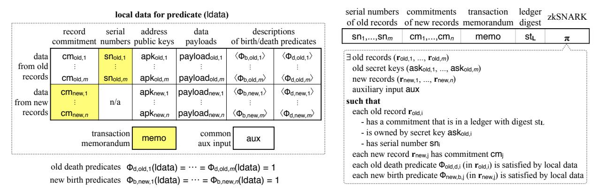
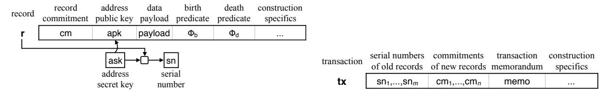
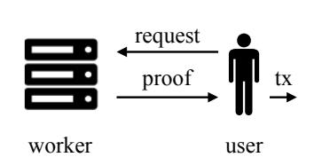
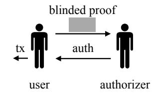
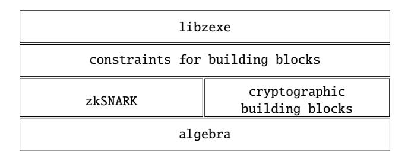
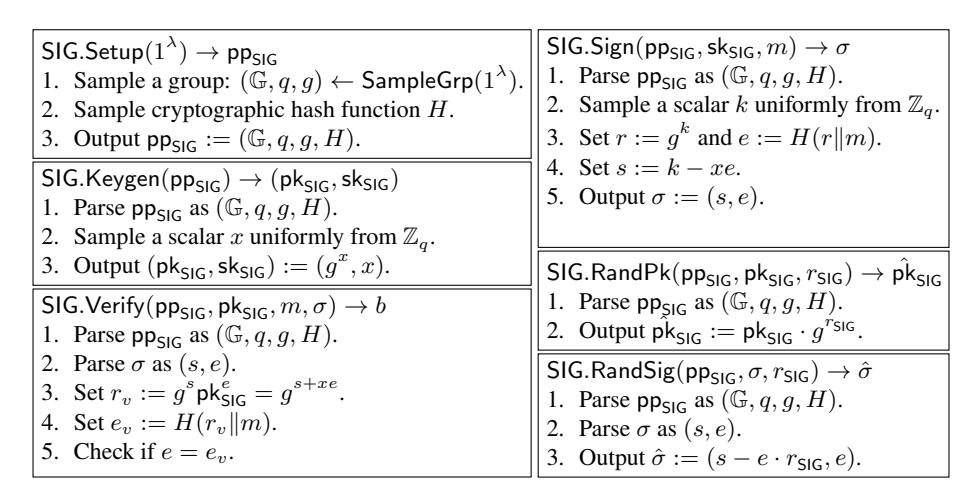

# <span id="page-0-0"></span>Zexe: Enabling Decentralized Private Computation

Sean Bowe [sean@z.cash](mailto:sean@z.cash) Zcash

Alessandro Chiesa [alexch@berkeley.edu](mailto:alexch@berkeley.edu) UC Berkeley

Matthew Green [mgreen@cs.jhu.edu](mailto:mgreen@cs.jhu.edu) Johns Hopkins University

Ian Miers [imiers@cs.cornell.edu](mailto:imiers@cs.cornell.edu) Cornell Tech

Pratyush Mishra [pratyush@berkeley.edu](mailto:pratyush@berkeley.edu) UC Berkeley

Howard Wu [howardwu@berkeley.edu](mailto:howardwu@berkeley.edu) UC Berkeley

First published: [October 14, 2018](https://eprint.iacr.org/archive/2018/962/20181014:133800) Current revision: November 6, 2025

#### **Abstract**

Ledger-based systems that support rich applications often suffer from two limitations. First, validating a transaction requires re-executing the state transition that it attests to. Second, transactions not only reveal which application had a state transition but also reveal the application's internal state.

We design, implement, and evaluate Zexe, a ledger-based system where users can execute offline computations and subsequently produce transactions, attesting to the correctness of these computations, that satisfy two main properties. First, transactions *hide all information* about the offline computations. Second, transactions can be *validated in constant time* by anyone, regardless of the offline computation.

The core of Zexe is a construction for a new cryptographic primitive that we introduce, *decentralized private computation* (DPC) schemes. In order to achieve an efficient implementation of our construction, we leverage tools in the area of cryptographic proofs, including succinct zero knowledge proofs and recursive proof composition. Overall, transactions in Zexe are 968 bytes *regardless of the offline computation*, and generating them takes less than a minute plus a time that grows with the offline computation.

We demonstrate how to use Zexe to realize privacy-preserving analogues of popular applications: private decentralized exchanges for user-defined fungible assets and regulation-friendly private stablecoins.

**Keywords**: decentralized computation; zero knowledge proofs; succinct arguments

# **Contents**

| 1 | Introduction<br>1.1<br>Our contributions<br>1.2<br>Related work<br>                                                                                                                                                                                                                                                                  | 3<br>4<br>5                      |
|---|--------------------------------------------------------------------------------------------------------------------------------------------------------------------------------------------------------------------------------------------------------------------------------------------------------------------------------------|----------------------------------|
|   |                                                                                                                                                                                                                                                                                                                                      |                                  |
| 2 | Techniques<br>2.1<br>Achieving privacy for a single arbitrary function<br>2.2<br>Difficulties with achieving privacy for user-defined functions<br><br>2.3<br>The records nano-kernel: a minimalist shared execution environment<br>2.4<br>Decentralized private computation<br><br>2.5<br>Achieving an efficient implementation<br> | 7<br>7<br>8<br>8<br>11<br>13     |
|   | 2.6<br>Deployment considerations                                                                                                                                                                                                                                                                                                     | 15                               |
| 3 | Definition of decentralized private computation schemes<br>3.1<br>Data structures<br><br>3.2<br>Algorithms<br><br>3.3<br>Security                                                                                                                                                                                                    | 17<br>17<br>18<br>19             |
| 4 | Construction of decentralized private computation schemes<br>4.1<br>Building blocks<br>4.2<br>Algorithms<br>                                                                                                                                                                                                                         | 23<br>23<br>23                   |
| 5 | Delegating zero knowledge execution<br>5.1<br>Approach<br><br>5.2<br>Additional building block: randomizable signatures<br>5.3<br>A delegable DPC scheme<br>5.4<br>Threshold transactions and blind transactions<br>                                                                                                                 | 27<br>27<br>27<br>28<br>30       |
| 6 | Applications<br>6.1<br>User-defined assets<br><br>6.2<br>Decentralized exchanges<br><br>6.3<br>Stablecoins and centrally-managed assets<br>                                                                                                                                                                                          | 31<br>31<br>32<br>36             |
| 7 | Implementation strategy                                                                                                                                                                                                                                                                                                              | 38                               |
| 8 | System implementation                                                                                                                                                                                                                                                                                                                | 43                               |
| 9 | System evaluation<br>9.1<br>Cryptographic building blocks<br><br>9.2<br>The execute NP relation<br>9.3<br>DPC algorithms<br>9.4<br>DPC data structures<br>9.5<br>Applications                                                                                                                                                        | 45<br>45<br>45<br>45<br>46<br>48 |
| A | Proof of security for our DPC scheme<br>A.1<br>Building blocks for the simulator<br>A.2<br>The ideal-world simulator<br>A.3<br>Proof of security by hybrid argument                                                                                                                                                                  | 49<br>49<br>50<br>53             |
| B | Construction of a delegable DPC scheme<br>B.1<br>Definition and construction of a randomizable signature scheme<br><br>B.2<br>Construction of a delegable DPC scheme                                                                                                                                                                 | 55<br>55<br>56                   |
| C | Extensions in functionality and in security                                                                                                                                                                                                                                                                                          | 59                               |
|   | Acknowledgments                                                                                                                                                                                                                                                                                                                      | 61                               |
|   | References                                                                                                                                                                                                                                                                                                                           | 61                               |

### <span id="page-2-0"></span>1 Introduction

Distributed ledgers are a mechanism that maintains data across a distributed system while ensuring that every party has the same view of the data, even in the presence of corrupted parties. Ledgers can provide an indisputable history of all "events" logged in a system, thereby offering a mechanism for multiple parties to collaborate with minimal trust (any party can ensure the system's integrity by auditing history). Interest in distributed ledgers has soared recently, catalyzed by their use in cryptocurrencies (peer-to-peer payment systems) and by their potential as a foundation for new forms of financial systems, governance, and data sharing. In this work we study two limitations of ledgers, one about *privacy* and the other about *scalability*.

**A privacy problem.** The main strength of distributed ledgers is also their main weakness: *the history of all events is available for anyone to read.* This severely limits a direct application of distributed ledgers.

For example, in ledger-based payment systems such as Bitcoin [Nak09], every payment transaction reveals the payment's sender, receiver, and amount. This not only reveals private financial details of individuals and businesses using the system, <sup>1</sup> but also violates fungibility, a fundamental economic property of money. This lack of privacy becomes more severe in smart contract systems like Ethereum [Woo17], wherein transactions not only contain payment details, but also embed function calls to specific applications. In these systems, every application's internal state is necessarily public, and so is the history of function calls associated to it.

This problem has motivated prior work to find ways to achieve meaningful privacy guarantees on ledgers. For example, the Zerocash protocol [BCG<sup>+</sup>14] provides privacy-preserving payments, and Hawk [KMS<sup>+</sup>16] enables general state transitions with data privacy, that is, an application's data is hidden from third parties.

However, all prior work is limited to hiding the inputs and outputs of a state transition but not *which* transition function is being executed. That is, prior work achieves *data privacy* but not *function privacy*. In systems with a single transition function this is not a concern.<sup>2</sup> In systems with multiple transition functions, however, this leakage is problematic. For example, Ethereum currently supports thousands of separate ERC-20 "token" contracts [Eth18], each representing a distinct currency on the Ethereum ledger; even if these contracts each individually adopted a protocol such as Zerocash to hide details about token payments, the corresponding transactions would still reveal *which* token was being exchanged. Moreover, the leakage of this information would substantially reduce the anonymity set of those payments.

A scalability problem. Public auditability in the aforementioned systems (and many others) is achieved via direct verification of state transitions that re-executes the associated computation. This creates the following scalability issues. First, note that in a network consisting of devices with heterogeneous computing power, requiring every node to re-execute transactions makes the weakest node a bottleneck, and this effect persists even when the underlying ledger is "perfect", that is, it confirms every valid transaction immediately. To counteract this and to discourage denial-of-service attacks whereby users send transactions that take a long time to validate, current systems introduce mechanisms such as *gas* to make users pay more for longer computations. However, such mechanisms can make it unprofitable to validate legitimate but expensive transactions, a problem known as the "Verifier's Dilemma" [LTKS15]. These problems have resulted in Bitcoin forks [Bit15] and Ethereum attacks [Eth16].

In sum, there is a dire need for techniques that facilitate the use of distributed ledgers for rich applications, without compromising privacy (of data or functions) or relying on unnecessary re-executions. Prior works only partially address this need, as discussed in Section 1.2 below.

<sup>&</sup>lt;sup>1</sup>Even if payments merely contain *addresses* rather than, say, social security numbers, much information about individuals and businesses can be gleaned by analyzing the flow of money over time between addresses [RH11, RS13, AKR<sup>+</sup>13, MPJ<sup>+</sup>13, SMZ14, KGC<sup>+</sup>17]. There are even companies that offer analytics services on the information stored on ledgers [Ell13, Cha14].

<sup>&</sup>lt;sup>2</sup>For example, in Zerocash the single transition function is the one governing cash flow of a single currency.

#### <span id="page-3-0"></span>1.1 Our contributions

We design, implement, and evaluate Zexe (*Zero knowledge EXEcution*), a ledger-based system that enables users to execute offline computations and subsequently produce publicly-verifiable transactions that attest to the correctness of these offline executions. Zexe simultaneously provides two main security properties.

- **Privacy:** a transaction reveals no information about the offline computation, except (an upper bound on) the number of consumed inputs and created outputs. <sup>3</sup> One cannot link together multiple transactions by the same user or involving related computations, nor selectively censor transactions based on such information.
- Succinctness: a transaction can be validated in time that is independent of the cost of the offline computation whose correctness it attests to. Since all transactions are indistinguishable, and are hence equally cheap to validate, there is no "Verifier's Dilemma", nor a need for mechanisms like Ethereum's gas.

ZEXE also offers rich functionality, as offline computations in ZEXE can be used to realize state transitions of multiple applications (such as tokens, elections, markets) simultaneously running atop the *same* ledger. The users participating in applications do not have to trust, or even know of, one another. ZEXE supports this functionality by exposing a simple, yet powerful, *shared execution environment* with the following properties.

- Extensibility: users may execute arbitrary functions of their choice, without seeking anyone's permission.
- Isolation: functions of malicious users cannot interfere with the computations and data of honest users.
- Inter-process communication: functions may exchange data with one another.

**DPC schemes.** The technical core of Zexe is a protocol for a new cryptographic primitive for performing computations on a ledger called *decentralized private computation* (DPC). Informally, a DPC scheme supports a simple, yet expressive, programming model in which units of data, which we call *records*, are bound to scripts (arbitrary programs) that specify the conditions under which a record can be created and consumed (this model is similar to the UTXO model; see Remark 2.3). The rules that dictate how these programs interact can be viewed as a "nano-kernel" that provides a shared execution environment upon which to build applications. From a technical perspective, DPC can be viewed as extending Zerocash [BCG<sup>+</sup>14] to the foregoing programming model, while still providing strong privacy guarantees, not only within a single application (which is a straightforward extension) but also across multiple co-existing applications (which requires new ideas that we discuss later on). The security guarantees of DPC are captured via an ideal functionality, which our protocol provably achieves.

**Applications.** To illustrate the expressivity of the RNK, we show how to use DPC schemes to construct privacy-preserving analogues of popular applications: private user-defined assets, private decentralized or non-custodial exchanges (DEXs), and private stablecoins. Our privacy guarantees in particular protect against vulnerabilities of current DEX designs such as front-running [BDJT17, BBD<sup>+</sup>17, EMC19, DGK<sup>+</sup>20]. Moreover, we sketch how to use DPC to construct a privacy-preserving smart contract system. See Sections 2.3 and 6 for details.

**Techniques for efficient implementation.** We devise a set of techniques to achieve an efficient implementation of our DPC protocol, by drawing upon recent advances in zero knowledge succinct cryptographic proofs (namely, zkSNARKs) and in recursive proof composition (proofs attesting to the validity of other proofs).

<sup>&</sup>lt;sup>3</sup>One can fix the number of inputs and outputs (say, fix both to 2), or carefully consider side channels that could arise from revealing bounds on the number of inputs and outputs.

Overall, transactions in Zexe with two input records and two output records are 968 bytes and can be verified in tens of milliseconds, *regardless of the offline computation*; generating these transactions takes less than a minute plus a time that grows with the offline computation (inevitably so). This implementation is achieved in a modular fashion via a collection of Rust libraries (see [Fig. 15\)](#page-42-1), in which the top-level one is libzexe. Our implementation also supports transactions with *any* number m of input records and n of output records; transactions size in this case is 32m + 32n + 840 bytes (the transaction stores the serial number of each input record and the commitment of each output record).

**Delegating transactions.** While verifying succinct cryptographic proofs is cheap, producing them can be expensive. As the offline computation grows, the (time and space) cost of producing a cryptographic proof of its correctness also grows, which could become infeasible for a user.

To address this problem, we further obtain *delegable DPC*. The user communicates to an untrusted worker details about the desired transaction, then the worker produces the transaction, and finally the user authorizes it via a cheap computation (and in a way that does not violate indistinguishability of transactions). This feature is particularly relevant for prospective real-world deployments, because it enables support for weak devices, such as mobile phones or hardware tokens.

In fact, our delegable DPC protocol also extends to support *threshold transactions*, which can be used to improve operational security, and also to support *blind transactions*, which can be used to realize lottery tickets for applications such as micropayments.

All of these extensions are also part of our Rust library libzexe.

**A perspective on costs.** Zexe is not a lightweight construction, but achieves, in our opinion, tolerable efficiency for the ambitious goals it sets out to achieve: *data and function privacy, and succinctness, with rich functionality, in a threat model that requires security against all efficient adversaries*. Relaxing any of these goals (assuming rational adversaries or hardware enclaves, or compromising on privacy) will lead to more efficient approaches.

The primary cost in our system is, unsurprisingly, the cost of generating the cryptographic proofs that are included in transactions. We have managed to keep this cost to roughly a minute plus a cost that grows with the offline computation. For the applications mentioned above, these additional costs are negligible. Our system thus supports applications of real-world interest today (e.g., private DEXs) with reasonable costs.

#### <span id="page-4-0"></span>**1.2 Related work**

**Avoiding naive re-execution.** A number of proposals for improving the scalability of smart contract systems, such as TrueBit [\[TR17\]](#page-66-2), Plasma [\[PB17\]](#page-65-3), and Arbitrum [\[KGC](#page-64-4)<sup>+</sup> 18], avoid naive re-execution by having users report the results of their computations *without* any cryptographic proofs, and instead putting in place incentive mechanisms wherein others can challenge reported results. The user and challenger engage in a so-called *refereed game* [\[FK97,](#page-63-4) [CRR11,](#page-62-2) [CRR13,](#page-62-3) [JSST16,](#page-64-5) [Rei16\]](#page-65-4), mediated by a smart contract acting as the referee, that efficiently determines which of the two was "telling the truth". In contrast, in this work correctness of computation is ensured by cryptography, regardless of any economic motives; we thus protect against all efficient adversaries rather than merely all rational and efficient ones. Also, unlike our DPC scheme, the above works do not provide formal guarantees of strong privacy (challengers must be able to re-execute the computation leading to a result and in particular must know its potentially private inputs).

**Private payments.** Zerocash [\[BCG](#page-61-0)<sup>+</sup> 14], building on earlier work [\[MGGR13\]](#page-64-6), showed how to use distributed ledgers to achieve payment systems with strong privacy guarantees. The Zerocash protocol, with some modifications, is now commercially deployed in several cryptocurrencies, including Zcash [\[ZCa15\]](#page-66-3). Solidus [\[CZJ](#page-62-4)<sup>+</sup> 17] enables customers of financial institutions (such as banks) to transfer funds to one another in

a manner that ensures that only the banks of the sender and receiver learn the details of the transfer; all other parties (all other customers and banks) only learn that a transfer occurred, and nothing else. zkLedger [NVV18] enables anonymous payments between a small number of distinguished parties via the use of homomorphic commitments and Schnorr proofs. None of these protocols support scripts (small programs that dictate how funds can be spent), let alone arbitrary state transitions as in Zexe.

**Privacy beyond payments.** Hawk [KMS<sup>+</sup>16], combining ideas from Zerocash and the notion of an evaluator-prover for multi-party computation, enables parties to conduct offline computations and then report their results via cryptographic proofs. Hawk's privacy guarantee protects the private inputs used in a computation, but does not hide *which* computation was performed. That said, we view Hawk as complementary to our work: a user in our system could in particular be a semi-trusted manager that administers a multi-party computation and generates a transaction about its output. The privacy guarantees provided in this work would then additionally hide *which* computation was carried out offline.

Zether [BAZB20] is a system that enables *publicly known* smart contracts to reason about homomorphic commitments in zero knowledge, and in particular enables these to transact in a manner that hides transaction amounts; it does not hide the identities of parties involved in the transaction, beyond a small anonymity set. Furthermore, the cost of verifying a transaction scales linearly with the size of the anonymity set, whereas in Zexe this cost scales logarithmically with the size of anonymity set.

**Succinct blockchains.** Coda [MS18] uses arbitrary-depth recursive composition of SNARKs to enable blockchain nodes to verify the current blockchain state quickly. In contrast, Zexe uses depth-2 recursive composition to ensure that all blockchain transactions are equally cheap to verify (and are moreover indistinguishable from each other), regardless of the cost of the offline computation. In this respect, Coda and Zexe address orthogonal scalability concerns.

**MPC with ledgers.** Several works [ADMM14b, ADMM14a, KMB15, KB16, BKM17, RCGJ<sup>+</sup>17] have applied ledgers to obtain secure multi-party protocols that have security properties that are difficult to achieve otherwise, such as *fairness*. These approaches are complementary to our work, as any set of parties wishing to jointly compute a certain function via one of these protocols could run the protocol "under" our DPC scheme in such a way that third parties would not learn any information that such a multi-party computation is happening.

**Hardware enclaves.** Kaptchuk et al. [KGM19] and Ekiden [CZK<sup>+</sup>18] combine ledgers with hardware enclaves, such as Intel Software Guard Extensions [MAB<sup>+</sup>13], to achieve various integrity and privacy goals for smart contracts. Beyond ledgers, several systems explore privacy goals in distributed systems by leveraging hardware enclaves; see for example M2R [DSC<sup>+</sup>15], VC3 [SCF<sup>+</sup>15], and Opaque [ZDB<sup>+</sup>17]. All of these works are able to efficiently support rich and complex computations. In this work, we make no use of hardware enclaves, and instead rely entirely on cryptography. This means that on the one hand our performance overheads are more severe, while on the other hand we protect against a richer class of adversaries (all efficient ones). Moreover, the techniques above depend on a working *remote attestation capability*; we note that our techniques can be used to achieve stronger security guarantees, even in the face of a compromise in the remote attestation capabilities of an enclave system (as recently occurred with Intel SGX [VBMW<sup>+</sup>19]).

# <span id="page-6-0"></span>2 Techniques

We now summarize the main ideas behind our contributions. Our goal is to design a ledger-based system in which transactions attest to offline computations while simultaneously providing *privacy* and *succinctness*.

We first note that if privacy is not required, there is a straightforward folklore approach that provides succinctness and low verification cost: each user accompanies the result reported in a transaction with a succinct cryptographic proof (i.e., a SNARK) attesting to the result's correctness. Others who validate the transaction can simply verify the cryptographic proof, and do not have to re-execute the computation. Even this limited approach rules out a number of cryptographic directions, such as the use of Bulletproofs [BCC<sup>+</sup>16, BBB<sup>+</sup>18] (which have verification time linear in the circuit complexity), but can be accomplished using a number of efficient SNARK techniques [GGPR13, BCTV14, BCS16, BCTV17]. In light of this, we shall first discuss how to achieve privacy, and then how to additionally achieve succinctness.

The rest of this section is organized as follows. In Sections 2.1 and 2.2 we explain why achieving privacy in our setting is challenging. In Section 2.3 we introduce the shared execution environment that we consider, and in Section 2.4 we introduce *decentralized private computation* (DPC), a cryptographic primitive that securely realizes it. In Section 2.5 we describe how we turn our ideas into an efficient implementation.

### <span id="page-6-1"></span>2.1 Achieving privacy for a single arbitrary function

Zerocash [BCG<sup>+</sup>14] is a protocol that achieves privacy for a specific functionality, namely, *value transfers* within a single currency. Therefore, it is natural to consider what happens if we extend Zerocash from this special case to the general case of a *single arbitrary function* that is known in advance to everybody.

**Sketch of Zerocash.** Money in Zerocash is represented via *coins*. The commitment of a coin is published on the ledger when the coin is created, and its serial number is published when the coin is consumed. Each transaction on the ledger attests that some "old" coins were consumed in order to create some "new" coins: it contains the serial numbers of the consumed coins, commitments of the created coins, and a zero knowledge proof attesting that the serial numbers belong to coins created in the past (without identifying which ones), and that the commitments contain new coins of the same total value. A transaction is private because it only reveals how many coins were consumed and how many were created, but no other information (each coin's value and owner address remain hidden). Also, revealing a coin's serial number ensures that a coin cannot be consumed more than once (the same serial number would appear twice). In sum, data in Zerocash corresponds to coin values, and state transitions are the single invariant that monetary value is preserved.

Extending to an arbitrary function. One way to extend Zerocash to a single arbitrary function  $\Phi$  (known in advance to everybody) is to think of a coin as a *record* that stores some arbitrary data *payload*, rather than just some integer value. The commitment of a record would then be published on the ledger when the record is created, and its unique serial number would be published when the record is consumed. A transaction would then contain serial numbers of consumed records, commitments of created records, and a proof attesting that invoking the function  $\Phi$  on (the payload of) the old records produces (the payload of) the new records.

Data privacy holds because the ledger merely stores each record's commitment (and its serial number once consumed), and transactions only reveal that some number of old records were consumed in order to create some number of new records in a way that is consistent with  $\Phi$ . Function privacy also holds but for trivial reasons:  $\Phi$  is known in advance to everybody, and every transaction is about computations of  $\Phi$ .

Note that Zerocash is indeed a special case of the above: it corresponds to fixing  $\Phi$  to the particular (and publicly known) choice of a function  $\Phi_{\$}$  that governs value transfers within a single currency. However the foregoing protocol supports only a single hard-coded function  $\Phi$ , while instead we want to enable users to select their own functions, as we discuss next.

### <span id="page-7-0"></span>**2.2 Difficulties with achieving privacy for user-defined functions**

We want to enable users to execute functions of their choice concurrently on the same ledger without seeking permission from anyone. That is, when preparing a transaction, a user should be able to pick *any* function Φ of their choice for creating new records by consuming some old records. If function privacy is not a concern, then this is easy: just attach to the transaction a zero-knowledge proof that Φ was correctly evaluated offline. However, because this approach reveals Φ, we cannot use it because function privacy is a goal for us.

An approach that *does* achieve function privacy would be to modify the sketch in [Section 2.1](#page-6-1) by fixing a single function that is *universal*, and then interpreting data payloads as user-defined functions that are provided as inputs. Indeed, zero knowledge would ensure function privacy in this case. However merely allowing users to define their own functions does *not* by itself yield meaningful functionality, as we explain next.

**The problem: malicious functions.** A key challenge in this setting is that malicious users could devise functions to attack or disrupt other users' functions and data, so that a particular user would not know whether to trust records created by other users; indeed, due to function privacy, a verifier would not know what functions were used to create those records. For a concrete example, suppose that we wanted to realize the special case of value transfers within a single currency (i.e., Zerocash). One may believe that it would suffice to instruct users to pick the function Φ\$ (or similar). But this does *not* work: a user receiving a record claiming to contain, say, 1 unit of currency does not know if this record was created via the function Φ\$ from other such records and so on. A malicious user could have used a different function to create that record, for example, one that illegally "mints" records that appear valid to Φ\$ , and thus enables arbitrary inflation of the currency. More generally, the lack of any enforced rules about how user-defined functions can interact precludes productive cooperation between users that are mutually distrustful. We stress that this challenge arises specifically due to the requirement that functions be private: if the function that created (the commitment of) a record was public knowledge, users could decide for themselves if records they receive were generated by "good" functions.

One way to address the foregoing problem is to augment records with a new attribute that identifies the function that "created" the record, and then impose the restriction that in a valid transaction only records created by the same function may participate. This new attribute is contained within a hiding commitment and thus is never revealed publicly on the ledger (just like a record's payload); the zero knowledge proof is tasked with ensuring that records participating in the same transaction are all of the same "type". This approach now *does* suffice to realize value transfers within a single currency, by letting users select the function Φ\$ . More generally, this approach generalizes that in [Section 2.1,](#page-6-1) and can be viewed as running multiple segregated "virtual ledgers" each with a fixed function. Function privacy holds because one cannot tell if a transaction belongs to one virtual ledger or another.

**The problem: functions cannot communicate.** The limitation of the above technique is that it forbids any "inter-process communication" between different functions, and so one cannot realize even simple functionalities like transferring value between different currencies on the same ledger. It also rules out more complex smart contract systems, as communication between contracts is a key part of such systems. It is thus clear that this crude "time sharing" of the ledger is too limiting.

#### <span id="page-7-1"></span>**2.3 The records nano-kernel: a minimalist shared execution environment**

The approaches in [Section 2.2](#page-7-0) lie at opposite extremes: unrestricted inter-process interaction prevents the secure construction of even basic applications such as a single currency, while complete process segregation limits the ability to construct complex applications that interact with with each other.

Balancing these extremes requires a shared execution environment: one can think of this as an *operating system* for a shared ledger. This operating system manages user-defined functions: it provides process isolation, determines data ownership, handles inter-process communication, and so on. Overall, processes must be able to concurrently share a ledger, without violating the integrity or confidentiality of one another.

However, function privacy (one of our goals) dictates that user-defined functions are hidden, which means that an operating system cannot be maintained publicly atop the ledger (as in current smart contract systems) but, instead, must be part of the statement proved in zero knowledge. This is unfortunate because designing an operating system that governs interactions across user-defined functions within a zero knowledge proof is not only a colossal design challenge but also entails many arbitrary design choices that we should not have to take.

In light of the above, we choose to take the following approach: we formulate a *minimalist* shared execution environment that imposes simple, yet expressive, rules on how records may interact, and enables programming applications in the UTXO model (see [Remark 2.3](#page-10-1) for why we make this choice). This execution environment can be viewed as a "nano-kernel" that enables users to manage records containing data by programming two boolean functions (or predicates) associated with each record. These predicates control the two defining moments in a record's life, namely creation (or "birth") and consumption (or "death"), and are hence called the record's *birth* and *death* predicates. A user can create and consume records in a transaction by satisfying the predicates of those records. In more detail,

**The records nano-kernel (RNK)** is an execution environment that operates over units of data called records. A record contains a *data payload*, a *birth predicate* Φ<sup>b</sup> , and a *death predicate* Φ<sup>d</sup> . Records are created and consumed by *valid transactions*. These are transactions where the death predicates of all consumed records and the birth predicates of all created records are simultaneously satisfied when given as input the transaction's *local data* (see [Fig. 3\)](#page-12-1), which includes: (a) every record's contents (such as its payload and the identity of its predicates); (b) a piece of shared memory that is publicly revealed, called *transaction memorandum*; (c) a piece of shared memory that is kept hidden, called *auxiliary input*; and (d) other construction specifics.

The foregoing definition enables predicates to see the contents of the entire transaction and hence *to individually decide if the local data is valid according to its own logic*. This in turn enables predicates to communicate with each other in a secure manner without interference from malicious predicates. In more detail, a record r can protect itself from other records that contain "bad" birth or death predicates because the r's predicates could refuse to accept when they detect (from reading the local data) that they are in a transaction with records having bad predicates. At the same time, a record can interact with other records in the same transaction when its predicates decide to accept, providing the flexibility that we seek.

We briefly illustrate this via an example, *user-defined assets*, whereby one can use birth predicates to define and transact with their own assets, and also use death predicates to enforce custom access control policies over these assets.

<span id="page-8-0"></span>**Example 2.1** (user-defined assets)**.** Consider records whose payloads encode an asset identifier id, the initial asset supply v, and a value v. Fix the birth predicate in all such records to be a *mint-or-conserve* function MoC that is responsible for creating the initial supply of a new asset, and then subsequently conserving the value of the asset across all transactions. In more detail, MoC can be invoked in one of two modes. In *mint mode*, given as input a desired initial supply v, MoC deterministically derives (in a way that we discuss later) a fresh unique identifier id for a new asset and stores (id, v, v = v) in a *genesis record*. In *conserve mode*, MoC inspects all records in a transaction whose birth predicates equal to MoC and whose asset identifiers equal the identifier of the current record, and ensures that among these records, the asset values are conserved.

Users can program death predicates of records to enforce conditions on how assets can be consumed, e.g., by realizing *conditional exchanges* with other counter-parties. Suppose that Alice wishes to exchange

100 units of an asset  $id_1$  for 50 units of another asset  $id_2$ , but does not have a counter-party for the exchange. She creates a record  $\mathbf{r}$  with 100 units of  $id_1$  whose death predicate enforces that any transaction consuming  $\mathbf{r}$  must also create another record, consumable by Alice, with 50 units of  $id_2$ . She then publishes out of band information about  $\mathbf{r}$ , and anyone can subsequently claim it by creating a transaction doing the exchange.

Since death predicates can be *arbitrary*, many different access policies can also be realized, e.g., to enforce that a transaction redeeming a record (a) must be authorized by two of three public keys, or (b) becomes valid only after a given amount of time, or (c) must reveal the pre-image of a hash function.

One can generalize this basic example to show how the RNK can realize a specific class of smart contract systems, namely those in which the transaction creator knows both the contract code being executed, as well as the (public and secret) state of the contract. At a high level, these contracts can be executed within a single transaction, or across multiple transactions, by storing suitable intermediate state/message data in record payloads, or by publishing that data in transaction memoranda (as plaintext or ciphertext as needed). We discuss in more detail below.

**Example 2.2** (smart contracts with caller-known state). At the highest level, smart contract systems operate over a set of individual contracts, each of which consists of a function (or collection of functions), some state variables, and some form of *address* that serves to uniquely identify the contract. The contract address ensures that the same code/functions can be deployed multiple times by different individuals, without two contracts inadvertently sharing state. A standard feature of smart contract systems is that a contract can communicate with other contracts: that is, a contract can invoke a second smart contract as a subroutine, provided that the second contract provides an interface to allow this behavior. In our setting, we consider contracts in which the caller knows at least part of the state of each contract.

In this setting, one can use the records nano-kernel to realize basic smart contracts as follows. Each contract can be implemented as a function  $\Phi_{sc}$ . The contract's state variables can be stored in one or more records such that each record  $\mathbf{r}_i$  is labeled with  $\Phi_{sc}$  as the birth and death predicate. Using this labeling,  $\Phi_{sc}$  (via the RNK) can enforce that only it can update its state variables, thus fulfilling one requirement of a secure contract. Of course, while this serves to prevent *other functions* from updating the contract's state, it does not address the situation where multiple users wish to deploy different instances of the same function  $\Phi_{sc}$ , each with isolated state. Fortunately (and validating our argument that the RNK realizes the *minimal* requirements needed for such a system), addressing this problem does not require changes to the RNK. Instead, one can devise the function  $\Phi_{sc}$  so that it reasons over a unique contract address identifier id, which is recorded within the *payload* of every record. The function  $\Phi_{sc}$  can achieve contract state isolation by enforcing that each input and output state record considered by single execution of  $\Phi_{sc}$  shares the same contract address.

To realize "inter-contract calls" between two functions  $\Phi_{sc_1}$  and  $\Phi_{sc_2}$ , one can use "ephemeral" records that communicate between the two functions. For example, if  $\Phi_{sc_1}$  wishes to call  $\Phi_{sc_2}$ , the caller may construct a record  $\mathbf{r}_e$  that contains the "arguments" to the called function  $\Phi_{sc_2}$ , as well as the result of the function call. A transaction would then show that both  $\Phi_{sc_1}$  and  $\Phi_{sc_2}$  are satisfied.

The above example outlines how to implement a general smart contract system atop the RNK. We leave to future work the task of developing this outline into a full-fledged smart contract framework, and instead focus on constructing a scheme that implements the RNK, and on illustrating how to directly program the RNK

<sup>&</sup>lt;sup>4</sup>In concrete implementations such as Ethereum [Woo17], contract identification is accomplished through unique contract addresses, each of which can be bound to a possibly non-unique codeHash that identifies the code of the program implementing the contract.

<sup>&</sup>lt;sup>5</sup>This identifier can be generated in a manner similar to the asset identifier in Example 2.1.

to construct specific applications such as **user-defined assets**, **private decentralized asset exchanges**, and **regulation-friendly private stablecoins**. We discuss these applications in more detail in [Section 6.](#page-30-0)

<span id="page-10-1"></span>**Remark 2.3** (working in the UTXO model)**.** In the records nano-kernel, applications update their state by consuming records containing the old state, and producing new records that contain the updated state. This programming model is popularly known as the "unspent transaction output" (UTXO) model. This is in contrast to the "account-based" model which is used by many other smart contract systems [\[Goo14,](#page-63-6) [Woo17,](#page-66-0) [EOS18\]](#page-63-7). At present, it is not known how to efficiently achieve strong privacy properties in this model even for the simple case of privacy-preserving payments among any number of users, as we explain below.

In the account-based model, application state is stored in a persistent location associated with the application's account, and updates to this state are applied in-place. A smart contract that implements a currency in this model would store user balances in a persistent table T that maps user account identifiers to user balances. Transactions from a user A to another user B would then decrement A's balance in T and increment B's balance by a corresponding amount. A straightforward way to make this contract data-private (i.e., to hide the transaction value and the identities of A and B) would be to replace the user balances in T with *hiding commitments* to these balances; transactions would then update these commitments instead of directly updating the balances. However, while this hides transaction values, it does not hide user identities; to further hide these, every transaction would have to update *all* commitments in T, which entails a cost that grows linearly with the number of users. This approach is taken by zkLedger [\[NVV18\]](#page-65-5), which enables private payments between a small number of known users (among other things).

Even worse, achieving function privacy when running multiple applications in such a system would require each transaction to hide which application's data was being updated, which means that the transaction would have to update the data of *all* applications at once, again severely harming the efficiency of the system.

In sum, it is unclear how to efficiently achieve strong data and function privacy in the account-based model when users can freely join and leave the system without notifying other users. On the other hand, we show in this paper that these properties can be achieved in the UTXO model at a modest cost.

### <span id="page-10-0"></span>**2.4 Decentralized private computation**

**A new cryptographic primitive.** We introduce a new cryptographic primitive called *decentralized private computation* (DPC) schemes, which capture the notion of a ledger-based system where privacy-preserving transactions attest to offline computations that follow the records nano-kernel. See [Section 3](#page-16-0) for the definition of DPC schemes, including the ideal functionality that we use to express security.

We construct a DPC scheme in [Section 4,](#page-22-0) and prove it secure in [Appendix A.](#page-48-0) We take Zerocash [\[BCG](#page-61-0)<sup>+</sup> 14] as a starting point, and then extend the protocol to support the records nano-kernel and also to facilitate proving security in the simulation paradigm relative to an ideal functionality (rather than via a collection of separate game-based definitions as in [\[BCG](#page-61-0)<sup>+</sup> 14]). Below we sketch the construction.

**Construction sketch.** Each transaction in the ledger consumes some old records and creates new records in a manner that is consistent with the records nano-kernel. To ensure privacy, a transaction only contains serial numbers of the consumed records, commitments of the created records, and a zero knowledge proof attesting that there exist records consistent with this information (and with the records nano-kernel). All commitments on the ledger are collected in a Merkle tree, which facilitates efficiently proving that a commitment appears on the ledger (by proving in zero knowledge the knowledge of a suitable authentication path). All serial numbers on the ledger are collected in a list that cannot contain duplicates. This implies that a record cannot be consumed twice because the same serial number is revealed each time a record is consumed. See [Fig. 1.](#page-11-0)

The record data structure is summarized in Fig. 2. Each record is associated to an *address public key*, which is a commitment to a seed for a pseudorandom function acting as the corresponding *address secret key*; addresses determine ownership of records, and in particular consuming a record requires knowing its secret key. A *record* consists of an address public key, a data payload, a birth predicate, a death predicate, and a serial number nonce; a *record commitment* is a commitment to all of these attributes. The *serial number* of a record is the evaluation of a pseudorandom function, whose seed is the secret key for the record's address public key, evaluated at the record's serial number nonce. A record's commitment and serial number, which appear on the ledger when the record is created and consumed, reveal *no* information about the record attributes. This follows from the hiding properties of the commitment, and the pseudorandom properties of the serial number. The derivation of a record's serial number ensures that a user can create a record for another in such a way that its serial number is fully determined and yet cannot be predicted without knowing the other user's secret key.


<span id="page-11-0"></span>Figure 1: Construction of a transaction.

<span id="page-11-1"></span>Figure 2: Construction of a record.

In order to produce a transaction, a user selects some previously-created records to consume, assembles some new records to create (including their payloads and predicates), and decides on other aspects of the local data such as the transaction memorandum (shared memory seen by all predicates and published on the ledger) and the auxiliary input (shared memory seen by all predicates but not published on the ledger); see Fig. 3. If the user knows the secret keys of the records to consume and if all relevant predicates are satisfied (death predicates of old records and birth predicates of new predicates), then the user can produce a zero knowledge proof to append to the transaction. See Fig. 4 for a summary of the NP statement being proved.

In sum, a transaction only reveals the number of consumed records and number of created records, as well as any data that was deliberately revealed in the transaction memorandum (possibly nothing).

Achieving succinctness. Our discussions so far have focused on achieving (data and function) privacy. However, we also want to achieve succinctness, namely, that a transaction can be validated in "constant time". This follows from a straightforward modification: we take the protocol that we have designed so far and use a zero knowledge *succinct* argument rather than just any zero knowledge proof. Indeed, the NP statement being proved (summarized in Fig. 4) involves attesting the satisfiability of all (old) death and (new) birth predicates, and thus we need to ensure that verifying the corresponding proof can be done in time that does not depend

<sup>&</sup>lt;sup>6</sup>By supporting the use of dummy records, we can in fact ensure that only *upper bounds* on the foregoing numbers are revealed.



<span id="page-12-1"></span>Figure 3: Predicates receive local data.

<span id="page-12-2"></span>**Figure 4:** The execute statement.

on the complexity of these predicates. While turning this idea into an efficient implementation requires more ideas (as we discuss in Section 2.5), the foregoing modification suffices from a theoretical point of view.

**Delegation to an untrusted worker.** In our DPC scheme, a user must produce, and include in the transaction, a zero knowledge succinct argument that, among other things, attests that death predicates of consumed records are satisfied and, similarly, that birth predicates of created records are satisfied. This implies that the cost of creating a transaction grows with the complexity (and number of) predicates involved in the transaction. Such a cost can quickly become infeasible for weak devices such as mobile phones or hardware tokens.

We address this problem by enabling a user to *delegate* to an untrusted worker, such as a remote server, the computation that produces a transaction. This notion, which we call a *delegable DPC scheme*, empowers weak devices to produce transactions that they otherwise could not have produced on their own.

The basic idea is to augment address keys in such a way that the secret information needed to produce the cryptographic proof is separate from the secret information needed to authorize a transaction containing that proof. Thus, the user can communicate to the worker the secrets necessary to generate a cryptographic proof, while retaining the remaining secrets for authorizing this (and future) transactions. In particular, the worker has no way to produce valid transactions that have not been authorized by the user.

We use randomizable signatures to achieve the foregoing functionality, without violating either privacy or succinctness. Informally, we modify a record's serial number to be an unlinkable randomization of (part of) the record's address public key, and a user's authorization of a transaction consists of signing the instance and proof relative to every randomized key (i.e., serial number) in that transaction. See Section 5 for details.

#### <span id="page-12-0"></span>2.5 Achieving an efficient implementation

Our system Zexe (*Zero knowledge EXEcution*) provides an implementation of two constructions: our "plain" DPC protocol, and its extension to a delegable DPC protocol. Achieving efficiency in our system required overcoming several challenges. Below we highlight some of these challenges, and explain how we addressed them; see Sections 7 and 8 for details. The discussions below equally apply to both types of DPC protocols.

**Avoiding the cost of universality.** The NP statement that we need to prove involves checking user-defined predicates, so it must support arbitrary computations that are not fixed in advance. However, state-of-the-art zkSNARKs for universal computations rely on expensive tools [BCG<sup>+</sup>13, BCTV14, WSR<sup>+</sup>15, BCTV17].

We address this problem by relying on one layer of *recursive proof composition* [Val08, BCCT13]. Instead of tasking the NP statement with directly checking user-defined predicates, we only task it with checking *succinct proofs* attesting to this. Checking these *inner* succinct proofs is a (relatively) inexpensive computation

that is fixed for *all* predicates, which can be "hardcoded" in the statement. Since the single *outer* succinct proof produced does not reveal information about the inner succinct proofs attesting to predicates' satisfiability (thanks to zero knowledge), the inner succinct proofs do *not* have to hide what predicate was checked, so they can be for NP statements *tailored* to the computations of particular user-defined predicates.

A bespoke recursion. Recursive proof composition has been empirically demonstrated for pairing-based SNARKs [BCTV17]. We thus focus our attention on these, and explain the challenges that arise in our setting. Recall that if we instantiate a SNARK's pairing via an elliptic curve E defined over a prime field  $\mathbb{F}_q$  and having a subgroup of prime order r, then (a) the SNARK supports NP statements expressed as arithmetic circuits over  $\mathbb{F}_r$ , while (b) proof verification involves arithmetic operations over  $\mathbb{F}_q$ . Being part of the NP statement, the SNARK verifier must also be expressed as an arithmetic circuit over  $\mathbb{F}_r$ , which is problematic because the verifier's "native" operations are over  $\mathbb{F}_q$ . Simulating  $\mathbb{F}_q$  operations via  $\mathbb{F}_r$  operations is expensive, and picking E such that q=r is impossible [BCTV17]. Prior work thus uses *multiple* curves [BCTV17]: a two-cycle of pairing-friendly elliptic curves, that is, two prime-order curves  $E_1$  and  $E_2$  such that the prime size of one's base field is the prime order of the other's group, and orchestrating SNARKs based on these so that fields "match up". However, known cycles are inefficient at 128 bits of security [BCTV17, CCW19].

We address this problem by noting that we merely need "a proof of a proof", and thus, instead of relying on a cycle, we can use the Cocks–Pinch method [FST10] to set up a bounded recursion [BCTV17]. First we pick a pairing-friendly elliptic curve that not only is suitable for 128 bits of security according to standard considerations but, moreover, is compatible with efficient SNARK provers in *both* levels of the recursion. Namely, letting p be the prime order of the base field and r the prime order of the group, we need that *both*  $\mathbb{F}_r$  and  $\mathbb{F}_p$  have multiplicative subgroups whose orders are large powers of 2. The condition on  $\mathbb{F}_r$  ensures efficient proving for SNARKs over this curve, while the condition on  $\mathbb{F}_p$  ensures efficient proving for SNARKs that verify proofs over this curve. In light of the above, we select a curve  $E_{\text{BLS}}$  from the Barreto–Lynn–Scott (BLS) family [BLS02, CLN11] with embedding degree 12. This family not only enables parameters that conservatively achieve 128 bits of security, but also enjoys properties that facilitate very efficient implementation [AFK<sup>+</sup>12]. We ensure that both  $\mathbb{F}_r$  and  $\mathbb{F}_p$  have multiplicative subgroups of order  $2^{\alpha}$  for  $\alpha \geq 40$ , by a suitable condition on the parameter of the BLS family.

Next we use the Cocks–Pinch method to pick a pairing-friendly elliptic curve  $E_{\mathsf{CP}}$  over a field  $\mathbb{F}_q$  such that the curve group  $E_{\mathsf{CP}}(\mathbb{F}_q)$  contains a subgroup of prime order p (the size of  $E_{\mathsf{BLS}}$ 's base field). Since the method outputs a prime q that has about  $2\times$  more bits than the desired p, and in turn p has about  $1.5\times$  more bits than r (due to properties of the BLS family), we only need  $E_{\mathsf{CP}}$  to have embedding degree of 6 in order to achieve 128 bits of security (as determined from the guidelines in [FST10]). We note that this approach is similar to that in Geppetto [CFH $^+$ 15], but adapted for BLS12 curves.

In sum, a SNARK over  $E_{\rm BLS}$  is used to generate proofs of predicates' satisfiability; after that a zkSNARK over  $E_{\rm CP}$  is used to generate proofs that these prior proofs are valid along with the remaining NP statement's checks. The matching fields between the two curves ensure that the former proofs can be efficiently verified.

Minimizing operations over  $E_{CP}$ . While the curve  $E_{CP}$  facilitates efficient checking of SNARK proofs over  $E_{BLS}$ , operations on it are at least  $2\times$  more costly (in time and space) than operations over  $E_{BLS}$ , simply because  $E_{CP}$ 's base field is twice the size of  $E_{BLS}$ 's base field. This makes checks in the NP relation  $\mathcal{R}_e$  that are not related to proof checking unnecessarily expensive.

To avoid this, we split  $\mathcal{R}_{e}$  into two NP relations,  $\mathcal{R}_{BLS}$  and  $\mathcal{R}_{CP}$ . The latter is responsible only for verifying proofs of predicates' satisfaction, while the former is responsible for all other checks. We minimize the number of  $E_{CP}$  operations by proving satisfaction of  $\mathcal{R}_{BLS}$  and  $\mathcal{R}_{CP}$  with zkSNARKs over  $E_{BLS}$  and  $E_{CP}$  respectively. A transaction now includes both proofs.

Optimizing the NP statement. We note that the remaining NP statement's checks can themselves be

quite expensive, as they range from verifying authentication paths in a Merkle tree to verifying commitment openings, and from evaluating pseudorandom functions to evaluating collision resistant functions. Prior work realizing similar collections of checks required upwards of *four million gates* [BCG<sup>+</sup>14] to express such checks. This not only resulted in high latencies for producing transactions (several minutes) but also resulted in large public parameters for the system (hundreds of megabytes).

Commitments and collision-resistant hashing can be expressed as very efficient arithmetic circuits if one opts for Pedersen-type constructions over suitable Edwards elliptic curves (and techniques derived from these ideas are now part of deployed systems [HBHW20]). To achieve this, we pick two Edwards curves,  $E_{\rm Ed/BLS}$  over the field  $\mathbb{F}_r$  (thereby matching the group order of  $E_{\rm BLS}$ ), and  $E_{\rm Ed/CP}$  over the field  $\mathbb{F}_p$  (thereby matching the group order of  $E_{\rm CP}$ ). This allows to realise very efficient circuits for various primitives used in our NP relations, including commitments, collision-resistant hashing, and randomizable signatures. Overall, we obtain highly optimized realizations of all checks in Fig. 4.

### <span id="page-14-0"></span>2.6 Deployment considerations

DPC schemes include a setup algorithm that specifies how to sample public parameters, which are used to produce transactions and to verify transactions. The setup algorithm in our DPC construction (see Section 4) simply consists of running the setup algorithms for the various cryptographic building blocks that we rely on: commitment schemes, collision-resistant hash functions, and zero knowledge proofs.

In practice, deploying cryptography that relies on setup algorithms (such as DPC schemes) can be challenging because the entity running the setup algorithm may be able to break certain security properties of the scheme, by abusing knowledge of the randomness used to produce the public parameters. On the other hand, *some* setup algorithm is typically inevitable. For example, non-interactive zero knowledge proofs without any setup exist only for languages decidable in polynomial time [GO94]. Nevertheless, one could still aim for a *transparent setup*, one that consists of public randomness, because in practice it is cheaper to realize.

Our construction of a DPC scheme has a transparent setup algorithm whenever the setup algorithms for the underlying cryptographic building blocks also have transparent setups. For example, this would hold if we instantiated our construction via Pedersen commitments, Pedersen hash functions, and transparent zkSNARKs (as obtained from probabilistic checking tools in the random oracle model [Mic00, BCS16]).

However, due to efficiency considerations described in Section 2.5, our implemented system relies on pairing-based zkSNARKs whose setup is *not* transparent. (We use the simulation-extractable zkSNARK of Groth and Maller [GM17].) We should thus discuss how one may deploy our implemented system, and in particular the effects of compromise in the trusted setup phase of these SNARKs. (All other primitives in our system use a transparent setup.)

Recall that prior zkSNARK deployments have used secure multiparty computation [BCG<sup>+</sup>15, ZCa16, BGM17, BGG18], so that the sampled public parameters are guaranteed to be secure as long as even a single participating party is honest. One could leverage these same ideas to sample "master" parameters for proving/verifying the two NP relations  $\mathcal{R}_{BLS}$  and  $\mathcal{R}_{CP}$  (over the two elliptic curves  $E_{BLS}$  and  $E_{CP}$ ) mentioned in Section 2.5. Note that these public parameters do *not* depend on any user-defined functions (birth or death predicates), and can thus be sampled once and for all regardless of which applications will be run over the system. Note also that these public parameters must be trusted by *everyone*, because if they were compromised then the security (but not privacy) of *all* applications running over the system would be compromised as well.

The foregoing public parameters are not the only ones that need to be sampled in order to use our implemented system. Every (birth or death) predicate requires its own public parameters, because (the verification key contained in) these public parameters is part of the record that contains it, and is ultimately

used to recursively check a proof of the predicate's satisfiability. Since an application relies only on the public parameters of certain predicates, we call such parameters as "application" parameters.

Unlike "master" parameters, "application" parameters do not have to be sampled at the start of the system's lifetime, and also do not have to be trusted by every user in the system. Indeed, interactions across records are overseen by the NP relations RBLS and RCP (which rely on the "master" parameters) and thus compromised parameters for one application will not affect (the security and privacy of) an application that does not rely on them. This means that a user only needs to trust the parameters that are relied upon by the applications that the user cares about. In turn this means that the sampling of application parameters can be viewed as an organic process, which occurs as applications are developed and deployed, and each application can be in charge of deciding whichever method is most suitable for securely sampling its own parameters.

Very recent works [\[MBKM19,](#page-64-13) [CFQ19,](#page-61-13) [CHM](#page-62-8)<sup>+</sup> 20, [GWC19\]](#page-63-12) have proposed pairing-based SNARKs that have a universal setup that can be used for *any* circuit. Once such SNARK constructions mature into efficient implementations, our system can be easily modified to use these instead of [\[GM17\]](#page-63-11) to mitigate the above concerns, as both our construction and implementation make use of the underlying SNARKs in a modular and black-box manner.

### <span id="page-16-0"></span>3 Definition of decentralized private computation schemes

We define *decentralized private computation* (DPC) schemes, a cryptographic primitive in which parties with access to an ideal append-only ledger execute computations offline and subsequently post privacy-preserving, publicly-verifiable transactions that attest to the correctness of these offline executions. This primitive generalizes prior notions [BCG<sup>+</sup>14] that were limited to proving correctness of simple financial invariants.

Below we introduce the data structures, interface, and security requirements for a DPC scheme: Section 3.1 describes the main data structures of a DPC scheme, Section 3.2 defines the syntax of the DPC algorithms, and finally in Section 3.3 we describe the security requirements for DPC schemes via an ideal functionality. We note that our definition of DPC schemes focuses on (correctness and) privacy, because we leave succinctness as a separate efficiency goal that easily follows from suitable building blocks (see Remark 4.1).

#### <span id="page-16-1"></span>3.1 Data structures

In a DPC scheme there are three main data structures: records, transactions, and the ledger.

**Records.** A *record*, denoted by the symbol  $\mathbf{r}$ , is a data structure representing a unit of data. Records can be created or consumed, and these events denote state changes in the system. For example, in a currency application, records store units of the currency, and state changes represent the flow of units in that currency.

In more detail, a record  ${\bf r}$  has the following attributes (see Fig. 5): (a) a *commitment* cm, which binds together all other attributes of  ${\bf r}$  while hiding all information about them; (b) an *address public key* apk, which specifies the record's owner; (c) a *payload* payload containing arbitrary application-dependent information; (d) a *birth predicate*  $\Phi_b$  that must be satisfied when  ${\bf r}$  is created; (e) a *death predicate*  $\Phi_d$  that must be satisfied when  ${\bf r}$  is consumed; and (f) other construction-specific information. Both  $\Phi_b$  and  $\Phi_d$  are arbitrary non-deterministic boolean-valued functions. The payload payload contains a designated subfield isDummy which denotes whether  ${\bf r}$  is dummy or not.

Informally, the "life" of a (non-dummy) record  $\bf r$  is marked by two events: birth and death. The record  $\bf r$  is born (or is created) when its commitment cm is posted to the ledger as part of a transaction. Then the record  $\bf r$  dies (or is consumed) when its serial number sn appears on the ledger as part of a later transaction. At each of these times (birth or death) the corresponding predicate ( $\Phi_b$  or  $\Phi_d$ ) must be satisfied. Dummy records, on the other hand, can be created freely, but consuming them requires satisfaction of their death predicates. The purpose of dummy records is solely to enable the creation of new non-dummy records.

To consume **r**, one must also know the address secret key ask corresponding to **r**'s address public key apk because the serial number sn to be revealed can only be computed from **r** and ask. The ledger forbids the same serial number to appear more than once, so that: (a) a record cannot be consumed twice because it is associated to exactly one serial number; (b) others cannot prevent one from consuming a record because it is computationally infeasible to create two distinct records that share the same serial number sn but have distinct commitments cm and cm'.



<span id="page-16-2"></span>Figure 5: Diagram of a record.

<span id="page-16-3"></span>Figure 6: Diagram of a transaction.

**Transactions.** A transaction, denoted by the symbol tx, is a data structure representing a state change that involves the consumption and creation of records (see Fig. 6). It is a tuple  $([sn_i]_1^m, [cm_j]_1^n, memo, \star)$  where (a)  $[sn_i]_1^m$  is the list of serial numbers of the m old records, (b)  $[cm_j]_1^n$  is the list of commitments of the n new records, (c) memo is an arbitrary string associated with the transaction, and (d)  $\star$  is other construction-specific information. The transaction tx reveals only the following information about old and new records: (i) the old records' serial numbers; (ii) the new records' commitments; and (iii) the fact that the death predicates of all consumed records and birth predicates of all new records were satisfied.

Anyone can assemble a transaction and append it to the ledger, provided that it is "valid" in the sense that (all records are well-formed and) the death predicates of any consumed records and the birth predicates of any created records are satisfied. Note that all transactions reveal the number of old records (m) and the number of new records (n), but not how many of these were dummy or not.

**Ledger.** We consider a model where all parties have access to an append-only ledger, denoted  $\mathbf{L}$ , that stores all published transactions. Our definitions (and constructions) are *agnostic* to how this ledger is realized (e.g., the ledger may be centrally managed or a distributed protocol). When an algorithm needs to interact with the ledger, we specify  $\mathbf{L}$  in the algorithm's superscript. The ledger exposes the following interface.

- L.Len: Return the number of transactions currently on the ledger.
- L.Push(tx): Append a (valid) transaction tx to the ledger.
- L.Digest  $\rightarrow$  st<sub>L</sub>: Return a (short) digest of the current state of the ledger.
- L.ValidateDigest( $\mathsf{st}_{\mathbf{L}}$ )  $\to$  b: Check that  $\mathsf{st}_{\mathbf{L}}$  is a valid digest for some (past) ledger state.
- L.Contains(tx)  $\rightarrow$  b: Determine if tx (or a subcomponent thereof) appears on the ledger or not.
- L.Prove(tx) → w<sub>L</sub>: If a transaction tx (or a subcomponent thereof) appears on the ledger, return a proof
  of membership w<sub>L</sub> for it. If there are duplicates, return a proof for the lexicographically first one.
- L.Verify(st<sub>L</sub>, tx, w<sub>L</sub>) → b: Check that w<sub>L</sub> certifies that tx (or a subcomponent thereof) is in a ledger with digest st<sub>L</sub>.

We stress that only "valid" transactions can be appended to the ledger. While the full definition of a valid transaction is implementation dependent, in all cases it must be that the commitments and serial numbers in a transaction (including any appearing in the  $\star$  field of a transaction) do not already appear on the ledger.

#### <span id="page-17-0"></span>3.2 Algorithms

A DPC scheme is a tuple of algorithms (some of which may read information from L):

$$\mathsf{DPC} = (\mathsf{Setup}, \mathsf{GenAddress}, \mathsf{Execute}^\mathbf{L}, \mathsf{Verify}^\mathbf{L}) \ \ .$$

The syntax and semantics of these algorithms are informally described below.

**Setup:** 
$$\mathsf{DPC}.\mathsf{Setup}(1^{\lambda}) \to \mathsf{pp}.$$

On input a security parameter  $1^{\lambda}$ , DPC. Setup outputs public parameters pp for the system. A trusted party runs this algorithm once and then publishes its output; afterwards the trusted party is not needed anymore.

For some constructions, the trusted party can be replaced by an efficient multiparty computation that securely realizes the DPC.Setup algorithm (see [BCG<sup>+</sup>15, ZCa16, BGM17, BGG18] for how this has been done in some systems); in other constructions, the trusted party may not be needed, as the public parameters may simply consist of a random string of a certain length.

**Create address:** DPC.GenAddress(pp)  $\rightarrow$  (apk, ask).

On input public parameters pp, DPC.GenAddress outputs an address key pair (apk, ask). Any user may run this algorithm to create an address key pair. Each record is bound to an address public key, and the corresponding secret key is used to consume it.

**Execute:** Any user may invoke DPC. Execute to consume records and create new ones.

$$\mathsf{DPC.Execute}^{\mathbf{L}} \left( \begin{array}{cccc} \mathsf{public \, parameters} & \mathsf{pp} \\ \mathsf{old \, records} & [\mathbf{r}_i]_1^m \\ \mathsf{old \, address \, secret \, keys} & [\mathsf{ask}_i]_1^m \\ \mathsf{new \, address \, public \, keys} & [\mathsf{apk}_j]_1^n \\ \mathsf{new \, record \, payloads} & [\mathsf{payload}_j]_1^n \\ \mathsf{new \, record \, birth \, predicates} & [\boldsymbol{\Phi}_{\mathsf{b},j}]_1^n \\ \mathsf{new \, record \, death \, predicates} & [\boldsymbol{\Phi}_{\mathsf{d},j}]_1^n \\ \mathsf{auxiliary \, predicate \, input} & \mathsf{aux} \\ \mathsf{transaction \, memorandum} & \mathsf{memo} \end{array} \right) \rightarrow \left( \begin{array}{c} \mathsf{new \, records} & [\mathbf{r}_j]_1^n \\ \mathsf{transaction} & \mathsf{tx} \end{array} \right).$$

Given as input a list of old records  $[\mathbf{r}_i]_1^m$  with corresponding secret keys  $[\mathsf{ask}_i]_1^m$ , attributes for new records, private auxiliary input aux to birth and death predicates of new and old records respectively, and an arbitrary transaction memorandum memo, DPC. Execute produces new records  $[\mathbf{r}_j]_1^n$  and a transaction tx. The transaction attests that the input records' death predicates and the output records' birth predicates are all satisfied. The user subsequently pushes tx to the ledger by invoking  $\mathbf{L}.\mathsf{Push}(\mathsf{tx})$ .

**Verify:** 
$$\mathsf{DPC.Verify}^{\mathbf{L}}(\mathsf{pp},\mathsf{tx}) \to b.$$

On input public parameters pp and a transaction tx, and given oracle access to the ledger L, DPC. Verify outputs a bit b denoting whether the transaction tx is valid relative to the ledger L.

#### <span id="page-18-0"></span>3.3 Security

Informally, a DPC scheme achieves the following security goals.

- Execution correctness. Malicious parties cannot create valid transactions if the death predicate of some consumed record or the birth predicate of some created record is not satisfied.
- Execution privacy. Transactions reveal only the information revealed in the memorandum field, a bound on the number of consumed records, and a bound on the number of created records. All other information is hidden, including the payloads and predicates of all involved records. For example, putting aside the information revealed in the memorandum (which is arbitrary), one cannot link a transaction that consumes a record with the prior transaction that created it.
- Consumability. Every record can be consumed at least once and at most once by parties that know its secrets. Thus, a malicious party cannot create two valid records for another party such that only one of them can be consumed. (This captures security against "faerie-gold" attacks [HBHW20].)
- Transaction non-malleability. Malicious parties cannot modify a transaction "in flight" to the ledger.

Formally, we prove *standalone* security against *static corruptions*, in a model where every party has private anonymous channels to all other parties [IKOS06].<sup>9</sup> (In Appendix C we discuss how to prove security under

<sup>&</sup>lt;sup>7</sup>In addition to the "global" auxiliary input aux, each predicate may also take as input a "local" auxiliary input that is not (necessarily) shared with other predicates. For simplicity, we make these local inputs implicit.

<sup>&</sup>lt;sup>8</sup>And any information implied by knowing that the birth (resp., death) predicates of consumed (resp., created) records are satisfied.

<sup>&</sup>lt;sup>9</sup>Parties can, e.g., use these channels to communicate the contents of newly created records to other parties.

composition and against adaptive corruptions.) In more detail, we capture security of a DPC scheme via a *simulation-based* security definition that is akin to UC security [Can01], but restricted to a single execution.

**Definition 3.1.** A DPC scheme DPC is **secure** if for every efficient real-world adversary A there exists an efficient ideal-world simulator  $S_A$  such that for every efficient environment  $\mathcal{E}$  the following are computationally indistinguishable:

- the output of  $\mathcal{E}$  when interacting with the adversary  $\mathcal{A}$  in a real-world execution of DPC in a model where parties can communicate with other parties via private anonymous channels; and
- the output of  $\mathcal{E}$  when interacting with the simulator  $\mathcal{S}_{\mathcal{A}}$  in an ideal-world execution with the ideal functionality  $\mathcal{F}_{\text{DPC}}$  specified in Fig. 7 (and further described below).

We describe the data structures used by the ideal functionality  $\mathcal{F}_{DPC}$ , the internal state of  $\mathcal{F}_{DPC}$ , and the interface offered by  $\mathcal{F}_{DPC}$  to parties in the ideal-world execution.

**Ideal data structures.** The ideal functionality  $\mathcal{F}_{\mathrm{DPC}}$  uses ideal counterparts of a DPC scheme's data structures. An *address public key* apk denotes the owner of an *ideal record*  $\mathbb{F}$ , which is a tuple (cm, apk, payload,  $\Phi_b$ ,  $\Phi_d$ ), where cm is its commitment, apk is its address public key, payload is its payload, and  $\Phi_b$  and  $\Phi_d$  are its birth and death predicates. The record is also associated with a unique identifier (or *serial number*) sn. We require that apk, cm, and sn are "globally unique"; this means that there cannot be two different ideal records  $\mathbb{F}$  and  $\mathbb{F}'$  having the same commitments or serial numbers.

The distribution of these components is specified by the simulator  $\mathcal S$  as follows. Before the ideal execution begins,  $\mathcal S$  specifies three functions (SampleAddrPk, SampleCm, SampleSn) that, on input a random string, sample (apk, cm, sn) respectively. When  $\mathcal F_{\mathrm{DPC}}$  needs to sample one of these, it invokes the respective functions. (Note that  $\mathcal F_{\mathrm{DPC}}$  cannot directly ask  $\mathcal S$  to sample these because that would reveal to  $\mathcal S$  when an honest party was invoking  $\mathcal F_{\mathrm{DPC}}$ . GenAddress or  $\mathcal F_{\mathrm{DPC}}$ . Execute, and we cannot afford this leakage.)

**Internal state.** The ideal functionality  $\mathcal{F}_{\text{DPC}}$  maintains several internal tables.

- Addr, which stores address public keys.
- AddrUsers, which maps an address public key to the set of parties that are authorized to use it.
- Records, which maps a record's commitment to that record's information (address public key, payload, birth predicate, and death predicates).
- RecUsers, which maps a record's commitment to the set of parties that are authorized to consume it. Note that, for a record r, the set RecUsers[r.cm] can be different from the set in AddrUsers[r.apk], but a party  $\mathcal{P}$  has to be in both sets to consume r.
- SerialNumbers, which maps a record's commitment to that record's (unique) serial number.
- State, which maps a record's commitment to that record's state, either alive or dead.

**Ideal algorithms.** The ideal functionality  $\mathcal{F}_{\text{DPC}}$  provides the following interface to parties.

- Address generation:  $\mathcal{F}_{\text{DPC}}$ . GenAddress outputs a new address public key apk.
- Execution:  $\mathcal{F}_{\mathrm{DPC}}$ . Execute performs an execution that consumes old records and creates new records. All parties are notified that an execution has occurred, and learn the serial numbers of input records, commitments of output records, and the transaction memorandum memo. Concurrent  $\mathcal{F}_{\mathrm{DPC}}$ . Execute calls are serialized arbitrarily.
- Record consumption authorization:  $\mathcal{F}_{DPC}$ . Share Record allows a party  $\mathcal{P}$  to authorize another party  $\mathcal{P}'$  to consume a record  $\mathbb{F}$  (provided that  $\mathcal{P}'$  is also authorized to use  $\mathbb{F}$ 's address public key).

**Operation of honest parties.** In both the real and ideal executions, the environment  $\mathcal{E}$  can send instructions to honest parties. These instructions can be one of GenAddress, Execute, or ShareRecord. In the real world honest parties translate these instructions into corresponding invocations of DPC algorithms (or messages sent via private anonymous channels as in the case of ShareRecord), while in the ideal world they translate

them into corresponding invocations of  $\mathcal{F}_{\mathrm{DPC}}$  algorithms. In both worlds, honest parties immediately invoke ShareRecord on records obtained from an Execute instruction. Finally, in the ideal world, when invoking  $\mathcal{F}_{\mathrm{DPC}}$ , honest parties do not provide any inputs marked as optional; instead, they let  $\mathcal{F}_{\mathrm{DPC}}$  sample these.

**Intuition.** We explain how  $\mathcal{F}_{DPC}$  enforces the informal security notions described at this section's beginning.

- Execution correctness.  $\mathcal{F}_{DPC}$ . Execute ensures that the death predicates of consumed records and birth predicates of created records are satisfied by the local data. Note that each predicate receives its own position as input so that it knows to which record in the local data it belongs.
- Execution privacy. Transactions contain serial numbers  $[sn_i]_1^m$  of consumed records, commitments  $[cm_j]_1^n$  of created records, and a memorandum memo. Serial numbers and commitments are sampled via SampleSn and SampleCm, so they are independent of the contents of any record, and thus reveal no information about them. Transactions thus reveal no information (beyond what is contained in memo).
- Consumability. From the point of view of  $\mathcal{F}_{DPC}$ , two records are different if and only if they have different commitments. In such a case, both records can be consumed as long as their death predicates are satisfied. If a DPC scheme realizes  $\mathcal{F}_{DPC}$ , then it must satisfy this same requirement: if two valid records have distinct commitments, then they must both be consumable.
- Transaction non-malleability. The adversary has no power to modify the inputs to, or output of, an honest party's invocation of  $\mathcal{F}_{DPC}$ . Execute.

```
\mathcal{F}_{DPC}. GenAddress[\mathcal{P}] ((optional) address public key apk)
                                                                                                                           /record
                                                                                        \mathcal{F}_{\mathrm{DPC}}. Share Record [\mathcal{P}]
1. Sample randomness r for generating address public key.
                                                                                                                           recipient party
2. If apk = \perp then apk \leftarrow SampleAddrPk(r).
                                                                                        1. If Records[r.cm] \neq \bot:
3. Check that apk is unique: Addr[apk] = \perp.
                                                                                          (a) Check that \mathcal{P} \in \mathsf{RecUsers}[r.cm].
                                                                                          (b) Retrieve ((\mathsf{cm},\mathsf{apk},\mathsf{payload},\Phi_\mathsf{b},\Phi_\mathsf{d}),r) := \mathsf{Records}[\mathtt{r.cm}].
4. Set Addr[apk] := r.
5. If \mathcal{P} is corrupted: set S to be the set of corrupted parties.
                                                                                       2. If \mathcal{P}' is corrupted: set S to be the set of corrupted parties.
6. If \mathcal{P} is honest: set S := \{\mathcal{P}\}.
                                                                                       3. If \mathcal{P}' is honest: set S := \{\mathcal{P}'\}.
7. Set AddrUsers[apk] := AddrUsers[apk] \cup S.
                                                                                       4. Set RecUsers[\mathbb{r}.cm] := RecUsers[\mathbb{r}.cm] \cup S.
                                                                                       5. If \mathcal{P} is honest and \mathcal{P}' isn't, Send to \mathcal{P}': (RecordAuth, (\mathbb{r}, r)).
8. Send to \mathcal{P}: address public key apk.
                                                                                        6. Else, Send to \mathcal{P}': (RecordAuth, r).
                                                                                     \frac{\left[\mathbb{r}_i\right]_1^m}{\left[\mathsf{sn}_i\right]_1^m}
                               old records
                               (optional) old serial numbers
                                                                                     [\mathsf{cm}_j]_1^n
                               (optional) new record commitments
                               new address public keys
                                                                                     [\mathsf{apk}_i]_1^n
\mathcal{F}_{\text{dpc}}.Execute[\mathcal{P}]
                               new record payloads
                                                                                     [\mathsf{payload}_i]_1^n
                                                                                     [\Phi_{\mathsf{b},j}]_1^n
                               new record birth predicates
                               new record death predicates
                                                                                     [\Phi_{\mathsf{d},j}]_1^n
                               auxiliary predicate input
                               transaction memorandum
                                                                                     memo
1. For each i \in \{1, ..., m\}:
    (a) Sample randomness r_i.
    (b) If \operatorname{sn}_i = \bot then generate serial number: \operatorname{sn}_i \leftarrow \operatorname{\mathsf{SampleSn}}(r_i).
    (c) Check that sn_i is unique: SerialNumbers[sn_i] = \bot.
2. For each j \in \{1, ..., n\}:
    (a) Sample randomness r_j.
    (b) If cm_i = \bot then generate commitment: cm_i \leftarrow SampleCm(r_i).
    (c) Check that cm_j is unique: Records[cm_j] = \bot.
    (d) Construct record: \mathbf{r}_j := (\mathsf{cm}_j, \mathsf{apk}_j, \mathsf{payload}_j, \Phi_{\mathsf{b},j}, \Phi_{\mathsf{d},j}).
3. Define the local data ldata := ([\mathbf{r}_i]_1^m, [\mathsf{sn}_i]_1^m, [\mathbf{r}_j]_1^n, \mathsf{aux}, \mathsf{memo}).
4. For each i \in \{1, ..., m\}:
    (a) Parse \mathbf{r}_i as (\mathsf{cm}_i, \mathsf{apk}_i, \mathsf{payload}_i, \Phi_{\mathsf{b},i}, \Phi_{\mathsf{d},i}).
    (b) Check that, for some randomness r_i, old record \mathbf{r}_i exists: ((\mathsf{apk}_i, \mathsf{payload}_i, \Phi_{\mathsf{b},i}, \Phi_{\mathsf{d},i}), r_i) = \mathsf{Records}[\mathsf{cm}_i].
    (c) Check that \mathcal{P} is authorized to use apk_i: \mathcal{P} \in AddrUsers[apk_i].
    (d) If payload_i.isDummy = 0:
            i. Check that record is unconsumed: State[r_i] = alive.
            ii. Check that \mathcal{P} is authorized to consume \mathbb{r}_i: \mathcal{P} \in \mathsf{RecUsers}[\mathsf{cm}_i].
           iii. Check that \mathcal{P} is authorized to use apk_i: \mathcal{P} \in AddrUsers[apk_i].
    (e) Check that death predicate is satisfied: \Phi_{d,i}(i||data) = 1.
    (f) Mark it as consumed: State[cm_i] := dead.
5. For each j \in \{1, ..., n\}:
    (a) Check that birth predicate is satisfied: \Phi_{b,j}(j||data) = 1.
    (b) Insert new record \mathbf{r}_j: Records[cm<sub>j</sub>] := ((apk<sub>j</sub>, payload<sub>j</sub>, \Phi_{b,j}, \Phi_{d,j}), r_j).
    (c) Mark new record as unconsumed: State[cm_i] := alive.
6. Send to \mathcal{P}: ([\mathbb{r}_i]_1^n).
7. Send to all parties: (Execute, [sn_i]_1^m, [cm_j]_1^n, memo).
```

<span id="page-21-0"></span>**Figure 7:** Ideal functionality  $\mathcal{F}_{DPC}$  of a DPC scheme.

### <span id="page-22-0"></span>4 Construction of decentralized private computation schemes

We describe our construction of a DPC scheme. In Section 4.1 we introduce the building blocks that we use, and in Section 4.2 we describe each algorithm in the scheme. The security proof is provided in Appendix A. We also describe some extensions of our construction, in functionality and in security, in Appendix C.

### <span id="page-22-1"></span>4.1 Building blocks

**CRHs.** A collision-resistant hash function CRH = (Setup, Eval) works as follows.

- Setup: on input a security parameter, CRH.Setup samples public parameters pp<sub>CRH</sub>.
- Hashing: on input public parameters  $pp_{CRH}$  and message m, CRH.Eval outputs a short hash h of m. Given public parameters  $pp_{CRH} \leftarrow CRH.Setup(1^{\lambda})$ , it is computationally infeasible to find distinct inputs x and y such that  $CRH.Eval(pp_{CRH}, x) = CRH.Eval(pp_{CRH}, y)$ .

**PRFs.** A pseudorandom function family  $PRF = \{PRF_x \colon \{0,1\}^* \to \{0,1\}^{O(|x|)}\}_x$ , where x denotes the seed, is computationally indistinguishable from a random function family.

**Commitments.** A commitment scheme CM = (Setup, Commit) enables a party to generate a (perfectly) hiding and (computationally) binding commitment to a given message.

- Setup: on input a security parameter, CM. Setup samples public parameters pp<sub>CM</sub>.
- Commitment: on input public parameters  $pp_{CM}$ , message m, and randomness  $r_{cm}$ , CM.Commit outputs a commitment cm to m.

We also use a *trapdoor* commitment scheme TCM = (Setup, Commit), with the same syntax as above. Auxiliary algorithms (beyond those in CM) enable producing a trapdoor and using it to open a commitment, originally to an empty string, to an arbitrary message. These algorithms are used only in the proof of security, and so we introduce them there (see Appendix A).

**NIZKs.** Non-interactive zero knowledge arguments of knowledge enable a party, known as the *prover*, to convince another party, known as the *verifier*, about knowledge of the witness for an NP statement without revealing any information about the witness (besides what is already implied by the statement being true). This primitive is a tuple NIZK = (Setup, Prove, Verify) with the following syntax.

- *Setup*: on input a security parameter and the specification of an NP relation  $\mathcal{R}$ , NIZK. Setup outputs a set of public parameters  $pp_{NIZK}$  (also known as a *common reference string*).
- *Proving:* on input  $pp_{NIZK}$  and an instance-witness pair  $(x, w) \in \mathcal{R}$ , NIZK.Prove outputs a proof  $\pi$ .
- *Verifying*: on input  $pp_{NIZK}$ , instance x, and proof  $\pi$ , NIZK. Verify outputs a decision bit.

Completeness states that honestly generated proofs make the verifier accept; (computational) proof of knowledge states that if the verifier accepts a proof for an instance then the prover "knows" a witness for it; and perfect zero knowledge states that honestly generated proofs can be perfectly simulated, when given a trapdoor to the public parameters. In fact, we require a strong form of (computational) proof of knowledge known as simulation-extractability, which states that proofs continue to be proofs of knowledge even when the adversary has seen prior simulated proofs. For more details, see [Sah99, DDO+01, Gro06].

<span id="page-22-3"></span>**Remark 4.1.** If NIZK is additionally *succinct* (i.e., it is a simulation-extractable zkSNARK) then the DPC scheme constructed in this section is also *succinct*. This is the case in our implementation; see Section 8.

#### <span id="page-22-2"></span>4.2 Algorithms

Pseudocode for our construction of a DPC scheme is in Fig. 8. The construction involves invoking zero knowledge proofs for the NP relation  $\mathcal{R}_e$  described in Fig. 9. The text below is a summary of the construction.

**System setup.** DPC.Setup is a wrapper around the setup algorithms of cryptographic building blocks. It invokes CM.Setup, TCM.Setup, CRH.Setup, and NIZK.Setup to obtain (plain and trapdoor) commitment public parameters  $pp_{CM}$  and  $pp_{TCM}$ , CRH public parameters  $pp_{CRH}$ , and NIZK public parameters for the NP relation  $\mathcal{R}_e$  (see Fig. 9). It then outputs  $pp := (pp_{CM}, pp_{TCM}, pp_{CRH}, pp_e)$ .

**Address creation.** DPC.GenAddress constructs an address key pair as follows. The address secret key ask =  $(sk_{PRF}, r_{pk})$  consists of a secret key  $sk_{PRF}$  for the pseudorandom function PRF, and commitment randomness  $r_{pk}$ . The address public key apk is a perfectly hiding commitment to  $sk_{PRF}$  with randomness  $r_{pk}$ . **Execution.** DPC.Execute produces a transaction attesting that some old records  $[\mathbf{r}_i]_1^m$  were consumed and some new records  $[\mathbf{r}_j]_1^n$  were created, and that their death and birth predicates were satisfied. First, DPC.Execute computes a ledger membership witness and serial number for every old record. Then, DPC.Execute invokes the following auxiliary function to create record commitments for the new records.

```
DPC.ConstructRecord(pp, apk, payload, \Phi_b, \Phi_d, \rho) \rightarrow (\mathbf{r}, cm)

1. Sample new commitment randomness r.

2. Construct new record commitment: cm \leftarrow TCM.Commit(pp<sub>TCM</sub>, apk||payload||\Phi_b||\Phi_d||\rho; r).

3. Construct new record \mathbf{r} := \begin{pmatrix} \text{address public key apk payload payload comm. rand. } r \\ \text{serial number nonce} & \rho & \text{predicates} & (\Phi_b, \Phi_d) & \text{commitment cm} \end{pmatrix}.

4. Output (\mathbf{r}, cm).
```

Information about all records, secret addresses of old records, the desired transaction memorandum memo, and desired auxiliary predicate input aux are collected into the local data ldata (see Fig. 9).

Finally, DPC. Execute produces a proof that all records are well-formed and that several conditions hold.

- Old records are properly consumed, namely, for every old record  $\mathbf{r}_i \in [\mathbf{r}_i]_1^m$ :
  - (if  $\mathbf{r}_i$  is not dummy)  $\mathbf{r}_i$  exists, demonstrated by checking a ledger membership witness for  $\mathbf{r}_i$ 's commitment;
  - $\mathbf{r}_i$  has not been consumed, demonstrated by publishing  $\mathbf{r}_i$ 's serial number  $\mathsf{sn}_i$ ;
  - $\mathbf{r}_i$ 's death predicate  $\Phi_{d,i}$  is satisfied, demonstrated by checking that  $\Phi_{d,i}(i||\mathsf{Idata}) = 1$ .
- New records are property created, namely, for every new record  $\mathbf{r}_i \in [\mathbf{r}_i]_1^n$ :
  - $\mathbf{r}_j$ 's serial number is unique, achieved by generating the nonce  $\rho_j$  as CRH. Eval $(\mathsf{pp}_\mathsf{CRH}, j \| \mathsf{sn}_1 \| \dots \| \mathsf{sn}_m)$ ;
  - $\mathbf{r}_j$ 's birth predicate  $\Phi_{\mathrm{b},j}$  is satisfied, demonstrated by checking that  $\Phi_{\mathrm{b},j}(j\|\mathsf{Idata})=1$ .

The serial number sn of a record  ${\bf r}$  relative to an address secret key ask =  $({\sf sk}_{\sf PRF}, r_{\sf pk})$  is derived by evaluating PRF at  ${\bf r}$ 's serial number nonce  $\rho$  with seed  ${\sf sk}_{\sf PRF}$ . This ensures that sn is pseudorandom even to a party that knows all of  ${\bf r}$  but not ask (e.g., to a party that created the record for some other party). Note that each predicate receives its own position as input so that it knows to which record in the local data it belongs.

```
DPC.Setup
                                                                                                      DPC.GenAddress
  Input: security parameter 1^{\lambda}
                                                                                                      Input: public parameters pp
  Output: public parameters pp
                                                                                                      Output: address key pair (apk, ask)
1. Generate commitment parameters:

    Sample secret key sk<sub>PRF</sub> for pseudorandom function PRF.

     \mathsf{pp}_{\mathsf{CM}} \leftarrow \mathsf{CM}.\mathsf{Setup}(1^{\lambda}), \, \mathsf{pp}_{\mathsf{TCM}} \leftarrow \mathsf{TCM}.\mathsf{Setup}(1^{\lambda}).
                                                                                                    2. Sample randomness r_{pk} for commitment scheme CM.
2. Generate CRH parameters: pp_{CRH} \leftarrow CRH.Setup(1^{\lambda}).
                                                                                                   3. Set address public key
3. Generate NIZK parameters for \mathcal{R}_{e} (see Figure 9):
                                                                                                         apk := CM.Commit(pp_{CM}, sk_{PRF}; r_{pk}).
     pp_e \leftarrow NIZK.Setup(1^{\lambda}, \mathcal{R}_e).
                                                                                                   4. Set address secret key ask := (sk_{PRF}, r_{pk}).
4. Output pp := (pp_{CM}, pp_{TCM}, pp_{CRH}, pp_e).
                                                                                                    5. Output (apk, ask).
  DPC.Execute<sup>L</sup>
  Input:

    public parameters pp

              records [\mathbf{r}_i]_1^m

    old -

                address secret keys [ask_i]_1^m
                   address public keys [apk_i]_1^n
                  record payloads [payload, n_i]<sup>n_i</sup>
   new
                  record birth predicates \left[\Phi_{\mathrm{b},j}\right]_{1}^{n}
                  record death predicates \left[\Phi_{\mathsf{d},j}\right]_1^n
  · auxiliary predicate input aux
   · transaction memorandum memo
  Output: new records [\mathbf{r}_i]_1^n and transaction tx
1. For each i \in \{1, \dots, m\}, process the i-th old record as follows:
      (a) Parse old record \mathbf{r}_i as \begin{pmatrix} \text{address public key} & \mathsf{apk}_i \\ \text{serial number nonce} & \rho_i \end{pmatrix}
                                                                                                 payload payload<sub>i</sub>
                                                                                                predicates (\Phi_{b,i}, \Phi_{d,i}) commitment cm<sub>i</sub>
      (b) If payload<sub>i</sub>.isDummy = 1, set ledger membership witness w_{\mathbf{L},i} := \bot.
             If payload, isDummy = 0, compute ledger membership witness for commitment: w_{\mathbf{L},i} \leftarrow \mathbf{L}.Prove(cm<sub>i</sub>).
      (c) Parse address secret key \mathsf{ask}_i as (\mathsf{sk}_{\mathsf{PRF},i}, r_{\mathsf{pk},i}).
      (d) Compute serial number: \operatorname{sn}_i \leftarrow \mathsf{PRF}_{\operatorname{sk}_{\mathsf{PRF},i}}(\rho_i).
2. For each j \in \{1, ..., n\}, construct the j-th new record as follows:
      (a) Compute serial number nonce: \rho_i := \mathsf{CRH}.\mathsf{Eval}(\mathsf{pp}_{\mathsf{CRH}}, j \| \mathsf{sn}_1 \| \dots \| \mathsf{sn}_m).
      (b) Construct new record: (\mathbf{r}_i, \mathsf{cm}_j) \leftarrow \mathsf{DPC}.\mathsf{ConstructRecord}(\mathsf{pp}_\mathsf{TCM}, \mathsf{apk}_i, \mathsf{payload}_i, \Phi_{\mathsf{b},j}, \Phi_{\mathsf{d},j}, \rho_j).
3. Retrieve current ledger digest: st_L \leftarrow L. Digest.
4. Construct instance \mathbf{x}_{\mathsf{e}} for \mathcal{R}_{\mathsf{e}}: \mathbf{x}_{\mathsf{e}} := (\mathsf{st}_{\mathsf{L}}, [\mathsf{sn}_i]_1^m, [\mathsf{cm}_j]_1^n, \mathsf{memo}).
5. Construct witness \mathbf{w}_{e} for \mathcal{R}_{e}: \mathbf{w}_{e} := ([\mathbf{r}_{i}]_{1}^{m}, [\mathbf{w}_{\mathbf{L},i}]_{1}^{m}, [\mathsf{ask}_{i}]_{1}^{m}, [\mathbf{r}_{j}]_{1}^{n}, \mathsf{aux}).
6. Generate proof for \mathcal{R}_e: \pi_e \leftarrow \mathsf{NIZK.Prove}(\mathsf{pp}_e, \mathbf{x}_e, \mathbf{w}_e).
7. Construct transaction: \mathsf{tx} := ([\mathsf{sn}_i]_1^m, [\mathsf{cm}_i]_1^n, \mathsf{memo}, \star), \mathsf{where} \star := (\mathsf{st}_{\mathbf{L}}, \pi_{\mathsf{e}}).
8. Output ([\mathbf{r}_i]_1^n, \mathsf{tx}).
  DPC.Verify<sup>L</sup>
  Input: public parameters pp and transaction tx
  Output: decision bit b
1. Parse tx as ([\mathsf{sn}_i]_1^m, [\mathsf{cm}_i]_1^n, \mathsf{memo}, \star) and \star as (\mathsf{st}_L, \pi_e).
2. Check that there are no duplicate serial numbers
      (a) within the transaction tx: \operatorname{sn}_i \neq \operatorname{sn}_j for every distinct i, j \in \{1, \dots, m\};
      (b) on the ledger: L.Contains(\operatorname{sn}_i) = 0 for every i \in \{1, \dots, m\}.
3. Check that the ledger state is valid: L.ValidateDigest(st_L) = 1.
4. Construct instance for the relation \mathcal{R}_e: \mathbf{x}_e := (\mathsf{st}_L, [\mathsf{sn}_i]_1^m, [\mathsf{cm}_i]_1^n, \mathsf{memo}).
5. Check proof for the relation \mathcal{R}_e: NIZK.Verify(pp_e, x_e, \pi_e) = 1.
```

<span id="page-24-0"></span>Figure 8: Construction of a DPC scheme.

```
 \begin{array}{ll} \text{ledger digest} & \text{st}_{\mathbf{L}} \\ \text{old record serial numbers} & [\text{sn}_i]_1^m \\ \text{new record commitments} & [\text{cm}_j]_1^n \\ \text{transaction memorandum} & \text{memo} \\ \end{array} \right) \quad \text{and} \quad \mathbb{w}_{\mathbf{e}} = \left( \begin{array}{c} \\ \\ \\ \end{array} \right) 
                                                                                                                                                                                       old record membership witnesses
                                                                                                                                                                                     old address secret keys
new records
 where
 • for each i \in \{1, \dots, m\}, \mathbf{r}_i = (\mathsf{apk}_i, \mathsf{payload}_i, \Phi_{\mathsf{b},i}, \Phi_{\mathsf{d},i}, \rho_i, r_i, \mathsf{cm}_i);
 \begin{array}{l} \bullet \ \ \text{for each} \ j \in \{1,\dots,n\}, \mathbf{r}_j = (\mathsf{apk}_j, \mathsf{payload}_j, \Phi_{\mathsf{b},j}, \Phi_{\mathsf{d},j}, \rho_j, r_j, \mathsf{cm}_j). \\ \\ \mathsf{Define the local data ldata} := \left( \begin{array}{ll} [\mathsf{cm}_i]_1^m & [\mathsf{apk}_i]_1^m & [\mathsf{payload}_i]_1^m & [\Phi_{\mathsf{d},i}]_1^m \\ [\mathsf{cm}_j]_1^n & [\mathsf{apk}_j]_1^n & [\mathsf{payload}_j]_1^n & [\Phi_{\mathsf{d},j}]_1^n \end{array} \right. \\ \\ \mathsf{Then, a \ witness \ } \mathbf{w}_{\mathsf{e}} \ \mathsf{is \ valid \ for \ an \ instance \ } \mathbf{x}_{\mathsf{e}} \ \mathsf{if \ the \ following \ conditions \ hold:} \\ \end{array} 
 1. For each i \in \{i, \ldots, m\}:
          • If \mathbf{r}_i is not dummy, \mathbf{w}_{\mathbf{L},i} proves that the commitment \mathsf{cm}_i is in a ledger with digest \mathsf{st}_{\mathbf{L}}: \mathbf{L}.\mathsf{Verify}(\mathsf{st}_{\mathbf{L}},\mathsf{cm}_i,\mathbf{w}_{\mathbf{L},i})=1.

    The address public key apk<sub>i</sub> and secret key ask<sub>i</sub> form a valid key pair:

                        \mathsf{apk}_i = \mathsf{CM}.\mathsf{Commit}(\mathsf{pp}_{\mathsf{CM}}, \mathsf{sk}_{\mathsf{PRF},i}; \ r_{\mathsf{pk},i}) \ \mathsf{and} \ \mathsf{ask}_i = (\mathsf{sk}_{\mathsf{PRF},i}, r_{\mathsf{pk},i}).
          • The serial number \mathsf{sn}_i is valid: \mathsf{sn}_i = \mathsf{PRF}_{\mathsf{sk}_{\mathsf{PRF},i}}(\rho_i).
          • The old record commitment \mathsf{cm}_i is valid: \mathsf{cm}_i = \mathsf{TCM}.\mathsf{Commit}(\mathsf{pp}_{\mathsf{TCM}}, \mathsf{apk}_i \| \mathsf{payload}_i \| \Phi_{\mathsf{b},i} \| \Phi_{\mathsf{d},i} \| \rho_i; \ r_i).
          • The death predicate \Phi_{d,i} is satisfied by local data: \Phi_{d,i}(i\|\mathsf{Idata}) = 1.
 2. For each j \in \{1, ..., n\}:
         • The serial number nonce \rho_j is computed correctly: \rho_j = \mathsf{CRH}.\mathsf{Eval}(\mathsf{pp}_\mathsf{CRH}, j \| \mathsf{sn}_1 \| \dots \| \mathsf{sn}_m).
          \bullet \ \ \text{The new record commitment cm}_j \ \text{is valid:} \ \ \mathsf{cm}_j = \mathsf{TCM}.\mathsf{Commit}(\mathsf{pp}_{\mathsf{TCM}},\mathsf{apk}_j \| \mathsf{payload}_j \| \Phi_{\mathsf{b},j} \| \Phi_{\mathsf{d},j} \| \rho_j; \ r_j).
          • The birth predicate \Phi_{{\mathbf{b}},j} is satisfied by local data: \Phi_{{\mathbf{b}},j}(j\|\mathsf{Idata})=1.
```

<span id="page-25-0"></span>Figure 9: The execute NP relation  $\mathcal{R}_e$ .

# <span id="page-26-0"></span>**5 Delegating zero knowledge execution**

The cost of creating a transaction in the DPC scheme from [Section 4](#page-22-0) grows with the complexity (and number of) predicates involved in the transaction. The user must produce, and include in the transaction, a cryptographic proof that, among other things, attests that death predicates of consumed records are satisfied and, similarly, that birth predicates of created records are satisfied. This implies that producing transactions on weak devices such as mobile phones or hardware tokens quickly becomes infeasible.

In [Sections 5.1](#page-26-1) to [5.3](#page-27-0) we explain how to address this problem by enabling a user to *delegate* to an untrusted worker, such as a remote server, the computation that produces a transaction. This empowers weak devices to produce transactions that they otherwise could not have produced on their own. Then, in [Section 5.4,](#page-29-0) we explain how the ideas that we use for delegating transactions also yield solutions for achieving *threshold transactions* and *blind transactions* in a DPC scheme, which are also valuable in applications. Techniques derived from these ideas are now part of deployed systems [\[HBHW20\]](#page-63-9).

# <span id="page-26-1"></span>**5.1 Approach**

A naive approach is for the user to simply ask the worker to produce the cryptographic proof on its behalf, and then include this proof in the transaction. The intuition behind this idea is that the user can check that the proof received from the worker is valid, by simply running the proof verification procedure. Indeed, whenever the DPC scheme uses a succinct argument (see [Remark 4.1\)](#page-22-3), the verification procedure is *succinct*.

However, this approach is *insecure*, because the worker, in order to produce a proof, would have to learn not only the instance but also the secret witness for the NP statement being proved. Since the secret witness includes the user's address secret key, if the worker learns this information then the worker can impersonate the user, e.g., by producing further transactions that the user never *authorized*. This naive approach also fails in prior proof-based ledger protocols, including Zerocash [\[BCG](#page-61-0)<sup>+</sup> 14]. New ideas are needed.

Taking our construction of a DPC scheme from [Section 4](#page-22-0) as a starting point, we explain how to enable a user to delegate the expensive proof computation to a worker in such a way that the worker *cannot* produce valid transactions that have not been authorized by the user; see [Fig. 11.](#page-29-1) (Additional security goals, such as ensuring that the worker learns no information about the user, are left to future work.)

The basic idea is to augment address keys in such a way that the secret information needed to produce the cryptographic proof is separate from the secret information needed to authorize a transaction containing that proof. Thus, the user can communicate to the worker the secrets necessary to generate a cryptographic proof, while retaining the remaining secrets for authorizing this (and future) transactions. In particular, the worker has no way to produce valid transactions that have not been authorized by the user.

We stress that the simplistic solution in which the user authorizes the proof produced by the worker by signing it via a secret key not shared with the worker *does not work* because it violates privacy. Indeed, others would have to use the same public key to verify signatures across multiple transactions containing signatures produced by the same secret key, thereby linking these transactions together.

The next two sub-sections explain how we achieve delegation: first, in [Section 5.2,](#page-26-2) we describe a variant of randomizable signatures, which we use as a building block; then, in [Section 5.3,](#page-27-0) we provide a high-level description of a *delegable* DPC scheme. The detailed construction is provided in [Appendix B.](#page-54-0)

# <span id="page-26-2"></span>**5.2 Additional building block: randomizable signatures**

A *randomizable* signature scheme is a tuple of algorithms SIG = (Setup,Keygen, Sign,Verify, RandPk, RandSig) that enables a party to sign messages, while also allowing randomization of public keys and signatures to prevent linking across multiple signatures. We first discuss the syntax of the usual algorithms.

- Setup: on input a security parameter, SIG. Setup samples public parameters pp<sub>SIG</sub>.
- Key generation: on input public parameters pp<sub>SIG</sub>, SIG.Keygen samples a key pair (pk<sub>SIG</sub>, sk<sub>SIG</sub>).
- Message signing: on input public parameters  $pp_{SIG}$ , secret key  $sk_{SIG}$ , and message m, SIG.Sign produces a signature  $\sigma$ .
- Signature verification: on input public parameters  $pp_{SIG}$ , public key  $pk_{SIG}$ , message m, and signature  $\sigma$ , SIG. Verify outputs a bit b denoting whether  $\sigma$  is a valid signature for m under public key  $pk_{SIG}$ .

In addition to the usual algorithms, SIG has two algorithms for randomizing public keys and signatures.

- Public key randomization: SIG.RandPk( $pp_{SIG}$ ,  $pk_{SIG}$ ,  $r_{SIG}$ ) samples a randomized public key  $\hat{pk}_{SIG}$ .
- Signature randomization: SIG.RandSig(pp<sub>SIG</sub>,  $\sigma$ ,  $r_{SIG}$ ) samples a randomized signature  $\hat{\sigma}$ .

The signature scheme SIG must satisfy the following security properties.

- Existential unforgeability. Given a public key pk<sub>SIG</sub>, it is infeasible to produce a forgery under pk<sub>SIG</sub> or under under any randomization of pk<sub>SIG</sub>. This notion strengthens the standard unforgeability notion, and is similar to that of randomizable signatures in [FKM<sup>+</sup>16].
- Unlinkability. Given a public key  $pk_{SIG}$  and a tuple  $(\hat{pk}_{SIG}, m, \hat{\sigma})$  where  $\hat{\sigma}$  is a valid signature for m under  $\hat{pk}_{SIG}$ , no efficient adversary can determine if  $\hat{pk}_{SIG}$  is a fresh public key and  $\hat{\sigma}$  a fresh signature, or if instead  $\hat{pk}_{SIG}$  is a randomization of  $pk_{SIG}$  and  $\hat{\sigma}$  a randomization of a signature for  $pk_{SIG}$ . This property is a computational relaxation of the perfect unlinkability property of randomizable signatures in [FKM<sup>+</sup>16].
- Injective randomization. Randomization of public keys is (computationally) injective with respect to randomness. Informally, given public parameters  $pp_{SIG}$ , it is infeasible to find a public key  $pk_{SIG}$  and  $r_1 \neq r_2$  such that SIG.RandPk( $pp_{SIG}$ ,  $pk_{SIG}$ ,  $r_1$ ) = SIG.RandPk( $pp_{SIG}$ ,  $pk_{SIG}$ ,  $r_2$ ).

### <span id="page-27-0"></span>5.3 A delegable DPC scheme

We describe how to construct a *delegable DPC scheme*, namely, a DPC scheme in which a user can delegate to an untrusted worker the expensive computations associated with producing a transaction. The security goal is that the worker should not be able to produce valid transactions that have not been authorized by the user. Below we assume familiarity with our "plain" DPC construction (see Section 4).

The user will maintain (among other things) a key pair  $(pk_{SIG}, sk_{SIG})$  for a randomizable signature scheme SIG (see Section 5.2). The public key  $pk_{SIG}$  will be embedded in the user's public key apk and also be used to derive the serial numbers of records "owned" by apk. In contrast, the secret key  $sk_{SIG}$  will not be a part of any data structures, and will *only* be used to *authorize* transactions by signing the cryptographic proofs produced by untrusted workers.

In more detail, we first describe how addresses and records are generated (also see summary in Fig. 10).

- Addresses. In Section 4 an address public key apk was a commitment to a secret key sk<sub>PRF</sub> for a pseudorandom function PRF. Now apk is a commitment to this same information *as well as* the public key of a key pair (pk<sub>SIG</sub>, sk<sub>SIG</sub>) for SIG. The corresponding address secret key ask consists of all the committed information and the commitment randomness.
- **Records.** The structure of a record, including how a record commitment is computed, is as in Section 4. However, a record's serial number sn is now derived in a different way: while previously sn :=  $\mathsf{PRF}_{\mathsf{sk}_{\mathsf{PRF}}}(\rho)$  now we set sn :=  $\mathsf{SIG}.\mathsf{RandPk}(\mathsf{pp}_{\mathsf{SIG}},\mathsf{pk}_{\mathsf{SIG}},\mathsf{PRF}_{\mathsf{sk}_{\mathsf{PRF}}}(\rho))$  where  $\rho$  is the record's serial number nonce. Namely, while before serial numbers were outputs of a pseudorandom function keyed by  $\mathsf{sk}_{\mathsf{PRF}}$ , now they are randomizations of the authorization public key  $\mathsf{pk}_{\mathsf{SIG}}$  when using suitable pseudorandomness.

Note that the foregoing new derivation of serial numbers does not break important security properties.

- Unlinkability of serial numbers: serial numbers of different records that share the same authorization public pk<sub>SIG</sub> are computationally indistinguishable. This follows rather directly from the fact sn, being a randomization of pk<sub>SIG</sub>, does not reveal information (to efficient distinguishers) about pk<sub>SIG</sub> itself.
- No double spending: a user cannot "spend" (i.e., consume)  $\bf r$  in two different transactions by revealing different serial numbers because  $r_{SIG}$  (and thus sn) is generated deterministically from  $\bf r$ . Since SIG is randomness-injective in SIG.RandPk, sn is (computationally) unique to  $\bf r$ .

Having described the modified data structures of addresses and serial numbers, we now explain how a user can task a worker to produce the cryptographic proofs that need to be included in a transaction. For simplicity, in this high-level discussion we focus on the case where the transaction involves only one input (old) record  $\mathbf{r}$  and one output (new) record  $\mathbf{r}'$ . In this case, the transaction contains a serial number sn (supposedly corresponding to  $\mathbf{r}$ ), and a commitment cm' (supposedly corresponding to  $\mathbf{r}'$ ).

Previously, the user had to generate a proof  $\pi_e$  that sn is consistent with  $\mathbf{r}$ , that cm' can be opened to  $\mathbf{r}'$ , and that the death and birth predicates of  $\mathbf{r}$  and  $\mathbf{r}'$  respectively are satisfied. Now the user can delegate to a worker the generation of the proof  $\pi_e$  because the modified derivation of apk and sn allows the user to communicate to the worker only  $\mathbf{r}$ ,  $\mathbf{r}'$  and a *part* of the address secret key of  $\mathbf{r}$ . Namely, the user sends to the worker only the pseudorandom function key sk<sub>PRF</sub> and the commitment randomness  $r_{pk}$ . Crucially, the user does not have to communicate to the worker the authorization secret key sk<sub>SIG</sub>.

After receiving the proof  $\pi_e$  from the worker, the user uses the authorization secret key  $\mathrm{sk}_{\mathsf{SIG}}$  to sign  $\pi_e$  (along with the instance that  $\pi_e$  attests to), and then randomizes the resulting signature  $\sigma$  to obtain  $\hat{\sigma}$ . The final transaction tx not only includes the serial number sn (consuming the old record), the commitment  $\mathsf{cm}'$  (creating the new record), and  $\pi_e$  (attesting to the correct state transition) as before, but also includes  $\hat{\sigma}$ . Transaction verification involves checking the proof  $\pi_e$  and also checking that  $\hat{\sigma}$  is valid with respect to the randomized public key sn.

This completes our high-level description of our delegable DPC scheme; see Appendix B for details.

|                          | Plain DPC                                                                                                                   | Delegable DPC                                                                                                                                                                                                                                                                                      |
|--------------------------|-----------------------------------------------------------------------------------------------------------------------------|----------------------------------------------------------------------------------------------------------------------------------------------------------------------------------------------------------------------------------------------------------------------------------------------------|
| Address secret key       | $(sk_PRF, r_pk)$                                                                                                            | $(sk_{SIG},sk_{PRF},r_{pk})$                                                                                                                                                                                                                                                                       |
| Address public key       | $apk := CM.Commit\left(\begin{array}{c} pp_CM, \ sk_PRF, \end{array}; r_pk \right)$                                         | $apk := CM.Commit\left(\frac{pp_{CM}}{pk_{SIG} \ sk_{PRF}}; r_{pk}\right)$                                                                                                                                                                                                                         |
| Serial number derivation | $sn \leftarrow PRF_{sk_{PRF}}(\rho)$                                                                                        | $ \begin{array}{l} 1. \ \ r_{SIG} \leftarrow PRF_{skp_{RF}}(\rho) \\ 2. \ \ sn \leftarrow SIG.RandPk(pp_{SIG},pk_{SIG},r_{SIG}) \end{array} $                                                                                                                                                      |
| Transaction construction | $\begin{aligned} tx &:= ([sn_i]_1^m, [cm_j]_1^n, memo, \star), \\ where  \star &:= (st_L, \pi_e). \end{aligned}$            | 1. Sign transaction contents: (a) $\sigma_i \leftarrow SIG.Sign(pp_{SIG},sk_{SIG,i},\mathbb{x}_e \  \pi_e).$ (b) $\hat{\sigma}_i \leftarrow SIG.RandSig(pp_{SIG},\sigma_i,r_{SIG,i}).$ 2. $tx := ([sn_i]_1^m,[cm_j]_1^n,memo,\star),$ where $\star := (st_\mathbf{L},\pi_e,[\hat{\sigma}_i]_1^m).$ |
| Transaction verification | Check that serial numbers do not appear on ledger, that the ledger state digest is valid, and that the NIZK proof verifies. | As in plain DPC, but additionally check that each <b>signature verifies:</b> $\mathrm{SIG.Verify}(pp_{SIG},tx.sn_i,\mathbf{x_e}\ \boldsymbol{\pi_e},\sigma_i) = 1.$                                                                                                                                |

<span id="page-28-0"></span>Figure 10: Summary of differences between plain DPC and delegable DPC (highlighted).

#### <span id="page-29-0"></span>5.4 Threshold transactions and blind transactions

We explain how the delegable DPC scheme described above can be modified, in a straightforward way, to achieve additional features: *threshold transactions* or *blind transactions*.

**Threshold transactions.** A DPC scheme has threshold transactions if the power to authorize transactions can be vested unto any t out of n parties, for any desired choice of t and n (as opposed to a single user as discussed thus far, which corresponds to the special case of t = n = 1); see Fig. 12. Threshold transactions are useful in many settings, e.g., to enhance operational security by realizing two-factor authentication.

We can achieve threshold transactions by simply using, in our delegable DPC scheme, a randomizable signature scheme SIG that also supports *threshold key generation* and *threshold signing algorithms* [DF91]. Such a *threshold signature scheme* distributes signing ability among n parties such that at least t of them are needed to authorize a signature. Threshold key generation would then be used to create an address, and threshold signing would be used to authorize a transaction by signing the corresponding cryptographic proof.

**Blind transactions.** A DPC scheme has blind transactions if there is a way for a user to authorize a transaction without learning of its contents; see Fig. 13. Blind transactions, in conjunction with prior techniques [CGL<sup>+</sup>17], can be used to construct efficient lottery tickets and thereby probabilistic micropayments.

We can achieve blind transactions by simply using, in our delegable DPC scheme, a randomizable signature scheme SIG that has a *blind signing algorithm*, which can then be used for signing the relevant cryptographic proof in order to authorize a transaction.

**Instantiating randomizable threshold and blind signatures.** As we explain in Appendix B.1, we construct randomizable signature schemes by modifying Schnorr signatures. To further construct threshold or blind randomizable signatures, it is enough to note that public key and signature randomization occurs *after* the public key or signature has been created. Thus one can use existing protocols for threshold key-generation and signing [SS01, NKDM03, Dod07], and blind signing [PS00, SJ99] to obtain public keys and signatures, and then use the algorithms from Appendix B.1 to randomize these. A nice feature of this approach is that all these types of delegated transactions (regular, threshold, blind) cannot be distinguished from one another.



proof tx
worker users



<span id="page-29-1"></span>Figure 11: Delegable transactions.

<span id="page-29-2"></span>Figure 12: Threshold transactions.

<span id="page-29-3"></span>Figure 13: Blind transactions.

## <span id="page-30-0"></span>6 Applications

We describe example applications of DPC schemes, by showing how to "program" these within the records nano-kernel. We draw inspiration from current uses of smart contract systems (e.g., Ethereum), which largely focus on financial applications where privacy is an important goal. First, in Section 6.1 we describe how to enable users to privately create and transact with **custom assets** (expanding on Example 2.1). Second, in Section 6.2 we describe how to realize **private DEXs**, which enable users to privately trade assets while retaining custody of their assets. Finally, in Section 6.3, we describe how a central authority can issue assets with self-enforcing, *and updatable*, policies, and use these to realize regulation-friendly **private stablecoins**.

#### <span id="page-30-1"></span>6.1 User-defined assets

One of the most basic applications of smart contract systems like Ethereum is the construction of *assets* (or *tokens*) that can be used for financial applications. For example, the Ethereum ERC20 specification [VB15] defines a general framework for such assets. These assets have two phases: asset minting (creation), and asset conservation (expenditure). We show below how to express such custom assets via the records nano-kernel.

We consider records whose payloads encode: an asset identifier id, the initial asset supply v, a value v, and application-dependent data c (we will use this in Sections 6.2 and 6.3). We fix the birth predicate in all such records to be a *mint-or-conserve* function MoC that is responsible for asset minting and conservation. In more detail, the birth predicate MoC can be invoked in two modes, *mint mode* or *conserve mode*.

When invoked in mint mode, MoC creates the initial supply  $\mathbb V$  of the asset in, say, a single output record, by deterministically deriving a fresh unique identifier id for the asset (see below for how), and storing the tuple  $(id, \mathbb V, \mathbb V, \bot)$  in the record's payload. The predicate MoC also ensures that the given transaction contains no input records or other output records (dummy records are allowed). If MoC is invoked in mint mode in other transactions, a *different* identifier id is created, ensuring that multiple assets can be distinguished even though anyone can use MoC as the birth predicate of a record.

When invoked in conserve mode, MoC inspects all records in a transaction whose birth predicates all equal MoC (i.e., all the transaction's user-defined assets) and whose asset identifiers all equal to the identifier of the current record. For these records it ensures that no new value is created: that is, the sum of the value across all output records is less than or equal to the sum of the value in all input records.

Below we provide pseudocode for MoC, making the informal discussion above more precise.

```
Mint-or-conserve predicate MoC(k, Idata; mode)
                                                                                                              (mode is the private input of the predicate)
1. Parse Idata as \left(\begin{array}{c} \left[\operatorname{cm}_{i}\right]_{1}^{2} \\ \left[\operatorname{cm}_{j}^{\operatorname{out}}\right]_{1}^{2} \end{array}\right)
                                                                                                                         \left[\Phi_{\mathsf{d},i}^{\mathsf{in}}\right]_{1}^{2}
                                                                 [\mathsf{apk}_i^{\mathsf{in}}]_1^2
                                                                                         [\mathsf{payload}_i^{\mathsf{in}}]_1^2
                                                                                                                                            [\Phi_{\mathsf{b},i}^{\mathsf{in}}]_1^2
                                                                                                                                                                [\mathsf{sn}_i^\mathsf{in}]_1^2
                                                                                       [\mathsf{payload}_j^{\mathsf{out}}]_1^2
                                                                [\mathsf{apk}^\mathsf{out}_j]_1^2
                                                                                                                        [\boldsymbol{\Phi}_{\mathsf{d},j}^{\mathsf{out}}]_1^2 \quad [\boldsymbol{\Phi}_{\mathsf{b},j}^{\mathsf{out}}]_1^2
2. If mode = (mint, v, r), ensure that the first output record contains the initial supply of the asset:
        (a) the index of the current output record is correct: k = 1.
        (b) all other records are dummy: \mathsf{payload}_1^\mathsf{in}.\mathsf{isDummy} = \mathsf{payload}_2^\mathsf{in}.\mathsf{isDummy} = \mathsf{payload}_2^\mathsf{out}.\mathsf{isDummy} = 1.
        (c) the asset identifier is derived correctly: id = CM.Commit(pp_{CM}, sn_1 || sn_2; r). (See explanation below.)
       (d) the current output record's payload is correct: payload_1^{out}. isDummy = 0 and payload_1^{out} = (id, v, v, \bot).
3. If mode = conserve, check that the value of the current asset is conserved:
       (a) parse the current output record's payload payload _k^{\text{out}} as (id^*, v^*, v^*, c^*).
       (b) for i \in \{1, 2\}, parse the i-th input record's payload payload in as (\mathsf{id}_i^\mathsf{in}, v_i^\mathsf{in}, c_i^\mathsf{in}, c_i^\mathsf{in}).
        (c) for j \in \{1, 2\}, parse the i-th output record's payload payload i as (id_i^{out}, v_i^{out}, v_i^{out}, c_i^{out}).
       (d) initialize v^{\text{in}} := 0 and v^{\text{out}} := 0, representing the value of asset \operatorname{id}^{\star} consumed and created (respectively).

(e) for i \in \{1,2\}, if \Phi^{\text{in}}_{b,i} = \Phi^{\star}_{b}, \operatorname{id}^{\text{in}}_{i} = \operatorname{id}^{\star}, payload^{\text{in}}_{i}.isDummy = 0, set v^{\text{in}} := v^{\text{in}} + v^{\text{in}}_{i} and check that v^{\text{in}}_{i} = v^{\star}.

(f) for j \in \{1,2\}, if \Phi^{\text{out}}_{b,j} = \Phi^{\star}_{b}, \operatorname{id}^{\text{out}}_{j} = \operatorname{id}^{\star}, payload^{\text{out}}_{j}.isDummy = 0, set v^{\text{out}} := v^{\text{out}} + v^{\text{out}}_{j} and check that v^{\text{out}}_{j} = v^{\star}.
        (g) check that the value of asset id^* is conserved: v^{in} = v^{out}
```

Most of the lines above are self-explanatory, but for the line that derives a fresh unique identifier in the "mint" case (Step [2c\)](#page-30-2), which deserves an explanation. Informally, the idea is to derive the identifier from the (globally unique) serial numbers of records consumed in the minting transaction. In more detail, we set the identifier to be a commitment to the serial numbers of consumed input records. To see why this works, first note that the commitment scheme's binding property guarantees that opening a commitment to two different messages is computationally difficult. Next, note that in our case these messages are the input records' serial numbers, and hence *are* different. Together, these facts imply that the identifier is globally unique (and hence non-repeating). A benefit of this method is that the commitment scheme's hiding property further guarantees that the identifier reveals no information about the underlying serial numbers, which in turn guarantees that the identifier hides all information about the initial minting transaction (given that r is random).

### <span id="page-31-0"></span>**6.2 Decentralized exchanges**

We describe how to use death predicates that enforce custom-access policies to build *privacy-preserving decentralized exchanges*. These allow users to exchange custom assets with strong privacy guarantees without requiring users to give up custody of these assets. We proceed by first providing background on centralized and decentralized exchanges. Then, we formulate desirable privacy properties for decentralized exchanges. Finally, we describe constructions that achieve these properties.

**Motivation.** Exchanging digital assets is a compelling use case of ledger-based systems. A straightforward method to exchange digital assets is via a *centralized exchange*: users entrust the exchange with custody of their assets via an on-chain transaction, and the exchange can then credit or debit assets to users' accounts according to off-chain trades without any on-chain activity; users can "exit" by requesting to withdraw assets, which generates another on-chain transaction that transfers those assets from the exchange to the user. Examples of such exchanges include Coinbase [\[coi\]](#page-62-13) and Binance [\[bin\]](#page-61-15). This architecture provides centralized exchanges with two attractive properties: (a) efficiency, namely, all trades occur in the exchange's off-chain database, resulting in low latency and high throughput for all users; and (b) privacy, namely, only the exchange knows the details of individual trades, and only asset deposits and withdrawals require on-chain activity; this activity can further be concealed by using private (Zerocash-style) transactions to realize deposits/withdrawals. However, this centralized architecture has a serious drawback: having given up custody of their assets, users are exposed to the risk of security breaches, fraud, or front-running at the exchange. These risks are not hypothetical: users have lost funds deposited at centralized exchanges [\[PA14,](#page-65-11) [De18,](#page-62-14) [Zha18,](#page-66-12) [Cim18\]](#page-62-15).

In light of the above, *decentralized exchanges* (DEXs) have been proposed as an alternative method for exchanging digital assets that enable users to retain custody of their assets. However, existing DEX constructions have poor efficiency and privacy guarantees. Below we describe how we can provide strong privacy for DEXs. (We leave improving the efficiency of DEXs to future work.)

**DEX architectures.** A DEX is a ledger-based application that enables users to trade digital assets without giving up custody of these assets to a third party. There are different DEX architectures with different trade-offs; see [\[Pro18\]](#page-65-12) for a survey. In the following, we consider DEX architectures where the exchange has no state or maintains its state off-chain.[10](#page-0-0) There are two main categories of such DEXs:

• *Intent-based DEX.* The DEX maintains an index, which is a table where makers publish their intention to trade (say, a particular asset pair) without committing any assets. A taker interested in a maker's intention to trade can directly communicate with the maker to agree on terms. They can jointly produce a transaction for the trade, to be broadcast for on-chain processing. An example of such a DEX is AirSwap [\[air\]](#page-60-12).

<sup>10</sup>This is in contrast to DEX architectures that involve, say, a smart contract that stores on-chain the standing orders of all users.

An attractive feature of intent-based DEXs is that they reduce exposure to front-running because the information required for front-running (like prices or identities of the involved parties) has been finalized by the time the transaction representing the trade is broadcast for processing. Note that the aforementioned lack of information also makes it difficult for the market to discover appropriate exchange rates because listings in the index cannot directly be linked with completed transactions.

• *Order-based DEX*. The DEX maintains an order book, which is a table where makers can publish orders by committing the funds for those orders up front. A taker can then interact with the order book to fill orders. In an *open-book DEX*, the taker manually picks an order from the order book, while in a *closed-book DEX*, the taker is matched off-chain with a maker's offer by the order book operator. An example of an open-book DEX is Radar Relay [rad], and an example of a closed-book DEX is Paradex [par].

Note that order books (which are typically public) give more information about market activity than indexes, and hence enable better price discovery. However, existing constructions of order-based DEXs also allow other parties to link a standing order with a transaction that fills the order before the transaction is finalized, enabling them to front-run the order. Which parties can front-run depends on the kind of order-based DEX: in the open-book variant, anyone can front-run, while in the closed-book variant, only the order book operator can front-run (as it is the sole entity that can invoke the trade smart-contract).

The architectures described above offer different trade-offs with respect to market price discovery and front-running exposure, and hence can be useful in different scenarios.

**Privacy shortcomings and goals.** While the foregoing DEX architectures offer attractive security and functionality, they do *not* provide strong privacy guarantees, as we now explain. First, each transaction reveals information about the corresponding trade, such as the assets and amounts that were exchanged. Prior work [BDJT17, BBD<sup>+</sup>17, EMC19, DGK<sup>+</sup>20] shows that such leakage enables front-running that harms user experience and market transparency, and proposes mitigations that, while potentially useful, do not provide strong privacy guarantees. Even if one manages to hide these trade details, transactions in existing DEXs *also* reveal the identities of transacting parties. Onlookers can use this information to extract trading patterns and frequencies of users. This reduces the privacy of users, violates the fungibility of assets, and increases exposure to front-running, because onlookers can use the aforementioned patterns to infer when particular assets are being traded.

These shortcomings motivate the following privacy goals for DEXs. Throughout, we assume that an order is defined by a pair of assets (that are to be exchanged), and their exchange rates.

- 1. *Trade confidentiality:* No efficient adversary  $\mathcal{A}$  should be able to learn the trade details of completed or cancelled trades. That is, a transaction that completes or cancels a trade should not reveal to  $\mathcal{A}$  the asset pairs or amounts involved in the trade.
- 2. *Trade anonymity:* No efficient adversary A should be able to learn the identities of parties involved in a trade. That is, a transaction that completes or cancels a trade should not reveal to A any information about the maker or taker of the trade.

A protocol that achieves trade confidentiality and trade anonymity against an adversary  $\mathcal{A}$  is secure against front-running by  $\mathcal{A}$ . The flip-side of this is that  $\mathcal{A}$  cannot easily discover the rates used in successful trades, leading to poorer visibility into the trading market. We now describe constructions of intent-based and order-based DEXs that achieve trade confidentiality and anonymity.<sup>11</sup>

<sup>&</sup>lt;sup>11</sup>Throughout, we assume that users interact with index or-order book operators via anonymous channels. (If this is not the case, operators can use network information to link users across different interactions regardless of any cryptographic solutions used.).

**Record format.** Recall from Section 6.1 that records representing units of an asset have payloads of the form (id, v, v, c), where id is the asset identifier, v is the initial asset supply, v is the asset amount, and c is arbitrary auxiliary information. In the following, we make use of records that, in addition to the mint-or-conserve birth predicate MoC, have an *exchange-or-cancel* death predicate EoC described next. Informally, EoC allows a record v to be consumed either by exchanging it for v units of an asset with birth predicate v and identifier v are specified in v, or by "cancelling" the exchange and instead sending new records with v asset identifier to an address apk (also specified in v). The information required for the exchange includes the asset's birth predicate in addition to its identifier, as it enables users to interact with assets that have birth predicate different from MoC (such as the stablecoins in Section 6.3). The predicate is described below.

```
Exchange-or-cancel predicate EoC(k, Idata; mode)
                                                                                                   (mode is the private input for the predicate.)
                                                                            [\mathsf{payload}_i^{\mathsf{in}}]_1^2
                                                                                                         [\boldsymbol{\Phi}_{\mathsf{d},i}^\mathsf{in}]_1^2 \quad [\boldsymbol{\Phi}_{\mathsf{b},i}^\mathsf{in}]_1^2
                                    [\mathsf{cm}_i^\mathsf{in}]_1^2
                                                        [\mathsf{apk}_i^\mathsf{in}]_1^2
1. Parse Idata as  \left( \begin{array}{ccc} [\mathsf{CIII}_i \ ]_1 & [\mathsf{apk}_i \ ]_1 & [\mathsf{payload}_{i} \ ]_1 \\ [\mathsf{cm}_j^{\mathsf{out}}]_1^2 & [\mathsf{apk}_j^{\mathsf{out}}]_1^2 & [\mathsf{payload}_j^{\mathsf{out}}]_1^2 & [\mathsf{\Phi}_{\mathsf{d},j}^{\mathsf{out}}]_1^2 \\ \end{array} \right) 
2. Recall that k \in \{1, 2\} is the index of the current input record. Let l \in \{1, 2\} denote the index of the other input record.
     (If k = 1 then set l := 2; if instead k = 2 then set l := 1.)
3. Parse the current input record's payload payload _k^{\text{in}} as (\mathsf{id}_k^{\text{in}}, v_k, v_k^{\text{in}}, c_k^{\text{in}}), and the application data c_k^{\text{in}} as (\Phi_{b,k}^\star, \mathsf{id}_k^\star, v_k^\star, \mathsf{apk}_k^\star).
4. Parse the other input record's payload payload _{l}^{\text{in}} as (\mathsf{id}_{l}^{\text{in}}, v_{l}, v_{l}^{\text{in}}, c_{l}^{\text{in}}), and the application data c_{l}^{\text{in}} as (\Phi_{\mathsf{b},l}^{\star}, \mathsf{id}_{l}^{\star}, v_{l}^{\star}, \mathsf{apk}_{l}^{\star}).
5. If mode = exch, ensure that the assets are correctly exchanged, by checking the following.
       (a) the input records are not dummy: payload_1^{in}.isDummy = payload_2^{in}.isDummy = 0.
       (b) the conditions of the trade are satisfied:
             i. the current input record has the expected identifier, birth predicate, and value: \Phi_{b,k}^{in} = \Phi_{b,l}^{\star}, id_k^{in} = id_l^{\star}, and v_k^{in} = v_l^{\star}.
            ii. the other input record has the expected identifier, birth predicate, and value: \Phi_{\mathrm{b},l}^{\mathrm{in}} = \Phi_{\mathrm{b},k}^{\star}, \mathrm{id}_{l}^{\mathrm{in}} = \mathrm{id}_{k}^{\star}, and v_{l}^{\mathrm{in}} = v_{k}^{\star}.
           iii. the output records' birth predicates are correctly swapped: \Phi_{b,1}^{in} = \Phi_{b,2}^{out} and \Phi_{b,2}^{in} = \Phi_{b,1}^{out}.
           iv. the output records have the correct asset identifier, initial supply, and value:
                  \mathsf{payload}_1^\mathsf{out} = (\mathsf{id}_2^\mathsf{in}, \mathbb{v}_2, v_2^\mathsf{in}, \bot) \text{ and } \mathsf{payload}_2^\mathsf{out} = (\mathsf{id}_1^\mathsf{in}, \mathbb{v}_1, v_1^\mathsf{in}, \bot).
             v. the output records are addressed correctly: \mathsf{apk}_k^\mathsf{out} = \mathsf{apk}_k^\mathsf{t} and \mathsf{apk}_l^\mathsf{out} = \mathsf{apk}_l^\mathsf{t}.
6. Else if mode = cancel, ensure that the trade is cancelled by checking that the id_k-value is transferred to the specified
     "redemption" address public key apk_k^*, by checking the following.
       (a) the current input record is non-dummy: payload_k.isDummy = 0.
       (b) the other input record is dummy: payload_l.isDummy = 1.
       (c) the output records are custom assets with identifier id_k^{in}:
             i. the output records have the correct birth predicate: \Phi_{b,1}^{\text{out}} = \Phi_{b,2}^{\text{out}} = \Phi_{b,k}^{\text{in}}
            ii. the output records have the correct asset identifier and initial supply:
      \begin{array}{ll} \mathsf{payload}_1^\mathsf{out} = (\mathsf{id}_k^\mathsf{in}, \mathbb{v}_k, v_1^\mathsf{out}, \bot) \text{ and } \mathsf{payload}_2^\mathsf{out} = (\mathsf{id}_k^\mathsf{in}, \mathbb{v}_k, v_2^\mathsf{out}, \bot). \\ \mathsf{(d)} \ \ \mathsf{the output records } \mathsf{preserve } \mathsf{id}_k^\mathsf{in} \text{-value: } v_1^\mathsf{out} + v_2^\mathsf{out} = v_k^\mathsf{in}. \end{array}
       (e) the address public key of the output records is correct: apk_1^{out} = apk_2^{out} = apk_k^{\star}.
```

**The case of intent-based DEXs.** We describe an intent-based DEX that hides all information information about orders and transacting parties.

- 1. A maker M can publish to the index an intention to trade, which is a tuple  $(id_A, id_B, pk_M)$  to be interpreted as: "I want to buy assets with identifier  $id_B$  in exchange for assets with identifier  $id_A$ . Please contact me using the encryption public key  $pk_M$  if you would like to discuss the terms."
- 2. A taker T who is interested in this offer can use pk<sub>M</sub> to privately communicate with M and agree on the terms of the trade (the form of communication is irrelevant). If T and M do not reach an agreement, then T can always pursue other entries in the index. So suppose that T and M do reach an agreement. For the sake of example, T will give 10 units of asset id<sub>B</sub> to M and will receive 5 units of asset id<sub>A</sub> from M.
- 3. The taker T creates a new record  ${\bf r}$  with payload (id $_B, {\bf v}_B, 10, c$ ) for auxiliary data  $c = ({\sf id}_A, 5, {\sf apk}_{\sf new})$ , and with death predicate EoC. Then T sends  ${\bf r}$  (along with the information necessary to redeem  ${\bf r}$ ) to M.
- 4. If M possesses a record worth 5 units of asset  $id_A$ , he can use T's message to construct a DPC transaction that completes the exchange by consuming r and by producing appropriate new records for M and T. (This

step deviates from existing intent-based DEXs in that it is the *maker* that broadcasts the trade transaction.)

The record r produced by the taker T can be redeemed by M only via an appropriate record in exchange. If M does not possess such a record, T can cancel the trade (at any time) and retrieve his funds by satisfying the "cancel" branch of the predicate EoC (which requires knowing the secret key corresponding to apknew).

Note that regardless of whether the trade was successful or not, this protocol achieves trade anonymity and trade confidentiality against all parties (including the index operator). Indeed, the only information revealed in the final transaction is that some records were consumed and others created; no information is revealed about M, T, the assets involved in the trade (id<sup>A</sup> and idB), or the amounts exchanged.

**The case of order-based DEXs.** We describe private order-based DEXs, with open or closed books.

• *Open-book DEX:* The variant below hides all information about M and T, but reveals the assets and amounts involved. This implies achieving trade anonymity but not trade confidentiality.

For the sake of example, assume again that the maker M will trade 5 units of asset id<sup>A</sup> for 10 units of asset idB. M constructs a record r with payload (idB, vB, v = 10, c = (idA, 5, apk)) and death predicate EoC. He uses this to construct an order o = (r, info) consisting of the record and the information necessary to consume it, and publishes o to the order book. An interested taker T can then construct and publish a transaction tx that consumes r and creates new records with the appropriate values and asset identifiers.

The transaction tx hides information about the maker M and taker T, but because it reveals r's serial number, it can be linked with its originating order o. This allows onlookers to learn the assets and amounts of tx. Hence, this protocol achieves trade anonymity, but not trade confidentiality.

• *Closed-book DEX:* The variant below hides all order information from everyone but the order book operator. Hence it achieves trade anonymity and confidentiality against everyone but the order book operator.

The maker M creates a record r as above, and sends the record and its consumption information info to the order book. The order book does not publish these; it publishes only the terms of the order. Takers can publish orders of their own, and if two orders match then the order book operator constructs a transaction tx that consumes both records and produces new records, completing the order. At no point does either party surrender custody of their funds, thus preserving the self-custodial nature of the exchange protocol.

The foregoing achieves trade anonymity and confidentiality against everyone but the order book operator because only the order book operator learns the details of the records consumed by the transaction tx, and tx itself (which once published anyone can see) does not reveal any information about these records. As a consequence, this protocol also protects against front-running by everyone but the order book.

Note that in our protocol, the maker acts as the taker's counterparty (and vice versa), while in non-private closed-book DEXs, only the order book operator can act as the counterparty for both the maker and the taker. Our protocol can be modified to support such a flow by straightforward modifications to EoC.

**Operator fees.** In the foregoing we have omitted a discussion of fees due to the operators of DEX infrastructure (such as index or order book operators). Support for such fees can be achieved, in a straightforward way, by the following small modifications to the exchange-or-cancel predicate EoC. First, one would need to increase the number of output records of DPC transactions to n = 3; the third record would be used to pay fees to the operator. Second, one would have to decide how these fees are calculated. This can be done, e.g., by hardcoding a fee percentage into the predicate or by allowing users to specify fees that they are willing to pay.

**Remark 6.1** (preventing a denial-of-funds attack)**.** In the foregoing protocols, the maker M could refuse to provide the taker T with information about its output record, thus denying T the ability to consume its exchanged record. A simple approach to prevent this is to modify the exchange-or-cancel predicate to additionally enforce that the memorandum field of the created transaction contains an encryption of the output record information under a public key specified by T.

#### <span id="page-35-0"></span>6.3 Stablecoins and centrally-managed assets

Recently there has been growing interest in custom assets that are managed by a central authority. These include stablecoins, which are assets whose value relative to an another is *fixed* (see [Har18] for an overview). Centrally-managed assets are more compatible with regulations like taxes or blacklists, because the central authority can enforce monetary policies that follow these regulations. Indeed, existing stablecoins like the Gemini dollar [gem] and the Paxos standard [pax] have mechanisms for reversing transactions or freezing funds in response to legal rulings. In this section, we show how to construct *private* centrally-managed assets that support arbitrary, and updatable, policies issued by the central authority; this in particular shows how to create and manage policies for *private stablecoins*. We stress that the ideas described below are compatible with applications that reason about other custom assets. For example, one can use DEXs from Section 6.2 to exchange units of a private stablecoin with units of any other user-defined asset (like one from Section 6.1).

We enforce policies by extending the mint-or-conserve predicate MoC from Section 6.1 into a *mint-or-enforce* predicate  $\mathsf{MoE}_\Pi$  whose "enforce" mode enforces a desired policy  $\Pi$ . In more detail, say that a central authority A wishes to issue an asset satisfying policy  $\Pi$  (initially). To do so, A generates a signature public key  $\mathsf{pk}_\mathsf{A}$ , and then invokes  $\mathsf{MoE}_\Pi$  in *mint* mode. In this mode,  $\mathsf{MoE}_\Pi$ , like  $\mathsf{MoC}$ , generates the asset identifier id and creates the initial supply v of the asset in a single output record whose payload stores the tuple  $(\mathsf{id}, v, v, \bot)$ . Unlike  $\mathsf{MoC}$ ,  $\mathsf{MoE}_\Pi$  binds id not only to the serial numbers of input records (to achieve uniqueness), but also to the public key  $\mathsf{pk}_\mathsf{A}$  that authorized  $\Pi$ . This means that, when receiving payments in such assets, the recipient can immediately deduce the asset's identifier and (authorized) policy.

In a transaction with multiple records, policies are applied and updated by the *enforce* mode of  $\mathsf{MoE}_\Pi$ . In this mode,  $\mathsf{MoE}_\Pi$  ensures that the new record's payload stores  $(\mathsf{id}, v, v, c)$ , and that the policy  $\Pi$  is satisfied. To update a record  $\mathbf{r}$  having policy  $\Pi$  to a record  $\mathbf{r}'$  having policy  $\Pi'$ , one can create a transaction that consumes  $\mathbf{r}$  and creates  $\mathbf{r}'$  such that  $\mathbf{r}'$  has birth predicate  $\mathsf{MoE}_{\Pi'}$ . To ensure that this update is authorized by A,  $\mathsf{MoE}_{\Pi'}$  checks that a signature over  $\Pi'$  with respect to  $\mathsf{pk}_\mathsf{A}$  has been provided, and that id has been correctly derived from  $\mathsf{pk}_\mathsf{A}$ . These checks ensure that every record with identifier id only has authorized policies.

Below we provide pseudocode for  $MoE_{\Pi}$ .

```
Mint-or-enforce predicate MoE_{\Pi}(k, Idata; mode)
                                                                                               (mode is the private input of the predicate)
                                                                                                        [\Phi_{\mathsf{d},i}^\mathsf{in}]_1^2
                                    [\mathsf{cm}_i^\mathsf{in}]_1^2
                                                        [\mathsf{apk}_i^{\mathsf{in}}]_1^2
                                                                             [\mathsf{payload}_i^{\mathsf{in}}]_1^2
                                                                                                                         [\Phi_{\mathsf{b},i}^{\mathsf{in}}]_1^2
                                                                                                                                          [\mathsf{sn}_i^{\mathsf{in}}]_1^2
                                                                                                                                                          memo
1. Parse Idata as
                                   [\mathsf{cm}_j^{\mathsf{out}}]_1^2 \quad [\mathsf{apk}_j^{\mathsf{out}}]_1^2 \quad [\mathsf{payload}_j^{\mathsf{out}}]_1^2 \quad [\Phi_{\mathsf{d},j}^{\mathsf{out}}]_1^2 \quad [\Phi_{\mathsf{b},j}^{\mathsf{out}}]_1^2
2. If mode = (mint, v, r, pk_{SIG}, \sigma_{\Pi}), ensure that the first output record contains the initial supply of the asset:
      (a) the index of the current output record is correct: k = 1.
      \text{(b) all other records are dummy: } \mathsf{payload}_1^\mathsf{in}.\mathsf{isDummy} = \mathsf{payload}_2^\mathsf{in}.\mathsf{isDummy} = \mathsf{payload}_2^\mathsf{out}.\mathsf{isDummy} = 1.
       (c) the asset identifier is derived correctly: id = CRH(pp_{CRH}, CM.Commit(pp_{CM}, sn_1 || sn_2; r) || pk_{SIG}).
      (d) the policy \Pi is authorized by \mathsf{pk}_{\mathsf{SIG}}: \mathsf{SIG.Verify}(\mathsf{pp}_{\mathsf{SIG}},\mathsf{pk}_{\mathsf{SIG}},\Pi,\sigma_\Pi)=1.
(e) the current output record's payload is correct: \mathsf{payload}_1^{\mathsf{out}}. \mathsf{isDummy}=0 and \mathsf{payload}_1^{\mathsf{out}}=(\mathsf{id},\mathbb{v},\mathbb{v},c=\bot).
3. If mode = (enforce, \rho, pk<sub>SIG</sub>, \sigma_{\Pi}), check that the policy \Pi is enforced:
       (a) parse the current output record's payload payload _{k}^{\text{out}} as (\text{id}^{\star}, \mathbb{V}^{\star}, v^{\star}, c).
       (b) check that pk_{SIG} is valid for the asset: id^* = CRH(pp_{CRH}, \rho || pk_{SIG}).
       (c) check that the policy \Pi is authorized under pk: SIG.Verify(pp<sub>SIG</sub>, pk<sub>SIG</sub>, \Pi, \sigma_{\Pi}) = 1.
      (d) check that the policy \Pi is satisfied: \Pi(k, \mathsf{Idata}) = 1.
```

By way of example, we now show how a central authority A can use the mint-or-enforce predicate to construct a stablecoin that enforces a *blacklisting* (in addition to the default value-conservation policy).

Namely, if an address is on a blacklist B of addresses, the address is not allowed to participate in transactions. To do so, A follows the above procedure to construct and publish a mint-or-enforce predicate  $\mathsf{MoE}_{\Pi_B}$  implementing a policy  $\Pi_B$  that inspects the address public keys of consumed records, and ensures that none of them are in B. Now suppose that later on A wishes to update B into a new blacklist B' that includes a new address apk. It does so by publishing a corresponding updated predicate  $\mathsf{MoE}_{\Pi_{B'}}$  for this new blacklist, and users can use the above update mechanism to move their records from policy  $\Pi_B$  to policy  $\Pi_{B'}$ . Now, any funds stored at the newly-blacklisted address apk cannot be moved to the new policy.

### <span id="page-37-0"></span>7 Implementation strategy

The straightforward approach to implement our construction of a DPC scheme (described in Section 4) is to instantiate the proof system via a simulation-extractable zkSNARK (e.g., [GM17]) and then select the other cryptographic building blocks so that the circuit (more precisely, constraint system) for deciding the NP relation  $\mathcal{R}_e$  has as small a size as possible. While the straightforward approach sounds promising, closer inspection reveals significant costs that we need to somehow reduce. In this section we discuss, in a "problem and solution" format, the challenges that we encountered and how we addressed them. (The implementation strategy for plain DPC schemes directly ports over to delegable DPC schemes so we do not discuss them.)

**Problem 1: universality is expensive.** The NP relation  $\mathcal{R}_e$  involves checking arbitrary predicates, which means that one must rely on proof systems for *universal* computations. However, checking universal computations via state-of-the-art zkSNARKs involves expensive tools for universal circuits/machines [BCG<sup>+</sup>13, BCTV14, WSR<sup>+</sup>15, BCTV17]. These tools would not only yield an expensive solution but would also penalize users who only produce transactions that attest to simple inexpensive predicates, because these users would have to incur the costs of using these "heavy duty" proof systems.

**Solution 1: recursive proof verification.** We address this problem by relying on one layer of *recursive proof composition* [Val08, BCCT13]. Instead of tasking  $\mathcal{R}_e$  with checking satisfiability of general predicates, we only task it with checking *succinct proofs* attesting to this. Checking succinct proofs is a (relatively) inexpensive computation that is universal for *all* predicates, which can be "hardcoded" in  $\mathcal{R}_e$ . Crucially, since the "outer" succinct proofs produced for  $\mathcal{R}_e$  do not reveal information about the "inner" succinct proofs attesting to predicates' satisfiability (thanks to zero knowledge), the inner succinct proofs do *not* have to hide what predicate was checked, removing the need for expensive universal circuits; in fact, inner proofs do not even have to be zero knowledge. Rather, these inner succinct proofs can be for NP relations *tailored* to the computations needed by particular birth and death predicates. Furthermore, this approach ensures that a user only has to incur the cost of proving satisfiability of the specific predicates involved in his transactions, regardless of the complexity of predicates used by other users in their transactions.

In more detail, taking the case of one input and one output record as an example, we modify DPC. Execute to additionally take as input SNARK proofs  $\pi_d$  and  $\pi_b$ , and also modify the NP relation  $\mathcal{R}_e$  so that, instead of directly checking that  $\Phi_d$  and  $\Phi_b$  are satisfied, it instead checks that  $\pi_d$  and  $\pi_b$  attest to the satisfaction of  $\Phi_d$  and  $\Phi_b$ . That is,  $\mathcal{R}_e$  checks that NIZK. Verify(pp $_{\Phi_d}$ ,  $\mathbf{x}_e$ ,  $\pi_d$ ) = 1 and NIZK. Verify(pp $_{\Phi_b}$ ,  $\mathbf{x}_e$ ,  $\pi_b$ ) = 1, where pp $_{\Phi_d}$  are public parameters for the NP relation  $\mathcal{R}_{\Phi_d}$  := {( $\mathbf{x}_e$ ,  $\mathbf{w}_e$ ) s.t.  $\Phi_d(\mathbf{x}_e, \mathbf{w}_e)$  = 1} and similarly for  $\Phi_b$ . The public parameters pp $_{\Phi_d}$  and pp $_{\Phi_b}$  are stored in the record, in place of (a description of) the predicates. 12

More generally, we modify DPC. Execute to additionally take as input SNARK proofs  $[\pi_{d,i}]_1^m$  attesting that the old records' death predicates are satisfied and SNARK proofs  $[\pi_{b,j}]_1^n$  attesting that the new records' birth predicates are satisfied. Moreover, we similarly modify the NP relation  $\mathcal{R}_e$  to check that these proofs are valid, instead of directly checking that the relevant predicates are satisfied.

In sum,  $\mathcal{R}_{\rm e}$  is not tasked with checking general predicates. Instead, it merely has to check SNARK proofs, a fixed computation of size  $O_{\lambda}(m+n)$ . Separately, a user wishing to prove that a predicate  $\Phi$  is satisfied will invoke a SNARK on an NP statement of size  $|\Phi|$  (tailored for  $\Phi$ ). The approach described so far, however,

<sup>&</sup>lt;sup>12</sup>More precisely, to verify a proof for a predicate Φ, the proof verifier does not need to read all of  $pp_{\Phi}$ , which has size  $O_{\lambda}(|\Phi|)$  in some zkSNARKs (i.e., it is large). Rather, the proof verifier only needs to read  $O_{\lambda}(|\mathbf{x}_{e}|)$  bits of  $pp_{\Phi}$ , which are collectively known as the *verification key*. The record would then store this verification key (or a hash thereof) rather than  $pp_{\Phi}$ .

 $<sup>^{13}</sup>$ An additional benefit of each predicate  $\Phi$  having its own public parameters  $pp_{\Phi}$  is flexible trust: users are not obliged to trust parameters used in each others' transactions and, moreover, if some parameters are known to be compromised, predicates can safely refuse to interact with records associated with them. We view this *isolation mechanism* as a novel and valuable feature in practice.

hides additional costs that we need to overcome.

**Problem 2: recursion is expensive.** Recursive proof composition has so far been empirically demonstrated for pairing-based SNARKs [BCTV17], whose proofs are extremely short and cheap to verify. We thus focus our attention on these, and explain the efficiency challenges that we must overcome in our setting.

Recall that pairings are instantiated via elliptic curves of small embedding degree. If we instantiate a SNARK's pairing via an elliptic curve E defined over a prime field  $\mathbb{F}_q$  and having a subgroup of large prime order r, then (a) the SNARK supports NP relations  $\mathcal{R}$  expressed as arithmetic circuits over  $\mathbb{F}_r$ , while (b) proof verification involves arithmetic operations over  $\mathbb{F}_q$ . This means that we need to express  $\mathcal{R}_e$  via arithmetic circuits over  $\mathbb{F}_r$ . In turn, since the SNARK verifier is part of  $\mathcal{R}_e$ , this means that we need to also express the verifier via an arithmetic circuit over  $\mathbb{F}_r$ , which is problematic because the verifier's "native" operations are over  $\mathbb{F}_q$ . Simulating  $\mathbb{F}_q$  operations via  $\mathbb{F}_r$  operations introduces significant overheads, and picking E such that q=r, in order to avoid simulation, is impossible [BCTV17].

Prior work thus suggests using *multiple* curves [BCTV17], such as a two-cycle of pairing-friendly elliptic curves, that is, two prime-order curves  $E_1$  and  $E_2$  such that the prime size of one's base field is the prime order of the other's group, and orchestrating SNARKs based on these so that fields always "match up". Unfortunately, known curves with these properties are inefficient at 128 bits of security [BCTV17, CCW19]. Solution 2: tailored set of curves. In our setting we merely need "a proof of a proof", with the latter proof not itself depending on further proofs.

This implies that we do not actually need a cycle of pairing-friendly elliptic curves (which enables recursion of arbitrary depth), but rather only a "two-chain" of two curves  $E_1$  and  $E_2$  such that the size of the base field of  $E_1$  is the size of the prime order subgroup of  $E_2$ . We can use the Cocks–Pinch method [FST10] to set up such a bounded recursion [BCTV17]. We now elaborate on this.

First we pick a pairing-friendly elliptic curve  $E_1$  that not only is suitable for 128 bits of security according to standard considerations (involving, e.g., its embedding degree and the ratio of the sizes of its base field and prime order group) but, moreover, is compatible with efficient SNARK provers in *both* levels of the recursion. Namely, letting p be the prime order of the base field and r the prime order of the group, we need that  $both \mathbb{F}_r$  and  $\mathbb{F}_p$  have multiplicative subgroups whose orders are large powers of 2. The condition on  $\mathbb{F}_r$  ensures efficient proving for SNARKs over  $E_1$ , while the condition on  $\mathbb{F}_p$  ensures efficient proving for SNARKs that verify proofs over  $E_1$ . In light of the above, we set  $E_1$  to be  $E_{\text{BLS}}$ , a curve from the Barreto-Lynn-Scott (BLS) family [BLS02, CLN11] with embedding degree 12. This family not only enables parameters that conservatively achieve 128 bits of security, but also enjoys properties that facilitate very efficient implementation [AFK<sup>+</sup>12]. We ensure that both  $\mathbb{F}_r$  and  $\mathbb{F}_p$  have multiplicative subgroups of order  $2^{\alpha}$  for  $\alpha \geq 40$ , by choosing the parameter x of the BLS family to satisfy  $x \equiv 1 \mod 3 \cdot 2^{\alpha}$ ; indeed, for such a choice of x both  $r(x) = x^4 - x^2 + 1$  and  $p(x) = (x-1)^2 r(x)/3 + x$  are divisible by  $2^{\alpha}$ . This also ensures that  $x \equiv 1 \mod 3$ , which ensures that there are efficient towering options for the relevant fields [Cos12].

Next we use the Cocks–Pinch method to pick a pairing-friendly elliptic curve  $E_2=E_{\text{CP}}$  over a field  $\mathbb{F}_q$  such that the curve group  $E_{\text{CP}}(\mathbb{F}_q)$  contains a subgroup of prime order p (the size of  $E_{\text{BLS}}$ 's base field). Since the method outputs a prime q that has about  $2\times$  more bits than the desired p, and in turn p has about  $1.5\times$  more bits than r (due to properties of the BLS family), we only need  $E_{\text{CP}}$  to have embedding degree 6 in order to achieve 128 bits of security (as determined from the guidelines in [FST10]).

In sum, proofs of predicates' satisfiability are produced via a SNARK over  $E_{\rm BLS}$ , and proofs for the NP relation  $\mathcal{R}_{\rm e}$  are produced via a zkSNARK over  $E_{\rm CP}$ . The matching fields between the two curves ensure that the former proofs can be efficiently verified.

**Problem 3:** Cocks-Pinch curves are costly. While the curve  $E_{CP}$  was chosen to facilitate efficient checking of proofs over  $E_{BLS}$ , the curve  $E_{CP}$  is at least  $2\times$  more expensive (in time and space) than  $E_{BLS}$  simply

because  $E_{CP}$ 's base field has about twice as many bits as  $E_{BLS}$ 's base field. Checks in the NP relation  $\mathcal{R}_{e}$  that are not directly related to proof checking are now unnecessarily carried over a less efficient curve.

Solution 3: split relations across two curves. We split  $\mathcal{R}_{e}$  into two NP relations  $\mathcal{R}_{BLS}$  and  $\mathcal{R}_{CP}$  (see Fig. 14), with the latter containing just the proof check and the former containing all other checks. We can then use a zkSNARK over the curve  $E_{BLS}$  (an efficient curve) to produce proofs for  $\mathcal{R}_{BLS}$ , and a zkSNARK over  $E_{CP}$  (the less efficient curve) to produce proofs for  $\mathcal{R}_{CP}$ . This approach significantly reduces the running time of DPC. Execute (producing proofs for the checks in  $\mathcal{R}_{BLS}$  is more efficient over  $E_{BLS}$  than over  $E_{CP}$ ), at the expense of a modest increase in transaction size (a transaction now includes a zkSNARK proof over  $E_{BLS}$  in addition to a proof over  $E_{CP}$ ). An important technicality that must be addressed is that the foregoing split relies on certain secret information to be shared across the NP relations, namely, the identities of relevant predicates and the local data. We can store this information in suitable commitments that are part of the NP instances for the two NP relations (doing this efficiently requires some care as we discuss below).

**Problem 4: the NP relations have many checks.** Even using  $E_{CP}$  only for SNARK verification and  $E_{BLS}$  for all other checks does not suffice: the NP relations  $\mathcal{R}_{BLS}$  and  $\mathcal{R}_{CP}$  still have to perform expensive checks like verifying Merkle tree authentication paths and commitment openings, and evaluating pseudorandom functions and collision resistant functions. Similar NP relations, like the one in Zerocash [BCG<sup>+</sup>14], require upwards of *four million gates* to express such checks, resulting in high latencies for producing transactions (several minutes) and large public parameters for the system (hundreds of megabytes).

Solution 4: efficient EC primitives. Commitments and collision-resistant hashing can be expressed as very efficient arithmetic circuits if one opts for Pedersen-type constructions over suitable Edwards elliptic curves (and techniques derived from these ideas are now part of deployed systems [HBHW20]). To do this, we pick two Edwards curves,  $E_{\rm Ed/BLS}$  over the field  $\mathbb{F}_r$  (matching the group order of  $E_{\rm BLS}$ ) and  $E_{\rm Ed/CP}$  over the field  $\mathbb{F}_p$  (matching the group order of  $E_{\rm CP}$ ). This enables us to achieve very efficient circuits for primitives used in our NP relations, including commitments, collision-resistant hashing, and randomizable signatures. (Note that  $E_{\rm Ed/BLS}$  and  $E_{\rm Ed/CP}$  do not need to be pairing-friendly as the primitives only rely on their group structure.)

**Problem 5: sharing information between NP relations is costly.** We have said that splitting  $\mathcal{R}_{e}$  into two NP relations  $\mathcal{R}_{BLS}$  and  $\mathcal{R}_{CP}$  relies on sharing secret information via commitments across NP statements; namely, a commitment cm<sub> $\Phi$ </sub> to the identities of predicates and a commitment cm<sub> $\Phi$ </sub> to the local data. But if both relations open these commitments, we cannot make an efficient use of Pedersen commitments because the two NP relations are over different fields:  $\mathcal{R}_{BLS}$  is over  $\mathbb{F}_r$ , while  $\mathcal{R}_{CP}$  is over  $\mathbb{F}_p$ . For example, if we used a Pedersen commitment over the order-r subgroup of the Edwards curve  $E_{Ed/BLS}$ , then: (a) opening a commitment in  $\mathcal{R}_{BLS}$  would be cheap, but (b) opening a commitment in  $\mathcal{R}_{CP}$  would involve expensive simulation of  $\mathbb{F}_r$ -arithmetic via  $\mathbb{F}_p$ -arithmetic. (And similarly if we used a Pedersen commitment over the order-r0 subgroup of the Edwards curve r1. To make matters worse, the predicate identities and the local data are large, so an inefficient solution for committing to these would add significant costs to  $\mathcal{R}_{BLS}$  and  $\mathcal{R}_{CP}$ .

Solution 5: hash predicate verification keys and commit to local data. In a record, instead of storing predicate verification keys, we store collision-resistant hashes of these. This reduces the cost of producing the commitment  $cm_{\Phi}$  in  $\mathcal{R}_{BLS}$  and  $\mathcal{R}_{CP}$ , as  $cm_{\Phi}$  contains hashes that are much smaller than verification keys. We realize  $cm_{\Phi}$  via Blake2s, a boolean primitive of modest cost in  $\mathbb{F}_r$  and  $\mathbb{F}_p$ . Crucially,  $only\ \mathcal{R}_{CP}$  needs to access the verification keys themselves, so we can efficiently use a Pedersen hash over the Edwards curve  $E_{\mathsf{Ed}/\mathsf{CP}}$  to let  $\mathcal{R}_{\mathsf{CP}}$  check the keys (supplied as non-deterministic advice) against the hashes inside  $cm_{\Phi}$ .

We realize the local data commitment  $cm_{Idata}$  via a Pedersen commitment over  $E_{Ed/BLS}$ , and assume that predicates take  $cm_{Idata}$  as input rather than local data in the clear. Since both  $\mathcal{R}_{BLS}$  and the predicate relations are defined over the field  $\mathbb{F}_r$  (the prime-order subgroup of the curve  $E_{BLS}$ ), non-deterministically opening

cmldata is efficient in both relations. This approach significantly reduces costs because RCP no longer needs to reason about the contents of cmldata, and can simply pass cmldata as input to the SNARK verifier.

The NP relation  $\mathcal{R}_{BLS}$  has instances  $\mathbf{x}_{BLS}$  and witnesses  $\mathbf{w}_{BLS}$  of the form

$$\mathbf{x}_{\mathsf{BLS}} = \left( \begin{array}{c} \mathsf{ledger \ digest} & \mathsf{st_L} \\ \mathsf{old \ record \ serial \ numbers} & [\mathsf{sn}_i]_1^m \\ \mathsf{new \ record \ commitments} & [\mathsf{cm}_j]_1^n \\ \mathsf{predicate \ commitment} & \mathsf{cm_\Phi} \\ \mathsf{local \ data \ commitment} & \mathsf{cm_{\mathsf{ldata}}} \\ \mathsf{transaction \ memorandum} & \mathsf{memo} \end{array} \right) \quad \mathsf{and} \quad \mathsf{w_{BLS}} = \left( \begin{array}{c} \mathsf{old \ records} & [\mathbf{r}_i]_1^m \\ \mathsf{old \ address \ secret \ keys} & [\mathbf{w_L}_i]_1^m \\ \mathsf{old \ address \ secret \ keys} & [\mathbf{ask}_i]_1^m \\ \mathsf{new \ records} & [\mathbf{r}_j]_1^n \\ \mathsf{predicate \ comm. \ randomness} & r_\Phi \\ \mathsf{local \ data \ randomness} & r_{\mathsf{ldata}} \\ \mathsf{auxiliary \ predicate \ input} & \mathsf{aux} \end{array} \right)$$

where

- for each  $i \in \{1, \dots, m\}$ ,  $\mathbf{r}_i = (\mathsf{apk}_i, \mathsf{payload}_i, h_{\mathsf{b},i}, h_{\mathsf{d},i}, \rho_i, r_i, \mathsf{cm}_i);$
- $\bullet \ \ \text{for each} \ j \in \{1,\dots,n\}, \ \mathbf{r}_j = (\mathsf{apk}_j, \mathsf{payload}_j, h_{\mathsf{b},j}, h_{\mathsf{d},j}, \rho_j, r_j, \mathsf{cm}_j).$

• for each 
$$j \in \{1, \dots, n\}$$
,  $\mathbf{r}_j = (\mathsf{apk}_j, \mathsf{payload}_j, h_{\mathsf{b},j}, h_{\mathsf{d},j}, \rho_j, r_j, \mathsf{cm}_j)$ . Define the local data ldata  $:= \begin{pmatrix} [\mathsf{cm}_i]_1^m & [\mathsf{apk}_i]_1^m & [\mathsf{payload}_i]_1^m & [h_{\mathsf{d},i}]_1^m & [h_{\mathsf{b},i}]_1^m & [\mathsf{sn}_i]_1^m & \mathsf{memo} \\ [\mathsf{cm}_j]_1^n & [\mathsf{apk}_j]_1^n & [\mathsf{payload}_j]_1^n & [h_{\mathsf{d},j}]_1^n & [h_{\mathsf{b},j}]_1^n & \mathsf{aux} \end{pmatrix}$  A witness  $\mathbf{w}_{\mathsf{BLS}}$  is valid for an instance  $\mathbf{x}_{\mathsf{BLS}}$  if the following conditions hold:

- 1. For each  $i \in \{i, \ldots, m\}$ :
  - If  $\mathbf{r}_i$  is not dummy,  $\mathbf{w}_{\mathbf{L},i}$  proves that the commitment  $\mathsf{cm}_i$  is in a ledger with digest  $\mathsf{st}_{\mathbf{L}}$ :  $\mathbf{L}.\mathsf{Verify}(\mathsf{st}_{\mathbf{L}},\mathsf{cm}_i,\mathsf{w}_{\mathbf{L},i}) = 1$ .
  - The address public key apk, and secret key ask, form a valid key pair:  $\mathsf{apk}_i = \mathsf{CM}.\mathsf{Commit}(\mathsf{pp}_{\mathsf{CM}}, \mathsf{sk}_{\mathsf{PRF},i}; \ r_{\mathsf{pk},i}) \ \mathsf{and} \ \mathsf{ask}_i = (\mathsf{sk}_{\mathsf{PRF},i}, r_{\mathsf{pk},i}).$
  - The serial number  $\operatorname{sn}_i$  is valid:  $\operatorname{sn}_i = \operatorname{PRF}_{\operatorname{sk}_{\operatorname{PRF},i}}(\rho_i)$ .
  - The old record commitment  $\mathsf{cm}_i$  is valid:  $\mathsf{cm}_i = \mathsf{TCM}.\mathsf{Commit}(\mathsf{pp}_{\mathsf{TCM}}, \mathsf{apk}_i \| \mathsf{payload}_i \| h_{\mathsf{b},i} \| h_{\mathsf{d},i} \| \rho_i; \ r_i).$
- 2. For each  $j \in \{1, ..., n\}$ :
  - The serial number nonce  $\rho_j$  is computed correctly:  $\rho_j = \mathsf{CRH}.\mathsf{Eval}(\mathsf{pp}_{\mathsf{CRH}}, j \| \mathsf{sn}_1 \| \dots \| \mathsf{sn}_m)$ .
  - The new record commitment  $cm_j$  is valid:  $cm_j = TCM.Commit(pp_{TCM}, apk_j || payload_j || h_{b,j} || h_{d,j} || \rho_j; r_j)$ .
- 3. The predicate commitment  $cm_{\Phi}$  is valid:  $cm_{\Phi} = b2s([h_{d,i}]_1^m \parallel [h_{b,j}]_1^n \parallel r_{\Phi}).$
- 4. The local data commitment  $cm_{ldata}$  is valid:  $cm_{ldata} = CM.Commit(pp_{CM}, ldata; r_{ldata})$

The NP relation  $\mathcal{R}_{\mathsf{CP}}$  has instances  $\mathbb{x}_{\mathsf{CP}}$  and witnesses  $\mathbb{w}_{\mathsf{CP}}$  of the form

$$\mathbf{x}_{\mathsf{CP}} = \left( \begin{array}{c} \mathsf{predicate\ commitment} & \mathsf{cm}_{\Phi} \\ \mathsf{local\ data\ commitment} & \mathsf{cm}_{|\mathsf{data}} \end{array} \right) \quad \mathsf{and} \quad \mathbf{w}_{\mathsf{CP}} = \left( \begin{array}{c} \mathsf{old\ death\ pred.\ ver.\ keys} & [\mathsf{vk}_{\mathsf{d},i}]_1^m \\ \mathsf{old\ death\ pred.\ proofs} & [\pi_{\mathsf{d},i}]_1^m \\ \mathsf{new\ birth\ pred.\ ver.\ keys} & [\mathsf{vk}_{\mathsf{b},j}]_1^n \\ \mathsf{new\ birth\ pred.\ proofs} & [\pi_{\mathsf{b},j}]_1^n \\ \mathsf{predicate\ comm.\ randomness} & r_{\Phi} \end{array} \right)$$

A witness  $w_{CP}$  is valid for an instance  $x_{CP}$  if the following conditions hold:

- 1. For each  $i \in \{i, \ldots, m\}$ :
  - The death predicate hash  $h_{d,i}$  is computed correctly:  $h_{d,i} = CRH.Eval(pp_{CRH}, vk_{d,i})$ .
  - The death predicate proof  $\pi_{d,i}$  is valid: NIZK.Verify $(vk_{d,i}, i \| cm_{ldata}, \pi_{d,i})$ .
- 2. For each  $j \in \{1, ..., n\}$ :
  - The birth predicate hash  $h_{b,j}$  is computed correctly:  $h_{b,j} = \text{CRH.Eval}(\mathsf{pp}_{\mathsf{CRH}}, \mathsf{vk}_{b,j})$ .
  - The birth predicate proof  $\pi_{b,j}$  is valid: NIZK. Verify( $vk_{b,j}, j \| cm_{ldata}, \pi_{b,j}$ ).
- 3. The predicate commitment  $cm_{\Phi}$  is valid:  $cm_{\Phi} = b2s([h_{d,i}]_1^m \parallel [h_{b,i}]_1^n \parallel r_{\Phi}).$

<span id="page-41-0"></span>**Figure 14:** Splitting the NP relation  $\mathcal{R}_e$  into two NP relations  $\mathcal{R}_{BLS}$  and  $\mathcal{R}_{CP}$ , over  $\mathbb{F}_r$  and  $\mathbb{F}_p$  respectively.

### <span id="page-42-0"></span>8 System implementation

We implemented our "plain" DPC scheme (Section 4) and our delegable DPC scheme (Section 5), by following the strategy described in Section 7. The resulting system, named **Zexe** (*Zero knowledge EXEcution*), consists of several Rust libraries: (a) a library for finite field and elliptic curve arithmetic, adapted from [Bow17b]; (b) a library for cryptographic building blocks, including zkSNARKs for constraint systems (using components from [Bow17a]); (c) a library with constraints for many of these building blocks; and (d) a library that realizes our constructions of plain and delegable DPC. Our code base, like our construction, is written in terms of abstract building blocks, which allows to easily switch between different instantiations of the building blocks. In the rest of this section we describe the efficient instantiations used in the experiments reported in Section 9.



<span id="page-42-1"></span>Figure 15: Stack of libraries comprising Zexe.

**Ledger.** The ledger L in our prototype is simply an ideal ledger, i.e., an append-only log of valid transactions that is stored in memory. Of course, in a real-world deployment, this ideal ledger would be replaced by a distributed protocol that realizes (a suitable approximation of) an ideal ledger. Recall from Section 3.1 that we require the ledger L to provide a method to efficiently prove and verify membership of a transaction, or one of its subcomponents, in L. For this, we maintain a Merkle tree [Mer87] atop the list of transactions, using the collision-resistant hash function CRH described below. This results in the following algorithms for L.

- L.Push(tx): Append tx to the transaction list and update the Merkle tree.
- L.Digest  $\rightarrow$  st<sub>L</sub>: Return the root of the Merkle tree.
- L.Prove(tx)  $\to$  w<sub>L</sub>: Return the authentication path for tx in the Merkle tree.
- L.Verify( $\mathsf{st}_{\mathbf{L}}, \mathsf{tx}, \mathsf{w}_{\mathbf{L}}$ )  $\to$  b: Check that  $\mathsf{w}_{\mathbf{L}}$  is a valid authentication path for  $\mathsf{tx}$  in a tree with root  $\mathsf{st}_{\mathbf{L}}$ . Our prototype maintains the Merkle tree in memory, but a real-world deployment would have to maintain it via a distributed protocol. (Such data structures atop distributed ledgers are used in existing systems [ZCa15].)

**Pseudorandom function.** Fixing key length and input length at 256 bits, we instantiate PRF using the Blake2s hash function [ANWW13]:  $\mathsf{PRF}_k(x) := \mathsf{b2s}(k\|x)$  for  $k, x \in \{0, 1\}^{256}$ .

**Elliptic curves.** Our implementation strategy (see Section 7) involves several elliptic curves: two pairing-friendly curves  $E_{\rm BLS}$  and  $E_{\rm CP}$ , and two "plain" curves  $E_{\rm Ed/BLS}$  and  $E_{\rm Ed/CP}$  whose base field respectively matches the prime-order subgroup of  $E_{\rm BLS}$  and  $E_{\rm CP}$ . Details about these curves are in Figure 16; the parameter used to generate the BLS curve  $E_{\rm BLS}$  is  $x=3\cdot 2^{46}\cdot (7\cdot 13\cdot 499)+1$  (see Section 7 for why).

**NIZKs.** We instantiate the NIZKs used for the NP relation  $\mathcal{R}_e$  via zero-knowledge *succinct* non-interactive arguments of knowledge (zk-SNARKs), which makes our DPC schemes succinct (see Remark 4.1). Concretely, we rely on the simulation-extractable zkSNARK of Groth and Maller [GM17], used over the pairing-friendly elliptic curves  $E_{\text{BLS}}$  (for proving predicates' satisfiability) and  $E_{\text{CP}}$  (for proving validity of these latter proofs).

**DLP-hard group.** Several instantiations of cryptographic primitives introduced below rely on the hardness of extracting discrete logarithms in a prime order group. We generate these groups via a group generator SampleGrp, which on input a security parameter  $\lambda$  (represented in unary), outputs a tuple  $(\mathbb{G}, q, g)$  that

| name                                                    | curve type                                           | embedding             | size of prime-order | size of base                      | ase size of compressed group elemen |                | group elements |
|---------------------------------------------------------|------------------------------------------------------|-----------------------|---------------------|-----------------------------------|-------------------------------------|----------------|----------------|
|                                                         |                                                      | degree subgroup field |                     | (rounded to multiples of 8 bytes) |                                     | es of 8 bytes) |                |
|                                                         |                                                      |                       |                     |                                   | $\mathbb{G}_1$                      | $\mathbb{G}_2$ |                |
| $E_{Ed/BLS}$                                            | twisted Edwards                                      | _                     | s                   | r                                 | 32                                  | _              |                |
| $E_{BLS}$                                               | BLS                                                  | 12                    | r                   | p                                 | 48                                  | 96             |                |
| $E_{Ed/CP}$                                             | twisted Edwards                                      |                       | t                   | p                                 | 48                                  |                |                |
| $E_{CP}$                                                | short Weierstrass                                    | 6                     | p                   | $\overline{q}$                    | 104                                 | 312            |                |
|                                                         |                                                      |                       |                     |                                   |                                     |                |                |
| prime                                                   | value                                                |                       |                     |                                   |                                     | size in bits   | 2-adicity      |
| s 0x4aad957a68b2955982d1347970dec005293a3afc43c         |                                                      |                       | c43c8afeb           |                                   | 251                                 | 1              |                |
|                                                         | 95aee9ac33fd9ff                                      |                       |                     |                                   |                                     |                |                |
| $\overline{r}$                                          | r 0x12ab655e9a2ca55660b44d1e5c37b00159aa76fed0000001 |                       |                     | 253                               | 47                                  |                |                |
| 0a1180000000001                                         |                                                      |                       |                     |                                   |                                     |                |                |
| t 0x35c748c2f8a21d58c760b80d94292763445b3e601ea271e1    |                                                      |                       | )1ea271e1           |                                   | 374                                 | 2              |                |
| d75fe7d6eeb84234066d10f5d893814103486497d95295  p       |                                                      |                       | 95295               |                                   |                                     |                |                |
|                                                         |                                                      |                       | 00f5138f1           |                                   | 377                                 | 46             |                |
| r                                                       | ef3622fba094800170b5d4430000008508c0000000001        |                       |                     |                                   | -                                   |                |                |
| q 0x3848c4d2263babf8941fe959283d8f526663bc5d176b746a 78 |                                                      |                       | 782                 | 3                                 |                                     |                |                |
| f0266a7223ee72023d07830c728d80f9d78bab3596c8617c57      |                                                      |                       |                     | . J <b>.</b>                      | ~                                   |                |                |
|                                                         | 9252a3fb77c79c13201ad533049cfe6a399c2f764a12c4024b   |                       |                     |                                   |                                     |                |                |
|                                                         | ee135c065f4d26h7545d85c16dfd424adace79h57h942ae9     |                       |                     |                                   |                                     |                |                |
|                                                         | CCIJJCOUJITUZODI JTJUUJCIOUIUTZTUUUCEI JUJI DJTZUEJ  |                       |                     |                                   |                                     |                |                |

<span id="page-43-0"></span>Figure 16: The elliptic curves  $E_{\rm BLS}, E_{\rm CP}, E_{\rm Ed/BLS}, E_{\rm Ed/CP}$ .

describes a group  $\mathbb G$  of prime order q generated by g. The discrete-log problem is hard in  $\mathbb G$ . In our prototype we fix  $\mathbb G$  to be the largest prime-order subgroup of either  $E_{\mathsf{Ed}/\mathsf{BLS}}$  or  $E_{\mathsf{Ed}/\mathsf{CP}}$ , depending on the context.

**Commitments.** We instantiate (plain and) trapdoor commitments via Pedersen commitments over  $\mathbb{G}$ , as defined in Figure 17; note that the setup algorithm takes as additional input the message length n. Pedersen commitments are perfectly hiding, and are computationally binding if the discrete-log problem is hard in  $\mathbb{G}$ .

**Collision-resistant hashing.** We instantiate CRH via a Pedersen hash function over  $\mathbb{G}$ , as specified in Figure 18; note that the setup algorithm takes as additional input the message length n. Collision resistance follows from hardness of the discrete-logarithm problem [MRK03].

**Remark 8.1.** Hopwood et al. [HBHW20] note that projecting a twisted Edwards curve point (x,y) to its x-coordinate is injective when the point is in the curve's largest prime-order subgroup. Our implementation uses this fact to reduce the output size of TCM and CRH by projecting their output to its x-coordinate.

```
\mathsf{TCM}.\mathsf{Setup}(1^{\lambda},n) \to \mathsf{pp}_{\mathsf{TCM}}:
                                                                                       CRH.Setup(1^{\lambda}, n) \to pp_{CRH}:
1. Sample a group: (\mathbb{G}, q, g) \leftarrow \mathsf{SampleGrp}(1^{\lambda}).
                                                                                       1. Sample a group: (\mathbb{G}, q, g_1) \leftarrow \mathsf{SampleGrp}(1^{\lambda})
2. For i \in \{1, ..., n\}, sample generator h_i:
                                                                                      2. For i \in \{2, ..., n\}, sample generator g_i:
      r_i \leftarrow \mathbb{Z}_q; h_i := g^{r_i}.
                                                                                            r_i \leftarrow \mathbb{Z}_q; g_i := g^{r_i}.
3. Output pp_{\mathsf{TCM}} := (\mathbb{G}, q, g, [h_i]_1^n).
                                                                                      3. Output pp_{CRH} := (\mathbb{G}, q, [g_i]_1^n).
\mathsf{TCM}.\mathsf{Commit}(\mathsf{pp}_{\mathsf{TCM}}, m \in \{0,1\}^n; r_{\mathsf{cm}}) \to \mathsf{cm}:
                                                                                      \mathsf{CRH}.\mathsf{Eval}(\mathsf{pp}_\mathsf{CRH}, m \in \{0,1\}^n) \to h:
1. Parse pp_{\mathsf{TCM}} as (\mathbb{G}, q, g, [h_i]_1^n).
                                                                                      1. Parse pp_{CRH} as (\mathbb{G}, q, [g_i]_1^n).
2. Output cm := g^{r_{cm}} \prod_{i=1}^{n} h_i^{m_i}.
                                                                                      2. Output h := \prod_{i=1}^{n} g_i^{m_i}.
```

<span id="page-43-1"></span>Figure 17: Pedersen commitment scheme.

<span id="page-43-2"></span>Figure 18: Pedersen collision-resistant hash.

### <span id="page-44-0"></span>9 System evaluation

In Section 9.1 we evaluate individual cryptographic building blocks. In Section 9.2 we evaluate the cost of NP relations expressed as constraints, as required by the underlying zkSNARK. In Section 9.3 we evaluate the running time of DPC algorithms. In Section 9.4 we evaluate the sizes of DPC data structures. All reported measurements were taken on a machine with an Intel Xeon 6136 CPU at 3.0 GHz with 252 GB of RAM.

### <span id="page-44-1"></span>9.1 Cryptographic building blocks

We are interested in two types of costs associated with a given cryptographic building block: the *native* execution cost, which are the running times of certain algorithms on a CPU; and the constraint cost, which are the numbers of constraints required to express certain invariants, to be used by the underlying zkSNARK.

Native execution cost. The zkSNARK dominates native execution cost, and the costs of all other building blocks are negligible in comparison. Therefore we separately report only the running times of the zkSNARK, which in our case is a protocol due to Groth and Maller [GM17], abbreviated as GM17. When instantiated over the elliptic curve  $E_{\rm BLS}$ , the GM17 prover takes  $25~\mu s$  per constraint (with 12~threads), while the GM17 verifier takes  $250n~\mu s + 9.5~ms$  on an input with n field elements (with 1~thread). When instantiated over the elliptic curve  $E_{\rm CP}$ , the respective prover and verifier costs are  $147~\mu s$  per constraint and 1.6n~ms + 34~ms.

**Constraint cost.** There are three building blocks that together account for the majority of the cost of NP statements that we use. These are: (a) the Blake2s PRF, which requires 21792 constraints to map a 64-byte input to a 32-byte output; (b) the Pedersen collision-resistant hash, which requires 5n constraints for an input of n bits; and (c) the GM17 verifier, which requires 14n + 52626 constraints for an n-bit input.

#### <span id="page-44-2"></span>9.2 The execute NP relation

In many zkSNARK constructions, including the one that we use, one must express all the relevant checks in the given NP relation as (rank-1) *quadratic constraints* over a certain large prime field. The goal is to minimize the number of such constraints because the prover's costs grow (quasi)linearly in this number.

In our DPC scheme we use a zkSNARK for the NP relation  $\mathcal{R}_{\rm e}$  in Fig. 9 and, similarly, in our delegable DPC scheme we use it for the NP relation  $\mathcal{R}_{\rm e}^{\rm del}$  in Fig. 23. More precisely, for efficiency reasons explained in Section 7, we split  $\mathcal{R}_{\rm e}$  into the two NP relations  $\mathcal{R}_{\rm BLS}$  and  $\mathcal{R}_{\rm CP}$  in Fig. 14, which we prove via zkSNARKs over the pairing-friendly curves  $E_{\rm BLS}$  and  $E_{\rm CP}$ , respectively. (We also similarly split  $\mathcal{R}_{\rm e}^{\rm del}$ .)

Table 3 reports the number of constraints that that we use to express  $\mathcal{R}_{\mathsf{BLS}}$ , as a function of the number of input (m) and output (n) records, and additionally reports its primary contributors. Table 4 does the same for  $\mathcal{R}_{\mathsf{CP}}$ . These tables show that for each input record costs are dominated by verification of a Merkle tree path and the verification of a (death predicate) proof; while for each output record costs are dominated by the verification of a (birth predicate) proof. We also report the cumulative number of constraints when setting m := 2 and n := 2 because this is a representative instantiation of m and n that enables useful applications.

### <span id="page-44-3"></span>9.3 DPC algorithms

In Table 1 we report the running times of algorithms in our plain DPC and delegable DPC implementations for two input and two output records (i.e., m := 2 and n := 2). Note that for Execute and Verify, we have excluded costs of ledger operations (such as retrieving an authentication path or scanning for duplicate serial numbers) because these depend on how a ledger is realized, which is orthogonal to our work. Also, we assume that Execute receives as inputs the application-specific SNARK proofs checked by the NP relation. Producing

each of these proofs requires invoking the GM17 prover, over the elliptic curve  $E_{\mathsf{BLS}}$ , for the relevant birth or death predicate; we describe the cost of doing so for representative applications in Section 9.5.

Observe that the overhead incurred by delegable DPC over plain DPC is negligible, and that, as expected, Setup and Execute are the most costly algorithms, as they invoke costly zkSNARK setup and proving algorithms. To mitigate these costs, Setup and Execute are executed on 12 threads; everything else is executed with 1 thread. Overall, we learn that Execute takes less than a minute, and Verify takes tens of milliseconds. Furthermore, both Setup and Execute consume less than 5 GB of RAM. These costs are comparable with those of similar systems such as Zerocash [BCG<sup>+</sup>14] and Hawk [KMS<sup>+</sup>16].

#### <span id="page-45-0"></span>9.4 DPC data structures

**Addresses.** An address public key in a DPC scheme is a point on the elliptic curve  $E_{\rm Ed/BLS}$ , which is 32 bytes when compressed (see Fig. 16); the corresponding secret key is 64 bytes and consists of a PRF seed (32 bytes) and commitment randomness (32 bytes). In a delegable DPC scheme, address public keys do not change, but address secret keys are 96 bytes, because they additionally contain the 32-byte secret key of a randomizable signature scheme over the elliptic curve  $E_{\rm Ed/BLS}$  (see Fig. 10).

**Transactions.** A transaction in a DPC scheme, with two input and two output records, is 968 bytes. It contains two zkSNARK proofs:  $\pi_{\text{BLS}}$ , over the elliptic curve  $E_{\text{BLS}}$ , and  $\pi_{\text{CP}}$ , over the curve  $E_{\text{CP}}$ . Each proof consists of two  $\mathbb{G}_1$  and one  $\mathbb{G}_2$  elements from its respective curve, amounting to 192 bytes for  $\pi_{\text{BLS}}$  and 520 for  $\pi_{\text{CP}}$  (both in compressed form). In general, for m input records and n output records, transactions are 32m + 32n + 840 bytes. In a delegable DPC scheme, a transaction additionally contains a 64-byte signature for each input record. See Table 2 for a detailed break down of all of these costs.

**Record contents.** We set a record's payload to be 32 bytes long; if a predicate needs longer data then it can set the payload to be the hash of this data, and use non-determinism to access the data. The foregoing choice means that all contents of a record add up to 224 bytes, since a record consists of an address public key (32 bytes), the 32-byte payload, hashes of birth and death predicates (48 bytes each), a serial number nonce (32 bytes), and commitment randomness (32 bytes).

|                                          | Plain DPC                             | Delegable DPC                        |
|------------------------------------------|---------------------------------------|--------------------------------------|
| Setup<br>GenAddress<br>Execute<br>Verify | 109.62 s<br>380 μs<br>52.5 s<br>46 ms | 109.3 s<br>780 µs<br>53.4 s<br>47 ms |

<span id="page-45-1"></span>**Table 1:** Cost of DPC algorithms for 2 inputs and 2 outputs.

|                                                     | Plain DPC                | Delegable DPC                                                        |
|-----------------------------------------------------|--------------------------|----------------------------------------------------------------------|
| 2 inputs and $2$ outputs $m$ inputs and $n$ outputs | $968 \\ 32m + 32n + 840$ | $   \begin{array}{c}     1096 \\     96m + 32n + 840   \end{array} $ |
| Per input record:                                   |                          |                                                                      |
| Serial number                                       | 32                       | 32                                                                   |
| Signature                                           | _                        | 64                                                                   |
| Per output record:                                  |                          |                                                                      |
| Commitment                                          | 32                       | 32                                                                   |
| Memorandum                                          | 32                       | 32                                                                   |
| zkSNARK proof over $E_{\sf CP}$                     | 520                      | 520                                                                  |
| zkSNARK proof over $E_{BLS}$                        | 192                      | 192                                                                  |
| Predicate commitment                                | 32                       | 32                                                                   |
| Local data commitment                               | 32                       | 32                                                                   |
| Ledger digest                                       | 32                       | 32                                                                   |

<span id="page-45-2"></span>**Table 2:** Size of a DPC transaction (in bytes).

|                                                                                                  |                           | Plain DPC                                                   | Delegable DPC                                               |  |  |  |
|--------------------------------------------------------------------------------------------------|---------------------------|-------------------------------------------------------------|-------------------------------------------------------------|--|--|--|
| Total with 2 input                                                                               | ts and 2 outputs          | 387412                                                      | 414339                                                      |  |  |  |
| Below we provide a breakdown of the number of constraints with $m$ input and $n$ output records. |                           |                                                             |                                                             |  |  |  |
| Per input record                                                                                 | Total                     | 117699                                                      | 125401                                                      |  |  |  |
|                                                                                                  | Enforce validity of:      |                                                             |                                                             |  |  |  |
|                                                                                                  | Merkle tree path          | 81824                                                       | 81824                                                       |  |  |  |
|                                                                                                  | Address key pair          | 3822                                                        | 8435                                                        |  |  |  |
|                                                                                                  | Serial number computation | 22301                                                       | 25390                                                       |  |  |  |
|                                                                                                  | Record commitment         | 9752                                                        | 9752                                                        |  |  |  |
| Per output record                                                                                | Total                     | 15427                                                       | 19523                                                       |  |  |  |
|                                                                                                  | Enforce validity of:      |                                                             |                                                             |  |  |  |
|                                                                                                  | Serial number nonce       | 5417                                                        | 9513                                                        |  |  |  |
|                                                                                                  | Record commitment         | 10010                                                       | 10010                                                       |  |  |  |
| Other:                                                                                           | Enforce validity of:      |                                                             |                                                             |  |  |  |
|                                                                                                  | Predicate commitment      | $21792 \cdot \left[ \frac{3}{4}(m+n) + \frac{1}{2} \right]$ | $21792 \cdot \left[ \frac{3}{4}(m+n) + \frac{1}{2} \right]$ |  |  |  |
|                                                                                                  | Local data commitment     | $7168 \cdot m + 6144 \cdot n$                               | $8192 \cdot m + 6144 \cdot n$                               |  |  |  |
|                                                                                                  | Miscellaneous             | 7368                                                        | 8651                                                        |  |  |  |

<span id="page-46-0"></span>Table 3: Number of constraints for  $\mathcal{R}_{\text{BLS}}.$ 

|                                                                                                  |                          | Plain DPC                                                   | Delegable DPC                                               |
|--------------------------------------------------------------------------------------------------|--------------------------|-------------------------------------------------------------|-------------------------------------------------------------|
| Total with 2 inputs and 2 outputs                                                                |                          | 439224                                                      | 439476                                                      |
| Below we provide a breakdown of the number of constraints with $m$ input and $n$ output records. |                          |                                                             |                                                             |
| Per input record                                                                                 | Total                    | 87569                                                       | 87569                                                       |
|                                                                                                  | Enforce validity of:     |                                                             |                                                             |
|                                                                                                  | Death predicate ver. key | 45827                                                       | 45827                                                       |
|                                                                                                  | Death predicate proof    | 41742                                                       | 41742                                                       |
| Per output record                                                                                | Total                    | 87569                                                       | 87569                                                       |
|                                                                                                  | Enforce validity of:     |                                                             |                                                             |
|                                                                                                  | Birth predicate ver. key | 45827                                                       | 45827                                                       |
|                                                                                                  | Birth predicate proof    | 41742                                                       | 41742                                                       |
| Other                                                                                            | Enforce validity of:     |                                                             |                                                             |
|                                                                                                  | Predicate commitment     | $21792 \cdot \left[ \frac{3}{4}(m+n) + \frac{1}{2} \right]$ | $21792 \cdot \left[ \frac{3}{4}(m+n) + \frac{1}{2} \right]$ |
|                                                                                                  | Miscellaneous            | 1780                                                        | 2032                                                        |

<span id="page-46-1"></span>**Table 4:** Number of constraints for  $\mathcal{R}_{CP}$ .

## <span id="page-47-0"></span>**9.5 Applications**

We do not report total costs for producing transactions for the applications in [Section 6](#page-30-0) because the additional application-specific costs are *negligible* compared to the base cost reported in [Table 1.](#page-45-1) This is because all application-specific proofs are produced over the efficient elliptic curve EBLS, and moreover, for each application we consider, the heaviest computation checked by these proofs is the relatively lightweight one of opening the local data commitment; the remaining costs consist of a few cheap range and equality checks. Indeed, with two input and two output records, these applications require fewer than 35, 000 constraints (compared to over 350, 000 for RBLS and RCP), and producing the corresponding proofs takes tens of milliseconds (compared to tens of seconds for the base cost of DPC.Execute).

### <span id="page-48-0"></span>**A** Proof of security for our DPC scheme

We prove that our DPC construction (see Section 4) satisfies the security definition in Section 3.3. To do this, for every real-world (efficient) adversary  $\mathcal{A}$ , we construct an ideal-world (efficient) simulator  $\mathcal{S}$  such that the ideal-world and real-world executions are computationally indistinguishable with respect to any (efficient) environment  $\mathcal{E}$ . We proceed in three parts: in Appendix A.1 we describe building blocks used to construct the simulator  $\mathcal{S}$ ; in Appendix A.2 we describe the simulator  $\mathcal{S}$ ; in Appendix A.3 we argue that the ideal-world and the real-world executions are computationally indistinguishable.

#### <span id="page-48-1"></span>A.1 Building blocks for the simulator

We describe various algorithms that are used as sub-routines in the simulator S.

**Trapdoor commitments.** Recall from Section 4.1 that a *trapdoor* commitment scheme is a commitment scheme with auxiliary algorithms (SimSetup, Equivocate) that enable one to open a commitment cm to any chosen message. Below we restrict cm to be a commitment to the empty string  $\varepsilon$  because this is sufficient for the proof of security of our DPC scheme.

- *Trapdoor setup:* on input a security parameter, TCM.SimSetup samples public parameters pp<sub>TCM</sub> and a trapdoor td<sub>TCM</sub> such that pp<sub>TCM</sub> is indistinguishable from public parameters sampled by TCM.Setup.
- Equivocation: on input public parameters  $pp_{TCM}$ , trapdoor  $td_{TCM}$ , commitment cm to  $\varepsilon$ , corresponding commitment randomness  $r_{cm}$  (so that TCM.Commit $(pp_{TCM}, \varepsilon; r_{cm}) = cm$ ), and target message m', TCM.Equivocate outputs commitment randomness  $r'_{cm}$  such that TCM.Commit $(pp_{TCM}, m'; r'_{cm}) = cm$ . Moreover, if  $r_{cm}$  is uniformly random then  $r'_{cm}$  is statistically close to uniformly random.

In Figure 19 we instantiate these algorithms for the Pedersen commitment scheme. Note that the real and simulated public parameters are identical; moreover, the trapdoor randomness  $r'_{\rm cm}$  is the real randomness  $r_{\rm cm}$  shifted by uniformly random field elements, and is hence statistically close to  $r_{\rm cm}$ .

<span id="page-48-2"></span>Figure 19: Simulated setup and equivocation algorithms for the Pedersen commitment scheme.

**NIZKs.** The scheme NIZK = (Setup, Prove, Verify) is a *simulation-extractable* non-interactive zero knowledge argument. Formally stating the properties of this scheme involves several auxiliary algorithms.

- *Trapdoor setup:* on input a security parameter and a description of an NP relation  $\mathcal{R}$ , NIZK.SimSetup outputs a set of public parameters  $pp_{NIZK}$  and a trapdoor  $td_{NIZK}$ .
- *Simulation:* on input public parameters  $pp_{NIZK}$ , trapdoor  $td_{NIZK}$ , NP instance x, and (optionally) auxiliary information aux, NIZK. Simulate outputs a simulated proof  $\pi$ .
- *Extraction:* on input public parameters  $pp_{NIZK}$ , trapdoor  $td_{NIZK}$ , NP instance x, and proof  $\pi$ , NIZK.Extract outputs a witness w such that  $(x, w) \in \mathcal{R}$  (allegedly).

We can now state the properties satisfied by NIZK.

• Completeness: for every NP relation  $\mathcal{R}$  and instance-witness pair  $(\mathbb{x}, \mathbb{w}) \in \mathcal{R}$ 

$$\Pr\left[\begin{array}{c|c} \mathsf{NIZK}.\mathsf{Verify}(\mathsf{pp}_{\mathsf{NIZK}}, \mathbbm{x}, \pi) = 1 & \mathsf{pp}_{\mathsf{NIZK}} \leftarrow \mathsf{NIZK}.\mathsf{Setup}(1^\lambda, \mathcal{R}) \\ (\mathbbm{x}, \pi) \leftarrow \mathsf{NIZK}.\mathsf{Prove}(\mathsf{pp}_{\mathsf{NIZK}}, \mathbbm{x}, \mathbbm{w}) \end{array}\right] = 1 \ .$$

• Perfect zero knowledge: for every relation  $\mathcal{R}$  and efficient adversary  $\mathcal{A}$ ,

$$\Pr\left[\begin{array}{l} \mathsf{pp}_{\mathsf{NIZK}} \leftarrow \mathsf{NIZK}.\mathsf{Setup}(1^{\lambda},\mathcal{R}) \\ \mathcal{A}^{S_1(\cdot,\cdot)}(\mathsf{pp}_{\mathsf{NIZK}},\mathsf{aux}) = 1 \end{array}\right] = \Pr\left[\begin{array}{l} (\mathsf{pp}_{\mathsf{NIZK}},\mathsf{td}_{\mathsf{NIZK}}) \leftarrow \mathsf{NIZK}.\mathsf{SimSetup}(1^{\lambda},\mathcal{R}) \\ \mathcal{A}^{S_2(\cdot,\cdot)}(\mathsf{pp}_{\mathsf{NIZK}},\mathsf{aux}) = 1 \end{array}\right]$$

where the two oracles are defined as follows

- $S_1(\mathbf{x}, \mathbf{w}) := \text{``if } (\mathbf{x}, \mathbf{w}) \in \mathcal{R} \text{ then NIZK.Prove}(\mathsf{pp}_{\mathsf{NIZK}}, \mathbf{x}, \mathbf{w}), \text{ else abort''};$
- $S_2(\mathbb{x},\mathbb{w}) := \text{``if } (\mathbb{x},\mathbb{w}) \in \mathcal{R} \text{ then NIZK.Simulate}(\mathsf{pp}_{\mathsf{NIZK}},\mathsf{td}_{\mathsf{NIZK}},\mathbb{x}), \text{ else abort''}.$
- Simulation extractability: for every relation  $\mathcal R$  and efficient adversary  $\mathcal A$ ,

$$\Pr\left[\begin{array}{ll} (\mathbf{x}, \pi) \not\in Q & \left(\mathbf{x}, \mathbf{w}) \not\in \mathcal{R} \\ (\mathbf{x}, \mathbf{w}) \not\in \mathcal{R} & \left(\mathbf{x}, \pi\right) \leftarrow \mathsf{NIZK}.\mathsf{SimSetup}(1^{\lambda}, \mathcal{R}) \\ \mathsf{NIZK}.\mathsf{Verify}(\mathsf{pp}_{\mathsf{NIZK}}, \mathbf{x}, \pi) = 1 & \left(\mathbf{x}, \pi\right) \leftarrow \mathcal{A}^{S(\cdot)}(\mathsf{pp}_{\mathsf{NIZK}}) \\ & \mathbf{w} \leftarrow \mathsf{NIZK}.\mathsf{Extract}(\mathsf{pp}_{\mathsf{NIZK}}, \mathsf{td}_{\mathsf{NIZK}}, \mathbf{x}, \pi) \end{array}\right] = \mathsf{negl}\left(\lambda\right) \ ,$$

where  $S(\mathbf{x}) := \mathsf{NIZK}.\mathsf{Simulate}(\mathsf{pp}_{\mathsf{NIZK}},\mathsf{td}_{\mathsf{NIZK}},\mathbf{x})$  and Q is the set of query-answer pairs between the adversary  $\mathcal{A}$  and the simulated-proof oracle S.

#### <span id="page-49-0"></span>A.2 The ideal-world simulator

The ideal-word simulator  $\mathcal{S}$  will interact with the ideal functionality  $\mathcal{F}_{\mathrm{DPC}}$  and with the environment  $\mathcal{E}$ . Note that for UC security it suffices to show security against a dummy real-world adversary  $\mathcal{A}$  that simply forwards all instructions from the environment  $\mathcal{E}$  [Can01]. Since our security definition is a special case of UC security, we inherit this simplification, and thus only consider such an adversary  $\mathcal{A}$ . The pseudocode for  $\mathcal{S}$  is provided below; auxiliary subroutines are provided in Figure 20.

#### Setup.

- 1. Initialize an empty table S. Records that maps record commitments to their contents.
- 2. Initialize an empty table S.AddrPk that maps address public keys to their secret keys.
- 3. Initialize an empty transaction ledger L.
- 4. Sample simulated public parameters and trapdoor:  $(pp, td) \leftarrow \mathsf{DPC}.\mathsf{SimSetup}(1^\lambda)$ . (See Fig. 20.)
- 5. Define

```
\begin{split} \mathsf{SampleAddrPk}(\cdot) &:= \mathsf{CM.Commit}(\mathsf{pp}_{\mathsf{CM}}, \varepsilon; \cdot) \ , \\ \mathsf{SampleCm}(\cdot) &:= \mathsf{TCM.Commit}(\mathsf{pp}_{\mathsf{TCM}}, \varepsilon; \cdot) \ , \\ \mathsf{SampleSn}(\cdot) &:= \text{``sample uniformly random string of correct length''} \ . \end{split}
```

6. Start ideal-world execution with the above (SampleAddrPk, SampleCm, SampleSn).

At this point, the simulator will receive messages notifying it of transactions and of messages sharing contents of newly-created records. The simulator handles each case separately.

#### Transaction notifications.

- From environment. When  $\mathcal{E}$  instructs a corrupted party to invoke L.Push(tx):
  - 1. If DPC. Verify  $(pp, tx) \neq 1$ , abort.
  - 2. Parse the real-world transaction tx as  $([\mathsf{sn}_i]_1^m, [\mathsf{cm}_j]_1^n, \mathsf{memo}, \star)$ .
  - 3. Compute  $([\mathbf{r}_i]_1^m, [\mathsf{ask}_i]_1^m, [\mathbf{r}_j]_1^n, \mathsf{aux}) \leftarrow \mathsf{DPC}.\mathsf{ExtractExecute}(\mathsf{pp}, \mathsf{td}, \mathsf{tx}).$  [See Figure 20.]
  - 4. For every  $i \in \{1, ..., m\}$ :

- (a) Parse the real-world record  $\mathbf{r}_i$  as  $(\mathsf{apk}_i, \mathsf{payload}_i, \Phi_{\mathsf{b},i}, \Phi_{\mathsf{d},i}, \rho_i, r_i, \mathsf{cm}_i)$ .
- (b) Parse the address secret key ask<sub>i</sub> as  $(sk_{PRE,i}, r_{pk,i})$ .
- (c) If S.Records[cm<sub>i</sub>]  $\neq$   $\mathbf{r}_i$ , abort. (*Note: Captures binding property of the commitment.*)
- (d) If L.Contains( $cm_i$ ) = 0, abort. (*Note: Captures existence of record.*)
- (e) Create the ideal-world record  $\mathbf{r}_i := (\mathsf{cm}_i, \mathsf{apk}_i, \mathsf{payload}_i, \Phi_{\mathsf{b},i}, \Phi_{\mathsf{d},i}).$
- (f) If S.AddrPk[apk<sub>i</sub>] =  $\bot$ :
  - i. Invoke  $\mathcal{F}_{DPC}$ . GenAddress(apk<sub>i</sub>).
  - ii. Insert apk, into S.AddrPk: S.AddrPk[apk,] := ask,.
- (g) Else, if S.AddrPk[apk<sub>i</sub>]  $\neq$  ask<sub>i</sub>, abort. (*Note: Captures uniqueness of secret key.*)
- 5. For every  $j \in \{1, ..., n\}$ :
  - (a) Parse the real-world record  $\mathbf{r}_j$  as  $(\mathsf{apk}_j, \mathsf{payload}_j, \Phi_{\mathsf{b},j}, \Phi_{\mathsf{d},j}, \rho_j, r_j, \mathsf{cm}_j)$ .
  - (b) If the serial number nonce  $\rho_j$  was seen in a prior extracted transaction, or if  $\rho_j = \rho_k$  for  $k \neq j$ , abort. (*Note: Captures uniqueness of nonce.*)
  - (c) Set S.Records[cm<sub>j</sub>] :=  $\mathbf{r}_j$ .
- $\textbf{6. Construct instance for } \tilde{\mathcal{R}}_{\mathbf{e}} \text{:= } (\mathsf{st}_{\mathbf{L}}, [\mathsf{sn}_i]_1^m, [\mathsf{cm}_i]_1^n, \mathsf{memo}).$
- 7. Construct witness for  $\mathcal{R}_{\mathsf{e}} \colon \mathbb{w}_{\mathsf{e}} := ([\mathbf{r}_{i}]_{1}^{m}, [\mathbb{w}_{\mathbf{L},i}]_{1}^{m}, [\mathsf{ask}_{i}]_{1}^{m}, [\mathbf{r}_{j}]_{1}^{n}, \mathsf{aux}).$
- 8. If  $(x_e, w_e) \notin \mathcal{R}_e$ , abort.
- 9. Invoke  $\mathcal{F}_{\text{DPC}}$ . Execute  $([\mathbb{F}_i]_1^m, [\mathsf{meta}_i]_1^m, [\mathsf{sn}_i]_1^m, [\mathsf{cm}_i]_1^n, [\mathsf{apk}_i]_1^n, [\mathsf{payload}_i]_1^n, [\Phi_{\mathsf{b},i}]_1^n, [\Phi_{\mathsf{d},i}]_1^n, \mathsf{aux}, \mathsf{memo}).$
- 10. Receive from  $\mathcal{F}_{DPC}$ :  $[r_j]_1^n$ .
- 11. Receive from  $\mathcal{F}_{\text{DPC}}$ :  $(\text{Execute},[\text{sn}_i]_1^m,[\text{cm}_i]_1^n,\text{memo}).$
- 12. Append the real-world transaction tx to the ledger L.
- $\bullet \ \ \mathbf{From \ ideal \ functionality.} \ \ \mathbf{When} \ \mathcal{F}_{\mathrm{DPC}} \ \ \mathbf{broadcasts} \ (\mathtt{Execute}, [\mathtt{sn}_i]_1^m, [\mathtt{cm}_j]_1^n, \mathtt{memo}) :$ 
  - 1. Compute  $([\mathbf{r}_j]_1^n, \mathsf{tx}) \leftarrow \mathsf{DPC}.\mathsf{SimExecute}^{\mathbf{L}}(\mathsf{pp}, \mathsf{td}, [\mathsf{sn}_i]_1^m, [\mathsf{cm}_j]_1^n, \mathsf{memo}).$  (See Fig. 20.)
  - 2. For each  $j \in \{1, \dots, n\}$ , set  $\mathcal{S}.\mathsf{Records}[\mathsf{cm}_j] := \mathbf{r}_j$ .
  - 3. Append the real-world transaction tx to the ledger L.

#### Record authorization notification.

- From environment. When  ${\cal E}$  instructs a corrupted party to send (RecordAuth,  ${\bf r}, {\cal P}$ ) to  ${\cal P}$ :
  - 1. Parse the real-world record **r** as (apk, payload,  $\Phi_b$ ,  $\Phi_d$ ,  $\rho$ , r, cm).
  - $2. \ \, \text{Invoke} \, \mathcal{F}_{\scriptscriptstyle \mathrm{DPC}}. \\ \text{ShareRecord}(\mathbb{r},\mathcal{P}) \, \, \text{with} \, \mathbb{r} := (\mathsf{cm},\mathsf{apk},\mathsf{payload},\Phi_\mathsf{b},\Phi_\mathsf{d}).$
- From ideal functionality. When  $\mathcal{F}_{\text{DPC}}$  sends (RecordAuth,  $\mathbb{r}, r$ ):
  - 1. Parse the ideal record  $\mathbf{r}$  as (cm, apk, payload,  $\Phi_b$ ,  $\Phi_d$ ).
  - 2. Retrieve the real-world record  $\mathbf{r} = \mathcal{S}$ . Records [cm], and set the serial number nonce  $\rho := \mathbf{r} \cdot \rho$ .
  - 3. Define new record commitment message  $m := (\mathsf{apk} \| \mathsf{payload} \| \Phi_{\mathsf{d}} \| \rho)$ .
  - 4. Compute new commitment randomness  $r' \leftarrow \mathsf{TCM}.\mathsf{Equivocate}(\mathsf{pp}_{\mathsf{TCM}},\mathsf{td}_{\mathsf{TCM}},\mathsf{cm},r,m)$ .
  - 5. Construct the new real-world record  $\mathbf{r}' := (\mathsf{apk}, \mathsf{payload}, \Phi_\mathsf{b}, \Phi_\mathsf{d}, \rho, r', \mathsf{cm}).$
  - 6. Set S.Records[cm] :=  $\mathbf{r}'$ .
  - 7. Send to A: (RecordAuth,  $\mathbf{r}'$ ).

```
DPC.SimSetup
   Input: security parameter 1^{\lambda}
  Output: simulated public parameters pp and trapdoor td
1. Sample parameters for commitment: pp_{CM} \leftarrow CM.Setup(1^{\lambda}).
2. Sample simulated parameters for trapdoor commitment: (pp_{TCM}, td_{TCM}) \leftarrow TCM.SimSetup(1^{\lambda}).
3. Sample parameters for CRH: pp_{CRH} \leftarrow CRH.Setup(1^{\lambda}).
4. Sample simulated parameters for NIZK for \mathcal{R}_e: (pp_e, td_e) \leftarrow NIZK.SimSetup(1^{\lambda}, \mathcal{R}_e).
5. Set pp := (pp_{CM}, pp_{TCM}, pp_{CRH}, pp_e).
6. Set td := (td_{\mathsf{TCM}}, td_{\mathsf{e}}).
7. Output (pp, td).
   DPC.SimExecute<sup>L</sup>
   Input:
   · public parameters pp and trapdoor td
   • old serial numbers [sn_i]_1^m
   • new record commitments [cm_i]_1^n
   · transaction memorandum memo
   Output: new records [\mathbf{r}_i]_1^n and transaction tx
1. For j \in \{1, ..., n\}:
      (a) Set new serial number nonce \rho_i := \mathsf{CRH}.\mathsf{Eval}(\mathsf{pp}_{\mathsf{CRH}}, j \| \mathsf{sn}_1 \| \dots \| \mathsf{sn}_m).
      (b) Set address public key, payload, predicates, and commitment randomness to be the empty string:
             \mathsf{apk}_j, \mathsf{payload}_j, \Phi_{\mathsf{b},j}, \Phi_{\mathsf{d},j}, r_j := \varepsilon.
      \text{(c) Construct dummy record: } \mathbf{r}_j := (\mathsf{apk}_j, \mathsf{payload}_j, \Phi_{\mathsf{b},j}, \Phi_{\mathsf{d},j}, \rho_j, r_j, \mathsf{cm}_j).
2. Retrieve current ledger digest: st_L \leftarrow L. Digest.
3. Construct instance for relation \mathcal{R}_e: \mathbf{x}_e := (\mathsf{st}_L, [\mathsf{sn}_i]_1^m, [\mathsf{cm}_j]_1^n, \mathsf{memo}).
4. Generate simulated proof for \mathcal{R}_e: \pi_e \leftarrow \mathsf{NIZK}.\mathsf{Simulate}(\mathsf{pp}_e, \mathsf{td}_e, \mathbb{x}_e).
5. Construct transaction: \mathsf{tx} := ([\mathsf{sn}_i]_1^m, [\mathsf{cm}_i]_1^n, \mathsf{memo}, \star), \text{ where } \star := (\mathsf{st}_L, \pi_e).
6. Output ([\mathbf{r}_i]_1^n, \mathsf{tx}).
   DPC.ExtractExecute
   Input:

    public parameters pp and trapdoor td

    transaction tx

   Output:
   • old \begin{cases} \text{ records } [\mathbf{r}_i]_1^m \\ \text{ address secret keys } [\mathsf{ask}_i]_1^m \end{cases}
   • new records [\mathbf{r}_i]_1^n

    auxiliary predicate input aux

1. Parse tx as ([\mathsf{sn}_i]_1^m, [\mathsf{cm}_j]_1^n, \mathsf{memo}, \star) and \star as (\mathsf{st}_{\mathbf{L}}, \pi_{\mathsf{e}}).
2. Construct instance for relation \mathcal{R}_e: \mathbb{X}_e := (\mathsf{st}_L, [\mathsf{sn}_i]_1^m, [\mathsf{cm}_j]_1^n, \mathsf{memo}).
3. Obtain witness: w_e \leftarrow NIZK.Extract(pp_e, td_e, x_e, \pi_e).
4. Parse the witness \mathbf{w}_{e} as ([\mathbf{r}_{i}]_{1}^{m}, [\mathbf{w}_{\mathbf{L},i}]_{1}^{m}, [\mathsf{ask}_{i}]_{1}^{m}, [\mathbf{r}_{j}]_{1}^{n}, \mathsf{aux}).
5. Output ([\mathbf{r}_i]_1^m, [\mathsf{ask}_i]_1^m, [\mathbf{r}_i]_1^n, \mathsf{aux}).
```

<span id="page-51-0"></span>**Figure 20:** Several subroutines used by the ideal-world simulator S.

#### <span id="page-52-0"></span>A.3 Proof of security by hybrid argument

We use a sequence of hybrids, each identified by a game  $\mathcal{G}_i$ , to prove that the outputs of the environment  $\mathcal{E}$  when interacting with the real-world (dummy) adversary  $\mathcal{A}$  and the ideal-world simulator  $\mathcal{S}$  are computationally indistinguishable. We denote by  $\mathsf{Output}_i(\mathcal{E})$  the output of  $\mathcal{E}$  in game  $\mathcal{G}_i$ , and by  $\mathcal{G}_0$  the real-world execution.

### • $G_1$ (sample parameters):

This game is the real-world execution modified as follows.

- $\mathcal{E}$  interacts with  $\mathcal{S}$  instead of  $\mathcal{A}$ .
- S uses DPC. Setup to generate public parameters pp, and gives these to  $\mathcal{E}$ .
- $\mathcal S$  maintains the ledger  $\mathbf L$  for  $\mathcal E$  (it appends to  $\mathbf L$  any pushed transaction passing the checks in DPC. Verify).
- ${\mathcal S}$  forwards messages from  ${\mathcal E}$  to  ${\mathbf L}$  and other parties.
- ${\mathcal S}$  forwards messages from other honest parties to  ${\mathcal E}.$

 $\mathsf{Output}_1(\mathcal{E})$  is perfectly indistinguishable from  $\mathsf{Output}_0(\mathcal{E})$  since  $\mathcal{S}$  samples the public parameters honestly, maintains the ledger identically to the ideal ledger, and otherwise behaves like the dummy adversary.

### • $G_2$ (simulate setup):

 ${\mathcal S}$  invokes DPC.SimSetup instead of DPC.Setup. Output $_2({\mathcal E})$  is perfectly indistinguishable from Output $_1({\mathcal E})$  since NIZK is perfect zero knowledge.

### • $\mathcal{G}_3$ (simulate proofs):

In all honest party transactions,  $\mathcal{S}$  replaces NIZK proofs with simulated proofs produced via NIZK. Simulate. Output<sub>3</sub>( $\mathcal{E}$ ) is perfectly indistinguishable from Output<sub>2</sub>( $\mathcal{E}$ ) since NIZK is perfect zero knowledge.

### • $\mathcal{G}_4$ (simulate serial numbers):

In all honest party transactions,  $\mathcal{S}$  replaces all serial numbers with uniformly random elements sampled from PRF's codomain. Since PRF is a pseudorandom function, and  $\mathcal{E}$  does not know the secret key used to compute it,  $Output_4(\mathcal{E})$  is computationally indistinguishable from  $Output_3(\mathcal{E})$ .

#### • $\mathcal{G}_5$ (simulate commitments and equivocate commitment openings):

In all honest party transactions,  $\mathcal S$  replaces record commitments with commitments to the empty string  $\varepsilon$ . In all messages from honest parties to corrupted parties containing record contents,  $\mathcal S$  replaces the actual commitment randomness with randomness produced by TCM. Equivocate. Output<sub>5</sub>( $\mathcal E$ ) is perfectly indistinguishable from Output<sub>4</sub>( $\mathcal E$ ) since TCM is perfectly hiding and equivocation produces commitment randomness that is statistically close to uniform.

#### • $\mathcal{G}_6$ (handle adversarial transactions):

For every corrupted party transaction,  $\mathcal{S}$  extracts an NP instance  $\mathbb{x}_e$  and witness  $\mathbb{w}_e$  for  $\mathcal{R}_e$  from the included proof and then proceeds as follows.

- If  $(x_e, w_e) \notin \mathcal{R}$ ,  $\mathcal{S}$  aborts. If NIZK is simulation-extractable, this occurs with negligible probability.
- For all  $i \in \{1, \dots, m\}$ , if the contents of any  $\mathbf{r}_i$  are different from those seen in any RecordAuth from an honest party or in the output of a previously extracted transaction,  $\mathcal{S}$  aborts. If TCM is a binding commitment scheme, then this occurs with negligible probability.
- For all  $i \in \{1, \dots, m\}$ , if the extracted secret key  $\mathsf{ask}_i$  for  $\mathsf{apk}_i$  differs from the secret key extracted for  $\mathsf{apk}_i$  in a prior transaction,  $\mathcal S$  aborts. If CM is a binding commitment scheme, then this occurs with negligible probability.

**–** For all j ∈ {1, . . . , n}, if the serial number nonce ρ<sup>j</sup> matches one extracted in a prior transaction, S aborts. If CRH is a collision-resistant hash, then this occurs with negligible probability because the serial number nonce is the output of CRH evaluated (in part) over the serial numbers of the input records. If this input is distinct across two different invocations of CRH, then collision resistance guarantees that a nonce collision happens with negligible probability. Now for the transaction to be valid, it must contain serial numbers not seen before on the ledger. Therefore, the inputs to CRH are never repeated.

Output<sup>6</sup> (E) is therefore computationally indistinguishable from Output<sup>5</sup> (E).

The final game is distributed identically to the operation of S from the point of view of E. We have thus shown that E's advantage in distinguishing the interaction with S from the interaction with A is negligible.

### <span id="page-54-0"></span>B Construction of a delegable DPC scheme

We provide more details on the delegable DPC scheme discussed in Section 5. First we give details on randomizable signatures (Appendix B.1), and then give pseudocode for the DPC construction (Appendix B.2).

### <span id="page-54-1"></span>B.1 Definition and construction of a randomizable signature scheme

A *randomizable* signature scheme is a tuple of algorithms SIG = (Setup, Keygen, Sign, Verify, RandPk, RandSig) that enables a party to sign messages, while also allowing randomization of public keys and signatures to prevent linking across multiple signatures.

We have already described the syntax of the scheme's algorithms, and summarized its security properties, in Section 5.2. Now we discuss in more detail the security properties, and the construction used in our code. **Security properties.** The signature scheme SIG satisfies the following security properties.

• Existential unforgeability under randomization (EUR). For every efficient adversary A, the following probability is negligible:

$$\Pr\left[\begin{array}{c|c} \left(m^* \not\in Q \text{ and SIG.Verify}(\mathsf{pp}_{\mathsf{SIG}}, \mathsf{pk}_{\mathsf{SIG}}, m^*, \sigma^*)\right) & \mathsf{pp}_{\mathsf{SIG}} \leftarrow \mathsf{SIG.Setup}(1^{\lambda}) \\ \mathsf{or} & \left(p\mathsf{k}_{\mathsf{SIG}}, \mathsf{sk}_{\mathsf{SIG}}\right) \leftarrow \mathsf{SIG.Keygen}(\mathsf{pp}_{\mathsf{SIG}}) \\ \left(m^* \not\in Q \text{ and SIG.Verify}(\mathsf{pp}_{\mathsf{SIG}}, \hat{\mathsf{pk}}_{\mathsf{SIG}}, m^*, \sigma^*)\right) & \left(m^*, \sigma^*, r^*_{\mathsf{SIG}}\right) \leftarrow \mathcal{A}^{S(\cdot)}(\mathsf{pp}_{\mathsf{SIG}}, \mathsf{pk}_{\mathsf{SIG}}) \\ \hat{\mathsf{pk}}_{\mathsf{SIG}} \leftarrow \mathsf{SIG.RandPk}(\mathsf{pp}_{\mathsf{SIG}}, \mathsf{pk}_{\mathsf{SIG}}, r^*_{\mathsf{SIG}}) \end{array}\right]$$

where  $S(m) := \mathsf{SIG}.\mathsf{Sign}(\mathsf{pp}_{\mathsf{SIG}},\mathsf{sk}_{\mathsf{SIG}},m)$  and Q are the queries made by  $\mathcal A$  to the signing oracle S.

• Unlinkability. Every efficient adversary  $\mathcal{A}=(\mathcal{A}_1,\mathcal{A}_2)$  has at most negligible advantage in guessing the bit b in the IND-RSIG game below.

```
IND-RSIG<sub>A</sub><sup>SIG</sup>(1<sup>\(\lambda\)</sup>):

1. Generate public parameters: pp_{SIG} \leftarrow SIG.Setup(1^{\(\lambda\)}).

2. Generate key pair: (pk_{SIG}, sk_{SIG}) \leftarrow SIG.Keygen(pp_{SIG}).

3. Obtain message from adversary: m \leftarrow \mathcal{A}_1^{SIG.Sign(pp_{SIG}, sk_{SIG}, \cdot)}(pp_{SIG}, pk_{SIG}).

4. Sample a bit b uniformly at random.

5. If b = 0:

(a) Sample new key pair: (pk'_{SIG}, sk'_{SIG}) \leftarrow SIG.Keygen(pp_{SIG}).

(b) Sign message: \sigma \leftarrow SIG.Sign(pp_{SIG}, sk'_{SIG}, m).

(c) Set c := (pk'_{SIG}, \sigma).

6. If b = 1:

(a) Sign message: \sigma \leftarrow SIG.Sign(pp_{SIG}, sk_{SIG}, m).

(b) Sample randomness r_{SIG}.

(c) Randomize public key: pk_{SIG} \leftarrow SIG.RandPk(pp_{SIG}, pk_{SIG}, r_{SIG}).

(d) Randomize signature: \hat{\sigma} \leftarrow SIG.RandSig(pp_{SIG}, \sigma, r_{SIG}).

(e) Set c := (pk_{SIG}, \hat{\sigma}).

7. Output \mathcal{A}_2^{SIG.Sign(pp_{SIG}, sk_{SIG}, \cdot)}(pp_{SIG}, pk_{SIG}, c).
```

• Injective randomization. For every efficient adversary A, the following probability is negligible:

$$\Pr\left[\begin{array}{c|c} r_1 \neq r_2 & & \mathsf{pp}_{\mathsf{SIG}} \leftarrow \mathsf{SIG}.\mathsf{Setup}(1^{\lambda}) \\ \mathsf{SIG}.\mathsf{RandPk}(\mathsf{pp}_{\mathsf{SIG}},\mathsf{pk}_{\mathsf{SIG}},r_1) = \mathsf{SIG}.\mathsf{RandPk}(\mathsf{pp}_{\mathsf{SIG}},\mathsf{pk}_{\mathsf{SIG}},r_2) & \left(\mathsf{pk}_{\mathsf{SIG}},r_1,r_2\right) \leftarrow \mathcal{A}(\mathsf{pp}_{\mathsf{SIG}}) \end{array}\right] \ .$$

**Construction.** In Fig. 21 we provide a modification of the Schnorr signature scheme [Sch91] that is randomizable. We briefly explain why this modification satisfies the security properties above.

- Existential unforgeability under randomization (EUR). Given an efficient adversary  $\mathcal{A}$  that breaks EUR of randomizable Schnorr signatures, we construct an efficient adversary  $\mathcal{A}'$  that breaks existential unforgeability of standard Schnorr signatures. In detail,  $\mathcal{A}'$  forwards signature queries from  $\mathcal{A}$  to its own signing oracle and returns the answers to  $\mathcal{A}$  and then, when  $\mathcal{A}$  outputs a tuple  $(m^*, \sigma^*, r_{SIG}^*)$ ,  $\mathcal{A}'$  outputs the tuple  $(m^*, \sigma)$  where  $\sigma$  is computed as follows. If  $\sigma^*$  is a valid signature for  $m^*$  under  $\mathsf{pk}_{SIG}$  then  $\sigma := \sigma^*$ . Otherwise,  $\mathcal{A}'$  "undoes" the randomization of  $\sigma^* = (s, e)$  by setting  $\sigma := (s + e \cdot r_{SIG}^*, e)$ ; thus if  $\mathcal{A}$  outputs a forgery for a randomization of  $\mathsf{pk}_{SIG}$ ,  $\mathcal{A}'$  translates it back into a forgery for  $\mathsf{pk}_{SIG}$ . In sum, since standard Schnorr signatures are secure in the random oracle model assuming hardness of discrete logarithms [PS00], so is the randomizable variant under the same assumptions.
- *Unlinkability of public keys*. Public keys are unlinkable because SIG.RandPk multiplies the public key pk (which is a group element) by a random group element; the result is statistically independent of pk.
- *Unlinkability of signatures*. The only part of a Schnorr signature that depends on the public or secret key is the scalar s. Since SIG.RandSig adds a random shift to s, the result is statistically independent of the signature's original key pair.
- *Injective randomization*. Fixing all inputs but for  $r_{SIG}$ , SIG.RandPk is a permutation over  $\mathbb{G}$ . Hence, finding collisions over the randomness is not possible.



<span id="page-55-1"></span>Figure 21: Construction of a randomizable signature scheme based on the Schnorr signature scheme [Sch91].

### <span id="page-55-0"></span>**B.2** Construction of a delegable DPC scheme

Fig. 22 provides pseudocode that, together with the modified NP relation  $\mathcal{R}_e^{\text{del}}$  given in Fig. 23, formalizes the high-level description of a delegable DPC scheme from Section 5.3. In both figures, we highlighted changes from the "plain" DPC scheme in Section 4.2. The only step in DPC. Execute that must be performed by the delegator is Step 7a; all other steps can be performed by the worker without knowing the signature secret key.

```
DPC.Setup
                                                                                                                  DPC.GenAddress
  Input: security parameter 1^{\lambda}
                                                                                                                  Input: public parameters pp
                                                                                                                  Output: address key pair (apk, ask)
  Output: public parameters pp
1. Generate commitment parameters:
                                                                                                                1. Generate authorization key pair:
      \mathsf{pp}_{\mathsf{CM}} \leftarrow \mathsf{CM}.\mathsf{Setup}(1^{\lambda}), \, \mathsf{pp}_{\mathsf{TCM}} \leftarrow \mathsf{TCM}.\mathsf{Setup}(1^{\lambda}).
                                                                                                                     (pk_{SIG}, sk_{SIG}) \leftarrow SIG.Keygen(pp_{SIG})
2. Generate CRH parameters: pp_{CRH} \leftarrow CRH.Setup(1^{\lambda})
                                                                                                               2. Sample secret key sk<sub>PRF</sub> for pseudorandom function PRF.
3. Generate signature parameters: pp_{SIG} \leftarrow SIG.Setup(1^{\lambda}).
                                                                                                               3. Sample randomness r_{pk} for commitment scheme TCM.
4. Generate NIZK parameters for \mathcal{R}_{e}^{del} (Fig. 23):
                                                                                                                4. Set address public key
      \mathsf{pp}_\mathsf{e} \leftarrow \mathsf{NIZK}.\mathsf{Setup}(1^\lambda, \mathcal{R}_\mathsf{e}^\mathsf{del}).
                                                                                                                     \mathsf{apk} := \mathsf{CM}.\mathsf{Commit}(\mathsf{pp}_\mathsf{CM}, \mathsf{pk}_\mathsf{SIG} \| \mathsf{sk}_\mathsf{PRF}; \ r_\mathsf{pk}).
5. \ \ \text{Output pp} := (pp_{CM}, pp_{TCM}, pp_{CRH}, pp_{SIG}, pp_e).
                                                                                                               5. Set address secret key
                                                                                                                     ask := (sk_{SIG}, sk_{PRF}, r_{pk}).
                                                                                                               6. Output (apk, ask).
  DPC.Execute<sup>L</sup>
   Input:

    public parameters pp

                                                                                               address public keys [apk_i]_1^n
                  frecords [\mathbf{r}_i]_1^m
                                                                              • new \begin{cases} \text{record payloads } [\mathsf{payload}_j]_1^n \\ \text{record birth predicates } [\Phi_{\mathsf{b},j}]_1^n \\ \text{record death predicates } [\Phi_{\mathsf{d},j}]_1^n \end{cases}
                   address secret keys [\mathsf{ask}_i]_1^m

    auxiliary predicate input aux

      · transaction memorandum memo
  Output: new records [\mathbf{r}_i]_1^n and transaction tx
1. For each i \in \{1, \dots, m\}, process the i-th old record as follows:
       (a) Parse old record \mathbf{r}_i as \mathbf{r}_i = \begin{pmatrix} \text{address public key} & \mathsf{apk}_i & \mathsf{payload} & \mathsf{payload}_i & \mathsf{comm. rand.} & r_i \\ \text{serial number nonce} & \rho_i & \mathsf{predicates} & (\Phi_{\mathsf{b},i}, \Phi_{\mathsf{d},i}) & \mathsf{commitment} & \mathsf{cm}_i \end{pmatrix}
       (b) If \mathsf{payload}_i.\mathsf{isDummy} = 1, set \mathsf{ledger} membership witness w_{\mathbf{L},i} := \bot.
              If payload_i.isDummy = 0, compute ledger membership witness for commitment: w_{L,i} \leftarrow L.Prove(cm_i).
       (c) Parse address secret key ask<sub>i</sub> as (sk_{SIG,i}, sk_{PRF,i}, r_{pk,i}) and derive pk_{SIG,i} from sk_{SIG,i}.
       (d) Compute signature randomness: r_{SIG,i} \leftarrow PRF_{sk_{PRE},i}(\rho_i).
       (e) Compute serial number: \mathsf{sn}_i \leftarrow \mathsf{SIG}.\mathsf{RandPk}(\mathsf{pp}_{\mathsf{SIG}},\mathsf{pk}_{\mathsf{SIG},i},r_{\mathsf{SIG},i}).
2. For each j \in \{1, ..., n\}, construct the j-th new record as follows:
       (a) Compute serial number nonce: \rho_i := \mathsf{CRH}.\mathsf{Eval}(\mathsf{pp}_{\mathsf{CRH}}, j \| \mathsf{sn}_1 \| \dots \| \mathsf{sn}_m).
       (b) Construct new record: \mathbf{r}_i \leftarrow \mathsf{DPC}.ConstructRecord(pp, apk<sub>j</sub>, payload<sub>j</sub>, \Phi_{\mathsf{b},j}, \Phi_{\mathsf{d},j}, \rho_j).
3. Retrieve current ledger digest: \operatorname{st}_{\mathbf{L}} \leftarrow \mathbf{L}.\mathsf{Digest}.
4. Construct instance for relation \mathcal{R}^{\mathsf{del}}_{\mathsf{e}}: \mathbf{x}_{\mathsf{e}} := (\operatorname{\mathsf{st}}_{\mathbf{L}}, [\operatorname{\mathsf{sn}}_i]_1^m, [\operatorname{\mathsf{cm}}_j]_1^n, \operatorname{\mathsf{memo}}).
5. Construct witness for relation \mathcal{R}_{\mathsf{e}}^{\mathsf{del}}: \mathbf{w}_{\mathsf{e}} := ([\mathbf{r}_i]_1^m, [\mathbf{w}_{\mathbf{L},i}]_1^m, [\mathsf{sk}_{\mathsf{PRF},i}]_1^m, [\mathsf{pk}_{\mathsf{SIG},i}]_1^m, [\mathsf{meta}_i]_1^m, [r_{\mathsf{pk},i}]_1^m, [r_i]_1^n, \mathsf{aux}).
6. Generate proof for relation \mathcal{R}_{e}^{del}: \pi_{e} \leftarrow \mathsf{NIZK.Prove}(\mathsf{pp}_{e}, \mathbb{x}_{e}, \mathbb{w}_{e}).
7. For each i \in \{1, ..., m\}:
       (a) Sign message: \sigma_i \leftarrow \mathsf{SIG}.\mathsf{Sign}(\mathsf{pp}_{\mathsf{SIG}}, \mathsf{sk}_{\mathsf{SIG},i}, \mathbf{x}_\mathsf{e} \| \pi_\mathsf{e}).
       (b) Randomize signature: \hat{\sigma}_i \leftarrow \mathsf{SIG}.\mathsf{RandSig}(\mathsf{pp}_{\mathsf{SIG}}, \sigma_i, r_{\mathsf{SIG},i}).
8. Construct transaction: \mathsf{tx} := ([\mathsf{sn}_i]_1^m, [\mathsf{cm}_i]_1^n, \mathsf{memo}, \star), \text{ where } \star := (\mathsf{st}_{\mathbf{L}}, \pi_{\mathsf{e}}, [\hat{\sigma}_i]_1^m).
9. Output ([\mathbf{r}_j]_1^n, \mathsf{tx}).
  \mathsf{DPC}.\mathsf{Verify}^\mathbf{L}
  Input: public parameters pp and transaction tx
  Output: decision bit b
1. Parse tx as ([\mathsf{sn}_i]_1^m, [\mathsf{cm}_i]_1^n, \mathsf{memo}, \star) and \star as (\mathsf{st}_L, \pi_e, [\hat{\sigma}_i]_1^m).
2. Check that there are no duplicate serial numbers
       (a) within the transaction tx: \operatorname{sn}_i \neq \operatorname{sn}_i for every distinct i, j \in \{1, \dots, m\};
       (b) on the ledger: L.Contains(\operatorname{sn}_i) = 0 for every i \in \{1, \dots, m\}.
3. Check that the ledger state is valid: L.ValidateDigest(st_L) = 1.
4. Construct instance for the relation \mathcal{R}_{e}^{\mathsf{del}}: \mathbf{x}_{e} := (\mathsf{st}_{\mathbf{L}}, [\mathsf{sn}_{i}]_{1}^{m}, [\mathsf{cm}_{i}]_{1}^{n}, \mathsf{memo}).
5. Check proof for the relation \mathcal{R}_e^{del}: NIZK.Verify(pp_e, x_e, \pi_e) = 1.
6. For every i \in \{1, ..., m\}, check that signature verifies: SIG.Verify(pp_{SIG}, sn_i, x_e || \pi_e, \hat{\sigma}_i = 1.
```

<span id="page-56-1"></span><span id="page-56-0"></span>Figure 22: Construction of a delegable DPC scheme. Highlights denote differences from Figure 8.

```
The NP relation \mathcal{R}_e^{del} has instances x_e and witnesses w_e of the following form.
   \mathbf{x}_{\mathrm{e}} = \begin{pmatrix} \mathrm{ledger\ digest} & \mathrm{st_{L}} \\ \mathrm{old\ record\ serial\ numbers} & [\mathrm{sn}_{i}]_{1}^{m} \\ \mathrm{new\ record\ commitments} & [\mathrm{cm}_{j}]_{1}^{n} \\ \mathrm{transaction\ memorandum} & \mathrm{memo} \end{pmatrix} \quad \mathrm{and} \quad \mathbf{w}_{\mathrm{e}} = \begin{pmatrix} \mathrm{old\ record\ memorandum condition\ public\ keys} \\ \mathrm{old\ record\ serial\ number\ secret\ keys} \\ \mathrm{old\ record\ address\ randomness} \\ \mathrm{new\ records} \\ \cdots & \cdots & \cdots \\ \cdots & \cdots & \cdots \\ \end{array}
 where
 • for each i \in \{1, \dots, m\}, \mathbf{r}_i = (\mathsf{apk}_i, \mathsf{payload}_i, \Phi_{\mathsf{b},i}, \Phi_{\mathsf{d},i}, \rho_i, r_i, \mathsf{cm}_i);
 \begin{array}{l} \bullet \ \ \text{for each} \ j \in \{1,\dots,n\}, \mathbf{r}_j = (\mathsf{apk}_j, \mathsf{payload}_j, \Phi_{\mathsf{b},j}, \Phi_{\mathsf{d},j}, \rho_j, r_j, \mathsf{cm}_j). \\ \\ \mathsf{Define the local data ldata} := \left( \begin{array}{ll} [\mathsf{cm}_i]_1^m & [\mathsf{apk}_i]_1^m & [\mathsf{payload}_i]_1^m & [\Phi_{\mathsf{d},i}]_1^m & [\Phi_{\mathsf{b},i}]_1^m & [\mathsf{sn}_i]_1^m & \mathsf{memo} \\ [\mathsf{cm}_j]_1^n & [\mathsf{apk}_j]_1^n & [\mathsf{payload}_j]_1^n & [\Phi_{\mathsf{d},j}]_1^n & [\Phi_{\mathsf{b},j}]_1^n & \mathsf{aux} \end{array} \right) \\ \mathsf{A} \ \ \text{witness} \ \ \mathsf{w}_{\mathsf{e}} \ \ \mathsf{is} \ \mathsf{valid} \ \ \mathsf{for} \ \ \mathsf{an} \ \mathsf{instance} \ \ \mathsf{x}_{\mathsf{e}} \ \mathsf{if} \ \mathsf{the following} \ \mathsf{conditions} \ \mathsf{hold} : \end{array} 
 1. For each i \in \{i, \ldots, m\}:
         • If \mathbf{r}_i is not dummy, \mathbf{w}_{\mathbf{L},i} proves that the commitment \mathsf{cm}_i is in a ledger with digest \mathsf{st}_{\mathbf{L}}: \mathbf{L}.\mathsf{Verify}(\mathsf{st}_{\mathbf{L}},\mathsf{cm}_i,\mathbf{w}_{\mathbf{L},i})=1.
         • The address public key apk_i matches the authorization public key pk_{SIG,i} and the serial number secret key sk_{PRF,i}:
                         \mathsf{apk}_i = \mathsf{CM}.\mathsf{Commit}(\mathsf{pp}_{\mathsf{CM}}, \mathsf{pk}_{\mathsf{SIG},i} \| \mathsf{sk}_{\mathsf{PRF},i}; r_{\mathsf{pk},i}) \ .
         \bullet \ \ \text{The serial number } \mathsf{sn}_i \text{ is valid: } r_{\mathsf{SIG},i} = \mathsf{PRF}_{\mathsf{sk}_{\mathsf{PRF},i}}(\rho_i) \text{ and } \mathsf{sn}_i = \mathsf{SIG}.\mathsf{RandPk}(\mathsf{pp}_{\mathsf{SIG}},\mathsf{pk}_{\mathsf{SIG},i},r_{\mathsf{SIG},i}).
         • The old record commitment \mathsf{cm}_i is valid: \mathsf{cm}_i = \mathsf{TCM}.\mathsf{Commit}(\mathsf{pp}_{\mathsf{TCM}}, \mathsf{apk}_i \| \mathsf{payload}_i \| \Phi_{\mathsf{b},i} \| \Phi_{\mathsf{d},i} \| \rho_i; \ r_i).
          • The death predicate \Phi_{d,i} is satisfied by the local data: \Phi_{d,i}(i||data) = 1.
 2. For each j \in \{1, ..., n\}:
         • The serial number nonce \rho_j is computed correctly: \rho_j = \mathsf{CRH}.\mathsf{Eval}(\mathsf{pp}_\mathsf{CRH}, j \| \mathsf{sn}_1 \| \dots \| \mathsf{sn}_m).
          • The new record commitment \mathsf{cm}_j is valid: \mathsf{cm}_j = \mathsf{TCM}.\mathsf{Commit}(\mathsf{pp}_{\mathsf{TCM}}, \mathsf{apk}_j \| \mathsf{payload}_j \| \Phi_{\mathsf{b},j} \| \Phi_{\mathsf{d},j} \| \rho_j; \ r_j).
         • The birth predicate \Phi_{b,j} is satisfied by the local data: \Phi_{b,j}(j||data) = 1.
```

<span id="page-57-0"></span>**Figure 23:** The NP relation  $\mathcal{R}_e^{\text{del}}$ . Highlights denote differences from Figure 9.

# <span id="page-58-0"></span>**C Extensions in functionality and in security**

We summarize some natural extensions of our DPC construction that give richer functionality, as well as methods to prove security notions beyond standalone non-adaptive security.

**Storing data in addresses.** For some applications it can be useful to verifiably associate address public keys with additional metadata meta. One can easily modify our construction to achieve this by using the address public key commitment to additionally commit to meta. To prove that a given address public key is bound to the metadata string meta, one can use a standard non-interactive zero knowledge proof of knowledge.[14](#page-0-0)

With such a mechanism in hand, we can realise various useful functionality like *on-ledger encryption*: a user stores an encryption public key in the metadata of one of her addresses, and others can later use this public key to encrypt information about records created for her, and store the resulting ciphertext in the transaction's memorandum. This method, used for example in Zerocash [\[BCG](#page-61-0)<sup>+</sup> 14], gives users the option to not use other out-of-band secure communication channels.

**Selective disclosure.** For compliance purposes, it may be useful to selectively reveal information about about a transaction to certain parties. Our implementation can be extended to support this by changing how hashes of predicate verification keys are committed to in a transaction: instead of committing all the verification keys together, one can instead commit to them in separate commitments. To disclose the predicates that were invoked in a transaction, a user can then simply open the relevant commitments.

**Ledger position.** In some applications it may be useful to know the unique ledger position of a record, i.e., to have this information be part of the local data ldata given as input to predicates. For example, one can use a record's ledger position to implement a "time lock" that prevents the record's consumption until a pre-specified amount of time has passed since the record's creation. However, the ledger interface we described in [Section 3.1](#page-16-1) does not expose this functionality: L.Prove only returns a proof that a transaction (or a subcomponent thereof) appears on the ledger, and *not its position*. One can augment L.Prove to instead output the transaction's ledger position posL, and a proof that pos<sup>L</sup> is the transaction's position on the ledger. Our instantiation of the ledger with a Merkle tree supports this augmentation inherently: the path to the transaction in the Merkle tree is also its position the tree.

**Composable security.** The security definition in [Section 3.3](#page-18-0) is a restriction of UC security definitions to a single execution at any given time. We can avoid this restriction and prove our construction UC-secure by replacing our simulation-extractable NIZKs with UC-secure NIZKs. The remainder of the proof would go through unchanged, and this would achieve composition of multiple protocol instances.

**Adaptive security.** We can prove adaptive security, with a minor modification to our protocol in [Section 4.](#page-22-0) The barrier to proving security against adaptive corruptions (even in a standalone setting) is a lack of forward-secure privacy. Namely, when the adversary corrupts a party P, it gets access to P's state, which includes contents of records held by P and address secret keys belonging to P. The adversary can then use this information to break unlinkability of P's transactions by deriving the serial numbers of consumed records and matching these against those present on the ledger.

In the proof, this problem is reflected in how the simulator S handles serial numbers in honest party transactions (see [Appendix A.2\)](#page-49-0). For honest party transactions, serial numbers are sampled uniformly at random via SampleSn. When the environment E corrupts an honest party, it can attempt to carry out the aforementioned linking attack by computing serial numbers via the PRF. Since serial numbers already

<sup>14</sup>We do not need these NIZK proofs to be simulation-extractable since we do not extract from them. In fact, in our implementation we can even use specific sigma-protocols designed to prove knowledge of openings of Pedersen commitments.

published in transactions were derived randomly, they would not match the output of the PRF, allowing  $\mathcal E$  to distinguish the ideal world from the real world.

We address this issue as follows. First, we work in the secure-erasure model and ensure that honest parties delete (a) all records output from Execute (after sending their contents to the intended recipients), and (b) all records that have been consumed. Hence, at the time a party is corrupted, the state revealed to the adversary does not contain secrets of past records, so the adversary cannot derive those records' serial numbers. Next, we have to convincingly match the address public keys of unconsumed records with corresponding address secret keys. To do this, we modify DPC.GenAddress to use trapdoor commitments to construct address public keys. The trapdoor property then allows us to open public keys to the correct secret keys.

However, these measures by themselves are not enough. Consider the following scenario: the adversary corrupts an honest user and learns her secret key. For every transaction in the ledger, it computes the serial number nonces of the output records from the serial numbers of the input records. The adversary can then use these nonces along with the secret key to derive candidate serial numbers for the output records. If these candidate serial numbers appear on the ledger, then the adversary learns that the record has been consumed.

To prevent this, we randomize the serial number nonces of all records output by Execute by deriving them as  $\rho_j := \mathsf{CRH}(j \| r_{\rho,j} \| \mathsf{sn}_1 \| \cdots \| \mathsf{sn}_m)$  for some randomness  $r_{\rho,j}$  that is deleted after invoking Execute. This randomization ensures that the serial number nonce of an output record cannot be derived deterministically from the (publicly visible) serial numbers of the input records.

The above measures, however, are still insufficient: the adversary still knows the secrets of records that a corrupted party sent to an honest party. After corrupting this honest party, the adversary can learn its address secret key and therefore derive the serial number of those records. To overcome this obstacle, one can replace the PRF with a *programmable PRF* [PS18], for which the owner of the secret key can "program" the PRF to output pre-determined values on specific inputs: for all polynomial-sized sets  $S = \{(x_i, y_i)\}_i$ , the owner of a PRF secret key sk can derive a second key  $\mathrm{sk}_S$  such that  $\mathrm{PRF}_{\mathrm{sk}_S}(x_i) = y_i$  for each  $(x_i, y_i) \in S$ , while  $\mathrm{PRF}_{\mathrm{sk}_S}(x) = \mathrm{PRF}_{\mathrm{sk}}(x)$  for other inputs x. This fixes the foregoing issue because  $\mathcal S$  can now give  $\mathcal E$  a programmed PRF secret key for the set  $S = \{(\rho_i, \mathrm{sn}_i)\}_i$ , where  $\rho_i$  is the serial number nonce of the i-th record received from a corrupted party.

# <span id="page-60-0"></span>**Acknowledgments**

We thank Samuel Steffen for bringing our attention to the "denial-of-funds" attack mentioned in [Remark 6.1,](#page-22-3) which can be addressed as explained there. This work was supported in part by: a Google Faculty Award; the National Science Foundation under awards CNS-1653110 and CNS-1801479; the UC Berkeley Center for Long-Term Cybersecurity; and donations from the Ethereum Foundation, the Interchain Foundation, and Qtum.

# <span id="page-60-1"></span>**References**

- <span id="page-60-6"></span>[ADMM14a] Marcin Andrychowicz, Stefan Dziembowski, Daniel Malinowski, and Lukasz Mazurek. Fair two-party computations via Bitcoin deposits. In *Proceedings of the BITCOIN workshop at the 18th International Conference on Financial Cryptography and Data Security*, FC '14, pages 105–121, 2014.
- <span id="page-60-5"></span>[ADMM14b] Marcin Andrychowicz, Stefan Dziembowski, Daniel Malinowski, and Lukasz Mazurek. Secure multiparty computations on Bitcoin. In *Proceedings of the 35th IEEE Symposium on Security and Privacy*, SP '14, pages 443–458, 2014.
- <span id="page-60-11"></span>[AFK<sup>+</sup> 12] Diego F. Aranha, Laura Fuentes-Castaneda, Edward Knapp, Alfred Menezes, and Francisco Rodr ˜ ´ıguez-Henr´ıquez. Implementing pairings at the 192-bit security level. In *Proceedings of the 5th International Conference on Pairing-Based Cryptography*, Pairing '12, pages 177–195, 2012.
- <span id="page-60-12"></span>[air] AirSwap. <https://www.airswap.io/>. Accessed 2018-12-27.
- <span id="page-60-2"></span>[AKR<sup>+</sup> 13] Elli Androulaki, Ghassan Karame, Marc Roeschlin, Tobias Scherer, and Srdjan Capkun. Evaluating user privacy in Bitcoin. In *Proceedings of the 17th International Conference on Financial Cryptography and Data Security*, FC '13, pages 34–51, 2013.
- <span id="page-60-13"></span>[ANWW13] Jean-Phillipe Aumasson, Samuel Neves, Zooko Wilcox-O'Hearn, and Christian Winnerlein. BLAKE2: simpler, smaller, fast as MD5. In *Proceedings of the 11th International Conference on Applied Cryptography and Network Security*, ACNS '13, pages 119–135, 2013.
- <span id="page-60-4"></span>[BAZB20] Benedikt B¨unz, Shashank Agrawal, Mahdi Zamani, and Dan Boneh. Zether: Towards privacy in a smart contract world. In *Proceedings of the 20th International Conference on Financial Cryptography and Data Security*, FC '20, pages 423–443, 2020.
- <span id="page-60-8"></span>[BBB<sup>+</sup> 18] Benedikt B¨unz, Jonathan Bootle, Dan Boneh, Andrew Poelstra, Pieter Wuille, and Gregory Maxwell. Bulletproofs: Short proofs for Confidential Transactions and more. In *Proceedings of the 39th IEEE Symposium on Security and Privacy*, S&P '18, pages 315–334, 2018.
- <span id="page-60-3"></span>[BBD<sup>+</sup> 17] Iddo Bentov, Lorenz Breidenbach, Phil Daian, Ari Juels, Yunqi Li, and Xueyuan Zhao. The cost of decentralization in 0x and EtherDelta. [http://hackingdistributed.com/2017/08/13/](http://hackingdistributed.com/2017/08/13/cost-of-decent/) [cost-of-decent/](http://hackingdistributed.com/2017/08/13/cost-of-decent/), 2017. Accessed 2019-01-03.
- <span id="page-60-7"></span>[BCC<sup>+</sup> 16] Jonathan Bootle, Andrea Cerulli, Pyrros Chaidos, Jens Groth, and Christophe Petit. Efficient zeroknowledge arguments for arithmetic circuits in the discrete log setting. In *Proceedings of the 35th Annual International Conference on the Theory and Applications of Cryptographic Techniques*, EURO-CRYPT '16, pages 327–357, 2016.
- <span id="page-60-10"></span>[BCCT13] Nir Bitansky, Ran Canetti, Alessandro Chiesa, and Eran Tromer. Recursive composition and bootstrapping for SNARKs and proof-carrying data. In *Proceedings of the 45th ACM Symposium on the Theory of Computing*, STOC '13, pages 111–120, 2013.
- <span id="page-60-9"></span>[BCG<sup>+</sup> 13] Eli Ben-Sasson, Alessandro Chiesa, Daniel Genkin, Eran Tromer, and Madars Virza. SNARKs for C: verifying program executions succinctly and in zero knowledge. In *Proceedings of the 33rd Annual International Cryptology Conference*, CRYPTO '13, pages 90–108, 2013.

- <span id="page-61-0"></span>[BCG<sup>+</sup> 14] Eli Ben-Sasson, Alessandro Chiesa, Christina Garman, Matthew Green, Ian Miers, Eran Tromer, and Madars Virza. Zerocash: Decentralized anonymous payments from Bitcoin. In *Proceedings of the 2014 IEEE Symposium on Security and Privacy*, SP '14, pages 459–474, 2014.
- <span id="page-61-10"></span>[BCG<sup>+</sup> 15] Eli Ben-Sasson, Alessandro Chiesa, Matthew Green, Eran Tromer, and Madars Virza. Secure sampling of public parameters for succinct zero knowledge proofs. In *Proceedings of the 36th IEEE Symposium on Security and Privacy*, SP '15, pages 287–304, 2015.
- <span id="page-61-5"></span>[BCS16] Eli Ben-Sasson, Alessandro Chiesa, and Nicholas Spooner. Interactive oracle proofs. In *Proceedings of the 14th Theory of Cryptography Conference*, TCC '16-B, pages 31–60, 2016.
- <span id="page-61-4"></span>[BCTV14] Eli Ben-Sasson, Alessandro Chiesa, Eran Tromer, and Madars Virza. Succinct non-interactive zero knowledge for a von neumann architecture. In *Proceedings of the 23rd USENIX Security Symposium*, USENIX '14, pages 781–796, 2014.
- <span id="page-61-6"></span>[BCTV17] Eli Ben-Sasson, Alessandro Chiesa, Eran Tromer, and Madars Virza. Scalable zero knowledge via cycles of elliptic curves. *Algorithmica*, 79(4):1102–1160, 2017.
- <span id="page-61-2"></span>[BDJT17] Lorenz Breidenbach, Phil Daian, Ari Juels, and Florian Tramer. To sink frontrunners, send in the sub- ` marines. <http://hackingdistributed.com/2017/08/28/submarine-sends/>, 2017. Accessed 2019-01-03.
- <span id="page-61-12"></span>[BGG18] Sean Bowe, Ariel Gabizon, and Matthew D. Green. A multi-party protocol for constructing the public parameters of the pinocchio zk-SNARK, 2018.
- <span id="page-61-11"></span>[BGM17] Sean Bowe, Ariel Gabizon, and Ian Miers. Scalable multi-party computation for zk-SNARK parameters in the random beacon model. Cryptology ePrint Archive, Report 2017/1050, 2017.
- <span id="page-61-15"></span>[bin] Binance. <https://www.binance.com/>. Accessed 2019-01-03.
- <span id="page-61-1"></span>[Bit15] Bitcoin. Some miners generating invalid blocks. [https://bitcoin.org/en/alert/](https://bitcoin.org/en/alert/2015-07-04-spv-mining) [2015-07-04-spv-mining](https://bitcoin.org/en/alert/2015-07-04-spv-mining), 2015.
- <span id="page-61-3"></span>[BKM17] Iddo Bentov, Ranjit Kumaresan, and Andrew Miller. Instantaneous decentralized poker. In *Proceedings of the 23rd Annual International Conference on the Theory and Application of Cryptology and Information Security*, ASIACRYPT '17, pages 410–440, 2017.
- <span id="page-61-8"></span>[BLS02] Paulo S. L. M. Barreto, Ben Lynn, and Michael Scott. Constructing elliptic curves with prescribed embedding degrees. In *Proceedings of the 3rd International Conference on Security in Communication Networks*, SCN '02, pages 257–267, 2002.
- <span id="page-61-17"></span>[Bow17a] Sean Bowe. Bellman, 2017. URL: <https://github.com/zkcrypto/bellman>.
- <span id="page-61-16"></span>[Bow17b] Sean Bowe. Pairing, 2017. URL: <https://github.com/zkcrypto/pairing>.
- <span id="page-61-14"></span>[Can01] Ran Canetti. Universally composable security: A new paradigm for cryptographic protocols. In *Proceedings of the 42nd Annual Symposium on Foundations of Computer Science*, FOCS '01, pages 136–145, 2001.
- <span id="page-61-7"></span>[CCW19] Alessandro Chiesa, Lynn Chua, and Matthew Weidner. On cycles of pairing-friendly elliptic curves. *SIAM Journal on Applied Algebra and Geometry*, 3(2):175–192, 2019.
- <span id="page-61-9"></span>[CFH<sup>+</sup> 15] Craig Costello, Cedric Fournet, Jon Howell, Markulf Kohlweiss, Benjamin Kreuter, Michael Naehrig, ´ Bryan Parno, and Samee Zahur. Geppetto: Versatile verifiable computation. In *Proceedings of the 2015 IEEE Symposium on Security and Privacy*, IEEE S&P 2015, pages 253–270, 2015.
- <span id="page-61-13"></span>[CFQ19] Matteo Campanelli, Dario Fiore, and Ana¨ıs Querol. LegoSNARK: modular design and composition of succinct zero-knowledge proofs. In *Proceedings of the 26th ACM Conference on Computer and Communications Security*, CCS '19, pages 2075–2092, 2019.

- <span id="page-62-11"></span>[CGL<sup>+</sup> 17] Alessandro Chiesa, Matthew Green, Jingcheng Liu, Peihan Miao, Ian Miers, and Pratyush Mishra. Decentralized anonymous micropayments. In *Proceedings of the 36th Annual International Conference on the Theory and Applications of Cryptographic Techniques*, EUROCRYPT '17, pages 609–642, 2017.
- <span id="page-62-0"></span>[Cha14] Chainalysis. Chainalysis inc. <https://chainalysis.com/>, 2014.
- <span id="page-62-8"></span>[CHM<sup>+</sup> 20] Alessandro Chiesa, Yuncong Hu, Mary Maller, Pratyush Mishra, Noah Vesely, and Nicholas Ward. Marlin: Preprocessing zkSNARKs with universal and updatable SRS. In *Proceedings of the 39th Annual International Conference on the Theory and Applications of Cryptographic Techniques*, EUROCRYPT '20, pages 738–768, 2020.
- <span id="page-62-15"></span>[Cim18] Catalin Cimpanu. Zaif cryptocurrency exchange loses \$60 million in recent hack. [https://www.zdnet.](https://www.zdnet.com/article/zaif-cryptocurrency-exchange-loses-60-million-in-july-hack/) [com/article/zaif-cryptocurrency-exchange-loses-60-million-in-july-hack/](https://www.zdnet.com/article/zaif-cryptocurrency-exchange-loses-60-million-in-july-hack/), 2018. Accessed 2018-12-27.
- <span id="page-62-7"></span>[CLN11] Craig Costello, Kristin E. Lauter, and Michael Naehrig. Attractive subfamilies of BLS curves for implementing high-security pairings. In *Proceedings of the 12th International Conference on Cryptology in India*, INDOCRYPT '11, pages 320–342, 2011.
- <span id="page-62-13"></span>[coi] Coinbase. <https://www.coinbase.com/>. Accessed 2019-01-03.
- <span id="page-62-16"></span>[Cos12] Craig Costello. Particularly friendly members of family trees. Cryptology ePrint Archive, Report 2012/072, 2012.
- <span id="page-62-2"></span>[CRR11] Ran Canetti, Ben Riva, and Guy N. Rothblum. Practical delegation of computation using multiple servers. In *Proceedings of the 19th ACM Conference on Computer and Communications Security*, CCS '11, pages 445–454, 2011.
- <span id="page-62-3"></span>[CRR13] Ran Canetti, Ben Riva, and Guy N. Rothblum. Refereed delegation of computation. *Information and Computation*, 226:16–36, 2013.
- <span id="page-62-4"></span>[CZJ<sup>+</sup> 17] Ethan Cecchetti, Fan Zhang, Yan Ji, Ahmed E. Kosba, Ari Juels, and Elaine Shi. Solidus: Confidential distributed ledger transactions via PVORM. In *Proceedings of the 24th ACM Conference on Computer and Communications Security*, CCS '17, pages 701–717, 2017.
- <span id="page-62-5"></span>[CZK<sup>+</sup> 18] Raymond Cheng, Fan Zhang, Jernej Kos, Warren He, Nichola Hynes, Noah Johnson, Ari Juels, Andrew Miller, and Dawn Song. Ekiden: A platform for confidentiality-preserving, trustworthy, and performant smart contract execution. arXiv cs.CR/1804.05141, 2018.
- <span id="page-62-9"></span>[DDO<sup>+</sup> 01] Alfredo De Santis, Giovanni Di Crescenzo, Rafail Ostrovsky, Giuseppe Persiano, and Amit Sahai. Robust non-interactive zero knowledge. In *Proceedings of the 21st Annual International Cryptology Conference*, CRYPTO '01, pages 566–598, 2001.
- <span id="page-62-14"></span>[De18] Nikhilesh De. Coincheck confirms crypto hack loss larger than Mt. Gox. [https://www.coindesk.com/](https://www.coindesk.com/coincheck-confirms-crypto-hack-loss-larger-than-mt-gox) [coincheck-confirms-crypto-hack-loss-larger-than-mt-gox](https://www.coindesk.com/coincheck-confirms-crypto-hack-loss-larger-than-mt-gox), 2018. Accessed 2018-12-27.
- <span id="page-62-10"></span>[DF91] Yvo Desmedt and Yair Frankel. Shared generation of authenticators and signatures (extended abstract). In *Proceedings of the 11th Annual International Cryptology Conference*, CRYPTO '91, pages 457–469, 1991.
- <span id="page-62-1"></span>[DGK<sup>+</sup> 20] Philip Daian, Steven Goldfeder, Tyler Kell, Yunqi Li, Xueyuan Zhao, Iddo Bentov, Lorenz Breidenbach, and Ari Juels. Flash Boys 2.0: Frontrunning, transaction reordering, and consensus instability in decentralized exchanges. In *Proceedings of the 41st IEEE Symposium on Security and Privacy*, S&P '20, pages 910–927, 2020.
- <span id="page-62-12"></span>[Dod07] Yevgeniy Dodis. Lecture notes: Exposure-resilient cryptography, 2007. [https://www.cs.nyu.edu/](https://www.cs.nyu.edu/courses/spring07/G22.3033-013/) [courses/spring07/G22.3033-013/](https://www.cs.nyu.edu/courses/spring07/G22.3033-013/).
- <span id="page-62-6"></span>[DSC<sup>+</sup> 15] Tien Tuan Anh Dinh, Prateek Saxena, Ee-Chien Chang, Beng Chin Ooi, and Chunwang Zhang. M2R: enabling stronger privacy in MapReduce computation. In *Proceedings of the 24th USENIX Security Symposium*, USENIX Security '15, pages 447–462, 2015.

- <span id="page-63-2"></span>[Ell13] Elliptic. Elliptic enterprises limited. <https://www.elliptic.co/>, 2013.
- <span id="page-63-3"></span>[EMC19] Shayan Eskandari, Seyedehmahsa Moosavi, and Jeremy Clark. SoK: Transparent Dishonesty: frontrunning attacks on blockchain. arXiv cs.CR/1902.05164, 2019.
- <span id="page-63-7"></span>[EOS18] EOS. EOS.IO technical white paper, 2018. [https://github.com/EOSIO/Documentation/blob/](https://github.com/EOSIO/Documentation/blob/master/TechnicalWhitePaper.md) [master/TechnicalWhitePaper.md](https://github.com/EOSIO/Documentation/blob/master/TechnicalWhitePaper.md).
- <span id="page-63-1"></span>[Eth16] Ethereum. I thikn the attacker is this miner - today he made over \$50k. [https://www.reddit.com/](https://www.reddit.com/r/ethereum/comments/55xh2w/i_thikn_the_attacker_is_this_miner_today_he_made/) [r/ethereum/comments/55xh2w/i\\_thikn\\_the\\_attacker\\_is\\_this\\_miner\\_today\\_he\\_made/](https://www.reddit.com/r/ethereum/comments/55xh2w/i_thikn_the_attacker_is_this_miner_today_he_made/), 2016.
- <span id="page-63-0"></span>[Eth18] Etherscan. The ethereum block explorer. https://etherscan.io/tokens, 2018.
- <span id="page-63-4"></span>[FK97] Uriel Feige and Joe Kilian. Making games short. In *Proceedings of the 29th ACM Symposium on the Theory of Computing*, STOC '97, pages 506–516, 1997.
- <span id="page-63-15"></span>[FKM<sup>+</sup> 16] Nils Fleischhacker, Johannes Krupp, Giulio Malavolta, Jonas Schneider, Dominique Schroder, and ¨ Mark Simkin. Efficient unlinkable sanitizable signatures from signatures with re-randomizable keys. In *Proceedings of the 19th International Conference on Practice and Theory in Public-Key Cryptography*, PKC '16, pages 301–330, 2016.
- <span id="page-63-8"></span>[FST10] David Freeman, Michael Scott, and Edlyn Teske. A taxonomy of pairing-friendly elliptic curves. *Journal of Cryptology*, 23(2):224–280, 2010.
- <span id="page-63-17"></span>[gem] Gemini. <https://gemini.com/dollar>. Accessed 2019-01-24.
- <span id="page-63-5"></span>[GGPR13] Rosario Gennaro, Craig Gentry, Bryan Parno, and Mariana Raykova. Quadratic span programs and succinct NIZKs without PCPs. In *Proceedings of the 32nd Annual International Conference on Theory and Application of Cryptographic Techniques*, EUROCRYPT '13, pages 626–645, 2013.
- <span id="page-63-11"></span>[GM17] Jens Groth and Mary Maller. Snarky signatures: Minimal signatures of knowledge from simulationextractable snarks. In *Proceedings of the 37th Conference on the Theory and Applications of Cryptographic Techniques*, CRYPTO '17, pages 581–612, 2017.
- <span id="page-63-10"></span>[GO94] Oded Goldreich and Yair Oren. Definitions and properties of zero-knowledge proof systems. *Journal of Cryptology*, 7(1):1–32, 1994.
- <span id="page-63-6"></span>[Goo14] L.M. Goodman. Tezos — a self-amending crypto-ledger, 2014. [https://tezos.com/static/white\\_](https://tezos.com/static/white_paper-2dc8c02267a8fb86bd67a108199441bf.pdf) [paper-2dc8c02267a8fb86bd67a108199441bf.pdf](https://tezos.com/static/white_paper-2dc8c02267a8fb86bd67a108199441bf.pdf).
- <span id="page-63-14"></span>[Gro06] Jens Groth. Simulation-sound NIZK proofs for a practical language and constant size group signatures. In *Proceedings of the 12th International Conference on the Theory and Application of Cryptology and Information Security*, ASIACRYPT '06, pages 444–459, 2006.
- <span id="page-63-12"></span>[GWC19] Ariel Gabizon, Zachary J. Williamson, and Oana Ciobotaru. Plonk: Permutations over lagrange-bases for oecumenical noninteractive arguments of knowledge. Cryptology ePrint Archive, Report 2019/953, 2019.
- <span id="page-63-16"></span>[Har18] Colin Harper. In search of stability: An overview of the budding stablecoin ecosystem. [https://bitcoinmagazine.com/articles/](https://bitcoinmagazine.com/articles/search-stability-overview-budding-stablecoin-ecosystem/) [search-stability-overview-budding-stablecoin-ecosystem/](https://bitcoinmagazine.com/articles/search-stability-overview-budding-stablecoin-ecosystem/), 2018. Accessed 2019- 1-24.
- <span id="page-63-9"></span>[HBHW20] Daira Hopwood, Sean Bowe, Taylor Hornby, and Nathan Wilcox. Zcash protocol specification, 2020. URL: <https://github.com/zcash/zips/blob/master/protocol/protocol.pdf>.
- <span id="page-63-13"></span>[IKOS06] Yuval Ishai, Eyal Kushilevitz, Rafail Ostrovsky, and Amit Sahai. Cryptography from anonymity. In *Proceedings of the 47th Annual Symposium on Foundations of Computer Science*, FOCS '06, pages 239–248, 2006.

- <span id="page-64-5"></span>[JSST16] Sanjay Jain, Prateek Saxena, Frank Stephan, and Jason Teutsch. How to verify computation with a rational network. arXiv cs.GT/1606.05917, 2016.
- <span id="page-64-9"></span>[KB16] Ranjit Kumaresan and Iddo Bentov. Amortizing secure computation with penalties. In *Proceedings of the 23rd ACM Conference on Computer and Communications Security*, CCS '16, pages 418–429, 2016.
- <span id="page-64-3"></span>[KGC<sup>+</sup> 17] Harry Kalodner, Steven Goldfeder, Alishah Chator, Malte Moser, and Arvind Narayanan. BlockSci: ¨ design and applications of a blockchain analysis platform. arXiv cs.CR/1709.02489, 2017.
- <span id="page-64-4"></span>[KGC<sup>+</sup> 18] Harry A. Kalodner, Steven Goldfeder, Xiaoqi Chen, S. Matthew Weinberg, and Edward W. Felten. Arbitrum: Scalable, private smart contracts. In *Proceedings of the 27th USENIX Security Symposium*, USENIX Security '18, pages 1353–1370, 2018.
- <span id="page-64-10"></span>[KGM19] Gabriel Kaptchuk, Matthew Green, and Ian Miers. Giving state to the stateless: Augmenting trustworthy computation with ledgers. In *Proceedings of the 26th Annual Network and Distributed System Security Symposium*, NDSS '19, 2019.
- <span id="page-64-8"></span>[KMB15] Ranjit Kumaresan, Tal Moran, and Iddo Bentov. How to use Bitcoin to play decentralized poker. In *Proceedings of the 22nd ACM Conference on Computer and Communications Security*, CCS '15, pages 195–206, 2015.
- <span id="page-64-0"></span>[KMS<sup>+</sup> 16] Ahmed E. Kosba, Andrew Miller, Elaine Shi, Zikai Wen, and Charalampos Papamanthou. Hawk: The blockchain model of cryptography and privacy-preserving smart contracts. In *Proceedings of the 2016 IEEE Symposium on Security and Privacy*, SP '16, pages 839–858, 2016.
- <span id="page-64-1"></span>[LTKS15] Loi Luu, Jason Teutsch, Raghav Kulkarni, and Prateek Saxena. Demystifying incentives in the consensus computer. In *Proceedings of the 22nd ACM Conference on Computer and Communications Security*, CCS '15, pages 706–719, 2015.
- <span id="page-64-11"></span>[MAB<sup>+</sup> 13] Frank McKeen, Ilya Alexandrovich, Alex Berenzon, Carlos V. Rozas, Hisham Shafi, Vedvyas Shanbhogue, and Uday R. Savagaonkar. Innovative instructions and software model for isolated execution. In *Proceedings of the Second Workshop on Hardware and Architectural Support for Security and Privacy*, HASP '13, page 10, 2013.
- <span id="page-64-13"></span>[MBKM19] Mary Maller, Sean Bowe, Markulf Kohlweiss, and Sarah Meiklejohn. Sonic: Zero-knowledge SNARKs from linear-size universal and updateable structured reference strings. In *Proceedings of the 26th ACM Conference on Computer and Communications Security*, CCS '19, 2019.
- <span id="page-64-14"></span>[Mer87] Ralph C. Merkle. A digital signature based on a conventional encryption function. In *Proceedings of the 7th Conference on the Theory and Applications of Cryptographic Techniques*, CRYPTO '87, pages 369–378, 1987.
- <span id="page-64-6"></span>[MGGR13] Ian Miers, Christina Garman, Matthew Green, and Aviel D. Rubin. Zerocoin: Anonymous distributed e-cash from Bitcoin. In *Proceedings of the 2013 IEEE Symposium on Security and Privacy*, SP '13, pages 397–411, 2013.
- <span id="page-64-12"></span>[Mic00] Silvio Micali. Computationally sound proofs. *SIAM Journal on Computing*, 30(4):1253–1298, 2000. Preliminary version appeared in FOCS '94.
- <span id="page-64-2"></span>[MPJ<sup>+</sup> 13] Sarah Meiklejohn, Marjori Pomarole, Grant Jordan, Kirill Levchenko, Damon McCoy, Geoffrey M. Voelker, and Stefan Savage. A fistful of Bitcoins: characterizing payments among men with no names. In *Proceedings of the 2013 Internet Measurement Conference*, IMC '13, pages 127–140, 2013.
- <span id="page-64-15"></span>[MRK03] Silvio Micali, Michael O. Rabin, and Joe Kilian. Zero-knowledge sets. In *Proceedings of the 44th Annual Symposium on Foundations of Computer Science*, FOCS '03, pages 80–91, 2003.
- <span id="page-64-7"></span>[MS18] Izaak Meckler and Evan Shapiro. Coda: Decentralized cryptocurrency at scale, 2018. [https:](https://cdn.codaprotocol.com/v2/static/coda-whitepaper-05-10-2018-0.pdf) [//cdn.codaprotocol.com/v2/static/coda-whitepaper-05-10-2018-0.pdf](https://cdn.codaprotocol.com/v2/static/coda-whitepaper-05-10-2018-0.pdf).

- <span id="page-65-0"></span>[Nak09] Satoshi Nakamoto. Bitcoin: a peer-to-peer electronic cash system, 2009. URL: [http://www.bitcoin.](http://www.bitcoin.org/bitcoin.pdf) [org/bitcoin.pdf](http://www.bitcoin.org/bitcoin.pdf).
- <span id="page-65-9"></span>[NKDM03] Antonio Nicolosi, Maxwell N. Krohn, Yevgeniy Dodis, and David Mazieres. Proactive two-party ` signatures for user authentication. In *Proceedings of the Network and Distributed System Security Symposium*, NDSS '03, 2003.
- <span id="page-65-5"></span>[NVV18] Neha Narula, Willy Vasquez, and Madars Virza. zkLedger: Privacy-preserving auditing for distributed ledgers. In *Proceedings of the 15th USENIX Symposium on Networked Systems Design and Implementation*, NSDI '18, pages 65–80, 2018.
- <span id="page-65-11"></span>[PA14] Nathaniel Popper and Rachel Abrams. Apparent theft at Mt. Gox shakes Bitcoin world. [https://www.nytimes.com/2014/02/25/business/](https://www.nytimes.com/2014/02/25/business/apparent-theft-at-mt-gox-shakes-bitcoin-world.html) [apparent-theft-at-mt-gox-shakes-bitcoin-world.html](https://www.nytimes.com/2014/02/25/business/apparent-theft-at-mt-gox-shakes-bitcoin-world.html), 2014. Accessed 2018-12-27.
- <span id="page-65-14"></span>[par] Paradex. <https://paradex.io/>. Accessed 2018-12-27.
- <span id="page-65-15"></span>[pax] Paxos Standard. <https://paxos.com/standard>. Accessed 2019-01-24.
- <span id="page-65-3"></span>[PB17] Joseph Poon and Vitalik Buterin. Plasma: Scalable autonomous smart contracts. <https://plasma.io/>, 2017.
- <span id="page-65-12"></span>[Pro18] The Brooklyn Project. An overview of decentralized trading of digital assets. [https://collaborate.](https://collaborate.thebkp.com/project/TL/document/9/version/10/) [thebkp.com/project/TL/document/9/version/10/](https://collaborate.thebkp.com/project/TL/document/9/version/10/), 2018. Accessed 2018-12-27.
- <span id="page-65-10"></span>[PS00] David Pointcheval and Jacques Stern. Security arguments for digital signatures and blind signatures. *Journal of Cryptology*, 13(3):361–396, 2000.
- <span id="page-65-17"></span>[PS18] Chris Peikert and Sina Shiehian. Privately constraining and programming PRFs, the LWE way. In *Proceedings of the 21st International Conference on Practice and Theory in Public-Key Cryptography*, PKC '18, pages 675–701, 2018.
- <span id="page-65-13"></span>[rad] Radar Relay. <https://radarrelay.com/>. Accessed 2018-12-27.
- <span id="page-65-6"></span>[RCGJ<sup>+</sup> 17] Arka Rai Choudhuri, Matthew Green, Abhishek Jain, Gabriel Kaptchuk, and Ian Miers. Fairness in an unfair world: Fair multiparty computation from public bulletin boards. In *Proceedings of the 24th ACM Conference on Computer and Communications Security*, CCS '17, pages 719–728, 2017.
- <span id="page-65-4"></span>[Rei16] Christian Reiwießner. From smart contracts to courts with not so smart judges. [https://blog.](https://blog.ethereum.org/2016/02/17/smart-contracts-courts-not-smart-judges/) [ethereum.org/2016/02/17/smart-contracts-courts-not-smart-judges/](https://blog.ethereum.org/2016/02/17/smart-contracts-courts-not-smart-judges/), 2016.
- <span id="page-65-1"></span>[RH11] Fergal Reid and Martin Harrigan. An analysis of anonymity in the Bitcoin system. In *Proceedings of the 3rd IEEE International Conference on Privacy, Security, Risk and Trust (PASSAT), and the 3rd IEEE International Conference on Social Computing (SocialCom)*, SocialCom/PASSAT '11, pages 1318–1326, 2011.
- <span id="page-65-2"></span>[RS13] Dorit Ron and Adi Shamir. Quantitative analysis of the full Bitcoin transaction graph. In *Proceedings of the 17th International Conference on Financial Cryptography and Data Security*, FC '13, pages 6–24, 2013.
- <span id="page-65-8"></span>[Sah99] Amit Sahai. Non-malleable non-interactive zero knowledge and adaptive chosen-ciphertext security. In *Proceedings of the 40th Annual Symposium on Foundations of Computer Science*, FOCS '99, pages 543–553, 1999.
- <span id="page-65-7"></span>[SCF<sup>+</sup> 15] Felix Schuster, Manuel Costa, Cedric Fournet, Christos Gkantsidis, Marcus Peinado, Gloria Mainar-Ruiz, ´ and Mark Russinovich. VC3: Trustworthy data analytics in the cloud using SGX. In *Proceedings of the 36th IEEE Symposium on Security and Privacy*, SP '15, pages 38–54, 2015.
- <span id="page-65-16"></span>[Sch91] Claus-Peter Schnorr. Efficient signature generation by smart cards. *Journal of Cryptology*, 4(3):161–174, 1991.

- <span id="page-66-10"></span>[SJ99] Claus-Peter Schnorr and Markus Jakobsson. Security of discrete log cryptosystems in the random oracle and the generic model. In *The Mathematics of Public-Key Cryptography*, MPKC '99, 1999.
- <span id="page-66-1"></span>[SMZ14] Michele Spagnuolo, Federico Maggi, and Stefano Zanero. BitIodine: Extracting intelligence from the Bitcoin network. In *Proceedings of the 18th International Conference on Financial Cryptography and Data Security*, FC '14, pages 457–468, 2014.
- <span id="page-66-9"></span>[SS01] Douglas R. Stinson Stinson and Reto Strobl. Provably secure distributed Schnorr signatures and a (t, n) threshold scheme for implicit certificates. In *Proceedings of the 5th Australasian Conference on Information Security and Privacy*, ACISP '01, pages 417–434, 2001.
- <span id="page-66-2"></span>[TR17] Jason Teutsch and Christian Reiwießner. A scalable verification solution for blockchains. [https:](https://people.cs.uchicago.edu/~teutsch/papers/truebit.pdf) [//people.cs.uchicago.edu/˜teutsch/papers/truebit.pdf](https://people.cs.uchicago.edu/~teutsch/papers/truebit.pdf), 2017.
- <span id="page-66-7"></span>[Val08] Paul Valiant. Incrementally verifiable computation or proofs of knowledge imply time/space efficiency. In *Proceedings of the 5th Theory of Cryptography Conference*, TCC '08, pages 1–18, 2008.
- <span id="page-66-11"></span>[VB15] Fabian Vogelsteller and Vitalik Buterin. ERC-20 token standard. [https://github.com/ethereum/](https://github.com/ethereum/EIPs/blob/master/EIPS/eip-20.md) [EIPs/blob/master/EIPS/eip-20.md](https://github.com/ethereum/EIPs/blob/master/EIPS/eip-20.md), 2015.
- <span id="page-66-5"></span>[VBMW<sup>+</sup> 19] Jo Van Bulck, Marina Minkin, Ofir Weisse, Daniel Genkin, Baris Kasikci, Frank Piessens, Mark Silberstein, Thomas F. Wenisch, Yuval Yarom, and Raoul Strackx. Breaking virtual memory protection and the SGX ecosystem with foreshadow. *IEEE Micro*, 39(3):66–74, 2019.
- <span id="page-66-0"></span>[Woo17] Gavin Wood. Ethereum: A secure decentralised generalised transaction ledger, 2017. [http://](http://yellowpaper.io) [yellowpaper.io](http://yellowpaper.io).
- <span id="page-66-6"></span>[WSR<sup>+</sup> 15] Riad S. Wahby, Srinath T. V. Setty, Zuocheng Ren, Andrew J. Blumberg, and Michael Walfish. Efficient RAM and control flow in verifiable outsourced computation. In *Proceedings of the 22nd Annual Network and Distributed System Security Symposium*, NDSS '15, 2015.
- <span id="page-66-3"></span>[ZCa15] ZCash Company. https://z.cash/, 2015.
- <span id="page-66-8"></span>[ZCa16] ZCash parameter generation. <https://z.cash/technology/paramgen.html>, 2016. Accessed: 2017-09-28.
- <span id="page-66-4"></span>[ZDB<sup>+</sup> 17] Wenting Zheng, Ankur Dave, Jethro G. Beekman, Raluca Ada Popa, Joseph E. Gonzalez, and Ion Stoica. Opaque: An oblivious and encrypted distributed analytics platform. In *Proceedings of the 14th USENIX Symposium on Networked Systems Design and Implementation*, NSDI '17, pages 283–298, 2017.
- <span id="page-66-12"></span>[Zha18] Wolfie Zhao. Bithumb \$31 million crypto exchange hack: What we know (and don't). [https:](https://www.coindesk.com/bithumb-exchanges-31-million-hack-know-dont-know) [//www.coindesk.com/bithumb-exchanges-31-million-hack-know-dont-know](https://www.coindesk.com/bithumb-exchanges-31-million-hack-know-dont-know), 2018. Accessed 2018-12-27.