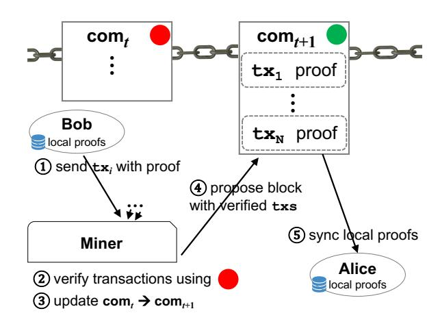
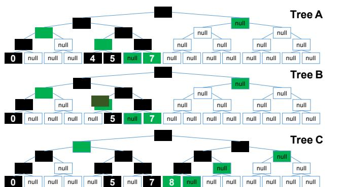
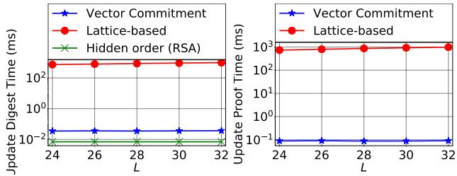

# EDRAX: A Cryptocurrency with Stateless Transaction Validation

Alexander Chepurnoy *Ergo Platform and IOHK* Charalampos Papamanthou *University of Maryland*

Shravan Srinivasan *University of Maryland*

Yupeng Zhang *Texas A&M University*

## Abstract

We present EDRAX, an architecture for cryptocurrencies with stateless transaction validation. In EDRAX, miners and validating nodes process transactions and blocks simply by accessing a short commitment of the current state found in the most recent block. Therefore there is no need to store off-chain and on-disk, order-of-gigabytes large validation state. We present two instantiations of EDRAX, one in the UTXO model and one in the accounts model. Our UTXO instantiation uses *sparse* Merkle trees, which are very fast and require no trusted setup. Our accounts instantiation uses a *distributed* vector commitment, a type of vector commitment that has state-independent updates, meaning it can be synchronized by accessing only update data (e.g., send 5 ETH from Alice to Bob). Towards this goal, we build a new succinct distributed vector commitment based on multiplexer polynomials and zk-SNARKs, that scales up to one billion accounts. We perform an extensive experimental evaluation comparing to other (recently) proposed approaches for stateless transaction validation, showing that sparse Merkle trees and our new distributed vector commitment offer excellent tradeoffs in this application domain.

# 1 Introduction

Decentralized cryptocurrencies and smart contracts such as Bitcoin [\[32\]](#page-14-0) and Ethereum [\[4\]](#page-13-0) promise to remove trusted online parties (e.g., banks and escrows) in sake of faster and more secure financial transactions. Their underlying technology, the blockchain, is an ever-growing hashchain built on blocks of incoming transactions that is agreed upon by a dynamic set of nodes participating in the peer-to-peer cryptocurrency network. This ever-growing nature of the blockchain, however, can limit the cryptocurrency scalability, not only in terms of storage required to store all events since genesis, but also in terms of increasing overheads for transaction validation, blockchain verification and initial synchronization.

Most blockchain-based cryptocurrencies known to date consist of two kinds of parties, *clients* that own coins (e.g., a secret key to a Bitcoin address) and *nodes*[1](#page-0-0) that validate transactions created by the clients. To decide if an incoming transaction is valid so that it can be included in the next block or propagated to a peer, nodes store all the history of transactions so far—namely the whole blockchain. For example, if a new transaction appears requiring 5 bitcoins to be sent from address *A* to address *B*, a node must query the blockchain to check whether *A* has at least 5 bitcoins in his account. Only if this is the case, this transaction is considered valid and is a candidate for appearing on the blockchain.

The blockchain data structure, however, is large (as of May 2020, Bitcoin blockchain is around 280 GB and Ethereum blockchain has exceeded 130 GB) and is growing continuously. Therefore naively querying it will simply take too long. For that reason, most cryptocurrency nodes are typically *stateful*, maintaining an appropriate index called *validation state* that is smaller than the blockchain and which is enough for deciding transaction validity. In some cryptocurencies (e.g., Bitcoin, ZCash, Komodo, Monero, Ergo) the validation state is a set of immutable coins called UTXO (unspent transaction outputs), in Bitcoin jargon. In this UTXO model, a transaction is valid if it spends coins which belong in UTXO. Other cryptocurrencies (e.g., Nxt, Ethereum, Bitshares, NEM, Tezos) organize the validation state as a set of mutable (and potentially long-living) accounts. In this account model, a transaction is valid if it is trying to spend no more tokens than the available balance. Advantages and disadvantages of both approaches are the focus of an ongoing debate in the cryptocurrency community [\[41\]](#page-14-1).

Challenges due to stateful validation. Locally maintaining the validation state, however, is quite cumbersome. In particular, the validation state is in the order of GBs (currently the UTXO set in Bitcoin is around 3.7 GB [\[27\]](#page-14-2) and the authenticated Patricia trie in Ethereum is around 14 GB) and could grow substantially in the coming years. For example, approximately 86,000 Ethereum new accounts/addresses

<span id="page-0-0"></span><sup>1</sup>Nodes are distinguished into *miners* proposing new blocks and *validating nodes* that validate and propagate transactions/blocks in the network.

are currently generated every day [24] and at this rate the Ethereum validation state is expected to double in one year from now. For a new node to enter the network, the validation state needs to be either downloaded and verified or computed from scratch, making such synchronization an extremely slow process [25] (looking ahead, our approach enables incoming miners to validate transactions instantly, by just accessing the most recent block). Also, being in the order of GBs, the validation state is stored on disk (e.g., the geth Ethereum implementation stores the authenticated Patricia Trie using Google's levelDB [26]), leading to slow transaction validation due to expensive I/Os [37]. This has facilitated various DoS attacks like the one that affected Ethereum in 2016 [40], where adversarially-crafted transactions required a large number of disk accesses causing block validation times to reach 60 seconds! Finally, having to store such large state to verify transactions can lead to disadvantaged miners that cannot dedicate large storage resources [9]. Other practical issues/system-level components (e.g., storage rent, sharding) that can benefit via erasure of the validation state have been extensively analyzed [25].

#### 1.1 EDRAX architecture

We address the above by designing and implementing EDRAX, a cryptocurrency protocol where all nodes can *check the validity of transactions without having to store any local validation state*, i.e., validation state can be maintained, in the form of a short cryptographic commitment, as part of the cryptocurrency blocks on-chain. EDRAX comes in two versions, one supporting the UTXO model and one for the account model. EDRAX's architecture can be seen in Figure 1.

Block commitment, local proofs, transactions. In EDRAX, each block *b* includes a constant-size *block commitment* of the current validation state (the one that includes all transactions up to block *b*). Clients, along with their coins, store short *local proofs* that their coins can be spent with respect to the aforementioned block commitment. A local proof is included, with the traditional digital signature, in an EDRAX transaction, enabling miners and validating nodes to verify transactions by accessing the latest commitment.

**Local proofs & commitment synchronization.** In EDRAX, Alice's local proof for a coin with respect to commitment  $com_t$  at time t will be outdated at time t+1, after Bob's transactions are incorporated in the blockchain and  $com_t$  changes to  $com_{t+1}$ . EDRAX enables Alice to synchronize her local proofs efficiently by accessing, from the blockchain, the updates that took place between t and t+1. (The synchronization cost can be large, in particular when Alice has been offline for a long time. In Section 7 where we discuss an optimization using "proof-serving nodes".) Similarly, EDRAX allows miners to easily synchronize the block commitment from  $com_t$  to  $com_{t+1}$  to incorporate new transactions. The new commitment will be part of the new block.

<span id="page-1-0"></span>

Figure 1: EDRAX architecture. Transactions include proofs. Miners verify transactions using the block commitment  $com_t$  stored at the last block t, an updated version of which is included in the next block t+1. Clients synchronize their local proofs after the new block is produced.

Bootstrapping & storage impact. To validate incoming transactions, a newly spawned node in EDRAX just requires the latest block commitment. Thus bootstrapping in EDRAX just requires downloading block headers since the genesis, which is just in MBs (This is in contrast to Bitcoin or Ethereum where gigabytes must be downloaded to start verifying transactions.) We also remark that, unlike transaction signatures, proofs are not fundamentally necessary to verify the EDRAX blockchain—they serve as an efficiency optimization: A miner can simply use the proof to quickly verify an incoming transaction and later discard the proof from his local storage. Thus the size of the blockchain does not necessarily increase.

## 1.2 EDRAX for UTXO via sparse Merkle trees

As warm-up, we show in Section 3 how to provide stateless transaction validation in the UTXO model by using Merkle trees. Recall that in the UTXO model, miners and validating nodes are maintaining a set S of unspent transaction outputs. Whenever a new transaction tx appears that has input x and output y, nodes must first check whether input x belongs in S, and if so, update set S by removing x and inserting the new output y. Our construction represents S with a sparse Merkle tree of  $2^W$  leaves where  $2^W$  is the maximum number of outputs that can ever be generated, e.g., W = 40. (In Section 7 we suggest an optimization with less leaves using authenticated red-black trees.) At leaf i we store the i-th transaction output that was inserted into set S. To delete a leaf j, we just set the value of this leaf to be *null*. We then naturally define the commitment to be the root of the underlying Merkle tree and local proofs as Merkle tree proofs. The above approach allows insertions and deletions to be performed by miners and validating nodes only if the whole Merkle tree is stored

as commitment which is very large. In Section 3 we show how to append a new output y to S by having nodes access only the local proof of the *most recent output* ever inserted in S (of size O(W)). Similarly, deletion of Alice's spent input x from S can be performed by having nodes process Alice's local proof used to prove membership of x in S.

# 1.3 EDRAX for accounts via distributed vector commitments

In the account model, nodes maintain a vector of all account balances which serves as validation state. Whenever Alice wishes to send  $\delta$  tokens to Bob, she posts a transaction including this information. To verify this transaction, nodes must access the balances vector to check whether Alice has at least  $\delta$  tokens in her account.

Why Merkle trees are insufficient. One could consider using Merkle trees to provide stateless validation in the account model as well: Build a Merkle tree on top of the account balances, define the block commitment as the Merkle digest and have the owner of account i maintain a Merkle proof for the balance at position i as her local proof. However, there is a fundamental problem with such an approach. Assume Alice's balance is  $v_A$  tokens and Bob's balance is  $v_B$  tokens. Whenever Alice wants to send, say, 5 tokens to Bob, Alice needs to include a Merkle tree proof proving her current balance is  $v_A \ge 5$ . Once the miner verifies the proof, the miner can process the verified proof to efficiently update the new digest so as to reflect Alice's new account balance as  $v_A - 5$ . Unfortunately, due to the nature of Merkle trees, Alice's local proof does not suffice to update Bob's new balance to  $v_B + 5$ as well unless Alice includes Bob's local proof in her transaction. However, this would require Alice to contact Bob and ask for his proof every time she sends money to him which is not how cryptocurrencies work! (This is even worse if Alice's transaction has many recipients.) Instead Alice should be able to send money to Bob by accessing a fixed public address.

Our approach: Distributed vector commitments. Our observation is that any instantiation of, what we call, distributed vector commitments [17], [34], [29], addresses the above problem. In a distributed vector commitment (DVC), Alice stores a constant-size commitment C of an *n*-sized vector **a**. The vector a itself is not stored by Alice but is distributed among n parties, each party holding a proof  $\pi_i$  with respect to C, in addition to element  $a_i$ . When Alice wishes to update a vector element at index u by  $\delta$  units, she should be able to update C to C' easily by having access only to the information  $(u, \delta)$ . That is, unlike Merkle trees, updates are *state-independent*. Similarly, when party i learns about the update  $(u, \delta)$ , he should be able to efficiently update his proof to  $\pi'_i$  with respect to the new commitment C', again only by accessing  $(u, \delta)$ . Distributed vector commitments are fundamentally different than plain vector commitments such as Merkle trees and accumulator-based

vector commitments [14]—these have updates that are *not* state-independent (for details see Section 1.5 and Section 1.6).

Distributed vector commitments are perfect fit for implementing EDRAX in the account model by naturally viewing account balances as a vector  $\mathbf{v}$  and by storing  $\mathsf{C} = com(\mathbf{v})$  as the block commitment: A SPEND transaction is of the form  $[\pi_i, v_i, i \to j, \delta]$  meaning a client i owning  $v_i$  tokens wants to send  $\delta \leq v_i$  tokens to client j; Proof  $\pi_i$  enable miners to check that  $\delta \leq v_i$ ; Information  $i \to j, \delta$  allows miners to update C to reflect  $v_i = v_i - \delta$  and  $v_j = v_j + \delta$  so as to include it in the next block—it also allows all other clients to synchronize their proofs  $\pi_k$  accordingly. The detailed protocol is in Section 5.

## 1.4 New DVC via multiplexers and SNARKs

A thorough literature review of distributed vector commitments revealed several inefficiencies of existing approaches (see Section 1.6). Therefore we design and implement a new distributed vector commitment for EDRAX—see Section 4. Our construction uses the  $\ell$ -variate "multiplexer" polynomial  $f(\mathbf{x})$  to represent a vector of  $n=2^{\ell}$  entries. For example, the multilinear extension for the vector  $V=[5\ 2\ 8\ 3]$  is the polynomial  $f(x_1,x_2)=5\cdot(1-x_2)(1-x_1)+2\cdot(1-x_2)x_1+8\cdot x_2(1-x_1)+3\cdot x_2x_1$ . Which implies that, f(0,0)=V[0], f(0,1)=V[1], f(1,0)=V[2], and f(1,1)=V[3]. The commitment is then computed as  $g^{f(\mathbf{s})}$ , where g is a generator of an EC group and  $\mathbf{s}$  is a random point that is kept secret.

A proof for a vector element in the above construction has size  $\ell$  and takes  $O(\ell)$  time to verify. We reduce these costs to constant (which translate in a significant reduction in block sizes and miners and validating nodes computation) by using a zk-SNARK on the verification algorithm. While this sounds easy from a theory perspective, it is quite challenging in practice since the verification computation that must be "snarked" involves bilinear pairing operations.

Our construction finally features an  $O(\ell)$ -time algorithm<sup>2</sup> for synchronizing proof  $\pi_i$  for a point  $i \in \{0,1\}^{\ell}$  given update  $(j,\delta)$  where j is another point in  $\{0,1\}^{\ell}$ —see Algorithm DeltaPol in Section 4.

## <span id="page-2-0"></span>1.5 Comparison with Boneh et al. [14]

The most closely-related work to EDRAX is the recent work by Boneh et al. [14] which built RSA-based accumulators for stateless transaction validation in the UTXO model. Unlike our sparse Merkle-tree approach, their construction supports proof batching, which can drastically decrease the block size (For all transactions in the block, one constant-size proof is required, while Merkle trees require one logarithmic-sized proof per transaction.) Their construction can also be instantiated with class groups, avoiding trusted setup, as our sparse Merkle trees do. RSA operations and class groups are however costly compared to SHA-2 hashing and the practical

<span id="page-2-1"></span><sup>&</sup>lt;sup>2</sup>Also, averaging over all  $j \in \{0,1\}^{\ell}$  the update complexity for i is O(1).

overhead can be large. In particular, RSA accumulators add an overhead close to  $17 \times$  when compared to sparse Merkle trees. Also, when one focuses on *no-trusted setup*, the best approach for UTXO settings, then Merkle trees is a clear winner by a far bigger gap, since using class groups adds large overhead (In this regime, a Bitcoin block validation has an overhead of approximately 18× and miners have an overhead of 13600× compared to sparse Merkle trees.) Boneh et al. [14] also introduce a new vector commitment based on their RSA accumulator construction and propose to apply it for stateless transaction validation in the account model. However, their vector commitment is not a distributed vector commitment: To update C to C', Alice requires, in addition to  $(u, \delta)$ , the proof  $\pi_u$  (this is also indicated in their definition as "advice"  $\tau$ ). Therefore, their vector commitment is not suitable for stateless validation for accounts as we explained before. A detailed evaluation and comparison is presented in Section 6.

## <span id="page-3-0"></span>1.6 Comparison to other DVCs

Succinctly representing vectors using multilinear extensions was introduced by Zhang et al. [42,43] for a different application, where proofs are larger and no efficient proof synchronization algorithms are presented.

Distributed vector commitments that can be used to implement EDRAX were also introduced by Catalano and Fiore [17], one based on elliptic curve groups and one based on the RSA cryptosystem. These approaches do not seem to scale. In particular, the EC-based construction [17] has public parameters of quadratic size. Similarly while the RSA-based construction [17] has better verification complexities than our proposed commitment, it requires linear time for proof update (and so does a recent RSA-based work by Campanelli et al. [16]), leading to very slow proof synchronization (around 145 hours for 2<sup>30</sup> accounts). The DVC scheme by Krupp et al. [28] is using [17] as a black-box (additionally offering a "Chameleon" property), thus inheriting its inefficiency. The recent work of Gorbunov et al. [22] introduces POINTPROOFS, a DVC with update keys of linear size. Finally, subsequent to this work, Tomescu et al. [39] present a new DVC that supports aggregation of proofs and has short update keys.

All the above distributed vector commitments have trusted setup. To the best of our knowledge there are two distributed vector commitments with no trusted setup. The lattice-based Merkle tree by Papamanthou et al. [34] (polylogarithmic asymptotic costs) and the recent generalization of an RSA-based DVC [17] to hidden order groups by Lai and Mala-volta [29] (linear update proof costs). Both do not scale in practice due to costs associated with lattices and class groups respectively. We present a detailed comparison of the asymptotic costs of our construction with other distributed vector commitments in Table 1, as well as detailed experimental comparison of our distributed vector commitment with the RSA-based one [17] in Section 6.

## 1.7 Implementation and evaluation

In Section 6 we implement both instantiations of EDRAX and evaluate the performance. Our evaluation has three main findings: First, for the UTXO setting, while sparse Merkle trees increase the size of the block by a logarithmic factor, they significantly  $(17\times)$  outperform recently-proposed accumulator-based approaches [14] in terms of computation (e.g., block validation), especially when compared to their equivalent notrusted setup instantiations based on class groups  $(18\times)$ . Second, for the accounts setting, while our vector commitment verification is slower (6s more to verify a block) compared to the only other practical distributed vector commitment [17], it features a logarithmic-time algorithm (as opposed to linear) for updating local coin proofs, which translates to several orders of magnitude savings  $(5825\times)$  from a cryptocurrency client perspective.

#### <span id="page-3-1"></span>2 Preliminaries

We now give background material on bilinear maps, multilinear extensions, sparse Merkle trees and vector commitments.

**Bilinear pairings.** We denote by  $(p, \mathbb{G}, \mathbb{G}_T, e, g) \leftarrow \text{BilGen}(1^{\lambda})$  generation of bilinear-map parameters, where  $\mathbb{G}$ ,  $\mathbb{G}_T$  are groups of prime order p, with g a generator of  $\mathbb{G}$ , and where  $e: \mathbb{G} \times \mathbb{G} \to \mathbb{G}_T$  is an efficient map, i.e., for all  $P, Q \in \mathbb{G}$  and  $a,b \in \mathbb{Z}_p$  it is  $e(P^a,Q^b)=e(P,Q)^{ab}$ . To prove security we will be using the q-Strong Bilinear Diffie-Hellman assumption [13] (q-SBDH) on the groups  $\mathbb{G}$  and  $\mathbb{G}_T$  that we formally define in the Appendix—see Assumption 1.

Multilinear extension polynomial of vectors. Let  $\mathbb{F}$  be a field (e.g.,  $\mathbb{Z}_p$ ) and let  $n=2^\ell$ . Let  $i\in\{0,\ldots,n-1\}$  and let  $i_k$  denote its bit at position k in binary. For a vector  $\mathbf{a}=[a_0,\ldots,a_{n-1}]$  with elements in the field  $\mathbb{F}$ , we define its multilinear extension polynomial  $f_{\mathbf{a}}:\mathbb{F}^\ell\to\mathbb{F}$  as a polynomial of  $\ell$  variables that servers as a multiplexer for the vector  $\mathbf{a}$ , i.e.,

<span id="page-3-3"></span>
$$f_{\mathbf{a}}(x_1, \dots, x_\ell) = \sum_{i=0}^{n-1} \left( a_i \cdot \prod_{k=1}^{\ell} \operatorname{select}_{i_k}(x_k) \right), \tag{1}$$

where

<span id="page-3-2"></span>
$$\operatorname{select}_{i_k}(x_k) = \begin{cases} x_k & \text{if } i_k = 1\\ 1 - x_k & \text{if } i_k = 0 \end{cases} . \tag{2}$$

Note that polynomial  $f_{\bf a}$  is the unique multilinear polynomial such that for all i with binary representation  $i_{\ell}, \ldots, i_1$  it is  $f_{\bf a}(i_1, \ldots, i_{\ell}) = a_i$ . For example, for  ${\bf a} = [5\ 2\ 8\ 3]$  the polynomial  $f_{\bf a}(x_1, x_2)$  equals

$$5 \cdot (1-x_2)(1-x_1) + 2 \cdot (1-x_2)x_1 + 8 \cdot x_2(1-x_1) + 3 \cdot x_2x_1$$

To simplify, we sometimes represent point  $(x_1, ..., x_\ell)$  as **x**. The following polynomial decomposition from [42] is useful.

<span id="page-4-4"></span>**Lemma 2.1.** For any multilinear polynomial  $f: \mathbb{F}^{\ell} \to \mathbb{F}$  and for  $\mathbf{t} \in \mathbb{F}^{\ell}$ , there exist polynomials  $q_i$  such that  $f(\mathbf{x}) - f(\mathbf{t}) = \sum_{i=1}^{\ell} (x_i - t_i) q_i(\mathbf{x})$ . Moreover, all  $q_i$  can be computed in  $O(2^{\ell}) = O(|f|)$  time.

**Preprocessing zk-SNARKs.** Let  $\mathcal{L}$  be an NP relation such that  $\mathbf{x} \in \mathcal{L}$  if and only if there exists a witness  $\mathbf{w}$  such that  $\mathcal{L}(\mathbf{x}, \mathbf{w}) = 1$ . A (zero-knowledge) Succinct Noninteractive ARgument of Knowledge (zk-SNARK) [36] for  $\mathcal{L}$  allows a verifier to efficiently verify that  $\mathbf{x} \in \mathcal{L}$ , without using  $\mathbf{w}$ , but via a small proof provided by an untrusted prover. A zk-SNARK consists of three polynomial-time algorithms,  $(\mathcal{G}, \mathcal{P}, \mathcal{V})$ :

- 1.  $(PK,VK) \leftarrow \mathcal{G}(1^{\lambda},\mathcal{L})$ : Key generation algorithm generates the proving and verifying key for the program  $\mathcal{L}$ .
- 2.  $\pi \leftarrow \mathcal{P}(PK, \mathbf{x}, \mathbf{w})$ : The prover generates a succinct proof  $\pi$  to prove that there exists  $\mathbf{w}$  such that  $\mathcal{L}(\mathbf{x}, \mathbf{w}) = 1$ .
- 3.  $\{0,1\} \leftarrow \mathcal{V}(VK, \pi, \mathbf{x})$ : The verifier checks if the proof  $\pi$  is valid for  $\mathbf{x}$  using the verifying key VK.

Informally, zk-SNARKs have two properties: First, zero-knowledge, meaning that a verifying proof  $\pi$  does not reveal anything beyond the validity of the statement; Second, knowledge-soundness, meaning that if the verifier accepts a proof for x, the prover "knows" a witness w for x and therefore  $x \in \mathcal{L}$  (moreover the witness w can be extracted by inspecting the prover's tape). For our application we will not be using the zero-knowledge property. We give the formal definition of knowledge-soundness in the Appendix—see Definition 3.

**Sparse Merkle trees.** Sparse Merkle trees are Merkle trees [30] built over key-value pairs  $(k_i, v_i)$  whose keys  $k_i$  are drawn from a large domain  $[0, 1, \ldots, 2^W - 1]$ . In particular, data item  $(k_i, v_i)$  is stored at the  $k_i$ -th leaf of the tree (the tree has a total of  $2^W$  leaves). We define a natural labeling for all nodes of the sparse Merkle tree: Root takes label  $\varepsilon$ , his left child takes label 0, his right child takes label 1, his leftmost grandchild takes label 00 and so on.

For W-bit leaf  $k_i$  that stores the data element  $(k_i, v_i)$  we define the commitment of leaf  $k_i$  as  $\mathsf{com}(k_i) = k_i || v_i$ . For leaves  $\ell$  that do not store a key we set  $\mathsf{com}(\ell) = null$ . For every internal node u of the Merkle tree we define the commitment of u as  $\mathsf{com}(u) = H(\mathsf{com}(v)||\mathsf{com}(w))$ , if either  $\mathsf{com}(v)$  or  $\mathsf{com}(w)$  is not null and  $\mathsf{com}(u) = null$  otherwise. Here, v is the left child of u and w is the right child of u and w is a collision-resistant hash function such as SHA-2.

Single item verification and deletion. For data item (k, v) let path(k) be the ordered set of nodes on the path from k to the root  $\varepsilon$  and let sib(k) be the ordered set of siblings of nodes on path(k). Recall that the proof  $\pi(k)$  for (k, v), with respect to the commitment of the root  $com(\varepsilon)$  is the set  $com(k) \cup \{com(v) : v \in sib(k)\}$ . In particular, to verify the proof, one can run a verification algorithm

$$d \leftarrow \mathsf{verifyMerkle}(k, v, \pi(k))$$
 (3)

that recomputes the commitment of the root. If  $d = \text{com}(\epsilon)$  the verification is successful and one can be assured (except with negligible probability) that (k,v) is the k-th leaf of the sparse Merkle tree. After a successful verification, the verification algorithm can also be used to update  $\text{com}(\epsilon)$  when (k,v) is deleted from the tree. In particular one can run verify $(k,null,\pi(k))$  to output the new commitment d'. The proof size is O(W) and the verification complexity is O(W).

Batch verification and deletion. The above approach can be generalized for verifying a set of data items  $S = \{(k_1, v_1), \ldots, (k_t, v_t)\}$  at once. In particular let path(S) be the union of  $path(k_i)$  and let sib(S) be the union of  $sib(k_i)$ . The proof  $\pi(S)$  for all  $(k_1, v_1), \ldots, (k_t, v_t)$  in S, with respect to the commitment of the root  $com(\varepsilon)$  is the set  $\cup_i com(k_i) \cup \{com(v) : v \in sib(S)\}$ . In this case we can call verifyMerkle $(S, \pi(S))$  to recompute the commitment of the sparse Merkle tree and verify all elements in S, as well as verifyMerkle $(\{(k_1, null), \ldots, (k_t, null)\}, \pi(S))$  for the batch deletion of all data elements in S.

**Distributed vector commitments.** We now give the definition of a distributed vector commitment.

<span id="page-4-2"></span>**Definition 1** (Distributed Vector Commitment). *A distributed vector commitment* DVC *consists of six* PPT *algorithms:* 

- 1.  $pp \leftarrow Gen(1^{\lambda}, n)$ : Given security parameter  $\lambda$  and vector length n, it outputs public parameters pp.
- 2.  $\mathsf{C} \leftarrow \mathsf{Com}_{\mathsf{pp}}(a_0,\ldots,a_{n-1})$ : Given  $\mathbf{a} = (a_0,\ldots,a_{n-1})$ , it outputs a commitment  $\mathsf{C}$ .
- 3.  $\pi_i \leftarrow \mathsf{Open}_{\mathsf{pp}}(i, v, \mathbf{a})$ : Given index i, value v and  $\mathbf{a}$ , it outputs proof  $\pi_i$ .
- 4.  $\{0,1\} \leftarrow \mathsf{Ver}_{\mathsf{pp}}(\mathsf{C},i,v,\pi)$ : Given commitment  $\mathsf{C}$ , an index i, a value v and a proof  $\pi$  it either accepts or rejects.
- 5.  $C' \leftarrow UpdateCom_{pp}(u, \delta, C)$ : Given update  $(u, \delta)^3$  and commitment C, it outputs the updated commitment C'.
- 6.  $\pi'_i \leftarrow \mathsf{UpdateProof}_{\mathsf{pp}}(u, \delta, \pi_i)$ : Given update  $(u, \delta)$  and a proof  $\pi_i$ , it outputs the updated proof  $\pi'_i$ .

The correctness definition for DVC is in the Appendix—Definition 4. We now present the soundness definition.

<span id="page-4-3"></span>**Definition 2** (Soundness of distributed vector commitment). Consider the following experiment that takes as input the security parameter  $\lambda$  and outputs vector  $\mathbf{a}$ , index i, value a and a bit b.

- Let n be output by the adversary A;
- pp  $\leftarrow$  Gen $(1^{\lambda}, n)$ ;
- Let  $\mathbf{a} = [a_0, \dots, a_{n-1}]$  be output by  $\mathcal{A}$ ;

<span id="page-4-1"></span><span id="page-4-0"></span> $<sup>^3\</sup>mbox{Value}~\delta$  can be either positive or negative indicating credit or debit for account  $\emph{u}.$ 

- C ← Compp(a)*;*
- *for i* = 1,...,*t* = *poly*(λ)
  - *A outputs* (*u*,δ) *and let* a *be the updated vector;*
  - C ← UpdateCompp(*u*,δ,C)*;*
- *A outputs i*,*a*,π *and let b* ← Verpp(C,*i*,*a*,π)*.*
- return (a,*i*,*a*,*b*)*;*

*A distributed vector commitment scheme is sound if for all* PPT *adversaries A, the probability b* = 1 *and a* 6= *a<sup>i</sup> , where ai is the value at i is negligible.*

# <span id="page-5-0"></span>3 EDRAX in UTXO model

Recall the UTXO-based model follows the design of Bitcoinlike cryptocurrencies, where validating a transaction *tx* depends on whether its inputs belong to a set of *unspent transaction outputs* (or UTXO) that is maintained by the miners. Once this condition is verified, the spent inputs of *tx* are removed from UTXO and the new outputs of *tx* are added to UTXO. We first describe a version of EDRAX in this model.

Representing UTXO as a sparse Merkle tree. We will represent the UTXO set as a sparse Merkle hash tree. A similar approach has been used in Zcash [\[10\]](#page-13-6)—unlike Zcash, however, here we remove a transaction output from the Merkle tree after it is spent by marking is as *null*, see Figure [2.](#page-5-1) In particular each element of the UTXO is of the form (*i*,[*pk*, *v*]) where *i* is the an increasing timestamp/counter indicating when this output was added to the UTXO (and serves as the "key" in the sparse Merkle tree) and [*pk*, *v*] contains the public key *pk* and EDRAX units *v* that this output can be spent to (and serves as the "value" in the sparse Merkle tree).

Block commitment. Every block *b* at time *t* (*t* refers to the rank of the block in the blockchain) in UTXO EDRAX contains the following information as block commitment.

- 1. The UTXO commitment com*<sup>t</sup>* which is the root commitment of the sparse Merkle tree built on transaction outputs that have been generated up to block *b*, block *b* included (for outputs that have already been spent we mark them as *null*);
- 2. The Merkle tree proof of the most recent entry in the UTXO, i.e., the Merkle tree proof corresponding to the last output of the last transaction in the last block *b*. We call this proof *most recent proof* and we denote it as π*<sup>t</sup>* .

Client state. A EDRAX client stores the list *L* of his unspent transaction outputs (*i*,[*pk<sup>i</sup>* , *vi* ]) (ones for which he knows respective secret keys *ski*) and respective Merkle proofs π(*i*).

**SPEND** transaction. For simplifying exposition, suppose Alice wants to create a transaction *tx* that spends a transaction

<span id="page-5-1"></span>

Figure 2: Evolution of the sparse Merkle tree on the UTXO set. In Tree A, the UTXO set contains 4 unspent outputs that were added with timestamps 0, 4, 5 and 7. The outputs that were added with timestamps 1, 2, 3 and 6 have already been spent (and thus deleted/nullified). We highlight with green color the nodes that constitute the most recent proof π(7). In Tree B a new transaction *tx* with input 4 appears in the system (thus 4 must be deleted from the tree), causing the most recent proof π(7) to change one of its hashes to *H*(*null*||*dig*(5)), indicated with dark green color. The output of *tx* is added in Tree C at the next position 8, causing the update of the most recent proof from π(7) to π(8). Note π(8) in Tree C can be computed from π(7) in Tree B using Algorithm [3.](#page-17-0)

output (*x*,[*pk*, *v*]) in her local list *L* to a specific public key PK (we can trivially generalize the SPEND transaction for multiple inputs and outputs). Let *sk* be the corresponding secret key to *pk*. Alice constructs and signs, using *sk*, the transaction:

$$[(x,[pk,v]),\pi(x),\mathsf{PK}].$$

To be valid, π(*x*) must refer to the last block, i.e., at time *t*.

New block creation. Suppose the last block that was computed is block *t* and miners are competing for block *t* +1. For that miners collect incoming SPEND transactions of the type

$$[(x,[pk,v]),\pi(x),\mathsf{PK}],sig$$

and decide using the block commitment at block *t* whether to include a transaction in block *t* +1 as follows:

- 1. (transaction signature verification) Check that signature *sig* is valid under public key *pk*;
- 2. (verifying membership of transaction input in UTXO) Run

$$\mathsf{verifyMerkle}(x,[pk,v],\pi(x))$$

as in Relation [3](#page-4-1) to output a hash *d*. If *d* equals com*<sup>t</sup>* (part of the block commitment), then the miner is assured (*x*,[*pk*, *v*]) exists in the UTXO set and thus can be spent.

The time required for verifying a transaction is *O*(*W*) since one Merkle tree proof must be verified per transaction. The

transactions that satisfy the above checks are candidates for the next block. The block has size  $O(m \cdot W)$  where m is the number of transactions in the block. Finally, in the new block t+1, miners must also include the updated UTXO commitment, i.e.,  $com_{t+1}$  and the new most recent proof  $\pi_{t+1}$ . We describe this procedure next.

Creating the new block commitment. We first show how to create the new block commitment  $com_t$ ,  $\pi_t$  for one transaction  $[(x, [pk, v]), \pi(x), PK]$  with one input and one output and then we generalize to multiple transactions—see Figure 2. In particular, to compute  $com_{t+1}$  and  $\pi_{t+1}$  given  $com_t$  and  $\pi_t$  the miners perform the following steps:

- 1. (deleting transaction input from UTXO) Update the UTXO commitment  $com_t$  to d' to not contain spent input (x, [pk, v]) anymore by running  $d' \leftarrow$  verifyMerkle $(x, null, \pi(x))$  as we described in Section 2;
- 2. (updating most recent proof due to deletion) Let cnt be the timestamp corresponding to the most recent proof  $\pi_t$ . For every node  $v \in sib(cnt) \cap path(x)$  replace every commitment com(v) in the most recent proof  $\pi_t$  with the new commitments com(v) as computed by running algorithm verifyMerkle( $x,null,\pi(x)$ ) above leading to a new proof  $\pi'$ —see Tree B in Figure 2.
- 3. (adding transaction output to UTXO) The new transaction output should now be stored at leaf cnt + 1 as (cnt + 1), [PK, v]). Because of the addition of the new leaf, the most recent proof  $\pi' = \pi(cnt)$  computed above must be updated to  $\pi_t = \pi(cnt + 1)$ . Intuitively this can be done since  $\pi_t$  is "to the right" of  $\pi'$ —see UPDATEMOSTRECENTPROOF (Algorithm 3 in the Appendix) for the detailed pseudocode and Tree C in Figure 3. After  $\pi_{t+1}$  is computed, miners can finally update the UTXO commitment by running verifyMerkle(cnt + 1,  $[PK, v], \pi_t$ ) which will output the final commitment com $_{t+1}$ .

**Processing multiple inputs and outputs.** To process a block with more than one transactions with more than one inputs and outputs (as it typically happens in practice), miners must perform *batch verification* and *batch deletion* to verify and delete the inputs from the UTXO, as described in Section 2. This not just an optimization, but it is needed for correctness (otherwise proofs will be out-of-sync). Finally, to add the new outputs to the UTXO, the miners run Step (3) above as many times as the number of new outputs generated in the block. Updating the block commitment with the above steps takes  $O(m \cdot W)$  time where m is the total number of transaction inputs and outputs in the block.

**Proof computation & synchronization.** For an unspent output (x, [pk, v]) in the UTXO, let  $\pi(x)$  be the proof stored locally by the client with respect to time t. To synchronize  $\pi(x)$  for time t+1, the client must process all transactions in the

block at time t+1 by performing the same steps as the miners above. But instead of outputting commitment  $com_{t+1}$  at time t+1 and most recent proof  $\pi_{t+1}$  at time t+1, he just replaces the affected commitments in  $\pi(x)$ , due batch deletion and addition of the new outputs. In general, to synchronize between  $t_1$  and  $t_2$ , he repeats this process  $t_2-t_1$  times.

#### <span id="page-6-0"></span>4 DVC Construction

We now present our new distributed vector commitment construction used in the implementation of account-based EDRAX. We present all algorithms in detail, as defined in Definition 1, then we show correctness as defined in Definition 4 in Appendix and soundness, as required by Definition 2.

#### 4.1 Detailed construction

Our construction, among other things, will be using a zk-SNARK as a black box, on an NP relation of logarithmic size (therefore the prover will be quite efficient). We formally describe this relation in the following.

The NP relation  $\mathcal{L}_{\mathbf{g}}$ . Let now  $(p, \mathbb{G}, \mathbb{G}_T, e, g)$  be the output of BilGen(1 $^{\lambda}$ ) and let  $\ell = \log n$ . Let now  $\mathbf{g} = [g_1, \dots, g_{\ell}]$  be  $\ell$  fixed group elements of  $\mathbb{G}$ . Consider now the following NP relation  $\mathcal{L}_{\mathbf{g}}$  that contains elements  $(\mathsf{C}, i, v) \in (\mathbb{G} \times \mathbb{Z}_p \times \mathbb{Z}_p)$  iff there exists group elements  $w_1, \dots, w_{\ell}$  in  $\mathbb{G}$  such that

<span id="page-6-2"></span>
$$e(C \cdot g^{-v}, g) = \prod_{k=1}^{\ell} e(g_k \cdot g^{-i_k}, w_k)$$

$$i = \sum_{k=1}^{\ell} i_k 2^{k-1}$$

$$i_k (1 - i_k) = 0 \text{ for } k = 1, \dots, \ell$$

i.e.,  $i_1, \ldots, i_\ell$  is the binary representation of i. Note now that the witness in the above relation is  $(w_1, \ldots, w_k, i_1, \ldots, i_k)$ . We now describe the DVC algorithms in detail.

 $pp \leftarrow \text{Gen}(1^{\lambda}, n)$ : Let  $(p, \mathbb{G}, \mathbb{G}_T, e, g)$  be the output of  $\overline{\text{BilGen}}(1^{\lambda})$ . Let  $\ell = \log n$  and let  $\mathcal{S}$  be the powerset of  $\{1, 2, \dots, \ell\}$ . Select  $s_1, \dots, s_{\ell}$  randomly from  $\mathbb{F}$  and set

$$\mathsf{prk} = \left\{ g^{\prod_{i \in \mathcal{S}} s_i} : S \in \mathcal{S} \right\} \ \text{ and } \ \mathbf{g} = \left[ g^{s_1}, \dots, g^{s_\ell} \right].$$

Also for all u = 0, ..., n-1, we define the update key for position u to contain the following  $\ell$  group elements, i.e.,

$$\mathsf{upk}_u = \left\{ g^{\prod_{k=1}^t \mathsf{select}_{u_k}(s_k)} : t \in [\ell] \right\} = \left\{ \mathsf{upk}_{u,t} : t \in [\ell] \right\}.$$

where select<sub> $u_k$ </sub>( $s_k$ ) is by Equation 2.<sup>4</sup> For example, for  $\ell = 3$ , public parameters pp will contain

$$g, g^{s_1}, g^{s_2}, g^{s_1 s_2}, g^{s_1 s_3}, g^{s_2 s_3}, g^{s_1 s_2 s_3},$$

<span id="page-6-1"></span><sup>&</sup>lt;sup>4</sup>Note each update key upk<sub>u</sub> can be constructed from prk in linear time, so update keys need not be part of the public parameters. However, since Gen has access to  $s_1, \ldots, s_\ell$ , each update key can be computed faster within Gen. That is why we explicitly make them part of the public parameters.

<span id="page-7-0"></span>**Algorithm 1** Algorithm for computing the polynomials that are required to update the proof at position i on update  $(u, \delta)$ .

```
1: procedure [\Delta_{\ell}(\mathbf{X}), \dots, \Delta_{1}(\mathbf{X})] \leftarrow \mathrm{DELTAPOL}(u, \delta, i, \ell)

2: if \ell > 0 then

3: if msb of u is 0 and msb of i is 1 then return \begin{bmatrix} -\delta \cdot \prod_{k=1}^{\ell-1} \mathrm{select}_{u_{k}}(x_{k}), 0, \dots, 0 \end{bmatrix};

4: if msb of u is 1 and msb of i is 0 then return \begin{bmatrix} +\delta \cdot \prod_{k=1}^{\ell-1} \mathrm{select}_{u_{k}}(x_{k}), 0, \dots, 0 \end{bmatrix};

5: if msb of u is 0 and msb of i is 0 then return \begin{bmatrix} -\delta \cdot \prod_{k=1}^{\ell-1} \mathrm{select}_{u_{k}}(x_{k}), \mathrm{DELTAPOL}(u \bmod 2^{\ell}, \delta, i \bmod 2^{\ell}, \ell-1) \end{bmatrix};

6: if msb of u is 1 and msb of i is 1 then return \begin{bmatrix} +\delta \cdot \prod_{k=1}^{\ell-1} \mathrm{select}_{u_{k}}(x_{k}), \mathrm{DELTAPOL}(u \bmod 2^{\ell}, \delta, i \bmod 2^{\ell}, \ell-1) \end{bmatrix};
```

while the update key upk<sub>0</sub> will contain

$$\{g^{1-s_1},g^{(1-s_1)(1-s_2)},g^{(1-s_1)(1-s_2)(1-s_3)}\}.$$

Let now  $(PK, VK) \leftarrow \mathcal{G}(1^{\lambda}, \mathcal{L}_{\mathbf{g}})$ , where  $\mathcal{G}$  generates public parameters of the zk-SNARK for  $\mathcal{L}_{\mathbf{g}}$ . All prk, upk<sub>u</sub>  $(u = 0, \dots, n-1)$  and (PK, VK) comprise the parameters pp of the distributed vector commitment.

 $C \leftarrow \mathsf{Com}_{\mathsf{pp}}(a_0, \dots, a_{n-1})$ : Set  $C = g^{f_{\mathbf{a}}(s_1, \dots, s_\ell)}$ , where  $f_{\mathbf{a}}$  is the multilinear extension polynomial of the vector  $\mathbf{a} = [a_0, \dots, a_{n-1}]$  as defined in Equation 1.

 $\underline{\pi}_i \leftarrow \operatorname{Open_{pp}}(i, v, \mathbf{a})$ : Let  $i_\ell, \dots, i_1$  be the binary representation of i. As  $v = f_{\mathbf{a}}(i_1, \dots, i_\ell)$ , using polynomial decomposition, compute polynomials  $q_1, \dots, q_\ell$  such that

$$f_{\mathbf{a}}(\mathbf{x}) - v = \sum_{k=1}^{\ell} (x_k - i_k) q_k(\mathbf{x}).$$

Compute elements  $\{g^{q_1(s)},\ldots,g^{q_\ell(s)}\}$ . To compute polynomials  $q_1,\ldots,q_\ell$ , we divide  $f_{\mathbf{a}}(\mathbf{x})-f_{\mathbf{a}}(i_1,\ldots,i_\ell)$  by  $x_\ell-i_\ell$  and set  $q_\ell$  as the quotient polynomial of the division, which is a multilinear polynomial with variables  $x_1,\ldots,x_{\ell-1}$ . The remainder is a multilinear polynomial with variables  $x_1,\ldots,x_{\ell-1}$ , which we divide by  $x_{\ell-1}-i_{\ell-1}$  to get  $q_{\ell-1}$ . We repeat recursively until we get  $q_1$ . Let now  $C=g^{f_{\mathbf{a}}(s_1,\ldots,s_\ell)}$ . Note that  $(C,i,v)\in \mathcal{L}_{\mathbf{g}}$  with witness  $\{w_1=g^{q_1(s)},\ldots,w_\ell=g^{q_\ell(s)}\}$ . The final proof is

$$\pi_i \leftarrow \mathcal{P}(PK, (\mathsf{C}, i, v), \{w_1, \dots, w_\ell\}).$$

We note here that  $\{w_1, \dots, w_\ell\}$  would suffice as proof of v at index i but consists of  $\log n$  elements. zk-SNARKs allow us to compress the proof to a constant number of elements.

 $\{0,1\} \leftarrow \mathsf{Ver}_{\mathsf{pp}}(\mathsf{C},i,v,\pi)$ : To verify that v is the opening at position i of  $\mathsf{C}$ , we verify the zk-SNARK proof  $\pi$  by invoking  $\{0,1\} \leftarrow \mathcal{V}(VK,\pi,(\mathsf{C},i,v))$ .

 $\mathsf{C}' \leftarrow \mathsf{UpdateCom}_{\mathsf{pp}}(u, \delta, \mathsf{C})$ : Compute new commitment as

$$\mathsf{C}' = \mathsf{C} \cdot \left[ g^{\prod_{k=1}^\ell \mathsf{select}_{u_k}(s_k)} \right]^\delta = \mathsf{dig} \cdot \left[ \mathsf{upk}_{u,\ell} \right]^\delta.$$

From the above note  $upk_{u,\ell}$  is sufficient to update the digest.

 $\pi'_i \leftarrow \mathsf{UpdateProof}_{\mathsf{pp}}(u, \delta, \pi_i)$ : Assume the witness w used to generate  $\pi_i$  is available as  $w_1, \ldots, w_\ell$  (in practice this can be proof metadata used only for updating the proof, but not for verification). For i = 1 to  $\ell$  set

$$w_i' = w_i \cdot g^{\Delta_i(\mathbf{s})},$$

where  $\Delta_{\ell}(\mathbf{x}),\ldots,\Delta_{1}(\mathbf{x})$  are the polynomials computed by calling DeltaPol $(u,\delta,i,\ell)$  (see Algorithm 1). Note that it is very easy to modify DeltaPol to output the terms  $g^{\Delta_{i}(s)}$  directly by allowing it to access the update key upk $_{u}$  of u (so instead for computing, for example, the polynomial  $-\delta \cdot \prod_{k=1}^{\ell-1} \operatorname{select}_{u_{k}}(x_{k})$  it can just directly output  $[\operatorname{upk}_{u,\ell-1}]^{-\delta}$ ). To output the new proof, we can call

$$\pi'_i \leftarrow \mathcal{P}(PK, (C', i, v), \{w'_1, \dots, w'_\ell\}),$$

where C' is computed C'  $\leftarrow$  UpdateCom<sub>pp</sub> $(u, \delta, C)$ .

# 4.2 Correctness and security analysis

To prove correctness of our scheme according to Definition 4, we need to prove correctness of Algorithm DELTAPOL (Algorithm 1). We give the proof in the Appendix—see Lemma 7.1. Correctness of the rest of the scheme follows by inspection.

Concerning security, our distributed vector commitment can be viewed as an application of the selectively-secure verifiable polynomial delegation scheme in [33], for the multilinear polynomial of Relation 1. While selective security is very weak in general, we show it is enough for our application. This is because a vector commitment requires evaluating the polynomial on a fixed number of points, i.e., on the hypercube  $\{0,1\}^{\ell}$  and not on arbitrary (exponentially-many) points in  $\mathbb{Z}_p^{\ell}$ . We provide the detailed proof in the following.

**Theorem 4.1.** The distributed vector commitment scheme presented above is sound (according to Definition 2) under Assumption 1 and assuming knowledge-soundness of the underlying zk-SNARK as defined in Definition 3.

*Proof.* We now prove the soundness of the distributed vector commitment. First an  $\ell$ -SBDH instance

$$((p,\mathbb{G},\mathbb{G}_T,e,g),g^s,\ldots,g^{s^\ell})$$

| Scheme              | Gen          | π            | Open          | UpdateComm   | UpdateProof             | Trusted Setup | Aggregation |
|---------------------|--------------|--------------|---------------|--------------|-------------------------|---------------|-------------|
| [17] (EC)           | $O(n^2)$     | <i>O</i> (1) | O(n)          | O(1)         | O(1)                    | yes           | no          |
| [17] and [16] (RSA) | O(n)         | <i>O</i> (1) | $O(n \log n)$ | O(1)         | O(n)                    | yes           | yes         |
| [39] (EC)           | $O(n\log n)$ | <i>O</i> (1) | O(n)          | O(1)         | O(1)                    | yes           | yes         |
| [34] (lattices)     | O(1)         | $O(\log n)$  | O(n)          | $O(\log n)$  | $O(\log n)$             | no            | no          |
| [29] (class groups) | <i>O</i> (1) | <i>O</i> (1) | $O(n \log n)$ | <i>O</i> (1) | O(n)                    | no            | yes         |
| EDRAX               | O(n)         | <i>O</i> (1) | O(n)          | O(1)         | $O(\log n \log \log n)$ | yes           | no          |

<span id="page-8-1"></span>Table 1: Comparison of our EDRAX DVC with existing DVCs that have short keys for updating proofs. *n* is the size of the vector.

is given to adversary  $\mathcal{A}_1$ . Then  $\mathcal{A}_1$  picks random  $b \in \{0,1\}^\ell$  (such that  $2^\ell$  is  $poly(\lambda)$ ) and implicitly computes  $s_1 = s$  and  $s_i = r_i \cdot (s - b_1) + b_i$  where  $r_i$  are random. Now, given

$$g^s,\ldots,g^{s^\ell}$$
,

 $\mathcal{A}_1$  can easily compute pp, which he all gives to  $\mathcal{A}_2$ . Moreover, these keys are indistinguishable from Gen's output since the  $r_i$ 's have been picked at random. We now show that if  $\mathcal{A}_2$  is able to break soundness as defined in Definition 2 (by providing a forgery  $(x, a, \pi)$  to  $\mathcal{A}_1$ ) then  $\mathcal{A}_1$  will be able to use that forgery and break Assumption 1.

Indeed, given a vector  $\mathbf{a}$  and the corresponding commitment C, suppose  $\mathcal{A}_2$  is able to output a forgery  $(x, a, \pi)$  such that it holds  $1 \leftarrow \text{Ver}_{pp}(C, x, a, \pi)$  and  $a \neq a_x$ , where  $a_x$  is the current value at index x of  $\mathbf{a}$  after a possible sequence of updates. Let us assume that the index x that  $\mathcal{A}_2$  chose to forge is the index x that x picked previously to compute the secrets x mamely x = b. Note that the probability of that event is  $1/2^{\ell} = 1/poly(\lambda)$ . Now, since  $1 \leftarrow \mathcal{V}(VK, \pi, (C, x, a))$ , by the knowledge-soundness of the zk-SNARK (see Definition 3) there exists an extractor that can retrieve x x such that

$$\begin{split} e(g^{f_{\mathbf{a}}(s_{1},\ldots,s_{\ell})-a},g) &= \prod_{i=1}^{\ell} e(g^{s_{i}-b_{i}},w_{i}) \\ \Leftrightarrow e(g^{f_{\mathbf{a}}(s_{1},\ldots,s_{\ell})-a_{x}+(a_{x}-a)},g) &= \prod_{i=1}^{\ell} e(g^{s_{i}-b_{i}},w_{i}) \\ \Leftrightarrow e(g^{\sum_{i=1}^{\ell}(s_{i}-b_{i})q_{i}(s_{1},\ldots,s_{\ell})+(a_{x}-a)},g) &= \prod_{i=1}^{\ell} e(g^{s_{i}-b_{i}},w_{i}) \\ \Leftrightarrow e(g,g)^{a_{x}-a} &= \prod_{i=1}^{\ell} e\left(g,\frac{w_{i}}{g^{q_{i}(s_{1},\ldots,s_{\ell})}}\right)^{s_{i}-b_{i}} \\ &= e\left(g,\frac{w_{1}}{g^{q_{1}(s_{1},\ldots,s_{\ell})}}\right)^{s-b_{1}} \prod_{i=2}^{\ell} e\left(g,\frac{w_{i}}{g^{q_{i}(s_{1},\ldots,s_{\ell})}}\right)^{r_{i}(s-b_{1})} \\ \Leftrightarrow e(g,g)^{\frac{a_{x}-a}{s-b_{1}}} &= e\left(g,\frac{w_{1}}{g^{q_{1}(s_{1},\ldots,s_{\ell})}}\right) \prod_{i=2}^{\ell} e\left(g,\frac{w_{i}}{g^{q_{i}(s_{1},\ldots,s_{\ell})}}\right)^{r_{i}}. \end{split}$$

Therefore  $\mathcal{A}_1$  can compute  $e(g,g)^{1/(s-b_1)}$  with probability  $1/poly(\lambda)$  which breaks Assumption 1.

### 4.3 Asymsptotics of vector commitment

Gen runs is time O(n), since some elements of prk share parts of the exponent and some update keys across indices are the same. E.g., indices that differ only in the msb will share  $\ell-1$  update keys. Producing the public parameters of the zk-SNARK does not add to the asymptotic cost of Gen since the NP relation used is of logarithmic size. Com runs in time O(n) since one exponentiation per vector element is required. The size of pp is O(n), again due to overlap of update keys. Now, due to the use of zk-SNARKs, verification costs (verification key, proof size and verification time) are all O(1). The running time of Open is O(n), due to Lemma 2.1. UpdateCom runs in O(1) time and UpdateProof runs in  $O(\log n \log \log n)$  time in the worst case (the extra  $\log \log n$  factor come from the SNARK prover). We present a detailed comparison of the asymptotics of our construction with other DVCs in Table 1.

# 4.4 Fixed update key for updating all proofs

Note that as in the EC distributed vector commitment construction of Catalano and Fiore [17] (that has public parameters of quadratic size), our UpdateProof algorithm allows for fixed update key for an index i, that can be used to update all proofs  $\pi_i$ , irrespective of the index j. This is contrast to other constructions, such as the RSA-based construction of Calalano and Fiore [17] and the recent one by Lai and Malavolta [29], where for each combination of i and j a different update key is required. This would be cumbersome in our application of stateless validation: When one would wish to post a transaction, he would have to include the n update keys for the sender and n update keys for the recipient, so that any party j can update their proofs  $\pi_i$  to reflect the decrease in the sender's balance and the increase in the recipient's balance. Since this is not possible, to update the proof  $\pi_i$ , party j would have to compute his "custom" update key, which leads to linear computation time for synchronizing the local proofs (as opposed to our UpdateProof's logarithmic).

#### <span id="page-8-0"></span>5 EDRAX in account model

We now describe our version of EDRAX stateless cryptocurrency that uses balances (such as Nxt, Ethereum, Bitshares, NEM, Tezos). Recall in such systems the miners maintain a

database with balances and transaction validity is checked against this database (instead of UTXO). To implement EDRAX in the account-based model, we can in theory use any distributed vector commitment scheme (as given in Definition 1) as a black box. Our evaluation uses the scheme described in Section 4, which, to the best of our knowledge, is the most efficient both asymptotically and in practice.

**Setup.** Just like Zcash [10], EDRAX requires an one-time setup phase. In particular given an upper bound n on the number of accounts that EDRAX can support<sup>5</sup> and the security parameter  $\lambda$ , algorithm  $\text{Gen}(1^{\lambda}, n)$  is executed outputting the public parameters pp. Recall that the public parameters contain prover key prk, the verification key vrk and update keys upk<sub>i</sub>—all these are hardcoded into the EDRAX reference software client. As an optimization one can just hardcode a Merkle tree digest of these parameters (since they can be quite large) and retrieve them as required during the build—this technique is used in Zcash, for example. Finally, to mitigate the risk of trapdoor leakage during execution of Gen, we can use a secure multiparty computation protocol as in [15].

**Block commitment.** For each block b at time t EDRAX miners include, along with transaction data, two constant-size values, that comprise the *block commitment*:

The account commitment com<sub>t</sub> which is a summary (hash) of the account balances in the system up to block b, block b included. It is computed using a DVC scheme as in Definition 1. It is initialized by running C ← Com<sub>pp</sub>(0,...,0) which, in our implementation, is g<sup>0</sup> = 1, where 1 denotes the identity element of group G. In general the commitment com<sub>t</sub> will be on a vector a that stores mappings of public keys to balances. Our implementation does that by storing mappings of the type

$$i \rightarrow [h(PK)||balance]$$

where i is in  $\{0,1,\ldots,n-1\}$  and is assigned by miners for a specific public key PK—this assignment is triggered via a special INIT transaction serving as "registration" for a new user and is described in the following.<sup>6</sup>

2. The account counter *cnt<sub>t</sub>* that indicates how many INIT transactions have occurred up to block *b*, block *b* included—roughly speaking this indicates how many accounts are in the system. It is initialized as 0.

Client state. Apart from a public and a secret key required in other cryptocurrencies, an EDRAX client is required to store the local proof  $\pi$  for the value of his balance with respect to the account commitment  $com_t$ . Since this is a zk-SNARK proof for the relation  $\mathcal{L}_{\mathbf{g}}$ , the client also stores the NP witness  $w_1, \ldots, w_\ell$ . In our implementation, proof  $\pi$  is small, around 268 bytes. Also in our implementation each proof is initialized by running the zk-SNARK prove algorithm on the witness  $(1, \ldots, 1)$  where 1 is the group identity element.

**INIT transaction.** Just like in Bitcoin and Ethereum, the first time Alice ever wants to use EDRAX, she creates a pair of private and public keys  $(sk_a, pk_a)$  (e.g., using elliptic curve cryptography). Recall however that EDRAX represents accounts as integers in  $\{0,1,\ldots,n-1\}$  (where, in our implementation n is around  $2^{30}$ ) and therefore a mechanism to map Alice's public key  $pk_a$  to an integer  $i \in \{0,\ldots,n-1\}$  must exist. To achieve that, EDRAX offers an INIT transaction for Alice to map her public key  $pk_a$  to the next available index i. In particular Alice constructs and signs, using  $sk_a$ , the transaction

[INIT, 
$$pk_a$$
].

Looking forward, after registering a mapping of an index i to pk, this transaction will implicitly define Alice's public key  $\mathsf{PK}_a$  as  $[pk_a||i||\mathsf{upk}_{i,l}]$  where recall that  $\mathsf{upk}_{i,\ell}$  is the update key of the distributed vector commitment scheme. For example, for  $\ell=2$  and i=0,  $\mathsf{upk}_{0,\ell}=g^{(s_1-1)(s_2-1)}$ .

**SPEND transaction.** Let us assume that Alice has public key  $\mathsf{PK}_a = [pk_a||i||\mathsf{upk}_{i,l}]$ , corresponding secret key  $sk_a$  and current balance equal to v' EDRAX units. She wants to send  $v \le v'$  EDRAX units to Bob with public key  $\mathsf{PK}_b = [pk_b||j||\mathsf{upk}_{j,l}]$ . Alice constructs and signs the following transaction:

$$\left[\mathsf{PK}_{a},\mathsf{PK}_{b},v,\pi_{i},v'\right],$$

meaning that public key  $PK_a$  wishes to send v EDRAX units to public key  $PK_b$  and  $\pi_i$  is her local proof proving that  $PK_a$  has enough funds  $v' \ge v$  (wrt the latest account commitment  $com_t$ ) to support this transaction. Note the transaction overhead is independent of the accounts number n.

**New block creation.** Again, assume the last block that was computed is block t and miners compete for block t + 1. Miners then collect new INIT and SPEND transactions of the type

[INIT, 
$$pk$$
],  $sig$  and [PK $_a$ , PK $_b$ ,  $v$ ,  $\pi_i$ ,  $v'$ ],  $sig$ 

respectively. For an INIT transaction to be candidate for inclusion in block t+1, it is enough that its signature verifies. To decide if a SPEND transaction  $[PK_a, PK_b, v, \pi_i, v']$ , sig can be included in the next block the miner performs the following:

- 1. Parse  $PK_a$  as  $[pk_a||i||upk_{i,l}]$  and check whether sig is a valid signature under  $pk_a$ ;
- 2. Check whether v < v';

<span id="page-9-0"></span><sup>&</sup>lt;sup>5</sup>E.g., for Ethereum the number of accounts now is approximately 30 million; we will show experiments for 1 billion accounts.

<span id="page-9-1"></span><sup>&</sup>lt;sup>6</sup>EDRAX cannot map public keys directly to balances as the vector commitment supports only a polynomial number of indices and the domain of public keys is exponential.

<span id="page-9-2"></span> $<sup>^7</sup>$ EDRAX stores the mapping  $i \rightarrow [h(PK)||nonce||balance|]$ , where *nonce* shows how many payments have been made out from PK, as in Ethereum. This is necessary to distinguish between two separate payments from the same public key and a replay attack of the same payment. For simplicity, we do not include *nonce* in our exposition.

3. Check whether  $1 \leftarrow \mathsf{Ver}_{\mathsf{pp}}(\mathsf{com}_t, i, h(\mathsf{PK}_a) || v', \pi_i)$  where  $\mathsf{com}_t$  is the account commitment of the block at time t.

The new block has size O(m) where m is the number of transactions included in the block. Finally, in the new block t+1, miners must also include the updated account commitment  $com_{t+1}$  and the new account counter  $cnt_{t+1}$ . We describe how miners compute these values next.

**Creating the new block commitment.** To update the block commitment the miners initially set  $cnt \leftarrow cnt_t$  and  $com \leftarrow com_t$ . Then they consider INIT transactions first and SPEND transactions later. In particular for every verified INIT transaction [INIT, pk], sig sent by Alice to be included in block t+1 the miners set cnt = cnt + 1 and implicitly assign the updated index cnt to  $pk^8$ . Then they set

$$\mathit{com} \leftarrow \mathsf{UpdateCom}_{\mathsf{pp}}(\mathit{com}, \mathit{cnt}, \delta)$$

where  $\delta = h(\mathsf{PK})||0$  (we assume Alice begins with 0 balance) and where  $\mathsf{PK} = [pk||cnt||\mathsf{upk}_{cnt,l}]$ . This operation essentially registers Alice's public key to a specific index cnt. Then for every verified SPEND transaction  $[\mathsf{PK}_a, \mathsf{PK}_b, v, \pi_i, v'], sig$  the miners set

$$com \leftarrow \mathsf{UpdateCom}_{\mathsf{pp}}(com, i, -v)\,,$$

and then again

$$com \leftarrow \mathsf{UpdateCom}_{\mathsf{pp}}(com, j, +v)$$
.

Note from the public parameters pp only  $\mathsf{upk}_{i,\ell}$  and  $\mathsf{upk}_{j,\ell}$  are required to perform the above, already contained in the transactions. The above operation updates the sender and receiver balances. Finally the miners set  $\mathsf{cnt}_{t+1} \leftarrow \mathit{cnt}$  and  $\mathsf{com}_{t+1} \leftarrow \mathit{com}$  and output the new block commitment.

**Proof synchronization.** Let  $\pi$  be Alice's local proof that corresponds to the state of the system up until block t. Now assume some transactions are taking place and block t + 1is created. Alice's local proof  $\pi$  is no longer valid and Alice must synchronize her proof to make sure it incorporates all updates  $(u_1, \delta_1), (u_2, \delta_2), \dots, (u_p, \delta_p)$  that were included in block t + 1. To do that she executes Algorithm 2 by running  $\pi \leftarrow \text{SYNCPROOF}((u_1, \delta_1), \dots, (u_p, \delta_p), \pi)$  and outputs a new synchronized proof  $\pi$ . Note that since the SPEND transactions only contains element  $\mathsf{upk}_{i,\ell},$  Alice can fetch the rest of the update keys (e.g.,  $\mathsf{upk}_{u_i,1},\ldots,\mathsf{upk}_{u_i,\ell-1}$ ) from an untrusted server, verify them using the hash of the reference software, and then update the local proof. Note also that Alice does not have to synchronize her proof at every new block. She just has to synchronize her proof whenever she wants to spend some EDRAX units to someone else in which case she must process all the blocks since her proof was last synchronized in the same way as above. Note that the time to synchronize after pupdates is  $O(p \log n)$ , due to the efficiency of DELTAPOL.

#### <span id="page-10-0"></span>**6** EDRAX Evaluation

In this section, we present the evaluation of EDRAX in both UTXO and accounts model. In subsection 6.1, we compare the Sparse Merkle Tree (SMT) of EDRAX with RSA groups and class groups used in [14]. And in subsection 6.2, we compare the performance of our distributed vector commitment scheme used in the accounts model with other DVCs.

Experimental setup. We implement the sparse Merkle tree scheme in Scala using the Scrypto library [8]. And we implement our DVC in C++ using standard cryptographic and arithmetic precision libraries. Recall that our distributed vector commitment scheme comprises of multiplexer polynomials and zk-SNARKs. We implement the multiplexer polynomial using the GMP library [5] and the libff [2] for field arithmetic and elliptic curve pairings. We implement the zk-SNARK for the NP language  $\mathcal{L}_g$  defined in Section 4, using the zk-SNARK by Groth [23], implemented in libsnark [12].

We perform the experiments of our schemes on an Amazon EC2 c4.4xlarge machine with 30GB of RAM and an Intel Xeon E5-2666v3 CPU with 16 2.9GHz virtual cores. We perform 10 runs and report their average for each data point of running time, unless stated otherwise.

**zk-SNARK** for NP language  $\mathcal{L}_{\mathbf{g}}$ . A zk-SNARK consisting of  $(\mathcal{G}, \mathcal{P}, \mathcal{V})$  instantiated by an elliptic curve E defined over a field  $\mathbb{F}_q$  proves satisfiability of NP statements over  $\mathbb{F}_r$ , where  $\mathbb{F}_r = \#E(\mathbb{F}_q)$ . But recall that membership verification  $\mathcal{L}_{\mathbf{g}}$  involves pairing computations over  $\mathbb{F}_q$  and therefore our SNARK logic should encode operations over field  $\mathbb{F}_q$ , rather than  $\mathbb{F}_r$ . As noted in prior works [11], it is impossible to find a curve where q = r. We adopt the MNT curves approach from [11] and thus we instantiate the polynomial evaluation scheme with a curve  $E_1$  over  $\mathbb{F}_{q_1}$  and the SNARK scheme with a curve  $E_2$  over  $\mathbb{F}_{q_2}$  such that  $\#E_2(\mathbb{F}_{q_2}) = \mathbb{F}_{q_1}$ . In particular, in our implementation, the polynomial evaluation scheme produces witnesses that are elements over the MNT6 curve and our zk-SNARK scheme is instantiated over MNT4 curve.

Arithmetic circuit for verifying membership in  $\mathcal{L}_{\mathbf{g}}$ . It can been seen from Section 4 that verifying membership in  $\mathcal{L}_{\mathbf{g}}$  consists of performing pairing operations (whose primary components are the Miller algorithm and the final exponentiation), exponentiating group elements to values  $i_1, \ldots, i_k$ , checking to see that  $i_1, \ldots, i_k$  are bits and in particular that they constitute the binary representation of value i. The en-

<span id="page-10-2"></span>Algorithm 2 Algorithm for synchronizing the proof so that updates  $(u_1, \delta_1), \dots, (u_t, \delta_t)$  are included.

```
1: procedure \pi \leftarrow \text{SYNCPROOF}((u_1, \delta_1), \dots, (u_p, \delta_p), \pi)

2: for i = 1, \dots, p do

3: \pi \leftarrow \text{UpdateProof}_{pp}(u_i, \delta_i, \pi);
```

<span id="page-10-1"></span><sup>&</sup>lt;sup>8</sup>This defines Alice's public key as  $[pk||cnt||upk_{cnt,l}]$ .

<span id="page-11-2"></span>Table 2: Sparse merkle trees vs. groups of unknown order. (Time taken for 1000 runs of the same operation)

|                 | trusted | proof   | verify | update local |
|-----------------|---------|---------|--------|--------------|
| primitive       | setup   | (bytes) | (ms)   | proof (ms)   |
| RSA             | Yes     | 256     | 471    | 707          |
| class groups    | No      | 768     | 6095   | 9142         |
| SMT<br>(W = 40) | No      | 371     | 39     | 15           |

<span id="page-11-3"></span>Table 3: Mining and validation per block of 1000 transactions.

|             | EDRAX | RSA   | class groups |
|-------------|-------|-------|--------------|
| Accumulator | (ms)  | (ms)  | (ms)         |
| Mining      | 264   | 21850 | 3590387      |
| Validation  | 264   | 4646  | 4925         |

tire verification consists of 787K multiplication gates and the peak memory usage is 2,214 MB even for ` = 30.

# <span id="page-11-0"></span>6.1 Evaluation of sparse Merkle tree

A sparse Merkle tree (SMT) can be considered as a form of cryptographic accumulator. In this subsection, we compare our construction with other accumulators proposed by the concurrent work of Boneh et al. [\[14\]](#page-13-3) which is based on groups of unknown order (RSA and class groups). We compare the performance of bare-bone primitives that make up the accumulators (micro-benchmarks) and the performance of the accumulators in the blockchain setting with available optimizations enabled (macro-benchmarks).

In all our experiments, we set the height of the SMT to *W* = 40, as this value is sufficient to support the total number of transaction outputs ever generated in Bitcoin—right now this number is about 765 million (computed using the BlockSci tool [\[6\]](#page-13-13)). We also instantiate the RSA accumulator and the class group accumulator at accepted 2048-bit security level across all experiments. Also in our experiments, we assume a block size of 1000 transactions, each with single input and single output coin.

Microbenchmarks. In Table [2,](#page-11-2) we micro-benchmark the performance of SMT with other primitives. The accumulators based on RSA and class groups are space efficient, as a membership proof is just one group element. Thus they add minimal storage overhead when compared to sparse Merkle trees. However, it is computationally cheaper to verify the membership of an element in SMT over other primitives, as the overhead of hashing using a lightweight SHA-2 hash function is lower than the cost exponentiating in RSA or class group. Similarly it is cheaper to update the local membership proofs in SMT than other primitives. Note that in our experiments, we consider an update as either an addition of element to the accumulated set (requires one exponentiation) or deletion of an element from the set (requires two exponentiations). Moreover, SMTs do not require trusted setup, unlike RSAbased accumulators. Even though class groups do not require a trusted setup, it is simply too expensive to perform group operations. Due to the lack of a standard library to perform

<span id="page-11-4"></span>Table 4: One-time setup in our DVC for various values of `. The notation <sup>∗</sup> means estimation due to long running times. Time taken can be reduced by a factor of 10 × using Lim-Lee exponentiation [\[7\]](#page-13-14). Alternative EC representations can reduce the size of the keys [\[23\]](#page-14-17).

| `  | KeyGen    | memory | prk    | vrk & upk |  |
|----|-----------|--------|--------|-----------|--|
|    |           | usage  | size   | size      |  |
| 25 | 5,519s    | 20GB   | 5.3GB  | 11.8KB    |  |
| 26 | 11,122s   | 30GB   | 10.5GB | 12.3KB    |  |
| 28 | 45,556s   | 30GB   | 41.4GB | 13.2KB    |  |
| 29 | 96,965s   | 30GB   | 83.6GB | 14.2KB    |  |
| 30 | 230,453s∗ | 40GB   | 165GB  | 14.7KB    |  |

operations using class groups, we use the VDF implementation from Chia Network to estimate the overhead of class group [\[3\]](#page-13-15). Thus the numbers reported in Table [2](#page-11-2) is a conservative evaluation (lower bound) of the overhead of classgroup operations.

Macrobenchmarks. In Table [3,](#page-11-3) we macro-benchmark the performance of EDRAX with the accumulator construction proposed by Boneh et al. [\[14\]](#page-13-3) in the blockchain setting with optimizations such as batching and aggregation. We extend the implementation of the rust accumulators library [\[1\]](#page-13-16) to measure the performance of RSA accumulators [\[14\]](#page-13-3).

Note that the mining costs are substantially higher (compared to validation) in groups of unknown order as every miner must: (i) verify every transaction in the block first (requires expensive group exponentiations); (ii) aggregate the proofs using the batching techniques (requires multiplication of large primes and computing Bezouts coefficients for every TX); (ii) add new coins to the accumulated set; (iv) generate membership proofs for element added to the set by factorizing the aggregate membership proof.

# <span id="page-11-1"></span>6.2 Evaluation of our vector commitment

In this section, we evaluate the performance of our new distributed vector commitment scheme and justify its practicality over other DVC schemes listed in Table [1.](#page-8-1) Due to the impracticality of class group objects, we exclude [\[29\]](#page-14-9) from our comparison. Thus we limit the comparison only with the lattice-based vector commitment from [\[38\]](#page-14-18) and the RSAbased vector commitment from Catalano et al. [\[17\]](#page-13-2).

One-time setup. The costliest part of our vector commitment scheme is the one-time setup to generate the prover, update, and verification keys. Such an expensive setup is not present in the lattice-based scheme (whose setup involves just a constanttime sampling of two lattice-based hash functions) but is required for the RSA-based DVC [\[17\]](#page-13-2) whose linear-time setup involves generating primes for each vector index. Moreover using Lim-Lee [\[7\]](#page-13-14) exponentiation techniques, setup time can be reduce by a factor of 10×.

Results for our scheme are provided in Table [4.](#page-11-4) As shown in the table, it takes 5,519s to generate the keys for a vector of

<span id="page-12-1"></span>

Figure 3: Proof size and verification times.

32 million elements, which is close to the current number of accounts in Ethereum [18]. Most of the time in key generation is spent on computing exponentiations in the base group, which can be easily parallelized.

Moreover, our implementation stores the prover key on disk, so it can scale to a larger  $\ell$  as long as the disk size is larger than the proving key size. The overhead for disk I/O is already included in the key generation time reported in Table 4. We remark that EDRAX nodes do not require the multilinear polynomial evaluation scheme's prover key—just the update key and verification key are sufficient to function in the distributed setting. Both the verification key and the update key for one element are less than 15KB for  $\ell \leq 30$  and grow logarithmically with the elements in the vector.

**Proof size and verification time.** Figure 3 shows the comparison of proof size and the verification time. Our scheme is asymptotically better than the lattice scheme and comparable to the RSA scheme. In practice, the proof size is less than 0.15KB for  $\ell \leq 32$  in our scheme, while it is 62–78KB in the lattice scheme and it is 0.256 KB in the RSA scheme. This is because the the SNARK proof is three group elements whereas the proof of the RSA scheme is one group element.

For verification time, our scheme outperforms lattice-based schemes both in asymptotics and practice (7ms vs 210ms). However, despite the comparable asymptotics with the RSA-based scheme, in practice RSA-based schemes fare better than our approach. This is because our verifier performs expensive pairings to verify the proof, whereas the RSA based scheme performs cheaper modular exponentiations to verify the proof.

**Digest update and proof synchronization.** Figure 4 shows the time to update the digest and to synchronize a local proof. Our scheme requires  $35\mu$ s to update the digest and  $89\mu$ s (amortized) to synchronize the proof for one element. Recall that our proof update algorithm is *logarithmic* in the vector size. In the lattice based schemes, both updating the digest and the proof takes around 790 ms for  $\ell=25$  and grows logarithmically with  $\ell$ . On the contrary, proof update in RSA-based VC is very expensive: It features a linear-time algorithm, which involves computing the product of primes associated with each position of the vector and performing modular exponentiations. In reality the RSA-based VC requires around 14.5 hours to update the proof of a single position in the vector of size  $2^{30}$  (which is the number of accounts in eth now).

Main finding. To summarize, our DVC is the pragmatic

<span id="page-12-2"></span>

Figure 4: Time for digest update and proof synchronization. RSA scheme [17] is not shown: it takes 14.5 hr to synchronize.

choice, as it outperforms other DVCs both asymptotically and practically in one of the most crucial operations in the stateless blockchain setting, the proof update. Our DVC also has comparable asymptotic proof size and verification time.

# 6.3 Security of EDRAX

The security of EDRAX is based on the security of the underlying sparse Merkle tree (for UTXO) and the underlying vector commitment (for accounts setting). In particular we note that EDRAX satisfies the security definition presented in Section 2 of [20] (which appeared in EUROCRYPT [21]): The only difference between EDRAX and the protocol proved secure in [20] is the way the validation predicate  $V(X_C)$  (page 13) is implemented: Instead of maintaining a large state variable for accounts/UTXO to implement  $V(X_C)$ , EDRAX saves space by maintaining just a small digest of accounts/UTXO and validates  $X_C$  using client provided proofs. Clearly, for the same  $X_C$ , both implementations of  $V(X_C)$  output the same bit with overwhelming probability, due to DVC/SMT soundness. Therefore, EDRAX's real-world execution almost never deviates from the protocol proved secure in [20] and as such it is secure based on [20].

#### <span id="page-12-0"></span>7 Conclusions and discussion

In this paper we presented EDRAX, an architecture (and two different implementations) for stateless transaction validation in cryptocurrencies. Our concrete implementations are first steps —in future more practical authenticated structures or vector commitments can be used as replacement, leading to even better performance. Here we outline future research.

Authenticated balanced trees instead of sparse Merkle trees. The fixed structure of sparse Merkle trees allows flexible updates even without the need for storing the entire tree locally. However, they have proofs, O(W), irrespective of the current size of the UTXO. We believe one can implement the EDRAX UTXO using an authenticated balanced tree that maintains a proof size  $O(\log n)$ , where n is the current size of the UTXO. Prior works have studied authenticated skip lists and authenticated trees, but it is not clear how these data structures can be updated with just the most recent proof [31,35]. UTREEXO [19], that appeared after the first version of EDRAX, solves this problem by using a series of trees that

have a number of leaves that are powers of two, depending on the current size of UTXO.

Proof-serving nodes. Unlike existing cryptocurrencies, EDRAX clients are required to synchronize their proof before posting a new transaction. This changes the user experience for clients and introduces a modest cost. To alleviate this cost, we can extend the EDRAX architecture to contain untrusted *proof-serving nodes*[9](#page-13-21) (e.g., an Amazon machine) that *do not participate in the blockchain consensus*, which are responsible for storing and serving *up-to-date* proofs. Note that there is no requirement that they serve correct proofs: If the provided proof is correct (which can be checked by using blockchain digest), then this proof can be readily used, otherwise the client can always use the "default" setting and synchronize his proof by using the algorithms presented before.

Supporting smart contracts in the stateless setting. In the smart contract setting, the flow of money will depend of the execution of some contract code on the current contract state. Hence for Alice to post a contract-triggering transaction she must provide a proof of correctness of the current contract state for EDRAX nodes to execute on. Two challenges are: (i) who is storing the contract state as any client can post transactions to trigger a contract execution; (ii) how to avoid including the contract state as part of the transaction (the contract state might be too large). We leave this a future work.

# References

- <span id="page-13-16"></span>[1] "Accumulators with class groups," [https://github.com/](https://github.com/cambrian/accumulator) [cambrian/accumulator.](https://github.com/cambrian/accumulator)
- <span id="page-13-10"></span>[2] "C++ library for finite fields and elliptic curves," [https:](https://github.com/scipr-lab/libff) [//github.com/scipr-lab/libff.](https://github.com/scipr-lab/libff)
- <span id="page-13-15"></span>[3] "Chia vdf challange," [https://github.com/Chia-Network/](https://github.com/Chia-Network/oldvdf-competition) [oldvdf-competition.](https://github.com/Chia-Network/oldvdf-competition)
- <span id="page-13-0"></span>[4] "Ethereum white paper," https://github.com/ethereum/wiki/wiki/white-paper."
- <span id="page-13-9"></span>[5] "The GNU multiple precision arithmetic library," [https:](https://gmplib.org/) [//gmplib.org/.](https://gmplib.org/)
- <span id="page-13-13"></span>[6] "https://github.com/citp/blocksci."
- <span id="page-13-14"></span>[7] "Libra zk reference implementation," [https:](https://github.com/sunblaze-ucb/Libra/blob/Libra/implementation/src/VPD/inputvpd.cpp) [//github.com/sunblaze-ucb/Libra/blob/Libra/](https://github.com/sunblaze-ucb/Libra/blob/Libra/implementation/src/VPD/inputvpd.cpp) [implementation/src/VPD/inputvpd.cpp.](https://github.com/sunblaze-ucb/Libra/blob/Libra/implementation/src/VPD/inputvpd.cpp)
- <span id="page-13-8"></span>[8] "Scrypto," [https://github.com/input-output-hk/scrypto.](https://github.com/input-output-hk/scrypto)
- <span id="page-13-1"></span>[9] "Utxo uh-oh...," http://gavinandresen.ninja/utxo-uhoh."

- <span id="page-13-6"></span>[10] E. Ben-Sasson, A. Chiesa, C. Garman, M. Green, I. Miers, E. Tromer, and M. Virza, "Zerocash: Decentralized anonymous payments from bitcoin," in *2014 IEEE Symposium on Security and Privacy, SP 2014, Berkeley, CA, USA, May 18-21, 2014*, 2014, pp. 459–474.
- <span id="page-13-12"></span>[11] E. Ben-Sasson, A. Chiesa, E. Tromer, and M. Virza, "Scalable zero knowledge via cycles of elliptic curves," in *Annual Cryptology Conference*. Springer, 2014, pp. 276–294.
- <span id="page-13-11"></span>[12] ——, "Succinct non-interactive zero knowledge for a von neumann architecture," in *Proceedings of the 23rd USENIX Conference on Security Symposium*, ser. SEC'14. USA: USENIX Association, 2014, p. 781–796.
- <span id="page-13-5"></span>[13] D. Boneh and X. Boyen, "Short signatures without random oracles," in *International Conference on the Theory and Applications of Cryptographic Techniques*. Springer, 2004, pp. 56–73.
- <span id="page-13-3"></span>[14] D. Boneh, B. Bünz, and B. Fisch, "Batching techniques for accumulators with applications to iops and stateless blockchains," in *CRYPTO*, 2019.
- <span id="page-13-7"></span>[15] S. Bowe, A. Gabizon, and M. Green, "A multi-party protocol for constructing the public parameters of the pinocchio zk-snark," in *International Conference on Financial Cryptography and Data Security*. Springer, 2018.
- <span id="page-13-4"></span>[16] M. Campanelli, D. Fiore, N. Greco, D. Kolonelos, and L. Nizzardo, "Vector commitment techniques and applications to verifiable decentralized storage," *IACR Cryptol. ePrint Arch.*, vol. 2020, p. 149, 2020. [Online]. Available: <https://eprint.iacr.org/2020/149>
- <span id="page-13-2"></span>[17] D. Catalano and D. Fiore, "Vector commitments and their applications," in *Public-Key Cryptography - PKC 2013 - 16th International Conference on Practice and Theory in Public-Key Cryptography, Nara, Japan, February 26 - March 1, 2013. Proceedings*, 2013, pp. 55–72.
- <span id="page-13-17"></span>[18] E. U. A. G. Chart, "https://etherscan.io/chart/address."
- <span id="page-13-20"></span>[19] T. Dryja, "Utreexo: A dynamic hash-based accumulator optimized for the bitcoin utxo set," Cryptology ePrint Archive, Report 2019/611, 2019.
- <span id="page-13-18"></span>[20] J. Garay, A. Kiayias, and N. Leonardos, "The bitcoin backbone protocol: Analysis and applications," Cryptology ePrint Archive, Report 2014/765, 2014, [https:](https://eprint.iacr.org/2014/765) [//eprint.iacr.org/2014/765.](https://eprint.iacr.org/2014/765)
- <span id="page-13-19"></span>[21] J. A. Garay, A. Kiayias, and N. Leonardos, "The bitcoin backbone protocol: Analysis and applications," in *Advances in Cryptology - EUROCRYPT 2015 - 34th*

<span id="page-13-21"></span><sup>9</sup>These nodes could be incentivized through cryptocurrency rewards.

- *Annual International Conference on the Theory and Applications of Cryptographic Techniques, Sofia, Bulgaria, April 26-30, 2015, Proceedings, Part II*, ser. Lecture Notes in Computer Science, E. Oswald and M. Fischlin, Eds., vol. 9057. Springer, 2015, pp. 281–310.
- <span id="page-14-12"></span>[22] S. Gorbunov, L. Reyzin, H. Wee, and Z. Zhang, "Pointproofs: Aggregating proofs for multiple vector commitments," *IACR Cryptol. ePrint Arch.*, vol. 2020, p. 419, 2020. [Online]. Available: [https:](https://eprint.iacr.org/2020/419) [//eprint.iacr.org/2020/419](https://eprint.iacr.org/2020/419)
- <span id="page-14-17"></span>[23] J. Groth, "On the size of pairing-based non-interactive arguments," in *Advances in Cryptology - EUROCRYPT 2016 - 35th Annual International Conference on the Theory and Applications of Cryptographic Techniques, Vienna, Austria, May 8-12, 2016, Proceedings, Part II*, 2016, pp. 305–326.
- <span id="page-14-3"></span>[24] https://etherscan.io/chart/address.
- <span id="page-14-4"></span>[25] https://ethresear.ch/t/the-stateless-client concept/172.
- <span id="page-14-5"></span>[26] https://medium.com/cybermiles/diving-intoethereums-world-state c893102030ed.
- <span id="page-14-2"></span>[27] https://statoshi.info/dashboard/db/unspent-transactionoutput set.
- <span id="page-14-11"></span>[28] J. Krupp, D. Schröder, M. Simkin, D. Fiore, G. Ateniese, and S. Nürnberger, "Nearly optimal verifiable data streaming," in *Public-Key Cryptography - PKC 2016 - 19th IACR International Conference on Practice and Theory in Public-Key Cryptography, Taipei, Taiwan*, 2016, pp. 417–445.
- <span id="page-14-9"></span>[29] R. W. F. Lai and G. Malavolta, "Subvector commitments with application to succinct arguments," in *Advances in Cryptology - CRYPTO 2019 - 39th Annual International Cryptology Conference, Santa Barbara, CA, USA, August 18-22, 2019, Proceedings, Part I*, 2019, pp. 530– 560.
- <span id="page-14-15"></span>[30] R. C. Merkle, "A certified digital signature," in *Advances in Cryptology - CRYPTO '89, 9th Annual International Cryptology Conference, Santa Barbara, California, USA, August 20-24, 1989, Proceedings*, 1989, pp. 218–238.
- <span id="page-14-19"></span>[31] A. Miller, M. Hicks, J. Katz, and E. Shi, "Authenticated data structures, generically," in *The 41st Annual ACM SIGPLAN-SIGACT Symposium on Principles of Programming Languages, POPL '14, San Diego, CA, USA, January 20-21, 2014*.
- <span id="page-14-0"></span>[32] S. Nakamoto, "Bitcoin: A peer-to-peer electronic cash system," http://bitcoin.org/bitcoin.pdf."

- <span id="page-14-16"></span>[33] C. Papamanthou, E. Shi, and R. Tamassia, "Signatures of correct computation," in *Theory of Cryptography*. Springer, 2013, pp. 222–242.
- <span id="page-14-8"></span>[34] C. Papamanthou, E. Shi, R. Tamassia, and K. Yi, "Streaming authenticated data structures," in *Advances in Cryptology - EUROCRYPT 2013, 32nd Annual International Conference on the Theory and Applications of Cryptographic Techniques, Athens, Greece, May 26-30, 2013. Proceedings*, 2013, pp. 353–370.
- <span id="page-14-20"></span>[35] C. Papamanthou and R. Tamassia, "Time and space efficient algorithms for two-party authenticated data structures," in *Information and Communications Security, 9th International Conference, ICICS 2007, Zhengzhou, China, December 12-15, 2007, Proceedings*, 2007, pp. 1–15.
- <span id="page-14-14"></span>[36] B. Parno, J. Howell, C. Gentry, and M. Raykova, "Pinocchio: Nearly practical verifiable computation," in *2013 IEEE Symposium on Security and Privacy, SP 2013, Berkeley, CA, USA, May 19-22, 2013*, 2013, pp. 238– 252.
- <span id="page-14-6"></span>[37] S. Ponnapalli, A. Shah, A. Tai, S. Banerjee, V. Chidambaram, D. Malkhi, and M. Wei, "Scalable and efficient data authentication for decentralized systems," 2019.
- <span id="page-14-18"></span>[38] Y. Qian, Y. Zhang, X. Chen, and C. Papamanthou, "Streaming authenticated data structures: Abstraction and implementation," in *Proceedings of the 6th edition of the ACM Workshop on Cloud Computing Security, CCSW '14, Scottsdale, Arizona, USA, November 7, 2014*, 2014, pp. 129–139.
- <span id="page-14-13"></span>[39] A. Tomescu, I. Abraham, V. Buterin, J. Drake, D. Feist, and D. Khovratovich, "Aggregatable subvector commitments for stateless cryptocurrencies," Cryptology ePrint Archive, Report 2020/527, 2020, [https://eprint.iacr.org/](https://eprint.iacr.org/2020/527) [2020/527.](https://eprint.iacr.org/2020/527)
- <span id="page-14-7"></span>[40] . h. e.-s.-a.-n.-s. Vitalik Buterin. Transaction spam attack: Next steps.
- <span id="page-14-1"></span>[41] J. Zahnentferner, "Chimeric ledgers: Translating and unifying utxo-based and account-based cryptocurrencies," Cryptology ePrint Archive, Report 2018/262, 2018, [https://eprint.iacr.org/2018/262.](https://eprint.iacr.org/2018/262)
- <span id="page-14-10"></span>[42] Y. Zhang, D. Genkin, J. Katz, D. Papadopoulos, and C. Papamanthou, "vRAM: Faster verifiable ram with program-independent preprocessing," in *2018 IEEE Symposium on Security and Privacy (SP)*, vol. 00, pp. 203–220. [Online]. Available: <doi.ieeecomputersociety.org/10.1109/SP.2018.00013>

<span id="page-15-0"></span>[43] Y. Zhang, D. Genkin, J. Katz, D. Papadopoulos, and C. Papamanthou, "vsql: Verifying arbitrary sql queries over dynamic outsourced databases," in 2017 IEEE Symposium on Security and Privacy (SP), 2017, pp. 863– 880

## **Appendix**

#### 7.1 Correctness of DELTAPOL

The proof of correctness of our new vector commitment scheme lies upon proving the correctness of DELTAPOL used to update the *witness* for an index i, when another update  $(u, \delta)$  takes place on an index u. To see why DELTAPOL correctly performs this task, note that before the update  $(u, \delta)$ , witness  $w_i$  consists of  $\{g^{q_1(\mathbf{s})}, \ldots, g^{q_\ell(\mathbf{s})}\}$  where polynomials  $q_i(\mathbf{x})$  satisfy  $f_{\mathbf{a}}(x_1, \ldots, x_\ell) - a_i = \sum_{k=1}^\ell (x_k - i_k) \cdot q_k(\mathbf{x})$ . Due to the update  $(u, \delta)$ , the digest  $f_{\mathbf{a}}(x_1, \ldots, x_\ell)$  increases by  $\delta \cdot \prod_{k=1}^\ell$  select $u_k(x_k)$  and therefore polynomials  $q_i(\mathbf{x})$  should be adjusted to  $q_i(\mathbf{x}) + \Delta_i(\mathbf{x})$  to accommodate this change, as described in the following lemma:

<span id="page-15-1"></span>**Lemma 7.1.** Algorithm DeltaPol $(u, \delta, i, \ell)$  correctly computes polynomials  $\Delta_{\ell}(\mathbf{x}), \dots, \Delta_{1}(\mathbf{x})$  such that

$$\delta \cdot \prod_{k=1}^{\ell} \mathsf{select}_{u_k}(x_k) = \sum_{k=1}^{\ell} (x_k - i_k) \cdot \Delta_k(\mathbf{x}) \,, \; \mathit{if} \; u \neq i \quad \ (4)$$

<span id="page-15-3"></span>or

$$\delta \cdot \prod_{k=1}^{\ell} \mathsf{select}_{u_k}(x_k) - \delta = \sum_{k=1}^{\ell} (x_k - i_k) \cdot \Delta_k(\mathbf{x}) \,, \, \mathit{if} \, u = i \,, \quad (5)$$

where  $i_k$  is the k-th bit of i.

*Proof.* By induction on  $\ell$ . For the base case, note that Algorithm DELTAPOL $(u, \delta, i, 1)$  outputs  $\Delta_1(\mathbf{x}) = -\delta$  in case u is 0 and i is 1 or both u and i are 0 and  $\Delta_1(\mathbf{x}) = \delta$  in case u is 1 and i is 0 or both u and i are 1. Indeed  $\Delta_1(\mathbf{x})$  does satisfy the relations above as we prove in the following by considering all four possible cases.

- 1. u = 0 and i = 1. In this case Relation 4 is indeed satisfied as  $\delta \cdot (1 x_1) = (x_1 1) \cdot (-\delta)$ .
- 2. u = 0 and i = 0. In this case Relation 5 is indeed satisfied as  $\delta \cdot (1 x_1) \delta = x_1 \cdot (-\delta)$ .
- 3. u = 1 and i = 0. In this case Relation 4 is indeed satisfied as  $\delta \cdot x_1 = (x_1 0) \cdot \delta$ .
- 4. u = 1 and i = 1. In this case Relation 5 is indeed satisfied as  $\delta \cdot x_1 \delta = (x_1 1) \cdot \delta$ .

For the inductive hypothesis, assume DeltaPol( $u, \delta, i, \ell - 1$ ) outputs polynomials  $\Delta_{\ell-1}(\mathbf{x}), \ldots, \Delta_1(\mathbf{x})$  that satisfy either Relation 4 or Relation 5 (depending whether u = i or not). We prove the same claim for DeltaPol( $u, \delta, i, \ell$ ) by considering the following cases.

1. If msb of u is 0 and msb of i is 1, then the algorithm returns  $\Delta_{\ell}(\mathbf{x}) = -\delta \cdot \prod_{k=1}^{\ell-1} \operatorname{select}_{u_k}(x_k)$  and  $\Delta_i(\mathbf{x}) = 0$  for all  $i < \ell$ . Since  $u \neq i$ , these polynomials must satisfy Relation 4 which can be rewritten as

$$\delta \cdot (1-x_\ell) \cdot \prod_{k=1}^{\ell-1} \mathsf{select}_{u_k}(x_k) = (x_\ell-1) \cdot \Delta_\ell(\mathbf{x}) + \sum_{k=1}^{\ell-1} (x_k-i_k) \cdot \Delta_k(\mathbf{x}) \,.$$

It is easy to see that this is indeed the case by simple substitution.

- 2. If msb of u is 0 and msb of i is 0, then the algorithm returns  $\Delta_{\ell}(\mathbf{x}) = -\delta \cdot \prod_{k=1}^{\ell-1} \operatorname{select}_{u_k}(x_k)$  along with  $\Delta_{\ell-1}(\mathbf{x}), \ldots, \Delta_1(\mathbf{x})$  as output by DeltaPol( $u \mod 2^{\ell}, \delta, i \mod 2^{\ell}, \ell-1$ ). We distinguish two subcases.
- (a)  $u \neq i$ . In this case polynomials  $\Delta_{\ell}(\mathbf{x}), \dots, \Delta_{1}(\mathbf{x})$  must satisfy Relation 4 which can be rewritten as

$$\delta \cdot (1 - x_\ell) \cdot \prod_{k=1}^{\ell-1} \mathsf{select}_{u_k}(x_k) = x_\ell \cdot \Delta_\ell(\mathbf{x}) + \sum_{k=1}^{\ell-1} (x_k - i_k) \cdot \Delta_k(\mathbf{x}) \,.$$

<span id="page-15-2"></span>By substituting the output polynomials and by using our inductive hypothesis that states  $\delta \cdot \prod_{k=1}^{\ell-1} \operatorname{select}_{u_k}(x_k) = \sum_{k=1}^{\ell-1} (x_k - i_k) \cdot \Delta_k(\mathbf{x})$  it is easy to see that this is indeed the case.

(b) u = i. In this case polynomials  $\Delta_{\ell}(\mathbf{x}), \dots, \Delta_{1}(\mathbf{x})$  must satisfy Relation 5 which can be rewritten as

$$\delta \cdot (1-x_\ell) \cdot \prod_{k=1}^{\ell-1} \mathsf{select}_{u_k}(x_k) - \delta = x_\ell \cdot \Delta_\ell(\mathbf{x}) + \sum_{k=1}^{\ell-1} (x_k - i_k) \cdot \Delta_k(\mathbf{x}) \,.$$

By substituting the output polynomials and by using our inductive hypothesis that states  $\delta \cdot \prod_{k=1}^{\ell-1} \operatorname{select}_{u_k}(x_k) - \delta = \sum_{k=1}^{\ell-1} (x_k - i_k) \cdot \Delta_k(\mathbf{x})$  it is easy to see that this is indeed the case.

3. If msb of u is 1 and msb of i is 0, then algorithm returns  $\Delta_{\ell}(\mathbf{x}) = \delta \cdot \prod_{k=1}^{\ell-1} \operatorname{select}_{u_k}(x_k)$  and  $\Delta_i(\mathbf{x}) = 0$  for all  $i < \ell$ . Since  $u \neq i$ , these polynomials must satisfy Relation 4 which can be written as

$$\delta \cdot x_\ell \cdot \prod_{k=1}^{\ell-1} \mathsf{select}_{u_k}(x_k) = x_\ell \cdot \Delta_\ell(\mathbf{x}) + \sum_{k=1}^{\ell-1} (x_k - i_k) \cdot \Delta_k(\mathbf{x}) \,.$$

It is easy to see that this is indeed the case by simple substitution.

- 4. If msb of u is 1 and msb of i is 1, then the algorithm returns  $\Delta_{\ell}(\mathbf{x}) = \delta \cdot \prod_{k=1}^{\ell-1} \operatorname{select}_{u_k}(x_k)$  along with  $\Delta_{\ell-1}(\mathbf{x}), \ldots, \Delta_1(\mathbf{x})$  as output by DeltaPol( $u \mod 2^{\ell}, \delta, i \mod 2^{\ell}, \ell-1$ ). We distinguish two subcases.
- (a)  $u \neq i$ . In this case polynomials  $\Delta_{\ell}(\mathbf{x}), \dots, \Delta_{1}(\mathbf{x})$  must satisfy Relation 4 which can be rewritten as

$$\delta \cdot x_\ell \cdot \prod_{k=1}^{\ell-1} \mathsf{select}_{u_k}(x_k) = x_\ell \cdot \Delta_\ell(\mathbf{x}) + \sum_{k=1}^{\ell-1} (x_k - i_k) \cdot \Delta_k(\mathbf{x}) \,.$$

By substituting the output polynomials and by using our inductive hypothesis that states  $\delta \cdot \prod_{k=1}^{\ell-1} \operatorname{select}_{u_k}(x_k) = \sum_{k=1}^{\ell-1} (x_k - i_k) \cdot \Delta_k(\mathbf{x})$  it is easy to see that this is indeed the case.

(b) u = i. In this case polynomials  $\Delta_{\ell}(\mathbf{x}), \dots, \Delta_{1}(\mathbf{x})$  must satisfy Relation 5 which can be rewritten as

$$\delta \cdot (1-x_\ell) \cdot \prod_{k=1}^{\ell-1} \mathsf{select}_{u_k}(x_k) - \delta = x_\ell \cdot \Delta_\ell(\mathbf{x}) + \sum_{k=1}^{\ell-1} (x_k - i_k) \cdot \Delta_k(\mathbf{x}) \,.$$

By substituting the output polynomials and by using our inductive hypothesis that states  $\delta \cdot \prod_{k=1}^{\ell-1} \operatorname{select}_{u_k}(x_k) - \delta = \sum_{k=1}^{\ell-1} (x_k - i_k) \cdot \Delta_k(\mathbf{x})$  it is easy to see that this is indeed the case.

## 7.2 Assumptions and definitions

<span id="page-16-0"></span>**Assumption 1** ([13] *q*-Strong Bilinear Diffie-Hellman (*q*-SBDH)). For any PPT adversary  $\mathcal{A}$ , the following probability is negligible:

$$\Pr\left[\begin{array}{c} (p,\mathbb{G},\mathbb{G}_T,e,g)\leftarrow \mathsf{Gen}(1^{\lambda});\\ s\overset{R}{\leftarrow}\mathbb{Z}_p^*;\\ \sigma=((p,\mathbb{G},\mathbb{G}_T,e,g),g^s,\ldots,g^{s^q}):\\ (x,e(g,g)^{\frac{1}{s+x}})\leftarrow \mathcal{A}(1^{\lambda},\sigma) \end{array}\right].$$

<span id="page-16-1"></span>**Definition 3** (Knowledge-soundness of zk-SNARK). We say that the a zk-SNARK  $(\mathcal{G}, \mathcal{P}, \mathcal{V})$  has knowledge-soundness if for any PPT  $\mathcal{A}$  and any NP relation  $\mathcal{R}$ , there is a polynomial time extractor  $\mathcal{E}$  such that the probability

$$\Pr\left[\begin{array}{c} 1 \leftarrow \mathcal{V}(VK, \pi, \mathbf{x}) & \begin{vmatrix} (PV, VK) \leftarrow \mathcal{G}(1^{\lambda}, \mathcal{R}); \\ (\mathbf{x}, \pi) \leftarrow \mathcal{A}(PK, VK); \\ \mathbf{w} \leftarrow \mathcal{E}(PK, VK); \\ \mathcal{R}(\mathbf{x}, \mathbf{w}) \neq 1 \end{vmatrix}\right]$$

is negligible.

# Correctness definition of a vector commitment scheme

<span id="page-16-2"></span>**Definition 4** (Correctness of distributed vector commitment). A distributed vector commitment is correct, if for all  $\lambda \in \mathbb{N}$  and  $n = \operatorname{poly}(\lambda)$ , for all public parameters  $\operatorname{pp} \leftarrow \operatorname{Gen}(1^{\lambda}, n)$ , for all vectors  $\mathbf{a} = [a_0, \ldots, a_{n-1}]$ , if C is computed by  $\operatorname{Com}_{\operatorname{pp}}(\mathbf{a})$  and  $\pi_i$ , for all i, is a proof generated  $\operatorname{Open}_{\operatorname{pp}}(i, \mathbf{a}, a_i)$ , then for a polynomial number of updates  $(u, \delta)$  if C and  $\pi_i$ , for all i, are produced by calls to  $\operatorname{UpdateCom}_{\operatorname{pp}}(u, \delta, C)$  and  $\operatorname{UpdateProof}_{\operatorname{pp}}(u, \delta, \pi_i)$  respectively then for all i it is  $\operatorname{Pr}[1 \leftarrow \operatorname{Ver}_{\operatorname{pp}}(C, i, a_i, \pi_i)] = 1$ , where  $a_i$  is the value at index i after all updates took place.

```
Algorithm 3 Algorithm for updating most recent proof when a new output [PK, v] is generated.
```

```
1: procedure π(cnt +1) ← UPDATEMOSTRECENTPROOF(π(cnt),PK, v)
```

- 2: Parse π(*cnt*) as *d*0,...,*d<sup>W</sup>* where *d*<sup>0</sup> is *cnt*||[*pk*, *v* 0 ];
- 3: Initialize π(*cnt* +1) as δ0,...,δ*<sup>W</sup>*
  - where δ<sup>0</sup> is (*cnt* +1)||[PK, *v*] and δ*<sup>i</sup>* = *null* for *i* > 0;
- 4: Let the binary representations of *cnt* and *cnt* +1 be *B*||*bk*,...,*b*<sup>0</sup> and *B*||β*k*,...,*b*<sup>0</sup> respectively, where *B* is their common prefix;
- 5: Set *q* = |*B*| −1;
- 6: Copy the last *q* hashes from π(*cnt*) to the last *q* positions of π(*cnt* +1);
- 7: Let π contain the first *W* −*q* hashes of π(*cnt*);
- 8: Run *d* ← verifyMerkle(*cnt*,[*pk*, *v*],π);
- 9: Set δ*W*−*q*+<sup>1</sup> = *d* and δ*<sup>i</sup>* = *null* for all 0 < *i* < *W* −*q*+1 ;
- 10: return π(*cnt* +1);