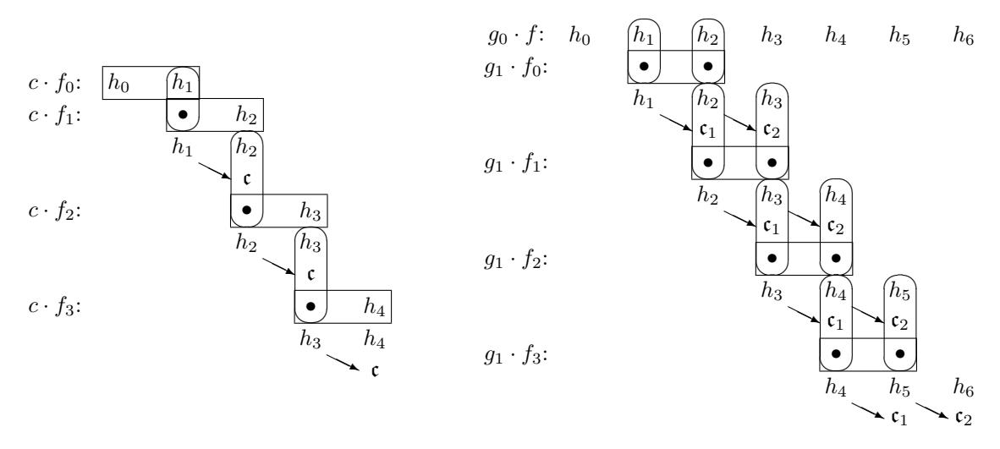

# Efficient Arithmetic in (pseudo-)Mersenne Prime Order Fields

Kaushik Nath and Palash Sarkar

Applied Statistics Unit Indian Statistical Institute 203, B. T. Road Kolkata - 700108 India {kaushikn r,palash}@isical.ac.in

#### Abstract

Elliptic curve cryptography requires efficient arithmetic over the underlying field. In particular, fast implementation of multiplication and squaring over the finite field is required for efficient projective coordinate based scalar multiplication as well as for inversion using Fermat's little theorem. In the present work we consider the problem of obtaining efficient algorithms for field multiplication and squaring. From a theoretical point of view, we present a number of algorithms for multiplication/squaring and reduction which are appropriate for different settings. Our algorithms collect together and generalise ideas which are scattered across various papers and codes. At the same time, we also introduce new ideas to improve upon existing works. A key theoretical feature of our work, which is not present in previous works, is that we provide formal statements and detailed proofs of correctness of the different reduction algorithms that we describe. On the implementation aspect, a total of fourteen primes are considered, covering all previously proposed cryptographically relevant (pseudo-)Mersenne prime order fields at various security levels. For each of these fields, we provide 64-bit assembly implementations of the relevant multiplication and squaring algorithms targeted towards two different modern Intel architectures. We were able to find previous 64-bit implementations for six of the fourteen primes considered in this work. On the Haswell and Skylake processors of Intel, for all the six primes where previous implementations are available, our implementations outperform such previous implementations.

Keywords: field multiplication, field squaring, reduction, inversion, constant-time computation, Fermat's little theorem, elliptic curve cryptography, scalar multiplication.

## 1 Introduction

Elliptic curve cryptography was independently introduced by Koblitz [\[16\]](#page-36-0) and Miller [\[19\]](#page-36-1), and later cryptography based on hyper-elliptic curves was introduced by Koblitz [\[17\]](#page-36-2). Over the last three decades, there has been a tremendous amount of research on various aspects of secure and efficient curve based cryptography.

Presently, there are several different approaches for choosing a suitable curve. The basic task for all such approaches is to choose the underlying finite field. This field can either have composite or prime order. Further, for a prime order field, the prime may be a Mersenne or a pseudo-Mersenne prime. Some well known examples are the Mersenne prime 2<sup>127</sup> − 1 used in [\[12,](#page-35-0) [5,](#page-35-1) [8,](#page-35-2) [10\]](#page-35-3), and the pseudo-Mersenne primes 2<sup>255</sup> − 19 and 2<sup>256</sup> − 2 <sup>32</sup> − 977 [\[24\]](#page-36-3) used in Curve25519 [\[3\]](#page-35-4) and the Bitcoin [\[20\]](#page-36-4) protocol respectively. The NIST proposals [\[11\]](#page-35-5), on the other hand, provide examples of unstructured primes and efficient implementation of arithmetic using such primes have been studied in [\[14\]](#page-35-6). In this work, we will focus only on Mersenne and pseudo-Mersenne prime order fields.

Two basic applications of curve-based cryptography are key agreement and signature schemes. Both of these schemes require scalar multiplications. The computation consists of two steps. In the first step, the scalar multiplication is computed using projective coordinates and in the second step, an inversion in the underlying finite field is required to convert the output to affine coordinates.

Computing scalar multiplication using projective coordinates requires efficient algorithms for finite field arithmetic, especially multiplication and squaring. For performing an inversion, there are two approaches. Using Fermat's little theorem (FLT), an inversion can be computed using an exponentiation which again requires efficient algorithms for multiplication and squaring. Alternatively, inversion can be computed using Euclid's algorithm which requires additions and subtractions.

## Our Contributions

The core technical contribution of the present work is to carry out a comprehensive study of multiplication and squaring algorithms over fields whose order is either a Mersenne or a pseudo-Mersenne prime. We concentrate on single multiplication and squaring algorithms and so the aspect of simultaneous multiplications using single instruction multiple data (SIMD) instructions is not considered in the present work.

Field multiplication and squaring have two broad phases, namely, a multiplication phase and a reduction phase. Of the two, the reduction phase is relatively more complex. Let the prime p = 2<sup>m</sup> − δ. Elements of F<sup>p</sup> fit within an m-bit string. Such an m-bit string is formatted into κ binary strings where the first κ−1 strings are each η bits long and the last string is ν bits long with 0 < ν ≤ η. Following the usual convention, we call each of the individual κ binary strings to be limbs. For 64-bit arithmetic, each limb fits into a 64-bit word. Two kinds of representations have been considered in the literature. In the first kind of representation, η = 64, and so the limbs (except possibly for the last one) are packed tightly into 64-bit words. In the second kind of representation, η < 64, and so the 64-bit words containing the limbs have some free or redundant bits. We call the first kind of representation to be saturated limb representation and the second kind to be unsaturated limb representation.

We provide various algorithms for multiplication/squaring and reduction using both the saturated and the unsaturated limb representations. A brief summary of these contributions is as follows.

Multiplication/squaring for saturated limb representation: We describe two sets of algorithms with each set consisting of an algorithm for multiplication and one for squaring. The first set of algorithms (which we call mulSLDCC/sqrSLDCC) generalizes the multiplication/squaring algorithms in the Intel white papers [\[23,](#page-36-5) [22\]](#page-36-6) to work for 64i-bit integers for any i ≥ 2. These algorithms use two independent carry chains and can be implemented in the newer generation of processors. The second set of algorithms (which we call mulSLa/sqrSLa) do not use double carry chains and can be implemented across all generation of processors. These algorithms combine an initial step of the reduction with the multiplication. The idea behind mulSLa/sqrSLa have not appeared earlier in the literature.

Multiplication/squaring for unsaturated limb representation: We describe two sets of algorithms. The first set of algorithms (which we call mulUSL/sqrUSL) generalize the ideas used in [\[6\]](#page-35-7) for the prime 2<sup>255</sup> − 19. These algorithms, however, lead to overflow for certain primes such as the Bitcoin prime 2<sup>256</sup> − 2 <sup>32</sup> − 977. To handle such overflow issues, we describe a second set of algorithms (which we call mulUSLa/sqrUSLa) which have not appeared earlier in the literature.

Reduction for saturated limb representation: We describe four reduction algorithms, namely, reduceSLMP, reduceSLPMP, reduceSLPMPa and reduceSL. Algorithms reduceSLMP, reduceSLPMP and reduceSLPMPa reduce the outputs of mulSLDCC/sqrSLDCC. Specifically, reduceSLMP works for all Mersenne primes and is a generalization of the ideas used in [\[5\]](#page-35-1) for the prime 2<sup>127</sup> − 1. Algorithm reduceSLPMP works for a large class of pseudo-Mersenne primes and has not appeared earlier. Algorithm reduceSLPMPa works for a large class of pseudo-Mersenne primes and is a generalization of the ideas for 4-limb representation used in [\[6\]](#page-35-7) for the prime 2<sup>255</sup> − 19. Algorithm reduceSL reduces the output mulSLa/sqrSLa and has not appeared earlier in the literature.

Reduction for unsaturated limb representation: We describe three reduction algorithms, namely, reduceUSL, reduceUSLA and reduceUSLB. Algorithm reduceUSL works for a large class of pseudo-Mersenne primes and is a generalization of the ideas for 5-limb representation used in [\[9\]](#page-35-8) [1](#page-1-0) for the prime 2<sup>255</sup> − 19. For certain primes, reduceUSLA is more efficient than reduceUSL and generalizes ideas used in [\[6\]](#page-35-7) for the prime 2<sup>255</sup> − 19. For certain other primes, reduceUSLB is more efficient than both reduceUSL and reduceUSLA. The idea behind reduceUSLB has not appeared earlier in the literature.

In Table [1,](#page-2-0) for each algorithm presented in this work, we state whether it is new or, the earlier work that it generalizes.

There are two key theoretical features of our work.

<span id="page-1-0"></span><sup>1</sup>See also [https://github.com/floodyberry/supercop/tree/master/crypto\\_scalarmult/curve25519/amd64-51](https://github.com/floodyberry/supercop/tree/master/crypto_scalarmult/curve25519/amd64-51).

- 1. While previous works have developed code for a single prime, we describe the algorithms in their full generality.
- 2. For each reduction algorithm, we state precise theorems about their correctness and provide detailed proofs of correctness. Such formal treatment of correctness of reduction algorithms does not appear earlier in the literature.

The second aspect of our work is in the efficient implementation of the various multiplication and squaring algorithms.

Assembly implementation: All the algorithms described in this paper, have been implemented in 64-bit assembly for Intel processors. The implementations are divided into two groups, namely maa and maax. For implementations in the maa group, the only arithmetic instructions used are mul, imul, add and adc, while for implementations in the maax group, the arithmetic instructions mulx, adcx and adox are also used. These second set of instructions are available from the Broadwell processor onwards.

<span id="page-2-0"></span>Library for field-arithmetic: Through our efficient 64-bit assembly implementations, we provide a library of field multiplication and squarings in cryptographically relevant prime order fields targeting the modern Intel processors. The efficient field arithmetic library can be used for the development of fast projective coordinate based scalar multiplication over appropriate elliptic curves.

| algorithm         | feature                 |
|-------------------|-------------------------|
| mulSLDCC/sqrSLDCC | generalizes [23, 22]    |
| mulSLa/sqrSLa     | new                     |
|                   |                         |
| mulUSL/sqrUSL     | generalizes [6]         |
| mulUSLa/sqrUSLa   | new                     |
| reduceSLMP        | generalizes [5]         |
| reduceSLPMP       | new                     |
| reduceSLPMPa      | generalizes [6, 4-limb] |
| reduceSL          | new                     |
| reduceUSL         | generalizes [9, 5-limb] |
| reduceUSLA        | generalizes [6, 5-limb] |
| reduceUSLB        | new                     |

Table 1: The various algorithms for multiplication/squaring and reduction described in this paper.

We have considered a total of fourteen primes which include all previously proposed cryptographically relevant (pseudo-)Mersenne primes at various security levels. These primes are shown in Table [2.](#page-3-0) For the prime 2<sup>255</sup> − 19, we have found earlier implementations of both maa and maax types and for five of the other primes, we have found implementations of maa type. So, for eight of the fourteen primes, we provide the first maa type implementation and for thirteen of the fourteen primes, we provide the first maax type implementations.

Timings of the field operations for the new implementations and the existing implementations have been measured on the Haswell and Skylake processors. For each prime where a previous implementation is available, our implementation improves upon such previous implementations. A summary of the various speed-ups that were observed is as follows. Further details are provided later.

maa type implementations:

```
On Haswell: Speed-ups of about 10%, 3%, 4%, 36%, 2% and 18% were observed for the primes
   2
    127 − 1, 2251 − 9, 2255 − 19, 2256 − 2
                                        32 − 977, 2266 − 3 and 2521 − 1 respectively.
```

On Skylake: Speed-ups of about 10%, 12%, 4%, 28%, 8% and 16% were observed for the primes 
$$2^{127} - 1$$
,  $2^{251} - 9$ ,  $2^{255} - 19$ ,  $2^{256} - 2^{32} - 977$ ,  $2^{266} - 3$  and  $2^{521} - 1$  respectively.

maax type implementations: On the Skylake processor, a speed-up of about 26% was observed for the prime 2<sup>255</sup> − 19.

The speed-ups obtained for 2<sup>255</sup> − 19 and 2<sup>256</sup> − 2 <sup>32</sup> − 977 are particularly important. The prime 2 <sup>255</sup> − 19 defines the underlying field for the famous Curve25519 while the prime 2<sup>256</sup> − 2 <sup>32</sup> − 977 defines the underlying field for the curve secp256k1 which is used in the Bitcoin protocol. The above

mentioned improvements arises from use of new reduction algorithms as well as hand optimisations of the corresponding assembly codes.

Source codes for all our implementations are publicly available at the following link.

```
https://github.com/kn-cs/pmp-farith.
```

## Structure of the Paper

For ease of reference, we provide a brief summary of the relevant Intel instructions in Section [2.](#page-3-1) The background on representation of elements of F<sup>p</sup> and the exponentiation based inversion algorithm are covered in Section [3.](#page-4-0) An overview of the various algorithms presented in this paper is provided in Section [4.](#page-6-0) Algorithms for integer multiplication and squaring using the saturated limb representation and using double independent carry chains are given in Section [5.](#page-9-0) Corresponding reduction algorithms along with formal statements of correctness are presented in Section [6.](#page-10-0) Multiplication using unsaturated limb representation is considered in Section [7](#page-21-0) and the corresponding reduction algorithms are described in Section [8.](#page-24-0) Multiplication and reduction using saturated limb representation without using double carry chains are described in Section [9.](#page-31-0) Detailed timing results of the field operations and their consequences are presented in Section [10.](#page-32-0) Finally, Section [11](#page-34-0) concludes the paper.

<span id="page-3-0"></span>

| prime                    | curve(s)                            |
|--------------------------|-------------------------------------|
| 127 − 1<br>2             | Kummer2 [5], FourQ [10]             |
| 221 − 3<br>2             | M-221 [1]                           |
| 222 − 117<br>2           | E-222 [1]                           |
| 251 − 9<br>2             | Curve1174 [1], KL2519(81,20) [15]   |
| 255 − 19<br>2            | Curve25519 [3], KL25519(82,77) [15] |
| 256 − 2<br>32 − 977<br>2 | secp256k1 [24]                      |
| 266 − 3<br>2             | KL2663(260,139) [15]                |
| 382 − 105<br>2           | E-382 [1]                           |
| 383 − 187<br>2           | M-383 [1]                           |
| 414 − 17<br>2            | Curve41417 [4]                      |
| 511 − 187<br>2           | M-511 [1]                           |
| 512 − 569<br>2           | -                                   |
| 521 − 1<br>2             | P-521 [1], E-521 [1]                |
| 607 − 1<br>2             | -                                   |

Table 2: The primes considered in this work.

## <span id="page-3-1"></span>2 A Brief Summary of Relevant Intel Instructions

The 64-bit architecture of the Intel x86 processors has sixteen 64-bit registers, namely rax, rbx, rcx, rdx, rsi, rdi, rsp, rbp, r8, r9, r10, r11, r12, r13, r14, r15. Except rsp (which is the stack pointer), all other registers can be used for storing data and operating on them. There is a register named FLAGS, which consists of various available flags. We note two of these flags. Bit 0 of FLAGS is the carry flag CF and bit 11 of FLAGS is the overflow flag OF. Integer addition and multiplication affect the states of these two flags and are relevant to our work.

The basic 64-bit arithmetic operations in the x86 processors are mul, imul, add and adc. From the Broadwell processor onwards, Intel also provides another set of arithmetic instructions, namely, mulx, adcx and adox. The structure of multiplication and addition instructions and their operations are as follows.

```
mul src2; rdx : rax ← src2 · rax.
imul src1, src2, dst; dst ← lsb64(src1 · src2).
add src, dst; dst ← src + dst.
adc src, dst; dst ← src + dst + CF.
mulx src1, dst`, dsth; dsth : dst` ← src1 · rax.
adcx src, dst; dst ← src + dst + CF.
adox src, dst; dst ← src + dst + OF.
```

The operation mulx is available from the Haswell processor onwards; adcx and adox are available from the Broadwell processor onwards. Processors previous to Haswell had only mul, imul, add and adc.

The effect on the carry and the overflow flags for the above mentioned arithmetic operations are the following.

- mul, imul, add and adc affect both CF and OF;
- mulx affects neither CF nor OF;
- adcx affects only CF but, not OF;
- adox affects only OF but, not CF.

Suppose there is an interleaved sequence of multiplications and additions to be performed. The additions generate carries which need to be taken into consideration for subsequent additions. The mul and imul instructions affect the carry flag and so the carry out of the previous addition gets lost. On the other hand, a sequence of mulx and adc instructions can efficiently perform such an interleaved sequence of multiplications and additions. The mulx instruction does not affect the carry flag and so the sequence of adc instructions can carry out the instructions using a single carry chain.

The combination of mulx, adcx and adox provides a more powerful tool. As mentioned above, the mulx instruction does not affect either CF or OF. A sequence of adcx instructions proceeds by using a carry chain using only CF, while a sequence of adox instructions proceeds by using a carry chain using only OF. So, in effect, it is possible to use two independent carry chains which we call double carry chain. This greatly facilitates arithmetic computations as we will see later.

Remark: Let x be an `-bit number and η ≤ `. The operation x mod 2<sup>η</sup> returns lsbη(x), i.e., the η least significant bits of x, whereas the operation bx/2 η c returns the ` − η most significant bits of x. It will be helpful to keep this simple observation in mind while going through the various algorithms given later.

## <span id="page-4-0"></span>3 Representation of Elements in F<sup>p</sup>

Let η be a positive integer and θ = 2<sup>η</sup> . Consider a polynomial

$$h(\theta) = h_0 + h_1 \theta + \dots + h_{k-1} \theta^{k-1} \tag{1}$$

where h0, h1, . . . , hk−<sup>1</sup> are non-negative integers. The polynomial h(θ) is given by the vector of coefficients (h0, h1, . . . , hk−1). We will call these coefficients to be the limbs of the polynomial. Note that we do not insist that the coefficients are less than 2<sup>η</sup> ; in fact, at intermediate steps, the coefficients will not necessarily be less than 2<sup>η</sup> .

Given positive integers m and η, let κ and ν be positive integers such that

<span id="page-4-1"></span>
$$m = \eta(\kappa - 1) + \nu \quad \text{with } 0 < \nu \le \eta.$$
 (2)

Given m and η, the values of κ and ν are uniquely determined. An integer in the range [0, . . . , 2 <sup>m</sup> −1] can be represented by an m-bit string. From [\(2\)](#page-4-1), an m-bit string can be considered to be the concatenation of κ strings, where the first κ − 1 strings are each η bits long while the last string is ν bits long. So, an m-bit integer can be represented as h(θ) = h<sup>0</sup> + h1θ + · · · + hκ−1θ <sup>κ</sup>−<sup>1</sup> where 0 ≤ h0, h1, . . . , hκ−<sup>1</sup> < 2 η and 0 ≤ hκ−<sup>1</sup> < 2 ν . As mentioned above, each of the κ individual strings will be referred to as a limb. Given an m-bit integer, by a (κ, η, ν)-representation we will mean a κ-limb representation, where the first κ − 1 limbs are η bits long, the last limb is ν bits long and m = η(κ − 1) + ν.

<span id="page-4-2"></span>Proposition 1. Let x and y be two m-bit integers both having a (κ, η, ν)-representation and let z = x·y. Then z has a (κ 0 , η, ν<sup>0</sup> )-representation where

$$\kappa' = 2\kappa - 1, \ \nu' = 2\nu \ if \ 0 < \nu \le \eta/2; \ and \ \kappa' = 2\kappa, \ \nu' = 2\nu - \eta \ if \ \eta/2 < \nu \le \eta.$$

Proof. We have m = η(κ − 1) + ν. The number of bits in z is at most 2m and we may write 2m = η(2κ − 2) + 2ν. If 0 < ν ≤ η/2, then z has a (2κ − 1)-limb representation where the first 2κ − 2 limbs are each η bits long and the last limb is ν <sup>0</sup> = 2ν bits long. On the other hand, if η/2 < ν ≤ η, then we may write 2m = η(2κ−1) + 2ν −η and so z has a 2κ-limb representation where the first 2κ−1 limbs are each η bits long and the last limb is 2ν − η bits long. (Note that η/2 < ν ≤ η implies 0 < 2ν − η ≤ η.)

Consider a (κ, η, ν)-representation of an m-bit integer w. Suppose that ω-bit arithmetic will be used for implementation. Using ω-bit arithmetic, w will be represented by κ ω-bit words w0, . . . , wκ−<sup>1</sup> such that the binary representation of w is given by

$$|\mathsf{lsb}_{\nu}(w_{\kappa-1})||\mathsf{lsb}_{\eta}(w_{\kappa-2})||\cdots||\mathsf{lsb}_{\eta}(w_0). \tag{3}$$

Here lsbi(x) denotes the i least significant bits of the binary string x and 0 < ν ≤ η ≤ ω. Depending on the value of η, we identify two kinds of representation.

Saturated limb representation: In this case η = ω. So, each of the ω-bit words w0, w1, . . . , wκ−<sup>2</sup> are "saturated" in the sense that there are no leading redundant bits in these words. The ω-bit word wκ−<sup>1</sup> is saturated or unsaturated depending on whether ν = η or ν < η respectively.

Unsaturated limb representation: In this case η < ω. So, each of the ω-bit words w0, w1, . . . , wκ−<sup>1</sup> are "unsaturated" in the sense that they contain some leading redundant bits. The word wκ−<sup>1</sup> contains the same or more leading redundant bits according as whether ν = η or ν < η respectively.

Remark: In this work, we will consider 64-bit arithmetic and so ω = 64. The general ideas of the algorithms apply to arbitrary values of ω. The actual value of ω = 64 is used at some places in the (non-)overflow analysis of the correctness proofs.

The primes p that we consider are of the form

$$p = 2^m - \delta, \tag{4}$$

where δ is sufficiently small. Given (κ, η, ν)-representation of m-bit integers, we have

<span id="page-5-2"></span>
$$2^{\eta(\kappa-1)+\nu} = 2^m \equiv \delta \bmod p. \tag{5}$$

For future reference, we define

$$c_p = 2^{\eta - \nu} \delta. \tag{6}$$

The different values of m, δ, κ, η and ν for the various primes p considered in this work are given in Table [3](#page-5-0) [2](#page-5-1) . For each prime, two sets of values of κ, η and ν are provided, one using saturated limb representation and the other using unsaturated limb representation.

The main goal of obtaining a representation of m of the form [\(2\)](#page-4-1) is to minimize the value of κ. As the value of κ grows, so does the complexity of multiplication. Clearly the value of κ is minimized for the saturated limb representations. An issue with the saturated limb representations is that each limb has the maximum possible size and so handling overfull issues can be complex. It is for this reason that one considers the unsaturated limb representations. For the unsaturated limb representations, in Table [3](#page-5-0) there is a column labeled "type". This column refers to the particular type of reduction algorithm which applies best to the corresponding prime and will be explained in details later.

<span id="page-5-0"></span>

| prime                    | m<br>δ |               | unsaturated limb |    |    | saturated limb |    |    |    |
|--------------------------|--------|---------------|------------------|----|----|----------------|----|----|----|
|                          |        |               | κ                | η  | ν  | type           | κ  | η  | ν  |
| 127 − 1<br>2             | 127    | 1             | 3                | 43 | 41 | A              | 2  | 64 | 63 |
| 221 − 3<br>2             | 221    | 3             | 4                | 56 | 53 | A              | 4  | 64 | 29 |
| 222 − 117<br>2           | 222    | 117           | 4                | 56 | 54 | A              | 4  | 64 | 30 |
| 251 − 9<br>2             | 251    | 9             | 5                | 51 | 47 | A              | 4  | 64 | 59 |
| 255 − 19<br>2            | 255    | 19            | 5                | 51 | 51 | A              | 4  | 64 | 63 |
| 256 − 2<br>32 − 977<br>2 | 256    | 32 + 977<br>2 | 5                | 52 | 48 | A              | 4  | 64 | 64 |
| 266 − 3<br>2             | 266    | 3             | 5                | 54 | 50 | A              | 5  | 64 | 10 |
| 382 − 105<br>2           | 382    | 105           | 7                | 55 | 52 | B              | 6  | 64 | 62 |
| 383 − 187<br>2           | 383    | 187           | 7                | 55 | 53 | B              | 6  | 64 | 63 |
| 414 − 17<br>2            | 414    | 17            | 8                | 52 | 50 | A              | 7  | 64 | 30 |
| 511 − 187<br>2           | 511    | 187           | 9                | 57 | 55 | G              | 8  | 64 | 63 |
| 512 − 569<br>2           | 512    | 569           | 9                | 57 | 56 | G              | 8  | 64 | 64 |
| 521 − 1<br>2             | 521    | 1             | 9                | 58 | 57 | A              | 9  | 64 | 9  |
| 607 − 1<br>2             | 607    | 1             | 10               | 61 | 58 | G              | 10 | 64 | 31 |

Table 3: The primes considered in this work and their saturated and unsaturated limb representations.

Suppose m-bit integers have a (κ, η, ν)-representation and θ = 2<sup>η</sup> . The prime p = 2<sup>m</sup>−δ is represented as the polynomial p(θ), defined as

$$\mathfrak{p}(\theta) = p_0 + p_1 \theta + \dots + p_{\kappa - 1} \theta^{\kappa - 1}, \tag{7}$$

where 
$$p_0 = 2^{\eta} - \delta$$
,  $p_1 = p_2 = \dots = p_{\kappa-2} = 2^{\eta} - 1$ , and  $p_{\kappa-1} = 2^{\nu} - 1$ .

<span id="page-5-1"></span><sup>2</sup>For the prime 2<sup>414</sup> − 17 an unsaturated limb representation with (κ = 7, η = 60, ν = 54) is also possible. The corresponding multiplication, squaring and inversion algorithms are then mulUSLa, sqrUSLa and invUSLa respectively. We discuss this idea in Section [7.1.](#page-22-0)

An element in  $\mathbb{F}_p$  is represented as a polynomial  $f(\theta)$  of degree at most  $\kappa - 1$ , defined as

$$f(\theta) = f_0 + f_1 \theta + \dots + f_{\kappa - 1} \theta^{\kappa - 1}, \tag{8}$$

where  $0 \le f_0, f_1, \dots, f_{\kappa-1} < 2^{\eta}$  and  $0 \le f_{\kappa-1} < 2^{\nu}$ .

It should be noted that the polynomials  $f(\theta)$  are in one-one correspondence with the integers  $0,1,\ldots,2^m-1$ . This leads to a non-unique representation of  $\delta$  elements in  $\mathbb{F}_p$ , i.e., the elements  $0,1,\ldots,\delta-1$  are also represented as  $2^m-\delta,2^m-\delta+1,\ldots,2^m-1$ . The non-unique representation does not affect the correctness of the computations. At the end of the computation, the final result is converted to a unique representation using a simple algorithm. This procedure is shown in Algorithm 1.

<span id="page-6-1"></span>**Algorithm 1** Converts to unique representation in  $\mathbb{F}_p$ , where  $p = 2^m - \delta$ .

```
1: function makeUnique(h^{(0)}(\theta))
  2: input: h^{(0)}(\theta) = h_0^{(0)} + h_1^{(0)}\theta + \dots + h_{\kappa-1}^{(0)}\theta^{\kappa-1}, where 0 \le h_0^{(0)}, h_1^{(0)}, \dots, h_{\kappa-2}^{(0)} < 2^{\eta} and 0 \le h_{\kappa-1}^{(0)} < 2^{\nu}.

3: output: h^{(1)}(\theta) = h_0^{(1)} + h_1^{(1)}\theta + \dots + h_{\kappa-1}^{(1)}\theta^{\kappa-1}, where 0 \le h_0^{(1)} < 2^{\eta} - \delta, 0 \le h_1^{(1)}, h_2^{(1)}, \dots, h_{\kappa-2}^{(1)} < 2^{\eta},
           0 \le h_{\kappa-1}^{(0)} < 2^{\nu} and h^{(1)}(\theta) \equiv h^{(0)}(\theta) \mod p.
                    u \leftarrow h_0^{(0)} \ge p_0
  4:
                     for i \leftarrow 1 to \kappa - 2 do
u \leftarrow u \& (h_i^{(0)} = 2^{\eta} - 1)
  5:
  6:
  7
                    end for u \leftarrow u \& (h_{\kappa-1}^{(0)} = p_{\kappa-1}) v \leftarrow -u; u \leftarrow \neg v h_0^{(1)} \leftarrow (h_0^{(0)} \& u) \mid ((h_0^{(0)} - p_0) \& v) for i \leftarrow 1 to \kappa - 1 do h_i^{(1)} \leftarrow (h_i^{(0)} \& u) \mid (0 \& v)
  8:
  9:
10
11:
13:
                     return h^{(1)}(\theta) = h_0^{(1)} + h_1^{(1)}\theta + \dots + h_{\kappa-1}^{(1)}\theta^{\kappa-1}
15: end function.
```

## 3.1 Inversion in $\mathbb{F}_p$

Fermat's little theorem states that for a prime p and any non-zero  $a \in \mathbb{F}_p$ ,  $a^{p-1} \equiv 1 \mod p$ . So,  $a^{p-2}$  is the inverse of a in  $\mathbb{F}_p$ . Thus, the computation of inverse of any non-zero element in  $\mathbb{F}_p$  reduces to the problem of exponentiating a to the power p-2. The standard way to compute this exponentiation is to use the square-and-multiply algorithm. Since, the value p-2 is fixed, the numbers of squarings and multiplications are fixed and do not depend on the value of a. So, if squaring and multiplication in  $\mathbb{F}_p$  are constant time algorithms, then the exponentiation based inversion is also a constant time algorithm.

Till recently, FLT based inversion was considered to be the more efficient of the two methods for inversion in (pseudo-)Mersenne prime order fields. On the face of it, this seems counter-intuitive since the Fermat based approach uses multiplications and squarings, whereas the Euclid based approach uses only additions and logical shifts. The reason for Fermat based approach being faster for (pseudo-)Mersenne primes seems to be based on two factors, namely, the number of iterations in the Euclid based approach is more and the availability of very fast multiplication instructions in modern processors. Defying this reasoning, a recent work by Bernstein and Yang [2] showed that the Euclid based approach could indeed be faster for (pseudo-)Mersenne primes.

Remark: In the rest of the paper, we will focus entirely on field multiplication and squaring. In comparison, field addition, negation and subtraction are much faster. We note one important difference in these operations which arises from the representation of the elements. For saturated limb representations, field addition/negation/subtraction can be implemented using add/adc/sub/sbb. On the other hand, for unsaturated limb representations, implementation of these operations also require shift operations.

## <span id="page-6-0"></span>4 Overview of the Algorithms

All algorithms in this work are described keeping 64-bit arithmetic in mind.

## Meanings of various abbreviations:

SL : saturated limb; USL : unsaturated limb; SCC : single carry chain;

DCC : double (independent) carry chains;

MP : Mersenne prime;

PMP : pseudo-Mersenne prime;

maa : algorithms implemented using only mul, imul, add and adc;

maax : algorithms which also use mulx, adcx and adox.

Brief descriptions of the tasks of the different algorithms that we consider are given below.

## Algorithms for the saturated limb representation:

mulSCC: Multiply a word whose value is less than 2<sup>64</sup> to an integer given by a saturated limb representation using a single carry chain.

mulSLDCC: Multiply two integers given in saturated limb representations using double (independent) carry chains.

sqrSLDCC: Square an integer given in saturated limb representation using double carry chains.

reduceSLMP: Reduction algorithm to be applied to the outputs of mulSLDCC or sqrSLDCC when the underlying prime is a Mersenne prime.

reduceSLPMP: Reduction algorithm to be applied to the outputs of mulSLDCC or sqrSLDCC when the underlying prime is a pseudo-Mersenne prime.

reduceSLPMPa: A partial reduction algorithm to be applied to the outputs of mulSLDCC or sqrSLDCC when the underlying prime is a pseudo-Mersenne prime.

mulSLa: Multiply two integers given in saturated limb representations and perform an initial step of the reduction.

sqrSLa: Square an integer given in saturated limb representation and perform an initial step of the reduction.

reduceSL: A generic reduction algorithm to be applied to the outputs of mulSLa/sqrSLa.

farith-SLa: Denotes the algorithm triplet which computes a field multiplication, squaring and inverse using mulSLa, sqrSLa and reduceSL.

farith-SLMP: Denotes the algorithm triplet which computes a field multiplication, squaring and inverse using mulSL, sqrSL and reduceSLMP. See the remark below for mulSL and sqrSL.

farithx-SLMP: Denotes the algorithm triplet which computes a field multiplication, squaring and inverse using mulSLDCC, sqrSLDCC and reduceSLMP.

farithx-SLPMP: Denotes the algorithm triplet which computes a field multiplication, squaring and inverse using mulSLDCC, sqrSLDCC and reduceSLPMP.

Remark: The output of mulSLDCC is the product of the two integers and the output of sqrSLDCC is the square of an integer. Algorithms mulSLDCC/sqrSLDCC utilize double carry chains to perform the computations. The product of two integers in the saturated limb representation can also be performed without using double carry chains and similarly, the square of an integer in the saturated limb representation can be performed without using double carry chains. For the prime 2<sup>255</sup> −19, the 4-limb algorithms in [\[6\]](#page-35-7) perform such computations. The 4-limb algorithms in [\[6\]](#page-35-7) can be extended to work for arbitrary limb representations. We will denote the resulting multiplication and squaring algorithms by mulSL and sqrSL. Note that mulSL/sqrSL are different from mulSLa/sqrSLa since mulSLa/sqrSLa also perform an initial step of reduction while this is not done by mulSL/sqrSL.

#### Algorithms for the unsaturated limb representation:

- mulUSL: Multiply two integers given in unsaturated limb representations and perform an initial step of the reduction.
- sqrUSL: Square an integer given in unsaturated limb representation and perform an initial step of the reduction.
- mulUSLa: Multiply two integers given in unsaturated limb representations and perform an initial step of the reduction. This is a variant of mulUSL which is to be used when mulUSL leads to overflows.
- sqrUSLa: Square an integer given in unsaturated limb representation and perform an initial step of the reduction. This is a variant of sqrUSL which is to be used when sqrUSL leads to overflows.
- reduceUSL: A generic reduction algorithm to be applied to the outputs of mulUSL/sqrUSL or mulUSLa/sqrUSLa.
- reduceUSLA: An algorithm to be applied to the outputs of mulUSL/sqrUSL or mulUSLa/sqrUSLa when the prime is of type A. For such primes, reduceUSLA is more efficient than reduceUSL.
- reduceUSLB: An algorithm to be applied to the outputs of mulUSL/sqrUSL or mulUSLa/sqrUSLa when the prime is of type B. For such primes, reduceUSLB is more efficient than reduceUSL or reduceUSLA.
- farith-USL: Denotes the algorithm triplet which computes a field multiplication, squaring and inverse using mulUSL, sqrUSL and reduceUSL.
- farith-USLA: Denotes the algorithm triplet which computes a field multiplication, squaring and inverse using mulUSLA, sqrSLA and reduceUSLA.
- farithx-USLB: Denotes the algorithm triplet which computes a field multiplication, squaring and inverse using mulUSLB, sqrUSLB and reduceUSLB.
- farithx-USLa: Denotes the algorithm triplet which computes a field multiplication, squaring and inverse using mulUSLa, sqrUSLa and reduceUSLA.

The implementations of the various algorithms are divided into two groups.

- Algorithms in the maa setting: The algorithms farith-SLa, farith-USL, farith-USLA, farith-USLB and farith-USLa have been implemented in assembly using only the instructions mul, imul, add and adc to do arithmetic. These implementations are downward compatible with previous generations of Intel processors.
- Algorithms in the maax setting: The implementations of the algorithms farithx-SLMP and farithx-SLPMP also use the instructions mulx, adcx and adox for doing arithmetic. These implementations work on the Broadwell and later generation processors.

Descriptions of the algorithms. We describe a number of algorithms. The descriptions of the algorithms are at a fairly high level. They are provided in a form which make it easy to understand the algorithms and present the proofs of correctness. For the various reduction algorithms, the input is considered to be a polynomial h (0)(θ), with θ = 2<sup>η</sup> , and the output is h (k) (θ) for some k ≥ 1, such that

$$h^{(0)}(\theta) \equiv h^{(1)}(\theta) \equiv \dots \equiv h^{(k)}(\theta) \bmod p.$$

Conceptually, the algorithm proceeds in stages where the i-th stage computes h (i) (θ) from h (i−1)(θ) for i = 1, 2, . . . , k. The proofs of correctness show that h (i) (θ) ≡ h (i−1)(θ) mod p and also provide precise bounds on the coefficients of h (i) (θ). In order to define the polynomials h (i) (θ), the algorithms use certain statements which simply copy some of the coefficients of h (i−1)(θ) to h (i) (θ). Also, for ease of reference in the proofs, certain temporary variables are indexed by the loop counter creating the impression that a number of such variables are required, whereas in actual implementation one variable is sufficient.

For actual assembly implementation, it is desirable to use the registers as much as possible and also to avoid using load/store instructions to the extent possible. As such, the strict distinction between the various stages of the algorithm is not maintained so that some of the copy statements become redundant and are not implemented. Also, the use of temporary variables are minimized as much as possible and such variables are reused whenever feasible. Modulo such routine simplifications, the implementations follow the general flow of the algorithms. For each of the algorithms, we provide efficient assembly implementations for a number of primes. Studying the code together with the algorithm descriptions will make the associations between them clear and lead to a better understanding of the code.

# <span id="page-9-0"></span>5 Integer Multiplication/Squaring for Saturated Limb Representation Using Independent Carry Chains

Let c be an  $\eta$ -bit constant,  $\theta = 2^{\eta}$  and  $f(\theta)$  be a polynomial in  $\theta$  of degree at most d-1 whose coefficients are from  $\mathbb{Z}_{\theta}$ . A basic step in the multiplication and squaring algorithms is the computation  $c \cdot f(\theta)$ . The result is a polynomial  $h(\theta)$  of degree at most d and whose coefficients are from  $\mathbb{Z}_{\theta}$ . Function mulSCC given in Algorithm 2 performs this computation.

## <span id="page-9-1"></span>**Algorithm 2** Multiply $f(\theta)$ with an $\eta$ -bit constant c; $\theta = 2^{\eta}$ , $\eta = 64$ .

```
1: function mulSCC(f(\theta), c)
 2: input: f(\theta) = f_0 + f_1\theta + \dots + f_{d-1}\theta^{d-1}, c, where 0 \le c, f_0, f_1, \dots, f_{d-1} < 2^{\eta} and d \ge 1.
      output: h(\theta) = h_0 + h_1 \theta + \dots + h_d \theta^d = c \cdot f, where 0 \le h_0, h_1, \dots, h_d < 2^{\eta}.
            t \leftarrow c \cdot f_0; h_0 \leftarrow t \mod 2^{\eta}; h_1 \leftarrow \lfloor t/2^{\eta} \rfloor
            \mathfrak{c} \leftarrow 0
 5:
            for i \leftarrow 1 to d-1 do
 6:
                  t \leftarrow c \cdot f_i; \, h_{i+1} \leftarrow |t/2^{\eta}|
 7:
                   t \leftarrow h_i + t \bmod 2^{\eta} + \mathfrak{c}; h_i \leftarrow t \bmod 2^{\eta}; \mathfrak{c} \leftarrow \lfloor t/2^{\eta} \rfloor
 8:
            end for
 9:
            h_d \leftarrow h_d + \mathfrak{c}
10:
            return h(\theta) = h_0 + h_1\theta + \dots + h_d\theta^d
11:
12: end function.
```

The multiplication in Step 4 of mulSCC can be completed using a single mulx operation. The for loop in Steps 6 to 9 uses an interleaved sequence of multiplications and additions. The additions involve a carry propagation through the variable  $\mathfrak c$ . Step 4 can be completed using a single mulx instruction while Step 5 can be completed using an add instruction. The single bit value of the carry variable  $\mathfrak c$  is carried through CF. Note that mulx does not affect CF and so it is possible to use add instructions to implement the carry chain. Since the mul instruction affects CF, using mul instead of mulx would not have allowed an efficient implementation of the carry chain using add instructions.

The single carry chain of mulSCC is pictorially depicted in Figure 1a. The horizontal rectangular boxes denote the two  $\eta$ -bit quantities arising out of the multiplication shown at the left end of the corresponding row. The vertical oval shape encapsulates the quantities that are added using the adc instruction. These consist of two  $\eta$ -bit quantities and the carry  $\mathfrak c$  whose value is available in the CF flag.

In general, it is required to multiply two integers written as polynomials  $f(\theta)$  and  $g(\theta)$  having degrees d and e respectively. This is performed using Function mulSLDCC given in Algorithm 3. The algorithm is written in a manner so that there are two independent carry chains in action. This is illustrated in Figure 1b.

## <span id="page-9-2"></span>**Algorithm 3** Multiply $f(\theta)$ and $g(\theta)$ ; $\theta = 2^{\eta}$ , $\eta = 64$ .

```
1: function mulSLDCC(f(\theta), g(\theta))
 2: input: f(\theta) = f_0 + f_1\theta + \cdots + f_{d-1}\theta^{d-1} and g(\theta) = g_0 + g_1\theta + \cdots + g_{e-1}\theta^{e-1}, where 0 \le 1
      f_0, f_1, \ldots, f_{d-1}, g_0, g_1, \ldots, g_{e-1} < 2^{\eta}, \text{ and } d \ge e \ge 2.
     output: h(\theta) = h_0 + h_1 \theta + \dots + h_{d+e-1} \theta^{d+e-1} = f \cdot g, where 0 \le h_0, h_1, \dots, h_{d+e-1} < 2^{\eta}.
            h_0 + h_1\theta + \dots + h_d\theta^d \leftarrow \mathsf{mulSCC}(f(\theta), g_0)
            for i \leftarrow 1 to e - 1 do
 5:
                  \mathfrak{c}_1 \leftarrow 0; \ \mathfrak{c}_2 \leftarrow 0
 6:
                  for j \leftarrow 0 to d-1 do
 7:
 8:
                        t \leftarrow g_i \cdot f_i
                        r \leftarrow h_{i+j} + (t \bmod 2^{\eta}) + \mathfrak{c}_1
 9
                        s \leftarrow h_{i+j+1} + |t/2^{\eta}| + \mathfrak{c}_2
10:
                        h_{i+j} \leftarrow r \bmod 2^{\eta}; \quad \mathfrak{c}_1 \leftarrow |r/2^{\eta}|
11.
                        h_{i+j+1} \leftarrow s \bmod 2^{\eta}; \ \mathfrak{c}_2 \leftarrow \lceil s/2^{\eta} \rceil
12:
                  end for
13:
                  h_{i+j+1} \leftarrow h_{i+j+1} + \mathfrak{c}_1
14:
            end for
15:
            return h(\theta) = h_0 + h_1\theta + \dots + h_{d+e-1}\theta^{d+e-1}
16:
```

The multiplications in mulSLDCC are independent and can be performed simultaneously. The two

<span id="page-10-1"></span>

(a) Single carry chain for mulSCC.

(b) Two independent carry chains for mulSLDCC.

Figure 1: Illustration of carry chains.

additions are also independent and can be performed simultaneously. The additions, however, depend on the result of the previous multiplication. The mulx instruction is used to perform the multiplications. This instruction does not affect either CF or OF. The two independent carry chains arising in Function mulSLDCC (and as illustrated in Figure 1b) are implemented using a sequence of adcx and adox instructions. The adcx instruction uses CF to propagate the carry while the adox instruction uses OF to propagate the carry.

Intel processors have multiple ALUs. So, the independent additions can be simultaneously executed on two separate ALUs. Further, subject to availability, the independent multiplications can be scheduled on separate ALUs and the multiplications and additions can be scheduled in a pipelined manner on separate ALUs such that the time for addition does not cause any delay in the overall computation.

Squaring an integer of the form  $f(\theta)$  can be performed by setting both inputs in mulSLDCC to be equal to  $f(\theta)$ . On the other hand, it is possible to reduce the number of multiplications. Function sqrSLDCC given in Algorithm 4 squares  $f(\theta)$ . It consists of three phases. In the first phase, the cross product terms are computed; in the second phase, these are multiplied by 2 (which is a doubling operation); and in the third phase, the squares of the coefficients of  $f(\theta)$  are computed. Multiplications are performed in the first and the third phase. In the first phase, two independent carry chains arise in a manner similar to that of mulSLDCC. These two chains are implemented using the instructions mulx, adcx and adox. In the third phase, there is a single carry chain which is implemented using the instructions mulx and adc in a manner similar to that used in mulSCC.

## <span id="page-10-0"></span>6 Reduction in $\mathbb{F}_p$ Using Saturated Limb Representation

For  $p=2^m-\delta$ , elements of  $\mathbb{F}_p$  are m-bit integers and have a  $(\kappa,\eta,\nu)$ -representation. In this section, we consider saturated limb representation and so  $\eta=64$ . As mentioned earlier, a multiplication/squaring in  $\mathbb{F}_p$  consists of an integer multiplication/squaring followed by a reduction. The integer multiplication and squaring operations are respectively performed by the functions mulSLDCC and sqrSLDCC described in Section 5. In both cases, two m-bit integers having  $(\kappa,\eta,\nu)$ -representations are multiplied and the product is a 2m-bit integer having  $(\kappa',\eta,\nu')$ -representation where the values of  $\kappa'$  and  $\nu'$  are given by Proposition 1. The task of the reduction is to reduce the product modulo p to an m-bit integer which again has a  $(\kappa,\eta,\nu)$ -representation.

We provide two reduction algorithms using the saturated limb representation, namely reduceSLMP which works for Mersenne primes and reduceSLPMP which works for pseudo-Mersenne primes. A

#### <span id="page-11-0"></span>**Algorithm 4** Square $f(\theta)$ ; $\theta = 2^{\eta}$ , $\eta = 64$ .

```
1: function sqrSLDCC(f(\theta))
 2: input: f(\theta) = f_0 + f_1 \theta + \cdots + f_{d-1} \theta^{d-1} such that 0 \le f_0, f_1, \dots, f_{d-1} < 2^{\eta}.
      output: h = h_0 + h_1\theta + \dots + h_{2d-1}\theta^{2d-1} = f^2 such that 0 \le h_0, h_1, \dots, h_{2d-1} < 2^{\eta}.
             h_1 + h_2\theta + \dots + h_d\theta^d \leftarrow \mathsf{mulSCC}(f_1 + f_2\theta + \dots + f_{d-1}\theta^{d-2}, f_0)
             for i \leftarrow 1 to d-3 do h_{d+i} \leftarrow 0 end for
 5:
             for i \leftarrow 1 to d-3 do
 6:
 7:
                    \mathfrak{c}_1 \leftarrow 0; \ \mathfrak{c}_2 \leftarrow 0
                    for j \leftarrow i + 1 to d - 1 do
 8:
                          t \leftarrow f_i \cdot f_i
 9:
                          r \leftarrow h_{i+j} + (t \bmod 2^{\eta}) + \mathfrak{c}_1; s \leftarrow h_{i+j+1} + |t/2^{\eta}| + \mathfrak{c}_2
10:
                          h_{i+j} \leftarrow r \bmod 2^{\eta}; \quad \mathfrak{c}_1 \leftarrow |r/2^{\eta}|
11:
                          h_{i+j+1} \leftarrow s \bmod 2^{\eta}; \ \mathfrak{c}_2 \leftarrow |s/2^{\eta}|
19
                    end for
13:
14:
                    h_{i+j+1} \leftarrow h_{i+j+1} + \mathfrak{c}_1
             end for
15:
             t \leftarrow f_{d-1} \cdot f_{d-2}
16:
             r \leftarrow h_{2d-3} + (t \mod 2^{\eta}); h_{2d-3} \leftarrow r \mod 2^{\eta}
17:
18:
             \mathfrak{c} \leftarrow \lfloor r/2^{\eta} \rfloor; h_{2d-2} \leftarrow \lfloor t/2^{\eta} \rfloor + \mathfrak{c}
             h_{2d-1} \leftarrow \lfloor h_{2d-2}/2^{\eta-1} \rfloor
19.
             for i \leftarrow 2d-1 down to 2 do h_i \leftarrow (2h_i \mod 2^{\eta}) + |h_{i-1}/2^{\eta-1}| end for
20:
21:
             h_1 \leftarrow 2h_1 \bmod 2^{\eta}
             t \leftarrow f_0 \cdot f_0
22:
             h_0 \leftarrow t \bmod 2^{\eta}; t \leftarrow h_1 + |t/2^{\eta}|
23:
             h_1 \leftarrow t \bmod 2^{\eta}; \mathfrak{c} \leftarrow \lfloor t/2^{\eta} \rfloor
24:
             for i \leftarrow 1 to d-1 do
25:
                    t \leftarrow f_i \cdot f_i
26:
                    r \leftarrow h_{2i} + (t \bmod 2^{\eta}) + \mathfrak{c}; h_{2i} \leftarrow r \bmod 2^{\eta}; \mathfrak{c} \leftarrow \lfloor r/2^{\eta} \rfloor
27:
                    r \leftarrow h_{2i+1} + \lfloor t/2^{\eta} \rfloor + \mathfrak{c}; \ h_{2i+1} \leftarrow r \bmod 2^{\eta}; \ \mathfrak{c} \leftarrow \lceil r/2^{\eta} \rceil
28:
29:
             return h(\theta) = h_0 + h_1 \theta + ... + h_{2d-1} \theta^{2d-1}
31: end function.
```

<span id="page-11-1"></span>**Algorithm 5** Reduction for saturated limb representation. Performs reduction modulo p, where  $p = 2^m - 1$  is a Mersenne prime;  $\theta = 2^\eta$ .

```
1: function reduceSLMP(h^{(0)}(\theta))
  2: Input: h^{(0)}(\theta).
  3: Output: h^{(3)}(\theta).
                    for i \leftarrow 2\kappa - 1 down to \kappa do
                              h_i^{(1)} \leftarrow (2^{\eta - \nu} h_i^{(0)}) \bmod 2^{\eta} + \lfloor h_{i-1}^{(0)}/2^{\nu} \rfloor; h_{i-\kappa}^{(1)} \leftarrow h_{i-\kappa}^{(0)}
  5:
                    end for
  6:
                    h_{\kappa-1}^{(1)} \leftarrow h_{\kappa-1}^{(0)} \bmod 2^{\nu}
  7:
                   t \leftarrow h_0^{(1)} + h_{\kappa}^{(1)}; h_0^{(2)} \leftarrow t \bmod 2^{\eta}; \mathfrak{c} \leftarrow \lfloor t/2^{\eta} \rfloor
\mathbf{for} \ i \leftarrow 1 \ \mathbf{to} \ \kappa - 2 \ \mathbf{do}
t \leftarrow h_i^{(1)} + h_{\kappa+i}^{(1)} + \mathfrak{c}; h_i^{(2)} \leftarrow t \bmod 2^{\eta}; \mathfrak{c} \leftarrow \lfloor t/2^{\eta} \rfloor
  8:
  9:
10.
11:
                    end for h_{\kappa-1}^{(2)} \leftarrow h_{\kappa-1}^{(1)} + h_{2\kappa-1}^{(1)} + \mathfrak{c}
12:
                    t \leftarrow h_0^{(2)} + \lfloor h_{\kappa-1}^{(2)}/2^{\nu} \rfloor; \ h_0^{(3)} \leftarrow t \bmod 2^{\eta}; \ \mathfrak{c} \leftarrow \lfloor t/2^{\eta} \rfloor
13:
                    \begin{array}{c} \text{for } i \leftarrow 1 \text{ to } \kappa - 2 \text{ do} \\ t \leftarrow h_i^{(2)} + \mathfrak{c}; \, h_i^{(3)} \leftarrow t \bmod 2^{\eta}; \, \mathfrak{c} \leftarrow \lfloor t/2^{\eta} \rfloor \end{array}
14:
15:
16:
                    h_{\kappa-1}^{(3)} \leftarrow h_{\kappa-1}^{(2)} \mod 2^{\nu} + \mathfrak{c}
17:
                    Full Reduction: return h^{(3)}(\theta) = h_0^{(3)} + h_1^{(3)}\theta + \dots + h_{\nu-1}^{(3)}\theta^{\kappa-1}
```

Mersenne prime is also a pseudo-Mersenne prime and so reduceSLPMP also works for Mersenne primes, but, for such primes it will be slower than reduceSLMP. On the other hand, reduceSLMP does not work

for pseudo-Mersenne primes.

#### 6.1 Mersenne Primes

Let  $p=2^m-1$  and suppose m-bit integers have a  $(\kappa, \eta, \nu)$ -representation. Function reduceSLMP given in Algorithm 5 takes as input the output of either mulSLDCC or sqrSLDCC and outputs an m-bit integer in an  $(\kappa, \eta, \nu)$ -representation, which is congruent to the input modulo p.

The following result states the correctness of reduceSLMP

<span id="page-12-5"></span>**Theorem 2.** Let  $p=2^m-1$  be a Mersenne prime and let  $\kappa \geq 2$ ,  $\eta$  and  $\nu$  be such that, m-bit integers have a  $(\kappa,\eta,\nu)$ -representation. Suppose that the input  $h^{(0)}(\theta)$  to reduceSLMP is the output of either mulSLDCC $(f(\theta),g(\theta))$  or sqrSLDCC $(f(\theta))$  where  $f(\theta)$  and  $g(\theta)$  represent m-bit integers having  $(\kappa,\eta,\nu)$ -representations. Then the output  $h^{(3)}(\theta)$  of reduceSLMP has a  $(\kappa,\eta,\nu)$ -representation and  $h^{(3)}(\theta) \equiv h^{(0)}(\theta) \mod p$ .

*Proof.* Since m-bit integers have a  $(\kappa, \eta, \nu)$ -representation, we have  $m = \eta(\kappa - 1) + \nu$  with  $0 < \nu \le \eta$ . If  $\nu = \eta$ , then  $m = \kappa \eta$  and so  $p = 2^m - 1 = 2^{\kappa \eta} - 1 = (2^{\kappa})^{\eta} - 1$ , which has a factor  $2^{\kappa} - 1$  contradicting that p is a prime. So, if p is a Mersenne prime, then it necessarily follows that  $\nu < \eta$ .

The input  $h^{(0)}(\theta)$  to reduceSLMP is the product of two m-bit integers each having a  $(\kappa, \eta, \nu)$ -representation. From Proposition 1, the 2m-bit integer  $h^{(0)}(\theta)$  has a  $(\kappa', \eta, \nu')$ -representation where the values of  $\kappa'$  and  $\nu'$  are given by Proposition 1. Using these values, we have the following bounds on the coefficients of  $h^{(0)}(\theta)$ .

<span id="page-12-0"></span>
$$0 \le h_0^{(0)}, h_1^{(0)}, \dots, h_{2\kappa - 3}^{(0)} < 2^{\eta}; \qquad \text{and}$$

$$0 \le h_{2\kappa - 2}^{(0)} < 2^{2\nu}, \qquad h_{2\kappa - 1}^{(0)} = 0 \qquad \text{if} \quad 0 < \nu \le \eta/2;$$

$$0 \le h_{2\kappa - 2}^{(0)} < 2^{\eta}, \qquad 0 \le h_{2\kappa - 1}^{(0)} < 2^{2\nu - \eta} \qquad \text{if} \quad \eta/2 < \nu < \eta.$$

$$(9)$$

The input  $h^{(0)}(\theta)$  can be written as

$$\begin{split} h^{(0)}(\theta) &= h_0^{(0)} + h_1^{(0)}\theta + \dots + h_{\kappa-1}^{(0)}\theta^{\kappa-1} + h_{\kappa}^{(0)}\theta^{\kappa} + h_{\kappa+1}^{(0)}\theta^{\kappa+1} + \dots + h_{2\kappa-1}^{(0)}\theta^{2\kappa-1}, \\ &= (h_0^{(0)} + h_1^{(0)}\theta + \dots + h_{\kappa-1}^{(0)}\theta^{\kappa-1}) + (h_{\kappa}^{(0)} + h_{\kappa+1}^{(0)}\theta + \dots + h_{2\kappa-1}^{(0)}\theta^{\kappa-1})\theta^{\kappa}, \\ &\equiv (h_0^{(0)} + h_1^{(0)}\theta + \dots + h_{\kappa-1}^{(0)}\theta^{\kappa-1}) + (h_{\kappa}^{(0)} + h_{\kappa+1}^{(0)}\theta + \dots + h_{2\kappa-1}^{(0)}\theta^{\kappa-1})2^{\eta-\nu} \bmod p, \end{split}$$
(10)

since using (5) and  $\delta=1$ , we have  $\theta^{\kappa}=2^{\kappa\eta}=2^{(\kappa-1)\eta+\nu}\cdot 2^{\eta-\nu}=2^{m}\cdot 2^{\eta-\nu}\equiv 2^{\eta-\nu}\bmod p$ . For  $j=\kappa-1,\kappa,\ldots,2\kappa-2$ , define

<span id="page-12-2"></span><span id="page-12-1"></span>
$$h_j^{(0)} = h_{j,0}^{(0)} + h_{j,1}^{(0)} 2^{\nu}$$
, where  $h_{j,0}^{(0)} = h_j^{(0)} \mod 2^{\nu}$ , and  $h_{j,1}^{(0)} = \lfloor h_j^{(0)} / 2^{\nu} \rfloor$ . (11)

Using (9), we have the following bounds on  $h_{j,0}^{(0)}$  and  $h_{j,1}^{(0)}$ .

<span id="page-12-4"></span>Claim 1.  $0 \le h_{j,0}^{(0)} < 2^{\nu}$  for  $j = \kappa - 1, \kappa, \dots, 2\kappa - 2$ ;  $0 \le h_{j,1}^{(0)} < 2^{\eta - \nu}$  for  $j = \kappa - 1, \kappa, \dots, 2\kappa - 3$ ; and  $0 \le h_{2\kappa - 2, 1}^{(0)} < 2^{\nu}$  if  $0 < \nu \le \eta/2$ ;  $0 \le h_{2\kappa - 2, 1}^{(0)} < 2^{\eta - \nu}$  if  $\eta/2 < \nu < \eta$ .

Substituting (11) into (10) we obtain

<span id="page-12-3"></span>
$$h^{(0)}(\theta) \equiv (h_0^{(0)} + h_1^{(0)}\theta + \dots + h_{\kappa-2}^{(0)}\theta^{\kappa-2} + (h_{\kappa-1,0}^{(0)} + h_{\kappa-1,1}^{(0)}2^{\nu})\theta^{\kappa-1}) + \\ ((h_{\kappa,0}^{(0)} + h_{\kappa,1}^{(0)}2^{\nu}) + (h_{\kappa+1,0}^{(0)} + h_{\kappa+1,1}^{(0)}2^{\nu})\theta + \dots + (h_{2\kappa-2,0}^{(0)} + h_{2\kappa-2,1}^{(0)}2^{\nu})\theta^{\kappa-2} + \\ h_{2\kappa-1}^{(0)}\theta^{\kappa-1})2^{\eta-\nu} \mod p = (h_0^{(0)} + h_1^{(0)}\theta + \dots + h_{\kappa-2}^{(0)}\theta^{\kappa-2} + h_{\kappa-1,0}^{(0)}\theta^{\kappa-1}) + \\ (h_{\kappa-1,1}^{(0)}2^{((\kappa-1)\eta+\nu)} + h_{\kappa,0}^{(0)}2^{\eta-\nu} + h_{\kappa,1}^{(0)}2^{\eta} + h_{\kappa+1,0}^{(0)}2^{2\eta-\nu} + h_{\kappa+1,1}^{(0)}2^{2\eta} + \dots + \\ h_{2\kappa-2,0}^{(0)}2^{(\kappa-1)\eta-\nu} + h_{2\kappa-2,1}^{(0)}2^{(\kappa-1)\eta} + h_{2\kappa-1}^{(0)}2^{\kappa\eta-\nu}) \text{ [using } \theta = 2^{\eta}]$$

$$\equiv (h_0^{(0)} + h_1^{(0)}\theta + \dots + h_{\kappa-2}^{(0)}\theta^{\kappa-2} + h_{\kappa-1,0}^{(0)}\theta^{\kappa-1}) + \\ (h_{\kappa-1,1}^{(0)} + 2^{\eta-\nu}h_{\kappa,0}^{(0)}) + (h_{\kappa,1}^{(0)} + 2^{\eta-\nu}h_{\kappa+1,0}^{(0)})\theta + (h_{\kappa+1,1}^{(0)} + 2^{\eta-\nu}h_{\kappa+2,0}^{(0)})\theta^2 + \dots + \\ (h_{2\kappa-3,1}^{(0)} + 2^{\eta-\nu}h_{2\kappa-2,0}^{(0)})\theta^{\kappa-2} + (h_{2\kappa-2,1}^{(0)} + 2^{\eta-\nu}h_{2\kappa-1}^{(0)})\theta^{\kappa-1} \mod p \text{ [using } (5) \text{ and } \delta = 1].$$

$$(14)$$

In reduceSLMP, Steps 4 to 7 perform the computations in (14), giving us

$$h^{(0)}(\theta) \equiv \underbrace{(h_0^{(1)} + h_1^{(1)}\theta + \dots + h_{\kappa-1}^{(1)}\theta^{\kappa-1}) + (h_{\kappa}^{(1)} + h_{\kappa+1}^{(1)}\theta + \dots + h_{2\kappa-1}^{(1)}\theta^{\kappa-1})}_{\text{through Steps 4 to 7}} = h^{(1)}(\theta), \quad (15)$$

where  $h_j^{(1)} = h_j^{(0)}$  for  $j = 1, 2, \dots, \kappa - 2, h_{\kappa - 1}^{(1)} = h_{\kappa - 1, 0}^{(0)}$ ,

$$h_j^{(1)} = 2^{\eta - \nu} h_{j,0}^{(0)} + h_{j-1,1}^{(0)} \text{ for } j = \kappa, \kappa + 1, \dots, 2\kappa - 2, \text{ and } h_{2\kappa - 1}^{(1)} = 2^{\eta - \nu} h_{2\kappa - 1}^{(0)} + h_{2\kappa - 1}^{(0)} + h_{2\kappa - 2,1}^{(0)}.$$

In (15), it directly follows that  $0 \leq h_0^{(1)}, h_1^{(1)}, \dots, h_{\kappa-2}^{(1)} < 2^{\eta}$  and  $h_{\kappa-1}^{(1)} < 2^{\nu}$ . The bounds on  $h_{\kappa}^{(1)}, h_{\kappa+1}^{(1)}, \dots, h_{2\kappa-1}^{(1)}$  are given in the following result.

Claim 2.  $0 \le h_{\kappa}^{(1)}, h_{\kappa+1}^{(1)}, \dots, h_{2\kappa-2}^{(1)} < 2^{\eta} \text{ and } 0 \le h_{2\kappa-1}^{(1)} < 2^{\nu}$ 

*Proof.* Using Claim 1, for  $j = \kappa, \kappa + 1, \dots, 2\kappa - 2$  we have

<span id="page-13-0"></span>
$$\begin{split} 0 & \leq h_{j}^{(1)} & = & \lfloor h_{j-1}^{(0)}/2^{\nu} \rfloor + (2^{\eta-\nu}h_{j}^{(0)}) \bmod 2^{\eta} \\ & = & h_{j-1,1}^{(0)} + (2^{\eta-\nu}h_{j,0}^{(0)} + 2^{\eta}h_{j,1}^{(0)}) \bmod 2^{\eta} \\ & = & h_{j-1,1}^{(0)} + 2^{\eta-\nu}h_{j,0}^{(0)}, \end{split}$$

which implies  $0 \le h_j^{(1)} < 2^{\eta-\nu} + 2^{\eta-\nu}(2^{\nu}-1) = 2^{\eta}$ . The argument for the bounds on  $h_{2\kappa-1}^{(1)}$  is in two cases.

Case 1:  $0 < \nu \le \eta/2$ . From (9) and Claim 1,  $h_{2\kappa-1}^{(1)} = 2^{\eta-\nu} h_{2\kappa-1}^{(0)} + h_{2\kappa-2,1}^{(0)} < 2^{\nu}$ .

Case 2: 
$$\eta/2 < \nu < \eta$$
. From (9) and Claim 1,  $h_{2\kappa-1}^{(1)} = 2^{\eta-\nu} h_{2\kappa-1}^{(0)} + h_{2\kappa-2,1}^{(0)} < 2^{\eta-\nu} (2^{2\nu-\eta}-1) + 2^{\eta-\nu} = 2^{\nu}$ .

In Steps 8 to 12, we pairwise add the coefficients of  $\theta^0, \theta^1, \dots, \theta^{\kappa-1}$  sequentially in (15) by forwarding the 1-bit carry to the subsequent pair to get an intermediate  $\kappa$ -limb polynomial  $h^{(2)}$  as

$$h^{(1)}(\theta) = (h_0^{(1)} + h_{\kappa}^{(1)}) + (h_1^{(1)} + h_{\kappa+1}^{(1)})\theta + \dots + (h_{\kappa-1}^{(1)} + h_{2\kappa-1}^{(1)})\theta^{\kappa-1},$$

$$= \underbrace{h_0^{(2)} + h_1^{(2)}\theta + \dots + h_{\kappa-1}^{(2)}\theta^{\kappa-1}}_{\text{through Steps 8 to 12}} = h^{(2)}(\theta).$$
(16)

From the computation done in the Steps 8 to 11 it follows that

<span id="page-13-2"></span>
$$0 \le h_0^{(2)}, h_1^{(2)}, \dots, h_{\kappa-2}^{(2)} < 2^{\eta}. \tag{17}$$

Also, since  $0 \le h_{\kappa-1}^{(1)}, h_{2\kappa-1}^{(1)} \le 2^{\nu} - 1$  and  $0 \le \mathfrak{c} \le 1$ , we have

<span id="page-13-3"></span>
$$0 \le h_{\kappa-1}^{(2)} = h_{\kappa-1}^{(1)} + h_{2\kappa-1}^{(1)} + \mathfrak{c} \le 2^{\nu+1} - 1 \tag{18}$$

<span id="page-13-5"></span><span id="page-13-1"></span>
$$\leq 2^{\eta} - 1 \text{ (using } \nu < \eta). \tag{19}$$

From (15), (16), (17) and (18), we have  $h^{(2)}(\theta) \equiv h^{(0)}(\theta) \mod p$  and  $h^{(2)}(\theta)$  has a  $(\kappa, \eta, \nu+1)$ -representation. Equation (19) proves that Step 12 does not lead to an overflow. Define

<span id="page-13-4"></span>
$$h_{\kappa-1}^{(2)} = h_{\kappa-1,0}^{(2)} + h_{\kappa-1,1}^{(2)} 2^{\nu}, \text{ where } h_{\kappa-1,0}^{(2)} = h_{\kappa-1}^{(2)} \bmod 2^{\nu} \text{ and } h_{\kappa-1,1}^{(2)} = \lfloor h_{\kappa-1}^{(2)} / 2^{\nu} \rfloor. \tag{20}$$

From (18), it follows that that  $0 \le h_{\kappa-1,0}^{(2)} < 2^{\nu}$  and  $0 \le h_{\kappa-1,1}^{(2)} \le 1$ . We write

$$\begin{split} h^{(2)}(\theta) &= h_0^{(2)} + h_1^{(2)}\theta + \dots + h_{\kappa-2}^{(2)}\theta^{\kappa-2} + (h_{\kappa-1,0}^{(2)} + h_{\kappa-1,1}^{(2)} 2^{\nu})\theta^{\kappa-1} \\ &= h_0^{(2)} + h_1\theta + \dots + h_{\kappa-2}^{(2)}\theta^{\kappa-2} + h_{\kappa-1,0}^{(2)}\theta^{\kappa-1} + h_{\kappa-1,1}^{(2)} 2^{(\kappa-1)\eta+\nu} \\ &\equiv (h_0^{(2)} + h_{\kappa-1,1}^{(2)}) + h_1^{(2)}\theta + \dots + h_{\kappa-2}^{(2)}\theta^{\kappa-2} + h_{\kappa-1,0}^{(2)}\theta^{\kappa-1} \bmod p \text{ [using (5) and } \delta = 1]. \end{split}$$

The following result is crucial in arguing that the carry will be absorbed at some point in the computation.

<span id="page-14-1"></span>Claim 3. If  $h_{\kappa-1,1}^{(2)} = 1$ , then it is impossible to simultaneously have  $h_0^{(2)} = h_1^{(2)} = \cdots = h_{\kappa-2}^{(2)} = 2^{\eta} - 1$  and  $h_{\kappa-1,0}^{(2)} = 2^{\nu} - 1$ .

*Proof.* Suppose  $h_{\kappa-1,1}^{(2)}=1$  and let if possible,  $h_0^{(2)}=h_1^{(2)}=\cdots=h_{\kappa-2}^{(2)}=2^{\eta}-1, h_{\kappa-1,0}^{(2)}=2^{\nu}-1$ . So, from (20), we have  $h_{\kappa-1}^{(2)}=h_{\kappa-1,0}^{(2)}+h_{\kappa-1,1}^{(2)}2^{\nu}=2^{\nu+1}-1$ . In this case, the polynomial  $h^{(2)}(\theta)$  is given as follows.

<span id="page-14-0"></span>
$$h^{(2)}(\theta) = h_0^{(2)} + h_1^{(2)}\theta + \dots + h_{\kappa-1}^{(2)}\theta^{\kappa-1},$$

$$= (2^{\eta} - 1) + (2^{\eta} - 1)2^{\eta} + \dots + (2^{\nu+1} - 1)2^{(\kappa-1)\eta},$$

$$= 2^{(\kappa-1)\eta + \nu + 1} - 1,$$

$$= 2^{m+1} - 1 \text{ [using (5)]}.$$
(22)

From (16),  $h^{(2)}(\theta)$  is obtained by adding the polynomials  $(h_0^{(1)} + h_1^{(1)}\theta + \dots + h_{\kappa-1}^{(1)}\theta^{\kappa-1})$  and  $(h_{\kappa}^{(1)} + h_{\kappa+1}^{(1)}\theta + \dots + h_{2\kappa-1}^{(1)}\theta^{\kappa-1})$ , where  $0 \le h_0^{(1)}, h_1^{(1)}, \dots, h_{\kappa-2}^{(1)}, h_{\kappa}^{(1)}, \dots, h_{2\kappa-2}^{(1)} < 2^{\eta}$  and  $0 \le h_{\kappa-1}^{(1)}, h_{2\kappa-1}^{(1)} < 2^{\nu}$ . So, the maximum possible value of each of the polynomials is  $2^m - 1$  and hence the bounds of  $h^{(2)}(\theta)$  should be  $0 \le h^{(2)}(\theta) < 2^{m+1} - 1$ , which contradicts what is obtained in (22). Hence the result.

The computation  $h_0^{(3)}=(h_0^{(2)}+\lfloor h_{\kappa-1}^{(2)}/2^{\nu}\rfloor) \bmod 2^{\eta}$  in (21) is performed in Step 13, and the 1-bit  $\mathfrak c$  is forwarded to the subsequent terms for addition, which are performed in Steps 14 to 17 producing the values of  $h_1^{(3)},h_2^{(3)},\ldots,h_{\kappa-1}^{(3)}$ . Hence, (21) can be written as

<span id="page-14-2"></span>
$$h^{(2)}(\theta) \equiv \underbrace{h_0^{(3)} + h_1^{(3)}\theta + \dots + h_{\kappa-1}^{(3)}\theta^{\kappa-1}}_{\text{through Steps 14 to 17}} \mod p = h^{(3)}(\theta). \tag{23}$$

We now argue that either the  $\mathfrak c$  out of Step 13 is 0 or it is absorbed in one of the subsequent additions in Steps 15 or in the addition in Step 17. If  $h_{\kappa-1,1}^{(2)}=0$ , then the  $\mathfrak c$  out of Step 13 itself is 0. So, suppose that  $h_{\kappa-1,1}^{(2)}=1$ . From Claim 3, it follows that either there is a  $j\in\{0,1,\ldots,\kappa-2\}$  such that  $h_j^{(2)}<2^{\eta}-1$  or  $h_{\kappa-1,0}^{(2)}<2^{\nu}-1$ . In the former case, the  $\mathfrak c$  is absorbed by one of the additions in Step 15; if this does not happen, then the later case arises and the carry is absorbed by the addition in Step 17.

This shows that the algorithm terminates without any overflow and at the end of the algorithm we have  $0 \le h_0^{(3)}, h_1^{(3)}, \dots, h_{\kappa-2}^{(3)} < 2^{\eta}$  and  $0 \le h_{\kappa-1}^{(3)} < 2^{\nu}$  and so  $h^{(3)}(\theta)$  has a  $(\kappa, \eta, \nu)$ -representation. Further, By combining (15), (16), (21) and (23) we have  $h^{(3)}(\theta) \equiv h^{(0)}(\theta) \mod p$ , which proves the statement of the theorem on full reduction.

#### 6.2 Pseudo-Mersenne Primes

Let  $p = 2^m - \delta$  and suppose m-bit integers have a  $(\kappa, \eta, \nu)$ -representation. Function reduceSLPMP given in Algorithm 6 takes as input the output of either mulSLDCC or sqrSLDCC and outputs an m-bit integer in an  $(\kappa, \eta, \nu)$ -representation which is congruent to the input modulo p.

As in the case of reduceSLMP, for the correctness of reduceSLPMP, it is not required to have  $\eta = 64$ . The value of  $\eta = 64$  is used for 64-bit implementation and the algorithm can equally well be used with  $\eta$ -bit arithmetic for any value of  $\eta$  (say  $\eta = 32$  or  $\eta = 128$ ).

We note that reduceSLMP does not work if  $\delta > 1$ . This may not be immediately obvious from the description of reduceSLMP. To see that reduceSLMP does not work when  $\delta > 1$ , one needs to consider the proof of correctness of the algorithm. In the proof of Theorem 2, the step from (13) to (14) uses  $2^{(\kappa-1)\eta+\nu} = 2^m \equiv \delta \bmod p$ . In the case of Mersenne primes,  $\delta = 1$  and so the step from (13) to (14) works; for  $\delta > 1$ , this step does not work. Instead, we consider a multiplication of the upper half of the input by  $c_p = 2^{\eta-\nu}\delta$  at the very beginning and then the resulting polynomial is reduced in several steps. Due to this multiplication, the number of iterations required to obtain the complete reduction in reduceSLPMP is one more than that required in reduceSLMP. Also, the termination argument (that after a certain stage there is no carry) is more complicated.

**Remark:** The boolean condition in Step 22 of reduceSLPMP does not depend on the input  $h^{(0)}(\theta)$  and is determined entirely by  $\eta$ ,  $\nu$  and  $\alpha$ . So, once the prime and the values of  $\eta$  and  $\nu$  are fixed, either the 'then' part of the 'if' statement will be required or, the 'else' part of the 'if' statement will be required. Among the primes considered in Table 3, the 'else' part is required only for the prime  $2^{256}-2^{32}-977$ .

We state a simple result which will be useful in arguing about the termination of reduceSLPMP.

<span id="page-15-0"></span>**Algorithm 6** Reduction for saturated limb representation. Performs reduction modulo p, where  $p = 2^m - \delta$  is a pseudo-Mersenne prime;  $c_p = 2^{\eta - \nu} \delta$ ,  $2^{\alpha - 1} \le \delta < 2^{\alpha}$ ,  $\nu' = 2(1 - |\nu/\eta|)$  and  $\theta = 2^{\eta}$ .

```
1: function reduceSLPMP(h_0^{(0)}(\theta))
    2: input: h^{(0)}(\theta).
    3: output: h^{(3)}(\theta) or h^{(4)}(\theta).
                           \begin{array}{l} \text{for } i \leftarrow 0 \text{ to } \kappa - 1 \text{ do } h_i^{(1)} \leftarrow h_i^{(0)} \text{ end for} \\ h_{\kappa}^{(1)} + h_{\kappa+1}^{(1)} \theta + \dots + h_{2\kappa}^{(1)} \theta^{\kappa} \leftarrow \text{mulSCC}(h_{\kappa}^{(0)} + h_{\kappa+1}^{(0)} \theta + \dots + h_{2\kappa-1}^{(0)} \theta^{\kappa-1}, c_p) \end{array}
                           t \leftarrow h_0^{(1)} + h_\kappa^{(1)}; \ h_0^{(2)} \leftarrow t \bmod 2^\eta; \ \mathfrak{c} \leftarrow \lfloor t/2^\eta \rfloor for i \leftarrow 1 to \kappa - 1 do t \leftarrow h_i^{(1)} + h_{\kappa+i}^{(1)} + \mathfrak{c}; \ h_i^{(2)} \leftarrow t \bmod 2^\eta; \ \mathfrak{c} \leftarrow \lfloor t/2^\eta \rfloor
    6:
    8:
    9:
                          end for h_{\kappa}^{(2)} \leftarrow h_{2\kappa}^{(1)} + \mathfrak{c}
r \leftarrow 2^{\eta - \nu} h_{\kappa}^{(2)} + \lfloor h_{\kappa - 1}^{(2)} / 2^{\nu} \rfloor; h_{\kappa - 1}^{(2)} \leftarrow h_{\kappa - 1}^{(2)} \bmod 2^{\nu}
u \leftarrow h_{0}^{(2)} + \delta r; h_{0}^{(3)} \leftarrow u \bmod 2^{\eta}; q \leftarrow \lfloor u / 2^{\eta} \rfloor
v \leftarrow h_{1}^{(2)} + q; h_{1}^{(3)} \leftarrow v \bmod 2^{\eta}; \mathfrak{c} \leftarrow \lfloor v / 2^{\eta} \rfloor
for i \leftarrow 2 to \kappa - 2 do
t \leftarrow h_{i}^{(2)} + \mathfrak{c}; h_{i}^{(3)} \leftarrow t \bmod 2^{\eta}; \mathfrak{c} \leftarrow \lfloor t / 2^{\eta} \rfloor
 10:
11:
14:
15.
16:
                           h_{\kappa-1}^{(3)} \leftarrow h_{\kappa-1}^{(2)} + \mathfrak{c}
17:
                            Partial Reduction for \nu < \eta: return h^{(3)}(\theta) = h_0^{(3)} + h_1^{(3)}\theta + \dots + h_{\kappa-1}^{(3)}\theta^{\kappa-1}
18:
                          t \leftarrow h_{\kappa-1}^{(3)}; h_{\kappa-1}^{(3)} \leftarrow t \bmod 2^{\eta}; \mathfrak{c} \leftarrow \lfloor t/2^{\eta} \rfloor; h_{\kappa}^{(3)} \leftarrow \mathfrak{c}
s \leftarrow 2^{\eta-\nu}h_{\kappa}^{(3)} + \lfloor h_{\kappa-1}^{(3)}/2^{\nu} \rfloor; h_{\kappa-1}^{(3)} \leftarrow h_{\kappa-1}^{(3)} \bmod 2^{\nu}
20:
                           \begin{split} z &= h_0^{(3)} + \delta s \\ \text{if } \max(2^{\eta - \nu + \alpha}, 2^{2\alpha + \nu'}) + 2^{\eta - \nu + \alpha} - 2^{\alpha} \leq 2^{\eta - 1} \text{ then} \\ h_0^{(4)} &\leftarrow z; \, h_1^{(4)} \leftarrow h_1^{(3)} \end{split}
21:
22:
23:
                           else h_0^{(4)} \leftarrow z \bmod 2^{\eta}; \ \mathfrak{c} \leftarrow \lfloor z/2^{\eta} \rfloor; \ h_1^{(4)} = h_1^{(3)} + \mathfrak{c}
24:
25:
26:
                            for i \leftarrow 2 to \kappa - 1 do h_i^{(4)} \leftarrow h_i^{(3)} end for 

Full Reduction: return h^{(4)}(\theta) = h_0^{(4)} + h_1^{(4)}\theta + \dots + h_{\kappa-1}^{(4)}\theta^{\kappa-1}
27:
28
             end function.
```

<span id="page-15-1"></span>**Lemma 3.** Let x,  $y_1$  and  $y_2$  be two integers such that  $0 \le x < 2^{\eta}$  and  $0 \le y_1, y_2 \le 2^{\eta-1}$ . Then either  $x + y_1 < 2^{\eta}$  or  $y_2 + (x + y_1 \mod 2^{\eta}) < 2^{\eta}$ .

Proof. If  $0 \le x < 2^{\eta} - y_1$ , then  $x + y_1 < 2^{\eta}$  and so the result holds. Otherwise, assume that  $2^{\eta} - y_1 \le x < 2^{\eta}$ . In this case,  $2^{\eta} \le x + y_1 < 2^{\eta} + y_1$ . So,  $0 \le x + y_1 \mod 2^{\eta} < y_1 \le 2^{\eta-1}$ . Consequently,  $y_2 \le y_2 + (x + y_1 \mod 2^{\eta}) < y_2 + 2^{\eta-1} \le 2^{\eta}$ , which proves the result.

The following result states the correctness of reduceSLPMP

<span id="page-15-2"></span>**Theorem 4.** Let  $p=2^m-\delta$  be a prime and let  $\kappa\geq 2$ ,  $\eta$  and  $\nu$  be such that, m-bit integers have a  $(\kappa,\eta,\nu)$ -representation. Let  $\alpha$  be such that  $2^{\alpha-1}\leq \delta<2^{\alpha}$  and  $\alpha<\min(\nu+1,\eta-2(1-\lfloor\nu/\eta\rfloor))$ . Suppose that the input  $h^{(0)}(\theta)$  to reduce SLPMP is the output of either mulSLDCC $(f(\theta),g(\theta))$  or sqrSLDCC $(f(\theta))$  where

- $f(\theta)$  and  $g(\theta)$  are m-bit integers having  $(\kappa, \eta, \nu)$ -representations, if  $\nu = \eta$ ;
- $f(\theta)$  and  $g(\theta)$  are (m+1)-bit integers having  $(\kappa, \eta, \nu+1)$ -representations, if  $\nu < \eta$ .

Then the following holds.

- 1. In the case of partial reduction for  $\nu < \eta$ , the output  $h^{(3)}(\theta)$  of reduceSLPMP has a  $(\kappa, \eta, \nu + 1)$ -representation and  $h^{(3)}(\theta) \equiv h^{(0)}(\theta) \bmod p$ .
- 2. In the case of full reduction, the output  $h^{(4)}(\theta)$  of reduceSLPMP has a  $(\kappa, \eta, \nu)$ -representation and  $h^{(4)}(\theta) \equiv h^{(0)}(\theta) \bmod p$ .

*Proof.* Note that since  $p = 2^m - \delta$  is a prime, for  $\delta > 1$ ,  $\delta$  cannot be a power of 2. Let  $\nu' = 2(1 - \lfloor \nu/\eta \rfloor)$  and so  $\nu' = 0$  if  $\nu = \eta$  and  $\nu' = 2$  for  $0 < \nu < \eta$ . From  $\alpha < \min(\nu + 1, \eta - \nu')$ , we have

<span id="page-16-3"></span>
$$\alpha \le \alpha + \nu' \le \eta - 1. \tag{24}$$

Also, since  $\delta < 2^{\alpha}$  and  $\alpha \leq \nu$ , we have  $\delta < 2^{\nu}$ . Using  $2^{\alpha-1} \leq \delta < 2^{\alpha}$ ,

<span id="page-16-2"></span>
$$2^{\eta - \nu + \alpha - 1} \le c_p = 2^{\eta - \nu} \delta \quad < \quad 2^{\eta - \nu + \alpha}$$

$$\le \quad 2^{\eta} \text{ (since } \alpha \le \nu).$$
(25)

So,  $c_p < 2^{\eta}$  and hence can be considered to be an  $\eta$ -bit word.

The input  $h^{(0)}(\theta)$  is the product of two *m*-bit integers each having a  $(\kappa, \eta, \nu)$ -representation. As in the proof of Theorem 2, using Proposition 1 we have the following bounds on the coefficients of  $h^{(0)}(\theta)$ .

Case 1:  $\nu < \eta$ .

$$\begin{array}{lll} 0 \leq h_0^{(0)}, h_1^{(0)}, \dots, h_{2\kappa-3}^{(0)} < 2^{\eta}; & \text{and} \\ 0 \leq h_{2\kappa-2}^{(0)} < 2^{2(\nu+1)}, & h_{2\kappa-1}^{(0)} = 0 & \text{if} & 1 < \nu+1 \leq \eta/2; \\ 0 \leq h_{2\kappa-2}^{(0)} < 2^{\eta}, & 0 \leq h_{2\kappa-1}^{(0)} < 2^{2(\nu+1)-\eta} & \text{if} & \eta/2 < \nu+1 \leq \eta. \end{array}$$

Case 2:  $\nu = \eta$ .

$$0 \le h_0^{(0)}, h_1^{(0)}, \dots, h_{2\kappa-1}^{(0)} < 2^{\eta}$$

For the case  $0 < \nu + 1 \le \eta/2$ , we have  $0 \le h_{2\kappa - 2}^{(0)} < 2^{2\nu + 2} \le 2^{\eta}$ . The above cases can be merged and the following bounds can be stated for all  $0 < \nu \le \eta$ .

<span id="page-16-1"></span>
$$0 \le h_0^{(0)}, h_1^{(0)}, \dots, h_{2\kappa - 3}^{(0)}, h_{2\kappa - 2}^{(0)} < 2^{\eta} \quad \text{and} \quad 0 \le h_{2\kappa - 1}^{(0)} < \max(1, 2^{2\nu - \eta + \nu'}).$$
 (26)

Using  $\theta = 2^{\eta}$  and  $p = 2^m - \delta$  we have

<span id="page-16-5"></span>
$$\theta^{\kappa} = 2^{\kappa\eta} = 2^{(\kappa-1)\eta + \nu} \cdot 2^{\eta - \nu} = 2^m \cdot 2^{\eta - \nu} \equiv 2^{\eta - \nu} \delta \bmod p = c_p. \tag{27}$$

The input  $h^{(0)}$  to reduce SLPMP can be written as

<span id="page-16-0"></span>
$$h^{(0)}(\theta) = h_0^{(0)} + h_1^{(0)}\theta + \dots + h_{\kappa-1}^{(0)}\theta^{\kappa-1} + h_{\kappa}^{(0)}\theta^{\kappa} + h_{\kappa+1}^{(0)}\theta^{(\kappa+1)} + \dots + h_{2\kappa-1}^{(0)}\theta^{(2\kappa-1)}$$

$$= (h_0^{(0)} + h_1^{(0)}\theta + \dots + h_{\kappa-1}^{(0)}\theta^{\kappa-1}) + (h_{\kappa}^{(0)} + h_{\kappa+1}^{(0)}\theta + \dots + h_{2\kappa-1}^{(0)}\theta^{\kappa-1})\theta^{\kappa}$$

$$\equiv (h_0^{(0)} + h_1^{(0)}\theta + \dots + h_{\kappa-1}^{(0)}\theta^{\kappa-1}) + (h_{\kappa}^{(0)} + h_{\kappa+1}^{(0)}\theta + \dots + h_{2\kappa-1}^{(0)}\theta^{\kappa-1})c_p.$$
(28)

Step 5 computes the product  $(h_{\kappa}^{(0)} + h_{\kappa+1}^{(0)}\theta + \dots + h_{2\kappa-1}^{(0)}\theta^{\kappa-1})c_p$  of (28) using mulSCC, obtaining the output as  $(h_{\kappa}^{(1)} + h_{\kappa+1}^{(1)}\theta + \dots + h_{2\kappa}^{(1)}\theta^{\kappa})$ . Step 4 simply copies the values of  $h_i^{(0)}$  to  $h_i^{(1)}$ , for  $i=0,1,\dots,\kappa-1$ . This defines the polynomial  $h^{(1)}(\theta)$  and from (28) we have

<span id="page-16-4"></span>
$$h^{(0)}(\theta) \equiv \underbrace{(h_0^{(1)} + h_1^{(1)}\theta + \dots + h_{\kappa-1}^{(1)}\theta^{\kappa-1})}_{\text{through Step 4}} + \underbrace{(h_{\kappa}^{(1)} + h_{\kappa+1}^{(1)}\theta + \dots + h_{2\kappa}^{(1)}\theta^{\kappa})}_{\text{through Step 5}} \mod p$$

$$= h^{(1)}(\theta). \tag{29}$$

**Limb bounds of**  $h^{(1)}(\theta)$ : The bounds on  $h_j^{(0)}$  are given in (26). So, by Step 4,  $0 \le h_j^{(1)} < 2^{\eta}, j = 0, 1, \ldots, \kappa - 1$ . Let  $X(\theta) = h_{\kappa}^{(0)} + h_{\kappa+1}^{(0)}\theta + \cdots + h_{2\kappa-1}^{(0)}\theta^{\kappa-1}$  and  $Y(\theta) = h_{\kappa}^{(1)} + h_{\kappa+1}^{(1)}\theta + \cdots + h_{2\kappa}^{(1)}\theta^{\kappa}$ . Using (26), the size of the integer represented by  $X(\theta)$  is at most  $(\kappa - 1)\eta + 2\nu - \eta + \nu'$  bits. The integer represented by  $Y(\theta)$  is obtained by multiplying  $X(\theta)$  by the constant  $c_p$ . From (25), the size of  $c_p$  is at most  $(\eta - \nu + \alpha)$  bits. Hence, the number of bits in the integer represented by  $Y(\theta)$  is at most

$$(\kappa - 1)\eta + 2\nu - \eta + \nu' + (\eta - \nu + \alpha) = (\kappa - 1)\eta + \nu + \alpha + \nu'.$$

If  $\nu + \alpha + \nu' \leq \eta$ , then  $Y(\theta)$  has a  $(\kappa, \eta, \nu + \alpha + \nu')$ -representation. Suppose that  $\nu + \alpha + \nu' > \eta$ . Since  $0 < \nu \leq \eta$  and from (24),  $\alpha + \nu' < \eta$  we have  $\alpha + \nu' < \nu + \alpha + \nu' < 2\eta$ . Writing  $(\kappa - 1)\eta + (\nu + \alpha + \nu') = \kappa \eta + (\nu + \alpha + \nu' - \eta)$ , in this case,  $Y(\theta)$  has a  $(\kappa + 1, \eta, \nu + \alpha + \nu' - \eta)$ -representation. Combining the two

cases, the limb bounds for Y (θ) = (h (1) <sup>κ</sup> + h (1) <sup>κ</sup>+1θ + · · · + h (1) 2κ θ κ ) are 0 ≤ h (1) <sup>j</sup> < 2 η , j = κ, κ + 1, . . . 2κ − 1, 0 ≤ h (1) <sup>2</sup><sup>κ</sup> < max(1, 2 ν+α+ν <sup>0</sup>−η ). Hence, the limb bounds of h (1)(θ) can be stated as

<span id="page-17-0"></span>
$$0 \le h_j^{(1)} < 2^{\eta} \text{ for } j = 0, 1, \dots, 2\kappa - 1, \text{ and } 0 \le h_{2\kappa}^{(1)} < \max(1, 2^{\nu + \alpha + \nu' - \eta}).$$
 (30)

Through Steps [6](#page-15-0) to [10,](#page-15-0) we pairwise add the coefficients of θ 0 , θ<sup>1</sup> , . . . , θκ−<sup>1</sup> given in [\(29\)](#page-16-4) sequentially by forwarding the 1-bit carry, and in Step 10 we add the last carry to h (1) <sup>2</sup><sup>κ</sup> producing the (κ + 1)-limb polynomial h (2)(θ). Hence, from [\(29\)](#page-16-4) we have

<span id="page-17-1"></span>
$$h^{(1)}(\theta) = (h_0^{(1)} + h_{\kappa}^{(1)}) + (h_1^{(1)} + h_{\kappa+1}^{(1)})\theta + \dots + (h_{\kappa-1}^{(1)} + h_{2\kappa-1}^{(1)})\theta^{\kappa-1} + h_{2\kappa}^{(1)}\theta^{\kappa},$$

$$= \underbrace{h_0^{(2)} + h_1^{(2)}\theta + \dots + h_{\kappa-1}^{(2)}\theta^{\kappa-1} + h_{\kappa}^{(2)}\theta^{\kappa}}_{\text{through Steps 6 to 10}} = h^{(2)}(\theta). \tag{31}$$

Limb bounds of h (2)(θ): Using the bounds in [\(30\)](#page-17-0), the bounds on the limbs of h (2)(θ) defined in [\(31\)](#page-17-1) are given by

<span id="page-17-2"></span>
$$0 \le h_j^{(2)} < 2^{\eta} \text{ for } j = 0, 1, \dots, \kappa - 1, \text{ and } 0 \le h_{\kappa}^{(2)} \le \max(1, 2^{\nu + \alpha + \nu' - \eta}).$$
 (32)

In Step [11,](#page-15-0) r = 2η−νh (2) <sup>κ</sup> + bh (2) κ−1 /2 ν c is computed and the product δr is used in Step [12.](#page-15-0) The bounds on r and δr are obtained as follows.

Bounds on r and δr: From [\(32\)](#page-17-2), we have 0 ≤ h (2) <sup>κ</sup>−<sup>1</sup> < 2 <sup>η</sup> and so bh (2) κ−1 /2 ν c < 2 η−ν i.e., bh (2) κ−1 /2 ν c ≤ 2 <sup>η</sup>−<sup>ν</sup> − 1. Also, from [\(32\)](#page-17-2), we have 0 ≤ h (2) <sup>κ</sup> ≤ max(1, 2 ν+α+ν <sup>0</sup>−η ). From the definition of r, we obtain

<span id="page-17-3"></span>
$$0 \leq r \leq \max(2^{\eta-\nu}, 2^{\alpha+\nu'}) + 2^{\eta-\nu} - 1$$
  

$$\Rightarrow 0 \leq \delta r < \max(2^{\eta-\nu+\alpha}, 2^{2\alpha+\nu'}) + 2^{\eta-\nu+\alpha} - 2^{\alpha} \text{ [since } \delta < 2^{\alpha}\text{]}.$$
(33)

If the boolean condition in Step [22](#page-15-0) holds, then

<span id="page-17-7"></span>
$$0 \le \delta r < 2^{\eta - 1}.\tag{34}$$

Otherwise, a bound on δr is obtained by continuing the computation of [\(33\)](#page-17-3) as follows.

<span id="page-17-4"></span>
$$\Rightarrow 0 \leq \delta r < \max(2^{2\eta - \nu - 1}, 2^{2\eta - 2}) + 2^{2\eta - \nu - 1} - 2^{\eta - 1} [\text{from } (24) \ \alpha, \alpha + \nu' \leq \eta - 1]$$

$$\Rightarrow 0 \leq \delta r < 2^{2\eta - 2} + 2^{2\eta - \nu - 1} - 2^{\eta - 1} [\text{since } \nu \geq 1]$$

$$\Rightarrow 0 \leq \delta r < 2^{2\eta - 1} - 2^{\eta - 1} [\text{again since } \nu \geq 1]. \tag{35}$$

So, [\(35\)](#page-17-4) holds irrespective of whether the boolean condition in Step [22](#page-15-0) holds or not. The variable u is defined in Step [12.](#page-15-0) From [\(32\)](#page-17-2) and [\(35\)](#page-17-4) an upper bound on u is as follows.

<span id="page-17-6"></span>
$$u = h_0^{(2)} + \delta r < 2^{\eta} - 1 + 2^{2\eta - 1} - 2^{\eta - 1}.$$
 (36)

Write h (2) <sup>κ</sup>−<sup>1</sup> = h (2) <sup>κ</sup>−1,<sup>0</sup> + h (2) κ−1,1 2 <sup>ν</sup> where h (2) <sup>κ</sup>−1,<sup>0</sup> = h (2) <sup>κ</sup>−<sup>1</sup> mod 2<sup>ν</sup> and h (2) <sup>κ</sup>−1,<sup>1</sup> = bh (2) κ−1 /2 ν c. Then

<span id="page-17-5"></span>
$$h^{(2)}(\theta) = h_0^{(2)} + h_1^{(2)}\theta + \dots + h_{\kappa-1}^{(2)}\theta^{\kappa-1} + h_{\kappa}^{(2)}\theta^{\kappa}$$

$$= h_0^{(2)} + h_1^{(2)}\theta + \dots + (h_{\kappa-1,0}^{(2)} + h_{\kappa-1,1}^{(2)}2^{\nu})\theta^{\kappa-1} + h_{\kappa}^{(2)}\theta^{\kappa}$$

$$= h_0^{(2)} + h_1^{(2)}\theta + \dots + h_{\kappa-1,0}^{(2)}\theta^{\kappa-1} + h_{\kappa-1,1}^{(2)}2^{\eta(\kappa-1)+\nu} + h_{\kappa}^{(2)}\theta^{\kappa}$$

$$= h_0^{(2)} + h_1^{(2)}\theta + \dots + h_{\kappa-1,0}^{(2)}\theta^{\kappa-1} + h_{\kappa-1,1}^{(2)}2^{m} + h_{\kappa}^{(2)}\theta^{\kappa}$$

$$= h_0^{(2)} + h_1^{(2)}\theta + \dots + h_{\kappa-1,0}^{(2)}\theta^{\kappa-1} + h_{\kappa-1,1}^{(2)}2^{m} + h_{\kappa}^{(2)}c_{p} \text{ [using } 2^{m} \equiv \delta \text{ mod } p \text{ and } (25)]$$

$$= h_0^{(2)} + h_1^{(2)}\theta + \dots + h_{\kappa-1,0}^{(2)}\theta^{\kappa-1} + (h_{\kappa-1,1}^{(2)} + h_{\kappa}^{(2)}2^{\eta-\nu})\delta \text{ [using } (25)]$$

$$= (r\delta + h_0^{(2)}) + h_1^{(2)}\theta + \dots + h_{\kappa-1,0}^{(2)}\theta^{\kappa-1} \text{ [from Step 11]}$$

$$= u + h_1^{(2)}\theta + \dots + h_{\kappa-1,0}^{(2)}\theta^{\kappa-1} \text{ [from Step 12]}$$

$$= h_0^{(3)} + h_1^{(3)}\theta + \dots + h_{\kappa}^{(3)}\theta^{\kappa} \text{ mod } p = h^{(3)}(\theta).$$

$$(38)$$

The analysis of the rest of the algorithm, i.e., Steps [12](#page-15-0) to [27](#page-15-0) is divided into two cases depending on whether u < 2 <sup>η</sup> or u ≥ 2 η .

Case 1:  $u < 2^{\eta}$ . In this case,  $q = \lfloor u/2^{\eta} \rfloor = 0$ , and so from Steps 13 to 16 we have  $0 \le h_j^{(3)} = h_j^{(2)} < 2^{\eta}$  for  $j = 1, 2, \ldots, \kappa - 2$ . Also,  $0 \le h_{\kappa-1}^{(3)} = h_{\kappa-1}^{(2)} < 2^{\nu}$ , because in Step 11 we have already updated  $h_{\kappa-1}^{(2)}$  by  $h_{\kappa-1}^{(2)}$  mod  $2^{\nu}$ . By Step 12, we have  $h_0^{(3)} = u \mod 2^{\eta} < 2^{\eta}$ , and Step 19 gives  $h_{\kappa}^{(3)} = 0$ . So, in this case,  $h^{(3)}(\theta)$  returned at Step 18 has a  $(\kappa, \eta, \nu)$ -representation irrespective of whether  $\nu < \eta$  or  $\nu = \eta$ . By (29), (31) and (38) we have  $h^{(3)}(\theta) \equiv h^{(0)}(\theta) \mod p$ . This proves the statement of the theorem on partial reduction for Case 1.

Further, we have s=0 by Step 20, and so by the remaining steps of the algorithm we have  $0 \le h_j^{(4)} = h_j^{(3)} < 2^{\eta}$  for  $j=0,1,\ldots,\kappa-2$  and  $0 \le h_{\kappa-1}^{(4)} = h_{\kappa-1}^{(3)} < 2^{\nu}$ , i.e.,  $h^{(4)}(\theta)$  has a  $(\kappa,\eta,\nu)$ -representation. It follows that  $h^{(4)}(\theta) = h^{(3)}(\theta)$  and using (29), (31) and (38), we have  $h^{(4)}(\theta) \equiv h^{(0)}(\theta)$  mod p which proves the statement of the theorem on full reduction for **Case 1**.

Case 2:  $u \ge 2^{\eta}$ . Step 12 defines q to be  $q = \lfloor u/2^{\eta} \rfloor$ . Since in this case  $u \ge 2^{\eta}$ , the bounds on q are the following.

<span id="page-18-0"></span>
$$1 \leq q \leq \left[ \frac{2^{\eta} - 1 + 2^{2\eta - 1} - 2^{\eta - 1}}{2^{\eta}} \right] \text{ [using (36)]}$$

$$\Rightarrow 1 \leq q \leq \left[ 1 - \frac{1}{2^{\eta}} + 2^{\eta - 1} - \frac{1}{2} \right]$$

$$\Rightarrow 1 \leq q \leq 2^{\eta - 1} + \left[ \frac{1}{2} - \frac{1}{2^{\eta}} \right]$$

$$\Rightarrow 1 \leq q \leq 2^{\eta - 1} < 2^{\eta} - 1. \tag{39}$$

In Step 13, the algorithm computes  $v = h_1^{(2)} + q$ . There are two sub cases to consider depending on whether  $v < 2^{\eta}$  or  $v \ge 2^{\eta}$ .

Subcase 2a:  $v < 2^{\eta}$ . Step 13 defines  $\mathfrak{c} = \lfloor v/2^{\eta} \rfloor$  and so  $\mathfrak{c} = 0$  at this step. This simplifies the analysis and the rest of the proof is similar to that of Case 1.

Subcase 2b:  $v \ge 2^{\eta}$ . This is the non-trivial case and it is required to argue that there are no overflows. In this case, using (32) and (39), we have

$$2^{\eta} \le v = h_1^{(2)} + q < 2^{\eta} + 2^{\eta} - 1 = 2^{\eta+1} - 1.$$
 (40)

So,  $2^{\eta} \le v \le 2^{\eta+1} - 2 = 2^{\eta} + 2^{\eta} - 2$  implying  $v \mod 2^{\eta} \le 2^{\eta} - 2 < 2^{\eta} - 1$ . After Step 13,

$$h_1^{(3)} = v \mod 2^{\eta} < 2^{\eta} - 1 \text{ and } 0 \le \mathfrak{c} \le 1.$$

Consider  $h^{(3)}(\theta)$  as given in (38).

- By Step 12, we have  $0 \le h_0^{(3)} < 2^{\eta}$ .
- Since  $\mathfrak{c} \leq 1$ , considering Step 15 for  $i=2,3,\ldots,\kappa-2$ , shows  $0 \leq h_j^{(3)} < 2^{\eta}$  for  $j=2,3,\ldots,\kappa-2$ .
- Recall that  $h_{\kappa-1,0}^{(2)} = h_{\kappa-1}^{(2)} \mod 2^{\nu} \le 2^{\nu} 1$  and consider Step 15 for  $i = \kappa 1$ . Since  $\mathfrak{c} \le 1$ , we have  $h_{\kappa-1}^{(3)} \le 2^{\nu}$  and so  $h_{\kappa-1}^{(3)}$  is a  $(\nu+1)$ -bit integer.

Consequently, if  $\nu < \eta$ , then  $h^{(3)}(\theta)$  has a  $(\kappa, \eta, \nu + 1)$ -representation and by (29), (31) and (38) we have  $h^{(3)}(\theta) \equiv h^{(0)}(\theta)$  mod p. This proves the statement of the theorem on partial reduction for **Subcase 2b**.

On the other hand, if  $\nu = \eta$ , then  $h_{\kappa-1}^{(3)}$  will be an  $(\eta + 1)$ -bit string (equivalently,  $h^{(3)}(\theta)$  will be an (m+1)-bit integer) and further reduction is required to ensure that the number of limbs in the final result is  $\kappa$ . So, for  $\nu = \eta$ , partial reduction is not useful. The general analysis for obtaining the final reduction irrespective of whether  $\nu < \eta$  or  $\nu = \eta$  is given below.

In Steps 20 and 21, the algorithm computes  $s=2^{\eta-\nu}h_{\kappa}^{(3)}+\lfloor h_{\kappa-1}^{(3)}/2^{\nu}\rfloor$  and  $z=h_{0}^{(3)}+\delta s$  respectively. Write  $h_{\kappa-1}^{(3)}=h_{\kappa-1,0}^{(3)}+h_{\kappa-1,1}^{(3)}2^{\nu}$  where  $h_{\kappa-1,0}^{(3)}=h_{\kappa-1}^{(3)}$  mod  $2^{\nu}$  and  $h_{\kappa-1,1}^{(3)}=\lfloor h_{\kappa-1}^{(3)}/2^{\nu}\rfloor$ . Then

<span id="page-19-0"></span>
$$\begin{split} h^{(3)}(\theta) &= h_0^{(3)} + h_1^{(3)}\theta + \dots + h_{\kappa-1}^{(3)}\theta^{\kappa-1} + h_{\kappa}^{(3)}\theta^{\kappa} \\ &= h_0^{(3)} + h_1^{(3)}\theta + \dots + (h_{\kappa-1,0}^{(3)} + h_{\kappa-1,1}^{(3)}2^{\nu})\theta^{\kappa-1} + h_{\kappa}^{(3)}\theta^{\kappa} \\ &= h_0^{(3)} + h_1^{(3)}\theta + \dots + h_{\kappa-1,0}^{(3)}\theta^{\kappa-1} + h_{\kappa-1,1}^{(3)}2^{\eta(\kappa-1)+\nu} + h_{\kappa}^{(3)}\theta^{\kappa} \\ &= h_0^{(3)} + h_1^{(3)}\theta + \dots + h_{\kappa-1,0}^{(3)}\theta^{\kappa-1} + h_{\kappa-1,1}^{(3)}2^m + h_{\kappa}^{(3)}\theta^{\kappa} \\ &= h_0^{(3)} + h_1^{(3)}\theta + \dots + h_{\kappa-1,0}^{(3)}\theta^{\kappa-1} + h_{\kappa-1,1}^{(3)}\delta + h_{\kappa}^{(3)}c_p \bmod p \text{ [using (5) and (25)]} \\ &= h_0^{(3)} + h_1^{(3)}\theta + \dots + h_{\kappa-1,0}^{(3)}\theta^{\kappa-1} + (h_{\kappa-1,1}^{(3)} + h_{\kappa}^{(3)}2^{\eta-\nu})\delta \text{ [using (27)]} \\ &= (s\delta + h_0^{(3)}) + h_1^{(3)}\theta + \dots + h_{\kappa-1,0}^{(3)}\theta^{\kappa-1} \text{ [from Step 20]} \\ &= z + h_1^{(3)}\theta + \dots + h_{\kappa-1,0}^{(3)}\theta^{\kappa-1} \text{ [from Step 21]}. \end{split}$$

Claim 4. The value of s computed in Step 20 is at most 1.

*Proof.* The value of s is  $2^{\eta-\nu}h_{\kappa}^{(3)} + \lfloor h_{\kappa-1}^{(3)}/2^{\nu} \rfloor$ .

In Step 11,  $h_{\kappa-1}^{(2)}$  is set to  $h_{\kappa-1}^{(2)} \mod 2^{\nu}$  and so after this step  $0 \leq h_{\kappa-1}^{(2)} < 2^{\nu}$ . Consider Steps 17 and 19. We have  $0 \leq h_{\kappa-1}^{(2)} < 2^{\nu}$  and so the value of t at Step 19 is at most  $2^{\nu}$ .

- The value of  $h_{\kappa-1}^{(3)}$  is set to be equal to  $t \mod 2^{\eta}$ . So, if  $\nu < \eta$  then  $0 \le h_{\kappa-1}^{(3)} \le 2^{\nu}$ , while if  $\nu = \eta$  then  $0 \le h_{\kappa-1}^{(3)} \le 2^{\eta}$ .
- The updated value of  $\mathfrak{c}$  is  $\lfloor t/2^{\eta} \rfloor$  and this can be equal to 1 only if  $\nu = \eta$ . This value of  $\mathfrak{c}$  is assigned to  $h_{\kappa}^{(3)}$  in Step 19. So,  $h_{\kappa}^{(3)} = 1$  only if  $\nu = \eta$ .

If  $\nu < \eta$ , then  $h_{\kappa}^{(3)} = 0$  and  $\lfloor h_{\kappa-1}^{(3)}/2^{\nu} \rfloor \le 1$  implying that  $s \le 1$ . On the other hand, if  $\nu = \eta$ , then  $2^{\eta-\nu}h_{\kappa}^{(3)} = h_{\kappa}^{(3)} \le 1$  and  $\lfloor h_{\kappa-1}^{(3)}/2^{\nu} \rfloor = \lfloor h_{\kappa-1}^{(3)}/2^{\eta} \rfloor = 0$  again implying that  $s \le 1$ .

If s=0, then  $z=h_0^{(3)}$ , implying  $h_0^{(4)}=h_0^{(3)}$  and  $\mathfrak c$  at Step 25 is 0. So,  $h_0^{(4)}=h_0^{(3)}$  and  $h_1^{(4)}=h_1^{(3)}$  hold for both branches of the 'if' statement in Step 22. From Step 27 it follows that  $h^{(4)}(\theta)=h^{(3)}(\theta)$ .

If s = 1, then  $z = h_0^{(3)} + \delta$ . The termination arguments for the two branches of the 'if' statement at Step 22 are different.

First suppose that the boolean condition of the 'if' statement evaluates to true. We apply Lemma 3 with  $x=h_0^{(2)},\ y_1=\delta r$  and  $y_2=\delta$ . From (34), we have  $0\leq \delta r<2^{\eta-1}$  which also implies  $0<\delta<2^{\eta-1}$ . In Step 12, u is computed as  $u=h_0^{(2)}+\delta r=x+y_1$  and  $h_0^{(3)}=u$  mod  $2^\eta=x+y_1$  mod  $2^\eta$ . In Step 23,  $h_4^{(0)}=z=h_0^{(3)}+\delta=y_2+(x+y_1\ \text{mod}\ 2^\eta)$ . In Case 2,  $u\geq 2^\eta$ , i.e.,  $x+y_1\geq 2^\eta$ . Then from Lemma 3, we have  $h_4^{(0)}=y_2+(x+y_1\ \text{mod}\ 2^\eta)<2^\eta$ . So, the procedure terminates.

Now consider the case that the boolean condition of the 'if' statement evaluates to false. By Step 20 we have  $0 \le h_{\kappa-1}^{(3)} < 2^{\nu}$  and  $0 \le h_0^{(4)} < 2^{\eta}$  by Step 25. The value of  $\mathfrak{c}$  in Step 25 can be at most 1, and since the bound of  $h_1^{(3)}$  is  $0 \le h_1^{(3)} < 2^{\eta} - 1$ , hence after Step 25 we have  $0 \le h_1^{(4)} < 2^{\eta}$ .

So, after both branches of the 'if' statement in Step 22, the limb bounds of  $h^{(4)}(\theta)$  are  $0 \le h_j^{(4)} < 2^{\eta}$  for  $j = 0, 1, \ldots, \kappa - 2$ , and  $0 \le h_{\kappa-1}^{(4)} < 2^{\nu}$ . From (41) we can write

<span id="page-19-1"></span>
$$h^{(3)}(\theta) \equiv \underbrace{h_0^{(4)} + h_1^{(4)}\theta + \dots + h_{\kappa-1}^{(4)}\theta^{\kappa}}_{\text{through Steps 20 to 27}} \mod p = h^{(4)}(\theta). \tag{42}$$

Combining (29), (31), (38) and (42) we have  $h^{(4)}(\theta) \equiv h^{(0)}(\theta) \mod p$ , which proves the statement of the theorem on full reduction for **Subcase 2b**.

Usefulness of partial reduction: The statement of Theorem 4 identifies two cases. If  $\nu < \eta$ , then the input to reduceSLPMP is considered to be a (2m+2)-bit integer, whereas if  $\nu = \eta$ , then the input to reduceSLPMP is considered to be a 2m-bit integer. This is the consequence of whether partial reduction is used or not. In the case of  $\nu < \eta$ , a partial reduction strategy is used whereas for  $\nu = \eta$ , such a strategy is not used. For the partial reduction strategy, the output  $h^{(3)}(\theta)$  returned by reduceSLPMP is

an (m+ 1)-bit integer. So, if partial reduction strategy is used throughout, then the inputs to mulSLDCC and sqrSLDCC will also be (m + 1)-bit integers and so their outputs will be (2m + 2)-bit integers. Subsequent applications of reduceSLPMP will have to handle (2m + 2)-bit integers. This is the reason why the statement of Theorem [4](#page-15-2) specifies the input to reduceSLPMP to be a (2m + 2)-bit integer for the case ν < η. On the other hand, for ν = η, partial reduction is not used and so the output h (4)(θ) of reduceSLPMP is an m-bit integer and consequently, the outputs of mulSLDCC and sqrSLDCC will be 2m-bit integers.

Partial reduction is useful since it avoids the computation required to reduce h (3)(θ) to h (4)(θ). All intermediate computations are performed using partially reduced results and the full reduction is invoked only once at the end. This strategy leads to substantial savings in the number of operations and hence on the consequent speed of computation.

There does not seem to be an efficient way in which the partial reduction strategy can be made to work for Mersenne primes. A possible partially reduced result in reduceSLMP would be h (2)(θ). It can be shown that when the input to reduceSLMP is the product of two m-bit integers each having (κ, η, ν)-representation, then h (2)(θ) has a (κ, η, ν + 1)-representation, i.e., it is an (m + 1)-bit integer. So, mulSLDCC and sqrSLDCC will produce as output (2m + 2)-bit integers. Feeding such an integer as the input of reduceSLMP results in h (2)(θ) having a (κ, η, ν + 3)-representation. In other words, the size of the last limb grows. This can be brought down, but, doing this requires additional computation and results in the partial reduction being less efficient than the full reduction that we have described. In the case of pseudo-Mersenne primes, the partial result returned by reduceSLPMP avoids such growth of the last limb.

Remark: Step [5](#page-15-0) of reduceSLPMP performs a mulSCC call. As described in Section [5,](#page-9-0) this call can be implemented using a single carry chain by using the mulx and adc instructions. In reduceSLPMP, Steps [6](#page-15-0) to [9](#page-15-0) add the output of mulSCC to the initial κ limbs of the input h (0). It is possible to consider a strategy whereby the multiplications and the additions within mulSCC are done simultaneously with the additions in Steps [6](#page-15-0) to [9.](#page-15-0) It is possible to organise the code such that two independent carry chains arise so that one of the addition chains is implemented using adcx and the other using adox. We have implemented this strategy, but, the gain in speed is not significant and so we do not describe the details.

A variant of reduceSLPMP: Bernstein et al. [\[6\]](#page-35-7) have used an algorithm for partial reduction using a 4-limb representation of 2<sup>255</sup> − 19. Function reduceSLPMPa in Algorithm [7](#page-21-1) provides a generalization of this algorithm which works for a large class of pseudo-Mersenne primes.

Similar to reduceSLPMP, the boolean condition in Step [19](#page-21-1) of reduceSLPMPa does not depend on the input h (0)(θ) and is determined entirely by η, ν and α. So, either the 'then' part of the 'if' statement will be required or, the 'else' part of the 'if' statement will be required. Among the primes considered in Table [3,](#page-5-0) the 'else' part is required only for the prime 2<sup>256</sup> − 2 <sup>32</sup> − 977.

The following result states the correctness of reduceSLPMPa

<span id="page-20-0"></span>Theorem 5. Let p = 2m−δ be a prime and let κ ≥ 2, η and ν be such that, m-bit integers have a (κ, η, ν) representation. Let α be such that 2 <sup>α</sup>−<sup>1</sup> ≤ δ < 2 <sup>α</sup>. Suppose that the input h (0)(θ) to reduceSLPMPa is the output of either mulSLDCC(f(θ), g(θ)) or sqrSLDCC(f(θ)) where f(θ) and g(θ) are κη-bit integers having (κ, η, η)-representations. Then the output h (4)(θ) of reduceSLPMPa has a (κ, η, η)-representation and h (4)(θ) ≡ h (0)(θ) mod p.

Proof. The proof is similar to the proof of Theorem [4.](#page-15-2) The inputs to reduceSLPMP and reduceSLPMPa are of different sizes. On the other hand, Steps [4](#page-21-1) to [10](#page-21-1) of reduceSLPMPa is exactly the same as that of reduceSLPMP. So, the bounds on the limbs of h (2)(θ) can be derived in a manner similar to the bounds obtained in [\(32\)](#page-17-2) and are as follows: 0 ≤ h (2) <sup>j</sup> < 2 η for j = 0, 1, . . . , κ − 1, and 0 ≤ h (2) <sup>κ</sup> ≤ max(1, 2 ν+α−η ). Since r is computed as r = h (2) <sup>κ</sup> · c<sup>p</sup> = h (2) <sup>κ</sup> · 2 η−ν δ < 2 <sup>η</sup>−ν+<sup>α</sup>, we have 0 ≤ r ≤ max(2<sup>η</sup>−ν+<sup>α</sup>, 2 <sup>2</sup><sup>α</sup>). The upper bound on r gives rise to the boolean condition in Step [19.](#page-21-1) The rest of the argument proceeds along the same lines as that of Theorem [4](#page-15-2) and is in fact a bit simpler. The 'if' statement in Step [19](#page-21-1) determines whether the last addition takes place at limb number 0 (which is the 'then' part), or, whether it takes place at limb number 1 (which is the 'else' part). The 'else' part is required only if the addition to limb number 0 can produce a carry. This part of the argument is similar to the argument for termination corresponding to s = 1 in the proof of Theorem [4.](#page-15-2)

Comparison of reduceSLPMP and reduceSLPMPa: We note the following points.

<span id="page-21-1"></span>Algorithm 7 Partial reduction for saturated limb representation. Performs reduction modulo p, where  $p = 2^m - \delta$  is a pseudo-Mersenne prime;  $c_p = 2^{\eta - \nu} \delta$  and  $\theta = 2^{\eta}$ .

```
1: function reduceSLPMPa(h_0^{(0)}(\theta))
   2: input: h^{(0)}(\theta).
   3: output: h^{(4)}(\theta).
                       \begin{array}{l} \text{for } i \leftarrow 0 \text{ to } \kappa - 1 \text{ do } h_i^{(1)} \leftarrow h_i^{(0)} \text{ end for} \\ h_\kappa^{(1)} + h_{\kappa+1}^{(1)} \theta + \dots + h_{2\kappa}^{(1)} \theta^\kappa \leftarrow \text{mulSCC}(h_\kappa^{(0)} + h_{\kappa+1}^{(0)} \theta + \dots + h_{2\kappa-1}^{(0)} \theta^{\kappa-1}, c_p) \end{array}
   5:
                        t \leftarrow h_0^{(1)} + h_\kappa^{(1)}; \ h_0^{(2)} \leftarrow t \bmod 2^\eta; \ \mathfrak{c} \leftarrow \lfloor t/2^\eta \rfloor for i \leftarrow 1 to \kappa - 1 do t \leftarrow h_i^{(1)} + h_{\kappa+i}^{(1)} + \mathfrak{c}; \ h_i^{(2)} \leftarrow t \bmod 2^\eta; \ \mathfrak{c} \leftarrow \lfloor t/2^\eta \rfloor
   6:
   8:
                      end for h_{\kappa}^{(2)} \leftarrow h_{2\kappa}^{(1)} + \mathfrak{c}
r \leftarrow h_{\kappa}^{(2)} \cdot c_{p}
u \leftarrow h_{0}^{(2)} + r; h_{0}^{(3)} \leftarrow u \bmod 2^{\eta}; \, \mathfrak{c} \leftarrow \lfloor u/2^{\eta} \rfloor
for i \leftarrow 1 to \kappa - 1 do
t \leftarrow h_{i}^{(2)} + \mathfrak{c}; \, h_{i}^{(3)} \leftarrow t \bmod 2^{\eta}; \, \mathfrak{c} \leftarrow \lfloor t/2^{\eta} \rfloor\nend for
h_{\kappa}^{(3)} \leftarrow \mathfrak{c}
s \leftarrow h_{\kappa}^{(3)} \cdot c_{p}
   9:
10:
11:
12:
13:
14:
15
                       z = h_0^{(3)} + s;\nif \max(2^{\eta - \nu + \alpha}, 2^{2\alpha + \nu'}) \le 2^{\eta - 1} then
h_0^{(4)} \leftarrow z; h_1^{(4)} \leftarrow h_1^{(3)}
18:
19:
20:
                        else h_0^{(4)} \leftarrow z \mod 2^{\eta}; \ \mathfrak{c} \leftarrow \lfloor z/2^{\eta} \rfloor; \ h_1^{(4)} = h_1^{(3)} + \mathfrak{c}
21:
22
23:
                        for i \leftarrow 2 to \kappa - 1 do h_i^{(4)} \leftarrow h_i^{(3)} end for
                        Partial Reduction: return h^{(4)}(\theta) = h_0^{(4)} + h_1^{(4)}\theta + \dots + h_{\kappa-1}^{(4)}\theta^{\kappa-1}
26: end function.
```

- 1. Full reduction can be obtained using reduceSLPMP, but, reduceSLPMPa always performs partial reduction. So, if reduceSLPMPa is used, then the last reduction is to be done by reduceSLPMP, or, the final output of reduceSLPMPa is to be further reduced using some other method. On the other hand, if  $\nu < \eta$  and reduceSLPMP is used, then partial reduction will be done for all but the last invocation, and the last invocation will perform full reduction. No other code is required to ensure full reduction.
- 2. The computation of r in reduceSLPMP is slightly more expensive than the computation of r in reduceSLPMPa. Using partial reduction for reduceSLPMP avoids generating  $h^{(4)}(\theta)$  from  $h^{(3)}(\theta)$  saving a few instructions. Compared to reduceSLPMPa, saving these instructions more or less balances the extra cost of generating r.
- 3. We have implemented both reduceSLPMP and reduceSLPMPa as part of the various inversion algorithms. It has been found that the assembly implementations using reduceSLPMP performs better than the assembly implementations using reduceSLPMPa in Skylake and Kaby Lake architectures.

**Remark:** Theorems 2, 4 and 5 also hold if the algorithms mulSL and sqrSL are used instead of mulSLDCC and sqrSLDCC respectively.

## <span id="page-21-0"></span>7 Multiplication Using Unsaturated Limb Representation

The unsaturated limb representation has been very effectively used in the various implementations of Curve25519 [3, 7, 6, 9].

In the case of saturated limb representation, the tasks of integer multiplication/squaring and reduction are completely separate, i.e., the integer multiplication step simply multiplies two integers while the integer squaring step simply squares an integer without any reference to the prime which will be used to perform the reduction step. In the case of unsaturated limb representation, the multiplication/squaring

step is not simply an integer multiplication/squaring. It uses the underlying prime to return an intermediate reduced result which is then provided as input to the reduction algorithm. Two strategies are described below. The first strategy is a generalization to arbitrary pseudo-Mersenne primes of a strategy used for Curve25519 [6]. For some primes, however, this strategy leads to overflow in the intermediate result. To handle such cases, we describe a modified strategy which works for a larger class of primes. To the best of our knowledge, this modified strategy has not appeared earlier in the literature either in its general form or, for any particular prime.

As in Section 3, let  $p = 2^m - \delta$ ,  $\theta = 2^{\eta}$ , and  $c_p = 2^{\eta - \nu} \delta$ . Since we are working with the unsaturated limb representation,  $\eta < 64$ . Let  $f(\theta)$  and  $g(\theta)$  be two elements of  $\mathbb{F}_p$  written as

$$f(\theta) = f_0 + f_1 \theta + \dots + f_{\kappa - 1} \theta^{\kappa - 1},$$
  

$$g(\theta) = g_0 + g_1 \theta + \dots + g_{\kappa - 1} \theta^{\kappa - 1},$$

where  $0 \le f_i, g_i < 2^{\eta}$  for  $i = 0, 1, \dots, \kappa - 2$ , and  $0 \le f_{\kappa-1}, g_{\kappa-1} < 2^{\nu}$ . The product of  $f(\theta)$  and  $g(\theta)$  modulo p can be written as the polynomial  $h(\theta) = h_0 + h_1\theta + \dots + h_{\kappa-1}\theta^{\kappa-1}$  where

<span id="page-22-1"></span>
$$h_{0} = f_{0}g_{0} + c_{p}(f_{1}g_{\kappa-1} + f_{2}g_{\kappa-2} + \dots + f_{\kappa-2}g_{2} + f_{\kappa-1}g_{1}),$$

$$h_{1} = f_{0}g_{1} + f_{1}g_{0} + c_{p}(f_{2}g_{\kappa-1} + \dots + c_{p}f_{\kappa-2}g_{3} + f_{\kappa-1}g_{2}),$$

$$\dots \qquad \dots \qquad \dots \qquad \dots$$

$$h_{\kappa-2} = f_{0}g_{\kappa-2} + f_{1}g_{\kappa-3} + f_{2}g_{\kappa-4} + \dots + f_{\kappa-2}g_{0} + c_{p}f_{\kappa-1}g_{\kappa-1},$$

$$h_{\kappa-1} = f_{0}g_{\kappa-1} + f_{1}g_{\kappa-2} + f_{2}g_{\kappa-3} + \dots + f_{\kappa-2}g_{1} + f_{\kappa-1}g_{0}.$$

$$(43)$$

Substituting g = f, we get similar equations for squaring and during the squaring computation, each cross-product term is computed only once. We have

$$\mathfrak{h}_{\max} = \max(h_0, h_1, \dots, h_{\kappa-1}). \tag{44}$$

If  $\mathfrak{h}_{\text{max}} < 2^{128}$ , then each of the coefficients  $h_i$ ,  $i = 0, 1, \ldots, \kappa - 1$  fit in two 64-bit words. In such cases, the above strategy for multiplication/squaring is feasible. We denote the resulting algorithm for multiplication (resp. squaring) as mulUSL (resp. sqrUSL). We note that for many primes,  $\mathfrak{h}_{\text{max}}$  is significantly below  $2^{128}$  and this plays a role in the efficient implementation of the subsequent reduction algorithm.

## <span id="page-22-0"></span>7.1 Modified Multiplication Strategy

In the case where  $\mathfrak{h}_{\max} \geq 2^{128}$ , the coefficients in (43) do not fit within two 64-bit words. This happens when the value of  $c_p = 2^{\eta - \nu} \delta$  is a bit large. One example of such a prime is  $2^{256} - 2^{32} - 977$  for which  $\delta = 2^{32} + 977$ ,  $\kappa = 5$ ,  $\eta = 52$  and  $\nu = 48$  so that  $c_p = 16(2^{32} + 977)$  is a 37-bit integer. To handle such primes, we describe a simple modification of the previous strategy. Define

$$u_{0} = f_{1}g_{\kappa-1} + f_{2}g_{\kappa-2} + \dots + f_{\kappa-2}g_{2} + f_{\kappa-1}g_{1},$$

$$u_{1} = f_{2}g_{\kappa-1} + \dots + f_{\kappa-2}g_{3} + f_{\kappa-1}g_{2},$$

$$\dots \dots \dots \dots \dots \dots \dots \dots \dots \dots \dots \dots \dots \dots \dots \dots \dots \dots \dots$$

where  $\max(u_0, u_1, \dots, u_{\kappa-2}) = u_0 \le \mathfrak{u}_{\max}$  with  $\mathfrak{u}_{\max} = \left(2^{\eta} - 1\right)^2 \left(\kappa - 1\right)$ . For  $i = 0, 1, \dots, \kappa - 2$ , define

$$u_{i,0} = u_i \mod 2^{\eta}, \ u_{j,1} = \lfloor u_j/2^{\eta} \rfloor \quad \text{so that} \quad u_j = u_{j,0} + 2^{\eta} u_{j,1} = u_{j,0} + u_{j,1}\theta.$$
 (46)

Then for  $f(\theta) \cdot g(\theta) = h(\theta) = h_0 + h_1\theta + \dots + h_{\kappa-1}\theta^{\kappa-1}$  such that the coefficients  $h_0, \dots, h_{\kappa-1}$  are given by (43), we have  $h(\theta) = h'(\theta) = h'_0 + h'_1\theta + \dots + h'_{\kappa-1}\theta$  where

$$h'_{0} = f_{0}g_{0} + c_{p}u_{0,0},$$

$$h'_{1} = f_{0}g_{1} + f_{1}g_{0} + c_{p}(u_{1,0} + u_{0,1}),$$

$$\cdots \cdots \cdots \cdots \cdots \cdots \cdots \cdots \cdots \cdots \cdots \cdots \cdots \cdots \cdots \cdots \cdots \cdots \cdots$$

Let

$$\mathfrak{h}'_{\max} = \max(h'_0, h'_1, \dots, h'_{\kappa-1}).$$
 (48)

If  $\mathfrak{u}_{\max} < 2^{128}$  and  $\mathfrak{h}'_{\max} < 2^{128}$ , then each of the coefficients  $u_i$ ,  $i = 0, 1, \ldots, \kappa - 2$  and also each of the coefficients  $h_j$ ,  $j = 0, 1, \ldots, \kappa - 1$  fit in two 64-bit words. So, even if some coefficient of  $h(\theta)$  is greater than or equal to  $2^{128}$ , it is still feasible to compute  $h'(\theta)$  using 64-bit arithmetic without any overflow. We denote the resulting multiplication and squaring algorithms by mulUSLa and sqrUSLa respectively.

#### Remarks:

- 1. The rationale for obtaining  $h'_0, h'_1, \ldots, h'_{\kappa-1}$  is that  $h_0, h_1, \ldots, h_{\kappa-1}$  are not 128-bit quantities. For certain primes, it may happen that there is an  $i \in \{0, 1, \ldots, \kappa-1\}$  such that  $h_0, h_1, \ldots, h_i$  are greater than  $2^{128}-1$  while  $h_{i+1}, h_{i+2}, \ldots, h_{\kappa-1}$  are each at most  $2^{128}-1$ . In such cases, it would be sufficient to use  $h'_0, h'_1, \ldots, h'_i, h_{i+1}, \ldots, h_{\kappa-1}$ .
- 2. In [15], a different strategy was used to tackle the situation when  $\mathfrak{h}_{\max} \geq 2^{128}$ . This strategy consists of 'expanding'  $u_0, u_1, \ldots, u_{\kappa-2}$  to  $\kappa$ ,  $\eta$ -bit quantities  $\mathfrak{u}_0, \mathfrak{u}_1, \ldots, \mathfrak{u}_{\kappa-2}$  and then adding  $c_p u_0$  to  $f_0 g_0$ ;  $c_p u_1$  to  $f_0 g_1 + f_1 g_0$  and so on. In the present case, this strategy turns out to be less efficient than the strategy used to obtain  $h'_0, h'_1, \ldots, h'_{\kappa-1}$ .

## <span id="page-23-2"></span>7.2 Dovetailing with Reduction Algorithms

The outputs of the multiplication/squaring algorithms are fed as inputs into the reduction algorithms and the outputs of the reduction algorithms are fed as inputs to the multiplication/squaring algorithms. In the  $(\kappa, \eta, \nu)$ -representation of an m-bit integer, each of the first  $\kappa-1$  limbs is  $\eta$  bits long and the last limb is  $\nu$  bits long. So, one may consider the goal of the reduction algorithms to ensure that the output indeed has a  $(\kappa, \eta, \nu)$ -representation. It is, however, more efficient to obtain a partial reduction, where some of the coefficients of the output of the reduction algorithms may have one extra bit. Such a strategy is feasible, if the multiplication/squaring algorithms applied to such inputs do not lead to any overflow. Based on such criterion, we describe three reduction algorithms.

Let 
$$f(\theta) = f_0 + f_1 \theta + \dots + f_{\kappa-1} \theta^{\kappa-1}$$
 and  $g(\theta) = g_0 + g_1 \theta + \dots + g_{\kappa-1} \theta^{\kappa-1}$ .

General reduction algorithm: Let  $\mathfrak{f}(\theta) = \mathfrak{f}_0 + \mathfrak{f}_1\theta + \cdots + \mathfrak{f}_{\kappa-1}\theta^{\kappa-1}$ . Define a predicate genCond( $\mathfrak{f}$ ) to be true if and only if

<span id="page-23-0"></span>
$$\begin{array}{rcl}
0 & \leq & \mathfrak{f}_{0}, \mathfrak{f}_{2}, \dots, \mathfrak{f}_{\kappa-2} & < & 2^{\eta}; \\
0 & \leq & \mathfrak{f}_{1} & < & 2^{\eta+1}; \\
0 & \leq & \mathfrak{f}_{\kappa-1} & < & 2^{\nu}.
\end{array} \tag{49}$$

Consider the following conditions.

- 1. The inputs  $f(\theta)$  and  $g(\theta)$  to mulUSL/sqrUSL or mulUSLa/sqrUSLa satisfy genCond(f) and genCond(g).
- 2. Let the output of mulUSL/sqrUSL or mulUSLa/sqrUSLa on such  $f(\theta)$  and  $g(\theta)$  be  $h(\theta)$  or  $h'(\theta)$  respectively. Suppose that  $\mathfrak{h}_{\max} < 2^{127}$  or  $\mathfrak{h}'_{\max} < 2^{127}$  as the case may be.
- 3.  $\kappa > 3$ .

If the above conditions hold, then we describe the reduction algorithm reduceUSL which takes as input either  $h(\theta)$  or  $h'(\theta)$  as the case may be and produces an output for which (49) holds.

Reduction algorithm for primes of Type A: Let  $f(\theta) = f_0 + f_1 \theta + \dots + f_{\kappa-1} \theta^{\kappa-1}$ . Define a predicate condA(f) to be true if and only if

<span id="page-23-1"></span>
$$\begin{array}{rcl}
0 & \leq & \mathfrak{f}_{1}, \mathfrak{f}_{2}, \dots, \mathfrak{f}_{\kappa-2} & < & 2^{\eta}; \\
0 & \leq & \mathfrak{f}_{0} & < & 2^{\eta+1}; \\
0 & \leq & \mathfrak{f}_{\kappa-1} & < & 2^{\nu}.
\end{array} (50)$$

Consider the following conditions.

- 1. The inputs  $f(\theta)$  and  $g(\theta)$  to mulUSL/sqrUSL or mulUSLa/sqrUSLa satisfy condA(f) and condA(q).
- 2. Let the output of mulUSL/sqrUSL or mulUSLa/sqrUSLa on such  $f(\theta)$  and  $g(\theta)$  be  $h(\theta)$  or  $h'(\theta)$  respectively. Suppose that  $\mathfrak{h}_{\max} < 2^{\ell}$  or  $\mathfrak{h}'_{\max} < 2^{\ell}$  as the case may be and  $\ell < 63 + \nu$ .
- 3.  $\kappa \geq 3$ .

If the above three conditions hold, then we describe the reduction algorithm reduceUSLA which takes as input either  $h(\theta)$  or  $h'(\theta)$  as the case may be and produces an output for which (50) holds. The primes for which reduceUSLA applies have been identified as type A in Table 3.

Reduction algorithm for primes of Type B: Let  $\mathfrak{f}(\theta) = \mathfrak{f}_0 + \mathfrak{f}_1 \theta + \dots + \mathfrak{f}_{\kappa-1} \theta^{\kappa-1}$ . Define a predicate condB( $\mathfrak{f}$ ) to be true if and only if

<span id="page-24-1"></span>
$$\begin{array}{rcl}
0 & \leq & \mathfrak{f}_0, \mathfrak{f}_1, \dots, \mathfrak{f}_{\kappa-2} & < & 2^{\eta+1}; \\
0 & \leq & & \mathfrak{f}_{\kappa-1} & < & 2^{\nu+1}.
\end{array} \tag{51}$$

Consider the following conditions.

- 1. The inputs  $f(\theta)$  and  $g(\theta)$  to mulUSL/sqrUSL or mulUSLa/sqrUSLa satisfy condA(f) and condA(g).
- 2. Let the output of mulUSL/sqrUSL or mulUSLa/sqrUSLa on such  $f(\theta)$  and  $g(\theta)$  be  $h(\theta)$  or  $h'(\theta)$  respectively. Suppose that  $\mathfrak{h}_{\max} < 2^{\ell}$  or  $\mathfrak{h}'_{\max} < 2^{\ell}$  as the case may be and  $64 + \nu < \ell \le 128$ .
- 3.  $\kappa \geq 3$ .

If the above three conditions hold, then we describe the reduction algorithm reduceUSLB which takes as input either  $h(\theta)$  or  $h'(\theta)$  as the case may be and produces an output for which (51) holds. The primes for which reduceUSLB applies have been identified as type B in Table 3. There are two such primes. Note that the condition  $\ell < 63 + \nu$  used to identify type A primes and the condition  $64 + \nu < \ell \le 128$  used to identify type B primes are non-exhaustive. They do not cover the values of  $\ell = 63 + \eta$  and  $\ell = 64 + \eta$ . None of the primes in Table 3 correspond to such values of  $\ell$  and so this is not an issue.

For the three primes identified as type G in Table 3, the conditions required to apply either reduceUSLA or reduceUSLB do not hold. It is possible to consider further conditions to develop an algorithm for the type G primes and we have indeed implemented such an algorithm. This algorithm, however, turns out to be slower than the generic reduceUSL and so we do not describe the details of it.

## <span id="page-24-0"></span>8 Reduction in $\mathbb{F}_p$ Using Unsaturated Limb Representation

In this section, we describe several reduction algorithms which works with the unsaturated limb representation. The first of this is Function reduceUSL and is shown in Algorithm 8.

<span id="page-24-2"></span>**Algorithm 8** Reduction for unsaturated limb representation. Performs reduction modulo  $p = 2^m - \delta$ ; m-bit integers have a  $(\kappa, \eta, \nu)$ -representation with  $\eta < 64$ ;  $\theta = 2^{\eta}$ .

```
1: function reduceUSL(h^{(0)}(\theta))
    2: input: h^{(0)}(\theta).
    3: output: h^{(1)}(\theta) or h^{(2)}(\theta).
                              u \leftarrow h_0^{(0)} \mod 2^{\eta}; \ r_0 \leftarrow \lfloor h_0^{(0)}/2^{\eta} \rfloor
t_1 \leftarrow h_1^{(0)} + r_0; \ v \leftarrow t_1 \mod 2^{\eta}; \ r_1 \leftarrow \lfloor t_1/2^{\eta} \rfloor
for \ i \leftarrow 2 \text{ to } \kappa - 2 \text{ do}
t_i \leftarrow h_i^{(0)} + r_{i-1}; \ h_i^{(1)} \leftarrow t_i \mod 2^{\eta}; \ r_i \leftarrow \lfloor t_i/2^{\eta} \rfloor
    5:
    6:
    7:
                              end for t_{\kappa-1} \leftarrow h_{\kappa-1}^{(0)} + r_{\kappa-2}; h_{\kappa-1}^{(1)} \leftarrow t_{\kappa-1} \bmod 2^{\nu}; r_{\kappa-1} \leftarrow \lfloor t_{\kappa-1}/2^{\nu} \rfloort \leftarrow u + \delta r_{\kappa-1}; h_0^{(1)} \leftarrow t \bmod 2^{\eta}; r_0 \leftarrow \lfloor t/2^{\eta} \rfloor
    8:
    9:
 10:
                             t \leftarrow u + or_{\kappa-1}; n_0 \leftarrow \iota \operatorname{mod} 2, \dots 
h_1^{(1)} \leftarrow v + r_0
Partial Reduction: return h^{(1)}(\theta) = h_0^{(1)} + h_1^{(1)}\theta + \dots + h_{\kappa-1}^{(1)}\theta^{\kappa-1}
w \leftarrow h_1^{(1)} \operatorname{mod} 2^{\eta}; \mathfrak{c}_1 \leftarrow \lfloor h_1^{(1)}/2^{\eta} \rfloor
for i \leftarrow 2 to \kappa - 2 do
t \leftarrow h_i^{(1)} + \mathfrak{c}_{i-1}; h_i^{(2)} \leftarrow t \operatorname{mod} 2^{\eta}; \mathfrak{c}_i \leftarrow \lfloor t/2^{\eta} \rfloor
11:
12:
13:
15:
16:
                              end for t \leftarrow h_{\kappa-1}^{(1)} + \mathfrak{c}_{\kappa-2}; \ h_{\kappa-1}^{(2)} \leftarrow t \bmod 2^{\nu}; \ \mathfrak{c}_{\kappa-1} \leftarrow \lfloor t/2^{\nu} \rfloor
t \leftarrow h_0^{(1)} + \delta \mathfrak{c}_{\kappa-1}; \ h_0^{(2)} \leftarrow t \bmod 2^{\eta}; \ \mathfrak{c}_0 \leftarrow \lfloor t/2^{\eta} \rfloor
t \leftarrow w + \mathfrak{c}_0; \ h_1^{(2)} \leftarrow t \bmod 2^{\eta}; \ \mathfrak{c} \leftarrow \lfloor t/2^{\eta} \rfloor
h_2^{(2)} \leftarrow h_2^{(2)} + \mathfrak{c}
17:
 19:
20:
                                   Full Reduction: return h^{(2)}(\theta) = h_0^{(2)} + h_1^{(2)}\theta + \dots + h_{\kappa-1}^{(2)}\theta^{\kappa-1}
22: end function.
```

Theorem 6 below states the correctness of reduceUSL The correctness is based on two assumptions both of which are valid for all the primes considered in this work.

<span id="page-25-0"></span>**Theorem 6.** Let  $p=2^m-\delta$  and m be such that m-bit integers have  $(\kappa,\eta,\nu)$ -representation with  $\kappa\geq 3$  and  $\delta<2^{2\eta+\nu-129}$ . Suppose the input  $h^{(0)}(\theta)=h_0^{(0)}+h_1^{(0)}\theta+\cdots+h_{\kappa-1}^{(0)}\theta^{\kappa-1}$  to reduceUSL is such that  $0\leq h_i^{(0)}<2^{128}-2^{128-\eta}$  for  $i=0,1,\ldots,\kappa-1$ .

- $\begin{array}{l} \text{1. For partial reduction, the output of reduceUSL is } h^{(1)}(\theta) = h^{(1)}_0 + h^{(1)}_1 \theta + \dots + h^{(1)}_{\kappa-1} \theta^{\kappa-1}, \text{ where } 0 \leq h^{(1)}_1 < 2^{\eta+1}, \ 0 \leq h^{(1)}_0, h^{(1)}_2, \dots, h^{(1)}_{\kappa-2} < 2^{\eta} \text{ and } 0 \leq h^{(1)}_{\kappa-1} < 2^{\nu} \text{ satisfying } h^{(1)}(\theta) \equiv h^{(0)}(\theta) \bmod p. \end{array}$
- 2. For full reduction, the output  $h^{(2)}(\theta)$  of reduceUSL has a  $(\kappa, \eta, \nu)$ -representation and  $h^{(2)}(\theta) \equiv h^{(0)}(\theta) \mod p$ .

Proof. Since  $0 \le h_0^{(0)} < 2^{128} - 2^{128-\eta}$ , after Step 4, the bounds on u and  $r_0$  are  $0 \le u < 2^{\eta}$  and  $0 \le r_0 < 2^{128-\eta}$  respectively. In Step 5, t is set to  $h_1^{(0)} + r_0$  implying  $0 \le t < 2^{128}$ . Consequently,  $0 \le v < 2^{\eta}$  and  $0 \le r_1 < 2^{128-\eta}$  respectively. After Steps 4-5,  $h^{(0)}(\theta)$  can be written as

<span id="page-25-1"></span>
$$h^{(0)}(\theta) = h_0^{(0)} + h_1^{(0)}\theta + \dots + h_{\kappa-1}^{(0)}\theta^{\kappa-1}$$

$$= (u + r_0\theta) + h_1^{(0)}\theta + \dots + h_{\kappa-1}^{(0)}\theta^{\kappa-1}$$

$$= u + (h_1^{(0)} + r_0)\theta + \dots + h_{\kappa-1}^{(0)}\theta^{\kappa-1}$$

$$= u + t_1\theta + h_2^{(0)}\theta^2 + \dots + h_{\kappa-1}^{(0)}\theta^{\kappa-1}$$

$$= u + (v + r_1\theta)\theta + h_2^{(0)}\theta^2 + \dots + h_{\kappa-1}^{(0)}\theta^{\kappa-1}$$

$$= u + v\theta + (h_2^{(0)} + r_1)\theta^2 + \dots + h_{\kappa-1}^{(0)}\theta^{\kappa-1}.$$
(52)

The coefficients  $h_2^{(1)}, h_3^{(1)}, \dots, h_{\kappa-1}^{(1)}$  are computed in Steps 6 to 9 as follows.

<span id="page-25-2"></span>
$$h_{j}^{(1)} = (h_{j}^{(0)} + r_{j-1}) \bmod 2^{\eta}, \qquad r_{j} = \lfloor (h_{j}^{(0)} + r_{j-1})/2^{\eta} \rfloor, \quad j = 2, 3, \dots, \kappa - 2,$$

$$h_{\kappa-1}^{(1)} = (h_{\kappa-1}^{(0)} + r_{\kappa-2}) \bmod 2^{\nu}, \quad r_{\kappa-1} = \lfloor (h_{\kappa-1}^{(0)} + r_{\kappa-2})/2^{\nu} \rfloor$$
(53)

where  $0 \le r_j < 2^{128-\eta}$  and  $0 \le r_{\kappa-1} < 2^{128-\nu}$ . Starting from (52) and using (53), the effect of Steps 6 to 9 can be written in the following manner.

<span id="page-25-3"></span>
$$\begin{split} h^{(0)}(\theta) &= u + v\theta + (h_2^{(0)} + r_1)\theta^2 + \dots + h_{\kappa-1}^{(0)}\theta^{\kappa-1} \\ &= u + v\theta + t_1\theta^2 + h_3^{(0)}\theta^3 + \dots + h_{\kappa-1}^{(0)}\theta^{\kappa-1} \\ &= u + v\theta + (h_2^{(1)} + r_2\theta)\theta^2 + h_3^{(0)}\theta^3 + \dots + h_{\kappa-1}^{(0)}\theta^{\kappa-1} \\ &= u + v\theta + h_2^{(1)}\theta^2 + (h_3^{(0)} + r_2)\theta^3 + \dots + h_{\kappa-1}^{(0)}\theta^{\kappa-1} \\ &\dots & \dots & \dots & \dots \\ &= u + v\theta + h_2^{(1)}\theta^2 + \dots + h_{\kappa-2}^{(1)}\theta^{\kappa-2} + (h_{\kappa-1}^{(0)} + r_{\kappa-2})\theta^{\kappa-1} \\ &= u + v\theta + h_2^{(1)}\theta^2 + \dots + h_{\kappa-2}^{(1)}\theta^{\kappa-2} + t_{\kappa-1}\theta^{\kappa-1} \\ &= u + v\theta + h_2^{(1)}\theta^2 + \dots + h_{\kappa-2}^{(1)}\theta^{\kappa-2} + (h_{\kappa-1}^{(1)} + r_{\kappa-1}2^{\nu})\theta^{\kappa-1} \\ &= u + v\theta + h_2^{(1)}\theta^2 + \dots + h_{\kappa-1}^{(1)}\theta^{\kappa-1} + r_{\kappa-1}2^{(\kappa-1)\eta+\nu} \text{ [since } \theta = 2^{\eta}] \\ &= u + v\theta + h_2^{(1)}\theta^2 + \dots + h_{\kappa-1}^{(1)}\theta^{\kappa-1} + r_{\kappa-1}\delta \text{ mod } p \text{ [using (5)]} \end{split}$$

where  $0 \le u, v, h_2^{(1)}, h_3^{(1)}, \dots, h_{\kappa-2}^{(1)} < 2^{\eta}$  and  $0 \le h_{\kappa-1}^{(1)} < 2^{\nu}$ . The bounds on  $\delta r_{\kappa-1}$  are  $0 \le \delta r_{\kappa-1} < 2^{2\eta+\nu-129} \cdot 2^{128-\nu} = 2^{2\eta-1}$ . In Step 10, t is assigned to  $u + \delta r_{\kappa-1}$  and so  $0 \le t < 2^{2\eta}$ . By the remaining two instructions of Step 10, we get  $0 \le h_0^{(1)} < 2^{\eta}$  and  $0 \le r_0 < 2^{\eta}$ . By Step 11 we have,  $0 \le h_1^{(1)} < 2^{\eta+1}$ . Hence, from (54), through Steps 10 and 11 we obtain

<span id="page-25-4"></span>
$$\begin{array}{ll} h^{(0)}(\theta) & \equiv & (u+\delta r_{\kappa-1})+v\theta+h_2^{(1)}\theta^2+\cdots+h_{\kappa-1}^{(1)}\theta^{\kappa-1} \bmod p \\ & = & t+v\theta+h_2^{(1)}\theta^2+\cdots+h_{\kappa-1}^{(1)}\theta^{\kappa-1} \\ & = & (t\bmod 2^{\eta}+\lfloor t/2^{\eta}\rfloor\theta)+v\theta+h_2^{(1)}\theta^2+\cdots+h_{\kappa-1}^{(1)}\theta^{\kappa-1} \ [\text{since }\theta=2^{\eta}] \\ & = & h_0^{(1)}+(v+r_0)\theta+h_2^{(1)}\theta^2+\cdots+h_{\kappa-1}^{(1)}\theta^{\kappa-1} \\ & = & h_0^{(1)}+h_1^{(1)}\theta+h_2^{(1)}\theta^2+\cdots+h_{\kappa-1}^{(1)}\theta^{\kappa-1}=h^{(1)}(\theta), \end{array}$$

where  $0 \le h_1^{(1)} < 2^{\eta+1}$ ,  $0 \le h_0^{(1)}, h_2^{(1)}, \dots, h_{\kappa-2}^{(1)} < 2^{\eta}$ , and  $h_{\kappa-1}^{(1)} < 2^{\nu}$ . From (55) we have  $h^{(1)}(\theta) \equiv h^{(0)}(\theta)$  mod p which proves the statement on partial reduction.

To ensure full reduction another pass over the limbs is required. This is performed in Steps 13 to 20. First assume that  $h_2^{(2)}$  computed in Step 20 satisfies  $0 \le h_2^{(2)} < 2^{\eta}$ . Then, it is routine to argue in a manner similar to above that the final computed  $h^{(2)}(\theta)$  is such that  $h^{(2)}(\theta) \equiv h^{(0)}(\theta) \mod p$  and  $0 \le h_i^{(2)} < 2^{\eta}$  for  $i = 0, 1, \ldots, \kappa - 2$  and  $0 \le h_{\kappa-1}^{(2)} < 2^{\nu}$ .

We now show that  $h_2^{(2)}$  computed in Step 20 satisfies  $0 \le h_2^{(2)} < 2^{\eta}$ . Since  $h_1^{(1)} < 2^{\eta+1}$ , this implies  $\mathfrak{c}_1 \le 1$ . In the first iteration of the loop in Steps 14 to 17,  $\mathfrak{c}_1$  is added to  $h_2^{(1)}$  to obtain t. From this t,  $h_2^{(2)}$  is obtained as  $t \mod 2^{\eta}$  and  $\mathfrak{c}_2$  is obtained as  $\mathfrak{c} = \lfloor t/2^{\eta} \rfloor$ . So,  $\mathfrak{c}_2 \le 1$ . Since  $h_2^{(1)} < 2^{\eta}$ ,  $\mathfrak{c}_2 = 1$  if and only if  $h_2^{(1)} = 2^{\eta} - 1$  and in this case,  $h_2^{(2)} = 0$ . The following observations can be noted.

```
1. c_i, c \leq 1 \text{ for } i = 0, 1, \dots, \kappa - 1.
```

```
2. If \mathfrak{c}_2 = 0, then \mathfrak{c}_i = 0 for i = 3, 4, \ldots, \kappa - 1 and \mathfrak{c}_0 = \mathfrak{c} = 0.
```

So, if  $\mathfrak{c}_2=0$ , then  $\mathfrak{c}=0$  and so the value of  $h_2^{(2)}$  computed in Step 20 is equal to the value of  $h_2^{(2)}$  computed in Step 15. Since the value of  $h_2^{(2)}$  computed in this step satisfies  $0 \leq h_2^{(2)} < 2^{\eta}$  so does the value of  $h_2^{(2)}$  computed in Step 20. On the other hand, if  $\mathfrak{c}_2=1$ , then the value of  $h_2^{(2)}$  computed in Step 15 is 0 and so, the value of  $h_2^{(2)}$  computed in Step 20 is equal to  $\mathfrak{c} \leq 1$ . So, in both cases, the bounds  $0 \leq h_2^{(2)} < 2^{\eta}$  hold.

An important implementation issue: In Steps 4, 5, 7, 9 and 10, the operations  $w \mod 2^{\tau}$  and  $\lfloor w/2^{\tau} \rfloor$  are performed on a 128-bit quantity w where  $\tau$  is either  $\eta$  or  $\nu$ . The operation  $\lfloor w/2^{\tau} \rfloor$  heavily influences the overall performance of the algorithm. We describe the implementation of the operations  $w \mod 2^{\tau}$  and  $\lfloor w/2^{\tau} \rfloor$  in more details. The 128-bit quantity w is stored in two 64-bit words  $w_0$  and  $w_1$  such that  $w = w_0 + w_1 2^{64}$ . There are two cases to consider.

Case 1:  $0 \le w < 2^{128-\tau}$ . In this case,  $0 \le w_1 < 2^{64-\tau}$ , i.e.,  $w_1$  is at most a  $(64-\tau)$ -bit word. So, it is possible to left shift  $w_1$  by  $\tau$  bits and at the same time move in the  $\tau$  most significant bits of  $w_0$  into the  $\tau$  least significant bits of  $w_1$ . The assembly level Intel instruction for doing this is shld and the two operations  $w \mod 2^{\tau}$  and  $\lfloor w/2^{\tau} \rfloor$  are executed as follows.

```
shld 64 - \tau, w_0, w_1 and 2^{\tau} - 1, w_0.
```

After executing these two steps,  $w_1$  stores  $|w/2^{\tau}|$  and  $w_0$  stores  $w \mod 2^{\tau}$ .

Case 2:  $w \geq 2^{128-\tau}$ . In this case,  $0 \leq w_1 < 2^{64-\tau}$  and the length of  $w_1$  in bits is more than  $64-\tau$  bits. So, left shifting  $w_1$  by  $\tau$  bits will result in loss of information and the strategy of Case 1 does not work. Further, the result of  $\lfloor w/2^\tau \rfloor$  is more than 64 bits in length and requires two 64-bit words to be stored. The strategy in this case is the following. First copy  $w_0$  to another 64-bit location  $x_0$ . Right shift  $\tau$  bits of  $w_0$  while moving in  $\tau$  least significant bits of  $w_1$  into the most significant bits of  $w_0$ . (The Intel instruction for doing this is shld.) Then, right shift  $w_1$  by  $\tau$  bits. The two operations  $w \mod 2^\tau$  and  $\lfloor w/2^\tau \rfloor$  are executed as follows.

```
\begin{array}{ll} \text{mov} & w_0,\,x_0\\ \text{and} & 2^\tau-1,\,x_0\\ \text{shrd} & \tau,\,w_1,\,w_0\\ \text{shr} & \tau,\,w_1. \end{array}
```

After executing the above steps,  $x_0$  stores  $w \mod 2^{\tau}$ ;  $w_0$  stores the 64 least significant bits of  $\lfloor w/2^{\tau} \rfloor$  and the  $(64 - \tau)$  least significant bits of  $w_1$  stores the  $(64 - \tau)$  most significant bits of  $w_1$ .

Clearly Case 2 is more time consuming than Case 1. The applicability of Case 1 and Case 2 to the primes that we have considered are as follows.

- 1. For primes identified as type A in Table 3, Case 1 can be applied, except for the prime  $2^{222} 117$  where Case 2 needs to be applied only for Step 4 of reduceUSL.
- 2. For primes identified as type B in Table 3, Case 2 needs to be applied.

A computational bottleneck: The various computations  $\lfloor \cdot/2^{\tau} \rfloor$  in reduceUSL are strictly sequential. Correspondingly, the operations shld or shrd as the case may be, are not independent and have to be executed in sequence. These are relatively high latency operations and so the strict sequential execution of these operations have a negative impact on the overall performance of the algorithm.

We next describe two other reduction algorithms. The main motivation of these algorithms is to try and ensure that the operations shld or shrd are independent. Achieving such independence comes at the cost of increasing the total number of operations. Even then, for certain primes, the independence of these operations result in an overall faster algorithm.

**Remark:** Steps 13 to 19 also use the operation  $\lfloor \cdot/2^{\tau} \rfloor$ , but, these are on 64-bit quantities and can be efficiently implemented using the shr instruction.

## 8.1 Improved Reduction for Type A Primes

Function reduceUSLA in Algorithm 9 describes a reduction algorithm which improves upon reduceUSL for primes identified as type A in Table 3.

<span id="page-27-0"></span>**Algorithm 9** Improved reduction algorithm for primes identified as type A in Table 3 using unsaturated limb representation. Performs reduction modulo  $p = 2^m - \delta$  and m-bit integers have a  $(\kappa, \eta, \nu)$ -representation with  $\eta < 64$ ;  $\theta = 2^{\eta}$ .

```
1: function reduceUSLA(h^{(0)}(\theta))
   2: input: h^{(0)}(\theta).
   3: output: h^{(2)}(\theta) or h^{(3)}(\theta).
                            for i \leftarrow h_0^{(0)} \mod 2^{\eta}

for i \leftarrow 1 to \kappa - 2 do
h_i^{(1)} \leftarrow h_i^{(0)} \mod 2^{\eta} + \lfloor h_{i-1}^{(0)}/2^{\eta} \rfloor
   5:
   6:
                         end for h_{\kappa-1}^{(1)} \leftarrow h_{\kappa-1}^{(0)} \bmod 2^{\nu} + \lfloor h_{\kappa-2}^{(0)}/2^{\eta} \rfloor
s \leftarrow \lfloor h_{\kappa-1}^{(0)}/2^{\nu} \rfloor; h_0^{(1)} \leftarrow r + \delta s
u \leftarrow h_0^{(1)} \bmod 2^{\eta}; r_0 \leftarrow \lfloor h_0^{(1)}/2^{\eta} \rfloor
for i \leftarrow 1 to \kappa - 2 do
t_i \leftarrow h_i^{(1)} + r_{i-1}; h_i^{(2)} \leftarrow t_i \bmod 2^{\eta}; r_i \leftarrow \lfloor t_i/2^{\eta} \rfloor\nend for
   7:
   9:
10:
12:
13:
                           end for t_{\kappa-1} \leftarrow h_{\kappa-1}^{(1)} + r_{\kappa-2}; h_{\kappa-1}^{(2)} \leftarrow t_{\kappa-1} \mod 2^{\nu}; r_{\kappa-1} \leftarrow \lfloor t_{\kappa-1}/2^{\nu} \rfloor h_0^{(2)} \leftarrow u + \delta r_{\kappa-1} Partial Reduction: return h^{(2)}(\theta) = h_0^{(2)} + h_1^{(2)}\theta + \dots + h_{\kappa-1}^{(2)}\theta^{\kappa-1}
14:
15:
16:
                            v \leftarrow h_0^{(2)} \mod 2^{\eta}; \ \mathfrak{c}_0 \leftarrow \lfloor h_0^{(2)} / 2^{\eta} \rfloor
17:
                            for i \leftarrow 1 to \kappa - 2 do
t \leftarrow h_i^{(2)} + \mathfrak{c}_{i-1}; h_i^{(3)} \leftarrow t \bmod 2^{\eta}; \, \mathfrak{c}_i \leftarrow \lfloor t/2^{\eta} \rfloor
18:
19:
                           end for t \leftarrow h_{\kappa-1}^{(2)} + \mathfrak{c}_{\kappa-2}; h_{\kappa-1}^{(3)} \leftarrow t \mod 2^{\nu}; \mathfrak{c}_{\kappa-1} \leftarrow \lfloor t/2^{\nu} \rfloor t \leftarrow v + \delta \mathfrak{c}_{\kappa-1}; h_0^{(3)} \leftarrow t \mod 2^{\eta}; \mathfrak{c} \leftarrow \lfloor t/2^{\eta} \rfloor h_1^{(3)} \leftarrow h_1^{(3)} + \mathfrak{c}

Full Reduction: return h^{(3)}(\theta) = h_0^{(3)} + h_1^{(3)}\theta + \dots + h_{\kappa-1}^{(3)}\theta^{\kappa-1}
20:
21:
22:
23:
24:
25: end function.
```

The following result states the correctness of reduceUSLA

<span id="page-27-1"></span>**Theorem 7.** Let  $p=2^m-\delta$  be a type A prime as identified in Table 3; m be such that m-bit integers have  $(\kappa,\eta,\nu)$ -representation; and  $\delta<2^{2\eta+\nu-130}$ . Suppose the input  $h^{(0)}(\theta)=h_0^{(0)}+h_1^{(0)}\theta+\cdots+h_{\kappa-1}^{(0)}\theta^{\kappa-1}$  to reduceUSLA is such that  $0\leq h_i^{(0)}<2^\ell$  for  $i=0,1,\ldots,\kappa-1$  where  $\ell<63+\nu$ .

- 1. For partial reduction, the output of reduceUSLA is  $h^{(2)}(\theta) = h_0^{(2)} + h_1^{(2)}\theta + \dots + h_{\kappa-1}^{(2)}\theta^{\kappa-1}$ , where  $0 \le h_0^{(2)} < 2^{\eta+1}, \ 0 \le h_1^{(2)}, \dots, h_{\kappa-2}^{(2)} < 2^{\eta} \ \text{ and } 0 \le h_{\kappa-1}^{(2)} < 2^{\nu} \ \text{ satisfying } h^{(2)}(\theta) \equiv h^{(0)}(\theta) \ \text{mod } p.$
- 2. For full reduction, the output  $h^{(3)}(\theta)$  of reduceUSLA has a  $(\kappa, \eta, \nu)$ -representation and  $h^{(3)}(\theta) \equiv h^{(0)}(\theta) \mod p$ .

*Proof.* Note that for all the primes identified as type A in Table 3, we have  $\eta < 62$ , Steps 4 to 9 convert the  $h^{(0)}(\theta)$  to  $h^{(1)}(\theta)$  ensuring  $h^{(1)}(\theta) \equiv h^{(0)}(\theta) \mod p$  and Steps 10 to 15 convert  $h^{(1)}(\theta)$  to  $h^{(2)}(\theta)$  ensuring  $h^{(2)}(\theta) \equiv h^{(1)}(\theta) \mod p$ . Write

$$h_{j}^{(0)} = h_{j,0}^{(0)} + h_{j,1}^{(0)} 2^{\eta} \qquad \text{where } h_{j,0}^{(0)} = h_{j}^{(0)} \bmod 2^{\eta}, \ h_{j,1}^{(0)} = \lfloor h_{j}^{(0)} / 2^{\eta} \rfloor,$$

$$\text{for } j = 0, 1, \dots, \kappa - 2; \text{ and}$$

$$h_{\kappa-1}^{(0)} = h_{\kappa-1,0}^{(0)} + h_{\kappa-1,1}^{(0)} 2^{\nu} \qquad \text{where } h_{\kappa-1,0}^{(0)} = h_{\kappa-1}^{(0)} \bmod 2^{\nu}, \ h_{\kappa-1,1}^{(0)} = \lfloor h_{\kappa-1}^{(0)} / 2^{\nu} \rfloor.$$

$$(55)$$

Clearly,  $0 \le h_{j,0}^{(0)} < 2^{\eta} < 2^{62}$  and  $0 \le h_{j,1}^{(0)} < 2^{\ell-\eta}$  for  $j = 0, 1, \ldots, \kappa-2$ ;  $0 \le h_{\kappa-1,0}^{(0)} < 2^{\nu}$  and  $0 \le h_{\kappa-1,1}^{(0)} < 2^{\ell-\nu}$ . Using  $\ell < 63 + \nu$  and  $\eta \ge \nu$ , we have  $0 \le h_{j,1}^{(0)} < 2^{62}$  for  $j = 0, 1, \ldots, \kappa-1$ .

In Step 4, r is assigned the value  $h_{0,0}^{(0)}$ ; for  $i=1,2,\ldots,\kappa-2$ , the i-th iteration of the loop in Steps 5 to 7 assigns the value  $(h_{i,0}^{(0)}+h_{i-1,1}^{(0)})$  to  $h_i^{(1)}$ ; Step 8 assigns the value  $(h_{\kappa-1,0}^{(0)}+h_{\kappa-2,1}^{(0)})$  to  $h_{\kappa-1}^{(1)}$ ; Step 9 assigns the value  $h_{\kappa-1,1}^{(0)}$  to s. So,  $0 \le r < 2^{\eta}$ ,  $0 \le s < 2^{\ell-\nu}$ . Note that  $2^{(\kappa-1)\eta+\nu}=2^m \equiv \delta \bmod p$  and so  $0 \le \delta s < 2^{2\eta+\ell-130} < 2^{2\eta-2}$  since  $\ell < 128$ . Step 9 assigns the value  $r+\delta s$  to  $h_0^{(1)}$ . The bounds on  $h_i^{(1)}$  are

$$0 \le h_0^{(1)} < 2^{2\eta - 1}$$
 and  $0 \le h_i^{(1)} < 2^{63}$  for  $i = 1, 2, \dots, \kappa - 1$ . (56)

Using  $\theta = 2^{\eta}$ , we can write  $h^{(0)}(\theta)$  as

<span id="page-28-0"></span>
$$h^{(0)}(\theta) = h_0^{(0)} + h_1^{(0)}\theta + \dots + h_{\kappa-1}^{(0)}\theta^{\kappa-1}$$

$$= (h_{0,0}^{(0)} + h_{0,1}^{(0)}\theta) + (h_{1,0}^{(0)} + h_{1,1}^{(0)}\theta)\theta + \dots + (h_{\kappa-1,0}^{(0)} + h_{\kappa-1,1}^{(0)}2^{\nu})\theta^{\kappa-1}$$

$$= h_{0,0}^{(0)} + (h_{0,1}^{(0)} + h_{1,0}^{(0)})\theta + \dots + (h_{\kappa-2,1}^{(0)} + h_{\kappa-1,0}^{(0)})\theta^{\kappa-1} + h_{\kappa-1,1}^{(0)}2^{(\kappa-1)\eta+\nu}$$

$$\equiv (r + \delta s) + h_1^{(1)}\theta + \dots + h_{\kappa-1}^{(1)}\theta^{\kappa-1} \mod p \text{ [using (5)]}$$

$$= h_0^{(1)} + h_1^{(1)}\theta + \dots + h_{\kappa-1}^{(1)}\theta^{\kappa-1} = h^{(1)}(\theta). \tag{57}$$

The argument that Steps 10-14 computes  $h^{(2)}(\theta)$  such that  $h^{(2)}(\theta) \equiv h^{(1)}(\theta)$  mod p and the limbs of  $h^{(2)}(\theta)$  satisfy the stated bounds for partial reduction is similar to the proof of Theorem 6. The points to be noted are the following.

- 1. Since  $0 \le h_0^{(1)} < 2^{2\eta-1}$ , the value of u and  $r_0$  computed in Step 10 satisfies  $0 \le u < 2^{\eta}$  and  $0 \le r_0 < 2^{\eta-1}$  respectively.
- 2. Since  $0 \le h_i^{(1)} < 2^{63}$  for  $i = 1, 2, ..., \kappa 2$ , and  $\eta < 64$ , in Step 12 we have  $0 \le t_i < 2^{64}$ ,  $0 \le h_i^{(2)} < 2^{\eta}$  and  $0 \le r_i < 2^{64-\eta}$  for  $i = 1, 2, ..., \kappa 2$ .
- 3. Since  $0 \le h_{\kappa-1}^{(1)} < 2^{63}$ , in Step 14 we have  $0 \le t_{\kappa-1} < 2^{64}$ ,  $0 \le h_{\kappa-1}^{(2)} < 2^{\nu}$  and  $0 \le r_{\kappa-1} < 2^{64-\nu}$ .
- 4. Since  $0 \le \delta < 2^{2\eta + \nu 130}$  and  $0 \le r_{\kappa 1}^{(1)} < 2^{64 \nu}$ , in Step 15 we have  $0 \le \delta r_{\kappa 1} < 2^{2\eta 66} < 2^{\eta}$  for all the primes identified as type A in Table 3. This, along with  $0 \le u < 2^{\eta}$  implies  $0 \le h_0^{(2)} < 2^{\eta + 1}$  in Step 15.

The effect of Steps [10](#page-27-0) to [15](#page-27-0) on h (1) 1 (θ) can be written as

<span id="page-29-0"></span>
$$h^{(1)}(\theta) = h_0^{(1)} + h_1^{(1)}\theta + \dots + h_{\kappa-1}^{(1)}\theta^{\kappa-1}$$

$$= (u + r_0\theta) + h_1^{(1)}\theta + \dots + h_{\kappa-1}^{(1)}\theta^{\kappa-1}$$

$$= u + (h_1^{(1)} + r_0)\theta + \dots + h_{\kappa-1}^{(1)}\theta^{\kappa-1}$$

$$= u + t_1\theta + h_2^{(1)}\theta^2 + \dots + h_{\kappa-1}^{(1)}\theta^{\kappa-1}$$

$$= u + (h_1^{(2)} + r_1\theta)\theta + h_2^{(1)}\theta^2 + \dots + h_{\kappa-1}^{(1)}\theta^{\kappa-1}$$

$$= u + h_1^{(2)}\theta + (h_2^{(1)} + r_1)\theta^2 + \dots + h_{\kappa-1}^{(1)}\theta^{\kappa-1}$$

$$\dots \dots \dots \dots \dots \dots \dots \dots \dots \dots \dots \dots \dots \dots \dots \dots \dots \dots \dots$$

Using the points 1-4 mentioned before, we have the desired bounds on the limbs of h (2)(θ) as 0 ≤ h (2) <sup>0</sup> < 2 <sup>η</sup>+1, 0 ≤ h (2) 1 , h(2) 2 , . . . , h(2) <sup>κ</sup>−<sup>2</sup> < 2 <sup>η</sup> and 0 ≤ h (2) <sup>κ</sup>−<sup>1</sup> < 2 ν . Combining [\(57\)](#page-28-0) and [\(58\)](#page-29-0) we have h (2)(θ) ≡ h (0)(θ) mod p which proves the statement of partial reduction.

The statement on full reduction is proved in a manner which is very similar to that of Theorem [6.](#page-25-0)

Function reduceUSLA makes two passes over the limbs compared to reduceUSL which makes a single pass over the limbs. So, the total number of operations required by reduceUSLA is more than that of reduceUSL. Even then, for primes of type A, it turns out that reduceUSLA is faster than reduceUSL. The reason is explained below.

Independent double word shifts: The computations b·/2 η c in Steps [6](#page-27-0) and [8](#page-27-0) are on `-bit quantities with ` < 63 + η. This computation falls under Case 1 discussed after the proof of Theorem [6](#page-25-0) and can be completed using a single shld instruction. The important difference between reduceUSL and reduceUSLA is that in the later case, the shld instructions are independent. So, these can be appropriately pipelined and may also be simultaneously scheduled on separate ALUs. It is this feature that leads to the speed up of reduceUSLA over reduceUSL. For example, on the Intel Skylake processor, for p = 2255−19, reduceUSLA takes 25 cycles whereas reduceUSL takes 37 cycles.

Function reduceUSLA has another set of shift operations in Step [14.](#page-27-0) These operations are on 64-bit words and hence can be computed using the shr instruction. This is true for all the primes except for 2 <sup>222</sup> − 117 for which the first two limbs of h (1)(θ) have more than 64 bits and hence the shld instruction has to be applied to extract the required leading bits of these limbs. The latency of shr instruction is much smaller than the latency of shld instruction. The independence of the shld instructions in reduceUSLA more than compensates for the extra shr operations.

It is possible to avoid shld instruction and instead implement the desired functionality with the four instructions shl, mov, shr and or. We have implemented this strategy to try and speed up reduceUSL, but, the resulting speed is still slower than that of reduceUSLA.

## 8.2 Improved Reduction for Type B Primes

There are two primes identified as type B in Table [3.](#page-5-0) If reduceUSLA is applied to these two primes, then the sizes of all the coefficients of h (1)(θ) will be more than 64 bits. So, the subsequent steps of reduceUSLA will require application of shld instead of shr. Further, these shld instructions would not be independent. To avoid this situation, it is possible to make an extra pass over the limbs as in Steps [4](#page-27-0) to [9](#page-27-0) of reduceUSLA. This results in Function reduceUSLB which is given in Algorithm [10.](#page-30-0) Each limb of the partially reduced output of reduceUSLB has an extra bit. As mentioned in Section [7.2,](#page-23-2) only those primes are identified as type B for which this does not lead to an overflow in the multiplication and squaring algorithms.

The following result states the correctness of reduceUSLB

<span id="page-30-0"></span>**Algorithm 10** Improved reduction algorithm for primes identified as type B in Table 3 using unsaturated limb representation. Performs reduction modulo  $p = 2^m - \delta$  and m-bit integers have a  $(\kappa, \eta, \nu)$ -representation with  $\eta < 64$ ;  $\theta = 2^{\eta}$ .

```
1: function reduceUSLB(h^{(0)}(\theta))
   2: input: h^{(0)}(\theta).
           output: h^{(2)}(\theta) or h^{(4)}(\theta).
                       for \lambda \leftarrow 0 to 1 do
                                 r \leftarrow h_0^{(\lambda)} \mod 2^{\eta}
\mathbf{for} \ i \leftarrow 1 \ \text{to} \ \kappa - 2 \ \mathbf{do}
h_i^{(\lambda+1)} \leftarrow h_i^{(\lambda)} \mod 2^{\eta} + \lfloor h_{i-1}^{(\lambda)}/2^{\eta} \rfloor
   5:
   6:
   7:
                                 end for h_{\kappa-1}^{(\lambda+1)} \leftarrow h_{\kappa-1}^{(\lambda)} \bmod 2^{\nu} + \lfloor h_{\kappa-2}^{(\lambda)}/2^{\eta} \rfloor  s \leftarrow \lfloor h_{\kappa-1}^{(\lambda)}/2^{\nu} \rfloor; \ h_0^{(\lambda+1)} \leftarrow r + \delta s
   8:
   9
10:
11:
                        Partial Reduction: return h^{(2)}(\theta) = h_0^{(2)} + h_1^{(2)}\theta + \dots + h_{\kappa-1}^{(2)}\theta^{\kappa-1}
12
                      for \lambda \leftarrow 2 to 3 do
h_0^{(\lambda+1)} \leftarrow h_0^{(\lambda)} \mod 2^{\eta}; \ \mathfrak{c} \leftarrow \lfloor h_0^{(\lambda)}/2^{\eta} \rfloor
13
14:
                                  \begin{array}{c} \mathbf{for} \ i \leftarrow 1 \ \mathbf{to} \ \kappa - 2 \ \mathbf{do} \\ t \leftarrow h_i^{(\lambda)} + \mathbf{c}; \ h_i^{(\lambda+1)} \leftarrow t \ \mathrm{mod} \ 2^{\eta}; \ \mathbf{c} \leftarrow \lfloor t/2^{\eta} \rfloor \end{array}
15:
16:
                                 end for t \leftarrow h_{\kappa-1}^{(\lambda)} + \mathfrak{c}; \, h_{\kappa-1}^{(\lambda+1)} \leftarrow t \bmod 2^{\nu}; \, \mathfrak{c} \leftarrow \lfloor t/2^{\nu} \rfloor \\ h_0^{(\lambda+1)} \leftarrow h_0^{(\lambda+1)} + \delta \mathfrak{c}
17:
18:
19:
                      end for t \leftarrow h_0^{(4)}; h_0^{(4)} \leftarrow t \mod 2^{\eta}; \mathfrak{c} \leftarrow \lfloor t/2^{\eta} \rfloor h_1^{(4)} \leftarrow h_1^{(4)} + \mathfrak{c}
20:
21:
22
                        FULL REDUCTION: return h^{(4)}(\theta) = h_0^{(4)} + h_1^{(4)}\theta + \dots + h_{\kappa-1}^{(4)}\theta^{\kappa-1}
23:
24: end function.
```

**Theorem 8.** Let  $p=2^m-\delta$  be a type B prime as identified in Table 3; m be such that m-bit integers have  $(\kappa,\eta,\nu)$ -representation; and  $\delta<2^{2\eta+\nu-130}$ . Suppose the input  $h^{(0)}(\theta)=h_0^{(0)}+h_1^{(0)}\theta+\cdots+h_{\kappa-1}^{(0)}\theta^{\kappa-1}$  to reduceUSLA is such that  $0\leq h_i^{(0)}<2^{128}$  for  $i=0,1,\ldots,\kappa-1$ .

- $\begin{array}{l} \text{1. For partial reduction, the output of reduceUSLB is } h^{(2)}(\theta) = h_0^{(2)} + h_1^{(2)}\theta + \dots + h_{\kappa-1}^{(2)}\theta^{\kappa-1}, \text{ where } \\ 0 \leq h_0^{(2)}, h_1^{(2)}, \dots, h_{\kappa-2}^{(2)} < 2^{\eta+1} \text{ and } 0 \leq h_{\kappa-1}^{(2)} < 2^{\nu+1} \text{ satisfying } h^{(2)}(\theta) \equiv h^{(0)}(\theta) \bmod p. \end{array}$
- 2. For full reduction, the output  $h^{(4)}(\theta)$  of reduceUSLB has a  $(\kappa, \eta, \nu)$ -representation and  $h^{(4)}(\theta) \equiv h^{(0)}(\theta) \mod p$ .

*Proof.* The first iteration of the loop in Steps 4 to 11 converts  $h^{(0)}(\theta)$  to  $h^{(1)}(\theta)$ . The correctness of this conversion can be argued in a manner similar to the first part of the proof of Theorem 7. In particular, we obtain

<span id="page-30-1"></span>
$$\begin{array}{lcl} h^{(0)}(\theta) & = & h_0^{(0)} + h_1^{(0)}\theta + \dots + h_{\kappa-1}^{(0)}\theta^{\kappa-1} \\ & \equiv & \underbrace{h_0^{(1)} + h_1^{(1)}\theta + \dots + h_{\kappa-1}^{(1)}\theta^{\kappa-1}}_{\text{through first iteration of Steps 4 to 11}} \; \text{mod } p = h^{(1)}(\theta). \end{array}$$

Proceeding in a manner similar to the first part of the proof of Theorem 7, it can be shown that  $0 \le h_0^{(1)} < 2^{2\eta-1}$  and  $0 \le h_1^{(1)}, h_2^{(1)}, \dots, h_{\kappa-1}^{(1)} < 2^{129-\eta}$ .

The second iteration of the loop in Steps 4 to 11 converts  $h^{(1)}(\theta)$  to  $h^{(2)}(\theta)$ . The correctness of this argument is also similar to the first part of the proof of Theorem 7. The only thing required is to argue that the coefficients of  $h^{(2)}(\theta)$  satisfy the stated bounds.

Step 5 of the second iteration provides r satisfying  $0 \le r < 2^{\eta}$ . We have  $\lfloor h_{i-1}^{(1)}/2^{\eta} \rfloor < 2^{129-2\eta}$ ,  $h_i^{(1)} \mod 2^{\eta} < 2^{\eta}$  for  $i = 1, 2, \ldots, \kappa - 2$ , and  $h_{\kappa-1}^{(1)} \mod 2^{\nu} < 2^{\nu} < 2^{\eta}$ . The following three observations hold for both the primes identified as type B in Table 3. Their consequences are also mentioned.

1.  $129 - 2\eta = 129 - 2 \cdot 55 = 129 - 110 = 19 < \nu < \eta$ . Consequently, after Steps 6 to 9 of the second iteration are  $0 \le h_1^{(2)}, h_2^{(2)}, \dots, h_{\kappa-2}^{(2)} < 2^{\eta+1}$  and  $0 \le h_{\kappa-1}^{(2)} < 2^{\nu+1}$ .

- 2. δ < 2 8 . Consequently, after Step [10,](#page-30-0) δs < 2 8 · 2 <sup>129</sup>−2<sup>ν</sup> = 2137−2<sup>ν</sup> .
- 3. 137 − 2ν ≤ 137 − 2 · 52 = 137 − 104 = 33 < η. Consequently, after Step [10,](#page-30-0) 0 ≤ h (2) <sup>0</sup> < 2 η+1 .

So, we have

<span id="page-31-1"></span>
$$\begin{array}{lcl} h^{(1)}(\theta) & = & h_0^{(1)} + h_1^{(1)}\theta + \dots + h_{\kappa-1}^{(1)}\theta^{\kappa-1} \\ & \equiv & \underbrace{h_0^{(2)} + h_1^{(2)}\theta + \dots + h_{\kappa-1}^{(2)}\theta^{\kappa-1}}_{\text{through second iteration of Steps 4 to 11}} \mod p = h^{(2)}(\theta), \end{array}$$

where 0 ≤ h (2) 0 , h(2) 1 , . . . , h(2) <sup>κ</sup>−<sup>2</sup> < 2 <sup>η</sup>+1 and 0 ≤ h (2) <sup>κ</sup>−<sup>1</sup> < 2 <sup>ν</sup>+1. Combining [\(59\)](#page-30-1) and [\(59\)](#page-31-1) we have h (2)(θ) ≡ h (0)(θ) mod p, which proves the statement on partial reduction.

The statement on full reduction is proved routinely. The only point to be noted is that a single pass over the limbs is not sufficient to ensure termination and instead two passes are required.

## <span id="page-31-0"></span>9 Saturated Limb Computation Without Double Carry Chains

In Section [5,](#page-9-0) we have described how the saturated limb representation can be exploited in combination with two independent carry chains to obtain fast squaring and multiplication algorithms. Implementation of these algorithms require the use of the instructions mulx, adcx and adox. For processors which do not provide these instructions, the algorithms in Section [5](#page-9-0) cannot be implemented. In this section, we describe algorithms for saturated limb representation which do not use double carry chains and can be implemented on previous generation processors. In Section [7,](#page-21-0) we have already described algorithms using the unsaturated limb representation which do not use double carry chains. For the prime 2256−2 <sup>32</sup>−977, it turns out that the implementation using saturated limb representation without double carry chains is more efficient than the implementation using unsaturated limb representation.

As before, let p = 2<sup>m</sup> − δ where m-bit integers have (κ, η, ν)-representation. Since we consider the saturated limb representation, we have η = 64. As before, θ = 2<sup>η</sup> and c<sup>p</sup> = 2η−<sup>ν</sup> δ. Let f(θ) and g(θ) be two m-bit integers written as follows.

$$f(\theta) = f_0 + f_1 \theta + \dots + f_{\kappa - 1} \theta^{\kappa - 1},$$
  

$$g(\theta) = g_0 + g_1 \theta + \dots + g_{\kappa - 1} \theta^{\kappa - 1},$$

where 0 ≤ f<sup>i</sup> , g<sup>i</sup> < 2 η , i = 0, 1, . . . , κ − 2, and 0 ≤ fκ−1, gκ−<sup>1</sup> < 2 ν . The schoolbook product of f(θ) and g(θ) modulo p can be written as h(θ) = h<sup>0</sup> +h1θ +· · ·+hκ−1θ <sup>κ</sup>−<sup>1</sup> where the coefficients h<sup>i</sup> are given by [\(43\)](#page-22-1). Since we are working with η = 64, the coefficients h<sup>i</sup> are not guaranteed to fit within 128 bits. We show how to tackle this problem. Define

<span id="page-31-2"></span>
$$f_i \cdot g_j = u_{i,j} + v_{i,j} 2^{\eta} = u_{i,j} + v_{i,j} \theta \text{ for } i, j = 0, 1, \dots, \kappa - 1.$$
 (59)

Using θ <sup>κ</sup> = 2κη ≡ 2 η−ν δ mod p = c<sup>p</sup> and [\(59\)](#page-31-2) in [\(43\)](#page-22-1), we have h(θ) ≡ z(θ) mod p where z(θ) = z<sup>0</sup> + z1θ + · · · + zκ−1θ <sup>κ</sup>−<sup>1</sup> and

$$z_{0} = u_{0,0} + c_{p}(u_{1,\kappa-1} + u_{2,\kappa-2} + \dots + c_{p}u_{\kappa-2,2} + u_{\kappa-1,1} + v_{0,\kappa-1} + v_{1,\kappa-2} + v_{2,\kappa-3} + \dots + v_{\kappa-2,1} + v_{\kappa-1,0}),$$

$$z_{1} = u_{0,1} + u_{1,0} + v_{0,0} + c_{p}(u_{2,\kappa-1} + \dots + u_{\kappa-2,3} + u_{\kappa-1,2} + v_{1,\kappa-1} + v_{2,\kappa-2} + \dots + v_{\kappa-2,2} + v_{\kappa-1,1}),$$

$$z_{2} = u_{0,2} + u_{1,1} + u_{2,0} + \dots + v_{0,1} + v_{1,0} + c_{p}(u_{\kappa-2,4} + u_{\kappa-1,3} + v_{2,\kappa-1} + \dots + v_{\kappa-2,3} + v_{\kappa-1,2}),$$

$$\dots \qquad \dots \qquad \dots \qquad \dots$$

$$z_{\kappa-3} = u_{0,\kappa-3} + u_{1,\kappa-4} + u_{2,\kappa-5} + \dots + v_{0,\kappa-4} + u_{1,\kappa-5} + c_{p}(u_{\kappa-2,\kappa-1} + u_{\kappa-1,\kappa-2} + \dots + v_{\kappa-3,\kappa-1} + v_{\kappa-2,\kappa-2} + v_{\kappa-1,\kappa-3}),$$

$$z_{\kappa-2} = u_{0,\kappa-2} + u_{1,\kappa-3} + u_{2,\kappa-4} + \dots + u_{\kappa-2,0} + v_{0,\kappa-3} + v_{1,\kappa-4} + v_{2,\kappa-5} + c_{p}(u_{\kappa-1,\kappa-1} + \dots + v_{\kappa-2,\kappa-1} + v_{\kappa-1,\kappa-2}),$$

$$z_{\kappa-1} = u_{0,\kappa-1} + u_{1,\kappa-2} + u_{2,\kappa-3} + \dots + u_{\kappa-2,1} + u_{\kappa-1,0} + v_{0,\kappa-2} + v_{1,\kappa-3} + v_{2,\kappa-4} + \dots + v_{\kappa-2,0} + c_{p}v_{\kappa-1,\kappa-1}.$$

$$(60)$$

For all the primes in Table [3,](#page-5-0) it can be ensured that 0 ≤ z0, z1, . . . , zκ−<sup>1</sup> < 2 <sup>127</sup>. Substituting g = f, we get similar equations for squaring. Denote the resulting multiplication and squaring algorithms by mulSLa and sqrSLa respectively.

<span id="page-32-1"></span>**Algorithm 11** Generic reduction algorithm using saturated limb representation for the primes in Table 3. Performs reduction modulo  $p = 2^m - \delta$  and m-bit integers have a  $(\kappa, \eta, \nu)$ -representation with  $\eta = 64$ ;  $\theta = 2^{\eta}$ .

```
1: function reduceSL(h^{(0)}(\theta))
   2: input: h^{(0)}(\theta).
          output: h^{(2)}(\theta) or h^{(3)}(\theta).
                     h_0^{(1)} \leftarrow h_0^{(0)} \mod 2^{\eta}; r_0 \leftarrow \lfloor h_0^{(0)}/2^{\eta} \rfloor
\mathbf{for} \ i \leftarrow 1 \ \mathbf{to} \ \kappa - 2 \ \mathbf{do}
t_i \leftarrow h_i^{(0)} + r_{i-1}; h_i^{(1)} \leftarrow t_i \mod 2^{\eta}; r_i \leftarrow \lfloor t_i/2^{\eta} \rfloor
   5:
   6:
   7:
                     end for t_{\kappa-1} \leftarrow h_{\kappa-1}^{(0)} + r_{\kappa-2}; h_{\kappa-1}^{(1)} \leftarrow t_{\kappa-1} \mod 2^{\nu}; r_{\kappa-1} \leftarrow \lfloor t_{\kappa-1}/2^{\nu} \rfloor t \leftarrow h_0^{(1)} + \delta r_{\kappa-1}; h_0^{(2)} \leftarrow t \mod 2^{\eta}; \mathfrak{c}_0 \leftarrow \lfloor t/2^{\eta} \rfloor
   8:
   9:
                      \begin{array}{c} \mathbf{for} \ i \leftarrow 1 \ \mathrm{to} \ \kappa - 2 \ \mathbf{do} \\ t \leftarrow h_i^{(1)} + \mathfrak{c}_{i-1}; \ h_i^{(2)} \leftarrow t \ \bmod 2^{\eta}; \ \mathfrak{c}_i \leftarrow \lfloor t/2^{\eta} \rfloor \end{array}
 10:
11:
12:
                     Partial Reduction for \nu < \eta: return h^{(2)}(\theta) = h_0^{(2)} + h_1^{(2)}\theta + \dots + h_{\kappa-1}^{(2)}\theta^{\kappa-1}
13:
                     h_{\kappa-1}^{(3)} \leftarrow h_{\kappa-1}^{(2)} \mod 2^{\nu}; \, \mathfrak{c}_{\kappa-1} \leftarrow \lfloor h_{\kappa-1}^{(2)}/2^{\nu} \rfloor
t \leftarrow h_0^{(2)} + \delta \mathfrak{c}_{\kappa-1}; \, h_0^{(3)} \leftarrow t \mod 2^{\eta}; \, \mathfrak{c}_0 \leftarrow \lfloor t/2^{\eta} \rfloor
15:
16:
                      h_1^{(3)} \leftarrow h_1^{(2)} + \mathfrak{c}_0
17:
                      \text{for } i \leftarrow 2 \text{ to } \kappa - 2 \text{ do } h_i^{(3)} \leftarrow h_i^{(2)} \text{ end for }
 18:
                        Full Reduction: return h^{(3)}(\theta) = h_0^{(3)} + h_1^{(3)}\theta + \dots + h_{\kappa-1}^{(3)}\theta^{\kappa-1}
20: end function.
```

Next we describe how to reduce  $z(\theta)$ . Function reduce SL in Algorithm 11 performs the required computation. The following results states the correctness of reduce SL. The proof is similar to the proofs of the previous results and hence we skip the proof.

**Theorem 9.** Let  $p=2^m-\delta$  be a prime in Table 3 and m be such that m-bit integers have  $(\kappa,\eta,\nu)$ -representation where  $\eta=64$ . Suppose the input  $h^{(0)}(\theta)=h_0^{(0)}+h_1^{(0)}\theta+\cdots+h_{\kappa-1}^{(0)}\theta^{\kappa-1}$  to reduceSL is such that  $0\leq h_i^{(0)}<2^{128}$  for  $i=0,1,\ldots,\kappa-1$ .

- 1. For partial reduction, the output  $h^{(2)}(\theta)$  of reduceSL has a  $(\kappa, \eta, \nu+1)$ -representation and  $h^{(2)}(\theta) \equiv h^{(0)}(\theta) \mod p$ .
- 2. For full reduction, the output  $h^{(3)}(\theta)$  of reduceSL has a  $(\kappa, \eta, \nu)$ -representation and  $h^{(3)}(\theta) \equiv h^{(0)}(\theta) \mod p$ .

**Remark:** The squaring algorithm has some disadvantages using the above strategy. For the primes satisfying  $\nu < \eta - 1$ , the doubling involved in the squaring operation can take advantage while computing the terms  $2f_{\kappa-1} \cdot f_j$  for  $j=0,1,\ldots,\kappa-1$ , by first computing  $2f_{\kappa-1}$ , through a shift and then multiplying to  $f_j$ . For reduction, we can opt for partial reduction, keeping an extra bit in the last limb, but, then we cannot take the advantage in the doubling operation. For the primes satisfying  $\nu=\eta$ , we do not get any advantage with the doubling operation in the squaring algorithm and also full reduction is required.

#### <span id="page-32-0"></span>10 Implementations and Timings

All the implementations of this work have been developed in the Intel x86 64-bit assembly language. The timing experiments were carried out on a single core of Haswell and Skylake processors. During measurement of the cpu-cycles, turbo-boost and hyper-threading features were turned off. An initial cache warming was done with 25000 iterations and then the median of 100000 iterations was recorded. The time stamp counter TSC was read from the CPU to RAX and RDX registers by RDTSC instruction.

**Platform specifications:** The details of the hardware and software tools used in our software implementations are as follows.

Haswell: Intel®CoreTM i7-4790 4-core CPU 3.60 Ghz. The OS was 64-bit Ubuntu 14.04 LTS and the source code was compiled using GCC version 7.3.0.

Skylake: Intel®CoreTM i7-6500U 2-core CPU @ 2.50GHz. The OS was 64-bit Ubuntu 14.04 LTS and the source code was compiled using GCC version 7.3.0.

<span id="page-33-0"></span>Recall from Section [4](#page-6-0) that maa denotes implementations where arithmetic is performed using only mul, imul, add and adc, while maax denotes implementations which also use the instructions mulx, adcx and adox. For the meanings of the various algorithms, we again refer to Section [4.](#page-6-0)

|               | implementation type - maa   |                        |             |                    |  |
|---------------|-----------------------------|------------------------|-------------|--------------------|--|
| field         | previous                    | this work<br>algorithm |             | sup                |  |
| F2127−1       | (32, 32, 2797) [5]          | (32, 30, 2503)         | farith-SLMP | (0, 10.3, 10.5)    |  |
| F2221−3       | -                           | (54, 45, 8082)         | farith-USLA | -                  |  |
|               |                             | (57, 56, 9957)         | farith-USL  |                    |  |
| F2222−117     | -                           | (58, 46, 8385)         | farith-USLA | -                  |  |
|               |                             | (64, 55, 10798)        | farith-USL  |                    |  |
| F2251−9       | (72, 55, 12202) [15]        | (52, 46, 11245)        | farith-SLa  | (27.8, 16.35, 7.8) |  |
|               |                             | (78, 55, 11803)        | farith-USLA |                    |  |
| F2255−19      | (72, 51, 12359) [6, 5-limb] | (71, 50, 11854)        | farith-USLA | (1.4, 2.0, 4.1)    |  |
|               | (77, 64, 15880) [6, 4-limb] | (62, 54, 12393)        | farith-SLa  |                    |  |
|               | (86, 62, 20209) [18]        | (55, 51, 12809)        | farith-SLa  | (36.0, 17.7, 36.6) |  |
| F2256−232−977 |                             | (70, 63, 17202)        | farith-USL  |                    |  |
| F2266−3       | (72, 52, 12705) [15]        | (71, 51, 12413)        | farith-USLA |                    |  |
|               |                             | (85, 50, 14892)        | farith-USL  | (1.4, 2.0, 2.3)    |  |
|               | -                           | (119, 100, 33437)      | farith-USLB |                    |  |
| F2382−105     |                             | (127, 102, 39722)      | farith-USL  | -                  |  |
|               | -                           | (119, 101, 33699)      | farith-USLB |                    |  |
| F2383−187     |                             | (127, 102, 39825)      | farith-USL  | -                  |  |
|               | -                           | (161, 117, 43218)      | farith-USLA |                    |  |
| F2414−17      |                             | (130, 109, 44239)      | farith-USLa | -                  |  |
| F2511−187     | -                           | (199, 144, 72804)      | farith-USL  | -                  |  |
| F2512−569     | -                           | (199, 144, 73771)      | farith-USL  | -                  |  |
| F2521−1       | (210, 166, 76298) [13]      | (177, 129, 62244)      | farith-USLA |                    |  |
|               |                             | (178, 132, 71546)      | farith-USL  | (15.7, 22.3, 18.4) |  |
| F2607−1       | -                           | (230, 156, 94149)      | farith-USL  | -                  |  |

Table 4: Comparison of timings of various field arithmetic algorithms on Haswell.

Timings on Haswell and Skylake are shown in Tables [4,](#page-33-0) [5](#page-34-1) and [6](#page-34-2) respectively. The timings in the tables are the numbers of cycles. For comparison, we provide the timings of the most efficient (to the best of our knowledge) and publicly available previous implementations. The timings of the previous implementations were obtained by downloading the relevant software and measuring the required cycles on the same platforms where the present implementations have been measured. A '-' in the columns headed 'previous' indicates that we were unable to find a (reasonably efficient) previous implementation of arithmetic in the corresponding field. The triplet values in the columns headed 'previous' and 'this work' correspond to the measured cpu-cycles for field multiplication, squaring and inverse. The columns headed 'sup' provide the speed-up percentage as a triplet for the three operations. These have been computed using the following formula.

$$sup = 100 \times \frac{(previous cycle count - present cycle count)}{previous cycle count}.$$

For the maa implementations, all applicable algorithms have been implemented and timings recorded. To simplify the presentation, we provide timings for farith-USL. If the algorithm invUSL of farith-USL is not the fastest, then the timing of the triplet is provided which has the fastest time for inversion. The speed-up percentage corresponds to the faster of the two timings.

For the prime 2<sup>127</sup> − 1, the maa type implementation is done using farith-SLMP. This is basically an optimized version of the implementation by Bernstein et al. [\[5\]](#page-35-1).

Based on Tables [4](#page-33-0) to [6,](#page-34-2) we make the following observations.

- 1. Among the primes considered in this work, only the prime 2<sup>255</sup> − 19 has a previous maax type implementation. For the other primes, we provide the first maax type implementations.
- 2. For each prime, where a previous maa implementation is available, we report a faster maa implementation. On both processors, the speed-up percentage varies from 2% to about 36%.

3. In comparison to previous work, we provide the fastest implementations for all the primes that are considered in this work. The speed-up is significant for some important primes. For the latest processors, the maax type implementations are faster than maa type implementations. Apart from the prime  $2^{255}-19$ , for all the other primes we provide the first maax type implementations.

<span id="page-34-1"></span>

| field                                      | implementation type - maa   |                   |             |                    |  |
|--------------------------------------------|-----------------------------|-------------------|-------------|--------------------|--|
| neiu                                       | previous                    | this work         | algorithm   | sup                |  |
| $\mathbb{F}_{2^{127}-1}$                   | (27, 26, 2505) [5]          | (26, 24, 2263)    | farith-SLMP | (3.7, 7.7, 9.7)    |  |
| $\mathbb{F}_{2^{221}-3}$                   | _                           | (58, 41, 7949)    | farith-USLA | _                  |  |
| ± 2 <sup>221</sup> –3                      | _                           | (60, 43, 8936)    | farith-USL  | _                  |  |
| $\mathbb{F}_{2^{222}-117}$                 | _                           | (55, 42, 8033)    | farith-USLA | _                  |  |
| - 2 <sup>222</sup> -117                    |                             | (60, 44, 10067)   | farith-USL  |                    |  |
| $\mathbb{F}_{2^{251}-9}$                   | (66, 65, 13632) [15]        | (50, 46, 11783)   | farith-SLa  | (24.2, 29.2, 13.6) |  |
| - 2231 - 9                                 | (66, 66, 16662) [16]        | (65, 52, 12415)   | farith-USLA | (21.2, 20.2, 10.0) |  |
| $\mathbb{F}_{2^{255}-19}$                  | (67, 48, 13223) [6, 5-limb] | (65, 47, 12671)   | farith-USLA | (3.0, 2.1, 4.2)    |  |
| ± 2255 – 19                                | (67, 58, 13901) [6, 4-limb] | (57, 52, 12906)   | farith-SLa  | (5.0, 2.1, 4.2)    |  |
| $\mathbb{F}_{2^{256}-2^{32}-977}$          | (74, 54, 18391) [18]        | (52, 49, 13242)   | farith-SLa  | (29.7, 9.3, 28.0)  |  |
| * 2 <sup>256</sup> - 2 <sup>32</sup> - 977 |                             | (74, 63, 15565)   | farith-USLa | (23.1, 3.3, 20.0)  |  |
| Face                                       | (66, 50, 14472) [15]        | (65, 48, 13350)   | farith-USLA | (1.51, 4.0, 7.8)   |  |
| $\mathbb{F}_{2^{266}-3}$                   |                             | (71, 48, 14651)   | farith-USL  | (1.51, 4.0, 7.8)   |  |
| $\mathbb{F}_{2^{382}-105}$                 | -                           | (107, 92, 30419)  | farith-USLB |                    |  |
| ± 2 <sup>382</sup> – 105                   |                             | (115, 93, 35465)  | farith-USL  | _                  |  |
| Face                                       | -                           | (107, 92, 30680)  | farith-USLB |                    |  |
| $\mathbb{F}_{2^{383}-187}$                 |                             | (115, 93, 35552)  | farith-USL  | _                  |  |
| $\mathbb{F}_{2^{414}-17}$                  | -                           | (127, 98, 38096)  | farith-USLA |                    |  |
|                                            |                             | (126, 97, 39371)  | farith-USLa | _                  |  |
| $\mathbb{F}_{2^{511}-187}$                 | -                           | (179, 131, 66039) | farith-USL  | -                  |  |
| $\mathbb{F}_{2^{512}-569}$                 | -                           | (179, 131, 66808) | farith-USL  | -                  |  |
| $\mathbb{F}_{2^{521}-1}$                   | (194 149 64094) [19]        | (150, 116, 54790) | farith-USLA | (18.5, 18.3, 15.6) |  |
|                                            | (184, 142, 64924) [13]      | (162, 121, 63938) | farith-USL  | (10.0, 10.0, 10.0) |  |
| $\mathbb{F}_{2^{607}-1}$                   |                             | (202, 137, 83587) | farith-USL  | -                  |  |

Table 5: Comparison of maa-timings of various field arithmetic algorithms on Skylake.

<span id="page-34-2"></span>

| field                             | implementation type - maax |                   |               |                    |  |  |
|-----------------------------------|----------------------------|-------------------|---------------|--------------------|--|--|
| neid                              | previous                   | this work         | algorithm     | sup                |  |  |
| $\mathbb{F}_{2^{127}-1}$          | -                          | (26, 24, 2154)    | farithx-SLMP  | -                  |  |  |
| $\mathbb{F}_{2^{221}-3}$          | =                          | (62, 43, 7728)    | farithx-SLPMP | -                  |  |  |
| $\mathbb{F}_{2^{222}-117}$        | -                          | (64, 40, 7967)    | farithx-SLPMP | -                  |  |  |
| $\mathbb{F}_{2^{251}-9}$          | -                          | (54, 47, 8784)    | farithx-SLPMP | -                  |  |  |
| $\mathbb{F}_{2^{255}-19}$         | (62, 49, 12170) [21]       | (54, 42, 9301)    | farithx-SPLMP | (12.9, 14.3, 23.6) |  |  |
| $\mathbb{F}_{2^{256}-2^{32}-977}$ | =                          | (65, 53, 11501)   | farithx-SLPMP | -                  |  |  |
| $\mathbb{F}_{2^{266}-3}$          | -                          | (65, 53, 12938)   | farithx-SLPMP | -                  |  |  |
| $\mathbb{F}_{2^{382}-105}$        | -                          | (81, 69, 24549)   | farithx-SLPMP | -                  |  |  |
| $\mathbb{F}_{2^{383}-187}$        | -                          | (81, 69, 24628)   | farithx-SLPMP | -                  |  |  |
| $\mathbb{F}_{2^{414}-17}$         | -                          | (97, 80, 30972)   | farithx-SLPMP | -                  |  |  |
| $\mathbb{F}_{2^{511}-187}$        | =                          | (118, 101, 47062) | farithx-SLPMP | -                  |  |  |
| $\mathbb{F}_{2^{512}-569}$        | =                          | (125, 106, 49713) | farithx-SLPMP | -                  |  |  |
| $\mathbb{F}_{2^{521}-1}$          | -                          | (128, 108, 53828) | farithx-SLMP  | -                  |  |  |
| $\mathbb{F}_{2^{607}-1}$          | -                          | (159, 129, 74442) | farithx-SLMP  | -                  |  |  |

 ${\it Table 6: Comparison of } {\it maax-timings of various field arithmetic algorithms on Skylake.}$ 

#### <span id="page-34-0"></span>11 Conclusion

In this paper, we have considered efficient algorithms for multiplication and squaring over (pseudo-)Mersenne prime order fields. Our contributions have been two fold. On the theoretical side, we provide various algorithms for multiplication/squaring and reduction. The correctness of the reduction algorithms have been rigorously proven. On the practical side, we provide efficient assembly implementation of the various algorithms for modern Intel processors. For well known primes our implementations are faster than the previous works. We have made all our source codes publicly available so that they can be used to replace the field arithmetic routines in existing softwares.

Acknowledgement. We would like to thank Sumit Kumar Pandey for certain discussions during the early stage of this work. We also express our thanks to Armando Faz Hern´andez and Jason A. Donenfeld for comments.

## References

- <span id="page-35-9"></span>[1] Diego F. Aranha, Paulo S. L. M. Barreto, Geovandro C. C. F. Pereira, and Jefferson E. Ricardini. A note on high-security general-purpose elliptic curves. Cryptology ePrint Archive, Report 2013/647, 2013. <https://eprint.iacr.org/2013/647>.
- <span id="page-35-12"></span>[2] Daniel Bernstein and Bo-Yin Yang. Fast constant-time gcd computation and modular inversion. IACR Transactions on Cryptographic Hardware and Embedded Systems, 2019(3):340–398, May 2019.
- <span id="page-35-4"></span>[3] Daniel J. Bernstein. Curve25519: New Diffie-Hellman speed records. In Moti Yung, Yevgeniy Dodis, Aggelos Kiayias, and Tal Malkin, editors, Public Key Cryptography - PKC 2006, 9th International Conference on Theory and Practice of Public-Key Cryptography, New York, NY, USA, April 24-26, 2006, Proceedings, volume 3958 of Lecture Notes in Computer Science, pages 207–228. Springer, 2006.
- <span id="page-35-11"></span>[4] Daniel J. Bernstein, Chitchanok Chuengsatiansup, and Tanja Lange. Curve41417: Karatsuba revisited. In Lejla Batina and Matthew Robshaw, editors, Cryptographic Hardware and Embedded Systems - CHES 2014 - 16th International Workshop, Busan, South Korea, September 23-26, 2014. Proceedings, volume 8731 of Lecture Notes in Computer Science, pages 316–334. Springer, 2014.
- <span id="page-35-1"></span>[5] Daniel J. Bernstein, Chitchanok Chuengsatiansup, Tanja Lange, and Peter Schwabe. Kummer strikes back: New DH speed records. In Palash Sarkar and Tetsu Iwata, editors, Advances in Cryptology - ASIACRYPT 2014 - 20th International Conference on the Theory and Application of Cryptology and Information Security, Kaoshiung, Taiwan, R.O.C., December 7-11, 2014. Proceedings, Part I, volume 8873 of Lecture Notes in Computer Science, pages 317–337. Springer, 2014. Code available at [https://github.com/floodyberry/](https://github.com/floodyberry/supercop/tree/master/crypto_scalarmult/kummer/avx2) [supercop/tree/master/crypto\\_scalarmult/kummer/avx2](https://github.com/floodyberry/supercop/tree/master/crypto_scalarmult/kummer/avx2).
- <span id="page-35-7"></span>[6] Daniel J. Bernstein, Niels Duif, Tanja Lange, Peter Schwabe, and Bo-Yin Yang. High-speed high-security signatures. J. Cryptographic Engineering, 2(2):77–89, 2012. Code for 5-limb implementation available at [https://github.com/floodyberry/supercop/blob/master/crypto\\_sign/ed25519/amd64-51-30k](https://github.com/floodyberry/supercop/blob/master/crypto_sign/ed25519/amd64-51-30k) and the code for 4-limb implementation available at [https://github.com/floodyberry/supercop/tree/master/](https://github.com/floodyberry/supercop/tree/master/crypto_sign/ed25519/amd64-64-24k) [crypto\\_sign/ed25519/amd64-64-24k](https://github.com/floodyberry/supercop/tree/master/crypto_sign/ed25519/amd64-64-24k).
- <span id="page-35-13"></span>[7] Daniel J. Bernstein and Peter Schwabe. NEON crypto. In Emmanuel Prouff and Patrick Schaumont, editors, Cryptographic Hardware and Embedded Systems - CHES 2012 - 14th International Workshop, Leuven, Belgium, September 9-12, 2012. Proceedings, volume 7428 of Lecture Notes in Computer Science, pages 320–339. Springer, 2012.
- <span id="page-35-2"></span>[8] Joppe W. Bos, Craig Costello, H¨useyin Hisil, and Kristin E. Lauter. Fast cryptography in genus 2. J. Cryptology, 29(1):28–60, 2016.
- <span id="page-35-8"></span>[9] Tung Chou. Sandy2x: New curve25519 speed records. In Orr Dunkelman and Liam Keliher, editors, Selected Areas in Cryptography - SAC 2015 - 22nd International Conference, Sackville, NB, Canada, August 12-14, 2015, Revised Selected Papers, volume 9566 of Lecture Notes in Computer Science, pages 145–160. Springer, 2015. Code available at <https://tungchou.github.io/sandy2x/>.
- <span id="page-35-3"></span>[10] Craig Costello and Patrick Longa. FourQ: Four-dimensional decompositions on a Q-curve over the mersenne prime. In Tetsu Iwata and Jung Hee Cheon, editors, Advances in Cryptology - ASIACRYPT 2015 - 21st International Conference on the Theory and Application of Cryptology and Information Security, Auckland, New Zealand, November 29 - December 3, 2015, Proceedings, Part I, volume 9452 of Lecture Notes in Computer Science, pages 214–235. Springer, 2015. Code available at [https://www.microsoft.com/en-us/](https://www.microsoft.com/en-us/download/details.aspx?id=52310) [download/details.aspx?id=52310](https://www.microsoft.com/en-us/download/details.aspx?id=52310).
- <span id="page-35-5"></span>[11] NIST Curves. Recommended elliptic curves for federal government use. [http://csrc.nist.gov/groups/](http://csrc.nist.gov/groups/ST/toolkit/documents/dss/NISTReCur.pdf) [ST/toolkit/documents/dss/NISTReCur.pdf](http://csrc.nist.gov/groups/ST/toolkit/documents/dss/NISTReCur.pdf), 1999.
- <span id="page-35-0"></span>[12] Pierrick Gaudry and Eric Schost. Genus 2 point counting over prime fields. ´ J. Symb. Comput., 47(4):368–400, 2012.
- <span id="page-35-14"></span>[13] Robert Granger and Michael Scott. Faster ECC over F2521−<sup>1</sup> . In Jonathan Katz, editor, Public-Key Cryptography - PKC 2015 - 18th IACR International Conference on Practice and Theory in Public-Key Cryptography, Gaithersburg, MD, USA, March 30 - April 1, 2015, Proceedings, volume 9020 of Lecture Notes in Computer Science, pages 539–553. Springer, 2015. Code available at <http://indigo.ie/~mscott/ws521.cpp> and <http://indigo.ie/~mscott/ed521.cpp>.
- <span id="page-35-6"></span>[14] Shay Gueron and Vlad Krasnov. Fast prime field elliptic-curve cryptography with 256-bit primes. J. Cryptographic Engineering, 5(2):141–151, 2015.
- <span id="page-35-10"></span>[15] Sabyasachi Karati and Palash Sarkar. Kummer for genus one over prime order fields. In Tsuyoshi Takagi and Thomas Peyrin, editors, Advances in Cryptology - ASIACRYPT 2017 - 23rd International Conference

- on the Theory and Applications of Cryptology and Information Security, Hong Kong, China, December 3-7, 2017, Proceedings, Part II, volume 10625 of Lecture Notes in Computer Science, pages 3–32. Springer, 2017. Code available at <https://github.com/skarati/KummerLineV02>.
- <span id="page-36-0"></span>[16] Neal Koblitz. Elliptic curve cryptosystems. Math. Comp., 48(177):203–209, 1987.
- <span id="page-36-2"></span>[17] Neal Koblitz. Hyperelliptic cryptosystems. J. Cryptology, 1(3):139–150, 1989.
- <span id="page-36-7"></span>[18] Optimized C library for EC operations on curve secp256k1. <https://github.com/bitcoin-core/secp256k1>.
- <span id="page-36-1"></span>[19] Victor S. Miller. Use of elliptic curves in cryptography. In Advances in Cryptology - CRYPTO'85, Santa Barbara, California, USA, August 18-22, 1985, Proceedings, pages 417–426. Springer Berlin Heidelberg, 1985.
- <span id="page-36-4"></span>[20] Satoshi Nakamoto. Bitcoin: A peer-to-peer electronic cash system. <http://bitcoin.org/bitcoin.pdf>, 2009.
- <span id="page-36-8"></span>[21] Thomaz Oliveira, Julio L´opez, H¨useyin Hisil, Armando Faz-Hern´andez, and Francisco Rodr´ıguez-Henr´ıquez. How to (pre-)compute a ladder - improving the performance of X25519 and X448. In Carlisle Adams and Jan Camenisch, editors, Selected Areas in Cryptography - SAC 2017 - 24th International Conference, Ottawa, ON, Canada, August 16-18, 2017, Revised Selected Papers, volume 10719 of Lecture Notes in Computer Science, pages 172–191. Springer, 2017. Code available at [https://github.com/armfazh/rfc7748\\_](https://github.com/armfazh/rfc7748_precomputed) [precomputed](https://github.com/armfazh/rfc7748_precomputed).
- <span id="page-36-6"></span>[22] E. Ozturk, J. Guilford, and V. Gopal. Large integer squaring on Intel architecture processors, intel white paper. https://www.intel.com/content/dam/www/public/us/en/documents/white-papers/largeinteger-squaring-ia-paper.pdf, 2013.
- <span id="page-36-5"></span>[23] E. Ozturk, J. Guilford, V. Gopal, and W. Feghali. New instructions supporting large integer arithmetic on Intel architecture processors, intel white paper. [https://www.intel.com/content/dam/www/public/us/en/](https://www.intel.com/content/dam/www/public/us/en/documents/white-papers/ia-large-integer-arithmetic-paper.pdf) [documents/white-papers/ia-large-integer-arithmetic-paper.pdf](https://www.intel.com/content/dam/www/public/us/en/documents/white-papers/ia-large-integer-arithmetic-paper.pdf), 2012.
- <span id="page-36-3"></span>[24] Certicom Research. SEC 2: Recommended elliptic curve domain parameters. [http://www.secg.org/](http://www.secg.org/sec2-v2.pdf) [sec2-v2.pdf](http://www.secg.org/sec2-v2.pdf), 2010.