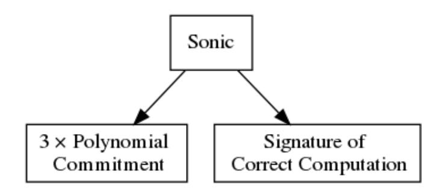
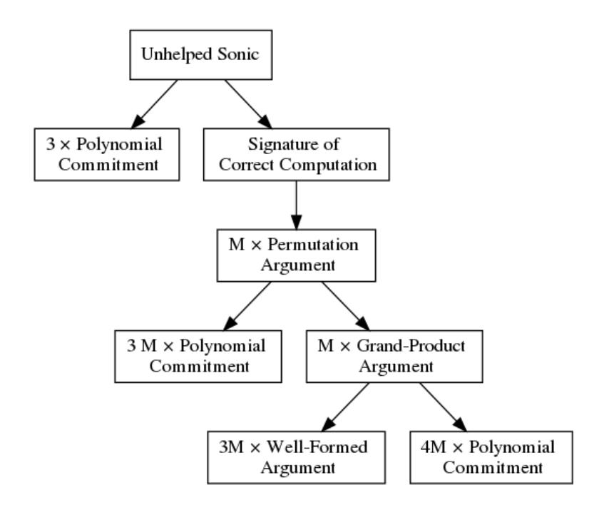
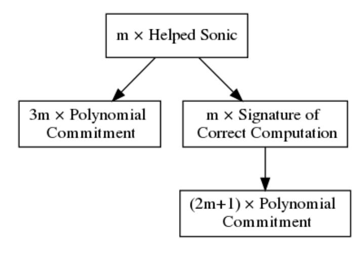

{0}------------------------------------------------

# Sonic: Zero-Knowledge SNARKs from Linear-Size Universal and Updatable Structured Reference Strings

Mary Maller mary.maller.15@ucl.ac.uk University College London

Markulf Kohlweiss mkohlwei@ed.ac.uk University of Edinburgh IOHK

Sean Bowe sean@z.cash Electric Coin Company

Sarah Meiklejohn s.meiklejohn@ucl.ac.uk University College London

# ABSTRACT

Ever since their introduction, zero-knowledge proofs have become an important tool for addressing privacy and scalability concerns in a variety of applications. In many systems each client downloads and verifies every new proof, and so proofs must be small and cheap to verify. The most practical schemes require either a trusted setup, as in (pre-processing) zk-SNARKs, or verification complexity that scales linearly with the complexity of the relation, as in Bulletproofs. The structured reference strings required by most zk-SNARK schemes can be constructed with multi-party computation protocols, but the resulting parameters are specific to an individual relation. Groth et al. discovered a zk-SNARK protocol with a universal structured reference string that is also updatable, but the string scales quadratically in the size of the supported relations.

Here we describe a zero-knowledge SNARK, Sonic, which supports a universal and continually updatable structured reference string that scales linearly in size. We also describe a generally useful technique in which untrusted "helpers" can compute advice that allows batches of proofs to be verified more efficiently. Sonic proofs are constant size, and in the "helped" batch verification context the marginal cost of verification is comparable with the most efficient SNARKs in the literature.

# ACM Reference format:

Mary Maller, Sean Bowe, Markulf Kohlweiss, and Sarah Meiklejohn. 2019. Sonic: Zero-Knowledge SNARKs from Linear-Size Universal and Updatable Structured Reference Strings. In Proceedings of CCS'19, London, UK, November 2019, [20](#page-19-0) pages.

<https://doi.org/10.1145/nnnnnnn.nnnnnnn>

# 1 INTRODUCTION

In the decades since their introduction, zero-knowledge proofs have been used to support a wide variety of potential applications, ranging from verifiable outsourced computation [\[11,](#page-14-0) [16,](#page-14-1) [24,](#page-14-2) [59\]](#page-15-0) to anonymous credentials [\[6,](#page-13-0) [27,](#page-14-3) [28,](#page-14-4) [32,](#page-14-5) [39\]](#page-14-6), with a multitude of other settings that also require a balance between privacy and integrity [\[17,](#page-14-7) [19,](#page-14-8) [29,](#page-14-9) [31,](#page-14-10) [36\]](#page-14-11). In recent years, cryptocurrencies have been one increasingly popular real-world application [\[10,](#page-14-12) [44,](#page-14-13) [52,](#page-15-1) [57\]](#page-15-2), with general zero-knowledge protocols now deployed in both Zcash and Ethereum. In the cryptocurrency setting it is common for clients to download and verify every transaction published to the network. This means that small proof sizes and fast verification time are important for the practical deployment of zero-knowledge

protocols. There are several practical schemes from which to choose, with a vast space of tradeoffs in performance and cryptographic assumptions.

Currently, the most attractive proving system from the verifier's perspective is a (pre-processing) succinct non-interactive argument of knowledge, or zk-SNARK for short, which has a small constant proof size and constant-time verification costs even for arbitrarily large relations. The most efficient scheme described in the literature is a zk-SNARK by Groth [\[45\]](#page-14-14) which contains only three group elements. Typically, zk-SNARKs require a trusted setup, a pairingfriendly elliptic curve, and rely on strong assumptions.

In contrast, proving systems such as Bulletproofs [\[26\]](#page-14-15) do not require a trusted setup and depend on weaker assumptions. Unfortunately, although its proof sizes scale logarithmically with the relation size, Bulletproof verification time scales linearly, even when applying batching techniques. As a result, Bulletproofs are ideal for simpler relations.

Although zk-SNARKs have been deployed in applications, such as the private payment protocol in Zcash, the trusted setup has emerged as a barrier for deployment. If the setup is compromised in Zcash, for example, an attacker could create counterfeit money without detection. It is possible to reduce risk by performing the setup with a multi-party computation (MPC) protocol, with the property that only one participant must be honest for the final parameters to be secure [\[25,](#page-14-16) [62\]](#page-15-3). However, the resulting parameters are specific to the individual relation, and so each distinct application must perform its own setup. Applications must also perform a new setup each time their construction changes, even for minor optimisations or bug fixes.

Groth et al. [\[46\]](#page-14-17) recently proposed a zk-SNARK scheme with a universal structured reference string (SRS[1](#page-0-0) ) that allows a single setup to support all circuits of some bounded size. Moreover, the SRS is updatable, meaning an open and dynamic set of participants can contribute secret randomness to it indefinitely. Although this is still a trusted setup in some sense, it increases confidence in the security of the parameters as only one previous contributor must have destroyed their secret randomness in order for the SRS to be secure.

In terms of efficiency, however, while the construction due to Groth et al. does have constant-size proofs and constant-time verification, it requires an SRS that is quadratic with respect to the

<span id="page-0-0"></span><sup>1</sup> "Structured reference string" is the recommended language to use when referring to what was once called a "common reference string" [\[63\]](#page-15-4).

{1}------------------------------------------------

number of multiplication gates in the supported arithmetic circuits. Moreover, updating the SRS requires a quadratic number of group exponentiations, and verifying the updates requires a linear number of pairings. Finally, while the prover and verifier need only a linearsize, circuit-specific string for a given fixed relation (rather than the whole SRS), deriving this from the SRS requires an expensive Gaussian elimination process. In a concrete setting such as Zcash, which has a circuit with 2 <sup>17</sup> multiplication gates, the SRS would be on the order of terabytes and is thus prohibitively expensive.

# 1.1 Our Contributions

We present Sonic, a new zk-SNARK for general arithmetic circuit satisfiability. Sonic requires a trusted setup, but unlike conventional SNARKs the structured reference string supports all circuits (up to a given size bound) and is also updatable, so that it can be continually strengthened. This addresses many of the practical challenges and risks surrounding such setups. Sonic's structured reference string is linear in size with respect to the size of supported circuits, as opposed to the scheme by Groth et al., which scales quadratically. The structured reference string in Sonic also does not need to be specialized or pre-processed for a given circuit. This makes a large, distributed and never-ending setup process a practical reality.

Proof verification in Sonic consists of a constant number of pairing checks. Unlike other zk-SNARKs, all proof elements are in the same source group, which has several advantages. Most significantly, when verifying many proofs at the same time, the pairing operations need to be computed only once. Thus the marginal costs stem solely from a handful of exponentiations in the group. We also remove the requirement for operations in the second source group, which are typically more expensive.

Sonic's verification includes checking the evaluation of a sparse bivariate polynomial in the scalar field. We introduce a method to check this evaluation succinctly (given a circuit-dependent precomputation) and thus maintain our zk-SNARK properties. Our proof of correct evaluation introduces a new permutation argument and a grand-product argument.

Additionally Sonic can achieve better concrete efficiency if an untrusted "helper" party aggregates a batch of proofs. This batching operation computes advice to speed up the verifier. In a blockchain application, this helper could be a miner-type client that already processes and verifies transactions for inclusion in the next block.

We define security in this setting in Section [3,](#page-3-0) and present and prove secure the regular usage of Sonic in Section [6](#page-7-0) and Section [7.](#page-10-0) In Section [8](#page-11-0) we present the more efficient version of Sonic which is helper-assisted. Finally, we implement our protocol and discuss its performance in Section [9,](#page-12-0) demonstrating verification times that are competitive with state-of-the-art pre-processing zk-SNARKs for typical arithmetic circuits. For any size of circuit proof sizes are 256 bytes and the verification times for circuits with small instances and arbitrarily sized witnesses are approximately <sup>0</sup>.7ms (assuming there are helpers).

# 1.2 Our Techniques

The goal of Sonic is to provide zero-knowledge arguments for the satisfiability of constraint systems representing NP-hard languages. Sonic defines its constraint system with respect to the two-variate

polynomial equation used in Bulletproofs that was designed by Bootle et al. [\[22\]](#page-14-18). In the Bulletproofs polynomial equation, there is one polynomial that is determined by the instance of the language and a second that is determined by the constraints. The polynomial determined by the instance a is given by

$$\sum_{i,j} a_{i,j} X^i Y^j$$

i,j

i.e., each element of the instance is used to scale a monomial in the overall polynomial. For this reason, an SRS that contains only hidden monomial evaluations suffices for committing to the instance. Groth et al. [\[46\]](#page-14-17) showed that an SRS that contains monomials is updatable. The second polynomial that is determined by the constraints is known to the verifier. We use this knowledge to allow the verifier to obtain evaluations of the polynomial while avoiding putting constraint-specific secrets in the SRS.

To commit to our polynomials, we use a variation of a polynomial commitment scheme by Kate et al. [\[50\]](#page-14-19). We prove the commitment scheme secure in the algebraic group model [\[37\]](#page-14-20), which is a model that lies somewhere between the standard model and the generic group model. This security proof does not follow from the initial reductions by Kate et al. because we additionally need to show that the adversary can extract the committed polynomials. Kate et al.'s scheme has constant size and verification time, but is designed for single-variate polynomials, whereas our polynomials are twovariate. To account for this, we hide only one evaluation point in the reference string. The polynomial defining the instance is of a special form where it can be committed to using a univariate scheme; i.e., it is of the form

$$\sum_{i} a_{i} X^{i} Y^{i}.$$

The prover first commits to the polynomial defining the statement, and then the second evaluation point y is determined in the clear. The prover can then commit to other polynomials of the form

$$\sum_{i,j} t_{i,j} X^i y^j$$

using a univariate scheme.

When the prover and verifier both know a two-variate polynomial that the verifier wants to calculate, this work can be unloaded onto the prover. In our scheme we utilise this observation by placing the work of computing the polynomial specifying the constraints onto the prover. The prover then has to show that the polynomial has been calculated correctly. We provide two methods of achieving this. In the first, we simply provide a proof that the evaluation is correct. While asymptotically preferable, concretely this proof is three times the size of our second method. In this scenario, many proofs are calculated by many provers, and then a "helper" calculates the circuit-specifying polynomial for each proof. The circuit-specifying polynomial contains no private information, so the helper can be run by anyone. The helper then proves that they have calculated all of the polynomials correctly at the same time, which they can do succinctly with a one-off circuit-dependent cost that can be amortised over many proofs.

{2}------------------------------------------------

<span id="page-2-0"></span>

| Scheme             | Run                           | Size                                 |            | PQ?                    | Universal?       | Untrusted setup? | Assumptions      |                     |
|--------------------|-------------------------------|--------------------------------------|------------|------------------------|------------------|------------------|------------------|---------------------|
|                    | Prover                        | Verifier                             | CRS        | Proof                  |                  |                  |                  |                     |
| Hyrax              | $d(hc + c\log c) + w$         | $\ell + d(h + \log(hc))$             | $\sqrt{w}$ | $d\log(hc) + \sqrt{w}$ | 0                | •                | •                | DL                  |
| ZK vSQL            | $n\log(c)$                    | $\ell + d \operatorname{polylog}(n)$ | $\log(n)$  | $d\log(c)$             | $\bigcirc$       | •                | $lackbox{0}$     | <i>q</i> -type, KOE |
| Ligero             | $n\log(n)$                    | $c\log(c) + h\log(h)$                | 0          | $\sqrt{n}$             | $\blacktriangle$ | •                | •                | CRHF                |
| Bootle et al. [23] | n                             | n                                    | 0          | $\sqrt{n}$             | $\blacktriangle$ | •                | •                | CRHF                |
| Baum et al. [4]    | $n\log(n)$                    | n                                    | $\sqrt{n}$ | $\sqrt{n\log(n)}$      | $\blacktriangle$ | •                | •                | SIS                 |
| STARKs             | $n \operatorname{polylog}(n)$ | polylog(n)                           | 0          | $\log^2(n)$            | $lackbox{}$      | •                | •                | CRHF                |
| Aurora             | $n \log(n)$                   | n                                    | 0          | $\log^2(n)$            | $lackbox{}$      | •                | •                | CRHF                |
| Bulletproofs       | $n\log(n)$                    | $n\log(n)$                           | n          | $\log(n)$              | $\bigcirc$       | •                | •                | DL                  |
| SNARKs             | $n\log(n)$                    | $\overline{\ell}$                    | n          | 1                      | $\bigcirc$       | $\bigcirc$       | $\circ$          | <i>q</i> -type, KOE |
| Groth et al. [46]  | $n\log(n)$                    | $\ell$                               | $n^2$      | 1                      | $\bigcirc$       | •                | $lackbox{lack}$  | <i>q</i> -type, KOE |
| This work          | $n\log(n)$                    | $\ell$                               | n          | 1                      | $\bigcirc$       | •                | $\blacktriangle$ | AGM                 |

Table 1: Asymptotic efficiency comparison of zero-knowledge proofs for arithmetic circuits. Here n is the number of gates, d is the depth of the circuit, h is the width of the subcircuits, c is the number of copies of the subcircuits, e is the size of the instance, and e is the size of the witness. An empty circle denotes that the scheme does not have this property and a full circle denotes that the scheme does have this property. A half circle for post-quantum security denotes that it is feasibly post-quantum secure but that there is no proof. A half circle for untrusted setup denotes that the scheme is updatable. DL stands for discrete log, CRHF stands for collision-resistant hash functions, KOE stands for knowledge-of-exponent, and AGM stands for algebraic group model.

<span id="page-2-1"></span>

| Scheme               | Universal SRS           | Circuit SRS         | Size                        | Prover computation                | Verifier computation |
|----------------------|-------------------------|---------------------|-----------------------------|-----------------------------------|----------------------|
| Groth'16 [45]        | _                       | $3n + m \mathbb{G}$ | 3 G                         | $4n + m - \ell \operatorname{Ex}$ | $3P + \ell Ex$       |
| Bulletproofs         | $\frac{n}{2}\mathbb{G}$ | _                   | $2\log_2(n) + 6 \mathbb{G}$ | 8n  Ex                            | 4n Ex                |
| This work (helped)   | $\bar{4d}\mathbb{G}$    | $12n\ \mathbb{G}$   | 7 G, 5 F                    | 18 <i>n</i> Ex                    | 10 <i>P</i>          |
| This work (unhelped) | $4d\mathbb{G}$          | $36n\ \mathbb{G}$   | 20 G, 16 F                  | 273 <i>n</i> Ex                   | 13 <i>P</i>          |

Table 2: Comparison of helped and unhelped Sonic against a pairing-based zk-SNARK and against Bulletproofs (which do not require pairing groups) for arithmetic circuit satisfiability with d the maximum size of committed polynomials,  $\ell$ -element known circuit inputs, m wires, and n gates. Computational costs are measured in terms of number of group exponentiations and pairings.  $\mathbb{G}$  means group elements in either source group,  $\mathbb{F}$  means field elements, Ex means group exponentiations, and P means pairings. Helped Sonic has 2 additional group elements per batch. Unhelped Sonic has approximately three times the number of constraints due to the need to convert the circuit into one that is uniformly sparse, and this has been taken into account in our estimates for the circuit SRS and the prover computation.

# 2 RELATED WORK

An efficiency comparison of all of the schemes we discuss is provided in Table 1. We also give a more concrete efficiency comparison in Table 2 of Sonic against the fastest zk-SNARK in the literature (Groth 2016 [45]) and Bulletproofs [26].

Hyrax [61] is a zero-knowledge protocol that processes circuits using a sum-check protocol originally introduced from the verifiable computation scheme by Goldwasser et al [43] and improved by Cormode et al. [33]. It is especially well-suited to circuits with a high level of parallelisation, such as showing that a committed value is included in a Merkle tree. Additionally, the protocol is ideal for circuits with small witnesses. It directly uses a parallelised sum-check protocol on the instance wires, and on the witness wires it applies a zero-knowledge variant of the sum-check protocol. Their sum-check protocol uses an adaptation of the inner-product argument from Bulletproofs to check multiplication constraints.

Originally designed for handling SQL queries, Zhang et al. designed a zero-knowledge variant of vSQL [65]. Their scheme also processes circuits using techniques by Cormode et al. [33]. This means that their techniques also have better efficiency for highly parallelised circuits. Like our scheme, they rely on a polynomial

commitment scheme. However, rather than design their scheme around Kate et al.'s single variant scheme, they use Papamanthou et al.'s multivariate scheme [58]. This multivariate scheme is useful for vSQL because they can use multivariate polynomials where each variable has degree 1. For our scheme, there are two variables of degree O(n), so Papamanthou et al.'s scheme would result in a quadratic-sized reference string and quadratic prover computation.

Symmetric primitives such as Reed-Solomon codes have recently been gaining attention for their post-quantum potential, as there are no known quantum attacks on error-correcting codes and protocols that use them do not require expensive and trusted pre-processing phases. Schemes that use these techniques [2, 9, 23] are typically made non-interactive in the random oracle model, as opposed to the quantum random oracle model, and designing efficient zero-knowledge protocols in the quantum random oracle model [21] remains an open problem. The codes are typically cheap to compute for the prover. The downside to this style of proof is that they require very large circuits before the asymptotics can take effect, because the constants are relatively large.

Ligero [2] uses Reed-Solomon codes for security. This work stems from the "MPC-in-the-head" paradigm [30, 42, 49]. The idea

{3}------------------------------------------------

is to model the computation as being carried out by a multiparty computation, but then have the prover and verifier simulate multiple parties. A large part of its overhead comes from compiling the addition gates, and the authors observed that when there are many repetitions of the same addition gates in the same layer, it is possible to batch the compilation. Bootle et al. [23] introduce a model that they call the ideal linear commitment (ILC) model in which a prover can commit to vectors by sending them to a channel, and a verifier can query the channel on linear combinations of the committed vectors. They then compile the ILC programs into proofs using a code by Ishai et al. [48] which can be computed in linear time. As a result, they prove the possibility of zk-proofs that have linear prover overhead. STARKs [9] look to simultaneously minimise proof size and verifier computation and show, with an implementation, that protocols based on interactive oracle proofs [14] can be practical. Indeed their prover, when applied to a circuit with 2<sup>27</sup> gates, takes roughly 1 minute to run. However, proof sizes are still over 100kB, even for relatively small circuits. Aurora [13] uses similar techniques to STARKs, except that it is designed to run directly over constraint systems like those used in zk-SNARKs. As such, they avoid the concrete overhead that STARKs require for compiling a program into a constraint system. Baum et al. [4] introduced the first lattice-based protocol with sublinear communication costs. They achieve this by designing a proof of knowledge for committed values using techniques by Cramer et al. [34]. The proof of knowledge is efficient in the amortised setting. They apply this proof of knowledge to circuits processed using Bulletproof techniques. As a result their verifier time is high.

Bulletproofs [22, 26] are based on the discrete logarithm problem and have no trusted setup. Their proof sizes are logarithmic, which is achieved through the use of an inner product argument. On the downside the verification time is high. Although Bulletproofs lend themselves well to batching, even batched proofs require a computation per proof that depends on the size of the circuit. The prover costs for Bulletproofs are typically high due to the use of expensive cryptographic operations. For very small circuits, such as for range proofs, Bulletproofs have the advantage of having relatively low concrete overhead.

Using knowledge assumptions, it is possible to build zk-SNARKs [15, 18, 35, 45, 47, 54, 59]. These have constant-sized proofs and verifier times that depend solely on the instance. However, they typically rely on using circuit-specific quadratic span programs or quadratic arithmetic programs [40]. As such the common reference strings are not updatable or universal [12]. The prover costs for zk-SNARKs are typically high due to the use of expensive cryptographic operations, although recent work has looked into methods to distribute these costs [64].

Alternative methods to achieve universal setups include generating a circuit-specific reference string for a universal circuit such as Valiant's universal circuit construction [55, 60]. Universal circuits must define the path taken by the input data and the cost of this universal routing is  $O(n \log(n))$  gates. Practically speaking universal circuits incur a large overhead on the prover computation. Ben-Sasson et al. discuss using a TinyRAM architecture to describe universal computations as simple programs [11, 15]. They have a unique SRS representing each instruction in the architecture, and

they recursively compose the proofs to achieve succinctness. While useful for programmers that wish to convert between C programs and constraint systems for zk-SNARKs, these approaches incur a large overhead on the prover computation.

Groth et al. [46] introduced the notion of updatability for structured reference strings and built a zk-SNARK from an updatable and universal string. They achieved these results by including a null space argument to show that a quadratic arithmetic circuit is satisfied. However, computing this null space requires expensive Gaussian elimination. Even as a one-off cost, this is often unrealistic. Further, although they can have linear-sized structured reference strings for the prover and verifier, to allow for updatability they require a global string with  $O(n^2)$  elements.

# <span id="page-3-0"></span>3 DEFINITIONS FOR UPDATABLE REFERENCE STRINGS

In this section, we revisit the definitions around updatable SRS schemes due to Groth et al. [46], in terms of defining properties of zero-knowledge proofs in the case in which the adversary may subvert or participate in the generation of the common reference string. Given that our protocol in Section 6 is interactive (but made non-interactive in the random oracle model), we also present new definitions for interactive protocols that take into account these alternative methods of SRS generation.

#### 3.1 Notation

If x is a binary string then |x| denotes its bit length. If S is a finite set then |S| denotes its size and  $x \stackrel{\$}{\leftarrow} S$  denotes sampling a member uniformly from S and assigning it to x. We use  $\lambda \in \mathbb{N}$  to denote the security parameter and  $1^{\lambda}$  to denote its unary representation. We use  $\varepsilon$  to denote the empty string.

Algorithms are randomized unless explicitly noted otherwise. "PPT" stands for "probabilistic polynomial time" and "DPT" stands for "deterministic polynomial time." We use  $y \leftarrow A(x;r)$  to denote running algorithm A on inputs x and random coins r and assigning its output to y. We write  $y \leftarrow A(x)$  or  $y \leftarrow A(x)$  (when we want to refer to r later on) to denote  $y \leftarrow A(x;r)$  for r sampled uniformly at random.

We use code-based games in security definitions and proofs [8]. A game  $Sec_{\mathcal{A}}(\lambda)$ , played with respect to a security notion Sec and adversary  $\mathcal{A}$ , has a MAIN procedure whose output is the output of the game. The notation  $Pr[Sec_{\mathcal{A}}(\lambda)]$  is used to denote the probability that this output is 1.

# 3.2 The Subvertible SRS Model

Intuitively, the subvertible SRS model [7] allows the adversary to fully generate the reference string itself, and the updatable SRS model [46] allows the adversary to partially contribute to its generation by performing some update. Formally, an updatable SRS scheme is defined by two PPT algorithms Setup and Update, and a DPT algorithm VerifySRS. These behave as follows:

•  $(srs, \rho) \stackrel{\$}{\leftarrow} Setup(1^{\lambda})$  takes as input the security parameter and returns a SRS and proof of its correctness.

{4}------------------------------------------------

- $(srs', \rho') \stackrel{\$}{\leftarrow} Update(1^{\lambda}, srs, (\rho_i)_{i=1}^n)$  takes as input the security parameter, a SRS, and a list of update proofs. It outputs an updated SRS and a proof of the correctness of the update.
- $b \leftarrow \text{VerifySRS}(1^{\lambda}, \text{srs}, (\rho_i)_{i=1}^n)$  takes as input the security parameter, a SRS, and a list of proofs. It outputs a bit indicating acceptance (b=1), or rejection (b=0).

We consider an updatable SRS to be perfectly correct if an honest updater always convinces an honest verifier.

Definition 3.1. An updatable SRS scheme is perfectly correct if

$$\Pr\left[(\operatorname{srs}, \rho) \stackrel{\$}{\leftarrow} \operatorname{Setup}(1^{\lambda}) : \operatorname{VerifySRS}(1^{\lambda}, \operatorname{srs}, \rho) = 1\right] = 1,$$

and if for all  $(\lambda, \text{srs}, (\rho_i)_{i=1}^n)$  where  $\text{VerifySRS}(1^{\lambda}, \text{srs}, (\rho)_{i=1}^n) = 1$ , we have that

$$\Pr\left[\begin{array}{c} (\mathsf{srs'}, \rho_{n+1}) \xleftarrow{\$} \mathsf{Update}(1^{\lambda}, \mathsf{srs}, (\rho_i)_{i=1}^n) : \\ \mathsf{VerifySRS}(1^{\lambda}, \mathsf{srs'}, (\rho)_{i=1}^{n+1}) = 1 \end{array}\right] = 1.$$

In terms of the usage of these SRSs, a protocol cannot satisfy both subvertible zero-knowledge and subvertible soundness [7]. That is, assuming the adversary knows all the randomness used to generate the SRS, they can either break the zero-knowledge property of the scheme or they can break the soundness property of the scheme. We thus recall here the two strongest properties we can hope to satisfy, which are subvertible zero-knowledge and updatable knowledge soundness. The definitions of these properties are simplified versions of the ones given by Groth et al. [46], with the addition of a random oracle H (which behaves as expected, so we omit its description).

Let R be a polynomial-time decidable relation with triples (srs,  $\phi$ , w). We say w is a witness to the instance  $\phi$  being in the relation defined by srs when (srs,  $\phi$ , w)  $\in R$ . We consider an argument (Prove, Verify) to be subversion zero-knowledge if an adversarial verifier, including one that (fully) generates the SRS, cannot differentiate between real and simulated proofs.

Definition 3.2 (Subvertible Zero-Knowledge). An argument for the relation R is S-zero-knowledge if for all PPT algorithms  $\mathcal{A}$  there exists a PPT extractor  $\mathcal{X}$  and a simulator SimProve such that the advantage  $|2 \operatorname{Pr}[S-\mathsf{ZK}_{\mathcal{A},\mathcal{X}}(1^{\lambda})] - 1|$  is negligible in  $\lambda$ , where this game is defined as follows:

$$\frac{\text{MAIN S-ZK}_{\mathcal{A}, \mathcal{X}_{\mathcal{A}}}(\lambda)}{b \leftarrow \{0, 1\}}$$

$$(\text{srs}, (\rho_i)_{i=1}^n) \leftarrow \mathcal{A}^H(1^{\lambda})$$

$$\tau \leftarrow \mathcal{X}_{\mathcal{A}}(r)$$
\nif VerifySRS(1^{\lambda}, \text{srs}, (\rho\_i)\_{i=1}^n) = 0 return 0
$$b' \leftarrow \mathcal{A}^{H, O_{\text{pf}}}(r)$$
return  $b' = b$ 

$$\frac{O_{\text{pf}}(\phi, w)}{\text{if (srs}, \phi, w) \notin R \text{ return } \bot}$$
\nif  $b = 0$  return SimProve(srs,  $\tau, \phi$ )

To define update knowledge-soundness, we consider an adversary that can influence the generation of the SRS. To do this, it can

else return Prove(srs,  $\phi$ , w)

query an oracle with an intent set to "setup" (for the first update proof), "update" (for all subsequent update proofs), or "final" (to signal the SRS for which it will attempt to forge proofs). The oracle sets the SRS only if: (1) all update proofs verify; and (2) it was responsible for generating at least one of the update proofs. We do not use updatable knowledge soundness directly, but this part of the security game (in which  $\mathcal{A}$  and U- $O_s$  interact to create the SRS) can be re-purposed for any cryptographic primitive. In this paper we use this updatability notion mainly for the polynomial commitment scheme we present in Section 6.2.

<span id="page-4-0"></span>Definition 3.3 (Updatable Knowledge Soundness). An argument for the relation R is U-knowledge-sound if for all PPT algorithms  $\mathcal A$  there exists a PPT extractor  $\mathcal X_{\mathcal A}$  such that  $\Pr[\text{U-KSND}_{\mathcal A,\mathcal X_{\mathcal A}}(1^\lambda)]$  is negligible in  $\lambda$ , where this game is defined as follows:

```
\frac{\text{MAIN U-KSND}_{\mathcal{A}, \chi_{\mathcal{A}}}(\lambda)}{\text{srs} \leftarrow \bot}
(\phi, \pi) \stackrel{r}{\leftarrow} \mathcal{A}^{H, U-O_s}(1^{\lambda})
w \stackrel{\$}{\leftarrow} \mathcal{X}_{\mathcal{A}}(\mathsf{srs},r)
return Verify(srs, \phi, \pi) \land (srs, \phi, w) \notin R
\frac{\text{U-}O_{\text{S}}(\text{intent}, \text{srs}_n, (\rho_i)_{i=1}^n)}{\text{if srs} \neq \bot \text{ return } \bot}
if intent = setup
     (\operatorname{srs}', \rho') \stackrel{\$}{\leftarrow} \operatorname{Setup}(1^{\lambda})
      Q \leftarrow Q \cup \{\rho'\}
      return (srs', \rho')
 if intent = update
      b \leftarrow \mathsf{VerifySRS}(1^{\lambda}, \mathsf{srs}_n, (\rho_i)_{i=1}^n)
      if b = 0 return \perp
      (\operatorname{srs}', \rho') \stackrel{\$}{\leftarrow} \operatorname{Update}(1^{\lambda}, \operatorname{srs}_n, (\rho_i)_{i-1}^n)
      Q \leftarrow Q \cup \{\rho'\}
      return (srs', \rho')
 if intent = final
      b \leftarrow \text{VerifySRS}(1^{\lambda}, \text{srs}_n, (\rho_i)_{i-1}^n)
      if b = 0 or Q \cap \{\rho_i\}_i = \emptyset return \bot
      srs \leftarrow srs_n; return srs
 else return ⊥
```

To argue about the soundness of Sonic, we consider an interactive definition. We do not use the standard definition of special soundness because our verifier provides two challenges, but rather the generalized notion of *witness-extended emulation* [53]. We adapt the definition given by Bootle et al. [22] as follows:

Definition 3.4. Let P be an argument for the relation R. Then it satisfies updatable witness-extended emulation if for all DPT P\* there exists an expected PT emulator  $\mathcal{E}$  such that for all PPT algorithms

{5}------------------------------------------------

$$\begin{split} \Pr[(\mathsf{srs}', \rho') & \stackrel{\$}{\leftarrow} \mathsf{Setup}(1^\lambda) \,; \\ (\mathsf{srs}, (\rho_i)_i, \phi, w) & \stackrel{\$}{\leftarrow} \mathcal{A}(\mathsf{srs}', \rho') \,; \\ \mathsf{view} & \leftarrow \langle \mathsf{P}^*(\mathsf{srs}, \phi, w), \mathsf{V}(\mathsf{srs}, \phi) \rangle \,: \\ \mathsf{VerifySRS}(1^\lambda, \mathsf{srs}, (\rho_i)_i) \wedge \mathcal{A}(\mathsf{view}) &= 1 ] \\ & \approx \Pr[(\mathsf{srs}', (\rho_i')_i) & \stackrel{\$}{\leftarrow} \mathsf{Setup}(1^\lambda) \,; \\ (\mathsf{srs}, (\rho_i)_{i=1}^n, \phi, w) & \stackrel{\$}{\leftarrow} \mathcal{A}(\mathsf{srs}', \rho') \,; \\ (\mathsf{view}, w) & \leftarrow \mathcal{E}^{\langle \mathsf{P}^*(\mathsf{srs}, \phi, w), \mathsf{V}(\mathsf{srs}, \phi) \rangle} \,: \\ \mathsf{VerifySRS}(1^\lambda, \mathsf{srs}, (\rho_i)_i) \wedge \mathcal{A}(\mathsf{view}) &= 1 \wedge \\ & \text{if view is accepting then } (\phi, w) \in R ], \end{split}$$

where the oracle called by  $\mathcal{E}^{\langle P^*(srs,\phi,w),V(srs,\phi)\rangle}$  permits rewinding to a specific point and resuming with fresh randomness for the verifier from this point onwards.

This definition uses a slightly different setup from the one in Definition 3.3: rather than interact arbitrarily with an update oracle to set the SRS, the adversary is instead given an initial one and is then allowed to update that in a one-shot fashion. Following Groth et al. [46, Lemma 6], these two definitions are equivalent for Sonic, so we opt for the simpler one.

### 4 BUILDING BLOCKS

#### 4.1 Bilinear Groups

Let BilinearGen(1 $^{\lambda}$ ) be a bilinear group generator that given the security parameter 1 $^{\lambda}$  produces bilinear parameters  $bp = (p, \mathbb{G}_1, \mathbb{G}_2, \mathbb{G}_T, e, g, h)$ , where  $\mathbb{G}_1, \mathbb{G}_2, \mathbb{G}_T$  are groups of prime order p with generators  $g \in \mathbb{G}_1, h \in \mathbb{G}_2$  and  $e : \mathbb{G}_1 \times \mathbb{G}_2 \to \mathbb{G}_T$  is a non-degenerative bilinear map. That is,  $e(g^a, h^b) = e(g, h)^{ab} \ \forall a, b \in \mathbb{F}_p$  and e(g, h) generates  $\mathbb{G}_T$ .

We require bilinear groups such that the maximum size of our circuit is bounded by  $d^2 \le (p-1)/32$ . In practice we expect that  $d^2 \ll (p-1)/32$ .

We employ bilinear group generators that produce what Galbraith, Paterson and Smart [38] classify as Type III bilinear groups. For such groups no efficiently computable homomorphism between  $\mathbb{G}_1$  and  $\mathbb{G}_2$  exist. These are currently the most efficient bilinear groups.

# 4.2 The Algebraic Group Model

Sonic is proven secure in the algebraic group model (AGM) by Fuchsbauer et al [37], who used it to prove (among other things) that Groth's 2016 scheme [45] is secure under a "q-type" variant of the discrete log assumption. Previously the only security proof for this scheme was provided in the generic group model (GGM). Although proofs in the GGM can increase our confidence in the security of a scheme, its scope is limited since it does not capture group-specific algorithms that make use of its representation (such as index calculus approaches).

The AGM lies between the standard model and the GGM, and it is a restricted model of computation that covers group-specific attacks while allowing a meaningful security analysis. Adversaries are assumed to be restricted in the sense that they can output only group elements obtained by applying the group operation to previously received group elements. Unlike the GGM, in the AGM one proves security implications via reductions to assumptions (just as in proofs in the standard model).

It is so far unknown how the AGM relates to knowledge-of-exponent (KOE) assumptions, which have been used to build every known SNARK that has been proven secure in the standard model (and indeed it is known that SNARKs cannot be proven secure under more standard falsifiable assumptions [41]). The format of these KOE assumptions is similar to the AGM in the sense that proving the assumption incorrect would require showing that there is an adversary that can compute group elements of a given format but that cannot extract an algebraic representation. Popular KOE assumptions in asymmetric bilinear groups all require the adversary to compute elements in the second source group. As we would like to avoid introducing proof elements in the second source group (as these are typically more expensive due to current implementations of asymmetric bilinear groups), we instead decided to work with the AGM.

An algorithm  $\mathcal{A}_{\text{alg}}$  is called algebraic if whenever it outputs an element Z in  $\mathbb{G}$ , it also outputs a representation  $(z_1,\ldots,z_t)\in\mathbb{F}_p^t$  such that  $Z=\prod_{i=1}^t g_i^{z_i}$  where  $\mathcal{L}=\{g_1,\ldots,g_t\}$  is the list of all group elements given to  $\mathcal{A}_{\text{alg}}$  in its execution thus far. Unlike the GGM, in the AGM one proves security implications via reductions. To prove our scheme secure in the algebraic group model we use the q discrete log assumption (q-DLOG), as follows:

Assumption 4.1 (q-DLOG assumption). Suppose that  $\mathcal A$  is an algebraic adversary. Then

$$\Pr\left[\begin{array}{l} bp \leftarrow \text{BilinearGen}(1^{\lambda}); \ x \xleftarrow{\$} \mathbb{F}_p; \\ x' \xleftarrow{\$} \mathcal{A}(bp, \{g^{x^i}, h^{x^i}\}_{i=-q}^q) : \ x = x' \end{array}\right]$$

is negligible in  $1^{\lambda}$ .

### 4.3 Structured Reference String

In all of the following we require a structured reference string with unknowns x and  $\alpha$  of the following form

$$\left\{ \{g^{x^i}\}_{i=-d}^d, \{g^{\alpha x^i}\}_{i=-d, i\neq 0}^d, \{h^{x^i}, h^{\alpha x^i}\}_{i=-d}^d, e(g, h^{\alpha}) \right\}$$

for some large enough d to support the circuit depth n.

This string is designed so that  $g^{\alpha}$  is omitted from the reference string. Thus we can, when necessary, force the prover to demonstrate that a committed polynomial (in x) has a zero constant term.

## 4.4 Polynomial Commitment Scheme

Sonic uses two main primitives as building blocks: a polynomial commitment scheme and a signature of correct computation. A polynomial commitment scheme is defined by three DPT protocols:

•  $F \leftarrow \text{Commit}(bp, \text{srs}, \text{max}, f(X))$  takes as input the bilinear group, the structured reference string, a maximum degree, and a Laurent polynomial with powers between -d and max. It returns a commitment F.

{6}------------------------------------------------

- $(f(z), W) \leftarrow \text{Open}(bp, \text{srs}, \max, F, z, f(X))$  takes as input the same parameters as the commit algorithm in addition to a commitment F and a point in the field z. It returns an evaluation f(z) and a proof of its correctness.
- $b \leftarrow \text{pcV}(bp, \text{srs}, \text{max}, F, z, v, W)$  takes as input the bilinear group, the SRS, a maximum degree, a commitment, a point in the field, an evaluation and a proof. It outputs a bit indicating acceptance (b = 1), or rejection (b = 0).

We require that this scheme is *evaluation binding*; i.e., given a commitment F, an adversary cannot open F to two different evaluations  $v_1$  and  $v_2$  (more formally, that it cannot output a tuple  $(F, z, v_1, v_2, W_1, W_2)$  such that pcV returns 1 on both sets of evaluations and proofs). We also require that it is *bounded polynomial extractable*; i.e., any adversary that can provide a valid evaluation opening also knows an opening f(X) with powers  $-d \le i \le \max, i \ne d - \max$  (more formally, that this is true for any adversary that outputs a tuple (F, z, v, W) that passes verification). For both properties, we require that they hold with respect to an adversary that can update the SRS; i.e., that has access initially to the oracle in Definition 3.3.

In Section 6.2 we provide a polynomial commitment scheme satisfying these two properties. We prove its security in the algebraic group model in Theorem 6.3.

## 4.5 Signature of Correct Computation

A signature of correct computation is defined by two DPT protocols:

- $(s(z, y), sc) \leftarrow scP(bp, srs, s(X, Y), (z, y))$  takes as input the bilinear group, the SRS, a two-variate polynomial s(X, Y), and two points in the field (z, y). It returns an evaluation s(z, y) and a proof sc.
- $b \leftarrow \text{scV}(bp, \text{srs}, s(X, Y), (z, y), s, \text{sc})$  takes as input the same parameters as the scP algorithm in addition to an evaluation and a proof. It outputs a bit indicating acceptance (b = 1), or rejection (b = 0).

We require that this scheme is sound; i.e., given (z, y) and s, an adversary can convince the verifier only if s = s(z, y).

We provide two competing constructions: one in Section 8 and the other in Section 7. The first has linear verifier computation, but can be aggregated by an untrusted helper to achieve constant verifier computation in the batched setting. The second has constant verifier computation but higher concrete overhead. Both constructions have constant size.

#### <span id="page-6-1"></span>5 SYSTEM OF CONSTRAINTS

Sonic represents circuits using a form of constraint system proposed by Bootle et al. [22]. We make several modifications so that their approach is practical in our setting.

Our constraint system has three vectors of length n:  $\mathbf{a}$ ,  $\mathbf{b}$ ,  $\mathbf{c}$  representing the left inputs, right inputs, and outputs of multiplication constraints respectively, so that

$$\mathbf{a} \circ \mathbf{b} = \mathbf{c}$$
.

We also have Q linear constraints of the form

$$\mathbf{a} \cdot \mathbf{u_q} + \mathbf{b} \cdot \mathbf{v_q} + \mathbf{c} \cdot \mathbf{w_q} = k_q$$

where  $\mathbf{u_q}, \mathbf{v_q}, \mathbf{w_q} \in \mathbb{F}^n$  are fixed vectors for the q-th linear constraint, with instance value  $k_q \in \mathbb{F}_p$ . For example, to represent the constraint  $x^2 + y^2 = z$ , one would set

- $a = (x, y), b = (x, y), c = (x^2, y^2)$
- $u_1 = (1,0), v_1 = (-1,0), w_1 = (0,0), k_1 = 0$
- $\mathbf{u}_2 = (0, 1), \mathbf{v}_2 = (0, -1), \mathbf{w}_2 = (0, 0), k_2 = 0$
- $u_3 = (0,0), v_3 = (0,0), w_3 = (1,1), k_3 = z$

Any arithmetic circuit can be represented with our constraint system by using the multiplication constraints to determine the multiplication gates and the linear constraints to determine the wiring of the circuit and the addition gates. Thus the constraint system covers NP.

We proceed to compress the n multiplication constraints into an equation in formal indeterminate Y, as

$$\sum_{i=1}^{n} (a_i b_i - c_i) Y^i = 0.$$

In order to support our later argument, we (redundantly) encode these constraints into negative exponents of *Y*, as

$$\sum_{i=1}^{n} (a_i b_i - c_i) Y^{-i} = 0.$$

We compress the Q linear constraints similarly, scaling by  $Y^n$  to preserve linear independence.

$$\sum_{q=1}^{Q} (\mathbf{a} \cdot \mathbf{u_q} + \mathbf{b} \cdot \mathbf{v_q} + \mathbf{c} \cdot \mathbf{w_q} - k_q) Y^{q+n} = 0.$$

<span id="page-6-0"></span>Let us define the polynomials

$$u_{i}(Y) = \sum_{q=1}^{Q} Y^{q+n} u_{q,i}$$

$$v_{i}(Y) = \sum_{q=1}^{Q} Y^{q+n} v_{q,i}$$

$$w_{i}(Y) = -Y^{i} - Y^{-i} + \sum_{q=1}^{Q} Y^{q+n} w_{q,i}$$

$$k(Y) = \sum_{q=1}^{Q} Y^{q+n} k_{q}$$

and combine our multiplicative and linear constraints to form the equation

$$\mathbf{a} \cdot \mathbf{u}(Y) + \mathbf{b} \cdot \mathbf{v}(Y) + \mathbf{c} \cdot \mathbf{w}(Y)$$

$$+ \sum_{i=1}^{n} a_i b_i (Y^i + Y^{-i}) - k(Y) = 0. \quad (1)$$

Given a choice of  $(\mathbf{a}, \mathbf{b}, \mathbf{c}, k(Y))$ , we have that Equation 1 holds at all points if the constraint system is satisfied. If the constraint system is not satisfied the equation fails to hold with high probability, given a large enough field.

We apply a technique from Bootle et al. [22] to embed the left hand side of Equation 1 into the constant term of a polynomial

{7}------------------------------------------------

t(X, Y) in a second formal indeterminate X. We design the polynomial r(X, Y) such that r(X, Y) = r(XY, 1).

$$r(X,Y) = \sum_{i=1}^{n} \left( a_i X^i Y^i + b_i X^{-i} Y^{-i} + c_i X^{-i-n} Y^{-i-n} \right)$$

$$s(X,Y) = \sum_{i=1}^{n} \left( u_i(Y) X^{-i} + v_i(Y) X^i + w_i(Y) X^{i+n} \right)$$

$$r'(X,Y) = r(X,Y) + s(X,Y)$$

$$t(X,Y) = r(X,1)r'(X,Y) - k(Y)$$

The coefficient of  $X^0$  in t(X, Y) is the left-hand side of Equation 1. Sonic demonstrates that the constant term of t(X, Y) is zero, thus demonstrating that our constraint system is satisfied.

#### <span id="page-7-0"></span>**6 THE BASIC SONIC PROTOCOL**

Sonic is a zero-knowledge argument of knowledge that allows a prover to demonstrate that a constraint system (described in Section 5) is satisfied for a hidden witness  $(\mathbf{a}, \mathbf{b}, \mathbf{c})$  and for known instance  $\mathbf{k}$ . The instance  $\mathbf{k}$  is uploaded into the constraint system through the polynomial k(Y). Given a choice of r(X, Y) from Section 5, if for random  $y \in \mathbb{F}_p$  we have that the constant term of t(X, y) is zero, the constraint system is satisfied with high probability.

Our Sonic protocol is built directly from a polynomial commitment scheme and a signature of correct computation, as visualised in Figure 1. We discuss here the basic Sonic protocol, assuming these building blocks are in place, and provide a suitable bounded extractable polynomial commitment scheme in Section 6.2 that we prove secure in the AGM. In Sections 7 and 8 we discuss two different methods of constructing the signature of correct computation, one which gives rise to a standalone zk-SNARK and one which achieves better practical results through the use of an untrusted helper.

<span id="page-7-1"></span>

Figure 1: The basic Sonic protocol is built on top of a bounded-extractable polynomial commitment scheme and a signature of correct computation.

Our protocol begins by having the prover construct r(X, Y) using their hidden witness. They commit to r(X, 1), setting the maximum degree to n. The verifier sends a random challenge y. The prover commits to t(X, y), and our commitment scheme ensures that this polynomial has no constant term. The verifier sends a second challenge z. The prover opens their committed polynomials to r(z, 1), r(z, y) and t(z, y). The verifier can calculate r'(z, y) for itself from these values and thus can check that r(z, y)r'(z, y) - k(y) = t(z, y). Note that the coefficients of the public polynomial k(Y) are determined by the instance that the prover is claiming is in the language. If this holds then the verifier learns that the evaluated polynomials

were computed by a prover that knows a valid witness. A more formal description of this protocol is given in Figure 2.

The verifier's check that the quadratic polynomial equation is satisfied is performed in the field. This means we avoid having proof elements on both sides of the pairing, which is useful for efficiency, without contradicting Groth's result about NILPs requiring a quadratic constraint [45]. As a result, when batching we avoid having to check one pairing equation per proof (pairing operations are expensive) and can instead check one field equation per proof.

The Fiat-Shamir transformation takes an interactive argument and replaces the verifier challenges with the output of a hash function. The idea is that the hash function will produce random-looking outputs and therefore be a suitable replacement for the verifier. We describe Sonic in the interactive setting where all verifier challenges are random field elements. In practice we assume that the Fiat-Shamir heuristic would be applied in order to obtain a non-interactive zero-knowledge argument in the random oracle model.

THEOREM 6.1. Assuming the ability to extract a trapdoor for the subverted reference string, Sonic satisfies subversion zero-knowledge.

PROOF. To prove subversion zero-knowledge, we need to both show the existence of an extractor  $\mathcal{X}_{\mathcal{A}}$  that can compute a trapdoor, and describe a SimProve algorithm that produces indistinguishable proofs when provided with the extracted trapdoor. We do not discuss the details of SRS generation in this paper so do not prove the existence of the extractor, but one such example can be found in the original proof of Groth et al. [46, Lemma 4].

The simulator is given the trapdoor  $g^{\alpha}$  and chooses random vectors a, b from  $\mathbb{F}_p$  of length n and sets  $c = a \cdot b$ . It computes r(X, Y), r'(X, Y), t(X, Y) as in Section 5 where (unlike for the prover) t(X, Y) can have a non-zero coefficient in  $X^0$ . The simulator then behaves exactly as the prover in Figure 2 with its random polynomials.

Both the prover and the simulator evaluate  $g^{r(x,1)}$ , r(z,1), and r(zy,1). This reveals 3 evaluations (some of these are in the exponent). The prover has four blinders for r(X) with respect to the powers -2n-1, -2n-2, -2n-3, -2n-4. Thus for a verifier that obtains less than three evaluations, the prover's polynomial is indistinguishable from the simulator's random polynomial. All other components in the proofs are either uniquely determined given the previous components for both prover and simulator, or are calculated independently from the witness (and are chosen in the same method by both prover and simulator).

THEOREM 6.2. Sonic has witness extended emulation, when instantiated using a secure polynomial commitment scheme and a sound signature of correct computation.

PROOF. Soundness of the signature of correct computation gives us that s = s(z, y).

Bounded polynomial extractability tells us that R contains the polynomial

$$r(X,1) = \sum_{i=-d, i \neq -d+n}^{n} r_i X^i$$

and that *T* contains the polynomial

$$\tau(X) = \sum_{i=-d, i\neq 0}^{d} \tau_i X^i.$$

{8}------------------------------------------------

```
Common input:
                                           info = bp, srs, s(X, Y), k(Y), e(q, h^{\alpha})
 Prover's input:
                                            a, b, c
 zkP_1(info, \mathbf{a}, \mathbf{b}, \mathbf{c}) \mapsto R:
                                                                                                       \mathsf{zkP}_3(z) \mapsto (a, W_a, b, W_b, W_t, s, \mathsf{sc}):
                                                                                                      \overline{(a = r(z, 1), W_a)} \leftarrow \text{Open}(R, z, r(X, 1))

\frac{c_{n+1}, c_{n+2}, c_{n+3}, c_{n+4} \leftarrow \mathbb{F}_p}{c(X, Y) \leftarrow r(X, Y) + \sum_{i=1}^4 c_{n+i} X^{-2n-i} Y^{-2n-i}} 

\frac{(a = r(z, 1), W_a) \leftarrow \operatorname{Open}(R, z, r(X, 1))}{(b = r(z, y), W_b) \leftarrow \operatorname{Open}(R, yz, r(X, 1))} 

\frac{(b = r(z, y), W_b) \leftarrow \operatorname{Open}(R, yz, r(X, y))}{(b = r(z, y), W_b) \leftarrow \operatorname{Open}(R, yz, r(X, y))} 
                                                                                                       (t = t(z, y), W_t) \leftarrow \text{Open}(T, z, t(X, y)))
 R \leftarrow \mathsf{Commit}(bp, \mathsf{srs}, n, r(X, 1))
                                                                                                       (s = s(z, y), sc) \leftarrow scP(info, s(X, Y), (z, y))
 send R
                                                                                                       send (a, W_a, b, W_b, W_t, s, sc)
 \mathsf{zkV}_1(\mathsf{info}, R) \mapsto y:
                                                                                                       \frac{\mathsf{zkV}_3(a, W_a, b, W_b, W_t, s, \mathsf{sc}) \mapsto 0/1}{t \leftarrow a(b+s) - k(y)}:
\overline{\text{send } y \overset{\$}{\leftarrow} \mathbb{F}_{p}}
                                                                                                       check scV(info, s(X, Y), (z, y), (s, sc))
 \mathsf{zkP}_2(y) \mapsto T:
                                                                                                       check pcV(bp, srs, n, R, z, (a, W_a))
 T \leftarrow \mathsf{Commit}(bp, \mathsf{srs}, d, t(X, y))
                                                                                                       check pcV(bp, srs, n, R, yz, (b, W_b))
 send T
                                                                                                       check pcV(bp, srs, d, T, z, (t, W_t))
                                                                                                       return 1 if all checks pass, else return 0
\underline{\mathsf{zkV}_2(T)} \mapsto z:
\overline{\text{send } z \overset{\$}{\leftarrow} \mathbb{F}_p}
```

Figure 2: The interactive Sonic protocol to check that the prover knows a valid assignment of the wires in the circuit. The stated algorithms describe the individual steps of each of the parties (e.g.,  $zkV_i$  describes the *i*-th step of the verifier given the output of  $zkP_{i-1}$ ), and both parties are assumed to keep state for the duration of the interaction.

Observe that in our polynomial constraint system 3n < d (otherwise we cannot commit to t(X, Y)), thus r(X, Y) has no -d + n term.

We show that the element T can be computed only if the circuit is satisfied by the polynomial coefficients extracted from R. Evaluation binding tells us that a = r(z, 1), b = r(zy, 1) = r(z, y) and the verifier checks that  $t = a(b+s)-k(y) = \tau(z)$ . Suppose this holds for n+Q+1 different challenges  $y \in \mathbb{F}_p$ . Then we have equality of polynomials in Section 5 since a non-zero polynomial of degree n+Q+1 cannot have n+Q roots; i.e.,

$$r(X)(r(X, Y) + s(X, Y)) - k(Y)$$

has no constant term. This implies that r(X, y) defines a valid witness.

#### 6.1 Efficiency

As seen in Figure 2, our prover uses two polynomial commitments which it opens at three points. It also uses one signature of correct computation. Two of these openings can be batched using techniques we describe in Appendix C. The idea behind the batching is that given two polynomial commitments  $F_1$  and  $F_2$ , if a verifier chooses random values  $r_1$  and  $r_2$ , then an adversary can open  $F_1^{r_1}F_2^{r_2}$  only if it can also (with high probability) open  $F_1$  and  $F_2$  separately. The polynomial k(Y) is sparse and determined by the instance, and thus takes  $O(\ell)$  field operations to compute.

## <span id="page-8-0"></span>6.2 Polynomial Commitment Scheme

Sonic uses a polynomial commitment scheme which is an adaptation of a scheme by Kate, Zaverucha, and Goldberg [50]. This scheme has constant-sized proofs for any size polynomial and verification consists of checking a single pairing. We require that

the scheme is evaluation binding; i.e., given a commitment F, an adversary cannot open F to two different evaluations  $v_1$  and  $v_2$ . Our proof of evaluation binding is directly taken from Kate et al.'s reduction to q-SDH. However, we also require that the scheme is bounded polynomial extractable; i.e., any algebraic adversary that opens a commitment F knows an opening f(X) with powers  $-d \le i \le \max, i \ne 0$ . Kate et al. prove only that their scheme is "strongly correct"; i.e., if an adversary knows an opening f(X) with polynomial degree to a commitment then f(X) has degree bounded by d. In this sense Kate et al. are implicitly relying on a knowledge assumption, because there is no guarantee that an adversary that can open a commitment knows a polynomial inside the commitment. We prove our adapted polynomial commitment scheme secure in the algebraic group model and this proof may be of independent interest.

Our proof uses the fact that f(X) - f(z) is divisible by (X - z), even for Laurent polynomials. To see this observe that

$$f(X) - f(z) = \sum_{i=1}^{d} a_i X^i - a_i z^i$$

$$= \sum_{i=1}^{d} a_i (X - z)(X^{i-1} + zX^{i-2} + \dots z^{i-1}) + 0a_0$$

$$+ \sum_{i=-1}^{-d} a_i (X - z)(-z^{-1}X^{-i} - z^{-2}X^{-i+1} - \dots - z^{-i}X^{-1})$$

<span id="page-8-1"></span>THEOREM 6.3. In the algebraic group model, the polynomial commitment scheme in Figure 3 is evaluation binding and bounded polynomial extractable under the 2d-DLOG assumption.

{9}------------------------------------------------

<span id="page-9-0"></span>**Common input**: info = bp, srs, max **Prover's input**: f(X)

 $\frac{\operatorname{Commit}(\operatorname{info}, f(X)) \mapsto F:}{F \leftarrow g^{\alpha x^{d-\max}f(x)}}$   $\operatorname{return} F$ 

Open(info, F, z, f(X))  $\mapsto$  (f(z), W):  $\frac{w(X) \leftarrow \frac{f(X) - f(z)}{X - z}}{W \leftarrow g^{w(x)}}$  return (f(z), W)

 $\frac{\text{pcV}(\mathsf{info}, F, z, (v, W)) \mapsto 0/1:}{\mathsf{check}\; e(W, h^{\alpha x}) e(g^v W^{-z}, h^{\alpha}) = e(F, h^{x^{-d + \max}})}{\mathsf{return}\; 1\; \mathsf{if}\; \mathsf{all}\; \mathsf{check}\; \mathsf{passes},\; \mathsf{else}\; \mathsf{return}\; 0$ 

Figure 3: Polynomial commitment scheme inspired by Kate et al [50].

PROOF. We closely follow the structure used by Fuchsbauer et al. [37, Theorem 7.2]. We consider an algebraic adversary  $\mathcal{A}_{alg}$  against the security of the polynomial commitment scheme; by definition, this means that  $\mathcal{A}_{alg}$  breaks either bounded polynomial extractability or evaluation binding; i.e., that

$$\mathsf{Adv}^{\mathsf{pc}}_{bp,\,\mathcal{A}_{\mathsf{alg}}} \leq \mathsf{Adv}^{\mathsf{extract}}_{bp,\,\mathcal{A}_{\mathsf{alg}}} + \mathsf{Adv}^{\mathsf{bind}}_{bp,\,\mathcal{A}_{\mathsf{alg}}}.$$

We show that

$$\mathsf{Adv}^{\mathsf{pc}}_{bp,\,\mathcal{R}_{\mathsf{alg}}} \leq \mathsf{Adv}^{q\text{-DLOG}}_{bp,\,\mathcal{B}_{\mathsf{alg}}} + \mathsf{Adv}^{q\text{-DLOG}}_{bp,\,\mathcal{C}_{\mathsf{alg}}}$$

for adversaries  $\mathcal{B}_{alg}$  and  $C_{alg}$ , which proves the theorem.

We start with bounded polynomial extractability, where we show that

$$\mathsf{Adv}^{\mathsf{extract}}_{bp,\,\mathcal{A}_{\mathsf{alg}}} \leq \mathsf{Adv}^{q\text{-DLOG}}_{bp,\,\mathcal{B}_{\mathsf{alg}}}.$$

An adversary  $\mathcal{B}_{alg}(g^1, g^x, \dots, g^{x^q})$  simulates the bounded polynomial extractability game with  $\mathcal{A}_{alg}$  as follows.

- (1) When  $\mathcal{A}_{alg}$  queries its oracle U- $O_s$  on setup,  $\mathcal{B}_{alg}$  chooses random values  $(u_1, u_2)$  and uses its DLOG instance to generate and return an SRS with implicit randomness  $(u_1x, u_2x)$ .
- (2) When  $\mathcal{A}_{alg}$  queries its oracle on update,  $\mathcal{B}_{alg}$  uses the algebraic representation provided by  $\mathcal{A}_{alg}$  to learn the randomness  $(x_i, \alpha_i)$  used by  $\mathcal{A}_{alg}$  in generating its intermediate SRSs (if any exist). It then picks new randomness  $(u'_1, u'_2)$  and updates its own stored randomness as  $(u_1, u_2) = (x_i u'_1 u_1, \alpha_i u'_2 u_2)$ . It then uses this randomness (consisting of its old randomness, the randomness of  $\mathcal{A}_{alg}$ , and its new randomness) to simulate the update proof. It returns the simulated update proof and the new SRS to  $\mathcal{A}$ .
- (3) When  $\mathcal{A}_{alg}$  queries its oracle on final,  $\mathcal{B}_{alg}$  behaves as the honest oracle.
- (4)  $\mathcal{B}_{alg}$  runs  $(F, z, v, W) \leftarrow \mathcal{H}_{alg}(bp, srs, max)$ .

(5) The randomness r determines multivariate polynomials

$$f(X, X_{\alpha}) = f_{x}(X) + X_{\alpha} f_{\alpha}(X),$$
  

$$w(X, X_{\alpha}) = w_{x}(X) + X_{\alpha} w_{\alpha}(X),$$

such that

$$F = q^{f(xu_1, xu_2)}$$
 and  $W = q^{w(xu_1, xu_2)}$ .

From these polynomials,  $\mathcal{B}_{\text{alg}}$  computes the polynomial

$$Q_1(X, X_{\alpha}) = X_{\alpha}(X - z)w(X, X_{\alpha}) + vX_{\alpha} - X^{-d + \max} f(X, X_{\alpha}).$$

It aborts if  $Q_1(X, X_{\alpha}) = 0$ .

- (6) Define the univariate polynomial  $Q_1'(X) = Q_1(u_1X, u_2X)$ .  $\mathcal{B}_{alg}$  aborts if  $Q_1'(X) = 0$ .
- (7)  $\mathcal{B}_{alg}$  factors  $Q_1'(X)$  to obtain its roots (of which there are at most 4d) and checks them against the q-DLOG instance to determine if x is among them. If so, it returns x. Otherwise it returns  $\bot$ .

Now let us analyse the probability that  $\mathcal{A}_{alg}$  breaks bounded polynomial extractability; i.e., that

$$f(X, X_{\alpha}) \neq X_{\alpha} X^{d-\max} \left( \sum_{i=-d, i\neq 0}^{\max} a_i X^i \right),$$

but that  $\mathcal{B}_{alg}$  does not return the target x. This happens if (1)  $\mathcal{B}_{alg}$  aborts in Step 5, (2)  $\mathcal{B}_{alg}$  aborts in Step 6, or (3) if x is not amongst the roots obtained in Step 7. We consider these three scenarios in turn.

In Step 5, if  $Q_1(X, X_{\alpha}) = 0$  then

$$X_{\alpha}(X-z)w(X,X_{\alpha}) + vX_{\alpha} - (X^{-d+\max})f(X,X_{\alpha}) = 0$$

which implies that

$$(X - z)w_X(X) + v - (X^{-d+\max})f_{\alpha}(X) = 0$$

and (X-z) divides  $(X^{-d+\max})f_{\alpha}(X)-v$  and  $f_{\alpha}(X)$  has non-zero terms between  $-\max$  and d. Thus  $f_{\alpha}(X)$  has no terms with degree less than  $-\max$ . Moreover  $f_{\alpha}(X)$  has no zero term because this is not given in the reference string. Thus  $\mathcal B$  aborts in this step only if  $f(X,X_{\alpha})$  is as assumed, which means  $\mathcal A_{\rm alg}$  has not broken bounded polynomial extractability.

In Step 6,  $\mathcal{B}_{\text{alg}}$  aborts only if  $Q_1(u_1X,u_2X)=0$ . By the Schwartz-Zippel lemma, the probability of this occurring is bounded by  $\frac{(4d)^2}{p-1}$  where d is the total degree of Q (recall we have negative powers). Following the generic bound for Boneh and Boyen's SDH assumption [20] we may assume that  $\operatorname{Adv}_{bp,\,\mathcal{B}_{\text{alg}}}^{q\text{-DLOG}} \geq \frac{q^2}{p-1}$ ; i.e., that the probability that  $\mathcal{B}_{\text{alg}}$  aborts in this way is negligible.

In Step 7,  $Q_1(u_1x, u_2x)$  exactly defines the verifier's equation, so if  $\mathcal{A}_{alg}$  succeeds then  $Q_1(u_1x, u_2x) = 0$ . Thus  $Q'_1(x) = 0$  and x is a root of  $Q'_1(X)$ .

Thus when  $\mathcal{A}_{alg}$  succeeds at breaking bounded polynomial extractability,  $\mathcal{B}_{alg}$  returns x unless  $Q_1(u_1X, u_2X) = 0$ , which happens with bounded probability. Thus

$$\mathsf{Adv}_{bp,\mathcal{A}_{\mathsf{alg}}}^{\mathsf{extract}} \leq \mathsf{Adv}_{bp,\mathcal{B}_{\mathsf{alg}}}^{q\text{-DLOG}}$$

as desired.

{10}------------------------------------------------

We now consider evaluation binding, where we show that

$$\mathsf{Adv}^{\mathsf{bind}}_{bp,\mathcal{A}_{\mathsf{alg}}} \leq \mathsf{Adv}^{q\mathsf{-DLOG}}_{bp,\mathcal{C}_{\mathsf{alg}}}.$$

In fact,  $C_{\rm alg}$  does not act directly on the q-DLOG assumption, but rather on the q-SDH assumption [20], which states that given  $(g, g^x, \ldots, g^{x^q})$  it is hard to compute  $(c, g^{\frac{1}{x-c}})$  for some value c. In particular we show that if  $\mathcal{A}_{\rm alg}$  can open their commitment at z to two different evaluations then  $C_{\rm alg}$  can compute a tuple of this form. Following the generic bound for q-SDH [20], this assumption is implied by q-DLOG so the result holds.

The adversary  $C_{\text{alg}}(g^1, g^x, \dots, g^{x^q})$  simulates the evaluation binding game with  $\mathcal{A}_{\text{alg}}$  as follows.

- (1)  $C_{\text{alg}}$  behaves just as  $\mathcal{B}_{\text{alg}}$  did in its Steps 1-4 in answering oracle queries.
- (2)  $C_{\text{alg}} \text{ runs } (F, z, v_1, v_2, W_1, W_2) \stackrel{r}{\leftarrow} \mathcal{A}_{\text{alg}}(bp, \text{srs, max}).$
- (3) If  $v_1 \neq v_2$   $C_{\text{alg}}$  returns  $(z, (W_1 W_2^{-1})^{\frac{1}{v_2 v_1}})$ . Otherwise it returns  $\perp$ .

If  $v_1 \neq v_2$  then

$$e(W, h^{\alpha})e(W^{-z}q^{\upsilon}, h^{\alpha}) = e(W, h^{\alpha})e(W'^{-z}q^{\upsilon'}, h^{\alpha})$$

and rearrangement yields

$$e(WW'^{-1}, h^{\alpha(x-z)}) = e(q^{\upsilon'-\upsilon}, h^{\alpha}).$$

Thus  $C_{\text{alg}}$  returns  $(z, g^{\frac{1}{x-z}})$  and

$$Adv_{bp, \mathcal{A}_{alg}}^{bind} \leq Adv_{bp, \mathcal{C}_{alg}}^{q-DLOG}$$

as required.

# <span id="page-10-0"></span>7 SUCCINCT SIGNATURES OF CORRECT COMPUTATION

In Section 6, we provided our main Sonic construction assuming a secure polynomial commitment scheme and signature of correct computation. While we showed a secure polynomial commitment scheme in Section 6.2, it remains to provide an instantiation of a secure signature of correct computation (scP, scV) [58]. Recall from Section 6 that Sonic uses a signature of correct computation to ensure that an element s is equal to s(z, y) for a known polynomial

$$s(X,Y) = \sum_{i,j=-d}^{d} s_{i,j} X^{i} Y^{j}.$$

We require the soundness notion that no adversary can convince an scV verifier unless s = s(z, y), and as usual require this property to hold even against adversaries that can update the SRS. We provide two competing realisations of signatures of correct computation. The first one is described in this section and it is calculated by a prover, and has succinct size and verifier computation. The second one considers settings in which one can use untrusted helpers to improve practical efficiency, and we describe it in Section 8.

We use the structure of s(X, Y) in order to prove its correct calculation using a *permutation argument*, which itself has a *grand-product argument* as an underlying component. We take inspiration from our main construction and from the permutation and grand-product arguments described by Bayer and Groth [5] and by Bootle et al [23]. We restrict ourselves to constraint systems for which

s(X, Y) can be expressed as the sum of M polynomials, where the j-th such polynomial is of the form

$$\Psi_j(X,Y) = \sum_{i=1}^n \psi_{j,\,\sigma_{j,\,i}} X^i Y^{\sigma_{j,\,i}}$$

for (fixed) polynomial permutation  $\sigma_j$  and coefficients  $\psi_{j,i} \in \mathbb{F}$ . By introducing additional multiplication constraints to replace any linear constraints that do not fit this format, we can coerce any constraint system in Section 5 into the correct form.

To expand further, our constraint system is determined by vectors  $u_q$ ,  $v_q$ ,  $w_q$  of size n that are typically sparse. To represent  $\Psi_j$  in the desired form, we require that each power of Y in s(X,Y) appears in no more than M occurrences, which means that for all  $1 \le i \le n$ , only three values of  $u_q$ ,  $v_q$ ,  $w_q$  can be non-zero. If  $u_q$  is too dense (the maximum density is determined by the number of permutation arguments and there is an efficiency trade off between proof size and prover computation), we split our original constraint into two or more constraints: we set  $0 = \sum_{i=1}^{n-\ell} a_i u_{q,i} - a_{n+1}$  and

$$k_q = a_{n+1} + \sum_{i=n-\ell+1}^n a_i u_{q,i} + \boldsymbol{b} \cdot \boldsymbol{v_q} + \boldsymbol{c} \cdot \boldsymbol{w_q}.$$

In doing so we have extended the length of  $\boldsymbol{a}$  by one, and so also must extend the length of  $\boldsymbol{b}$  and  $\boldsymbol{c}$  by one to obtain a dummy multiplicative constraint. The precise number of additional multiplication constraints depends on the number of additive constraints (essentially it implies that if there are more than 2n addition constraints in an arithmetic circuit, then these are no longer free). In practice we found that the increase in the number of multiplication constraints for SHA256 circuits is approximately a factor of 3 when M=3.

Our signature of correct computation uses a polynomial permutation argument, which itself uses a grand-product argument. The permutation argument allows us to verify that each polynomial commitment contains  $\Psi_j(X,y)$ , and this can then be opened at z to verify that  $\Psi_j(z,y)$  has been calculated correctly. The purpose of this argument is to offload the verifier's computational costs onto the prover. After using batching techniques described in Appendix C, we get proof sizes of approximately 1kB.

The permutation verifier does not take in the permutation itself, but a derived reference string  $srs_{\Psi}$  that can be deterministically generated from the global srs and the permutation  $\Psi$  using 4 multi-exponentiations of size n in  $\mathbb{G}_1$ . The cost of generating the derived reference string is then amortised when the protocol is run over multiple instances.

## 7.1 Polynomial Permutation Argument

A polynomial permutation argument is defined by three DPT protocols

- $\operatorname{srs}_{\Psi} \leftarrow \operatorname{Derive}(bp, \operatorname{srs}, \Psi(X, Y))$  takes as input a bilinear group, a structured reference string, and a polynomial  $\Psi(X, Y) = \sum_{i=1}^{n} \psi_{\sigma_i} X^i Y^{\sigma_i}$ . It outputs a derived reference string  $\operatorname{srs}_{\Psi}$ .
- $(\psi, \text{perm}) \leftarrow \text{permP}(\text{srs}_{\Psi}, y, z, \Psi(X, Y))$  takes as input a derived reference string, two points in the field, and a polynomial  $\Psi(X, Y)$ . It outputs  $\psi = \Psi(z, y)$  and a proof perm.

{11}------------------------------------------------



Figure 4: Sonic is built using a polynomial commitment scheme and a signature of correct computation. Here we describe how the prover can construct the signature of correct computation using permutation arguments, grand-product arguments, and the polynomial commitment scheme described in Section 6.2.

<span id="page-11-1"></span>Common input: info = 
$$\{srs_{\Psi_j}\}_{j=1}^M, y, z$$
  

$$scP(info, \{\Psi_j(X,Y)\}_{j=1}^M) \mapsto (s, \{\psi_j, perm_j\}_{j=1}^M):$$

$$for 1 \leq j \leq M:$$

$$(\psi_j, perm_j) \leftarrow permP(srs_{\Psi_j}, y, z, \Psi_j(X, Y))$$

$$s \leftarrow \sum_{j=1}^M \psi_j$$

$$return (s, \{\psi_j, perm_j\}_{j=1}^M)$$

$$scV(info, (s, \{\psi_j, perm_j\}_{j=1}^M)) \mapsto 0/1:$$

$$check s = \sum_{j=1}^M \psi_j$$

$$for 1 \leq j \leq M:$$

$$check permV(srs_{\Psi_j}, y, z, (\psi_j, perm_j))$$

$$return 1 if all checks pass, else return 0$$

Figure 5: A signature of correct computation using a permutation argument.

•  $0/1 \leftarrow \text{permV}(\text{srs}_{\Psi}, y, z, (\psi, \text{perm}))$  takes as input a derived reference string, two points in the field, an evaluation, and a proof. It outputs a bit indicating acceptance (b = 1), or rejection (b = 0).

We require that this scheme is sound; i.e., an adversary can convince a verifier only if  $\psi = \Psi(z, y)$ . As with our earlier building blocks, we require this to hold even against adversaries that can update the SRS. Our polynomial permutation argument is given in Appendix A.

THEOREM 7.1. The signature of computation scheme in Figure 5 is sound when instantiated using a sound permutation argument.

PROOF. The polynomial s(X, Y) is given by  $\sum_j \psi_j(X, Y)$ . The soundness of the permutation argument gives us that no adversary can convince the verifier of  $\Psi_i$  unless  $\psi_i$  is the correct evaluation of

 $\Psi_j$  at (z,y); i.e.,  $\psi_j = \sum_{i=1}^n \psi_{j,i} z^i y^{\sigma_{j,i}}$ . Thus the verifier is convinced if and only if  $s = \sum_j \psi_j$  is the correct evaluation of s(X,Y) at z,y.  $\square$ 

## 7.2 Grand-Product Argument

One of the main components of our polynomial permutation argument is a grand-product argument. A grand-product argument is defined by two DPT protocols

- gprod  $\leftarrow$  gprodP(bp, srs, A, B, a(X), b(X)) takes as input the bilinear group, the SRS, two polynomial commitments, and two openings such that  $\prod_i a_i = \prod_i b_i$ .
- $0/1 \leftarrow \text{permV}(bp, \text{srs}, A, B, \text{gprod})$  takes as input the bilinear group, the SRS, two polynomial commitments, and a proof. It outputs a bit indicating acceptance (b = 1), or rejection (b = 0).

We require that this scheme is knowledge-sound; i.e., an adversary can convince a verifier only if it knows openings to A and B whose coefficients have the same grand-product; i.e., such that  $\prod_i a_i = \prod_i b_i$ . Again, we require this to hold even against adversaries that can update the SRS. Our grand-product argument is given in the full version of the paper [56].

# <span id="page-11-0"></span>8 SIGNATURES OF CORRECT COMPUTATION WITH EFFICIENT HELPED VERIFICATION

Recall that Sonic uses a signature of correct computation to ensure that an element s is equal to s(z, y) for a known polynomial

$$s(X,Y) = \sum_{i,j=-d}^{d} s_{i,j} X^{i} Y^{j}.$$

In Section 7 we described a signature of correct computation that is calculated directly by a prover, and has succinct size and verifier computation. Alternatively, in some settings one can use untrusted helpers to improve practical efficiency, which we describe in this section. In the helper setting, proof sizes and prover computation are significantly more efficient.

In the amortised setting, where one is proving the same thing many times, we can use "helpers" in order to aggregate many signatures of correct computation at the same time. The proofs provided by the helper are succinct and the helper can be run by anyone (i.e., they do not need any secret information from the prover). Verification requires a one-off linear-sized polynomial evaluation in the field and an addition two pairing equations per proof. Compared to the unhelped costs (which require an additional 4 pairings per proof) this is more efficient assuming there is a sufficiently large number of proofs in the batch. As discussed in the introduction, the natural candidate for this role in the setting of blockchains is a miner, as they are already investing computational energy into the system. An efficiency overview is given in Table 3.

The algorithm for our helped signature of correct computation is given in Figure 7. The helper is denoted by hscP and the verifier is denoted by hscV. Roughly the idea is as follows. The helper commits to  $s(X, y_j)$  for each element  $y_j$ . The verifier provides a random challenge u. The helper commits to s(u, X), and then opens its commitment to  $s(X, y_j)$  at u and its commitment s(u, X) at  $y_j$  and checks the two are equal. The verifier provides a random challenge

{12}------------------------------------------------

<span id="page-12-1"></span>

|          | Helper         | Verifier    | Proof size                                  |
|----------|----------------|-------------|---------------------------------------------|
| Helped   | $O(mn\log(n))$ | O(m) + O(n) | $3m + 3 \mathbb{G}_1$ , $2m + 1 \mathbb{F}$ |
| Unhelped | -              | O(m)        | $16m \mathbb{G}_1, 14m \mathbb{F}$          |

Table 3: Computational efficiency and proof size for the sc with respect to the helped verifier. Here n is the number of multiplication gates and m is the number of proofs for the same constraint system. Although the unhelped version has better asymptotic efficiency, in practice the helped verifier is more efficient.



Figure 6: Sonic can be constructed using a signature of correct computation that is calculated by a helper as opposed to directly by the prover. The helper algorithm is run on a batch of proofs, and provides the setting in which Sonic obtains the best practical efficiency.

v. The helper opens s(u, X) at v. The verifier computes s(u, v) for itself and checks that the helper's opening is correct.

THEOREM 8.1. The aggregated signature of correct computation in Figure 7 is sound when instantiated using a secure polynomial commitment scheme.

PROOF. Bounded polynomial extraction of the underlying polynomial commitment gives us that there exist algebraic extractors that output degree-d Laurent polynomials  $s'_j(X)$  and c'(X) such that  $S_j = g^{\alpha s'_j(x)}$  and  $C = g^{\alpha c'(x)}$ . First observe that the probability that c'(v) = s(u, v) at a randomly chosen v but that  $c'(X) \neq s(u, X)$  is negligible in a sufficiently large field. Second observe that given c'(X) = s(u, X), a PPT algebraic adversary can open C only at a (not randomly chosen) value  $y_j$  to  $s(u, y_j)$ . Finally observe that the probability that  $s'_j(X) = s(u, y_j)$  at a randomly chosen u but that  $s'_j(X) \neq s(X, y_j)$  is negligible in a sufficiently large field. Thus soundness follows from the evaluation binding of the polynomial commitment.

# <span id="page-12-0"></span>9 IMPLEMENTATION

In order to compare the concrete performance of our construction to other protocols we provide an open-source implementation in Rust [1] of Sonic implemented with helpers. We chose to implement only this variant of Sonic because it has better practical efficiency. The numbers in Table 4 were obtained on CPU i7 2600K with 32 GB of RAM, running at 3.4 GHz.

In terms of our parameters, we make use of the BLS12-381 elliptic curve construction, which is designed so that its group order is a prime p such that  $\mathbb{F}_p$  is equipped with large  $2^n$  roots of unity

```
Common input: info = bp, srs, \{z_j, y_j\}_{j=1}^m, s(X, Y)
\frac{\mathsf{hscP}_1(\mathsf{info}) \mapsto (\{S_j, s_j, W_j\}_{j=1}^m)}{}
for 1 \le j \le m:
      S_i \leftarrow \text{Commit}(bp, \text{srs}, d, s(X, y_i))
      (s_i, W_i) \leftarrow \text{Open}(S_i, z_i, s(X, y_i))
send \{S_j, s_j, W_j\}_{j=1}^m
\frac{\mathsf{hscV}_1(\mathsf{info}, \{S_j, s_j, W_j\}_{j=1}^m) \mapsto u}{}
send u \stackrel{\$}{\leftarrow} \mathbb{F}_p
hscP_2(u) \mapsto \{\hat{s}_j, \hat{W}_j, Q_j\}_{j=1}^m:
\overline{C} \leftarrow \text{Commit}(bp, \text{srs}, d, s(u, X))
for 1 \le j \le m:
      (\hat{s}_i, \hat{W}_i) \leftarrow \text{Open}(S_i, u, s(X, y_i))
      (\hat{s}_i, Q_i) \leftarrow \text{Open}(C, y_i, s(u, X))
send \{\hat{s}_{j}, \hat{W}_{j}, Q_{j}\}_{i=1}^{m}
\operatorname{\mathsf{hscV}}_2(\{\hat{s}_j, \hat{W}_j, Q_j\}_{j=1}^m) \mapsto v:
\overline{\text{send } v \overset{\$}{\leftarrow} \mathbb{F}_n}
\frac{\mathsf{hscP}_2(v) \mapsto Q_v}{(s(u,v),Q_v) \leftarrow} \cdot \mathsf{Open}(C,v,s(u,X))
 send Q_v
\frac{\mathsf{hscV}(Q_{v}) \mapsto 0/1}{s_{v} \leftarrow s(u,v)}:
 for 1 \le i \le m:
     check pcV(bp, srs, S_i, d, z_i, (s_i, W_i))
     check pcV(bp, srs, S_i, d, u, (\hat{s}_i, \hat{W}_i))
     check pcV(bp, srs, C, d, y_j, (\hat{s}_j, Q_j))
 check pcV(bp, srs, C, d, v, (s_v, Q_v))
 return 1 if all checks pass, else return 0
```

Figure 7: The helper protocol for computing aggregated signatures of correct computation.

for performing fast polynomial multiplications with radix-2 fast-Fourier transforms. BLS12-381 targets the 128-bit security level. Kim and Babalescu [51] describe an optimization to the Number Field Sieve algorithm, analyzed further by Babalescu and Duquesne [3], which may reduce security to 117 bits, but the attack requires a (currently unknown) efficient algorithm for scanning a large space of polynomials.

Proof verification is dominated by a set of pairing equation checks and an evaluation of s(X, Y) in the scalar field. Most of the pairings within (and amongst many) proof verifications involve fixed elements in  $\mathbb{G}_2$ , so the verifier can combine all of them into a single equation with a probabilistic check. In the context of batch verification each individual proof thus requires arithmetic only in

{13}------------------------------------------------

<span id="page-13-5"></span>

| Input size (bits)        | Gates                               | Size     |               | Timing  |           |            |                      |  |  |
|--------------------------|-------------------------------------|----------|---------------|---------|-----------|------------|----------------------|--|--|
|                          |                                     | SRS (MB) | Proof (bytes) | SRS (s) | Prove (s) | Helper (s) | Helped Verifier (ms) |  |  |
| Ped                      | Pedersen hash preimage (input size) |          |               |         |           |            |                      |  |  |
| 48                       | 203                                 | 0.47     | 256           | 2.24    | 0.15      | 0.09       | 0.69                 |  |  |
| 384                      | 1562                                | 3.74     | 256           | 17.62   | 0.84      | 0.46       | 0.72                 |  |  |
| Unpadded SHA256 preimage |                                     |          |               |         |           |            |                      |  |  |
| 512                      | 39,516                              | 91.05    | 256           | 422.39  | 14.63     | 8.41       | 0.68                 |  |  |
| 1024                     | 78,263                              | 182.09   | 256           | 831.87  | 28.93     | 14.23      | 0.68                 |  |  |
| 1536                     | 117,010                             | 273.14   | 256           | 1301.43 | 38.86     | 21.54      | 0.68                 |  |  |

Table 4: Sonic's efficiency in proving knowledge of x such that H(x) = y for different sizes of x. Numbers are given to two significant digits. The first rows are for the Pedersen hash function and the final rows are for SHA256. "Helper" and "Helped Verifier" are the marginal cost of aggregating and verifying an additional proof assuming that the helper has been run. These are calculated by batch-verifying 100 proofs, subtracting the cost to verify one, and dividing by 99.

 $\mathbb{G}_1$ . Only a small, fixed number of pairing operations are performed at the end.

As mentioned in Section 8, the evaluation of s(X, Y) can be done once for a batch of proofs given some post-processing by an untrusted helper. We consider the performance of batch verification with this post-processing.

In each individual proof we must compute k(y) depending on our instance. We keep this polynomial sparse by having coefficients only in our instance variables, and keeping all other coefficients zero. If constants are needed in the circuit, they are expressed with coefficients of an instance variable that is fixed to one.

We provide an adaptor which translates circuits written in the form of quadratic "rank-1 constraint systems" (R1CS) [11], a widely deployed NP language currently undergoing standardisation, into the system of constraints natural to our proving system. This adds some constant amount of overhead during proving and verifying steps, but eases implementation and comparison with existing constructions.

The numbers obtained are relevant only to batched proofs, so we wrote an idealized verifier of the Groth 2016 scheme [45], where a batch of proofs are verified together. In this idealized version we assume the  $\mathbb{G}_2$  elements do not need to be descrialised and that there is only one public input. We found the marginal cost of verification was around 0.6ms, compared to Sonic's 0.7ms. We thus claim that Sonic has verification time which is competitive with the state-of-the-art for zk-SNARKs, but unlike prior zk-SNARKs has a universal and updatable SRS.

In Table 4 we mimicked Bulletproofs [26, Table 3] in measuring the results of our Sonic implementation. Our implementation is not constant time, however, which may affect this comparison (or indeed the comparison of prover performance to any implementation with constant-time algorithms). We measured the efficiency of the prover, the verifier, and the helped verifier in proving knowledge of x such that H(x) = y. Proof sizes are always 256 bytes and verifier computation is always around 0.7ms. In Bulletproofs, in contrast, the proof size for the unpadded 512-bit SHA256 preimage is 1376 bytes and verification time is 41.52 ms, although as we mention this comparison is not exact give in particular that their system

was throttled to 2 GHz and that there are optimised implementations for fixed circuits.<sup>2</sup> The runtime of our prover goes up in a roughly linear fashion, as expected. The cost of the helped verifier, in contrast, remains the same for all circuit sizes.

#### 10 CONCLUSIONS

Zero-knowledge protocols have gained significant traction in recent years in the application domain of cryptocurrencies, which has led to the development of new protocols with significant performance gains. At the same time, the requirements of this application have given rise to protocols with new features, such as an untrusted setup and a reference string that allows one to prove more than a single relation. In this paper, we present Sonic, which captures a valuable set of tradeoffs between these key functional requirements of untrusted setup and universality. At the same time, as we demonstrate via a prototype implementation, Sonic has proof sizes and verification time that are competitive with the state-of-the-art.

# **ACKNOWLEDGMENTS**

We thank Daira Hopwood and Ariel Gabizon for helpful discussions. Mary Maller and Sarah Meiklejohn are supported by EPSRC Grant EP/N028104/1.

### **REFERENCES**

- <span id="page-13-4"></span>[1] Sonic reference implementation. https://github.com/zknuckles/sonic.
- <span id="page-13-2"></span>[2] S. Ames, C. Hazay, Y. Ishai, and M. Venkitasubramaniam. Ligero: Lightweight sublinear arguments without a trusted setup. In *Proceedings of ACM CCS*, 2017.
- <span id="page-13-6"></span>[3] R. Barbulescu and S. Duquesne. Updating key size estimations for pairings. Cryptology ePrint Archive, Report 2017/334, 2017. https://eprint.iacr.org/2017/334.
- <span id="page-13-1"></span>[4] C. Baum, J. Bootle, A. Cerulli, R. del Pino, J. Groth, and V. Lyubashevsky. Sublinear lattice-based zero-knowledge arguments for arithmetic circuits. In Advances in Cryptology - CRYPTO 2018 - 38th Annual International Cryptology Conference, Santa Barbara, CA, USA, August 19-23, 2018, Proceedings, Part II, pages 669–699, 2018.
- <span id="page-13-3"></span>[5] S. Bayer and J. Groth. Efficient zero-knowledge argument for correctness of a shuffle. In Advances in Cryptology - EUROCRYPT 2012 - 31st Annual International Conference on the Theory and Applications of Cryptographic Techniques, Cambridge, UK, April 15-19, 2012. Proceedings, pages 263–280, 2012.
- <span id="page-13-0"></span>[6] M. Belenkiy, J. Camenisch, M. Chase, M. Kohlweiss, A. Lysyanskaya, and H. Shacham. Randomizable proofs and delegatable anonymous credentials.

<span id="page-13-7"></span><sup>&</sup>lt;sup>2</sup>https://github.com/dalek-cryptography/zkp

{14}------------------------------------------------

- In Advances in Cryptology CRYPTO 2009, 29th Annual International Cryptology Conference, Santa Barbara, CA, USA, August 16-20, 2009. Proceedings, pages 108–125, 2009.
- <span id="page-14-40"></span>[7] M. Bellare, G. Fuchsbauer, and A. Scafuro. NIZKs with an untrusted CRS: security in the face of parameter subversion. In *ASIACRYPT*, pages 777–804, 2016.
- <span id="page-14-39"></span>[8] M. Bellare and P. Rogaway. The security of triple encryption and a framework for code-based game-playing proofs. In *EUROCRYPT*, pages 409–426, 2006.
- <span id="page-14-24"></span>[9] E. Ben-Sasson, I. Bentov, Y. Horesh, and M. Riabzev. Scalable, transparent, and post-quantum secure computational integrity. Cryptology ePrint Archive, Report 2018/046, 2018. https://eprint.iacr.org/2018/046.
- <span id="page-14-12"></span>[10] E. Ben-Sasson, A. Chiesa, C. Garman, M. Green, I. Miers, E. Tromer, and M. Virza. Zerocash: Decentralized anonymous payments from Bitcoin. In *Proceedings of the IEEE Symposium on Security & Privacy*, 2014.
- <span id="page-14-0"></span>[11] E. Ben-Sasson, A. Chiesa, D. Genkin, E. Tromer, and M. Virza. Snarks for C: verifying program executions succinctly and in zero knowledge. In *Advances in Cryptology - CRYPTO 2013 - 33rd Annual Cryptology Conference, Santa Barbara, CA, USA, August 18-22, 2013. Proceedings, Part II*, pages 90–108, 2013.
- <span id="page-14-38"></span>[12] E. Ben-Sasson, A. Chiesa, M. Green, E. Tromer, and M. Virza. Secure sampling of public parameters for succinct zero knowledge proofs. In *Proceedings of the IEEE Symposium on Security & Privacy*, 2015.
- <span id="page-14-31"></span>[13] E. Ben-Sasson, A. Chiesa, M. Riabzev, N. Spooner, M. Virza, and N. P. Ward. Aurora: Transparent succinct arguments for R1CS. *IACR Cryptology ePrint Archive*, 2018:828, 2018.
- <span id="page-14-30"></span>[14] E. Ben-Sasson, A. Chiesa, and N. Spooner. Interactive oracle proofs. In *Theory of Cryptography - 14th International Conference, TCC 2016-B, Beijing, China, October 31 - November 3, 2016, Proceedings, Part II*, pages 31–60, 2016.
- <span id="page-14-33"></span>[15] E. Ben-Sasson, A. Chiesa, E. Tromer, and M. Virza. Scalable zero knowledge via cycles of elliptic curves. In *CRYPTO*, 2014.
- <span id="page-14-1"></span>[16] E. Ben-Sasson, A. Chiesa, E. Tromer, and M. Virza. Succinct non-interactive zero knowledge for a von neumann architecture. In *Proceedings of the 23rd USENIX Security Symposium, San Diego, CA, USA, August 20-22, 2014.*, pages 781–796, 2014.
- <span id="page-14-7"></span>[17] D. Bernhard, G. Fuchsbauer, and E. Ghadafi. Efficient signatures of knowledge and DAA in the standard model. In *Applied Cryptography and Network Security - 11th International Conference, ACNS 2013, Banff, AB, Canada, June 25-28, 2013. Proceedings*, pages 518–533, 2013.
- <span id="page-14-34"></span>[18] N. Bitansky, A. Chiesa, Y. Ishai, R. Ostrovsky, and O. Paneth. Succinct non-interactive arguments via linear interactive proofs. In *Theory of Cryptography* – 10th Theory of Cryptography Conference, TCC 2013, Tokyo, Japan, March 3-6, 2013. Proceedings, pages 315–333, 2013.
- <span id="page-14-8"></span>[19] D. Boneh, J. Bonneau, B. Bünz, and B. Fisch. Verifiable delay functions. In Advances in Cryptology - CRYPTO 2018 - 38th Annual International Cryptology Conference, Santa Barbara, CA, USA, August 19-23, 2018, Proceedings, Part I, pages 757–788, 2018.
- <span id="page-14-43"></span>[20] D. Boneh and X. Boyen. Short signatures without random oracles and the SDH assumption in bilinear groups. *J. Cryptology*, 21(2):149–177, 2008.
- <span id="page-14-25"></span>[21] D. Boneh, Ö. Dagdelen, M. Fischlin, A. Lehmann, C. Schaffner, and M. Zhandry. Random oracles in a quantum world. In *Advances in Cryptology - ASIACRYPT 2011 - 17th International Conference on the Theory and Application of Cryptology and Information Security, Seoul, South Korea, December 4-8, 2011. Proceedings,* pages 41–69, 2011.
- <span id="page-14-18"></span>[22] J. Bootle, A. Cerulli, P. Chaidos, J. Groth, and C. Petit. Efficient zero-knowledge arguments for arithmetic circuits in the discrete log setting. In *EUROCRYPT*, 2016.
- <span id="page-14-21"></span>[23] J. Bootle, A. Cerulli, E. Ghadafi, J. Groth, M. Hajiabadi, and S. Jakobsen. Linear-time zero-knowledge proofs for arithmetic circuit satisfiability. In *Proceedings of Asiacrypt 2017*, 2017.
- <span id="page-14-2"></span>[24] J. Bootle, A. Cerulli, J. Groth, S. K. Jakobsen, and M. Maller. Nearly linear-time zero-knowledge proofs for correct program execution. *IACR Cryptology ePrint Archive*, 2018:380, 2018.
- <span id="page-14-16"></span>[25] S. Bowe, A. Gabizon, and I. Miers. Scalable multi-party computation for zk-SNARK parameters in the random beacon model. Cryptology ePrint Archive, Report 2017/1050, 2017. https://eprint.iacr.org/2017/1050.
- <span id="page-14-15"></span>[26] B. Bünz, J. Bootle, D. Boneh, A. Poelstra, and G. Maxwell. Bulletproofs: Short proofs for confidential transactions and more. In *Proceedings of the IEEE Symposium on Security & Privacy*, 2018.
- <span id="page-14-3"></span>[27] J. Camenisch, M. Dubovitskaya, K. Haralambiev, and M. Kohlweiss. Composable and modular anonymous credentials: Definitions and practical constructions. In Advances in Cryptology - ASIACRYPT 2015 - 21st International Conference on the Theory and Application of Cryptology and Information Security, Auckland, New Zealand, November 29 - December 3, 2015, Proceedings, Part II, pages 262–288, 2015.
- <span id="page-14-4"></span>[28] J. Camenisch and T. Groß. Efficient attributes for anonymous credentials. In *Proceedings of the 2008 ACM Conference on Computer and Communications Security, CCS 2008, Alexandria, Virginia, USA, October 27-31, 2008*, pages 345–356, 2008.
- <span id="page-14-9"></span>[29] P. Chaidos, V. Cortier, G. Fuchsbauer, and D. Galindo. Beleniosrf: A non-interactive receipt-free electronic voting scheme. In *Proceedings of the 2016*

- ACM SIGSAC Conference on Computer and Communications Security, Vienna, Austria, October 24-28, 2016, pages 1614–1625, 2016.
- <span id="page-14-26"></span>[30] M. Chase, D. Derler, S. Goldfeder, C. Orlandi, S. Ramacher, C. Rechberger, D. Slamanig, and G. Zaverucha. Post-quantum zero-knowledge and signatures from symmetric-key primitives. In Proceedings of the 2017 ACM SIGSAC Conference on Computer and Communications Security, CCS 2017, Dallas, TX, USA, October 30 - November 03, 2017, pages 1825–1842, 2017.
- <span id="page-14-10"></span>[31] M. Chase, M. Kohlweiss, A. Lysyanskaya, and S. Meiklejohn. Succinct malleable nizks and an application to compact shuffles. In *Theory of Cryptography - 10th Theory of Cryptography Conference, TCC 2013, Tokyo, Japan, March 3-6, 2013. Proceedings*, pages 100–119, 2013.
- <span id="page-14-5"></span>[32] M. Chase, M. Kohlweiss, A. Lysyanskaya, and S. Meiklejohn. Malleable signatures: New definitions and delegatable anonymous credentials. In *IEEE 27th Computer Security Foundations Symposium, CSF 2014, Vienna, Austria, 19-22 July, 2014*, pages 199–213, 2014.
- <span id="page-14-23"></span>[33] G. Cormode, M. Mitzenmacher, and J. Thaler. Practical verified computation with streaming interactive proofs. In *Innovations in Theoretical Computer Science* 2012, Cambridge, MA, USA, January 8-10, 2012, pages 90–112, 2012.
- <span id="page-14-32"></span>[34] R. Cramer, I. Damgård, and M. Keller. On the amortized complexity of zero-knowledge protocols. *J. Cryptology*, 27(2):284–316, 2014.
- <span id="page-14-35"></span>[35] G. Danezis, C. Fournet, J. Groth, and M. Kohlweiss. Square span programs with applications to succinct NIZK arguments. In *ASIACRYPT*, pages 532–550, 2014.
- <span id="page-14-11"></span>[36] J. Frankle, S. Park, D. Shaar, S. Goldwasser, and D. J. Weitzner. Practical accountability of secret processes. In 27th USENIX Security Symposium, USENIX Security 2018, Baltimore, MD, USA, August 15-17, 2018., pages 657-674, 2018.
- <span id="page-14-20"></span>[37] G. Fuchsbauer, E. Kiltz, and J. Loss. The algebraic group model and its applications. In Advances in Cryptology - CRYPTO 2018 - 38th Annual International Cryptology Conference, Santa Barbara, CA, USA, August 19-23, 2018, Proceedings, Part II, pages 33–62, 2018.
- <span id="page-14-41"></span>[38] S. D. Galbraith, K. G. Paterson, and N. P. Smart. Pairings for cryptographers. *Discrete Applied Mathematics*, 156(16):3113–3121, 2008.
- <span id="page-14-6"></span>[39] C. Garman, M. Green, and I. Miers. Decentralized anonymous credentials. In 21st Annual Network and Distributed System Security Symposium, NDSS 2014, San Diego, California, USA, February 23-26, 2014, 2014.
- <span id="page-14-37"></span>[40] R. Gennaro, C. Gentry, B. Parno, and M. Raykova. Quadratic span programs and succinct nizks without pcps. In *EUROCRYPT*, pages 626–645, 2013.
- <span id="page-14-42"></span>[41] C. Gentry and D. Wichs. Separating succinct non-interactive arguments from all falsifiable assumptions. In *Proceedings of the Forty-third Annual ACM Symposium on Theory of Computing*, STOC '11, pages 99–108, New York, NY, USA, 2011. ACM.
- <span id="page-14-27"></span>[42] I. Giacomelli, J. Madsen, and C. Orlandi. Zkboo: Faster zero-knowledge for boolean circuits. In *25th USENIX Security Symposium, USENIX Security 16, Austin, TX, USA, August 10-12, 2016.*, pages 1069–1083, 2016.
- <span id="page-14-22"></span>[43] S. Goldwasser, Y. T. Kalai, and G. N. Rothblum. Delegating computation: interactive proofs for muggles. In *Proceedings of the 40th Annual ACM Symposium on Theory of Computing, Victoria, British Columbia, Canada, May 17-20, 2008*, pages 113–122, 2008.
- <span id="page-14-13"></span>[44] M. Green and I. Miers. Bolt: Anonymous payment channels for decentralized currencies. In *Proceedings of the 2017 ACM SIGSAC Conference on Computer and Communications Security, CCS 2017, Dallas, TX, USA, October 30 - November 03, 2017*, pages 473–489, 2017.
- <span id="page-14-14"></span>[45] J. Groth. On the size of pairing-based non-interactive arguments. In *EUROCRYPT*, pages 305–326, 2016.
- <span id="page-14-17"></span>[46] J. Groth, M. Kohlweiss, M. Maller, S. Meiklejohn, and I. Miers. Updatable and universal common reference strings with applications to zk-snarks. In *Advances in Cryptology - CRYPTO 2018 - 38th Annual International Cryptology Conference, Santa Barbara, CA, USA, August 19-23, 2018, Proceedings, Part III*, pages 698–728, 2018.
- <span id="page-14-36"></span>[47] J. Groth and M. Maller. Snarky signatures: Minimal signatures of knowledge from simulation-extractable SNARKs. In *CRYPTO*, pages 581–612, 2017.
- <span id="page-14-29"></span>[48] Y. Ishai, E. Kushilevitz, R. Ostrovsky, and A. Sahai. Cryptography with constant computational overhead. In *Proceedings of the 40th Annual ACM Symposium on Theory of Computing, Victoria, British Columbia, Canada, May 17-20, 2008*, pages 433–442, 2008.
- <span id="page-14-28"></span>[49] Y. Ishai, E. Kushilevitz, R. Ostrovsky, and A. Sahai. Zero-knowledge proofs from secure multiparty computation. *SIAM J. Comput.*, 39(3):1121–1152, 2009.
- <span id="page-14-19"></span>[50] A. Kate, G. M. Zaverucha, and I. Goldberg. Constant-size commitments to polynomials and their applications. In Advances in Cryptology - ASIACRYPT 2010 - 16th International Conference on the Theory and Application of Cryptology and Information Security, Singapore, December 5-9, 2010. Proceedings, pages 177–194. Springer, 2010.
- <span id="page-14-44"></span>[51] T. Kim and R. Barbulescu. Extended tower number field sieve: A new complexity for the medium prime case. In *Advances in Cryptology - CRYPTO 2016 - 36th Annual International Cryptology Conference, Santa Barbara, CA, USA, August 14-18, 2016, Proceedings, Part I,* pages 543–571, 2016.

{15}------------------------------------------------

- <span id="page-15-1"></span>[52] A. E. Kosba, A. Miller, E. Shi, Z. Wen, and C. Papamanthou. Hawk: The blockchain model of cryptography and privacy-preserving smart contracts. In *IEEE Symposium on Security and Privacy, SP 2016, San Jose, CA, USA, May 22-26, 2016*, pages 839–858, 2016.
- <span id="page-15-12"></span>[53] Y. Lindell. Parallel coin-tossing and constant-round secure two-party computation. *J. Cryptology*, 16(3):143–184, 2003.
- <span id="page-15-8"></span>[54] H. Lipmaa. Succinct non-interactive zero knowledge arguments from span programs and linear error-correcting codes. In Advances in Cryptology - ASIACRYPT 2013 - 19th International Conference on the Theory and Application of Cryptology and Information Security, Bengaluru, India, December 1-5, 2013, Proceedings, Part I, pages 41-60, 2013.
- <span id="page-15-10"></span>[55] H. Lipmaa, P. Mohassel, and S. S. Sadeghian. Valiant's universal circuit: Improvements, implementation, and applications. *IACR Cryptology ePrint Archive*, 2016:17, 2016.
- <span id="page-15-14"></span>[56] M. Maller, S. Bowe, M. Kohlweiss, and S. Meiklejohn. Sonic: Zero-knowledge SNARKs from linear-size universal and updatable structured reference strings. https://eprint.iacr.org/2019/099.
- <span id="page-15-2"></span>[57] I. Meckler and E. Shapiro. Coda: Decentralized cryptocurrency at scale. 2018.
- <span id="page-15-7"></span>[58] C. Papamanthou, E. Shi, and R. Tamassia. Signatures of correct computation. In *Theory of Cryptography - 10th Theory of Cryptography Conference*, *TCC 2013*, *Tokyo, Japan, March 3-6*, 2013. *Proceedings*, pages 222–242, 2013.
- <span id="page-15-0"></span>[59] B. Parno, J. Howell, C. Gentry, and M. Raykova. Pinocchio: Nearly practical verifiable computation. In *Proceedings of the IEEE Symposium on Security & Privacy*, 2013.
- <span id="page-15-11"></span>[60] L. G. Valiant. Universal circuits (preliminary report). In *Proceedings of the 8th Annual ACM Symposium on Theory of Computing*, pages 196–203, 1976.
- <span id="page-15-5"></span>[61] R. S. Wahby, I. Tzialla, A. Shelat, J. Thaler, and M. Walfish. Doubly-efficient zksnarks without trusted setup. In 2018 IEEE Symposium on Security and Privacy, SP 2018, Proceedings, 21-23 May 2018, San Francisco, California, USA, pages 926– 943, 2018.
- <span id="page-15-3"></span>[62] Z. Wilcox. The design of the ceremony. https://z.cash/blog/the-design-of-the-ceremony.html, Oct. 2016.
- <span id="page-15-4"></span>[63] Z. S. Workshop, 2018. https://zkproof.org/proceedings-snapshots/zkproofimplementation-20180801.pdf.
- <span id="page-15-9"></span>[64] H. Wu, W. Zheng, A. Chiesa, R. A. Popa, and I. Stoica. DIZK: A distributed zero knowledge proof system. In 27th USENIX Security Symposium, USENIX Security 2018, Baltimore, MD, USA, August 15-17, 2018., pages 675–692, 2018.
- <span id="page-15-6"></span>[65] Y. Zhang, D. Genkin, J. Katz, D. Papadopoulos, and C. Papamanthou. A zero-knowledge version of vsql. *IACR Cryptology ePrint Archive*, 2017:1146, 2017.

# <span id="page-15-13"></span>A THE POLYNOMIAL PERMUTATION ARGUMENT

The prover wishes to demonstrate the correct evaluation of

$$\Psi(X,Y) = \sum_{i=1}^{n} \psi_{\sigma_i} X^i Y^{\sigma_i}$$

for  $y, z \in \mathbb{F}$ . Observe that the permutation of this polynomial

$$\Phi(X, Y) = \sum_{i=1}^{n} \psi_i X^i Y^i$$

is such that  $\Phi(X, Y) = \Phi(XY, 1)$ . Therefore we can use arguments about the correct calculation of  $\Phi$  together with a permutation argument to obtain arguments about the correct calculation of  $\Psi$ .

Our permutation argument given in Figure 9 is similar to that of Bootle et al. [23]. If the prover commits to  $f(X) = \sum_{i=1}^{n} a_i X^i$ , then we have for random challenges  $\beta, \gamma \in \mathbb{F}_p$  that

<span id="page-15-15"></span>
$$\prod_{i=1}^{n} a_i + \sigma_i \beta + \gamma = \prod_{i=1}^{n} \psi_i y^i + i\beta + \gamma$$
 (2)

holds with non-negligible probability if and only if for all i,  $a_i = \psi_{\sigma_i} y^{\sigma_i}$ . Notice that if  $a_i = \psi_{\sigma_i} y^{\sigma_i}$  then  $\mathbf{a} + \beta \boldsymbol{\sigma}$  contains a permutation of the entries in  $(\psi_1 y^1 + \beta, \dots, \psi_n y^n + n\beta)$ . However, if  $\boldsymbol{a}$  is not a permutation, then with overwhelming probability over  $\beta$  there will be entries that do not appear anywhere in  $\mathbf{a} + \beta \boldsymbol{\sigma}$ . The prover will now convince the verifier that (2) holds. By the Schwartz-Zippel

```
\begin{split} & \frac{\mathsf{Derive}(bp, \mathsf{srs}, \Psi) \mapsto \mathsf{srs}_{\Psi}}{P_1 \leftarrow \mathsf{Commit}(bp, \mathsf{srs}, d, \sum_{i=1}^n X^i)} \\ & P_2 \leftarrow \mathsf{Commit}(bp, \mathsf{srs}, d, \sum_{i=1}^n \psi_i X^i) \\ & P_3 \leftarrow \mathsf{Commit}(bp, \mathsf{srs}, d, \sum_{i=1}^n i X^i) \\ & P_4 \leftarrow \mathsf{Commit}(bp, \mathsf{srs}, d, \sum_{i=1}^n \sigma_i X^i) \\ & \mathsf{srs}_{\Psi} \leftarrow \{bp, \mathsf{srs}, P_1, P_2, P_3, P_4\} \\ & \mathsf{return} \ \mathsf{srs}_{\Psi} \end{split}
```

Figure 8: The Derive algorithm.

lemma this is unlikely to hold over the random choice of  $\gamma$  unless  $\mathbf{a} + \beta \boldsymbol{\sigma}$  indeed contains the correct permutation.

The Derive algorithm to generate the specialised reference strings for the permutations is given in Figure 8.

The prover calculates S', a commitment to  $\Phi(X, y)$ . The verifier checks that the commitment to  $\Phi$  is computed correctly. The  $\operatorname{srs}_{\Psi}$  contains  $P_2$ , a commitment to  $\Psi(X, 1)$ . The prover opens S' at u and  $P_2$  at uy. If the opening are equal and verify then with overwhelming probability the commitment is correct.

The prover calculates S, a commitment to  $\Psi(X, y)$ . In order to check that the coefficients of S are the permutation of the coefficients of  $\Psi(X, y)$ , the verifier chooses random challenges  $\beta, \gamma \in \mathbb{F}_p$  and asks the prover to demonstrate that the product of the coefficients of  $SP_4^\beta P_1^\gamma$  is equal to the product of the coefficients of  $S'P_3^\beta P_1^\gamma$ , thus simulating the argument from Equation 2.

The prover then opens S at z to  $\psi$ , which the verifier checks. If all the checks hold then we have that  $\psi = \Psi(z, y)$ .

Lemma A.1. The permutation argument in Figure 9 is sound when instantiated using a secure polynomial commitment scheme and a sound grand-product argument.

PROOF. The bounded extractability of the polynomial commitment scheme gives us that there exists algebraic extractors that output degree d Laurent polynomials s(X), s'(X),  $p_2(X)$  such that s = s(z), v = s'(u) and  $v = p_2(uy)$ . If  $p_2(uy) \neq \sum_{i=1}^n \psi_i u^i y^i$  then the adversary can find a second opening for  $P_2$  and in doing so break evaluation binding of the commitment scheme. The probability that s'(u) = v but  $s'(u) \neq p_2(Xy)$  is negligible by the Schwartz-Zippel Lemma.

The soundness of the grand-product argument gives us that

$$\prod_{i=1}^{n} s_i + \beta \sigma_i + \gamma = \prod_{i=1}^{n} s_i' + \beta i + \gamma$$

$$\Leftarrow$$

$$\prod_{i=1}^{n} s_i + \beta \sigma_i + \gamma = \prod_{i=1}^{n} \psi_i y^i + \beta i + \gamma$$

Again by the Schwartz-Zippel Lemma, this implies that  $s_i = \psi_i$  with all but negligible probability.

Due to space limitations, a presentation of the underlying grand-product argument is deferred to the full version of the paper [56].

#### B THE GRAND PRODUCT ARGUMENT

For our signature of correct computation in Section 7 we require a grand product argument. Namely we need the prover to demonstrate that the product of the coefficients of two commitments U

{16}------------------------------------------------

<span id="page-16-0"></span>
$$\begin{aligned} & \textbf{Common input: info} = \textbf{srs}_{\Psi}, y, z \\ & P_1 = \textbf{Commit}(bp, \textbf{srs}, d, \sum_{i=1}^n X^i), P_2 = \textbf{Commit}(bp, \textbf{srs}, d, \sum_{i=1}^n \psi_i X^i), \\ & P_3 = \textbf{Commit}(bp, \textbf{srs}, d, \sum_{i=1}^n X^i), P_4 = \textbf{Commit}(bp, \textbf{srs}, d, \sum_{i=1}^n \phi_i X^i) \\ & \Psi(X, Y) = \sum_{i=1}^n \psi_{\sigma_i} X^i Y^{\sigma_i}, \Phi(X, Y) = \sum_{i=1}^n \psi_i X^i Y^i \\ & PermP_1(\text{info}) \mapsto (S, S'): \\ & \text{for } 1 \leq j \leq M: \\ & S \leftarrow \textbf{Commit}(bp, \textbf{srs}, d, \Psi(X, y)) \\ & S' \leftarrow \textbf{Commit}(bp, \textbf{srs}, d, \Phi(X, y)) \\ & \text{send } S, S' \\ & \text{send } u, \beta, \gamma \stackrel{\$}{\rightarrow} \mathbb{F}_{p} \end{aligned} \qquad \begin{aligned} & permV_1(\text{info}, S, S') \mapsto (u, \beta, \gamma): \\ & \text{send } u, \beta, \gamma \stackrel{\$}{\rightarrow} \mathbb{F}_{p} \end{aligned} \qquad \begin{aligned} & permV_2(\psi, W, v, W', Q', \text{gprod}) \mapsto 0/1: \\ & S \leftarrow SP_3^{\mu} P_1^{\nu} \\ & \rho \leftarrow S'P_3^{\beta} P_1^{\nu} \\ & \rho \leftarrow S'P_3^{\beta} P_1^{\nu} \end{aligned} \qquad \begin{aligned} & \text{check pcV}(bp, \textbf{srs}, S, d, z, (s, W)) \\ & \text{check pcV}(bp, \textbf{srs}, S, d, u, (v, W')) \\ & \text{check pcV}(bp, \textbf{srs}, S, d, u, (v, W')) \\ & \text{check pcV}(bp, \textbf{srs}, S, d, u, (v, W')) \\ & \text{check pcV}(bp, \textbf{srs}, S, d, u, (v, W')) \\ & \text{check pcV}(bp, \textbf{srs}, S, d, u, (v, W')) \\ & \text{check pcV}(bp, \textbf{srs}, S, d, u, (v, W')) \\ & \text{check pcV}(bp, \textbf{srs}, S, d, u, (v, W')) \\ & \text{check pcV}(bp, \textbf{srs}, S, d, u, (v, W')) \\ & \text{check pcV}(bp, \textbf{srs}, S, d, u, (v, W')) \\ & \text{check pcV}(bp, \textbf{srs}, S, d, u, (v, W')) \\ & \text{check pcV}(bp, \textbf{srs}, S, d, u, (v, W')) \\ & \text{check pcV}(bp, \textbf{srs}, S, d, u, (v, W')) \\ & \text{check pcV}(bp, \textbf{srs}, S, d, u, (v, W')) \\ & \text{check pcV}(bp, \textbf{srs}, S, d, u, (v, W')) \\ & \text{check pcV}(bp, \textbf{srs}, S, d, u, (v, W')) \\ & \text{check pcV}(bp, \textbf{srs}, S, d, u, (v, W')) \\ & \text{check pcV}(bp, \textbf{srs}, S, d, u, (v, W')) \\ & \text{check pcV}(bp, \textbf{srs}, S, d, u, (v, W')) \\ & \text{check pcV}(bp, \textbf{srs}, S, d, u, (v, W')) \\ & \text{check pcV}(bp, \textbf{srs}, S, d, u, (v, W')) \\ & \text{check pcV}(bp, \textbf{srs}, S, d, u, (v, W')) \\ & \text{check pcV}(bp, \textbf{srs}, S, d, u, (v, W')) \\ & \text{check pcV}(bp, \textbf{srs}, S, d, u, (v, W')) \\ & \text{check pcV}(bp, \textbf{srs}, S, d, u, (v, W')) \\ & \text{check pcV}(bp, \textbf{srs}, S, d, u, (v, W')) \\ & \text{check pcV}(bp, \textbf{srs}, S, d, u, v, W, (v, W, v, W', V, W', V, W', V, W', V, W',$$

Figure 9: The permutation argument.

and V are equal, where U and V are fully well-formed commitments to degree-n polynomials

$$U = g^{\alpha \sum_{i=1}^{n} a_i x^i}, \ V = g^{\alpha \sum_{i=1}^{n} a_{i+n+1} x^i}.$$

We further assume that the polynomials do not have a constant term. We can interpret  $UV^{x^{n+1}}$  as a commitment to

$$f(X) = \sum a_i X^i.$$

We wish to demonstrate that

$$\prod_{i=1}^{n} a_i = \prod_{i=n+2}^{2n+2} a_i.$$
 (3)

We can represent these requirements with the following constraints system.

- (1)  $a \cdot b = c$
- (2)  $b = (1, c_1, \ldots, c_{2n+1})$
- (3)  $c_{n+1} = 1$
- (4)  $c_{2n+1} = c_n$

We show that this constraint system is satisfied using our Sonic argument described in Section 6. However, because all but two

of our constraints are shift constraints, we can adapt the polynomial that the verifier must compute. Our adapted polynomial can be computed using a small number of field operations, thus the signature of correct computation is not required (otherwise we would be using a signature of computation to build a signature of computation).

## <span id="page-16-2"></span>**B.1** Polynomial Encoding of Constraints

We follow the principles of our main argument by encoding the constraint system into a single equation in formal indeterminate *Y*.

<span id="page-16-1"></span>
$$c_{n+1} - 1 + (c_n - c_{2n+1})Y + \sum_{i=1}^{2n+1} (a_i b_i - c_i)Y^{i+1} = 0$$
 (4)

{17}------------------------------------------------

We design a polynomial t(X, Y) for which the left hand side of Equation 4 is the constant term.

$$r(X,Y) = Y\left(\sum_{i=1}^{2n+1} a_i X^i Y^i + c_n^{-1} X^{n+1} Y^{n+1}\right)$$

$$s(X,Y) = X^{n+2} + X^{n+1} Y - X^{2n+2} Y$$

$$r'(X,Y) = \sum_{i=1}^{2n+2} b_i X^{-i}$$

$$= \sum_{i=1}^{2n+2} c_i X^{-i-1} + X^{-1}$$

$$k(Y) = 1 + \sum_{i=1}^{2n+1} c_i Y^{i+1}$$

$$t(X,Y) = (r(X,Y) + s(X,Y))r'(X,Y) - k(Y)$$

If we have that Equation 4 is satisfied then at all y we have that  $t_j(X, y)$  has a constant term of zero. Otherwise, it has a nonzero constant term at most y and so also at random y with high probability, given a large enough field.

## **B.2** Protocol for the Grand-Product Argument

Our protocol for a grand product argument is given in Figure 10. It begins by asking the prover to provide the commitments

$$\left\{ C = g^{\alpha \sum_{i=1}^{2n+1} c_i x^i}, \quad c_n^{-1} \right\}_{j=1}^M$$

for which the prover must show that C has no negative exponents of X. The verifier samples challenge  $y \leftarrow \mathbb{F}_p$  and asks the prover to commit to

$$T = q^{\alpha t(x,y)}.$$

The verifier now samples  $z \stackrel{\$}{\leftarrow} \mathbb{F}_p$  and asks the helper to open

$$g^{\alpha c_n^{-1} x^{n+1}} U V^{x^{n+1}}$$
 at  $yz$  to  $v_a$   $C$  at  $z^{-1}$  to  $v_c$   $C$  at  $y$  to  $v_k$   $T$  at  $z$  to  $t$ .

Given these evaluations, the verifier can compute

$$r(z, y) = yv_a$$

$$s(z, y) = z^{n+2} + z^{n+1}y - z^{2n+2}y$$

$$r'(z, y) = v_c z^{-1} + z^{-1}$$

$$k(y) = v_k y + 1$$

and we have

$$t(z, y) = (r(z, y) + s(z, y))r'(z, y) - k(y).$$

The verifier can now check that t = t(z, y), demonstrating that the earlier commitment to t(X, y) was computed correctly with respect to  $UV^{x^{n+1}}$  and C, and that it has a constant term of zero, completing the argument.

LEMMA B.1. The grand-product argument in Figure 10 is sound when instantiated with a secure polynomial commitment scheme and a sound well-formedness argument (see Section B.3).

PROOF. By the extractability of the polynomial commitment scheme, there exists an algebraic extractor that outputs polynomials a(X), c(X), t(X) such that  $v_a = a(yz)$ ,  $v_c = c(z^{-1})$ ,  $v_k = c(y)$  and t = t(z). By the well-formedness argument, c(X) cannot have negative powers. By the well-formedness argument, U and V have algebraic representations with powers between 1 and n. The pairing equation gives us that

$$a(X) = c_n^{-1} X^{n+1} + u(X) + x^{n+1} v(X).$$

The verifier computes s(z, y) for itself. The verifier also learns that the coefficients of  $v_c$  and  $v_k$  are consistent, otherwise an adversary

could open the same commitment to two different polynomial evaluations and break evaluation binding. Thus r' and k are calculated correct. Further, because the prover opens T to

$$t = a(b+s) - k(y)$$

t(X) cannot have a non-zero  $X^0$  coefficient (otherwise an adversary could break the bounded property of the polynomial commitment scheme).

Suppose this holds for 2n + 4 different challenges  $y \in \mathbb{Z}_p$ . Then we have equality of polynomials in Appendix B.1 since a non-zero polynomial of degree 2n + 4 cannot have 2n + 3 roots i.e.

$$(r(X,Y) + s(X,Y))r'(X,Y) - k(Y)$$

has no constant term. This implies that u(X) and v(X) define a valid opening.

## <span id="page-17-1"></span>**B.3** Well-formedness Argument

Our techniques for the grand-product argument require us to ensure that a number of elements computed during the protocol are commitments to polynomials of the form

$$f(X) = \sum_{i=1}^{n} a_i X^i$$

for some *n*-length vector **a**. If we have that

$$F = q^{\alpha f(x)}$$

the prover sends

$$L = g^{x^{-d}f(x)}$$

$$R = g^{x^{d-n}f(x)}$$

which the verifier can check with the pairings

$$e(F,h) = e(L,h^{\alpha x^d})$$
  
 $e(F,h) = e(R,h^{\alpha x^{n-d}})$ 

# <span id="page-17-0"></span>C BATCHING ARGUMENTS FOR IMPROVED EFFICIENCY

The unhelped Sonic protocol uses 3+7M polynomial commitments, where M is the number of permutations required to represent the computation. Assuming M=3, this means there are 24 polynomial commitment arguments. By having the prover batch some of these arguments together, we can reduce the total number of polynomial commitments to 7+3M. As a result, the proofs for our unhelped Sonic protocol have 20 elements in  $\mathbb{G}_1$  and 16 elements in  $\mathbb{F}_p$ . Assuming a group size and field size of 256 bits, this means the proof sizes are approximately 1kB.

## **C.1** Batching Polynomial Commitments

Suppose that the prover is required to open commitments

$$F_1,\ldots,F_k$$

with maximum degree  $\max_1, \dots, \max_k$  at the same randomly chosen point z. To avoid encountering the same costs k times, the prover first engages with the verifier, as shown below.

{18}------------------------------------------------

```
info = bp, srs, U, V, e(g^{x^{n+1}}, h^{\alpha})
Common input:
                                (a, b, c) such that U = g^{\alpha \sum_{i=1}^{n} a_i x^i}, V = g^{\alpha \sum_{i=1}^{n} a_{i+n+1} x^i}
Prover's input:
 \operatorname{gprodP}_{1}(\inf(a_{1},\ldots,a_{2n+1})) \mapsto (A,C,C_{w},U_{w},U_{v},c_{n}^{-1}):
                                                                                                   gprodV_3((v_a, W_a), (v_c, W_c), (v_k, W_k), W_t) \mapsto 0/1:
 \overline{a_{n+1} \leftarrow c_n^{-1}}
                                                                                                   r \leftarrow yv_a
 A \leftarrow q^{a_{n+1}\alpha x^{n+1}} UV^{x^{n+1}}
                                                                                                   s \leftarrow z^{n+2} + z^{n+1}y - z^{2n+2}y
                                                                                                   r' \leftarrow v_c z^{-1}
 C \leftarrow \mathsf{Commit}(bp, \mathsf{srs}, d, c(X))
                                                                                                   k \leftarrow v_k y + 1
                                                                                                   t \leftarrow (r+s)r'-k
 C_w \leftarrow \text{wformP}(bp, \text{srs}, 2n + 1, C, c)
 U_w \leftarrow \mathsf{wformP}(bp, \mathsf{srs}, n, U, (a_1, \dots, a_n))
                                                                                                   check e(A, h) = e(g^{\alpha a_{n+1} x^{n+1}} U, h) e(V, h^{x^{n+1}})
 U_{v} \leftarrow \mathsf{wformP}(bp, \mathsf{srs}, n, V, (a_{n+2}, \dots, a_{2n+1}))
 send (A, C, C_w, U_w, U_v, c_n^{-1})
                                                                                                   check pcV(bp, srs, A, d, yz, (v_a, W_a))
                                                                                                   check pcV(bp, srs, C, d, z^{-1}, (v_c, W_c))
 \operatorname{gprodV}_1(\operatorname{info},(A,C,C_w,U_w,U_v,c_n^{-1})) \mapsto \operatorname{gprodP}:
                                                                                                   check pcV(bp, srs, C, d, y, (v_k, W_k))
                                                                                                   check pcV(bp, srs, T, d, (t, W_t))
 send y \stackrel{\$}{\leftarrow} \mathbb{F}_p
                                                                                                   check wformV(bp, srs, 2n + 1, C, C_w)
  \operatorname{gprod}_2(y) \mapsto T:
                                                                                                   check wformV(bp, srs, n, U, U_w)
 T \leftarrow \mathsf{Commit}(bp, \mathsf{srs}, d, t(X, y))
                                                                                                   check wformV(bp, srs, n, V, V_w)
  send T
                                                                                                   return 1 if all checks pass, else return 0
 \mathsf{gprodV}_2(T) \mapsto \mathsf{gprodP}:
 send z \stackrel{\$}{\leftarrow} \mathbb{F}_p
 \operatorname{gprod}_3(z) \mapsto ((v_a, W_a), (v_c, \underline{W_c}), \underline{(v_k, W_k), W_t}):
 (v_a, W_a) \leftarrow \text{Open}(A, yz, a(X))
 (v_c, W_c) \leftarrow \mathsf{Open}(C, z^{-1}, c(X))
  (v_k, W_k) \leftarrow \mathsf{Open}(C, y, c(X))
 (t, W_t) \leftarrow \mathsf{Open}(T, z, t(X))
 return ((v_a, W_a), (v_c, W_c), (v_k, W_k), W_t)
```

Figure 10: The grand-product argument.

{19}------------------------------------------------

<span id="page-19-0"></span>
$$P\mapsto V:$$

The prover sends  $F_1, \ldots, F_k$ .

### $V \mapsto P$ :

The verifier sends random z to the prover.

#### $P\mapsto V:$

The prover sends  $v_1, \ldots, v_k$ 

It claims these are the correct openings at z.

## $V \mapsto P$ :

The verifier sends random  $\gamma$  to the prover.

## $P\mapsto V:$

The prover sets  $w(X) = \frac{\sum_{i=1}^k \gamma^i (f_i(X) - f_i(z))}{X - z}$ . They return  $g^{w(x)}$ .

### $V \mapsto P: \\$

The verifier sets  $F_T = \prod_{i=1}^k e(F_i^{\gamma^i}, h^{\alpha x^{-d + \max_i}})$ .

They set  $v = \prod_{i=1}^k v_i \gamma^i$ .

They check  $e(W, h^{\alpha x})e(g^{v}W^{z}, h^{\alpha}) = F$ .

Observe that the probability that at random  $\gamma$ ,

$$\sum_{i=1}^{k} v_i \gamma^i = \sum_{i=1}^{k} f_i(z) \gamma^i$$

but at some *i* 

$$v_i \neq f_i(z)$$

is negligible in a sufficiently large field. Further observe that  $F_T$  contains  $\sum_{i=1}^k f_i(x) \gamma^i$  in the target group. This can be proven secure using a similar argument to that in Theorem 6.3.

#### **C.2** Batching Grand-Product Arguments

The prover is required to show that

$$(\bar{S}_1,\bar{P}_1),\ldots,(\bar{S}_M,\bar{P}_M)$$

all satisfy a grand-product argument. Thus they know

$$(\bar{s}_1(X), \bar{p_1}(X)), \ldots, (\bar{s}_M(X), \bar{p}_M(X))$$

such that

$$\prod_{i} \bar{s}_{i,j} = \prod_{i} \bar{p}_{i,j}$$

for all  $1 \le i \le M$  and

$$\bar{S}_i = g^{\alpha \bar{s}_i(x)}$$
 and  $\bar{P}_i = g^{\alpha \bar{p}_i(x)}$ 

Each grand-product argument requires three well-formedness argument and four polynomial commitments. To avoid encountering these costs M times, the prover batches the well-formedness arguments and the commitment to T = Commit(bp, srs, d, t(X, y)) (the most expensive polynomial). Batching the commitment to T works as follows.

- The prover sends  $(A_1, C_1), \ldots, (A_M, C_M)$ .
- The verifier sends random y as in the grand-product argument in addition to y to the prover.

- The prover computes  $t(X, y) \leftarrow \gamma t_1(X, y) + \gamma^2 t_2(X, y) + \gamma^3 t_3(X, y)$  and sets  $T \leftarrow \text{Commit}(bp, \text{srs}, d, t(X, y))$ .
- The verifier sends *z* as in the grand-product argument.
- The prover opens  $v_{a,i}, v_{c,i}, v_{k,i}$  as per the grand-product argument. However they open T at z to t only once.
- The verifier checks that  $t = \sum_{i=1}^{m} (r_i + s_i) r_i' \gamma^i k_i \gamma^i$

Observe that the probability that at random  $\gamma$ ,

$$\sum_{i=1}^{M} t_i \gamma^i = \sum_{i=1}^{M} (r_i + s_i) r_i' \gamma^i - k_i \gamma^i$$

but at some *i* 

$$t_i \neq (r_i + s_i)r_i' - k_i$$

is negligible in a sufficiently large field.