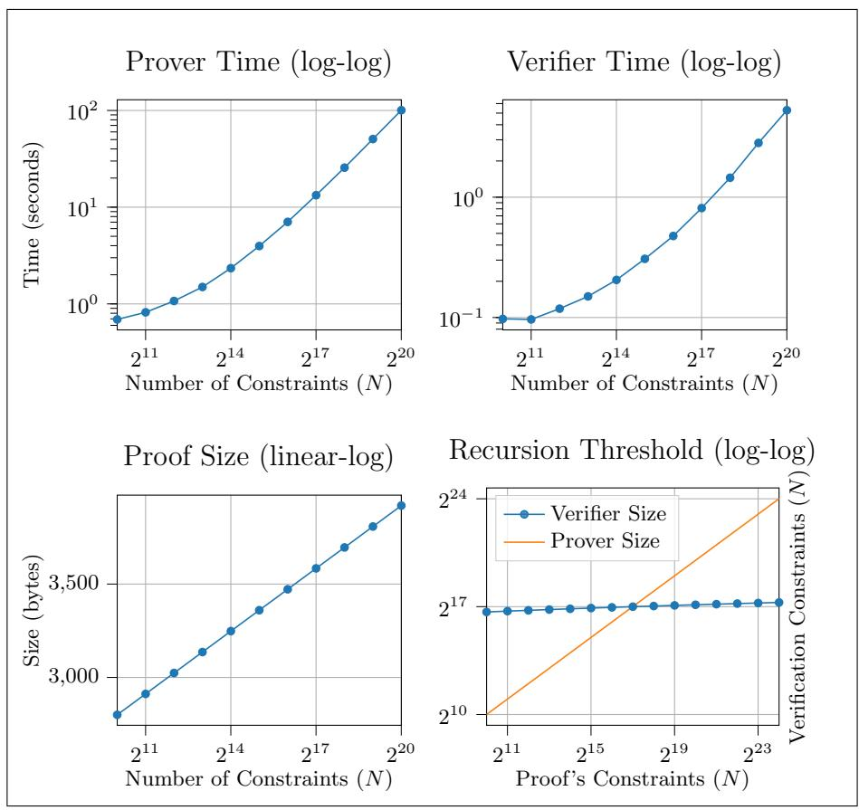

# Recursive Proof Composition without a Trusted Setup

Sean Bowe<sup>1</sup> , Jack Grigg<sup>1</sup> , and Daira Hopwood<sup>1</sup>

> <sup>1</sup> Electric Coin Company {sean,jack,daira}@electriccoin.co <https://electriccoin.co/>

Abstract. Non-interactive arguments of knowledge are powerful cryptographic tools that can be used to demonstrate the faithful execution of arbitrary computations with publicly verifiable proofs. Increasingly efficient protocols have been described in recent years, with verification time and/or communication complexity that is sublinear in the size of the computation being described. These efficiencies can be exploited to realize recursive proof composition: the concept of proofs that attest to the correctness of other instances of themselves, thereby allowing large computational effort to be incrementally verified. All previously known realizations of recursive proof composition have required a trusted setup and cycles of expensive pairing-friendly elliptic curves. We obtain and implement Halo, the first practical example of recursive proof composition without a trusted setup, using the discrete log assumption over normal cycles of elliptic curves. In the process we develop several novel techniques that may be of independent interest.

Keywords: recursive proofs · incrementally verifiable computation · zero knowledge

# 1 Introduction

Proofs of knowledge [\[24\]](#page-22-0), introduced by Goldwasser, Micali and Rackoff, allow us to demonstrate knowledge of a satisfying witness to some NP statement. If these proofs also do not reveal anything about the witness we refer to them as zero-knowledge proofs of knowledge. The works of Kilian, Micali and others showed that proofs of knowledge could be non-interactive, and that these proofs could even be smaller than the statement being proven. [\[31](#page-23-0)[,33,](#page-23-1)[10,](#page-21-0)[9\]](#page-21-1) In the decades since, significant reductions in the size and verification time of such protocols have been made, culminating in zero-knowledge succinct non-interactive arguments of knowledge, or zk-SNARKs for short. Today, the most efficient zk-SNARKs require pairing-friendly elliptic curves and trusted setup assumptions as in [25] but in return admit small, constant-size proofs with constant-time verification.

One of the motivating use cases for zk-SNARKs is the application of verifiable computation [23], whereby computations can be delegated to an untrusted third party who returns the result as well as a cryptographic proof that the result is correct. Ideally this proof would be asymptotically smaller and less expensive to check than the computation itself, a property of zk-SNARKs that we call succinctness. A direct consequence of a succinct argument is the concept of incrementally verifiable computation [36] in which proofs not only attest to the correct execution of a computation but also, by exploiting succinctness, the validity of a previous proof. In this way a large and virtually unbounded amount of computation can be verified with a single proof, and with this proof alone we may extend the computation with further proofs.

As a concrete motivation for incrementally verifiable computation, consider a blockchain network that requires all participants in the network to download the entire history of the blockchain and validate each individual state transition (transaction) merely in order to validate and process *new* state changes. SNARKs allow us to partially address this scalability problem by outsourcing some of these verification steps to a third party. However, the participant still must download and check each proof. Incrementally verifiable computation solves this issue, allowing a single proof to inductively demonstrate the correctness of many previous proofs. The participant in the blockchain network need only download the current state of the network as well as a single proof that this state is correct. Further proofs of state changes can be constructed with the latest proof alone, allowing active participants to prune old state changes.

We can obtain incremental verifiable computation via recursive proof composition, i.e. proofs that can feasibly attest to the correctness of other instances of themselves. These proofs can be used to ensure the satisfaction of compliance predicates between old and new states, leading to concepts such as proof-carrying data [19] which can be extended to obtain verifiable distributed computations as in [8]. The first practical realization of recursive proof composition was shown in [4] and relies on SNARKs built over pairing-friendly elliptic curves. Elliptic curve groups are typically instantiated over a base field  $\mathbb{F}_p$ , but these groups are often of a prime order  $q \neq p$  so that the SNARK construction, which demonstrates satisfiability of an arithmetic circuit over the scalar field  $\mathbb{F}_q$ , cannot efficiently encode the  $\mathbb{F}_p$  arithmetic needed to verify its own proofs. The authors of [4] sidestep this issue by constructing a 2-cycle of pairing-friendly elliptic curves such that the base field of either curve is the scalar field of the other. Unfortunately, only a single family of pairing-friendly curves is known to admit cycles of this form [16], and due to their low embedding degrees secure curves in this family must be constructed over large (780-bit) fields, disturbing performance. Perhaps more importantly, all known pairing-based SNARKs require a trusted setup.

In theory it should be possible to instantiate recursive proof composition using any zk-SNARK, and in recent years protocols such as STARKs [3] offer alternatives to pairing-based SNARKs that do not require trusted setups.

However, recursive proof composition has never been practically realized with these protocols due to large constants; for example STARKs have proofs that are hundreds of kilobytes in size even for relatively simple computations.

#### 1.1 Our Contributions

We present Halo, the first practical realization of recursive proof composition without a trusted setup. As in [\[4\]](#page-21-3), we use a cycle of elliptic curves such that proofs constructed with one curve can efficiently verify proofs constructed over the other. However, neither curve is pairing-friendly; the cycle consists of normal 255-bit prime-order curves that are conjectured to approach the 128-bit security level. Such cycles are easy to construct, as discussed in [Section 6.1.](#page-17-0) Proof size and verification time in our protocol does not increase with the depth of recursion.

Polynomial Commitments with Amortized Succinctness In [Section 3](#page-6-0) we present a new polynomial commitment scheme based on the inner product argument of [\[12](#page-21-5)[,13\]](#page-22-4), inspired by a similar protocol from [\[37\]](#page-23-4). We make a novel observation that, by exploiting the smooth structure of vectors that the verifier must work with, we can amortize away (across many proofs) the linear-time verification operation for commitment openings with the assistance of an untrusted third party "helper." In particular, instead of performing a linear-time operation for each commitment opening proof, the helper provides the claimed output of these linear-time operations for each proof and then uses a new argument to demonstrate that every claimed output was correct. This new argument requires that the verifier perform the same linear-time operation, but this time only once for the entire batch of proofs. This strategy allows us to build proofs for arithmetic circuit satisfiability in which the marginal verification time is logarithmic in the size of the circuit, improving asymptotically over Bulletproofs [\[13\]](#page-22-4). This is similar to the helped variant of the Sonic protocol [\[32,](#page-23-5) Section 8], except that our approach avoids the need for a trusted setup.

Nested Amortization All previously known attempts at achieving recursive proof composition have followed a similar strategy: build a fully succinct, noninteractive argument system and then construct a verification circuit for this system. Due to the succinctness property, at some threshold the verification circuit will be smaller than the size of the circuit being checked, allowing arbitrarydepth recursion to be achieved. Argument systems based on elliptic curve groups have the smallest communication complexity known in the literature, but currently they either require trusted setups (as in all pairing-based SNARKs) or have linear-time verifiers (as in Bulletproofs [\[13\]](#page-22-4)) and so are not fully succinct.

Our primary contribution is a novel approach for reducing the verification circuit size by exploiting the amortization strategy explained previously. In short, the verification circuit never performs linear-time operations itself, but rather takes the input and (claimed) output of the linear-time operation to be public inputs to the circuit, i.e. they are encoded in the statement being proven. The circuit proceeds on the assumption that the claimed output is correct and so the circuit is sublinear in size. This effectively defers the full verification of the "inner" proof to the verifier, who must also perform a similar linear-time operation to check the "outer" proof. Using the amortization argument described previously, the verifier can collapse these two computations together into one with the assistance of a helper. In the recursive context we simply embed the verifier of this amortization argument at each depth of the recursion so as to continually collapse the cost of verifying arguments. The linear-time verification operation is thus only performed once at the end of the recursive chain, and never as part of the verification circuit itself, bypassing the conventional need for a fully succinct argument and in fact avoiding the need for pre-processing.

Implementation We fully implement our protocol in [Section 6](#page-15-0) to demonstrate its practicality and assist in comparison with future work. In the process, we describe a 2-cycle of elliptic curves – which we refer to as Tweedledum and Tweedledee, respectively – with attractive performance and security. We instantiate an argument for arithmetic circuit satisfiability over each elliptic curve group, exploiting their cyclic nature to efficiently express verification circuits as in [\[4\]](#page-21-3). The curves we choose are also specifically designed to support certain endomorphisms which we exploit to reduce the size of our verification circuit in various novel ways described in [Section 6.2,](#page-18-0) which are likely of independent interest.

### 1.2 Concurrent Work

In concurrent work, Fractal [\[18\]](#page-22-5) is a proposed recursive zero-knowledge protocol based on recent efficient low-degree testing techniques, with plausible postquantum security and full succinctness. Our work is not fully succinct (in that the verifier's work is linear in the circuit size) but our fully-recursive proofs are 3.5 KiB in size, compared to Fractal's which are over 120 KiB in size at the 128-bit security level. Further, Halo's recursion threshold[1](#page-3-0) is less than 2<sup>17</sup> multiplication gates — at least an order of magnitude smaller than Fractal's — which has the potential for substantially reducing proving time/memory requirements.

Supersonic [\[14\]](#page-22-6) is a recent zk-SNARK based on groups of unknown order, which does not require a trusted setup. It is not clear to us if recursion can be practically achieved using this scheme or, if so, how competitive it would be with our results.

# 2 Preliminaries

We take λ as our security parameter, and unless explicitly noted, all algorithms and adversaries are probablistic interactive Turing machines that run in polynomial time in this security parameter. We use negl(λ) to describe a function that is negligible in λ.

<span id="page-3-0"></span><sup>1</sup> The recursion threshold is the number of (multiplication) gates in the smallest circuit that can achieve arbitrary-depth proof composition.

## 2.1 Zero-Knowledge Arguments of Knowledge

Zero-knowledge proofs of knowledge allow a prover  $\mathcal{P}$  to demonstrate knowledge of a witness w such that  $(x,w) \in \mathcal{R}$  for a polynomial-time decidable relation  $\mathcal{R}$  and some statement x, without revealing any information about w to the verifier  $\mathcal{V}$  of the proof except that which can be inferred from the truth of the statement. We'll write relations in the form  $\{(\text{statement}; \text{witness}) : \text{predicate}\}.$

We will work with arguments of knowledge which assume computationally bounded provers. We will model  $\mathcal{P}, \mathcal{V}$  as interactive algorithms, with a preliminary algorithm Setup that produces a common reference string  $\sigma$ . We will denote the transcript of the interaction as  $\langle \mathcal{P}(\sigma, x, w), \mathcal{V}(\sigma, x; \rho) \rangle$ , with the verifier's internal randomness  $\rho$  sometimes being omitted.

**Definition 1 (Perfect Completeness).** (Setup,  $\mathcal{P}, \mathcal{V}$ ) has perfect completeness if for all non-uniform polynomial-time adversaries  $\mathcal{A}$

$$\Pr\left[(x,w) \notin \mathcal{R} \,\vee\, \langle \mathcal{P}(\sigma,x,w), \mathcal{V}(\sigma,x)\rangle \text{ accepts } \middle| \begin{array}{l} \sigma \leftarrow \mathsf{Setup}(1^\lambda) \\ (x,w) \leftarrow \mathcal{A}(\sigma) \end{array}\right] = 1$$

## Definition 2 (Computational Witness-Extended Emulation).

(Setup,  $\mathcal{P}, \mathcal{V}$ ) has witness-extended emulation if for all deterministic polynomial-time  $\mathcal{P}^*$  there exists an expected polynomial-time emulator  $\mathcal{E}$  such that for all pairs of interactive adversaries  $\mathcal{A}_1, \mathcal{A}_2$

$$\left| \Pr \left[ \begin{array}{c} \mathcal{A}_1(tr) = 1 \\ \mathcal{A}_1(tr) = 1 \\ x, s) \leftarrow \mathcal{A}_2(\sigma) \\ tr \leftarrow \left\langle \mathcal{P}^*(\sigma, x, s), \mathcal{V}(\sigma, x) \right\rangle \right] - \left| \mathbf{c} \right| \\ \Pr \left[ \begin{array}{c} \mathcal{A}_1(tr) = 1 \\ \wedge (tr \text{ accepts} \Rightarrow (x, w) \in \mathcal{R}) \\ (tr, w) \leftarrow \mathcal{E}^{\mathcal{O}}(\sigma, x) \end{array} \right] \right| \leq \operatorname{negl}(\lambda)$$

where the oracle is given by  $\mathcal{O} = \langle \mathcal{P}^*(\sigma, x, s), \mathcal{V}(\sigma, x) \rangle$  and permits rewinding to a specific point and resuming with fresh randomness for the verifier from that point onward. We also define computational witness-extended emulation by restricting to non-uniform polynomial-time adversaries  $\mathcal{A}_1$  and  $\mathcal{A}_2$ .

**Definition 3 (Argument of Knowledge).** (Setup,  $\mathcal{P}$ ,  $\mathcal{V}$ ) is an argument of knowledge if it has perfect completeness and computational witness-extended emulation.

**Definition 4 (Public-Coin).** (Setup,  $\mathcal{P}, \mathcal{V}$ ) is a public-coin argument if the verifier chooses their messages uniformly at random and independently of the messages sent by the prover, i.e., the challenges correspond to the verifier's randomness  $\rho$ .

#### Definition 5 (Perfect Special Honest-Verifier Zero Knowledge).

(Setup,  $\mathcal{P}, \mathcal{V}$ ) has perfect special honest-verifier zero knowledge (PSHVZK) if for all non-uniform polynomial-time adversaries  $\mathcal{A}_1, \mathcal{A}_2$  and polynomially decidable relation  $\mathcal{R}$  with  $(x, w) \in \mathcal{R}$  there exists a probablistic polynomial-time simulator  $\mathcal{S}$  such that

$$\Pr\left[ \begin{array}{l} \mathcal{A}_{1}(tr,\sigma,x) = 1 \, \left| \, \begin{array}{l} \sigma \leftarrow \mathsf{Setup}(1^{\lambda}) \\ (x,w,\rho) \leftarrow \mathcal{A}_{2}(\sigma) \\ tr \leftarrow \langle \mathcal{P}(\sigma,x,w), \mathcal{V}(\sigma,x;\rho) \rangle \end{array} \right] = \\ \Pr\left[ \begin{array}{l} \mathcal{A}_{1}(tr,\sigma,x) = 1 \, \left| \begin{array}{l} \sigma \leftarrow \mathsf{Setup}(1^{\lambda}) \\ (x,w,\rho) \leftarrow \mathcal{A}_{2}(\sigma) \\ tr \leftarrow \mathcal{S}(\sigma,x,\rho) \end{array} \right. \right] \end{array} \right.$$

where  $\rho$  is the verifier's internal randomness.

#### 2.2 Groups

We use the notation  $\mathbb{G}$  for a group of prime order p, and  $\mathbb{F}_p$  to denote its scalar field. We will often write the field as  $\mathbb{F}$  if the size of the field is implied or unimportant. Rather than drawing verifier challenges from  $\mathbb{F}^{\times}$  we will draw them instead from a challenge space  $\mathbb{I} \subset \mathbb{F}^{\times}$  that is of size  $2^{\lambda}$ .

We use uppercase letters to denote group elements, and lowercase letters to denote scalars. Group operations are written additively, and scalar multiplication is denoted by [a] G for  $a \in \mathbb{F}$  and  $G \in \mathbb{G}$ . The additive identity in  $\mathbb{G}$  is written as  $\mathcal{O}$ . We use boldface variable names for vectors, such that  $\mathbf{a}$  is a vector of scalars and  $\mathbf{G}$  is a vector of group elements. All vectors are zero-indexed unless explicitly noted.

We write the inner product  $a_0b_0 + a_1b_1 + \cdots + a_{n-1}b_{n-1}$  of scalar vectors  $\mathbf{a}, \mathbf{b} \in \mathbb{F}^n$ , as  $\langle \mathbf{a}, \mathbf{b} \rangle$ . Similarly we write the multiscalar multiplication  $[a_0]G_0 + [a_1]G_1 + \cdots + [a_{n-1}]G_{n-1}$  of a scalar vector  $\mathbf{a} \in \mathbb{F}^n$  with a vector of group elements  $\mathbf{G} \in \mathbb{G}^n$ , as  $\langle \mathbf{a}, \mathbf{G} \rangle$ . We will sometimes write  $\mathbf{G}_{lo}$  or  $\mathbf{G}_{hi}$  to refer to the first half or second half of a vector of group elements or scalars.

Definition 6 (Discrete Log Relation Assumption). For all adversaries  $\mathcal{A}$  and for all  $n \geq 2$

$$\Pr\left[\mathbf{G} \stackrel{\$}{\leftarrow} \mathbb{G}^n; \mathbf{a} \in \mathbb{F}^n \leftarrow \mathcal{A}(\mathbb{G}, \mathbf{G}) : \exists \mathbf{a}_i \neq 0 \land \langle \mathbf{a}, \mathbf{G} \rangle = \mathcal{O}\right] \leq \operatorname{negl}(\lambda)$$

The discrete log relation assumption generalizes the discrete log assumption to arbitrary numbers of random group elements. We say that  $\langle \mathbf{a}, \mathbf{G} \rangle = \mathcal{O}$  is a non-trivial discrete log relation between elements of  $\mathbf{G}$  when at least one of  $\mathbf{a}$  is nonzero.

# <span id="page-6-0"></span>3 Polynomial Commitments

Polynomial commitment schemes [30] form a fundamental building block in many modern arguments of knowledge. [32,17,22,14] In these schemes, a prover can construct commitments to polynomials and then later provably evaluate the committed polynomials at arbitrary points. We present a univariate polynomial commitment scheme (Setup, Commit, Open, VerifyOpen) based on the multivariate scheme of [37], which is itself a variant of the inner product argument first presented in [12], with adaptations from Bulletproofs [13].

First, for a given degree bound d-1 we define  $\mathsf{Setup}(1^{\lambda}, d)$  as an algorithm that produces a common reference string  $\sigma = (\mathbb{G}, \mathbb{F}_p, \mathbf{G}, H)$  for group  $\mathbb{G}$  of prime order p, with random  $\mathbf{G} \in \mathbb{G}^d$  and  $H \in \mathbb{G}$ . Let Commit be defined as

$$\mathsf{Commit}(\sigma, p(X); r) = \langle \mathbf{a}, \mathbf{G} \rangle + [r]H$$

for blinding factor r, where  $\mathbf{a}_i \in \mathbb{F}$  is the coefficient for the ith degree term of p(X), and  $p(X) \in \mathbb{F}_p[X]$  is of maximal degree d-1. We will sometimes omit the blinding factor r if it is either implicit or unnecessary. This is a Pedersen vector commitment to the polynomial coefficients, and we remark that such commitments are perfectly hiding and additively homomorphic:  $\forall a, b, r, s \in \mathbb{F}_p$  and  $p(X), q(X) \in \mathbb{F}_p[X]$  we have

$$\begin{aligned} &[a]\operatorname{Commit}(\sigma,p(X);r)\\ &+[b]\operatorname{Commit}(\sigma,q(X);s) \end{aligned} = \operatorname{Commit}(\sigma,a\cdot p(X)+b\cdot q(X);ar+bs).$$

We will have  $(\mathsf{Setup}, \mathsf{Open}, \mathsf{VerifyOpen})$  be a PSHVZK argument of knowledge for the relation

$$\left\{ ((P,x,v);(\mathbf{a},r)): P = \langle \mathbf{a},\mathbf{G} \rangle + [r]H \, \wedge \, v = \langle \mathbf{a},(1,x,x^2,...,x^{d-1}) \rangle \right\}$$

which will allow a prover to demonstrate to a verifier that the polynomial contained "inside" the commitment P evaluates to v at x, and moreover, that the committed polynomial has maximum degree d-1.

#### <span id="page-6-1"></span>3.1 Protocol Description

The protocol takes the polynomial commitment P, point x, and claimed evaluation v as common inputs. In the first move the verifier VerifyOpen sends a random group element  $U \in \mathbb{G}$ . Both parties compute

$$P' = P + [v] U$$

and begin an argument (described next) to demonstrate that the prover Open knows  $\mathbf{a} \in \mathbb{F}_p^d$  and  $r, v' \in \mathbb{F}_p$  such that

$$P' = \langle \mathbf{a}, \mathbf{G} \rangle + [r]H + [v']U$$

and that  $v' = \langle \mathbf{a}, (1, x, x^2, ..., x^{d-1}) \rangle$ . As the prover did not know U in advance, this establishes that v = v'. (In this respect we differ from the protocol described in [37, Appendix A.3] which effectively has U fixed prior to the argument; a prover with malicious control of P would then be able to interfere with the argument by including terms involving U in P.)

Modified Inner Product Bulletproofs [13] presents a variant of the inner product argument [12] in which a prover aims to convince a verifier that they know  $\mathbf{a}, \mathbf{b} \in \mathbb{F}^d$  such that

$$P' = \langle \mathbf{a}, \mathbf{G} \rangle + \langle \mathbf{b}, \mathbf{H} \rangle + [\langle \mathbf{a}, \mathbf{b} \rangle] U$$

for some given P', and random generators  $\mathbf{G}, \mathbf{H} \in \mathbb{G}^d, U \in \mathbb{G}$ . We use a variant of this argument in which the second vector  $\mathbf{b} = (1, x, x^2, ..., x^{n-1})$  is fixed for the given choice of x, and known to both the prover and verifier. As a result no vector  $\mathbf{H}$  is necessary. Further, we allow an additional generator H to serve as a mechanism for perfectly blinding both prover messages and the commitment P' itself.

Assume  $d = 2^k$  for k > 0. Initializing for the prover  $\mathbf{G}' := \mathbf{G}, \mathbf{a}' := \mathbf{a}, \mathbf{b}' := \mathbf{b}$ , we will proceed in k rounds of interaction, where in the jth round (starting with j = k and finishing with j = 1) the prover sends

$$L_{j} = \langle \mathbf{a'}_{lo}, \mathbf{G'}_{hi} \rangle + [l_{j}]H + [\langle \mathbf{a'}_{lo}, \mathbf{b'}_{hi} \rangle] U$$


$$R_{j} = \langle \mathbf{a'}_{hi}, \mathbf{G'}_{lo} \rangle + [r_{j}]H + [\langle \mathbf{a'}_{hi}, \mathbf{b'}_{lo} \rangle] U$$

with random blinding factors  $l_j, r_j \in \mathbb{F}_p$ . The verifier responds with a random challenge  $u_j \in \mathbb{I}$  and the prover computes

$$\mathbf{a}' \leftarrow \mathbf{a'}_{\text{hi}} \cdot u_j^{-1} + \mathbf{a'}_{\text{lo}} \cdot u_j$$

$$\mathbf{b}' \leftarrow \mathbf{b'}_{\text{lo}} \cdot u_j^{-1} + \mathbf{b'}_{\text{hi}} \cdot u_j$$

$$\mathbf{G}' \leftarrow \mathbf{G'}_{\text{lo}} \cdot u_j^{-1} + \mathbf{G'}_{\text{hi}} \cdot u_j$$

for the next round. After the final round,  $\mathbf{G}', \mathbf{a}', \mathbf{b}'$  are each of length 1. Note that the verifier can compute  $G = \mathbf{G}'_0$  as  $\langle \mathbf{s}, \mathbf{G} \rangle$  and  $b = \mathbf{b}'_0$  as  $\langle \mathbf{s}, \mathbf{b} \rangle$  where

$$\mathbf{s} = (u_1^{-1} u_2^{-1} \cdots u_k^{-1}, u_1 u_2^{-1} \cdots u_k^{-1}, u_1^{-1} u_2 \cdots u_k^{-1}, u_1 u_2 \cdots u_k^{-1}, u_1 u_2 \cdots u_k^{-1}, \dots$$

$$\vdots \qquad \qquad \vdots \qquad \qquad \vdots \qquad \qquad \vdots \qquad \qquad \vdots \qquad \qquad \vdots \qquad \qquad \vdots \qquad \qquad \vdots \qquad \qquad \vdots \qquad \qquad \qquad \vdots \qquad \qquad \vdots \qquad \qquad \vdots \qquad \qquad \vdots \qquad \qquad \vdots \qquad \qquad \vdots \qquad \qquad \vdots \qquad \qquad \vdots \qquad \qquad \vdots \qquad \qquad \vdots \qquad \qquad \vdots \qquad \qquad \vdots \qquad \qquad \vdots \qquad \qquad \vdots \qquad \qquad \vdots \qquad \qquad \vdots \qquad \qquad \vdots \qquad \qquad \vdots \qquad \qquad \vdots \qquad \qquad \vdots \qquad \qquad \vdots \qquad \qquad \vdots \qquad \qquad \vdots \qquad \qquad \vdots \qquad \qquad \vdots \qquad \qquad \vdots \qquad \qquad \vdots \qquad \qquad \vdots \qquad \qquad \vdots \qquad \qquad \vdots \qquad \qquad \vdots \qquad \qquad \vdots \qquad \qquad \vdots \qquad \qquad \vdots \qquad \qquad \vdots \qquad \qquad \vdots \qquad \qquad \vdots \qquad \qquad \vdots \qquad \qquad \vdots \qquad \qquad \vdots \qquad \qquad \vdots \qquad \qquad \vdots \qquad \qquad \vdots \qquad \qquad \vdots \qquad \qquad \vdots \qquad \qquad \vdots \qquad \qquad \vdots \qquad \qquad \vdots \qquad \qquad \vdots \qquad \qquad \vdots \qquad \qquad \vdots \qquad \qquad \vdots \qquad \qquad \vdots \qquad \qquad \vdots \qquad \qquad \vdots \qquad \qquad \vdots \qquad \qquad \vdots \qquad \qquad \vdots \qquad \qquad \vdots \qquad \qquad \vdots \qquad \qquad \vdots \qquad \qquad \vdots \qquad \qquad \vdots \qquad \qquad \vdots \qquad \qquad \vdots \qquad \qquad \vdots \qquad \qquad \vdots \qquad \qquad \vdots \qquad \qquad \vdots \qquad \qquad \vdots \qquad \qquad \vdots \qquad \qquad \vdots \qquad \qquad \vdots \qquad \qquad \vdots \qquad \qquad \vdots \qquad \qquad \vdots \qquad \qquad \vdots \qquad \qquad \vdots \qquad \qquad \vdots \qquad \qquad \vdots \qquad \qquad \vdots \qquad \qquad \vdots \qquad \qquad \vdots \qquad \qquad \vdots \qquad \qquad \vdots \qquad \qquad \vdots \qquad \qquad \vdots \qquad \qquad \vdots \qquad \qquad \vdots \qquad \qquad \vdots \qquad \qquad \vdots \qquad \qquad \vdots \qquad \qquad \vdots \qquad \qquad \vdots \qquad \qquad \vdots \qquad \qquad \vdots \qquad \qquad \vdots \qquad \qquad \vdots \qquad \qquad \vdots \qquad \qquad \vdots \qquad \qquad \vdots \qquad \qquad \vdots \qquad \qquad \vdots \qquad \qquad \vdots \qquad \qquad \vdots \qquad \qquad \vdots \qquad \qquad \vdots \qquad \qquad \vdots \qquad \qquad \vdots \qquad \qquad \vdots \qquad \qquad \vdots \qquad \qquad \vdots \qquad \qquad \vdots \qquad \qquad \vdots \qquad \qquad \vdots \qquad \qquad \vdots \qquad \qquad \vdots \qquad \qquad \vdots \qquad \qquad \vdots \qquad \qquad \vdots \qquad \qquad \vdots \qquad \qquad \vdots \qquad \qquad \vdots \qquad \qquad \vdots \qquad \qquad \vdots \qquad \qquad \vdots \qquad \qquad \vdots \qquad \qquad \vdots \qquad \qquad \qquad \vdots \qquad \qquad \qquad \vdots \qquad \qquad \qquad \vdots \qquad \qquad \qquad \vdots \qquad \qquad \qquad \vdots \qquad \qquad \qquad \vdots \qquad \qquad \qquad \qquad \vdots \qquad \qquad \qquad \qquad \qquad \qquad \vdots \qquad \qquad \qquad \qquad \qquad \qquad \qquad \qquad \qquad \qquad \qquad \qquad \qquad \qquad \qquad \qquad \qquad \qquad \qquad \qquad$$

which has a binary counting structure arising from the fact that in each round the inverted challenges are used to scale bases in the first half  $\mathbf{G'}_{lo}$ , while the ordinary challenges scale the bases in the second half  $\mathbf{G'}_{hi}$ .

The verifier next computes

$$Q = \sum_{j=1}^{k} ([u_j^2]L_j) + P' + \sum_{j=1}^{k} ([u_j^{-2}]R_j)$$

and the prover proceeds to demonstrate knowledge of  $a=\mathbf{a}'_0$  and synthetic blinding factor  $r'=\sum_{j=1}^k(l_ju_j^2)+r+\sum_{j=1}^k(r_ju_j^{-2})$  such that

<span id="page-7-0"></span>
$$Q = [a] G + [r']H + [ab] U$$

=  $[a] (G + [b] U) + [r']H$  (2)

which establishes the claim that  $v = v' = \langle \mathbf{a}, \mathbf{b} \rangle$  as described in [13, Section 3].

Zero-Knowledge Opening The prover demonstrates knowledge of a, r<sup>0</sup> ∈ F<sup>p</sup> such that [Equation 2](#page-7-0) is satisfied, without revealing a, r<sup>0</sup> , in order to establish the claim without revealing anything else about the committed polynomial. We use a generalized Schnorr protocol that is modified from the protocol in [\[37,](#page-23-4) Appendix A.3] to improve efficiency.

The prover begins by sampling random d, s ∈ F<sup>p</sup> and sending

$$R = [d](G + [b]U) + [s]H$$

which the verifier responds to with random challenge c ∈ I. The prover now sends

$$z_1 = ac + d$$
$$z_2 = cr' + s$$

and the verifier accepts if [c] Q + R = [z1] (G + [b]U) + [z2]H.

<span id="page-8-2"></span>Theorem 1. The protocol presented in [Section 3.1](#page-6-1) has perfect completeness, computational witness-extended emulation, and perfect special honest-verifier zero knowledge.

This proof appears in [Appendix A.](#page-24-0)

### <span id="page-8-0"></span>3.2 Amortization Strategy

The polynomial commitment scheme just described suffers from an undesirable asymptotic property: although the communication complexity is logarithmic in the degree bound, the verifier must compute G = hs, Gi and b = hs, bi to accept the argument. One of our novel observations is to exploit the structure of s and b by defining a polynomial

<span id="page-8-1"></span>
$$g(X, u_1, u_2, ..., u_k) = \prod_{i=1}^k (u_i + u_i^{-1} X^{2^{i-1}})$$
(3)

such that b = hs, bi = g(x, u1, u2, ..., uk) which can be computed by the verifier in logarithmic time. This alone seems uninteresting, as computing G still requires a linear-time multiscalar multiplication. However, observe that

$$G = \mathsf{Commit}(\sigma, g(X, u_1, u_2, ..., u_k))$$

which suggests the following strategy: instead of the verifier computing G itself for multiple (independent) arguments, it can ask an untrusted third-party "helper" to compute each G1, G2, ..., G<sup>m</sup> for m separate arguments and provide an argument that each are correct by demonstrating that a random linear combination of the commitments opens at a random point to a value that the verifier can compute in time O(m log(d)). Due to the degree bound of the polynomial commitment scheme the helper convinces the verifier with high probability (given a large enough field) only if the claimed commitments are correct. This new argument itself requires an invocation of the polynomial commitment opening protocol, and so the verifier still must ultimately perform a linear-time operation. However, the verifier has traded m linear-time operations for one, with a marginal cost that is logarithmic in the degree bound. This is of crucial importance for our later techniques.

# <span id="page-9-0"></span>4 Nested Amortization

The general approach for achieving recursive proof composition is to first obtain a non-interactive argument of knowledge for arithmetic circuit satisfiability (i.e. C(x, w) = 1 for auxiliary input w and public input x), and then to encode the verification algorithm for this argument into such an arithmetic circuit. Assuming that the verification circuit for a proof is sublinear in the size of the circuit that the proof reasons about, then at some threshold it will be possible to recursively verify proofs. In our setting we do not have a protocol which can be fully verified in sublinear time, and so naively applying this strategy will not yield results beyond fixed-depth composition. Instead, we devise a novel technique which allows us to avoid fully verifying proofs at each layer of the recursion, leveraging the fact that our protocol in [Section 5](#page-10-0) has sublinear marginal verification time and logarithmic proof size.

Arithmetic circuits are often encoded into systems of constraints such that, given a satisfying assignment of variables (the prover's witness), the satisfaction of the constraint system implies the satisfiability of the circuit. The inherent non-determinism in this process means that some expensive operations can be performed more efficiently when the prover is allowed to assist. As an example, in circuits where a field inversion of a variable u must be computed, rather than exponentiating "in the circuit" (u <sup>p</sup>−<sup>2</sup> which requires log(p) multiplication constraints), the prover can instead witness v = u <sup>−</sup><sup>1</sup> and show that it is the correct inverse with the single multiplication constraint uv = 1. We will exploit this non-determinism in a slightly different way: when our circuit contains an expensive fixed operation f that is invoked with some input x we will instead allow the prover to witness y = f(x) and then take (x, y) as public inputs to the circuit. The circuit can then proceed under the assumption that y is correct, delegating the responsibility of checking the correctness of y to the verifier of the proof.

In the context of proof composition, we apply this optimization so that a verification circuit for a proof will not perform any linear-time (or otherwise expensive) operation f but rather take their inputs and the prover's alleged outputs (x, y) as public inputs to its own circuit. Observe that as proofs are continually composed, increasing instances of (x, y) accumulate because the verification circuit will not check them but rather continually delegate these checks to its verifier. In order to prevent this runaway cost we introduce an amortization strategy: given instances (x, y) and (x 0 , y<sup>0</sup> ), the prover will provide a non-interactive proof that y = f(x) and y <sup>0</sup> = f(x 0 ) as a witness to the verification circuit, and the verification circuit will check this proof. In order to fully check this amortization proof the verification circuit may need to perform a linear-time (or otherwise expensive) operation. However, if this operation is equivalent to invoking f then the verifier has collapsed the two instances (x, y) and (x 0 , y<sup>0</sup> ) into a single fresh instance (x <sup>00</sup>, y00), allowing us to continually amortize away the cost of invoking f as proofs are composed. It is only "outside" of the circuit that f is invoked once by the ultimate verifier, demonstrating the correctness of the entire underlying tree of proofs by induction. We refer to this strategy as "nested amortization."

The public-coin PSHVZK argument of knowledge for arithmetic circuit satisfiability described in [Section 5](#page-10-0) is designed to exploit this nested amortization strategy, leveraging the polynomial commitment amortization technique we explored in [Section 3.2.](#page-8-0) The setting is described as a stream of arguments from the prover to the verifier, where the verifier will maintain logarithmic-size state and perform logarithmic-time operations to partially verify each proof in sequence. Finally, at the end of a stream of proofs the verifier will choose to accept or reject all of them simultaneously in linear time. By applying the Fiat–Shamir heuristic [\[21\]](#page-22-9) in [Section 6](#page-15-0) we can transform this argument into a non-interactive zero-knowledge argument of knowledge. The result is then grafted to the nested amortization technique, where the "state" maintained by the verifier is merely the deferred values that are shepherded through public inputs. This leads directly to a recursive proof of arbitrary depth[2](#page-10-1) where the verifier outside of the circuit will be responsible only for checking the correctness of the verifier state once, with a linear-time operation that is never performed inside the circuit.

# <span id="page-10-0"></span>5 Main Argument

The main argument of Sonic [\[32\]](#page-23-5) allows a prover to demonstrate the satisfiability of an arithmetic circuit (e.g., C(x, w) = 1) for some public input x and auxiliary input w. Our main protocol is a variant of Sonic that is adapted to the polynomial commitment scheme described in [Section 3.](#page-6-0) We will work within a restricted setting to aid later exposition: the circuit C is fixed, and the prover will repeatedly interact with the verifier to engage in multiple arguments in sequence. Our goal will be for the verifier to perform logarithmic marginal work in choosing to accept or reject all of the arguments simultaneously, leveraging the technique described in [Section 3.2](#page-8-0) as well as an analogous technique described in Section 8 of [\[32\]](#page-23-5).

In all of the following let N, Q, k be integers such that d = 4N = 2<sup>k</sup> and 3Q < d. Let the common reference string σ ← Setup(1<sup>λ</sup> , d) be shared between the prover and verifier.

#### 5.1 Central Argument

The prover aims to demonstrate that C(x, w) = 1 for public input x and auxiliary (witness) input w without revealing w. It will do so by demonstrating that a

<span id="page-10-1"></span><sup>2</sup> We remark that, theoretically, the knowledge extractor requires a number of transcripts from the prover that increases exponentially as the depth increases. However, there are no known attacks and this concern is often disregarded in practice. In any case, applications can sometimes sidestep this theoretical concern by restricting to a fixed-depth tree of proofs as in [\[8\]](#page-21-2).

system of arithmetic constraints that encodes  $\mathcal{C}$  is satisfied for witness  $\mathbf{a}, \mathbf{b}, \mathbf{c} \in \mathbb{F}^N$  known only to the prover and some instance  $\mathbf{k} \in \mathbb{F}^Q$  which encodes the public inputs. This system of constraints consists of N multiplication constraints, where the ith such constraint is of the form

$$\mathbf{a}_i \cdot \mathbf{b}_i = \mathbf{c}_i$$

and Q linear constraints, where the qth such constraint is of the form

$$\left(\sum_{i=1}^{N}\mathbf{a}_{i}\cdot(\mathbf{u}_{q})_{i}\right)+\left(\sum_{i=1}^{N}\mathbf{b}_{i}\cdot(\mathbf{v}_{q})_{i}\right)+\left(\sum_{i=1}^{N}\mathbf{c}_{i}\cdot(\mathbf{w}_{q})_{i}\right)=\mathbf{k}_{q}$$

for some fixed  $\mathbf{u}_q, \mathbf{v}_q, \mathbf{w}_q \in \mathbb{F}^N$  that encode  $\mathcal{C}$ . Just as in [32] we will embed all of these constraints into a single equation in formal indeterminate Y

<span id="page-11-0"></span>
$$\sum_{i=1}^{N} \mathbf{a}_{i} \cdot Y^{N} u_{i}(Y) + \sum_{i=1}^{N} \mathbf{b}_{i} \cdot Y^{N} v_{i}(Y) + \sum_{i=1}^{N} \mathbf{c}_{i} \cdot (Y^{N} w_{i}(Y) - Y^{i} - Y^{-i}) + \sum_{i=1}^{N} \mathbf{a}_{i} \mathbf{b}_{i} \cdot (Y^{i} + Y^{-i}) - Y^{N} k(Y) = 0$$
(4)

where we define the polynomials

$$u_i(Y) = \sum_{q=1}^{Q} Y^q(\mathbf{u}_q)_i \qquad v_i(Y) = \sum_{q=1}^{Q} Y^q(\mathbf{v}_q)_i$$
$$w_i(Y) = \sum_{q=1}^{Q} Y^q(\mathbf{w}_q)_i \qquad k(Y) = \sum_{q=1}^{Q} Y^q \mathbf{k}_q$$

such that given a choice of  $\mathbf{a}, \mathbf{b}, \mathbf{c}, \mathbf{k}$  we have that Equation 4 holds at all points when the constraint system is satisfied. Thus, given a large enough field the equation will not hold at a random point (with high probability) if the constraint system is not safisfied. Given a second formal indeterminate X let us define the polynomials

$$\begin{split} r(X,Y) &= \sum_{i=1}^{N} \mathbf{a}_{i} X^{i} Y^{i} \, + \, \sum_{i=1}^{N} \mathbf{b}_{i} X^{-i} Y^{-i} \, + \, \sum_{i=1}^{N} \mathbf{c}_{i} X^{-i-N} Y^{-i-N} \\ s(X,Y) &= \sum_{i=1}^{N} u_{i}(Y) X^{-i} \, + \, \sum_{i=1}^{N} v_{i}(Y) X^{i} \, + \, \sum_{i=1}^{N} w_{i}(Y) X^{i+N} \\ s'(X,Y) &= Y^{N} s(X,Y) \, - \, \sum_{i=1}^{N} (Y^{i} + Y^{-i}) X^{i+N} \\ t(X,Y) &= r(X,1) (r(X,Y) + s'(X,Y)) - Y^{N} k(Y) \end{split}$$

such that the constant term of t(X,Y) is exactly the left-hand side of Equation 4. Observe that because r(X,Y)=r(XY,1) the prover can commit to r(X,Y) using a univariate polynomial commitment scheme, i.e.  $\mathsf{Commit}(\sigma,r(X,1))$ . The

remaining polynomials are fully determined by this choice of r(X,Y) and do not depend on the witness  $\mathbf{a}, \mathbf{b}, \mathbf{c}$ . The general strategy is for the prover to send a commitment to r(X,Y) and then to demonstrate that the constant term of t(X,Y) is the zero polynomial. The verifier will sample a random  $y \in \mathbb{I}$  and ask the prover to commit to t(X,y). The commitments will be checked for consistency: the verifier will choose a random  $x \in \mathbb{I}$ , and the prover will open its commitments to a = r(x,1), b = r(x,y) and t = t(x,y), such that

$$t = a(r + s'(x, y)) - k(y)$$

gives us that the commitment to t(X,y) is correct with high probability. If the prover can convince the verifier that their commitment to r(X,Y) is bounded at degree N then we have that the constant term of t(X,Y) is exactly the left-hand side of Equation 4, and if the constant term of this commitment can be shown to be zero then with high probability the prover has knowledge of a satisfying witness.

Committing to r(X,Y) In order to show that the degree of r(X,Y) is bound at N, the prover will instead send  $R = \mathsf{Commit}(\sigma, r(X,1)X^{3N-1}; \delta_R)$  for some blinding factor  $\delta_R \in \mathbb{F}$  so that the degree bound d-1=4N-1 restricts the prover. The verifier need only rescale openings of this commitment by  $X^{-3N+1}$  to obtain the desired value.

Blinding r(X,Y) The commitment R is perfectly blinded by the prover's choice of  $\delta_R$ . The prover will eventually open r(X,Y) at various points for the verifier to check consistency with the prover's commitment to t(X,y). This will reveal some information about the witness  $\mathbf{a}, \mathbf{b}, \mathbf{c}$ . We resolve this by designating seven of these wire values as random blinding factors; as shown in the proof of Theorem 2 the verifier will then not learn a sufficient number of evaluations of r(X,Y) to distinguish the committed polynomial from random.

Committing to t(X,y) Observe that t(X,y) has exponents of X that span from  $X^{-4N}$  to  $X^{3N}$ , with a constant term of zero. Let  $t_{\rm lo}(X,y)$  and  $t_{\rm hi}(X,y)$  be polynomials of degree d-1 such that  $t(X,y)=t_{\rm lo}(X,y)X^{-d}+t_{\rm hi}(X,y)X$ . Rather than committing directly to t(X,y) the prover will demonstrate that its constant term is zero by separately sending  $T_{\rm lo}={\sf Commit}(\sigma,t_{\rm lo}(X,y),\delta_{\rm lo})$  and  $T_{\rm hi}={\sf Commit}(\sigma,t_{\rm hi}(X,y),\delta_{\rm hi})$  for blinding factors  $\delta_{\rm lo},\delta_{\rm hi}\in\mathbb{F}$ , and the pair of commitments will then be taken as a commitment to a Laurent polynomial with a constant term of zero due to the degree bound of the polynomial commitment scheme, and the verifier will again rescale commitment openings as appropriate.

Committing to k(Y) In our setting it will ultimately be more efficient for the prover and verifier to compute  $K = \mathsf{Commit}(\sigma, k(Y))$  so that the prover can open this commitment at y on behalf of the verifier, rather than requiring the verifier to evaluate k(y) itself.

Amortizing the Evaluation of s 0 (x, y) In the protocol described so far, the verifier must evaluate s 0 (x, y) to accept the argument. Instead we will borrow a strategy from [\[32\]](#page-23-5) in which the prover sends S = Commit(σ, s(X, y)X<sup>N</sup> ) prior to the verifier's choice of x and then later opens this commitment at x, which the verifier rescales by x <sup>−</sup><sup>N</sup> to obtain the desired value s(x, y) and uses this to compute s 0 (x, y) in logarithmic time. It remains for the verifier to check that the commitment S is correct, which would ordinarily require work that is linear in |C|. Recall that in our setting we permit the verifier to perform a linear-time operation only at the end of a sequence of arguments, and that the marginal cost of checking an argument must be logarithmic in |C|.

We address this using a technique inspired by Section 8 of [\[32\]](#page-23-5). Each argument will produce a value ynew and a value Snew that is purportedly equal to Commit(σ, s(X, ynew)X<sup>N</sup> ). Let (yold, Sold) be the values (ynew, Snew) produced from the previous argument. The prover will demonstrate that S and Sold are correct by sending C = Commit(σ, s(x, Y ) x <sup>N</sup> ) following the verifier's choice of x, and then opening C at yold, y to the same values that Sold and S open at x, respectively. This establishes with high probability that each commitment is to the correct polynomial assuming that C is a commitment to the correct polynomial. Instead of checking the correctness of C the verifier will sample random ynew ∈ I and ask the prover to supply Snew = Commit(σ, s(X, ynew)X<sup>N</sup> ). The prover will demonstrate that Snew opens at x to the same value that C opens at ynew. The correctness of Snew then demonstrates the correctness of C with high probability. The verifier will now take this (ynew, Snew) for the next argument. In order to accept a sequence of arguments the verifier will need to check that Snew = Commit(σ, s(X, ynew)X<sup>N</sup> ) for the final argument but otherwise does not perform linear-time marginal work with respect to evaluating s(X, Y ).

Combining Polynomial Commitment Opening Arguments In the protocol described so far the prover and verifier must engage in several separate polynomial commitment opening arguments. The commitments R, Sold, S, Snew, Tlo, Thi must each be opened at x, the commitments K, C must be opened at y, the commitment R must be opened at xy and the commitment C must be opened at yold and ynew. We use a batch opening strategy from [\[30\]](#page-23-6) which leverages the fact that our polynomial commitments are additively homomorphic. Given a verifier challenge z<sup>1</sup> let

$$P = R + [z_1]\,S_{\rm old} + [z_1^2]\,S + [z_1^3]\,S_{\rm new} + [z_1^4]\,T_{\rm lo} + [z_1^5]\,T_{\rm hi} = {\sf Commit}(\sigma, p(X))$$

and Q = K + [z1] C = Commit(σ, q(X)) for implicitly defined polynomials p(X), q(X) ∈ F[X]. The prover will send the openings for each of R, Sold, S, Snew, Tlo, Thi at x and for each of K, C at y prior to the choice of z1, and then the prover will proceed to open P at x and Q at y to values the verifier can compute itself, convincing it with high probability that the openings are each correct due to the degree bound of the polynomial commitment scheme.

In order to reduce five separate opening arguments to one we use a technique inspired by [11]. In general for distinct evaluation points  $x_0, x_1, ..., x_{m-1}$  we will define the polynomial

$$h(X,Y) = \sum_{i=0}^{m-1} Y^{i} \frac{e_{i}(X) - v_{i}}{X - x_{i}}$$

where for m commitments  $E_0, E_1, ..., E_{m-1}$  each  $E_i = \mathsf{Commit}(\sigma, e_i(X))$  will be opened at point  $x_i$  to value  $v_i$ . The prover sends the openings  $v_i = p_i(x_i)$  for all i and is then given a random challenge  $z_2$ . The prover sends the commitment  $H = \mathsf{Commit}(\sigma, h(X, z_2); \delta_H)$  for some blinding factor  $\delta_H \in \mathbb{F}$ . In order to establish the correctness of H with respect to the previous commitments the prover will open P, Q, R, C, H at a fresh challenge point  $z_3$  from the verifier, where the verifier can compute the expected opening of H itself given the prover's claimed openings. Given that P, Q, R, C are fixed prior to the choice of  $z_2, z_3$  we see that H is a commitment to the correct polynomial with high probability, and thus by the factor theorem we conclude that the openings of P, Q, R, C are correct with high probability. In order to collapse the openings of P, Q, R, C, H at  $z_3$  together into a single invocation of the polynomial commitment opening argument we will use the same technique as before, i.e. the verifier will sample random  $z_4$  and the prover will open  $P + [z_4] Q + [z_4^2] R + [z_4^3] C + [z_4^4] H$  to the value the verifier can compute itself using the prover's claimed openings.

Amortizing the Evaluation of G The argument so far requires the verifier to compute  $G = \langle \mathbf{s}, \mathbf{G} \rangle$  as described in Section 3.2. This requires a multiscalar multiplication that is linear in the degree bound and thus also linear in  $|\mathcal{C}|$ . As mentioned previously, in our setting we require that the verifier only perform a single operation that is linear time in  $|\mathcal{C}|$  at the end of the argument and otherwise expend only logarithmic marginal work to accept each individual argument.

We resolve this with a similar strategy as before, amortizing evaluations of s'(X,Y) by using the technique discussed in Section 3.2. The prover will provide the verifier with the purported value  $G \in \mathbb{G}$ . The verification of each argument will produce values  $G_{\text{new}} = G$  and challenges  $(u_{\text{new}})_1, (u_{\text{new}})_2, ..., (u_{\text{new}})_k$ . Rather than checking  $G_{\text{new}} = \text{Commit}(\sigma, g(X, (u_{\text{new}})_1, (u_{\text{new}})_2, ..., (u_{\text{new}})_k))$  the verifier will ask the prover to open  $G_{\text{new}}$  at  $x \in \mathbb{F}$  in the next argument. Let  $(G_{\text{old}}, (u_{\text{old}})_1, (u_{\text{old}})_2, ..., (u_{\text{old}})_k)$  be the values  $(G_{\text{new}}, (u_{\text{new}})_1, (u_{\text{new}})_2, ..., (u_{\text{new}})_k)$  produced from the previous argument. We will modify P such that

$$P = R + [z_1]\,S_{\rm old} + [z_1^2]\,S + [z_1^3]\,S_{\rm new} + [z_1^4]\,T_{\rm lo} + [z_1^5]\,T_{\rm hi} + [z_1^6]\,G_{\rm old}$$

so that  $G_{\text{old}}$  is opened at x, and we note that the verifier can compute the expected opening of  $G_{\text{old}}$  in logarithmic time using Equation 3. The verifier will thus be convinced of the correctness of each value  $G_{\text{new}}$  in a sequence of arguments so long as the final  $G_{\text{new}}$  sent by the prover is correct.

### 5.2 Full Protocol

We now bring together a full description of the protocol. The prover and verifier will engage in a series of PSHVZK arguments of knowledge for relation R defined as

$$\mathcal{R} = \begin{cases}
((G_{\text{old}}, S_{\text{old}}, y_{\text{old}}, (u_{\text{old}})_1, (u_{\text{old}})_2, ..., (u_{\text{old}})_k, \mathbf{k}); (\mathbf{a}, \mathbf{b}, \mathbf{c})) : \\
\forall i \ (\mathbf{a}_i \cdot \mathbf{b}_i = \mathbf{c}_i) \\
\land \forall q \left[ \left( \sum_{i=1}^N \mathbf{a}_i \cdot (\mathbf{u}_q)_i \right) + \left( \sum_{i=1}^N \mathbf{b}_i \cdot (\mathbf{v}_q)_i \right) + \left( \sum_{i=1}^N \mathbf{c}_i \cdot (\mathbf{w}_q)_i \right) = \mathbf{k}_q \right] \\
\land G_{\text{old}} = \mathsf{Commit}(\sigma, g(X, (u_{\text{old}})_1, (u_{\text{old}})_2, ..., (u_{\text{old}})_k)) \\
\land S_{\text{old}} = \mathsf{Commit}(\sigma, s(X, y_{\text{old}}))
\end{cases} (5)$$

where the verifier will not immediately choose to accept or reject each individual argument, as it requires the computation of Gnew, Snew each requiring linear time in |C|. Instead the prover will take the values as Gold, Sold for the next argument and suspend its decision to accept. After the final argument the verifier will check the values Gnew, Snew in linear time. The full interactive protocol is described in [Figure 1.](#page-16-0)

<span id="page-15-1"></span>Theorem 2. The protocol presented in [Figure 1](#page-16-0) has perfect completeness, perfect special honest-verifier zero knowledge, and computational witness-extended emulation.

This proof appears in [Appendix B.](#page-25-0)

# <span id="page-15-0"></span>6 Implementation

We apply the Fiat–Shamir heuristic to the protocol from [Section 5](#page-10-0) to obtain a non-interactive argument of knowledge that is secure in the random oracle model and has perfect zero knowledge. The verifier's challenges are substituted for outputs of a secure hash function over the transcript of messages sent previously by the prover. We instantiate this scheme in the uniform random string model by taking the group elements in σ as outputs of a hash function that models a random function. Recall from [Section 5](#page-10-0) that the verifier performs two distinct operations when checking a stream of proofs. The verifier maintains a state st and, upon receiving a proof, performs a verification operation that is logarithmictime in the circuit size. This operation produces an updated st that the verifier uses for the next proof. Finally, at the end of a sequence of proofs the verifier performs a linear-time operation to check the correctness of st and then chooses to accept or reject all previous proofs. This arrangement is deliberately designed to leverage the nested amortization strategy described in [Section 4.](#page-9-0) The circuit encodes the logarithmic-time proof checking operation, taking st as a public input to the circuit. The ultimate verifier of the recursive proof performs the final linear-time operation outside of the circuit. The result is that the circuit converges to a finite size and so recursive proof composition can be achieved.

<span id="page-16-0"></span>
$$\begin{array}{llll} & \text{Common inputs: } \sigma, G_{\text{old}}, (u_{\text{old}})_1, (u_{\text{old}})_2, ..., (u_{\text{old}})_k, S_{\text{old}}, y_{\text{old}}, K = \text{Commit}(\sigma, k(Y)) \\ & \text{Prover inputs: } \mathbf{a}, \mathbf{b}, \mathbf{c} \\ & & \\ & Prover \\ & \delta_R \overset{\$}{\leftarrow} \mathbb{F}, \quad R \leftarrow \text{Commit}(\sigma, r(X, 1)X^{3N-1}; \delta_R) \\ & & & & \\ & & & \\ & & & \\ & & & \\ & & & \\ & & & \\ & & & \\ & & & \\ & & & \\ & & \\ & & \\ & & \\ & & \\ & & \\ & & \\ & & \\ & & \\ & & \\ & & \\ & & \\ & & \\ & & \\ & & \\ & & \\ & & \\ & & \\ & & \\ & & \\ & & \\ & & \\ & & \\ & & \\ & & \\ & & \\ & & \\ & & \\ & & \\ & & \\ & & \\ & & \\ & & \\ & & \\ & & \\ & & \\ & & \\ & & \\ & & \\ & & \\ & & \\ & & \\ & & \\ & & \\ & & \\ & & \\ & & \\ & & \\ & & \\ & & \\ & & \\ & & \\ & & \\ & & \\ & & \\ & & \\ & & \\ & & \\ & & \\ & & \\ & & \\ & & \\ & & \\ & & \\ & & \\ & & \\ & & \\ & & \\ & & \\ & & \\ & & \\ & & \\ & & \\ & & \\ & & \\ & & \\ & & \\ & & \\ & & \\ & & \\ & & \\ & & \\ & & \\ & & \\ & & \\ & & \\ & & \\ & & \\ & & \\ & & \\ & & \\ & & \\ & & \\ & & \\ & & \\ & & \\ & & \\ & & \\ & & \\ & & \\ & & \\ & & \\ & & \\ & & \\ & & \\ & & \\ & & \\ & & \\ & & \\ & & \\ & & \\ & & \\ & & \\ & & \\ & \\ & & \\ & & \\ & & \\ & & \\ & & \\ & & \\ & & \\ & & \\ & & \\ & & \\ & \\ & & \\ & & \\ & & \\ & & \\ & & \\ & & \\ & & \\ & & \\ & & \\ & & \\ & \\ & & \\ & & \\ & & \\ & & \\ & & \\ & & \\ & & \\ & & \\ & & \\ & & \\ & & \\ & & \\ & & \\ & & \\ & & \\ & & \\ & & \\ & & \\ & & \\ & & \\ & & \\ & & \\ & & \\ & & \\ & & \\ & & \\ & & \\ & & \\ & & \\ & & \\ & & \\ & & \\ & & \\ & & \\ & & \\ & & \\ & & \\ & & \\ & & \\ & & \\ & & \\ & & \\ & & \\ & & \\ & & \\ & & \\ & & \\ & & \\ & & \\ & & \\ & & \\ & & \\ & & \\ & & \\ & & \\ & & \\ & & \\ & & \\ & & \\ & & \\ & & \\ & & \\ & & \\ & & \\ & & \\ & & \\ & & \\ & & \\ & & \\ & & \\ & & \\ & & \\ & \\ & & \\ & & \\ & & \\ & & \\ & & \\ & & \\ & & \\ & & \\ & & \\ & & \\ & & \\ & & \\ & & \\ & & \\ & & \\ & & \\ & & \\ & & \\ & & \\ & & \\ & & \\ & & \\ & & \\ & & \\ & & \\ & & \\ & & \\ & & \\ & & \\ & & \\ & & \\ & & \\ & & \\ & & \\ & & \\ & & \\ & & \\ & & \\ & & \\ & & \\ & & \\ & & \\ & & \\ & & \\ & & \\ & & \\ & & \\ & & \\ & & \\ & & \\ & & \\ & & \\ & & \\ & & \\ & & \\ & & \\ & & \\ & & \\ & & \\ & & \\ & & \\ & & \\ & & \\ & & \\ & & \\ & & \\ & & \\ & & \\ & & \\ & & \\ & & \\ & & \\ & & \\ & & \\ & & \\ & & \\ &$$

The verifier now checks that  $v_5x^{-d} + v_6x = v_1x^{-3N+1}(v_9x^{-3N+1} + v_3y^n - \sum_{i=1}^N (y^i + y^{-i})x^{i+N}) - v_8y^n$  in logarithmic time, checks  $v_7$  in logarithmic time using Equation 3 and engages in the polynomial commitment opening argument with the prover to see that the commitment

$$R + [z_1] S_{\text{old}} + [z_1^2] S + [z_1^3] S_{\text{new}} + [z_1^4] T_{\text{lo}} + [z_1^5] T_{\text{hi}} + [z_1^6] G_{\text{old}}$$

$$+ [z_4] (K + [z_1] C) + [z_4^2] R + [z_4^3] C + [z_4^4] H$$

opens at  $z_3$  to the expected value

$$v_{10} + z_4 v_{11} + z_4^2 v_{12} + z_4^3 v_{13} + z_4^4 \left( z_2 \frac{v_{11} - (v_8 + z_1 v_3)}{z_3 - y} + z_2^2 \frac{v_{12} - v_9}{z_3 - xy} + z_2^3 \frac{v_{13} - v_2}{z_3 - y_{\text{old}}} \right) + z_2^4 \frac{v_{13} - v_4}{z_3 - y_{\text{new}}} + \frac{v_{10} - (v_1 + z_1 v_2 + z_1^2 v_3 + z_1^3 v_4 + z_1^4 v_5 + z_1^5 v_6 + z_1^6 v_7)}{z_3 - x}.$$

Fig. 1: PSHVZK argument of knowledge for relation  $\mathcal{R}$ .

In practice we will use the Rescue [1] algebraic hash function for prime fields to obtain verifier challenges. We instantiate it with a duplex sponge construction [7] where prover messages are "absorbed" and verifier challenges are "squeezed."

#### <span id="page-17-0"></span>6.1 Cycles of Curves

The partial verification operation for a proof (which is encoded in the circuit) is dominated by group operations. If we were to instantiate our protocol over an arbitrary elliptic curve E over base field  $\mathbb{F}_p$ , for security reasons we must obtain a group of prime order  $q \neq p$ . This presents a challenge as our protocol will demonstrate arithmetic circuit satisfaction over the scalar field  $\mathbb{F}_q$ , and simulating  $\mathbb{F}_p$  arithmetic over a distinct field is expensive. This efficiency problem was addressed in [4] by finding a "2-cycle"  $E_p, E_q$  of elliptic curves, constructed over the base fields  $\mathbb{F}_p$  and  $\mathbb{F}_q$  respectively, such that  $\#E_p = q$  and  $\#E_q = p$ . This allows proofs constructed using the group  $E_p$  to efficiently reason about proofs constructed over  $E_q$ , and vice versa, as the group operations needed to verify proofs consist of operations in each proving system's native field. We remark that although [4] sought pairing-friendly elliptic curve groups, we can use "normal" elliptic curve groups, and secure 2-cycles of such groups are empirically abundant and easy to find.

We performed a search for the 2-cycle used in our implementation, seeking curves that had highly 2-adic scalar fields; both fields have large  $2^k$  primitive roots of unity for applying radix-2 FFTs to accelerate polynomial multiplication. We also ensured that both fields have elements of multiplicative order 3 so that we can apply curve endomorphisms to optimize our circuit, and that  $\gcd(p-1,5)=\gcd(q-1,5)=1$  in order to allow instantiating the Rescue hash function with  $\alpha=5$ . We affectionately refer to the resulting curves as Tweedledum and Tweedledee. [15]

```
E_p/\mathbb{F}_p: y^2=x^3+5 of order q is called Tweedledum; E_q/\mathbb{F}_q: y^2=x^3+5 of order p is called Tweedledee;
```

where p and q are 255-bit primes:

```
\begin{array}{l} p = 2^{254} + 4707489545178046908921067385359695873; \\ q = 2^{254} + 4707489544292117082687961190295928833. \end{array}
```

The software used to generate these curves and to test various security properties is available at [26]. Its documentation describes how to reproduce this generation.

Both curves have 126-bit security against Pollard rho attacks; this takes into account that the additional endomorphisms may be used to speed up Pollard rho and similar discrete log algorithms [5] [20].<sup>3</sup>

<span id="page-17-1"></span><sup>&</sup>lt;sup>3</sup> A conservative estimate of the available improvement to Pollard rho is that on a group of prime order q with an automorphism group of order 6, the attack cost is  $\sqrt{\frac{\pi q}{12}}$ , as compared to  $\sqrt{\frac{\pi q}{4}}$  using only the negation map as described in [6]. That is, the maximum speed-up is only a factor of  $\sqrt{3} \approx 1.732$  for a given success probability.

Use of prime-order curves simplifies protocols and security analysis, avoiding error-prone techniques such as cofactor multiplication that may be applied incorrectly. However, the most efficient addition formulae for these curves are incomplete: they do not work correctly when adding two points with the same x-coordinate. In our circuits, we pay due attention to this issue and specify additional checks where necessary. With care, we can safely use incomplete addition within the scalar multiplications that dominate the circuit size [27]. In curve arithmetic performed outside the circuit, or if the same curves are used elsewhere in an application protocol, close attention to this issue is needed from implementors. Suitable complete, constant-time formulae for prime-order short Weierstrass curves are given in [34] or [35]. We recommend that fault attacks on the prover be addressed by validating the proof immediately after creating it.

#### <span id="page-18-0"></span>6.2 Endomorphism-based Optimizations

Our method of searching for 2-cycles finds curves  $E/\mathbb{F}_p$  with an endomorphism  $\phi$  defined on  $\mathbb{F}_p$ -rational points by  $\phi((x,y)) = (\zeta_p x,y)$ , where  $\phi(P) = [\zeta_q]P$  for some  $\zeta_q \in \mathbb{F}_q$  of multiplicative order 3 (and similarly with p and q exchanged). We leverage this endomorphism to optimize the multiplication of group elements by challenges, which is the dominating cost of partial proof verification in the circuit. Let  $\mathbf{r} \in \{0,1\}^{\lambda}$  be a verifier challenge. Rather than interpreting  $\mathbf{r}$  as a scalar and performing a scalar multiplication of a  $\mathbb{F}_p$ -rational point P, we will apply the endomorphism to multiply by a scalar that is dependent on  $\mathbf{r}$  using the following algorithm:

```
ALGORITHM 1
Inputs: \mathbf{r} \in \{0,1\}^{\lambda}, P \in E \setminus \{\mathcal{O}\}
Acc := [2](\phi(P) + P)
for i from \lambda/2 - 1 down to 0:
let S_i = \begin{cases} [2\mathbf{r}_{2i} - 1]P, & \text{if } \mathbf{r}_{2i+1} = 0\\ \phi([2\mathbf{r}_{2i} - 1]P), & \text{otherwise} \end{cases}
Acc := (\mathsf{Acc} + S_i) + \mathsf{Acc}
Output Acc
```

Algorithm 1 can be implemented with 3.5 multiplication constraints per bit of  $\mathbf{r}$ . We show in Appendix C that this algorithm is equivalent to computing  $[n(\mathbf{r})]P$  where for the Tweedledum and Tweedledee curves with  $\lambda=128,\ n:\{0,1\}^\lambda\mapsto\mathbb{I}$  is injective.

#### 6.3 Other Optimizations

In the polynomial commitment scheme described in Section 3 the verifier samples a challenge u in each round of the modified inner product argument. The verifier will compute  $[u^{-2}]L$  and  $[u^2]R$  in each round to check the proof. It is possible for the prover to witness  $L' = [u^{-2}]L$  and then in the circuit multiply L' by  $u^2$

to obtain the expected value L, demonstrating the correctness of L'. In order to improve the performance of computing  $[u^2]P$  for arbitrary  $P \in \mathbb{G}$  we modify the protocol so that the verifier samples its challenge as  $u^2$  instead. Approximately half of all challenges in  $\mathbb{I}$  will be square, and so the prover can always rewind and sample new randomness for their values L, R until the verifier samples a square challenge. Thus, rather than computing [u] ([u]P) the circuit can directly compute  $[u^2]P$  using Algorithm 1.

Recall from Figure 1 that the verifier must, in addition to some group arithmetic, perform a check to see that the circuit is satisfied and also compute the expected opening of the polynomial commitment. This arithmetic occurs in the scalar field  $\mathbb{F}_p$  of the embedded elliptic curve, which is not the native field  $\mathbb{F}_q$  of the proving system. (The native field is the base field of the embedded elliptic curve.) We modify the protocol in practice, introducing a collision-resistant hash function (i.e. Rescue) over the scalar field which the prover uses to commit to their openings. These commitments are sent through public inputs to the proving system over the other curve, where the correct field is native. The commitments are opened in the proving system for that circuit and all scalar field arithmetic is performed there, where it is significantly cheaper. The expected polynomial commitment openings are sent through public inputs. As a result no field arithmetic is ever "simulated" over the wrong field.

We remark that the protocol described in Section 5 has the verifier compute  $K = \mathsf{Commit}(\sigma, k(Y))$  so that it can be opened by the prover rather than forcing the verifier to evaluate k(y) which would require the circuit over  $\mathbb{F}_q$  to again simulate arithmetic over  $\mathbb{F}_p$ . It is more efficient for the verification circuit to construct the commitment K, and we implement an efficient circuit for computing K that can leverage the curve endomorphism and the fact that  $\sigma$  is fixed.

#### 6.4 Evaluation

We obtain benchmarks for our protocol on a 16-core Intel i9-7960X CPU @ 2.80 GHz, using 16 threads. The results are presented in Figure 2. Recursion is achieved at a cross-over point that is just below  $2^{17}$  multiplication gates. Fully recursive proofs in our protocol are at least 3.5 KiB in size.

#### 7 Conclusion

We devised a novel strategy (nested amortization) for achieving a practical realization of recursive proof composition without a trusted setup. After several optimizations we obtain a fully recursive proof that is only 3.5 KiB in size at the 128-bit security level. We implement our scheme to show that it is efficient to create and verify proofs on consumer hardware.

In the process we obtained a modified variant of the polynomial commitment scheme from [37] and observed a new technique for amortizing away the cost of verifying many inner product arguments. We also devised a proving system with marginal verification time that is logarithmic in the size of the circuit, improving

<span id="page-20-0"></span>

Fig. 2: Performance of Halo. (a) The runtime of the prover (top left) and verifier (top right) for circuits of varying sizes, along with the size of the resulting proof (bottom left). (b) The cross-over point between the size of the verification circuit and the size of the circuit it is verifying (bottom right).

asymptotically on Bulletproofs [\[13\]](#page-22-4) and realizing the "helped" mode of Sonic [\[32\]](#page-23-5) without the need for pairings or trusted setups.

### 7.1 Future Work

We remark that our nested amortization technique can be applied using cycles of elliptic curves such that only one curve is pairing-friendly, and a pairingbased SNARK can be constructed on one end of the cycle instead; this is trivial to obtain using Barreto–Naehrig [\[2\]](#page-21-11) curves with an embedding degree of 12, which allows for the use of smaller fields to improve performance compared to MNT4/MNT6 cycles proposed in [\[4\]](#page-21-3).

# References

- <span id="page-21-7"></span>1. Aly, A., Ashur, T., Ben-Sasson, E., Dhooghe, S., Szepieniec, A.: Efficient symmetric primitives for advanced cryptographic protocols (a Marvellous contribution). Cryptology ePrint Archive: Report 2019/426. Last revised May 20, 2017, <https://eprint.iacr.org/2019/426>
- <span id="page-21-11"></span>2. Barreto, P., Naehrig, M.: Pairing-friendly elliptic curves of prime order. Cryptology ePrint Archive: Report 2005/133. Last revised February 28, 2006, [https:](https://eprint.iacr.org/2005/133) [//eprint.iacr.org/2005/133](https://eprint.iacr.org/2005/133)
- <span id="page-21-4"></span>3. Ben-Sasson, E., Bentov, I., Horesh, Y., Riabzev, M.: Scalable, transparent, and post-quantum secure computational integrity. Cryptology ePrint Archive, Report 2018/046. Last revised March 5, 2018, <https://eprint.iacr.org/2018/046>
- <span id="page-21-3"></span>4. Ben-Sasson, E., Chiesa, A., Tromer, E., Virza, M.: Scalable Zero Knowledge via cycles of elliptic curves. In: Garay, J.A., Gennaro, R. (eds.) Advances in Cryptology – CRYPTO 2014. pp. 276–294. Springer (2014). [https://doi.org/10.1007/978-3-662-](https://doi.org/10.1007/978-3-662-44381-1_16) [44381-1](https://doi.org/10.1007/978-3-662-44381-1_16) 16, <https://eprint.iacr.org/2014/595>
- <span id="page-21-9"></span>5. Bernstein, D., Lange, T.: SafeCurves: choosing safe curves for elliptic-curve cryptography, <https://safecurves.cr.yp.to>
- <span id="page-21-10"></span>6. Bernstein, D., Lange, T., Schwabe, P.: On the correct use of the negation map in the Pollard rho method. In: Catalano, D., Fazio, N., Gennaro, R., Nicolosi, A. (eds.) PKC 2011 – Proceedings of the 14th International Conference on Practice and Theory in Public Key Cryptography (Taormina, Italy, March 6–9, 2011). Lecture Notes in Computer Science, vol. 6571, pp. 128–146. International Association for Cryptologic Research, Springer (2011). [https://doi.org/10.1007/978-3-642-19379-](https://doi.org/10.1007/978-3-642-19379-8_8) 8 [8,](https://doi.org/10.1007/978-3-642-19379-8_8) <https://www.iacr.org/archive/pkc2011/65710132/65710132.pdf>
- <span id="page-21-8"></span>7. Bertoni, G., Daemen, J., Peeters, M., Van Assche, G.: Duplexing the sponge: Single-pass authenticated encryption and other applications. In: Miri, A., Vaudenay, S. (eds.) Selected Areas in Cryptography. pp. 320–337. Springer, Berlin, Heidelberg (2012). [https://doi.org/10.1007/978-3-642-28496-0](https://doi.org/10.1007/978-3-642-28496-0_19) 19, [https://eprint.](https://eprint.iacr.org/2011/499) [iacr.org/2011/499](https://eprint.iacr.org/2011/499)
- <span id="page-21-2"></span>8. Bitansky, N., Canetti, R., Chiesa, A., Tromer, E.: Recursive composition and bootstrapping for SNARKs and Proof-Carrying Data. In: Proceedings of the Forty-Fifth Annual ACM Symposium on Theory of Computing. pp. 111–120. STOC '13, Association for Computing Machinery, New York, NY, USA (2013). [https://doi.org/10.1145/2488608.2488623,](https://doi.org/10.1145/2488608.2488623) <https://eprint.iacr.org/2012/095>
- <span id="page-21-1"></span>9. Blum, M., De Santis, A., Micali, S., Persiano, G.: Noninteractive Zero-Knowledge. SIAM J. Comput. 20(6), 1084–1118 (Dec 1991). [https://doi.org/10.1137/0220068,](https://doi.org/10.1137/0220068) [http://citeseerx.ist.psu.edu/viewdoc/download?doi=10.1.1.207.8702&](http://citeseerx.ist.psu.edu/viewdoc/download?doi=10.1.1.207.8702&rep=rep1&type=pdf) [rep=rep1&type=pdf](http://citeseerx.ist.psu.edu/viewdoc/download?doi=10.1.1.207.8702&rep=rep1&type=pdf)
- <span id="page-21-0"></span>10. Blum, M., Feldman, P., Micali, S.: Proving security against chosen ciphertext attacks. In: Goldwasser, S. (ed.) Advances in Cryptology – CRYPTO '88. Proceedings (Santa Barbara, California, USA, August 21–25, 1988). Lecture Notes in Computer Science, vol. 403, pp. 256–268. Springer, Berlin, Heidelberg (1990). [https://doi.org/10.1007/0-387-34799-2](https://doi.org/10.1007/0-387-34799-2_20) 20, [https://link.springer.com/](https://link.springer.com/content/pdf/10.1007/0-387-34799-2_20.pdf) [content/pdf/10.1007/0-387-34799-2\\_20.pdf](https://link.springer.com/content/pdf/10.1007/0-387-34799-2_20.pdf)
- <span id="page-21-6"></span>11. Boneh, D., Drake, J., Fisch, B., Gabizon, A.: Efficient polynomial commitment schemes for multiple points and polynomials. Cryptology ePrint Archive, Report 2020/081. Last revised January 31, 2020, <https://eprint.iacr.org/2020/081>
- <span id="page-21-5"></span>12. Bootle, J., Cerulli, A., Chaidos, P., Groth, J., Petit, C.: Efficient Zero-Knowledge arguments for arithmetic circuits in the Discrete Log setting. In: Fischlin, M.,

- Coron, J.S. (eds.) Advances in Cryptology EUROCRYPT 2016. pp. 327– 357. Springer, Berlin, Heidelberg (2016). [https://doi.org/10.1007/978-3-662-49896-](https://doi.org/10.1007/978-3-662-49896-5_12) 5 [12,](https://doi.org/10.1007/978-3-662-49896-5_12) <https://eprint.iacr.org/2016/263>
- <span id="page-22-4"></span>13. B¨unz, B., Bootle, J., Boneh, D., Poelstra, A., Wuille, P., Maxwell, G.: Bulletproofs: Short proofs for confidential transactions and more. 2018 IEEE Symposium on Security and Privacy (SP) pp. 315–334. [https://doi.org/10.1109/SP.2018.00020,](https://doi.org/10.1109/SP.2018.00020) <https://eprint.iacr.org/2017/1066>
- <span id="page-22-6"></span>14. B¨unz, B., Fisch, B., Szepieniec, A.: Transparent SNARKs from DARK compilers. Cryptology ePrint Archive, Report 2019/1229. Last revised November 18, 2019, <https://eprint.iacr.org/2019/1229>
- <span id="page-22-10"></span>15. Carroll, L.: Through the Looking-Glass, and What Alice Found There. Macmillan and Co. (1872), <https://archive.org/details/throughlooking00carr>
- <span id="page-22-3"></span>16. Chiesa, A., Chua, L.: On cycles of pairing-friendly elliptic curves. SIAM J. Appl. Algebra Geometry 3(2), 175–192 (2018). [https://doi.org/10.1137/18M1173708,](https://doi.org/10.1137/18M1173708) <https://arxiv.org/abs/1803.02067>
- <span id="page-22-7"></span>17. Chiesa, A., Hu, Y., Maller, M., Mishra, P., Vesely, N., Ward, N.: Marlin: Preprocessing zkSNARKs with universal and updatable SRS. Cryptology ePrint Archive, Report 2019/1047. Last revised January 1, 2020, [https://eprint.iacr.org/2019/](https://eprint.iacr.org/2019/1047) [1047](https://eprint.iacr.org/2019/1047)
- <span id="page-22-5"></span>18. Chiesa, A., Ojha, D., Spooner, N.: Fractal: Post-quantum and transparent recursive proofs from holography. Cryptology ePrint Archive, Report 2019/1076. Last revised October 25, 2019, <https://eprint.iacr.org/2019/1076>
- <span id="page-22-2"></span>19. Chiesa, A., Tromer, E.: Proof-Carrying Data and hearsay arguments from signature cards. In: Symposium on Innovations in Computer Science (ICS) (2010), [https:](https://projects.csail.mit.edu/pcd/) [//projects.csail.mit.edu/pcd/](https://projects.csail.mit.edu/pcd/)
- <span id="page-22-11"></span>20. Duursma, I., Gaudry, P., Morain, F.: Speeding up the discrete log computation on curves with automorphisms. In: Lam, K.Y., Okamoto, E., Xing, C. (eds.) Advances in Cryptology – ASIACRYPT 1999. Proceedings, International Conference on the Theory and Application of Cryptology and Information Security (Singapore, November 14–18, 1999). Lecture Notes in Computer Science, vol. 1716, pp. 103–121. Springer (1999). [https://doi.org/10.1007/b72231,](https://doi.org/10.1007/b72231) [https:](https://hal.inria.fr/inria-00511639) [//hal.inria.fr/inria-00511639](https://hal.inria.fr/inria-00511639)
- <span id="page-22-9"></span>21. Fiat, A., Shamir, A.: How to prove yourself: Practical solutions to identification and signature problems. In: Odlyzko, A.M. (ed.) Advances in Cryptology – CRYPTO '86. Proceedings (Santa Barbara, California, USA, 1986). Lecture Notes in Computer Science, vol. 263, pp. 311–323. Springer, Berlin, Heidelberg (1987). [https://doi.org/10.1007/3-540-47721-7](https://doi.org/10.1007/3-540-47721-7_12) 12, [https://link.springer.com/](https://link.springer.com/content/pdf/10.1007/3-540-47721-7_12.pdf) [content/pdf/10.1007/3-540-47721-7\\_12.pdf](https://link.springer.com/content/pdf/10.1007/3-540-47721-7_12.pdf)
- <span id="page-22-8"></span>22. Gabizon, A., Williamson, Z.J., Ciobotaru, O.: PLONK: Permutations over Lagrange-bases for Oecumenical Noninteractive arguments of Knowledge. Cryptology ePrint Archive, Report 2019/953. Last revised December 10, 2019, [https:](https://eprint.iacr.org/2019/953) [//eprint.iacr.org/2019/953](https://eprint.iacr.org/2019/953)
- <span id="page-22-1"></span>23. Gennaro, R., Gentry, C., Parno, B.: Non-interactive verifiable computing: Outsourcing computation to untrusted workers. In: Rabin, T. (ed.) Advances in Cryptology – CRYPTO 2010. pp. 465–482. Springer (2010). [https://doi.org/10.1007/978-](https://doi.org/10.1007/978-3-642-14623-7_25) [3-642-14623-7](https://doi.org/10.1007/978-3-642-14623-7_25) 25, <https://eprint.iacr.org/2009/547>
- <span id="page-22-0"></span>24. Goldwasser, S., Micali, S., Rackoff, C.: The knowledge complexity of interactive proof systems. SIAM Journal on Computing 18(1), 186–208 (February 1989). [https://doi.org/10.1137/0218012,](https://doi.org/10.1137/0218012) [http : / / citeseerx . ist . psu . edu / viewdoc /](http://citeseerx.ist.psu.edu/viewdoc/download?doi=10.1.1.419.8132&rep=rep1&type=pdf) [download?doi=10.1.1.419.8132&rep=rep1&type=pdf](http://citeseerx.ist.psu.edu/viewdoc/download?doi=10.1.1.419.8132&rep=rep1&type=pdf)

- <span id="page-23-2"></span>25. Groth, J.: On the size of pairing-based non-interactive arguments. Cryptology ePrint Archive: Report 2016/260. Last revised May 31, 2016, [https://eprint.](https://eprint.iacr.org/2016/260) [iacr.org/2016/260](https://eprint.iacr.org/2016/260)
- <span id="page-23-7"></span>26. Hopwood, D.: GitHub repository 'daira/tweedle': Generator and supporting evidence for security of the Tweedledum/Tweedledee pair of elliptic curves, [https:](https://github.com/daira/tweedle) [//github.com/daira/tweedle](https://github.com/daira/tweedle)
- <span id="page-23-8"></span>27. Hopwood, D.: GitHub repository 'zcash/zcash': Issue 3924 – Faster variable-base scalar multiplication in zk-SNARK circuits, [https://github.com/zcash/zcash/](https://github.com/zcash/zcash/issues/3924) [issues/3924](https://github.com/zcash/zcash/issues/3924)
- <span id="page-23-12"></span>28. Hopwood, D., Bowe, S., Hornby, T., Wilcox, N.: Zcash protocol specification, <https://zips.z.cash/protocol/protocol.pdf>
- <span id="page-23-11"></span>29. Hopwood, D., Israel, R.: Under what conditions on A and v is the size of the sumset v ·A + A over F<sup>p</sup> equal or close to |A| 2 ? MathOverflow question and comment, <https://mathoverflow.net/q/340006/50608>
- <span id="page-23-6"></span>30. Kate, A., Zaverucha, G.M., Goldberg, I.: Constant-size commitments to polynomials and their applications. In: Abe, M. (ed.) Advances in Cryptology – ASIACRYPT 2010. pp. 177–194. Springer, Berlin, Heidelberg (2010). [https://doi.org/10.1007/978-3-642-17373-8](https://doi.org/10.1007/978-3-642-17373-8_11) 11, [https://www.iacr.org/archive/](https://www.iacr.org/archive/asiacrypt2010/6477178/6477178.pdf) [asiacrypt2010/6477178/6477178.pdf](https://www.iacr.org/archive/asiacrypt2010/6477178/6477178.pdf)
- <span id="page-23-0"></span>31. Kilian, J.: A Note on Efficient Zero-knowledge Proofs and Arguments (extended abstract). In: Proceedings of the Twenty-fourth Annual ACM Symposium on Theory of Computing. pp. 723–732. STOC '92, ACM, New York, NY, USA (1992). [https://doi.org/10.1145/129712.129782,](https://doi.org/10.1145/129712.129782) [http://citeseerx.ist.psu.edu/](http://citeseerx.ist.psu.edu/viewdoc/download?doi=10.1.1.127.2236&rep=rep1&type=pdf) [viewdoc/download?doi=10.1.1.127.2236&rep=rep1&type=pdf](http://citeseerx.ist.psu.edu/viewdoc/download?doi=10.1.1.127.2236&rep=rep1&type=pdf)
- <span id="page-23-5"></span>32. Maller, M., Bowe, S., Kohlweiss, M., Meiklejohn, S.: Sonic: Zero-Knowledge SNARKs from linear-size universal and updatable Structured Reference Strings. In: Proceedings of the 2019 ACM SIGSAC Conference on Computer and Communications Security. p. 2111–2128. CCS '19, Association for Computing Machinery, New York, NY, USA (2019). [https://doi.org/10.1145/3319535.3339817,](https://doi.org/10.1145/3319535.3339817) <https://eprint.iacr.org/2019/099>
- <span id="page-23-1"></span>33. Micali, S.: Computationally sound proofs. SIAM Journal on Computing 30(4), 1253–1298 (October 2000). [https://doi.org/10.1137/S0097539795284959,](https://doi.org/10.1137/S0097539795284959) [https:](https://projecteuclid.org/euclid.lnl/1235415908) [//projecteuclid.org/euclid.lnl/1235415908](https://projecteuclid.org/euclid.lnl/1235415908)
- <span id="page-23-9"></span>34. Renes, J., Costello, C., Batina, L.: Complete addition formulas for prime order elliptic curves. Cryptology ePrint Archive: Report 2015/1060. Last revised March 8, 2016, <https://eprint.iacr.org/2015/1060>
- <span id="page-23-10"></span>35. Susella, R., Montrasio, S.: A compact and exception-free ladder for all short Weierstrass elliptic curves. In: Lemke-Rust, K., Tunstall, M. (eds.) Smart Card Research and Advanced Applications: 15th International Conference, CARDIS 2016 (Cannes, France, November 7–9, 2016), Revised Selected Papers. Security and Cryptology, vol. 10146, pp. 156–173. Springer (2017). [https://doi.org/10.1007/978-](https://doi.org/10.1007/978-3-319-54669-8_10) [3-319-54669-8](https://doi.org/10.1007/978-3-319-54669-8_10) 10
- <span id="page-23-3"></span>36. Valiant, P.: Incrementally verifiable computation or proofs of knowledge imply time/space efficiency. In: Canetti, R. (ed.) Theory of Cryptography. pp. 1–18. Springer, Berlin, Heidelberg (2008). [https://doi.org/10.1007/978-3-540-78524-8](https://doi.org/10.1007/978-3-540-78524-8_1) 1, <https://iacr.org/archive/tcc2008/49480001/49480001.pdf>
- <span id="page-23-4"></span>37. Wahby, R.S., Tzialla, I., abhi shelat, Thaler, J., Walfish, M.: Doubly-efficient zk-SNARKs without trusted setup. Cryptology ePrint Archive: Report 2017/1132. Last revised April 19, 2018, <https://eprint.iacr.org/2017/1132>

## <span id="page-24-0"></span>A Proof of Theorem 1

*Proof.* Perfect completeness follows trivially. In order to establish perfect special honest-verifier zero knowledge we demonstrate that a simulator  $\mathcal{S}$  exists which, when given the verifier's randomness and the statement, can produce a transcript that is equally distributed with transcripts from an honest prover that has a witness.

In each round of the modified inner product argument the simulator will simply output random group elements, which are distributed identically to the honest prover's outputs. Upon calculation of Q the simulator chooses  $d,s\in\mathbb{F}_p$  at random and uses its access to c to send the verifier

$$R = [d](G + [b]U) + [s]H - [c]Q$$

which has the same distribution as the honest prover. Finally, since by definition we have

$$[c] Q + R = [d] (G + [b] U) + [s] H$$

the simulator sends  $z_1 = d$  and  $z_2 = s$ , which are again distributed the same as an honest prover, and which satisfy the verifier's check.

In order to show computational witness-extended emulation we first prove the existence of an extractor  $\mathcal{X}_{\text{poly}}$  which, with full access to an adversary  $\mathcal{P}^*$  that outputs accepting transcripts, can extract a witness in expected polynomial time. We show that we can extract a, r' such that

$$Q = [a] (G + [b] U) + [r'] H$$
(6)

by rewinding  $\mathcal{P}^*$  once and continuing the argument with fresh challenge c'. If  $\mathcal{P}^*$  succeeds in both arguments, then we have pairs of responses  $(z_1, z_2)$  and  $(z'_1, z'_2)$  such that

$$[c] Q + R = [z_1] (G + [b] U) + [z_2] H$$

 $[c'] Q + R = [z'_1] (G + [b] U) + [z'_2] H$

which can be rewritten as

$$[ac + d] (G + [b] U) + [cr' + s] H = [z_1] (G + [b] U) + [z_2] H$$


$$[ac' + d] (G + [b] U) + [c'r' + s] H = [z'_1] (G + [b] U) + [z'_2] H.$$

Observe by the equalities  $ac + d = z_1$  and  $ac' + d = z'_1$  and the fact that  $c \neq c'$  that a, d are fully determined, and similarly for r', s. If it is then not the case that Q = [a](G + [b]U) + [r']H we have extracted a non-trivial discrete log relation between G, U, H.

We now proceed with our extracted a, r' to obtain a witness  $\mathbf{a}, v'$  such that

<span id="page-24-1"></span>
$$P' = \langle \mathbf{a}, \mathbf{G} \rangle + [r]H + [v']U \tag{7}$$

and that  $v' = \langle \mathbf{a}, (1, x, x^2, ..., x^{n-1}) \rangle$ . We proceed in a similar fashion as in the proof of [13, Theorem 1]. In each of the k rounds of the inner product argument starting with j = 1 where  $n' = 2^j$ , the extractor (on input  $\mathbf{G}' \in \mathbb{G}^{n'}, \mathbf{b}' \in \mathbb{F}^{n/2}$ ,

 $P_j \in \mathbb{G}$ ) will run the prover to obtain  $L_j$  and  $R_j$ , and then by rewinding the prover four times with distinct challenges  $u_{j,1}, u_{j,2}, u_{j,3}, u_{j,4}$  the extractor obtains four pairs  $\mathbf{a}'_i \in \mathbb{F}^{n/2}, r'_i \in \mathbb{F}$  such that for all i

$$[u_{j,i}^2]L_j + P_j + [u_{j,i}^{-2}]R_j = \langle \mathbf{a}'_i, \mathbf{G}'_{lo} \cdot u_{j,i}^{-1} + \mathbf{G}'_{hi} \cdot u_{j,i} \rangle + [\langle \mathbf{a}'_i, \mathbf{b}' \rangle] U + [r'_i]H$$
(8)

Let some  $\mathbf{a}_L, \mathbf{a}_R, \mathbf{a}_P \in \mathbb{F}^{n'}$  and  $v_L, r_L, v_R, r_R, v_P, r_P \in \mathbb{F}$  exist such that

$$L = \langle \mathbf{a}_L, \mathbf{G}' \rangle + [v_L] U + [r_L] H$$


$$R = \langle \mathbf{a}_R, \mathbf{G}' \rangle + [v_R] U + [r_R] H$$


$$P_j = \langle \mathbf{a}_P, \mathbf{G}' \rangle + [v_P] U + [r_P] H$$

so that we can take the equalities

<span id="page-25-1"></span>
$$u_{j,i}^{2}v_{L} + v_{P} + u_{j,i}^{-2}v_{R} = \langle \mathbf{a}'_{i}, \mathbf{b}' \rangle$$

$$u_{j,i}^{2}r_{L} + r_{P} + u_{j,i}^{-2}r_{R} = r'_{i}$$

$$u_{j,i}^{2}(\mathbf{a}_{L})_{lo} + (\mathbf{a}_{P})_{lo} + u_{j,i}^{-2}(\mathbf{a}_{R})_{lo} = u_{j,i}^{-1}\mathbf{a}'_{i}$$

$$u_{j,i}^{2}(\mathbf{a}_{L})_{hi} + (\mathbf{a}_{P})_{hi} + u_{j,i}^{-2}(\mathbf{a}_{R})_{hi} = u_{j,i}\mathbf{a}'_{i}$$
(9)

which fully determine  $\mathbf{a}_L$ ,  $\mathbf{a}_R$ ,  $\mathbf{a}_P$ ,  $v_L$ ,  $v_R$ ,  $v_P$ ,  $r_L$ ,  $r_R$ ,  $r_P$  given three distinct challenges  $u_{j,1}$ ,  $u_{j,2}$ ,  $u_{j,3}$  or else reveal a non-trivial discrete logarithm relation between  $\mathbf{G}$ , U, H. Following the third and fourth equations of (9) we have that

$$u_{j,i}^3(\mathbf{a}_L)_{\rm lo} + u_{j,i}((\mathbf{a}_P)_{\rm lo} - (\mathbf{a}_L)_{\rm hi}) + u_{j,i}^{-1}((\mathbf{a}_R)_{\rm lo} - (\mathbf{a}_P)_{\rm hi}) - u_{j,i}^{-3}(\mathbf{a}_R)_{\rm hi} = 0$$

holds for all i. Given that this holds for four distinct challenges the left-hand side must be zero for all challenges and so we have

<span id="page-25-2"></span>
$$(\mathbf{a}_L)_{\text{lo}} = (\mathbf{a}_R)_{\text{hi}} = 0$$
$$(\mathbf{a}_P)_{\text{lo}} = (\mathbf{a}_L)_{\text{hi}}$$
$$(\mathbf{a}_P)_{\text{hi}} = (\mathbf{a}_R)_{\text{lo}}$$

Inspection of (9) shows that the extracted  $v_L, v_P, v_R$  are of the correct form. In the final round j=k we extract from  $P_j=P'$  a witness  $(\mathbf{a},v',r)$  that satisfies Equation 7. In order to establish that v=v' we rewind  $\mathcal{P}^*$  one last time and provide a fresh challenge U'. Given two successful arguments we obtain v'=v or otherwise obtain a non-trivial discrete log relation between  $\mathbf{G}, H, U, U'$ . We see that our extractor  $\mathcal{X}_{\text{poly}}$  is efficient (requiring  $4d^2$  transcripts in total, which is polynomial in  $\lambda$ ) and so by the general forking lemma [13, Theorem 6] we have shown computational witness-extended emulation for the extractor  $\mathcal{X}'_{\text{poly}}$  which is taken identically to  $\mathcal{X}_{\text{poly}}$  except that it fails whenever  $\mathcal{X}_{\text{poly}}$  extracts a non-trivial discrete log relation. Such failures happen with negligible probability under the discrete log relation assumption.

# <span id="page-25-0"></span>B Proof of Theorem 2

It will be helpful for us to supply the following simple lemma.

**Lemma 1.** Let  $p(X) \in \mathbb{F}[X]$  be a polynomial of maximal degree d-1, and let  $q(X) \in \mathbb{F}[X]$  be a polynomial of maximal degree d-1 such that q(x) = (p(x)-v)/(x-y) holds for d+1 distinct values  $x_1, x_2, ..., x_{d+1} \in \mathbb{F}$  and some fixed  $y \in \mathbb{F} \setminus \{x_1, x_2, ..., x_{d+1}\}$  and fixed  $v \in \mathbb{F}$ . Then p(y) = v.

Proof. Let  $f(X) = q(X) \cdot (X - y)$  be a polynomial of maximal degree d, and let g(X) = p(X) - v be a polynomial of maximal degree d - 1. Since we have that f(X) = g(X) over a domain of size d + 1, by the degree bounds of f(X) and g(X) this gives us that f(X) = g(X). Following the definition of f(X) we have that g(X) is perfectly divisible by (X - y) and so by the factor theorem p(y) = v.

We now present a proof of Theorem 2.

*Proof.* Perfect completeness follows from the perfect completeness of the polynomial commitment opening argument, and the fact that the protocol trivially succeeds for every valid verifier challenge  $x, y, y_{\text{new}}, z_1, z_2, z_4 \in \mathbb{I}$  and  $z_3 \in \mathbb{I} \setminus \{x, y, xy, y_{\text{old}}, y_{\text{new}}\}$  when the prover has a valid witness  $\mathbf{a}, \mathbf{b}, \mathbf{c}$ .

Perfect special honest-verifier zero knowledge is shown with a simulator  $\mathcal{S}$  that behaves identically to the honest prover except that it outputs random  $R, T_{\text{lo}}, T_{\text{hi}}, H \in \mathbb{G}$  and supplies random  $v_1, v_5, v_6, v_9, v_{10}, v_{12} \in \mathbb{F}$  such that the verifier's check is satisfied. The honest prover blinds their polynomial r(X,Y) with seven blinding factors, and the verifier learns only six evaluations of r(X,Y) and t(X,Y) so that the honest prover and simulator messages are indistinguishable. The simulator then invokes the simulator of the polynomial commitment opening argument described in Appendix A to simulate a transcript that is indistinguishable from an honest prover's transcript.

In order to show computational witness-extended emulation we will define an extractor  $\mathcal{X}$  with full access to an adversary  $\mathcal{P}^*$  which always produces accepting transcripts. We will invoke the extractor  $\mathcal{X}_{poly}$  of the polynomial commitment opening argument while running the prover with fresh challenges  $x, y, y_{new}, z_1, z_2, z_3, z_4$  as needed. First, the prover is run with five distinct values of the challenge  $z_4$  so that the extractor obtains five polynomials where the coefficients can be interpreted as evaluations of a degree-4 polynomial in  $z_4$  and thus with interpolation we extract polynomials p'(X), q'(X), r'(X), c'(X), h'(X) or else recover a non-trivial discrete log relation. Observe that we have

$$h'(z_3) = \frac{v_{10} - (v_1 + z_1 v_2 + z_1^2 v_3 + z_1^3 v_4 + z_1^4 v_5 + z_1^5 v_6 + z_1^6 v_7)}{z_3 - x} + z_2 \frac{v_{11} - (v_8 + z_1 v_3)}{z_3 - y} + z_2^2 \frac{v_{12} - v_9}{z_3 - xy} + z_2^3 \frac{v_{13} - v_2}{z_3 - y_{\text{old}}} + z_2^4 \frac{v_{13} - v_4}{z_3 - y_{\text{new}}}$$

and so by running the prover with d+1 distinct challenges  $z_3$  we extract from the degree bound of p'(X), q'(X), r'(X), c'(X), h'(X) that

$$h'(X) = \frac{p'(X) - (v_1 + z_1v_2 + z_1^2v_3 + z_1^3v_4 + z_1^4v_5 + z_1^5v_6 + z_1^6v_7)}{X - x} + z_2\frac{q'(X) - (v_8 + z_1v_3)}{X - y} + z_2^2\frac{r'(X) - v_9}{X - xy} + z_2^3\frac{c'(X) - v_2}{X - y_{\text{old}}} + z_2^4\frac{c'(X) - v_4}{X - y_{\text{new}}}$$

is a polynomial of degree d-1, or otherwise obtain a non-trivial discrete log relation. The prover is run with five distinct challenges  $z_2$  so that we can extract via interpolation each term in h'(X) as a polynomial of maximal degree d-1, or otherwise obtain a non-trivial discrete log relation. We use the d+1 distinct challenges  $z_3 \in \mathbb{I} \setminus \{x, y, xy, y_{\text{old}}, y_{\text{new}}\}$  to apply Lemma 1 for each term, obtaining that  $p'(x) = v_1 + z_1v_2 + z_1^2v_3 + z_1^3v_4 + z_1^4v_5 + z_1^5v_6 + z_1^6v_7$ ,  $q'(y) = v_8 + z_1v_3$ ,  $r'(xy) = v_9$ ,  $c'(y_{\text{old}}) = v_2$  and  $c'(y_{\text{new}}) = v_4$ .

Next, by running the prover with seven distinct challenges  $z_1$  we obtain (by interpolation) from our extracted polynomials p'(X) and q'(X) the polynomials  $r''(X), s'_{\text{old}}(X), s'(X), s'_{\text{new}}(X), t'_{\text{lo}}(X), t'_{\text{hi}}(X), g'(X)$  and k'(X), c''(X) or else we obtain a non-trivial discrete log relation. We directly obtain a non-trivial discrete log relation if  $r''(X) \neq r'(X)$  or  $c''(X) \neq c'(X)$ . The extractor computes  $K = \text{Commit}(\sigma, k(Y))$  and checks  $S_{\text{new}} = \text{Commit}(\sigma, s(X, y_{\text{new}})X^N)$  just as the verifier does, and so if either  $k'(X) \neq k(Y)$  or  $s'_{\text{new}}(X) \neq s(X, y_{\text{new}})X^N$  the extractor obtains a non-trivial discrete log relation. It then follows from before that  $r'(x) = v_1, s'_{\text{old}}(x) = c'(y_{\text{old}}) = v_2, s'(x) = c'(y) = v_3, s'_{\text{new}}(x) = c'(y_{\text{new}}) = v_4, t'_{\text{lo}}(x) = v_5, t'_{\text{hi}}(x) = v_6, g'(x) = v_7, k'(y) = v_8$ , and  $r'(xy) = v_9$ .

The prover is run with d distinct challenges  $y_{\text{new}}$ , and we obtain from this that since  $s'_{\text{new}}(x) = c'(y_{\text{new}})$  holds for d distinct  $y_{\text{new}}$  that  $c'(Y) = s(x,Y)x^N$ . The prover is run with 2d distinct challenges x so that since c'(y) = s'(x) and  $c'(y_{\text{old}}) = s'_{\text{old}}(x)$  hold for d distinct x that  $s'(X) = s(X,y)X^N$  and  $s'_{\text{old}}(X) = s(X,y_{\text{old}})X^N$ , which establishes that  $S_{\text{old}} = \text{Commit}(\sigma,s(X,y_{\text{old}})X^N)$ . Because  $g'(x) = g(x,(u_{\text{old}})_1,(u_{\text{old}})_2,...,(u_{\text{old}})_k)$  holds for d distinct x we have that  $g'(X) = g(X,(u_{\text{old}})_1,(u_{\text{old}})_2,...,(u_{\text{old}})_k)$  which establishes that  $G_{\text{old}} = \text{Commit}(\sigma,g(X,(u_{\text{old}})_1,(u_{\text{old}})_2,...,(u_{\text{old}})_k))$ . Finally we extract from r'(X) a witness a,b,c which satisfies our system of constraints. Let  $t'(X) = t'_{\text{lo}}(X)X^{-d} + t'_{\text{hi}}(X)X$ . Due to the fact that  $t'(x) = (r'(x)x^{-3n+1}) \cdot (r'(xy)(xy)^{-3n+1} + s'(x) - \sum_{i=1}^{N} (y^i + y^{-i})x^{i+N}) - y^N k(y)$  for 2d distinct x we obtain t(X,y) = t'(X) and that the constant term of t(X,y) is zero. The prover is run with d distinct values of the challenge y so that we can conclude the left-hand side of Equation 4 is the zero polynomial for our extracted a,b,c and thus that the constraint system is satisfied.

In total the extractor  $\mathcal{X}$  requires  $5 \cdot (d+1) \cdot 5 \cdot 7 \cdot 2d \cdot d \cdot d$  invocations of the extractor  $\mathcal{X}_{\text{poly}}$  which is polynomial in  $\lambda$  and so by the general forking lemma [13, Theorem 6] we have shown computational witness-extended emulation for the extractor  $\mathcal{X}'$  which is taken identically to  $\mathcal{X}$  except that it fails whenever  $\mathcal{X}$  extracts a non-trivial discrete log relation. Such failures happen with negligible probability under the discrete log relation assumption.

## <span id="page-27-0"></span>C Proof for Algorithm 1

Collecting the scalars by which  $\phi_p(P)$  and P are multiplied, we see that Algorithm 1 is equivalent to:

- Algorithm 2
Inputs:
$$\mathbf{r} \in \{0,1\}^{\lambda}, P \in E_p \setminus \{\mathcal{O}_p\}$$

$$(a : \mathbb{F}_q, b : \mathbb{F}_q) := (2,2)$$
for  $i$  from  $\lambda/2 - 1$  down to 0:
$$\det (\mathbf{c}_i, \mathbf{d}_i) = \begin{cases} (0, 2\mathbf{r}_{2i} - 1), & \text{if } \mathbf{r}_{2i+1} = 0 \\ (2\mathbf{r}_{2i} - 1, 0), & \text{otherwise} \end{cases}$$

$$(a,b) := (2a + \mathbf{c}_i, 2b + \mathbf{d}_i)$$
Output  $[a\zeta_q + b]P$ .

The equivalence holds because invariants  $Acc = [a]\phi_p(P) + [b]P = [a\zeta_q + b]P$  and  $S_i = [\mathbf{c}_i]\phi_p(P) + [\mathbf{d}_i]P = [\mathbf{c}_i\zeta_q + \mathbf{d}_i]P$  are maintained at corresponding steps. Now we aim to show that the effect of Algorithm 2 (and hence also Algorithm 1) is to compute  $[n_p(\mathbf{r})]P = [a\zeta_q + b]P$  for some injective  $n_p : \{0, 1\}^{\lambda} \to \mathbb{I}_q$ . As a first step, we show that the mapping from  $\mathbf{r}$  to (a, b) is injective.

For each  $i \in [0, ^{\lambda}/2)$ , the mapping  $(\mathbf{r}_{2i}, \mathbf{r}_{2i+1}) \mapsto (\mathbf{c}_i, \mathbf{d}_i)$  is injective, and exactly one of  $\mathbf{c}_i, \mathbf{d}_i : \{-1, 0, +1\}$  is 0. Let  $M_k = \{(\mathbf{c}, \mathbf{d} : \{-1, 0, +1\}^k) : \text{ for all } i$ , exactly one of  $\mathbf{c}_i, \mathbf{d}_i$  is 0}. So  $\mathbf{r} \mapsto (\mathbf{c}, \mathbf{d}) : M_{\lambda/2}$  is also injective.

**Lemma 2.** For
$$k \geq 0$$
,  $(\mathbf{c}, \mathbf{d}) \in M_k \mapsto \left(\sum_{j=0}^{k-1} \mathbf{c}_j 2^j, \sum_{j=0}^{k-1} \mathbf{d}_j 2^j\right)$  is injective.

*Proof* (sketch). If  $(\mathbf{c}, \mathbf{d})$  and  $(\mathbf{c}', \mathbf{d}')$  coincide on a prefix of length m, then the statement reduces to a smaller instance of the lemma with that prefix deleted and k reduced by m. So we need only consider the case  $(\mathbf{c}_0, \mathbf{d}_0) \neq (\mathbf{c}'_0, \mathbf{d}'_0)$  and show that the resulting sums always differ. In fact they always differ modulo 4:

$$\begin{aligned} (\mathbf{c}_0, \mathbf{d}_0) \neq (\mathbf{c}_0', \mathbf{d}_0') &\implies \left(\sum_{j=0}^{k-1} \mathbf{c}_j 2^j \bmod 4, \sum_{j=0}^{k-1} \mathbf{d}_j 2^j \bmod 4\right) \\ &\neq \left(\sum_{j=0}^{k-1} \mathbf{c}_j' 2^j \bmod 4, \sum_{j=0}^{k-1} \mathbf{d}_j' 2^j \bmod 4\right) \end{aligned}$$

Therefore, it is sufficient to verify this property exhaustively for k=1 and k=2 (see injectivitylemma.py in [26]), since terms with  $j \geq 2$  do not affect the sums modulo 4.

Corollary 1.  $\mathbf{r} \mapsto (a, b)$  is injective.

*Proof.* This follows from injectivity of  $\mathbf{r} \mapsto (\mathbf{c}, \mathbf{d})$ , the above lemma, and from  $a = 2^{\lambda/2} + 1 + 2\sum_{j=0}^{\lambda/2-1} \mathbf{c}_j 2^j$  and  $b = 2^{\lambda/2} + 1 + 2\sum_{j=0}^{\lambda/2-1} \mathbf{d}_j 2^j$  in Algorithm 2.

Let  $A = [0, 2^{\lambda/2+1} + 2^{\lambda/2} - 1] \subset \mathbb{F}_q$ . It is straightforward to verify that  $a, b \in A$  at the end of Algorithm 2 for any input  $\mathbf{r}$ . Next we need to show that the mapping  $(a : A, b : A) \mapsto (a\zeta_q + b) \mod q$  is injective. This will depend on the specific values of  $\zeta_q$  and q. We use the sumset notation  $v \cdot A + A$  for  $\{av + b \in \mathbb{F}_q : a, b \in A\}$ . The question is then whether  $|\zeta_q \cdot A + A| = |A|^2$ .

For intuition, note that if  $av + b = a'v + b' \pmod{q}$ , with  $a \neq a'$ , we would have  $v = \frac{b'-b}{a-a'} \pmod{q}$ . Thus the number of  $v \in \mathbb{F}_q$  for which  $|v \cdot A + A| < |A|^2$  is at most  $(|A-A|-1)^2$ . A Since in our case where  $q \approx 2^{254}$  and  $\lambda = 128$ ,

<span id="page-28-0"></span><sup>&</sup>lt;sup>4</sup> We thank Robert Israel for this observation. [29]

 $(|A-A|-1)^2 \approx 9 \cdot 2^{130}$  is small compared to q, we would heuristically expect that  $|\zeta_q \cdot A + A| = |A|^2$  unless there is some reason why  $\zeta_q$  does not behave like a random element of  $\mathbb{F}_q$ .

Of course  $\zeta_q$  is *not* a random element of  $\mathbb{F}_q$ , and so the above argument can only be used for intuition. Even when  $(|A-A|-1)^2$  is small compared to q, there are clearly values of  $\zeta_q$  and q for which it would not hold. To prove that it holds in the needed cases for the Tweedledum and Tweedledee curves used in our implementation, we take a different tack.

Define a distance metric  $\delta_q$  on  $\mathbb{F}_q$  so that  $\delta_q(x,y)$  is the minimum distance between x and y around the ring of integers modulo q in either direction, and let  $D_{q,\,\zeta_q}(m)$  be the minimum  $\delta_q$ -distance between any two elements of  $\zeta_q \cdot [0, m]$ :

$$\delta_q(x,y) = \min(z, q-z) \text{ where } z = (x-y) \bmod q$$

$$D_{q,\zeta_q}(m) = \min\{\delta_q(a\zeta_q, a'\zeta_q) : a, a' \in [0, m]\}$$

An algorithm to compute  $D_{q,\zeta_q}(m)$  is implemented by checksumsets.py in [26]; it works by iteratively finding each m at which  $D_{q,\zeta_q}(m)$  decreases.

Now if  $D_{q, \zeta_q}(2^{\lambda/2+1}+2^{\lambda/2}-1) \geq 2^{\lambda/2+1}+2^{\lambda/2}$ , then copies of A will "fit within the gaps" in  $\zeta_q \cdot A$ . That is,  $\zeta_q \cdot A + A$  will have  $|A|^2$  elements, because all of the sets  $\{\zeta_q \cdot \{a\} + A : a \in A\}$  will be disjoint.

Corollary 2. Let  $n_p(\mathbf{r}) = (a_{\mathbf{r}}\zeta_q + b_{\mathbf{r}}) \mod q$  as computed by Algorithm 2 for  $\lambda = 128$ , and similarly for  $n_q$ , where p, q,  $\zeta_p$  and  $\zeta_q$  are as defined for the Tweedledum and Tweedledee curves (Section 6.1). Then  $n_p$  and  $n_q$  are injective.

Hence, on each curve, sampling  $\mathbf{r}$  uniformly at random from  $\{0,1\}^{\lambda}$  and computing  $[n(\mathbf{r})]P$  via Algorithm 1 will be equivalent to sampling the challenge scalar uniformly at random from  $\mathbb{I}$ . This is sufficient for security of our protocol, which does not depend on the specific set  $\mathbb{I}$  but only that its size is at least  $2^{\lambda}$ .

We have glossed over a complication. In order to implement Algorithm 1 in 3.5 constraints per bit, we must use incomplete short Weierstrass additions. Thus we need to show that the inputs to addition do not encounter the exceptional cases where two points being added have the same x-coordinate. We first write out [28, Theorem A.3.4] adapted to short Weierstrass curves:

**Theorem 3 (Distinct-**x **theorem).** Let Q be a point of odd-prime order s on a short Weierstrass curve  $E: y^2 = x^3 + ax + b$  over  $\mathbb{F}$ . Let  $k_{1...2}$  be integers in  $\left\{-\frac{s-1}{2} ... \frac{s-1}{2}\right\} \setminus \{0\}$ . Let  $P_i = [k_i]Q = (x_i, y_i)$  for  $i \in \{1...2\}$ , with  $k_2 \neq \pm k_1$ . Then  $P_{1,2} \neq \mathcal{O}$  and  $x_1 \neq x_2$ .

*Proof.* Neither  $P_i$  can be  $\mathcal{O}$  since  $k_i \neq 0 \pmod{s}$ . Assume for a contradiction that  $x_1 = x_2$ . For any  $P_1 = [k_1] Q$ , there can be only one other point  $-P_1$  with the same x-coordinate (since the curve equation determines  $\pm y$  as a function of x). But  $-P_1 = -[k_1] Q = [-k_1] Q$ . Since  $k : \{-\frac{s-1}{2} ... \frac{s-1}{2}\} \mapsto [k] Q$  is injective and  $k_{1...2}$  are in  $\{-\frac{s-1}{2} ... \frac{s-1}{2}\}$ , then  $k_2 = \pm k_1$  (contradiction).

Now we take the same approach as [27], applying the above theorem and augmenting Algorithm 2 (the "indexed version" of Algorithm 1) with the assertions that need to hold:

```
ALGORITHM 2A Inputs: \mathbf{r} \in \{0,1\}^{\lambda}, P \in E_p \setminus \{\mathcal{O}_p\} (a : \mathbb{F}_q, b : \mathbb{F}_q) := (2,2) for i from \lambda/2 - 1 down to 0: let (\mathbf{c}_i, \mathbf{d}_i) = \begin{cases} (0, 2\mathbf{r}_{2i} - 1), & \text{if } \mathbf{r}_{2i+1} = 0 \\ (2\mathbf{r}_{2i} - 1, 0), & \text{otherwise} \end{cases} ① assert a\zeta_q + b \neq \pm (\mathbf{c}_i\zeta_q + \mathbf{d}_i) \pmod{q} ② assert (a\zeta_q + b) + (\mathbf{c}_i\zeta_q + \mathbf{d}_i) \neq \pm (a\zeta_q + b) \pmod{q} (a,b) := (2a + \mathbf{c}_i, 2b + \mathbf{d}_i) ③ assert a, b \in [1, 2^{\lambda/2 + 1} + 2^{\lambda/2} - 1] ④ assert a\zeta_q + b \neq 0 \pmod{q} Output [a\zeta_q + b]P.
```

**Lemma 3.** Suppose we are given a prime q,  $\zeta_q \in \mathbb{F}_q$ , and  $A \subset \mathbb{F}_q$  with  $0 \in A$  and  $|\zeta_q \cdot A + A| = |A|^2$ . Then  $\not\equiv (\alpha, \beta) \neq (0, 0) \in A^2$  such that  $\alpha \zeta_q + \beta = 0 \pmod{q}$ .

*Proof.*  $0\zeta_q + 0 = 0 \pmod{q}$  and  $(\alpha : A, \beta : A) \mapsto (\alpha\zeta_q + \beta) \mod{q}$  is injective.

As previously shown, the condition  $|\zeta_q \cdot A + A| = |A|^2$  holds for q and  $\zeta_q$  corresponding to the Tweedledum and Tweedledee curves from Section 6.1. So we can use the lemma to show that the assertions in Algorithm 2a always hold for those curves:

Assertion ① can be split into  $(a+\mathbf{c}_i)\zeta_q+(b+\mathbf{d}_i)\neq 0\pmod{q}$  and  $(a-\mathbf{c}_i)\zeta_q+(b-\mathbf{d}_i)\neq 0\pmod{q}$ . In both cases the assertion becomes  $\alpha\zeta_q+\beta\neq 0\pmod{q}$  where  $\alpha,\beta\in[1,2^{\lambda/2}+2^{\lambda/2-1}]\subset A$ , which holds by applying the lemma. Assertion ② can be split into  $\mathbf{c}_i\zeta_q+\mathbf{d}_i\neq 0\pmod{q}$ , which is true by construction, and  $2(a\zeta_q+b)+(\mathbf{c}_i\zeta_q+\mathbf{d}_i)\neq 0\pmod{q}$ . The latter is equivalent to asserting that  $(2a+\mathbf{c}_i)\zeta_q+(2b+\mathbf{d}_i)\neq 0\pmod{q}$ , in other words it is redundant with assertion ④ following the update to (a,b). Assertion ③ is straightforward to verify, and then assertion ④ holds by applying the lemma.