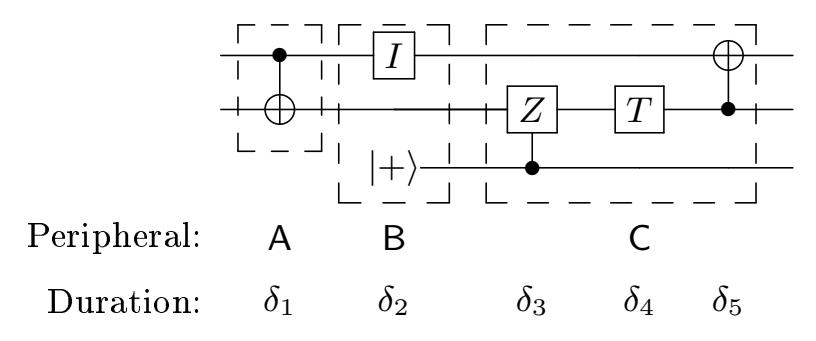
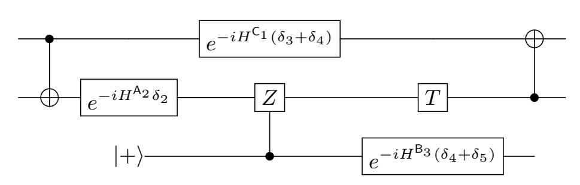
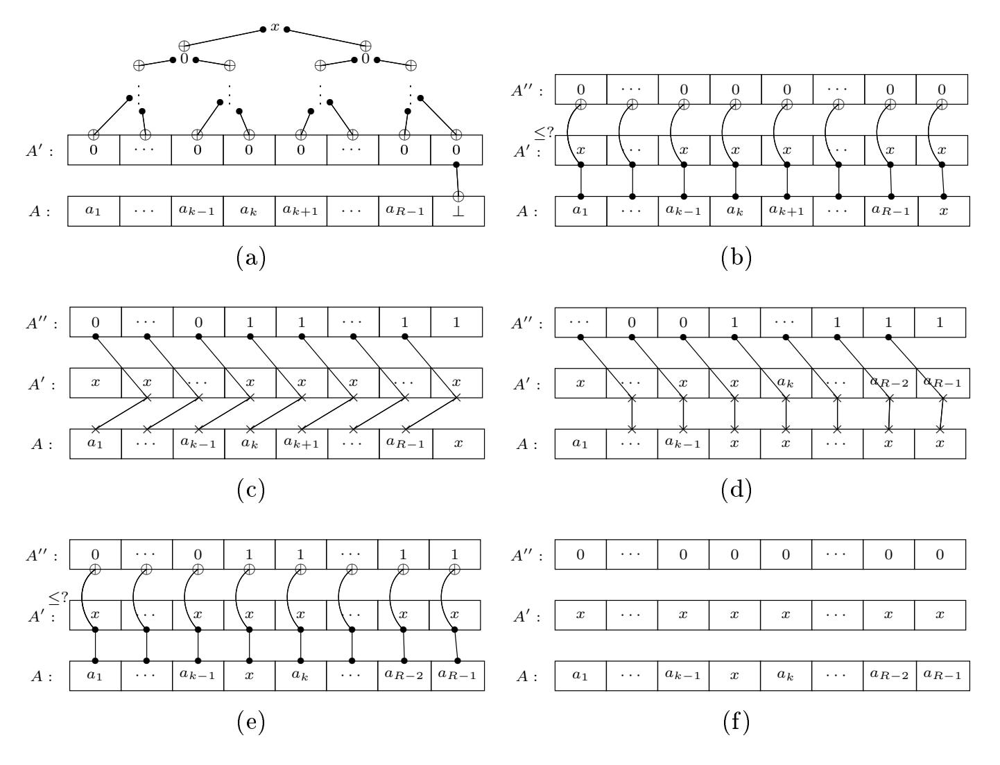
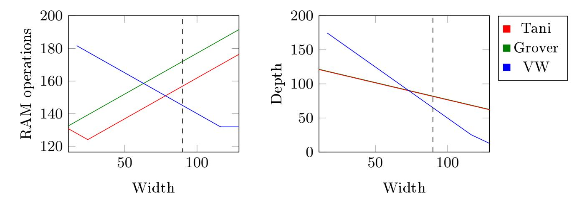

{0}------------------------------------------------

# Quantum cryptanalysis in the RAM model: Claw-nding attacks on SIKE

Samuel Jaques and John M. Schanck

Institute for Quantum Computing, Department of Combinatorics & Optimization, University of Waterloo, Waterloo, ON, N2L 3G1, Canada sam.e.jaques@gmail.com jschanck@uwaterloo.ca

Abstract. We introduce models of computation that enable direct comparisons between classical and quantum algorithms. Incorporating previous work on quantum computation and error correction, we justify the use of the gate-count and depth-times-width cost metrics for quantum circuits. We demonstrate the relevance of these models to cryptanalysis by revisiting, and increasing, the security estimates for the Supersingular Isogeny DieHellman (SIDH) and Supersingular Isogeny Key Encapsulation (SIKE) schemes. Our models, analyses, and physical justications have applications to a number of memory intensive quantum algorithms.

# 1 Introduction

The US National Institute of Standards and Technology (NIST) is currently standardising post-quantum cryptosystems. As part of this process, NIST has asked cryptographers to compare the security of such cryptosystems to the security of standard block ciphers and hash functions. Complicating this analysis is the diversity of schemes under consideration, the corresponding diversity of attacks, and stark dierences in attacks on post-quantum schemes versus attacks on block ciphers and hash functions. Chief among the diculties is a need to compare classical and quantum resources.

NIST has suggested that one quantum gate can be assigned a cost equivalent to Θ(1) classical gates [\[34,](#page-29-0) Section 4.A.5]. However, apart from the notational similarity between boolean circuits and quantum circuits, there seems to be little justication for this equivalence.

Even if an adequate cost function were dened, many submissions rely on proxies for quantum gate counts. These will need to be re-analyzed before comparisons can be made. Some submissions use query complexity as a lower bound on gate count. Other submissions use a non-standard circuit model that includes a unit-cost random access gate. The use of these proxies may lead to conservative security estimates. However,

1. they may produce severe security underestimates and correspondingly large key size estimates especially when they are used to analyze memory intensive algorithms; and

{1}------------------------------------------------

2. they lead to a proliferation of incomparable units.

We aim to provide cryptographers with tools for making justied comparisons between classical and quantum computations.

#### 1.1 Contributions

In Section [2](#page-2-0) we review the quantum circuit model and discuss the role that classical computers play in performing quantum gates and preserving quantum memories. We then introduce a model of computation in which a classical random access machine (RAM) acts as a controller for a memory peripheral such as an array of bits or an array of qubits. This model allows us to clearly distinguish between costly memory operations, which require the intervention of the controller, and free operations, which do not.

We then describe how to convert a quantum circuit into a parallel RAM (PRAM) program that could be executed by a collection of memory peripheral controllers. The complexity of the resulting program depends on the physical assumptions in the denition of the memory peripheral. We give two sets of assumptions that lead to two distinct cost metrics for quantum circuits. Briey, we say that G quantum gates arranged in a circuit of depth D and width (number of qubits) W has a cost of

- Θ(G) RAM operations under the G-cost metric, which assumes that quantum memory is passively corrected; and
- Θ(DW) RAM operations under the DW-cost metric, which assumes that quantum memory is actively corrected by the memory peripheral controller.

These metrics allow us to make direct comparisons between quantum circuits and classical PRAM programs.

In the remainder of the paper we apply our cost metrics to algorithms of cryptographic signicance. In Section [6](#page-21-0) we review the known classical and quantum claw-nding attacks on the Supersingular Isogeny Key Encapsulation scheme (SIKE). Our analysis reveals an attack landscape that is shaped by numerous trade-os between time, memory, and RAM operations. We nd that attackers with limited memory will prefer the known quantum attacks, whereas attackers with limited time will prefer the known classical attacks. In terms of the SIKE public parameter p, there are low-memory quantum attacks that use p 1/4+o(1) RAM operations, and there are low-depth classical attacks that use p 1/4+o(1) RAM operations. Simultaneous time and memory constraints push the cost of all known claw-nding attacks higher. We are not aware of any attack that can be parameterized to use fewer than p 1/4+o(1) RAM operations, although some algebraic attacks may also achieve this complexity.

We build toward our analysis of SIKE by considering the cost of prerequisite quantum data structures and algorithms. In Section [4](#page-12-0) we introduce a new dynamic set data structure, which we call a Johnson vertex. In Section [5](#page-17-0) we analyze the cost of quantum algorithms based on random walks on Johnson graphs. We nd that data structure operations limit the range of time-memory trade-os 

{2}------------------------------------------------

that are available in these algorithms. Previous analyses of SIKE [\[20,](#page-28-0)[21\]](#page-28-1) ignore data structure operations and assume that time-memory trade-os enable an attack of cost p 1/6+o(1). After accounting for data structure operations, we nd that the claimed p 1/6+o(1) attack has cost p 1/3+o(1) .

In Section [6.3,](#page-23-0) we give non-asymptotic cost estimates for claw-nding attacks on SIKE-n (SIKE with an n-bit public parameter p). This analysis lends further support to the parameter recommendations of Adj et al. [\[1\]](#page-27-0), who suggest that a 434-bit p provides 128-bit security and that a 610-bit p provides 192-bit security. Adj et al. base their recommendation on the cost of memory-constrained classical attacks. We complement this analysis by considering depth-constrained quantum attacks (with depth < 2 96). Under mild assumptions on the cost of some subroutines, we nd that the best known depth-limited quantum claw-nding attack on SIKE-434 uses at least 2 143 RAM operations. Likewise, we nd that the best known depth-limited quantum claw-nding attack on SIKE-610 uses at least 2 232 RAM operations.

Our methods have immediate applications to the analysis of other quantum algorithms that use large quantum memories and/or classical co-processors. We list some directions for future work in Section [7.](#page-25-0)

# 2 Machine models

We begin with some quantum computing background in Section [2.1,](#page-2-1) including the physical assumptions behind Deutsch's circuit model. We elaborate on the circuit model to construct memory peripheral models in Section [2.2.](#page-4-0) We specify classical control costs, with units of RAM operations, for memory peripheral models in Section [2.3.](#page-5-0) On a rst read, the examples of memory peripherals given in Section [2.4](#page-8-0) may be more informative than the general description of memory peripheral models in Section [2.2.](#page-4-0) Section [2.4](#page-8-0) justies the cost functions that are used in the rest of the paper.

#### 2.1 Preliminaries on quantum computing

Quantum states and time-evolution. Let Γ be a set of observable congurations of a computer memory, e.g. binary strings. A quantum state for that memory is a unit vector |ψi in a complex euclidean space H ∼= C Γ . Often Γ will have a natural cartesian product structure reecting subsystems of the memory, e.g. an ideal n-bit memory has Γ = {0, 1} n. In such a case, H has a corresponding tensor product structure, e.g. H ∼= (C 2 ) ⊗n. The scalar product on H is denoted h·| ·i and is Hermitian symmetric, hφ| ψi = hψ| φi. The notation |ψi for unit vectors is meant to look like the right half of the scalar product. Dual vectors are denoted hψ|. The set {|xi | x ∈ Γ} is the computational basis of H. The Hermitian adjoint of a linear operator A is denoted A† . A linear operator is self-adjoint if A = A† and unitary if AA† = A†A = 1.

One of the postulates of quantum mechanics is that the observable properties of a state correspond to self-adjoint operators. A self-adjoint operator can be 

{3}------------------------------------------------

written as  $A = \sum_{i} \lambda_{i} P_{i}$  where  $\lambda_{i} \in \mathbb{R}$  and  $P_{i}$  is a projector onto an eigenspace with eigenvalue  $\lambda_{i}$ . Measurement of a quantum state  $|\psi\rangle$  with respect to A yields outcome  $\lambda_{i}$  with probability  $\langle \psi | P_{i} | \psi \rangle$ . The post-measurement state is an eigenvector of  $P_{i}$ .

Quantum computing is typically concerned with only two observables: the configurations of the memory, and the total energy of the system. The operator associated to the memory configuration has the computational basis vectors as eigenvectors; it can be written as  $\sum_{x\in\Gamma} \lambda_x |x\rangle\langle x|$ . If the state of the memory is given by  $|\psi\rangle = \sum_{x\in\Gamma} \psi_x |x\rangle$ , then measuring the memory configuration of  $|\psi\rangle$  will leave the memory in configuration x with probability  $|\langle x|\psi\rangle|^2 = |\psi_x|^2$ . The total energy operator is called the Hamiltonian of the system and is denoted H. Quantum states evolve in time according to the Schrödinger equation1

$$\frac{\mathrm{d}}{\mathrm{d}t} |\psi(t)\rangle = -iH |\psi(t)\rangle. \tag{1}$$

Time-evolution for a duration  $\delta$  yields  $|\psi(t_0 + \delta)\rangle = U_\delta |\psi(t_0)\rangle$  where  $U_\delta = \exp(-iH\delta)$ . Note that since H is self-adjoint we have  $U_\delta^{\dagger} = \exp(iH\delta)$  so  $U_\delta$  is unitary. In general, the Hamiltonian of a system may vary in time, and one may write H(t) in Eq. 1. The resulting time-evolution operator is also unitary. The Schrödinger equation applies only to closed systems. A time-dependent Hamiltonian is a convenient fiction that allows one to model an interaction with an external system without modeling the interaction itself.

Quantum circuits. Deutsch introduced the quantum circuit model in [15]. A quantum circuit is a collection of gates connected by unit-wires. Each wire represents the motion of a carrier (a physical system that encodes information). A carrier has both physical and logical (i.e. computational) degrees of freedom. External inputs to a circuit are provided by sources, and outputs are made available at sinks. The computation proceeds in time with the carriers moving from the sources to the sinks. A gate with k inputs represents a unitary transformation of the logical state space of k carriers. For example, if the carriers encode qubits, then a gate with k inputs is a unitary transformation of  $(\mathbb{C}^2)^{\otimes k}$ . Each gate takes some non-zero amount of time. Gates that act on disjoint sets of wires may be applied in parallel. The inputs to any particular gate must arrive simultaneously; wires may be used to delay inputs until they are needed.

Carriers feature prominently in Deutsch's description of quantum circuits [15, p. 79], as does time evolution according to an explicitly time-dependent Hamiltonian [15, p. 88]. However, while Deutsch used physical reasoning to justify his model, in particular his choice of gates, this reasoning was not encoded into the circuit diagrams themselves. The gates that appear in Deutsch's diagrams are defined entirely by the logical transformation that they perform. Gates, including the unit-wire, are deemed computationally equivalent if they enact the same logical transformation. Two gates can be equivalent even if they act on different carriers, take different amounts of time, etc. Computationally equivalent gates

Here we are taking Planck's constant equal to  $2\pi$ , i.e.  $\hbar = 1$ .

{4}------------------------------------------------

are given the same representation in a circuit diagram. Today it is common to think of quantum circuits as describing transformations of logical states alone.

#### 2.2 Memory peripheral models

The memory peripheral models that we introduce in this section generalize the circuit model by making carriers explicit. We depart from the circuit model as follows:

- 1. We associate a carrier to each unit-wire and to each input and output wire of each gate. Wires can only be connected if they act on the same carrier.
- 2. We assume that the logical state of a computation emerges entirely from the physical state of its carriers.
- 3. Our unit-wire acts on its associated carrier by time evolution according to a given time-independent Hamiltonian for a given duration.
- 4. We interpret our diagrams as programs for classical controllers. Every gate (excluding the unit-wire) represents an intervention from the controller.

In sum, these changes allow us to give some physical justication for how a circuit is executed, and they allow us to assign dierent costs depending on the justication provided. In particular, they allow us to separate free operations those that are due to natural time-independent evolution from costly operations those that are due to interventions from the classical controller.

Our model has some potentially surprising features. A unit-wire that acts on a carrier with a non-trivial Hamiltonian does not necessarily enact the logical identity transformation. Consequently, wires of dierent lengths may not be computationally equivalent in Deutsch's sense. In fact, since arbitrary computations can be performed ballistically, i.e. by time-independent Hamiltonians [\[16,](#page-28-3)[28](#page-29-1)[,24\]](#page-28-4), the unit-wire can enact any transformation of the computational state. We do not take advantage of this in our applications; the unit-wires that we consider in Section [2.4](#page-8-0) enact the logical identity transformation (potentially with some associated cost).

A carrier, in our model, is represented by a physical state space H and a Hamiltonian H : H → H. To avoid confusion with Deutsch's carriers, we refer to (H, H) as a memory peripheral.

Denition 2.1. A memory peripheral is a tuple A = (H, H) where H is a nite dimensional state space and H is a Hermitian operator on H. The operator H is referred to as the Hamiltonian of A.

The reader may like to keep in mind the example of an ideal qubit memory Q = (C 2 , 0).

Parallel wires carry the parallel composition of their associated memory peripherals. The memory peripheral that results from parallel composition of A and B is denoted A ⊗ B. The state space associated with A ⊗ B is HA ⊗ HB, and the Hamiltonian is HA⊗I B+I A⊗HB. We say that A and B are sub-peripherals of A⊗B. We say that a memory peripheral is irreducible if it has no sub-peripherals. 

{5}------------------------------------------------

The width of a memory peripheral is the number of irreducible sub-peripherals it contains.

A quantum circuit on n qubits may be thought of as a program for the memory peripheral Q⊗n. Programs for other memory peripherals may involve more general memory operations.

Denition 2.2. A memory operation is a morphism of memory peripherals f : A → B that acts as a quantum channel between HA and HB, i.e. it takes quantum states on HA to quantum states on HB.

The arity of a memory operation is the number of irreducible sub-peripherals on which it acts. If there is no potential for ambiguity, we will refer to memory operations as gates. Examples of memory operations include: unitary transformations of a single state space, isometries between state spaces, state preparation, measurement, and changes to the Hamiltonian of a carrier.

In order to dene state preparation and measurement it is convenient to introduce a void peripheral 1. State preparation is a memory operation of the form 1 → A, and measurement is a memory operation of the form A → 1. The reader may assume that 1 = (C, 0) in all of our examples.

Networks of memory operations can be represented by diagrams that are almost identical to quantum circuits. Memory peripherals must be clearly labelled, and times must be given for gates, but no other diagrammatic changes are necessary. An example is given in Figure [1.](#page-6-0)

Just as it is useful to specify a gate set for quantum circuits, it is useful to dene collections of memory peripherals that are closed under parallel composition and under sequential composition of memory operations. The notion of a symmetric monoidal category captures the relevant algebraic structure. The following denition is borrowed from [\[13,](#page-28-5) Denition 2.1] and, in the language of that paper, makes a memory peripheral model into a type of resource theory. The language of resource theories is not strictly necessary for our purposes, but we think this description may have future applications.

Denition 2.3. A memory peripheral model is a symmetric monoidal category (C, ◦, ⊗, 1) where

- the objects of C are memory peripherals,
- the morphisms between objects of C are memory operations,
- the binary operation denotes sequential composition of memory operations,
- the binary operation ⊗ denotes parallel composition of memory peripherals and of memory operations, and
- the void peripheral 1 satises A ⊗ 1 = 1 ⊗ A = A for all A ∈ C.

#### 2.3 Parallel RAM controllers for memory peripheral models

A memory peripheral diagram can be viewed as a program that tells a classical computer where, when, and how to interact with its memory. We will now specify a computer that executes these programs.

{6}------------------------------------------------

(a) A memory peripheral diagram with A = A1 ⊗ A2, B = A1 ⊗ A2 ⊗ B3, and C = C1 ⊗ A2 ⊗ B3 (numbered top to bottom). The memory peripheral changes from A to B in the second time step because of the new qubit. The change from B to C in the third time step is marked by a carrier change that enacts the logical identity gate. Note that truly instantaneous changes are not possible, but the δi could be very small.

| Controller one             | Controller two    | Controller three    |
|----------------------------|-------------------|---------------------|
| 1. APPLY CNOT (1,2)        | 1. no op.         | 1. APPLY INIT (0,3) |
| 2. no op.                  | 2. STEP           | 2. no op.           |
| 3. APPLY A1 to C1 (0,1) | 3. no op.         | 3. no op.           |
| 4. no op.                  | 4. no op.         | 4. STEP             |
| 5. no op.                  | 5. APPLY CZ (3,2) | 5. no op.           |
| 6. no op.                  | 6. APPLY T (0,2)  | 6. no op.           |
| 7. APPLY CNOT (2,1)        | 7. no op.         | 7. no op.           |
| 8. no op.                  | 8. no op.         | 8. STEP             |

(b) A PRAM program for the memory peripheral diagram of Fig. [1a](#page-6-0) using the notation of Section [2.3.](#page-5-0)

(c) A quantum circuit for the memory peripheral diagram of Fig. [1a.](#page-6-0) Note that the I gate is absent, and explicit time-evolution with respect to the wire Hamiltonians has been added.

Fig. 1: Three representations of a quantum algorithm.

{7}------------------------------------------------

Following Deutsch, we have assumed that all gates take a nite amount of time, that each gate acts on a bounded number of subsystems, and that gates that act on disjoint subsystems can be applied in parallel. Circuits can be of arbitrary width, so a control program may need to execute an unbounded number of operations in a nite amount of time. Hence, we must either assume that the classical control computer can operate arbitrarily quickly or in parallel.

We opt to treat controllers as parallel random access machines (PRAMs). Several variants of the PRAM exist [\[26\]](#page-28-6). The exact details of the instruction set and concurrency model are largely irrelevant here. For our purposes, a PRAM is a collection of RAMs that execute instructions in synchrony. Each RAM executes (at most) one instruction per time step. At time step i each RAM can assume that the other RAMs have completed their step i − 1 instructions. We assume that synchronization between RAMs and memory peripherals is free.

We assign a unique positive integer to each wire in a diagram, so that an ordered collection of k memory peripherals can be identied by a k-tuple of integers. We use a k-tuple to specify an input to a k-ary gate. The memory operations that are available to a controller are also assigned unique positive integers.

We add two new instructions to the RAM instruction set: APPLY and STEP. These instructions enable parallel and sequential composition of memory operations, respectively. APPLY takes three arguments: a k-tuple of addresses, a memory operation, and an (optional) k-tuple of RAM addresses in which to store measurement results. STEP takes no arguments; it is only used to impose a logical sequence on steps of the computation

When a processor calls APPLY the designated memory operation is scheduled to be performed during the next STEP call. In one layer of circuit depth, each RAM processor schedules some number of memory operations to be applied in parallel and then one processor calls STEP. If memory operations with overlapping addresses are scheduled for the same step, the behaviour of the memory peripheral is undened and the controller halts. This ensures that only one operation is applied per subsystem per call to STEP.

A quantum circuit of width W can be converted into O(W) RAM programs by assigning gates to processors according to a block partition of {1, . . . , W}. The blocks should be of size O(1), otherwise a single processor could need to execute an unreasonable number of operations in a xed amount of time. If a gate involves multiple qubits that are assigned to dierent processors, the gate is executed by the processor that is responsible for the qubit of lowest address. We have provided an example in Figure [1b.](#page-6-0)

To apply a multi-qubit gate, a RAM processor must be able to address arbitrary memory peripherals. This is a strong capability. However, each peripheral is involved in at most one gate per step, so this type of random access is analogous to the exclusive-read/exclusive-write random access that is typical of PRAMs.

The cost of a PRAM computation. Every RAM instruction has unit cost, except for the placeholder no operation instruction, no op, which is free. The cost of a PRAM computation is the total number of RAM operations executed.

{8}------------------------------------------------

#### 2.4 Examples of memory peripheral models

Here we give three examples of memory peripheral models. Example 2.4.1 is classical and primarily an illustration of the model. It shows that our framework can accommodate classical memory without changing the PRAM costs. Example 2.4.2 is a theoretical self-corrected quantum memory that justifies the G-cost. Example 2.4.3 is a more realistic actively-corrected quantum memory that justifies the DW-cost.

2.4.1 Non-volatile classical memories. A non-volatile bit-memory can store a bit indefinitely without periodic error correction or read/write cycles. As a memory peripheral, this can simulate other classical computation models and gives the expected costs.

Technologies. The historically earliest example of a non-volatile bit memory is the "core memory" of Wang and Woo [41]. A modern example is Ferroelectric RAM (FeRAM). The DRAM found in common consumer electronics requires a periodic read/write cycle, which should be included in a cost analysis. While there may be technological and economic barriers to using non-volatile memory at all stages of the computing process, there are no physical barriers.

Hamiltonian of a memory cell. A logical bit can be encoded in the net magnetization of a ferromagnet. A ferromagnet can be modelled as a collection of spins. Each spin is oriented up or down, and has state  $|\uparrow\rangle$  or  $|\downarrow\rangle$ . The self-adjoint operator associated to the orientation of a spin is  $\sigma_z = |\uparrow\rangle\langle\uparrow| - |\downarrow\rangle\langle\downarrow|$ ; measuring  $|\uparrow\rangle$  with respect to  $\sigma_z$  yields outcome +1 with probability 1, and measuring  $|\downarrow\rangle$  yields outcome -1 with probability 1.

In the d-dimensional Ising model of ferromagnetism,  $L^d$  spins are arranged in a regular square lattice of diameter L in d-dimensional space. The Ising Hamiltonian imposes an energy penalty on adjacent spins that have opposite orientations:

$$H_{Ising} = -\sum_{(i,j)} \sigma_z^{(i)} \otimes \sigma_z^{(j)}.$$

In 1936 [35] Peierls showed that the Ising model is thermally stable in dimensions  $d \geq 2$ . The two ground states, all spins pointing down and all spins pointing up, are energetically separated. The energy required to map the logical zero (all down) to logical one (all up) grows with L, and the probability of this happening (under a reasonable model of thermal noise) decreases with L. The phenomenon of thermal stability in dimensions 2 and 3 provides an intuitive explanation for why we are able to build classical non-volatile memories like core-memory (see also [14, Section X.A]).

Memory peripheral model. A single non-volatile bit, encoded in the net magnetization of an  $L \times L$  grid of spins, can be represented by a memory peripheral  $\mathsf{B}_L = ((\mathbb{C}^2)^{\otimes L^2}, H_{Ising})$ . From a single bit we can construct w-bit word peripherals  $\mathsf{W}_{L,w} = \mathsf{B}_L^{\otimes w}$ .

{9}------------------------------------------------

Turing machines, boolean circuits, PRAMs, and various other classical models can be simulated by controllers for word memory peripheral models. The only strictly necessary memory operations are those for reading and writing individual words.

**2.4.2 Self-correcting quantum memories.** A self-correcting quantum memory is the quantum analogue of a non-volatile bit memory. The Hamiltonian of the carrier creates a large energy barrier between logical states. At a sufficiently low temperature the system does not have enough energy for errors to occur.

The thermal stability of the Ising model in  $d \geq 2$  spatial dimensions seems to have inspired Kitaev's search for geometrically local quantum stabilizer codes [27]. The two-dimensional toric code that Kitaev defined in [27] is not thermally stable [2]. However, a four-dimensional variant is thermally stable [14,3]. The question of whether there exists a self-correcting quantum memory with a Hamiltonian that is geometrically local in < 4 spatial dimensions remains open.

In two spatial dimensions, various "no-go theorems" suggest that self-correcting quantum memories may not exist. For example, a stabilizer code defined on a two-dimensional lattice of qubits cannot self-correct [11]. Brown et al. [12] summarize generalizations of this no-go result and survey the remaining avenues toward self-correcting memory in low dimensions.

At present, a model of quantum computation that assumes non-volatile memory, i.e. a free identity gate, and < 4 spatial dimensions is making a physical assumption about the existence of two- or three-dimensional self-correcting memories. Here we will simply ignore geometric locality and write down a memory peripheral for the four-dimensional toric code. Because real devices are limited to three spatial dimensions, this is purely a theoretical example.

Memory peripheral model. The Hamiltonian for the four-dimensional toric code can be found in [14, Section X.B]. We will denote it  $H_{toric}$ . Like the four-dimensional Ising Hamiltonian it is defined on  $L^4$  spins arranged in a square lattice. The memory peripheral  $Q_{toric} = (\mathbb{C}^{L^4}, H_{toric})$  can serve as a drop-in replacement for the ideal qubit memory peripheral Q for the purpose of describing the unit-wire.

To execute arbitrary quantum computations on a collection of logical qubits encoded in  $Q_{toric}$  peripherals, we need memory operations for a universal gate set, initialization, and measurement. Initialization and Clifford+T gates are described for the two-dimensional toric code in [14, Section IX] and the four-dimensional versions are similar. A measurement procedure for the four-dimensional toric code is in [14, Section X.B]. Treating any of these procedures as a single memory operation will mask some classical control cost that is polynomial in L. Treating the T gate as a single memory operation masks the use of an additional memory peripheral to hold a resource state.

Cost function. A quantum circuit on n qubits can be converted into a memory peripheral diagram for  $Q_{toric}^{\otimes n}$  and then interpreted as a PRAM program. In this

{10}------------------------------------------------

way we can assign a cost, in units of RAM operations, to the quantum circuit itself. Each wire in the quantum circuit is assigned a length in the memory peripheral diagram. The quantum circuit and memory peripheral diagram are otherwise identical. Each gate in the diagram (including state-preparation and measurement gadgets, but not unit-wires) is expanded into at least one APPLY instruction. The wires themselves incur no RAM cost, but one STEP instruction is needed per layer of circuit depth for synchronization. The number of STEP instructions is no more than the number of APPLY instructions. The following cost function, the G-cost, is justied by assuming that each gate expands to O(1) RAM operations.

Denition 2.4 (G-cost). A logical Cliord+T quantum circuit that uses G gates (in any arrangement) has a G-cost of Θ(G) RAM operations.

Remark 2.1. The depth and width of a circuit do not directly aect its G-cost, but these quantities are often relevant in practice. A PRAM controller for a circuit that uses G gates in an arrangement that is D gates deep and W qubits wide uses O(W) RAM processors for Ω(D) time. Various G-cost-preserving trade-os between time and number of processors may be possible. For example, a circuit can be re-written so that no two gates are applied at the same time. In this way, a single RAM processor can execute any G gate circuit in Θ(G) time. This trade-o is only possible because self-correcting memory allows us to assign an arbitrary duration to a unit-wire.

2.4.3 Actively corrected quantum memories. It should be possible to build quantum computers even if it is not possible to build self-correcting quantum memories. Active error correction strategies are nearing technological realizability; several large companies and governments are currently pursuing technologies based on the surface code.

Memory peripheral model. When using an active error correction scheme, a logical Cliord+T circuit has to be compiled to a physical circuit that includes active error correction. We may assume that the wires carry the ideal qubit memory peripheral Q. A more detailed analysis might start from the Hamiltonians used in circuit QED [\[9\]](#page-28-10).

Memory operations. The compiled physical circuit will not necessarily use the Cliord+T gate set. The available memory operations will depend on the physical architecture, e.g. in superconducting nano-electronic architectures one typically has arbitrary single qubit rotations and one two-qubit gate [\[42\]](#page-29-5).

Cost function. We can assume that every physical gate takes Θ(1) RAM operations to apply. This may mask a large constant; a proposal for a hardware implementation of classical control circuitry can be found in [\[32\]](#page-29-6). A review of active quantum error correction for the purpose of constructing memories can be found in [\[39\]](#page-29-7).

{11}------------------------------------------------

An active error correction routine is applied, repeatedly, to all physical qubits regardless of the logical workload. If we assume that logical qubits can be encoded in a constant number of physical qubits, and that logical Cliord+T gates can be implemented with a constant number of physical gates, then the above considerations justify the DW-cost for quantum circuits.

Denition 2.5 (DW-cost). A logical Cliord+T quantum circuit that is D gates deep, W qubits wide, and uses any number of gates within that arrangement has a DW-cost of Θ(DW) RAM operations.

Remark 2.2. In contrast with the G-cost, there are no DW-cost preserving tradeos between time and number of processors when constructing a PRAM program from a quantum circuit. A circuit of depth D and width W uses Θ(W) processors for time Θ(D).

Technologies. Fowler et al. provide a comprehensive overview of the surface code [\[17\]](#page-28-11). Importantly, to protect a circuit of depth D and width W, the surface code requires Θ(log2 (DW)) physical qubits per logical qubit. The active error correction is applied in a regular cycle (once every 200ns in [\[17\]](#page-28-11)). In each cycle a constant fraction of the physical qubits are measured and re-initialized. The measurement results are processed with a non-trivial classical computation [\[18\]](#page-28-12). The overall cost of surface code computation is Ω(log2 (DW)) RAM operations per logical qubit per layer of logical circuit depth. Nevertheless, future active error correction techniques may bring this more in line with the DW-cost.

# 3 Cost analysis: Quantum random access

Our memory peripheral models provide classical controllers with random access to individual qubits. A controller can apply a memory operation e.g. a Cliord+T gate or a measurement to any peripheral in any time step. However, a controller does not have quantum random access to individual qubits. A controller cannot call APPLY with a superposition of addresses. Quantum random access must be built from memory operations.

In [\[4\]](#page-27-3), Ambainis considers a data structure that makes use of a random access gate. This gate takes an index i, an input b, and an R element array A = (a1, a2, . . . , aR). It computes the XOR of ai and b:

$$|i\rangle |b\rangle |A\rangle \mapsto |i\rangle |b \oplus a_i\rangle |A\rangle.$$
 (2)

Assuming that each |aj i is encoded in O(1) irreducible memory peripherals, a random access gate has arity that grows linearly with R. If the underlying memory peripheral model only includes gates of bounded arity, then an implementation of a random access gate clearly uses Ω(R) operations. Beals et al. have noted that a circuit for random access to an R-element array of m-bit strings must have width Ω(Rm) and depth Ω(log R) [\[5,](#page-27-4) Theorem 4]. Here we give a Cliord+T construction that is essentially optimal[2](#page-11-0) .

2 Actually, here and elsewhere, we use a gate set that includes Tooli gates and controlled-swap gates. These can be built from O(1) Cliord+T gates.

{12}------------------------------------------------

Rather than providing a full circuit, we will describe how the circuit acts on |ii |0i |Ai. The address is log R bits and each register of A is m bits. We use two ancillary arrays |A0 i and |A00i, both initialized to 0. The array A0 holds R address-sized registers and O(R) additional qubits for intermediary results, a total of O(R log R) qubits. The array A00 is O(Rm) qubits.

We use a standard construction of R-qubit fan-out and R-qubit parity due to Moore [\[33\]](#page-29-8). The fan-out is a tree of O(R) CNOT gates arranged in depth O(log R). Parity is fan-out conjugated by Hadamard gates. We also use a log Rbit comparison circuit due to Thapliyal, Ranganathan, and Ferreir [\[40\]](#page-29-9). This circuit uses O(log R) gates in depth O(log log R).

Our random access circuit acts as follows:

- 1. Fan-out address: Fan-out circuits copy the address i to each register of A0 . This needs a total of log R fan-outs, one for each bit of address. These can all be done in parallel.
- 2. Controlled copy: For each 1 ≤ j ≤ R, the boolean value A0 [j] = j is stored in the scratch space associated to A0 . The controller knows the address of each register, so it can apply a dedicated circuit for each comparison. Controlled-CNOTs are used to copy A[j] to A00[j] when A0 [j] = j. Since A0 [j] = j if and only if j = i, this copies A[i] to A00[i] but leaves A00[j] = 0 for j 6= i.
- 3. Parity: Since A00[j] is 0 for j 6= i, the parity of the low-order bit of all the A00 registers is equal to the low-order bit of just A00[i]. Likewise for the other m − 1 bits. So parallel R-qubit parity circuits can be used to copy A00[i] to an m-qubit output register.
- 4. Uncompute: The controlled copy and fan-out steps are applied in reverse, returning A00 , A0 , and the scratch space to zero.

The entire circuit can be implemented in width O(Rm+R log R). Step [1](#page-12-1) dominates the depth and Step [2](#page-12-2) dominates the gate cost. The comparison circuits use O(R log R) gates with depth O(log log R). To implement the controlled-CNOTs used to copy A[i] to A00[i] in constant depth, instead of O(m) depth, each of the R comparison results can be fanned out to (m − 1) qubits in the scratch space of A00. This fan-out has depth O(log m).

The total cost of random access is given in Cost [1.](#page-12-3) Observe that there is more than a constant factor gap between the G- and DW-cost.

#### Cost 1 Random access to R registers of m bits each.

Gates: O(Rm + R log R) Depth: O(log m + log R) Width: O(Rm + R log R)

# 4 Cost analysis: The Johnson vertex data structure

We expect to nd signicant gaps between the G- and DW-costs of algorithms that use a large amount of memory. Candidates include quantum algorithms for 

{13}------------------------------------------------

element distinctness [\[4\]](#page-27-3), subset-sum [\[7\]](#page-28-13), claw-nding [\[38\]](#page-29-10), triangle-nding [\[30\]](#page-29-11), and information set decoding [\[25\]](#page-28-14). All of these algorithms are based on quantum random walks on Johnson graphs graphs in which each vertex corresponds to a subset of a nite set.

In this section we describe a quantum data structure for representing a vertex of a Johnson graph. Essentially, we need a dynamic set that supports membership testing, uniform sampling from the encoded set, insertion, and deletion. These operations can be ne-tuned for quantum walk applications. In particular, insertion and deletion only need to be dened on inputs that would change the size of the encoded set. To avoid ambiguity, we will refer to these special cases as guaranteed insertion and guaranteed deletion.

#### 4.1 History-independence

Fix a nite set X . A quantum data structure for subsets of X consists of two parts: a presentation of subsets as quantum states, and unitary transformations representing set operations. The presentation must assign a unique quantum state |Ai to each A ⊂ X . Uniqueness is a strong condition, but it is necessary for quantum interference. Dierent sequences of insertions and deletions that produce the same set will only interfere if each sequence presents the output in exactly the same way. The set {0, 1} cannot be stored as |0i |1i or |1i |0i depending on the order in which the elements were inserted. Some valid alternatives are to x an order (e.g. always store |0i |1i) or to coherently randomize the order (e.g. always store √ 1 2 (|0i |1i+|1i |0i)). Data structures that allow for interference between computational paths are called history-independent.

Ambainis describes a history-independent data structure for sets in [\[4\]](#page-27-3). His construction is based on a combined hash table and skip list. Bernstein, Jeery, Lange, and Meurer [\[7\]](#page-28-13), and Jeery [\[22\]](#page-28-15), provide a simpler solution based on radix trees. Both of these data structures use random access gates extensively. Our Johnson vertices largely avoid random access gates, and in Section [4.4](#page-16-0) we show that our data structure is more ecient as a result.

### 4.2 Johnson vertices

The Johnson graph J(X, R) is a graph whose vertices are R-element subsets of {1, . . . , X}. Subsets U and V are adjacent in J(X, R) if and only if |U∩V| = R−1. In algorithms it is often useful to x a dierent base set, so we will dene our data structure with this in mind: A Johnson vertex of capacity R, for a set of m-bit strings, is a data structure that represents an R-element subset of some set X ⊆ {1, . . . , 2 m − 1}. This implies log2 R ≤ m.

In our implementation below, a subset is presented in lexicographic order in an array of length R. This ensures that every R element subset has a unique presentation.

We describe circuits parameterized by m and R for membership testing, uniform sampling, guaranteed insertion, and guaranteed deletion. Since R is a 

{14}------------------------------------------------

circuit parameter, our circuits cannot be used in situations where R varies between computational paths[3](#page-14-0) . This is ne for quantum walks on Johnson graphs, but it prevents our data structure from being used as a generic dynamic set.

Memory allocation. The set is stored in a length R array of m-bit registers that we call A. Every register is initialized to the m-bit zero string, ⊥. The guaranteed insertion/deletion and membership testing operations require auxiliary arrays A0 and A00. Both contain O(Rm) bits and are initialized to zero. It is helpful to think of these as length R arrays of m-bit registers that each have some scratch space. We will not worry about the exact layout of the scratch space.

Guaranteed insertion/deletion. Let U be a set of m-bit strings with |U| = R−1, and suppose x is an m-bit string not in U. The capacity R−1 guaranteed insertion operation performs

$$|\mathcal{U}\rangle |\perp\rangle |x\rangle \mapsto |\mathcal{U} \cup \{x\}\rangle |x\rangle$$
.

Capacity R guaranteed deletion is the inverse operation.

Figure [2](#page-15-0) depicts the following implementation of capacity R − 1 guaranteed insertion. For concreteness, we assume that the correct position of x is at index k with 1 ≤ k ≤ R. At the start of the routine, the rst R−1 entries of A represent a sorted list. Entry R is initialized to |⊥i = |0i ⊗m.

- (a). Fan-out: Fan-out the input x to the R registers of A0 and also to A[R], the blank cell at the end of A. The fan-out can be implemented with O(Rm) gates in depth O(log R) and width O(Rm).
- (b). Compare: For i in 1 to R, ip all m bits of A00[i] if and only if A0 [i] ≤ A[i]. The comparisons are computed using the scratch space in A00. Each comparison costs O(m) gates, and has depth O(log m) and width O(m) [\[40\]](#page-29-9). The single bit result of each comparison is fanned out to all m bits of A00[i] using O(m) gates in depth O(log m). The total cost is O(Rm) gates, O(log m) depth.
- (c). First conditional swap: For i in 1 to R − 1, if A00[i] is 11 . . . 1 swap A0 [i + 1] and A[i]. After this step, cells k through R of A hold copies of x. The values originally in A[k], . . . , A[R−1] are in A0 [k+ 1], . . . , A0 [R]. Each register swap uses m controlled-swap gates. All of the swaps can be performed in parallel. The cost is O(Rm) gates in O(1) depth.
- (d). Second conditional swap: For i in 1 to R−1, if A00[i] is 11 . . . 1 then swap A0 [i+ 1] and A[i + 1]. After this step, the values originally in A0 [k + 1], . . . , A0 [R] are in A[k + 1], . . . , A[R]. The cost is again O(Rm) gates in O(1) depth.
- (e). Clear comparisons: Repeat the comparison step to reset A00 .
- (f). Clear fan-out: Fan-out the input x to the array A0 . This will restore A0 back to the all 0 state. Note that the fan-out does not include A[R] this time.

3 One can handle a range of capacities using controlled operations, but the size of the resulting circuit grows linearly with the number of capacities it must handle.

{15}------------------------------------------------

Fig. 2: Insertion into a Johnson vertex. See text for full description.

**Cost 2** Guaranteed insertion/deletion for a Johnson vertex of capacity R with m-bit elements.

Gates: O(Rm)

**Depth:**  $O(\log m + \log R)$ 

Width: O(Rm)

Membership testing and relation counting. The capacity R membership testing operation performs

$$|\mathcal{U}\rangle |x\rangle |b\rangle \mapsto \begin{cases} |\mathcal{U}\rangle |x\rangle |b \oplus 1\rangle & \text{if } x \in \mathcal{U} \\ |\mathcal{U}\rangle |x\rangle |b\rangle & \text{otherwise.} \end{cases}$$

As in guaranteed insertion/deletion, the routine starts with a fan-out followed by a comparison. In the comparison step we flip the leading bit of A''[i] if and only if A'[i] = A[i]. This will put at most one 1 bit into the A'' array. Computing the parity of the A'' array will extract the result. The comparisons use O(Rm) gates in depth  $O(\log m)$  [40], as does the parity check [33]. Thus the cost of membership testing matches that of guaranteed insertion: O(Rm) gates in depth  $O(\log m + \log R)$ .

The above procedure is easily modified to test other relations and return the total number of matches. In place of the parity circuit, we would use a binary

{16}------------------------------------------------

tree of  $O(\log R)$ -bit addition circuits. With the adders of [37], the cost of the addition tree is  $O(R \log R)$  gates in depth  $O(\log^2 R)$ . The ancilla bits for the addition tree do not increase the overall width beyond O(Rm). As such, the gate cost of the addition tree is no more than a constant factor more than the cost of a guaranteed insertion. The full cost of relation counting will also depend on the cost of evaluating the relation.

Cost 3 Membership testing and relation counting for a Johnson vertex of capacity R with m-bit elements. The terms  $\mathsf{T}_G$ ,  $\mathsf{T}_D$ , and  $\mathsf{T}_W$  denote the gates, depth, and width of evaluating a relation.

|                   | Membership testing   | Relation counting   |
|-------------------|----------------------|---------------------|
| $\mathbf{Gates}:$ | O(Rm)                | $O(Rm + RT_G)$      |
| Depth:            | $O(\log m + \log R)$ | $O(\log^2 R + T_D)$ |
| Width:            | O(Rm)                | $O(Rm + RT_W)$      |

**Uniform sampling.** The capacity R uniform sampling operation performs  $|\mathcal{A}\rangle |0\rangle = |\mathcal{A}\rangle \left(\frac{1}{\sqrt{R}} \sum_{x \in \mathcal{A}} |x\rangle\right)$ . We use a random access to the array A with a uniform superposition of addresses. By Cost 1, this uses O(Rm) gates in depth  $O(\log m + \log R)$ .

#### 4.3 Random replacement

A quantum walk on a Johnson graph needs a subroutine to replace  $\mathcal{U}$  with a neighbouring vertex in order to take a step. Intuitively, this procedure just needs to delete  $u \in \mathcal{U}$ , sample  $x \in \mathcal{X} \setminus \mathcal{U}$ , then insert x. The difficulty lies in sampling x in such a way that it can be uncomputed even after subsequent insertion/deletion operations. The naive rejection sampling approach will entangle x with  $\mathcal{U}$ .

The applications that we consider below can tolerate a replacement procedure that leaves  $\mathcal{U}$  unchanged with probability R/X. We first sample x uniformly from  $\mathcal{X}$  and perform a membership test. This yields  $\sqrt{1/X} \sum_{x \in \mathcal{X}} |\mathcal{U}\rangle |x\rangle |x \in \mathcal{U}\rangle$ . Conditioned on non-membership, we uniformly sample some  $u \in \mathcal{U}$ , delete u, and insert x. Conditioned on membership, we copy x into the register that would otherwise hold u. The membership bit can be uncomputed using the "u" register. This yields  $\sqrt{1/X} \sum_{x \in \mathcal{U}} |\mathcal{U}\rangle |x\rangle |x\rangle + \sqrt{1/RX} \sum_{\mathcal{V} \sim \mathcal{U}} |\mathcal{V}\rangle |x\rangle |u\rangle$ . The cost of random replacement is O(1) times the cost of guaranteed insertion plus the cost of uniform sampling in  $\mathcal{X}$ .

#### 4.4 Comparison with quantum radix trees

In [7] a quantum radix tree is constructed as a uniform superposition over all possible memory layouts of a classical radix tree. This solves the problem of history-dependence, but relies heavily on random access gates. The internal nodes of a radix tree store the memory locations of its two children. In the worst case,

{17}------------------------------------------------

membership testing, insertion, and deletion follow paths of Θ(m) memory locations. Because a quantum radix tree is stored in all possible memory layouts, these are genuine random accesses to an R register array. Note that a radix tree of m-bit strings cannot have more than 2 m leaves. As such, log R = O(m) and Cost [1](#page-12-3) matches the lower bound for random access gates given by Beals et al. [\[5\]](#page-27-4). Cost [4](#page-17-1) is obtained by using Cost [1](#page-12-3) for each of the O(log R) random accesses. The lower bound in Cost [4](#page-17-1) exceeds the upper bound in Cost [2.](#page-15-1)

Cost 4 Membership testing, insertion, and deletion for quantum radix trees.

Gates: Ω(Rm2 )

Depth: Ω(m log m + m log R)

Width: Ω(Rm)

# 5 Cost analysis: Claw-nding by quantum walk

#### 5.1 Quantum walk based search algorithms

Let S be a nite set with a subset M of marked elements. We focus on a generic search problem: to nd some x ∈ M. A simple approach is to repeatedly guess elements of S. This can be viewed as a random walk. At each step, one transitions from the current guess to another with uniform probability. The random walk starts with a setup routine that produces an initial element S. It then repeats a loop of 1) checking if the current element is marked, and 2) walking to another element. Of course, one need not use the uniform distribution. In a Markov chain, the transition probabilities can be arbitrary, so long as they only depend on the current guess. The probability of transitioning from a guess of u to a guess of v can be viewed as a weighted edge in a graph with vertex set S. The weighted adjacency matrix of this graph is called the transition matrix of the Markov chain.

Quantum random walks perform analogous operations. The elements of S are encoded into pairwise orthogonal quantum states. A setup circuit produces an initial superposition of these states. A check circuit applies a phase to marked elements. An additional diusion circuit amplies the probability of success. It uses a walk circuit, which samples a new element of S.

Grover's algorithm is a quantum walk with uniform transition probabilities. It nds a marked element after Θ( p |S| / |M|) check steps. Szegedy's algorithm can decide whether or not M is empty for a larger class of Markov chains [\[36\]](#page-29-13). Magniez, Nayak, Roland, and Santha (MNRS) generalize Szegedy's algorithm to admit even more general Markov chains [\[31\]](#page-29-14). They also describe a routine that can nd a marked element [\[31,](#page-29-14) Tolerant RAA algorithm]. We will not describe these algorithms in detail; we will only describe the subroutines that applications of quantum walks must implement. We do not present these in full generality.

{18}------------------------------------------------

Quantum walk subroutines. Szegedy- and MNRS-style quantum walks use circuits for the following transformations. The values u and v are elements of S, and M is the subset of marked elements. The values  $p_{vu}$  are matrix entries of the transition matrix of a Markov chain P. We assume  $p_{vu} = p_{uv}$ , and that the corresponding graph is connected.

**Set-up:** 
$$|0\cdots 0\rangle \mapsto \frac{1}{\sqrt{|\mathcal{S}|}} \sum_{u \in \mathcal{S}} |u\rangle |0\rangle$$
. (3)

Check: 
$$|u\rangle |v\rangle \mapsto \begin{cases} -|u\rangle |v\rangle & \text{if } u \in \mathcal{M}, \\ |u\rangle |v\rangle & \text{otherwise.} \end{cases}$$
 (4)

**Update:** 
$$|u\rangle |0\rangle \mapsto \sum_{u \in \mathcal{S}} \sqrt{p_{vu}} |u\rangle |v\rangle$$
 (5)

**Reflect:** 
$$|u\rangle |v\rangle \mapsto \begin{cases} |u\rangle |v\rangle & \text{if } v = 0, \\ -|u\rangle |v\rangle & \text{otherwise.} \end{cases}$$
 (6)

The walk step applies  $(\text{Update})^{-1}(\text{Reflect})(\text{Update})$ . After this, it swaps  $|u\rangle$  and  $|v\rangle$ , repeats  $(\text{Update})^{-1}(\text{Reflect})(\text{Update})$ , then swaps the vertices back.

Following MNRS, we write S for the cost of the Set-up circuit, U for the cost of the Update and C for the cost of the check. The reflection cost is insignificant in our applications. The cost of a quantum walk also depends on the fraction of marked elements,  $\epsilon = |\mathcal{M}|/|\mathcal{S}|$ , and the spectral gap of P. With our assumptions, the spectral gap is  $\delta(P) = 1 - |\lambda_2(P)|$  where  $\lambda_2(P)$  is the second largest eigenvalue of P, in absolute value.

Szegedy's algorithm repeats the check and walk steps for  $O(1/\sqrt{\epsilon\delta})$  iterations. MNRS uses  $O(1/\sqrt{\epsilon\delta})$  iterations of the walk step, but then only  $O(1/\sqrt{\epsilon})$  iterations of the check step. MNRS also uses  $O(\log(1/\epsilon\delta))$  ancilla qubits. Cost 5 shows the costs of both algorithms.

Cost 5 Quantum Random Walks. The tuples S, C, and U are the costs of random walk subroutines,  $\epsilon$  is the fraction of marked vertices, and  $\delta$  is the spectral gap of the underlying transition matrix.

|                | ${\bf Szegedy}$                                                             | MNRS                                                                                                                    |
|----------------|-----------------------------------------------------------------------------|-------------------------------------------------------------------------------------------------------------------------|
| ${\bf Gates}:$ | $O\left(S_G + \frac{1}{\sqrt{\epsilon\delta}}\left(U_G + C_G\right)\right)$ | $O\left(S_G + \frac{1}{\sqrt{\epsilon}}\left(\frac{1}{\sqrt{\delta}}U_G + C_G\right)\right)$                            |
| Depth:         | $O\left(S_D + \frac{1}{\sqrt{\epsilon\delta}}\left(U_D + C_D\right)\right)$ | $O\left(S_D + \frac{1}{\sqrt{\epsilon}}\left(\frac{1}{\sqrt{\delta}}U_D + C_D\right)\right)$                            |
| Width:         | $O\left(\max\{S_W,U_W,C_W\}\right)$                                         | $O\left(\max\{S_W,U_W+\log\left(\frac{1}{\epsilon\delta}\right),C_W+\log\left(\frac{1}{\epsilon\delta}\right)\}\right)$ |

#### 5.2 The claw-finding problem

We will now consider a quantum walk algorithm with significant cryptanalytic applications. The claw-finding problem is defined as follows.

{19}------------------------------------------------

Problem 5.1 (Claw Finding) Given nite sets X , Y, and Z and functions f : X → Z and g : Y → Z nd x ∈ X and y ∈ Y such that f(x) = g(y).

In a so-called golden claw-nding problem the pair (x, y) is unique.

Tani applied Szegedy's algorithm to solve the decisional version of the claw nding problem (detecting the presence of a claw) [\[38\]](#page-29-10). He then applied a binary search strategy to solve the search problem. As noted in [\[38\]](#page-29-10), the MNRS algorithm can solve the claw-nding problem directly. The core idea is the same in either case. Parallel walks are taken on Johnson graphs J(X, Rf ) and J(Y, Rg), and the checking step looks for claws.

There are a few details to address. First, since the claw property is dened in terms of the set Z, we will need to augment the base sets with additional data. Second, we need to formalize the notion of parallel walks. Fortunately, this does not require any new machinery. Tani's algorithm perfoms a walk on the graph product J(X, Rf ) × J(Y, Rg). A graph product G1 × G2 is a graph with vertex set V (G1) × V (G2) which includes an edge between (v1, v2) and (u1, u2) if and only if v1 is adjacent to u1 in G1 and v2 is adjacent to u2 in G2. Our random replacement routine adds self-loops to both Johnson graphs.

#### 5.3 Tracking claws between a pair of Johnson vertices.

In order to track claws we will store Johnson vertices over the base sets Xf = {(x, f(x)) : x ∈ X } and Yg = {(y, g(y)) : y ∈ Y}. Alongside each pair of Johnson vertices for U ⊂ Xf and V ⊂ Yg, we will store a counter for the total number of claws between U and V.

This counter can be maintained using the relationship counting routine of Section [4.](#page-12-0) Before a guaranteed insertion of (x, f(x)) into U we count the number of (y, g(y)) in V with f(x) = g(y). Evaluating the relation costs no more than equality testing and so the full relation counting procedure uses O(Rgm) gates in depth O(log m + log2 Rg). Assuming that Rf ≈ Rg, counting claws before insertion into U is the dominant cost. We maintain the claw counter when deleting from U, inserting into V, and deleting from V.

### 5.4 Analysis of Tani's claw-nding algorithm

We will make a few assumptions in the interest of brevity. We assume that elements of Xf and Yg have the same bit-length m. We write X = |X |, Y = |Y|, and R = max{Rf , Rg}. We also assume that the circuits for f and g are identical; we write EG, ED, and EW for the gates, depth, and width of either.

In Tani's algorithm a single graph vertex is represented by two Johnson vertex data structures. Szegedy's algorithm and MNRS store a pair of adjacent graph vertices, so here we are working with two pairs of adjacent Johnson vertices UX ∼ VX and UY ∼ VY . The main subroutines are as follows.

Set-up. The Johnson vertices UX and UY are populated by sampling R elements of X and inserting these while maintaining the claw counter. We defer the full cost as it is essentially O(R) times the update cost.

{20}------------------------------------------------

Update. The update step applies the random replacement of Section [4.3](#page-16-1) to each of the Johnson vertices. The insertions and deletions within the replacement routine must maintain the claw counter, so relation counting is the dominant cost of either. Replacement has a cost of O(1) guaranteed insertion/deletions (from the larger of the two sets) and O(1) function evaluations. Based on Cost [3](#page-16-2) and the cost of evaluating f, the entire procedure uses O(Rm + EG) gates in a circuit of depth O(log m + log2 R + ED) and width O(Rm + EW ).

Check. A phase is applied if the claw-counter is non-zero, with negligible cost.

Walk parameters. Let P be the transition matrix for a random walk on J(X, Rf ), formed by normalizing the adjacency matrix. The second largest eigenvalue of P is λ2 = O(1 − 1 Rf ), and is positive. Our update step introduces self-loops with probability R/X into the random walk. The transition matrix with self-loops is P 0 = R X I + (1 − R X )P. The second-largest eigenvalue of P 0 is λ 0 2 = R X + (1 − R X )λ2. Since λ2 is positive, the spectral gap of the walk with self-loops is δ 0 f = 1 − |λ 0 2 | = Ω 1 Rf − 1 X . In general, the spectral gap of a random walk on G1 × G2 is the minimum of the spectral gap of a walk on G1 or G2. Thus the spectral gap of our random walk on J(X, Rf ) × J(Y, Rg) is

$$\delta = \Omega\left(\frac{1}{R} - \frac{1}{X}\right).$$

The marked elements are vertices (UX , UY ) that contain a claw. In the worst case there is one claw between the functions and

$$\epsilon = \frac{R_f R_g}{XY}.$$

The walk step will then be applied 1/ √ δ ≥ p XY /R times.

In Cost [6](#page-21-1) we assume R ≤ (XY ) 1/3 . This is because the query-optimal parameterization of Tani's algorithm uses R ≈ (XY ) 1/3 [\[38\]](#page-29-10), and the set-up routine dominates the cost of the algorithm when R > (XY ) 1/3 . The optimal values of R for the G- and DW-cost will typically be much smaller than (XY ) 1/3 . The G-cost is minimized when R = EG/m, and the DW-cost is minimized when R = EW /m.

#### 5.5 Comparison with Grover's Algorithm

Cost [7](#page-21-2) gives the costs of Grover's algorithm applied to claw-nding. It requires O( √ XY ) Grover iterations. Each iteration evaluates f and g, and we assume this is the dominant cost of each iteration. Note that the cost is essentially that of Tani's algorithm with R = 1.

Grover's and Tani's algorithms have the same square root relationship to XY . Tani's algorithm can achieve a slightly lower cost when the functions f and g are expensive.

{21}------------------------------------------------

Cost 6 Claw-finding using Tani's algorithm with  $|\mathcal{X}_f| = X$ ;  $|\mathcal{Y}_g| = Y$ ;  $R = \max\{R_f, R_g\} \leq (XY)^{1/3}$ ; m large enough to encode an element of  $\mathcal{X}_f$  or  $\mathcal{Y}_g$ ; and  $\mathsf{E}_G$ ,  $\mathsf{E}_D$ , and  $\mathsf{E}_W$  the gates, depth, and width of a circuit to evaluate f or g.

Gates: 
$$O\left(m\sqrt{XYR} + \mathsf{E}_G\sqrt{\frac{XY}{R}}\right)$$
  
Depth:  $O\left(\log m\sqrt{\frac{XY}{R}} + \log^2 R\sqrt{\frac{XY}{R}} + \mathsf{E}_D\sqrt{\frac{XY}{R}}\right)$   
Width:  $O\left(Rm + \mathsf{E}_W\right)$ 

Cost 7 Claw-finding using Grover's algorithm with the notation of Cost 6.

Gates:  $O\left(\mathsf{E}_G\sqrt{XY}\right)$ Depth:  $O\left(\mathsf{E}_D\sqrt{XY}\right)$ Width:  $O\left(\mathsf{E}_W\right)$ 

#### 5.6 Effect of parallelism

The naive method to parallelise either algorithm over P processors is to divide the search space into P subsets, one for each processor. For both algorithms, parallelising will reduce the depth and gate cost for each processor by  $1/\sqrt{P}$ . Accounting for costs across all P processors shows that parallelism increases the total cost of either algorithm by a factor of  $\sqrt{P}$ . This is true in both the G- and the DW-cost metric. This is optimal for Grover's algorithm [43], but may not be optimal for Tani's algorithm. The parallelisation strategy of Jeffery et al. [23] is better, but uses substantial communication between processors in the check step. A detailed cost analysis would need to account for the physical geometry of the processors, which we leave for future work.

# 6 Application: Cryptanalysis of SIKE

The Supersingular Isogeny Key Encapsulation (SIKE) scheme [20] is based on Jao and de Feo's Supersingular Isogeny Diffie—Helman (SIDH) protocol [21]. In this section we describe the G- and DW-costs of an attack on SIKE. Our analysis can be applied to SIDH as well.

SIKE has public parameters p and E where p is a prime of the form  $2^{e_A}3^{e_B}-1$  and E is a supersingular elliptic curve defined over  $\mathbb{F}_{p^2}$ . Typically  $e_A$  and  $e_B$  are chosen so that  $2^{e_A} \approx 3^{e_B}$ ; we will assume this is the case. For each prime  $\ell \neq p$ , one can associate a graph, the  $\ell$ -isogeny graph, to the set of supersingular elliptic curves defined over  $\mathbb{F}_{p^2}$ . This graph has approximately p/12 vertices. Each vertex represents an equivalence class of elliptic curves with the same j-invariant. Edges between vertices represent degree- $\ell$  isogenies between the corresponding

{22}------------------------------------------------

curves4. A SIKE public key is a curve  $E_A$ , and a private key is a path of length  $e_A$  that connects E and  $E_A$  in the 2-isogeny graph; only one path of this length is expected to exist.

The  $\ell$ -isogeny graph is  $(\ell + 1)$ -regular. So the set of paths of length c that start at some fixed vertex in the 2-isogeny graph is of size  $3 \cdot 2^{c-1}$ . This suggests the following golden claw-finding problem. Let  $\mathcal{X}$  be the set of paths of length  $\lfloor e_A/2 \rfloor$  that start at E, and let  $\mathcal{Y}$  be the set of paths of length  $\lceil e_A/2 \rceil$  that start at  $E_A$ . Let  $f: \mathcal{X} \to \mathbb{F}_{p^2}$  and  $g: \mathcal{Y} \to \mathbb{F}_{p^2}$  be functions that compute the j-invariant corresponding to the curve reached by a path. Recovering the private key corresponding to  $E_A$  is no more difficult than finding a claw between f and g. With the typical parameterisation of  $2^{e_A} \approx 3^{e_B}$ , both  $\mathcal{X}$  and  $\mathcal{Y}$  are of size approximately  $p^{1/4}$ .

We will fix these definitions of  $\mathcal{X}$ ,  $\mathcal{Y}$ , f, and g for the remainder. We will also assume that  $\mathsf{E}_G$ ,  $\mathsf{E}_D$ , and  $\mathsf{E}_W$  — the gates, depth, and width of a circuit for evaluating f or g — are all  $p^{o(1)}$ .

#### 6.1 Quantum claw-finding attacks

Let us first consider a parallel Grover search with P quantum processors using the parallelisation strategy of Section 5.6. Processor i performs a Grover search on  $\mathcal{X}_i \times \mathcal{Y}_i$  where  $\mathcal{X}_i$  is a subset of  $\mathcal{X}$  of size  $p^{1/4}/\sqrt{P}$ , and  $\mathcal{Y}_i$  is a subset of  $\mathcal{Y}$  of size  $p^{1/4}/\sqrt{P}$ . Based on Cost 7 the circuit for all P processors uses  $p^{1/4+o(1)}\sqrt{P}$  gates, has depth  $p^{1/4+o(1)}/\sqrt{P}$ , and has width  $p^{o(1)}P$ . The only benefit to using more than 1 processor is a reduction in depth. The G- and the DW-cost both increase with P.

Tani's algorithm admits time vs. memory trade-offs using both the Johnson graph parameter R and the number of parallel instances P. With any number of instances, both the G- and the DW-cost are minimized when  $R = p^{o(1)}$ . Based on Cost 6 the circuit for P processors uses  $p^{1/4+o(1)}\sqrt{P}$  gates, has depth  $p^{1/4+o(1)}/\sqrt{P}$ , and has width  $p^{o(1)}P$ . This is identical to Grover search up to the  $p^{o(1)}$  factors. However, there may be a benefit to using R > 1 if function evaluations are sufficiently expensive.

#### 6.2 Classical claw-finding attacks

In a recent analysis of SIKE, Adj et al. [1] conclude that the best known classical claw-finding attack on the scheme is based on the van Oorschot-Wiener (VW) parallel collision search algorithm. We defer to [1] for a full description of the attack. The VW method uses a PRAM with P processors and M registers. Each register must be large enough to store an element of  $\mathcal{X}$  or  $\mathcal{Y}$  and a small amount of additional information.

&lt;sup>4 We are being slightly imprecise, as the  $\ell$ -isogeny graph is actually directed. However, if there is an edge from u to v corresponding to an isogeny  $\phi$ , then there is an edge from v to u corresponding to the dual isogeny  $\hat{\phi}$ .

{23}------------------------------------------------

From [\[1\]](#page-27-0), a claw-nding attack on SIKE using VW on a PRAM with 1 processor and M registers of memory performs

$$\max\left\{\frac{p^{3/8+o(1)}}{M^{1/2}},\ p^{1/4+o(1)}\right\} \tag{7}$$

RAM operations. The o(1) term hides the cost of evaluating f, g, and a hash function. The algorithm parallelizes perfectly so long as P < M ≤ p 1/4 . This restriction is to avoid a backlog of operations on the shared memory. The algorithm performs p 1/4+o(1) shared memory operations in total, and M1/2P/p1/8+o(1) shared memory operations simultaneously. Using memory M > p1/4+o(1) does not reduce the total number of shared memory operations, hence the second term in Equation [7.](#page-23-1)

It is natural to treat the P processors in this attack as a memory peripheral controller for M registers of non-volatile memory. Each processor needs an additional p o(1) bits of memory for its internal state, and each of the M registers are of size p o(1). Unlike the quantum claw-nding attacks that we have considered, the RAM operation cost of the VW method decreases as the amount of available hardware increases.

The query-optimal parameterisation of Tani's algorithm has p 1/6+o(1) qubits of memory. In our models this implies p 1/6+o(1) classical processors for control with a combined p 1/6+o(1) bits of classical memory. A RAM operation for these processors is equivalent to a quantum gate in cost and time. Repurposed to run VW, these processors would solve the claw-nding problem in time p 1/8+o(1) with p 7/24+o(1) RAM operations. Our conclusion is that an adversary with enough quantum memory to run Tani's algorithm with the query-optimal parameters could break SIKE faster by using the classical control hardware to run van OorschotWiener.

#### 6.3 Non-asymptotic cost estimates

The claw-nding attacks that we have described above can all break SIKE in p 1/4+o(1) RAM operations. However, they achieve this complexity using dierent amounts of time and memory. Both quantum attacks achieve their minimal cost in time p 1/4+o(1) on a machine with p o(1) qubits. The van OorschotWiener method achieves its minimal cost in time p o(1) on a machine with p 1/4+o(1) memory and processors. A more thorough accounting of the low order terms could identify the attack (and parameterization) of least cost, but real attackers have resource constraints that might make this irrelevant.

We use SIKE-n to denote a parameterisation of SIKE using an n-bit prime. We focus on SIKE-434 and SIKE-610, parameters introduced as alternatives to the original submission to NIST [\[1\]](#page-27-0). Figure [3](#page-25-1) depicts the attack landscape for SIKE-434. Figure [4](#page-26-0) gives the cost of breaking SIKE-434 and SIKE-610 under various constraints. These cost estimates are based on assumptions that we describe below.

{24}------------------------------------------------

Cost of function evaluations The functions f and g involve computing isogenies of (2-smooth) degree approximately  $p^{1/4}$ . We assume that the cost of evaluating f is equal to the cost of evaluating g, and we let  $E_G$ ,  $E_D$ , and  $E_W$  denote the gate-count, depth, and width of a circuit for either. We assume that the classical and quantum gate counts are equal, which may lead us to underestimate the quantum cost.

The SIKE specification describes a method for computing a degree- $2^e$  isogeny that uses approximately  $e \log e$  curve operations [20]. Each operation is either a point doubling or a degree-2 isogeny evaluation. We assume that it costs the attacker at least  $4 \log p \log \log p$  gates to compute either curve operation. This is a very conservative estimate given that both operations involve multiplication in  $\mathbb{F}_{p^2}$ , and a single multiplication in  $\mathbb{F}_{p^2}$  involves 3 multiplications in  $\mathbb{F}_p$ . Based on this, we assume that computing an isogeny of degree  $\approx p^{1/4}$  costs the attacker at least  $(\log p)^2$   $((\log \log p)^2 - 2 \log \log p)$  gates. We assume that the attacker's circuit has width  $2 \log p$ , which is just enough space to represent its output. We assume that the gates parallelize perfectly so that  $\mathbb{E}_D = \mathbb{E}_G/\mathbb{E}_W$ .

For an attack on SIKE-434 our assumptions give  $\mathsf{E}_G = 2^{23.4}$ ,  $\mathsf{E}_D = 2^{13.7}$ , and  $\mathsf{E}_W = 2^{9.8}$ . For an attack on SIKE-610, they give  $\mathsf{E}_G = 2^{24.6}$ ,  $\mathsf{E}_D = 2^{14.3}$ , and  $\mathsf{E}_W = 2^{10.3}$ . We assume that elements of  $\mathcal{X}_f$  and  $\mathcal{Y}_g$  can be represented in  $m = (\log p)/2$  bits.

**Grover** Each Grover iteration computes two function evaluations. However, to avoid the issue of whether these evaluations are done in parallel or in series, we only cost a single evaluation. We ignore the cost of the diffusion operator. We partition the search space into P parts and distribute the subproblems to P processors. Each processor performs approximately  $p^{1/4}/\sqrt{P}$  Grover iterations. This gives a total gate count of at least  $p^{1/4}\sqrt{P}\mathsf{E}_G$ , depth of at least  $p^{1/4}\mathsf{E}_D/\sqrt{P}$ , and width of at least  $P\mathsf{E}_W$ .

For depth-constrained computations we use the smallest P that is compatible with the constraint. For memory-constrained computations we take P large enough to use all of the available memory.

**Tani** A single instance of Tani's algorithm stores two lists of size R and needs scratch space for computing two function evaluations. We only cost a single function evaluation. We assume that only  $2Rm + \mathsf{E}_W$  qubits are needed.

We parallelise the gate-optimal parameterisation, i.e. we take  $R = \mathsf{E}_G/m$ . We partition the search space into P parts and distribute subproblems to P processors. Each processor performs roughly  $p^{1/4}/\sqrt{RP}$  walk iterations. Each walk iteration performs at least one guaranteed insertion with claw-tracking and at least one function evaluation. Each insertion costs at least Rm gates. Each function evaluation has depth  $\mathsf{E}_D$  and width  $\mathsf{E}_W$ . The total gate cost across all P processors is at least  $p^{1/4}\sqrt{P/R}(Rm+\mathsf{E}_G)=p^{1/4}\sqrt{2m\mathsf{E}_GP}$  gates in depth at least  $p^{1/4}\mathsf{E}_D/\sqrt{RP}=p^{1/4}\mathsf{E}_D\sqrt{m/P\mathsf{E}_G}$  and uses width at least  $P(2Rm+\mathsf{E}_W)=P(2\mathsf{E}_G+\mathsf{E}_W)$ .

{25}------------------------------------------------

For depth-constrained computations we use the smallest P that is compatible with the constraint. For memory-constrained computations we take P large enough to use all of the available memory. If the parallelisation is such that R = EG/m ≥ (p 1/2/P) 1/3 , which would cause the setup cost to exceed the cost of the walk iteration, we decrease R.

van OorschotWiener Each processor iterates a cycle of computing a function evaluation and storing the result. We only cost a single function evaluation per iteration. Our quantum machine models assume a number of RAM controllers that is proportional to memory. We make the same assumption here. When the attacker has M bits of memory we assume they also have P = M/(EW + m) processors. Intuitively, each processor needs space to evaluate a function and is responsible for one unit of shared memory. This gives a total gate count of at least (p 3/8/M1/2 )EG, a depth of at least (p 3/8/M3/2 )(EW + m)ED, and a width of M.

For depth constrained-computations we use the smallest amount of memory that satises the constraint. Unlike the quantum attacks, the gate cost of VW decreases with memory use, so Tables [4a](#page-26-0) and [4b](#page-26-0) do not show the best gate count that VW can achieve with a depth constraint. For memory-constrained computations we use the maximum amount of memory allowed.

Fig. 3: G-cost and depth of claw-nding attacks on SIKE-434, with the isogeny costs of Section [6.3.](#page-23-0) The dashed lines are at the width of the query-optimal parameterisation including storage, (p 1/6 log p)/2. Axes are in base-2 logarithms.

# 7 Conclusions and future work

#### 7.1 Impact of our work on the NIST security level of SIKE

The SIKE submission recommends SIKE-503, SIKE-751, and SIKE-964 for security matching AES-128, AES-192, and AES-256, respectively. NIST suggests that an attack on AES-128 costs 2 143 classical gates (in a non-local boolean circuit model). NIST also suggests that attacks on AES-192 and AES-256 cost 2 207

{26}------------------------------------------------

|                        | SI                               | KE-4  | 134 | SIKE-610 |          |                        |                        |                                    | SIKE-434 |     |     | SIKE-610 |     |     |
|------------------------|----------------------------------|-------|-----|----------|----------|------------------------|------------------------|------------------------------------|----------|-----|-----|----------|-----|-----|
| Attack                 | G                                | D     | W   | G        | D        | W                      |                        | Attack                             | G        | D   | W   | G        | D   | W   |
| Grover                 | 190                              | 64    | 127 | 280      | 64       | 216                    |                        | Grover                             | 158      | 96  | 63  | 248      | 96  | 152 |
| Tani                   | 175                              | 63    | 126 | 264      | 64       | 216                    |                        | Tani                               | 143      | 95  | 62  | 232      | 96  | 152 |
| VW                     | 145                              | 64    | 91  | 189      | 63       | 136                    |                        | VW                                 | 155      | 95  | 70  | 200      | 95  | 115 |
| (a) MAXDEPTH $=2^{64}$ |                                  |       |     |          |          |                        | (b) MAXDEPTH $=2^{96}$ |                                    |          |     |     |          |     |     |
|                        | SI                               | KE-4  | 34  | SIKE-610 |          |                        |                        |                                    | SIKE-434 |     |     | SIKE-610 |     |     |
| Attack                 | G                                | D     | W   | G        | D        | W                      |                        | Attack                             | G        | D   | W   | G        | D   | W   |
| Grover                 | 159                              | 95    | 64  | 204      | 140      | 64                     |                        | Grover                             | 175      | 79  | 96  | 220      | 124 | 96  |
| Tani                   | 144                              | 94    | 64  | 188      | 140      | 64                     |                        | Tani                               | 160      | 78  | 96  | 204      | 124 | 96  |
| VW                     | 158                              | 104   | 64  | 225      | 172      | 64                     |                        | VW                                 | 142      | 56  | 96  | 209      | 124 | 96  |
|                        | $(c) \text{ MAXMEMORY} = 2^{64}$ |       |     |          |          |                        |                        | $(\mathrm{d})$ MAXMEMORY $=2^{96}$ |          |     |     |          |     |     |
|                        | SI                               | KE-43 | 34  | SI       | SIKE-610 |                        |                        |                                    | SIKE-434 |     |     | SIKE-610 |     |     |
| Attack                 | G                                | D     | W   | G        | D        | W                      |                        | Attack                             | G        | D   | W   | G        | D   | W   |
| Grover                 | 132                              | 122   | 10  | 177      | 167      | 10                     |                        | Grover                             | 132      | 122 | 10  | 177      | 167 | 10  |
| Tani [                 | 124                              | 114   | 25  | 169      | 159      | 25                     |                        | Tani                               | 131      | 122 | 10  | 177      | 166 | 10  |
| VW                     | 132                              | 14    | 128 | 177      | 14       | 173                    |                        | VW                                 | 132      | 14  | 128 | 177      | 14  | 173 |
| (e) $G$ -cost optimal  |                                  |       |     |          |          | (f) $DW$ -cost optimal |                        |                                    |          |     |     |          |     |     |

Fig. 4: Cost estimates for claw finding attacks on SIKE. All numbers are expressed as base-2 logarithms.

and  $2^{272}$  classical gates, respectively. We have used "RAM operations" throughout to refer to non-local bit/qubit operations; our G-cost is directly comparable with these estimates.

Adj et al. [1] recommend slightly smaller primes: SIKE-434 for security matching AES-128 and SIKE-610 for security matching AES-192. Their analysis is based on the cost of van Oorschot-Wiener with less than 280 registers of memory. NIST's recommended machine model does not impose a limit on classical memory, but it does impose a limit on the depth of quantum circuits. Our cost estimates (Figure 4) suggests that known quantum attacks do not break SIKE-434 using less than 2143 classical gates, or SIKE-610 using less than 2207 classical gates, when depth is limited to 296. We agree with the conclusions of Adj et al., and believe that NIST's machine model should include a width constraint.

We caution that claw-finding attacks may not be optimal. Biasse, Jao, and Sankar [8] present a quantum attack that exploits the algebraic structure of supersingular curves defined over  $\mathbb{F}_p$ . This attack uses  $p^{1/4+o(1)}$  quantum gates and  $2^{O(\sqrt{\log p})}$  qubits of memory. Given our analysis of Tani's algorithm, this attack may be competitive with other quantum attacks.

{27}------------------------------------------------

#### 7.2 Further applications of our memory peripherals

Our analysis should be immediately applicable to other cryptanalytic algorithms that use quantum walks on Johnson graphs. These include algorithms for subset sum [\[7\]](#page-28-13), information set decoding [\[25\]](#page-28-14), and quantum Merkle puzzles [\[10\]](#page-28-18).

The G- and DW-cost metrics have applications to classical algorithms that use quantum subroutines, such as the quantum number eld sieve [\[6\]](#page-28-19), and to quantum algorithms that use classical subroutines, such as Shor's algorithm.

Our analysis of quantum random access might aect memory-intensive algorithms like quantum lattice sieving [\[29\]](#page-29-16). However, we only looked at quantum access to quantum memory. There may be physically realistic memory peripherals that enable inexpensive quantum access to classical memory (e.g. [\[19\]](#page-28-20)).

#### 7.3 Geometrically local memory peripherals

Neither of our memory peripheral models account for communication costs. We allow non-local quantum communication in the form of long-range CNOT gates. We allow non-local classical communication in the controllers. The distributed computing model of Beals et al. [\[5\]](#page-27-4) might serve as a useful guide for eliminating non-local quantum communication. Note that the resulting circuits are, at present, only compatible with the DW-cost metric. The known self-correcting qubit memories are built out of physical qubit interactions that cannot be implemented locally in 3 dimensional space.

Acknowledgements. We thank Alfred Menezes for helpful comments on this paper. Samuel Jaques acknowledges the support of the Natural Sciences and Engineering Research Council of Canada (NSERC). This work was supported by Canada's NSERC CREATE program. IQC is supported in part by the Government of Canada and the Province of Ontario.

# References

- 1. G. Adj, D. Cervantes-Vázquez, J.-J. Chi-Domínguez, A. Menezes, and F. Rodríguez-Henríquez, On the cost of computing isogenies between supersingular elliptic curves, Selected Areas in Cryptography SAC 2018, LNCS 11349, pp. 322 343.
- 2. R. Alicki, M. Fannes, and M. Horodecki, On thermalization in Kitaev's 2d model, J. Physics A 42 (2009), 065303.
- 3. R. Alicki, M. Horodecki, P. Horodecki, and R. Horodecki, On thermal stability of topological qubit in Kitaev's 4d model, Open Systems & Information Dynamics 17 (2010), 120.
- 4. A. Ambainis, Quantum walk algorithm for element distinctness, SIAM J. Computing 37 (2007), 210239.
- 5. R. Beals, S. Brierley, O. Gray, A. W. Harrow, S. Kutin, N. Linden, D. Shepherd, and M. Stather, Ecient distributed quantum computing, Proc. Royal Soc. London A: Mathematical, Physical and Engineering Sciences 469 (2013).

{28}------------------------------------------------

- 6. D. J. Bernstein, J.-F. Biasse, and M. Mosca, A low-resource quantum factoring algorithm, Post-Quantum Cryptography PQCrypto 2017, LNCS 10346, pp. 330 346.
- 7. D. J. Bernstein, S. Jeery, T. Lange, and A. Meurer, Quantum algorithms for the subset-sum problem, Post-Quantum Cryptography PQCrypto 2013, LNCS 7932, pp. 1633.
- 8. J.-F. Biasse, D. Jao, and A. Sankar, A quantum algorithm for computing isogenies between supersingular elliptic curves, Progress in Cryptology INDOCRYPT 2014, LNCS 8885, pp. 428442.
- 9. A. Blais, R.-S. Huang, A. Wallra, S. M. Girvin, and R. J. Schoelkopf, Cavity quantum electrodynamics for superconducting electrical circuits: An architecture for quantum computation, Physical Rev. A 69 (2004).
- 10. G. Brassard, P. Høyer, K. Kalach, M. Kaplan, S. Laplante, and L. Salvail, Merkle puzzles in a quantum world, Advances in Cryptology CRYPTO 2011, pp. 391410.
- 11. S. Bravyi and B. Terhal, A no-go theorem for a two-dimensional self-correcting quantum memory based on stabilizer codes, New J. Physics 11 (2009).
- 12. B. J. Brown, D. Loss, J. K. Pachos, C. N. Self, and J. R. Wootton, Quantum memories at nite temperature, Rev. Modern Physics 88 (2016).
- 13. B. Coecke, T. Fritz, and R. W Spekkens, A mathematical theory of resources, Information and Computation 250 (2016), 5986.
- 14. E. Dennis, A. Kitaev, A. Landahl, and J. Preskill, Topological quantum memory, J. Mathematical Physics 43 (2002).
- 15. D. E. Deutsch, Quantum computational networks, Proc. R. Soc. Lond. A 425 (1989), 7390.
- 16. R. P Feynman, Quantum mechanical computers, Foundations of Physics 16 (1986), 507531.
- 17. A. G. Fowler, M. Mariantoni, J. M. Martinis, and A. N. Cleland, Surface codes: Towards practical large-scale quantum computation, Physical Rev. A 86 (2012).
- 18. A. G. Fowler, A. C. Whiteside, and L. C. L. Hollenberg, Towards practical classical processing for the surface code, Physical Rev. letters 108 (2012).
- 19. Vittorio Giovannetti, Seth Lloyd, and Lorenzo Maccone, Architectures for a quantum random access memory, Physical Rev. A 78 (2008).
- 20. D. Jao, R. Azarderakhsh, M. Campagna, C. Costello, L. De Feo, B. Hess, A. Jalali, B. Koziel, B. LaMacchia, P. Longa, M. Naehrig, J. Renes, V. Soukharev, and D. Urbanik, Supersingular isogeny key encapsulation, Submission to NIST postquantum project (2017), available at [https://sike.org/#nist-submission.](https://sike.org/#nist-submission)
- 21. D. Jao and L. De Feo, Towards quantum-resistant cryptosystems from supersingular elliptic curve isogenies, Post-Quantum Cryptography PQCrypto 2011, LNCS 7071, pp. 1934.
- 22. S. Jeery, Frameworks for quantum algorithms, Ph.D. thesis, University of Waterloo, 2014.
- 23. S. Jeery, F. Magniez, and R. De Wolf, Optimal parallel quantum query algorithms, Algorithmica 79 (2017), no. 2, 509529.
- 24. S. P Jordan, Fast quantum computation at arbitrarily low energy, Physical Rev. A 95 (2017).
- 25. G. Kachigar and J.-P. Tillich, Quantum information set decoding algorithms, Post-Quantum Cryptography PQCrypto 2017, LNCS 10346, Springer, pp. 6989.
- 26. R. M. Karp and V. Ramachandran, A survey of parallel algorithms for sharedmemory machines, Tech. Report UCB/CSD-88-408, EECS Department, University of California, Berkeley, Mar 1988.

{29}------------------------------------------------

- 27. A. Kitaev, Fault-tolerant quantum computation by anyons, Annals of Physics 303 (2003), 230.
- 28. A. Kitaev, A. Shen, M. N. Vyalyi, and M. N. Vyalyi, Classical and quantum computation, no. 47, American Mathematical Soc., 2002.
- 29. T. Laarhoven, M. Mosca, and J. van de Pol, Finding shortest lattice vectors faster using quantum search, Designs, Codes and Cryptography 77 (2015), 375400.
- 30. F. Le Gall and S. Nakajima, Quantum algorithm for triangle nding in sparse graphs, Algorithmica 79 (2017), 941959.
- 31. F. Magniez, A. Nayak, J. Roland, and M. Santha, Search via quantum walk, SIAM Journal on Computing 40 (2011), 142164.
- 32. R. McDermott, M. G. Vavilov, B. L. T. Plourde, F. K. Wilhelm, P. J. Liebermann, O. A. Mukhanov, and T. A. Ohki, Quantumclassical interface based on single ux quantum digital logic, Quantum science and technology 3 (2018).
- 33. C. Moore, Quantum circuits: Fanout, parity, and counting, arXiv preprint, 1999, available at [https://arxiv.org/abs/quant-ph/9903046.](https://arxiv.org/abs/quant-ph/9903046)
- 34. National Institute of Standards and Technology, Submission requirements and evaluation criteria or the post-quantum cryptography standardization process, (2017), available at [https://csrc.nist.](https://csrc.nist.gov/csrc/media/projects/post-quantum-cryptography/documents/call-for-proposals-final-dec-2016.pdf) [gov/csrc/media/projects/post-quantum-cryptography/documents/](https://csrc.nist.gov/csrc/media/projects/post-quantum-cryptography/documents/call-for-proposals-final-dec-2016.pdf) [call-for-proposals-final-dec-2016.pdf.](https://csrc.nist.gov/csrc/media/projects/post-quantum-cryptography/documents/call-for-proposals-final-dec-2016.pdf)
- 35. R. Peierls, On Ising's model of ferromagnetism, Mathematical Proc. Cambridge Philosophical Society, vol. 32, Cambridge University Press, 1936, pp. 477481.
- 36. M. Szegedy, Quantum speed-up of markov chain based algorithms, 2004 IEEE Symposium on Foundations of Computer Science, Oct, pp. 3241.
- 37. Y. Takahashi, S. Tani, and N. Kunihiro, Quantum addition circuits and unbounded fan-out, Quantum Info. Comput. 10 (2010), 872890.
- 38. S. Tani, An improved claw nding algorithm using quantum walk, Mathematical Foundations of Computer Science MFCS 2007, LNCS 4708, pp. 548558.
- 39. B. M. Terhal, Quantum error correction for quantum memories, Rev. Modern Physics 87 (2015), 307.
- 40. H. Thapliyal, N. Ranganathan, and R. Ferreira, Design of a comparator tree based on reversible logic, 2010 IEEE International Conference on Nanotechnology, pp. 11131116.
- 41. A. Wang and W. D. Woo, Static magnetic storage and delay line, J. Applied Physics 21 (1950), 4954.
- 42. G. Wendin, Quantum information processing with superconducting circuits: a review, Reports on Progress in Physics 80 (2017).
- 43. C. Zalka, Grover's quantum searching algorithm is optimal, Physical Rev. A 60 (1999).