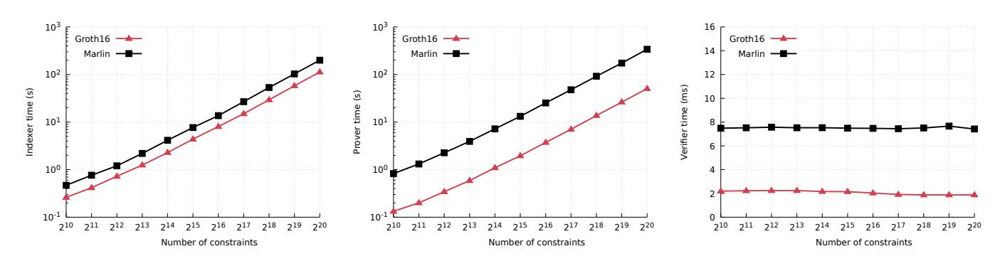
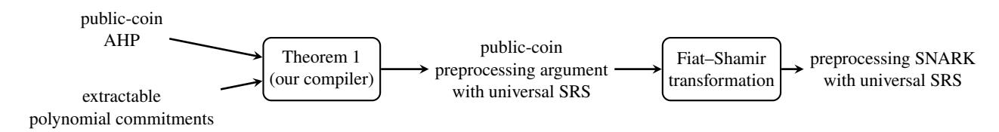
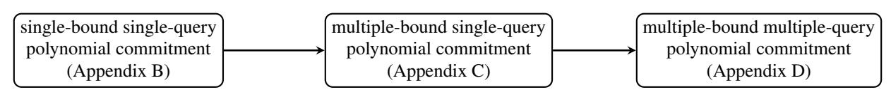

# Marlin:

# Preprocessing zkSNARKs with Universal and Updatable SRS

| Alessandro Chiesa   |
|---------------------|
| alexch@berkeley.edu |
| UC Berkeley         |

Yuncong Hu yuncong\_hu@berkeley.edu UC Berkeley

Mary Maller mary.maller.15@ucl.ac.uk UCL

Pratyush Mishra pratyush@berkeley.edu UC Berkeley

Psi Vesely psi@ucsd.edu UCL

Nicholas Ward npward@berkeley.edu UC Berkeley

May 27, 2020

#### **Abstract**

We present a methodology to construct preprocessing zkSNARKs where the structured reference string (SRS) is universal and updatable. This exploits a novel use of *holography* [Babai et al., STOC 1991], where fast verification is achieved provided the statement being checked is given in encoded form.

We use our methodology to obtain a preprocessing zkSNARK where the SRS has linear size and arguments have constant size. Our construction improves on Sonic [Maller et al., CCS 2019], the prior state of the art in this setting, in all efficiency parameters: proving is an order of magnitude faster and verification is thrice as fast, even with smaller SRS size and argument size. Our construction is most efficient when instantiated in the algebraic group model (also used by Sonic), but we also demonstrate how to realize it under concrete knowledge assumptions. We implement and evaluate our construction.

The core of our preprocessing zkSNARK is an efficient *algebraic holographic proof* (AHP) for rank-1 constraint satisfiability (R1CS) that achieves linear proof length and constant query complexity.

**Keywords**: succinct arguments; universal SRS; algebraic holographic proofs; polynomial commitments

# **Contents**

| 1 | Introduction<br>1.1<br>Our results<br>1.2<br>Related work                                                                                                                                                                                                                                                       | 3<br>5<br>7                      |
|---|-----------------------------------------------------------------------------------------------------------------------------------------------------------------------------------------------------------------------------------------------------------------------------------------------------------------|----------------------------------|
| 2 | Techniques<br>2.1<br>Building block: algebraic holographic proofs<br>2.2<br>Building block: polynomial commitments<br>2.3<br>Compiler: from AHPs to preprocessing arguments with universal SRS<br>2.4<br>Construction: an AHP for constraint systems<br>2.5<br>Construction: extractable polynomial commitments | 10<br>10<br>11<br>12<br>13<br>16 |
| 3 | Preliminaries<br>3.1<br>Indexed relations                                                                                                                                                                                                                                                                       | 18<br>18                         |
| 4 | Algebraic holographic proofs                                                                                                                                                                                                                                                                                    | 19                               |
| 5 | AHP for constraint systems<br>5.1<br>Algebraic preliminaries<br><br>5.2<br>AHP for the lincheck problem<br>5.3<br>AHP for R1CS                                                                                                                                                                                  | 21<br>21<br>22<br>27             |
| 6 | Polynomial commitment schemes with extractability<br>6.1<br>Definition<br><br>6.2<br>Construction                                                                                                                                                                                                               | 33<br>33<br>35                   |
| 7 | Preprocessing arguments with universal SRS                                                                                                                                                                                                                                                                      | 39                               |
| 8 | From AHPs to preprocessing arguments with universal SRS<br>8.1<br>Construction<br>8.2<br>Proof of Theorem 8.1<br><br>8.3<br>Proof of Theorem 8.3<br><br>8.4<br>Proof of Theorem 8.4<br>                                                                                                                         | 41<br>41<br>43<br>46<br>47       |
| 9 | Marlin: an efficient preprocessing zkSNARK with universal SRS<br>9.1<br>Optimizations for the AHP<br><br>9.2<br>Optimizations for the polynomial commitment scheme                                                                                                                                              | 49<br>49<br>50                   |
| A | Cryptographic assumptions<br>A.1<br>Bilinear groups<br><br>A.2<br>Strong Diffie–Hellman<br>A.3<br>Power knowledge of exponent<br>A.4<br>Algebraic group model<br><br>A.5<br>The effect of powers on security                                                                                                    | 53<br>53<br>53<br>53<br>55<br>56 |
| B | Polynomial commitments for a single degree bound<br>B.1<br>Definition<br><br>B.2<br>In the plain model<br>B.3<br>In the algebraic group model<br>                                                                                                                                                               | 57<br>57<br>58<br>66             |
| C | Polynomial commitments for multiple degree bounds<br>C.1<br>Degree-efficient construction<br><br>C.2<br>Black-box construction<br>                                                                                                                                                                              | 69<br>69<br>72                   |
| D | Polynomial commitments that support different query locations<br>D.1<br>Construction<br>D.2<br>Extractability<br><br>D.3<br>Hiding                                                                                                                                                                              | 75<br>75<br>75<br>76             |
| E | An optimized AHP for R1CS                                                                                                                                                                                                                                                                                       | 78                               |
|   | Acknowledgments                                                                                                                                                                                                                                                                                                 | 79                               |
|   | References                                                                                                                                                                                                                                                                                                      | 79                               |

# <span id="page-2-0"></span>**1 Introduction**

Succinct non-interactive arguments (SNARGs) are efficient certificates of membership in non-deterministic languages. Recent years have seen a surge of interest in zero-knowledge SNARGs of knowledge (zkSNARKs), with researchers studying constructions under different cryptographic assumptions, improvements in asymptotic efficiency, concrete performance of implementations, and numerous applications. The focus of this paper is *SNARGs in the preprocessing setting*, a notion that we motivate next.

**When is fast verification possible?** The size of a SNARG must be, as a minimum condition, sublinear in the size of the non-deterministic witness, and often is required to be even smaller (e.g., logarithmic in the size of the non-deterministic computation). The time to verify a SNARG would be, ideally, as fast as reading the SNARG. *This is in general too much to hope for, however.* The verification procedure must also read the *description* of the computation, in order know what statement is being verified. While there are natural computations that have succinct descriptions (e.g., machine computations), in general the description of a computation could be as large as the computation itself, which means that the time to verify the SNARG could be asymptotically comparable to the size of the computation. This is unfortunate because there is a very useful class of computations for which we cannot expect fast verification: general circuit computations.

**The preprocessing setting.** An approach to avoid the above limitation is to design a verification procedure that has two phases: an offline phase that produces a short summary for a given circuit; and an online phase that uses this short summary to verify SNARGs that attest to the satisfiability of the circuit with different partial assignments to its input wires. Crucially, now the online phase could in principle be as fast as reading the SNARG (and the partial assignment), and thus sublinear in the circuit size. This goal was captured by *preprocessing SNARGs* [\[Gro10;](#page-80-0) [Lip12;](#page-81-0) [Gen+13;](#page-80-1) [Bit+13\]](#page-79-0), which have been studied in an influential line of works that has led to highly-efficient constructions that fulfill this goal (e.g., [\[Gro16\]](#page-80-2)) and large-scale deployments in the real world that benefit from the online fast verification (e.g., [\[Zcash\]](#page-81-1)).

**The problem: circuit-specific SRS.** The offline phase in efficient constructions of preprocessing SNARGS consists of sampling a structured reference string (SRS) that depends on the circuit that is being preprocessed. This implies that producing/validating proofs with respect to different circuits requires different SRSs. In many applications of interest, there is no single party that can be entrusted with sampling the SRS, and so real-world deployments have had to rely on cryptographic "ceremonies" [\[ZcashMPC\]](#page-81-2) that use secure multi-party sampling protocols [\[Ben+15;](#page-78-2) [BGG17;](#page-79-1) [BGM17;](#page-79-2) [Abd+19\]](#page-78-3). However, any modification in the circuit used in an application requires another cryptographic ceremony, which is unsustainable for many applications.

**A solution: universal SRS.** The above motivates preprocessing SNARGs where the SRS is *universal*, which means that the SRS supports any circuit up to a given size bound by enabling anyone, in an offline phase *after* the SRS is sampled, to publicly derive a circuit-specific SRS.[1](#page-2-1) Known techniques to obtain a universal SRS from circuit-specific SRS introduce expensive overheads due to universal simulation [\[Ben+14a;](#page-78-4) [Ben+14b\]](#page-78-5). Also, these techniques lead to universal SRSs that are not *updatable*, a property introduced in [\[Gro+18\]](#page-80-3) that significantly simplifies cryptographic ceremonies. The recent work of Maller et al. [\[Mal+19\]](#page-81-3) overcomes these shortcomings, obtaining the first efficient construction of a preprocessing SNARG with universal (and updatable) SRS. Even so, the construction in [\[Mal+19\]](#page-81-3) is considerably more expensive than the state of the art for circuit-specific SRS [\[Gro16\]](#page-80-2). In this paper we ask: *can the efficiency gap between universal SRS and circuit-specific SRS be closed, or at least significantly reduced?*

<span id="page-2-1"></span><sup>1</sup>Even better than a universal SRS would be a URS (uniform reference string). However, achieving preprocessing SNARGs in the URS model with small argument size remains an open problem; see [Section 1.2.](#page-6-0)

**Concurrent work.** A concurrent work [GWC19] studies the same question as this paper. See Section 1.2 for a brief discussion that compares the two works.

| construction       | argument size over BN-256 (bytes) | argument size over BLS12-381 (bytes) |  |  |
|--------------------|-----------------------------------|--------------------------------------|--|--|
| Sonic [Mal+19]     | 1152                              | 1472                                 |  |  |
| Marlin [this work] | 704                               | 880                                  |  |  |
| Groth16 [Gro16]    | 128                               | 192                                  |  |  |

| zkSNARK<br>construction |                                              | sizes         |                          |               | time complexity                                                                            |                                                                        |                                                                         |                                                 |  |
|-------------------------|----------------------------------------------|---------------|--------------------------|---------------|--------------------------------------------------------------------------------------------|------------------------------------------------------------------------|-------------------------------------------------------------------------|-------------------------------------------------|--|
|                         |                                              | ipk   ivk     |                          | $ \pi $       | generator                                                                                  | indexer                                                                | prover                                                                  | verifier                                        |  |
| Sonic<br>[Mal+19]       | $\mathbb{G}_1$ $\mathbb{G}_2$ $\mathbb{F}_q$ | 8m<br>8m<br>— | 3                        | 20<br>—<br>16 | 8 f-MSM(M)<br>8 f-MSM(M)                                                                   | $\begin{array}{c} 4 \text{ v-MSM}(3m) \\ - \\ O(m \log m) \end{array}$ | $\begin{array}{c} 273 \text{ v-MSM}(m) \\ - \\ O(m \log m) \end{array}$ | 7 pairings $O( \mathbf{x}  + \log m)$           |  |
| Marlin [this work]      | $\mathbb{G}_1$ $\mathbb{G}_2$ $\mathbb{F}_q$ | 4m<br>        | 2<br>2                   | 13<br>8       | 1 f-MSM(3 <i>M</i> )<br>—                                                                  | $\begin{array}{c} 12 \text{ v-MSM}(m) \\ - \\ O(m \log m) \end{array}$ | $\begin{array}{c} 22 \text{ v-MSM}(m) \\ - \\ O(m \log m) \end{array}$  | $2 \text{ pairings}$ $O( \mathbf{x}  + \log m)$ |  |
| Groth16<br>[Gro16]      | $\mathbb{G}_1$ $\mathbb{G}_2$ $\mathbb{F}_q$ | 4n<br>n<br>—  | $O( \mathbf{x} )$ $O(1)$ | 2<br>1        | $\begin{array}{c} 4 \text{ f-MSM}(n) \\ 1 \text{ f-MSM}(n) \\ O(m + n \log n) \end{array}$ | N/A                                                                    | $ 4 \text{ v-MSM}(n) \\ 1 \text{ v-MSM}(n) \\ O(m + n \log n) $         | 1 v-MSM( x )<br>3 pairings                      |  |

n: number of multiplication gates in the circuit

Figure 1: Comparison of two preprocessing zkSNARKs with universal (and updatable) SRS: the prior state of the art and our construction. We include the current state of the art for circuit-specific SRS (in gray), for reference. Here  $\mathbb{G}_1/\mathbb{G}_2/\mathbb{F}_q$  denote the number of elements or operations over the respective group/field; also, f-MSM(m) and v-MSM(m) denote fixed-base and variable-base multi-scalar multiplications (MSM) each of size m, respectively. The number of pairings that we report for Sonic's verifier is lower than that reported in [Mal+19] because we account for standard batching techniques for pairing equations.



<span id="page-3-1"></span>**Figure 2:** Measured performance of Marlin and [Gro16] over the BLS12-381 curve. We could not include measurements for [Mal+19, Sonic] because at the time of writing there is no working implementation of its unhelped variant.

m: total number of (addition or multiplication) gates in the circuit

<span id="page-3-0"></span>M: maximum supported circuit size (maximum number of addition and multiplication gates)

### <span id="page-4-0"></span>**1.1 Our results**

In this paper we present Marlin, a new preprocessing zkSNARK with universal (and updatable) SRS that improves on the prior state of the art [\[Mal+19,](#page-81-3) Sonic] in essentially all relevant efficiency parameters.[2](#page-4-1) In addition to reducing argument size by several group and field elements and reducing time complexity of the verifier by over 3×, our construction overcomes the main efficiency drawback of [\[Mal+19,](#page-81-3) Sonic]: the cost of producing proofs. Indeed, our construction improves time complexity of the prover by over 10×, achieving prover efficiency comparable to the case of preprocessing zkSNARKs with *circuit-specific* SRS. In [Fig. 1](#page-3-0) we provide a comparison of our construction and [\[Mal+19,](#page-81-3) Sonic], including argument sizes for two popular elliptic curves; the table also includes the state of the art for circuit-specific SRS. We have implemented Marlin in a Rust library,[3](#page-4-2) and report evaluation results in [Fig. 2.](#page-3-1)

Our zkSNARK is the result of several contributions that we deem of independent interest, summarized below. **(1) A new methodology.** We present a general methodology to construct preprocessing SNARGs (and also zkSNARKs) where the SRS is universal (and updatable). The methodology in fact produces succinct *interactive* arguments that can be made non-interactive via the Fiat–Shamir transformation [\[FS86\]](#page-80-5). Hence below we focus on *preprocessing arguments with universal and updatable SRS* (see [Section 7](#page-38-0) for the definition).

Our key observation is that the ability to preprocess a circuit in an offline phase is closely related to constructing "holographic proofs" [\[Bab+91\]](#page-78-6), which means that the verifier does not receive the circuit description as an input but, rather, makes a small number of queries to an encoding of it. These queries are in addition to queries that the verifier makes to proofs sent by the prover. Moreover, in this paper we focus on the setting where the encoding of the circuit description consists of low-degree polynomials and also where proofs are themselves low-degree polynomials — this can be viewed as a requirement that honest and malicious provers are "algebraic". We call these *algebraic holographic proofs* (AHPs); see [Section 4](#page-18-0) for definitions.

We present a transformation that "compiles" any public-coin AHP into a corresponding preprocessing argument with universal (and updatable) SRS by using suitable polynomial commitments.

<span id="page-4-4"></span>**Theorem 1** (informal version of [Theorem 8.1\)](#page-40-2)**.** *There is an efficient transformation that combines any public-coin AHP for a relation* R *and an extractable polynomial commitment scheme to obtain a public-coin preprocessing argument with universal SRS for the relation* R*. The transformation preserves zero knowledge and proof of knowledge of the underlying AHP. The SRS is updatable provided the SRS of the polynomial commitment scheme is.*

The above transformation provides us with a *methodology* to construct preprocessing zkSNARKs with universal SRS (see [Fig. 3\)](#page-5-0). Namely, to improve the efficiency of preprocessing zkSNARKs with universal SRS it suffices to improve the efficiency of *simpler building blocks*: AHPs (an information-theoretic primitive) and polynomial commitments (a cryptographic primitive).[4](#page-4-3)

The improvements achieved by our preprocessing zkSNARK (see [Fig. 1\)](#page-3-0) were obtained by following this methodology: we designed efficient constructions for each of these two building blocks (which we discuss shortly), combined them via [Theorem 1,](#page-4-4) and then applied the Fiat–Shamir transformation [\[FS86\]](#page-80-5).

<span id="page-4-1"></span><sup>2</sup>Maller et al. [\[Mal+19\]](#page-81-3) discuss two variants of their protocol, a cheaper one for the "helped setting" and a costlier one for the "unhelped setting". The variant that is relevant to this paper is the latter one, because it is a preprocessing zkSNARK. (The former variant does not achieve succinct verification, and instead achieves a weaker guarantee that applies to proof batches.)

<span id="page-4-3"></span><span id="page-4-2"></span><sup>3</sup><https://github.com/scipr-lab/marlin>

<sup>4</sup>The methodology also captures as a special case various folklore approaches used in prior works to construct *non*-preprocessing zkSNARKs via polynomial commitment schemes (see [Section 1.2\)](#page-6-0), thereby providing the first formal statement that clarifies what properties of algebraic proofs and polynomial commitment schemes are essential for these folklore approaches.

Methodologies that combine information-theoretic probabilistic proofs and cryptographic tools have played a fundamental role in the construction of efficient argument systems. In the particular setting of preprocessing SNARGs, for example, the compiler introduced in [Bit+13] for *circuit-specific* SRS has paved the way towards current state-of-the-art constructions [Gro16], and also led to constructions that are plausibly post-quantum [Bon+17; Bon+18]. We believe that our methodology for universal SRS will also be useful in future work, and may lead to further efficiency improvements.

<span id="page-5-0"></span>

Figure 3: Diagram of our methodology to construct preprocessing SNARGs with universal SRS.

(2) An efficient AHP for R1CS. We design an algebraic holographic proof (AHP) that achieves linear proof length and constant query complexity, among other useful efficiency features. The protocol is for rank-1 constraint satisfiability (R1CS), a well-known generalization of arithmetic circuits where the "circuit description" is given by coefficient matrices (see definition below). Note that the relations that we consider consist of *triples* rather than *pairs*, because we need to split the verifier's input into a part for the offline phase and a part for the online phase. The offline input is called the *index*, and it consists of the coefficient matrices; the online input is called the *instance*, and it consists of a partial assignment to the variables. The algorithm that encodes the index (coefficient matrices) in the offline phase is called the *indexer*.

<span id="page-5-2"></span>**Definition 1** (informal). The **indexed relation**  $\mathcal{R}_{R1CS}$  is the set of triples  $(i, x, w) = ((\mathbb{F}, n, m, A, B, C), x, w)$  where  $\mathbb{F}$  is a finite field, A, B, C are  $n \times n$  matrices over  $\mathbb{F}$ , each containing at most m non-zero entries, and z := (x, w) is a vector in  $\mathbb{F}^n$  such that  $Az \circ Bz = Cz$ . (Here " $\circ$ " denotes the entry-wise product.)

<span id="page-5-1"></span>**Theorem 2** (informal). There exists a constant-round AHP for the indexed relation  $\mathcal{R}_{R1CS}$  with linear proof length and constant query complexity. The soundness error is  $O(m/|\mathbb{F}|)$ , and the construction is a zero knowledge proof of knowledge. The arithmetic complexity of the indexer is  $O(m \log m)$ , of the prover is  $O(m \log m)$ , and of the verifier is  $O(|x| + \log m)$ .

The literature on probabilistic proofs contains algebraic protocols that are holographic (e.g., [Bab+91] and [GKR15]) but *none achieve constant query complexity*, and so applying our methodology (Theorem 1) to these would lead to large argument sizes (many tens of kilobytes). These prior algebraic protocols rely on the multivariate sumcheck protocol applied to certain multivariate polynomials, which means that they incur sizable communication costs due to (a) the many rounds of the sumcheck protocol, and (b) the fact that applying the methodology would involve using multivariate polynomial commitment schemes that (for known constructions) lead to communication costs that are linear in the number of variables.

In contrast, our algebraic protocol relies on univariate polynomials and achieves constant query complexity, incurring small communication costs. Our algebraic protocol can be viewed as a "holographic variant" of the algebraic protocol for R1CS used in Aurora [Ben+19c], because it achieves an *exponential* improvement in verification time when the verifier is given a suitable encoding of the coefficient matrices; see Table 1.

<span id="page-6-1"></span>

| construction           | holographic? | indexer           | prover                       | verifier                           | messages | proof length | queries      |
|------------------------|--------------|-------------------|------------------------------|------------------------------------|----------|--------------|--------------|
| [Ben+19c]<br>this work | NO<br>YES    | N/A<br>O(m log m) | O(m + n log n)<br>O(m log m) | O( x <br>+ n)<br>O( x <br>+ log m) | 3<br>7   | O(n)<br>O(m) | O(1)<br>O(1) |

**Table 1:** Comparison of the *non*-holographic protocol for R1CS in [\[Ben+19c\]](#page-79-5), and the AHP for R1CS that we construct. Here n denotes the number of variables and m the number of non-zero coefficients in the matrices.

**(3) Extractable polynomial commitments.** Polynomial commitment schemes, introduced in [\[KZG10\]](#page-81-4), are commitment schemes specialized to work with univariate polynomials. The security properties in [\[KZG10\]](#page-81-4), while sufficient for the applications therein, do not appear sufficient for standalone use, or even just for the transformation in [Theorem 1.](#page-4-4) We propose a definition for polynomial commitment schemes that incorporates the functionality and security that we believe to suffice for standalone use (and in particular suffices for [Theorem 1\)](#page-4-4). Moreover, we show how to extend the construction of [\[KZG10\]](#page-81-4) to fulfill this definition in the plain model under non-falsifiable knowledge assumptions, or via a more efficient construction in the algebraic group model [\[FKL18\]](#page-80-7) under falsifiable assumptions. These constructions are of independent interest, and when combined with our transformation, lead to the first efficient preprocessing arguments with universal SRS under concrete knowledge assumptions, and also to the efficiency reported in [Fig. 1.](#page-3-0)

We have implemented in a Rust library[5](#page-6-2) the polynomial commitment schemes, and our implementation of Marlin relies on this library. We deem this library of independent interest for other projects.

### <span id="page-6-0"></span>**1.2 Related work**

In this paper we study the goal of constructing preprocessing SNARGs with universal SRS, which achieve succinct verification regardless of the structure of the non-deterministic computation being checked. The most relevant prior work is Sonic [\[Mal+19\]](#page-81-3), on which we improve as already discussed (see [Fig. 1\)](#page-3-0). The notion of updatable SRS was defined and achieved in [\[Gro+18\]](#page-80-3), but with a less efficient construction.

**Concurrent work.** A concurrent work [\[GWC19\]](#page-80-4) studies the same question as this paper, and also obtains efficiency improvements over Sonic [\[Mal+19\]](#page-81-3). Below is a brief comparison.

- Similarly to our work, [\[GWC19\]](#page-80-4) extends the polynomial commitment in [\[KZG10\]](#page-81-4) to support batching, and proves the extension secure in the algebraic group model. We additionally show how to prove security in the plain model under non-falsifiable knowledge assumptions, and consider the problem of enforcing different degrees for different polynomials (a feature that is not needed in [\[GWC19\]](#page-80-4)).
- We show how to compile any algebraic holographic proof into a preprocessing argument with universal SRS, while [\[GWC19\]](#page-80-4) focus on compiling a more restricted notion that they call "polynomial protocols".
- Our protocol natively supports R1CS, and can be viewed as a holographic variant of the algebraic protocol in [\[Ben+19c\]](#page-79-5). The protocol in [\[GWC19\]](#page-80-4) natively supports a different constraint system, and involves a protocol that, similar to [\[Gro10\]](#page-80-0), uses a permutation argument to attest that all variables in the same cycle of a permutation are equal (e.g., (1)(2, 3)(4) would require that the second and third entries are equal).

**Preprocessing SNARGs with a URS.** Setty [\[Set19\]](#page-81-5) studies preprocessing SNARGs with a URS (uniform reference string), and describes a protocol that for n-gate arithmetic circuits and a chosen constant c ≥ 2 achieves proving time Oλ(n), argument size Oλ(n <sup>1</sup>/c), and verification time <sup>O</sup>λ(<sup>n</sup> <sup>1</sup>−1/c). The protocol in

<span id="page-6-2"></span><sup>5</sup><https://github.com/scipr-lab/poly-commit>

[\[Set19\]](#page-81-5) offers a tradeoff compared to our work: preprocessing with a URS instead of a SRS, at the cost of asymptotically larger argument size and verification time. The question of achieving processing with a URS while also achieving asymptotically small argument size and verification time remains open.

The protocol in [\[Set19\]](#page-81-5) is obtained by combining the multivariate polynomial commitments of [\[Wah+18\]](#page-81-6) and a modern rendition of the PCP in [\[Bab+91\]](#page-78-6) (which itself can be viewed as the "bare bones" protocol of [\[GKR15\]](#page-80-6) for circuits of depth 1). [\[Set19\]](#page-81-5) lacks an analysis of concrete costs, and also does not discuss how to achieve zero knowledge beyond stating that techniques in other papers [\[Zha+17a;](#page-81-7) [Wah+18;](#page-81-6) [Xie+19\]](#page-81-8) can be applied. Nevertheless, argument sizes would at best be similar to these other papers (tens of kilobytes), which is much larger than our argument sizes (in the SRS model).

We conclude by noting that the informal security proof in [\[Set19\]](#page-81-5) appears insufficient to show soundness of the argument system, because the polynomial commitment scheme is only assumed to be binding but not also extractable (there is no explanation of where the witness encoded in the committed polynomial comes from). Our definitions and security proofs, if ported over to the multivariate setting, would fill this gap.

**Remark 1.1.** Setty [\[Set19\]](#page-81-5) also suggests using multivariate polynomial commitments with an SRS [\[PST13\]](#page-81-9), which could lead to asymptotically smaller argument size and faster verification time. Perhaps because this is not the focus of Spartan (which advocates the benefits of a URS) there are no analyses of security or concrete efficiency for this case. By analogy to arguments with an SRS that use such commitments [\[Xie+19\]](#page-81-8), one may guess that Setty's suggestion would lead to arguments with faster prover time and larger argument sizes (tens of kilobytes) in comparison to our work. Working out the details of this suggestion is left to future work.

**Non-preprocessing SNARGs for arbitrary computations.** Checking arbitrary circuits without preprocessing them requires the verifier to read the circuit, so the main goal is to obtain small argument size. In this setting of non-preprocessing SNARGs for arbitrary circuits, constructions with a URS (uniform reference string) are based on discrete logarithms [\[Boo+16;](#page-79-6) [Bün+18\]](#page-80-8) or hash functions [\[Ame+17;](#page-78-7) [Ben+19c\]](#page-79-5), while constructions with a universal SRS (structured reference string) combine polynomial commitments and non-holographic algebraic proofs [\[Gab19\]](#page-80-9); all use random oracles to obtain non-interactive arguments.[6](#page-7-0)

We find it interesting to remark that our methodology from [Theorem 1](#page-4-4) generalizes protocols such as [\[Gab19\]](#page-80-9) in two ways. First, it formalizes the folklore approach of combining polynomial commitments and algebraic proofs to obtain arguments, identifying the security properties required to make this approach work. Second, it demonstrates how for algebraic *holographic* proofs the resulting argument enables preprocessing.

**Non-preprocessing SNARGs for structured computations.** Several works study SNARGs for structured computations. This structure enables fast verification *without* preprocessing. A line of works [\[Ben+17b;](#page-79-7) [Ben+19a;](#page-79-8) [Ben+19b\]](#page-79-9) combines hash functions and various interactive oracle proofs. Another line of works [\[Zha+17b;](#page-81-10) [Zha+18;](#page-81-11) [Zha+17a;](#page-81-7) [Wah+18;](#page-81-6) [Xie+19\]](#page-81-8) combines multivariate polynomial commitments [\[PST13\]](#page-81-9) and doubly-efficient interactive proofs [\[GKR15\]](#page-80-6).

While in this paper we study a different setting (*preprocessing* SNARGs for *arbitrary* computations), there are similarities, and notable differences, in the polynomial commitments used in our work and prior works. We begin by noting that the notion of "multivariate polynomial commitments" varies considerably across prior works, despite the fact that most of those commitments are based on the protocol introduced in [\[PST13\]](#page-81-9).

• The commitments used in [\[Zha+17b;](#page-81-10) [Zha+18\]](#page-81-11) are required to satisfy extractability (a stronger notion than binding) because the security proof of the argument system involves extracting a polynomial encoding a

<span id="page-7-0"></span><sup>6</sup>The linear verification time in most of the cited constructions can typically be partially mitigated via techniques that enable an untrusted party to help the verifier to check a batch of proofs for the same circuit faster than checking each proof individually (the linear cost in the circuit is paid only once per batch rather than once for each proof in the batch).

witness. The commitment is a modification of [\[PST13\]](#page-81-9) that uses knowledge commitments, a standard ingredient to achieve extractability under non-falsifiable assumptions in the plain model. Neither of these works consider hiding commitments as zero knowledge is not a goal for them.

- The commitments used in [\[Zha+17a;](#page-81-7) [Wah+18\]](#page-81-6) must be compatible with the Cramer–Damgård transform [\[CD98\]](#page-80-10) used in constructing the argument system. They consider a *modified setting* where the sender does not reveal the value of the commitment polynomial at a desired point but, instead, reveals a commitment to this value, along with a proof attesting that the committed value is correct. For this modified setting, they consider commitments that satisfy natural notions of extractability *and hiding* (achieving zero knowledge arguments is a goal in both papers). The commitments constructed in the two papers offer different tradeoffs. The commitment in [\[Zha+17a\]](#page-81-7) is based on [\[PST13\]](#page-81-9): it relies on a SRS (structured reference string); it uses pairings; and for `-variate polynomials achieves Oλ(`)-size arguments that can be checked in Oλ(`) time. The commitment in [\[Wah+18\]](#page-81-6) is inspired from [\[BG12\]](#page-79-10) and [\[Bün+18\]](#page-80-8): it relies on a URS (uniform reference string); it does not use pairings; and for `-variate *multilinear* polynomials and a given constant <sup>c</sup> <sup>≥</sup> <sup>2</sup> achieves <sup>O</sup>λ(2`/c)-size arguments that can be checked in <sup>O</sup>λ(2`−`/c) time.
- The commitments used in [\[Xie+19\]](#page-81-8) are intended for the regular (unmodified) setting of commitment schemes where the sender reveals the value of the polynomial, because zero knowledge is later achieved by building on the algebraic techniques described in [\[CFS17\]](#page-80-11). The commitment definition in [\[Xie+19\]](#page-81-8) considers binding and hiding, but not extractability. However, the given security analysis for the argument system does not seem to go through for this definition (there is no explanation of where the witness encoded in the committed polynomial comes from). Also, no commitment construction is provided in [\[Xie+19\]](#page-81-8), and instead the reader is referred to [\[Zha+17a\]](#page-81-7), which considers the modified setting described above.

In sum there are multiple notions of commitment and one must be precise about the functionality and security needed to construct an argument system. We now compare prior notions of commitments to the one that we use.

First, since in this paper we do not use the Cramer–Damgård transform for zero knowledge, commitments in the modified setting are not relevant. Instead, we achieve zero knowledge via *bounded independence* [\[Ben+16\]](#page-78-8), and in particular we consider the familiar setting where the sender reveals evaluations to the committed polynomial. Second, prior works consider protocols where the sender commits to a polynomial in a single round, while we consider protocols where the sender commits to multiple polynomials of different degrees in each of several rounds. This multi-polynomial multi-round setting requires suitable extensions in terms of functionality (to enable batching techniques to save on argument size) and security (extractability and hiding need to be strengthened), which means that prior definitions do not suffice for us.

The above discrepancies have led us to formulate new definitions of functionality and security for polynomial commitments (as summarized in [Section 2.2\)](#page-10-0). We conclude by noting that, since in this paper we construct arguments that use *univariate* polynomials, our definitions are specialized to commitments for univariate polynomials. Corresponding definitions for multivariate polynomials can be obtained with straightforward modifications, and would strengthen definitions appearing in some prior works. Similarly, we fulfill the required definitions via natural adaptations of the univariate scheme of [\[KZG10\]](#page-81-4), and analogous adaptations of the multivariate scheme of [\[PST13\]](#page-81-9) would fulfill the multivariate analogues of these definitions.

# <span id="page-9-0"></span>**2 Techniques**

We discuss the main ideas behind our results. First we describe the two building blocks used in [Theorem 1:](#page-4-4) AHPs and polynomial commitment schemes (described in Sections [2.1](#page-9-1) and [2.2](#page-10-0) respectively). We describe how to combine these to obtain preprocessing arguments with universal SRS in [Section 2.3.](#page-11-0) Next, we discuss constructions for these building blocks: in [Section 2.4](#page-12-0) we describe our AHP (underlying [Theorem 2\)](#page-5-1), and in [Section 2.5](#page-15-0) we describe our construction of polynomial commitments.

Throughout, instead of considering the usual notion of relations that consist of instance-witness pairs, we consider *indexed relations*, which consist of triples (i, x, w) where i is the index, x is the instance, and w is the witness. This is because i represents the part of the verifier input that is preprocessed in the offline phase (e.g., the circuit description) and x represents the part of the verifier input that comes in the online phase (e.g., a partial assignment to the circuit's input wires). The *indexed language* corresponding to an indexed relation R, denoted L(R), is the set of pairs (i, x) for which there exists a witness w such that (i, x, w) ∈ R.

# <span id="page-9-1"></span>**2.1 Building block: algebraic holographic proofs**

Interactive oracle proofs (IOPs) [\[BCS16;](#page-78-9) [RRR16\]](#page-81-12) are multi-round protocols where in each round the verifier sends a challenge and the prover sends an oracle (which the verifier can query). IOPs combine features of interactive proofs [\[Bab85;](#page-78-10) [GMR89\]](#page-80-12)and probabilistically checkable proofs [\[Bab+91;](#page-78-6) [AS98;](#page-78-11) [Aro+98\]](#page-78-12). *Algebraic holographic proofs* (AHPs) modify the notion of an IOP in two ways.

- *Holographic:* the verifier does not receive its input explicitly but, rather, has oracle access to a prescribed *encoding* of it. This potentially enables the verifier to run in time that is much faster than the time to read its input in full. (Our constructions will achieve this fast verification.)
- *Algebraic:* the honest prover must produce oracles that are low-degree polynomials (this restricts the completeness property), and all malicious provers must produce oracles that are low-degree polynomials (this relaxes the soundness property). The encoded input to the verifier must also be a low-degree polynomial.

Since in this paper we only work with *univariate* polynomials, our definitions focus on this case, but they can be modified in a straightforward way to be more general.

Informally, a (public-coin) AHP over a field F for an indexed relation R is specified by an indexer I, prover P, and verifier V that work as follows.

- *Offline phase.* The indexer I receives as input the index i to be preprocessed, and outputs one or more univariate polynomials over F encoding i.
- *Online phase.* For some instance x and witness w, the prover P receives (i, x, w) and the verifier V receives x; P and V interact over some (in this paper, constant) number of rounds, where in each round V sends a challenge and P sends one or more polynomials; after the interaction, V(x) probabilistically queries the polynomials output by the indexer and the polynomials output by the prover, and then accepts or rejects. Crucially, V does *not* receive i as input, but instead queries the polynomials output by I that encode i. This enables the construction of verifiers V that run in time that is sublinear in |i|.

The completeness property states that for every (i, x, w) ∈ R the probability that P(i, x, w) convinces V I(i) (x) to accept is 1. The soundness property states that for every (i, x) ∈ L/ (R) and *admissible* prover P˜ the probability that P˜ convinces V I(i) (x) to accept is at most a given soundness error . A prover is "admissible" if the degrees of the polynomials it outputs fit within prescribed degree bounds of the protocol. See [Section 4](#page-18-0) for details on AHPs, including definitions of proof of knowledge and zero knowledge.

**Remark 2.1** (prior holographic proofs)**.** Various definitions of "holographic proofs" have been studied in the literature on probabilistic proofs, starting with the seminal work of Babai, Fortnow, Levin, and Szegedy [\[Bab+91\]](#page-78-6). Recent examples include the IPs in [\[GKR15\]](#page-80-6), whose verifier runs in sublinear time when given (multivariate low-degree) encodings of the circuit's wiring predicates and of the circuit's input; and also the IOPs in [\[RRR16\]](#page-81-12), where encoded provers and encoded inputs play a role in amortizing interactive proofs.

# <span id="page-10-0"></span>**2.2 Building block: polynomial commitments**

Informally, a *polynomial commitment scheme* [\[KZG10\]](#page-81-4) allows a prover to produce a commitment c to a univariate polynomial p ∈ F[X], and later "open" p(X) at any point z ∈ F, producing an *evaluation proof* π showing that the opened value is consistent with the polynomial "inside" c at z. Turning this informal goal into a useful definition requires some care, however, as we explain below. In this paper we propose a set of definitions for polynomial commitment schemes that we believe are useful for standalone use, and in particular suffice as a building block for our compiler described in [Sections 2.3](#page-11-0) and [8.](#page-40-0)

First, we consider constructions with strong efficiency requirements: the commitment c is much smaller than the polynomial p (e.g., c consists of a constant number of group elements), and the proof π can be validated very fast (e.g., in a constant number of cryptographic operations). These requirements not only rule out natural constructions, [7](#page-10-1)but also imply that the usual binding property, which states that an efficient adversary cannot open the same commitment to two different values, does not capture the desired security. Indeed, even if the adversary were to be bound to opening values of some function f : F → F, it may be that the function f is consistent with a polynomial whose degree is *higher* than what was claimed. This means that a security definition needs to incorporate guarantees about the degree of the committed function.[8](#page-10-2)

Second, in many applications of polynomial commitments, an adversary produces multiple commitments to polynomials within a round of interaction and across rounds of interaction. After this interaction, the adversary reveals values of all of these polynomials at one or more locations. This setting motivates a number of considerations. First, it is desirable to rely on a single set of public parameters for committing to multiple polynomials, even if the polynomials differ in degree. A construction such as that of [\[KZG10\]](#page-81-4) can be modified in a natural way to achieve this is by committing both to the polynomial and its shift to the maximum degree, similarly to techniques used to bundle multiple low-degree tests into a single one [\[Ben+19c\]](#page-79-5). This modification needs to be addressed in any proof of security. Second, it would be desirable to batch evaluation proofs across different polynomials for the same location. Again the construction in [\[KZG10\]](#page-81-4) can support this, but one must argue that security still holds in this more general case.

The preceeding considerations require an extension of previous definitions and motivate our re-formulation of the primitive. Informally, a polynomial commitment scheme PC is a tuple of algorithms PC = (Setup, Trim, Commit, Open, Check). The setup algorithm PC.Setup takes as input a security parameter and maximum supported degree bound D, and outputs public parameters pp that contain the description of a finite field F. The "trimming" algorithm PC.Trim then deterministically specializes these parameters for a given set of degree bounds and outputs a committer key ck and a receiver key rk. The sender can then invoke

<span id="page-10-1"></span><sup>7</sup>A natural construction would be to use a standard commitment scheme to commit to each coefficient of p, and then open to a value by revealing the committed coefficients. However, this construction is inefficient, because the commitment c and evaluation proof π are "long" (linear in the degree of p). An alternative construction would be to use a Merkle tree on the coefficients of p. While c now becomes short, the evaluation proof π remains long because the receiver would need to see all coefficients to validate a claimed evaluation. Crucially, both constructions enable the receiver to check the degree of the committed polynomial.

<span id="page-10-2"></span><sup>8</sup>This consideration motivates the *strong correctness* property in [\[KZG10\]](#page-81-4), which states that *if* the adversary knows a polynomial that leads to the claimed commitment c then this polynomial has bounded degree. This notion, while sufficient for the application in [\[KZG10\]](#page-81-4), does not seem to suffice for standalone use because there is no a priori guarantee that an adversary that can open values to a commitment knows a polynomial inside the commitment. In some sense, a knowledge assumption is hidden in this hypothesis.

PC.Commit with input ck and a list of polynomials p with respective degree bounds d to generate a set of commitments c. Subsequently, the sender can use PC.Open to produce a proof π that convinces the receiver that the polynomials "inside" c respect the degree bounds d and, moreover, evaluate to the claimed set of values v at a given query set Q that specifies any number of evaluation points for each polynomial. The receiver can invoke PC.Check to check this proof.

The scheme PC is required to satisfy *extractability* and *efficiency* properties, and also, optionally, a *hiding* property. We outline these properties below (see [Section 6.1](#page-32-1) for the details).

**Extractability.** Consider an efficient sender adversary A that can produce a commitment c and degree bound d ≤ D such that, when asked for an evaluation at some point z ∈ F, can produce a supposed evaluation v and proof π such that PC.Check accepts. Then PC is *extractable* if for every maximum degree bound D and every sender adversary A who can produce such commitments, there exists a corresponding efficient extractor E<sup>A</sup> that outputs a polynomial p of degree at most d that "explains" c so that p(z) = v. While for simplicity we have described the most basic case here, our definition considers adversaries and extractors who interact over multiple rounds, wherein the adversary may produce multiple commitments in each round and the extractor is required to output corresponding polynomials on a per-round basis (before seeing the query set, proof, or supposed evaluations).

In this work we rely on extractability to prove the security of our compiler (see [Section 2.3\)](#page-11-0); we do not know if weaker security notions studied in prior works, such as evaluation binding, suffice. More generally, we believe that extractability is a useful property that may be required across a range of other applications.

**Efficiency.** We require two notions of efficiency for PC. First, the time required to commit to a polynomial p and then to create an evaluation proof must be proportional to the degree of p, and not to the maximum degree D. (This ensures that the argument prover runs in time proportional to the size of the index.)

On the receiver's side, the commitment size, proof size, and time to verify an opening must be independent of the claimed degrees for the polynomials. (This ensures that the argument produced by our compiler is succinct.)

**Hiding.** The hiding property of PC states that commitments and proofs of evaluation reveal no information about the committed polynomial beyond the publicly stated degree bound and the evaluation itself. Namely, PC is *hiding* if there exists an efficient simulator that outputs simulated commitments and simulated evaluation proofs that cannot be distinguished from their real counterparts by any malicious distinguisher that only knows the degree bound and the evaluation.

Analogously to the case of extractability, we actually consider a more general definition that considers commitments to multiple polynomials within and across multiple rounds; moreover, the definition considers the case where some polynomials are designated as not hidden (and thus given to the simulator) because in our application we sometimes prefer to commit to a polynomial in a non-hiding way (for efficiency reasons).

# <span id="page-11-0"></span>**2.3 Compiler: from AHPs to preprocessing arguments with universal SRS**

We describe the main ideas behind [Theorem 1,](#page-4-4) which uses polynomial commitment schemes to compile any (public-coin) AHP into a corresponding (public-coin) preprocessing argument with universal SRS. In a subsequent step, the argument can be made non-interactive via the Fiat–Shamir transformation, and thereby obtain a preprocessing SNARG with universal SRS.

The basic intuition of the compiler follows the well-known framework of "commit to oracles and then open query answers" pioneered by Kilian [\[Kil92\]](#page-81-13). However, the commitment scheme used in our compiler leverages and enforces the algebraic structure of these oracles. While several works in the literature already take advantage of algebraic commitment schemes applied to algebraic oracles, our contribution is to observe that if we apply this framework to a holographic proof then we obtain a preprocessing argument.

Informally, first the argument indexer invokes the AHP indexer to generate polynomials, and then deterministically commits to these using the polynomial commitment scheme. Subsequently, the argument prover and argument verifier interact, each respectively simulating the AHP prover and AHP verifier. In each round, the argument prover sends succinct commitments to the polynomials output by the AHP prover in that round. After the interaction, the argument verifier declares its queries to the polynomials (of the prover and of the indexer). The argument prover replies with the desired evaluations along with an evaluation proof attesting to their correctness relative to the commitments.

This approach, while intuitive, must be proven secure. In particular, in the proof of soundness, we need to show that if the argument prover convinces the argument verifier with a certain probability, then we can find an AHP prover that convinces the AHP verifier with similar probability. This step is non-trivial: the AHP prover outputs polynomials, while the argument prover merely outputs succinct commitments and a few evaluations, which is much less information. In order to deduce the former from the latter requires *extraction*. This motivates considering polynomial commitment schemes that are extractable, in the sense described in Section 2.2. We do not know whether weaker security properties, such as the evaluation binding property studied in some prior works, suffice for proving the compiler secure.

The compiler outlined above is compatible with the properties of argument of knowledge and zero knowledge. Specifically, we prove that if the AHP is a proof of knowledge, then the compiler produces an argument of knowledge; also, if the AHP is (bounded-query) zero knowledge and the polynomial commitment scheme is hiding, then the compiler produces a zero knowledge argument.

See Section 8 for more details on the compiler.

# <span id="page-12-0"></span>2.4 Construction: an AHP for constraint systems

In prior sections we have described how we can use polynomial commitment schemes to compile AHPs into corresponding preprocessing SNARGs. In this section we discuss the main ideas behind Theorem 2, which provides an efficient AHP for the indexed relation corresponding to R1CS (see Definition 1). The preprocessing zkSNARK that we achieve in this paper (see Fig. 1) is based on this AHP.

Our protocol can be viewed as a "holographic variant" of the *non*-holographic algebraic proof for R1CS constructed in [Ben+19c]. Achieving holography involves designing a new sub-protocol that enables the verifier to evaluate low-degree extensions of the coefficient matrices at a random location. While in [Ben+19c] the verifier performed this computation in time  $\operatorname{poly}(|i|)$  on its own, in our protocol the verifier performs it *exponentially faster*, in time  $O(\log |i|)$ , by receiving help from the prover and having oracle access to the polynomials produced by the indexer. We introduce notation and then discuss the protocol.

**Some notation.** Consider an index  $i = (\mathbb{F}, n, m, A, B, C)$  specifying coefficient matrices, an instance  $\mathbb{X} = x \in \mathbb{F}^*$  specifying a partial assignment to the variables, and a witness  $\mathbb{W} = w \in \mathbb{F}^*$  specifying an assignment to the other variables such that the R1CS equation holds. The R1CS equation holds if and only if  $Az \circ Bz = Cz$  for  $z := (x, w) \in \mathbb{F}^n$ . Below, we let H and K be prescribed subsets of  $\mathbb{F}$  of sizes n and m respectively; we also let  $v_H(X)$  and  $v_K(X)$  be the vanishing polynomials of these two sets. (The vanishing polynomial of a set S is the monic polynomial of degree |S| that vanishes on S, i.e.,  $\prod_{\gamma \in S} (X - \gamma)$ .) We assume that both H and K are smooth multiplicative subgroups. This allows interpolation/evaluation over H in  $O(n \log n)$  operations and also makes  $v_H(X)$  computable in  $O(\log n)$  operations (and similarly for K). Given an  $n \times n$  matrix M with rows/columns indexed by elements of H, we denote by  $\hat{M}(X,Y)$  the low-degree extension of M, i.e., the polynomial of individual degree less than n such that  $\hat{M}(\kappa, \iota)$  is the

 $(\kappa, \iota)$ -th entry of M for every  $\kappa, \iota \in H$ .

A non-holographic starting point. We sketch a *non*-holographic protocol for R1CS with linear proof length and constant query complexity, inspired from [Ben+19c], that forms the starting point of our work. In this case the prover receives as input (i, x, w) and the verifier receives as input (i, x). (The verifier reads the non-encoded index i because we are describing a non-holographic protocol.)

In the first message the prover  $\mathbf P$  sends the univariate polynomial  $\hat z(X)$  of degree less than n that agrees with the variable assignment z on H, and also sends the univariate polynomials  $\hat z_A(X), \hat z_B(X), \hat z_C(X)$  of degree less than n that agree with the linear combinations  $z_A := Az, z_B := Bz$ , and  $z_C := Cz$  on H. The prover is left to convince the verifier that the following two conditions hold:

(1) Entry-wise product: 
$$\ \, \forall \, \kappa \in H \, , \, \, \hat{z}_A(\kappa) \hat{z}_B(\kappa) - \hat{z}_C(\kappa) = 0 \, \, .$$

$$\text{(2) Linear relation:} \quad \forall\, M \in \{A,B,C\}\,,\; \forall\, \kappa \in H\,,\; \hat{z}_M(\kappa) = \sum_{\iota \in H} M[\kappa,\iota] \hat{z}(\iota) \;\;.$$

(The prover also needs to convince the verifier that  $\hat{z}(X)$  encodes a full assignment z that is consistent with the partial assignment x, but we for simplicity we ignore this in this informal discussion.)

In order to convince the verifier of the first (entry-wise product) condition, the prover sends the polynomial  $h_0(X)$  such that  $\hat{z}_A(X)\hat{z}_B(X) - \hat{z}_C(X) = h_0(X)v_H(X)$ . This polynomial equation is equivalent to the first condition (the left-hand side equals zero everywhere on H if and only if it is a multiple of H's vanishing polynomial). The verifier will check the equation at a random point  $\beta \in \mathbb{F}$ : it queries  $\hat{z}_A(X), \hat{z}_B(X), \hat{z}_C(X), h_0(X)$  at  $\beta$ , evaluates  $v_H(X)$  at  $\beta$  on its own, and checks that  $\hat{z}_A(\beta)\hat{z}_B(\beta) - \hat{z}_C(\beta) = h_0(\beta)v_H(\beta)$ . The soundness error is the maximum degree over the field size, which is at most  $2n/|\mathbb{F}|$ .

In order to convince the verifier of the second (linear relation) condition, the prover expects a random challenge  $\alpha \in \mathbb{F}$  from the verifier, and then replies in a second message. For each  $M \in \{A, B, C\}$ , the prover sends polynomials  $h_M(X)$  and  $g_M(X)$  such that

$$r(\alpha,X)\hat{z}_M(X) - r_M(\alpha,X)\hat{z}(X) = h_M(X)v_H(X) + Xg_M(X) \quad \text{for} \quad r_M(Z,X) := \sum_{\kappa \in H} r(Z,\kappa)\hat{M}(\kappa,X)$$

where r(Z,X) is a prescribed polynomial of individual degree less than n such that  $(r(Z,\kappa))_{\kappa\in H}$  are n linearly independent polynomials. Prior work [Ben+19c] on checking linear relations via univariate sumchecks shows that this polynomial equation is equivalent, up to a soundness error of  $n/|\mathbb{F}|$  over  $\alpha$ , to the second condition. The verifier will check this polynomial equation at the random point  $\beta\in\mathbb{F}$ : it queries  $\hat{z}(X),\hat{z}_A(X),\hat{z}_B(X),\hat{z}_C(X),h_M(X),g_M(X)$  at  $\beta$ , evaluates  $v_H(X)$  at  $\beta$  on its own, evaluates r(Z,X) and  $r_M(Z,X)$  at  $(\alpha,\beta)$  on its own, and checks that  $r(\alpha,\beta)\hat{z}_M(\beta)-r_M(\alpha,\beta)\hat{z}(\beta)=h_M(\beta)v_H(\beta)+\beta g_M(\beta)$ . The additional soundness error is  $2n/|\mathbb{F}|$ .

The above is a simple 3-message protocol for R1CS with soundness error  $\max\{2n/|\mathbb{F}|, 3n/|\mathbb{F}|\} = 3n/|\mathbb{F}|$  in the setting where the honest prover and malicious provers send polynomials of prescribed degrees, which the verifier can query at any location. The proof length (sum of all degrees) is linear in n and the query complexity is constant.

Barrier to holography. The verifier in the above protocol runs in time that is  $\Omega(|\dot{\mathbf{i}}|) = \Omega(n+m)$ . While this is inherent in the non-holographic setting (because the verifier must read  $\dot{\mathbf{i}}$ ), we now discuss how exactly the verifier's computation depends on  $\dot{\mathbf{i}}$ . We shall later use this understanding to achieve an exponential improvement in the verifier's time when given a suitable encoding of  $\dot{\mathbf{i}}$ .

<span id="page-13-0"></span><sup>&</sup>lt;sup>9</sup>In particular, we are using the fact from [Ben+19c] that, given a multiplicative subgroup S of  $\mathbb{F}$ , a polynomial f(X) sums to  $\sigma$  over S if and only if f(X) can be written as  $h(X)v_S(X)+Xg(X)+\sigma/|S|$  for some h(X) and g(X) with  $\deg(g)<|S|-1$ .

The verifier's check for the entry-wise product is  $\hat{z}_A(\beta)\hat{z}_B(\beta) - \hat{z}_C(\beta) = h_0(\beta)v_H(\beta)$ , and can be carried out in  $O(\log n)$  operations regardless of the coefficient matrices contained in the index i. In other words, this check is efficient even in the non-holographic setting. However, the verifier's check for the linear relation is  $r(\alpha,\beta)\hat{z}_M(\beta) - r_M(\alpha,\beta)\hat{z}(\beta) = h_M(\beta)v_H(\beta) + \beta g_M(\beta)$ , which has a linear cost. Concretely, evaluating the polynomial  $r_M(Z,X)$  at  $(\alpha,\beta)$  requires  $\Omega(n+m)$  operations.

In the holographic setting, a natural idea to reduce this cost would be to grant the verifier oracle access to the low-degree extension  $\hat{M}$  for  $M \in \{A, B, C\}$ . This idea has two problems: the verifier *still* needs  $\Omega(n)$  operations to evaluate  $r_M(Z,X)$  at  $(\alpha,\beta)$  and, moreover, the size of  $\hat{M}$  is *quadratic* in n, which means that the encoding of the index i is  $\Omega(n^2)$ . We cannot afford such an expensive encoding in the offline preprocessing phase. We now describe how we overcome both of these problems, and obtain a holographic protocol.

**Achieving holography.** To overcome the above problems and obtain a holographic protocol, we rely yet again on the univariate sumcheck protocol. We introduce two additional rounds of interaction, and in each round the verifier learns that their verification equation holds provided the sumcheck from the next round holds. The last sumcheck will rely on polynomials output by the indexer, which the verifier knows are correct.

We address the first problem by letting the prover and verifier interact in an additional round, where we rely on an additional univariate sumcheck to reduce the problem of evaluating  $r_M(Z,X)$  at  $(\alpha,\beta)$  to the problem of evaluating  $\hat{M}$  at  $(\beta_2,\beta)$  for a random  $\beta_2 \in \mathbb{F}$ . Namely, the verifier sends  $\beta$  to the prover, who computes

$$\sigma_2 := r_M(\alpha,\beta) = \sum_{\kappa \in H} r(\alpha,\kappa) \hat{M}(\kappa,\beta).$$

Then the prover replies with  $\sigma_2$  and the polynomials  $h_2(X)$  and  $g_2(X)$  such that

$$r(\alpha, X)\hat{M}(X, \beta) = h_2(X)v_H(X) + Xg_2(X) + \sigma_2/n .$$

Prior techniques on univariate sumcheck [Ben+19c] tell us that this equation is equivalent to the polynomial  $r(\alpha,X)\hat{M}(X,\beta)$  summing to  $\sigma_2$  on H. Thus the verifier needs to check this equation at a random  $\beta_2\in\mathbb{F}$ :  $r(\alpha,\beta_2)\hat{M}(\beta_2,\beta)=h_2(\beta_2)v_H(\beta_2)+\beta_2g_2(\beta_2)+\sigma_2/n$ . The only expensive part of this equation for the verifier is computing the value  $\hat{M}(\beta_2,\beta)$ , which is problematic. Indeed, we have already noted that we cannot afford to simply let the verifier have oracle access to  $\hat{M}$ , because this polynomial has quadratic size (it contains a quadratic number of terms).

We address this second problem as follows. Let  $u_H(X,Y):=\frac{v_H(X)-v_H(Y)}{X-Y}$  be the formal derivative of the vanishing poynomial  $v_H(X)$ , and note that  $u_H(X,Y)$  vanishes on the square  $H\times H$  except for on the diagonal, where it takes on the (non-zero) values  $(u_H(a,a))_{a\in H}$ . Moreover,  $u_H(X,Y)$  can be evaluated at any point in  $\mathbb{F}\times\mathbb{F}$  in  $O(\log n)$  operations. Using this polynomial, we can write M as a sum of m=|K| terms instead of  $n^2=|H|^2$  terms:

$$\hat{M}(X,Y) := \sum_{\kappa \in K} u_H(X, \mathring{\operatorname{row}}_M(\kappa)) \cdot u_H(Y, \mathring{\operatorname{col}}_M(\kappa)) \cdot \mathring{\operatorname{val}}_M(\kappa) \enspace ,$$

where  $\hat{\text{row}}_M$ ,  $\hat{\text{col}}_M$ ,  $\hat{\text{val}}_M$  are the low-degree extensions of the row, column, and value of the non-zero entries in M according to some canonical order over K. <sup>10</sup>

This method of representing the low-degree extension of M suggests an idea: let the verifier have oracle access to the polynomials  $\hat{\text{row}}_M$ ,  $\hat{\text{col}}_M$ ,  $\hat{\text{val}}_M$  and do yet another univariate sumcheck, but this time over the set K. The verifier sends  $\beta_2$  to the prover, who computes

$$\sigma_3 := \hat{M}(\beta_2,\beta) = \sum_{\kappa \in K} u_H(\beta_2, \hat{\mathrm{row}}_M(\kappa)) \cdot u_H(\beta, \hat{\mathrm{col}}_M(\kappa)) \cdot \hat{\mathrm{val}}_M(\kappa) \enspace .$$

<span id="page-14-0"></span><sup>&</sup>lt;sup>10</sup>Technicality:  $\hat{\mathsf{val}}(\kappa)$  actually equals the value divided by  $u_H(\hat{\mathsf{row}}_M(\kappa), \hat{\mathsf{row}}_M(\kappa)) u_H(\hat{\mathsf{col}}_M(\kappa), \hat{\mathsf{col}}_M(\kappa))$ .

Then the prover replies with  $\sigma_3$  and the polynomials  $h_3(X)$  and  $g_3(X)$  such that

$$u_H(\beta_2, \mathring{\mathsf{row}}_M(X))u_H(\beta, \mathring{\mathsf{col}}_M(X))\mathring{\mathsf{val}}_M(X) = h_3(X)v_K(X) + Xg_3(X) + \sigma_3/m$$
.

The verifier can then check this equation at a random  $\beta_3 \in \mathbb{F}$ , which only requires  $O(\log m)$  operations.

The above idea *almost* works; the one remaining problem is that  $h_3(X)$  has degree  $\Omega(nm)$  (because the left-hand size of the equation has quadratic degree), which is too expensive for our target of a quasilinear-time prover. We overcome this problem by letting the prover run the univariate sumcheck protocol on the unique low-degree extension  $\hat{f}(X)$  of the function  $f\colon K\to \mathbb{F}$  defined as  $f(\kappa):=u_H(\beta_2, \hat{\operatorname{row}}_M(\kappa))u_H(\beta, \hat{\operatorname{col}}_M(\kappa))\hat{\operatorname{val}}_M(\kappa)$ . Observe that  $\hat{f}(X)$  has degree less than m. The verifier checks that  $\hat{f}(X)$  and  $u_H(\beta_2, \hat{\operatorname{row}}_M(X))u_H(\beta, \hat{\operatorname{col}}_M(X))\hat{\operatorname{val}}_M(X)$  agree on K.

**From sketch to protocol.** In the above discussion we have ignored a number of technical aspects, such as proof of knowledge and zero knowledge (which are ultimately needed in the compiler if we want to construct a preprocessing zkSNARK). We have also not discussed time complexities of many algebraic steps, and we omitted discussion of how to batch multiple sumchecks into fewer ones, which brings important savings in argument size. For details, see our detailed construction in Section 5.

## <span id="page-15-0"></span>2.5 Construction: extractable polynomial commitments

We now sketch how to construct a polynomial commitment scheme that achieves the strong functionality and security requirements of our definition in Section 2.2. Our starting point is the PolyCommit<sub>DL</sub> construction of Kate et al. [KZG10], and then describe a sequence of natural and generic transformations that extend this construction to enable extractability, commitments to multiple polynomials, and the enforcement of per-polynomial degree bounds. In fact, once we arrive at a scheme that supports extractability for committed polynomials at a single point (Appendix B), our transformations build on this construction in a black box way to first support per-polynomial degree bounds (Appendix C), and then query sets that may request multiple evaluation points per polynomial (Appendix D). Indeed, it is sufficient to produce a polynomial commitment scheme that satisfies the much more simple interface and definitions in Appendix B.1, and apply these black box transformations to obtain a polynomial commitment scheme that satisfies the interface of and provides the properties described in Section 6.1 ultimately needed by our compiler.

**Starting point:** PolyCommit<sub>DL</sub>. The setup phase samples a cryptographically secure bilinear group  $(\mathbb{G}_1,\mathbb{G}_2,\mathbb{G}_T,q,G,H,e)$  and then samples a committer key ck and receiver key rk for a given degree bound D. The committer key consists of group elements encoding powers of a random field element  $\beta$ , namely,  $\mathsf{ck} := \{G, \beta G, \dots, \beta^D G\} \in \mathbb{G}_1^{D+1}$ . The receiver key consists of the group elements  $\mathsf{rk} := (G, H, \beta H) \in \mathbb{G}_1 \times \mathbb{G}_2^2$ . Note that the SRS, which consists of the keys ck and rk, is updatable because the coefficients of group elements in the SRS are all monomials (see Remark 7.1).

To commit to a polynomial  $p \in \mathbb{F}_q[X]$ , the sender computes  $c := p(\beta)G$ . To subsequently prove that the committed polynomial evaluates to v at a point z, the sender computes a witness polynomial w(X) := (p(X) - p(z))/(X - z), and provides as proof a commitment to  $w : \pi := w(\beta)G$ . The idea is that the witness function w is a polynomial if and only if p(z) = v; otherwise, it is a rational function, and cannot be committed to using ck.

Finally, to verify a proof of evaluation, the receiver checks that the commitment and proof of evaluation are consistent. That is, it checks that the proof commits to a polynomial of the form (p(X) - p(z))/(X - z) by checking the equality  $e(c - vG, H) = e(\pi, \beta H - zH)$ .

Achieving extractability. While the foregoing construction guarantees correctness of evaluations, it does not by itself guarantee that a commitment actually "contains" a suitable polynomial of degree at most D. We

study two methods to address this issue, and thereby achieve extractability. One method is to modify the construction to use knowledge commitments [Gro10], and rely on a concrete knowledge assumption. The main disadvantage of this approach is that each commitment doubles in size. The other method is to move away from the plain model, and instead conduct the security analysis in the algebraic group model (AGM) [FKL18]. This latter method is more efficient because each commitment remains a single group element.

Committing to multiple polynomials at once. We enable the sender to simultaneously open multiple polynomials  $[p_i]_{i=1}^n$  at the same point z as follows. Before generating a proof of evaluation for  $[p_i]_{i=1}^n$ , the sender requests from the receiver a random field element  $\xi$ , which he uses to take a random linear combination of the polynomials:  $p := \sum_{i=1}^{n} \xi^{i} p_{i}$ , and generates a proof of evaluation  $\pi$  for this polynomial p.

The receiver verifies  $\pi$  by using the fact that the commitments are additively homomorphic. The receiver takes a linear combination of the commitments and claimed evaluations, obtaining the combined commitment  $c = \sum_{i=1}^{n} \xi^{i} c_{i}$  and evaluation  $v = \sum_{i=1}^{n} \xi^{i} v_{i}$ . Finally, it checks the pairing equations for  $c, \pi$ , and v. Completeness of this check is straightforward, while soundness follows from the fact that if any polynomial

does not match its evaluation, then the combined polynomial will not match its evaluation with high probability.

**Enforcing multiple degree bounds.** The construction so far enforces a single bound D on the degrees of all the polynomials  $p_i$ . To enforce a different degree bound  $d_i$  for each  $p_i$ , we require the sender to commit not only to each  $p_i$ , but also to "shifted polynomials"  $p_i'(X) := X^{D-d_i}p_i(X)$ . The proof of evaluation proves that, if  $p_i$  evaluates to  $v_i$  at z, then  $p_i^{'}$  evaluates to  $z^{D-d_i}v_i$ .

The receiver checks that the commitment for each  $p'_i$  corresponds to an evaluation  $z^{D-d_i}v_i$  so that, if z is sampled from a super-polynomial subset of  $\mathbb{F}_q$ , the probability that  $\deg(p_i) \neq d_i$  is negligible. This trick is similar to the one used in [BS08; Ben+19c] to derive low-degree tests for specific degree bounds.

However, while sound, this approach is inefficient in our setting: the witness polynomial for  $p'_i$  has  $\Omega(D)$  non-zero coefficients (instead of  $O(d_i)$ ), and so constructing an evaluation proof for it requires  $\Omega(D)$ scalar multiplications (instead of  $O(d_i)$ ). To work around this, we instead produce a proof that the related polynomial  $p_i^{\star}(X) := p_i'(X) - p_i(z)X^{D-d_i}$  evaluates to 0 at z. As we show in Lemma C.2, the witness polynomial for this claim has  $O(d_i)$  non-zero coefficients, and so constructing the evaluation proof can be done in  $O(d_i)$  scalar multiplications. Completeness is preserved because the receiver can check the correct evaluation of  $p_i^*$  by subtracting  $p_i(z)(\beta^{D-d_i}\mathbb{G})$  from the commitment to the shifted polynomial  $p_i'$ , thereby obtaining a commitment to  $p_i^*$ , while security is preserved because  $p_i'(z) = z^{D-d_i}v_i \iff p_i^*(z) = 0$ .

Evaluating at a query set instead of a single point. To support the case where the polynomials  $[p_i]_{i=1}^n$  are evaluated at a set of points Q, the sender proceeds as follows. Say that there are k different points  $[z_i]_{i=1}^k$  in Q. The sender partitions the polynomials  $[p_i]_{i=1}^n$  into different groups such that every polynomial in a group is to be evaluated at the same point  $z_i$ . The sender runs PC. Open on each group, and outputs the resulting list of evaluation proofs.

Achieving hiding. To additionally achieve hiding, we follow the above blueprint, replacing PolyCommit<sub>DL</sub> with the hiding scheme PolyCommit<sub>Ped</sub> described in [KZG10].

## <span id="page-17-0"></span>3 Preliminaries

We denote by [n] the set  $\{1,\ldots,n\}\subseteq\mathbb{N}$ . We use  $a=[a_i]_{i=1}^n$  as a short-hand for the tuple  $(a_1,\ldots,a_n)$ , and  $[a_i]_{i=1}^n=[[a_{i,j}]_{j=1}^m]_{i=1}^n$  as a short-hand for the tuple  $(a_{1,1},\ldots,a_{1,m},\ldots,a_{n,1},\ldots,a_{n,m})$ ; |a| denotes the number of entries in a. If x is a binary string then |x| denotes its bit length. If M is a matrix then |M| denotes the number of nonzero entries in M. If S is a finite set then |S| denotes its cardinality and  $x \in S$  denotes that x is an element sampled at random from S. We denote by  $\mathbb{F}$  a finite field, and whenever  $\mathbb{F}$  is an input to an algorithm we implicitly assume that  $\mathbb{F}$  is represented in a way that allows efficient field arithmetic. Given a finite set S, we denote by  $\mathbb{F}^S$  the set of vectors indexed by elements in S. We denote by  $\mathbb{F}[X]$  the ring of univariate polynomials over  $\mathbb{F}$  in X, and by  $\mathbb{F}^{< d}[X]$  the set of polynomials in  $\mathbb{F}[X]$  with degree less than d.

We denote by  $\lambda \in \mathbb{N}$  a security parameter. When we state that  $n \in \mathbb{N}$  for some variable n, we implicitly assume that  $n = \operatorname{poly}(\lambda)$ . We denote by  $\operatorname{negl}(\lambda)$  an unspecified function that is  $\operatorname{negligible}$  in  $\lambda$  (namely, a function that vanishes faster than the inverse of any polynomial in  $\lambda$ ). When a function can be expressed in the form  $1 - \operatorname{negl}(\lambda)$ , we say that it is  $\operatorname{overwhelming}$  in  $\lambda$ . When we say that  $\mathcal{A}$  is an  $\operatorname{efficient}$  adversary we mean that  $\mathcal{A}$  is a family  $\{\mathcal{A}_{\lambda}\}_{\lambda \in \mathbb{N}}$  of non-uniform polynomial-size circuits. If the adversary consists of multiple circuit families  $\mathcal{A}_1, \mathcal{A}_2, \ldots$  then we write  $\mathcal{A} = (\mathcal{A}_1, \mathcal{A}_2, \ldots)$ .

Given two interactive algorithms A and B, we denote by  $\langle A(x), B(y) \rangle(z)$  the output of B(y,z) when interacting with A(x,z). Note that this output could be a random variable. If we use this notation when A or B is a circuit, we mean that we are considering a circuit that implements a suitable next-message function to interact with the other party of the interaction.

#### <span id="page-17-1"></span>3.1 Indexed relations

An indexed relation  $\mathcal R$  is a set of triples (i, x, w) where i is the index, x is the instance, and w is the witness; the corresponding indexed language  $\mathcal L(\mathcal R)$  is the set of pairs (i,x) for which there exists a witness w such that  $(i,x,w)\in \mathcal R$ . For example, the indexed relation of satisfiable boolean circuits consists of triples where i is the description of a boolean circuit, x is a partial assignment to its input wires, and w is an assignment to the remaining wires that makes the circuit to output w. Given a size bound w is we denote by w0, the restriction of w2 to triples (i,x,w) with  $|i| \leq w$ 1.

# <span id="page-18-0"></span>4 Algebraic holographic proofs

We define *algebraic holographic proofs* (AHPs), the notion of proofs that we use. For simplicity, the formal definition below is tailored to univariate polynomials, because our AHP construction is in this setting. The definition can be modified in a straightforward way to consider the general case of multivariate polynomials.

We represent polynomials through the coefficients that define them, as opposed to through their evaluation over a sufficiently large domain (as is typically the case in probabilistic proofs). This definitional choice is due to the fact that we will consider verifiers that may query the polynomials at any location in the field of definition. Moreover, the field of definition itself can be chosen from a given field family, and so we make the field an additional input to all algorithms; this degree of freedom is necessary when combining this component with polynomial commitment schemes (see Section 8). Finally, we consider the setting of *indexed relations* (see Section 3.1), where the verifier's input has two parts, the index and the instance; in the definition below, the verifier receives the index encoded and the instance explicitly.

Formally, an **algebraic holographic proof** (AHP) over a field family  $\mathcal F$  for an indexed relation  $\mathcal R$  is specified by a tuple

$$\mathsf{AHP} = (\mathsf{k},\mathsf{s},\mathsf{d},\mathbf{I},\mathbf{P},\mathbf{V})$$

where k, s, d:  $\{0,1\}^* \to \mathbb{N}$  are polynomial-time computable functions and  $\mathbf{I}, \mathbf{P}, \mathbf{V}$  are three algorithms known as the *indexer*, *prover*, and *verifier*. The parameter k specifies the number of interaction rounds, s specifies the number of polynomials in each round, and d specifies degree bounds on these polynomials.

In the offline phase ("0-th round"), the indexer I receives as input a field  $\mathbb{F} \in \mathcal{F}$  and an index i for  $\mathcal{R}$ , and outputs s(0) polynomials  $p_{0,1},\ldots,p_{0,s(0)}\in \mathbb{F}[X]$  of degrees at most  $d(|i|,0,1),\ldots,d(|i|,0,s(0))$  respectively. Note that the offline phase does not depend on any particular instance or witness, and merely considers the task of encoding the given index i.

In the online phase, given an instance x and witness w such that  $(i, x, w) \in \mathcal{R}$ , the prover  $\mathbf{P}$  receives  $(\mathbb{F}, i, x, w)$  and the verifier  $\mathbf{V}$  receives  $(\mathbb{F}, x)$  and oracle access to the polynomials output by  $\mathbf{I}(\mathbb{F}, i)$ . The prover  $\mathbf{P}$  and the verifier  $\mathbf{V}$  interact over k = k(|i|) rounds.

For  $i \in [k]$ , in the i-th round of interaction, the verifier  $\mathbf V$  sends a message  $\rho_i \in \mathbb F^*$  to the prover  $\mathbf P$ ; then the prover  $\mathbf P$  replies with  $\mathbf s(i)$  oracle polynomials  $p_{i,1},\ldots,p_{i,\mathbf s(i)} \in \mathbb F[X]$ . The verifier may query any of the polynomials it has received any number of times. A query consists of a location  $z \in \mathbb F$  for an oracle  $p_{i,j}$ , and its corresponding answer is  $p_{i,j}(z) \in \mathbb F$ . After the interaction, the verifier accepts or rejects.

The function d determines which provers to consider for the completeness and soundness properties of the proof system. In more detail, we say that a (possibly malicious) prover  $\tilde{\mathbf{P}}$  is **admissible** for AHP if, on every interaction with the verifier  $\mathbf{V}$ , it holds that for every round  $i \in [k]$  and oracle index  $j \in [s(i)]$  we have  $\deg(p_{i,j}) \leq \mathsf{d}(|\dot{\mathbf{i}}|,i,j)$ . The honest prover  $\mathbf{P}$  is required to be admissible under this definition.

We say that AHP has perfect completeness and soundness error  $\epsilon$  if the following holds.

- Completeness. For every field  $\mathbb{F} \in \mathcal{F}$  and index-instance-witness tuple  $(i, x, w) \in \mathcal{R}$ , the probability that  $\mathbf{P}(\mathbb{F}, i, x, w)$  convinces  $\mathbf{V}^{\mathbf{I}(\mathbb{F}, i)}(\mathbb{F}, x)$  to accept in the interactive oracle protocol is 1.
- Soundness. For every field  $\mathbb{F} \in \mathcal{F}$ , index-instance pair  $(i, x) \notin \mathcal{L}(\mathcal{R})$ , and admissible prover  $\tilde{\mathbf{P}}$ , the probability that  $\tilde{\mathbf{P}}$  convinces  $\mathbf{V}^{\mathbf{I}(\mathbb{F},i)}(\mathbb{F},x)$  to accept in the interactive oracle protocol is at most  $\epsilon$ .

The *proof length* | is the sum of all degree bounds in the offline and online phases,  $|(|i|)| := \sum_{i=0}^{\mathsf{k}(|i|)} \sum_{j=1}^{\mathsf{s}(i)} \mathsf{d}(|i|,i,j)$ . The intuition for this definition is that in a probabilistic proof each oracle would consist of the evaluation of a polynomial over a domain whose size (in field elements) is linearly related to its degree bound, so that the resulting proof length would be linearly related to the sum of all degree bounds.

The *query complexity* q is the total number of queries made by the verifier to the polynomials. This includes queries to the polynomials output by the indexer and those sent by the prover.

All AHPs that we construct achieve the stronger property of *knowledge soundness* (against admissible provers), and optionally also *zero knowledge*. We define both of these properties below.

**Knowledge soundness.** We say that AHP has knowledge error  $\epsilon$  if there exists a probabilistic polynomial-time extractor  $\mathbf{E}$  for which the following holds. For every field  $\mathbb{F} \in \mathcal{F}$ , index i, instance x, and admissible prover  $\tilde{\mathbf{P}}$ , the probability that  $\mathbf{E}^{\tilde{\mathbf{P}}}(\mathbb{F},i,x,1^{|\mathbf{i}||})$  outputs x such that  $(i,x,y) \in \mathcal{R}$  is at least the probability that  $\tilde{\mathbf{P}}$  convinces  $\mathbf{V}^{\mathbf{I}(\mathbb{F},i)}(\mathbb{F},x)$  to accept minus  $\epsilon$ . Here the notation  $\mathbf{E}^{\tilde{\mathbf{P}}}$  means that the extractor  $\mathbf{E}$  has black-box access to each of the next-message functions that define the interactive algorithm  $\tilde{\mathbf{P}}$ . (In particular, the extractor  $\mathbf{E}$  can "rewind" the prover  $\tilde{\mathbf{P}}$ .) Note that since  $\tilde{\mathbf{E}}$  receives the proof length  $|\tilde{\mathbf{I}}|$  in unary,  $\tilde{\mathbf{E}}$  has enough time to receive, and perform efficient computations on, polynomials output by  $\tilde{\mathbf{P}}$ .

**Zero knowledge.** We say that AHP has (perfect) zero knowledge with query bound b and query checker  $\mathbf{C}$  if there exists a probabilistic polynomial-time simulator  $\mathbf{S}$  such that for every field  $\mathbb{F} \in \mathcal{F}$ , index-instance-witness tuple  $(\dot{\mathtt{i}}, \mathtt{x}, \mathtt{w}) \in \mathcal{R}$ , and  $(b, \mathbf{C})$ -query algorithm  $\tilde{\mathbf{V}}$  the random variables  $\mathrm{View}(\mathbf{P}(\mathbb{F}, \dot{\mathtt{i}}, \mathtt{x}, \mathtt{w}), \tilde{\mathbf{V}})$  and  $\mathbf{S}^{\tilde{\mathbf{V}}}(\mathbb{F}, \dot{\mathtt{i}}, \mathtt{x})$ , defined below, are identical. Here, we say that an algorithm is  $(b, \mathbf{C})$ -query if it makes at most b queries to oracles it has access to, and each query individually leads the checker  $\mathbf{C}$  to output "ok".

- View( $\mathbf{P}(\mathbb{F}, \mathbf{i}, \mathbf{x}, \mathbf{w}), \tilde{\mathbf{V}}$ ) is the *view* of  $\tilde{\mathbf{V}}$ , namely, is the random variable  $(r, a_1, \dots, a_q)$  where r is  $\tilde{\mathbf{V}}$ 's randomness and  $a_1, \dots, a_q$  are the responses to  $\tilde{\mathbf{V}}$ 's queries determined by the oracles sent by  $\mathbf{P}(\mathbb{F}, \mathbf{i}, \mathbf{x}, \mathbf{w})$ .
- $\mathbf{S}^{\tilde{\mathbf{V}}}(\mathbb{F}, i, \mathbf{x})$  is the output of  $\mathbf{S}(\mathbb{F}, i, \mathbf{x})$  when given straightline access to  $\tilde{\mathbf{V}}$  ( $\mathbf{S}$  may interact with  $\tilde{\mathbf{V}}$ , without rewinding, by exchanging messages with  $\tilde{\mathbf{V}}$  and answering any oracle queries along the way), prepended with  $\tilde{\mathbf{V}}$ 's randomness r. Note that r could be of super-polynomial size, so  $\mathbf{S}$  cannot sample r on  $\tilde{\mathbf{V}}$ 's behalf and then output it; instead, as in prior work, we restrict  $\mathbf{S}$  to not see r, and prepend r to  $\mathbf{S}$ 's output.

#### A special case of interest. We only consider AHPs that satisfy the following properties.

- *Public coins*: AHP is *public-coin* if each verifier message to the prover is a uniformly random string of some prescribed length (or an empty string). Hence the verifier's randomness is its messages  $\rho_1, \ldots, \rho_k \in \mathbb{F}^*$  and possibly additional randomness  $\rho_{k+1} \in \mathbb{F}^*$  used after the interaction. All verifier queries can be postponed, without loss of generality, to a query phase that occurs after the interactive phase with the prover.
- *Non-adaptive queries:* AHP is *non-adaptive* if all of the verifier's query locations are solely determined by the verifier's randomness and inputs (the field  $\mathbb{F}$  and the instance  $\mathbb{x}$ ).

Given these properties, we can view the verifier as two subroutines that execute in the query phase: a query algorithm  $\mathbf{Q}_{\mathbf{V}}$  that produces query locations based on the verifier's randomness, and a decision algorithm  $\mathbf{D}_{\mathbf{V}}$  that accepts or rejects based on the answers to the queries (and the verifier's randomness). In more detail,  $\mathbf{Q}_{\mathbf{V}}$  receives as input the field  $\mathbb{F}$ , the instance  $\mathbb{X}$ , and randomness  $\rho_1, \ldots, \rho_k, \rho_{k+1}$ , and outputs a query set Q consisting of tuples ((i,j),z) to be interpreted as "query  $p_{i,j}$  at  $z \in \mathbb{F}$ "; and  $\mathbf{D}_{\mathbf{V}}$  receives as input the field  $\mathbb{F}$ , the instance  $\mathbb{X}$ , answers  $(v_{((i,j),z)})_{((i,j),z)\in Q}$ , and randomness  $\rho_1, \ldots, \rho_k, \rho_{k+1}$ , and outputs the decision bit.

While the above properties are not strictly necessary for the compiler that we describe in Section 8, all "natural" protocols that we are aware of (including those that we construct in this paper) satisfy these properties, and so we restrict our attention to public-coin non-adaptive protocols for simplicity.

# <span id="page-20-0"></span>5 AHP for constraint systems

We construct an AHP for *rank-1 constraint satisfiability* (R1CS) that has linear proof length and constant query complexity. Below we define the indexed relation that represents this problem, and then state our result.

**Definition 5.1** (R1CS indexed relation). The indexed relation  $\mathcal{R}_{R1CS}$  is the set of all triples

$$(\mathbf{i}, \mathbf{x}, \mathbf{w}) = \big( (\mathbb{F}, H, K, A, B, C), x, w \big)$$

where  $\mathbb{F}$  is a finite field, H and K are subsets of  $\mathbb{F}$ , A,B,C are  $H\times H$  matrices over  $\mathbb{F}$  with  $|K|\geq \max\{\|A\|,\|B\|,\|C\|\}$ , and z:=(x,w) is a vector in  $\mathbb{F}^H$  such that  $Az\circ Bz=Cz$ .

<span id="page-20-2"></span>**Theorem 5.2.** There exists an AHP for the indexed relation  $\mathcal{R}_{R1CS}$  that is a zero knowledge proof of knowledge with the following features. The indexer uses  $O(|K|\log|K|)$  field operations and outputs O(|K|) field elements. The prover and verifier exchange 7 messages. To achieve zero knowledge against b queries (with a query checker  $\mathbf C$  that rejects queries in H), the prover uses  $O((|K|+b)\log(|K|+b))$  field operations and outputs a total of O(|H|+b) field elements. The verifier makes O(1) queries to the encoded index and to the prover's messages, has soundness error  $O((|K|+b)/|\mathbb{F}|)$ , and uses  $O(|x|+\log|K|)$  field operations.

<span id="page-20-3"></span>Remark 5.3 (restrictions on domains). Our protocol uses the univariate sumcheck of [Ben+19c] as a subroutine, and in particular inherits the requirement that the domains H and K must be additive or multiplicative subgroups of the field  $\mathbb{F}$ . For simplicity, in our descriptions we use multiplicative subgroups because we use this case in our implementation; the case of additive subgroups involves only minor modifications. Moreover, the arithmetic complexities for the indexer and prover stated in Theorem 5.2 assume that the domains H and K are "FFT-friendly" (e.g., they have smooth sizes); this is not a requirement, since in general the arithmetic complexities will be that of an FFT over the domains H and K. Note that we can assume without loss of generality that |H| = O(|K|), for otherwise (if |K| < |H|/3) then are empty rows or columns across the matrices that we can drop and reduce their size. Finally, we assume that  $|H| \le |\mathbb{F}|/2$ .

This section is organized as follows: in Section 5.1 we introduce algebraic notations and facts used in this section; in Section 5.2 we describe an AHP for checking linear relations; and in Section 5.3 we build on this latter to obtain an AHP for R1CS.

Throughout we assume that H and K come equipped with bijections  $\phi_H\colon H\to [|H|]$  and  $\phi_K\colon K\to [|K|]$  that are computable in linear time. Moreover, we define the two sets  $H[\le k]:=\{\kappa\in H\colon 1\le \phi_H(\kappa)\le k\}$  and  $H[>k]:=\{\kappa\in H\colon \phi_H(\kappa)>k\}$  to denote the first k elements in H and the remaining elements, respectively. We can then write that  $x\in \mathbb{F}^{H[\le|x|]}$  and  $w\in \mathbb{F}^{H[>|x|]}$ .

#### <span id="page-20-1"></span>5.1 Algebraic preliminaries

**Polynomial encodings.** For a finite field  $\mathbb{F}$ , subset  $S \subseteq \mathbb{F}$ , and function  $f \colon S \to \mathbb{F}$  we denote by  $\hat{f}$  the (unique) univariate polynomial over  $\mathbb{F}$  with degree less than |S| such that  $\hat{f}(a) = f(a)$  for every  $a \in S$ . We sometimes abuse notation and write  $\hat{f}$  to denote *some* polynomial that agrees with f on S, which need not equal the (unique) such polynomial of smallest degree.

Vanishing polynomials. For a finite field  $\mathbb F$  and subset  $S\subseteq \mathbb F$ , we denote by  $v_S$  the unique non-zero monic polynomial of degree at most |S| that is zero everywhere on S;  $v_S$  is called the *vanishing polynomial* of S. If S is an additive or multiplicative coset in  $\mathbb F$  then  $v_S$  can be evaluated in  $\operatorname{polylog}(|S|)$  field operations. For example, if S is a multiplicative subgroup of  $\mathbb F$  then  $v_S(X)=X^{|S|}-1$  and, more generally, if S is a  $\xi$ -coset

of a multiplicative subgroup  $S_0$  (namely,  $S = \xi S_0$ ) then  $v_S(X) = \xi^{|S|} v_{S_0}(X/\xi) = X^{|S|} - \xi^{|S|}$ ; in either case,  $v_S$  can be evaluated in  $O(\log |S|)$  field operations.

**Derivative of vanishing polynomials.** We rely on various properties of a bivariate polynomial  $u_S$  introduced in [Ben+19b]. For a finite field  $\mathbb{F}$  and subset  $S \subseteq \mathbb{F}$ , we define

$$u_S(X,Y) := \frac{v_S(X) - v_S(Y)}{X - Y} ,$$

which is a polynomial of individual degree |S|-1 because X-Y divides  $X^i-Y^i$  for any positive integer i. Note that  $u_S(X,X)$  is the formal derivative of the vanishing polynomial  $v_S(X)$ . The bivariate polynomial  $u_S(X,Y)$  satisfies two useful algebraic properties. First, the univariate polynomials  $(u_S(X,a))_{a\in S}$  are linearly independent, and  $u_S(X,Y)$  is their (unique) low-degree extension. Second,  $u_S(X,Y)$  vanishes on the square  $S\times S$  except for on the diagonal, where it takes on the (non-zero) values  $(u_S(a,a))_{a\in S}$ .

If S is an additive or multiplicative coset in  $\mathbb{F}$ ,  $u_S(X,Y)$  can be evaluated at any  $(\alpha,\beta)\in\mathbb{F}^2$  in  $\operatorname{polylog}(|S|)$  field operations because in this case both  $v_S$  (and its derivative) can be evaluated in  $\operatorname{polylog}(|S|)$  field operations. For example, if S is a multiplicative subgroup then  $u_S(X,Y)=(X^{|S|}-Y^{|S|})/(X-Y)$  and  $u_S(X,X)=|S|X^{|S|-1}$ , so both can be evaluated in  $O(\log |S|)$  field operations.

Univariate sumcheck for subgroups. Prior work [Ben+19c] shows that, given a multiplicative subgroup S of  $\mathbb{F}$ , a polynomial f(X) sums to  $\sigma$  over S if and only if f(X) can be written as  $h(X)v_S(X)+Xg(X)+\sigma/|S|$  for some h(X) and g(X) with  $\deg(g)<|S|-1$ . This can be viewed as a univariate sumcheck protocol, and we shall rely on it throughout this section.

# <span id="page-21-0"></span>5.2 AHP for the lincheck problem

The *lincheck problem* for univariate polynomials considers the task of deciding whether two polynomials encode vectors that are linearly related in a prescribed way. In more detail, the problem is parametrized by a field  $\mathbb{F}$ , two subsets H and K of  $\mathbb{F}$ , and a matrix  $M \in \mathbb{F}^{H \times H}$  with  $|K| \geq \|M\| > 0$ . Given oracle access to two low-degree polynomials  $f_1, f_2 \in \mathbb{F}^{< d}[X]$ , the problem asks to decide whether for every  $a \in H$  it holds that  $f_1(a) = \sum_{b \in H} M_{a,b} \cdot f_2(b)$ , by asking a small number of queries to  $f_1$  and  $f_2$ . The matrix M thus prescribes the linear relations that relate the values of  $f_1$  and  $f_2$  on H.

Ben-Sasson et al. [Ben+19c] solve this problem by reducing the lincheck problem to a sumcheck problem, and then reducing the sumcheck problem to low-degree testing (of univariate polynomials). In particular, this prior work achieves a 2-message algebraic *non-holographic* protocol that solves the lincheck problem with linear proof length and constant query complexity. In this section we show how to achieve a 6-message algebraic *holographic* protocol, again with linear proof length and constant query complexity. In Section 5.2.1 we describe the indexer algorithm, in Section 5.2.2 we describe the prover and verifier algorithms, and in Section 5.2.3 we analyze the protocol. Fig. 4 summarizes the protocol.

#### <span id="page-21-1"></span>5.2.1 Offline phase: encoding the linear relation

The indexer  $\mathbf I$  for the lincheck problem receives as input a field  $\mathbb F$ , two subsets H and K of  $\mathbb F$ , and a matrix  $M \in \mathbb F^{H \times H}$  with  $|K| \geq \|M\|$ . The non-zero entries of M are assumed to be presented in some canonical order (e.g., row-wise or column-wise). The output of  $\mathbf I$  is three univariate polynomials row,  $\hat{\operatorname{col}}$ ,  $\hat{\operatorname{val}}$  over  $\mathbb F$  of degree less than |K| such that the following polynomial is a low-degree extension of M:

<span id="page-21-2"></span>
$$\hat{M}(X,Y) := \sum_{\kappa \in K} u_H(X, \hat{\mathsf{row}}(\kappa)) u_H(Y, \hat{\mathsf{col}}(\kappa)) \hat{\mathsf{val}}(\kappa) \ . \tag{1}$$

The three aforementioned polynomials are the (unique) low-degree extensions of the three functions row, col, val:  $K \to \mathbb{F}$  that respectively represent the row index, column index, and value of the non-zero entries of the matrix M. In more detail, for every  $\kappa \in K$  with  $1 \le \phi_{\kappa}(\kappa) \le ||M||$ :

- $\operatorname{row}(\kappa) := \phi_H^{-1}(t_\kappa)$  where  $t_\kappa$  is the row index of the  $\phi_K(\kappa)$ -th nonzero entry in M;
    $\operatorname{col}(\kappa) := \phi_H^{-1}(t_\kappa)$  where  $t_\kappa$  is the column index of the  $\phi_K(\kappa)$ -th nonzero entry in M;
- $\operatorname{val}(\kappa)$  is the value of the  $\phi_{\kappa}(\kappa)$ -th nonzero entry in M, divided by  $u_H(\operatorname{row}(\kappa),\operatorname{row}(\kappa))u_H(\operatorname{col}(\kappa),\operatorname{col}(\kappa))$ .

Also,  $\operatorname{val}(\kappa)$  returns the element 0 for every  $\kappa \in K$  with  $\phi_K(\kappa) > \|M\|$ , while  $\operatorname{row}(\kappa)$  and  $\operatorname{col}(\kappa)$  return an arbitrary element in H for such  $\kappa$ . The evaluation tables of these functions can be found in  $O(|K|\log|H|)$ operations, from which interpolation yields the desired polynomials in  $O(|K| \log |K|)$  operations.

Recall from Section 5.1 that the bivariate polynomial  $u_H(X,Y)$  vanishes on the square  $H \times H$  except for on the diagonal, where it takes on the (non-zero) values  $(u_H(a,a))_{a\in H}$ . By construction of the polynomials row, col, val, the polynomial M(X,Y) agrees with the matrix M everywhere on the domain  $H\times H$ . The individual degree of M(X,Y) is less than |H|. Thus, M is the unique low-degree extension of M.

We rewrite the polynomial M(X,Y) in a form that will be useful later:

#### **Claim 5.4.**

<span id="page-22-1"></span>
$$\hat{M}(X,Y) = \sum_{\kappa \in K} \frac{v_H(X)}{(X - \hat{\mathsf{row}}(\kappa))} \cdot \frac{v_H(Y)}{(Y - \hat{\mathsf{col}}(\kappa))} \cdot \hat{\mathsf{val}}(\kappa) \ . \tag{2}$$

*Proof.* Note that  $v_H(\hat{\mathsf{row}}(\kappa)) = v_H(\hat{\mathsf{col}}(\kappa)) = 0$  for every  $\kappa \in K$  because  $\hat{\mathsf{row}}(X)$  and  $\hat{\mathsf{col}}(X)$  map K to Hand  $v_H$  vanishes on H. Therefore:

$$\begin{split} \hat{M}(X,Y) &= \sum_{\kappa \in K} u_H(X, \hat{\mathsf{row}}(\kappa)) \cdot u_H(Y, \hat{\mathsf{col}}(\kappa)) \cdot \hat{\mathsf{val}}(\kappa) \\ &= \sum_{\kappa \in K} \frac{v_H(X) - v_H(\hat{\mathsf{row}}(\kappa))}{X - \hat{\mathsf{row}}(\kappa)} \cdot \frac{v_H(Y) - v_H(\hat{\mathsf{col}}(\kappa))}{Y - \hat{\mathsf{col}}(\kappa)} \cdot \hat{\mathsf{val}}(\kappa) \\ &= \sum_{\kappa \in K} \frac{v_H(X)}{(X - \hat{\mathsf{row}}(\kappa))} \cdot \frac{v_H(Y)}{(Y - \hat{\mathsf{col}}(\kappa))} \cdot \hat{\mathsf{val}}(\kappa) \ . \end{split}$$

#### <span id="page-22-0"></span>Online phase: proving and verifying the linear relation

The prover  $\mathbf P$  for the lincheck problem receives as input a field  $\mathbb F$ , two subsets H and K of  $\mathbb F$ , a matrix  $M \in \mathbb F^{H \times H}$  with  $|K| \geq \|M\|$ , and two polynomials  $f_1, f_2 \in \mathbb F^{< d}[X]$ . The verifier  $\mathbf V$  for the lincheck problem receives as input the field  $\mathbb{F}$  and two subsets H and K of  $\mathbb{F}$ ; V also has oracle access to the polynomials rôw, col, val output by the indexer I invoked on appropriate inputs.

The protocol begins with a reduction from a lincheck problem to a sumcheck problem: V samples a random element  $\alpha \in \mathbb{F}$  and sends it to **P**. Indeed, letting r(X,Y) denote the polynomial  $u_H(X,Y)$ , **P** is left to convince V that the following univariate polynomial sums to 0 on H:

<span id="page-22-2"></span>
$$q_1(X) := r(\alpha,X)f_1(X) - r_M(\alpha,X)f_2(X) \quad \text{where} \quad r_M(X,Y) := \sum_{\kappa \in H} r(X,\kappa)\hat{M}(\kappa,Y) \ . \tag{3}$$

We rely on the univariate sumcheck protocol for this step:  $\mathbf{P}$  sends to  $\mathbf{V}$  the polynomials  $g_1(X)$  and  $h_1(X)$  such that  $q_1(X) = h_1(X)v_H(X) + Xg_1(X)$ . In order to check this polynomial identity,  $\mathbf{V}$  samples a random element  $\beta_1 \in \mathbb{F}$  with the intention of checking the identity at  $X := \beta_1$ . For the right-hand side,  $\mathbf{V}$  queries  $g_1$  and  $h_1$  at  $\beta_1$ , and then evaluates  $h_1(\beta_1)v_H(\beta_1) + \beta_1g_1(\beta_1)$  in  $O(\log |H|)$  operations. For the left-hand side,  $\mathbf{V}$  queries  $f_1$  and  $f_2$  at  $f_1$  and then needs to ask help from  $\mathbf{P}$  to evaluate  $r(\alpha,\beta_1)f_1(\beta_1) - r_M(\alpha,\beta_1)f_2(\beta_1)$ . The reason is that while  $r(\alpha,\beta_1)$  is easy to evaluate (it requires  $O(\log |H|)$  operations),  $r_M(\alpha,\beta_1) = \sum_{\kappa \in H} r(\alpha,\kappa) \hat{M}(\kappa,\beta_1)$  in general requires O(|H||K|) operations.

We thus rely on the univariate sumcheck protocol again. We define

<span id="page-23-0"></span>
$$q_2(X) := r(\alpha, X) \hat{M}(X, \beta_1) \tag{4}$$

V sends  $\beta_1$  to  $\mathbf{P}$ , and then  $\mathbf{P}$  replies with the sum  $\sigma_2 := \sum_{\kappa \in H} r(\alpha,\kappa) \hat{M}(\kappa,\beta_1)$  and the polynomials  $g_2(X)$  and  $h_2(X)$  such that  $q_2(X) = h_2(X)v_H(X) + Xg_2(X) + \sigma_2/|H|$ . In order to check this polynomial identity,  $\mathbf{V}$  samples a random element  $\beta_2 \in \mathbb{F}$  with the intention of checking the identity at  $X := \beta_2$ . For the right-hand side,  $\mathbf{V}$  queries  $g_2$  and  $h_2$  at  $\beta_2$ , and then evaluates  $h_2(\beta_2)v_H(\beta_2) + \beta_2g_2(\beta_2) + \sigma_2/|H|$  in  $O(\log |H|)$  operations. To evaluate the left-hand side, however,  $\mathbf{V}$  needs to ask help from  $\mathbf{P}$ . The reason is that while  $r(\alpha,\beta_2)$  is easy to evaluate (it requires  $O(\log |H|)$  operations),  $\hat{M}(\beta_2,\beta_1)$  in general requires O(|K|) operations.

We thus rely on the univariate sumcheck protocol (yet) again:  $\mathbf{V}$  sends  $\beta_2$  to  $\mathbf{P}$ , and then  $\mathbf{P}$  replies with the value  $\sigma_3 := \hat{M}(\beta_2, \beta_1)$ , which the verifier must check. Note though that we *cannot* use the sumcheck protocol directly to compute the sum obtained from Eq. (1):

$$\hat{M}(\beta_2,\beta_1) = \sum_{\kappa \in K} u_H(\beta_2, \hat{\mathsf{row}}(\kappa)) u_H(\beta_1, \hat{\mathsf{col}}(\kappa)) \hat{\mathsf{val}}(\kappa) \ .$$

The reason is because the degree of the above addend, if we replace  $\kappa$  with an indeterminate, is  $\Omega(|H||K|)$ , which means that the degree of the polynomial  $h_3$  sent as part of a sumcheck protocol also has degree  $\Omega(|H||K|)$ , which is not within our budget of an AHP with proof length O(|H|+|K|). Instead, we make the minor modification that in the earlier rounds  $\beta_1$  and  $\beta_2$  are sampled from  $\mathbb{F} \setminus H$  instead of  $\mathbb{F}$ , and we will leverage the sumcheck protocol to verify the equivalent (well defined) expression from Eq. (2):

$$\hat{M}(\beta_2,\beta_1) = \sum_{\kappa \in K} \frac{v_H(\beta_2) v_H(\beta_1) \hat{\mathsf{val}}(\kappa)}{(\beta_2 - \hat{\mathsf{row}}(\kappa))(\beta_1 - \hat{\mathsf{col}}(\kappa))} \ .$$

This may appear to be an odd choice, because if we replace  $\kappa$  with an indeterminate in the sum above, we obtain a rational function that is (in general) *not a polynomial*, and so does not immediately fit the sumcheck protocol. Nevertheless, we are still able to use the sumcheck protocol with it, as we now explain.

Define  $f_3(X)$  to be the (unique) polynomial of degree less than |K| such that

<span id="page-23-1"></span>
$$\forall \kappa \in K, \ f_3(\kappa) = \frac{v_H(\beta_2)v_H(\beta_1)\hat{\text{val}}(\kappa)}{(\beta_2 - \hat{\text{row}}(\kappa))(\beta_1 - \hat{\text{col}}(\kappa))} \ . \tag{5}$$

The prover computes the polynomials  $g_3(X)$  and  $h_3(X)$  such that

$$\begin{split} f_3(X) &= X g_3(X) + \sigma_3/|K| \ , \\ v_H(\beta_2) v_H(\beta_1) \mathring{\mathsf{val}}(X) - (\beta_2 - \mathring{\mathsf{row}}(X)) (\beta_1 - \mathring{\mathsf{col}}(X)) f_3(X) = h_3(X) v_K(X) \ . \end{split}$$

The first equation demonstrates that  $f_3$  sums to  $\sigma_3$  over K, and the second equation demonstrates that  $f_3$  agrees with the correct addends over K. These two equations can be combined in a single equation that involves only  $g_3(X)$  and  $h_3(X)$ :

$$v_H(\beta_2)v_H(\beta_1)\hat{\text{val}}(X) - (\beta_2 - \hat{\text{row}}(X))(\beta_1 - \hat{\text{col}}(X))(Xg_3(X) + \sigma_3/|K|) = h_3(X)v_K(X)$$
.

The prover thus only sends the two polynomials  $g_3(X)$  and  $h_3(X)$ . In order to check this polynomial identity,  $\mathbf{V}$  samples a random element  $\beta_3 \in \mathbb{F}$  with the intention of checking the identity at  $X := \beta_3$ . Then  $\mathbf{V}$  queries  $g_3$ ,  $h_3$ , rôw, côl, vâl at  $\beta_3$ , and then evaluates  $v_H(\beta_2)v_H(\beta_1)$ vâl $(\beta_3) - (\beta_2 - \text{rôw}(\beta_3))(\beta_1 - \text{côl}(\beta_3))(\beta_3 g_3(\beta_3) + \sigma_3/|K|) = h_3(\beta_3)v_K(\beta_3)$  in  $O(\log |K|)$  operations.

If this third test passes then V can use the value  $\sigma_3$  in place of  $\hat{M}(\beta_2, \beta_1)$  to finish the second test. If this latter passes, V can in turn use the value  $\sigma_2$  in place of  $r_M(\alpha, \beta_1)$  to finish the first test.

#### <span id="page-24-0"></span>5.2.3 Analysis

**Soundness.** We argue that the soundness error is at most

$$\frac{|H|+3|K|}{|\mathbb{F}|} + \frac{d+3|H|}{|\mathbb{F} \setminus H|} .$$

There are four ways in which the verifier could still accept if the lincheck statement is false: if the randomized reduction to the first sumcheck produces a polynomial that sums to zero; or if any one of the three sumchecks accepts despite the claimed sum being incorrect. The probability that the randomized reduction to sumcheck fails is at most the individual degree in X of r(X,Y) divided by  $|\mathbb{F}|$ , which is less than  $|H|/|\mathbb{F}|$ . The probability that any one of the sumchecks fail to detect an incorrectly declared sum is at most the maximum degree of the polynomial equation tested in the respective sumcheck divided by the size from which the test element is sampled. The innermost sumcheck has maximum degree less than 3|K|, the intermediate sumcheck has maximum degree less than 2|H|, and the outermost sumcheck has maximum degree less than |H|+d. These errors add up to the soundness error claimed above.

Efficiency. The protocol consists of 6 messages, with the verifier moving first. The verifier makes a constant number of queries, evaluates  $v_H$  and  $v_K$  at a constant number of locations, and then performs a constant number of field operations. In particular, the arithmetic complexity of the verifier is  $O(\log |H| + \log |K|)$ . The prover sends a constant number of polynomials with degrees linearly related to d (the bound on the degrees of  $f_1$  and  $f_2$ ), |H|, and |K|. We now argue that prover time is  $O((|H| + d) \log(|H| + d) + |K| \log |K|)$ . In the first round, the prover sends the coefficients of the polynomials  $g_1(X)$  and  $h_1(X)$ , which can be found in time  $O(|K| + (|H| + d) \log(|H| + d))$ , as we argue in Lemma 5.5. In the second round, the prover sends the field element  $\sigma_2$  and the polynomials  $g_2(X)$  and  $h_2(X)$ , which can be found in time  $O(|K| + |H| \log |H|)$ , as we argue in Lemma 5.6. In the third round, the prover sends the field element  $\sigma_3$  and the polynomials  $g_3(X)$  and  $h_3(X)$ , which can be found in time  $O(|K| \log |K|)$ , as we argue in Lemma 5.7.

<span id="page-24-1"></span>**Lemma 5.5** (first round). The coefficients of the polynomials  $g_1(X)$  and  $h_1(X)$  can be found in  $O(|K| + (|H| + d) \log(|H| + d))$  field operations, when given coefficients of the polynomials  $f_1(X)$  and  $f_2(X)$ , the subsets H and K, and the matrix M (in sparse form).

*Proof.* It suffices to find the coefficients of the polynomial  $q_1(X)$  from Eq. (3), which has degree at most |H| + d - 2, because the polynomials  $g_1(X)$  and  $h_1(X)$  can be found via polynomial long division of  $q_1(X)$  by  $v_H$  in time  $O((|H| + d) \log |H|)$ . In turn,  $q_1(X)$  can be computed from the coefficients of  $f_1(X)$ ,  $f_2(X)$ ,

 $r(\alpha,X)$ , and  $r_M(\alpha,X)$  in time  $O((|H|+\mathsf{d})\log(|H|+\mathsf{d}))$  via fast polynomial multiplication and polynomial addition. The first two are given to us in coefficient form; to find the coefficients of the latter two polynomials, we can evaluate each of them over H and then interpolate.

The values of  $r(\alpha, X)$  on H can be obtained in  $O(|H|\log|H|)$  operations via direct computation of formulas described in Section 5.1. The problem is now reduced to finding the values of  $r_M(\alpha, X)$  on H — this is the "hard part" that motivates the present proof.

Observe that, by definition of  $r_M$  (see Eq. (3)) and  $\hat{M}$  (see Eq. (1)), the following holds:

$$\begin{split} r_M(\alpha,X) &= \sum_{\kappa_1 \in H} r(\alpha,\kappa_1) \sum_{\kappa_2 \in K} u_H(\kappa_1,\mathsf{row}(\kappa_2)) u_H(X,\hat{\mathsf{col}}(\kappa_2)) \hat{\mathsf{val}}(\kappa_2) \\ &= \sum_{\kappa_2 \in K} u_H(X,\hat{\mathsf{col}}(\kappa_2)) \hat{\mathsf{val}}(\kappa_2) \sum_{\kappa_1 \in H} r(\alpha,\kappa_1) u_H(\kappa_1,\mathsf{row}(\kappa_2)) \\ &= \sum_{\kappa_2 \in K} u_H(X,\hat{\mathsf{col}}(\kappa_2)) \hat{\mathsf{val}}(\kappa_2) r(\alpha,\mathsf{row}(\kappa_2)) u_H(\mathsf{row}(\kappa_2),\mathsf{row}(\kappa_2)) \enspace . \end{split}$$

The last equality uses the fact that, for every  $\kappa_2 \in K$ , the summation  $\sum_{\kappa_1 \in H} r(\alpha, \kappa_1) u_H(\kappa_1, \text{row}(\kappa_2))$  collapses to a single term corresponding to  $\kappa_1 = \text{row}(\kappa_2)$ ; the other terms, which correspond to  $\kappa_1 \neq \text{row}(\kappa_2)$ , are zero due to the fact that the polynomial  $u_H$  vanishes on the square  $H \times H$  except for on its diagonal.

Next, again using the fact that  $u_H$  vanishes on the square  $H \times H$  except for on its diagonal, we note that for every  $\kappa_1 \in H$ 

$$r_M(\alpha,\kappa_1) = \sum_{\kappa_2 \in K \text{ s.t. } \hat{\operatorname{col}}(\kappa_2) = \kappa_1} u_H(\kappa_1,\hat{\operatorname{col}}(\kappa_2)) \hat{\operatorname{val}}(\kappa_2) \cdot r(\alpha,\operatorname{row}(\kappa_2)) u_H(\operatorname{row}(\kappa_2),\operatorname{row}(\kappa_2)) \ .$$

In other words, as  $\kappa_1$  ranges over H, each element of the sum in  $r_M(\alpha, \kappa_1)$  contributes a nonzero value precisely when  $\kappa_1$  equals a particular element of H, namely, when  $\kappa_1 = \operatorname{col}(\kappa_2)$ . Also, since  $\kappa_2$  ranges only in K,  $\operatorname{row}(\kappa_2) = \operatorname{row}(\kappa_2)$ ,  $\operatorname{col}(\kappa_2) = \operatorname{col}(\kappa_2)$ , and  $\operatorname{val}(\kappa_2) = \operatorname{val}(\kappa_2)$  are just the row index, column index, and value of the  $\kappa_2$ -th entry of M (or zero).

This immediately leads to the following strategy to finding the values of  $r_M(\alpha,X)$  on H. Initialize for each  $\kappa_1 \in H$  a variable for  $r_M(\alpha,\kappa_1)$  that is initially set to 0. Then, for each  $\kappa_2 \in K$ , compute the term  $u_H(\operatorname{col}(\kappa_2),\operatorname{col}(\kappa_2))\operatorname{val}(\kappa_2)r(\alpha,\operatorname{row}(\kappa_2))u_H(\operatorname{row}(\kappa_2),\operatorname{row}(\kappa_2))$  and add it to the variable for  $r_M(\alpha,\operatorname{col}(\kappa_2))$ . Since the values  $(u_H(\kappa_1,\kappa_1))_{\kappa_1\in H}$  and  $(r(\alpha,\kappa_1))_{\kappa_1\in H}$  can be precomputed in  $O(|H|\log|H|)$  operations, the foregoing strategy can be carried out in  $O(|K|+|H|\log|H|)$  operations.  $\square$ 

<span id="page-25-0"></span>**Lemma 5.6** (second round). The field element  $\sigma_2$  and the coefficients of the polynomials  $g_2(X)$  and  $h_2(X)$  can be found in  $O(|K| + |H| \log |H|)$  field operations, when given the subsets H and K and the matrix M (in sparse form).

*Proof.* It suffices to find the coefficients of the polynomial  $q_2(X)$  from Eq. (4), which has degree at most 2|H|-2, because the polynomials  $g_2(X)$  and  $h_2(X)$  can be found via polynomial long division of  $q_2(X)$  by  $v_H$  in time  $O(|H|\log|H|)$ , and the sum  $\sigma_2$  can be found by evaluating  $q_2(X)$  over H in time  $O(|H|\log|H|)$  and summing in time O(|H|). In turn,  $q_2(X)$  can be computed from the coefficients of  $r(\alpha, X)$  and of  $\hat{M}(X,\beta_1)$  in time  $O(|H|\log|H|)$  using fast polynomial multiplication. To find the coefficients of these two polynomials, we can evaluate each of them over H and then interpolate. The values of  $r(\alpha, X)$  on H can be obtained in  $O(|H|\log|H|)$  operations. We now need to find the values of  $\hat{M}(X,\beta_1)$  on H.

Recall that

$$\hat{M}(X,\beta_1) = \sum_{\kappa \in K} u_H(X, \hat{\mathsf{row}}(\kappa)) u_H(\beta_1, \hat{\mathsf{col}}(\kappa)) \hat{\mathsf{val}}(\kappa) \ .$$

Using the fact that  $u_H$  vanishes on the square  $H \times H$  except for the diagonal, we note that for every  $\kappa_1 \in H$ 

$$\hat{M}(\kappa_1,\beta_1) = \sum_{\kappa_2 \in K \text{ s.t. } \hat{\mathrm{row}}(\kappa_2) = \kappa_1} u_H(\kappa_1,\hat{\mathrm{row}}(\kappa_2)) u_H(\beta_1,\hat{\mathrm{col}}(\kappa_2)) \hat{\mathrm{val}}(\kappa_2) \ .$$

Thus, to find the values of of  $\hat{M}(X,\beta_1)$  on H, we initialize for each  $\kappa_1 \in H$  a variable for  $\hat{M}(\kappa_1,\beta_1)$  that is initially set to 0. Then, for each  $\kappa_2 \in K$ , we compute the term  $u_H(\text{row}(\kappa_2),\text{row}(\kappa_2))u_H(\beta_1,\text{col}(\kappa_2))\hat{\text{val}}(\kappa_2)$  and add it to the variable for  $\hat{M}(\text{row}(\kappa_2),\beta_1)$ . Since the values  $(u_H(\kappa,\kappa))_{\kappa \in H}$  and  $(u_H(\beta_1,\kappa))_{\kappa \in H}$  can be precomputed in  $O(|H|\log|H|)$  operations, the foregoing strategy can be carried out in  $O(|K|+|H|\log|H|)$  operations.  $\square$ 

<span id="page-26-1"></span>**Lemma 5.7** (third round). The field element  $\sigma_3$  and the coefficients of the polynomials  $g_3(X)$  and  $h_3(X)$  can be found in  $O(|K| \log |K|)$  field operations, when given the subsets H and K and the matrix M (in sparse form).

Proof. First, we find the coefficients of the polynomial  $f_3(X)$  from Eq. (5), which has degree at most |K|-1. We traverse the matrix M to find the values of  $\hat{\operatorname{row}}(\kappa) = \operatorname{row}(\kappa)$ ,  $\hat{\operatorname{col}}(\kappa) = \operatorname{col}(\kappa)$ , and  $\hat{\operatorname{val}}(\kappa) = \operatorname{val}(\kappa)$ , for every  $\kappa \in K$ . Then, for each  $\kappa \in K$ , we calculate  $f_3(\kappa) = \frac{v_H(\beta_2)v_H(\beta_1)\hat{\operatorname{val}}(\kappa)}{(\beta_2 - \hat{\operatorname{row}}(\kappa))(\beta_1 - \hat{\operatorname{col}}(\kappa))}$ , and interpolate those |K| values, in time  $O(|K|\log|K|)$ . Those values can also be summed, in time O(|K|), to obtain  $\sigma_3$ . Then  $g_3(X)$  can be found easily, by subtracting  $\sigma_3/|K|$  from  $f_3(X)$  and dividing by X.

Next, the prover interpolates the values from M to find the three polynomials row,  $\hat{\text{col}}$ , and  $\hat{\text{val}}$ . Using fast polynomial multiplication, the prover calculates  $v_H(\beta_2)v_H(\beta_1)\hat{\text{val}}(X) - (\beta_2 - \hat{\text{row}}(X))(\beta_1 - \hat{\text{col}}(X))f_3(X)$ , and divides this polynomial by  $v_K(X)$  to find  $h_3(X)$ . This too can be done in time  $O(|K|\log|K|)$ .

#### <span id="page-26-0"></span>5.3 AHP for R1CS

We prove Theorem 5.2. In Section 5.3.1 we describe the indexer algorithm, in Section 5.3.2 we describe the prover and verifier algorithms, and in Section 5.3.3 we analyze the protocol. Fig. 5 summarizes the protocol.

The AHP for R1CS directly builds on the AHP for the lincheck problem, analogously to how in [Ben+19c] the non-holographic protocol for R1CS builds on the non-holographic lincheck protocol. The three lincheck problems associated to the three matrices in the index are bundled together via random coefficients, while the entry-wise product is checked with a polynomial identity. Zero knowledge is achieved via bounded independence and random masks [Ben+16; Ben+19c]. Consistency with the instance is achieved by having the verifier combine a low-degree extension of the instance and the low-degree extension of the (alleged) witness sent by the prover, in order to create a low-degree extension of the full assignment.

#### <span id="page-26-2"></span>5.3.1 Offline phase: encoding the constraint system

The indexer  $\mathbf{I}$  for R1CS receives as input a field  $\mathbb{F}$ , two subsets H and K of  $\mathbb{F}$ , and three matrices  $A,B,C\in\mathbb{F}^{H\times H}$  with  $|K|\geq \max\{\|A\|,\|B\|,\|C\|\}$ . The non-zero entries of A,B,C are assumed to be presented in some common canonical order. The output of  $\mathbf{I}$  consists of the output of the lincheck indexer separately invoked on A,B,C. This produces nine univariate polynomials  $\{\hat{\mathsf{row}}_M,\hat{\mathsf{col}}_M,\hat{\mathsf{val}}_M\}_{M\in\{A,B,C\}}$  over  $\mathbb{F}$  of degree less than |K| that can be used to compute the low-degree extensions of A,B,C.

#### <span id="page-27-0"></span>5.3.2 Online phase: proving and verifying satisfiability

The prover  $\mathbf P$  for R1CS receives as input a field  $\mathbb F$ , two subsets H and K of  $\mathbb F$ , three matrices  $A,B,C\in\mathbb F^{H\times H}$  with  $|K|\geq \max\{\|A\|,\|B\|,\|C\|\}$ , input  $x\in\mathbb F^{H[\leq |x|]}$ , and witness  $w\in\mathbb F^{H[>|x|]}$ . The verifier  $\mathbf V$  for R1CS receives as input the field  $\mathbb F$ , two subsets H and K of  $\mathbb F$ , and input  $x\in\mathbb F^{H[\leq |x|]}$ ;  $\mathbf V$  also has oracle access to the polynomials  $\{\hat{\mathsf{row}}_M,\hat{\mathsf{col}}_M,\hat{\mathsf{vol}}_M\}_{M\in\{A,B,C\}}$  output by the indexer  $\mathbf I$  invoked on appropriate inputs.

The protocol begins with the prover sending randomized encodings for (a certain shift of) the assignment and its linear combinations. Define  $\hat{x}(X)$  to be the polynomial of degree less than |x| that agrees with the instance x in  $H[\leq |x|]$ . Define the shifted witness  $\bar{w} \colon H[>|x|] \to \mathbb{F}$  according to the equation

$$\forall \gamma \,, \ \bar{w}(\gamma) := \frac{w(\gamma) - \hat{x}(\gamma)}{v_{H[\leq |x|]}(\gamma)} \ .$$

The prover  $\mathbf P$  sends to  $\mathbf V$  a random  $\hat w(X) \in \mathbb F^{<|w|+b}[X]$  that agrees with  $\bar w$  on H[>|x|];  $\mathbf P$  also sets  $z:=(x,w)\in\mathbb F^H$  to be the full assignment, computes the three linear combinations  $z_A:=Az, z_B:=Bz,$  and  $z_C:=Cz$ , and sends to  $\mathbf V$  random  $\hat z_A(X),\hat z_B(X),\hat z_C(X)\in\mathbb F^{<|H|+b}[X]$  that agree with  $z_A,z_B,z_C$  on H. Note that the values of up to  $\mathbf v$  locations in each of  $\hat w(X),\hat z_A(X),\hat z_B(X),\hat z_C(X)$  reveal no information about the witness w, provided the locations are in  $\mathbb F\setminus H$ . Note also that  $\hat z(X):=\hat w(X)v_{H[\leq |x|]}(X)+\hat x(X)$  agrees with z on H; moreover,  $\mathbf V$  can evaluate  $\hat z(X)$  at any location  $\gamma$  with O(|x|) operations by querying  $\hat w$  at  $\gamma$  and computing the expression  $\hat w(\gamma)v_{H[\leq |x|]}(\gamma)+\hat x(\gamma)$  by using x.

The rest of the protocol is for  $\mathbf{P}$  to convince  $\mathbf{V}$  that  $z_A \circ z_B = z_C$  and also that  $z_A, z_B, z_C$  are obtained as linear combinations from z.

In the same message as above,  $\mathbf{P}$  also sends to  $\mathbf{V}$  the polynomial  $h_0(X)$  such that  $\hat{z}_A(X)\hat{z}_B(X)-\hat{z}_C(X)=h_0(X)v_H(X)$ . In addition,  $\mathbf{P}$  sends to  $\mathbf{V}$  a (fully) random  $s(X)\in\mathbb{F}^{<2|H|+b-1}[X]$  and its sum  $\sigma_1:=\sum_{\kappa\in H}s(\kappa)$  over H. This random polynomial will be used as a "mask" to make the univariate sumcheck zero knowledge.

Next, V samples random elements  $\alpha$ ,  $\eta_A$ ,  $\eta_B$ ,  $\eta_C \in \mathbb{F}$  and sends them to P. The element  $\alpha$  is used to reduce lincheck problems to sumcheck, while the elements  $\eta_A$ ,  $\eta_B$ ,  $\eta_C$  are used to bundle the three sumcheck problems into one. Indeed, P is left to convince V that the following univariate polynomial sums to  $\sigma_1$  on H:

$$q_1(X) := s(X) + r(\alpha, X) \left( \sum_{M \in \{A, B, C\}} \eta_M \hat{z_M}(X) \right) - \left( \sum_{M \in \{A, B, C\}} \eta_M r_M(\alpha, X) \right) \hat{z}(X)$$
 (6)

where  $r_M(X,Y) := \sum_{\kappa \in H} r(X,\kappa) \hat{M}(\kappa,Y)$ .

We now rely on the univariate sumcheck protocol:  $\mathbf{P}$  sends to  $\mathbf{V}$  the polynomials  $g_1(X)$  and  $h_1(X)$  such that  $q_1(X) = h_1(X)v_H(X) + Xg_1(X)$ . In order to check this polynomial identity,  $\mathbf{V}$  samples a random element  $\beta_1 \in \mathbb{F} \setminus H$  with the intention of checking the identity at  $X := \beta_1$ . For the right-hand side,  $\mathbf{V}$  queries  $g_1$  and  $h_1$  at  $\beta_1$  and then evaluates  $h_1(\beta_1)v_H(\beta_1) + \beta_1g_1(\beta_1)$  in  $O(\log |H|)$  operations. For the left-hand side,  $\mathbf{V}$  queries  $s, \hat{z}_A, \hat{z}_B, \hat{z}_C, \hat{w}$  at  $\beta_1$  and then needs to ask help from  $\mathbf{P}$  to evaluate  $q_1(\beta_1)$ . The reason is that the term  $\eta_A r_A(\alpha, \beta_1) + \eta_B r_B(\alpha, \beta_1) + \eta_C r_C(\alpha, \beta_1)$  in general requires  $\Omega(|H||K|)$  operations to compute.

Observe that

$$\begin{split} & \eta_A r_A(\alpha,\beta_1) + \eta_B r_B(\alpha,\beta_1) + \eta_C r_C(\alpha,\beta_1) \\ & = \eta_A \sum_{\kappa \in H} r(\alpha,\kappa) \hat{A}(\kappa,\beta_1) + \eta_B \sum_{\kappa \in H} r(\alpha,\kappa) \hat{B}(\kappa,\beta_1) + \eta_C \sum_{\kappa \in H} r(\alpha,\kappa) \hat{C}(\kappa,\beta_1) \end{split}$$

$$= \sum_{\kappa \in H} r(\alpha, \kappa) (\eta_A \hat{A}(\kappa, \beta_1) + \eta_B \hat{B}(\kappa, \beta_1) + \eta_C \hat{C}(\kappa, \beta_1)) .$$

We define the polynomial

$$q_2(X) := r(\alpha, X)(\eta_A \hat{A}(X, \beta_1) + \eta_B \hat{B}(X, \beta_1) + \eta_C \hat{C}(X, \beta_1)) \tag{7}$$

and rely on the univariate sumcheck protocol again:  $\mathbf{V}$  sends  $\beta_1$  to  $\mathbf{P}$ , and then  $\mathbf{P}$  replies with the sum  $\sigma_2 := \sum_{\kappa \in H} q_2(\kappa)$  and the polynomials  $g_2(X)$  and  $h_2(X)$  such that  $q_2(X) = h_2(X)v_H(X) + Xg_2(X) + \sigma_2/|H|$ . In order to check this polynomial identity,  $\mathbf{V}$  samples a random element  $\beta_2 \in \mathbb{F} \setminus H$  with the intention of checking the identity at  $X := \beta_2$ . (Excluding H is needed later in the protocol, as discussed below.) For the right-hand side,  $\mathbf{V}$  queries  $g_2$  and  $h_2$  at  $\beta_2$ , and then evaluates  $h_2(\beta_2)v_H(\beta_2) + \beta_2g_2(\beta_2) + \sigma_2/|H|$  in  $O(\log |H|)$  operations. To evaluate the left-hand side, however,  $\mathbf{V}$  needs to ask help from  $\mathbf{P}$ . The reason is that while  $r(\alpha,\beta_2)$  is easy to evaluate (it requires  $O(\log |H|)$  operations), each term  $\hat{M}(\beta_2,\beta_1)$  in general requires  $\Omega(|K|)$  operations.

We thus rely on the univariate sumcheck protocol (yet) again: V sends  $\beta_2$  to P, and then P replies with the value  $\sigma_3 := \eta_A \hat{A}(\beta_2, \beta_1) + \eta_B \hat{B}(\beta_2, \beta_1) + \eta_C \hat{C}(\beta_2, \beta_1)$ , which the verifier much check. Observe that

$$\eta_A \hat{A}(\beta_2,\beta_1) + \eta_B \hat{B}(\beta_2,\beta_1) + \eta_C \hat{C}(\beta_2,\beta_1) = \sum_{\kappa \in K} \sum_{M \in \{A,B,C\}} \eta_M \frac{v_H(\beta_2) v_H(\beta_1) \hat{\mathsf{val}}_M(\kappa)}{(\beta_2 - \hat{\mathsf{row}}_M(\kappa))(\beta_1 - \hat{\mathsf{col}}_M(\kappa))} \enspace .$$

Define  $f_3(X)$  to be the (unique) polynomial of degree less than |K| such that

$$\forall \kappa \in K, \ f_3(\kappa) = \sum_{M \in \{A,B,C\}} \eta_M \frac{v_H(\beta_2) v_H(\beta_1) \hat{\mathsf{val}}_M(\kappa)}{(\beta_2 - \hat{\mathsf{row}}_M(\kappa))(\beta_1 - \hat{\mathsf{col}}_M(\kappa))} \ . \tag{8}$$

The prover computes the polynomials  $g_3(X)$  and  $h_3(X)$  such that

$$f_3(X) = Xg_3(X) + \sigma_3/|K| \quad \text{and} \quad a(X) - b(X)f_3(X) = h_3(X)v_K(X)$$

where

$$\begin{split} a(X) := \sum_{M \in \{A,B,C\}} \eta_M v_H(\beta_2) v_H(\beta_1) \hat{\mathsf{val}}_M(X) \prod_{N \in \{A,B,C\} \backslash \{M\}} (\beta_2 - \hat{\mathsf{row}}_N(X)) (\beta_1 - \hat{\mathsf{col}}_N(X)) \ , \\ b(X) := \prod_{M \in \{A,B,C\}} (\beta_2 - \hat{\mathsf{row}}_M(X)) (\beta_1 - \hat{\mathsf{col}}_M(X)) \ . \end{split}$$

The first equation demonstrates that  $f_3$  sums to  $\sigma_3$  over K, and the second equation demonstrates that  $f_3$  agrees with the correct addends over K. These two equations can be combined in a single equation that involves only  $g_3(X)$  and  $h_3(X)$ :

$$a(X) - b(X)(Xg_3(X) + \sigma_3/|K|) = h_3(X)v_K(X)$$
.

The prover thus only sends the two polynomials  $g_3(X)$  and  $h_3(X)$ . In order to check this polynomial identity,  $\mathbf{V}$  samples a random element  $\beta_3 \in \mathbb{F}$  with the intention of checking the identity at  $X := \beta_3$ . Then  $\mathbf{V}$  queries  $g_3$ ,  $h_3$ ,  $\{\hat{\mathsf{row}}_M, \hat{\mathsf{col}}_M, \hat{\mathsf{val}}_M\}_{M \in \{A,B,C\}}$  at  $\beta_3$ , and checks the identity in  $O(\log |H|)$  operations.

If this third test passes then V can use the value  $\sigma_3$  in place of  $\sum_{M \in \{A,B,C\}} \eta_M \hat{M}(\beta_2,\beta_1)$  to finish the second test. If this latter passes, V can in turn use the value  $\sigma_2$  in place of  $\sum_{M \in \{A,B,C\}} \eta_M r_M(\alpha,\beta_1)$  to finish the first test.

#### <span id="page-29-0"></span>5.3.3 Analysis

**Soundness.** We argue that the soundness error is at most

$$\max\left\{\frac{2|H|+2\mathsf{b}}{|\mathbb{F}|}\,,\,\frac{3|K|+|H|+1}{|\mathbb{F}|}+\frac{4|H|+\mathsf{b}}{|\mathbb{F}\setminus H|}\right\}\ .$$

Suppose that for the given index  $i = (\mathbb{F}, H, K, A, B, C)$  and instance  $\mathbb{X} = x$  there is no witness  $\mathbb{W} = w$  such that  $Az \circ Bz = Cz$  for z := (x, w) is a vector in  $\mathbb{F}^H$ . In particular, this holds for the witness w that is encoded in the polynomial  $\hat{w}(X)$  sent by the prover. Let  $z_A, z_B, z_C$  be the vectors encoded in the polynomials  $\hat{z}_A(X), \hat{z}_B(X), \hat{z}_C(X)$  sent by the prover, respectively. We know that either  $z_A \circ z_B \neq z_C$  or one of  $z_A, z_B, z_C$  is not the correct linear combination of z. In the first case, the polynomial identity  $\hat{z}_A\hat{z}_B - \hat{z}_C = h_0v_H$  does not hold, so the probability that the verifier still accepts is at most  $(2|H| + 2b)/|\mathbb{F}|$ . In the second case, we rely on the randomized reduction to sumcheck, which fails with probability at most  $(|H| + 1)/|\mathbb{F}|$ . Next we have to account for the soundness errors of the three sequential sumchecks, which are bounded by the maximum degree in the respective polynomial equation divided by the size of the set from which the test point is chosen. Thus, the innermost sumcheck has soundness error at most  $3|K|/|\mathbb{F}|$ ; the intermediate sumcheck has soundness error at most  $4|H|/(|\mathbb{F} \setminus H|)$ ; the outermost sumcheck has soundness error at most  $4|H|/(|\mathbb{F} \setminus H|)$ .

**Proof of knowledge.** If the verifier accepts with probability greater than the soundness error argued above, then the prover's polynomial  $\hat{w}$  must encode a valid witness w.

**Zero knowledge.** We only sketch the intuition because a full proof (which includes constructing a simulator) is similar to the non-holographic setting described in [Ben+19c]. The first message of the prover includes an encoding of the witness and encodings of its linear combinations. These encodings are protected against up to b queries outside of H because the encodings are b-wise independent over  $\mathbb{F} \setminus H$ . The first message also includes the polynomial  $h_0(X)$ , which in fact is b-wise independent everywhere on  $\mathbb{F}$ . Subsequent messages from the prover do not reveal any further information because they are produced for a sumcheck instance that is shifted by a random polynomial (the polynomial s(X)). This leads to (perfect) zero knowledge with query bound b and a query checker  $\mathbb{C}$  that rejects any query to any of  $\hat{w}(X)$ ,  $\hat{z}_A(X)$ ,  $\hat{z}_B(X)$ ,  $\hat{z}_C(X)$  that lies in H. **Efficiency.** The indexer computes and outputs a constant number of polynomials of degree less than |K|, using time  $O(|K|\log|K|)$ . The subsequent protocol between the prover and verifier consists of 7 messages, with the prover moving first. The verifier meless a constant number of guaries and evaluates  $\hat{z}$  and z and z are the prover moving first. The verifier meless a constant number of guaries and evaluates  $\hat{z}$  are the standard number of guaries and evaluates  $\hat{z}$  are the standard number of guaries and evaluates  $\hat{z}$  are the standard number of guaries and evaluates  $\hat{z}$  are the standard number of guaries and evaluates  $\hat{z}$  are the standard number of guaries and evaluates  $\hat{z}$  and z are the standard number of guaries and evaluates  $\hat{z}$  are the standard number of guaries and evaluates  $\hat{z}$  and z are the standard number of guaries and evaluates  $\hat{z}$  and z are the standard number of guaries z and z are the standard number of z and z are the standard number of z and z are the standard number of z and z are the standard number of z and z are the standard number of z and z

using time  $O(|K|\log |K|)$ . The subsequent protocol between the prover and verifier consists of 7 messages, with the prover moving first. The verifier makes a constant number of queries, evaluates  $\hat{x}, v_H, v_K$  at a constant number of locations, and then performs a constant number of field operations. Thus, verifier time is  $O(|x| + \log |H| + \log |K|)$ . The prover sends a constant number of polynomials whose degree is linearly related to |H| + b or |K|. In the first round, the prover computes the linear combinations Az, Bz, Cz and interpolates them, which can be done in time  $O(|K| + (|H| + \text{b}) \log(|H| + \text{b}))$ ; in the second round, the prover finds the coefficients of the polynomials  $g_1(X)$  and  $h_1(X)$  in time  $O(|K| + (|H| + \text{b}) \log(|H| + \text{b}))$ , similarly to the proof of Lemma 5.5; in the third round, the prover finds the sum  $\sigma_2$  and the coefficients of  $g_2(X)$  and  $h_2(X)$  in time  $O(|K| + |H| \log |H|)$ , similarly to the proof of Lemma 5.6; and in the final round, the prover finds the sum  $\sigma_3$  and the coefficients of  $g_3(X)$  and  $h_3(X)$  in time  $O(|K| \log |K|)$ , similarly to the proof of Lemma 5.7. Thus, prover time is  $O((|H| + \text{b}) \log(|H| + \text{b}) + |K| \log |K|)$ , which is  $O((|K| + \text{b}) \log(|K| + \text{b}))$  since |H| = O(|K|) (see Remark 5.3).

<span id="page-30-0"></span>
$$\begin{aligned} & \textbf{sumcheck for } r(\alpha,X)f_1(X) - \underline{r_M(\alpha,X)}f_2(X) \textbf{ over } H \\ & \text{to evaluate } \sum_{\kappa \in H} r(\alpha,\kappa)f_1(\kappa) - r_M(\alpha,\kappa)f_2(\kappa) \\ & \text{find } g_1(X) \text{ and } h_1(X) \text{ such that } \\ & r(\alpha,X)f_1(X) - r_M(\alpha,X)f_2(X) \\ & = h_1(X)v_H(X) + Xg_1(X) \\ & \underline{g_1 \in \mathbb{F}^{<|H|-1}[X], h_1 \in \mathbb{F}^{<\mathsf{d}-1}[X]} \\ & \underline{g_1 \in \mathbb{F}^{<|H|-1}[X], h_1 \in \mathbb{F}^{<\mathsf{d}-1}[X]} \\ & \underline{\beta_1 \in \mathbb{F}} \\ & \beta_1 \leftarrow \mathbb{F} \setminus H \end{aligned}$$
 
$$\begin{aligned} & \textbf{sumcheck for } r(\alpha,X) \hat{\underline{M}}(X,\beta_1) \text{ over } H \\ & \text{to evaluate } r_M(\alpha,\beta_1) = \sum_{\kappa \in H} r(\alpha,\kappa) \hat{M}(\kappa,\beta_1) \\ & \text{and find } g_2(X) \text{ and } h_2(X) \text{ such that } \end{aligned}$$

$$\begin{split} r(\alpha, X) \tilde{M}(X, \beta_1) \\ &= h_2(X) v_H(X) + X g_2(X) + \sigma_2 / |H| \\ &\underbrace{ \begin{array}{c} \sigma_2 \in \mathbb{F}, g_2, h_2 \in \mathbb{F}^{<|H|-1}[X] \\ \\ \beta_2 \in \mathbb{F} \end{array}}_{\beta_2 \leftarrow \mathbb{F} \setminus H \end{split}}$$

$$\begin{aligned} & \text{sumcheck for } \frac{v_H(\beta_2)v_H(\beta_1)\hat{\text{val}}(X)}{(\beta_2 - \text{row}(X))(\beta_1 - \hat{\text{col}}(X))} \text{ over } K \\ & \text{to evaluate } \hat{M}(\beta_2, \beta_1) = \sum_{\kappa \in K} \frac{v_H(\beta_2)v_H(\beta_1)\hat{\text{val}}(\kappa)}{(\beta_2 - \text{row}(\kappa))(\beta_1 - \hat{\text{col}}(\kappa))} \end{aligned}$$
 
$$\begin{aligned} & \text{compute sum } \sigma_3 := \sum_{\kappa \in K} \frac{v_H(\beta_2)v_H(\beta_1)\hat{\text{val}}(\kappa)}{(\beta_2 - \text{row}(\kappa))(\beta_1 - \hat{\text{col}}(\kappa))} \\ & \text{and find } g_3(X) \text{ and } h_3(X) \text{ such that } \\ & v_H(\beta_2)v_H(\beta_1)\hat{\text{val}}(X) - (\beta_2 - \hat{\text{row}}(X))(\beta_1 - \hat{\text{col}}(X))(Xg_3(X) + \sigma_3/|K|) \\ & = h_3(X)v_K(X) \end{aligned}$$
 
$$\begin{aligned} & \sigma_3 \in \mathbb{F}, g_3 \in \mathbb{F}^{<|K|-1}[X], h_3 \in \mathbb{F}^{<2|K|-2}[X] \end{aligned}$$
 
$$\begin{aligned} & \beta_3 \leftarrow \mathbb{F} \\ & v_H(\beta_2)v_H(\beta_1)\hat{\text{val}}(\beta_3) - (\beta_2 - \hat{\text{row}}(\beta_3))(\beta_1 - \hat{\text{col}}(\beta_3))(\beta_3g_3(\beta_3) + \sigma_3/|K|) \\ & \stackrel{?}{=} h_3(\beta_3)v_K(\beta_3) \end{aligned}$$

$$r(\alpha, \beta_2)\sigma_3 \stackrel{?}{=} h_2(\beta_2)v_H(\beta_2) + \beta_2g_2(\beta_2) + \sigma_2/|H|$$

 $r(\alpha,\beta_1)f_1(\beta_1) - \sigma_2 f_2(\beta_1) \stackrel{?}{=} h_1(\beta_1)v_H(\beta_1) + \beta_1 g_1(\beta_1)$ 

**Figure 4:** AHP for the lincheck problem.

```
z:=(x,w)\ z_A:=Az\ z_B:=Bz\ z_C:=Cz
sample \hat{w}(X) \in \mathbb{F}^{<|w|+b}[X] and \hat{z}_A(X), \hat{z}_B(X), \hat{z}_C(X) \in \mathbb{F}^{<|H|+b}[X]
find h_0(X) s.t. \hat{z}_A(X)\hat{z}_B(X) - \hat{z}_C(X) = h_0(X)v_H(X)
sample s(X) \in \mathbb{F}^{<2|H|+b-1}[X] and compute sum \sigma_1 := \sum_{\kappa \in H} s(\kappa)
                    \sigma_1 \in \mathbb{F}, \hat{w} \in \mathbb{F}^{<|w|+\mathsf{b}}[X], \hat{z}_A, \hat{z}_B, \hat{z}_C \in \mathbb{F}^{<|H|+\mathsf{b}}[X], \quad \underline{\phantom{}}
                                    h_0 \in \mathbb{F}^{<|H|+2\mathsf{b}-1}[X], s \in \mathbb{F}^{<2|H|+\mathsf{b}-1}[X]
      find g_1(X) and h_1(X) such that
s(X) + r(\alpha,X)(\sum_{M} \eta_{M} \hat{z_{M}}(X)) - (\sum_{M} \eta_{M} r_{M}(\alpha,X))\hat{z}(X)
= h_1(X)v_H(X) + Xg_1(X) + \sigma_1/|H|
                          -\!\!\!\!-\!\!\!\!-\!\!\!\!- g_1 \in \mathbb{F}^{<|H|-1}[X], h_1 \in \mathbb{F}^{<|H|+\mathsf{b}-1}[X] \longrightarrow
                                                                                                                       \beta_1 \leftarrow \mathbb{F} \setminus H
                                             \leftarrow \beta_1 \in \mathbb{F}
             sumcheck for r(\alpha, X)(\eta_A \hat{A}(X, \beta_1) + \eta_B \hat{B}(X, \beta_1) + \eta_C \hat{C}(X, \beta_1)) over H
```

$$\begin{split} &\sigma_2 := \sum_{\kappa \in H} r(\alpha,\kappa) \sum_{M \in \{A,B,C\}} \eta_M \hat{M}(\kappa,\beta_1) \\ &\text{and find } g_2(X) \text{ and } h_2(X) \text{ such that} \\ &r(\alpha,X) \sum_{M \in \{A,B,C\}} \eta_M \hat{M}(X,\beta_1) \\ &= h_2(X) v_H(X) + X g_2(X) + \sigma_2/|H| \end{split}$$

$$\sigma_2 \in \mathbb{F}, g_2, h_2 \in \mathbb{F}^{<|H|-1}[X] \longrightarrow \beta_2 \leftarrow \mathbb{F} \setminus H$$

sumcheck for 
$$\sum_{M \in \{A,B,C\}} \eta_M \frac{v_H(\beta_2)v_H(\beta_1)\hat{\mathsf{val}}_M(X)}{(\beta_2 - \hat{\mathsf{row}}_M(X))(\beta_1 - \hat{\mathsf{col}}_M(X))} \text{ over } K$$

to evaluate  $\eta_A \hat{A}(\beta_2, \beta_1) + \eta_B \hat{B}(\beta_2, \beta_1) + \eta_C \hat{C}(\beta_2, \beta_1)$ 

$$\begin{array}{l} \sigma_3 := \sum_{\kappa \in K} \sum_{M \in \{A,B,C\}} \eta_M \frac{v_H(\beta_2) v_H(\beta_1) \hat{\mathsf{val}}_M(\kappa)}{(\beta_2 - \hat{\mathsf{row}}_M(\kappa))(\beta_1 - \hat{\mathsf{col}}_M(\kappa))} \\ \text{and find } g_3(X) \text{ and } h_3(X) \text{ such that} \\ h_3(X) v_K(X) = a(X) - b(X)(Xg_3(X) + \sigma_3/|K|) \end{array}$$

$$\sigma_3 \in \mathbb{F}, g_3 \in \mathbb{F}^{<|K|-1}[X], h_3 \in \mathbb{F}^{<6|K|-6}[X] \longrightarrow \beta_3 \leftarrow \mathbb{F}$$
$$h_3(\beta_3)v_K(\beta_3) \stackrel{?}{=} a(\beta_3) - b(\beta_3)(\beta_3g_3(\beta_3) + \sigma_3/|K|)$$

The polynomials a(X), b(X) are defined as follows:

 $a(X) := \textstyle \sum_{M \in \{A,B,C\}} \eta_M v_H(\beta_2) v_H(\beta_1) \hat{\mathsf{val}}_M(X) \prod_{N \in \{A,B,C\} \backslash \{M\}} (\beta_2 - \hat{\mathsf{row}}_N(X)) (\beta_1 - \hat{\mathsf{col}}_N(X))$  $b(X) := \prod_{M \in \{A,B,C\}} (\beta_2 - \hat{\mathsf{row}}_M(X))(\beta_1 - \hat{\mathsf{col}}_M(X))$ 

$$r(\alpha,\beta_2)\sigma_3 \stackrel{?}{=} h_2(\beta_2)v_H(\beta_2) + \beta_2g_2(\beta_2) + \sigma_2/|H|$$

$$\begin{array}{c} s(\beta_1) + r(\alpha, \beta_1)(\sum_{M} \eta_{M} \hat{z_{M}}(\beta_1)) - \sigma_2 \hat{z}(\beta_1) \\ \stackrel{?}{=} h_1(\beta_1) v_{H}(\beta_1) + \beta_1 g_1(\beta_1) + \sigma_1 / |H| \end{array}$$

$$\hat{z}_A(\beta_1)\hat{z}_B(\beta_1) - \hat{z}_C(\beta_1) \stackrel{?}{=} h_0(\beta_1)v_H(\beta_1)$$

**Figure 5:** AHP for R1CS.

# <span id="page-32-0"></span>6 Polynomial commitment schemes with extractability

We use *polynomial commitment schemes*, a class of commitment schemes specialized to work with univariate polynomials. This notion was introduced by Kate, Zaverucha, and Goldberg [KZG10], who gave an elegant construction using bilinear groups. The security properties in [KZG10], however, do not appear sufficient for standalone use (nor for use in this paper). This limitation was recently noted in [Mal+19], which relies on a different construction for which certain properties are proved in the algebraic group model [FKL18]. However, [Mal+19] stops short of formulating a cryptographic primitive that captures the features of the construction.

In this section we propose definitions for polynomial commitment schemes that incorporate the functionality and security that we believe to be a bare minimum for standalone use. (In particular, in Section 8 we generically rely on these definitions to build preprocessing arguments with universal SRS.) We also describe a "knowledge" variant of the construction in [KZG10], which we prove secure under knowledge of exponent assumptions. To learn more about the insights motivating our definitions, we refer the reader back to Section 2.2.

The rest of this section is organized as follows. In Section 6.1 we present the definitions that we propose. In Section 6.2 we provide a theorem statement for constructions that realize the definitions, and then sketch these constructions. We formal descriptions of the constructions are in Appendices B to C.

#### <span id="page-32-1"></span>6.1 Definition

A polynomial commitment scheme over a field family  $\mathcal{F}$  is a tuple of algorithms PC = (Setup, Trim, Commit, Open, Check) with the following syntax.

- PC.Setup $(1^{\lambda}, D) \to pp$ . On input a security parameter  $\lambda$  (in unary), and a maximum degree bound  $D \in \mathbb{N}$ , PC.Setup samples public parameters pp. The parameters contain the description of a finite field  $\mathbb{F} \in \mathcal{F}$ .
- PC.Trim<sup>pp</sup> $(1^{\lambda}, d) \to (ck, rk)$ . Given oracle access to public parameters pp, and on input a security parameter  $\lambda$  (in unary), and degree bounds d, PC.Trim deterministically computes a key pair (ck, rk) that is specialized to d.
- PC.Commit(ck,  $p, d; \omega$ )  $\to c$ . On input ck, univariate polynomials  $p = [p_i]_{i=1}^n$  over the field  $\mathbb{F}$ , and degree bounds  $d = [d_i]_{i=1}^n$  with  $\deg(p_i) \leq d_i \leq D$ , PC.Commit outputs commitments  $c = [c_i]_{i=1}^n$  to the polynomials  $p = [p_i]_{i=1}^n$ . The randomness  $\omega = [\omega_i]_{i=1}^n$  is used if the commitments  $c = [c_i]_{i=1}^n$  are hiding.
- PC.Open(ck,  $p, d, Q, \xi; \omega) \to \pi$ . On input ck, univariate polynomials  $p = [p_i]_{i=1}^n$ , degree bounds  $d = [d_i]_{i=1}^n$ , a query set Q consisting of tuples  $(i, z) \in [n] \times \mathbb{F}$ , and opening challenge  $\xi$ , PC.Open outputs an evaluation proof  $\pi$ . The randomness  $\omega$  must equal the one previously used in PC.Commit.
- PC.Check(rk,  $c, d, Q, v, \pi, \xi$ )  $\in \{0, 1\}$ . On input rk, commitments  $c = [c_i]_{i=1}^n$ , degree bounds  $d = [d_i]_{i=1}^n$ , query set Q consisting of tuples  $(i, z) \in [n] \times \mathbb{F}$ , alleged evaluations  $v = (v_{(i,z)})_{(i,z) \in Q}$ , evaluation proof  $\pi$ , and opening challenge  $\xi$ , PC.Check outputs 1 if  $\pi$  attests that, for every  $(i, z) \in Q$ , the polynomial  $p_i$  committed in  $c_i$  has degree at most  $d_i$  and evaluates to  $v_{(i,z)}$  at z.

<span id="page-32-2"></span>A polynomial commitment scheme PC must satisfy the completeness and extractability properties defined below. We also consider two additional properties, efficiency and hiding, also defined below. To simplify notation, we denote by  $\deg(\boldsymbol{p})$  the degrees  $[\deg(p_i)]_{i=1}^n$  of polynomials  $\boldsymbol{p}=[p_i]_{i=1}^n$ , and denote by  $\boldsymbol{p}(Q)$  the evaluations  $(p_i(z))_{(i,z)\in Q}$  of the polynomials  $\boldsymbol{p}=[p_i]_{i=1}^n$  at a query set  $Q\subseteq [n]\times \mathbb{F}$ .

**Definition 6.1** (Completeness). For every maximum degree bound  $D \in \mathbb{N}$  and efficient adversary A,

$$\Pr\left[\begin{array}{c} \deg(\boldsymbol{p}) \leq \boldsymbol{d} \leq D \\ \bigoplus \\ \mathsf{PC.Check}(\mathsf{rk}, \boldsymbol{c}, \boldsymbol{d}, Q, \boldsymbol{v}, \pi, \xi) = 1 \end{array} \middle| \begin{array}{c} \mathsf{pp} \leftarrow \mathsf{PC.Setup}(1^{\lambda}, D) \\ (\boldsymbol{p}, \boldsymbol{d}, Q, \xi, \boldsymbol{\omega}) \leftarrow \mathcal{A}(\mathsf{pp}) \\ (\mathsf{ck}, \mathsf{rk}) \leftarrow \mathsf{PC.Trim}^{\mathsf{pp}}(1^{\lambda}, \boldsymbol{d}) \\ \boldsymbol{c} \leftarrow \mathsf{PC.Commit}(\mathsf{ck}, \boldsymbol{p}, \boldsymbol{d}; \boldsymbol{\omega}) \\ \boldsymbol{v} \leftarrow \boldsymbol{p}(Q) \\ \boldsymbol{\pi} \leftarrow \mathsf{PC.Open}(\mathsf{ck}, \boldsymbol{p}, \boldsymbol{d}, Q, \xi; \boldsymbol{\omega}) \end{array} \right] = 1 \enspace .$$

<span id="page-33-1"></span>**Definition 6.2** (Extractability). For every maximum degree bound  $D \in \mathbb{N}$  and efficient adversary A there exists an efficient extractor  $\mathcal{E}$  such that for every round bound  $r \in \mathbb{N}$ , efficient public-coin challenger  $\mathcal{C}$  (each of its messages is a uniformly random string of prescribed length, or an empty string), efficient query sampler Q, and efficient adversary  $\mathcal{B} = (\mathcal{B}_1, \mathcal{B}_2)$  the probability below is negligibly close to 1 (as a function of  $\lambda$ ):

$$\Pr\left[\begin{array}{c} \mathsf{pp} \leftarrow \mathsf{PC.Setup}(1^{\lambda}, D) \\ \mathsf{For} \ i = 1, \dots, r \colon \\ \rho_i \leftarrow \mathcal{C}(\mathsf{pp}, i) \\ (c_i, d_i) \leftarrow \mathcal{A}(\mathsf{pp}, [\rho_j]_{j=1}^i) \\ p_i \leftarrow \mathcal{E}(\mathsf{pp}, [\rho_j]_{j=1}^i) \\ (v, \mathsf{st}) \leftarrow \mathcal{B}_1(\mathsf{pp}, [\rho_j]_{j=1}^r) \\ (v, \mathsf{st}) \leftarrow \mathcal{B}_1(\mathsf{pp}, [\rho_j]_{j=1}^r) \\ \mathsf{Sample opening challenge} \ \xi \\ \mathsf{Set} \ [c_i]_{i=1}^n := [c_i]_{i=1}^r, [p_i]_{i=1}^n := [p_i]_{i=1}^r, [d_i]_{i=1}^n : [d_i]_{i=1}^n \\ (\mathsf{ck}, \mathsf{rk}) \leftarrow \mathsf{PC.Trim}^{\mathsf{pp}}(1^{\lambda}, [d_i]_{i=1}^n) \\ \mathsf{Define the set of queried polynomials} \ T := \{i \in [n] \mid (i, z) \in Q\} \\ \mathsf{Set} \ c := [c_i]_{i \in T}, \ p := [p_i]_{i \in T}, \ d := [d_i]_{i \in T} \\ \mathsf{The above definition captures the case where} \ \mathcal{A}, \mathcal{Q}, \mathcal{B} \ \mathit{share the same random string to win the game.} \right]$$

(The above definition captures the case where A, Q, B share the same random string to win the game.)

<span id="page-33-0"></span>**Definition 6.3** (Efficiency). We say that a polynomial commitment scheme PC is:

- degree-efficient if the time to run PC.Commit and PC.Open is proportional to the maximum degree  $\max(d)$ (as opposed to the maximum supported degree D). In particular this implies that  $|ck| = O_{\lambda}(\max(d))$ .
- succinct if the size of commitments, the size of evaluation proofs, and the time to check an opening are all independent of the degree of the committed polynomials. That is,  $|c| = n \cdot \text{poly}(\lambda)$ ,  $|\pi| = |Q| \cdot \text{poly}(\lambda)$ ,  $|\mathsf{rk}| = O_{\lambda}(n)$ , and time(Check) =  $(n + |Q|) \cdot \mathsf{poly}(\lambda)$ .

<span id="page-33-2"></span>**Definition 6.4 (Hiding).** *There exists a polynomial-time simulator* S = (Setup, Commit, Open) *such that,* for every maximum degree bound  $D \in \mathbb{N}$ , and efficient adversary  $\mathcal{A} = (\mathcal{A}_1, \mathcal{A}_2, \mathcal{A}_3)$ , the probability that b = 1 in the following two experiments is identical:

```
\mathsf{Real}(1^{\lambda}, D, \mathcal{A}):
                                                                                                                                                     \mathsf{Ideal}(1^{\lambda}, D, \mathcal{A}):
1. pp \leftarrow \mathsf{PC.Setup}(1^{\lambda}, D).
                                                                                                                                                     1. (pp, trap) \leftarrow S.Setup(1^{\lambda}, D).
2. Letting c_0 := \bot, for i = 1, \ldots, r:
                                                                                                                                                     2. Letting c_0 := \bot, for i = 1, \ldots, r:
       (a) (\boldsymbol{p}_i, \boldsymbol{d}_i, \boldsymbol{h}_i) \leftarrow \mathcal{A}_1(\mathsf{pp}, \boldsymbol{c}_0, \boldsymbol{c}_1, \dots, \boldsymbol{c}_{i-1}).
                                                                                                                                                           (a) (\boldsymbol{p}_i, \boldsymbol{d}_i, \mathbf{h}_i) \leftarrow \mathcal{A}_1(\mathsf{pp}, \boldsymbol{c}_0, \boldsymbol{c}_1, \dots, \boldsymbol{c}_{i-1}).
       (b) (\mathsf{ck}_i, \mathsf{rk}_i) \leftarrow \mathsf{PC.Trim}^{\mathsf{pp}}(1^{\lambda}, \boldsymbol{d}_i).
                                                                                                                                                           (b) (\mathsf{ck}_i, \mathsf{rk}_i) \leftarrow \mathsf{PC.Trim}^{\mathsf{pp}}(1^{\lambda}, \boldsymbol{d}_i).
       (c) If h_i = 0: sample commitment randomness \omega_i.
                                                                                                                                                           (c) If h_i = 0: sample randomness \omega_i and compute simu-
                                                                                                                                                                      lated commitments c_i \leftarrow S.Commit(trap, d_i; \omega_i).
       (d) If h_i = 1: set randomness \omega_i to \perp.
       (e) c_i \leftarrow \mathsf{PC.Commit}(\mathsf{ck}_i, p_i, d_i; \omega_i).
                                                                                                                                                           (d) If h_i = 1: set \omega_i := \bot and compute (real) commit-
                                                                                                                                                                      ments c_i \leftarrow \mathsf{PC.Commit}(\mathsf{ck}_i, p_i, d_i; \omega_i).
3. \ \ \boldsymbol{c} := [\boldsymbol{c}_i]_{i=1}^{\mathsf{r}}, \boldsymbol{p} := [\boldsymbol{p}_i]_{i=1}^{\mathsf{r}}, \boldsymbol{d} := [\boldsymbol{d}_i]_{i=1}^{\mathsf{r}}, \boldsymbol{\omega} := [\boldsymbol{\omega}_i]_{i=1}^{\mathsf{r}}. \ \ 3. \ \ \boldsymbol{c} := [\boldsymbol{c}_i]_{i=1}^{\mathsf{r}}, \boldsymbol{p} := [\boldsymbol{p}_i]_{i=1}^{\mathsf{r}}, \boldsymbol{d} := [\boldsymbol{d}_i]_{i=1}^{\mathsf{r}}, \boldsymbol{\omega} := [\boldsymbol{\omega}_i]_{i=1}^{\mathsf{r}}.
4. (\mathsf{ck}, \mathsf{rk}) \leftarrow \mathsf{PC}.\mathsf{Trim}^{\mathsf{pp}}(1^{\lambda}, \boldsymbol{d}).
                                                                                                                                                    4. (\mathsf{ck}, \mathsf{rk}) \leftarrow \mathsf{PC.Trim}^{\mathsf{pp}}(1^{\lambda}, \boldsymbol{d}).
5. ([Q_j]_{j=1}^{\tau}, [\xi_j]_{j=1}^{\tau}, \mathsf{st}) \leftarrow \mathcal{A}_2(\mathsf{pp}, \boldsymbol{c}).
                                                                                                                                                    5. ([Q_j]_{j=1}^{\tau}, [\xi_j]_{j=1}^{\tau}, \mathsf{st}) \leftarrow \mathcal{A}_2(\mathsf{pp}, c).
6. For j \in [\tau]:
\pi_j \leftarrow \mathsf{PC.Open}(\mathsf{ck}, \boldsymbol{p}, \boldsymbol{d}, Q_j, \xi_j; \boldsymbol{\omega}).
7. b \leftarrow \mathcal{A}_3(\mathsf{st}, [\pi]_{j=1}^{\tau}).
                                                                                                                                                    6. Zero out hidden polynomials: p' := [h_i p_i]_{i=1}^r.
                                                                                                                                                    \begin{array}{c} \boldsymbol{\pi}_j \leftarrow \mathcal{S}.\mathsf{Open}(\mathsf{trap}, \boldsymbol{p}', \boldsymbol{p}(Q_j), \boldsymbol{d}, Q_j, \xi_j; \boldsymbol{\omega}). \\ 8. \ b \leftarrow \mathcal{A}_3(\mathsf{st}, [\boldsymbol{\pi}]_{j=1}^{\tau}). \end{array}
```

(We implicitly assume that  $A_1$  outputs  $\operatorname{poly}(\lambda)$  polynomials overall and that  $A_2$  outputs  $\operatorname{poly}(\lambda)$  query sets each consisting of  $\operatorname{poly}(\lambda)$  points, ensuring that  $\operatorname{PC}_s$ .Commit,  $\operatorname{PC}_s$ .Commit,  $\operatorname{S.Open}$  are efficient.)

#### <span id="page-34-0"></span>6.2 Construction

The theorem below states the properties of our constructions. For simplicity, our construction are restricted to work with respect to "admissible" query samplers.

<span id="page-34-3"></span>**Definition 6.5.** A query sampler Q is **admissible** if it outputs query sets such that each polynomial to be evaluated is evaluated at a point sampled uniformly at random from a super-polynomially large subset of the field, and possibly also at other points that can be arbitrarily chosen.

<span id="page-34-1"></span>**Theorem 6.6.** There exist succinct polynomial commitment schemes that: (a) achieve extractability against admissible query samplers under knowledge assumptions, or in the algebraic group model; (b) achieve hiding; and (c) have an updatable SRS. See Table 2 for the efficiency of these schemes under these assumptions.

We note that the restriction to admissible query samplers is minor because one can transform an arbitrary query sampler  $\mathcal Q$  into an admissible query sampler  $\mathcal Q'$  as follows:  $\mathcal Q'$  invokes  $\mathcal Q$  to obtain a query set  $\mathcal Q$ , and then outputs  $\mathcal Q':=\mathcal Q\cup\{(i,t)\}_{i\in[n]}$ , where  $t\in\mathbb F$  is a random field element and n is the number of polynomials. This transformation yields evaluation proofs that are twice as a large, a minor cost. That said, this transformation is often not even needed because "natural" query samplers are often already admissible, as is the case for those that we consider in this paper.

<span id="page-34-2"></span>

Figure 6: Our approach to construct polynomial commitment schemes.

The constructions behind Theorem 6.6 are achieved in three steps, as summarized in Fig. 6. The rest of this section is organized in three parts sketching these three steps respectively: (1) opening multiple polynomials with the same degree bound at a single point; (2) opening multiple polynomials with multiple degree bounds at a single point; (3) opening multiple polynomials with multiple degree bounds at multiple points. Detailed descriptions, along with security proofs, are provided in the corresponding appendices.

<span id="page-35-0"></span>

| assumption | hiding | communication complexity |                   |                    | time complexity                                                            |                              |              |                     |                             |
|------------|--------|--------------------------|-------------------|--------------------|----------------------------------------------------------------------------|------------------------------|--------------|---------------------|-----------------------------|
| ussumpusm  |        | ck                       | rk                | $ [c_i]_{i=1}^n $  | $ \pi $                                                                    | Setup                        | Commit       | Open                | Check                       |
| PKE        | no     | $2d  \mathbb{G}_1$       | $2  \mathbb{G}_2$ | $4n  \mathbb{G}_1$ | $1  \mathbb{G}_1$                                                          | 2  f-MSM(D)                  | 4n  v-MSM(d) | 1  v-MSM(d)         | 2 v-MSM(2n)<br>+ 4 pairings |
| dPKE       | yes    | $4d  \mathbb{G}_1$       | $2  \mathbb{G}_2$ | $4n  \mathbb{G}_1$ | $\begin{array}{c} 1 \; \mathbb{G}_1 \; + \\ 1 \; \mathbb{F}_q \end{array}$ | $4~\mathrm{f\text{-}MSM}(D)$ | 8n  v-MSM(d) | 2  v-MSM(d)         | 2 v-MSM(2n)<br>+ 4 pairings |
| AGM        | no     | $d  \mathbb{G}_1$        | $1  \mathbb{G}_2$ | $2n  \mathbb{G}_1$ | $1  \mathbb{G}_1$                                                          | 1  f-MSM(D)                  | 2n  v-MSM(d) | 1 v-MSM( <i>d</i> ) | 1 v-MSM(2n)<br>+ 2 pairings |
| AGM        | yes    | $2d  \mathbb{G}_1$       | $1 \mathbb{G}_2$  | $2n\;\mathbb{G}_1$ | $\begin{array}{c} 1 \; \mathbb{G}_1 \; + \\ 1 \; \mathbb{F}_q \end{array}$ | $2~\mathrm{f\text{-}MSM}(D)$ | 4n  v-MSM(d) | 2  v-MSM(d)         | 1 v-MSM(2n)<br>+ 2 pairings |

**Table 2:** Efficiency of our polynomial commitment schemes. Here f-MSM(m) and v-MSM(m) denote fixed-base and variable-base multi-scalar multiplications (MSM) each of size m, respectively. All MSMs are carried out over  $\mathbb{G}_1$ . For simplicity we assume above that the query set evaluates each polynomial at the same point. If there are multiple points in the set, then proof size and time for checking proofs scales linearly with the number of points. Furthermore, we assume above that the n committed polynomials all have degree d.

#### 6.2.1 Single-bound single-query (see Appendix B for details)

We begin by discussing the case of opening multiple polynomials with the same degree bound at a single point. We describe a non-hiding construction based on PolyCommit $_{DL}$  from [KZG10] (see Section 2.5) and a hiding construction based on PolyCommit $_{Ped}$  from [KZG10], using "knowledge commitments" [Gro10] or the algebraic group model [FKL18] to achieve extractability for a single degree bound D chosen at setup.

Extractability with knowledge commitments. While PolyCommit<sub>DL</sub> guarantees correctness of evaluations, it does not ensure extractability: there is no guarantee that a commitment actually "contains" a polynomial. To achieve extraction, we modify the construction in such a way that the PKE assumption [Gro10] forces the sender to demonstrate knowledge of the committed polynomial. In more detail, we extend ck to encode of powers of  $\beta$  with respect to a different generator  $\alpha G$ : ck :=  $\{(G, \beta G, \dots, \beta^D G), (G, \alpha \beta G, \dots, \alpha \beta^D G)\} \in \mathbb{G}_1^{2(D+1)}$ . (Note that this modification does not affect the updatability of the SRS.) To commit to a polynomial p of degree at most D, the sender now provides a "knowledge commitment":  $c := (U, V) := (p(\beta)G, \alpha p(\beta)G)$ . Proving correctness of evaluations proceeds unchanged, while verification additionally requires checking extractability of the commitment by checking the pairing equation  $e(U, \alpha H) = e(V, H)$ .

Extractability in the AGM. Knowledge commitments require, unfortunately, two group elements instead of one. Alternatively, we could keep each commitment as one group element, by relying on the algebraic group model (AGM) [FKL18]. Informally, whenever an adversary in the AGM outputs a group element  $G_n$ , it is required to additionally output scalar coefficients  $a_1, \ldots, a_{n-1}$  which "explain"  $G_n$  as a linear combination of any group elements  $G_1, \ldots, G_{n-1}$  that it has seen previously. In our setting, this means that whenever the adversarial sender outputs a group element c representing a commitment, it must additionally output scalar coefficients that explain c in terms of the group elements in ck. An extractor can use these coefficients to reconstruct the underlying polynomial, thus achieving extractability.

**Efficiently opening multiple polynomials at the same point.** To enable the sender to simultaneously commit to multiple polynomials  $[p_i]_{i=1}^n$  of degree at most D and then open these at the same point z, we rely on the fact that the commitments for both variants above are *additively homomorphic*. That is, if commitments  $[c_i]_{i=1}^n$  commit to  $[p_i]_{i=1}^n$ , then  $\sum_{i=1}^n c_i$  commits to  $\sum_{i=1}^n p_i$  (where  $c_1 + c_2$  is defined as  $(U_1 + U_2, V_1 + V_2)$ ).

We take advantage of this by simultaneously verifying the evaluations of each polynomial  $p_i \in [p_i]_{i=1}^n$  as follows. Before generating a proof of evaluation for  $[p_i]_{i=1}^n$ , the sender requests from the receiver a

random field element  $\xi$ . The sender then uses this to take a random linear combination of the polynomials:  $p := \sum_{i=1}^{n} \xi^{i} p_{i}$ , and generates a single evaluation proof  $\pi$  for this derived polynomial p.

To verify  $\pi$ , the receiver uses the additive homomorphism of the input commitments to derive the linear combination  $c = \sum_{i=1}^n \xi^i c_i$  induced by  $\xi$ . It does the same with the claimed evaluations, thus deriving the evaluation  $v = \sum_{i=1}^n \xi^i v_i$ . Finally, it checks that the pairing equations are satisfied for c,  $\pi$ , and v.

This works because if the sender is honest, then c is a commitment to  $p := \sum_{i=1}^{n} \xi^{i} p_{i}$ , and  $\pi$  is a proof of evaluation of p at z. On the other hand, if the sender is dishonest, then with high probability over the choice of  $\xi$ , c is not a commitment to p, and the pairing equations would fail.

**Hiding.** To additionally achieve hiding, we follow the above blueprint, replacing  $PolyCommit_{DL}$  with the hiding scheme  $PolyCommit_{Ped}$ . Extraction now follows from an assumption related to PKE called dPKE (see Appendix B.2.3 for details). Our constructions in Appendix B in fact use both variants to provide optional hiding on a per-polynomial basis. Further, the near-identical form of the commitment variants makes it possible to open a combination of hiding and non-hiding polynomials at the same point.

## 6.2.2 Multiple-bound single-query (see Appendix C for details)

Thus far, we have focused on commitment schemes for polynomials of degree D where the cost of committing and providing evaluation proofs grows as  $\Omega(D)$ . However, when working with polynomials of degree d < D, we would like to pay a cost that instead grows as O(d). Furthermore, the foregoing schemes only guarantee that committed polynomials have degree at most D, whereas in many cases it is desirable to enforce more specific degree bounds. Below we show how to adapt the foregoing construction to achieve these desirable properties.

To achieve extractability with respect to a different degree bound  $d_i$  for each polynomial  $p_i$ , we require the sender to commit not only to each  $p_i$ , but also to "shifted polynomials"  $p_i'(X) := X^{D-d_i}p_i(X)$ . During PC.Open, one could then produce an evaluation proofs that attests that if  $p_i$  evaluates to  $v_i$  at z then  $p_i'$  evaluates to  $z^{D-d_i}v_i$  at z.

The receiver checks that the commitment for each  $p_i'$  corresponds to an evaluation  $z^{D-d_i}v_i$  so that, if z is sampled from a super-polynomial subset of  $\mathbb{F}_q$ , the probability that  $\deg(p_i) \neq d_i$  is negligible. This trick is similar to the one used in [BS08; Ben+19c] to enforce derive low-degree tests for specific degree bounds.

However, while sound, this approach is inefficient in our setting: the witness polynomial for  $p_i'$  has  $\Omega(D)$  non-zero coefficients (instead of  $O(d_i)$ ), and so constructing an evaluation proof for it requires  $\Omega(D)$  scalar multiplications (instead of  $O(d_i)$ ). To work around this, we instead produce a proof that the related polynomial  $p_i^{\star}(X) := p_i'(X) - p_i(z)X^{D-d_i}$  evaluates to 0 at z. As we show in Lemma C.2, the witness polynomial for this claim has  $O(d_i)$  non-zero coefficients, and so constructing the evaluation proof can be done in  $O(d_i)$  scalar multiplications. Completeness is preserved because the receiver can check the correct evaluation of  $p_i^{\star}$  by subtracting  $p_i(z)(\beta^{D-d_i}\mathbb{G})$  from the commitment to the shifted polynomial  $p_i'$ , thereby obtaining a commitment to  $p_i^{\star}$ , while security is preserved because  $p_i'(z) = z^{D-d_i}v_i \iff p_i^{\star}(z) = 0$ .

Note that to commit to the shifted polynomial  $p_i'$ , the committer must obtain  $\{\beta^{D-d_i}\mathbb{G},\ldots,\beta^D\mathbb{G}\}$  from ck, while to adjust the shifted commitment, the receiver must obtain  $\beta^{D-d_i}\mathbb{G}$  from rk. Thus PC. Trim must produce (ck, rk) containing these group elements.

#### 6.2.3 Multiple-bound multiple-query (see Appendix D for details)

Assume that we have *any* construction that achieves extractability with respect to individual degree bounds, and evaluation of multiple polynomials  $p = [p_i]_{i=1}^n$  at the same point z.

We extend this construction to support query sets Q consisting of multiple evaluation points (as required in Section 6.1). If there are k distinct points  $[z_i]_{i=1}^k$  in the query set Q, the sender partitions the polynomials p into different (possibly overlapping) groups  $[p_i]_{i=1}^k$  such that every polynomial in  $p_i$  is to be evaluated at the same point  $z_i$ . It then runs PC.Open on each  $p_i$ , and outputs the resulting list of k evaluation proofs.

We note that [KZG10] describe how one can enable the sender to produce a single evaluation proof attesting to the correct evaluation of the same polynomial at multiple points. While we could use this to enable batch evaluation of p at multiple points, we avoid doing so for efficiency reasons in our setting.

# <span id="page-38-0"></span>7 Preprocessing arguments with universal SRS

An *argument system* [BCC88] is an interactive proof where the soundness property is only required to hold against all efficient adversaries, as opposed to all (possibly computationally unbounded) adversaries. In this paper we consider argument systems for indexed relations (see Section 3.1) that have the following features.

- Security is proved, under cryptographic assumptions, in a model where all parties have access to a "long" structured reference string (SRS) that is *universal*. (In fact, the SRS in our constructions will also be *updatable* [Gro+18] but for simplicity we do not formally discuss this property; see Remark 7.1.)
- Anyone can publicly *preprocess* a given index (e.g., a circuit) in an offline phase, in order to avoid incurring costs related to the index in (any number of) subsequent online phases that check different instances.

We refer to argument systems with the above properties as **preprocessing arguments with universal SRS**. All interactive constructions in this paper are public-coin zero-knowledge succinct arguments of knowledge so that, via the Fiat–Shamir transformation [FS86], we obtain their non-interactive analogues: **preprocessing zkSNARKs with universal SRS**. See Section 9 for an efficient construction of such a zkSNARK.

A preprocessing argument with universal SRS is a tuple of four algorithms ARG =  $(\mathcal{G}, \mathcal{I}, \mathcal{P}, \mathcal{V})$ . The probabilistic polynomial-time generator  $\mathcal{G}$ , given a size bound  $N \in \mathbb{N}$ , samples an SRS srs that supports indices of size up to N. The indexer  $\mathcal{I}$  is a *deterministic* polynomial-time algorithm that, given oracle access to srs and an index i of size at most N, outputs an index proving key ipk used by the prover  $\mathcal{P}$  in place of i and an index verification key ivk used by the verifier  $\mathcal{V}$  in place of i; the verifier  $\mathcal{V}$  will be able to use ivk for significant efficiency gains compared to just using i directly. The prover  $\mathcal{P}$  and verifier  $\mathcal{V}$  are probabilistic polynomial-time interactive algorithms.

Formally,  $ARG = (\mathcal{G}, \mathcal{I}, \mathcal{P}, \mathcal{V})$  is a preprocessing argument with universal SRS for an indexed relation  $\mathcal{R}$  if the following properties hold.

• Completeness. For all size bounds  $N \in \mathbb{N}$  and efficient A.

$$\Pr\left[\begin{array}{c|c} (i, \mathbb{x}, \mathbb{w}) \not\in \mathcal{R}_{\mathsf{N}} & \mathsf{srs} \leftarrow \mathcal{G}(1^{\lambda}, \mathsf{N}) \\ \forall & (i, \mathbb{x}, \mathbb{w}) \leftarrow \mathcal{A}(\mathsf{srs}) \\ \langle \mathcal{P}(\mathsf{ipk}, \mathbb{x}, \mathbb{w}), \mathcal{V}(\mathsf{ivk}, \mathbb{x}) \rangle = 1 & (\mathsf{ipk}, \mathsf{ivk}) \leftarrow \mathcal{I}^{\mathsf{srs}}(i) \end{array}\right] = 1 \ .$$

• Soundness. For all size bounds  $N \in \mathbb{N}$  and efficient  $\tilde{\mathcal{P}} = (\tilde{\mathcal{P}}_1, \tilde{\mathcal{P}}_2)$ ,

$$\Pr\left[\begin{array}{c|c} (i, x) \not\in \mathcal{L}(\mathcal{R}_{\mathsf{N}}) & \mathsf{srs} \leftarrow \mathcal{G}(1^{\lambda}, \mathsf{N}) \\ \land & (i, x, \mathsf{st}) \leftarrow \tilde{\mathcal{P}}_{1}(\mathsf{srs}) \\ \langle \tilde{\mathcal{P}}_{2}(\mathsf{st}), \mathcal{V}(\mathsf{ivk}, x) \rangle = 1 & (\mathsf{ipk}, \mathsf{ivk}) \leftarrow \mathcal{I}^{\mathsf{srs}}(i) \end{array}\right] = \mathrm{negl}(\lambda) \ .$$

Our definition of completeness allows (i, x, w) to depend on srs, while our formulation of soundness allows (i, x) to depend on srs.

All constructions in this paper achieve the stronger property of *knowledge soundness*, and optionally also the property of (perfect) *zero knowledge*. We define these properties below.

**Knowledge soundness.** We say that  $\mathsf{ARG} = (\mathcal{G}, \mathcal{I}, \mathcal{P}, \mathcal{V})$  has knowledge soundness if for every size bound  $\mathsf{N} \in \mathbb{N}$  and efficient adversary  $\tilde{\mathcal{P}} = (\tilde{\mathcal{P}}_1, \tilde{\mathcal{P}}_2)$  there exists an efficient extractor  $\mathcal{E}$  such that

$$\Pr\left[\begin{array}{c|c} (\mathrm{i},\mathrm{x},\mathrm{w}) \not\in \mathcal{R}_{\mathsf{N}} & \mathsf{srs} \leftarrow \mathcal{G}(1^{\lambda},\mathsf{N}) \\ \wedge & \wedge & (\mathrm{i},\mathrm{x},\mathsf{st}) \leftarrow \tilde{\mathcal{P}}_{1}(\mathsf{srs}) \\ \langle \tilde{\mathcal{P}}_{2}(\mathsf{st}),\mathcal{V}(\mathsf{ivk},\mathrm{x}) \rangle = 1 & \mathsf{w} \leftarrow \mathcal{E}(\mathsf{srs}) \\ & (\mathsf{ipk},\mathsf{ivk}) \leftarrow \mathcal{I}^{\mathsf{srs}}(\mathrm{i}) \end{array}\right] = \mathrm{negl}(\lambda) \ .$$

**Zero knowledge.** We say that  $ARG = (\mathcal{G}, \mathcal{I}, \mathcal{P}, \mathcal{V})$  has (perfect) zero knowledge if there exists an efficient simulator  $\mathcal{S} = (\mathsf{Setup}, \mathsf{Prove})$  such that for every efficient adversary  $\tilde{\mathcal{V}} = (\tilde{\mathcal{V}}_1, \tilde{\mathcal{V}}_2)$  it holds that

$$\begin{split} \Pr\left[ \begin{array}{c|c} (i, \mathbb{x}, \mathbb{w}) \in \mathcal{R}_{\mathsf{N}} & \mathsf{srs} \leftarrow \mathcal{G}(1^{\lambda}, \mathsf{N}) \\ \wedge & (i, \mathbb{x}, \mathbb{w}, \mathsf{st}) \leftarrow \tilde{\mathcal{V}}_{1}(\mathsf{srs}) \\ \langle \mathcal{P}(\mathsf{ipk}, \mathbb{x}, \mathbb{w}), \tilde{\mathcal{V}}_{2}(\mathsf{st}) \rangle = 1 & (\mathsf{ipk}, \mathsf{ivk}) \leftarrow \mathcal{I}^{\mathsf{srs}}(\mathsf{i}) \end{array} \right] \\ &= \Pr\left[ \begin{array}{c|c} (i, \mathbb{x}, \mathbb{w}) \in \mathcal{R}_{\mathsf{N}} & (\mathsf{srs}, \mathsf{trap}) \leftarrow \mathcal{S}.\mathsf{Setup}(1^{\lambda}, \mathsf{N}) \\ \wedge & (i, \mathbb{x}, \mathbb{w}, \mathsf{st}) \leftarrow \tilde{\mathcal{V}}_{1}(\mathsf{srs}) \end{array} \right] \ . \end{split}$$

**Efficiency.** We say that  $ARG = (\mathcal{G}, \mathcal{I}, \mathcal{P}, \mathcal{V})$  is:

- index efficient if the running time of the prover  $\mathcal{P}(ipk, x, w)$  is  $poly_{\lambda}(|i|)$ , i.e., it does not depend on the size of the universal structured reference string srs;
- *proof succinct* if the size of the communication transcript between the prover  $\mathcal{P}(\mathsf{ipk}, \mathbb{x}, \mathbb{w})$  and verifier  $\mathcal{V}(\mathsf{ivk}, \mathbb{x})$  is  $\mathsf{poly}(\lambda)$ , i.e., the size is bounded by a universal polynomial in the security parameter  $\lambda$ ;
- *verifier succinct* if the running time of  $\mathcal{V}(\mathsf{ivk}, \mathbb{x})$  is  $\mathsf{poly}(\lambda + |\mathbb{x}|)$ , i.e., the time is bounded by a universal polynomial in the security parameter  $\lambda$  and the size of the instance  $\mathbb{x}$  and *does not* depend on the size of the index  $\mathbb{x}$  that led to  $\mathsf{ivk}$ .

Index efficiency implies that ipk output by  $\mathcal{I}$  is of size  $\operatorname{poly}_{\lambda}(|i|)$ , while verifier succinctness implies that ivk output by  $\mathcal{I}$  is of size  $\operatorname{poly}(\lambda)$ . All constructions in this paper are index efficient, proof succinct, and verifier succinct.

**Public coins.** We say that ARG =  $(\mathcal{G}, \mathcal{I}, \mathcal{P}, \mathcal{V})$  is *public-coin* if every message output by the verifier  $\mathcal{V}$  is a uniform random string of some prescribed length. All constructions in this paper are public-coin, and have a (small) constant number of rounds; in particular, they can be "squashed" to non-interactive arguments that are publicly verifiable by additionally using random oracles via the Fiat–Shamir transformation [FS86]. Hence, due to their succinctness, our constructions directly lead to preprocessing zkSNARKs with universal SRS.

<span id="page-39-0"></span>**Remark 7.1** (updatable SRS). An SRS is *updatable* [Gro+18] if there exists an update algorithm that can be run at any time by anyone to update the SRS, with the guarantee that security holds as long as there is at least one honest updater since the beginning of time. This property significantly simplifies cryptographic ceremonies to sample the SRS. All preprocessing arguments that we construct in this paper have updatable SRS because they only contain "monomial terms", and thus fall within the framework of [Gro+18].

Remark 7.2 (auxiliary inputs). The definition of knowledge soundness above does not consider auxiliary inputs, for simplicity. One could consider a stronger definition, where the adversary and extractor additionally receive an auxiliary input  $\mathbb{Z}$  sampled from a *fixed* distribution  $\mathcal{Z}(1^{\lambda})$ , or even sampled from *any* distribution  $\mathcal{Z}(1^{\lambda})$  that belongs to a given class. Such stronger definitions are useful when using argument systems as subroutines within other protocols. When relying on auxiliary inputs, however, one must be careful to ensure that they come from "benign" distributions, or else extraction is impossible, as discussed in [BP15; Bit+16]. We stress that all of our constructions of argument systems directly extend to hold with respect to an auxiliary-input distribution  $\mathcal{Z}(1^{\lambda})$  under the assumption that the relevant underlying knowledge assumptions are extended to hold with respect to the auxiliary-input distribution  $\mathcal{Z}(1^{\lambda})$  concatenated with some randomness. (In other words, our security reduction adds to the auxiliary input some random strings.)

## <span id="page-40-0"></span>8 From AHPs to preprocessing arguments with universal SRS

<span id="page-40-2"></span>The following theorems capture key properties of our compiler.

**Theorem 8.1.** Let  $\mathcal{F}$  be a field family and let  $\mathcal{R}$  be an indexed relation. Consider the following components:

- AHP = (k, s, d, I, P, V) is an AHP over  $\mathcal{F}$  for  $\mathcal{R}$  with negligible soundness error (see Section 4);
- PC = (Setup, Trim, Commit, Open, Check) is a polynomial commitment scheme over  $\mathcal{F}$  (see Section 6). Then ARG =  $(\mathcal{G}, \mathcal{I}, \mathcal{P}, \mathcal{V})$  described in Section 8.1 is a preprocessing argument with universal SRS for  $\mathcal{R}$  (see Section 7). Moreover, if q is the query complexity of AHP, ARG has the following efficiency:
- round complexity is k + 2;
- **communication complexity** is  $O_{\lambda}(q)$  bits if PC is additionally succinct (see Definition 6.3);
- **indexer time** is the sum of the indexer time in AHP and the time to commit to s(0) polynomials in PC;
- **prover time** is the sum of the prover time in AHP, the time to commit to  $\sum_{i=1}^{k} s(i)$  polynomials in PC, the time to produce evaluations that answer the q queries along with a batch evaluation proof for them in PC;
- **verifier time** *is the sum of the verifier time in* AHP *and the time to batch verify q evaluations in* PC.

<span id="page-40-6"></span>**Remark 8.2** (updatable SRS). If the SRS for PC is updatable then so is the SRS for ARG. All constructions of polynomial commitments in this paper satisfy this property, including the one used in Section 9.

The construction underlying the above theorem preserves knowledge soundness and, if the polynomial commitment scheme is also hiding, preserves zero knowledge.

<span id="page-40-3"></span>**Theorem 8.3.** *In Theorem 8.1, if* AHP *has a negligible knowledge soundness error, then* ARG *has knowledge soundness.* 

<span id="page-40-4"></span>**Theorem 8.4.** *In Theorem 8.1, if* PC *is hiding and if* AHP *is zero knowledge with query bound q (the query complexity of* AHP) *and some polynomial-time query checker* **C***, then* ARG *is (perfect) zero knowledge.* 

**Remark 8.5** (the multivariate case). In this paper we give definitions for algebraic holographic proofs and polynomial commitment schemes that are restricted to the case of univariate polynomials, because the constructions that we consider are univariate. Theorems 8.1, 8.3 and 8.4, however, directly extend to the multivariate case when considering an AHP in the general case of multivariate polynomials and a polynomial commitment scheme for multivariate polynomials. This provides a proof of security for several prior works that considered constructions that are special cases of this paradigm but did not prove security (because the polynomial commitment schemes were only assumed to satisfy evaluation binding as discussed in Section 1.2).

#### <span id="page-40-1"></span>8.1 Construction

We describe the construction behind Theorem 8.1, and then discuss its efficiency features.

Generator  $\mathcal{G}$ . The generator  $\mathcal{G}$ , on input a security parameter  $\lambda \in \mathbb{N}$  and size bound  $\mathbb{N} \in \mathbb{N}$ , uses  $\mathbb{N}$  to compute a maximum degree bound  $D \in \mathbb{N}$ , samples public parameters  $\mathsf{pp} \leftarrow \mathsf{PC.Setup}(1^\lambda, D)$  for the polynomial commitment scheme  $\mathsf{PC}$ , and then outputs  $\mathsf{srs} := \mathsf{pp}$ . The integer D is computed to be the maximum degree bound in AHP for indices of size  $\mathbb{N}$ . In other words,

<span id="page-40-5"></span>
$$D := \max \left\{ \mathsf{d}(\mathsf{N}, i, j) \, \middle| \, i \in \{0, 1, \dots, \mathsf{k}(\mathsf{N})\} \,, \, j \in \{1, \dots, \mathsf{s}(i)\} \right\} \,. \tag{9}$$

**Indexer**  $\mathcal{I}$ . The indexer  $\mathcal{I}$  upon input i and given oracle access to srs, deduces the field  $\mathbb{F} \in \mathcal{F}$  contained in srs = pp, runs the AHP indexer  $\mathbf{I}$  on  $(\mathbb{F}, i)$  to obtain  $\mathbf{s}(0)$  polynomials  $p_{0,1}, \ldots, p_{0,\mathbf{s}(0)} \in \mathbb{F}[X]$  of degrees

at most  $d(|i|, 0, 1), \ldots, d(|i|, 0, s(0))$ , computes the degree bounds for the index and prover polynomials, invokes PC. Trim on these bounds to compute (ck, rk) that are specialized for these degree bounds, and computes commitments to all of the index polynomials.

Namely,  $\mathcal{I}$  calculates the bounds  $\boldsymbol{d} := \{\mathsf{d}(|\mathbf{i}|,i,\mathsf{s}(i))\}_{i=0}^{\mathsf{k}(|\mathbf{i}|)}$ , invokes  $(\mathsf{ck},\mathsf{rk}) := \mathsf{PC.Trim}^{\mathsf{srs}}(\boldsymbol{d})$ , and then computes  $[c_{0,j}]_{j=1}^{\mathsf{s}(0)} := \mathsf{PC.Commit}(\mathsf{ck},[p_{0,j}]_{j=1}^{\mathsf{s}(0)},[\mathsf{d}(|\mathbf{i}|,0,j)]_{j=1}^{\mathsf{s}(0)};[\omega_{0,j}]_{j=1}^{\mathsf{s}(0)})$  for "empty randomness"  $[\omega_{0,j}]_{j=1}^{\mathsf{s}(0)} := \bot$ . The indexer  $\mathcal{I}$  outputs ipk  $:= (\mathsf{ck},\mathbf{i},[p_{0,j}]_{j=1}^{\mathsf{s}(0)},[c_{0,j}]_{j=1}^{\mathsf{s}(0)})$  and ivk  $:= (\mathsf{rk},[c_{0,j}]_{j=1}^{\mathsf{s}(0)})$ . (Note that  $[c_{0,j}]_{j=1}^{\mathsf{s}(0)}$  are commitments to non-secret information so no randomness is used in producing them. In particular,  $\mathcal{I}$  is a deterministic polynomial-time algorithm, as required. Also see Remark 8.6 below for additional considerations.)

**Prover**  $\mathcal{P}$  and verifier  $\mathcal{V}$ . The prover  $\mathcal{P}$  receives (ipk, x, x) and the verifier  $\mathcal{V}$  receives (ivk, x), where (ipk, ivk) is the index key pair output by  $\mathcal{I}^{\mathsf{srs}}(x)$ , and (x, x, x) is in the indexed relation  $\mathcal{R}$ . By construction of  $\mathcal{I}$ , ipk contains a trimmed committer key ck and ivk contains a trimmed receiver key rk for the polynomial commitment scheme PC. Let  $\mathcal{F} \in \mathcal{F}$  be the field described by (ck, rk) (each of ck and rk individually contain a description of  $\mathcal{F}$ ), and let x := x is the number of rounds in AHP. For  $x \in \{1, \dots, k\}$ ,  $x \in \mathcal{F}$  and  $x \in \mathcal{F}$  is the number of rounds in AHP. For  $x \in \{1, \dots, k\}$ ,  $x \in \mathcal{F}$  and  $x \in \mathcal{F}$  is the number of rounds in AHP. For  $x \in \{1, \dots, k\}$ ,  $x \in \mathcal{F}$  and  $x \in \mathcal{F}$  is the number of rounds in AHP. For  $x \in \{1, \dots, k\}$ ,  $x \in \mathcal{F}$  and  $x \in \mathcal{F}$  is the number of rounds in AHP. For  $x \in \{1, \dots, k\}$ ,  $x \in \mathcal{F}$  and  $x \in \mathcal{F}$  is the number of rounds in AHP. For  $x \in \mathcal{F}$  is the number of rounds in AHP.

- 1. V receives  $\rho_i \in \mathbb{F}^*$  from  $\mathbf{V}$ , and forwards it to  $\mathcal{P}$ .
- 2.  $\mathcal{P}$  forwards  $\rho_i$  to  $\mathbf{P}$ , which replies with polynomials  $p_{i,1}, \ldots, p_{i,s(i)} \in \mathbb{F}[X]$  with  $\deg(p_{i,j}) \leq \mathsf{d}(|\mathfrak{i}|,i,j)$ .
- 3.  $\mathcal{P}$  samples commitment randomness  $[\omega_{i,j}]_{j=1}^{s(i)}$  and sends to  $\mathcal{V}$  the polynomial commitments below

$$[c_{i,j}]_{j=1}^{\mathbf{s}(i)} := \mathsf{PC.Commit}(\mathsf{ck}, [p_{i,j}]_{j=1}^{\mathbf{s}(i)}, [\mathsf{d}(|\mathbf{i}|, i, j)]_{j=1}^{\mathbf{s}(i)}; [\omega_{i,j}]_{j=1}^{\mathbf{s}(i)}) \enspace .$$

4. V notifies V that the *i*-th round has finished.

The prover  $\mathcal{P}$  and verifier  $\mathcal{V}$  are done simulating the interactive phase of AHP, and in the remaining two rounds simulate the (non-adaptive) query phase of AHP. Below we use c to denote the commitments  $[[c_{i,j}]_{j=1}^{\mathbf{s}(i)}]_{i=0}^{\mathbf{k}}$ ,  $\mathbf{p}$  to denote the polynomials  $[[p_{i,j}]_{j=1}^{\mathbf{s}(i)}]_{i=0}^{\mathbf{k}}$ ,  $\mathbf{d}$  to denote the degree bounds  $[[\mathbf{d}(|\dot{\mathbf{i}}|,i,j)]_{j=1}^{\mathbf{s}(i)}]_{i=0}^{\mathbf{k}}$ , and  $\boldsymbol{\omega}$  to denote the randomness  $[[\omega_{i,j}]_{j=1}^{\mathbf{s}(i)}]_{i=0}^{\mathbf{k}}$  with  $[\omega_{0,j}]_{j=1}^{\mathbf{s}(0)}:= \bot$ . Note that these three vectors include the commitments, polynomials, degrees, and randomness of the "0-th round".

- $\mathcal{V}$  sends a message  $\rho_{k+1} \in \mathbb{F}^*$  that represents randomness for the query phase of  $\mathbf{V}(\mathbb{F}, \mathbb{x})$  to  $\mathcal{P}$ .
- $\mathcal{P}$  uses the query algorithm of  $\mathbf{V}$  to compute the query set  $Q := \mathbf{Q}_{\mathbf{V}}(\mathbb{F}, \mathbb{x}; \rho_1, \dots, \rho_k, \rho_{k+1})$ .
- $\mathcal{P}$  replies with answers  $\boldsymbol{v} := \boldsymbol{p}(Q)$ .
- V samples and sends an opening challenge  $\xi \in \mathbb{F}$  to  $\mathcal{P}$ .
- $\bullet$  replies with an evaluation proof to demonstrate correctness of all claimed evaluations:

$$\pi := \mathsf{PC.Open}(\mathsf{ck}, \boldsymbol{p}, \boldsymbol{d}, Q, \boldsymbol{\xi}; \boldsymbol{\omega})$$
.

- V accepts if and only if the following conditions hold:
  - the decision algorithm of V accepts the answers, i.e.,  $\mathbf{D}_{\mathbf{V}}(\mathbb{F}, \mathbb{x}, \mathbf{v}; \rho_1, \dots, \rho_k, \rho_{k+1}) = 1;$
  - the alleged answers pass the test, i.e., PC.Check(rk, c, d, Q, v,  $\pi$ ,  $\xi$ ) = 1.

Completeness of the preprocessing argument ARG follows in a straightforward way from completeness of the AHP AHP and completeness of the polynomial commitment scheme PC.

We now discuss the efficiency features of the construction above.

- Round complexity. The first k rounds simulate the interactive phase of AHP, with polynomials sent as commitments; one round is to answer the desired queries; and one round is to certify the queries' answers.
- Communication complexity. The argument prover  $\mathcal{P}$  sends  $\sum_{i=1}^k \mathsf{s}(i)$  commitments, q field elements representing query answers, and an evaluation proof that certifies the q answers. The argument verifier  $\mathcal{V}$  sends  $|\rho_1|+\cdots+|\rho_k|+|\rho_{k+1}|+1$  field elements. In Theorem 8.1 we state that the communication complexity is  $O_\lambda(q)$  because typically it holds that  $\sum_{i=0}^k \mathsf{s}(i) \leq q$  (each polynomial is queried at least once) and  $|\rho_1|+\cdots+|\rho_k|+|\rho_{k+1}|$  is a small constant (each verifier message is a few field elements).
- Indexer time. The time complexity of  $\mathcal{I}$  equals the time complexity of the AHP indexer  $\mathbf{I}$  plus the time to trim the PC public parameters pp, and then to commit to the s(0) polynomials output by  $\mathbf{I}$ .
- Prover time. The time complexity of  $\mathcal{P}$  equals the time complexity of the AHP prover  $\mathbf{P}$  plus the time to commit to the  $\sum_{i=1}^k \mathsf{s}(i)$  polynomials output by  $\mathbf{P}$ , evaluate  $\sum_{i=0}^k \mathsf{s}(i)$  polynomials at the query set Q, and produce an evaluation proof that certifies the correctness of these evaluations.
- Verifier time. The time complexity of  $\mathcal{V}$  equals the time complexity of the AHP verifier  $\mathbf{V}$  plus the time to verify the batch evaluation proof for the q evaluations that provide answers to the query set Q.

<span id="page-42-1"></span>Remark 8.6 (commitments to index polynomials). The construction described above uses the same polynomial commitment scheme PC for committing to polynomials output by the AHP indexer and to polynomials output by the AHP prover. This simplifies exposition, and allows for a single evaluation proof to certify all query answers. For security, however, it would suffice (even for Theorem 8.4) to commit to index polynomials via a commitment scheme that merely satisfies "evaluation binding" (Definition B.8), which is strictly weaker than the notion of extractability that we use for the other commitments. This is because the commitments in the index verification key are honestly produced in the preprocessing phase. Moreover, for Theorem 8.3 to hold we do *not* need the commitments to index polynomials to be hiding.

#### <span id="page-42-0"></span>8.2 Proof of Theorem 8.1

Suppose that  $\tilde{\mathcal{P}} = (\tilde{\mathcal{P}}_1, \tilde{\mathcal{P}}_2)$  is an efficient adversarial prover for ARG that wins with probability at least  $\epsilon$ , that is,

$$\Pr\left[\begin{array}{c|c} (\mathrm{i},\mathrm{x}) \not\in \mathcal{L}(\mathcal{R}_{\mathsf{N}}) & \mathsf{srs} \leftarrow \mathcal{G}(1^{\lambda},\mathsf{N}) \\ \wedge & (\mathrm{i},\mathrm{x},\mathsf{st}) \leftarrow \tilde{\mathcal{P}}_{1}(\mathsf{srs}) \\ \langle \tilde{\mathcal{P}}_{2}(\mathsf{st}), \mathcal{V}(\mathsf{ivk},\mathrm{x}) \rangle = 1 & (\mathsf{ipk},\mathsf{ivk}) \leftarrow \mathcal{I}^{\mathsf{srs}}(\mathrm{i}) \end{array}\right] \geq \epsilon(\lambda) \enspace .$$

We assume without loss of generality that st output by  $\tilde{\mathcal{P}}_1$  contains the public parameters srs = pp. Also note that  $\tilde{\mathcal{P}}_2$  can be represented via its k+2 next-message functions:

$$\tilde{\mathcal{P}}_2(\mathsf{st};\rho_1)\;,\;\tilde{\mathcal{P}}_2(\mathsf{st};\rho_1,\rho_2)\;,\;\ldots\;,\;\tilde{\mathcal{P}}_2(\mathsf{st};\rho_1,\ldots,\rho_{\mathsf{k}})\;,\;\tilde{\mathcal{P}}_2(\mathsf{st};\rho_1,\ldots,\rho_{\mathsf{k}},Q)\;,\;\tilde{\mathcal{P}}_2(\mathsf{st};\rho_1,\ldots,\rho_{\mathsf{k}},Q,\xi)\;.$$

We describe how to construct a prover  $\tilde{\mathbf{P}}$ , which is admissible for AHP, and an efficient adversary  $\mathcal{A}_{PC}$  against the extractability of PC such that

$$\Pr\left[\begin{array}{c|c} (i, x) \not\in \mathcal{L}(\mathcal{R}_{\mathsf{N}}) & \mathsf{pp} \leftarrow \mathsf{PC}.\mathsf{Setup}(1^{\lambda}, D) \\ \land & \land & \mathbb{F} \leftarrow \mathsf{field}(\mathsf{pp}) \\ \langle \tilde{\mathbf{P}}(\mathsf{st}), \mathbf{V}^{\mathbf{I}(\mathbb{F}, i)}(\mathbb{F}, x) \rangle = 1 & (i, x, \mathsf{st}) \leftarrow \tilde{\mathcal{P}}_1(\mathsf{pp}) \end{array}\right] + \Pr\left[\begin{array}{c} \mathcal{A}_{\mathsf{PC}} \text{ wins the} \\ \mathsf{extractability game} \end{array}\right] \geq \epsilon(\lambda) \enspace ,$$

Above, D is computed according to Eq. (9) and  $\mathbb F$  is the field described in pp. This concludes the proof because if  $\epsilon(\lambda)$  were to be non-negligible then either: (i) by averaging there would exist a choice of public parameters pp that yields a state st, field  $\mathbb F\in\mathcal F$ , and  $(\mathfrak i,\mathbb x)\not\in\mathcal L(\mathcal R)$  for which  $\Pr[\langle \tilde{\mathbf P}(\mathsf{st}),\mathbf V^{\mathbf I(\mathbb F,\mathfrak i)}(\mathbb F,\mathbb x)\rangle=1]$ 

is non-negligible, contradicting our hypothesis AHP has negligible soundness error; or (ii) there would exist an efficient adversary  $A_{PC}$  that, for any given efficient extractor, succeeds in the extractability game for PC (Definition 6.2) with non-negligible probability, contradicting our hypothesis PC is extractable.

**Constructing**  $\mathcal{A}_{PC}$ . The adversary  $\mathcal{A}_{PC}$  is built from the argument prover  $\tilde{\mathcal{P}}$  (and the argument indexer  $\mathcal{I}$ and degree bounds d) as follows. For round  $i \in \{0, ..., k\}$  and verifier messages  $\rho_0, ..., \rho_i$ :

```
\mathcal{A}_{PC}(\mathsf{ck},\mathsf{rk},\rho_0,\rho_1,\ldots,\rho_i):
```

- 1. Set srs := pp and compute  $(i, x, st) \leftarrow \tilde{\mathcal{P}}_1(srs)$ .
- 2. If i=0, ignore  $\rho_0$ , compute index keys (ipk, ivk)  $\leftarrow \mathcal{I}^{\mathsf{srs}}(\mathtt{i})$ , and parse ivk as polynomial commitments  $[c_{0,j}]_{j=1}^{\mathsf{s}(0)}$ . If i>0, compute polynomial commitments  $[c_{i,j}]_{j=1}^{\mathsf{s}(i)} \leftarrow \tilde{\mathcal{P}}_2(\mathsf{st}; \rho_1, \ldots, \rho_i)$ .

  3. For each  $j \in \{1, \ldots, \mathsf{s}(i)\}$ , compute the degree  $d_{i,j} := \mathsf{d}(|\mathtt{i}|, i, j)$ .
- 4. Output  $([c_{i,j}]_{j=1}^{s(i)}, [d_{i,j}]_{j=1}^{s(i)})$ .

Since  $\mathcal{P}, \mathcal{I}$ , d are all efficient, so is  $\mathcal{A}_{PC}$ . Let  $\mathcal{E}_{PC}$  be the extractor for  $\mathcal{A}_{PC}$ . Note that in the "0-th round",  $\mathcal{A}_{PC}$ outputs the commitments generated by the indexer  $\mathcal{I}$ . To capture that that these "0-th round" commitments need only satisfy evaluation binding (unlike the commitments in all other rounds), we consider an extractor  $\mathcal{E}'_{PC}$  that works as follows. For round  $i \in \{0, ..., k\}$  and verifier messages  $\rho_0, ..., \rho_i$ :

```
\mathcal{E}'_{\mathsf{PC}}(\mathsf{pp}, \rho_0, \rho_1, \dots, \rho_i):
```

- 1. Set srs := pp and compute  $(i, x, st) \leftarrow \tilde{\mathcal{P}}_1(srs)$ . Obtain the field description  $\mathbb{F} \leftarrow \text{field}(pp)$ .
- 2. If i=0, output polynomials  $[p_{0,j}]_{j=1}^{\mathsf{s}(0)} \leftarrow \mathbf{I}(\mathbb{F}, \mathbf{i})$ . If i>0, output polynomials  $[p_{i,j}]_{j=1}^{\mathsf{s}(i)} \leftarrow \mathcal{E}_{\mathsf{PC}}(\mathsf{st}; \rho_1, \dots, \rho_i)$ .

Observe that the probability that  $\mathcal{E}'_{PC}$  succeeds for  $\mathcal{A}_{PC}$  is at least the probability that  $\mathcal{E}_{PC}$  succeeds for  $\mathcal{A}_{PC}$ . Constructing  $\tilde{\mathbf{P}}$ . We define  $\tilde{\mathbf{P}}$  via its k next-message functions, by relying on the polynomial commitment extractor  $\mathcal{E}'_{PC}$  defined above. For round number  $i \in \{1, \dots, k\}$  and verifier messages  $\rho_1, \dots, \rho_i$ :

```
\tilde{\mathbf{P}}(\mathsf{st}; \rho_1, \ldots, \rho_i):
```

- 1. Set  $\rho_0 := \bot$  and run  $\mathcal{E}'_{\mathsf{PC}}(\mathsf{pp}, \rho_0, \rho_1, \dots, \rho_i)$  to obtain polynomials  $p_{i,1}, p_{i,2}, \dots, p_{i,\mathsf{s}(i)} \in \mathbb{F}[X]$ .
- 2. Check that for every  $j \in [s(i)]$  it holds that  $deg(p_{i,j}) \leq d(|i|, i, j)$ . (If not, output  $\perp$ .)
- 3. Output the polynomials  $p_{i,1}, p_{i,2}, \ldots, p_{i,s(i)}$ .

Observe that, by construction,  $\tilde{\mathbf{P}}$  is an admissible prover for AHP.

Analyzing  $\tilde{\mathbf{P}}$  and  $\mathcal{A}_{PC}$ . Define  $\epsilon_{PC}(\lambda) := \Pr[\mathcal{A}_{PC} \text{ wins the extractability game}]$ . We want to argue that

$$\begin{split} \Pr\left[ \begin{array}{c|c} (\mathbf{i}, \mathbf{x}) \not\in \mathcal{L}(\mathcal{R}_{\mathsf{N}}) & \mathsf{srs} \leftarrow \mathcal{G}(1^{\lambda}, \mathsf{N}) \\ \wedge & \wedge & (\mathbf{i}, \mathbf{x}, \mathsf{st}) \leftarrow \tilde{\mathcal{P}}_{1}(\mathsf{srs}) \\ \langle \tilde{\mathcal{P}}_{2}(\mathsf{st}), \mathcal{V}(\mathsf{ivk}, \mathbf{x}) \rangle = 1 & (\mathsf{ipk}, \mathsf{ivk}) \leftarrow \mathcal{I}^{\mathsf{srs}}(\mathbf{i}) \\ \\ \leq \Pr\left[ \begin{array}{c|c} (\mathbf{i}, \mathbf{x}) \not\in \mathcal{L}(\mathcal{R}_{\mathsf{N}}) & \mathsf{pp} \leftarrow \mathsf{PC.Setup}(1^{\lambda}, D) \\ \wedge & & \mathbb{F} \leftarrow \mathrm{field}(\mathsf{pp}) \\ \langle \tilde{\mathbf{P}}(\mathsf{st}), \mathbf{V}^{\mathbf{I}(\mathbb{F}, \mathbf{i})}(\mathbb{F}, \mathbf{x}) \rangle = 1 & (\mathbf{i}, \mathbf{x}, \mathsf{st}) \leftarrow \tilde{\mathcal{P}}_{1}(\mathsf{pp}) \\ \end{array} \right] + \epsilon_{\mathsf{PC}}(\lambda) \enspace . \end{split}$$

First recall that by construction it holds that  $\mathcal{G}(1^{\lambda}, \mathbb{N}) = \mathsf{PC.Setup}(1^{\lambda}, D)$ . It follows that the distributions of srs/pp, i, x, st, as well as the underlying field  $\mathbb{F}$ , are identical in the two probability expressions above.

Next recall that we have constructed  $\tilde{\mathbf{P}}$  in such a way that, in round  $i \in \{1, \dots, k\}$ ,  $\tilde{\mathbf{P}}$  outputs polynomials that (provided  $\mathcal{E}'_{PC}$  has succeeded) correspond to the commitments output in round i by  $\tilde{\mathcal{P}}_2$ . At the same time, we have constructed  $\mathcal{V}$  in such a way that in the first k rounds  $\mathcal{V}$  behaves exactly as  $\mathbf{V}$ , and in the remaining two rounds  $\mathcal{V}$  uses the polynomial commitment scheme to validate, against commitments received from the prover and contained in ivk, the answers claimed by  $\tilde{\mathcal{P}}_2$  in response to  $\mathbf{V}$ 's query set Q, and then checks that  $\mathbf{V}$  accepts these answers.

Hence, as long as  $\tilde{\mathcal{P}}$  provides correct evaluations for polynomials committed to in ivk, and as long as  $\tilde{\mathbf{P}}$  outputs polynomials that correspond to the commitments output by  $\tilde{\mathcal{P}}_2$ , it holds that  $\mathbf{V}$  accepts whenever  $\mathcal{V}$  accepts. Since  $\tilde{\mathbf{P}}$  relies on the extractor  $\mathcal{E}'_{PC}$  for the polynomial commitment to find such polynomials (if they exist) and to correctly answer queries to polynomials in ivk,  $\tilde{\mathbf{P}}$  "works" whenever  $\mathcal{E}'_{PC}$  and  $\tilde{\mathcal{P}}$  do.

We now argue that, whenever  $\mathcal V$  accepts,  $\mathcal E'_{PC}$  has succeeded, up to the error  $\epsilon_{PC}(\lambda)$ . This is because the interaction between  $\tilde{\mathcal P}_2$  and  $\mathcal V$  can be re-cast as an extractability game for PC, as we now explain. Define a public-coin challenger  $\mathcal C$  to output randomness  $\rho_0:=\bot$  in the 0-th round, and to equal the interactive phase of  $\mathbf V(\mathbb F, \mathbb x)$  in the remaining rounds. This means that in the i-th round (for  $i \in \{1, \dots, k\}$ ) the challenger  $\mathcal C$  will output the randomness  $\rho_i$  output by  $\mathbf V(\mathbb F, \mathbb x)$  in round i. Also, define a query sampler  $\mathcal Q$  to equal the query phase of  $\mathbf V(\mathbb F, \mathbb x)$ : given all challenger outputs  $[\rho_j]_{j=1}^k$  so far and auxiliary input  $\rho_{k+1}$ , compute the query set  $Q := \mathbf Q_{\mathbf V}(\mathbb F, \mathbb x; \rho_1, \dots, \rho_k, \rho_{k+1})$ . Finally, let  $\mathcal B = (\mathcal B_1, \mathcal B_2)$  be the adversary defined below.

```
\begin{array}{ll} \mathcal{B}_1(\mathsf{pp},[\rho_j]_{j=0}^\mathsf{k},Q)\colon & \mathcal{B}_2(\mathsf{st}_\mathsf{PC},\xi)\colon \\ 1. \ \ \mathsf{Set}\ \mathsf{srs}:=\mathsf{pp}. & 1. \ \ \mathsf{Parse}\ \mathsf{st}_\mathsf{PC}\ \mathsf{as}\ (\mathsf{st},\rho_1,\ldots,\rho_\mathsf{k},Q) \\ 2. \ \ \mathsf{Compute}\ (\dot{\mathfrak{t}}, \mathbb{x},\mathsf{st}) \leftarrow \tilde{\mathcal{P}}_1(\mathsf{srs}). & 2. \ \ \mathsf{Compute}\ \pi \leftarrow \tilde{\mathcal{P}}_2(\mathsf{st};\rho_1,\ldots,\rho_\mathsf{k},Q,\xi). \\ 3. \ \ \mathsf{Output}\ v \leftarrow \tilde{\mathcal{P}}_2(\mathsf{st};\rho_1,\ldots,\rho_\mathsf{k},Q). & 3. \ \ \mathsf{Output}\ \pi. \\ 4. \ \ \mathsf{Set}\ \mathsf{st}_\mathsf{PC}:=(\mathsf{st},\rho_1,\ldots,\rho_\mathsf{k},Q). \\ 5. \ \ \mathsf{Output}\ (\boldsymbol{v},\mathsf{st}_\mathsf{PC}). & 3. \ \ \mathsf{Output}\ \boldsymbol{\tau}. \end{array}
```

Using the above definitions of C, Q, B, and  $\mathcal{E}'_{PC}$  we obtain the following inequality:

$$\Pr\left[\begin{array}{c|c} (i, \mathbb{x}) \not\in \mathcal{L}(\mathcal{R}_{N}) & \text{srs} \leftarrow \mathcal{G}(1^{\lambda}, N) \\ \wedge & (i, \mathbb{x}, \text{st}) \leftarrow \tilde{\mathcal{P}}_{1}(\text{srs}) \\ \langle \tilde{\mathcal{P}}_{2}(\text{st}), \mathcal{V}(\text{ivk}, \mathbb{x}) \rangle = 1 & (\text{ipk}, \text{ivk}) \leftarrow \mathcal{I}^{\text{srs}}(i) \end{array}\right] \\ = \Pr\left[\begin{array}{c|c} (i, \mathbb{x}) \not\in \mathcal{L}(\mathcal{R}_{N}) & \text{pp} \leftarrow \text{PC.Setup}(1^{\lambda}, D) \\ \mathbb{F} \leftarrow \text{field}(\text{rk}) \\ (i, \mathbb{x}, \text{st}) \leftarrow \tilde{\mathcal{P}}_{1}(\text{pp}) \\ \end{pmatrix} \\ & \text{For } i = 0, \dots, k; \\ \rho_{i} \leftarrow \mathcal{C}(\text{pp}, i) \\ \text{Geg}(p) \leq d \leq D \text{ and } \mathbf{v} = \mathbf{p}(Q) \\ \wedge & (\tilde{\mathbf{P}}(\text{st}), \mathbf{V}^{\mathbf{I}(\mathbb{F}, i)}(\mathbb{F}, \mathbb{x}; \rho_{1}, \dots, \rho_{k}, \rho_{k+1})) = 1 \\ & \text{Set } \mathbf{c} := [[c_{i,j}]_{j=1}^{s(i)}]_{i=0}^{k}, \mathbf{d} := [[d_{i,j}]_{j=1}^{s(i)}]_{i=0}^{k} \\ \text{Set } \mathbf{c} := [[c_{i,j}]_{j=1}^{s(i)}]_{i=0}^{k}, \mathbf{d} := [[d_{i,j}]_{j=1}^{s(i)}]_{i=0}^{k} \\ \text{(ck, rk)} \leftarrow \text{PC.Trim}^{\text{pp}}(1^{\lambda}, \mathbf{d}) \\ \end{pmatrix}$$

As argued above, whenever  $\mathcal{E}'_{PC}$  and  $\tilde{\mathcal{P}}$  succeed,  $\tilde{\mathbf{P}}$  does. The first term after the inequality captures the case where the AHP verifier  $\mathbf{V}$  is convinced to accept a pair (i, x) not in the indexed language  $\mathcal{L}(\mathcal{R}_N)$ . If  $\mathcal{A}_{PC}$ 

succeeds, then there is still some chance that  $\tilde{\mathbf{P}}$  succeeds assuming it holds that  $\deg(p) \leq d \leq D$  for the polynomials output by  $\mathcal{E}'_{PC}$  (otherwise  $\tilde{\mathbf{P}}$  outputs  $\perp$ ). This joint success probability is upper bounded by the probability that just  $\mathcal{A}_{PC}$  succeeds, which is in turn upper bounded by  $\epsilon_{PC}(\lambda)$ . Hence the  $\epsilon_{PC}(\lambda)$  term above and the inequality rather than equality above. Since the above inequality implies our claim, we have concluded the proof.

#### <span id="page-45-0"></span>8.3 Proof of Theorem 8.3

Let  $\mathbf{E}$  be the extractor for AHP, which by hypothesis has a negligible knowledge soundness error  $\epsilon_{\mathsf{AHP}}(\lambda)$ . Suppose that  $\tilde{\mathcal{P}} = (\tilde{\mathcal{P}}_1, \tilde{\mathcal{P}}_2)$  is an efficient adversary for ARG. We use  $\tilde{\mathcal{P}}$  to construct an admissible prover  $\tilde{\mathbf{P}}$  for AHP, exactly as in the proof of soundness (see Section 8.2). Then we define the extractor  $\mathcal{E}$  for  $\tilde{\mathcal{P}}$  to be as follows.

 $\mathcal{E}(\mathsf{srs})$ :

- 1. Compute  $(i, x, st) \leftarrow \tilde{\mathcal{P}}_1(srs)$ .
- 2. Compute  $\mathbb{F} \leftarrow \text{field}(\text{srs})$ .
- 3. Compute  $\mathbf{w} \leftarrow \mathbf{E}^{\tilde{\mathbf{P}}(\hat{\mathsf{st}})}(\tilde{\mathbb{F}}, i, x, 1^{\mathsf{I}(|i|)})$ .
- 4. Output w.

Observe that by construction we have the equality:

$$\begin{split} \Pr\left[ \begin{array}{c|c} (i, \mathbf{x}, \mathbf{w}) \not \in \mathcal{R}_{\mathsf{N}} & \text{srs} \leftarrow \mathcal{G}(1^{\lambda}, \mathsf{N}) \\ \wedge & \wedge \\ \langle \tilde{\mathcal{P}}_{2}(\mathsf{st}), \mathcal{V}(\mathsf{ivk}, \mathbf{x}) \rangle = 1 \end{array} \right| & \begin{array}{c} \mathsf{srs} \leftarrow \mathcal{G}(1^{\lambda}, \mathsf{N}) \\ (i, \mathbf{x}, \mathsf{st}) \leftarrow \tilde{\mathcal{P}}_{1}(\mathsf{srs}) \\ (\mathsf{ipk}, \mathsf{ivk}) \leftarrow \mathcal{I}^{\mathsf{srs}}(i) \\ & \mathbf{w} \leftarrow \mathcal{E}(\mathsf{srs}) \end{array} \right] \\ = \Pr\left[ \begin{array}{c} (i, \mathbf{x}, \mathbf{w}) \not \in \mathcal{R}_{\mathsf{N}} \\ \wedge & \wedge \\ \langle \tilde{\mathcal{P}}_{2}(\mathsf{st}), \mathcal{V}(\mathsf{rk}, \mathsf{ivk}, \mathbf{x}) \rangle = 1 \end{array} \right| & \begin{array}{c} \mathsf{pp} \leftarrow \mathsf{PC.Setup}(1^{\lambda}, \mathcal{D}) \\ & \mathbb{F} \leftarrow \mathsf{field}(\mathsf{pp}) \\ (i, \mathbf{x}, \mathsf{st}) \leftarrow \tilde{\mathcal{P}}_{1}(\mathsf{pp}) \\ (\mathsf{ipk}, \mathsf{ivk}) \leftarrow \mathcal{I}^{\mathsf{pp}}(i) \\ & (\mathsf{ipk}, \mathsf{ivk}) \leftarrow \mathcal{I}^{\mathsf{pp}}(i) \\ & \mathbf{w} \leftarrow \mathbf{E}^{\tilde{\mathbf{P}}(\mathsf{st})}(\mathbb{F}, i, \mathbf{x}, \mathbf{1}^{\mathsf{I}(|i|)}) \end{array} \right]. \end{split}$$

Similarly to the proof of soundness (see Section 8.2), we can argue the following inequality:

$$\begin{split} \Pr\left[ \begin{array}{c|c} (i, \mathbb{x}, \mathbb{w}) \not \in \mathcal{R}_{\mathsf{N}} & \text{pp} \leftarrow \mathsf{PC.Setup}(1^{\lambda}, D) \\ \land \land & (i, \mathbb{x}, \mathsf{st}) \leftarrow \tilde{\mathcal{P}}_{1}(\mathsf{pp}) \\ \langle \tilde{\mathcal{P}}_{2}(\mathsf{st}), \mathcal{V}(\mathsf{ivk}, \mathbb{x}) \rangle = 1 & (i, \mathbb{x}, \mathsf{st}) \leftarrow \tilde{\mathcal{P}}_{1}(\mathsf{pp}) \\ & (\mathsf{ipk}, \mathsf{ivk}) \leftarrow \mathcal{I}^{\mathsf{pp}}(i) \\ & \mathbb{w} \leftarrow \mathbf{E}^{\tilde{\mathbf{P}}(\mathsf{st})}(\mathbb{F}, i, \mathbb{x}, 1^{\mathsf{I}(|i|)}) \end{array} \right] \\ \leq \Pr\left[ \begin{array}{c|c} (i, \mathbb{x}, \mathbb{w}) \not \in \mathcal{R}_{\mathsf{N}} & \text{pp} \leftarrow \mathsf{PC.Setup}(1^{\lambda}, D) \\ \land & \mathbb{F} \leftarrow \mathrm{field}(\mathsf{pp}) \\ \langle \tilde{\mathbf{P}}(\mathsf{st}), \mathbf{V}^{\mathbf{I}(\mathbb{F}, i)}(\mathbb{F}, \mathbb{x}) \rangle = 1 & \mathbb{F}^{\tilde{\mathbf{P}}(\mathsf{st})}(\mathbb{F}, i, \mathbb{x}, 1^{\mathsf{I}(|i|)}) \end{array} \right] + \epsilon_{\mathsf{PC}}(\lambda) \ . \end{split}$$

The knowledge soundness of AHP implies that the probability above is at most  $\epsilon_{\mathsf{AHP}}(\lambda)$ . Since  $\epsilon_{\mathsf{AHP}}(\lambda) + \epsilon_{\mathsf{PC}}(\lambda)$  is negligible, we have established that the extractor  $\mathcal{E}$  for  $\tilde{\mathcal{P}}$  works.

#### <span id="page-46-0"></span>8.4 Proof of Theorem 8.4

Let S be the zero knowledge simulator for AHP (see definition in Section 4), and let  $\mathcal{S}_{PC}$  be the simulator for PC (see definition in Section 6). We describe how to construct a (perfect) zero knowledge simulator  $\mathcal{S}=(\mathsf{Setup},\mathsf{Prove})$  for ARG (see definition in Section 7). Let  $\tilde{\mathcal{V}}=(\tilde{\mathcal{V}}_1,\tilde{\mathcal{V}}_2)$  be any malicious verifier.

The simulated setup algorithm  $\mathcal{S}.\mathsf{Setup}$  receives a security parameter  $\lambda \in \mathbb{N}$  and size bound  $\mathsf{N} \in \mathbb{N}$  as input, and then proceeds as follows. First,  $\mathcal{S}.\mathsf{Setup}$  uses  $\mathsf{N}$  to compute the same maximum degree bound  $D \in \mathbb{N}$  computed by the generator  $\mathcal{G}$  (see Eq. (9)). Second, it runs  $\mathcal{S}_{\mathsf{PC}}.\mathsf{Setup}(1^\lambda, D)$  to sample simulated public parameters pp for the polynomial commitment and their trapdoor trap, and outputs (srs, trap) := (pp, trap). Let  $\mathbb{F} \in \mathcal{F}$  be the field described in the public parameters pp.

The zero knowledge game states that first  $\tilde{\mathcal{V}}_1$  receives srs, and then outputs an index-instance-witness tuple (i, x, w) and a state st to pass onto  $\tilde{\mathcal{V}}_2$ . The proving subroutine of the simulator,  $\mathcal{S}$ .Prove, receives (trap, i, x) as input, and interacts with  $\tilde{\mathcal{V}}_2(\text{st})$  over k+2 rounds. We construct  $\mathcal{S}$ .Prove as follows.

- 1. For  $i \in \{1, ..., k\}$ , simulate the polynomial commitments for round i as follows:
  - (a) Receive a message  $\rho_i \in \mathbb{F}^*$  from  $\tilde{\mathcal{V}}_2$ , and forward it to the AHP simulator  $\mathbf{S}(\mathbb{F}, i, \mathbf{x})$ .
  - (b) Sample commitment randomness  $[\omega_{i,j}]_{j=1}^{\mathbf{s}(i)}$ , and then send to  $\tilde{\mathcal{V}}_2$  the simulated commitments below

$$[c_{i,j}]_{j=1}^{\mathbf{s}(i)} \leftarrow \mathcal{S}_{\mathsf{PC}}.\mathsf{Commit}(\mathsf{trap}, [\mathsf{d}(|\mathfrak{i}|,i,j)]_{j=1}^{\mathbf{s}(i)}; [\omega_{i,j}]_{j=1}^{\mathbf{s}(i)}) \ .$$

- 2. Simulate the evaluations in round k + 1 as follows:
  - (a) Receive a message  $\rho_{\mathbf{k}+1} \in \mathbb{F}^*$  from  $\tilde{\mathcal{V}}_2$ .
  - (b) Use the (honest) query algorithm of AHP to compute the query set  $Q := \mathbf{Q}_{\mathbf{V}}(\mathbb{F}, \mathbb{x}; \rho_1, \dots, \rho_k, \rho_{k+1})$ , and abort if any query does not satisfy the query checker  $\mathbf{C}$ . (The honest prover would also abort.)
  - (c) We need to assemble a list of evaluations v, containing actual evaluations of index polynomials and simulated evaluations of prover polynomials. In more detail, first run the AHP indexer  $\mathbf{I}(\mathbb{F}, \mathbb{i})$  to obtain polynomials  $[p_{0,j}]_{j=1}^{\mathbf{s}(0)}$ , and evaluate these on (the relevant queries in) the query set Q. Next, forward the query set Q to the AHP simulator  $\mathbf{S}(\mathbb{F}, \mathbb{i}, \mathbb{x})$  in order to obtain a simulated view, which in particular contains simulated answers for queries to the AHP prover's polynomials.
- 3. Simulate the evaluation proof in round k + 2 as follows:
  - (a) Receive a challenge  $\xi$  from  $\tilde{\mathcal{V}}_2$ .
  - (b) Compute  $\pi \leftarrow \mathcal{S}_{PC}.\mathsf{Open}(\mathsf{trap},[[p_{i,j}]_{j=1}^{\mathsf{s}(i)}]_{i=0}^{\mathsf{k}}, \boldsymbol{v},[[\mathsf{d}(|\dot{\mathfrak{s}}|,i,j)]_{j=1}^{\mathsf{s}(i)}]_{i=0}^{\mathsf{k}},Q,\xi;[[\omega_{i,j}]_{j=1}^{\mathsf{s}(i)}]_{i=0}^{\mathsf{k}})$  where all polynomials  $[p_{i,j}]_{j=1}^{\mathsf{s}(i)}$  with i>0 are defined to be zero and the randomness  $[\omega_{0,j}]_{j=1}^{\mathsf{s}(0)}$  is set to  $\bot$ .
  - (c) Send  $\pi$  to  $\tilde{\mathcal{V}}_2$ .

**Lemma 8.7.** The view of the malicious verifier  $\tilde{\mathcal{V}} = (\tilde{\mathcal{V}}_1, \tilde{\mathcal{V}}_2)$  while interacting with the honest prover is identically distributed as its view while interacting with the simulator  $\mathcal{S} = (\mathcal{S}_1, \mathcal{S}_2)$  described above.

*Proof.* The zero knowledge property of AHP states that interaction with the honest prover  $\mathbf{P}(\mathbb{F}, i, \mathbf{x}, \mathbf{w})$  can be replaced with interaction with the simulator  $\mathbf{S}(\mathbb{F}, i, \mathbf{x})$ , which adaptively answers oracle queries of the malicious verifier to prover oracles, *provided* the number of oracle queries is below the zero knowledge query bound and each query satisfies the query checker. In our setting, the number of oracle queries is bounded by the query complexity q of the *honest* AHP verifier, because the query set Q is derived via the honest query algorithm run on the messages sent by the malicious argument verifier. Moreover, the honest prover and

simulator ensure that each query in Q satisfies the query checker. This explains why the zero knowledge query bound in Theorem 8.4 is q, and why we consider any *polynomial-time* query checker in Theorem 8.4.

Next, given that  $\mathbf{S}(\mathbb{F},i,\mathbf{x})$  provides oracle responses that are identically distributed to those of polynomials output by  $\mathbf{P}(\mathbb{F},i,\mathbf{x},\mathbf{w})$ , we are left to discuss the other information received by the malicious verifier: the commitments (in the first k rounds) and the evaluation proof (in round k+2). The hiding property of the polynomial commitment scheme ensures that the simulator  $\mathcal{S}_{PC}$ , by using the trapdoor trap, can perfectly simulate these commitments and this evaluation proof.

# <span id="page-48-0"></span>9 MARLIN: an efficient preprocessing zkSNARK with universal SRS

We describe how to obtain a preprocessing zkSNARK with universal and updatable SRS that achieves the efficiency reported in Fig. 1.

The first step is to apply our compiler (Section 8) to two ingredients: the AHP described in Section 5, and the AGM-based polynomial commitment scheme described in Section 6.2 and Appendix D.1. The second step is to apply the Fiat–Shamir transformation to the resulting public-coin preprocessing argument. These "generic" steps immediately yield a *preprocessing zkSNARK with universal and updatable SRS that has the same asymptotics as Sonic [Mal+19]*. Moreover, in terms of concrete efficiency, this zkSNARK achieves argument size comparable to Sonic [Mal+19], and also achieves proving and verification times that are close to the state of the art for *circuit-specific* zkSNARKs [Gro16].

Below in Sections 9.1 and 9.2 we describe optimizations that further reduce argument size, and as a positive side effect also reduce prover and verifier costs. Fig. 1 includes these optimizations.

Before we discuss optimizations, we summarize the argument size that we obtain directly from the compilation mentioned above. Recall that in the offline phase, the AHP indexer, given an index  $i = (\mathbb{F}, H, K, A, B, C)$ , outputs for each matrix  $M \in \{A, B, C\}$  three polynomials that together define the low-degree extension of M. Then, during the interactive online phase, the prover outputs twelve proof oracles. The verifier queries each of the nine indexer polynomials and the twelve prover polynomials at exactly one location, which amounts to 21 queries.

After compilation, the argument indexer outputs 9 polynomial commitments, and the argument prover outputs 12 commitments, 21 evaluations, and 3 evaluation proofs. In more detail, the argument indexer outputs commitments to  $\hat{\text{row}}_M, \hat{\text{col}}_M, \hat{\text{val}}_M$  for each  $M \in \{A, B, C\}$ ; and the argument prover outputs commitments to the following twelve polynomials:  $\hat{w}, \hat{z}_A, \hat{z}_B, \hat{z}_C, h_0, s, h_1, g_1, h_2, g_2, h_3, g_3$ . The polynomials  $\hat{w}, \hat{z}_A, \hat{z}_B, \hat{z}_C, h_0, s, h_1, g_1$  are all evaluated at the same point  $\beta_1$ ;  $h_2$  and  $g_2$  are evaluated at the same point  $\beta_2$ ; and  $h_3, g_3$ , and  $\hat{\text{row}}_M, \hat{\text{col}}_M, \hat{\text{val}}_M$  for each  $M \in \{A, B, C\}$  are all evaluated at the same point  $\beta_3$ . Overall our argument consists of 27  $\mathbb{G}_1$  elements and 24  $\mathbb{F}_q$  elements.

#### <span id="page-48-1"></span>9.1 Optimizations for the AHP

Eliminating  $h_0$  and  $\hat{z}_C$ . The AHP prover  $\mathbf{P}$  sends a polynomial  $h_0(X)$  in the first round, and the AHP verifier  $\mathbf{V}$  checks the polynomial equation  $\hat{z}_A(X)\hat{z}_B(X) - \hat{z}_C(X) = h_0(X)v_H(X)$  at a random point. This is a standard technique from the probabilistic proof literature to ensure that  $\hat{z}_A(X)\hat{z}_B(X)$  and  $\hat{z}_C(X)$  agree on H. An alternative (used, e.g., in [Ben+17a]) is to replace each occurrence of  $\hat{z}_C(X)$  in the protocol with the product  $\hat{z}_A(X)\hat{z}_B(X)$ , which "forces" the desired property without any checks. This increases the degree of certain expressions by  $\deg(\hat{z}_C) = |H| - 1$ , but this cost in our setting is negligible because it leads to a negligible increase in the soundness error. This eliminates the need to commit to  $h_0(X)$  and  $\hat{z}_C(X)$  and later reveal their evaluations, which reduces argument size by two polynomial commitments and two field elements.

**Minimal zero knowledge query bound.** The query algorithm of the AHP verifier V queries each prover polynomial at exactly one location, regardless of the randomness used to generate the queries. In particular,  $\hat{w}(X)$ ,  $\hat{z}_A(X)$ ,  $\hat{z}_B(X)$ ,  $\hat{z}_C(X)$  are queried at exactly one location. So it suffices to set the parameter b:=1.

Eliminating  $\sigma_1$ . We can sample the random polynomial s(X) conditioned on it summing to zero on H. The prover can thus omit  $\sigma_1$ , because it will always be zero, without affecting zero knowledge.

<span id="page-48-2"></span><sup>&</sup>lt;sup>11</sup>The SRS of the zkSNARK is updatable because the SRS of the polynomial commitment scheme is updatable (see Remark 8.2 and Section 6.2). Note also that the query algorithm in the AHP fulfills the admissibility requirement imposed by the polynomial commitment scheme (see Section 6.2), as each query location is sampled at random from a set of superpolynomial size.

Single low-degree extension for each matrix (unimplemented). The AHP indexer I constructs the low-degree extensions of the nine functions  $\{\mathsf{row}_M, \mathsf{col}_M, \mathsf{val}_M\}_{M \in \{A,B,C\}}$ , which define the low-degree extensions of A, B, C. The AHP verifier V queries each of these at a single location. This means that, after compilation, the argument prover must provide *nine* field elements (the evaluations) as part of the proof.

We can reduce this to only *three* field elements as follows. We modify the AHP indexer I to construct, for each  $M \in \{A, B, C\}$ , a *single* low-degree extension of the functions  $\mathsf{row}_M, \mathsf{col}_M, \mathsf{val}_M$ . Namely, let  $s_1, s_2 \in \mathbb{F}$  be "shifts" such that  $K, K + s_1$ , and  $K + s_2$  are pairwise disjoint, and define the set  $\bar{K} := K \cup (K + s_1) \cup (K + s_2)$ . Define the function  $\mathsf{m}_M \colon \bar{K} \to \mathbb{F}$  where

$$\mathbf{m}_M(\kappa) := \begin{cases} \operatorname{row}_M(\kappa) & \kappa \in K \\ \operatorname{col}_M(\kappa - s_1) & \kappa \in K + s_1 \\ \operatorname{val}_M(\kappa - s_2) & \kappa \in K + s_2 \end{cases}.$$

Then Eq. (1) can be rewritten as

$$\hat{M}(X,Y) := \sum_{\kappa \in K} u_H(X, \hat{\mathsf{m}}_M(\kappa)) u_H(Y, \hat{\mathsf{m}}_M(\kappa + s_1)) \hat{\mathsf{m}}_M(\kappa + s_2) \ . \tag{10}$$

The modified AHP indexer  $\mathbf{I}$  constructs the three polynomials  $\hat{\mathbf{m}}_A$ ,  $\hat{\mathbf{m}}_B$ ,  $\hat{\mathbf{m}}_C$ , and the modified AHP verifier  $\mathbf{V}$  will query each of these at a single location. Thus, after compilation, the argument prover will only need to provide three field elements, instead of nine, as part of the proof. Note that this optimization triples the degree of the polynomials output by the AHP indexer  $\mathbf{I}$ , which after compilation increases the SRS size. Even given this tradeoff our SRS is still shorter than prior work, and furthermore it represents a one-time offline cost (in contrast to argument size, which is a recurring online cost).

A more efficient holographic lincheck. Based on an earlier draft of this work, Chiesa, Ojha, and Spooner [COS20] devised a more efficient holographic lincheck, which saves one round of interaction, in a different model of proof system. In Appendix E we show how to incorporate their ideas into our 7-message AHP for R1CS (see Fig. 5) to obtain a 5-message AHP for R1CS (see Fig. 7). This optimization has no downsides.

#### <span id="page-49-0"></span>9.2 Optimizations for the polynomial commitment scheme

**Reducing the cost of hiding commitments.** The hiding property that we adopt for polynomial commitments (Definition 6.4) ensures that no information is revealed about the committed polynomial regardless of how many evaluations are revealed. Achieving this strong notion has a cost: in our constructions we randomize a commitment c to a polynomial p by additionally committing to a random polynomial  $\bar{p}$  of degree  $\deg(p)$ . Compared to the non-hiding variant, this requires  $\deg(p)$  additional elements in the SRS, and also requires PC.Commit and PC.Open to perform an additional variable-base MSM of size  $\deg(p)$ .

In our compiler, however, the only evaluations the argument verifier sees are those sent by the argument prover, and these are determined by the query sets produced by the query algorithm. This, together with the fact in our AHP each polynomial is queried at exactly one location, implies that we can relax our construction to provide hiding only for a single evaluation per polynomial. Concretely, we can set  $\bar{p}$  to have degree 1. (Note that  $\bar{p}$  cannot be a constant because it is used to hide both the commitment to p and to hide the commitment to the witness polynomial w.) This allows us to eliminate (most of) the additional generators from the SRS, and the additional variable-base MSM for PC.Commit and PC.Open.

**Reducing the number of hiding commitments.** Each hiding commitment, even taking into account the above optimizations, requires an evaluation proof that is one field element larger than a proof in the non-hiding

case. We reduce this overhead by using the fact that only certain polynomials reveal information about the witness and necessitate hiding. In particular, only the polynomials w, ˆ zˆA, zˆB, zˆC, s, h<sup>1</sup> , and g<sup>1</sup> need hiding commitments. All other polynomials can rely on non-hiding commitments because they can be derived in polynomial-time from the index i. This observation removes a further 1 field element from the proof.

**Eliminating unnecessary degree checks.** The notion of polynomial commitment scheme that we consider enables each commitment to guarantee a chosen degree bound that is up to the maximum degree bound chosen for the SRS. This flexibility has a cost: ensuring a degree bound strictly less than the maximum degree bound requires two group elements per commitment, corresponding to unshifted and shifted polynomials respectively. When compiling our AHP, we need this feature only when committing to g<sup>1</sup> , g<sup>2</sup> , g<sup>3</sup> (the exact degree bound matters for soundness) but for all other polynomials it suffices to rely on the maximum degree bound and so for them we omit the shifted polynomials altogether. This increases the soundness error by a negligible amount (which is fine), and lets us reduce argument size by 9 group elements.

**Batching pairing equations.** We can reduce the cost of the argument verifier by batching pairing equations. Recall that, to verify an evaluation proof with evaluation v and point z, PC.Check needs to check the pairing equation e(U − vG − γvG¯ , H) = e(w, βH − zH). In our compiled zkSNARK, PC.Check is invoked three times, each with different values of U, w, z, and v. This results in 3 pairing equations. To reduce the number of pairing equations needed down to just one, we use the following reduction that ensures that the G<sup>2</sup> argument to every pairing is constant:

$$\begin{split} e(U-vG-\gamma\bar{v}G,H) &= e(\mathsf{w},\beta H-zH) \\ &= e(\mathsf{w},\beta H)\cdot e(\mathsf{w},-zH) \\ &= e(\mathsf{w},\beta H)\cdot e(-z\mathsf{w},H) \enspace . \end{split}$$

Hence, we have that

$$e(U - vG - \gamma \overline{v}G + zw, H) = e(w, \beta H)$$
.

Because we have three proofs to check, the verifier has to check three of the above equations. These equations can be batch verified together as follows. The verifier samples a random field element r, and then uses the identity Q i e(G<sup>i</sup> , H) r i = e( P i r iGi , H) to check the following equation:

$$e(\sum_i r^i(C_{0,i} - v_i G - \gamma \bar{v}_i G + z_i \mathsf{w}_i), H) = e(\sum_i r^i \mathsf{w}_i, \beta H)$$
 .

By properties of random linear combinations, the above equation holds only if each of the individual equations also hold (up to a negligible soundness error). In sum, the verifier only needs to evaluate two pairings.

**Opening linear combinations of polynomials.** The decision procedure of the AHP verifier checks polynomial equations such as

<span id="page-50-0"></span>
$$p_1(X) + p_2(X)p_3(X) = p_4(X)$$
 (11)

It does so by querying the polynomials p<sup>1</sup> , . . . , p<sup>4</sup> at a random point z ∈ F, and then checking that the above equation holds with respect to the resulting evaluations p<sup>1</sup> (z), . . . , p<sup>4</sup> (z). To enable the compiled SNARK verifier to invoke the AHP decision procedure, the SNARK proof must also contain these evaluations. However, if we instead enable the AHP verifier to query *linear combinations* of polynomial oracles, then one can avoid providing all these evaluations. For example, we can rewrite the check in [Equation \(11\)](#page-50-0) as follows:

$$p_2(z) = v_2 \quad \text{and} \quad p_5(X) := p_1(X) + v_2 p_3(X) - p_4(X) = 0 \ .$$

Then the AHP decision procedure only needs the evaluation p<sup>2</sup> (z), which means that the corresponding SNARK proof will contain only 1 field element, instead of 4. For this, we need that the polynomial commitment scheme allows checking evaluations of linear combinations of committed polynomials. The schemes constructed in [Appendix D](#page-74-0) have linearly homomorphic commitments, and so support this feature.

Applying this optimization to the equations in our AHP reduces the proof size of the corresponding compiled SNARK by 10 field elements.

# <span id="page-52-0"></span>A Cryptographic assumptions

We describe the cryptographic assumptions that underlie the constructions of polynomial commitment schemes in this paper (Section 6.2). In Appendix A.1 we define *bilinear group samplers*. In Appendix A.2 we define (a minor variant of) the Strong Diffie–Hellman Assumption. In Appendix A.3 we define (a minor variant of) the Power Knowledge of Exponent Assumption. In Appendix A.4 we recall the *Algebraic Group Model*.

## <span id="page-52-1"></span>A.1 Bilinear groups

The cryptographic primitives that we construct in this paper rely on cryptographic assumptions about bilinear groups. We formalize these via a *bilinear group sampler*, which is a probabilistic polynomial-time algorithm SampleGrp that, on input a security parameter  $\lambda$  (represented in unary), outputs a tuple  $\langle \operatorname{group} \rangle = (\mathbb{G}_1, \mathbb{G}_2, \mathbb{G}_T, q, G, H, e)$  where  $\mathbb{G}_1, \mathbb{G}_2, \mathbb{G}_T$  are groups of a prime order  $q \in \mathbb{N}$ , G generates  $\mathbb{G}_1$ , G generates G, and G are G and G are in a constant of G and G are in a constant of G and G are in a constant of G and G are in a constant of G and G are in a constant of G and G are in a constant of G and G are in a constant of G and G are in a constant of G and G are in a constant of G are in a constant of G and G are in a constant of G and G are in a constant of G and G are in a constant of G and G are in a constant of G and G are in a constant of G and G are in a constant of G are in a constant of G and G are in a constant of G and G are in a constant of G and G are in a constant of G and G are in a constant of G and G are in a constant of G and G are in a constant of G are in a constant of G and G are in a constant of G are in a constant of G and G are in a constant of G and G are in a constant of G are in a constant of G and G are in a constant of G and G are in a constant of G and G are in a constant of G and G are in a constant of G and G are in a constant of G are in a constant of G and G are in a constant of G and G are in a constant of G and G are in a constant of G and G are in a constant of G and G are in a constant of G and G are in a constant of G and G are in a constant of G and G are in a constant of G and G are in a constant of G and G are in a constant of G and G are in a constant of G and G are in a constant of G and G are in a constant of G and G are in

# <span id="page-52-2"></span>A.2 Strong Diffie-Hellman

<span id="page-52-4"></span>**Assumption 1** ([BB04]). The **Strong Diffie–Hellman** (SDH) **Assumption** states that for every efficient adversary A and degree bound  $d \in \mathbb{N}$  the following probability is negligible in  $\lambda$ :

$$\Pr\left[\begin{array}{c|c} C = \frac{1}{\beta + c}G & \left\langle \operatorname{group} \right\rangle \leftarrow \operatorname{SampleGrp}(1^{\lambda}) \\ \beta \leftarrow \mathbb{F}_q \\ \Sigma \leftarrow \{\{\beta^i G\}_{i=0}^d, \beta H\} \\ (c, C) \leftarrow \mathcal{A}(\langle \operatorname{group} \rangle, \Sigma) \end{array}\right] \ .$$

## <span id="page-52-3"></span>A.3 Power knowledge of exponent

The non-hiding variant of our polynomial commitment scheme relies on the PKE assumption below, while the variant relies on the dPKE assumption below.

<span id="page-52-5"></span>**Assumption 2** ([Gro10]). The **Power Knowledge of Exponent** (PKE) **Assumption** states that for every efficient adversary A and degree bound  $d \in \mathbb{N}$  there exists an efficient extractor  $\mathcal{E}$  such that for every benign auxiliary input distribution  $\mathcal{Z}$  the following probability is negligible in  $\lambda$ :

$$\Pr\left[\begin{array}{c} G_1 = \alpha G_0 \\ \wedge \\ G_0 \neq \sum_{i=0}^d a_i \beta^i G \end{array} \right| \begin{array}{c} \langle \mathsf{group} \rangle \leftarrow \mathsf{SampleGrp}(1^\lambda) \\ \times \mathcal{Z}(\langle \mathsf{group} \rangle) \\ \alpha, \beta \leftarrow \mathbb{F}_q \\ \Sigma \leftarrow \{\{\beta^i G, \alpha \beta^i G\}_{i=0}^d, \alpha H, \beta H\} \\ (G_0, G_1) \leftarrow \mathcal{A}(\langle \mathsf{group} \rangle, \mathbf{\Sigma}, \mathbf{z}) \\ (a_0, \dots, a_d) \leftarrow \mathcal{E}(\langle \mathsf{group} \rangle, \mathbf{\Sigma}, \mathbf{z}) \end{array} \right].$$

<span id="page-52-6"></span>**Assumption 3.** The **duplex Power Knowledge of Exponent Assumption** (dPKE) states that for every efficient adversary A and degree bound  $d \in \mathbb{N}$  there exists an efficient extractor  $\mathcal{E}$  such that for every benign

auxiliary input distribution  $\mathcal{Z}$  the following probability is negligible in  $\lambda$ :

$$\Pr\left[\begin{array}{c}G_{1} = \alpha G_{0} \\ \wedge \\ G_{0} \neq \sum_{i=0}^{d} a_{i}\beta^{i}G + \sum_{i=0}^{d} b_{i}\gamma\beta^{i}G\end{array}\right| \begin{array}{c}\langle \operatorname{group}\rangle \leftarrow \operatorname{SampleGrp}(1^{\lambda}) \\ \times \leftarrow \mathcal{Z}(\langle \operatorname{group}\rangle) \\ \alpha, \beta, \gamma \leftarrow \mathbb{F}_{q} \\ (G_{0}, \gamma\beta^{i}G, \alpha\gamma\beta^{i}G)^{i}G^{i}G^{j}G^{i}G^{j}G^{i}G^{j}G^{j}G^{j}G^{j}G^{j}G^{j}G^{j}G^{j$$

**Remark A.1** (benign auxiliary inputs). Extraction with auxiliary input requires that the auxiliary input is sampled from a "benign" distribution, as discussed in [BP15; Bit+16]. In this paper we only rely on auxiliary inputs that consist of a prescribed number of random field elements, which are indeed considered benign.

Remark A.2 (asymmetric PKE). The PKE assumption in [Gro10] is stated for *symmetric* bilinear group samplers ( $\mathbb{G}_1 = \mathbb{G}_2$ ). Instead, like many prior works, we consider *asymmetric* bilinear group samplers due to efficiency reasons. Our approach to adapting PKE to the asymmetric setting differs from that taken in prior works such as [Gen+13; Dan+14]. Prior constructions rely on secret powers of  $\beta$  in  $\mathbb{G}_2$  for both completeness and security (and in particular incur the costs of many  $\mathbb{G}_2$  exponentiations). In contrast, our constructions (of polynomial commitment schemes) do not need secret powers of  $\beta$  in  $\mathbb{G}_2$ , for either completeness or security, and therefore are not part of the inputs to the adversary. (Also see Appendix A.5.)

**Remark A.3** (prior duplex variants). The dPKE assumption is similar to, but different from, the assumption used in [Zha+17b; Zha+17a]. Namely, in dPKE the instance contains powers of  $\beta$  with respect to a different generator  $\gamma G$ , whereas the assumption in [Zha+17b; Zha+17a] contains powers of  $\gamma$  with respect to G.

#### <span id="page-53-1"></span>A.3.1 Extractability with multiple knowledge commitments

The PKE assumption implies a similar assumption where the adversary may output *multiple* knowledge commitments and its corresponding extractor must extract a linear combination for each knowledge commitment. We call this assumption MPKE, where the letter "M" denotes "multiple". MPKE implies PKE, so the two assumptions are equivalent. We use MPKE to prove extractability of the non-hiding variant our polynomial commitment scheme. In order to prove extractability of the hiding variant we rely on dMPKE, an analogous generalization of dPKE to the case of multiple knowledge commitments.

**Assumption 4.** The MPKE **assumption** states that for every efficient adversary A and degree bound  $d \in \mathbb{N}$  there exists an efficient extractor  $\mathcal{E}$  such that for every benign auxiliary input distribution  $\mathcal{Z}$ , the following probability is negligible in  $\lambda$ :

$$\Pr \left[ \begin{array}{c|c} \exists \, i \in [n] \, \, \textit{such that} & \langle \mathsf{group} \rangle \leftarrow \mathsf{SampleGrp}(1^{\lambda}) \\ & \quad \quad \quad \quad \quad \quad \quad \quad \quad \quad \quad \quad \quad \quad \quad \quad \quad \quad$$

<span id="page-53-0"></span>**Lemma A.4.** The PKE and MPKE assumptions are equivalent.

*Proof.* That MPKE implies PKE follows because MPKE is a generalization of PKE. For the reverse direction, PKE implies MPKE because a successful adversary  $\mathcal{A}$  against MPKE can be used to construct a successful adversary  $\mathcal{B}$  against PKE that projects the output of  $\mathcal{A}$  to one of the "lucky" entries. In more detail, let  $\mathcal{B}_i(\langle \operatorname{group} \rangle, \Sigma, \mathbb{Z})$  be the adversary that returns the i-th commitment output by  $\mathcal{A}(\langle \operatorname{group} \rangle, \Sigma, \mathbb{Z})$ . Let  $\mathcal{E}_{\mathcal{B}_i}$  be any PKE extractor corresponding to  $\mathcal{B}_i$ . Consider the following MPKE extractor  $\mathcal{E}_{\mathcal{A}}$  for  $\mathcal{A}$ : given  $(\langle \operatorname{group} \rangle, \Sigma, \mathbb{Z})$ , compute  $[a_{i,j}]_{j=0}^d \leftarrow \mathcal{E}_{\mathcal{B}_i}(\langle \operatorname{group} \rangle, \Sigma, \mathbb{Z})$  for each  $i \in [n]$ , and output  $[[a_{i,j}]_{j=0}^d]_{i=1}^n$ . Observe that  $\mathcal{E}_{\mathcal{A}}$  can fail only if at least one of the PKE extractors  $\mathcal{E}_{\mathcal{B}_i}$  fails. Thus, if  $\mathcal{E}_{\mathcal{A}}$  fails with non-negligible probability  $\mu(\lambda)$ , then by averaging at least one  $\mathcal{E}_{\mathcal{B}_i}$  fails with non-negligible probability  $\mu(\lambda)/n$ , contradicting the fact that assumption PKE holds. We conclude that MPKE holds if PKE holds.

**Assumption 5.** The dMPKE **assumption** states that for every efficient adversary  $\mathcal{A}$  and degree bound  $d \in \mathbb{N}$  there exists an efficient extractor  $\mathcal{E}$  such that for every benign auxiliary input distribution  $\mathcal{Z}$ , the following probability is negligible in  $\lambda$ :

$$\Pr\left[\begin{array}{c}\exists\,i\in[n]\,\,\textit{such that}\\ G_{i,1} = \alpha G_{i,0}\\ G_{i,0} \neq \sum_{j=0}^{d} a_{i,j}\beta^{j}G + \sum_{j=0}^{d} (b_{i,j}\gamma\beta^{j})G\end{array}\right| \begin{array}{c} \langle \mathsf{group}\rangle \leftarrow \mathsf{SampleGrp}(1^{\lambda})\\ \mathbb{Z} \leftarrow \mathcal{Z}(\langle \mathsf{group}\rangle)\\ \alpha,\beta,\gamma \leftarrow \mathbb{F}_{q}\\ \Sigma \leftarrow \left\{\{\beta^{i}G,\alpha\beta^{i}G,\gamma\beta^{i}G,\alpha\gamma\beta^{i}G\}_{i=0}^{d},\alpha H,\beta H\}\\ \left[(G_{i,0},G_{i,1})\right]_{i=1}^{n} \leftarrow \mathcal{A}(\langle \mathsf{group}\rangle,\mathbf{\Sigma},\mathbb{Z})\\ \left[\left[(a_{i,j},b_{i,j})\right]_{j=0}^{d}\right]_{i=1}^{n} \leftarrow \mathcal{E}(\langle \mathsf{group}\rangle,\mathbf{\Sigma},\mathbb{Z}) \end{array}\right].$$

Lemma A.5. The dPKE and dMPKE assumptions are equivalent.

*Proof.* Follows via straightforward modifications to the proof of Lemma A.4.

Remark A.6 (dMPKE\*). For technical reasons, our proof of hiding (Appendix B.2.3) for the hiding variant of our polynomial commitment scheme relies on the dMPKE\* assumption, which is a variant of dMPKE where  $\gamma$  is sampled not from  $\mathbb{F}_q$ , but rather from  $\mathbb{F}_q^*$ . dMPKE implies dMPKE\* via a straightforward reduction: given an adversary  $\mathcal A$  against dMPKE\*, one can construct an adversary  $\mathcal B$  against dMPKE that, on input  $(\langle \operatorname{group} \rangle, \mathbf \Sigma, \mathbf z)$ , aborts if  $\gamma G = G$ , and outputs  $\mathcal A(\langle \operatorname{group} \rangle, \mathbf \Sigma, \mathbf z)$  otherwise. Because  $\gamma = 0$  with probability at most 1/q,  $\mathcal B$  and  $\mathcal A$  (and thus  $\mathcal E_{\mathcal B}$  and  $\mathcal E_{\mathcal A}$ ) differ in success probability by only 1/q.

#### <span id="page-54-0"></span>A.4 Algebraic group model

In order to achieve additional efficiency, we also construct polynomial commitment schemes in the Algebraic Group Model (AGM) [FKL18], which replaces specific knowledge assumptions (such as Power Knowledge of Exponent assumptions). In the AGM, all algorithms are modeled as algebraic, which means that whenever an algorithm outputs a group element G, the algorithm must also output an "explanation" of G in terms of the group elements that it has seen.

<span id="page-54-2"></span>**Definition A.7** (algebraic algorithm). Let  $\mathbb{G}$  be a cyclic group of prime order q and  $\mathcal{A}_{alg}$  a probabilistic algorithm run on initial inputs including description  $\langle \operatorname{group} \rangle$  of  $\mathbb{G}$ . During its execution  $\mathcal{A}_{alg}$  may interact with oracles or other parties and receive further inputs including obliviously sampled group elements (which it cannot sample directly  $^{12}$ ). Let  $\mathbf{L} \in \mathbb{G}^n$  be the list of all group elements  $\mathcal{A}_{alg}$  has been given so far such that all

<span id="page-54-1"></span><sup>&</sup>lt;sup>12</sup>Outputting obliviously sampled group elements (with unknown representation) is forbidden in the AGM. Instead,  $\mathcal{A}_{alg}$  must obliviously sample elements through an additional oracle  $\mathcal{O}()$  such that they are by definition added to the list  $\boldsymbol{L}$ . Simulating  $\mathcal{O}()$  to an algebraic algorithm during a reduction is straightforward and always possible. Integrating the ROM and AGM indeed works for this reason that any outputs from random oracles are added to the list  $\boldsymbol{L}$ .

other inputs it has received do not depend in any way on group elements <sup>13</sup>. We call  $\mathcal{A}_{alg}$  algebraic if whenever it outputs a group element  $G \in \mathbb{G}$  it also outputs a vector  $\mathbf{a} = [a_i]_{i=1}^n \in \mathbb{F}_q^n$  such that  $G = \sum_{i=1}^n a_i L_i$ . The coefficients  $\mathbf{a}$  are called the "representation" of G with respect to  $\mathbf{L}$ , denoted  $G := \langle \mathbf{a}, \mathbf{L} \rangle$ .

Remark A.8 (AGM vs. GGM). The Algebraic Group Model (AGM) [FKL18] is weaker than the Generic Group Model (GGM) [Sho97; Mau05] but is stronger than the plain model. Indeed, every generic algorithm is an algebraic algorithm [PV05], and so anything proved secure in the AGM is also secure in the GGM. On the other hand, the AGM captures non-generic algorithms that exploit the representation of group elements. For example, index-calculus and some factoring attacks fall outside the class of generic algorithms and apply only over groups in which the elements are represented as integers. Furthermore, there exist (pathological) algebraic-but-not-generic algorithms that can be used to construct schemes that are secure in the GGM, but are insecure in the standard and algebraic group models [Den02]. At present, it is not known if such a scheme could be constructed to illustrate a similar gap between the AGM and the standard model.

To analyze the hardness of an assumption in the GGM one must explicitly augment the model by any functionality offered by the structure of the group, e.g., providing a pairing oracle  $\mathcal{A}^{e(\cdot,\cdot)}$ . However, in the AGM, the adversary has direct access to e (and thus to its description). Though it is widely believe that e provides no additional information about the elements of  $\mathbb{G}$ , the AGM captures a hypothetical exploit without needing to explicitly model it and considers the relation between two problems instead of their *individual hardness*. This means that if one can reduce problem A to problem G in the AGM and A is conjectured to remain hard with respect to algebraic algorithms, even when given e, then G also remains hard. No similar statement can be inferred in the GGM.

# <span id="page-55-0"></span>A.5 The effect of powers on security

The SDH assumption and PKE assumption rely (in particular) on the hardness of computing the discrete logarithm  $\beta$  when given the generator  $G \in \mathbb{G}_1$  and challenge  $\beta G \in \mathbb{G}_1$ . In fact, in both cases the adversary is also given elements of the form  $\beta^i G$ , which can have a small, but noticeable, impact on concrete security. There are generic algorithms [BG04; KKM07; Che10] that, for any power i such that  $i \mid (q-1)$  where q is the prime order of  $\mathbb{G}_1$ , compute the secret  $\beta$  in time  $O(\sqrt{q/i} + \sqrt{i})$ , improving on the usual  $O(\sqrt{q})$ -time algorithm. This "polynomial speedup" should be taken into account in practice.

Moreover, while our construction of polynomial commitment schemes in Appendix B does not use powers of  $\beta$  in  $\mathbb{G}_2$ , other schemes that wish to share the same SRS might. Hence it is natural to discuss whether our construction in Appendix B remains secure even in the presence of elements of the form  $\beta^i H$ . Our security reduction to the SDH and PKE assumptions does not rely on the absence of powers of  $\beta$  in  $\mathbb{G}_2$ , and in particular can be modified in a straightforward way to obtain a security reduction to variants of the SDH and PKE assumptions that additionally give to the adversary the additional elements in  $\mathbb{G}_2$ . These variants, while similarly plausible assumptions, provide the adversary with a further polynomial speedup that must also be taken into account in practice. Namely, given the generator  $G \in \mathbb{G}_1$ , challenge  $\beta G$ , and elements of the form  $\beta^i G \in \mathbb{G}_1$  and  $\beta^j H \in \mathbb{G}_2$ , one can use the pairing to compute  $e(G,H)^{\beta^{i+j}} = e(\beta^i G,\beta^j H)$ . If  $i+j\mid q-1$ , then the generic algorithms mentioned above compute  $\beta$  in time  $O(\sqrt{q/(i+j)}+\sqrt{i+j})$ .

<span id="page-55-1"></span><sup>&</sup>lt;sup>13</sup>The restriction that all inputs to algebraic algorithms that are *not* group elements must not depend on group elements helps to avoid pathological cases. For example, the algorithm that on input "G||0" (which is not a group element), outputs group element G cannot explain G in terms of previously seen group elements.

# <span id="page-56-0"></span>**B** Polynomial commitments for a single degree bound

We construct (succinct) polynomial commitment schemes that support a single degree bound chosen at setup time. We temporarily restrict our attention to the case where, in the reveal phase, all polynomials are evaluated at the same evaluation point. (We will relax this restriction in Appendix D.) This section is organized as follows: in Appendix B.1 we provide formal definitions, in Appendix B.2 we give a construction in the plain model under knowledge assumptions, and in Appendix B.3 we give a more efficient construction in the algebraic group model under standard assumptions. In both cases we provide non-hiding and hiding variants.

#### <span id="page-56-1"></span>**B.1** Definition

A polynomial commitment scheme over a field family  $\mathcal{F}$  for a single degree bound and a single evaluation point is a tuple of algorithms  $PC_s = (Setup, Commit, Open, Check)$  with the following syntax.

- $\mathsf{PC}_\mathsf{s}.\mathsf{Setup}(1^\lambda, D) \to (\mathsf{ck}, \mathsf{rk})$ . On input a security parameter  $\lambda$  (in unary), and a maximum degree bound  $D \in \mathbb{N}$ ,  $\mathsf{PC}_\mathsf{s}.\mathsf{Setup}$  samples a key pair  $(\mathsf{ck}, \mathsf{rk})$ . The keys contain the description of a finite field  $\mathbb{F} \in \mathcal{F}$ .
- $\mathsf{PC}_{\mathsf{s}}.\mathsf{Commit}(\mathsf{ck}, \boldsymbol{p}; \boldsymbol{\omega}) \to \boldsymbol{c}.$  On input ck and univariate polynomials  $\boldsymbol{p} = [p_i]_{i=1}^n$  over the field  $\mathbb F$  with  $\deg(p_i) \leq D$ ,  $\mathsf{PC}_{\mathsf{s}}.\mathsf{Commit}$  outputs commitments  $\boldsymbol{c} = [c_i]_{i=1}^n$  to the polynomials  $\boldsymbol{p}$ . The randomness  $\boldsymbol{\omega} = [\omega_i]_{i=1}^n$  is used if the commitments  $\boldsymbol{c}$  are meant to be hiding.
- $\mathsf{PC}_{\mathsf{s}}.\mathsf{Open}(\mathsf{ck}, \boldsymbol{p}, z, \xi; \boldsymbol{\omega}) \to \pi$ . On input  $\mathsf{ck}$ , univariate polynomials  $\boldsymbol{p} = [p_i]_{i=1}^n$ , evaluation point  $z \in \mathbb{F}$ , and opening challenge  $\xi$ ,  $\mathsf{PC}_{\mathsf{s}}.\mathsf{Open}$  outputs an evaluation proof  $\pi$ . The randomness  $\boldsymbol{\omega}$  must equal the one previously used in  $\mathsf{PC}_{\mathsf{s}}.\mathsf{Commit}$ .
- $\mathsf{PC_s}.\mathsf{Check}(\mathsf{rk}, \boldsymbol{c}, z, \boldsymbol{v}, \pi, \xi) \in \{0, 1\}$ . On input  $\mathsf{rk}$ , commitments  $\boldsymbol{c} = [c_i]_{i=1}^n$ , evaluation point  $z \in \mathbb{F}$ , alleged evaluations  $\boldsymbol{v} = [v_i]_{i=1}^n$ , evaluation proof  $\pi$ , and opening challenge  $\xi$ ,  $\mathsf{PC_s}.\mathsf{Check}$  outputs 1 if  $\pi$  attests that, for each  $i \in [n]$ , the polynomial committed in  $c_i$  has degree at most D and evaluates to  $v_i$  at z.

The polynomial commitment scheme satisfies the completeness and extractability properties defined below. The polynomial commitment scheme is (perfectly) hiding if it also satisfies the hiding property defined below.

<span id="page-56-2"></span>**Definition B.1** (Completeness). For every maximum degree bound  $D \in \mathbb{N}$  and efficient adversary A it holds that

$$\Pr\left[\begin{array}{c} \deg(\boldsymbol{p}) \leq D \\ \Downarrow \\ \mathsf{PC_s}.\mathsf{Check}(\mathsf{rk},\boldsymbol{c},z,\boldsymbol{v},\pi,\xi) = 1 \end{array} \right. \left. \begin{array}{c} (\mathsf{ck},\mathsf{rk}) \leftarrow \mathsf{PC_s}.\mathsf{Setup}(1^\lambda,D) \\ (\boldsymbol{p},z,\xi) \leftarrow \mathcal{A}(\mathsf{ck},\mathsf{rk}) \\ \boldsymbol{c} \leftarrow \mathsf{PC_s}.\mathsf{Commit}(\mathsf{ck},\boldsymbol{p}) \\ \boldsymbol{v} \leftarrow \boldsymbol{p}(z) \\ \pi \leftarrow \mathsf{PC_s}.\mathsf{Open}(\mathsf{ck},\boldsymbol{p},z,\xi) \end{array} \right] = 1 \ .$$

<span id="page-56-3"></span>**Definition B.2** (Extractability). For every maximum degree bound  $D \in \mathbb{N}$  and efficient adversary A, there exists an efficient extractor  $\mathcal{E}$  such that for every round bound  $r \in \mathbb{N}$ , efficient public-coin challenger  $\mathcal{C}$ , efficient query sampler  $\mathcal{Q}$ , and efficient adversary  $\mathcal{B} = (\mathcal{B}_1, \mathcal{B}_2)$  the following probability is negligibly close

to 1:

$$\Pr\left\{\begin{array}{c} (\mathsf{ck},\mathsf{rk}) \leftarrow \mathsf{PC_s}.\mathsf{Setup}(1^\lambda,D) \\ For \ i = 1, \dots, r : \\ \rho_i \leftarrow \mathcal{C}(\mathsf{ck},\mathsf{rk},i) \\ \mathbf{c}_i \leftarrow \mathcal{A}(\mathsf{ck},\mathsf{rk},[\rho_j]_{j=1}^i) \\ p_i \leftarrow \mathcal{E}(\mathsf{ck},\mathsf{rk},[\rho_j]_{j=1}^r) \\ (v,\mathsf{st}) \leftarrow \mathcal{B}_1(\mathsf{ck},\mathsf{rk},[\rho_j]_{j=1}^r) \\ Sample \ opening \ challenge \ \xi \\ \mathcal{S}et \ [c_i]_{i=1}^n := [c_i]_{i=1}^r, \ [p_i]_{i=1}^n := [p_i]_{i=1}^r, \ [d_i]_{i=1}^n := [d_i]_{i=1}^r \\ Parse \ Q \ as \ T \times \{z\} \ for \ some \ T \subseteq [n] \ and \ z \in \mathbb{F} \\ Set \ c := [c_i]_{i \in T}, \ p := [p_i]_{i \in T}, \ d := [d_i]_{i \in T} \end{array}\right\}$$

<span id="page-57-1"></span>**Definition B.3** (Succinctness). A polynomial commitment scheme is succinct if the size of commitments, the size of evaluation proofs, and the time to check an opening are all independent of the degree of the committed polynomials. That is,  $|\mathbf{c}| = n \cdot \text{poly}(\lambda)$ ,  $|\pi| = \text{poly}(\lambda)$ , and  $\text{time}(\mathsf{Check}) = n \cdot \text{poly}(\lambda)$ .

<span id="page-57-3"></span>**Definition B.4 (Hiding).** There exists a polynomial-time simulator S = (Setup, Commit, Open) such that, for every maximum degree bound  $D \in \mathbb{N}$ , round bound  $r \in \mathbb{N}$ , and (even unbounded) non-uniform adversary  $A = (A_1, A_2, A_3)$ , the probability that b = 1 in the following two experiments is identical.

```
\mathsf{Ideal}(1^{\lambda}, D, \mathcal{A}):
 Real(1^{\lambda}, D, A):
                                                                                                                                    1. (\mathsf{ck}, \mathsf{rk}, \mathsf{trap}) \leftarrow \mathcal{S}.\mathsf{Setup}(1^{\lambda}, D).
 1. (\mathsf{ck}, \mathsf{rk}) \leftarrow \mathsf{PC}_{\mathsf{s}}.\mathsf{Setup}(1^{\lambda}, D).
 2. Letting c_0 := \bot, for i = 1, ..., r:
                                                                                                                                    2. Letting c_0 := \bot, for i = 1, \ldots, r:
          (a) (\boldsymbol{p}_i, \mathbf{h}_i) \leftarrow \mathcal{A}_1(\mathsf{ck}, \mathsf{rk}, \boldsymbol{c}_0, \boldsymbol{c}_1, \dots, \boldsymbol{c}_{i-1}).
                                                                                                                                             (a) (\boldsymbol{p}_i, \boldsymbol{h}_i) \leftarrow \mathcal{A}_1(\mathsf{ck}, \mathsf{rk}, \boldsymbol{c}_0, \boldsymbol{c}_1, \dots, \boldsymbol{c}_{i-1}).
          (b) If h_i = 0: sample commitment randomness \omega_i.
                                                                                                                                             (b) If h_i = 0: sample randomness \omega_i and compute simu-
                                                                                                                                                        lated commitments c_i \leftarrow S.Commit(trap, |p_i|; \omega_i).
          (c) If h_i = 1: set randomness \omega_i to \perp.
         \textit{(d)} \ \ \boldsymbol{c}_i \leftarrow \mathsf{PC_s}.\mathsf{Commit}(\mathsf{ck},\boldsymbol{p}_i;\boldsymbol{\omega}_i).
                                                                                                                                              (c) If h_i = 1: set \omega_i := \bot and compute (real) commitments
 3. c := [c_i]_{i=1}^{\mathsf{r}}, p := [p_i]_{i=1}^{\mathsf{r}}, \omega := [\omega_i]_{i=1}^{\mathsf{r}}.
                                                                                                                                                        c_i \leftarrow \mathsf{PC}_\mathsf{s}.\mathsf{Commit}(\mathsf{ck}, \boldsymbol{p}_i; \boldsymbol{\omega}_i).
                                                                                                                                   3. c := [c_i]_{i=1}^r, \ p := [p_i]_{i=1}^r, \ \omega := [\omega_i]_{i=1}^r.
\mathbf{4.} \ ([Q_j]_{j=1}^{\tau}, [\xi_j]_{j=1}^{\tau}, \mathsf{st}) \leftarrow \mathcal{A}_2(\mathsf{ck}, \mathsf{rk}, \boldsymbol{c}).
\begin{split} & \boldsymbol{\tau}_j \in [\tau]: \\ & \boldsymbol{\pi}_j \leftarrow \mathsf{PC_s.Open}(\mathsf{ck}, \boldsymbol{p}, Q_j, \xi_j; \boldsymbol{\omega}). \\ & \boldsymbol{\delta}. \ \ \boldsymbol{b} \leftarrow \mathcal{A}_3(\mathsf{st}, [\pi_j]_{j=1}^\tau). \end{split}
                                                                                                                                    4. Zero out hidden polynomials: p' := [h_i p_i]_{i=1}^r.
                                                                                                                                    5. ([Q_j]_{j=1}^{\tau}, [\xi_j]_{j=1}^{\tau}, \mathsf{st}) \leftarrow \mathcal{A}_2(\mathsf{ck}, \mathsf{rk}, \boldsymbol{c}).
                                                                                                                                   6. For j \in [\tau]:
\pi_j \leftarrow \mathcal{S}.\mathsf{Open}(\mathsf{trap}, \boldsymbol{p}', \boldsymbol{p}(Q_j), Q_j, \xi_j; \boldsymbol{\omega}).
7. b \leftarrow \mathcal{A}_3(\mathsf{st}, [\pi_j]_{j=1}^\tau).
```

Above we implicitly assume that  $\mathcal{A}_1$  outputs  $\operatorname{poly}(\lambda)$  polynomials in each round, and that  $\mathcal{A}_2$  outputs  $\tau = \operatorname{poly}(\lambda)$  query sets  $Q_j$ , so that  $\operatorname{PC}_{\operatorname{s}}$ .Commit,  $\operatorname{PC}_{\operatorname{s}}$ .Open,  $\operatorname{S}$ .Commit, and  $\operatorname{S}$ .Open are all efficient.

#### <span id="page-57-0"></span>**B.2** In the plain model

We adapt the polynomial commitment scheme in [KZG10] to use "knowledge commitments", and to support commitments to multiple polynomials. We then prove that the resulting scheme satisfies the definitions in Appendix B.1 under knowledge assumptions. We discuss both non-hiding and hiding variants of the scheme.

#### <span id="page-57-2"></span>**B.2.1** Construction

We use notation for bilinear groups introduced in Appendix A.1. The highlighted text below denotes parts of the construction that are not needed if hiding is not desired. We refer to the non-hiding variant as  $nhPC_s$ , and

to the perfectly hiding variant as phPC<sub>s</sub>.

**Setup.** On input a security parameter  $\lambda$  (in unary), and a maximum degree bound  $D \in \mathbb{N}$ ,  $PC_s$ . Setup samples a key pair (ck, rk) as follows. Sample a bilinear group  $\langle \text{group} \rangle \leftarrow \text{SampleGrp}(1^{\lambda})$ , and parse  $\langle \text{group} \rangle$  as a tuple  $(\mathbb{G}_1, \mathbb{G}_2, \mathbb{G}_T, q, G, H, e)$ . Sample random elements  $\alpha, \beta, \in \mathbb{F}_q$  and  $\gamma \in \mathbb{F}_q^*$ . Then compute the vector

$$\boldsymbol{\Sigma} := \begin{pmatrix} G & \beta G & \beta^2 G & \dots & \beta^D G \\ \alpha G & \alpha \beta G & \alpha \beta^2 G & \dots & \alpha \beta^D G \\ \gamma G & \gamma \beta G & \gamma \beta^2 G & \dots & \gamma \beta^D G \\ \alpha \gamma G & \alpha \gamma \beta G & \alpha \gamma \beta^2 G & \dots & \alpha \gamma \beta^D G \end{pmatrix} \in \mathbb{G}_1^{4D+4} \ .$$

Set  $\operatorname{ck} := (\langle \operatorname{group} \rangle, \Sigma)$  and  $\operatorname{rk} := (D, \langle \operatorname{group} \rangle, \gamma G, \alpha H, \beta H)$ , and then output the public parameters (ck, rk). These public parameters will support polynomials over the field  $\mathbb{F}_q$  of degree at most D.

**Commit.** On input ck, univariate polynomials  $\boldsymbol{p}=[p_i]_{i=1}^n$  over  $\mathbb{F}_q$  with  $\deg(\boldsymbol{p})\leq D$ , and randomness  $\boldsymbol{\omega}=[\omega_i]_{i=1}^n$ , PC<sub>s</sub>. Commit outputs commitments  $\boldsymbol{c}=[c_i]_{i=1}^n$  that are computed as follows. If for any  $p_i\in\boldsymbol{p}$ ,  $\deg(p_i)>D$ , abort. For each  $i\in[n]$ , if  $\omega_i$  is not  $\bot$ , then interpret the randomness  $\omega_i$  as the coefficients of a random univariate polynomial  $\bar{p}_i$  of degree  $\deg(p_i)$ . Otherwise, set  $\bar{p}_i$  to be the zero polynomial. For each  $i\in[n]$ , output  $c_i:=(U_i,V_i)\in\mathbb{G}_1^2$  where

$$U_i := p_i(\beta)G + \gamma \bar{p}_i(\beta)G \qquad V_i := \alpha(p_i(\beta)G + \gamma \bar{p}_i(\beta)G) \ .$$

Note that  $p_i$  and  $\bar{p}_i$  have degree at most D, and so the above terms are linear combinations of terms in ck.

**Open.** On input ck, univariate polynomials  $\boldsymbol{p}=\left[p_i\right]_{i=1}^n$  over  $\mathbb{F}_q$ , evaluation point  $z\in\mathbb{F}_q$ , opening challenge  $\xi\in\mathbb{F}_q$ , and randomness  $\boldsymbol{\omega}=\left[\omega_i\right]_{i=1}^n$  (the same randomness used for  $\operatorname{PC}_s$ .Commit),  $\operatorname{PC}_s$ .Open outputs an evaluation proof  $\pi\in\mathbb{G}_1$  that is computed as follows. If for any  $p_i\in\boldsymbol{p}$ ,  $\deg(p_i)>D$ , abort. For each  $i\in[n]$ , if  $\omega_i$  is not  $\bot$ , then obtain a random univariate polynomial  $\bar{p}_i$  of degree  $\deg(p_i)$  from  $\omega_i$ , otherwise set  $\bar{p}_i$  to be the zero polynomial. Then compute the linear combination of polynomials  $p(X):=\sum_{i=1}^n \xi^i p_i(X)$  and  $\bar{p}(X):=\sum_{i=1}^n \xi^i \bar{p}_i(X)$ . Compute witness polynomials  $w(X):=\frac{p(X)-p(z)}{X-z}$  and  $\bar{w}(X):=\frac{\bar{p}(X)-\bar{p}(z)}{X-z}$ . Set  $w:=w(\beta)G+\gamma\bar{w}(\beta)G\in\mathbb{G}_1$  and  $\bar{v}:=\bar{p}(z)\in\mathbb{F}_q$ . The evaluation proof is  $\pi:=(w,\bar{v})$ .

**Check.** On input rk, commitments  $c = [c_i]_{i=1}^n$ , evaluation point  $z \in \mathbb{F}_q$ , alleged evaluations  $v = [v_i]_{i=1}^n$ , evaluation proof  $\pi = (\mathsf{w}, \bar{v})$ , and opening challenge  $\xi \in \mathbb{F}_q$ , PC<sub>s</sub>. Check proceeds as follows. Parse each commitment  $c_i$  as a tuple  $(U_i, V_i) \in \mathbb{G}_1^2$ . Compute the two linear combinations

$$U:=\sum_{i=1}^n \xi^i U_i \quad \text{and} \quad V:=\sum_{i=1}^n \xi^i V_i \ ,$$

and ensure that the commitment (U,V) is extractable by checking that  $e(U,\alpha H)=e(V,H)$ . Then compute the linear combination of evaluations  $v:=\sum_{i=1}^n \xi^i v_i$  and check the evaluation proof via the equality  $e(U-vG-\bar{v}\gamma G,H)=e(\mathsf{w},\beta H-zH)$ .

**Lemma B.5.** The scheme PC<sub>s</sub> constructed above achieves completeness (Definition B.1).

*Proof.* Fix any maximum degree bound D and efficient adversary  $\mathcal{A}$ . Let  $(\mathsf{ck}, \mathsf{rk})$  be any key pair output by the algorithm  $\mathsf{PC_s}.\mathsf{Setup}(1^\lambda, D)$  constructed above. The keys contain a description  $\langle \mathsf{group} \rangle$  of a bilinear group of some prime order q, which in particular induces a field  $\mathbb{F}_q$ .

Let  $\mathcal{A}(\mathsf{ck},\mathsf{rk})$  select polynomials  $\boldsymbol{p} = [p_i]_{i=1}^n$  over  $\mathbb{F}_q$ , location  $z \in \mathbb{F}_q$ , and opening challenge  $\xi \in \mathbb{F}_q$ . We only need to consider adversaries  $\mathcal{A}$  that make choices for which  $\deg(\boldsymbol{p}) \leq D$ . Now consider commitments  $\boldsymbol{c} = [c_i]_{i=1}^n$  and evaluation proof  $\pi$  that are all computed according to the construction above.

We need to show that, for the correct evaluations v := p(z),

$$\mathsf{PC_s}.\mathsf{Check}(\mathsf{rk}, \boldsymbol{c}, z, \boldsymbol{v}, \pi, \xi) = 1$$
 .

This amounts to arguing that the two pairing equations are satisfied.

For the first pairing equation, note that the pair  $(U_i, V_i)$  has the property that the second element is the first element multiplied by the secret scalar  $\alpha$ . This is also true about the pair (U, V) obtained by taking the linear combination determined by  $\xi$ , as the following computation shows:

$$U = \sum_{i=1}^{n} \xi^{i} U_{i} = \sum_{i=1}^{n} (\xi^{i} p_{i}(\beta) G + \gamma \bar{p}_{i}(\beta) G) ,$$

$$V = \sum_{i=1}^{n} \xi^{i} V_{i} = \alpha \sum_{i=1}^{n} (\xi^{i} p_{i}(\beta) G + \gamma \bar{p}_{i}(\beta) G) .$$

We conclude that  $V = \alpha U$ , and so the check  $e(U, \alpha H) = e(V, H)$  passes.

For the second pairing equation, note that in the evaluation proof  $\pi=(\mathsf{w},\bar{v})$ ,  $\mathsf{w}$  equals the element  $\mathsf{w}:=\frac{p(X)-p(z)+\gamma(\bar{p}(X)-\bar{p}(z))}{X-z}G$  where  $p(X):=\sum_{i=1}^n\xi^ip_i(X)$  and  $\bar{p}(X):=\sum_{i=1}^n\xi^i\bar{p}_i(X)$ . Also note that the value v computed by  $\mathsf{PC}_\mathsf{s}$ . Check is the evaluation of p at z. Therefore,

$$\begin{split} e(U-vG-\gamma\bar{v}G,H) &= e(((p(\beta)-v)+\gamma(\bar{p}(\beta)-\bar{v}))G,H) \\ &= e(\frac{p(\beta)-p(z)+\gamma(\bar{p}(\beta)-\bar{p}(z))}{\beta-z}G,(\beta-z)H) \\ &= e((w(\beta)+\gamma\bar{w}(\beta))G,\beta H-zH) \\ &= e(\mathsf{w},\beta H-zH) \enspace . \end{split}$$

We conclude that the second pairing equation also holds.

**Lemma B.6.** The scheme  $PC_s$  constructed above achieves succinctness (Definition B.3).

*Proof.* For a list of n polynomials, the scheme  $PC_s$  requires  $2n \mathbb{G}_1$  elements for the commitment and one  $\mathbb{G}_1$  element and one  $\mathbb{F}_q$  element for the evaluation proof, while the time to check this proof requires two variable-base multi-scalar multiplications of size n and four pairings.

#### **B.2.2** Extractability

**Theorem B.7.** *If the bilinear group sampler* SampleGrp *satisfies the* SDH *and* dPKE *assumptions*, nhPC<sub>s</sub> *and* phPC<sub>s</sub> *constructed in Appendix B.2.1 achieve extractability (Definition B.2).* 

First in Lemma B.9 we argue that  $\mathsf{nhPC_s}$  and  $\mathsf{phPC_s}$  satisfy evaluation binding, a property stating that for any point  $z \in \mathbb{F}_q$  and commitments  $c = [c_i]_{i=1}^n$ , no efficient adversary can produce valid proofs that open c to different lists of values at z. Then in Lemma B.10 we build on this fact to argue that  $\mathsf{nhPC_s}$  and  $\mathsf{phPC_s}$  achieve extractability.

<span id="page-59-1"></span><span id="page-59-0"></span>**Definition B.8.**  $PC_s$  satisfies **evaluation binding** if for every maximum degree bound  $D \in \mathbb{N}$  and efficient adversary  $A = (A_1, A_2)$  the following probability is negligible in the security parameter  $\lambda$ :

$$\Pr \left[ \begin{array}{c} \boldsymbol{v} \neq \boldsymbol{v'} \\ \land \\ \mathsf{PC_s.Check}(\mathsf{rk}, \boldsymbol{c}, z, \boldsymbol{v}, \pi, \xi) = 1 \\ \land \\ \mathsf{PC_s.Check}(\mathsf{rk}, \boldsymbol{c}, z, \boldsymbol{v'}, \pi', \xi) = 1 \end{array} \right. \left[ \begin{array}{c} (\mathsf{ck}, \mathsf{rk}) \leftarrow \mathsf{PC_s.Setup}(1^\lambda, D) \\ (\boldsymbol{c}, z, \boldsymbol{v}, \boldsymbol{v'}, \mathsf{st}) \leftarrow \mathcal{A}_1(\mathsf{ck}, \mathsf{rk}) \\ \textit{Sample opening challenge } \xi \\ (\pi, \pi') \leftarrow \mathcal{A}_2(\mathsf{st}, \xi) \end{array} \right] \ .$$

**Lemma B.9.** If the bilinear group sampler SampleGrp satisfies the SDH assumption (Assumption 1),  $nhPC_s$  and  $phPC_s$  constructed in Appendix B.2.1 achieve evaluation binding (Definition B.8).

*Proof.* Suppose for contradiction that there exists a maximum degree bound D and an efficient adversary  $A = (A_1, A_2)$  that breaks evaluation binding with non-negligible probability. We show that either A can be used to break DL with non-negligible probability or that we can use A to construct an efficient adversary B that breaks SDH with non-negligible probability. Since the SDH assumption implies the DL assumption, in either case we obtain a contradiction that SDH holds with respect to SampleGrp. We define B as follows.

```
\mathcal{B}(\langle \operatorname{group} \rangle, \Sigma):
1. Parse \Sigma as \{\{\beta^i G\}_{i=0}^D, \beta H\}.
2. Randomly sample \alpha \leftarrow \mathbb{F}_q, \gamma \in \mathbb{F}_q^\star and set
\operatorname{ck} := (\langle \operatorname{group} \rangle, \{\beta^i G, \alpha \beta^i G, \gamma \beta^i G, \alpha \gamma \beta^i G\}_{i=0}^D),
\operatorname{rk} := (\langle \operatorname{group} \rangle, \alpha H, \beta H).
3. Compute (c, z, v, v', \operatorname{st}) \leftarrow \mathcal{A}_1(\operatorname{ck}, \operatorname{rk}).
4. Sample random opening challenge \xi \in \mathbb{F}_q.
5. Compute (\pi, \pi') \leftarrow \mathcal{A}_2(\operatorname{st}, \xi).
6. Parse (\pi, \pi') as ((w, \overline{v}), (w', \overline{v'})), v as [v_i]_{i=1}^n, and v' as [v_i']_{i=1}^n.
7. Compute v := \sum_{i=1}^n \xi^i v_i and v' := \sum_{i=1}^n \xi^i v_i'.
8. If zG = \beta G (i.e., z = \beta):
\operatorname{choose} a \operatorname{from} \mathbb{F}_q \setminus \{z\}, \operatorname{and} \operatorname{output} \left(a, \frac{1}{z+a}G\right), \operatorname{breaking} \operatorname{SDH}.
9. Else if (zG \neq \beta G) \wedge (w \neq w'):
\operatorname{output} \left(-z, \frac{1}{v'-v+\gamma(\overline{v'}-\overline{v})}(w-w')\right), \operatorname{breaking} \operatorname{SDH}.
10. Else abort.
```

<span id="page-60-1"></span><span id="page-60-0"></span>First, we show that if either the predicate in Step 8 or the predicate in Step 9 is satisfied, then  $\mathcal B$  does in fact break SDH. Next, we show that one of these predicates is satisfied with non-negligible probability whenever  $\mathcal A$  breaks evaluation binding. We do this by showing that if  $\mathcal B$  aborts but  $\mathcal A$  still succeeds, then  $\mathcal A$  can be used to solve the discrete logarithm problem in SampleGrp with non-negligible probability.

 ${\cal B}$  succeeds if predicates are satisfied. If  ${\cal A}$  outputs  $z=\beta$ , then  ${\cal B}$  can construct an arbitrary solution to the SDH problem. If on the other hand  $(\beta \neq z) \land (w \neq w')$ , then if  ${\cal A}$  breaks evaluation binding, by construction of PC<sub>s</sub>.Check the following equations must hold:

<span id="page-60-3"></span><span id="page-60-2"></span>
$$e(U - vG - \gamma \bar{v}G, H) = e(\mathbf{w}, \beta H - zH) , \qquad (12)$$

$$e(U - v'G - \gamma \overline{v}'G, H) = e(\mathbf{w}', \beta H - zH) . \tag{13}$$

Then,  $w \neq w'$  and  $\beta \neq z$  together imply that  $v' - v + \gamma(\bar{v}' - \bar{v}) \neq 0$ . The above equations can then be rewritten as

$$\frac{1}{v'-v+\gamma(\bar{v}'-\bar{v})}(\mathsf{w}-\mathsf{w}') = \frac{1}{\beta-z}G \ ,$$

making  $\left(-z, \frac{1}{v'-v+\gamma(\bar{v}'-\bar{v})}(\mathsf{w}-\mathsf{w}')\right)$  a pair that breaks the SDH assumption.

**Probability that predicates are satisfied.** We analyze the probability with which  $\mathcal{B}$  aborts by considering the probability that the predicates are not satisfied, i.e.,  $(\beta \neq z) \land (w = w')$ . We break this case down into the following two disjoint subcases:

• Case 1:  $\bar{v} \neq \bar{v}'$ . In this case, Equations (12) and (13) imply that  $v' - v + \gamma(\bar{v}' - \bar{v}) = 0$ . We can rewrite this equation to compute the secret discrete logarithm  $\gamma = \frac{v - v'}{\bar{v}' - \bar{v}}$ .

• Case 2:  $\bar{v} = \bar{v}'$ . In this case, it must hold that v = v'. Since  $v \neq v'$ , this occurs with probability at most  $\frac{n}{q}$ .

Hence, we conclude that if  $(\beta \neq z) \land (w = w')$  with non-negligible probability and  $\mathcal{A}$  still succeeds, then  $\mathcal{A}$  can be used to break DL with non-negligible probability, which cannot occur if SDH is hard for SampleGrp.

Thus, if  $\mathcal{A}$  succeeds, then with non-negligible probability either  $\beta = z$ , or  $(\beta \neq z) \land (w \neq w')$ , which in turn implies that  $\mathcal{B}$  breaks SDH, contradicting our assumption.

<span id="page-61-0"></span>**Lemma B.10.** If  $PC_s$  constructed in Appendix B.2.1 achieves evaluation binding (Definition B.8), and if the bilinear group sampler SampleGrp satisfies the dPKE assumption (Assumptions 2 and 3), then  $PC_s$  achieves extractability (Definition B.2).

*Proof.* The dPKE assumption implies the dMPKE\* assumption, which considers the case where the adversary outputs multiple knowledge commitments; see Appendix A.3.1. Below we rely on dMPKE\*.

Fix a maximum degree bound D and an efficient adversary  $\mathcal A$  against extractability. We use  $\mathcal A$  to define the adversary  $\mathcal D$  below, which is against dMPKE.

```
\mathcal{D}(\langle \mathsf{group} \rangle, \boldsymbol{\Sigma}, \boldsymbol{z}) \colon
1. Parse instance \boldsymbol{\Sigma} as \{\boldsymbol{\Sigma}_{\mathsf{PC}} = \{\beta^i G, \alpha \beta^i G, \gamma \beta^i G, \alpha \gamma \beta^i G\}_{i=0}^D, \alpha H, \beta H\}.
2. Parse the auxiliary input \boldsymbol{z} as randomness [\rho_j]_{j=1}^i.
3. Construct \mathsf{ck} := (\langle \mathsf{group} \rangle, \boldsymbol{\Sigma}_{\mathsf{PC}}).
4. Construct \mathsf{rk} := (\langle \mathsf{group} \rangle, \alpha H, \beta H).
5. Let \boldsymbol{c} \leftarrow \mathcal{A}(\mathsf{ck}, \mathsf{rk}, [\rho_j]_{j=1}^i).
6. Output \boldsymbol{c}.
```

By assumption there exists a dMPKE\* extractor  $\mathcal{E}_{\mathcal{D}}$  against  $\mathcal{D}$  that works with overwhelming probability. We use  $\mathcal{E}_{\mathcal{D}}$  to construct an extractor  $\mathcal{E}_{\mathcal{A}}$  for the polynomial commitment scheme. The rest of this proof will argue that  $\mathcal{E}_{\mathcal{A}}$  defined below succeeds with overwhelming probability. For each round  $i \in [r]$ ,  $\mathcal{E}_{\mathcal{A}}$  proceeds as follows. We denote by  $k_i$  the number of polynomials output by  $\mathcal{A}$  in round i.

```
\mathcal{E}_{\mathcal{A}}(\mathsf{ck},\mathsf{rk},[\rho_j]_{j=1}^i):
1. Parse \mathsf{ck} as (\langle \mathsf{group} \rangle, \Sigma_{\mathsf{PC}}) and \mathsf{rk} as (\langle \mathsf{group} \rangle, \alpha H, \beta H).
2. Construct dMPKE instance \Sigma := \{\Sigma_{\mathsf{PC}}, \alpha H, \beta H\}.
3. Construct auxiliary input \mathbf{z} := [\rho_j]_{j=1}^i.
4. Run the dMPKE extractor: ([\boldsymbol{a}_j]_{j=1}^{k_i}, [\boldsymbol{b}_j]_{j=1}^{k_i}) \leftarrow \mathcal{E}_{\mathcal{D}}(\langle \mathsf{group} \rangle, \Sigma, \mathbf{z}).
5. Set \boldsymbol{X} := (1, X, \dots, X^D).
6. For each j in [\mathbf{k}_i], define polynomials p_j(X) := \langle \boldsymbol{a}_j, \boldsymbol{X} \rangle \in \mathbb{F}_q[X] and \bar{p}_j(X) := \langle \boldsymbol{b}_j, \boldsymbol{X} \rangle \in \mathbb{F}_q[X].
7. For each j in [\mathbf{k}_i], let the randomness \omega_j be the coefficients of \bar{p}_j.
8. Output the polynomials \boldsymbol{p} := [p_j]_{j=1}^{k_i} and the randomness \boldsymbol{\omega} := [\omega_j]_{j=1}^{k_i}.
```

For the purpose of our proof, we additionally let the above extractor output the randomness  $\omega$ .

Suppose for contradiction that the extractor  $\mathcal{E}_{\mathcal{A}}$  fails with some non-negligible probability, for a choice of round bound  $r \in \mathbb{N}$ , efficient public-coin challenger  $\mathcal{C}$ , efficient query sampler  $\mathcal{Q}$ , and efficient adversary  $\mathcal{B} = (\mathcal{B}_1, \mathcal{B}_2)$ . We show this implies that either  $\mathcal{D}$  succeeds with non-negligible probability (contradicting our dPKE assumption), or that we can construct an adversary  $\mathcal{A}'$  that contradicts Lemma B.9. In more detail, the extractor  $\mathcal{E}_{\mathcal{A}}$  may fail due to (at least) one of two reasons.

(1) Incorrect polynomial or randomness: there exists an  $i \in T$  such that polynomial  $p_i$  or random polynomial  $\bar{p}_i$  does not match its commitment.

- (2) Incorrect evaluation: for every  $i \in T$ , the extracted polynomial  $p_i$  and corresponding random polynomial  $\bar{p}_i$  match their commitments, but claimed evaluation for one such  $p_i$  is incorrect.
- If  $\mathcal{E}_{\mathcal{A}}$  fails with non-negligible probability, then at least one of these cases occurs with non-negligible probability. We analyze each case, and argue that this cannot be (or else we contradict our assumptions).
- (1) Incorrect polynomial or randomness. Informally, this case occurs with negligible probability if the dMPKE\* assumption holds for SampleGrp. In more detail, we have to demonstrate that since  $PC_s$ . Check accepts, every knowledge commitment in c is "extractable", i.e., for each  $c \in c$ , c = (U, V) satisfies  $\alpha U = V$  with overwhelming probability.

We do this as follows. Since  $\operatorname{PC}_s$ . Check accepts, we know that  $e(U, \alpha H) = e(V, H)$ , where  $U := \sum_{i \in T} \xi^i U_i$  and  $V := \sum_{i \in T} \xi^i V_i$  are linear combinations of the input commitments. In this case, we have that  $\alpha U_i \neq V_i$  for some i with probability at most |T|/q over random choice of  $\xi$ . Thus with probability 1 - |T|/q, each knowledge commitment satisfies the equality  $V_i = \alpha U_i$ , and is thus extractable. In this case we have that

$$U_i \neq \sum_{k=0}^{D} (a_{i,k} \beta^k G + b_{i,k} \gamma \beta^k G) ,$$

for some  $i \in T$  only if  $\mathcal{E}_{\mathcal{D}}$  has failed, and by assumption this only happens with negligible probability.

(2) Incorrect evaluation. We show that this case occurs with negligible probability if evaluation binding holds for  $PC_s$ . If  $\mathcal{E}_{\mathcal{A}}$  outputs polynomials that do not match the claimed evaluations with non-negligible probability  $\mu(\lambda)$ , then we can use  $(\mathcal{A}, \mathcal{B}_1, \mathcal{B}_2)$ , the public-coin challenger  $\mathcal{C}$  and the query sampler  $\mathcal{Q}$  to construct the following adversary  $\mathcal{A}' = (\mathcal{A}'_1, \mathcal{A}'_2)$  that succeeds in breaking evaluation binding (Definition B.8) with the same non-negligible probability  $\mu(\lambda)$ .

```
\mathcal{A}_1'(\mathsf{ck},\mathsf{rk}):
1. For i = 1, ..., r:
         (a) Obtain challenge: \rho_i \leftarrow C(\mathsf{ck}, \mathsf{rk}, i).
        (b) Obtain commitments: c_i \leftarrow \mathcal{A}(\mathsf{ck}, \mathsf{rk}, [\rho_i]_{i=1}^i).
         (c) Extract polynomials and randomness: (p_i, \omega_i) \leftarrow \mathcal{E}_{\mathcal{A}}(\mathsf{ck}, \mathsf{rk}, [\rho_i]_{i=1}^i).
2. Sample query set: Q \leftarrow \mathcal{Q}(\mathsf{ck}, \mathsf{rk}, [\rho_j]_{j=1}^i).
3. Set [c_i]_{i=1}^n := [c_i]_{i=1}^r, [p_i]_{i=1}^n := [p_i]_{i=1}^r, \text{ and } [\omega_i]_{i=1}^n := [\omega_i]_{i=1}^r.
4. Parse Q as T \times \{z\} for some T \subseteq [n] and z \in \mathbb{F}.
5. Set c := [c_i]_{i \in T}, p := [p_i]_{i \in T}, and \omega := [\omega_i]_{i \in T}.
6. (\boldsymbol{v}, \operatorname{st}_{\mathcal{B}}) \leftarrow \mathcal{B}_1(\operatorname{ck}, \operatorname{rk}, [\rho_i]_{i=1}^{\mathsf{k}}, Q).
7. Compute alternate evaluations v' := p(z).
8. Set st := (ck, rk, \boldsymbol{p}, z, \boldsymbol{\omega}, st_{\mathcal{B}}).
9. Output (\boldsymbol{c}, z, \boldsymbol{v}, \boldsymbol{v'}, \mathsf{st}).
\mathcal{A}_2'(\mathsf{st},\xi):
1. Parse st as (ck, rk, p, z, \omega, st_B).
2. Obtain proof of evaluation: \pi \leftarrow \mathcal{B}_2(\mathsf{st}_{\mathcal{B}}, \xi).
3. Compute alternate proof: \pi' \leftarrow \mathsf{PC}_{\mathsf{s}}.\mathsf{Open}(\mathsf{ck}, \boldsymbol{p}, z, \xi; \boldsymbol{\omega}).
4. Output (\pi, \pi').
```

Since the extractor successfully extracts each polynomial and the randomness, and since  $PC_s$  satisfies perfect completeness,  $\mathcal{A}_2'$  should be able to produce an alternate valid proof  $\pi'$  that is also accepted by  $PC_s$ . Check. Thus, if  $\mathcal{A}$  breaks polynomial extractability with non-negligible probability by producing valid proofs for incorrect evaluations, then  $\mathcal{A}' = (\mathcal{A}_1', \mathcal{A}_2')$  breaks evaluation binding for  $PC_s$  with non-negligible probability, which contradicts our assumption.

#### <span id="page-63-0"></span>**B.2.3** Hiding

<span id="page-63-1"></span>**Theorem B.11.** PC<sub>s</sub> constructed in Appendix B.2.1 achieves hiding (Definition B.4).

*Proof.* We describe a polynomial-time simulator S such that, for every maximum degree bound D and efficient adversary  $A = (A_1, A_2, A_3)$ , the adversary A cannot distinguish the real world and ideal world experiments.

We leverage the fact that by knowing the "trapdoor" the simulator S can create the evaluation proof for arbitrary values with respect to the commitment. We build our simulator S as follows:

```
\mathcal{S}.\mathsf{Setup}(1^{\lambda}, D):
1. Run PC_s. Setup(1^{\lambda}, D), additionally defining trap := (ck, rk, \beta, \gamma).
2. Output (ck, rk, trap).
S.Commit(trap, k; \omega):
1. Parse \omega as [\omega_i]_{i=1}^k.
2. For i = 1, ..., k:
      (a) Obtain the random polynomial \bar{p}_i(X) from \omega_i.
      (b) Compute U_i := \bar{p}_i(\beta)\gamma G and V_i := \alpha \bar{p}_i(\beta)\gamma G.
      (c) Set c_i = (U_i, V_i).
3. Output c := [c_i]_{i=1}^k.
S.\mathsf{Open}(\mathsf{trap}, \boldsymbol{p}, \boldsymbol{v}, Q, \xi; \boldsymbol{\omega}):
1. Parse p:=[p_i]_{i=1}^n, v:=[v_i]_{i=1}^n, and \boldsymbol{\omega}:=[\omega_i]_{i=1}^n.
2. Parse query set Q as T \times \{z\} for some T \subseteq [n] and z \in \mathbb{F}_q.
3. For i \in T:
      (a) If \omega_i \neq \bot:
                 i. Compute (U_i, V_i) \leftarrow \mathcal{S}.Commit(trap, 1; \omega_i).
                ii. Obtain the random polynomial \bar{p}_i(X) from \omega_i.
               iii. Set \tilde{v}_i := \bar{p}_i(z) - \frac{v_i}{\gamma}.
      (b) Else \omega_i = \bot:
                i. Compute (U_i, V_i) \leftarrow \mathsf{PC_s}.\mathsf{Commit}(\mathsf{ck}, p_i; \bot).
                ii. Set \tilde{v}_i := 0.
4. Compute \bar{v} := \sum_{i=1}^{n} \xi^{i} \tilde{v}_{i}, v := \sum_{i=1}^{n} \xi^{i} v_{i}, U := \sum_{i=1}^{n} \xi^{i} U_{i}.
             Compute w := \frac{1}{\beta - z}U - \frac{v - \gamma \bar{v}}{\beta - z}G.
6. Else z = \beta:
             Set w := 0G.
7. Output \pi := (\mathsf{w}, \bar{v}).
```

Clearly,  $\mathcal S$  is polynomial-time. Associated with each  $p_i$  output by  $\mathcal A$  there is an independently and randomly sampled degree D polynomial  $\bar p_i$  defined by  $\omega_i$ . We define a polynomial  $\bar p_i'$  such that in the real world,  $\bar p_i' := \bar p_i$ , whereas in the ideal world, if  $\mathbf h_i = 0$  (and hence  $\omega_i \neq \bot$ ), then  $\bar p_i'(X) := \bar p_i(X) - \frac{p_i(X)}{\gamma}$ , and  $\bar p_i' = 0$  otherwise. Observe that each  $\bar p_i'$  is of degree D and is independently and randomly distributed if the corresponding polynomial is required to be hiding. It follows that these polynomials are identically distributed in the two worlds. Furthermore, since  $\mathcal S$ . Setup uses  $\mathsf{PC}_\mathsf{s}$ . Setup to generate (ck, rk), we see that (ck, rk) is also identically distributed.

We claim that for each round  $i \in [r]$ , upon fixing (ck, rk) and  $\bar{p}'_i$ , the resulting  $c_i$  are given by a deterministic function in  $p_i(\beta)$  and, after fixing all the  $\bar{p}'$ , for each query point  $[z_j]_{j=1}^{\tau}$  the corresponding proof

 $\pi_j$  is given by a deterministic function in  $(\boldsymbol{p}(z_j), z_j, \xi_j)$ . Since these deterministic functions are parametrized by ck, rk, and the  $\bar{\boldsymbol{p}}'$ , which we have already shown are identically distributed in the two worlds, it follows that the mappings of these functions will likewise be identically distributed, and thus we claim the two worlds are indistinguishable even by unbounded adversaries.

Abusing notation to express group elements (or vectors thereof) as functions, we claim that for commitments  $c_i := (U_i, V_i)$  that  $U_i(p_i(\beta)) = p_i(\beta)G + \gamma \bar{p}_i'(\beta)G$  and  $V_i = \alpha U_i$ . Similarly, we claim the proof elements  $\pi_i := (\bar{v}_i, \mathbf{w}_i)$  that

$$\bar{v}_j\left(z_j,\,\xi_j\right) = \sum_{i=1}^n \xi_j^i \cdot \bar{p}_i'(z_j) \;, \quad \mathsf{w}_j\left(z_j\right) = \begin{cases} \frac{1}{\beta-z_j} U - \frac{v-\gamma \bar{v}_j}{\beta-z_j} G & \text{if } z_j \neq \beta \\ 0 & \text{if } z_j = \beta \end{cases} \;,$$

where

$$U\left(\xi_{j}\right) = \sum_{i=1}^{n} \xi_{j}^{i} \cdot U_{i} , \quad v\left(\boldsymbol{p}(z_{j}), \, \xi_{j}\right) = \sum_{i=1}^{n} \xi_{j}^{i} \cdot p_{i}(z_{j}) .$$

To conclude the proof it now only remains to be shown that the functions above describe the outputs of  $PC_s$  and S. We demonstrate this sequentially below.

Indistinguishability of commitments. In the real world we have

$$U_i := p_i(\beta)G + \gamma \bar{p}_i(\beta)G$$
,  $V_i := \alpha(p_i(\beta) + \gamma \bar{p}_i(\beta))G$ ,

where since in this world we have defined  $\bar{p}':=\bar{p}$  our claim that  $U_i(p_i)=p_i(\beta)G+\gamma \bar{p}_i'(\beta)G$  and  $V_i=\alpha U_i$  follows immediately. Now considering the ideal world case, from our pseudocode above we have that

$$U_i := \gamma \bar{p}_i(\beta) G$$
,  $V_i := \alpha U_i$ ,

where now we have defined  $\bar{p}_i'(z) := \bar{p}_i(z) - \frac{p(z)}{\gamma}$ . Plugging this in we have

$$p_i(\beta)G + \gamma \bar{p}_i'(\beta)G = p_i(\beta)G + \gamma \left(\bar{p}_i(\beta) - \frac{p(\beta)}{\gamma}\right)G = \gamma \bar{p}_i(\beta)G \;,$$

and thus may conclude that commitments are indistinguishable with respect to all adversaries.

Indistinguishability of evaluation proofs. In the real world we have  $\bar{v}_j = \sum_{i=1}^n \xi_j^i \cdot \bar{p}_i(z_j)$ , where since  $\bar{p}_i' = \bar{p}_i$  we arrive at the expected function. In the ideal world we have that  $\bar{v}_j := \sum_{i=1}^n \xi_j^i \cdot \tilde{v}_i$ , where in the pseudocode above we see that  $\tilde{v}_i = \bar{p}_i'(z_j)$ . We conclude that the  $\bar{v}$  are indistinguishable with respect to all adversaries.

Finally, we consider the  $w_j$ . In the real world we have  $w_j := w(\beta)G + \gamma \bar{w}(\beta)G$ , where

$$w(X) := \frac{p(X) - p(z)}{X - z}$$
,  $\bar{w}(X) := \frac{\bar{p}(X) - \bar{p}(z)}{X - z}$ .

Plugging these values in we obtain

$$\mathsf{w}_j := \frac{p(\beta) - p(z)}{\beta - z}G + \gamma \frac{\bar{p}(\beta) - \bar{p}(z)}{\beta - z}G = \frac{p(\beta) + \gamma \bar{p}(\beta)}{\beta - z}G - \frac{p(z) + \gamma \bar{p}(z)}{\beta - z}G$$

Recall our expressions for p and  $\bar{p}$  are

$$p(X) := \sum_{i=1}^{n} \xi^{i} p_{i}(X) , \quad \bar{p}(X) := \sum_{i=1}^{n} \xi^{i} \bar{p}_{i}(X) .$$

Then we have that

$$\frac{p(\beta) + \gamma \bar{p}(\beta)}{\beta - z} G = \frac{1}{\beta - z} U , \quad \frac{p(z) + \gamma \bar{p}(z)}{\beta - z} G = \frac{v - \gamma \bar{v}_j}{\beta - z_j} G ,$$

with U and v above defined in terms of a polynomial over the  $U_i$  and  $p_i(z_j)$ , respectively, evaluated at  $\xi_j$ . We note that w and  $\bar{w}$  are not rational functions because X-z always divides p(X)-p(z) for any univariate polynomial p, and that evaluated at  $z=\beta$  they are both 0 rather than undefined. Thus we have shown that in the real world each  $w_i$  is defined as promised.

In the ideal world, it is easy to see our expression for  $w_j$  already has the expected form, as do the corresponding equations used for computing U and v. We conclude that no adversary can distinguish between the two worlds.

# <span id="page-65-0"></span>**B.3** In the algebraic group model

The constructions in Appendix B.2 require *two* group elements to commit to a polynomial due to their use of knowledge assumptions. In this section we achieve better efficiency (*one* group element per polynomial) by proving extractability in the AGM. Instead of relying on the PKE extractor to extract polynomials from commitment, we simply use the algebraic adversary's own explanations. This makes the extractability proof straightforward.

We proceed as follows. First, in Appendix B.3.1, we describe how to modify the constructions in Appendix B.2.1 to rely on the AGM, and then in Appendix B.3.2, we demonstrate that these modified constructions achieve extractability against algebraic adversaries.

#### <span id="page-65-1"></span>**B.3.1** Construction

We use notation for bilinear groups introduced in Appendix A.1 and notation for algebraic algorithms from Definition A.7. The highlighted text below denotes parts of the construction that are not needed if hiding is not desired. Reusing notation from Appendix B.2.1, we refer to the non-hiding variant as  $nhPC_s$ , and the hiding variant as  $phPC_s$  (perfectly-hiding  $PC_s$ ). At a high level, the construction follows the blueprint of Appendix B.2.1 closely, but all the terms including  $\alpha$  are never generated during setup (and thus never subsequently used). This is because these are precisely the terms used to prove knowledge when relying on PKE.

**Setup.** On input a security parameter  $\lambda$  (in unary), and a maximum degree bound  $D \in \mathbb{N}$ ,  $PC_s$ . Setup samples public parameters (ck, rk) as follows. Sample a bilinear group  $\langle \operatorname{group} \rangle \leftarrow \operatorname{SampleGrp}(1^{\lambda})$ , and parse  $\langle \operatorname{group} \rangle$  as a tuple  $(\mathbb{G}_1, \mathbb{G}_2, \mathbb{G}_T, q, G, H, e)$ . Sample random elements  $\beta, \gamma \in \mathbb{F}_q$ . Then compute the vector

$$\boldsymbol{\Sigma} := \left( \begin{array}{cccc} G & \beta G & \beta^2 G & \dots & \beta^D G \ \gamma G & \gamma \beta G & \gamma \beta^2 G & \dots & \gamma \beta^D G \end{array} \right) \in \mathbb{G}_1^{2D+2} \ .$$

Set  $\mathsf{ck} := (\langle \mathsf{group} \rangle, \Sigma)$  and  $\mathsf{rk} := (D, \langle \mathsf{group} \rangle, \gamma G, \beta H)$ , and then output the public parameters  $(\mathsf{ck}, \mathsf{rk})$ . These public parameters will support polynomials over the field  $\mathbb{F}_q$  of degree at most D.

**Commit.** On input ck, univariate polynomials  $\boldsymbol{p}:=[p_i]_{i=1}^n$  over  $\mathbb{F}_q$ , and randomness  $\boldsymbol{\omega}:=[\omega_i]_{i=1}^n$ , PCs. Commit outputs commitments  $\boldsymbol{c}:=[c_i]_{i=1}^n$  that are computed as follows. If for any  $p_i\in \boldsymbol{p}$ ,  $\deg(p_i)>D$ , abort. Else, for each  $i\in[n]$ , if  $\omega_i$  is not  $\bot$ , then obtain random univariate polynomial  $\bar{p}_i$  of degree  $\deg(p_i)$  from  $\omega_i$ , otherwise  $\bar{p}_i$  is set to be a zero polynomial. For each  $i\in[n]$ , output  $c_i:=p_i(\beta)G+\gamma\bar{p}_i(\beta)G$ . Note that because  $p_i$  and  $\bar{p}_i$  have degree at most D, the above terms are linear combinations of terms in ck.

**Open.** On input ck, univariate polynomials  $\boldsymbol{p}:=[p_i]_{i=1}^n$  over  $\mathbb{F}_q$ , evaluation point  $z\in\mathbb{F}_q$ , opening challenge  $\xi\in\mathbb{F}_q$ , and randomness  $\boldsymbol{\omega}:=[\omega_i]_{i=1}^n$ , which is the same randomness used for  $\operatorname{PC}_s$ . Commit,  $\operatorname{PC}_s$ . Open outputs an evaluation proof  $\pi\in\mathbb{G}_1$  that is computed as follows. If for any  $p_i\in\boldsymbol{p}$ ,  $\deg(p_i)>D$ , abort. For each  $i\in[n]$ , if  $\omega_i$  is not  $\bot$ , then obtain random univariate polynomial  $\bar{p}_i$  of degree  $\deg(p_i)$  from  $\omega_i$ , otherwise  $\bar{p}_i$  is set to be a zero polynomial. Then compute the linear combination of polynomials  $p(X):=\sum_{i=1}^n\xi^ip_i(X)$  and  $\bar{p}(X):=\sum_{i=1}^n\xi^i\bar{p}_i(X)$ . Compute witness polynomials  $w(X):=\frac{p(X)-p(z)}{X-z}$  and  $\bar{w}(X):=\frac{\bar{p}(X)-\bar{p}(z)}{X-z}$ . Set  $w:=w(\beta)G+\gamma\bar{w}(\beta)G\in\mathbb{G}_1$  and  $\bar{v}:=\bar{p}(z)\in\mathbb{F}_q$ . The evaluation proof is  $\pi:=(w,\bar{v})$ .

**Check.** On input rk, commitments  $c:=[c_i]_{i=1}^n$ , evaluation point  $z\in\mathbb{F}_q$ , alleged evaluations  $v:=[v_i]_{i=1}^n$ , evaluation proof  $\pi:=(\mathsf{w},\bar{v})$ , and randomness  $\xi\in\mathbb{F}_q$ , PCs. Check proceeds as follows. Compute the linear combination  $C:=\sum_{i=1}^n \xi^i c_i$  Then compute the linear combination of evaluations  $v:=\sum_{i=1}^n \xi^i v_i$ , and check the evaluation proof via the equality  $e(C-vG-\gamma\bar{v}G,H)=e(\mathsf{w},\beta H-zH)$ .

**Completeness.** Completeness can be proved by suitably modifying the completeness proof in Appendix B.2.1. **Succinctness.** The scheme  $PC_s$  constructed in this section requires  $n \, \mathbb{G}_1$  elements to commit to  $c = [c_i]_{i=1}^n$ , one  $\mathbb{G}_1$  and one  $\mathbb{F}_q$  element for the evaluation proof, and the time to check this proof of evaluation requires two pairings and one variable-base multi-scalar multiplication of size n.

#### <span id="page-66-0"></span>**B.3.2** Extractability and hiding

**Theorem B.12.** If the bilinear group sampler SampleGrp satisfies the SDH assumption against algebraic adversaries (Assumption 1), nhPC<sub>s</sub> and phPC<sub>s</sub> constructed in Appendix B.3.1 achieve extractability against algebraic adversaries (Definition B.2).

To prove this, we rely on the fact that nhPC<sub>s</sub> and phPC<sub>s</sub> satisfy evaluation binding (Definition B.8):

**Lemma B.13.** If the bilinear group sampler SampleGrp satisfies the SDH assumption (Assumption 1), then  $nhPC_s$  and  $phPC_s$  constructed in Appendix B.3.1 achieve evaluation binding (Definition B.8).

The proof of the above lemma is easily achieved by straightforward modifications to the proof of Lemma B.9.

**Lemma B.14.** If the bilinear group sampler SampleGrp satisfies the SDH assumption against algebraic adversaries (Assumption 1),  $nhPC_s$  and  $phPC_s$  constructed in Appendix B.3.1 achieve extractability against algebraic adversaries (Definition B.2).

*Proof.* Fix any efficient, algebraic adversary  $\mathcal{A}_{\mathsf{alg}}$  and maximum degree bound  $D \in \mathbb{N}$ . We show how to construct an efficient extractor  $\mathcal{E}_{\mathcal{A}_{\mathsf{alg}}}$  for the polynomial commitment scheme that succeeds with overwhelming probability. In each round  $i \in [r]$  algorithm  $\mathcal{E}_{\mathcal{A}_{\mathsf{alg}}}$  proceeds as follows. We denote by k the number of group elements output by the adversary  $\mathcal{A}_{\mathsf{alg}}$ .

```
\mathcal{E}_{\mathcal{A}_{\text{alg}}}(\mathsf{ck},\mathsf{rk};[\rho_j]_{j=1}^i):
1. Parse \mathsf{ck} as (\langle\mathsf{group}\rangle, \Sigma).
2. Parse \Sigma as \begin{pmatrix} G & \beta G & \beta^2 G & \dots & \beta^D G \\ \gamma G & \gamma \beta G & \gamma \beta^2 G & \dots & \gamma \beta^D G \end{pmatrix}.
3. Set \Sigma_1 := (G, \beta G, \beta^2 G, \dots, \beta^D G).
4. Set \Sigma_2 := (\gamma G, \gamma \beta G, \gamma \beta^2 G, \dots, \gamma \beta^D G).
5. Invoke the adversary: [\langle \boldsymbol{a}_j, \Sigma_1 \rangle + \langle \boldsymbol{b}_j, \Sigma_2 \rangle]_{j=1}^k \leftarrow \mathcal{A}_{\mathsf{alg}}(\mathsf{ck}, \mathsf{rk}; [\rho_j]_{j=1}^i).
6. Set \boldsymbol{X} := (1, X, \dots, X^D).
7. For each j in [k], define polynomials p_j(X) := \langle \boldsymbol{a}_j, \boldsymbol{X} \rangle \in \mathbb{F}_q[X] and \bar{p}_j(X) := \langle \boldsymbol{b}_j, \boldsymbol{X} \rangle \in \mathbb{F}_q[X].
8. For each j in [k], let the randomness \omega_j be the coefficients of \bar{p}_j.
9. Output the polynomials \boldsymbol{p} = [p_j]_{j=1}^k and randomness \boldsymbol{\omega} := [\omega_j]_{j=1}^k.
```

For a given efficient public-coin challenger  $\mathcal{C}$ , efficient adversary  $\mathcal{B} := (\mathcal{B}_1, \mathcal{B}_2)$ , efficient query sampler  $\mathcal{Q}$ , and round bound  $r \in \mathbb{N}$ , the extractor  $\mathcal{E}_{\mathcal{A}_{alg}}$  can fail with non-negligible probability only if there exists a polynomial whose claimed evaluation is incorrect. However, because  $nhPC_s$  and  $phPC_s$  satisfy evaluation binding, all evaluations are correct with overwhelming probability. This latter fact follows from a reduction identical to that in the corresponding portion of the extractability proof of Lemma B.10. Hence,  $\mathcal{E}_{\mathcal{A}_{alg}}$  succeeds with overwhelming probability.

<span id="page-67-0"></span>**Lemma B.15.** phPC<sub>s</sub> constructed in Appendix B.3.1 is perfectly hiding (Definition B.4).

At a high level, one can adapt the proof in Theorem B.11 into a proof of Lemma B.15 by removing from it all terms related to  $\alpha$ , as the proof only reasons about these terms for the sake of completeness.

# <span id="page-68-0"></span>C Polynomial commitments for multiple degree bounds

We construct a polynomial commitment scheme that supports *multiple* degree bounds up to a maximum degree chosen at setup time.

We again temporarily restrict our attention to the case where, in the reveal phase, all polynomials are evaluated at the same evaluation point. (We will relax this restriction in Appendix D.) We do not provide a standalone definition for the construction that we consider below, because it equals the definition in Section 6.1 when restricted to admissible query samplers which output query sets Q consisting of a single evaluation point at which a subset of the polynomials are evaluated (i.e.,  $Q = T \times \{z\}$  for some  $T \subseteq [n]$ , and  $z \in \mathbb{F}$ ). <sup>14</sup>

We proceed as follows. First, in Appendix C.1, we present a construction for the above goal that builds upon ideas in Appendix B.3.1. Then, in Appendix C.2, we reduce the hiding and extractability of this construction to the hiding and extractability of a related construction that is simpler to analyze, but is not degree-efficient. This simpler construction might also be of independent interest.

# <span id="page-68-1"></span>**C.1** Degree-efficient construction

We demonstrate how to construct a polynomial commitment that supports multiple degree bounds efficiently. Our construction builds upon the construction in Appendix B.3.1. A polynomial commitment scheme over a field family  $\mathcal F$  for **multiple degree bounds and a single evaluation point** is a tuple of algorithms  $\mathsf{PC}_\mathsf{m} = (\mathsf{Setup}, \mathsf{Trim}, \mathsf{Commit}, \mathsf{Open}, \mathsf{Check})$  with the following syntax. Below we use  $[[a_i, b_i]]_{i=1}^n$  as a short-hand for the tuple  $(a_1, b_1, \ldots, a_n, b_n)$ . The highlighted text below denotes the parts of the construction that differ from the construction in Appendix B.3.1.

**Setup.** On input a security parameter  $\lambda$  (in unary), and a maximum degree bound  $D \in \mathbb{N}$ ,  $PC_m$ . Setup samples public parameters pp as follows. Sample a bilinear group  $\langle \mathsf{group} \rangle \leftarrow \mathsf{SampleGrp}(1^{\lambda})$ , and parse  $\langle \mathsf{group} \rangle$  as a tuple  $(\mathbb{G}_1, \mathbb{G}_2, \mathbb{G}_T, q, G, H, e)$ . Sample random elements  $\beta, \gamma \in \mathbb{F}_q$ . Then compute the vector

$$\boldsymbol{\Sigma} := \left( \begin{array}{ccc} G & \beta G & \beta^2 G & \dots & \beta^D G \\ \gamma G & \gamma \beta G & \gamma \beta^2 G & \dots & \gamma \beta^D G \end{array} \right) \in \mathbb{G}_1^{2D+2} \ .$$

Set  $pp := (D, \langle group \rangle, \Sigma, \beta H)$ , and then output the public parameters pp. These public parameters will support polynomials over the field  $\mathbb{F}_q$  of degree at most D.

**Trim.** Given oracle access to public parameters pp, and on input a security parameter  $\lambda$  (in unary), and degree bounds  $d = [d_i]_{i=1}^n$ ,  $PC_m$ . Trim deterministically computes a key pair (ck, rk) that is specialized to d as follows. Let d be the maximum degree bound in d. Then obtain  $\Sigma_{ck}$  from public parameters:

$$\mathbf{\Sigma}_{\mathsf{ck}} := \left( \begin{array}{cccc} G & \beta G & \ldots & \beta^d G & \beta^{D-d} G & \beta^{D-d+1} G & \ldots & \beta^D G \\ \gamma G & \gamma \beta G & \ldots & \gamma \beta^d G \end{array} \right) \in \mathbb{G}_1^{3d+3} \ .$$

Set  $\mathsf{ck} := (\Sigma_{\mathsf{ck}}, d)$ . Let  $\Sigma_{\mathsf{rk}}$  be the set  $\{\beta^{D-d_i}G\}_{i \in [n]}$  and  $\mathsf{rk} := (D, \langle \mathsf{group} \rangle, \Sigma_{\mathsf{rk}}, \gamma G, \beta H, d)$ , and then output the key pair  $(\mathsf{ck}, \mathsf{rk})$ . This key pair is specialized to d.

**Commit.** On input ck, univariate polynomials  $p = [p_i]_{i=1}^n$  over the field  $\mathbb{F}_q$ , degree bounds  $d = [d_i]_{i=1}^n$  with  $\deg(p) \leq d \leq D$ , and randomness  $\omega = [[\omega_i, \omega_i']]_{i=1}^n$ ,  $\operatorname{PC}_m$ . Commit outputs commitments  $c = [c_i]_{i=1}^n$  that are computed as follows. Obtain the supported degree bounds d' from ck. If for any  $p_i \in p$ ,  $\deg(p_i) > d_i$ 

<span id="page-68-2"></span><sup>&</sup>lt;sup>14</sup>Recall from Definition 6.5 that an admissible query sampler outputs query sets such that every polynomial is evaluated at least once at a point sampled from a super-polynomially-large subset.

or  $d_i \not\in d'$ , abort. For each  $i \in [n]$ , if  $\omega_i$  and  $\omega_i'$  are not  $\bot$ , then obtain from them random univariate polynomials  $\bar{p}_i$  and  $\bar{p}_i'$  of degree  $\deg(p_i)$ ; otherwise, set  $\bar{p}_i$  and  $\bar{p}_i'$  to be the zero polynomial. For each  $i \in [n]$ , compute  $\mathfrak{C}_i := p_i(\beta)G + \gamma \bar{p}_i(\beta)G$  and  $\mathfrak{C}_i' := \beta^{D-d_i}p_i(\beta)G + \gamma \bar{p}_i'(\beta)G$ . Finally, set  $c_i := (\mathfrak{C}_i, \mathfrak{C}_i')$ , and output  $c := [c_i]_{i=1}^n$ . Note that because  $p_i(X)$ ,  $X^{D-d_i}p_i(X)$ ,  $\bar{p}_i(X)$  and  $\bar{p}_i'(X)$  have at most  $d_i$  non-zero coefficients, the above terms are linear combinations of terms in ck.

**Open.** On input ck, univariate polynomials  $p = [p_i]_{i=1}^n$  over the field  $\mathbb{F}_q$ , degree bounds  $d = [d_i]_{i=1}^n$ , evaluation point  $z \in \mathbb{F}_q$ , opening challenge  $\xi$ , and randomness  $\omega = [[\omega_i, \omega_i']]_{i=1}^n$ ,  $\mathsf{PC}_m$ . Open outputs the evaluation proof  $\pi$  as follows. Obtain the supported degree bounds d' from ck. If for any  $p_i \in p$ ,  $\deg(p_i) > d_i$  or  $d_i \not\in d'$ , abort. For each  $i \in [n]$ , if  $\omega_i$  and  $\omega_i'$  are not  $\bot$ , obtain from them random univariate polynomials  $\bar{p}_i$  and  $\bar{p}_i'$  of degree  $\deg(p_i)$ ; otherwise, set  $\bar{p}_i$  and  $\bar{p}_i'$  to be the zero polynomial.

Then, for each  $i \in [n]$ , define the polynomial  $p_i^{\star}(X) := X^{D-d_i}p_i(X) - X^{D-d_i}p_i(z)$ , and compute a witness polynomial  $w_i(X) := \frac{p_i(X) - p_i(z)}{X - z}$  for  $p_i$ , and a witness polynomial  $w_i^{\star}(X) := X^{D-d_i}w_i(X)$  for  $p_i^{\star}$ . Finally, compute the witness polynomial for these 2n polynomials as  $w := \sum_{i=1}^{n} \xi^i w_i + \sum_{i=1}^{n} \xi^{n+i} w_i^{\star}$ .

Finally, compute the witness polynomial for these 2n polynomials as  $w:=\sum_{i=1}^n \xi^i w_i + \sum_{i=1}^n \xi^{n+i} w_i^{\star}$ . Next, compute the linear combination of the random polynomials  $\bar{p}:=\sum_{i=1}^n \xi^i \bar{p}_i$  and  $\bar{p}':=\sum_{i=1}^n \xi^{n+i} \bar{p}_i'$ , and compute the witness polynomial  $\bar{w}(X):=\frac{\bar{p}(X)-\bar{p}(z)+\bar{p}'(X)-\bar{p}'(z)}{X-z}$  for these. Set  $w:=w(\beta)G+\gamma\bar{w}(\beta)G\in\mathbb{G}_1$ , and  $\bar{v}:=\bar{p}(z)+\bar{p}'(z)\in\mathbb{F}_q$ . The evaluation proof is  $\pi:=(w,\bar{v})$ .

Check. On input rk, commitments  $c = [c_i]_{i=1}^n$ , degree bounds  $d = [d_i]_{i=1}^n$ , evaluation point  $z \in \mathbb{F}_q$ , alleged evaluations  $v = [v_i]_{i=1}^n$ , evaluation proof  $\pi = (\mathsf{w}, \bar{v})$ , and opening challenge  $\xi$ ,  $\mathsf{PC}_\mathsf{m}$ . Check proceeds as follows. Obtain the supported degree bounds d' from rk. If for any  $d_i \in d$ ,  $d_i \notin d'$ , abort. Parse each commitment  $c_i$  as a pair of sub-commitments  $(c_i, c_i')$ , and construct  $c_i^* := c_i' - v_i \beta^{D-d_i} G$ . Next, compute the two linear combinations

$$C := \sum_{i=1}^{n} \xi^{i} \mathbf{c}_{i} + \sum_{i=1}^{n} \xi^{n+i} \mathbf{c}_{i}^{\star}, \quad v := \sum_{i=1}^{n} \xi^{i} v_{i},$$

Then check the evaluation proof  $\pi=(\mathsf{w},\bar{v})$  via the equality  $e(C-vG-\gamma\bar{v}G,H)=e(\mathsf{w},\beta H-zH)$ .

**Lemma C.1.** The scheme PC<sub>m</sub> constructed above achieves completeness (Definition 6.1).

*Proof.* Fix any maximum degree bounds D,  $d = [d_i]_{i=1}^n$  and efficient adversary  $\mathcal{A}$ . Let pp be any public parameters output by the algorithm  $\mathsf{PC}_{\mathsf{m}}.\mathsf{Setup}(1^\lambda, D)$ . Let  $\mathcal{A}(\mathsf{pp})$  select polynomials  $p = [p_i]_{i=1}^n$  over  $\mathbb{F}_q$ , degree bounds  $d = [d_i]_{i=1}^n$ , location  $z \in \mathbb{F}_q$ , and opening challenge  $\xi \in \mathbb{F}_q$ . We only need to consider adversaries  $\mathcal{A}$  that make choices for which  $\deg(p) \leq d_i \leq D$ . Let  $(\mathsf{ck}, \mathsf{rk})$  be any key pair output by the algorithm  $\mathsf{PC}_{\mathsf{m}}.\mathsf{Trim}^{\mathsf{pp}}(1^\lambda, d)$  constructed above. The keys contain a description  $\langle \mathsf{group} \rangle$  of a bilinear group of some prime order q, which in particular induces a field  $\mathbb{F}_q$ .

Now consider commitments  $c = [c_i]_{i=1}^n$  and evaluation proof  $\pi$  that are all computed according to the construction above. We need to show that, for the correct evaluations v := p(z),

$$\mathsf{PC}_{\mathsf{m}}.\mathsf{Check}(\mathsf{rk}, \boldsymbol{c}, \boldsymbol{d}, z, \boldsymbol{v}, \pi, \boldsymbol{\xi}) = 1$$
 .

This amounts to arguing that the pairing equations are satisfied. For these equations, note that the combined commitment C and evaluation v are computed by  $\mathsf{PC}_{\mathsf{m}}$ . Check as follows:

$$\begin{split} C &= \sum_{i=1}^{n} \xi^{i} \mathbf{c}_{i} \\ &= \sum_{i=1}^{n} \xi^{i} (p_{i}(\beta)G + \gamma \bar{p}_{i}(\beta)G) \\ &= \sum_{i=1}^{n} \xi^{i} (p_{i}(\beta)G + \gamma \bar{p}_{i}(\beta)G) \\ &= \sum_{i=1}^{n} \xi^{i} (p_{i}(\beta)G + \gamma \bar{p}_{i}(\beta)G) \\ &= \sum_{i=1}^{n} \xi^{i} (p_{i}(\beta)G + \gamma \bar{p}_{i}(\beta)G) \\ v &= \sum_{i=1}^{n} \xi^{i} v_{i} = \sum_{i=1}^{n} \xi^{i} p_{i}(z) \; . \end{split}$$

In the evaluation proof  $\pi=(w,\bar{v})$ , we have that

$$\begin{split} \mathbf{w} &= (w(\beta) + \gamma \bar{w}(\beta))G \\ &= \sum_{i=1}^n \xi^i w_i(\beta)G + \sum_{i=1}^n \xi^{n+i} w_i^{\star}(\beta)G + \sum_{i=1}^n \xi^i \bar{w}_i(\beta)\gamma G + \sum_{i=1}^n \xi^{n+i} \bar{w}_i'(\beta)\gamma G \\ &= \sum_{i=1}^n \frac{\xi^i (p_i(\beta) - p_i(z)) + \xi^{n+i} p_i^{\star}(\beta) + \xi^i (\bar{p}_i(\beta) - \bar{p}_i(z))\gamma + \xi^{n+i} (\bar{p}_i'(\beta) - \bar{p}_i'(z))\gamma}{\beta - z} G \end{split}$$

We also have that the evaluation  $\bar{v} = \bar{p}(z) + \bar{p}'(z)$ . Therefore,

$$\begin{split} &e(C-vG-\gamma\bar{v}G,H)\\ &=e(\sum_{i=1}^n(\xi^i((p_i(\beta)-v_i)+\gamma(\bar{p}_i(\beta)-\bar{p}_i(z)))+\xi^{n+i}(p_i^{\star}(\beta)+\gamma(\bar{p}_i^{\prime}(\beta)-\bar{p}_i^{\prime}(z))))G,H)\\ &=e(\frac{\sum_{i=1}^n\xi^i(p_i(\beta)-p_i(z))+\xi^{n+i}p_i^{\star}(\beta)+\xi^i(\bar{p}_i(\beta)-\bar{p}_i(z))\gamma+\xi^{n+i}(\bar{p}_i^{\prime}(\beta)-\bar{p}_i^{\prime}(z))\gamma}{\beta-z}G,(\beta-z)H)\\ &=e((w(\beta)+\gamma\bar{w}(\beta))G,\beta H-zH)\\ &=e(\mathsf{w},\beta H-zH)~. \end{split}$$

We conclude that the pairing equation also holds.

<span id="page-70-0"></span>**Lemma C.2.** The scheme PC<sub>m</sub> constructed achieves efficiency, as defined in Definition 6.3.

*Proof.* PC<sub>m</sub> satisfies both efficiency properties:

- Degree-efficiency: For a list of n polynomials with degree bounds  $d = [d_i]_{i=1}^n$  where  $d = \max(d)$  is the maximum supported degree bounds for these polynomials, both  $PC_m$ . Commit and  $PC_m$ . Open only handle polynomials having at most d coefficients, and so the time to commit to the polynomials is the time for 4n variable-base multi-scalar multiplications of size at most d, while the time to compute an evaluation proof is the time to compute two polynomial divisions of degree at most d plus the time required for two variable-base multi-scalar multiplications of size at most d.
- Succinctness: For a list of n polynomials, the scheme  $PC_m$  requires  $2n \mathbb{G}_1$  elements for a commitment and one  $\mathbb{G}_1$  element and one  $\mathbb{F}_q$  element for an evaluation proof, while the time to check this proof requires two variable-base multi-scalar multiplications of size n and two pairings.

**Extractability and hiding.** We reduce the extractability and hiding properties of our construction to those of a simpler-to-analyze construction described below. This latter construction makes black-box use of any  $PC_s$  scheme.

#### <span id="page-71-0"></span>C.2 Black-box construction

We now provide a simpler construction of  $PC_m$  that makes black-box use of  $PC_s$ . This construction is *not* degree-efficient (Definition 6.3), but is simpler to analyze.

**Setup.** On input a security parameter  $\lambda$  (in unary), and a maximum degree bound  $D \in \mathbb{N}$ ,  $PC_m$ . Setup samples and outputs  $pp := PC_s$ . Setup $(1^{\lambda}, D)$ . The keys contain the description of a finite field  $\mathbb{F} \in \mathcal{F}$ .

**Trim.** Given oracle access to public parameters pp, and on input a security parameter  $\lambda$  (in unary), and degree bounds d,  $PC_m$ . Trim simply parses pp as (ck, rk) and outputs these.

**Commit.** On input ck, univariate polynomials  $\boldsymbol{p}=[p_i]_{i=1}^n$  over the field  $\mathbb{F}$ , degree bounds  $\boldsymbol{d}=[d_i]_{i=1}^n$  with  $\deg(\boldsymbol{p})\leq \boldsymbol{d}\leq D$ , and randomness  $\boldsymbol{\omega}=[[\omega_i,\omega_i']]_{i=1}^n$ ,  $\operatorname{PC}_m$ . Commit outputs commitments  $\boldsymbol{c}=[c_i]_{i=1}^n$  that are computed as follows. First, for each  $i\in[n]$ , define the *shifted* polynomial  $p_i'(X):=X^{D-d_i}p_i(X)$ . Next, use  $\operatorname{PC}_s$  to simultaneously commit to all unshifted and shifted polynomials:  $[[c_i,c_i']]_{i=1}^n:=\operatorname{PC}_s$ . Commit(ck,  $[[p_i,p_i']]_{i=1}^n:\boldsymbol{\omega}$ ). Finally, set  $c_i:=(c_i,c_i')$ , and output  $\boldsymbol{c}:=[c_i]_{i=1}^n$ . Note that every polynomial being committed has degree at most D.

**Open.** On input ck, univariate polynomials  $p = [p_i]_{i=1}^n$  over the field  $\mathbb{F}$ , degree bounds  $d = [d_i]_{i=1}^n$ , evaluation point  $z \in \mathbb{F}$ , opening challenge  $\xi$ , and randomness  $\omega = [[\omega_i, \omega_i']]_{i=1}^n$ ,  $\mathsf{PC}_{\mathsf{m}}$ . Open outputs the evaluation proof  $\pi := \mathsf{PC}_{\mathsf{s}}$ . Open(ck,  $[[p_i, p_i']]_{i=1}^n$ ,  $z, \xi; \omega$ ), where each  $p_i'$  is the shift of  $p_i$  respectively.

**Check.** On input rk, commitments  $c = [c_i]_{i=1}^n$ , degree bounds  $d = [d_i]_{i=1}^n$ , evaluation point  $z \in \mathbb{F}$ , alleged evaluations  $v = [v_i]_{i=1}^n$ , evaluation proof  $\pi$ , and opening challenge  $\xi$ ,  $\mathsf{PC}_{\mathsf{m}}$ . Check proceeds as follows. Parse each commitment  $c_i$  as a pair of sub-commitments  $(c_i, c_i')$ . For each  $i \in [n]$ , compute the shifted evaluation  $v_i' := z^{D-d_i}v_i$ . Check that  $\mathsf{PC}_{\mathsf{s}}$ . Check  $(\mathsf{rk}, [[c_i, c_i']]_{i=1}^n, z, [[v_i, v_i']]_{i=1}^n, \pi, \xi)$  accepts.

**Lemma C.3.** If  $PC_s$  achieves completeness (Definition B.1) then  $PC_m$  achieves completeness (Definition 6.1).

*Proof.* If an adversary  $\mathcal{A}(\mathsf{ck},\mathsf{rk})$  selects polynomials  $[p_i]_{i=1}^n$ , degree bounds  $[d_i]_{i=1}^n$ , evaluation point  $z \in \mathbb{F}$ , and opening challenge  $\xi$  such that, for every  $i \in [n]$ , we have  $\deg(p_i) \leq d_i \leq D$ , then both the unshifted polynomials  $[p_i]_{i=1}^n$  and shifted polynomials  $[p_i']_{i=1}^n$  have degree at most D. Furthermore, because the shifted polynomials are computed as  $p'(X) = X^{D-d_i}p(X)$ , the shifted evaluations will always match:  $v_i' = z^{D-d_i} \cdot v_i$ . This means that the completeness of  $\mathsf{PC_s}$  ensures that the commitments produced via  $\mathsf{PC_s}$  will pass the tests in  $\mathsf{PC_s}$ .Check.

**Lemma C.4.** If  $PC_s$  achieves succinctness (Definition B.3) then  $PC_m$  achieves succinctness (Definition 6.3).

*Proof.* The commitment of  $PC_m$  contains 2n  $PC_s$  commitments and the evaluation proof contains one  $PC_s$  proof. The time to check n evaluations is the same as the time to check 2n evaluations in  $PC_s$ , plus at most  $n \cdot (\log D)$  field operations to compute v'.

**Lemma C.5.** If the construction in Appendix C.2 achieves extractability and hiding when instantiated with  $PC_s$  from Appendix B.3, then so does the construction in Appendix C.1.

*Proof.* We show how to reduce the extractability and hiding of the construction in Appendix C.1 (denoted by  $PC_m$ ) to that of the foregoing construction (denoted by  $PC_m'$ ). For simplicity, we consider the case of a single polynomial p with a single degree bound d evaluated at the query point z.

• Extractability: Note that PC<sub>m</sub> commitments are identical to PC'<sub>m</sub> commitments. The same holds for evaluation proofs for unshifted polynomials. Hence, the only difference is in how degree bounds are enforced, and so we focus on this latter aspect.

Define the polynomials  $p_1 := X^{D-d} p(X) - X^{D-d} v$  and  $p_2 := X^{D-d} p(X)$ . To enforce degree bounds,  $PC_m$  provides an evaluation proof for the claim that  $p_1(z)=0$ , while  $PC_m'$  provides a proof for the claim that  $p_2(z)=z^{D-d}v$ . However, notice that  $p_2(z)=z^{D-d}v$  if and only if  $p_2(z)=0$ , and so a  $PC_m$ evaluation proof is valid only if the "corresponding"  $PC'_m$  proof is also valid.

• Hiding: Note that PC<sub>m</sub> commitments and evaluation proofs for unshifted polynomials are identical to those for  $PC'_{m}$ , and so we focus on evaluation proofs for shifted polynomials. As seen from the calculation of  $PC_m$ , the witness polynomial for  $p_1$  is a shifted version of the witness polynomial for p, and hence the evaluation proof does not reveal any additional information about p.

## C.2.1 Extractability

**Theorem C.6.** If  $PC_s$  achieves extractability (Definition B.2) then  $PC_m$  achieves extractability (Definition 6.2) restricted to query sets Q querying a subset of polynomials at the same point (i.e.,  $Q = T \times \{z\}$  for some  $T \subseteq [n]$ , and  $z \in \mathbb{F}$ ).

*Proof.* Fix a maximum degree bound D and an efficient adversary A against  $PC_m$ . We use A to construct an adversary  $\mathcal{B}$  and query sampler  $\mathcal{Q}'$  against  $PC_s$ . By assumption there exists a  $PC_s$  extractor  $\mathcal{E}_{\mathcal{B}}$  against  $\mathcal{B}$ . We use  $\mathcal{E}_{\mathcal{B}}$  to construct an PC<sub>m</sub> extractor  $\mathcal{E}_{\mathcal{A}}$  for  $\mathcal{A}$ .

```
\begin{split} &\mathcal{B}(\mathsf{ck},\mathsf{rk},[\rho_j]_{j=1}^i) \colon \\ &1. \  \, \mathsf{Set} \ \mathsf{pp} := (\mathsf{ck},\mathsf{rk}). \\ &2. \  \, \mathsf{Compute} \ (\boldsymbol{c},\boldsymbol{d}) \leftarrow \mathcal{A}(\mathsf{pp},[\rho_j]_{j=1}^i). \\ &3. \  \, \mathsf{Parse} \ \boldsymbol{c} \ \mathsf{as} \ [[\mathfrak{c}_i,\mathfrak{c}_i']]_{i=1}^n. \\ &4. \  \, \mathsf{Output} \ [[\mathfrak{c}_i,\mathfrak{c}_i']]_{i=1}^n. \end{split}
```

 $\mathcal{E}_{\mathcal{A}}(\mathsf{pp}, [\rho_j]_{j=1}^i):$ 1. Parse pp as (ck, rk).
2. Compute  $\mathbf{p} \leftarrow \mathcal{E}_{\mathcal{B}}(\mathsf{ck}, \mathsf{rk}, [\rho_j]_{j=1}^i).$ 3. Parse  $\mathbf{p}$  as  $[[p_i, p_i']]_{i=1}^n.$ 

Suppose for contradiction that the extractor  $\mathcal{E}_{\mathcal{A}}$  fails with non-negligible probability for some choice of round bound  $r \in \mathbb{N}$ , efficient public-coin challenger C, efficient query sampler Q, and efficient adversary  $\mathcal{B} = (\mathcal{B}_1, \mathcal{B}_2)$ . This can occur due to one of two reasons.

- (1) Extracted polynomial does not match evaluation: there exists an extracted polynomial whose claimed evaluation is incorrect.
- (2) Degree bounds are not satisfied: all extracted polynomials match their claimed evaluations, but there exists a polynomial whose degree differs from the claimed degree.

If  $\mathcal{E}_{\mathcal{A}}$  fails with non-negligible probability, then one of these cases occurs with non-negligible probability. We analyze both cases, and argue that this cannot be.

- (1) Extracted polynomial does not match evaluation. Each  $PC_m$  commitment  $c_i$  in  $[c_i]_{i \in T}$  is a pair of  $PC_s$  commitments  $(e_i, e_i')$ . Since  $PC_m$ . Check invokes  $PC_s$ . Check,  $[c_i]_{i \in T}$  are accepted by  $PC_m$ . Check if and only if  $[[\mathfrak{C}_i,\mathfrak{C}_i']]_{i\in T}$  are accepted by  $\mathsf{PC_s}$ . Check. Thus, if  $\mathsf{PC_m}$ . Check accepts but the extractor  $\mathcal{E}_{\mathcal{A}}$  fails with non-negligible probability, then we deduce that PCs.Check accepts but the extractor  $\mathcal{E}_{\mathcal{B}}$ fails with non-negligible probability against a  $PC_s$  query sampler Q' that obtains Q from Q and outputs  $Q' := \{(2i-1,z),(2i,z) \mid (i,z) \in Q\}$ . This contradicts the fact that  $PC_s$  achieves extractability. Hence, we conclude that all extracted polynomials match their claimed evaluations with probability negligibly close to 1.
- (2) Degree bounds are not satisfied. We first recall how the extractor  $\mathcal{E}_{\mathcal{A}}$  works: it invokes the PC<sub>s</sub> extractor to obtain 2n polynomials  $p := [p_i, p_i']_{i=1}^n$ , and outputs  $[p_i]_{i=1}^n$ . The remaining polynomials  $[p_i']_{i=1}^n$

are supposedly "shifted" versions of the output polynomials. It should be the case that for each  $i \in T$  it holds that  $p_i'(X) = X^{D-d_i}p_i(X)$ . To check that this condition is satisfied,  $PC_m$ . Check verifies that, for a point  $z \in \mathbb{F}$  sampled by the admissible query sampler  $\mathcal{Q}, v_i' := z^{D-d_i} p_i(z)$  is a valid evaluation for  $p_i'$ . The probability that this equation holds but  $p_i'(X) \neq X^{D-d_i}p_i(X)$  is negligibly small because  $\mathcal{Q}$ , being admissible, samples z from a super-polynomially-large subset of  $\mathbb{F}$ .

## C.2.2 Hiding

**Theorem C.7.** If PC<sub>s</sub> achieves hiding (Definition B.4) then PC<sub>m</sub> achieves hiding (Definition 6.4 restricted to query sets  $Q_j$  querying a subset of polynomials at the same point (i.e.,  $Q_j = T_j \times \{z_j\}$  for some  $T_j \subseteq [n]$ , and  $z_j \in \mathbb{F}$ ).

*Proof.* Below we construct a simulator  $S_m$  for  $PC_m$  using a simulator  $S_s$  for  $PC_s$  as a subroutine.

```
\mathcal{S}_{\mathsf{m}}.\mathsf{Setup}(1^{\lambda},D):
1. Compute (\mathsf{ck}, \mathsf{rk}, \mathsf{trap}) \leftarrow \mathcal{S}_{\mathsf{s}}.\mathsf{Setup}(1^{\lambda}, D).
```

- 2. Output (pp := (ck, rk), trap).

 $S_{\mathsf{m}}$ .Commit(trap,  $d; \omega$ ):

- 1. Ignore the degrees d, and parse the randomness  $\omega$  as  $[[\omega_i, \omega_i']]_{i=1}^k$ .
- 2. Compute  $[[\mathfrak{C}_i, \mathfrak{C}_i']]_{i=1}^k := \mathcal{S}_s$ . Commit $(\text{trap}, 2k; [[\omega_i, \omega_i']]_{i=1}^k)$ .
- 3. For each  $i \in [k]$ , assemble the pair  $c_i := (c_i, c_i)$  of simulated commitments.
- 4. Output the simulated commitments  $c := [c_i]_{i=1}^n$  for  $PC_m$ .

 $S_{\mathsf{m}}.\mathsf{Open}(\mathsf{trap}, \boldsymbol{p}, \boldsymbol{v}, \boldsymbol{d}, Q, \xi; \boldsymbol{\omega})$ :

- 1. Parse  $p, v, d, \omega$  as  $[p_i]_{i=1}^n, [v_i]_{i=1}^n, [d_i]_{i=1}^n, [[\omega_i, \omega_i']]_{i=1}^n$ . 2. Parse Q as  $T \times \{z\}$  for some  $T \subseteq [n]$  and  $z \in \mathbb{F}$ . 3. For each  $i \in T$ , set  $p_i'(X) := X^{D-d_i}p_i(X)$  and  $v_i' := z^{D-d_i}v_i$ .
- 4. Construct  $PC_s$  query set  $Q' := \{(2i 1, z), (2i, z) \mid (i, z) \in Q\}.$
- 5. Output  $\pi \leftarrow S_s$ . Open(trap,  $[p_i, p_i']_{i=1}^n, [v_i, v_i']_{i=1}^n, Q', \xi; [[\omega_i, \omega_i']]_{i=1}^n$ ).

The simulator  $S_m$  is a simple wrapper around the simulator  $S_s$ , and it is straightforward to see that if  $S_s$ simulates correctly for  $PC_s$  then  $\mathcal{S}_m$  simulates correctly for  $PC_m$ .

# <span id="page-74-0"></span>D Polynomial commitments that support different query locations

We construct a polynomial commitment scheme PC that supports different query locations—an instantiation of the primitive defined in Section 6.1. The query set Q consists of tuples  $(i, z) \in [n] \times \mathbb{F}_q$  of polynomial indices and evaluation points. The construction is again a black-box extension of the polynomial commitment scheme  $PC_m$  considered in Appendix C which only supports a single query.

#### <span id="page-74-1"></span>**D.1** Construction

PC.Setup, PC.Trim, and PC.Commit equal  $PC_m$ .Setup,  $PC_m$ .Trim, and  $PC_m$ .Commit in Appendix C, and so below we show how to construct PC.Open and PC.Check.

**Open.** On input ck, univariate polynomials p over the field  $\mathbb{F}$ , degree bounds d, the query set Q, opening challenge  $\xi$ , and randomness  $\omega$  that is the same one used in PC.Commit, PC.Open proceeds as follows. Suppose there are t different evaluation points  $[z_i]_{i=1}^t$  in the query set Q. Divide p into different (possibly overlapping) groups  $[p_i]_{i=1}^t$ , where every polynomial in  $p_i$  is evaluated at point  $z_i$  according to Q. Similarly divide degree bounds d and  $\omega$  as  $[d_i]_{i=1}^t$  and  $[\omega_i]_{i=1}^t$  so that  $\deg(p_i) \leq d_i$  and  $\omega_i$  is the randomness for the polynomial  $p_i$ . For each group  $p_i$ , obtain the evaluation proof  $\pi_i := \mathsf{PC_m}.\mathsf{Open}(\mathsf{ck}, p_i, d_i, z_i, \xi; \omega_i)$ . Output all the proofs of evaluation  $[\pi_i]_{i=1}^t$ .

**Check.** On input rk, commitments c, degree bounds d, the query set Q, alleged evaluations v, evaluation proof  $\pi$ , and opening challenge  $\xi$ , PC.Check proceeds as follows. Suppose there are t different evaluation points  $[z_i]_{i=1}^t$  in the query set Q. Parse c, d, v and  $\pi$  as  $[c_i]_{i=1}^t$ ,  $[d_i]_{i=1}^t$ ,  $[v_i]_{i=1}^t$  and  $[\pi_i]_{i=1}^t$  so that  $c_i$  are the commitments of polynomials  $p_i$ , where  $\deg(p_i) \leq d_i$  and  $p_i(z_i)$  is supposed to be  $v_i$ . For each  $i \in [t]$ , check that  $\mathsf{PC}_{\mathsf{m}}$ .Check $(\mathsf{rk}, c_i, d_i, z_i, v_i, \pi_i, \xi)$  accepts.

Completeness. The completeness of PC follows directly from the completeness of PC<sub>m</sub>.

**Efficiency.** PC satisfies both efficiency properties defined in Definition 6.3:

- Degree efficiency: The degree efficiency of PC follows directly from the degree efficiency of  $PC_m$ , because PC.Commit is the same as  $PC_m$ .Commit, and PC.Open invokes  $PC_m$ .Open a total of t = |Q|.
- Succinctness: The succinctness of PC follows directly from the succinctness of PC<sub>m</sub>. In particular, a PC commitment equals a PC<sub>m</sub> commitment, and is hence of size  $\operatorname{poly}(\lambda)$ . Similarly, a PC evaluation proof consists of t PC<sub>m</sub> evaluation proofs, and is hence of size  $t \cdot \operatorname{poly}(\lambda) = \operatorname{poly}(\lambda)$ . Finally, PC.Check invokes PC<sub>m</sub>.Check t times such that the i-th invocation is over  $|c_i|$  commitments. Because PC<sub>m</sub>.Check takes time  $n \cdot \operatorname{poly}(\lambda)$  to check n commitments, PC.Check takes time  $\sum_{i=1}^{t} |c_i| \cdot \operatorname{poly}(\lambda)$ .

#### <span id="page-74-2"></span>**D.2** Extractability

**Theorem D.1.** If  $PC_m$  in Appendix C achieves extractability (Definition 6.2) then PC also achieves extractability (Definition 6.2).

*Proof.* Suppose for contradiction that there exists a maximum degree bound  $D \in \mathbb{N}$  and efficient adversary  $\mathcal{A}$  against PC such that for some choice of round bound  $r \in \mathbb{N}$ , efficient public-coin challenger  $\mathcal{C}$ , efficient query sampler  $\mathcal{Q}$ , and efficient adversary  $\mathcal{B} = (\mathcal{B}_1, \mathcal{B}_2)$ , every efficient extractor  $\mathcal{E}_{\mathcal{A}}$  fails with non-negligible probability  $\mu(\lambda)$ .

Then, we show how to use these to break extractability for  $PC_m$  by constructing adversary  $\mathcal{A}'$ , query sampler  $\mathcal{Q}'$ , and adversary  $\mathcal{B}'$  as follows. We define  $\mathcal{A}'$  to equal  $\mathcal{A}$ , and construct  $\mathcal{Q}'$  and  $\mathcal{B}'$  below.

 $Q'(\mathsf{pp}, [\rho_j]_{j=1}^{\mathsf{r}})$ :

- 1. Obtain query set  $Q \leftarrow \mathcal{Q}(\mathsf{pp}, [\rho_j]_{j=1}^r)$ .
- 2. Parse Q as  $\bigcup_{j \in [t]} T_j \times \{z_j\}$ , for some  $T_j \subseteq [n]$  and  $z_j \in \mathbb{F}$ , where each  $z_j$  is distinct.
- 3. Uniformly sample  $k \in [t]$ .
- 4. Output  $Q' := T_k \times \{z_k\}$ .

 $\mathcal{B}_1'(\mathsf{pp},[\rho_j]_{j=1}^\mathsf{r},Q)$  :

- 1. Parse Q as  $\{(i, z) \mid i \in [n]\}$  for some  $z \in \mathbb{F}$ .
- 2. Obtain query set  $Q_{PC} \leftarrow \mathcal{Q}(pp, [\rho_i]_{i=1}^r)$ .
- 3. Parse  $Q_{PC}$  as  $\bigcup_{j \in [t]} T_j \times \{z_j\}$ , for some  $T_j \subseteq [n]$  and  $z_j \in \mathbb{F}$ , where each  $z_j$  is distinct.
- 4. Check that for some  $k \in [t]$ ,  $Q = Q_k$ .
- 5. Obtain  $(\boldsymbol{v}, \mathsf{st}_{\mathsf{PC}}) \leftarrow \mathcal{B}_1(\mathsf{pp}, [\rho_j]_{j=1}^\mathsf{r}, Q_{\mathsf{PC}}).$
- 6. Parse v as  $[v_i]_{i=1}^t$  similarly to above.
- 7. Output  $(\boldsymbol{v}_k, \mathsf{st} := (\mathsf{st}_{\mathsf{PC}}, k))$ .

 $\mathcal{B}_2'(\mathsf{st},\xi)$  :

- 1. Parse st as  $(st_{PC}, k)$ .
- 2. Obtain proof  $\pi \leftarrow \mathcal{B}_2(\mathsf{st}_{\mathsf{PC}}, \xi)$ .
- 3. Parse  $\pi$  as  $[\pi_j]_{j=1}^t$ .
- 4. Output  $\pi_k$

Now, by assumption, there exists an extractor  $\mathcal{E}_{\mathcal{A}'}$  for  $\mathsf{PC}_\mathsf{m}$  that succeeds in extracting against any choice of  $\mathcal{Q}'$  and  $\mathcal{B}'$ . In particular, it succeeds against  $\mathcal{Q}'$  and  $\mathcal{B}'$  constructed above. Because the extractor  $\mathcal{E}_{\mathcal{A}} := \mathcal{E}_{\mathcal{A}'}$  fails only if  $\mathcal{E}_{\mathcal{A}'}$  fails, we need only to analyze the probability with which this latter algorithm fails. We know that whenever  $\mathcal{E}_{\mathcal{A}}$  fails,  $\mathsf{PC}$ . Check accepts, but there exists  $k \in [t]$  such that

$$\deg(\boldsymbol{p}_k) \not\leq \boldsymbol{d}_k \quad \lor \quad \boldsymbol{v}_k \neq \boldsymbol{p}_k(z_k) \ .$$

By construction of PC.Check, this means that the k-th invocation of PC<sub>m</sub>.Check succeeds, but the corresponding polynomials are either of incorrect degree or have incorrect claimed evaluations. Because  $\mathcal{Q}'$  selects this index k with probability 1/t,  $\mathcal{A}'$  and  $\mathcal{B}'$  break extractability of PC<sub>m</sub> with non-negligible probability  $\mu(\lambda)/t$ , thus contradicting our assumption.

#### <span id="page-75-0"></span>D.3 Hiding

**Theorem D.2.** If  $PC_m$  in Appendix C achieves hiding (Definition 6.4) then PC also achieves hiding (Definition 6.4).

*Proof.* We achieve this by constructing a simulator  $\mathcal{S}_{PC}$  for PC using the PC<sub>m</sub> simulator  $\mathcal{S}_{m}$ .  $\mathcal{S}_{PC}$ . Setup,  $\mathcal{S}_{PC}$ . Trim, and  $\mathcal{S}_{PC}$ . Commit are the same as  $\mathcal{S}_{m}$ . Setup,  $\mathcal{S}_{m}$ . Trim, and  $\mathcal{S}_{m}$ . Commit, and so we focus on constructing  $\mathcal{S}_{PC}$ . Open.

 $S_{\mathsf{PC}}.\mathsf{Open}(\mathsf{trap}, \boldsymbol{p}, \boldsymbol{v}, \boldsymbol{d}, Q_i, \xi_i; \boldsymbol{\omega})$ :

- 1. Parse Q as  $\bigcup_{i \in [t]} T_j \times \{z_i\}$ , for some  $T_i \subseteq [n]$  and  $z_i \in \mathbb{F}$ , where each  $z_i$  is distinct.
- 2. Divide  $\boldsymbol{p}, \boldsymbol{d}$ , and  $\boldsymbol{\omega}$  into  $[\boldsymbol{p}_i]_{i=1}^t$ ,  $[\boldsymbol{d}_i]_{i=1}^t$ , and  $[\boldsymbol{\omega}_i]_{i=1}^t$  so that  $\boldsymbol{p}_i = [p_j]_{j \in T_i}$ ,  $\boldsymbol{d}_i = [d_j]_{j \in T_i}$ , and  $\boldsymbol{\omega}_i = [\omega_j]_{j \in T_i}$ .

  3. For each i in  $1, \ldots, t$ , compute evaluation proof  $\pi_i \leftarrow \mathcal{S}_{\mathsf{m}}$ . Open(trap,  $\boldsymbol{p}_i, \boldsymbol{v}_i, Q_i := T_i \times \{z_i\}, \xi; \boldsymbol{\omega}_i$ ).

  4. Output  $\pi_i := [\pi_i]_{i=1}^t$ .

The simulator  $\mathcal{S}_{PC}$  is a simple wrapper around the simulator  $\mathcal{S}_{m}$ . Since  $\mathcal{S}_{m}$  achieves perfect hiding, so does  $\mathcal{S}_{\mathsf{PC}}$  regardless of  $\tau$ , the number of query sets  $Q_i$ , or  $t_i$ , the respective number of distinct points in each query

# <span id="page-77-0"></span>E An optimized AHP for R1CS

<span id="page-77-1"></span>
$$\mathcal{P}(\mathbb{F},H,K,A,B,C,x,w) \qquad \mathcal{V}^{\text{rów}}(A^*,B^*,C^*)^{\text{ród}}(A^*,B^*,C^*)^{\text{ród}}(A^*,B^*,C^*)^{\text{ród}}(\mathbb{F},H,K,x)}$$

$$z := (x,w), z_A := Az, z_B := Bz, z_C := Cz$$

$$\text{sample } \hat{w}(X) \in \mathbb{F}^{<|w|+b}[X] \text{ and } \hat{z}_A(X), \hat{z}_B(X), \hat{z}_C(X) \in \mathbb{F}^{<|H|+b}[X]$$

$$\text{find } h_0(X) \text{ s.t. } \hat{z}_A(X)\hat{z}_B(X) - \hat{z}_C(X) = h_0(X)v_H(X)$$

$$\text{sample } s(X) \in \mathbb{F}^{<|z|H|+b-1}[X] \text{ and compute sum } \sigma_1 := \sum_{\kappa \in H} s(\kappa)$$

$$\underline{\qquad \qquad } \sigma_1 \in \mathbb{F}, \hat{w} \in \mathbb{F}^{<|w|+b}[X], \hat{z}_A, \hat{z}_B, \hat{z}_C \in \mathbb{F}^{<|H|+b}[X], \\ h_0 \in \mathbb{F}^{<|H|+2b-1}[X], s \in \mathbb{F}^{<2|H|+b-1}[X]$$

$$\underline{\qquad \qquad } \sigma_1 \in \mathbb{F}, \hat{w} \in \mathbb{F}^{<|w|+b}[X], \hat{z}_A, \hat{z}_B, \hat{z}_C \in \mathbb{F}^{<|H|+b}[X], \\ h_0 \in \mathbb{F}^{<|H|+2b-1}[X], s \in \mathbb{F}^{<2|H|+b-1}[X]$$

$$\underline{\qquad \qquad } \sigma_1 \in \mathbb{F}, \hat{w} \in \mathbb{F}^{<|w|+b}[X], \hat{z}_A, \hat{z}_B, \hat{z}_C \in \mathbb{F}^{<|H|+b}[X], \\ h_0 \in \mathbb{F}^{<|H|+2b-1}[X], s \in \mathbb{F}^{<2|H|+b-1}[X]$$

$$\underline{\qquad \qquad } \sigma_1 \in \mathbb{F}, \hat{w} \in \mathbb{F}^{<|w|+b}[X], \hat{z}_A, \hat{z}_B, \hat{z}_C \in \mathbb{F}^{<|H|+b}[X], \\ \underline{\qquad \qquad } \sigma_1 \in \mathbb{F}, \hat{w} \in \mathbb{F}^{<|w|+b}[X], \hat{z}_A, \hat{z}_B, \hat{z}_C \in \mathbb{F}^{<|H|+b}[X], \\ \underline{\qquad \qquad } \sigma_1 \in \mathbb{F}, \hat{z}_B, \hat{z}_C \in \mathbb{F}^{<|H|+b-1}[X], \\ \underline{\qquad \qquad } \sigma_1 \in \mathbb{F}, \hat{z}_B, \hat{z}_B, \hat{z}_C \in \mathbb{F}^{<|H|+b-1}[X], \\ \underline{\qquad \qquad } \sigma_1 \in \mathbb{F}, \hat{z}_B, \hat{z}_B, \hat{z}_B, \hat{z}_C \in \mathbb{F}^{<|H|+b-1}[X], \\ \underline{\qquad \qquad } \sigma_1 \in \mathbb{F}, \hat{z}_B, \hat{z}_B, \hat{z}_B, \hat{z}_B, \hat{z}_B, \hat{z}_B, \hat{z}_B, \hat{z}_B, \hat{z}_B, \hat{z}_B, \hat{z}_B, \hat{z}_B, \hat{z}_B, \hat{z}_B, \hat{z}_B, \hat{z}_B, \hat{z}_B, \hat{z}_B, \hat{z}_B, \hat{z}_B, \hat{z}_B, \hat{z}_B, \hat{z}_B, \hat{z}_B, \hat{z}_B, \hat{z}_B, \hat{z}_B, \hat{z}_B, \hat{z}_B, \hat{z}_B, \hat{z}_B, \hat{z}_B, \hat{z}_B, \hat{z}_B, \hat{z}_B, \hat{z}_B, \hat{z}_B, \hat{z}_B, \hat{z}_B, \hat{z}_B, \hat{z}_B, \hat{z}_B, \hat{z}_B, \hat{z}_B, \hat{z}_B, \hat{z}_B, \hat{z}_B, \hat{z}_B, \hat{z}_B, \hat{z}_B, \hat{z}_B, \hat{z}_B, \hat{z}_B, \hat{z}_B, \hat{z}_B, \hat{z}_B, \hat{z}_B, \hat{z}_B, \hat{z}_B, \hat{z}_B, \hat{z}_B, \hat{z}_B, \hat{z}_B, \hat{z}_B, \hat{z}_B, \hat{z}_B, \hat{z}_B, \hat{z}_B, \hat{z}_B, \hat{z}_B, \hat{z}_B, \hat{z}_B, \hat{z}_B, \hat{z}_B, \hat{z}_B, \hat{z}_B, \hat{z}_B, \hat{z}_B, \hat{z}_B, \hat{z}_B, \hat{z}_B, \hat{z}_B, \hat{z}_B, \hat{z}_B, \hat{z}_B, \hat{z}_B, \hat{z}_B, \hat{z}_B, \hat{z}_B, \hat{z}_B, \hat{z}_B, \hat{z}_B, \hat{z}_B, \hat{z}_B, \hat{z}_B, \hat{z}_B, \hat{z}_B, \hat{z}_B, \hat$$

**Figure 7:** An AHP for R1CS that improves upon that described in Fig. 5, by incorporating ideas from [COS20]. Above we use notation from [COS20, Claim 6.7]: for any matrix  $M \in \mathbb{F}^{H \times H}$ ,  $M^{\star} \in F^{H \times H}$  is the matrix given by  $M_{a,b}^{\star} := M_{b,a} \cdot u_H(b,b)$  for all  $a,b \in H$ ; note that  $\|M^{\star}\| = \|M\|$ . The main idea behind the improvement is that  $r_M(X,Y) \equiv M^{\star}(Y,X)$ . See [COS20] for more details.

# <span id="page-78-0"></span>**Acknowledgments**

This research was supported by: an Engineering and Physical Sciences Research Council grant (EP/N028104/1), a Google Faculty Award, the RISELab at UC Berkeley, and donations from the Ethereum Foundation and the Interchain Foundation. The authors thank Dev Ojha and Nicholas Spooner for identifying and helping to fix an error in a prior version of our AHP for the lincheck problem [\(Fig. 4\)](#page-30-0), and also Kobi Gurkan for pointing out an error in our analysis of Cheon's attack in [Appendix A.5.](#page-55-0)

# <span id="page-78-1"></span>**References**

- <span id="page-78-3"></span>[Abd+19] B. Abdolmaleki, K. Baghery, H. Lipmaa, J. Siim, and M. Zajac. "UC-Secure CRS Generation for SNARKs". In: *Proceedings of the 11th International Conference on Cryptology in Africa*. AFRICACRYPT '19. 2019, pp. 99–117.
- <span id="page-78-7"></span>[Ame+17] S. Ames, C. Hazay, Y. Ishai, and M. Venkitasubramaniam. "Ligero: Lightweight Sublinear Arguments Without a Trusted Setup". In: *Proceedings of the 24th ACM Conference on Computer and Communications Security*. CCS '17. 2017, pp. 2087–2104.
- <span id="page-78-12"></span>[Aro+98] S. Arora, C. Lund, R. Motwani, M. Sudan, and M. Szegedy. "Proof verification and the hardness of approximation problems". In: *Journal of the ACM* 45.3 (1998). Preliminary version in FOCS '92., pp. 501–555.
- <span id="page-78-11"></span>[AS98] S. Arora and S. Safra. "Probabilistic checking of proofs: a new characterization of NP". In: *Journal of the ACM* 45.1 (1998). Preliminary version in FOCS '92., pp. 70–122.
- <span id="page-78-10"></span>[Bab85] L. Babai. "Trading group theory for randomness". In: *Proceedings of the 17th Annual ACM Symposium on Theory of Computing*. STOC '85. 1985, pp. 421–429.
- <span id="page-78-6"></span>[Bab+91] L. Babai, L. Fortnow, L. A. Levin, and M. Szegedy. "Checking computations in polylogarithmic time". In: *Proceedings of the 23rd Annual ACM Symposium on Theory of Computing*. STOC '91. 1991, pp. 21–32.
- <span id="page-78-14"></span>[BB04] D. Boneh and X. Boyen. "Short Signatures Without Random Oracles". In: *Proceedings of the 23rd Annual International Conference on Theory and Application of Cryptographic Techniques*. EUROCRYPT '04. 2004, pp. 56–73.
- <span id="page-78-13"></span>[BCC88] G. Brassard, D. Chaum, and C. Crépeau. "Minimum disclosure proofs of knowledge". In: *Journal of Computer and System Sciences* 37.2 (1988), pp. 156–189.
- <span id="page-78-9"></span>[BCS16] E. Ben-Sasson, A. Chiesa, and N. Spooner. "Interactive Oracle Proofs". In: *Proceedings of the 14th Theory of Cryptography Conference*. TCC '16-B. 2016, pp. 31–60.
- <span id="page-78-4"></span>[Ben+14a] E. Ben-Sasson, A. Chiesa, E. Tromer, and M. Virza. "Scalable Zero Knowledge via Cycles of Elliptic Curves". In: *Proceedings of the 34th Annual International Cryptology Conference*. CRYPTO '14. Extended version at <http://eprint.iacr.org/2014/595>. 2014, pp. 276–294.
- <span id="page-78-5"></span>[Ben+14b] E. Ben-Sasson, A. Chiesa, E. Tromer, and M. Virza. "Succinct Non-Interactive Zero Knowledge for a von Neumann Architecture". In: *Proceedings of the 23rd USENIX Security Symposium*. USENIX Security '14. Extended version at <http://eprint.iacr.org/2013/879>. 2014, pp. 781–796.
- <span id="page-78-2"></span>[Ben+15] E. Ben-Sasson, A. Chiesa, M. Green, E. Tromer, and M. Virza. "Secure Sampling of Public Parameters for Succinct Zero Knowledge Proofs". In: *Proceedings of the 36th IEEE Symposium on Security and Privacy*. S&P '15. 2015, pp. 287–304.
- <span id="page-78-8"></span>[Ben+16] E. Ben-Sasson, A. Chiesa, A. Gabizon, and M. Virza. "Quasilinear-Size Zero Knowledge from Linear-Algebraic PCPs". In: *Proceedings of the 13th Theory of Cryptography Conference*. TCC '16-A. 2016, pp. 33–64.

- <span id="page-79-14"></span>[Ben+17a] E. Ben-Sasson, A. Chiesa, A. Gabizon, M. Riabzev, and N. Spooner. "Interactive Oracle Proofs with Constant Rate and Query Complexity". In: *Proceedings of the 44th International Colloquium on Automata, Languages and Programming*. ICALP '17. 2017, 40:1–40:15.
- <span id="page-79-7"></span>[Ben+17b] E. Ben-Sasson et al. "Computational integrity with a public random string from quasi-linear PCPs". In: *Proceedings of the 36th Annual International Conference on Theory and Application of Cryptographic Techniques*. EUROCRYPT '17. 2017, pp. 551–579.
- <span id="page-79-8"></span>[Ben+19a] E. Ben-Sasson, I. Bentov, Y. Horesh, and M. Riabzev. "Scalable Zero Knowledge with No Trusted Setup". In: *Proceedings of the 39th Annual International Cryptology Conference*. CRYPTO '19. 2019, pp. 733–764.
- <span id="page-79-9"></span>[Ben+19b] E. Ben-Sasson, A. Chiesa, L. Goldberg, T. Gur, M. Riabzev, and N. Spooner. "Linear-Size Constant-Query IOPs for Delegating Computation". In: *Proceedings of the 17th Theory of Cryptography Conference*. TCC '19. 2019.
- <span id="page-79-5"></span>[Ben+19c] E. Ben-Sasson, A. Chiesa, M. Riabzev, N. Spooner, M. Virza, and N. P. Ward. "Aurora: Transparent Succinct Arguments for R1CS". In: *Proceedings of the 38th Annual International Conference on the Theory and Applications of Cryptographic Techniques*. EUROCRYPT '19. Full version available at <https://eprint.iacr.org/2018/828>. 2019, pp. 103–128.
- <span id="page-79-15"></span>[BG04] D. R. L. Brown and R. P. Gallant. *The Static Diffie–Hellman Problem*. Cryptology ePrint Archive, Report 2004/306. 2004.
- <span id="page-79-10"></span>[BG12] S. Bayer and J. Groth. "Efficient Zero-Knowledge Argument for Correctness of a Shuffle". In: *Proceedings of the 31st Annual International Conference on Theory and Applications of Cryptographic Techniques*. EUROCRYPT '12. 2012, pp. 263–280.
- <span id="page-79-1"></span>[BGG17] S. Bowe, A. Gabizon, and M. Green. *A multi-party protocol for constructing the public parameters of the Pinocchio zk-SNARK*. Cryptology ePrint Archive, Report 2017/602. 2017.
- <span id="page-79-2"></span>[BGM17] S. Bowe, A. Gabizon, and I. Miers. *Scalable Multi-party Computation for zk-SNARK Parameters in the Random Beacon Model*. Cryptology ePrint Archive, Report 2017/1050. 2017.
- <span id="page-79-0"></span>[Bit+13] N. Bitansky, A. Chiesa, Y. Ishai, R. Ostrovsky, and O. Paneth. "Succinct Non-Interactive Arguments via Linear Interactive Proofs". In: *Proceedings of the 10th Theory of Cryptography Conference*. TCC '13. 2013, pp. 315–333.
- <span id="page-79-13"></span>[Bit+16] N. Bitansky, R. Canetti, O. Paneth, and A. Rosen. "On the Existence of Extractable One-Way Functions". In: *SIAM Journal on Computing* 45.5 (2016). Preliminary version appeared in STOC '14., pp. 1910– 1952.
- <span id="page-79-3"></span>[Bon+17] D. Boneh, Y. Ishai, A. Sahai, and D. J. Wu. "Lattice-Based SNARGs and Their Application to More Efficient Obfuscation". In: *Proceedings of the 36th Annual International Conference on Theory and Applications of Cryptographic Techniques*. EUROCRYPT '17. 2017, pp. 247–277.
- <span id="page-79-4"></span>[Bon+18] D. Boneh, Y. Ishai, A. Sahai, and D. J. Wu. "Quasi-Optimal SNARGs via Linear Multi-Prover Interactive Proofs". In: *Proceedings of the 37th Annual International Conference on Theory and Application of Cryptographic Techniques*. EUROCRYPT '18. 2018, pp. 222–255.
- <span id="page-79-6"></span>[Boo+16] J. Bootle, A. Cerulli, P. Chaidos, J. Groth, and C. Petit. "Efficient Zero-Knowledge Arguments for Arithmetic Circuits in the Discrete Log Setting". In: *Proceedings of the 35th Annual International Conference on Theory and Application of Cryptographic Techniques*. EUROCRYPT '16. 2016, pp. 327– 357.
- <span id="page-79-12"></span>[BP15] E. Boyle and R. Pass. "Limits of Extractability Assumptions with Distributional Auxiliary Input". In: *Proceedings of the 21st International Conference on the Theory and Application of Cryptology and Information Security*. ASIACRYPT '15. 2015, pp. 236–261.
- <span id="page-79-11"></span>[BS08] E. Ben-Sasson and M. Sudan. "Short PCPs with Polylog Query Complexity". In: *SIAM Journal on Computing* 38.2 (2008). Preliminary version appeared in STOC '05., pp. 551–607.

- <span id="page-80-8"></span>[Bün+18] B. Bünz, J. Bootle, D. Boneh, A. Poelstra, P. Wuille, and G. Maxwell. "Bulletproofs: Short Proofs for Confidential Transactions and More". In: *Proceedings of the 39th IEEE Symposium on Security and Privacy*. S&P '18. 2018, pp. 315–334.
- <span id="page-80-10"></span>[CD98] R. Cramer and I. Damgård. "Zero-Knowledge Proofs for Finite Field Arithmetic; or: Can Zero-Knowledge be for Free?" In: *Proceedings of the 18th Annual International Cryptology Conference*. CRYPTO '98. 1998, pp. 424–441.
- <span id="page-80-11"></span>[CFS17] A. Chiesa, M. A. Forbes, and N. Spooner. *A Zero Knowledge Sumcheck and its Applications*. Cryptology ePrint Archive, Report 2017/305. 2017.
- <span id="page-80-16"></span>[Che10] J. H. Cheon. "Discrete Logarithm Problems with Auxiliary Inputs". In: *Journal of Cryptology* 23.3 (2010), pp. 457–476.
- <span id="page-80-13"></span>[COS20] A. Chiesa, D. Ojha, and N. Spooner. "Fractal: Post-Quantum and Transparent Recursive Proofs from Holography". In: *Proceedings of the 39th Annual International Conference on the Theory and Applications of Cryptographic Techniques*. EUROCRYPT '20. 2020.
- <span id="page-80-14"></span>[Dan+14] G. Danezis, C. Fournet, J. Groth, and M. Kohlweiss. "Square Span Programs with Applications to Succinct NIZK Arguments". In: *Proceedings of the 20th International Conference on the Theory and Application of Cryptology and Information Security*. ASIACRYPT '14. 2014, pp. 532–550.
- <span id="page-80-15"></span>[Den02] A. W. Dent. "Adapting the Weaknesses of the Random Oracle Model to the Generic Group Model". In: *Proceedings of the 8th International Conference on the Theory and Application of Cryptology and Information Security*. ASIACRYPT '02. 2002, pp. 100–109.
- <span id="page-80-7"></span>[FKL18] G. Fuchsbauer, E. Kiltz, and J. Loss. "The Algebraic Group Model and its Applications". In: *Proceedings of the 38th Annual International Cryptology Conference*. CRYPTO '18. 2018, pp. 33–62.
- <span id="page-80-5"></span>[FS86] A. Fiat and A. Shamir. "How to prove yourself: practical solutions to identification and signature problems". In: *Proceedings of the 6th Annual International Cryptology Conference*. CRYPTO '86. 1986, pp. 186–194.
- <span id="page-80-9"></span>[Gab19] A. Gabizon. *Improved prover efficiency and SRS size in a Sonic-like system*. Cryptology ePrint Archive, Report 2019/601. 2019.
- <span id="page-80-1"></span>[Gen+13] R. Gennaro, C. Gentry, B. Parno, and M. Raykova. "Quadratic Span Programs and Succinct NIZKs without PCPs". In: *Proceedings of the 32nd Annual International Conference on Theory and Application of Cryptographic Techniques*. EUROCRYPT '13. 2013, pp. 626–645.
- <span id="page-80-6"></span>[GKR15] S. Goldwasser, Y. T. Kalai, and G. N. Rothblum. "Delegating Computation: Interactive Proofs for Muggles". In: *Journal of the ACM* 62.4 (2015), 27:1–27:64.
- <span id="page-80-12"></span>[GMR89] S. Goldwasser, S. Micali, and C. Rackoff. "The knowledge complexity of interactive proof systems". In: *SIAM Journal on Computing* 18.1 (1989). Preliminary version appeared in STOC '85., pp. 186–208.
- <span id="page-80-0"></span>[Gro10] J. Groth. "Short Pairing-Based Non-interactive Zero-Knowledge Arguments". In: *Proceedings of the 16th International Conference on the Theory and Application of Cryptology and Information Security*. ASIACRYPT '10. 2010, pp. 321–340.
- <span id="page-80-2"></span>[Gro16] J. Groth. "On the Size of Pairing-Based Non-interactive Arguments". In: *Proceedings of the 35th Annual International Conference on Theory and Applications of Cryptographic Techniques*. EUROCRYPT '16. 2016, pp. 305–326.
- <span id="page-80-3"></span>[Gro+18] J. Groth, M. Kohlweiss, M. Maller, S. Meiklejohn, and I. Miers. "Updatable and Universal Common Reference Strings with Applications to zk-SNARKs". In: *Proceedings of the 38th Annual International Cryptology Conference*. CRYPTO '18. 2018, pp. 698–728.
- <span id="page-80-4"></span>[GWC19] A. Gabizon, Z. J. Williamson, and O. Ciobotaru. *PLONK: Permutations over Lagrange-bases for Oecumenical Noninteractive arguments of Knowledge*. Cryptology ePrint Archive, Report 2019/953. 2019.

- <span id="page-81-13"></span>[Kil92] J. Kilian. "A note on efficient zero-knowledge proofs and arguments". In: *Proceedings of the 24th Annual ACM Symposium on Theory of Computing*. STOC '92. 1992, pp. 723–732.
- <span id="page-81-17"></span>[KKM07] S. Kozaki, T. Kutsuma, and K. Matsuo. "Remarks on Cheon's Algorithms for Pairing-Related Problems". In: *Proceedings of the 1st International Conference on Pairing-Based Cryptography*. Pairing '07. 2007, pp. 302–316.
- <span id="page-81-4"></span>[KZG10] A. Kate, G. M. Zaverucha, and I. Goldberg. "Constant-Size Commitments to Polynomials and Their Applications". In: *Proceedings of the 16th International Conference on the Theory and Application of Cryptology and Information Security*. ASIACRYPT '10. 2010, pp. 177–194.
- <span id="page-81-0"></span>[Lip12] H. Lipmaa. "Progression-Free Sets and Sublinear Pairing-Based Non-Interactive Zero-Knowledge Arguments". In: *Proceedings of the 9th Theory of Cryptography Conference on Theory of Cryptography*. TCC '12. 2012, pp. 169–189.
- <span id="page-81-3"></span>[Mal+19] M. Maller, S. Bowe, M. Kohlweiss, and S. Meiklejohn. "Sonic: Zero-Knowledge SNARKs from Linear-Size Universal and Updateable Structured Reference Strings". In: *Proceedings of the 26th ACM Conference on Computer and Communications Security*. CCS '19. 2019, pp. 2111–2128.
- <span id="page-81-15"></span>[Mau05] U. M. Maurer. "Abstract Models of Computation in Cryptography". In: *Proceedings of the 10th IMA International Conference on Cryptography and Coding*. IMA '05. 2005, pp. 1–12.
- <span id="page-81-9"></span>[PST13] C. Papamanthou, E. Shi, and R. Tamassia. "Signatures of Correct Computation". In: *Proceedings of the 10th Theory of Cryptography Conference*. TCC '13. 2013, pp. 222–242.
- <span id="page-81-16"></span>[PV05] P. Paillier and D. Vergnaud. "Discrete-Log-Based Signatures May Not Be Equivalent to Discrete Log". In: *Proceedings of the 11th International Conference on the Theory and Application of Cryptology and Information Security*. ASIACRYPT '05. 2005, pp. 1–20.
- <span id="page-81-12"></span>[RRR16] O. Reingold, R. Rothblum, and G. Rothblum. "Constant-Round Interactive Proofs for Delegating Computation". In: *Proceedings of the 48th ACM Symposium on the Theory of Computing*. STOC '16. 2016, pp. 49–62.
- <span id="page-81-5"></span>[Set19] S. Setty. *Spartan: Efficient and general-purpose zkSNARKs without trusted setup*. Cryptology ePrint Archive, Report 2019/550. 2019.
- <span id="page-81-14"></span>[Sho97] V. Shoup. "Lower bounds for discrete logarithms and related problems". In: *Proceedings of the 16th International Conference on the Theory and Application of Cryptographic Techniques*. EUROCRYPT '97. 1997, pp. 256–266.
- <span id="page-81-6"></span>[Wah+18] R. S. Wahby, I. Tzialla, A. Shelat, J. Thaler, and M. Walfish. "Doubly-Efficient zkSNARKs Without Trusted Setup". In: *Proceedings of the 39th IEEE Symposium on Security and Privacy*. S&P '18. 2018, pp. 926–943.
- <span id="page-81-8"></span>[Xie+19] T. Xie, J. Zhang, Y. Zhang, C. Papamanthou, and D. Song. "Libra: Succinct Zero-Knowledge Proofs with Optimal Prover Computation". In: *Proceedings of the 39th Annual International Cryptology Conference*. CRYPTO '19. 2019, pp. 733–764.
- <span id="page-81-1"></span>[Zcash] *Zcash*. <https://z.cash/>. 2014.
- <span id="page-81-2"></span>[ZcashMPC] *The Zcash Ceremony*. <https://z.cash/blog/the-design-of-the-ceremony.html>. 2016.
- <span id="page-81-7"></span>[Zha+17a] Y. Zhang, D. Genkin, J. Katz, D. Papadopoulos, and C. Papamanthou. *A Zero-Knowledge Version of vSQL*. Cryptology ePrint Archive, Report 2017/1146. 2017.
- <span id="page-81-10"></span>[Zha+17b] Y. Zhang, D. Genkin, J. Katz, D. Papadopoulos, and C. Papamanthou. "vSQL: Verifying Arbitrary SQL Queries over Dynamic Outsourced Databases". In: *Proceedings of the 38th IEEE Symposium on Security and Privacy*. S&P '17. 2017, pp. 863–880.
- <span id="page-81-11"></span>[Zha+18] Y. Zhang, D. Genkin, J. Katz, D. Papadopoulos, and C. Papamanthou. "vRAM: Faster Verifiable RAM with Program-Independent Preprocessing". In: *Proceedings of the 39th IEEE Symposium on Security and Privacy*. S&P '18. 2018, pp. 908–925.