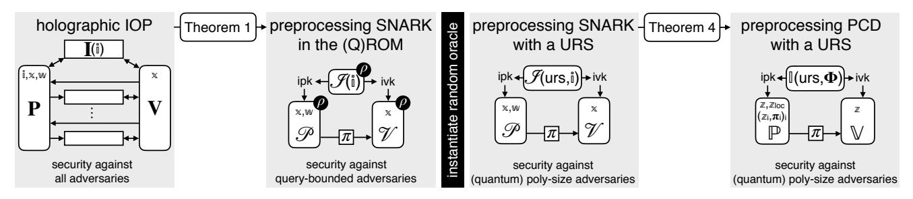
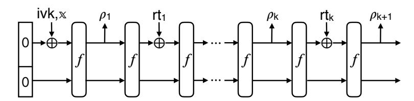
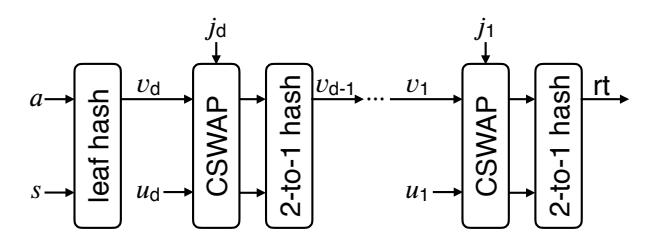
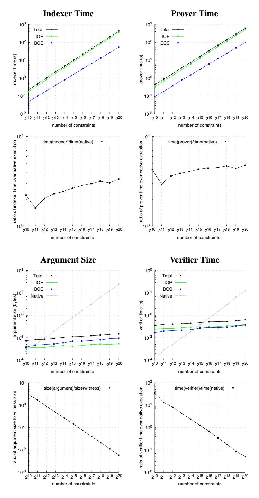
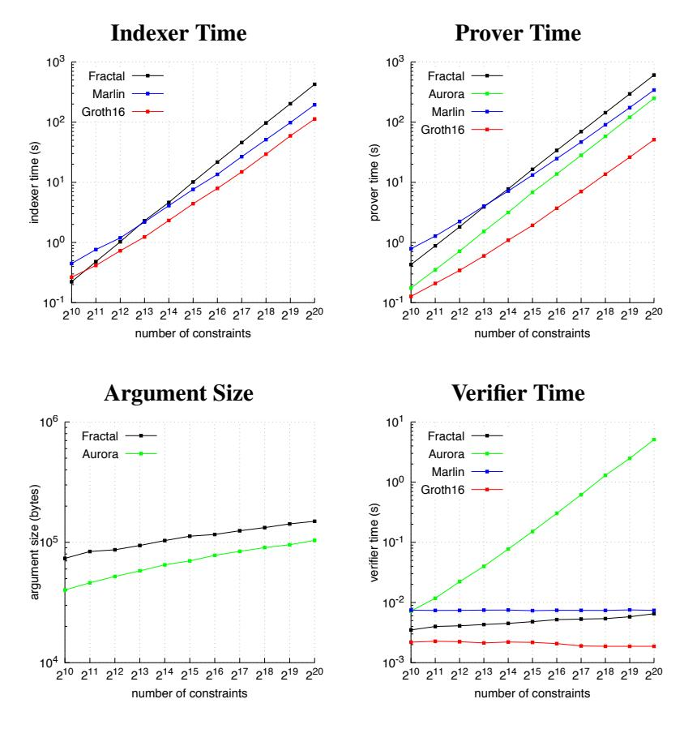
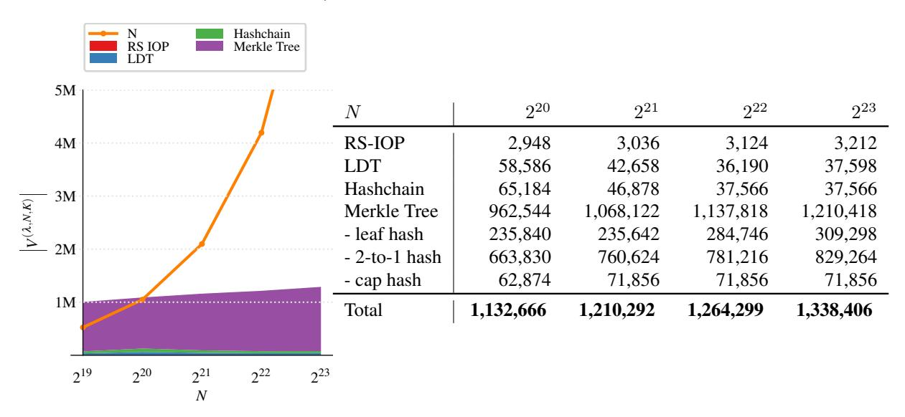

# <span id="page-0-0"></span>FRACTAL: Post-Quantum and Transparent Recursive Proofs from Holography

Alessandro Chiesa alexch@berkeley.edu

UC Berkeley

Dev Ojha dojha@berkeley.edu UC Berkeley

Nicholas Spooner nick.spooner@berkeley.edu UC Berkeley

July 15, 2020

#### Abstract

We present a new methodology to efficiently realize recursive composition of succinct non-interactive arguments of knowledge (SNARKs). Prior to this work, the only known methodology relied on pairingbased SNARKs instantiated on cycles of pairing-friendly elliptic curves, an expensive algebraic object. Our methodology does not rely on any special algebraic objects and, moreover, achieves new desirable properties: it is *post-quantum* and it is *transparent* (the setup is public coin).

We exploit the fact that recursive composition is simpler for SNARKs with *preprocessing*, and the core of our work is obtaining a preprocessing zkSNARK for rank-1 constraint satisfiability (R1CS) that is post-quantum and transparent. We obtain this latter by establishing a connection between holography and preprocessing in the random oracle model, and then constructing a holographic proof for R1CS.

We experimentally validate our methodology, demonstrating feasibility in practice.

Keywords: succinct arguments; holographic proofs; recursive proof composition; post-quantum cryptography

# Contents

| 1 | Introduction<br>1.1<br>Our results                                                                                                                                                                                                                                                                                                                                                                | 1<br>2                                 |
|---|---------------------------------------------------------------------------------------------------------------------------------------------------------------------------------------------------------------------------------------------------------------------------------------------------------------------------------------------------------------------------------------------------|----------------------------------------|
|   | 1.2<br>Comparison with prior work<br>                                                                                                                                                                                                                                                                                                                                                             | 4                                      |
| 2 | Techniques<br>2.1<br>The role of preprocessing SNARKs in recursive composition<br>2.2<br>From holographic proofs to preprocessing with random oracles<br>2.3<br>An efficient holographic proof for constraint systems<br><br>2.4<br>Post-quantum and transparent preprocessing<br>2.5<br>Post-quantum and transparent recursive composition<br><br>2.6<br>The verifier as a constraint system<br> | 8<br>8<br>10<br>11<br>14<br>14<br>16   |
| 3 | Preliminaries<br>3.1<br>Sparse representations of matrices<br><br>3.2<br>Indexed relations<br><br>3.3<br>Algebra<br>                                                                                                                                                                                                                                                                              | 18<br>18<br>18<br>18                   |
| 4 | Definition of holographic IOPs<br>4.1<br>Reed–Solomon encoded holographic IOPs<br>4.2<br>Stronger notions of soundness<br>                                                                                                                                                                                                                                                                        | 21<br>22<br>23                         |
| 5 | Sumcheck for rational functions                                                                                                                                                                                                                                                                                                                                                                   | 25                                     |
| 6 | Holographic lincheck<br>6.1<br>Holographic proof for sparse matrix arithmetization<br>6.2<br>The protocol                                                                                                                                                                                                                                                                                         | 27<br>27<br>29                         |
| 7 | RS-encoded holographic IOP for R1CS                                                                                                                                                                                                                                                                                                                                                               | 32                                     |
| 8 | Holographic IOP for R1CS                                                                                                                                                                                                                                                                                                                                                                          | 36                                     |
| 9 | Definition of preprocessing non-interactive arguments in the ROM                                                                                                                                                                                                                                                                                                                                  | 38                                     |
|   | 10 From holographic IOPs to preprocessing arguments<br>10.1 Construction<br>10.2 Completeness, efficiency, and non-adaptive zero knowledge<br>10.3 Non-adaptive soundness and knowledge<br><br>10.4 Classical adaptive knowledge from state restoration knowledge<br>10.5 Adaptive knowledge from round-by-round knowledge<br>10.6 Adaptive zero knowledge                                        | 40<br>40<br>41<br>42<br>43<br>46<br>48 |
|   | 11 Recursive composition in the URS model<br>11.1 Preprocessing non-interactive arguments (of knowledge) in the URS model<br><br>11.2 Preprocessing PCD in the URS model<br><br>11.3 Theorem statement<br><br>11.4 Construction and its efficiency<br><br>11.5 Security reduction                                                                                                                 | 49<br>49<br>50<br>51<br>51<br>53       |
|   | 12 Implementation of recursive composition<br>12.1 The preprocessing zkSNARK<br>12.2 Designing the verifier's constraint system<br>                                                                                                                                                                                                                                                               | 56<br>56<br>56                         |
|   | 13 Evaluation<br>13.1 Performance of the preprocessing zkSNARK<br><br>13.2 Performance of recursive composition<br>                                                                                                                                                                                                                                                                               | 65<br>65<br>67                         |
|   | Acknowledgments                                                                                                                                                                                                                                                                                                                                                                                   | 70                                     |
|   | References                                                                                                                                                                                                                                                                                                                                                                                        | 70                                     |

# <span id="page-2-0"></span>1 Introduction

Succinct non-interactive arguments (SNARGs) are cryptographic proofs for non-deterministic languages that are small and easy to verify. In the last few years, researchers from across multiple communities have investigated many aspects of SNARGs, including constructions under different cryptographic assumptions, improvements in asymptotic efficiency, concrete performance of implementations, and real-world applications. The focus of this paper is *recursive composition*, a notion that we motivate next.

Recursive composition. The time to validate a SNARG can be exponentially faster than the time to run the non-deterministic computation that it attests to, a property known as succinct verification. This exponential speedup raises an interesting prospect: could one produce a SNARG about a computation that involves validating prior SNARGs? Thanks to succinct verification, the time to run this (non-deterministic) computation would be essentially independent of the time of the prior computations. This *recursive composition* of SNARGs enables *incrementally verifiable computation* [\[Val08\]](#page-75-0) and *proof-carrying data* [\[CT10;](#page-73-0) [BCCT13\]](#page-71-2). A critical technicality here is that, for recursive composition to work, the SNARG must be an *argument of knowledge*, i.e., a SNARK. This is because the security of a SNARG holds only against efficient adversaries, and the knowledge property ensures that prior SNARGs must have been efficiently produced, and so we can rely in turn on their security. A formal treatment of this can be found in [\[BCCT13\]](#page-71-2), which discusses how the "strength" of a SNARG's knowledge property relates to how many recursions the SNARG supports.

Efficient recursion. Theory tells us that *any* succinct-verifier SNARK is recursively composable [\[BCCT13\]](#page-71-2). In practice, however, recursive composition is exceedingly difficult to realize efficiently. The reason is that, even if we have a SNARK that is concretely efficient when used "standalone", it is often prohibitively expensive to express the SNARK verifier's computation through the language supported by the SNARK. Indeed, while by now there are numerous SNARK constructions with remarkable concrete efficiency, *to date there is only a single efficient approach to recursion*. The approach, due to [\[BCTV14\]](#page-72-0), uses pairing-based SNARKs with a special algebraic property discussed below.[1](#page-0-0) This has enabled real-world applications such as Coda [\[Co17\]](#page-73-1), a cryptocurrency that uses recursive composition to achieve strong scalability properties.

Limitations. The above efficient approach to recursion suffers from significant limitations.

- *It is pre-quantum.* Pairing-based SNARKs rely (at least) on the hardness of extracting discrete logarithms, and so are insecure against quantum attacks. Hence the approach of [\[BCTV14\]](#page-72-0) is also insecure against quantum attacks. Devising an efficient *post-quantum* approach to recursion is an open problem.
- *It introduces toxic waste.* All known pairing-based SNARKs that can be used in the approach of [\[BCTV14\]](#page-72-0) rely on a structured reference string (SRS). Sampling the SRS involves secret values (the "toxic waste") that must remain secret for security. Ensuring that this is the case in practice is difficult: the SRS must be sampled by some trusted party or via a cryptographic ceremony [\[BCGTV15;](#page-72-1) [BGG17;](#page-72-2) [BGM17;](#page-72-3) [ABLSZ19\]](#page-71-3). Devising an efficient *transparent* (toxic-waste free) approach to recursion is an open problem.
- *It uses expensive algebra.* The approach of [\[BCTV14\]](#page-72-0) uses pairing-based SNARKs instantiated via *pairing-friendly cycles of elliptic curves*. Only a *single* cycle construction is known, *MNT cycles*; it consists of two prime-order elliptic curves, with embedding degrees 4 and 6 respectively. Curves in an MNT cycle must be much bigger than usual in order to compensate for the loss of security caused by the small embedding degrees. Moreover the fields that arise from MNT cycles are *imposed on applications* rather than being chosen depending on the needs of applications, causing additional performance overheads. Attempts to find "better" cycles, without these limitations, have resulted in some negative results [\[CCW19\]](#page-73-2). Indeed, finding *any other* cycles beyond MNT cycles is a challenging open problem.

<sup>1</sup>Bowe, Grigg, and Hopwood [\[BGH19\]](#page-72-4) propose an alternative approach for recursion that does not require the SNARK to have succinct verification. We refer the interested reader to [\[BCMS20\]](#page-72-5), which develops theoretical foundations for this approach in detail.

#### <span id="page-3-0"></span>1.1 Our results

We present a new methodology for recursive composition that simultaneously overcomes all of the limitations discussed above. We experimentally validate our methodology, demonstrating feasibility in practice.

The starting point of our work is the observation that recursive composition is simpler when applied to a SNARG (of knowledge) that supports *preprocessing*, as we explain in Section 2.1. This property of a SNARG means that in an offline phase one can produce a short summary for a given circuit and then, in an online phase, one may use this short summary to verify SNARGs that attest to the satisfiability of the circuit with different partial assignments to its inputs. The online phase can be as fast as reading the SNARG (and the partial assignment), and in particular sublinear in the circuit size *even for arbitrary circuits*. Throughout, by "preprocessing SNARG" we mean a SNARG whose verifier runs in time *polylogarithmic* in the circuit size.<sup>2</sup>

Our methodology has three parts: (1) a transformation that maps any "holographic proof" into a preprocessing SNARG in the random oracle model; (2) a holographic proof for (rank-1) constraint systems, which leads to a corresponding preprocessing SNARG; (3) a transformation that recurses any preprocessing SNARK (once the random oracle is heuristically instantiated via a cryptographic hash function).

We now summarize our contributions for each of these parts.

(1) From holographic proofs to preprocessing SNARGs. A probabilistic proof is *holographic* if the verifier does not receive the circuit description as an input but, rather, makes a small number of queries to an encoding of the circuit [BFLS91]. Recent work [CHMMVW20] has established a connection between holography and preprocessing (which we review in Section 1.2). The theorem below adds to this connection, by showing that interactive oracle proofs (IOPs) [BCS16; RRR16] that are holographic can be compiled into preprocessing SNARGs that are secure in the quantum random oracle model [BDFLSZ11; CMS19].

<span id="page-3-1"></span>**Theorem 1** (informal). There is an efficient transformation that compiles any holographic IOP for a relation  $\mathcal{R}$  into a preprocessing SNARG for  $\mathcal{R}$  that is unconditionally secure in the random oracle model. If the IOP is a (honest-verifier) zero knowledge proof of knowledge then the transformation produces a zero knowledge SNARG of knowledge (zkSNARK). This extends to hold in the quantum random oracle model.

By applying Theorem 1 to known holographic proofs for non-deterministic computations (such as the PCP in [BFLS91] or the IPCP in [GKR15]), we obtain the first transparent preprocessing SNARG and the first post-quantum preprocessing SNARG. Unfortunately, known holographic proofs are too expensive for practical use, because encoding the circuit is costly (as explained in Section 1.2.1). In this paper we address this problem by constructing an efficient holographic proof, discussed below.

We note that holographic proofs involve relations  $\mathcal{R}$  that consist of *triples* rather than *pairs* because the statement being checked has two parts. One part is called the *index*, which is encoded in an offline phase by the *indexer* and this encoding is provided as an oracle to the verifier. The other part is called the *instance*, which is provided as an explicit input to the verifier. For example, the index may be a circuit description and the instance a partial assignment to its inputs. We refer to this notion as *indexed relations* (see Section 3.2).

(2) Efficient protocols for R1CS. We present a holographic IOP for rank-1 constraint satisfiability (R1CS), a standard generalization of arithmetic circuits where the "circuit description" is given by coefficient matrices. We describe the corresponding indexed relation.

<span id="page-3-3"></span>**Definition 1** (informal). The indexed relation  $\mathcal{R}_{R1CS}$  is the set of triples  $(i, x, w) = (\mathbb{F}, n, m, A, B, C), x, w$  where  $\mathbb{F}$  is a finite field, A, B, C are  $n \times n$  matrices over  $\mathbb{F}$ , each containing at most m non-zero entries, and z := (x, w) is a vector in  $\mathbb{F}^n$  such that  $Az \circ Bz = Cz$ . (Here " $\circ$ " denotes the entry-wise product.)

<span id="page-3-2"></span><sup>&</sup>lt;sup>2</sup>In contrast, *non*-preprocessing SNARGs can achieve fast verification *only for structured circuits*, because the verification procedure must at a minimum read the *description* of the circuit whose satisfiability it checks. The description of a circuit can be much smaller than the circuit itself only when the circuit has suitable structure, e.g., repeated sub-components in parallel or in series.

Theorem 2 (informal). *There exists a public-coin holographic IOP for the indexed relation* RR1CS *that is a zero knowledge proof of knowledge with the following efficiency features. In the offline phase, the encoding of an index is computable in* O(m log m) *field operations and consists of* O(m) *field elements. In the online phase, the protocol has* O(log m) *rounds, with the prover using* O(m log m) *field operations and the verifier using* O(|x|+log m) *field operations. Proof length is* O(m) *field elements and query complexity is* O(log m)*.*

The above theorem improves, in the holographic setting, on prior IOPs for R1CS (see Fig. [1\)](#page-5-2): it offers an exponential improvement in verification time compared to the linear-time verification of [\[BCRSVW19\]](#page-72-9), and it offers succinct verification for all coefficient matrices compared to only structured ones as in [\[BCGGRS19\]](#page-71-4).

Armed with an efficient holographic IOP, we use our compiler to construct an efficient preprocessing SNARG in the random oracle model. The following theorem is obtained by applying Theorem [1](#page-3-1) to Theorem [2.](#page-3-2)

<span id="page-4-0"></span>Theorem 3 (informal). *There exists a preprocessing zkSNARK for R1CS that is unconditionally secure in the random oracle model (and the quantum random oracle model) with the following efficiency features. In the offline phase, anyone can publicly preprocess an index in time* Oλ(m log m)*, obtaining a corresponding verification key of size* Oλ(1)*. In the online phase, the SNARG prover runs in time* Oλ(m log m) *and the SNARG verifier runs in time* Oλ(|x| + log<sup>2</sup> m)*; argument size is* Oλ(log<sup>2</sup> m)*.*

We have implemented the protocol underlying Theorem [3,](#page-4-0) obtaining the first efficient realization of a post-quantum transparent preprocessing zkSNARK.

For example, for a security level of 128 bits over a 181-bit prime field, arguments range from 80 kB to 160 kB for instances of up to millions of constraints. These argument sizes are two orders of magnitude bigger than *pre*-quantum *non*-transparent preprocessing zkSNARKs (see Section [1.2.2\)](#page-6-0), and are 2× bigger that the state of the art in post-quantum transparent *non*-preprocessing zkSNARKs [\[BCRSVW19\]](#page-72-9). Our proving and verification times are comparable to prior work: proving takes several minutes, while verification takes several milliseconds *regardless of the constraint system*. (See Section [13.1](#page-66-1) for performance details.)

Besides its application to post-quantum transparent recursion, our preprocessing zkSNARK provides attractive benefits over prior constructions, as we discuss in Section [1.2.2.](#page-6-0)

Note that, when the random oracle in the construction is heuristically instantiated via an efficient cryptographic hash function (as in our implementation), the resulting preprocessing zkSNARK is in the uniform reference string (URS) model, which means that the system parameters consist of a uniformly random string of fixed size.[3](#page-0-0) The term "transparent" refers to a construction in the URS model.

(3) Post-quantum transparent recursion. We obtain the first efficient realization of post-quantum transparent recursive composition for SNARKs. The cryptographic primitive that formally captures this capability is known as *proof carrying data* (PCD) [\[CT10;](#page-73-0) [BCCT13\]](#page-71-2), and so this is what we construct.

<span id="page-4-1"></span>Theorem 4 (informal). *There is an efficient transformation that compiles any preprocessing SNARK in the URS model into a preprocessing PCD scheme in the URS model. Moreover, if the preprocessing SNARK is post-quantum secure then so is the preprocessing PCD scheme.*

The above transformation, which preserves the "transparent" property and post-quantum security, is where recursive composition occurs. For details, including the notion of PCD, see Section [11.](#page-50-0)

Moreover, we provide an efficient implementation of the transformation in Theorem [4](#page-4-1) applied to our implementation of the preprocessing zkSNARK from Theorem [3.](#page-4-0) The main challenge is to express the SNARK verifier's computation in as few constraints as possible, and in particular to design a constraint

<sup>3</sup>We stress that this step is a heuristic due to well-known limitations to the random oracle methodology [\[CGH04;](#page-73-5) [GK03\]](#page-73-6). Investigating how to provably instantiate the random oracle for many natural constructions is an active research frontier.

system for the SNARK verifier that on relatively small instances is smaller than the constraint system that it checks (thereby permitting arbitrary recursion depth). Via a combination of computer-assisted design and recent advances in algebraic hash functions, we achieve this threshold for all computations of at least 2 million constraints. Specifically, we can express a SNARK verifier checking 2 million constraints using only 1.1 million constraints, and this gap grows quickly with the computation size. *This is the first demonstration of post-quantum transparent recursive composition in practice.* (See Section 13.2 for performance details.)

<span id="page-5-2"></span>

|              | R1CS<br>instances | holographic? | indexer<br>time | prover<br>time    | verifier<br>time           | round complexity | proof<br>length | query<br>complexity |
|--------------|-------------------|--------------|-----------------|-------------------|----------------------------|------------------|-----------------|---------------------|
| [BCRSVW19]   | arbitrary         | NO           | N/A             | $O(m + n \log n)$ | $O( \mathbf{x} +m)$        | $O(\log n)$      | O(n)            | $O(\log n)$         |
| [BCGGRS19] † | semi-succinct     | NO           | N/A             | $O(m + n \log n)$ | $O( \mathbf{x}  + \log n)$ | $O(\log n)$      | O(n)            | $O(\log n)$         |
| this work    | arbitrary         | YES          | $O(m \log m)$   | $O(m \log m)$     | $O( \mathbf{x}  + \log m)$ | $O(\log m)$      | O(m)            | $O(\log m)$         |

**Figure 1:** Comparison of IOPs for R1CS: two prior non-holographic IOPs, and our holographic IOP. Here n denotes the number of variables and m the number of non-zero coefficients in the matrices.

†: The parameters stated for [BCGGRS19] reflect replacing the constant-query low-degree test in the construction with a concretely-efficient logarithmic-query low-degree test such as [BBHR18], to simplify comparison.



Figure 2: Diagram of our methodology to recursive composition that is post-quantum and transparent.

#### <span id="page-5-0"></span>1.2 Comparison with prior work

We provide a comparison with prior work in the three areas to which we contribute: holographic proofs (Section 1.2.1); preprocessing SNARGs (Section 1.2.2); and recursive composition of SNARKs (Section 1.2.3). We omit a general discussion of the now ample literature on SNARGs, and in particular do not discuss *non*-preprocessing SNARGs for structured computations (e.g., [XZZPS19], [BBHR19], and many others).

#### <span id="page-5-1"></span>1.2.1 Prior holographic proofs

The verifier in a proof system cannot run in time that is sublinear in its input, because it must at a minimum read the input in order to know the statement being checked. Holographic proofs [BFLS91] avoid this limitation by considering a setting where the verifier does not receive its input explicitly but, instead, has query access to an encoding of it. The goal is then to verify the statement in time *sublinear* in its size; note that such algorithms are necessarily probabilistic.<sup>4</sup>

<sup>&</sup>lt;sup>4</sup>The goal of sublinear verification via holographic proofs is similar to, but distinct from, the goal of sublinear verification via *proximity proofs* (as, e.g., studied in [EKR04; DR04; BGHSV06; RVW13; GR15]). In this latter setting, the verifier has oracle access to an input that is *not* promised to be encoded and, in particular, cannot in general decide if the input is in the language without

In Fig. 3 we compare the efficiency of prior holographic proofs and our holographic proof for the case of circuit satisfiability, where the input to the verifier is the description of an arbitrary circuit. There are two main prior holographic proofs in the literature. One is the PCP construction in [BFLS91], where it suffices for the verifier to query a few locations of a low-degree extension of the circuit description. Another one is the "bare bones" protocol in [GKR15], which is a holographic IP for circuit *evaluation* that can be re-cast as a holographic IPCP for circuit *satisfaction*; the verifier relies on the low-degree extensions of functions that describe each layer of the circuit. The constructions in [BFLS91] and [GKR15] are unfit for practical use as holographic proofs in Theorem 1, because encoding the circuit incurs a polynomial blowup due to the use of *multivariate* low-degree extensions (which yield encodings with inverse polynomial rate).

In the table we exclude the "algebraic holographic proof" of Marlin [CHMMVW20], because the soundness guarantee of such a proof is incompatible with Theorem 1.

<span id="page-6-1"></span>**Comparison with this work.** Our holographic proof is the first to achieve efficient asymptotics not only for the prover and verifier, but also for the indexer, which is responsible for producing the encoding of the circuit.

|           | proof | indexer       | prover                      | verifier                       |
|-----------|-------|---------------|-----------------------------|--------------------------------|
|           | type  | time          | time                        | time                           |
| [BFLS91]  | PCP   | poly(N)       | poly(N)                     | $poly( \mathbf{x}  + \log(N))$ |
| [GKR15]   | IPCP  | poly(N)       | $poly( \mathbf{w} ) + O(N)$ | $O( \mathbf{x}  + D\log W)$    |
| this work | IOP   | $O(N \log N)$ | $O(N \log N)$               | $O( \mathbf{x}  + \log N)$     |

Figure 3: Comparison of holographic proofs for arithmetic circuit satisfiability. Here x denotes the known inputs, y the unknown inputs, and y the total number of gates; if the circuit is layered, y denotes circuit depth and y circuit width. Our Theorem 1 can be used to compile any of these holographic proofs into a preprocessing SNARG. (For better comparison with other works, [GKR15] is stated as an IPCP for circuit satisfiability rather than as an IP for circuit evaluation; in the latter case, the prover time would be y (y). The prover times for [GKR15] incorporate the techniques for linear-time sumcheck and others introduced in [Tha13; XZZPS19].)

#### <span id="page-6-0"></span>1.2.2 Prior preprocessing SNARGs

Prior works construct preprocessing SNARGs in a model where a trusted party samples, in a parameter setup phase, a structured reference string (SRS) that is proportional to circuit size. We summarize the main features of these constructions, distinguishing between the case of circuit-specific SRS and universal SRS.

- Circuit-specific SRS: a circuit is given as input to the setup algorithm, which samples a (long) proving key and a (short) verification key that can be used to produce and validate arguments for the circuit. Preprocessing SNARGs with circuit-specific SRS originate in [Gro10; Lip12; GGPR13; BCIOP13], and have been studied in an influential line of work that has led to highly-efficient constructions (e.g., [Gro16]) and large-scale deployments (e.g., [Zc14]). They are obtained by combining linear interactive proofs and linear-only encodings. The argument sizes achievable in this setting are very small: less than 200 bytes.
- Universal SRS: a size bound is given as input to the setup algorithm, which samples a (long) proving key and
  a (short) verification key that can be used to produce and validate arguments for circuits within this bound.
  A public procedure can then be used to specialize both keys for arguments relative to the desired circuit.
  Preprocessing SNARGs with universal (and updatable) SRS were introduced in [GKMMM18], and led

reading all of the input. To allow for sublinear verification without any promises on the input, the decision problem is relaxed: the verifier is only asked to decide if the input is in the language or *far* from any input in the language.

to efficient constructions in [\[MBKM19;](#page-74-8) [CHMMVW20;](#page-73-3) [GWC19\]](#page-74-9). They are obtained by combining "algebraic" holographic proofs (see below) and polynomial commitment schemes. The argument sizes currently achievable with universal SRS are bigger than with circuit-specific SRS: less than 1000 bytes.

Comparison with this work. Theorem [1](#page-3-1) provides a methodology to obtain preprocessing SNARGs in the (quantum) random oracle model, which heuristically implies (by suitably instantiating the random oracle) preprocessing SNARGs that are post-quantum and transparent. Neither of these properties is achieved by prior preprocessing SNARGs. Theorem [1](#page-3-1) also develops the connection between holography and preprocessing discovered in [\[CHMMVW20\]](#page-73-3), which considers the case of holographic proofs where the completeness and soundness properties are restricted to "algebraic provers" (which output polynomials of prescribed degrees). We consider the case of general holographic proofs, where completeness and soundness are not restricted.

Moreover, our holographic proof (Theorem [2\)](#page-3-2) leads to a preprocessing SNARG (Theorem [3\)](#page-4-0) that, as supported by our implementation, provides attractive benefits over prior preprocessing SNARGs.

- Prior preprocessing SNARGs require cryptographic ceremonies to securely sample the long SRS, which makes deployments difficult and expensive. This has restricted the use of preprocessing SNARGs to proving relatively small computations, due to the prohibitive cost of securely sampling SRSs for large computations. This is unfortunate because preprocessing SNARGs could be useful for "scalability applications", which leverage succinct verification to efficiently check large computations (e.g., verifying the correctness of large batches of trades executed at a non-custodial exchange [\[RU19;](#page-74-10) [SD19\]](#page-74-11)).
  - The transparent property of our preprocessing SNARG means that the long SRS is replaced with a fixed-size URS (uniform reference string). This simplifies deployments and enables scalability applications.
- Prior preprocessing SNARGs are limited to express computations over the prime fields that arise as the scalar fields of pairing-friendly elliptic curves. Such fields are imposed by parametrized curve families that offer little flexibility for optimizations or applications. (Alternatively one can use the Cocks–Pinch method [\[FST10\]](#page-73-10) to construct an elliptic curve with a desired scalar field, but the resulting curve is inefficient.)
  - In contrast, our preprocessing SNARG is easily configurable across a range of security levels, and supports most large prime fields and all large binary fields, which offers greater flexibility in terms of performance optimizations and customization for applications.

Remark 1.1 (weaker forms of preprocessing). Prior work proved recursive composition only for noninteractive arguments of knowledge with succinct verifiers [\[BCCT13\]](#page-71-2); this is the case for our definition of preprocessing SNARGs. In this paper we show that recursive composition is possible even when the verifier is merely *sublinear* in the circuit size (see Section [11\)](#page-50-0), though the cost of each recursion is much steeper than in the polylogarithmic case. This provides additional motivation to the study of preprocessing with sublinear verifiers (e.g., [\[BCGGHJ17;](#page-71-7) [Set19\]](#page-75-4)).

#### <span id="page-7-0"></span>1.2.3 Recursion for pairing-based SNARKs

The approach to recursive composition of [\[BCTV14\]](#page-72-0) uses pairing-based (preprocessing) SNARKs based on pairing-friendly cycles of elliptic curves. This approach applies to constructions with circuit-specific SRS (e.g. [\[Gro16\]](#page-74-6)) *and* to those with universal SRS (e.g. [\[GKMMM18;](#page-74-7) [MBKM19;](#page-74-8) [CHMMVW20;](#page-73-3) [GWC19\]](#page-74-9)).

Informally, pairing-based SNARKs support languages that involve the satisfiability of constraint systems over a field that is *different* from the field used to compute the SNARK verifier — this restriction arises from the mathematics of the underlying pairing-friendly elliptic curve used to instantiate the pairing. This

seemingly mundane fact has the regrettable consequence that expressing the SNARK verifier's computation in the language supported by the SNARK (to realize recursive composition) is unreasonably expensive due to this "field mismatch". To circumvent this barrier, prior work leveraged *two* pairing-based SNARKs where the field to compute one SNARK verifier equals the field of the language supported by the other SNARK, and vice versa. This condition enables each SNARK to efficiently verify the other SNARK's proofs.

These special SNARKs rely on pairing-friendly cycles of elliptic curves, which are pairs of pairingfriendly elliptic curves where the base field of one curve equals the scalar field of the other curve and vice versa. The only known construction is *MNT cycles*, which consist of two prime-order elliptic curves with embedding degrees 4 and 6 respectively. An MNT cycle must be much bigger than usual in order to compensate for the low security caused by the small embedding degrees. For example, for a security level of 128 bits, curves in an MNT cycle must be defined over a prime field with roughly 800 bits; this is over *three times* the 256 bits that suffice for curves with larger embedding degrees. These performance overheads can be significant in practice, e.g., Coda [\[Co17\]](#page-73-1) is a project that has deployed MNT cycles in a product, and has organized a community challenge to speed up the proof generation for pairing-based SNARKs [\[SN\]](#page-75-5). A natural approach to mitigate this problem would be to find "high-security" cycles (i.e., with higher embedding degrees) but to date little is known about pairing-friendly cycles beyond a few negative results [\[CCW19\]](#page-73-2).

Comparison with this work. The approach to recursion that we present in this paper is *not tied* to constructions of pairing-friendly cycles of elliptic curves. In particular, our approach scales gracefully across different security levels, and also offers more flexibility when choosing the desired field for an application. In addition, our approach is post-quantum and, moreover, uses a transparent (i.e., public-coin) setup.

On the other hand, our approach has two disadvantages. First, argument size is about 100 times bigger than the argument size achievable by cycle-based recursion. Second, the number of constraints needed to express the verifier's computation is about 40 times bigger than those needed in the case of cycle-based recursion (e.g., the verifier of [\[Gro16\]](#page-74-6) can be expressed in about 40,000 constraints). The vast majority of these constraints come from the many hash function invocations required to verify the argument.

Both of the above limitations are somewhat orthogonal to our approach and arguably temporary: the large proof size and many hash invocations come from the many queries required from current constructions of low-degree tests [\[BBHR18;](#page-71-5) [BGKS19\]](#page-72-12). As the state of the art in low-degree testing progresses (e.g., to high-soundness constructions over large alphabets), both argument size and verifier size will also improve.

# <span id="page-9-0"></span>2 Techniques

We discuss the main ideas behind our results. In Section [2.1](#page-9-1) we explain how preprocessing simplifies recursive composition. In Section [2.2](#page-11-0) we describe our compiler from holographic IOPs to preprocessing SNARGs (Theorem [1\)](#page-3-1). In Section [2.3](#page-12-0) we describe our efficient holographic IOP (Theorem [2\)](#page-3-2), and then in Section [2.4](#page-15-0) we discuss the corresponding preprocessing SNARG (Theorem [3\)](#page-4-0). In Section [2.5](#page-15-1) we describe how to obtain post-quantum and transparent PCD (Theorem [4\)](#page-4-1). In Section [2.6](#page-17-0) we discuss our verifier circuit.

Recall that indexed relations consist of *triples* (i, x, w) where i is the index, x is the instance, and w is the witness (see Section [3.2\)](#page-19-2). We use these relations because the statements being checked have two parts, the index i (e.g., a circuit description) given in an offline phase and the instance x (e.g., a partial input assignment) given in an online phase.

### <span id="page-9-1"></span>2.1 The role of preprocessing SNARKs in recursive composition

We explain why preprocessing simplifies recursive composition of SNARKs. For concreteness we consider the problem of incrementally proving the iterated application of a circuit F : {0, 1} <sup>n</sup> → {0, 1} n to an initial input z<sup>0</sup> ∈ {0, 1} n . We are thus interested in proving statements of the form "*given* z<sup>T</sup> *there exists* z<sup>0</sup> *such that* z<sup>T</sup> = F T (z0)", but wish to avoid having the SNARK prover check the correctness of all T invocations at once. Instead, we break the desired statement into T smaller statements {"z<sup>i</sup> = F(zi−1)"} T <sup>i</sup>=1 and then inductively prove them. Informally, for i = 1, . . . , T, we produce a SNARK proof π<sup>i</sup> for this statement:

```
"Given a counter i and claimed output zi
                                          , there exists a prior output zi−1 such that zi = F(zi−1)
and, if i > 1, there exists a SNARK proof πi−1 that attests to the correctness of zi−1."
```

Formalizing this idea requires care, and in particular depends on how the SNARK achieves succinct verification (a prerequisite for recursive composition). There are two methods to achieve succinct verification.

- (1) *Non-preprocessing SNARKs for structured computations.* The SNARK supports non-deterministic computations expressed as programs, i.e., it can be used to prove/verify statements of the form "given a program M, primary input x, and time bound t, there exists an auxiliary input w such that M accepts (x, w) in t steps". (More generally, the SNARK could support any computation model for which the description of a computation can be significantly smaller than the size of the described computation.)
- (2) *Preprocessing SNARKs for arbitrary computations.* The SNARK supports circuit satisfiability, i.e., it can be used to prove/verify statements of the form "given a circuit C and primary input x, there exists an auxiliary input w such that C(x, w) = 0". Preprocessing enables the circuit C to be summarized into a short verification key ivk<sup>C</sup> that can be used for succinct verification *regardless* of the structure of C. (More generally, the SNARK could support any computation model as long as preprocessing is possible.)

We compare the costs of recursive composition in these two cases, showing why the preprocessing case is cheaper. Throughout we consider SNARKs in the uniform reference string model, i.e., parameter setup consists of sampling a fully random string urs of size poly(λ) that suffices for proving/verifying any statement.

(1) Recursion without preprocessing. Let (P, V) be a *non*-preprocessing SNARK for non-deterministic program computations. In this case we follow [\[BCCT13\]](#page-71-2): recursion is realized via a program R, which depends on urs and F, that checks one invocation of the circuit F and the validity of a prior SNARK proof relative to the reference string urs. The program R is defined as follows:

```
Primary input: a tuple \mathbb{x}=(M,i,z_i) consisting of the description of a program M, counter i, and claimed output z_i. (We later set M:=R to achieve recursion, as explained shortly.) Auxiliary input: a tuple \mathbb{w}=(z_{i-1},\pi_{i-1}) consisting of a previous output z_{i-1} and corresponding SNARK proof \pi_{i-1} that attests to its correctness. Code: R(\mathbb{x},\mathbb{w}) accepts if z_i=F(z_{i-1}) and, if i>1, \mathcal{V}(\mathsf{urs},M,\mathbb{x}_{i-1},t,\pi_{i-1})=1 where \mathbb{x}_{i-1}:=(M,i-1,z_{i-1}) and t is a suitably chosen time bound.
```

The program R can be used to incrementally prove the iterated application of the circuit F. Given a tuple  $(i-1,z_{i-1},\pi_{i-1})$  consisting of the current counter, output, and proof, one can use the SNARK prover to obtain the next tuple  $(i,z_i,\pi_i)$  by setting  $z_i:=F(z_{i-1})$  and computing the proof  $\pi_i:=\mathcal{P}(\text{urs},R,\mathbf{x}_i,t,\mathbf{w}_i)$  for the instance  $\mathbf{x}_i:=(R,i,z_i)$  and witness  $\mathbf{w}_i:=(z_{i-1},\pi_{i-1})$  (and a certain time bound t). Note that we have set M:=R, so that (the description of) R is part of the primary input to R. A tuple  $(i,z_i,\pi_i)$  can then be verified by running the SNARK verifier, as  $\mathcal{V}(\text{urs},R,\mathbf{x}_i,t,\pi_i)$  for  $\mathbf{x}_i:=(R,i,z_i)$ .

We refer the reader to [BCCT13] for details on how to prove the above construction secure. The aspect that we are interested to raise here is that the program R is tasked to simulate itself, essentially working as a universal machine. This means that every elementary operation of R, and in particular of F, needs to be simulated by R in its execution. This essentially means that the computation time of R, which dictates the cost of each proof composition, is at least a constant c>1 times the size of |F|. This multiplicative overhead on the size of the circuit F, while asymptotically irrelevant, is a significant overhead in concrete efficiency.

(2) **Recursion with preprocessing.** We describe how to leverage preprocessing in order to avoid universal simulation, and in particular to avoid *any* multiplicative performance overheads in recursive composition. Intuitively, preprocessing provides a "cryptographic simplification" to the requisite recursion, by enabling us to replace the description of the computation with a succinct cryptographic commitment to it.

Let  $(\mathcal{I}, \mathcal{P}, \mathcal{V})$  be a preprocessing SNARK for circuits. Recursion is realized via a circuit R that depends on urs and F, and checks one invocation of F and a prior proof. The circuit R is defined as follows:

```
Primary input: a tuple \mathbb{x}=(\mathsf{ivk},i,z_i) consisting of an index verification key ivk, counter i, and claimed output z_i. (We later set \mathsf{ivk}:=\mathsf{ivk}_R to achieve recursion.)

Auxiliary input: a tuple \mathbb{w}=(z_{i-1},\pi_{i-1}) consisting of a previous output z_{i-1} and corresponding SNARK proof \pi_{i-1} that attests to its correctness.

Code: R(\mathbb{x},\mathbb{w}) accepts if z_i=F(z_{i-1}) and, if i>1, \mathcal{V}(\mathsf{urs},\mathsf{ivk},\mathbb{x}_{i-1},\pi_{i-1})=1 where \mathbb{x}_{i-1}:=(\mathsf{ivk},i-1,z_{i-1}).
```

The circuit R can be used for recursive composition as follows. In the offline phase, we run the indexer  $\mathcal{I}$  on the circuit R, obtaining a long index proving key  $\operatorname{ipk}_R$  and a short index verification key  $\operatorname{ivk}_R$  that can be used to produce and validate SNARKs with respect to the circuit R. Subsequently, in the online phase, one can use the prover  $\mathcal{P}$  to go from a tuple  $(i-1,z_{i-1},\pi_{i-1})$  to a new tuple  $(i,z_i,\pi_i)$  by letting  $z_i:=F(z_{i-1})$  and  $\pi_i:=\mathcal{P}(\operatorname{urs},\operatorname{ipk}_R,\operatorname{x}_i,\operatorname{w}_i)$  for the instance  $\operatorname{x}_i:=(\operatorname{ivk}_R,i,z_i)$  and witness  $\operatorname{w}_i:=(z_{i-1},\pi_{i-1})$ . Note that we have set  $\operatorname{ivk}:=\operatorname{ivk}_R$ , so that the verification key  $\operatorname{ivk}_R$  is part of the primary input to the circuit R. A tuple  $(i,z_i,\pi_i)$  can then be verified by running the SNARK verifier, as  $\mathcal{V}(\operatorname{urs},\operatorname{ivk}_R,\operatorname{x}_i,\pi_i)$  for  $\operatorname{x}_i:=(\operatorname{ivk}_R,i,z_i)$ .

Crucially, the circuit R does *not* perform any universal simulation involving the circuit F, and in particular does not incur multiplicative overheads. Indeed,  $|R| = |F| + |\mathcal{V}| = |F| + o(|F|)$ . This was enabled by preprocessing, which let us provide the index verification key ivk<sub>R</sub> as input to the circuit R.

<sup>&</sup>lt;sup>5</sup>The astute reader may notice that we could have applied the Recursion Theorem to the program R to obtain a new program  $R^*$  that has access to its own code, and thereby simplify primary inputs from triples  $x = (M, i, z_i)$  to pairs  $x = (i, z_i)$ . This, however, adds unnecessary complexity. Indeed, here we can rely on the SNARK verifier to provide R with its own code as part of the primary input, obviating this extra step. (For reference, the Recursion Theorem states that for every program A(x, y) there is a program B(y) that computes  $A(\langle B \rangle, y)$ , where the angle brackets emphasize that the first argument is the description of the program B.)

In fact, preprocessing is *already* part of the efficient approach to recursive composition in [\[BCTV14\]](#page-72-0). There the preprocessing SNARK uses a structured, rather than uniform, reference string but the benefits of preprocessing are analogous (even when the reference string depends on the circuit or a bound on it).

In summary: preprocessing SNARKs play an important role in efficient recursive composition. Our first milestone is post-quantum and transparent preprocessing SNARKs, which we then use to achieve post-quantum and transparent recursive composition.

### <span id="page-11-0"></span>2.2 From holographic proofs to preprocessing with random oracles

We describe the main ideas behind Theorem [1,](#page-3-1) which provides a transformation that compiles any holographic IOP for an indexed relation R into a corresponding preprocessing SNARG for R. See Section [10](#page-41-0) for details.

Warmup: holographic PCPs. We first consider the case of PCPs, a special case of IOPs. Recall that the Micali transformation [\[Mic00\]](#page-74-12) compiles a (non-holographic) PCP into a (non-preprocessing) SNARG. We modify this transformation to compile a *holographic* PCP into a *preprocessing* SNARG, by using the fact that the SNARG verifier output by the Micali transformation invokes the PCP verifier as a black box.

In more detail, the main feature of a holographic PCP is that the PCP verifier does not receive the index as an explicit input but, rather, makes a small number of queries to an encoding of the index given as an oracle. If we apply the Micali transformation to the holographic PCP, we obtain a SNARG verifier that must answer queries by the PCP verifier to the encoded index. If we simply provided the index as an input to the SNARG verifier, then we cannot achieve succinct verification and so would not obtain a preprocessing SNARG. Instead, we let the SNARG indexer compute the encoded index, compute a Merkle tree over it, and output the corresponding root as an *index verification key* for the SNARG verifier. We can then have the SNARG prover extend the SNARG proof with answers to queries to the encoded index, certified by authentication paths relative to the index verification key. In this way the SNARG verifier can use the answers in the SNARG proof to answer the queries to the encoded index by the underlying PCP verifier.

This straightforward modification to the Micali transformation works: one can prove that if the soundness error of the holographic PCP is then the soundness error of the preprocessing SNARG is t + O(t 2 · 2 −λ ) against t-query adversaries in the random oracle model. (A similar expression holds for quantum adversaries.)

General case: holographic IOPs. While efficient constructions of holographic PCPs are not known, in this paper we show how to construct an efficient holographic IOP (see Section [2.3\)](#page-12-0). Hence we are actually interested in compiling holographic IOPs. In this case our starting point is the BCS transformation [\[BCS16\]](#page-72-7), which compiles a (non-holographic) IOP into a (non-prepreprocessing) SNARG. We adopt a similar strategy as above: we modify the BCS transformation to compile a *holographic* IOP into a *preprocessing* SNARG, using the fact that the SNARG verifier output by the BCS transformation invokes the IOP verifier as a black box. Indeed, the main feature of a holographic IOP is the fact that the IOP verifier makes a small number of queries to an encoding of the index given as an oracle. Therefore the SNARG indexer can output the Merkle root of the encoded index as an index verification key, which subsequently the SNARG verifier can use to authenticate answers about the encoded index claimed by the SNARG prover.

An important technical difference here is the fact that the soundness error of the resulting preprocessing SNARG is not related to the soundness error of the holographic IOP but, instead, to its *state-restoration* (SR) soundness error, a stronger notion of soundness introduced in [\[BCS16\]](#page-72-7). Namely, we prove that if the SR soundness error of the holographic PCP is sr(t) then the soundness error of the preprocessing SNARG is sr(t) + O(t 2 · 2 −λ ). This phenomenon is inherited from the (unmodified) BCS transformation.

Proof of knowledge. All known constructions of PCD from SNARGs require that the SNARG is an *argument of knowledge* (i.e., it is a SNARK). We show that if the holographic IOP is a (state-restoration) proof of knowledge (PoK), our transformation yields a preprocessing SNARK. In the simple non-adaptive setting this can be shown straightforwardly from known properties of the BCS transformation. However, in order to provide the strongest possible evidence for the existence of SNARKs satisfying the requirements for our IVC/PCD construction (see Section 2.5), we prove a stronger *adaptive* knowledge soundness property, which is not known to hold for the standard BCS transformation. We show that a standard modification of the BCS transformation achieves this stronger notion for a wide class of holographic IOPs.

**Post-quantum security.** A primary contribution of this work is to construct post-quantum preprocessing SNARKs (and to show that these yield post-quantum PCD). Using techniques developed in [Zha19; CMS19], we show that our transformation yields a preprocessing SNARG in the QROM. Here the relevant soundness notion of the holographic IOP is the *round-by-round* (RBR) soundness error, defined in [CCHLRR18].

Moreover, if the holographic IOP is *round-by-round knowledge sound*, as defined in [CMS19], our transformation yields a preprocessing SNARK in the QROM; this establishes, for the first time, the existence of adaptively-secure SNARKs in the QROM. We prove security by exhibiting a universal quantum extractor. As in the classical case, we prove a strong adaptive knowledge soundness property that is a close analogue for the property required in our IVC/PCD construction.

### <span id="page-12-0"></span>2.3 An efficient holographic proof for constraint systems

We describe the main ideas behind Theorem 2, which provides an efficient construction of a holographic IOP for rank-1 constraint satisfiability (R1CS). See Definition 1 for the indexed relation representing this problem.

**Our starting point: Marlin.** Our construction borrows ideas from the *algebraic holographic proof* (AHP) underlying Marlin, a pairing-based zkSNARK due to [CHMMVW20]. An AHP is similar to a holographic IOP, except that the indexer and the prover (both honest and malicious) send *low-degree univariate polynomials* rather than evaluations of functions. The verifier may evaluate these polynomials at any point in the field.

To understand how AHPs and holographic IOPs differ, it is instructive to consider how one might construct a holographic IOP from an AHP. A natural approach is to construct the indexer and prover for the hIOP as follows: run the indexer/prover of the AHP, and whenever the indexer/prover outputs a polynomial, evaluate it and send this evaluation as the oracle. There are several issues with this approach. First, hIOPs require a stronger soundness guarantee: soundness must hold against malicious provers that send *arbitrary* oracles. Second, evaluating the polynomial requires selecting a set  $L \subseteq \mathbb{F}$  over which to evaluate it. In general, since the verifier in the AHP may query any point in  $\mathbb{F}$ , we would need to take  $L := \mathbb{F}$ , which is prohibitively expensive for the indexer and prover if  $\mathbb{F}$  is much larger than the instance size (as it often is, for both soundness and application reasons). Third, assuming that one manages to decouple L and  $\mathbb{F}$ , the soundness error of one invocation of the AHP will (at best) decrease with 1/|L| instead of  $1/|\mathbb{F}|$ , which requires somehow reducing the soundness error of the AHP to, say,  $1/2^{\lambda}$ , and simply re-running in parallel the AHP for  $\lambda - \log |L|$  would be expensive in all relevant parameters.

The first issue could be resolved by composing the resulting protocol with a low-degree test. This introduces technicalities because we cannot hope to check that the oracle is exactly low-degree (as required in an AHP) — we can only check that the oracle is *close* to low-degree. The best way to resolve the second issue depends on the AHP itself, and would likely involve out-of-domain sampling [BGKS19]. Finally, resolving the third issue may not be possible in general (in fact, we do not see how resolve it for the AHP in Marlin).

These above issues show that, despite some similarities, there are markedly *different* design considerations on hIOPs versus AHPs. For this reason, while we will follow some of the ideas outlined above, we do not take the Marlin AHP as a black box. Instead, we will draw on the ideas underlying the Marlin AHP in order to build a suitable hIOP for this paper. Along the way, we also show how to reduce the round complexity of

the Marlin AHP from 3 to 2, an ideas that we use to significantly improve the efficiency of our construction.

**Aurora.** The structure of our holographic IOP, like the Marlin AHP, follows the one of Aurora [BCRSVW19], an IOP for R1CS that we now briefly recall. Given an R1CS instance (A, B, C), the prover sends to the verifier  $f_z$ , the RS-encoding of a vector z, and three oracles  $f_A, f_B, f_C$  which are purportedly the RS-encodings of the three vectors Az, Bz, Cz respectively. The prover and verifier then engage in subprotocols to prove that (i)  $f_A, f_B, f_C$  are indeed encodings of Az, Bz, Cz, and (ii)  $f_A \cdot f_B - f_C$  is an encoding of the zero vector.

<span id="page-13-1"></span><span id="page-13-0"></span>Together these checks ensure that (A,B,C) is a satisfiable instance of R1CS. Testing (ii) is a straightforward application of known probabilistic checking techniques, and can be achieved with a logarithmic-time verifier. The primary challenge in the Aurora protocol (and protocols based on it) is testing (i).

In the Aurora protocol this is achieved via a reduction to univariate sumcheck, a univariate analogue of the sumcheck protocol in [LFKN92]. Univariate sumcheck also has a logarithmic verifier, but the reduction itself runs in time linear in the number of nonzero entries in the matrices A, B, C. A key technical contribution of the Marlin AHP is showing how to shift most of the cost of the reduction to the indexer in order to reduce the online cost of verification to logarithmic, as we now explain.

Challenges. We describe the original lincheck protocol of [BCRSVW19], and explain why it is not holographic. The lincheck protocol, on input a matrix  $M \in \mathbb{F}^{k \times k}$  and RS-encodings of vectors  $\vec{x}, \vec{y} \in \mathbb{F}^k$ , checks whether  $\vec{x} = M\vec{y}$ . It makes use of the following two facts: (i) for a vector of linearly-independent polynomials  $\vec{u} \in \mathbb{F}[X]^k$  and any vectors  $\vec{x}, \vec{y} \in \mathbb{F}^k$ , if  $\vec{x} \neq \vec{y}$  then the polynomials  $\langle \vec{u}, \vec{x} \rangle$  and  $\langle \vec{u}, \vec{y} \rangle$  are distinct, and so differ with high probability at a random  $\alpha \in \mathbb{F}$ , and (ii) for any matrix  $M \in \mathbb{F}^{k \times k}$ ,  $\langle \vec{u}, M\vec{y} \rangle = \langle \vec{u}M, \vec{y} \rangle$ . The lincheck verifier sends a random  $\alpha \in \mathbb{F}$  to the prover, and the prover then convinces the verifier that  $\langle \vec{u}M, \vec{y} \rangle(\alpha) - \langle \vec{u}, \vec{x} \rangle(\alpha) = 0$  using the univariate sumcheck protocol.

This requires the verifier to evaluate the low-degree extensions of  $\vec{u}_{\alpha}$  and  $\vec{u}_{\alpha}M$  at a point  $\beta \in \mathbb{F}$ , where  $\vec{u}_{\alpha} \in \mathbb{F}^k$  is obtained by evaluating each entry of  $\vec{u}$  at  $\alpha$ . This is equivalent to evaluating the bivariate polynomials  $u(X,Y), u_M(X,Y) \in \mathbb{F}[X,Y]$ , obtained respectively by extending  $\vec{u}, \vec{u}M$  over Y, at a random point in  $(\alpha,\beta) \in \mathbb{F}^2$ . By choosing  $\vec{u}$  appropriately, we can ensure that u(X,Y) can be evaluated in logarithmic time [BCGGRS19]. But, without help from an indexer, evaluating  $u_M(\alpha,\beta)$  requires time  $\Omega(\|M\|)$ .

A natural suggestion in the holographic setting is to have the indexer evaluate  $u_M$  over some domain  $S \subseteq \mathbb{F} \times \mathbb{F}$ , and make this evaluation part of the encoded index. This does achieve the goal of logarithmic verification time. Unfortunately, the degree of  $u_M$  in each variable is about k, and so even writing down the coefficients of  $u_M$  requires time  $\Omega(k^2)$ , which for sparse M is quadratic in ||M||.

In the Marlin lincheck the indexer instead computes a certain *linear-size* (polynomial) encoding of M, which the verifier then uses in a multi-round protocol with the prover to evaluate  $u_M$  at its chosen point. Our holographic lincheck improves upon this protocol, reducing the number of rounds by one; we describe it next.

**Our holographic lincheck.** Recall from above that the lincheck verifier needs to check that  $\langle \vec{u}, \vec{x} \rangle$  and  $\langle \vec{u}M, \vec{y} \rangle$  are equal as polynomials in X. To do this, it will choose a random  $\alpha \in \mathbb{F}$  and send it to the prover, then engage in the univariate sumcheck protocol to show that  $\sum_h u(\alpha, h) \hat{x}(h) - u_M(\alpha, h) \hat{y}(h) = 0$ , where  $\hat{x}, \hat{y}$  are low-degree extensions of x and y.

To verify the above sum, the verifier must compute  $u(\alpha,\beta)$  and  $u_M(\alpha,\beta)$  for some  $\beta \in \mathbb{F}$ . The former can be computed by the verifier in logarithmic time as discussed; for the latter, we ask the prover to help. Specifically, we show that  $u_M \equiv \hat{M}^*$ , the unique bivariate low-degree extension of a matrix  $M^*$  which can be computed in quasilinear time from M (and in particular has  $\|M^*\| = \|M\|$ ). Hence to show that  $u_M(\alpha,\beta) = \gamma$  the prover and verifier can engage in a holographic matrix arithmetization protocol for  $M^*$  to show that  $\hat{M}^*(\alpha,\beta) = \gamma$ . Marlin makes use of a similar matrix arithmetization protocol, but for M itself, with a subprotocol to compute  $u_M$  from  $\hat{M}$ , which is a cost that we completely eliminate. Another improvement is that for our matrix arithmetization protocol we can efficiently reduce soundness error even

when using a low-degree test, due to its non-recursive use of the sumcheck protocol.

**Matrix arithmetization.** Our matrix arithmetization protocol is a holographic IOP for computing the low-degree extension of a matrix  $M \in \mathbb{F}^{H \times H}$  (provided in the index). It is useful here to view M in its sparse representation as a map  $\langle M \rangle$ :  $K \to H \times H \times \mathbb{F}$  for some  $K \subseteq \mathbb{F}$ , where if  $\langle M \rangle (k) = (a,b,\gamma)$  for some  $k \in K$  then  $M_{a,b} = \gamma$ , and  $M_{a,b} = 0$  otherwise.

The indexer computes rôw, col, val which are the unique low-degree extensions of the functions  $K \to \mathbb{F}$  induced by restricting  $\langle M \rangle$  to its first, second, and third coordinates respectively, and outputs their evaluations over L. It is not hard to verify that

$$\label{eq:Markov} \hat{M}(\alpha,\beta) = \sum_{k \in K} L_{H, \hat{\mathsf{row}}(k)}(\alpha) L_{H, \hat{\mathsf{col}}(k)}(\beta) \hat{\mathsf{val}}(k) \enspace ,$$

for any  $\alpha, \beta \in \mathbb{F}$ , where  $L_{H,a}$  is the polynomial of minimal degree which is 1 on a and 0 on  $H \setminus \{a\}$ . In order to check this equation using the sumcheck protocol we must modify the right-hand side: the summand must be a polynomial which can be efficiently evaluated. To this end, we make use of the "unnormalized Lagrange" polynomial  $u_H(X,Y) := (v_H(X) - v_H(Y))/(X-Y)$  from [BCGGRS19]. This polynomial has the property that for every  $a,b \in H$ ,  $u_H(a,b)$  is 0 if  $a \neq b$  and nonzero if a=b; and it is easy to evaluate at every point in  $\mathbb{F}$ . By having the indexer renormalize val appropriately, we obtain

$$\hat{M}(X,Y) \equiv \sum_{k \in K} u_H(\hat{\mathsf{row}}(k),\alpha) u_H(\hat{\mathsf{col}}(k),\beta) \hat{\mathsf{val}}(k) \ .$$

We have made progress, but now the summand has quadratic degree:  $\Omega(|H||K|)$  because we *compose* the polynomials  $u_H$  and row, col. Next we show how to avoid this composition.

Observe that since the image of K under row,  $\hat{\text{col}}$  is contained in H,  $v_H(\hat{\text{row}}(k)) = v_H(\hat{\text{col}}(k)) = 0$ . Hence the rational function

$$\frac{v_H(\alpha)}{(\alpha - \hat{\mathsf{row}}_{\langle M \rangle}(X))} \cdot \frac{v_H(\beta)}{(\beta - \hat{\mathsf{col}}_{\langle M \rangle}(X))} \cdot \hat{\mathsf{val}}_{\langle M \rangle}(X)$$

agrees with the summand on K; it is a rational extension of the summands. Moreover, the degrees of the numerator and denominator of the function are both O(|K|). Now it remains to design a protocol to check the sum of a univariate rational function.

**Rational sumcheck.** Suppose that we want to check that  $\sum_{k \in K} p(k)/q(k) = \gamma$ , where p,q are low-degree polynomials. First, we have the prover send the (evaluation of the) unique polynomial f of degree |K|-1 which agrees with p/q on K; that is, the unique low-degree extension of p/q viewed as a function from K to  $\mathbb{F}$ . We can use the *standard* univariate sumcheck protocol from [BCRSVW19] to test that  $\sum_{k \in K} f(k) = \gamma$ .

It then remains to check that f does indeed agree with p/q on K. This is achieved using standard techniques: if p(k)/q(k) = f(k) for all  $k \in K$ , then  $p(k) = q(k) \cdot f(k)$  for all  $k \in K$  (at least if q does not vanish on K). Then  $p-q \cdot f$  is a polynomial vanishing on K, and so is divisible by  $v_K$ . This can be checked using low-degree testing; for more details, see Section 5. Moreover, the degree of this equation is  $\max(\deg(p), \deg(q) + |K|)$ ; in the matrix arithmetization protocol, this is O(|K|).

**Proof of knowledge and zero knowledge.** Our full protocol for R1CS is a proof of knowledge, because when the verifier accepts with high enough probability it is possible to decode  $f_z$  into a satisfying assignment. We further achieve zero knowledge via techniques inherited from [BCRSVW19]. (Note that zero knowledge is not relevant for the matrix arithmetization protocol because the constraint matrices A, B, C are public.)

### <span id="page-15-0"></span>2.4 Post-quantum and transparent preprocessing

If we apply the compiler described in Section [2.2](#page-11-0) (as captured in Theorem [1\)](#page-3-1) to the efficient holographic proof for R1CS described in Section [2.3](#page-12-0) (as captured in Theorem [2\)](#page-3-2) then we obtain an efficient preprocessing zkSNARK for R1CS that is unconditionally secure in the (quantum) random oracle model (as captured in Theorem [3\)](#page-4-0). We refer to the resulting construction as FRACTAL.

Implementation. We have implemented FRACTAL by extending the libiop library to support generic compilation of holographic proofs into preprocessing SNARGs, and then writing in code our holographic proof for R1CS. Our implementation supports a range of security levels and fields. (The only requirement on the field is that it contains certain smooth subgroups.) See Section [12.1](#page-57-1) for more details on the implementation.

Clearly, the security of our implementation relies on the random oracle methodology applied to preprocessing SNARGs produced by our compiler, namely, we assume that if we replace every call to the random oracle with a call to a cryptographic hash function then the resulting construction, which formally is in the URS model, inherits the relevant security properties that we proved in the (quantum) random oracle model.

Evaluation. We have evaluated FRACTAL, and its measured performance is consistent with asymptotic predictions. In particular, the polylogarithmic argument size and verification time quickly become smaller than native witness size and native execution time as the size of the checked computation increases.

We additionally compare the costs of FRACTAL to prior preprocessing SNARGs, finding that (a) our prover and verifier times are comparable to prior constructions; (b) argument sizes are larger than prior constructions (that have an SRS). The larger argument sizes of FRACTAL are nonetheless comparable with other post-quantum transparent *non*-preprocessing SNARGs. See Section [13.1](#page-66-1) for more details on evaluation.

### <span id="page-15-1"></span>2.5 Post-quantum and transparent recursive composition

We summarize the ideas behind our contributions to recursive composition of SNARKs.

Proof-carrying data. Recursive composition is captured by a cryptographic primitive called *proof-carrying data* (PCD) [\[CT10;](#page-73-0) [BCCT13\]](#page-71-2), which will be our goal. Consider a network of nodes, where each node receives messages from other nodes, performs some local computation, and sends the result on. PCD is a primitive that allows us to check the correctness of such distributed computations by recursively producing proofs of correctness for each message. Here "correctness" is locally specified by a *compliance predicate* Φ, which takes as input the messages received by a node and the message sent by that node (and possibly some auxiliary local data). A distributed computation is then considered Φ*-compliant* if, for each node, the predicate Φ accepts the node's messages (and auxiliary local data).

PCD captures proving the iterated application of a circuit as in Section [2.1,](#page-9-1) in which case the distributed computation evolves along a path. PCD also captures more complex topologies, which is useful for supporting distributed computations on long paths (via "depth-reduction" techniques [\[Val08;](#page-75-0) [BCCT13\]](#page-71-2)) and for expressing dynamic distributed computations (such as MapReduce computations [\[CTV15\]](#page-73-11)).

From random oracle model to the URS model. While we have so far discussed constructions that are unconditionally secure in the (quantum) random oracle model, for recursion we now leave this model (by heuristically instantiating the random oracle with a cryptographic hash function) and start from preprocessing SNARKs in the URS model. The reason for this is far from mundane (and not motivated by implementation), as we now explain. The verifiers from Theorem [1](#page-3-1) make calls to the random oracle, and therefore proving that the verifier has accepted would require using a SNARK that can prove the correctness of computations *in a relativized world where the oracle is a random function*. There is substantial evidence from complexity theory that such SNARKs do not exist (e.g., probabilistic proofs do not relativize with respect to a random

oracle [\[CCRR92;](#page-73-12) [For94;](#page-73-13) [CL20\]](#page-73-14)). By instantiating the random oracle, all oracle calls can be "unrolled" into computations that do not involve oracle gates, and thus we can prove the the correctness of the resulting computation.[6](#page-0-0) We stress that random oracles cannot be securely instantiated in the general case [\[CGH04\]](#page-73-5), and so we will assume that there is a secure instantiation of the random oracle for the preprocessing SNARKs produced via Theorem [1](#page-3-1) (which, in particular, preserves proof of knowledge).

From SNARK to PCD. We prove that any preprocessing SNARK in the URS model can be transformed into a preprocessing PCD scheme in the URS model (Theorem [11.5\)](#page-52-2).[7](#page-0-0) The construction, described in Section [11,](#page-50-0) realizes recursive composition by following the template given in Section [2.1,](#page-9-1) except that the compliance predicate Φ may expect multiple input messages. This construction simplifies that of [\[BCCT13\]](#page-71-2) for preprocessing SNARKs in the SRS model: we do not need to rely on collision-resistant hash functions to shrink the verification key ivk because we require it to be succinct, as captured in Lemma [11.8.](#page-53-0)[8](#page-0-0)

Security against quantum adversaries. A key feature of our result (Theorem [11.5\)](#page-52-2) is that we prove that if the SNARK is secure (i.e., is a proof of knowledge) against quantum adversaries then so is the resulting PCD scheme (i.e., it is also a proof of knowledge). Therefore, if we assume that FRACTAL achieves proof of knowledge against quantum adversaries when the random oracle is suitably instantiated, then by applying our result to FRACTAL we obtain a *post-quantum* preprocessing PCD scheme in the URS model.

For this result we require a suitable definition of adaptive proof of knowledge in the quantum setting. Our definition was chosen to achieve the following two goals: it must be strong enough to imply security for our PCD construction, and it must have a (Q)ROM analogue that is fulfilled by FRACTAL.

We highlight below two important issues that arose in finding this definition.

The proof of [\[BCCT13\]](#page-71-2) uses the fact that, in the classical case, we may assume that the adversary is deterministic by selecting its randomness. This is not the case for quantum adversaries, as a quantum circuit can create its own randomness (e.g. by measuring a qubit in superposition). This means that we must be careful in defining the proof-of-knowledge property we require of the underlying SNARK. In particular, we must ensure that when we recursively extract proofs, these proofs are consistent with previously extracted proofs. For deterministic adversaries, this is implied by the proof of knowledge definition in [\[BCCT13\]](#page-71-2); for quantum adversaries, it is not.

A further complication arises when defining proof of knowledge in the QROM. In the classical (nonprogrammable) ROM, we can view the extractor and verifier as machines interacting with the same "real" oracle; in particular, the extractor simply passes the adversary's queries to the real oracle and notes the answers. Hence we can ask for an extraction guarantee of the type: "whenever the verifier accepts, the extractor succeeds" (this is the definition in [\[BCCT13\]](#page-71-2)). In the QROM, no-cloning precludes this view: the extractor cannot act as an intermediary between the adversary and an external random oracle but must instead simulate the oracle itself.

Given these issues, we arrive at the following knowledge soundness definition. We observe that the function of the strong extraction guarantee in [\[BCCT13\]](#page-71-2) is to ensure closeness in distribution between the outputs of the prover and the extractor. (This is similar to the *witness-extended emulation* property introduced by [\[Lin03\]](#page-74-14).) To emulate this in the QROM, we simply impose the closeness-in-distribution requirement

<sup>6</sup>The necessity to instantiate the random oracle before recursion also arises in the first construction of incrementally verifiable computation [\[Val08\]](#page-75-0). One way to circumvent this difficulty is to consider oracles that are equipped with a public verification procedure [\[CT10\]](#page-73-0), however this requires embedding a secret in the oracle, which does not lend itself to straightforward software realizations and so we do not consider this approach in this paper.

<sup>7</sup>Analogously to a SNARK, here *preprocessing* denotes the fact that the PCD scheme enables succinct verification regardless of the computation expressed by the compliance predicate Φ (as opposed to only for structured computations).

<sup>8</sup> In contrast, the verification key ivk in [\[BCCT13\]](#page-71-2) is allowed to grow linearly with the public input to the circuit that it summarizes, and so recursion required replacing ivk with a short hash of it, and moving ivk to the witness of the recursion circuit.

explicitly. In particular, we require that if the prover outputs some auxiliary information, the joint distribution of that auxiliary information and the adaptively-chosen instance is maintained in the output of the extractor. We show that this is both achievable in the QROM and sufficient for PCD in the standard model.

#### <span id="page-17-0"></span>2.6 The verifier as a constraint system

In order to recursively compose FRACTAL (the preprocessing zkSNARK discussed in Section [2.4\)](#page-15-0), we need to express FRACTAL's verifier as a constraint system. The size of this constraint system is crucial because this determines the threshold at which recursive composition becomes possible. Towards this goal, we design and implement a constraint system that applies to a general class of verifiers, as outlined below. FRACTAL's verifier is obtained as an instantiation within this class. See Section [12.2](#page-57-2) for details.

Hash computations introduced by the compiler. Our compiler (Theorem [1\)](#page-3-1) transforms any holographic IOP into a corresponding preprocessing SNARG, while preserving relevant zero knowledge or proof of knowledge properties. The preprocessing SNARG verifier makes a black-box use of the holographic IOP verifier, which means that we can design a *single* (parametrized) constraint system representing the transformation that works for *any* holographic IOP. All additional computations introduced by the compiler involve cryptographic hash functions (which heuristically instantiate the random oracle). In particular, there are two types of hash computations: (1) a hash chain computation used to derive the randomness for each round of the holographic IOP verifier, based on the Merkle roots provided by the preprocessing SNARG prover; and (2) verification of Merkle tree authentication paths in order to ensure the validity of the query answers provided by the preprocessing SNARG prover. We design generic constraint systems for both of these tasks. Since we are designing constraint systems it is more efficient to consider multiple hash functions specialized to work in different roles: a hash function to absorb inputs or squeeze outputs in the hash chain; a hash function to hash leaves of the Merkle tree; a many-to-one hash function for the internal nodes of the Merkle tree; and others.

Choice of hash function. While our implementation is generic with respect to the aforementioned hash functions (replacing any one of them with another is straightforward), the choice of hash function is nonetheless critical for concrete efficiency as we now explain. Expressing standard cryptographic hash functions, such as from the SHA or Blake family, as a constraint system requires more than 20,000 constraints. While this is acceptable for certain applications, these costs are prohibitive for hash-intensive computations, as is the case for the verifiers output by our compiler. Fortunately, the last few years have seen exciting progress in the design of *algebraic hash functions* [\[AD18;](#page-71-8) [ACGKLRS19;](#page-71-9) [GKRRS19;](#page-74-15) [AABSDS19;](#page-71-10) [AGPRRRRS19\]](#page-71-11), which by design can be expressed via a small number of arithmetic constraints over large finite fields. While this is an active research front, and in particular no standards have been agreed upon, many of the proposed functions are *significantly cheaper* than prior ones, and their security analyses are promising. In this work we decide to use one of these as our choice of hash function (Poseidon [\[GKRRS19\]](#page-74-15)). We do not claim that this is the "best" choice among the currently proposed ones. (In fact, we know how to achieve better results via a combination of different choices.) We merely make one choice that we believe to be reasonable, and in particular suffices to demonstrate the feasibility of our methodology in practice.

Holographic IOP computations. The constraint system that represents the holographic IOP verifier will, naturally, depend on the specific protocol that is provided as input to the compiler.

That said, all known efficient IOPs, holographic or otherwise, are obtained as the combination of two ingredients: (1) a low-degree test for the Reed–Solomon (RS) code; and (2) an RS-encoded IOP, which is a protocol where the verifier outputs a set of algebraic claims, known as rational constraints, about the prover's messages. Examples of IOPs that fall in this category include our holographic IOP for R1CS, as well as protocols for R1CS in [\[AHIV17;](#page-71-12) [BCRSVW19;](#page-72-9) [BCGGRS19\]](#page-71-4) and for AIR in [\[BBHR19\]](#page-71-6).

We thus provide two constraint systems that target these two components. First, we provide a constraint system that realizes the FRI low-degree test [\[BBHR18\]](#page-71-5), which is used in many efficient IOPs, including in our holographic IOP for R1CS. Second, we provide infrastructure to write constraint systems that express a desired RS-encoded IOP. This essentially entails specifying how many random elements the verifier should send in each round of the protocol, and then specifying constraints that express the rational constraints output by the verifier at the end of the RS-encoded IOP.

We then use the foregoing infrastructure to express the verifier of our holographic IOP for R1CS as a constraint system. We note that the very same generic infrastructure would make it straightforward to express the verifiers of other protocols with the same structure [\[AHIV17;](#page-71-12) [BBHR19;](#page-71-6) [BCRSVW19;](#page-72-9) [BCGGRS19\]](#page-71-4).

Remark 2.1 (succinct languages). Our work in writing constraints for the verifier is restricted to non-uniform computation models such as R1CS (i.e., we are not concerned about the global structure of the constraint system). We do not claim to have an efficient way to express the same verifier via succinct languages such as AIR [\[BBHR19\]](#page-71-6) or Succinct-R1CS [\[BCGGRS19\]](#page-71-4). Doing so remains an open problem that, if addressed, may lead to additional opportunities in recursive composition (through *non*-preprocessing SNARKs).

#### <span id="page-19-0"></span>3 Preliminaries

We state time costs in terms of basic operations over a given field  $\mathbb{F}$ , and size costs in terms of field elements in  $\mathbb{F}$ . We use the "big-oh" notation  $O_{\mathbb{F}}$  to remind the reader that  $\mathbb{F}$ -operations and  $\mathbb{F}$ -elements have unit cost.

### <span id="page-19-1"></span>3.1 Sparse representations of matrices

Our protocols leverage sparse representations of matrices for efficiency, following the definition below. The definition is primarily for convenience in the sense that any reasonable sparse representation of a matrix can be transformed, in linear time, into one that follows the definition that we use.

<span id="page-19-4"></span>**Definition 3.1.** Let  $H, K \subseteq \mathbb{F}$ . A sparse representation of a matrix is a function  $\langle M \rangle$ :  $K \to H \times H \times \mathbb{F}$  that is injective when its output is restricted to  $H \times H$ . The matrix  $M \in \mathbb{F}^{H \times H}$  is obtained from  $\langle M \rangle$  by setting, for  $a, b \in H$ ,  $M_{a,b} := \gamma$  if there exists  $k \in K$  such that  $\langle M \rangle(k) = (a, b, \gamma)$  and  $M_{a,b} := 0$  otherwise.

Note that a matrix  $M \in \mathbb{F}^{H \times H}$  has many possible sparse representations. In particular, we may choose any large enough K and any injection from K to  $H \times H$  that "covers" the nonzero entries of M.

#### <span id="page-19-2"></span>3.2 Indexed relations

An indexed relation  $\mathcal{R}$  is a set of triples (i, x, w) where i is the index, x the instance, and w the witness; the corresponding indexed language  $\mathcal{L}(\mathcal{R})$  is the set of pairs (i, x) for which there exists a witness w such that  $(i, x, w) \in \mathcal{R}$ . For example, the indexed relation of satisfiable boolean circuits consists of triples where i is the description of a boolean circuit, x is an assignment some of the input wires, and w is an assignment to the remaining input wires that makes the circuit output 0.

In this paper we build protocols for the indexed relation that represents *rank-1 constraint satisfiability* (R1CS), a generalization of arithmetic circuits where the "circuit description" is given by coefficient matrices.

<span id="page-19-5"></span>**Definition 3.2** (R1CS indexed relation). The indexed relation  $\mathcal{R}_{R1CS}$  is the set of all triples

$$(\mathbf{i},\mathbf{x},\mathbf{w}) = \big((\mathbb{F},H,K,\langle A\rangle,\langle B\rangle,\langle C\rangle),(I,x),w\big)$$

where  $\mathbb{F}$  is a finite field, H, K are subsets of  $\mathbb{F}$ ,  $\langle A \rangle, \langle B \rangle, \langle C \rangle \colon K \to H \times H \times \mathbb{F}$  are sparse representations of  $H \times H$  matrices over  $\mathbb{F}$ , I is a subset of  $H, x \in \mathbb{F}^I$ ,  $w \in \mathbb{F}^{H \setminus I}$ , and  $z := (x, w) \in \mathbb{F}^H$  is a vector such that  $Az \circ Bz = Cz$ . (Here " $\circ$ " denotes the entry-wise product between two vectors.)

**Remark 3.3.** The above definition can be generalized to the case where the matrices are *non-square*, namely, the matrices are in  $\mathbb{F}^{H_1 \times H_2}$  for possibly distinct domains  $H_1, H_2 \subseteq \mathbb{F}$  [BCRSVW19]. All results stated in this paper extend to this non-square case. Our focus on the square case is only for simplicity of exposition.

#### <span id="page-19-3"></span>3.3 Algebra

**Polynomial encodings.** For a finite field  $\mathbb{F}$ , subset  $S \subseteq \mathbb{F}$ , and function  $f \colon S \to \mathbb{F}$  we denote by  $\hat{f}$  the (unique) univariate polynomial over  $\mathbb{F}$  with degree less than |S| such that  $\hat{f}(a) = f(a)$  for every  $a \in S$ . More explicitly,  $\hat{f}(X) := \sum_{a \in S} f(a) L_{a,S}(X)$ , where  $L_{a,S}$  (for  $a \in S$ ) is the unique (Lagrange) polynomial of degree less than |S| such that  $L_{a,S}(a) = 1$  and  $L_{a,S}(b) = 0$  for all  $b \in S \setminus \{a\}$ .

**Reed–Solomon code.** Given a subset L of a field  $\mathbb{F}$  and degree bound d < |L|, we denote by  $RS[L, d] \subseteq \mathbb{F}^L$  all evaluations over L of univariate polynomials of degree at most d:

$$\mathrm{RS}[L,d] := \left\{ f \colon L \to \mathbb{F} \text{ s.t. } \exists \, \hat{f} \in \mathbb{F}[X] \text{ with } \deg(\hat{f}) \leq d \text{ and } \hat{f}(L) = f \right\} \ .$$

Whenever a polynomial  $\hat{f}$  as above exists, then  $\hat{f}$  is unique. The *rate* of  $\mathrm{RS}[L,d]$  is  $\rho:=(d+1)/|L|\in(0,1)$ , and its *distance* is  $1-\rho$ . The message encoded by  $f\in\mathrm{RS}[L,d]$  is the restriction of  $\hat{f}$  to a distinguished subset  $H\subseteq\mathbb{F}$  of size d+1. (Note that H need not be a subset of L.) Observe that for every polynomial  $\hat{f}\in\mathbb{F}[X]$  with degree less than |L| it holds that the word  $f_L:=\hat{f}|_L$  is in  $\mathrm{RS}[L,\deg(\hat{f})]$  (we will drop the subscript when the choice of domain L is clear from context). This means that there is a bijection between words in  $\mathrm{RS}[L,d]$  and polynomials in  $\mathbb{F}[X]$  of degree at most d.

We use plain letters like f, g, h to denote functions from L to  $\mathbb{F}$ , and "hatted letters"  $\hat{f}, \hat{g}, \hat{h}$  to denote the polynomials of minimal degree that agree with the corresponding functions on L. Conversely, if we "drop the hat" from a polynomial, then we consider its evaluation over L (which will always be larger than the degree). **Domains with subgroup structure.** For a finite field  $\mathbb{F}$ , by "subgroup of  $\mathbb{F}$ " we mean either a subgroup of the additive group of  $\mathbb{F}$  or a subgroup of  $\mathbb{F}^*$ . By "coset of  $\mathbb{F}$ " we mean a coset of a subgroup of  $\mathbb{F}$  (additive or multiplicative). Throughout the paper we assume that the domain L for the Reed-Solomon code has "smooth" subgroup structure, meaning that it factors as a direct product of small (i.e., constant-size) subgroups. Under this assumption we can encode a message using the Reed-Solomon code in time  $O_{\mathbb{F}}(|L|\log|L|)$ . This

**Vanishing polynomials.** For a finite field  $\mathbb{F}$  and subset  $S \subseteq \mathbb{F}$ , we denote by  $v_S$  the unique non-zero monic polynomial of degree at most |S| that is zero on S;  $v_S$  is called the *vanishing polynomial* of S. If S is a coset in  $\mathbb{F}$  then the coefficients of  $v_S$  can be found in time  $O_{\mathbb{F}}(\log^2|S|)$ , and subsequently  $v_S$  can be evaluated at any point in time  $O_{\mathbb{F}}(\log|S|)$ . In the holographic setting we can have the indexer find  $v_S$  for any S of interest, so that the verifier can evaluate  $v_S$  in time  $O_{\mathbb{F}}(\log|S|)$ . In this paper we assume that this is the case, so that for any coset S in  $\mathbb{F}$  we can evaluate its vanishing polynomial at any point in time  $O_{\mathbb{F}}(\log|S|)$ .

assumption is also required by the low-degree test that we use [BBHR18; BGKS19].

**Derivative of vanishing polynomials.** We rely on various properties of the bivariate polynomial  $u_S$  related to the formal derivative of  $v_S$ , first exploited to obtain efficient probabilistic proofs in [BCGGRS19]. For a finite field  $\mathbb{F}$  and subset  $S \subseteq \mathbb{F}$ , we define

$$u_S(X,Y) := \frac{v_S(X) - v_S(Y)}{X - Y} ,$$

which is a polynomial of individual degree |S|-1 because X-Y divides  $X^i-Y^i$  for any positive integer i. Note that  $u_S(X,X)$  is the formal derivative of the vanishing polynomial  $v_S(X)$ .

The bivariate polynomial  $u_S(X,Y)$  satisfies two useful algebraic properties. First, it is strongly related to the Lagrange polynomials  $L_{a,S}$  for  $a \in S$ . Specifically,  $u_S(X,a) \equiv u_S(a,X) \equiv L_{a,S}(X) \cdot u_S(a,a)$  for all  $a \in S$ . In particular, this implies that the polynomials  $(u_S(X,a))_{a \in S}$  are linearly independent. Second, the (unique) low-degree extension (in Y) of the vector  $(u_S(X,a))_{a \in S} \in \mathbb{F}[X]^S$  is precisely  $u_S(X,Y)$ .

<sup>&</sup>lt;sup>9</sup>If S is a multiplicative subgroup of  $\mathbb{F}$  then  $v_S(X) = X^{|S|} - 1$ . More generally, if S is a  $\xi$ -coset of a multiplicative subgroup  $S_0$  (namely,  $S = \xi S_0$ ) then  $v_S(X) = \xi^{|S|} v_{S_0}(X/\xi) = X^{|S|} - \xi^{|S|}$ . In either case,  $v_S$  can be found and then evaluated at any point in time  $O_{\mathbb{F}}(\log |S|)$ . If instead S is an additive subgroup then there is an algorithm to find the coefficients of  $v_S$  in time  $O_{\mathbb{F}}(\log^2 |S|)$ . Being a linearized polynomial,  $v_S$  has only  $O(\log |S|)$  nonzero coefficients, and in particular can be evaluated at any point in time  $O_{\mathbb{F}}(\log |S|)$ . An analogous statement holds if S is a coset of an additive subgroup.

<sup>&</sup>lt;sup>10</sup> This follows from the general fact that, for g(X,Y):=(f(X)-f(Y))/(X-Y), g(X,X) is the formal derivative of f(X). To see this, observe that  $(X^n-Y^n)/(X-Y)=\sum_{i=0}^{n-1}X^iY^{n-i-1}$ . Setting Y:=X yields  $nX^{n-1}$ , the derivative of  $X^n$ .

If S is a coset in  $\mathbb{F}$ , an expression for  $u_S(X,Y)$  can be found in time  $O_{\mathbb{F}}(\log^2|S|)$ , and subsequently one can use this expression to evaluate  $u_S(X,Y)$  at any point  $(\alpha,\beta)\in\mathbb{F}^2$  in time  $O_{\mathbb{F}}(\log|S|)$ .

Univariate sumcheck for cosets. For  $S \subseteq \mathbb{F}, \hat{g} \in \mathbb{F}[X], \sigma \in \mathbb{F}$ , define the polynomial:

$$\Sigma_S(\hat{g},\sigma) := \begin{cases} X\hat{g}(X) + \sigma/|S| & \text{if $S$ is a multiplicative coset of } \mathbb{F} \\ \hat{g}(X) + \sigma X^{|S|-1}/\sum_{\alpha \in S} \alpha^{|S|-1} & \text{if $S$ is an additive coset of } \mathbb{F} \end{cases}$$

Note that  $\Sigma_S(\cdot,\cdot)$  may be viewed as an arithmetic circuit. We will use the following lemma from [BCRSVW19], which leads to a univariate analogue of the multivariate sumcheck protocol [LFKN92].

<span id="page-21-0"></span>**Lemma 3.4** ([BCRSVW19]). Let S be a coset of  $\mathbb{F}$ , and let  $\hat{f} \in \mathbb{F}[X]$  be such that  $\deg(\hat{f}) < |S|$ . Then  $\sum_{\alpha \in S} \hat{f}(\alpha) = \sigma$  if and only if there exists  $\hat{g}$  with  $\deg(\hat{g}) < |S| - 1$  such that  $\hat{f} \equiv \Sigma_S(\hat{g}, \sigma)$ .

<sup>&</sup>lt;sup>11</sup>If S is a multiplicative coset in  $\mathbb{F}$  then  $u_S(X,Y) = (X^{|S|} - Y^{|S|})/(X - Y)$  and  $u_S(X,X) = |S|X^{|S|-1}$ , so both can be evaluated in time  $O_{\mathbb{F}}(\log |S|)$ . If S is an additive coset in  $\mathbb{F}$  then  $u_S(X,Y)$  is obtained directly from the linearized polynomial  $v_S$ , and  $u_S(X,X)$  is the constant polynomial that equals the coefficient of the linear term in the linearized polynomial  $v_S$ .

### <span id="page-22-0"></span>4 Definition of holographic IOPs

A holographic IOP for an indexed relation  $\mathcal{R}$  is specified by a tuple HOL =  $(\mathbf{I}, \mathbf{P}, \mathbf{V})$ , where  $\mathbf{I}$  is the *indexer*,  $\mathbf{P}$  the *prover*, and  $\mathbf{V}$  the *verifier*. The indexer is a deterministic polynomial-time algorithm, while the prover and verifier are probabilistic polynomial-time interactive algorithms. In an offline phase, given an index i, the indexer  $\mathbf{I}$  computes an encoding of i, denoted  $\mathbf{I}(i)$ . Subsequently, in an online phase, the prover  $\mathbf{P}$  receives as input a triple  $(i, \mathbf{x}, \mathbf{w})$ , while the verifier  $\mathbf{V}$  receives as input  $\mathbf{x}$  and is granted oracle access to the encoded index  $\mathbf{I}(i)$ . The online phase consists of multiple rounds, and in each round the verifier  $\mathbf{V}$  sends a message  $\rho_i$  and the prover  $\mathbf{P}$  replies with a proof string  $\Pi_i$ , which the verifier can query at any location. At the end of the interaction, the verifier  $\mathbf{V}$  accepts or rejects.

We say that HOL has perfect completeness and soundness error  $\epsilon$  if the following holds.

- Completeness. For every index-instance-witness triple  $(i, x, w) \in \mathcal{R}$ , the probability that  $\mathbf{P}(i, x, w)$  convinces  $\mathbf{V}^{\mathbf{I}(i)}(x)$  to accept in the interactive oracle protocol is 1.
- Soundness. For every index-instance pair  $(i, x) \notin \mathcal{L}(\mathcal{R})$  and prover  $\tilde{\mathbf{P}}$ , the probability that  $\tilde{\mathbf{P}}$  convinces  $\mathbf{V}^{\mathbf{I}(i)}(x)$  to accept in the interactive oracle protocol is at most  $\epsilon$ .

The *round complexity* k is the number of back-and-forth message exchanges between the verifier and the prover. The *proof length* L is the sum of the length of the encoded index plus the lengths of all proof strings sent by the prover. The *query complexity* q is the total number of queries made by the verifier; this includes queries to the encoded index and to the oracles sent by the prover.

The holographic IOPs that we construct achieve the stronger property of *knowledge soundness* and optionally also *zero knowledge*. We define both of these properties below.

**Knowledge soundness.** HOL has knowledge error  $\kappa$  if there exists a probabilistic polynomial-time extractor  $\mathbf{E}$  such that for every instance i, witness  $\mathbf{x}$ , and unbounded prover  $\tilde{\mathbf{P}}$ :

$$\Pr\left[(i, x, w) \notin \mathcal{R} \mid w \leftarrow \mathbf{E}^{\tilde{\mathbf{P}}}(i, x)\right] \ge \Pr\left[\langle \tilde{\mathbf{P}}, \mathbf{V}^{\mathbf{I}(i)}(x) \rangle = 1\right] - \kappa \ ,$$

where  $\mathbf{E}^{\tilde{\mathbf{P}}}$  means that we give the extractor *black-box* access to  $\tilde{\mathbf{P}}$ . We provide this definition purely for illustrative purposes. In this paper we only use the stronger knowledge notions described in Section 4.2.

**Zero knowledge.** HOL has (perfect) zero knowledge with query bound b if there exists a probabilistic polynomial-time simulator S such that for every  $(i, x, w) \in \mathcal{R}$  and b-query algorithm  $\tilde{V}$  the random variables  $\mathrm{View}(\mathbf{P}(i,x,w),\tilde{V})$  and  $\mathbf{S}^{\tilde{V}}(i,x)$ , defined below, are identical. (An algorithm is b-query if it makes *less than* b queries in total to any oracles it has access to.)

- View( $\mathbf{P}(\mathbf{i}, \mathbf{x}, \mathbf{w}), \tilde{\mathbf{V}}$ ) is the *view* of  $\tilde{\mathbf{V}}$ , i.e., is the random variable  $(r, a_1, \dots, a_q)$  where r is  $\tilde{\mathbf{V}}$ 's randomness and  $a_1, \dots, a_q$  are the responses to  $\tilde{\mathbf{V}}$ 's queries determined by the oracles sent by  $\mathbf{P}$ .
- $\mathbf{S}^{\tilde{\mathbf{V}}}(i, \mathbf{x})$  is the output of  $\mathbf{S}(i, \mathbf{x})$  when given straightline access to  $\tilde{\mathbf{V}}$  (S may interact with  $\tilde{\mathbf{V}}$ , without rewinding, by exchanging messages with  $\tilde{\mathbf{V}}$  and answering its oracle queries), prepended with  $\tilde{\mathbf{V}}$ 's randomness r. Note that r could be of super-polynomial size, so  $\mathbf{S}$  cannot sample r on  $\tilde{\mathbf{V}}$ 's behalf and then output it; instead, we restrict  $\mathbf{S}$  to not see r, and prepend r to  $\mathbf{S}$ 's output.

HOL is *honest-verifier* zero knowledge if the above holds with  $\tilde{\mathbf{V}} := \mathbf{V}^{\mathbf{I}(i)}(\mathbf{x})$ .

**Public coins.** HOL is *public-coin* if each verifier message to the prover is a random string. This means that the verifier's randomness is its messages  $\rho_1, \ldots, \rho_k \in \{0,1\}^*$  and possibly additional randomness  $\rho_{k+1} \in \{0,1\}^*$  used after the interaction. All verifier queries can be postponed, without loss of generality, to a query phase that occurs after the interactive phase with the prover.

#### <span id="page-23-0"></span>4.1 Reed-Solomon encoded holographic IOPs

*Reed–Solomon encoded IOPs* (RS-encoded IOPs) were introduced in [BCRSVW19] to provide a formal framework for separating protocol design from the technical issues introduced by low-degree testing. We adopt this formalism in this paper as well, with straightforward modifications for the holographic setting.

Informally, in an RS-encoded IOP, the prover and verifier engage in a public-coin IOP interaction and, after the interaction, the verifier outputs a set of algebraic claims about the prover's messages. The completeness condition requires that in the "yes" case, when the verifier interacts with the honest prover, the output claims are true with probability 1. The soundness condition requires that in the "no" case, when the verifier interacts with a malicious prover, at least one of the output claims will be false with high probability no matter what the prover's messages are. The holographic setting introduces the sole difference that the verifier's algebraic claims may include statements about the codewords output by the indexer.

In more detail, by "algebraic claim" we specifically mean a rational constraint, defined next.

<span id="page-23-1"></span>**Definition 4.1.** A rational constraint is a tuple  $\mathbf{c} = (p,q,d)$  where  $p \colon \mathbb{F}^{1+\ell} \to \mathbb{F}$  and  $q \colon \mathbb{F} \to \mathbb{F}$  are arithmetic circuits, and  $d \in \mathbb{N}$  is a degree bound. The arithmetic circuits (p,q) and a list of words  $f_1, \ldots, f_\ell \colon L \to \mathbb{F}$  jointly define the word  $(p,q)[f_1, \ldots, f_\ell] \colon L \to \mathbb{F}$  given by

$$\forall a \in L, (p,q)[f_1,\ldots,f_{\ell}](a) := \frac{p(a,f_1(a),\ldots,f_{\ell}(a))}{q(a)}.$$

A rational constraint  $\mathbf{c} = (p, q, d)$  is satisfied with respect to  $f_1, \dots, f_\ell$  if  $(p, q)[f_1, \dots, f_\ell] \in \mathrm{RS}[L, d]$ . <sup>12</sup>

When describing rational constraints, we will often use the shorthand notation " $\deg(\hat{f}) \leq d$ ", where  $f \colon L \to \mathbb{F}$  is defined as a rational equation over some oracles. This should be taken to mean the rational constraint  $\mathbf{c} = (p, q, d)$  that is naturally induced by the expression that defines f.

A special type of rational constraint is a boundary constraint, defined next.

**Definition 4.2.** A **boundary constraint** is a rational constraint that expresses a condition such as " $\hat{f}(\alpha) = \beta$ " for some word  $f: L \to \mathbb{F}$  and elements  $\alpha, \beta \in \mathbb{F}$ . Such a condition is represented via the rational constraint  $\mathbf{c} = (p, q, \deg(\hat{f}) - 1)$  where  $p(X, Y) := Y - \beta$  and  $q(X) := X - \alpha$ , which can be summarized as " $\deg(\hat{g}) \le \deg(\hat{f}) - 1$ " where  $g(a) := (f(a) - \beta)/(a - \alpha)$ . We denote this constraint simply by " $\hat{f}(\alpha) = \beta$ ".

In the following we use  $RS[L, (d_1, \ldots, d_k)] \subseteq (\mathbb{F}^k)^L$  to denote the interleaved Reed–Solomon code over L with degree bounds  $(d_1, \ldots, d_k)$ , i.e., the set of  $k \times |L|$  matrices where the i-th row is a codeword of  $RS[L, d_i]$  (which itself is all evaluations over L of univariate polynomials of degree at most  $d_i$ ).

A Reed-Solomon encoded holographic IOP (RS-hIOP) for an indexed relation  $\mathcal{R}$  is a tuple

$$(\mathbf{I}, \mathbf{P}, \mathbf{V}, \{\vec{d}_{\mathbf{I}}, \vec{d}_{\mathbf{P},1}, \dots, \vec{d}_{\mathbf{P},k}\})$$

where  $\mathbf{I}$  is a deterministic algorithm,  $\mathbf{P}$  and  $\mathbf{V}$  are probabilistic interactive algorithms, and  $\vec{d}_{\mathbf{I}} \in \mathbb{N}^{\ell_0}$ ,  $\vec{d}_{\mathbf{P},i} \in \mathbb{N}^{\ell_i}$  are vectors of degree bounds, that satisfies the following properties.

*Degree bounds:* On input any i, the indexer I outputs a codeword of  $RS[L, \vec{d_I}]$ . Moreover, on input any  $(i, x, w) \in \mathcal{R}$  and for every round i, the i-th message of P(i, x, w) is a codeword of  $RS[L, \vec{d_{P,i}}]$ .

Completeness: For every  $(i, x, w) \in \mathcal{R}$ , all rational constraints output by  $\mathbf{V}^{\mathbf{I}(i)}(x)$  after interacting with  $\mathbf{P}(i, x, w)$  are satisfied with respect to  $\mathbf{I}(i)$  and  $\mathbf{P}(i, x, w)$ 's messages with probability 1.

For  $a \in L$ , if q(a) = 0 then we define  $(p, q)[f_1, \ldots, f_\ell](a) := \bot$ . Note that if this holds for some  $a \in L$  then, for any words  $f_1, \ldots, f_\ell$  and degree bound d, the rational constraint (p, q, d) is not satisfied by  $f_1, \ldots, f_\ell$ .

Soundness: For every  $(i, x) \notin \mathcal{L}(\mathcal{R})$  and unbounded malicious prover  $\tilde{\mathbf{P}}$  whose i-th message is a codeword of  $\mathrm{RS}[L, \vec{d}_{\mathbf{P},i}]$ , all rational constraints output by  $\mathbf{V}^{\mathbf{I}(i)}(x)$  after interacting with  $\tilde{\mathbf{P}}$  are satisfied with respect to  $\mathbf{I}(i)$  and the prover's messages with probability at most  $\epsilon$ .

Often we will write that V "accepts", which means that all of the rational constraints it outputs are satisfied, or that it "rejects", which means that at least one rational constraint is not satisfied.

We conclude by discussing useful complexity measures for RS-encoded IOPs.

- The query evaluation time  $t_q$  is the natural complexity measure for V, and equals the sum of the query evaluation times of the rational constraints output by V. The query evaluation time of a single rational constraint  $\mathbf{c} = (p, q, d)$  is the time required to compute  $(p, q)[f_1, \ldots, f_\ell](a) \in \mathbb{F}$  given  $a \in L$  and oracle access to  $f_1, \ldots, f_\ell$  (and possibly additional information provided by the indexer). That is, it is the time needed to (construct and) evaluate the arithmetic circuits (p, q) at a single point.
- The **maximum degree** is a pair  $(d_c, d_e) \in \mathbb{N} \times \mathbb{N}$  defined as follows.

 $d_c$  is the "constraint degree", defined as the maximum specified degree of any oracle sent by the prover and any constraint output by the verifier, i.e.,  $d_c := \max \vec{d}_{\mathbf{P},1} \cup \cdots \cup \vec{d}_{\mathbf{P},k} \cup \{d : \mathbf{V} \text{ outputs } (p,q,d)\}.$ 

 $d_e$  is the "effective degree", which is a quantity arising from the compilation from an RS-encoded IOP to a standard IOP via low-degree testing that is defined as follows:

$$d_{\mathsf{e}} := \max \{d_{\mathsf{c}}\} \cup \left\{ \deg(p; \vec{d}_{\mathbf{I}}, \vec{d}_{\mathbf{P}, 1}, \dots, \vec{d}_{\mathbf{P}, \mathsf{k}}), d + \deg(q) : \mathbf{V} \text{ outputs } (p, q, d) \right\}$$

where  $\deg(P; \vec{d})$  for an arithmetic circuit  $P \colon \mathbb{F}^{1+m} \to \mathbb{F}$  and degree bounds  $d \in \mathbb{F}^m$  denotes the degree of the composed polynomial  $P(X, Q_1(X), \dots, Q_m(X))$  when  $\deg(Q_i) = d_i$ . Note that  $d_e \geq d_c$ .

#### <span id="page-24-0"></span>4.2 Stronger notions of soundness

Aside from the standard notion of soundness above, there are two further soundness notions that arise when constructing non-interactive arguments from IOPs. These are round-by-round soundness [CCHLRR18; CMS19] and state-restoration soundness [BCS16], adapted to holographic IOPs. We discuss these below.

**Round-by-round soundness.** We begin by defining the notion of a (partial) transcript of an IOP, which means all proof strings and verifier messages up to a point where the prover is about to move.

**Definition 4.3.** A transcript tr of a holographic IOP  $(\mathbf{I}, \mathbf{P}, \mathbf{V})$  is a tuple of the form  $(\Pi_1, m_1, \dots, \Pi_i, m_i)$  for some  $i \in [k]$ , where each  $\Pi_j$  is a prover (oracle) message and each  $m_j$  is a verifier message. We denote the empty transcript by  $\emptyset$ . A transcript is **full** if i = k, where k is the round complexity of  $(\mathbf{I}, \mathbf{P}, \mathbf{V})$ .

A protocol HOL =  $(\mathbf{I}, \mathbf{P}, \mathbf{V})$  has *round-by-round soundness error*  $\epsilon_{\rm rbr}$  if there exists a function State from the set of transcripts to {accept, reject} such that for every transcript tr:

- if  $(i, x) \notin \mathcal{L}(\mathcal{R})$  and  $tr = \emptyset$ , then  $\mathsf{State}(i, x, tr) = \mathsf{reject}$ ;
- if  $\mathsf{State}(\mathtt{i},\mathtt{x},\mathsf{tr}) = \mathsf{reject}$ , then  $\mathsf{rbr}(\mathsf{tr}) \leq \epsilon_{\mathsf{rbr}}$  where

$$\mathsf{rbr}(\mathsf{tr}) := \, \max_{\Pi} \Pr_{m} \left[ \mathsf{State}(\mathbf{i}, \mathbf{x}, \mathsf{tr} \| \Pi \| m) = \mathsf{accept} \right] \; \; ;$$

• if  $\mathsf{State}(i, x, \mathsf{tr}) = \mathsf{reject}$  and  $\mathsf{tr}$  is a full transcript, then  $\mathbf{V}^{\mathbf{I}(i)}(x; \mathsf{tr})$  rejects.

The notion of round-by-round soundness for RS-encoded holographic IOPs is as above, except that the maximum in the definition of rbr is taken over  $\Pi_i \in \mathrm{RS}[L, \vec{d}_{\mathbf{P},i}]$ , for tr a transcript of i-1 rounds, and the third condition above need only hold for full transcripts tr where  $\Pi_i \in \mathrm{RS}[L, \vec{d}_{\mathbf{P},i}]$  for all i. In particular, it suffices to define  $\mathrm{State}(\mathbf{i}, \mathbf{x}, \mathsf{tr})$  only for tr where the prover messages are of the prescribed degrees; otherwise, the state can be taken to be accept.

Finally we recall the definition of round-by-round knowledge soundness from [CMS19].

**Definition 4.4.** A holographic IOP  $(\mathbf{I}, \mathbf{P}, \mathbf{V})$  for a relation  $\mathcal{R}$  has **round-by-round knowledge error**  $\kappa_{\mathrm{rbr}}$  if there exists a function State and a polynomial-time extractor  $\mathbf{E}$  such that for every index i, instance x, transcript  $\mathrm{tr}$  such that  $\mathrm{State}(i, x, \mathrm{tr}) = \mathrm{reject}$ , and every oracle message  $\Pi$ , if  $\mathrm{Pr}_m[\mathrm{State}(i, x, \mathrm{tr} \| \Pi \| m) = \mathrm{accept}] > \kappa_{\mathrm{rbr}}$  then  $(i, x, \mathbf{E}(i, x, \mathrm{tr} \| \Pi)) \in \mathcal{R}$ .

For RS-encoded holographic IOPs we relax the above so that  $\bf E$  need only succeed for tr where the prover messages are of the prescribed degrees.

State-restoration soundness. State-restoration soundness captures the ability of the prover to cheat when it is able to rewind the verifier a bounded number of times. State-restoration soundness essentially exactly captures the soundness of non-interactive arguments derived from IOPs via the BCS transformation [BCS16]. In Section 10 we prove that this continues to be true when we modify the BCS transform to construct preprocessing non-interactive arguments from holographic IOPs. However here we do not define state-restoration soundness because in our proof of the compiler we will rely on the BCS transformation as a black box. We note only that if a protocol has round-by-round soundness error  $\epsilon_{\rm rbr}$  then it has state-restoration soundness error  $\epsilon_{\rm sr}(t) \leq t \cdot \epsilon_{\rm rbr}$ , where t is the bound on the number of rewinds. This fact is relevant because in Section 8 we prove that our efficient holographic IOP for R1CS has small round-by-round soundness error.

Knowledge soundness is somewhat delicate and so we discuss it in more detail. In this work we will use the following (fairly strong) definition for state-restoration knowledge soundness.

<span id="page-25-0"></span>**Definition 4.5.** An IOP  $(\mathbf{P}, \mathbf{V})$  for a relation  $\mathcal{R}$  has **state restoration knowledge error**  $\kappa_{sr}$  if there exists a polynomial-time extractor  $\mathbf{E}$  such that for all i, x and every state-restoration prover  $\tilde{\mathbf{P}}$ ,

$$\Pr\left[\begin{array}{c|c} \mathsf{tr}_{\mathrm{sr}} \text{ is accepting } \wedge & \mathsf{tr}_{\mathrm{sr}} \leftarrow \langle \tilde{\mathbf{P}}, \mathbf{V} \rangle_{\mathrm{sr}} \\ (i, x, w) \notin \mathcal{R} & w \leftarrow \mathbf{E}(i, x, \mathsf{tr}_{\mathrm{sr}}) \end{array}\right] \leq \kappa_{\mathrm{sr}} \ .$$

Note that the power of the extractor is limited compared to the definition given in [BCS16]; in particular, we do not allow the extractor even black-box access to the prover itself, only to a (state-restoration) transcript. If  $(\mathbf{P}, \mathbf{V})$  has round-by-round knowledge error  $\kappa_{\mathrm{rbr}}$  then it has state-restoration knowledge error  $\kappa_{\mathrm{sr}}(t) \leq t \cdot \kappa_{\mathrm{rbr}}$ . This can be seen as follows: recall that a state-restoration transcript  $\mathrm{tr_{sr}}$  consists of a collection of partial (standard) transcripts generated via the state restoration game. The state restoration extractor  $\mathbf{E}$  applies the RBR extractor to every partial transcript in  $\mathrm{tr_{sr}}$ , and outputs the first valid witness it obtains. Since  $\mathrm{tr_{sr}}$  is accepting and the empty transcript is rejecting, at least one such partial transcript changes state from reject to accept. Round-by-round knowledge error implies that if the RBR extractor fails for this transcript, this happens with probability at most  $\kappa_{\mathrm{rbr}}$ ; the result follows by a union bound.

#### <span id="page-26-0"></span>5 Sumcheck for rational functions

We describe how to extend the univariate sumcheck protocol of [BCRSVW19] from univariate *polynomials* to univariate *rational functions*. We thus obtain a protocol for checking the value of the sum of a rational function  $\hat{p}(X)/\hat{q}(X) \in \mathbb{F}(X)$  over a subgroup K of  $\mathbb{F}$ .

**Definition 5.1.** Let  $\mathcal{R}$  be the set of all pairs  $(\mathbf{x}, \mathbf{w}) = ((\mathbb{F}, L, K, d_p, d_q, \sigma), (p, q))$  such that  $p \in \mathrm{RS}[L, d_p]$ ,  $q \in \mathrm{RS}[L, d_q]$ , and  $\hat{q}(a) \neq 0$  for all  $a \in K$ . The promise relation  $\mathcal{R}_{\mathrm{RSUM}} = (\mathcal{R}_{\mathrm{RSUM}}^{\mathrm{YES}}, \mathcal{R}_{\mathrm{RSUM}}^{\mathrm{NO}})$  is defined as follows:  $\mathcal{R}_{\mathrm{RSUM}}^{\mathrm{YES}}$  is the subset of pairs in  $\mathcal{R}$  such that  $\sum_{a \in K} \hat{p}(a)/\hat{q}(a) = \sigma$ , and  $\mathcal{R}_{\mathrm{RSUM}}^{\mathrm{NO}} := \mathcal{R} \setminus \mathcal{R}_{\mathrm{RSUM}}^{\mathrm{YES}}$ .

Let  $\sigma \in \mathbb{F}$  be the claimed value for the sum. We know from Lemma 3.4 that a polynomial  $\hat{f}(X)$  of degree at most |K|-1 sums to  $\sigma$  over K if and only if there exists a polynomial  $\hat{g}(X)$  with degree at most |K|-2 such that  $\Sigma_K(\hat{g},\sigma)(X)$  equals  $\hat{f}(X)$ . While we do not know how to obtain an equivalence like this one for the case of rational functions, there is a natural approach to build on the case of polynomials.

The prover computes the *polynomial*  $\hat{f}(X)$  of minimal degree that agrees with the *rational function*  $\hat{p}(X)/\hat{q}(X)$  on K, and then sends (the evaluation of) the corresponding polynomial  $\hat{g}$  guaranteed by Lemma 3.4 (i.e., such that  $\Sigma_K(\hat{g},\sigma)(X)\equiv\hat{f}(X)$ ). The verifier can check that  $\Sigma_K(\hat{g},\sigma)(X)$  sums to  $\sigma$  via the rational constraint " $\deg(\hat{g})\leq |K|-2$ ". Then the verifier is left to check that  $\Sigma_K(\hat{g},\sigma)(X)$  agrees with  $\hat{p}(X)/\hat{q}(X)$  on K, which is equivalent to checking that  $\Sigma_K(\hat{g},\sigma)(X)\hat{q}(X)-\hat{p}(X)$  vanishes on K (as  $\hat{q}(a)\neq 0$  for all  $a\in K$ ), which can be done via a standard use of a second rational constraint.

<span id="page-26-1"></span>**Construction 5.2** (rational sumcheck). Let  $(\mathbbm{x}, \mathbbm{w}) = ((\mathbb{F}, L, K, d_p, d_q, \sigma), (p, q))$  be a pair in  $\mathbb{R}$ . In the rational sumcheck protocol, the honest prover  $\mathbf{P}$  receives as input  $(\mathbbm{x}, \mathbbm{w})$ , and sends a codeword  $g \in \mathrm{RS}[L, |K|-2]$  that is obtained as follows: compute the unique polynomial  $\hat{f}$  of degree at most |K|-1 that agrees with  $\hat{p}(X)/\hat{q}(X)$  on K; compute the unique polynomial  $\hat{g}(X)$  of degree at most |K|-2 such that  $\Sigma_K(\hat{g},\sigma)(X) \equiv \hat{f}(X)$ ; evaluate  $\hat{g}(X)$  over L to obtain g. The honest verifier  $\mathbf{V}$  receives as input  $\mathbbm{x}$ , and outputs the following two rational constraints: " $\deg(\hat{g}) \leq |K|-2$ " and " $\deg(\hat{e}) \leq d_e$ ", where  $e: L \to \mathbb{F}$  is a function and  $d_e \in \mathbb{N}$  is a degree bound that are defined as follows:

<span id="page-26-2"></span>
$$\forall \, a \in L \,, \, e(a) := \frac{\sum_{K} (g, \sigma)(a) \cdot q(a) - p(a)}{v_K(a)} \quad \text{and} \quad d_e := \max(d_p, |K| - 1 + d_q) - |K| \quad. \tag{1}$$

Formally, the above is an RS-encoded PCP of proximity for  $\mathcal{R}_{RSUM}$  (see [BCRSVW19] for definitions). For simplicity, in the lemma below we directly establish the properties that we need without this abstraction.

<span id="page-26-3"></span>**Lemma 5.3.** Let  $(\mathbb{x}, \mathbb{w}) = ((\mathbb{F}, L, K, d_p, d_q, \sigma), (p, q)) \in \mathcal{R}$  be such that  $L \cap K = \emptyset$ , K is a subgroup of  $\mathbb{F}$ , and  $\max(d_p, |K| - 1 + d_q) < |L|$ . The protocol  $(\mathbf{P}, \mathbf{V})$  in Construction 5.2 satisfies the following.

- 1. Completeness: if  $(x, w) \in \mathcal{R}_{RSUM}^{YES}$  then V(x) outputs rational constraints that are satisfied by (p, q, g), where g is the oracle sent by the honest prover P(x, w).
- 2. Soundness: if  $(x, w) \in \mathcal{R}^{\text{NO}}_{\text{RSUM}}$  then for every malicious prover  $\tilde{\mathbf{P}}$  at least one of the rational constraints output by  $\mathbf{V}(x)$  is not satisfied by (p,q,g), where g is the oracle sent by the malicious prover  $\tilde{\mathbf{P}}$ . The protocol has constraint degree  $\max(d_p-|K|,d_q-1,|K|-2)$  and effective degree  $\max(d_p,|K|-1+d_q)$ . The query evaluation time of the verifier is  $O_{\mathbb{F}}(\log |K|)$ .

*Proof.* We first argue completeness and then soundness.

**Completeness.** Suppose that  $\sum_{a\in K}\hat{p}(a)/\hat{q}(a)=\sigma$ . The honest prover **P** sends the polynomial  $\hat{g}(X)$  with degree at most |K|-2 such that  $\Sigma_K(\hat{g},\sigma)(X)$  agrees with  $\hat{p}(X)/\hat{q}(X)$  on K; the existence of  $\hat{g}(X)$  is guaranteed by Lemma 3.4. Since  $\hat{q}(a)\neq 0$  for all  $a\in K$ , we also have that  $\Sigma_K(\hat{g},\sigma)(a)\cdot\hat{q}(a)=\hat{p}(a)$  for all

a ∈ K. Thus the polynomial ΣK(ˆg, σ)(X) · qˆ(X) − pˆ(X) is divisible by the vanishing polynomial vK(X). We conclude that the two rational constraints "deg(ˆg) ≤ |K| − 2" and "deg(ˆe) ≤ de" are satisfied.

Soundness. Suppose that P <sup>a</sup>∈<sup>K</sup> <sup>p</sup>ˆ(a)/qˆ(a) <sup>6</sup><sup>=</sup> <sup>σ</sup>. Let <sup>g</sup> be the oracle sent by <sup>P</sup>˜ and suppose that the rational constraint " P deg(ˆg) ≤ |K| − 2" is satisfied (or else we are done). By Lemma [3.4](#page-21-0) we know that <sup>a</sup>∈<sup>K</sup> ΣK(ˆg, σ)(a) = σ. Hence there must exist a <sup>∗</sup> ∈ K such that ΣK(ˆg, σ)(a ∗ ) · qˆ(a ∗ ) 6= ˆp(a ∗ ), so a ∗ is not a root of the polynomial ΣK(ˆg, σ)(X) · qˆ(X) − pˆ(X). By definition of e, the polynomials ΣK(ˆg, σ)(X)· qˆ(X)−pˆ(X) and eˆ(X)· vK(X) agree on L. Since d<sup>e</sup> +|K| = max(dp, |K| −1 +dq) < |L|, if the rational constraint "deg(ˆe) ≤ de" is also satisfied, then we can conclude that these two polynomials are identical, which is a contradiction because a ∗ is a root of eˆ(X) · vK(X).

Efficiency. The verifier outputs a rational constraint on g, which is the oracle sent by the prover, and a rational constraint on e, which is the virtual oracle defined in Eq. [\(1\)](#page-26-2). So the query evaluation time is dominated by the number of field operations to evaluate e at a single point, which is O(log |K|) (due to the need to evaluate the vanishing polynomial v<sup>K</sup> at that point). The stated constraint and effective degrees can be obtained by keeping track of the degrees of the relevant real and virtual oracles in the protocol (as in the table) and then using the definitions in Section [4.1.](#page-23-0)

| oracle | type    | constraint degree | numerator degree              | denominator degree |
|--------|---------|-------------------|-------------------------------|--------------------|
| g      | real    | K  −<br>2         | –                             | –                  |
| e      | virtual | de                | K  −<br>max(dp,<br>1 +<br>dq) | K                  |

Remark 5.4 (zero knowledge). In Section [6,](#page-28-0) the above construction will be used as a subprotocol to evaluate the arithmetization of a *public* matrix. For this reason, we do not require any zero knowledge properties of the above construction (and indeed, the construction as described is not zero knowledge). Nonetheless, it is relatively straightforward to obtain a zero knowledge variant of this construction by using bounded independence and zero knowledge sumcheck as in [\[BCRSVW19\]](#page-72-9).

### <span id="page-28-0"></span>6 Holographic lincheck

We describe a holographic variant of the lincheck protocol of [BCRSVW19]. The *lincheck problem* involves checking linear relations between encodings: given  $H \subseteq \mathbb{F}$ , Reed–Solomon codewords  $f, g \in \mathrm{RS}[L, d]$ , and matrix  $M \in \mathbb{F}^{H \times H}$ , check that  $\hat{f}|_{H} = M \cdot \hat{g}|_{H}$ . Below we consider matrices M that are given in a *sparse representation* (see Definition 3.1), as the protocol that we describe leverages this sparsity for efficiency.

**Definition 6.1.** Let  $\mathcal{R}$  be the set of all pairs  $(i, x, w) = ((\mathbb{F}, L, H, K, d, \langle M \rangle), 1^{\log |K|}, (f_1, f_2))$  such that  $\mathbb{F}$  is a finite field, L, H, K are subsets of  $\mathbb{F}$ ,  $\langle M \rangle \colon K \to H \times H \times \mathbb{F}$  is a sparse representation of a matrix  $M \in \mathbb{F}^{H \times H}$ ,  $d \in \mathbb{N}$  is a degree bound, and  $f_1, f_2 \in \mathrm{RS}[L, d]$  are codewords. The indexed promise relation  $\mathcal{R}_{\mathrm{LIN}} = (\mathcal{R}_{\mathrm{LIN}}^{\mathrm{YES}}, \mathcal{R}_{\mathrm{LIN}}^{\mathrm{NO}})$  is such that  $\mathcal{R}_{\mathrm{LIN}}^{\mathrm{YES}}$  is the subset of  $\mathcal{R}$  with  $\hat{f}_1|_H = M \cdot \hat{f}_2|_H$ , and  $\mathcal{R}_{\mathrm{LIN}}^{\mathrm{NO}} := \mathcal{R} \setminus \mathcal{R}_{\mathrm{LIN}}^{\mathrm{YES}}$ .

The goal of this section is to prove the following lemma.

<span id="page-28-2"></span>**Lemma 6.2.** Let  $(i, x, w) = ((\mathbb{F}, L, H, K, d, \langle M \rangle), 1^{\log |K|}, (f_1, f_2)) \in \mathcal{R}$  be such that H, K are subgroups of  $\mathbb{F}$ , |L| > 3|K| - 3, and  $L \cap (H \cup K) = \emptyset$ . The protocol  $(\mathbf{I}, \mathbf{P}, \mathbf{V})$  in Construction 6.8 satisfies the following.

- 1. Completeness: if  $(i, x, w) \in \mathcal{R}_{LIN}^{YES}$  then  $\mathbf{V}(x)$  outputs rational constraints that are satisfied by  $(f_1, f_2)$  and the oracles sent by the honest prover  $\mathbf{P}(i, x)$ .
- 2. Soundness: if  $(i, x, w) \in \mathcal{R}_{Lin}^{NO}$  then for every malicious prover  $\tilde{\mathbf{P}}$  all of the rational constraints output by  $\mathbf{V}(x)$  are satisfied by  $(f_1, f_2)$  and the oracles sent by  $\tilde{\mathbf{P}}$  with probability at most  $2(|H|-1)/(|\mathbb{F}|-|H|)$ . In particular, the construction has two rounds and RBR soundness error  $(|H|-1)/(|\mathbb{F}|-|H|)$ . Moreover, the construction can be made zero knowledge; the RBR soundness error is then  $|H|/(|\mathbb{F}|-|H|)$ .

The prover and indexer run in time  $O_{\mathbb{F}}(|L|\log|L|)$ , and the verifier's query evaluation time is  $O_{\mathbb{F}}(\log|K|)$ . The constraint degree is  $\max(d-1,|H|-2,2|K|-3)$  and the effective degree is  $\max(|H|-1+d,3|K|-3)$ .

Formally, Construction 6.8 is an RS-encoded IOP of proximity for  $\mathcal{R}_{\text{LIN}}$ . However, for simplicity, we directly establish the properties we need without this abstraction. The notion of zero knowledge is as usual for proximity notions: we require that if a malicious verifier  $\tilde{\mathbf{V}}$  makes t queries across all of the oracles available to it, the simulator can reproduce its view by making t queries to each of the witness oracles.

The remainder of this section proceeds as follows. In Section 6.1, we describe a subprotocol for checking an evaluation of the low-degree (bivariate) extension of a matrix. In Section 6.2, we describe how to use this subprotocol to build a holographic lincheck protocol, proving Lemma 6.2. Throughout this section we rely on the notion of a sparse representation of a matrix (see Section 3.1) and on facts about vanishing polynomials and their derivatives (see Section 3.3).

### <span id="page-28-1"></span>6.1 Holographic proof for sparse matrix arithmetization

The bivariate low-degree extension of a given matrix  $M \in \mathbb{F}^{H \times H}$  is the unique polynomial  $\hat{M} \in \mathbb{F}[X,Y]$  of minimal degree such that  $\hat{M}(a,b) = M_{a,b}$  for all  $a,b \in H$ . We wish to check statements of the form " $\hat{M}(\alpha,\beta) = \gamma$ " for  $\alpha,\beta$  chosen (almost) arbitrarily in  $\mathbb{F}$ .

**Definition 6.3.** The indexed relation  $\mathcal{R}_{MAT}$  is the set of triples  $(\mathbb{i}, \mathbb{x}, \mathbb{w}) = ((\mathbb{F}, H, K, \langle M \rangle), (\alpha, \beta, \gamma), \bot)$  where  $\mathbb{F}$  is a finite field, H and K are subsets of  $\mathbb{F}$ ,  $\langle M \rangle \colon K \to H \times H \times \mathbb{F}$  is a sparse representation of a matrix  $M \in \mathbb{F}^{H \times H}$ ,  $\alpha, \beta, \gamma \in \mathbb{F}$  are field elements, and  $\hat{M}(\alpha, \beta) = \gamma$ . (This relation has no witnesses.)

The indexed relation  $\mathcal{R}_{\mathrm{MAT}}$  is tractable: one can check if  $\hat{M}(\alpha,\beta) = \gamma$  in time  $O_{\mathbb{F}}(\|M\|)$  by directly computing the value of the low-degree extension  $\hat{M}(X,Y)$  at  $(\alpha,\beta)$ . Without holography, it is not possible to verify this equation in time  $o_{\mathbb{F}}(\|M\|)$  since in general  $\hat{M}(\alpha,\beta)$  depends on every entry of M.

We show how to significantly reduce this cost via a protocol that holographically stores information about M in the encoded index in order to achieve an online verification time of  $O(\log \|M\|)$ . Our protocol relies on expressing the *bivariate* low-degree extension  $\hat{M}(X,Y)$  in terms of *univariate* low-degree extensions that describe the non-zero entries of M. We explain this algebraic identity, and then how our protocol uses it.

Given a sparse representation  $\langle M \rangle \colon K \to H \times H \times \mathbb{F}$ , define  $\hat{\mathsf{row}}_{\langle M \rangle}, \hat{\mathsf{col}}_{\langle M \rangle} \colon K \to H, \hat{\mathsf{val}}_{\langle M \rangle} \in \mathbb{F}[X]$  to be the unique polynomials of minimal degree such that for each  $k \in K$ , letting  $(a, b, \alpha) := \langle M \rangle(k)$ ,

$$\hat{\operatorname{row}}_{\langle M \rangle}(k) := a \;, \quad \hat{\operatorname{col}}_{\langle M \rangle}(k) := b \;, \quad \hat{\operatorname{val}}_{\langle M \rangle}(k) := \frac{\alpha}{u_H(a,a) \cdot u_H(b,b)} \;\;.$$

The following claim expresses  $\hat{M}$  in terms of  $\hat{\text{row}}_{\langle M \rangle}, \hat{\text{col}}_{\langle M \rangle}, \hat{\text{val}}_{\langle M \rangle}$ .

<span id="page-29-1"></span>**Claim 6.4.** For any sparse representation  $\langle M \rangle \colon K \to H \times H \times \mathbb{F}$  of a matrix  $M \in \mathbb{F}^{H \times H}$ ,

$$\hat{M}(X,Y) \equiv \sum_{k \in K} \frac{v_H(X)}{(X - \hat{\text{row}}_{\langle M \rangle}(k))} \cdot \frac{v_H(Y)}{(Y - \hat{\text{col}}_{\langle M \rangle}(k))} \cdot \hat{\text{val}}_{\langle M \rangle}(k) \ .$$

Proof. Denote the right-hand side of the equation by P(X,Y). Since  $\hat{\text{row}}_{\langle M \rangle}(k), \hat{\text{col}}_{\langle M \rangle}(k) \in H$  for all  $k \in K$ , P(X,Y) is a polynomial of degree at most |H|-1 in both X and Y. We now argue that  $P(a,b)=M_{a,b}$  for arbitrary  $a,b \in H$  (which implies that P agrees with  $\hat{M}$  on  $H \times H$  and hence that  $P \equiv \hat{M}$ ). Suppose first that there is no  $k \in K$ ,  $\gamma \in \mathbb{F}$  such that  $\langle M \rangle(k) = (a,b,\gamma)$ . By definition of M,  $M_{a,b}=0$ ; moreover for any  $k \in K$  either  $v_H(X)/(X-\hat{\text{row}}_{\langle M \rangle}(k))$  has a root at a or  $v_H(Y)/(Y-\hat{\text{col}}_{\langle M \rangle}(k))$  has a root at b, and so P(a,b)=0 as well. Now suppose that there exists  $k \in K$ ,  $\gamma \in \mathbb{F}$  such that  $\langle M \rangle(k)=(a,b,\gamma)$ ; note that k is unique because  $\langle M \rangle$  is injective. Hence  $P(a,b)=u_H(a,a)\cdot u_H(b,b)\cdot \hat{\text{val}}_{\langle M \rangle}(k)=M_{a,b}$ .  $\square$ 

<span id="page-29-0"></span>**Construction 6.5.** The indexer  $\mathbf{I}$  receives as input an index  $\dot{\mathbf{i}} = (\mathbb{F}, H, K, \langle M \rangle)$  along with an evaluation domain  $L \subseteq \mathbb{F}$ , computes the low-degree extensions  $\hat{\mathsf{row}}_{\langle M \rangle}, \hat{\mathsf{col}}_{\langle M \rangle}, \hat{\mathsf{val}}_{\langle M \rangle}$ , and then outputs their evaluations  $\mathsf{row}_{\langle M \rangle}, \mathsf{col}_{\langle M \rangle}, \mathsf{val}_{\langle M \rangle} \in \mathrm{RS}[L, |K| - 1]$ . The indexer  $\mathbf{I}$  also outputs descriptions of  $\mathbb{F}, H, K$ .

Subsequently, given an instance  $\mathbf{x}=(\alpha,\beta,\gamma)$ , the honest prover  $\mathbf{P}$  receives as input  $(\mathtt{i},\mathtt{x})$  and the honest verifier  $\mathbf{V}$  receives as input  $\mathtt{x}$  and oracle access to  $\mathbf{I}(\mathtt{i})$ . The prover  $\mathbf{P}$  and verifier  $\mathbf{V}$  engage in the rational sumcheck protocol (see Section 5) to show that

<span id="page-29-2"></span>
$$\sum_{k \in K} \frac{v_H(\alpha)}{(\alpha - \hat{\mathsf{row}}_{\langle M \rangle}(k))} \cdot \frac{v_H(\beta)}{(\beta - \hat{\mathsf{col}}_{\langle M \rangle}(k))} \cdot \hat{\mathsf{val}}_{\langle M \rangle}(k) = \gamma \ .$$

In particular, the verifier V outputs the rational constraints " $\deg(\hat{g}) \leq |K| - 2$ " for g sent by P, and " $\deg(\hat{e}) \leq 2|K| - 3$ " for  $e: L \to \mathbb{F}$  defined as

$$\forall \, a \in L \,, \, e(a) := \frac{\sum_{K} (g, \gamma)(a) \cdot (\alpha - \mathsf{row}_{\langle M \rangle}(a))(\beta - \mathsf{col}_{\langle M \rangle}(a)) - v_H(\alpha)v_H(\beta)\mathsf{val}_{\langle M \rangle}(a)}{v_K(a)} \quad . \tag{2}$$

**Lemma 6.6.** For any field  $\mathbb{F}$  and evaluation domain  $L \subseteq \mathbb{F}$ , Construction 6.5 is an RS-encoded holographic PCP over domain L for the indexed relation  $\mathcal{R}_{MAT}$  with perfect completeness and perfect soundness, for indices  $i = (\mathbb{F}, H, K, \langle M \rangle)$  and instances  $x = (\alpha, \beta, \gamma)$  with H, K subgroups of  $\mathbb{F}$ , |L| > 3|K| - 3,  $L \cap K = \emptyset$ , and  $\alpha, \beta \in \mathbb{F} \setminus H$ . In particular, the following properties hold.

1. Completeness: if  $(i, x, \bot) \in \mathcal{R}_{MAT}$  then  $\mathbf{V}^{\mathbf{I}(i)}(x)$  outputs rational constraints that are satisfied by the oracles sent by the honest prover  $\mathbf{P}(i, x)$ .

2. Soundness: if  $(i, x, \bot) \notin \mathcal{R}_{MAT}$  then for every malicious prover  $\tilde{\mathbf{P}}$  at least one of the rational constraints output by  $\mathbf{V}^{\mathbf{I}(i)}(x)$  is not satisfied by the oracles sent by  $\tilde{\mathbf{P}}$ .

The constraint degree is 2|K|-3, and the effective degree is 3|K|-3. The indexer and prover run in time  $O_{\mathbb{F}}(|L|\log|L|)$ , and the query evaluation time of the verifier is  $O_{\mathbb{F}}(\log|K|)$ .

*Proof.* Completeness and soundness follow immediately from Claim 6.4, the completeness and soundness of the rational sumcheck protocol, and the observation that the denominator of the rational summand for  $\hat{M}(\alpha,\beta)$  is nonzero for all  $k\in K$  when  $\alpha,\beta\in\mathbb{F}\setminus H$ . The query evaluation time is dominated by the cost of evaluating  $v_H$  and  $v_K$  at a point, which is  $O_{\mathbb{F}}(\log |H| + \log |K|) = O_{\mathbb{F}}(\log |K|)$ . The constraint degree and effective degree are obtained from setting  $d_p:=|K|-1$  and  $d_q:=2|K|-2$  in the rational sumcheck protocol (see Lemma 5.3).

### <span id="page-30-0"></span>6.2 The protocol

Recall from Section 3.3 that  $\vec{r} := (u_H(a,Y))_{a \in H} \in \mathbb{F}[Y]^H$  is a vector of linearly independent polynomials in Y. The primary computational task in the lincheck protocol is to evaluate the low-degree extension  $u_M(X,Y)$  of  $\vec{r}M \in \mathbb{F}[Y]^H$  at a uniformly chosen point in  $\mathbb{F} \times \mathbb{F}$ . For this, we use the protocol for sparse matrix arithmetization discussed above, along with an observation showing that it suffices to compute the arithmetization of a matrix  $M^*$  related to M.

<span id="page-30-2"></span>**Claim 6.7.** For any matrix  $M \in \mathbb{F}^{H \times H}$ , let  $M^* \in \mathbb{F}^{H \times H}$  be the matrix given by  $M_{a,b}^* := M_{b,a} \cdot u_H(b,b)$  for all  $a, b \in H$ ; note that  $\|M^*\| = \|M\|$ . Then

$$u_M(X,Y) \equiv \hat{M}^*(X,Y)$$
.

*Proof.* By the definition of low-degree extension,

$$u_M(X,Y) \equiv \sum_{a \in H} (\vec{r}M)_a \cdot L_{a,H}(X) \equiv \sum_{a \in H} L_{a,H}(X) \sum_{b \in H} M_{b,a} \cdot u_H(b,Y) .$$

Recall that  $u_H(b,Y) \equiv u_H(b,b)L_{b,H}(Y)$ . Hence

$$u_M(X,Y) \equiv \sum_{a \in H} \sum_{b \in H} L_{a,H}(X) L_{b,H}(Y) M_{b,a} u_H(b,b) \equiv \hat{M}^*(X,Y)$$
.

<span id="page-30-1"></span>**Construction 6.8** (holographic lincheck). The indexer **I** receives as input an index  $i = (\mathbb{F}, L, H, K, d, \langle M \rangle)$ , computes a sparse representation  $\langle M^* \rangle$  of the matrix  $M^*$  (as in Claim 6.7), and then runs the indexer of the sparse matrix arithmetization protocol (Construction 6.5) on the index  $(\mathbb{F}, H, K, \langle M^* \rangle)$ ; note that the output of the latter includes descriptions of  $\mathbb{F}, H, K$ .

Subsequently, given an instance  $x = 1^{\log |K|}$  and witness  $w = (f_1, f_2)$ , the honest prover **P** receives as input (i, x), the honest verifier **V** receives as input x and oracle access to I(i), and they engage in the following protocol.

- <span id="page-30-4"></span>1. V sends  $\alpha \in \mathbb{F} \setminus H$  uniformly at random.
- <span id="page-30-5"></span>2. **P** sends the evaluation  $t \in RS[L, |H| - 1]$  of the polynomial  $\hat{t}(X) := u_M(X, \alpha)$ .
- <span id="page-30-3"></span>3. **P**, **V** engage in the sumcheck protocol to show that  $\sum_{b\in H} u_H(b,\alpha) \hat{f}_1(b) - \hat{t}(b) \hat{f}_2(b) = 0$ . That is, **P** sends  $g_1 \in \mathrm{RS}[L,|H|-2]$  and **V** outputs the rational constraints " $\deg(\hat{g}_1) \leq |H|-2$ " and " $\deg(\hat{h}) \leq d-1$ " where

$$\forall b \in L, \ h(b) := \frac{u_H(b, \alpha) f_1(b) - t(b) f_2(b) - \Sigma_H(g_1, 0)(b)}{v_H(b)} \ .$$

- <span id="page-31-0"></span>4. V sends  $\beta \in \mathbb{F} \setminus H$  uniformly at random.
- <span id="page-31-1"></span>5. **P** sends the field element  $\gamma := u_M(\beta, \alpha) = \hat{t}(\beta)$ , and **V** outputs the boundary constraint " $\hat{t}(\beta) = \gamma$ ".
- <span id="page-31-2"></span>6. **P**, **V** engage in the matrix arithmetization protocol (Construction 6.5) to show that  $\hat{M}^*(\beta, \alpha) = \gamma$ . That is, **P** sends  $g_2 \in \mathrm{RS}[L, |K| - 2]$  and **V** outputs the rational constraints " $\deg(\hat{g}_2) \leq |K| - 2$ " and " $\deg(\hat{e}) \leq 2|K| - 3$ ", where  $e: L \to \mathbb{F}$  is as in Eq. (2) with  $g_2$  in place of g and g in place of g.

Proof of Lemma 6.2. For  $\alpha \in \mathbb{F}$ , let  $\vec{r}_{\alpha} := \left(u_H(b,\alpha)\right)_{b \in H} \in \mathbb{F}^H$ . One can verify that  $\vec{r}_{\alpha}M = \left(u_M(b,\alpha)\right)_{b \in H}$ . Completeness. Suppose that  $\hat{f}_1|_H = M \cdot \hat{g}|_H$ . Then for every  $\alpha \in \mathbb{F} \setminus H$  it holds that

$$\sum_{b \in H} u_H(b,\alpha) \hat{f}_1(b) = \langle \vec{r}_\alpha, \hat{f}_1|_H \rangle = \langle \vec{r}_\alpha, M \cdot \hat{f}_2|_H \rangle = \langle \vec{r}_\alpha M, \hat{f}_2|_H \rangle = \sum_{b \in H} u_M(b,\alpha) \hat{f}_2(b) = \sum_{b \in H} \hat{t}(b) \hat{f}_2(b)$$

and so the sumcheck protocol in Step 3 succeeds. Next, Claim 6.7 tells us that  $u_M(X,Y) \equiv \hat{M}^*(X,Y)$  and so for every  $\beta \in \mathbb{F} \setminus H$  it holds that  $u_M(\beta,\alpha) = \hat{M}^*(\beta,\alpha)$ . This means that  $\hat{M}^*(\beta,\alpha) = \hat{t}(\beta) = \gamma$ , and so the matrix arithmetization subverifier accepts, and the boundary constraint " $\hat{t}(\beta) = \gamma$ " is satisfied.

**Round-by-round soundness.** We define the State function as follows.

 $\mathsf{State}(M, f_1, f_2, (\alpha, t, g_1, \beta, (\gamma, g_2)))$ :

- 1. If  $\alpha \neq \bot$  is such that  $\langle \vec{r}_{\alpha}, \hat{f}_1|_H \rangle = \langle \vec{r}_{\alpha}, M \cdot \hat{f}_2|_H \rangle$ , output accept.
- 2. If  $\hat{t}(X) \not\equiv u_M(X,\alpha)$  and  $\beta \neq \bot$  is such that  $\hat{t}(\beta) = u_M(\beta,\alpha)$ , output accept.
- 3. Otherwise, output reject.

Clearly State( $\emptyset$ ) = reject. Suppose that  $\hat{f}_1|_H \neq M \cdot \hat{f}_2|_H$ . Then  $\Pr_{\alpha \in \mathbb{F} \backslash H}[\langle \vec{r}_\alpha, \hat{f}_1|_H \rangle = \langle \vec{r}_\alpha, M \cdot \hat{f}_2|_H \rangle] \leq (|H|-1)/(|\mathbb{F}|-|H|)$ , and so the probability of moving to accept in the first round is at most  $(|H|-1)/(|\mathbb{F}|-|H|)$ . Similarly, if  $\hat{t}(X) \not\equiv u_M(X,\alpha)$ , then  $\Pr_{\beta \in \mathbb{F} \backslash H}[\hat{t}(\beta) = u_M(\beta,\alpha)] \leq (|H|-1)/(|\mathbb{F}|-|H|)$ , and so the probability of moving to accept in the second round is at most  $(|H|-1)/(|\mathbb{F}|-|H|)$ .

Now suppose that  $\operatorname{State}(M, f_1, f_2, (\alpha, t, g_1, \beta, (\gamma, g_2))) = \operatorname{reject}$ ; we show that with probability 1 there is some constraint which is not satisfied. By definition of State,  $\langle \vec{r}_{\alpha}, \hat{f}_1 | H \rangle \neq \langle \vec{r}_{\alpha}, M \cdot \hat{f}_2 | H \rangle$ . If  $\hat{t}(X) \equiv u_M(X, \alpha)$  then the sumcheck constraint is not satisfied with probability 1, by the soundness of the sumcheck protocol. Otherwise  $\hat{t}(X) \not\equiv u_M(X, \alpha)$ ; then by definition of State, it holds that  $\hat{t}(\beta) \neq u_M(\beta, \alpha)$ .

Hence with probability 1, either the sumcheck constraint is not satisfied, the boundary constraint " $\hat{t}(\beta) = \gamma$ " is not satisfied, or  $\gamma = \hat{t}(\beta) \neq u_M(\beta, \alpha) = \hat{M}^*(\beta, \alpha)$ , and so the matrix arithmetization subverifier outputs a rational constraint that is not satisfied.

**Zero knowledge.** Note that since M is part of the index rather than the witness, it is not relevant for zero knowledge; in particular, the simulator has access to M. Hence to ensure zero knowledge we need only modify Step 3 to use the zero knowledge sumcheck protocol. This adds an additional oracle (the random mask) but not an additional round, since we can run the protocols in parallel. The soundness error increases by at most  $1/|\mathbb{F}|$  (and since the ZK sumcheck protocol is one round, so does the RBR soundness error). The sumcheck simulator satisfies the property that the view of a malicious verifier making t queries across all oracles can be simulated by making t queries to the summand. Since the summand is defined pointwise with respect to  $(f_1, f_2)$ , this results in at most t queries to each of  $f_1, f_2$ .

**Efficiency.** The indexer runs the indexer of the holographic protocol for sparse matrix arithmetization on (a modification of) the given matrix, and so runs in time  $O_{\mathbb{F}}(|L|\log|L|)$ . The first message of the prover is for the sumcheck protocol and the second message of the prover is for the sparse matrix arithmetization protocol, and so the prover runs in time  $O_{\mathbb{F}}(|L|\log|L|)$ . The query evaluation time of the verifier is dominated by the cost to evaluate the vanishing polynomials  $v_H$  and  $v_K$  at a point, and so is  $O_{\mathbb{F}}(\log|H| + \log|K|) = O_{\mathbb{F}}(\log|K|)$ .

The constraint degree is max(d − 1, |H| − 2, 2|K| − 3) and the effective degree is max(|H| − 1 + d, 3|K| − 3), as can be seen by keeping track of the degrees of all relevant real and virtual oracles in the protocol (as in the table) and then using the definitions in Section [4.1.](#page-23-0)

| oracle | type    | constraint degree | numerator degree | denominator degree |
|--------|---------|-------------------|------------------|--------------------|
| g1     | real    | H  −<br>2         | –                | –                  |
| h      | virtual | −<br>d<br>1       | H  −<br>1 +<br>d | H                  |
| g2     | real    | K  −<br>2         | –                | –                  |
| e      | virtual | 2 K  −<br>3       | 3 K  −<br>3      | K                  |

### <span id="page-33-0"></span>7 RS-encoded holographic IOP for R1CS

We describe an RS-encoded holographic IOP for R1CS. The main subroutine that we use is the RS-encoded holographic protocol for lincheck that we obtained in Section 6.

<span id="page-33-3"></span>**Theorem 7.1.** Fix some  $L \subseteq \mathbb{F}$  and  $b \in \mathbb{N}$ . Construction 7.2 below is a RS-encoded holographic IOP of knowledge for  $\mathcal{R}_{R1CS}$  (Definition 3.2) over domain L for indices  $(\mathbb{F}, H, K, \langle A \rangle, \langle B \rangle, \langle C \rangle)$  such that H, K are subgroups of  $\mathbb{F}$ , |L| > 3|K| - 3, and  $L \cap (H \cup K) = \emptyset$ . The protocol has 5 messages (prover moves first), is zero knowledge against verifiers making less than b queries, and has round-by-round knowledge error  $|H|/(|\mathbb{F}| - |H|)$ . The index length is  $O_{\mathbb{F}}(|L|)$ , and the proof length is  $O_{\mathbb{F}}(|L|)$ . The prover and indexer run in time  $O_{\mathbb{F}}(|L|\log|L|)$  and the verifier runs in time  $O_{\mathbb{F}}(|x| + \log|K|)$ . The constraint degree is  $\max(|H| + b - 2, 2|K| - 3)$ , and the effective degree is  $\max(2|H| + b - 2, 3|K| - 3)$ .

<span id="page-33-1"></span>Construction 7.2. We describe an RS-encoded holographic IOP (I, P, V) for R1CS. (See Fig. 4 for a diagram of this protocol after applying optimizations described in Remark 7.3 below.) In the description below we denote by  $(I_{LIN}, P_{LIN}, V_{LIN})$  the zero knowledge holographic protocol for lincheck (Construction 6.8).

The indexer I receives as input an index  $i = (\mathbb{F}, H, K, \langle A \rangle, \langle B \rangle, \langle C \rangle)$ , computes the encoded index  $\mathbb{I}_M \leftarrow \mathbf{I}_{\text{LIN}}(i^M_{\text{LIN}})$  where  $i^M_{\text{LIN}} := (\mathbb{F}, L, H, K, |H| + b - 1, \langle M \rangle)$  for each  $M \in \{A, B, C\}$  for each  $M \in \{A, B, C\}$ , and then outputs the tuple  $(\mathbb{I}_A, \mathbb{I}_B, \mathbb{I}_C)$ . (Implicitly this includes descriptions of  $\mathbb{F}, H, K$ ; recall also that in an RS-encoded protocol all parties have access to a description of the evaluation domain L.)

Subsequently, the prover **P** receives as input the index i, an instance x = (I, x), and a witness w = w; the verifier **V** receives as input the instance x only. Let  $z := (x, w) \in \mathbb{F}^H$  be the full variable assignment.

- 1. Compute LDE of the input. Before the interaction, the prover  $\mathbf{P}$  constructs  $\hat{f}_x(X)$ , the unique polynomial of degree less than |I| such that, for all  $b \in I$ ,  $\hat{f}_x(b) = x_b$ . Define  $f_x := \hat{f}_x|_L$ . Note that the verifier  $\mathbf{V}$ , which knows x, can evaluate  $\hat{f}_x(X)$  at any point in  $\mathbb{F}$  in time  $O_{\mathbb{F}}(|x|)$ .
- 2. Witness and auxiliary oracles. The prover P sends to the verifier V the oracles

$$f_w \in \mathrm{RS}[L,|H|-|I|+\mathsf{b}-1] \quad \text{and} \quad f_{Az},f_{Bz},f_{Cz} \in \mathrm{RS}[L,|H|+\mathsf{b}-1]$$

defined as follows.

 $\bullet$   $f_w:=\bar{f}_w|_L$  where  $\bar{f}_w$  is a random polynomial of degree less than  $|H|-|I|+{\sf b}$  such that

$$\forall a \in H \setminus I, \quad \bar{f}_w(a) = \frac{w_a - \hat{f}_x(a)}{v_I(a)}.$$

•  $f_{Az} := \bar{f}_{Az}|_L$  where  $\bar{f}_{Az}$  is a random polynomial of degree less than |H| + b such that, for all  $a \in H$ ,  $\bar{f}_{Az}(a) = \sum_{b \in H} A_{a,b} \cdot z_b = (Az)_a$ . The other codewords,  $f_{Bz}$  and  $f_{Cz}$ , are defined similarly.

The codewords  $f_x$  and  $f_w$  implicitly define the "virtual oracle"  $f_z \in RS[L, |H| + b - 1]$  where  $f_z(a) := f_w(a)v_I(a) + f_x(a)$  for  $a \in L$ . Note that  $\hat{f}_z(a) = z_a$  for all  $a \in H$ , so  $\hat{f}_z$  is a low-degree extension of z.

<span id="page-33-2"></span>3. **Rowcheck.** To test that  $\hat{f}_{Az}|_{H} \circ \hat{f}_{Bz}|_{H} = \hat{f}_{Cz}|_{H}$ , the verifier **V** outputs the rational constraint " $\deg(\hat{s}) \leq |H| + 2b - 2$ " where  $s: L \to \mathbb{F}$  is defined as

$$\forall a \in L, \ s(a) := \frac{f_{Az}(a) \cdot f_{Bz}(a) - f_{Cz}(a)}{v_H(a)} \ .$$

4. **Linchecks.** To test that  $\hat{f}_{Mz}|_H = M \cdot \hat{f}_z|_H$  for each  $M \in \{A, B, C\}$ , the prover **P** and verifier **V** run the following in parallel. Recall that the verifier **V** has oracle access to the encoded index is  $(\mathbb{I}_A, \mathbb{I}_B, \mathbb{I}_C)$ .

```
\text{(a)} \ \left(\mathbf{P}_{\text{LIN}}(\mathbf{i}_{\text{LIN}}^A, 1^{\log |K|}, (f_{Az}, f_z)), \mathbf{V}_{\text{LIN}}^{f_{Az}, f_z, \mathbb{I}_A}(1^{\log |K|})\right).
```

- <span id="page-34-2"></span>(b)  $(\mathbf{P}_{\text{LIN}}(\mathbf{i}_{\text{LIN}}^B, 1^{\log|K|}, (f_{Bz}, f_z)), \mathbf{V}_{\text{LIN}}^{f_{Bz}, f_z, \mathbb{I}_B}(1^{\log|K|})).$
- <span id="page-34-3"></span>(c)  $(\mathbf{P}_{\text{LIN}}(\mathbf{i}_{\text{LIN}}^{C}, 1^{\log|K|}, (f_{Cz}, f_z)), \mathbf{V}_{\text{LIN}}^{f_{Cz}, f_z, \mathbb{I}_C}(1^{\log|K|})).$

*Proof.* Fix an index  $i = (\mathbb{F}, H, K, \langle A \rangle, \langle B \rangle, \langle C \rangle)$  and instance x = (I, x).

**Completeness.** Suppose that  $(i, x, w) \in \mathcal{R}_{R1CS}$ , and let z := (x, w). Note that, by construction,  $\hat{f}_z$  is a low-degree extension of z. Since  $Az \circ Bz = Cz$ , we know that  $\hat{f}_{Az}|_H \circ \hat{f}_{Bz}|_H = \hat{f}_{Cz}|_H$  and  $\hat{f}_{Mz}|_H = M \cdot \hat{f}_z|_H$  for each  $M \in \{A, B, C\}$ . Hence, for all  $a \in H$  it holds that  $f_{Az}(a) \cdot f_{Bz}(a) - f_{Cz}(a) = 0$ , and so  $\hat{s}(X)$  is a polynomial of degree at most 2(|H| + b - 1) - |H| = |H| + 2b - 2, so the rational constraint in Step 3 is satisfied. Moreover, the holographic lincheck protocol in Step 4a yields rational constraints which are satisfied; by a similar argument, Steps 4b and 4c yield satisfied rational constraints.

**Round-by-round soundness.** We define the following State function (recall  $i = (\mathbb{F}, H, K, \langle A \rangle, \langle B \rangle, \langle C \rangle)$ ):

```
\mathsf{State}(\mathtt{i},(I,x),(f_w,f_{Az},f_{Bz},f_{Cz},\mathsf{tr}_{\mathtt{LIN}}))\mathtt{:}
```

- <span id="page-34-4"></span>1. If  $(i, (I, x), f_w|_{H\setminus I}) \in \mathcal{R}_{\text{R1CS}}$ , output accept.
- 2. Split  $\operatorname{tr_{LIN}}$  into (partial) transcripts  $\operatorname{tr}_{\operatorname{LIN}}^A, \operatorname{tr}_{\operatorname{LIN}}^B, \operatorname{tr}_{\operatorname{LIN}}^C$  for the three lincheck subprotocols on A, B, C respectively. If there exists  $M \in \{A, B, C\}$  such that  $\hat{f}_{Mz}|_H \neq M \cdot \hat{f}_z|_H$  but the state function for the lincheck protocol accepts  $(M, f_{Mz}, f_z, \operatorname{tr_{LIN}})$ , output accept.
- 3. Otherwise, output reject.

Suppose that  $(i, (I, x)) \notin \mathcal{L}(\mathcal{R}_{R1CS})$ . Item 1 never holds. By the round-by-round soundness of the lincheck protocol, the probability that State moves to accept at any round is at most  $|H|/(|\mathbb{F}|-|H|)$ . It remains to show that when  $\mathsf{State}(i, (I, x), (f_w, f_{Az}, f_{Bz}, f_{Cz}, \mathsf{tr}_{LIN})) = \mathsf{reject}$ , the verifier rejects with probability 1.

Let  $f_z$  be the virtual oracle induced by  $f_w$  as sent by  $\tilde{\mathbf{P}}$ . Then either  $\hat{f}_{Az}|_H \circ \hat{f}_{Bz}|_H \neq \hat{f}_{Cz}|_H$ , or there exists  $M \in \{A, B, C\}$  such that  $\hat{f}_{Mz}|_H \neq M \cdot \hat{f}_z|_H$ . In the former case, the rational constraint output in Step 3 is not satisfied (with probability 1), so suppose that the latter holds. Then by the definition of State, the state function for the lincheck protocol rejects for some such M. Hence some rational constraint output by the verifier in Steps 4a, 4b and 4c is not satisfied.

**Proof of knowledge.** The extractor  $\mathbf{E}(\mathbb{i}, \mathbb{x}, \mathrm{tr})$  operates as follows: read  $f_w$  from tr and output  $\hat{f}_w|_{H\setminus I}$ . Let  $S:=\{f_w: (\mathbb{i}, \mathbb{x}, \hat{f}_w|_{H\setminus I}) \in \mathcal{R}_{\mathrm{R1CS}}\}$ . From the round-by-round soundness analysis, it holds that conditioned on  $f_w \notin S$ , the state moves to accept with probability at most  $\epsilon:=|H|/(|\mathbb{F}|-|H|)$ . Hence if the state moves to accept with probability greater than  $\epsilon$ , it must be that  $f_w \in S$ , and so  $\mathbf{E}$  succeeds.

**Zero knowledge.** The simulator S simulates the oracles  $f_w$ ,  $f_{Az}$ ,  $f_{Bz}$ ,  $f_{Cz}$  by answering  $\tilde{V}$ 's queries with uniformly random elements of  $\mathbb{F}$ . It runs the simulator for the zero knowledge holographic lincheck protocol as appropriate, answering the subsimulators' queries to the oracles with uniformly random field elements. Since  $\tilde{V}$  makes t < b queries across all oracles, the guarantees of the subsimulators ensure that we only need to simulate at most t evaluations of each of  $f_w$ ,  $f_{Az}$ ,  $f_{Bz}$ ,  $f_{Cz}$  in L (with  $L \cap H = \emptyset$ ), which by bounded independence properties of random polynomials will be uniformly random elements of  $\mathbb{F}$ . For a detailed simulator construction for a similar protocol, see [BCRSVW19, Section 7.1].

<span id="page-34-0"></span>**Efficiency.** The running time of the indexer follows from the running time of the lincheck indexer; in particular, its computation cost is dominated by the cost of a constant number of FFTs over L. The running time of the prover is similarly dominated. The constraint cost of the verifier consists of evaluating the low degree extension of x at a single point in  $\mathbb{F}$ , and running the lincheck and rowcheck subverifiers whose cost is dominated by evaluating  $v_H$  and  $v_K$ ; using preprocessing this can be achieved for H, K subgroups of  $\mathbb{F}$  in time  $O_{\mathbb{F}}(\log |K|)$ .

**Remark 7.3** (batching linchecks). We would like to batch the three lincheck protocols from Steps 4a to 4c into a single one, similarly to what is done in the non-holographic protocol for R1CS of [BCRSVW19]. Informally, we want the verifier to send random elements  $\eta_A$ ,  $\eta_B$ ,  $\eta_C$  and then run a holographic lincheck for the matrix  $\eta_A A + \eta_B B + \eta_C C$ . However doing this requires some care because the verifier only has access to the encoded indices  $(\mathbb{I}_A, \mathbb{I}_B, \mathbb{I}_C)$  for the matrices A, B, C, as opposed to an encoded index for the matrix  $\eta_A A + \eta_B B + \eta_C C$ , and our holographic linear incheck protocol is *not* linear in the encoded indices.

We now explain how to overcome this issue by "opening up" the lincheck protocol into its components, described in Construction 6.8 in Section 6. The resulting protocol is summarized in Fig. 4.

The first message of the verifier consists of random elements  $\eta_A, \eta_B, \eta_C$  for the random linear combination, along with the random challenge  $\alpha$  prescribed by Step 1 of the holographic lincheck protocol.

The subsequent two steps are straightforward to adapt due to linearity:

- In Step 2, the prover must send the evaluation of the polynomial  $\hat{t}(X) := u_{\eta_A A + \eta_B B + \eta_C C}(X, \alpha)$ , which by linearity equals to  $\sum_{M \in \{A,B,C\}} \eta_M u_M(X,\alpha)$ . The prover thus sends  $t := \hat{t} \mid_{L} \in RS[L,|H|-1]$ .
- In Step 3, the prover and verifier must run the zero knowledge sumcheck protocol (relative to a random mask r sent earlier) to show that  $\sum_{b\in H} u_H(b,\alpha)\hat{f}_{\$}(b) - \hat{t}(b)\hat{f}_z(b) = 0$  where  $\hat{f}_{\$}(X)$  is the low-degree extension of the vector  $(\sum_{M\in\{A,B,C\}}\eta_M M)z$ . By linearity,  $\hat{f}_{\$}(X)=\sum_{M\in\{A,B,C\}}\eta_M\hat{f}_M(X)$ , which means that the verifier can do this since the prover has sent  $f_z$ ,  $f_A$ ,  $f_B$ ,  $f_C$ .

Then there are two steps that remain unchanged: the verifier sends the random challenge  $\beta$  prescribed by Step 4 of the holographic lincheck protocol, and the prover answers with the evaluation  $\gamma := \hat{t}(\beta)$  prescribed in Step 5 of the holographic lincheck protocol.

The final step of the holographic lincheck protocol, Step 6, involves a rational sumcheck checking that  $\gamma$ is the value of the low-degree extension of  $\sum_{M \in \{A,B,C\}} \eta_M M$  at  $(\beta,\alpha)$ . This is the step that lacks linear structure and we need to modify it. Specifically we need to turn the expression

$$\sum_{M \in \{A,B,C\}} \eta_M \frac{v_H(\alpha)}{(\alpha - \hat{\mathsf{row}}_{\langle M^* \rangle}(X))} \cdot \frac{v_H(\beta)}{(\beta - \hat{\mathsf{col}}_{\langle M^* \rangle}(X))} \cdot \hat{\mathsf{val}}_{\langle M^* \rangle}(X)$$

into a rational function in X. This is achieved by "multiplying up" denominators, to obtain the rational function  $\hat{p}(X)/\hat{q}(X)$  where

$$\hat{p}(X) := v_{H}(\alpha)v_{H}(\beta) \sum_{M \in \{A,B,C\}} \eta_{M} \hat{\text{val}}_{\langle M^{*} \rangle}(X) \prod_{N \in \{A,B,C\} \backslash \{M\}} (\alpha - \hat{\text{row}}_{\langle N^{*} \rangle}(X))(\beta - \hat{\text{col}}_{\langle N^{*} \rangle}(X))$$

$$\hat{q}(X) := \prod_{M \in \{A,B,C\}} (\alpha - \hat{\text{row}}_{\langle M^{*} \rangle}(X))(\beta - \hat{\text{col}}_{\langle M^{*} \rangle}(X)) .$$

$$(4)$$

$$\hat{q}(X) := \prod_{M \in \{A,B,C\}} (\alpha - \hat{\operatorname{row}}_{\langle M^* \rangle}(X))(\beta - \hat{\operatorname{col}}_{\langle M^* \rangle}(X)) \ . \tag{4}$$

Crucially, the verifier can easily evaluate  $\hat{p}$  and  $\hat{q}$  at any point on L by having oracle access to the encoded indices  $(\mathbb{I}_A, \mathbb{I}_B, \mathbb{I}_C)$ .

<span id="page-36-0"></span>
$$\begin{split} \mathbf{P}((\mathbb{F},H,K,\langle A\rangle,\langle B\rangle,(C\rangle),(x,I),w) & \mathbf{V}^{\{\mathsf{row}_{(M^+)},\mathsf{cod}_{(M^+)},\mathsf{val}_{(M^+)}\}}_{M\in\{A,B,C\}}(\mathbb{F},H,K,(x,I)) \\ \text{sample } f_w \in \mathrm{RS}[L,|w|+b-1] \\ \text{sample } f_{Az}, f_{Bz}, f_{Cz} \in \mathrm{RS}[L,|H|+b-1] \\ \text{sample } r \in \mathrm{RS}[L,2|H|+b-2] \text{ s.t. } \sum_{a\in H} \hat{r}(a) = 0 \\ & f_w, f_{Az}, f_{Bz}, f_{Cz}, r \\ & | f_z := f_w, v_I + f_x | \\ & | s := \frac{f_{Az}f_{Bz} - f_{Cz}}{v_H} \\ & | w \text{deg}(\hat{s}) \leq |H| + 2b - 2 \\ & | s := \frac{f_{Az}f_{Bz} - f_{Cz}}{v_H} \\ & | w \text{deg}(\hat{s}) \leq |H| + 2b - 2 \\ & | deg(\hat{s}) \leq |H| + 2b - 2 \\ & | deg(\hat{s}) \leq |H| + 2b - 2 \\ & | deg(\hat{s}) \leq |H| + 2b - 2 \\ & | deg(\hat{s}) \leq |H| + 2b - 2 \\ & | deg(\hat{s}) \leq |H| + 2b - 2 \\ & | deg(\hat{s}) \leq |H| + 2b - 2 \\ & | deg(\hat{s}) \leq |H| + 2b - 2 \\ & | deg(\hat{s}) \leq |H| + 2b - 2 \\ & | deg(\hat{s}) \leq |H| + 2b - 2 \\ & | deg(\hat{s}) \leq |H| + 2b - 2 \\ & | deg(\hat{s}) \leq |H| + 2b - 2 \\ & | deg(\hat{s}) \leq |H| + 2b - 2 \\ & | deg(\hat{s}) \leq |H| + 2b - 2 \\ & | deg(\hat{s}) \leq |H| + 2b - 2 \\ & | deg(\hat{s}) \leq |H| + 2b - 2 \\ & | deg(\hat{s}) \leq |H| + 2b - 2 \\ & | deg(\hat{s}) \leq |H| + 2b - 2 \\ & | deg(\hat{s}) \leq |H| + 2b - 2 \\ & | deg(\hat{s}) \leq |H| + 2b - 2 \\ & | deg(\hat{s}) \leq |H| + 2b - 2 \\ & | deg(\hat{s}) \leq |H| + 2b - 2 \\ & | deg(\hat{s}) \leq |H| + 2b - 2 \\ & | deg(\hat{s}) \leq |H| + 2b - 2 \\ & | deg(\hat{s}) \leq |H| + 2b - 2 \\ & | deg(\hat{s}) \leq |H| + 2b - 2 \\ & | deg(\hat{s}) \leq |H| + 2b - 2 \\ & | deg(\hat{s}) \leq |H| + 2b - 2 \\ & | deg(\hat{s}) \leq |H| + 2b - 2 \\ & | deg(\hat{s}) \leq |H| + 2b - 2 \\ & | deg(\hat{s}) \leq |H| + 2b - 2 \\ & | deg(\hat{s}) \leq |H| + 2b - 2 \\ & | deg(\hat{s}) \leq |H| + 2b - 2 \\ & | deg(\hat{s}) \leq |H| + 2b - 2 \\ & | deg(\hat{s}) \leq |H| + 2b - 2 \\ & | deg(\hat{s}) \leq |H| + 2b - 2 \\ & | deg(\hat{s}) \leq |H| + 2b - 2 \\ & | deg(\hat{s}) \leq |H| + 2b - 2 \\ & | deg(\hat{s}) \leq |H| + 2b - 2 \\ & | deg(\hat{s}) \leq |H| + 2b - 2 \\ & | deg(\hat{s}) \leq |H| + 2b - 2 \\ & | deg(\hat{s}) \leq |H| + 2b - 2 \\ & | deg(\hat{s}) \leq |H| + 2b - 2 \\ & | deg(\hat{s}) \leq |H| + 2b - 2 \\ & | deg(\hat{s}) \leq |H| + 2b - 2 \\ & | deg(\hat{s}) \leq |H| + 2b - 2 \\ & | deg(\hat{s}) \leq |H| + 2b - 2 \\ & | deg(\hat{s}) \leq |H| + 2b - 2 \\ & | deg(\hat{s}) \leq |H| + 2b - 2 \\ & | deg(\hat{s}) \leq |H| + 2b - 2 \\ & | deg(\hat{s}) \leq |H| +$$

**Figure 4:** Diagram of our RS-encoded holographic IOP for R1CS (Construction 7.2), after applying the optimizations described in Remark 7.3 (which batch the three holographic linchecks into one holographic protocol).

### <span id="page-37-0"></span>**Holographic IOP for R1CS**

We construct an efficient holographic IOP for rank-1 constraint satisfiability (R1CS). Our preprocessing zkSNARK is obtained by applying our compiler to this protocol (reparametrized to reduce soundness error).

<span id="page-37-2"></span>**Theorem 8.1.** There exists a public-coin holographic IOP HOL =  $(\mathbf{I}, \mathbf{P}, \mathbf{V})$  for the indexed relation  $\mathcal{R}_{\text{R1CS}}$ (Definition 3.2) that is a zero knowledge proof of knowledge with the following efficiency features.

- Indexing. The indexer I, given an index  $i = (\mathbb{F}, H, K, \langle A \rangle, \langle B \rangle, \langle C \rangle)$ , where H, K are subgroups of  $\mathbb{F}$ , runs in time  $O_{\mathbb{F}}(|K|\log|K|)$  to compute an encoded index  $\mathbf{I}(\mathfrak{i})$  of size  $O_{\mathbb{F}}(|K|)$ . Note that  $|\mathbf{I}(\mathfrak{i})| = O(|\mathfrak{i}|)$ .
- Proving and verification. To achieve zero knowledge against b queries, the prover P and verifier V interact over  $O(\log(|K|+b))$  rounds with a round-by-round soundness (and knowledge) error of  $O((|K|+b)/|\mathbb{F}|+b)$  $\epsilon_{\text{FRI}}(\mathbb{F}, \rho, \delta)$ ) where  $\rho, \delta = \Theta(1)$ . The prover **P** runs in time  $O_{\mathbb{F}}((|K| + \mathsf{b}) \log(|K| + \mathsf{b}))$ , and the total length of the proof oracles that it outputs is  $O_{\mathbb{F}}(|K|+b)$ . The verifier **V** runs in time  $O_{\mathbb{F}}(|x|+\log(|K|+b))$ , and makes  $O(\log(|K| + b))$  queries to the encoded index and proof oracles.

Above,  $\epsilon_{\rm FRI}(\mathbb{F}, \rho, \delta)$  denotes the round-by-round soundness error of the FRI low-degree test [BBHR18] over the field  $\mathbb{F}$  for proximity parameter  $\delta$  and rate parameter  $\rho$ .

The rest of this section is organized as follows: (1) we introduce a generic theorem (Theorem 8.2) that allows us to "compile" an RS-encoded holographic IOP into a holographic IOP via a low-degree test; then (2) we show how to apply this theorem with the FRI low-degree test [BBHR18] to prove Theorem 8.1. Theorem 8.2 is adapted from [BCRSVW19] to handle holography and round-by-round soundness, and to more carefully account for the running time of the verifier. Before stating the theorem, we briefly describe the construction.

The compiled holographic IOP consists of two conceptual stages: first, the prover and verifier engage in the RS-encoded holographic IOP; then, the prover proves to the verifier that the oracles it sent were of degree d using the low-degree test. For efficiency, rather than proving the degree of  $f_1, \ldots, f_k$  separately, we introduce an additional round of interaction where the verifier chooses a vector  $\vec{z} \in \mathbb{F}^k$  and the prover shows that the oracle  $\sum_i z_i f_i$  has degree d. (If the oracles sent have differing prescribed degrees, then we "shift" them so they all have the same degree.) Finally, for zero knowledge, the prover sends a random  $f_0$  of degree d (before seeing  $\vec{z}$ ) and shows instead that  $f_0 + \sum_i z_i f_i$  is of degree d. We now state and prove the theorem.

<span id="page-37-1"></span>**Theorem 8.2** (adapted from [BCRSVW19]). *Suppose that we are given:* 

- an RS-encoded holographic IOP  $HOL_{\mathcal{R}} = (\mathbf{I}_{\mathcal{R}}, \mathbf{P}_{\mathcal{R}}, \mathbf{V}_{\mathcal{R}}, \{\vec{d}_{\mathbf{I}}, \vec{d}_{\mathbf{P},1}, \dots, \vec{d}_{\mathbf{P},k}\})$  over L, with maximum degree  $(d_c, d_e)$ , for an indexed relation  $\mathcal{R}$ ;
- a low-degree test ( $\mathbf{P}_{LDT}$ ,  $\mathbf{V}_{LDT}$ ) for the Reed–Solomon code  $\mathrm{RS}[L, d_{\mathsf{c}}]$ . Fix any proximity parameter  $\delta^{LDT}$  such that

$$\delta^{\mathrm{LDT}} < \min\left(\frac{1-2\rho_c}{2}, \frac{1-\rho_c}{3}, 1-\rho_e\right) \quad \textit{where} \quad \rho_c := \frac{d_{\mathsf{c}}+1}{|L|} \quad \textit{and} \quad \rho_e := \frac{d_{\mathsf{e}}+1}{|L|} \ .$$

Then we can combine the above two ingredients to obtain a holographic IOP (I, P, V) for R with the following parameters. (Parameters with superscript " $\mathcal R$ " and "LDT" are parameters for  $(\mathbf I_{\mathcal R}, \mathbf P_{\mathcal R}, \mathbf V_{\mathcal R})$ and  $(\mathbf{P}_{LDT}, \mathbf{V}_{LDT})$  respectively.)

- (i)  $k^{\mathcal{R}} + k^{LDT}$  rounds,
- (ii) query complexity  $q_{\pi}^{LDT} + q_{w}^{LDT} \cdot (k^{\mathcal{R}} + 1)$ , (iii) proof length  $L^{\mathcal{R}} + L^{LDT}$ ,

- (iv) soundness error  $\epsilon^{\mathcal{R}} + \epsilon^{\mathrm{LDT}} + |L|/|\mathbb{F}|$ , and
- (v) round-by-round soundness error  $\max(\epsilon_{\text{rbr}}^{\mathcal{R}}, \epsilon_{\text{rbr}}^{\text{LDT}}, |L|/|\mathbb{F}|)$ . The new indexer I equals  $I_{\mathcal{R}}$ ; the new prover P runs in time  $\text{time}(\mathbf{P}^{\text{LDT}}) + \text{time}(\mathbf{P}^{\mathcal{R}})$ ; and the new verifier V runs in time  $\text{time}(\mathbf{V}^{\text{LDT}}) + \mathfrak{q}_{\pi}^{\text{LDT}} \cdot t_{\sigma}^{\mathcal{R}}$ .

If  $(\mathbf{I}_{\mathcal{R}}, \mathbf{P}_{\mathcal{R}}, \mathbf{V}_{\mathcal{R}})$  is zero-knowledge then  $(\mathbf{I}, \mathbf{P}, \mathbf{V})$  is also zero-knowledge (with the same query bound). If  $(\mathbf{I}_{\mathcal{R}}, \mathbf{P}_{\mathcal{R}}, \mathbf{V}_{\mathcal{R}})$  has **round-by-round knowledge error**  $\kappa^{\mathcal{R}}_{\mathrm{rbr}}$  then  $(\mathbf{I}, \mathbf{P}, \mathbf{V})$  has round-by-round knowledge error  $\max(\kappa^{\mathcal{R}}_{\mathrm{rbr}}, \epsilon^{\mathrm{LDT}}_{\mathrm{rbr}}, |L|/|\mathbb{F}|)$ .

*Proof.* The proof is essentially identical to [BCRSVW19, Theorem 8.1]; note, however, that we do not need to low-degree test the encoded index since it is honestly generated.

To show round-by-round soundness, we define a state function State using the state functions State  $^{\mathcal{R}}$  and State  $^{LDT}$  of the holographic IOP and low-degree test, respectively. Since the protocols are sequentially composed, we can split the transcript into three parts:  $\mathsf{tr}^{\mathcal{R}}$ , the first  $\mathsf{k}^{\mathcal{R}}$  rounds;  $\vec{z}$ , the verifier message in round  $\mathsf{k}^{\mathcal{R}}+1$  (to make a full round we precede this with a "dummy" prover message); and  $\mathsf{tr}^{LDT}$ , the last  $\mathsf{k}^{LDT}$  rounds. The state function is described by the following algorithm:

 $\mathsf{State}(\mathtt{i},\mathtt{x},\mathsf{tr}^\mathcal{R},\vec{z},\mathsf{tr}^\mathsf{LDT})$ :

- 1. Let  $(\Pi_1, m_1, \dots, \Pi_j, m_j) := \operatorname{tr}^{\mathcal{R}}$  (for some  $j \leq \mathsf{k}^{\mathcal{R}}$ ). If  $\Pi_i$  is  $\delta^{\mathrm{LDT}}$ -close to  $\mathrm{RS}[L, \vec{d}_{\mathbf{P},i}]$  for all  $i \in [j]$ , output  $\mathrm{State}^{\mathcal{R}}(\Pi'_1, m_1, \dots, \Pi'_j, m_j)$  where  $\Pi'_i \in \mathrm{RS}[L, \vec{d}_{\mathbf{P},i}]$  is the closest codeword to  $\Pi_i$ .
- 2. If  $\vec{z}$  is empty then output reject; if  $\vec{z}^T\Pi$  is  $\delta^{\text{LDT}}$ -close to  $\text{RS}[L, d_{\text{c}}]$  then output accept, where  $\Pi$  is the "stacked" proof matrix (see [BCRSVW19, Protocol 8.2]).
- 3. Otherwise, output  $State^{LDT}(i, x, tr^{LDT})$ .

Clearly  $\mathsf{State}(\mathbf{i}, \mathbf{x}, \emptyset) = \mathsf{State}^{\mathcal{R}}(\mathbf{i}, \mathbf{x}, \emptyset) = \mathsf{reject}$ . For any partial transcript  $\mathsf{tr}$ , if  $\mathsf{tr}$  ends during the first stage of the protocol then  $\mathsf{rbr}(\mathsf{tr}) \leq \epsilon^{\mathcal{R}}_{\mathsf{rbr}}$ . If  $\mathsf{tr}$  ends with round  $\mathsf{k}^{\mathcal{R}}$  and  $\mathsf{State}(\mathbf{i}, \mathbf{x}, \mathsf{tr}) = \mathsf{reject}$  then the probability that  $\vec{z}^T\Pi$  is  $\delta^{\mathsf{LDT}}$ -close to  $\mathsf{RS}[L, d_\mathsf{c}]$  is bounded by  $|L|/|\mathbb{F}|$ ; hence  $\mathsf{rbr}(\mathsf{tr}) \leq |L|/|\mathbb{F}|$ . Finally, if  $\mathsf{tr}$  ends after round  $\mathsf{k}^{\mathcal{R}} + 1$ , if  $\mathsf{State}(\mathbf{i}, \mathbf{x}, \mathsf{tr}) = \mathsf{reject}$  then  $\vec{z}^T\Pi$  is  $\delta^{\mathsf{LDT}}$ -far from  $\mathsf{RS}[L, d_\mathsf{c}]$ , and so by the RBR soundness guarantee of the low-degree test  $\mathsf{rbr}(\mathbf{i}, \mathbf{x}, \mathsf{tr}) \leq \epsilon^{\mathsf{LDT}}_{\mathsf{rbr}}$ .

The same state function witnesses round-by-round knowledge soundness. Suppose that for some transcript tr with  $\mathsf{State}(\mathbf{i},\mathbf{x},\mathsf{tr}) = \mathsf{reject}, \, \mathsf{rbr}(\mathsf{tr}) > \max(\kappa_{\mathsf{rbr}}^{\mathcal{R}}, \epsilon_{\mathsf{rbr}}^{\mathsf{LDT}}, |L|/|\mathbb{F}|). \, \, \mathsf{Since} \, \mathsf{rbr}(\mathsf{tr}) > \max(\epsilon_{\mathsf{rbr}}^{\mathsf{LDT}}, |L|/|\mathbb{F}|),$  it must be that  $\Pi_i$  is  $\delta^{\mathsf{LDT}}$ -close to  $\mathsf{RS}[L, \vec{d}_{\mathbf{P},i}]$  for all i; hence  $\mathsf{State}(\mathbf{i},\mathbf{x},\mathsf{tr}_c^{\mathcal{R}}) = \mathsf{State}(\mathbf{i},\mathbf{x},\mathsf{tr}) = \mathsf{accept}.$  We apply the knowledge extractor of the RS-hIOP to  $\tilde{\mathbf{P}}_c$ , which runs  $\tilde{\mathbf{P}}$  and corrects its output words. The knowledge soundness guarantee for the RS-hIOP ensures that this extractor succeeds.

Proof of Theorem 8.1. The two main ingredients in the proof are the RS-hIOP of Theorem 7.1 and the FRI low-degree test [BBHR18]. These are combined using Theorem 8.2 to build the described IOP. The indexer in our construction will choose L to be a coset of a smooth subgroup of  $\mathbb F$  with, say,  $8|K| \le |L| \le 16|K|$ , and  $(H \cup K) \cap L = \emptyset$ .

### <span id="page-39-0"></span>9 Definition of preprocessing non-interactive arguments in the ROM

We denote by  $\mathcal{U}(\lambda)$  the set of all functions that map  $\{0,1\}^*$  to  $\{0,1\}^{\lambda}$ . A *random oracle* with security parameter  $\lambda$  is a function  $\rho \colon \{0,1\}^* \to \{0,1\}^{\lambda}$  sampled uniformly at random from  $\mathcal{U}(\lambda)$ .

A tuple of algorithms  $ARG = (\mathcal{I}, \mathcal{P}, \mathcal{V})$  is a *preprocessing non-interactive argument* in the random oracle model (ROM) for an indexed relation  $\mathcal{R}$  if the following properties hold.

• Completeness. For every adversary A,

$$\Pr\left[\begin{array}{c|c} (\mathbf{i},\mathbf{x},\mathbf{w}) \not\in \mathcal{R} & \rho \leftarrow \mathcal{U}(\lambda) \\ \forall & (\mathbf{i},\mathbf{x},\mathbf{w}) \leftarrow \mathcal{A}^{\rho} \\ \mathcal{V}^{\rho}(\mathsf{ivk},\mathbf{x},\pi) = 1 & (\mathsf{ipk},\mathsf{ivk}) \leftarrow \mathcal{I}^{\rho}(\mathbf{i}) \\ \pi \leftarrow \mathcal{P}^{\rho}(\mathsf{ipk},\mathbf{x},\mathbf{w}) \end{array}\right] = 1 \ .$$

• Soundness. For every t-query adversary  $\tilde{\mathcal{P}}$ ,

$$\Pr\left[\begin{array}{c|c} (\mathrm{i},\mathrm{x}) \not\in \mathcal{L}(\mathcal{R}) & \rho \leftarrow \mathcal{U}(\lambda) \\ \wedge & (\mathrm{i},\mathrm{x},\pi) \leftarrow \tilde{\mathcal{P}}^{\rho} \\ \mathcal{V}^{\rho}(\mathsf{ivk},\mathrm{x},\pi) = 1 & (\mathsf{ipk},\mathsf{ivk}) \leftarrow \mathcal{I}^{\rho}(\mathrm{i}) \end{array}\right] \leq \epsilon(t,\lambda) \ .$$

The above formulation of completeness allows (i, x, w) to depend on the random oracle  $\rho$ , and the above formulation of soundness allows (i, x) to depend on the random oracle  $\rho$ .

All constructions in this paper achieve the stronger property of *knowledge soundness*, and optionally also the property of (statistical) *zero knowledge*. We define both of these properties below.

**Knowledge soundness.** We say that  $\mathsf{ARG} = (\mathcal{I}, \mathcal{P}, \mathcal{V})$  has (adaptive) knowledge error  $\kappa$  if there exists an efficient extractor  $\mathcal{E}$  such that for every t-query adversary  $\tilde{\mathcal{P}}$  and predicate p,

<span id="page-39-1"></span>
$$\Pr \left[ \begin{array}{c} p(\vec{\mathbf{i}}, \vec{\mathbf{x}}, \mathsf{aux}) = 1 \\ \land \forall j \in [\ell], \\ (\dot{\mathbf{i}}_j, \mathbf{x}_j, \mathbf{w}_j) \in \mathcal{R} \end{array} \middle| (\vec{\mathbf{i}}, \vec{\mathbf{x}}, \vec{\mathbf{w}}, \mathsf{aux}) \leftarrow \mathcal{E}^{\tilde{\mathcal{P}}}(1^t, 1^{\lambda}) \right]$$

$$\geq \Pr \left[ \begin{array}{c} p(\vec{\mathbf{i}}, \vec{\mathbf{x}}, \mathsf{aux}) = 1 \\ \land \forall j \in [\ell], \\ \mathcal{V}^{\rho}(\mathsf{ivk}_j, \mathbf{x}_j, \pi_j) = 1 \end{array} \middle| \begin{array}{c} \rho \leftarrow \mathcal{U}(\lambda) \\ (\vec{\mathbf{i}}, \vec{\mathbf{x}}, \vec{\pi}, \mathsf{aux}) \leftarrow \tilde{\mathcal{P}}^{\rho} \\ \forall j, (\mathsf{ipk}_j, \mathsf{ivk}_j) \leftarrow \mathcal{I}^{\rho}(\dot{\mathbf{i}}_j) \end{array} \right] - \kappa(t, \lambda, \ell) \ . \tag{5}$$

This implies that the distributions of  $(\vec{i}, \vec{x}, aux)$  in the following experiments are  $\kappa$ -close:

- $(\vec{i}, \vec{x}, \vec{\pi}, \text{aux}) \leftarrow \tilde{\mathcal{P}}^{\rho}$ , restricted to the space where for all  $j, \pi_j$  is a valid proof for  $(i_j, x_j)$ ; and
- $(\vec{\mathtt{i}}, \vec{\mathtt{x}}, \vec{\mathtt{w}}, \mathsf{aux}) \leftarrow \mathcal{E}^{\tilde{\mathcal{P}}}(1^t, 1^{\lambda})$ , restricted to the space where for all  $j, (\dot{\mathtt{i}}_j, \mathbf{x}_j, \mathbf{w}_j) \in \mathcal{R}$ .

**Zero knowledge.** We say that ARG =  $(\mathcal{I}, \mathcal{P}, \mathcal{V})$  has (adaptive statistical) zero knowledge if there exists a probabilistic polynomial-time simulator  $\mathcal{S}$  such that for every t-query honest adversary  $\mathcal{A}$  the distributions below are statistically close (as a function of  $\lambda$ ):

$$\left\{ (\rho, \mathbf{i}, \mathbf{x}, \pi) \left| \begin{array}{c} \rho \leftarrow \mathcal{U}(\lambda) \\ (\mathbf{i}, \mathbf{x}, \mathbf{w}) \leftarrow \mathcal{A}^{\rho} \\ (\mathsf{ipk}, \mathsf{ivk}) \leftarrow \mathcal{I}^{\rho}(\mathbf{i}) \\ \pi \leftarrow \mathcal{P}^{\rho}(\mathsf{ipk}, \mathbf{x}, \mathbf{w}) \end{array} \right\} \quad \text{and} \quad \left\{ (\rho[\mu], \mathbf{i}, \mathbf{x}, \pi) \left| \begin{array}{c} \rho \leftarrow \mathcal{U}(\lambda) \\ (\mathbf{i}, \mathbf{x}, \mathbf{w}) \leftarrow \mathcal{A}^{\rho} \\ (\mu, \pi) \leftarrow \mathcal{S}^{\rho}(\mathbf{i}, \mathbf{x}) \end{array} \right\} \right. .$$

Above, ρ[µ] is the function that, on input x, equals µ(x) if µ is defined on x, or ρ(x) otherwise. This definition uses explicitly-programmable random oracles [\[BR93\]](#page-72-14). (Non-interactive zero knowledge with non-programmable random oracles is impossible for non-trivial languages [\[Pas03;](#page-74-16) [BCS16\]](#page-72-7).) Here, by an *honest adversary* we mean an adversary whose output satisfies (i, x, w) ∈ R with probability 1.

Post-quantum security. The above definitions consider security against *classical* adversaries that make a bounded number of queries to the oracle (and are otherwise computationally unbounded). We also consider security against *quantum* adversaries, whose queries to the oracle can be in superposition. This setting is known as the quantum random oracle model (QROM) [\[BDFLSZ11\]](#page-72-8), and is the established model to study post-quantum security for constructions that use random oracles. The soundness definition and knowledge soundness definition for post-quantum security are identical to the ones above, except that P˜<sup>ρ</sup> is now taken to mean that P˜ has superposition query access to ρ; the zero knowledge definition remains unchanged because indistinguishability holds against unbounded adversaries that see the whole oracle.

We do not know if, in the quantum setting, knowledge soundness with auxiliary output is polynomially related to knowledge soundness without auxiliary output.

### <span id="page-41-0"></span>10 From holographic IOPs to preprocessing arguments

We describe how to transform any public-coin holographic IOP (Section 4) into a corresponding preprocessing non-interactive argument in the ROM (Section 9). We additionally explain how the same transformation achieves post-quantum security in the QROM. A main goal is achieving adaptive knowledge soundness.

<span id="page-41-3"></span>**Theorem 10.1.** There exists a polynomial-time transformation T such that if HOL = (I, P, V) is a public-coin holographic IOP for an indexed relation  $\mathcal{R}$  then  $ARG = (\mathcal{I}, \mathcal{P}, \mathcal{V}) := T(HOL)$  is a preprocessing non-interactive argument in the ROM for  $\mathcal{R}$ . The transformation T satisfies the following properties:

• EFFICIENCY: If HOL has oracle length L and query complexity q then ARG has argument size  $O(\lambda \cdot q \cdot \log L)$ ; moreover, the time complexities of the argument indexer, prover, and verifier are as follows

$$\begin{aligned} & \operatorname{time}(\mathcal{I}) = \operatorname{time}(\mathbf{I}) + O(\lambda \mathsf{L}) \ , \\ & \operatorname{time}(\mathcal{P}) = \operatorname{time}(\mathbf{P}) + O(\lambda \mathsf{L}) \ , \\ & \operatorname{time}(\mathcal{V}) = \operatorname{time}(\mathbf{V}) + O(\lambda \cdot \mathsf{q} \cdot \log \mathsf{L}) \ . \end{aligned}$$

- ZK PRESERVATION: if HOL is honest-verifier zero knowledge then ARG is adaptive statistical zero knowledge.
- Adaptive knowledge from SR: If HOL has state-restoration knowledge error  $\kappa_{\rm Sr}(t)$  then ARG has adaptive knowledge error  $\kappa(t,\lambda,\ell)=t\cdot(\kappa_{\rm Sr}(t)+O(t^2\cdot 2^{-\lambda})).^{13}$
- ADAPTIVE KNOWLEDGE FROM RBR: If HOL has round-by-round knowledge error  $\kappa_{\rm rbr}$  then ARG has adaptive knowledge error  $\kappa(t,\lambda,\ell)=t\cdot\kappa_{\rm rbr}+O(t^2\cdot 2^{-\lambda})$  in the ROM and adaptive knowledge error  $\kappa(t,\lambda,\ell)=O(t^2\cdot\kappa_{\rm rbr}+t^3\cdot 2^{-\lambda})$  in the QROM.

#### <span id="page-41-1"></span>10.1 Construction

The transformation T has two parts. First, we apply the BCS transformation [BCS16] to the holographic IOP to obtain a "holographic" non-interactive argument, namely, a non-interactive argument where the (deterministic) argument verifier is fast when given oracle access to the encoded index. Next, we transform this into a preprocessing non-interactive argument by having the argument indexer output a Merkle commitment to the encoded index, and having the argument prover additionally output Merkle openings to the positions of the encoded index queried by the IOP verifier.

We now describe the transformation T in more detail: in Construction 10.2 we recall the transformation  $T_{\text{BCS}}$  of [BCS16], adapting its presentation to holographic IOPs (but the construction is identical otherwise); then in Construction 10.3 we describe the transformation T, using  $T_{\text{BCS}}$  as a subroutine.

<span id="page-41-2"></span>Construction 10.2 ( $T_{\text{BCS}}$ ). The transformation  $T_{\text{BCS}}$  takes as input a holographic IOP HOL = (I, P, V) and outputs the (standard) non-interactive argument ARG<sub>BCS</sub> = ( $\mathcal{P}_{\text{BCS}}, \mathcal{V}_{\text{BCS}}$ ) defined below.

- $\mathcal{P}^{\rho}_{BCS}(i, x, w)$ :
  - 1. Set  $\sigma_0 := \text{ivk} \| \mathbf{x}$ , where (ivk, ipk)  $\leftarrow \mathcal{I}(\mathbf{i})$  and  $\mathcal{I}$  is the argument indexer in Construction 10.3.
  - 2. For i = 1, ..., k:

 $<sup>^{13}</sup>$ This is not tight; a more sophisticated analysis using state-restoration soundness directly would eliminate a factor of t. We leave this to future work, since in our application we apply the transformation to a protocol that satisfies round-by-round soundness.

- (a) Compute randomness  $\rho_i := \rho(\sigma_{i-1})$  for the *i*-th round.
- (b) Provide  $\rho_i$  to the IOP prover  $\mathbf{P}(\mathbf{i}, \mathbf{x}, \mathbf{w})$  to obtain a proof oracle  $\Pi_i$ .
- (c) Use  $\rho$  to compute a Merkle tree on  $\Pi_i$ , and in particular to obtain a Merkle root rt<sub>i</sub>.
- (d) Set  $\sigma_i := \rho(\sigma_{i-1} || \mathsf{rt}_i)$ .
- 3. Compute randomness  $\rho_{k+1} := \rho(\sigma_k)$  for the query phase.
- 4. Run the IOP verifier  $\mathbf{V}^{\mathbf{I}(i)}(\mathbf{x}; \rho_1, \dots, \rho_k, \rho_{k+1})$ , answering queries via the proof oracles  $(\Pi_1, \dots, \Pi_k)$ , so to deduce the set of queries Q that are asked on randomness  $(\rho_1, \dots, \rho_k, \rho_{k+1})$ .
- 5. Output the proof string  $\pi$  that contains all the Merkle roots  $(\mathsf{rt}_1, \cdots, \mathsf{rt}_k)$  and, for each query in Q, an answer supported by an authentication path (against the appropriate root).
- <span id="page-42-4"></span><span id="page-42-3"></span><span id="page-42-2"></span>•  $\mathcal{V}_{BCS}^{\rho}(i, x, \pi) \equiv \mathcal{V}_{BCS}^{\rho, \mathbf{I}(i)}(x, \pi)$ :
  - 1. Set  $\sigma_0 := 0^{\lambda}$  and use the *i*-th root  $\mathsf{rt}_i$  in  $\pi$  to set  $\sigma_i := \rho(\sigma_{i-1} || \mathsf{rt}_i)$  for  $i = 1, \ldots, \mathsf{k}$ .
  - 2. Compute each randomness:  $\rho_1 := \rho(\sigma_0), \dots, \rho_k := \rho(\sigma_{k-1}), \rho_{k+1} := \rho(\sigma_k)$ .
  - 3. Run the IOP verifier  $V^{I(i)}(x; \rho_1, \dots, \rho_k, \rho_{k+1})$ . Whenever V queries a proof oracle  $\Pi_i$ , validate the authentication path for this query in  $\pi$ , and answer the query with the corresponding value in  $\pi$ . (If  $\pi$  contains no entry for a query, reject.) Accept if and only if V accepts.

We write  $\mathcal{V}_{\text{BCS}}$  as an algorithm with oracle access to  $\mathbf{I}(i)$  to emphasize that  $T_{\text{BCS}}$  is black-box with respect to  $\mathbf{V}$ : the queries  $\mathcal{V}_{\text{BCS}}$  makes to  $\mathbf{I}(i)$  are exactly the queries  $\mathbf{V}$  makes to  $\mathbf{I}(i)$  (on appropriate randomness).

<span id="page-42-1"></span>Construction 10.3 (T). The transformation T takes as input a public-coin holographic IOP HOL =  $(\mathbf{I}, \mathbf{P}, \mathbf{V})$  and outputs the preprocessing non-interactive argument ARG =  $(\mathcal{I}, \mathcal{P}, \mathcal{V})$  defined below. We let  $(\mathcal{P}_{BCS}, \mathcal{V}_{BCS})$  be the BCS prover and verifier output by  $T_{BCS}(\mathbf{I}, \mathbf{P}, \mathbf{V})$ , and view  $\mathcal{V}_{BCS}$  as having oracle access to  $\mathbf{I}(\mathbf{i})$ .

- *Indexer.* On input i,  $\mathcal{I}^{\rho}$  computes the encoded index  $\mathbf{I}(i)$ , computes a Merkle commitment rt to  $\mathbf{I}(i)$  using the sub-oracle  $\rho_0$ , and outputs the key pair (ipk, ivk) :=  $((i, \mathbf{I}(i)), (\mathsf{rt}, \rho_0(i)).$
- Prover. On input (ipk, x, w),  $\mathcal{P}^{\rho}$  parses the proving key ipk as  $(i, \mathbf{I}(i))$ , computes  $z := \rho_0(\rho_0(i) \| \mathbf{x})$ , computes the output of the BCS prover  $\pi_{\mathsf{BCS}} := \mathcal{P}^{\rho_z}_{\mathsf{BCS}}(i, \mathbf{x}, \mathbf{w})$ , simulates the BCS verifier  $\mathcal{V}^{\rho_z, \mathbf{I}(i)}_{\mathsf{BCS}}(\mathbf{x}, \pi_{\mathsf{BCS}})$  letting  $\mathsf{ap}_i$  be the authentication path for its i-th query to  $\mathbf{I}(i)$ , and outputs the proof string  $\pi := (\pi_{\mathsf{BCS}}, (\mathsf{ap}_1, \dots, \mathsf{ap}_k))$ .
- Verifier. On input (ivk, x,  $\pi$ ),  $\mathcal{V}^{\rho}$  parses the proof string  $\pi$  as  $(\pi_{BCS}, (\mathsf{ap}_1, \ldots, \mathsf{ap}_k))$  and ivk as  $(\mathsf{rt}, a)$ , computes  $z := \rho_0(a \| x)$ , and runs the BCS verifier  $\mathcal{V}_{BCS}^{\rho_z, \bullet}(x, \pi_{BCS})$  and answers its i-th query to the second oracle (denoted via the symbol " $\bullet$ ") using the provided authentication paths. If for any i,  $\mathsf{ap}_i$  is not a valid authentication path with respect to  $\rho_0$ , the Merkle root rt, and the position requested in the i-th query, then  $\mathcal{V}$  rejects. Otherwise,  $\mathcal{V}$  accepts if  $\mathcal{V}_{BCS}$  does.

Above we use certain domain separations for the random oracle. We define  $\rho_b(m) := \rho(b||m)$  for  $b \in \{0,1\}$  and  $\rho_z(m) := \rho_1(z||m)$ . The sub-oracle  $\rho_0$  is used to commit to the index i, while the sub-oracle  $\rho_1$  is used by BCS prover and BCS verifier (further specialized with session identifier z).

#### <span id="page-42-0"></span>10.2 Completeness, efficiency, and non-adaptive zero knowledge

**Completeness.** This is straightforward from the protocol description.

**Efficiency.** The proof string  $\pi$  output by the argument prover  $\mathcal{P}$  has two components: the proof string  $\pi_{\mathsf{BCS}}$  output by the BCS prover  $\mathcal{P}_{\mathsf{BCS}}$ , and authentication paths  $(\mathsf{ap}_1,\ldots,\mathsf{ap}_k)$  that answer queries by the IOP verifier  $\mathbf{V}$  to the encoded index. Each of these components has size  $O(\lambda \cdot \mathsf{q} \cdot \log \mathsf{L})$ . We now discuss time complexities. The overhead of the argument indexer  $\mathcal{I}$  with respect to the IOP indexer  $\mathbf{I}$  is  $O(\lambda \cdot \mathsf{L})$ , due to the cost of committing to the encoded index output by  $\mathbf{I}$ . The overhead of the argument prover  $\mathcal{P}$  with respect

to the IOP prover  $\mathbf{P}$  is  $O(\lambda \cdot \mathsf{L})$ , due to the cost of committing to each oracle output by  $\mathbf{P}$  (and the cost to answer queries by the IOP verifier  $\mathbf{V}$  to the oracles or the encoded index). The overhead of the argument verifier  $\mathcal{V}$  with respect to the IOP verifier  $\mathbf{V}$  is  $O(\lambda \cdot \mathsf{q} \cdot \log \mathsf{L})$ , due to the cost to validate the authentication path associated to each query made by  $\mathbf{V}$  (to a proof oracle or the encoded index).

Non-adaptive zero knowledge. The fact that the transformation T preserves zero knowledge follows from the fact that the BCS transformation  $T_{\text{BCS}}$  preserves zero knowledge (if leaves in the Merkle tree are suitably salted), because the simulator is given the index i as input. See [BCS16] for details on why if HOL is honest-verifier zero knowledge (when viewed as a non-holographic proof system) then ( $\mathcal{P}_{\text{BCS}}$ ,  $\mathcal{V}_{\text{BCS}}$ ) is statistical zero knowledge, in the *non-adaptive* case (where the index and instance are fixed in advance). Note that in the non-adaptive case there is no difference between classical and post-quantum statistical zero knowledge for a non-interactive protocol.

### <span id="page-43-0"></span>10.3 Non-adaptive soundness and knowledge

We first consider *non-adaptive* soundness and knowledge soundness in both the classical and post-quantum settings as a warm up to the adaptive case.

Classical soundness. Consider an index-instance pair (i, x) that is not in  $\mathcal{L}(\mathcal{R})$  and a t-query malicious prover  $\tilde{\mathcal{P}}$ . Let E be the event that, over a random oracle  $\rho \leftarrow \mathcal{U}(\lambda)$  and letting  $(ipk, ivk) \leftarrow \mathcal{I}^{\rho_0}(i)$ , for the proof string  $\tilde{\pi} = (\tilde{\pi}_{BCS}, (ap_1, \ldots, ap_k))$  output by  $\tilde{\mathcal{P}}^{\rho}$  there exists an authentication path  $ap_i$  for some query location  $j \in |\mathbf{I}(i)|$  that is valid with respect to ivk,  $\rho$  but the opened value is not equal to  $\mathbf{I}(i)_j$ . If E occurs then we can find a collision in  $\rho$  via  $O(|\mathbf{I}(i)|)$  additional queries. Therefore

<span id="page-43-1"></span>
$$\begin{split} &\Pr_{\rho}[\mathcal{V}^{\rho}(\mathsf{ivk}, \mathbf{x}, \tilde{\pi}) = 1] \\ &\leq \Pr_{\rho}[\mathcal{V}^{\rho}(\mathsf{ivk}, \mathbf{x}, \tilde{\pi}) = 1 \mid \neg E] + \Pr_{\rho}[E] \\ &\leq \Pr_{z, \rho_{1}}[\mathcal{V}^{\rho_{z}, \mathbf{I}(\mathbf{i})}_{\mathsf{BCS}}(\mathbf{x}, \tilde{\pi}_{\mathsf{BCS}}) = 1] + (t + O(\mathsf{L}))^{2}/2^{\lambda} \ . \end{split} \tag{6}$$

The (non-adaptive) soundness guarantee of  $T_{BCS}$  ensures that for any string z,  $\Pr_{\rho_1}[\mathcal{V}_{BCS}^{\rho_z,\mathbf{I}(i)}(\mathbf{x},\tilde{\pi}_{BCS})=1] \leq \epsilon_{sr}(t) + O(t^2 \cdot 2^{-\lambda})$ , which yields the stated bound (since the query bound t can be assumed to be at least L).

**Post-quantum soundness.** The post-quantum soundness argument follows the same outline as the classical argument, except that: (i) we now use the result of [CMS19] to bound the probability that the BCS verifier accepts in the QROM, and (ii) we use the quantum query lower bound for collisions [AS04] to bound the probability of the event E (which implies that a collision was found). This yields the stated bound.

**Classical knowledge soundness.** We will prove the following non-adaptive knowledge soundness property. For all i, x, and t-query adversaries  $\tilde{\mathcal{P}}$ ,

$$\mu := \Pr \left[ \begin{array}{c|c} (\dot{\mathbb{I}}, \mathbb{x}, \mathbb{w}) \not \in \mathcal{R} & \rho \leftarrow \mathcal{U}(\lambda) \\ \wedge & (\pi; Q) \leftarrow \tilde{\mathcal{P}}^{\rho} \\ \mathcal{V}^{\rho}(\mathsf{ivk}, \mathbb{x}, \pi) = 1 & \mathbb{w} \leftarrow \mathcal{E}(\dot{\mathbb{I}}, \mathbb{x}, \pi, Q) \\ (\mathsf{ipk}, \mathsf{ivk}) \leftarrow \mathcal{I}^{\rho}(\dot{\mathbb{I}}) \end{array} \right] \leq \kappa_{T}(t, \lambda) \ .$$

where  $(\pi; Q) \leftarrow \tilde{\mathcal{P}}^{\rho}$  denotes that  $\pi$  is the output of  $\tilde{\mathcal{P}}^{\rho}$  and  $Q \colon \{0,1\}^* \rightharpoonup \{0,1\}^{\lambda}$  is a database of its oracle queries and answers. Note that if  $\tilde{\mathcal{P}}$  has some auxiliary output (as in the full adaptive knowledge soundness definition) then the distribution of this output is clearly preserved when we extract.

Inspection of the proof of knowledge soundness in [BCS16] shows that if HOL is state-restoration knowledge sound in the sense of Definition 4.5 then the extractor  $\mathcal{E}_{BCS}$  for ARG<sub>BCS</sub> fulfills the guarantee

<span id="page-44-1"></span>
$$\Pr\begin{bmatrix} (i, x, w) \notin \mathcal{R} & \rho \leftarrow \mathcal{U}(\lambda) \\ \wedge & (\pi; Q) \leftarrow \tilde{\mathcal{P}}^{\rho} \\ \mathcal{V}^{\rho, \mathbf{I}(i)}(x, \pi) = 1 & w \leftarrow \mathcal{E}_{\mathsf{BCS}}(i, x, \pi, Q) \end{bmatrix} \leq \kappa_{\mathsf{sr}}(t) + O(t^2 \cdot 2^{-\lambda})$$
 (7)

for all i, x and t-query  $\tilde{\mathcal{P}}$ ; in particular, the extractor  $\mathcal{E}_{BCS}$  need only see the queries and answers of the prover, and does not otherwise interact with it. This leads naturally to the extractor  $\mathcal{E}$  for ARG described below:

- $\mathcal{E}(\mathbf{i}, \mathbf{x}, \pi, Q)$ :
  - 1. Let z := Q(0||Q(0||i)||x) be the "session identifier" for the index i and instance x.
  - 2. Let  $Q' := \{(q_0, a) : (1||z||q_0, a) \in Q\}$  be the query-answer pairs for session identifier z.
  - 3. Run the BCS extractor  $w \leftarrow \mathcal{E}_{BCS}(i, x, \pi_{BCS}, Q')$ .
  - 4. Output w.

Fix arbitrary  $i, x, \tilde{\mathcal{P}}$ . Observe that running  $\mathcal{E}$  on  $\tilde{\mathcal{P}}$  is equivalent to running  $\mathcal{E}_{BCS}$  on the algorithm:

- $\tilde{\mathcal{P}}_{0}^{\rho}$ :
  - 1. Simulate  $\tilde{\mathcal{P}}$ , answering its queries with uniform randomness, until it queries (0||i|); respond with random  $a \in \{0,1\}^{\lambda}$  (else abort).
  - 2. Continue simulating  $\tilde{\mathcal{P}}$  until it queries  $(0||a||\mathbf{x})$ ; respond with random  $z \in \{0,1\}^{\lambda}$  (else abort).
  - 3. Continue simulating  $\tilde{\mathcal{P}}$  until it halts and outputs  $(\pi_{BCS}, \vec{\mathsf{ap}})$ , answering its queries  $(1\|z\|q)$  with  $\rho(q)$  and other queries with uniform randomness.
  - 4. Output  $\pi_{BCS}$ .

From Eq. (6) and standard random oracle arguments it is then straightforward to show that

$$\mu \leq \Pr \left[ \begin{array}{c|c} (\mathbf{i}, \mathbf{x}, \mathbf{w}) \not \in \mathcal{R} & \rho \leftarrow \mathcal{U}(\lambda) \\ \wedge & (\pi_{\mathsf{BCS}}; Q) \leftarrow \tilde{\mathcal{P}}_0^{\rho} \\ \mathcal{V}_{\mathsf{BCS}}^{\rho, \mathbf{I}(\mathbf{i})}(\mathbf{x}, \pi_{\mathsf{BCS}}) = 1 & \mathbf{w} \leftarrow \mathcal{E}_{\mathsf{BCS}}(\mathbf{i}, \mathbf{x}, \pi_{\mathsf{BCS}}, Q) \end{array} \right] + O(t^2 \cdot 2^{-\lambda}) \ ,$$

which, combined with Eq. (7), completes the proof of classical non-adaptive knowledge soundness.

**Post-quantum knowledge soundness.** We omit a proof of non-adaptive post-quantum knowledge soundness. Instead, we sketch the main idea and how it differs from the classical case. Knowledge soundness for the BCS transformation in the QROM is argued in [CMS19] by analyzing the "instability" of a certain set of partial functions related to the queries the verifier makes to the oracle. Showing non-adaptive knowledge soundness for Construction 10.3 amounts to showing that this quantity does not change significantly when we prefix each query with the session identifier. Note that in the classical proof above we were able to construct a new adversary  $\tilde{\mathcal{P}}_0$  by simulating  $\tilde{\mathcal{P}}$  and monitoring its queries to the oracle; this is not possible in the quantum setting due to no-cloning.

#### <span id="page-44-0"></span>10.4 Classical adaptive knowledge from state restoration knowledge

We provide a "direct" proof of classical adaptive knowledge soundness from state-restoration knowledge of the hIOP. In some cases this provides a tighter bound in the classical setting than the bound from round-by-round soundness in Section 10.5; it also uses more standard techniques.

We will prove an *adaptive transcript extraction* property that, in the classical setting, directly implies the knowledge soundness property given in Section 9. The property states that there exists an efficient extractor  $\mathcal{E}$  such that for every t-query adversary  $\tilde{\mathcal{P}}$ :

$$\Pr\left[\begin{array}{ccc} (\mathbf{i}, \mathbf{x}, \mathbf{w}) \not\in \mathcal{R} & \rho \leftarrow \mathcal{U}(\lambda) \\ \wedge & (\mathbf{i}, \mathbf{x}, \pi; Q) \leftarrow \tilde{\mathcal{P}}^{\rho} \\ \mathcal{V}^{\rho}(\mathsf{ivk}, \mathbf{x}, \pi) = 1 & w \leftarrow \mathcal{E}(\mathbf{i}, \mathbf{x}, \pi, Q) \\ (\mathsf{ipk}, \mathsf{ivk}) \leftarrow \mathcal{I}^{\rho}(\mathbf{i}) \end{array}\right] \leq \kappa_{T}(t, \lambda) \ .$$

In particular, if  $\mathcal{E}$  satisfies the above, then we can achieve knowledge error  $\kappa(t,\lambda,\ell) = \kappa_T(t,\lambda)$  in the sense of Eq. (5), simply by running  $\mathcal{E}(i_j, \mathbf{x}_j, \pi_j, Q)$  for all j.

We use a series of hybrids to prove the adaptive transcript extraction property. We assume, without loss of generality, that  $\tilde{\mathcal{P}}$  repeats no oracle query. For convenience we write  $\rho_b(\cdot)$  for  $\rho(b||\cdot)$  for  $b \in \{0,1\}$ .

 $H_0$ : Real adaptive transcript extraction experiment.

- 1.  $\rho \leftarrow \mathcal{U}(\lambda)$ .
- 2.  $(i, x, \pi; Q) \leftarrow \tilde{\mathcal{P}}^{\rho}$ .
- 3.  $\mathbf{w} \leftarrow \mathcal{E}(\mathbf{i}, \mathbf{x}, \pi, Q)$ .
- 4. (ipk, ivk)  $\leftarrow \mathcal{I}^{\rho}(i)$ .
- 5. If  $(i, x, w) \notin \mathcal{R}$  and  $\mathcal{V}^{\rho}(ivk, x, \pi) = 1$ , output 1.

 $H_1$ : Choose a random query i to  $\rho_0$  to be the commitment to the index and instance.

- 1.  $\rho \leftarrow \mathcal{U}(\lambda)$ .
- 2. Choose  $i \in \{1, ..., t\}$  uniformly at random. Run  $\tilde{\mathcal{P}}^{\rho}$  until just before its i-th query to  $\rho_0$ , and parse this query as  $a' \| \mathbf{x}'$ . Let  $Q_1$  be the set of all queries made so far.
- 3. Continue running  $\tilde{\mathcal{P}}^{\rho}$  until it halts and outputs  $(i, x, \pi)$ . Let  $Q_2$  be the queries made in this phase.
- 4.  $\overline{\mathbf{w}} \leftarrow \mathcal{E}(\mathbf{i}, \mathbf{x}', \pi, \overline{Q_1 \cup Q_2}).$
- 5. (ipk, ivk)  $\leftarrow \mathcal{I}^{\rho}(i)$ , and then parse ivk as a pair (rt, a). Recall from Construction 10.3 that rt is a Merkle tree commitment of  $\mathbf{I}(i)$  and  $a = \rho_0(i)$ .
- 6. If  $(i, \mathbf{x'}, \mathbf{w}) \notin \mathcal{R}$ ,  $\mathbf{a'} = \mathbf{a}$ , and  $\mathcal{V}^{\rho}(ivk, \mathbf{x'}, \pi) = 1$ , output 1.

 $H_2$ : Extract index from  $Q_1$ .

- 1.  $\rho \leftarrow \mathcal{U}(\lambda)$ .
- 2. Choose  $i \in \{1, \dots, t\}$  uniformly at random. Run  $\tilde{\mathcal{P}}^{\rho}$  until just before its i-th query to  $\rho_0$ , and parse this query as  $a' \| \mathbf{x}'$ . Let  $Q_1$  be the set of all queries made so far.
- 3. If there exists  $((0||q), a') \in Q_1$ , then set i' := q; otherwise, abort.
- 4. Continue running  $\tilde{\mathcal{P}}^{\rho}$  until it halts and outputs  $(i, x, \pi)$ . Let  $Q_2$  be the queries made in this phase.
- 5.  $\mathbf{w} \leftarrow \mathcal{E}(\mathbf{i'}, \mathbf{x'}, \pi, Q_1 \cup Q_2)$ .
- 6.  $(\mathsf{ipk'}, \mathsf{ivk'}) \leftarrow \mathcal{I}^{\rho}(\mathsf{i}')$ .
- 7. If  $(\mathbf{i'}, \mathbf{x'}, \mathbf{w}) \notin \mathcal{R}$ , and  $\mathcal{V}^{\rho}(\mathbf{ivk'}, \mathbf{x'}, \pi) = 1$ , output 1.

 $H_3$ : Unpack  $\mathcal{E}$  and  $\mathcal{V}$ .

- 1.  $\rho \leftarrow \mathcal{U}(\lambda)$ .
- 2. Choose  $i \in \{1, ..., t\}$  uniformly at random. Run  $\tilde{\mathcal{P}}^{\rho}$  until just before its i-th query to  $\rho_0$ , and parse this query as  $a' \| \mathbf{x}'$ . Let  $Q_1$  be the set of all queries made so far.
- 3. If there exists  $((0||q), a') \in Q_1$ , then set i' := q; otherwise, abort.

- 4. Continue running  $\tilde{\mathcal{P}}^{\rho}$  until it halts and outputs  $(i, x, \pi)$ . Let  $Q_2$  be the queries made in this phase. Parse  $\pi$  as  $(\pi_{BCS}, \vec{ap})$ .
- 5.  $\mathbb{W} \leftarrow \mathcal{E}_{BCS}(\mathbb{I}', \mathbb{X}', \pi_{BCS}, Q_1' \cup Q_2')$ , where  $Q_i' := \{(q_0, b) : (1||z||q_0, a) \in Q_i\}$  and  $z := Q(0||a'||\mathbb{X}')$ .
- 6. If  $(i', x', w) \notin \mathcal{R}$ , and  $\mathcal{V}_{BCS}^{\mathbf{I}(i'), \rho_z}(x', \pi_{BCS}) = 1$ , output 1.

 $H_4$ : Answer  $\tilde{\mathcal{P}}$ 's queries with uniform randomness, except for those after the *i*-th with the prefix  $a' \parallel \mathbf{x}'$ .

- 1. Choose  $i \in \{1, \dots, t\}$  uniformly at random. Run  $\tilde{\mathcal{P}}$  until just before its i-th query with prefix 0, answering all of its queries with uniform randomness. Parse the i-th query as ivk  $\|x\|$ . Let  $Q_1$  be the set of all (simulated) queries made so far.
- 2. If there exists  $((0||q), a') \in Q_1$ , then set i' := q; otherwise, abort.
- 3.  $\rho' \leftarrow \mathcal{U}(\lambda)$ .
- 4. Respond to the *i*-th query with random  $z \in \{0,1\}^{\lambda}$ . Continue running  $\tilde{\mathcal{P}}$  until it halts and outputs  $(1, x, \pi)$ , answering its queries of the form  $(1||z||q_0)$  with  $\rho'(q_0)$  and all other queries uniformly at random. Let  $Q'_2$  be the set of queries made to  $\rho'$ .
- 5.  $\mathbf{w} \leftarrow \mathcal{E}_{\mathsf{BCS}}(\mathbf{i}, \mathbf{x}, \pi_{\mathsf{BCS}}, \mathbf{Q_2'}).$ 6. If  $(\mathbf{i}', \mathbf{x}', \mathbf{w}) \not\in \mathcal{R}$  and  $\mathcal{V}_{\mathsf{BCS}}^{\mathbf{I}(\mathbf{i}'), \rho'}(\mathbf{x}', \pi_{\mathsf{BCS}}) = 1$ , output 1.

For i = 0, ..., 4, let  $p_i := \Pr[H_i \text{ outputs } 1]$ . Note that  $p_0$  is the probability we wish to bound, and  $p_4 \le \kappa_{\rm sr}(t) + O(t^2 \cdot 2^{-\lambda})$  by the knowledge guarantee of the BCS transformation (Eq. (7)), since i' and x' are chosen independently of the oracle  $\rho'$ . We prove the following claims.

Claim 10.4. 
$$p_0 \le t \cdot p_1 + 2^{-\lambda}$$
.

*Proof.* Let  $E_1$  be the event that  $\tilde{\mathcal{P}}^{\rho}$  outputs (i, x) such that 0||a||x is never queried for  $a = \rho_0(i)$ . Then the probability that  $\mathcal{V}$  accepts given  $E_1$  is at most  $2^{-\lambda}$ . If  $E_1$  does not hold then with probability at least 1/t, x = x' and a = a'.

Claim 10.5. 
$$p_1 \leq p_2 + (t+2)^2 \cdot 2^{-\lambda}$$
.

*Proof.* If there does not exist  $((0||q), a) \in Q_1$  then the probability that  $a' = \rho_0(i) = a$  is at most  $(t+1) \cdot 2^{-\lambda}$ . Otherwise, since  $\rho_0(i) = a = a' = \rho_0(i')$ , the probability that  $i \neq i'$  is at most  $(t+1)^2 \cdot 2^{-\lambda}$ , since this would constitute a collision.

**Claim 10.6.** 
$$p_2 \le p_3 + (t + O(\log L))^2 \cdot 2^{-\lambda}$$
.

*Proof.* This follows directly from the soundness argument, and the definition of  $\mathcal{E}$ . 

**Claim 10.7.** 
$$p_3 \leq p_4 + t \cdot 2^{-\lambda}$$
.

*Proof.* Let  $z := \rho_0(ivk||x)$ . Since  $\tilde{\mathcal{P}}$  queries  $\rho_0$  at ivk||x| for the first time at query i, its queries before the i-th are independent of z. Hence the probability that any of those queries has prefix 1||z| is at most  $t \cdot 2^{-\lambda}$ . If none of these queries have prefix 1||z, then  $Q_1'=\emptyset$ , and  $\mathcal{V}_{BCS}$ 's queries are disjoint from  $Q_1'$ . Neither  $\mathcal{E}_{BCS}$  nor  $\mathcal{V}_{BCS}$  query  $\rho_0$ , and so making the specified modifications to the oracles does not change their behavior.

We thus obtain that  $p_0 \le t \cdot \kappa_{\rm sr}(t) + O(t^3 \cdot 2^{-\lambda})$ , from which the stated expression follows. 

#### <span id="page-47-0"></span>10.5 Adaptive knowledge from round-by-round knowledge

In this section we obtain a bound on adaptive knowledge soundness from round-by-round soundness. We rely heavily on concepts and notation introduced in [CMS19, Sections 3–5], and we strongly recommend that the interested reader become familiar with these before proceeding with this section.

We begin with some additional preliminaries on modeling the random oracle. In this analysis, we will model the random oracle as a random function with fixed input length  $3\lambda+1$  and output length  $\lambda$ . For larger inputs to  $\rho$ , which for us will have prefix 0, we recursively define  $\rho(0\|s_0\|s_1):=\rho(0\|\rho(0\|s_0)\|s_1)$  for  $s_0\in\{0,1\}^{3\lambda}$  and  $s_1\in\{0,1\}^{2k\lambda}$ ,  $k\geq 1$  (we will implicitly pad inputs up to an odd multiple of  $\lambda$ ). For a database  $D\colon\{0,1\}^{2\lambda+1}\rightharpoonup\{0,1\}^{\lambda}$  we use almost the same convention, except when  $D(b\|s_0)$  is undefined:

$$D(0||s_0||s_1) := \begin{cases} \bot & \text{if } D(0||s_0) = \bot; \\ D(0||D(0||s_0)||s_1) & \text{otherwise.} \end{cases}$$

For a database  $D: \{0,1\}^{3\lambda+1} \to \{0,1\}^{\lambda}$ , let  $S_b(D) := \{s_0 \in \{0,1\}^{\lambda} : \exists s_1 \in \{0,1\}^{2\lambda}, (b\|s_0\|s_1) \in \sup(D)\}$ . We make use of the following simple lemma.

<span id="page-47-1"></span>**Lemma 10.8.** Let  $D: \{0,1\}^{3\lambda+1} \to \{0,1\}^{\lambda}$  be a database. Let  $k \geq 3$  be an odd integer, and let  $s \in \{0,1\}^{k\lambda}, x \in \{0,1\}^{3\lambda+1} \setminus \text{supp}(D), y, a \in \{0,1\}^{\lambda}$  be such that  $D(0\|s) \neq (D+[x \mapsto y])(0\|s) = a$ . Then  $y \in \{a\} \cup S_0(D)$ .

Proof. We proceed by induction on k. Let  $D':=D+[x\mapsto y]$ . Note first that if  $D(0\|s)\neq D'(0\|s)$ , it must be that  $D(0\|s)=\bot$ . For the base case, if k=3, then  $x=0\|s$  and so y=a. Now suppose that for all odd k'< k, the lemma holds for all  $s'\in\{0,1\}^{k\lambda}$ . Let  $s_0\|s_1:=s$ , where  $s_0\in\{0,1\}^{3\lambda}$ ,  $s_1\in\{0,1\}^{(k-3)\lambda}$ . If  $D(0\|s_0)=\bot$ , then  $x=0\|s_0$ , and so  $D'(0\|s)=D'(0\|y\|s_1)\neq\bot$ . If k-3=2, then  $y\in S_0(D)$  immediately; otherwise,  $D'(0\|y\|s_1)=D'(0\|D'(0\|y\|s_1')\|s_2)$  for some  $s_1'\in\{0,1\}^{2\lambda}$ , and so  $D'(0\|y\|s_1')\neq\bot$ , whence  $y\in S_0(D)$ . Otherwise, let  $b:=D(0\|s_0)$ ; we have that  $D(0\|b\|s_1)=\bot$ , but  $D'(0\|b\|s_1)=a$ . Since  $b\|s_1\in\{0,1\}^{(k-2)\lambda}$ , by induction  $y\in\{a\}\cup S_0(D)$ .

For a database  $D, z \in \{0,1\}^{\lambda}$ , we write  $D_{1||z|}$  for the database  $\{(x,y): (1||z||x,y) \in D\}$ .

<span id="page-47-2"></span>**Lemma 10.9.** Let  $\{\mathcal{P}_{i,x}\}_{i,x}$  be a set of database properties indexed by i,x. Let  $\mathcal{P}$  be the property consisting of databases D for which there exist i,x,a,b such that D(0||i)=a, D(0||a||x)=b and  $D_{1||b}\in\mathcal{P}_{i,x}$ . Then  $I(\mathcal{P}|\bar{\mathcal{P}}_{col},t)\leq \max(\max_{i,x}I(\mathcal{P}_{i,x}|\bar{\mathcal{P}}_{col},t),t/2^{\lambda})$ .

*Proof.* We first bound flip $(\bar{P} \cap \bar{P}_{col} \to P \cap \bar{P}_{col})$ . Let  $D \in \bar{P} \cap \bar{P}_{col}$ , fix some  $x \in \{0, 1\}^{3\lambda + 1} \setminus \text{supp}(D)$ . We consider two cases.

- The first bit of x is 0. We show that if y is such that  $D' = D + [x \mapsto y] \in \mathcal{P} \cap \bar{\mathcal{P}}_{col}$ , then  $y \in S_0(D) \cup S_1(D)$ , and so  $\Pr_y[D + [x \mapsto y] \in \mathcal{P} \cap \bar{\mathcal{P}}_{col}] \leq |S_0(D) \cup S_1(D)|/2^{\lambda} \leq t/2^{\lambda}$ .
  - By definition there exist i, x, a, b such that D'(0||i|) = a, D'(0||a||x) = b and  $D'_{1||b} \in \mathcal{P}_{i,x}$ . Since  $D \in \bar{\mathcal{P}} \cap \bar{\mathcal{P}}_{col}$  and the first bit of x is 0, one of the first two conditions does not hold for D; we consider these in turn.
  - D(0||a||x) ≠ b; then  $y \in S_0(D) \cup \{b\}$  by Lemma 10.8. Then since  $D'_{1||b} \in \mathcal{P}_{i,x}$ ,  $b \in S_1(D)$ , and so  $y \in S_0(D) \cup S_1(D)$ .
  - D(0||a||x) = b but  $D(0||i|) \neq a$ ; then  $y \in S_0(D) \cup \{a\}$  by Lemma 10.8. Then since  $D(0||a||x) \neq \bot$ ,  $y \in S_0(D)$ .

• The first bit of x is 1. Then  $D_{1\parallel b}\notin\mathcal{P}_{i,\mathtt{x}}$ ; let  $x=1\|b\|x'$  for some  $x'\in\{0,1\}^{\lambda}$ . Note that since  $D\in\bar{\mathcal{P}}_{\mathrm{col}}$ , there exists a unique choice of  $i,\mathtt{x}$  such that  $D(0\|D(0\|i)\|\mathtt{x})=b$ . Hence in this case,  $\Pr_y[D+[x\mapsto y]\in\mathcal{P}\cap\bar{\mathcal{P}}_{\mathrm{col}}]=\Pr_y[D_{1\parallel b}+[x'\mapsto y]\in\mathcal{P}_{i,\mathtt{x}}\cap\bar{\mathcal{P}}_{\mathrm{col}}]\leq I(\mathcal{P}_{i,\mathtt{x}}|\bar{\mathcal{P}}_{\mathrm{col}},t)\leq \max_{i,\mathtt{x}}I(\mathcal{P}_{i,\mathtt{x}}|\bar{\mathcal{P}}_{\mathrm{col}},t).$ 

We now bound  $\operatorname{flip}(\mathcal{P}\cap\bar{\mathcal{P}}_{\operatorname{col}}\to\bar{\mathcal{P}}\cap\bar{\mathcal{P}}_{\operatorname{col}})$ . Let  $D\in\mathcal{P}\cap\bar{\mathcal{P}}_{\operatorname{col}}$ . Note that if the first bit of x is 0, there is no y such that  $D+[x\mapsto y]\in\bar{\mathcal{P}}\cap\bar{\mathcal{P}}_{\operatorname{col}}$ . If the first bit of x is 1,  $\Pr_y[D+[x\mapsto y]\in\bar{\mathcal{P}}\cap\bar{\mathcal{P}}_{\operatorname{col}}]\leq \max_{i,x}I(\mathcal{P}_{i,x}|\bar{\mathcal{P}}_{\operatorname{col}},t)$  by a similar argument to the above. This completes the proof.

To simplify the subsequent analysis we define a modified verifier algorithm  $\mathcal{V}_0(\mathbf{i}, \mathbf{x}, \pi)$  which parses  $\pi$  as  $(\pi_{\mathsf{BCS}}, \vec{\mathsf{ap}})$ , computes  $z := \rho_0(\rho_0(\mathbf{i}) \| \mathbf{x})$  and accepts if  $\mathcal{V}_{\mathsf{BCS}}^{\rho_1(z\|\cdot), \mathbf{I}(\mathbf{i})}(\mathbf{x}, \pi_{\mathsf{BCS}})$  accepts. Fix some predicate p. We denote by  $\mu$  the probability

$$\Pr \left[ \begin{array}{c|c} p(\vec{\mathbf{i}},\vec{\mathbf{x}},\mathsf{aux}) = 1 \\ \land \forall \, j \in [\ell] \,, \\ \mathcal{V}_0^\rho(\dot{\mathbf{i}}_j,\mathbf{x}_j,\pi_j) = 1 \end{array} \right| \begin{array}{c} \rho \leftarrow \mathcal{U}(\lambda) \\ (\vec{\mathbf{i}},\vec{\mathbf{x}},\vec{\pi},\mathsf{aux}) \leftarrow \tilde{\mathcal{P}}^\rho \end{array} \right] \ .$$

By a similar argument to the non-adaptive soundness case,

$$\mu \geq \Pr \left[ \begin{array}{c|c} p(\vec{\mathtt{i}},\vec{\mathtt{x}},\mathsf{aux}) = 1 & \rho \leftarrow \mathcal{U}(\lambda) \\ \land \forall \, j \in [\ell] \,, & (\vec{\mathtt{i}},\vec{\mathtt{x}},\vec{\pi},\mathsf{aux}) \leftarrow \tilde{\mathcal{P}}^{\rho} \\ \mathcal{V}^{\rho}(\mathsf{ivk}_j,\mathtt{x}_j,\pi_j) = 1 & \forall \, j \,, \, \, (\mathsf{ipk}_j,\mathsf{ivk}_j) \leftarrow \mathcal{I}^{\rho}(\vec{\mathtt{i}}_j) \end{array} \right] - O(t^3 \cdot 2^{-\lambda}) \ ,$$

and so it suffices to show the proof of knowledge property for the verifier  $V_0$ .

Let  $\mathcal{P}_{\mathcal{V}(\vec{\mathbf{i}},\vec{\mathbf{x}},\vec{\pi})}$  be the set of databases Q such that the verifier accepts: i.e., Q such that for all  $j \in [\ell]$ ,  $\mathcal{V}_0^Q(\dot{\mathbf{i}}_j,\mathbf{x}_j,\pi_j)=1$ . Let  $\mathcal{P}_{\mathcal{E}(\vec{\mathbf{i}},\vec{\mathbf{x}},\vec{\pi})}$  be the set of databases Q such that the extractor succeeds: i.e., Q such that for all  $j \in [\ell]$ ,  $\mathbf{w}_j := \mathcal{E}(\dot{\mathbf{i}}_j,\mathbf{x}_j,\pi_j,Q)$  is such that  $(\dot{\mathbf{i}}_j,\mathbf{x}_j,\mathbf{w}_j) \in \mathcal{R}$ . Finally, let  $\mathcal{P}_{\mathcal{V}\setminus\mathcal{E}}$  be the set of databases Q where the verifier accepts but the extractor fails for some choice of  $(\dot{\mathbf{i}},\mathbf{x},\pi)$ : i.e., Q such that there exists  $(\dot{\mathbf{i}},\mathbf{x},\pi)$  for which  $\mathcal{V}_0^Q(\dot{\mathbf{i}},\mathbf{x},\pi)=1$  but  $\mathbf{w}:=\mathcal{E}(\dot{\mathbf{i}},\mathbf{x},\pi,Q)$  is such that  $(\dot{\mathbf{i}},\mathbf{x},\mathbf{w}) \notin \mathcal{R}$ .

We lower bound the success probability of the extractor in the quantum setting in terms of these properties as follows. The classical proof is analogous and so we will not give it explicitly.

$$\begin{split} & \Pr\left[\begin{array}{c|c} p(\vec{\mathbf{i}},\vec{\mathbf{x}},\mathsf{aux}) = 1 \\ & \land \forall \, j \in [\ell] \,, \\ & (\dot{\mathbf{i}}_j,\mathbf{x}_j,\mathbf{w}_j) \in \mathcal{R} \end{array} \right| \begin{array}{c} (\vec{\mathbf{i}},\vec{\mathbf{x}},\vec{\pi},\mathsf{aux};Q) \leftarrow \mathsf{Sim}^*(\tilde{\mathcal{P}}) \\ & \forall \, j \in [\ell] \,, \mathbf{w}_j \leftarrow \mathcal{E}(\dot{\mathbf{i}}_j,\mathbf{x}_j,\pi_j;Q) \end{array} \right] \\ & \geq \Pr\left[\begin{array}{c|c} p(\vec{\mathbf{i}},\vec{\mathbf{x}},\mathsf{aux}) = 1 \\ & \land Q \in \mathcal{P}_{\mathcal{E}(\vec{\mathbf{i}},\vec{\mathbf{x}},\vec{\pi})} \cap \mathcal{P}_{\mathcal{V}(\vec{\mathbf{i}},\vec{\mathbf{x}},\vec{\pi})} \end{array} \right| (\vec{\mathbf{i}},\vec{\mathbf{x}},\vec{\pi},\mathsf{aux};Q) \leftarrow \mathsf{Sim}^*(\tilde{\mathcal{P}}) \right] \\ & \geq \Pr\left[\begin{array}{c|c} p(\vec{\mathbf{i}},\vec{\mathbf{x}},\mathsf{aux}) = 1 \\ & \land Q \in \mathcal{P}_{\mathcal{V}(\vec{\mathbf{i}},\vec{\mathbf{x}},\vec{\pi})} \end{array} \right| (\vec{\mathbf{i}},\vec{\mathbf{x}},\vec{\pi},\mathsf{aux};Q) \leftarrow \mathsf{Sim}^*(\tilde{\mathcal{P}}) \right] - \Pr\left[Q \in \mathcal{P}_{\mathcal{V} \backslash \mathcal{E}} \ \middle| \ (\vec{\mathbf{i}},\vec{\mathbf{x}},\vec{\pi},\mathsf{aux};Q) \leftarrow \mathsf{Sim}^*(\tilde{\mathcal{P}}) \right] \end{split}$$

By [Zha19, Lemma 5] (which connects the success probability of Sim\* with a real execution), and since the verifier makes  $O(q \log L)$  queries to the oracle, the first term on the last line is at least  $\mu - O(q \log L \cdot 2^{-\lambda})$ .

By construction of  $\mathcal V$  and  $\mathcal E$ ,  $\mathcal P_{\mathcal V\setminus\mathcal E}$  is exactly of the form described in Lemma 10.9 for the set  $\{\mathcal P_{i,x}\}_{i,x}$  where  $\mathcal P_{i,x}$  is the set of databases such that there exists a proof  $\pi$  for which  $\mathcal V^D_{\mathsf{BCS}}(i,x,\pi)$  accepts but  $\mathcal E_{\mathsf{BCS}}(i,x,\pi,D)$  fails to produce a valid witness. By [CMS19, Proposition 8.14],  $I(\mathcal P_{i,x}|\bar{\mathcal P}_{\mathrm{col}},t) \leq \kappa_{\mathrm{rbr}} + O(t\cdot 2^{-\lambda})$ . Hence by Lemma 10.9,  $I(\mathcal P_{\mathcal V,\mathcal E}|\bar{\mathcal P}_{\mathrm{col}},t) \leq \kappa_{\mathrm{rbr}} + O(t\cdot 2^{-\lambda})$ . Then by [CMS19, Lemma 5.13] (their "lifting lemma"),

$$\Pr\left[Q \in \mathcal{P}_{\mathcal{V} \setminus \mathcal{E}} \;\middle|\; (\mathbf{i}, \mathbf{x}, \pi; Q) \leftarrow \mathsf{Sim}^*(\tilde{\mathcal{P}})\right] \leq 6t^2 \cdot \kappa_{\mathrm{rbr}} + O(t^3 \cdot 2^{-\lambda}) \enspace .$$

We thus obtain

$$\Pr\left[\begin{array}{c|c} p(\vec{\mathbf{i}},\vec{\mathbf{x}},\mathsf{aux}) = 1\\ \land \forall \, j \in [\ell]\,,\\ (\hat{\mathbf{i}}_j,\mathbf{x}_j,\mathbf{w}_j) \in \mathcal{R} \end{array} \right| \begin{array}{c} (\vec{\mathbf{i}},\vec{\mathbf{x}},\vec{\pi},\mathsf{aux};Q) \leftarrow \mathsf{Sim}^*(\tilde{\mathcal{P}})\\ \forall \, j \in [\ell]\,,\mathbf{w}_j \leftarrow \mathcal{E}(\hat{\mathbf{i}}_j,\mathbf{x}_j,\pi_j;Q) \end{array}\right] \geq \mu - 6t^2 \cdot \kappa_{\mathrm{rbr}} - O((t^3 + \mathsf{q} \log \mathsf{L}) \cdot 2^{-\lambda}) \ ,$$

which completes the proof.

### <span id="page-49-0"></span>10.6 Adaptive zero knowledge

To achieve adaptive zero knowledge we need a minor but standard modification to Construction 10.3. In our modified construction, the prover chooses a random seed  $\alpha \in \{0,1\}^{\lambda}$  that it prefixes to all queries to  $\rho_z$ ; it then provides  $\alpha$  in the proof. It is relatively straightforward to show that this preserves (adaptive) soundness and knowledge soundness, both in the classical and quantum settings.

In the classical setting, it is easy to show that this modification achieves adaptive zero knowledge. The simulator is identical to the non-adaptive simulator, except that it prefixes its simulated queries (and hence the locations in  $\mu$ ) with a random  $\alpha$ . The probability that  $\mathcal{A}$  ever queries a location with prefix  $\alpha$  is at most  $t/2^{-\lambda}$ , and so the output of  $\mathcal{A}$  is almost independent from oracle locations with prefix  $\alpha$ . Zero knowledge then follows by the non-adaptive (statistical) zero knowledge guarantee.

In the quantum setting, the argument is more delicate; we only sketch it here. We rely on the strong one-way-to-hiding lemma of [AHU19]. Using this lemma, one can show that for any fixed oracles f,g, the output distribution of any t-query adversary  $\mathcal{A}^f$  is  $O(t^2/2^{-\lambda})$ -close to  $\mathcal{A}^{f_g}$ , where  $f_g$  is a random function drawn by choosing  $\alpha \in \{0,1\}^{\lambda}$  uniformly at random and setting  $f_g(\alpha\|q) = g(q)$ , and  $f_g(q') = f(q')$  otherwise. This again shows that the output of  $\mathcal{A}$  is almost independent of any programmed oracle location, and so zero knowledge follows by the non-adaptive (statistical) zero knowledge guarantee.

### <span id="page-50-0"></span>11 Recursive composition in the URS model

We describe how to transform any preprocessing SNARK in the URS model into a preprocessing PCD scheme in the URS model. The transformation preserves post-quantum security.

This section is organized as follows. In Section 11.1 we define preprocessing SNARKs in the URS model. In Section 11.2 we define preprocessing PCD schemes in the URS model. In Section 11.3 we state the properties of the transformation from SNARK to PCD. In sec:recursion-efficiency we describe the construction and prove its efficiency properties. In Section 11.5 we prove the security properties.

In this section by "polynomial-size" we mean a (non-uniform) family of polynomial-size circuits.

### <span id="page-50-1"></span>11.1 Preprocessing non-interactive arguments (of knowledge) in the URS model

Informally, the definition of a preprocessing SNARK in the URS model is similar to the definition of a preprocessing SNARK in the random oracle model (see Section 9) except that the random oracle is replaced by a  $poly(\lambda)$ -size uniform random string urs. The formal definition follows.

A tuple of algorithms  $ARG = (\mathcal{I}, \mathcal{P}, \mathcal{V})$  is a *preprocessing non-interactive argument (of knowledge)* in the uniform random string (URS) model for an indexed relation  $\mathcal{R}$  if the following properties hold.

**Completeness.** For every adversary A,

$$\Pr\left[\begin{array}{c|c} (\mathtt{i}, \mathtt{x}, \mathtt{w}) \not\in \mathcal{R} & \mathsf{urs} \leftarrow \{0, 1\}^{\mathsf{poly}(\lambda)} \\ \lor \\ \mathcal{V}(\mathsf{urs}, \mathsf{ivk}, \mathtt{x}, \pi) = 1 & (\mathtt{i}, \mathtt{x}, \mathtt{w}) \leftarrow \mathcal{A}(\mathsf{urs}) \\ (\mathtt{ipk}, \mathsf{ivk}) \leftarrow \mathcal{I}(\mathsf{urs}, \mathtt{i}) \\ \pi \leftarrow \mathcal{P}(\mathsf{urs}, \mathsf{ipk}, \mathtt{x}, \mathtt{w}) \end{array}\right] = 1 \ .$$

The above formulation of completeness allows (i, x, w) to depend on the reference string urs.

**Knowledge soundness.** We say that ARG =  $(\mathcal{I}, \mathcal{P}, \mathcal{V})$  has (adaptive) knowledge error  $\kappa$  if for every polynomial-size adversary  $\tilde{\mathcal{P}}$  there exists a polynomial-size extractor  $\mathcal{E}_{\tilde{\mathcal{P}}}$  such that for every predicate p,

$$\Pr \left[ \begin{array}{c|c} p(\mathsf{urs},\vec{\mathbf{i}},\vec{\mathbf{x}},\mathsf{aux}) = 1 \\ \land \forall j \in [\ell], \\ (\dot{\mathbf{i}}_j,\mathbf{x}_j,\mathbf{w}_j) \in \mathcal{R} \end{array} \right| \begin{array}{c} \mathsf{urs} \leftarrow \{0,1\}^{\mathsf{poly}(\lambda)} \\ (\vec{\mathbf{i}},\vec{\mathbf{x}},\vec{\mathbf{w}},\mathsf{aux}) \leftarrow \mathcal{E}_{\tilde{\mathcal{P}}}(\mathsf{urs}) \end{array} \right]$$

$$\geq \Pr \left[ \begin{array}{c|c} p(\mathsf{urs},\vec{\mathbf{i}},\vec{\mathbf{x}},\mathsf{aux}) = 1 \\ \land \forall j \in [\ell], \\ \mathcal{V}(\mathsf{ivk}_j,\mathbf{x}_j,\pi_j) = 1 \end{array} \right| \begin{array}{c} \mathsf{urs} \leftarrow \{0,1\}^{\mathsf{poly}(\lambda)} \\ (\vec{\mathbf{i}},\vec{\mathbf{x}},\vec{\pi},\mathsf{aux}) \leftarrow \tilde{\mathcal{P}}(\mathsf{urs}) \\ \forall j, \ (\mathsf{ipk}_j,\mathsf{ivk}_j) \leftarrow \mathcal{I}(\mathsf{urs},\dot{\mathbf{i}}_j) \end{array} \right] - \kappa(\lambda,\ell) \ . \tag{8}$$

**Zero knowledge.** We say that  $ARG = (\mathcal{I}, \mathcal{P}, \mathcal{V})$  has (statistical) zero knowledge if there exists a probabilistic polynomial-time simulator  $\mathcal{S}$  such that for every polynomial-size honest adversary  $\mathcal{A}$ ,

$$\left\{ (\mathsf{urs}, \dot{\mathtt{i}}, \mathbf{x}, \pi) \left| \begin{array}{c} \mathsf{urs} \leftarrow \{0,1\}^{\mathsf{poly}(\lambda)} \\ (\dot{\mathtt{i}}, \mathbf{x}, \mathbf{w}) \leftarrow \mathcal{A}(\mathsf{urs}) \\ (\mathsf{ipk}, \mathsf{ivk}) \leftarrow \mathcal{I}(\mathsf{urs}, \dot{\mathtt{i}}) \\ \pi \leftarrow \mathcal{P}(\mathsf{urs}, \mathsf{ipk}, \mathbf{x}, \mathbf{w}) \end{array} \right\} \quad \text{and} \quad \left\{ (\mathsf{urs}, \dot{\mathtt{i}}, \mathbf{x}, \pi) \left| \begin{array}{c} (\mathsf{urs}, \tau) \leftarrow \mathcal{S}(1^{\lambda}) \\ (\dot{\mathtt{i}}, \mathbf{x}, \mathbf{w}) \leftarrow \mathcal{A}(\mathsf{urs}) \\ \pi \leftarrow \mathcal{S}(\dot{\mathtt{i}}, \mathbf{x}, \tau) \end{array} \right\} \right. ,$$

where here an adversary is honest if its output satisfies  $(i, x, w) \in \mathcal{R}$  with probability 1.

**Remark 11.1** (post-quantum security). The above definitions consider security against *classical* polynomial-size adversaries. We also consider security against *quantum* polynomial-size adversaries. The definitions for this case are identical, except that  $\tilde{\mathcal{P}}$  is a (non-uniform) family of polynomial-size *quantum* circuits (as is the zero knowledge adversary  $\mathcal{A}$ ).

#### <span id="page-51-0"></span>**Preprocessing PCD in the URS model**

We have informally introduced PCD in Section 2.5. Formally, a triple of algorithms  $PCD = (\mathbb{I}, \mathbb{P}, \mathbb{V})$  is a proof-carrying data scheme (PCD scheme) in the uniform random string (URS) model for a class of compliance predicates F if the properties below hold.

<span id="page-51-1"></span>**Definition 11.2.** A transcript T is a directed acyclic graph where each vertex  $u \in V(T)$  is labeled by a local data  $z_{\mathsf{loc}}^{(u)}$  and each edge  $e \in E(\mathsf{T})$  is labeled by a message  $z^{(e)} \neq \bot$ . The **output** of a transcript  $\mathsf{T}$ , denoted  $\mathsf{o}(\mathsf{T})$ , is  $z^{(e)}$  where e = (u, v) is the lexicographically-first edge such that v is a sink.

**Definition 11.3.** A vertex  $u \in V(T)$  is  $\Phi$ -compliant for  $\Phi \in F$  if for all outgoing edges  $e = (u, v) \in E(T)$ :

- (base case) if u has no incoming edges,  $\Phi(z^{(e)}, z_{\mathsf{loc}}^{(u)}, \bot, \ldots, \bot)$  accepts; (recursive case) if u has incoming edges  $e_1, \ldots, e_m$ ,  $\Phi(z^{(e)}, z_{\mathsf{loc}}^{(u)}, z^{(e_1)}, \ldots, z^{(e_m)})$  accepts. We say that T is  $\Phi$ -compliant if all of its vertices are  $\Phi$ -complian

**Completeness.** For every adversary A,

$$\Pr\left[\begin{array}{c|c} \left(\Phi \in \mathsf{F} \, \wedge \left(\forall i, z_i = \bot \vee \forall i, \, \mathbb{V}(\mathsf{ivk}, z_i, \pi_i) = 1\right) \wedge \\ \Phi(z, z_{\mathsf{loc}}, z_1, \dots, z_m) \; \mathsf{accepts} \, \right) & \mathsf{urs} \leftarrow \{0, 1\}^{\mathsf{poly}(\lambda)} \\ \psi \\ \mathbb{V}(\mathsf{ivk}, z, \pi) = 1 & \left(\Phi, z, z_{\mathsf{loc}}, [z_i, \pi_i]_{i=1}^m) \leftarrow \mathcal{A}(\mathsf{urs}) \\ (\mathsf{ipk}, \mathsf{ivk}) \leftarrow \mathbb{I}(\mathsf{urs}, \Phi) \\ \pi \leftarrow \mathbb{P}(\mathsf{ipk}, z, z_{\mathsf{loc}}, [z_i, \pi_i]_{i=1}^m) \end{array}\right] = 1 \; .$$

Observe that this completeness condition is fairly strong: it requires that  $\mathbb{P}$  produce a valid PCD proof for any valid  $z, z_{loc}, [z_i, \pi_i]_{i=1}^m$ , even if they were not honestly (or even efficiently) generated.

**Knowledge soundness.** We say that  $PCD = (\mathbb{I}, \mathbb{P}, \mathbb{V})$  has knowledge soundness  $\kappa(\lambda)$  if there exists some polynomial e such that for every polynomial-size adversary  $\mathbb{P}$ , there exists an extractor  $\mathbb{E}_{\tilde{\mathbb{P}}}$  of size at most  $e(|\mathbb{P}|)$  such that for every predicate p,

$$\begin{split} & \Pr\left[ \begin{array}{ccc} \Phi \in \mathsf{F} \wedge p(\mathsf{urs}, \Phi, \mathsf{o}(\mathsf{T})) = 1 & \mathsf{urs} \leftarrow \{0,1\}^{\mathsf{poly}(\lambda)} \\ & \wedge \mathsf{T} \text{ is } \Phi\text{-compliant} & (\Phi, \mathsf{T}) \leftarrow \mathbb{E}_{\tilde{\mathbb{P}}}(\mathsf{urs}) \end{array} \right] \\ & \geq \Pr\left[ \begin{array}{ccc} \Phi \in \mathsf{F} \wedge p(\mathsf{urs}, \Phi, \mathsf{o}) = 1 \\ & \wedge \mathcal{V}(\mathsf{ivk}, \mathsf{o}, \pi) = 1 \end{array} \right. & \begin{array}{ccc} \mathsf{urs} \leftarrow \{0,1\}^{\mathsf{poly}(\lambda)} \\ & (\Phi, \mathsf{o}, \pi) \leftarrow \tilde{\mathbb{P}}(\mathsf{urs}) \\ & (\mathsf{ipk}, \mathsf{ivk}) \leftarrow \mathbb{I}(\mathsf{urs}, \Phi) \end{array} \right] - \kappa(\lambda) \enspace . \end{split}$$

**Zero knowledge.** We say that  $PCD = (\mathbb{I}, \mathbb{P}, \mathbb{V})$  has (statistical) zero knowledge if there exists a probabilistic polynomial-time simulator  $\mathbb S$  such that for all honest adversaries  $\mathcal A$  the distributions below are statistically

$$\left\{ (\mathsf{urs}, \Phi, z, \pi) \left| \begin{array}{c} \mathsf{urs} \leftarrow \{0, 1\}^{\mathsf{poly}(\lambda)} \\ (\Phi, z, z_{\mathsf{loc}}, [z_i, \pi_i]_{i=1}^m) \leftarrow \mathcal{A}(\mathsf{urs}) \\ (\mathsf{ipk}, \mathsf{ivk}) \leftarrow \mathbb{I}(\mathsf{urs}, \Phi) \\ \pi \leftarrow \mathbb{P}(\mathsf{ipk}, \Phi, z, z_{\mathsf{loc}}, [z_i, \pi_i]_{i=1}^m) \end{array} \right\} \quad \text{and} \quad \left\{ (\mathsf{urs}, \Phi, z, \pi) \left| \begin{array}{c} (\mathsf{urs}, \tau) \leftarrow \mathbb{S} \\ (\Phi, z, z_{\mathsf{loc}}, [z_i, \pi_i]_{i=1}^m) \leftarrow \mathcal{A}(\mathsf{urs}) \\ \pi \leftarrow \mathbb{S}(\Phi, z, \tau) \end{array} \right\} \right.$$

Here, an adversary is honest if its output satisfies the implicant of the completeness condition with probability 1, namely:  $\Phi \in \mathsf{F}$ ,  $\Phi(z, z_{\mathsf{loc}}, z_1, \dots, z_m) = 1$ , and either for all  $i, z_i = \bot$ , or for all  $i, \mathbb{V}(\mathsf{ivk}, z_i, \pi_i) = 1$ .

**Efficiency.** The indexer  $\mathbb{I}$ , prover  $\mathbb{P}$  and verifier  $\mathbb{V}$  run in polynomial time. A proof  $\pi$  has size  $poly(\lambda, |\Phi|)$ ; in particular, it is not permitted to grow with each application of  $\mathbb{P}$ . In general the indexer can be incorporated into the prover and verifier; we consider it separately since this allows the verifier to potentially run in time sublinear in  $|\Phi|$ .

#### <span id="page-52-0"></span>11.3 Theorem statement

The key parameter that determines the efficiency of the preprocessing PCD scheme is the size of the preprocessing SNARK verifier as a circuit (or constraint system), as captured by the following definition.

<span id="page-52-4"></span>**Definition 11.4.** Let ARG =  $(\mathcal{I}, \mathcal{P}, \mathcal{V})$  be a preprocessing non-interactive argument in the URS model. We denote by  $\mathcal{V}^{(\lambda,N,k)}$  the circuit (or constraint system) corresponding to the computation of the SNARK verifier  $\mathcal{V}$ , for security parameter  $\lambda$ , when checking indices of size at most N and instances of size at most k. Hence, for every urs  $\in \{0,1\}^{\mathsf{poly}(\lambda)}$  and index-instance pair  $(\mathbb{I},\mathbb{X})$  with  $|\mathbb{I}| \leq N$  and  $|\mathbb{X}| \leq k$ , index key pair  $(\mathsf{ipk},\mathsf{ivk}) \in \mathcal{I}(\mathsf{urs},\mathbb{I})$ , and candidate proof  $\pi$ , we have  $\mathcal{V}^{(\lambda,N,k)}(\mathsf{urs},\mathsf{ivk},\mathbb{X},\pi) = \mathcal{V}(\mathsf{urs},\mathsf{ivk},\mathbb{X},\pi)$ . We denote by  $\mathsf{v}(\lambda,N,k)$  the size of the circuit  $\mathcal{V}^{(\lambda,N,k)}$ , and by  $|\mathsf{ivk}(\lambda,N)|$  the size of the index verification key  $\mathsf{ivk}$ .

The *depth* of a compliance predicate  $\Phi \colon \mathbb{F}^{(m+2)\ell} \to \mathbb{F}$ , denoted  $d(\Phi)$ , is the maximum depth of any  $\Phi$ -compliant transcript T. We prove the following theorem, which constructs a PCD system for constant-depth compliance predicates from any sufficiently efficient preprocessing SNARK.

<span id="page-52-2"></span>**Theorem 11.5.** There exists a polynomial-time transformation T such that if  $\mathsf{ARG} = (\mathcal{I}, \mathcal{P}, \mathcal{V})$  is an adaptive preprocessing SNARK for  $\mathcal{R}_{R1CS}$  in the URS model then  $\mathsf{PCD} = (\mathbb{I}, \mathbb{P}, \mathbb{V}) := T(\mathsf{ARG})$  is a preprocessing PCD scheme in the URS model for constant-depth compliance predicates, provided

$$\exists \, \epsilon \in (0,1) \text{ and a polynomial } \alpha \text{ s.t. } \mathsf{v}(\lambda,N,|\mathsf{ivk}(\lambda,N)| + \ell) = O(N^{1-\epsilon} \cdot \alpha(\lambda,\ell)) \ \ .$$

Moreover, if the size of the predicate  $\Phi \colon \mathbb{F}^{(m+2)\ell} \to \mathbb{F}$  is  $f = \omega((m \cdot \alpha(\lambda, \ell))^{1/\epsilon})$  then the PCD indexer, PCD prover, and PCD verifier run in time that equal those of the SNARK indexer, SNARK prover, and SNARK verifier on R1CS indices  $\mathbb{I}$  of size f + o(f) (and R1CS instances  $\mathbb{X}$  of size  $O(\lambda) + \ell$ ).

If ARG is adaptive zero knowledge, then PCD is adaptive zero knowledge.

If ARG is secure against quantum adversaries, then PCD is secure against quantum adversaries.

**Remark 11.6.** Our preprocessing zkSNARK for R1CS, FRACTAL, achieves the following verifier size:

$$\mathsf{v}(\lambda,N,|\mathsf{ivk}(\lambda,N)|+\ell) = O(\lambda\ell + \lambda^2\log^2(N)) \ ,$$

assuming a choice of cryptographic hash function that can be expressed via a constraint system of size  $O(\lambda)$ . This means that we may take any  $\epsilon \in (0,1)$  and  $\alpha(\lambda,\ell) := \lambda(\lambda+\ell)$ . In particular, if the size of a compliance predicate  $\Phi$  grows as  $(m\lambda(\lambda+\ell))^{1+\delta}$  for any  $\delta>0$ , then the time bounds in Theorem 11.5 hold for us.

### <span id="page-52-1"></span>11.4 Construction and its efficiency

We describe how to construct the preprocessing PCD scheme, and then prove the efficiency properties stated in Theorem 11.5. We defer proving the security properties to Section 11.5.

<span id="page-52-3"></span>**Construction 11.7** (from SNARK to PCD). Let  $ARG = (\mathcal{I}, \mathcal{P}, \mathcal{V})$  be a preprocessing SNARK for R1CS. We describe how to construct a preprocessing PCD scheme  $PCD = (\mathbb{I}, \mathbb{P}, \mathbb{V})$ .

Given a compliance predicate  $\Phi \colon \mathbb{F}^{(m+2)\ell} \to \mathbb{F}$ , the circuit that realizes the recursion is as follows.

$$R_{\mathcal{V},\Phi,\mathrm{urs}}^{(\lambda,N,k)}\big((\mathsf{ivk},z_{\mathsf{out}}),(z_{\mathsf{loc}},(z_{\mathsf{in}}^{(i)},\pi_{\mathsf{in}}^{(i)})_{i\in[m]})\big) \colon$$

- 1. Check that the compliance predicate  $\Phi(z_{\sf out},z_{\sf loc},z_{\sf in}^{(1)},\ldots,z_{\sf in}^{(m)})$  accepts.
- 2. If there exists i such that  $(z_{in}^{(i)}, \pi_{in}^{(i)}) \neq \bot$ : check that, for every  $i \in [m]$ , the SNARK verifier  $\mathcal{V}^{(\lambda, N, k)}(\text{urs, ivk, (ivk, } z_{in}^{(i)}), \pi_{in}^{(i)})$  accepts.
- 3. If the above checks hold, output 0; otherwise, output 1.

Next we describe the indexer  $\mathbb{I}$ , prover  $\mathbb{P}$ , and verifier  $\mathbb{V}$  of the PCD scheme.

- $\mathbb{I}(\mathsf{urs}, \Phi)$ :
  - 1. Compute  $N := N(\lambda, |\Phi|, m, \ell)$ , where N is as defined in Lemma 11.8 below.

  - 2. Construct the circuit  $R := R_{\mathcal{V},\Phi,\mathsf{urs}}^{(\lambda,N,|\mathsf{ivk}(\lambda,N)|+\ell)}$ . 3. Compute the index key pair (ipk, ivk)  $\leftarrow \mathcal{I}(\mathsf{urs},R)$ .
- $\mathbb{P}(\mathsf{urs},\mathsf{ipk},z_{\mathsf{out}},z_{\mathsf{loc}},\vec{z}_{\mathsf{in}},\vec{\pi}_{\mathsf{in}})$ : output the proof  $\pi_{\mathsf{out}} \leftarrow \mathcal{P}(\mathsf{urs},\mathsf{ipk},(\mathsf{ivk},z_{\mathsf{out}}),(z_{\mathsf{loc}},\vec{z}_{\mathsf{in}},\vec{\pi}_{\mathsf{in}}))$ .
- $\mathbb{V}(\text{urs}, \text{ivk}, z_{\text{out}}, \pi_{\text{out}})$ : accept if  $\mathcal{V}(\text{urs}, \text{ivk}, (\text{ivk}, z_{\text{out}}), \pi_{\text{out}})$  accepts.

*Proof of Theorem 11.5 (efficiency).* Denote by f the size of  $\Phi$  as an R1CS instance. In Construction 11.7, the explicit input consists of the index verification key ivk, whose size depends on N and  $\lambda$ , and a message z whose size is  $\ell$  (independent of N). The security parameter  $\lambda$  is also independent of N. The circuit on which we wish to invoke V is of size

$$S(\lambda, f, m, \ell, N) = S_0(f, m, \ell) + m \cdot v(\lambda, N, |ivk(\lambda, N)| + \ell)$$
 for some  $S_0(f, m, \ell) = f + O(m\ell)$ .

We want to find a function N such that  $S(\lambda, f, m, \ell, N(\lambda, f, m, \ell)) \leq N(\lambda, f, m, \ell)$  and N is not too large.

<span id="page-53-0"></span>**Lemma 11.8.** Suppose that for every security parameter  $\lambda \in \mathbb{N}$  and message size  $\ell \in \mathbb{N}$  the ratio of verifier circuit size to index size  $v(\lambda, N, |ivk(\lambda, N)| + \ell)/N$  is monotone decreasing in N. Then there exists a size function  $N(\lambda, f, m, \ell)$  such that

$$\forall \lambda, f, m, \ell \in \mathbb{N} \quad S(\lambda, f, m, \ell, N(\lambda, f, m, \ell)) \leq N(\lambda, f, m, \ell)$$
.

Moreover if for some  $\epsilon > 0$  and some increasing function  $\alpha$  it holds that, for all  $N, \lambda, \ell$  sufficiently large,

$$\mathsf{v}(\lambda,N,|\mathsf{ivk}(\lambda,N)|+\ell) \leq N^{1-\epsilon}\alpha(\lambda,\ell)$$

then, for all  $\lambda$ ,  $\ell$  sufficiently large,

$$N(\lambda, f, m, \ell) \le O(f) + (2m \cdot \alpha(\lambda, \ell))^{1/\epsilon}$$
.

*Proof.* Let  $N_0 := N_0(\lambda, m, \ell)$  be the smallest integer such that  $v(\lambda, N, |ivk(\lambda, N)| + \ell)/N < 1/(2m)$ ; this exists because of the monotone decreasing condition. Let  $N(\lambda, f, m, \ell) := \max(N_0(\lambda, m, \ell), 2S_0(f, m, \ell))$ . Then for  $N := N(\lambda, f, m, \ell)$  it holds that

$$S(\lambda,f,m,\ell,N) = S_0(f,m,\ell) + mN \cdot \mathsf{v}(\lambda,N,|\mathsf{ivk}(\lambda,N)| + \ell)/N < N/2 + N/2 = N \ .$$

Clearly  $S_0(f, m, \ell) = O(f)$ . Now suppose that  $v(\lambda, N, |ivk(N)| + \ell) \leq (N^{1-\epsilon}\alpha(\lambda, \ell))$  for all sufficiently large  $N, \lambda, \ell$ . Let  $N'(\lambda, m, \ell) := (2m \cdot \alpha(\lambda, \ell))^{1/\epsilon}$ . Then for all m and sufficiently large  $\lambda, \ell$ , for N' := $N'(\lambda, m, \ell),$ 

$$\mathsf{v}(\lambda,N',|\mathsf{i}\mathsf{v}\mathsf{k}(\lambda,N')|+\ell)/N'<\alpha(\lambda,\ell)\cdot(2m\cdot\alpha(\lambda,\ell))^{-1}=1/(2m)\ .$$

Hence  $N_0 \leq N' = (2m \cdot \alpha(\lambda, \ell))^{1/\epsilon}$ .

The size of the circuit  $R_{\mathcal{V},\Phi,\mathrm{urs}}^{(\lambda,N,k)}$  for  $N:=N(\lambda,f,m,\ell)$  and  $k:=|\mathrm{ivk}(\lambda,N)|+\ell$  is at most

$$\begin{split} S(\lambda,f,m,\ell,N) &= f + O(m\ell) + m \cdot \mathsf{v}(\lambda,N,|\mathsf{ivk}(\lambda,N)| + \ell) \\ &= f + O(N^{1-\epsilon}m\alpha(\lambda,\ell)) \\ &= f + O(f^{1-\epsilon}m \cdot \alpha(\lambda,\ell) + (m \cdot \alpha(\lambda,\ell))^{1/\epsilon}) \enspace . \end{split}$$

In particular if  $f = \omega((m \cdot \alpha(\lambda, \ell))^{1/\epsilon})$  then this is f + o(f), and so the stated efficiency bounds hold.

### <span id="page-54-0"></span>11.5 Security reduction

We establish the security properties in Theorem 11.5. We discuss knowledge soundness in Section 11.5.1, post-quantum security in Section 11.5.2, and zero knowledge in Section 11.5.3.

### <span id="page-54-1"></span>11.5.1 Knowledge soundness

In the following, since the extracted transcript T will be a tree, we find it convenient to associate the label  $(z^{(u,v)},\pi^{(u,v)})$  of the unique outgoing edge of a node u with the node u itself, so we refer to this as  $(z^{(u)},\pi^{(u)})$ . It is straightforward to transform such a transcript into one that satisfies Definition 11.2.

Given a malicious prover  $\tilde{\mathbb{P}}$ , we will define an extractor  $\mathbb{E}_{\tilde{\mathbb{P}}}$  that satisfies knowledge soundness. In the process we construct a sequence of extractors  $\mathbb{E}_1,\ldots,\mathbb{E}_d$  for  $d:=d(\Phi)$  (the depth of  $\Phi$ );  $\mathbb{E}_j$  outputs a tree of depth j+1. Let  $\mathbb{E}_0(\mathsf{urs})$  run  $(\Phi,\mathsf{o},\pi)\leftarrow \tilde{\mathbb{P}}(\mathsf{urs})$  and output  $(\Phi,\mathsf{T}_0)$ , where  $\mathsf{T}_0$  is a single node labeled with  $(\mathsf{o},\pi)$ . Let  $l_\mathsf{T}(j)$  denote the vertices of  $\mathsf{T}$  at depth  $j; l_\mathsf{T}(0):=\emptyset$  and  $l_\mathsf{T}(1)$  is the singleton containing the root.

Now we define the extractor  $\mathbb{E}_j$  inductively for each  $j \in \{1, \dots, d\}$ . Suppose we have already constructed  $\mathbb{E}_{j-1}$ . We construct a SNARK prover  $\tilde{\mathcal{P}}_j$  as follows:

 $\tilde{\mathcal{P}}_{j}(\mathsf{urs})$ :

- 1. Run  $(\Phi, \mathsf{T}_{j-1}) \leftarrow \mathbb{E}_{j-1}(\mathsf{urs});$  for each vertex  $v \in l_{\mathsf{T}_{j-1}}(j),$  denote its label by  $(z^{(v)}, \pi^{(v)}).$
- 2. Run the indexer (ipk, ivk)  $\leftarrow \mathcal{I}(\mathsf{urs}, R_{\mathcal{V} \Phi \, \mathsf{urs}}^{(\lambda, N, k)})$ .
- 3. Output

$$(\vec{\mathtt{i}},\vec{\mathtt{x}},\vec{\pi},\mathsf{aux}) := \left(\vec{R},(\mathsf{ivk},z^{(v)})_{v \in l_{\mathsf{T}_{j-1}}(j)},(\pi^{(v)})_{v \in l_{\mathsf{T}_{j-1}}(j)},(\Phi,\mathsf{T}_{j-1})\right)$$

where  $\vec{R}$  is the vector  $(R_{\mathcal{V},\Phi,\mathsf{urs}}^{(\lambda,N,k)},\ldots,R_{\mathcal{V},\Phi,\mathsf{urs}}^{(\lambda,N,k)})$  of the appropriate length.

Next let  $\mathcal{E}_{\tilde{\mathcal{P}}_j}$  be the extractor that corresponds to  $\tilde{\mathcal{P}}_j$ , via the knowledge soundness of the non-interactive argument ARG. Finally the extractor  $\mathbb{E}_i$  is defined as follows:

 $\mathbb{E}_{j}(\mathsf{urs})$ 

- 1. Run the extractor  $(\vec{i}, \vec{x}, \vec{\pi}, \text{aux}, \vec{w}) \leftarrow \mathcal{E}_{\tilde{\mathcal{P}}_i}(\text{urs})$ , and parse the auxiliary output aux as  $(\Phi, \mathsf{T}')$ .
- 2. If T' is not a transcript of depth j, abort.
- 3. Output  $(\Phi, \mathsf{T}_j)$  where  $\mathsf{T}_j$  is the transcript constructed from  $\mathsf{T}'$  by doing the following for each vertex  $v \in l_{\mathsf{T}'}(j)$ :
  - $\bullet$  obtain the local data  $z_{\mathrm{loc}}^{(v)}$  and input messages  $\left(z_{\mathrm{in}}^{(i)},\pi_{\mathrm{in}}^{(i)}\right)_{i\in[m]}$  from  $\mathbf{w}^{(v)};$
  - append  $z_{\text{loc}}^{(v)}$  to the label of v, and if there exists any  $z_{\text{in}}^{(i)}$  with  $z_{\text{in}}^{(i)} \neq \bot$ , attach m children to v where the i-th child is labeled with  $(z_{\text{in}}^{(i)}, \pi_{\text{in}}^{(i)})$ .

The extractor  $\mathbb{E}_{\tilde{\mathbb{P}}}$  runs  $(\Phi, \mathsf{T}_d) \leftarrow \mathbb{E}_d(\mathsf{urs})$  and outputs  $(\Phi, \mathsf{o}, \pi, \mathsf{T}_d)$ , where  $(\mathsf{o}, \pi)$  labels the root node. We now show that  $\mathbb{E}_{\tilde{\mathbb{P}}}$  has polynomial size and that it outputs a transcript that is  $\Phi$ -compliant.

Size of the extractor.  $\tilde{\mathcal{P}}_j$  is a circuit of size  $|\mathbb{E}_{j-1}| + |\mathcal{I}| + O(2^j)$ , so  $\mathcal{E}_{\tilde{\mathcal{P}}_j}$  is a circuit of size  $e(|\mathbb{E}_{j-1}| + |\mathcal{I}| + O(2^j))$  Then  $|\mathbb{E}_j| \leq e(|\mathbb{E}_{j-1}| + |\mathcal{I}| + c \cdot 2^j)$  for some  $c \in \mathbb{N}$ .

A solution to this recurrence (for  $e(n) \geq n$ ) is  $|\mathbb{E}_j| \leq e^{(j)}(|\tilde{\mathbb{P}}| + j \cdot |\mathcal{I}| + 2c \cdot 2^j)$ , where  $e^{(j)}$  is the function e iterated j times. Hence in particular if  $d(\Phi)$  is a constant,  $\mathbb{E}_{\tilde{\mathbb{P}}}$  is a circuit of polynomial size.

**Correctness of the extractor.** Fix a predicate p. We show by induction that, for all  $j \in \{0, \dots, d\}$ , the transcript  $\mathsf{T}_j$  output by  $\mathbb{E}_j$  is  $\Phi$ -compliant up to depth j, that  $\mathcal{V}^{(\lambda,N,k)}(\mathsf{urs},\mathsf{ivk},(\mathsf{ivk},z^{(v)}),\pi^{(v)})$  accepts for all  $v \in \mathsf{T}$ , and that  $p(\Phi, \mathsf{o}) = 1$  and  $\Phi \in \mathsf{F}$  with probability  $\mu - 2j \cdot \kappa(\lambda, m^j)$ .

For j=0 the statement is implied by  $\mathbb{V}$  accepting, and  $p(\Phi, \mathsf{o})$  and  $\Phi \in \mathsf{F}$  holding, with probability  $\mu$ . Now suppose that  $(\Phi, \mathsf{T}_{j-1}) \leftarrow \mathbb{E}_{j-1}$  is such that  $\mathsf{T}_{j-1}$  is  $\Phi$ -compliant up to depth j-1, that  $\mathcal{V}^{(\lambda,N,k)}(\mathsf{urs},\mathsf{ivk},(\mathsf{ivk},z^{(v)}),\pi^{(v)})$  accepts for all  $v\in\mathsf{T}_{j-1}$ , and that  $p(\Phi,\mathsf{o}(\mathsf{T}))=1$  and  $\Phi\in\mathsf{F}$ , with probability  $\mu - 2(j-1) \cdot \kappa(\lambda, m^{j-1})$ . Let  $(\vec{i}, (\mathsf{ivk}_v, z^{(v)})_v, (\pi^{(v)})_v, (\Phi, \mathsf{T}'), \vec{w}) \leftarrow \mathcal{E}_{\tilde{\mathcal{D}}_{\cdot}}$ .

Let 
$$p'(\mathsf{urs}, \vec{\mathbf{i}}, (\mathsf{ivk}_v, z^{(v)})_v, (\Phi, \mathsf{T}')) = 1$$
 if:

- $p(\Phi, o(\mathsf{T}')) = 1$  and  $\Phi \in \mathsf{F}$ ,
- $\mathbf{i}^{(v)} = R_{\mathcal{V},\Phi,\mathrm{urs}}^{(\lambda,N,k)}$  for all v,
- T' is  $\Phi$ -compliant up to depth j-1, and
- for  $v \in l_{\mathsf{T}'}(j), v$  is labeled with  $(z^{(v)}, \pi^{(v)})$  and  $\mathsf{ivk}_v = \mathsf{ivk}$  where  $(\mathsf{ipk}, \mathsf{ivk}) \leftarrow \mathcal{I}(\mathsf{urs}, R^{(\lambda, N, k)}_{\mathcal{V}, \Phi, \mathsf{urs}})$ .

By knowledge soundness, with probability  $\mu - 2j \cdot \kappa(\lambda, m^j)$ ,  $p'(\text{urs}, \vec{i}, (\text{ivk}_v, z_v)_v, (\Phi, \mathsf{T}')) = 1$  and for every vertex  $v \in l_{\mathsf{T}'}(j)$ ,  $(R_{\mathcal{V},\Phi,\mathsf{urs}}^{(\lambda,N,k)},(\mathsf{ivk}_v,z^{(v)}),\mathsf{w}^{(v)}) \in \mathcal{R}_{\mathrm{R1CS}}$ . Here we use the predicate and auxiliary output in the knowledge soundness definition of ARG to ensure consistency between the values  $z^{(v)}$  and T', and to ensure that T' is  $\Phi$ -compliant.

Now since  $(R_{\mathcal{V},\Phi,\mathsf{urs}}^{(\lambda,N,k)},(\mathsf{ivk}_v,z^{(v)}),\mathbb{w}^{(v)})\in\mathcal{R}_{\mathrm{R1CS}}$ , we obtain from  $\mathbb{w}^{(v)}$  either

- local data  $z_{\text{loc}}^{(v)}$  and input messages  $\left(z_{\text{in}}^{(i)}, \pi_{\text{in}}^{(i)}\right)_{i \in [m]}$  such that  $\Phi(z^{(v)}, z_{\text{loc}}^{(v)}, z_{\text{in}}^{(1)}, \ldots, z_{\text{in}}^{(m)})$  accepts and for all  $i \in [m]$  the SNARK verifier  $\mathcal{V}^{(\lambda,N,k)}(\text{urs, ivk, (ivk, }z_{\text{in}}^{(i)}),\pi_{\text{in}}^{(i)})$  accepts; or
- local data  $z_{\text{loc}}^{(v)}$  such that  $\Phi(z^{(v)}, z_{\text{loc}}^{(v)}, \perp, \dots, \perp)$  accepts.

In both cases we append  $z_{\text{loc}}^{(v)}$  to the label of v. In the former case we label the children of v with  $(z_{\text{in}}^{(i)}, \pi_{\text{in}}^{(i)})$ . and so v is  $\Phi$ -compliant, and all of its descendants w have that  $\mathcal{V}^{(\lambda,N,k)}(\mathsf{urs},\mathsf{ivk},(\mathsf{ivk},z^{(w)}),\pi^{(w)})$  accepts. In the latter case, v has no children and so is  $\Phi$ -compliant by the base case condition. Hence  $\mathsf{T}_i \leftarrow \mathbb{E}_i$  is  $\Phi$ -compliant up to depth j.

Since  $d(\Phi) \leq d$  it must be the case that all vertices v at depth d are in the base case. Hence by induction,  $(\Phi, \mathsf{T}) \leftarrow \mathbb{E} = \mathbb{E}_d$  has  $\Phi$ -compliant  $\mathsf{T}$ ,  $p(\Phi, o(\mathsf{T})) = 1$  and  $\Phi \in \mathsf{F}$  with probability at least  $\mu - 2d \cdot \kappa(\lambda, m^d)$ .

#### <span id="page-55-0"></span>11.5.2 Post-quantum security

In the quantum setting,  $\tilde{\mathbb{P}}$  is taken to be a polynomial-size quantum circuit; hence also  $\tilde{\mathcal{P}}_i, \mathcal{E}_{\tilde{\mathcal{P}}_i}, \mathbb{E}_i$  are quantum circuits for all j, as is the final extractor  $\mathbb{E}$ . Our definition of knowledge soundness is such that this proof then generalizes immediately to show security against quantum adversaries. In particular, the only difficulty arising from quantum adversaries is that they can generate their own randomness, whereas in the classical case we can force an adversary to behave deterministically by fixing its randomness. This is accounted for by the distributional requirement placed on the extractor of the argument system ARG.

#### <span id="page-55-1"></span>11.5.3 Zero knowledge

The PCD simulator  $\mathbb{S}$  operates as follows: define  $\mathbb{S}(1^{\lambda}) := \mathcal{S}(1^{\lambda})$ ; then

$$\mathbb{S}(\Phi, z, \tau)$$
:

- 1. Compute (ipk, ivk)  $\leftarrow \mathcal{I}(\mathsf{urs}, R_{\mathcal{V}, \Phi, \mathsf{urs}}^{(\lambda, N, k)})$  (we assume that  $\tau$  includes urs). 2. Output  $\pi \leftarrow \mathcal{S}(R_{\mathcal{V}, \Phi, \mathsf{urs}}^{(\lambda, N, k)}, (\mathsf{ivk}, z), \tau)$ .

Zero knowledge then follows immediately from the (adaptive) zero knowledge guarantee of ARG, applied to the honest adversary  $\mathcal{A}'$  which runs the honest PCD adversary  $(\Phi, z, z_{\text{loc}}, [z_i, \pi_i]_{i=1}^m) \leftarrow \mathcal{A}(\text{urs})$  and outputs  $(R_{\mathcal{V},\Phi,\text{urs}}^{(\lambda,N,k)}, (\text{ivk}, z), (z_{\text{loc}}, [z_i, \pi_i]_{i=1}^m))$  where  $(\text{ipk}, \text{ivk}) \leftarrow \mathcal{I}(\text{urs}, R_{\mathcal{V},\Phi,\text{urs}}^{(\lambda,N,k)})$ . The same argument holds in the quantum setting; in that case,  $\mathcal{A}'$  is an honest quantum adversary.

# <span id="page-57-0"></span>12 Implementation of recursive composition

In Section [12.1](#page-57-1) we describe our implementation work to realize our preprocessing zkSNARK (FRACTAL), and in Section [12.2](#page-57-2) we describe our implementation work to realize recursive composition.

#### <span id="page-57-1"></span>12.1 The preprocessing zkSNARK

Our starting point is libiop [\[SCI19\]](#page-74-17), a library that provides (a) an implementation of the BCS transformation, which compiles any public-coin IOP into a corresponding SNARG by using (instantiated) random oracles; and (b) the *non*-holographic IOPs for R1CS underlying Aurora [\[BCRSVW19\]](#page-72-9) and Ligero [\[AHIV17\]](#page-71-12).

Our work to implement FRACTAL consists of (1) extending the BCS transformation to compile any public-coin *holographic* IOP into a corresponding *preprocessing* SNARG (following Section [10\)](#page-41-0); and (2) implementing our efficient holographic IOP for R1CS (following Section [8\)](#page-37-0). We discuss each in turn.

- (1) From holography to preprocessing. Our transformation from Section [10](#page-41-0) is a black-box extension of the BCS transformation (see Construction [10.3\)](#page-42-1), which made it possible to extend the current implementation of the BCS transformation while re-using much of the existing infrastructure. We modified the generic IOP infrastructure in libiop to additionally support expressing *holographic* IOPs, by providing an indexer algorithm (in addition to the prover and verifier algorithms). We modified the transformation to determine if the input IOP is holographic and, if so, to additionally produce an indexer for the argument system, which uses a Merkle tree on the encoded index to produce an index proving key and index verification key. In this case, the prover and verifier for the argument use these keys to produce/authenticate answers about the encoded index, following our construction. Overall, our implementation simultaneously supports the old transformation (from IOP to SNARG) and our new one (from holographic IOP to preprocessing SNARG).
- (2) Holographic IOP for R1CS. Our holographic IOP is built from two components (see Theorem [8.2\)](#page-37-1): an RS-encoded holographic IOP and a low-degree test. For the latter, we reuse the generic low-degree testing infrastructure in libiop: the randomized reduction from testing multiple words to testing single words, and the FRI low-degree test [\[BBHR18\]](#page-71-5). Our implementation work is about the former component.

Specifically we implement the RS-encoded holographic IOP summarized in Fig. [4](#page-36-0) (or, more precisely, an optimized and parametrized refinement of it), along with its indexer algorithm (not part of the figure). We reuse the reduction from R1CS to lincheck from the Aurora protocol in libiop (as our protocol shares the same reduction). The new key component that we implement is a holographic *multi*-lincheck, which simultaneously supports checking multiple linear relations that were holographically encoded. We believed that this building block of the protocol is of independent interest for the design of holographic proofs.

In addition to enabling sublinear verification, the holographic setting also presents new opportunities for improvements in the concrete efficiency of certain subroutines of the verifier, because we can use the indexer to provide useful precomputed information to the verifier. We leverage such opportunities to precompute various algebraic objects (such as vanishing polynomials), achieving noticeable efficiency improvements.

### <span id="page-57-2"></span>12.2 Designing the verifier's constraint system

In order to recursively compose FRACTAL, we need to design a constraint system that expresses its verifier. We describe a *general* method for designing constraint systems for the verifiers of SNARGs obtained by combining an RS-encoded IOP and the FRI low-degree test (as in Theorem [8.2\)](#page-37-1) and then transforming the resulting IOP into a SNARG using Theorem [10.1](#page-41-3) (henceforth referred to as the "BCS transformation").

The verifier in such SNARGs splits naturally into an "algebraic" part arising from the underlying IOP (hereafter the "IOP verifier") and a "hash-based" part arising from the BCS transformation (described in

Construction 10.2, hereafter the "BCS verifier"). We treat them separately: the BCS verifier is discussed in Section 12.2.1 and the IOP verifier in Section 12.2.2.

#### <span id="page-58-0"></span>12.2.1 The BCS verifier

The BCS verifier can be further broken down into two subcomponents. The first is a hashchain that ensures that the IOP verifier's randomness for each round is correctly derived from the Merkle roots (Steps 1 and 2 of the BCS verifier in Construction 10.2). The second is the verification of the Merkle tree authentication paths to ensure the validity of the query answers (Step 3 of the BCS verifier in Construction 10.2).

The hashchain. The hashchain computation of the BCS verifier is as follows: initialize  $\sigma_0 := \text{ivk} \| x$ ; then, for each round  $i \in \{1, \dots, k\}$ , derive the randomness  $\rho_i := \rho(\sigma_{i-1})$  and use the i-th root  $\mathsf{rt}_i$  in the argument  $\pi$  to compute  $\sigma_i := \rho(\sigma_{i-1} \| \mathsf{rt}_i)$ ; finally, derive the post-interaction randomness  $\rho_{\mathsf{k}+1} := \rho(\sigma_\mathsf{k})$ . We require a constraint system  $\mathcal{S}$  that, given assignments to the variables (ivk, x,  $\mathsf{rt}_1, \rho_1, \dots, \mathsf{rt}_k, \rho_k$ ), is satisfiable if and only if these assignments are consistent with this hashchain computation.

We realize  $\mathcal S$  via a sponge construction [BDPV08], where first ivk and  $\mathbb x$  are absorbed into the state and then, for each round  $i \in \{1, \dots, k\}$ , the randomness  $\rho_i$  is squeezed from the state and the i-th root  $\mathsf{rt}_i$  is absorbed into the state; the post-interaction randomness  $\rho_{k+1}$  is then squeezed from the state. See Fig. 5 for a diagram of this. The size of the constraint system  $\mathcal S$  is

$$S_{\mathsf{in}}(|\mathsf{ivk}| + |\mathbf{x}|) + \left(\sum_{i=1}^{\mathsf{k}} S_{\mathsf{in}}(|\mathsf{rt}_i|) + S_{\mathsf{out}}(|\rho_i|)\right) + S_{\mathsf{out}}(|\rho_{\mathsf{k}+1}|)$$

where  $S_{\rm in}(n)$  denotes the number of constraints to absorb n field elements and  $S_{\rm out}(n)$  denotes the number of constraints to squeeze n field elements. Naturally, these numbers depend on the particular choice of state transformation that is used to instantiate the sponge (see our evaluation in Section 13.2).

The above discussion omits some details. First, in some rounds the prover sends auxiliary information beyond the Merkle root (e.g., the third message of the prover in Fig. 4 includes a field element that allegedly equals an evaluation of the polynomial  $\hat{t}$ ), and this auxiliary information must be absorbed together with the Merkle root. Second, Fig. 5 suggests that the rate of the sponge is large enough to absorb/squeeze any round's root/randomness with a single application of the state transformation, but this need not be the case, especially if sizes vary across rounds (e.g., we expect |ivk| + |x| to be larger than  $|rt_i|$ ). Indeed, in our implementation we pick the rate of the sponge in such a way as to minimize the overall number of constraints for the hashchain, which means that some information may be absorbed/squeezed across multiple applications of the state transformation.

<span id="page-58-1"></span>

Figure 5: We use a sponge construction to realize the hashchain in the BCS verifier.

**Authentication paths.** For every query made by the IOP verifier to the encoded index or to a proof oracle, the BCS prover provides an authentication path for that query relative to the appropriate Merkle root. Recall that the index verification key ivk contains the root  $\mathsf{rt}_0$  of the Merkle tree on the encoded index  $\mathbf{I}(i)$ ; and the

argument  $\pi$  contains the roots  $\mathsf{rt}_1,\ldots,\mathsf{rt}_k$  of the k Merkle trees that correspond to the k rounds of interaction. For every  $i\in\{0,1,\ldots,k\}$ , we denote by  $Q_i$  the queries to the leaves of the i-th Merkle tree, by  $A_i$  the claimed query answers, and by  $W_i$  the corresponding auxiliary information to validate them. Both  $A_i$  and  $W_i$  are provided in the argument  $\pi$  for all i (including i=0). Overall, we require a constraint system  $\mathcal S$  that, given assignments to the variables  $(\mathsf{rt}_i,Q_i,A_i,W_i)_{i=0}^k$ , is satisfiable if and only if, for every  $i\in\{0,1,\ldots,k\}$ , the auxiliary information  $W_i$  validates the claimed answers in  $A_i$  with respect to the queries in  $Q_i$ .

Below we describe the basic approach to designing the constraint system. Afterward we describe how to significantly reduce the number of constraints via several optimizations.

The basic approach is to individually validate an authentication path for each query via a separate constraint system. Namely, let rt be a root,  $j = \sum_{k=1}^d j_k 2^{k-1}$  a query location (in binary representation), a a claimed answer, s a salt used for hiding, and  $(u_k)_{k=1}^d$  an authentication path. We require a constraint system that, given assignments to the variables  $(\mathsf{rt}, j, a, s, (u_k)_{k=1}^d)$ , is satisfiable if and only if the check in the following computation passes: (1) let  $v_d$  be the hash of the salted answer  $a \| s$ ; (2) for each  $k = d, \ldots, 1$ : if the k-th bit of j is 0 then let  $v_{k-1}$  be the hash of  $v_k \| u_k$ , and if instead it is 1 then let  $v_{k-1}$  be the hash of  $u_k \| v_k$ ; (3) check that  $v_0 = \mathsf{rt}$ . See Fig. 6 for a diagram of this constraint system.

If we denote by  $S_{2\to 1}$  the number of constraints to hash two hashes into a single hash, by  $S_{\rm cswap}$  the number of constraints for a "controlled swap" on two hashes, and by  $S_{\rm leaf}(n)$  the number of constraints to hash the answer and salt into a single hash, then the number of constraints for the above computation is

<span id="page-59-1"></span>
$$S_{\mathsf{leaf}}(|a|+|s|) + d \cdot (S_{\mathsf{cswap}} + S_{2 \to 1}) \enspace .$$

If we replicate the above strategy for each round  $i \in \{0, 1, ..., k\}$  and each query in the query set  $Q_i$ , then the total number of constraints to validate all the query answers is:

$$\sum_{i=0}^{k} |Q_i| \cdot \left( S_{\mathsf{leaf}}(\alpha_i + \sigma_i) + d_i \cdot (S_{\mathsf{cswap}} + S_{2 \to 1}) \right) , \tag{9}$$

<span id="page-59-0"></span>where  $\alpha_i \in \mathbb{N}$  denotes the number of field elements to answer a query in round i,  $\sigma_i \in \mathbb{N}$  the number of field elements in a salt in round i, and  $d_i \in \mathbb{N}$  the depth of the Merkle tree in round i. (Note that  $\sigma_0$  is always 0 because no hiding is needed for the round that involves the encoded index;  $\sigma_i$  may also be 0 for i > 0 in some protocols because zero knowledge may not rely on any query bound to oracles in the i-th round.)



Figure 6: Diagram of a constraint system for validating an authentication path.

We can do significantly better than Eq. (9) if we leverage the structure of query sets, as we now describe. First, there are known optimizations that increase "leaf size" to reduce argument size [BBHR19; BCRSVW19] that we use to also reduce the number of constraints in our setting. We explain these below.

• *Hash by column*. In protocols derived from RS-encoded IOPs using Theorem 8.2, each round's oracles are over the same domain and the IOP verifier queries the same locations across those oracles. This includes

the "0-th round oracles", i.e., the oracles in the encoded index  $\mathbf{I}(i)$ . Hence, for  $i=0,1,\ldots,k$ , the BCS prover can hash the i-th round oracles column-wise: if  $\ell_i \in \mathbb{N}$  is the number of oracles in the i-th round then each leaf in the i-th Merkle tree contains a vector in  $\mathbb{F}^{\ell_i}$  (the "column") representing one symbol from each of the  $\ell_i$  oracles. Thus a single authentication path suffices to authenticate all the answers from a query to the entire leaf. This not only reduces argument size (fewer authentication paths are included in the argument) but also reduces the number of constraints (fewer authentication paths are validated).

• Hash by subset. The low-degree test that we use (see Section 12.2.2) yields queries that consider each domain as partitioned into subsets of equal size and each query requests the values of all locations in a subset, i.e., for each round i there is a parameter  $m_i \in \mathbb{N}$  for which queries to oracles in the i-th round are always grouped in disjoint subsets of size  $m_i$ . Hence the BCS prover can hash all of these locations as part of the same leaf, which now is expanded from a vector in  $\mathbb{F}^{\ell_i}$  to a matrix in  $\mathbb{F}^{m_i \times \ell_i}$ . This reduces the number of authentication paths, and also reduces the depth of the i-th Merkle tree by  $\log_2 m_i$  levels.

Second, there are optimizations that pertain only to the goal of reducing the number of constraints, as we now exemplify. Since each oracle is queried at several locations, many authentication paths will overlap in the top layers of the Merkle trees. For argument size, this leads to the optimization of *path pruning* where the argument will contain the minimal collection of hashes that suffices to authenticate a *set* of queries. This optimization (which we continue to use for argument size) does *not* significantly reduce the number of constraints because validating the set of queries still involves re-computing the omitted hashes. Even worse, since query locations are random, we cannot hard-code in the constraint system which hash computations are repeated. We mitigate this problem via the following hybrid approach.

- Tree cap. By the pigeonhole principle, any set of authentication paths must overlap towards the top of the tree. To take advantage of this, we modify the Merkle tree in each round i by connecting the vertices at layer  $t_i$  (to be chosen later) directly to the root (and discarding the layers in between), so that the root has degree  $2^{t_i}$ . We then compute the Merkle tree root using a "tree cap" hash function taking in  $2^{t_i}$  hashes. Letting  $S_{\mathsf{cap}}(n)$  denote the number of constraints for such a hash of n hashes, the total number of constraints across all rounds for the first layer alone is  $\sum_{i=0}^{\mathsf{k}} S_{\mathsf{cap}}(2^{t_i})$ .
- Other layers. For the other layers, we treat the authentication paths as disjoint, and allocate a separate constraint system to validate the segment of each such path. This amounts to invoking the basic strategy described above, whose cost is summarized in Eq. (9), with the modification that the authentication path is reduced from length  $d_i$  to length  $d_i t_i$ . Note that, in light of the above discussions on answer size, we know that the answer in round i is of size  $\alpha_i := m_i \cdot \ell_i$ .

The above hybrid approach yields a total number of constraints equal to

$$\sum_{i=0}^{\mathsf{k}} S_{\mathsf{cap}}(2^{t_i}) + |Q_i| \cdot \left( S_{\mathsf{leaf}}(m_i \cdot \ell_i + \sigma_i) + (d_i - t_i) \cdot (S_{\mathsf{cswap}} + S_{2 \to 1}) \right) \ .$$

The constants  $t_i$  are chosen to minimize the above expression. In Section 13.2 we discuss the concrete improvements of the hybrid approach over the simplistic approach.

**Remark 12.1** (arity of the Merkle tree). There are algebraic hash functions for which using Merkle trees with large arity significantly reduces the number of constraints required to check many authentication paths [ACGKLRS19; GKRRS19]. This comes at the cost of a larger argument size, and our implementation currently does not provide the option of such tradeoffs.

**Representing query locations.** We have so far assumed that the inputs and outputs of hash functions are *field elements*, as opposed to bits. This is because we instantiate all hash functions via algebraic constructions that require fewer constraints to express (see Section 13.2) and also because certain aspects of the verifier are simpler (e.g., the verifier's randomness in the protocol is essentially uniformly random in  $\mathbb{F}$ ). That said, for the *query* part, the verifier does not draw query locations from the whole field  $\mathbb{F}$  but, instead, from an evaluation domain contained in  $\mathbb{F}$ , and we need to obtain a bit-representation of these locations to check Merkle tree authentication paths. Recall also that queries are grouped into subset, and so the location will refer to the subset in the evaluation domain rather than to a single element in the evaluation domain.

We thus perform a bit decomposition of the field elements output by the hash function, split the resulting string into substrings of appropriate size, and regard each substring as a bit-representation of the queried subset. In more detail, for each round  $i \in \{0,1,\ldots,k\}$ , let  $L_i \subseteq \mathbb{F}$  be the evaluation domain of round i and recall that queries in round i are on subsets of size  $m_i$ . This means that we can obtain  $\lfloor \log_2 |\mathbb{F}| \rfloor / (\log_2 |L_i| - \log_2 m_i)$  subsets in  $L_i$  for each element in  $\mathbb{F}$  output by the hash function. Therefore, if we need to sample q subsets in  $L_i$ , the number of field elements that we need to allocate in  $\rho_{k+1}$  is  $\lceil q \cdot \frac{\log_2 |L_i| - \log_2 m_i}{\lfloor \log_2 |\mathbb{F}| \rfloor} \rceil$ . Obtaining from these field elements the corresponding bit representations requires about  $q \cdot (\log_2 |L_i| - \log_2 m_i + 2)$  constraints.

We stress that queries across rounds need not be independent. Indeed, for the IOP verifiers that we consider (see Section 12.2.2), it will hold that each round receives the same number of queries (informally, there exists q such that  $q = |Q_0| = |Q_1| = \cdots = |Q_k|$ ) and all the queries are correlated in that the q subsets for each round can all be derived from q samples of a certain length.

#### <span id="page-61-0"></span>12.2.2 The IOP verifier

We describe the design of a constraint system that can express the verifier of any (holographic) IOP derived from an RS-encoded (holographic) IOP and a low-degree test, according to the construction underlying Theorem 8.2. Informally, the RS-encoded (holographic) IOP is an interactive reduction that leads to a set of algebraic claims about the prover's oracles (and possibly also about the encoded index); and the low-degree test is an interactive protocol that is used to ensure that these algebraic claims hold.

**Outline.** Let (I, P, V) be a holographic IOP for an indexed relation  $\mathcal{R}$  constructed via Theorem 8.2. Note that  $\mathcal{R}$  need not be the R1CS indexed relation. Below we recall the two ingredients of the construction.

- A  $k^{\mathcal{R}}$ -round RS-encoded holographic IOP  $(\mathbf{I}_{\mathcal{R}}, \mathbf{P}_{\mathcal{R}}, \mathbf{V}_{\mathcal{R}}, \{\vec{d}_{\mathbf{I}}, \vec{d}_{\mathbf{P},1}, \dots, \vec{d}_{\mathbf{P},k^{\mathcal{R}}}\})$  over a domain L, with maximum degree  $(d_{\mathsf{c}}, d_{\mathsf{e}})$ , for the indexed relation  $\mathcal{R}$ . In each of  $k^{\mathcal{R}}$  rounds, the RS-hIOP verifier  $\mathbf{V}_{\mathcal{R}}$  sends randomness and the RS-hIOP prover  $\mathbf{P}_{\mathcal{R}}$  sends an oracle; after the interaction, the RS-hIOP verifier  $\mathbf{V}_{\mathcal{R}}$  outputs a set of rational constraints (the algebraic claims, see Definition 4.1). We view the RS-hIOP verifier  $\mathbf{V}_{\mathcal{R}}$  as a function that maps an instance  $\mathbf{x}$  and randomness  $\boldsymbol{\rho}^{\mathcal{R}}$  to a set of rational constrains  $\mathcal{C}$ .
- A k<sup>LDT</sup>-round low-degree test ( $\mathbf{P}_{LDT}$ ,  $\mathbf{V}_{LDT}$ ) for the Reed–Solomon code  $\mathrm{RS}[L,d_{\mathrm{c}}]$ . In each of k<sup>LDT</sup> rounds, the LDT verifier  $\mathbf{V}_{LDT}$  sends randomness and the LDT prover  $\mathbf{P}_{LDT}$  sends an oracle; after the interaction, the LDT verifier  $\mathbf{V}_{LDT}$  makes  $\mathbf{q}^{LDT}$  queries, and then accepts or rejects. We can view the LDT verifier  $\mathbf{V}_{LDT}$  as two algorithms: a *query algorithm*  $\mathbf{V}_{LDT}$ .Q such that  $(Q_0,Q_1,\ldots,Q_{\mathsf{k}^{LDT}}):=\mathbf{V}_{LDT}.\mathbf{Q}(\boldsymbol{\rho}^{LDT})$  are the queries to the tested oracle and the  $\mathbf{k}^{LDT}$  prover oracles on randomness  $\boldsymbol{\rho}^{LDT}$ ; and a *decision algorithm*  $\mathbf{V}_{LDT}.\mathbf{D}$  such that  $\mathbf{V}_{LDT}.\mathbf{D}(A_0,A_1,\ldots,A_{\mathsf{k}^{LDT}},\boldsymbol{\rho}^{LDT})$  is the decision of the verifier given answers to the queries and the same randomness.

We need to design a constraint system to express the computation of the holographic IOP verifier V, and so we are faced with three sub-tasks: (1) design a constraint system for the RS-hIOP verifier  $V_{\mathcal{R}}$ ; (2) design a constraint system for the LDT verifier  $V_{LDT}$ ; (3) combine these two into a constraint system for V.

We review features of the construction in Theorem 8.2 relevant for designing the constraint system.

- *Randomness*. The verifier V has  $k^{\mathcal{R}} + k^{\mathrm{LDT}}$  rounds of interaction where the first  $k^{\mathcal{R}}$  rounds are for  $V_{\mathcal{R}}$  and the remaining  $k^{\mathrm{LDT}}$  rounds are for  $V_{\mathrm{LDT}}$ . This means that we can split the randomness  $\rho$  of V into randomness  $\rho^{\mathcal{R}}$  for  $V_{\mathcal{R}}$  and randomness  $\rho^{\mathrm{LDT}}$  for  $V_{\mathrm{LDT}}$ .
- *Domains*. The oracles in the encoded index and in the first  $k^{\mathcal{R}}$  rounds are all over the domain L, while oracles in the other  $k^{\text{LDT}}$  rounds are over domains determined by the LDT.
- Queries. The queries to the oracles in the encoded index and in the first  $k^{\mathcal{R}}$  rounds are all the same, i.e., they are specified by the query set  $Q_0 \subseteq L$  for the tested oracle determined by the LDT verifier.
- Tested oracle. The low-degree test is invoked on a "virtual oracle"  $f: L \to \mathbb{F}$  defined as a random linear combination of rational constraints output by the RS-hIOP verifier. Namely, if  $((p_k, q_k, d_k))_{k=1}^r$  are the rational constraints output by  $\mathbf{V}_{\mathcal{R}}(\mathbf{x}; \boldsymbol{\rho}^{\mathcal{R}}), \alpha_1, \ldots, \alpha_k$  are the random coefficients, and  $f_1, \ldots, f_\ell \colon L \to \mathbb{F}$  are the oracles sent by the RS-hIOP prover across the  $\mathsf{k}^{\mathcal{R}}$  rounds, then f is defined as follows:

$$\forall a, f(a) := \sum_{k=1}^{n} \alpha_k \cdot \frac{p_k(a, f_1(a), \dots, f_{\ell}(a))}{q_k(a)}.$$

The low-degree test will read f at the query set  $Q_0$ , which means that all oracles  $f_1, \ldots, f_\ell$  will also be read at  $Q_0$ , and their answers must be combined according to the rational constraints and random coefficients.

(1) **RS-hIOP.** First we note that the structure of the interactive phase of the RS-hIOP for  $\mathcal{R}$  determines what the hashchain described in Section 12.2.1 needs to squeeze and absorb for the first  $k^{\mathcal{R}}$  rounds. In the case of our RS-hIOP for R1CS this round information can be directly read off from Fig. 4.

We now turn to discussing the constraint system associated to  $V_{\mathcal{R}}$ , which is tasked to evaluate the rational constraints output by  $V_{\mathcal{R}}$  at a set of locations  $Q \subseteq L$  (the queries for the oracle tested by the LDT).

Suppose that the number of oracles sent by the RS-hIOP prover across the  $k^{\mathcal{R}}$  rounds is  $\ell$ , and suppose that the number of rational constraints output by the RS-hIOP verifier is r. We seek a constraint system that, given as input an instance  $\mathbb{X}$ , randomness  $\rho^{\mathcal{R}}$ , query set Q, answers from all oracles  $(\beta_{a,j})_{a\in Q,j\in[\ell]}$  and claimed evaluations  $(\gamma_{a,k})_{a\in Q,k\in[r]}$ , is satisfiable if and only if, letting  $((p_k,q_k,d_k))_{k=1}^r$  be the rational constraints output by  $\mathbf{V}_{\mathcal{R}}(\mathbb{X};\rho^{\mathcal{R}})$ , it holds that

$$\forall a \in Q, \forall k \in [r], \gamma_{a,k} = \frac{p_k(a, \beta_{a,1}, \dots, \beta_{a,\ell})}{q_k(a)}.$$

In all known RS-encoded protocols, including the RS-hIOP for R1CS in Fig. 4, the rational constraints output by the RS-hIOP verifier depend on the instance  $\mathbb X$  and randomness  $\rho^{\mathcal R}$  in an algebraic way, in the sense that we can view  $\mathbb X$  and  $\rho^{\mathcal R}$  as auxiliary variables of the arithmetic circuits  $(p_k)_{k=1}^r$ . This means that the cost to check all the equations above is

$$|Q| \cdot \left(\sum_{k=1}^{r} |p_k| + |q_k| + 1\right) ,$$

where  $|p_k|$  and  $|q_k|$  denote the sizes of the arithmetic circuits for  $p_k$  and  $q_k$ . (The additive 1 accounts for checking the equality given variables that contain the outputs of the two arithmetic circuits.) Note that these complexity measures are related to, but different from, the query evaluation time defined in Section 4.1: query evaluation time is a *uniform* complexity measure, whereas circuit size is *non-uniform*.

In our implementation we additionally reuse sub-computations across constraint systems and across evaluation points to reduce the size of the constraint system. For example, if  $q_k = q_{k'}$  for distinct k, k' then we know that we only need to compute  $q_k(a)$  once; similarly if  $p_k$  and  $p_{k'}$  share sub-computations. One can verify that there are several such opportunities for the RS-hIOP for R1CS in Fig. 4.

(2) Low-degree test. The low-degree test that we use in this paper is FRI [BBHR18], which is a logarithmic-round logarithmic-query protocol. Below we describe a constraint system that represents the FRI verifier.

Let L be the domain of the oracle to be tested (i.e., the domain of the RS-hIOP). The size of L induces a list of "localization parameters"  $(\eta_1,\ldots,\eta_{\mathsf{k}^{\mathrm{LDT}}})$  which in turn induces a list of domains  $(L_1,\ldots,L_{\mathsf{k}^{\mathrm{LDT}}})$  with progressively smaller sizes,  $|L_i| = |L_{i-1}|/2^{\eta_i} = |L|/2^{\eta_1+\cdots+\eta_i}$  with  $L_0 := L$ . Each domain  $L_i$  is obtained from  $L_{i-1}$  as the image of a  $2^{\eta_i}$ -to-1 map  $h_i$  that maps cosets of size  $2^{\eta_i}$  in  $L_{i-1}$  to single points in  $L_i$ . Any coset  $U_0$  of size  $2^{\eta_1}$  in the domain  $L_0 = L$  determines  $k^{\mathrm{LDT}} - 1$  cosets  $(U_1,\ldots,U_{k^{\mathrm{LDT}}-1})$  of respective sizes  $(2^{\eta_2},\ldots,2^{k^{\mathrm{LDT}}})$  contained in  $(L_1,\ldots,L_{k^{\mathrm{LDT}}-1})$  as follows: for each  $i\in\{1,\ldots,k^{\mathrm{LDT}}-1\}$ ,  $U_i$  is the unique coset of size  $2^{\eta_{i+1}}$  that contains the point  $h_i(U_{i-1})$ .

We separately address the interactive phase and the query phase.

- Interactive phase. For  $i \in \{1, \dots, \mathsf{k}^{\mathsf{LDT}}\}$ , in round i the FRI verifier sends a random field element  $\alpha_i$  and the FRI prover replies with an oracle  $f_i \colon L_i \to \mathbb{F}$  if  $i < \mathsf{k}^{\mathsf{LDT}}$ , or with a (non-oracle) message containing the coefficients of a polynomial  $\hat{f}_{\mathsf{k}^{\mathsf{LDT}}}(X)$  if  $i = \mathsf{k}^{\mathsf{LDT}}$ . If the degree to be tested is d then the degree of  $\hat{f}_{\mathsf{k}^{\mathsf{LDT}}}(X)$  is  $d_{\mathsf{k}^{\mathsf{LDT}}} := d/2^{\eta_1 + \dots + \eta_{\mathsf{k}^{\mathsf{LDT}}}}$ . Queries to domain  $L_{i-1}$  are grouped in cosets of size  $2^{\eta_i}$ . Hence larger localization parameters lead to fewer rounds, at the expense of querying larger cosets. (Choosing these parameters well is crucial to minimizing constraint complexity, as we discuss in Section 13.2.)
  - Since the FRI verifier is public-coin, its interactive phase does not yield any special constraints. However the specifics of the interaction affect the hashchain described in Section 12.2.1, which is responsible to squeeze verifier randomness and absorb prover messages. We deduce that, for each round  $i \in \{1, \dots, \mathsf{k}^{\mathrm{LDT}} 1\}$ : the hashchain is required to squeeze a single field element and then to absorb a single Merkle root, and the depth of the corresponding Merkle tree is  $\log_2 |L| (\eta_1 + \dots + \eta_{i+1})$ . In the last round  $(i = \mathsf{k}^{\mathrm{LDT}})$ , the hashchain is required to squeeze a single field element and then to absorb  $d_{\mathsf{k}^{\mathrm{LDT}}} + 1$  field elements.
- Query phase. The FRI verifier repeats the following q times, for a number q that controls soundness error.
  - Queries. The FRI verifier samples a random coset  $U_0$  of size  $2^{\eta_1}$  in the domain  $L_0 = L$ , and reads the values of the oracle to be tested at  $U_0$ . The coset  $U_0$  determines, for each  $i \in \{1, \dots, \mathsf{k}^{\mathrm{LDT}} 1\}$ , a coset  $U_i$  of size  $2^{\eta_{i+1}}$  in the domain  $L_i$ , and the FRI verifier reads the values of the oracle  $f_i$  in round i at  $U_i$ . Finally, the FRI verifier also reads all the  $d_{\mathsf{k}^{\mathrm{LDT}}} + 1$  coefficients of the polynomial sent in round  $\mathsf{k}^{\mathrm{LDT}}$ .
  - Decision. For each  $i \in \{0, 1, \dots, \mathsf{k}^{\mathrm{LDT}} 1\}$ , let  $p_i(X)$  be the polynomial of degree less than  $2^{\eta_{i+1}}$  that equals the interpolation of the values read for the i-th coset  $U_i$ . Let  $\hat{f}_{\mathsf{k}^{\mathrm{LDT}}}(X)$  be the polynomial of degree  $d_{\mathsf{k}^{\mathrm{LDT}}}$  sent by the prover in the last round (round  $i = \mathsf{k}^{\mathrm{LDT}}$ ).
    - The FRI verifier performs the following  $\mathsf{k}^{\mathrm{LDT}}$  consistency checks: for each  $i \in \{1, \ldots, \mathsf{k}^{\mathrm{LDT}} 1\}$ , check that  $p_{i-1}(\alpha_i) = f_i(h_i(U_{i-1}))$ ; also check that  $p_{\mathsf{k}^{\mathrm{LDT}} 1}(\alpha_{\mathsf{k}^{\mathrm{LDT}}}) = \hat{f}_{\mathsf{k}^{\mathrm{LDT}}}(\alpha_{\mathsf{k}^{\mathrm{LDT}}})$ .

The implication of the first item above to the constraint system is that the hashchain described in Section 12.2.1 needs to squeeze enough field elements to determine q samples of starting cosets in the domain  $L_0 = L$  (with each sample indexed in binary as already discussed). Moreover, the constraint system needs to check, for each starting coset  $U_0$ , that the remaining  $k^{LDT} - 1$  cosets  $U_i$  are correctly chosen. For this, since  $h_i$  has degree  $2^{\eta_i}$ , we need at most  $2^{\eta_i}$  constraints. Hence, the total constraint cost for checking q lists of cosets is  $\mathbf{q} \cdot \sum_{i=1}^{k^{LDT}} 2^{\eta_i}$ . (In fact, we can avoid this cost altogether: by choosing an appropriate

bit representation, we can obtain the bit decomposition of the index of coset  $U_i$  by truncating the bit decomposition of the index of coset  $U_{i-1}$ , in which case no constraints are needed.)

The implication of the second item above to the constraint system is that the FRI verifier, for each of q runs, needs to evaluate the interpolation of  $k^{\rm LDT}$  cosets at a single point and also evaluate the polynomial contained in the last message at a single point. This number of constraints for this is

$$\mathsf{q} \cdot \left( S_{\mathsf{eval}} \left( \frac{d}{2^{\eta_1 + \dots + \eta_{\mathsf{k}\mathsf{LDT}}}} \right) + \sum_{i=1}^{\mathsf{k}^{\mathsf{LDT}}} S_{\mathsf{Ide}}(2^{\eta_i}) \right) \enspace,$$

where  $S_{\text{eval}}(n) = n$  is the number of constraints to evaluate a polynomial of degree n (say, via a constraint system that follows Horner's method), and  $S_{\text{lde}}(n) = 2n + O(\log n)$  is the number of constraints to evaluate at a single point the interpolation of a function defined over a size-n coset. We justify this latter cost below, because the design of the constraint system for interpolation requires some care.

**Coset interpolation.** We require a constraint system that, given the identifier of a coset S in a domain L, a function  $f: S \to \mathbb{F}$ , an evaluation point  $\gamma \in \mathbb{F}$ , and a claimed evaluation  $v \in \mathbb{F}$ , is satisfiable if and only if  $v = \sum_{a \in S} f(a) L_{a,S}(\gamma)$ , where  $\{L_{a,S}(X)\}_{a \in S}$  are the Lagrange polynomials for S.

We describe a constraint system of size  $2|S| + O(\log(|S|))$ . Given the Lagrange coefficients, we can compute the inner product of the function and the Lagrange coefficients with |S| constraints. This leaves  $|S| + O(\log(|S|))$  constraints to compute the Lagrange coefficients, as we discuss below.

A simplistic approach would be to deduce the coefficients of each Lagrange polynomial  $\{L_{a,S}(X)\}_{a\in S}$ , hardcode these coefficients in the constraint system, and then let the constraint system compute  $\{L_{a,S}(\gamma)\}_{a\in S}$  for the given evaluation point  $\gamma\in\mathbb{F}$ . However, the choice of coset S is *not* known at "compile time" (when constructing the constraint system) because the identifier of S in the domain L is an input to the constraint system. We now explain how to efficiently compute all the evaluations without "generically" deriving the coefficients of each Lagrange polynomial (which would be much more expensive).

Observe that, at compile time, we know *some* information about S: the *base coset* (i.e., subgroup)  $S^*$  from which the coset S is derived as a shift ( $S^*$  need not be in L). Namely, in the additive case  $S = S^* + \xi$  for some  $\xi \in \mathbb{F}$ , and in the multiplicative case  $S = \xi S^*$  for some  $\xi \in \mathbb{F}$ . Thus the identifier of S in L can be viewed as encoding the shift  $\xi$  that determines S from  $S^*$ . This is useful because: (a) the vanishing polynomial of a coset S is closely related to the vanishing polynomial of its base coset  $S^*$ ; and (b) each Lagrange polynomial can be expressed via the vanishing polynomial  $v_S(X)$  and its derivative  $v_S'(X)$ . Specifically, for every  $a \in S$ ,  $L_{a,S}(X) = \frac{1}{v_S'(a)} \cdot \frac{v_S(X)}{X-a}$ . This enables us to hardcode in the constraint system information about the base coset  $S^*$ , and task the constraint system with a cheap computation that depends on the shift  $\xi$ .

We describe this approach for the additive and multiplicative cases separately.

• Additive case. The derivative  $v_S'(X)$  is a constant  $c_{S^*} \in \mathbb{F}$  that only depends on the base coset  $S^*$ . Hence all the values  $\{v_S'(a)\}_{a \in S}$  (and their inverses) are known at compile time, as they all equal  $c_{S^*}$ . The polynomial  $v_S(X)$  equals  $v_{S^*}(X-\xi)$ , which has  $O(\log(|S|))$  non-zero monomials. Hence, if we hardcode the polynomial  $v_{S^*}$  in the constraint system, we can compute  $v_S(\gamma) = v_{S^*}(\gamma - \xi) \in \mathbb{F}$ , and also  $v_S(\gamma)/c_{S^*} = v_{S^*}(\gamma - \xi)/c_{S^*} \in \mathbb{F}$  (common to all Lagrange coefficients) with  $O(\log(|S|))$  constraints.

Next, note that each element  $a \in S$  can be written as  $a = a^* + \xi$  for a corresponding element  $a^* \in S^*$ . This means that  $\{X - a\}_{a \in S} = \{X - a^* - \xi\}_{a^* \in S^*}$ , where the elements  $a^*$  are hardcoded in the constraint system and  $\xi$  is an input to the constraint system. In particular, given  $v_{S^*}(\gamma - \xi)/c_{S^*} \in \mathbb{F}$  we can compute  $\{L_{a,S}(\gamma)\}_{a \in S} = \{\frac{v_{S^*}(\gamma - \xi)}{c_{S^*}} \cdot \frac{1}{\gamma - a^* - \xi}\}_{a^* \in S^*}$  with |S| additional constraints.

• Multiplicative case. The polynomial  $v_S(X)$  is the polynomial  $X^{|S|} - \xi^{|S|}$ , and its derivative  $v_S'(X)$  is the polynomial  $|S|X^{|S|-1}$ ; recall that  $|S| = |S^*|$  and so this quantity is known at compile time. Moreover, each element  $a \in S$  can be written as  $a = \xi a^*$  for a corresponding element  $a^* \in S^*$ . Therefore we can re-write each Lagrange polynomial as:

$$\begin{split} L_{a,S}(X) &= \frac{1}{v_S'(a)} \cdot \frac{v_S(X)}{X - a} \\ &= \frac{1}{|S|(\xi a^*)^{|S| - 1}} \cdot \frac{X^{|S|} - \xi^{|S|}}{X - \xi a^*} \\ &= \frac{1}{|S|(\xi a^*)^{|S|}} \cdot \frac{X^{|S|} - \xi^{|S|}}{X(\xi a^*)^{-1} - 1} \\ &= \frac{1}{|S|\xi^{|S|}} \cdot \frac{X^{|S|} - \xi^{|S|}}{X(\xi a^*)^{-1} - 1} \;. \end{split}$$

The above expression leads to the following strategy. The constraint system first uses the shift  $\xi$  and evaluation point  $\gamma$  to compute, via  $O(\log(|S|))$  constraints, the value  $\frac{\gamma^{|S|}-\xi^{|S|}}{|S|\xi^{|S|}}$ ; and also one constraint to compute  $\gamma\xi^{-1}$ . Then, the constraint system computes the values  $\{L_{a,S}(\gamma)\}_{a\in S}=\{\frac{\gamma^{|S|}-\xi^{|S|}}{|S|\xi^{|S|}}\cdot\frac{1}{\gamma(\xi a^*)^{-1}-1}\}_{a^*\in S^*}$  with |S| additional constraints.

# <span id="page-66-0"></span>13 Evaluation

In Section [13.1](#page-66-1) we evaluate our implementation of the preprocessing zkSNARK, and in Section [13.2](#page-68-0) we evaluate our implementation of recursive composition.

All reported measurements were run in single-threaded mode on a machine with an Intel Xeon 6136 CPU at 3.0 GHz with 252 GB of RAM (no more than 32 GB of RAM were used in any experiment).

### <span id="page-66-1"></span>13.1 Performance of the preprocessing zkSNARK

We report on the performance of FRACTAL, the preprocessing zkSNARK for R1CS that we have implemented by extending libiop as described in Section [12.1.](#page-57-1) We configure our implementation to achieve 128 bits of security, for constraints expressed over a prime field of 181 bits. This field choice is illustrative, as the only requirement on the field is that it should contain suitable subgroups for us to use.

In Fig. [7](#page-67-0) we report the costs for several efficiency measures, and for each measure also indicate how much of the cost is due to the probabilistic proof and how much is due to the cryptographic compiler. The costs depend on the number of constraints n in the R1CS instance,[14](#page-0-0) and so we report how the costs change as we vary n over the range {2 10 , 2 11 , . . . , 2 <sup>20</sup>}. Below, by *native execution time* we mean the time that it takes to check that an assignment satisfies the constraint system, and by *native witness size* we mean the number of bytes required to represent an assignment to the constraint system.

- *Indexer time.* In the upper left, we plot the running time of the indexer, as absolute cost (top graph) and as relative cost when compared to native execution time (bottom graph). Indexer times range from fractions of a second to several minutes, and the plot confirms the quasilinear complexity of the indexer. Indexer time is dominated by the cost of running the underlying HIOP indexer.
- *Prover time.* In the upper right, we plot the running time of the prover, as absolute cost (top graph) and as relative cost when compared to native execution time (bottom graph). Prover times range from fractions of a second to several minutes, and the plot confirms the quasilinear complexity of the prover. Prover time is dominated by the cost of running the underlying HIOP prover.
- *Argument size.* In the lower left, we plot argument size, as absolute cost (top graph) and as relative cost when compared to native witness size (bottom graph). Argument sizes range from 80 kB to 160 kB with compression (argument size is smaller than native witness size) occurring for n ≥ 4, 000, and the plot confirms the polylogarithmic complexity of the argument. Argument size is dominated by the cryptographic digests to authenticate query answers.
- *Verifier time.* In the lower right, we plot the running time of the verifier, as absolute cost (top graph) and as relative cost when compared to native execution time (bottom graph). Verifier times are several milliseconds and become faster than native execution for n ≥ 65, 000, and the plot confirms the polylogarithmic complexity of the verifier. Verifier time is dominated by the cost of running the underlying HIOP verifier.

<sup>14</sup>More precisely, the costs in general depend on (a) n, the number of constraints (i.e., number of rows in each matrix); (b) n 0 , the number of variables (i.e., number of columns in each matrix); (c) m, the number of non-zero entries in a matrix; and (d) k, the number of public inputs. The number of constraints n and the number of variables n 0 are typically approximately equal, and indeed in this paper we have assumed for simplicity that n = n 0 (the matrices in Definition [3.2](#page-19-5) are square); so we only keep track of n. The number of non-zero entries m is typically within a small factor of n, and in our experiments m/n is approximately 1. Finally, the number of public inputs k is at most n 0 , and in typical applications it is much smaller than n 0 , so we do not focus on it.

<span id="page-67-0"></span>

Figure 7: Performance of FRACTAL.

Finally, in Fig. [8,](#page-68-1) we compare FRACTAL with the state of the art in several types of zkSNARKs for R1CS:

- (1) *Aurora*, a non-preprocessing zkSNARK in the (quantum) random oracle model [\[BCRSVW19\]](#page-72-9);
- (2) *Groth16*, a preprocessing zkSNARK with circuit-specific SRS [\[Gro16\]](#page-74-6);
- (3) *Marlin*, a preprocessing zkSNARK with universal SRS [\[CHMMVW20\]](#page-73-3).

The first protocol is configured the same as our protocol (128 bits of security over a prime field of 181 bits), and the implementation that we use is from libiop [\[SCI19\]](#page-74-17). The second and third protocols require a choice of pairing-friendly elliptic curve, which we take to be bls12-381; the implementation of the second protocol is from libzexe [\[zexe19\]](#page-75-7) and the implementation of the third protocol is from marlin [\[mar19\]](#page-75-8).

<span id="page-68-1"></span>While informative, the comparison should be considered qualitative, because the protocols expose R1CS defined over different prime fields, which means that the same statement may require a different number of constraints when expressed over one field versus another.



Figure 8: Comparison across several zkSNARKs for R1CS. The argument size for [\[Gro16\]](#page-74-6) is 192 B and for [\[CHMMVW20,](#page-73-3) Marlin] is 880 B; they are not plotted in the argument size graph because they are *much* smaller than the argument sizes for the other protocols (which differ in that they are post-quantum and transparent). Note that the setup algorithm for [\[Gro16\]](#page-74-6) is plotted in the indexer graph because it also serves as an indexer.

### <span id="page-68-0"></span>13.2 Performance of recursive composition

We report on the performance of recursive composition based on FRACTAL. Recall from Section [11](#page-50-0) that the quantity governing the efficiency of recursion is the complexity of the verifier when expressed as an R1CS

constraint system. For R1CS, the we measure complexity by the *number of constraints* and the *total nonzero coefficients* (which are sometimes in contention); we refer to these quantities together as the *verifier size*.

If we were to directly translate the "native" verifier that we evaluate in the previous section into a constraint system, it would be much too large to prove. The primary culprit for this is the choice of hash function. In the previous section we chose a hash function with fast native execution; unfortunately, it is large when represented as an R1CS constraint system. For recursive composition, we will choose a hash function that has a much smaller R1CS representation. Since this hash function is much slower to execute natively, this results in an increase in the proving time per constraint; however, this increase is modest compared to the significant saving arising from the smaller constraint system.

In the remainder of this section we discuss our choice of hash function and how we set its parameters; we then discuss an optimization that significantly improves the native execution time of the hash function without increasing the constraint system size.

Choice of hash function. We instantiate the various hash functions required in Section [12.2.1](#page-58-0) via different parameterizations of *Poseidon* [\[GKRRS19\]](#page-74-15). This is a sponge hash function [\[BDPV08\]](#page-72-15), which means that it maintains a state that is split into two parts: the *rate* part of the state, which is used to absorb inputs and squeeze outputs; and the *capacity* part of the state, the size of which determines the security of the sponge.

We will set the Poseidon parameters for each hash function in order to jointly minimize the number of constraints and the number of nonzero coefficients. We assume our field is such that blog(|F|)c ≥ 2λ, which allows us to set the capacity to be one field element, and the hash output size as one field element. It remains to choose the rate, and the Poseidon parameter α, which controls the degree of the S-Box permutations.

We set α = 17 for all of our hash functions. This is higher than typical instantiations of Poseidon. This choice reduces the number of rounds of the hash function, which greatly reduces the number of non-zero R1CS coefficients in exchange for a modest increase in the number of R1CS constraints. We find empirically that the number of non-zero R1CS coefficients per element of rate is minimized for α = 17 when the rate is 10. Correspondingly, we set the rate of each hash function to be the minimum of 10 and the number of elements that must be absorbed/squeezed in a single execution of the hash function.

Prover execution time. The recursive prover's running time is affected by the native execution time of the hash function. The direct implementation of Poseidon as our hash function is too slow, causing a 100× slowdown to the recursive prover. This is due to every round requiring the multiplication of a vector by a random MDS matrix. To address this, we instead rely on MDS matrices with "light-weight circuits" [\[DR02;](#page-73-15) [DG18\]](#page-73-16), i.e., MDS matrices with small entries (when viewed as integer matrices), for which matrix-vector products can be computed without field multiplications. This leads to a 10× performance improvement in hash execution time, which reduces the slowdown versus the "standalone" prover to 10×.

Verifier size. Recall from Definition [11.4](#page-52-4) that V (λ,N,k) denotes an R1CS instance expressing the computation of the SNARK verifier V, for security parameter λ, when checking R1CS instances with at most N constraints and an explicit input of size at most k. Our goal is to minimize the size of V (λ,N,k) . For our evaluation we fix the security parameter λ := 128 and the instance size k := 100, and measure how |V(λ,N,k) | varies with N.

Given our choice of hash function parameters, the number of non-zero R1CS coefficients is always within a factor of two of the number of R1CS constraints. Hence for simplicity, below we report only the number of R1CS constraints. This suffices for finding the "recursion threshold", the smallest value N<sup>∗</sup> for which V (λ,N∗,k) has fewer than N<sup>∗</sup> constraints (and hence the smallest N<sup>∗</sup> that admits recursion).

In Section [12.2](#page-57-2) we described our design of a generic verifier circuit, which left several parameters unspecified (e.g., the number of commitments sent by the prover in a particular round, the number of field elements sent by the verifier in a particular round, the specific rational constraints, and so on). In our implementation we specialize this design to the verifier for FRACTAL to obtain a constraint system that expresses its correct execution. In Fig. 9 we plot the measured size of  $\mathcal{V}^{(\lambda,N,k)}$  against the number of constraints N it is checking. The graph shows that the recursion threshold is at most 2 million: for all N greater than 2 million,  $|\mathcal{V}^{(\lambda,N,k)}| \leq N$ . Since we are able to prove constraint systems of this size, this demonstrates feasibility of recursion in our implementation. We are optimistic that further optimizations will further reduce the size of the verifier, and hence also the recursion threshold.

<span id="page-70-0"></span>

Figure 9: On the left we plot, in a linear-log scale, the number of constraints to express the FRACTAL verifier as a function of the number of constraints it is checking (N), using areas of different colors to denote contributions from different constraint types. In the same graph we also plot the number of checked constraints (the function  $N \mapsto N$ ), which shows how the number of constraints for the verifier (which is  $\operatorname{polylog}_{\lambda,k}(N)$ ) grows much slower than N, giving a cross-over point. On the right, we provide several data points for different values of N.

# <span id="page-71-0"></span>Acknowledgments

This research was supported in part by: the Berkeley Haas Blockchain Initiative, a Google Faculty Award, and donations from the Ethereum Foundation and the Interchain Foundation.

# <span id="page-71-1"></span>References

<span id="page-71-14"></span><span id="page-71-13"></span><span id="page-71-12"></span><span id="page-71-11"></span><span id="page-71-10"></span><span id="page-71-9"></span><span id="page-71-8"></span><span id="page-71-7"></span><span id="page-71-6"></span><span id="page-71-5"></span><span id="page-71-4"></span><span id="page-71-3"></span><span id="page-71-2"></span>

| [AABSDS19]   | Abdelrahaman Aly, Tomer Ashur, Eli Ben-Sasson, Siemen Dhooghe, and Alan Szepieniec. Design<br>of Symmetric-Key Primitives for Advanced Cryptographic Protocols. IACR Cryptology ePrint<br>Archive, Report 2019/426. 2019.                                                                                                                               |
|--------------|---------------------------------------------------------------------------------------------------------------------------------------------------------------------------------------------------------------------------------------------------------------------------------------------------------------------------------------------------------|
| [ABLSZ19]    | Behzad Abdolmaleki, Karim Baghery, Helger Lipmaa, Janno Siim, and Michal Zajac. "UC-Secure<br>CRS Generation for SNARKs". In: Proceedings of the 11th International Conference on Cryptology<br>in Africa. AFRICACRYPT '19. 2019, pp. 99–117.                                                                                                           |
| [ACGKLRS19]  | Martin R Albrecht, Carlos Cid, Lorenzo Grassi, Dmitry Khovratovich, Reinhard Luftenegger, Chris-<br>¨<br>tian Rechberger, and Markus Schofnegger. Algebraic Cryptanalysis of STARK-Friendly Designs:<br>Application to MARVELlous and MiMC. IACR Cryptology ePrint Archive, Report 2019/419. 2019.                                                      |
| [AD18]       | Tomer Ashur and Siemen Dhooghe. MARVELlous: a STARK-Friendly Family of Cryptographic<br>Primitives. IACR Cryptology ePrint Archive, Report 2018/1098. 2018.                                                                                                                                                                                             |
| [AGPRRRRS19] | Martin R Albrecht, Lorenzo Grassi, Leo Perrin, Sebastian Ramacher, Christian Rechberger, Dragos<br>´<br>Rotaru, Arnab Roy, and Markus Schofnegger. Feistel Structures for MPC, and More. IACR<br>Cryptology ePrint Archive, Report 2019/397. 2019.                                                                                                      |
| [AHIV17]     | Scott Ames, Carmit Hazay, Yuval Ishai, and Muthuramakrishnan Venkitasubramaniam. "Ligero:<br>Lightweight Sublinear Arguments Without a Trusted Setup". In: Proceedings of the 24th ACM<br>Conference on Computer and Communications Security. CCS '17. 2017, pp. 2087–2104.                                                                             |
| [AHU19]      | Andris Ambainis, Mike Hamburg, and Dominique Unruh. "Quantum Security Proofs Using Semi<br>classical Oracles". In: Proceedings of the 39th Annual International Cryptology Conference.<br>CRYPTO '19. 2019, pp. 269–295.                                                                                                                                |
| [AS04]       | Scott Aaronson and Yaoyun Shi. "Quantum lower bounds for the collision and the element distinct<br>ness problems". In: Journal of the ACM 51.4 (2004), pp. 595–605.                                                                                                                                                                                     |
| [BBHR18]     | Eli Ben-Sasson, Iddo Bentov, Yinon Horesh, and Michael Riabzev. "Fast Reed–Solomon Interactive<br>Oracle Proofs of Proximity". In: Proceedings of the 45th International Colloquium on Automata,<br>Languages and Programming. ICALP '18. 2018, 14:1–14:17.                                                                                             |
| [BBHR19]     | Eli Ben-Sasson, Iddo Bentov, Yinon Horesh, and Michael Riabzev. "Scalable Zero Knowledge<br>with No Trusted Setup". In: Proceedings of the 39th Annual International Cryptology Conference.<br>CRYPTO '19. 2019, pp. 733–764.                                                                                                                           |
| [BCCT13]     | Nir Bitansky, Ran Canetti, Alessandro Chiesa, and Eran Tromer. "Recursive Composition and<br>Bootstrapping for SNARKs and Proof-Carrying Data". In: Proceedings of the 45th ACM Symposium<br>on the Theory of Computing. STOC '13. 2013, pp. 111–120.                                                                                                   |
| [BCGGHJ17]   | Jonathan Bootle, Andrea Cerulli, Essam Ghadafi, Jens Groth, Mohammad Hajiabadi, and Sune<br>K. Jakobsen. "Linear-Time Zero-Knowledge Proofs for Arithmetic Circuit Satisfiability". In:<br>Proceedings of the 23rd International Conference on the Theory and Applications of Cryptology<br>and Information Security. ASIACRYPT '17. 2017, pp. 336–365. |
| [BCGGRS19]   | Eli Ben-Sasson, Alessandro Chiesa, Lior Goldberg, Tom Gur, Michael Riabzev, and Nicholas<br>Spooner. "Linear-Size Constant-Query IOPs for Delegating Computation". In: Proceedings of the<br>17th Theory of Cryptography Conference. TCC '19. 2019.                                                                                                     |

- <span id="page-72-1"></span>[BCGTV15] Eli Ben-Sasson, Alessandro Chiesa, Matthew Green, Eran Tromer, and Madars Virza. "Secure Sampling of Public Parameters for Succinct Zero Knowledge Proofs". In: *Proceedings of the 36th IEEE Symposium on Security and Privacy*. S&P '15. 2015, pp. 287–304.
- <span id="page-72-11"></span>[BCIOP13] Nir Bitansky, Alessandro Chiesa, Yuval Ishai, Rafail Ostrovsky, and Omer Paneth. "Succinct Non-Interactive Arguments via Linear Interactive Proofs". In: *Proceedings of the 10th Theory of Cryptography Conference*. TCC '13. 2013, pp. 315–333.
- <span id="page-72-5"></span>[BCMS20] Benedikt Bunz, Alessandro Chiesa, Pratyush Mishra, and Nicholas Spooner. ¨ *Proof-Carrying Data from Accumulation Schemes*. Cryptology ePrint Archive, Report 2020/499. 2020.
- <span id="page-72-9"></span>[BCRSVW19] Eli Ben-Sasson, Alessandro Chiesa, Michael Riabzev, Nicholas Spooner, Madars Virza, and Nicholas P. Ward. "Aurora: Transparent Succinct Arguments for R1CS". In: *Proceedings of the 38th Annual International Conference on the Theory and Applications of Cryptographic Techniques*. EUROCRYPT '19. Full version available at <https://eprint.iacr.org/2018/828>. 2019, pp. 103–128.
- <span id="page-72-7"></span>[BCS16] Eli Ben-Sasson, Alessandro Chiesa, and Nicholas Spooner. "Interactive Oracle Proofs". In: *Proceedings of the 14th Theory of Cryptography Conference*. TCC '16-B. 2016, pp. 31–60.
- <span id="page-72-0"></span>[BCTV14] Eli Ben-Sasson, Alessandro Chiesa, Eran Tromer, and Madars Virza. "Scalable Zero Knowledge via Cycles of Elliptic Curves". In: *Proceedings of the 34th Annual International Cryptology Conference*. CRYPTO '14. Extended version at <http://eprint.iacr.org/2014/595>. 2014, pp. 276– 294.
- <span id="page-72-8"></span>[BDFLSZ11] Dan Boneh, Ozg ¨ ur Dagdelen, Marc Fischlin, Anja Lehmann, Christian Schaffner, and Mark ¨ Zhandry. "Random Oracles in a Quantum World". In: *Proceedings of the 17th International Conference on the Theory and Application of Cryptology and Information Security*. ASIACRYPT '11. 2011, pp. 41–69.
- <span id="page-72-15"></span>[BDPV08] Guido Bertoni, Joan Daemen, Michael Peeters, and Gilles Van Assche. "On the Indifferentiability ¨ of the Sponge Construction". In: *Proceedings of the 27th Annual International Conference on the Theory and Applications of Cryptographic Techniques*. EUROCRYPT '08. 2008, pp. 181–197.
- <span id="page-72-6"></span>[BFLS91] Laszl ´ o Babai, Lance Fortnow, Leonid A. Levin, and Mario Szegedy. "Checking computations ´ in polylogarithmic time". In: *Proceedings of the 23rd Annual ACM Symposium on Theory of Computing*. STOC '91. 1991, pp. 21–32.
- <span id="page-72-2"></span>[BGG17] Sean Bowe, Ariel Gabizon, and Matthew Green. *A multi-party protocol for constructing the public parameters of the Pinocchio zk-SNARK*. Cryptology ePrint Archive, Report 2017/602. 2017.
- <span id="page-72-4"></span>[BGH19] Sean Bowe, Jack Grigg, and Daira Hopwood. *Halo: Recursive Proof Composition without a Trusted Setup*. Cryptology ePrint Archive, Report 2019/1021. 2019.
- <span id="page-72-10"></span>[BGHSV06] Eli Ben-Sasson, Oded Goldreich, Prahladh Harsha, Madhu Sudan, and Salil P. Vadhan. "Robust PCPs of Proximity, Shorter PCPs, and Applications to Coding". In: *SIAM Journal on Computing* 36.4 (2006), pp. 889–974.
- <span id="page-72-12"></span>[BGKS19] Eli Ben-Sasson, Lior Goldberg, Swastik Kopparty, and Shubhangi Saraf. *DEEP-FRI: Sampling Outside the Box Improves Soundness*. ECCC TR19-044. 2019.
- <span id="page-72-3"></span>[BGM17] Sean Bowe, Ariel Gabizon, and Ian Miers. *Scalable Multi-party Computation for zk-SNARK Parameters in the Random Beacon Model*. Cryptology ePrint Archive, Report 2017/1050. 2017.
- <span id="page-72-14"></span>[BR93] Mihir Bellare and Phillip Rogaway. "Random Oracles are Practical: A Paradigm for Designing Efficient Protocols". In: *Proceedings of the 1st ACM Conference on Computer and Communications Security*. CCS '93. 1993, pp. 62–73.
- <span id="page-72-13"></span>[CCHLRR18] Ran Canetti, Yilei Chen, Justin Holmgren, Alex Lombardi, Guy N. Rothblum, and Ron D. Rothblum. *Fiat–Shamir From Simpler Assumptions*. Cryptology ePrint Archive, Report 2018/1004. 2018.

- <span id="page-73-12"></span>[CCRR92] Richard Chang, Suresh Chari, Desh Ranjan, and Pankaj Rohatgi. "Relativization: a revisionistic retrospective". In: *Bulletin of the European Association for Theoretical Computer Science* 47 (1992), pp. 144–153.
- <span id="page-73-2"></span>[CCW19] Alessandro Chiesa, Lynn Chua, and Matthew Weidner. "On Cycles of Pairing-Friendly Elliptic Curves". In: *SIAM Journal on Applied Algebra and Geometry* 3.2 (2019). [https://arxiv.](https://arxiv.org/abs/1803.02067) [org/abs/1803.02067](https://arxiv.org/abs/1803.02067), pp. 175–192.
- <span id="page-73-5"></span>[CGH04] Ran Canetti, Oded Goldreich, and Shai Halevi. "The random oracle methodology, revisited". In: *Journal of the ACM* 51.4 (2004), pp. 557–594.
- <span id="page-73-3"></span>[CHMMVW20] Alessandro Chiesa, Yuncong Hu, Mary Maller, Pratyush Mishra, Noah Vesely, and Nicholas Ward. "Marlin: Preprocessing zkSNARKs with Universal and Updatable SRS". In: *Proceedings of the 39th Annual International Conference on the Theory and Applications of Cryptographic Techniques*. EUROCRYPT '20. 2020, pp. 738–768.
- <span id="page-73-14"></span>[CL20] Alessandro Chiesa and Siqi Liu. "On the Impossibility of Probabilistic Proofs in Relativized Worlds". In: *Proceedings of the 11th Innovations in Theoretical Computer Science Conference*. ITCS '20. 2020, 57:1–57:30.
- <span id="page-73-4"></span>[CMS19] Alessandro Chiesa, Peter Manohar, and Nicholas Spooner. "Succinct Arguments in the Quantum Random Oracle Model". In: *Proceedings of the 17th Theory of Cryptography Conference*. TCC '19. Available as Cryptology ePrint Archive, Report 2019/834. 2019, pp. 1–29.
- <span id="page-73-0"></span>[CT10] Alessandro Chiesa and Eran Tromer. "Proof-Carrying Data and Hearsay Arguments from Signature Cards". In: *Proceedings of the 1st Symposium on Innovations in Computer Science*. ICS '10. 2010, pp. 310–331.
- <span id="page-73-11"></span>[CTV15] Alessandro Chiesa, Eran Tromer, and Madars Virza. "Cluster Computing in Zero Knowledge". In: *Proceedings of the 34th Annual International Conference on Theory and Application of Cryptographic Techniques*. EUROCRYPT '15. 2015, pp. 371–403.
- <span id="page-73-1"></span>[Co17] O(1) Labs. *Coda Cryptocurrency*. <https://codaprotocol.com/>. 2017.
- <span id="page-73-16"></span>[DG18] Sebastien Duval and Leurent Ga ´ etan. ¨ *MDS Matrices with Lightweight Circuits*. Cryptology ePrint Archive, Report 2018/260. 2018.
- <span id="page-73-15"></span>[DR02] Joan Daemen and Vincent Rijmen. *The Design of Rijndael: AES - The Advanced Encryption Standard*. Information Security and Cryptography. 2002.
- <span id="page-73-8"></span>[DR04] Irit Dinur and Omer Reingold. "Assignment Testers: Towards a Combinatorial Proof of the PCP Theorem". In: *Proceedings of the 45th Annual IEEE Symposium on Foundations of Computer Science*. FOCS '04. 2004, pp. 155–164.
- <span id="page-73-7"></span>[EKR04] Funda Ergun, Ravi Kumar, and Ronitt Rubinfeld. "Fast approximate probabilistically checkable ¨ proofs". In: *Information and Computation* 189.2 (2004), pp. 135–159.
- <span id="page-73-10"></span>[FST10] David Freeman, Michael Scott, and Edlyn Teske. "A Taxonomy of Pairing-Friendly Elliptic Curves". In: *Journal of Cryptology* 23.2 (2010), pp. 224–280.
- <span id="page-73-13"></span>[For94] Lance Fortnow. "The Role of Relativization in Complexity Theory". In: *Bulletin of the European Association for Theoretical Computer Science* 52 (1994), pp. 229–244.
- <span id="page-73-9"></span>[GGPR13] Rosario Gennaro, Craig Gentry, Bryan Parno, and Mariana Raykova. "Quadratic Span Programs and Succinct NIZKs without PCPs". In: *Proceedings of the 32nd Annual International Conference on Theory and Application of Cryptographic Techniques*. EUROCRYPT '13. 2013, pp. 626–645.
- <span id="page-73-6"></span>[GK03] Shafi Goldwasser and Yael Tauman Kalai. "On the (In)security of the Fiat-Shamir Paradigm". In: *Proceedings of the 44th Annual IEEE Symposium on Foundations of Computer Science*. FOCS '03. 2003, pp. 102–113.

- <span id="page-74-7"></span>[GKMMM18] Jens Groth, Markulf Kohlweiss, Mary Maller, Sarah Meiklejohn, and Ian Miers. "Updatable and Universal Common Reference Strings with Applications to zk-SNARKs". In: *Proceedings of the 38th Annual International Cryptology Conference*. CRYPTO '18. 2018, pp. 698–728.
- <span id="page-74-1"></span>[GKR15] Shafi Goldwasser, Yael Tauman Kalai, and Guy N. Rothblum. "Delegating Computation: Interactive Proofs for Muggles". In: *Journal of the ACM* 62.4 (2015), 27:1–27:64.
- <span id="page-74-15"></span>[GKRRS19] Lorenzo Grassi, Dmitry Khovratovich, Christian Rechberger, Arnab Roy, and Markus Schofnegger. *Poseidon: A New Hash Function for Zero-Knowledge Proof Systems*. IACR Cryptology ePrint Archive, Report 2019/458. 2019.
- <span id="page-74-3"></span>[GR15] Tom Gur and Ron D. Rothblum. "Non-Interactive Proofs of Proximity". In: *Proceedings of the 6th Innovations in Theoretical Computer Science Conference*. ITCS '15. 2015, pp. 133–142.
- <span id="page-74-9"></span>[GWC19] Ariel Gabizon, Zachary J. Williamson, and Oana Ciobotaru. *PLONK: Permutations over Lagrangebases for Oecumenical Noninteractive arguments of Knowledge*. Cryptology ePrint Archive, Report 2019/953. 2019.
- <span id="page-74-4"></span>[Gro10] Jens Groth. "Short Pairing-Based Non-interactive Zero-Knowledge Arguments". In: *Proceedings of the 16th International Conference on the Theory and Application of Cryptology and Information Security*. ASIACRYPT '10. 2010, pp. 321–340.
- <span id="page-74-6"></span>[Gro16] Jens Groth. "On the Size of Pairing-Based Non-interactive Arguments". In: *Proceedings of the 35th Annual International Conference on Theory and Applications of Cryptographic Techniques*. EUROCRYPT '16. 2016, pp. 305–326.
- <span id="page-74-13"></span>[LFKN92] Carsten Lund, Lance Fortnow, Howard J. Karloff, and Noam Nisan. "Algebraic Methods for Interactive Proof Systems". In: *Journal of the ACM* 39.4 (1992), pp. 859–868.
- <span id="page-74-14"></span>[Lin03] Yehuda Lindell. "Parallel Coin-Tossing and Constant-Round Secure Two-Party Computation". In: *Journal of Cryptology* 16.3 (2003), pp. 143–184.
- <span id="page-74-5"></span>[Lip12] Helger Lipmaa. "Progression-Free Sets and Sublinear Pairing-Based Non-Interactive Zero-Knowledge Arguments". In: *Proceedings of the 9th Theory of Cryptography Conference on Theory of Cryptography*. TCC '12. 2012, pp. 169–189.
- <span id="page-74-8"></span>[MBKM19] Mary Maller, Sean Bowe, Markulf Kohlweiss, and Sarah Meiklejohn. "Sonic: Zero-Knowledge SNARKs from Linear-Size Universal and Updateable Structured Reference Strings". In: *Proceedings of the 26th ACM Conference on Computer and Communications Security*. CCS '19. 2019, pp. 2111–2128.
- <span id="page-74-12"></span>[Mic00] Silvio Micali. "Computationally Sound Proofs". In: *SIAM Journal on Computing* 30.4 (2000). Preliminary version appeared in FOCS '94., pp. 1253–1298.
- <span id="page-74-16"></span>[Pas03] Rafael Pass. "On Deniability in the Common Reference String and Random Oracle Model". In: *Proceedings of the 23rd Annual International Cryptology Conference*. CRYPTO '03. 2003, pp. 316– 337.
- <span id="page-74-0"></span>[RRR16] Omer Reingold, Ron Rothblum, and Guy Rothblum. "Constant-Round Interactive Proofs for Delegating Computation". In: *Proceedings of the 48th ACM Symposium on the Theory of Computing*. STOC '16. 2016, pp. 49–62.
- <span id="page-74-10"></span>[RU19] Barry Whitehat. *Rollup*. [https://github.com/barryWhiteHat/roll\\_up](https://github.com/barryWhiteHat/roll_up). 2018.
- <span id="page-74-2"></span>[RVW13] Guy N. Rothblum, Salil P. Vadhan, and Avi Wigderson. "Interactive proofs of proximity: delegating computation in sublinear time". In: *Proceedings of the 45th ACM Symposium on the Theory of Computing*. STOC '13. 2013, pp. 793–802.
- <span id="page-74-17"></span>[SCI19] SCIPR Lab. *libiop: C++ library for IOP-based zkSNARKs*. 2019. URL: [https://github.](https://github.com/scipr-lab/libiop) [com/scipr-lab/libiop](https://github.com/scipr-lab/libiop).
- <span id="page-74-11"></span>[SD19] StarkWare & 0x. *StarkDEX*. <https://www.starkdex.io/>. 2019.

<span id="page-75-5"></span><span id="page-75-4"></span><span id="page-75-2"></span><span id="page-75-0"></span>[SN] Coda. *The SNARK Challenge*. <https://coinlist.co/build/coda>. 2019. [Set19] Srinath Setty. *Spartan: Efficient and general-purpose zkSNARKs without trusted setup*. Cryptology ePrint Archive, Report 2019/550. 2019. [Tha13] Justin Thaler. "Time-Optimal Interactive Proofs for Circuit Evaluation". In: *Proceedings of the 33rd Annual International Cryptology Conference*. CRYPTO '13. 2013, pp. 71–89. [Val08] Paul Valiant. "Incrementally Verifiable Computation or Proofs of Knowledge Imply Time/Space Efficiency". In: *Proceedings of the 5th Theory of Cryptography Conference*. TCC '08. 2008, pp. 1– 18. [XZZPS19] Tiancheng Xie, Jiaheng Zhang, Yupeng Zhang, Charalampos Papamanthou, and Dawn Song. "Libra: Succinct Zero-Knowledge Proofs with Optimal Prover Computation". In: *Proceedings of the 39th Annual International Cryptology Conference*. CRYPTO '19. 2019, pp. 733–764. [Zc14] Electric Coin Company. *Zcash Cryptocurrency*. <https://z.cash/>. 2014. [Zha19] Mark Zhandry. "How to Record Quantum Queries, and Applications to Quantum Indifferentiability". In: *Proceedings of the 39th Annual International Cryptology Conference*. CRYPTO '19. 2019,

<span id="page-75-8"></span><span id="page-75-6"></span><span id="page-75-3"></span><span id="page-75-1"></span>[mar19] SCIPR Lab. *A Rust library for the Marlin preprocessing zkSNARK*. 2019. URL: [https : / /](https://github.com/scipr-lab/marlin) [github.com/scipr-lab/marlin](https://github.com/scipr-lab/marlin).

pp. 239–268.

<span id="page-75-7"></span>[zexe19] SCIPR Lab. *A Rust library for decentralized private computation*. 2019. URL: [https://github.](https://github.com/scipr-lab/libzexe) [com/scipr-lab/libzexe](https://github.com/scipr-lab/libzexe).