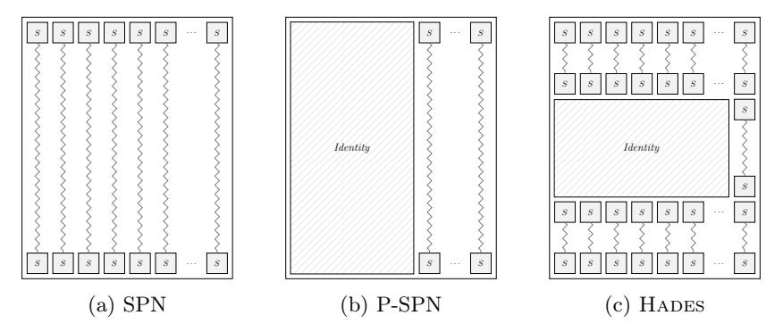
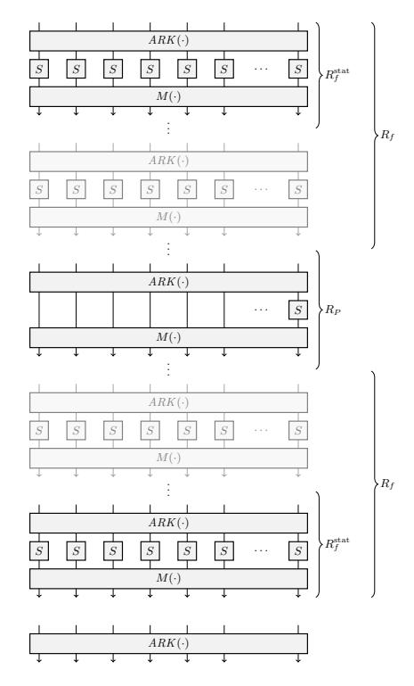
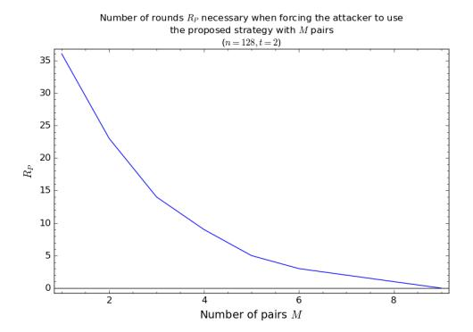
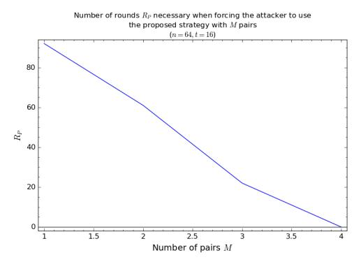

# On a Generalization of Substitution-Permutation Networks: The HADES Design Strategy

(Updated Version)

Lorenzo Grassi1,3 , Reinhard Lüftenegger1 , Christian Rechberger1 , Dragos Rotaru2,4 , Markus Schofnegger1

1 IAIK, Graz University of Technology, Austria 2 University of Bristol, Bristol, UK 3 Know-Center, TU Graz, Austria 4 imec-Cosic, Dept. Electrical Engineering, KU Leuven firstname.surname@iaik.tugraz.at, dragos.rotaru@esat.kuleuven.be

Abstract. Keyed and unkeyed cryptographic permutations often iterate simple round functions. Substitution-permutation networks (SPNs) are an approach that is popular since the mid 1990s. One of the new directions in the design of these round functions is to reduce the substitution (S-Box) layer from a full one to a partial one, uniformly distributed over all the rounds. LowMC and Zorro are examples of this approach.

A relevant freedom in the design space is to allow for a highly nonuniform distribution of S-Boxes. However, choosing rounds that are so different from each other is very rarely done, as it makes security analysis and implementation much harder.

We develop the design strategy Hades and an analysis framework for it, which despite this increased complexity allows for security arguments against many classes of attacks, similar to earlier simpler SPNs. The framework builds upon the wide trail design strategy, and it additionally allows for security arguments against algebraic attacks, which are much more of a concern when algebraically simple S-Boxes are used.

Subsequently, this is put into practice by concrete instances and benchmarks for a use case that generally benefits from a smaller number of S-Boxes and showcases the diversity of design options we support: A candidate cipher natively working with objects in GF(p), for securing data transfers with distributed databases using secure multiparty computation (MPC). Compared to the currently fastest design MiMC, we observe significant improvements in online bandwidth requirements and throughput with a simultaneous reduction of preprocessing effort, while having a comparable online latency.

Keywords: Hades Strategy – Cryptographic Permutations – Secure Multiparty Computation (MPC)

This updated version differs from the one appeared at Eurocrypt 2020 mainly for the following reasons.

A Different Linear Layer Matrix. We assume that the MDS matrix prevents the possibility to set up infinitely long subspace trails (either invariant or iterative and either with active S-Boxes or with inactive S-Boxes) for the rounds with partial S-Box layers. In order to test if a matrix satisfies the assumption just given, we suggest to use the tools provided in [\[36\]](#page-35-0). This allows to prevent possible attacks that exploit the possibility to "skip" all rounds with partial S-Box layers due to unwanted weaknesses in the matrix.

Generic S-Box. We replaced the cube S-Box S(x) = x 3 with the generic power map S(x) = x α, where α ≥ 3 is the smallest integer s.t. gcd(p − 1, α) = 1.

Updated Cryptanalysis. We revisited the cryptanalysis in order to take care of recently published attacks (we refer to [\[11,](#page-34-0)[40,](#page-35-1)[36\]](#page-35-0) for more details).

# Table of Contents

| 1 | Intro | oduction                                                                              |  |  |  |  |  |  |
|---|-------|---------------------------------------------------------------------------------------|--|--|--|--|--|--|
|   |       | Our Contribution in a Nutshell                                                        |  |  |  |  |  |  |
|   | 1.1   | The Big Caveat: Security Analysis of P-SPNs                                           |  |  |  |  |  |  |
|   |       | How Risky are Partial SP Networks?                                                    |  |  |  |  |  |  |
|   | 1.2   | The Idea in a Nutshell – The HADES Strategy                                           |  |  |  |  |  |  |
|   | 1.3   | Related Work – Designs with Different Round Functions                                 |  |  |  |  |  |  |
|   | 1.4   | HADESMiMC: Concrete Instantiations for MPC Applications                               |  |  |  |  |  |  |
| 2 | Desc  | cription of the HADES Strategy                                                        |  |  |  |  |  |  |
|   |       | Crucial Points of the HADES Strategy                                                  |  |  |  |  |  |  |
| 3 | The   | Keyed Permutation HadesMiMC                                                           |  |  |  |  |  |  |
|   | 3.1   | Specification of HADESMiMC                                                            |  |  |  |  |  |  |
|   | 3.2   | Design Considerations: Reviving "Old" Design Ideas                                    |  |  |  |  |  |  |
|   |       | Why SHARK Among Many Others?                                                          |  |  |  |  |  |  |
|   |       | Choosing the S-Box.                                                                   |  |  |  |  |  |  |
| 4 | Secu  | rity Analysis                                                                         |  |  |  |  |  |  |
|   | 4.1   | Main Points of Our Cryptanalysis Results                                              |  |  |  |  |  |  |
|   |       | Number of Rounds                                                                      |  |  |  |  |  |  |
|   |       | Statistical Attacks                                                                   |  |  |  |  |  |  |
|   |       | Algebraic Attacks                                                                     |  |  |  |  |  |  |
|   |       | Some Considerations & Other Attacks                                                   |  |  |  |  |  |  |
|   | 4.2   | Statistical Attacks – Security Level: $\kappa = N$                                    |  |  |  |  |  |  |
|   |       | Differential Cryptanalysis                                                            |  |  |  |  |  |  |
|   | 4.3   | Algebraic Attacks – Security Level: $\kappa = N \dots 18$                             |  |  |  |  |  |  |
|   |       | Interpolation Attack                                                                  |  |  |  |  |  |  |
| 5 | Secu  | urity Analysis for MPC: $\kappa = n$ and Data $\leq p^{1/2} \dots 23$                 |  |  |  |  |  |  |
|   | 5.1   | Statistical Attacks                                                                   |  |  |  |  |  |  |
|   | 5.2   | Algebraic Attacks                                                                     |  |  |  |  |  |  |
| 6 | Nun   | aber of Rounds: Security and Efficiency                                               |  |  |  |  |  |  |
|   |       | Security                                                                              |  |  |  |  |  |  |
|   |       | Several Combinations of $(\mathbf{R_F}, \mathbf{R_P})$ for the Same Security Level 24 |  |  |  |  |  |  |
|   | 6.1   | Efficiency in the Case of MPC Applications                                            |  |  |  |  |  |  |
|   |       | Cost Metric for MPC: "Number of S-Boxes" and Depth 25                                 |  |  |  |  |  |  |
|   | 6.2   | Best Ratio Between $\mathbf{R_F}$ and $\mathbf{R_P}$ – MPC Application                |  |  |  |  |  |  |
|   |       | Security                                                                              |  |  |  |  |  |  |
|   |       | Efficiency – Best Combination $(\mathbf{R_F}, \mathbf{R_P})$                          |  |  |  |  |  |  |
|   | 6.3   | Concrete Round Numbers of HADESMiMC                                                   |  |  |  |  |  |  |
|   |       | Reduced and Toy Versions                                                              |  |  |  |  |  |  |
|   |       | Comparison with Ciphers in "Traditional Use Cases"                                    |  |  |  |  |  |  |
| 7 | MP    | C Applications                                                                        |  |  |  |  |  |  |
|   |       | Preliminaries                                                                         |  |  |  |  |  |  |
|   |       | Standard Banchmarks                                                                   |  |  |  |  |  |  |

|                                                             | Experiment Results: Table 2 29                                                 |  |  |  |  |  |  |  |
|-------------------------------------------------------------|-----------------------------------------------------------------------------------|--|--|--|--|--|--|--|
|                                                             | Related Work 31                                                                |  |  |  |  |  |  |  |
| 8 Concluding Remarks: Possible Variants for Future Works |                                                                                   |  |  |  |  |  |  |  |
|                                                             | Acknowledgements 32                                                            |  |  |  |  |  |  |  |
| A                                                           | Concrete Instantiations 36                                                     |  |  |  |  |  |  |  |
| B                                                           | MDS Matrix Construction                                                           |  |  |  |  |  |  |  |
| C                                                           | 37 Efficient Implementation 38                                              |  |  |  |  |  |  |  |
|                                                             | Round Constants 38                                                             |  |  |  |  |  |  |  |
|                                                             | Linear Layer 39                                                                |  |  |  |  |  |  |  |
| D                                                           | Statistical Attacks on HadesMiMC– Details  40                               |  |  |  |  |  |  |  |
|                                                             | D.1 Linear Cryptanalysis 40                                                 |  |  |  |  |  |  |  |
|                                                             | D.2 Truncated Differentials 40                                              |  |  |  |  |  |  |  |
|                                                             | D.3 Differential Meet-in-the-Middle Attack 41                               |  |  |  |  |  |  |  |
|                                                             | D.4 Impossible Differential 42                                              |  |  |  |  |  |  |  |
|                                                             | D.5 Boomerang Attack 42                                                     |  |  |  |  |  |  |  |
|                                                             | D.6 Multiple-of-n and "Mixture Differential Cryptanalysis" 42               |  |  |  |  |  |  |  |
|                                                             | D.7 Invariant Subspace Attack 43                                            |  |  |  |  |  |  |  |
|                                                             | D.8 Integral/Square Attack 44                                               |  |  |  |  |  |  |  |
|                                                             | D.9 Biclique Cryptanalysis 44                                               |  |  |  |  |  |  |  |
| E                                                           | Algebraic Attacks – Details                                                       |  |  |  |  |  |  |  |
|                                                             | 44 E.1 Interpolation Attack and Dense Polynomial 44                      |  |  |  |  |  |  |  |
|                                                             | E.2 GCD Attack 45                                                           |  |  |  |  |  |  |  |
|                                                             | E.3 Gröbner Basis Attack – Details 46                                       |  |  |  |  |  |  |  |
|                                                             | First Strategy – Exploiting the "Invariant" Subspace S 47                      |  |  |  |  |  |  |  |
|                                                             | Second Strategy 48                                                             |  |  |  |  |  |  |  |
|                                                             | Third Strategy 51                                                              |  |  |  |  |  |  |  |
|                                                             | Special Case: RP = 0 53                                                     |  |  |  |  |  |  |  |
|                                                             | 1/2 E.4 Gröbner Basis Attack: κ = n and Data ≤ p (MPC Application) 53 |  |  |  |  |  |  |  |
|                                                             | First Strategy 53                                                              |  |  |  |  |  |  |  |
|                                                             | Second Strategy 54                                                             |  |  |  |  |  |  |  |
| F                                                           | Comparison: HadesMiMC with S-Box(x) = −1 x  54                        |  |  |  |  |  |  |  |
|                                                             | Main Result 55                                                                 |  |  |  |  |  |  |  |
|                                                             | Interpolation Attack – Details 55                                              |  |  |  |  |  |  |  |
| G                                                           | GMiMCerf for MPC Applications 58                                            |  |  |  |  |  |  |  |
|                                                             | Key Schedule 58                                                                |  |  |  |  |  |  |  |
|                                                             | Statistical Attacks 58                                                         |  |  |  |  |  |  |  |
|                                                             | Algebraic Attacks 59                                                           |  |  |  |  |  |  |  |
|                                                             |                                                                                   |  |  |  |  |  |  |  |

# 1 Introduction

Starting out with a layer of local substitution boxes (S-Boxes), combining it with a global permutation box (sometimes merely wires, sometimes affine transformations), and iterating such a round a number of times is a major design approach in symmetric cryptography. The resulting constructions are often referred to as substitution-permutation networks (SPNs) and are used to instantiate block ciphers, permutations, pseudo-random functions (PRFs), one-way functions, hash functions, and various other constructions. The approach can be traced back to Shannon's confusion-diffusion paradigm. There is a considerable amount of efficient designs that exploit this design strategy, including Rijndael/AES [\[22\]](#page-34-1) which is perhaps the most important one. Theoretical aspects have been analyzed too, which include the asymptotic analysis by Miles and Viola [\[46\]](#page-35-2), and more recent results in the provable security framework [\[28,](#page-34-2)[18\]](#page-34-3).

Driven by various new application areas and settings, a variation of the SPN approach – the so-called partial substitution-permutation network (P-SPN) – has been proposed and investigated on the practical side [\[5,](#page-33-1)[30\]](#page-35-3). The idea is to replace parts of the substitution layer with an identity mapping, leading to substantial practical advantages. A big caveat of this approach is that existing elegant approaches to rule out large classes of attacks via the so-called wide trail strategy [\[21\]](#page-34-4) are no longer applicable and have to be replaced by more ad-hoc approaches, as discussed in more details in Section [1.1.](#page-5-0) We note that the well studied Feistel approach and its generalizations, when the round function is using S-Boxes, also have the property that only a part of the internal state is affected by S-Boxes in each round.

Our Contribution in a Nutshell. We propose a new generalization of SPNs, which we call the "Hades" approach[1](#page-4-2) . This is illustrated in Fig. [1.](#page-5-1) It (1st) restores the ability to apply the elegant wide trail strategy to rule out important classes of attacks, (2nd) is accompanied with a broad framework to rule out various other attack vectors for many relevant instantiation possibilities, and (3rd) is demonstrated to result in even better implementation characteristics in the same application domains P-SPNs have been introduced for.

We use the rest of the introduction to explain this further. In Section [1.1](#page-5-0) we explain the difficulty of the security analysis of P-SPNs, in Section [1.2](#page-6-1) we outline our alternative generalization of SPNs called Hades. A big part of the paper will then be spent on detailing the approach and its framework for the security analysis. On the practical side, in Section [1.4](#page-7-1) we will discuss how applications which rely on properties like a small number of S-Boxes can benefit from this framework. A very recent and independent work [\[3\]](#page-33-2) explores various generalized Feistel networks as a method benefiting similar settings. This nicely complements our paper, and we include this approach in our practical comparisons.

1 Referring to Fig. [1](#page-5-1) and Fig. [2,](#page-9-0) if one highlights the S-Boxes per round, the obtained picture resembles a "bident". In classical mythology, the bident is a weapon associated with Hades, the ruler of the underworld.

Fig. 1: SP-Networks and Generalizations (P-SPNs and Hades).

### 1.1 The Big Caveat: Security Analysis of P-SPNs

The wide trail strategy cannot guarantee security against all attacks in the literature. As a concrete example, algebraic attacks that exploit the low degree of the encryption or decryption function – like the interpolation attack [\[37\]](#page-35-4) or the higher-order differential one [\[41\]](#page-35-5) – are (almost) independent of the linear layer used in the round transformation[2](#page-5-2) , which is the crucial point of such a design strategy. In other words, especially in the case of a low-degree S-Box, the wide trail strategy is not sufficient by itself, and it must be combined with something else (e.g., increasing the number of rounds) to guarantee security against all known attacks.

Moreover, the "hidden" assumption of such a strategy is that each round contains a full S-Box layer. Even if this is a well accepted practice, there are various applications/contexts in which non-linear operations are much less expensive than linear ones. For example, this includes masking and practical applications of secure multi-party computation (MPC), fully homomorphic encryption (FHE), and zero-knowledge proofs (ZK) that use symmetric primitives.

A possible way to achieve a lower implementation cost is by designing a primitive minimizing the number of non-linear operations. To achieve this goal, possible strategies are looking for low-degree S-Boxes and/or exploiting SPN structures where not all the state goes through the S-Boxes in each round. This second approach has been proposed for the first time by Gérard et al. [\[30\]](#page-35-3) at CHES 2013. Such partial non-linear SP networks – in which the non-linear operation is applied to only part of the state in every round – contain a wide range of possible concrete schemes that were not considered so far, some of which have performance advantages on certain platforms. A concrete instantiation of their methodology is Zorro [\[30\]](#page-35-3), a 128-bit lightweight AES-like cipher which reduces the number of S-Boxes per round from 16 to only 4 (to compensate, the number of rounds has been increased to 24).

2 We remark that a linear/affine function does in general not change the degree.

A similar approach has then been considered by Albrecht et al. [\[5\]](#page-33-1) in the recent design of a family of block ciphers called LowMC proposed at Eurocrypt 2015. LowMC is a flexible block cipher based on an SPN structure and designed for MPC/FHE/ZK applications. It combines an incomplete S-Box layer with a strong linear layer to reduce the total number of AND gates.

How Risky are Partial SP Networks? The wide trail strategy and tools that were developed in order to formally prove the security of block ciphers against standard differential and linear cryptanalysis do not apply to partial SP networks such as Zorro, and authors use heuristic arguments instead.

For the case of Zorro, the simple bounds on the number of active S-Boxes in linear and differential characteristics cannot be used due to the modified Sub-Bytes operation. Even though the authors came up with a dedicated approach to show the security of their design, this turned out to be insufficient, as Wang et al. [\[51\]](#page-36-0) found iterative differential and linear characteristics that were missed by the heuristic and used them to break full Zorro. An automated characteristic search tool and dedicated key-recovery algorithms for SP networks with partial non-linear layers have been presented in [\[8\]](#page-33-3). In there, the authors propose generic techniques for differential and linear cryptanalysis of SP networks with partial non-linear layers. Besides obtaining practical attacks on P-SPN ciphers, the authors concluded that even if "the methodology of building PSP networks based on AES in a straightforward way is flawed, [...] the basic PSP network design methodology can potentially be reused in future secure designs ".

Similarly, the authors of LowMC chose the number of rounds in order to guarantee that no differential/linear characteristic can cover the whole cipher with non-negligible probability. However, they do not provide such strong security arguments against other attack vectors including algebraic attacks. As a result, the security of earlier versions of LowMC against algebraic attacks was found to be lower than expected [\[25,](#page-34-5)[27\]](#page-34-6), and full key-recovery attacks on LowMC have been set up. More recently, generalizations of impossible differential attacks have been found for some LowMC instances [\[48\]](#page-35-6).

# 1.2 The Idea in a Nutshell – The Hades Strategy

Summarizing the current situation: The wide trail strategy is appealing due to its simplicity, but limited to differential and linear attacks, and does not work with partial S-Box layers. Additionally, when S-Boxes are chosen to have a low degree, other attacks vectors are more relevant anyhow. Designs of this type, like Zorro and LowMC, require a lot of ad-hoc analysis.

To address this issue we propose to start with a classical wide trail design, i.e., with a full S-Box layer (outer layer), and then add a part with full and/or partial S-Box layers in the middle. Even without the middle part, the outer layer in itself is supposed to give arguments against differential and linear attacks in exactly the same way the wide trail strategy does. At the same time, arguments against low-degree attacks can be obtained working on the middle layer. Since algebraic attacks exploit the small degree of the encryption/decryption function, the main role of this middle part is to achieve a high degree, with perhaps only few (e.g., one) S-Boxes per round. Depending on the cost metric of the target application one has in mind (e.g., minimizing the total number of non-linear operations), we show that the best solution is to choose the optimal ratio between the number of rounds with full S-Box layers and with partial S-Box layers in order to achieve both security and performance. We refer to this high-level approach as the "Hades" strategy and will be more concrete in the following.

#### 1.3 Related Work – Designs with Different Round Functions

Almost all designs for block ciphers and permutations, not only those following the wide trail design strategy, use round functions that are very similar, differing often only in so-called round constants which break symmetries in order to prevent attacks like slide attacks. Notable exceptions to this are the AES finalist MARS, the lightweight cipher PRINCE [\[16\]](#page-34-7) and the cipher Rescue [\[6\]](#page-33-4), recently proposed for ZK-STARK proof systems and MPC applications. MARS has whitening rounds with a different structure than the inner rounds with the idea to frustrate cryptanalytic attacks. A downside was perhaps that it also complicated cryptanalysis. PRINCE rounds differ in that the latter half of the rounds is essentially the inverse of the first half of the rounds, and a special middle round is introduced. This allows to achieve a special property, namely that a circuit describing PRINCE computes its own inverse (when keyed in a particular way). Similar to PRINCE, each round of Rescue is composed of two steps, which are respectively a non-linear S-Box layer and its inverse (that is, R(·) = M0 ◦ S −1 ◦ M ◦ S(·) for particular affine layers M, M0 ). Finally, we mention the cases of LowMC [\[5\]](#page-33-1) and Rasta [\[26\]](#page-34-8), for which different (independent and random) linear layers are used in each round. Due to their particular design strategies, this allows to maximize the amount of diffusion achieved by the linear layer. In none of these cases, however, the amount of non-linearity, and hence their cryptographic strength, differs over the rounds.

# 1.4 HadesMiMC: Concrete Instantiations for MPC Applications

We briefly outline the use cases in the following and discuss how our new design compares against the best-in-class.

MPC. There is a large application area around secure multi-party computation. The setting is a secret-sharing-based MPC system where data is often shared as elements of a finite field Fp for large p. In order to get data securely in and out of such a system, an efficient solution can be to directly evaluate a symmetric primitive within such an MPC system. Note that "traditional" PRFs such as AES are not efficient in this setting, since they are built for computational engines which work over data types that do not easily match the operations possible in the MPC engine. For example, AES is a byte-oriented cipher, which is hard to represent using arithmetic in Fp. More details can be found in [\[35\]](#page-35-7), where for the first time this setting was explicitly analyzed and where the authors concluded that among various other options MiMC [\[4\]](#page-33-5) was competitive. After these initial works, several new primitives have been proposed for MPC applications, including GMiMC [\[3\]](#page-33-2) (a generalization of MiMC based on Feistel networks), Jarvis and Friday [\[7\]](#page-33-6), and Rescue and Vision [\[6\]](#page-33-4). GMiMC was recently broken [\[15\]](#page-34-9) by exploiting its weak key schedule, Gröbner basis attacks were found against Jarvis and Friday [\[2\]](#page-33-7), and also some versions of MiMC were broken using a higher-order differential approach [\[29\]](#page-35-8).

Concrete Instances. For our concrete instantiations of HadesMiMC, we borrow ideas from the pre-predecessor of AES, namely SHARK [\[49\]](#page-35-9), an SPN design with a single large MDS layer covering the whole internal state. Concretely specified instances, both full and toy versions, together with their reference implementation, test vectors, and helper scripts are available online.[3](#page-8-1)

When benchmarking our new design HadesMiMC for MPC applications, we observe significant improvements in online bandwidth requirements and throughput with a simultaneous reduction of preprocessing effort with respect to MiMC and Rescue, while having a comparable online latency. The same holds also for the comparison between HadesMiMC and GMiMC, with the exception for the online throughput when the number of blocks is bigger than or equal to 16.

New Instances for Future Use Cases. HadesMiMC is a very parameterizable design approach: Given any block size and a cost metric that one aims to minimize, a concrete secure instantiation – hence, the best S-Box size and the best ratio between rounds with full S-Box and partial S-Box layers – can be created easily using our scripts. In fact we can already report on such usage: A variant of HadesMiMC has been proposed [\[32\]](#page-35-10) for use cases of efficient proof systems like STARKs, SNARKs and Bulletproofs, for which they outperform competing designs, often by a large margin.

# 2 Description of the Hades Strategy

Block ciphers and cryptographic permutations are typically designed by iterating an efficiently implementable round function many times in the hope that the resulting composition behaves like a randomly drawn permutation. In general, the same round function is iterated enough times to make sure that any symmetries and structural properties that might exist in the round function vanish. In our case, instead of considering the same non-linear layer for all rounds, we propose to consider a variable number of S-Boxes per round, that is, to use different S-Box layers in the round functions.

Each round of a cipher based on Hades is composed of three steps:

- 1. Add Round Key denoted by ARK(·);
- 2. SubWords denoted by S-Box(·);

3 <https://extgit.iaik.tugraz.at/krypto/hadesmimc>

Fig. 2: Construction of Hades (the final matrix multiplication can be omitted).

#### 3. MixLayer – denoted by $M(\cdot)$ .

A final round key addition is then performed, and the final MixLayer operation can be omitted (we sometimes include it in this description for simplicity):

$$\underbrace{ARK \to \text{S-Box} \to M}_{\text{1st round}} \to \cdots \to \underbrace{ARK \to \text{S-Box} \to M}_{(R-1)\text{-}th \text{ round}} \to \underbrace{ARK \to \text{S-Box}}_{\text{R-}th \text{ round}} \to ARK$$

The crucial property of HADES is that the number of S-Boxes per round is not the same for every round:

- a certain number of rounds denoted by  $R_F$  has a full S-Box layer, i.e., t S-Box functions;
- a certain number of rounds denoted by  $R_P$  has a partial S-Box layer, i.e.,  $1 \le s < t$  S-Boxes and (t-s) identity functions.

In the following, we only consider the case s=1, that is,  $R_P$  rounds have a single S-Box per round and t-1 identity functions. However, we remark that this construction can be easily generalized (e.g., like LowMC) allowing more than a single S-Box per round in the middle  $R_P$  rounds.

In more details, assume  $R_F = 2 \cdot R_f$  is an even number. Then

- the first  $R_f$  rounds have a full S-Box layer,
- the middle  $R_P$  rounds have a partial S-Box layer (i.e., 1 S-Box per round),
- the last  $R_f$  rounds have a full S-Box layer.

Note that the rounds with a partial S-Box layer are "masked" by the rounds with a full S-Box layer, which means that an attacker should not (directly) take advantage of the rounds with a partial S-Box layer.

Crucial Points of the HADES Strategy. In the HADES design,  $R_f^{\rm stat}$  rounds with full S-Box layers situated at the beginning and the end provide security arguments against statistical attacks, yielding a total of  $R_F^{\rm stat} = 2 \cdot R_f^{\rm stat}$  rounds with full S-Box layers. As we are going to show, they are sufficient in order to apply the wide trail strategy, even without the middle rounds with partial S-Box layers. Moreover, the choice to have the same number of rounds with full nonlinear layers at the beginning and at the end aims to provide the same security with respect to chosen-plaintext and chosen-ciphertext attacks.

Security against all algebraic attacks is achieved working both with rounds  $R_F = R_F^{\rm stat} + R_F' \geq R_F^{\rm stat}$  with full S-Box layers and rounds  $R_P \geq 0$  with partial S-Box layers. The degree of the encryption/decryption function has a major impact on the cost of an algebraic attack. Even if one S-Box per round is potentially sufficient to increase this degree, other factors can have a crucial impact on the cost of such attacks too (e.g., a Gröbner basis attack also depends on the number of non-linear equations and variables).

Finally, another crucial point of our HADES strategy regards the possibility to choose among several possible combinations of rounds  $(R_F \geq R_F^{\rm stat}, R_P \geq 0)$  that provide the *same* security level. Namely, one can potentially decrease (resp. increase) the number of rounds with partial S-Box layers and add (resp. remove)  $R'_F = 2 \cdot R'_f \geq 0$  rounds with full S-Box layers instead without affecting the security level. This freedom allows to choose the best combination of rounds  $(R_F, R_P)$  that minimizes a given cost metric. Roughly speaking, the idea is to find a balance between the approach in an SPN and a P-SPN cipher.

Choosing the Field and the Linear/Non-Linear Layer. Our strategy does not pose any restriction/constriction on the choice of the field, on the linear layer, or on the choice of the S-Box. The idea is to consider a "traditional" SPN cipher – defined over  $(\mathbb{F}_{q^n})^t$  for q=2 or q=p prime – based on the wide trail strategy, and then to replace a certain number of rounds with full S-Box layers with the same number of rounds with partial S-Box layers in order to reduce the number of non-linear operations, but without affecting the security. The HADES strategy has a considerable impact especially in the case of ciphers with low-degree S-Boxes, since in this case a large number of rounds is required to provide security against algebraic attacks.

# 3 The Keyed Permutation HadesMiMC

HADESMiMC is a construction for cryptographic permutations based on the strategy just proposed. It is obtained by applying the HADES strategy to the cipher SHARK [49] proposed by Rijmen et al. in 1996 and based on the wide trail strategy. Our design works with texts of  $t \geq 2$  words4 in  $(\mathbb{F}_p, +, \times) \equiv (GF(p), +, \times)$ , where p is a prime of size  $p \approx 2^n \geq 11$  (namely, the smallest prime bigger than  $2^3 = 8$ ) and where + and  $\times$  are resp. the addition and the multiplication in  $\mathbb{F}_p$ . In the following, N denotes  $N := \lceil \log_2 p \rceil \cdot t$ .

# 3.1 Specification of HadesMiMC

Each round  $R_k(\cdot): (\mathbb{F}_p)^t \to (\mathbb{F}_p)^t$  of HADESMiMC is defined as

$$R_k(\cdot) = k + M \times \mathcal{S}(\cdot),$$

where  $k \in (\mathbb{F}_p)^t$  is the secret subkey,  $M \in (\mathbb{F}_p)^{t \times t}$  is an invertible matrix that defines the linear layer,  $S(\cdot) : (\mathbb{F}_p)^t \to (\mathbb{F}_p)^t$  is the S-Box layer, defined as  $S = [S(\cdot), \ldots, S(\cdot)]$  for the rounds with full S-Box layers and as  $S = [S(\cdot), I(\cdot), \ldots, I(\cdot)]$  for the rounds with partial S-Box layers, where  $S(\cdot) : \mathbb{F}_p \to \mathbb{F}_p$  is a non-linear S-Box and  $I(\cdot)$  is the identity function.

The number of rounds  $R=2\cdot R_f+R_P$  depends on the choice of the S-Box and of the parameters p and t. For the MPC applications we have in mind, we usually consider a large prime number (namely,  $p\geq 2^{64}$ , e.g.  $p\approx 2^{128}$ ), and each round is composed of the following operations:

- the non-linear S-Box is defined as the *power* map

$$S\text{-}Box(x) = x^{\alpha}$$

where  $\alpha \geq 3$  is the smallest integer s.t.  $\gcd(p-1,\alpha)=1$  (e.g.,  $\alpha=3$  if  $\gcd(p-1,3)=1$ , or  $\alpha=5$  if  $\gcd(p-1,3)\neq 1$  and  $\gcd(p-1,5)=1$ , and so on)5:

– as in SHARK, the MixLayer of HadesMiMC is defined by a multiplication with a fixed  $t \times t$  MDS matrix, which satisfies the assumption given below.

Details about the MDS matrix, the key schedule, and the number of rounds are given in the following. We also provide concrete instantiations in Supplementary Material A.

**About the MDS Matrix.** A  $t \times t$  MDS matrix6 M with elements in GF(p) exists if the condition  $2t + 1 \le p$  is satisfied (see [44] for details). An overview

&lt;sup>4 The case t = 1 corresponds to MiMC [4].

&lt;sup>5 More generally, a power map  $x \mapsto x^{\alpha}$  is a permutation over  $\mathbb{F}_p$  if and only if  $\gcd(\alpha, p-1) \neq 1$  – see e.g. Hermite's criterion for more details.

&lt;sup>6 A matrix  $M \in \mathbb{F}^{t \times t}$  is called a maximum distance separable (MDS) matrix iff it has a branch number  $\mathcal{B}(M)$  equal to  $\mathcal{B}(M) = t+1$ . The branch number is defined as  $\mathcal{B}(M) = \min_{x \in \mathbb{F}^t \setminus \{0\}} \{ \operatorname{wt}(x) + \operatorname{wt}(M(x)) \}$ , where  $\operatorname{wt}(\cdot)$  is the bundle weight in wide trail terminology. Equally, a matrix M is MDS iff every submatrix of M is non-singular.

of several strategies to construct MDS matrices is given in Supplementary Material B.

For our concrete instantiations, we use Cauchy matrices, and we note that not every Cauchy matrix provides the same level of security. Indeed, recent results have shown vulnerabilities in certain classes of Cauchy matrices [11,40,36]. To discuss them, let us first recall what a subspace trail is.

**Definition 1.** [33] Let  $(U_1, ..., U_{r+1})$  denote a set of r+1 subspaces with  $\dim(U_i) \le \dim(U_{i+1})$ . If for each  $i \in \{1, ..., r\}$  and for each  $a_i$  there exists  $a_{i+1} \in U_{i+1}^c$  (namely, the complementary subspace of  $U_{i+1}$ ) such that

$$R^{(i)}(\mathcal{U}_i + a_i) \subseteq \mathcal{U}_{i+1} + a_{i+1},$$

then  $(\mathcal{U}_1, \ldots, \mathcal{U}_{r+1})$  is a subspace trail of length r for the function  $F(\cdot) = R^{(r)} \circ \cdots \circ R^{(1)}(\cdot)$ . If all the previous relations hold with equality, the trail is called a constant-dimensional subspace trail. If the subspace  $\mathcal{U}_i$  is invariant (namely,  $\mathcal{U}_i = \mathcal{U}_{i+1}$ ), the subspace trail is called invariant.

With this definition in mind, we assume that the MDS matrix prevents the possibility to set up infinitely long subspace trails (either invariant or iterative and either with active S-Boxes or with inactive S-Boxes) for the rounds with partial S-Box layers. Hence, the MDS matrix must guarantee that the longest subspace trail with inactive S-Boxes can cover at most t-1 rounds, where note that such a subspace trail exists independently of the details of the matrix in the case in which only 1 S-Box is applied per round. Indeed, for each  $i \geq 1$ , we define  $\mathcal{S}^i$  as

$$S^{i} := \{ x \in \mathbb{F}^{t} \mid \forall j \le i - 1 : (M^{j} \cdot x)[0] = 0 \in \mathbb{F} \}, \tag{1}$$

where x[0] denotes the first word of x and where  $M^j = M \cdot \cdots \cdot M$  for  $j \geq 1$  and  $M^0 = I$  (where I is the identity matrix). It is not hard to check that  $\{S^i, M \cdot S^i, \dots, M^{i-1} \cdot S^i\}$  forms a subspace trail for i partial rounds with inactive S-Boxes.

In order to test if a matrix satisfies the assumption just given, we suggest to use the tools provided in [36]. These tools allow to discard matrices that are weak w.r.t. such assumption. As explained in [36], it is sufficient to test few random Cauchy matrices in order to find a secure one w.r.t. the assumption just given. More details about this and the way we construct the matrices are also given in Supplementary Material A.

Security Level  $\kappa$  and Key Schedule. For our goals, we define two security levels, respectively  $\kappa = \log_2(p) \cdot t \approx n \cdot t = N$  and  $\kappa = \log_2(p) \approx n$  (note that  $n = \lceil \log_2(p) \rceil$  is the field size in bits).

Case:  $\kappa = \log_2(p) \cdot t \approx N$ . Let  $k \in (\mathbb{F}_p)^t$  be the secret key of size  $N \approx t \cdot \log_2(p)$  bits, and let  $k = [k_0, k_1, \dots, k_{t-1}]$  be its representation over  $\mathbb{F}_p$  (namely,  $k_j \in \mathbb{F}_p$  for each  $0 \le j < t$ ). We define the *i*-th round key  $k^{(i)}$  for  $0 \le i \le R$  (where R is the number of rounds) as follows. For the first round i = 0, the

subkey is simply given by the whitening key, that is,  $k^{(0)} := k$ . For the next rounds, the subkeys are defined by a linear key schedule as

$$\forall i = 1, \dots, R: \quad k^{(i)} := \hat{M} \cdot k^{(i-1)} + RC^{(i)}$$

where  $RC^{(i)} \neq 0$  are random round constants and  $\hat{M}$  is an MDS matrix7. For the matrix  $\hat{M}$  we require that  $\hat{M}^i = \prod_{i=1}^R \hat{M}$  has no zero coefficient8, where  $1 \leq i \leq R$  and R is the total number of rounds. This condition implies that each word of each subkey  $k^{(i)}$  (linearly) depends on all words of k. As a result, even if an attacker guesses a certain number of words of a subkey  $k^{(i)}$ , they do not have information about other subkeys (more precisely, they cannot deduce any words of other subkeys).

Case:  $\kappa = \log_2(p) \approx n$  (for MPC Applications). Let  $k' \in \mathbb{F}_p$  be the secret key of size  $n \approx \log_2(p)$  bits. We define the subkeys as

$$\forall i = 0, \dots, R: \quad k^{(i)} = \underbrace{[\underline{k', k', \dots, k'}]}_{t \text{ times}} \oplus RC^{(i)},$$

for random round constants  $RC^{(i)}$ .

Efficient Implementation and Decryption. Like for LowMC, the amount of operations required in each round with a partial non-linear layer can be reduced. Referring to the idea proposed in [24], in Supplementary Material C we recall an equivalent representation of an SPN with partial non-linear layers that can be exploited for an efficient implementation of HADESMiMC.

Finally, we mention that – as for MiMC [4] – decryption is much more expensive than encryption (e.g.,  $x^{1/3} \equiv x^{(2p-1)/3}$  over  $\mathbb{F}_p$ ). However, we emphasize that HADESMiMC has been proposed for applications where the decryption process (hence, computing the inverse) is not required. We therefore provide benchmark results only for the encryption function. If used for confidentiality, we suggest to use modes where the inverse is not needed (e.g., the counter (CTR) mode).

#### 3.2 Design Considerations: Reviving "Old" Design Ideas

Why SHARK Among Many Others? Since in our practical applications (e.g., the MPC use case which we will mainly consider) the cost of linear operations is much lower than the cost of non-linear ones, we decided to focus on the most efficient linear layer (from the security point of view) to construct HADESMIMC, namely the one that provides the fastest diffusion at word level. This corresponds to a linear layer defined as a multiplication with an MDS matrix that involves the entire state, which is exactly the case for SHARK.

Since our design strategy can be applied to any SPN design, a possible interesting future problem would be to apply HADES to e.g. AES, in order to see if a certain number of rounds of AES can be replaced with rounds that contain partial non-linear layers without decreasing its security.

&lt;sup>7 To be as general as possible,  $\hat{M}$  can be equal or different from M.

&lt;sup>8 If this is not possible, one must minimize the number of zero coefficients.

Choosing the S-Box. Before going on, we mention that we also considered possible variants of HadesMiMC instantiated by S-Boxes defined by e.g. a different power exponent. In order to motivate our choice, we remember that, since our final goal is to use HadesMiMC for MPC applications over a LAN, the performance in such application is mainly influenced by the total number of non-linear operations (the AND depth/multiplication depth has a small impact on the cost of an MPC application over a LAN, while it could play a crucial role in the case of a WAN). Since linear operations are basically free, the choice to consider a cube S-Box among many other non-linear permutations is motivated by the following considerations:

- First of all, since there are no quadratic permutation polynomials (namely, x 7→ x 2+a·x+b for a, b ∈ Fp) over the finite field Fp (see e.g. [\[43,](#page-35-13) Theorem 6 - 7] and [\[23,](#page-34-11) Sect. 2] for details), the cube S-Box requires the smallest number of non-linear operations (namely, two) and at the same time it offers high security against statistical attacks (e.g. its maximum differential probability satisfies DPmax ≤ 2/|F| where |F| is the size of the field F);
- Secondly, let us focus on algebraic attacks when using an S-Box of the form S-Box(x) = x d . An S-Box with a higher degree than the cube one allows to reach the maximum degree faster, hence a smaller number of rounds is potentially sufficient to provide security. However, an S-Box with a higher degree requires more operations to be computed. As a result, even if the number of rounds can potentially be decreased[9](#page-14-2) , in general the total number of non-linear operations does not change significantly (see e.g. [\[4,](#page-33-5) Sect. 5] for a detailed analysis[10](#page-14-3)). Thus, from this point of view, the choice of the S-Box is in continuity with the choice of the cube S-Box made e.g. for MiMC and for Rescue [\[6\]](#page-33-4) for similar applications.

# 4 Security Analysis

It is paramount for a new design to present a concrete security analysis. In the following, we provide an in-depth analysis of the security of the HadesMiMC family of block ciphers. Since we cannot ensure that a cipher is secure against all possible attacks, the best option of determining its security is to ensure that it is secure against all known attacks. We follow this strategy for our proposals and the number of rounds of HadesMiMC is then chosen accordingly.

The crucial points of our security analysis are the following:

9 We emphasize that this is not always the case. For a concrete example, we analyze the security of HadesMiMC instantiated by the inverse S-Box S-Box(x) = 1/x in Supplementary Material [F.](#page-55-1) In there, we show that, even though this S-Box has the highest possible degree, the number of rounds needed for security is of the same order as the number of rounds required for the cubic case (see also [\[37,](#page-35-4) Sect. 3.4] for more details).

10 In there, the authors show e.g. that the total number of non-linear operations over Fp (hence, including the square operations) is constant for each permutation function of the form x 7→ x d for d = 2d 0 − 1.

- Security against statistical attacks is obtained exploiting the wide trail strategy by using  $R_F^{\rm stat} = 2 \cdot R_f^{\rm stat}$  rounds with full S-Box layers.
- The combination of both rounds  $R_F = R_F^{\rm stat} + R'$  with full S-Box layers and/or rounds  $R_P \geq 0$  with partial S-Box layers provide security against all other possible attacks. Indeed, even if rounds with partial S-Box layers are sufficient to increase the degree of the encryption/decryption function, other factors can also have a crucial impact on the cost of an algebraic attack.

In the following, we present our security analysis for the case  $\kappa=N$  (and full data case). Then, we adapt it for the case  $\kappa=n$  (together with the restriction  $p^{t/2}\approx 2^{N/2}$ ) used for the MPC applications we have in mind.

# 4.1 Main Points of Our Cryptanalysis Results

Here we limit ourselves to highlight the main points of our cryptanalysis results – a detailed description of the attacks can be found in the following.

Number of Rounds. In the following, given the number of rounds of a distinguisher which is independent of the key, we add at least 2 rounds with full S-Box layers to prevent key-guessing attacks. This choice is motivated by the fact that it is not possible to skip more than a single round with a full S-Box layer without guessing the entire key. Indeed, one round of HADESMIMC already provides full diffusion at word level, while the S-Box provides full diffusion at bit level.

**Statistical Attacks.** Assuming  $p \geq (\alpha - 1)^2$  (which is in general satisfied for large  $p \gg 1$ ), we are going to show that at least 6 rounds with full S-Box layers are needed to protect HADESMIMC against all statistical attacks in the literature (that is, differential, linear, truncated/impossible differential, boomerang, ...). Depending on p and t, in some cases 10 rounds are necessary in order to guarantee security against these attacks.

**Algebraic Attacks.** Algebraic attacks exploit mainly the low degree of the encryption/decryption function in order to break the cipher. However, as already mentioned, other factors can influence the cost of such attacks.

Interpolation Attack. The goal of an interpolation attack is to construct the polynomial that describes the function: If the number of monomials is too large, such a polynomial cannot be constructed faster than via a brute force attack. A (lower/upper) bound of the number of different monomials can be estimated given the degree of the function. We show that – when the polynomial is dense – the attack complexity is approximately  $\mathcal{O}(d^t)$ , where d is the degree of the polynomial after r rounds. Since  $d = \alpha^r$ ,  $\log_{\alpha}(p) + \log_{\alpha}(t)$  rounds with partial S-Box layers are necessary to guarantee security, where  $\log_{\alpha}(t)$  more rounds guarantee that the polynomial is dense. The cost of the attack does not change when working with rounds with full S-Box layers.

We finally remark that the degree of a function can also depend on its "representation". To give a concrete example, the function  $x^{-1}$  can be written as a function of degree p-2 (namely,  $x^{-1} \equiv x^{p-2}$  for  $x \neq 0$ ) or using the "fraction representation" 1/x as introduced in [37], where both the numerator and the denominator are functions of degree at most 1 (see Supplementary Material F for more details on the influence of such representation on the interpolation attack).

Gröbner Basis Attack. In a Gröbner basis attack, one tries to solve a system of non-linear equations that describe the cipher. The cost of such an attack depends on the degree of the equations, but also on the number of equations and on the number of variables. We show that – when working with rounds with full S-Box layers – the attack complexity is approximately  $\mathcal{O}((d/t)^t)$ . If a partial S-Box layer is used in order to guarantee security against this attack, it could become more efficient to consider degree- $\alpha$  equations for single S-Boxes. In this case, a higher number of rounds may be necessary to provide security.

To summarize, a round with a partial S-Box layer can be described by just 1 non-linear equation of degree d and t-1 linear equations, while a round with a full S-Box layer can be described by t non-linear equations of degree d. If the cost of the attack depends on other properties than just the degree (as in the case of a Gröbner basis attack), this fact can influence its final cost.

Higher-Order Differential Attack. In the case of a function defined over a Boolean field, the higher-order differential attack exploits the property that given a function  $f(\cdot)$  of algebraic degree  $\delta$ , then  $\bigoplus_{x\in V\oplus \phi} f(x)=0$  if the dimension of the subspace V satisfies  $\dim(V)\geq \delta+1$  (where the algebraic degree  $\delta$  of a function  $f(x)=x^d$  is given by the hamming weight of d, which we denote by  $\operatorname{hw}(d)$ ). If the algebraic degree is sufficiently high, then the attack does not work.

At first thought, one may think that this attack does not apply (or is much less powerful) in  $\mathbb{F}_p^t$  (due to the fact that the only subspaces of  $\mathbb{F}_p$  are  $\{0\}$  and  $\mathbb{F}_p$  itself). Recently, it has been shown in [11] how to set up an higher-order differential over  $\mathbb{F}_p^t$ . Given f over  $\mathbb{F}_p$  of degree  $d \leq p-2$ , then  $\sum_{x \in \mathbb{F}_p} f(x) = 0$ . Since this result is related to the degree of the polynomial that describes the permutation, we claim that the number of rounds necessary to guarantee security against the interpolation attack provides security against this attack as well.

Some Considerations & Other Attacks. About the Subspace Trails given in Eq. (1). As we have seen before, independently of the details of the matrix that defines the MixLayer, there exist subspaces trails (of the form  $\{S^r, M \cdot S^r, \dots, M^{r-1} \cdot S^r\}$  – see Eq. (1) for details) for at most t-1 rounds with partial S-Box layers. Here we discuss the impact of their existence on the security of HADESMiMC. Since rounds with partial S-Box layers are "masked" both by (at least)  $R_f \geq 3$  rounds with full S-Box layers and by the presence of the secret key, it seems very hard to exploit them in a non-trivial way in order to set up a

key-recovery attack11.

Related-Key Attacks. The related-key attack model is a class of cryptanalytic attacks in which the attacker knows or chooses a relation between several keys and is given access to encryption/decryption functions with all these keys. We explicitly state that we do not make claims in the related-key model as we do not consider it to be relevant for the intended use case.

Hades MiMC Permutation: Security. Since we do not require the indistinguishability of the permutation obtained by Hades MiMC with a fixed key from a "randomly drawn" permutation12 in the practical applications considered in the following, we explicitly state that we do not make claims about the indistinguishability of the Hades MiMC Permutation.

# 4.2 Statistical Attacks – Security Level: $\kappa = N$

**Differential Cryptanalysis.** Differential cryptanalysis [13] and its variations are the most widely used techniques to analyze symmetric-key primitives. The differential probability of any function over the finite field  $(\mathbb{F}, +, \times)$  is defined as

$$Prob[\alpha \to \beta] := |\{x : f(x + \alpha) - f(x) = \beta\}|/|\mathbb{F}|$$

where  $|\mathbb{F}|$  is the size of the field and where "-" denotes the subtraction operation (x-y=z) iff x=z+y. The probability for the power function  $f(x)=x^{\alpha}$  is bounded above by  $(\alpha-1)/|\mathbb{F}_p|=(\alpha-1)/p$ . For example, the cube map has an optimal differential probability over a prime field [47].

As largely done in the literature, we first compute the number of rounds necessary to guarantee that each characteristic has probability at most  $p^{-t} \approx 2^{-N}$ . Since more characteristics can be used simultaneously in order to set up a differential attack, the previous number of rounds is in general not sufficient to guarantee security. For this reason, we claim that HADESMIMC is secure against differential cryptanalysis if each characteristic has probability smaller than  $p^{-2 \cdot t} \approx 2^{-2 \cdot N}$ . We emphasize that (1st) this basically corresponds to doubling the number of rounds necessary to guarantee that each characteristic has probability at most  $2^{-N}$  and (2nd) that a similar strategy is largely used in the literature (including e.g. AES).

To give a concrete example, given texts in the same input coset of a subspace  $S^r$ , then after l < r rounds such texts would be in the same output coset of the subspace  $M^l \cdot S^r$ . At the same time, since it is not possible to choose texts in the "middle" of the cipher due to e.g. the presence of the secret key, it seems hard to exploit this fact in a non-trivial way (that is, without guessing the key or without working in a probabilistic way) in order to break the scheme.

This basically corresponds to the known-key or chosen-key models, where the attacker can have access or even choose the key(s) used, and where the goal is to find some (plaintext, ciphertext) pairs having a certain property with a complexity lower than what is expected for randomly chosen permutations.

As we are going to show, the idea is to compute the *minimum number of* rounds with full S-Box layers that guarantee this. In other words, we consider a "weaker" version of the cipher defined as

$$R^{R_f} \circ L \circ R^{R_f}(\cdot)$$
, where (2)

- L is an *invertible linear layer* (which is the "weakest" possible assumption),
- $-R(\cdot) = M \circ \text{S-Box} \circ ARK(\cdot)$  where S-Box(\cdot) is a full S-Box layer (remember that M is an MDS matrix).

Assuming  $p \ge (\alpha - 1)^2$  (which is in general satisfied for  $p \gg 1$ ), we show that this "weaker" cipher is secure against differential cryptanalysis for

$$R_F^{\text{stat}} = \begin{cases} 6 & \text{if } p \ge (\alpha - 1)^{t+1}, \\ 10 & \text{otherwise.} \end{cases}$$
 (3)

As a result, it follows that also HADESMiMC (instantiated with  $R_F$  rounds with full S-Box layers) is secure against such an attack. Indeed, if the linear layer L (which we only assume to be invertible) is replaced by  $R_P$  rounds of HADESMiMC, its security cannot decrease. The same strategy is exploited in the following in order to prove security against all attacks in this subsection.

In order to prove the result just given, we need a lower bound on the number of active S-Boxes. Observe that the minimum number of active S-Boxes of a cipher of the form

$$R^{r'} \circ L \circ R^r(\cdot) \equiv SB \circ \underbrace{M \circ SB}_{r'-1 \text{ times}} \circ \underbrace{L'}_{\equiv L \circ M(\cdot)} \circ SB \circ \underbrace{M \circ SB}_{r-1 \text{ times}}(\cdot),$$

where  $r', r \geq 1$ ,  $R(\cdot)$  is a round with a full S-Box layer and where L' is an invertible linear layer, is at least 13

number active S-Boxes
$$\geq (\lfloor r'/2 \rfloor + \lfloor r/2 \rfloor) \times (t+1) + (r' \mod 2) + (r \mod 2)$$
.

We emphasize that the middle linear layer  $L'(\cdot) \equiv L \circ M(\cdot)$  plays no role in the computation of the previous number (it has branch number equal to 2). By choosing r' = r = 2, it follows that – since at least  $2 \cdot (t+1)$  S-Boxes are active in the weaker cipher  $R^2 \circ L \circ R^2(\cdot)$  and since the maximum differential probability of the S-Box is  $DP_{max} = (\alpha - 1)/p$  – each characteristic has probability at most

$$\left(\frac{\alpha-1}{p}\right)^{2\cdot (t+1)} = \begin{cases} p^{-2t} \cdot \frac{(\alpha-1)^{2(t+1)}}{p^2} \le p^{-2\cdot t} \approx 2^{-2\cdot N} & \text{if } p \ge (\alpha-1)^{t+1} \\ p^{-t} \cdot \frac{(\alpha-1)^{2(t+1)}}{p^{t+1}} < p^{-t} \approx 2^{-N} & \text{since } p^{0.5} > \alpha - 1 \end{cases}$$

By doubling this number of rounds (i.e., by choosing r' = r = 4), we get that each characteristic has probability at most  $p^{-2 \cdot t} \approx 2^{-2 \cdot N}$ . Finally, 2 more rounds

If  $r'=2\cdot s'$  is even, then the minimum number of active S-Boxes over  $R^{r'}(\cdot)$  rounds with full S-Box layers is  $\lfloor r'/2 \rfloor \cdot (t+1)$ . Instead, if  $r'=2\cdot s'+1$  is odd, then the minimum number of active S-Boxes over  $R^{r'}(\cdot)$  rounds with full S-Box layers is  $\lfloor r'/2 \rfloor \cdot (t+1)+1$ .

with full S-Box layers guarantee that no differential attack can be set up by key guessing. Indeed, note that (1st) given a partial round key, one has no information about the other round keys (due to the key schedule), and (2nd) 1 round with a full S-Box layer is sufficient to provide full diffusion. Hence, no more than a single round can be skipped by exploiting a partially guessed key.

Other Attacks. In Supplementary Material [D,](#page-41-0) we present a (detailed) security analysis against other statistical attacks, including the linear one [\[45\]](#page-35-15), truncated [\[41\]](#page-35-5) and impossible differential attacks [\[12\]](#page-34-13), meet-in-the-middle statistical attacks, the integral attack [\[20\]](#page-34-14), the boomerang attack [\[50\]](#page-35-16), the multiple-of-8 distinguisher [\[34\]](#page-35-17), the mixture differential attack [\[31\]](#page-35-18), and the invariant subspace attack [\[42\]](#page-35-19). In there, we argue that (the "basic" variants of ) all these attacks do not outperform the differential attack discussed here. Finally, a discussion about biclique cryptanalysis [\[14\]](#page-34-15) is provided.

# 4.3 Algebraic Attacks – Security Level: κ = N

Interpolation Attack. One of the most powerful attacks against HadesMiMC is the interpolation attack, introduced by Jakobsen and Knudsen [\[37\]](#page-35-4) in 1997.

The strategy of the attack is to construct a polynomial corresponding to the encryption function without knowledge of the secret key. Let Ek : F → F be an encryption function. For a randomly fixed key k, the interpolation polynomial P(·) representing Ek(·) can be constructed using e.g. the Vandermonde matrix (cost of ≈ O(t 2 )) or Lagrange's theorem (cost of ≈ O(t · log t)). If an adversary can construct such an interpolation polynomial without using the full code book, then they can potentially use it to set up a forgery attack or a key-recovery attack. The attack proceeds by simply guessing the key of the final round, decrypting the ciphertexts and constructing the polynomial for r − 1 rounds[14](#page-19-2) . With one extra (plaintext, ciphertext) pair, the attacker checks whether the polynomial is correct. The data cost of the attack is well approximated by the number of texts necessary to construct the interpolation polynomial.

Considering HadesMiMC, the degree of each word after r rounds is roughly approximated by α r . In particular, since in each round at least one S-Box is applied and since the affine layer does (in general) not change the degree, the degree of one round is three as well. It follows that, if the degree of each word after r ≥ 1 rounds is α r , then the degree of each word after r + 1 rounds is well approximated by α r+1 even if only one S-Box per round (together with a linear layer that provides "sufficiently good" diffusion at word level, in our case the multiplication with an MDS matrix) is applied. For this reason, in the following we consider a weaker cipher in which each round contains only a single S-Box. If such a cipher is secure against the interpolation attack, then our design is also secure (more S-Boxes per round do not decrease the security). Finally, we recall

14 The "hidden" assumption is that the cost to construct such a polynomial is smaller than the cost of an encryption. If this assumption does not hold, then the cost of the attack is bigger than the cost of a brute-force attack.

that since at least 3 rounds with a full S-Box layer are applied at the beginning and at the end, our design prevents the possibility to skip a certain number of rounds by a proper choice of the input texts (e.g., by having no active S-Box), as happens for the case of partial SPN ciphers. For this reason, we do not take care of this last event.

Note that not all terms of (total) degree  $\alpha^r$  appear before the (r+1)-th round15. Thus, assuming the interpolation polynomial of degree  $\alpha^{r-1}$  is not sparse in the r-th round, a (rough) estimation for the number of monomials of the interpolation polynomial (and so of the attack complexity) is given by

$$(\alpha^{r-1} + 1)^t \ge \alpha^{(r-1)\cdot t},$$

since after r rounds there are t words each of degree at least  $\alpha^{r-1}$ . By requiring that the number of monomials is equal to the full code book  $(\alpha^{(r-1)\cdot t} \simeq p^t$ , that is,  $\alpha^{r-1} \simeq p$ ), the number of rounds must be at least  $r \simeq 1 + \log_{\alpha}(p)$ . However, this estimation for the number of rounds does not guarantee that the interpolation polynomial is dense. For this reason, since the cipher works over a finite field with characteristic p and due to the specific algebraic structure of the cube function, we add  $\lceil \log_{\alpha}(t) \rceil$  more rounds in order to guarantee that the interpolation polynomial is not sparse (see Supplementary Material E.1 for details).

A MitM variant of the interpolation attack can also be performed. To thwart this variant and due to the high degree of S-Box $^{-1}(x)=x^{1/\alpha}$ , it is sufficient to add 2 rounds. Finally, 2 more rounds are added to prevent key-guessing attacks. As a result, the total number of rounds R must satisfy16

$$R = R_P + R_F \ge R^{\text{inter}}(N, t) \equiv 5 + \lceil \log_{\alpha}(p) \rceil + \lceil \log_{\alpha}(t) \rceil$$
 (4)

to thwart the interpolation attack.

Gröbner Basis and GCD Attacks. In the greatest common divisors (GCD) attack [4], given more than one known (plaintext, ciphertext) pair or working on the output of each S-Box of a single (known) pair, one constructs their polynomial representations and computes their polynomial GCD to recover a multiple of the key. We refer to Supplementary Material E.2 for all details about the GCD attack.

The natural generalization of GCDs is the notion of Gröbner bases [19]. The attack proceeds like the GCD attack with the final GCD computation replaced by a Gröbner basis computation. As our design exhibits a strong algebraic structure, it is paramount to carefully analyze its resistance against Gröbner basis attacks. For example, it has been shown recently that this attack vector has been able

&lt;sup>15 E.g., after the first round not all words of degree  $\alpha$  appear. Indeed, the input of each S-Box in the first round is composed of a single word, which means that after the first round there is no *non-linear* mixing of different words. Similarly, not all terms of (total) degree  $\alpha^r$  appear before the (r+1)-th round.

&lt;sup>16 We emphasize that in this analysis we do not take into account the cost to construct the interpolation polynomial, which is (in general) non-negligible.

to break two proposed primitives which do not seem to be vulnerable to other types of classical algebraic attacks [2].

A Gröbner basis attack consists of the following steps:

- 1. computing the Gröbner basis in degrevlex order;
- 2. converting the Gröbner basis into lex order;
- 3. factorizing the univariate polynomial, and back-substituting its roots.

As largely done in the literature, we assume that the security of ciphers against Gröbner basis attacks follows from the infeasible complexity of computing the Gröbner basis in degrevlex order. For generic systems, the complexity of this step (hence, a lower bound for the complexity of computing a Gröbner basis) for a system of  $n_e$  polynomials  $f_i$  in  $n_v$  variables is  $\mathcal{O}\left(\binom{n_v+D_{\text{reg}}}{D_{\text{reg}}}^{\omega}\right)$  operations over the base field  $\mathbb{F}$  [19], where  $D_{\text{reg}}$  is the degree of regularity and  $2 \leq \omega < 3$  is the linear algebra constant (the memory requirement of these algorithms is of the same order as the running time). The degree of regularity depends on the degrees of the polynomials d and the number of polynomials  $n_e$ .

In the following, we provide three different strategies to attack our design using Gröbner bases. We give a brief overview here, while we provide more details in Supplementary Material E.3.

First Strategy. The first strategy consists in using t variables  $k_0, \ldots, k_{t-1}$  and t equations for each (plaintext, ciphertext) pair. When being provided at most  $p^t-1$  (plaintext, ciphertext) pairs, the system of equations that describes the cipher is composed of at most  $n_e = t \cdot (p^t-1)$  equations of the form  $\hat{c}_i = f_i(\hat{p}_0, \ldots, \hat{p}_{t-1}, k_0, \ldots, k_{t-1})$  in  $n_v = t$  variables  $k_0, \ldots, k_{t-1}$  (remember that the key schedule is linear). In this over-determined case  $(n_e > n_v)$ , there is no closed-form expression to compute  $D_{\text{reg}}$ , which is defined as the index of the first non-positive coefficient in

$$H(z) = \frac{\prod_{i=1}^{n_e} (1-z^{d_i})}{(1-z)^{n_v}} = \frac{(1-z^{3^r})^{n_e}}{(1-z)^{n_v}} = (1-z^{3^r})^{n_e-n_v} \cdot (1+z+z^2)^{n_v},$$

where  $d_i = \alpha^r$  is the degree of the *i*-th equation. By simple observation, the index of the first non-positive coefficient cannot be smaller than  $d = \alpha^r$ , since  $(1 + z + z^2)^{n_v}$  contains only positive terms.

Depending on parameter choices, the hybrid approach [10], which combines exhaustive search with Gröbner basis computations, may lead to a reduced cost. Following [10], guessing  $\kappa < t$  parts of the key leads to a complexity of

$$\mathcal{O}\left(p^{\kappa} \cdot \left(t - \kappa + D_{\text{reg}}'\right)^{\omega}\right),\tag{5}$$

where  $D'_{\text{reg}} \leq D_{\text{reg}}$  is the degree of regularity for the system of equations after substituting  $\kappa$  variables with their guesses. It follows that to prevent Gröbner basis attacks, the minimum number of rounds r must satisfy  $p^{\kappa} \cdot \binom{t-\kappa+D'_{\text{reg}}}{D'_{\text{reg}}}^{\omega} \geq p^t$  for all  $0 \leq \kappa \leq t-1$ , and where the degree of regularity  $D'_{\text{reg}} = \mathcal{O}(d) \approx \alpha^r$ . In

our cases, the expression Eq. [\(5\)](#page-21-0) is minimized by κ = 0, which implies that

$$\begin{pmatrix} t+d \\ d \end{pmatrix} = \frac{1}{t!} \cdot \prod_{i=1}^t (d+i) \geq \frac{d^t}{t!} \geq \left(\frac{d}{t}\right)^t = 2^{t \log_2(d/t)},$$

where x! ≤ x x for x ≥ 1. Setting ω = 2, we obtain 2tlog2 (d/t) ≈ log2 (p)·t and

$$r \ge 2 + \log_{\alpha}(p)/2 + \log_{\alpha}(t),\tag{6}$$

where 2 rounds are added to thwart the MitM version of the attack (note that the degree of the S-Box in the decryption direction is much higher, especially for large p: hence, 2 rounds are in general sufficient to reach maximum degree in the backward direction). As a result,

$$R \ge \lceil \log_{\alpha}(p)/2 \rceil + \lceil \log_{\alpha}(t) \rceil + 2$$

rounds are sufficient to protect the cipher from this attack. Note that the analysis just proposed is independent of the fact whether the rounds contain a full or a partial S-Box layer.

In general, it is possible to make use of the existence of the subspace S defined as in Eq. [\(1\)](#page-12-0) in order to improve the attack just described. As shown in [\[11\]](#page-34-0), such a subspace can be exploited in order to replace some non-linear equations of the system that we are trying to solve with linear equations. Indeed, given a text in a coset of the subspace S (r) , the output of this text after r rounds with partial S-Box layers is simply the result of an affine map applied to the input (that is, no S-Box is involved). We analyzed this variant in details in Supplementary Material [E.3.](#page-47-0) It turns out that the modified variant of this attack is less competitive than the attack just presented (roughly speaking, due to the higher number of variables that are necessary to describe the system).

Second Strategy. While we use only t variables in the first strategy, the second strategy is to add intermediate variables in each round. Specifically for the rounds with a partial S-Box layer, it is sufficient to add only one intermediate variable. In total, we get a system with more variables and equations compared to the first strategy, but with much lower degrees. We describe this strategy in detail in Supplementary Material [E.3,](#page-47-0) where we conclude that RF and RP have to fulfill

$$R_F \cdot t + R_P \ge \left\lceil \frac{N}{2 \cdot \log_2(\alpha^{\alpha}/(\alpha - 1)^{\alpha - 1})} \right\rceil + \left\lceil \frac{t}{2} \right\rceil + 1$$

in order for our design to be secure against this type of attack.

Third Strategy. The third strategy is merely a combination of the previous two strategies. We use 2t variables for the RF rounds with full S-box layers (i.e., we do not add intermediate variables in these rounds), but we apply the idea from the second strategy during the RP rounds with partial S-box layers (i.e., we add intermediate variables in these rounds). This approach gives us a system of 2t equations of degree α Rf and RP equations of degree α in 2t+RP variables (t variables for the key and t + RP intermediate variables). Since the number of variables is the same as the number of equations, we can estimate  $D_{\text{reg}}$  and conclude that our design is secure if17

$$R_F \geq 2 + \left\lceil \log_{\alpha}(2) \cdot \left( \frac{N}{2t + R_P} + 2 \cdot \log_2(t + R_P) \right\rceil - \left\lfloor 2 \cdot \log_2(t) \right) \right\rfloor,$$

is fulfilled (see Supplementary Material E.3 for more details).

Conclusion. We claim that if  $R_F$  and  $R_P$  satisfy

$$\begin{cases}
R_P + R_F \ge R^{1\text{st-Grob}}(N, t) \equiv 2 + \left\lceil \log_{\alpha}(p)/2 \right\rceil + \left\lceil \log_{\alpha}(t) \right\rceil \\
R_F \cdot t + R_P \ge R^{2\text{nd-Grob}}(N, t) \equiv \left\lceil \frac{N}{2 \cdot \log_2(\alpha^{\alpha}/(\alpha - 1)^{\alpha - 1})} \right\rceil + \left\lceil \frac{t}{2} \right\rceil + 1 \\
R_F \ge R^{3\text{rd-Grob}}(N, t, R_P) \equiv 2 + \left\lceil \log_{\alpha}(2) \cdot \left( \frac{N}{2t + R_P} + 2 \cdot \log_2(t + R_P) \right) \right\rceil - \left\lfloor 2 \cdot \log_2(t) \right) \right\rceil
\end{cases}$$
(7)

for  $N \approx t \cdot \log_2(p)$ , then HADESMiMC can be considered secure against the Gröbner basis attacks proposed here. We mention that if  $R_F$  satisfies  $R_F \geq R^{\text{1st-Grob}}(N,t) \equiv 2 + \left\lceil \log_{\alpha}(p)/2 \right\rceil + \left\lceil \log_{\alpha}(t) \right\rceil$  (namely, rounds with full S-Box layers are sufficient to provide security w.r.t. the first strategy), then the second and the third condition are also satisfied.

**Higher-Order Differential Attack.** A well-known result from the theory of Boolean functions is that if the algebraic degree of a vectorial Boolean function  $f(\cdot)$  (like a permutation) is d, then the sum over the outputs of the function applied to all elements of an affine vector space  $\mathcal{V} \oplus c$  of dimension  $\geq d+1$  for an arbitrary constant c is zero, that is,  $\bigoplus_{v \in \mathcal{V} \oplus c} v = \bigoplus_{v \in \mathcal{V} \oplus c} f(v) = 0$ .

This property is exploited by higher-order differential attacks [41]. However, it only holds if  $\mathcal{V}$  is a subspace, and not just a generic set of elements. While  $\mathbb{F}_{2^m}$  is always a subspace of  $\mathbb{F}_{2^n}$  for each  $m \leq n$ , the only subspaces of  $\mathbb{F}_p$  are  $\{0\}$  and  $\mathbb{F}_p$ . It follows that the biggest subspace of  $(\mathbb{F}_p)^t$  has dimension t, in contrast to the biggest subspace of  $(\mathbb{F}_{2^n})^t$ , which has dimension  $n \cdot t = N$ .

Due to this consideration, at first thought, one may think that this attack does not apply (or is much less powerful) in  $\mathbb{F}_p^t$ . Recently, it has been shown in [11] how to set up an higher-order differential over  $\mathbb{F}_p^t$ . Given f over  $\mathbb{F}_p$  of degree  $d \leq p-2$ , then  $\sum_{x \in \mathbb{F}_p} f(x) = 0$ . Since this result is related to the degree of the polynomial that describes the permutation, we claim that the number of rounds necessary to guarantee security against the interpolation attack provides security against this attack as well.18

 $^{17}$  A "more precise" condition can be found in Supplementary Material E.3.

&lt;sup>18 We emphasize that this does not hold in general. In particular, working over  $\mathbb{F}_2^N$ , note that a scheme is secure against the interpolation attack if the corresponding polynomial is full/dense. However, for security against higher-order differential attacks, we want a maximum algebraic degree. These two things are in general not strictly related.

# 5 Security Analysis for MPC: $\kappa=n$ and Data $\leq p^{1/2}$

In this section, we will adjust our security arguments in order to provide a security level of only  $\log_2(p) \approx n$  bits (instead of the previous  $\log_2(p^t) \approx N$  bits). At the same time, we only allow an attacker to use  $p^{1/2}$  data.

#### 5.1 Statistical Attacks

**Differential Attack.** As before, we assume that the cipher is secure if every characteristic has probability smaller than  $p^{-2}$  (namely, smaller than the square of the data complexity equal to  $\sqrt{p}$ ). Working with the weaker cipher  $R^{R_f} \circ L \circ R^{R_f}(\cdot)$  defined as in Eq. (2), it follows that  $R_f = 2$  rounds with full S-Box layers are sufficient, since each characteristic has a probability of at most

$$\left(\frac{(\alpha-1)}{p}\right)^{2(t+1)} = \frac{1}{p^{t+1}} \cdot \frac{(\alpha-1)^{2(t+1)}}{(p)^{t+1}} < p^{-(t+1)},$$

under the assumption  $p \geq (\alpha - 1)^2$  (which is in general satisfied for large  $p \gg 1$ ). However, since a total number of  $R_F = 2$  full rounds would not lead to 2 consecutive full rounds in our design (recall that we use partial rounds in the middle), we add two other rounds to have at least 2 consecutive rounds both at the beginning and at the end. Finally, we add two more rounds to prevent differential attacks with key guessing and conclude that  $R_F \geq R_F^{\rm stat} = 6$  rounds are needed in this setting.

Other Attacks. The situation in this setting does not differ from the situation analyzed in Section 4.2 (namely, other statistical attacks do not outperform the differential attack just discussed). Therefore, we argue that  $R_F = 6$  rounds also prevent (the "basic" variant of) all other statistical attacks in the literature.

#### 5.2 Algebraic Attacks

Interpolation Attack. The approach in this setting follows the analysis given in Section 4.3. By choosing plaintexts with *just one active word*, the interpolation polynomial depends on a single variable (namely, the active word). Hence, the number of monomials after r rounds is approximated by  $\alpha^r + 1$ . Since the data complexity is limited to  $\sqrt{p}$ , here we require that  $\alpha^r + 1 \ge \sqrt{p} \implies r \ge 0.5 \cdot \log_{\alpha}(p)$ . We finally add  $\log_{\alpha}(t) + 4$  rounds due to the reasons given in Section 4.3 and conclude that

$$R_F + R_P \ge R^{\text{inter}}(p, t) \equiv 4 + \left\lceil \frac{\log_{\alpha}(p)}{2} \right\rceil + \lceil \log_{\alpha}(t) \rceil$$
 (8)

rounds are needed to prevent the interpolation attack.

GCD and Gröbner Basis Attack. As further explained in Supplementary Material E.2, the GCD attack for a key from  $(\mathbb{F}_p)^t$  works by first guessing t-1 components of the key in order to have a univariate polynomial in the last

component. Since we are using only one key component in this setting, we do not need to guess these components. With other words, the encryption path alone already yields a univariate polynomial. Since the cost of the GCD computation is approximated by  $\mathcal{O}\left(d\log_2^2 d\right)$ , we target a complexity of  $d\log_2^2 d \approx p$ , where d is well approximated by  $\alpha^{r-1}$ , and thus require that

$$R_F + R_P \ge R^{\text{GCD}}(p, t) \equiv 4 + \lceil \log_{\alpha}(p) \rceil - |2\log_{\alpha}(\log_2(p))|. \tag{9}$$

Finally, since computing the Gröbner Basis of a univariate system of equations is equivalent to computing the greatest common divisor (GCD) [17], we expect that this attack does not outperform the GCD one just discussed (we refer to Supplementary Material E.3 for more details).

# 6 Number of Rounds: Security and Efficiency

The design goal of HADESMiMC is to offer a cipher optimized for schemes whose performance critically depends on the MULTdepth/ANDdepth, the number of MULTs/ANDs, or the number of MULTs/ANDs per bit. We thus try to be as close to the number of rounds needed for security as possible.

**Security.** HadesMiMC with a security level equal to  $\kappa = N$  is secure iff

$$\begin{cases} R_F \geq \max \left\{ R_F^{\text{stat}}; R^{\text{3rd-Grob}}(p,t,R_P) \right\}, \\ R_P + R_F \geq \Psi^{(1)}(p,t) \equiv \max \left\{ R^{\text{inter}}(p,t); R^{\text{1st-Grob}}(p,t); R^{\text{GCD}}(p,t) \right\} = R^{\text{inter}}(p,t), \\ R_P + t \cdot R_F \geq \Psi^{(t)}(p,t) \equiv R^{\text{2nd-Grob}}(p,t), \end{cases}$$

where  $R^{\text{inter}}(p,t)$  and  $R^{\text{1st-Grob}}(p,t)$ ,  $R^{\text{2nd-Grob}}(p,t)$ ,  $R^{\text{3rd-Grob}}(p,t,R_P)$  are resp. defined in Eq. (4) and Eq. (7) for the case  $\kappa = N$ . The analogous case  $\kappa = n$  (used for the MPC applications that we have in mind) is discussed in the following.

Several Combinations of  $(\mathbf{R_F}, \mathbf{R_P})$  for the Same Security Level. Besides the possibility to choose the size of the S-Box, we emphasize that one of the strengths of our design is the freedom to choose the ratio between the number of rounds  $R_F$  with full S-Box layers and the number of rounds  $R_P$  with partial S-Box layers without affecting the security level. In other words, the crucial point here is that for each given p and t, the designer has in general the freedom to choose among several combinations of rounds  $(R_F, R_P)$  – that guarantee the same security – in order to minimize the analyzed cost metric.

In the following, we show how to choose the best combination of  $(R_F, R_P)$  in order to minimize a given cost metric (for the same security level). We provide a script19 that, given an input p, returns the best t and the best ratio between  $R_P$  and  $R_F$  for several cost metrics – as the total number of non-linear operations, the depth, etc., for both  $\kappa = N$  and  $\kappa = n$ .

We mention that we propose also a variant of such script that takes p and t as input, and that returns the best choice of  $R_F$  and  $R_P$  that minimizes the given cost metric.

#### 6.1 Efficiency in the Case of MPC Applications

Consider a generic scenario in which the main goal is to minimize the total number of non-linear operations (namely, the number of S-Boxes in our case) and/or the depth and/or the total number of linear operations proportional respectively to some parameters 0 ≤ ϕ, ψ, ρ ≤ 1 s.t. ϕ + ψ + ρ = 1. Among all possible combinations of rounds (RF , RP ) that provides the same security level, the goal is to find the one that minimizes the metric given by

$$\frac{\varphi}{\varphi + \psi + \rho} \times \# \text{ S-Boxes } + \frac{\psi}{\varphi + \psi + \rho} \times \text{ depth } + \frac{\rho}{\varphi + \psi + \rho} \times \# \text{ Linear Op.} =$$

$$= \frac{\varphi \times (t \cdot R_F + R_P) + \psi \times (R_F + R_P) + \rho \times (t^2 \cdot R_F + (3t - 2) \cdot R_P)}{\varphi + \psi + \rho}$$

where the equality holds only for the HadesMiMC design (a precise estimation of the number of linear operations in the case of an efficient implementation of HadesMiMC is provided in Supplementary Material [C\)](#page-39-0).

Cost Metric for MPC: "Number of S-Boxes" and Depth. Due to the MPC applications we have in mind, we limit ourselves to optimize HadesMiMC w.r.t. the metric that takes into account both the number of multiplications/S-Boxes and the depth. Motivated by real-life applications, the goal that we face is to reduce the total runtime (described in details in the following). Since the main bottleneck of a protocol run on top of the SPDZ framework is the triple generation mechanism, which is given by the number of non-linear operations, in such a case the goal would be to minimize the total number of S-Boxes, while the depth plays a minor role (and where the cost of a single linear operation is negligible compared to the cost of a single non-linear operation). Due to this consideration, here we focus only on the case 0 ≤ ρ ϕ. For the simplified case ρ = 0, the previous metric can be simplified as follows:

$$\gamma \times number \ of \ S\text{-}Boxes \ + (1 - \gamma) \times depth =$$

$$= \gamma \times (t \cdot R_F + R_P) + (1 - \gamma) \times (R_F + R_P) = R_F \times [1 + \gamma \cdot (t - 1)] + R_P$$
(10)

for different values of a parameter γ, where 0 ≤ γ ≤ 1. Note that γ = 1 and γ = 0 correspond to the cases in which one aims to minimize the total number of S-Boxes and the depth, respectively.

# 6.2 Best Ratio Between RF and RP – MPC Application

We focus on HadesMiMC with a security level of κ = n (and the data complexity allowed for the attack is less than p 1/2 ), namely the case suitable for the MPC applications we have in mind.

Security. Due to the analysis provided in the previous section, HadesMiMC is secure if the following inequalities are satisfied:

$$\begin{cases} R_F \ge R_F^{\text{stat}}; \\ R_P + R_F \ge \Psi(p, t) \equiv \max\{R^{\text{GCD}}(p, t); R^{\text{inter}}(p, t)\} \end{cases}$$

where  $R^{GCD}(p,t)$  and  $R^{inter}(p,t)$  are defined resp. in Eq. (9) and in Eq. (8).

Efficiency – Best Combination ( $\mathbf{R_F}, \mathbf{R_P}$ ). The goal is to find the best combination of rounds  $R_F = R_F^{\text{stat}} + R_F' \geq R_F^{\text{stat}}$  and  $R_P$  that minimizes the cost for different values of  $\gamma$ , assuming  $\Psi(p,t)$  is fixed (equivalently, both p and t are fixed). As we are going to show, in the case in which a single inequality of the form  $R_P + R_F \geq \Psi(p,t)$  must be satisfied, for each  $\gamma$  the cost metric Eq. (10) is always minimized by choosing the smallest possible  $R_F$  (namely,  $R_F = R_F^{\text{stat}}$ ).

By combining the equation  $R_P + R_F \ge \Psi(p, t)$  with the cost metric for generic  $\alpha$ , we get that the cost is upper bounded by

$$R_F \times [1 + \gamma \cdot (t-1)] + R_P \bigg|_{R_P + R_F \ge \Psi} \ge R_F \times \gamma \times (t-1) + \Psi,$$

which is minimized by the following choice:

- if  $\gamma \neq 0$ , then the cost is minimized by taking the *minimum* value of  $R_F$  (where note that  $\Psi$  is fixed for t and N fixed), that is,  $R_F = R_F^{\text{stat}}$ ;
- if  $\gamma = 0$ , then the cost is equal for each choice of  $(R_F, R_P)$  s.t.  $R_P + R_F = \Psi$ .

Let us analyze the case in which  $\gamma=0$  in more details. Even if every choice of  $R_F$  and  $R_P$  leads to the same cost w.r.t. the metric  $R_F+R_P$  (namely, the depth), one possibility would be to choose the combination that minimizes other metrics. By taking into account the number of non-linear and linear operations, it turns out that the best choice is to take the *minimum* value of  $R_F$ , since

# S-Boxes:
$$t \times R_F + R_P \Big|_{R_P + R_F \ge \Psi} \ge R_F \times (t-1) + \Psi$$
# Linear Op.:  $t^2 \times R_F + (3t-2) \times R_P \Big|_{R_P + R_F \ge \Psi} \ge R_F \times (\underbrace{t^2 - 3t + 2}_{\ge 0 \text{ for each } t \ge 2}) + \Psi$

are both minimized by taking the minimum  $R_F \geq R_F^{\text{stat}}$ .

#### 6.3 Concrete Round Numbers of HadesMiMC

Based on the security analysis just proposed, in Table 1 we present some example round numbers of HADESMiMC for different security levels and/or applications. Due to the applications that we have in mind, we fixed  $\alpha=3$  (namely, we work with the cube S-Box): we remember that the prime p must be chosen s.t.  $\gcd(p-1,3)=1$ . More details together with conrete instantiations of HADESMiMC are given in Supplementary Material A.

Reduced and Toy Versions. Many classes of cryptanalytic attacks become more difficult with an increased number of rounds. In order to facilitate third-party cryptanalysis and estimate the security margin, reduced-round variants need to be considered. Hence we encourage to study reduced-round variants of HADESMIMC where the symmetry around the middle is kept. For this reason, we highlight that it is also possible to specify toy versions of our cipher which aim at achieving, e.g., only 32 bits of security.

Table 1: A range of different parameter sets for HadesMiMC (based on the cube S-Box – α = 3) offering different trade-offs. The first set is for AES-like security (≈ 128 bits). The second set is for MPC applications (where the ratio between RF and RP is chosen in order to minimize the metric cost for given values of γ). The last set includes an example of a toy version useful to facilitate third-party cryptanalysis.

|               |       | Text Size Security S-Box Size #S-Box |     | γ                     | Rounds RF | Rounds RP                    |
|---------------|-------|--------------------------------------|-----|-----------------------|-----------|------------------------------|
| log2 p × t | κ     | (log2 p)                          | (t) |                       |           | (Full S-Box) (Partial S-Box) |
| 128           | 128   | 8                                    | 16  | -                     | 10        | 4                            |
| 128           | 128   | 16                                   | 8   | -                     | 8         | 10                           |
| 256           | 128   | 128                                  | 2   | 0, 0.25, 0.5, 0.75, 1 | 6         | 71                           |
| 256           | 256   | 128                                  | 2   | 0, 0.25, 0.5, 0.75, 1 | 12        | 76                           |
| 512           | 128   | 128                                  | 4   | 0, 0.25, 0.5, 0.75, 1 | 6         | 71                           |
| 512           | 512   | 128                                  | 4   | 0, 0.25, 0.5, 0.75, 1 | 12        | 76                           |
| 1 024         | 128   | 128                                  | 8   | 0, 0.25, 0.5, 0.75, 1 | 6         | 71                           |
| 1 024         | 1 024 | 128                                  | 8   | 0, 0.25               | 16        | 72                           |
| 1 024         | 1 024 | 128                                  | 8   | 0.5, 0.75, 1          | 14        | 79                           |
| 2 048         | 128   | 128                                  | 16  | 0, 0.25, 0.5, 0.75, 1 | 6         | 71                           |
| 2 048         | 2 048 | 128                                  | 16  | 0, 0.25, 0.5          | 20        | 69                           |
| 2 048         | 2 048 | 128                                  | 16  | 0.75, 1               | 18        | 93                           |
| 4 096         | 128   | 128                                  | 32  | 0, 0.25, 0.5, 0.75, 1 | 6         | 71                           |
| 4 096         | 4 096 | 128                                  | 32  | 0                     | 24        | 66                           |
| 4 096         | 4 096 | 128                                  | 32  | 0.25, 0.5             | 22        | 83                           |
| 4 096         | 4 096 | 128                                  | 32  | 0.75, 1               | 20        | 121                          |
| 8 192         | 128   | 128                                  | 64  | 0, 0.25, 0.5, 0.75, 1 | 6         | 71                           |
| 8 192         | 8 192 | 128                                  | 64  | 0                     | 32        | 58                           |
| 8 192         | 8 192 | 128                                  | 64  | 0.25, 0.5             | 22        | 151                          |
| 8 192         | 8 192 | 128                                  | 64  | 0.75, 1               | 20        | 240                          |
| 32            | 32    | 8                                    | 4   | -                     | 6         | 7                            |

About the case in which the security level κ is equal to the size of the S-Box (namely, κ = log2 p): the given number of rounds provided security only if the data used for the attack is smaller than p 1/2 – no restriction for the case κ = log2 p · t ≈ N.

Comparison with Ciphers in "Traditional Use Cases". We remark that our strategy is not primarily intended to be used for pure encryption/decryption purposes, and that it is specifically tailored towards new applications like the MPC use case explained previously.

However, if only encryption/decryption is needed, we still expect HadesMiMC to not be significantly worse than more suitable constructions when considering the number of S-Boxes. E.g, when choosing the first instance given in Table [1](#page-28-1) (namely, p ≈ 2 8 and t = 16) and comparing it to AES-128, we can observe that the total number of S-Boxes is 10 ·(16 + 4) = 200 in AES-128 (including the key schedule), and only 10 · 16 + 4 = 164 in our design. At the same time, we point

out that the linear layer of HadesMiMC compared to the one of AES is likely to be a bottleneck when trying to reduce the number of operations.

# 7 MPC Applications

For MPC applications, we evaluated the HadesMiMC cipher (based on the cube S-Box) using the SPDZ framework [\[39\]](#page-35-20) within a prime field Fp following the reasoning of [\[35\]](#page-35-7).

Preliminaries. In the following, we denote by [x] a sharing of x, where each party Pi holds a random xi ∈ Fp. The process of parties reconstructing x is called an opening, i.e., going from a shared value [x] to a public value x known to all parties. As with modern MPC frameworks, a protocol is split into two steps: an input-independent preprocessing phase where parties generate random Beaver triples [a] = [b] · [c], and an input-dependent online phase where parties share their inputs and use the triples generated in the preprocessing phase. The cost of a multiplication between two secret values [z] ← [x]·[y] is twofold: one Beaver triple generated in the preprocessing phase as well as two openings and one round of communications in the online phase. Since secretly shared multiplications can be done in parallel, the number of communication rounds in the online phase is given by the multiplicative depth of the circuit (AND depth) to be evaluated. Linear operations such as additions and multiplications by public scalars are non-interactive and require only a small computational overhead.

To evaluate a block cipher in our setting, both the key [k] and the message [m] are secretly shared between the parties. Since most of the computation is linear and is computed locally by the parties, the last thing to show is how to compute the S-Box. The trivial way is to perform [x 2 ] ← [x] · [x] and then [x 3 ] ← [x 2 ] · [x] using two triples. This can be done with two communication rounds and it has an online cost of 3 openings and uses two triples. However, we use the Grassi et al. version [\[35\]](#page-35-7) to reduce the online cost to one communication round with the same amount of openings and triples. Note that every multiplication translates into two field elements broadcasted by each party (256 bits for p ≈ 2 128).

Standard Benchmarks. We implemented and benchmarked HadesMiMC with a security level of κ = 128 ≈ log2 p bits using the SPDZ protocol in the MP-SPDZ library[20](#page-29-3) between two computers equipped with i7-7700K CPUs, 32GB RAM, and connected via a 10Gb/s LAN connection with an average round-trip time of 0.47 ms. The choice of MP-SPDZ was due to having the fastest triple generation mechanism for a dishonest majority [\[38\]](#page-35-21) and because it integrates the preprocessing with the online phase to check the end-to-end runtime of a protocol.

In Table [2,](#page-31-0) we present a comparison between HadesMiMC and other existing PRFs/block ciphers proposed in the literature for MPC applications – namely,

20 <https://github.com/data61/MP-SPDZ>

MiMC and GMiMCerf (both with a security level of  $\kappa = 128$  bits) and Rescue (with a security level of  $\kappa = t \cdot 128$  bits) – in terms of four metrics:

- 1. *latency* represents the best running time of a single cipher evaluation by running sequential single-threaded executions of it;
- 2. throughput represents the encryption rate given in the number of field elements that can be encrypted in parallel per second by running multiple executions using different threads;
- 3. communication done by each party per encrypted field element;
- 4. round complexity which is the multiplicative depth of the circuit when computed in MPC.

Moreover, we show the difference in throughput and communication between the online phase (columns denoted by 'Online') and when running the entire end-to-end protocols (Runtime).

**Experiment Results: Table 2.** Our design is better in all metrics for t = 2 compared to all other block ciphers (except round complexity when looking at MiMC in CTR mode), and also enjoys the smallest online latency for all t's.

In terms of online throughput it is surpassed by GMiMCerf from  $t \geq 16$  due to the local computation involving MDS matrices. In more details, from  $t \geq 16$  GMiMCerf has the best online throughput due to a low number of openings in the online phase and a low computational overhead as it is just swapping and adding states.

When looking at the Runtime column, we see that HADESMiMC outperforms all the existing work from t=2 and the gap increases by a factor of four for t=64 when comparing with GMiMCerf. Note that for the runtime column one has to choose carefully the number of encryptions done in parallel. This is because for different t's MP-SPDZ produces triples in a batch of size 524288 and some of them might be unused. We tried to diminish this gap by tweaking the number of encryptions to be produced when benchmarking such that it utilizes a maximum number of triples from the last batch.

Remarks about GMiMCerf and Rescue. In order to understand the previous results, we emphasize two facts. First, all versions of GMiMCerf with  $n \approx \log_2 p$  bits of security are vulnerable to an attack presented in [15]. Specifically, in [3] the authors propose a number of rounds for  $n \approx \log_2 p$  bits of security, assuming the attacker has access to the full code book (up to  $p^t \approx 2^N$  different texts). Secondly, in order to have a more precise comparison, in Supplementary Material G we adapt their analysis in the case in which the attacker has access to at most  $p^{1/2}$  different chosen texts. This attack – which is reminiscent of a slide attack – makes only use of the weak key schedule and does not exploit any particular properties of the cipher. Hence, while the versions of GMiMCerf used here are broken in theory, we conjecture that a stronger key schedule can help to avoid this attack. Therefore, since in MPC applications round keys are precomputed (the cost of MPC applications is not influenced by the key schedule), we decided

| Cipher   | Text Size     | Online          |                      |                 | Runtime (multi-thread) |      |                 |
|----------|---------------|-----------------|----------------------|-----------------|------------------------|------|-----------------|
|          | log2 p × t | (MPC) Rounds | Lat. (ms) (s-thr) | Fp/s (m-thr) | Comm. per Fp        | Fp/s | Comm. per Fp |
| Rescue   | 256           | 98              | 5.54                 | 23 464          | 6.10                   | 70   | 971             |
| MiMC2    | 256           | 73              | 3.53                 | 79 728          | 3.50                   | 192  | 366             |
| GMiMCerf | 256           | 146             | 7.50                 | 71 661          | 3.50                   | 137  | 487             |
| HMiMC    | 256           | 78              | 3.85                 | 117 358         | 1.90                   | 261  | 266             |
| Rescue   | 512           | 50              | 1.25                 | 46 890          | 3.08                   | 136  | 485             |
| MiMC4    | 512           | 73              | 1.69                 | 83 876          | 3.50                   | 192  | 366             |
| GMiMCerf | 512           | 150             | 3.42                 | 137 058         | 1.80                   | 274  | 243             |
| HMiMC    | 512           | 78              | 1.90                 | 185 160         | 1.14                   | 526  | 133.2           |
| Rescue   | 1024          | 32              | 0.59                 | 72 689          | 1.93                   | 137  | 484             |
| MiMC8    | 1024          | 73              | 1.08                 | 85 795          | 3.50                   | 192  | 366             |
| GMiMCerf | 1024          | 158             | 1.98                 | 252 102         | 0.94                   | 271  | 241             |
| HMiMC    | 1024          | 78              | 0.98                 | 253 475         | 0.71                   | 1045 | 66.8            |
| Rescue   | 2048          | 32              | 0.45                 | 66 830          | 1.93                   | 273  | 243             |
| MiMC16   | 2048          | 73              | 0.63                 | 87 318          | 3.50                   | 192  | 366             |
| GMiMCerf | 2048          | 174             | 1.09                 | 425 717         | 0.52                   | 137  | 483             |
| HMiMC    | 2048          | 78              | 0.5                  | 283 678         | 0.50                   | 1088 | 60.9            |
| Rescue   | 4096          | 32              | 0.42                 | 57 695          | 1.93                   | 274  | 243             |
| MiMC32   | 4096          | 73              | 0.34                 | 87 831          | 3.5                    | 192  | 366             |
| GMiMCerf | 4096          | 206             | 0.68                 | 637 747         | 0.3                    | 276  | 241             |
| HMiMC    | 4096          | 78              | 0.32                 | 258 610         | 0.39                   | 1098 | 60.8            |
| Rescue   | 8192          | 32              | 0.31                 | 44 697          | 1.93                   | 283  | 243             |
| MiMC64   | 8192          | 73              | 0.20                 | 87 773          | 3.50                   | 192  | 366             |
| GMiMCerf | 8192          | 323             | 0.50                 | 664 091         | 0.24                   | 550  | 120             |
| HMiMC    | 8192          | 78              | 0.11                 | 189 772         | 0.32                   | 2189 | 30.6            |

Table 2: Two-party costs for Rescue, MiMCt (namely, t parallel MiMC-128/128 in CTR mode), GMiMCerf and HMiMC≡HadesMiMC over a 10Gb/s LAN. Communication is given in KiloBytes. Runtime column represents the entire protocol execution, including preprocessing.

to keep the corresponding numbers in the table, noting that a secure variant of GMiMCerf using an appropriate key schedule would yield the same results.

We highlight that Rescue is specified with a security level of p t ≈ 2 N bits only, besides a conservative security margin of 100%. Due to the particular design of Rescue (each round contains a non-linear layer and its inverse), this choice has been made due to the fact that "[...] the field of algebraic attacks seems rather underexplored. As a result, it is difficult to make a compelling security argument valid for the entire family of attacks" (see [\[6,](#page-33-4) Sect. 3.5]). Hence, we mention that it is potentially possible that the gap (in terms of performance) between Rescue and HADESMIMC can actually be reduced in the case in which the "design choices [of Rescue are] indeed too conservative, and that the complexity and security margins can safely be reduced" (see [6, Sect. 4.6]).

**Related Work.** At CCS'18, Agrawal *et al.* [1] applied a threshold PRF to compute an encryption between several parties where one party  $P_{\rm ext}$  holds a plaintext m, does a 2-round protocol with multiple servers, and  $P_{\rm ext}$  receives an encryption  $E_k(m)$  where the key k is shared among the servers. This use case is covered by us as well by having the servers computing the block cipher in MPC with  $P_{\rm ext}$  as an external party providing the input m and getting the output  $E_k(m)$ . In the two-server case where one external party gets the ciphertext, Agrawal *et al.* obtain a latency of 0.05 ms and a throughput of around 2 million encrypted blocks. HADESMIMC with t=2 blocks can achieve an online latency of 3.85 ms and an online throughput of more than 117 000 blocks per second.

Although this design performs orders of magnitude slower than Agrawal et al.'s, we provide more flexibility: (1st)  $P_{\rm ext}$  does not have to be online with the other servers as in Agrawal et al. to compute the encryption; (2nd) it is more friendly towards working with encrypted databases: servers upload the ciphertext to a DB and anyone holding k can decrypt, whereas for Agrawal et al. each party  $(P_{\rm ext}$  or else) needs to be online with the servers to decrypt.

# 8 Concluding Remarks: Possible Variants for Future Works

In this paper, we proposed the HADES design strategy, based on the idea of mixing rounds with full S-Box layers and partial S-Box layers in a SPN scheme with the goal to achieve security and at the same time good performance in all applications where the cost is proportional to the number of non-linear operations. As a concrete cipher, we proposed HADESMiMC, obtained by applying the HADES strategy to (a modified version of) the block cipher SHARK defined over  $\mathbb{F}_p^t$  for a prime p.

As future work, it could be interesting to define ciphers based on the HADES strategy over  $\mathbb{F}_{2^n}^t$  or over  $\mathbb{F}_{p^n}^t$ . E.g., consider the case of HADESMiMC defined over  $\mathbb{F}_{2^n}^t$  or over  $\mathbb{F}_{p^n}^t$ :

- the S-Box  $S(x) = x^{\alpha}$  is a permutation if  $gcd(2^{n} 1, \alpha) = 1$  (e.g., if n odd for  $\alpha = 3$ ) and if  $gcd(p^{n} 1, \alpha) = 1$  (e.g.,  $gcd(p 1, \alpha) = 1$  and n odd);
- the number of rounds cannot be smaller than the corresponding number of rounds of HADESMiMC defined over  $\mathbb{F}_q^t$  for the prime q closest to  $2^n$  or  $p^n$ .

About this last point, note indeed that all attacks analyzed in this paper work approximately in the same way if HADESMIMC is defined over  $\mathbb{F}_{2^n}^t$  or over  $\mathbb{F}_{p^n}^t$ . At the same time, other attacks (as the higher-order differential attack) that exploit the existence of subspaces of  $\mathbb{F}_{2^n}^t$  or of  $\mathbb{F}_{p^n}^t$  may be more efficient than the attacks defined here.

Finally, we point out that it is possible to define cryptographic key-less permutations using the strategy proposed here (e.g., it is sufficient to take HadesMiMC and fix the key to some public value). In such a case, we suggest to opportunely modify the number of rounds depending on the context in which the permutations are used.

Acknowledgements. The authors thank the anonymous reviewers for their valuable comments and suggestions. L. Grassi has been supported by IOV42. D. Rotaru has been supported in part by the Defense Advanced Research Projects Agency (DARPA) and Space and Naval Warfare Systems Center, Pacific (SSC Pacific) under contract No. N66001-15-C-4070, by the Office of the Director of National Intelligence (ODNI), Intelligence Advanced Research Projects Activity (IARPA) via Contract No. 2019-1902070006 and by the CyberSecurity Research Flanders with reference number VR20192203. Any opinions, findings and conclusions or recommendations expressed in this material are those of the author(s) and do not necessarily reflect the views of the ODNI, United States Air Force, IARPA, DARPA, the US Government or FWO. The U.S. Government is authorized to reproduce and distribute reprints for governmental purposes notwithstanding any copyright annotation therein.

# References

- 1. Agrawal, S., Mohassel, P., Mukherjee, P., Rindal, P.: DiSE: Distributed Symmetrickey Encryption. In: CCS. pp. 1993–2010. ACM (2018)
- 2. Albrecht, M.R., Cid, C., Grassi, L., Khovratovich, D., Lüftenegger, R., Rechberger, C., Schofnegger, M.: Algebraic Cryptanalysis of STARK-Friendly Designs: Application to MARVELlous and MiMC. In: ASIACRYPT 2019. LNCS, vol. 11923, pp. 371–397 (2019)
- 3. Albrecht, M.R., Grassi, L., Perrin, L., Ramacher, S., Rechberger, C., Rotaru, D., Roy, A., Schofnegger, M.: Feistel Structures for MPC, and More. In: ESORICS 2019. LNCS, vol. 11736, pp. 151–171 (2019)
- 4. Albrecht, M.R., Grassi, L., Rechberger, C., Roy, A., Tiessen, T.: MiMC: Efficient Encryption and Cryptographic Hashing with Minimal Multiplicative Complexity. In: ASIACRYPT 2016. LNCS, vol. 10031, pp. 191–219 (2016)
- 5. Albrecht, M.R., Rechberger, C., Schneider, T., Tiessen, T., Zohner, M.: Ciphers for MPC and FHE. In: EUROCRYPT 2015. LNCS, vol. 9056, pp. 430–454 (2015)
- 6. Aly, A., Ashur, T., Ben-Sasson, E., Dhooghe, S., Szepieniec, A.: Design of Symmetric-Key Primitives for Advanced Cryptographic Protocols. Cryptology ePrint Archive, Report 2019/426 (2019), <https://eprint.iacr.org/2019/426>
- 7. Ashur, T., Dhooghe, S.: MARVELlous: a STARK-Friendly Family of Cryptographic Primitives. Cryptology ePrint Archive, Report 2018/1098 (2018)
- 8. Bar-On, A., Dinur, I., Dunkelman, O., Lallemand, V., Keller, N., Tsaban, B.: Cryptanalysis of SP Networks with Partial Non-Linear Layers. In: EUROCRYPT 2015. LNCS, vol. 9056, pp. 315–342 (2015)
- 9. Beierle, C., Canteaut, A., Leander, G., Rotella, Y.: Proving Resistance Against Invariant Attacks: How to Choose the Round Constants. In: CRYPTO 2017. LNCS, vol. 10402, pp. 647–678 (2017)

- 10. Bettale, L., Faugère, J.C., Perret, L.: Hybrid approach for solving multivariate systems over finite fields. Journal of Mathematical Cryptology 3(3), 177–197 (2009)
- 11. Beyne, T., Canteaut, A., Dinur, I., Eichlseder, M., Leander, G., Leurent, G., Naya-Plasencia, M., Perrin, L., Sasaki, Y., Todo, Y., Wiemer, F.: Out of Oddity – New Cryptanalytic Techniques against Symmetric Primitives Optimized for Integrity Proof Systems. Cryptology ePrint Archive, Report 2020/188 (2020), <https://eprint.iacr.org/2020/188> – accepted at CRYPTO 2020
- 12. Biham, E., Biryukov, A., Shamir, A.: Cryptanalysis of Skipjack Reduced to 31 Rounds Using Impossible Differentials. In: EUROCRYPT 1999. LNCS, vol. 1592, pp. 12–23 (1999)
- 13. Biham, E., Shamir, A.: Differential Cryptanalysis of DES-like Cryptosystems. Journal of Cryptology 4(1), 3–72 (1991)
- 14. Bogdanov, A., Khovratovich, D., Rechberger, C.: Biclique Cryptanalysis of the Full AES. In: ASIACRYPT 2011. LNCS, vol. 7073, pp. 344–371 (2011)
- 15. Bonnetain, X.: Collisions on Feistel-MiMC and univariate GMiMC. Cryptology ePrint Archive, Report 2019/951 (2019), <https://eprint.iacr.org/2019/951>
- 16. Borghoff, J., Canteaut, A., Güneysu, T., Kavun, E.B., Knezevic, M., Knudsen, L.R., Leander, G., Nikov, V., Paar, C., Rechberger, C., Rombouts, P., Thomsen, S.S., Yalçin, T.: PRINCE - A Low-Latency Block Cipher for Pervasive Computing Applications. In: ASIACRYPT 2012. LNCS, vol. 7658, pp. 208–225 (2012)
- 17. Buchberger, B.: Bruno Buchberger's PhD thesis 1965: An algorithm for finding the basis elements of the residue class ring of a zero dimensional polynomial ideal. Journal of Symbolic Computation 41, 475–511 (2006)
- 18. Cogliati, B., Dodis, Y., Katz, J., Lee, J., Steinberger, J.P., Thiruvengadam, A., Zhang, Z.: Provable Security of (Tweakable) Block Ciphers Based on Substitution-Permutation Networks. In: CRYPTO 2018. LNCS, vol. 10991, pp. 722–753 (2018)
- 19. Cox, D.A., Little, J., O'Shea, D.: Ideals, varieties, and algorithms - an introduction to computational algebraic geometry and commutative algebra (2. ed.). Undergraduate texts in mathematics, Springer (1997)
- 20. Daemen, J., Knudsen, L.R., Rijmen, V.: The Block Cipher Square. In: FSE 1997. LNCS, vol. 1267, pp. 149–165 (1997)
- 21. Daemen, J., Rijmen, V.: The Wide Trail Design Strategy. In: Cryptography and Coding - IMA International Conference 2001. LNCS, vol. 2260, pp. 222–238 (2001)
- 22. Daemen, J., Rijmen, V.: The Design of Rijndael: AES - The Advanced Encryption Standard. Information Security and Cryptography, Springer (2002)
- 23. Diaz-Vargas, J., Rubio-Barrios, C.J., Sozaya-Chan, J.A., Tapia-Recillas, H.: Self-Invertible Permutation Polynomials over Zm. International Journal of Algebra 5(23), 1135 – 1153 (2011)
- 24. Dinur, I., Kales, D., Promitzer, A., Ramacher, S., Rechberger, C.: Linear Equivalence of Block Ciphers with Partial Non-Linear Layers: Application to LowMC. In: EUROCRYPT 2019. LNCS, vol. 11476, pp. 343–372 (2019)
- 25. Dinur, I., Liu, Y., Meier, W., Wang, Q.: Optimized Interpolation Attacks on LowMC. In: ASIACRYPT 2015. LNCS, vol. 9453, pp. 535–560 (2015)
- 26. Dobraunig, C., Eichlseder, M., Grassi, L., Lallemand, V., Leander, G., List, E., Mendel, F., Rechberger, C.: Rasta: A Cipher with Low ANDdepth and Few ANDs per Bit. In: CRYPTO 2018. LNCS, vol. 10991, pp. 662–692 (2018)
- 27. Dobraunig, C., Eichlseder, M., Mendel, F.: Higher-Order Cryptanalysis of LowMC. In: ICISC 2015. LNCS, vol. 9558, pp. 87–101 (2015)
- 28. Dodis, Y., Stam, M., Steinberger, J.P., Liu, T.: Indifferentiability of Confusion-Diffusion Networks. In: EUROCRYPT 2016. LNCS, vol. 9666, pp. 679–704 (2016)

- 29. Eichlseder, M., Grassi, L., Lüftenegger, R., Øygarden, M., Rechberger, C., Schofnegger, M., Wang, Q.: An Algebraic Attack on Ciphers with Low-Degree Round Functions: Application to Full MiMC. IACR Cryptol. ePrint Arch. 2020, 182 (2020)
- 30. Gérard, B., Grosso, V., Naya-Plasencia, M., Standaert, F.: Block Ciphers That Are Easier to Mask: How Far Can We Go? In: CHES 2013. LNCS, vol. 8086, pp. 383–399 (2013)
- 31. Grassi, L.: Mixture Differential Cryptanalysis: a New Approach to Distinguishers and Attacks on round-reduced AES. IACR Trans. Symmetric Cryptol. 2018(2), 133–160 (2018)
- 32. Grassi, L., Khovratovich, D., Roy, A., Rechberger, C., Schofnegger, M.: Poseidon: A New Hash Function for Zero-Knowledge Proof Systems. IACR Cryptol. ePrint Arch. 2019, 458 (2019)
- 33. Grassi, L., Rechberger, C., Rønjom, S.: Subspace Trail Cryptanalysis and its Applications to AES. IACR Trans. Symmetric Cryptol. 2016(2), 192–225 (2016)
- 34. Grassi, L., Rechberger, C., Rønjom, S.: A New Structural-Differential Property of 5-Round AES. In: EUROCRYPT 2017. LNCS, vol. 10211, pp. 289–317 (2017)
- 35. Grassi, L., Rechberger, C., Rotaru, D., Scholl, P., Smart, N.P.: MPC-friendly symmetric key primitives. In: CCS. pp. 430–443. ACM (2016)
- 36. Grassi, L., Rechberger, C., Schofnegger, M.: Weak linear layers in word-oriented partial SPN and hades-like ciphers. IACR Cryptol. ePrint Arch. 2020, 500 (2020)
- 37. Jakobsen, T., Knudsen, L.R.: The Interpolation Attack on Block Ciphers. In: FSE 1997. LNCS, vol. 1267, pp. 28–40 (1997)
- 38. Keller, M., Pastro, V., Rotaru, D.: Overdrive: Making SPDZ Great Again. In: EUROCRYPT 2018. LNCS, vol. 10822, pp. 158–189 (2018)
- 39. Keller, M., Scholl, P., Smart, N.P.: An architecture for practical actively secure MPC with dishonest majority. In: CCS. pp. 549–560. ACM (2013)
- 40. Keller, N., Rosemarin, A.: Mind the Middle Layer: The HADES Design Strategy Revisited. Cryptology ePrint Archive, Report 2020/179 (2020), [https://eprint.](https://eprint.iacr.org/2020/179) [iacr.org/2020/179](https://eprint.iacr.org/2020/179)
- 41. Knudsen, L.R.: Truncated and Higher Order Differentials. In: FSE 1994. LNCS, vol. 1008, pp. 196–211 (1994)
- 42. Leander, G., Abdelraheem, M.A., AlKhzaimi, H., Zenner, E.: A Cryptanalysis of PRINTcipher: The Invariant Subspace Attack. In: CRYPTO 2011. LNCS, vol. 6841, pp. 206–221 (2011)
- 43. Li, S.: Permutation Polynomials modulo m. arXiv Mathematics e-prints (2005)
- 44. MacWilliams, F.J., Sloane, N.J.A.: The Theory of Error-Correcting Codes. Northholland Publishing Company (1978)
- 45. Matsui, M.: Linear Cryptanalysis Method for DES Cipher. In: EUROCRYPT 1993. LNCS, vol. 765, pp. 386–397 (1993)
- 46. Miles, E., Viola, E.: Substitution-Permutation Networks, Pseudorandom Functions, and Natural Proofs. Journal of the ACM 62(6), 46:1–46:29 (2015)
- 47. Nyberg, K., Knudsen, L.R.: Provable Security Against Differential Cryptanalysis. In: CRYPTO 1992. LNCS, vol. 740, pp. 566–574 (1992)
- 48. Rechberger, C., Soleimany, H., Tiessen, T.: Cryptanalysis of Low-Data Instances of Full LowMCv2. IACR Trans. Symmetric Cryptol. 2018(3), 163–181 (2018)
- 49. Rijmen, V., Daemen, J., Preneel, B., Bosselaers, A., Win, E.D.: The Cipher SHARK. In: FSE 1996. LNCS, vol. 1039, pp. 99–111 (1996)
- 50. Wagner, D.A.: The Boomerang Attack. In: FSE 1999. LNCS, vol. 1636, pp. 156–170 (1999)

51. Wang, Y., Wu, W., Guo, Z., Yu, X.: Differential Cryptanalysis and Linear Distinguisher of Full-Round Zorro. In: ACNS 2014. LNCS, vol. 8479, pp. 308–323 (2014)

#### A Concrete Instantiations

Here we specify how we generate pseudo-random bits, the round constants, and the MDS matrices for the linear layer. All values are given in hexadecimal notation. The MDS matrices are Cauchy matrices, further described in Supplementary Material B. The example instances are implemented using Sage and we provide the files online.21

Pseudo-Random Number Generator. All pseudo-random numbers are generated using the Grain LFSR [62] in a self-shrinking mode:

- 1. Initialize the state with 80 bits  $b_0, b_1, \ldots, b_{79}$ , where
  - (a)  $b_0, b_1$  are fixed to  $b_1 || b_0 = 0x1$ ,
  - (b)  $b_i$  for  $2 \le i \le 5$  are fixed to  $b_5 \mid\mid b_4 \mid\mid b_3 \mid\mid b_2 = 0$ x0,
  - (c)  $b_i$  for  $6 \le i \le 17$  are the binary representation of n,
  - (d)  $b_i$  for  $18 \le i \le 29$  are the binary representation of t,
  - (e)  $b_i$  for  $30 \le i \le 39$  are the binary representation of  $R_F$ ,
  - (f)  $b_i$  for  $40 \le i \le 49$  are the binary representation of  $R_P$ , and
  - (g)  $b_i$  for  $50 \le i \le 79$  are set to 1.
- 2. Update the bits using  $b_{i+80} = b_{i+62} \oplus b_{i+51} \oplus b_{i+38} \oplus b_{i+23} \oplus b_{i+13} \oplus b_i$ .
- 3. Discard the first 160 bits.
- 4. Evaluate bits in pairs: If the first bit is a 1, output the second bit. If it is a 0, discard the second bit.

We focus on generating elements of GF(p). If a randomly sampled integer is larger than or equal to p, we discard this value and take the next one. We first generate the round constants, then the MDS matrix for the linear layer, and finally the MDS matrix for the key schedule.

Round Constants. For the round constants, we simply use the pseudo-random number generator just given. All numbers are generated by starting from the most significant bit (changing this order makes no difference regarding the security). Note that cryptographically strong randomness is not needed for the round constants or the matrices, and other methods can also be used.

MDS Matrices. All our MDS matrices are Cauchy matrices. However, we note that not every MDS matrix provides the same level of security, in particular when considering partial SPN constructions or our design, which also uses rounds with partial S-Box layers. Indeed, recent results [11,40,36] have shown that there exist vulnerabilities when using certain Cauchy matrices.

Even if no attack based on such weakness has been proposed on HADESMiMC, we generate our matrices using the algorithms provided in [36], and we precisely use the following method to generate them:

1. Randomly select pairwise distinct  $\{x_i\}_{i=1}^t$  and  $\{y_i\}_{i=1}^t$ , where  $x_i + y_j \neq 0$  and where  $i \in \{1, \ldots, t\}$  and  $j \in \{1, \ldots, t\}$ .

21 https://extgit.iaik.tugraz.at/krypto/hadesmimc

- 2. Determine if the matrix is secure using the tools provided in [36]. For a secure matrix, no infinitely long (invariant and/or iterative) subspace trail (with or without active S-Boxes) can be set up for the rounds with partial S-Box layers.
- 3. Repeat this procedure until a secure matrix is found (in general, the probability that a matrix is secure is quite high, hence few tests are sufficient).

We used this method to generate the matrices for all our instantiations. For [36, Algorithm 3], we used a search period of l=4t, and we additionally made sure that no invariant subspace trails with active S-Boxes exist for  $M, M^2, \ldots, M^l$ .

 $Test\ Vectors.$  The plaintext and the key are chosen deterministically using increasing sequences of integers. All parameters and the final ciphertexts can be found in the files provided online.  $^{22}$

## **B** MDS Matrix Construction

Here we recall several ways (proposed in the literature) that can be used to construct an MDS matrix.

**Cauchy Matrix [65].** We now discuss Cauchy matrices. Let  $x_i, y_i \in \mathbb{F}_p$  for  $i = 1, \ldots, t$  s.t.

$$- \forall i \neq j: \quad x_i \neq x_j, \quad y_i \neq y_j, - \text{ for } 1 \leq i \leq t \text{ and } 1 \leq j \leq t: \quad x_i + y_j \neq 0.$$

To fulfill these conditions, one can simply consider  $x_i$  s.t. the  $t - \log_2(t)$  most significant bits are zero. Then, choosing  $r \in \mathbb{F}_p$  s.t. the  $t - \log_2(t)$  most significant bits are non zero, let  $y_i = x_i + r$ . Let A be the Cauchy matrix defined by

$$a_{i,j} = \frac{1}{x_i + y_j}.$$

It follows that A is MDS.

**Sequential Matrix [60,61].** Let  $\beta$  be a *generator* for  $\mathbb{F}_p$ . In other words, for each  $x \in \mathbb{F}_p$ , there exists i s.t.  $\beta^i = x$ . Let the generator polynomial be

$$g(x) = (x - \beta) \cdot (x - \beta^2) \cdot \dots \cdot (x - \beta^t) = x^t + c_{t-1}x^{t-1} + \dots + c_1x + c_0.$$

Define the matrix S as

$$S = \begin{bmatrix} 0 & 1 & 0 & 0 & \cdots & 0 \\ 0 & 0 & 1 & 0 & \cdots & 0 \\ 0 & 0 & 0 & 1 & \cdots & 0 \\ \vdots & & & \ddots & \vdots \\ 0 & 0 & 0 & 0 & \cdots & 1 \\ c_{t-1} & c_{t-2} & \cdots & c_2 & c_1 & c_0 \end{bmatrix}$$

https://extgit.iaik.tugraz.at/krypto/hadesmimo

and let

$$A = S^t \equiv \underbrace{S \times S \times \cdots \times S}_{t \text{ times}}.$$

It is possible to prove that A is an MDS matrix (see [44] for details).

# Vandermonde Matrix [64]. Let

$$A = vand_t(a_0, a_1, \dots, a_{t-1}) = \begin{bmatrix} 1 & a_0 & a_0^2 & \cdots & a_0^{t-1} \\ 1 & a_1 & a_1^2 & \cdots & a_1^{t-1} \\ 1 & a_2 & a_2^2 & \cdots & a_2^{t-1} \\ \vdots & & \ddots & \vdots \\ 1 & a_{t-1} & a_{t-1}^2 & \cdots & a_{t-1}^{t-1} \end{bmatrix},$$

where  $a_i \neq a_j$ . Let A and B be two matrices as before, s.t.  $a_i \neq b_j$  for each i, j. It is possible to prove that

$$M = A \times B^{-1}$$

is an MDS matrix.

# C Efficient Implementation

Like for LowMC, the fact that the non-linear layer is partial in  $R_P$  rounds can be used to reduce the amount of operations required in each of these rounds. Referring to [24], we recall here an equivalent representation of an SPN with partial non-linear layers for an efficient implementation.

**Round Constants.** In the description of an SPN, it is possible to swap the order of the linear layer and the round key addition as both operations are linear. The round key then needs to be exchanged with an equivalent one. For round key  $k^{(i)}$ , the equivalent one can be written as  $\hat{k}^{(i)} = MC^{-1}(k^{(i)})$ , where MC is the linear layer in the *i*-th round. If one works with partial non-linear layers, it is possible to use this property to move parts of the original round keys from the last round all the way through the cipher to the whitening key. In more details:

- First, find an equivalent key that is applied before the affine layer by moving the round key through the affine layer, namely  $\hat{k}^{(i)} = MC^{-1}(k^{(i)})$ .
- Then split the round key in two parts, one that applies to the S-Box part of the non-linear layer and one that applies to the identity part of the non-linear layer. The part of the key that only applies to the linear layer part (namely, the part where no non-linear layer is applied) can now move further up where it is merged with the previous round key.
- Working in this way for all round keys, we finally end up with an equivalent representation in which round keys are only added to the output of the S-Boxes apart from one whitening key which is applied to the entire state after the first  $R_f$  rounds.

Note that the round keys of this equivalent representation can still be calculated as linear functions of the master key. This simplified representation can in certain cases also reduce the implementation cost of an SPN block cipher with a partial non-linear layer. For instance, the standard representation of HadesMiMC requires key matrices of total size  $t \cdot \log_2 p \cdot (R+1)$ , where  $R = R_P + R_F$  is the number of rounds. The optimized representation only requires  $t \cdot \log_2 p \cdot (R_F + 1) + \log_2 p \cdot R_P$ , thus potentially greatly reducing the amount of needed memory and calculation to produce the round keys.

**Linear Layer.** A similar trick as above can be used also for the matrix multiplication. As we use MDS matrices, the situation is simpler than for LowMC and we can avoid the additional complexity of [24].

Focusing on the rounds with a single S-Box, let M be the  $t \times t$  MDS matrix of the linear layer:

$$M = \begin{bmatrix} M_{0,0} & M_{0,1} & M_{0,2} & \cdots & M_{0,t-1} & M_{0,t} \\ \hline M_{1,0} & & & & \\ M_{2,0} & & & & \\ \vdots & & & \hat{M} & & \\ M_{t-1,0} & & & & \\ M_{t,0} & & & & \end{bmatrix} \equiv \begin{bmatrix} M_{0,0} & v \\ \hline w & \hat{M} \end{bmatrix},$$

where  $\hat{M}$  is a  $(t-1) \times (t-1)$  MDS matrix (note that since M is MDS, every submatrix of M is also MDS), v is a  $1 \times (t-1)$  matrix and w is a  $(t-1) \times 1$  vector. By simple computation,

$$M = \underbrace{\begin{bmatrix} 1 & 0 \\ 0 & \hat{M} \end{bmatrix}}_{M'} \times \underbrace{\begin{bmatrix} M_{0,0} | v \\ \hat{w} & I \end{bmatrix}}_{M''}, \tag{11}$$

where

$$\hat{w} = \hat{M}^{-1} \times w$$

and I is the  $(t-1)\times(t-1)$  identity matrix. Note that both M' and  $M^{''}$  are two invertible matrices. 23

As for the round constants discussed previously, it is possible to use the previous equivalence Eq. (11) in order to swap the S-Box layer (formed by a single S-Box and t-1 identity functions) and the matrix multiplication with the matrix M'. As a result, each linear part in the  $R_P$  rounds is defined only by a multiplication with a matrix of the form M'', which is a sparse matrix, since  $(t-1)^2-(t-1)=t^2-3t+2$  coefficients of M'' are equal to zero (moreover, t-1 coefficients of M'' are equal to one). This optimized representation may greatly reduce the amount of needed memory and calculation to compute the linear layer multiplication.

First of all,  $\det(M') = \det(\hat{M}) \neq 0$  since  $\hat{M}$  is an MDS matrix, and so it is invertible. Secondly,  $\det(M) = \det(M') \cdot \det(M'')$ . Since  $\det(M) \neq 0$  and  $\det(M') \neq 0$ , it follows that  $\det(M'') \neq 0$ .

#### D Statistical Attacks on HadesMiMC- Details

# D.1 Linear Cryptanalysis

In the case of Boolean functions, linear cryptanalysis searches for a linear combination of input, output and key bits that is unbalanced, i.e., biased towards 0 or towards 1. The natural extension of linear cryptanalysis to the case of elements in  $\mathbb{F}_p$  would be the search of a linear combination of input, output, and key words that is unbalanced, i.e., biased towards an element of  $\mathbb{F}_p$  with probability higher than  $1/|\mathbb{F}_p| = 1/p$  (where  $|\cdot|$  is the size of the field).24

Similar to differential attacks, linear attacks [45] pose no threat to the HadesMiMC family of block ciphers instantiated with the same number of rounds previously defined for classical differential cryptanalysis. E.g., in the case of the cube S-Box ( $\alpha=3$ ), this follows from the fact that the maximum square correlation of the cubic function is limited to 2/p (see [52] for details). As a result, it offers (one of) the best possible resistance against linear cryptanalysis (analogous to the case of differential cryptanalysis).

#### D.2 Truncated Differentials

A variant of classical differential cryptanalysis is the truncated differential one [41], in which the attacker can predict only part of the difference between pairs of texts. Working on the "weaker" cipher described in Eq. (2) and focusing only on active/passive bytes (and not on the actual differences), there exist several differentials with probability 1 for a maximum of 1 round of HADESMIMC, e.g.,

$$[\alpha, 0, \dots, 0]^T \xrightarrow{R(\cdot)} M \times [\beta, 0, \dots, 0]^T,$$

where  $\alpha, \beta$  denote non-zero differences. Due to the next S-Box layer, the linear relations given by  $M \times (\beta, 0, \dots, 0)^T$  are destroyed in the next round. As a result, no probability-one truncated differential covers more than a single round.

For comparison, in the AES case it is possible to set up 3-round truncated differential trails (which are independent of the S-Box) even if 2-round AES already provides full diffusion. Recently, new truncated differential attacks on 5- and 6-round AES have been proposed [59,53,54]. Roughly speaking, these attacks are obtained by combining two 2-round truncated differentials of prob. 1:

$$\mathcal{D}_i \oplus a \xrightarrow[\text{prob. } 1]{R^2(\cdot)} MC(\mathcal{ID}_i \oplus b) \xrightarrow[\text{Re}]{R(\cdot) \text{ or } R^2(\cdot)} \mathcal{D}_J \oplus c \xrightarrow[\text{prob. } 1]{R^2(\cdot)} MC(\mathcal{ID}_J \oplus d),$$

where  $\mathcal{D}_I$  is a set of chosen plaintexts with  $1 \leq |I| \leq 3$  active diagonal(s), while  $\mathcal{ID}_J$  is a set of chosen plaintexts with  $1 \leq |J| \leq 3$  active anti-diagonal(s). We emphasize that in this attack the attacker works with active/passive words, and not with actual differences.

Note that this is analogous to the case of a Boolean field  $\mathbb{F}_2$ , where the only elements of  $\mathbb{F}_2$  are 0 and 1, and where  $1/|\mathbb{F}_2| = 1/2$ .

Due to the strong relation between AES and our design, and since (1st) the AES mixing layer works only on part of the state, while in our case it works on the entire state (that is, 2 rounds of AES are necessary to provide full diffusion versus 1 round of HadesMiMC) and (2nd) the best truncated differential attack on AES has been set up using active/passive words, rather than actual differences, we conjecture that 4 rounds (with full S-Box layers) of HadesMiMC are secure against truncated differential attacks.

To summarize, even if we do not exclude the possibility to set up longer truncated differential trails (which do or do not depend on the details of the S-Box), it seems hard to set up a truncated differential which is independent of the secret key for more than 4 rounds. As a result and due to the key schedule, it turns out that 6 rounds with full S-Box layers make HadesMiMC secure against this attack.

# D.3 Differential Meet-in-the-Middle Attack

A possible way to extend (truncated) differential attacks over more rounds is using the meet-in-the-middle (MitM) technique.[25](#page-42-1) The main idea is to split the cipher into two independent parts and use a time-memory trade-off for a more efficient attack. In more details, assume to split the cipher E into two parts E(·) = E2 ◦ E1(·). Roughly speaking, given a (plaintext, ciphertext) pair (p, c) obtained under the secret key K, the attacker partially guesses the secret key and computes

$$p \xrightarrow{E_1(\cdot)} \overrightarrow{v} \stackrel{?}{=} \overleftarrow{v} \xleftarrow{E_2(\cdot)} c.$$

If there is no match in the middle, it turns out that the guessed key is wrong.

Due to the classical and truncated differential analysis just proposed (together with the fact that 1-round HadesMiMC provides full diffusion), we argue that the number of rounds (with full S-Box layers) necessary to provide security against classical and truncated differential attacks is sufficient to provide security against this attack. For comparison, note that the best MitM attack on AES-128 covers 7 rounds [\[58\]](#page-61-6), and (1st) that 8 rounds of AES are necessary in order to guarantee that each characteristic has probability smaller than 2 −256 = (2128) −2 (the probability of a characteristic over 4-round AES is at most (2−6 ) 25 = 2−150), (2nd) that 2 rounds of AES are necessary to guarantee full diffusion (instead of 1 in our case) and (3rd) that the key schedule of HadesMiMC provides full diffusion (at word level) after one round, while the AES one needs more rounds to achieve the same result.[26](#page-42-2)

25 We refer to Section [4.3](#page-19-0) for a discussion about the security against "algebraic" meetin-the-middle Attacks – here we focus on differential MitM attacks.

26 This fact is heavily exploited in order to set up a MitM attack on AES. Indeed, it basically implies that the knowledge of part of one (or more) subkey(s) can be "reused" in more than a single round, due to the fact that full diffusion is not achieved.

#### D.4 Impossible Differential

Impossible differential cryptanalysis was introduced by Biham *et al.* [12] and Knudsen [63]. This cryptanalytic technique exploits differentials occurring with probability 0.

In the following, we focus only on impossible differentials which are independent of the S-Box details, i.e., we do not consider the actual differences but only active/passive words. To find them, we use the possible transitions of the linear layer combined with the fact that the S-Box is a bijection. We found that the longest impossible differential (in this class) only spans 2 rounds, e.g.,

$$\begin{bmatrix} \alpha \\ 0 \\ \dots \\ 0 \end{bmatrix} \xrightarrow[\text{prob. 1}]{R(\cdot)} \begin{bmatrix} M_{0,0} \cdot \beta \\ M_{1,0} \cdot \beta \\ \dots \\ M_{t-1,0} \cdot \beta \end{bmatrix} \neq \begin{bmatrix} \gamma \\ 0 \\ \dots \\ 0 \end{bmatrix} \xleftarrow[\text{prob. 1}]{R^{-1}(\cdot)} \begin{bmatrix} M_{0,0} \cdot \delta \\ M_{1,0} \cdot \delta \\ \dots \\ M_{t-1,0} \cdot \delta \end{bmatrix}$$

for  $\alpha, \beta, \gamma, \delta \neq 0$  (note that no coefficient of M is equal to zero since M is an MDS matrix). As a result and due to the key schedule, it turns out that 6 rounds with full S-Box layers make HADESMiMC secure against this attack.

Note that it is possible to compare this result with a similar one on AES, where the best known impossible differential is also in this class (of impossible differentials) and spans four rounds [56].

#### D.5 Boomerang Attack

In boomerang attacks [50], good partial differential characteristics that cover only part of the cipher can be combined to attack ciphers that might be immune to standard differential cryptanalysis. In these attacks, two differential characteristics are combined, one that covers the first part of the cipher and another that covers the second part. If both have about the same probability, the complexity corresponds roughly to the inverse of the product of the square of each of their probabilities.

To calculate the number of rounds sufficient to ensure that no good boomerang exists, we determine the number of rounds after which we cannot separate the cipher into two parts and find a differential for each such that the product of their probabilities is less than  $p^{-t/2} \approx 2^{-N/2}$ . Exploiting the analysis proposed before, it turns out that 6 rounds with full S-Boxes are sufficient for this goal.

#### D.6 Multiple-of-n and "Mixture Differential Cryptanalysis"

The "Multiple-of-8" distinguisher [34] was proposed at Eurocrypt 2017 by Grassi et al. as the first 5-round secret-key distinguisher for AES that exploits a property which is independent of the secret key and of the details of the S-Box. By appropriate choices of a number of input pairs it is possible to make sure that the number of times that the difference of the resulting output pairs lie in a particular subspace is always a multiple of 8. The input pairs of texts that satisfy a certain output difference are related by linear/differential relations. Such

relations are exploited by a variant of such a distinguisher, called the "mixture differential" distinguisher [31] proposed at FSE/ToSC 2019.

Regarding HADESMiMC, it is possible to set up such distinguishers on 2 rounds only. In particular, consider a set of texts with  $2 \le s \le t$  active words (and t-s constant words). The number of pairs of texts that satisfy an (arbitrary) output truncated differential is always a multiple of  $2^{s-1}$ . Moreover, the relations of the input pairs of texts exploited by mixture differential cryptanalysis are known.

The proofs of these two properties are analogous to the ones proposed in [31,34] and in [57]. E.g., consider two texts  $\tau^1$  and  $\tau^2$  of the form

$$\tau^1 = C + [x_0 \ x_1 \ 0 \cdots 0]^T, \qquad \tau^2 = C + [y_0 \ y_1 \ 0 \cdots 0]^T$$

for some constant C and where  $x_i \neq y_i$  for i=0,1. After one round, the difference in each word is of the form

$$M_0 \cdot [S\text{-Box}(x_0 + c_0) + S\text{-Box}(x_1 + c_1)] + M_1 \cdot [S\text{-Box}(y_0 + c_0) + S\text{-Box}(y_1 + c_1)],$$

where  $M_0, M_1$  depend on the MixLayer and  $c_0, c_1$  depend on the secret key. By simple observation, the same output difference is given by the pair of texts

$$\hat{\tau}^1 = C + [y_0 \ x_1 \ 0 \cdots 0]^T, \qquad \hat{\tau}^2 = C + [x_0 \ y_1 \ 0 \cdots 0]^T.$$

Combining this result with a 1-round truncated differential with prob. 1, it is possible to set up a multiple-of-n distinguisher (where  $n=2^{s-1}$ ) and a mixture differential one on 2 rounds of HadesMiMC. As a result and due to the key schedule, it turns out that 6 rounds with full S-Box layers make HadesMiMC secure against these attacks.

#### D.7 Invariant Subspace Attack

The invariant subspace attack [42] makes use of affine subspaces that are invariant under the round function. As the round key addition translates this invariant subspace [9], ciphers exhibit weak keys when all round keys are such that the affine subspace stays invariant including the key addition. Therefore, those attacks are mainly an issue for block ciphers that use identical round keys.

Here we consider the two cases separately, namely rounds with full S-Box layers and rounds with partial S-Box layers.

- In the first case, as the round constant addition translates this invariant subspace [9], random round constants provide a good protection against these attacks.
- In the second case, it is always possible to construct a subspace trail for (at least) t-1 rounds without activating any S-Box and for any choice of the linear layer. Due to the assumption made in Section 3.1, t-1 is also an upper bound for the number of rounds for which such a trail can be constructed.

In order words, due to the choice of the matrix that defines the MixLayer (described in details in Section 3.1), it is not possible to cover more than t-1 rounds with a subspace trail (or equivalently, a truncated differential with prob. 1) with active/inactive S-Boxes. We refer to [36] for more details about the possibility to set up infinitely-long subspace trails for partial SPN schemes (equivalently, for the rounds with partial S-Box layers in HADES-like schemes).

# D.8 Integral/Square Attack

Integral cryptanalysis is a technique first applied on SQUARE [20] and is particularly efficient against block ciphers based on substitution-permutation networks, like AES or HADESMiMC.

The idea is to study the propagation of sums of values. For the case of HADESMIMC, it is possible to set up an integral distinguisher over two rounds, e.g.

$$\begin{bmatrix} A \\ C \\ \dots \\ C \end{bmatrix} \xrightarrow{\text{S-Box}(\cdot)} \begin{bmatrix} A \\ C \\ \dots \\ C \end{bmatrix} \xrightarrow{M(\cdot)} \begin{bmatrix} A \\ A \\ \dots \\ A \end{bmatrix} \xrightarrow{\text{S-Box}(\cdot)} \begin{bmatrix} A \\ A \\ \dots \\ A \end{bmatrix} \xrightarrow{M(\cdot)} \begin{bmatrix} B \\ B \\ \dots \\ B \end{bmatrix}$$

where A denotes an active word, C a constant one and B a balanced one.27 As a result and due to the key schedule, it turns out that 6 rounds with full S-Box layers make HADESMiMC secure against this attack.

#### D.9 Biclique Cryptanalysis

Biclique cryptanalysis [14] can be viewed as an improvement of classical MitM attacks. It improves the complexity of exhaustive search by computing only a part of the encryption algorithm. The improved factor – often evaluated by the ratio of the number of S-Boxes involved in the partial computation to all S-Boxes in the cipher – can be relatively big when the number of rounds in the cipher is (very) small. Since we do not think that improving the exhaustive search by a small factor will turn into a serious vulnerability in the future, HADESMIMC is not designed to resist biclique cryptanalysis with small improvement.

#### E Algebraic Attacks – Details

#### E.1 Interpolation Attack and Dense Polynomial

The encryption function  $E_k : (\mathbb{F}_p)^t \to \mathbb{F}_p$  under the secret key k can be uniquely represented by a polynomial over  $\mathbb{F}_p$ , also denoted by  $E_k$ , in t unknowns with maximum degree p-1 in each variable. Because the data complexity of an interpolation attack depends on the number of non-vanishing monomials in  $E_k$ , it is important to make sure all monomials in  $E_k$  can be expected to occur.

For completeness, we recall that given a set of texts  $\{x_i\}_{i\in I}$ , the word  $x^j$  is *active* if  $x_i^j \neq x_l^j$  for each  $i \neq l$ , constant if  $x_i^j = x_l^j$  for each i, l, and balanced if  $\sum_i x_i^j = 0$ .

The following Lemma provides a means to give the minimum number of rounds such that Ek has full weight p t . For simplicity, here we work only in the case α = 3 (namely, the cube S-Box). We conjecture that a similar result works as well for the generic case S(x) = x α.

Lemma 1. After dlog3 (p − 1)e + dlog3 (t)e rounds all monomials in the encryption polynomial do occur. Furthermore, it is the minimum number of rounds with this property.

Proof. After one round the encryption polynomial is of the form

$$\sum_{i=0}^{2} a_{0,i} X_0^{3-i} + \ldots + \sum_{i=0}^{2} a_{t-1,i} X_{t-1}^{3-i} + a,$$

for some elements ai,j , a ∈ Fp. Now it is easy to see that in order to reach the maximum degree p − 1 in one variable the number of rounds r has to satisfy the inequality

$$3^r \ge p - 1,$$

or equivalently (using the monotonicity of the logarithmic and cube function respectively)

$$r \ge \log_3(p-1).$$

In other words, after at least dlog3 (p − 1)e rounds all the monomials X j i , for 0 ≤ i ≤ t − 1 and 0 ≤ j ≤ p − 1, occur in the encryption polynomial. We claim that it takes at least dlog3 (t)e more rounds until all t variables are exhausted and hence the encryption polynomial has reached its full weight. To see this, note that after one more round all the monomials

$$X_{i_1}^{j_1} X_{i_2}^{j_2} X_{i_3}^{j_3},$$

for 0 ≤ i1, i2, i3 ≤ t − 1 and 0 ≤ j1, j2, j3 ≤ p − 1, are forced to appear. By an inductive argument, it takes at least dlog3 (t)e more rounds until all p t monomials in the encryption polynomial do occur, as stated. ut

# E.2 GCD Attack

As for MiMC [\[4\]](#page-33-5), an attack strategy is to compute greatest common divisors (GCD). In particular, given more than one known (plaintext, ciphertext) pair or working on the output of each S-Box of a single known (plaintext, ciphertext) pair, it is possible to construct their polynomial representation and compute their polynomial GCD to recover a multiple of the key. Note that this is a known-plaintext attack, and not a chosen-plaintext one.

Denote by E(k, x) the encryption of x under the key k. For a (plaintext, ciphertext) pair (x, y), E(K, x) − y denotes a univariate polynomial in Fq[K] corresponding to (x, y). Note that in our case the polynomial E(K, x)−y can be constructed conceptually easily from the encryption process, but writing down E(K,x)-y becomes computationally expensive as the number of rounds increases. Indeed, writing down E(K,x)-y requires not only large computational resources but also an exponential (in r) amount of memory.

Consider now two such polynomials  $E(K, x_1) - y_1$  and  $E(K, x_2) - y_2$ , where  $y_i = E(k, x_i)$  for i = 1, 2 and for a fixed but unknown key k. It is clear that these polynomials share (K - k) as a factor. Thus, by computing the GCD of the two polynomials (with high probability the greatest common divisor will be (K - k)), we can find the value of k.

As we are going to show, this attack is less efficient than e.g. the interpolation attack. However, we remark that this is one of the few attacks that applies in the low-data scenario. In particular, a single (plaintext, ciphertext) pair is sufficient to compute the required polynomial E(K,x)-y, and the GCD can be computed among the output of two different S-Boxes of the final round.

What about the complexity? It is well-known that the complexity for finding the GCD of two polynomials of degree d is  $\mathcal{O}(M(d)\log_2 d)$ , where M(d) is the cost of multiplying two degree-d polynomials. The best (known) complexity for M(d) is  $\mathcal{O}(d\log_2 d)$  using an FFT. Thus, we expect a GCD computation to cost  $\mathcal{O}\left(d\log_2^2 d\right)$ , where the hidden constant is greater than 1. In order to estimate the computational cost of such an attack, we have to estimate the degree of K in E(K,x)-y, which depends on the number of rounds r.

To set up the attack, the attacker first guesses t-1 words of the key in order to construct an univariate polynomial. Since the complexity of the attack depends on the degree and since one S-Box per round (together with an affine layer) is sufficient to increase the degree of each word, we can focus only on the rounds  $R_P$  with a single S-Box. As a result, after r>1 rounds, the degree d is well estimated by  $\alpha^{r-1}$ . Thus, to derive an estimate for the required number of rounds, we target  $d\log_2^2 d \approx p$  (note that the attacker has guessed t-1 words of the key, so the cost of this step of the attack reduces from  $p^t$  to p), which implies

$$r \ge \log_{\alpha} p + 1 - 2\log_{\alpha}(\log_2 p).$$

To thwart a MitM variant of this attack, it is sufficient to add 1 round. Finally, we add two rounds to prevent a key-guessing attack. As a result, the total number of rounds must be

$$R_P + R_F \ge R^{\text{GCD}}(p, t) \equiv 4 + \lceil \log_{\alpha} p \rceil - \lfloor 2 \log_{\alpha} (\log_2 p) \rfloor.$$
 (12)

As a result, if HADESMIMC is secure against the interpolation attack, then it is also secure against the GCD attack (note that working with more S-Boxes per round does in general not decrease the security).

#### E.3 Gröbner Basis Attack - Details

In Section 4.3, we determined the minimum number of rounds necessary to protect HADESMiMC from a Gröbner basis attack. In this case, we worked with a system of equations of degree  $\alpha^r$ . As we already anticipate there, this is not the only possible strategy that can be used to set up this attack. In particular,

each one of these equations can be rewritten as a system of r equations of degree  $\alpha$ . Here we compute the minimum number of rounds necessary to protect HADESMIMC from this attack using this second strategy.

Before doing that, we analyzed a modified version of the First Strategy that exploits the subspace  $\mathcal{S}^{(r)}$  defined as in Eq. (1) in order to reduce the complexity of the system of equations to solve.

First Strategy – Exploiting the "Invariant" Subspace  $\mathcal{S}$ . As shown in [11], the attack based on the first strategy can be improved by exploiting the existence of the subspace  $\mathcal{S}^{(r)}$  defined as in Eq. (1). In particular, given a text in a coset of  $\mathcal{S}^{(r)}$ , the output of such text after r rounds with partial S-Box layer is just the result of an affine map applied to the input. As explained in details in [11], this fact can be exploited in order to replace some non-linear equations of the system that we are trying to solve with linear equations. In particular, by starting in the "middle" with texts in a coset of  $\mathcal{S}^{(r)}$ , one faces the following scenario

input
$$\xrightarrow{R_F^{R_f}(\cdot)} \xrightarrow{R_P^{R_P-r}(\cdot)} \text{ text in a coset of } \mathcal{S}^{(r)} \xrightarrow{R_P^r(\cdot)} \xrightarrow{\text{"linear" equations}}$$

$$\text{text in a coset of } M^r(\mathcal{S}^{(r)}) \xrightarrow{R_P^{R_P-r}(\cdot)} \xrightarrow{R_F^{R_f}(\cdot)} \text{ output}$$

$$(13)$$

where  $M^r$  is a  $t \times t$  matrix that depends on the details of the cipher and on the subspace  $\mathcal{S}^{(r)}$  (and where  $M^r(\mathcal{S}^{(r)}) = \{M^r \times x \mid x \in \mathcal{S}^{(r)}\}.$ )

Obviously, the number of rounds r described by linear equations is related to the dimension of the subspace  $\mathcal{S}^{(r)}$ : this fact has an impact on the chance to find a solution of the system of equations we are trying to solve (indeed, the number of variables of this system of equations is related to the dimension of the subspace). In any case, due to the assumption made in Section 3.1 on the matrix that defines the MixLayer, this strategy does not allow the attacker to cover more than t-1 rounds with partial S-Box layers.

The scenario Eq. (13) can be described as follows.

- first part: t equations of degree  $\alpha^{R_f + \frac{R_P r}{2}}$ ;
- middle part: d linear equations and t-d non-linear equations of degree  $\alpha^r$  (where d is the dimension of the subspace  $\mathcal{S}^{(r)}$ );
- final part: t equations of degree  $\alpha^{R_f + \frac{R_P r}{2}}$ .

Here, r = t - d under the assumption made in Section 3.1.

Let us focus on the middle part (r rounds). Let  $\mathcal{S} = \langle s_1, \ldots, s_d \rangle$  be the subspace defined before of dimension d, and let  $\mathcal{S}^c = \langle w_1, \ldots, w_{t-d} \rangle$  where  $\mathcal{S}^c$  denotes the complementary space of  $\mathcal{S}$  (obviously,  $\mathbb{F}_p^t = \langle s_1, \ldots, s_d, w_1, \ldots, w_{t-d} \rangle$ ). Let x and y be resp. the input and the corresponding output of the middle part, where y = F(x) for a specific function  $F(\cdot)$  of degree  $\alpha^r$ . Given x in a coset of  $\mathcal{S}$  and by definition of  $\mathcal{S}$ , the output y is in a subspace of  $M^r(\mathcal{S}^{(r)})$  for a particular

matrix  $M^r$ . Hence, the middle part can be described by a system of t equations of the form:

d linear equations:

$$s_i^T \cdot y = s_i^T \cdot (M^r \times x) \quad \forall i \in \{1, \dots, d\};$$

t-d non-linear equations:

$$w_i^T \cdot y = w_i^T \cdot F(x) \quad \forall i \in \{1, \dots, t - d\};$$

where  $a^T \cdot b$  denotes the scalar product between  $a, b \in \mathbb{F}^t$ .

Working as before, this means that the attacker has to face a system of t + (t - d) + t = 3t - d equations in 3t - d variables. By adding constraints on the previous t - d non-linear equations (which corresponds to "fixing" the coset of the subspace  $\mathcal{S}$ ), the number of equations/variables can be reduced to  $t + \chi$ .

By using the previous computation and since  $D_{\text{reg}} = 1 + (3t - d) \cdot (\alpha^{R_f + \frac{R_P - r}{2}} - 1) \approx (3t - d) \cdot \alpha^{\frac{R_F + R_P - r}{2}}$ , the cost can be approximated by

$$\left( (3t - d) \cdot \alpha^{\frac{R_F + R_P - r}{2}} \right)^{\omega} \leq \left[ \frac{\left( (3t - d) \cdot \alpha^{\frac{R_F + R_P - r}{2}} \right)^{3t - d}}{(3t - d)!} \right]^2 \leq \left( \alpha^{(R_F + R_P - t + d) \cdot (3t - d)} \right)^{\omega} \leq \left[ \frac{\left( (3t - d) \cdot \alpha^{\frac{R_F + R_P - r}{2}} \right)^{3t - d}}{(3t - d)!} \right]^2 \leq C^{(R_F + R_P - t + d) \cdot (3t - d)}$$

assuming  $\omega \approx 2$ . Hence, the number of rounds to be attacked is calculated as

$$\alpha^{(R_F + R_P - t + d) \cdot (3t - d)} \le 2^N,$$

$$\implies R_F + R_P \le t - d + \frac{t \cdot \log_{\alpha}(p)}{3t - d}.$$

Since the maximum number of rounds to be attacked is achieved for d = t - 1, the security is provided by choosing

$$R_F + R_P \ge 2 + \frac{t \cdot \log_{\alpha}(p)}{2t + 1} \approx 1 + \frac{\log_{\alpha}(p)}{2}.$$

As a result, it does not seem that the first strategy can be improved using the existence of the subspace S.

**Second Strategy.** Let  $x_0^{(j)}, x_1^{(j)}, \ldots, x_{t-1}^{(j)}$  denote the word values right after the round key addition of the current round, where  $j \geq 1$  denotes the j-th round with a partial S-Box layer. When using one S-Box, we know that only  $x_0^{(j)}$  will enter this function in the j-th partial round. Further note that every S-Box output  $(x_0^{(j)})^{\alpha}$  is a linear combination of  $x_0^{(j+1)}, x_1^{(j+1)}, \ldots, x_{t-1}^{(j+1)}$ . Of these values, all the  $x_1^{(j+1)}, x_2^{(j+1)}, \ldots, x_{t-1}^{(j+1)}$  are linear combinations of  $x_0^{(j+2)}, x_1^{(j+2)}, \ldots, x_{t-1}^{(j+2)}$ . The idea is therefore to introduce a variable and an equation for each  $x_0^{(j)}$ , where

| RF Rounds RP | Rounds log2 | (p) | t  | Data Complexity (M) | Cost of the Attack (log2 (·) scale) |
|-----------------|-------------|-----|----|---------------------|-------------------------------------------|
| 6               | 36          | 128 | 2  | 1                   | 257.97                                    |
| 6               | 0           | 16  | 16 | 1                   | 521.45                                    |
| 6               | 0           | 8   | 32 | 1                   | 1049.39                                   |
| 6               | 83          | 256 | 2  | 1                   | 515.95                                    |
| 6               | 0           | 32  | 16 | 1                   | 521.45                                    |
| 6               | 0           | 16  | 32 | 1                   | 1049.39                                   |
| 6               | 176         | 512 | 2  | 1                   | 1027.38                                   |
| 6               | 92          | 64  | 16 | 1                   | 1027.38                                   |
| 6               | 0           | 32  | 32 | 1                   | 1049.39                                   |

Table 3: Let RF = 6 fixed. In this table, we present the minimum number of rounds RP necessary to protect HadesMiMC (instantiated with the cube S-Box – α = 3) for attacks based on Gröbner bases when choosing M ≥ 1 (plaintexts, ciphertexts). In all these cases, the cost is minimized by choosing M = 1. The block size is n · t bits.

the equations map the (linear) output of each S-Box to the cube of its input, which is a single variable.

Thus, we have RP variables and RP equations of degree α for the partial rounds. In total, the number of variables and equations in the low-data case – 1 (plaintext, ciphertext) pair – is RF · t + RP − κ (as for the attack discussed in Section [4.3,](#page-19-0) the best attack can be achieved without guessing any key word, that is, κ = 0), which results in a cost of

$$\begin{split} & \left[ \begin{pmatrix} (R_F \cdot t + R_P) + (1 + (\alpha - 1) \cdot (R_F \cdot t + R_P)) \\ 1 + (\alpha - 1) \cdot (R_F \cdot t + R_P) \end{pmatrix} \right]^2 \approx \\ & \approx \left[ \begin{pmatrix} \alpha \cdot (R_F \cdot t + R_P) \\ (\alpha - 1) \cdot (R_F \cdot t + R_P) \end{pmatrix} \right]^2 \approx \left( \frac{\alpha^{\alpha}}{(\alpha - 1)^{\alpha - 1}} \right)^{2(R_F \cdot t + R_P)}, \end{split}$$

and RF · t + RP ≈ N 2·(log2 (αα/(α−1)α−1) . Working in the same way, the cost of the attack in the decryption direction (remember that S-Box(x) = x 1/α = x (ρ·(p−1)+1)/α where ρ ≥ 1 is the smallest integer s.t. α divides ρ · (p − 1) + 1) turns out to be

$$\left[ \left( (R_F \cdot t + R_P) + (1 + [(\alpha - 1) \cdot (\rho \cdot (p - 1) + 1)/\alpha] \cdot (R_F \cdot t + R_P)) \right) \right]^2 \approx \left( \frac{\rho \cdot (p - 1) + 1}{\alpha} \right)^{2(R_F \cdot t + R_P)},$$

It follows that

$$R_F \cdot t + R_P \approx \left\lceil \frac{N}{2 \cdot \log_2(\alpha^{\alpha}/(\alpha - 1)^{\alpha - 1})} \right\rceil + \left\lceil \frac{N}{2 \cdot \log_2((\rho \cdot (p - 1) + 1)/\alpha)} \right\rceil,$$

in order to thwart the MitM version of the attack. Note that

$$\frac{N}{2 \cdot \log_2((\rho \cdot (p-1)+1)/\alpha)} \approx \frac{t}{2} \cdot \frac{\log_2(p)}{\log_2(p) + \log_2(\rho/\alpha)} \approx \frac{t}{2} + 1$$

under the assumption log2 (ρ/α) log2 (p).

Full-Data Case. When working in the full-data case, the number of equations and variables can be increased by using multiple (plaintext, ciphertext) pairs. In particular, the key variables stay the same, while additional intermediate variables have to be introduced for each pair. Let M denote the amount of data used by the attacker (obviously, 1 ≤ M ≤ 2 N − 1). This means that the number of equations differs from the number of variables when using the same attack strategy together with multiple pairs. Therefore, we have to use the Hilbert series in order to determine the degree of regularity, which is the index of the first non-positive coefficient in

$$H(z) = \frac{\prod_{i=1}^{n_e} (1 - z^{d_i})}{(1 - z)^{n_v}} = \frac{(1 - z^{\alpha})^{n_e}}{(1 - z)^{n_v}} = (1 - z^{\alpha})^{n_e - n_v} \cdot (1 + z + z^2)^{n_v},$$

where ne is the number of equations, nv is the number of variables, and di = α is the degree of the i-th equation. When increasing the number of (plaintext, ciphertext) pairs M, both ne and nv increase. In our case:

$$n_e = M \cdot (t \cdot R_F + R_P)$$
 and  $n_v = t + M \cdot ((R_F - 1) \cdot t + R_P)$ .

Note that ne − nv = t · (M − 1) and that (1 + z + z 2 ) nv contains only positive terms. Since

$$(1-z^{\alpha})^{n_e-n_v} = 1 - t \cdot (M-1) \cdot z^{\alpha} + \dots$$

it follows that the index of the first non-positive coefficient must be at least α, which means Dreg ≥ α.

Unfortunately, this estimation is too pessimistic in order to derive a useful approximation of the number of rounds necessary to guarantee security. However, by practical experiments (in the case α = 3), it turns out that a much smaller number of rounds is sufficient for this scope. Table [3](#page-50-0) shows the complexities of Gröbner basis attacks on various instantiations of HadesMiMC when setting RF = 6 and choosing M such that the complexity is minimized. The crucial point is that in all cases that we practically tested, the computational complexity is minimized when M = 1. As concrete examples of the fact that using more (plaintext, ciphertext) pairs increases the attack complexity (using the strategy proposed here), Fig. [3](#page-52-1) and Fig. [4](#page-52-1) show that RP can be kept lower when increasing M and maintaining the same security level.

Since similar results hold also in the decryption direction, we conjecture that

$$R_F \cdot t + R_P \ge \left\lceil \frac{N}{2 \cdot \log_2(\alpha^{\alpha}/(\alpha - 1)^{\alpha - 1})} \right\rceil + \left\lceil \frac{t}{2} \right\rceil + 1$$

rounds are sufficient in order to protect HadesMiMC from the Gröbner basis attack strategy proposed here.

Fig. 3: Let RF = 6 fixed. Number of round RP necessary for 256-bit security when using M pairs and the attack strategy proposed here (case: cube S-Box – α = 3). The number of rounds is maximized when M = 1.

Fig. 4: Let RF = 6 fixed. Number of round RP necessary for 1024-bit security when using M pairs and the attack strategy proposed here (case: cube S-Box – α = 3). The number of rounds is maximized when M = 1.

Exploiting the "Invariant" Subspace S. Since each round with a partial S-Box layer can be described by a single equation of degree α, it seems there is no advantage to exploit the previous strategy based on the existence of the subspace S defined in Eq. [\(1\)](#page-12-0).

Third Strategy. Another strategy can be applied as well. Let us work for simplicity in the encryption direction (similar results work in the decryption one). Given an input x = (x0, . . . , xt−1), the output of the first Rf rounds with full S-Box layers can be described by t equations of degree α Rf , where Rf = RF /2. Then, working round per round, the output of each round with a partial S-Box layer is described by 1 non-linear equation of degree α and t − 1 linear equations. Finally, t more equations of degree α Rf describe the relations between the output of the rounds with partial S-Box layers and the input of the final rounds with full S-Box layers. As a result, in the case of a single (plaintext, ciphertext) pair, one works with

- 2t equations of degree  $\alpha^{R_f}$  and  $R_P$  equations of degree  $\alpha$ ;
- t variables that describe the key and  $t+R_P$  variables that describe the internal state of the texts.

Since the number of variables is equal to the number of equations, it follows that

$$D_{\text{reg}} = 1 + 2t \cdot (\alpha^{R_F/2} - 1) + 2 \cdot R_P.$$

Setting  $\omega = 2$ , the cost of this attack is well described by

$$\begin{split} & \left[ \left( (2t + R_P) + [1 + 2t \cdot (\alpha^{R_F/2} - 1) + 2 \cdot R_P] \right) \right]^2 \approx \left[ \left( \alpha \cdot R_P + 2t \cdot \alpha^{R_F/2} \right) \right]^2 \geq \\ & 2t + R_P \\ & \geq \left( \frac{1 + 2 \cdot R_P + 2t \cdot \alpha^{R_F/2} - 2t}{2t + R_P} \right)^{2R_P + 4t} \geq \left( \frac{2t \cdot \alpha^{R_F/2}}{2t + R_P} \right)^{2R_P + 4t}. \end{split}$$

It follows that HADESMiMC is secure if 28

$$R_F \geq R^{3\text{rd-Grob}}(N,t,R_P) \equiv 2 + \log_{\alpha} \left[ 1 + 2^{\frac{N}{2t+R_P}} \cdot \left( 1 + \frac{R_P}{t} \right) - \frac{R_P}{t} \right],$$

where 2 more rounds have been added in order to thwart meet-in-the-middle versions of this attack (based on the high degree of the decryption function).

Since  $\log_{\alpha}\left[1+2^{\frac{N}{2t+R_P}}\cdot\left(1+\frac{R_P}{t}\right)-\frac{R_P}{t}\right] \leq \log_{\alpha}\left[1+2^{\frac{N}{2t+R_P}}\cdot\left(1+\frac{R_P}{t}\right)\right]$ , a useful approximation of the previous formula is given by

$$R_F \ge 2 + \log_{\alpha}(2) \cdot \left(\frac{N}{2t + R_P} + 2 \cdot \log_2\left(1 + \frac{R_P}{t}\right)\right).$$

We point out that this last approximation holds only in the case in which  $R_P \ll \infty$ . This is due to the fact that

$$\lim_{R_P \to \infty} \frac{N}{2t + R_P} + 2 \cdot \log_2 \left( 1 + \frac{R_P}{t} \right) = \infty$$

We point out that the following estimation of  $R^{3rd\text{-}Grob}(N,t,R_P)$  is actually an upper bound. In particular, when increasing  $R_P$ , one may expect that  $R^{3rd\text{-}Grob}(N,t,R_P)$  decreases (indeed, one may expect that the cost of the attack becomes higher, until the inequality  $R_F \geq R^{3rd\text{-}Grob}(N,t,R_P)$  is satisfied, which means that the cipher is secure). However, this does not happen. In particular, for certain values of p,t, it can happen that  $dR^{3rd\text{-}Grob}/dR_P > 0$ , which means that the attack becomes "easier" by increasing the number of rounds (in any case, observe that  $dR^{3rd\text{-}Grob}/dR_P < 0$  for each  $R_P \leq R_P^*$  and that  $\lim_{R_P \to \infty} dR^{3rd\text{-}Grob}/dR_P = 0$ ). The reason of this fact is due to the approximation of  $\binom{3\cdot R_P + 2t\cdot \alpha^R_F/2}{2t+R_P}$ ). We expect that a more precise approximation of the binomial coefficient allows to prevent this situation. On the other hand, since this estimation is a lower bound, we remark that the cipher is secure for each  $R_F$  and  $R_P$  that satisfy  $R_F \geq R^{3rd\text{-}Grob}(N,t,R_P)$ , even if it can potentially be secure also with a smaller number of rounds.

while note that

$$\lim_{R_P \to \infty} \log_{\alpha} \left[ 1 + 2^{\frac{N}{2t + R_P}} \cdot \left( 1 + \frac{R_P}{t} \right) - \frac{R_P}{t} \right] = 0.$$

Full-Data Case. The strategy is similar when one works with more (plaintext, ciphertext) pairs. As for the previous strategy, we found that in all cases that we practically tested (for the case α = 3), the computational complexity is minimized when the attacker uses a single (plaintext, ciphertext) pair. For this reason, we conjecture that HadesMiMC is secure against this version of the Gröbner basis attack if

$$R_F \ge 2 + \log_{\alpha}(2) \cdot \left(\frac{N}{2t + R_P} + 2 \cdot \log_2(t + R_P) - 2 \cdot \log_2(t)\right)$$

is satisfied.

Exploiting the "Invariant" Subspace S. Since each round with a partial S-Box layer can be described by a single equation of degree α, it seems there is no advantage to exploit the previous strategy based on the existence of the subspace S defined in Eq. [\(1\)](#page-12-0).

Special Case: RP = 0. Finally, let us briefly analyze the case in which the security against Gröbner basis attacks is guaranteed by rounds with full S-Box layers. Since the strategy described in Section [4.3](#page-19-0) requires RF ≥ 2 + logα(p)/2 + logα(t) rounds in order to provide security (assuming RP = 0), the attack strategies proposed here do not outperform it. In other words, if the condition RF ≥ 2 + logα(p)/2 + logα(t) is fulfilled (which corresponds to the condition proposed for the first strategy in the case in which RP = 0), then the cipher is secure also w.r.t. the two strategies proposed in details in this section.

#### E.4 Gröbner Basis Attack: κ = n and Data ≤ p 1/2 (MPC Application)

Here we present the details of the Gröbner Basis Attack in the case in which κ = n and data is limited by ≤ p 1/2 (namely, the scenario of the MPC application). The goal is to show that such an attack does not outperform the GCD attack presented in Section [5.](#page-24-0)

First Strategy. As shown before, in our first attack strategy we consider t equations each of degree α r (after r rounds). Since in this case the key size is κ = n, it follows that the system is described by nv = 1 variable and ne = t equations of degree α r . Using generic bounds, the complexity of computing a Gröbner basis with these parameters is in

$$\mathcal{O}\left(\binom{1+D_{\text{reg}}}{D_{\text{reg}}}^{\omega}\right),$$

where we pessimistically assume ω = 2 and Dreg = O(α r ). It follows that 1+α r αr 2 = (α r + 1)2 ≥ p if and only if

$$r = R_F + R_P \ge R^{\text{1st-Grob}}(p,t) \equiv R^{\text{Grobner}}(p,t) \equiv 2 + \left\lceil \frac{\log_{\alpha}(p)}{2} \right\rceil.$$

where we add 2 additional rounds to thwart a MitM version of the attack.

Second Strategy. The crucial difference between the full-key variant of our design and the variant with n-bit security is that each round with a full S-Box layer can essentially be transformed into a round with a partial S-Box layer, from an algebraic point of view. For example, consider the state after the application of the first round. Since only one key component is used and since we clearly know all words of the input, knowing one word after the first S-Box layer is sufficient in order to derive all output words after the first round. Using the same idea, knowing one of the output words after the second S-Box layer (together with the output words after the first round) is sufficient in order to derive all output words after the second round. By using this strategy for the first Rf rounds with a full S-Box layer, we can describe this part of the permutation with 1+Rf variables and Rf equations.

We consider the middle part of the permutation (i.e., the RP rounds with a partial S-Box layer) the same way as before, resulting in RP equations and RP variables. The final Rf rounds can then be described with Rf variables and Rf equations using the idea from above and working in backwards direction for the last equation.

In total, we now have 1 +RF +RP variables and RF +RP equations (2Rf = RF ). We argue that by removing one variable from the equation system, the computation of a Gröbner basis for the new system does not become harder. Thus, using Dreg = 1 + 2(RF +RP ) as an estimation for the degree of regularity (our equations are of degree α), we get a condition of the form

$$\begin{pmatrix} R_F + R_P + D_{\text{reg}} \\ D_{\text{reg}} \end{pmatrix}^{\omega} = \begin{pmatrix} R_F + R_P + 1 + (\alpha - 1)(R_F + R_P) \\ 1 + (\alpha - 1)(R_F + R_P) \end{pmatrix}^2 \ge \left(\frac{\alpha R}{(\alpha - 1)R}\right)^2 \approx \left(\frac{\alpha^{\alpha}}{(\alpha - 1)^{\alpha - 1}}\right)^{2R} \ge p,$$

where R = RF + RP , which means

$$R \ge 2 + \frac{\log_{\alpha^{\alpha}/(\alpha - 1)^{\alpha - 1}}(p)}{2} = 2 + \frac{\log_2(p)}{2 \cdot \log_2(\alpha^{\alpha}/(\alpha - 1)^{\alpha - 1})} \approx 2 + \frac{\log_2(p)}{2 \cdot \log_2(\alpha)}$$

(where 2 rounds have been added to thwart a MitM version of the attack).

#### F Comparison: HadesMiMC with S-Box(x) = x −1

As mentioned in Section [2,](#page-8-0) HadesMiMC can be instantiated by an S-Box with a higher degree than 3. Here we analyze the number of rounds necessary to provide security against algebraic attacks. Since the degree of the S-Box is higher, it follows that the degree of the encryption/decryption function grows much faster than in the case of the cube S-Box. Thus, one may expect that a smaller number of rounds is sufficient in order to provide security. Here we propose the security analysis of HADESMiMC instantiated with S-Box $(x) = x^{-1}$ , and we show that this is in general not the case.

Main Result. As a concrete example, here we briefly report the results related to the analysis for the interpolation attack (see in the following for more details). In order to guarantee security against interpolation attacks, the number of monomials of the interpolation polynomial has to be close to the full code book. For the cube case, one needs approximately

$$R_P + R_F \ge 3 + \log_3(p) + \log_3(t)$$

rounds in order to guarantee this, while for the inverse case one needs

$$R_P + \log_2(t) \cdot R_F \ge 2 + 2 \cdot \log_2(p)$$

rounds, as shown in the following. Since we want to minimize the total number of S-Boxes (given by  $R_P + t \cdot R_F$ ), the best idea is to minimize the number of rounds with full S-Box layers. Indeed, in this case, the number of S-Boxes

$$R_P + t \cdot R_F \Big|_{R_P + \phi(t) \cdot R_F \ge \psi(N, t)} \ge \psi(N, t) + R_F \cdot [t - \phi(t)]$$

(where  $\phi(t)=1$  or  $\phi(t)=\log_2(t)$ ) is minimized by choosing the minimum  $R_F=R_F^{\rm stat}$ .

As a result, the number of rounds for the cube and the inverse case

$$\begin{split} R_P^{\text{cube}} &\geq \max\{0; 3 + \log_3(p) + \log_3(t) - R_F^{\text{stat}}\} \\ R_P^{\text{inverse}} &\geq \max\{0; 2 + 2 \cdot \log_2(p) - \log_2(t) \cdot R_F^{\text{stat}}\} \end{split}$$

are close when t is not much bigger than  $\log_2(p)$ . At the same time, the total number of non-linear operations in order to compute the two S-Boxes is in general much bigger for the inverse than for the cube case. A similar conclusion holds as well for the Gröbner basis attack. In conclusion, it seems there is no advantage to use an S-Box different than the cube one in the case in which one aims to minimize the total number of non-linear operations.

Interpolation Attack – Details. As we have already seen, the goal of an interpolation attack [37] is to determine the polynomial representation of a state word. Since the inverse function has high degree, one may think that the interpolation attack can cover only few rounds in this case. However, exploiting the original idea proposed by Jakobsen and Knudsen in [37], it is possible to show the following:

- for a full S-Box layer, the S-Box  $f(x) = x^{-1}$  has the same behavior as a function of algebraic degree t (i.e., the number of words)29 "from the point of view" of the interpolation attack;
- for a partial S-Box layer (with a single S-Box), the S-Box  $f(x) = x^{-1}$  has the same behavior as a function of algebraic degree 2 "from the point of view" of the interpolation attack.

Note that the two previous cases lead to two completely different results, while we emphasize that they are equivalent for a cube S-Box. It follows that the choice whether to use partial or full S-Box layers in order to protect from algebraic attacks also depends on the details of the S-Box.

Full S-Box Layer. Firstly, consider t=1. In this case, every encryption function can be written as

$$f(x) = \frac{x+A}{B \cdot x + C}$$

for any number of rounds and for some constants A, B, C. This means that 4 texts are sufficient to break the cipher.

Consider the case t=2. Let  $f_i^r(\cdot) \equiv \frac{Nf_i^r(\cdot)}{Df_i^r(\cdot)}$  (for i=0,1) be the interpolation polynomial at round r of the i-th word. By simple computation, the i-th word of the function at round r+1 (assuming a full S-Box layer) for i=0,1 can be written as

$$\begin{split} &f_{i}^{r+1}(x\equiv[x_{0},x_{1}])=\frac{A}{f_{0}^{r}(x\equiv[x_{0},x_{1}])+k_{0}}+\frac{B}{f_{1}^{r}(x\equiv[x_{0},x_{1}])+k_{1}}=\\ &=\frac{A\cdot Df_{0}^{r}(x)}{Nf_{0}^{r}(x)+k_{0}\cdot Df_{0}^{r}(x)}+\frac{B\cdot Df_{1}^{r}(x)}{Nf_{1}^{r}(x)+k_{1}\cdot Df_{1}^{r}(x)}=\\ &=\frac{A\cdot\left[Nf_{1}^{r}(x)+k_{1}\cdot Df_{1}^{r}(x)\right]\times Df_{0}^{r}(x)+B\cdot\left[Nf_{0}^{r}(x)+k_{0}\cdot Df_{0}^{r}(x)\right]\times Df_{1}^{r}(x)}{\left[Nf_{0}^{r}(x)+k_{0}\cdot Df_{0}^{r}(x)\right]\times \left[Nf_{1}^{r}(x)+k_{1}\cdot Df_{1}^{r}(x)\right]}=\\ &=\frac{Nf_{i}^{r+1}(x\equiv[x_{0},x_{1}])}{Df_{i}^{r+1}(x\equiv[x_{0},x_{1}])} \end{split}$$

for some constants A, B. It follows that the degree of the function increases at most by a factor of 2 (where the degree after the first round is 1). As a result, the number of unknown coefficients after r rounds is at most  $2 \cdot (2^{r-1} + 1)^2$ , where the degree of the numerator (and so the number of unknown coefficients) is always less than or equal to the degree of the denominator.

As a result, the number of unknown coefficients after r rounds for t words is approximately  $2 \cdot (t^{r-1}+1)^t$ . The cipher can be considered secure if  $2 \cdot (t^{r-1}+1)^t \simeq p^t$ , that is,  $t^{r-1} \simeq p$ , which implies

$$r \ge \log_t(p) + 1$$
.

More precisely, the degree of S-Box $(x) = x^{-1} \equiv x^{p-2}$  "from the point of view of the interpolation attack" is min $\{t, p-2\}$ , where t is due to the fraction representation and p-2 is due to the "normal" representation. Since t < p/2+1 in order to guarantee that a  $t \times t$  MDS matrix with coefficients in  $\mathbb{F}_p$  exists, it follows that min $\{t, p-2\} = t$ .

A MitM variant of this attack can be performed. To thwart this variant (note that S-Box-1(x) = S-Box(x) = x-1), it is sufficient to double the number of rounds  $r \ge 2\log_t(p) + 2$ . Finally, we add two rounds to prevent the key-guessing attack. As a result, the total number of rounds (with full S-Box layers) must be

$$R_F \ge 2\log_t(p) + 4 = 4 + 2\log_t(p).$$

Partial S-Box Layer. Referring to the expression of  $f_i^r$  given before, it is possible to note that all denominators at rounds r (for any r) are in general equal, while all numerators are in general different, that is,

$$\forall i, j \in [0, 1, \dots, t - 1] : Df_i^r = Df_j^r.$$

This observation seems to have no effect on the complexity of the previous attack. Indeed, since the S-Boxes are applied on each word and since the numerators are different, it turns out that the denominators of S-Box $(f^r)$  (which correspond to the numerator of  $f^r$ ) are all different.

However, this has an important effect in the case in which we work with a partial non-linear layer, e.g. a non-linear layer composed of a single S-Box. Consider first the case t=2 assuming the S-Box is applied only on the first word:

$$\begin{split} &f_{i}^{r+1}(x\equiv[x_{0},x_{1}])=\frac{A}{f_{0}^{r}(x\equiv[x_{0},x_{1}])+k_{0}}+B\cdot\left[f_{1}^{r}(x\equiv[x_{0},x_{1}])+k_{1}\right]=\\ &=\frac{A\cdot Df_{0}^{r}(x)}{Nf_{0}^{r}(x)+k_{0}\cdot Df_{0}^{r}(x)}+\frac{B\cdot\left[Nf_{1}^{r}(x)+k_{1}\cdot Df_{1}^{r}(x)\right]}{Df_{1}^{r}(x)}=\\ &=\frac{A\cdot Df_{0}^{r}(x)\times Df_{0}^{r}(x)+B\cdot\left[Nf_{1}^{r}(x)+k_{1}\cdot Df_{1}^{r}(x)\right]\times\left[Nf_{0}^{r}(x)+k_{0}\cdot Df_{0}^{r}(x)\right]}{\left[Nf_{0}^{r}(x)+k_{0}\cdot Df_{0}^{r}(x)\right]\times Df_{1}^{r}(x)}=\\ &=\frac{Nf_{i}^{r+1}(x\equiv[x_{0},x_{1}])}{Df_{i}^{r+1}(x\equiv[x_{0},x_{1}])}. \end{split}$$

In this case, there is no difference w.r.t. the previous case.

Consider now the case  $t \geq 3$ . By the previous observation, it follows that  $Df_i^r(x) = Df_j^r(x)$  for each  $i, j \geq 1$ , which implies that

$$Df_i^{r+1} = [Nf_0^r(x) + k_0 \cdot Df_0^r(x)] \times Df_1^r(x)$$

also for the case  $t \geq 3$ . This fact has a considerable impact on the number of monomials of the corresponding polynomial at round r. Indeed, the number of unknown coefficients after r rounds for t words is approximately  $2 \cdot (2^{r-1} + 1)^t$ , which is much smaller than  $2 \cdot (t^{r-1} + 1)^t$  for large t. The cipher can be considered secure if  $2 \cdot (2^{r-1} + 1)^t \simeq p^t$ , that is,  $2^{r-1} \simeq p$ , which implies

$$r \ge \log_2(p) + 1$$
.

The previous result can even be improved. Since at least  $R_F \geq 6$  rounds have a full S-Box layer, it follows that the number of unknown coefficients after  $R = R_P + R_F$  rounds for t words is approximately

$$2 \cdot (2^{R_P} \cdot t^{R_F - 1} + 1)^t \equiv 2 \cdot (2^{R_P + (R_F - 1) \cdot \log_2(t)} + 1)^t.$$

The cipher can be considered secure if  $2 \cdot (2^{R_P + (R_F - 1) \cdot \log_2(t)} + 1)^t \simeq p^t$ , that is,

$$R_P + (R_F - 1) \cdot \log_2(t) \ge \log_2(p).$$

As for the GCD attack, a MitM variant of this attack can be performed. To thwart this variant (note that S-Box-1(x) = S-Box(x) =  $x^{-1}$ ), it is sufficient to double the number of rounds  $R_P + \log_2(t) \cdot (R_F - 1) \ge 2 \cdot \log_2(p)$ . Finally, we add two rounds to prevent the key-guessing attack. As a result, the total number of rounds (with partial S-Box layers) must be

$$R_P \ge 2 + 2 \cdot \log_2(p) - \log_2(t) \cdot (R_F - 1).$$

# G GMiMCerf for MPC Applications

In [3], the authors present a security analysis for GMiMC $_{\rm erf}$  in the case in which the security level is  $\kappa=n$  and in which no limitation is imposed on data cost. Here we adapt this analysis for the case in which there is also a limitation on the data, namely the attacker can use at most  $\leq 2^{n/2}$  chosen plaintexts/ciphertexts. As we are going to show, the minimum number of rounds necessary to guarantee security in this setting is given by

$$\max \big\{ 2 \cdot \lceil \log_3(p) \rceil - 4 \cdot \lfloor \log_3(\log_2 p) \rfloor + 2t - 2; \dots t + 3 \big\}.$$

Key Schedule. In [15], Bonnetain presented an attack on Feistel-MiMC and univariate GMiMC. This attack, which is reminiscent of a slide attack, only relies on their weak key schedules, and is independent of the round function and the number of rounds. This attack only depends on the weak key schedule of GMiMC. Thus, a change of the key schedule should be sufficient to restore the security. Here we do not propose any key schedule. We limit ourselves to recall that the MPC costs are independent of the details of the key schedule, since all subkeys can be precomputed in advance.

**Statistical Attacks.** Here we show that 5t + 3 rounds are sufficient to provide security against statistical attacks (we remember that in the case in which full data is available, then the number of rounds is of order  $t^2$ ).

(Truncated) Diff. Attack. As shown in [3, App. D.1], there exists a characteristic of prob.  $(2/p)^2$  over t+1 rounds defined as

$$(0,\ldots,0,\Delta_I) \xrightarrow[\text{prob. } 1]{R^{t-1}(\cdot)} (\Delta_I,0,\ldots,0) \xrightarrow[\text{prob. } 1]{R(\cdot)} (\Delta,\Delta,\ldots,\Delta_I) \xrightarrow[\text{prob. } 2/p]{R(\cdot)} (0,\ldots,0,\Delta',\Delta)$$

for generic  $\Delta_I \neq 0$ , where the characteristic over the next t-2 rounds has prob. 1. Following our argument provided in Section 5.1, we claim that GMiMCerf is secure if every characteristic has probability smaller than  $p^{-2}$ . As a result, 3t+2 rounds are sufficient to provide security against this attack, where 2 more rounds

are added in order to prevent key-guessing attack. Finally, in order to prevent meet-in-the-middle (differential) attacks, we add 2t + 1 more rounds.

Other Statistical Attacks. As shown in [\[3\]](#page-33-2), 2t+ 2 rounds are sufficient to provide security against other statistical attacks (e.g. impossible differential attack).

Algebraic Attacks. Here we give the number of rounds necessary to provide security against algebraic attacks.

GCD Attack. As shown in [\[3,](#page-33-2) App. C.4], 2·dlog3 (p)e−4·blog3 (log2 p)c+2t−2 rounds are sufficient to prevent a (MitM) GCD attack. Note that 2 texts are sufficient to set up this attack.

Interpolation Attack. Working as in [\[3,](#page-33-2) App. C.1] and choosing texts with just one active words (as done in Section [5.2\)](#page-24-2), the number of monomials after r rounds is given by (3r + 1). Hence, the number of rounds necessary to provide security must satisfy 3 r + 1 ≥ p 1/2 , which implies r ≥ 0.5 · log3 (p). Note that by choosing plaintexts of the form (C, . . . , C, A) where C and A denotes resp. constant and active words, no S-Box is active in the first t − 1 rounds. Since a MitM variant of the attack can be set up, the minimum number of rounds necessary to prevent this attack is then dlog3 (p)e + 2t + 4.

Gröbner Basis Attack. As noted in [\[3,](#page-33-2) App. C.3], the Gröbner basis attack is equivalent to a GCD attack in the case for which 2 κ ≈ p. Since the GCD attack uses only 2 texts, the number of rounds is also 2·dlog3 (p)e−4·blog3 (log2 p)c+2t−2 in this case.

# Supplementary Material References

- 52. Abdelraheem, M.A., Ågren, M., Beelen, P., Leander, G.: On the Distribution of Linear Biases: Three Instructive Examples. In: CRYPTO 2012. LNCS, vol. 7417, pp. 50–67 (2012)
- 53. Bao, Z., Guo, J., List, E.: Extended Expectation Cryptanalysis on Round-reduced AES. IACR Cryptology ePrint Archive 2019, 622 (2019), [https://eprint.iacr.](https://eprint.iacr.org/2019/622) [org/2019/622](https://eprint.iacr.org/2019/622)
- 54. Bardeh, N.G., Rønjom, S.: The Exchange Attack: How to Distinguish 6 Rounds of AES with 288.2 chosen plaintexts. IACR Cryptology ePrint Archive 2019, 652 (2019), <https://eprint.iacr.org/2019/652>
- 55. Beierle, C., Canteaut, A., Leander, G., Rotella, Y.: Proving Resistance Against Invariant Attacks: How to Choose the Round Constants. In: CRYPTO 2017. LNCS, vol. 10402, pp. 647–678 (2017)
- 56. Biham, E., Keller, N.: Cryptanalysis of Reduced Variants of Rijndael (2001), <http://csrc.nist.gov/archive/aes/round2/conf3/papers/35-ebiham.pdf>, unpublished
- 57. Boura, C., Canteaut, A., Coggia, D.: A General Proof Framework for Recent AES Distinguishers. IACR Trans. Symmetric Cryptol. 2019(1), 170–191 (2019), [https:](https://doi.org/10.13154/tosc.v2019.i1.170-191) [//doi.org/10.13154/tosc.v2019.i1.170-191](https://doi.org/10.13154/tosc.v2019.i1.170-191)

- 58. Derbez, P., Fouque, P.: Exhausting Demirci-Selçuk Meet-in-the-Middle Attacks Against Reduced-Round AES. In: FSE 2013. LNCS, vol. 8424, pp. 541–560. Springer (2013)
- 59. Grassi, L., Rechberger, C.: New Rigorous Analysis of Truncated Differentials for 5 round AES. Cryptology ePrint Archive, Report 2018/182 (2018), [https://eprint.](https://eprint.iacr.org/2018/182) [iacr.org/2018/182](https://eprint.iacr.org/2018/182)
- 60. Guo, J., Peyrin, T., Poschmann, A.: The PHOTON Family of Lightweight Hash Functions. In: CRYPTO 2011. LNCS, vol. 6841, pp. 222–239 (2011)
- 61. Guo, J., Peyrin, T., Poschmann, A., Robshaw, M.J.B.: The LED Block Cipher. In: CHES 2011. LNCS, vol. 6917, pp. 326–341 (2011)
- 62. Hell, M., Johansson, T., Meier, W.: Grain: a stream cipher for constrained environments. IJWMC 2(1), 86–93 (2007)
- 63. Knudsen, L.R.: DEAL - A 128-bit Block Cipher. Technical Report, Department of Informatics, Bergen, Norway (1998)
- 64. Lacan, J., Fimes, J.: Systematic MDS Erasure Codes Based on Vandermonde Matrices. IEEE Communications Letters 8(9), 570–572 (2004)
- 65. Youssef, A.M., Mister, S., Tavares, S.E.: On the Design of Linear Transformations for Substitution Permutation Encryption Networks. In: School of Computer Science, Carleton University. pp. 40–48 (1997)