{0}------------------------------------------------

# Implementing Grover oracles for quantum key search on AES and LowMC

Samuel Jaques1∗†, Michael Naehrig<sup>2</sup> , Martin Roetteler<sup>3</sup> , and Fernando Virdia4†‡

<sup>1</sup> Department of Materials, University of Oxford, UK

samuel.jaques@materials.ox.ac.uk <sup>2</sup> Microsoft Research, Redmond, WA, USA

mnaehrig@microsoft.com

<sup>3</sup> Microsoft Quantum, Redmond, WA, USA

martinro@microsoft.com

4 Information Security Group, Royal Holloway, University of London, UK fernando.virdia.2016@rhul.ac.uk

Abstract. Grover's search algorithm gives a quantum attack against block ciphers by searching for a key that matches a small number of plaintext-ciphertext pairs. This attack uses O( √ N) calls to the cipher to search a key space of size N. Previous work in the specific case of AES derived the full gate cost by analyzing quantum circuits for the cipher, but focused on minimizing the number of qubits.

In contrast, we study the cost of quantum key search attacks under a depth restriction and introduce techniques that reduce the oracle depth, even if it requires more qubits. As cases in point, we design quantum circuits for the block ciphers AES and LowMC. Our circuits give a lower overall attack cost in both the gate count and depth-times-width cost models. In NIST's post-quantum cryptography standardization process, security categories are defined based on the concrete cost of quantum key search against AES. We present new, lower cost estimates for each category, so our work has immediate implications for the security assessment of post-quantum cryptography.

As part of this work, we release Q# implementations of the full Grover oracle for AES-128, -192, -256 and for the three LowMC instantiations used in Picnic, including unit tests and code to reproduce our quantum resource estimates. To the best of our knowledge, these are the first two such full implementations and automatic resource estimations.

This is a revised version that corrects the estimates for AES to account for some issues in Q# that made the original estimates inaccurate. We did not revise the estimates for LowMC, so the resource counts are likely lower than possible.

Keywords: Quantum cryptanalysis, Grover's algorithm, AES, LowMC, post-quantum cryptography, Q# implementation.

# 1 Introduction

The prospect of a large-scale, cryptographically relevant quantum computer has prompted increased scrutiny of the post-quantum security of cryptographic primitives. Shor's algorithm for factoring and

<sup>∗</sup> Partially supported by the University of Oxford Clarendon fund.

<sup>†</sup> This work was done while Fernando and Sam were interns at Microsoft Research.

<sup>‡</sup> Partially supported by the EPSRC and the UK government as part of the Centre for Doctoral Training in Cyber Security at Royal Holloway, University of London (EP/P009301/1).

{1}------------------------------------------------

computing discrete logarithms introduced in [\[Sho94\]](#page-36-0) and [\[Sho97\]](#page-36-1) will completely break public-key schemes such as RSA, ECDSA and ECDH. But symmetric schemes like block ciphers and hash functions are widely considered post-quantum secure. The only caveat thus far is a security reduction due to key search or pre-image attacks with Grover's algorithm [\[Gro96\]](#page-35-0). As Grover's algorithm only provides at most a square root speedup, the rule of thumb is to simply double the cipher's key size to make it post-quantum secure. Such conventional wisdom reflects the asymptotic behavior and only gives a rough idea of the security penalties that quantum computers inflict on symmetric primitives. In particular, the cost of evaluating the Grover oracle is often ignored.

In their call for proposals to the standardization of post-quantum cryptography [\[NIS16\]](#page-35-1), the National Institute of Standards and Technology (NIST) proposes security categories for post-quantum public-key schemes such as key encapsulation and digital signatures. Categories are defined by the cost of quantum algorithms for exhaustive key search on the block cipher AES and collision search for the hash function SHA-3, and measure the attack cost in the number of quantum gates. Because the gate count of Grover's algorithm increases with parallelization, they impose a total upper bound on the depth of a quantum circuit, called MAXDEPTH, and account for this in the gate counts. There is no bound on width. An algorithm meets the requirements of a specific security category if the best known attack uses more resources (gates) than are needed to solve the reference problem. Hence, a concrete and meaningful definition of these security categories depends on precise resource estimates of the Grover oracle for key search on AES.

Security categories 1, 3 and 5 correspond to key recovery against AES-128, AES-192 and AES-256, respectively. The NIST proposal derives gate cost estimates from the concrete, gate-level descriptions of the AES oracle by Grassl, Langenberg, Roetteler and Steinwandt [\[GLRS16\]](#page-34-0). Grassl et al. aim to minimize the circuit width, i.e. the number of qubits needed.

Prior work. Since the publication of [\[GLRS16\]](#page-34-0), other works have studied quantum circuits for AES, the AES Grover oracle and its use in Grover's algorithm. Almazrooie, Samsudin, Abdullah and Mutter [\[ASAM18\]](#page-34-1) improve the quantum circuit for AES-128. As in [\[GLRS16\]](#page-34-0), the focus is on minimizing the number of qubits. The improvements are a slight reduction in the total number of Toffoli gates and the number of qubits by using a wider binary field inversion circuit that saves one multiplication. Kim, Han and Jeong [\[KHJ18\]](#page-35-2) discuss time-space trade-offs for key search on block ciphers in general and use AES as an example. They discuss NIST's MAXDEPTH parameter and hence study parallelization strategies for Grover's algorithm to address the depth constraint. They take the Toffoli gate depth as the relevant metric for the MAXDEPTH bound arguing that it is a conservative approximation.

Recently, independent and concurrent to parts of this work, Langenberg, Pham and Steinwandt [\[LPS19\]](#page-35-3) developed quantum circuits for AES that demonstrate significant improvements over those presented in [\[GLRS16\]](#page-34-0) and [\[ASAM18\]](#page-34-1). The main source of optimization is a different S-box design derived from work by Boyar and Peralta in [\[BP10\]](#page-34-2) and [\[BP12\]](#page-34-3), which greatly reduces the number of Toffoli gates in the S-box as well as its Toffoli depth. Another improvement is that fewer auxiliary qubits are required for the AES key expansion. Again, this work aligns with the objectives in [\[GLRS16\]](#page-34-0) to keep the number of qubits small.

Bonnetain et al. [\[BNS19\]](#page-34-4) study the post-quantum security of AES within a new framework for classical and quantum structured search. The work cites [\[GLRS16\]](#page-34-0) for deducing concrete gate counts for reduced-round attacks.

{2}------------------------------------------------

Our contributions. We present implementations of the full Grover oracle for key search on AES and LowMC in Q# [\[SGT](#page-35-4)<sup>+</sup>18], including full implementations of the block ciphers themselves. In contrast to previous work [\[GLRS16\]](#page-34-0), [\[ASAM18\]](#page-34-1) and [\[LPS19\]](#page-35-3), having a concrete implementation allows us to get more precise, flexible and automatic estimates of the resources required to compute these operations. It also allows us to unit test our circuits, to make sure that the implementations are correct.

The source code is publicly available[5](#page-2-0) under a free license to allow independent verification of our results, further investigation of different trade-offs and cost models and re-costing as the Q# compiler improves and as automatic optimization software becomes available. We hope that it can serve as a useful starting point for cryptanalytic work to assess the post-quantum security of other schemes.

We review the literature on the parallelization of Grover's algorithm ([\[BBHT98\]](#page-34-5), [\[Zal99\]](#page-36-2), [\[GR03\]](#page-34-6), [\[KHJ18\]](#page-35-2)) to explore the cost of attacking AES and LowMC in the presence of a bound on the total depth, such as MAXDEPTH proposed by NIST. We conclude that using parallelization by dividing the search space is advantageous. We also give a rigorous justification for the number of plaintextciphertext blocks needed in Grover's oracle in the context of parallelization. Smaller values than those proposed by Grassl et al. [\[GLRS16\]](#page-34-0) are sufficient, as is also pointed out by Langenberg et al. [\[LPS19\]](#page-35-3).

Our quantum circuit optimization approach differs from those in the previous literature [\[GLRS16\]](#page-34-0), [\[ASAM18\]](#page-34-1) and [\[LPS19\]](#page-35-3) in that our implementations do not aim for the lowest possible number of qubits. Instead, we designed them to minimize the gate-count and depth-times-width cost metrics for quantum circuits under a depth constraint. The gate-count metric is relevant for defining the NIST security categories and the depth-times-width cost metric is a more realistic measure of quantum resources when quantum error correction is deployed. Favoring lower depth at the cost of a slightly larger width in the oracle circuit leads to costs that are smaller in both metrics than for the circuits presented in [\[GLRS16\]](#page-34-0), [\[ASAM18\]](#page-34-1) and [\[LPS19\]](#page-35-3). Grover's algorithm does not parallelize well, meaning that minimizing depth rather than width is crucial to make the most out of the available depth.

To the best of our knowledge, our work results in the most shallow quantum circuit of AES so far, and the first ever for LowMC. We chose to also implement LowMC as an example of a quantum circuit for another block cipher. It is used in the Picnic signature scheme ([\[CDG](#page-34-7)+17], [\[ZCD](#page-36-3)+17]), a round-2 candidate in the NIST standardization process. Thus, our implementation can contribute to more precise cost estimates for attacks on Picnic and its post-quantum security assessment.

We present our results for quantum key search on AES in the context of the NIST post-quantum cryptography standardization process and derive new and lower cost estimates for the definition of the NIST security strength categories. We see a consistent gate cost reduction between 9 and 12 bits (11 and 13 in the original version), making it easier for submitters to claim a certain quantum security category.

### 2 Finding a block cipher key with Grover's algorithm

Given plaintext-ciphertext pairs created by encrypting a small number of messages under a block cipher, Grover's quantum search algorithm [\[Gro96\]](#page-35-0) can be used to find the secret key [\[YI00\]](#page-36-4). This section provides some preliminaries on Grover's algorithm, how it can be applied to the key search problem and how it parallelizes under depth constraints.

<span id="page-2-0"></span><sup>5</sup> <https://github.com/microsoft/grover-blocks>

{3}------------------------------------------------

#### <span id="page-3-0"></span>2.1 Grover's algorithm

Grover's algorithm [Gro96] searches through a space of N elements; for simplicity, we restrict to  $N=2^k$  right away and label elements by their indices in  $\{0,1\}^k$ . The algorithm works with a superposition  $|\psi\rangle = 2^{-k/2} \sum_{x \in \{0,1\}^k} |x\rangle$  of all indices, held in a register of k qubits. It makes use of an operator  $U_f$  for evaluating a Boolean function  $f:\{0,1\}^k \to \{0,1\}$  that marks solutions to the search problem, i.e. f(x) = 1 if and only if the element corresponding to x is a solution. When applying the Grover oracle  $U_f$  to a state  $|x\rangle|y\rangle$  for a single qubit  $|y\rangle$ , it acts as  $|x\rangle|y\rangle \mapsto |x\rangle|y\oplus f(x)\rangle$  in the computational basis. When  $|y\rangle$  is in the state  $|\varphi\rangle = (|0\rangle - |1\rangle)/\sqrt{2}$ , then this action can be written as  $|x\rangle|\varphi\rangle \mapsto (-1)^{f(x)}|x\rangle|\varphi\rangle$ . This means that the oracle applies a phase shift to exactly the solution indices.

The algorithm first prepares the state  $|\psi\rangle|\varphi\rangle$  with  $|\psi\rangle$  and  $|\varphi\rangle$  as above. It then repeatedly applies the so-called Grover iteration

$$G = (2|\psi\rangle\langle\psi| - I)U_f,$$

an operator that consists of the oracle  $U_f$  followed by the operator  $2 |\psi\rangle\langle\psi| - I$ , which can be viewed as an inversion about the mean amplitude. Each iteration can be visualized as a rotation of the state vector in the plane spanned by two orthogonal vectors: the superposition of all indices corresponding to solutions and non-solutions, respectively. The operator G rotates the vector by a constant angle towards the superposition of solution indices. Let  $1 \leq M \leq N$  be the number of solutions and let  $0 < \theta \leq \pi/2$  such that  $\sin^2(\theta) = M/N$ . Note that if  $M \ll N$ , then  $\sin(\theta)$  is very small and  $\theta \approx \sin(\theta) = \sqrt{M/N}$ .

When measuring the first k qubits after j > 0 iterations of G, the success probability p(j) for obtaining one of the solutions is  $p(j) = \sin^2((2j+1)\theta)$  [BBHT98], which is close to 1 for  $j \approx \frac{\pi}{4\theta}$ . Hence, after  $\left\lfloor \frac{\pi}{4} \sqrt{\frac{N}{M}} \right\rfloor$  iterations, measurement yields a solution with overwhelming probability of at least  $1 - \frac{M}{N}$ .

Grover's algorithm is optimal in the sense that any quantum search algorithm needs at least  $\Omega(\sqrt{N})$  oracle queries to solve the problem [BBHT98]. In [Zal99], Zalka shows that for any number of oracle queries, Grover's algorithm gives the largest probability to find a solution.

#### <span id="page-3-1"></span>2.2 Key search for a block cipher

Let C be a block cipher with block length n and key length k; for a key  $K \in \{0,1\}^k$  denote by  $C_K(m) \in \{0,1\}^n$  the encryption of message block  $m \in \{0,1\}^n$  under the key K. Given r plaintext-ciphertext pairs  $(m_i, c_i)$  with  $c_i = C_K(m_i)$ , we aim to apply Grover's algorithm to find the unknown key K [YI00]. The Boolean function f for the Grover oracle takes a key K as input, and is defined as

$$f(K) = \begin{cases} 1, & \text{if } C_K(m_i) = c_i \text{ for all } 1 \le i \le r, \\ 0, & \text{otherwise.} \end{cases}$$

Possibly, there exist other keys than K that encrypt the known plaintexts to the same ciphertexts. We call such keys *spurious keys*. If their number is known to be, say M-1, the M-solution version of Grover's algorithm has the same probability of measuring each spurious key as measuring the correct K.

{4}------------------------------------------------

**Spurious keys.** We start by determining the probability that a single message encrypts to the same ciphertext under two different keys, for which we make the usual heuristic assumptions about the block cipher C. We assume that under a fixed key K, the map  $\{0,1\}^n \to \{0,1\}^n, m \mapsto C_K(m)$  is a pseudorandom permutation; and under a fixed message block m, the map  $\{0,1\}^k \to \{0,1\}^n, K \mapsto C_K(m)$  is a pseudorandom function. Now let K be the correct key, i.e. the one used for the encryption. It follows that for a single message block of length n,  $\Pr_{K \neq K'}(C_K(m) = C_{K'}(m)) = 2^{-n}$ .

This probability becomes smaller when the equality condition is extended to multiple blocks. Given r distinct messages  $m_1, \ldots, m_r \in \{0, 1\}^n$ , we have

<span id="page-4-1"></span>
$$\Pr_{K \neq K'} \left( \left( C_K(m_1), \dots, C_K(m_r) \right) = \left( C_{K'}(m_1), \dots, C_{K'}(m_r) \right) \right) = \prod_{i=0}^{r-1} \frac{1}{2^n - i}, \tag{1}$$

which is  $\approx 2^{-rn}$  for  $r^2 \ll 2^n$ . Since the number of keys different from K is  $2^k - 1$ , we expect the number of spurious keys for an r-block message to be  $\approx (2^k - 1)2^{-rn}$ . Choosing r such that this quantity is very small ensures with high probability that there is a unique key and we can parameterize Grover's algorithm for a single solution.

Remark 1. Grassl et al. [GLRS16, §3.1] work with a similar argument. They take the probability over pairs (K', K'') of keys with  $K' \neq K''$ . Since there are  $2^{2k} - 2^k$  such pairs, they conclude that about  $(2^{2k} - 2^k)2^{-rn}$  satisfy the above condition that the ciphertexts coincide on all r blocks. But this also counts pairs of keys for which the ciphertexts match each other, but do not match the images under the correct K. Thus, using the number of pairs overestimates the number of spurious keys and hence the number r of message blocks needed to ensure a unique key.

Based on the above heuristic assumptions, one can determine the probability for a specific number of spurious keys. Let X be the random variable whose value is the number of spurious keys for a given set of r message blocks and a given key K. Then, X is distributed according to a binomial distribution:

$$\Pr(X = t) = {2^k - 1 \choose t} p^t (1 - p)^{2^k - 1 - t},$$

where  $p = 2^{-rn}$ . We use the Poisson limit theorem to conclude that this is approximately a Poisson distribution with

<span id="page-4-0"></span>
$$\Pr(X=t) \approx e^{-\frac{2^k - 1}{2^{rn}}} \frac{(2^k - 1)^t (2^{-rn})^t}{t!} \approx e^{-2^{k-rn}} \frac{2^{t(k-rn)}}{t!}.$$
 (2)

The probability that K is the unique key consistent with the r plaintext-ciphertext pairs is  $\Pr(X=0) \approx e^{-2^{k-rn}}$ . Thus we can choose r such that rn is slightly larger than k; rn = k+10 gives  $\Pr(X=0) \approx 0.999$ . In a block cipher where  $k=b\cdot n$  is a multiple of n, taking r=b+1 will give the unique key K with probability at least  $1-2^{-n}$ , which is negligibly close to 1 for typical block sizes. If rn < k, then K is almost certainly not unique. Even rn = k-3 gives less than a 1% chance of a unique key. Hence, r must be at least  $\lceil k/n \rceil$ .

The case k=rn, when the total message length is equal to the key length, remains interesting if one aims to minimize the number of qubits. The probability for a unique K is  $\Pr(X=0)\approx 1/e\approx 0.3679$ , and the probability of exactly one spurious key is the same. Kim et al. [KHJ18, Equation (7)] describe the success probability after a certain number of Grover iterations when the number of spurious keys is unknown. The optimal number of iterations gives a maximum success probability of 0.556, making it likely that the first attempt will not find the correct key and one must repeat the algorithm.

{5}------------------------------------------------

Depth constraints for cryptanalysis. In this work, we assume that any quantum adversary is bounded by a constraint on its total depth for running a quantum circuit. In its call for proposals to the post-quantum cryptography standardization effort [NIS16], NIST introduces the parameter MAXDEPTH as such a bound and suggests that reasonable values<sup>6</sup> are between 2<sup>40</sup> and 2<sup>96</sup>. Whenever an algorithm's overall depth exceeds this bound, parallelization becomes necessary. We do assume that MAXDEPTH constitutes a hard upper bound on the total depth of a quantum attack, including possible repetitions of a Grover instance.

In general, an attacker can be assumed to have a finite amount of resources, in particular a finite time for an attack. This is equivalent to postulating an upper bound on the total depth of a quantum circuit as suggested by NIST. Unlike in the classical case, the required parallelization increases the gate cost for Grover's algorithm, which makes it important to study attacks with bounded depth.

We consider it reasonable to expect that the overall attack strategy is guaranteed to return a solution with high probability close to 1 within the given depth bound. E.g., a success probability of 1/2 for a Grover instance to find the correct key requires multiple runs to increase the overall probability closer to 1. These runs, either sequentially or in parallel, need to be taken into account for determining the overall cost and must respect the depth limit. While this setting is our main focus, it can be adequate to allow and cost a quantum algorithm with a success probability noticeably smaller than 1. Where not given in this paper, the corresponding analysis can be derived in a straightforward manner.

Repeated measurements. It is shown by Boyer et al. [BBHT98] that instead of iterating  $\left\lfloor \frac{\pi}{4} \sqrt{\frac{N}{M}} \right\rfloor$  times, the expected number of iterations needed to find a solution is smaller if we stop early after a fixed number j and repeat the algorithm until it succeeds. In this case, one expects j/p(j) iterations, with a minimum of roughly  $0.690\sqrt{N/M}$  expected iterations when measuring and restarting after  $0.583\sqrt{N/M}$  iterations. But this observation is only useful when it is possible to run the search procedure many times. In cryptanalysis, the situation is typically different. In light of the above assumption of having a depth bound and the goal of achieving high success probability, a repeating strategy requiring on the average a small number of iterations is undesirable if the variance of the number of necessary iterations is high. The above optimal value of  $0.583\sqrt{N/M}$  sequential quantum iterations before measuring a candidate solution identified by Boyer et al. [BBHT98] means that, if the first measurement fails and we must repeat the partial search, we end up using at least  $1.166\sqrt{N/M}$  Grover iterations, exceeding  $\frac{\pi}{4}\sqrt{N/M}$ .

In general, for an integer m such that the depth limit allows a total of mj iterations, we can decide whether to repeat a j-fold iteration instance of Grover's algorithm m times or to use mj iterations in one instance. The former succeeds with probability  $1 - (1 - p(j))^m$ , and the latter with probability  $p(mj) = \sin^2((2mj+1)\theta)$ . It can be shown by induction that, if  $0 < \phi < \pi/(2m)$ , then  $1 - \sin^2(m\phi) \le (1 - \sin^2(\phi))^m$  for all  $m \ge 1$ ; with  $\phi = (2j+1)\theta$  and the observation that  $\phi \gg \theta$  it follows, that to reach a fixed probability, we are better off using more consecutive quantum iterations than measuring and repeating.

<span id="page-5-0"></span><sup>&</sup>lt;sup>6</sup> Suggested MAXDEPTH values are justified by assumptions about the total available time and speed of each gate. The limit 2<sup>96</sup> is given as "the approximate number of gates that atomic scale qubits with speed of light propagation times could perform in a millennium" [NIS16]. An adversary could only run a higher-depth circuit if they were able to use smaller qubits, faster propagation, or had more available time.

{6}------------------------------------------------

Remark 2. While for some cryptanalytic applications, it is important to find the correct key, for others, any key that matches the plaintext-ciphertext pairs can be sufficient. For example, the Picnic signature scheme ( $[CDG^+17]$ ,  $[ZCD^+17]$ ) uses a block cipher C and encrypts a message m to c, and (m,c) is the public key. The signature is a zero-knowledge proof that the signer knows a secret key K such that  $C_K(m) = c$ . Any other key K' with  $C_{K'}(m) = c$  produces a valid signature for the original public key. Thus, to forge signatures, a spurious key works just as well. However, since in general, the number of spurious keys is unknown, Grover's algorithm needs to be adjusted for example as in  $[BBHT98, \S 4]$  or by running a quantum counting algorithm first  $[BBHT98, \S 5]$ . This requires repeated runs of various Grover instances. As argued above for the measure-and-repeat approach, under a total depth limitation, this reduces the success probability.

#### <span id="page-6-0"></span>2.3 Parallelization

There are different ways to parallelize Grover's algorithm. Kim, Han, and Jeong [KHJ18] describe two, which they denote as *inner* and *outer* parallelization. Outer parallelization runs multiple instances of the full algorithm in parallel. Only one instance must succeed, allowing us to reduce the necessary success probability, and hence number of iterations, for all. Inner parallelization divides the search space into disjoint subsets and assigns each subset to a parallel machine. Each machine's search space is smaller, so the number of necessary iterations shrinks.

Zalka [Zal99] concludes that in both cases, one only obtains a factor  $\sqrt{S}$  gain in the number of Grover iterations when working with S parallel Grover oracles, and that this is asymptotically optimal. Compared to many classical algorithms, this is an inefficient parallelization, since we must increase the width by a factor of S to reduce the depth by a factor of  $\sqrt{S}$ . Both methods avoid any communication, quantum or classical, during the Grover iterations. They require communication at the beginning, to distribute the plaintext-ciphertext pairs to each machine and to delegate the search space for inner parallelization, and communication at the end to collect the measured keys and decide which one, if any, is the true key. The next section discusses why our setting favours inner parallelization.

Advantages of inner parallelization. Consider S parallel machines that we run for j iterations, using the notation of §2.1, and a unique key. For a single machine, the success probability is  $p(j) = \sin^2((2j+1)\theta)$ . Using outer parallelization, the probability that at least one machine recovers the correct key is  $p_S(j) = 1 - (1 - p(j))^S$ . We hope to gain a factor  $\sqrt{S}$  in the number of iterations, so instead of iterating  $\left\lfloor \frac{\pi}{4\theta} \right\rfloor$  times, we run each machine for  $j_S = \left\lfloor \frac{\pi}{4\theta\sqrt{S}} \right\rfloor$  iterations.

Considering some small values of S, we get S=1:  $p_1(j_1)\approx 1$ , S=2:  $p_2(j_2)\approx 0.961$  and S=3:  $p_3(j_3)\approx 0.945$ . As S gets larger, we use a series expansion to find that

$$p_S(j_S) \approx 1 - \left(1 - \frac{\pi^2}{4S} + O\left(\frac{1}{S^2}\right)\right)^S \xrightarrow{S \to \infty} 1 - e^{-\frac{\pi^2}{4}} \approx 0.915.$$
 (3)

This means that by simply increasing S, it is not possible to gain a factor  $\sqrt{S}$  in the number of iterations if one aims for a success probability close to 1. In contrast, with inner parallelization, the correct key lies in the search space of exactly one machine. With  $j_S$  iterations, this machine has near certainty of measuring the correct key, while other machines are guaranteed not to measure the correct key. Overall, we have near-certainty of finding the correct key. Inner parallelization thus

{7}------------------------------------------------

achieves a higher success probability with the same number S of parallel instances and the same number of iterations.

Another advantage of inner parallelization is that dividing the search space separates any spurious keys into different subsets and reduces the search problem to finding a unique key. This allows us to reduce the number r of message blocks in the Grover oracle and was already observed by Kim, Han, and Jeong [\[KHJ18\]](#page-35-2) in the context of measure-and-repeat methods. In fact, the correct key lies in exactly one subset of the search space. If the spurious keys fall into different subsets, the respective machines measure spurious keys, which can be discarded classically after measurement with access to the appropriate number of plaintext-ciphertext pairs. The only relevant question is whether there is a spurious key in the correct key's subset of size 2k/S. The probability for this is

$$SKP(k, n, r, S) = \sum_{t=1}^{\infty} Pr(X = t) \approx 1 - e^{-\frac{2^{k-rn}}{S}},$$

$$(4)$$

using Equation [\(2\)](#page-4-0) with 2<sup>k</sup> replaced by 2k/S. If k = rn, this probability is roughly 1/S when S gets larger. In general, high parallelization makes spurious keys irrelevant, and the Grover oracle can simply use the smallest r such that SKP(k, n, r, S) is less than a desired bound.

# 3 Quantum circuit design

Quantum computation is usually described in the quantum circuit model. This section describes our interpretation of quantum circuits, methods and criteria for quantum circuit design, and cost models to estimate quantum resources.

#### 3.1 Assumptions about the fault-tolerant gate set and architecture

The quantum circuits we are concerned with in this paper operate on qubits. They are composed of so-called Clifford+T gates, which form a commonly used universal fault-tolerant gate set exposed by several families of quantum error-correcting codes. The primitive gates consist of single-qubit Clifford gates, controlled-NOT (CNOT) gates, T gates, and measurements. We make the standard assumption of full parallelism, meaning that a quantum circuit can apply any number of gates simultaneously so long as these gates act on disjoint sets of qubits [\[BBG](#page-34-8)+13[,GR03\]](#page-34-6).

All quantum circuits for AES and LowMC described in this paper were designed, tested, and costed in the Q# programming language [\[SGT](#page-35-4)+18], which supports all assumptions discussed here. We adopt the computational model presented in [\[JS19\]](#page-35-5). The Q# compiler allows us to compute circuit depth automatically by moving gates around through a circuit if the qubits it acts on were previously idle. In particular, this means that the depth of two circuits applied in series may be less than the sum of the individual depths of each circuit. The Q# language allows the circuit to allocate auxiliary qubits as needed, which adds new qubits initialized to |0i. If an auxiliary qubit is returned to the state |0i after it has been operated on, the circuit can release it. Such a qubit is no longer entangled with the state used for computation and the circuit can now maintain or measure it. These features created issues in the original version; see Section [3.3.](#page-9-0)

Grover's algorithm is a far-future quantum algorithm, making it difficult to decide on the right cost for each gate. Previous work assumed that T gates constitute the main cost ([\[GLRS16\]](#page-34-0), [\[ASAM18\]](#page-34-1), [\[LPS19\]](#page-35-3)). They are exceptionally expensive for a surface code [\[FMMC12\]](#page-34-9); however, for a future error-correcting code, T gates may be transversal and cheap while a different gate may be

{8}------------------------------------------------

expensive. Thus, we present costs for both counting T gates only, and costing all gates equally. For most of the circuits, these concerns do not change the optimal design.

We ignore all concerns of layout and communication costs for the Grover oracle circuit. Though making this assumption is unrealistic for a surface code, where qubits can only interact with neighboring ones, other codes may not have these issues. A single oracle circuit uses relatively few logical qubits (< 2 <sup>20</sup>), so these costs are unlikely to dominate. This allows us to compare our work with previous proposals, which also ignore these costs. This also implies that uncontrolled swaps are free, since the classical controller can simply track such swaps and rearrange where it applies subsequent gates.

While previous work on quantum circuits for AES such as [\[GLRS16\]](#page-34-0), [\[ASAM18\]](#page-34-1) and [\[LPS19\]](#page-35-3) mainly uses Toffoli gates, we use AND gates instead. A quantum AND gate has the same functionality as a Toffoli gate, except the target qubit is assumed to be in the state |0i, rather than an arbitrary state. We use a combination[7](#page-8-0) of Selinger's [\[Sel13\]](#page-35-6) and Jones' [\[Jon13\]](#page-35-7) circuits to express the AND gate in terms of Clifford and T gates, see §[C.](#page-38-0) This circuit uses 4 T gates and 11 Clifford gates in T-depth 1 and total depth 8. It uses one auxiliary qubit which it immediately releases, while its adjoint circuit is slightly smaller.

#### 3.2 Automated resource estimation and unit tests

One incentive for producing full implementations of the Grover oracle and its components is to obtain precise resource estimates automatically and directly from the circuit descriptions. Another incentive is to test the circuits for correctness and to compare results on classical inputs against existing classical software implementations that are known (or believed) to be correct. Yet quantum circuits are in general not testable, since they rely on hardware yet to be constructed. To partially address this issue, the Q# compiler can classically simulate a subset of quantum circuits, enabling partial test coverage. We thus designed our circuits such that this tool can fully classically simulate them, by using X, CNOT, CCNOT, SWAP, and AND gates only, together with measurements (denoted throughout as M "gates"). This approach limits the design space since we cannot use true quantum methods within the oracle. Yet, it is worthwhile to implement components that are testable and can be fully simulated to increase confidence in the validity of resource estimates deduced from such implementations.

As part of the development process, we first implemented AES (resp. LowMC) in Python3, and tested the resulting code against the AES implementation in PyCryptodome 3.8.2 [\[PyC19\]](#page-35-8) (resp. the C++ reference implementation in [\[Low19\]](#page-35-9)). Then, we proceeded to write our Q# implementations (running on the Dotnet Core version 2.1.507, using the Microsoft Quantum Development Kit version 0.7.1905.3109), and tested these against our Python3 implementations, by making use of the IQ# interface (see [\[Mic19b\]](#page-35-10),[\[Mic19a\]](#page-35-11). For the Q# simulator to run, we are required to use the Microsoft QDK standard library's Toffoli gate for evaluating both Toffoli and AND gates, which results in deeper than necessary circuits. We also have to explicitly SWAP values across wires, which costs 3 CNOT gates, rather than simply keeping track of the necessary free rewiring. Hence, to mitigate these effects, our functions admit a Boolean flag indicating whether the code is being run as part of a unit test by the simulator, or as part of a cost estimate. In the latter case, Toffoli and AND gate designs are automatically replaced by shallower ones, and SWAP instructions are disregarded as free (after manually checking that this does not allow for incompatible circuit optimizations). All numbers reporting the total width of a circuit include the initial number of qubits plus the maximal

<span id="page-8-0"></span><sup>7</sup> We thank Mathias Soeken for providing the implementation of the AND gate circuit.

{9}------------------------------------------------

number of temporarily allocated auxiliary qubits within the Q# function. For numbers describing the total depth, all gates such as Clifford gates, CNOT and T gates as well as measurements are assigned a depth of 1.

The AND and Toffoli gate designs we chose use measurements, hence CNOT, 1-qubit Clifford, measurement and depth counts are probabilistic. The Q# simulator does not currently support PRNG seeding for de-randomizing the measurements,[8](#page-9-1) which means that estimating differently sized circuits with the same or similar depth (or re-estimating the same circuit multiple times) may result in slightly different numbers. In the revision, the results are the average of 20 estimates. We also note that the compiler is currently unable to optimize a given circuit by, e.g., searching through small circuit variations that may result in functionally the same operation at a smaller cost (say by allowing better use of the circuit area).

#### <span id="page-9-0"></span>3.3 Revision changes

At the original time of publication there were two major bugs in the resource estimation of Q# that invalidate our original results, as well as a mistake in our methods. Here we describe these issues and explain how we avoid them in this revision. We also used an optimized AND† gate, shown in §[C.](#page-38-0)

Measurement Feedback. The "trace simulator" in Q# provides resource estimates. To estimate depth, it creates a call graph for all quantum operations and outputs the length of the longest path in this graph. However, we consider quantum operations that include measurements and feedback from those measurements. As those measurements are not quantum operations, the trace simulator misses the dependencies they create. Consider the following example:

```
operation MeasurementFeedback ( qubits : Qubit []) : Unit {
    T ( qubit [0]);
    if M ( qubit [0]) == One {
         T ( qubit [1]);
    } else {
         T ( qubit [2]);
    }
}
```

This operation applies a T gate to the first qubit and then measures it. If the result is 1 it applies another T gate to the second qubit, and otherwise it applies another T gate to the third qubit.

The T-depth of this circuit is 2, since one cannot correctly decide where to apply the second T gate until the first T gate is applied to the first qubit and it is measured. However, Q# outputs a depth of 1[9](#page-9-2) . Since we rely on measurement-based uncomputation of AND gates throughout our circuits, this bug likely has a significant impact.

Luckily, Q# also offers a multi-qubit measurement operator, which it counts as a single gate regardless of the number of qubits. Thus, whenever there is measurement-based feedback, we replace the single-qubit measurement with a multi-qubit measurement on the original qubit and all qubits with a dependency on the measurement result. While this obviously makes the operation incorrect, it creates the required dependency in the call graph by effectively blocking the other qubits with the measurement. This approach would fail for more complicated dependencies, but we can use it as we only use measurement feedback to uncompute AND gates.

<span id="page-9-1"></span><sup>8</sup> <https://github.com/microsoft/qsharp-runtime/issues/30>, visited 2019-08-24.

<span id="page-9-2"></span><sup>9</sup> This issue was reported in December 2022: [https://github.com/microsoft/qsharp-runtime/issues/](https://github.com/microsoft/qsharp-runtime/issues/1116) [1116](https://github.com/microsoft/qsharp-runtime/issues/1116)

{10}------------------------------------------------

Depth versus width optimization. Q# offers a "use" operation which allocates qubits as needed. This makes programming easier as the compiler will automatically tally the required number of qubits (including auxiliary qubits), rather than forcing users to track extra qubits through the entire call stack. However, this creates a tricky optimization problem for the compiler. Consider the following code, which loops through an input array of 4 qubits. For each qubit in this array, it allocates an auxiliary qubit, applies a CNOT, then frees the auxiliary qubit for other operations.

```
operation DepthWidthTradeoff ( inputQubits : Qubit []) : Unit {
    for i in 0..3 {
         use aux = Qubit () {
             CNOT ( aux , inputQubits [ i ]);
         }
    }
}
```

<span id="page-10-0"></span>Ignoring that this circuit has no effect and assuming CNOT has depth 1, what is the depth and width of this circuit? There are two extreme choices the compiler can make, shown in Figure [1.](#page-10-0)

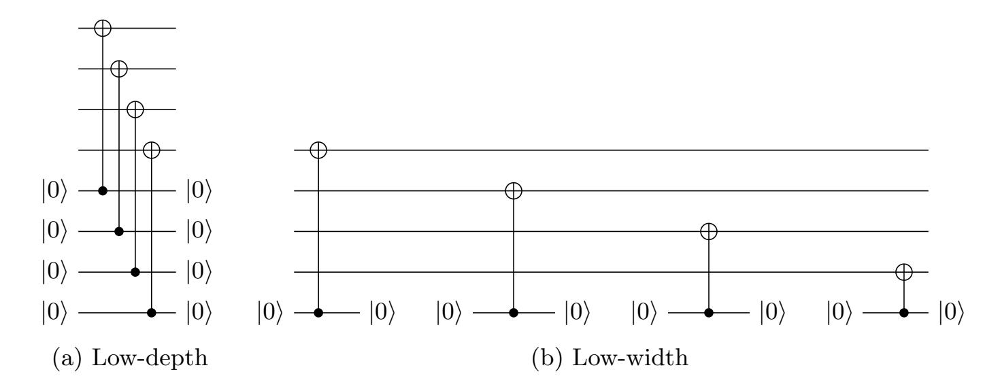

Fig. 1: Two approaches to construct the same circuit

When this paper was originally published, the trace simulator would output the depth from the low-depth tradeoff and the width from the low-width tradeoff. As Figure [1](#page-10-0) shows, one can imagine many cases where simultaneously achieving the optimal width and depth in a single circuit is impossible. Fixing this issue by choosing one strategy at all times results in unreasonably large depths or widths, depending on the strategy, and choosing an optimal tradeoff (e.g., accounting for cases when qubits have already been allocated, or when other aspects of the circuit force a high-depth strategy) is a hard problem. Currently, the trace simulator can follow a low-width strategy without any apparent issues, or follow a low-depth strategy which produces incorrect width numbers[10](#page-10-1). We thus used the low-width estimator for this revision.

Our original Q# code included a "use" block within each AND gate, meaning the width-optimal resource estimator would apply each AND gate sequentially, severely increasing total depth. To achieve more reasonable depths, we worked up the call stack and manually allocated more qubits as necessary until the width-optimal resource estimator produced the same depth as the depth-optimal resource estimator.

<span id="page-10-1"></span><sup>10</sup> The issue with estimates from the low-depth strategy was reported in June 2022: [https://github.com/](https://github.com/microsoft/qsharp-runtime/issues/1037) [microsoft/qsharp-runtime/issues/1037](https://github.com/microsoft/qsharp-runtime/issues/1037)

{11}------------------------------------------------

Free swap gates. An uncontrolled SWAP gate should be free for a quantum computer at our level of abstraction, since the classical controller can simply re-arrange how it applies future gates, rather than physically swapping the qubits or applying some other operation. To account for this in the original version, we used a REWIRE operation which implemented the swaps for testing, but did not apply them for costing.

However, a swap gate modifies the dependencies in the call graph, and changes the circuit depth. As an example, consider:

```
operation HadamardAndSwap(input1 : Qubit, input2: Qubit) : Unit {
    H(input1);
    SWAP(input1, input2);
    H(input2);
}
```

<span id="page-11-0"></span>The real circuit looks like Figure 2a, and has depth 2. However, if the SWAP is completely removed, as in Figure 2b, then the depth is incorrectly reported as 1.

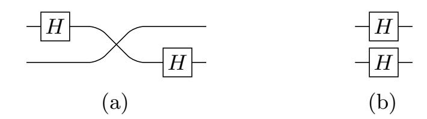

<span id="page-11-1"></span>Fig. 2: Circuits for HadamardAndSwap.

SWAP gates cannot be easily configured to have zero cost in Q#, and even if they could, they would block gates like a CNOT, which would prevent other forms of parallelism. Instead, we refactored the code to permute the qubits at the classical level.

#### <span id="page-11-2"></span>3.4 Reversible circuits for linear maps

Linear maps  $f: \mathbb{F}_2^n \to \mathbb{F}_2^m$  for varying dimensions n and m are essential building blocks of AES and LowMC. In general, such a map f, expressed as multiplication by a constant matrix  $M_f \in \mathbb{F}_2^{m \times n}$ , can be implemented as a reversible circuit on n input wires and m additional output wires (initialized to  $|0\rangle$ ), by using an adequate sequence of CNOT gates: if the (i,j)-th coefficient of  $M_f$  is 1, we set a CNOT gate targeting the i-th output wire, controlled on the j-th input wire.

Yet, if a linear map  $g \colon \mathbb{F}_2^n \to \mathbb{F}_2^n$  is invertible, one can reversibly compute it in-place on the input wires via a PLU decomposition of  $M_g$ ,  $M_g = P \cdot L \cdot U$  [TB97, Lecture 21]. The lower- and upper-triangular components L and U of the decomposition can be implemented as described above by using the appropriate CNOT gates, while the final permutation P does not require any quantum gates and instead, is realized by appropriately keeping track of the necessary rewiring. An example of a linear map decomposed in both ways is shown in Figure 3. While rewiring is not easily supported in Q#, the same effect can be obtained by defining a custom REWIRE operation that computes an in-place swap of any two wires when testing an implementation, and that can be disabled when costing it. We note that such decompositions are not generally unique, but it is not clear whether sparser decompositions can be consistently obtained with any particular technique. For our implementations, we adopt the PLU decomposition algorithm from [TB97, Algorithm 21.1], as implemented in SageMath 8.1 [S<sup>+</sup>17].

{12}------------------------------------------------

<span id="page-12-0"></span>
$$M = \begin{pmatrix} 1 & 0 & 1 & 1 \\ 1 & 0 & 1 & 0 \\ 0 & 1 & 0 & 0 \\ 1 & 0 & 0 & 1 \end{pmatrix} = \begin{pmatrix} 1 & 0 & 0 & 0 \\ 0 & 0 & 0 & 1 \\ 0 & 1 & 0 & 0 \\ 0 & 0 & 1 & 0 \end{pmatrix} \cdot \begin{pmatrix} 1 & 0 & 0 & 0 \\ 0 & 1 & 0 & 0 \\ 1 & 0 & 1 & 0 \\ 1 & 0 & 0 & 1 \end{pmatrix} \cdot \begin{pmatrix} 1 & 0 & 1 & 1 \\ 0 & 1 & 0 & 0 \\ 0 & 0 & 1 & 0 \\ 0 & 0 & 0 & 1 \end{pmatrix} = P \cdot L \cdot U$$

<span id="page-12-2"></span>(a) Invertible linear transformation M and its PLU decomposition.

<span id="page-12-1"></span>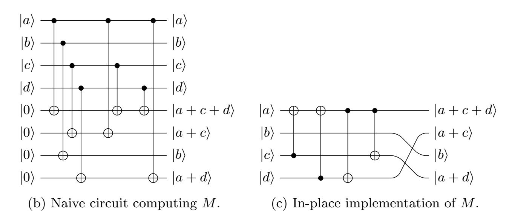

Fig. 3: Alternative circuits implementing the same linear transformation M : F 4 <sup>2</sup> → F 4 2 , by using the two strategies described in §[3.4.](#page-11-2) Both are direct implementations, and could potentially be reduced in size by automatic means as in [\[MSR](#page-35-13)+19], [\[MSC](#page-35-14)+19], [\[GKMR14\]](#page-34-10) and [\[ZC19\]](#page-36-6), or manually. Figure [3b](#page-12-1) is wider and has a larger gate count, but is shallower, than Figure [3c.](#page-12-2)

### <span id="page-12-3"></span>3.5 Cost metrics for quantum circuits

For a meaningful cost analysis, we assume that an adversary has fixed constraints on its total available resources, and a specific cost metric they wish to minimize. Without such limits, we might conclude that AES-128 could be broken in under a second using 2<sup>128</sup> machines, or broken using only a few thousand qubits but a billion-year runtime. Most importantly, we assume a total depth limit Dmax as explained in §[2.2.](#page-3-1)

In this paper, we use the two cost metrics that are considered by Jaques and Schanck in [\[JS19\]](#page-35-5). The first is the total number of gates, the G-cost. It assumes non-volatile ("passive") quantum memory, and therefore models circuits that incur some cost with every gate, but no cost is incurred in time units during which a qubit is not operated on.

The second cost metric is the product of circuit depth and width, the DW-cost. This is a more realistic cost model when quantum error correction is necessary. It assumes a volatile ("active") quantum memory, which incurs some cost to correct errors on every qubit in each time step, i.e. each layer of the total circuit depth. In this cost model, a released auxiliary qubit would not require error correction, and the cost to correct it could be omitted. But we assume an efficient strategy for qubit allocation that avoids long idle periods for released qubits and thus choose to ignore this subtlety. Instead, we simply cost the maximum width at any point in the oracle, times its total depth. For both cost metrics, we can choose to count only T-gates towards gate count and depth, or count all gates equally.

The cost of Grover's algorithm. As in §[2.1,](#page-3-0) let the search space have size N = 2<sup>k</sup> . Suppose we use an oracle G such that a single Grover iteration costs G<sup>G</sup> gates, has depth GD, and uses G<sup>W</sup> qubits. 

{13}------------------------------------------------

Let  $S=2^s$  be the number of parallel machines that are used with the inner parallelization method by dividing the search space in S disjoint parts (see §2.3). In order to achieve a certain success probability p, the required number of iterations can be deduced from  $p \leq \sin^2((2j+1)\theta)$  which yields  $j_p = \lceil (\arcsin(\sqrt{p})/\theta - 1)/2 \rceil \approx \arcsin(\sqrt{p})/2 \cdot \sqrt{N/S}$ . Let  $c_p = \arcsin(\sqrt{p})/2$ , then the total depth of a  $j_p$ -fold Grover iteration is

<span id="page-13-0"></span>
$$D = j_p \mathsf{G}_D \approx c_p \sqrt{N/S} \cdot \mathsf{G}_D = c_p 2^{\frac{k-s}{2}} \mathsf{G}_D \text{ cycles.}$$
 (5)

Note that for  $p \approx 1$  we have  $c_p \approx c_1 = \frac{\pi}{4}$ . Each machine uses  $j_p \mathsf{G}_G \approx c_p \sqrt{N/S} \cdot \mathsf{G}_G = c_p 2^{\frac{k-s}{2}} \mathsf{G}_G$  gates, i.e. the total G-cost over all S machines is

$$G = S \cdot j_p \mathsf{G}_G \approx c_p \sqrt{N \cdot S} \cdot \mathsf{G}_G = c_p 2^{\frac{k+s}{2}} \mathsf{G}_G \text{ gates.}$$
 (6)

Finally, the total width is  $W = S \cdot \mathsf{G}_W = 2^s \mathsf{G}_W$  qubits, which leads to a DW-cost

$$DW \approx c_p \sqrt{N \cdot S} \cdot \mathsf{G}_D \mathsf{G}_W = c_p 2^{\frac{k+s}{2}} \mathsf{G}_D \mathsf{G}_W \text{ qubit-cycles.}$$
 (7)

These cost expressions show that minimizing the number  $S=2^s$  of parallel machines minimizes both G-cost and DW-cost. Thus, under fixed limits on depth, width, and the number of gates, an adversary's best course of action is to use the entire depth budget and parallelize as little as possible. Under this premise, the depth limit fully determines the optimal attack strategy for a given Grover oracle. Limits on width or the number of gates simply become binary feasibility criteria and are either too tight and the adversary cannot finish the attack, or one of the limits is loose. If one resource limit is loose, we may be able to modify the oracle to use this resource to reduce depth, lowering the overall cost.

**Optimizing the oracle under a depth limit.** Grover's full algorithm parallelizes so badly that it is generally preferable to parallelize *within* the oracle circuit. Reducing its depth allows more iterations within the depth limit, thus reducing the necessary parallelization.

Let  $D_{\max}$  be a fixed depth limit. Given the depth  $\mathsf{G}_D$  of the oracle, we are able to run  $j_{\max} = \lfloor D_{\max}/\mathsf{G}_D \rfloor$  Grover iterations of the oracle  $\mathsf{G}$ . For a target success probability p, we obtain the number S of parallel instances to achieve this probability in the instance whose key space partition contains the key from  $p \leq \sin^2((2j_{\max} + 1)\sqrt{S/N})$  as

$$S = \left\lceil \frac{N \cdot \arcsin^2(\sqrt{p})}{(2 \cdot \lfloor D_{\text{max}}/G_D \rfloor + 1)^2} \right\rceil \approx c_p^2 2^k \frac{\mathsf{G}_D^2}{D_{\text{max}}^2}. \tag{8}$$

Using this in Equation (6) gives a total gate count of

<span id="page-13-3"></span><span id="page-13-2"></span>
$$G = c_p^2 2^k \frac{\mathsf{G}_D \mathsf{G}_G}{D_{\text{max}}} \text{ gates.}$$
 (9)

It follows that for two oracle circuits G and F, the total G-cost is lower for G if and only if  $G_DG_G < F_DF_G$ . That is, we wish to minimize the product  $G_DG_G$ . Similarly, the total DW-cost under the depth constraint is

<span id="page-13-1"></span>
$$DW = c_p^2 2^k \frac{\mathsf{G}_D^2 \mathsf{G}_W}{D_{\text{max}}} \text{ qubit-cycles.}$$
 (10)

Here, we wish to minimize  $\mathsf{G}_D^2\mathsf{G}_W$  of the oracle circuit to minimize total DW-cost.

{14}------------------------------------------------

Comparing parallel Grover search to classical search. In the computational model of [JS19], each quantum gate is interpreted as some computation done by a classical controller. For certain parameter settings, these controllers may find the key more efficiently through a classical search. Assume, this is done with a brute force algorithm, which simply iterates through all potential keys and checks if they are correct. Let C be the classical gate cost to test a single key. Then for a search space of size  $N = 2^k$ , the total cost for the brute force attack to achieve success probability p is  $p2^k$ C. Comparing this cost to the gate cost for Grover's algorithm in Equation (6), we conclude that if we use more than  $(pC/(c_p\mathsf{G}_G))^22^k$  parallel machines, Grover's algorithm is slower and more costly than a classical search on the same hardware.

Since the Grover oracle G includes a reversible evaluation of the block cipher and quantum computation of a function is likely more costly than its classical counterpart, we may assume that the classical gate cost C is smaller than the quantum gate cost  $G_G$  of the Grover oracle, i.e.  $C \leq G_G$ . It holds that  $p/c_p < 1.45$ , so  $(pC/(c_pG_G))^2 < 2.11$  and for p = 1, we have  $(pC/(c_pG_G))^2 = 16/\pi^2 \cdot C^2/G_G^2 \approx 1.62 \cdot C^2/G_G^2 \leq 1.62$ . Depending on the actual cost ratio, this bound may be in a meaningful range.

Communication cost to assemble the results in parallel Grover. We briefly discuss the communication cost incurred by communicating a found solution from one of the machines in a large network of parallel computers to a central processor. Each machine measures a candidate key after a specified number of Grover iterations. The classical controller then checks this key against a small number of given plaintext-ciphertext pairs in order to determine whether it is a valid solution. If the key is correct, it is communicated to a central processor.

If the number of machines is small, the central processor simply queries each machine sequentially for the correct key. For a large number of machines, we instead assume they are connected in a binary tree structure with one machine designated as the root. The central processor queries this one for the final result. If it has measured a correct key, it is returned, otherwise it asynchronously queries two other machines which form the roots of equally-sized sub-trees, in which the same process is repeated. For S machines this requires S requests, but only  $\lg S$  must be sequential.

We assume that the spatial arrangement of the S machines is in a two-dimensional plane in form of an H tree. Furthermore, it can be assumed that communication between machines is via classical channels with very small signal propagation times. The total distance any signal must travel is proportional to the square root of the size of this tree, i.e.  $\sqrt{S}$ . Thus, the total time to recover the final key is  $O(\lg S) + c_S \sqrt{S} G_W$  cycles, where  $c_S$  is a constant to account for the relationship between signal propagation speed and quantum gate times. For large S, the  $O(\lg S)$  term is insignificant.

We assume that  $c_S \ll 1$ , meaning that these classical channels can propagate a signal across a qubit-sized distance much faster than we can apply a gate to that qubit. This means the depth of each Grover search will dwarf the communication costs so long as  $S \leq 2^{k/2} \frac{c_p \mathsf{G}_D}{c_S \sqrt{\mathsf{G}_W}}$ . If we use more machines than this, the communication costs dominate the depth. These costs increase with S and thus  $S = 2^{k/2} \frac{c_p \mathsf{G}_D}{c_S \sqrt{\mathsf{G}_W}}$  gives the minimum possible depth of

<span id="page-14-0"></span>
$$D_{\min} = 2^{\frac{k}{4}} \sqrt{c_p c_S \mathsf{G}_D \sqrt{\mathsf{G}_W}} \text{ cycles.}$$
 (11)

Similar reasoning shows that a classical brute force search, which assembles its results in the same way, has a minimum depth of  $2^{\frac{k}{3}}(\mathsf{G}_W\mathsf{C}c_S^2/p^2)^{1/3}$ . Thus, unless we can construct a three-dimensional

{15}------------------------------------------------

layout<sup>11</sup>, we cannot solve the search problem with quantum or classical computers in depth less than Equation (11). For AES-128, 192 and 256 this implies minimum depths of  $2^{40.2}c_s$ ,  $2^{56.2}c_s$  and  $2^{72.3}c_s$ , respectively. For LowMC-128, 192, and 256 the minimum depths are respectively  $2^{41.1}c_s$ ,  $2^{59.8}c_s$  and  $2^{76.4}c_s$ .

# 4 A quantum circuit for AES

The Advanced Encryption Standard (AES) [DR99,DR01] is a block cipher standardized by NIST in 2001. Using the notation from [DR99], AES is composed of an S-box, a Round function (with subroutines ByteSub, ShiftRow, MixColumn, AddRoundKey; with the last round slightly differing from the others), and a KeyExpansion function (with subroutines SubByte, RotByte). Three different instances of AES have been standardized, for key lengths of 128, 192 and 256 bits. Grassl et al. [GLRS16] describe their quantum circuit implementation of the S-box and other components, resulting in a full description of all three instances of AES (but no testable code has been released). Grassl et al. take care to reduce the number of auxiliary qubits required, i.e. reducing the circuit width as much as possible. The recent improvements by Langenberg et al. [LPS19] build on the work by Grassl et al. with similar objectives.

In this section, we describe our implementation of AES in the quantum programming language  $Q\# [SGT^+18]$ . Some of the components are taken from the description in [GLRS16], while others are implemented independently, or ported from other sources. We take the circuit description from [GLRS16] as the basis for our work and compare to the results in [LPS19]. In general, we aim at reducing the depth of the AES circuit, while limitations on width are less important. Width restrictions are not explicitly considered by the NIST call for proposals [NIS16, § 4.A.5].

The internal state of AES contains 128 bits, arranged in four 32-bit (or 4-byte) words. In the rest of this section, when referring to a 'word', we intend a 4-byte word. In all tables below, we denote by #CNOT, the number of CNOT gates, by #1qCliff the number of 1-qubit Clifford gates, by #T the number of T gates, by #M the number of measurement operations and by width the number of qubits.

#### 4.1 S-box, ByteSub and SubByte

The AES S-box is a transformation that inverts the input as an element of  $\mathbb{F}_{256}$ , and maps 0 to 0. The S-box is the only source of T gates in a quantum circuit of AES. On classical hardware, it can be implemented easily using a lookup-table. Yet, on a quantum computer, this is not efficient (see [BGB<sup>+</sup>18], [LKS18] and [Gid19]). Alternatively, the inversion can be computed either by using some variant of Euclid's algorithm (taking care of the special case of 0), or by applying Lagrange's theorem and raising the input to the  $(|\mathbb{F}_{256}^{\times}|-1)^{th}$  power (i.e. the  $254^{th}$  power), which incidentally also takes care of the 0 input. Grassl *et al.* [GLRS16] suggest an Itoh-Tsujii inversion algorithm [IT88], following [ASR12], and compute all required multiplications over  $\mathbb{F}_2[x]/(x^8 + x^4 + x^3 + x + 1)$ . This idea had already been extensively explored in the vast<sup>12</sup> literature on hardware design for AES, and requires a different construction of  $\mathbb{F}_{256}$  to be most effective. Following this lead, we port the S-box

<span id="page-15-0"></span>A truly three-dimensional layout seems unlikely, though an adversary with the resources to build  $2^{64}$  quantum computers may also be able to launch them into orbit and assemble them into a sphere.

<span id="page-15-1"></span><sup>&</sup>lt;sup>12</sup> E.g. see [Rij00], [SMTM01], [BP10], [BP<sup>+</sup>19], [JKL10], [NNT<sup>+</sup>10], [UHS<sup>+</sup>15], [RMTA18b], [RMTA18a], [WSH<sup>+</sup>19].

{16}------------------------------------------------

circuit by Boyar and Peralta from [BP12] to Q#. The specified linear program combining AND and XOR operations can be easily expressed as a sequence of equivalent CNOT and AND operations (we use cheaper T-depth-1 AND gates [Sel13,Jon13] instead of T-depth-1 CCNOT gates [Sel13], see §C). Cost estimates for the AES S-box are in Table 1. We compare to our own Q# implementation of the S-box circuits from [GLRS16] and [LPS19]. ByteSub is a state-wide parallel application of the S-box, requiring new output auxiliary qubits to store the result, while SubByte is a similar word-wide application of the S-box.

<span id="page-16-0"></span>

| operation      | #CNOT | #1qCliff | #T   | #M | T-depth | full depth | width |
|----------------|-------|----------|------|----|---------|------------|-------|
| [GLRS16] S-box | 8683  | 1028     | 3584 | 0  | 512     | 3668       | 44    |
| [BP10] S-box   | 793   | 275      | 164  | 41 | 35      | 589        | 81    |
| [BP12] S-box   | 649   | 225      | 136  | 34 | 6       | 125        | 145   |

Table 1: Comparison of our reconstruction of the original [GLRS16] S-box circuit with the one from [BP10] as used in [LPS19] and the one in this work based on [BP12]. In our implementation of [BP10] from [LPS19], we replace CCNOT gates with AND gates to allow a fairer comparison.

Remark 3. Langenberg et al. [LPS19] independently introduced a new AES quantum circuit design using the S-box circuit proposed in [BP10]. They also present a ProjectQ [SHT18] implementation of the S-box, albeit without unit tests. We ported their source code to Q#, tested and costed it. For a fairer comparison, we replaced their CCNOT gates with the AND gate design that our circuits use. Cost estimates can be found in Table 1. Overall, the [BP12] S-box leads to a more cost effective circuit for our purposes in both the G-cost and DW-cost metrics, and hence we did not proceed further in our analysis of costs using the [BP10] design. Note that the results obtained here differ from the ones presented in [LPS19, §3.2]. This is due to the difference in counting gates and depth. While [LPS19] counts Toffoli gates, the Q# resource estimator costs at a lower level of T gates and also counts all gates needed to implement a Toffoli gate.

#### 4.2 ShiftRow and RotByte

ShiftRow is a permutation on the full 128-bit AES state, happening across its four words [DR99, §4.2.2]. As a permutation of qubits, it can be entirely encoded as rewiring. As in [GLRS16], we consider rewiring as free and do not include it in our cost estimates. Similarly, RotByte is a circular left shift of a word by 8 bits, and can be implemented by appropriate rewiring as well.

#### 4.3 MixColumn

The operation MixColumn interprets each word in the state as a polynomial in  $\mathbb{F}_{256}[x]/(x^4+1)$ . Each word is multiplied by a fixed polynomial c(x) [DR99, § 4.2.3]. Since the latter is coprime to  $x^4+1$ , this operation can be seen as an invertible linear transformation, and hence can be implemented in place by a PLU decomposition of a matrix in  $\mathbb{F}_2^{32\times32}$ . To simplify this tedious operation, we use SageMath [S<sup>+</sup>17] code that performs the PLU decomposition, and outputs equivalent Q# code. Note that [GLRS16] describes the same technique, while achieving a significantly smaller design than the one we obtain (ref. Table 2), but we were not able to reproduce these results. However, highly

{17}------------------------------------------------

optimized, shallower circuits have been proposed in the hardware design literature such as [JMPS17], [KLSW17], [BFI19], [EJMY18], [TP19]. Hence, we chose to use one of those and experiment with a recent design by Maximov [Max19]. Both circuits are costed independently in Table 2. Maximov's circuit has a much lower depth, but it only reduces the total depth, does not reduce the T-depth (which is already 0) and comes at the cost of an increased width. Our experiments show that without a depth restriction, it seems advantageous to use the in-place version to minimize both G-cost and DW-cost metrics, while for a depth restricted setting, Maximov's circuit seems better due to the square in the depth term in Equation (10).

<span id="page-17-0"></span>

| operation          | #CNOT | #1qCliff | #T | #M | T-depth | full depth | width |
|--------------------|-------|----------|----|----|---------|------------|-------|
| In-place MixColumn | 1108  | 0        | 0  | 0  | 0       | 111        | 128   |
| [Max19] MixColumn  | 1248  | 0        | 0  | 0  | 0       | 66         | 318   |

Table 2: Comparison of an in-place implementation of MixColumn (via PLU decomposition) versus the recent shallow out-of-place design in [Max19].

#### 4.4 AddRoundKey

AddRoundKey performs a bitwise XOR of a round key to the internal AES state and can be realized with a parallel application of 128 CNOT gates, controlled on the round key qubits and targeted on the state qubits. Grassl *et al.* [GLRS16] and Langenberg *et al.* [LPS19] use the same approach.

#### <span id="page-17-1"></span>4.5 KeyExpansion

Key expansion is one of the two sources of T gates in the design of AES, and hence might have a strong impact on the overall efficiency of the circuit. A simple implementation of KeyExpansion would allocate enough auxiliary qubits to store the full expanded key, including all round keys. This is easy to implement with relatively low depth, but uses more qubits than necessary. The authors of [GLRS16] amortize this width cost by caching only those key bytes that require S-box evaluations. Instead, we minimize width by not requiring auxiliary qubits at all. At the same time, we reduce the depth in comparison with the naive key expansion using auxiliary qubits for all key bits as described above.

Let  $|k\rangle_0$  denote the AES key consisting of  $N_k \in \{4,6,8\}$  key words and  $|k\rangle_i$  the *i*-th set of  $N_k$  consecutive round key words. The first such block  $|k\rangle_1$  can be computed in-place as shown in the appropriately sized circuit in Figure 4. This circuit produces the *i*-th set of  $N_k$  key words from the (i-1)-th set. Note that for AES-128, these sets correspond to the actual round keys as the key size is equal to the block size, for AES-192 and AES-256, each round key set generates more words than needed in a single round key. The full operation mapping  $|k\rangle_{i-1} \mapsto |k\rangle_i$  is denoted by KE. As for the two larger key sizes, each round only needs parts of these sets of round key words, we specify  $\mathrm{KE}_j^l$  to denote the part of the operation KE that produces the words  $j\ldots l$  of the new set, disregarding other words.  $\mathrm{KE}_j^l$  can be used as part of the round strategy from §4.6 to only compute as many words of the round key as necessary, resulting in an overall narrower and shallower circuit. A comparison of this strategy and the naive KeyExpansion can be found in §B.

{18}------------------------------------------------

<span id="page-18-0"></span>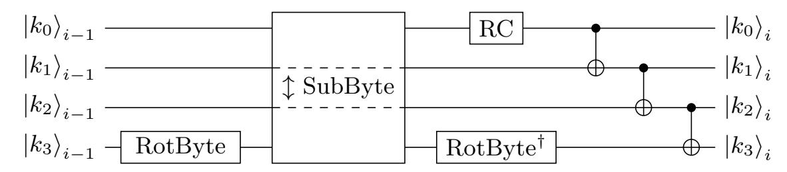

(a) AES-128 in-place key expansion step producing the *i*-th round key.

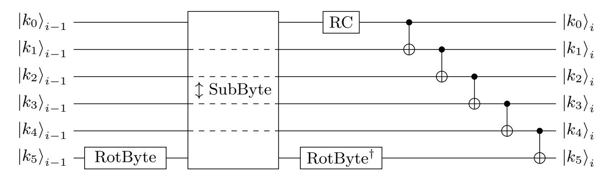

(b) AES-192 in-place key expansion step producing the i-th set of 6 round key words.

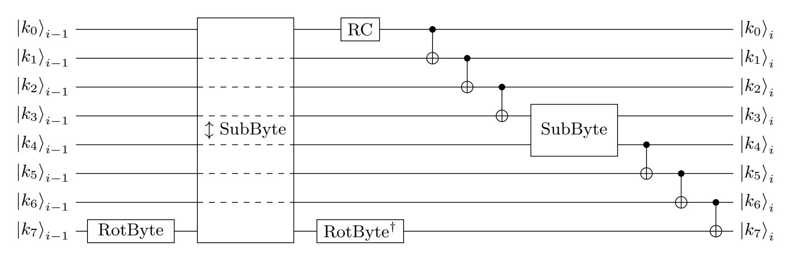

(c) AES-256 in-place key expansion step producing the i-th set of 8 round key words.

Fig. 4: In-place AES key expansion for AES-128, AES-192, and AES-256, deriving the  $i^{th}$  set of  $N_k$  round key words from the  $(i-1)^{th}$  set. Each  $|k_j\rangle_i$  represents the  $j^{th}$  word of  $|k\rangle_i$ . SubByte takes the input state on the top wire, and returns the output on the bottom wire, while  $\updownarrow$  SubByte takes inputs on the bottom wire, and returns outputs on the top. Dashed lines indicate wires that are not used in the  $\updownarrow$  SubByte operation. RC is the round constant addition, implemented by applying X gates as appropriate.

{19}------------------------------------------------

Remark 4. In addition to improving the S-box circuit over [GLRS16], Langenberg et al. [LPS19, §4] demonstrate significant savings by reducing the number of qubits and the depth of key expansion. This is achieved by an improved scheduling of key expansion during AES encryption, namely by computing round key words only at the time they are required and un-computing them early. While their method is based on the one in [GLRS16] using auxiliary qubits for the round keys, our approach works completely in place and reduces width and depth at the same time.

#### <span id="page-19-0"></span>4.6 Round, FinalRound and full AES

To encrypt a message block using AES-128 (resp. -192, -256), we initially XOR the input message with the first 4 words of the key, and then execute 10 (resp. 12, 14) rounds consisting of ByteSub, ShiftRow, MixColumn (except in the final round) and AddRoundKey. The C-like pseudo-code from [DR99, §4.4] is reported in simplified fashion in §A, Algorithm 1. The quantum circuits for AES we propose follow the same blueprint with the exception that key expansion is interleaved with the algorithm in such a way that the operations  $KE_j^l$  only produce the key words that are immediately required.

The resulting circuits are shown in Figures 5 and 6. For formatting reasons, we omit the repeating round pattern, and only represent a subset of the full set of qubits used. In AES-128, each round is identical until round 9. In AES-192 rounds 5, 8 and 11 use the same KE call and order as round 2; rounds 6 and 9 do as round 3; rounds 7 and 10 do as round 4. In AES-256, rounds 4, 6, 8, 10, 12 (resp. 5, 7, 9, 11, 13) use the same KE call and order as round 2 (resp. 3). Cost estimates for the resulting AES encryption circuits are in Table 3. In contrast to [GLRS16] and [LPS19], we aim to reduce circuit depth, hence un-computing of rounds is delayed until the output ciphertext is produced. For easier testability and modularity, the Round circuit is divided into two parts: a ForwardRound operator that computes the output state but does not clean auxiliary qubits, and its adjoint. For unit-testing Round in isolation, we compose ForwardRound with its adjoint operator. For testing AES, we first run all ForwardRound instances without auxiliary qubit cleaning, resulting in a similar ForwardAES operator, copy out the ciphertext, and then undo the ForwardAES operation.

Table 3 presents results for the AES circuit for both versions of MixColumn, the in-place implementation using a PLU decomposition as well as Maximov's out-of-place, but lower depth circuit. We use both because each has advantages for different applications. The full depth corresponds to  $\mathsf{G}_D$  as in §3.5 and §2.3, while width corresponds to  $\mathsf{G}_W$ . While for AES-128 and AES-192,  $\mathsf{G}_D\mathsf{G}_W$  is smaller for the in-place implementation,  $\mathsf{G}_D^2\mathsf{G}_W$  is smaller for Maximov's circuit. Hence, §2.3 indicates Maximov's circuit gives a lower DW-cost under a depth restriction. If there is no depth restriction, the in-place design has a lower DW-cost.

#### <span id="page-19-1"></span> $4.7 \quad T$ -depth

Every round of AES (as implemented in Figures 5 and 6) computes at least one layer of S-boxes as part of ByteSub, which must later be uncomputed. We would thus expect the T-depth of n rounds of AES to be 2n times the T-depth of the S-box. Instead, Table 3 shows smaller depths. We find this effect when using either the AND circuit or the unit-testable CCNOT implementation. To test if this is a bug, we used a placeholder S-box circuit which has an arbitrary T-depth d and which the compiler cannot parallelize (see §D for the design). This "dummy" AES design had the expected T-depth of  $2n \cdot d$ . Thus we believe the Q# compiler found non-trivial parallelization between components of the S-box and the surrounding circuit. This provides a strong case for full

{20}------------------------------------------------

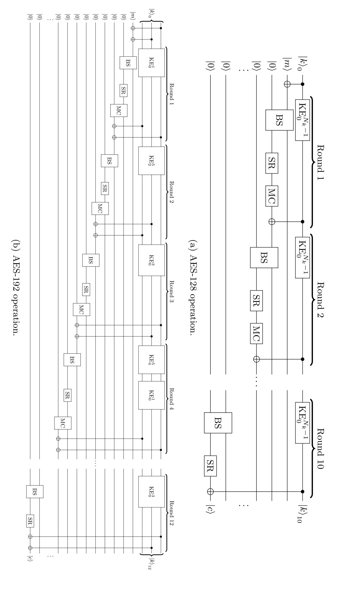

<span id="page-20-0"></span>Fig. 5: Circuit sketches for the AES-128 and AES-192 operation. Each wire under the ki0 label represents 4 words of the key for AES-128 and 2 words for AES-192. Each subsequent wire (initially labeled mi and 0i) represents 4 words. CNOT gates between is of XORing 128 bits from word-sized wires should be read as multiple parallel CNOT gates applied bitwise (e.g. at the beginning of AES-192 the intention ki0 onto the state). BS stands for ByteSub, SR for ShiftRow and MC for MixColumn. For AES-128, MixColumn linear program [ the circuit shows an in-place implementation of MixColumn, while for AES-192, it uses an out-of-place version like Maximov's [Max19\]](#page-35-24).

{21}------------------------------------------------

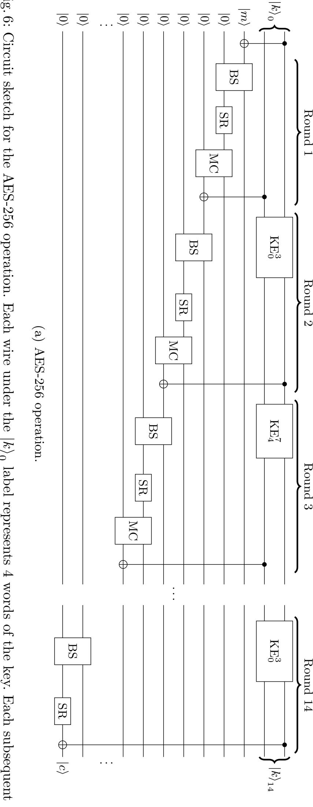

<span id="page-21-0"></span>Fig. 6: Circuit sketch for the AES-256 operation. Each wire under the 0 wire (initially labeled mi and 0i) represents 4 words. CNOT gates between word-sized wires should be read as multiple parallel CNOT gates applied bitwise. The value of Nk is 8. BS stands for ByteSub, SR for ShiftRow and MC for MixColumn. MixColumn uses an out-of-place version like Maximov's MixColumn linear program [\[Max19\]](#page-35-24).

{22}------------------------------------------------

<span id="page-22-0"></span>

| operation | MC | #CNOT  | #1qCliff | #T    | #M    | T-depth | full depth | width |
|-----------|----|--------|----------|-------|-------|---------|------------|-------|
| AES-128   | IP | 284420 | 90044    | 54400 | 13600 | 120     | 3326       | 6308  |
| AES-192   | IP | 321026 | 100826   | 60928 | 15232 | 120     | 4006       | 7144  |
| AES-256   | IP | 393497 | 124191   | 75072 | 18768 | 126     | 4688       | 7464  |
| AES-128   | M  | 286912 | 90016    | 54400 | 13600 | 120     | 2531       | 7522  |
| AES-192   | M  | 324099 | 100819   | 60928 | 15232 | 120     | 2925       | 8614  |
| AES-256   | M  | 397160 | 124214   | 75072 | 18768 | 126     | 3155       | 9190  |

Table 3: Circuit cost estimates for the AES operator, using the [\[BP12\]](#page-34-3) S-box and for MixColumn design ("MC") either in-place ("IP") or Maximov's [\[Max19\]](#page-35-24) ("M"). The apparently inconsistent T-depth is discussed in §[4.7.](#page-19-1)

explicit implementations of quantum cryptanalytic algorithms in Q# or other languages that allow automatic resource estimates and optimizations; in our case the T-depth of AES-256 is 25% less than naively expected.

In this revision, we spent considerable time looking for the cause of this paradoxical depth inversion, in case it was caused by the issues in Q#. After implementing the workarounds in Section 3.3, the effect persists. The effect disappears if AES-192 is forced to share the auxiliary qubits for ByteSub in each round, but reappears if it has two sets of auxiliary qubits, using one for even rounds and the other for odd rounds. Because of the complexity of the circuit – over 10,000 gates and 3,000 qubits – we could not find the precise method of this optimization, even with auto-generated circuit diagrams. The Q# resource estimator can find non-trivial parallelizations because of how it tracks call graph dependencies, so our best guess is that the compiler found a way to parallelize the gates of subsequent S-box calls.

We present the results from this less parallel variant (where each round shares the same auxiliary qubits for ByteSub) in Table [4.](#page-22-1) AES-128 seems to lose nothing (the increase in full depth is likely a sampling error), but AES-192 and AES-256 increase in T-depth. The T-depth increase from sharing these qubits is small, but the width savings are large. Thus, this is generally preferable, though not always if we wish to minimize GGGD.

<span id="page-22-1"></span>

| operation | MC | #CNOT  | #1qCliff | #T    | #M    | T-depth | full depth | width |
|-----------|----|--------|----------|-------|-------|---------|------------|-------|
| AES-128   | IP | 284420 | 90044    | 54400 | 13600 | 120     | 3327       | 4244  |
| AES-192   | IP | 321021 | 100821   | 60928 | 15232 | 144     | 4006       | 4564  |
| AES-256   | IP | 393534 | 124228   | 75072 | 18768 | 168     | 4688       | 4884  |
| AES-128   | M  | 286940 | 90044    | 54400 | 13600 | 120     | 2530       | 5458  |
| AES-192   | M  | 324088 | 100808   | 60928 | 15232 | 144     | 3002       | 6034  |
| AES-256   | M  | 397157 | 124211   | 75072 | 18768 | 168     | 3488       | 6610  |

Table 4: Circuit cost estimates for the AES operator, using the [\[BP12\]](#page-34-3) S-box and for MixColumn design ("MC") either in-place ("IP") or Maximov's [\[Max19\]](#page-35-24) ("M"). Here each round of ByteSub and SubByte share the same set of auxiliary qubits, preventing some parallelizations.

{23}------------------------------------------------

### 5 A quantum circuit for LowMC

LowMC [\[ARS](#page-34-19)<sup>+</sup>15[,ARS](#page-34-20)<sup>+</sup>16] is a family of block ciphers aiming for low multiplicative complexity circuits. Originally designed to reduce the high cost of binary multiplication in the MPC and FHE scenarios, it has been adopted as a fundamental component by the Picnic signature scheme (see [\[CDG](#page-34-7)+17] and [\[ZCD](#page-36-3)+17]) proposed for standardization as part of the NIST process for standardizing post-quantum cryptography.

To achieve low multiplicative complexity, LowMC uses an S-box layer of AND-depth 1, which contains a user-defined number of parallel 3-bit S-box computations. In general, any instantiation of LowMC comprises a specific number of rounds. Each round calls an S-box layer, an affine transformation, and a round key addition. Key-scheduling can either be precomputed or computed on the fly. In this work, we study the original LowMC design. This results in a sub-optimal circuit, which can clearly be improved by porting the more recent version from [\[DKP](#page-34-21)+19] instead. Even for the original LowMC, our work shows that the overhead from the cost of the Grover oracle is very small, in particular under the T-depth metric. Since LowMC could be standardized as a component of Picnic, we deem it appropriate to point out the differences in Grover oracle cost between different block ciphers and that generalization from AES requires caution.

In this section we describe our Q# implementation of the LowMC instances used as part of Picnic. In particular, Picnic proposes three parameter sets, with (key size, block size,rounds) ∈ {(128, 128, 20),(192, 192, 30),(256, 256, 38)}, all with 10 parallel S-boxes per substitution layer.

#### 5.1 S-box and S-boxLayer

The LowMC S-box can be naturally implemented using Toffoli (CCNOT) gates. In particular, a simple in-place implementation with depth 5 (T-depth 3) is shown in Figure [7,](#page-23-0) alongside a T-depth 1 out-of-place circuit, both of which were produced manually. Costs for both circuits can be found in Table [5.](#page-24-0) We use the CCNOT implementation with no measurements from [\[Sel13\]](#page-35-6). For LowMC inside of Picnic, the full S-boxLayer consists of 10 parallel S-boxes run on the 30 low order bits of the state.

<span id="page-23-0"></span>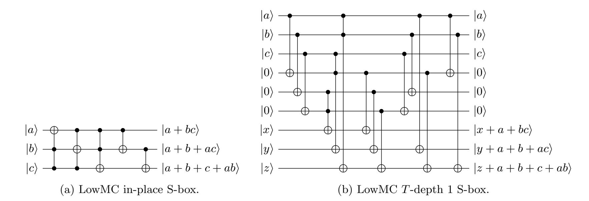

Fig. 7: Alternative quantum circuit designs for the LowMC S-box. The in-place design requires auxiliary qubits as part of the concrete CCNOT implementation.

{24}------------------------------------------------

<span id="page-24-0"></span>

| operation      | #CNOT | #1qCliff | #T | #M | T-depth | full depth | width |
|----------------|-------|----------|----|----|---------|------------|-------|
| In-place S-box | 50    | 6        | 21 | 0  | 3       | 23         | 7     |
| Shallow S-box  | 60    | 6        | 21 | 0  | 1       | 11         | 13    |

Table 5: Cost estimates for a single LowMC S-box circuit, following the two designs proposed in Figure 7. We note that the circuit size may seem different at first sight due to Figure 7 not displaying the concrete CCNOT implementation.

#### 5.2 LinearLayer, ConstantAddition and AffineLayer

AffineLayer is an affine transformation applied to the state at every round. It consists of a matrix multiplication (LinearLayer) and the addition of a constant vector (ConstantAddition). Both matrix and vector are different for every round and are predefined constants that are populated pseudorandomly. ConstantAddition is implemented by applying X gates for entries of the vector equal to 1. In Picnic, for every round and every parameter set, all LinearLayer matrices are invertible (due to LowMC's specification requirements), and hence we use a PLU decomposition for matrix multiplication (§3.4). Cost estimates for the first round affine transformation in LowMC as used in Picnic are in Table 6.

<span id="page-24-1"></span>

| operation         | #CNOT | #1qCliff | #T | #M | T-depth | full depth | width |
|-------------------|-------|----------|----|----|---------|------------|-------|
| AffineLayer L1 R1 | 8093  | 60       | 0  | 0  | 0       | 2365       | 128   |
| AffineLayer L3 R1 | 18080 | 90       | 0  | 0  | 0       | 5301       | 192   |
| AffineLayer L5 R1 | 32714 | 137      | 0  | 0  | 0       | 8603       | 256   |

Table 6: Costs for in-place circuits implementing the first round (R1) AffineLayer transformation for the three instantiations of LowMC used in Picnic.

#### 5.3 KeyExpansion and KeyAddition

To generate the round keys  $rk_i$ , in each round i the LowMC key k is multiplied by a different key derivation pseudo-random matrix  $KM_i$ . For Picnic, each  $KM_i$  is invertible, so we compute  $rk_i$  from  $rk_{i-1}$  as  $rk_i = KM_i \cdot KM_{i-1}^{-1} \cdot rk_{i-1}$ . We compute this in-place using a PLU decomposition of  $KM_i \cdot KM_{i-1}^{-1}$ . This saves matrix multiplications and qubits compared to computing  $rk_i$  directly. We call this operation KeyExpansion. KeyAddition is equivalent to AddRoundKey in AES, and is implemented the same way. Cost estimates for the first round key expansion in LowMC as used in Picnic can be found in Table 7.

<span id="page-24-2"></span>

| operation          | #CNOT | #1qCliff | #T | #M | T-depth | full depth | width |
|--------------------|-------|----------|----|----|---------|------------|-------|
| KeyExpansion L1 R1 | 8104  | 0        | 0  | 0  | 0       | 2438       | 128   |
| KeyExpansion L3 R1 | 18242 | 0        | 0  | 0  | 0       | 4896       | 192   |
| KeyExpansion L5 R1 | 32525 | 0        | 0  | 0  | 0       | 9358       | 256   |

Table 7: Costs for in-place circuits implementing the first round (R1) KeyExpansion operation for the three instantiations of LowMC used in Picnic.

{25}------------------------------------------------

#### 5.4 Round and LowMC

<span id="page-25-0"></span>The LowMC round sequentially applies S-boxLayer, AffineLayer and KeyAddition to the state. Our implementation also runs KeyExpansion before AffineLayer. For a full LowMC encryption, we first add the LowMC key k to the message to produce the initial state, then run the specified number of rounds on it. Costs of the resulting encryption circuit are in Table [8.](#page-25-0)

| operation | #CNOT   | #1qCliff | #T    | #M | T-depth | full depth | width |
|-----------|---------|----------|-------|----|---------|------------|-------|
| LowMC L1  | 689944  | 4932     | 8400  | 0  | 40      | 98699      | 991   |
| LowMC L3  | 2271870 | 9398     | 12600 | 0  | 60      | 319317     | 1483  |
| LowMC L5  | 5070324 | 14274    | 15960 | 0  | 76      | 693471     | 1915  |

Table 8: Costs for the full encryption circuit for LowMC as used in Picnic.

### 6 Grover oracles and key search resource estimates

Equipped with Q# implementations of the AES and LowMC encryption circuits, this section describes the implementation of full Grover oracles for both block ciphers. Eventually, based on the cost estimates obtained automatically from these Q# Grover oracles, we provide quantum resource estimates for full key search attacks via Grover's algorithm. Beyond comparing to previous work, our emphasis is on evaluating algorithms that respect a total depth limit, for which we consider NIST's values for MAXDEPTH from [\[NIS16\]](#page-35-1). This means we must parallelize. We use inner parallelization via splitting up the search space, see §[2.3.](#page-6-0)

#### <span id="page-25-1"></span>6.1 Grover oracles

As discussed in §[2.2](#page-3-1) and §[2.3,](#page-6-0) we must determine the parameter r, the number of known plaintextciphertext pairs that are required for a successful key-recovery attack. The Grover oracle encrypts r plaintext blocks under the same candidate key and computes a Boolean value that encodes whether all r resulting ciphertext blocks match the given classical results. A circuit for the block cipher allows us to build an oracle for any r by simply fanning out the key qubits to the r instances and running the r block cipher circuits in parallel. Then a comparison operation with the classical ciphertexts conditionally flips the result qubit and the r encryptions are un-computed. Figure [8](#page-26-0) shows the construction for AES and r = 2, using the ForwardAES operation from §[4.6.](#page-19-0)

The required number of plaintext-ciphertext blocks. The explicit computation of the probabilities in Equation [\(1\)](#page-4-1) shows that using r = 2 (resp. 2, 3) for AES-128 (resp. -192, -256) guarantees a unique key with overwhelming probability. The probabilities that there are no spurious keys are 1 − , where < 2 <sup>−</sup><sup>128</sup>, 2<sup>−</sup><sup>64</sup>, and 2<sup>−</sup><sup>128</sup>, respectively. Grassl et al. [\[GLRS16,](#page-34-0) § 3.1] used r = 3, r = 4 and r = 5, respectively. Hence, these values are too large and the Grover oracle can work correctly with fewer full AES evaluations.

If one is content with a success probability lower than 1, it suffices to use r = dk/ne blocks of plaintext-ciphertext pairs. In this case, it is enough to use r = 1, 2, and 3 for AES-128, -192, -256, respectively. Langenberg et al. [\[LPS19\]](#page-35-3) also propose these values. As an example, if we use r = 1 for

{26}------------------------------------------------

<span id="page-26-0"></span>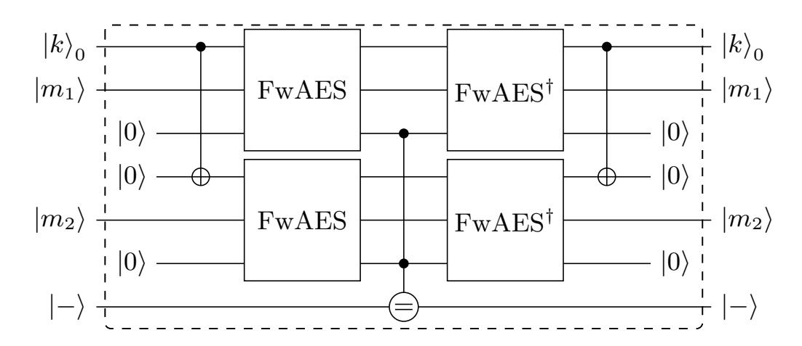

Fig. 8: Grover oracle construction from AES using two message-ciphertext pairs. FwAES represents the ForwardAES operator described in §[4.6.](#page-19-0) The middle operator "=" compares the output of AES with the provided ciphertexts and flips the target qubit if they are equal.

AES-128, the probability of not having spurious keys is 1/e ≈ 0.368, which could be a high enough chance for a successful attack in certain scenarios, e.g., when there is a strict limit on the width of the attack circuit. Furthermore, when a large number of parallel machines are used in an instance of the attack, as discussed in §[2.3,](#page-6-0) even the value r = 1 can be enough in order to guarantee with high probability that the relevant subset of the key space contains the correct key as a unique solution.

The LowMC parameter sets we consider here all have k = n. Therefore, r = 2 plaintext-ciphertext pairs are enough for all three sets (k ∈ {128, 192, 256}). Then, the probability that the key is unique is 1 − , where < 2 −k , i.e. this probability is negligibly close to 1. With high parallelization, r = 1 is sufficient for a success probability very close to 1.

Grover oracle cost for AES. Table [9](#page-27-0) shows the resources needed for the full AES Grover oracle for the relevant values of r ∈ {1, 2, 3}. Even without parallelization, more than 2 pairs are never required for AES-128 and AES-192. The same holds for 4 or more pairs for AES-256.

Grover oracle cost for LowMC. The resources for our implementation of the full LowMC Grover oracle for the relevant values of r ∈ {1, 2} are shown in Table [10.](#page-27-1) No setting needs more than r = 2 plaintext-ciphertext pairs.

#### 6.2 Cost estimates for block cipher key search

Using the cost estimates for the AES and LowMC Grover oracles from §[6.1,](#page-25-1) this section provides cost estimates for full key search attacks on both block ciphers. For the sake of a direct comparison to the previous results in [\[GLRS16\]](#page-34-0) and [\[LPS19\]](#page-35-3), we first ignore any limit on the depth and present the same setting as in these works. Then, we provide cost estimates with imposed depth limits and the consequential parallelization requirements.

Comparison to previous work. Table [11](#page-29-0) shows cost estimates for a full run of Grover's algorithm when using π 4 2 k/2 iterations of the AES Grover operator without parallelization. We only take into account the costs imposed by the oracle operator U<sup>f</sup> (in the notation of §[2.1\)](#page-3-0) and ignore the costs of the operator 2 |ψihψ| − I. If the number of plaintext-ciphertext pairs ensures a unique key, this number of operations maximizes the success probability psucc to be negligibly close to 1. For smaller

{27}------------------------------------------------

<span id="page-27-0"></span>

| operation | MC           | Aux | r | #CNOT   | #1qCliff  | #T       | #M    | T-depth | full depth | width |  |  |
|-----------|--------------|-----|---|---------|-----------|----------|-------|---------|------------|-------|--|--|
|           | Minimum GGGD |     |   |         |           |          |       |         |            |       |  |  |
| AES-128   | M            | –   | 1 | 287878  | 91111     | 54908    | 13727 | 127     | 2607       | 5523  |  |  |
| AES-192   | M            | 2   | 1 | 325033  | 101882    | 61436    | 15359 | 121     | 2923       | 8679  |  |  |
| AES-256   | M            | 2   | 1 | 398126  | 125309    | 75580    | 18895 | 127     | 3153       | 9255  |  |  |
| AES-128   | IP           | –   | 2 | 571002  | 182251    | 109820   | 27455 | 128     | 3415       | 12871 |  |  |
| AES-192   | IP           | 1   | 2 | 644314  | 203787    | 122876   | 30719 | 146     | 4010       | 9383  |  |  |
| AES-256   | IP           | 1   | 2 | 789478  | 250611    | 151164   | 37791 | 170     | 4692       | 10023 |  |  |
| AES-256   | M            | 1   | 3 | 1184422 | 375865    | 226748   | 56687 | 171     | 4693       | 15035 |  |  |
|           |              |     |   |         | Minimum G | 2<br>DGW |       |         |            |       |  |  |
| AES-128   | IP           | –   | 1 | 287878  | 91111     | 54908    | 13727 | 127     | 2607       | 5523  |  |  |
| AES-192   | M            | 1   | 1 | 325059  | 101908    | 61436    | 15359 | 145     | 3002       | 6099  |  |  |
| AES-256   | M            | 2   | 1 | 398111  | 125294    | 75580    | 18895 | 169     | 3488       | 6675  |  |  |
| AES-128   | IP           | –   | 2 | 571006  | 182255    | 109820   | 27455 | 128     | 3416       | 8743  |  |  |
| AES-192   | IP           | 1   | 2 | 644314  | 203787    | 122876   | 30719 | 146     | 4010       | 9383  |  |  |
| AES-256   | IP           | 1   | 2 | 789478  | 250611    | 151164   | 37791 | 170     | 4692       | 10023 |  |  |
| AES-256   | M            | 1   | 3 | 1184422 | 375865    | 226748   | 56687 | 171     | 4693       | 15035 |  |  |

Table 9: Costs for the AES Grover oracle operator for r = 1, 2 and 3 plaintext-ciphertext pairs. "MC" is the MixColumn design, either in-place ("IP") or Maximov's [\[Max19\]](#page-35-24) ("M"). "Aux" shows whether the rounds ByteSub and SubByte use one or two sets of auxiliary qubits (which has no effect on AES-128).

<span id="page-27-1"></span>

| operation | r | #CNOT    | #1qCliff | #T    | #M  | T-depth | full depth | width |
|-----------|---|----------|----------|-------|-----|---------|------------|-------|
| LowMC L1  | 1 | 690961   | 5917     | 8908  | 191 | 41      | 98709      | 1585  |
| LowMC L3  | 1 | 2273397  | 10881    | 13364 | 286 | 61      | 319323     | 2377  |
| LowMC L5  | 1 | 5072343  | 16209    | 16980 | 372 | 77      | 693477     | 3049  |
| LowMC L1  | 2 | 1382143  | 11774    | 17820 | 362 | 41      | 98707      | 3169  |
| LowMC L3  | 2 | 4547191  | 21783    | 26732 | 576 | 61      | 319329     | 4753  |
| LowMC L5  | 2 | 10145281 | 32567    | 33964 | 783 | 77      | 693483     | 6097  |

Table 10: Cost estimates for the LowMC Grover oracle operator for r = 1 and 2 plaintext-ciphertext pairs. LowMC parameter sets are as used in Picnic.

{28}------------------------------------------------

values of r such as those proposed in [LPS19], the success probability is given by the probability that the key is unique.

The G-cost is the total number of gates, which is the sum of the first three columns in the table, corresponding to the numbers of 1-qubit Clifford and CNOT gates, T gates and measurements. Table 11 shows that the G-cost is always better in our work when comparing values for the same AES instance and the same value for r. The same holds for the DW-cost as we increase the width by factors less than 4 and simultaneously reduce the depth by more than that.

Table 12 shows cost estimates for LowMC in the same setting. Despite LowMC's lower multiplicative complexity and a relatively lower number of T gates, the large number of CNOT gates leads to overall higher G-cost and DW-cost than AES, as we count all gates.

Cost estimates under a depth limit. Tables 14 and 15 show cost estimates for running Grover's algorithm against AES and LowMC under a given depth limit. This restriction is proposed in the NIST call for proposals for standardization of post-quantum cryptography [NIS16]. We use the notation and example values for MAXDEPTH from the call. Imposing a depth limit forces the parallelization of Grover's algorithm, which we assume uses inner parallelization, see §2.3.

The values in the table follow §3.5. Given cost estimates  $G_G$ ,  $G_D$  and  $G_W$  for the oracle circuit, we determine the maximal number of Grover iterations that can be carried out within the MAXDEPTH limit. Then the required number S of parallel instances is computed via Equation (8) and the G-cost and DW-cost follow from Equations (9) and (10). The number r of plaintext-ciphertext pairs is the minimal value such that the probability SKP for having spurious keys in the subset of the key space that holds the target key is less than  $2^{-20}$ .

The impact of imposing a depth limit on the key search algorithm can directly be seen by comparing, for example Table 14 with Table 11 in the case of AES. Key search against AES-128 without depth limit has a G-cost of  $1.69 \cdot 2^{83}$  gates and a DW-cost of  $1.78 \cdot 2^{88}$  qubit-cycles. Now, setting MAXDEPTH =  $2^{40}$  increases both the G-cost and the DW-cost by a factor of roughly  $2^{35}$  to  $1.08 \cdot 2^{118}$  gates and  $1.09 \cdot 2^{123}$  qubit-cycles. For MAXDEPTH =  $2^{64}$ , the increase is by a factor of roughly  $2^{10}$ . We note that for MAXDEPTH =  $2^{96}$ , key search on AES-128 does not require any parallelization.

Implications for post-quantum security categories. The security strength categories 1, 3 and 5 in the NIST call for proposals [NIS16] are defined by the resources needed for key search on AES-128, AES-192 and AES-256, respectively. For a cryptographic scheme to satisfy the security requirement at a given level, the best known attack must take at least as many resources as key search against the corresponding AES instance.

As guidance, NIST provides a table with gate cost estimates via a formula depending on the depth bound MAXDEPTH. This formula is deduced as follows: assume that non-parallel Grover search requires a depth of  $D=x\cdot \text{MAXDEPTH}$  for some  $x\geq 1$  and the circuit has G gates. Then, about  $x^2$  machines are needed that each run for a fraction 1/x of the time and use roughly G/x gates in order for the quantum attack to fit within the depth budget given by MAXDEPTH while attaining the same attack success probability. Hence, the total gate count for a parallelized Grover search is roughly  $(G/x)\cdot x^2=G\cdot D/\text{MAXDEPTH}$ . The cost formula reported in the NIST table (also provided in Table 13 for reference) is deduced by using the values for G-cost and depth D from Grassl et al. [GLRS16].

The above formula does not take into account that parallelization often allows us to reduce the number of required plaintext-ciphertext pairs, resulting in a G-cost reduction for search in each

{29}------------------------------------------------

<span id="page-29-0"></span>

| Grassl et al. [GLRS16]                                          |   |                      |                      |                      |                      |                      |                                               |                      |                      |             |
|-----------------------------------------------------------------|---|----------------------|----------------------|----------------------|----------------------|----------------------|-----------------------------------------------|----------------------|----------------------|-------------|
| scheme                                                          | r | #Clifford            | #T                   | #M                   | T-depth              | full depth           | width                                         | G-cost               | DW-cost              | $p_{\rm s}$ |
| AES-128                                                         | 3 | $1.55 \cdot 2^{86}$  | $1.19 \cdot 2^{86}$  | 0                    | $1.06 \cdot 2^{80}$  | $1.16 \cdot 2^{81}$  | 2 953                                         | $1.37 \cdot 2^{87}$  | $1.67 \cdot 2^{92}$  | 1           |
| AES-192                                                         | 4 | $1.17\cdot 2^{119}$  | $1.81\cdot 2^{118}$  | 0                    | $1.21\cdot 2^{112}$  | $1.33\cdot 2^{113}$  | 4449                                          | $1.04\cdot 2^{120}$  | $1.44 \cdot 2^{125}$ | 1           |
| AES-256                                                         | 5 | $1.83\cdot2^{151}$   | $1.41\cdot 2^{151}$  | 0                    | $1.44\cdot 2^{144}$  | $1.57\cdot2^{145}$   | 6681                                          | $1.62\cdot 2^{152}$  | $1.28 \cdot 2^{158}$ | 1           |
| extrapolation of Grassl $et~al.~[\mathrm{GLRS16}]$ to lower $r$ |   |                      |                      |                      |                      |                      |                                               |                      |                      |             |
| AES-128                                                         | 1 | $1.03 \cdot 2^{85}$  | $1.59 \cdot 2^{84}$  | 0                    | $1.06 \cdot 2^{80}$  | $1.16 \cdot 2^{81}$  | 984                                           | $1.83 \cdot 2^{85}$  | $1.11 \cdot 2^{91}$  | 1/e         |
| AES-192                                                         | 2 | $1.17\cdot 2^{118}$  | $1.81\cdot 2^{117}$  | 0                    | $1.21\cdot 2^{112}$  | $1.33\cdot 2^{113}$  | 2224                                          | $1.04\cdot 2^{119}$  | $1.44 \cdot 2^{124}$ | 1           |
| AES-256                                                         | 2 | $1.46 \cdot 2^{150}$ | $1.13 \cdot 2^{150}$ | 0                    | $1.44 \cdot 2^{144}$ | $1.57 \cdot 2^{145}$ | 2672                                          | $1.30\cdot2^{151}$   | $1.02\cdot 2^{157}$  | 1/e         |
| Langenberg et al. [LPS19]                                       |   |                      |                      |                      |                      |                      |                                               |                      |                      |             |
| AES-128                                                         | 1 | $1.46\cdot 2^{82}$   | $1.47\cdot 2^{81}$   | 0                    | $1.44\cdot 2^{77}$   | $1.39\cdot 2^{79}$   | 865                                           | $1.10\cdot 2^{83}$   | $1.17\cdot 2^{89}$   | 1/e         |
| AES-192                                                         | 2 | $1.71\cdot 2^{115}$  | $1.68\cdot 2^{114}$  | 0                    | $1.26\cdot 2^{109}$  | $1.23\cdot 2^{111}$  | 1793                                          | $1.27\cdot 2^{116}$  | $1.08 \cdot 2^{122}$ | 1           |
| AES-256                                                         | 2 | $1.03\cdot2^{148}$   | $1.02\cdot 2^{147}$  | 0                    | $1.66\cdot2^{141}$   | $1.61\cdot 2^{143}$  | 2465                                          | $1.54\cdot 2^{148}$  | $1.94\cdot 2^{154}$  | 1/e         |
|                                                                 |   |                      | tł                   | nis work (ch         | oosing lowe          | st $DW$ cost         | <u>,                                     </u> |                      |                      |             |
| AES-128                                                         | 1 | $1.44 \cdot 2^{82}$  | $1.67 \cdot 2^{79}$  | $1.67 \cdot 2^{77}$  | $1.98 \cdot 2^{70}$  | $1.27 \cdot 2^{75}$  | 5523                                          | $1.70 \cdot 2^{82}$  | $1.71 \cdot 2^{87}$  | 1/e         |
| AES-128                                                         | 2 | $1.43 \cdot 2^{83}$  | $1.67\cdot 2^{80}$   | $1.67 \cdot 2^{78}$  | $1.00\cdot 2^{71}$   | $1.66\cdot 2^{75}$   | 8743                                          | $1.69 \cdot 2^{83}$  | $1.78 \cdot 2^{88}$  | 1           |
| AES-192                                                         | 2 | $1.62\cdot 2^{114}$  | $1.87 \cdot 2^{111}$ | $1.87 \cdot 2^{109}$ | $1.13\cdot 2^{103}$  | $1.46\cdot 2^{107}$  | 6099                                          | $1.92\cdot 2^{114}$  | $1.09\cdot 2^{120}$  | 1           |
| AES-256                                                         | 2 | $1.98 \cdot 2^{147}$ | $1.15 \cdot 2^{145}$ | $1.15 \cdot 2^{143}$ | $1.32\cdot 2^{135}$  | $1.14\cdot 2^{140}$  | 10023                                         | $1.17 \cdot 2^{148}$ | $1.40 \cdot 2^{153}$ | 1/e         |
| AES-256                                                         | 3 | $1.48\cdot 2^{148}$  | $1.72\cdot 2^{145}$  | $1.72\cdot 2^{143}$  | $1.33\cdot 2^{135}$  | $1.14\cdot 2^{140}$  | 15035                                         | $1.75 \cdot 2^{148}$ | $1.05\cdot 2^{154}$  | 1           |
|                                                                 |   | this work (          | choosing lov         | vest DW cc           | est), using C        | Grassl et al.        | [GLRS1                                        | [16] values for      | or r                 |             |
| AES-128                                                         | 3 | $1.07 \cdot 2^{84}$  | $1.25 \cdot 2^{81}$  | $1.25 \cdot 2^{79}$  | $1.00 \cdot 2^{71}$  | $1.67 \cdot 2^{75}$  | 13115                                         | $1.27 \cdot 2^{84}$  | $1.33 \cdot 2^{89}$  | 1           |
| AES-192                                                         | 4 | $1.61\cdot 2^{116}$  | $1.87 \cdot 2^{113}$ | $1.87\cdot 2^{111}$  | $1.14\cdot 2^{103}$  | $1.95\cdot 2^{107}$  | 18767                                         | $1.91\cdot 2^{116}$  | $1.12\cdot 2^{122}$  | 1           |
| AES-256                                                         | 5 | $1.24 \cdot 2^{149}$ | $1.44 \cdot 2^{146}$ | $1.44 \cdot 2^{144}$ | $1.34 \cdot 2^{135}$ | $1.14 \cdot 2^{140}$ | 25059                                         | $1.46 \cdot 2^{149}$ | $1.75 \cdot 2^{154}$ | 1           |

Table 11: Comparison of cost estimates for Grover's algorithm with  $\lfloor \frac{\pi}{4} 2^{k/2} \rfloor$  AES oracle iterations for attacks with high success probability, disregarding MAXDEPTH. CNOT and 1-qubit Clifford gate counts are added to allow easier comparison to the previous work from [GLRS16,LPS19], who report both kinds of gates under "Clifford". [LPS19] uses the S-box design from [BP10]. "IP MC" (resp. "M's MC") means the oracle uses an in-place (resp. Maximov's [Max19]) MixColumn design. The circuit sizes for AES-128 (resp. -192, -256) in the second block have been extrapolated from Grassl et al. by multiplying gate counts and circuit width by 1/3 (resp. 1/2, 2/5), while keeping depth values intact.  $p_{\rm s}$  reports the approximate success probability. To find the lowest DW cost, we chose among the possible MixColumn and ByteSub methods.

{30}------------------------------------------------

<span id="page-30-0"></span>

| scheme   | r | # CNOT              | #1qCliff             | #T                  | #M                  | T-depth             | full depth          | width | G-cost              | DW-cost             | $p_{\rm s}$ |
|----------|---|---------------------|----------------------|---------------------|---------------------|---------------------|---------------------|-------|---------------------|---------------------|-------------|
| LowMC L1 | 1 | $1.04 \cdot 2^{83}$ | $1.13\cdot 2^{76}$   | $1.71\cdot 2^{76}$  | $1.17 \cdot 2^{71}$ | $1.01\cdot 2^{69}$  | $1.18 \cdot 2^{80}$ | 1585  | $1.06 \cdot 2^{83}$ | $1.83 \cdot 2^{90}$ | 1/e         |
| LowMC L3 | 1 | $1.70\cdot 2^{116}$ | $1.04\cdot 2^{109}$  | $1.28\cdot 2^{109}$ | $1.75\cdot 2^{103}$ | $1.50\cdot2^{101}$  | $1.91\cdot 2^{113}$ | 2377  | $1.72\cdot 2^{116}$ | $1.11\cdot 2^{125}$ | 1/e         |
| LowMC L5 | 1 | $1.90\cdot 2^{149}$ | $1.55\cdot 2^{141}$  | $1.63\cdot 2^{141}$ | $1.14\cdot 2^{136}$ | $1.89\cdot 2^{133}$ | $1.04\cdot 2^{147}$ | 3049  | $1.91\cdot 2^{149}$ | $1.55\cdot 2^{158}$ | 1/e         |
| LowMC L1 | 2 | $1.04\cdot 2^{84}$  | $1.13\cdot 2^{77}$   | $1.71 \cdot 2^{77}$ | $1.11\cdot 2^{72}$  | $1.01\cdot 2^{69}$  | $1.18\cdot 2^{80}$  | 3169  | $1.06\cdot 2^{84}$  | $1.83\cdot 2^{91}$  | 1           |
| LowMC L3 | 2 | $1.70\cdot 2^{117}$ | $1.04\cdot 2^{110}$  | $1.28\cdot 2^{110}$ | $1.77\cdot2^{104}$  | $1.50\cdot 2^{101}$ | $1.91\cdot 2^{113}$ | 4753  | $1.72\cdot 2^{117}$ | $1.11\cdot 2^{126}$ | 1           |
| LowMC L5 | 2 | $1.90\cdot 2^{150}$ | $1.56 \cdot 2^{142}$ | $1.63\cdot 2^{142}$ | $1.20\cdot 2^{137}$ | $1.89\cdot 2^{133}$ | $1.04\cdot2^{147}$  | 6097  | $1.91\cdot 2^{150}$ | $1.55\cdot 2^{159}$ | 1           |

Table 12: Cost estimates for Grover's algorithm with  $\lfloor \frac{\pi}{4} 2^{k/2} \rfloor$  LowMC oracle iterations for attacks with high success probability, without a depth restriction.

parallel Grover instance by a factor larger than x. Note also that [NIS16, Footnote 5] mentions that using the formula for very small values of x (very large values of MAXDEPTH such that D/MAXDEPTH < 1, where no parallelization is required) underestimates the quantum security of AES. This is the case for AES-128 with MAXDEPTH =  $2^{96}$ .

In Table 13, we compare NIST's numbers with our gate counts for parallel Grover search. Our results for each specific setting incorporate the reduction of plaintext-ciphertext pairs through parallelization, provide the correct cost if parallelization is not necessary and use improved circuit designs. The table shows that for most situations, AES is less quantum secure than the NIST estimates predict. For each category, we provide a very rough approximation formula that could be used to replace NIST's formula. We observe a consistent reduction in G-cost for quantum key search by 9-12 bits (compared to 11-13 bits in the original version of this paper).

Since NIST clearly defines its security categories 1, 3 and 5 based on the computational resources required for key search on AES, the explicit gate counts should be lowered to account for the best known attack. This would mean that it is now easier for submitters to claim equivalent security, with the exception of category 1 with MAXDEPTH =  $2^{96}$ . A possible consequence of our work is that some of the NIST submissions might profit from slightly tweaking certain parameter sets to allow more efficient implementations, while at the same time satisfying the (now weaker) requirements for their intended security category.

Remark 5. The G-cost results in Table 15 show that key recovery against the LowMC instances we implemented requires at least as many gates as key recovery against AES with the same key size. If NIST replaces its explicit gate cost estimates for AES with the ones in this work, these LowMC instances meet the post-quantum security requirements as defined in the NIST call [NIS16]. On the other hand, the same results show that they do not meet the explicit gate count requirements for the original NIST security categories. For example, LowMC L1 can be broken with an attack having G-cost  $1.25 \cdot 2^{123}$  when MAXDEPTH =  $2^{40}$ , while the original bound in category 1 requires a scheme to not be broken by an attack using less than  $2^{130}$  gates. In all settings considered here, a LowMC key can be found with a slightly smaller G-cost than NIST's original estimates for AES, again with the exception when no parallelization is needed. The margin is relatively small. We cannot finalize conclusions about the relative security of LowMC and AES until quantum circuits for LowMC are optimized as much as the ones for AES.

{31}------------------------------------------------

<span id="page-31-0"></span>

| NIST Security |           |       | G-cost for MAXDEPTH (log2 | )         |                     |
|---------------|-----------|-------|---------------------------|-----------|---------------------|
| Category      | source    | 240   | 64<br>2                   | 96<br>2   | approximation       |
| 1 AES-128     | [NIS16]   | 130.0 | 106.0                     | 74.0      | 2170/MAXDEPTH       |
|               | this work | 118.1 | 95.5                      | ∗<br>83.8 | 159/MAXDEPTH<br>≈ 2 |
| 3 AES-192     | [NIS16]   | 193.0 | 169.0                     | 137.0     | 2233/MAXDEPTH       |
|               | this work | 182.5 | 159.9                     | 127.9     | 224/MAXDEPTH<br>≈ 2 |
| 5 AES-256     | [NIS16]   | 258.0 | 234.0                     | 202.0     | 2298/MAXDEPTH       |
|               | this work | 246.9 | 224.4                     | 192.4     | 288/MAXDEPTH<br>≈ 2 |

Table 13: Comparison of our cost estimate results with NIST's approximations based on Grassl et al. [\[GLRS16\]](#page-34-0). The approximation column displays NIST's formula from [\[NIS16\]](#page-35-1) and a rough approximation to replace the NIST formula based on our results. Under MAXDEPTH = 296, AES-128 is a special case as the attack does not require any parallelization and the approximation underestimates its cost.

# 7 Future work

This work's main focus is on exploring the setting proposed by NIST where quantum attacks are limited by a total bound on the depth of quantum circuits. Previous works [\[GLRS16,](#page-34-0)[ASAM18](#page-34-1)[,LPS19\]](#page-35-3) aim to minimize cost under a tradeoff between circuit depth and a limit on the total number of qubits needed, say a hypothetical bound MAXDEPTH. Depth limits are not discussed when choosing a Grover strategy. Since it is somewhat unclear what exact characteristics and features a future scalable quantum hardware might have, quantum circuit and Grover strategy optimization with the goal of minimizing different cost metrics under different constraints than MAXDEPTH could be an interesting avenue for future research.

We have studied key search problems for a single target. In classical cryptanalysis, multi-target attacks have to be taken into account for assessing the security of cryptographic systems. We leave the exploration of estimating the cost of quantum multi-target attacks, for example using the algorithm by Banegas and Bernstein [\[BB17\]](#page-34-22) under MAXDEPTH (or alternative regimes), as future work.

Further, implementing quantum circuits for cryptanalysis in Q# or another quantum programming language for concrete cost estimation is worthwhile to increase confidence in the security of proposed post-quantum schemes. For example, quantum lattice sieving and enumeration appear to be prime candidates.

Acknowledgements. We thank Chris Granade and Bettina Heim for their help with the Q# language and compiler, Mathias Soeken and Thomas H¨aner for general discussions on optimizing quantum circuits and Q#, Mathias Soeken for providing the AND gate circuit we use, and Daniel Kales and Greg Zaverucha for their input on Picnic and LowMC.

{32}------------------------------------------------

<span id="page-32-0"></span>

| scheme   | MD  | r | S               | log2<br>(SKP) | D              | W               | G-cost          | DW-cost         |
|----------|-----|---|-----------------|---------------|----------------|-----------------|-----------------|-----------------|
| AES-128  | 240 | 1 | 70<br>1.62 · 2  | −70.69        | 40<br>1.00 · 2 | 83<br>1.09 · 2  | 118<br>1.08 · 2 | 123<br>1.09 · 2 |
| AES-192  | 240 | 1 | 135<br>1.01 · 2 | −71.02        | 40<br>1.00 · 2 | 148<br>1.07 · 2 | 182<br>1.37 · 2 | 188<br>1.07 · 2 |
| AES-256  | 240 | 1 | 199<br>1.18 · 2 | −71.24        | 40<br>1.00 · 2 | 212<br>1.33 · 2 | 246<br>1.81 · 2 | 252<br>1.33 · 2 |
| AES-128  | 264 | 1 | 22<br>1.62 · 2  | −22.69        | 64<br>1.00 · 2 | 35<br>1.09 · 2  | 94<br>1.08 · 2  | 99<br>1.09 · 2  |
| AES-192  | 264 | 1 | 87<br>1.01 · 2  | −23.02        | 64<br>1.00 · 2 | 100<br>1.07 · 2 | 158<br>1.37 · 2 | 164<br>1.07 · 2 |
| AES-256  | 264 | 1 | 151<br>1.18 · 2 | −23.24        | 64<br>1.00 · 2 | 164<br>1.33 · 2 | 222<br>1.81 · 2 | 228<br>1.33 · 2 |
| AES-128* | 296 | 2 | 0<br>1.00 · 2   | −128          | 96<br>1.00 · 2 | 13<br>1.06 · 2  | 83<br>1.69 · 2  | 88<br>1.78 · 2  |
| AES-192  | 296 | 2 | 23<br>1.91 · 2  | −87.93        | 96<br>1.00 · 2 | 37<br>1.09 · 2  | 127<br>1.87 · 2 | 133<br>1.09 · 2 |
| AES-256  | 296 | 2 | 88<br>1.31 · 2  | −88.39        | 96<br>1.00 · 2 | 101<br>1.60 · 2 | 192<br>1.34 · 2 | 197<br>1.60 · 2 |

(a) The depth cost metric is the full depth D. All circuits use Maximov's [\[Max19\]](#page-35-24) MixColumns implementation, except for AES-192 and AES-256 at MAXDEPTH = 2<sup>96</sup> for which in-place MixColumns gives lower costs.

| scheme   | MD  | r | S               | log2<br>(SKP) | T-D            | W               | G-cost          | T-DW-cost       |
|----------|-----|---|-----------------|---------------|----------------|-----------------|-----------------|-----------------|
| AES-128  | 240 | 1 | 61<br>1.96 · 2  | −61.97        | 40<br>1.00 · 2 | 74<br>1.54 · 2  | 113<br>1.68 · 2 | 114<br>1.54 · 2 |
| AES-192  | 240 | 1 | 125<br>1.78 · 2 | −61.83        | 40<br>1.00 · 2 | 138<br>1.58 · 2 | 177<br>1.8 · 2  | 178<br>1.58 · 2 |
| AES-256  | 240 | 1 | 189<br>1.96 · 2 | −61.97        | 40<br>1.00 · 2 | 202<br>1.82 · 2 | 242<br>1.16 · 2 | 242<br>1.82 · 2 |
| AES-128  | 264 | 2 | 14<br>1.00 · 2  | −142          | 64<br>1.00 · 2 | 27<br>1.57 · 2  | 90<br>1.69 · 2  | 91<br>1.57 · 2  |
| AES-192  | 264 | 2 | 77<br>1.81 · 2  | −141.86       | 64<br>1.00 · 2 | 91<br>1.61 · 2  | 154<br>1.82 · 2 | 155<br>1.61 · 2 |
| AES-256  | 264 | 2 | 142<br>1.00 · 2 | −142          | 64<br>1.00 · 2 | 155<br>1.85 · 2 | 219<br>1.17 · 2 | 219<br>1.85 · 2 |
| AES-128* | 296 | 2 | 0<br>1.00 · 2   | −128          | 96<br>1.00 · 2 | 13<br>1.06 · 2  | 83<br>1.69 · 2  | 84<br>1.06 · 2  |
| AES-192  | 296 | 2 | 13<br>1.81 · 2  | −77.86        | 96<br>1.00 · 2 | 27<br>1.61 · 2  | 122<br>1.82 · 2 | 123<br>1.61 · 2 |
| AES-256  | 296 | 2 | 78<br>1.00 · 2  | −78           | 96<br>1.00 · 2 | 91<br>1.85 · 2  | 187<br>1.17 · 2 | 187<br>1.85 · 2 |

<sup>(</sup>b) The depth cost metric is the T-depth T-D only. All circuits use the in-place MixColumns implementation.

Table 14: Cost estimates for parallel Grover key search against AES under a depth limit MAXDEPTH with inner parallelization (see §[2.3\)](#page-6-0). MD is MAXDEPTH, r is the number of plaintext-ciphertext pairs used in the Grover oracle, S is the number of subsets into which the key space is divided, SKP is the probability that spurious keys are present in the subset holding the target key, W is the qubit width of the full circuit, D the full depth, T-D the T-depth, DW-cost uses the full depth and T-DW-cost the T-depth. After the Grover search is completed, each of the S measured candidate keys is classically checked against 2 (resp. 2, 3) plaintext-ciphertext pairs for AES-128 (resp. -192, -256).

{33}------------------------------------------------

<span id="page-33-0"></span>

| scheme   | MD  | r | S               | log2<br>(SKP) | D              | W               | G-cost          | DW-cost         |
|----------|-----|---|-----------------|---------------|----------------|-----------------|-----------------|-----------------|
| LowMC L1 | 240 | 1 | 80<br>1.40 · 2  | −80.48        | 40<br>1.00 · 2 | 91<br>1.08 · 2  | 123<br>1.25 · 2 | 131<br>1.08 · 2 |
| LowMC L3 | 240 | 1 | 147<br>1.83 · 2 | −147.87       | 40<br>1.00 · 2 | 159<br>1.06 · 2 | 190<br>1.65 · 2 | 199<br>1.06 · 2 |
| LowMC L5 | 240 | 1 | 214<br>1.08 · 2 | −214.11       | 40<br>1.00 · 2 | 225<br>1.61 · 2 | 256<br>1.99 · 2 | 265<br>1.61 · 2 |
| LowMC L1 | 264 | 1 | 32<br>1.40 · 2  | −32.48        | 64<br>1.00 · 2 | 43<br>1.08 · 2  | 99<br>1.25 · 2  | 107<br>1.08 · 2 |
| LowMC L3 | 264 | 1 | 99<br>1.83 · 2  | −99.87        | 64<br>1.00 · 2 | 111<br>1.06 · 2 | 166<br>1.65 · 2 | 175<br>1.06 · 2 |
| LowMC L5 | 264 | 1 | 166<br>1.08 · 2 | −166.11       | 64<br>1.00 · 2 | 177<br>1.61 · 2 | 232<br>1.99 · 2 | 241<br>1.61 · 2 |
| LowMC L1 | 296 | 2 | 0<br>1.00 · 2   | −∞            | 80<br>1.18 · 2 | 11<br>1.55 · 2  | 84<br>1.06 · 2  | 91<br>1.83 · 2  |
| LowMC L3 | 296 | 1 | 35<br>1.83 · 2  | −35.87        | 96<br>1.00 · 2 | 47<br>1.06 · 2  | 134<br>1.65 · 2 | 143<br>1.06 · 2 |
| LowMC L5 | 296 | 1 | 102<br>1.08 · 2 | −102.11       | 96<br>1.00 · 2 | 113<br>1.61 · 2 | 200<br>1.99 · 2 | 209<br>1.61 · 2 |

(a) The depth cost metric is the full depth D.

| scheme   | MD  | r | S               | log2<br>(SKP) | T-D            | W               | G-cost          | T-DW-cost       |
|----------|-----|---|-----------------|---------------|----------------|-----------------|-----------------|-----------------|
| LowMC L1 | 240 | 1 | 58<br>1.01 · 2  | −58.02        | 40<br>1.00 · 2 | 68<br>1.57 · 2  | 112<br>1.06 · 2 | 108<br>1.57 · 2 |
| LowMC L3 | 240 | 1 | 123<br>1.12 · 2 | −123.16       | 40<br>1.00 · 2 | 134<br>1.30 · 2 | 178<br>1.29 · 2 | 174<br>1.30 · 2 |
| LowMC L5 | 240 | 1 | 187<br>1.79 · 2 | −187.84       | 40<br>1.00 · 2 | 199<br>1.33 · 2 | 243<br>1.81 · 2 | 239<br>1.33 · 2 |
| LowMC L1 | 264 | 2 | 10<br>1.01 · 2  | −∞            | 64<br>1.00 · 2 | 21<br>1.57 · 2  | 89<br>1.06 · 2  | 85<br>1.57 · 2  |
| LowMC L3 | 264 | 1 | 75<br>1.12 · 2  | −75.16        | 64<br>1.00 · 2 | 86<br>1.30 · 2  | 154<br>1.29 · 2 | 150<br>1.30 · 2 |
| LowMC L5 | 264 | 1 | 139<br>1.79 · 2 | −139.84       | 64<br>1.00 · 2 | 151<br>1.33 · 2 | 219<br>1.81 · 2 | 215<br>1.33 · 2 |
| LowMC L1 | 296 | 2 | 0<br>1.00 · 2   | −∞            | 69<br>1.01 · 2 | 11<br>1.55 · 2  | 84<br>1.06 · 2  | 80<br>1.56 · 2  |
| LowMC L3 | 296 | 2 | 11<br>1.12 · 2  | −∞            | 96<br>1.00 · 2 | 23<br>1.30 · 2  | 123<br>1.29 · 2 | 119<br>1.30 · 2 |
| LowMC L5 | 296 | 1 | 75<br>1.79 · 2  | −75.84        | 96<br>1.00 · 2 | 87<br>1.33 · 2  | 187<br>1.81 · 2 | 183<br>1.33 · 2 |

(b) The depth cost metric is the T-depth T-D only.

Table 15: Cost estimates for parallel Grover key search against LowMC under a depth limit MAXDEPTH with inner parallelization (see §[2.3\)](#page-6-0). MD is MAXDEPTH, r is the number of plaintext-ciphertext pairs used in the Grover oracle, S is the number of subsets into which the key space is divided, SKP is the probability that spurious keys are present in the subset holding the target key, W is the qubit width of the full circuit, D the full depth, T-D the T-depth, DW-cost uses the full depth and T-DW-cost the T-depth. After the Grover search is completed, each of the S measured candidate keys is classically checked against 2 plaintext-ciphertext pairs.

{34}------------------------------------------------

### References

- <span id="page-34-19"></span>ARS<sup>+</sup>15. Martin R Albrecht, Christian Rechberger, Thomas Schneider, Tyge Tiessen, and Michael Zohner. Ciphers for MPC and FHE. In EUROCRYPT 2015. Springer, 2015.
- <span id="page-34-20"></span>ARS<sup>+</sup>16. Martin R Albrecht, Christian Rechberger, Thomas Schneider, Tyge Tiessen, and Michael Zohner. Ciphers for MPC and FHE. Cryptology ePrint Archive, Report 2016/687, 2016.
- <span id="page-34-1"></span>ASAM18. Mishal Almazrooie, Azman Samsudin, Rosni Abdullah, and Kussay N. Mutter. Quantum reversible circuit of AES-128. Quantum Information Processing, 17(5):112, Mar 2018.
- <span id="page-34-15"></span>ASR12. Brittanney Amento, Rainer Steinwandt, and Martin Roetteler. Efficient quantum circuits for binary elliptic curve arithmetic: reducing T-gate complexity. arXiv:1209.6348, 2012.
- <span id="page-34-22"></span>BB17. Gustavo Banegas and Daniel J Bernstein. Low-communication parallel quantum multi-target preimage search. In SAC 2017. Springer, 2017.
- <span id="page-34-8"></span>BBG<sup>+</sup>13. Robert Beals, Stephen Brierley, Oliver Gray, Aram W Harrow, Samuel Kutin, Noah Linden, Dan Shepherd, and Mark Stather. Efficient distributed quantum computing. Proceedings A, 2013.
- <span id="page-34-5"></span>BBHT98. Michel Boyer, Gilles Brassard, Peter Høyer, and Alain Tapp. Tight bounds on quantum searching. Fortschritte der Physik, 46(4-5):493–505, 1998.
- <span id="page-34-17"></span>BFI19. Subhadeep Banik, Yuki Funabiki, and Takanori Isobe. More results on shortest linear programs. Cryptology ePrint Archive, Report 2019/856, 2019.
- <span id="page-34-13"></span>BGB<sup>+</sup>18. Ryan Babbush, Craig Gidney, Dominic W Berry, Nathan Wiebe, Jarrod McClean, Alexandru Paler, Austin Fowler, and Hartmut Neven. Encoding electronic spectra in quantum circuits with linear T complexity. Physical Review X, 8(4):041015, 2018.
- <span id="page-34-4"></span>BNS19. Xavier Bonnetain, Mar´ıa Naya-Plasencia, and Andr´e Schrottenloher. Quantum security analysis of AES. IACR Trans. Symmetric Cryptol., 2019(2):55–93, 2019.
- <span id="page-34-2"></span>BP10. Joan Boyar and Ren´e Peralta. A new combinational logic minimization technique with applications to cryptology. In SEA 2010, pages 178–189. Springer, 2010.
- <span id="page-34-3"></span>BP12. Joan Boyar and Ren´e Peralta. A small depth-16 circuit for the AES S-Box. In Dimitris Gritzalis, Steven Furnell, and Marianthi Theoharidou, editors, SEC 2012. Springer, 2012.
- <span id="page-34-16"></span>BP<sup>+</sup>19. Joan Boyar, Ren´e Peralta, et al. Small low-depth circuits for cryptographic applications. Cryptography and Communications, 11(1):109–127, 2019.
- <span id="page-34-7"></span>CDG<sup>+</sup>17. Melissa Chase, David Derler, Steven Goldfeder, Claudio Orlandi, Sebastian Ramacher, Christian Rechberger, Daniel Slamanig, and Greg Zaverucha. Post-quantum zero-knowledge and signatures from symmetric-key primitives. In ACM CCS 2017. ACM, 2017.
- <span id="page-34-21"></span>DKP<sup>+</sup>19. Itai Dinur, Daniel Kales, Angela Promitzer, Sebastian Ramacher, and Christian Rechberger. Linear equivalence of block ciphers with partial non-linear layers: Application to LowMC. In Yuval Ishai and Vincent Rijmen, editors, EUROCRYPT 2019. Springer, 2019.
- <span id="page-34-11"></span>DR99. Joan Daemen and Vincent Rijmen. AES proposal: Rijndael. 1999.
- <span id="page-34-12"></span>DR01. Joan Daemen and Vincent Rijmen. Specification for the advanced encryption standard (AES). Federal Information Processing Standards Publication, 197, 2001.
- <span id="page-34-18"></span>EJMY18. Patrik Ekdahl, Thomas Johansson, Alexander Maximov, and Jing Yang. A new SNOW stream cipher called SNOW-V. Cryptology ePrint Archive, Report 2018/1143, 2018.
- <span id="page-34-9"></span>FMMC12. Austin G. Fowler, Matteo Mariantoni, John M. Martinis, and Andrew N. Cleland. Surface codes: Towards practical large-scale quantum computation. Phys. Rev. A, 2012.
- <span id="page-34-14"></span>Gid19. Craig Gidney. Windowed quantum arithmetic. arXiv preprint arXiv:1905.07682, 2019.
- <span id="page-34-10"></span>GKMR14. David Gosset, Vadym Kliuchnikov, Michele Mosca, and Vincent Russo. An algorithm for the T-count. Quantum Information & Computation, 14(15-16):1261–1276, 2014.
- <span id="page-34-0"></span>GLRS16. Markus Grassl, Brandon Langenberg, Martin Roetteler, and Rainer Steinwandt. Applying Grover's algorithm to AES: quantum resource estimates. In PQCRYPTO 16. Springer, 2016.
- <span id="page-34-6"></span>GR03. Lov K. Grover and Terry Rudolph. How significant are the known collision and element distinctness quantum algorithms? QIC 2003, 2003.

{35}------------------------------------------------

- <span id="page-35-0"></span>Gro96. Lov K. Grover. A fast quantum mechanical algorithm for database search. In STOC '96. ACM, 1996.
- <span id="page-35-16"></span>IT88. Toshiya Itoh and Shigeo Tsujii. A fast algorithm for computing multiplicative inverses in GF(2ˆm) using normal bases. Inf. Comput., 78(3):171–177, 1988.
- <span id="page-35-18"></span>JKL10. Yong-Sung Jeon, Young-Jin Kim, and Dong-Ho Lee. A compact memory-free architecture for the AES algorithm using resource sharing methods. JCSC, 2010.
- <span id="page-35-22"></span>JMPS17. J´er´emy Jean, Amir Moradi, Thomas Peyrin, and Pascal Sasdrich. Bit-sliding: a generic technique for bit-serial implementations of SPN-based primitives. In CHES. Springer, 2017.
- <span id="page-35-7"></span>Jon13. Cody Jones. Low-overhead constructions for the fault-tolerant Toffoli gate. Physical Review A, 87(2):022328, 2013.
- <span id="page-35-5"></span>JS19. Samuel Jaques and John M Schanck. Quantum cryptanalysis in the ram model: Claw-finding attacks on SIKE. In CRYPTO 2019. Springer, 2019.
- <span id="page-35-2"></span>KHJ18. Panjin Kim, Daewan Han, and Kyung Chul Jeong. Time–space complexity of quantum search algorithms in symmetric cryptanalysis: applying to AES and SHA-2. QIP, 2018.
- <span id="page-35-23"></span>KLSW17. Thorsten Kranz, Gregor Leander, Ko Stoffelen, and Friedrich Wiemer. Shorter linear straight-line programs for MDS matrices. IACR Trans. Symm. Cryptol., 2017(4):188–211, 2017.
- <span id="page-35-15"></span>LKS18. Guang Hao Low, Vadym Kliuchnikov, and Luke Schaeffer. Trading T-gates for dirty qubits in state preparation and unitary synthesis. arXiv preprint arXiv:1812.00954, 2018.
- <span id="page-35-9"></span>Low19. LowMC. LowMC/lowmc at e847fb160ad8ca1f373efd91a55b6d67f7deb425, 2019. [https://](https://github.com/LowMC/lowmc/tree/e847fb160ad8ca1f373efd91a55b6d67f7deb425) [github.com/LowMC/lowmc/tree/e847fb160ad8ca1f373efd91a55b6d67f7deb425](https://github.com/LowMC/lowmc/tree/e847fb160ad8ca1f373efd91a55b6d67f7deb425).
- <span id="page-35-3"></span>LPS19. Brandon Langenberg, Hai Pham, and Rainer Steinwandt. Reducing the cost of implementing AES as a quantum circuit. Cryptology ePrint Archive, Report 2019/854, 2019.
- <span id="page-35-24"></span>Max19. Alexander Maximov. AES MixColumn with 92 XOR gates. Cryptology ePrint Archive, Report 2019/833, 2019.
- <span id="page-35-11"></span>Mic19a. Microsoft. Getting started with Python and Q# — Microsoft Docs, 2019. [https://docs.](https://docs.microsoft.com/en-us/quantum/install-guide/python) [microsoft.com/en-us/quantum/install-guide/python](https://docs.microsoft.com/en-us/quantum/install-guide/python).
- <span id="page-35-10"></span>Mic19b. Microsoft. microsoft/iqsharp: Microsoft's IQ# server., 2019. [https://github.com/microsoft/](https://github.com/microsoft/iqsharp) [iqsharp](https://github.com/microsoft/iqsharp).
- <span id="page-35-14"></span>MSC<sup>+</sup>19. Giulia Meuli, Mathias Soeken, Earl Campbell, Martin Roetteler, and Giovanni De Micheli. The role of multiplicative complexity in compiling low T-count oracle circuits. CoRR, 2019.
- <span id="page-35-13"></span>MSR<sup>+</sup>19. Giulia Meuli, Mathias Soeken, Martin Roetteler, Nikolaj Bjørner, and Giovanni De Micheli. Reversible pebbling game for quantum memory management. In DATE, 2019.
- <span id="page-35-1"></span>NIS16. NIST. Submission requirements and evaluation criteria for the Post-Quantum Cryptography standardization process, 2016.
- <span id="page-35-19"></span>NNT<sup>+</sup>10. Yasuyuki Nogami, Kenta Nekado, Tetsumi Toyota, Naoto Hongo, and Yoshitaka Morikawa. Mixed bases for efficient inversion in F((2ˆ2)ˆ2)ˆ2 and conversion matrices of SubBytes of AES. In CHES. Springer, 2010.
- <span id="page-35-8"></span>PyC19. PyCryptodome. Welcome to PyCryptodome's documentation — PyCryptodome 3.8.2 documentation, 2019. <https://pycryptodome.readthedocs.io/en/stable/index.html>.
- <span id="page-35-17"></span>Rij00. Vincent Rijmen. Efficient implementation of the Rijndael S-box. Katholieke Universiteit Leuven, Dept. ESAT. Belgium, 2000.
- <span id="page-35-21"></span>RMTA18a. Arash Reyhani-Masoleh, Mostafa Taha, and Doaa Ashmawy. New area record for the AES combined S-box/inverse S-box. In ARITH. IEEE, 2018.
- <span id="page-35-20"></span>RMTA18b. Arash Reyhani-Masoleh, Mostafa Taha, and Doaa Ashmawy. Smashing the implementation records of AES S-box. TCHES, 2018.
- <span id="page-35-12"></span>S <sup>+</sup>17. William Stein et al. Sage Mathematics Software Version 8.1, 2017.
- <span id="page-35-6"></span>Sel13. Peter Selinger. Quantum circuits of T-depth one. Phys. Rev. A, 87:042302, Apr 2013.
- <span id="page-35-4"></span>SGT<sup>+</sup>18. Krysta M. Svore, Alan Geller, Matthias Troyer, John Azariah, Christopher E. Granade, Bettina Heim, Vadym Kliuchnikov, Mariia Mykhailova, Andres Paz, and Martin Roetteler. Q#: Enabling scalable quantum computing and development with a high-level DSL. In RWDSL@CGO 2018, 2018.

{36}------------------------------------------------

- <span id="page-36-0"></span>Sho94. P. W. Shor. Algorithms for quantum computation: Discrete logarithms and factoring. In FOCS 1994, pages 124–134. IEEE Computer Society, 1994.
- <span id="page-36-1"></span>Sho97. P. W. Shor. Polynomial-time algorithms for prime factorization and discrete logarithms on a quantum computer. SIAM J. Comput., 26(5):1484–1509, October 1997.
- <span id="page-36-10"></span>SHT18. Damian S Steiger, Thomas H¨aner, and Matthias Troyer. ProjectQ: an open source software framework for quantum computing. Quantum, 2(49):10–22331, 2018.
- <span id="page-36-7"></span>SMTM01. Akashi Satoh, Sumio Morioka, Kohji Takano, and Seiji Munetoh. A compact Rijndael hardware architecture with S-box optimization. In ASIACRYPT 2001. Springer, 2001.
- <span id="page-36-5"></span>TB97. L.N. Trefethen and D. Bau. Numerical Linear Algebra. Other Titles in Applied Mathematics. SIAM, 1997.
- <span id="page-36-11"></span>TP19. Quan Quan Tan and Thomas Peyrin. Improved heuristics for short linear programs. Cryptology ePrint Archive, Report 2019/847, 2019.
- <span id="page-36-8"></span>UHS<sup>+</sup>15. Rei Ueno, Naofumi Homma, Yukihiro Sugawara, Yasuyuki Nogami, and Takafumi Aoki. Highly efficient GF(2ˆ8) inversion circuit based on redundant GF arithmetic and its application to AES design. In CHES 2015. Springer, 2015.
- <span id="page-36-9"></span>WSH<sup>+</sup>19. Zihao Wei, Siwei Sun, Lei Hu, Man Wei, Joan Boyar, and Rene Peralta. Scrutinizing the tower field implementation of the F2<sup>8</sup> inverter – with applications to AES, Camellia, and SM4. Cryptology ePrint Archive, Report 2019/738, 2019.
- <span id="page-36-4"></span>YI00. Akihiro Yamamura and Hirokazu Ishizuka. Quantum cryptanalysis of block ciphers (algebraic systems, formal languages and computations). 2000.
- <span id="page-36-2"></span>Zal99. Christof Zalka. Grover's quantum searching algorithm is optimal. Phys. Rev. A, 1999.
- <span id="page-36-6"></span>ZC19. Fang Zhang and Jianxin Chen. Optimizing T gates in Clifford+T circuit as π/4 rotations around Paulis. arXiv preprint arXiv:1903.12456, 2019.
- <span id="page-36-3"></span>ZCD<sup>+</sup>17. Greg Zaverucha, Melissa Chase, David Derler, Steven Goldfeder, Claudio Orlandi, Sebastian Ramacher, Christian Rechberger, and Daniel Slamanig. Picnic. Technical report, NIST, 2017.

{37}------------------------------------------------

### <span id="page-37-1"></span>A AES encryption algorithm

In Algorithm [1,](#page-37-2) we reproduce a simplified view of AES encryption [\[DR99,](#page-34-11) § 4.4].

```
Algorithm 1: AES
Input: m /* message */
Input: k /* key */
1 s ← m /* state */
2 ek ← KeyExpansion(k) /* expanded key */
3 s ← AddRoundKey(s, k)
4 for i = 1 . . .total rounds − 1 do
5 s ← Round(s, ek)
6 c ← F inalRound(s, ek) /* ciphertext */
7 return c
```

# <span id="page-37-0"></span>B Comparison of in-place AES KeyExpansion vs. naive unrolling

This section has not been revised.

In §[4.5,](#page-17-1) we discuss an in-place design for the KeyExpansion routine in AES. While this clearly saves width by not requiring auxiliary qubits for the expansion, it may look as going against our design choice of minimizing depth. In particular, one may think that a naive design where a register of enough auxiliary qubits is allocated such that the whole key expansion can be performed before any rounds are run could save in depth, given that it does not need to handle any particular previous state on the qubits. In Table [16,](#page-37-3) we report numbers comparing the sizes of our AES circuits, with the only difference being the naive vs the in-place designs for KeyExpansion, showing that the latter is shallower (and of course narrower). This is due to being able to perform the gates for the KeyExpansion in parallel to the gates run during rounds that do not depend on the output of the new key material. In particular, the S-box computations required to expand the key can be run in parallel to those executed on the state by ByteSub.

<span id="page-37-3"></span>

| operation | KE       | #CNOT  | #1qCliff | #T    | #M    | T-depth | full depth | width |
|-----------|----------|--------|----------|-------|-------|---------|------------|-------|
| AES-128   | in-place | 291150 | 83116    | 54400 | 13600 | 120     | 2827       | 1785  |
| AES-192   | in-place | 328612 | 93160    | 60928 | 15232 | 120     | 2987       | 2105  |
| AES-256   | in-place | 402878 | 114778   | 75072 | 18768 | 126     | 3353       | 2425  |
| AES-128   | naive    | 293758 | 83212    | 54400 | 13600 | 132     | 2995       | 3065  |
| AES-192   | naive    | 331496 | 93040    | 60928 | 15232 | 132     | 3113       | 3577  |
| AES-256   | naive    | 406176 | 114718   | 75072 | 18768 | 138     | 3385       | 4089  |

Table 16: Size comparison for AES quantum circuits using "in-place" vs "naive" KeyExpansion (see §[4.5\)](#page-17-1). In both cases, an "in-place" MixColumn circuit is used. We notice that the difference in width between equivalent circuits corresponds to 4 · 32 · (Nr + 1) − 32 · N k qubits, where Nr (resp. N k) is the number of AES rounds (resp. words in the AES key), see [\[DR99\]](#page-34-11).

{38}------------------------------------------------

# <span id="page-38-0"></span>C AND gate

<span id="page-38-2"></span>In our AES implementation, we use a T-depth 1 circuit for an AND gate which is a combination of Selinger [\[Sel13\]](#page-35-6) and Jones [\[Jon13\]](#page-35-7), and that was designed by Mathias Soeken. In this revision, we used a more efficient variant. A diagram can be found in Figure [9.](#page-38-2)

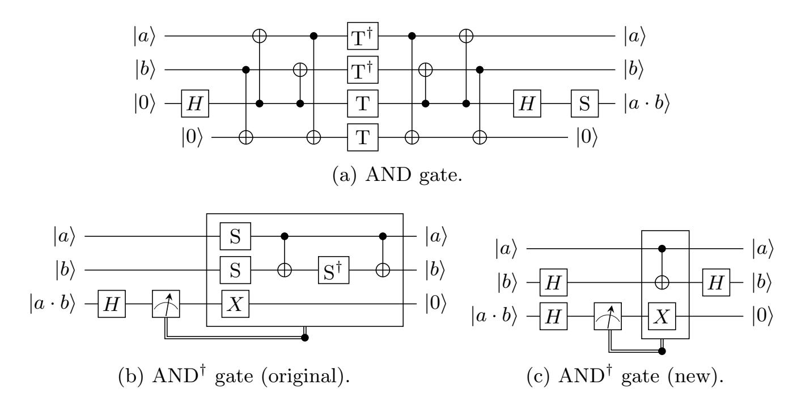

Fig. 9: AND gate design used in our circuit. We notice that in (b) and (c), the measurement returns a classical bit c and leaves the original qubit in the state |ci.

# <span id="page-38-1"></span>D Placeholder S-box

As part of our sanity checking of the Q# resource estimator in §[4.7,](#page-19-1) we replaced the AES S-box with the design in Figure [10,](#page-39-0) that tries to force all the wires to "synchronize" such that the T gates between two neighboring S-boxes cannot be partially computed in parallel. Costing the T-depth of the resulting dummy AES operation returns the expected value of 2 × # of rounds × d, where d is the depth of the dummy S-box.

{39}------------------------------------------------

<span id="page-39-0"></span>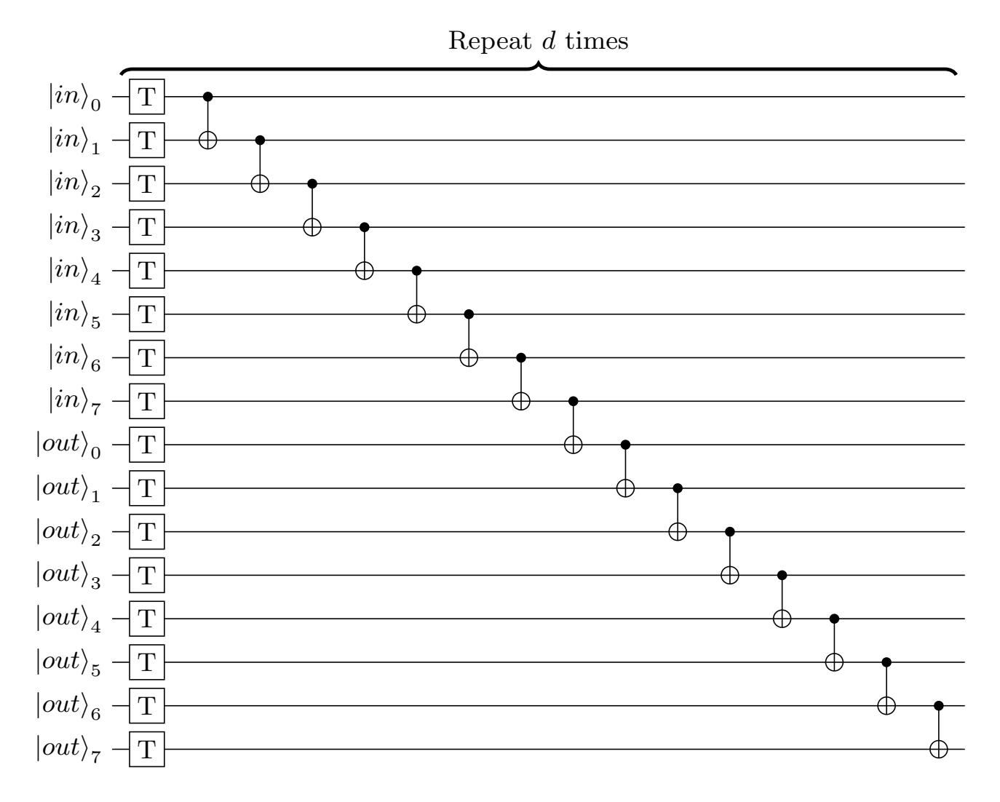

Fig. 10: Dummy S-box design, that tries to forcefully avoid non-parallel calls to the S-box to be partially executed at the same time.