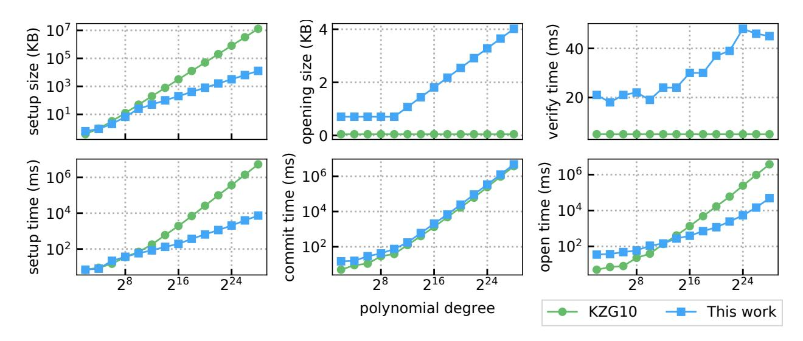
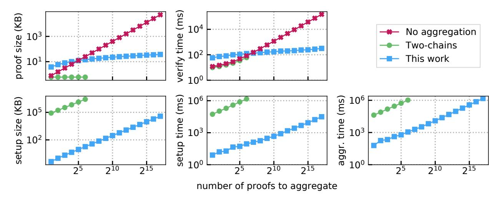
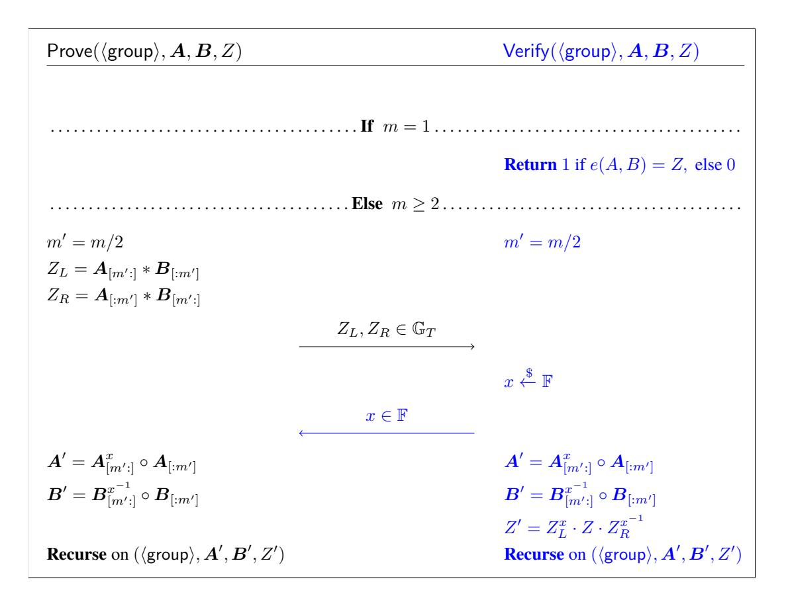
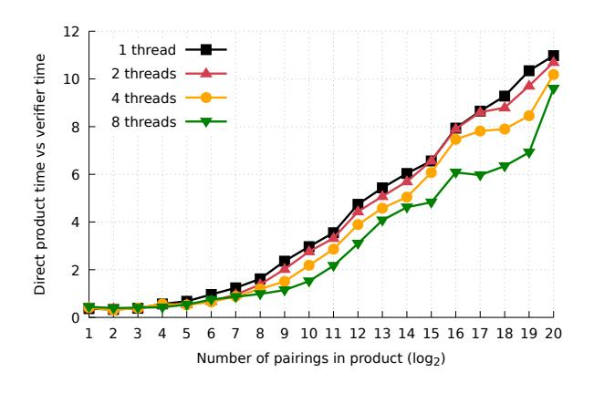
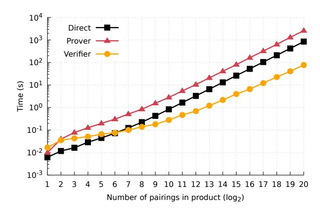

# <span id="page-0-0"></span>**Proofs for Inner Pairing Products and Applications**

Benedikt Bünz benedikt@cs.stanford.edu Mary Maller mary.maller@ethereum.org

Stanford University

Ethereum Foundation

Pratyush Mishra

Nirvan Tyagi

Psi Vesely

pratyush@berkeley.edu

tyagi@cs.cornell.edu

psi@berkeley.edu

UC Berkeley

Cornell University

UC Berkeley

### **Abstract**

We present a generalized inner product argument and demonstrate its applications to pairing-based languages. We apply our generalized argument to proving that an inner pairing product is correctly evaluated with respect to committed vectors of n source group elements. With a structured reference string (SRS), we achieve a logarithmic-time verifier whose work is dominated by  $6 \log n$  target group exponentiations. Proofs are of size  $6 \log n$  target group elements, computed using 6n pairings and 4n exponentiations in each source group.

We apply our inner product arguments to build the first polynomial commitment scheme with succinct (logarithmic) verification,  $O(\sqrt{d})$  prover complexity for degree d polynomials (not including the cost to evaluate the polynomial), and a CRS of size  $O(\sqrt{d})$ . Concretely, this means that for  $d=2^{28}$ , producing an evaluation proof in our protocol is  $76\times$  faster than doing so in the KZG [KZG10] commitment scheme, and the CRS in our protocol is  $1,000\times$  smaller: 13MB vs 13GB for KZG. This gap only grows as the degree increases. Our polynomial commitment scheme is applicable to both univariate and bivariate polynomials.

As a second application, we introduce an argument for aggregating n Groth16 zkSNARKs into an  $O(\log n)$  sized proof. Our protocol is significantly more efficient than aggregating these SNARKs via recursive composition [BCGMMW20]: we can aggregate about 130,000 proofs in 25min, while in the same time recursive composition aggregates just 90 proofs.

Finally, we show how to apply our aggregation protocol to construct a low-memory SNARK for machine computations. For a computation that requires time T and space S, our SNARK produces proofs in space  $\tilde{\mathcal{O}}(S+T)$ , which is significantly more space efficient than a monolithic SNARK, which requires space  $\tilde{\mathcal{O}}(S \cdot T)$ .

# Contents

| 1  | Introduction                                                                                                                                                                                                                                                                                                                                                    | 3                                |
|----|-----------------------------------------------------------------------------------------------------------------------------------------------------------------------------------------------------------------------------------------------------------------------------------------------------------------------------------------------------------------|----------------------------------|
| 2  | Technical Overview 2.1 GIPA                                                                                                                                                                                                                                                                                                                                     | <b>7</b><br>7                    |
| 3  | Notation                                                                                                                                                                                                                                                                                                                                                        | 9                                |
| 4  |                                                                                                                                                                                                                                                                                                                                                                 |                                  |
| 5  | Log-time verifier inner pairing product arguments         5.1       Inner product commitments with structured setup         5.2       Final commitment keys         5.3       TIPP: Inner pairing product         5.4       MIPP $_u$ : Multiexponentiation with unknown field vector         5.5       MIPP $_k$ : Multiexponentiation with known field vector | 15<br>16<br>18                   |
| 6  | Log-time verifier polynomial commitments with square root SRS  6.1 Two-tiered inner product commitment                                                                                                                                                                                                                                                          | 22<br>23                         |
| 7  | 7.1 Groth 2016 background                                                                                                                                                                                                                                                                                                                                       | 24<br>25<br>25<br>26             |
| 8  |                                                                                                                                                                                                                                                                                                                                                                 | <b>27</b> 28                     |
| Ac | knowledgements                                                                                                                                                                                                                                                                                                                                                  | 30                               |
| Re | ferences                                                                                                                                                                                                                                                                                                                                                        | 30                               |
| A  | Preliminaries A.1 Bilinear groups A.2 Interactive arguments of knowledge A.3 Commitments A.4 Polynomial commitments A.5 Cryptographic assumptions                                                                                                                                                                                                               | 34<br>37<br>37                   |
| В  | B.1 Construction                                                                                                                                                                                                                                                                                                                                                |                                  |
| C  | C.1 Construction                                                                                                                                                                                                                                                                                                                                                | <b>41</b><br>42<br>43            |
| D  | D.1 Proof of Theorem 1                                                                                                                                                                                                                                                                                                                                          | 43<br>43<br>46<br>47<br>49<br>52 |
| E  | Hiding Polynomial Commitments                                                                                                                                                                                                                                                                                                                                   | 52                               |

# <span id="page-2-0"></span>**1 Introduction**

An inner product argument proves that an inner product relation holds between committed vectors. In this work, we present a new construction of inner product arguments for pairing-based languages that yields a logarithmic time verifier — a significant improvement over the linear time verifier of previous work. We use our new inner product argument to build (1) a new polynomial commitment scheme that achieves novel asymptotic characteristics of succinct verification and opening proofs that can be computed in time square root of the polynomial degree as well as a square root sized SRS; and (2) a new approach for aggregation of Groth16 general-purpose SNARKs [\[Gro16\]](#page-31-1) useful for verifiable computation, avoiding the expensive costs of recursive proving circuits. We provide an open-source Rust implementation[1](#page-0-0) of all our protocols and applications and benchmark them against the state of the art. Our benchmarks show that the asymptotic improvements translate to significant practical gains.

**Inner product arguments.** Inner product arguments (IPA) are core components of many primitives, including zero-knowledge proofs and polynomial and vector commitment schemes [\[BCCGP16;](#page-29-2) [BBBPWM18;](#page-29-3) [WTSTW18;](#page-32-0) [LMR19;](#page-31-2) [BGH19;](#page-30-1) [BCMS20\]](#page-30-2). Despite the fact that the inner product arguments constructed in these works largely share the same core strategy as the original protocol in [\[BCCGP16\]](#page-29-2), they all spend significant effort in reproving security to accommodate for minor changes (introduced for efficiency and/or application-specific purposes). This repeated effort adds significant overhead in the process of auditing the security of inner product arguments, and enables errors to slip through unnoticed. Our first contribution is an abstraction of previous work into a generalized inner product argument (GIPA). While the techniques in GIPA are not novel, they do provide a unified view of all prior work, enabling simpler exposition and simpler security proofs. In particular, this means that our single security proof suffices to prove the security of all prior GIPA instantiations [\[BCCGP16;](#page-29-2) [BBBPWM18;](#page-29-3) [LMR19\]](#page-31-2), as well as the protocols introduced in this paper.

We additionally prove security for the non-interactive variant of GIPA in a generalization of the algebraic group model [\[FKL18\]](#page-31-3), which we dub the *algebraic commitment model*. Because GIPA is a public-coin protocol, it can be transformed to a non-interactive argument using the Fiat–Shamir heuristic, and it is this variant that is used in applications— non-interactive Bulletproofs secures almost 2 billon USD of Monero [\[O'L18\]](#page-32-1). However, due to a technicality about modeling random oracles in recursive arguments (the generic transformation leads to a super-polynomial extractor), prior works provided no satisfactory security proof for these non-interactive variants. Our security proof remedies this oversight, and we envisage that our techniques may be useful in proving the security of other non-interactive and recursive protocols [\[BFS20\]](#page-30-3).

**Reducing verification cost.** Making use of the high level GIPA blueprint, our second contribution is a protocol for reducing the verifier cost for specific inner product arguments over pairing-based languages. For a committed vector length of n, we reduce the verifier cost from O(n) for existing protocols [\[LMR19\]](#page-31-2), to O(log n), which is an exponential improvement. To do this, we introduce a new pairing-based commitment scheme with structured keys and prove its security. We then exploit a special structure of the "homomorphic collapsing" execution of GIPA (first observed in [\[BGH19\]](#page-30-1)) with our commitment scheme. In particular, the outsourced computation is reduced to opening a KZG polynomial commitment scheme. We rely on a trusted setup that is updatable [\[GKMMM18\]](#page-31-4) and can be used for languages of different sizes (up to some maximum bound specified by the SRS).

Equipped with our new logarithmic-time verifier for inner products over pairing-based languages, we next turn to apply our techniques to two applications: (1) polynomial commitments, and (2) SNARK aggregation. **Polynomial commitments.** Polynomial commitment (PC) schemes [\[KZG10\]](#page-31-0) are commitment schemes specialized to work with polynomials. A committer outputs a short commitment to a polynomial, and then

<sup>1</sup><https://github.com/scipr-lab/ripp>

later may convince a verifier of correctness of an evaluation of that committed polynomial at any point via a short evaluation proof, or "opening". PC schemes have been used to reduce communication and computation costs in a vast breadth of applications including proofs of storage and replication [XYZW16; Fis18], anonymous credentials [CDHK15; FHS19], verifiable secret sharing [KZG10; BDK13], and zero-knowledge arguments [WTSTW18; MBKM19; Gab19; Set20; GWC19; XZZPS19; CHMMVW20].

In this work, we use a combination of inner product arguments in order to build a pairing-based polynomial commitment scheme that requires a universal structured reference string of size only  $\sqrt{d}$  when committing to degree d polynomials, and where proving an evaluation claim only requires  $\mathcal{O}(\sqrt{d})$  cryptographic operations. We achieve this while maintaining constant-sized commitments,  $\mathcal{O}(\log d)$ -sized evaluation proofs, and  $\mathcal{O}(\log d)$  verifier time.

This compares to a linear sized CRS for the widely used KZG [KZG10] commitment scheme. Concretely, this means that for polynomial of degree  $2^{22}$ , KZG requires a large SRS of size  $\sim 400 MB$ . This can cause deployment hurdles in applications in decentralized systems, as this SRS needs to be stored by every prover. For example, in SNARKs relying on polynomial commitments [GWC19; CHMMVW20], the degree of the polynomial is roughly the size of the circuit, which can be large [Ben+14; WZCPS18]. A large SRS also has a non-trivial impact on security [GGW18]. In contrast, the SRS of our protocol has size 3MB, which is over  $130 \times$  smaller, making deployment much easier.

Furthermore, as noted above, computing an evaluation proof requires only  $\mathcal{O}(\sqrt{d})$  cryptographic operations, which is much better than KZG, which requires  $\mathcal{O}(d)$  cryptographic operations. This is important for applications such as vector commitments [LY10] and proofs of space [Fis19], where a polynomial is committed to just once, but the commitment is opened at many different evaluation points.

**SNARK** aggregation. A SNARK aggregation protocol takes as input many SNARK proofs and outputs a single aggregated proof that can be verified more quickly than individually verifying each SNARK. This is useful for applications where the batch of proofs will be verified many times by different clients. For example, this is the case in applications that aim to improve the scalability of decentralized blockchains by using SNARKs to prove the correctness of state transitions [Whi; BMRS20].

We use our inner product arguments to design an aggregation protocol for Groth16 [Gro16] SNARKs that enjoys the following efficiency properties when aggregating n proofs: (a) aggregation requires  $\mathcal{O}(n)$  cryptographic operations, (b) the aggregated proof has size  $\mathcal{O}(\log n)$ , and (c) verification requires  $\mathcal{O}(\log n)$  cryptographic operations, and  $\mathcal{O}(n)$  field operations.

Our protocol offers asymptotic and concrete improvements over prior approaches that aggregate proofs via recursive composition. In more detail, these approaches create (another) SNARK for the circuit that contains n copies of the Groth16 verifier circuit [BCTV14a; BCGMMW20]. This entails constructing arithmetic circuits for computing pairings, which is expensive (for example, computing a pairing on the BLS12-377 curve requires  $\sim 15,000$  constraints [BCGMMW20]). In contrast, our protocol "natively" works with pairing-based languages. This results in the following efficiency savings: (a) our protocol does not have to reason about about arithmetic circuits for computing pairings, (b) our protocol does not have to compute FFTs, which require time  $\mathcal{O}(n\log n)$ , and (c) our protocol does not require special cycles or chains of curves [BCTV14a; BCGMMW20]. Put together, these savings allow us to aggregate proofs over  $\sim 1400 \times$  faster than the recursive approach. Furthermore, our procol requires the verifier to only perform  $\mathcal{O}(n)$  field operations, as opposed to  $\mathcal{O}(n)$  cryptographic operations for the recursive approach.

**Low-memory SNARKs for machine computations.** We leverage our aggregation protocol to construct a *low-memory SNARK* for (non-deterministic) machine computations. In more detail, if for a machine M, checking an execution transcript requires space S and time T, then our SNARK prover takes space  $\tilde{\mathcal{O}}(S+T)$  to produce a proof for that execution. In comparison, constructing a monolithic proof for the entire

computation at once requires space O˜(S · T), whereas the only other solution for constructing low-memory SNARKs for machine computations requires recursive composition of proofs [\[BCCT13\]](#page-29-4), which is concretely expensive, as demonstrated above.

## **Summary of contributions.**

- We provide a unifying generalization of inner product arguments, identifying and formalizing the appropriate *doubly-homomorphic* commitment property.
- We prove security of the non-interactive Fiat-Shamir transform of this protocol, implying security for the entire family of protocols.
- We provide a new set of inner product arguments for pairing-based languages that improve verifier efficiency from linear to logarithmic by introducing a trusted structured setup.
- We construct a new polynomial commitment scheme with constant-sized commitments, opening time square root in the degree and square root sized CRS. The opening verifier runs in logarithmic time and opening proofs are logarithmic in size.
- We design an aggregator for Groth16 [\[Gro16\]](#page-31-1) pairing-based SNARKs that produces an aggregated proof of logarithmic size. We apply our aggregator to construct a low-memory SNARK for machine computations *without relying on recursive composition*.
- We implement our inner product argument protocols and applications in Rust and evaluate their efficiency against state-of-the-art protocols. We find that our polynomial commitment scheme is over 14× faster to open than a KZG commitment [\[KZG10\]](#page-31-0) for polynomials of degree 10<sup>6</sup> , and that our aggregation scheme aggregates proofs over 1400× faster than the alternative two-chains approach.

**Additional constructions with a transparent setup.** Prior versions of this work concentrate more closely on protocols that do not require a trusted setup. In Appendices [B](#page-38-0) and [C](#page-40-0) we include two of these constructions that we consider to be of independent interest, but that we decided to remove from the main body for reasons of conciseness.

In Appendix [B](#page-38-0) we discuss an outsourcing argument for demonstrating that n pairings have been correctly computed. The prover computes 2n pairings, the proofs consist of 2 log(n) target group elements, and the verifier computes 2 log(n) target group operations in addition to 2n source group exponentiations (n in each group). The writing style focuses on clarity rather than on generalisation and we recommend the less familiar reader to focus on this appendix before reading the generalisation in [Section 4.](#page-9-0) In Appendix [C](#page-40-0) we discuss how the outsourcing argument is applicable to BLS signatures.

**Related work.** Lai, Malavolta, and Ronge [\[LMR19\]](#page-31-2) introduced an inner product argument for pairing based languages. Their scheme runs over a transparent setup and is secure under the SXDH assumption. Their work improves on Groth and Sahai Proofs [\[GS08\]](#page-31-13) which are a method to prove pairing-based languages under zero-knowledge without reducing to NP. Their proving costs are dominated by a linear number of pairings, their proof sizes are logarithmic and their verifier running costs are dominated by a linear number of group exponentiations. Our pairing based IPA's have much lower verification costs but we use a trusted setup. Our generalized IPA argument can be used to greatly simplify the security proofs for their Theorems 3.2, 4.1, 4.2 and 4.3, and we prove security of a non-interactive variant in the algebraic commitment model.

In Table [1,](#page-5-0) we compare the efficiency of various polynomial commitment schemes. Kate et al.[\[KZG10\]](#page-31-0) introduced a pairing based polynomial commitment scheme with constant sized proofs. Their scheme is secure under an updatable setup in the algebraic group model. Groth [\[Gro11\]](#page-31-14) designed a pairing based "batch product argument" secure under SXDH. This argument that can be seen as a form of polynomial commitment scheme and our two-tiered polynomial commitment techniques were inspired by this work. Under discrete-logarithm

| polynomial              | communication complexity   |                            |                            |                   | transparent | time complexity       |                            |                          |
|-------------------------|----------------------------|----------------------------|----------------------------|-------------------|-------------|-----------------------|----------------------------|--------------------------|
| commitment              | CRS                        | commitments                | openings                   | $d = 2^{20}$      | setup       | Commit                | Open                       | Verify                   |
| Kate et al.[KZG10]      | $d \mathbb{G}_1$           | 1 G <sub>1</sub>           | 1 G <sub>1</sub>           | 96b               | no          | $d \mathbb{G}_1$      | $d \mathbb{G}_1$           | $1 P, \mathbb{G}_1$      |
| Bulletproofs [BBBPWM18] | $d \mathbb{G}_1$           | $1 \mathbb{G}_1$           | $\log(d) \mathbb{G}_1$     | $1.3~\mathrm{KB}$ | yes         | $d \mathbb{G}_1$      | $d \mathbb{G}_1$           | $d \mathbb{G}_1$         |
| Hyrax [WTSTW18]         | $\sqrt{d}  \mathbb{G}_1$   | $\sqrt{d} \; \mathbb{G}_1$ | $\log(d) \mathbb{G}_1$     | 33  KB            | yes         | $d \mathbb{G}_1$      | $\sqrt{d} \; \mathbb{G}_1$ | $\sqrt{d}  \mathbb{G}_1$ |
| DARKs [BFS20]           | $d \mathbb{G}_U$           | $1 \mathbb{G}_U$           | $\log(d) \mathbb{G}_U$     | $8.6~\mathrm{KB}$ | yes         | $d \mathbb{G}_U$      | $d \log(d) \mathbb{G}_U$   | $\log(d) \mathbb{G}_U$   |
| Virgo [ZXZS20]          | 1                          | $1~\mathbb{H}$             | $\log(d)^2 \mathbb{H}$     | 183 KB            | yes         | $d\log(d) \mathbb{H}$ | $d\log(d) \mathbb{H}$      | $\log(d)^2 \mathbb{H}$   |
| Groth [Gro11]           | $\sqrt[3]{d} \mathbb{G}_2$ | $\sqrt[3]{d} \mathbb{G}_T$ | $\sqrt[3]{d} \mathbb{G}_1$ | 25 KB             | yes         | $d \mathbb{G}_1$      | $\sqrt[2]{d} \mathbb{G}_1$ | $\sqrt[3]{d} P$          |
| This work               | $\sqrt{d}  \mathbb{G}_2$   | $1 \mathbb{G}_T$           | $\log(d) \mathbb{G}_T$     | 2.5 KB            | no          | $d \mathbb{G}_1$      | $\sqrt{d} P$               | $\log(d)\mathbb{G}_T$    |

<span id="page-5-0"></span>**Table 1:** Efficiency comparisons for polynomial commitment schemes. All numbers are given asymptotically. We use  $\mathbb{G}_1, \mathbb{G}_2, \mathbb{G}_T$  to represent groups in a bilinear map, P to represent pairings,  $\mathbb{G}_U$  to represent groups of unknown order, and  $\mathbb{H}$  to represent hash functions. For simplicity we only specify the dominant costs e.g., if there are  $d \mathbb{G}_1$  and  $d \mathbb{G}_2$  group exponentiations we simple write  $d \mathbb{G}_2$ . Column 5 is the expected size of one commitment plus one opening proof at  $d=2^{20}$  over a BN256 curve.

assumptions, Bayer and Groth designed a zero-knowledge proving system to show that a committed value is the correct evaluation of a known polynomial [BG13]. Both the prover and verifier need only compute a logarithmic number of group exponentiations, however verifier costs are linear in the degree of the polynomial. Wahby et al. proved that it is possible to use the inner product argument of Bulletproofs [BBBPWM18] to build a polynomial commitment scheme [WTSTW18]. Bowe et al. [BGH19] argued that the inner product argument of Bulletproofs is also highly aggregatable, to the point where aggregated proofs can be verified using a one off linear cost and an additional logarithmic factor per proof. Attema and Cramer[AC20] recently provided an orthogonal generalization of the inner product argument. They show that the inner product argument can be seen as a black box compression mechanism for sigma protocols and show that it can be used as a proof system for secret shared data.

Polynomial commitment schemes have also been constructed using Reed-Solomon codes [ZXZS20]. These commitments use highly efficient symmetric key primitives, however the protocols that use them require soundness boosting techniques that result in large constant overheads. Bünz et al.[BFS20] designed a polynomial commitment scheme in groups of unknown order such as RSA groups or class groups with efficient verifier time and small proof sizes. However, it requires super-linear commitment and prover time.

Asymptotically, our scheme positions itself competitively among state-of-the-art PCs (see Table 1). In terms of concrete efficiency, the trusted setup scheme of Kate et al. [KZG10] allows for constant proof sizes and verifier time (versus our logarithmic results), whereas our protocol offers quadratic improvements to opening efficiency and the maximum degree polynomial supported by a SRS of a given size.

Prior aggregatable SNARKs have relied on efficiently expressing SNARK verifiers as as arithmetic circuits [BCTV14b; BCGTV13]. For pairing based SNARKs this was achieved through the use of pairing-friendly cycles [BCTV14a] or two-chains [BCGMMW20]. Known cycles and two-chains for the 128-bit security level require roughly 768-bit curves, versus the roughly 384-bit curves used when recursion is not necessary ( $\sim 10\times$  performance hit in practice [SCI]). Bowe et al. introduce a novel approach to recursive SNARKs that works in cycles of non pairing friendly curves [BGH19]. Bünz et al. [BCMS20] generalize and formalize this approach. Chiesa et al. build a post-quantum recursive SNARK [COS20]. For all of these approaches we expect to significantly improve on prover time because we do not rely on expensive NP reductions.

### <span id="page-6-0"></span>2 Technical Overview

### <span id="page-6-1"></span>**2.1 GIPA**

The first contribution of our paper is a *generalized inner product argument* we denote GIPA. At a high level, our protocol generalizes the protocols of [BCCGP16; BBBPWM18] as follows. The protocols of [BCCGP16; BBBPWM18] enable proving the correctness of inner products of scalar vectors committed via the Pedersen commitment scheme [Ped92]. Our protocol generalizes their techniques to enable proving the correct computation of a large class of inner products between vectors of group and/or field elements committed to using (possibly distinct) *doubly homomorphic commitments*. We explain in more detail below.

**Starting point: inner product arguments.** The inner product argument (IPA) by [BCCGP16] enables a prover to convince a verifier that two committed vectors (using Pedersen vector commitments) have a publicly known inner product. It does this by elegantly rescaling the committed vectors to half their size in each round. In each round the verifier sends a random challenge, which the prover uses to take a linear combination of the right and left half of the committed vectors, and they both rescale the commitment keys accordingly.

After  $\log_2 m$  such reduction step the prover simply opens the commitment and the verifier checks that the product relation holds. In Bulletproofs [BBBPWM18] the authors improve on the IPA by committing to the two vectors and the scalar in a single commitment, while maintaining the halving structure of the argument. This enables sending just two commitments per round.

We observe that the same argument structure works for a much wider class of commitment schemes. In particular we require only that the commitment scheme is binding and has the homomorphic properties that enable the rescaling step. This property is that the commitment scheme is doubly homomorphic, i.e., homomorphic over the messages and the commitment keys.

**Doubly homomorphic commitments.** At a high level, a doubly homomorphic commitment scheme is a binding commitment scheme (Setup, CM) where the key space  $\mathcal{K}$ , message space  $\mathcal{M}$ , and commitment space  $\mathcal{C}$  form abelian groups of the same size such that  $\mathsf{CM}((\mathsf{ck}_1 + \mathsf{ck}_2); (M_1 + M_2)) = \mathsf{CM}(\mathsf{ck}_1, M_1) + \mathsf{CM}(\mathsf{ck}_1; M_2) + \mathsf{CM}(\mathsf{ck}_2, M_1) + \mathsf{CM}(\mathsf{ck}_2, M_2)$ .

The Pedersen commitment  $CM(\boldsymbol{g},\boldsymbol{a}) \to \prod_i g_i^{a_i}$  is the doubly homomorphic commitment used in Bulletproofs. Lai, Malavolta, and Ronge [LMR19] used a doubly homomorphic commitment for bilinear groups where the committed vectors consist of group elements in a bilinear group:  $CM(\boldsymbol{v},\boldsymbol{v}',\boldsymbol{w},\boldsymbol{w}';\boldsymbol{A},\boldsymbol{B}) \to \prod_i e(v_i,A_i)e(B_i,w_i), \prod_i e(v_i',A_i)e(B_i,w_i')$ .

In some of our protocols the verifier already has access to one of the committed vectors. For instance, in the polynomial commitment scheme the verifier can simply compute the vector consisting of the monomials of the evaluation point. Such protocols are also captured by our abstraction since the identity commitment is doubly homomorphic. In the actual protocols, the prover doesn't send any scalings of these vectors, and the verifier simply computes them directly.

**Generalized Inner Product Argument.** Building on our generalization of commitment schemes that work for inner product arguments, GIPA also generalizes the types of inner products that can be proven between committed vectors. It can be used not only to show inner products between field elements, but for arbitrary inner product maps  $\langle \cdot, \cdot \rangle$  that are bilinear, i.e., for which  $\langle a+b,c+d \rangle = \langle a,c \rangle + \langle a,d \rangle + \langle b,c \rangle + \langle b,d \rangle$ . It immediately follows our generalized argument works for bilinear pairings. We apply GIPA to three different inner products:

$$\langle \cdot, \cdot \rangle : \mathbb{G}_1^m \times \mathbb{G}_2^m \mapsto \mathbb{G}_T, \quad \langle \boldsymbol{A}, \boldsymbol{B} \rangle = \prod_{i=0}^{m-1} e(A_i, B_i)$$
$$\langle \cdot, \cdot \rangle : \mathbb{G}_1^m \times \mathbb{F}^m \mapsto \mathbb{G}_1, \quad \langle \boldsymbol{A}, \boldsymbol{b} \rangle = \prod_{i=0}^{m-1} A_i^{b_i}$$
$$\langle \cdot, \cdot \rangle : \mathbb{F}^m \times \mathbb{F}^m \mapsto \mathbb{F}, \quad \langle \boldsymbol{a}, \boldsymbol{b} \rangle = \sum_{i=0}^{m-1} a_i b_i$$

We refer to the first inner product as the inner pairing product.

**Security Proof.** We prove both the interactive and the non-interactive variant of GIPA to be knowledge-sound. The interactive security proof shows the  $(k_1, \ldots, k_r)$ -special soundness of GIPA protocols, which implies knowledge-soundness via a recent result of Attema and Cramer [AC20] (previous interactive security proofs showed only witness-extended emulation). In particular, we reduce the security of any GIPA instantion to the binding of its commitment scheme.

We also prove knowledge-soundness of the non-interactive version of GIPA given by the Fiat-Shamir transform. It is known from folklore that applying the Fiat-Shamir transformation to a r-round interactive argument of knowledge with negligible soundness error yields a non-interactive argument of knowledge in the random oracle model where the extractor  $\mathcal E$  runs in time  $O(t^r)$  for an adversary that performs at most  $t=\operatorname{poly}(\lambda)$  random oracle queries. GIPA has  $\log m$  rounds for  $m=\operatorname{poly}(\lambda)$  so this transformation yields a super-polynomial extractor. Given this, we directly prove the security of the non-interactive argument in the algebraic commitment model , a generalization of the algebraic group model [FKL18]. In essence, whenever the prover outputs a commitment he must also give an opening to it with respect to some linear combination of commitment key. Our security proof yields an efficient linear-time extractor and negligible knowledge-soundness. Given the generality of GIPA this also yields the first tight security analysis of non-interactive Bulletproofs [BCCGP16; BBBPWM18] and the many related protocols [LMR19; BGH19; BCMS20].

**TIPP and MIPP.** Generically GIPA protocols have logarithmic communication but linear verifier time as computing the final commitment key takes a linear number of operations. We introduce TIPP, a logarithmic verifier variant for the inner pairing product and MIPP for the multi-exponentiation inner product.<sup>2</sup> These schemes use universal and updatable structured references string as commitment keys. Their commitments are based on that of Abe et al. [AFGHO16], where given a commitment key  $(v_0, v_1) \in \mathbb{G}_2$  the commitment to  $(A_0, A_1) \in \mathbb{G}_1^2$  is given by  $e(A_0, v_0)e(A_1, v_1)$ , and the KZG polynomial commitment [KZG10].

Instead of the verifier having to compute the verification key itself, we leverage a recent insight by Bowe, Grigg, and Hopwood [BGH19]. The final commitment key in GIPA can be viewed as a polynomial commitment to a degree m polynomial that can be evaluated in  $\log m$  time. Using the structured setup we can outsource computing the commitment key to the prover. The verifier simply verifies that the commitment key was computed correctly. This amounts to evaluating the polynomial at a random point and checking a KZG [KZG10] polynomial commitment proof.

### <span id="page-7-0"></span>2.2 Applications

We show how to use instantiations of our generalized inner product argument to obtain interesting applications: a polynomial commitment scheme where computing evaluation proofs for polynomials of degree d requires only  $O(\sqrt{d})$  cryptographic operations, and a protocol for aggregating n Groth16 SNARKs [Gro16] to produce an aggregate proof of size  $O(\log n)$  and verifiable in time  $O(\log n)$ .

### 2.2.1 Polynomial commitment

Following Groth [Gro11] we use two-tiered homomorphic commitments: i.e. commitments to commitments. Suppose we wish to commit to a polynomial

$$f(X,Y) = f_0(Y) + f_1(Y)X + \ldots + f_{m-1}(Y)X^{m-1} = \sum_{i=0}^{m-1} f_i(Y)X^i$$
.

 $<sup>^2</sup>$ We actually introduce two variants of MIPP: MIPP $_u$ , where both the vectors are committed, and MIPP $_k$  where the verifier already knows the exponent, but it's of a structured form.

We can view this polynomial in matrix form

$$f(X,Y) = (1,X,X^2,\dots,X^{m-1}) \begin{pmatrix} a_{0,0} & a_{0,1} & a_{0,2} & \dots & a_{0,\ell-1} \\ a_{1,0} & a_{1,1} & a_{1,2} & \dots & a_{1,\ell-1} \\ a_{2,0} & a_{2,1} & a_{2,2} & \dots & a_{2,\ell-1} \\ \vdots & & & \ddots & \vdots \\ a_{m-1,0} & a_{m-1,1} & a_{m-1,2} & \dots & a_{m-1,\ell-1} \end{pmatrix} \begin{pmatrix} 1 \\ Y \\ Y^2 \\ \dots \\ Y^{\ell-1} \end{pmatrix}$$

One first computes commitments  $A_0, \ldots, A_{m-1}$  to  $f_0(Y), \ldots, f_{m-1}(Y)$ . Next one commits to the commitments  $A_0, \ldots, A_{m-1}$ .

On receiving an opening challenge (x,y) the prover evaluates the first tier at x to obtain a commitment A to f(x,Y). This is done using MIPP. The prover then opens the second tier commitment A at y in order to obtain  $\nu=f(x,y)$ . This is done using a KZG univariate polynomial commitment scheme [KZG10]. To apply our prover efficient polynomial commitment scheme to univariate polynomials, commit to  $f(X,X^n)$  and open at  $(x,x^n)$ .

Note that for  $m \approx \ell \approx \sqrt{d}$  both the MIPP and the KZG commitment are only of square root size. This results in a square root reference string. In order to achieve square root prover time (in addition to evaluating the polynomial) the prover needs to store the  $A_0,\ldots,A_{m-1}$  when committing to the polynomial. Using these values the resulting MIPP can be opened in  $O(m) = O(\sqrt{d})$  time.

## 2.2.2 SNARK aggregation and proofs of machine computation

Pairing-based SNARKs such as Groth16 can be proven and verified using only algebraic operations (e.g., field operations, group operations and pairings). This means we can aggregate by applying TIPP to the Groth16 verifier equations, such that whenever TIPP verifies the aggregator must have seen some verifying proof. In particular, to aggregate n Groth 16 proofs  $\{(A_i, B_i, C_i)\}_{i=1}^n \in \mathbb{G}_1 \times \mathbb{G}_2 \times \mathbb{G}_1$ , one first computes commitments to the  $A_i$ ,  $B_i$ ,  $C_i$  values. Then the prover computes  $\prod_{i=1}^n e(A_i, B_i)^{r^{2i}}$  and  $\prod_{i=1}^n C_i^{r^{2i}}$  for some random value r and proves these are correct using our pairing based arguments. Finally the verifier checks that these values satisfy a randomized version of the Groth16 verifier equations. Overall the prover only performs one field multiplication per instance and  $O(\log(n))$  cryptographic operations for the TIPP protocol.

**Low-memory SNARKs for machine computation.** We leverage our aggregation protocol in to construct a *low-memory SNARK* for (non-deterministic) machine computations that requires time  $\tilde{\mathcal{O}}(T)$  and space  $\tilde{\mathcal{O}}(S+T)$  to produce a proof to for a machine computation that requires space S and time T. This is much better than a monolithic proof for the entire computation at once, which requires time  $\tilde{\mathcal{O}}(S \cdot T)$ . Crucially, our protocol does not rely on recursive composition of proofs [BCCT13], which was the prior solution for constructing low-memory SNARKs.

Our approach proceeds by producing an individual proof for each machine step, aggregates these individual proofs, and then additionally speeds up the checks relating to the state between machine steps via techniques based on polynomial commitments. See Section 8 for details.

### <span id="page-8-0"></span>3 Notation

We denote by [n] the set  $\{1,\ldots,n\}\subseteq\mathbb{N}$ . We use  $\boldsymbol{a}=[a_i]_{i=1}^n$  as a short-hand for the vector  $(a_1,\ldots,a_n)$ , and  $[\boldsymbol{a}_i]_{i=1}^n=[[a_{i,j}]_{j=1}^m]_{i=1}^n$  as a short-hand for the vector  $(a_{1,1},\ldots,a_{1,m},\ldots,a_{n,1},\ldots,a_{n,m});$   $|\boldsymbol{a}|$  denotes the number of entries in  $\boldsymbol{a}$ . We analogously define  $\{a_i\}_{i=1}^n$  with respect to sets instead of vectors. If x is a

binary string then |x| denotes its bit length. For a finite set S, let  $x \stackrel{\$}{\leftarrow} S$  denote that x is an element sampled uniformly at random from S. We also write  $x \stackrel{\$}{\leftarrow} \mathsf{A}()$  to denote an algorithm A sampled and used randomness in the computation of x.

Inner pairing product notation. We introduce some special notation related to our inner pairing product argument, some of which is borrowed from the Pedersen inner product introduced in [BBBPWM18]. We write group operations as multiplication. For a scalar  $x \in \mathbb{F}$  and vector  $\mathbf{A} \in \mathbb{G}^n$ , we let  $\mathbf{A}^x = (A_1^x, \dots, A_n^x) \in \mathbb{G}^n$ , and for a vector  $\mathbf{x} = (x_0, \dots, x_{m-1}) \in \mathbb{F}^n$  we let  $\mathbf{A}^x = (A_0^{x_0}, \dots, A_{m-1}^{x_{m-1}})$ . For a bilinear group  $(\mathbb{G}_1, \mathbb{G}_2, \mathbb{G}_T, q, g, h, e)$  (see Appendix A.1) and pair of source group vectors  $\mathbf{A} \in \mathbb{G}_1^n$ ,  $\mathbf{B} \in \mathbb{G}_2^n$  we define  $\mathbf{A} * \mathbf{B} = \prod_{i=1}^n e(A_i, B_i)$ . For two vectors  $\mathbf{A}, \mathbf{A}' \in \mathbb{G}^n$  we let  $\mathbf{A} \circ \mathbf{A}' = (A_0 A_0', \dots, A_{m-1} A_{m-1}')$ . Let  $\mathbf{A} || \mathbf{A}' = (A_0, \dots, A_{n-1}, A_0', \dots, A_{m-1}')$  be the concatenation of two vectors  $\mathbf{A} \in \mathbb{G}^n$  and  $\mathbf{A}' \in \mathbb{G}^m$ . To denote slices of vectors given  $\mathbf{A} \in \mathbb{G}^n$  and  $0 \le \ell < n-1$  we write  $\mathbf{A}_{[\ell:\ell]} = (A_0, \dots, A_{\ell-1}) \in \mathbb{G}^\ell$  and  $\mathbf{A}_{[\ell:\ell]} = (A_\ell, \dots, A_{n-1}) \in \mathbb{G}^{n-\ell}$ .

**Languages and relations.** We write  $\{(x):p(x)\}$  to describe a polynomial-time language  $\mathcal{L}\subseteq\{0,1\}^*$  decided by the polynomial-time predicate  $p(\cdot)$ . We write  $\{(x;w):p(x,w)\}$  to describe a NP relation  $\mathcal{R}\subseteq\{0,1\}^*\times\{0,1\}^*$  between instances x and witnesses w decided by the polynomial-time predicate  $p(\cdot,\cdot)$ .

**Security notions.** We denote by  $\lambda \in \mathbb{N}$  a security parameter. When we state that  $n \in \mathbb{N}$  for some variable n, we implicitly assume that  $n = \operatorname{poly}(\lambda)$ . We denote by  $\operatorname{negl}(\lambda)$  an unspecified function that is  $\operatorname{negligible}$  in  $\lambda$  (namely, a function that vanishes faster than the inverse of any polynomial in  $\lambda$ ). When a function can be expressed in the form  $1 - \operatorname{negl}(\lambda)$ , we say that it is  $\operatorname{overwhelming}$  in  $\lambda$ . When we say that algorithm  $\mathcal A$  is an  $\operatorname{efficient}$  we mean that  $\mathcal A$  is a family  $\{\mathcal A_\lambda\}_{\lambda\in\mathbb{N}}$  of non-uniform polynomial-size circuits. If the algorithm consists of multiple circuit families  $\mathcal A_1,\ldots,\mathcal A_n$ , then we write  $\mathcal A=(\mathcal A_1,\ldots,\mathcal A_n)$ .

**Arguments of knowledge and Commitments.** We use several standard notions in this paper such as interactive arguments of knowledge and commitments. For completeness, we include their definitions in Appendix A.

# <span id="page-9-0"></span>4 Generalized Inner Product Argument (GIPA)

We now generalize the inner product argument (IPA) from [BCCGP16; BBBPWM18] to work for all "doubly homomorphic" inner product commitments. The generalized inner product argument (GIPA) protocol is described with respect to a doubly homomorphic inner product commitment and an inner product map defined over its message space. All of the inner pairing product arguments in this paperas well as the discrete-log inner product argument from [BCCGP16; BBBPWM18] can be described as instantiations of GIPA, sometimes with non-black-box optimizations that do not work generally. The generalized version enables us to simplify the proof of security of the specific instantiations presented in the rest of the paper and provides a "compiler" that lets the reader plug in their own computationally binding "inner product commitment" to obtain a new inner product argument (of knowledge).

**Protocol intuition.** The protocol works by reducing the instance from size m to m/2 each round. As an intuition, we will show how to reduce an instance with 2 expensive mappings  $\circledast$  to an instance with just a single  $\circledast$ . Given  $a_1, a_2, b_1, b_2$  a prover wants to convince a verifier that  $(a_1 \circledast b_1) + (a_2 \circledast b_2) = c$  for an expensive map  $\circledast$ . To do this the prover sends cross terms  $l = a_1 \circledast b_2$  and  $r = a_2 \circledast b_1$ . The verifier then sends a challenge x. Note that for  $a' = x \cdot a_1 + a_2$  and  $b' = x^{-1} \cdot b_1 + b_2$  we have that  $a' \circledast b' = x \cdot l + c + x^{-1} \cdot r$ . Since the prover has to commit to the cross terms l and r before knowing x, if x is uniformly sampled from a sufficiently large space then checking this latter equation implies that  $c = (a_1 \circledast b_1) + (a_2 \circledast b_2)$  with overwhelming probability.

```
\mathsf{Prove}(\langle \mathsf{group} \rangle, \mathsf{ck} = (\mathsf{ck}_1, \mathsf{ck}_2, \mathsf{ck}_3); \ (\boldsymbol{a}, \boldsymbol{b}))
                                                                                                                                                          Verify(\langle group \rangle, ck, C)
   .....................................
                                                                                                      a \in \mathcal{M}_1, b \in \mathcal{M}_2 Return CM (ck; (a, b, a \circledast b)) == C
 Else m > 2
m' = m/2
                                                                                                                                              m'=m/2
z_L = \langle \boldsymbol{a}_{\lceil m': \rceil}, \boldsymbol{b}_{\lceil :m' \rceil} \rangle
z_R = \langle \boldsymbol{a}_{[:m']}, \boldsymbol{b}_{[m':]} \rangle
C_L = \mathsf{CM}(\mathsf{ck}_1, \mathsf{ck}_2, \mathsf{ck}_3; \; \boldsymbol{a}_{[m':]} \| \boldsymbol{0}, \boldsymbol{0} \| \boldsymbol{b}_{[:m']}, z_L)
C_R = \mathsf{CM}(\mathsf{ck}_1, \mathsf{ck}_2, \mathsf{ck}_3; \ \mathbf{0} \| \boldsymbol{a}_{[:m']}, \boldsymbol{b}_{[m':]} \| \mathbf{0}, z_R)
\boldsymbol{a}' = \boldsymbol{a}_{[:m']} + x \cdot \boldsymbol{a}_{[m':]}
\mathbf{b}' = \mathbf{b}_{[:m']} + x^{-1} \cdot \mathbf{b}_{[m':]}
\mathsf{ck}_1' = \mathsf{ck}_{1,[:m']} + x^{-1} \cdot \mathsf{ck}_{1,[m':]}
                                                                                                                                              \mathsf{ck}_1' = \mathsf{ck}_{1,[:m']} + x^{-1} \cdot \mathsf{ck}_{1,[m':]}
\mathsf{ck}_2' = \mathsf{ck}_{2,\lceil :m' \rceil} + x \cdot \mathsf{ck}_{2,\lceil m' : \rceil}
                                                                                                                                              \mathsf{ck}_2' = \mathsf{ck}_{2,\lceil:m'\rceil} + x \cdot \mathsf{ck}_{2,\lceil m':\rceil}
                                                                                                                                              C' = \mathsf{Collapse}(x \cdot C_L + C + x^{-1} \cdot C_R)
                                                                                                                                              Recurse on (\langle \mathsf{group} \rangle, (\mathsf{ck}_1', \mathsf{ck}_2', \mathsf{ck}_3), C')
Recurse on (\langle \mathsf{group} \rangle, (\mathsf{ck}'_1, \mathsf{ck}'_2, \mathsf{ck}_3), (\boldsymbol{a}', \boldsymbol{b}'))
```

<span id="page-10-1"></span>**Figure 1:** Generalized inner product argument. Cases are based on the length m of the message (and correspondingly commitment key) vectors. Here,  $\mathbf{0}$  is the vector containing m' sequential group identity elements for the appropriate group.

GIPA extends this idea to work for committed vectors  $a_1, a_2, b_1, b_2$ . It relies on *doubly* homomorphic commitments with a commitment key ck where  $CM(ck, a) = CM(x^{-1} \cdot ck, x \cdot a)$ .

## <span id="page-10-0"></span>4.1 Doubly homomorphic commitments

We can apply GIPA over any commitment scheme which is "doubly-homomorphic." For example, consider the Pedersen commitment scheme:

$$\frac{\mathsf{Setup}(1^{\lambda}) \to \mathsf{ck}}{\mathsf{Return}\; (g_1, \dots, g_m) \overset{\$}{\leftarrow} \mathbb{G}} \qquad \qquad \frac{\mathsf{CM}(\mathsf{ck}, \boldsymbol{a}) \to c}{\mathsf{Return}\; g_1^{a_1} \cdots g_m^{a_m}} \tag{1}$$

This scheme allows us to commit to elements in the message space  $\mathcal{M}=\mathbb{F}_p^m$  under commitment keys in the key space  $\mathcal{K}=\mathbb{G}^m$  for a group  $\mathbb{G}$  of prime order p. We denote the key space (i.e., the image of the setup algorithm) by  $\mathcal{K}$ . The commitment space is additively homomorphic because for all  $a,b\in\mathcal{M}$  and  $g\in\mathcal{K}$  we have that  $g^a\cdot g^b=g^{a+b}$ . The key space is also homomorphic because for all  $g,w\in\mathcal{K}$  and  $a\in\mathcal{M}$  we have that  $g^a\cdot w^a=(g\circ w)^a$ . Thus, we consider the Pedersen commitment scheme to be *doubly-homomorphic* (i.e., homomorphic in both the commitment space and the key space).

**Definition 1** (Doubly homomorphic commitment scheme). *A commitment scheme* (Setup, CM) (*see Definition 9*) *is doubly homomorphic if* (K, +), (M, +) *and* (Image(CM), +) *define abelian groups such that for* 

all ck, ck'  $\in \mathcal{K}$  and  $M, M' \in \mathcal{M}$  it holds that

- 1.  $\mathsf{CM}(\mathsf{ck}; M) + \mathsf{CM}(\mathsf{ck}; M') = \mathsf{CM}(\mathsf{ck}; M_1 + M')$
- 2. CM(ck; M) + CM(ck'; M) = CM(ck + ck'; M)

Observe that if CM is doubly homomorphic then for all  $x \in \mathbb{Z}_p$  it holds that  $CM(x \cdot ck; M) = CM(ck; x \cdot M)$ .

### <span id="page-11-0"></span>4.2 Inner Product

We consider inner products as bilinear maps from two equal-dimension vector spaces over two groups to a third group.

**Definition 2** (Inner product map). A map  $\circledast$ :  $\mathcal{M}_1 \times \mathcal{M}_2 \to \mathcal{M}_3$  from two groups of prime order p to a third group of order p is an inner product map if for all  $a, b \in \mathcal{M}_1$  and  $c, d \in \mathcal{M}_2$  we have that

$$(a+b)\circledast(c+d)=a\circledast c+a\circledast d+b\circledast c+b\circledast d$$

Given an inner product  $\circledast$  between groups we define the inner product between vector spaces  $\langle , \rangle : \mathcal{M}_1^m \times \mathcal{M}_2^m \to \mathcal{M}_3$  to be  $\langle \boldsymbol{a}, \boldsymbol{b} \rangle := \sum_{i=1}^m a_i \circledast b_i$ 

We use three different inner products in this paper. For the Pedersen commitment described above we have that  $\circledast$  is multiplication between elements in  $\mathbb{F}_p$  and  $\langle,\rangle$  is the dot product. In TIPP we have that  $\circledast: \mathbb{G}_1 \times \mathbb{G}_2 \to \mathbb{G}_T$  and  $A \circledast B = e(A,B)$ . In this case we refer to the resulting protocols as *inner pairing product* arguments. In MIPP we use the inner product  $\circledast: \mathbb{G} \times \mathbb{F} \to \mathbb{G}$  and  $A \circledast b = A^b$ , a multiexponentiation inner product.

Inner product commitment. We further define an inner product commitment which consists of a doubly homomorphic commitment with a message space that is the Cartesian product of three message subspaces and an inner product that maps the first two message subspaces to the third. For GIPA the committed vectors and commitment keys halve in every round. If the commitments are constant sized, we can add commitments of different length. If not, we need to assume that the commitment key has a collapsing property such that additions of commitments are still well defined: Concretely we require that there exists a collapsing function Collapse to reduce the size of commitments with repeated entries. For example consider a commitment scheme with commitment key  $g_1, g_2, g_3, g_4 \in \mathbb{G}^4$  that commits to  $(a_1, a_2, a_3, a_4) \in \mathbb{F}^4$  as  $[g_1^{a_1}, g_2^{a_2}, g_3^{a_3}, g_4^{a_4}]$ . Then whenever  $(a_1, a_2) = (a_3, a_4)$  the collapsing function outputs the shorter commitment  $[(g_1g_3)^{a_1}, (g_2g_4)^{a_2}]$  under a compressed commitment key.

<span id="page-11-2"></span>**Definition 3** (Inner product commitment). Let (Setup, CM) be a doubly homomorphic commitment with message space  $\mathcal{M}=\mathcal{M}_1^m\times\mathcal{M}_2^m\times\mathcal{M}_3$  and key space  $\mathcal{K}=\mathcal{K}_1^m\times\mathcal{K}_2^m\times\mathcal{K}_3$  defined for all  $m\in[2^j]_{j\in\mathbb{N}}$ , where  $|\mathcal{M}_i|=|\mathcal{K}_i|=p$  is prime for  $i\in[3]$ . Let  $\circledast:\mathcal{M}_1\times\mathcal{M}_2\to\mathcal{M}_3$ . We call ((Setup, CM),  $\circledast$ ) an inner product commitment if there exists an efficient deterministic function Collapse such that for all  $m\in[2^j]_{j\in\mathbb{N}}$ ,  $M\in\mathcal{M}$ , and  $\operatorname{ck},\operatorname{ck}'\in\mathcal{K}$  such that  $\operatorname{ck}_3=\operatorname{ck}'_3$  it holds as

$$\text{Collapse} \left( \mathsf{CM} \left( \begin{array}{cc} \mathsf{ck}_1 \| \mathsf{ck}_1' & M_1 \| M_1 \\ \mathsf{ck}_2 \| \mathsf{ck}_2' & M_2 \| M_2 \\ \mathsf{ck}_3 & M_3 \end{array} \right) \right) = \mathsf{CM} \left( \begin{array}{cc} \mathsf{ck}_1 + \mathsf{ck}_1' & M_1 \\ \mathsf{ck}_2 + \mathsf{ck}_2' & M_2 \\ \mathsf{ck}_3 & M_3 \end{array} \right) \ .$$

We refer to the requirement above as the collapsing property.

<span id="page-11-1"></span>Let  $((\mathsf{Setup}, \mathsf{CM}), \circledast)$  be a binding inner product commitment as defined above. In Fig. 1 we present a generalized inner product argument defined for all  $m \in [2^j]_{j \in \mathbb{N}}$ . We prove that this protocol is an argument (resp., proof) of knowledge when instantiated with a computationally (resp., statistically) binding inner product commitment. The proof of the following theorem is presented in Appendix D.1.

**Theorem 1** (GIPA knowledge-soundness). *If* ((Setup, CM),  $\circledast$ ) *is a computationally (resp., perfectly) binding inner product commitment, then* (Setup, Prove, Verify), *where* CM *and*  $\circledast$  *instantiate the* Prove *and* Verify *algorithms presented in Fig. 1, has perfect completeness (Definition 5) and computational (resp., statistical) knowledge-soundness (Definition 6) for the relation* 

$$\mathcal{R}_{\mathsf{IPA}} = \left\{ \begin{array}{c} \big( \ \mathsf{ck} \in \mathcal{K}_1^m \times \mathcal{K}_2^m \times \mathcal{K}_3 \ C \in \mathsf{Image}(\mathsf{CM}); \boldsymbol{a} \in \mathcal{M}_1^m, \boldsymbol{b} \in \mathcal{M}_2^m \ \big) : \\ C = \mathsf{CM} \left( \mathsf{ck}; \ (\boldsymbol{a}, \boldsymbol{b}, \langle \boldsymbol{a}, \boldsymbol{b} \rangle) \right) \end{array} \right\} \ .$$

**Non-interactive argument.** In order to turn the public-coin interactive argument into a non-interactive proof we rely on the Fiat-Shamir heuristic. This results in all challenges being generated from a cryptographic hash function instead of by a verifier.

<span id="page-12-1"></span>**Theorem 2.** If  $((Setup, CM), \circledast)$  is a computationally (resp., perfectly) binding inner product commitment then in the algebraic group model and modeling Hash as a random oracle FS-Transform(GIPA) is a non-interactive argument of knowledge Definition 7 against an efficient t-query adversary in the random oracle model.

Efficiency. Let m be a power of 2 and  $\ell = \log_2 m$ , the number of rounds in the GIPA protocol. The prover communication consists of  $2\ell$  commitments, 1  $\mathcal{M}_1$  element, and 1  $\mathcal{M}_2$  element. When the commitment scheme used is constant-sized, an instantiation of GIPA produces log-size proof. The prover makes 2 commitments to (m+1)-element messages in the first round, 2 commitments to (m/2+1)-element messages in the second, and 2 commitments to  $(m/2^{i-1}+1)$ -element messages in the i-th. It holds that  $2 \cdot \sum_{i=1}^{\ell} \left(\frac{m}{2^{i-1}}+1\right) = 4m+2\ell-4 \approx 4m$ . So we say the prover commits to a total of 4m elements. Before computing these commitments, however, the prover first must compute the  $z_L$  and  $z_R$  inner products, similarly requiring 2m invocations of  $\circledast$  on 4m elements. Upon receiving the 2 commitments sent each round, the verifier uses them along with the challenge  $x_i$  it sampled that round to compute C', requiring  $2\ell$  multiplications in Image(CM).

The prover and verifier each compute  $\operatorname{ck}'$  in each round, requiring 2m multiplications in  $\mathcal K$ . Some extensions of the GIPA protocol we'll introduce later use trusted setups to produced structured commitment keys. In these protocols, the verifier doesn't compute  $\operatorname{ck}'$  themself in each round, but instead is sent the final rescaling  $\operatorname{ck} \in \mathcal K_1 \times \mathcal K_2 \times \mathcal K_3$  that can be seen as a polynomial commitment in the verifiers challenges because of how the commitment key was structured. The verifier asks for an opening at a random point, which they can check with a small constant number of multiplications and pairings, and  $O(\ell)$  field operations. This technique achieves a log-time verifier.

The prover alone computes a' and b', requiring m multiplications in each of  $\mathcal{M}_1$  and  $\mathcal{M}_2$ . In some instantiations of GIPA, one or both of the vectors in  $\mathcal{M}_1$  and  $\mathcal{M}_2$  are included in full in the public input (i.e., the commitment performs the identity map on these inputs). In this case the verifier computes a' and/or b' themself.

### <span id="page-12-0"></span>4.3 Instantiation

GIPA can be instantiated with different commitments and inner product maps. In Bulletproofs [BBBPWM18] it is instantiated with the generalized Pedersen commitment defined above, where  $\mathcal{K} = \mathbb{G}^m \times \mathbb{G}^m \times \mathbb{G}^m$ ,  $\mathcal{M} = \mathbb{F}_p^m \times \mathbb{F}_p^m \times \mathbb{F}_p$ , and  $\circledast$  is the field addition operation. The reader can verify the commitment is a binding, doubly-homomorphic commitment scheme if the DL assumption holds for  $\mathbb{G}$ .

As a second example, in [LMR19] GIPA is instantiated for the inner pairing product  $a \circledast b \equiv e(a,b)$  using the public-coin setup commitment scheme

$$CM((v, w, 1); (A, B, A * B)) = (A * v, w * B, A * B)$$
.

Parts of the commitment may be computable directly from inputs to the verifier. For efficiency reasons the prover would not have to transmit that part of the commitment. We can formulate instantiations of GIPA for the inner pairing product map and the identity commitment scheme, which is perfectly (and thus statistically) binding.

**An improvement on [LMR19].** GIPA also directly yields an improvement to the protocol presented in [LMR19] for proving knowledge of committed vectors of source group elements such that their inner pairing product is a public target group element. Replacing Lai et al.'s commitment scheme with [AFGHO16] results in a 2 times faster prover and verifier for the relation while retaining the same proof size and assumptions.

# <span id="page-13-0"></span>5 Log-time verifier inner pairing product arguments

We present three inner product protocols that build on GIPA with the use of a trusted setup. Informally, these protocols prove the following relations:

- (1) TIPP: An inner pairing product argument that proves  $Z \in \mathbb{G}_T$  is the inner pairing product between committed vectors  $\mathbf{A} \in \mathbb{G}_1^m$  and  $\mathbf{B} \in \mathbb{G}_2^m$ .
- (2) MIPP<sub>u</sub>: An unknown-exponent multiexponentiation inner product argument that proves  $U \in \mathbb{G}_1$  is the multiexponentiation product between committed vectors  $\mathbf{A} \in \mathbb{G}_1^m$  and  $\mathbf{b} \in \mathbb{F}^m$ .
- (3) MIPP<sub>k</sub>: A known-exponent multiexponentiation inner product argument that proves  $U \in \mathbb{G}_1$  is the multiexponentiation inner product between a committed vector  $\mathbf{A} \in \mathbb{G}_1^m$  and an uncommitted vector  $\mathbf{b} \in \mathbb{F}^m$ .

Our arguments achieve log-time verification by building on a recent observation about inner product arguments by Bowe, Grigg, and Hopwood [BGH19]. A specially structured commitment scheme allows the prover to send the final commitment key and a succinct proof (as a KZG polynomial opening) of its correctness, which is verified via a log-time evaluation of the polynomial and two pairings.

## <span id="page-13-1"></span>5.1 Inner product commitments with structured setup

We construct inner product commitments for our arguments that are structured-key variants of the pairing-based commitment for group elements introduced by Abe et al. in [AFGHO16] and of the Pedersen commitment for field elements [Ped92]. The setup algorithms for the inner product arguments are input a security parameter  $\lambda$  and a max instance size  $m \in \{2^n\}_{n \in \mathbb{Z}^+}$ . A type 3 bilinear group description  $\langle \operatorname{group} \rangle \leftarrow \operatorname{SampleGrp}_3(1^{\lambda})$  is sampled. The structured setup proceeds by sampling random trapdoor elements  $\alpha, \beta \stackrel{\$}{\leftarrow} \mathbb{F}$ , and constructing the prover and verifier keys (SRS) as follows for generators  $g \in \mathbb{G}_1$  and  $h \in \mathbb{G}_2$ :

$$(\langle \mathsf{group} \rangle, \mathsf{pk} = (\left[g^{\alpha^i}\right]_{i=0}^{2m-2}, \left[h^{\beta^i}\right]_{i=0}^{2m-2}), \, \mathsf{vk} = (g^\beta, h^\alpha)) \xleftarrow{\$} \mathsf{Setup}(1^\lambda, m)$$

The inner product commitment keys are derived by taking the even powers from the prover SRS as  $\boldsymbol{w} = \left[g^{\alpha^{2i}}\right]_{i=0}^{m-1}$  and  $\boldsymbol{v} = \left[h^{\beta^{2i}}\right]_{i=0}^{m-1}$ . They are used as keys for the following inner product commitments. Observe that the vector commitment components of these inner product commitments are simply the

structured-key variants of [AFGHO16] and [Ped92]. The inner product values U, Z and the known vector  $\boldsymbol{b}$  are committed to as the identity with keys initialized to 1.

- (1) TIPP:  $CM_{TIPP}((\boldsymbol{v}, \boldsymbol{w}, 1_{\mathbb{G}_T}); \boldsymbol{A}, \boldsymbol{B}, Z) := (\boldsymbol{A} * \boldsymbol{v}, \boldsymbol{w} * \boldsymbol{B}, Z)$
- (2)  $\mathsf{MIPP}_u$ :  $\mathsf{CM}_{\mathsf{MIPP}}_{-u}((\boldsymbol{v}, \boldsymbol{w}, 1_{\mathbb{G}_T}); \boldsymbol{A}, \boldsymbol{b}, U) := (\boldsymbol{A} * \boldsymbol{v}, \boldsymbol{w}^{\boldsymbol{b}}, U)$
- (3) MIPP<sub>k</sub>:  $CM_{MIPP-k}((\boldsymbol{v}, \mathbf{1}_{\mathbb{F}}, 1_{\mathbb{G}_T}); \boldsymbol{A}, \boldsymbol{b}, U) := (\boldsymbol{A} * \boldsymbol{v}, \boldsymbol{b}, U)$

It follows directly from the q-ASDBP assumption (Assumption 1) that these commitments are binding with respect to both the commitment key and the proving SRS. Note that the commitment keys only use even powers of trapdoor elements. This is to prevent an adversary from using  $(g^{\beta}, h^{\alpha})$  to find collisions in the commitment scheme—observe that  $e(g, h^{\alpha}) \cdot e(g^{\alpha}, h^{-1}) = 1_{\mathbb{G}_T}$ . The proving SRS requires all powers in order to compute the succinct KZG polynomial opening proofs for the final commitment keys. This is the reason for our introduction of a new security assumption.

**KZG polynomial commitments.** As mentioned, we make use of the KZG polynomial commitment scheme [KZG10] which commits to polynomials of some max degree n. For polynomial  $f(X) = \sum_{i=0}^{n-1} a_i X^i$  where  $\boldsymbol{a} = [a_i]_{i=0}^{n-1}$ , the commitment is computed with an analogously-structured trapdoor commitment key  $c\boldsymbol{k} = \left[g^{\alpha^i}\right]_{i=0}^{n-1}$  as KZG.CM( $\langle \text{group} \rangle, c\boldsymbol{k}, a) = c\boldsymbol{k}^a$ .

To open a point (x,y) where y=f(x), To prove that y=f(x) at a point x, KZG uses the polynomial remainder theorem which says  $f(x)=y\Leftrightarrow \exists q(X): f(X)-y=q(X)(X-x)$ . The proof is just a KZG commitment to the quotient polynomial q(X) where if q(X) has coefficients b, then KZG.Open( $\langle \operatorname{group} \rangle, ck, a, x \rangle = ck^b$ . The verifier key consists of  $h^{\alpha}$ , and the verifier runs KZG.Verify( $\langle \operatorname{group} \rangle, h^{\alpha}, C, W, y \rangle$  for commitment C and opening C and checks that C0 polynomial commitment scheme is extractable by Proposition 1.

# <span id="page-14-0"></span>5.2 Final commitment keys

Recall in GIPA, the verifier is required to perform a logarithmic amount of work to verify the final commitments  $C_L$  and  $C_R$ , using the challenges of each round of recursion to transform the commitments homomorphically. Assuming the commitments are of constant size this means that the verifier can efficiently check that these values are correct. However, the verifier must also perform a linear amount of work in rescaling the commitment key ck. Thus to achieve logarithmic verification time, when instantiating GIPA we need to avoid having the verifier rescale the commitment keys. We do this by outsourcing the work of rescaling the commitment keys to the prover.

The prover will compute the final commitment keys and then prove that they are well-formed, i.e., that they are exactly what the verifier would have computed in an unmodified instantiation of GIPA. Recall, we have structured our commitment keys as  $\boldsymbol{w} = \left[g^{\alpha^{2i}}\right]_{i=0}^{m-1}$  and  $\boldsymbol{v} = \left[h^{\beta^{2i}}\right]_{i=0}^{m-1}$ . Without loss of generality, we will present the approach inspired by techniques from [BGH19] with respect to proving well-formedness of the final commitment key for  $\boldsymbol{w} \in \mathbb{G}_1$ ; the techniques will apply analogously to  $\boldsymbol{v} \in \mathbb{G}_2$ .

In each round of GIPA, the commitment key is homomorphically rescaled by the round challenge x as:

$$w' = w_{[:m/2]} \circ w_{[m/2:]}^x = \left[ g^{\alpha^{2i}(1+x\alpha^{m+2i})} \right]_{i=0}^{m/2-1}.$$

Repeating this rescaling over  $\ell = \log m$  recursive rounds with challenges  $\mathbf{x} = [x_j]_{j=0}^{\ell}$ , we claim (and show using an inductive argument in Proposition 1) that the final commitment key w takes the form:

$$w = g^{\prod_{j=0}^{\ell} (1 + x_{\ell-j} \alpha^{2^{j+1}})}$$

$$\begin{split} & \underline{\mathsf{Prove}}(\langle \mathsf{group} \rangle, f(X), \boldsymbol{g} = [g^{\alpha^i}]_{i=0}^{2m-2}) & \mathsf{Verify}(\langle \mathsf{group} \rangle, \ (f(X), h^{\alpha})) \\ & w = \mathsf{KZG.CM}(\langle \mathsf{group} \rangle, \boldsymbol{g}, f(X)) & \underline{\qquad \qquad } \\ & \underbrace{\qquad \qquad } \\ & \underbrace{\qquad \qquad } \\ & \underbrace{\qquad \qquad } \\ & \underbrace{\qquad \qquad } \\ & \underbrace{\qquad \qquad } \\ & \underbrace{\qquad \qquad } \\ & \underbrace{\qquad \qquad } \\ & \underbrace{\qquad \qquad } \\ & \underbrace{\qquad \qquad } \\ & \underbrace{\qquad \qquad } \\ & \underbrace{\qquad \qquad } \\ & \underbrace{\qquad \qquad } \\ & \underbrace{\qquad \qquad } \\ & \underbrace{\qquad \qquad } \\ & \underbrace{\qquad \qquad } \\ & \underbrace{\qquad \qquad } \\ & \underbrace{\qquad \qquad } \\ & \underbrace{\qquad \qquad } \\ & \underbrace{\qquad \qquad } \\ & \underbrace{\qquad \qquad } \\ & \underbrace{\qquad \qquad } \\ & \underbrace{\qquad \qquad } \\ & \underbrace{\qquad \qquad } \\ & \underbrace{\qquad \qquad } \\ & \underbrace{\qquad \qquad } \\ & \underbrace{\qquad \qquad } \\ & \underbrace{\qquad \qquad } \\ & \underbrace{\qquad \qquad } \\ & \underbrace{\qquad \qquad } \\ & \underbrace{\qquad \qquad } \\ & \underbrace{\qquad \qquad } \\ & \underbrace{\qquad \qquad } \\ & \underbrace{\qquad \qquad } \\ & \underbrace{\qquad \qquad } \\ & \underbrace{\qquad \qquad } \\ & \underbrace{\qquad \qquad } \\ & \underbrace{\qquad \qquad } \\ & \underbrace{\qquad \qquad } \\ & \underbrace{\qquad \qquad } \\ & \underbrace{\qquad \qquad } \\ & \underbrace{\qquad \qquad } \\ & \underbrace{\qquad \qquad } \\ & \underbrace{\qquad \qquad } \\ & \underbrace{\qquad \qquad } \\ & \underbrace{\qquad \qquad } \\ & \underbrace{\qquad \qquad } \\ & \underbrace{\qquad \qquad } \\ & \underbrace{\qquad \qquad } \\ & \underbrace{\qquad \qquad } \\ & \underbrace{\qquad \qquad } \\ & \underbrace{\qquad \qquad } \\ & \underbrace{\qquad \qquad } \\ & \underbrace{\qquad \qquad } \\ & \underbrace{\qquad \qquad } \\ & \underbrace{\qquad \qquad } \\ & \underbrace{\qquad \qquad } \\ & \underbrace{\qquad \qquad } \\ & \underbrace{\qquad \qquad } \\ & \underbrace{\qquad \qquad } \\ & \underbrace{\qquad \qquad } \\ & \underbrace{\qquad \qquad } \\ & \underbrace{\qquad \qquad } \\ & \underbrace{\qquad \qquad } \\ & \underbrace{\qquad \qquad } \\ & \underbrace{\qquad \qquad } \\ & \underbrace{\qquad \qquad } \\ & \underbrace{\qquad \qquad } \\ & \underbrace{\qquad \qquad } \\ & \underbrace{\qquad \qquad } \\ & \underbrace{\qquad \qquad } \\ & \underbrace{\qquad \qquad } \\ & \underbrace{\qquad \qquad } \\ & \underbrace{\qquad \qquad } \\ & \underbrace{\qquad \qquad } \\ & \underbrace{\qquad \qquad } \\ & \underbrace{\qquad \qquad } \\ & \underbrace{\qquad \qquad } \\ & \underbrace{\qquad \qquad } \\ & \underbrace{\qquad \qquad } \\ & \underbrace{\qquad \qquad } \\ & \underbrace{\qquad \qquad } \\ & \underbrace{\qquad \qquad } \\ & \underbrace{\qquad \qquad } \\ & \underbrace{\qquad \qquad } \\ & \underbrace{\qquad \qquad } \\ & \underbrace{\qquad \qquad } \\ & \underbrace{\qquad \qquad } \\ & \underbrace{\qquad \qquad } \\ & \underbrace{\qquad \qquad } \\ & \underbrace{\qquad \qquad } \\ & \underbrace{\qquad \qquad } \\ & \underbrace{\qquad \qquad } \\ & \underbrace{\qquad \qquad } \\ & \underbrace{\qquad \qquad } \\ & \underbrace{\qquad \qquad } \\ & \underbrace{\qquad \qquad } \\ & \underbrace{\qquad \qquad } \\ & \underbrace{\qquad \qquad } \\ & \underbrace{\qquad \qquad } \\ & \underbrace{\qquad \qquad } \\ & \underbrace{\qquad \qquad } \\ & \underbrace{\qquad \qquad } \\ & \underbrace{\qquad \qquad } \\ & \underbrace{\qquad \qquad } \\ & \underbrace{\qquad \qquad } \\ & \underbrace{\qquad \qquad } \\ & \underbrace{\qquad \qquad } \\ & \underbrace{\qquad \qquad } \\ & \underbrace{\qquad \qquad } \\ & \underbrace{\qquad \qquad } \\ & \underbrace{\qquad \qquad } \\ & \underbrace{\qquad \qquad } \\ & \underbrace{\qquad \qquad } \\ & \underbrace{\qquad \qquad } \\ & \underbrace{\qquad \qquad } \\ & \underbrace{\qquad \qquad } \\ & \underbrace{\qquad \qquad } \\ & \underbrace{\qquad \qquad } \\ & \underbrace{\qquad \qquad } \\ & \underbrace{\qquad \qquad } \\ & \underbrace{\qquad \qquad } \\ & \underbrace{\qquad \qquad } \\ & \underbrace{\qquad \qquad } \\ & \underbrace{\qquad \qquad } \\ & \underbrace{\qquad \qquad } \\ & \underbrace{\qquad \qquad } \\ & \underbrace{\qquad \qquad } \\ & \underbrace{\qquad \qquad } \\ & \underbrace{\qquad \qquad } \\ & \underbrace{\qquad \qquad } \\ & \underbrace{\qquad \qquad } \\ & \underbrace{\qquad \qquad } \\ & \underbrace{\qquad \qquad } \\ & \underbrace{\qquad \qquad } \\ & \underbrace{\qquad \qquad } \\ & \underbrace{\qquad \qquad } \\ & \underbrace{\qquad \qquad } \\ & \underbrace{\qquad \qquad } \\ & \underbrace{\qquad \qquad } \\ & \underbrace{\qquad \qquad } \\ & \underbrace{\qquad \qquad } \\ & \underbrace{\qquad \qquad } \\ & \underbrace{\qquad \qquad } \\ & \underbrace{\qquad \qquad } \\ & \underbrace{\qquad \qquad } \\ & \underbrace{\qquad \qquad } \\ & \underbrace{\qquad \qquad } \\ & \underbrace{\qquad \qquad } \\ & \underbrace{\qquad \qquad } \\ & \underbrace{\qquad \qquad } \\ & \underbrace{\qquad \qquad } \\ & \underbrace{\qquad \qquad } \\ & \underbrace{\qquad \qquad } \\ & \underbrace{\qquad \qquad } \\ & \underbrace{\qquad \qquad } \\ & \underbrace{\qquad \qquad } \\ & \underbrace{\qquad$$

<span id="page-15-1"></span>Figure 2: The argument (of  $\mathcal{R}_{ck}$ ) used to allow a prover to prove well-formedness of the final structured commitment key. The final commitment key w is interpreted as a KZG polynomial commitment that the prover must open at a random point. Shown for  $w \in \mathbb{G}_1$ , but holds analogously for  $v \in \mathbb{G}_2$ .

We can then view this final commitment key w as a KZG polynomial commitment to the polynomial  $f_w(X)$  defined below (and analogously v as the commitment to  $f_v(X)$ ):

$$f_w(X) = \prod_{j=0}^{\ell} \left( 1 + x_{\ell-j} X^{2^{j+1}} \right) \qquad f_v(X) = \prod_{j=0}^{\ell} \left( 1 + x_{\ell-j}^{-1} X^{2^{j+1}} \right)$$

Thus, to prove the well-formedness of the final commitment keys, the prover will prove the following relation  $\mathcal{R}_{\mathsf{ck}}$  making direct use of the KZG polynomial opening proof. Again, without loss of generality, the relation is presented with respect to the final commitment key  $w \in \mathbb{G}_1$ .

$$\mathcal{R}_{\mathsf{ck}} = \left\{ \begin{array}{c} \left( \ \langle \mathsf{group} \rangle, w \in \mathbb{G}_2, f(X), h^\alpha \ ; \boldsymbol{g} = [g^{\alpha^i}]_{i=0}^{2m-2} \end{array} \right) : \quad w = g^{f(\alpha)} \end{array} \right\}$$

Our protocol for proving  $\mathcal{R}_{ck}$  is given in Fig. 2. At a high level, the verifier produces a challenge point  $z \in \mathbb{F}$ . If the prover can provide a valid KZG opening proof of  $f_w(z)$  for commitment w, then the verifier accepts. We formally prove the security of this argument system in Lemma 4 in the algebraic group model.

## <span id="page-15-0"></span>5.3 TIPP: Inner pairing product

The TIPP protocol allows a prover to show that for  $T, U, Z \in \mathbb{G}_T$ , they know  $A \in \mathbb{G}_1$  and  $B \in \mathbb{G}_2$  such that T and U are pairing commitments to A and B, and Z is the inner pairing product Z = A \* B.

This description is not quite general enough to cover the needs of our applications, such as batch verification. For example, to check that m pairing equations are simultaneously satisfied (i.e., that  $[Z_i = e(A_i, B_i)]_{i=0}^{m-1}$ ), it is not sufficient to prove that  $\Pi_{i=0}^{m-1}e(A_i, B_i) = \Pi_{i=0}^{m-1}Z_i$ . Rather, instead you must prove the inner pairing product of a random linear combination defined by verifier challenge  $r \in \mathbb{F}$ :  $\Pi_{i=0}^{m-1}e(A_i, B_i)^{r^i} = \Pi_{i=0}^{m-1}Z_i^{r^i}$ .

We support this by modifying the TIPP relation to include the linear combination challenge r. For notational simplicity, we will use powers of two (matching that of our commitment keys) and define a public vector of field elements  $r = [r^{2i}]_{i=0}^{2m-2}$ . The prover first commits to T and U, and then the verifier send a random field element r.

Thus, the TIPP relation is captured formally as follows:

$$\mathcal{R}_{\mathsf{TIPP}} = \left\{ \begin{array}{l} \left( \begin{array}{l} \langle \mathsf{group} \rangle, \ g^{\beta} \in \mathbb{G}_1, \ h^{\alpha} \in \mathbb{G}_2, \ T, U, Z \in \mathbb{G}_T, \ r \in \mathbb{F} \ ; \\ \boldsymbol{w} = [g^{\alpha^{2i}}]_{i=0}^{m-1}, \boldsymbol{A} \in \mathbb{G}_1^m, \ \boldsymbol{v} = [h^{\beta^{2i}}]_{i=0}^{m-1}, \boldsymbol{B} \in \mathbb{G}_2^m, \\ \boldsymbol{r} = [r^{2i}]_{i=0}^{m-1} \in \mathbb{F}^m \end{array} \right) : \\ \boldsymbol{T} = \boldsymbol{A} * \boldsymbol{v} \ \land \ \boldsymbol{U} = \boldsymbol{w} * \boldsymbol{B} \ \land \ \boldsymbol{Z} = \boldsymbol{A}^r * \boldsymbol{B} \end{array} \right\} \ .$$

Observe that if T = A \* v is a commitment to A, then  $T = A^r * v^{r^{-1}}$  is a commitment to  $A^r$  under the commitment key  $v^{r^{-1}}$ . Intuitively, the argument proceeds by having the prover act as if it is working with a rescaled commitment key  $v' = v^{r^{-1}}$ . TIPP runs the GIPA protocol with  $\mathsf{CM}_{\mathsf{TIPP}}$  where the collapsing function is defined as the identity,  $\mathsf{Collapse}_{\mathsf{id}}(C) = C$ , over message  $(A^r, B, Z = A^r * B)$  and commitment key  $(v' = v^{r^{-1}}, w, 1_{\mathbb{G}_T})$ . Since all components of the commitment are compact, the identity collapsing function is sufficient.

Lastly, since the protocol is run over a rescaled commitment key v', the polynomial with which the prover proves the well-formedness of the final commitment key is also rescaled. It is as follows (derived in Proposition 1):

$$f'_v(X) = \prod_{j=0}^{\ell} \left( 1 + x_{\ell-j}^{-1}(rX)^{2^{j+1}} \right)$$

A full description of the protocol is given in Figure 3. Because the protocol is public-coin, we can transform the interactive argument into a non-interactive proof using the Fiat-Shamir heuristic. In later sections, we may overload TIPP. Prove and TIPP. Verify as their non-interactive counterparts in which the prover will output a proof  $\pi$  that will be taken as an additional input by the verifier. This will be the case for MIPP $_u$  and MIPP $_k$  as well.

Communication and time complexity. Table 2 gives an overview of the communication and time complexity of our inner product protocols. Here we provide accounting for TIPP. The prover SRS consists of 2m elements in  $\mathbb{G}_1$  and 2m elements in  $\mathbb{G}_2$ . The SRS consists only of monomials and therefore is updatable. The verifier's SRS consists of the group description, 1 elements in  $\mathbb{G}_1$  and 1 elements in  $\mathbb{G}_2$ .

We calculate the prover computation. Our recursive argument requires  $\log(m)$  rounds. The left and right commitments at each recursive round of GIPA require a total of 6m pairings to compute: 3m in the first round,  $\frac{3m}{2}$  in the second round, and  $\frac{3m}{2^{j-1}}$  in the j-th round. Homomorphically rescaling the commitment keys  $(\boldsymbol{v}, \boldsymbol{w})$  and the messages  $(\boldsymbol{A}, \boldsymbol{B})$  require a total of 2m exponentiations in each source group. The prover for the final commitment key costs 2m group exponentiations in each source group (for each commitment key). In total this sums to 6m pairings, 4m  $\mathbb{G}_1$  exponentiations and 4m  $\mathbb{G}_2$  exponentiations.

Regarding proof size, we have  $6\log(m)$   $\mathbb{G}_T$  elements from the recursive argument, 1  $\mathbb{G}_1$  element and 1  $\mathbb{G}_2$  element from the final openings, and 2  $\mathbb{G}_1$  elements and 2  $\mathbb{G}_2$  elements from the final commitment key argument (i.e., w, v, and their proofs of correctness).

The verifier computes 7 pairings: 3 from the recursive argument and 4 from the final commitment key argument. Homomorphically rescaling the commitments in the recursive argument requires  $6\log(m)$  exponentiations in  $\mathbb{G}_T$ . The verifier also computes f(z) in the final commitment key argument which costs  $2\ell = 2\log_2(m)$  field multiplications and additions.

**Security.** Here we prove soundness for TIPP in the algebraic group model.

<span id="page-16-0"></span>**Theorem 3** (Computational knowledge-soundness TIPP). The protocol defined in Section 5.3 for the NP relation  $\mathcal{R}_{\mathsf{TIPP}}$  has computational knowledge-soundness (Definition 6) against algebraic adversaries under the q-ASDBP and 2q-SDH assumptions.

*Proof.* The commitment scheme  $\mathsf{CM}((v', w, 1), (A', B, Z)) = (A' * v', w * B, Z) = (T, U, Z)$  is doubly homomorphic: the key space  $\mathbb{G}_2^m \times \mathbb{G}_1^m \times \mathbb{F}$  is homomorphic under  $\mathbb{G}_2$  multiplication,  $\mathbb{G}_1$  multiplication, and  $\mathbb{F}$  addition. The message space  $\mathbb{G}_1^m \times \mathbb{G}_2^m \times \mathbb{G}_T$  is homomorphic under the respective group multiplications. The commitment space  $\mathbb{G}_T \times \mathbb{G}_T \times \mathbb{G}_T$  is homomorphic under  $\mathbb{G}_T$  multiplication. All groups have prime order p for  $p > 2^{\lambda}$ . The commitment scheme is also binding by the q-ASDBP assumption. This means that the commitment scheme is an inner product commitment. Thus either the adversary convinces the verifier of

$$\begin{split} \mathsf{TIPP.Prove}(\langle \mathsf{group} \rangle, \mathsf{pk} &= (\left[g^{\alpha^i}\right]_{i=0}^{2m-2}, \left[h^{\beta^i}\right]_{i=0}^{2m-2}), (T, U, Z, r), (\boldsymbol{A}, \boldsymbol{B}, \boldsymbol{w}, \boldsymbol{v}, \boldsymbol{r})) \\ &\leftrightarrow \mathsf{TIPP.Verify}(\langle \mathsf{group} \rangle, \mathsf{vk} = (g^\beta, h^\alpha), (T, U, Z, r)): \end{split}$$

1. Prover rescales A and v with respect to linear combination challenge r:

$$A' = A^r$$
  $v' = v^{r-1}$ .

### **Run GIPA:**

2. Prover and verifier run GIPA with CM<sub>TIPP</sub> and Collapse<sub>id</sub> with some minor changes:

$$\mathsf{GIPA}_{\mathsf{CM-TIPP}}.\mathsf{Prove}(\langle \mathsf{group} \rangle, (\boldsymbol{v}', \boldsymbol{w}, 1_{\mathbb{G}_T}), (\boldsymbol{A}', \boldsymbol{B})) \leftrightarrow \mathsf{GIPA}_{\mathsf{CM-TIPP}}.\mathsf{Verify}(\langle \mathsf{group} \rangle, \cdot, (T, U, Z))$$

- (a) The verifier does not take as input a commitment key, and does not perform commitment key rescalings during GIPA execution. The verifier takes as output the final commitment C, the final message values (A,B), and the recursive round challenges  $\boldsymbol{x}=[x_j]_{j=0}^{\log m}$ .
- (b) The prover stores the recursive round challenges x and the final commitment keys  $(v, w) = (\mathsf{ck}_1, \mathsf{ck}_2)$ .
- (c) The prover sends the final commitment keys (v, w) to the verifier.

## Prove well-formedness of final commitment keys:

3. Define the following polynomials for  $\ell = \log m$ :

$$f_w(X) = \prod_{j=0}^{\ell} \left( 1 + x_{\ell-j} X^{2^{j+1}} \right) \qquad f'_v(X) = \prod_{j=0}^{\ell} \left( 1 + x_{\ell-j}^{-1} (rX)^{2^{j+1}} \right)$$

4. Prover and verifier run the argument from Figure 2 for each final commitment key v and w:

$$\mathsf{CK}.\mathsf{Prove}(\langle \mathsf{group} \rangle, f_w(X), \left[g^{\alpha^i}\right]_{i=0}^{2m-2}) \leftrightarrow \mathsf{CK}.\mathsf{Verify}(\langle \mathsf{group} \rangle, (w, f_w(X), h^\alpha))$$

$$\mathsf{CK}.\mathsf{Prove}(\langle \mathsf{group} \rangle, f'_v(X), \left[h^{\beta^i}\right]_{i=0}^{2m-2}) \leftrightarrow \mathsf{CK}.\mathsf{Verify}(\langle \mathsf{group} \rangle, (v, f'_v(X), g^\beta))$$

5. Verifier returns 1 if the above arguments accept and if  $\mathsf{CM}_{\mathsf{TIPP}}((v,w,1_{\mathbb{G}_T});(A,B,e(A,B))) == C.$ 

<span id="page-17-1"></span>Figure 3: TIPP argument of knowledge for inner pairing product between committed vectors.

incorrect w,v, or by Theorem 1 an adversary that breaks knowledge-soundness can extract a valid m-ASDBP instance. An algebraic adversary that convinces a verifier of incorrect w,v can extract a valid 2m-SDH instance by Lemma 4.

## <span id="page-17-0"></span>5.4 MIPP $_u$ : Multiexponentiation with unknown field vector

In the MIPP<sub>u</sub> protocol, a prover demonstrates knowledge for pairing commitment  $T \in \mathbb{G}_T$  and KZG commitment  $B \in \mathbb{G}_2$  of  $A \in \mathbb{G}_1^m$  as the opening of T and  $b \in \mathbb{F}^m$  as the opening of B where  $U = \prod_{i=0}^{m-1} A_i^{r^{2i}b_i}$  for a public field element r. The public field element r, as in Section 5.3, allows the argument to be used for random linear combinations.

The  $MIPP_u$  relation is captured formally as follows:

|          | comm                                | nunication complexity                                                       | time complexity                               |                                               |  |
|----------|-------------------------------------|-----------------------------------------------------------------------------|-----------------------------------------------|-----------------------------------------------|--|
|          | SRS                                 | $ \pi $                                                                     | Prove                                         | Verify                                        |  |
| TIPP     | $2m \mathbb{G}_1 + 2m \mathbb{G}_2$ | $6\log m \mathbb{G}_T + 3\mathbb{G}_1 + 3\mathbb{G}_2$                      | $4m  \mathbb{G}_1 + 4m  \mathbb{G}_2 + 6m  P$ | $7P + 6\log m \mathbb{G}_T$                   |  |
| $MIPP_u$ | $m \mathbb{G}_1 + 2m \mathbb{G}_2$  | $2\log m  \mathbb{G}_T + 3  \mathbb{G}_1 + 2  \mathbb{G}_2 + 1  \mathbb{F}$ | $3m \mathbb{G}_1 + 3m \mathbb{G}_2 + 2m P$    | $6P + 2\log m \mathbb{G}_T$                   |  |
| $MIPP_k$ | $2m \mathbb{G}_2$                   | $2\log m  \mathbb{G}_T + 1  \mathbb{G}_1 + 2  \mathbb{G}_2$                 | $m \mathbb{G}_1 + 3m \mathbb{G}_2 + 2m P$     | $4P + 2\log m\mathbb{G}_T + \log m\mathbb{F}$ |  |

<span id="page-18-1"></span>**Table 2:** Efficiency table for TIPP, MIPP $_k$ , and MIPP $_u$ . The verifier keys are succinct.

$$\mathcal{R}_{\mathsf{MIPP-}u} = \left\{ \begin{array}{c} \left( \langle \mathsf{group} \rangle, \ g^{\beta} \in \mathbb{G}_{1}, \ h^{\alpha} \in \mathbb{G}_{2}, \ T \in \mathbb{G}_{T}, \ B, U \in \mathbb{G}_{1}, \ r \in \mathbb{F} \ ; \\ \boldsymbol{w} = [g^{\alpha^{2i}}]_{i=0}^{m-1}, \boldsymbol{A} \in \mathbb{G}_{1}^{m}, \boldsymbol{v} = [h^{\beta^{2i}}]_{i=0}^{m-1}, \boldsymbol{b} \in \mathbb{F}^{m}, \\ \boldsymbol{r} = [r^{2i}]_{i=0}^{m-1} \in \mathbb{F}^{m} \end{array} \right) : \\ T = \boldsymbol{A} * \boldsymbol{v} \ \land \ B = \boldsymbol{w^{b}} \ \land \ U = \boldsymbol{A^{r \circ b}} \end{array} \right) .$$

The MIPP<sub>u</sub> argument proceeds analogously to TIPP if using the inner product commitment  $CM_{MIPP-u}$  where  $k_U$  is initialized to  $1_{\mathbb{G}_T}$ :

$$\mathsf{CM}_{\mathsf{MIPP}\text{-}u}((\boldsymbol{v},\boldsymbol{w},k_U);\;\boldsymbol{A},\boldsymbol{b},U) := (\boldsymbol{A}*\boldsymbol{v},\boldsymbol{w}^{\boldsymbol{b}},k_UU)$$

However, we make a small optimization by replacing the above commitment scheme with a modified scheme  $CM'_{MIPP-u}$  with a commitment size consisting only of one element in  $\mathbb{G}_T$  (concretely  $\sim 25\%$  reduction in size). Recall, the proof sizes are logarithmic with respect to the commitment, so cutting the commitment size by 25% more or less cuts the proof size by the same proportion.

Using  $\mathsf{CM}'_{\mathsf{MIPP}-u}$  adds two additional random group elements  $\hat{h}_1, \hat{h}_2 \overset{\$}{\leftarrow} \mathbb{G}_2$  to the prover key and verifier key (pk, vk) during setup. After setting (T, B, U, r), the verifier samples values  $(c_1, c_2) \overset{\$}{\leftarrow} \mathbb{F}$  and sends them to the prover. The prover and verifier then each set  $\hat{h}'_1 = \hat{h}^{c_1}_1$  and  $\hat{h}'_2 = \hat{h}^{c_2}_2$ . The values  $\hat{h}'_1$  and  $\hat{h}'_2$  become part of the commitment key for the following inner product commitment:

$$\mathsf{CM}'_{\mathsf{MIPP}\text{-}u}((\bm{v}, \bm{w}, (\hat{h}'_1, \hat{h}'_2)); \; \bm{A}, \bm{b}, U) := (\bm{A}||\bm{w}^{\bm{b}}||U) * (\bm{v}||\hat{h}'_1||\hat{h}'_2)$$

The prover then proceeds analogously to TIPP. First, running GIPA with  $CM'_{MIPP-u}$  with the identity collapsing function over message  $(\boldsymbol{A^r}, \boldsymbol{b}, U = \boldsymbol{A^{r \circ b}})$  and commitment key  $(\boldsymbol{v'} = \boldsymbol{v^{r^{-1}}}, \boldsymbol{w}, (\hat{h'}_1, \hat{h'}_2))$ . The verifier runs with commitment  $C = T \cdot e(B, \hat{h'}_1) \cdot e(U, \hat{h'}_2)$ . The final commitment keys w and v are proved with respect to the same polynomials  $f_w(X)$  and  $f'_v(X)$ .

A full description of the protocol is given in Figure 4. Soundness follows for algebraic adversaries from the q-ASDBP and the q-SDH assumptions and the algorithm is proven secure in Theorem 7 deferred to Appendix D.4.

### <span id="page-18-0"></span>5.5 MIPP $_k$ : Multiexponentiation with known field vector

In the MIPP<sub>k</sub> protocol a prover demonstrates knowledge of  $A \in \mathbb{G}_1^m$  such that A commits to pairing commitment T under v and  $U = A^b$  for a public vector  $b \in \mathbb{F}^m$ .

$$\begin{split} \mathsf{MIPP}_{u}.\mathsf{Prove}(\langle\mathsf{group}\rangle,\mathsf{pk} &= (\left[g^{\alpha^{i}}\right]_{i=0}^{2m-2},\left[h^{\beta^{i}}\right]_{i=0}^{2m-2},\hat{h}_{1},\hat{h}_{2}), (T,B,U,r), (\boldsymbol{A},\boldsymbol{b},\boldsymbol{w},\boldsymbol{v},\boldsymbol{r})) \\ &\leftrightarrow \mathsf{MIPP}_{u}.\mathsf{Verify}(\langle\mathsf{group}\rangle,\mathsf{vk} = (g^{\beta},h^{\alpha},\hat{h}_{1},\hat{h}_{2}), (T,B,U,r)): \end{split}$$

- 1. Verifier samples  $(c_1, c_2) \stackrel{\$}{\leftarrow} \mathbb{F}$  and sends them to prover.
- 2. The prover and verifier set  $\hat{h}'_1 = \hat{h}^{c_1}_1$  and  $\hat{h}'_2 = \hat{h}^{c_2}_2$ .
- 3. Verifier sets  $T' = T \cdot e(B, \hat{h}'_1) \cdot e(U, \hat{h}'_2)$ .
- 4. Prover rescales A and v with respect to linear combination challenge r:

$$A' = A^r$$
  $v' = v^{r-1}$ .

### **Run GIPA:**

5. Prover and verifier run GIPA with  $CM_{MIPP'-u}$  with some minor changes:

$$\mathsf{GIPA}_{\mathsf{CM'-MIPP-}u}.\mathsf{Prove}(\langle \mathsf{group} \rangle, (\boldsymbol{v'}, \boldsymbol{w}, (\hat{h}'_1, \hat{h}'_2)), (\boldsymbol{A'}, \boldsymbol{B})) \leftrightarrow \mathsf{GIPA}_{\mathsf{CM'-MIPP-}u}.\mathsf{Verify}(\langle \mathsf{group} \rangle, \cdot, T'))$$

- (a) The verifier does not take as input a commitment key, and does not perform commitment key rescalings during GIPA execution. The verifier takes as output the final commitment C, the final message values (A, B), and the recursive round challenges  $\mathbf{x} = [x_j]_{j=0}^{\log m}$ .
- (b) The prover stores recursive round challenges x and final commitment keys  $(v, w) = (\mathsf{ck}_1, \mathsf{ck}_2)$ .
- (c) The prover sends the final commitment keys (v, w) to the verifier.

## Prove well-formedness of final commitment keys:

6. Define the following polynomials for  $\ell = \log m$ :

$$f_w(X) = \prod_{j=0}^{\ell} \left( 1 + x_{\ell-j} X^{2^{j+1}} \right) \qquad f'_v(X) = \prod_{j=0}^{\ell} \left( 1 + x_{\ell-j}^{-1} (rX)^{2^{j+1}} \right)$$

7. Prover and verifier run the argument from Figure 2 for each final commitment key v and w:

$$\mathsf{CK}.\mathsf{Prove}(\langle \mathsf{group} \rangle, f_w(X), \left[g^{\alpha^i}\right]_{i=0}^{2m-2}) \leftrightarrow \mathsf{CK}.\mathsf{Verify}(\langle \mathsf{group} \rangle, (w, f_w(X), h^\alpha))$$

$$\mathsf{CK}.\mathsf{Prove}(\langle \mathsf{group} \rangle, f'_v(X), \left[h^{\beta^i}\right]_{i=0}^{2m-2}) \leftrightarrow \mathsf{CK}.\mathsf{Verify}(\langle \mathsf{group} \rangle, (v, f'_v(X), g^\beta))$$

8. Verifier returns 1 if above arguments accept and if  $\mathsf{CM}'_{\mathsf{MIPP}}((v, w, (\hat{h}'_1, \hat{h}'_2)); (A, B, e(A, B))) = C$ .

<span id="page-19-0"></span>Figure 4:  $MIPP_u$  argument of knowledge for multiexponentiation inner product between committed vectors.

The  $MIPP_k$  relation is captured formally as follows:

$$\mathcal{R}_{\mathsf{MIPP-}k} = \left\{ \begin{array}{c} \left( \text{ } \langle \mathsf{group} \rangle, \ g^{\beta} \in \mathbb{G}_1, \ T \in \mathbb{G}_T, \ U \in \mathbb{G}_1, \ b \in \mathbb{F} \ ; \\ \boldsymbol{A} \in \mathbb{G}_1^m, \boldsymbol{v} = [h^{\beta^{2i}}]_{i=0}^{m-1}, \boldsymbol{b} = [b^i]_{i=0}^{m-1} \right) : \\ \boldsymbol{T} = \boldsymbol{A} * \boldsymbol{v} \ \land \ \boldsymbol{U} = \boldsymbol{A^b} \end{array} \right\} \ .$$

For the known vector multiexponentiation inner product, we use an inner product commitment that commits to the vector  $\mathbf{b}$  as itself using a key  $\mathbf{k}_b$  initialized to  $\mathbf{1}_{\mathbb{F}}$ . Since the commitment is no longer compact, we use a collapsing function that collapses the vector by adding the first and second halves. This provides the required homomorphic properties of Definition 3.

$$\mathsf{CM}_{\mathsf{MIPP-}k}((\bm{v}, \bm{k_b}, 1_{\mathbb{G}_T}); \ \bm{A}, \bm{b}, U) := (\bm{A} * \bm{v}, [k_{b,i}b_i]_{i=0}^{m-1}, U)$$

$$\begin{split} \mathsf{MIPP}_k.\mathsf{Prove}(\langle\mathsf{group}\rangle,\mathsf{pk} = (\left[h^{\beta^i}\right]_{i=0}^{2m-2},\hat{h}), (T,U,b), (\boldsymbol{A},\boldsymbol{v},\boldsymbol{b} = [b^i]_{i=0}^{m-1})) \\ & \leftrightarrow \mathsf{MIPP}_k.\mathsf{Verify}(\langle\mathsf{group}\rangle,\mathsf{vk} = (g^\beta,\hat{h}), (T,U,b)): \end{split}$$

- 1. Verifier samples  $c \stackrel{\$}{\leftarrow} \mathbb{F}$  and sends to prover.
- 2. The prover and verifier set  $\hat{h}' = \hat{h}^c$ .
- 3. Verifier sets  $T' = T \cdot e(U, \hat{h}')$ .

## **Run GIPA:**

4. Prover and verifier run GIPA with  $CM'_{MIPP-k}$  and  $Collapse'_{MIPP-k}$  with some minor changes:

$$\mathsf{GIPA}_{\mathsf{CM'-MIPP}\text{-}k}.\mathsf{Prove}(\langle \mathsf{group} \rangle, (\boldsymbol{v}', \boldsymbol{1}, \hat{h}'), (\boldsymbol{A}, \boldsymbol{b})) \leftrightarrow \mathsf{GIPA}_{\mathsf{CM'-MIPP}\text{-}k}.\mathsf{Verify}(\langle \mathsf{group} \rangle, \cdot, (T', \cdot))$$

- (a) The prover does not send the commitment to b in each round.
- (b) The verifier does not take as input a commitment key, and does not perform commitment key rescalings during GIPA execution. The verifier takes as output the final commitment C, the final message value A, and the recursive round challenges  $\mathbf{x} = [x_j]_{j=0}^{\log m}$ .
- (c) The prover stores the recursive round challenges x and the final commitment key  $v = \mathsf{ck}_1$ .
- (d) The prover sends the final commitment key v to the verifier.

## Prove well-formedness of final commitment key:

5. Define the following polynomials for  $\ell = \log m$ :

$$f_v(X) = \prod_{j=0}^{\ell} \left( 1 + x_{\ell-j}^{-1} X^{2^{j+1}} \right)$$

6. Prover and verifier run the argument from Figure 2 for final commitment key v:

$$\mathsf{CK}.\mathsf{Prove}(\langle \mathsf{group} \rangle, f_v(X), \left[ h^{\beta^i} \right]_{i=0}^{2m-2}) \leftrightarrow \mathsf{CK}.\mathsf{Verify}(\langle \mathsf{group} \rangle, (v, f_v(X), g^\beta))$$

- 7. Verifier computes  $b' = \prod_{j=0}^{\ell} \left(1 + x_{\ell-j}^{-1} b^{2^j}\right)$ .
- 8. Verifier returns 1 if above argument accepts and if  $\mathsf{CM}'_{\mathsf{MIPP}-u}((v,1_{\mathbb{G}_1},\hat{h}');(A,b',A^{b'})) = (C,b').$

<span id="page-20-0"></span>**Figure 5:** MIPP $_k$  argument of knowledge for multiexponentiation inner product between a committed vector of group elements and a known structured vector of field elements.

$$\mathsf{Collapse}_{\mathsf{MIPP-}k}(C = (C_A, \pmb{C_b}, C_U)) = (C_A, [C_{b,i} + C_{b,(i + \frac{m}{2})}]_{i=0}^{\frac{m}{2} - 1}, C_U)$$

If we were to run GIPA naively with this commitment, the proof size would be linear in the length of  $\boldsymbol{b}$ . However, we can use a similar to trick to how we calculate the final commitment keys (Section 5.2). Instead of sending the commitment to the rescaled message  $\boldsymbol{b}$  at each recursive round, we observe that rescaling the structured vector  $\boldsymbol{b}$  leads to a closed-form expression of the final b' message using recursive challenges  $\boldsymbol{x} = [x_j]_{j=0}^{\log m}$  (follows from Proposition 1):  $b' = \prod_{j=0}^{\ell} \left(1 + x_{\ell-j}^{-1} b^{2^j}\right)$ . This value b' can be computed in  $\log m$  time by the verifier and allows for the prover to omit the commitment to  $\boldsymbol{b}$ , bringing the proof size back to logarithmic in m.

In addition, as in Section 5.4 for MIPP<sub>u</sub>, we provide an optimized inner product commitment scheme  $CM'_{MIPP-k}$  with commitment size equal to one element of  $\mathbb{G}_T$  (when using the above trick to omit b). The commitment  $CM'_{MIPP-u}$  adds one additional random group element  $\hat{h} \stackrel{\$}{\leftarrow} \mathbb{G}_2$  to the prover key and verifier key (pk, vk) during setup. After setting (T, U, b), the verifier samples value  $c \stackrel{\$}{\leftarrow} \mathbb{F}$  and sends it to the prover. The

prover and verifier then each set  $\hat{h}' = \hat{h}^c$ . The value  $\hat{h}'$  becomes part of the commitment key for the following inner product commitment:

$$\begin{split} \mathsf{CM}'_{\mathsf{MIPP-}k}((\boldsymbol{v},\boldsymbol{k_b},\hat{h}');\;\boldsymbol{A},\boldsymbol{b},U) := ((\boldsymbol{A}||U)*(\boldsymbol{v}||\hat{h}'),[k_{b,i}b_i]_{i=0}^{m-1}) \\ \mathsf{Collapse}'_{\mathsf{MIPP-}k}(C = (C_{A||U},\boldsymbol{b} = [b^i]_{i=0}^{m-1})) = (C_{A||U},[C_{b,i} + C_{b,(i+\frac{m}{2})}]_{i=0}^{\frac{m}{2}-1}) \end{split}$$

A full description of the protocol is given in Figure 5. Soundness follows for algebraic adversaries from the q-ASDBP and the q-SDH assumptions and the algorithm is proven secure in Theorem 6 deferred to Appendix D.4.

# <span id="page-21-0"></span>6 Log-time verifier polynomial commitments with square root SRS

In this section we introduce a polynomial commitment (PC) scheme with a square root sized SRS and opening time, and logarithmic proof sizes and verifier time. We use a two-tiered homomorphic commitment algorithm similar to the one from [Gro11] but with structured keys. We first describe how our PC can be used for bivariate polynomials, and then present a simple way to use it for univariate polynomials as well. In Appendix E, we show how these polynomial commitments can be made hiding for zero-knowledge applications.

# <span id="page-21-1"></span>6.1 Two-tiered inner product commitment

We describe a two-tiered inner product commitment for bivariate polynomials. It is based on the [Gro11] two tiered commitment. We use the structured-key variant of the [AFGHO16] commitment introduced in Section 5.1 to commit to the KZG commitments [KZG10]. A brief description of KZG commitments was also given in Section 5.1. We describe our polynomial commitment in Figure 6.

To commit to a polynomial  $f(X,Y) = \sum_{j=0}^{m-1} f_j(Y) X^j$  given commitment key  $ck = (\boldsymbol{g},\boldsymbol{v},\hat{h})$ , the committer computes m KZG polynomial commitments  $\boldsymbol{A} = [A_j]_{j=0}^{m-1}$  to y-polynomials  $\boldsymbol{f} = [f_j(Y)]_{j=0}^{m-1}$  where say  $f_j(Y)$  has coefficients  $\boldsymbol{a}_j = [a_{i,j}]_{i=0}^{\ell-1}$ :  $A_j = \text{KZG.CM}(\boldsymbol{g}, \boldsymbol{a}_j) = \boldsymbol{g}^{\boldsymbol{a}_j} = g^{\sum_{i=0}^{\ell-1} a_{i,j} \alpha^i}$ . The committer then computes the pairing commitment [AFGHO16] to the KZG commitments

$$T = \mathbf{A} * \mathbf{v} = \prod_{j=0}^{m-1} e(A_j, v_i) = \prod_{j=0}^{m-1} e(A_j, h^{\beta^{2j}})$$
.

Thus,  $T=e(g,h)^{\sum_{i,j=0}^{\ell-1,m-1}a_{i,j}\alpha^i\beta^{2j}}$ , and this commitment is binding under the q-ASDBP assumption and the q-SDH assumption.

## <span id="page-21-2"></span>6.2 Two-tiered opening

<span id="page-21-3"></span>Our opening algorithm proves a commitment T to a polynomial f(X,Y) evaluates to  $\nu$  at a point  $(x,y) \in \mathbb{F}^2$ . We proceed in three steps. First the prover produces an opening for an outer tier partial evaluation  $U = f(x,Y) = \prod_{i=0}^{m-1} A_i^{x^i}$  for a point  $x \in \mathbb{F}$ . Observe that U is a KZG commitment to the univariate polynomial  $f(x,Y) = \sum_{j=0}^{\ell-1} (\sum_{i=0}^{m-1} a_{i,j}x^i)Y^j$ . Second the prover produces a MIPP $_k$  proof (see Section 5.5) that U is the inner product of the opening to T and the vector  $\mathbf{x} = (1,x,\ldots,x^{m-1})$ . Third the prover produce a KZG proof that  $\nu$  is the evaluation of U at y. The prover returns U and the two proofs. The verifier simply checks the two proofs.

```
\frac{\mathsf{Setup}(1^{\lambda},\ell,m):}{\langle \mathsf{group}\rangle \leftarrow \mathsf{SampleGrp}_3(1^{\lambda})}
                                                                                                                       \frac{\mathsf{Open}(\mathsf{ek}, T, (x, y), \nu, f(X, Y), [A_j]_{j=0}^{m-1})}{(\langle \mathsf{group} \rangle, \boldsymbol{g}, \mathsf{pk}, \boldsymbol{\hat{h}}) \leftarrow \mathsf{ek}}
 \hat{h} \stackrel{\$}{\leftarrow} \mathbb{G}_2; \quad \alpha, \beta \stackrel{\$}{\leftarrow} \mathbb{F}
g \leftarrow [g^{\alpha^i}]_{i=0}^{\ell-1}
v \leftarrow [h^{\beta^{2i}}]_{i=0}^{m-1}
                                                                                                                         \pi_1 \leftarrow \mathsf{MIPP}_k.\mathsf{Prove}(\langle \mathsf{group} \rangle, (\mathsf{pk}, \hat{h}), (T, U, x), (\boldsymbol{A}, \boldsymbol{v}, \boldsymbol{x}))
                                                                                                                         \pi_2 \leftarrow \mathsf{KZG.Open}(\langle \mathsf{group} \rangle, \boldsymbol{g}, f(x, Y), \nu)
\mathsf{ck} \leftarrow (\langle \mathsf{group} \rangle, \boldsymbol{g}, \boldsymbol{v}, \hat{h})
                                                                                                                         Return (U, \pi_1, \pi_2)
\operatorname{ek} \leftarrow (\langle \operatorname{group} \rangle, \boldsymbol{g}, [h^{\beta^i}]_{i=0}^{2m-2}, \hat{h})
 \mathsf{vk} \leftarrow (\langle \mathsf{group} \rangle, g^\beta, h^\alpha, \hat{h})
 Return (ck, vk)
\begin{array}{l} \frac{\mathsf{CM}(\mathsf{ck}, f(X,Y))}{[A_j]_{j=0}^{m-1} \leftarrow \prod_{i=0}^{\ell-1} g_i^{a_{i,j}}} \\ T \leftarrow \prod_{j=0}^{m-1} e(A_j, v_j) \end{array}
                                                                                                                         \mathsf{Check}(\mathsf{vk}, (T, (x, y), \nu), (U, \pi_1, \pi_2))
                                                                                                                       \overline{b_1 \leftarrow \mathsf{MIPP}_k.\mathsf{Verify}(\langle \mathsf{group} \rangle, (g^\beta, \hat{h}), (T, U, x), \pi_1))}
                                                                                                                       b_2 \leftarrow \mathsf{KZG.Verify}(\langle \mathsf{group} \rangle, h^{\alpha}, U, \pi_2, y)
 Return \check{T}
                                                                                                                         Return b_1 \wedge b_2
```

<span id="page-22-2"></span>Figure 6: A two-tiered inner product commitment.

**Theorem 4.** If there exists a bilinear group sampler  $SampleGrp_3$  that satisfies the q-ASDBP assumption in  $\mathbb{G}_2$  and the q-SDH assumption, then the protocol in Fig. 6 is a polynomial commitment scheme with computational extractability against algebraic adversaries.

Note that computing the partial opening U takes  $m\ell$   $\mathbb{G}_1$  exponentiations if computing from scratch. Instead, if the KZG commitments to the y-polynomials A are given as input, U can be computed with only m  $\mathbb{G}_1$  exponentiations. Thus, we pass A, which was already computed during commitment, as auxiliary data to the opening algorithm to facilitate our square root degree opening time.

### <span id="page-22-0"></span>**6.3** Supporting univariate polynomials

If we have a univariate polynomial, then we set  $\ell m = d$  for d the degree of f(X) and  $f_i(Y) = a_{i\ell} + a_{i\ell+1}Y + \ldots + a_{(i+1)\ell-1}Y^{\ell-1} = \sum_{j=0}^{\ell-1} a_{i\ell+j}Y^j$ . Observe now that  $p(X,Y) = \sum_{i=0}^{m-1} f_i(Y)X^i$  is such that  $p(X^\ell,X) = f(X)$ . Thus we commit to f(X) by committing to p(X,Y). To evaluate f(X) at x the prover evaluates the first tier at  $x^\ell$  and the second at x. If  $\ell \approx m$  then we have square root values  $f_i(X)$  which each have degree square root in d. Hence our IPP arguments are ran over a square root number of commitments, which is what makes our verifier complexity and SRS size square root.

### <span id="page-22-1"></span>6.4 Evaluation

In Figure 7, we compare the performance for of our polynomial commitment scheme against the state-of-the-art KZG commitment scheme. In optimizing the IPA commitment scheme, we found that the MIPP $_k$  proof was more expensive than the KZG proof. Therefore, it makes sense to skew the split of the polynomial so the MIPP $_k$  proof is over a smaller vector than the KZG proof. We found a skew of  $\kappa=16$  to be optimal, leading to a split of  $m=\frac{\sqrt{d}}{\kappa}$  and  $\ell=\kappa\sqrt{d}$ ; this explains the hitch in the plots until the optimal tradeoff is able to be made at  $d=2^{10}$ .



<span id="page-23-1"></span>Figure 7: Measured performance of the IPA polynomial commitment.

Both KZG and our IPA produce commitments of constant size (a single  $\mathbb{G}_1$  element for KZG and a single  $\mathbb{G}_T$  element for IPA). The differences are that KZG allows for constant opening proof sizes and constant verifier time (versus our logarithmic opening sizes and verifier time), whereas IPA allows for square root opening time and SRS size (compared to the linear complexity of KZG).

These asymptotic differences result in significant concrete tradeoffs between the two schemes. As expected, the IPA commitment, while expensive for low degree polynomials due to overhead of the inner product argument, quickly becomes much faster to compute opening proofs with breakeven degree being  $d\approx 2000$ ; at  $d=10^6$ , IPA is  $14\times$  faster, and at  $d=250\times10^6$  is  $80\times$  faster. Similar savings are made with respect to prover SRS size. For degree  $10^6$ , IPA requires an SRS of size 800 KB,  $60\times$  smaller than the 50MB SRS required by KZG. In contrast, the IPA verifier time and opening size grow logarithmically and thus do not get too large; verifier time remains below 50ms even for polynomials of degree  $d=250\times10^6$ , and opening proof size remains below 4KB.

# <span id="page-23-0"></span>7 Aggregating SNARK proofs

We now discuss how the inner pairing product can be used to verify that n independently generated SNARK proofs on independent instances can be aggregated to a  $O(\log(n))$  sized proof. While zk-SNARKs have constant-sized proofs and verifiers, in many settings such as blockchains a verifier needs to read and verify many proofs created by independent provers. We show how the TIPP protocol run by an untrusted aggregator can be used to aggregate these proofs into a small logarithmic sized proof. The verifiers only need to check the aggregated proof to be convinced of the existence of the underlying pairing-based SNARKs. The protocol can be made non-interactive and publicly verifiable using the Fiat-Shamir transform. This results in a logarithmic sized aggregation of n SNARKs without the need for expensive pairing-friendly cycles of elliptic curves.

To date the most efficient zkSNARK is due to Groth [Gro16] and consists of 3 group elements and 3 pairings to check. We thus choose to describe our methods with respect to Groth16, but note that they apply more generally to pairing based SNARKs that do not use random oracles. We present only the Groth16 verifier and not the prover, for it is the verification equations that we aim to prove are satisfied.

## <span id="page-24-0"></span>Groth 2016 background

We describe our protocol for aggregating Groth 16 SNARKs recalling the following facts:

• Structure of the verification key vk: The verification key is of the form:

$$\mathsf{vk} := (p = g^{\rho}, q = h^{\tau}, [s_j = g^{(\beta u_j(x) + \alpha v_j(x) - w_j(x))}]_{j=1}^{2\ell}, d = h^{\delta}) \ .$$

Here  $\rho, \tau, \delta, x \in \mathbb{F}$  are secrets generated (and discarded) during the generation of the proving and verification keys, and  $u_i(X), v_i(X), w_i(X)$  are public polynomials that together define the QAP representation of the computation being checked.

- Structure of the proof  $\pi$ : The proof  $\pi$  is of the form  $\pi := (A, B, C) \in \mathbb{G}_1 \times \mathbb{G}_2 \times \mathbb{G}_1$  is of the form:
- Verifier's checks: On input a verification key vk, an NP instance  $x := (a_1, \dots, a_m) \in \mathbb{F}^m$ , and a proof  $\pi=(A,B,C)$ , the verifier checks that  $e(A,B)=e(p,q)\cdot e(\prod_{j=1}^{2\ell}s_{1,j}^{a_j},h)\cdot e(C,d)$ .

#### <span id="page-24-1"></span>7.2 Our aggregation protocol

 $Setup(\langle group \rangle, [pk_i, vk_i]_{i=1}^n)$ :

- 1. Sample  $\alpha, \beta \stackrel{\$}{\leftarrow} \mathbb{F}$ .
- 2. Construct commitment key for the commitment scheme from Section 5.1:  $\mathsf{ck}_{\langle\mathsf{group}\rangle} := (\langle\mathsf{group}\rangle, \boldsymbol{w} = [g^{\alpha^{2i}}]_{i=0}^{n-1}, \boldsymbol{v} = [h^{\beta^{2i}}]_{i=0}^{n-1}).$ 3. Construct TIPP SRS:  $\mathsf{srs}_{\mathsf{TIPP}} \leftarrow \mathsf{TIPP}.\mathsf{Setup}(\langle\mathsf{group}\rangle, \mathcal{R}_{\langle\mathsf{group}\rangle}, \alpha, \beta).$
- 4. For each  $i \in [n]$ , parse  $\mathsf{vk}_i$  as  $(\langle \mathsf{group} \rangle, \mathcal{R}_i, p, q, [s_{i,j}]_{i=1}^\ell, d_i)$ .
- 5. Commit to instance-specific elements from Groth16 verification keys:
  - (a) Set  $d := [d_1, \ldots, d_n]$ .
  - (b) Commit to d:  $C_d := \mathsf{CM}(\mathsf{ck}_{\langle \mathsf{group} \rangle}, d) = w * d$ .
  - (c) For each  $j \in [\ell]$ , commit to  $s_j$ :  $C_{s_j} := \mathsf{CM}(\mathsf{ck}_{\langle \mathsf{group} \rangle}, s_j = [s_{i,j}]_{i=1}^n) = s_j * v$ .
- 6. Set prover key  $\mathsf{pk}_{\mathsf{agg}} := ([\mathsf{pk}_i]_{i=1}^n, \mathsf{ck}_{\langle \mathsf{group} \rangle}, \mathsf{srs}_{\mathsf{TIPP}}, [C_{s_j}]_{j=1}^\ell, C_d, \boldsymbol{d}).$
- 7. Set verifier key  $\mathsf{vk}_{\mathsf{agg}} := ([\mathsf{vk}_i]_{i=1}^n, \mathsf{ck}_{\langle \mathsf{group} \rangle}, (h^\alpha, g^\beta), [C_{s_j}]_{j=1}^\ell, C_d).$

$$\mathsf{Agg}(\mathsf{pk}_{\mathsf{agg}},[(\mathbf{x}_i,\pi_i)]_{i=1}^n)$$
:

 $1. \ \ \mathsf{Compute} \ (\pi_{\mathsf{agg}}, r) := \mathsf{AggHelper}(\mathsf{pk}_{\mathsf{agg}}, [(\mathbf{x}_i, \pi_i)]_{i=1}^n, \bot), \, \mathsf{and} \, \mathsf{output} \, \pi_{\mathsf{agg}}.$ 

 $\mathsf{Verify}(\mathsf{vk}_{\mathsf{agg}}, [\mathbf{x}_i = [a_{i,j}]_{j=1}^\ell]_{i=1}^n, \pi_{\mathsf{agg}}) :$ 

- 1. For each  $j \in [\ell]$ , compute  $Z_{s_j} := \prod_{i=1}^n s_{i,j}^{a_{i,j}r^{2(i-1)}}$
- 2. Check that VerifyHelper( $\mathsf{vk}_{\mathsf{agg}}, [Z_{s_j}]_{j=1}^\ell, \pi_{\mathsf{agg}}, \bot) = (1, r).$

<span id="page-24-2"></span>Figure 8: Aggregation of Groth16 SNARKs

Our aggregation protocol is described in Fig. 8. Given n instances  $[[a_{i,j}]_{i=0}^{\ell}]_{j=0}^{n-1}$  and proofs  $[(A_j, B_j, C_j)]_{j=0}^{n-1}$ , checking each equation separately requires performing 3n pairings and  $n\ell$  exponentiations. To reduce this computation to a single verification, the verifier can take a random linear combination between all equations.



<span id="page-25-2"></span>**Figure 9:** Measured performance of TIPP aggregation of SNARK proofs compared to the cost of proving a one layer of recursion inside a SNARK.

That is, the verifier samples  $r \stackrel{\$}{\leftarrow} \mathbb{F}$ , sets  $\mathbf{r} = (1, r^2, \dots, r^{2n-2})$  and then checks whether

<span id="page-25-1"></span>
$$\mathbf{A}^{-r} * \mathbf{B} = e(p^{\sum_{j=1}^{n-1} r^{2j}}, q) \cdot e(\prod_{i=1}^{\ell} s_i^{\sum_{j=0}^{n-1} a_{i,j} r^{2j}}, h) \cdot e(\prod_{j=0}^{n-1} C_j^{r^{2j}}, d) ,$$
 (2)

If this equation holds then with overwhelming probability each individual verification holds. It therefore suffices to check this one pairing product instead of checking all SNARKs individually.

Our aggregator uses an aggregator helper (Fig. 10) as a subroutine that is also used in our the complexity-preserving SNARKs. The aggregator helper is where the bulk of the algorithm is described. The aggregator helper allows for additional proof components to be sent before the challenge r is computed. Here those proof elements will just be  $\bot$ . The aggregator helper generates a commitment to A, B and C. These are hashed to get the challenge r. Then the prover computes  $A^r*B$  and  $C^r$  and proves using inner product arguments that these are correct. The verifier checks the proof and also that Eq. (2) is satisfied.

## <span id="page-25-0"></span>7.3 Evaluation

In Figure 9, we compare the performance for aggregating varying numbers of SNARK proofs using our aggregation protocol, aggregating by using two-chains recursive SNARKs [BCGMMW20], and not aggregating at all (i.e., sending all proofs individually). The two-chains recursive approach proves inside another SNARK that each of the aggregated SNARKs are valid. The verification time for no aggregation consists of a single batched pairing check.

While our protocol does not produce constant-sized proofs, it provides orders of magnitude improvements in setup size and aggregation time; allowing for a  $900\times$  speedup in aggregating 64 proofs, the maximum size the two-chains approach was able to aggregate on our 250GB benchmark machine before running out of memory<sup>3</sup>. In the same time it takes to aggregate 64 proofs with the two-chains approach our protocol can aggregate 65k proofs into a 35KB proof that takes 300ms to verify.

<sup>&</sup>lt;sup>3</sup>The memory issues stem from the requirement to compute a large fast furrier transform

```
\mathsf{AggHelper}(\mathsf{pk}_{\mathsf{agg}},[(\mathbf{x}_i,\pi_i)]_{i=1}^n,x) \colon
1. Parse \mathsf{pk}_{\mathsf{agg}} as ([\mathsf{pk}_i]_{i=1}^n, \mathsf{ck}_{\langle\mathsf{group}\rangle}, \mathsf{srs}_{\mathsf{TIPP}}, [C_{s_i}]_{i=1}^\ell, C_d, \boldsymbol{d}).
2. For each i \in [n]:
       (a) Parse x_i as (a_{i,1}, \ldots, a_{i,\ell}), and \pi_i as (A_i, B_i, C_i) \in \mathbb{G}_1 \times \mathbb{G}_2 \times \mathbb{G}_1.
       (b) Obtain vk_i from pk_i, and parse vk_i as (\langle group \rangle, \mathcal{R}_i, p, q, [s_{i,j}]_{j=1}^{\ell}, d_i).
Commit to elements of Groth16 proofs:
3. Set A := (A_1, \ldots, A_n), B := (B_1, \ldots, B_n), and C := (C_1, \ldots, C_n).
4. Commit to proof elements:
        C_A := \mathsf{CM}(\mathsf{ck}_{\langle \mathsf{group} \rangle}, \boldsymbol{A}) = \boldsymbol{A} * \boldsymbol{v} \quad C_B := \mathsf{CM}(\mathsf{ck}_{\langle \mathsf{group} \rangle}, \boldsymbol{B}) = \boldsymbol{w} * \boldsymbol{B}
                                          C_C := \mathsf{CM}(\mathsf{ck}_{\langle \mathsf{group} \rangle}, \boldsymbol{C}) = \boldsymbol{C} * \boldsymbol{v}
Prove that the instances and proofs satisfy the verifier's checks:
5. Compute challenge r := \mathsf{Hash}(x, C_A, C_B, C_C), and set r := (1, r^2, \dots, r^{2n-2}).
6. Compute the inner-pairing products Z_{AB} := A^r * B and Z_{C_d} := C^r * d.
7. Compute a TIPP proof \pi_{\mathsf{TIPP},AB} asserting that (C_A,C_B,Z_{AB},r) is a valid instance of \mathcal{R}_{\langle\mathsf{group}\rangle}.
8. Compute a TIPP proof \pi_{\mathsf{TIPP},C} asserting that (C_C,C_d,Z_{C_d},r) is a valid instance of \mathcal{R}_{\langle\mathsf{group}\rangle}.
Construct aggregation proof:
9. Output the aggregation proof
     \pi_{\mathsf{agg}} := \begin{pmatrix} \mathsf{commitments} & (C_A, C_B, C_C) & \mathsf{inner-pairing} & \\ & \mathsf{TIPP} \ \mathsf{proofs} \ (\pi_{\mathsf{TIPP},AB}, \pi_{\mathsf{TIPP},C}) & \end{pmatrix}
VerifyHelper(vk<sub>agg</sub>, [Z_{s_j}]_{j=1}^{\ell}, \pi_{agg}, x):
1. Parse \mathsf{vk}_{\mathsf{agg}} as ([\mathsf{vk}_i]_{i=1}^n, \mathsf{ck}_{\langle\mathsf{group}\rangle}, (h^\alpha, g^\beta), [C_{s_j}]_{j=1}^\ell, C_d).

2. Parse \pi_{\mathsf{agg}} as \left(\begin{array}{c}\mathsf{commitments} & (C_A, C_B, C_C) \\ \mathsf{TIPP} \;\mathsf{proofs} \; (\pi_{\mathsf{TIPP},AB}, \pi_{\mathsf{TIPP},C}) \end{array}\right)
Check that the instances and proofs satisfy the verifier equations.
3. Compute challenge r := \mathsf{Hash}(x, C_A, C_B, C_C).
```

- 4. Check that  $Z_{AB} = \mathbf{A}^r * \mathbf{B}$ : TIPP.Verify $(SRS, (C_A, C_B, Z_{AB}, r), \pi_{\mathsf{TIPP}, AB}) = 1$ .
- 5. Check that  $Z_{C_d} = \mathbf{C}^r * \mathbf{d}$ : TIPP. Verify $(SRS, (C_C, C_d, Z_{C_d}, r), \pi_{\mathsf{TIPP}, C}) = 1$ .
- 6. Check that  $Z_{AB} = e(p,q)^{\sum_{i=1}^{n} r^{2(i-1)}} \cdot e(\prod_{j=1}^{\ell} Z_{s_j}, h) \cdot Z_{C_d}$ .

<span id="page-26-1"></span>Figure 10: Aggregation Helper functions

# <span id="page-26-0"></span>8 Low-memory SNARKs for machine computations

We now show how to leverage our aggregation protocol in Section 7 to construct a low-memory SNARK for (non-deterministic) machine computations. A machine computation M consists of a repeated computation P over a fixed number of registers. An external memory of size S that P can read and write to can be modeled using techniques for online memory checking [BCCT13; BCGT13; BEGKN91] in which the memory is represented as a Merkle tree. In this case, an arithmetic circuit P for computation P can be built such that  $|P| = \operatorname{polylog}(S)$ . Taking this same approach, we prove Theorem 5, which states that if for a machine computation P which executes using memory P over P repeated steps of computation P, then our SNARK

```
\begin{aligned} & \mathsf{MSNARK.Setup}(\langle \mathsf{group} \rangle, M, n) \colon \\ & 1. \  \  \, \mathsf{Obtain step circuit} \ P' \ \mathsf{from} \ M, \ \mathsf{and compute} \ (\mathsf{pk}, \mathsf{vk}) := \mathsf{Groth16.Setup}(\langle \mathsf{group} \rangle, P'). \\ & 2. \  \  \, \mathsf{For each} \ i \in [n], \ \mathsf{set} \ (\mathsf{pk}_i, \mathsf{vk}_i) := (\mathsf{pk}, \mathsf{vk}). \\ & 3. \  \  \, \mathsf{Construct aggregation keys:} \ (\mathsf{pk}_{\mathsf{agg}}, \mathsf{vk}_{\mathsf{agg}}) := \mathsf{Agg.Setup}(\langle \mathsf{group} \rangle, [\mathsf{pk}_i, \mathsf{vk}_i]_{i=1}^n). \\ & 4. \  \  \, \mathsf{For each} \ i \in [n], \ \mathsf{parse} \ \mathsf{vk}_i \ \mathsf{as} \ (\langle \mathsf{group} \rangle, \mathcal{R}_i, p, q, [s_{i,j}]_{j=1}^2, d_i). \\ & 5. \  \  \, \mathsf{For each} \ j \in [2\ell], \ \mathsf{commit to} \ \boldsymbol{s}_j \colon C_{s_j} := \mathsf{CM}(\mathsf{ck}_{\langle \mathsf{group} \rangle}, [s_{1,j}]_{i=1}^n) = \boldsymbol{s}_j * \boldsymbol{v}. \\ & 6. \  \  \, \mathsf{Sample} \ \gamma \overset{\$}{\leftarrow} \mathbb{F}. \\ & 7. \  \  \, \mathsf{Compute commitment key for \ \mathsf{KZG10:} \ \mathsf{ck}_{\mathsf{KZG}} = (\langle \mathsf{group} \rangle, \boldsymbol{g} = [\boldsymbol{g}^{\gamma^i}]_{i=0}^{n-1}, h^{\gamma}). \\ & 8. \  \  \, \mathsf{Set \ verifier \ key \ vk}_M := (\mathsf{vk}_{\mathsf{agg}}, [C_{s_j}]_{j=1}^{2\ell}, h^{\gamma}). \\ & 9. \  \  \, \mathsf{Set \ prover \ key \ pk}_M := (\mathsf{pk}_{\mathsf{agg}}, \mathsf{vk}_M, [\mathsf{pk}_i]_{i=1}^n, \mathsf{ck}_{\mathsf{KZG}}). \end{aligned}
```

<span id="page-27-2"></span>Figure 11: Setup for our low-memory SNARK for machines.

prover takes time  $\tilde{\mathcal{O}}(|C| \cdot T)$  and space  $\tilde{\mathcal{O}}(|C| + T + S)$  to produce a proof for that execution.

In comparison, constructing a monolithic proof for the entire computation at once requires the same time, but incurs a space usage of  $\tilde{\mathcal{O}}(|C|\cdot T+S)$ . The only other solution for constructing low-memory SNARKs for machine computations requires recursive composition of proofs [BCCT13]. Recursive composition achieves a further improved space usage of  $\tilde{\mathcal{O}}(|C|+S)$ , but the time to prove, while asymptotically is equivalent to the previous solutions, is concretely very expensive.

**Definition 4** (Machine relation). For a Turing machine M with step computation P, the NP relation  $\mathcal{R}_M$  is the set of of instance-witness pairs (y,w)=((x,T),w), such that M accepts (x,w) after at most T steps applying P.

<span id="page-27-1"></span>**Theorem 5.** Let  $\mathcal{R}_M$  be a machine relation for some machine M with step computation P that can be represented with arithmetic circuit C. Then there exists a SNARK for  $\mathcal{R}_M$  where

- (1) Setup takes time  $\mathcal{O}(T_{\text{max}} + |C|)$ , where  $T_{\text{max}}$  is an upper bound on the number of computation steps.
- (2) Proving takes time  $\tilde{\mathcal{O}}(|C| \cdot T)$  and uses space  $\tilde{\mathcal{O}}(|C| + T + S)$ , where S is the space required to compute M and T is the number of computation steps.
- (3) Verification takes time  $\mathcal{O}(\log(T))$ .
- (4) Proof size is  $\mathcal{O}(\log(T))$ .

### <span id="page-27-0"></span>8.1 Overview of solution

Let M be a machine, such that each step performs some computation P, and the state at the end of the i-th timestep consists of  $\ell$  registers  $(r_{i,1}, \ldots, r_{i,\ell})$ , where  $\ell = \operatorname{polylog}(S)$ .

We describe our setup, prove and verify functions in Figures 11, 12, and 13. Our solution, as described, keeps the witness elements  $(w_1, \ldots, w_n)$  perfectly hidden. This is due to the fact that Groth 16 proofs are perfectly zero-knowledge. However we warn the reader that the elements in the registers a, b are not hidden. Further work would need to be performed to make our solution zero-knowledge.

Our protocol can be extended to support the case where the each step of the machine computation is a different function. For example, our protocol can support the case where first ten steps check a hash function evaluation, while the next ten steps verify signatures. For simplicity of exposition, our protocol description considers only the single function case.

**Attempt #1: Just aggregate.** A first idea would be to generate a Groth16 SNARK for each step, and then to aggregate the proofs for all steps using the protocol of Section 7. In more detail, the setup algorithm first

```
MSNARK.Prove(pk_{agg}, x, w):
 1. Parse \mathsf{pk}_M as (\mathsf{pk}_{\mathsf{agg}}, \mathsf{vk}_M, [\mathsf{pk}_i]_{i=1}^n, \mathsf{ck}_{\mathsf{KZG}}), and parse \mathsf{vk}_M as (\mathsf{vk}_{\mathsf{agg}}, [C_{s_j}]_{i=1}^{2\ell}, h^\gamma).
 2. From (x, w), obtain the execution transcript transcript.
         (a) Obtain the i-th state ([a_{i,j}]_{j=1}^{\ell}, [b_{i,j}]_{j=1}^{\ell}) and i-th witness w_i from transcript.
         (b) Compute \pi_i = (A_i, B_i, C_i) := \mathsf{Groth16}.\mathsf{Prove}(\mathsf{pk}_i, ([a_{i,j}]_{j=1}^\ell, [b_{i,j}]_{j=1}^\ell), w).
         (c) Parse pk_i to obtain vk_i, and parse vk_i as \langle group \rangle, \mathcal{R}_i, p, q, [s_{i,j}]_{i=1}^{2\ell}, d_i.
 Commit to each instance x_i:
 4. For each j \in [\ell], compute a KZG10 commitment to [a_{i,j}]_{i=1}^n and [b_{i,j}]_{i=1}^n:
       \begin{split} C_{\phi_j} &:= \mathsf{KZG.CM}(\mathsf{ck}_{\mathsf{KZG}}, [a_{i,j}]_{i=1}^n), \\ C_{\phi_{\ell+j}} &:= \mathsf{KZG.CM}(\mathsf{ck}_{\mathsf{KZG}}, [b_{i,j}]_{i=1}^n). \end{split}
 Prove relation between committed instances:
 5. Compute challenge point x := \mathsf{Hash}(C_{\phi_1}, \dots, C_{\phi_{2\ell}}).
 6. For each i \in [\ell]:
         (a) Construct "instance-checker" polynomial p_j(X) := \sum_i (a_{i,j} - b_{i,j}x)X^i.
         (b) Prove the claim that "p_j(x)=a_{1,j}-b_{n,j}x^n": \nu_j \xleftarrow{\$} \mathsf{KZG.Open}(\mathsf{ck}_{\mathsf{KZG}},p_j,x).
 Prove satisfaction of Groth16 verifier equations:
 \mathbf{7.} \ \ (\pi_{\mathsf{agg}}, r) := \mathsf{Agg}.\mathsf{AggHelper}(\mathsf{pk}_{\mathsf{agg}}, [(\mathbf{x}_i, \pi_i)]_{i=1}^n, x).
 Prove that validity of committed instances:

8. For each j \in [\ell], set Z_{s_j} := \prod_{i=1}^n s_{i,j}^{a_{i,j}r^{2(i-1)}}, and Z_{s_{\ell+j}} := \prod_{i=1}^n s_{i,(\ell+j)}^{b_{i,j}r^{2(i-1)}}.
 9. For each j \in [2\ell]:
       \text{Prove that } (C_{s_j}, C_{\phi_j}, Z_{s_j}, r) \in \mathcal{R}_{\mathsf{MIPP}} \colon \pi_{\mathsf{MIPP}, j} := \mathsf{MIPP}_u. \mathsf{Prove}((C_{s_j}, C_{\phi_j}, Z_{s_j}, r)).
10. Output the proof
       \pi_M := \begin{pmatrix} \text{commitments} & ([C_{\phi_j}]_{j=1}^{2\ell}) & \text{instance proofs} & [\nu_j]_{j=1}^\ell \\ \text{group elements} & [Z_{s_j}]_{j=1}^{2\ell} & \text{MIPP proofs} & [\pi_{\mathsf{MIPP},j}]_{j=1}^{2\ell} \\ & \text{aggregation proof } \pi_{\mathsf{agg}} \end{pmatrix}.
```

<span id="page-28-0"></span>Figure 12: Prover for our low-memory SNARK for machines.

```
MSNARK.Verify(vk<sub>agg</sub>, [a_{1,j}]_{j=1}^{\ell}, [b_{n,j}]_{j=1}^{\ell}, \pi_{agg}):

1. Parse vk<sub>M</sub> as (vk<sub>agg</sub>, [C_{s_j}]_{j=1}^{2\ell}, h^{\gamma}).

2. Parse \pi_{agg} as \begin{cases} \text{commitments} & ([C_{\phi_j}]_{j=1}^{2\ell}) & \text{instance proofs} & [\nu_j]_{j=1}^{\ell} \\ \text{group elements} & [Z_{s_j}]_{j=1}^{2\ell} & \text{MIPP proofs} \\ \text{aggregation proof } \pi_{agg} \end{cases}

Check relation between committed instances:

3. Compute challenge point x := \text{Hash}(C_{\phi_1}, \dots, C_{\phi_{2\ell}}).

4. For each j \in [\ell]:

(a) Compute the commitment C := C_{\phi_j} C_{\phi_{\ell+j}}^{-x}.

(b) Compute the expected evaluation y := a_{1,j} - b_{n,j} x^n.

(c) Check the KZG10 evaluation proof: KZG.Verify(h^{\gamma}, C, y, \nu_j) = 1.

Check validity of aggregated proofs:

5. Compute (b, r) := Agg.VerifyHelper(vk<sub>agg</sub>, [Z_{s_j}]_{j=1}^{2\ell}, \pi_{agg}, x), and check b = 1.

Check validity of committed instances:

6. For each j \in [2\ell]:

(a) Check that (C_{s_j}, C_{\phi_j}, Z_{s_j}, r) is a valid instance of \mathcal{R}_{\text{MIPP}}: MIPP<sub>srs</sub>.Verify((C_{s_{\ell+j}}, C_{\phi_{\ell+j}}, Z_{s_j}, r), \pi_{\text{MIPP},j}) = 1.
```

<span id="page-28-1"></span>Figure 13: Verifier for our low-memory SNARK for machines.

invokes  $(pk, vk) := \text{Groth16.Setup}(1^{\lambda}, P')$ , where P' is an arithmetic circuit that takes as public input  $2\ell$  field elements  $(a_1, \ldots, a_\ell, b_1, \ldots, b_\ell)$ , and checks that P, when invoked on a register assignment  $(a_1, \ldots, a_\ell)$  produces registers whose assigned value is  $(b_1, \ldots, b_\ell)$ . It then invokes Agg.Setup $(1^{\lambda}, pk)$  to generate keys for aggregating T proofs for P'.

The proving algorithm then simply generates all T proofs, aggregates them using the Agg.Agg algorithm, and outputs  $\pi:=(\pi_{\text{agg}},[([a_{i,j}]_{j=1}^\ell,[b_{i,j}]_{j=1}^\ell)]_{i=1}^T)$ . Finally, the verifier checks that, for each  $i\in[T]$ ,  $[b_{i,j}]_{j=1}^\ell=[a_{i+1,j}]_{j=1}^\ell$ , and then invokes Agg.Verify to check that the aggregated proofs are correct. There are two problems with this approach: the output proof  $\pi$  is not succinct, and the verifier performs O(T) work. Attempt #2: Our protocol. Notice that the foregoing protocol has succinct proofs and succinct verification except for the steps that handle the registers. To remedy this, we handle the two sources of inefficiency as follows.

First, to speed up the checks asserting that the output of one step is the input of the next, we use the following idea: for each  $j \in [\ell]$ , the prover defines the j-th "instance-checker" polynomial  $p_j(X) := \sum_i (a_{i,j} - b_{i,j}x) X^i$  (for a random  $x \in \mathbb{F}$ ). This polynomial has the property that  $\forall i \in [n], a_{i,j} = b_{i-1,j}$  if and only  $p_j(x) = a_{1,j} - b_{n,j}x^n$ . The prover then commits to each of these j polynomials via KZG commitment  $C_j$ , and proves the foregoing evaluation claim. The verifier can check the resulting evaluation proof by appropriately rescaling the commitments  $[C_j]_{j=1}^\ell$ . Next, to assert that the values committed inside  $[C_j]_{j=1}^\ell$  indeed satisfy the Groth16 verifier, we use a MIPP proof. Together, these approaches allow us to make both proof size and verifier time logarithmic, as required.

# <span id="page-29-0"></span>Acknowledgements

Thank you to Russell Lai, Giulio Malavolta, Alessandro Chiesa, Alistair Stewart, Oana Ciobotaru, and Dan Boneh for helpful discussions and feedback. This work was partially supported by NSF, SGF, ONR, and the Simons Foundation and Institute for the Theory of Computation. Mary Maller was supported in part by EPSRC Grant EP/N028104/1 and this work was completed in part while Mary Maller and Psi Vesely were at University College London.

### <span id="page-29-1"></span>References

<span id="page-29-5"></span>

| [AC20] | T. Attema and R. Cramer. "Compressed $\Sigma$ -Protocol Theory and Practical Application to Plug & Play Secure |
|--------|----------------------------------------------------------------------------------------------------------------|
|        | Algorithmics". In: Proceedings of the 40th Annual International Cryptology Conference. CRYPTO '20. 2020,       |
|        | pp. 513–543.                                                                                                   |

<span id="page-29-6"></span>[AFGHO16] M. Abe, G. Fuchsbauer, J. Groth, K. Haralambiev, and M. Ohkubo. "Structure-Preserving Signatures and Commitments to Group Elements". In: *J. Cryptology* 29.2 (2016), pp. 363–421.

<span id="page-29-7"></span>[BB08] D. Boneh and X. Boyen. "Short Signatures Without Random Oracles and the SDH Assumption in Bilinear Groups". In: *J. Cryptology* 21.2 (2008), pp. 149–177.

<span id="page-29-3"></span>[BBBPWM18] B. Bünz, J. Bootle, D. Boneh, A. Poelstra, P. Wuille, and G. Maxwell. "Bulletproofs: Short Proofs for Confidential Transactions and More". In: *Proceedings of the 39th IEEE Symposium on Security and Privacy*. S&P '18. 2018, pp. 315–334.

<span id="page-29-2"></span>[BCCGP16] J. Bootle, A. Cerulli, P. Chaidos, J. Groth, and C. Petit. "Efficient Zero-Knowledge Arguments for Arithmetic Circuits in the Discrete Log Setting". In: *Proceedings of the 35th Annual International Conference on Theory and Application of Cryptographic Techniques*. EUROCRYPT '16. 2016, pp. 327–357.

<span id="page-29-4"></span>[BCCT13] N. Bitansky, R. Canetti, A. Chiesa, and E. Tromer. "Recursive Composition and Bootstrapping for SNARKs and Proof-Carrying Data". In: *Proceedings of the 45th ACM Symposium on the Theory of Computing*. STOC '13. 2013, pp. 111–120.

- <span id="page-30-0"></span>[BCGMMW20] S. Bowe, A. Chiesa, M. Green, I. Miers, P. Mishra, and H. Wu. "ZEXE: Enabling Decentralized Private Computation". In: *Proceedings of the 41st IEEE Symposium on Security and Privacy*. S&P '20. 2020.
- <span id="page-30-13"></span>[BCGT13] E. Ben-Sasson, A. Chiesa, D. Genkin, and E. Tromer. "Fast reductions from RAMs to delegatable succinct constraint satisfaction problems: extended abstract". In: *ITCS*. ACM, 2013, pp. 401–414.
- <span id="page-30-12"></span>[BCGTV13] E. Ben-Sasson, A. Chiesa, D. Genkin, E. Tromer, and M. Virza. "SNARKs for C: Verifying Program Executions Succinctly and in Zero Knowledge". In: *Proceedings of the 33rd Annual International Cryptology Conference*. CRYPTO '13. 2013, pp. 90–108.
- <span id="page-30-2"></span>[BCMS20] B. Bünz, A. Chiesa, P. Mishra, and N. Spooner. "Proof-Carrying Data from Accumulation Schemes". In: *Proceedings of the 17th Theory of Cryptography Conference*. TCC '20. 2020, To appear.
- <span id="page-30-9"></span>[BCTV14a] E. Ben-Sasson, A. Chiesa, E. Tromer, and M. Virza. "Scalable Zero Knowledge via Cycles of Elliptic Curves". In: *Proceedings of the 34th Annual International Cryptology Conference*. CRYPTO '14. Extended version at http://eprint.iacr.org/2014/595. 2014, pp. 276–294.
- <span id="page-30-11"></span>[BCTV14b] E. Ben-Sasson, A. Chiesa, E. Tromer, and M. Virza. "Succinct Non-Interactive Zero Knowledge for a von Neumann Architecture". In: *Proceedings of the 23rd USENIX Security Symposium*. USENIX Security '14. Extended version at http://eprint.iacr.org/2013/879. 2014, pp. 781–796.
- <span id="page-30-5"></span>[BDK13] M. Backes, A. Datta, and A. Kate. "Asynchronous Computational VSS with Reduced Communication Complexity". In: *Proceedings of the Cryptographers' Track at the RSA Conference 2013*. CT-RSA '13. 2013, pp. 259–276.
- <span id="page-30-15"></span>[BDN18] D. Boneh, M. Drijvers, and G. Neven. "Compact Multi-signatures for Smaller Blockchains". In: *Proceedings of the 24th International Conference on the Theory and Application of Cryptology and Information Security*. ASIACRYPT '18. 2018, pp. 435–464.
- <span id="page-30-14"></span>[BEGKN91] M. Blum, W. S. Evans, P. Gemmell, S. Kannan, and M. Naor. "Checking the Correctness of Memories". In: *FOCS*. IEEE Computer Society, 1991, pp. 90–99.
- <span id="page-30-7"></span>[Ben+14] E. Ben-Sasson et al. "Zerocash: Decentralized Anonymous Payments from Bitcoin". In: *Proceedings of the 2014 IEEE Symposium on Security and Privacy*. SP '14. 2014, pp. 459–474.
- <span id="page-30-3"></span>[BFS20] B. Bünz, B. Fisch, and A. Szepieniec. "Transparent SNARKs from DARK Compilers". In: *Proceedings of the 39th Annual International Conference on the Theory and Applications of Cryptographic Techniques*. EUROCRYPT '20. 2020.
- <span id="page-30-10"></span>[BG13] S. Bayer and J. Groth. "Zero-Knowledge Argument for Polynomial Evaluation with Application to Blacklists". In: *Proceedings of 32nd Annual International Conference on the Theory and Applications of Cryptographic Techniques, the Advances in Cryptology.* EUROCRYPT '13. 2013, pp. 646–663.
- <span id="page-30-1"></span>[BGH19] S. Bowe, J. Grigg, and D. Hopwood. *Halo: Recursive Proof Composition without a Trusted Setup*. Cryptology ePrint Archive, Report 2019/1021. 2019.
- <span id="page-30-17"></span>[BGLS03] D. Boneh, C. Gentry, B. Lynn, and H. Shacham. "Aggregate and Verifiably Encrypted Signatures from Bilinear Maps". In: Advances in Cryptology - EUROCRYPT 2003, International Conference on the Theory and Applications of Cryptographic Techniques, Warsaw, Poland, May 4-8, 2003, Proceedings. 2003, pp. 416–432.
- <span id="page-30-16"></span>[BLS01] D. Boneh, B. Lynn, and H. Shacham. "Short Signatures from the Weil Pairing". In: *Proceedings of the 7th International Conference on the Theory and Application of Cryptology and Information Security*. ASIACRYPT '01. 2001, pp. 514–532.
- <span id="page-30-8"></span>[BMRS20] J. Bonneau, I. Meckler, V. Rao, and E. Shapiro. *Coda: Decentralized Cryptocurrency at Scale*. Cryptology ePrint Archive, Report 2020/352. 2020.
- <span id="page-30-18"></span>[BR93] M. Bellare and P. Rogaway. "Random Oracles are Practical: A Paradigm for Designing Efficient Protocols". In: *Proceedings of the 1st ACM Conference on Computer and Communications Security*. CCS '93. 1993, pp. 62–73.
- <span id="page-30-4"></span>[CDHK15] J. Camenisch, M. Dubovitskaya, K. Haralambiev, and M. Kohlweiss. "Composable and Modular Anonymous Credentials: Definitions and Practical Constructions". In: *Proceedings of the 21st International Conference on the Theory and Application of Cryptology and Information Security*. ASIACRYPT '15. 2015, pp. 262–288.
- <span id="page-30-6"></span>[CHMMVW20] A. Chiesa, Y. Hu, M. Maller, P. Mishra, N. Vesely, and N. Ward. "Marlin: Preprocessing zkSNARKs with Universal and Updatable SRS". In: *Proceedings of the 39th Annual International Conference on the Theory and Applications of Cryptographic Techniques*. EUROCRYPT '20. 2020.

- <span id="page-31-15"></span>[COS20] A. Chiesa, D. Ojha, and N. Spooner. "Fractal: Post-quantum and Transparent Recursive Proofs from Holography". In: Advances in Cryptology - EUROCRYPT 2020 - 39th Annual International Conference on the Theory and Applications of Cryptographic Techniques, Zagreb, Croatia, May 10-14, 2020, Proceedings, Part I. 2020, pp. 769–793.
- <span id="page-31-6"></span>[FHS19] G. Fuchsbauer, C. Hanser, and D. Slamanig. "Structure-Preserving Signatures on Equivalence Classes and Constant-Size Anonymous Credentials". In: *Journal of Cryptology* 32.2 (2019), pp. 498–546.
- <span id="page-31-5"></span>[Fis18] B. Fisch. *PoReps: Proofs of Space on Useful Data*. Cryptology ePrint Archive, Report 2018/678. 2018.
- <span id="page-31-12"></span>[Fis19] B. Fisch. "Tight Proofs of Space and Replication". In: *Proceedings of the 39th Annual Cryptology Conference*. CRYPTO '19. 2019, pp. 324–348.
- <span id="page-31-3"></span>[FKL18] G. Fuchsbauer, E. Kiltz, and J. Loss. "The Algebraic Group Model and its Applications". In: *Proceedings of the* 38th Annual International Cryptology Conference. CRYPTO '18. 2018, pp. 33–62.
- <span id="page-31-8"></span>[Gab19] A. Gabizon. *Improved prover efficiency and SRS size in a Sonic-like system*. Cryptology ePrint Archive, Report 2019/601. 2019.
- <span id="page-31-10"></span>[GGW18] K. Gurkan, A. Gabizon, and Z. Williamson. *Cheon's attack and its effect on the security of big trusted setups*. https://ethresear.ch/t/cheons-attack-and-its-effect-on-the-security-of-big-trusted-setups/6692.2018.
- <span id="page-31-4"></span>[GKMMM18] J. Groth, M. Kohlweiss, M. Maller, S. Meiklejohn, and I. Miers. "Updatable and Universal Common Reference Strings with Applications to zk-SNARKs". In: *Proceedings of the 38th Annual International Cryptology Conference*. CRYPTO '18. 2018, pp. 698–728.
- <span id="page-31-16"></span>[GPS08] S. D. Galbraith, K. G. Paterson, and N. P. Smart. "Pairings for cryptographers". In: *Discrete Applied Mathematics* 156.16 (2008), pp. 3113–3121.
- <span id="page-31-14"></span>[Gro11] J. Groth. "Efficient Zero-Knowledge Arguments from Two-Tiered Homomorphic Commitments". In: *Proceedings* of the 17th International Conference on the Theory and Application of Cryptology and Information Security. ASIACRYPT '11. 2011, pp. 431–448.
- <span id="page-31-1"></span>[Gro16] J. Groth. "On the Size of Pairing-Based Non-interactive Arguments". In: *Proceedings of the 35th Annual International Conference on Theory and Applications of Cryptographic Techniques*. EUROCRYPT '16. 2016, pp. 305–326.
- <span id="page-31-13"></span>[GS08] J. Groth and A. Sahai. "Efficient Non-interactive Proof Systems for Bilinear Groups". In: *Proceedings of the 27th Annual International Conference on the Theory and Applications of Cryptographic Techniques*. EUROCRYPT '08. 2008, pp. 415–432.
- <span id="page-31-9"></span>[GWC19] A. Gabizon, Z. J. Williamson, and O. Ciobotaru. *PLONK: Permutations over Lagrange-bases for Oecumenical Noninteractive arguments of Knowledge*. Cryptology ePrint Archive, Report 2019/953. 2019.
- <span id="page-31-18"></span>[HKR19] M. Hoffmann, M. Klooß, and A. Rupp. "Efficient Zero-Knowledge Arguments in the Discrete Log Setting, Revisited". In: *Proceedings of the 26th ACM Conference on Computer and Communications Security*. CCS '19. 2019, pp. 2093–2110.
- <span id="page-31-0"></span>[KZG10] A. Kate, G. M. Zaverucha, and I. Goldberg. "Constant-Size Commitments to Polynomials and Their Applications". In: *Proceedings of the 16th International Conference on the Theory and Application of Cryptology and Information Security*. ASIACRYPT '10. 2010, pp. 177–194.
- <span id="page-31-2"></span>[LMR19] R. W. F. Lai, G. Malavolta, and V. Ronge. "Succinct Arguments for Bilinear Group Arithmetic: Practical Structure-Preserving Cryptography". In: *Proceedings of the 26th ACM Conference on Computer and Communications Security*. CCS '19. 2019, pp. 2057–2074.
- <span id="page-31-11"></span>[LY10] B. Libert and M. Yung. "Concise Mercurial Vector Commitments and Independent Zero-Knowledge Sets with Short Proofs". In: *Proceedings of the 7th Theory of Cryptography Conference*. TCC '10. 2010, pp. 499–517.
- <span id="page-31-7"></span>[MBKM19] M. Maller, S. Bowe, M. Kohlweiss, and S. Meiklejohn. "Sonic: Zero-Knowledge SNARKs from Linear-Size Universal and Updatable Structured Reference Strings". In: *Proceedings of the 26th ACM Conference on Computer and Communications Security*. CCS '19. 2019, pp. 2111–2128.
- <span id="page-31-17"></span>[MJ16] N. E. Mrabet and M. Joye. Guide to Pairing-Based Cryptography. 2016.

- <span id="page-32-1"></span>[O'L18] R. O'Leary. *Monero to Become First Billion-Dollar Crypto to Implement 'Bulletproofs' Tech*. [https://www.](https://www.coindesk.com/monero-to-become-first-billion-dollar-crypto-to-implement-bulletproofs-tech) [coindesk.com/monero-to-become-first-billion-dollar-crypto-to-implement-bulletproofs](https://www.coindesk.com/monero-to-become-first-billion-dollar-crypto-to-implement-bulletproofs-tech)[tech](https://www.coindesk.com/monero-to-become-first-billion-dollar-crypto-to-implement-bulletproofs-tech). 2018.
- <span id="page-32-9"></span>[Ped92] T. P. Pedersen. "Non-Interactive and Information-Theoretic Secure Verifiable Secret Sharing". In: *Proceedings of the 11th Annual International Cryptology Conference*. CRYPTO '91. 1992, pp. 129–140.
- <span id="page-32-10"></span>[Pip80] N. Pippenger. "On the Evaluation of Powers and Monomials". In: *SIAM Journal on Computing* 9.2 (1980), pp. 230–250.
- <span id="page-32-11"></span>[RY07] T. Ristenpart and S. Yilek. "The Power of Proofs-of-Possession: Securing Multiparty Signatures against Rogue-Key Attacks". In: *Proceedings of the 26th Annual International Conference on the Theory and Applications of Cryptographic Techniques*. EUROCRYPT '07. 2007, pp. 228–245.
- <span id="page-32-8"></span>[SCI] SCIPR Lab. *zexe: a Rust library for decentralizd private computation*. url: [https://github.com/scipr](https://github.com/scipr-lab/zexe)[lab/zexe](https://github.com/scipr-lab/zexe).
- <span id="page-32-3"></span>[Set20] S. Setty. "Spartan: Efficient and General-Purpose zkSNARKs Without Trusted Setup". In: *Proceedings of the 40th Annual International Cryptology Conference*. CRYPTO '20. 2020, pp. 704–737.
- <span id="page-32-6"></span>[Whi] B. Whitehat. *Roll up: Scale Ethereum with SNARKs*. url: [https://github.com/barryWhiteHat/roll\\_up](https://github.com/barryWhiteHat/roll_up).
- <span id="page-32-0"></span>[WTSTW18] R. S. Wahby, I. Tzialla, A. Shelat, J. Thaler, and M. Walfish. "Doubly-Efficient zkSNARKs Without Trusted Setup". In: *Proceedings of the 39th IEEE Symposium on Security and Privacy*. S&P '18. 2018, pp. 926–943.
- <span id="page-32-5"></span>[WZCPS18] H. Wu, W. Zheng, A. Chiesa, R. A. Popa, and I. Stoica. "DIZK: A Distributed Zero Knowledge Proof System". In: *Proceedings of the 27th USENIX Security Symposium*. USENIX Security '18. 2018, pp. 675–692.
- <span id="page-32-2"></span>[XYZW16] J. Xu, A. Yang, J. Zhou, and D. S. Wong. "Lightweight Delegatable Proofs of Storage". In: *Proceedings of the 21st European Symposium on Research in Computer Security*. ESORICS '16. 2016, pp. 324–343.
- <span id="page-32-4"></span>[XZZPS19] T. Xie, J. Zhang, Y. Zhang, C. Papamanthou, and D. Song. "Libra: Succinct Zero-Knowledge Proofs with Optimal Prover Computation". In: *Proceedings of the 39th Annual International Cryptology Conference*. CRYPTO '19. 2019.
- <span id="page-32-7"></span>[ZXZS20] J. Zhang, T. Xie, Y. Zhang, and D. Song. "Transparent Polynomial Delegation and Its Applications to Zero Knowledge Proof". In: *Proceedings of the 41st IEEE Symposium on Security and Privacy*. S&P '20. 2020, pp. 859–876.

## <span id="page-33-0"></span>**A** Preliminaries

# <span id="page-33-1"></span>A.1 Bilinear groups

The cryptographic primitives that we construct in this paper rely on cryptographic assumptions about bilinear groups. We formalize these via a *bilinear group sampler*, which is an efficient algorithm SampleGrp that given a security parameter  $\lambda$  (represented in unary), outputs a tuple  $\langle \operatorname{group} \rangle = (\mathbb{G}_1, \mathbb{G}_2, \mathbb{G}_T, q, g, h, e)$  where  $\mathbb{G}_1, \mathbb{G}_2, \mathbb{G}_T$  are groups with order divisible by the prime  $q \in \mathbb{N}$ , g generates  $\mathbb{G}_1$ , h generates  $\mathbb{G}_2$ , and  $e : \mathbb{G}_1 \times \mathbb{G}_2 \to \mathbb{G}_T$  is a (non-degenerate) bilinear map.

Galbraith et al. distinguish between three types of bilinear group samplers in [GPS08]. Type I groups have  $\mathbb{G}_1=\mathbb{G}_2$  and are known as *symmetric* bilinear groups. Types II and III are *asymmetric* bilinear groups, where  $\mathbb{G}_1\neq\mathbb{G}_2$ . Type II groups have an efficiently computable homomorphism  $\psi:\mathbb{G}_2\to\mathbb{G}_1$ , while Type III groups do not have an efficiently computable homomorphism in either direction. Certain assumptions are provably false w.r.t. certain group types (e.g., SXDH only holds for Type III groups), and in general in this work we assume we are working with working with a Type III groups. We will write SampleGrp<sub>3</sub> to explicitly denote a bilinear group sampler that outputs Type III groups.

# <span id="page-33-2"></span>A.2 Interactive arguments of knowledge

An *interactive argument of knowledge* for a relation  $\mathcal{R}$  is defined by an efficient non-interactive setup algorithm Setup and a pair of efficient interactive algorithms (Prove, Verify) that work as follows

- Setup $(1^{\lambda}) \to \text{crs:}$  the generator algorithm takes as input a security parameter  $\lambda$  (in unary) and outputs a common reference string crs.
- $\langle \mathsf{Prove}(\mathtt{w}), \mathsf{Verify} \rangle (\mathsf{crs}, \mathtt{x})$ : the prover and verifier get as common input a set of public parameters crs and an instance  $\mathtt{x}$ . The prover also gets a witness  $\mathtt{w}$  for  $\mathtt{x}$  as private input. The interaction begins with a prover message  $\alpha_0$ , to which the verifier responds with a challenge  $\beta_1$ . The prover and verifier exchange messages until the prover sends its final message  $\alpha_r$ . The verifier then outputs a bit  $b \leftarrow \mathsf{Verify}(\mathsf{crs}, \mathtt{x}, \alpha_0, \beta_1, \ldots, \beta_r, \alpha_r)$ , where b = 1 if the verifier accepts and b = 0 if the verifier rejects.

and satisfy completeness and knowledge-soundness, as defined below. We say an interactive proving protocol is public-coin when all verifier messages are uniformly chosen from some challenge set  $\mathcal{C}$ .

<span id="page-33-3"></span>**Definition 5** (Perfectly complete argument). We say (Setup, Prove, Verify) has perfect completeness when for all  $(x, w) \in \mathcal{R}$  it holds that

$$\Pr\left[ \ \langle \mathsf{Prove}(\mathtt{w}), \mathsf{Verify} \rangle(\mathsf{crs}, \mathtt{x}) = 1 \ \ \middle| \ \ \mathsf{crs} \leftarrow \mathsf{Setup}(1^\lambda) \ \right] = 1 \ .$$

<span id="page-33-4"></span>**Definition 6** (Knowledge-sound argument). We say  $\Pi = (\mathsf{Setup}, \mathsf{Prove}, \mathsf{Verify})$  has knowledge-error  $\kappa(\lambda)$  if for each efficient prover  $\tilde{\mathcal{P}}$  there exists an efficient extractor  $\mathcal{E}_{\tilde{\mathcal{P}}}$  such that for all efficient adversaries  $\mathcal{A}$  it holds that

$$\Pr\left[\begin{array}{c|c} \mathsf{tr} \ \mathsf{is} \ \mathsf{accepting} & \mathsf{crs} \leftarrow \mathsf{Setup}(1^\lambda) \\ \land & (\mathtt{x},\mathtt{w}) \notin \mathcal{R} & (\mathtt{x},\mathsf{tr}) \leftarrow \langle \tilde{\mathcal{P}}, \mathsf{Verify} \rangle (\mathsf{crs}) \\ & \mathtt{w} \leftarrow \mathcal{E}^{\tilde{\mathcal{P}}}(\mathsf{crs},\mathtt{x},\mathsf{tr}) \end{array}\right] \leq \kappa(\lambda) \enspace ,$$

where  $\mathcal{E}_{\tilde{\mathcal{P}}}$  has black-box access to each of the next-message functions of  $\tilde{\mathcal{P}}$  (i.e., it may "rewind"  $\tilde{\mathcal{P}}$ ). We say  $\Pi$  has computational knowledge-soundness when  $\kappa(\lambda)$  is negligible. When  $\tilde{\mathcal{P}}$  and  $\mathcal{A}$  are not required to be efficient, but  $\kappa(\lambda)$  is still negligible, we say  $\Pi$  has statistical knowledge-soundness.

**Special soundness.** We consider a notion of knowledge-soundness called *special soundness*, also known as special knowledge-soundess. In the theory of  $\Sigma$ -protocols, we say a interactive proof system has special soundness when there exists an efficient extraction algorithm that, given common reference string crs, instance  $\mathbb{X}$ , and two accepting transcripts  $(\alpha_0, \beta_1, \alpha_1)$  and  $(\alpha_0, \beta_1', \alpha_1')$  for  $(pp, \mathbb{X})$  where  $\beta_1 \neq \beta_1'$  (a "collision"), outputs a witness  $\mathbb{X}$ . Sometimes this property is called 2-special soundness. We consider a generalization of this notion for (2r+1)-message protocols when proving the knowledge-soundness of GIPA.

First, we define a  $(k_1,\ldots,k_r)$ -tree of accepting transcripts. In the 2-special soundness case above, we presented constraints for a 2-tree of accepting transcripts. A  $(k_1,\ldots,k_r)$ -tree of accepting transcripts is composed of  $K:=\prod_{i\in [r]}k_i$  accepting transcripts  $(\alpha_0,\beta_{1,j},\alpha_{1,j},\ldots,\beta_{r,j},\alpha_{r,j})$  for a parameters-instance pair  $(\operatorname{pp},\operatorname{x})$ , arranged in a tree structure. The root of the  $(k_1,\ldots,k_r)$ -tree is labeled with the public parameters  $\operatorname{pp}$ , instance  $\operatorname{x}$ , and prover first message  $\alpha_0$ . Each node of depth  $1\leq i\leq r$  is labeled with some prover message  $\alpha_{i,j}, 1\leq j\leq \prod_{\iota\in[i]}k_\iota$ . Besides the leaves, which are labeled with final prover messages, each node and has  $k_{i+1}$  children, the edges to which are labeled with distinct values for the verifier challenge  $\beta_{i+1}$ . (Note that set of edges below two different nodes may share a common challenge, but the edges below any particular internal node must be distinct.) When for an interactive argument system  $\Pi$  there exists an efficient extractor that always succeeds in extracting a witness for  $\operatorname{x}$  given a  $(k_1,\ldots,k_r)$ -tree of accepting transcripts for  $\operatorname{x}$ , we say that  $\Pi$  is  $(k_1,\ldots,k_r)$ -special sound.

The following Forking Lemma due to Attema and Cramer [AC20] shows that  $(k_1, \ldots, k_r)$ -special soundness implies knowledge soundness and is used to prove Theorem 1, that GIPA is knowledge sound when instantiated with a binding inner product argument.

<span id="page-34-0"></span>**Lemma 1** (Forking Lemma [AC20, Lemma 3]). Let (Prove, Verify) be a  $(k_1, \ldots, k_r)$ -special sound (2r+1)-move, public-coin interactive protocol for a relation  $\mathcal{R}$ , where Verify samples challenges uniformly from a space of size q. Let  $x \in \{0,1\}^{\operatorname{poly}(\lambda)}$  and let  $\tilde{\mathcal{P}}$  be a prover such that  $\langle \tilde{\mathcal{P}}, \operatorname{Verify} \rangle(x)$  accepts with probability  $\epsilon(x) > \mu$ , where

$$\mu = \frac{\sum_{i=1}^{r} (k_i - 1)q^{r-i} \prod_{j=1}^{i-1} (q - k_j + 1)}{q^r} \le \frac{\sum_{i=1}^{r} (k_i - 1)}{q}.$$

Then there exists an efficient extractor  $\mathcal{E}_{\tilde{\mathcal{D}}}$  with black box access to each of the next-message functions of  $\tilde{\mathcal{P}}$ , that outputs a witness w for x with probability at least  $(\epsilon(x) - \mu)^K$  in at most K runs of each of the next-message functions of  $\tilde{\mathcal{P}}$ , where  $K = \prod_{i=1}^r k_i$ .

We briefly discuss how this lemma implies Definition 6. Most of the proof of Lemma 1 involves showing it's possible to efficiently construct a  $(k_1,\ldots,k_r)$ -tree of accepting transcripts for an instance  $\mathbb{X}$  with probability at least  $(\epsilon(\mathbb{X})-\mu)^K$  using an adversary  $\tilde{\mathcal{P}}$  that succeeds with probability  $\epsilon(\mathbb{X})>\mu$ . At the end of the proof the extractor promised by the definition of  $(k_1,\ldots,k_r)$ -special soundness is then used as a subroutine, thus proving the lemma.

To account for a Setup algorithm, we observe that if we instead run  $\tilde{\mathcal{P}}$  and Verify on joint input crs and let  $\mathbb{X}$  be part of the first prover message, then given an adversary  $\tilde{\mathcal{P}}$  that succeeds with probability  $\epsilon(\operatorname{crs}) > \mu$  we can build an accepting  $(k_1,\ldots,k_r)$ -tree of transcripts for crs with probability at least  $(\epsilon(\operatorname{crs}) - \mu)^K$ . Since every transcript in an accepting  $(k_1,\ldots,k_r)$ -tree of transcripts for crs has the same first prover message and thus  $\mathbb{X}$ , we indeed have obtained an accepting  $(k_1,\ldots,k_r)$ -tree of transcripts for  $(\operatorname{crs},\mathbb{X})$ .

Next, we note that if given the transcript tr of an honest execution and the random coins used by  $\tilde{\mathcal{P}}$  when interacting with the challenger running Verify as in Definition 6, then the extractor can use that transcript as the left-most branch of the transcript tree. The left-most branch is the first branch that extractor constructs in the lemma of Attema and Cramer—meaning that if tr doesn't accept, then  $\mathcal{E}_{\tilde{\mathcal{P}}}$  immediately aborts, and if tr accepts, then  $\mathcal{E}_{\tilde{\mathcal{P}}}$  proceeds to try to build the rest of the transcript tree for (crs, x), using the same coins when

running  $\tilde{\mathcal{P}}$ . Since tr is the result of the execution of  $\tilde{\mathcal{P}}$  on independently random verifier challenges, and this is exactly how the extractor of Attema and Cramer builds each branch, it follows the rest of the tree can be built with probability at least  $(\epsilon(\operatorname{crs}) - \mu)^K$ .

Finally, we note that with the expectation taken over  $\operatorname{crs} \leftarrow \operatorname{\mathsf{Setup}}(1^{\lambda})$ , that

$$E[(\epsilon(\mathsf{crs}) - \mu)^K] \ge E[(\epsilon(\mathsf{crs}) - \mu)]^K = (E[\epsilon(\mathsf{crs})] - \mu)^K = (\epsilon(\lambda) - \mu)^K \ ,$$

where the first inequality follows from Jensen's inequality. Thus, given a prover  $\tilde{\mathcal{P}}$  for Definition 6 that succeeds with probability  $\epsilon(\lambda)$ , we obtain an extractor  $\mathcal{E}_{\tilde{\mathcal{P}}}$  with knowledge error  $\kappa \leq \epsilon(\lambda) - (\epsilon(\lambda) - \mu)^K$ . It follows that every  $(k_1,\ldots,k_r)$ -special sound interactive public-coin protocol with challenge space size q exponential in  $\lambda$  and with  $K \in \operatorname{poly}(\lambda)$  is knowledge-sound. Since the transcript tree extractors we build in our proofs extract either witnesses for the relation or commitment binding breaks, whether an inner product proof is statistically or computationally knowledge-sound corresponds to whether its inner product commitment is perfectly or computationally binding.

Non-interactive argument of knowledge in the ROM. We define a non-interactive argument of knowledge in the random oracle model. The non-interactive argument is an argument system where the prover sends a single message  $\pi$ , and the verifier using the proof accepts or rejects. Both the prover and verifier have access to a random oracle  $\rho$ . An argument of knowledge in the ROM has the property that for each convincing prover there exists an extractor which can rewind the prover and reinitialize the random oracle with new randomness.

<span id="page-35-0"></span>**Definition 7** (Non interactive argument of knowledge in the RO). We say that a non-interactive argument is an argument of knowledge with knowledge error  $\kappa(\lambda)$  if for every adversary  $\tilde{\mathcal{P}}$  there exists an extractor  $\mathcal{E}$ 

$$\Pr\left[\begin{array}{c|c} \mathcal{V}^{\rho}(\mathsf{crs}, \mathbf{x}, \pi) = 1 & \rho \leftarrow \mathcal{U}(1^{\lambda}) \\ \wedge & \mathsf{crs} \leftarrow \mathsf{Setup}(1^{\lambda}) \\ (\mathbf{x}, \mathbf{w}) \notin \mathcal{R} & (\mathbf{x}, \pi) \leftarrow \tilde{\mathcal{P}}^{\rho}(\mathsf{crs}) \\ & \mathbf{w} \leftarrow \mathcal{E}^{\tilde{\mathcal{P}}, \rho}(\mathsf{crs}, \mathbf{x}, \pi) \end{array}\right] \leq \kappa(\lambda)$$

The  $\mathcal E$  can rewind the prover and reinitialize the random oracle (but not program it). Additionally if  $\tilde{\mathcal P}$  is algebraic [FKL18] then the extractor will have access to the representations of group elements that the  $\tilde{\mathcal P}$  outputs.

**Zero-Knowledge.** Bootle et al. [BCCGP16] define an argument as honest verifier zero-knowledge (HVZK) if there exists an efficient simulator that can simulate transcripts generated between an honest prover and an honest verifier when given only a valid instance and not the corresponding witness for a NP relation  $\mathcal{R}$ . The Fiat-Shamir transform turns an interactive public-coin HVZK argument into a non-interactive argument with zero-knowledge even against malicious verifier. The simulator is modeled as having access to the verifier's challenges in advance.

<span id="page-35-1"></span>**Definition 8** (Perfect honest verifier zero-knowledge argument). *An argument system* (Setup, Prove, Verify) for a relation  $\mathcal{R}$  is honest verifier zero-knowledge (HVZK) if there exists an efficient simulator  $\mathcal{S}$  such that for all adversaries  $\mathcal{A} = (\mathcal{A}_0, \mathcal{A}_1)$  it holds that

$$\Pr\left[\begin{array}{c|c} (\mathbb{x},\mathbb{w}) \in \mathcal{R} & \mathsf{crs} \leftarrow \mathsf{Setup}(1^\lambda) \\ \land & (\mathbb{x},\mathbb{w},\rho) \leftarrow \mathcal{A}_0(\mathsf{crs}) \\ \mathcal{A}_1(\mathsf{tr}) = 1 & \mathsf{tr} \leftarrow \langle \mathsf{Prove}(\mathbb{w}), \mathsf{Verify}_\rho \rangle(\mathsf{crs},\mathbb{x}) \end{array}\right] = \Pr\left[\begin{array}{c|c} (\mathbb{x},\mathbb{w}) \in \mathcal{R} & \mathsf{crs} \leftarrow \mathsf{Setup}(1^\lambda) \\ \land & (\mathbb{x},\mathbb{w},\rho) \leftarrow \mathcal{A}_0(\mathsf{crs}) \\ \mathcal{A}_1(\mathsf{tr}) = 1 & \mathsf{tr} \leftarrow \mathcal{S}(\mathsf{crs},\mathbb{x};\rho) \end{array}\right]$$

where  $\rho$  is the public-coin randomness used by the verifier.

### <span id="page-36-0"></span>A.3 Commitments

A commitment scheme for a message space  $\mathcal M$  consists of a pair of efficient algorithms (Setup, CM) that work as follows:

- Setup $(1^{\lambda}) \to ck$ : a setup algorithm that, given a security parameter  $\lambda$  (represented in unary), outputs a commitment key ck. The commitment key implicitly contains the security parameter and a description of the message and key spaces.
- CM(ck; M; r)  $\mapsto$  C: a commitment algorithm that, given a commitment key ck  $\in$   $\mathcal{K}$ , (optionally) a random string r of a prescribed length, and a message  $M \in \mathcal{M}$ , outputs a commitment C.

When the commitment scheme is deterministic we write CM(ck; M). We denote  $CM(ck; M) \xrightarrow{\$} C$  to mean that the commitment algorithm first samples r uniformly at random and then computes CM(ck; M; r).

We require that a commitment scheme satisfies binding (i.e., no adversary can open the same commitment to two different messages).

<span id="page-36-2"></span>**Definition 9** (Computationally binding commitment). *A commitment scheme* (Setup, CM) *is computationally binding if for all efficient adversaries*  $\mathcal{A}$  *it holds that* 

$$\begin{split} \Pr \left[ \begin{array}{c} \mathsf{CM}(\mathsf{ck}; M_0; r_0) = \mathsf{CM}(\mathsf{ck}; M_1; r_1) \ \land \ M_0 \neq M_1 \end{array} \right| & \begin{array}{c} \mathsf{ck} \leftarrow \mathsf{Setup}(1^\lambda) \\ (M_0, r_0, M_1, r_1) \leftarrow \mathcal{A}(\mathsf{ck}, \mathcal{M}) \end{array} \right] \leq \mathrm{negl}(\lambda) \ . \\ \Pr \left[ \begin{array}{c} \mathsf{CM}(\mathsf{ck}; M_0; r_0) = 0 \ \land \ M_0 \neq 0 \end{array} \right| & \begin{array}{c} \mathsf{ck} \leftarrow \mathsf{Setup}(1^\lambda) \\ (M_0, r_0, M_1, r_1) \leftarrow \mathcal{A}(\mathsf{ck}, \mathcal{M}) \end{array} \right] \leq \mathrm{negl}(\lambda) \ . \end{split}$$

We say the commitment is statistically binding if this probability holds for all (even unbounded) adversaries A.

Some of our commitment schemes must also satisfy hiding (i.e., the commitment scheme is randomised such that no adversary can distinguish which of two messages a commitment contains).

<span id="page-36-3"></span>**Definition 10** (Perfectly hiding commitment). A commitment scheme (Setup, CM) is perfectly hiding if for all non-uniform adversaries  $\mathcal{A} = (\mathcal{A}_0, \mathcal{A}_1)$  it holds that

$$\Pr \left[ b = b' \left| \begin{array}{c} \mathsf{ck} \leftarrow \mathsf{Setup}(1^\lambda) \\ (M_0, M_1) \leftarrow \mathcal{A}_0(\mathsf{ck}, \mathcal{M}) \\ b \overset{\$}{\leftarrow} \{0, 1\}, \ C \overset{\$}{\leftarrow} \mathsf{CM}(\mathsf{ck}; M_b) \\ b' \leftarrow \mathcal{A}_2(C) \end{array} \right] = \frac{1}{2} \ .$$

### <span id="page-36-1"></span>A.4 Polynomial commitments

Polynomial commitments (PCs) are commitments for the message space  $\mathbb{F}^{\leq d}[X]$ , the ring of polynomials in X with maximum degree  $d \in \mathbb{N}$  and coefficients in  $\mathbb{F}$ , that support an interactive argument of knowledge (Setup, Open, Check) for proving the correct evaluation of a committed polynomial at a given point without revealing any other information about the committed polynomial.

A polynomial commitment scheme over a field family  $\mathcal F$  is a 4-tuple of efficient algorithms  $PC=(\mathsf{Setup},\mathsf{CM},\mathsf{Open},\mathsf{Check})$  with the following interface

• Setup $(1^{\lambda},d) \to (\mathsf{ck},\mathsf{vk})$ : a setup algorithm that, given a field and a maximum degree, samples a group description  $\langle \mathsf{group} \rangle$  containing a description of a field  $\mathbb{F} \in \mathcal{F}$ , and committment and verification keys  $(\mathsf{ck},\mathsf{vk})$ . We implicitly assume  $\mathsf{ck}$  and  $\mathsf{vk}$  each contain  $\langle \mathsf{group} \rangle$ .

- $\mathsf{CM}(\mathsf{ck}; f(X); r) \to C$ : a commitment algorithm that, given commitment key  $\mathsf{ck}$  and polynomial  $f(X) \in \mathbb{F}^{\leq d}[X]$ , outputs a commitment C.
- $\bullet \ \ (\mathsf{Setup}, \mathsf{Open}(\mathsf{ck}; C, x, \nu, f(X); r), \mathsf{Check}(\mathsf{vk}; C, x, \nu)) \ \text{is an interactive AoK with respect to the relation} \\$

$$\mathcal{R}_{\nu} = \left\{ \begin{array}{c} C = \mathsf{CM}(\mathsf{ck}; f(X); \ r) \\ (\mathsf{ck}, C, x, \nu; \ r, \ f(X) \in \mathbb{F}[X]) : \\ \wedge \ deg(f(X)) \leq d \\ \wedge \ f(x) = \nu \end{array} \right\}$$

and satisfying *extractability* and *hiding* as defined below. When the polynomial commitment scheme is deterministic we write  $\mathsf{CM}(\mathsf{ck}; f(X))$ . We denote  $\mathsf{PC}.\mathsf{CM}(\mathsf{ck}; f(X)) \xrightarrow{\$} C$  to mean that the commitment algorithm first samples r randomly and then computes  $\mathsf{CM}(\mathsf{ck}; f(X); r)$ .

**Definition 11** (Computationally extractable polynomial commitment). *A polynomial commitment* PC = (Setup, CM, Open, Check) *is computationally extractable if* (Setup, CM) *is a computationally binding commitment scheme (Definition 9) and* (Setup, Open, Check) *is a computationally knowledge-sound AoK (Definition 6).* 

**Definition 12** (Perfectly hiding polynomial commitment). *A polynomial commitment* PC = (Setup, CM, Open, Check) *is perfectly hiding if* (Setup, CM) *is a perfectly hiding commitment scheme (Definition 10) and* (Setup, Open, Check) *satisfies perfect honest verifier zero-knowledge (Definition 8).* 

# <span id="page-37-0"></span>A.5 Cryptographic assumptions

Our trusted inner product protocols use commitment schemes with structured keys. The security of these commitment schemes hold under a new assumption we call the computational q-Auxiliary Structured Double Pairing assumption, which holds in the GGM.

<span id="page-37-1"></span>**Assumption 1** (q-Auxiliary Structured Double Pairing assumption (q-ASDBP)). We say the q-ASDBP assumption holds relative to SampleGrp<sub>3</sub> if for any efficient algorithm  $\mathcal{A}$ 

$$\Pr\left[\begin{array}{c|c} (A_0,\ldots,A_{q-1}) \neq \mathbf{1}_{\mathbb{G}_1} & \langle \operatorname{group} \rangle \leftarrow \operatorname{SampleGrp}_3(1^{\lambda}); \ \beta \xleftarrow{\$} \mathbb{F} \\ \wedge 1_{\mathbb{G}_T} = \prod_{i=0}^{q-1} e(A_i,h^{\beta^{2i}}) & (A_0,\ldots,A_{q-1}) \leftarrow \mathcal{A}(\langle \operatorname{group} \rangle,g^{\beta},[h^{\beta^{2i}}]_{i=1}^{q-1}) \end{array}\right] \leq \operatorname{negl}(\lambda) \ .$$

More specifically, we refer to this as the q-ASDBP $_{\mathbb{G}_2}$  assumption and also define its dual, the q-ASDBP $_{\mathbb{G}_1}$  assumption, by swapping  $\mathbb{G}_1$  and  $\mathbb{G}_2$  in the definition above. Observe that in this assumption it is essential that the adversary does not see  $g^{\beta^2}$ .

**Lemma 2.** The q-ASDBP assumption holds in the generic group model.

*Proof.* Suppose  $\mathcal A$  is an adversary that on input  $\langle \operatorname{group} \rangle, h_1, \dots, h_q$ , outputs  $A_0, \dots, A_{q-1}$  such that  $\prod_{i=0}^{q-1} e(A_i, h^{\beta^{2i}}) = 1$ . Then its GGM extractor outputs  $\{a_{2i}, a_{2i+1}\}$  such that  $A_i = g^{a_{2i} + a_{2i+1}\beta}$  and

$$\sum_{i=0}^{q-1} (a_{2i} + a_{2i+1}X)X^{2i} = 0.$$

Thus

$$a_0 + a_1 X + a_2 X^2 + a_3 X^3 + \dots + a_{2q-2} X^{2q-2} + a_{2q-1} X^{2q-1} = 0.$$

As a result,  $a_i = 0$  for all  $0 \le i \le 2q - 1$  and  $A_i = g^0 = 1_{\mathbb{G}_1}$ .

We use Boneh and Boyen's q-SDH assumption [BB08] when proving the security of our TIPP scheme.

**Assumption 2** (*q*-Strong Diffie-Hellman assumption (*q*-SDH)). We say the *q*-Strong Diffie-Hellman assumption holds relative to SampleGrp<sub>3</sub> if for any efficient algorithm  $\mathcal{A}$ 

$$\Pr\left[\begin{array}{c|c}A = h^{\frac{1}{\beta - a}} & \left\langle \operatorname{group} \right\rangle \leftarrow \operatorname{SampleGrp}_3(1^\lambda) \\ A = h^{\frac{1}{\beta - a}} & \gamma \stackrel{\$}{\leftarrow} \mathbb{F} \\ (a, A) \leftarrow \mathcal{A}(\langle \operatorname{group} \rangle, g, h, g^\beta, h^\beta, \cdots, g^{\beta^q}, h^{\beta^q})\end{array}\right] \leq \operatorname{negl}(\lambda) \ .$$

# <span id="page-38-0"></span>**B** Verifiable computation for inner pairing products (SIPP)

In this section we introduce a Statistically sound Inner Pairing Product (SIPP) proof system. By running SIPP, a prover can produce a publicly verifiable proof of the correct computation of an inner pairing product with respect to two public, length-*m* vectors of source group elements. SIPP requires no setup and is public-coin.

SIPP can also be used to outsource the verification a large number of pairing equations. Those pairing equations need to be folded into a single pairing equation by taking a linear combination of the equations (e.g., using the small exponent test).

Verification of a SIPP proof requires computing a multi-exponentiation of size m in each source group, which can be computed in  $O(m/\log m)$  time. This is asymptotically faster than direct computation, which requires m  $\mathbb{G}_1$  exponentiations, n Miller loops, and a final target group exponentiation. Proofs are  $2\log m$  target group elements and the prover computes 2m pairings and m  $\mathbb{G}_1$  exponentiations.

## <span id="page-38-1"></span>**B.1** Construction

SIPP is a proof system for the membership in the following language:

$$\mathcal{L}_{\mathsf{SIPP}} = \{ (\bm{A} \in \mathbb{G}_1^m, \bm{r} \in \mathbb{F}^m, \ \bm{B} \in \mathbb{G}_2^m, \ Z \in \mathbb{G}_T) : \ Z = \bm{A^r} * \bm{B} \}$$
.

The proof is an instantiation of GIPA using the identity commitment

$$\mathsf{CM}(\bm{A}, \bm{B}, \bm{A} * \bm{B}) \to \bm{A}, \bm{B}, \bm{A} * \bm{B}$$

Since the verifier already has access to the A and B values the prover does not in fact have to send these. In each round of the protocol the prover simply sends  $Z_L$  an  $Z_R$  which are two target group elements. The prover and verifier then both use the challenge x in order to rescale the vectors A and B. In the final step the verifier needs to perform only a single pairing in order to verify the proof.

**Pseudocode.** We give pseudocode for our protocol in Fig. 14.

### <span id="page-38-2"></span>**B.2** Efficiency

In the first round the prover computes  $Z_L$ ,  $Z_R$  using m pairings. This halves to m/2 in the second and  $n/2^i$  in the i-th. Over  $\log(m)$  rounds the prover computes 2m pairings in total. The prover also requires a total of m exponentiations (over  $\log m$  rounds) in each source group to update A' and B' values. The proof consists of the  $Z_L$ ,  $Z_R$  values in each round, making the total proof size  $2\log m$   $\mathbb{G}_T$  elements.

In each round, the verifier performs 2 target group exponentiations to update Z' for a total of  $2\log(m)$   $\mathbb{G}_T$  exponentiations. The computation of A' and B' for the verifier can be delayed until the final round. They then compute a size-m multi-exponentiation in each source group to obtain the final A' and B'. Using these



<span id="page-39-2"></span>**Figure 14:** A RBR sound protocol for outsourcing pairings.

values the verifier performs a single pairing to check Z <sup>0</sup> = e(A<sup>0</sup> , B<sup>0</sup> ). Note that if A and B are themselves the result of exponentiations then the verifier can combine these exponentiations with the final computation of A0 and B<sup>0</sup> . This happens when batch verifying pairings or for accountable multi signatures [\[BDN18\]](#page-30-15).

## <span id="page-39-0"></span>**B.3 Security**

SIPP is an instantiation of GIPA using the perfectly binding identity commitment. [Theorems 1](#page-11-1) and [2](#page-12-1) show that the interactive variant of SIPP is statistically sound and that the non-interactive Fiat-Shamir transform of SIPP is sound in the random oracle and algebraic group model.

## <span id="page-39-1"></span>**B.4 Implementation**

We implemented the SIPP protocol in Rust, based on efficient elliptic curve and finite field libraries.[4](#page-0-0) Our implementation utilizes Pippenger's fast multi-exponentiation algorithm [\[Pip80\]](#page-32-10) to speed up the verifier's computation. We also implemented standard optimizations for direct computation of pairing products [\[MJ16,](#page-31-17) Section 11.4.2]. In the direct computation implementation, we first compute the product of the results of each Miller loop, then perform the final target group exponentiation on that product to obtain the inner pairing product.

<sup>4</sup><https://www.github.com/scipr-lab/zexe>

We evaluated our implementation on a machine with an Intel Xeon 6136 CPU at  $3.0\,\mathrm{GHz}$ . Our experiments relied on the efficient BLS12-377 elliptic curve [BCGMMW20]. As noted in Fig. 15, our evaluation demonstrates that using the SIPP verifier becomes faster than direct computation the pairing product at roughly 128 pairings. Our experiments also validate the asymptotic superiority of the verifier: the gap between direct computation and verification widens as the number of pairings increases. For example, at  $2^{20}$  pairings, our verifier is roughly  $8\times$  faster than directly computing the pairing product.





- (a) Ratio of the time to compute a direct pairing product to the time to verify a SIPP for that computation.
- **(b)** Running time of the SIPP algorithms compared to the time to directly compute the pairing product.

<span id="page-40-1"></span>**Figure 15:** Measured performance of SIPP compared to the cost of directly computing the pairing product on the BLS12-377 elliptic curve [BCGMMW20]. Experiments were performed on a machine with an Intel Xeon 6136 CPU at 3.0 GHz.

# <span id="page-40-0"></span>C Aggregate signature schemes based on BLS

Boneh, Lynn, and Shacham introduced the BLS signature scheme in [BLS01]. Boneh, Gentry, Lynn, and Shacham later extended this scheme by showing how to accomplish offline aggregation of signatures and keys in [BGLS03]. This is different from aggregate Schnorr signatures [BR93], which require signers to remain online throughout the signing process. In this section we describe an alternative aggregate signature scheme based on BLS, where the verifier is required to compute just one pairing for any number of signatures. Previous aggregate signature schemes based on BLS including [BGLS03; RY07; BDN18] have constant-sized  $(\mathcal{O}_{\lambda}(1))$  aggregate signatures and require computing n+1 pairings to verifying an aggregate signature over n distinct messages. Our scheme trades off space for time, requiring the verifier compute just 1 pairing and one n-sized multi-exponentiation in each of the source groups at the cost of a logarithmic-sized signature.

The basic BLS signature scheme is given in Fig. 16. Our description is given over Type III bilinear groups as opposed to the original scheme which was described only over the less efficient Type I bilinear groups.

```
\frac{\mathsf{Setup}(1^\lambda)}{\mathsf{return}\,\langle\mathsf{group}\rangle\leftarrow\mathsf{SampleGrp}_3(1^\lambda)} \qquad \frac{\mathsf{KeyGen}(\langle\mathsf{group}\rangle)}{\mathsf{sk} \overset{\$}{\leftarrow} \mathbb{F}} \\ \mathsf{pk} \leftarrow g^{\mathsf{sk}} \\ \mathsf{return}\,(\mathsf{pk},\mathsf{sk}) \\ \\ \frac{\mathsf{Sign}(\langle\mathsf{group}\rangle,\mathsf{sk},M)}{h \in \mathbb{G}_2 \leftarrow \mathsf{RO}_2(M)} : \qquad \frac{\mathsf{Verify}(\langle\mathsf{group}\rangle,\mathsf{pk},M,\sigma)}{h \in \mathbb{G}_2 \leftarrow \mathsf{RO}_2(M)} \\ \mathsf{return}\,\sigma \leftarrow h^{\mathsf{sk}} \qquad \mathsf{return}\,e(g,\sigma) = e(\mathsf{pk},h) \\ \\ \\ \frac{\mathsf{KeyGen}(\langle\mathsf{group}\rangle)}{\mathsf{sk} \overset{\$}{\leftarrow} \mathbb{F}} \\ \mathsf{pk} \leftarrow g^{\mathsf{sk}} \\ \mathsf{return}\,(\mathsf{pk},\mathsf{sk}) \\ \\ \\ \frac{\mathsf{Verify}(\langle\mathsf{group}\rangle,\mathsf{pk},M,\sigma)}{\mathsf{h} \in \mathbb{G}_2 \leftarrow \mathsf{RO}_2(M)} \\ \mathsf{return}\,e(g,\sigma) = e(\mathsf{pk},h) \\ \\ \\ \\ \\ \\ \\ \\ \\ \\ \\ \\ \\ \\ \\ \\ \\ \\ \\
```

<span id="page-41-1"></span>**Figure 16:** The BLS signature scheme where  $RO_2:\{0,1\}^* \to \mathbb{G}_2$  is a random oracle.

### <span id="page-41-0"></span>**C.1** Construction

We introduce a pair of algorithms (AggSign, VerifyAgg) that extends the BLS signature scheme into a aggregate signature scheme. These algorithms make use SIPP.Prove and SIPP.Verify, respectively, as subroutines. The aggregator AggSign is given a group description  $\langle \operatorname{group} \rangle$ , a list of public keys  $[\operatorname{pk}_i]_{i=1}^n$ , a set of distinct messages  $\{M_i\}_{i=1}^n$ , and a list of signatures  $[\sigma_i]_{i=1}^n$ . The aggregator begins by computing  $\sigma_A = \prod_i \sigma_i$ . Next, they use SIPP.Prove to produce a proof  $\pi$  that

$$e(g^{-1}, \sigma_A) \cdot \prod_{i=1}^n e(\mathsf{pk}_i, \mathsf{RO}_2(M_i)) = 1$$
.

The aggregator returns  $\Sigma \leftarrow (\sigma_A, \pi)$ .

The verifier running VerifyAgg is given group description  $\langle \text{group} \rangle$ , public keys  $[pk_i]_{i=1}^n$ , distinct messages  $\{M_i\}_{i=1}^n$ , and aggregate signature  $\Sigma$ . The verifier then has the full inputs it needs to run SIPP. Verify, and outputs the result of checking the inner pairing product proof.

**Pseudocode.** We present pseudocode for our BLS aggregation protocol in Fig. 17.

```
\begin{split} & \underset{(h_1,\ldots,h_n)}{\operatorname{AggSign}}(\langle \operatorname{group} \rangle,[\operatorname{pk}_i]_{i=1}^n,\{M_i\}_{i=1}^n,[\sigma_i]_{i=1}^n) : \\ & \underset{(h_1,\ldots,h_n)}{(h_1,\ldots,h_n)} \leftarrow (\operatorname{RO}_2(M_i),\ldots,\operatorname{RO}_2(M_n)) \\ & \sigma_A \leftarrow \prod_{i=1}^n \sigma_i \\ & \pi \leftarrow \operatorname{SIPP.Prove}(\langle \operatorname{group} \rangle,g^{-1}\|\mathbf{pk},\sigma_A\|\boldsymbol{h},1) \\ & \Sigma \leftarrow (\sigma_A,\pi) \\ & \operatorname{return} \Sigma \end{split} & \frac{\operatorname{VerifyAgg}(\langle \operatorname{group} \rangle,[\operatorname{pk}_i]_{i=1}^n,\{M_i\}_{i=1}^n,\Sigma):}{(\sigma_A,\pi)\leftarrow\Sigma} : \\ & \frac{(\sigma_A,\pi)\leftarrow\Sigma}{(h_1,\ldots,h_n)\leftarrow(\operatorname{RO}_2(M_1),\ldots,\operatorname{RO}_2(M_n))} \\ & \operatorname{return} \operatorname{SIPP.Verify}(\langle \operatorname{group} \rangle,g^{-1}\|\mathbf{pk},\sigma_A\|\boldsymbol{h},1,\pi) \end{split}
```

<span id="page-41-2"></span>Figure 17: Aggregation and verification algorithms for an aggregate signature scheme.

## <span id="page-42-0"></span>C.2 Efficiency

Verifying n signatures on n different messages using VerifyAgg requires computing n hashes and then running SIPP.Verify. Running AggSign requires n hash evaluations and a call to SIPP.Prove. Ignoring small constant terms, the prover computes a total of 2n pairings, n exponentiations in each source group, and n hashes. The verifier computes a single pairing, n exponentiations in each source group,  $2\log(n)$  target group exponentiations, and n hashes. The aggregate signatures consists of  $2\log(n)$  elements in  $\mathbb{G}_T$  and 1 element in  $\mathbb{G}_2$ .

# <span id="page-42-1"></span>**D** Deferred proofs

In this section we present various proofs promised in the main body of this work.

### <span id="page-42-2"></span>**D.1** Proof of Theorem 1

We prove Theorem 1, showing that GIPA has perfect completeness and knowledge-soundness if  $((Setup, CM), \circledast)$  is a binding inner product commitment.

*Proof.* Completeness follows directly from the doubly-homomorphic and collapsing properties of CM. The double homomorphism implies a distributive property between keys and messages. For ease of notation for  $m \in [2^i]_{i \in \mathbb{Z}^+}$  we let m' = m/2, L = [: m'], R = [m':],  $\operatorname{ck}_L = (\operatorname{ck}_{1,L}, \operatorname{ck}_{2,L}, \operatorname{ck}_3)$ ,  $\operatorname{ck}_R = (\operatorname{ck}_{1,R}, \operatorname{ck}_{2,R}, \operatorname{ck}_3)$ ,  $M_{1,L} = a_{[:m']}$ ,  $M_{1,R} = a_{[m':]}$ ,  $M_{2,L} = b_{[:m']}$ , and  $M_{2,R} = b_{[m':]}$ . Also let  $\mathbf{0}$  be the vector containing m' sequential group identity elements for the appropriate group. We prove perfect completeness by showing that in each round if  $C = \operatorname{CM}(\operatorname{ck}; (a, b, \langle a, b \rangle))$  then  $C' = \operatorname{CM}(\operatorname{ck}'; (a', b', \langle a', b' \rangle))$ . First observe that

$$\begin{array}{lll} x \cdot C_L & = & x \cdot \mathsf{CM} \left( \begin{array}{c} \mathsf{ck}_1 \\ \mathsf{ck}_2 \\ \mathsf{ck}_3 \end{array} \middle| \begin{array}{c} M_{1,R} \| \mathbf{0} \\ 0 \| M_{2,L} \\ \langle M_{1,R}, M_{2,L} \rangle \end{array} \right) = \mathsf{CM} \left( \begin{array}{c} \mathsf{ck}_1 \\ x \cdot \mathsf{ck}_2 \\ \mathsf{ck}_3 \end{array} \middle| \begin{array}{c} x M_{1,R} \| \mathbf{0} \\ 0 \| M_{2,L} \\ \langle M_{1,R}, x M_{2,L} \rangle \end{array} \right) \\ C & = & \mathsf{CM} \left( \begin{array}{c} \mathsf{ck}_1 \\ \mathsf{ck}_2 \\ \mathsf{ck}_3 \end{array} \middle| \begin{array}{c} M_{1,L} \| M_{1,R} \\ M_{2,L} \| M_{2,R} \\ \langle \mathsf{ck}_3 \\ \mathsf{ck}_3 \end{array} \middle| \begin{array}{c} \lambda M_{1,L} \| M_{1,R} \\ M_{2,L} \| M_{2,R} \\ \langle \mathsf{ck}_3 \\ \mathsf{ck}_3 \end{array} \middle| \begin{array}{c} x^{-1} \cdot \mathsf{ck}_1 \\ \mathsf{ck}_2 \\ \mathsf{ck}_3 \end{array} \middle| \begin{array}{c} \mathbf{0} \| x M_{1,R} \\ M_{2,L} \| \mathbf{0} \\ \langle \mathsf{ck}_3 \\ \mathsf{ck}_3 \end{array} \middle| \begin{array}{c} x^{-1} \cdot \mathsf{ck}_1 \\ \langle M_{1,L}, M_{2,L} \rangle \end{array} \right) \\ & = & \mathsf{C}'_L + C'_R \\ \\ x^{-1} \cdot C_R & = & x^{-1} \cdot \mathsf{CM} \left( \begin{array}{c} \mathsf{ck}_1 \\ \mathsf{ck}_2 \\ \mathsf{ck}_3 \\ \mathsf{ck}_3 \\ \mathsf{ck}_3 \\ \mathsf{ck}_3 \\ \mathsf{ck}_3 \\ \mathsf{ck}_3 \\ \mathsf{ck}_3 \\ \mathsf{ck}_3 \end{array} \middle| \begin{array}{c} \mathsf{M} M_{1,L} \\ \mathsf{ck}_2 \\ \mathsf{ck}_3 \\ \mathsf{ck}_3 \\ \mathsf{ck}_3 \\ \mathsf{ck}_3 \\ \mathsf{ck}_3 \\ \mathsf{ck}_3 \\ \mathsf{ck}_3 \\ \mathsf{ck}_3 \\ \mathsf{ck}_3 \\ \mathsf{ck}_3 \\ \mathsf{ck}_3 \\ \mathsf{ck}_3 \\ \mathsf{ck}_3 \\ \mathsf{ck}_3 \\ \mathsf{ck}_3 \\ \mathsf{ck}_3 \\ \mathsf{ck}_3 \\ \mathsf{ck}_3 \\ \mathsf{ck}_3 \\ \mathsf{ck}_3 \\ \mathsf{ck}_3 \\ \mathsf{ck}_3 \\ \mathsf{ck}_3 \\ \mathsf{ck}_3 \\ \mathsf{ck}_3 \\ \mathsf{ck}_3 \\ \mathsf{ck}_3 \\ \mathsf{ck}_3 \\ \mathsf{ck}_3 \\ \mathsf{ck}_3 \\ \mathsf{ck}_3 \\ \mathsf{ck}_3 \\ \mathsf{ck}_3 \\ \mathsf{ck}_3 \\ \mathsf{ck}_3 \\ \mathsf{ck}_3 \\ \mathsf{ck}_3 \\ \mathsf{ck}_3 \\ \mathsf{ck}_3 \\ \mathsf{ck}_3 \\ \mathsf{ck}_3 \\ \mathsf{ck}_3 \\ \mathsf{ck}_3 \\ \mathsf{ck}_3 \\ \mathsf{ck}_3 \\ \mathsf{ck}_3 \\ \mathsf{ck}_3 \\ \mathsf{ck}_3 \\ \mathsf{ck}_3 \\ \mathsf{ck}_3 \\ \mathsf{ck}_3 \\ \mathsf{ck}_3 \\ \mathsf{ck}_3 \\ \mathsf{ck}_3 \\ \mathsf{ck}_3 \\ \mathsf{ck}_3 \\ \mathsf{ck}_3 \\ \mathsf{ck}_3 \\ \mathsf{ck}_3 \\ \mathsf{ck}_3 \\ \mathsf{ck}_3 \\ \mathsf{ck}_3 \\ \mathsf{ck}_3 \\ \mathsf{ck}_3 \\ \mathsf{ck}_3 \\ \mathsf{ck}_3 \\ \mathsf{ck}_3 \\ \mathsf{ck}_3 \\ \mathsf{ck}_3 \\ \mathsf{ck}_3 \\ \mathsf{ck}_3 \\ \mathsf{ck}_3 \\ \mathsf{ck}_3 \\ \mathsf{ck}_3 \\ \mathsf{ck}_3 \\ \mathsf{ck}_3 \\ \mathsf{ck}_3 \\ \mathsf{ck}_3 \\ \mathsf{ck}_3 \\ \mathsf{ck}_3 \\ \mathsf{ck}_3 \\ \mathsf{ck}_3 \\ \mathsf{ck}_3 \\ \mathsf{ck}_3 \\ \mathsf{ck}_3 \\ \mathsf{ck}_3 \\ \mathsf{ck}_3 \\ \mathsf{ck}_3 \\ \mathsf{ck}_3 \\ \mathsf{ck}_3 \\ \mathsf{ck}_3 \\ \mathsf{ck}_3 \\ \mathsf{ck}_3 \\ \mathsf{ck}_3 \\ \mathsf{ck}_3 \\ \mathsf{ck}_3 \\ \mathsf{ck}_3 \\ \mathsf{ck}_3 \\ \mathsf{ck}_3 \\ \mathsf{ck}_3 \\ \mathsf{ck}_3 \\ \mathsf{ck}_3 \\ \mathsf{ck}_3 \\ \mathsf{ck}_3 \\ \mathsf{ck}_3 \\ \mathsf{ck}_3 \\ \mathsf{ck}_3 \\ \mathsf{ck}_3 \\ \mathsf{ck}_3 \\ \mathsf{ck}_3 \\ \mathsf{ck}_3 \\ \mathsf{ck}_3 \\ \mathsf{ck}_3 \\ \mathsf{ck}_3 \\ \mathsf{ck}_3 \\ \mathsf{ck}_3 \\ \mathsf{ck}_3 \\ \mathsf{ck}_3 \\ \mathsf{ck}_3 \\ \mathsf{ck}_3 \\ \mathsf{ck}_3 \\ \mathsf{ck}_3 \\ \mathsf{ck}_$$

Second observe that

$$\begin{array}{lll} x \cdot C_L + C_L' & & = & \mathsf{CM} \left( \begin{array}{c|c} \mathsf{ck}_1 & x M_{1,R} \| \mathbf{0} \\ x \cdot \mathsf{ck}_2 & \mathbf{0} \| M_{2,L} \\ \mathsf{ck}_3 & \langle x M_{1,R}, M_{2,L} \rangle \end{array} \right) + \; \mathsf{CM} \left( \begin{array}{c|c} \mathsf{ck}_1 & M_{1,L} \| \mathbf{0} \\ x \cdot \mathsf{ck}_2 & \mathbf{0} \| x^{-1} M_{2,R} \\ \mathsf{ck}_3 & \langle M_{1,L} + x M_{1,R} \| \mathbf{0} \\ \end{array} \right) \\ & = \; \mathsf{CM} \left( \begin{array}{c|c} \mathsf{ck}_1 & M_{1,L} + x M_{1,R} \| \mathbf{0} \\ x \cdot \mathsf{ck}_2 & \mathbf{0} \| M_{2,L} + x^{-1} M_{2,R} \\ \mathsf{ck}_3 & \langle M_{1,L} + x M_{1,L}', M_{2,L} \rangle \end{array} \right) \end{array}$$

$$\begin{array}{lll} x^{-1} \cdot C_R + C_R' & = & \mathsf{CM} \left( \begin{array}{ccc} x^{-1} \cdot \mathsf{ck}_1 & \mathbf{0} \| M_{1,L} \\ \mathsf{ck}_2 & x^{-1} M_{2,R} \| \mathbf{0} \\ \mathsf{ck}_3 & \langle M_{1,L}, x^{-1} M_{2,R} \rangle \end{array} \right) + \left. \mathsf{CM} \left( \begin{array}{ccc} x^{-1} \cdot \mathsf{ck}_1 & \mathbf{0} \| x M_{1,R} \\ \mathsf{ck}_2 & M_{2,L} \| \mathbf{0} \\ \mathsf{ck}_3 & \langle x M_{1,R}, x^{-1} M_{2,R} \rangle \end{array} \right) \\ & = & \mathsf{CM} \left( \begin{array}{ccc} x^{-1} \cdot \mathsf{ck}_1 & \mathbf{0} \| M_{1,L} + x M_{1,R} \\ \mathsf{ck}_2 & M_{2,L} + x^{-1} M_{2,R} \| \mathbf{0} \\ \mathsf{ck}_3 & \langle M_{1,L} + x M_{1,R}, x^{-1} M_{2,R} \rangle \end{array} \right) \end{array}$$

Because our commitment scheme is doubly homomorphic, for all ck, M we have that CM (ck;  $\mathbf{0}$ ) = CM ( $\mathbf{0}$ ; M) = 1. Thus  $x \cdot C_L + C_L'$  is equal to

$$\mathsf{CM} \left( \begin{array}{c} \mathsf{ck}_{1,L} \| \mathbf{0} \\ \mathbf{0} \| x \cdot \mathsf{ck}_{2,R} \\ \mathsf{ck}_{3} \end{array} \right| \left( \begin{array}{c} M_{1,L} + x M_{1,R} \| M_{1,L} + x M_{1,R} \\ M_{2,L} + x^{-1} M_{2,R} \| M_{2,L} + x^{-1} M_{2,R} \\ \langle M_{1,L} + x M_{1,R}, M_{2,L} \rangle \end{array} \right)$$

and  $x^{-1} \cdot C_R + C_R'$  is equal to

$$\mathsf{CM} \left( \begin{array}{c|c} \mathbf{0} \| x^{-1} \cdot \mathsf{ck}_{1,R} & M_{1,L} + x M_{1,R} \| M_{1,L} + x M_{1,R} \\ \mathsf{ck}_{2,L} \| \mathbf{0} & M_{2,L} + x^{-1} M_{2,R} \| M_{2,L} + x^{-1} M_{2,R} \\ \mathsf{ck}_{3} & \langle M_{1,L} + x M_{1,R}, x^{-1} M_{2,R} \rangle \end{array} \right)$$

Hence we have that  $x \cdot C_L + C + x^{-1} \cdot C_R$  is given by

$$\mathsf{CM} \left( \begin{array}{c|c} \mathsf{ck}_1 \| x^{-1} \cdot \mathsf{ck}_1' & M_{1,L} + x M_{1,L}' \| M_{1,L} + x M_{1,L}' \\ \mathsf{ck}_2 \| x \cdot \mathsf{ck}_2' & M_{2,L} + x^{-1} M_{2,R} \| M_{2,L} + x^{-1} M_{2,R} \\ \mathsf{ck}_3 & \langle M_{1,L} + x M_{1,R}, M_{2,L} + x^{-1} M_{2,R} \rangle \end{array} \right)$$

Finally observe that because our commitment scheme is collapsing we have that

$$\mathsf{Collapse}(x \cdot C_L + C + x^{-1} \cdot C_R) = \mathsf{CM} \left( \begin{array}{c} \mathsf{ck}_1 + x^{-1} \cdot \mathsf{ck}_1' \\ \mathsf{ck}_2 + x \cdot \mathsf{ck}_2' \\ \mathsf{ck}_3 \end{array} \right) \left( \begin{array}{c} M_{1,L} + x M_{1,L}' \\ M_{2,L} + x^{-1} M_{2,R} \\ \langle M_{1,L} + x M_{1,L}', M_{2,L} + x^{-1} M_{2,R} \rangle \end{array} \right)$$

completing the proof

**Extraction.** We show that GIPA is  $(k_1, \ldots, k_{\log(m)})$ -special sound, where  $k_i = 4$  for  $i \in [\log(m)]$ , and then invoke Lemma 1 to conclude GIPA is knowledge-sound Definition 6.5 Given a  $(k_1, \ldots, k_{\log(m)})$ -tree of valid transcripts for an instance  $\mathbf{x} = (\mathsf{ck} = (\mathsf{ck}_1, \mathsf{ck}_2, \mathsf{ck}_3), C)$ , we show how to build an efficient extractor  $\mathcal{E}$  that always either outputs a witness for the relation  $\mathcal{R}_{\mathsf{IPA}}$  or breaks the binding property of CM.

<sup>&</sup>lt;sup>5</sup>See the discussion below Lemma 1 to see how it implies Definition 6.

The extractor begins by computing the C value for each node at height  $\log(m)-1$  according to the transcript tree. The extractor computes a witness  $(a,b) \in \mathcal{M}_1^2 \times \mathcal{M}_2^2$  for each such C using the  $(C_L,C_R)$  prover message labeling the node corresponding to C, the four final prover messages labeling its child leaf nodes, and the four distinct challenges labeling the edges to those leaves. This procedure is carried out recursively until a witness for the root node is obtained.

Given four pairs of "partially recovered witnesses"  $\mathbf{a}^{(i)} \in \mathcal{M}_1^{m'}$  and  $\mathbf{b}^{(i)} \in \mathcal{M}_2^{m'}$  for  $i \in [4]$  from four sibling nodes at depth d, the extractor computes a partial witness  $(\mathbf{a}, \mathbf{b}) \in \mathcal{M}_1^m \times \mathcal{M}_2^m$  corresponding to their parent node at depth d-1. Let  $x_1, x_2, x_3, x_4 \in \mathbb{Z}_q$  be the distinct challenge values from the edges above each child. Let the  $C_L, C_R \in \operatorname{Image}(\operatorname{CM})$  values be those corresponding to their parent node. Let  $C \in \operatorname{Image}(\operatorname{CM})$ ,  $\operatorname{ck}_1 \in \mathcal{K}_1^m$ , and  $\operatorname{ck}_2 \in \mathcal{K}_2^m$  be the values the verifier would have computed according to the transcript tree path to the parent node and let  $\operatorname{ck}_1^{(i)} \in \mathcal{K}_1^{m'}$  and  $\operatorname{ck}_2^{(i)} \in \mathcal{K}_2^{m'}$  for  $i \in [4]$  be the values the verifier would have computed according to the path to each of the children. We know for the base case of  $d = \log(m)$ , where the initial partial witnesses  $(a^{(i)}, b^{(i)}) \in \mathcal{M}_1 \times \mathcal{M}_2$  are taken from leaf nodes, it holds for all  $i \in [4]$  that

$$x_{i} \cdot C_{L} + C + x_{i}^{-1} \cdot C_{R} = \mathsf{CM} \begin{pmatrix} \mathsf{ck}_{1}^{(i)} & \boldsymbol{a}^{(i)} \\ \mathsf{ck}_{2}^{(i)} & \boldsymbol{b}^{(i)} \\ \mathsf{ck}_{3} & \langle \boldsymbol{a}^{(i)}, \boldsymbol{b}^{(i)} \rangle \end{pmatrix}$$

$$= \mathsf{CM} \begin{pmatrix} \mathsf{ck}_{1,[:m']} + x_{i}^{-1} \cdot \mathsf{ck}_{1,[m':]} & \boldsymbol{a}^{(i)} \\ \mathsf{ck}_{2,[:m']} + x_{i} \cdot \mathsf{ck}_{2,[m':]} & \boldsymbol{b}^{(i)} \\ \mathsf{ck}_{3} & \langle \boldsymbol{a}^{(i)}, \boldsymbol{b}^{(i)} \rangle \end{pmatrix}$$

$$= \mathsf{CM} \begin{pmatrix} \mathsf{ck}_{1} & \boldsymbol{a}^{(i)} || x_{i}^{-1} \cdot \boldsymbol{a}^{(i)} \\ \mathsf{ck}_{2} & \boldsymbol{b}^{(i)} || x_{i} \cdot \boldsymbol{b}^{(i)} \\ \mathsf{ck}_{3} & \langle \boldsymbol{a}^{(i)}, \boldsymbol{b}^{(i)} \rangle \end{pmatrix}$$

$$(3)$$

since the transcripts are all accepting, and we assume it for the inductive case. Here Eq. (3) follows from the doubly homomorphic and concatenation properties of an inner product commitment.

The extractor uses the first three challenges to compute  $\nu_1, \nu_2, \nu_3 \in \mathbb{Z}_q$  such that

<span id="page-44-0"></span>
$$\sum_{i \in [3]} \nu_i \cdot x_i = 1, \quad \sum_{i \in [3]} \nu_i = 0, \quad \sum_{i \in [3]} \nu_i \cdot x_i^{-1} = 0.$$

Then we can write  $C_L$  as

$$\begin{array}{ll} C_L &=& \sum_{i \in [3]} \left( v_i \cdot (x_i \cdot C_L + C + x_i^{-1} \cdot C_R) \right) \\ &=& \sum_{i \in [3]} \mathsf{CM} \left( \begin{array}{c} \mathsf{ck}_1 \\ \mathsf{ck}_2 \\ \mathsf{ck}_3 \end{array} \middle| \begin{array}{c} v_i \cdot (\boldsymbol{a}^{(i)} || x_i^{-1} \cdot \boldsymbol{a}^{(i)}) \\ v_i \cdot (\boldsymbol{b}^{(i)} || x_i \cdot \boldsymbol{b}^{(i)}) \ v_i \cdot \langle \boldsymbol{a}^{(i)}, \boldsymbol{b}^{(i)} \rangle \end{array} \right)$$

We define  $(\boldsymbol{a}_L, \boldsymbol{b}_L, z_L) \in \mathcal{M}_1^m \times \mathcal{M}_2^m \times \mathcal{M}_3$  such that  $C_L = \mathsf{CM}\,(\mathsf{ck}_1, \mathsf{ck}_2, \mathsf{ck}_3; \, \boldsymbol{a}_L, \boldsymbol{b}_L, z_L)$ . By using different systems of equations producing different  $\nu_1, \nu_2, \nu_3 \in \mathbb{Z}_q$ , we can use the same technique to find  $\boldsymbol{a}_C, \boldsymbol{b}_C, z_C$  and  $\boldsymbol{a}_R, \boldsymbol{b}_R, z_R$  such that it similarly holds  $C = \mathsf{CM}\,(\mathsf{ck}_1, \mathsf{ck}_2, \mathsf{ck}_3; \, \boldsymbol{a}_C, \boldsymbol{b}_C, z_C)$  and  $C_R = \mathsf{CM}\,(\mathsf{ck}_1, \mathsf{ck}_2, \mathsf{ck}_3; \, \boldsymbol{a}_R, \boldsymbol{b}_R, z_R)$ .

Observe that for  $i \in [4]$  it holds that

$$x_i \cdot C_L + C + x_i^{-1} \cdot C_R$$

$$= \mathsf{CM}\left(\mathsf{ck}_{1}, \mathsf{ck}_{2}, \mathsf{ck}_{3}; \ (x_{i} \cdot \boldsymbol{a}_{L} + \boldsymbol{a}_{C} + x_{i}^{-1} \cdot \boldsymbol{a}_{R}), (x_{i} \cdot \boldsymbol{b}_{L} + \boldsymbol{b}_{C} + x_{i}^{-1} \cdot \boldsymbol{b}_{R}), (x_{i} \cdot z_{L} + z_{C} + x_{i}^{-1} \cdot z_{R})\right) \ .$$

Then by Eq. (3), the concatenation property of inner product commitments it holds either that for  $[i] \in [4]$ 

$$\begin{array}{lll} x_{i} \cdot \boldsymbol{a}_{L,[:m']} + \boldsymbol{a}_{C,[:m']} + x_{i}^{-1} \cdot \boldsymbol{a}_{R,[:m']} &= \boldsymbol{a}^{(i)} \\ x_{i} \cdot \boldsymbol{a}_{L,[m':]} + \boldsymbol{a}_{C,[m':]} + x_{i}^{-1} \cdot \boldsymbol{a}_{R,[m':]} &= x^{-1} \cdot \boldsymbol{a}^{(i)} \\ x_{i} \cdot \boldsymbol{b}_{L,[:m']} + \boldsymbol{b}_{C,[:m']} + x_{i}^{-1} \cdot \boldsymbol{b}_{R,[:m']} &= \boldsymbol{b}^{(i)} \\ x_{i} \cdot \boldsymbol{b}_{L,[m':]} + \boldsymbol{b}_{C,[m':]} + x_{i}^{-1} \cdot \boldsymbol{b}_{R,[m':]} &= x_{i} \cdot \boldsymbol{b}^{(i)} \\ x_{i} \cdot z_{L} + z_{C} + x_{i}^{-1} \cdot z_{R} &= \langle \boldsymbol{a}^{(i)}, \boldsymbol{b}^{(i)} \rangle \end{array}$$

or that we can directly compute a break of the binding property of the commitment scheme. These equations imply for  $i \in [4]$  that

$$x_{i}^{-1} \cdot \boldsymbol{a}_{R,[:m']} + (\boldsymbol{a}_{C,[:m']} - \boldsymbol{a}_{R,[m':]}) + x_{i} \cdot (\boldsymbol{a}_{L,[:m']} - \boldsymbol{a}_{C,[m':]}) - x_{i}^{2} \cdot \boldsymbol{a}_{L,[m':]} = 0$$

$$x_{i}^{-2} \cdot \boldsymbol{b}_{R,[m':]} + x_{i}^{-1}(\boldsymbol{b}_{C,[m':]} - \boldsymbol{b}_{R,[:m']}) + (\boldsymbol{b}_{L,[m':]} - \boldsymbol{b}_{C,[:m']}) - x_{i} \cdot \boldsymbol{b}_{L,[:m']} = 0$$

Since both of the polynomials above have at most 3 distinct roots and the 4 challenges are distinct, we have that

$$\begin{aligned} & \bm{a}_{R,[:m']} = \bm{a}_{L,[m':]} = \bm{b}_{R,[m':]} = \bm{b}_{L,[:m']} = 0 \ & \bm{a}_{C,[:m']} = \bm{a}_{R,[m':]} & \bm{a}_{C,[m':]} = \bm{a}_{L,[:m']} \ & \bm{b}_{C,[m':]} = \bm{b}_{L,[m':]} \ . \end{aligned}$$

So  $a_C = a_{R,[m':]}||a_{L,[:m']}|$  and  $b_C = b_{L,[m':]}||b_{R,[:m']}|$ . Finally, this means that for  $i \in [4]$  that

$$\langle \boldsymbol{a}^{(i)}, \boldsymbol{b}^{(i)} \rangle = \langle \boldsymbol{a}_{C,[:m']} + x_i \cdot \boldsymbol{a}_{C,[m':]}, \boldsymbol{b}_{C,[:m']} + x_i^{-1} \cdot \boldsymbol{b}_{C,[m':]} \rangle = x_i \cdot z_L + z_C + x_i^{-1} \cdot z_R$$

$$\Rightarrow x_i \cdot (\langle \boldsymbol{a}_{C,[:m']}, \boldsymbol{b}_{C,[m':]} \rangle - z_L) + (\langle \boldsymbol{a}_{C}, \boldsymbol{b}_{C} \rangle - z_C) + x_i^{-1} \cdot (\langle \boldsymbol{a}_{C,[m':]}, \boldsymbol{b}_{C,[:m']} \rangle - z_R) = 0.$$

Again, since there are more distinct challenges than roots of the above polynomial, we conclude  $z_C = \langle \boldsymbol{a}_C, \boldsymbol{b}_C \rangle$ , which in turn shows that  $C = \text{CM}\left(\mathsf{ck}_1, \mathsf{ck}_2, \mathsf{ck}_3; \; \boldsymbol{a}_C, \boldsymbol{b}_C, z_C\right)$  is in fact an inner product commitment for which the extractor has computed a witness.

The extractor performs this recursive procedure  $\sum_{i \in [\log(m)-1]} 4^{\log(m)-i} < 4^{\log(m)}$  times and thus runs in  $O(m \cdot 4^{\log(m)})$  time, meeting the efficiency requirements of Lemma 1.

# <span id="page-45-0"></span>D.2 Non interactive argument in the algebraic commitment model.

We will show that the Fiat-Shamir transform GIPA is a non-interactive argument of knowledge

We begin by defining an algebraic commitment model. This is a generalization of the algebraic group model for doubly homomorphic commitments (Definition 3) . In particular we assume that there exists an oracle  $\mathcal O$  that generates commitment keys  $\mathsf{ck}_i \in \mathcal K$ . Additionally there exists an extractor  $\mathcal E_\mathsf{CM}$  that given a commitment  $C \in \mathsf{Image}(\mathsf{CM})$  produces an opening  $M \in \mathcal M$  with respect to  $\mathsf{ck}^*$  such that  $\mathsf{ck}^*$  is in the output list of  $\mathcal O$  and such that  $C = \mathsf{CM}(\mathsf{ck}^*, M)$ . We can always force an adversary to use a particular commitment key  $\mathsf{ck}'$  by generating all other commitment keys  $\mathsf{ck}^*$  as a function of  $\mathsf{ck}'$ . Note that if the commitment key space  $\mathcal K \subset \mathbb G^n$  and  $\mathcal M \subset \mathbb F_p^n$  then this corresponds to the algebraic group model [FKL18]. Additionally for the SIPP protocol the commitment scheme is the identity function, i.e. the prover receives the committed values. This means that the algebraic commitment protocol is not an abstraction but in fact corresponds to the actual protocol.

For an inner-product commitment (Definition 3) the algebraic commitment model says that there exists an extractor that extracts  $\mathbf{a} \in \mathcal{M}_1^m, \mathbf{b} \in \mathcal{M}_2^m, c \in \mathcal{M}^3$  from a commitment C, but not necessarily that  $\langle \mathbf{a}, \mathbf{b} \rangle = c$ .

**Definition 13** (Fiat-Shamir Transform). Let  $\Pi_{|P} = (\mathsf{Setup}_{|P}, \mathcal{P}_{|P}, \mathcal{V}_{|P})$  be an r-round public coin interactive argument of knowledge (Appendix A.2). Let  $\pi_i$  be the ith message by the prover and C the challenge space. The Fiat-Shamir transform of IP is the non-interactive argument  $\Pi_{FS} = (\text{Setup}_{FS}, \mathcal{P}_{FS}, \mathcal{V}_{FS}) =$  $\mathsf{FS}-Transform(\Pi_{\mathsf{IP}})$  where  $\mathsf{Setup}_{\mathsf{FS}}$  runs  $\mathsf{crs}_{\mathsf{IP}}\leftarrow\mathsf{Setup}_{IP}(1^\lambda)$  and outputs  $\mathsf{crs}_{FS}=(\mathsf{crs}_{\mathsf{IP}},\mathsf{Hash})$ contains the description of a hash function Hash:  $\{0,1\}^* \to \mathcal{C}$  and the first challenge  $\alpha_1$  is generated as  $\alpha_1 = \mathsf{Hash}(\mathbb{x}, \pi_1)$  and subsequent challenges as  $\alpha_i = \mathsf{Hash}(\alpha_{i-1}, \pi_i)$ . The Prover  $\mathcal{P}_{\mathsf{FS}}$  runs  $\mathcal{P}_{\mathsf{IP}}$ while simulating  $V_{IP}$  by generating the challenges using Hash as described above.  $\mathcal{P}_{FS}$  outputs the proof  $\pi = \{\pi_1, \dots, \pi_r\}$ .  $\mathcal{V}_{\mathsf{FS}}$  generates the challenges from  $\pi$  using the hash function Hash. It then runs the decision procedure of  $V_{IP}$  and using  $\pi$  and the generated challenges. It outputs the same decision bit as  $V_{IP}$ .

We analyze the security of the Fiat-Shamir transform in the random oracle model, where Hash is replaced by a random function which is sampled from the space of all random functions  $\rho \leftarrow \mathcal{U}(\lambda)$ . All algorithms and adversaries have oracle access to this function.

## <span id="page-46-1"></span>**Lemma 3** (Zero-Finding Game). [BCMS20]

Let (Setup, CM) be a commitment scheme. Fix a maximum degree  $d \in \mathbb{N}$ . Then for every family of functions  $\{f_{\mathsf{ck}}\}_{\mathsf{ck}}$  and fields  $\{\mathbb{F}_{\mathsf{ck}}\}_{\mathsf{ck}}$  where  $f_{\mathsf{ck}}: \mathcal{M} \to \mathbb{F}_{\mathsf{ck}}^{\leq d}[X]$  and  $|\mathbb{F}_{\mathsf{ck}}| \geq 2^{\lambda}$ ; for every efficient t-query oracle algorithm A, the following holds.

$$\Pr\left[\begin{array}{c|c} \rho \leftarrow \mathcal{U}(\lambda) \\ p \not\equiv 0 \\ \wedge \\ p(\boldsymbol{z}) = 0 \end{array} \middle| \begin{array}{c} \rho \leftarrow \mathcal{U}(\lambda) \\ \operatorname{ck} \leftarrow \operatorname{Setup}(1^{\lambda}) \\ M, r \leftarrow \mathcal{A}^{\rho}(\operatorname{ck}) \\ C \leftarrow \operatorname{CM}(\operatorname{ck}; M; r) \\ \boldsymbol{z} \in \mathbb{F}_{\operatorname{ck}} \leftarrow \rho(C) \\ p \leftarrow f_{\operatorname{ck}}(M) \end{array} \right] \leq \sqrt{(t+1) \cdot \frac{d}{2^{\lambda}}} + \operatorname{negl}(\lambda) \ .$$

If the commitment scheme is perfectly binding then this holds even against unbounded t-query adversaries.

### <span id="page-46-0"></span>D.3 Proof of Theorem 2

*Proof.* The prover produces an instance commitment C and a proof  $\pi = \{[C_L^{(i)} \in \mathsf{Image}(\mathsf{CM}), C_R^{(i)} \in \mathsf{Image}(\mathsf{CM})\}$  $\operatorname{Image}(\operatorname{CM})_{i=1}^{\log_2(m)}, a \in \mathbb{G}_1, b \in \mathbb{G}_2$ . If the verifier accepts the proof then the extractor  $\mathcal E$  simply extracts a, b, c from the commitment and returns a, b as a witness.

We will now argue that the extractor succeeds with overwhelming probability, i.e. that  $\langle a, b \rangle = c$ .

**Ensuring correct representations.** We denote proof elements and extracted witnesses from round i of the protocol with a (i) superscript.

Given that the adversary is algebraic we can compute vectors  $\boldsymbol{a}_L^{(i)} \in \mathbb{G}_1^m$ ,  $\boldsymbol{b}_L^{(i)} \in \mathbb{G}_2^m$  and scalar  $c_L^{(i)} \in \mathbb{G}_T$  such that  $C_{L,i} = \mathsf{CM}(\mathsf{ck}_1, \mathsf{ck}_2, \mathsf{ck}_3; \boldsymbol{a}_L, \boldsymbol{b}_{L,i}, c_{L,i})$ . Similarly we can compute representations for each  $C_{R,i}$ value. Additionally let  $\{x_1,\ldots,x_{\log_2(m)}\}$  be the Fiat-Shamir challenges computed from the proof. Let  $\mathsf{ck}^{(i)} = (\mathsf{ck}_1^{(i)}, \mathsf{ck}_2^{(i)}, \mathsf{ck}_3^{(i)})$  be the resulting commitment keys for each round computed from the original commitment key ck and the respective challenges as in the protocol. Finally given the challenges and representations we can compute representations using the commitment key ck of the intermediary round commitments  $C^{(i+1)} = x_i^{-1} \cdot C_L^{(i)} + C^{(i)} + x_i C_R^{(i)}$ , with  $C^{(1)} = C$ . We will prove through induction that  $C^{(i)}$  can be written as  $\mathsf{CM}(\mathsf{ck}^{(i)}; \boldsymbol{a}^{(i)}, \boldsymbol{b}^{(i)}, c^{(i)})$  for  $\boldsymbol{a}^{(i)} \in \mathsf{CM}(\mathsf{ck}^{(i)}; \boldsymbol{a}^{(i)}, \boldsymbol{b}^{(i)}, c^{(i)})$ 

 $\mathbb{G}_1^{m^{(i)}}, \boldsymbol{b}^{(i)} \in \mathbb{G}_2^{m^{(i)}}$  and  $c^{(i)} \in \mathbb{G}_T$  and that  $\langle \boldsymbol{a}^{(i)}, \boldsymbol{b}^{(i)} \rangle = c^{(i)}$ . Note that

$$C^{(\log_2(m)+1)} = \mathsf{CM}(\mathsf{ck}; \boldsymbol{a}^{(\log_2(m)+1)}, \boldsymbol{b}^{(\log_2(m)+1)}, c^{(\log_2(m)+1)}) = \mathsf{CM}(\mathsf{ck}^{(\log_2(m)+1)}; a, b, a \circledast b)$$

. Now assuming that  $C^{(i+1)} = \mathsf{CM}(\mathsf{ck}^{(i+1)}; \boldsymbol{a}^{(i+1)}, \boldsymbol{b}^{(i+1)}, c^{(i+1)})$  and  $C^{(i+1)} = x_i^{-1} \cdot C_L^{(i)} + C^{(i)} + x_i C_R^{(i)}$ we will show that we can compute a proper representation for  $C^{(i)}$  using commitment key  $\operatorname{ck}^{(i)}$ .

We can write  $C^{(i+1)} = \mathsf{CM}(\mathsf{ck}^i; \boldsymbol{a}^{(i+1)} || x_i^{-1} \boldsymbol{a}^{(i+1)}, \boldsymbol{b}^{(i+1)} || x_i \boldsymbol{b}^{(i+1)}, c^{(i+1)}).$ Let  $\boldsymbol{h}^{(i)} \in \mathbb{F}_p^{2^{i-1}}$  denote a vector such that  $\mathsf{ck}_{1,j}^i = \sum_{k=0}^{2^{i-1}-1} h_k^{(i)} \mathsf{ck}_{1,j+k\cdot 2^{1-i}\cdot m}.$  Each entry of  $\boldsymbol{h}^{(i)}$  is non zero and a function of the challenges  $x_1, \ldots, x_{i-1}$  and  $h^{(1)} = 1$ . Now consider the three following exclusive scenarios:

- a) The representation with respect to ck of  $C^{(i+1)}$  computed from  $C_L^{(i)}, C_R^{(i)}$  and  $C^{(i)}$  does not match the representation of  $C^{(i+1)}$  computed from  $a^{(i+1)}, b^{(i+1)}, c^{(i+1)}$ . This directly is a break of the binding property of CM, which happens with at most negligible probability.
- b) The representations match but the representations of  $C_L^{(i)}, C_R^{(i)}, C^{(i)}$  cannot be written using the commitment key  $ck^{(i)}$ .

Without loss of generality assume that  $ck_{1k}^{(i)}$  be one particular commitment key such that one of  $C_L^{(i)}, C_R^{(i)}, C^{(i)}$  cannot be expressed using  $\operatorname{ck}_{1,k}^{(i)}$ . This means that there exist  $j, \ell \in [k, k+2^{1-i} \cdot m, \dots, k+1]$  $(1-2^{1-i})\cdot m$  such that

$$x_i \cdot a_{L,j}^{(i)} + a_{C,j}^{(i)} + x_i^{-1} \cdot a_{R,j}^{(i)} = h_j^{(i)} a_k^{(i+1)}$$

and

$$x_i \cdot a_{L,\ell}^{(i)} + a_{C,\ell}^{(i)} + x_i^{-1} \cdot a_{R,\ell}^{(i)} = h_\ell^{(i)} a_k^{(i+1)}$$

Further we can write  $a_{L,j}^{(i)} = h_j^{(i)} \cdot \bar{a}_{L,j}^{(i)}$  and  $a_{L,\ell}^{(i)} = h_\ell^{(i)} \cdot (\bar{a}_{L,j}^{(i)} + \Delta_L)$  similarly we can express  $a_{C,j}^{(i)}, a_{C,\ell}^{(i)}$  and  $a_{R,j}^{(i)}, a_{R,\ell}^{(i)}$  using  $\Delta_C$  and  $\Delta_R$  respectively. Note that one of  $\Delta, \Delta_C, \Delta_R$  must be non-zero as otherwise we could factor out  $h_i^{(i)}$  and  $h_\ell^{(i)}$  respectively.

This means that

$$h_j^{(i)} \cdot (x_i \cdot \bar{a}_{L,j}^{(i)} + \bar{a}_{C,j}^{(i)} + x_i^{-1} \cdot \bar{a}_{R,j}^{(i)}) = h_j^{(i)} a_k^{(i+1)}$$

and

$$h_{\ell}^{(i)} \cdot (x_i \cdot (\bar{a}_{L,j}^{(i)} + \Delta_L) + (\bar{a}_{C,j}^{(i)} + \Delta_C) + x_i^{-1} \cdot (\bar{a}_{R,j}^{(i)}) + \Delta_R)) = h_{j'}^{(i)} a_k^{(i+1)}$$

This implies that

$$x_i \cdot \Delta_L + \Delta_C + x_i^{-1} \Delta_R = 0$$

Let  $p(X) = \Delta_R + X\Delta_C + X^2\Delta_L$  be a non-zero polynomial of degree 2. Note that  $\Delta_L, \Delta_C, \Delta_R$  are fully defined by the proof elements and challenges before  $x_i$  is generated but  $p(x_i) = 0$ . This however happens with at most probability  $\sqrt{(t+1)\frac{2}{2^{\lambda}}} + \text{negl}(\lambda)$  by Lemma 3.

Note that the proof does not only extend to pairs of vector entries but to the entire  $a_{[:m^{(i)}/2]}^{(i)}$ . Further we can symmetrically proof the correct representation of  $\boldsymbol{a}_{[m^{(i)}/2:]}^{(i)}$ ,  $\boldsymbol{b}_{[:m^{(i)}/2]}^{(i)}$ ,  $\boldsymbol{b}_{[m^{(i)}/2:]}^{(i)}$  and  $\boldsymbol{c}^{(i)}$ . Using a union bound we can bound the probability that we fail to extract a valid representation in a given

round bu  $5\sqrt{(t+1)\frac{2}{2^{\lambda}}} + \mathrm{negl}(\lambda)$ . This shows that with only negligible probability can  $C_L^{(i)}, C^{(i)}, C_R^{(i)}$  not be expressed using  $ck^{(i)}$ 

c) We can write  $C_L^{(i)} = \mathsf{CM}(\mathsf{ck}^{(i)}; \pmb{a}_L^{(i)}, \pmb{b}_L^{(i)}, c_L^{(i)})$  and  $C^{(i)}, C_R^{(i)}$  also using commitment key  $\mathsf{ck}^{(i)}$ . Given that there are is collision of the commitment function we can deduce that for  $m' = m^{(i+1)}$ 

$$x_i^{-1} \boldsymbol{a}_{L,[:m']}^{(i)} + \boldsymbol{a}_{[:m']}^{(i)} + x_i^{-1} \boldsymbol{a}_{R,[:m']}^{(i)} = \boldsymbol{a}^{(i+1)}$$

and

$$x_i \boldsymbol{a}_{L,[m':]}^{(i)} + \boldsymbol{a}_{[m':]}^{(i)} + x_i^{-1} \boldsymbol{a}_{R,[m':]}^{(i)} = x_i^{-1} \boldsymbol{a}^{(i+1)}$$

We can write up similar equations for  $b^{(i+1)}$  Similarly as in the proof of Theorem 1 we can deduce that

$$\begin{aligned} & \boldsymbol{a}_{R,[:m']}^{(i)} = \boldsymbol{a}_{L,[m':]}^{(i)} = \boldsymbol{b}_{R,[m':]}^{(i)} = \boldsymbol{b}_{L,[:m']}^{(i)} = 0 \\ & \boldsymbol{a}_{[:m']}^{(i)} = \boldsymbol{a}_{R,[m':]}^{(i)} & \boldsymbol{a}_{[m':]}^{(i)} = \boldsymbol{a}_{L,[:m']}^{(i)} \\ & \boldsymbol{b}_{[m':]}^{(i)} = \boldsymbol{b}_{R,[:m']}^{(i)} & \boldsymbol{b}_{[:m']}^{(i)} = \boldsymbol{b}_{L,[m':]}^{(i)} \ . \end{aligned}$$

This means that  $\boldsymbol{a}^{(i+1)} = \boldsymbol{a}^{(i)}_{[:m']} + x_i \cdot \boldsymbol{a}^{(i)}_{[m':]}$  and  $\boldsymbol{b}^{(i+1)} = \boldsymbol{a}^{(i)}_{[:m']} + x_i^{-1} \cdot \boldsymbol{a}^{(i)}_{[m':]}$  Otherwise we get two non-zero, degree 3 polynomial that are fully defined by the openings of the commitments  $C_L^{(i)}, C^{(i)}, C_R^{(i)}$  which evaluated at  $x_i$  is equal to 0. By Lemma 3 this happens with at most probability  $2 \cdot \sqrt{(t+1)\frac{3}{2^{\lambda}}} + \operatorname{negl}(\lambda)$ .

Ensuring inner product correctness. If  $\langle \boldsymbol{a}^{(i+1)}, \boldsymbol{b}^{(i+1)} \rangle = c^{(i+1)}$  and  $x_i c_L^{(i)} + c^{(i)} + x_i^{-1} c_R^{(i)} = c^{(i+1)}$  then it follows that  $\langle \boldsymbol{a}^{(i)}, \boldsymbol{b}^{(i)} \rangle = c^{(i)}$ . This is because  $\boldsymbol{a}^{(i)} = \boldsymbol{a}_{[:m']}^{(i)} + x_i \cdot \boldsymbol{a}_{[m':]}^{(i)}$  and  $\boldsymbol{a}^{(i)} = \boldsymbol{b}_{[:m']}^{(i)} + x_i^{-1} \cdot \boldsymbol{b}_{[m':]}^{(i)}$ . Plugging this in we get that

$$\begin{split} &\langle \boldsymbol{a}^{(i+1)}, \boldsymbol{b}^{(i+1)} \rangle = \langle \boldsymbol{a}^{(i)}_{[:m']} + x_i \cdot \boldsymbol{a}^{(i)}_{[m':]}, \boldsymbol{b}^{(i)}_{[:m']} + x_i^{-1} \cdot \boldsymbol{b}^{(i)}_{[m':]} \rangle \\ &= x_i \cdot \langle \boldsymbol{a}^{(i)}_{[m':]}, \boldsymbol{b}^{(i)}_{[:m']} \rangle + \langle \boldsymbol{a}^{(i)}, \boldsymbol{b}^{(i)} \rangle + x^{-1} \langle \boldsymbol{a}^{(i)}_{[:m']}, \boldsymbol{b}^{(i)}_{[m':]} \rangle \\ &= x_i c_L^{(i)} + c^{(i)} + x_i^{-1} c_R^{(i)} \end{split}$$

If  $\langle {\bm a}^{(i)}, {\bm b}^{(i)} \rangle \neq c^{(i)}$  then we again have that a degree 2 polynomial defined by committed values is 0 at a random oracle generated point. By the zero-finding game (Lemma 3) this happens with negligible probability  $\left(\sqrt{(t+1)\frac{2}{2^{\lambda}}} + \mathrm{negl}(\lambda)\right)$ .

**Knowledge error.** Otherwise we have shown that if at round i+1 the committed vectors form an inner product then so will the committed vectors at round i with overwhelming probability. This shows that the extracted witness  $\boldsymbol{a}, \boldsymbol{b}$  is valid. The probability that extraction fails, i.e. the knowledge error, can be bounded by  $O(\log_2(m)\sqrt{\frac{t}{2^{\lambda}}} + \operatorname{negl}(\lambda))$  for a t-query adversary.

## <span id="page-48-0"></span>D.4 Deferred proofs from Section 5

In Theorem 3 we prove that TIPP satisfies computational knowledge soundness. In the proof we use the facts that: (1) the structure of our honestly generated final commitment keys is correct; (2) an algebraic adversary that convinces a verifier of ill-formed final commitment keys can break q-SDH. We prove these two facts in this section in Proposition 1 and Lemma 4.

The following p:fin demonstrates the correctness of the format of our final commitment keys.

<span id="page-48-1"></span>**Proposition 1.** In the GIPA protocol, if the commitment key  $\mathbf{v} = (g, g^{(r\alpha)^2}, \dots, g^{(r\alpha)^{2m-2}})$ , then the final commitment key has the structure

$$v = q^{\prod_{j=0}^{\ell} (1+x_j(r\alpha)^{2^{j+1}})}$$

where  $x_i$  is the  $(\ell - j)$ th verifier challenge and  $\ell = \log_2(m)$ .

Proof. First, recall that in each round of GIPA, the prover and the verifier compute the new commitment key to equal

$$\boldsymbol{v}' = \boldsymbol{v}_{[:m']} \circ \boldsymbol{v}_{[m':]}^x$$
 .

We now provide an inductive argument for our proposition. First observe that if there is only one round, i.e., if  $\ell = 0$ , then we see that

$$v = v_0 v_1^{x_0} = g^{(r\alpha)^2 x_0 + 1} = g^{\prod_{j=0}^0 (1 + x_j (r\alpha)^{2^{j+1}})}$$

Next, suppose the statement is true for  $\ell-1$ . We show that the statement is true for  $\ell$ . On the first round we rescale the commitment key to

$$v' = v_{[:2^{\ell}]} \circ v_{[2^{\ell}:]}^{x_{\ell}} = \left(v_0 v_0^{x_{\ell} \alpha^{2^{\ell+1}}}, \dots, v_{2^{\ell}-1} v_{2^{\ell}-1}^{x_{\ell} \alpha^{2^{\ell+1}}}\right)$$

We then run the IPP protocol with respect to  $\ell-1$  and the generators

$$\bm{v}' = \bm{v}_{[:2^\ell]}^{1+x_\ell(r\alpha)^{2^{\ell+1}}}$$
 .

From our inductive assumption we have that running GIPA on  $v_{[:2^\ell]}$  yields

$$v = g^{\prod_{j=0}^{\ell-1} (1 + x_j(r\alpha)^{2^{j+1}})}$$

with respect to the challenges  $(x_{\ell-1},\ldots,x_0)$ . Hence the final commitment key has the form

$$v' = v^{1 + x_{\ell}(r\alpha)^{2^{\ell+1}}} = q^{(1 + x_{\ell}(r\alpha)^{2^{\ell+1}}) \prod_{j=0}^{\ell-1} (1 + x_j(r\alpha)^{2^{j+1}})} = q^{\prod_{j=0}^{\ell} (x_j + (r\alpha)^{2^{j+1}})}$$

as required.

We show the soundness of our final commitment key argument i.e. we show that an adversarial prover cannot convince an honest verifier.

<span id="page-49-0"></span>**Lemma 4.** The protocol defined by Fig. 2 for the language  $\mathcal{L}_{ck}$  is sound in the algebraic group model under the q-SDH assumption.

*Proof.* Let  $\mathcal{A} = (\mathcal{A}_0, \mathcal{A}_1)$  be a pair of algorithms that share state. On input  $(\langle \mathsf{group} \rangle, f(X), \boldsymbol{g} = [g^{\alpha^i}]_{i=0}^{2m-2})$ ,

the algorithm  $\mathcal{A}_0$  returns w and, on input z, the algorithm  $\mathcal{A}_1$  returns P such that the verifier accepts. Let  $\mathcal{B}$  be an algorithm against q-SDH. Then  $\mathcal{B}$ , on input of  $\langle \operatorname{group} \rangle$ ,  $g = [g^{\alpha^i}]_{i=0}^{2m-2}$ ,  $h = [h^{\alpha^i}]_{i=0}^{2m-2}$ ), behaves as follows.

- 1. Run  $\mathcal{A}_0$  on the input  $(\langle \mathsf{group} \rangle, f(X), \boldsymbol{g} = [g^{\alpha^i}]_{i=0}^{2m-2})$  to obtain w.
- 2. Extract s(X) such that  $w = q^{s(\alpha)}$ .
- 3. Run  $\mathcal{A}_1$  on input  $z \stackrel{\$}{\leftarrow} \mathbb{F}$  to obtain verifying P.
- 4. Compute  $P' = g^{\frac{s(\alpha) s(z)}{\alpha z}}$ .
- 5. Return  $(z, (P'P^{-1})^{\frac{1}{s(z)-f(z)}})$ .

We now argue that if  $(A_0, A_1)$  succeeds then either w has been computed correctly with overwhelming probability or  $\mathcal{B}$  succeeds. First observe that due to the verifiers equation

$$e(wg^{-f(z)}P^z, h) = e(P, h^{\alpha}).$$

Also observe that by design

$$e(wg^{-s(z)}, h) = e(P', h^{\alpha - z}).$$

Thus

$$e(g^{f(z)-s(z)}, h) = e(P'P^{-1}, h^{\alpha-z})$$

and either f(z) = s(z) or

$$(P'P^{-1})^{\frac{1}{s(z)-f(z)}} = g^{\frac{1}{\alpha-z}}$$

and  $\mathcal{B}$  succeeds.

If f(z) = s(z) then with overwhelming probability f(X) = s(X). Hence  $w = g^{s(\alpha)} = g^{f(\alpha)}$  and w has been computed correctly.

<span id="page-50-1"></span>**Theorem 6** (Computational knowledge-soundness of MIPP<sub>k</sub>). The protocol defined in Section 5.5 for the NP relation  $\mathcal{R}_{\mathsf{MIPP}_k}$  has computational knowledge soundness (Definition 6) against algebraic adversaries under m-ASDBP and 2m-SDH.

Proof. The commitment scheme

$$CM((v, 1, \hat{h}'), (A, b, U)) = ((A||U) * (v||\hat{h}), b).$$

is doubly homomorphic: the key space  $\mathbb{G}_2^m \times \mathbb{F}^m \times \mathbb{G}_2$  is homomorphic under  $\mathbb{G}_2$  multiplication,  $\mathbb{F}$  addition, and  $\mathbb{G}_2$  multiplication. The message space  $\mathbb{G}_1^m \times \mathbb{F}^m \times \mathbb{G}_1$  is homomorphic under  $\mathbb{G}_1$  multiplication,  $\mathbb{F}$  addition, and  $\mathbb{G}_1$  multiplication. The commitment space  $\mathbb{G}_T \times \mathbb{F}^m$  is homomorphic under  $\mathbb{G}_T$  multiplication and  $\mathbb{F}$  addition. All groups have prime order p for  $p > 2^{\lambda}$ . The commitment scheme is also binding by the m-ASDBP assumption. This means that the commitment scheme is an inner product commitment. Thus either the adversary convinces the verifier of incorrect w,v, or by Theorem 1 an adversary that breaks computational knowledge soundness can extract a valid m-ASDBP instance.

An algebraic adversary that convinces a verifier of incorrect v can extract a valid 2m-SDH instance by Lemma 4.

<span id="page-50-0"></span>**Theorem 7** (Computational knowledge-soundness of MIPP<sub>u</sub>). The protocol defined in Section 5.4 for the NP relation  $\mathcal{R}_{\mathsf{MIPP}_u}$  has computational knowledge-soundness (Definition 6) against algebraic adversaries under m-ASDBP and 2m-SDH assumptions.

Proof. The commitment scheme

$$\mathsf{CM}((\boldsymbol{v},\boldsymbol{w},\hat{h}_2'),(\boldsymbol{A},\boldsymbol{b},U)) = ((\boldsymbol{A}||\boldsymbol{w}^{\boldsymbol{b}}||U)*(\boldsymbol{v}||\hat{h}_1'||\hat{h}_2'))$$

is doubly homomorphic: the key space  $\mathbb{G}_2^m \times \mathbb{G}_1^m \times \mathbb{G}_2$  is homomorphic under the respective group multiplication. The message space  $\mathbb{G}_1^m \times \mathbb{F}^m \times \mathbb{G}_1$  is homomorphic under  $\mathbb{G}_1$  multiplication,  $\mathbb{F}$  addition, and  $\mathbb{G}_1$  multiplication. The commitment space  $\mathbb{G}_T$  is homomorphic under  $\mathbb{G}_T$  multiplication. All groups have prime order p for  $p > 2^{\lambda}$ . The commitment scheme is also binding by the m-ASDBP assumption. This means that the commitment scheme is an inner product commitment. Thus either the adversary convinces the verifier of incorrect w, v, or by Theorem 1 an adversary that breaks computational knowledge soundness can extract a valid m-ASDBP instance.

An algebraic adversary that convinces a verifier of incorrect w,v can extract a valid 2m-SDH instance by Lemma 4.

### <span id="page-51-0"></span>D.5 Deferred proofs from Section 6

### D.5.1 Proof of Theorem 4

*Proof.* Let  $\mathcal{A}$  be an adversary that succeeds at convincing a verifier with non-negligible probability for random evaluation challenges (x,y). By Theorem 6 there exists an extractor that outputs  $\mathbf{A}$  such that  $T = \mathbf{A} * \mathbf{v}$  and  $A = \mathbf{A}^{\mathbf{x}}$ . By Lemma 4on there exists an extractor that outputs  $\mathbf{a}'$  such that  $\nu = \mathbf{a}' \cdot \mathbf{y}$  and  $A = \mathbf{g}^{\mathbf{a}'}$ .

The extractor runs  $\mathcal A$  on  $\max(m,\ell)$  parallel instances of (x,y). They compute a Vandermonde matrix to find  $\hat M \in \mathbb F^{m,\ell}$  which relates the exponents of  $A_i$  to the exponents of g. With overwhelming probability this matrix is invertible, so they learn  $a_{i,0},\ldots,a_{i,\ell-1}$  such that  $A_i = \prod_{j=0}^{\ell-1} g_j^{a_{i,j}}$ . They return  $f(X,Y) = \sum_{i,j} a_{i,j} X^i Y^j$ . Observe that  $\nu = \sum_{i=0}^{m-1} (\sum_{j=0}^\ell a_{i,j} y^j) x_i$  is the correct evaluation of f(X,Y).

<span id="page-51-2"></span>**Lemma 5.** The polynomial commitment scheme in Appendix E is special honest verifier zero-knowledge.

Proof. First observe that both the prover samples T from a uniformly random distribution and thus the commitment scheme is hiding.

Consider a simulator that knows the verifier responses in advance:

- To simulate a commitment, return  $T \stackrel{\$}{\leftarrow} \mathbb{G}_T$ .
- To simulate an evaluation of T to  $\nu$  with respect to the challenge  $c \stackrel{\$}{\leftarrow} \mathbb{F}$ 
  - 1. Choose  $\rho' \stackrel{\$}{\leftarrow} \mathbb{F}$  and r(X,Y) a random polynomial that evaluates at (x,y) to  $\nu$ .
  - 2. Set  $R' = \mathsf{PC.CM}(\mathsf{ck}; r(X,Y))$  and  $R = T^{-c} \cdot R' \cdot e(g_0^{\rho'}, h^m)$ . Send (R, r(x,y)) to the verifier.
  - 3. When the verifier sends c, respond with  $\rho'$ .
  - 4. Run the provers evaluation algorithm on  $T' = T^c \cdot R \cdot e(g_0^{-\rho'}, v_m) = R'$ .

The provers evaluations (R, r(x, y)) is masked by  $r_{1,2}, r_{1,3}$  and thus is indistinguishable from the verifiers random evaluation. By Lemma 4.6 of Hoffmann et al. [HKR19],  $\mathbb{M}_m$  and  $\mathbb{M}_\ell$  are masking sets for MIPP and DL-IP respectively. Thus the provers recursive arguments  $Z_L, Z_R, P_L, P_R$  are distributed uniformly at random and are indistinguishable from the simulators uniformly random recursive arguments. The provers evaluation  $A = \mathsf{CM}(\mathsf{ck}, f(x, Y))$  is masked by  $r_{1,1}$  and thus is indistinguishable from the simulators random evaluation A. Hence (PC.Setup, PC.CM, EvalSetup, EvalProve, EvalVerify) satisfies honest verifier zero-knowledge.

# <span id="page-51-1"></span>**E** Hiding Polynomial Commitments

The inner product arguments we have described thus far are, by default, not hiding. An attacker can easily distinguish one polynomial from another, for example by computing the commitment themselves (our commitment algorithm is deterministic). When instantiating zero-knowledge arguments that use polynomial commitments, this is potentially problematic. For example, Marlin [CHMMVW20] only achieves zero-knowledge when it is instantiated using a hiding polynomial commitment scheme.

Fortunately there exists a simple generic approach to transforming homomorphic polynomial commitment schemes from non-hiding to hiding [BFS20]. First the initial commitment T to the polynomial f(X,Y) needs to be randomised so as to make it hiding. Upon evaluation, the prover sends: the evaluation f(x,y); a

commitment R to a fully random polynomial r(X,Y) (with the same degree as f(X,Y)); and the evaluation r(x,y) to the verifier. The verifier returns a challenge c. The prover then proves that  $T^cR$  evaluates to  $c \cdot f(x,y) + r(x,y)$ . Hoffmann et al. [HKR19] optimise this method for the prover by observing that it suffices for r(X,Y) to have only a logarithmic number of non-zero coefficients.

$$\begin{array}{ll} \frac{\mathsf{HidingPC.Setup}(1^{\lambda},\ell,m)}{\mathsf{return\,PC.Setup}(\mathsf{C}^{\lambda},\ell,m+1)} & \frac{\mathsf{HidingPC.CM}(\mathsf{ck},v,f(X,Y))}{\tau \overset{\$}{\leftarrow} \mathbb{F}} \\ \frac{\mathsf{ZKEvalSetup}(\mathsf{ck};\;\alpha,\beta)}{\mathsf{return\,EvalSetup}(\mathsf{ck};\;\alpha,\beta)} & \frac{\mathsf{T} \leftarrow \mathsf{PC.CM}(\mathsf{ck},f(X,Y))}{T \leftarrow T \cdot e(g_0^\tau,v_m)} \\ \frac{\mathsf{ZKEvalProve}(\mathsf{crs},(T,(x,y),\nu),(f(X,Y),\mathbf{A},\tau))}{\mathsf{sample\,} r(X,Y) \overset{\$}{\leftarrow} \mathbb{F}[X,Y]} & \frac{\mathsf{ZKEvalVerify}(\mathsf{crs},(T,(x,y),\nu))}{\mathsf{receive\,} (R,r)\;\mathsf{from\,\,the\,\,prover}} \\ \frac{\mathsf{Sample\,} \rho \overset{\$}{\leftarrow} \mathbb{F}}{R \leftarrow \mathsf{HidingPC.CM}(\mathsf{ck},r(X,Y);\rho)} & \frac{\mathsf{ZKEvalVerify}(\mathsf{crs},(T,(x,y),\nu))}{\mathsf{receive\,} (R,r)\;\mathsf{from\,\,the\,\,prover}} \\ \mathsf{send\,} (R,r(x,y))\;\mathsf{to\,\,the\,\,verifier\,\,} \\ \mathsf{receive\,\,challenge\,} c \in \mathbb{F} \\ \mathsf{send\,} \rho' = \tau c + \rho\;\mathsf{to\,\,the\,\,verifier\,\,} \\ \mathsf{receive\,\,challenge\,} c \in \mathbb{F} \\ \mathsf{send\,} \rho' = \tau c + \rho\;\mathsf{to\,\,the\,\,verifier\,\,} \\ \mathsf{T}' \leftarrow T^c \cdot R \cdot e(g_0^{\rho'},v_m) \\ \nu' \leftarrow c \cdot f(x,y) + r(x,y) \\ \nu' \leftarrow c \cdot f(x,y) + r(x,y) \\ \mathsf{F}'(X,Y) = c \cdot f(X,Y) + r(X,Y) \\ \mathsf{A}' \leftarrow \mathsf{A}^c \circ \mathsf{R} \\ \mathsf{run\,\,EvalProve}(\mathsf{crs},(T',(x,y),\nu'),(f'(X,Y),\mathbf{A}')) \end{array}$$

Figure 18: Our hiding extension to our polynomial commitment schemes. Here ck and crs are taken to be the commitment keys and common reference strings from either the transparent or the structured setup polynomial commitment schemes. Additionally the prover inputs  $\boldsymbol{A}$  and  $\boldsymbol{R}$  are commitments to  $f_0(Y),\ldots,f_{m-1}(Y)$  and  $r_0(Y),\ldots,r_{m-1}(Y)$  respectively.

We specify the hiding variation on our polynomial commitment schemes in Figure E and prove security in Lemma 5.

**Hiding Commitment:** Our commitment key contains an additional value  $v_m \in \mathbb{G}_2$ . Our prover commits to f(X,Y) by sampling  $\tau \stackrel{\$}{\leftarrow} \mathbb{F}$  and setting

$$T = \text{PC.CM}(\mathsf{ck}, f(X, Y)) \cdot e(g_0^\tau, v_m) = e(g_0^\tau, v_m) \prod_{i=0}^{m-1} e\left(\prod_{j=0}^{\ell-1} g_j^{a_{i,j}}, v_i\right).$$

Observe that this commitment is perfectly hiding because there is one group element and one randomiser.

**Zero-Knowledge Evaluation Argument:** Upon receiving an evaluation instance (x, y) for the commitment

T, the prover samples

$$r(X,Y) = \sum_{i,j=0}^{m-1,\ell-1} r_{i,j} X^{i} Y^{j}$$

for  $r_{i,j}$  sampled randomly from  $\mathbb F$  and computes

$$R = \mathsf{PC.CM}(\mathsf{ck}, r(X, Y)).$$

The prover sends (R, r(x, y)) to the verifier. The verifier returns  $c \stackrel{\$}{\leftarrow} \mathbb{F}$ . The prover sends  $\rho' = c\tau + \rho$  to the verifier. The prover now demonstrates to the verifier that  $T^c \cdot R \cdot e(g_0^{-\rho'}, v_m)$  evaluates to  $c \cdot f(x, y) + r(x, y)$ .

**Optimization.** We specify an optimization by Hoffmann et al. [HKR19] for reducing the number of non-zero coefficients in r(X,Y). This optimization is important because otherwise computing the commitment R would require  $m\ell$   $\mathbb{G}_1$  operations, increasing our prover time not only practically but also asymptotically. Let  $\mathbb{M}_m = \{0\} \cup \{2^k, 2^k + 1\}_{k=0}^{m-1}$  and  $\mathbb{M}_\ell = \{0\} \cup \{2^k, 2^k + 1\}_{k=0}^{\ell-1}$  and observe that these sets have logarithmic size. Rather than sampling r(X,Y) from the full polynomial space, instead sample

$$r_{i,j} = \begin{cases} r \xleftarrow{\$} \mathbb{F} \text{ for } (i,j) \in \{(0,1),(0,2),(0,3)\} \\ r \xleftarrow{\$} \mathbb{F} \text{ for } i \in \mathbb{M}_m \text{ and } j = 6 \\ r \xleftarrow{\$} \mathbb{F} \text{ for } i = 6 \text{ and } j \in \mathbb{M}_\ell \\ 0 \text{ otherwise} \end{cases}$$

and set  $r(X,Y) = \sum_{i,j} r_{i,j} X^i Y^j$ . We have chosen  $r_{i,6}$  because 6 is the first value not in  $\mathbb{M}_{\ell}$  (and similarly for  $r_{6,j}$ ).