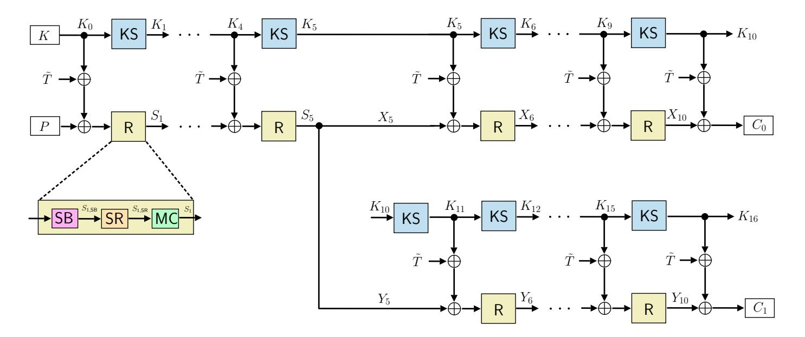
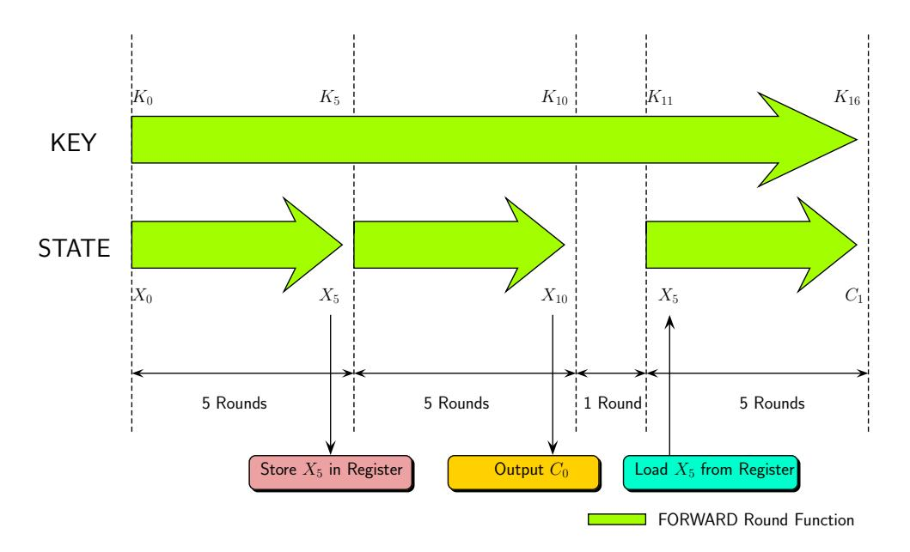
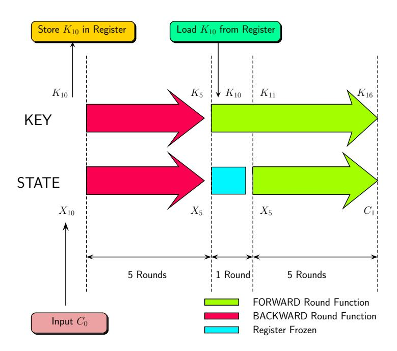
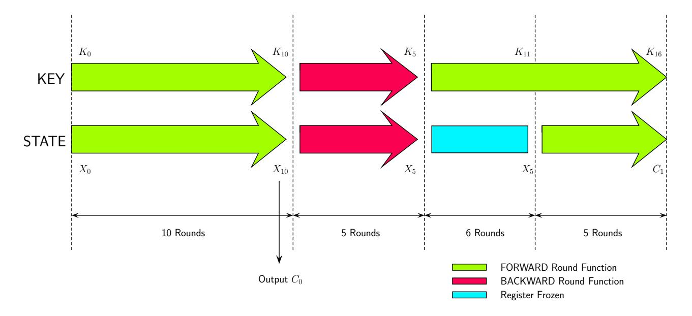
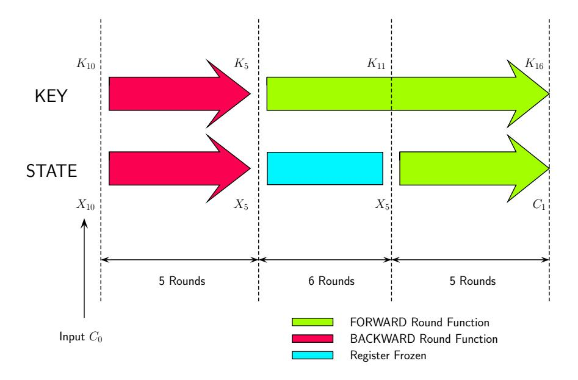
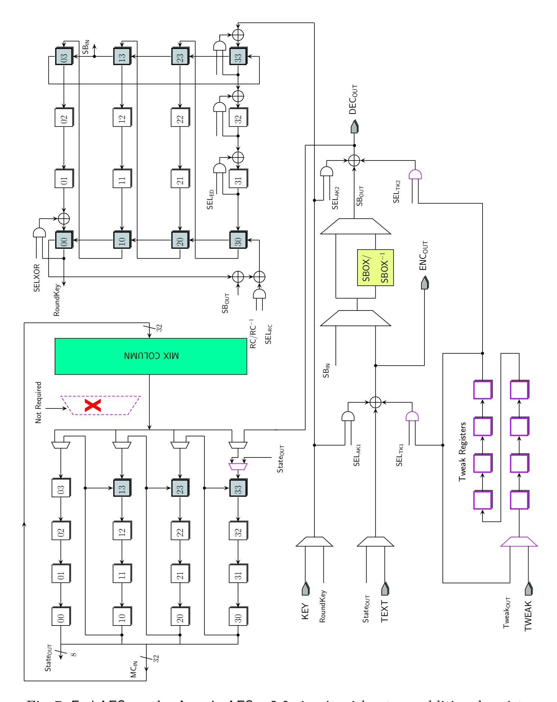
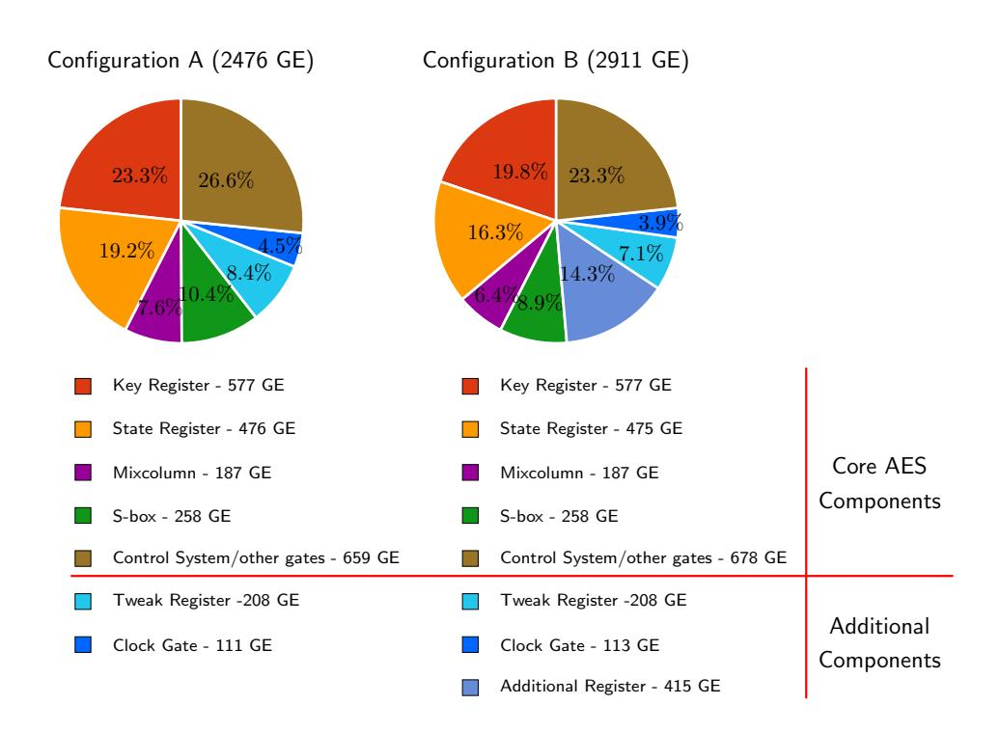
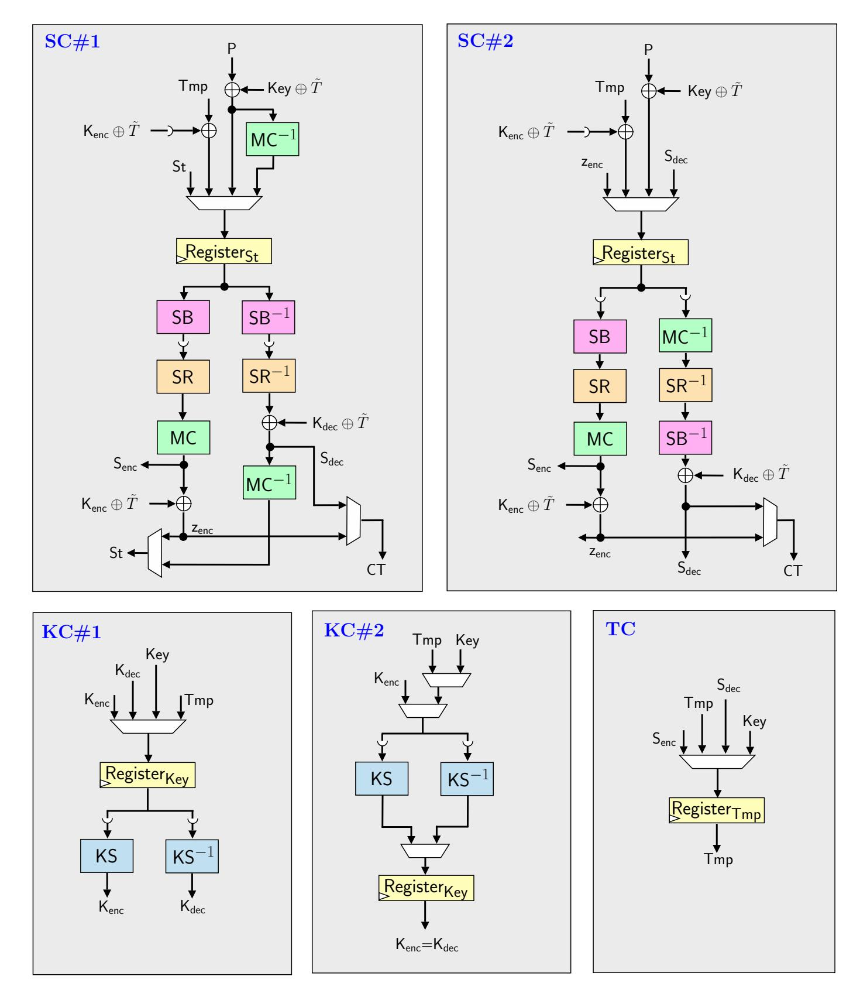
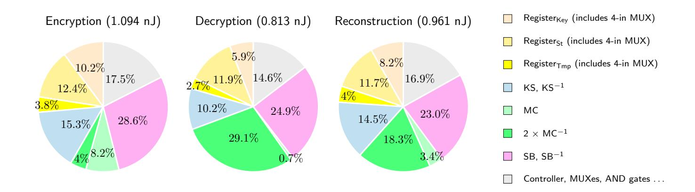

{0}------------------------------------------------

# <span id="page-0-0"></span>Exploring Lightweight Efficiency of ForkAES<sup>∗</sup>

Fatih Balli and Subhadeep Banik

LASEC, Ecole Polytechnique F´ed´erale de Lausanne, Switzerland {fatih.balli,subhadeep.banik}@epfl.ch

Abstract. Recently the ForkAES construction was proposed by Andreeva et al. for efficiently performing authenticated encryption of very short messages on next generation IoT devices. The ForkAES tweakable block cipher uses around one and a half AES encryption calls to produce a pair of ciphertexts for any given plaintext. However the only downside of the construction is that it needs to store an extra state of 128 bits in addition with the storage elements required to perform AES encryption. Thus a hardware implementation of ForkAES would require additional circuit area to accommodate the extra state.

In this paper, we first show that it is possible to implement ForkAES without any additional storage elements other than those required to implement AES, if the AES circuit can additionally perform decryption. Such an implementation naturally requires more clock cycles to perform ForkAES operations. We extend the recently proposed Atomic AES v2.0 architecture to realize ForkAES and compare the area-latency trade-offs incurred with and without an additional storage. The area of the most compact ForkAES design takes about 1.2 times that of AES.

In the second part of the paper we look at another important parameter of lightweight efficiency, i.e. energy. It is well known that round based constructions for AES are the most energy efficient ones. We extend the so-called "S3K2" construction of Banik et al. (IEEE HOST 17) to realize ForkAES in an energy-preserving manner, and compare the effects of some design choices. The energy consumption of our best ForkAES design takes about 2 times that of AES. From lightweight design perspective, our results hence demonstrate that although ForkAES lives up to its promise (of being roughly 1.5 times that of AES) in terms of its area, the same does not hold for its energy consumption.

Keywords: Energy Efficiency, ForkAES, Serialized Implementation.

### 1 Introduction

In the past few years, lightweight cryptography has indeed become an important research discipline. A number of lightweight block ciphers like Clefia [\[2\]](#page-19-0) and Present [\[3\]](#page-19-1) have become popular and have been well-studied with respect to their security and implementation. Both ciphers have been standardized in ISO/IEC

<sup>∗</sup>The source code for our implementations are provided at [\[1\]](#page-19-2).

{1}------------------------------------------------

29192 "Lightweight Cryptography". The Simon and Speck family of block ciphers [\[4\]](#page-19-3) was proposed very recently by researchers of the NSA with the goal of reducing hardware area. While the above ciphers have mostly targeted optimization of hardware area, there have been other block ciphers aimed at optimizing other lightweight design metrics. The principal among them is energy. The block cipher Midori [\[5\]](#page-19-4) was designed to specifically optimize energy consumption. It has also been found that for energy efficient encryption of large quantities of data, stream cipher based constructions like Trivium [\[6\]](#page-20-0) are more energy efficient [\[7\]](#page-20-1). However, AES still remains the de-facto encryption standard worldwide for a number of sectors like banking and e-commerce. It is a part of several internet protocols like HTTPS, FTPS, SFTP, WebDAVS, OFTP, and AS2.

Efficient encryption and authentication of short messages (with maximum message length of 64 bytes) is an essential requirement for enabling security in constrained computation and communication scenarios such as next generation IoT devices. Accordingly, the recently started NIST lightweight cryptography project specifies that AEAD submissions should be "optimized to be efficient for short messages (e.g., as short as 8 bytes)" [\[8\]](#page-20-2). ForkAES was proposed by Andreeva et al. in [\[9\]](#page-20-3) as a solution for the above. ForkAES is a tweakable forkcipher, which is basically a tweakable blockcipher that uses the AES round function to produce two blocks of ciphertext. It is based on the tweakable blockcipher KIASU [\[10\]](#page-20-4), which relies on the round function of AES and uses the TWEAKEY framework to derive round keys from a 128-bit secret key and a 64-bit tweak. Finally, the authors proposed several nonce-based AEAD modes of operations like FAEP and SAEP, optimized to be efficient for short messages. There has been sufficient interest in the community as evident from the cryptanalytic attempt on round reduced ForkAES [\[11\]](#page-20-5). Furthermore, the forking construction [\[12\]](#page-20-6) with a more lightweight SPN block cipher Skinny [\[13\]](#page-20-7), is also a submission to the NIST lightweight cryptography project [\[8\]](#page-20-2).

### 1.1 Contribution and Organization

As acknowledged by the authors, forking a block cipher to produce two ciphertext blocks in the manner that they propose requires one additional storage element of size equal to the AES blocksize, meant for storing an intermediate block cipher state during the computation. This naturally comes at a cost to the circuit size, since an additional storage component needs to be integrated in the design. In this paper, we show that it is possible to implement ForkAES without any additional storage elements other than those required to implement AES, if the AES circuit can perform both the encryption and decryption operations. A very good candidate for the implementation is the Atomic-AES architectures designed in [\[14](#page-20-8)[,15\]](#page-20-9) that can perform both encryption and decryption operations with a datapath width of 8-bits. Atomic-AES v2.0 performs encryption/decryption using 246/326 cycles respectively and occupies only around 2060 GE when implemented with the standard cell library of the STM 90 nm CMOS logic process. However an implementation that does not have an extra storage element requires more clock cycles to perform ForkAES operations. This will be 

{2}------------------------------------------------

clear when we delve into the circuit level description of ForkAES. In the first part of the paper we implement ForkAES both with and without additional storage and compare the area-latency tradeoffs incurred in implementing the circuit.

In the second part of the paper we look at the energy consumption aspect of lightweight efficiency when applied to ForkAES. The fundamental questions then become how expensive is a ForkAES call (in terms of energy) and what type of implementation leads to the most energy-efficient ForkAES realization. It is well known that round based constructions for AES are the most energy efficient, hence we naturally follow the round-based implementation paradigm to realize energy-efficient ForkAES implementations. The freedom of choices in the design, such as whether or not to add a new temporary register, or reorganize the decryption datapath, leads to a few different realizations. Hence we pursue those ideas, which generally involve some trade-off, to find the most energy-efficient implementation with this paradigm. We report our findings and briefly explain the intuition behind design choices. We point out that unlike in circuit area, there is a gap between the energy consumption of ForkAES and AES. We hope that our results draw attention to the energy-consumption perspective of being lightweight and can be used to improve the idea of forkciphers.

The paper is organized as follows. Section 2 contains mathematical descriptions of ForkAES. In Section 3, we show that it is possible to implement ForkAES without additional storage. We explore the circuit level challenges required to implement ForkAES both with and without additional storage and present a detailed comparison. Section 4 focuses on the energy consumption aspects of ForkAES and compares the results of multiple design choices. Section 5 concludes the paper.

### <span id="page-2-0"></span>2 ForkAES Tweakable Blockcipher

FORKCIPHERS. Let  $\mathcal{B}$ ,  $\mathcal{K}$ , and  $\mathcal{T}$  be non-empty sets or spaces. A tweakable forkcipher  $\mathbf{E}$  is a tuple of three deterministic algorithms:

- 1. An encryption algorithm  $\mathbf{E}: \mathcal{K} \times \mathcal{T} \times \mathcal{B} \to (\mathcal{B})^2$ ;
- 2. A decryption algorithm  $\mathbf{D}: \mathcal{K} \times \mathcal{T} \times \mathcal{B} \times \{0,1\} \to \mathcal{B};$
- 3. A tag-reconstruction algorithm  $\mathbf{R}: \mathcal{K} \times \mathcal{T} \times \mathcal{B} \times \{0,1\} \to \mathcal{B}$ .

We define  $\mathbf{E}_K^T(P)[0] = C_0$  and  $\mathbf{E}_K^T(P)[1] = C_1$  Decryption and tag reconstruction take a bit b such that it holds  $\mathbf{D}_K^{T,b}(\mathbf{E}_K^T(P)[b]) = P$ , for all  $K, T, P, b \in \mathcal{K} \times \mathcal{T} \times \mathcal{B} \times \{0,1\}$ . The tag-reconstruction takes  $K, T, C_b$ , and b as input, and produces  $C_{b\oplus 1}$ . When K and T are omitted, we simply write  $\mathbf{D}^b$  and  $\mathbf{R}^b$  for these pair of algorithms.

ROUND FUNCTION OF AES. We recall that AES-128 is a substitution-permutation network over 128-bit inputs, which transforms the input through ten rounds consisting of SubBytes (SB), ShiftRows (SR), MixColumns (MC), and a round-key addition with a round key  $K_i$ . At the start, a whitening key  $K_0$  is XORed to the state; the final round omits the MixColumns operation. We write  $S_i$  for the

{3}------------------------------------------------

<span id="page-3-0"></span>

Fig. 1: ForkAES Tweakable Block Cipher. SB, SR,MC are SubBytes, ShiftRows and MixColumns operations of AES-128 respectively; KS is a one round key schedule operation. Formal descriptions of algorithms are given in Figure 2.

state after Round i, and  $S_i[j]$  for the j-th byte, for  $0 \le i \le 10$  and  $0 \le j \le 15$ . Further, we use  $S_{r,SB}$ ,  $S_{r,SR}$ , and  $S_{r,MC}$  for the states in the r-th round directly after the SubBytes, ShiftRows, and MixColumns operations, respectively. The byte ordering is given by:

$$\begin{bmatrix} 0 & 4 & 8 & 12 \\ 1 & 5 & 9 & 13 \\ 2 & 6 & 10 & 14 \\ 3 & 7 & 11 & 15 \end{bmatrix}.$$

We adopt a similar convention for the round keys  $K_i$  and their bytes  $K_i[j]$ , for  $0 \le i \le 16$ ; for both, we also use often a matrix-wise indexing of the bytes from 0, 0 to 3, 3. More details can be found in [16].

KIASU-BC [10] is a tweakable block cipher that differs from the AES-128 only in the fact that it XORs a public 64-bit tweak T to the topmost two rows of the state whenever a round key is XORed. We denote the tweak by T and by T[j],  $0 \le j \le 7$ , the bytes of T. The bytes are ordered as

$$\begin{bmatrix} 0 & 1 & 2 & 3 \\ 4 & 5 & 6 & 7 \end{bmatrix}.$$

Alternatively one can consider as if  $\mathsf{Transpose}(T||0^{64})$  is XORed to each of the round keys, where  $\mathsf{Transpose}$  is a matrix transposition.

ForkAES. It is a forkcipher based on KIASU-BC. It forks the state after five rounds and transforms it twice to two ciphertexts  $C_0$  and  $C_1$ . Denote by  $\tilde{T} = \mathsf{Transpose}(T||0^{64})$ . We denote the states of the first branch by  $X_i = ^{\mathrm{def}} S_i$ , for  $0 \le i \le 10$ , where  $X_0 = S_0$  denotes the plaintext P and  $X_{10} \oplus K_{10} \oplus \tilde{T} = C_0$ .

{4}------------------------------------------------

Moreover, we denote the states of the second branch by  $Y_i$ , for  $5 \le i \le 10$ , where  $Y_5 = S_5$  and  $C_1 = Y_{10} \oplus K_{16} \oplus \tilde{T}$ . We will also write R for the sequence  $MC \circ SR \circ SB$  and KS for an iteration of the AES-128 key schedule. A schematic illustration is given in Fig. 1, and more details can be found in [9]. The designers of ForkAES propose two modes of operations using the fork cipher SAEF and PAEF. In both these modes of operation, the only functionalities of ForkAES required are (a) Encryption E, (b) Decryption  $D^0$  and (c) Reconstruction  $R^0$ . Thus in this paper we will concentrate on implementing these three functions in hardware.

<span id="page-4-1"></span>

| $ \begin{array}{ c c c c }\hline \text{Encryption } \mathbf{E}_{K}^{T}(P) \colon \\\hline 1: \ K^{0}, \ldots, K^{16} \leftarrow KS^{16}(K) \\ 2: \ \tilde{T} \leftarrow Transpose(T  0^{64}) \\ 3: \ S^{0} \leftarrow P \\ 4: \ \mathbf{for} \ i = 1 \ \text{to} \ 5 \ \mathbf{do} \\ \hline \end{array} \begin{array}{ c c c c c }\hline \text{Decryption } \mathbf{D}_{K}^{T,0}(C_{0}) \colon \\\hline 1: \ K^{0}, \ldots, K^{16} \leftarrow KS^{16}(K) \\ 2: \ \tilde{T} \leftarrow Transpose(T  0^{64}) \\ 3: \ X^{10} \leftarrow C_{0} \oplus K^{10} \oplus \tilde{T} \\ 4: \ \mathbf{for} \ i = 10 \ \text{to} \ 6 \ \mathbf{do} \\ \hline \end{array} \begin{array}{ c c c c }\hline \text{Reconstruction } \mathbf{R}_{K}^{T,0}(C_{0}) \colon \\\hline 1: \ K^{0}, \ldots, K^{16} \leftarrow KS^{16}(K) \\ 2: \ \tilde{T} \leftarrow Transpose(T  0^{64}) \\ 3: \ X^{10} \leftarrow C_{0} \oplus K^{10} \oplus \tilde{T} \\ 4: \ \mathbf{for} \ i = 10 \ \text{to} \ 6 \ \mathbf{do} \\ \hline \end{array} $ |                   |
|----------------------------------------------------------------------------------------------------------------------------------------------------------------------------------------------------------------------------------------------------------------------------------------------------------------------------------------------------------------------------------------------------------------------------------------------------------------------------------------------------------------------------------------------------------------------------------------------------------------------------------------------------------------------------------------------------------------------------------------------------------------------------------------------------------------------------------------------------------------------------------------------------------------------------------------------------------------------------------------------------------------------|-------------------|
| $ \begin{array}{ c c c c c }\hline 2: \ \tilde{T} \leftarrow Transpose(T  0^{6\grave{4}}) \\ 3: \ S^0 \leftarrow P \end{array} \qquad \begin{array}{ c c c c c }\hline 2: \ \tilde{T} \leftarrow Transpose(T  0^{6\grave{4}}) \\ 3: \ X^{10} \leftarrow C_0 \oplus K^{10} \oplus \tilde{T} \end{array} \qquad \begin{array}{ c c c c c }\hline 2: \ \tilde{T} \leftarrow Transpose(T  0^{6\grave{4}}) \\ 3: \ X^{10} \leftarrow C_0 \oplus K^{10} \oplus \tilde{T} \end{array}$                                                                                                                                                                                                                                                                                                                                                                                                                                                                                                                                      |                   |
| $3: S^0 \leftarrow P \qquad \qquad 3: X^{10} \leftarrow C_0 \oplus K^{10} \oplus \tilde{T} \qquad 3: X^{10} \leftarrow C_0 \oplus K^{10} \oplus \tilde{T}$                                                                                                                                                                                                                                                                                                                                                                                                                                                                                                                                                                                                                                                                                                                                                                                                                                                           | K)                |
|                                                                                                                                                                                                                                                                                                                                                                                                                                                                                                                                                                                                                                                                                                                                                                                                                                                                                                                                                                                                                      | )                 |
| A: for $i = 1$ to 5 do A: for $i = 10$ to 6 do A: for $i = 10$ to 6 do                                                                                                                                                                                                                                                                                                                                                                                                                                                                                                                                                                                                                                                                                                                                                                                                                                                                                                                                               |                   |
|                                                                                                                                                                                                                                                                                                                                                                                                                                                                                                                                                                                                                                                                                                                                                                                                                                                                                                                                                                                                                      |                   |
| 5: $z^i \leftarrow S^{i-1} \oplus K^{i-1} \oplus \tilde{T} \mid 5$ : $u^i \leftarrow R^{-1}(X^i)$ 5: $u^i \leftarrow R^{-1}(X^i)$                                                                                                                                                                                                                                                                                                                                                                                                                                                                                                                                                                                                                                                                                                                                                                                                                                                                                    |                   |
| 6: $S^i \leftarrow R(z^i)$ 6: $X^{i-1} \leftarrow u^i \oplus K^{i-1} \oplus \tilde{T} \mid 6$ : $X^{i-1} \leftarrow u^i \oplus K^{i-1}$                                                                                                                                                                                                                                                                                                                                                                                                                                                                                                                                                                                                                                                                                                                                                                                                                                                                              | $\oplus\tilde{T}$ |
| 7: $X^5 \leftarrow S^5$ ; $Y^5 \leftarrow S^5$ 7: $S^5 \leftarrow X^5$ 7: $S^5 \leftarrow X^5$                                                                                                                                                                                                                                                                                                                                                                                                                                                                                                                                                                                                                                                                                                                                                                                                                                                                                                                       |                   |
| 8: for $i = 6$ to 10 do 8: for $i = 5$ to 1 do 8: for $i = 6$ to 10 do                                                                                                                                                                                                                                                                                                                                                                                                                                                                                                                                                                                                                                                                                                                                                                                                                                                                                                                                               | ~                 |
| 9: $u^i \leftarrow X^{i-1} \oplus K^{i-1} \oplus \tilde{T} \mid 9$ : $z^i \leftarrow R^{-1}(S^i)$ 9: $v^i \leftarrow Y^{i-1} \oplus K^{i+5}$                                                                                                                                                                                                                                                                                                                                                                                                                                                                                                                                                                                                                                                                                                                                                                                                                                                                         | $\oplus T$        |
| $10: 	 X^i \leftarrow R(u^i) 	 10: 	 S^{i-1} \leftarrow z^i \oplus K^{i-1} \oplus \tilde{T} 	 10: 	 Y^i \leftarrow R(v^i)$                                                                                                                                                                                                                                                                                                                                                                                                                                                                                                                                                                                                                                                                                                                                                                                                                                                                                           |                   |
| $ 11: C_0 \leftarrow X^{10} \oplus K^{10} \oplus \tilde{T}$ $ 11: P \leftarrow S_0$ $ 11: C_1 \leftarrow Y^{10} \oplus K^{16} \oplus \tilde{T}$                                                                                                                                                                                                                                                                                                                                                                                                                                                                                                                                                                                                                                                                                                                                                                                                                                                                      |                   |
| 12: for $i = 6$ to 10 do 12: return $P$ 12: return $C_1$                                                                                                                                                                                                                                                                                                                                                                                                                                                                                                                                                                                                                                                                                                                                                                                                                                                                                                                                                             |                   |
| 13: $v^i \leftarrow Y^{i-1} \oplus K^{i+5} \oplus \tilde{T}$                                                                                                                                                                                                                                                                                                                                                                                                                                                                                                                                                                                                                                                                                                                                                                                                                                                                                                                                                         |                   |
| 14: $Y^i \leftarrow R(v^i)$                                                                                                                                                                                                                                                                                                                                                                                                                                                                                                                                                                                                                                                                                                                                                                                                                                                                                                                                                                                          |                   |
| $15: C_1 \leftarrow Y^{10} \oplus K^{16} \oplus \tilde{T}$                                                                                                                                                                                                                                                                                                                                                                                                                                                                                                                                                                                                                                                                                                                                                                                                                                                                                                                                                           |                   |
| 16: <b>return</b> $(C_0, C_1)$                                                                                                                                                                                                                                                                                                                                                                                                                                                                                                                                                                                                                                                                                                                                                                                                                                                                                                                                                                                       |                   |
|                                                                                                                                                                                                                                                                                                                                                                                                                                                                                                                                                                                                                                                                                                                                                                                                                                                                                                                                                                                                                      |                   |

Fig. 2: Exact descriptions of the three algorithms  $\mathbf{E}, \mathbf{D}^0, \mathbf{R}^0$  used in SAEF and PAEF forkable modes of operations from [9]. Here, R denotes the round function, i.e. R(x) = MC(SR(SB(x))) and  $KS^{16}$  denotes successive applications of key schedule algorithm 16 times, i.e.  $K_{i+1} \leftarrow KS(K_i)$  for  $0 \le i \le 16$  where  $K_0 = K$ .

## <span id="page-4-0"></span>3 Serial Implementation of ForkAES

The three functions that any ForkAES circuit must accommodate in order to execute the FAEP and SAEP modes of operation are Encryption  $\mathbf{E}$ , Decryption  $\mathbf{D}^0$  and Reconstruction  $\mathbf{R}^0$ . To begin with, we will show that it is possible to execute these functions without the use of an extra register. To do so we first examine the case when the circuit does utilize an additional register.

First of all, from Figure 1 and 2 it is straightforward to see that Decryption  $\mathbf{D}^0$  operation is the simple AES decryption with an additional tweak. Thus any circuit that performs AES decryption can perform  $\mathbf{D}^0$  with or without an addi-

{5}------------------------------------------------

<span id="page-5-0"></span>tional register in the same number of clock cycles. Thus we concentrate on the E, R 0 functions.



<span id="page-5-1"></span>Fig. 3: Executing E on an AES circuit with an additional register



Fig. 4: Executing R[0] on an AES circuit with an additional register

Encryption E As shown pictorially in Figure [3,](#page-5-0) encryption on an AES circuit would proceed as follows. In the first 5 rounds, the circuit would proceed in the forward direction, i.e. execute the forward keyschedule function on the key registers and the forward AES round functions on the state registers. After this, the intermediate state X<sup>5</sup> is stored in the additional register, parallelly while the circuit continues to execute the forward functions on 

{6}------------------------------------------------

both the key and state registers for another 5 rounds. At this point the the first ciphertext  $C_0 = X_{10} \oplus K_{10} \oplus \tilde{T}$  is output from the state side.

Thereafter there needs to be one blank round in which the key registers executes the forward keyschedule to compute the 12th roundkey  $K_{11}$ , during which the state registers could either be frozen using clock gating techniques, or let to operate normally (it does not make any difference to the eventual circuit output). After this the state  $X_5$  that was stored in the extra register is loaded back on to the state registers and the circuit operates in the forward direction in both the state and key sides for another 5 rounds to output the second ciphertext block  $C_1$ .

Reconstruction  $\mathbb{R}^0$  The reconstruction function essentially outputs  $C_1$  when the input is  $C_0$ . It would be executed as follows as per Figure 4. The initial inputs to the circuit are the ciphertext block  $C_0 = X_{10} \oplus K_{10} \oplus \tilde{T}$  and the 11th roundkey  $K_{10}$ . We parallelly store  $K_{10}$  in the additional register and execute the inverse AES round functions and keyschedule for 5 rounds. At this point the state and key registers store the intermediate states  $X_5$  and  $K_5$  respectively. We freeze the state register for one round at this point and simultaneously load  $K_{10}$  that was stored in the additional register back on to key registers. After this round the key registers compute the 12th roundkey  $K_{11}$  required to start the bottom branch of the reconstruction process. After this the state registers are unfrozen and both run in the forward direction for 5 more rounds to compute  $C_1$ .

<span id="page-6-0"></span>We now try to prove that both encryption and reconstruction can be performed on an AES circuit that additionally supports decryption.

**Proposition 1.** Consider any circuit that performs both AES encryption and decryption. If the circuit is able to accommodate an additional 64 bit tweak register and a mechanism to add the tweak value efficiently to the state, then it is possible to perform the ForkAES  $\mathbf{E}$  and  $\mathbf{R}^0$  operations on such a circuit without requiring any other additional storage elements.

**Proof Idea 1** We first look at encryption as explained in Figure 5. The AES circuit first runs for 10 rounds without interruption, and the ciphertext block  $C_0 = X_{10} \oplus K_{10} \oplus \tilde{T}$  is output. Thereafter the circuit is made to operate in the backward direction for 5 rounds, i.e. the inverse AES round functions and keyschedule operations are performed so that at the end of this, the circuit returns to having  $X_5$ ,  $K_5$  in the state and key registers. At this point we freeze the state registers for 6 rounds and let the key registers run in the forward direction this time for 6 rounds, so that the 12th roundkey  $K_{11}$  is computed by this time. After this both the state and key registers are both run in the forward direction for 5 rounds so that after this the ciphertext block  $C_1$  would have been computed.

We next look at reconstruction  $\mathbb{R}^0$ . Reconstruction is essentially getting the circuit to output  $C_1$ , given  $C_0$  and  $K_{10}$  as inputs. This is essentially how the circuit functions in the last 16 rounds in the encryption operation as is evident from Figures 5 and 6. This completes the proof sketch.

{7}------------------------------------------------

<span id="page-7-0"></span>

Fig. 5: Executing E on an AES circuit without an additional register

<span id="page-7-1"></span>

Fig. 6: Executing R 0 on an AES circuit without an additional register

{8}------------------------------------------------

#### 3.1 Implementing ForkAES with the Atomic AES v 2.0 architecture

The Atomic AES v2.0 architecture was proposed in [\[15\]](#page-20-9). It is an 8-bit serial circuit that accommodates both encryption and decryption operations. One forward round is executed in 23 clock cycles and an inverse round is executed in 31 clock cycles. It occupies an area of only 2060 GE when implemented with the standard cell library of the STM 90nm CMOS logic process and thus a very good candidate for a lightweight implementation of ForkAES both with and without the use of additional storage elements.

We first look at the circuit without an additional register, and refer this implementation as Configuration A. Before getting into circuit details of the implementation let us look at the changes we need to make to the original circuit to accommodate ForkAES operations. They are highlighted in purple in Figure [7.](#page-9-0)

- A: The original circuit had a an additional 32 bit multiplexer, for the mixcolumn circuit. This is because the last round in AES encryption does not employ a MixColumns operation. However all ForkAES round functions are identical: none of them omit the MixColumns function. Thus the 32 bit multiplexer can be omitted.
- B: Additional 64 bit tweak register, to accommodate the tweak addition operation. Also additional 8-bit and gates are required to prevent tweak addition in clock cycles when it is not required.
- C: One additional 8-bit multiplexer to cycle back the bytes coming out of the state registers back into the state.
- D: Additional circuitry to generate more round constants.
- E: Additional circuitry to generate control signals to employ a more fine-grained control over the circuit.
- F: Additional circuitry to generate gated clock signals to periodically stop data movement in registers as and when required.

We now look at register level operations for a clearer picture of the movement of data in and out of the registers. Note that we do not delve into circuit level details of how the AES round and key functions operate. The readers are referred to [\[15\]](#page-20-9) for a more detailed and comprehensive analysis of clock by clock operations involved in the actual round functions/keyschedule functions the circuit. However before we proceed it would be helpful to have an idea of the sequence of operations performed by the Atomic AES circuit while performing encryption/decryption. An encryption round consists of the following sequence of operations:

ShiftRows (3 cycles), MixColumns (4 cycles), AddRoundKey + SubBytes of next round (16 cycles)

Thus given SB(X<sup>i</sup> ⊕ Ki) as input a forward round on this circuit produces SB(Xi+1 ⊕ Ki+1). A decryption round consists of the following operations:

MixColumns <sup>−</sup><sup>1</sup> (12 cycles), ShiftRows <sup>−</sup><sup>1</sup> (3 cycles), SubBytes <sup>−</sup><sup>1</sup> + AddRoundKey (16 cycles)

{9}------------------------------------------------

<span id="page-9-0"></span>

Fig. 7: ForkAES on the Atomic-AES v 2.0 circuit without an additional register

{10}------------------------------------------------

Thus an inverse round would produce X<sup>i</sup> ⊕ K<sup>i</sup> given Xi+1 ⊕ Ki+1 as input. Now let us look at the sequence of operations in ForkAES E operation:

- Cycles 0 to 222 The first 16 + 9 · 23 = 223 cycles are used for loading of key/plaintext on to the registers (16 cycles) and executing the first 9 rounds of AES (207 cycles) and the 10th round substitution layer. Of course the initial data loaded onto the state register after cycle 15 is SB(X<sup>0</sup> ⊕ K0) so that every forward round can function seamlessly.
- Cycles 223 to 229 The next 3 + 4 = 7 cycles are used to execute the 10th round ShiftRows (3 cycles) and the subsequent MixColumns (4 cycles). Thus the content of the state register at this point is basically equal to Y = MC ◦ SR ◦ SB(X<sup>9</sup> ⊕ K9).
- Cycles 230 to 245 These 16 cycles are used to do the final key addition to generate the first ciphertext block C0. At the same time the bytes coming out of the state register (which are the individual bytes of Y ) are driven back into the state register via the additional multiplexer mentioned in item C of the above list. Since the inverse round operations of Atomic-AES v 2.0 circuit start with the MixColumns <sup>−</sup><sup>1</sup> operation this will nicely help us invert round function to get back X5. Note that at the same time K<sup>10</sup> is recycled back into the key registers.
- Cycles 246 to 400 The next 31 · 5 = 155 cycles are used to perform 5 inverse AES round operations.
- Cycles 401 to 515 At this point of time the state registers store the signal X<sup>5</sup> and are frozen by gating the clock signal feeding them. The key registers store K5, and so the next 5 · 23 = 115 cycles are used to operate the keyschedule in the forward direction to compute K10.
- Cycles 516 to 538 The key registers function normally so that from cycles 523-538 the 12th roundkey K<sup>11</sup> are available for key addition. The state registers are frozen till cycle 522. From cycles 523 to 538 the bytes are taken out of the state register added to the individual bytes of K11, passed through the S-box and driven back into the state registers. In this way at the end of this set of cycles, the state registers hold SB(X<sup>5</sup> ⊕ K11), which is exactly the value required to operate the subsequent forward rounds.
- Cycles 539 to 653 The next 5 · 23 = 115 cycles, 5 forward AES rounds are executed in a normal way, so that it is able to output the final ciphertext block C1.

All the above description implicitly assumes that the Tweak register essentially operates as a circularly shifting register that makes the tweak bytes available for addition as and when required. We already know that decryption D 0 is performed in a manner exactly same as the AES decryption function on the Atomic AES circuit in 326 cycles. As per Proposition [1,](#page-6-0) the reconstruction R 0 is simply achieved by executing the operations from cycles 230 to 653. Thus encryption, decryption and reconstruction takes 654, 326 and 424 cycles respectively. This completes the analysis for Configuration A. Due to space constraints, we omit similar detailed circuit level analysis for the case when an extra register is

{11}------------------------------------------------

<span id="page-11-1"></span>Table 1: Performance Comparison of ForkAES implemented with Atomic-AES v2.0 circuit. For comparison Atomic-AES v2.0 consumes 2060 GE of area.

| # Configuration | Area | Operation      | Latency Power |       | Energy | T Pmax |
|-----------------|------|----------------|---------------|-------|--------|--------|
|                 | (GE) |                | (cycles) (µW) |       | (nJ)   | (Mbps) |
| 1 A             | 2476 | Encryption     | 654           | 118.8 | 7.77   | 54.90  |
|                 |      | Decryption     | 326           |       | 3.87   | 55.07  |
|                 |      | Reconstruction | 424           |       | 5.04   | 42.34  |
| 2 B             | 2911 | Encryption     | 384           | 134.8 | 5.18   | 91.74  |
|                 |      | Decryption     | 326           |       | 4.39   | 54.03  |
|                 |      | Reconstruction | 309           |       | 4.17   | 57.00  |

used (call it Configuration B). However it is not too difficult to see that the clock-by-clock analysis is pretty similar to the arguments outlined right at the beginning of the section.

#### 3.2 Implementation Results

In order to perform a fair performance evaluation, we first implemented the circuits using VHDL. Thereafter the following design flow was adhered to for all the circuits: a functional verification at the RTL level was first done using Mentor Graphics Modelsim software. The designs were synthesized using the standard cell library of the 90nm logic process of STM (CORE90GPHVT v 2.1.a) with the Synopsys Design Compiler, with the compiler being specifically instructed to optimize the circuit for area. A timing simulation was done on the synthesized netlist to confirm the correctness of the design, by comparing the output of the timing simulation with known test vectors. The switching activity of each gate of the circuit was collected while running post-synthesis simulation. The average power was obtained using Synopsys Power Compiler, using the back annotated switching activity. The results are tabulated in Table [1.](#page-11-1) We can achieve an implementation of 2476 gates in Configuration A, which is only around 400 GE larger than the original AES circuit.

In Figure [8,](#page-12-0) we present a componentwise breakdown of the areas occupied in the 2 configurations. It can be seen that most of the area is occupied by the registers (state and key), s-box, mixcolumn and other control signals required in the core AES circuit. The additional area requirement is accounted for by the tweak registers, clock gating circuit, and the additional register used in Configuration B.

### <span id="page-11-0"></span>4 Energy Consumption of ForkAES architectures

During its functionality, the energy spent by a circuit can be divided into two parts: leakage energy and dynamic energy. The former roughly scales with the number of gates constituting the circuit, where each gate is associated with a constant power leakage due to its implementation in the CMOS technology. The

{12}------------------------------------------------

<span id="page-12-0"></span>

Fig. 8: Component-wise breakdown of areas in the 2 configurations of ForkAES

latter, on the other hand, essentially stems from state changes of wires, as each component of the circuit receives and further propagates glitches, until both its input and output values are stabilized. This repeats each time the input of components change that coincides with the rising edge of the clock signal.

Hence, minimizing the circuit size does not necessarily align with the goal of reducing energy consumption. Following the work of Banik et al. [17], a circuit that performs one round of AES per clock cycle leads to the most energy efficient design. Then the follow-up question is how one can transform that particular one round per clock cycle AES circuit to obtain most energy efficient implementation for ForkAES. Since converting a plain AES architecture that supports both decryption and encryption into ForkAES circuit reveals a number of free design choices, we consider and compare each one of the possible designs below.

#### 4.1 Generic Architecture

On a higher level, the architectures we propose share the common structure with some further tweaks that let us pick the most energy efficient architecture. The following summary of the design refers to the most energy efficient design on average and it is obtained through a combination of compartmentalized components SC#1, KC#1, TC explained below. Further modifications we make lead to slight changes in the precise description of these components and as well as the main circuit as seen in Figure 9. We present the power and energy consumption results of the modifications in Table 2.

In comparison to Atomic AES that uses 8-bit data and key path, the designs below utilize 128-bit data and key paths. All mainly consist of three components, that handle the states  $S_i$ , the round keys  $K_i$  and the temporary register.

{13}------------------------------------------------

<span id="page-13-0"></span>

Fig. 9: The state components SC#1, SC#1; the key components KC#1, KC#2, and the temporary register component TC of ForkAES circuit.

{14}------------------------------------------------

State component. It consists of three parts (see SC#1 in Figure [9\)](#page-13-0):

- At its core, 128-bit RegisterSt is used to keep the plaintext/ciphertext state of each ForkAES round. At the rising edge of the clock, its content is updated to the next state with the help of the multiplexer described below.
- The multiplexer placed at the input of RegisterSt supports three basic operations, by selecting which value should be loaded into this register. First, it can load the next plaintext/ciphertext state from the wire St, as it is computed by the round function circuit. Secondly, it can load the initial state, e.g. S<sup>0</sup> during encryption. And lastly, it can load the contents of the temporary register RegisterTmp.
- Round function bus consists of two series of 128-bit combinatorial circuits arranged to perform either the round function R or its inverse R −1 , as well as the tweaked key addition. This dual circuit is complemented with masking AND gates (denoted with symbol ) that disable the unused part of the circuit, i.e. either the encryption or the decryption path, to reduce energy consumption. The final output of the circuit is selected by the output multiplexer.

Key Component (KC) The key component KC works in a quite similar fashion to the state component. It also consists of three parts (see KC#1 in Figure [9\)](#page-13-0):

- 128-bit RegisterKey is used to keep the current round key (more precisely it keeps Ki−<sup>1</sup> at round i). It is updated with the rising edge of the clock.
- The multiplexer wired to the input of RegisterKey supports three different basic operations, by selecting which value to load into the register. First, it can load the next round key computed by the key schedule circuit. Secondly, it can initialize the register during cycle 0, e.g. load K<sup>0</sup> during encryption. And lastly, it can load the content of RegisterTmp.
- The key schedule consists of two series of 128-bit combinatorial circuits arranged to perform either the forward key schedule function KS or its inverse KS<sup>−</sup><sup>1</sup> . This dual circuit is also complemented with masking AND gates ( ) that disable the unused part of the circuit for energy efficiency. The actual round key that the state component needs is provided through either Kenc or Kdec based on the actual ForkAES operation the circuit is performing.

Temporary (Register) Component (TC) It consists of two parts (see TC in Figure [9\)](#page-13-0):

- 128-bit RegisterTC is used to keep a temporary 128-bit value. This is either the state S<sup>5</sup> used at fork (see Figure [1\)](#page-3-0) or the round key K<sup>10</sup> loaded to the circuit during reconstruction operation.
- The multiplexer wired to the input of RegisterTC supports three basic operations, by selecting which value to load into the register. First, it can maintain its content through reloading from itself. Secondly, it can initialize the with the round key K10. And lastly, it can load the forking state S<sup>5</sup> from the state component.

{15}------------------------------------------------

Below we describe how encryption is done with the particular ForkAES architecture that combines components SC#1, KC#1, TC. We use the series of variables  $S_i, z_i, K_i$  defined in the encryption algorithm in Figure 2 for convenience.

- Cycle 0 On SC#1, AddRoundKey (with tweak) is done on plaintext, and the result  $z_1 = S_0 \oplus K_0 \oplus \tilde{T}$  is loaded into Register<sub>St</sub> through multiplexer. On KC#1, the initial key  $K_0$  is loaded into Register<sub>Key</sub> without any operation.
- Cycles 1 to 4 At the very beginning of cycle i, Register<sub>St</sub> holds  $z_i$ . Then during cycle i,  $S_i \leftarrow \mathsf{SB}(\mathsf{SR}(\mathsf{MC}(z_i)))$  is computed through encryption path and the round key addition follows it:  $z_{i+1} \leftarrow S_i \oplus K_i \oplus \tilde{T}$ . Since Register<sub>Key</sub> holds  $K_{i-1}$  at the beginning of clock cycle i, the round key  $K_i$  appears at wire K<sub>enc</sub> after being computed by KS circuit of KC#1 and the result is passed to the encryption path via K<sub>enc</sub> as seen in Figure 9. Also,  $K_i$  is loaded into Register<sub>Key</sub>.
- Cycle 5 Works similar to cycles 1-4. The only difference is that the forking state  $S_5$  from the encryption path is stored into the temporary register Register<sub>Tmp</sub>. Cycles 6 to 9 Similar to cycles 1 to 4.
- Cycle 10 Works similar to cycles 1 to 4. The difference is that  $C_0$  becomes available at the output wire CT during this clock cycle. Also, the control bits of multiplexer before Register<sub>St</sub> is set to load the forking state  $S_5$  for the next clock cycle from the temporary register Register<sub>Tmp</sub>.
- Cycle 11 At the beginning of this cycle, Register<sub>St</sub> receives  $v_6 = S_5 \oplus K_{11} \oplus \tilde{T}$ . Similar to cycle 1, the computation  $Y_6 \leftarrow \mathsf{SB}(\mathsf{SR}(\mathsf{MC}(v_6)))$  is done first, and then the key addition:  $v_7 \leftarrow Y_6 \oplus K_{12} \oplus \tilde{T}$ .  $v_7$  is stored back into Register<sub>St</sub>, and the round key  $K_{12}$  is stored into Register<sub>Key</sub>.

Cycles 12 to 15 Similar to cycles 1 to 4.

Cycle 16 Similar to cycle 10, with the difference that  $C_1$  becomes available at CT.

Below we describe how ForkAES reconstruction is performed by the circuit, which involves some parts of encryption and decryption operations. We assume that at the beginning of the operation, the ciphertext  $C_0$  is loaded into P, and the round key  $K_{10}$  is loaded into Key.

- Cycle 0 On SC#1, AddRoundKey (with tweak) and  $MC^{-1}$  is computed on the ciphertext  $C_0$ , and the result  $X_{10,SR}$  is loaded into Register<sub>St</sub> through multiplexer. On KC#1, the initial key  $K_{10}$  is loaded both into Register<sub>Key</sub> and Register<sub>Tmp</sub> without any operation.
- Cycles 1 to 4 At the beginning of cycle i, Register<sub>St</sub> holds  $X_{11-i,SR}$ . Then during cycle i,  $u_{11-i} \leftarrow \mathsf{SB}^{-1}(\mathsf{SR}^{-1}(z_i))$  is first computed through decryption path<sup>2</sup> and the round key addition follows it:  $X_{10-i} \leftarrow u_{11-i} \oplus K_{10-i} \oplus \tilde{T}$ .

<sup>&</sup>lt;sup>1</sup>More precisely, the value is loaded into Register<sub>St</sub> during the rising edge that marks the end of cycle 0, hence the value itself becomes available at the output of the register at cycle 1. We rather say the value is loaded into the register at clock cycle 0.

<sup>&</sup>lt;sup>2</sup>Note that  $SB^{-1}(SR^{-1}(x)) = SR^{-1}(SB^{-1}(x))$  for all x.

{16}------------------------------------------------

And finally,  $X_{10-i,SR} \leftarrow \mathsf{MC}^{-1}(X_{10-i})$ . In the same fashion, at the beginning of the clock cycle i, Register<sub>Key</sub> holds  $K_{11-i}$ , hence the round key  $K_{10-i}$  is calculated with the combinatorial  $\mathsf{KS}^{-1}$  circuit of  $\mathsf{KC}\#1$  and the result is passed to the decryption path via  $\mathsf{K}_{\mathsf{dec}}$  as seen in Figure 9; and also loaded back into Register<sub>Key</sub>.

- Cycle 5 Works similar to cycles 1-4. The difference is that the forking state  $S_5$  from the decryption path appears at  $S_{dec}$  and hence it is loaded into the temporary register  $Register_{Tmp}$  at the end of this clock cycle. Moreover, the round key  $K_{10}$  is loaded back into  $Register_{Key}$  from  $Register_{Tmp}$ .
- Cycle 6 No decryption or encryption operation is done on SC#1, because an operation that must follow is a round key addition (see Figure 1). Therefore, the forking state  $S_5$  is read from  $Register_{Tmp}$  and the round key addition is done on the wire:  $v_6 \leftarrow S_5 \oplus K_{11} \oplus \tilde{T}$ , where the round key  $K_{11}$  is computed with KS circuit in KC#1. The result  $v_6$  is loaded into  $Register_{St}$ .
- Cycles 7 to 11 Works similar to cycles 12 to 16 of ForkAES encryption operation above, and the result  $C_1$  becomes available at clock cycle 11.

We skip the description of decryption, as it can be easily constructed by repeating the cycles 1 to 4 of ForkAES reconstruction above.

#### 4.2 Modified Implementations.

We explore possible modifications to the generic circuit, and compare their results in Table 2. In order to derive a single metric for strict comparison, we take the average of energy consumed by each ForkAES encryption  $\mathbf{E}$ , decryption  $\mathbf{D}^0$  and reconstruction  $\mathbf{R}^0$  operations. Our choice of this metric is justified by the fact that the proposed modes of operations SAEF and PAEF by Andreeva et al. [9] make the following number of ForkAES calls for a message of m blocks and an associated data of a blocks<sup>3</sup>:

```
- encryption: (m+a) \cdot \mathbf{E},
- decryption: a \cdot \mathbf{E} + m \cdot \mathbf{D}^0 + m \cdot \mathbf{R}^0.
```

Hence the average energy spent per message block roughly converges to our metric assuming  $m \gg a$ .

CLOCK GATING (DESIGN #2). One might notice that during encryption the control bits and contents of Register<sub>Tmp</sub> is irrelevant for 12 clock cycles, and used as a storage for 4 cycles. Similarly, during reconstruction, the Register<sub>Tmp</sub> stores its value for many cycles without receiving a new value. The register stores its value through a multiplexer that feeds the register's own value back into its input (see TC in Figure 9). Hence one might wonder if freezing the register by micromanaging its clock signal yields a better design instead of reloading the

<sup>&</sup>lt;sup>3</sup>This metric omits the additional higher-level circuitry such as control blocks to handle multiple associated data and message blocks in SAEF and PAEF, as we only focus on the ForkAES implementation.

{17}------------------------------------------------

register with the same value multiple times. We implemented this version. This implementation (#2 in Table [2\)](#page-19-5) is dubbed with an extra cg, i.e. clock gating. Even though there is a small energy gain in decryption, the encryption becomes more costly. That might be explained with the inherent glitches on additional clock signals of registers, as adding more control leads to more complicated circuit in front of this signal. The glitch on this clock signal incurs further wasted computation in other components. In conclusion, this modification leads to a less efficient implementation on average.

Reorganized decryption path (#3). One of the benefits of the state component SC#1 (see Figure [9\)](#page-13-0) is that both SB and SB−<sup>1</sup> has the same input, which allows them to be implemented as a single circuit and share a demultiplexer. This idea is due to Banik et al. [\[14\]](#page-20-8). As a disadvantage, this design requires an extra MC<sup>−</sup><sup>1</sup> circuit attached to the input wire P, as ForkAES does not skip a MixColumns operation at the last round in contrast to the original AES-128. In order to understand this trade-off better, we compare it with another state component design, i.e. SC#2. The latter organizes MC<sup>−</sup><sup>1</sup> , SR<sup>−</sup><sup>1</sup> , SB<sup>−</sup><sup>1</sup> circuits in a more intuitive fashion in the decryption path, and eliminates the need to append an extra MC<sup>−</sup><sup>1</sup> to the input (see Figure [9\)](#page-13-0). In conclusion, this leads to a slightly less efficient implementation as reported in Table [2,](#page-19-5) because the energy consumption caused by duplication of some S-box circuitry due to separation beats the energy gain by removal of MC<sup>−</sup><sup>1</sup> .

Removing temporary register (#4). We have shown in Section [3](#page-4-0) that even without a temporary register to store the forking state S5, one can still realize ForkAES operations. This would apparently require more clock cycles, and therefore more energy. In order to understand this trade-off, we consider the design that is a combination of SC#1, KC#1 without temporary component. In order to micromanage the registers, we use clock gating. It can be seen in the Table [2](#page-19-5) that this design is at least 20% less efficient than its counterpart with temporary components (due to clock gating based implementation, comparison of #2 versus #4 is more reasonable).

Flipped key scheduler (#5). Our final tweaked design is based on the following observation: during each clock cycle, the round key is computed either through KS or KS−<sup>1</sup> circuit. Because it takes few nanoseconds for these circuits to compute the final round key, the output wires Kenc and Kdec propagate glitches into SC#1 circuit. That is due to the fact that RegisterKey actually stores the previous round key instead of the exact round key needed by the state component. In comparison, if the key component were to be updated as such that the particular round key was stored in the key register precisely when it was needed by the state component, then Kenc and Kdec would be glitch-free. The modified key component is given as KC#2 in Figure [9.](#page-13-0) This modification decreases the energy spent during encryption operation, but surprisingly incurs more for decryption and reconstruction operations. The energy results of this modification can be seen by comparing designs #1 versus #5 in Table [2.](#page-19-5)

{18}------------------------------------------------



Fig. 10: Component-wise breakdown of the energy consumption of the most energy-efficient architecture, i.e. implementation #1 with SC#1, KC#1, TC components, during ForkAES encryption, decryption and reconstruction operations.

## <span id="page-18-0"></span>5 Conclusion

The recently proposed ForkAES cipher would normally require an additional register to store an intermediate state during computation. Thus an implementation of ForkAES in hardware would require additional circuit area to accommodate the extra state. In this paper, we first showed that it was possible to implement ForkAES without any additional storage elements other than those required to implement AES, if the AES circuit could additionally perform decryption. As a proof of concept, using the Atomic AES v2.0 architecture as a building block, we implemented the ForkAES circuit both with and without an additional register and present a tradeoff in terms of area of circuit and number of clock cycles required to perform encryption/decryption/reconstruction operations of ForkAES. Without an additional register, the circuit occupies 2476 GE which is only around 400 GE more than the core AES circuit. In the second part of the paper we looked at the energy-efficiency of ForkAES implementations. We extended the so-called "S3K2" construction of Banik et al. [\[17\]](#page-20-11) to realize ForkAES in an energy-preserving manner, and compared the effects of some design choices. We found that the energy consumption of the most energy-efficient implementation of ForkAES consumed about 2 times that of AES. From lightweight design perspective, our results present various tradeoffs involved in the design space of ForkAES that can be useful in determining the implementation most suitable to meeting any given area/power/energy budget.

Acknowledgments: The authors are supported by the Swiss National Science Foundation (SNSF) through the Ambizione Grant PZ00P2 179921.

{19}------------------------------------------------

<span id="page-19-5"></span>Table 2: Results for various energy-efficient architectures. For comparison, note that the most efficient AES-128 circuit "S3K2" of [\[14\]](#page-20-8) consumes 0.484 nJ on average with 22729 GE area, making the most efficient ForkAES implementation at least twice more expensive.

| # Configuration      | Area  | Operation      | Latency Power |       | Energy | T Pmax |
|----------------------|-------|----------------|---------------|-------|--------|--------|
|                      | (GE)  |                | (cycles) (µW) |       | (nJ)   | (Mbps) |
| 1 SC#1, KC#1, TC     | 27155 | Encryption     | 17            | 643.6 | 1.094  | 2671   |
| (described in text)  |       | Decryption     | 11            | 739.2 | 0.813  | 2064   |
|                      |       | Reconstruction | 12            | 800.8 | 0.961  | 1892   |
|                      |       | Average        | -             | -     | 0.956  | -      |
| 2 SC#1, KC#1, TC, cg | 27182 | Encryption     | 17            | 713.5 | 1.213  | 2892   |
|                      |       | Decryption     | 11            | 735.3 | 0.809  | 2234   |
|                      |       | Reconstruction | 12            | 809.7 | 0.972  | 2048   |
|                      |       | Average        | -             | -     | 0.998  | -      |
| 3 SC#2, KC#1, TC     | 30908 | Encryption     | 17            | 748.3 | 1.272  | 3042   |
|                      |       | Decryption     | 11            | 618.8 | 0.681  | 2351   |
|                      |       | Reconstruction | 12            | 849.3 | 1.019  | 2155   |
|                      |       | Average        | -             | -     | 0.991  | -      |
| 4 SC#1, KC#1, cg     | 26480 | Encryption     | 25            | 713.7 | 1.784  | 2112   |
|                      |       | Decryption     | 11            | 695.3 | 0.765  | 2408   |
|                      |       | Reconstruction | 15            | 760.3 | 1.140  | 1766   |
|                      |       | Average        | -             | -     | 1.230  | -      |
| 5 SC#1, KC#2, TC     | 27137 | Encryption     | 17            | 630   | 1.071  | 3790   |
|                      |       | Decryption     | 11            | 759.1 | 0.835  | 2929   |
|                      |       | Reconstruction | 12            | 849.5 | 1.019  | 2684   |
|                      |       | Average        | -             | -     | 0.975  | -      |

## References

- <span id="page-19-2"></span>1. Lightweight forkaes implementations. [https://c4science.ch/source/](https://c4science.ch/source/lightforkaes/) [lightforkaes/](https://c4science.ch/source/lightforkaes/).
- <span id="page-19-0"></span>2. Taizo Shirai, Kyoji Shibutani, Toru Akishita, Shiho Moriai, and T Iwata. The 128-bit blockcipher clefia (extended abstract). volume 4593, pages 181–195, 08 2007.
- <span id="page-19-1"></span>3. Andrey Bogdanov, Lars R. Knudsen, Gregor Leander, Christof Paar, Axel Poschmann, Matthew J. B. Robshaw, Yannick Seurin, and C. Vikkelsoe. PRESENT: an ultra-lightweight block cipher. In Cryptographic Hardware and Embedded Systems - CHES 2007, 9th International Workshop, Vienna, Austria, September 10-13, 2007, Proceedings, pages 450–466, 2007.
- <span id="page-19-3"></span>4. Ray Beaulieu, Douglas Shors, Jason Smith, Stefan Treatman-Clark, Bryan Weeks, and Louis Wingers. The SIMON and SPECK families of lightweight block ciphers. IACR Cryptology ePrint Archive, 2013:404, 2013.
- <span id="page-19-4"></span>5. Subhadeep Banik, Andrey Bogdanov, Takanori Isobe, Kyoji Shibutani, Harunaga Hiwatari, Toru Akishita, and Francesco Regazzoni. Midori: A block cipher for low energy. In Advances in Cryptology - ASIACRYPT 2015 - 21st International Conference on the Theory and Application of Cryptology and Information Security,

{20}------------------------------------------------

- Auckland, New Zealand, November 29 December 3, 2015, Proceedings, Part II, pages 411–436, 2015.
- <span id="page-20-0"></span>6. Christophe De Canni`ere, Orr Dunkelman, and Miroslav Knezevic. KATAN and KTANTAN - A family of small and efficient hardware-oriented block ciphers. In Cryptographic Hardware and Embedded Systems - CHES 2009, 11th International Workshop, Lausanne, Switzerland, September 6-9, 2009, Proceedings, pages 272– 288, 2009.
- <span id="page-20-1"></span>7. Subhadeep Banik, Vasily Mikhalev, Frederik Armknecht, Takanori Isobe, Willi Meier, Andrey Bogdanov, Yuhei Watanabe, and Francesco Regazzoni. Towards low energy stream ciphers. IACR Trans. Symmetric Cryptol., 2018(2):1–19, 2018.
- <span id="page-20-2"></span>8. Nist lightweight cryptography project. [https://csrc.nist.gov/projects/](https://csrc.nist.gov/projects/lightweight-cryptography) [lightweight-cryptography](https://csrc.nist.gov/projects/lightweight-cryptography).
- <span id="page-20-3"></span>9. Elena Andreeva, Reza Reyhanitabar, Kerem Varici, and Damian Viz´ar. Forking a blockcipher for authenticated encryption of very short messages. IACR Cryptology ePrint Archive, 2018:916, 2018.
- <span id="page-20-4"></span>10. J´er´emy Jean, Ivica Nikolic, and Thomas Peyrin. Tweaks and keys for block ciphers: The TWEAKEY framework. In Advances in Cryptology - ASIACRYPT 2014 - 20th International Conference on the Theory and Application of Cryptology and Information Security, Kaoshiung, Taiwan, R.O.C., December 7-11, 2014, Proceedings, Part II, pages 274–288, 2014.
- <span id="page-20-5"></span>11. Subhadeep Banik, Jannis Bossert, Amit Jana, Eik List, Stefan Lucks, Willi Meier, Mostafizar Rahman, Dhiman Saha, and Yu Sasaki. Cryptanalysis of forkaes. In Applied Cryptography and Network Security - 17th International Conference, ACNS 2019, Bogota, Colombia, June 5-7, 2019, Proceedings, pages 43–63, 2019.
- <span id="page-20-6"></span>12. Elena Andreeva, Virginie Lallemand, Antoon Purnal, Reza Reyhanitabar, and Arnab Roy Damian Viz´ar. Forkae v.1. NIST Lightweight Cryptography Project, 2019.
- <span id="page-20-7"></span>13. Christof Beierle, J´er´emy Jean, Stefan K¨olbl, Gregor Leander, Amir Moradi, Thomas Peyrin, Yu Sasaki, Pascal Sasdrich, and Siang Meng Sim. The SKINNY family of block ciphers and its low-latency variant MANTIS. In Advances in Cryptology - CRYPTO 2016 - 36th Annual International Cryptology Conference, Santa Barbara, CA, USA, August 14-18, 2016, Proceedings, Part II, pages 123–153, 2016.
- <span id="page-20-8"></span>14. Subhadeep Banik, Andrey Bogdanov, and Francesco Regazzoni. Atomic-aes: A compact implementation of the AES encryption/decryption core. In Progress in Cryptology - INDOCRYPT 2016 - 17th International Conference on Cryptology in India, Kolkata, India, December 11-14, 2016, Proceedings, pages 173–190, 2016.
- <span id="page-20-9"></span>15. Subhadeep Banik, Andrey Bogdanov, and Francesco Regazzoni. Atomic-aes v 2.0. IACR Cryptology ePrint Archive, 2016:1005, 2016.
- <span id="page-20-10"></span>16. Joan Daemen and Vincent Rijmen. The Design of Rijndael: AES - The Advanced Encryption Standard. Information Security and Cryptography. Springer, 2002.
- <span id="page-20-11"></span>17. Subhadeep Banik, Andrey Bogdanov, and Francesco Regazzoni. Efficient configurations for block ciphers with unified ENC/DEC paths. In 2017 IEEE International Symposium on Hardware Oriented Security and Trust, HOST 2017, McLean, VA, USA, May 1-5, 2017, pages 41–46, 2017.