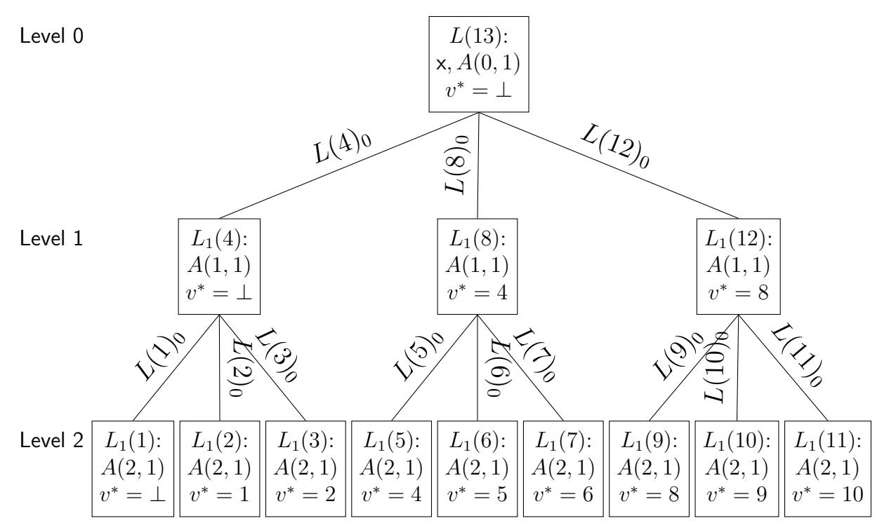
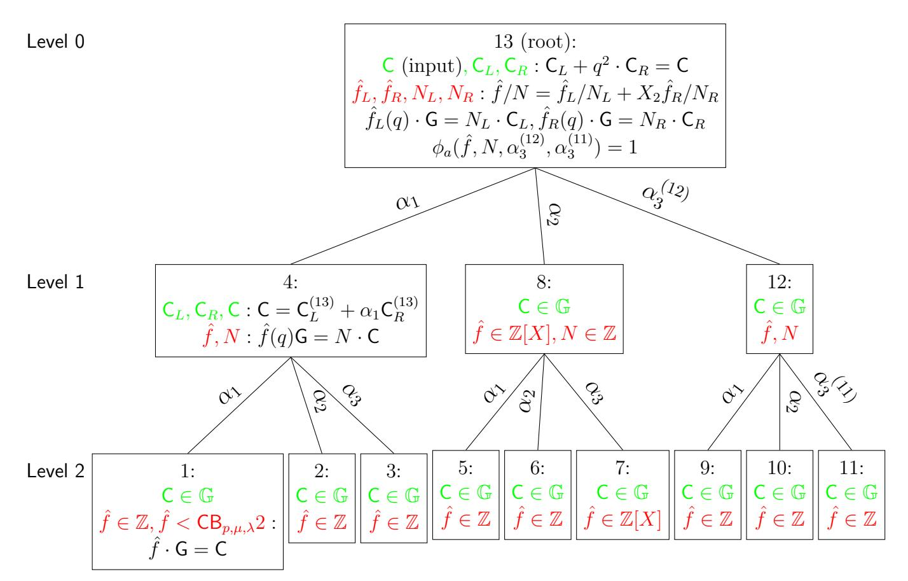

# Transparent SNARKs from DARK Compilers

Benedikt B¨unz<sup>1</sup>

Ben Fisch<sup>1</sup>

Alan Szepieniec<sup>2</sup>

benedikt@cs.stanford.edu

benafisch@gmail.com

alan@nervos.org

<sup>1</sup>Stanford University <sup>2</sup>Nervos Foundation

#### Abstract

We construct a new polynomial commitment scheme for univariate and multivariate polynomials over finite fields, with logarithmic size evaluation proofs and verification time, measured in the number of coefficients of the polynomial. The underlying technique is a Diophantine Argument of Knowledge (DARK), leveraging integer representations of polynomials and groups of unknown order. Security is shown from the strong RSA and the adaptive root assumptions. Moreover, the scheme does not require a trusted setup if instantiated with class groups. We apply this new cryptographic compiler to a restricted class of algebraic linear IOPs, which we call Polynomial IOPs, to obtain doubly-efficient public-coin interactive arguments of knowledge for any NP relation with succinct communication. With linear preprocessing, the online verifier's work is logarithmic in the circuit complexity of the relation.

There are many existing examples of Polynomial IOPs (PIOPs) dating back to the first PCP (BFLS, STOC'91). We present a generic compilation of any PIOP using our DARK polynomial commitment scheme. In particular, compiling the PIOP from PLONK (GWC, ePrint'19), an improvement on Sonic (MBKM, CCS'19), yields a public-coin interactive argument with quasi-linear preprocessing, quasi-linear (online) prover time, logarithmic communication, and logarithmic (online) verification time in the circuit size. Applying the Fiat-Shamir transform results in a SNARK, which we call Supersonic.

Supersonic is also concretely efficient with 10KB proofs and under 100ms verification time for circuits with 1 million gates (estimated for 120-bit security). Most importantly, this SNARK is transparent: it does not require a trusted setup. We obtain zk-SNARKs by applying a hiding variant of our polynomial commitment scheme with zero-knowledge evaluations. Supersonic is the first complete zk-SNARK system that has both a practical prover time as well as asymptotically logarithmic proof size and verification time. This version of the paper includes a new security proof. The original proof had a significant gap that was discovered by Block et al. (CRYPTO 2021). The new security proof closes the gap and shows that the original protocol with a slightly adjusted parameter is still secure. Towards this goal, we introduce the notion of almost-special-sound protocols which likely has broader applications.

## 1 Introduction

Since the landmark discoveries of interactive proofs (IPs) [\[GMR85\]](#page-31-0) and probabilistically checkable proofs (PCPs) [\[BFLS91,](#page-29-0) [ALM](#page-29-1)<sup>+</sup>92] in the 90s, there has been tremendous development in the area of proof systems whereby a prover establishes the correct performance of an arbitrary computation in a way that can be verified much more efficiently than performing the computation itself. Such proof systems are succinct if they also have a low communication cost between the prover and the verifier, i.e., the transcript of the protocol is much smaller than a witness to the computation. There are also zero knowledge variants of these efficient proof systems, beginning with ZK-IPs [\[BGG](#page-30-0)<sup>+</sup>88] and ZK-PCPs [\[Kil92\]](#page-31-1), in which the computation may involve secret information and the prover demonstrates correct performance without leaking the secrets. As a toy example, one could prove that a chess position is winning for white without actually revealing the winning moves themselves. General purpose zero-knowledge proofs [\[GMW91\]](#page-31-2) can be very expensive in terms of proof size and verification time even for computations that would be easy to perform given the secret inputs (e.g., by proving that one decrypted a file properly without leaking the key or the plaintext). The same techniques that are used to build efficient proof systems for expensive computations are also useful for making zero-knowledge proofs more practical.

In recent years, there has been a surge of industry interest in verifiable outsourced computation [\[WB15\]](#page-31-3) (such as trustless cloud computing) as well as zero-knowledge proofs. In particular, blockchains use efficient zero-knowledge proofs as a solution for balancing privacy and publicly-verifiable integrity: examples include anonymous transactions in ZCash [\[BCG](#page-29-2)<sup>+</sup>14, [Zca,](#page-32-0) [HBHW19\]](#page-31-4) and verifying Ethereum smart contracts over private inputs [\[Ebe\]](#page-30-1). In these applications, zero-knowledge proofs are posted to the blockchain ledger as a part of transactions and nodes must verify many proofs in the span of a short period of time. Therefore, succinctness and fast verification are necessary properties for the deployment of such proof systems. Verifiable computation is also being explored as a scaling solution for blockhain transactions [\[But16\]](#page-30-2), and even as a way to entirely eliminate the need for maintaining historical blockchain data [\[Lab18\]](#page-31-5).

Following this pragmatic interest, there has also been a surge of research focused on obtaining proof systems with better concrete efficiency characteristics: succinctness (the proof size is sublinear in the original computation length T), non-interactivity (the proof is a single message), prover-scalability (proof generation time scales linearly or quasi-linearly in T), and verifier-scalability (verification time is sublinear in T). Proof systems that achieve all of these properties for general NP statements are called SNARGs ("succinct non-interactive arguments"). The proof is called an argument when it is only sound assuming the prover is computationally bounded, i.e., computationally sound as opposed to statistically sound. Succinct statistically sound proofs are unlikely to exist [\[GVW02,](#page-31-6) [Wee05\]](#page-32-1).

Currently, there are numerous constructions that achieve different tradeoffs between proof size, proof time, and verification time, but also under different trust models as well as cryptographic assumptions. Some constructions also achieve better efficiency by relying on a preprocessing model in which a one-time expensive setup procedure is performed in order to generate a compact verification key VK, which is later used to verify proof instances efficiently. Somewhat unfortunately, the best performing proof systems to date (considering proof size and verification time) require a trusted preprocessing. These are the pairing-based SNARKs extending from GGPR [\[GGPR13,](#page-30-3) [SBV](#page-31-7)<sup>+</sup>13, [BCI](#page-29-3)<sup>+</sup>13, [BCG](#page-29-4)<sup>+</sup>13, [Gro16\]](#page-31-8), which have been implemented in numerous libraries [\[BCG](#page-29-4)<sup>+</sup>13, [Bow16\]](#page-30-4), and even deployed in live systems such as the ZCash [\[Zca\]](#page-32-0) cryptocurrency. The trusted setup can be performed via multi-party computation (MPC) by a committee of parties, such that trust in only one of the parties is sufficient. This has been done on two occasions for the ZCash blockchain, involving elaborate "ceremonies" to engender public trust in the process [\[Wil16\]](#page-32-2).

A proof system is called transparent if it does not involve any trusted setup. Recent progress has yielded transparent proof systems for special types of computations: zk-STARKs [\[BBHR19\]](#page-29-5) generate zero-knowledge proofs of size O(log<sup>2</sup> T) for a uniform computation[1](#page-1-0) , and the GKR protocol produces interactive proofs with communication O(d log T) for computations expressed as low-depth circuits of total size T and depth d [\[GKR08\]](#page-30-5). In both cases, non-interactivity can be achieved in the random oracle model with the Fiat-Shamir heuristic [\[FS87,](#page-30-6) [CCH](#page-30-7)<sup>+</sup>19]. These transparent proof systems perform significantly worse than SNARKs based on preprocessing. For computations expressed as an arithmetic circuit of 1-million gates, STARKs [\[BBHR19\]](#page-29-5) report a proof size of 600KB, whereas preprocessing SNARKs achieve 200 bytes [\[Gro16\]](#page-31-8). Bulletproofs [\[BBB](#page-29-6)<sup>+</sup>18, [BCC](#page-29-7)<sup>+</sup>16a] is a transparent zero-knowledge proof system whose proofs are much smaller than those of STARK, but these proofs have a verification time that scales linearly in the size of the circuit; for an arithmetic circuit of one million gates the verification time is close to 1 minute, more than 1,000 times more expensive than verifying a STARK proof for the same computation.

Another thread of research has produced proof systems that remove trust from the circuit preprocessing step, and instead have a universal (trusted) setup: a one-time trusted setup that can be reused for any computation [\[MBKM19,](#page-31-9) [XZZ](#page-32-3)<sup>+</sup>19, [GWC19\]](#page-31-10). All of these systems build SNARKs by combining an underlying reduction of circuit satisfiability to probabilistic testing of polynomials (with degree at most linear in the circuit size) together with polynomial commitment schemes. In a polynomial commitment scheme, a prover commits to a µ-variate

<span id="page-1-0"></span><sup>1</sup>A uniform computation is expressed as a RAM program P and a time bound T on the running time of the program. A uniform computation depends on the size of P's description but not on the time bound T.

polynomial f over  $\mathbb{F}$  of total degree at most d with a message that is much smaller than sending all the coefficients of f. The prover can later produce a non-interactive argument that f(z) = y for arbitrary  $z \in \mathbb{F}^{\mu}$  and  $y \in \mathbb{F}$ . The trusted portion of the universal SNARK is entirely confined to the polynomial commitment scheme's setup. These constructions use variants of the Kate  $et\ al.$  commitment scheme for univariate polynomials [KZG10], which requires a trusted setup.

## 1.1 Summary of Contributions

Following the observations of the recent universal SNARK constructions [GWC19, MBKM19, XZZ<sup>+</sup>19], SNARKs can be built from polynomial commitment schemes where all the trust is confined to the setup of the commitment scheme. The main technical contribution of our work is thus a new polynomial commitment scheme without trusted setup (*i.e.*, a transparent polynomial commitment scheme), which we can use to construct transparent SNARKs. The observation that transparent polynomial commitments imply transparent SNARKs was also implicit in the recent works that build transparent SNARKs from multi-round classical PCPs, and specifically interactive oracle proofs of proximity (IOPPs) [BBHR18]. As a secondary contribution, we present a framework that unifies all existing approaches to constructing SNARKs from polynomial commitments using the language of *interactive oracle proofs* (IOPs) [RRR16, BCS16]. We view polynomial commitment schemes as a compiler for *Polynomial IOPs*, and re-characterize the results of prior works as providing a variety of Polynomial IOPs for NP.

New polynomial commitment scheme We construct a new polynomial commitment scheme for  $\mu$ -multivariate polynomials of total degree d with optional zero-knowledge arguments of knowledge for correct evaluation that have  $O(\mu \log d)$  size proofs and are verifiable in  $O(\mu \log d)$  time. The commitment scheme requires a group of unknown order: two candidate instantiations are RSA groups and class groups of an imaginary quadratic order. Using RSA groups, we can apply the scheme to obtain universal preprocessing SNARKs with constant-size setup parameters, as opposed to the linear-size parameters from previous attempts. Using class groups, we can remove the trusted setup from trusted-setup SNARKs altogether, thereby making them transparent. Our polynomial commitment scheme leverages the power of integer commitments and Diophantine Arguments of Knowledge [Lip03]; accordingly, we classify this tool (and others of its kind) as a DARK proof system.

Polynomial IOP formalism All SNARK constructions can be viewed as combining an underlying information-theoretic statistically-sound protocol with a "cryptographic compiler" that transforms the underlying protocol into a succinct argument at the cost of computational soundness. We define a *Polynomial IOP* as a refinement of algebraic linear IOPs [IKO07, BCI<sup>+</sup>13, BBC<sup>+</sup>19], where in each round of interaction the prover provides the verifier with oracle access to a multivariate polynomial function of bounded degree. The verifier may then query this oracle to evaluate the polynomial on arbitrary points of its choice. The existing universal and transparent SNARK constructions provide a variety of statistically-sound Polynomial IOPs for circuit satisfiability (or RAM programs, in the case of STARKs); these are then cryptographically compiled using some form of a polynomial commitment, typically using Merkle trees or pairing groups.

The linear PCPs underlying GGPR and its successors (*i.e.*, based on QAPs and R1CS) can also be transformed into Polynomial IOPs.<sup>2</sup> This transformation helps highlight the fundamental paradigm shift between constructions of non-transparent non-universal SNARKs that combine linear PCPs and *linear-only encodings* versus the more recent ones based on polynomial commitments: given the lack of efficient<sup>3</sup> *linear function* commitment schemes, the compilation of linear PCPs necessarily involves a trusted preprocessing step that preselects the verifier's linear PCP queries, and hides them inside a linear-only encoding. This linear-only encoding forces the prover to homomorphically output an (encoded) linear tranformation of the query, upon which the verifier performs several homomorphic checks (*e.g.*,

<span id="page-2-0"></span> $<sup>^2</sup>$ This observation was also implicit in the paper by Ben-Sasson *et al.* introducing the system Aurora [BCR $^+$ 19].

<span id="page-2-1"></span><sup>&</sup>lt;sup>3</sup>Lai and Malavota [LM19] provide a n-dimensional linear-map commitment based on bilinear pairings, extending techniques in functional commitments [LRY16], but verifying claimed evaluations of the committed function on query points takes O(n).

using pairings). The shift towards Polynomial IOPs, which can be compiled more directly with efficient polynomial commitments, avoids the involvement of a trusted party to place hidden queries in the preprocessing. The only potential need for non-transparent setup is in the instantiation of polynomial commitment itself.

The precise definition of Polynomial IOPs as a central and standalone notion raises the question about its exact relation to other IOP notions. We present a univariate Polynomial IOP for extracting an indicated coefficient of a polynomial. Furthermore, we present a univariate Polynomial IOP for proving that the inner product between the coefficient vectors of two polynomials equals a given value. This proof system is of independent interest. Together with an offline pre-processing phase during which the correctness of a multivariate polynomial is ascertained, these two tools enable us to show that *any* algebraic linear IOP can be realized with a multivariate Polynomial IOP.

Polynomial IOP compiler We present a generic compilation of any public-coin Polynomial IOP into a doubly-efficient public-coin interactive argument of knowledge using an abstract polynomial commitment scheme. We prove that if the commitment scheme's evaluation protocol has witness-extended emulation, then the compiled interactive argument has this knowledge property as well. If the commitment scheme is hiding and the evaluation is honest-verifier zero knowledge (HVZK), then the compiled interactive argument is HVZK as well. Finally, public-coin interactive arguments may be cryptographically compiled into SNARKs using the Fiat-Shamir transform.

New SNARK without Trusted Setup The main practical outcome of this work is a new transparent proof system (Supersonic) for computations represented as arbitrary arithmetic circuits, obtained by cryptographically compiling the Polynomial IOPs underlying Sonic [MBKM19], PLONK [GWC19], and Marlin[CHM+19] using the DARK polynomial commitment scheme. Supersonic improves the proof size by an order of magnitude over STARKs without compromising on verification time. For one million gates, Supersonic's proofs are just 7.8KB and take around 75ms to verify. Using the notation  $O_{\lambda}(\cdot)$  to hide multiplicative factors dependent on the security parameter  $\lambda$ , STARKs have size and verification complexity  $O_{\lambda}(\log^2 T)$  whereas Supersonic has size and verification complexity  $O_{\lambda}(\log^2 T)$  whereas Supersonic has size and verification complexity  $O_{\lambda}(\log T)$ . (The additional multiplicative factors dependent on  $\lambda$  are actually better for Supersonic as well.) As a caveat, while the prover time in Supersonic is asymptotically on par with STARKs (i.e., quasilinear in T), the concrete efficiency is much worse due to the use of heavy-weight "crypto operations" over 1200 bit class group elements in contrast to the light-weight FFTs and hash functions in STARKs. Furthermore, Supersonic is not quantum-secure due to its reliance on groups of unknown order, whereas STARKs are a candidate quantum-secure SNARK.

New Security Proof (Added June 2022) The original security proof in the version of the paper published at EUROCRYPT 2020[BFS20] had a significant gap which was discovered by [BHR<sup>+</sup>21]. It implicitly assumed that the prover could only encode integer polynomials. While the protocol does ensure that the last message is an integer, i.e. a constant degree integer polynomial, this isn't necessarily guaranteed in the prior rounds. The prover could possibly start by committing to a polynomial with rational coefficients, i.e.  $f(X) = \frac{g(X)}{N} \in \mathbb{Q}[X]$  for  $g(X) \in \mathbb{Z}[X]$  and  $N \in \mathbb{Z}$ . In each step of the protocol, the prover computes a random linear combination of two halves of the polynomial. It is possible that for some random challenge this random linear combination of two rational polynomials results in an integer polynomial. This would break the assumption that was made in the flawed security proof. The extractor described in the EUROCRYPT version extracted a rational polynomial, not an integer one.

It is easy to show (see Lemma 10) that the polynomial commitment is still binding, for polynomials with rational coefficients. Unfortunately, the binding property only holds if the rational polynomial has bounded coefficients, i.e. bounded numerators and denominators. Using the old extractor we would get extremely loose bounds which then translate to superquadratic prover and setup times. However, taking the view of the adversary, it does not seem likely that the prover could start with a polynomial with a very large denominator and end up with an integer in the last round with high probability. Taking a closer look at the protocol, in a convincing proof the final prover message is an integer equivalent to  $\tilde{f}(\alpha_1,\ldots,\alpha_\mu)=\frac{\tilde{g}(\alpha_1,\ldots,\alpha_\mu)}{N}$  where  $\tilde{f}$  and  $\tilde{g}$  are multi-linear polynomials with the same

coefficients as f and g respectively and α1, . . . , α<sup>µ</sup> are the verifier's random challenges. This, however, implies that ˜g(α1, . . . , αµ) ≡ 0 mod N. The probability of this event over random challenges can be bounded with an analysis akin to the famous Schwartz-Zippel lemma, but generalized for composite N. In a separate paper [\[BF22\]](#page-29-12) we carefully analyze this probability and show that if N is too large, this probability is negligible. This in turn implies bounds on f. This insight gives confidence that DARK might be sound but it does not directly yield a security proof.

Critically, DARK is not special-sound, meaning there isn't an extractor that can compute a witness from any forking transcript tree. But on the other hand, DARK has a special structure that we can still exploit. First, in DARK every message is a commitment. Given a transcript tree, if the messages below the i+ 1th level have all been opened to polynomials that have bounded norm, then it is possible to extract openings of the commitments at the ith level. The problem is that the norm grows, and the extracted opening at level i are no longer guaranteed to be small enough to continue to level i−1. We can call these two bounds: if all openings below level i satisfy bound A, then we can extract a polynomial at level i that satisfies bound B. However, there are two other key properties that ultimately allow us to get around this issue. (a) Given openings to the last µ − i commitments in a DARK transcript to rational polynomials, if the ith commitment satisfies bound B then "rerunning the protocol" as the prover using the same round challenges starting from the ith opened commitment should either recover the same openings of the last µ−i commitments or break the commitment scheme by giving an opening of one of these commitments to a distinct message. (b) If the ith opened message does NOT satisfy the bound A, then if we were to rerun the honest protocol on this message as above on uniformly \*random\* round challenges then the probability it gives a valid transcript is negligible. The probability analysis relies on the Composite Schwartz Zippel Lemma [\[BF22\]](#page-29-12).

We generalize this to the notion of Almost Special Sound(ASS) protocols and replace the bounds A and B with arbitrary predicates A and B. We prove (Theorem [7\)](#page-43-0) that all protocols with this ASS structure are knowledge sound, just like special sound protocols, where the knowledge error is dependent on the probability that a random completion of a transcript starting from a message that fails predicate A results in a valid transcript. Intuitively, this captures the fact that once the adversary has a message that fails the desired extraction predicate it will fail with overwhelming probability over fresh challenges to complete the proof transcript successfully. We also show that if the commitment scheme is computationally unique, i.e. it is hard for a prover to produce two commitments to the same message, then the Fiat-Shamir transform of ASS protocols is secure (Theorem [8\)](#page-54-0) We provide the proof as a self-contained document in the appendix.

## 1.2 Related Work

Arguments based on hidden order groups Fujisaki and Okamoto [\[FO97\]](#page-30-11) proposed homomorphic integer commitment schemes based on the RSA group. They also provide protocols to prove that a list of committed integers satisfy modular polynomial equations as opening a commitment bit by bit. Damg˚ard and Fujisaki [\[DF02\]](#page-30-12) patched the soundness proof of that protocol and were the first to suggest using class groups of an imaginary quadratic order as a candidate group of unknown order. Lipmaa drew the link between zero-knowledge proofs constructed from integer commitment schemes and Diophantine complexity [\[Lip03\]](#page-31-13), coining the term Diophantine Arguments of Knowledge. Recently, Couteau et al. study protocols derived from integer commitments specifically in the RSA group to reduce the security assumptions needed; in the process they develop proofs for polynomial evaluation modulo a prime π that is not initially known to the verifier, in addition to a proof showing that an integer X lies in the range [a, b] by showing that 1 + 4(X − a)(b − X) decomposes as the sum of 3 squares [\[CPP17\]](#page-30-13).

Pietrzak [\[Pie19\]](#page-31-17) developed an efficient proof of repeated squaring, i.e., proving that x 2 T = y with O(log T) proof size and verification time in order to build a conceptually simple verifiable delay function [\[BBBF18\]](#page-29-13) based on the RSW time-lock puzzle [\[RSW96\]](#page-31-18). Wesolowski [\[Wes19\]](#page-32-4) improves on this result by proposing a single-round protocol to prove correct repeated squaring in groups of unknown order with a constant size proof. Boneh et al. [\[BBF19\]](#page-29-14) observe that this protocol generalizes to arbitrary exponents (PoE) and develop

a proof of knowledge of an integer exponent (PoKE), as well as a zero-knowledge variant<sup>4</sup>. They use both PoE and PoKE to construct efficient accumulators and vector commitment schemes.

Transparent polynomial commitments Whaby et~al. constructed a transparent polynomial commitment scheme [WTs<sup>+</sup>18] for multilinear polynomials by combining a matrix commitment of Bootle et~al. [BCC<sup>+</sup>16b] with the inner-product argument of Bünz et~al. [BBB<sup>+</sup>18]. For polynomials of degree d it has commitments of size  $O(\sqrt{d})$  and evaluation arguments with  $O(\sqrt{d})$  communication. Zhang et~al. [ZXZS19] and Kattis et~al. [KPV19] recently and independently showed how to build a polynomial commitment from FRI (Fast Reed Solomon IOPP) [BBHR18, BSGKS19] The commitment is transparent, has  $O(\lambda)$  size commitments and evaluation arguments with  $O(\log^2 d)$  communication.

**Polynomial IOP formalism** In concurrent work Chiesa *et al.* [CHM<sup>+</sup>19] introduce an information theoretic framework called *algebraic holographic proofs (AHP)*. They also show that with a polynomial commitment scheme an AHP can be compiled to a preprocessing SNARK. The AHP framework is essentially equivalent to our Polynomial IOP framework. In other concurrent work, Chiesa, Ojha, and Spooner show interesting connections between algebraic holographic proofs and recursive proof composition. In the same work, the authors develop an AHP-based transparent SNARK called Fractal [COS19].

## <span id="page-5-1"></span>2 Technical Overview

This technical overview provides an informal description of our key technical contribution: a polynomial commitment scheme with logarithmic evaluation proofs and verification time. The commitment scheme relies on four separate tools.

1. Integer encoding of polynomials Given a univariate polynomial  $f(X) \in \mathbb{Z}_p[X]$  the prover first encodes the polynomial as an integer. Interpreting the coefficients of f(X) as integers in [0, p), define  $\hat{f}(X)$  to be the *integer* polynomial with these coefficients. The prover computes  $\hat{f}(q) \in \mathbb{Z}$  for some large integer  $q \geq p$ . This is an injective map from polynomials with bounded coefficients to integers and is also decodable: the coefficients of f(q) can be recovered from the base-q expansion of  $\hat{f}(q)$ . For example, suppose that  $f(X) = 2X^3 + 3X^2 + 4X + 1 \in \mathbb{Z}_5[X]$  and q = 10. Then the integer  $\hat{f}(10) = 2341$  encodes the polynomial f(X) because its coefficients appear in the decimal expansion of  $\hat{f}(10)$ .

Note that this encoding is also additively homomorphic, assuming that q is sufficiently large. For example, let  $g(X) = 4X^3 + 1X^2 + 3$  such that  $\hat{g}(10) = 4103$ . Then  $\hat{f}(10) + \hat{g}(10) = 6444 = (\hat{g} + \hat{f})(10)$ . The more homomorphic operations we want to permit, the larger q needs to be. The encoding additionally permits multiplication by polynomials  $(\hat{f}(q) \cdot q^k)$  is equal to the encoding of  $f(X) \cdot X^k$ .

- **2. Succint integer commitments** The integer  $x \leftarrow \hat{f}(q) \in \mathbb{Z}$  encoding a degree d polynomial f(X) lies between  $q^d$  and  $q^{d+1}$ ; in other words, its size is  $(d+1)\log_2 q$  bits. The prover commits to x using a *succinct* integer commitment scheme that is additively homomorphic. Specifically, we use scalar multiplication in an additive group  $(\mathbb{G}, +)$  of unknown order: the commitment is the single group element  $x \cdot \mathsf{G}$  for a base element  $\mathsf{G} \in \mathbb{G}$  specified in the setup. (Note that if the order n of  $\mathbb{G}$  is known then this is not an integer commitment;  $x \cdot \mathsf{G}$  could be opened to any integer  $x' \equiv x \mod n$ .)
- **3. Evaluation protocol** The evaluation protocol is an interactive argument to convince a verifier that C is an integer commitment to  $\hat{f}(q)$  such that f(z) = y at a provided point  $z \in \mathbb{Z}_p$ . The protocol must be *evaluation binding*: it should be infeasible for the prover to succeed in arguing that f(z) = y and f(z) = y' for  $y \neq y'$ . The protocol should also be an argument of knowledge, which informally means that any prover who succeeds at any point x must "know" the coefficients of the committed f.

<span id="page-5-0"></span> $<sup>^4</sup>$ In this paper we will use additive notation so technically integer exponentiation refers to a scalar multiplied with a group element. Despite this, we will continue to use the term PoE to refer to Wesolowski's protocol.

As a warmup, we first describe how a prover can efficiently convince a verifier that  $\mathsf{C}$  is a commitment to an integer polynomial of degree at most d with bounded coefficients. Assume for now that  $d=2^k-1$ . The protocol uses a recursive divide-and-combine strategy. In each step we split f(X) into two degree  $d'=\lfloor\frac{d}{2}\rfloor$  polynomials  $f_L(X)$  and  $f_R(X)$ . The left half  $f_L(X)$  contains the first d'+1 coefficients of f(X) and the right half  $f_R(X)$  the second, such that  $f(X)=f_L(X)+X^{d'+1}f_R(X)$ . The prover now commits to  $f_L$  and  $f_R$  by computing  $\mathsf{C}_L \leftarrow \hat{f}_L(q) \cdot \mathsf{G}$  and  $\mathsf{C}_R \leftarrow \hat{f}_R(q) \cdot \mathsf{G}$ . The verifier checks the consistency of these commitments by testing  $\mathsf{C}_L + q^{d'+1} \cdot \mathsf{C}_R = \mathsf{C}$ . The verifier then samples random  $\alpha \in \mathbb{Z}_p$  and computes  $\mathsf{C}' \leftarrow \mathsf{C}_L + \alpha \cdot \mathsf{C}_R$ , which is an integer commitment to  $\hat{f}_L(q) + \alpha \cdot \hat{f}_R(q)$ . The prover and verifier recurse on the statement that  $\mathsf{C}'$  is a commitment to a polynomial of degree at most d', thus halving the "size" of the statement. After  $\log_2(d+1)$  rounds, the commitment  $\mathsf{C}'$  exchanged between prover and verifier is a commitment to a polynomial of degree 0, i.e., to a scalar  $c \in \mathbb{Z}_p$ . So  $\mathsf{C}'$  is of the form  $\hat{c} \cdot \mathsf{G}$  where  $\hat{c}$  is some integer congruent to c modulo p. The prover sends  $\hat{c}$  to the verifier directly. The verifier checks that  $\mathsf{G}^{\hat{c}} = \mathsf{C}'$  and also that  $\hat{c} < q$ .

To also show that f(z) = y at a provided point z, the prover additionally sends  $y_L = f_L(z) \mod p$  and  $y_R = f_R(z) \mod p$  in each round. The verifier checks consistency with the claim, i.e., that  $y_L + z^{d'+1}y_R = y$ , and also computes  $y' \leftarrow y_L + \alpha \cdot y_R \mod p$  to proceed to the next round. (The recursive claim is that  $\mathsf{C}'$  commits to f' such that  $f'(z) = y' \mod p$ .) In the final round of recursion, the value of the constant polynomial in z is the constant itself. So in addition to testing  $\mathsf{C} = \hat{c} \cdot \mathsf{G}$  and  $\hat{c} < q$ , the verifier also checks that  $\hat{c} \equiv y \mod p$ .

4. Outsourcing large scalar multiplications for efficiency The evaluation protocol requires communicating only 2 group elements and 2 field elements per round. However, the verifier needs to check that  $C_L + q^{d'+1} \cdot C_R = C$ , and naïvely performing the scalar multiplication requires  $\Omega(d \cdot \log q)$  work. To reduce this workload, we employ a recent technique for proofs of exponentiation (PoE) in groups of unknown order due to Wesolowski [Wes19] in which the prover computes this scalar multiplication (also referred to as exponentiation when using a multiplicative group) and the verifier verifies it in essentially constant time. This outsourcing reduces the total verifier time (i.e., of the entire protocol) to a quantity that is logarithmic in d.

# 3 Preliminaries (Assumptions and Commitments)

We present the preliminaries on the computational assumptions in groups of unknown orders and our definitions. The preliminaries on proof systems are found in the new security proof in Appendix A.

## 3.1 Assumptions

The cryptographic compilers make extensive use of groups of unknown order, *i.e.*, groups for which the order cannot be computed efficiently. Concretely, we require groups for which two specific hardness assumptions hold. The binding property of the polynomial commitment and the evaluation protocol, rely on the most basic assumption in groups of unknown order. The assumption states that it is hard to compute the order of random group elements. This assumption is implied by the famous RSA Assumption [RSA78] which states that it is hard to take random roots (technically scalar divisions) of random elements. Secondly, our proofs of exponentiation which are used to make the verifier efficient, rely on the much newer Adaptive Root Assumption [Wes19] which is the dual of the Strong RSA Assumption and states that it is hard to take random roots of arbitrary group elements. The assumption, is also used to show that the commitment scheme is computationally unique, that is given a message an adversary can only output a single valid commitment to the message. Both of these assumptions hold in generic groups of unknown order [DK02, BBF19].

<span id="page-6-1"></span>**Assumption 1** (Random Order Assumption). The random order assumption states that an efficient adversary cannot compute a multiple of the order of a given random group element.

<span id="page-6-0"></span><sup>&</sup>lt;sup>5</sup>In the full scheme, the verifier actually checks that  $\hat{c} < B$  for a bound B < q that depends on the field size p and the polynomial's maximum degree d

Specifically, it holds for GGen if for any probabilistic polynomial time adversary A:

$$\Pr \left[ a \cdot \mathsf{G} = 0 : \begin{array}{c} \mathbb{G}, N \leftarrow GGen(\lambda) \\ a \cdot \mathsf{G} = 0 : \begin{array}{c} \mathsf{G}, \overset{\$}{\leftarrow} \mathbb{G} \\ a \in \mathbb{Z} \leftarrow \mathcal{A}(\mathbb{G}, N, \mathsf{G}) \end{array} \right] \leq \mathsf{negl}(\lambda) \ .$$

**Assumption 2** (RSA assumption, [RSA78, CPP17]). The RSA assumption states that an efficient adversary cannot compute a random root (co-prime with the order of the group) for a given random group element. Specifically, it holds for GGen if for any probabilistic polynomial time adversary  $\mathcal{A}$ :

$$\Pr\left[\begin{array}{c} \mathbb{G}, N \leftarrow GGen(\lambda) \\ \ell \cdot \mathsf{U} = \mathsf{G} \ : \ \mathsf{G} \xleftarrow{\$} \mathbb{G}, \ell \xleftarrow{\$} [N] \\ \mathsf{U} \in \mathbb{G} \leftarrow \mathcal{A}(\mathbb{G}, \mathsf{G}) \end{array}\right] \leq \mathsf{negl}(\lambda) \ .$$

<span id="page-7-0"></span>**Assumption 3** (Adaptive Root Assumption). The *Adaptive Root Assumption* holds for GGen if there is no efficient adversary  $(\mathcal{A}_0, \mathcal{A}_1)$  that succeeds in the following task. First,  $\mathcal{A}_0$  outputs an element  $W \in \mathbb{G}$  and some st. Then, a random prime  $\ell$  in  $\mathsf{Primes}(\lambda)$  is chosen and  $\mathcal{A}_1(\ell,\mathsf{st})$  outputs  $W^{1/\ell} \in \mathbb{G}$ . For all efficient  $(\mathcal{A}_0,\mathcal{A}_1)$ :

$$\Pr\left[ \ell \cdot \mathsf{U} = \mathsf{W} \neq 1 \ : \begin{array}{c} \mathbb{G} \xleftarrow{\$} \mathit{GGen}(\lambda) \\ (\mathsf{W},\mathsf{st}) \xleftarrow{\$} \mathcal{A}_0(\mathbb{G}) \\ \ell \xleftarrow{\$} \mathit{Primes}(\lambda) \\ \mathsf{U} \leftarrow \mathcal{A}_1(\ell,w,\mathsf{st}) \end{array} \right] \leq \mathsf{negl}(\lambda).$$

Lemma 1. The RSA Assumption for GGen implies the Random Order Assumption

Proof. Given an efficient adversary  $\mathcal{A}_{\mathsf{Order}}$  for the random order assumption that succeeds with non-negligible probability  $\epsilon$  we will construct an efficient adversary  $\mathcal{A}_{\mathsf{RSA}}$  for the RSA assumption. On input  $\mathbb{G}$ ,  $\mathbb{G}$ ,  $\ell$  to  $\mathcal{A}_{\mathsf{RSA}}$  we will forward  $\mathbb{G}$ ,  $\mathbb{G}$  to  $\mathcal{A}_{\mathsf{Order}}$ .  $\mathcal{A}_{\mathsf{Order}}$  outputs a such that  $a \cdot \mathsf{G} = 0$  with non-negligible probability  $\epsilon$ .  $\mathcal{A}_{\mathsf{RSA}}$  computes  $a' \leftarrow \frac{a}{\gcd(a,\ell^k)}$  for  $k = \lceil \log_{\ell}(a) \rceil$ . The probability that  $\ell$  is not co-prime to the order of  $\mathbb{G}$  is bounded by  $\frac{\log_2 |\mathbb{G}|}{|\mathsf{Primes}(\lambda)|}$  which is negligible in  $\lambda$ . Otherwise  $\ell$  is co-prime with the order of  $\mathsf{G}$  and a is a multiple of the order of  $\mathsf{G}$  we have that a' is still a multiple of the order of  $\mathsf{G}$ . Now  $\mathcal{A}_{\mathsf{RSA}}$  computes  $w \leftarrow \ell^{-1} \mod a'$  and outputs  $\mathsf{U} \leftarrow w \cdot \mathsf{G}$ . Now we have  $\ell \cdot \mathsf{U} = \mathsf{G}$  so  $\mathcal{A}_{\mathsf{RSA}}$  succeeds with probability  $\epsilon - \mathsf{negl}(\lambda)$ .

<span id="page-7-1"></span>**Lemma 2.** The Adaptive Root Assumption for *GGen* implies the Random Order Assumption

Proof. Given an efficient adversary  $\mathcal{A}_{\mathsf{Order}}$  for the random order assumption we will construct an efficient adversary  $\mathcal{A}_{\mathsf{AR}} = (\mathcal{A}_0, \mathcal{A}_1)$  for the Adaptive Root assumption. On input  $\mathbb{G}$  to  $\mathcal{A}_0$  we will sample a random group element  $\mathsf{G}$  from  $\mathbb{G}$  and forward it to  $\mathcal{A}_{\mathsf{Order}}$ .  $\mathcal{A}_{\mathsf{Order}}$  outputs a such that  $a \cdot \mathsf{G} = 0$  with non-negligible probability  $\epsilon$ . And we set the output of  $\mathcal{A}_0$  to be  $(\mathsf{G},a)$ . The adaptive root game then samples a random prime  $\ell$ .  $\mathcal{A}_1$  on input  $(a,g,\ell)$  computes  $a' \leftarrow \frac{a}{\gcd(a,\ell^k)}$  for  $k = \lceil \log_{\ell}(a) \rceil$ . Note that since  $\ell$  is co-prime to the order of  $\mathbb{G}$  and thus also the order of  $\mathsf{G}$  and a is a multiple of the order of  $\mathsf{G}$  we have that a' is still a multiple of the order of  $\mathsf{G}$ . If we don't abort then we compute  $\ell^{-1}$  mod a and  $\mathsf{U} = \ell^{-1} \cdot \mathsf{G}$ . Finally  $A_1$  outputs  $\mathsf{U}$ , which by construction is such that  $\ell \cdot \mathsf{U} = \mathsf{G}$ .

**Groups of unknown order.** We consider two candidate groups of unknown order. Both have their own upsides and downsides.

RSA Group. In the multiplicative group  $\mathbb{Z}_n^*$  of integers modulo a product  $n=p\cdot q$  of large primes p and q, computing the order of the group is as hard as factoring n. The Adaptive Root Assumption does not hold for  $\mathbb{Z}_n^*$  because  $-1\in\mathbb{Z}_n^*$  can be easily computed and has order two. This can be resolved though by working instead in the quotient group  $\mathbb{Z}_n^*/\{x\,|\,x^2=1\}\cong \mathrm{QR}_n$ . The downside of using an RSA group, or more precisely, the group of quadratic residues modulo an RSA modulus, is that this modulus cannot be generated in a publicly verifiable way without exposing the order, and thus requires a trusted setup.

Class Group. The class group of an imaginary quadratic order is defined as the quotient group of fractional ideals by principal ideals of an order of a number field  $\mathbb{Q}(\sqrt{\Delta})$ , with ideal

multiplication. A class group  $\mathcal{C}\ell(\Delta)$  is fully defined by its discriminant  $\Delta$ , which needs to satisfy only public constraints such as  $\Delta \equiv 1 \mod 4$  and  $-\Delta$  must be prime. As a result,  $\Delta$  can be generated from public coins, thus obviating the need for a trusted setup. A group element can be represented by two integers strictly smaller (in absolute value) than  $-\Delta$ , which in turn is on the same order of magnitude as RSA group elements for a similar security level. We refer the reader to Buchmann and Hamdy's survey [BH01] and Straka's accessible blog post [Str19] for more details.

Working in  $\mathcal{C}\ell(\Delta)$  does present an important difficulty: there is an efficient algorithm due to Gauss to compute square roots of arbitrary elements [BS96], and by repetition, arbitrary power of two roots. Despite this, the random order and the adaptive root assumption still hold in class groups. Computing power of two roots does not directly enable one to compute the order of a random element or compute random (large prime) roots of a chosen element. The new security proof only relies on the random order assumption for extraction and the adaptive root assumption for the PoEs. It, therefore, holds even for adversaries that can compute square (or other small) roots of elements.

#### 3.2 Commitment Schemes

In defining the syntax of the various protocols, we use the following convention with respect to public values (known to both the prover and the verifier) and secret ones (known only to the prover). In any list of arguments or returned tuple (a, b, c; d, e) those variables listed before the semicolon are public, and those variables listed after it are secret. When there is no secret information, the semicolon is omitted.

**Definition 1** (Commitment scheme). A commitment scheme  $\Gamma$  is a tuple  $\Gamma = (\mathsf{Setup}, \mathsf{Commit}, \mathsf{Open})$  of PPT algorithms where:

- $\mathsf{Setup}(1^{\lambda}) \to \mathsf{pp}$  generates public parameters  $\mathsf{pp}$ ;
- Commit(pp; x)  $\to$  (C; r) takes a secret message x and outputs a public commitment C and (optionally) a secret opening hint r (which might or might not be the randomness used in the computation).
- $\mathsf{Open}(\mathsf{pp},C,x,r) \to b \in \{0,1\}$  verifies the opening of commitment C to the message x provided with the opening hint r.

A commitment scheme  $\Gamma$  is **binding** if for all PPT adversaries  $\mathcal{A}$ :

$$\Pr\left[ b_0 = b_1 \neq 0 \ \land \ x_0 \neq x_1 \ : \begin{array}{c} \mathsf{pp} \leftarrow \mathsf{Setup}(1^\lambda) \\ (C, x_0, x_1, r_0, r_1) \leftarrow \mathcal{A}(\mathsf{pp}) \\ b_0 \leftarrow \mathsf{Open}(\mathsf{pp}, C, x_0, r_0) \\ b_1 \leftarrow \mathsf{Open}(\mathsf{pp}, C, x_1, r_1) \end{array} \right] \leq \mathsf{negl}(\lambda)$$

We now extend the syntax to polynomial commitment schemes. The following definition generalizes that of Kate *et. al.* [KZG10] to allow interactive evaluation proofs. It also stipulates that the polynomial's degree be an argument to the protocol, contrary to Kate *et al.* where the degree is known and fixed.

**Definition 2.** (Polynomial commitment) A polynomial commitment scheme is a tuple of protocols  $\Gamma = (\mathsf{Setup}, \mathsf{Commit}, \mathsf{Open}, \mathsf{Eval})$  where  $(\mathsf{Setup}, \mathsf{Commit}, \mathsf{Open})$  is a binding commitment scheme for a message space R[X] of polynomials over some ring R, and

• Eval(pp,  $C, z, y, d, \mu; f(X)$ )  $\rightarrow b \in \{0, 1\}$  is an interactive public-coin protocol between a PPT prover  $\mathcal{P}$  and verifier  $\mathcal{V}$ . Both  $\mathcal{P}$  and  $\mathcal{V}$  have as input a commitment C, points  $z, y \in R$ , and a degree d. The prover additionally knows the opening of C to a secret polynomial  $f(X) \in R[X]$  with  $\deg(f(X)) \leq d$ . The protocol convinces the verifier that f(z) = y. In a multivariate extension of polynomial commitments, the input  $\mu > 1$  indicates the number of variables in the committed polynomial and  $z \in R^{\mu}$ .

A polynomial commitment scheme is **correct** if an honest committer can successfully convince the verifier of any evaluation. Specifically, if the prover is honest then for all polynomials  $f(X) \in R[X]$  and all points  $z \in R$ ,

$$\Pr \begin{bmatrix} \mathsf{pp} \leftarrow \mathsf{Setup}(1^\lambda) \\ (C;r) \leftarrow \mathsf{Commit}(\mathsf{pp}, f(X)) \\ b = 1 \ : \ \ y \leftarrow f(z) \\ d \leftarrow \deg(f(X)) \\ b \leftarrow \mathsf{Eval}(\mathsf{pp}, c, z, y, d; f(X), r) \end{bmatrix} = 1 \ .$$

A polynomial commitment scheme is evaluation binding if no efficient adversary can convince the verifier that the committed polynomial f(X) evaluates to different values y<sup>0</sup> ̸= y<sup>1</sup> ∈ R in the same point z ∈ R. However, our applications require a stronger property called knowledge soundness.

Knowledge soundness Any successful prover in the Eval protocol must know a polynomial f(X) such that f(z) = y and C is a commitment to f(X). More formally, since Eval is a public-coin interactive argument we define this knowledge property as a special case of witness-extended emulation (Definition [8\)](#page-40-0).

Define the following NP relation given pp ← Setup(1<sup>λ</sup> ):

$$\mathcal{R}_{\mathsf{Eval}}(\mathsf{pp}) = \left\{ \langle (C, z, y, d), (f(X), r) \rangle : \begin{array}{l} f \in R[X] \text{ and } \deg(f(X)) \leq d \text{ and } f(z) = y \\ \text{and } \mathsf{Open}(\mathsf{pp}, C, f(X), r) = 1 \end{array} \right\}$$

The correctness definition above implies that if Γ = (Setup, Commit, Open, Eval) is correct then Eval is a correct interactive argument for REval(pp), with overwhelming probability over the randomness of Setup. We say that Γ has witness-extended emulation if Eval has witness-extended emulation as an interactive argument for REval(pp).

It is easy to see that witness-extended emulation implies evaluation binding when the Setup, Commit, and Open part of Γ form a binding commitment scheme. If the adversary succeeds in Eval on both (C, z, y0, d0) and (C, z, y1, d1) for y<sup>0</sup> ̸= y<sup>1</sup> or d<sup>0</sup> ̸= d<sup>1</sup> then the emulator obtains two distinct witnesses f(X) ̸= f ′ (X) such that C is a valid commitment to both. This would contradict the binding property of the commitment scheme.

## 3.3 Proofs of Exponentiation

Wesolowski [\[Wes19\]](#page-32-4) introduced a simple yet powerful proof of correct exponentiation ("PoE") in groups of unknown order. A prover can efficiently convince a verifier that a large scalar multiplication in such a group was done correctly. For instance, the prover wishes to convince the verifier that W = U x for known group elements U, W ∈ G and exponent x ∈ Z, and the verifier wants to verify this with much less work than performing the scalar multiplication. To do this, the verifier samples a large enough prime ℓ at random and the prover provides him with Q ← U <sup>q</sup> where q = ⌊ x ℓ ⌋. The verifier then simply computes the remainder r ← (x mod ℓ) and checks that Q ℓU <sup>r</sup> = W. The protocol is an argument for the relation RPoE = {⟨(U, W, x), ∅⟩ : U <sup>x</sup> = W}. The proof verification uses just O(λ) group operations. When x is x = q d the verifier can compute r ← x mod ℓ using just log(d) ℓ-bit multiplications.

```
PoE(U, W, x) :
```

- 1. V samples ℓ \$ ← Primes(λ) and sends ℓ to P
- 2. P computes quotient q and remainder r such that x = qℓ + r and r ∈ {0, . . . , ℓ − 1}
- 3. P computes Q ← q · U and sends it to V
- 4. V computes r ← (x mod ℓ) and checks that ℓ · Q + r · U = W
- 5. if check passes then return 1 else return 0

<span id="page-9-2"></span>Lemma 3 (PoE soundness [\[Wes19\]](#page-32-4)). PoE is an argument system for relation RPoE with negligible soundness error, assuming the Adaptive Root Assumption (Assumption [3\)](#page-7-0) holds for GGen.

Lemma 4 (PoE random oracle soundness [\[Wes19\]](#page-32-4)). The Fiat-Shamir transform of PoE, replacing the verifier message ℓ with ℓ ← H(u, w, x) and H is an argument system for relation RPoE with negligible soundness error, assuming that H is modeled as a random oracle and that the Adaptive Root Assumption (Assumption [3\)](#page-7-0) holds for GGen.

# <span id="page-9-1"></span>4 Polynomial Commitments from Groups of Unknown Order

## <span id="page-9-0"></span>4.1 Information-Theoretic Abstraction

Before we present our concrete polynomial commitment scheme based on groups of unknown order, we present the underlying information theoretic protocol that abstracts the concrete cryptographic instantiations. The purpose of this abstraction is two-fold: first, it provides an intuitive stepping stone from which presenting and studying the concrete cryptographic protocol is easier; and second, it opens the door to alternative cryptographic instantiations that provide the same interface but based on alternative hardness assumptions.

Let  $[\![*]\!]: \mathbb{Z}_p[X] \to \mathbb{S}$  be a homomorphic commitment function that sends polynomials over a prime field to elements of some set  $\mathbb{S}$ . Moreover, let  $\mathbb{S}$  be equipped with operations  $*+*: \mathbb{S} \times \mathbb{S} \to \mathbb{S}$  and  $*\cdot *: \mathbb{Z}_p[X] \times \mathbb{S} \to \mathbb{S}$  that accommodate two homomorphisms for  $[\![*]\!]:$ 

- a linear homomorphism:  $a \cdot \llbracket f(X) \rrbracket + b \cdot \llbracket g(X) \rrbracket = \llbracket af(X) + bg(X) \rrbracket$
- a monomial homomorphism:  $X^d \cdot \llbracket f(X) \rrbracket = \llbracket X^d f(X) \rrbracket$ .

For now, assume both prover and verifier have oracle access to the function [\*] and to the operations  $*\cdot*$  and \*+\*. (Later on, we will instantiate this commitment function using groups of unknown order and an encoding of polynomials as integers.)

The core idea of the evaluation protocol is to reduce the statement that is being proved from one about a polynomial f(X) of degree d and its evaluation y = f(z), to one about a polynomial f'(X) of degree  $d' = \lfloor \frac{d}{2} \rfloor$  and its evaluation y' = f'(z). For simplicity, assume that d+1 is a power of 2. The prover splits f(X) into  $f_L(X)$  and  $f_R(X)$  such that  $f(X) = f_L(X) + X^{d'+1}f_R(X)$  and such that both halves have degree at most d'. The prover obtains a random challenge  $\alpha \in \mathbb{Z}_p$  from the verifier and proceeds to prove that  $f'(X) = f_L(X) + \alpha \cdot f_R(X)$  has degree d' and that  $f'(z) = y' = y_L + \alpha y_R$  with  $y_L = f_L(z)$  and  $y_R = f_R(z)$ .

The proof repeats this reduction by using f'(X), z, y' and d' as the input to the next recursion step. In the final step, f(X) = f is a constant and the verifier checks that f = y.

The commitment function binds the prover to one particular polynomial for every commitment held by the verifier. In particular, at the start of every recursion step, the verifier is in possession of a commitment  $\llbracket f(X) \rrbracket$  to f(X). The prover provides commitments  $\llbracket f_L(X) \rrbracket$  and  $\llbracket f_R(X) \rrbracket$ , and the verifier checks their soundness homomorphically by testing  $\llbracket f(X) \rrbracket = \llbracket f_L(X) \rrbracket + X^{d'+1} \cdot \llbracket f_R(X) \rrbracket$ . From these commitments, the verifier can also compute the commitment to f'(X) homomorphically, via  $\llbracket f'(X) \rrbracket = \llbracket f_L(X) \rrbracket + \alpha \cdot \llbracket f_R(X) \rrbracket$ . In the last step, the verifier checks that the constant polynomial f matches the commitment by computing  $\llbracket f \rrbracket$  outright.

#### <span id="page-10-0"></span>4.2 Integer Polynomial Encoding

We propose using integer commitments in a group of unknown order as a concrete instantiation of the homomorphic commitment scheme required for the abstract protocol presented in Section 4.1. At the heart of our protocol is thus an encoding of integer polynomials with bounded coefficients as integers, which also has homomorphic properties. Any commitment scheme which is homomorphic over integer polynomials is automatically homomorphic over  $\mathbb{Z}_p[X]$  polynomials as well (by reducing integer polynomials modulo p). Polynomials over  $\mathbb{Z}_p[X]$  can be lifted to integer polynomials in a canonical way by choosing representatives in [0,p). Therefore, from here on we will focus on building a homomorphic integer encoding of integer polynomials, and how to combine this with a homomorphic integer commitment scheme.

**Strawman encoding** In order to encode integer polynomials over an odd prime field  $\mathbb{F}_p$ , we first lift them to the ring of polynomials over the integers by choosing representatives in [0, p). In the technical overview (Section 2) we noted that a polynomial  $f \in \mathbb{Z}[X]$  with positive coefficients bounded by q can be encoded as the integer f(q). The coefficients of f can be recovered via the base q decomposition of f(q). This encoding is an injective mapping from polynomials in  $\mathbb{Z}[X]$  of degree at most d with positive coefficients less than q to the set  $[0, q^{d+1})$ . The encoding is also partially homomorphic. If f is encoded as f(q) and g is encoded as g(q) where coefficients of both g, f are less than g, then the base-g decomposition of g, g, g it is possible to perform several levels of homomorphic operations on encodings.

What goes wrong? Unfortunately, this simple encoding scheme does not quite work yet for the protocol outlined in Section 2. The homomorphic consistency checks ensure that if  $\llbracket f_L(X) \rrbracket$  is a homomorphic integer commitment to the encoding of  $f_L \in \mathbb{Z}[X]$ ,  $\llbracket f_R(X) \rrbracket$  is a homomorphic integer commitment to the encoding of  $f_R \in \mathbb{Z}[X]$ , and both  $f_L$ ,  $f_R$  are polynomials with q/2-bounded integer coefficients, then  $\llbracket f(X) \rrbracket$  is an integer commitment

to the encoding of  $f_L + X^{d'} f_R$ . (Moreover, if  $f_L(z) = y_L \mod p$  and  $f_R(z) = y_R \mod p$  then  $f(z) = y_L + z^{d'} y_R \mod p$ ).

However, the validity of  $\llbracket f_L(X) \rrbracket$  and  $\llbracket f_R(X) \rrbracket$  are never checked directly. The verifier only sees the opening of the commitment at the bottom level of recursion. If the intermediate encodings use integer polynomials with coefficients larger than q/2, or even rational coefficients the homomorphism is not necessarially preserved. Furthermore, even if  $\llbracket f(X) \rrbracket$  is a commitment to  $f^*(q)$  with positive q-bounded coefficients, an adversarial prover could find an integer polynomial  $g^*$  that does not have positive q-bounded coefficients such that  $g^*(q) = f^*(q)$  and  $g^* \not\equiv f^* \mod p$  (i.e.,  $g^*$  with coefficients greater than q or negative coefficients). The prover could then commit to  $g_L^*(q)$  and  $g_R^*(q)$ , and recurse on  $g_L^*(q) + \alpha g_R^*(q)$  instead of  $f_L^*(q) + \alpha f_R^*(q)$ . This would be non-binding. (For example  $f^*(X) = q - 1$  and  $g^*(X) = X - 1$ , or  $f^*(X) = q + 1$  and  $g^*(X) = X + 1$ ).

Inferring coefficient bounds So what can the verifier infer from the opened commitment  $\llbracket f' \rrbracket$  at the bottom level of recursion? The opened commitment is an integer  $f' = f_L + \alpha f_R$ . From f', the verifier can infer a bounds coefficients of the polynomial  $f(X) = f_L + X f_R$ , given that  $f_L$  and  $f_R$  were already committed in the second to last round. The bound holds with overwhelming probability over the randomness of  $\alpha \in [0, 2^{\lambda})$ . This is reasoned as follows: if  $f'_0 \leftarrow f_L + \alpha_0 f_R$  and  $f'_1 \leftarrow f_L + \alpha_1 f_R$  but  $f_L$  and  $f_R$  are not bounded rational polynomials, then there is a negligibly small probability that f' would have passed the bound check.

What about negative coefficients? As shown above, the verifier can infer a bound on the absolute values of  $f_L$  and  $f_R$ , but still cannot infer that  $f_L$  and  $f_R$  are both positive integers. Moreover, if  $f_R > 0$  and  $f_L < 0$ , then it is still possible that  $f_L + qf_R > 0$ , and thus that there is a distinct  $g \neq f$  with q-bounded positive coefficients such that g(q) = f(q). For example, say  $f_R = q/2$  and  $f_L = -1$  then  $f_L + qf_R = q^2/2 - 1$ , and  $f_L + \alpha f_R = q/2 - \alpha > 0$  for every  $\alpha \in [0, 2^{\lambda})$ . Yet, also  $q^2/2 - 1 = g(q)$  for g(X) = (q/2 - 1)X + q - 1.

It turns out that we also can't ensure that  $f_L$  and  $f_R$  but only that they are bounded rational polynomials. We show that the same encoding works even for rational polynomials in Appendix A.

Ensuring injectivity How can we ensure the encoding scheme is injective over polynomials with either positive/negative coefficients bounded in absolute value? Fortunately, it is a fact that if  $|f_L| < q/2$  and  $|f_R| < q/2$  then at least one coefficient of g must be larger than q/2. In other words, if the prover had committed instead to  $f_L^*$  and  $f_R^*$  such that  $g(X) = f_L^* + X f_R^*$  then the verifier could reject the opening of  $\hat{f}_L^* + \alpha \hat{f}_R^*$  with overwhelming probability based on its size.

More generally, for every integer z in the range  $B = (-\frac{q^{d+1}}{2}, \frac{q^{d+1}}{2})$  there is a unique degree (at most) d integer polynomial h(X) with coefficients whose absolute values are bounded by q/2 such that h(q) = z. We prove this elementary fact below and show how the coefficients of h can be recovered efficiently from z (Fact 1). If the prover is committed to h(q) at level i of the protocol, there is a unique pair of integers polynomial  $h_L$  and  $h_R$  with coefficients of absolute value bounded by q/2 such that  $h_L(q) + q^{\frac{d+1}{2}}h_R(q) = h(q)$ , and if the prover recurses on any other  $h_L^*$  and  $h_R^*$  with larger coefficients then the verifier's bound check at the bottom level of recursion will fail with overwhelming probability.

**Final encoding scheme** Let  $\mathbb{Z}(b) := \{x \in \mathbb{Z} : |x| \leq b\}$  denote the set of integers with absolute value less than or equal to b. Define  $\mathbb{Z}(b)[X] := \{f \in \mathbb{Z}[X] : ||f||_{\infty} \leq b\}$ , the set of integer polynomials with coefficients from  $\mathbb{Z}(b)$ . (For a polynomial  $g \in \mathbb{Z}[X]$  the norm  $||g||_{\infty}$  is the maximum over the absolute values of all individual coefficients of g.)

- **Encoding.** For any integer q, the function  $\operatorname{Enc}: \mathbb{Z}(b)[X] \to \mathbb{Z}$  maps  $h(X) \mapsto h(q)$ . A polynomial  $f(X) \in \mathbb{Z}_p[X]$  is first mapped to  $\mathbb{Z}(p-1)[X]$  by replacing each coefficient of f with its unique integer representative from [0,p) of the same equivalence class modulo p.
- **Decoding.** Decoding works as follows. Define the partial sum  $S_k := \sum_{i=0}^k f_i q^i$  with  $S_{-1} := 0$ . Assuming  $|f_i| < q/2$  for all i, observe that for any partial sum  $S_k$  we have  $|S_k| < \frac{q^{k+1}}{2}$ . Therefore, when  $S_k < 0$  then  $S_k \mod q^{k+1} > q^{k+1}/2$  and when  $S_k \ge 0$

then  $S_k \mod q^{k+1} < q^{k+1}/2$ . This leads to a decoding strategy for recovering  $S_k$  from  $y \in \mathbb{Z}$ . The decode algorithm sets  $S_k$  to  $y \mod q^{k+1}$  if this value is less than  $q^{k+1}/2$  and to  $q^{k+1} - (y \mod q^{k+1})$  otherwise. Two consecutive partial sums yield a coefficient of f(X):  $f_k = \frac{S_k - S_{k-1}}{q^k} \in \mathbb{Z}(b)$ . These operations give rise to the following algorithm.

```
 \begin{array}{|c|c|c|} \hline \mathsf{Dec}(y \in \mathbb{Z}) : \\ 1. \ \ \mathbf{for} \ \ \mathbf{each} \ k \ \ \mathbf{in} \ [0, \lfloor \log_q(|y|) \rfloor] \ \mathbf{do:} \\ 2. \ \ S_{k-1} \leftarrow (y \ \mathrm{mod} \ q^k) \\ 3. \ \ \ \mathbf{if} \ S_{k-1} > q^k/2 \ \mathbf{then} \ S_{k-1} \leftarrow q^k - S_{k-1} \ \mathbf{end} \ \mathbf{if} \\ 4. \ \ S_k \leftarrow (y \ \mathrm{mod} \ q^{k+1}) \\ 5. \ \ \ \mathbf{if} \ S_k > q^{k+1}/2 \ \mathbf{then} \ S_k \leftarrow q^{k+1} - S_k \ \mathbf{end} \ \mathbf{if} \\ 6. \ \ f_k \leftarrow (S_k - S_{k-1})/q^k \\ 7. \ \ \mathbf{return} \ f(X) = \sum_{k=0}^{\lfloor \log_q(|y|) \rfloor} f_k X^k \\ \end{array}
```

<span id="page-12-0"></span>Fact 1. Let q be an odd integer. For any z in the range  $B=(-\frac{q^{d+1}}{2},\frac{q^{d+1}}{2})$  there is a unique degree (at most) d integer polynomial h(X) in  $\mathbb{Z}(\frac{q-1}{2})[X]$  such that h(q)=z.

*Proof.* Given any degree (at most) d integer polynomial  $f \in \mathbb{Z}(\frac{q-1}{2})$ , by construction we see that  $\mathsf{Dec}(\mathsf{Enc}(f)) = f$ . Therefore,  $\mathsf{Enc}$  is an injective map from degree (at most) d polynomials in  $\mathbb{Z}(\frac{q-1}{2})[X]$  to B. Furthermore, the cardinality of both the domain and range of this map is  $q^{d+1}$ . This shows that the map is surjective. In conclusion, the map is bijective.

## 4.3 Concrete Polynomial Commitment Scheme

We now instantiate the abstract homomorphic commitment function  $[\![*]\!]$ . To this end we sample a group of unknown order  $\mathbb{G}$ , and sample a random element G from this group. Lift the field polynomial  $f(X) \in \mathbb{Z}_p[X]$  to an integer polynomial with bounded coefficients, i.e.,  $\hat{f}(X) \in \mathbb{Z}(p-1)[X]$  such that  $\hat{f}(X) \mod p = f(x)$ . We encode  $\hat{f}(X)$  as an integer by evaluating it at a "large enough" integer q. Finally, we use scalar multiplication in  $\mathbb{G}$  to commit to the integer. Therefore,  $[\![f(X)]\!]$ , corresponds to  $\hat{f}(q) \cdot G$ . This commitment function inherits the homomorphic properties of the integer encoding for a limited number of additions and multiplications-by-constant. The monomial homomorphism for  $X^d$  is achieved by raising the group element to the power  $q^d$ . To maintain consistency between the prover's witness polynomials and the verifier's commitments, the prover operates on polynomials with integer coefficients  $\hat{f}(X), \hat{g}(X)$ , etc., without ever reducing them modulo p.

The Setup, Commit and Open functionalities are presented formally below. Note that the scheme is parameterized by p and q.

- $\mathsf{Setup}(1^{\lambda})$ :  $\mathsf{Sample} \ \mathbb{G} \xleftarrow{\$} \ GGen(\lambda) \ \text{and} \ \mathsf{G} \xleftarrow{\$} \ \mathbb{G}$ . Return  $\mathsf{pp} = (\lambda, \mathbb{G}, \mathsf{G}, q)$ .
- Commit(pp;  $f(X) \in \mathbb{Z}_p[X]$ ): Compute  $\mathsf{C} \leftarrow \hat{f}(q) \cdot \mathsf{G}$  and return  $(\mathsf{C}; f(X), \hat{f}(X))$ .
- Open(pp, C, f(X),  $\hat{f}(X)$ ): Check that  $\hat{f}(X) \in \mathbb{Z}(q/2)[X]$  and  $\hat{f}(q) \cdot \mathsf{G} = \mathsf{C}$  and  $f(X) = \hat{f}(X) \bmod p$ .

**Evaluation protocol** Using the cryptographic compilation of the information theoretic protocol we get an Eval protocol with logarithmic communication. In every round, however, the verifier needs to check consistency between  $[\![f_L(X)]\!], [\![f_R(X)]\!]$  and  $[\![f(X)]\!]$ . This is done by checking that  $\mathsf{C}_L + q^{d'+1} \cdot \mathsf{C}_R = \mathsf{C}$ . This naive check is highly inefficient as the exponent  $q^{d'+1}$  has O(d) bits. To resolve this inefficiency, we utilize a proof of exponentiation (PoE) [Pie19, Wes19] to outsource the computation to the prover. The PoE protocol is an argument that a large scalar multiplication in a group of unknown order was performed correctly. Wesolowski's PoE [Wes19] is public coin, has constant communication and verification time, and is thus particularly well-suited here.

We now specify subtleties that were previously glossed over. Instead of presenting a protocol for univariate degree d polynomials we present one for  $\mu$ -linear polynomials. This is more general as for any univariate polynomial f(X) there exists a  $\mu = \lceil \log_2(d+1) \rceil$ -linear polynomial  $\hat{f}$  with the same coefficients such that  $\hat{f}(X, X^2, \dots, X^{2^{(\mu-1)}}) = f(X)$ . By the

same argument, we can use a multi-linear polynomial commitment and evaluation scheme for arbitrary multivariate polynomials where the degree in each variable is a power of 2. For non-power-of-2 multivariate polynomials, it is possible to round up to the next power of 2 and prove correctness using a PoE proof.

The coefficients of  $f(X_1, \ldots, x_{\mu})$  grow by a factor of  $2^{\lambda}$  in every recursion step, but eventually, the transmitted constant f has to be tested against some bound because if it is too large it should be rejected. However, the function interface provides no option to specify the allowable size of coefficients. We therefore define and use a subroutine EvalB, which takes an additional argument b and which proves, in addition to what Eval proves, that all coefficients  $f_i$  of  $f(X_1, \ldots, X_{\mu})$  satisfy  $|f_i| \leq b$ . Importantly, b grows by a factor for  $2^{\lambda}$ , the challenge space, in every recursion step. This subroutine is also useful if commitments were homomorphically combined prior to the execution of EvalB. The growth of these coefficients determines a lower bound on q: q needs to be significantly larger than b for security. Exactly which factor constitutes "significantly" is determined by the knowledge-soundness proof.

In the final round we check that the constant f satisfies  $|f| \leq b$  and the protocol's correctness is guaranteed if  $b = (p-1) \cdot 2^{\lambda \mu}$ , where  $\mu = \log(d+1)$  are the number of rounds. However, q needs to be even larger than this value in order for extraction to work (and hence, for the proof of witness-extended emulation to go through). The precise value of q depends on the number of rounds  $\mu$ , and is defined in Theorem 1 and is  $2^{O(\mu\lambda)}$ .

We now present the full, formal Eval protocol below.

```
\mathsf{Eval}(\mathsf{pp},\mathsf{C}\in\mathbb{G},\vec{z}\in\mathbb{Z}_p^\mu,y\in\mathbb{Z}_p;f(X_1,\ldots,X_\mu)\in\mathbb{Z}_p[X_1,\ldots,X_\mu],):\quad \text{$\not|$$$$$$$$$$$$$$$$$$$$$$$$$$$$$$$$$$$
     1. \mathcal{P} computes \hat{f}(X_1,\ldots,X_\mu)\in\mathbb{Z}(p)[X_1,\ldots,X_\mu] such that \hat{f} mod p\equiv f
     2. \mathcal{P} and \mathcal{V} run EvalB(pp, C, \vec{z}, y, \mu, p-1; f, \hat{f})
\mathsf{EvalB}(\mathsf{pp},\mathsf{C}\in\mathbb{G},\vec{z}\in\mathbb{Z}_p^\mu,y\in\mathbb{Z}_p,\mu\in\mathbb{N},b\in\mathbb{Z};f\in\mathbb{Z}_p[X_1,\ldots,X_\mu],\hat{f}\in\mathbb{Z}(b)[X_1,\ldots,X_\mu])
     1. if \mu = 0:
                \mathcal{P} sends f \in \mathbb{Z} to the verifier. /\!\!/ \hat{f} is a constant
     3.
                \mathcal{V} checks that |f| \leq b
                \mathcal{V} checks that f \equiv y \mod p
     4.
                \mathcal{V} checks that \hat{f} \cdot \mathsf{G} = \mathsf{C}
     5.
     6.
                \mathcal{V} outputs 1 if all checks pass, 0 otherwise.
     7. else:
     8.
                \mathcal{P} and \mathcal{V} compute \mu' \leftarrow \mu - 1
                \mathcal{P} computes \hat{f}_L(X_1,\ldots,X'_{\mu}) and \hat{f}_R(X_1,\ldots,X'_{\mu}) such that \hat{f}=\hat{f}_L+X_{\mu}\hat{f}_R
     9.
                \mathcal{P} computes f_L, f_R analogously for f
   10.
                \mathcal{P} computes y_L \leftarrow f_L(z_1, \ldots, z_u') \mod p and y_R \leftarrow f_R(z_1, \ldots, z_u') \mod p
   11.
                \mathcal{P} computes \mathsf{C}_L \leftarrow \hat{f}_L(q, q^2, \dots, q^{(2^{\mu'-1})}) \cdot \mathsf{G} and \mathsf{C}_R \leftarrow \hat{f}_R(q, q^2, \dots, q^{(2^{\mu'-1})}) \cdot \mathsf{G}
                {\mathcal P} sends y_L,y_R,\mathsf{C}_L,\mathsf{C}_R to {\mathcal V}. // See Section 4.5 for an optimization
   13.
                \mathcal{V} checks that y = y_L + z_{\mu} \cdot y_R \mod p, outputs 0 if check fails.
   14.
                \mathcal{P} and \mathcal{V} run \mathsf{PoE}(\mathsf{C}_R,\mathsf{C}-\mathsf{C}_L,q^{(2^{\mu'})}) // Showing that \mathsf{C}_L+q^{(2^{\mu'})}\cdot\mathsf{C}_R=\mathsf{C}
   15.
                \mathcal{V} samples \alpha \stackrel{\$}{\leftarrow} [0, 2^{\lambda}) and sends it to \mathcal{P}
   16.
                \mathcal{P} and \mathcal{V} compute y' \leftarrow y_L + \alpha \cdot y_R \mod p, C' \leftarrow C_L + \alpha \cdot C_R, b' \leftarrow b \cdot 2^{\lambda}.
   17.
                \mathcal{P} computes f' \leftarrow f_L + \alpha \cdot f_R \in \mathbb{Z}_p[X_1, \dots, X_{\mu'}]
   18.
                \mathcal{P} computes \hat{f}' \leftarrow \hat{f}_L + \alpha \cdot \hat{f}_R \in \mathbb{Z}[X_1, \dots, X_{\mu'}]
                                                                                                             /\!\!/ \hat{f}' and f' are \mu'-linear
   19.
                \mathcal{P} and \mathcal{V} run EvalB(pp, C', \vec{z}' = (z_1, \ldots, z'_{\mu}), y', \mu', b'; f', \hat{f}')
```

## <span id="page-13-2"></span>4.4 Security Analysis

The new security analysis is in a self-contained document in the appendix. We, briefly, restate the main lemmas and theorems but refer the reader to the appendix for more details. We show in Lemma 10 that the DARK polynomial commitment scheme is binding.

<span id="page-13-1"></span>**Lemma 5.** The polynomial commitment scheme is correct for  $\mu$ -linear polynomials in  $\mathbb{Z}_p[X]$ .

The proof of this lemma is in Appendix C.2. Next is the main security theorem, which states that the evaluation protocol has witness-extended emulation.

<span id="page-13-0"></span>**Theorem 1.** Let  $\mathsf{CSZ}_{\mu,\lambda} = 8\mu^2 + \log_2(2\mu)\lambda$ . Let  $\mathsf{EBL}_{\mu,\lambda} = \lambda \cdot \mu$  and  $\mathsf{CB}_{p,\mu,\lambda} = \lambda \cdot \mu + \log_2 p$ . Let **com** be the DARK commitment scheme as described in Lemma 10. There exists a pair

of predicates  $\phi$  such that the  $\mu$ -round DARK polynomial commitment evaluation protocol Eval' with  $\lambda$ -bit challenges, a group of unknown order GGen, and  $\log q \geq 4(\lambda+1+\mathsf{CSZ}_{\mu,\lambda})+\mathsf{EBL}_{\mu,\lambda}+\mathsf{CB}_{p,\mu,\lambda}+1$  is  $(2^{(\mu)},\frac{3\mu}{2\lambda},\mathsf{com},\phi)$ -almost-special-sound .<sup>6</sup>

As a corollary, under the adaptive root assumption for *GGen*, the DARK polynomial commitment scheme with the same parameters has witness-extended-emulation (Definition 8).

## <span id="page-14-0"></span>4.5 Optimizations

We present several ideas for optimizing the performance of the Eval protocol.

**Precomputation.** The prover has to compute powers of G as large as  $q^{2^{\mu}-1}$ . While this can be done in quasi-linear time, this expense can be shifted to a preprocessing phase in which all elements  $\mathsf{G}^{q^i}, i \in \{1,\dots,2^{\mu}-1\}$  are computed. Since for coefficient  $|f_i| \leq -\frac{p-1}{2}$  this allows the computation of  $\mathsf{G}^{f(q)}$  in  $O(\lambda 2^{\mu})$  group operations as opposed to  $O(\lambda 2^{\mu}\mu)$ . In addition to reducing the prover's workload, this optimization enables parallelizing it. The computation of the PoE proofs can similarly be parallelized. The prover can express each Q as a power of  $\mathsf{G}$  which enables pre-computation of powers of  $\mathsf{G}$  and parallelism as described by Boneh  $et\ al.\ [\mathrm{BBF19}].$ 

The pre-computation also enables the use of multi-scalar multiplication techniques [Pip80]. Boneh et al. [BBF19] and Wesolowski [Wes19] showed how to use these techniques to reduce the complexity of the PoE prover. The largest PoE exponent  $q^{2^{\mu-1}}$  has  $O(\lambda 2^{\mu}\mu)$  bits. Multi-scalar multiplication can therefore reduce the prover work to  $O(\lambda 2^{\mu}\mu)$  instead of  $O(\lambda 2^{\mu}\mu)$ . For univariate polynomials of degree d this translates to prover work that is  $O(\lambda d)$ .

Two group elements per round. In each round the verifier has a value C and receives  $C_L$  and  $C_R$  such that  $C_L + q^{2^{\mu'-1}} \cdot C_R = C$ . This is redundant. It suffices that the verifier sends  $C_R$ . The verifier could now compute  $C_L \leftarrow C - q^{2^{\mu'-1}} C_R$ , but this is expensive as it involves an scalar multiplication by  $q^d$ . Instead, the verifier infers  $q^{2^{\mu'-1}} \cdot C_R$  from the PoE: the prover's message is Q and the verifier can directly compute  $q^{2^{\mu'-1}} \cdot C_R \leftarrow \ell \cdot Q + r \cdot C_R$  for a challenge  $\ell$  and  $r \leftarrow q^{2^{\mu'-1}} \mod \ell$ . From this the verifier infers  $C_L \leftarrow C - q^{2^{\mu'-1}} \cdot C_R$ . The security of PoE does not require that  $q^{d'+1} \cdot C_R$  be sent before the challenge  $\ell$  as it is uniquely defined by  $C_R$  and  $q^{2^{\mu'-1}}$ . The same optimization can be applied to the non-interactive variant of the protocol.

Similarly the verifier can infer  $y_L$  as  $y_L \leftarrow y - z^{2^{\mu'-1}}y_R$ . This reduces the communication to two group elements per round and 1 field element. Additionally the prover sends f which has roughly the size of  $\mu$  field elements, which increases the total communication to roughly  $2\mu$  elements in  $\mathbb{G}$  and  $2\mu$  elements in  $\mathbb{Z}_p$ .

**Evaluation at multiple points** The protocol and the security proof extend naturally to the evaluation in a vector of points z resulting in a vector of values y, where both are members of  $\mathbb{Z}_p^k$ . The prover still sends  $\mathsf{C}_L \in \mathbb{G}$  and  $\mathsf{C}_R \in \mathbb{G}$  in each round and additionally  $y_L, y_R \in \mathbb{Z}_p^k$ . In the final round the prover only sends a single integer f such that  $\mathsf{G}^f = \mathsf{C}$  and  $f \mod p = y$ .

This is significantly more efficient than independent executions of the protocol as the encoding of group elements is usually much larger than the encoding of elements in  $\mathbb{Z}_p$ . Using the optimization above, the marginal cost with respect to k of the protocol is a single element in  $\mathbb{Z}_p$ . If  $\lambda = \lceil \log_2(p) \rceil$  is 120, then this means evaluating the polynomial at an additional point increases the proof size by only 15 $\mu$  bytes.

**Joining Evals.** In many applications such as compiling polynomial IOPs to SNARKs (see Section 5) multiple polynomial commitments need to be evaluated at the same point z. This can be done efficiently by taking a random linear combination of the polynomials and evaluating that combination at z. The prover simply sends the evaluations of the individual polynomials and then a single evaluation proof for the combined polynomials. The communication cost for evaluating m polynomials at 1 point is still linear in m but only because the evaluation of each polynomial at the point is being sent. The size of the evaluation

<span id="page-14-1"></span><sup>&</sup>lt;sup>6</sup>The  $CSZ_{\mu,\lambda}$  value can be replaced with values from the table in Lemma 8

proof, however, is independent of m. Taking a random linear combination does increase the bound on q slightly, as shown in Theorem 2 which is presented below.

$$\mathcal{R}_{\mathsf{JE}}(\mathsf{pp}) = \left\{ \begin{aligned} & \mathsf{C}_1, \mathsf{C}_2 \in \mathbb{G} \\ & z, y_1, y_2 \in \mathbb{Z}_p \\ & \langle (\mathsf{C}_1, \mathsf{C}_2, z, y_1, y_2, d), (\hat{f}_1, \hat{f}_2) \rangle : & f_1, f_2 \in \mathbb{Z}(b) [\vec{X} = (X_1, \dots, X_{\mu})] \\ & & (\mathsf{C}_1, \vec{z}, y_1, \mu) \in \mathcal{R}_{\mathsf{Eval}}(\mathsf{pp}) \\ & & (\mathsf{C}_2, \vec{z}, y_2, \mu) \in \mathcal{R}_{\mathsf{Eval}}(\mathsf{pp}) \end{aligned} \right\}$$

 $\mathsf{JoinedEval}(\mathsf{pp},\mathsf{C}_1,\mathsf{C}_2,\vec{z}\in\mathbb{Z}_p^\mu,y_1\in\mathbb{Z}_p,y_2\in\mathbb{Z}_p,\mu;\hat{f}_1\in\mathbb{Z}(b)[\vec{X}],\hat{f}_2\in\mathbb{Z}(b)[\vec{X}]):$ Statement:  $(pp, C_1, C_2, z, y_1, y_2, b, d) \in \mathcal{R}_{JE}$ 

- 1.  $\mathcal{V}$  samples  $\alpha \stackrel{\$}{\leftarrow} [0, 2^{\lambda})$  and sends it to  $\mathcal{P}$
- 2.  $\mathcal{P}$  and  $\mathcal{V}$  compute  $y' \leftarrow y_1 + \alpha \cdot y_2 \mod p$ 3.  $\mathcal{P}$  computes  $\hat{f}'(\vec{X}, Y) \leftarrow \hat{f}_1(\vec{X}) + Y \hat{f}_2(\vec{X})$  and  $f' = \hat{f}' \mod p$
- 4.  $\mathcal{P}$  and  $\mathcal{V}$  run EvalB(pp,  $C_1 + q^{2^{\mu}}C_2$ ,  $(\vec{z}, \alpha), y', \mu + 1; f', \hat{f}')^a$

<span id="page-15-0"></span>**Theorem 2.** Let  $\mathsf{CSZ}_{\mu,\lambda}$ ,  $\mathsf{EBL}_{\mu,\lambda}$  and  $\mathsf{CB}_{p,\mu,\lambda}$  be defined as in theorem 1. Let  $\log q \geq 1$  $4(\lambda+1+\mathsf{CSZ}_{\mu+1,\lambda})+\mathsf{EBL}_{\mu+1,\lambda}+\mathsf{CB}_{p,\mu+1,\lambda}+1$ . Under the adaptive root assumption for GGen, the JoinedEval protocol has witness-extended-emulation (Definition 8) for the relation  $\mathcal{R}_{JE}$ .

*Proof.* Security directly follows from Theorem 1 as  $C_1, C_2$  is a binding virtual commitment to the  $\mu + 1$ -linear polynomial  $f_1 + Y \cdot f_2$ . That is,  $C = C_1 + q^{2^{\mu}} \cdot C_2$  can be computed from  $C_1, C_2$  thus if C is a binding commitment then so is  $(C_1, C_2)$ . We will show that the protocol has 2-special soundness using the extractor on the  $\mu + 1$ -linear evaluation protocol. Using two executions with challenges  $\alpha$  and  $\alpha'$  we call the DARK extractor. This returns a witness polynomials  $f, f' \in \mathbb{Z}_p$  such that  $f(\vec{z}, \alpha) = y_L + \alpha y_R$  and  $f(\vec{z}, \alpha') = y_L + \alpha' y_R$ . If  $f \neq f'$  the we have a break of the binding property of the commitment scheme as  $C_L + q^{2\mu}C_R$  is both a commitment to f and to f'. Otherwise we get that  $(\alpha - \alpha')^{-1}(f(\vec{z}, \alpha) - f(\vec{z}, \alpha')) = f_R(\vec{z}) = y_R$ and  $(\alpha' - \alpha)^{-1}(\alpha' f(\vec{z}, \alpha) - \alpha f(\vec{z}, \alpha')) = f_L(\vec{z}) = y_L$ . 

We can additionally combine this optimization with the previous optimization of evaluating a single polynomial at different points. This allows us to evaluate m polynomials at k points with very little overhead. The prover groups the polynomials by evaluation points and first takes linear combinations of the polynomials with the same evaluation point and computes  $y_1$  to  $y_k$  using the same linear combinations. Then it takes another combination of the joined polynomials. In each round of the Eval protocol the prover sends  $y_{L,1}$  through  $y_{L,k}$ , i.e. one field element per evaluation point and computes  $y_{R,1}$  through  $y_{R,k}$ . In the final step the prover sends f and the verifier can check whether the final y values are all equal to f mod p. This enables an Eval proof of m,  $\mu$ -linear polynomials at k points using only  $2\mu$ group elements and  $(1+k)\mu$  field elements.

Evaluating the polynomial over multiple fields The polynomial commitment scheme is highly flexible. For example, it does not specify a prime field  $\mathbb{Z}_p$ . It instead commits to an integer polynomial with bounded coefficients. That integer polynomial can be evaluated modulo arbitrary primes which are exponential in the security parameter  $\lambda$  as the soundness error is proportional to its inverse. Note that q also needs large enough such that the scheme is secure for the given prime p and linearity  $\mu$  (see Theorem 1). The second condition, however, can be relaxed. A careful analysis shows that as long as p is exponential in  $\lambda$  and q is sufficiently large, the scheme is secure. So as long as  $\log q \ge 4(\lambda + 1 + \mathsf{CSZ}_{\mu,\lambda}) + \mathsf{EBL}_{\mu,\lambda} +$  $\mathsf{CB}_{b,\mu,\lambda}+1$  one can evaluate  $\mu$ -linear polynomial with coefficients bounded by b over any exponential prime field.

Additionally, the proof elements  $C_L$ ,  $C_R \in \mathbb{G}$  are independent of the field over which the polynomial is evaluated. This means that it is possible to evaluate a committed polynomial  $f(X) \in \mathbb{Z}(b)$  over two separate fields  $\mathbb{Z}_p$  and  $\mathbb{Z}_{p'}$  in parallel using only  $2\mu$  group elements and sending the evaluations y modulo  $p \cdot p'$ . The verifier performs all operations on y modulo  $p \cdot p'$  as well.

<span id="page-15-1"></span>The prover and verifier don't actually need to compute  $C_1 + q^{2^{\mu}}C_2$  as the next prover message can be computed directly from  $C_1$  and  $C_2$ .

This property can be used to efficiently evaluate the polynomial modulo a large integer m by choosing multiple  $\lambda$  bit primes  $p_1, \ldots p_k$  such that  $\prod_{i=1}^k p_i \geq m$  and using the Chinese Remainder Theorem to simulate the evaluation modulo m.

#### 4.6 Performance

The polynomial commitment scheme has logarithmic proof size and verifier time in the degree d of the committed polynomial. It has highly batchable proofs and it is possible to evaluate n degree d polynomials at k points using only  $2\log_2(d+1)$  group elements and  $(k+1)\log_2(d+1)$  field elements (see Section 4.5). Note that this means the proof size is independent of n and linear in k but with a small constant  $(15\log(d))$  bytes). We describe the performance of our scheme for different settings for uni- and multivariate instantiations in Table 1.

| Operation                                               | pp             | Prover                                   | Verifier                       | Communication                                   |
|---------------------------------------------------------|----------------|------------------------------------------|--------------------------------|-------------------------------------------------|
| Commit(f(X))                                            | 1 G            | $O(\lambda d \log(d))\mathbb{G}$         | -                              | 1G                                              |
| Commit(f(X))                                            | $d \mathbb{G}$ | $O(\frac{\lambda d}{\log(d)})\mathbb{G}$ | -                              | 1G                                              |
| $f(z) = y \in \mathbb{Z}_p$                             | 1 G            | $O(\lambda \log(d)d)\mathbb{G}$          | $O(\lambda \log(d))\mathbb{G}$ | $2\log(d)\mathbb{G} + 2\log(d)\mathbb{Z}_p$     |
| $f(z) = y \in \mathbb{Z}_p$                             |                | $O(\lambda d)\mathbb{G}$                 | $O(\lambda \log(d))\mathbb{G}$ | $2\log(d)\mathbb{G} + 2\log(d)\mathbb{Z}_p$     |
| $f(\boldsymbol{z}) = \boldsymbol{y} \in \mathbb{Z}_p^k$ | $d \mathbb{G}$ | $O(\lambda d)\mathbb{G}$                 | $O(\lambda \log(d))\mathbb{G}$ | $2\log(d)\mathbb{G} + (k+1)\log(d)\mathbb{Z}_p$ |
| $f(z) = y, g(z) = y' \in \mathbb{Z}_p$                  | $d \mathbb{G}$ | $O(\lambda d)\mathbb{G}$                 | $O(\lambda \log(d))\mathbb{G}$ | $2\log(d)\mathbb{G} + 2\log(d)\mathbb{Z}_p$     |

<span id="page-16-0"></span>Table 1:  $\mathbb{G}$  denotes the size of a group element for communication and a single group operation for computation.  $\mathbb{Z}_p$  denotes the size of a field element, *i.e.*,  $\lambda$  bits. |pp| is the size of the public parameters (which is greater than one  $\mathbb{G}$  when preprocessing is used), and d the degree of the polynomial. Rows 3-6 are for Eval proofs of different statements.

## 4.7 Comparison to Other Polynomial Commitment Schemes

#### 4.7.1 Based on Pairings

The polynomial commitment by Kate et al. [KZG10] has evaluation proofs that consist of only a single element in a bilinear group and verifying an evaluation requires only a single pairing computation. However, this asymptotically optimal performance comes at the cost of a trusted setup procedure that outputs a structured reference string whose size is linear in the degree of the polynomial. Our DARK polynomial commitment scheme requires no trusted setup but pays for this reduced trust requirement with a proof size and verification work that scale logarithmically in the degree of the polynomial.

In the multivariate setting, our scheme is logarithmic in the total number of coefficients:  $\mu \log(d)$  for a  $\mu$ -variate polynomial of degree d in each variable. The multivariate extension of Kate et~al.'s commitment scheme [ZGK<sup>+</sup>17] evaluation proofs consist of  $\mu$  group elements.

#### 4.7.2 Based on Discrete Logarithms

Bulletproofs [BCC<sup>+</sup>16b, BBB<sup>+</sup>18] is a proof system based on prime order groups in which the discrete logarithm is hard. As a core component it relies on an inner product argument which can be used as a polynomial commitment (see [WTs<sup>+</sup>18]). The polynomial commitment has logarithmic evaluation proofs with great constants. Unfortunately, the verifier time is linear in the size of the polynomial, i.e.  $(d+1)^{\mu}$  for a  $\mu$ - variate degree d polynomial. The more general version of the commitment [BCC<sup>+</sup>16b] can also give evaluation proofs with square root verifier time and square root proof size.

#### 4.7.3 Based on Merkle Trees of Reed-Solomon Codewords

The FRI protocol [BBHR18] is an efficient interactive oracle proof (IOP) that a committed oracle is close to a Reed-Solomon codeword, meaning that the prover commits to large sequences of field elements and the verifier queries only a few specific elements rather than reading the entire sequence. The abstract functionality is cryptographically compiled with a Merkle tree, which results in constant-size commitments and element queries that are logarithmic in the length of the codeword, *i.e.*, the size of the oracle. FRI has been used in

multiple recent zero-knowledge proof systems such as STARK [BBHR19], Aurora [BCR<sup>+</sup>19], and Fractal [COS19].

Since this oracle is a Reed-Solomon codeword, it represents the evaluations of a low-degree polynomial f on an evaluation set  $S \subset \mathbb{F}$ . In order to be used as a polynomial commitment scheme, the protocol needs to permit querying the polynomial outside of the evaluation set. DEEP-FRI [BGKS19] shows that this is possible and two recent works [ZXZS19, KPV19] makes the connection explicit by building a polynomial commitment scheme from FRI. This FRI-based polynomial commitment scheme have evaluation proofs of size and verifier time  $O(\lambda \log^2(d))$  where  $\lambda$  is the security parameter and  $d = \deg(f)$ . To date, no extension to multivariate polynomials exists for FRI. The commitment relies only on symmetric cryptography and is plausibly quantum resistant.

#### 4.7.4 Comparison

In Table 2 we give a comparison between different polynomial commitment schemes in the literature. In particular, we evaluate the size of the reference string (|pp|), the prover and verifier time, as well as the size of the evaluation proof ( $|\pi|$ ). Column 2 indicates whether the setup is transparent, *i.e.*, whether the reference string is structured. The symbol  $\mathbb{G}_U$  denotes a group of unknown order,  $\mathbb{G}_B$  a group with a bilinear map (pairing), and  $\mathbb{G}_P$  a group with prime (and known) order. Furthermore, MUL refers to scalar multiplications of a  $\lambda$  bit number in these groups, and H is either the size of a hash output, or the time it takes to compute a hash, depending on context.

Note that even when precise factors are given, the numbers should be interpreted as estimates. For example we chose to not display smaller order terms. Note also that the prover time for the group based schemes could be brought down by a log factor when using multi-scalar multiplication techniques.

| Scheme                     | Transp. | pp                             | Prover                     | Verifier                 | $ \pi $                          |
|----------------------------|---------|--------------------------------|----------------------------|--------------------------|----------------------------------|
| DARK (this work)           | yes     | O(1)                           | $O(d^{\mu}\mu\log(d))$ MUL | $3\mu \log(d)$ MUL       | $2\mu \log(d) \mathbb{G}_U$      |
| Based on Pairings          | no      | $d^{\mu} \mathbb{G}_B$         | $O(d^{\mu})$ MUL           | $\mu$ Pairing            | $\mu \mathbb{G}_B$               |
| $[BCC^+16b, \sqrt{\cdot}]$ | yes     | $\sqrt{d^{\mu}}\mathbb{G}_{P}$ | $O(d^{\mu})$ MUL           | $O(\sqrt{d^{\mu}})$ MUL  | $O(\sqrt{d^{\mu}}) \mathbb{G}_P$ |
| Bulletproofs               | yes     | $2d^{\mu}\mathbb{G}_{P}$       | $O(d^{\mu})$ MUL           | $O(d^{\mu})MUL$          | $2\mu \log(d) \mathbb{G}_P$      |
| FRI-based $(\mu = 1)$      | yes     | O(1)                           | $O(\lambda d)$ H           | $O(\lambda \log^2(d))$ H | $O(\lambda \log^2(d)) H$         |

<span id="page-17-1"></span>Table 2: Comparison table between different polynomial commitment schemes for an  $\mu$ -variate polynomial of degree d.

# <span id="page-17-0"></span>5 Transparent SNARKs via Polynomial IOPs

#### 5.1 Algebraic Linear IOPs

An interactive oracle proof (IOP) [BCS16, RRR16] is a multi-round interactive PCP: in each round of an IOP the verifier sends a message to the prover and the prover responds with a polynomial length proof, which the verifier can query via random access. A t-round  $\ell$ -query IOP has t rounds of interaction in which the verifier makes exactly  $\ell$  queries in each round. Linear IOPs [BBC+19] are defined analogously except that in each round the prover sends a linear PCP [IKO07], in which the prover sends a single proof vector  $\boldsymbol{\pi} \in \mathbb{F}^m$  and the verifier makes linear queries to  $\boldsymbol{\pi}$ . Specifically, the PCP gives the verifier access to an oracle that receives queries of the form  $\mathbf{q} \in \mathbb{F}^m$  and returns the inner product  $\langle \boldsymbol{\pi}, \mathbf{q} \rangle$ .

Bitansky et al. [BCI<sup>+</sup>13] defined a linear PCP to be of degree  $(d_Q, d_V)$  if there is an explicit circuit of degree  $d_Q$  that derives the query vector from the verifier's random coins, and an explicit circuit of degree  $d_V$  that computes the verifier's decision from the query responses. In a multi-query PCP,  $d_Q$  refers to the maximum degree over all the independent circuits computing each query. Bitansky et al. called the linear PCP algebraic for a security parameter  $\lambda$  if it has degree (poly( $\lambda$ ), poly( $\lambda$ )). The popular linear PCP based on Quadratic Arithmetic Programs (QAPs) implicit in the GGPR protocol [GGPR13] and follow-up works is an algebraic linear PCP with  $d_Q \in O(m)$  and  $d_V = 2$ , where m is the size of the witness.

For the purposes of the present work, we are only interested in the algebraic nature of the query circuit and not the verifier's decision circuit. Of particular interest are linear PCPs

where each query-and-response interaction corresponds to the evaluation of a fixed  $\mu$ -variate degree d polynomial at a query point in  $\mathbb{F}^{\mu}$ . This description is equivalent to saying that the PCP is a vector of length  $m = \binom{d+\mu}{\mu}$  and the query circuit is the vector of all  $\mu$ -variate monomials of degree at most d (in some canonical order) evaluated at a point in  $\mathbb{F}^{\mu}$ . We call this a  $(\mu, d)$  Polynomial PCP and define Polynomial IOPs analogously. As we will explain, we are interested in Polynomial PCPs where  $\mu \ll m$  because we can cryptographically compile them into succinct arguments using polynomial commitments, in the same way that Merkle trees are used to compile classical (point) IOPs.

In general, evaluating the query circuit for a linear PCP requires  $\Omega(m)$  work. However, a general "bootstrapping" technique can reduce the work for the verifier: the prover expands the verifier's random coins into a full query vector, and then provides the verifier with a second PCP demonstrating that this expansion was computed correctly. It may also help to allow the verifier to perform O(m) work in a one-time preprocessing stage (for instance, to check the correctness of a PCP oracle), enabling it to perform sublinear "online" work when verifying arbitrary PCPs later. We call this a preprocessing IOP. In fact, we will see that any t-round  $(\mu, d)$  algebraic linear IOP can be transformed into a (t+1)-round Polynomial IOP in which the verifier preprocesses  $(\mu, d)$  Polynomial PCPs, at most one for each distinct query.

We recall the formal definition of public-coin linear IOPs as well an algebraic linear IOPs. Since we are not interested in the algebraic nature of the decision algorithm, we omit specifying the decision polynomial. From here onwards we use algebraic linear IOP as shorthand for algebraic query linear IOP.

<span id="page-18-1"></span>**Definition 3** (Public-coin linear IOP). Let  $\mathcal{R}$  be a binary relation and  $\mathbb{F}$  a finite field. A t-round  $\ell$ -query public-coin linear IOP for  $\mathcal{R}$  over  $\mathbb{F}$  with soundness error  $\epsilon$  and knowledge error  $\delta$  and query length  $\mathbf{m} = (m_1, ..., m_t)$  consists of two stateful PPT algorithms, the prover  $\mathcal{P}$ , and the verifier  $\mathcal{V} = (\mathcal{Q}, \mathcal{D})$ , where the verifier consists in turn of a public deterministic query generator  $\mathcal{Q}$  and a decision algorithm  $\mathcal{D}$ , that satisfy the following requirements:

Protocol syntax. For each *i*th round there is a prover state  $\mathsf{st}_i^{\mathcal{P}}$  and a verifier state  $\mathsf{st}_i^{\mathcal{V}}$ . For any common input x and  $\mathcal{R}$  witness w, at round 0 the states are  $\mathsf{st}_0^{\mathcal{P}} = (x, w)$  and  $\mathsf{st}_0^{\mathcal{V}} = x$ . In the *i*th round (starting at i = 1) the prover outputs a single<sup>7</sup> proof oracle  $\mathcal{P}(\mathsf{st}_{i-1}^{\mathcal{P}}) \to \pi_i \in \mathbb{F}^{m_i}$ . The verifier samples public random coins  $coins_i \overset{\$}{\leftarrow} \{0,1\}^*$  and the query generator computes a query matrix from the verifier state and these coins:  $\mathcal{Q}(\mathsf{st}_{i-1}^{\mathcal{V}}, coins_i) \to \mathbf{Q}_i \in \mathbb{F}^{m_i \times \ell}$ . The verifier obtains the linear oracle response vector  $\pi_i^{\mathsf{T}} \mathbf{Q}_i = \mathbf{a}_i \in \mathbb{F}^{1 \times \ell}$ . The updated prover state is  $\mathsf{st}_i^{\mathcal{P}} \leftarrow (\mathsf{st}_{i-1}^{\mathcal{P}}, \mathbf{Q}_i)$  and verifier state is  $\mathsf{st}_i^{\mathcal{V}} \leftarrow (\mathsf{st}_{i-1}^{\mathcal{V}}, coins_i, \mathbf{a}_i)$  Finally,  $\mathcal{D}(\mathsf{st}_t^{\mathcal{V}})$  returns 1 or 0.

(Querying prior round oracles: The syntax can be naturally extended so that in the ith round the verifier may query any oracle, whether sent in the ith round or earlier.)

Argument of Knowledge. As a proof system,  $(\mathcal{P}, \mathcal{V})$  satisfies perfect completeness, soundness with respect to the relation  $\mathcal{R}$  and with soundness error  $\epsilon$ , and witness-extended emulation with respect  $\mathcal{R}$  with knowledge error  $\delta$ .

Furthermore, a linear IOP is **stateless** if for each  $i \in [t]$ ,  $\mathcal{Q}(\mathsf{st}_{i-1}^{\mathcal{V}}, coins_i) = \mathcal{Q}(i, coins_i)$ . It has **algebraic queries** if, additionally, for each  $i \in [t]$ , the map  $coins_i \xrightarrow{\mathcal{Q}(i,\cdot)} \mathbf{Q}_i \in \mathbb{F}^{m_i \times \ell}$  decomposes into two maps,  $coins_i \xrightarrow{\mathcal{Q}_0(i,\cdot)} \mathbf{\Sigma}_i \xrightarrow{\mathcal{Q}_1(i,\cdot)} \mathbf{Q}_i$ , where  $\mathbf{\Sigma}_i \in \mathbb{F}^{\mu_i \times \ell}$  is a matrix of  $\mu_i < m_i$  rows and  $\ell$  and  $\mathcal{Q}_1(i,\cdot)$  is described by  $\ell$   $\mu_i$ -variate polynomial functions of degree at most  $d = \mathsf{poly}(\lambda)$ :  $\vec{p}_1, \ldots, \vec{p}_\ell : \mathbb{F}^{\mu_i} \to \mathbb{F}^{m_i}$  such that for all  $k \in [\ell]$ ,  $\vec{p}_k(\boldsymbol{\sigma}_{i,k}) = \mathbf{q}_{i,k}$ , where  $\boldsymbol{\sigma}_{i,k}$  and  $\mathbf{q}_{i,k}$  denote the kth column of  $\mathbf{\Sigma}_i$  and  $\mathbf{Q}_i$ , respectively.

**Definition 4** (HVZK for public-coin linear IOPs). Let  $\mathsf{View}_{\langle \mathcal{P}(x,w),\mathcal{V}(x)\rangle}(\mathcal{V})$  denote the view of the verifier in the t-round  $\ell$ -query interactive protocol described in Definition 3 on inputs (x,w) with prover algorithm  $\mathcal{P}$  and verifier  $\mathcal{V}$ , consisting of all public-coin challenges and oracle outputs (this view is equivalent to the final state  $\mathsf{st}_t^{\mathcal{V}}$ ). The interactive protocol has δ-statistical honest-verifier zero-knowledge if there exists a probabilistic polynomial time algorithm  $\mathcal{S}$  such that for every  $(x,w) \in \mathcal{R}$ , the distribution  $\mathcal{S}(x)$  is δ-close to

<span id="page-18-0"></span><sup>&</sup>lt;sup>7</sup>The prover may also output more than one proof oracle per round, however this doesn't add any power since two proof oracles of the same size may be viewed as a single (concatenated) oracle of twice the length.

 $\mathsf{View}_{\langle \mathcal{P}(x,w),\mathcal{V}(x)\rangle}(\mathcal{V})$  (as distributions over the randomness of  $\mathcal{P}$  and random public-coin challenges).

We note that the separation into two maps  $coins_i \xrightarrow{\mathcal{Q}_0(i,\cdot)} \Sigma_i \xrightarrow{\mathcal{Q}_1(i,\cdot)} \mathbf{Q}_i$  subtly relaxes the definition of Bitansky et~al., which instead requires that  $\mathbf{Q}_i$  be determined via  $\vec{p}_1, \ldots, \vec{p}_\ell$  evaluated at a random  $\mathbf{r} \xleftarrow{\$} \mathbb{F}^{\mu_i}$ . The Bitansky et~al. definition corresponds to the special case that  $\mathcal{Q}_0(i,\cdot)$  samples a random element of  $\mathbb{F}^{\mu_i}$  based on  $coins_i$ . The point is that  $\mathcal{Q}_0$  can also do other computations that do not necessarily sample  $\mathbf{r}$  uniformly, or even output a matrix rather than a vector. The separation into two steps is only meaningful when  $\mu_i$  is smaller than  $m_i$ . The significance to SNARK constructions is that the query can be represented compactly as  $\Sigma_i$ , and the prover will take advantage of the algebraic map  $\mathcal{Q}_1(i,\cdot)$  to demonstrate that  $\Sigma_i$  was expanded correctly into  $\mathbf{Q}_i$  and applied to the proof oracle  $\pi_i$ . We first present a standalone definition of Polynomial IOPs, and then explain how it is a special case of Algebraic Linear IOPs.

**Definition 5** (Public coin Polynomial IOP). Let  $\mathcal{R}$  be a binary relation and  $\mathbb{F}$  a finite field. Let  $\mathbf{X} = (X_1, \dots, X_{\mu})$  be a vector of  $\mu$  indeterminates. A  $(\mu, d)$  Polynomial IOP for  $\mathcal{R}$  over  $\mathbb{F}$  with soundness error  $\epsilon$  and knowledge error  $\delta$  consists of two stateful PPT algorithms, the prover  $\mathcal{P}$ , and the verifier  $\mathcal{V}$ , that satisfy the following requirements:

Protocol syntax. For each *i*th round there is a prover state  $\operatorname{st}_i^{\mathcal{P}}$  and a verifier state  $\operatorname{st}_i^{\mathcal{V}}$ . For any common input x and  $\mathcal{R}$  witness w, at round 0 the states are  $\operatorname{st}_0^{\mathcal{P}} = (x, w)$  and  $\operatorname{st}_0^{\mathcal{V}} = x$ . In the *i*th round (starting at i = 1) the prover outputs a single proof oracle  $\mathcal{P}(\operatorname{st}_{i-1}^{\mathcal{P}}) \to \pi_i$ , which is a polynomial  $\pi_i(\mathbf{X}) \in \mathbb{F}[\mathbf{X}]$ . The verifier deterministically computes the query matrix  $\Sigma_i \in \mathbb{F}^{\mu \times \ell}$  from its state and a string of public random bits  $\operatorname{coins}_i \stackrel{\$}{\leftarrow} \{0,1\}^*$ , *i.e*,  $\mathcal{V}(\operatorname{st}_{i-1}^{\mathcal{V}}, \operatorname{coins}_i) \to \Sigma_i$ . This query matrix is interpreted as a list of  $\ell$  points in  $\mathbb{F}^{\mu}$  denoted  $(\sigma_{i,1}, \ldots, \sigma_{i,\ell})$ . The oracle  $\pi_i$  is queried on all points in this list, producing the response vector  $(\pi_i(\sigma_{i,1}), \ldots, \pi_{\ell}(\sigma_{i,\ell})) = \mathbf{a}_i \in \mathbb{F}^{1 \times \ell}$ . The updated prover state is  $\operatorname{st}_i^{\mathcal{P}} \leftarrow (\operatorname{st}_{i-1}^{\mathcal{P}}, \Sigma_i)$  and verifier state is  $\operatorname{st}_i^{\mathcal{V}} \leftarrow (\operatorname{st}_{i-1}^{\mathcal{V}}, \Sigma_i, \mathbf{a}_i)$ . Finally,  $\mathcal{V}(\operatorname{st}_t^{\mathcal{V}})$  returns 1 or 0.

(Extensions: multiple and prior round oracles; various arity. The syntax can be naturally extended such that multiple oracles are sent in the *i*th round; that the verifier may query oracles sent in the *i*th round or earlier; or that some of the oracles are polynomials in fewer variables than  $\mu$ .)

Argument of Knowledge. As a proof system,  $(\mathcal{P}, \mathcal{V})$  satisfies perfect completeness, soundness with respect to the relation  $\mathcal{R}$  and with soundness error  $\epsilon$ , and witness-extended emulation with respect  $\mathcal{R}$  with knowledge error  $\delta$ .

Furthermore, a Polynomial IOP is **stateless** if for each  $i \in [t]$ ,  $\mathcal{V}(\mathsf{st}_{i-1}^{\mathcal{V}}, coins_i) = \mathcal{V}(i, coins_i)$ .

Polynomial IOPs as a subclass of Algebraic Linear IOPs In a Polynomial IOP, the two-step map  $coins_i \xrightarrow{\mathcal{V}(i,\cdot)} (\boldsymbol{\sigma}_{i,1},\ldots,\boldsymbol{\sigma}_{i,\ell}) \xrightarrow{\mathbf{M}} (\mathbf{q}_{i,1},\ldots,\mathbf{q}_{i,\ell})$  is a special case of the two-step map  $coins_i \xrightarrow{\mathcal{Q}_0(i,\cdot)} \boldsymbol{\Sigma}_i \xrightarrow{\mathcal{Q}_1(i,\cdot)} \mathbf{Q}_i$  in an algebraic linear IOP. Here  $\mathbf{M}: \mathbb{F}^{\mu} \to \mathbb{F}^m$  represents the vector of monomials of degree at most d (in some canonical order) and the map associated with  $\mathbf{M}$  is evaluation. Note that there are  $m = \binom{\mu+d}{d}$  such monomials. Furthermore, for any  $\mathbf{q}_{i,k}$ , the inner product  $\boldsymbol{\pi}_i^{\mathsf{T}} \mathbf{q}_{i,k}$  corresponds to the evaluation at  $\boldsymbol{\sigma}_{i,k}$  of the polynomial  $\pi_i(\mathbf{X}) \in \mathbb{F}[\mathbf{X}]$ , whose coefficient vector (in the same canonical monomial order) is equal to  $\boldsymbol{\pi}_i$ .

#### 5.2 Polynomial IOP Reductions

In this section we show that one can construct any algebraic linear IOP from a (multivariate) Polynomial IOP. This construction rests on two tools for univariate Polynomial IOPs that we cover first:

- Coefficient queries. The verifier verifies that an indicated coefficient of a polynomial oracle has a given value.
- *Inner products*. The verifier verifies that the inner product of the coefficient vectors of two polynomial oracles equals a given value.

#### <span id="page-20-0"></span>5.2.1 Coefficient queries

The following is a (1, d)-Polynomial IOP for the statement  $f_i = a$  with respect to a polynomial  $f(X) = \sum_{j=0}^{d} f_j X^j$ .

- Prover: Split f(X) about the term  $X^i$  into  $f_L(X)$  (of degree at most i-1) and  $f_R(X)$  (of degree at most d-i-1) such that  $f(X) = f_L(X) + aX^i + X^{i+1}f_R(X)$ . Send polynomials  $f_L(X)$  and  $f_R(X)$ .
- Verifier: Sample uniform random  $\beta \stackrel{\$}{\leftarrow} \mathbb{F}_p$  and query for  $y_L \leftarrow f_L(\beta)$ ,  $y_R \leftarrow f_R(\beta)$ , and  $y \leftarrow f(\beta)$ . Check that  $y = y_L + a\beta^i + \beta^{i+1}y_R \mod p$  and return 0 (abort) if not. Otherwise output 1 (accept).

The verifier only accepts given proof oracles for polynomials f,  $f_L$ , and  $f_R$  in  $\mathbb{F}_p[X]$  of degree at most d, i-1 and d-i-1 such that  $f(\beta)=f_L(\beta)+a\beta^i+\beta^{i+1}f_R(\beta)$  for random  $\beta \stackrel{\$}{\leftarrow} \mathbb{F}$ . Via the Schwartz-Zippel lemma, if  $f(X) \neq f_L(X)+aX^i+X^{i+1}f_R(X)$  then the verifier would accept with probability at most  $d/|\mathbb{F}|$ , because the highest degree term in this equation is  $X^{i+1}f_R(X)$  and its degree is at most d. This implies that a is the ith coefficient of f.

Note that this description assumes that the verifier is assured that the proof oracles for  $f_L$  and  $f_R$  have degrees i-1 and d-i-1, respectively. If no such assurance is given, then  $f_L(X)$  should be shifted by d-i+1 digits. In particular, the proof oracle should  $f_L^{\star}(X) = X^{d-i+1} f_L(X)$ , in which case the verifier obtains the evaluation  $y_L^{\star} = y_L \beta^{d-i+1}$  along with an assurance that  $f_L^{\star}(X)$  has degree at most d. The verifier then tests  $y = (\beta^{d-i+1})^{-1} y_L^{\star} + a \beta^i + \beta^{i+1} y_R$ . This test admits false positives with probability at most  $2d/|\mathbb{F}|$ .

#### <span id="page-20-1"></span>5.2.2 Inner product

The following is an IOP where the prover first sends two degree d univariate polynomial oracles f, g and proves to the verifier that  $\langle \mathbf{f}, \mathbf{g}^r \rangle = a$  where  $\mathbf{f}, \mathbf{g}$  denote the coefficient vectors of f, g respectively and  $\mathbf{g}^r$  is the reverse of  $\mathbf{g}$ . This argument is sufficient for our application to transforming algebraic linear IOPs into Polynomial IOPs. It is also possible to prove the inner product  $\langle \mathbf{f}, \mathbf{g} \rangle$  by combining this IOP together with another one that probes the relation  $g(X) = X^d g^r(X^{-1})$  in a random point  $z \stackrel{\$}{\leftarrow} \mathbb{F} \setminus \{0\}$ , and thereby shows that  $\mathbf{g}$  and  $\mathbf{g}^r$  have the same coefficients only reversed. We omit this more elaborate construction as it is not needed for any of our applications.

- Prover: Sends proof oracles for f(X), g(X), and the degree 2d polynomial product  $h(X) = f(X) \cdot g(X)$  to the verifier.
- Verifier: Chooses  $\beta \stackrel{\$}{\leftarrow} \mathbb{F}$  and queries for  $y_1 \leftarrow f(\beta)$ ,  $y_2 \leftarrow g(\beta)$ , and  $y_3 \leftarrow h(\beta)$ . Check that  $y_1y_2 = y_3$  and return 0 (abort) if not.
- Prover and verifier engage in the 1 round IOP (Section 5.2.1) for proving that the dth coefficient (i.e., on term  $X^d$ ) of h(X) is equal to a. (Note that the proof oracles for this subprotocol can all be sent in the first round, so this does not add an additional round).

Via Schwartz-Zippel, if  $h(X) \neq f(X) \cdot g(X)$  then the verifier's check  $y_1y_2 = y_3$  at the random point  $\beta$  fails with probability at least  $(|\mathbb{F}| - 2d)/|\mathbb{F}|$ . Observe that the middle coefficient of h(X) is equal to  $\sum_{i=0}^d f_i g_{d-i} = \sum_{i=0}^d f_i g_i^r = \langle \mathbf{f}, \mathbf{g}^r \rangle = a$ .

#### <span id="page-20-3"></span>Reducing algebraic linear IOPs to Polynomial IOPs

<span id="page-20-2"></span>**Theorem 3.** Any public-coin t-round stateless algebraic linear IOP can be implemented with a t+1-round Polynomial IOP with preprocessing. Suppose the original  $\ell$ -query IOP is  $(\mu, d)$  algebraic with query length  $(m_1, ..., m_t)$  then the resulting Polynomial IOP has for each  $i \in [t]$ :  $2\ell$  degree  $m_i$  univariate polynomial oracles,  $\ell$  pre-processed multivariate oracles of degree d and d and d and d are already oracles. There is exactly one query to each oracle on a random point in d. The soundness loss of the transformation is d for a sufficiently large field d and d are already oracles of the transformation is d and d are already oracles of the transformation is d and d are already oracles of the transformation is d and d are already oracles of the transformation is d and d are already oracles of d and d are already oracles of d and d are already oracles of d and d are already oracles of d and d are already oracles of d and d are already oracles of d and d are already oracles of d and d are already oracles of d and d are already oracles of d and d are already oracles of d and d are already oracles of d and d are already oracles of d and d are already oracles of d and d are already oracles of d and d are already oracles of d and d are already oracles of d and d are already oracles of d and d are already oracles of d and d are already oracles of d and d are already oracles of d and d are already oracles of d and d are already oracles of d and d are already oracles oracles oracles oracles oracles oracles oracles oracles oracles oracles oracles oracles oracles oracles oracles oracles oracles oracles oracles oracles oracles oracles oracles oracles oracles oracles oracles oracles oracles oracles oracles oracles oracles oracles oracles oracles oracles oracles oracles oracles oracles oracles oracles oracles oracles oracles oracles oracles oracles oracles oracles oracles oracles oracles ora

Proof. By definition of a  $(\mu, d)$  algebraic linear IOP, in each ith round of the IOP there are  $\ell$  query generation functions  $\vec{p}_{i,1}, \ldots, \vec{p}_{i,\ell} : \mathbb{F}^{\mu} \to \mathbb{F}^{m_i}$ , where each  $\vec{p}_{i,k}$  is a vector whose jth component is a  $\mu$ -variate degree-d polynomial  $p_{i,k,j}$ . These polynomials are applied to a seed matrix  $\sigma_{i,k} \in \mathbb{F}^{\mu}$  (which is identifiable with or derived from the verifier's ith round public-coin randomness  $coins_i$ ); this evaluation produces  $\vec{p}_{i,k}(\sigma_{i,k}) = \mathbf{q}_{i,k} \in \mathbb{F}^{m_i}$  for all  $k \in [\ell]$ . The vectors  $\mathbf{q}_{i,k}$  are the columns of the query matrix  $\mathbf{Q}_i \in \mathbb{F}^{m_i \times \ell}$ .

**Preprocessed oracles** For each round i of the original algebraic linear IOP, the prover and verifier preprocess  $(\mu + 1)$ -variate degree-d polynomial oracles. For each  $k \in [\ell]$ , the vector of polynomials  $\vec{p}_{i,k} = (p_{i,k,1}, \ldots, p_{i,k,m_i}) \in (\mathbb{F}[\mathbf{X}])^{m_i}$  with  $\mathbf{X} = (X_1, \ldots, X_{\mu})$  is encoded as a single polynomial in  $\mu + 1$  variables as follows. Introduce a new indeterminate Z, and then define  $\tilde{P}_{i,k}(\mathbf{X}, Z) := \sum_{j=1}^{m_i} p_{i,k,j}(\mathbf{X}) Z^j \in \mathbb{F}[\mathbf{X}, Z]$ . The prover and verifier establish the oracle  $\tilde{P}_{i,k}$ , meaning that the verifier queries this oracle on enough points to be reassured that it is correct everywhere.

The transformed IOP The original algebraic linear IOP is modified as follows.

- Wherever the original IOP prover sends an oracle  $\pi_i$  of length  $m_i$ , the new prover sends a degree  $m_i 1$  univariate polynomial oracle  $f_{\pi_i}$  whose coefficient vector is the reverse of  $\pi_i$ .
- Wherever the original IOP verifier makes  $\ell$  queries within a round to a particular proof oracle  $\pi_i$ , where queries are defined by query matrix  $\mathbf{Q}_i \in \mathbb{F}^{m_i \times \ell}$ , consisting of column query vectors  $(\mathbf{q}_{i,1},...,\mathbf{q}_{i,\ell})$ , the new prover and verifier engage in the following interactive subprotocol for each  $k \in [\ell]$  in order to replace the kth linear query  $\langle \pi_i, \mathbf{q}_{i,k} \rangle$ :
  - Verifier: Run the original IOP verifier to get the public coin seed matrix  $\Sigma_i$  and send it to the prover.
  - Prover: Derive the query matrix  $\mathbf{Q}_i$  from  $\Sigma_i$  using the polynomials  $\vec{p}_{i,1}, \ldots, \vec{p}_{i,\ell}$ . Send an oracle for the polynomial  $F_{i,k}$  whose coefficient vector is  $\mathbf{q}_{i,k}$ .
  - Verifier: Sample uniform random  $\beta \stackrel{\$}{\leftarrow} \mathbb{F}$  and query both  $F_{i,k}$  and  $\tilde{P}_{i,k}$  (the kth preprocessed oracle for round i) at  $\beta$  in order to check that  $F_{i,k}(\beta) = \tilde{P}_{i,k}(\boldsymbol{\sigma}_{i,k},\beta)$ . If the check fails, abort and output 0.
  - Prover: Compute  $a_{i,k} = \langle \boldsymbol{\pi}, \mathbf{q}_{i,k} \rangle$  and send  $a_{i,k}$  to the verifier.
  - The prover and verifier run the inner product Polynomial IOP from Section 5.2.2 on the oracles  $F_{i,k}$  and  $f_{\pi_i}$  to convince the verifier that  $a_{i,k} = \langle \mathbf{q}_{i,k}, \boldsymbol{\pi}_i \rangle$ . If the inner product subprotocol fails the verifier aborts and outputs 0.

If all substeps succeed, then the verifier obtains correct output of each oracle query; in other words, the responses are identical in the new and original IOP. These outputs are passed to the original verifier decision algorithm, which outputs 0 or 1.

Soundness and completeness If the prover is honest then the verifier receives the same exact query-response pairs  $(\mathbf{q}_{i,k}, a_{i,k})$  as the original IOP verifier and runs the same decision algorithm, and therefore the protocol inherits the completeness of the original IOP. As for soundness, an adversary who sends a polynomial oracle  $F_{i,k}^*$  whose coefficient vector is not  $\mathbf{q}_{i,k}$ , fails with overwhelming likelihood. To see this, note that since  $\mathbf{q}_{i,k} = \vec{p}_{i,k}(\boldsymbol{\sigma}_k)$ , the check that  $F_{i,k}(\beta) = \tilde{P}_{i,k}(\boldsymbol{\sigma}_{i,k},\beta)$  at a random  $\beta$  fails with overwhelming probability by the Schwartz-Zippel lemma. Similarly, an adversary who provides an incorrect  $a_{i,k}^* \neq \langle \boldsymbol{\pi}_i, \mathbf{q}_{i,k} \rangle$  fails the inner-product IOP with overwhelming probability. Therefore, if the original IOP soundness error is  $\epsilon$  then by a union bound the new soundness error is  $\epsilon$  + negl( $\lambda$ ). A similar composition argument follows for knowledge extraction.

Round complexity The prover and verifier can first simulate the t-round original IOP on the verifier's public-coin challenges, proceeding as if all queries were answered honestly. Wherever the original IOP prover would send an oracle for the vector  $\boldsymbol{\pi}_i$  the prover sends  $f_{\pi_i}$ . Then, after the verifier has sent its final public coin challenge from the original IOP, there is one more round in which the prover sends all  $F_{i,k}$  for the kth query vector in the ith round and all the purported answers  $a_{i,k}$  to the kth query in the ith round. The prover and verifier engage in the protocol above to prove that these answers are correct. The

inner product subprotocol for each  $F_{i,k}$  with  $f_{\pi_i}$  can be done in parallel with the check that  $F_{i,k}(\beta) = \tilde{P}_{i,k}(\boldsymbol{\sigma}_{i,k},\beta)$ . Therefore, there is only one extra round.

#### <span id="page-22-1"></span>5.3 Compiling Polynomial IOPs

Let  $\Gamma = (\mathsf{Setup}, \mathsf{Commit}, \mathsf{Open}, \mathsf{Eval})$  be a multivariate polynomial commitment scheme. Given any t-round Polynomial IOP for  $\mathcal{R}$  over  $\mathbb{F}$ , we construct an interactive protocol  $\Pi = (\mathsf{Setup}, \mathcal{P}, \mathcal{V})$  as follows. For clarity in our explanation,  $\Pi$  consists of t outer rounds corresponding to the original IOP rounds and subrounds where subprotocols may add additional rounds of interaction between outer rounds.

- Setup: Run pp  $\leftarrow$  Setup $(1^{\lambda})$
- In any round where the IOP prover sends a  $(\mu, d)$  polynomial proof oracle  $\pi : \mathbb{F}^{\mu} \to \mathbb{F}$ , in the corresponding outer round of  $\Pi$ ,  $\mathcal{P}$  sends the commitment  $c_{\pi} \leftarrow \mathsf{Commit}(\mathsf{pp}; \pi)$
- In any round where the IOP verifier makes an evaluation query  $\mathbf{z}$  to a  $(\mu, d)$  polynomial proof oracle  $\boldsymbol{\pi}$ , in the corresponding outer round of  $\Pi$ , insert an interactive execution of Eval(pp,  $c_{\pi}$ ,  $\mathbf{z}$ , y,  $\mu$ , d;  $\boldsymbol{\pi}$ ) between  $\mathcal{P}$  and  $\mathcal{V}$ , where  $\boldsymbol{\pi}(\mathbf{z}) = y$ .

If  $\mathcal{V}$  does not abort in any of these subprotocols, then it receives a simulated IOP transcript of oracle queries and responses. It runs the IOP verifier decision algorithm on this transcript and outputs the result.

**Optimization:** delayed evaluation As an optimization to reduce round-complexity and enable batching techniques, all invocations of Eval can be delayed until the final round, and heuristically could be run in parallel. Delaying the evaluations until the final round does not affect our analysis. However, our analysis does not consider parallel execution of the Eval subprotocols. We assume the protocol transcript contains an isolated copy of each Eval instance and does not interleave messages or re-use randomness.

<span id="page-22-0"></span>**Theorem 4.** If the polynomial commitment scheme  $\Gamma$  has witness-extended emulation, and if the t-round Polynomial IOP for  $\mathcal{R}$  has negligible knowledge error, then  $\Pi$  is a public-coin interactive argument for  $\mathcal{R}$  that has witness-extended emulation. The compilation also preserves HVZK if  $\Gamma$  is hiding and Eval is HVZK.

The full proof is provided in Appendix E. HVZK is shown by a straightforward composition of the simulators for Eval and the original IOP simulator. The emulator E works as follows. Given the IP adversary P', E simulates an IOP adversary  $P'_O$  by using the Eval emulator  $E_{\text{Eval}}$  to extract proof oracles (i.e., polynomials) from any commitment that P' sends and subsequently opens at an evaluation point. We argue that  $P'_O$  is successful whenever P' is successful, with negligible loss. (The only events that cause  $P'_O$  to fail when P' succeeds is if  $E_{\text{Eval}}$  fails to extract from a successful Eval or P' successfully opens a commitment inconsistently with an extracted polynomial). E then runs the IOP knowledge extractor with  $P'_O$  to extract a witness for the input.

## 5.4 Concrete Instantiations

We consider examples of Polynomial IOPs to which this compiler can be applied: STARK [BBHR19]; Sonic [MBKM19] and its improvements PLONK [GWC19] and Marlin [CHM $^+$ 19]; Spartan [Set19], and the popular QAP of Gennaro  $et\ al.$  [GGPR13]. For the purpose of the following discussion, we refer to the complexity of an NP relation  $\mathcal R$  in various forms:

- $\mathcal{R}$  has arithmetic complexity n if the function computing  $\mathcal{R}(x, w)$  can be expressed as 2-fan-in arithmetic circuit with a total of n gates.
- $\mathcal{R}$  has multiplicative complexity n if the function computing  $\mathcal{R}(x, w)$  can be expressed an arithmetic circuit with a total of n multiplication gates, where each multiplication gate has 2 inputs.

•  $\mathcal{R}$  has R1CS complexity<sup>8</sup> n if the function computing  $\mathcal{R}(x,w)$  can be expressed as an R1CS instance (A,B,C,v,w) where  $A,B,C \in \mathbb{F}^{m \times (\ell+1)}$ ,  $(v,w) \in \mathbb{F}^{\ell}$ , and n is the maximum number of non-zero entries in either A,B, or C.

Theorem 5 provides the main theoretical result of this work, tying together the new DARK polynomial commitment scheme (Theorem 1), the compilation of HVZK Polynomial IOPs into zk-SNARKs with preprocessing using polynomial commitments (Theorem 4), and a concrete univariate Polynomial IOP introduced in Sonic [MBKM19] (Theorem 5.4.1) or follow-up works.

#### <span id="page-23-2"></span>5.4.1 Sonic

Sonic is a zk-SNARK system that has a universal trusted setup, which produces a Structured Reference String (SRS) of n group elements that can be used to prove any statement represented as an arithmetic circuit with at most n gates. The SRS can also be updated without re-doing the initial setup, for instance, to enable proving larger circuits, or to increase the distribution of trust. The result in Sonic was not presented using the language of IOPs. Furthermore, the result also relied on a special construction of polynomial commitments (a modification of Kate  $et\ al.\ [KZG10]$ ) that forces the prover to commit to a Laurent polynomial with no constant term. Given our generic reduction from coefficient queries to evaluation queries (Section 5.2.1), we re-characterize the main theorem of Sonic as follows:

[MBKM19]'s Theorem (Sonic Bivariate). There exists a 2-round HVZK Polynomial IOP with preprocessing for any NP relation  $\mathcal{R}$  (with multiplicative complexity n) that makes 1 query to a bivariate polynomial oracle of degree n on each variable, and 6 queries to degree n univariate polynomial oracles. The preprocessing verifier does O(n) work to check the single bivariate oracle.

The number of univariate queries increased from the original 3 in Sonic (with special commitments) to 6 with our generic coefficient query technique. If we were to compile the bivariate query directly using our multivariate commitment scheme this would result in  $O(n^2)$  prover time (a bivariate polynomial with degree n on each variable is converted to a univariate polynomial of degree roughly  $n^2$ ). However, Sonic also provides a way to replace the bivariate polynomial with several degree n univariate polynomials and more rounds of communication.

[MBKM19]'s Theorem (Sonic Univariate). There is a 5-round HVZK Polynomial IOP with preprocessing for any NP relation  $\mathcal{R}$  (with multiplicative complexity n) that makes 39 queries overall to 27 univariate degree 2n polynomial oracles. The total number of distinct query points is 12. The preprocessing verifier does O(n) work to check 12 of the univariate degree 2n polynomials.

The recent proof systems PLONK and Marlin improve on Sonic by constructing a different Polynomial IOP. They achieve the following:

[GWC19]'s Theorem (PLONK). There is a 3-round HVZK Polynomial IOP with preprocessing for any NP relation  $\mathcal{R}$  (with arithmetic complexity n) that makes 12 queries overall to 12 univariate degree n polynomial oracles. The total number of distinct query points is 2. The preprocessing verifier does O(n) work to check 7 of the univariate degree n polynomials.

[CHM+19]'s Theorem (Marlin). There exists a 4-round HVZK Polynomial IOP with preprocessing for any NP relation  $\mathcal{R}$  (with R1CS complexity n) that makes 20 queries at 3 distinct query points to 19 univariate degree polynomial oracles of maximum degree 6n. The preprocessing verifier does O(n) work to check 9 univariate degree n polynomials.

Combining the Sonic Polynomial IOP with the new transparent polynomial compiler of Section 4 gives the following result. Similar results are obtained by using PLONK or Marlin instead.

<span id="page-23-1"></span><span id="page-23-0"></span> $<sup>^8</sup>$ The arithmetic complexity and R1CS complexity are similar, but vary because the R1CS constraints correspond to the wiring of an arithmetic circuit with unrestricted fan-in.

**Theorem 5** (New Transparent zk-SNARK). There exists an  $O(\log n)$ -round publiccoin interactive argument of knowledge for any NP relation of arithmetic complexity n that has  $O(\log n)$  communication,  $O(\log n)$  "online" verification, quasilinear prover time, and a preprocessing step that is verifiable in quasilinear time. The argument of knowledge has witness-extended emulation assuming it is instantiated with a group  $\mathbb G$  for which the Strong RSA Assumption, and the Adaptive Root Assumption hold.

*Proof.* We apply the univariate polynomial commitment scheme from Section 4 to the 5-round Sonic Univariate Polynomial IOP. Denote this commitment scheme by  $\Gamma = (\mathsf{Setup}, \mathsf{Commit}, \mathsf{Open}, \mathsf{Eval})$ 

The preprocessing requires running Commit on 12 univariate degree n polynomials, which involves a quasilinear number of group operations in the group of unknown order  $\mathbb G$  determined by Setup. The prover sends a constant number of proof oracles of degree 2n to the verifier, which also takes a quasilinear number of group operations. Finally, the 39 queries are replaced with at most 39 invocations of Eval, which adds  $O(\log n)$  rounds and has  $O(\log n)$  communication. By Theorem 1 ( $\Gamma$  has witness extended emulation) and Theorem 4, the compiled interactive argument has witness-extended emulation.

#### 5.4.2 STARK

The STARK proof system [BBHR19] builds an IOP for uniform computations, specified by a program P and timebound T on the running time of P. The IOP itself is then compiled into a concrete proof system using FRI [BBHR18] and Merkle trees. The STARK IOP can be cast as a univariate Polynomial IOP.

The IOP construction begins with an algebraic intermediate representation (AIR) of the program P. We present a simplified version of the original STARK AIR language for the purpose of illustrating how to recast the STARK IOP as a Polynomial IOP. The original AIR is more complex for efficiency reasons.

The AIR represents a computation as an algebraic execution trace of the program P for T timesteps. The AIR views the program as a system of n registers and a transition function. At every timestep each register holds an element of the finite field  $\mathbb{F}$ . Given a vector  $\mathbf{w}_i \in \mathbb{F}^n$  representing the states of the registers at timestep i, the transition function determines the vector  $\mathbf{w}_{i+1} \in \mathbb{F}^n$  representing the state of the registers at timestep i+1. The AIR represents the transition function as a system of constraints given by a vector of 2n-variate polynomials  $\mathcal{P}$ , and furthermore specifies a vector  $\mathcal{B}$  of tuples ( $[T], [n], \mathbb{F}$ ) representing "boundary conditions" of the form  $\mathbf{w}_i[j] = \alpha$  for the value of the jth register at timestep i.

**Definition 6.** The relation  $\mathcal{R}_{AIR}$  is the set of all instance-witness pairs  $((\mathbb{F}, T, n, \mathcal{P}, \mathcal{B}), W)$  satisfying the following description:

<u>Instance</u>. An instance is a tuple  $(\mathbb{F}, T, n, \mathcal{P}, \mathcal{B})$  where

- $\mathbb{F}$  is a finite field.
- $T \in \mathbb{N}$  is the number of time steps.
- $\bullet$  *n* is the number of registers.
- $\mathcal{P}: \mathbb{F}^{2n} \to \mathbb{F}^k$  is a polynomial vector function whose k components  $(\mathcal{P}_1, ..., \mathcal{P}_k)$  are each 2n-variate polynomials of degree at most  $\mathbf{d}$  called the "state transition constraints". On input  $\mathbf{z} \in \mathbb{F}^{2n}$ :  $\mathcal{P}(\mathbf{z}) = (\mathcal{P}_1(\mathbf{z}), ..., \mathcal{P}_k(\mathbf{z})) \in \mathbb{F}^k$ .
- $\mathcal{B} \in ([T] \times [n] \times \mathbb{F})^{\ell}$  are  $\ell$  tuples, called the "boundary conditions".

Witness. A witness is a table  $W \in \mathbb{F}^{T \times n}$  where each row  $i \in [T]$  represents the full state of the system at time i, and each column  $j \in [n]$  tracks the value of register j across time. A witness W is a valid witness for the instance  $x = (\mathbb{F}, T, n, \mathcal{P}, \mathcal{B})$  if and only if the following conditions are satisfied:

- State transition consistency:  $\mathcal{P}(W[i,1],\ldots,W[i,n],W[i+1,1],\ldots,W[i+1,n]) = \mathbf{0}$  for all  $i \in [T-1]$ .
- Boundary condition satisfaction:  $W[i,j] = \alpha$  for every tuple  $(i,j,\alpha) \in \mathcal{B}$ .

The language  $\mathcal{L}_{AIR}$  is defined as  $\mathcal{L}_{AIR} = \{x = (\mathbb{F}, T, n, \mathcal{P}, \mathcal{B}) \mid \exists W(x, W) \in \mathcal{R}_{AIR}\}.$ 

[BBHR19]'s Theorem (Stark). There is a 2-round univariate Polynomial IOP for  $\mathcal{R}_{AIR}$  with preprocessing that makes k+n+2 queries to n+2 polynomials of degree at most T. The prover has complexity  $\tilde{O}(nT)$  and the verifier has complexity  $O(n\log T)$ . The preprocessing verifier does O(T) work.

**STARK Polynomial IOP** We sketch how this Polynomial IOP is constructed, omitting many details (see the STARK paper [BBHR19] for further details).

Let g be a generator of  $\mathbb{F}^{\times}$ . The preprocessing consists of computing the nonzero polynomial  $z(X) = \prod_{i=1}^{T-1} (X - g^i)$  which satisfies  $z(g^1) = z(g^2) = \cdots = z(g^{T-1}) = 0$ . The online interaction is as follows:

- 1. The prover computing the n polynomials  $w_j(X)$  of degree at most T-1 such that  $w_j(g^i) = w[i, j]$ , and sends n polynomial oracles to the verifier, one for each  $w_j(X)$ .
- 2. The verifier sends a random weight vector  $\boldsymbol{\beta} \stackrel{\$}{\leftarrow} \mathbb{F}^k$ .
- 3. The prover computes  $f(X) = \boldsymbol{\beta}^{\mathsf{T}} \boldsymbol{\mathcal{P}}(w_1(X), \dots, w_n(X), w_1(g \cdot X), \dots, w_n(g \cdot X))$ . The prover sends q(X) = f(X)/z(X) to the verifier.

Note that for a valid witness,  $f(g^1) = f(g^2) = \cdots = f(g^{T-1}) = 0$ , so z(X) divides f(X). Note further that q(X) has degree at most d. The verifier's queries to the proof oracles it received from the prover are as follows:

- For all boundary constraints of the form  $(i, j, \alpha)$  the verifies queries for  $w_j(g^i)$ , and if  $w_j(g^i) \neq \alpha$  then the verifier aborts and rejects.
- For a random point  $h \stackrel{\$}{\leftarrow} \mathbb{F}$ , the verifier queries for  $u_j \leftarrow w_j(h)$  and  $v_j \leftarrow w_j(gh)$  for all  $j \in [n]$ , as well as for q(h) and z(h). Finally it checks that  $\boldsymbol{\beta}^\mathsf{T} \boldsymbol{\mathcal{P}}(u_1, \ldots, u_n, v_1, \ldots, v_n) = q(h) \cdot z(h)$ , and if not it aborts and rejects.

If g instead can be chosen as an element of order T-1 in  $\mathbb{F}$ , then the preprocessing phase can be omitted. In this case  $z(X) = X^{T-1} - 1$  and it can be evaluated by the verifier locally in  $O(\log T)$  time.

#### 5.4.3 Spartan

Spartan [Set19] transforms an arbitrary circuit satisfaction problem into a Polynomial IOP based on an arithmetization technique developed by Blumberg  $et\ al.$  [BTVW14], which improved on the classical techniques of Babai, Fortnow, and Lund [BFL91]. Specifically, satisfiability of a 2-fan-in arithmetic circuit on n gates can be transformed into the expression:

<span id="page-25-0"></span>
$$\sum_{x,y,z\in\{0,1\}^{\log n}} G(x,y,z) = 0 \tag{1}$$

for a multilinear polynomial G on  $3\log n$  variables over  $\mathbb{F}$ . Furthermore, G decomposes into the form:

$$G(x, y, z) = A(x, y, z)F(x) + B(x, y, z)F(y) + C(x, y, z)F(y)F(z)$$

where A, B, C, and F are all multilinear polynomials. The polynomials A, B, C are derived from the arithmetic circuit defining the relation  $\mathcal{R}$  and are input-independent. F is degree 1 with  $\log n$  variables and is derived from a particular  $(x, w) \in \mathcal{R}$ . The classical LFKN sumcheck protocol is applied in order to prove Expression 1 in a  $3 \log n$  round Polynomial IOP, where the prover's oracle consist of Z and the low-degree polynomials sent in the sumcheck. Since the extra low-degree polynomials are constant size they can be read entirely by the verifier in constant time rather than via oracle access, and hence we ignore them in the total oracle count. The verifier must also evaluate A, B, C locally, which come from the multilinear extension of the circuit. This can be done in  $O(\log n)$  time for certain circuits with a succinct representation. The main result in Spartan can be summarized in our framework as follows:

[Set19]'s Theorem (Spartan). There exists a  $3 \log n$  round Polynomial IOP for any NP relation  $\mathcal{R}$  computed by any circuit with arithmetic complexity n, which makes three queries to a  $\log n$ -linear polynomial oracle.

Applying our multivariate compiler to the Spartan Polynomial IOP we obtain an  $O(\log n)$ -round public-coin interactive argument of knowledge for circuits size n, where the verifier's work is dependent on the succinctness of the circuit representation (*i.e.*, the complexity of evaluating the multilinear extension of the circuit). The communication of our multi-linear PC is linear in the number of variables. With only three queries overall, the communication is just  $6 \log n$  group elements and  $6 \log n$  field elements.

#### 5.4.4 Quadratic Arithmetic Programs

Quadratic Arithmetic Programs (QAPs) can be expressed as linear PCPs [BCI<sup>+</sup>13, BCG<sup>+</sup>13]. We review here how to express QAPs as a one round public-coin (1, n) algebraic IOP. (This captures the satisfiability of any circuit with multiplicative complexity n, which is first translated to a system of quadratic equations over degree n polynomials.) Each linear query is computed by a vector of degree n univariate polynomials evaluated at a random point chosen by the public-coin verifier.

For illustration, we will use the description of the QAP language due to Ben-Sasson et al. [BCG<sup>+</sup>13, §E.1]. This language is defined by length m+1 polynomial vectors A(X), B(X),  $C(X) \in (\mathbb{F}[X])^{m+1}$  such that the ith components  $A_i(X)$ ,  $B_i(X)$ ,  $C_i(X)$  are all degree-(n-1) polynomials over  $\mathbb{F}_p[X]$  for  $i \in [0, m-1]$ , and  $A_m = B_m = C_m$  is the degree-n polynomial Z(X) that vanishes on a specified set of n distinct points in  $\mathbb{F}_p$ . There is a length-(m-1) witness vector  $\mathbf{w}$  whose first  $\ell$  components are equal to the instance  $\mathbf{x} \in \mathbb{F}^{\ell}$ , and a degree-n "quotient" polynomial H(X), such that the following constraint equation is satisfied:

$$[(1, \mathbf{w}^{\top}, \delta_1)A(X)] \cdot [(1, \mathbf{w}^{\top}, \delta_2)B(X)] - (1, \mathbf{w}^{\top}, \delta_3)C(X) = H(X) \cdot Z(X)$$
  
and  $(1, \mathbf{w}^{\top})(1, X, ..., X^{\ell}, \mathbf{0}^{m-\ell-1}) = (1, \mathbf{x}^{\top})(1, X, ..., X^{\ell})$  (2)

<span id="page-26-0"></span>The deltas  $\delta_1, \delta_2, \delta_3 \in \mathbb{F}$  are used as randomizers for zero-knowledge.

**QAP algebraic linear PCP** Equation 2 is turned into a set of linear queries by evaluating the polynomials at a random point in  $\mathbb{F}$ . Satisfaction in this random point implies satisfaction of the polynomial equation with error at most  $2n/|\mathbb{F}|$  by the Schwartz-Zippel lemma. Translated to an algebraic IOP, the prover sends a proof oracle  $\pi_w$  containing the vector  $(1, \mathbf{w}, \delta_1, \delta_2, \delta_3)$  as well as a proof oracle  $\pi_h$  containing the coefficient vector of H(X). A common proof oracle  $\pi_z$  is jointly established containing the coefficient vector of Z(X).

Let  $\alpha \in \mathbb{F}$  be a random point. The verifier makes four queries to  $\boldsymbol{\pi}_w$ , computed by the polynomial vectors A(X), B(X), C(X) and  $D(X) = (1, X, ..., X^{\ell}, \mathbf{0}^{m-\ell-1})^{\top}$ , evaluated in  $\alpha$ . The verifier makes one query each to  $\boldsymbol{\pi}_h$  and  $\boldsymbol{\pi}_z$ , which is the evaluation of  $H(\alpha)$  and  $Z(\alpha)$  respectively. The verifier obtains query responses  $y_a, y_b, y_c, y_d, y_h, y_z$  and checks that  $y_a \cdot y_b - y_c = y_h y_z$  and  $y_d = \langle (1, \mathbf{w}^{\top}), D(\alpha) \rangle$ .

**QAP Polynomial IOP** Following the compilation in Theorem 3 (Section 5.2.2), the QAP algebraic linear PCP can be transformed into a 2-round Polynomial IOP. For simplicity, assume m+3 < n, where m-1 is the length of the witness and n is the multiplicative complexity of the circuit. The preprocessing establishes three bivariate degree-n polynomials (i.e., encoding A(X), B(X), C(X)) and two univariate degree-n polynomials (i.e., encoding Z(X) and Z(X) and Z(X) and Z(X) and Z(X) and a degree-Z(X) and Z(X) and a degree-Z(X) and degree-Z(X) and Z(X) and eight degree-Z(X) and degree-Z(X) univariate oracles encoding polynomial products, and eight degree-Z(X) univariate oracles for opening inner products. The total number of polynomial oracle evaluation queries is 3 bivariate degree-Z(X), 8 univariate degree-Z(X), and 7 univariate degree-Z(X).

**Theorem 6** (QAP Polynomial IOP). There exists a 2-round Polynomial IOP with preprocessing for any NP relation  $\mathcal{R}$  (with multiplicative complexity n) that makes 7 queries to univariate degree-n oracles, 8 queries to univariate degree-n oracles, and 3 queries to bivariate degree-n oracles.

While theoretically intriguing, compiling the QAP-based IOP with our polynomial commitments of Section 4 is less practical than compiling the Sonic IOP. While the QAP Polynomial IOP has only 15 univariate queries (compared to Sonic's 39 queries to polynomials of twice the degree), the 3 bivariate polynomial oracles take quadratic time to preprocess and open. Unfortunately, our polynomial commitment scheme does not take advantage of the sparsity of these bivariate polynomials. Furthermore, ignoring prover time complexity, the size of the bivariate Eval proofs are twice as large as univariate Eval proofs.

## 6 Evaluation

We now evaluate Supersonic, the trustless-setup SNARK built on the Polynomial IOPs underlying Sonic [MBKM19], PLONK [GWC19], and Marlin [CHM+19], and compiled using

our DARK polynomial commitment scheme. As explained in Section 4.5, the commitment scheme has several batching properties that can be put to good use here. It is possible to evaluate k polynomials of degree at most d using only 2 group elements and (k+1) field elements. To take advantage of this we delay the evaluation until the last step of the protocol (see Section 5.3). We present the proof size for both the compilation of Sonic, PLONK and Marlin in Table 3. We use 1600 bits as the size of class group elements and  $\lambda=120$ . The security of 1600 bit class groups is believed to be equivalent to 3048bit RSA groups and have 120 bits of security [BH01, BJS10]. This leads to proof sizes of 16.5KB for Sonic, 10.1KB using PLONK and 12.3KB using Marlin for circuits with  $n=2^{20}$  (one million) gates. Using 3048-bit RSA groups the proof sizes becomes 18.4KB for the compilation of PLONK. If 100 bits of security suffice then a 1200 bit class group can be used and the compiled PLONK proofs are 7.8KB for the same setting. In a 2048-bit RSA group this becomes 12.7KB.

The comparison between the Polynomial IOPs is slightly misleading because for Sonic n is the number of multiplication gates whereas for PLONK it is the sum of multiplication and addition gates. For Marlin it is the number of non-zero entries in the R1CS description of the circuit. A more careful analysis is therefore necessary, but this shows that there are Polynomial IOPs that can be compiled using the DARK polynomial commitment scheme to SNARKs of roughly 10 kilobytes in size. These numbers stand in contrast to STARKs which achieve proofs of 600KB for computation of similar complexity [BBHR19]. We compare Supersonic to different other proof systems in Table 4. Supersonic is the only proof system with efficient verifier time, small proof sizes that does not require a trusted setup.

| Polynomial IOP               | Polynomials    | Eval points | SNARK                                                                                             | concrete size |
|------------------------------|----------------|-------------|---------------------------------------------------------------------------------------------------|---------------|
| Sonic [MBKM19]               | 12  in pp + 15 | 12          |                                                                                                   | 15.3 KB       |
| PLONK [GWC19]                | 7  in pp + 7   | 2           | $(7 + 2\log_2(n))\mathbb{G} + (2 + 3\log_2(n))\mathbb{Z}_p$                                       | 10.1 KB       |
| Marlin [CHM <sup>+</sup> 19] | 9  in  pp + 10 | 3           | $ \begin{vmatrix} (10 + 2\log_2(6n))\mathbb{G} \\ + (3 + 4\log_2(6n))\mathbb{Z}_p \end{vmatrix} $ | 12.3 KB       |

<span id="page-27-0"></span>Table 3: Proof size for Supersonic. Column 2 says how many polynomials are committed to in the SRS (offline oracles) and how many are sent by the prover (online oracles). Column 3 states the number of distinct evaluation points. The proof size calculation uses  $|\mathbb{Z}_p| = 120$  and  $|\mathbb{G}| = 1600$  for  $n = 2^{20}$  gates.

**Prover and Verifier cost** We use the notation  $O_{\lambda}(\cdot)$  to denote asymptotic complexity for a fixed security parameter  $\lambda$ , *i.e.* how the prover and verifier costs scale as a function of variables other than  $\lambda$ . The main cost for the Supersonic prover consists of computing the commitments to the polynomial oracles and producing the single combined Eval proof. This proof requires calculating the commitments to the polynomials  $f_L(q)$  and  $f_R(q)$  in each round and performing the  $PoE(C_R, C - C_L, q^{d'+1})$ . Using precomputation, *i.e.*, computing  $G^{q^i}$  for all i and using multi-scalar multiplication, the commitments can be computed in  $O_{\lambda}(\frac{d}{\log(d)})$  group operations. The same techniques can be used to reduce the number of group operations for the PoEs to  $O_{\lambda}(d)$ . The total number of group operations is therefore linear in the maximum degree of the polynomial oracles and the number of online oracles. Interestingly, the number of offline oracles hardly impacts the prover time and proof size.

The verifier time is dominated by the group operations for scalar multiplications in various places in the single combined Eval protocol. It consists of 3  $\lambda$ -bit scalar multiplications in each round: 1 for combining  $C_L$  and  $C_R$  and two for verifying the PoE. In the final round, the verifier does another  $\lambda \log_2(d+1)$ -bit scalar multiplication to open the commitment but this could also be outsourced to the prover using yet another PoE. The total verifier time, therefore, consists of roughly a scalar multiplication with  $3\lambda \log_2(d+1)$  group operations. Using  $10\mu$ s per group operation<sup>9</sup>, this gives us for  $\lambda = 120$  and  $n = 2^{20}$  a verification time of around 72ms.

<span id="page-27-1"></span><sup>&</sup>lt;sup>9</sup>The estimate comes from the recent Chia Inc. class group implementation competition. The competition used a larger 2048bit discriminant but only performed repeated squaring. https://github.com/Chia-Network/vdfcontest2results

| Scheme          | Transp. | pp                | Prover            | Verifier                 | $ \pi $                  | $n = 2^{20}$ |
|-----------------|---------|-------------------|-------------------|--------------------------|--------------------------|--------------|
| Supersonic      | yes     | O(1)              | $O(n\log(n))$ MUL | $3\log(n)$ MUL           | $2\log(n) \mathbb{G}_U$  | 10.1KB       |
| PLONK [GWC19]   | no      | $2n \mathbb{G}_B$ | O(n) MUL          | 1 Pairing                | $O(1) \mathbb{G}_B$      | 720b         |
| Groth16 [Gro16] | no      | $2n \mathbb{G}_B$ | O(n) MUL          | 1 Pairing                | $O(1) \mathbb{G}_B$      | 192b         |
| $BP [BBB^+18]$  | yes     | $2n \mathbb{G}_P$ | O(n) MUL          | O(n) MUL                 | $2\log(n) \mathbb{G}_P$  | 1.7KB        |
| STARK           | yes     | O(1)              | $O(\lambda T)$ H  | $O(\lambda \log^2(T))$ H | $O(\lambda \log^2(T))$ H | 600 KB       |
| Virgo[ZXZS19]   | yes     | O(1)              | $O(\lambda n)$ H  | $O(\lambda \log^2(n))$ H | $O(\lambda \log^2(n))$ H | 271 KB       |

<span id="page-28-0"></span>Table 4: Comparison table between different succinct arguments. In column order, we compare by transparent setup, CRS size, prover and verifier time, asymptotic proof size, and concrete proof for an NP relation with arithmetic complexity  $2^{20}$ . Even when precise factors are given the numbers should be seen as estimates. For example, we chose to not display smaller order terms. The symbol  $\mathbb{G}_U$  denotes an element in a group of unknown order,  $\mathbb{G}_B$  one in a group with a bilinear map (pairing),  $\mathbb{G}_P$  one in a prime order group with known order. Furthermore, MUL refers to scalar multiplication of  $\lambda$ -bit numbers in these groups, and H is either the size of a hash output or the time it takes to compute a hash. The prover time for the group based schemes can be brought down by a log factor when using multi-scalar-multiplication techniques.

## 7 Conclusion

In this work, we presented the DARK compiler: a polynomial commitment scheme from falsifiable assumptions in groups of unknown order with evaluation proofs that can be verified in logarithmic time. We also presented Polynomial IOPs, a unifying information-theoretical framework underlying the information-theoretic foundation of several recent SNARK constructions. Polynomial IOPs can be compiled into a concrete SNARK using a polynomial commitment scheme and the Fiat-Shamir transform. We showed that applying the DARK compiler to recent Polynomial IOPs yields the first trustless SNARKs (*i.e.*, with a transparent untrusted setup) that have practical proof sizes and verification times. In particular, this is the first trustless/transparent SNARK construction that has asymptotically logarithmic verification time (ignoring the  $\lambda$ -dependent factors, which are comparable to  $\lambda$ -dependent factors in prior works). Finally, unlike all known SNARKs in bilinear groups, the construction does not require knowledge of exponent assumptions. Several important open questions remain:

- Our polynomial commitment scheme has prover time linear in the total number of coefficients, even for zero coefficients. Consequently for a sparse bivariate polynomial of degree d in each variable the prover time is quadratic in d. A sparse polynomial commitment scheme would directly enable an efficient compilation of simple information theoretic protocols such as QAPs.
- Assymptotically, Supersonic's prover time is on par with pairing-based SNARK constructions, however, a concrete implementation and performance comparison remains open.
- This work further motivates the study of class groups and groups of unknown order. In particular we rely on a recently introduced Adaptive Root Assumption.
- Our polynomial commitment scheme uses a simple underlying information theoretic protocol that could be compiled using a (partially) homomorphic commitment scheme over polynomials, or even another type of integer homomorphic commitment scheme. This leaves open whether there are different ways of instantiating our DARK compiler under different cryptographic assumptions.

# Acknowledgements

We thank Dan Boneh for helpful discussions and comments. We thank Katerina Sotiraki for helping point out an error in the multivariate description. This work was partially supported by NSF, SGF, ONR, the Simons Foundation, the Nervos Foundation.

## References

- <span id="page-29-18"></span>[AFK21] Thomas Attema, Serge Fehr, and Michael Klooß. Fiat-shamir transformation of multi-round interactive proofs. Cryptology ePrint Archive, Report 2021/1377, 2021. [https://eprint.iacr.](https://eprint.iacr.org/2021/1377) [org/2021/1377](https://eprint.iacr.org/2021/1377).
- <span id="page-29-1"></span>[ALM+92] Sanjeev Arora, Carsten Lund, Rajeev Motwani, Madhu Sudan, and Mario Szegedy. Proof verification and hardness of approximation problems. In 33rd FOCS, pages 14–23. IEEE Computer Society Press, October 1992.
- <span id="page-29-6"></span>[BBB+18] Benedikt B¨unz, Jonathan Bootle, Dan Boneh, Andrew Poelstra, Pieter Wuille, and Greg Maxwell. Bulletproofs: Short proofs for confidential transactions and more. In 2018 IEEE Symposium on Security and Privacy, pages 315–334. IEEE Computer Society Press, May 2018.
- <span id="page-29-13"></span>[BBBF18] Dan Boneh, Joseph Bonneau, Benedikt B¨unz, and Ben Fisch. Verifiable delay functions. In Hovav Shacham and Alexandra Boldyreva, editors, CRYPTO 2018, Part I, volume 10991 of LNCS, pages 757–788. Springer, Heidelberg, August 2018.
- <span id="page-29-10"></span>[BBC+19] Dan Boneh, Elette Boyle, Henry Corrigan-Gibbs, Niv Gilboa, and Yuval Ishai. Zero-knowledge proofs on secret-shared data via fully linear PCPs. In Alexandra Boldyreva and Daniele Micciancio, editors, CRYPTO 2019, Part III, volume 11694 of LNCS, pages 67–97. Springer, Heidelberg, August 2019.
- <span id="page-29-14"></span>[BBF19] Dan Boneh, Benedikt B¨unz, and Ben Fisch. Batching techniques for accumulators with applications to IOPs and stateless blockchains. In Alexandra Boldyreva and Daniele Micciancio, editors, CRYPTO 2019, Part I, volume 11692 of LNCS, pages 561–586. Springer, Heidelberg, August 2019.
- <span id="page-29-8"></span>[BBHR18] Eli Ben-Sasson, Iddo Bentov, Yinon Horesh, and Michael Riabzev. Fast reed-solomon interactive oracle proofs of proximity. In Ioannis Chatzigiannakis, Christos Kaklamanis, D´aniel Marx, and Donald Sannella, editors, ICALP 2018, volume 107 of LIPIcs, pages 14:1–14:17. Schloss Dagstuhl, July 2018.
- <span id="page-29-5"></span>[BBHR19] Eli Ben-Sasson, Iddo Bentov, Yinon Horesh, and Michael Riabzev. Scalable zero knowledge with no trusted setup. In Alexandra Boldyreva and Daniele Micciancio, editors, CRYPTO 2019, Part III, volume 11694 of LNCS, pages 701–732. Springer, Heidelberg, August 2019.
- <span id="page-29-7"></span>[BCC+16a] Jonathan Bootle, Andrea Cerulli, Pyrros Chaidos, Jens Groth, and Christophe Petit. Efficient zero-knowledge arguments for arithmetic circuits in the discrete log setting. Cryptology ePrint Archive, Report 2016/263, 2016. <https://eprint.iacr.org/2016/263>.
- <span id="page-29-15"></span>[BCC+16b] Jonathan Bootle, Andrea Cerulli, Pyrros Chaidos, Jens Groth, and Christophe Petit. Efficient zero-knowledge arguments for arithmetic circuits in the discrete log setting. In Marc Fischlin and Jean-S´ebastien Coron, editors, EUROCRYPT 2016, Part II, volume 9666 of LNCS, pages 327–357. Springer, Heidelberg, May 2016.
- <span id="page-29-4"></span>[BCG+13] Eli Ben-Sasson, Alessandro Chiesa, Daniel Genkin, Eran Tromer, and Madars Virza. SNARKs for C: Verifying program executions succinctly and in zero knowledge. In Ran Canetti and Juan A. Garay, editors, CRYPTO 2013, Part II, volume 8043 of LNCS, pages 90–108. Springer, Heidelberg, August 2013.
- <span id="page-29-2"></span>[BCG+14] Eli Ben-Sasson, Alessandro Chiesa, Christina Garman, Matthew Green, Ian Miers, Eran Tromer, and Madars Virza. Zerocash: Decentralized anonymous payments from bitcoin. In 2014 IEEE Symposium on Security and Privacy, pages 459–474. IEEE Computer Society Press, May 2014.
- <span id="page-29-3"></span>[BCI+13] Nir Bitansky, Alessandro Chiesa, Yuval Ishai, Rafail Ostrovsky, and Omer Paneth. Succinct noninteractive arguments via linear interactive proofs. In Amit Sahai, editor, TCC 2013, volume 7785 of LNCS, pages 315–333. Springer, Heidelberg, March 2013.
- <span id="page-29-11"></span>[BCR+19] Eli Ben-Sasson, Alessandro Chiesa, Michael Riabzev, Nicholas Spooner, Madars Virza, and Nicholas P. Ward. Aurora: Transparent succinct arguments for R1CS. In Yuval Ishai and Vincent Rijmen, editors, EUROCRYPT 2019, Part I, volume 11476 of LNCS, pages 103–128. Springer, Heidelberg, May 2019.
- <span id="page-29-9"></span>[BCS16] Eli Ben-Sasson, Alessandro Chiesa, and Nicholas Spooner. Interactive oracle proofs. In Martin Hirt and Adam D. Smith, editors, TCC 2016-B, Part II, volume 9986 of LNCS, pages 31–60. Springer, Heidelberg, October / November 2016.
- <span id="page-29-17"></span>[BDFG21] Dan Boneh, Justin Drake, Ben Fisch, and Ariel Gabizon. Halo infinite: Proof-carrying data from additive polynomial commitments. In Tal Malkin and Chris Peikert, editors, CRYPTO 2021, Part I, volume 12825 of LNCS, pages 649–680, Virtual Event, August 2021. Springer, Heidelberg.
- <span id="page-29-12"></span>[BF22] Benedikt B¨unz and Ben Fisch. Schwartz-zippel for multilinear polynomials mod N. Cryptology ePrint Archive, Report 2022/458, 2022. <https://eprint.iacr.org/2022/458>.
- <span id="page-29-16"></span>[BFL91] L´aszl´o Babai, Lance Fortnow, and Carsten Lund. Non-deterministic exponential time has twoprover interactive protocols. Computational Complexity, 1:3–40, 1991.
- <span id="page-29-0"></span>[BFLS91] L´aszl´o Babai, Lance Fortnow, Leonid A. Levin, and Mario Szegedy. Checking computations in polylogarithmic time. In 23rd ACM STOC, pages 21–31. ACM Press, May 1991.

- <span id="page-30-9"></span>[BFS20] Benedikt B¨unz, Ben Fisch, and Alan Szepieniec. Transparent SNARKs from DARK compilers. In Anne Canteaut and Yuval Ishai, editors, EUROCRYPT 2020, Part I, volume 12105 of LNCS, pages 677–706. Springer, Heidelberg, May 2020.
- <span id="page-30-22"></span>[BG93] Mihir Bellare and Oded Goldreich. On defining proofs of knowledge. In Ernest F. Brickell, editor, CRYPTO'92, volume 740 of LNCS, pages 390–420. Springer, Heidelberg, August 1993.
- <span id="page-30-0"></span>[BGG+88] Michael Ben-Or, Oded Goldreich, Shafi Goldwasser, Johan H˚astad, Joe Kilian, Silvio Micali, and Phillip Rogaway. Everything provable is provable in zero-knowledge. In Shafi Goldwasser, editor, CRYPTO'88, volume 403 of LNCS, pages 37–56. Springer, Heidelberg, August 1988.
- <span id="page-30-19"></span>[BGKS19] Eli Ben-Sasson, Lior Goldberg, Swastik Kopparty, and Shubhangi Saraf. DEEP-FRI: sampling outside the box improves soundness. IACR Cryptology ePrint Archive, 2019:336, 2019.
- <span id="page-30-17"></span>[BH01] Johannes Buchmann and Safuat Hamdy. A survey on iq cryptography. In Public-Key Cryptography and Computational Number Theory, pages 1–15, 2001.
- <span id="page-30-10"></span>[BHR+21] Alexander R. Block, Justin Holmgren, Alon Rosen, Ron D. Rothblum, and Pratik Soni. Timeand space-efficient arguments from groups of unknown order. In Tal Malkin and Chris Peikert, editors, CRYPTO 2021, Part IV, volume 12828 of LNCS, pages 123–152, Virtual Event, August 2021. Springer, Heidelberg.
- <span id="page-30-21"></span>[BJS10] Jean-Fran¸cois Biasse, Michael J. Jacobson Jr., and Alan K. Silvester. Security estimates for quadratic field based cryptosystems. CoRR, abs/1004.5512, 2010.
- <span id="page-30-4"></span>[Bow16] Sean Bowe. Bellman zk-snarks library, 2016. <https://github.com/zkcrypto/bellman>.
- <span id="page-30-18"></span>[BS96] Wieb Bosma and Peter Stevenhagen. On the computation of quadratic 2-class groups. In Journal de Theorie des Nombres, 1996.
- <span id="page-30-14"></span>[BSGKS19] Eli Ben-Sasson, Lior Goldberg, Swastik Kopparty, and Shubhangi Saraf. Deep-fri: Sampling outside the box improves soundness. 26:44, 2019.
- <span id="page-30-20"></span>[BTVW14] Andrew J. Blumberg, Justin Thaler, Victor Vu, and Michael Walfish. Verifiable computation using multiple provers. Cryptology ePrint Archive, Report 2014/846, 2014. [https://eprint.](https://eprint.iacr.org/2014/846) [iacr.org/2014/846](https://eprint.iacr.org/2014/846).
- <span id="page-30-2"></span>[But16] Vitalik Buterin. Zk rollup, 2016. [https://ethresear.ch/t/](https://ethresear.ch/t/on-chain-scaling-to-potentially-500-tx-sec-through-mass-tx-validation/3477) [on-chain-scaling-to-potentially-500-tx-sec-through-mass-tx-validation/3477](https://ethresear.ch/t/on-chain-scaling-to-potentially-500-tx-sec-through-mass-tx-validation/3477).
- <span id="page-30-7"></span>[CCH+19] Ran Canetti, Yilei Chen, Justin Holmgren, Alex Lombardi, Guy N. Rothblum, Ron D. Rothblum, and Daniel Wichs. Fiat-Shamir: from practice to theory. In Moses Charikar and Edith Cohen, editors, 51st ACM STOC, pages 1082–1090. ACM Press, June 2019.
- <span id="page-30-8"></span>[CHM+19] Alessandro Chiesa, Yuncong Hu, Mary Maller, Pratyush Mishra, Noah Vesely, and Nicholas Ward. Marlin: Preprocessing zksnarks with universal and updatable srs. Cryptology ePrint Archive, Report 2019/1047, 2019. <https://eprint.iacr.org/2019/1047>.
- <span id="page-30-15"></span>[COS19] Alessandro Chiesa, Dev Ojha, and Nicholas Spooner. Fractal: Post-quantum and transparent recursive proofs from holography, 2019.
- <span id="page-30-13"></span>[CPP17] Geoffroy Couteau, Thomas Peters, and David Pointcheval. Removing the strong RSA assumption from arguments over the integers. In Jean-S´ebastien Coron and Jesper Buus Nielsen, editors, EUROCRYPT 2017, Part II, volume 10211 of LNCS, pages 321–350. Springer, Heidelberg, April / May 2017.
- <span id="page-30-12"></span>[DF02] Ivan Damg˚ard and Eiichiro Fujisaki. A statistically-hiding integer commitment scheme based on groups with hidden order. In Yuliang Zheng, editor, ASIACRYPT 2002, volume 2501 of LNCS, pages 125–142. Springer, Heidelberg, December 2002.
- <span id="page-30-16"></span>[DK02] Ivan Damg˚ard and Maciej Koprowski. Generic lower bounds for root extraction and signature schemes in general groups. In Lars R. Knudsen, editor, EUROCRYPT 2002, volume 2332 of LNCS, pages 256–271. Springer, Heidelberg, April / May 2002.
- <span id="page-30-1"></span>[Ebe] Jacob Eberhardt. Zokrates. <https://zokrates.github.io/>.
- <span id="page-30-11"></span>[FO97] Eiichiro Fujisaki and Tatsuaki Okamoto. Statistical zero knowledge protocols to prove modular polynomial relations. In Burton S. Kaliski Jr., editor, CRYPTO'97, volume 1294 of LNCS, pages 16–30. Springer, Heidelberg, August 1997.
- <span id="page-30-6"></span>[FS87] Amos Fiat and Adi Shamir. How to prove yourself: Practical solutions to identification and signature problems. In Andrew M. Odlyzko, editor, CRYPTO'86, volume 263 of LNCS, pages 186–194. Springer, Heidelberg, August 1987.
- <span id="page-30-3"></span>[GGPR13] Rosario Gennaro, Craig Gentry, Bryan Parno, and Mariana Raykova. Quadratic span programs and succinct NIZKs without PCPs. In Thomas Johansson and Phong Q. Nguyen, editors, EUROCRYPT 2013, volume 7881 of LNCS, pages 626–645. Springer, Heidelberg, May 2013.
- <span id="page-30-23"></span>[GI08] Jens Groth and Yuval Ishai. Sub-linear zero-knowledge argument for correctness of a shuffle. In Nigel P. Smart, editor, EUROCRYPT 2008, volume 4965 of LNCS, pages 379–396. Springer, Heidelberg, April 2008.
- <span id="page-30-5"></span>[GKR08] Shafi Goldwasser, Yael Tauman Kalai, and Guy N. Rothblum. Delegating computation: interactive proofs for muggles. In Richard E. Ladner and Cynthia Dwork, editors, 40th ACM STOC, pages 113–122. ACM Press, May 2008.

- <span id="page-31-0"></span>[GMR85] Shafi Goldwasser, Silvio Micali, and Charles Rackoff. The knowledge complexity of interactive proof-systems (extended abstract). In 17th ACM STOC, pages 291–304. ACM Press, May 1985.
- <span id="page-31-2"></span>[GMW91] Oded Goldreich, Silvio Micali, and Avi Wigderson. Proofs that yield nothing but their validity. Journal of the ACM, 38(3), 1991.
- <span id="page-31-8"></span>[Gro16] Jens Groth. On the size of pairing-based non-interactive arguments. In Marc Fischlin and Jean-S´ebastien Coron, editors, EUROCRYPT 2016, Part II, volume 9666 of LNCS, pages 305–326. Springer, Heidelberg, May 2016.
- <span id="page-31-6"></span>[GVW02] Oded Goldreich, Salil Vadhan, and Avi Wigderson. On interactive proofs with a laconic prover. volume 11(1/2), pages 1–53, 2002.
- <span id="page-31-10"></span>[GWC19] Ariel Gabizon, Zachary J. Williamson, and Oana Ciobotaru. Plonk: Permutations over lagrangebases for oecumenical noninteractive arguments of knowledge. Cryptology ePrint Archive, Report 2019/953, 2019. <https://eprint.iacr.org/2019/953>.
- <span id="page-31-4"></span>[HBHW19] Daira Hopwood, Sean Bowe, Taylor Hornby, and Nathan Wilcox. Zcash Protocol Specification, 2019.
- <span id="page-31-14"></span>[IKO07] Yuval Ishai, Eyal Kushilevitz, and Rafael Ostrovsky. Efficeint arguments without short pcps. 2007.
- <span id="page-31-1"></span>[Kil92] Joe Kilian. A note on efficient zero-knowledge proofs and arguments (extended abstract). In 24th ACM STOC, pages 723–732. ACM Press, May 1992.
- <span id="page-31-19"></span>[KPV19] Assimakis Kattis, Konstantin Panarin, and Alexander Vlasov. RedShift: Transparent SNARKs from list polynomial commitment IOPs. Cryptology ePrint Archive, Report 2019/1400, 2019. <https://eprint.iacr.org/2019/1400>.
- <span id="page-31-11"></span>[KZG10] Aniket Kate, Gregory M. Zaverucha, and Ian Goldberg. Constant-size commitments to polynomials and their applications. In Masayuki Abe, editor, ASIACRYPT 2010, volume 6477 of LNCS, pages 177–194. Springer, Heidelberg, December 2010.
- <span id="page-31-5"></span>[Lab18] O(1) Labs. Coda protocol, 2018. <https://codaprotocol.com/>.
- <span id="page-31-24"></span>[Lin01] Yehuda Lindell. Parallel coin-tossing and constant-round secure two-party computation. In Joe Kilian, editor, CRYPTO 2001, volume 2139 of LNCS, pages 171–189. Springer, Heidelberg, August 2001.
- <span id="page-31-13"></span>[Lip03] Helger Lipmaa. On diophantine complexity and statistical zero-knowledge arguments. In Chi-Sung Laih, editor, ASIACRYPT 2003, volume 2894 of LNCS, pages 398–415. Springer, Heidelberg, November / December 2003.
- <span id="page-31-15"></span>[LM19] Russell W. F. Lai and Giulio Malavolta. Subvector commitments with application to succinct arguments. In Alexandra Boldyreva and Daniele Micciancio, editors, CRYPTO 2019, Part I, volume 11692 of LNCS, pages 530–560. Springer, Heidelberg, August 2019.
- <span id="page-31-16"></span>[LRY16] Benoˆıt Libert, Somindu C. Ramanna, and Moti Yung. Functional commitment schemes: From polynomial commitments to pairing-based accumulators from simple assumptions. In Ioannis Chatzigiannakis, Michael Mitzenmacher, Yuval Rabani, and Davide Sangiorgi, editors, ICALP 2016, volume 55 of LIPIcs, pages 30:1–30:14. Schloss Dagstuhl, July 2016.
- <span id="page-31-9"></span>[MBKM19] Mary Maller, Sean Bowe, Markulf Kohlweiss, and Sarah Meiklejohn. Sonic: Zero-knowledge snarks from linear-size universal and updatable structured reference strings. Cryptology ePrint Archive, Report 2019/099, 2019. <https://eprint.iacr.org/2019/099>.
- <span id="page-31-17"></span>[Pie19] Krzysztof Pietrzak. Simple verifiable delay functions. In 10th Innovations in Theoretical Computer Science Conference, ITCS 2019, January 10-12, 2019, San Diego, California, USA, pages 60:1–60:15, 2019.
- <span id="page-31-22"></span>[Pip80] Nicholas Pippenger. On the evaluation of powers and monomials. SIAM Journal on Computing, 9:230–250, 1980.
- <span id="page-31-12"></span>[RRR16] Omer Reingold, Guy N. Rothblum, and Ron D. Rothblum. Constant-round interactive proofs for delegating computation. In Daniel Wichs and Yishay Mansour, editors, 48th ACM STOC, pages 49–62. ACM Press, June 2016.
- <span id="page-31-20"></span>[RSA78] Ronald L. Rivest, Adi Shamir, and Leonard M. Adleman. A method for obtaining digital signatures and public-key cryptosystems. Communications of the Association for Computing Machinery, 21(2):120–126, 1978.
- <span id="page-31-18"></span>[RSW96] Ron Rivest, Adi Shamir, and David Wagner. Time-lock puzzles and timed-release crypto. In MIT Technical report, 1996.
- <span id="page-31-7"></span>[SBV<sup>+</sup>13] S. Setty, B. Braun, V. Vu, A. J. Blumberg, B. Parno, and M. Walfish. Resolving the conflict between generality and plausibility in verified computation. 2013.
- <span id="page-31-23"></span>[Set19] Srinath Setty. Spartan: Efficient and general-purpose zksnarks without trusted setup. Cryptology ePrint Archive, Report 2019/550, 2019. <https://eprint.iacr.org/2019/550>.
- <span id="page-31-21"></span>[Str19] Michael Straka. Class groups for cryptographic accumulators. 2019.
- <span id="page-31-3"></span>[WB15] Michael Walfish and Andrew J. Blumberg. Verifying computations without reexecuting them: From theoretical possibility to near practicality. Communications of the ACM, 58(2), 2015.

- <span id="page-32-1"></span>[Wee05] Hoeteck Wee. On round-efficient argument systems. In Lu´ıs Caires, Giuseppe F. Italiano, Lu´ıs Monteiro, Catuscia Palamidessi, and Moti Yung, editors, ICALP 2005, volume 3580 of LNCS, pages 140–152. Springer, Heidelberg, July 2005.
- <span id="page-32-4"></span>[Wes19] Benjamin Wesolowski. Efficient verifiable delay functions. In Yuval Ishai and Vincent Rijmen, editors, EUROCRYPT 2019, Part III, volume 11478 of LNCS, pages 379–407. Springer, Heidelberg, May 2019.
- <span id="page-32-8"></span>[Wik21] Douglas Wikstr¨om. Special soundness in the random oracle model. Cryptology ePrint Archive, Report 2021/1265, 2021. <https://eprint.iacr.org/2021/1265>.
- <span id="page-32-2"></span>[Wil16] Z. Wilcox. The design of the ceremony, 2016. [https://z.cash/blog/](https://z.cash/blog/the-design-of-the-ceremony.html) [the-design-of-the-ceremony.html](https://z.cash/blog/the-design-of-the-ceremony.html).
- <span id="page-32-5"></span>[WTs+18] Riad S. Wahby, Ioanna Tzialla, abhi shelat, Justin Thaler, and Michael Walfish. Doubly-efficient zkSNARKs without trusted setup. In 2018 IEEE Symposium on Security and Privacy, pages 926–943. IEEE Computer Society Press, May 2018.
- <span id="page-32-3"></span>[XZZ+19] Tiacheng Xie, Jiaheng Zhang, Yupeng Zhang, Charalampos Papamanthou, and Dawn Song. Libra: Succinct zero-knowledge proofs with optimal prover computation. Cryptology ePrint Archive, Report 2019/317, 2019. <https://eprint.iacr.org/2019/317>.
- <span id="page-32-0"></span>[Zca] Zcash. <https://z.cash>.
- <span id="page-32-7"></span>[ZGK+17] Yupeng Zhang, Daniel Genkin, Jonathan Katz, Dimitrios Papadopoulos, and Charalampos Papamanthou. vSQL: Verifying arbitrary SQL queries over dynamic outsourced databases. In 2017 IEEE Symposium on Security and Privacy, pages 863–880. IEEE Computer Society Press, May 2017.
- <span id="page-32-6"></span>[ZXZS19] Jiaheng Zhang, Tiancheng Xie, Yupeng Zhang, and Dawn Song. Transparent polynomial delegation and its applications to zero knowledge proof. Cryptology ePrint Archive, Report 2019/1482, 2019. <https://eprint.iacr.org/2019/1482>.

# New Security Proof and Almost-Special-Soundness (Added June 2022)

Although DARK does not satisfy *special soundness*, it does satisfy a property that we will call *almost-special-sound*, which turns out to be sufficient (i.e., using our new forking lemma we can prove that such protocols are knowledge sound). Almost-special-soundness is a weaker property than special soundness, as all protocols that satisfy special soundness also satisfy almost-special-soundness.

## <span id="page-33-0"></span>A Preliminaries and Notations

## A.1 Integer Polynomials

If f is a multivariate polynomial, then  $||f||_{\infty}$  denotes the maximum over the absolute values of all coefficients of f.

<span id="page-33-2"></span>**Lemma 6** (Evaluation Bound). For any  $\mu$ -linear integer polynomial f and  $m \geq 2$ :

$$\mathbb{P}_{\mathbf{x} \leftarrow [0,m)^{\mu}}[|f(\mathbf{x})| \le \frac{1}{m^{\mu}} \cdot ||f||_{\infty}] \le \frac{3\mu}{m}$$

*Proof.* Let  $f^{(0)} := f$ . Given a vector  $\mathbf{x} = (x_1, ..., x_{\mu})$ , for each  $j \in [1, \mu]$  define  $f_{\mathbf{x}}^{(j)}$  to be the  $\mu - j$ -variate partial evaluation  $f_{\mathbf{x}}^{(j)} := f(x_1, ..., x_j, X_{j+1}, ..., X_{\mu})$ . Then we can rewrite the lemma statement as:

$$P_{\mathbf{x} \leftarrow [0,m)^{\mu}}[||f_{\mathbf{x}}^{(\mu)}||_{\infty} \le \frac{1}{m^{\mu}} \cdot ||f^{(0)}||_{\infty}] \le \frac{3\mu}{m}$$

We will bound the probability for random  $\mathbf{x}$  that there exists any j for which  $||f_{\mathbf{x}}^{(j)}|| < \frac{1}{m} \cdot ||f_{\mathbf{x}}^{(j-1)}||$ . If no such j exists, then  $||f^{(\mu)}|| \ge \frac{1}{m^{\mu}} \cdot ||f^{(0)}||$ .

For any j, we can write  $f_{\mathbf{x}}^{(j)} = g(X_{j+1}, ..., X_{\mu}) + x_j \cdot h(X_{j+1}, ..., X_{\mu})$  where g, h are  $\mu - j$  variate multilinear integer polynomials and  $||f_{\mathbf{x}}^{(j-1)}|| = \max(||g||, ||h||)$  because the coefficients of g and h are a partition of the coefficients of  $f_{\mathbf{x}}^{(j-1)}$ . Suppose now that  $||f_{\mathbf{x}}^{(j)}|| < \frac{1}{m} \cdot ||f_{\mathbf{x}}^{(j-1)}||$ , i.e. that  $||g + x_j \cdot h|| < \frac{1}{m} \cdot \max(||g||, ||h||)$  and consider two cases:

Case 1:  $||h|| = \max(||g||, ||h||)$ . For any integer  $\Delta \neq 0$ , using the triangle inequality:

$$||g + (x_j + \Delta)h|| = ||g + x_j h + \Delta h|| \ge ||\Delta h|| - ||g + x_j h|| > (1 - \frac{1}{m}) \cdot ||h|| \ge \frac{1}{m} \cdot ||h||$$

The last part of the inequality holds because  $1 - \frac{1}{m} \ge \frac{1}{m}$  for any  $m \ge 2$ .

Case2:  $||g|| = \max(||g||, ||h||)$ . Using the triangle inequality,

$$\frac{1}{m}||g|| > ||g + x_j \cdot h|| \ge ||g|| - ||x_j \cdot h||$$

This implies, for  $m \ge 2$ , that  $||h|| > \frac{1}{m} \cdot ||g||$  because:

$$||x_j \cdot h|| > (1 - \frac{1}{m}) \cdot ||g|| \implies ||h|| > \frac{m-1}{x_j \cdot m} \cdot ||g|| \ge \frac{1}{m} ||g||$$

The last step uses that  $x_j \in [1, m)$ . For  $x_j = 0$ ,  $||g + x_j h|| = ||g||$ . Finally, for any integer  $\Delta$ , by the triangle inequality:

$$||g + (x_j + \Delta) \cdot h|| \ge ||\Delta h|| - ||g + x_j \cdot h|| > \frac{|\Delta|}{m} \cdot ||g|| - \frac{1}{m} \cdot ||g|| = \frac{|\Delta| - 1}{m} \cdot ||g||$$

When  $|\Delta| \geq 2$  this implies that  $||g + (x_j + \Delta) \cdot h|| > \frac{1}{m} \cdot ||g||$ .

<span id="page-33-1"></span>In both cases, we conclude that for any choice of  $(x_1, ..., x_{j-1})$  for the first j-1 components of the random  $\mathbf{x}$ , which define g and h, there are at most three choices of  $x_j$  such that the event  $||f_{\mathbf{x}}^{(j)}|| < \frac{1}{m} \cdot ||f_{\mathbf{x}}^{(j-1)}||$  holds true (i.e., if true for  $x_j$ , then it is also true for at most  $x_j + 1$  and  $x_j - 1$ ). Thus this event occurs with probability at most  $\frac{3}{m}$ . Finally, by a union bound over j, the probability this event occurs for some index j is at most  $\frac{3\mu}{m}$ .

**Lemma 7** (Multilinear Composite Schwartz-Zippel [BF22] ). For all  $m \geq 2$ , any  $\mu$ -linear integer polynomial f, and  $N \in \mathbb{Z}$  coprime to f, if either  $\mu = 1$  and  $\log_2 N \geq \lambda$  or  $\mu \geq 2$  and  $\log_2 N \geq 8\mu^2 + \log_2(2\mu) \cdot \lambda$  then:

$$\mathbb{P}_{x \leftarrow [0,m)^{\mu}}[f(x) \equiv 0 \bmod N] \le \frac{1}{2^{\lambda}} + \frac{\mu}{m}$$

[BF22] also provide an algorithm for computing tighter values for the MCSZ for concrete parameters for  $\mu$  and  $\lambda$ . We present a range of values for different  $\mu$  and  $\lambda = 120$ .

<span id="page-34-0"></span>Lemma 8 (Concrete MCSZ for 120-bit security [BF22]).

$$\mathbb{P}_{x \leftarrow [0,m)^{\mu}}[f(x) \equiv 0 \mod N] \le 2^{-120} + \frac{\mu}{m}$$

| $\mu$ | $   \lambda = 120$ | $\mu$ | $\lambda = 120$ | $\mu$ | $\lambda = 120$ |
|-------|--------------------|-------|-----------------|-------|-----------------|
| 1     | 120                | 11    | 301             | 21    | 429             |
| 2     | 156                | 12    | 315             | 22    | 437             |
| 3     | 175                | 13    | 331             | 23    | 448             |
| 4     | 197                | 14    | 344             | 24    | 464             |
| 5     | 212                | 15    | 354             | 25    | 472             |
| 6     | 234                | 16    | 366             | 26    | 481             |
| 7     | 244                | 17    | 381             | 27    | 492             |
| 8     | 260                | 18    | 391             | 28    | 506             |
| 9     | 277                | 19    | 407             | 29    | 516             |
| 10    | 289                | 20    | 416             | 30    | 527             |

<span id="page-34-1"></span>Fact 2. Let  $q \in \mathbb{Z}$  be any positive integer. For any integer  $E \in \mathbb{Z}$  such that  $|E| \leq \frac{q^{d+2}-q}{2(q-1)}$  there exists a unique degree d integer polynomial  $f \in \mathbb{Z}[X]$  with  $||f||_{\infty} \leq q/2$  such that f(q) = E.

We extend the integer encoding from Section 4.2 to rational multi-linear polynomials.

<span id="page-34-2"></span>**Lemma 9** (Rational Encoding of multi-linear polynomials). Let  $q \in \mathbb{Z}$  be any positive integer. Let  $\vec{q} = [q^{2^{i-1}}]_{i=1}^{\mu} \in \mathbb{Z}^{\mu}$ . Consider any  $\beta_d, \beta_n \in \mathbb{N}$  such that  $\beta_d \cdot \beta_n \leq \frac{q}{2}$ . Let  $Z = \{z \in \mathbb{Z} : |z| \leq \beta_d\}$ , let  $\mathcal{F} = \{f \in \mathbb{Z}[X_1, \dots, X_{\mu}] : ||f||_{\infty} \leq \beta_n\}$  be a  $\mu$ -linear polynomial, and let  $\mathcal{H} = \{f/z \in \mathbb{Q}[X_1, \dots X_{\mu}] : f \in \mathcal{F} \land z \in Z\}$ . Then for any  $h_1, h_2 \in \mathcal{H}$ , if  $h_1(\vec{q}) = h_2(\vec{q})$  then  $h_1 = h_2$ .

Proof. Let  $h_1 = \frac{f_1}{z_1}$  and  $h_2 = \frac{f_2}{z_2}$ . If  $h_1(\vec{q}) = h_2(\vec{q})$  then  $z_1 f_2(\vec{q}) = z_2 f_1(\vec{q})$ . Since  $||z_2 \cdot f_1||_{\infty} \le \beta_d \cdot \beta_n \le \frac{q}{2}$  and likewise  $||z_1 \cdot f_2||_{\infty} \le \frac{q}{2}$ . Note that there exist a unique univariate degree  $2^{\mu} - 1$  polynomial  $\hat{f}_1$  that has the same coefficients as  $f_1$  such that for all q  $f_1(\vec{q}) = \hat{f}_1(q)$ . Let  $f_2$  be the univariate degree  $2^{\mu} - 1$  polynomial with the same coefficients as  $\hat{f}_2$ . It then follows from Fact 2 that if  $z_1 f_2(\vec{q}) = z_1 \hat{f}_2(q) = z_2 \hat{f}_1(q) = z_2 f_1(\vec{q})$  then  $z_1 f_2 = z_2 f_1$ , or equivalently,  $h_1 = h_2$ .

#### A.2 DARK commitments

We restate the DARK commitment scheme as a commitment scheme to  $\mu$ -linear polynomials with bounded rational coefficients. If f is a  $\mu$ -linear polynomial then it can represent a degree  $2^{\mu-1}$  univariate polynomial  $\hat{f}$  with the same coefficients, as  $\hat{f}(z) = f(z, z^2, \dots, z^{2^{\mu-1}})$ . While the honest prover will commit to the integer representation of a polynomial defined over a prime field, this representation is useful in the security proof. The extractor will extract bounded rational polynomials instead of integer ones. Fortunately, we can show that given sufficiently large parameters, the commitment scheme is still binding.

Given the security parameter  $\lambda$ , the commitment scheme setup selects a group  $\mathbb G$  for which the random order assumption holds (with  $\lambda$ -bit security) and a random generator  $\mathsf G \in \mathbb G$ . A parameter  $q \in \mathbb N$  determines a commitment message space  $\mathcal M = \{f(X_1,\ldots,X_\mu): ||f||_\infty \leq q/2 \wedge \forall i \deg_{X_i}(f_i) \leq 1\}$ . The commitment to  $f(X_1,\ldots,X_\mu) \in \mathcal M$  is  $f(\vec q) \cdot \mathsf G$  for  $\vec q = (q,q^2,\ldots,q^{2^{\mu-1}})$ . Commitments are binding over  $\mathcal M$  because if  $f(\vec q) \cdot \mathsf G = f'(\vec q) \cdot \mathsf G$  then

 $(f'(\vec{q}) - f(\vec{q}))\mathsf{G} = 0$ . This breaks the order assumption for  $\mathbb{G}$  unless  $f'(\vec{q}) = f(\vec{q})$ , in which case f' = f by Fact 2.

If we expand the valid openings of the commitment scheme to include rational polynomials of the form f/z, where  $f \in \mathbb{Z}[X], z \in \mathbb{Z}$ , so that (f, D) is an opening of C to f/z iff  $z \cdot \mathsf{C} = f(\vec{q}) \cdot \mathsf{G}$ , then the scheme is binding over the message space  $\mathcal{M}(\beta_n, \beta_d) = \{f(X)/z : f \in \mathbb{Z}[X], z \in \mathbb{Z}, \gcd(f, z) = 1, ||f||_{\infty} \leq \beta_n, |z| \leq \beta_d\}$  so long as  $\beta_n \cdot \beta_d \leq \frac{q}{2}$ . Openings to rationals are equivalent to what has been previously described as relaxed openings, whereby C is opened to f by opening  $z \cdot \mathsf{C}$  to  $z \cdot f$  for  $z \in \mathbb{Z}$  [BDFG21].

<span id="page-35-0"></span>**Lemma 10** (DARK commitment Security). The commitment scheme (Setup, Commit, Vf) to integer  $\mu$ -linear polynomials:

- Setup $(\lambda, \beta_n \in \mathbb{Z}, \beta_d \in \mathbb{Z})$ : sample  $\mathbb{G} \leftarrow GGen(\lambda), \mathsf{G} \leftarrow \mathbb{G}$ , return  $\mathsf{pp} := (\mathbb{G}, \mathsf{G}, q = 2\beta_n\beta_d)$
- Commit(pp,  $f \in \mathcal{M}(\beta_n, \beta_d)$ ): return  $f(\vec{q}) \cdot \mathsf{G}$  for  $\vec{q} = (q, q^2, \dots, q^{\mu-1}) \in \mathbb{Z}^{\mu}$
- Open(pp,  $C \in \mathbb{G}$ ,  $h = f/N \in \mathcal{M}(\beta_n, \beta_d)$ ): return  $\mathbf{1}[N \cdot \mathsf{C} = f(\vec{q}) \cdot \mathsf{G}]$

is binding over the rational polynomial set  $\mathcal{M}(\beta_n, \beta_d)$  under the random order assumption (1), i.e. for any polynomial time adversary  $\mathcal{A}$ 

$$P\left[\begin{array}{c|c} \mathsf{Open}(\mathsf{pp},C,h) = \mathsf{Open}(\mathsf{pp},C,h') = 1 & (h,h',C) \in \mathcal{M}(\beta_n,\beta_d)^2 \times \mathbb{G} \leftarrow \mathcal{A}(\mathsf{pp}) \\ h \neq h' & \mathsf{pp} \leftarrow \mathsf{Setup}(\lambda,\beta_n,\beta_d) \end{array}\right] < \mathsf{negl}(\lambda)$$

Proof. To see why this is binding over  $\mathcal{M}(\beta_n, \beta_h)$ , suppose that both  $h = \frac{f}{N}$  and  $h' = \frac{f'}{N'}$  are valid openings of a commitment C to distinct rational polynomials  $h, h' \in \mathcal{M}(\beta_n, \beta_d)$ . This implies that  $N \cdot \mathsf{C} = f(\vec{q}) \cdot \mathsf{G}$  and  $z' \cdot \mathsf{C} = f'(\vec{q}) \cdot \mathsf{G}$ . Hence,  $v = z \cdot f'(\vec{q}) - z' \cdot f(\vec{q})$  is a multiple of the order of  $\mathsf{G}$ , i.e.  $v \cdot \mathsf{G} = 0$ . Moreover, by Lemma 9,  $h(\vec{q}) \neq h'(\vec{q})$ , which implies  $v \neq 0$ . This breaks the random order assumption for  $\mathbb{G}$ . It is important to note that the openings (f, z) and (f', z') need not be co-prime elements of bounded norm; it suffices that h = f/z and h' = f'/z' have bounded norm numerators and denominators in reduced fraction form, i.e.  $h, h' \in \mathcal{M}(\beta_n, \beta_d)$ .

#### <span id="page-35-1"></span>A.3 IP Transcript Trees

Let (P, V) be a  $\mu$ -round public coin interactive protocol. A  $\mu$ -round public-coin protocol (P, V) consists of  $\mu$ -rounds of messages between the prover and verifier, where in each round the prover sends a message to the verifier and the verifier responds with  $x \leftarrow \mathcal{X}$  sampled uniformly from the challenge space  $\mathcal{X}$ . At the end of the protocol, the verifier outputs either accept or reject. By convention, the protocol starts with the prover's first message and ends with the prover's last message. A transcript thus contains  $\mu + 1$  prover messages and  $\mu$  challenges. We will denote transcripts by a  $\mu \times 2$  matrix A such that A(0,0) is the protocol input x, A(0,1) is the prover's first message, and for all  $i \geq 1$ , A(i,0) is the verifier's *ith* round challenge and A(i,1) is the prover's *ith* round response. We restrict our attention to protocols in which the verifier's decision is a deterministic function  $D_V$  of the transcript, which is true of the DARK protocol, but is also without loss of generality. An accepting transcript is an array A such that  $D_V(A) = accept$ .

A k-ary transcript tree for (P,V) is a labelling of a  $\mu$ -depth k-ary tree such that the labels on every root-to-leaf path forms an accepting (P,V) transcript. It will be convenient to order the nodes of the tree according to a depth-first reverse topological sort (aka post-order tree traversal). This is a topological sorting of the tree with directed edges flowing from leaves to root which places left subtrees before right subtrees. This ordering associates each node with an index in [1, N] where  $N = \operatorname{size}(\mu, k) = \frac{k^{\mu+1}-1}{k-1}$ .

A post-order labelling of the tree is a function  $L:[1,N] \to \mathcal{X} \times \mathcal{M}$  where  $\mathcal{X}$  is the verifier's challenge set and  $\mathcal{M}$  is the space of prover messages. We can think of the first component (i.e., the verifier challenge) as a label on the node's incoming edge and the second component (i.e., prover's response) as a label on the node itself. The root has no incoming edge, but the root label's first component is the protocol input. For any root-to-leaf path of nodes with indices  $\{v_0, ..., v_\mu\}$  the labelling L defines the matrix A such that  $L(v_i) = (A(i, 0), A(i, 1))$  and A is an accepting transcript. Given a label L(v) for v < N (non-roots) we will use the notation  $L(v)_0$  to denote the first component of the label containing the verifier's challenge



<span id="page-36-0"></span>Figure 1: IP transcript tree for µ = k = 3. Nodes and edges are labeled using post-order labeling. We also indicate v ∗ for every node.

and L(v)<sup>1</sup> the second component containing the prover's response. Finally, we define a k-ary forking transcript tree to be a k-ary transcript tree in which the challenge labels on all edges sharing a common parent are distinct.

We may refer to the level of a node in the tree. The root of a tree is always at level 0 and the leaves of a depth µ tree are at level µ. The height of node at level ℓ within a µ-depth tree is µ − ℓ. For each v ∈ [1, N] let v <sup>∗</sup> denote the largest index v <sup>∗</sup> < v such that the node at index v <sup>∗</sup> does not belong to the subtree extending from v. Note that for nodes on the leftmost path of the tree v <sup>∗</sup> does not exist so we denote it by ⊥. For each v ∈ [1, N] let L<sup>v</sup> : [1, v] → X × M denote the restriction of L to the subset [1, v<sup>∗</sup> ]. Similarly, for any S ⊆ [1, N] let L<sup>S</sup> : S → X × M denote the restriction of the labelling L to the subset of node indices S. For any v ∈ [1, N] let S<sup>v</sup> ⊆ [1, N] denote the indices of all nodes in the subtree rooted at node v. L<sup>S</sup><sup>v</sup> thus denotes the labelling of the subtree Sv. Note that L<sup>v</sup> <sup>∗</sup> is not the same as L<sup>S</sup>v<sup>∗</sup> .

## A.4 Path Predicate Forking Lemma

The standard forking lemma for µ-round public coin interactive protocols characterizes the efficiency of generating a k-ary µ-depth transcript tree for which the challenges labeling the children within the tree fork, i.e. are distinct. More precisely, the forking lemma says that given any adversarial prover A that may deviate from the honest protocol but causes the verifier to accept with probability ϵ, there is a tree generation algorithm that has only black-box access to A, runs in time t ∈ O( λ ϵ · k µ · (µ + t<sup>V</sup> )), where t<sup>V</sup> is the running time of the verifier's decision algorithm, and succeeds with probability 1 − t · negl(λ) in producing a transcript tree with the forking property.

Our path predicate forking lemma generalizes the property of the transcript tree that can be generated by considering arbitrary predicates on partial labelings of the tree. In the standard forking lemma, the predicate would simply be that new challenges are distinct from previous challenges. The lemma considers predicates for each node v ∈ [1, N] at level ℓ<sup>v</sup> of the form π<sup>v</sup> : (X ×M) [1,v∗] × X <sup>µ</sup>−ℓ<sup>v</sup> → {0, 1}, i.e. each predicate π<sup>v</sup> takes as input a labelling function L<sup>v</sup> <sup>∗</sup> for the partial set of nodes [1, v<sup>∗</sup> ] and a vector of challenges x ∈ X <sup>µ</sup>−ℓ<sup>v</sup> . The vector of challenges will represent the leftmost path down the tree starting from v, which by definition is independent of the partial labeling L<sup>v</sup> <sup>∗</sup> . We denote the indices of the leftmost path from v to the leaves as lpath<sup>v</sup> and the challenge labels along this path assigned by L as L(lpath<sup>v</sup> )0. For example in Figure [1](#page-36-0) the predicate π<sup>8</sup> for node 8 would take as input the subtree spanned by 4 and the challenge L(5)0. The lemma says that if πv(L<sup>v</sup> <sup>∗</sup> , x) = 1 with overwhelming probability 1 − negl(λ) for any post-order labeling L : [1, N] → X ×M of the k-ary µ-depth tree, any node v in the tree, and x sampled randomly, then the transcript generation algorithm produces a transcript tree represented by some post-order labeling L for which  $\pi_v(L_{v^*}, L(\mathsf{lpath}_v)_0) = 1$  for all v in the tree. In fact, the lemma is even more general as it has a weaker requirement that  $\pi_v(L_v^*, \mathbf{x}) = 1$  with overwhelming probability conditioned on  $\pi_u(L_u^*, L(\mathsf{lpath}_u)_0) = 1$  for all  $u \leq v^*$ . The standard forking lemma is a special case where  $\pi_v$  checks that the challenge label on v is distinct from the challenge labels on any of its left siblings. The challenge label  $L(v)_0$  on v is the first component of  $L(\mathsf{lpath}_v)_0$  and the challenge labels on the left sibling(s) of v, assuming v is not the first child, are included in  $L_{v^*}$ .

**Proof Overview** We will begin with a high level overview of the proof. The algorithm is exactly the same as the recursive tree generation algorithm for the standard forking lemma. The difference is only in the analysis. The standard forking lemma considers predicates  $\pi_v(L_{v^*}, x)$  that are functions only of the challenges assigned by  $L_{v^*}$  to left sibling nodes of v and a single (fresh)  $x \in \mathcal{X}$  rather than a vector, and are independently true with overwhelming probability.

Just as in the standard forking lemma, the analysis is a simple union bound. First, the tree generation algorithm is transformed to a Monte Carlo algorithm that runs for  $t \in poly(\lambda)$ steps and succeeds with overwhelming probability. The standard forking lemma is based on the observation that a t-step algorithm makes at most t samples from  $\mathcal{X}$  and thus the predicates hold true for all sampled challenges with probability at least  $1-t \cdot \mathsf{negl}(\lambda)$ . In our case, the analysis is very similar. Let L denote the labelling returned by the Monte Carlo tree generation algorithm. We begin with the observation that this tree generation algorithm constructs the labelling in depth-first post-order. In particular, when the transcript tree generation algorithm visits a node v at heigh  $h_v$  it has already derived a partial labelling  $L_{v^*}$ . It samples a random vector  $\mathbf{x} \in \mathcal{X}^{h_v}$  and attempts to derive a valid transcript for  $lpath_v$  using this challenge vector  $\mathbf{x}$ . If it succeeds then it sets  $L(lpath_v)_0 = \mathbf{x}$ , otherwise the entire vector  $\mathbf{x}$  is discarded and it tries again starting from v. Suppose there exists some v such that  $\pi_v(L_{v^*}, L(\mathsf{lpath}_v)_0) = 0$  and let v be the lowest index node with this property. This would imply that there occurred an event where the algorithm had already constructed  $L_{v^*}$  satisfying  $\pi_u(L_{u^*}, L(\mathsf{lpath}_u)_0) = 1$  for all  $u \leq v^*$  and then sampled  $\mathbf{x} \leftarrow \mathcal{X}^{h_v}$ , setting  $L(\mathsf{lpath}_v)_0 = \mathbf{x}$ , such that  $\pi_v(L_{v^*}, \mathbf{x}) = 0$ . However, by hypothesis this event occurs with probability  $negl(\lambda)$  over random x. Since the algorithm runs for only  $t \in poly(\lambda)$  steps, an event of this kind occurs with probability at most  $t \cdot \mathsf{negl}(\lambda)$ .

Thus, we obtain a Monte Carlo algorithm that returns a transcript tree where all the predicates are satisfied with overwhelming probability.

<span id="page-37-1"></span>**Lemma 11** (Path Predicate Forking Lemma). Let (P, V) be a  $\mu$ -round public-coin protocol with prover message space  $\mathcal{M}$  and verifier challenge space  $\mathcal{X}$ . For each node  $v \in [1, N]$  of a  $\mu$ -depth k-ary balanced tree on  $N = \operatorname{size}(\mu, k)$  nodes, let  $h_v$  denote the height of v. Let  $\{\pi_v : v \in [1, N]\}$  denote a set of predicates, where  $\pi_v(L_{v^*}, \mathbf{x})$  is a function of the partial labelling  $L_{v^*}$  and challenge vector  $\mathbf{x} \in \mathcal{X}^{h_v}$ , with the property that for any post-order labelling function  $L: [1, N] \to \mathcal{X} \times \mathcal{M}$  and any  $v \in [1, N]$ :

$$Pr_{\mathbf{x} \leftarrow \mathcal{X}^{h_v}}[\pi_v(L_{v^*}, \mathbf{x}) = 1 \mid \forall_{u < v^*} \pi_u(L_{u^*}, L(\mathsf{Ipath}_u)_0) = 1] \ge 1 - \delta$$

Let  $t_V$  denote the worst-case running time of the verifier's decision algorithm  $D_V$ . There is an algorithm  $\mathsf{Tree}^{\mathcal{A}}(\mathsf{z})$  that, given a security parameter  $\lambda \in \mathbb{N}$  and oracle access to an adversarial prover  $\mathcal{A}$  that causes V to accept with probability  $\epsilon$  on public input  $\mathsf{z}$ , runs in time at most  $t = 2\lambda \cdot \frac{k^{\mu}}{\epsilon} \cdot (\mu + t_V)$  and with probability at least  $1 - t \cdot \delta - 2^{-\lambda}$  outputs a k-ary transcript tree with post-order labeling  $L : [1, N] \to \mathcal{X} \times \mathcal{M}$  such that  $\pi_v(L_{v^*}, L(\mathsf{lpath}_v)_0) = 1$  for all  $v \in [1, N]$ .

*Proof.* We will first describe a Las Vegas tree-finding algorithm that runs in expected polynomial time as we can then transform it to a Monte Carlo algorithm with a finite runtime and overwhelming success probability.

**Tree finding algorithm** The tree-finding algorithm  $\mathsf{Tree}(k,\mathsf{z})$  begins by sampling a random tape  $\sigma$  for the adversary. Let  $A(\sigma)$  denote the  $deterministic^{10}$  adversary with fixed random tape  $\sigma$ . For all  $i \in [0,\mu]$  define  $T_i(\sigma,k,\mathsf{z},x_1,...,x_i)$  as follows:

<span id="page-37-0"></span> $<sup>^{10}</sup>$ Any probabilistic adversarial algorithm can be represented by a deterministic algorithm that takes as input a random tape.

Algorithm  $T_i(\sigma, k, \mathsf{z}, x_1, ..., x_i)$ :

- If  $i = \mu$ : Simulate the protocol with  $\mathcal{A}(\sigma)$  as the prover and fixing the verifier's challenges  $\mu$  ordered challenges to the values  $x_1, ..., x_{\mu}$ . If the verifier outputs 1 during this simulation then return the protocol transcript tr, and otherwise return fail.
- Else if  $0 \le i < \mu$ : Sample  $x_{i+1} \leftarrow \mathcal{X}$  and run  $T_i(\sigma, k, y, x_1, ..., x_{i+1})$ . This either returns fail or a transcript tree denoted tree. If it returns fail, then output fail. Otherwise, save the pair  $(x_{i+1}, \text{tree})$ . If  $i < \mu 1$  then tree is a tree of accepting transcripts that share a common prefix for the first i+1 rounds, which includes the challenges  $x_1, ..., x_{i+1}$ . If  $i+1=\mu$  then tree is a single accepting transcript. Repeat this process as many times as needed, each time sampling a fresh  $x'_{i+1}$ , running  $T_i(\sigma, y, x_1, ..., x'_{i+1})$ , ignoring the runs that fail, saving the successful challenge/tree pairs until k pairs have been recorded. Together the transcripts in all k recorded trees form one larger tree of accepting transcripts that share a commmon prefix  $\text{tr}_{\text{pre}}$  for the first i rounds of messages with fixed challenges  $x_1, ..., x_i$ .

 $\mathsf{Tree}(k,\mathsf{z})$  repeatedly samples  $\sigma$  and runs  $T_0(\sigma,k,\mathsf{z})$  until it outputs a tree of accepting transcripts.

We now analyze the expected runtime of  $\mathsf{Tree}(k,\mathsf{z})$  and success probability of returning an k-ary tree of accepting transcripts given that  $\mathcal{A}$  succeeds with probability  $\epsilon$ .  $T_0(\sigma,k,\mathsf{z})$  returns fail iff the first iteration of each subroutine  $T_i$  returns fail for i=1 to  $\mu$ . The probability this happens is equal to the probability that  $T_{\mu}(\sigma,y,x_1,...,x_{\mu})$  outputs fail for a uniformly distributed challenge tuple  $(x_1,...,x_{\mu})$ . This is equal to the failure probability of  $\mathcal{A}(\sigma)$ , i.e.  $1-\epsilon$ . Thus,  $\mathsf{Tree}(k,\mathsf{z})$  calls  $T_0$  in expectation  $1/\epsilon$  times. Letting  $t_0$  be a random variable for the runtime of  $T_0(\sigma,\mathsf{z})$  over random  $\sigma$ , the expected runtime of  $\mathsf{Tree}(k,\mathsf{z})$  is  $t_0/\epsilon$ .

It remains to analyze the expected runtime  $\mathbb{E}[t_0]$  of  $T_0(\sigma, \mathbf{z})$ . Each call to  $T_i(\sigma, k, \mathbf{z}, x_1, ..., x_i)$  for  $i \in [1, \mu]$  that occurs in the execution trace of  $T_0(\sigma, k, \mathbf{z})$  is on i.i.d. uniformly distributed challenges  $x_1, ..., x_i$ . Let  $t_i$  be a random variable denoting the runtime of  $T_i(\sigma, k, \mathbf{z}, x_1, ..., x_i)$  over a uniformly distributed challenge prefix  $\mathbf{x}_i = (x_1, ..., x_i)$  and uniformly distributed  $\sigma$ . We omit the time to sample a random challenge from the runtime analysis as this will only affect the runtime up to a constant factor. Since  $T_{\mu}(\sigma, k, \mathbf{z}, \mathbf{x}_{\mu})$  makes  $\mu$  calls to the oracle  $\mathcal{A}$  and one call to the verifier's decision algorithm  $D_V$  its runtime is at most  $\mu + t_V$ , where  $t_V$  is the worst case running time of  $D_V$ .

For  $i < \mu$ ,  $T_i(\sigma, k, y, \mathbf{x}_i)$  outputs fail iff the first call to each  $T_j$  subroutine for  $j \in [i+1,\mu]$  returns fail, in which case the runtime is  $t_{\mathcal{A}}$ . The probability  $T_i(\sigma, k, \mathbf{z}, \mathbf{x}_i)$  outputs fail for random  $\sigma$  and  $\mathbf{x}_i$  is again equal to the failure probability of  $\mathcal{A}(\sigma)$ , i.e.  $1-\epsilon$ . If it does not output fail, then in expectation it runs an additional  $(k-1)/\epsilon$  iterations of  $T_{i+1}(\sigma, k, \mathbf{z}, \mathbf{x}_i, x_{i+1})$  sampling a fresh  $x_{i+1}$  for each iteration. Thus, the expected runtime  $\mathbb{E}(t_i)$  is:

$$\mathbb{E}[(1-\epsilon)\cdot t_{\mathcal{A}} + (k-1)\cdot t_{i+1}] \le \mathbb{E}[t_{i+1}\cdot k]$$

This recurrence relation shows:

$$\mathbb{E}[t_0] \leq \mathbb{E}[t_{\mu} \cdot k^{\mu}]$$

Thus, we have shown that the expected runtime of  $\text{Tree}(k, \mathbf{z})$  is  $\mathbb{E}[t] \leq \frac{k^{\mu}}{\epsilon} \cdot (\mu + t_V)$ .

By standard techniques<sup>11</sup>, the Las Vegas algorithm  $\mathsf{Tree}(k,\mathsf{z})$  may be transformed to a Monte Carlo algorithm that runs for  $2\lambda \cdot \mathbb{E}[t]$ ) steps and succeeds except with probability  $1-2^{-\lambda}$ .

Transcript tree property analysis The transcript tree labels returned by  $\operatorname{Tree}(k, \mathbf{z})$  are computed in depth-first post-order by the Monte Carlo tree generation algorithm. Let L denote this post-order labeling. Consider any node v that is labeled with challenge  $L(v)_0 = x$  in the tree. Let i denote the level of v within the tree and let  $\mathbf{x} = (x_1, ..., x_{i-1}, x, x_{i+1}, ..., x_{\mu})$  denote the vector of challenge labels assigned to the path starting from the root to v and following the left-most path down the tree from v. During the execution of  $\operatorname{Tree}(k, \mathbf{z})$  the following event occurred: immediately after x was sampled as a candidate label for v, the

<span id="page-38-0"></span><sup>&</sup>lt;sup>11</sup>Run  $\lambda$  independent instances in parallel for  $2 \cdot \mathbb{E}[t]$  steps. By Markov, each instance terminates (i.e., succeeds) with probability at least 1/2. The probability none succeed is at most  $2^{-\lambda}$ 

challenges xi+1, ..., x<sup>µ</sup> were sampled uniformly and independently such that A(σ, k, z, x) succeeded (i.e., produced a valid transcript). If this event had not occurred (i.e., A(σ, k, z, x) failed) then x would have been discarded and the process would have been repeated.

In other words, when the transcript tree generation algorithm visits a node v it has already derived a partial labelling L<sup>v</sup> <sup>∗</sup> for [1, v<sup>∗</sup> ] where v <sup>∗</sup> ≤ v is not in any subtree extending from v. It samples a random vector x ∈ X <sup>h</sup><sup>v</sup> and attempts to derive a valid transcript for lpath<sup>v</sup> using this challenge vector x. If it succeeds then it sets L(lpath<sup>v</sup> )<sup>0</sup> = x, otherwise the entire vector x is discarded and it tries again starting from v. Suppose there exists some v such that πv(L<sup>v</sup> <sup>∗</sup> , L(lpath<sup>v</sup> )0) = 0 and let v be the lowest index node with this property. This would imply that there occurred an event where the algorithm had already partially constructed L such that πu(Lu<sup>∗</sup> , L(lpath<sup>u</sup> )0) = 1 for all u ≤ v <sup>∗</sup> and then subsequently sampled x ← X <sup>h</sup><sup>v</sup> , setting L(lpath<sup>v</sup> )<sup>0</sup> = x, such that πv(L<sup>v</sup> <sup>∗</sup> , x) = 0. However, by hypothesis this event occurs with probability δ over random x. The algorithm runs for at most t = 2λ ϵ k µ · (µ + t<sup>V</sup> ) steps in total, hence by a union bound the probability that an event of this kind occurs at all is at most t · δ.

Thus, we obtain a Monte Carlo extraction algorithm that returns a transcript tree where all the predicates are satisfied with overwhelming probability (for appropriate setting of the parameters). More precisely, for any security parameter λ ∈ N and for t = 2λ ϵ · k µ · (µ + t<sup>V</sup> ) the extraction algorithm runs in time at most t and (by a union bound) succeeds in returning a transcript tree labeling L where, for all v, πv(L<sup>v</sup> <sup>∗</sup> , L(lpath<sup>v</sup> )0) = 1 with probability at least 1 − t · δ − 2 −λ .

## A.5 Knowledge Soundness

An NP relation R is a subset of strings x, w ∈ {0, 1} ∗ such that there is a decision algorithm to decide (x, w) ∈ R that runs in time polynomial in |x| and |w|. The language of R, denoted LR, is the set {x ∈ {0, 1} ∗ : ∃w ∈ {0, 1} ∗ s.t. (x, w) ∈ R}. The string w is called the witness and x the instance. An interactive proof of knowledge for an NP relation R is a special kind of two-party interactive protocol between a prover denoted P and a verifier denoted V, where P has a private input w and both parties have a common public input x such that (x, w) ∈ R. Informally, the protocol is complete if P(x, w) always causes V(x) to output 1 for any (x, w) ∈ R. The protocol is knowledge sound if there exists an extraction algorithm E called the extractor such that for every x and adversarial prover A that causes V(x) to output 1 with non-negligible probability, E outputs w such that (x, w) ∈ R with overwhelming probability given access[12](#page-39-0) to A.

<span id="page-39-1"></span>Definition 7 (Interactive Proof of Knowledge). An interactive protocol Π = (P, V) between a prover P and verifier V is a proof of knowledge for a relation R with knowledge error δ : N → [0, 1] if the following properties hold, where on common input x and prover witness w the output of the verifier is denoted by the random variable ⟨P(x, w), V(x)⟩:

• Perfect Completeness: for all (x, w) ∈ R

$$\Pr\left[ \langle \mathcal{P}(x, w), \mathcal{V}(x) \rangle = 1 \right] = 1$$

• δ-Knowledge Soundness: There exists a polynomial poly(·) and a probabilistic oracle machine E called the extractor such that given oracle access to any adversarial interactive prover algorithm A and any input x ∈ L<sup>R</sup> the following holds: if

$$\mathbb{P}\left[\langle \mathcal{A}(x), \mathcal{V}(x) \rangle = 1\right] = \epsilon(x)$$

then E <sup>A</sup>(x) with oracle access to A runs in time poly(|x|) ϵ(x) and outputs w such that (x, w) ∈ R with probability at least 1 − δ(|x|) ϵ(x) .

An interactive proof is "knowledge sound", or simply a "proof of knowledge", if has negligible knowledge error δ.

<span id="page-39-0"></span><sup>12</sup>The extractor can run A for any specified number of steps, inspect the internal state of A, and even rewind A to a previous state.

Remark 1. Definition 7 places no restriction on the runtime of the adversary, however, it does not guarantee extraction from an adversary that succeeds with sufficiently small  $\epsilon(x)$  such that  $\epsilon(x) \leq \delta(|x|)$ . For  $\mathcal{R}$  in NP, this definition of knowledge soundness implies the alternative formulation of Bellare and Goldreich [BG93], which says that the protocol has knowledge error  $\delta(|x|)$  if there exists an extractor that succeeds in expected time  $\frac{\mathsf{poly}(|x|)}{\epsilon(x)-\delta(|x|)}$ . An extractor which succeeds with probability  $p=1-\frac{\delta(|x|)}{\epsilon(x)}$  in  $t=\frac{\mathsf{poly}(|x|)}{\epsilon(x)}$  steps can run repeatedly (for t steps per iteration) on fresh randomness until it obtains a witness for the relation, which it can verify efficiently. It will succeed in an expected  $\frac{t}{p}=\frac{\mathsf{poly}(|x|)}{\epsilon(x)-\delta(|x|)}$  steps. Finally, this has been shown to imply another equivalent formulation which requires the extractor to run in  $O(\mathsf{poly}(|x|))$  steps and succeed with probability  $\frac{\epsilon(x)-\delta(|x|)}{q(|x|)}$  for some polynomial q. It is easy to see this implies the former because such an extractor can be repeated, succeeding in expected time  $\frac{q\cdot\mathsf{poly}(|x|)}{\epsilon(x)-\delta(|x|)}$ .

Interactive arguments Knowledge soundness holds against unbounded provers. The DARK protocol does not satisfy knowledge soundness because it relies on the computational binding property of cryptographic commitments. Interactive proofs that are only secure against computationally bounded adversaries are called *interactive arguments*. Adapting Definition 7 for arguments is more subtle than simply restricting the runtime of the adversary. The issue comes from the fact that the knowledge soundness definition quantifies the success of the extractor over all inputs x. For example, there could exist an input x that encodes the factorization of an RSA modulus which allows the adversarial prover to break the binding property of commitments that are based on the difficulty of factoring. For this input, the adversarial prover could succeed while the extractor would fail. This particular problem is fixed by requiring the adversary to generate the input x. If the trapdoor is exponentially hard to compute the polynomial time adversary will not be able to embed the trapdoor in x with non-negligible probability. (See Damgård and Fujisaki [DF02] for a broader discussion of these issues).

Witness-extended emulation A property called witness-extended emulation [Lin01] strengthens the knowledge-soundness definition so that the extractor outputs not only a witness but also a simulated transcript of the messages between the prover and verifier. This property is helpful for composability. In particular, if the interactive proof is used as a subprotocol within a larger protocol, it may be necessary in the security analysis to construct a simulator that needs to both obtain the adversary's witness as well as simulate its view in the subprotocol. Fortunately, Lindell [Lin01] proved that every knowledge sound protocol also satisfies witness-extended emulation. Groth and Ishai [GI08] further adapt the definition of witness-extended emulation for interactive arguments with setup (i.e., SRS model). This is the definition we will use in the present work.

Before presenting the definition we will introduce some useful notations. In the SRS model, there is a setup algorithm Setup that generates public parameters pp that are common inputs to the prover  $\mathcal{P}$  and verifier  $\mathcal{V}$ . The setup, which may or may not require a trusted party to sample trapdoor secrets, typically generates these parameters based on a security parameter  $\lambda$  necessary for computational security. Without loss of generality, the length of  $\operatorname{pp} \leftarrow \operatorname{Setup}(\lambda)$  is at least  $\lambda$  bits. For any prover algorithm  $\mathcal{P}^*$  interacting with a verifier algorithm  $\mathcal{V}$ , which may deviate arbitrarily from the honest prover algorithm  $\mathcal{P}$ , let  $\operatorname{Record}(\mathcal{P}^*,\operatorname{pp},x,\operatorname{st})$  denote the message transcript between  $\mathcal{P}^*$  and  $\mathcal{V}$  on shared inputs x and  $\operatorname{pp}$  and initial prover state  $\operatorname{st}$ . For  $\operatorname{tr} \leftarrow \operatorname{Record}(\mathcal{P}^*,\operatorname{pp},x,\operatorname{st})$  let  $V_{\operatorname{check}}(\operatorname{tr})$  denote the verifier's decision algorithm to accept or reject the transcript. Furthermore, let  $\mathcal{E}^{\operatorname{Record}(\mathcal{P}^*,\operatorname{pp},x,\operatorname{st})}$  denote a machine  $\mathcal{E}$  with a transcript oracle for this interaction that can be rewound to any round and run again on fresh verifier randomness.

<span id="page-40-0"></span>**Definition 8** (Witness-extended emulation [GI08, Lin01]). An interactive proof in the SRS model  $\Pi = (\mathsf{Setup}, \mathcal{P}, \mathcal{V})$  satisfies witness-extended emulation for relation  $\mathcal{R}$  if for every deterministic polynomial time  $\mathcal{P}^*$  there exists an expected polynomial time emulator  $\mathcal{E}$  such that for any non-uniform<sup>13</sup> adversary  $\mathcal{A}$  and distinguisher  $\mathcal{D}$  that runs in time  $\mathsf{poly}(\lambda)$  the

<span id="page-40-1"></span><sup>&</sup>lt;sup>13</sup>A non-uniform adversary may run a different algorithm for each input length.

following condition holds:

$$\begin{split} \Pr\left[ \begin{array}{c} \mathsf{pp} \leftarrow \mathsf{Setup}(1^\lambda) \\ \mathcal{D}(\mathsf{tr}) = 1 : & (x,\mathsf{st}) \leftarrow \mathcal{A}(\mathsf{pp}) \\ & \mathsf{tr} \leftarrow \mathsf{Record}(\mathcal{P}^*,\mathsf{pp},x,\mathsf{st}) \end{array} \right] \approx_\lambda \\ \Pr\left[ \begin{array}{c} \mathcal{D}(\mathsf{tr}) = 1 \text{ and} \\ V_{\mathsf{check}}(\mathsf{tr}) = 1 \Rightarrow \ (x,w) \in \mathcal{R} \end{array} \right. : & (x,\mathsf{st}) \leftarrow \mathcal{A}(\mathsf{pp}) \\ & (\mathsf{tr},w) \leftarrow \mathcal{E}^{\mathsf{Record}(\mathcal{P}^*,\mathsf{pp},x,\mathsf{st})}(\mathsf{pp},x) \end{array} \right] \end{split}$$

where  $X \approx_{\lambda} Y$  denotes that  $|X - Y| < \mathsf{negl}(\lambda)$ .

<span id="page-41-0"></span>**Lemma 12** (Lindell [Lin01]). Any proof of knowledge for relation  $\mathcal{R}$  also satisfies witness-extended emulation for  $\mathcal{R}$ .

<span id="page-41-1"></span>**Lemma 13.** Let  $\mathcal{R}$  denote any NP relation. Given a commitment scheme  $\mathsf{com} = (\mathsf{Setup}, \mathsf{Commit}, \mathsf{Open})$ , for any  $\mathsf{pp} \leftarrow \mathsf{Setup}(\lambda)$  let  $\mathcal{R}'(\mathsf{pp})$  denote the relation:

$$\mathcal{R}'(\mathsf{pp}) = \{(\mathsf{x},\mathsf{w}): \mathcal{R}(\mathsf{x},\mathsf{w}) = 1 \vee [\mathsf{w} = (C,\sigma_1,\sigma_2) \ \land \ \sigma_1 \neq \sigma_2 \ \land \ \mathsf{Open}(\mathsf{pp},C,\sigma_1) = \mathsf{Open}(\mathsf{pp},C,\sigma_2) = 1]\}$$

Let  $\Pi(pp)$  denote the interactive protocol between  $\mathcal{P}$  and  $\mathcal{V}$  parameterized by the setup parameter pp. If for all  $pp \leftarrow \mathsf{Setup}(\lambda)$  the protocol  $\Pi(pp)$  is a proof of knowledge (Definition 7) for  $\mathcal{R}'(pp)$  then the tuple ( $\mathsf{Setup}, \mathcal{P}, \mathcal{V}$ ) as an interactive proof with setup satisfies witness-extended emulation (Definition 8) for  $\mathcal{R}$ .

*Proof.* By Lemma 12 a knowledge sound interactive proof for  $\mathcal{R}'(pp)$  also satisfies witness-extended emulation for  $\mathcal{R}'(pp)$ . It remains to show that this implies witness-extended emulation for  $\mathcal{R}$ . It suffices to show that:

$$\begin{split} \Pr\left[ \begin{array}{c} \mathcal{D}(\mathsf{tr}) = 1 \text{ and} & \mathsf{pp} \leftarrow \mathsf{Setup}(\lambda) \\ V_{\mathsf{check}}(\mathsf{tr}) = 1 \Rightarrow & (x, w) \in \mathcal{R} \end{array} \right] & \stackrel{\mathsf{pp}}{\leftarrow} \mathsf{Setup}(\lambda) \\ \Pr\left[ \begin{array}{c} \mathcal{D}(\mathsf{tr}) = 1 \text{ and} \\ V_{\mathsf{check}}(\mathsf{tr}) \Rightarrow & (x, w) \in \mathcal{R}'(\mathsf{pp}) \end{array} \right] & \stackrel{\mathsf{pp}}{\leftarrow} \mathsf{Setup}(\lambda) \\ V_{\mathsf{check}}(\mathsf{tr}) \Rightarrow & (x, w) \in \mathcal{R}'(\mathsf{pp}) \end{array} \right] & \stackrel{\mathsf{pp}}{\leftarrow} \mathsf{Setup}(\lambda) \\ & (x, \mathsf{st}) \leftarrow \mathcal{A}(\mathsf{pp}) \\ & (\mathsf{tr}, w) \leftarrow \mathcal{E}^{\mathsf{Record}(\mathcal{P}^*, \mathsf{pp}, x, \mathsf{st})}(\mathsf{pp}, x) \end{array} \right] \end{split}$$

The difference between these two probabilities is bounded by the probability, over the distribution on the right side of the equation, that  $(x, w) \in \mathcal{R}'(pp)$  but  $(x, w) \notin \mathcal{R}$ . This event implies that w encodes a break to the commitment scheme with parameters pp. Since  $\mathcal{A}$ ,  $P^*$ , Setup and  $\mathcal{E}$  all run in time  $poly(\lambda)$  this occurs with probability at most  $negl(\lambda)$  over randomly sampled  $pp \leftarrow Setup(\lambda)$  by the computational binding property of the commitment scheme. More precisely, supposing that the difference between these two probabilities is  $\epsilon(\lambda)$ , then we can use  $\mathcal{A}$ ,  $P^*$ , and  $\mathcal{E}$  to construct an algorithm  $\mathcal{A}'$  which on input  $pp \leftarrow Setup(\lambda)$  simulates  $(x, st) \leftarrow \mathcal{A}(pp)$  and  $(tr, w) \leftarrow \mathcal{E}^{Record(\mathcal{P}^*, pp, x, st)}(pp, x)$  returning w such that:

$$\Pr\left[w = (C, \sigma_1, \sigma_2) \ \land \ \sigma_1 \neq \sigma_2 \ \land \ \mathsf{Vf}_{\mathsf{pp}}(C, \sigma_1) = \mathsf{Vf}_{\mathsf{pp}}(C, \sigma_2) = 1 : \begin{array}{c} \mathsf{pp} \leftarrow \mathsf{Setup}(\lambda) \\ w \leftarrow \mathcal{A}'(\mathsf{pp}) \end{array}\right] = \epsilon(\lambda)$$

If  $\epsilon(\lambda)$  is non-negligible this contradicts the binding property of the commitment scheme.

**Zero knowledge** We recall the definition of *honest verifier zero-knowledge* (HVZK) for interactive proofs. HVZK only considers simulating the view of a verifier that follows the protocol honestly. The Fiat-Shamir transform compiles public-coin proofs that have HVZK into non-interactive proofs that have statistical zero-knowledge (for malicious verifiers).

**Definition 9** (HVZK for interactive arguments). Let  $\mathsf{View}_{\langle \mathcal{P}(x,w),\mathcal{V}(x)\rangle}$  denote the view of the verifier in an interactive protocol on common input x and prover witness input w. The interactive protocol has δ-statistical honest verifier zero-knowledge if there exists a probabilistic polynomial time algorithm  $\mathcal{S}$  such that for every  $(x,w) \in \mathcal{R}$ , the distribution  $\mathcal{S}(x)$  is δ-close to  $\mathsf{View}_{\langle \mathcal{P}(x,w),\mathcal{V}(x)\rangle}$  (as distributions over the randomness of  $\mathcal{P}$  and  $\mathcal{V}$ ).

## B Almost-Special-Soundness Theorems

<span id="page-42-0"></span>**Definition 10** (Almost-Special-Soundness). A  $\mu$ -round public-coin interactive proof for a relation  $\mathcal{R}$  with challenge space of size  $2^{\lambda}$  is  $(k^{(\mu)}, \delta(\cdot), \mathsf{com}, \phi)$ -almost-special-sound if it satisfies the following conditions with respect to some commitment scheme  $\mathsf{com} = (\mathsf{Setup}, \mathsf{Commit}, \mathsf{Open})$  with message space  $\mathcal{M}$  and opening space  $\mathcal{W}$ , a pair of predicates  $\phi = (\phi_a, \phi_b)$  where  $\phi_a, \phi_b : [\mu] \times \mathcal{M} \to \{0, 1\}$ , and a negligible function  $\delta : \mathbb{N} \to \mathbb{R}$ :

- 1. The setup for the interactive proof includes generation of the public parameters for the commitment scheme  $pp \leftarrow com.Setup(\lambda)$ .
- 2. In any accepting transcript, the prover's *i*th round message for  $i \in [1, \mu)$  is a valid commitment  $C_i$  for the scheme com, and the final prover message is a commitment  $C_{\mu}$  together with a valid opening  $(m_{\mu}, o_{\mu})$  such that com.Open(pp,  $C_{\mu}, m_{\mu}, o_{\mu}) = 1$  and  $\phi_a(\mu, m_{\mu}) = 1$ .
- 3. There is a  $poly(\lambda)$  time algorithm  $\mathsf{Extract}(i, \nu, C_\nu, \mathsf{openSubtree}) \to (m, o)$  where  $i \in [1, \mu]$  and  $\mathsf{openSubtree}$  is a list of openings for the commitments on all internal nodes (excluding the root and leaves) of a k-ary depth  $\mu i$  subtree of a transcript tree rooted at a node  $\nu$  on the ith level with commitment label  $C_\nu$ . If the challenge labels on the first two children of any node in the subtree are distinct, and the openings for all internal (non-root) nodes of the subtree satisfy predicate  $\phi_a$  (i.e., for any j > i and node u on the jth level of the transcript tree that is a member of this subtree, its opening  $(m_u, o_u)$  in  $\mathsf{openSubtree}$  satisfies  $\phi_a(j, m_u) = 1$ ) then the algorithm returns a valid opening (m, o) for  $c_\nu$  such that  $\phi_b(i, m) = 1$ .
- 4. Extract $(0, x, \text{openTree}) \to w$  takes as inputs openings for the commitments on all nodes in an entire transcript tree satisfying predicate  $\phi_a$  (same condition as above for subtrees) and returns a witness w for the public input x such that  $\mathcal{R}(x, w) = 1$ .
- 5. Extend $(i, m, \alpha_1, ..., \alpha_{\mu-i})$  is a deterministic  $\operatorname{poly}(\lambda)$ -time algorithm that is given an index  $i \in [\mu-1]$ , a message m in the message space of the commitment scheme  $\operatorname{com}, \mu-i$  challenges from  $\mathcal{X}$ , and outputs  $\mu-i$  messages  $m'_1, ..., m'_{\mu-i}$  in the message space of the commitment scheme.
- 6. For any  $i \in [\mu 1]$  and m where  $\phi_a(i, m) = 0$ , the probability over  $\alpha_i, ..., \alpha_{\mu}$  sampled uniformly i.i.d. from  $\mathcal{X}$  that the last message  $m'_{\mu-i}$  in the list returned by  $\mathsf{Extend}(i, m)$  satisfies  $\phi_a(\mu, m'_{\mu-i}) = 1$  is bounded by  $\delta(\lambda)$ .
- 7. Break $(i, m, \alpha_1, ..., \alpha_{\mu}, C_0, ..., C_{\mu}, (m_i, o_i), ..., (m_{\mu}, o_{\mu}))$  first runs Extend $(i, m, \alpha_i, ..., \alpha_{\mu})$ , which returns messages  $m'_1, ..., m'_{\mu-i}$ . If either  $\phi_b(i, m_i) = 0$  or  $\forall_j \ m'_j = m_{i+j-1}$  then it outputs  $\bot$ . Otherwise it outputs an attempted opening (m', o') of  $C_j$  for some index  $j \ge i$  where  $m' \ne m_j$ .
- 8. For any  $i \in [\mu 1]$ , given a valid (accepting) transcript with commitments  $\mathbf{C} = (C_0, ..., C_{\mu})$ , round challenges  $\mathbf{r} = (\alpha_1, ..., \alpha_{\mu})$ , and openings  $\mathbf{open} = ((m_i, o_i), ..., (m_{\mu}, o_{\mu}))$  to the last  $\mu i + 1$  commitments, where  $\phi_b(i, m_i) = 1$  and  $\phi_a(j, m_j) = 1$  for all  $j \in [i + 1, \mu]$ , either Extend $(i, m_i, \alpha_{i+1}, ..., \alpha_{\mu})$  returns  $m_{i+1}, ..., m_{\mu}$  or Break $(i, m_i, \mathbf{r}, \mathbf{C}, \mathbf{open})$  returns an opening (m', o') of some  $C_j$  to a conflicting message  $m' \neq m_j \in \mathcal{M}$ , which breaks the binding of the commitment scheme over  $\mathcal{M}$ .

**Short-hand notation:** An interactive proof is  $(k^{(\mu)}, \delta)$ -almost-special-sound if it is  $(k^{(\mu)}, \delta, \mathsf{com}, \phi)$ -almost-special-sound for some commitment scheme  $\mathsf{com}$  and some predicate pair  $\phi$ . We may omit  $\delta$  and simply write  $k^{(\mu)}$ -almost-special-soundness if this holds for some negligible function  $\delta: \mathbb{N} \to \mathbb{R}$ .

Remark 2. Any special sound protocol satisfies almost-special-soundness as 3) essentially captures the special soundness definition. More precisely a  $k^{(\mu)}$ -special sound satisfies  $k^{(\mu)}$ -almost-special-soundness by setting the commitment scheme to be trivial (i.e., identity function) and the *i*th round commitment  $C_i$  to the prover's *i*th round message and setting the predicates  $\phi_a = 1, \phi_b = 0$  to be trivial as well (i.e., always return 1 and 0 respectively). The algorithm Extend can output an arbitrary set of messages because the condition on the algorithm is vacuously true as  $\phi_a(i, m) \neq 0$  for any (i, m). The algorithm Extract $(i, \nu, C_{\nu}, *)$  is

trivial because  $C_{\nu}$  is the message itself. The algorithm Break is also trivial as  $\phi_b$  is always 0. The algorithm Extract $(0, x, openTree) \to w$  exists by the definition of  $k^{(\mu)}$ -special soundness.

<span id="page-43-0"></span>**Theorem 7.** If a  $\mu$ -round interactive proof for a relation  $\mathcal{R}$  with  $\lambda$ -bit challenges,  $\mu \in O(\log(\lambda + |\mathsf{x}|))$ , and verifier decision algorithm runtime  $t_V \in \mathsf{poly}(|\mathsf{pp}|, |\mathsf{x}|, \lambda)$  on input  $\mathsf{x} \in \mathcal{L}_{\mathcal{R}}$  and parameters  $\mathsf{pp} \leftarrow \mathsf{com.Setup}(\lambda)$  is  $(k^{(\mu)}, \delta, \mathsf{com}, \phi)$ -almost-special-sound then for  $\delta'(\lambda) = 2\lambda(k+1)^{\mu}(\mu+t_V) \cdot \max(\delta(\lambda), k \cdot 2^{-\lambda}) + 2^{-\lambda}$  it is  $\delta'$ -knowledge sound for the modified relation:

$$\mathcal{R}'(\mathsf{pp}) = \{(\mathsf{x},\mathsf{w}): \mathcal{R}(\mathsf{x},\mathsf{w}) = 1 \ \lor \mathsf{w} \in \mathcal{L}_{\mathsf{break}}(\mathsf{pp})\}$$

where

$$\mathcal{L}_{\mathsf{break}}(\mathsf{pp}) = \{ (\mathcal{C}, \sigma_1, \sigma_2) : \sigma_1 \neq \sigma_2 \ \land \ \mathsf{Open}(\mathsf{pp}, \mathcal{C}, \sigma_1) = \mathsf{Open}(\mathsf{pp}, \mathcal{C}, \sigma_2) = 1 \}$$

**Remark 3.**  $\delta'(\lambda)$  is a negligible function if  $\delta(\lambda)$  is negligible, assuming  $k \in O(1), \mu \in O(\log(\lambda + |\mathbf{x}|)), t_V \in \mathsf{poly}(|\mathbf{x}|, \lambda),$  and  $|\mathbf{x}| \in \mathsf{poly}(\lambda)$ .

By Lemma 13, this theorem has the following corollary:

<span id="page-43-1"></span>Corollary 1. An interactive proof with  $\lambda$ -bit challenges that is  $k^{(\mu)}$ -almost-special-sound for a relation  $\mathcal{R}$  and has at most  $\mu \in O(\log(\lambda + |\mathbf{x}|))$  rounds on any instance  $\mathbf{x} \in \mathcal{L}_{\mathcal{R}}$  has witness-extended emulation for  $\mathcal{R}$ .

*Proof.* Suppose we have a protocol that is  $(k^{(\mu)}, \delta)$ -almost-special-sound with challenge space  $\mathcal{X}$  of size  $2^{\lambda}$  for some negligible function  $\delta : \mathbb{N} \to \mathbb{R}$ . We will make use of algorithms Extract, Extend, and Break and their properties that are guaranteed to exist by the definition of almost-special-soundness (Definition 10).

For any node  $\nu$  of a (k+1)-ary transcript tree let  $S_{\nu}^*$  denote the *left k*-ary subtree rooted at  $\nu$  defined by a breadth first search from  $\nu$  that visits only the first k children of each node reached (i.e., prunes the rightmost branch from each node of the complete (k+1)-ary subtree  $S_{\nu}$ ).

In Definition 11, we define an algorithm  $\mathsf{TreeExtract}(\ell_{\nu}, \nu, \mathcal{C}_{\nu}, L_{S_{\nu}})$  that operates on a labeled subtree of a (k+1)-ary transcript tree that has depth  $\mu$ , where  $\ell_{\nu}$  is the level of  $\nu$ ,  $\mathcal{C}_{\nu} = L(\nu)_1$  is the commitment label on  $\nu$  and  $L_{S_{\nu}}$  is a labeling of the (k+1)-ary subtree  $S_{\nu}$  rooted at  $\nu$ . If  $\mathsf{TreeExtract}(\ell_{\nu}, \nu, \mathcal{C}_{\nu}, L_{S_{\nu}})$  succeeds it returns  $\mathsf{openSubtree}$ , which contains openings of all the commitment labels L assigned to nodes in  $S_{\nu}$  including the label  $\mathcal{C}_{\nu}$  on node  $\nu$ . Otherwise it returns  $\bot$ . The  $\mathsf{TreeExtract}$  algorithm is not guaranteed to succeed. In particular, the internal calls to  $\mathsf{Extract}$  are only guaranteed to succeed when the openings of subtrees satisfy predicate  $\phi_a$  and the challenge labels are distinct within the pruned subtrees  $S_{\nu}^*$ . Definition 11 also defines  $\mathsf{TreeExtract}^*(\ell_{\nu}, \mathcal{C}_{\nu}, L_{S_{\nu}^*})$ , an algorithm that only extracts openings of the commitments in  $L_{S_{\nu}^*}$  and returns an opening of  $\mathcal{C}_{\nu}$ . This runs similarly to  $\mathsf{TreeExtract}$ , but it is only a function of nodes present in the left k-ary subtree  $S_{\nu}^*$ . While it is possible that  $\mathsf{TreeExtract}$  fails and  $\mathsf{TreeExtract}^*$  succeeds, they will always output the same opening of  $\mathcal{C}_{\nu}$  in the event that both succeed.

output the same opening of  $C_{\nu}$  in the event that both succeed. Let  $\operatorname{size}(k,\mu) = \frac{k^{\mu+1}-1}{k-1}$ , which is the number of nodes is a k-ary depth  $\mu$  tree. Given any  $\mu$ -round protocol that satisfies  $(k^{(\mu)}, \delta)$ -almost-special-soundness, setting  $N = \operatorname{size}(k+1,\mu)$  we will define a collection of predicates  $\{\pi_{\nu} : \nu \in [1, N]\}$  for the nodes of a k-ary transcript tree with post-order labeling L, such that each  $\pi_{\nu}$  is a function of the partial labeling  $L_{\nu^*}$  and a  $\mu - \ell_{\nu}$ -length challenge vector  $\mathbf{r} \in \mathcal{X}^{\mu - \ell_{\nu}}$ , where  $\ell_{\nu}$  is the level of node  $\nu$  in the tree. Recall that  $\nu^* < \nu$  is the node of highest index smaller than  $\nu$  that is not a member of the subtree of  $\nu$ , and  $L_{\nu^*}$  are the labels of all nodes numbered  $[1, \nu^*]$ . Let  $\omega$  denote the parent node of  $\nu$ . The predicate  $\pi_{\nu}(L_{\nu^*}, \mathbf{r})$  is defined as follows:

- If  $\nu$  has no left-sibling, then  $\pi_{\nu}$  always returns 1.
- If  $\nu$  has 0 < i < k left-siblings (i.e., it is neither the first nor last child) then  $\pi_{\nu}(L_{\nu^*}, \mathbf{r}) = 1$  iff the challenge label  $L(\nu)_0$  assigned to  $\nu$  is distinct from the challenge labels assigned to its i left-siblings. Note that if  $\nu'$  is a left-sibling of  $\nu$  then  $\nu' \in [1, \nu^*]$  so  $L(\nu')$  is included in the input  $L_{\nu^*}$  to  $\pi_{\nu}$ .
- If  $\nu$  has no right-sibling (i.e., is rightmost child) then let  $\mathcal{C}_{\omega} = L(\omega)_1$  denote the commitment label on  $\omega$ , let  $(m_{\omega}, o_{\omega})$  denote the opening of  $\mathcal{C}_{\omega}$  returned by TreeExtract\* $(\ell_{\omega}, \omega, \mathcal{C}_{\omega}, L_{S_{\omega}^*})$

if successful, let m' denote the last message in the output list of  $\mathsf{Extend}(\ell_\omega, m_\omega, \mathbf{r})$  and finally:

$$\pi_{\nu}(L_{\nu^*}, \mathbf{r}) = \begin{cases} 1 & \text{if TreeExtract}^*(\ell_{\omega}, \omega, \mathcal{C}_{\omega}, L_{S_{\omega}^*}) = \bot \\ 1 & \text{if } \phi_a(\ell_{\omega}, m_{\omega}) = 1 \\ 1 & \text{if } \phi_a(\ell_{\omega}, m_{\omega}) = 0 \land \phi_a(\mu, m') = 0 \\ 0 & \text{otherwise} \end{cases}$$

As remarked above, while TreeExtract operates on the entire (k+1)-ary subtree of labels rooted at  $\omega$ , the algorithm TreeExtract\* takes as input only the labeling of the right k-ary subtree  $S_{\omega}^*$  and  $L_{S_{\omega}^*} \subseteq L_{\nu^*}$ . By the definition of  $(k^{(\mu)}, \delta)$ -almost-special-soundness (Definition 10, pt. 5), for any  $\nu \in [0, N)$  that has no right-sibling and any  $L_{\nu^*}$ :

$$\mathbb{P}_{\mathbf{r} \leftarrow \mathcal{X}^{\mu - \ell_{\nu}}}[\pi_{v}(L_{v^{*}}, \mathbf{r}) = 1] \ge 1 - \delta(\lambda)$$

If  $\nu$  has 0 < i < k left-siblings then by a union bound:

$$\mathbb{P}_{\mathbf{r} \leftarrow \mathcal{X}^{\mu - \ell_{\nu}}}[\pi_{v}(L_{v^{*}}, \mathbf{r}) = 1] \ge 1 - \frac{i}{2^{\lambda}}$$

Let  $\operatorname{lpath}(\nu)_0$  denote the challenge labels  $L(\cdot)_0$  along the leftmost branch from  $\nu$  to a leaf starting with the label  $L(\nu)_0$  on  $\nu$ . By Lemma 11 (Path Predicate Forking Lemma) there is an algorithm  $\operatorname{Tree}^{\mathcal{A}}(\mathsf{z})$  that, given a security parameter  $\lambda \in \mathbb{N}$ , an input  $\mathsf{x} \in \mathcal{L}_{\mathcal{R}}$ , and oracle access to an adversarial prover  $\mathcal{A}$  that causes V to accept on input  $\mathsf{x}$  with probability  $\epsilon$ , runs in time at most  $t = 2\lambda \cdot \frac{(k+1)^{\mu}}{\epsilon} \cdot (\mu + t_V)$ , where  $t_V$  is the worst-case running time of verifier's decision algorithm, and returns with probability at least  $1 - t \cdot \max(\delta(\lambda), \frac{k}{2^{\lambda}}) - 2^{-\lambda}$  a (k+1)-ary transcript tree with post-order labelling  $L:[1,N] \to \mathcal{X} \times \mathcal{M}$  such that  $\pi_v(L_{v^*}, L(\operatorname{lpath}_v)_0) = 1$  for all  $v \in [1,N]$ .

In particular, L defines a (k+1)-ary transcript tree with the properties:

- 1. The challenge labels on the first k children of any node are distinct, i.e., if  $\omega$  has children  $\nu_1, ..., \nu_{k+1}$  ordered from left-to-right, then for any  $i, j \in [1, k]$  if  $i \neq j$  then  $L_0(\nu_i) \neq L_0(\nu_j)$ .
- 2. If  $\nu$  is the (k+1)th child of  $\omega$  and running  $\mathsf{TreeExtract}(\ell_{\omega}, \omega, \mathcal{C}_{\omega}, L_{S_{\omega}^*})$  at level  $\ell_{\omega}$  returns an opening of  $\mathcal{C}_{\omega}$  to  $m_{\omega}$  such that  $\phi_a(\ell_{\omega}, m_{\omega}) \neq 1$ , then the final output of  $\mathsf{Extend}(\ell_{\omega}, m_{\omega}, \mathsf{lpath}(\nu)_0)$  is a message m' such that  $\phi_a(\mu, m') \neq 1$ .

By Lemma 14 there is a deterministic extraction algorithm that takes any L with the above properties and computes a witness w such that  $(x, w) \in \mathcal{R}'$ .

In conclusion, for any adversarial prover that succeeds on input x with probability  $\epsilon(x)$ , there is a probabilistic extractor that runs in time at most  $t = 2\lambda \frac{(k+1)^{\mu}}{\epsilon(x)}(\mu + t_V)$  and with probability at least  $1 - t \cdot \max(\delta(\lambda), \frac{k}{2^{\lambda}}) - 2^{-\lambda}$  returns a witness for  $\mathcal{R}'$ . Since  $t \in \frac{\mathsf{poly}(|x|, \lambda)}{\epsilon(x)}$  assuming  $\mu \in O(\log(\lambda + |x|))$  and  $t_V \in \mathsf{poly}(|x|, \lambda)$ , this satisfies the definition of  $\delta'$ -knowledge soundness with  $\delta'(\lambda) = 2\lambda(k+1)^{\mu}(\mu + t_V) \cdot \max(\delta(\lambda), k \cdot 2^{-\lambda}) + 2^{-\lambda}$ , which is a negligible function of  $\lambda$  as long as  $\delta(\lambda)$  is negligible.

<span id="page-44-0"></span>**Definition 11** (Tree Extractor). We define an algorithm  $\mathsf{TreeExtract}(k,\ell,\nu,\mathcal{C}_{\nu},L_{S_{\nu}})$  that operates on a labeled subtree of a (k+1)-ary transcript tree that has depth  $\mu$ , where  $\ell_{\nu}$  is the level of  $\nu$ ,  $\mathcal{C}_{\nu} = L(\nu)_1$  is the commitment label on  $\nu$  and  $L_{S_{\nu}}$  is a labeling of the (k+1)-ary subtree  $S_{\nu}$  rooted at  $\nu$ . If  $\mathsf{TreeExtract}(\ell_{\nu},\nu,\mathcal{C}_{\nu},L_{S_{\nu}})$  succeeds it returns  $\mathsf{openSubtree}$ , which contains openings of all the commitment labels L assigned to nodes in  $S_{\nu}$  including the label  $\mathcal{C}_{\nu}$  on node  $\nu$ . Otherwise it returns  $\bot$ . The algorithms runs as follows:

- For all leaf nodes  $\nu$ , return the opening of  $\mathcal{C}_{\nu}$ , which is included in the label on  $\nu$ .
- For each node  $\omega \in S_{\nu}$  on the second to last level with label  $\mathcal{C}_{\omega} = L(\omega)_1$ , set openLeaves to include the first k opened leaves of  $\omega$ , and run  $\mathsf{Extract}(\mu 1, \omega, \mathcal{C}_{\omega}, \mathsf{openLeaves})$  to get an opening of  $\mathcal{C}_{\omega}$ .

• Continue iteratively: once openings for all commitment labels of all subtrees rooted at the *i*th level have been computed, for each node  $\omega$  on the (i+1)st level with label  $\mathcal{C}_{\omega} = L(\omega)_1$  run  $\mathsf{Extract}(i, \omega, \mathcal{C}_{\omega}, \mathsf{openSubtree}^*_{\omega})$  on the commitment label openings  $\mathsf{openSubtree}^*_{\omega}$  of the left k-ary subtree  $S^*_{\omega}$  (excluding node  $\omega$ ), which were computed in prior iterations.

Finally, TreeExtract\* $(\ell_{\nu}, \mathcal{C}_{\nu}, L_{S_{\nu}^*})$  denotes the algorithm that only extracts openings of the commitments in  $L_{S_{\nu}^*}$  and returns an opening of  $\mathcal{C}_{\nu}$ . This runs exactly like TreeExtract except that it only iterates over nodes that are present in the left k-ary subtree  $S_{\nu}^*$ .

The TreeExtract algorithm is not guaranteed to succeed. In particular, the internal calls to Extract are only guaranteed to succeed when the openings of subtrees satisfy predicate  $\phi_a$  and the challenge labels are distinct within the pruned subtrees  $S_{\nu}^*$ . By convention, if any internal step fails then TreeExtract outputs  $\bot$ . While it is possible that TreeExtract fails and TreeExtract\* succeeds, it is easy to see that they output the same opening of  $C_{\nu}$  assuming both succeed. Furthermore, while TreeExtract operates on (k+1)-ary transcript tree, the internal calls to Extract run on k-ary transcript trees because it is defined for a protocol that is  $(k^{(\mu)}, \delta)$ -almost-special-sound. The reason we always pass the labeling/opening of the left k-ary subtree (as opposed to an arbitrary k-ary subtree) to Extract is to ensure that the opening of  $C_{\nu}$  included in the output of TreeExtract( $\ell_{\nu}, C_{\nu}, L_{S_{\nu}}$ ) is a function of only the labels on the left k-ary subtree  $S_{\nu}^*$ , and in particular is computed independently from any of the labels in the (rightmost) subtree rooted at the (k+1)th (rightmost) child of  $\nu$ . This fact is used in the proof of Theorem 7.

**Definition 12** (Predicate Special Soundness). Let  $\rho$  denote any binary predicate that takes as input any k-ary  $\mu$ -depth transcript tree. A  $\mu$ -round public coin interactive proof for a relation  $\mathcal{R}$  with  $\lambda$ -bit challenges is  $(k^{(\mu)}, \rho)$ -special sound if there exists a deterministic extraction algorithm  $\mathcal{E}$  that takes as input an instance  $x \in \mathcal{L}_{\mathcal{R}}$ , any k-ary forking transcript tree rooted at x with labelling L such that  $\rho(L) = 1$ , and returns a witness w such that  $(x, w) \in \mathcal{R}$  in time  $poly(\lambda, k^{\mu})$ .

Setting  $\rho = 1$ , i.e. the trivial predicate that is always true, recovers the standard definition of  $k^{(\mu)}$ -special soundness. Recall that we defined a *forking* transcript tree (Section A.3) as a transcript tree in which the challenge labels on edges that share the same parent node are distinct.<sup>14</sup>

<span id="page-45-0"></span>**Lemma 14.** Let  $\Pi(\mathsf{pp})$  denote a  $(k^{(\mu)}, \delta, \mathsf{com}, \phi)$ -almost-special-sound protocol for a relation  $\mathcal{R}$  and any  $\delta \in [0, 1]$ , parametrized by  $\mathsf{pp} \leftarrow \mathsf{com}.\mathsf{Setup}(\lambda)$ . Define the binary predicate  $\rho$  as a function of a (k+1)-ary  $\mu$ -depth forking transcript tree given by labelling L, which uses the algorithms TreeExtract from Definition 11 and Extend from Definition 10 and returns 1 iff the following condition holds:

For any node  $\omega$  with (k+1)st child  $\nu$ , if the result of running TreeExtract $(\ell_{\omega}, \omega, \mathcal{C}_{\omega}, L_{S_{\omega}^*})$  at level  $\ell_{\omega}$  returns an opening of  $\mathcal{C}_{\omega}$  to  $m_{\omega}$  such that  $\phi_a(\ell_{\omega}, m_{\omega}) \neq 1$ , then the final output of Extend $(\ell_{\omega}, m_{\omega}, \mathsf{lpath}(\nu)_0)$  is a message m' such that  $\phi_a(\mu, m') \neq 1$ .

 $\Pi(pp)$  is  $((k+1)^{(\mu)}, \rho)$ -special sound for the relation  $\mathcal{R}'(pp)$  defined in Theorem 7.

**Remark 4.** The value of  $\delta$  does not affect  $((k+1)^{\mu}, \rho)$ -special soundness. The value of  $\delta$  affects the runtime of the extraction algorithm that is able to generate a transcript tree satisfying the predicate  $\rho$  (in Theorem 7).

*Proof.* We will argue that, assuming the (k+1)-ary forking transcript tree has property  $\rho$ , for any  $\omega \in [1, N]$ , either  $\mathsf{TreeExtract}(\ell_\omega, \omega, \mathcal{C}_\omega, L_{S_\omega})$  returns a subtree openSubtree of openings of the commitment labels in  $L_{S_\omega}$  satisfying  $\phi_a$  (i.e., each opening of a label  $C_\omega$  to  $m_\omega$  for a node  $\omega$  on level  $\ell_\omega$  satisfies  $\phi_a(\ell_\omega, m_\omega) = 1$ ) or else there is an efficient algorithm that uses openSubtree and L to break the commitment scheme.

<span id="page-45-1"></span> $<sup>^{14}</sup>$ We could have defined predicate special soundness in an even more general way such that the forking property of the tree is not required, yet can be encapsulated in the predicate. However, this would not be useful for our present work and less convenient for notational purposes.

Step 1: Suppose that  $\omega$  is a node of highest level  $\ell_{\omega}$  for which this fails, i.e. the output of TreeExtract satisfies  $\phi_a$  for any node of higher level than  $\ell_{\omega}$ . This means that all the openings of internal (non-root) nodes of the subtree  $L_{S_{\omega}}$  computed while running TreeExtract on  $\omega$  satisfy  $\phi_a$ . Furthermore, L has the property that all labels on the first k siblings are distinct.

Step 2: By the definition of almost-special-soundness and the hypothesis in Step 1, the algorithm TreeExtract( $\ell_{\omega}, \omega, \mathcal{C}_{\omega}, L_{S_{\omega}}$ ) succeeds in returning openSubtree consisting of the openings of  $L_{S_{\omega}}$  such that the openings of all internal (non-root) nodes satisfy  $\phi_a$ , and the opening  $(m_{\omega}, o_{\omega})$  of the subtree root  $\omega$  satisfies  $\phi_b(\ell_{\omega}, m_{\omega}) = 1$ . The opening  $(m_{\omega}, o_{\omega})$  is also identical to the output of TreeExtract\* $(\ell_{\omega}, \omega, \mathcal{C}_{\omega}, L_{S_{\omega}^*})$ .

Step 3: Let  $\nu$  denote the rightmost child of  $\omega$ . By hypothesis, if  $\phi_a(\ell_\omega,m_\omega)=0$  then the final output of  $\operatorname{Extend}(\ell_\omega,m_\omega,\operatorname{lpath}(\nu))$  is a message m' such that  $\phi_a(\mu,m')=0$ . However, this implies that m' must be distinct from the label L assigns to the leaf node of the rightmost branch extending from  $\nu$ . Let  $v_1,...,v_\mu$  denote the nodes along the root-to-leaf path passing through node  $\omega$  and ending with its leftmost branch so that  $\operatorname{lpath}(\nu)=(L(v_{\ell_\nu})_0,...,L(v_\mu)_0)$ . For each  $i\in[1,\mu]$  let  $\hat{C}_i=L(v_i)_1$  and  $\hat{\mathbf{C}}=(\hat{C}_1,...,\hat{C}_\mu)$ . Finally, since  $\phi_b(\ell_\omega,m_\omega)=1$  and openSubtree contains openings  $(m_{\ell_\nu},o_{\ell_\nu}),...(m_\mu,o_\mu)$  of the commitments  $\hat{C}_{\ell_\nu},...\hat{C}_\mu$  that all satisfy predicate  $\phi_a(i,m_i)=1$ , if  $m'\neq m_\mu$  then by the definition of almost-special-soundness this implies that  $\operatorname{Break}(\ell_\omega,m_\omega,\operatorname{rpath}(\nu),\hat{\mathbf{C}},(m_{\ell_\nu},o_{\ell_\nu}),...(m_\mu,o_\mu))$  outputs a conflicting opening of some commitment label in  $\hat{\mathbf{C}}$ .

Let  $C_1 = L(1)_1$ , the transcript tree root. The extractor runs TreeExtract $(0, 1, C_1, L_{S_1})$ , which returns openTree. If every opening in openTree satisfies predicate  $\phi_a$  then it runs Extract(0, x, openTree) to obtain witness w satisfying R(x, w) = 1. Otherwise, it uses the Break algorithm (as described in the previous step) to output conflicting openings of a commitment, which is a witness for R'(pp).

# C DARK is Almost-Special-Sound

## C.1 Correctness

**Lemma 5.** The polynomial commitment scheme is correct for  $\mu$ -linear polynomials in  $\mathbb{Z}_p[X]$ .

*Proof.* In order to ensure correctness we must ensure that b < q/2 and that  $|f| \le b$ . To show this we show that in each recursion step the honest prover's witness polynomial has coefficients bounded by b and is  $\mu$ -linear. We argue inductively that for each recursive call of EvalB the following constraints on the inputs are satisfied:  $f(X_1, \ldots, X_\mu)$  is  $\mu$ -linear. C encodes the polynomial, i.e.,  $C = G^{f(\vec{q})}$  and  $f(X) \in \mathbb{Z}(b)$ . Also  $f(z_1, \ldots, z_\mu) = y \mod p$ .

Initially, during the execution of Eval, the prover maps the coefficients of a polynomial  $\tilde{f}(X_1,\ldots,X_\mu)\in\mathbb{Z}_p$  to a  $\mu$ -linear integer polynomial  $f(X_1,\ldots,X_\mu)$  with coefficients in  $\mathbb{Z}(p-1)$  such that  $\mathsf{C}=\mathsf{G}^{f(\vec{q})}$ . Additionally  $f(z_1,\ldots,z_\mu)$  mod  $p=\tilde{f}(z_1,\ldots,z_\mu)=y$ .

If f is  $\mu$ -linear then in round i of the protocol the  $\mathcal{P}$  can compute i-1 linear polynomials  $f_L$  and  $f_R$  such that  $f_L(X_1,\ldots,X_{i-1})+X_if_R(X_1,\ldots,X_{i-1})=f(X_1,\ldots,X_i)$ . Consequently  $f(z_1,\ldots,z_i)$  mod  $p=f_L(z_1,\ldots,z_{i-1})+z_if_R(z_1,\ldots,z_{i-1})$  mod  $p=y_L+z_iy_R$  mod p=y. The PoE protocol has perfect correctness so  $\mathsf{G}^{f_L(q)+q^{\frac{d+1}{2}}f_R(X)}=\mathsf{C}$ . Finally  $f'=f_L+\alpha\cdot f_R\in\mathbb{Z}(2^\lambda\cdot b)$  is an i-1-linear polynomial with coefficients bounded in absolute value by  $(2^\lambda-1)\cdot b+b=2^\lambda b$ , as  $\alpha\in[0,2^\lambda)$ . This is precisely the value of b' the input to the next call of EvalB. The value y' is also correct:  $f'(z_1,\ldots,z_{i-1})$  mod  $p=f_L(z_1,\ldots,z_{i-1})+\alpha\cdot f_R(z_1,\ldots,z_{i-1})$  mod  $p=y_L+\alpha\cdot y_R$  mod p=y'

In the final round, the prover sends f, and the verifier checks that |f| < b which is true by construction.

#### <span id="page-46-0"></span>C.2 Soundness

**Security of PoE substitutions** We first begin by showing that we can safely replace all of the PoE evaluations with direct verification checks. Concretely, under the Adaptive Root Assumption, the Eval protocol is as secure as the protocol Eval' in which all PoEs are replaced by direct checks. We show that the witness-extended emulation for Eval' implies the same

property for Eval. This is useful because we will later show how to can build an extractor for Eval', thereby showing that the same witness-extended emulation property extends to Eval.

<span id="page-47-1"></span>**Lemma 5.** Let Eval' be the protocol that is identical to Eval but in line 15 of EvalB  $\mathcal{V}$  directly checks  $\mathsf{C}_L + q^{(2^{\mu-1})} \cdot \mathsf{C}_R = \mathsf{C}$  instead of using a PoE. If the Adaptive Root Assumption holds for GGen, and Eval' has witness-extended emulation for  $O(\log(\lambda))$ -linear polynomials, then so does Eval.

*Proof.* We show that if an extractor E', as defined in Definition 8, exists for the protocol Eval' then we can construct an extractor E for the protocol Eval. Specifically, E simulates E' and presents it with a  $\mathsf{Record}'(\cdots)$  oracle, while extracting the witness from its own  $\mathsf{Record}(\cdots)$  oracle.

Whenever E' queries the Record' oracle, E queries its Record oracle and relays the response after dropping those portions of the transcript that correspond to the PoE proofs. Whenever E' rewinds its prover, so does E rewind its prover. When E' terminates by outputting a transcript-and-witness pair  $(\mathsf{tr}',f)$ , E adds PoEs into this transcript to obtain  $\mathsf{tr}$  and outputs  $(\mathsf{tr},f)$ .

For each PPT adversary  $(A, P^*)$ , E will receive a polynomial number of transcripts from its Record oracle. Any transcript tr of Eval such that  $A(\mathsf{tr}) = 1$  and  $\mathsf{tr}$  is accepting contains exactly  $\mu$  PoEs transcripts. So in total E sees only a polynomial number of PoE transcripts generated by a probabilistic polynomial-time prover and verifier. By Lemma 3 under the Adaptive Root Assumption, the probability that a polynomial time adversary can break the soundness of PoE, *i.e.*, convince a verifier on an instance  $(\mathsf{C}_R, \mathsf{C} - \mathsf{C}_L, q^{(2^{\mu-1})}) \notin \mathcal{R}_{\mathsf{PoE}}$ , is negligible. Consequently, the probability that the adversary can break PoE on any of the polynomial number of executions of PoE is still negligible.

This means that with overwhelming probability all transcripts are equivalent to having the verifier directly check  $(C_R, C - C_L, q^{(2^{\mu-1})}) \in \mathcal{R}_{PoE}$ . By assumption, the witness-candidate f that E' outputs is a valid witness if the transcript  $\operatorname{tr}'$  that E' also outputs is accepting. The addition of honest PoE transcripts to  $\operatorname{tr}'$  preserves the transcript's validity. So  $\operatorname{tr}$  is an accepting transcript for  $\operatorname{Eval}'$ . Therefore, E' outputs a valid witness f(X) whenever E outputs a valid witness. This suffices to show that  $\operatorname{Eval}$  has witness-extended emulation if  $\operatorname{Eval}'$  has, and if the Adaptive Root Assumption holds for  $\operatorname{GGen}$ .

Theorem 1. Let  $\mathsf{CSZ}_{\mu,\lambda} = 8\mu^2 + \log_2(2\mu)\lambda$ . Let  $\mathsf{EBL}_{\mu,\lambda} = \lambda \cdot \mu$  and  $\mathsf{CB}_{p,\mu,\lambda} = \lambda \cdot \mu + \log_2 p$ . Let  $\mathsf{com}$  be the DARK commitment scheme as described in Lemma 10. There exists a pair of predicates  $\phi$  such that the  $\mu$ -round DARK polynomial commitment evaluation protocol Eval with  $\lambda$ -bit challenges, a group of unknown order GGen, and  $\log q \geq 4(\lambda + 1 + \mathsf{CSZ}_{\mu,\lambda}) + \mathsf{EBL}_{\mu,\lambda} + \mathsf{CB}_{p,\mu,\lambda} + 1$  is  $(2^{(\mu)}, \frac{3\mu}{2\lambda}, \mathsf{com}, \phi)$ -almost-special-sound .<sup>15</sup>

As a corollary, under the adaptive root assumption for GGen, the DARK polynomial commitment scheme with the same parameters has witness-extended-emulation (Definition 8).

**Remark 5.**  $\mathsf{CSZ}_{\mu,\lambda}$  is derived from the Multilinear Composite Schwartz Zippel Lemma (lemma 7).  $\mathsf{EBL}_{\mu,\lambda}$  is derived from the Evaluation Bound Lemma (lemma 6) and  $\mathsf{CB}$  refers to the final round check bound in the DARK protocol. We can also substitute any value for  $\mathsf{CSZ}_{\mu,\lambda}$  using the table of concrete bounds in Lemma 8 for fixed 120-bit security in place of the analytical bound from Lemma 7).

Proof. For any  $\beta_n, \beta_d \in \mathbb{R}$ , let  $\mathcal{M}(\beta_n, \beta_d) = \{f/N \in \mathbb{Q}[X] : \gcd(f, N) = 1, ||f||_{\infty} \leq \beta_n, |N| \leq \beta_d \}$ . In the relation  $R(\mathsf{x}, \mathsf{w})$  for the DARK evaluation protocol, the input  $\mathsf{x} = (C, \vec{z} = (z_1, \ldots, z_{\mu}), y)$  consists of a DARK commitment C, an evaluation point  $\vec{z} \in \mathbb{Z}^{\mu}$  and a claimed evaluation  $y \in \mathbb{Z}$ , while the witness  $\mathsf{w}$  is an opening of C to a rational  $\mu$ -linear polynomial h such that  $h(\vec{z}) = y \mod p$ . For any parameters  $\beta_n, \beta_d$  such that  $\beta_n \cdot \beta_d \leq \frac{q}{2}$  this is binding to rational polynomials in  $\mathcal{M}(\beta_n, \beta_d)$ . Setup parameters include p and q.

For reasons that will become clear we will set:

$$\log q = 4(\lambda + 1 + \mathsf{CSZ}_{\mu,\lambda}) + \mathsf{EBL}_{\mu,\lambda} + \mathsf{CB}_{p,\mu,\lambda} + 1$$
 
$$\log_2 \beta_\mathsf{n} = \frac{1}{2} (\mathsf{EBL}_{\mu,\lambda} + \mathsf{CB}_{p,\mu,\lambda} + \log_2 q - 1) \qquad \log_2 \beta_\mathsf{d} = \frac{1}{2} (\log_2 q - 1 - \mathsf{EBL}_{\mu,\lambda} - \mathsf{CB}_{p,\mu,\lambda})$$

<span id="page-47-0"></span> $<sup>^{15}</sup>$  The  $\mathsf{CSZ}_{\mu,\lambda}$  value can be replaced with values from the table in Lemma 8



Figure 2: Extraction tree for DARK with  $\mu=2$ . The green nodes are the instances for each node and the red nodes are the computed witnesses. The extraction procedure uses the first two children of every node to compute a witness. The predicate  $\phi_a$  is defined and holds for the rightmost path extending from any node (e.g. for the root the path through nodes 12 and 11). The labeling is incomplete for space reasons but the leftmost path (13,4,1) is fully labeled. The node ids are in post-order and indicate the extraction order.

so that  $\log_2(\beta_n \cdot \beta_d) = \log_2 q - 1$  as desired.

We begin by defining  $\mathsf{com} = (\mathsf{Setup}, \mathsf{Commit}, \mathsf{Open})$  and predicates  $\phi_a$  and  $\phi_b$  for DARK special-soundness (Definition 10).

- The commitment setup com.Setup( $\lambda, \beta_n, \beta_d$ ) runs the setup procedure for the DARK commitment scheme, which samples a group  $\mathbb{G} \leftarrow \mathsf{GGen}(\lambda)$ , a generator  $\mathsf{G} \leftarrow \mathbb{G}$ , sets  $q = 2\beta_n\beta_d$ , and returns  $\mathsf{pp} = (\mathbb{G}, \mathsf{G}, q)$ .
- The commitments of com are pairs  $C = ((C_L, y_L), (C_R, y_R))$  where  $C_L, C_R$  are DARK commitments and  $y_L, y_R \in \mathbb{Q}$ . Recall that  $(f, N) \in \mathbb{Z}[X_1, \ldots, X_{\mu}] \times \mathbb{Z}$  is an opening of a DARK commitment C to the  $\mu$ -linear rational polynomial h = f/N provided that  $f(q, \ldots, q^{\mu-1}) \cdot \mathsf{G} = N \cdot C$ , where q is a parameter of the DARK commitment scheme. This is binding to rational polynomials in the set  $\mathcal{M}(\beta_n, \beta_d)$ .

We define a valid opening of  $C = ((C_L, y_L), (C_R, y_R))$  to a rational  $\mu$ -linear polynomial  $h \in \mathbb{Q}[X_1, \ldots, X_{\mu}]$  as a pair  $(f, N) \in \mathbb{Z}[X_1, \ldots, X_{\mu}] \times \mathbb{Z}$  where  $f = f_L + X_{\mu} f_R$  for  $f_L, f_R \in \mathbb{Z}[X_1, \ldots, X_{\mu-1}]$  such that  $(f_L, N)$  and  $(f_R, N)$  are valid openings of the DARK commitments  $C_L$  and  $C_R$  respectively, provided that  $N \cdot h = f$ ,  $f_L(\vec{z}) = N \cdot y_L \mod p$ ,  $f_R(\vec{z}) = N \cdot y_R \mod p$ . This also implies that (f, N) is a valid opening of the homomorphically derived DARK commitment  $C = C_L + q^{2^{\mu-1}} C_R$  to h and  $h(z_1, \ldots, z_{\mu}) = y_L + z_{\mu} y_R \mod p$ , i.e.  $N \cdot C = f(q, \ldots, q^{2^{\mu-1}}) \cdot \mathsf{G}$  and  $h \in \mathcal{M}(\beta_{\mathsf{n}}, \beta_{\mathsf{d}})$ .

Additionally, a rational number is also considered a valid (trivial) commitment to itself. In the DARK protocol the prover's messages are commitments of the first kind for all but its last message, which is a single integer.

• We define the numerator bounds  $B_0 \geq \cdots \geq B_{\mu} \in \mathbb{N}$  and denominator bounds  $D_0 \geq \cdots \geq D_{\mu}$  such that  $\log B_{\mu} = \mathsf{CB}_{p,\mu,\lambda}$  is the verification bound on the prover's final integer message in the DARK protocol,  $D_{\mu} = 1$  (i.e., prover's final message is an integer),  $\log D_i = \mathsf{CSZ}_{\mu-i,\lambda}$  and  $\log B_i = \mathsf{CSZ}_{\mu-i,\lambda} + \mathsf{EBL}_{\mu-i,\lambda} + \mathsf{CB}_{p,\mu,\lambda}$ .

For  $i \in [\mu - 1]$  and any  $h \in \mathbb{Q}[X_1, \dots, X_{\mu - i}]$ , we define  $\phi_a(i, h) = 1$  if and only if h is  $\mu - i$  linear and  $h \in \mathcal{M}(B_i, D_i)$ . In particular,  $\phi_a(\mu, h) = 1$  iff  $h \in \mathbb{Z}$  and  $|h| \leq B_{\mu}$ .

• For  $i \in [\mu - 1]$  and an opening  $h \in \mathbb{Q}[X_1, \dots X_{\mu - i}]$  define  $\phi_b(i, h) = 1$  if and only if h is  $\mu - i$  linear and  $h \in \mathcal{M}(2^{\lambda + 1}B_iD_i, 2^{\lambda + 1}D_i^2)$ .

By setting q sufficiently large so that  $\log q \geq 4(\lambda + 1 + \mathsf{CSZ}_{\mu,\lambda}) + \mathsf{EBL}_{\mu,\lambda} + \mathsf{CB}_{p,\mu,\lambda} + 1$ , for any  $i \in [\mu]$ ,  $\phi_b(i,h) = 1$  implies that  $2^{\lambda+1} \cdot h \in \mathcal{M}(\beta_\mathsf{n},\beta_\mathsf{d})$ . To see this, the log of the numerator bound on  $2^{\lambda+1}h$  is:

$$2(\lambda+1) + \log(B_0D_0) = 2(\lambda + \mathsf{CSZ}_{\mu,\lambda} + 1) + \mathsf{EBL}_{\mu,\lambda} + \mathsf{CB}_{p,\mu,\lambda} \leq \frac{1}{2}(\log q - 1 + \mathsf{EBL}_{\mu,\lambda} + \mathsf{CB}_{p,\mu,\lambda}) = \log \beta_\mathsf{n}$$

And the log of the denominator bound on  $2^{\lambda+1}h$  is:

$$2(\lambda+1+\mathsf{CSZ}_{\mu,\lambda}) \leq \frac{1}{2}(\log q - 1 - \mathsf{EBL}_{\mu,\lambda} - \mathsf{CB}_{p,\mu,\lambda}) = \log \beta_\mathsf{d}$$

Next, we define the algorithms Extract and Extend.

- Extract $(i, \nu, C_{\nu}$ , openSubtree) for  $i < \mu$  operates as follows. Let  $\mathcal{C}_{\nu} = (C_{L}, C_{R})$ . The node  $\nu$  has two children. Let  $\alpha_{1}$  denote the label on the edge to the first child and  $\alpha_{2}$  the label on the edge to the second child. For  $j \in \{1, 2\}$ , let  $\mathcal{C}_{j} = ((C_{j,L}, y_{j,L}), (C_{j,R}, y_{j,R}))$  denote the commitment label of the ith child with openings  $(f_{j}, N_{j})$  to  $h_{j} = f_{j}/N_{j}$  where for  $i < \mu 1$   $f_{j} = f_{j,L} + X_{\mu-i-1}f_{j,R}$ , and  $h_{j}(z) = y_{j,L} + z_{\mu-i-1} \cdot y_{j,R} \mod p$ . Set  $N = (\alpha_{2} \alpha_{1})N_{1}N_{2}$ ,  $f_{L} = \alpha_{2}N_{2}f_{1} \alpha_{1}N_{1}f_{2}$ , and  $f_{R} = N_{1}f_{2} N_{2}f_{1}$ . Set  $f = f_{L} + X_{\mu-i} \cdot f_{R}$ . Return (f, N) as the opening for  $C_{\nu}$  to h = f/N.
- Extract(0, (C, z, y), openTree) simply returns the opening (f, N) for the root level commitment  $((C_L, y_L), (C_R, y_R))$  to h = f/N, which satisfies  $N \cdot C = f(q) \cdot \mathsf{G}$  and h(z) = y, since in a valid transcript tree  $C = C_L + q^{2^{\mu-1}}C_R$  and  $y_L + z_\mu \cdot y_R = y$ . Furthermore, if  $\phi_a(0, h) = 1$  then  $h \in \mathcal{M}(B_0, D_0) \subset \mathcal{M}(\beta_n, \beta_d)$ , and hence  $\mathbf{w} = (f, N)$  is a witness for  $\mathbf{x} = (C, z, y)$  such that  $R(\mathbf{x}, \mathbf{w}) = 1$ .
- Extend $(i,h,\alpha_{i+1},...,\alpha_{\mu})$  on  $h\in\mathbb{Q}[X_1,...,X_{\mu-i}]$  returns  $\bot$  if h is not  $\mu-i$  linear, and otherwise sets  $h_i:=h$  and runs the following iterative algorithm: for j=i to  $\mu-1$  set  $h_{j+1}:=h_{j,L}+\alpha_{j+1}\cdot h_{j,R}$  where, treating each  $h_j$  as a  $\mu-j$  linear polynomial (padding with zero coefficients),  $h_{j,L}$  and  $h_{j,R}$  are each  $\mu-j-1$  linear consisting of the left/right coefficients (i.e. the constant and linear part of  $X_{\mu-j}$ ) of  $h_j$ , i.e.  $h_j=h_{j,L}+X_{\mu-j}\cdot h_{j,R}$ ; return  $h_i,...,h_{\mu}$ .

**Notes:** The runtime is  $O(\lambda \cdot 2^{\mu-i})$ .

If  $h_i = h_{i,L} + X_{\mu-i} \cdot h_{i,R} \in \mathbb{Z}[X_1, \dots, X_{\mu-i}]$  is the prover's committed polynomial in the *i*th round of the (honest) interactive DARK protocol and  $\alpha_{i+1}, \dots, \alpha_{\mu}$  are the last  $\mu - i$  round challenges then  $h_{\mu}$  is the last prover's message sent to the verifier in the interactive DARK protocol. Then  $h_{\mu} = h_i(\alpha_{\mu}, \dots, \alpha_{i+1})$ 

• Break $(i,h,\alpha_1,...,\alpha_\mu,C_0,...,C_\mu,(f_i,N_i),...,(f_\mu,N_\mu))^{16}$  first runs Extend $(i,h,\alpha_i,..,\alpha_\mu)$ , which returns rational polynomials  $h'_{i+1},...,h'_\mu$ . If  $\forall_{j\geq i}\ h'_j=f_j/N_j$  then it outputs  $\bot$ . Otherwise, let  $j\in [i,\mu)$  be the first index where  $h'_{j+1}\neq f_{j+1}/N_{j+1}$  and output  $(N_j,f_{j,L}+\alpha_{j+1}\cdot f_{j,R})$ , where  $f_{j,L}$  and  $f_{j,R}$  are the left/right halves of  $f_j$ , as the attempted opening for  $C_{j+1}$ .

Subclaim 1. For  $i \in [\mu - 1]$ , if all openings of commitments on children of  $\nu$  in openSubtree satisfy  $\phi_a(i+1,*) = 1$  then the tuple  $(f_L, f_R, N)$  returned by  $\mathsf{Extract}(i, \nu, \mathcal{C}_{\nu}, \mathsf{openSubtree})$  is a valid opening for  $\mathcal{C}_{\nu}$  to a rational polynomial h that satisfies  $\phi_b(i,h) = 1$ 

Proof. We will show why this is a correct opening for  $C_{\nu}$  and bound its norm. Based on the properties of a valid transcript tree,  $\forall_{j \in \{1,2\}} C_L + \alpha_j C_R = C_{j,L} + q^{2^{\mu-i-2}} C_{j,R}$  and  $y_L + \alpha_j y_R = y_{j,L} + z_{\mu-i12} y_{j,R}$ . Furthermore,  $\forall_{j \in \{1,2\}} N_j \cdot (C_L + \alpha_j C_R) = f_j(q)$  and  $h_j(z) = N_j^{-1} f_j(z) = y_L + \alpha_j y_R \mod p$  by the assumption that  $(f_j, N_j)$  are valid openings to the two children commitments  $C_j$ . Let  $L_q(\cdot) : \mathbb{Z}[X]^2 \to \mathbb{Z}^2$  denote the linear operator corresponding to

<span id="page-49-0"></span><sup>&</sup>lt;sup>16</sup>For simplicity, we omit the messages  $h_i = f_i/N_i$  from the inputs because it can be computed from the opening  $(f_i, N_i)$ .

component-wise evaluation of each polynomial at  $\vec{q}$ . Using linear algebra, the following holds true if  $\alpha_1 \neq \alpha_2$ :

$$\begin{bmatrix} N_1 & 0 \\ 0 & N_2 \end{bmatrix} \begin{bmatrix} 1 & \alpha_1 \\ 1 & \alpha_2 \end{bmatrix} \begin{bmatrix} C_L \\ C_R \end{bmatrix} = L_q \left( \begin{bmatrix} f_1 \\ f_2 \end{bmatrix} \right) \cdot \mathsf{G}$$
 
$$\downarrow \qquad \qquad \downarrow$$
 
$$(\alpha_2 - \alpha_1) N_1 N_2 \begin{bmatrix} C_L \\ C_R \end{bmatrix} = L_q \left( \begin{bmatrix} \alpha_2 N_2 & -\alpha_2 N_1 \\ -N_2 & N_1 \end{bmatrix} \begin{bmatrix} f_1 \\ f_2 \end{bmatrix} \right) \cdot \mathsf{G}$$

and

$$\begin{bmatrix} N_1 & 0 \\ 0 & N_2 \end{bmatrix} \begin{bmatrix} 1 & \alpha_1 \\ 1 & \alpha_2 \end{bmatrix} \begin{bmatrix} y_L \\ y_R \end{bmatrix} = L_z \left( \begin{bmatrix} f_1 \\ f_2 \end{bmatrix} \right) \bmod p$$

$$\downarrow \downarrow \qquad \qquad \downarrow \downarrow \qquad \qquad \downarrow \downarrow \qquad \qquad \downarrow \downarrow \qquad \qquad \downarrow \downarrow \qquad \qquad \downarrow \downarrow \qquad \qquad \downarrow \downarrow \qquad \qquad \downarrow \downarrow \qquad \qquad \downarrow \downarrow \qquad \qquad \downarrow \downarrow \qquad \qquad \downarrow \downarrow \qquad \qquad \downarrow \downarrow \qquad \qquad \downarrow \downarrow \qquad \qquad \downarrow \downarrow \qquad \qquad \downarrow \downarrow \qquad \qquad \downarrow \downarrow \qquad \qquad \downarrow \downarrow \qquad \qquad \downarrow \downarrow \qquad \qquad \downarrow \downarrow \qquad \qquad \downarrow \downarrow \qquad \qquad \downarrow \downarrow \qquad \qquad \downarrow \downarrow \qquad \qquad \downarrow \downarrow \qquad \qquad \downarrow \downarrow \qquad \qquad \downarrow \downarrow \qquad \qquad \downarrow \downarrow \qquad \qquad \downarrow \downarrow \qquad \qquad \downarrow \downarrow \qquad \qquad \downarrow \downarrow \qquad \qquad \downarrow \downarrow \qquad \qquad \downarrow \downarrow \qquad \qquad \downarrow \downarrow \qquad \qquad \downarrow \downarrow \qquad \qquad \downarrow \downarrow \qquad \qquad \downarrow \downarrow \qquad \qquad \downarrow \downarrow \qquad \qquad \downarrow \downarrow \qquad \qquad \downarrow \downarrow \qquad \qquad \downarrow \downarrow \qquad \qquad \downarrow \downarrow \qquad \qquad \downarrow \downarrow \qquad \qquad \downarrow \downarrow \qquad \qquad \downarrow \downarrow \qquad \qquad \downarrow \downarrow \qquad \qquad \downarrow \downarrow \qquad \qquad \downarrow \downarrow \qquad \qquad \downarrow \downarrow \qquad \qquad \downarrow \downarrow \qquad \qquad \downarrow \downarrow \qquad \qquad \downarrow \downarrow \qquad \qquad \downarrow \downarrow \qquad \qquad \downarrow \downarrow \qquad \qquad \downarrow \downarrow \qquad \qquad \downarrow \downarrow \qquad \qquad \downarrow \downarrow \qquad \qquad \downarrow \downarrow \qquad \qquad \downarrow \downarrow \qquad \qquad \downarrow \downarrow \qquad \qquad \downarrow \downarrow \qquad \qquad \downarrow \downarrow \qquad \qquad \downarrow \downarrow \qquad \qquad \downarrow \downarrow \qquad \qquad \downarrow \downarrow \qquad \qquad \downarrow \downarrow \qquad \qquad \downarrow \downarrow \qquad \qquad \downarrow \downarrow \qquad \qquad \downarrow \downarrow \qquad \qquad \downarrow \downarrow \qquad \qquad \downarrow \downarrow \qquad \qquad \downarrow \downarrow \qquad \qquad \downarrow \downarrow \qquad \qquad \downarrow \downarrow \qquad \qquad \downarrow \downarrow \qquad \qquad \downarrow \downarrow \qquad \qquad \downarrow \downarrow \qquad \qquad \downarrow \downarrow \qquad \qquad \downarrow \downarrow \qquad \qquad \downarrow \downarrow \qquad \qquad \downarrow \downarrow \qquad \qquad \downarrow \downarrow \qquad \qquad \downarrow \downarrow \qquad \qquad \downarrow \downarrow \qquad \qquad \downarrow \downarrow \qquad \qquad \downarrow \downarrow \qquad \qquad \downarrow \downarrow \qquad \qquad \downarrow \downarrow \qquad \qquad \downarrow \downarrow \qquad \qquad \downarrow \downarrow \qquad \qquad \downarrow \downarrow \qquad \qquad \downarrow \downarrow \qquad \qquad \downarrow \downarrow \qquad \qquad \downarrow \downarrow \qquad \qquad \downarrow \downarrow \qquad \qquad \downarrow \downarrow \qquad \qquad \downarrow \downarrow \qquad \qquad \downarrow \downarrow \qquad \qquad \downarrow \downarrow \qquad \qquad \downarrow \downarrow \qquad \qquad \downarrow \downarrow \qquad \qquad \downarrow \downarrow \qquad \qquad \downarrow \downarrow \qquad \qquad \downarrow \downarrow \qquad \qquad \downarrow \downarrow \qquad \qquad \downarrow \downarrow \qquad \qquad \downarrow \downarrow \qquad \qquad \downarrow \downarrow \qquad \qquad \downarrow \downarrow \qquad \qquad \downarrow \downarrow \qquad \qquad \downarrow \downarrow \qquad \qquad \downarrow \downarrow \qquad \qquad \downarrow \downarrow \qquad \qquad \downarrow \downarrow \qquad \qquad \downarrow \downarrow \qquad \qquad \downarrow \downarrow \qquad \qquad \downarrow \downarrow \qquad \qquad \downarrow \downarrow \qquad \qquad \downarrow \downarrow \qquad \qquad \downarrow \downarrow \qquad \qquad \downarrow \downarrow \qquad \qquad \downarrow \downarrow \qquad \qquad \downarrow \downarrow \qquad \qquad \downarrow \downarrow \qquad \qquad \downarrow \downarrow \qquad \qquad \downarrow \downarrow \qquad \qquad \downarrow \downarrow \qquad \qquad \downarrow \downarrow \qquad \qquad \downarrow \downarrow \qquad \qquad \downarrow \downarrow \qquad \qquad \downarrow \downarrow \qquad \qquad \downarrow \downarrow \qquad \qquad \downarrow \downarrow \qquad \qquad \downarrow \downarrow \qquad \qquad \downarrow \downarrow \qquad \qquad \downarrow \downarrow \qquad \qquad \downarrow \downarrow \qquad \qquad \downarrow \downarrow \qquad \qquad \downarrow \downarrow \qquad \qquad \downarrow \downarrow \qquad \qquad \downarrow \downarrow \qquad \qquad \downarrow \downarrow \qquad \qquad \downarrow \downarrow \qquad \qquad \downarrow \downarrow \qquad \qquad \downarrow \downarrow \qquad \qquad \downarrow \downarrow \qquad \qquad \downarrow \downarrow \qquad \qquad \downarrow \downarrow \qquad \qquad \downarrow \downarrow \qquad \qquad \downarrow \downarrow \qquad \qquad \downarrow \downarrow \qquad \qquad \downarrow \downarrow \qquad \qquad \downarrow \downarrow \qquad \qquad \downarrow \downarrow \qquad \qquad \downarrow \downarrow \qquad \qquad \downarrow \downarrow \qquad \qquad \downarrow \downarrow \qquad \qquad \downarrow \downarrow \qquad \qquad \downarrow \downarrow \qquad \qquad \downarrow \downarrow \qquad \qquad \downarrow \downarrow \qquad \qquad \downarrow \downarrow \qquad \qquad \downarrow \downarrow \qquad \qquad \downarrow \downarrow \qquad \qquad \downarrow \downarrow \qquad \qquad \downarrow \downarrow \qquad \qquad \downarrow \downarrow \qquad \qquad \downarrow \downarrow \qquad \qquad \downarrow \downarrow \qquad \qquad \downarrow \downarrow \qquad \qquad \downarrow \downarrow \qquad \qquad \downarrow \downarrow \qquad \qquad \downarrow \downarrow \qquad \qquad \downarrow \downarrow \qquad \qquad \downarrow \downarrow \qquad \qquad \downarrow \downarrow \qquad \qquad \downarrow \downarrow \qquad \qquad \downarrow \downarrow \qquad \qquad \downarrow \downarrow \qquad \qquad \downarrow \downarrow \qquad \qquad \downarrow \downarrow \qquad \qquad \downarrow \downarrow \qquad \qquad \downarrow \downarrow \qquad \qquad \downarrow \downarrow \qquad \qquad \downarrow \downarrow \qquad \qquad \downarrow \downarrow \qquad \qquad \downarrow \downarrow \qquad \qquad \downarrow \downarrow \qquad \qquad \downarrow \downarrow \qquad \qquad \downarrow \downarrow \qquad \qquad \downarrow \downarrow \qquad \qquad \downarrow \downarrow \qquad \qquad \downarrow \downarrow \qquad \qquad \downarrow \downarrow \qquad \qquad \downarrow \downarrow \qquad \qquad \downarrow \downarrow \qquad \qquad \downarrow \downarrow \qquad \qquad \downarrow \downarrow \qquad \qquad \downarrow \downarrow \qquad \qquad \downarrow \downarrow \qquad \qquad \downarrow \downarrow \qquad \qquad \downarrow \downarrow \qquad \qquad \downarrow \downarrow \qquad \qquad \downarrow \downarrow \qquad \qquad \downarrow \downarrow \qquad \qquad \downarrow \downarrow \qquad \qquad \downarrow \downarrow \qquad \qquad \downarrow \downarrow \qquad \qquad \downarrow \downarrow \qquad \qquad \downarrow \downarrow \qquad \qquad \downarrow \downarrow \qquad \qquad \downarrow \downarrow \qquad \qquad \downarrow \downarrow \qquad \qquad \downarrow \downarrow \qquad \qquad \downarrow \downarrow \qquad \qquad \downarrow \downarrow \qquad \qquad \downarrow \downarrow \qquad \qquad \downarrow \downarrow \qquad \qquad \downarrow \downarrow \qquad \qquad \downarrow \downarrow \qquad \qquad \downarrow \downarrow \qquad \qquad \downarrow \downarrow \qquad \qquad \downarrow \downarrow \qquad \qquad \downarrow \downarrow \qquad \qquad \downarrow \downarrow \qquad \qquad \downarrow \downarrow \qquad \qquad \downarrow \downarrow \qquad \qquad \downarrow \downarrow \qquad \qquad \downarrow \downarrow \qquad \qquad \downarrow \downarrow \qquad \qquad \downarrow \downarrow \qquad \qquad \downarrow \downarrow \qquad \qquad \downarrow \downarrow \qquad \qquad \downarrow \downarrow \qquad \qquad \downarrow \downarrow \qquad \qquad \downarrow \downarrow \qquad \qquad \downarrow \downarrow \qquad \qquad \downarrow \downarrow \qquad \qquad \downarrow \downarrow \qquad \qquad \downarrow \downarrow \qquad \qquad \downarrow \downarrow \qquad \qquad \downarrow \downarrow \qquad \qquad \downarrow \downarrow \qquad \qquad \downarrow \downarrow \qquad \qquad \downarrow \downarrow \qquad \qquad \downarrow \downarrow \qquad \qquad \downarrow$$

This shows that  $N \cdot C_L = f_L(q) \cdot \mathsf{G}$ ,  $N \cdot C_R = f_R(\vec{q}) \cdot \mathsf{G}$ ,  $N \cdot y_L = f_L(\vec{z}) \bmod p$ , and  $N \cdot y_R = f_R(\vec{z}) \bmod p$ . Furthermore, if  $f_1$  and  $f_2$  are  $\mu - i$  linear, then so are  $f_L$  and  $f_R$ .

If  $\forall_j ||f_j||_{\infty} \leq B_i$  and  $\forall_j |N_j| \leq B_i$ , then  $|N| \leq 2^{\lambda+1}D_i^2$  and  $||f||_{\infty} \leq 2^{\lambda+1}B_iD_i$ . Thus, if the openings of the children at level i+1 satisfy  $\phi_a(i+1,f_j/N_j)=1$  for  $j \in \{1,2\}$ , then  $\phi_b(i,f/N)=1$ .

**Subclaim 2** (Key \*New\* Subclaim). For any  $i \in [\mu]$  and  $h \in \mathbb{Q}[X_1, \ldots, X_{\mu-i}]$ , if  $\phi_a(i, h) = 0$  then the probability over uniform i.i.d.  $\alpha_{i+1}, \ldots, \alpha_{\mu}$  that  $h_{\mu}$  returned by  $\mathsf{Extend}(i, h, \alpha_{i+1}, \ldots, \alpha_{\mu})$  satisfies  $\phi_a(\mu, h_{\mu}) = 1$  is at most  $\frac{3(\mu - i)}{2^{\lambda}}$ .

Let f/N = h for gcd(f, N) = 1 denote the reduced form of  $h \in \mathbb{Q}[X_1, \dots, X_{\mu-i}]$ . If  $\phi_a(i, h) = 0$  then either  $N > D_i$  or  $||f||_{\infty} > B_i$  while  $\phi_a(\mu, h_{\mu}) = 1$  implies  $h_{\mu} \in \mathbb{Z}$  and  $|h_{\mu}| \leq B_{\mu}$ .

Let  $\mu' = \mu - i$ . Observe that  $h_{\mu} = \frac{1}{N} \cdot f(\alpha_{\mu}, ..., \alpha_{i+1})$ .

### Case 1 $N > D_i$ :

If  $|N| > D_i$  then since  $\log D_i = \mathsf{CSZ}_{\mu-i}$ , the probability that  $h_\mu \in \mathbb{Z}$  is:

$$\mathbb{P}_{(\alpha_{i+1},\dots,\alpha_{\mu})\leftarrow[0,2^{\lambda})^{\mu-i}}[f(\alpha_{\mu},\dots,\alpha_{i+1})\equiv 0 \bmod N] \leq \frac{\mu-i+1}{2^{\lambda}}$$

by the Multilinear Composite Schwartz-Zippel Lemma (Lemma 7).

## Case 2 $N \leq D_i \wedge ||f||_{\infty} > B_i$ :

In this case if  $|h_{\mu}| \leq B_{\mu}$  then  $|f(\alpha_{\mu},...,\alpha_{i+1})| \leq N \cdot B_{\mu} \leq \mathsf{CSZ}_{\mu-i,\lambda} \cdot B_{\mu}$ . Furthermore, the fact that  $||f||_{\infty} > B_{i}$  and  $\log B_{i} = \mathsf{CSZ}_{\mu-i,\lambda} + \mathsf{EBL}_{\mu-i,\lambda} + \log B_{\mu}$  imply:

$$\log(\mathsf{CSZ}_{\mu-i,\lambda} \cdot B_{\mu}) \le \log B_i - \mathsf{EBL}_{\mu-i,\lambda} < \log ||f||_{\infty} - \mathsf{EBL}_{\mu-i,\lambda}$$

Hence by the Evaluation Bound Lemma (Lemma 6):

$$\mathbb{P}[h_{\mu} \leq B_{\mu}] \leq \mathbb{P}[|f(\alpha_{\mu},...,\alpha_{i+1})| \leq D_i \cdot B_{\mu}] \leq \mathbb{P}[|f(\alpha_{\mu},...,\alpha_{i+1})| \leq \frac{1}{2^{\mathsf{EBL}_{\mu-i,\lambda}}} \cdot ||f||_{\infty}] \leq \frac{3(\mu-i)}{2^{\lambda}} \cdot ||f||_{\infty}$$

Together these imply that if f is  $\mu-i$  linear but  $\phi_a(i,f/N)=0$  then, since either  $|N|>B_i$  or  $||f||_{\infty}>B_i$ , the probability over the random challenges that the final element  $h_{\mu}$  of the list returned by Extend satisfies  $\phi_a(\mu,h_{\mu})=1$  is negligible.

**Subclaim 3.** For any  $i \in [\mu - 1]$ , given a valid (accepting) transcript with commitments  $(\mathcal{C}_0, ..., \mathcal{C}_\mu)$ , round challenges  $(\alpha_1, ..., \alpha_\mu)$ , and openings  $(o_i, ..., o_\mu)$  of the last  $\mu - i + 1$  commitments to rational polynomials  $(h_i, ..., h_\mu)$ , where  $\phi_b(i, h_i) = 1$  and  $\phi_a(j, h_j) = 1$  for all  $j \in [i + 1, \mu]$ , then either  $\mathsf{Extend}(i, h_i, \alpha_{i+1}, ..., \alpha_\mu)$  returns  $h_{i+1}, ..., h_\mu$  or  $\mathsf{Break}(i, h_i, (h_i, o_i), ..., (h_\mu, o_\mu))$  returns for some  $j \geq i$  a valid opening of  $\mathcal{C}_j$  to  $h'_j \neq h_j$ .

*Proof.* Let  $(h'_{i+1},...,h'_{\mu})$  denote the output of  $\mathsf{Extend}(i,h_i,\alpha_{i+1},...,\alpha_{\mu})$  and suppose it is not equal to  $(h_{i+1},...,h_{\mu})$ . Let  $j \in [i,\mu)$  denote the first index for which  $h_{j+1} \neq h'_{j+1}$ . This means that  $h_j = h'_j$  and thus  $h'_{j+1} = h_{j,L} + \alpha_{j+1} \cdot h_{j,R}$  where  $h_{j,L}$  and  $h_{j,R}$  are the left/right halves of  $h_j$ . Additionally,  $\phi_b(j,h_j) = 1$  implies  $h'_{j+1} \in \mathcal{M}(2^{2\lambda+2}B_jD_j, 2^{\lambda+1}B_j^2) \subseteq \mathcal{M}(\beta_{\mathsf{n}},\beta_{\mathsf{d}})$ .

(Note that for  $j \geq i+1$ , the condition  $\phi_a(j,h_j)=1$  also implies  $\phi_b(j,h_j)=1$ ). Let  $\mathcal{C}_{j+1}=((C_{j+1,L},y_{j+1,L}),(C_{j+1,R},y_{j+1,R}))$  and  $\mathcal{C}_j=((C_{j,L},y_{j,L}),(C_{j,R},y_{j,R}))$ . Let  $o_j=(f_j,N_j)$  denote the opening of  $\mathcal{C}_j$  to  $h_j=\frac{f_j}{N_j}$  where  $f_j=f_{j,L}+X_{\mu-j}f_{j,R}$ . Validity of the opening implies  $N_j\cdot C_{j,L}=f_{j,L}(q)\cdot \mathsf{G}$  and  $N_j\cdot C_{j,R}=f_{j,R}(q)\cdot \mathsf{G}$ . Furthermore, in a valid transcript:

 $C_{j+1} = C_{j,L} + \alpha_{j+1} \cdot C_{j,R} = C_{j+1,L} + q^{2^{\mu-j}}C_{j+1,R}$ 

Thus,  $(N_j, f_{j,L} + \alpha_{j+1} \cdot f_{j,R})$  is a valid opening of  $C_{j+1}$  to  $h'_{j+1}$  as  $N_j \cdot C_{j+1} = (f_{j,L}(q) + \alpha_{j+1} \cdot f_{j,R}(q)) \cdot \mathsf{G}$ .

Witness-extended emulation By corollary 1 and if the DARK commitment is binding then this shows that Eval' has witness extended emulation for the relation  $\mathcal{R}_{\mathsf{Eval}}(\mathsf{pp})$  for polynomials in  $\mathbb{F}_p$ . The binding property of DARK depends on the random order assumption which is implied by the adaptive root assumption (Lemmas 2 and 10). Further by Lemma 5 this implies that Eval has witness-extended emulation for the same relation under the adaptive root assumption.

# D Fiat-Shamir Transform of Almost-Special-Sound Protocols

Recently, [Wik21, AFK21] showed that for  $\mu$ -round special sound protocols the non-interactive Fiat-Shamir transform of these protocols only suffers a security loss that is linear in the number of queries the adversary makes to the random oracle. These proofs do not directly apply to almost-special-sound protocols. In particular, in a non-interactive protocol, we cannot guarantee that the challenges on  $\operatorname{lpath}(\nu)$  are mutually independent. An adversary might grind each challenge and pick one depending on the previous challenges. Concretely, for DARK the composite Schwartz-Zippel lemma analyzes the probability that  $f(x_1,\ldots,x_\mu)\equiv 0 \mod N$  for independently sampled  $x_1,\ldots,x_\mu$ . If the adversary, can grind challenges, i.e. try different challenges per prover message, then it can for each challenge  $x_i$  ensure that  $f(x_1,\ldots,x_i,X_{i+1},\ldots,X_\mu)\equiv 0 \mod N_i$  where  $N_i$  is a factor of N of size roughly  $N^{\frac{1}{\mu}}$ . The proof of theorem 1 relies on the fact that  $\mathbb{P}_{(\alpha_{i+1},\ldots,\alpha_\mu)\leftarrow[0,2^\lambda)^{\mu-i}}[g(\alpha_{i+1},\ldots,\alpha_\mu)\equiv 0 \mod N]=\delta$  is negligible for sufficiently large N. Analyzing a grinding adversary of the non-interactive protocol that makes at most T queries to the random oracle corresponds to analyzing the probability that for any set of T values  $\mathbb{P}_{S=\{\alpha_{i,j}\}_{i\in [\mu],j\in [T]}\}\leftarrow[0,2^\lambda)^{\mu-T}}\exists (j_1,\ldots,j_\mu)$  s.t.  $[g(\alpha_{1,j_1},\ldots,\alpha_{\mu,j_\mu})\equiv 0 \mod N]$  which using a union bound is less than  $T^\mu \cdot \delta$ .

However, what if it is impossible for the adversary to actually grind the prover message. We know that in almost-special-sound protocols the prover message is a commitment. If that commitment is unique, i.e. for a given opening there exists only one possible commitment, then a grinding adversary couldn't choose a different commitment. We capture this notion formally and show that even if the commitment is only *computationally unique* the Fiat-Shamir transform of these almost-special-sound protocols is secure. The DARK protocol has precisely this property.

**Definition 13** (Random Oracle). In our version of the random oracle model, all random oracle algorithms have black-box access to a shared random function  $\mathcal{H}: \mathcal{M}^{\leq u} \to \mathcal{X}$  where  $\mathcal{M}^{\leq u}$  consists of all vectors  $(m_1, ..., m_i) \in \mathcal{M}^i$  for each  $i \leq u$ .  $\mathcal{H}$  assigns to each of the  $\frac{|\mathcal{M}|^{u+1}-1}{|\mathcal{M}|-1}$  unique elements of  $\mathcal{M}^{\leq u}$  an output independently and uniformly distributed in  $\mathcal{X}$ . Random oracles may be assigned indices from a set  $\mathcal{I}$ , where for any distinct  $i, j \in \mathcal{I}$  the oracles  $\mathcal{H}_i$  and  $\mathcal{H}_j$  are independently distributed random functions. For any k < u and fixed  $\mathbf{m} = (m_1, ..., m_k)$  we will use the notation  $\mathcal{H}_{\mathbf{m}}: \mathcal{M}^{\leq u-k} \to \mathcal{X}$  where  $\mathcal{H}_{\mathbf{m}}(m'_1, ..., m'_i) = \mathcal{H}(\mathbf{m}, m'_1, ..., m'_i)$  for any  $i \leq u - k$ . This is equivalent to a random oracle family indexed by  $\mathcal{M}^k$ .

A Q-query random oracle algorithm is an algorithm that makes at most Q queries to the random oracle.

**Definition 14** (Non-interactive Proof of Knowledge in RO). An non-interactive protocol  $\Pi = (\mathcal{P}, \mathcal{V})$  between a prover  $\mathcal{P}$  and verifier  $\mathcal{V}$  in the random oracle model (i.e., with shared

oracle access to the random function  $\mathcal{H}$ ) is a proof of knowledge for a relation  $\mathcal{R}$  with knowledge error  $\delta : \mathbb{N}^2 \to [0, 1]$  if the following properties hold:

• Perfect Completeness: for all  $(x, w) \in \mathcal{R}$ 

$$\mathbb{P}\left[\mathcal{V}^{\mathcal{H}}(x,\pi) = 1 : \pi \leftarrow \mathcal{P}^{\mathcal{H}}(x,w)\right] = 1$$

•  $\underline{\delta}$ -Knowledge Soundness: There exists a polynomial  $\mathsf{poly}(\cdot)$  and a probabilistic oracle machine  $\mathcal{E}$  called the extractor such that given oracle access to any Q-query random oracle algorithm  $\mathcal{A}$  and any input  $x \in \mathcal{L}_R$  the following holds<sup>17</sup>: if

$$\mathbb{P}\left[\mathcal{V}^{\mathcal{H}}(x,\pi) = 1 : \pi \leftarrow \mathcal{A}^{\mathcal{H}}(x)\right] = \epsilon(x)$$

then  $\mathcal{E}^{\mathcal{A}}(x)$  outputs w such that  $(x, w) \in \mathcal{R}$  in an expected  $\frac{\mathsf{poly}(|x|)}{\epsilon(x) - \delta(|x|, Q)}$  number of steps. In the course of running with black-box access to  $\mathcal{A}$ ,  $\mathcal{E}^{\mathcal{A}}(x)$  implements the random oracle for  $\mathcal{A}$ , i.e. it intercepts all queries that  $\mathcal{A}$  makes to  $\mathcal{H}$  and simulates the response.

 $\Pi$  is called "knowledge sound" or a "proof of knowledge" for  $\mathcal{R}$  if for all Q polynomial in |x| the knowledge error  $\delta(|x|, Q)$  is a negligible function of |x|.

<span id="page-52-3"></span>**Definition 15** (Non-interactive argument of knowledge in SRS/RO). A non-interactive proof system  $\Pi = (\mathsf{Setup}, \mathcal{P}^{\mathcal{H}}, \mathcal{V}^{\mathcal{H}})$  with setup procedure  $\mathsf{pp} \leftarrow \mathsf{Setup}(\lambda)$  in the random oracle model, where  $\mathcal{P}^{\mathcal{H}}$  and  $\mathcal{V}^{\mathcal{H}}$  are given shared access to both the random oracle  $\mathcal{H}$  and the parameters  $\mathsf{pp}$  (where  $|\mathsf{pp}| \geq \lambda$ ), is an argument of knowledge for relation  $\mathcal{R}$  with knowledge error  $\mathsf{err} : \mathbb{N}^2 \to [0,1]$  if there exists a polynomial time extractor  $\mathcal{E}$  such that for any non-uniform polynomial time adversary  $\mathcal{A}$  and deterministic Q-query polynomial time prover  $P^*$  the following holds:<sup>18</sup>

$$\mathbb{P}\left[\begin{array}{ccc} (x,w) \in \mathcal{R} \ and \\ \mathcal{V}^{\mathcal{H}}(\mathsf{pp},x,\pi) = 1 \end{array} : \begin{array}{c} \mathsf{pp} \leftarrow \mathsf{Setup}(\lambda) \\ (x,\mathsf{st}) \leftarrow \mathcal{A}(\mathsf{pp}) \\ \pi \leftarrow P^*(\mathsf{st}) \\ w \leftarrow \mathcal{E}^{P^*(\mathsf{st})}(\mathsf{pp},x) \end{array}\right] \geq \mathbb{P}\left[\begin{array}{ccc} \mathsf{pp} \leftarrow \mathsf{Setup}(\lambda) \\ \mathcal{V}^{\mathcal{H}}(\mathsf{pp},x,\pi) = 1 \end{array} : \begin{array}{c} \mathsf{pp} \leftarrow \mathsf{Setup}(\lambda) \\ (x,\mathsf{st}) \leftarrow \mathcal{A}(\mathsf{pp}) \\ \pi \leftarrow P^*(\mathsf{st}) \end{array}\right] - \mathsf{err}(\lambda,Q)$$

**Definition 16** (FS Transform). For any  $\mu$ -round public-coin interactive proof  $\Pi$  the FS transform  $\Pi_{FS}^{\mathcal{H}}$  of  $\Pi$  with respect to the random oracle  $\mathcal{H}$  is a non-interactive proof in the random oracle model which on public input x simulates the interactive protocol  $\Pi$  by replacing each ith round public-coin challenge, for  $i \in [1, \mu]$ , with  $\mathcal{H}(x, m_1, ..., m_i)$ , where  $m_1, ..., m_i$  denote the first i prover messages.

<span id="page-52-2"></span>**Lemma 5** (FS for special-sound multiround protocols [AFK21, Wik21]). For any  $\mu$ -round interactive proof  $\Pi = (\mathcal{P}, \mathcal{V})$  for relation  $\mathcal{R}$  and its FS transform  $\Pi_{FS} = (\mathcal{P}^{\mathcal{H}}, \mathcal{V}^{\mathcal{H}})$  with random oracle  $\mathcal{H}$ , there exists a random oracle algorithm Tree which given black-box access to any Q-query deterministic prover algorithm  $\mathcal{P}^*$ , input  $x \in \mathcal{L}_R$ , and  $k \in \mathbb{N}$  makes at most  $Q + \mu$  queries to  $\mathcal{H}$  and returns a k-ary forking transcript tree for  $\Pi$  in expected time  $k^{\mu} + Q \cdot (k^{\mu} - 1)$  and succeeds with probability  $\frac{\epsilon(x) - (Q+1) \cdot \kappa}{(1-\kappa)}$  where  $\kappa = 1 - (1 - \frac{k-1}{2^{\lambda}})^{\mu}$  and  $\epsilon(x)$  is the probability (over  $\mathcal{H}$ ) that  $\mathcal{P}^*$  outputs a non-interactive proof for x that  $\mathcal{V}^{\mathcal{H}}$  accepts. Moreover, the transcript tree satisfies additional properties:

• Every root-to-leaf labelled path (i.e., transcript included in the tree) matches the output of  $\mathcal{P}^{*\mathcal{H}'}(x)$  with a partially fresh random oracle  $\mathcal{H}'$ , and thus has the format of a valid  $\Pi_{FS}$  proof with respect to  $\mathcal{H}'$ .

<span id="page-52-0"></span><sup>&</sup>lt;sup>17</sup>The algorithm  $\mathcal{A}$  may explicitly hardcode a witness or may not have one, so no witness is given to  $\mathcal{A}$  as input.

<span id="page-52-1"></span> $<sup>^{18}</sup>$ This definition says that there is overwhelming intersection between the event where the adversary generates an input x and corresponding proof  $\pi$  that convinces the verifier, and the event where the extractor succeeds in obtaining a witness from the input x generated by the adversary. This not only ensures that extraction succeeds with close to the same probability of the adversary's success over randomly sampled parameters, but also excludes the pathological case that both the adversary and extractor succeed with noticeable probability on disjoint sets of inputs. This definition is also equivalent to fixing the transcript distinguisher in the definition of witness-extended emulation (Definition 8) to be the verifier decision algorithm. In WEE the transcript distinguisher could be arbitrary, which is a stronger property important for simulation analysis.

• For any node  $\nu$ , the labels  $L_{S_{\nu}}$  on the subtree  $S_{\nu}$  are generated by a  $(Q + \mu)$ -query random oracle algorithm independently from all labels  $L_{\nu^*}$ , i.e. labels computed on lower indexed nodes that do not belong to  $S_{\nu}$ . In particular, if  $\nu$  is the kth child of  $\omega$  then  $L_{S_{\nu}}$  is independent of the labels on the (k-1)-ary left subtree of  $\omega$ .

Lemma 5 immediately implies that the FS transform of any  $k^{(\mu)}$ -special sound protocol for  $\mathcal{R}$  is knowledge sound in the RO model. However, we need to work a bit harder to apply this lemma to almost-special-sound protocols. We will only be able to show computational knowledge soundness for protocols that are almost-special-sound with respect to a computationally-unique commitment scheme. The DARK proof system has this property.

**Definition 17** (RO relation hardness). Let  $\mathcal{R}^{\mathcal{H}}(pp)$  denote a family of relations parametrized by a random oracle  $\mathcal{H}$  and setup  $pp \leftarrow Setup(\lambda)$  with security parameter  $\lambda$  where  $|pp| \geq \lambda$ .  $\mathcal{R}^{\mathcal{H}}(pp)$  is  $(Q, \epsilon(\lambda))$ -hard in the RO model if for any pair of polynomial time random oracle algorithms  $\mathcal{A}_1, \mathcal{A}_2$  where  $\mathcal{A}_1$  makes at most Q queries to a random oracle  $\mathcal{H}'$  (possibly distinct from  $\mathcal{H}$ ) and  $\mathcal{A}_2$  makes at most Q queries to random oracle  $\mathcal{H}$ :

$$\mathbb{P}\left[ (\mathbf{x}, \mathbf{w}) \in \mathcal{R}^{\mathcal{H}}(\mathsf{pp}) : \begin{array}{c} \mathsf{pp} \leftarrow \mathsf{Setup}(\lambda) \\ \mathsf{x} \leftarrow \mathcal{A}_1^{\mathcal{H}'}(\mathsf{pp}) \\ \mathsf{w} \leftarrow \mathcal{A}_2^{\mathcal{H}}(\mathsf{pp}, \mathsf{x}) \end{array} \right] \leq \epsilon(\lambda)$$

<span id="page-53-0"></span>**Definition 18** (Computationally Unique Commitments). A commitment scheme  $\Gamma = (\mathsf{Setup}, \mathsf{Commit}, \mathsf{Oper})$  is computationally-unique if for any polynomial time adversary  $\mathcal{A}$ 

$$\Pr\left[ b_0 = b_1 = 1 \, \land \, C_0 \neq C_1 \, : \, \begin{array}{c} \mathsf{pp} \leftarrow \mathsf{Setup}(1^\lambda) \\ (C_0, C_1, x, r_0, r_1) \leftarrow \mathcal{A}(\mathsf{pp}) \\ b_0 \leftarrow \mathsf{Open}(\mathsf{pp}, C_0, x, r_0) \\ b_1 \leftarrow \mathsf{Open}(\mathsf{pp}, C_1, x, r_1) \end{array} \right] \leq \mathsf{negl}(\lambda)$$

**Lemma 5.** The DARK commitment scheme satisfies computational uniqueness (Definition 18) under the adaptive root assumption.

Proof. Given two commitments to the same message, we will construct a known order element. This element can be used to break the adaptive root assumption. Concretely, assume there exists an adversary  $\mathcal{A}_{\mathsf{CU}}$  that with non-negligible probability  $\epsilon$  outputs  $\mathsf{C}$  and  $\mathsf{C}'$  as well as  $h(X) = \frac{f(X)}{N}$  such that  $N \cdot \mathsf{C} = f(q) \cdot \mathsf{G}$  and  $N \cdot \mathsf{C}' = f(q) \cdot \mathsf{G}$ . This implies that  $N \cdot (\mathsf{C} - \mathsf{C}') = 0$ , i.e. that N is a multiple of the order of  $\mathsf{C} - \mathsf{C}'$ , which by assumption is a non trivial group element. We can use this to construct an adversary  $\mathcal{A}_{\mathsf{AR}} = (\mathcal{A}_1, \mathcal{A}_2)$  for the adaptive root assumption, where  $\mathcal{A}_1$  outputs  $\mathsf{W} = \mathsf{C} - \mathsf{C}'$  and  $\mathcal{A}_2$  while  $\gcd(N,\ell) \neq 1$  computes  $N' \leftarrow N/\gcd(N,\ell^k)$  for  $k = \lceil \log_{\ell}(N) \rceil$  and computes  $r \leftarrow \ell^{-1} \mod N'$  and outputs  $\mathsf{U} \leftarrow \mathsf{W}^r$ . If  $\ell$  is co-prime with the order of  $\mathbb G$  and thus  $\mathsf{W}$  then  $\mathsf{U}^\ell = \mathsf{W}^{r \cdot \ell}$  which equals  $\mathsf{W}$  is a multiple of the order of  $\mathsf{U}$  and  $\ell$  divides the order of  $\mathsf{U}$  with only negligible probability. Thus  $\mathcal{A}_{\mathsf{AR}}$  succeeds with probability  $\epsilon - \mathsf{negl}(\lambda)$ . This is a contradiction and shows that  $\Gamma$  is computationally unique.

<span id="page-53-1"></span>**Lemma 5.** For any  $\mu$  and  $Q = \mathsf{poly}(\lambda)$ , the relation  $\mathcal{R}^{\mathcal{H}}_{\mathsf{ext}}(\mathsf{pp}, \mu, \rho)$  defined with respect to any computationally-unique commitment scheme  $\mathsf{com}$ , predicate  $\rho : \mathcal{M}^2 \times \mathcal{X}^{\mu} \to \{0, 1\}$ , and  $\mathsf{ext} : \mathcal{M} \times \mathcal{X}^{\leq \mu} \to \mathcal{M}$  such that  $\forall i, m \in \mathcal{M}$ :

$$\mathbb{P}_{\alpha_1,...,\alpha_{\mu}}[\rho_i(m,m_{\mu},\alpha_1,...,\alpha_{\mu})=1: \mathsf{ext}(m,\alpha_1,...,\alpha_{\mu})=m_{\mu}] \leq \delta$$

and

$$\mathcal{R}^{\mathcal{H}}_{\mathsf{ext}}(\mathsf{pp},\mu,\rho) = \left\{ \begin{aligned} & \mathsf{tr} = (C_1,...,C_{\mu}) \\ \forall_{i \in [\mu]} \ \alpha_i = \mathcal{H}(C,C_1,...,C_{i-1}) \\ M = ((m_1,o_1),...,(m_{\mu},o_{\mu})) \\ & \mathsf{com.Open}(\mathsf{pp},C,m,o) = 1 \\ \forall_{i \in [\mu]} \mathsf{com.Open}(\mathsf{pp},C_i,m_i,o_i) = 1 \\ \forall_{i \in [\mu]} \mathsf{ext}(m,\alpha_1,...,\alpha_i) = m_i \\ & \rho(m,m_{\mu},\alpha_1,...,\alpha_{\mu}) = 1 \end{aligned} \right\}$$

is  $(Q, \delta + \mathsf{negl}(\lambda))$ -hard in the RO model.

*Proof.* Consider any pair of polynomial time random oracle algorithms  $x \leftarrow \mathcal{A}_1^{\mathcal{H}'}(pp)$  and  $w \leftarrow \mathcal{A}_2^{\mathcal{H}}(pp,x)$  that for setup parameter  $\lambda$  make at most  $Q = poly(\lambda)$  queries to their respective oracles  $\mathcal{H}'$  and  $\mathcal{H}$ . For fixed x let  $T_{\mathcal{H}}(x) = (T_1, ..., T_{\mu})$  denote a random variable representing the output tr included in w conditioned on the event that w satisfies at least all validity criteria other than possibly the last, i.e.  $\rho(m, m_{\mu}, \alpha_1, ..., \alpha_{\mu}) = 1$ . Note that  $T_{\mathcal{H}}(x)$ is also dependent on the randomness of the oracle  $\mathcal{H}$ . Presuming this event occurs with probability at least  $\epsilon(x)$ , we can repeat  $\mathcal{A}_2^{\mathcal{H}}(pp,x)$  on fresh internal randomness (not changing  $\mathcal{H}$ ) in expectation  $1/\epsilon(x)$  times until it outputs w satisfying this event with a particular assignment  $\mathsf{tr} = (C_1, ..., C_\mu)$  to the random variable  $T_{\mathcal{H}}(\mathsf{x})$ . Suppose that for any  $i \in [\mu]$  we then reprogrammed  $\mathcal{H}$  to an oracle  $\mathcal{H}^*$  by sampling new answers to any subset of the queries  $\{q_j = (C, C_1, ..., C_j)\}_{i \leq j < \mu}$  but keeping all other queries consistent with  $\mathcal{H}$ . For  $i = \mu$  we do not change the oracle and  $\mathcal{H}^* = \mathcal{H}$ . Define the random variable  $T_{\mathcal{H}^*}(x)$  in the same way for the new oracle  $\mathcal{H}^*$ . Suppose further that repeating the same experiment with  $\mathcal{A}_2^{\mathcal{H}^*}(pp,x)$ were to return with probability greater than  $\delta'(x)$  a vector  $tr' = (C'_1, ..., C'_{\mu}) \neq tr$  where the first distinct index between tr' and tr is some  $k \leq i$ . For  $i = \mu$  we just repeat the same experiment with  $\mathcal{H}$ . For all  $i \in [\mu]$  let  $\alpha_i = \mathcal{H}(C, C_1, ..., C_{i-1})$ , let  $m_i = \mathsf{ext}(m, \alpha_1, ..., \alpha_i)$ , let  $\alpha_i' = \mathcal{H}^*(C, C_1', ..., C_{i-1}')$ , and let  $m_i' = \mathsf{ext}(m, \alpha_1', ..., \alpha_i')$ . Since the oracle answers to queries C and  $\{q_j = (C, C_1, ..., C_\ell)\}_{1 \le \ell < k}$  have not changed and  $(C_1, ..., C_{k-1}) = (C'_1, ..., C'_{k-1})$  it follows that  $(\alpha_1, ..., \alpha_k) = (\alpha'_1, ..., \alpha'_k)$  and  $(m_1, ..., m_k) = (m'_1, ..., m'_k)$ . The result of these two experiments would thus include openings of the distinct commitments  $C_k \neq C'_k$  to the same message  $m_k = m_k'$ . By computational uniqueness of the commitment scheme, for  $pp \leftarrow \mathsf{Setup}(\lambda)$  and  $x \leftarrow \mathcal{A}_1^{\mathcal{H}'}(pp)$  either  $\delta'(x)$  or  $\epsilon(x)$  is negligible in  $\lambda$ , as we have shown that it is possible to construct and adversary using  $A_1$  and  $A_2$  that on input pp breaks the uniqueness of the commitment scheme (Definition 18) in expected time  $(\frac{1}{\epsilon(x)} + \frac{1}{\delta'(x)}) \cdot \mathsf{poly}(\lambda)$ .

We draw two conclusions from this. For  $pp \leftarrow Setup(\lambda)$  and  $x \leftarrow \mathcal{A}_1^{\mathcal{H}'}(pp)$ , if  $\mathcal{A}_2^{\mathcal{H}}(pp, x)$  succeeds in returning w satisfying the aforementioned event (i.e., all criteria except the last predicate) with non-negligible probability then there is a unique vector  $(C_1, ..., C_{\mu})$  such that:

- (a)  $\mathbb{P}[T_{\mathcal{H}}(x) = (C_1, ..., C_{\mu})] \ge 1 \mathsf{negl}(\lambda)$
- (b) While this unique vector of high support may depend on  $\mathcal{H}$ , for all  $i \in [\mu]$  the first i components  $(C_1, ..., C_i)$  are independent of the answers to the values  $\mathcal{H}(q)$  for  $q \in \{(C, C_1, ..., C_j)\}_{i \leq j < \mu}$ .

If (a) were false then running the experiment above for case  $i=\mu$  would succeed with non-negligible probability  $\delta'$  in returning a distinct assignment to  $\mathcal{T}_{\mathcal{H}}(\mathsf{x})$ , which contradicts the computational uniqueness of the commitment scheme as shown above. If (b) were false, then for some  $i<\mu$  the experiment would succeed with non-negligible probability  $\delta'$  in returning a distinct assignment to  $\mathcal{T}_{\mathcal{H}}(\mathsf{x})$  where the first index of distinction is  $k\leq i$ , again contradicting the computational uniqueness of the commitment scheme as shown above.

Finally, (b) implies that  $(\alpha_1,...,\alpha_\mu)$  where  $\alpha_i = \mathcal{H}(C,C_1,...,C_i)$  is uniformly distributed and hence  $\mathbb{P}[\rho(m,m_\mu,\alpha_1,...,\alpha_\mu)=1] \leq \delta$  as stated in the hypothesis. Thus, conditioned on the event that w satisfies at least all validity criteria except the predicate, then its first component is  $\mathsf{tr} = (C_1,...,C_\mu)$  with probability  $1 - \mathsf{negl}(\lambda)$ , in which case it fails the last criteria (i.e., the predicate) with probability  $1-\delta$ . In conclusion, by a union bound it satisfies all criteria with probability at most  $\delta + \mathsf{negl}(\lambda)$ .

<span id="page-54-0"></span>**Theorem 8.** If  $\Pi$  is a  $(k^{(\mu)}, \delta, \mathsf{com}, \phi)$ -almost-special-sound protocol for a relation  $\mathcal{R}$  and a computationally-unique commitment scheme  $\mathsf{com}$  (Definition 18) whose setup runs  $\mathsf{pp} \leftarrow \mathsf{com}.\mathsf{Setup}(\lambda)$  then its FS transform  $\Pi_{FS}$  is an argument of knowledge for  $\mathcal{R}$  in the RO model (Definition 15) with knowledge error:

$$\operatorname{err}(\lambda,Q) = \frac{(Q+1)\kappa}{1-\kappa} + 2\lambda(k^{\mu} + Q\cdot(k^{\mu}-1))\cdot\delta + \operatorname{negl}(\lambda)$$

where  $\kappa = 1 - (1 - \frac{k}{2^{\lambda}})^{\mu}$ .

*Proof.* Let  $\mathcal{V}^{\mathcal{H}}$  denote the resulting verifier for  $\Pi_{FS}$ . We will construct an extractor  $\mathcal{E}$  which is given black-box access to any *deterministic Q*-query prover algorithm  $\mathcal{P}^*$ , where Q is assumed to be polynomial in  $\lambda$ .  $\mathcal{E}$  has the power to intercept and respond to the queries  $\mathcal{P}^*$  makes to the random oracle, simulating (i.e., reprogramming) the oracle responses. On input x and parameters pp,  $\mathcal{E}$  first tests that  $\mathcal{P}^*$  outputs a proof  $\pi$  such that  $\mathcal{V}^{\mathcal{H}}(pp, x, \pi) = 1$  and

otherwise aborts. If this first step succeeds, then  $\mathcal{E}$  continues by running the tree generation algorithm from Lemma 5 to generate a (k+1)-ary forking transcript tree. Given black-box access to a deterministic Q-query prover algorithm, this tree generation algorithm runs in expected polynomial time  $k^{\mu} + Q \cdot (k^{\mu} - 1)$  succeeding with probability  $\frac{\epsilon(x) - (Q+1) \cdot \kappa}{(1-\kappa)}$  where  $\kappa = 1 - (1 - \frac{k}{2^{\lambda}})^{\mu}$  and  $\epsilon(x)$  is the probability over the randomness of  $\mathcal{H}$  that  $\mathcal{P}^*$  outputs a non-interactive proof that  $\mathcal{V}^{\mathcal{H}}$  accepts.  $\mathcal{E}$  will repeat  $\lambda$  iterations of running this tree generation algorithm for  $2(k^{\mu} + Q \cdot (k^{\mu} - 1))$  steps each time, and returns the first trial that succeeds. By Markov, this results in a new tree generation algorithm that runs in strict polynomial time  $2\lambda(k^{\mu} + Q \cdot (k^{\mu} - 1))$  with negligible loss  $2^{-\lambda}$  in its probability of success.

For any (k+1)-ary transcript tree, there is a polynomial time procedure (Definition 11) which as shown in Lemma 14 either:

- (a) Extracts a witness w such that  $(x, w) \in \mathcal{R}$
- (b) Extracts a break to the binding of the commitment scheme, i.e. an element of  $\mathcal{L}_{\mathsf{break}}(\mathsf{pp})$  defined in Theorem 7.
- (c) Extracts an opening  $(m_{\omega}, o_{\omega})$  for the commitment label on some node  $\omega$  at some level i with rightmost child  $\nu$  at level i+1 such that  $\phi_b(i, m_{\omega}) = 1$ ,  $\phi_a(i, m_{\omega}) = 0$ , openings of all commitment labels on the leftmost path  $|path(\nu)|$  extending down from  $\nu$  to messages equal to  $|path(i, m, \alpha_i, ..., \alpha_{\mu})| = (m_i, ..., m_{\mu})$  where  $(\alpha_i, ..., \alpha_{\mu})$  are the verifier challenges along this path such that  $\forall_{j \geq i} \phi_a(j, m_j) = 1$ .

The third extraction event was ruled out (with overwhelming probability) from any transcript tree generated via the Path Predicate Forking Lemma, see Theorem 7 and Lemma 11. In particular, the transcript tree generated there was shown to satisfy a predicate (with overwhelming probability) that eliminates the possibility that  $\phi_a(i, m_\omega) = 0$  yet  $\phi_a(\mu, m_\mu) = 1$ . The analysis leveraged the way that transcripts are sampled by that tree generation algorithm. However, we will need to use a slightly different analysis this time.

First, we define the relation for all  $i \in [\mu]$ , commitment scheme parameters pp, and random oracle  $\mathcal{H}^*$ :

$$\mathcal{R}^{\mathcal{H}^*}_{\text{ext}}(\text{pp},\mu-i) = \left\{ \begin{aligned} & \text{tr} = (\mathbf{x},C_1,...,C_{\mu-i}) \\ \forall_{j \in [\mu-i]} \ \alpha_j = \mathcal{H}^*(C,C_1,...,C_{j-1}) \\ M = ((m_1,o_1),...,(m_{\mu-i},o_{\mu-i})) \\ \forall_{j \in [\mu-i]} \text{com.Open}(\text{pp},C_j,m_j,o_j) = 1 \\ \text{Extend}(i,m,\alpha_1,...,\alpha_{\mu-i}) = (m_1,...,m_{\mu-i}) \\ \phi_b(i,m) = 1,\phi_a(i,m) = 0,\phi_a(\mu,m_{\mu-i}) = 1 \end{aligned} \right\}$$

We note that by Lemma 5, in case (c) occurs, there is a  $(Q + \mu)$ -query polynomial time algorithm  $\mathcal{A}_1$  that generates (C, m, o) and transcript prefix y, and an independent  $(Q + \mu)$ query adversary  $\mathcal{A}_2^{\mathcal{H}^*}$  which generates the witness  $(\mathsf{tr}, M)$  such that  $((C, m, o), (\mathsf{tr}, M)) \in$  $\mathcal{R}_{\mathsf{ext}}^{\mathcal{H}_{\mathsf{y}}^*}(\mathsf{pp},\mu-i)$  for some i.  $\mathcal{A}_1$  represents the algorithm that ran the partial tree generation that created all labels on the left k-ary subtree of  $\omega$  and also the prefix y labeling the trunk (i.e., from root to  $\omega$ ) of subtree  $S_{\nu}$ , and then also ran the tree extraction algorithm (Definition 11) on this left k-ary subtree of  $\omega$ . Note that conditioned on event (c),  $\omega$  is the first node and index i for which this tree extraction succeeds in producing an opening  $(m_{\omega}, o_{\omega})$  such that  $\phi_b(i, m_{\omega}) = 1$  but  $\phi_a(i, m_{\omega}) = 0$ . By Lemma 5 the root-to-leaf path that includes the prefix y and  $lpath(\nu)$  matches the output of some  $\mathcal{A}_*^{\mathcal{H}^*}(x)$  with partially fresh random oracle  $\mathcal{H}^*$ , and there is also a subtree generation algorithm that is a  $(Q + \mu)$ -query algorithm which generated the labels on subtree  $S_{\nu}$ .  $\mathcal{A}_{2}^{\mathcal{H}^{*}}$  represents the combination of these two algorithms and also the subtree extractor that opens the commitments on these labels. Conditioned on (c), the openings of the commitment labels within this subtree all satisfy predicate  $\phi_a$  and the opened messages of the commitment labels  $|path(\nu)_0|$  along the leftmost path from  $\nu$  match the output of  $\mathsf{Extend}(i, m, \mathsf{lpath}(v)_1)$  where  $\mathsf{lpath}(\nu)_1$  are the challenge labels along this path.

Let  $\rho_i$  denote the predicate such that  $\rho_i(m, m', \alpha_1, ..., \alpha_{\mu-i}) = 1$  iff  $\phi_b(i, m) = 1$ ,  $\phi_a(i, m) = 0$ , and  $\phi_a(\mu, m') = 1$ . By the definition of  $(k^{(\mu)}, \delta, \mathsf{com}, \phi)$ -almost-special-soundness, for uniform random  $\beta_1, ..., \beta_{\mu-i}$ :

$$\mathbb{P}_{\beta_1,...,\beta_{\mu-i}}[\rho(m,m_{\mu-i},\beta_1,...,\beta_{\mu-i})=1:\mathsf{Extend}(i,m,\beta_1,...,\beta_{\mu-i})=(m_1,...,m_{\mu-i})]\leq \delta_{i,i,i,j}$$

Thus, since  $Q + \mu$  is polynomial in  $\lambda$ , by Lemma 5 the relation  $\mathcal{R}^{\mathcal{H}^*}_{\text{ext}}(\mathsf{pp}, \mu - i)$  is  $(Q + \mu, \delta + \mathsf{negl}(\lambda))$ -hard in the RO model for  $Q = \mathsf{poly}(\lambda)$ . This shows that for any particular index in the transcript tree, the event of type (c) occurs with probability at most  $\delta + \mathsf{negl}(\lambda)$  when running the extractor with polynomial time provers making a polynomial number of queries to the RO. This experiment may effectively occur times over the course of the tree generation algorithm, but we can loosely union bound the probability that event (c) ever occurs by the runtime of the tree generation algorithm. Similarly, we can eliminate event (b) as occurring with  $\mathsf{negl}(\lambda)$  by the computational binding property of the commitment scheme, which does not require an additional union bound.

Finally, letting  $\epsilon(x, \mathsf{st})$  denote the probability over the parameters and random oracle that the verifier accepts the proof  $\pi$  output by  $P^*(\mathsf{st})$  for public input x, we conclude that:

$$\mathbb{P}\left[\begin{array}{c} \operatorname{pp} \leftarrow \operatorname{Setup}(\lambda) \\ (x,w) \in \mathcal{R} \ and \\ \mathcal{V}^{\mathcal{H}}(\operatorname{pp},x,\pi) = 1 \end{array} : \begin{array}{c} (x,\operatorname{st}) \leftarrow \mathcal{A}(\operatorname{pp}) \\ \pi \leftarrow P^*(\operatorname{st}) \\ w \leftarrow \mathcal{E}^{P^*(\operatorname{st})}(\operatorname{pp},x) \end{array}\right] = \mathbb{P}\left[\begin{array}{c} \operatorname{pp} \leftarrow \operatorname{Setup}(\lambda) \\ (x,w) \in \mathcal{R} \end{array} : \begin{array}{c} \operatorname{pp} \leftarrow \operatorname{Setup}(\lambda) \\ (x,\operatorname{st}) \leftarrow \mathcal{A}(\operatorname{pp}) \\ w \leftarrow \mathcal{E}^{P^*(\operatorname{st})}(\operatorname{pp},x) \end{array}\right] \\ \geq \sum_{x,\operatorname{st}} \left(\frac{\epsilon(x,\operatorname{st}) - (Q+1)\kappa}{1-\kappa} - 2\lambda(k^{\mu} + Q \cdot (k^{\mu} - 1)) \cdot \delta - \operatorname{negl}(\lambda) \right) \cdot \mathbb{P}\left[\mathcal{A}(\operatorname{pp}) = (x,\operatorname{st}) : \operatorname{pp} \leftarrow \operatorname{Setup}(\lambda)\right] \\ \geq \mathbb{P}\left[\begin{array}{c} \operatorname{pp} \leftarrow \operatorname{Setup}(\lambda) \\ \mathcal{P}^{\mathcal{H}}(\operatorname{pp},x,\pi) = 1 \end{array} : \begin{array}{c} \operatorname{pp} \leftarrow \operatorname{Setup}(\lambda) \\ (x,\operatorname{st}) \leftarrow \mathcal{A}(\operatorname{pp}) \end{array}\right] - \frac{(Q+1)\kappa}{1-\kappa} - 2\lambda(k^{\mu} + Q \cdot (k^{\mu} - 1)) \cdot \delta - \operatorname{negl}(\lambda) \\ \pi \leftarrow P^*(\operatorname{st}) \end{array}\right]$$

The first equality holds because  $\mathcal{E}^{\mathcal{P}^*(\mathsf{st})}(\mathsf{pp},x)$  aborts in its first step if the deterministic  $\mathcal{P}^*(\mathsf{st})$  outputs  $\pi$  such that  $\mathcal{V}^{\mathcal{H}}(\mathsf{pp},x,\pi) \neq 1$ .

# Polynomial IOP Compilation

# <span id="page-56-0"></span>E Proof of Theorem 4 (Polynomial IOP Compilation)

**Theorem 4.** If the polynomial commitment scheme  $\Gamma$  has witness-extended emulation, and if the t-round Polynomial IOP for  $\mathcal{R}$  has negligible knowledge error, then  $\Pi$  is a public-coin interactive argument for  $\mathcal{R}$  that has witness-extended emulation. The compilation also preserves HVZK if  $\Gamma$  is hiding and Eval is HVZK.

The fact that the compilation preserves HVZK is straightforward. We prove this part first and then move on to proving witness-extended emulation.

#### HVZK

*Proof.* Let  $S_{\text{Eval}}$  denote the HVZK simulator for Eval and  $S_{\text{IOP}}$  denote the HVZK simulator for the original polynomial IOP. We construct an HVZK simulator S for the compiled interactive argument as follows. S begins by running  $S_{\mathsf{IOP}}$  on the input x, which produces a series of query/response pairs to arbitrarily labeled oracles that are "sent" from the IOP prover to the verifier. S simulates the view of the honest verifier in the compiled interactive proof by replacing each distinctly labeled oracle with a fresh  $\Gamma$  commitment to 0, i.e., the zero polynomial over  $\mathbb{F}_p$ . By the hiding property of  $\Gamma$  this has negligible distance  $\delta_0$  from the commitment sent in the real protocol. (It places this commitment at the location in the transcript where the commitment to this oracle would be sent in the compiled protocol). For each query/response pair (z,y) to an oracle, S runs  $S_{Eval}$  to simulate the view of an honest-verifier in the Eval protocol opening a hiding polynomial commitment to the value yat the point z. Let P denote an upper bound on the total number of oracles sent and Qdenote an upper bound on the total number of queries to IOP oracles. If the simulation of  $S_{\text{IOP}}$  has statistical distance  $\delta_1$  from the real IOP verifier's view, and each simulated Eval subprotocol has statistical distance  $\delta_2$  to the real Eval verifier's view, then the output of S has statistical distance at most  $P\delta_0 + \delta_1 + Q\delta_2$  from  $\mathsf{View}_{\langle P(x,w),V(x)\rangle}$ . For  $P,Q < \mathsf{poly}(\lambda)$  and  $\delta_0, \delta_1, \delta_2 < \mathsf{negl}(\lambda)$  this statistical distance is negligible in  $\lambda$ .

#### Witness-extended emulation (knowledge)

*Proof.* Without loss of generality, assume the original IOP makes at least one query to each oracle sent. An oracle which is never queried can be omitted from the IOP.

We denote by  $\mathcal{V}$  the IP verifier for the compiled IP, and  $\mathcal{V}_O$  the verifier for the original IOP. Given a record oracle  $\mathsf{Record}(P^*,\mathsf{pp},x,\mathsf{st})$  for an IP prover  $P^*$  that produces accepting transcripts with non-negligible probability, we build an emulator E for the compiled IP. E begins by constructing an IOP adversary  $P'_O$ , which succeeds also with non-negligible probability on input x. Every successful interaction of  $P'_O$  with  $\mathcal{V}_O$  on input x corresponds to a successful transcript of  $P^*$  with V on x. In showing how E builds  $P'_O$  we also show how E can obtain this corresponding transcript. E will make use of the emulator  $E_{\mathsf{Eval}}$  for the commitment scheme  $\Gamma$ .

Finally, E can use the IOP knowledge extractor  $E_{\mathsf{IOP}}^{P_O'}(x)$  in order to output a witness for x along with the corresponding transcript.

Constructing  $P'_O$  (IOP adversary)  $P'_O$  runs as follows on initial state  $\mathsf{st}_0$  and input x. It internally simulates the interaction of  $P^*$  and V, using the record oracle  $\mathsf{Record}(P^*, \mathsf{pp}, x, \mathsf{st})$ . It begins by running this for the first round on state  $\mathsf{st}_0$ . For every message that  $P^*$  sends in this first round,  $P'_O$  continues simulation until there is an Eval on this commitment. (There is guaranteed to be at least one Eval on each commitment, independent of the randomness). Therefore, denoting by  $E_{\mathsf{Eval}}$  the extractor for the Eval subprotocol between  $P^*$  and  $\mathcal V$  on a given commitment and evaluation point, the record oracle can be used to simulate  $E_{\mathsf{Eval}}$ 's record oracle.

For each message m that  $P^*$  sends to V at the beginning of the first round,  $P'_O$  interprets m as a commitment, and attempts to extract from it a polynomial by running the PPT emulator  $E_{\mathsf{Eval}}$ , simulating its record oracle as just described. If it fails in any extraction attempt it aborts.

If  $P'_O$  succeeds in all these extractions, then it uses these extracted polynomials as its first round proof oracles that it gives to  $\mathcal{V}_O$ . Upon receiving the first public-coin challenge from the IOP verifier, P' uses the query function to derive the corresponding queries to each of these proof oracles. Before answering, it rewinds  $P^*$  and  $\mathcal{V}$  back to the point immediately after P sent its first messages, and now substitutes random challenge from  $\mathcal{V}_O$  in order to simulate  $P^*$  and V on these same queries. It checks that  $P^*$ 's answers are consistent with the answers it can compute on its own from the extracted polynomials. If any answers are inconsistent,  $P'_O$  aborts. Otherwise, it sends the answers to  $\mathcal{V}_O$ .

At the end of this first round (assuming P' has not yet aborted),  $P'_O$  has stored an updated state  $\mathsf{st'}$  for  $P^*$  based on this simulation. It proceeds to the next round and repeats the same process, using the record oracle  $\mathsf{Record}(P^*,\mathsf{pp},x,\mathsf{st'})$ . Finally, if P' makes it through all rounds without aborting, then it has a final state  $\mathsf{st}_V$  for  $\mathcal{V}_O$  based on its internal simulation of  $P^*$  and V up through the end of the last round. Finally,  $\mathcal{V}_O(\mathsf{st}_V)$  outputs  $\mathsf{Accept}$  or  $\mathsf{Reject}$ .

Analysis of  $P'_O$  success probability We claim that if  $Record(P^*, pp, x, st_0)$  outputs an accepting transcript tr with non-negligible probability, then  $P'_O$  succeeds with non-negligible probability.

Observe that for any accepting  $\operatorname{tr}$  between  $P^*$  and V, if  $P'_O$  happens to follow the same exact sequence of query/responses without ever aborting then it succeeds because  $\mathcal{V}_O$  and  $\mathcal{V}$  run the same decision algorithm on the final state of query/response pairs. Thus, it remains only to take a closer look at what events cause  $P'_O$  to abort, and bound the fraction of accepting  $\operatorname{tr}$  for which this occurs.

As indicated in bold above, there are two kinds of events that cause  $P'_O$  to abort:

- It fails to extract from a "commitment" message m sent by  $P^*$
- After successfully extracting a polynomial f from a commitment,  $P^*$  answer queries to f in a way that is inconsistent with f.

The second type of event contradicts the evaluation binding property of  $\Gamma$ , therefore it occurs with negligible probability.

To analyze the first type of event, let us define "bad commitments" for a parameter D. We define this as a property of a message m (purportedly a commitment) sent in a transcript state  $\mathsf{st}$ .

Bounding probability of commitment extraction failure The pair (m,st) is a "bad commitment" if there is less than a 1/D probability that extending the transcript between P <sup>∗</sup> and V, starting from state st, will contain a successful execution of Eval on m. This probability is over the randomness of the public-coins of V in the extended transcript.

Let A(tr) denote the event that a transcript tr sampled from Record(P ∗ , pp, x,st<sup>0</sup> ) is accepting. Let B(tr) denote the event that tr contains a "bad commitment" (i.e. some message m sent in state st such that Bad(m,st) = 1). The conditional probability of event A(tr) conditioned on event B(tr) is less than 1/D. To see this, fix (m,st) with Bad(m,st) = 1 and consider "sampling" a random tr that contains m at state st. This is done by first choosing randomly from all partial transcripts that result in (m,st) via brute force, and then running the transcript normally from state st on random public-coins. No matter how (m,st) is chosen, the probability that this process produces an accepting transcript is by definition less than 1/D. (The second part of the transcript following (m,st) contains at least one execution of Eval on m by hypothesis, and by the definition of B(m,st) = 1 this execution is accepting with probability less than 1/D).

Assume that P(A(tr)) ≥ 1/poly(λ). Applying Bayes' law,

$$P[B(\mathsf{tr})|A(\mathsf{tr})) \leq \frac{P[A(\mathsf{tr})|B(\mathsf{tr})]}{P(A(\mathsf{tr}))} \leq \mathsf{poly}(\lambda)/D \ .$$

In other words, at least a 1 − poly(λ)/D fraction of accepting transcripts do not contain "bad commitments". Furthermore, so long as a commitment m is not "bad", we can invoke the witness-emulation property of Eval to say that the PPT E<sup>Γ</sup> emulator extracts a witness polynomial from each m with overwhelming probability.

Setting D = 2poly(λ) we get that on at least a 1/2 fraction of accepting transcripts, P ′ Os simulation also succeeds (i.e. successfully extracts from each prover commitment message) with probability at least 1/2. This means that P ′ <sup>O</sup> has a non-negligible success probability conditioned on the event that tr is an accepting transcript.

In conclusion, if tr is accepting with non-negligible probability, then there is a nonnegligible probability that P ′ <sup>O</sup> succeeds.