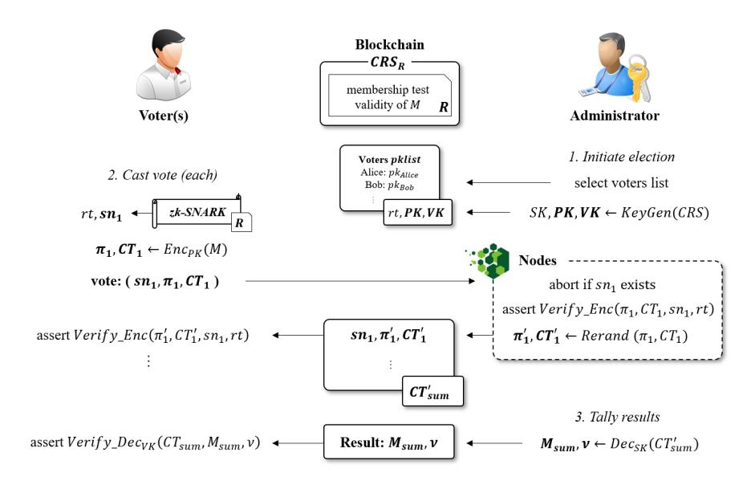
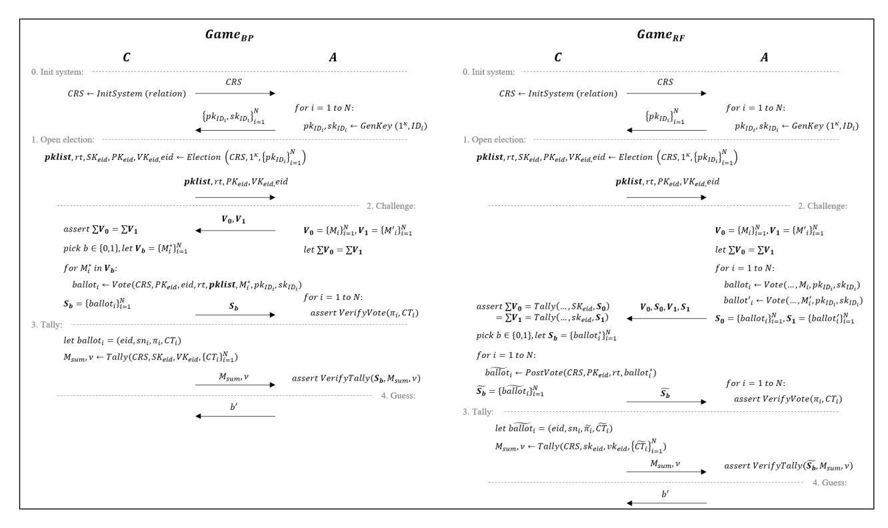

# SAVER:

# SNARK-friendly, Additively-homomorphic, and Verifiable Encryption and decryption with Rerandomization

Jiwon Lee<sup>1</sup> , Jaekyoung Choi<sup>2</sup> , Jihye Kim<sup>2</sup> , and Hyunok Oh<sup>1</sup>

<sup>1</sup> Hanyang University, Seoul, Korea, {jiwonlee,hoh}@hanyang.ac.kr <sup>2</sup> Kookmin University, Seoul, Korea, {cjk2889,jihyek}@kookmin.ac.kr

Abstract. In the pairing-based zero-knowledge succinct non-interactive arguments of knowledge (zk-SNARK), there often exists a requirement for the proof system to be combined with encryption. As a typical example, a blockchain-based voting system requires the vote to be confidential (using encryption), while verifying voting validity (using zk-SNARKs). In these combined applications, a typical solution is to extend the zk-SNARK circuit to include the encryption code. However, complex cryptographic operations in the encryption algorithm increase the circuit size, which leads to impractically large proving time and CRS size.

In this paper, we propose SNARK-friendly, Additively-homomorphic, and Verifiable Encryption and decryption with Rerandomization or SAVER, which is a novel approach to detach the encryption from the SNARK circuit. The encryption in SAVER holds many useful properties. It is SNARK-friendly: the encryption is conjoined with an existing pairingbased SNARK, in a way that the encryptor can prove pre-defined properties while encrypting the message apart from the SNARK. It is additivelyhomomorphic: the ciphertext holds a homomorphic property from the ElGamal-based encryption. It is a verifiable encryption: one can verify arbitrary properties of encrypted messages by connecting with the SNARK system. It provides a verifiable decryption: anyone without the secret can still verify that the decrypted message is indeed from the given ciphertext. It provides rerandomization: the proof and the ciphertext can be rerandomized as independent objects so that even the encryptor (or prover) herself cannot identify the origin.

For the representative application, we also propose a Vote-SAVER based on SAVER, which is a novel voting system where voter's secret key lies only with the voter himself. The Vote-SAVER satisfies receipt-freeness (which implies ballot privacy), individual verifiability (which implies nonrepudiation), vote verifiability, tally uniqueness, and voter anonymity. The experimental results show that our SAVER with respect to the Vote-SAVER relation yields 0.7s for zk-SNARK proving time and 10ms for encryption, with the CRS size of 16MB.

Keywords: pairing-based zk-SNARK, verifiable encryption, verifiable decryption, public-key encryption, additively-homomorphic, rerandomization

#### 1 Introduction

Verifiable encryption (VE) [Ate04, CS03, CD00, LN17, YAS<sup>+</sup>12] is a cryptographic system where the encrypted data provides a proof that can guarantee publicly-defined properties. It can be a useful primitive in trust-based protocols, such as group signatures or key escrow services. The verifiable property varies depending on the nature of the application. For instance, in the group signature, the verifiable encryption is used for the signer to encrypt and prove its identity commitment, which is evidence for detecting the malicious signer in case of treachery. In the key escrow systems where users deposit their keys to the trusted party, the verifiable encryption can let users prove their legitimacy of encrypted keys to the others.

The zero-knowledge proof (ZKP) system is a primitive where one can prove a knowledge for some pre-defined relation  $\mathcal{R}$ , without revealing any other information. As in previous definitions [CS03, LN17], the verifiable encryption can be also viewed as an encryption scheme combined with the ZKP system, by considering the encrypted message as an instance which satisfies the pre-defined relation  $\mathcal{R}$ . But until now, the ZKP was fixed for checking the validity of the message, and it was sort of mixed in the encryption protocol as a limited design. For example, in [CS03], the relation is pre-defined as discrete logarithm problem; it only guarantees that the ciphertext is an encryption of  $(m_1, \ldots, m_k)$  such that  $\delta = \gamma_1^{m_1} \cdots \gamma_k^{m_k}$  for common inputs  $(\delta, \gamma_1, \cdots, \gamma_k)$ .

Generic VE from zk-SNARKs. If we consider the ZKP with arbitrary relations, it is possible to construct verifiable encryption with *generic* relations, which can prove *any* desired properties of the message<sup>3</sup>. The ZKP for verifiable encryption requires the following conditions:

- 1. The ZKP should be non-interactive, to be compatible with the ciphertext in non-interactive public-key encryption.
- 2. The ZKP should guarantee knowledge-soundness of the message; it requires at least zero-knowledge arguments of knowledge (zk-AoK).
- 3. The ZKP should guarantee that the instances for proving the relation are the same as messages in the encryption, i.e., m=m' for  $\mathsf{Prove}(m)$  and  $\mathsf{Enc}(m')$ .

Considering the fact that the proof size determines the ciphertext payload, the most suitable primitive would be zero-knowledge succinct non-interactive arguments of knowledge (zk-SNARK). Specifically, pairing-based zk-SNARKs [PHGR13, Gro16, GM17, BG18, KLO20, Lip19] yields constant-sized proof, regardless of the relation complexities. The pairing-based zk-SNARK can take any pre-defined arithmetic circuit (e.g. quadratic arithmetic program) as an input so that the

<sup>&</sup>lt;sup>3</sup> For instance, assume a user who wants to encrypt his identity while proving that his age is over 20. Since most of the existing verifiable encryptions only focus on the *validity* of the ciphertext, it is difficult to support this type of specific properties. On the other hand, generic verifiable encryption can easily output zero-knowledge proof for the given flexible relation.

prover can convince the verifier that the prover indeed evaluates the function correctly. As for the verifiable encryption, if any desired property is included in the zk-SNARK circuit, the proof ensures that the encrypted data satisfies the property in the circuit.

Unfortunately, the naive combination of the zk-SNARK and encryption is beyond practicality, because of the third condition. To satisfy the consistency of m in the third condition, the entire encryption process must be included in the zk-SNARK circuit to ensure that m is an input for both encryption and the relation, which incurs large overhead. This problem has recently been studied in [KZM+15b, KZM+15a], which focused on boosting the performance when including the standard cryptographic protocols in the zk-SNARK circuit. They designed the SNARK-friendly encryption with minimal multiplications since the circuit size in pairing-based zk-SNARKs relies on the number of multiplications. By optimizing the encryption circuit, their experiment result could boost the zk-SNARK with RSA-OAEP public-key encryption up to the nearly-practical level: 8.9s proving time and 216MB common reference string (CRS) size.

Necessity for an advanced VE. However, in real-world applications, we often need to prove more than a simple RSA encryption. Due to the recent functionality requirements, the encryption schemes have evolved to more sophisticated primitives such as identity-based encryption (IBE) [BBG05, KLLO18], attributebased encryption (ABE) [AHL+12], or rerandomizable encryption [PR07]. When adopting these advanced schemes as generic verifiable encryption, they involve heavy cryptographic operations like pairings or access tree comparisons. In case of rerandomizable encryption which enables the encryption to be unlinkable, the rerandomization needs to prove the verification process of the previous ciphertext, which becomes impractically heavy due to multiple pairings.

If we build generic verifiable encryption by proving the whole encryption process within the circuit (a.k.a. encryption-in-the-circuit), the efficiency becomes unrealistic when the encryption is a bit out of simplicity. For instance, to cover the example of voting application described in 1.1, the circuit needs to include additively-homomorphic encryption such as Paillier encryption [Pai99], zk-SNARK verification, rerandomization, decryption procedure, etc. All these properties require huge amount of work on the prover's side.

Separating the encryption. An intriguing idea to deviate from this efficiency problem is to separate the encryption from the zk-SNARK circuit. The main purpose of including the encryption in the circuit is to ensure that the same m is used for both Prove(m) and Enc(m<sup>0</sup> ) within the relation. If we can prove this consistency with some pre-published commitments, there is no need to include the entire encryption in the circuit anymore. This idea is well-addressed in commit-and-prove system of LegoSNARK [CFQ19], which let the user commit for the value ahead of time, and let the pre-published commitment be connected to the zk-SNARK proof gadgets. If we commit C<sup>M</sup> for the message ahead of time and design the encryption ciphertext CT to be compatible, it is possible to connect encryption to the zk-SNARK proof π by asserting two additional checks on CT ↔ C<sup>M</sup> and C<sup>M</sup> ↔ π.

Still, the commit-and-prove approach cannot avoid including the encryption in the circuit since there is no such scheme which can connect the ciphertext and the commitment. To enable the commit-and-prove connectivity, candidate systems to be connected should carry commitments; to connect an encryption system, the encryption must output a commitment as well as the ciphertext (a.k.a. commit-carrying encryption). Without commit-carrying encryption, the commit-and-prove framework can only separate the encryption circuit and the other circuit (which proves arbitrary properties of the message), which let the encryption still be included in the SNARK circuit.

Enc-with-Prove, Enc-and-Prove. In the generic verifiable encryption, the user encrypts a message and proves its properties at the same time. Therefore, commit-carrying encryption is not necessary for the generic verifiable encryption; it is sufficient to design an encrypt-with-prove scheme based on a fixed relation for each key generation. The fixed relation indicates that the CRS is already generated, which enables exploiting the existing CRS to work with the SNARK verifying equation. If the encryption is specifically designed by embedding the CRS parameters, it is possible to directly plug-in the connectivity check to the zk-SNARK verification. In this case, verifying the proof will imply both the soundness of relation and the connectivity between encryption and SNARK.

Nevertheless, when the user wants to encrypt a message ahead of time and prove its arbitrary properties later, we require modularity in addition to the verifiable encryption, similar to the commit-and-prove framework. To add modularity, we need to extend the encrypt-with-prove verifiable encryption to become a commit-carrying encryption, which can be interpreted as designing an encryptand-prove scheme. In the encrypt-and-prove style, the encryption must output a commitment for the connectivity and the verification requires an additional connectivity check (via commit-and-prove) between the encryption and SNARK. We intend to capture both types by designing the commit-carrying, encryptwith-prove scheme so that the user can use the efficient encrypt-with-prove itself or/and use the modular encrypt-and-prove (with the existing commitment) as desired.

Generic SAVER. We propose a new commit-carrying encryption SAVER: SNARK-friendly, Additively-homomorphic, and Verifiable Encryption and decryption with Rerandomization, which detaches encryption from the zk-SNARK circuit while maintaining the connectivity. SAVER is an efficient encrypt-withprove scheme which supports generic verifiable encryption without including encryption in the circuit. At the same time, SAVER is also a commit-carrying encryption: it can be used as a composable encrypt-and-prove (or LegoEncryption) scheme by providing a commitment compatible with the commit-and-prove framework of LegoSNARK [CFQ19].

Moreover, the proposed SAVER supports more advanced functionalities than just a simple encryption, which emphasizes the efficiency improvement compared to the encryption-in-the-circuit approach. Instead of including the entire complicated encryption in the zk-SNARK circuit, SAVER provides verifiable encryption with various functionalities conjoined with the existing zk-SNARKs (e.g. [Gro16, GM17, BG18, KLO20]) for a generic relation.

The proposed SAVER is generic verifiable encryption which satisfies zk-SNARK connectivity (SNARK-friendly), additive homomorphism, rerandomizability, and verifiable decryption. We describe each property as follows:

- SNARK-friendly encryption: SAVER can be conjoined with zk-SNARK supporting generic relations, which can be realized as generic verifiable encryption. In the encryption, the encryptor can prove any arbitrary predefined relation, while encrypting the message separately from the circuit. Later, the proof and ciphertext are jointly verified to guarantee the relation of the message in the ciphertext.
- Additively-homomorphic encryption: an additively-homomorphic encryption is a well-known primitive that allows computations on ciphertexts. SAVER is an additively-homomorphic encryption based on ElGamal encryption variants [CGS97], i.e., Gm1+m<sup>2</sup> = Gm<sup>1</sup> · Gm<sup>2</sup> ; the ciphertext can be merged by simple elliptic curve cryptography (ECC) multiplications.
- Verifiable decryption: a verifiable decryption [CS03] is a primitive which can convince the verifier that the decrypted message is indeed from the corresponding ciphertext. Likewise, the decryption in SAVER entails a decryption proof, which is verified with message and ciphertext to guarantee the validity. This allows the decryptor to prove the correctness of decrypted messages without revealing her secret key.
- Rerandomizable encryption: a rerandomizable encryption [PR07] is a public-key encryption scheme where the ciphertext can be rerandomized, which can be viewed as a newly-encrypted ciphertext. Likewise, ciphertext in SAVER can be rerandomized as a new unlinkable ciphertext. Since SAVER outputs a proof as verifiable encryption, the proof is also rerandomized along with the ciphertext.

To justify the practicality, we implemented the proposed SAVER by applying the voting relation in section 1.1. The experiment result yields 0.7s for the voting time when assuming 2<sup>16</sup> total voters, which includes both encryption and zk-SNARK proof. The encryption time takes less than 10ms, which indicates that the additional encryption overhead to the zk-SNARK is almost negligible. The CRS size for the voting relation is only 16MB, and the public key and verification key for the verifiable encryption is from 1MB to 8MB, linearly depending on the message size.

Our contributions. We summarize the contributions of the paper, from various perspectives listed as follows:

– Generic verifiable encryption: the proposed SNARK-friendly, Additivelyhomomorphic, and Verifiable Encryption and decryption with Rerandomization (SAVER) is generic verifiable encryption. SAVER can be connected with

- zk-SNARKs such as [Gro16] with any generic relation. The ciphertext and proof guarantee the message satisfies pre-defined relation from zk-SNARK.
- zk-SNARK connectivity: instead of including the encryption in the circuit for the generic verifiable encryption, SAVER detaches encryption from the zk-SNARK circuit with providing connectivity. The verification in SAVER guarantees a linkage between encryption and relation, as well as knowledge soundness of the proof.
- Modularity: SAVER is a commit-carrying, encrypt-with-prove scheme. The user can choose whether to deploy SAVER as an encrypt-with-prove scheme to be a generic verifiable encryption, or/and an encrypt-and-prove scheme to be compatible with the modular commit-and-prove framework.
- Functionalities: the proposed SAVER supports and satisfies many functionalities. It is SNARK-friendly: the encryption is compatible with zk-SNARK composition. It is additively-homomorphic: the ciphertext can be merged additively from the homomorphic property. It is verifiable encryption: one can encrypt a message while proving any generic relation for the message. It is verifiable decryption: the decryptor can convince the verifier that the decrypted message is indeed from the ciphertext, without revealing her secret key. It provides rerandomization: the ciphertext can be rerandomized to be unlinkable to the original one.
- Vote-SAVER: to justify the functionalities in SAVER, we define an ideal voting system and propose an efficient application Vote-SAVER (section 1.1) based on the SAVER scheme. While existing voting systems let the authority responsible for the key distribution, the Vote-SAVER let only the voter hold its own secret key supporting non-repudiation.
- Implementation: we implement our SAVER with respect to the Vote-SAVER relation on the real computer system to show the practicality of the construction. The experiment result yields 0.7s for zk-SNARK proving time and 10ms for encryption when assuming 2<sup>16</sup> total voters, with the CRS size of 16MB for the voting relation.
- Security: the proposed SAVER requires many security notions: indistinguishability (IND-CPA), encryption knowledge soundness, rerandomizability, perfect decryption soundness, and perfect zero-knowledge. We formally define each property and provide security proof in a standard model. We also provide a formal proof for the Vote-SAVER which satisfies various properties described in section 1.1, based on the security of SAVER scheme.

The rest of the paper proceeds as follows. Section 1.1 provides a specific application Vote-SAVER, to justify the functionalities in SAVER. Section 2 organizes related works. In section 3, we describe some necessary preliminaries and formal definitions. Section 4 presents insights and the formal construction of SAVER, and section 5 provides formal security proofs. In section 6, we present a formal protocol of the Vote-SAVER, and section 7 provides formal security proofs. Section 8 shows experiment results of SAVER, with respect to the Vote-SAVER application. In section 9, we draw a conclusion.

# 1.1 Application: Vote-SAVER

Our proposed SAVER is generic verifiable encryption with many useful functionalities - zk-SNARK connectivity, additive-homomorphism, rerandomizability, and verifiable decryption. To strengthen the justifications on such complex functionalities, we specify one of the interesting applications, voting, which is mentioned as a representative example of verifiable encryption in the cryptography encyclopedia [Sak11].

In the history of voting systems, the main focus was on capturing both privacy and verifiability of the vote. The commonly accepted properties and related works are well-described in BeleniosRF [CCFG16]: the security notion for privacy has evolved from ballot privacy to receipt-freeness, and coercion-resistance. The ballot privacy refers to the standard privacy of the vote, while receipt-freeness extends the ballot privacy to where even the voter cannot reproduce the vote for vote-buying. The coercion-resistance must allow the voter to vote for his intended choice even when he is corrupted by the coercing adversary, which essentially requires re-voting functionality. In general, the coercion-resistance implies receipt-freeness<sup>4</sup> , which in turn implies ballot privacy.

The verifiability is another important property of the voting system; it is recently proved that the lack of verifiability leads to a privacy leak [CL18]. The three commonly accepted properties are eligibility verifiability, individual verifiability, and universal verifiability. The eligibility verifiability is often from the authority's view, which indicates it should be able to check that the vote is from an eligible voting right. On the contrary, the individual verifiability is from the voter's view, which ensures that the voter should be able to verify that his vote is included in the public ballot box. The universal verifiability is from the observer's view including voters, which ensures that the tally result is from the public ballot box; sometimes it can be substituted with stronger notion called tally uniqueness.

Since coercion-resistance is more theoretical than practical due to the requirement of re-voting issue, it is commonly accepted that a reliable voting system should provide non-interactive receipt-freeness along with the verifiability. Among the existing proposals, BeleniosRF [CCFG16] is a well-known work to successfully achieve both receipt-freeness and individual verifiability which seemed like a contradiction; the voter should not be allowed to reproduce his vote, but should still be able to check that his vote is included in the box. BeleniosRF resolves this issue by combining rerandomizability to the verifiable encryption. When the vote is rerandomized before enrollment, it can prevent the voter from reproducing the vote, since he does not know the new random used in the rerandomization. Nevertheless, he can still check the proof to verify that at least his original message is preserved in the rerandomized vote.

<sup>4</sup> The coercion-resistance does not directly imply receipt-freeness, since the coercionresistance is about generating indistinguishable real/fake keys, while receiptfreeneess is about preventing the vote reproduction. But even if the vote is reproducible in coercion-resistance, the adversary does not know if the vote is real or fake: it satisfies the primary objective of the receipt-freeness at the end.

The SK holder. However, in our observation, all existing voting systems including BeleniosRF are missing a crucial requirement: the voter's secret key must not be originated from others, even from authority. If there exists an authority responsible for the system setup and key distribution, the authority holds the secret voting key of each voter. At the end, this leads to the authority discovering the voter's identity from the vote, or even allow authority to forge a malicious proxy vote on behalf of the voter. Therefore, for the fundamental privacy, we emphasize that it is important to let the voter be responsible for his own key generation, which should not be compromised to any other entities. Therefore, by adding new definitions based on this idea to typical definitions in the literature [JMP13, AM16], we organize the essential properties of a reliable voting system listed as below:

- Board integrity: the voting system often requires a technical support where the public bulletin board for ballot box is non-malleable.
- Receipt-freeness: the receipt-freeness implies ballot privacy; it ensures that the ballot must guarantee the privacy of voting message while the voter cannot reproduce his vote.
- Individual verifiability: the voter must be able to verify the inclusion of his vote, and no others can convince the voter with a false ballot.
- Eligibility verifiability: the ballot can only be generated from an eligible voter with a voting right.
- Tally uniqueness: the tally uniqueness implies universal verifiability; it ensures that the tally result is unique corresponding to the ballots in the public board.
- X Voter anonymity: we define a new security notion, which ensures that the ballot does not reveal the voter's identity to any entities, even from the authority.
- X Non-repudiation: we define another new security notion, indicating that the ballot is unique only from the voter and there exists no proxy votes.

Note that BeleniosRF satisfies the typical properties (i.e. board integrity, receipt-freeness, individual verifiability, eligibility verifiability, and unversal verifiability), but it cannot support voter anonymity and non-repudiation since the key distributing authority knows the voting key of the voters.

Membership tests for voting. The zero-knowledge proof of membership is a well-known technique to prove the membership with respect to the accumulated value, while hiding the identity of the prover within the zero-knowledge; it is often achieved by constructing Merkle tree or RSA accumulator inside the zk-SNARK. The most representative example is Zerocash [BCG<sup>+</sup>14] which is an anonymous blockchain cryptocurrency: for each transaction, a sender runs the zk-SNARK to prove that the coin is a valid coin within the Merkle tree membership test. Intuitively, the public key for a coin is set as pk = H(sk) for any collision-resistant hash H. When the sender proves the membership test in zk-SNARK, the relation asserts pk = H1(sk), rt = MerkleT ree(pk, copath), and sn = H2(sk) with hiding the sk, pk, copath as witnesses (rt is the input, and sn is the output). The relation guarantees that the valid pk is included in the Merkle tree of rt, and the deterministic serial number sn can prevent double-spending.

When observing the membership test in Zerocash, it is very similar to the nature of voting. If we consider the coin as a voter, we can let the voter keep his own sk and only publish pk = H(sk). When we build a Merkle tree of pk from eligible voters, the voter can hold sk for himself but prove that he is within the eligible membership with respect to the Merkle root rt. Also, the serial number sn now prevents double-voting, equivalent to the detection of double-spending. Therefore, if we let the voter prove his membership along with the vote, the vote message now only contains the anonymous message while the property of the message (i.e. voter's membership) can be proved as zero-knowledge. In other words, if we have a generic verifiable encryption from zk-SNARK described in section 1, it is possible to design the voting system where the voting key belongs only to the voter. Based on the idea, we describe how to capture the essential properties by using the concept of generic verifiable encryption:

- blockchain for board integrity: the blockchain system is well-known for its tamper-proof property based on the proof of work, which is a suitable platform for the non-malleable board.
- rerandomizable encryption for receipt-freeness: similar to the BeleniosRF approach, letting the blockchain node rerandomize the ballot can provide receipt-freeness since the voter does not know the modified random.
- verifiable encryption for individual verifiability: by verifying the proof with respect to the original statements, the voter can be convinced that his vote statement remains in the ballot.
- zk-SNARK for eligibility verifiability: the membership test relation of the zk-SNARK can guarantee that the ballot is from the eligible voter within the Merkle tree of rt.
- homomorphism & verifiable decryption for tally uniqueness: if the ballots can be merged with the additively-homomorphic encryption and the message can be verified with the verifiable decryption, an observer can verify that the decrypted tally is indeed from the merged ciphertext.
- zk-SNARK for voter anonymity: the zero-knowledge of zk-SNARK can guarantee that the voter's identity is hidden within the membership test, since sk and pk are zero-knowledge witnesses.
- zk-SNARK for non-repudiation: the ballot can be only generated from the voter who holds the valid sk for the pk.

Overall, to satisfy all the given properties, it is required to design a generic verifiable encryption from zk-SNARK, which also supports the functionalities of rerandomizable encryption, additively-homomorphic encryption and verifiable decryption. It justifies that we require an advanced verifiable encryption, which is more complex than just a simple verifiable encryption.

Scenario. Figure 1 represents how to efficiently proceed a voting scenario by utilizing the advanced verifiable encryption. The system works with a publicly



Fig. 1: The Vote-SAVER framework from the advanced verifiable encryption with rerandomizability, additive-homomorphism, and verifiable decryption

available blockchain, where the consensus block defines the relation R of membership test and message validity, with the corresponding common reference string CRS<sup>R</sup> generated from zk-SNARK setup. There are two entities, voters and an administrator, who interact mainly through the blockchain subscription. We refer to the election committee as an administrator, rather than authority, because the administrator does not distribute the secret key of the voters. The administrator is only responsible for tallying the anonymous results; even when corrupted, she holds no power to trace or manipulate the votes at any cost.

Before election. Our voting system let each user publish his own pk to the public, where pk is generated from user's secret value. For example, a simple way is to let pk = H(sk) for collision-resistant hash H. Without knowing sk, no one can make a valid ballot.

Initiating election. First, to open an election, the administrator makes the pklist of the voters, which prescribes the selection of eligible voters who participate in the election. Then she generates a secret key SK, a public key PK, and a verification key V K for the occasion, to publish PK, V K on the blockchain along with the pklist and its Merkle root rt. This set of PK, V K and pklist, rt defines each election; a new election can be initiated with a different set of PK<sup>0</sup> , V K<sup>0</sup> and pklist<sup>0</sup> , rt<sup>0</sup> .

Casting votes. After the election is initiated, voters who are selected in the list can cast a vote. Each voter must encrypt the vote and prove the relation (i.e. membership test and message validity) at the same time, via generic verifiable encryption from zk-SNARK. Similar to the membership test in Zerocash [BCG+14], the zk-SNARK circuit outputs a Merkle root rt to prove the belonging within the pklist, and a serial number sn to prevent the duplication. Note that the sn does not reveal the identity; it is only used for checking the duplication. As a ballot, a set of serial number sn, proof π and ciphertext CT is sent to the blockchain network as a transaction. The blockchain node checks if sn already exists in the blockchain (then abort). If sn is unique, it first verifies the proof, rerandomizes the vote from π, CT to π 0 , CT <sup>0</sup> , and publishes (by mining the block) the renewed vote sn, π<sup>0</sup> , CT <sup>0</sup> on the blockchain. The voter verifies π 0 , CT <sup>0</sup> for his sn within the verifiable encryption, to be convinced that his vote is included. This satisfies the individual verifiability, but the voter can only check the existence of his vote; π 0 , CT <sup>0</sup> is unlinkable from π, CT , which also achieves the receipt-freeness.

Tallying results. After all the votes from participants are posted on the blockchain, the administrator closes the vote by declaring the tally result. Since the encryption scheme is additively-homomorphic, anyone can get the merged ciphertext CT sum. The administrator is responsible for decrypting the CT sum with her own SK, and publishing the corresponding vote result Msum along with the decryption proof ν. By verifying Msum, ν with the verifiable decryption, anyone can be convinced that the result is tallied correctly (universal verifiability).

We define the relation for the voting scenario in section 8, and also provide implementation results of the entire voting system on the real machine.

# 2 Related Work

A zero-knowledge succinct non-interactive argument of knowledge (zk-SNARK) is introduced in [BCCT12], as a proof system where a prover can generate a proof that they know a witness to an instance in a manner which is succinct: proofs are short and verifier computation is small, and zero-knowledge: proofs do not reveal the witness. Since Gennaro et al. [GGPR13] introduced a notion of quadratic arithmetic program (QAP), a pairing-based zk-SNARKs (or preprocessing SNARKs with trusted setup) [Gro16, GM17, BG18, Lip19, KLO20] have received significant attention for their constant sized proof and verification. Groth's protocol [Gro16] set an efficient standard, by yielding three group elements as a proof. Then there has been efforts to add modularity to these zk-SNARK proof systems. Agrawal et al. [AGM18] proposed a proof system for composite statements using Pinocchio [PHGR13], and LegoSNARK [CFQ19] proposed a general commit-and-prove framework that provides a modular composition of commit-carrying proof systems. On the security side, Groth and Maller [GM17] introduced a notion of simulation-extractability, to prevent malleability in the proof of [Gro16]. However, to achieve simulation-extractability, [GM17] requires a square arithmetic program (SAP) instead of QAP, which doubles the circuit size - which sacrifices proving time and CRS size. To address this issue, Bowe and Gabizon [BG18] applied random oracle to [Gro16], which can transform the [Gro16] to be simulation-extractable. However, this compromises the proof size to five elements. Lipmaa [Lip19] proposed a QAP-based simulation-extractable zk-SNARK with four elements, from the help of more general assumption. Recently, Kim et al. [KLO20] devised the most efficient simulation-extractable zk-SNARK, which achieves both QAP and three elements as a proof, compatible with non simulation-extractable [Gro16].

#### 3 Preliminaries

#### 3.1 Notations

In this section, we define some essential notations. For the simple legibility, we define the term  $\frac{\beta u_i(x) + \alpha v_i(x) + w_i(x)}{\gamma}$  in [Gro16] as  $y_i(x)$ . Then, we denote  $G^{y_i(x)}$  as  $G_i$ . We use  $\boldsymbol{x}$  or  $\{x_i\}$  for the list of elements, which is equivalent to a vector. We also define  $[\![X]\!] = span\{X\}$  as a linear combination of  $x \in X$ , i.e.,  $[\![X]\!] = \{\sum_{x_i \in X} \eta_i x_i\}$ . For any set  $[\![X]\!]$ , we define  $[\![A]\!] \times [\![B]\!] = \{a \cdot b \mid a \in [\![A]\!], b \in [\![B]\!]\}$  and  $[\![A]\!]^{-1} = \{a^{-1} \mid a \in [\![A]\!]\}$ . For any given vectors,  $\circ$  represents a Hadamard product (i.e. let  $\boldsymbol{a} = (a_1, a_2)$  and  $\boldsymbol{b} = (b_1, b_2)$ , then  $\boldsymbol{a} \circ \boldsymbol{b} = (a_1 \cdot b_1, a_2 \cdot b_2)$ ) and  $\oslash$  represents a Hadamard division  $(\boldsymbol{a} \oslash \boldsymbol{b} = (a_1/b_1, a_2/b_2))$ .

#### 3.2 Relations

Given a security parameter  $1^{\lambda}$ , a relation generator  $\mathcal{RG}$  returns a polynomial time decidable relation  $\mathcal{R} \leftarrow \mathcal{RG}(1^{\lambda})$ . For  $(\Phi, w) \in \mathcal{R}$  we say w is a witness to the statement (I/O)  $\Phi$  being in the relation. The statement  $\Phi$  in SAVER consists of  $\Phi = M \cup \hat{\Phi}$  for message statements  $\{m_1, \ldots, m_n\}$  by splitting  $M = (m_1 || \cdots || m_n)$  and arbitrary statements  $\hat{\Phi} = \{\phi_{n+1}, \cdots, \phi_l\}$ , where l is the number of statements.

#### 3.3 Bilinear Groups

**Definition 1.** A bilinear group generator  $\mathcal{BG}$  takes a security parameter as input in unary and returns a bilinear group  $(p, \mathbb{G}_1, \mathbb{G}_2, \mathbb{G}_T, e, aux)$  consisting of cyclic groups  $\mathbb{G}_1$ ,  $\mathbb{G}_2$ ,  $\mathbb{G}_T$  of prime order p and a bilinear map  $e: \mathbb{G}_1 \times \mathbb{G}_2 \to \mathbb{G}_T$  possibly together with some auxiliary information (aux) such that:

- there are efficient algorithms for computing group operations, evaluating the bilinear map, deciding membership of the groups, and for sampling the generators of the groups;
- the map is bilinear, i.e., for all  $G \in \mathbb{G}_1$  and  $H \in \mathbb{G}_2$  and for all  $a, b \in \mathbb{Z}$  we have

$$e(G^a, H^b) = e(G, H)^{ab};$$

- and the map is non-degenerate (i.e., if e(G, H) = 1 then G = 1 or H = 1).

Usually bilinear groups are constructed from elliptic curves equipped with a pairing, which can be tweaked to yield a non-degenerate bilinear map. There are many ways to set up bilinear groups, both as symmetric bilinear groups, where  $\mathbb{G}_1 = \mathbb{G}_2$ , and as asymmetric bilinear groups, where  $\mathbb{G}_1 \neq \mathbb{G}_2$ . We will be working in the asymmetric setting, in what Galbraith, Paterson, and Smart [GPS08] call the Type III setting where there is no efficiently computable non-trivial homomorphism in either direction between  $\mathbb{G}_1$  and  $\mathbb{G}_2$ . Type III bilinear groups are the most efficient type of bilinear groups and hence the most relevant for practical applications.

# 3.4 Cryptographic Assumptions

We use Power Knowledge of Exponent (d-PKE) with Batch Knowledge Check assumption [Gab19]. In [Gab19] (lemma 2.3), it is proven that the d-PKE can be used to batch knowledge checks, stated as below:

Assumption 1. batch – PKE (Lemma 2.3 of [Gab19]): Assuming the d-PKE the following holds. Fix  $k = poly(\lambda)$ , a constant t and an efficiently computable degree d rational map  $S: \mathbb{F}^{t+1} \to \mathbb{F}^M$ . Fix any  $i \in [k]$ . For any efficient  $\mathcal{A}$  there exists an efficient  $\chi_{\mathcal{A}}$  such that the following holds. Consider the following experiment.  $\alpha_1, \ldots, \alpha_k, \tau \in \mathbb{F}$  and  $\mathbf{x} \in \mathbb{F}^t$  are chosen uniformly.  $\mathcal{A}$  is given as input  $[S(\tau, \mathbf{x})]$  and  $\{[\alpha_j \cdot \tau^l]\}_{j \in [k], l \in [0...d]}$  and outputs a sequence of elements  $([a_1], \ldots, [a_k], [b])$  in  $\mathbb{G}$ .  $\chi_{\mathcal{A}}$ , given the same input as  $\mathcal{A}$  together with the randomness of  $\mathcal{A}$  and  $\{\alpha_j\}_{j \in [k] \setminus \{i\}}$ , outputs  $\mathcal{A}(X) \in \mathbb{F}[X]$  of degree at most d such that the probability that both

1. 
$$\mathcal{A}$$
 "succeeded", i.e.,  $b = \sum_{j=1}^{k} \alpha_j \cdot a_j$ . But, 2.  $\chi_{\mathcal{A}}$  "failed", i.e.,  $a_i \neq [\mathcal{A}(\tau)]$ .

is 
$$\mathbf{Adv}^{\text{batch-PKE}}_{\mathcal{R},\mathcal{A},\chi_{\mathcal{A}}}(\lambda) = negl(\lambda)$$
.

We also introduce a decisional version of the polynomial (Poly) assumption, which is originated from the computational Poly assumption adopted in [GM17]. In the univariate case, the Poly assumption states that for any  $G \in \mathbb{G}_1$ , given  $G^{g_1(\boldsymbol{x})}, \ldots, G^{g_I(\boldsymbol{x})}$ , an adversary cannot compute  $G^{g_c(\boldsymbol{x})}$  for a polynomial  $g_c$  that is linearly independent from  $g_1, \ldots, g_I$  - even if it knows  $H^{g_c(\boldsymbol{x})}$  for  $H \in \mathbb{G}_2$ .

We extend the computational Poly assumption to the decisional Poly assumption (D-Poly). In the D-Poly game, the adversary acts similarly as in computational Poly game, except that it queries a challenge polynomial and guesses the nature of the output (i.e. whether the output is generated from the polynomial or from an independent random). In this case, the restriction for the challenge  $g_c \notin [\![Q_1]\!]$  is not sufficient where  $Q_1 = \{g_1, \ldots, g_I\}$ . For example, the adversary should not have  $H^{g_c(\boldsymbol{x})}$ ; otherwise it can check whether the received challenge T is  $G^{g_c(\boldsymbol{x})}$  or a random group element by applying pairings (i.e. check the nature of T by  $e(T, H^{g_c(\boldsymbol{x})})$ )<sup>5</sup>. Thus, the restriction should be extended to

This problem is similar to the decisional BDH assumption: it cannot follow the standard DDH as  $(g^a, g^b, T_0 \leftarrow g^z, T_1 \leftarrow g^{ab}, b \leftarrow \{0, 1\} \mid b' \leftarrow \mathcal{A}(g^a, g^b, T))$ , because the adversary can test if  $e(g^a, g^b) \stackrel{?}{=} e(g, T)$ .

 $H \in \mathbb{G}_2$ , to prevent the adversary from obtaining the span of  $g_c(\mathbf{x})$  in  $\mathbb{G}_2$ . The formal description of the D - Poly is as follows.

**Assumption 2.** D – Poly: Let  $\mathcal{A}$  be a PPT adversary, and define the advantage  $\mathbf{Adv}_{\mathcal{BG},d(\lambda),q(\lambda),\mathcal{A}}^{D-Poly}(\lambda) = Pr[\mathcal{G}_{\mathcal{BG},d(\lambda),q(\lambda),\mathcal{A}}^{D-Poly}] - \frac{1}{2}$  where  $\mathcal{G}_{\mathcal{BG},d(\lambda),q(\lambda),\mathcal{A}}^{D-Poly}$  is defined as below and  $Q_1,Q_2$  is the set of polynomials  $g_i(X_1,\ldots,X_q),h_i(X_1,\ldots,X_q)$  queried to  $\mathcal{O}_{G,x}^1,\mathcal{O}_{H,x}^2$ .

$$\begin{split} & \underset{\mathcal{BG}, d(\lambda), q(\lambda), \mathcal{A}}{\operatorname{MAIN}} \, \mathcal{G}^{D-Poly}_{\mathcal{BG}, d(\lambda), q(\lambda), \mathcal{A}}(\lambda) \\ & (p, \mathbb{G}_1, \mathbb{G}_2, \mathbb{G}_T, e, aux) \leftarrow \mathcal{BG}(1^{\lambda}); \\ & G \leftarrow \mathbb{G}_1; H \leftarrow \mathbb{G}_2; \boldsymbol{x} \leftarrow (\mathbb{Z}_p^*)^q \\ & g_c(X_1, \dots, X_q) \leftarrow \mathcal{A}^{\mathcal{O}^1_{G, \boldsymbol{x}}, \mathcal{O}^2_{H, \boldsymbol{x}}}(p, \mathbb{G}_1, \mathbb{G}_2, \mathbb{G}_T, e, aux) \\ & where \, g_c(\boldsymbol{x}) \not\in \llbracket Q_1 \rrbracket \times \llbracket Q_2 \rrbracket \times \llbracket Q_2 \rrbracket^{-1} \\ & set \, T_1 \leftarrow G^{g_c(\boldsymbol{x})}, T_0 \stackrel{\$}{\leftarrow} \mathbb{G}_1 \\ & b \leftarrow \{0, 1\}, T = T_b \\ & b' \leftarrow \mathcal{A}^{\mathcal{O}^1_{G, \boldsymbol{x}}, \mathcal{O}^2_{H, \boldsymbol{x}}}(T) \\ & return \, 1 \, if \, b = b' \\ & else \, return \, 0 \end{split}$$

$$\frac{\mathcal{O}_{G,\boldsymbol{x}}^{1}(g_{i})}{assert\ g_{i}\in\mathbb{Z}_{p}^{*}[X_{1},\ldots,X_{q}]} \qquad \frac{\mathcal{O}_{H,\boldsymbol{x}}^{2}(h_{j})}{assert\ h_{j}\in\mathbb{Z}_{p}^{*}[X_{1},\ldots,X_{q}]} 
assert\ deg(g_{i})\leq d \qquad assert\ deg(h_{j})\leq d 
return\ G^{g_{i}(\boldsymbol{x})} \qquad return\ H^{h_{j}(\boldsymbol{x})}$$

The  $(d(\lambda), q(\lambda)) - D$  – Poly assumption holds relative to  $\mathcal{BG}$  if for all PPT adversaries  $\mathcal{A}$ , we have  $\mathbf{Adv}^{D-Poly}_{\mathcal{BG}, d(\lambda), q(\lambda), \mathcal{A}}(\lambda)$  is negligible in  $\lambda$ .

# 3.5 Zero-Knowledge Succinct Non-interactive Arguments of Knowledge

For the paring-based zk-SNARK, we adopt the definitions from [Gro16, GM17].

**Definition 2.** A zero-knowledge succinct non-interactive arguments of knowledge (zk-SNARK) for  $\mathcal{R}$  is a set of four algorithms  $\Pi_{\mathsf{snark}} = (\mathsf{Setup}, \mathsf{Prove}, \mathsf{Vfy}, \mathsf{SimProve})$  working as follows:

- $(CRS, \tau) \leftarrow \mathsf{Setup}(\mathcal{R})$ : takes a relation  $\mathcal{R} \leftarrow \mathcal{RG}(1^{\lambda})$  as input and returns a common reference string CRS and a simulation trapdoor  $\tau$ .
- $-\pi \leftarrow \mathsf{Prove}(CRS, \Phi, w)$ : takes a common reference string CRS, a relation  $\mathcal{R}$ , a statement and witness in the relation  $(\Phi, w) \in \mathcal{R}$  as inputs, and returns a proof  $\pi$ .

- $-0/1 \leftarrow \mathsf{Vfy}(CRS, \Phi, \pi)$ : takes a common reference string CRS, a statement  $\Phi$ , a proof  $\pi$  as inputs and returns 0 (reject) or 1 (accept).
- $-\pi \leftarrow \mathsf{SimProve}(CRS, \tau, \Phi)$ : takes a common reference string CRS, a simulation trapdoor  $\tau$ , a statement  $\Phi$  as inputs and returns a proof  $\pi$ .

It satisfies completeness, knowledge soundness, zero-knowledge, and succinctness described as below:

Completeness: Given a true statement, a prover with a witness can convince the verifier. For all  $\lambda \in \mathbb{N}$ , for all  $\mathcal{R}$  and for all  $(\Phi, w) \in \mathcal{R}$ ,  $Pr[(CRS, \tau) \leftarrow \mathsf{Setup}(\mathcal{R}), \pi \leftarrow \mathsf{Prove}(CRS, \Phi, w) : \mathsf{Vfy}(CRS, \Phi, \pi) = 1] = 1.$ 

Computational Knowledge Soundness: Computational knowledge soundness says that the prover must know a witness and such knowledge can be efficiently extracted from the prover by a knowledge extractor. Proof of knowledge requires that for every adversarial prover  $\mathcal{A}$  generating an accepting proof, there must be an extractor  $\chi_{\mathcal{A}}$  that, given the same input of  $\mathcal{A}$ , outputs a valid witness. Formally, an argument system  $\Pi_{\mathsf{snark}}$  is computationally considered as knowledge sound if for any PPT adversary  $\mathcal{A}$ , there exists a PPT extractor  $\chi_{\mathcal{A}}$ , such that  $\mathbf{Adv}_{\mathsf{Insark},\mathcal{A},\chi_{\mathcal{A}}}^{sound}(\lambda)$  is negligible.

$$\mathbf{Adv}^{sound}_{\Pi_{\mathsf{Snark}},\mathcal{A},\chi_{\mathcal{A}}}(\lambda) = Pr[(CRS,\tau) \leftarrow \mathsf{Setup}(\mathcal{R}), (\varPhi^*,\pi^*) \leftarrow \mathcal{A}(CRS), w \leftarrow \chi_{\mathcal{A}}(trans_{\mathcal{A}}) : Vfy(CRS,\varPhi^*,\pi^*) = 1 \land (\varPhi^*,w) \not\in \mathcal{R}] = negl(\lambda).$$

**Perfect Zero-Knowledge**: Perfect zero-knowledge states that the system does not leak any information besides the truth of the statement. This is modelled by a simulator that does not know the witness but has some trapdoor information that enables it to simulate proofs.

**Succinctness**: Succinctness states that the argument generates the proof of polynomial size in the security parameter, and the verifier's computation time is polynomial in the security parameter and in statement size.

#### 3.6 Commit-Carrying SNARK and Commit-and-Prove SNARK

The commit-carrying SNARK (cc-SNARK) and the commit-and-prove SNARK (CP-SNARK) are originally defined in LegoSNARK [CFQ19]. The main concept of the LegoSNARK is to connect the modular SNARK systems and ensure the same input between them via commitments.

The cc-SNARK is a proof system where the proof includes a commitment to the portion of witnesses, which can be used for the connection. There is no specific restriction for the commitment scheme, but it is convenient to consider it as the Pedersen vector commitment  $c = h^o \cdot h_1^{u_1} \cdots h_n^{u_n}$  for a random  $o \stackrel{\$}{\leftarrow} \mathbb{Z}_p^*$ , messages  $u_1, \dots, u_n$  and generators  $h, h_1, \dots, h_n$ .

**Definition 3.** (cc-SNARK: Definition 3.2 of [CFQ19]). A commit-carrying zk-SNARKs for a relation  $\mathcal{R}$  is a set of four of algorithms  $\Pi_{cc} = (KeyGen, Prove, VerProof, VerCommit)$  that works as follows:

- $-(ck, ek, vk) \leftarrow \mathsf{KeyGen}(\mathcal{R})$ : takes a relation  $\mathcal{R}$  as inputs, and outputs a commom reference string which includes a commitment key ck, an evaluation key ek, and a verification key vk.
- $-(c,\pi;o) \leftarrow \mathsf{Prove}(ek,x,w)$ : takes an evaluation key ek, a statement x and a witness  $w := (m,\omega)$  such that the relation  $\mathcal R$  holds as inputs, and outputs a proof  $\pi$ , a commitment c and an opening o such that  $\mathsf{VerCommit}(ck,c,u,o) = 1$ .
- $-0/1 \leftarrow \mathsf{VerProof}(vk, x, c, \pi)$ : takes a verification key vk, a statement x, a commitment c, a proof  $\pi$  as inputs, and outputs 1 if  $x, c, \pi$  is within the relation  $\mathcal{R}$ , or 0 otherwise.
- $-0/1 \leftarrow \mathsf{VerCommit}(ck, c, u, o)$ : takes a commitment key ck, a commitment c, a message u and an opening o as inputs, and outputs 1 if the commitment opening is correct, or 0 otherwise.

which satisfies completeness, succinctness, knowledge soundness, zero knowledge and binding (described in [CFQ19]).

The CP-SNARK is a proof system that can link existing cc-SNARKs by using their commitments. The LegoSNARK defines the CP-SNARK framework and provides a CP-SNARK scheme CP, that guarantees the connectivity between multiple cc-SNARKs via Pedersen vector commitments.

**Definition 4.** (CP-SNARK: Definition 3.1 of [CFQ19]). Let  $\{\mathcal{R}_{\lambda}\}_{{\lambda}\in\mathbb{N}}$  be a family of relations R over  $\mathcal{D}_x \times \mathcal{D}_u \times \mathcal{D}_{\omega}$  such that  $\mathcal{D}_u$  splits over l arbitrary domains  $(\mathcal{D}_1 \times \cdots \times \mathcal{D}_l)$  for some arity parameter  $l \geq 1$ . Let  $\mathsf{Com} = (\mathsf{Setup}, \mathsf{Commit}, \mathsf{VerCommit})$  be a commitment scheme (as per Definition 2.1) whose input space  $\mathcal{D}$  is such that  $\mathcal{D}_i \subset \mathcal{D}$  for all  $i \in [l]$ . A commit and prove zk-SNARK for  $\mathsf{Com}$  and  $\{\mathcal{R}_{\lambda}\}_{{\lambda}\in\mathbb{N}}$  is a zk-SNARK for a family of relations  $\{\mathcal{R}_{\lambda}^{\mathsf{Com}}\}_{{\lambda}\in\mathbb{N}}$  such that:

- every  $\mathbf{R} \in \mathcal{R}^{\mathsf{Com}}$  is represented by a pair (ck, R) where  $ck \in \mathsf{Setup}(1^{\lambda})$  and  $R \in \mathcal{R}_{\lambda}$ :
- $\mathbf{R}$  is over pairs  $(\mathbf{x}, \mathbf{w})$  where the statement is  $\mathbf{x} := (x, (c_j)_{j \in [l]}) \in \mathcal{D}_x \times \mathcal{C}^l$ , the witness is  $\mathbf{w} := ((u_j)_{j \in [l]}, (o_j)_{j \in [l]}, \omega) \in \mathcal{D}_1 \times \cdots \times \mathcal{D}_l \times \mathcal{O}^l \times \mathcal{D}_\omega$ , and the relation  $\mathbf{R}$  holds iff

$$\bigwedge\nolimits_{j\in[l]}\mathsf{VerCommit}(ck,c_j,u_j,o_j)=1 \land \mathcal{R}(x,(u_j)_{j\in[l]},\omega)=1$$

We denote a CP-SNARK as a triple of algorithms  $\mathsf{CP} = (\mathsf{KeyGen}, \ \mathsf{Prove}, \ \mathsf{VerProof})$  as follows.

- $-(ek, vk) \leftarrow \mathsf{KeyGen}(ck, R) : takes \ a \ commitment \ key \ ck, \ a \ relation \ \mathcal{R} \ as \ inputs, \ and \ outputs \ a \ commom \ reference \ string \ which \ includes \ an \ evaluation \ key \ ek, \ and \ a \ verification \ key \ vk.$
- $-\pi \leftarrow \mathsf{Prove}(ek, x, (c_j)_{j \in [l]}, (u_j)_{j \in [l]}, (o_j)_{j \in [l]}, \omega) : takes \ an \ evaluation \ key \ ek,$  a statement x, commitments  $c_j$ , messages  $u_j$ , randoms  $o_j$ , witnesses  $\omega$ , and outputs the proof of correct commitment.
- $-0/1 \leftarrow \mathsf{VerProof}(vk, x, (c_j)_{j \in [l]}, \pi) : takes \ a \ verification \ key \ vk, \ a \ statement \ x, \ commitments \ c_j, \ a \ proof \ \pi, \ and \ rejects \ or \ accepts \ the \ proof.$

# 3.7 Commit-Carrying Encryption

We define a new notion of encryption that can output a commitment which shares a same format with the commit-carrying SNARKs. If the encryption scheme is capable of outputting the Pedersen vector commitment from existing ciphertexts, we say that it is a commit-carrying encryption. It can be formally defined as follows:

Definition 5. Suppose a public-key encryption scheme Πenc which outputs a ciphertext CT for the message input m. For the ciphertext CT and a Pedersen vector commitment c = Ped.Commit(m) of the message m, if there exists an efficient polynomial-time function fc(x) which satisfies fc(CT ) = c, we say that the encryption scheme Πenc is a commit-carrying encryption.

The commit-carrying encryption follows the definition of standard publickey encryption, but it also gains modular composability between other commitcarrying systems via commit-and-prove SNARK (CP-SNARK).

# 3.8 Additively-Homomorphic Encryption

We adopt the definition of additively-homomorphic encryption from homomorphic ElGamal encryption [CGS97].

Definition 6. Suppose we have an encryption scheme Πenc which satisfies the definition of standard public-key encryption. We say that Πenc is an additivelyhomomorphic encryption ΠAH, if it additionally satisfies Completeness described as follows:

$$\begin{split} &\mathsf{Enc}(M_i) \circ \mathsf{Enc}(M_j) = \mathsf{Enc}(M_i + M_j) \\ &\mathsf{Dec}(\mathcal{CT}_i) + \mathsf{Dec}(\mathcal{CT}_j) = \mathsf{Dec}(\mathcal{CT}_i \circ \mathcal{CT}_j) \end{split}$$

for any messages M<sup>i</sup> , M<sup>j</sup> and any ciphertexts CT <sup>i</sup> , CT <sup>j</sup> .

#### 3.9 Verifiable Encryption

We refine the definition of verifiable encryption by combining the previous definitions in [CD00, LN17]. We mostly follow the definitions in [CD00], but separate the verification phase individual from decryption as in [LN17].

Definition 7. Suppose we have an encryption scheme Πenc which satisfies the definition of standard public-key encryption. We say that Πenc is a verifiable encryption ΠVE, if it additionally includes the following polynomial-time algorithm for some pre-defined relation R:

- π, CT ← Enc(PK, M) : the encryption of a message M under the public key PK must output a proof π, along with the corresponding ciphertext CT .
- 0/1 ← Verify Enc(V K, π, CT ) : takes a verification key V K, an encryption proof π, a corresponding ciphertext CT as inputs, and outputs 1 if π, CT is within the relation R, or 0 otherwise.

with satisfying completeness, encryption soundness, and perfect zero-knowledge as described below:

Completeness: A proof π and a ciphertext CT must pass the verification if they are honestly generated from a message M which satisfies M ∈ R, formally as P r[(π, CT ) ← Enc(PK, M), M ∈ R : Verify Enc(V K, π, CT ) = 1] = 1.

Encryption Soundness: The advantage of an adversary forging verifying π ∗ , CT <sup>∗</sup> where M 6∈ R is negligible.

$$\mathbf{Adv}^{sound}_{\mathsf{\Pi}_{\mathsf{VE}},\mathcal{A}}(\lambda) = Pr[(SK,PK,VK) \leftarrow KeyGen(\lambda), (\mathcal{CT}^*,\pi^*) \leftarrow \mathcal{A}(PK,VK) : \\ \mathsf{Verify\_Enc}(VK,\pi^*,\mathcal{CT}^*) = 1 \land \mathsf{Dec}(SK,\mathcal{CT}^*) \not\in \mathcal{R}] = negl(\lambda).$$

Indistinguishability: Assuming within a same relation R, a verifiable encryption should satisfy IND-CPA of the original public-key encryption, with providing additional information π to the adversary.

# 3.10 Verifiable Decryption

We refine the definition of verifiable decryption from [CS03]; the definition in [CS03] represents the proof system and the encryption system separately, but we intend to combine them as an encryption scheme with verifying phase. Plus, we strengthen the security notion from decryption soundness to perfect decryption soundness, and introduce a new security notion - perfect zero-knowledge.

Definition 8. Suppose we have an encryption scheme Πenc which satisfies the definition of standard public-key encryption. We say that Πenc is a verifiable decryption ΠVD, if it additionally includes the following polynomial-time algorithm:

- M, ν ← Dec(SK, CT ) : the decryption of a ciphertext CT outputs a message M, along with the corresponding decryption proof ν.
- 0/1 ← Verify Dec(V K, M, ν, CT ) : takes a verification key V K, a message M, a decryption proof ν, a ciphertext CT as inputs, and outputs 1 if M, ν is a valid decryption for CT or 0 otherwise.

with satisfying completeness, and perfect decryption soundness, and indistinguishability as described below:

Completeness: A message M and a decryption proof ν must pass the verification, if decrypting CT with SK outputs M, formally as P r[(M, ν) ← Dec(SK, CT ), CT = Enc(PK, M) : Verify Dec(V K, M, ν, CT ) = 1] = 1.

Perfect Decryption Soundness: The advantage of an adversary forging verifying M<sup>∗</sup> , ν<sup>∗</sup> , CT <sup>∗</sup> where M<sup>∗</sup> is not a decryption of CT is 0.

$$\begin{split} \mathbf{Adv}^{sound}_{\Pi_{\mathsf{VD}},\mathcal{A}}(\lambda) &= Pr[(M^*,\nu^*,\mathcal{CT}^*) \leftarrow \mathcal{A}(SK,PK,VK): \\ \mathsf{Verify\_Dec}(VK,M^*,\nu^*,\mathcal{CT}^*) &= 1 \land \mathsf{Dec}(SK,\mathcal{CT}^*) \neq M^*] = 0. \end{split}$$

**Indistinguishability**: A verifiable decryption should satisfy IND-CPA of the original public-key encryption, with providing additional information  $\nu$  to an adversary  $\mathcal{A}$ , for  $\mathcal{A}$ 's chosen messages.

#### 3.11 Rerandomizable Encryption

We adopt the definition of rerandomizable encryption from [PR07].

**Definition 9.** Suppose we have an encryption scheme  $\Pi_{enc}$  which satisfies the definition of standard public-key encryption. We say that  $\Pi_{enc}$  is a rerandomizable encryption  $\Pi_{RR}$ , if it additionally includes the following polynomial-time algorithm:

 $-\mathcal{CT}' \leftarrow \mathsf{Rerandomize}(PK, \mathcal{CT}): a \ randomized \ algorithm \ which \ takes \ a \ public \ key \ PK \ and \ a \ ciphertext \ \mathcal{CT}' \ and \ outputs \ another \ ciphertext \ \mathcal{CT}'.$ 

which satisfies completeness and rerandomizability described as below:

**Completeness:** For every ciphertext  $\mathcal{CT}$  and every  $\mathcal{CT}'$  in the support of Rerandomize $(PK, \mathcal{CT})$ , we must have  $\mathsf{Dec}(SK, \mathcal{CT}') = \mathsf{Dec}(SK, \mathcal{CT})$ .

**Rerandomizability**: For every plaintext M and every ciphertext  $\mathcal{CT}$  in the support of  $\mathsf{Enc}(PK, M)$ , the distribution of  $\mathsf{Rerandomize}(PK, \mathcal{CT})$  is identical to another round of  $\mathsf{Enc}(PK, M)$ .

#### 3.12 Definition of SAVER

We represent the definition of our SAVER: SNARK-friendly, Additively-homomorphic, and Verifiable Encryption and decryption with Rerandomization - which satisfies the properties of zk-SNARK  $\Pi_{snark},$  additively-homomorphic encryption  $\Pi_{AH},$  verifiable encryption  $\Pi_{VE},$  verifiable decryption  $\Pi_{VD}$  and rerandomizable encryption  $\Pi_{RR}$  altogether.

**Definition 10.** For any arbitrary zk-SNARK relation  $\mathcal{R}$  (also noted as relation), the SAVER consists of seven polynomial-time algorithms as follows:

- $-CRS \leftarrow \mathsf{Setup}(\mathsf{relation}): takes \ an \ arbitrary \ relation \ \mathcal{R} \ as \ an \ input, \ and \ outputs \ the \ corresponding \ common \ reference \ string \ CRS.$
- $-SK, PK, VK \leftarrow \mathsf{KeyGen}(CRS)$ : takes a CRS as an input, and outputs the corresponding secret key SK, public key PK, verification key VK.
- $-\pi, \mathcal{CT} \leftarrow \text{Enc}(CRS, PK, M, \hat{\Phi}; w) : takes \ CRS, \ a \ public \ key \ PK, \ a \ message \ M = m_1, \dots, m_n, \ a \ zk\text{-}SNARK \ statement \ \hat{\Phi} = \{\phi_{n+1}, \dots, \phi_l\}, \ and \ a \ witness \ w \ as \ inputs, \ and \ outputs \ a \ proof \ \pi \ and \ a \ ciphertext \ \mathcal{CT} = (c_0, \dots, c_n, \psi).$

- $-\pi', \mathcal{CT'} \leftarrow \mathsf{Rerandomize}(PK, \pi, \mathcal{CT}) : takes \ a \ public \ key \ PK, \ a \ proof \ \pi, \ a \ ciphertext \ \mathcal{CT}$  as inputs, and outputs a new proof  $\pi'$  and a new ciphertext  $\mathcal{CT'}$  with fresh randomness.
- $-0/1 \leftarrow \mathsf{Verify\_Enc}(CRS, \pi, \mathcal{CT}, \hat{\Phi}) : takes \ CRS, \ a \ proof \ \pi, \ a \ ciphertext \ \mathcal{CT},$  and a statement  $\hat{\Phi} = \{\phi_{n+1}, \dots, \phi_l\}$  as inputs, and outputs 1 if  $\mathcal{CT}, \hat{\Phi}$  is in the relation  $\mathcal{R}$ , or 0 otherwise.
- $M, \nu \leftarrow \mathsf{Dec}(CRS, SK, VK, \mathcal{CT})$ : takes CRS, a secret key SK, a verification key VK, and a ciphertext  $\mathcal{CT} = (c_0, \dots, c_n, \psi)$  as inputs, and outputs a plaintext  $M = m_1, \dots, m_n$  and a decryption proof  $\nu$ .
- $-0/1 \leftarrow \mathsf{Verify\_Dec}(CRS, VK, M, \nu, \mathcal{CT}) : takes \ CRS, \ a \ verification \ key \ VK, \ a \ message \ M, \ a \ decryption \ proof \ \nu, \ and \ a \ ciphertext \ \mathcal{CT} \ as \ inputs, \ and \ outputs \ 1 \ if \ M \ is \ a \ valid \ decryption \ of \ \mathcal{CT}, \ or \ 0 \ otherwise.$

It satisfies completeness, indistinguishability, encryption knowledge soundness, rerandomizability, decryption soundness, perfect zero-knowledge as described below:

**Completeness**: The completeness of SAVER must satisfy the completeness of  $\Pi_{snark}$ ,  $\Pi_{AH}$ ,  $\Pi_{VE}$ ,  $\Pi_{VD}$  and  $\Pi_{RR}$  altogether.

**Indistinguishability**: The indistinguishability is also known as semantic security (IND-CPA). The IND-CPA of the SAVER should be indistinguishability of  $\Pi_{VE}$  and  $\Pi_{VD}$ , which is defined by an adversary  $\mathcal A$  and a challenger  $\mathcal C$  via following game.

Setup: The challenger  $\mathcal{C}$  runs Setup(relation) to obtain CRS,  $\tau$ , and share CRS,  $\tau$  and statements  $\hat{\Phi}$  to  $\mathcal{A}$ . Note that the adversary  $\mathcal{A}$  is given the trapdoor  $\tau = \{\alpha, \beta, \gamma, \delta\}$  as an additional information, since ability to simulate the proof does not affect the security of the ciphertext indistinguishability.

KeyGen:  $\mathcal{C}$  runs KeyGen(CRS) to obtain a secret key SK, a public key PK, and a verification key VK. Then,  $\mathcal{C}$  gives PK,VK to  $\mathcal{A}$ .

 $\mathcal{O}_{\nu}$  phase 1: If the message is decrypted, the decryption proof  $\nu$  is also revealed. Therefore,  $\mathcal{A}$  may request decryption proof for M as an additional information since knowing M may indicate it is already decrypted. For the polynomial-time,  $\mathcal{A}$  may issue decryption proof query as  $M_i$ , to obtain the corresponding ciphertext  $\mathcal{CT}_i$  and a decryption proof  $\nu_i$ .  $\mathcal{C}$  generates  $\pi_i$ ,  $\mathcal{CT}_i$  by running  $\mathsf{Enc}(CRS, PK, M_i, \hat{\Phi}; w)$ , generates  $\nu_i$  by running  $\mathsf{Dec}(CRS, SK, VK, \mathcal{CT}_i)$ , and returns  $(\pi_i, \mathcal{CT}_i, \nu_i)$  to  $\mathcal{A}$ .

Challenge: For the challenge,  $\mathcal{A}$  outputs two messages  $M_0$  and  $M_1$ .  $\mathcal{C}$  picks  $b \in \{0,1\}$  to choose  $M_b$ , generates  $\pi, \mathcal{CT}$  by running  $\mathsf{Enc}(CRS, PK, M_b, \hat{\varPhi}; w)$ , and returns  $\pi, \mathcal{CT}$  to  $\mathcal{A}$ .

 $\mathcal{O}_{\nu}$  phase 2:  $\mathcal{A}$  can continue to issue encryption queries  $M_j$ , same as  $\mathcal{O}_{\nu}$  phase 1. The only restriction is that  $M_j \notin \{M_0, M_1\}$ .

Guess: A outputs its guess  $b' \in \{0,1\}$  for b, and wins the game if b = b'.

Let  $\mathbf{Adv}_{\mathsf{SAVER},\mathcal{A}}^{ind}(\lambda)$  be the advantage of  $\mathcal{A}$  winning the above game. For a negligible function  $\epsilon$ , it is IND-CPA secure if for any adversary  $\mathcal{A}$  we have that  $|\mathbf{Adv}_{\mathsf{SAVER}}^{ind}(\lambda) - 1/2| < \epsilon$ .

Encryption Knowledge Soundness: The encryption knowledge soundness is a combined definition of computational knowledge soundness in  $\Pi_{snark}$  and encryption soundness in  $\Pi_{VE}$ . It is formally defined as follows:

```
\begin{aligned} \mathbf{Adv}_{\mathsf{SAVER},\mathcal{A},\chi_{\mathcal{A}}}^{sound}(\lambda) &= Pr[(CRS,\tau) \leftarrow \mathsf{Setup}(\mathcal{R}), (PK,SK,VK) \leftarrow \mathsf{KeyGen}(CRS), \\ &(\pi^*,\mathcal{CT}^*,\hat{\varPhi}^*) \leftarrow \mathcal{A}(CRS,PK,VK), (M,w) \leftarrow \chi_{\mathcal{A}}(trans_{\mathcal{A}}): \\ &\mathsf{Verify\_Enc}(CRS,\pi^*,\mathcal{CT}^*,\hat{\varPhi}^*) = 1 \wedge (\mathsf{Dec}(\mathcal{CT}^*) \neq M \vee (M,\hat{\varPhi}^*,w) \not\in \mathcal{R})] = negl(\lambda). \end{aligned}
```

**Rerandomizability**: The rerandomizability is extended from  $\Pi_{RR}$ , to include  $\pi$  as follows: for all M and  $\pi, \mathcal{CT}$  in the support of  $Enc(CRS, PK, M, \hat{\Phi}; w)$ , the distribution of Rerandomize $(PK, \pi, \mathcal{CT})$  is identical to another round of  $Enc(CRS, PK, M, \hat{\Phi}; w)$ .

**Perfect Decryption Soundness:** Equivalent to the perfect decryption soundness in  $\Pi_{VD}$ .

**Perfect Zero-Knowledge**: Equivalent to the perfect zero-knowledge in  $\Pi_{\mathsf{snark}}$ .

# 4 Proposed SAVER

In this section, we represent the formal construction of the proposed SAVER: SNARK-friendly, Additively-homomorphic, and Verifiable Encryption and decryption with Rerandomization. In section 4.1, we provide some intuitive ideas on designing SAVER. Then we show the construction in section 4.2, which is a commit-carrying encrypt-with-prove scheme. In section 4.3, we show that the construction in section 4.2 also satisfies the encrypt-and-prove framework by using the commitment  $\psi$  included in the ciphertext  $\mathcal{CT}$ .

#### 4.1 Main Idea

Before presenting the construction, we provide some intuitive ideas on designing the proposed SAVER. For the voting application in section 1.1, the main objective is to design generic verifiable encryption with additional functionalities: additive-homomorphism, rerandomizability, and verifiable decryption. A naive approach to achieve this is to include the entire encryption algorithm in the zk-SNARK circuit along with the generic relation (to ensure the consistency of m between Prove and Enc), which we refer to as encryption-in-the-circuit method [KZM $^+$ 15a, KZM $^+$ 15b].

Algorithm 1 represents zk-SNARK relations required when applying the encryption-in-the-circuit approach. We need three individual relations of  $relation_{enc}$ , relation $_{rerand}$ , and  $relation_{dec}$  to satisfy the desired properties. In  $relation_{enc}$ , a

#### Algorithm 1 Encryption-in-the-circuit

```
\begin{split} \text{relation}_{\text{enc}}(PK,\mathcal{CT},\phi_{n+1},\dots,\phi_l;M) \colon \\ \mathcal{CT} &\leftarrow \Pi_{\text{RR,AH}}.\text{Enc}(PK,M) \\ &\cdots \end{split} \text{relation}_{\text{rerand}}(PK,\mathcal{CT}',\phi_{n+1},\dots,\phi_l;\pi,\mathcal{CT}) \colon \\ \Pi_{\text{snark}}.\text{Verify}(\pi,PK,\mathcal{CT},\phi_{n+1},\dots,\phi_l) \\ \mathcal{CT}' &\leftarrow \Pi_{\text{RR,AH}}.\text{Rerandomize}(PK,\mathcal{CT}) \end{split} \text{relation}_{\text{dec}}(\mathcal{CT},M;SK) \\ M &\leftarrow \Pi_{\text{RR,AH}}.\text{Dec}(SK,\mathcal{CT}) \end{split}
```

rerandomizable homomorphic encryption  $\Pi_{\mathsf{RR},\mathsf{AH}}$  like Paillier [Pai99] is combined with the arbitrary relation to satisfy the verifiable additively-homomorphic encryption. In relation<sub>rerand</sub> for rerandomizability, the relation includes the verification of proof  $\pi$  to check the relation of  $\mathcal{CT}$ , along with the rerandomization of the ciphertext. For example, in the voting application, the administrator must first verify the vote before rerandomizing it, to check that the vote is generated honestly from an eligible user. In relation<sub>dec</sub>, the decryption algorithm is included to provide verifiable decryption property. When proceeding the verifiable encryption with these relations, the construction becomes very inefficient: Enc should include  $\Pi_{\mathsf{snark}}$ .Prove(relation<sub>rerand</sub>), and Dec should include  $\Pi_{\mathsf{snark}}$ .Prove(relation<sub>dec</sub>).

To avoid the inefficiency, we separate encryption from the zk-SNARK relation and provide connectivity between them, similar to the Hash&Prove [FFG<sup>+</sup>16] or Commit&Prove in LegoSNARK [CFQ19]. Naively binding the encryption and zk-SNARK via commitments as in [FFG<sup>+</sup>16] may require additional verifications for the linkage. Instead of verifying the linkage separately, we let the ciphertext blend into the original zk-SNARK verification, by replacing the statement (Inputs/Outputs). Intuitively, since zk-SNARK statements are constructed as linear encodings, it is possible to extend the statement as an ElGamal ciphertext.

Let us observe the zk-SNARK verification in [Gro16] as follows:

$$e(A,B) = e(G^{\alpha}, H^{\beta}) \cdot e(\prod_{i=0}^{l} G_{i}^{\phi_{i}}, H^{\gamma}) \cdot e(C, H^{\delta})$$

In the equation,  $(\phi_1, \ldots, \phi_l)$  can be not only a statement and but also a plaintext. Suppose that  $\phi_1$  should be encrypted. Let a plaintext message  $M = \phi_1$ . Then we may construct a ciphertext  $\mathcal{CT} = G_1^M$  similar to the ElGamal encryption, which maintains the original verification format as following:

$$e(A,B) = e(G^{\alpha}, H^{\beta}) \cdot e(\mathcal{CT} \cdot \prod_{i=2}^{l} G_{i}^{\phi_{i}}, H^{\gamma}) \cdot e(C, H^{\delta})$$

However, it is obvious that  $\mathcal{CT}$  should include additional blinding factors mixed to  $G_1^M$ . When we denote the blinding factor as  $X^r$ , i.e.,  $\mathcal{CT} = X^r \cdot G_1^M$ ,

the pairing  $e(X^r \cdot G_1^M \cdot \prod_{i=2}^l G_i^{\phi_i}, H^\gamma)$  generates unintended  $\gamma r$  term in  $e(X^r, H^\gamma)$ , which breaks equality of the equation. To resolve this problem, we include  $G^{-\gamma}$  in the CRS. The prover modifies the proof element C as  $C = C \cdot G^{-\gamma r}$  so that the  $\gamma r$  term can be eliminated with respect to the  $\delta$  from  $e(C, H^\delta)$ . As a result, the verification of zk-SNARK can ensure the existence of M in the ciphertext, as well as the soundness of M within the relation.

Another interesting fact is that the form of  $G_i^M$  can be plugged into the additive-homomorphism based on the ElGamal encryption. As introduced in [CGS97], it is easy to transform the ElGamal encryption by encrypting  $G_i^M$  instead of M, to achieve additive-homomorphism as  $G_i^{M_1} \cdot G_i^{M_2} = G_i^{M_1 + M_2}$ . In this case, the decryption requires finding the short discrete log of  $G_i^M$ , which restricts the message space to be short enough. Therefore, we split the message M into short message spaces as  $M = (m_1||\dots||m_n)$  (e.g.  $|m_i| = 4bits$ ), and encrypt each block  $m_i$  in the form of  $X_i^r \cdot G_i^{m_i}$  where  $X_i^r$  is a blinding factor. The decryptor who can remove the blinding factor can obtain  $m_i$  by the simple brute-forcing (less than  $2^4$  for  $|m_i| = 4bits$ ).

#### 4.2 SAVER Construction

We now represent a formal construction of the proposed SAVER: SNARK-friendly, Additively-homomorphic, and Verifiable Encryption and decryption with Rerandomization. To be an encrypt-with-prove scheme, SAVER utilizes a zk-SNARK  $\Pi_{\mathsf{snark}}$  as a building block; we used Groth's protocol [Gro16] as a standard. It is possible to adopt other pairing-based zk-SNARKs such as [GM17] and [KLO20], with some adjustments on Verify\_Enc and Rerandomize to assemble the verification and proof format<sup>6</sup>. SAVER is also a commit-carrying encryption (encrypt-and-prove) at the same time; the ciphertext  $\mathcal{CT}$  includes a commitment  $\psi$  which can be connected to the commit-and-prove framework of LegoSNARK [CFQ19].

In SAVER, a message M is split into n blocks as  $M = (m_1||\cdots||m_n)$ , to form a vector  $M = \{m_1, \ldots, m_n\}$ . A ciphertext  $\mathcal{CT}$  consists of n+2 blocks as  $\mathcal{CT} = \{c_0, \cdots, c_n, \psi\}$ , where  $c_0$  contains the random,  $\psi$  contains a commitment, and the remaining  $c_i$  contains an encryption of  $m_i$  for  $1 \leq i \leq n$ . Within the construction, we work with  $\{m_1, \ldots, m_n\}$ , assuming that M is already parsed to  $M = (m_1||\cdots||m_n)$ .

Algorithm 2 represents the formal construction of SAVER. The term relation denotes an arbitrary relation  $\mathcal{R}$  for the zk-SNARK, and the terms of  $\alpha, \beta, \gamma$ , and  $\delta$  within the functions come from CRS (common reference string) of the adopted zk-SNARK scheme [Gro16]. In case of encrypt-and-prove, there is a possibility that the relation has not been determined yet (when encrypting only

 $<sup>^6</sup>$  Rerandomization of the proof can be viewed as a manipulation, which is prohibited in the simulation-extractable zk-SNARKs. Providing additional terms (for example,  $G^{a\delta}$  to rerandomize [KLO20]) can resolve this by allowing one-time rerandomization in a restricted manner.

#### Algorithm 2 SAVER construction

```
\mathsf{relation}(m_1,\ldots,m_n,\phi_{n+1},\ldots,\phi_l;w):
Setup(relation):
        \hat{CRS} \leftarrow \Pi_{\mathsf{snark}}.\mathsf{Setup}(\mathsf{relation})
        CRS \leftarrow C\hat{R}S \cup \{G^{-\gamma}\}\
        return CRS
\mathsf{KeyGen}(CRS):
         \begin{aligned} & \{s_i\}_{i=1}^n, \{v_i\}_{i=1}^n, \{t_i\}_{i=0}^n, \rho \overset{\$}{\leftarrow} \mathbb{Z}_p^* \\ & PK \leftarrow (G^{\delta}, \{G^{\delta s_i}\}_{i=1}^n, \{G_i^{t_i}\}_{i=1}^n, \{H^{t_i}\}_{i=0}^n, G^{\delta t_0} \prod_{j=1}^n G^{\delta t_j s_j}, \, G^{-\gamma \cdot (1 + \sum_{j=1}^n s_j)}) \end{aligned} 
        VK \leftarrow (H^{\rho}, \{H^{s_i v_i}\}_{i=1}^n, \{H^{\rho v_i}\}_{i=1}^n)
        return (SK, PK, VK)
\mathsf{Enc}(CRS, PK, m_1, \ldots, m_n, \phi_{n+1}, \ldots, \phi_l; w) :
        let PK = (X_0, \{X_i\}_{i=1}^n, \{Y_i\}_{i=1}^n, \{Z_i\}_{i=0}^n, P_1, P_2)
         \begin{split} &\mathcal{CT} = (X_0^r, X_1^r G_1^{m_1}, \dots, X_n^r G_n^{m_n}, \psi = P_1^r \cdot \prod_{j=1}^n Y_j^{m_j}) \\ &\hat{\pi} = (A, B, C) \leftarrow \mathsf{\Pi}_{\mathsf{snark}}.\mathsf{Prove}(CRS, m_1, \dots, m_n, \phi_{n+1}, \dots, \phi_l; w) \end{split} 
        \pi \leftarrow (A, B, C \cdot P_2^r)
        return (\pi, \mathcal{CT})
Rerandomize(PK, \pi, \mathcal{CT}):
        parse \pi = (A, B, C) and \mathcal{CT} = (c_0, \dots, c_n, \psi)
        let PK = (X_0, \{X_i\}_{i=1}^n, \{Y_i\}_{i=1}^n, \{Z_i\}_{i=0}^n, P_1, P_2)
       r', z_1, z_2 \stackrel{\$}{\leftarrow} \mathbb{Z}_p^*
\mathcal{CT'} \leftarrow (c_0 \cdot X_0^{r'}, \dots, c_n \cdot X_n^{r'}, \psi \cdot P_1^{r'})
\pi' \leftarrow (A^{z_1}, B^{z_1^{-1}} \cdot H^{\delta \cdot z_2}, C \cdot A^{z_1 z_2} \cdot P_2^{r'})
        return (\pi', \mathcal{CT}')
Verify\_Enc(CRS, PK, \pi, \mathcal{CT}, \phi_{n+1}, \cdots, \phi_l):
        parse \pi = (A, B, C) and \mathcal{CT} = (c_0, \dots, c_n, \psi)
        let PK = (X_0, \{X_i\}_{i=1}^n, \{Y_i\}_{i=1}^n, \{Z_i\}_{i=0}^n, P_1, P_2)
        assert \prod_{i=0}^{n} e(c_i, Z_i) = e(\psi, H)
        assert e(A, B) = e(G^{\alpha}, H^{\beta}) \cdot e(\prod_{i=0}^{n} c_i \cdot \prod_{i=n+1}^{l} G_i^{\phi_i}, H^{\gamma}) \cdot e(C, H^{\delta})
```

ahead of time); in this case, the relation can be assumed as an empty circuit (i.e.  $G^{\delta}, G_i, G^{\gamma} \stackrel{\$}{\subset} \mathbb{G}_1$ ).

SAVER receives any relation which consists of two I/O statements. Statements  $m_1, \ldots, m_n$  will be encrypted while statements  $\phi_{n+1}, \ldots, \phi_l$  will be used as normal I/O statements in plaintext. For the given relation, Setup generates CRS using the adopted zk-SNARKs scheme, with additional  $G^{-\gamma}$ . KeyGen generates a private key, a public key, and a verification key. Enc encrypts messages  $m_1, \ldots, m_n$  and generates a proof  $\pi$  of statement  $\Phi = (m_1, \ldots, m_n, \phi_{n+1}, \ldots, \phi_l)$ .

```
\begin{aligned} \operatorname{Dec}(CRS, SK, VK, \mathcal{CT}) : & \operatorname{parse} SK = \rho, \ VK = (V_0, \{V_i\}_{i=1}^n, \{V_i\}_{i=n+1}^{2n}), \ \operatorname{and} \ \mathcal{CT} = (c_0, \dots, c_n, \psi) \\ & \mathbf{for} \ i = 1 \ \mathbf{do} \ \operatorname{to} \ n \\ & \frac{e(c_i, V_{n+i})}{e(c_0, V_i)^{\rho}} = e(G_i, V_{n+i})^{m_i} \\ & \operatorname{compute} \ \operatorname{a} \ \operatorname{discrete} \ \log \ \operatorname{of} \ e(G_i, V_{n+i})^{m_i} \ \operatorname{to} \ \operatorname{obtain} \ m_i \\ & \mathbf{end} \ \mathbf{for} \\ & \nu \leftarrow c_0^{\rho} \\ & \operatorname{return} \ (m_1, \dots m_n, \nu) \end{aligned}
\begin{aligned} \operatorname{Verify\_Dec}(CRS, VK, m_1, \dots m_n, \nu, \mathcal{CT}) : \\ & \operatorname{parse} \ VK = (V_0, \{V_i\}_{i=1}^n, \{V_i\}_{i=n+1}^{2n}) \ \operatorname{and} \ \mathcal{CT} = (c_0, \dots, c_n, \psi) \\ & \operatorname{assert} \ e(\nu, H) = e(c_0, V_0) \\ & \operatorname{for} \ i = 1 \ \operatorname{do} \ \operatorname{to} \ n \\ & \operatorname{assert} \ \frac{e(c_i, V_{n+i})}{e(\nu, V_i)} = e(G_i, V_{n+i})^{m_i} \\ & \operatorname{end} \ \operatorname{for} \end{aligned}
```

To check the truth of statement  $\Phi$ , Verify\_Enc takes  $\pi$  and  $\mathcal{CT}$  as inputs for verification. Rerandomize does rerandomization of the given ciphertext and the proof. Note that the rerandomized proof is a valid proof of the statement. Dec decrypts the ciphertext  $\mathcal{CT}$  by performing decryption for each block  $c_1, \ldots, c_n$ , to output  $m_1, \ldots, m_n$  and a decryption proof  $\nu$ . The original message M can be restored as  $M = (m_1 || \ldots || m_n)$ . The honest decryption of  $\mathcal{CT}$  can be proved by calling Verify\_Dec with a message M and a decryption proof  $\nu$ .

The ciphertext  $\mathcal{CT}$  in SAVER satisfies additive-homomorphic property. Given  $\mathcal{CT} = (X_0^r, \{X_i^r G_i^{m_i}\}_{i=1}^n, P_1^r \prod_{j=1}^n Y_j^{m_j})$  and  $\mathcal{CT}' = (X_0^{r'}, \{X_i^{r'} G_i^{m_i'}\}_{i=1}^n, P_1^{r'} \prod_{j=1}^n Y_j^{m_j'})$ , it is easy to see that  $\mathcal{CT} \cdot \mathcal{CT}' = (X_0^{r+r'}, \{X_i^{r+r'} G_i^{m_i+m_i'}\}_{i=1}^n, P_1^{r+r'} \prod_{j=1}^n Y_j^{m_j+m_j'})$ , which satisfies additive-homomorphism.

# 4.3 Encrypt-and-Prove

The encrypt-with-prove construction in section 4.2 is also a commit-carrying encryption: it includes an encrypt-and-prove scheme which allows modular composition to other commit-carrying systems. In this section, we show that the commitment  $\psi$  in the ciphertext  $\mathcal{CT}$  is identical to the Pedersen vector commitment c in LegoSNARK [CFQ19]'s commit-and-prove, which implies that the SAVER construction (algorithm 2) is a commit-carrying encryption as defined in section 3.7. Then we briefly show that  $\mathcal{CT}$  and  $\psi$  can be the inputs of CP-SNARK CP<sub>link</sub> described in 3.6.

Commit-carrying encryption. When observing algorithm 2, it is obvious that SAVER is a commit-carrying encryption since the ciphertext  $\mathcal{CT}$  already includes a commitment  $\psi$ . We show that  $\psi$  is identical to the Pedersen vector commitment of the commit-carrying SNARKs. Recall that the Pedersen vector commitment described in section 3.6 is constructed as  $c = h^o \cdot h_1^{u_1} \cdots h_n^{u_n}$  for a random  $o \stackrel{\$}{\leftarrow} \mathbb{Z}_p^*$ , messages  $u_1, \dots, u_n$ , and random generators  $h, h_1, \dots, h_n$ .

The commitment  $\psi$  in SAVER is constructed as  $\psi = P_1^r \cdot \prod_{j=1}^n Y_j^{m_j}$ . Notice that  $P_1 = G^{\delta t_0} \prod_{j=1}^n G^{\delta t_j s_j}$  can be viewed as a random generator h with respect to the randoms  $t_i$  and  $s_i$ , and  $\{Y_i = G_i^{t_i}\}_{i=1}^n$  can be also viewed as random generators  $h_1, \cdots, h_n$  with respect to the random  $t_i$ . Since the message  $m_1, \cdots, m_n$  and random r for the encryption correspond to the message  $u_1, \cdots, u_n$  and random o for the commitment,  $\psi = P_1^r \cdot \prod_{j=1}^n Y_j^{m_j}$  can be considered as Pedersen vector commitment  $c = h^o \cdot \prod_{j=1}^n h_j^{n_j}$  by matching  $h = P_1, o = r, h_j = Y_j, u_j = m_j$ .

**CP-SNARK composability.** We briefly show how to connect algorithm 2 as a commit-carrying system for the CP-SNARK CP. Recall that the CP protocol let the prover prove the relation with the commitment key ck as follows:

$$\begin{split} crs &:= (ek, vk) \leftarrow \mathsf{KeyGen}(\mathsf{c}k, R) \\ \pi &\leftarrow \mathsf{Prove}(ek, x, (c_j)_{j \in [l]}, (u_j)_{j \in [l]}, (o_j)_{j \in [l]}, \omega) \end{split}$$

For the ck, we may assume  $P_1$  and  $\{Y_i\}_{i=1}^n$  as the commitment key ck since they are the ingredients for constructing the commitments  $\{\psi_j\}_{j\in[l]}$ . Also, in Prove and VerProof, notice that we already showed the commitments  $\{c_j\}_{j\in[l]}$  and random o are identical to the commitment  $\{\psi_j\}_{j\in[l]}$  and random  $\{r_j\}_{j\in[l]}$  from SAVER systems (or other cc-SNARK systems). Therefore, it is straightforward to run the CP by matching the inputs as  $\{c_j = \psi_j\}, \{o_j = r_j\}, \{\boldsymbol{u_j} = (m_1, \cdots, m_n)\}$  for  $j \in [l]$ .

Conceptual Benefits. In the viewpoint of commit-and-prove, encrypt-and-prove can provide more general extension of selective disclosure. In the encrypt-and-prove, the encrypted ciphertext can also work as a commitment since the commit-carrying encryption has an efficient function  $f_c(x)$  that can output commitment c. Therefore, when the prover outputs the commit-carrying ciphertext, it can disclose whole data to the secret key holder, while only disclosing proved statements to the other public the same as commit-and-prove. As a simple example, assume a blockchain contract management system where Alice and Bob encrypt a contract to each other. Alice wants to let Bob (who has a secret key) see the whole data, but she also wants to prove some restricted statements publicly. In this case, Alice can upload the ciphertext as a commitment of commit-and-prove; Bob can decrypt the ciphertext, and Alice can use the ciphertext as a commitment later for proving various statements.

# 5 Security Proof: SAVER

To satisfy the definition of SAVER, the scheme should satisfy completeness, in distinguishability, encryption knowledge soundness, rerandomizability, and perfect zero-knowledge. The completeness is easy to verify in algorithm 2. For the perfect zero-knowledge, it is sufficient to show that the proof  $\pi$  in SAVER maintains the perfect zero-knowledge of zk-SNARK [Gro16].

**Lemma 1.** The proof  $\pi$  generated in SAVER is within the same distribution from the proof  $\hat{\pi}$  of  $\Pi_{snark}$ .

*Proof.* Since  $\hat{\pi}$  is in a random distribution and  $P_2^r$  is in a random distribution from  $r, C \cdot P_2^r$  is also within a same random distribution.

# 5.1 Indistinguishability

In this section, we prove the standard IND-CPA security of our SAVER.

**Theorem 1.** Suppose the Decisional  $(d(\lambda), q(\lambda))$ -Poly assumption holds in  $\mathcal{BG}$ . Then SAVER is IND-CPA secure.

*Proof.* Suppose that  $\mathcal{A}$  has an advantage  $\epsilon$  in attacking the SAVER. Using  $\mathcal{A}$ , we build an algorithm  $\mathcal{B}$  that solves the D-Poly problem in  $\mathcal{BG}$ . We first describe the overall sketch of our proof as follows.

The game starts with selecting the generator G, H and the D-Poly secret vector  $\mathbf{x} = \{x, t_0, \dots, t_n, s_1, \dots, s_n, v_1, \dots, v_n, \rho\}$  from  $\mathbb{Z}_p^*$ . As a challenger in the D-Poly game, algorithm  $\mathcal{B}$  can query polynomials  $g_i(X_1, \dots, X_q)$  and  $h_j(X_1, \dots, X_q)$  to the oracles  $\mathcal{O}_{G, \mathbf{x}}^1$  and  $\mathcal{O}_{H, \mathbf{x}}^2$  to receive corresponding  $G^{g_i(\mathbf{x})}$  and  $H^{h_j(\mathbf{x})}$ , within a polynomial time.

With the help of these oracles,  $\mathcal{B}$  simulates the decryption proof oracle  $\mathcal{O}_{\nu}$  for  $\mathcal{A}$ 's encryption queries;  $\mathcal{B}$  receives query  $M_i$  from  $\mathcal{A}$  within the polynomial time to return corresponding ciphertext, proof and its decryption proof as  $(\mathcal{CT}_i, \pi_i, \nu_i)$ .

Then for the challenge,  $\mathcal{B}$  outputs  $g_c(X_1, \dots, X_q)$  which satisfies  $g_c(x) \notin \llbracket Q_1 \rrbracket \times \llbracket Q_2 \rrbracket \times \llbracket Q_2 \rrbracket^{-1}$ , to receive  $T = T_b$  from the D-Poly game where  $T_b$  is randomly chosen from  $T_1 = G^{g_c(\boldsymbol{x})}$  or  $T_0 \stackrel{\$}{\leftarrow} \mathbb{G}_1$ . The goal of algorithm  $\mathcal{B}$  is to guess b, outputting b' = 1 if the T is generated from  $G^{g_c(\boldsymbol{x})}$  and b' = 0 otherwise. Algorithm  $\mathcal{B}$  works by interacting with  $\mathcal{A}$  in an IND-CPA game as follows:

Setup: To generate the CRS,  $\mathcal{B}$  runs a Setup(relation) in [Gro16] with selecting trapdoors  $\tau = \{\alpha, \beta, \gamma, \delta\}$  and using D-Poly oracles for the CRS generation. By querying  $g_i(X_1, \dots, X_q)$  to the corresponding oracle  $\mathcal{O}_{G, \boldsymbol{x}}^1$  or  $\mathcal{O}_{H, \boldsymbol{x}}^2$ ,  $\mathcal{B}$  can generate all CRS parameters  $(G^{\alpha}, G^{\beta}, G^{\delta}, \dots)$  without the knowledge of the secret vector  $\boldsymbol{x}$ .

KeyGen: Algorithm  $\mathcal{B}$  can run the original KeyGen(CRS) by utilizing the existing CRS generated from above.  $\mathcal{B}$  returns (PK, VK) to initialize  $\mathcal{A}$ . Additionally,  $\mathcal{B}$  generates the tag key  $\hat{\nu} = G^{\delta\rho}$  by querying  $\delta\rho$  to  $\mathcal{O}^1_{G,x}$ .

 $\mathcal{O}_{\nu}$  phase 1: After the initialization,  $\mathcal{A}$  may query  $\mathcal{B}$  for the decryption proof of the message  $M_i = (m_1 || \cdots || m_n)$ , to obtain the corresponding ciphertext and decryption proof  $\mathcal{CT}_i, \nu_i$ . For  $\mathcal{A}$ 's query  $M_i$ ,  $\mathcal{B}$  generates a ciphertext  $\mathcal{CT}_i$  by calling  $\mathsf{Enc}(CRS, PK, M_i)$  with picking fresh random  $r_i$ , and creates encryption proofs  $\pi_i$  by calling  $SimProve_{snark}(CRS, \tau, m_1, \ldots, m_n, \phi_{n+1}, \ldots, \phi_l)$  with trapdoor  $\tau$  and given statement  $(m_1, \ldots, m_n, \phi_{n+1}, \ldots, \phi_l)$  where  $SimProve_{snark}$  generates a simulated proof available in every zk-SNARK scheme since the zk-SNARK scheme is zero knowledge. Then,  $\mathcal{B}$  crafts the decryption proof  $\nu_i = \hat{\nu}^{r_i}$ , and returns  $\pi_i, \mathcal{CT}_i, \nu_i$  as a response to  $\mathcal{A}$ .

Challenge: When  $\mathcal{A}$  outputs  $M_0$  and  $M_1$  for the IND-CPA challenge,  $\mathcal{B}$  picks  $b \in \{0,1\}$  for  $M_b$  then challenges the D-Poly game to receive T and create the ciphertext  $\mathcal{CT}$  by implicitly setting  $r = x^{d+1} \cdot r'$  ( $r' \stackrel{\$}{\leftarrow} \mathbb{Z}_p^*$ ). To describe  $\mathcal{B}$ 's response on  $M_b = (m_1 || \dots || m_n)$ , we first define two events on generating  $\mathcal{CT} = (c_0, \dots, \psi)$ : REAL and FAKE. Among the blocks  $c_1, \dots, c_n$  which are supposed to contain the encrypted message (excluding  $c_0$  and  $\psi$  which are not related to the message), two events are defined for each block  $c_i$  as follows:

- 1. REAL: The block  $c_i$  is crafted honestly with a real message as  $G^{\delta s_i \cdot r} G_i^{m_i}$ , by querying  $g(\boldsymbol{x})$  to  $\mathcal{O}_{G,\boldsymbol{x}}^1$ .
- 2. FAKE: The block  $c_i$  is crafted with a random message  $\mu_i \stackrel{\$}{\leftarrow} \mathbb{Z}_p^*$  as  $G^{\delta s_i \cdot r} G_i^{\mu_i}$ , by querying  $g(\boldsymbol{x})$  to  $\mathcal{O}_{G,\boldsymbol{x}}^1$ .

When creating  $c_1, \ldots, c_n$ ,  $\mathcal{B}$  picks  $j \in \{1, \ldots, n\}$  to use the challenge response T in  $c_j$ , and let  $c_1, \ldots, c_{j-1}$  generated from REAL while  $c_{j+1}, \ldots, c_n$  are generated from FAKE.  $\mathcal{B}$  gains advantage of winning the game only when  $\mathcal{A}$  guesses b exactly from the challenge. If  $\mathcal{A}$  can already distinguish b without the challenge  $c_j$ , the game fails because  $\mathcal{A}$  will always distinguish b regardless of the nature of T. On the other hand, if  $\mathcal{A}$  requires  $c_{j'}$  for j' > j to distinguish b, the game fails because  $\mathcal{A}$  always fails to distinguish b regardless of the nature of T since  $c_{j'}$  is from FAKE. More specifically, from  $\mathcal{A}$ 's view, there exists  $j' \in \{1, \ldots, n\}$  where  $\mathcal{A}$  cannot distinguish b when  $c_1, \ldots, c_{j'-1}$  are from REAL, but can distinguish b when  $c_1, \ldots, c_{j'}$  are from REAL. Therefore, by choosing j,  $\mathcal{B}$  is guessing j'; if  $\mathcal{B}$ 's guess is correct, i.e., j = j' with the probability of  $\frac{1}{n}$ ,  $\mathcal{B}$  can win the D-Poly game since  $\mathcal{A}$  works differently depending on the nature of T.

To prepare the challenge,  $\mathcal{B}$  picks  $r' \stackrel{\$}{\leftarrow} \mathbb{Z}_p^*$  and interacts with the D-Poly oracle  $\mathcal{O}_{G,x}^1$  by implicitly setting r as  $x^{d+1} \cdot r'$ .  $\mathcal{B}$  first queries  $\delta \cdot x^{d+1}$  to receive  $\hat{c}_0$ . Next,  $\mathcal{B}$  prepares the random parts for all the blocks except j-th block by querying  $\{g_i(x) = \delta s_i \cdot x^{d+1}\}_{i=1,\neq j}^n$  to receive  $\{\hat{c}_i\}_{i=1,\neq j}^n$ . Then  $\mathcal{B}$  prepares the ingredient for  $\psi$ , by querying  $x^{d+1} \cdot (\delta t_0 \sum_{i=1}^n \delta t_i s_i)$  to receive  $\hat{\psi}_1$  and querying  $\sum_{i=1}^j y_i(x) \cdot t_i m_i + \sum_{i=j+1}^n y_i(x) \cdot t_i \mu_i$  to receive  $\hat{\psi}_2$ . For the encryption proof  $\pi$ ,  $\mathcal{B}$  use the trapdoor  $\tau$  to simulate the proof with  $SimProve_{snark}(CRS, \tau)$  as  $\pi = (A, B, C)$ . Note that  $\mathcal{B}$  is required to simulate the proof since it does not know the random r, which is a witness for the relation.

When  $\{\hat{c}_i\}_{i=1,\neq j}^n, \hat{\psi}_1, \hat{\psi}_2$  and  $\pi$  are ready,  $\mathcal{B}$  outputs a challenge query for the j-th block  $g(x) = \delta s_j \cdot x^{d+1}$  to receive T. Notice that the challenge query g(x) satisfies  $g(x) \notin \llbracket Q_1 \rrbracket \times \llbracket Q_2 \rrbracket \times \llbracket Q_2 \rrbracket^{-1}$ , since  $s_j$  is independent. Then  $\mathcal{B}$  generates the ciphertext  $\mathcal{CT}$  for  $M_b = (m_1 || \dots || m_n)$  by exploiting the received elements as  $c_0 = \hat{c_0}^{r'}$ ,  $\{c_i = \hat{c_i}^{r'} G_i^{m_i}\}_{i=1}^{j-1}, c_j = T^{r'} G_j^{m_j}$  (REAL), and  $\{c_i = \hat{c_i}^{r'} G_i^{\mu_i}\}_{i=j+1}^n$  (FAKE). Finally,  $\mathcal{B}$  computes  $\psi$  by computing as  $\psi = \hat{\psi_1}^{r'} \cdot \hat{\psi_2}$ , and returns  $\mathcal{CT} = \{c_i\}_{i=1}^n, \psi$  and  $\pi$  to  $\mathcal{A}$ .

 $\mathcal{O}_{\nu}$  phase 2:  $\mathcal{B}$  can respond to  $\mathcal{A}$ 's queries same as  $\mathcal{O}_{\nu}$  phase 1.

Guess: Finally,  $\mathcal{A}$  outputs a guess  $b' \in \{0,1\}$ . Algorithm  $\mathcal{B}$  concludes its own game by outputting a guess as follows. If b = b' then  $\mathcal{B}$  outputs 1 meaning  $T = G^{g_c(x)}$ . Otherwise, it outputs 0 meaning T is random in  $\mathbb{G}_T$ .

When the input tuple is sampled from  $T_1 = G^{g_c(\boldsymbol{x})}$ , and  $\mathcal{B}$ 's guess with the probability of  $\frac{1}{n}$  is correct as j = j', then  $\mathcal{A}$ 's view is identical to its view in a real attack game and therefore  $\mathcal{A}$  satisfies  $\frac{1}{n} \cdot |Pr[b = b'] - 1/2| \ge \epsilon$ . When the input tuple is sampled from  $T_0 \stackrel{\$}{\leftarrow} \mathbb{G}_1$ , then Pr[b = b'] = 1/2. Therefore, with G, H uniform in  $\mathcal{BG}, \boldsymbol{x}$  uniform in  $\mathbb{Z}_p^*$ , and T uniform in  $\mathbb{G}_T$  we have that

$$|Pr[\mathcal{B}(\mathcal{BG}, q_i(\boldsymbol{x}), G^{g_c(\boldsymbol{x})}) = 0]$$
  
-  $Pr[\mathcal{B}(\mathcal{BG}, q_i(\boldsymbol{x}), T) = 0]| \ge |(1/2 + n\epsilon) - 1/2| = n\epsilon$ 

as required, which completes the proof of the theorem.

# 5.2 Encryption Soundness

In this section, we prove the soundness of  $\pi$  and  $\mathcal{CT}$  in Verify\_Enc, indicating that the M which is encrypted to  $\mathcal{CT}$  is indeed included in the I/O of the conjoined pairing-based SNARK [Gro16]. Formally, we show that the probability of any adversary forging  $(\pi^*, \mathcal{CT}^*, \hat{\varPhi}^*)$  where  $\hat{\varPhi}^* = \{\phi_{n+1}, \cdots, \phi_l\}$  which passes the  $Verify\_Enc$  but  $Dec(\mathcal{CT}^*) \neq M$  or  $(M, \hat{\varPhi}^*, w) \notin \mathcal{R}$  is negligible.

**Theorem 2.** Suppose the batch -PKE assumption holds, and the soundness of conjoined pairing-based zk-SNARK [Gro16] holds. Then SAVER satisfies the encryption knowledge soundness.

*Proof.* To prove the theorem, we show that any adversary which breaks the soundness of the SAVER can break the *batch-PKE* assumption or *SNARK-snd*, i.e., soundness of the conjoined SNARK [Gro16]. Formally, for all PPT adversaries  $\mathcal{A}$  there exists a PPT algorithm  $\mathcal{B}, \mathcal{C}$  and a PPT extractor  $\chi_{\mathcal{B}}$  such that

$$\begin{split} \mathbf{Adv}_{\mathsf{SAVER},\mathcal{A}}^{sound}(\lambda) &= Pr[(CRS,\tau) \leftarrow \mathsf{Setup}(\mathcal{R}), (PK,SK,VK) \leftarrow \mathsf{KeyGen}(CRS), \\ &(\pi^*,\mathcal{CT}^*,\hat{\varPhi}^*) \leftarrow \mathcal{A}(CRS,PK,VK), (M,w) \leftarrow \chi_{\mathcal{A}}(trans_{\mathcal{A}}): \\ &\mathsf{Verify\_Enc}(CRS,\pi^*,\mathcal{CT}^*,\hat{\varPhi}^*) = 1 \wedge (\mathsf{Dec}(\mathcal{CT}^*) \neq M \vee (M,\hat{\varPhi}^*,w) \not\in \mathcal{R})] \\ &\leq \mathbf{Adv}_{\mathcal{R},\mathcal{B},\chi_{\mathcal{B}}}^{batch\_PKE}(\lambda) + \mathbf{Adv}_{\Pi_{\mathsf{Snark}},\mathcal{C},\chi_{\mathcal{C}}}^{sound}(\lambda). \end{split}$$

First, since SAVER requires additional  $G^{-\gamma}$  in the CRS, it is necessary to assure that the soundness of the zk-SNARK [Gro16] still holds with the extended CRS. Fortunately, this issue is resolved instantly from the fact that the security proof in [Gro16] also considers  $\gamma$  term, according to the affine prover strategy. In the statistical knowledge soundness of [Gro16], the element A is demonstrated as:

$$A = A_{\alpha}\alpha + A_{\beta}\beta + A_{\gamma}\gamma + a_{\delta}\delta A(x) + \sum_{i=0}^{l} A_{i} \frac{y_{i}(x)}{\gamma} + \sum_{i=l+1}^{m} A_{i} \frac{y_{i}(x)}{\delta} + A_{h}(x) \frac{t(x)}{\delta}$$

Observe that the  $A_{\gamma}\gamma$  is included, indicating that the  $G^{\gamma}$  is within the consideration of ingredients. Since the  $A_{\gamma}$  term is eliminated in the proof, adding  $G^{-\gamma}$  in the CRS of [Gro16] does not affect the soundness of the SNARK. Similar to [Gro16], we now view the verification equations as an equality of multi-variate Laurent polynomials. By the Schwartz-Zippel lemma the prover has negligible success probability unless both verification equations hold.

Since  $\pi^*$ ,  $\mathcal{CT}^*$ ,  $\hat{\Phi}^*$  passes the verification, it passes the two equations in Verify\_Enc as stated below:

$$e(c_1, H^{t_1}) \times \dots \times e(c_n, H^{t_n}) = e(\psi, H) \tag{1}$$

$$e(A,B) = e(G^{\alpha}, H^{\beta}) \times e(\prod_{i=0}^{n} c_i \cdot \prod_{i=n+1}^{l} G_i^{\phi_i}, H^{\gamma}) \times e(C, H^{\delta})$$
 (2)

When we see the equation 1, there always exists  $t_i$ , since they are fixed in the expression itself as  $H^{t_i}$ . Therefore,  $\psi$  must consist of  $y_i(x)t_i$  and  $\delta t_0 + \sum_{j=1}^n \delta t_j s_j$  since the only terms which include  $t_i$  in the CRS and PK are  $G_1^{t_1}, \cdots, G_n^{t_n}$  and  $G^{\delta t_0 + \sum_{j=1}^n \delta t_j s_j}$ . Let us express auxiliary indeterminate for each variable as X, which is yet ambiguous. Then, the exponents linearly satisfy the equation below:

$$Xt_{0} + Xt_{1} + \dots + Xt_{n} = Xy_{1}(x) \cdot t_{1} + \dots + Xy_{n}(x) \cdot t_{n} + X(\delta t_{0} + \sum_{j=1}^{n} \delta t_{j} s_{j})$$
(3)

When observing equation 3 above, note that the terms with  $y_i(x) \cdot t_i$  and  $\delta t_0 + \sum_{j=1}^n \delta t_j s_j$  must both exist, since they are the only terms which can balance the  $t_1, \dots, t_n$  and  $t_0$  on the left of equal sign. Then, to meet the terms with  $y_1(x), \dots, y_n(x)$ , there must also exist  $y_i(x)$  in each term with  $t_1, \dots, t_n$  on the left of equal sign. For the unknown coefficients  $\eta'_i$ , this leads to:

$$Xt_{0} + (X + \eta'_{1}y_{1}(x)) \cdot t_{1} + \dots + (X + \eta'_{n}y_{n}(x)) \cdot t_{n} =$$

$$Xy_{1}(x) \cdot t_{1} + \dots + Xy_{n}(x) \cdot t_{n} + X(\delta t_{0} + \sum_{j=1}^{n} \delta t_{j}s_{j})$$
(4)

Since only  $\delta t_0 + \sum_{j=1}^n \delta t_j s_j$  includes  $\delta t_0$ , the  $t_0$  term on the left must only include  $\delta$  to generate  $\delta t_0$ . Finally, there remains  $\delta t_j s_j$  in  $\sum_{j=1}^n \delta t_j s_j$ ; X in each  $t_j$  term must be related to  $\delta s_j$  to generate  $\delta t_j s_j$ . For the unknown coefficients  $\eta'_0$  and  $\eta''_i$ , this leads to:

$$(\eta_0'\delta)t_0 + (\eta_1'\delta s_1 + \eta_1''y_1(x))t_1 + \dots + (\eta_n'\delta s_n + \eta_n''y_n(x))t_n = Xy_1(x) \cdot t_1 + \dots + Xy_n(x) \cdot t_n + X(\delta t_0 + \sum_{j=1}^n \delta t_j s_j)$$
(5)

Now we can complete the equation with filling up each auxiliary X on the right side with unknown coefficients  $\eta'_0, \{\eta'_i, \eta''_i\}_{i=1}^n$ . Especially, since the term with  $\delta t_0 + \sum_{j=1}^n \delta t_j s_j$  is unique, the coefficients for  $\delta t_0$  and  $\delta s_i t_i$  (i.e.  $\eta'_0, \dots, \eta'_n$ ) must be same as  $\eta'$ . Therefore, for the unknown coefficients  $\eta'$  and  $\eta''_i$ , the equation can be arranged as:

$$(\eta'\delta)t_0 + (\eta'\delta s_1 + \eta''_1 y_1(x))t_1 + \dots + (\eta'\delta s_n + \eta''_n y_n(x))t_n =$$

$$\eta''_1 y_1(x) \cdot t_1 + \dots + \eta''_n y_n(x) \cdot t_n + \eta'(\delta t_0 + \sum_{j=1}^n \delta t_j s_j)$$
(6)

When representing the coefficients of  $t_0, \dots, t_n$  on the left as  $a_0, \dots, a_n$  (i.e.  $a_0t_0 + a_1t_1 + \dots + a_nt_n$ ), each  $a_i$  can be viewed as a value from a multi-variate polynomial  $f_i(\mathbf{x})$  which consists of coefficients  $\eta'_0$  and  $\eta''_i$ . Let us represent C from  $\pi^*$  as  $G^b$ . Putting this into the verifying equation 1 gives us:

$$e(G^{a_1}, H^{t_0}) \times \dots \times e(G^{a_n}, H^{t_n}) = e(G^b, H)$$
 (7)

Observe that equation 6 above is equivalent to the check in batch-PKE where  $t_i$  corresponds to  $\alpha_i$ : therefore there exists an extractor  $\chi_{\mathcal{B}}$  which can extract all the coefficients  $\eta'_0$  and  $\eta''_i$  from  $a_i = f_i(\boldsymbol{x})$ . With the knowledge of  $\eta'_0, \eta''_i$  in equation 6, it is obvious that  $\eta'$  is equivalent to r and  $\eta''_i$  is equivalent to  $m_i$ , since the equation is in the same form as the original scheme with  $c_0 = G^{\delta r}, c_1 = G^{\delta s_1 r} \cdot G^{y_1(x)m_1}, \cdots, c_n = G^{\delta s_n r} \cdot G^{y_n(x)\cdot m_n}$ . If  $Dec(\mathcal{CT}^*) \neq M$ , then there exists  $m_i^* = \eta''_i \neq m_i$ ; the extractor failed as  $\eta''_i \neq [A(\tau)]$  which breaks the batch-PKE.

$$\therefore Pr[Dec(\mathcal{CT}^*) \neq M] = \mathbf{Adv}_{\mathcal{R},\mathcal{B},\chi_{\mathcal{B}}}^{batch-PKE}(\lambda)$$
(8)

The remaining case is where  $(M, \hat{\Phi}^*, w) \notin \mathcal{R}$ . In this case, we start with the fact that  $\pi^*, \mathcal{CT}^*, \hat{\Phi}^*$  passes equation 2, revisited as follows.

$$e(A,B) = e(G^{\alpha}, H^{\beta}) \times e(\prod_{i=0}^{n} c_i \cdot \prod_{i=n+1}^{l} G_i^{\phi_i}, H^{\gamma}) \times e(C, H^{\delta})$$
 (2)

Since equation 8 let  $\mathcal{CT}^*$  satisfy  $Dec(\mathcal{CT}^*) = M$ , we can write  $\mathcal{CT}$  as a original form, i.e.,  $c_0 = G^{\delta r}$ ,  $c_i = G^{\delta s_i r} \cdot G^{m_i}$ . Putting this into equation 2 gives us:

$$e(A,B) = e(G^{\alpha}, H^{\beta})$$

$$\times e(G^{\delta r} \cdot \prod_{i=1}^{n} (G^{\delta s_{i}r} \cdot G^{y_{i}(x) \cdot m_{i}}) \cdot \prod_{i=n+1}^{l} G_{i}^{\phi_{i}}, H^{\gamma}) \times e(C, H^{\delta})$$

$$(9)$$

Observe that  $e(G^{\delta r} \cdot \prod_{i=1}^n (G^{\delta s_i r} \cdot G^{y_i(x) \cdot m_i}) \cdot \prod_{i=n+1}^l G_i^{\phi_i}, H^{\gamma})$  always generates  $\gamma \delta s_i$  term. To neutralize  $\gamma \delta s_i$ , the only possible way is either by also generating

 $\gamma \delta s_i$  in e(A, B) on the left of equal sign, or by generating the same term in  $e(C, H^{\delta})$  on the right to eliminate  $\gamma \delta s_i$ .

Case 1 - generating  $\gamma \delta s_i$  in  $e(A,B) = e(G^a,H^b)$  on the left:

When considering the term with  $\alpha\beta$  which exists in  $e(G^{\alpha}, H^{\beta})$  on the right side, a must include  $\alpha$  and b must include  $\beta$ , since there are no  $H^{\alpha}$  in the  $\mathbb{G}_2$  of CRS, PK, VK. From the fact that there are no  $\delta s_i$  in  $\mathbb{G}_2$ , the only way to generate the  $\gamma\delta s_i$  term is to include  $\delta s_i$  in a and include  $\gamma$  in b as follows:

$$a = X_{\alpha}\alpha + X_{\delta s_i}\delta s_i + \cdots, \qquad b = X_{\beta}\beta + X_{\gamma}\gamma + \cdots$$

However, this let  $e(G^a, H^b)$  create  $\alpha \gamma$  and  $\beta \delta s_i$ , which does not exist in equation 9. Therefore,  $\gamma$  cannot exist in a nor b, which indicates that Case 1 cannot exist.

Case 2 - generating  $\gamma \delta s_i$  in  $e(C, H^{\delta}) = e(G^c, H^{\delta})$  on the right:

The remaining case is where c includes  $\gamma s_i$  to generate  $\gamma \delta s_i$  in  $e(G^c, H^\delta)$  and eliminate the  $\gamma \delta s_i$  term. The only term which includes  $\gamma s_i$  is  $R = G^{-\gamma \cdot (1 + \sum_{j=1}^n s_j)}$ , and therefore c must include  $-\gamma (1 + \sum_{j=1}^n s_j)$ . We can write c as  $c = \eta \cdot (-\gamma (1 + \sum_{j=1}^n s_j) + A_x)$ , where  $\eta$  is an unknown coefficient, and  $A_x$  is a remaining auxiliary polynomial. Putting this into equation 9 gives us:

$$e(A,B) = e(G^{\alpha}, H^{\beta})$$

$$\times e((G^{\delta r} \cdot G^{\sum_{i=1}^{n} \delta s_{i}r} \cdot G^{\sum_{i=1}^{n} y_{i}(x) \cdot m_{i}}) \cdot \prod_{i=n+1}^{l} G_{i}^{\phi_{i}}, H^{\gamma}) \qquad (10)$$

$$\times e(G^{\eta \cdot (-\gamma(1+\sum_{j=1}^{n} s_{j}))} \cdot G^{A_{x}}, H^{\delta})$$

To balance  $\gamma \delta s_i$ , the  $\sum_{i=1}^n \delta s_i r$  term must meet  $\eta \cdot (-\gamma(1 + \sum_{j=1}^n s_j))$  to cancel out, and therefore  $\eta = r$ . This leads to:

$$e(A,B) = e(G^{\alpha}, H^{\beta})$$

$$\times e(G^{\sum_{i=1}^{n} y_{i}(x) \cdot m_{i}} \cdot G^{\sum i=n+1^{l} y_{i}(x) \cdot \phi_{i}}, H^{\gamma}) \times e(G^{A_{x}}, H^{\delta})$$

$$(11)$$

When observing equation 11 above,  $G^{\sum_{i=1}^n y_i(x) \cdot m_i} \cdot G^{\sum_{i=n+1}^l y_i(x) \cdot \phi_i}$  can be combined into  $G^{\sum_{i=1}^n a_i y_i(x)}$ , since  $m_1, \dots, m_n$  and  $\phi_{n+1}, \dots, \phi_l$  are  $\Phi^* = \{a_1, \dots, a_l\}$ . This let equation 11 equivalent to the verification of the original pairing-based SNARK [Gro16] for the proof elements  $(A, B, C = G^{A_x})$  and  $\Phi^*$ . If  $(M, \hat{\Phi}^*, w) \notin \mathcal{R}$ , then there exists  $m_i$  or  $\phi_i$  which is not in the relation, but passes the verification of [Gro16]. This breaks the soundness of the SNARK, which concludes the proof as below:

$$\therefore Pr[(M,\hat{\varPhi}^*,w) \not\in \mathcal{R}] = \mathbf{Adv}^{sound}_{\Pi_{\mathsf{snark}},\mathcal{C},\chi_{\mathcal{C}}}(\lambda)$$

#### 5.3 Rerandomizability

In this section, we show that a new rerandomized proof and ciphertext  $\pi'$ ,  $\mathcal{CT}'$  takes a same distribution as the original proof and ciphertext  $\pi$ ,  $\mathcal{CT}$  with a fresh random, which can assure the security of rerandomized proofs.

*Proof.* The rerandomization of  $\mathcal{CT}$  to  $\mathcal{CT}'$  is as follows:

$$\begin{split} \mathcal{CT} &= (X_0^r, X_1^r G_1^{m_1}, \cdots, X_n^r G_n^{m_n}, P_1^r \prod_{j=1}^n Y_j^{m_j}) \\ r' & \stackrel{\$}{\leftarrow} \mathbb{Z}_p^* \\ \mathcal{CT}' &= (X_0^r \cdot X_0^{r'}, X_1^r G_1^{m_1} \cdot X_1^{r'}, \cdots, X_n^r G_n^{m_n} \cdot X_n^{r'}, P_1^r \prod_{j=1}^n Y_j^{m_j} \cdot P_1^{r'}) \\ & \therefore \mathcal{CT}' &= (X_0^{r+r'}, X_1^{r+r'} G_1^{m_1}, \cdots, X_n^{r+r'} G_n^{m_n}, P_1^{r+r'} \prod_{j=1}^n Y_j^{m_j}) \end{split}$$

It is easy to see that  $\mathcal{CT}'$  is a valid ciphertext with a fresh random r + r'.

For the rerandomization of  $\pi=(A,B,C)$  to  $\pi'=(A',B',C')$ , it is necessary to show that the original proof and the rerandomized proof are both within a uniform distribution. Let us decompose the proof elements (A,B,C) to  $(G^a,H^b,G^c)$  as its original form (random r from SAVER denoted as  $r^*$  to avoid the duplication):

$$a = \alpha + \sum_{i=0}^{m} a_i u_i(x) + r\delta \qquad b = \beta + \sum_{i=0}^{m} a_i v_i(x) + s\delta$$
$$c = \frac{\sum_{i=l+1}^{m} a_i y_i + h(x) t(x)}{\delta} + As + Br - rs\delta - \gamma \cdot (1 + \sum_{j=1}^{n} s_j) r^*$$

Observe that the randomness of a depends on r, and the randomness of b depends on s. The randomness of c is determined by a and b; if a and b is generated appropriately, c is automatically determined within a uniform distribution. Therefore, it is sufficient to show that a' and b' from the rerandomized proof are appropriate randoms. When representing (A, B, C) as  $(G^a, H^b, G^c)$ , the a', b', c' in the rerandomized proof  $(G^{a'}, H^{b'}, G^{c'})$  are:

$$a' = a \cdot z_1$$
  $b' = b \cdot z_1^{-1} + \delta \cdot z_2$   $c' = c + a \cdot z_1 z_2 - \gamma \cdot (1 + \sum_{j=1}^n s_j) r^{*'}$ 

It is straightforward that a' and b' are within a uniform distribution, where a' depends on a fresh random  $z_1$ , and b' depends on a fresh random  $z_2$ . Since a' and b' are appropriate randoms, we can conclude that c' is also determined within a uniform distribution.

# 5.4 Decryption Soundness

In this section, we prove the soundness of the decryption proof  $\nu$  in Verify\_Dec, indicating that there cannot exist any  $\nu^*$  which is connected to the wrong ciphertext but still passes the Verify\_Dec.

**Theorem 3.** In our SAVER scheme, there cannot exist any  $(M^*, \nu^*, \mathcal{CT}^*)$  where  $\nu^*$  verifies, but  $\mathsf{Dec}(\mathcal{CT}^*) \neq M^*$ .

*Proof.* Let us violate the theorem and assume that there exists  $(M^*, \nu^*, \mathcal{CT}^*)$  where  $\nu^*$  verifies, but  $\mathsf{Dec}(\mathcal{CT}^*) \neq M^*$ . More specifically, for  $\mathcal{CT}^* = (c_0^*, \cdots, \psi^*)$  and  $M^* = (m_1^*, \cdots, m_n^*)$  there exists a block  $c_j^*$  which is *not* decrypted to  $m_j^*$  for any  $j \in \{1, \cdots, n\}$  while  $\nu^*$  passes the verifications in Verify\_Dec.

Since the decryption proof  $\nu^*$  verifies, the 2nd equation of Verify\_Dec holds as follows:

$$\frac{e(c_j^*, V_{n+j})}{e(\nu^*, V_j)} = e(G_j, V_{n+j})^{m_j^*}$$
(12)

However, since  $Dec(\mathcal{CT}^*) \neq M^*$ ,

$$\frac{e(c_j^*, V_{n+j})}{e(c_0^*, V_i)^{\rho}} \neq e(G_j, V_{n+j})^{m_j^*}$$
(13)

When comparing equations 12 and 13, the only difference between two equations are  $e(\nu^*, V_i)$  and  $e(c_0^*, V_i)^{\rho}$ : therefore  $\nu^* \neq (c_0^*)^{\rho}$ .

However, this contradicts the first equation of Verify\_Dec:

$$e(\nu^*, H) = e(c_0^*, V_0)$$
  

$$\therefore \nu^* = (c_0^*)^{\rho}$$
(14)

Therefore, we conclude that there cannot exist any  $(m^*, \nu^*, \mathcal{CT}^*)$  where  $\nu^*$  verifies and  $\mathsf{Dec}(\mathcal{CT}^*) \neq M^*$ .

#### 6 Vote-SAVER

We present a formal protocol for the voting system application in section 1.1, named as Vote-SAVER. As described in the scenario, the Vote-SAVER consists of series of interactions between multiple administrators and multiple voters, with utilizing SAVER in section 4 as a building block. For the additional building blocks, we use the publicly-available BlockChain, a collision-resistant hash function H, membership test functions MerkleTree, GetMerklePath, GetMerkleRoot from Zerocash [BCG<sup>+</sup>14]. Note that sn, rt, path are also from the membership test, where sn is a serial number, rt is a Merkle root, and path is a vector of co-paths for constructing the Merkle tree. We use ID for each user's identity, and eid to distinguish each individual election.

Algorithm 3 represents a series of functions for the voter's side, algorithm 4 represents a function (possibly smart-contract) for the *BlockChain* nodes, and

#### Algorithm 3 Voting system voter

```
\overline{\mathsf{GenKey}}(1^{\kappa}, ID) :
     sk \stackrel{\$}{\leftarrow} \{0,1\}^{\kappa}
     sk_{ID} \leftarrow ID||sk
     pk_{ID} = H(sk_{ID})
     return sk_{ID} to voter
     publish pk_{ID}
Vote(CRS, PK_{eid}, eid, rt, pklist, M, pk_{ID}, sk_{ID}):
     parse M = (m_1||\cdots||m_n)
     path \leftarrow GetMerklePath(pk_{ID}, pklist)
     sn \leftarrow H(eid \parallel sk_{ID})
     \pi, \mathcal{CT} \leftarrow \Pi_{\mathsf{SAVER}}.\mathsf{Enc}(CRS, PK_{eid}, m_1, \cdots, m_n, eid, sn, rt; \boldsymbol{path}, sk_{ID})
     send ballot = \{eid, sn, \pi, \mathcal{CT}\}\ to BlockChain\ network
VerifyVote(CRS, \pi'_{ID}, \mathcal{CT}'_{ID}, eid, rt):
     sn \leftarrow H(eid \parallel sk_{ID})
     assert SAVER. Verify_Enc(CRS, \pi'_{ID}, \mathcal{CT}'_{ID}, eid, sn, rt) = true
\mathsf{VerifyTally}(CRS, PK_{eid}, VK_{eid}, \{\mathcal{CT}'_{ID_i}\}_{i=1}^N, M_{sum}, \nu):
     \mathcal{CT}'_{sum} = \mathcal{CT}'_{ID_1} \circ \cdots \circ \mathcal{CT}'_{ID_n}
     assert SAVER. Verify_Dec(CRS, PK_{eid}, VK_{eid}, M_{sum}, \nu, CT'_{sum}) = true
```

#### Algorithm 4 Voting system nodes

```
\begin{aligned} & \mathsf{PostVote}(CRS, PK_{eid}, rt, ballot): \\ & \mathsf{parse} \ ballot = \{eid, sn, \pi, \mathcal{CT}\} \\ & assert \ sn \not \in BlockChain \\ & assert \ \mathsf{SAVER.Verify\_Enc}(CRS, \pi, \mathcal{CT}, eid, sn, rt) = true \\ & \pi', \mathcal{CT}' \leftarrow \mathsf{SAVER.Rerandomize}(PK_{eid}, \pi, \mathcal{CT}) \\ & \mathsf{upload} \ (eid, sn, \pi', \mathcal{CT}') \ on \ BlockChain \end{aligned}
```

algorithm 5 represents functions for the administrator. For the scenario, the election proceeds as follows.

Phase 0: init system. Before running the system, the CRS should be generated from InitSystem. To be more accurate, this should be done by a trusted third party or by a general consensus, rather than an individual administrator. Then, every voter who participates in the system runs GenKey to generate his own  $sk_{ID}$  and publish his  $pk_{ID}$ .

Phase 1: open election. If an administrator wants to open an election, she first selects a list of participants for the election by collecting  $pk_{ID}$  of each voter. Then she opens an election distinguished as eid, by calling Election.

Phase 2: cast vote. After the election eid is initiated, a voter can run Vote to cast a vote, by sending the transaction ballot to the BlockChain network. The BlockChain node runs PostVote to verify the proof, rerandomize the ballot, and

#### Algorithm 5 Voting system administrator

```
relation(m_1, \ldots, m_n, eid, sn, rt; path, sk_{ID}):
     pk_{ID} \leftarrow H(sk_{ID})
     rt \leftarrow MerkleTree(path, pk_{ID})
     sn \leftarrow H(eid \parallel sk_{ID})
     assert m_i \in \{0,1\} for i=1 to n
     assert \sum_{i=1}^{n} m_i = 1
InitSystem(relation):
     CRS \leftarrow \mathsf{SAVER}.\mathsf{Setup}(\mathsf{relation})
     upload CRS on BlockChain
Election(CRS, 1^{\kappa}, \{pk_{ID_i}\}_{i=1}^{N}):
     pklist \leftarrow \{pk_{ID_i}\}_{i=1}^{N} for total N voters
     rt \leftarrow GetMerkleRoot(pklist)
     eid \stackrel{\$}{\leftarrow} \{0,1\}^{\kappa}
     SK_{eid}, PK_{eid}, VK_{eid} \leftarrow \mathsf{SAVER.KeyGen}(CRS)
     return SK_{eid} to admin
     upload pklist, PK_{eid}, VK_{eid}, eid, rt on BlockChain
\mathsf{Tally}(CRS, SK_{eid}, VK_{eid}, \{\mathcal{CT}_i'\}_{i=1}^N) :
     \mathcal{CT}'_{\mathit{sum}} = \mathcal{CT}'_1 \circ \cdots \circ \mathcal{CT}'_N
      M_{sum}, \nu \leftarrow \mathsf{SAVER.Dec}(CRS, SK_{eid}, VK_{eid}, \mathcal{CT}'_{sum})
     publish (M_{sum}, \nu)
```

post the rerandomized ballot on the BlockChain (the posting can be realized as mining of the block). Then, the voter runs VerifyVote with taking the posted ballot of sn as an input, to ensure the individual verifiability.

Phase 3: tally results. When the election is over, the administrator runs Tally with collecting posted ballots as inputs, to publish the result of the election eid. Then all the observers can run VerifyTally to ensure the universal verifiability of the result.

#### 6.1 Midterm Audit

In the proposed Vote-SAVER, the administrator can decrypt the ballots and audit the ongoing election results. In certain circumstances, it may even be necessary to prevent such midterm audits. This problem occurs because there is a single administrator who fully holds the decryption key  $\rho$ . It can be prohibited by introducing multi-administrators. Unless all administrators collude, auditing the ongoing result is not possible. For the ciphertext for which all administrators provide the decryption information or  $\nu$  in algorithm 2, the decryption is applicable.

Assume that there are c administrators. Each administrator  $AD_i$  chooses  $\rho_i$  randomly at KeyGen. And then each  $AD_i$  publishes  $VK_i$  which is based on  $\rho_i$  instead of  $\rho$ . Then VK becomes  $\prod_{i=1}^{c} VK_i$ . At Dec, each  $AD_i$  publishes

 $\nu_i = (\prod_{j=p}^q c_{i,0})^{\rho_i}$ . By combining  $\nu_i$ , everyone computes  $\nu = \prod_{i=1}^c \nu_i$ . Using  $\nu$ , the plaintext is decrypted from the summed ciphertext.

# 7 Security Proof: Vote-SAVER

In this section, we represent formal security properties of the Vote-SAVER, and provide formal proof for each property based on the security of SAVER scheme.

**Board integrity:** the board integrity indicates non-malleability, which defines that the result on the public board is tamper-proof.

*Proof.* It is easily satisfied by the nature of blockchain, which is utilized as a public bulletin board of the whole system.  $\Box$ 

**Receipt-freeness:** the receipt-freeness is a security notion for the ballot where even the voter cannot reproduce or distinguish his own vote, which is a stronger notion that implies the *ballot privacy*. Formally, the ballot privacy can be defined by  $\mathbf{Game_{BP}}$  between adversary  $\mathcal{A}$  and challenger  $\mathcal{C}$ , and the receipt-freeness is defined by  $\mathbf{Game_{BP}}$  which is extended from  $\mathbf{Game_{BP}}$ . In both games,  $\mathcal{C}$  is running as a role of administrator, while  $\mathcal{A}$  is an observer who controls the entire voters for  $\mathcal{C}$ 's election.  $\mathcal{A}$ 's objective is to distinguish which of the two voting sets it submitted was encrypted.

Figure 2 shows the formal security game for both ballot privacy and receipt-freeness. The main purpose of the game is to let the adversary  $\mathcal{A}$  construct two different voting sets with a full control on the entire voters: the ballot privacy should guarantee that  $\mathcal{A}$  cannot distinguish between two sets after they are encrypted as ballots. This should be intact even with  $\mathcal{A}$  looking at the tally result, so the restriction is that the sum of two sets must be same to prevent the tallied sum of message revealing the difference.

The difference between ballot-privacy and receipt-freeness depends on who generates the encrypted ballots: in  $\mathbf{Game_{BP}}$ ,  $\mathcal{C}$  generates the ballots on behalf of  $\mathcal{A}$  ( $\mathcal{A}$  provides the voting key  $sk_{ID_i}$ ), while in  $\mathbf{Game_{RF}}$   $\mathcal{A}$  generates the ballots for itself ( $\mathcal{A}$  does not need to provide  $sk_{ID_i}$ ). Therefore, in  $\mathbf{Game_{RF}}$ ,  $\mathcal{A}$  even knows its own ballots; even with the ability to reproduce its own ballots,  $\mathcal{A}$  should not be capable of distinguishing the encrypted set of ballots. It is easy to see that  $\mathbf{Game_{RF}}$  implies  $\mathbf{Game_{BP}}$ , which indicates the receipt-freeness implies the ballot privacy. The formal definitions of ballot privacy and receipt-freeness are stated as follows:

**Definition 11.** Let  $\mathbf{Adv}_{\mathsf{V-SAVER},\mathcal{A}}^{Game_{BP}}(\lambda)$  be the advantage of  $\mathcal{A}$  winning the  $\mathbf{Game_{BP}}$ . For a negligible function  $\epsilon$ , the voting system satisfies ballot privacy if for any PPT adversary  $\mathcal{A}$  we have that  $|\mathbf{Adv}_{\mathsf{V-SAVER},\mathcal{A}}^{Game_{BP}}(\lambda) - 1/2| < \epsilon$ .

**Definition 12.** Let  $\mathbf{Adv}^{Game_{RF}}_{\mathsf{V-SAVER},\mathcal{A}}(\lambda)$  be the advantage of  $\mathcal{A}$  winning the  $\mathbf{Game_{RF}}$ . For a negligible function  $\epsilon$ , the voting system satisfies receipt-freeness if for any PPT adversary  $\mathcal{A}$  we have that  $|\mathbf{Adv}^{Game_{RF}}_{\mathsf{V-SAVER},\mathcal{A}}(\lambda) - 1/2| < \epsilon$ .



Fig. 2: Security games for ballot privacy (Game<sub>BP</sub>) and receipt-freeness (Game<sub>RF</sub>)

**Theorem 4.** If  $\mathbf{Game}_{\mathsf{SAVER}}^{multi-ind}$  is IND-CPA-secure, then the Vote-SAVER scheme satisfies receipt-freeness.

Proof. For the sketch of the proof, we first extend the SAVER indistinguishability game  $\mathbf{Game}_{\mathsf{SAVER}}^{single-ind}$  to the multi-encryption game  $\mathbf{Game}_{\mathsf{SAVER}}^{multi-ind}$ , where the encryption is batch-processed for a vector of multiple messages. Then we show that both  $\mathbf{Game}_{\mathsf{BP}}$  and  $\mathbf{Game}_{\mathsf{RF}}$  can be reduced to  $\mathbf{Game}_{\mathsf{SAVER}}^{multi-ind}$ , where  $\mathbf{Game}_{\mathsf{BP}}$  and  $\mathbf{Game}_{\mathsf{RF}}$  is computationally indistinguishable due to the rerandomizability of SAVER. Formally, we prove:  $\mathbf{Adv}_{\mathsf{SAVER},\mathcal{A}}^{single-ind}(\lambda) \approx \mathbf{Adv}_{\mathsf{SAVER},\mathcal{A}}^{multi-ind}(\lambda) = \mathbf{Adv}_{\mathsf{V-SAVER},\mathcal{A}}^{Game}(\lambda) \approx \mathbf{Adv}_{\mathsf{V-SAVER},\mathcal{A}}^{Game}(\lambda)$ .

 $\ \ \ \ \ \ \ \ \ \ \ \ \ \ \ \ \ \ \$ 

Game  $_{\mathsf{SAVER}}^{\mathsf{SAVER}}$  is the original IND-CPA game of SAVER, where the challenger  $\mathcal C$  accepts two single messages. On the other hand,  $\mathsf{Game}_{\mathsf{SAVER}}^{multi-ind}$  is an extended game where the challenger  $\mathcal C$  accepts two multiple messages, i.e., two N-length vectors.

**Lemma 2.** If  $\mathbf{Game}_{\mathsf{SAVER}}^{single-ind}$  is  $(\epsilon)$ -IND-CPA-secure, then  $\mathbf{Game}_{\mathsf{SAVER}}^{multi-ind}$  is  $(N\epsilon)$ -IND-CPA-secure for vector length N.

It is well-known that CPA message indistinguishability implies indistinguishability for multiple messages, via hybrid arguments that swaps the message in vector one by one.

As a main step, we show that the SAVER indistinguishability implies the ballot privacy, by reducing  $\mathbf{Game_{BP}}$  to the  $\mathbf{Game_{SAVER}^{multi-ind}}$ .

**Lemma 3.** If  $Game_{SAVER}^{multi-ind}$  is IND-CPA-secure, then the Vote-SAVER scheme satisfies ballot privacy.

Let  $\mathbf{Adv}_{\mathsf{V-SAVER},\mathcal{A}}^{Game_{BP}}(\lambda)$  be the advantage of  $\mathcal{A}$  winning the  $\mathbf{Game_{BP}}$ . Using  $\mathcal{A}$ , we build an algorithm  $\mathcal{B}$  which attempts to win  $\mathbf{Game_{SAVER}^{multi-ind}}$ . As an overall sketch,  $\mathcal{B}$  will simulate an election to  $\mathcal{A}$ , by using the encryption of  $\mathbf{Game_{SAVER}^{multi-ind}}$ . As defined in  $\mathbf{Game_{BP}}$ ,  $\mathcal{A}$  will challenge  $\mathcal{B}$  by submitting two sets of plain votes  $\mathbf{V_0} = \{M_1, \cdots, M_N\}$  and  $\mathbf{V_1} = \{M_1', \cdots, M_N'\}$  for N total voters.  $\mathcal{B}$  will use the sets  $\mathbf{V_0}$  and  $\mathbf{V_1}$  as a challenge to  $\mathbf{Game_{SAVER}^{multi-ind}}$ , to receive challenge ciphertexts  $\mathbf{CT^*}$ . Then  $\mathcal{B}$  will construct the challenge set of ballots  $\{eid, sn_i, \pi_i, \mathcal{CT}_i^*\}_{i=1}^N$  and return it to  $\mathcal{A}$ , to let  $\mathcal{A}$  guess b depending on the  $\mathbf{CT}$ .  $\mathcal{B}$  also has to provide tally result  $M_{sum}, \nu$  to  $\mathcal{A}$  after the challenge, which can be helped from the decryption proof oracle  $\mathcal{O}_{\nu}$  in  $\mathbf{Game_{SAVER}^{multi-ind}}$ . Formally, the game proceeds as following steps (see figure 2):

Init system:  $\mathcal{B}$  first begins with  $\mathbf{Game}_{\mathsf{SAVER}}^{multi-ind}$ , and receives CRS,  $\tau$  and PK, VK for the SAVER encryption system. Then,  $\mathcal{B}$  initializes the Vote-SAVER system by outputting CRS to  $\mathcal{A}$ .  $\mathcal{A}$  constructs N voters by running  $\mathsf{GenKey}(1^\kappa, ID_i)$  and outputs  $\{pk_{ID_i}, sk_{ID_i}\}_{i=1}^N$  to  $\mathcal{B}$ .

Open election: based on the voter set  $\{pk_{ID_i}, sk_{ID_i}\}_{i=1}^N$ ,  $\mathcal{B}$  constructs pklist and its merkle tree root rt. Then,  $\mathcal{B}$  chooses a random  $eid \stackrel{\$}{\leftarrow} \{0,1\}^{\kappa}$  and opens an election by outputting  $pklist = \{pk_{ID_i}\}_{i=1}^N, rt, PK_{eid} = PK, VK_{eid} = VK, eid.$ 

Challenge: for the challenge of  $\mathbf{Game_{BP}}$ ,  $\mathcal{A}$  submits two plain vote sets  $V_0 = \{M_1, \cdots, M_N\}$  and  $V_1 = \{M'_1, \cdots, M'_N\}$ . When receiving two sets,  $\mathcal{B}$  first checks if  $\sum V_0 = \sum V_1$ . If the sum is equal,  $\mathcal{B}$  submits the same  $\{M_1, \cdots, M_N\}$  and  $\{M'_1, \cdots, M'_N\}$  as a challenge to  $\mathbf{Game}_{\mathsf{SAVER}}^{multi-ind}$ , and receives the challenge ciphertext  $CT^* = \{\pi_i^*, \mathcal{CT}_i^*\}_{i=1}^N$ .

At this point, if  $\mathcal{B}$  gives this  $CT^*$  to  $\mathcal{A}$  as it is,  $\mathcal{B}$  cannot simulate the upcoming tally since it does not know the decryption proof  $\nu$  for the  $CT^*$ . Therefore, before responding  $\mathcal{A}$ 's challenge,  $\mathcal{B}$  queries  $\sum_{i=1}^N M_i$  to  $\mathcal{O}_{\nu}$  in  $\mathbf{Game}_{\mathsf{SAVER}}^{multi-ind}$ , and receives the corresponding ciphertext and decryption proof of the sum  $\overline{\pi}, \overline{CT}, \overline{\nu}$ . But still,  $\overline{\nu}$  is a decryption proof with respect to the random  $\overline{r}$  used in  $\overline{CT}$ , which is independent of  $CT^*$ , so it cannot pass  $\mathsf{Verify\_Dec}(CT^*, \overline{\nu})$  in the  $\mathsf{VerifyTally}$ .

To give a tweak on this problem,  $\mathcal{B}$  will use the additively-homomorphic property of the  $\mathcal{CT}$  to craft the random. Let us represent the auxiliary random r used in the ciphertext  $\mathcal{CT}$  as  $\mathcal{CT}_{[r]}$ . Then, when multiplying two ciphertexts

 $\mathcal{CT}_a = \mathsf{Enc}(a)$  and  $\mathcal{CT}_b = \mathsf{Enc}(b)$ , due to the homomorphic property of SAVER we have  $\mathcal{CT}_{a\ [r_1]} \circ \mathcal{CT}_{b\ [r_2]} = \mathcal{CT}_{a+b\ [r_1+r_2]}$ .

By using this property,  $\mathcal{B}$  first computes a zero ciphertext  $\mathcal{CT}_{\emptyset} = \overline{\mathcal{CT}} \oslash (\mathcal{CT}_1^* \circ \cdots \circ \mathcal{CT}_N^*)$ , which will be used to cancel out the random inside the challenge which  $\mathcal{B}$  does not know. The message of  $\mathcal{CT}_{\emptyset}$  is zero, since the sum of messages are guaranteed to be same. For the random part, the challenge ciphertext set  $\mathbf{CT}^*$  is listed with unknown corresponding randoms  $r_1, \ldots, r_N$  as follows:

$$\pi_1^*, \mathcal{CT}_1^*|_{[r_1]} \quad \cdots \quad \pi_N^*, \mathcal{CT}_N^*|_{[r_N]}$$

Therefore, with denoting the random in  $\overline{\mathcal{CT}}$  as  $\overline{r}$ , the random in  $\mathcal{CT}_{\emptyset} = \overline{\mathcal{CT}}_{[\overline{r}]} \oslash (\mathcal{CT}^*_{1}_{[r_1]} \circ \cdots \circ \mathcal{CT}^*_{N}_{[r_N]})$  is transformed into  $\overline{r} - \sum_{i=1}^{N} r_i$ . After computing  $\mathcal{CT}_{\emptyset}$   $[\overline{r} - \sum_{i=1}^{N} r_i]$ ,  $\mathcal{B}$  replaces  $\mathcal{CT}^*_{1}$  as:

$$\mathcal{CT}_{1\ [r_{1}]}^{*} \leftarrow \mathcal{CT}_{1\ [r_{1}+\overline{r}-\sum_{i=1}^{N}r_{i}]}^{*} = \mathcal{CT}_{1\ [r_{1}]}^{*} \circ \mathcal{CT}_{\emptyset\ [\overline{r}-\sum_{i=1}^{N}r_{i}]}^{*}$$

Now when the ciphertext is gathered into a sum as  $\mathcal{CT}^*_{sum}|_{[\overline{r}]} = \mathcal{CT}^*_{1}|_{[r_1+\overline{r}-\sum_{i=1}^N r_i]} \circ \mathcal{CT}^*_{2}|_{[r_2]} \circ \cdots \circ \mathcal{CT}^*_{N}|_{[r_N]}$ , the random is transformed into  $\overline{r}$  from  $\overline{r} + \sum_{i=1}^N r_i - \sum_{i=1}^N r_i$ . Therefore,  $\mathcal{CT}^*_{sum}|_{[\overline{r}]}$  shares the same random  $\overline{r}$  with  $\nu_{[\overline{r}]}$ , which can pass Verify\_Dec( $\mathcal{CT}^*_{sum}, \sum_{i=1}^N M_i, \overline{\nu}$ ).

A remaining task is that  $\mathcal{B}$  also needs to deal with the  $\pi_1^*$ : when  $\mathcal{CT}_1^*$  is changed to  $\mathcal{CT}_1^{**}$   $[r_1+\overline{r}-\sum_{i=1}^N r_i]$ , the  $\pi_1^*$  fails the Verify\_Enc $(\pi_1^*,\mathcal{CT}_1^{**})$  in VerifyVote since the proof in SAVER is constructed as  $\pi_1^*=(A,B,C\cdot P_2^{r_1})$  for the  $PK_{eid}$  element  $P_2=G^{-\gamma\cdot(1+\sum_{j=1}^n s_j)}$  where  $r_1$  should be canceled out from the ciphertexts. Thus, to let the proof pass the verification,  $\mathcal{B}$  should generate a new proof for the new random as  $\pi_1^{**}=(A,B,C\cdot P_2^{r_1+\overline{r}-\sum_{i=1}^N r_i})$ .

To deal with  $P_2^{r_1+\overline{r}-\sum_{i=1}^N r_i} = G^{-\gamma(1+\sum_{j=1}^n s_j)\cdot(r_1+\overline{r}-\sum_{i=1}^N r_i)}$ ,  $\mathcal{B}$  uses the trapdoor family  $\tau = \{\alpha, \beta, \gamma, \delta\}$ . First,  $\mathcal{B}$  computes the sum of original challenge ciphertexts as  $\mathcal{CT}^*_{sum}|_{\sum_{i=1}^N r_i]} = \mathcal{CT}^*_{1}|_{[r_1]} \circ \cdots \circ \mathcal{CT}^*_{N}|_{[r_N]}$ . When observing  $\mathcal{CT}^*_{sum}|_{\sum_{i=1}^N r_i]}$  for  $M_{sum} = (m_{sum,1}||\cdots||m_{sum,n})$ , the elements inside take the form of:

$$c_{sum,0} = G^{\delta \cdot \sum_{i=1}^{N} r_i}, \quad \{c_{sum,i} = G^{\delta \cdot s_i \cdot \sum_{i=1}^{N} r_i} \cdot G_i^{m_{sum,i}}\}_{i=1}^n, \quad \psi_1 = P_1^{\sum_{i=1}^{N} r_i} \cdot \prod_{j=1}^n Y_j^{m_{sum,j}}$$

 $\mathcal{B}$  does not know  $s_i$  and  $\sum_{i=1}^N r_i$ , but it knows the sum of messages  $M_{sum} = (m_{sum,1}||\cdots||m_{sum,n})$  and the trapdoor  $\gamma, \delta$ . So  $\mathcal{B}$  can compute  $P_2^{\sum_{i=1}^N r_i}$  by using  $\gamma, \delta$  on the  $\mathcal{CT}_{sum}$  as follows:

$$\begin{split} P_{2}^{\sum_{i=1}^{N}r_{i}} &= c_{sum,0}^{-\frac{\gamma}{\delta}} \cdot \prod_{j=1}^{n} (c_{sum,j} \cdot G_{j}^{-m_{sum,j}})^{-\frac{\gamma}{\delta}} \\ &= G^{\delta \sum_{i=1}^{N} r_{i} \cdot -\frac{\gamma}{\delta}} \cdot \prod_{j=1}^{n} (G^{\delta s_{j} \sum_{i=1}^{N} r_{i}} \cdot G_{j}^{m_{sum,j}} \cdot G_{j}^{-m_{sum,j}})^{-\frac{\gamma}{\delta}} \\ &= G^{-\gamma \sum_{i=1}^{N} r_{i}} \cdot G^{-\gamma \sum_{i=1}^{N} r_{i}} \sum_{j=1}^{n} s_{j} = G^{-\gamma(1 + \sum_{j=1}^{n} s_{j}) \cdot \sum_{i=1}^{N} r_{i}} \end{split}$$

In a similar way,  $\mathcal{B}$  does not know  $s_i$  and  $\overline{r}$ , but it can compute  $P_2^{\overline{r}}$  from  $\overline{\mathcal{CT}}$  for  $\sum_{i=1}^N M_i = (m_{\sum,1}||\cdots||m_{\sum,n})$  which consists of  $\overline{c_0}$ ,  $\{\overline{c_i}\}_{i=1}^n$ ,  $\overline{\psi}$  as follows:

$$\begin{split} P_2^{\overline{r}} &= \overline{c_0}^{-\frac{\gamma}{\delta}} \cdot \prod_{j=1}^n (\overline{c_j} \cdot G_j^{-m_{\sum,j}})^{-\frac{\gamma}{\delta}} \\ &= G^{\delta \overline{r} \cdot -\frac{\gamma}{\delta}} \cdot \prod_{j=1}^n (G^{\delta s_j \overline{r}} \cdot G_j^{m_{\sum,j}} \cdot G_j^{-m_{\sum,j}})^{-\frac{\gamma}{\delta}} \\ &= G^{-\gamma \overline{r}} \cdot G^{-\gamma \overline{r} \sum_{j=1}^n s_j} = G^{-\gamma (1 + \sum_{j=1}^n s_j) \cdot \overline{r}} \end{split}$$

Using  $P_2^{\sum_{i=1}^N r_i}$  and  $P_2^{\overline{r}}$ ,  $\mathcal{B}$  computes  $P_2^{\overline{r}-\sum_{i=1}^N r_i}=P_2^{\overline{r}}/P_2^{\sum_{i=1}^N r_i}$ . Finally,  $\mathcal{B}$  modifies the proof  $\pi_1^*=(A^*,B^*,C^*)$  as  $\pi_1^{**}=(A^*,B^*,C^*\cdot P_2^{\overline{r}-\sum_{i=1}^N r_i})$ . Since the original  $\pi_1^*$  takes a form of  $(A,B,C\cdot P_2^{r_1})$  from the zk-SNARK proof (A,B,C),  $\pi_1^{**}$  will take a form of  $(A,B,C\cdot P_2^{r_1})$  from the zk-SNARK proof (A,B,C),  $\pi_1^{**}$  passes the Verify\_Enc $(\pi_1^{**},\mathcal{CT}_1^{**})$  since the random  $r_1+\overline{r}-\sum_{i=1}^N r_i$  can be canceled out in the equation with respect to  $\mathcal{CT}_1^{**}(r_1+\overline{r}-\sum_{i=1}^N r_i)$ .

For the challenge,  $\mathcal{B}$  uses the voting key  $\{sk_{ID_i}\}_{i=1}^N$  to generate the serial number as  $\{sn_i = H(eid||sk_{ID_i})\}_{i=1}^N$ , and complete the ballots as  $ballot_1 = (eid, sn_1, \pi_1^{**}, \mathcal{CT}_1^{**})$  and  $\{ballot_i = (eid, sn_i, \pi_i^{*}, \mathcal{CT}_i^{*})\}_{i=2}^N$ . Then  $\mathcal{B}$  returns the set of ballots  $\mathbf{S} = ballot_1 \cup \{ballot_i\}_{i=2}^N$  to  $\mathcal{A}$  as a response to the challenge.

Tally:  $\mathcal{B}$  gives the tally result as  $\sum_{i=1}^{N} M_i$  and  $\overline{\nu}$  to  $\mathcal{A}$ . When  $\mathcal{A}$  tries Verify\_Dec  $(S, \sum_{i=1}^{N} M_i, \overline{\nu})$ , the verification passes; when the ciphertexts are gathered into a sum  $\mathcal{CT}^*_{sum}[\overline{r}] = \mathcal{CT}^{**}_{1}[r_1+\overline{r}-\sum_{i=1}^{N} r_i] \circ \mathcal{CT}^*_{2}[r_2] \circ \cdots \circ \mathcal{CT}^*_{N}[r_N]$ , it shares the same random with  $\overline{\nu}[\overline{r}]$ .

Guess:  $\mathcal{A}$  outputs its guess b' to  $\mathcal{B}$ , distinguishing whether S is from  $V_0$  or  $V_1$ .  $\mathcal{B}$  outputs the same b' as a guess for  $\mathbf{Game}_{\mathsf{SAVER}}^{multi-ind}$ ; if  $CT^*$  was encryption of the set  $\{M_i\}_{i=1}^N$ , then  $\mathcal{A}$  will output 0, or if  $CT^*$  was encryption of the set  $\{M_i'\}_{i=1}^N$ , then  $\mathcal{A}$  will output 1. Therefore, we have  $\mathbf{Adv}_{\mathsf{SAVER},\mathcal{A}}^{multi-ind}(\lambda) = \mathbf{Adv}_{\mathsf{V-SAVER},\mathcal{A}}^{Game_{BP}}(\lambda)$ , which completes the proof of lemma.

§  $\mathbf{Game_{BP}} = \mathbf{Game_{RF}}$  Now, we show that the game for ballot-privacy and receipt-freeness is identical from the  $\mathcal{A}$ 's view, which can complete the theorem as  $\mathbf{Adv}_{\mathsf{SAVER},\mathcal{A}}^{single-ind}(\lambda) \approx \mathbf{Adv}_{\mathsf{SAVER},\mathcal{A}}^{multi-ind}(\lambda) = \mathbf{Adv}_{\mathsf{V-SAVER},\mathcal{A}}^{Game_{BP}}(\lambda) = \mathbf{Adv}_{\mathsf{V-SAVER},\mathcal{A}}^{Game_{RF}}(\lambda)$ .

Lemma 4. From the adversary's view,  $Game_{BP}$  and  $Game_{RF}$  is identical.

The only difference between  $Game_{BP}$  and  $Game_{RF}$  is that in  $Game_{RF}$ ,  $\mathcal{A}$  submits the encrypted ballots  $S_0$  and  $S_1$  in addition to  $V_0$  and  $V_1$ , while keeping the  $\{sk_{ID_i}\}_{i=1}^{N}$  for itself. Similar to the algorithm  $\mathcal{B}$  in the reduction of  $Game_{BP}$ , let us build an algorithm  $\mathcal{B}'$  which attempts to win  $Game_{SAVER}^{multi-ind}$  using the receipt-freeness attacker  $\mathcal{A}'$  with the advantage of  $Adv_{V-SAVER,\mathcal{A}'}^{Game_{RF}}(\lambda)$ . Then,  $\mathcal{B}'$  proceeds the same process as  $\mathcal{B}$ , except it uses the serial number  $sn_i$  as received from  $\mathcal{A}'$  in the challenge response since  $\mathcal{B}'$  no longer possesses  $sk_{ID_i}$ .

When observing the game between  $\mathcal{B}'$  and  $\mathcal{A}'$ , the challenge response of B' consists of a new encryption  $CT^*$ , which can be viewed as  $\mathsf{Enc}(\mathsf{Dec}(S_b))$ . In the original  $\mathsf{Game}_{\mathsf{RF}}$ ,  $\mathcal{C}$  was supposed to rerandomize the ballots by running  $\mathsf{PostVote}(ballot_i)$ . However, by the rerandomizability of SAVER, we have that  $\mathsf{Rerandomize}(S_b) = \mathsf{Enc}(\mathsf{Dec}(S_b))$ . Therefore, from  $\mathcal{A}'$ 's view, the re-encrypted  $S_b$  is identical to the rerandomized  $\tilde{S}_b$ . This ensures that  $\mathcal{A}'$  behaves the same as  $\mathcal{A}$ , which guarantees that algorithm  $\mathcal{B}'$  can have the same advantage on winning  $\mathsf{Game}_{\mathsf{SAVER}}^{multi-ind}$  as  $\mathsf{Adv}_{\mathsf{SAVER},\mathcal{A}}^{multi-ind}(\lambda) = \mathsf{Adv}_{\mathsf{V-SAVER},\mathcal{A}}^{Game_{RF}}(\lambda)$ .

Individual verifiability & non-repudiation: the individual verifiability refers to the soundness of blockchain node's vote post from the voter's view, which ensures that the posted vote contains the voter's original message. In the voter's view, the adversary (blockchain node) may forge the serial number to impersonate as the voter, or manipulate the existing vote to let the ciphertext decrypt to a different message: the individual verifiability must be secure from both attempts. This indicates that the individual verifiability implies non-repudiation as well as soundness, since preventing the impersonation can be understood as non-repudiation.

**Definition 13.** Suppose we have an election  $\mathcal{E}$  constructed from the relation  $\mathcal{R}$ , hash function  $H \in \mathcal{R}$  of length l,  $CRS \leftarrow \mathsf{InitSystem}(\mathcal{R})$ ,  $\{sk_{ID_i}, pk_{ID_i}\}_{i=1}^N \leftarrow \mathsf{GenKey}(1^\kappa, ID_i)$ , and pklist,  $SK_{eid}$ ,  $PK_{eid}$ ,  $VK_{eid}$ , eid,  $rt \leftarrow \mathsf{Election}(CRS, 1^\kappa, \{pk_{ID_i}\}_{i=1}^N)$ . For any secret key  $sk_{ID}$  for  $pk_{ID} \in pklist$ , the voting system satisfies individual verifiability, if for any adversary  $\mathcal{A}$  the following advantage  $\mathbf{Adv}_{\mathsf{V-SAVER},\mathcal{A}}^{IndVer}(l,\lambda)$  is  $negl(\lambda)$ .

 $\Box$ 

$$Pr \begin{bmatrix} eid, sn, \pi, \mathcal{CT} \leftarrow \mathsf{Vote}(sk_{ID}, M, rt, \cdots), \\ eid, sn, \pi^*, \mathcal{CT}^*, sk_{ID}^* \leftarrow \mathcal{A}(eid, sn, \pi, \mathcal{CT}, H, \mathbf{pklist}, rt) : \\ \mathsf{Verify\_Vote}(\pi^*, \mathcal{CT}^*, eid, sn, rt) = true \quad \land \\ (\mathsf{Dec}(\mathcal{CT}^*) \neq M \quad \lor \\ (sk_{ID}^* \neq sk_{ID} \land H(sk_{ID}||eid) = H(sk_{ID}^*||eid) = sn)) \end{bmatrix}$$

**Theorem 5.** If SAVER satisfies the encryption soundness and the hash function H is collision-resistant, then the Vote-SAVER scheme satisfies individual verifiability.

*Proof.* To prove the theorem, we show that any adversary which breaks the individual verifiability can break the collision-resistant hash or the encryption soundness of SAVER. If  $\mathcal{A}$  has a non-negligible advantage on  $\mathbf{Adv}_{\mathsf{N-SAVER},\mathcal{A}}^{IndVer}(l,\lambda)$ ,

П

it outputs a ballot  $(eid, sn, \pi^*, \mathcal{CT}^*)$  with respect to  $skID^*$  which passes the  $\mathsf{Verify\_Vote}(\pi^*, \mathcal{CT}^*, eid, sn, rt)$ , where the ciphertext  $CT^*$  does not decrypt to original M ( $\mathsf{Dec}(\mathcal{CT}^*) \neq M$ ) or the pre-image of sn is not  $sk_{ID}$  ( $sk_{ID}^* \neq sk_{ID} \wedge H(sk_{ID}||eid) = H(sk_{ID}^*||eid) = sn$ ).

If  $sk_{ID}^* \neq sk_{ID} \wedge H(sk_{ID}||eid) = H(sk_{ID}^*||eid) = sn$ , it indicates that we found a new  $sk_{ID}^*$  which satisfies  $H(sk_{ID}||eid) = H(sk_{ID}^*||eid)$ , which can break the collision-resistant hash. Otherwise, if  $\mathsf{Dec}(\mathcal{CT}^*) \neq M$ , it can break the encryption soundness of SAVER since the encryption soundness must guarantee  $(\mathsf{Dec}(\mathcal{CT}) = M \wedge (M, \hat{\Phi}, w) \in \mathcal{R})$  for the verifying proof. Therefore, for the advantage of l-length collision-resistant hash  $\mathsf{Adv}_{\mathsf{Hash}}^{CR}(l)$  and the advantage of encryption soundness  $\mathsf{Adv}_{\mathsf{SAVER},\mathcal{A}}^{sound}(\lambda)$ , formally we have  $\mathsf{Adv}_{\mathsf{V-SAVER},\mathcal{A}}^{IndVer}(l,\lambda) \leq \mathsf{Adv}_{\mathsf{Hash}}^{CR}(l) + \mathsf{Adv}_{\mathsf{SAVER},\mathcal{A}}^{sound}(\lambda)$ .

Eligibility verifiability: the eligibility verifiability refers to the soundness of voter's vote from the blockchain node's view, which ensures that the voter's vote is from an eligible voting right, i.e., the vote is within the valid relation (membership test). In the node's view, the adversary (voter) may forge a ballot that does not satisfy the relation of SAVER but still passes the Verify\_Vote, which must be prevented by the eligibility verifiability.

*Proof.* It is straightforward to see that the eligibility verifiability is implied by the encryption soundness of SAVER, since the verification process of PostVote  $(CRS, PK_{eid}, rt, eid, sn, \pi, \mathcal{CT})$  is identical to the Verify\_Enc $(CRS, PK, \pi, \mathcal{CT}, rt, eid, sn)$  with rt, eid, sn as normal I/O statements  $\phi$  in SAVER.

**Tally uniqueness:** the tally uniqueness [BCG<sup>+</sup>15] refers to the perfect universal verifiability of the tally result, which ensures that anyone can verify that the result is generated from the ballots in the public board.

*Proof.* It is straightforward to see that the uniqueness of the tally is implied by the decryption soundness of SAVER, since the output of Tally and the process of Verify\_Tally in Vote-SAVER is identical to the Dec and Verify\_Dec in SAVER.  $\Box$ 

**Voter anonymity:** the voter anonymity is a new security notion, which defines that the voter's identity must be hidden from any observers, even from the administrator. In standard voting systems, the trusted authority was responsible for distributing the voting keys, which cannot satisfy the voter anonymity. However, in the Vote-SAVER, the ballot does not reveal the identity of the voter; even the administrator can only see the plaintext of the *vote*, but cannot distinguish the identity since the membership information is hidden as witnesses in the zk-SNARK.

Suppose we have an election  $\mathcal{E}$  constructed from the relation  $\mathcal{R}$ . The voter anonymity is defined by a simple  $\mathbf{Game_{VA}}$  between the adversary  $\mathcal{A}$  and the challenger  $\mathcal{C}$  as below:

- 1. C initializes the game by running  $CRS \leftarrow \mathsf{InitSystem}(\mathcal{R})$  and generating voter lists  $\{sk_{ID_i}, pk_{ID_i}\}_{i=1}^N \leftarrow \mathsf{GenKey}(1^{\kappa}, ID_i)$ .
- 2. C opens an election by running pklist,  $SK_{eid}$ ,  $PK_{eid}$ ,  $VK_{eid}$ , eid,  $rt \leftarrow \text{Election}$   $(CRS, 1^{\kappa}, \{pk_{ID_i}\}_{i=1}^{N})$ . Then C passes pklist,  $PK_{eid}$ ,  $VK_{eid}$ , eid, rt to A.
- 3. from pklist,  $\mathcal{A}$  selects two voters as  $pk_0, pk_1 \in pklist$  and send them to  $\mathcal{C}$  as a challenge.
- 4. C picks  $b \in \{0, 1\}$ , finds the  $sk_b$  for  $pk_b$ , and generates the ballot from  $pk_b$  as  $Vote(sk_b, M, rt, \cdots)$ . Then C returns the ballot  $(eid, sn, \pi, CT)$  to A.
- 5.  $\mathcal{A}$  guesses b', guessing which voter the ballot was made from, and wins if b = b'.

**Definition 14.** Let  $\mathbf{Adv}_{\mathsf{V-SAVER},\mathcal{A}}^{Game_{\mathsf{VA}}}(\lambda)$  be the advantage of  $\mathcal{A}$  winning the above  $\mathbf{Game_{VA}}$ . For a negligible function  $\epsilon$ , the voting system satisfies voter anonymity if for any adversary  $\mathcal{A}$  we have that  $|\mathbf{Adv}_{\mathsf{V-SAVER},\mathcal{A}}^{Game_{\mathsf{VA}}}(\lambda) - 1/2| < \epsilon$ .

 ${\bf Theorem~6.}\ \ {\it If~SAVER~satisfies~perfect~zero-knowledge,~then~the~Vote-SAVER~scheme~satisfies~voter~anonymity.}$ 

*Proof.* The perfect zero-knowledge defines that for the same relation, a simulated proof is indistinguishable from a real proof. This can be constructed into a simple game  $\mathbf{Game}_{\mathsf{SAVER}}^{zk}$ , where the adversary sees  $\pi^*$  and output 0 if it is a simulated proof and output 1 if it is a real proof. Let  $\mathbf{Adv}_{\mathsf{V-SAVER},\mathcal{A}}^{Game_{VA}}(\lambda)$  be the advantage of  $\mathcal{A}$  winning the  $\mathbf{Game}_{\mathsf{VA}}$ . We build an algorithm  $\mathcal{B}$  has an advantage  $\mathbf{Adv}_{\mathsf{SAVER},\mathcal{A}}^{zk}(\lambda)$  on distinguishing the nature of the proof in  $\mathbf{Game}_{\mathsf{SAVER}}^{zk}$ .

For  $\mathcal{A}$ 's challenge,  $\mathcal{B}$  always set b=1 to pick  $pk_1$ . Next,  $\mathcal{B}$  generates the ballot with running  $(eid, sn, \pi, \mathcal{CT}) \leftarrow \mathsf{Vote}(sk_1, M, rt, \cdots)$ , and challenges the  $\mathbf{Game}_{\mathsf{SAVER}}^{zk}$  with respect to  $(eid, sn, \mathcal{CT}; sk_1)$  to receive  $\pi^*$ . Then,  $\mathcal{B}$  replaces  $\pi$  in the ballot to  $\pi^*$ , and returns  $(eid, sn, \pi^*, \mathcal{CT})$  to  $\mathcal{A}$ .  $\mathcal{B}$  bypasses  $\mathcal{A}$ 's guess b' to  $\mathbf{Game}_{\mathsf{SAVER}}^{zk}$ .

When observing the ballot  $(eid, sn, \pi^*, \mathcal{CT})$ , the only possible way  $\mathcal{A}$  can distinguish b is by the existance of an extractor  $\chi_{\mathcal{A}}$  for the witnesses, since sn is random in  $\mathcal{A}$ 's view. Therefore, if  $\pi^*$  was a real proof,  $\mathcal{A}$  will operate normally by extracting the  $sk_1$  and success identifying the voter as outputting b'=1. However, if  $\pi^*$  was a simulated proof,  $\mathcal{A}$  cannot operate normally, which will guess b' with a probability of 1/2. Hence, for  $\mathbf{Adv}_{\mathsf{SAVER},\mathcal{A}}^{zk}(\lambda) = \epsilon = 0$ ,  $\mathcal{B}$ 's advantage  $\mathbf{Adv}_{\mathsf{V-SAVER},\mathcal{A}}^{Game_{\mathsf{VA}}}(\lambda)$  can be concluded as  $\epsilon/2$ : since the perfect zero-knowledge defines the  $\epsilon$  as 0, we conclude that  $\mathbf{Adv}_{\mathsf{V-SAVER},\mathcal{A}}^{Game_{\mathsf{VA}}}(\lambda) = \epsilon/2 = 0$ .  $\square$ 

#### 8 Experiment

We implement the proposed SAVER, with respect to the Vote-SAVER relation described in section 6. In the relation, Ajtai hash function is adopted as a hash function [Ajt96, KZM<sup>+</sup>15a] and the tree height is 16 (up to 2<sup>16</sup> voters). The experiment results are measured on the Ubuntu 18.04 machine with Intel-i5 (3.4GHz) quad-cores and 24GB memory. For the zk-SNARK, we utilized the libsnark [SL14] library.

|M|(bits)|M|(bits) timesize256 512 1024 2048 256 512 1024 2048 Setup 2.67s2.67s2.69s2.72sCRS16MB16MB | 16MB | 16MBKeyGen 0.01s0.02s0.04s0.09sSK32BEnc (sep) 1.6ms2.4ms7.4ms8.8msPK1246B2321B | 4465B | 8753B $\Pi_{\mathsf{snark}}.\mathsf{Prove}$ 0.73s0.73s0.73s0.74sVK1126B | 2184B | 4296B | 8520B $\overline{12.7}ms$  $\overline{39.8}ms$ Verify\_Enc 8.2ms21.7ms477B749B | 1293B | 2381B  $\overline{37.7}ms$  $\overline{75.2ms}$ 128BDec 149.7 ms300.4 ms $Verify_Dec$ 32B14.8ms28.3ms55.5s110.1 msRerandomize 0.02ms 0.03ms0.04ms0.06ms

Table 1: Execution time and parameter size in Vote-SAVER, for total  $2^{16}$  voters. The |M| determines the number of candidates available (ex: assuming each candidate as 4byte, 16 candidates for 256 bits).

Table 1 shows the execution time for each algorithm, and size for the parameters. We vary the message size from 256 bits to 2048 bits, where the message is a ballot for list of candidates. For instance, an integer vote in which 4 bytes data is used for each candidate can represent 8 candidates. We fix the message block size as |m|=32bits for all message spaces. For example, 256-bit M consists of 8 blocks of messages. The block size determines the ciphertext size and decryption time. A larger block size can yield less number of total blocks, which leads to less number of ciphertext blocks to decrease the ciphertext size. However, as a trade-off, it increases the decryption time due to the increased computation of discrete log search. Since we fix the block size, the decryption time is strictly linear to the message size which determines the number of message blocks.

The Enc in SAVER consists of a normal encryption and  $\Pi_{\text{snark}}$ . Prove for the voting relation (i.e. membership tests and range checks); Enc (sep) is a separated time for the normal encryption. The zk-SNARK proving time takes 0.74s, which is dominant in the total encryption time, while the normal encryption takes less than 8ms for |M| = 2048bits. In SAVER, the number of elements for PK, VK and  $\mathcal{CT}$  is determined by the number of message blocks. Therefore it is shown in the result that  $PK, VK, \mathcal{CT}$  size increases along with the message size. For the fixed relation, CRS size remains as 16MB for all message sizes, which is practical to be stored in the portable devices.

#### 9 Conclusion

This paper proposes SAVER: SNARK-friendly, Additively-homomorphic, and Verifiable Encryption and decryption with Rerandomization, which is generic verifiable encryption achieved from connecting zero-knowledge succinct non-interactive arguments of knowledge (zk-SNARK) and verifiable encryption. The proposed SAVER provides modular composition with other proof systems by supporting commit-and-prove connection from LegoSNARK. SAVER also satis-

<sup>\*</sup>  $|M| = message \ size, \ |m| = 4 \ bits, \ \Pi_{snark} = \ |Gro16|$ 

fies many useful functionalities. It is snark-friendly, to be compatible with the pairing-based zk-SNARKs. It is additively-homomorphic, so that the ciphertexts can be merged additively. It is a verifiable encryption, which can prove arbitrary properties of the message. It is a verifiable decryption, which can prove validity of the decryption. It provides rerandomization, where the ciphertext can be rerandomized as a new encryption. The security of the proposed SAVER is formally proved.

This paper also represents a Vote-SAVER achieved by applying the proposed SAVER, which is a novel voting system where only the voter holds its own voting key, not distributed from the authority. The Vote-SAVER satisfies board integrity, receipt-freeness, individual verifiability, vote verifiability, and voter anonymity, where receipt-freeness implies ballot privacy and individual verifiability implies non-repudiation. The experiment results show that the proposed SAVER yields the encryption time of 8.8ms excluding proving time and the CRS size of 16MB for 2048-bit message, which is very practical compared to the encryption-in-the-circuit approach.

# References

- [AGM18] Shashank Agrawal, Chaya Ganesh, and Payman Mohassel. Non-interactive zero-knowledge proofs for composite statements. In Annual International Cryptology Conference, pages 643–673. Springer, 2018.
- [AHL<sup>+</sup>12] Nuttapong Attrapadung, Javier Herranz, Fabien Laguillaumie, Benoˆıt Libert, Elie De Panafieu, and Carla R`afols. Attribute-based encryption schemes with constant-size ciphertexts. Theoretical computer science, 422:15–38, 2012.
- [Ajt96] Mikl´os Ajtai. Generating hard instances of lattice problems (extended abstract). In Proceedings of the Twenty-Eighth Annual ACM Symposium on the Theory of Computing, Philadelphia, Pennsylvania, USA, May 22- 24, 1996, pages 99–108, 1996.
- [AM16] Syed Taha Ali and Judy Murray. An overview of end-to-end verifiable voting systems. Real-world electronic voting: Design, analysis and deployment, pages 171–218, 2016.
- [Ate04] Giuseppe Ateniese. Verifiable encryption of digital signatures and applications. ACM Transactions on Information and System Security (TISSEC), 7(1):1–20, 2004.
- [BBG05] Dan Boneh, Xavier Boyen, and Eu-Jin Goh. Hierarchical identity based encryption with constant size ciphertext. In Ronald Cramer, editor, Advances in Cryptology - EUROCRYPT 2005, 24th Annual International Conference on the Theory and Applications of Cryptographic Techniques, Aarhus, Denmark, May 22-26, 2005, Proceedings, volume 3494 of Lecture Notes in Computer Science, pages 440–456. Springer, 2005.
- [BCCT12] Nir Bitansky, Ran Canetti, Alessandro Chiesa, and Eran Tromer. From extractable collision resistance to succinct non-interactive arguments of knowledge, and back again. In Proceedings of the 3rd Innovations in Theoretical Computer Science Conference, pages 326–349. ACM, 2012.
- [BCG<sup>+</sup>14] Eli Ben-Sasson, Alessandro Chiesa, Christina Garman, Matthew Green, Ian Miers, Eran Tromer, and Madars Virza. Zerocash: Decentralized

- anonymous payments from bitcoin. In 2014 IEEE Symposium on Security and Privacy, SP 2014, Berkeley, CA, USA, May 18-21, 2014, pages 459–474, 2014.
- [BCG<sup>+</sup>15] David Bernhard, V´eronique Cortier, David Galindo, Olivier Pereira, and Bogdan Warinschi. Sok: A comprehensive analysis of game-based ballot privacy definitions. In 2015 IEEE Symposium on Security and Privacy, pages 499–516. IEEE, 2015.
- [BG18] Sean Bowe and Ariel Gabizon. Making groth's zk-snark simulation extractable in the random oracle model. Cryptology ePrint Archive, Report 2018/187, 2018. https://eprint.iacr.org/2018/187.
- [CCFG16] Pyrros Chaidos, V´eronique Cortier, Georg Fuchsbauer, and David Galindo. Beleniosrf: A non-interactive receipt-free electronic voting scheme. In Proceedings of the 2016 ACM SIGSAC Conference on Computer and Communications Security, pages 1614–1625, 2016.
- [CD00] Jan Camenisch and Ivan Damg˚ard. Verifiable encryption, group encryption, and their applications to separable group signatures and signature sharing schemes. In International Conference on the Theory and Application of Cryptology and Information Security, pages 331–345. Springer, 2000.
- [CFQ19] Matteo Campanelli, Dario Fiore, and Ana¨ıs Querol. Legosnark: Modular design and composition of succinct zero-knowledge proofs. Cryptology ePrint Archive, Report 2019/142, 2019. https://eprint.iacr.org/2019/142.
- [CGS97] Ronald Cramer, Rosario Gennaro, and Berry Schoenmakers. A secure and optimally efficient multi-authority election scheme. European transactions on Telecommunications, 8(5):481–490, 1997.
- [CL18] V´eronique Cortier and Joseph Lallemand. Voting: You can't have privacy without individual verifiability. In Proceedings of the 2018 ACM SIGSAC Conference on Computer and Communications Security, pages 53–66. ACM, 2018.
- [CS03] Jan Camenisch and Victor Shoup. Practical verifiable encryption and decryption of discrete logarithms. In Annual International Cryptology Conference, pages 126–144. Springer, 2003.
- [FFG<sup>+</sup>16] Dario Fiore, C´edric Fournet, Esha Ghosh, Markulf Kohlweiss, Olga Ohrimenko, and Bryan Parno. Hash first, argue later: Adaptive verifiable computations on outsourced data. In Proceedings of the 2016 ACM SIGSAC Conference on Computer and Communications Security, pages 1304–1316. ACM, 2016.
- [Gab19] Ariel Gabizon. On the efficiency of pairing-based proofs under the d-pke. Cryptology ePrint Archive, Report 2019/148, 2019. https://eprint.iacr.org/2019/148.
- [GGPR13] Rosario Gennaro, Craig Gentry, Bryan Parno, and Mariana Raykova. Quadratic span programs and succinct nizks without pcps. In Annual International Conference on the Theory and Applications of Cryptographic Techniques, pages 626–645. Springer, 2013.
- [GM17] Jens Groth and Mary Maller. Snarky signatures: Minimal signatures of knowledge from Simulation-Extractable SNARKs. In Advances in Cryptology - CRYPTO 2017 - 37th Annual International Cryptology Conference, Santa Barbara, CA, USA, August 20-24, 2017, Proceedings, Part II, pages 581–612, 2017.

- [GPS08] Steven D. Galbraith, Kenneth G. Paterson, and Nigel P. Smart. Pairings for cryptographers. Discrete Applied Mathematics, 156(16):3113–3121, 2008.
- [Gro16] Jens Groth. On the size of Pairing-Based non-interactive arguments. In Advances in Cryptology - EUROCRYPT 2016 - 35th Annual International Conference on the Theory and Applications of Cryptographic Techniques, Vienna, Austria, May 8-12, 2016, Proceedings, Part II, pages 305–326, 2016.
- [JMP13] Hugo Jonker, Sjouke Mauw, and Jun Pang. Privacy and verifiability in voting systems: Methods, developments and trends. Computer Science Review, 10:1–30, 2013.
- [KLLO18] Jihye Kim, Seunghwa Lee, Jiwon Lee, and Hyunok Oh. Scalable wildcarded identity-based encryption. In European Symposium on Research in Computer Security, pages 269–287. Springer, 2018.
- [KLO20] Jihye Kim, Jiwon Lee, and Hyunok Oh. Simulation-extractable zk-snark with a single verification. IEEE Access, 2020.
- [KZM<sup>+</sup>15a] Ahmed Kosba, Zhichao Zhao, Andrew Miller, Yi Qian, H Chan, Charalampos PAPAMAN-THOU, Rafael Pass, SHELAT ABHI, and EC SHI. c: A framework for building composable zero-knowledge proofs. Technical report, Cryptology ePrint Archive, Report 2015/1093, 2015. http://eprint. iacr. org . . . , 2015.
- [KZM<sup>+</sup>15b] Ahmed E Kosba, Zhichao Zhao, Andrew Miller, Yi Qian, T-H Hubert Chan, Charalampos Papamanthou, Rafael Pass, Abhi Shelat, and Elaine Shi. How to use snarks in universally composable protocols. IACR Cryptology ePrint Archive, 2015:1093, 2015.
- [Lip19] Helger Lipmaa. Simulation-extractable snarks revisited. 2019.
- [LN17] Vadim Lyubashevsky and Gregory Neven. One-shot verifiable encryption from lattices. In Annual International Conference on the Theory and Applications of Cryptographic Techniques, pages 293–323. Springer, 2017.
- [Pai99] Pascal Paillier. Public-key cryptosystems based on composite degree residuosity classes. In International Conference on the Theory and Applications of Cryptographic Techniques, pages 223–238. Springer, 1999.
- [PHGR13] Bryan Parno, Jon Howell, Craig Gentry, and Mariana Raykova. Pinocchio: Nearly practical verifiable computation. In 2013 IEEE Symposium on Security and Privacy, pages 238–252. IEEE, 2013.
- [PR07] Manoj Prabhakaran and Mike Rosulek. Rerandomizable rcca encryption. In Annual International Cryptology Conference, pages 517–534. Springer, 2007.
- [Sak11] Kazue Sako. Verifiable Encryption, pages 1356–1357. Springer US, Boston, MA, 2011.
- [SL14] SCIPR-Lab. libsnark. https://github.com/scipr-lab/libsnark, 2014.
- [YAS<sup>+</sup>12] Shota Yamada, Nuttapong Attrapadung, Bagus Santoso, Jacob CN Schuldt, Goichiro Hanaoka, and Noboru Kunihiro. Verifiable predicate encryption and applications to cca security and anonymous predicate authentication. In International Workshop on Public Key Cryptography, pages 243–261. Springer, 2012.