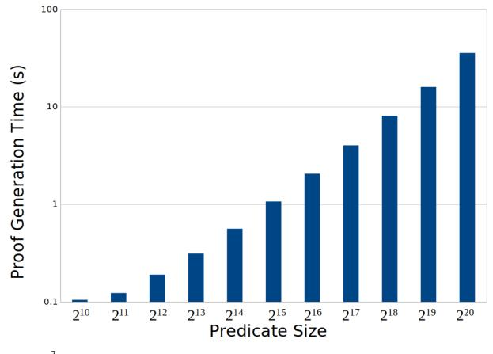
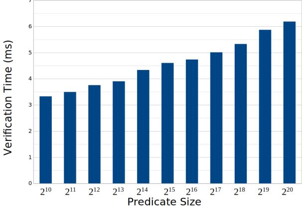
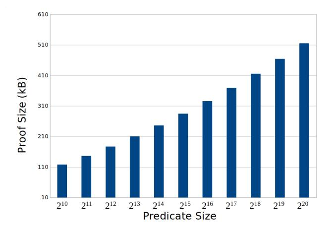
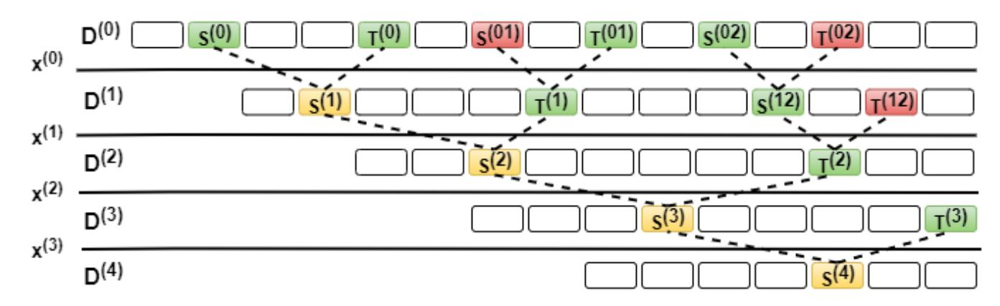

## RedShift: Transparent SNARKs from List Polynomial Commitments

Assimakis A. Kattis New York University New York, New York, USA kattis@cs.nyu.edu

Konstantin Panarin Matter Labs Berlin, Germany kp@matterlabs.dev

Alexander Vlasov Matter Labs Berlin, Germany av@matterlabs.dev

## ABSTRACT

We introduce an efficient transformation from univariate polynomial commitment based zk-SNARKs to their transparent counterparts. The transformation is achieved with the help of a new IOP primitive which we call a list polynomial commitment. This primitive is applicable for preprocessing zk-SNARKs over both prime and binary fields. We present the primitive itself along with a soundness analysis of the transformation and instantiate it with an existing universal proof system. We also present benchmarks for a proof of concept implementation alongside a comparison with the current non-transparent state-of-the-art. Our results show competitive efficiency both in terms of proof size and generation times. At the 80-bit security level, our benchmarks provide proof generation times of about a minute and proof sizes of around 515 KB for a circuit with one million gates.

## CCS CONCEPTS

• Theory of computation → Interactive proof systems.

## KEYWORDS

interactive proof systems, polynomial commitments, zk-SNARKs

#### ACM Reference Format:

Assimakis A. Kattis, Konstantin Panarin, and Alexander Vlasov. 2022. Red-Shift: Transparent SNARKs from List Polynomial Commitments. In Proceedings of the 2022 ACM SIGSAC Conference on Computer and Communications Security (CCS '22), November 7–11, 2022, Los Angeles, CA, USA. ACM, New York, NY, USA, [19](#page-18-0) pages.<https://doi.org/10.1145/548606.3560657>

## 1 INTRODUCTION

Zero-knowledge proofs [\[27\]](#page-12-0) have recently received increased amounts of attention for providing efficient verification while maintaining small proof sizes, even in the case of complex predicates. Initially limited to theoretical considerations, such proof systems have lately come to encompass the underlying technology in a wide variety of practical and industrial applications with delicate trade-offs between privacy and system security [\[11\]](#page-11-0) [\[17\]](#page-12-1) [\[36\]](#page-12-2). In this work, we are interested in applications for which there is limited space availability in the underlying system, and thus for which minimal proof size is an important property. Moreover, we ideally want to focus on applications for which there exist no trusted parties at

Permission to make digital or hard copies of part or all of this work for personal or classroom use is granted without fee provided that copies are not made or distributed for profit or commercial advantage and that copies bear this notice and the full citation on the first page. Copyrights for third-party components of this work must be honored. For all other uses, contact the owner/author(s).

CCS '22, November 7–11, 2022, Los Angeles, CA, USA. © 2022 Copyright held by the owner/author(s). ACM ISBN 978-1-4503-9450-5/22/11. <https://doi.org/10.1145/548606.3560657>

any point of the computation, and thus hope to achieve proof size minimization without compromising the trust model of the system.

The trade-off above is most closely associated with applications of zero-knowledge proofs to cryptocurrency systems, such as Ethereum [\[40\]](#page-12-3) or ZCash [\[34\]](#page-12-4), in which participants have to verify state (or transaction) validity to ensure system soundness but for which there is limited space available in which to do so. Bridging the gap between these two requirements will allow for not only efficient but also trustless verification of state transition in such systems. This has the potential for scaling improvements, such as increased transaction throughput or better privacy guarantees.

The most widely used proof systems for such an application are preprocessing Succinct Non-interactive ARguments of Knowledge (zk-SNARKs) [\[28\]](#page-12-5) [\[33\]](#page-12-6) [\[25\]](#page-12-7), for which proof size and verification time are polylogarithmic in the size of the circuit being verified. 'Pre-processing' here denotes that such systems rely on a one-time (often expensive) setup procedure to produce a proving/verification key-pair (, ) (known as a Structured Reference String or SRS) that is used in all subsequent computation. The most efficient such construction is due to Groth [\[28\]](#page-12-5) and achieves constant proof size consisting of 3 group elements, with state-of-the-art proving time. However, this design (along with most in the literature, see [\[24\]](#page-12-8), [\[37\]](#page-12-9), [\[8\]](#page-11-1)) relies on a trusted setup, or a trusted third-party actor to generate certain parameters (known as the 'toxic waste') that should be destroyed in order for the system to retain its security guarantees.

Such a security lapse would be grave for all aforementioned applications. For example, in a cryptocurrency system such as ZCash an adversary possessing such waste would be able to spend nonexistent tokens without being found. An adopted approach to mitigating this issue involves Multi-Party Computation, in which a single participant needs to destroy their parameters for security to hold [\[13\]](#page-11-2). However, scaling such an approach to many participants comes with its own challenges, and can never reach the completely trustless threat model desired by such systems.

The trust issue inherent in the above approach stems from the requirements for the generation of the SRS of the proof at the preprocessing stage. This is done once at the beginning of the protocol, encoding information that is used in the subsequent proof generation of any input arguments. More specifically, in most pairingbased SNARKs (such as [\[32\]](#page-12-10)) the trusted part of SRS generation stems from the usage of a polynomial commitment scheme that needs to sample (secret) randomness in order to provide commitments to some low-degree polynomial that in turn encodes the circuit in question. That information is then used by the prover to efficiently convince the verifier that a given value is indeed the evaluation of this polynomial, thus proving knowledge of the statement. Such systems use the polynomial commitment scheme of

[31], from which the above trust model is derived. This will be further discussed in the following sections.

In attempting to retain a trustless (or 'transparent') threat model, the main design challenge lies in the efficiency of the underlying protocol. Various threads of work in this domain have achieved different efficiency trade-offs. The work of [26] produces proofs with size scaling as  $O(d \log T)$ , while the proofs in [39] scale with  $O(d \log G)$  where T, d and G the size, depth and width of the circuit respectively. Succinct Transparent ARguments of Knowledge (zk-STARKs) [4] achieve  $O(\log^2 T)$  proof sizes for uniform (layered) circuits. However, in the context of universal SNARKs (arbitrary circuits), existing proof systems suffer from performance overheads with respect to pre-processing SNARKs such as [28]. Some also require non-trivial circuit designs, similar to what is described in [21]. Nevertheless, we should note that for the class of problems that can be efficiently expressed as layered circuits, these proof systems may be more optimal than universal ones. Since we are also interested in verifier succinctness, transparent approaches such as [14] do not suffice here due to the linear dependence between verification time and predicate size.

Below we informally describe the properties that an 'ideal' proof system should possess for satisfiability of a given circuit C, where |C| denotes its size. The first three properties define what is known as a 'fully succinct' zk-SNARK:

- *Succinctness:* Verifier time is polylogarithmic in |C|,
- *Prover Efficiency:* Proving time is quasi-linear in |C|,
- *Proof Succinctness:* Proof size is poly-logarithmic in |C|,
- Transparent: No trust assumptions are required,
- *Plausibly Quantum Resistant:* Not based on assumptions known to be false in the quantum setting.

#### 1.1 Prior & Concurrent Work

1.1.1 Polynomial Commitment Schemes. Polynomial commitment schemes (PCS) allow for the efficient verification of the evaluations of f at an arbitrary point in its domain. A transparent and efficiently computable PCS would yield transparent SNARK constructions that could satisfy all of the requirements of a fully succinct, transparent and plausibly quantum resistant zk-SNARK. Since the introduction of PCS in [31], the first transparent such scheme was introduced in [39] for multivariate polynomials, with  $O(\sqrt{d})$  commitment size and verification complexity. Subsequent work in [15] introduces a scheme with  $O(\mu \log d)$  size and verification complexity, where  $\mu$  the number of variables of the polynomial in question and d the polynomial's degree. Although the asymptotics of the approach in [15] suffice for the above motivation, the practical implementation of their system relies on cryptographic operations that are substantially more resource-heavy than previous approaches. This stems from the reliance of their system's security on class groups of unknown order. Although the proof sizes achieved are sufficiently succinct, this dependence could make practical deployment difficult at reasonable security levels when proof generation time needs to also be substantially efficient. Moreover, the assumptions on which their construction rests are not quantum-resistant.

The DEEP-ALI protocol [9] uses a similar construction in their STARK [4] proof system. In this case, all the setup polynomials, constraints and checked relations are known to the verifier and

are checked naively during the verification procedure. We expect that our scheme can also be adapted for this case and allow one to express more complex STARK circuits. Finally, our contribution extends the approach described in [38], which comes at the cost of larger proof sizes.

1.1.2 Universal zk-SNARKs. A new approach to the above problem relies on creating a 'universal' SRS at the preprocessing phase, which can then be used in tandem with any possible predicate (or circuit). This has been the focus of many recent contributions (see [32], [41], [35], [23]) that are also fully succinct zk-SNARKs in the above sense. The approach in such schemes relies on two main ingredients: (1) encoding the circuit satisfaction problem of the predicate in question as a property of some (low-degree) polynomial f, and then (2) committing to f using a PCS. In all the above approaches, the PCS in [31] is used due to its constant size complexity and efficient implementation. However, this is the only part in the protocol that introduces the trusted setup, as the setup phase in the scheme requires a trusted actor to create (and then destroy) a secret value that is only used in generating commitments.

1.1.3 zk-SNARK Compilation Frameworks. Recent work has also explored general frameworks for converting Interactive Oracle Proofs (IOPs) [7] into preprocessing SNARKs. This approach was introduced in [18], with an equivalent formalization appearing in [15]. At a high level, both of these contributions formalize the idea that preprocessing zk-SNARKs can be constructed from IOPs through oracle access to a low-degree polynomial.

#### 1.2 Our Contributions

In this work, we provide the following contributions:

1.2.1 List Polynomial Commitments. The works of [3] and [9] introduce the Fast Reed Solomon IOP of Proximity (FRI IOPP) - a novel protocol for efficient proximity testing, or checking if a given function is close to any low degree polynomial. Such a proximity tester may be naively turned into a transparent PCS, which provides commitments of size  $O(\log^2 d)$  for polynomials of degree d. However, the soundness error of such a commitment scheme is rather large, and the protocol should be iterated many times to reach a sufficient security level. This results in large proof sizes and computational burden. The reason for the large soundness error hides in the low sensitivity of FRI: when the Hamming distance between two different polynomials is smaller than some predefined constant, it is impossible for FRI to efficiently distinguish them.

In this work, we generalize the PCS in the sense that we construct a commitment to a list of proximate polynomials. We introduce a new cryptographic primitive for fast verification of polynomial evaluations we call a *list polynomial commitment* (LPC). At a high level, this scheme retains the necessary security guarantees that are required for polynomial-based proof systems such as [23] and [32] to compile into zk-SNARKs. In the language of IOP formalization, this primitive can be thought of as an alternative compiler for public-coin IOP protocols.

1.2.2 Compilation of IOPs with LPCs. The above contribution implicitly provides a general framework that demonstrates how the

list polynomial commitment can be used to compile any polynomial IOP into a preprocessing zk-SNARK. As previously mentioned, this follows the approach in [18] and [15] with the main difference being that we do not require a PCS in their (more restrictive) sense.

1.2.3 REDSHIFT. We demonstrate the security and practicality of this approach by compiling [23] using the framework above. By fitting an implementation of the list polynomial commitment on [23] with suitable adaptations and optimizations, we remove all trusted computation while retaining efficiency in both proof size and generation time. We call this new proof system RedShift, and provide:

- (1) formal proofs of correctness and security,
- (2) a proof-of-concept implementation, along with benchmarks establishing feasibility.

At an 80-bit security level and for circuits of size  $2^{20}$ , Redshift provides proofs of size  $\sim 515$  KB with a proof generation time of about half a minute. Overall, Redshift is an efficient instantiation of a potentially quantum-resistant transparent preprocessing zk-SNARK suitable for practical deployments at high security.

## 1.3 Transparent zk-SNARKs

Prior work on transparent zk-SNARKs has explored a variety of trade-offs and different design choices in order to achieve efficiency gains. We briefly discuss concurrent and previous efforts in building efficient and transparent proof systems and compare with our approach. The works of [6] and [20] design IOPs for the Rank-1 Constraint System (R1CS) arithmetization, providing a compilation framework equivalent to our methods. They require a holographic lincheck argument/IOP of Proximity respectively in order to construct their IOP for R1CS, which our approach avoids by using a suitable transformation of the proof system in [23] instead. The works of [42] (and [41], although not transparent) use a similar approach but with the IOP from [27]. This makes our approach easier to formalize.

The authors of [4] and [3] use FRI implicitly as a PCS and design the ALI-IOP for compilation. Our results are directly applicable and generalize their approach. In [12], the authors define a restricted version of PCS that are 'additive' (with homomorphic properties), benchmarking with Bulletproofs [14] for fast recursion. While an additive PCS is too restrictive to include FRI, batching efficiency gains are possible if this definition is relaxed. The batch evaluation problem in Section 4 of [12] is equivalent to a multivariate commitment, and the LCS is a relaxation of that notion that we selectively apply to proof witnesses. By relaxing the binding property of PCS, our LCS replaces [31] for transparent multivariate commitments to witness polynomials more generally.

Subsequent work [1] has built on these ideas, looking at how two modular modifications to the proof system affect performance by using a smaller field for faster modular operations and implementing a leaner PLONK-derived IOP called turboPLONK [22] instead. The authors explore an additional avenue for optimization of proof efficiency by counterbalancing any soundness loss due to the smaller field by applying the tight parallel repetition theorem to the IOP in order to boost soundness and performing FRI in a suitable extension field. This is then shown to lend itself to efficient recursive proving

times, providing a promising avenue for transparent recursive proof computations at scale.

#### 2 OVERVIEW

The proof system in [23] (known as PLONK) is based on polynomial commitments: the prover's (secret) witness is encoded as a set of univariate polynomials, while the verifier wishes to ensure this encoding satisfies some polynomial relations. The prover commits to her witness polynomials and later the verifier queries their values at a set of randomly selected points, checking if all relations are indeed satisfied. As the points were randomly sampled, it is highly likely that the given polynomial relations hold identically.

The state-of-the-art PCS used in the construction of zk-SNARKs is the Kate commitment [31], which is based on pairings of points of elliptic curves. The security of this scheme reduces to the Discrete Logarithm assumption, while in the case of a perfectly hiding commitment the *t*-Strong Diffie Hellman assumption is required. The main drawback of Kate commitments is that some secret value is sampled during the parameter generation process. For security to hold, this value should never be revealed to the prover and verifier. Such a requirement is very strong, as it means that every proof system using Kate will require a 'trusted' setup process. We denote proof systems without this requirement as *transparent*. In fact, the only reason PLONK requires a trusted setup is due to Kate. In this work we aim to investigate a suitable replacement for Kate, turning PLONK (and similar systems) into zero-knowledge Succinct Transparent Arguments of Knowledge, i.e. zk-STARKs.

We utilize the FRI protocol, which is a key component of STARKs such as [4] and [6]. FRI is focused on solving the following *proximity* problem: the verifier is given oracle access to an evaluation of some function f on a fixed domain  $D \subset \mathbb{F}$ . The prover wants to convince the verifier that this function f is close (in some metric) to a polynomial of (predefined) degree d. If the verifier queries f on all of D and then computes the interpolation polynomial herself, she can verify the degree bound d. However, this requires O(d) complexity. FRI solves this problem by requiring only a polylogarithmic number of queries in d.

We now describe a naive way to design a PCS using FRI:

- (1) The prover commits to f, providing an oracle to all evaluations of f on some predefined domain D.
- (2) The prover and verifier engage in FRI for f with respect to some degree d. If the prover passes the check, the verifier is convinced with high probability that f is close to a polynomial of degree less than d.
- (3) The verifier wants to retrieve the value of f at point  $i \notin D$ . The prover sends the corresponding opening z = f(i) and both parties then conduct another instance of FRI, this time with respect to a quotient function q(X) = (f(X)-z)/(X-i) and degree d-1. Note that the verifier has oracle access to q via oracle access to f and also knows f and f. If the prover passes the last instance of FRI then f is in fact a polynomial function of degree less than f and f is
- (4) This implies that f(i) = z which follows from Bezout's theorem stating that h(X) has value y at point t iff h(X) y is divisible by X t in the ring  $\mathbb{F}[X]$ .

In reality, this simplified protocol doesn't suffice. There are several reasons for that, among which are the following:

- (1) FRI has a sensitivity bound: it is incapable of distinguishing between precise polynomials and functions sufficiently close to them in some predefined metric (which in our case is the relative Hamming distance).
- (2) For implementation coherency, we want the same domain for both FRI instances. However, FRI has an interdependence between the degree d and the size of the domain |D| measured in terms of its rate  $\rho = d/|D|$ . The structure of FRI requires the rate to be "2-adic", i.e. of the form  $2^{-R}$  for some  $R \in \mathbb{N}$ . However, this property cannot simultaneously hold for two adjacent degrees d and d-1 without protocol modification.

The first problem means that the scheme needs to correctly process the case when the function is not a polynomial, but close to one; a property not naturally supported by existing commitment schemes. Even more so, allowing the oracle f to not be strictly polynomial and to take as the prover's commitment the polynomial f' lying in a small  $\delta$ -ball around f (where  $\delta$  is taken according to the sensitivity of FRI) then we cannot guarantee a priori that this polynomial f' is unique in the chosen neighborhood of f. The set of polynomials  $\{f'_1, f'_2, \ldots, f'_n\}$  lying in the  $\delta$ -neighborhood of f is the  $\delta$ -list of f, which we denote by  $L_\delta := L_\delta(f)$ . For small values of  $\delta$ , the list  $L_\delta$  contains only one polynomial:  $\delta$  lies in the unique-decoding radius. Unfortunately such values of  $\delta$  require larger proof sizes for the same soundness guarantees. Thus, increasing  $\delta$  to reduce proof sizes would lead to the size  $L_\delta$  being greater than 1.

To solve this, we consider a *relaxed* treatment of commitment schemes, where the commitment opens to a polynomial in the  $\delta$ -list  $L_{\delta}$ . When the prover is asked for an evaluation at point i, they respond with some value f'(i), where  $f' \in L_{\delta}$ . In subsequent sections we show that this scheme is sufficient for the compilation of holographic IOPs. During the execution of PLONK, the prover and verifier need to evaluate a set of initial 'constraint' (or setup) polynomials c(X) encoding the constraint system itself. In order to achieve succinctness, the verifier never calculates the value c(i)at point i by herself. PLONK instead relies on KATE: the prover and verifier run Kate with the commitment to c and value i as inputs. By its binding property, the verifier is convinced that the prover actually sends the evaluation c(i) of the polynomial c(X) in question. Since our relaxation commits to a whole neighborhood  $L_{\delta}(c)$  of c(X) instead of only c(X) itself, we lose uniqueness. This means we can't use such a 'relaxed' scheme as is. However, we show that with minor changes our LPC can be turned into a PCS. We call this construction a polynomial evaluation scheme and it constitutes the second key sub-protocol of the paper.

With the list polynomial commitments and polynomial evaluation schemes, we can modify PLONK to achieve full transparency. We call the modified version Redshift and prove its correctness in the IOP model. A large portion of our approach remains the same as in [23]: our modification doesn't modify the completeness property of the system. However, the FRI-based protocol doesn't possess the hiding capabilities of Kate. This means that we need to take additional measures to achieve zero-knowledge for our system. We also need to change the security model as the original PLONK protocol was proven secure in the Algebraic Group Model (AGM). The

dependence of our scheme on FRI means that we need to conduct our security analysis in the IOP model, affecting the soundness proof as well as the proof of knowledge approaches.

#### 3 DEFINITIONS

In this section, we lay out the building blocks that are necessary to describe our constructions.

#### 3.1 Notation

Through this paper we use the following notations:

- $\mathbb{F}_q$  is a prime field with modulus q
- $f|_D$  is a restriction of function f to domain D
- For function pair f, g, the relative Hamming distance with respect to some domain D is given by:

$$\Delta(f,g) = \frac{|\{x \in D: f(x) \neq g(x)\}|}{|D|}.$$

#### 3.2 Preliminaries on Reed-Solomon codes

Most of the information covered in this section can be found in most standard on algebraic codes (e.g. [30]).

DEFINITION 1 (REED-SOLOMON CODES). For a subset of some field  $D \subseteq \mathbb{F}$  and a rate parameter  $\rho \in (0,1]$ , we denote by  $\mathrm{RS}[\mathbb{F},D,\rho]$  the set of all functions  $f:D \to \mathbb{F}$  for which there exists  $\hat{f} \in \mathbb{F}_{<\rho|D|}[X]$  agreeing with f on D. A prime field RS code family is a code family  $\mathrm{RS}[\mathbb{F},D,\rho]$  for which  $\mathbb{F}=\mathbb{F}_q$  for q prime. In this case, D is a multiplicative subgroup of  $\mathbb{F}_q^*$ .

DEFINITION 2 (LIST DECODING). Let  $V = \text{RS}[\mathbb{F}, D, \rho] \subset \mathbb{F}^D$  be an RS code family. Set a distance parameter  $\delta \in [0, 1]$ . For  $u \in \mathbb{F}^D$ , we define  $L(u, V, \delta)$  to be the set of elements in V that are at most  $\delta$ -far from u in relative Hamming distance. The code V is said to be  $(\delta, N)$ -list-decodable if  $|L(u, V, \delta)| \leq N$  for all  $u \in \mathbb{F}_q^D$ . Let  $L_\delta^{\max} = L(\mathbb{F}, D, d, \delta)$  be the maximum size of  $L(u, V, \delta)$  taken over all  $u \in \mathbb{F}^D$  for  $V = \text{RS}[\mathbb{F}, D, \rho = d/|D|]$ .

Theorem 1 (Johnson Bound). For every  $\rho > 0$ , there exists a constant  $C_{\rho}$  such that the code family RS[ $\mathbb{F}$ , D,  $\rho$ ] is list-decodable from a  $1 - \sqrt{\rho} - \epsilon$  fraction of errors with the following list size:

$$L(\mathbb{F}, D, \rho|D|, 1 - \sqrt{\rho} - \epsilon) \le \frac{C_{\rho}}{\epsilon \sqrt{\rho}} := J_{\rho, \epsilon},$$

for every  $\epsilon \in (0, 1 - \sqrt{\rho})$ .

We also provide a (strong) conjecture that substantially improves on the above bound, which appears in [9].

Conjecture 1 (List Decodability up to Capacity). For every  $\rho > 0$ , there exists a constant  $C_{\rho}$  such that the code family RS[ $\mathbb{F}$ , D,  $\rho$ ] is list-decodable from a  $1 - \rho - \epsilon$  fraction of errors with the following list size:

$$L(\mathbb{F},D,\rho|D|,1-\rho-\epsilon) \leq \left(\frac{|D|}{\epsilon}\right)^{C_\rho},$$

for every  $\epsilon \in (0, 1 - \rho)$ .

We now look at which distance parameters  $\delta$  provide unique decodability. To this end, we provide some standard results on the unique decodability of RS codes.

DEFINITION 3. We call  $\delta_0$  the unique decoding radius (UDR) for code family C if it is the maximum  $\delta_0$  for which  $L_{\delta_0}^{\text{max}} \leq 1$ . We denote all  $\delta < \delta_0$  as being within the unique decoding radius.

Theorem 2. The UDR for RS[
$$\mathbb{F}$$
,  $D$ ,  $\rho$ ] is  $\delta_0 = (1 - \rho)/2$ .

The decoding problem for the Reed-Solomon code  $V=\mathrm{RS}[\mathbb{F},D,\rho]$  is the problem of finding a codeword  $u\in V$  that is within distance  $\delta$  (with respect to Hamming distance) of a given word  $v\in\mathbb{F}^D$ . There exists a standard polynomial-time solution known as the Guruswami-Sudan [29] algorithm. Its output includes all codewords lying in the  $\delta$ -ball of v.

Theorem 3 (Guruswami-Sudan). For all  $\delta \leq 1 - \sqrt{\rho}$ , the code  $V = \text{RS}[\mathbb{F}, D, \rho]$  can be list-decoded in time  $O(|D|^{15})$ . If  $\delta < 1 - \sqrt{\rho}$ , this reduces to  $O(|D|^3)$ .

# 3.3 Interactive Oracle Proofs and IOPs of Proximity

Given some relation  $\mathcal{R} \subseteq S \times T$ , we denote by  $\mathcal{L}(\mathcal{R}) \subseteq S$  the set of  $s \in S$  such that there exists  $t \in T$  with  $(s,t) \in \mathcal{R}$  (also known as the *language* defined by  $\mathcal{R}$ ). We also denote by  $\mathcal{R}|_s \subseteq T$  the set  $\{t \in T : (s,t) \in \mathcal{R}\}$ . For pairs  $(x,w) \in \mathcal{R}$ , we call x the instance and w the witness.

The security analysis in this section will be conducted in the Interactive Oracle Proof (IOP) model [7] which is a generalization of Interactive Proofs and Probabilistically Checkable Proofs. More specifically, we will be looking at holographic IOPs, or IOPs in which (preprocessed) indices are provided to the participating parties through oracles. The model consists of a prover/verifier tuple (P, V) of two probabilistic interactive algorithms. The number of interactive rounds, denoted k = r(x), is called the *round complexity* of the system. During a single round, the prover *P* sends a message  $a_i$  (which may depend on prior interaction) to which the verifier Vprovides some response  $m_i$ . The final output of V after interacting with *P* is either *accept* or *reject*. We denote the result of this interaction by  $\langle P(x, w) \leftrightarrow V(x) \rangle$ , where the input to *V* is  $x \in S$  and the input to *P* is  $(x, w) \in S \times T$ . The proof length is the sum of lengths of all messages sent by the prover, herein denoted  $l(x) = \sum_{i=1}^{k} a_i$ . The query complexity of the protocol, denoted q(x), is the total number of entries read by V.

DEFINITION 4. A pair of interactive PPT algorithms (P, V) is an interactive oracle proof system for some language  $\mathcal{R} \subseteq S \times T$  with  $\epsilon: \{0,1\}^* \to [0,1]$  soundness and  $k: \{0,1\}^* \to \mathbb{N}$  rounds of interaction if it satisfies the following properties:

(1) Completeness:

$$Pr\left[\langle P(x, w) \leftrightarrow V(x) \rangle = acc \mid (x, w) \in \mathcal{R}\right] = 1$$

(2) **Soundness:** For all computationally unbounded malicious provers P\*:

$$Pr\left[\langle P^*(x,w) \leftrightarrow V(x) \rangle = acc \mid (x,w) \notin \mathcal{R}\right] \le \epsilon(x).$$

Probabilities are over the randomness of P and V, which engage in at most k(x) rounds of (adaptive) interaction.

DEFINITION 5. Let A, B be PPT algorithms,  $x, y \in \{0, 1\}^*$  and View(B(x, y), A(x)) the view (or transcript) of A(x) in an IOP with B(x, y). This is the random variable  $(x, r, \{a_i, m_i\}_{i=1}^n)$  where x, r are A's input and randomness and  $a_i$  is B's (i-th) answer to A's query  $m_i$ .

**State-Restoration Knowledge Soundness** Strengthening the notion of soundness, we say the IOP has knowledge soundness  $e:\{0,1\}^* \to [0,1]$  if every prover  $P^*$  who is capable of convincing the verifier that  $x \in \mathcal{L}(\mathcal{R})$  actually knows some witness  $w \in \mathcal{R}|_{\mathcal{X}}$ . Put differently, the IOP is knowledge sound if for all adversaries  $\mathcal{H}$  there exists a (non-uniform) PPT extractor  $\mathcal{E}^{\mathcal{H}}(x)$  which gets full access to the adversary's transcript at any stage. However, this does not include  $\mathcal{H}$ 's random coins, auxiliary inputs and internal code. We say that (P,V) has proof of knowledge  $\epsilon$  if there exists  $\mathcal{E}$  s.t. for every  $x \in S$  and PPT  $\mathcal{H}$ :

$$\Pr\left[(x, \mathcal{E}^{\mathcal{A}}(x)) \in \mathcal{R}\right] \ge \Pr\left[(\mathcal{A}, V) = 1\right] - e(x).$$

Since we are ultimately interested in compiling the IOP into a non-interactive proof, the stronger notion of state-restoration IOP soundness error  $\epsilon_{sr}(r)$ , where r the maximal number of rounds, is needed. This is because the protocol should be robust against staterestoration attacks, in which the prover has the ability to move to a previous state of the protocol up to r times. It was shown in [7] that this notion suffices in compiling proofs using Fiat-Shamir in the random oracle model, while [16] show this for correlation-intractable hash functions as well. In order to prove state-restoration bounds, the idea of round-by-round soundness error  $\epsilon_{\rm rbr}$  is leveraged. It can be shown that  $\epsilon_{\rm sr} \leq r \cdot \epsilon_{\rm rbr}$ , which is sufficient for security if r is a polynomial number of rewinds/rounds. This analysis holds since we can apply the round-by-round extractor to every partial transcript that comprises trsr and output the first valid witness. Since the empty transcript is rejecting and trsr accepts, then some partial transcript moves from rejecting to accepting. Since the round-byround extractor fails with probability  $\epsilon_{rbr}$ , the result follows by a union bound. We follow the approach in [16],[20] and provide the required definitions.

DEFINITION 6 (ROUND-BY-ROUND SOUNDNESS). An IOP (P,V) for language  $\mathcal{L}(\mathcal{R})$  has round-by-round knowledge soundness  $\epsilon_{\text{rbr}}$  if there exists a function State from the set of transcripts to  $\{0,1\}$  and a polynomial-time extractor  $\mathcal{E}$  such that for all (x,tr) for which State(x,tr)=0, and all messages a received from the prover, if  $\Pr_m[\text{State}(x,\text{tr}|\mathbf{a}|m)=1]>\epsilon_{\text{rbr}}$  then  $(x,\mathcal{E}(x,\text{tr}|\mathbf{a}))\in\mathcal{R}$ .

Definition 7 (State-Restoration Soundness). An IOP (P, V) for language  $\mathcal{L}(\mathcal{R})$  has state-restoration knowledge soundness  $\epsilon_{ST}$  if there exists a polynomial time extractor  $\mathcal{E}$  such that for all x and every state-restoration prover  $P^*$ :

$$\Pr\left(\begin{array}{c|c} \mathsf{tr}_{\mathsf{sr}} \ \mathit{accepts} \\ (x,w) \notin \mathcal{R} \end{array} \middle| \begin{array}{c} \mathsf{tr}_{\mathsf{sr}} \leftarrow \mathsf{View}(P^*(x),V(x)) \\ w \leftarrow \mathcal{E}(x,\mathsf{tr}_{\mathsf{sr}}) \end{array} \right) \leq \epsilon_{\mathsf{sr}}.$$

DEFINITION 8 (ZERO KNOWLEDGE). For a given relation  $\mathcal{R}$  and some  $z:\{0,1\}^* \to [0,1]$ ,  $\langle P,V \rangle$  has z-statistical honest-verifier zero knowledge if there exists a PPT algorithm S (the simulator) s.t.  $\forall (\phi,w) \in \mathcal{R}, S(x,\phi)$  and  $View(P(\phi,w),V(\phi))$  are z(x)-close.

An important subclass of IOP protocols is given below.

**IOPP.** An *Interactive Oracle Proof of Proximity (IOPP)* is an r-round interactive IOP system for the following problem. Given a field  $\mathbb{F}$ , degree  $d \in \mathbb{N}$ , proximity parameter  $\delta > 0$  and domain  $D \subset \mathbb{F}$ , the prover is provided with the representation of some function f and the verifier is given oracle access to its evaluation on domain D (i.e. an oracle  $\hat{f}(x)$  to  $f(x)|_D$ ). The prover then needs to convince the verifier that  $f|_D$  is the evaluation of some degree d polynomial on this domain. Namely, that  $f \in \text{RS}[\mathbb{F}, D, \rho = d/|D|]$ . We follow the formalization in [3]:

DEFINITION 9 (IOPP). A k-round IOP of Proximity (P,V) is a k+1-round IOP. (P,V) is an IOPP for the error-correcting code  $C=\{f:S\to\Sigma\}$  and soundness  $\epsilon:[0,1]\to[0,1]$  with respect to some metric  $\Delta$  if the following hold:

- First message format: the first prover message is a purported code-word, i.e. f0 ∈ C,
- (2) Completeness:

$$\Pr[\left\langle P(f^0,C) \leftrightarrow V(C) \right\rangle = acc \; |\Delta(f^0,C) = 0] = 1,$$

(3) **Soundness**: For any  $P^*$ ,

$$\Pr[\left\langle P^*(f^0,C) \leftrightarrow V(C) \right\rangle = rej \mid \Delta(f,C) = \delta] \ge \epsilon(\delta).$$

We note that the notions of proof and query complexity of IOPs translate naturally to the context of IOPPs. In the rest of the sections, we use  $\mathsf{IOPP}(f^0,C) \to \{0,1\}$  to denote an IOPP protocol IOPP with purported code-word  $f^0 \in C$  and C error-correcting code family.

#### 3.4 Fast Reed-Solomon IOPP

In our construction, we opt for using FRI [3], [10]. We provide an overview of its relevant properties below. For a given RS code family RS[ $\mathbb{F}$ , D,  $\rho$ ] for which  $|D|=n=2^k$  and rate  $\rho=2^{-R}$  for  $k,R\in\mathbb{N}$ . This implies that the degree bound d is  $2^{k-R}$ . Fix  $r\in[1,\log d=k-R]$  to be the number of rounds in the protocol. For every  $\eta\in(0,1]$ , let  $J_\eta:[0,1]\to[0,1]$  be the Johnson function  $J_\eta(x)=1-\sqrt{1-x(1-\eta)}$ . Given this parameter choice, FRI has the following properties, where the asymptotics are given in terms of field operations over  $\mathbb{F}$ :

- (1) Prover Complexity: O(n)
- (2) Verifier Complexity:  $O(\log n)$
- (3) **Completeness:** If  $f \in RS[\mathbb{F}, D, \rho]$  and the prover is honest, then the verifier always accepts.
- (4) **Soundness:** If  $\Delta(f, RS) = \delta$  and  $\delta \in (0, J_{\eta}^{[3/2]}(1 \rho))$ , then  $\forall \eta \in (0, 1]$  the soundness error  $\epsilon(\delta)$  is bounded above by:

$$\frac{2\log |D|}{\eta^{3}|\mathbb{F}|} + \left(1 - \min\left\{\delta_{0}, \delta\right\} + \eta \log |D|\right)^{l},$$

where l the number of queries the verifier performs.

#### 4 LIST POLYNOMIAL COMMITMENT

We start with the basic requirement for a commitment scheme to commit to elements of a given polynomial. This will be provided as an oracle to the underlying gadget, and we assume it's binding i.e. that the adversary will be able to fake commitments with negligible probability over the schemes security. A commitment scheme  $\Sigma = (\text{Gen}, \text{Com}, \text{Open})$  is defined as follows:

•  $Gen(1^{\lambda}) \rightarrow pp$  generates public parameters,

- Com :  $\mathbb{F}_{< d}[X] \to C$  commitment c to some f,
- Open :  $C \times \mathbb{F}_{< d}[X] \to \{0,1\}$  checks validity of some commitment c with access to f.

We say that the tuple (Gen, Com) is  $\epsilon$ -binding if there exists an Open function for which:

$$\Pr\left[\mathsf{Open}(\mathsf{Com}(f)) = 1|\mathsf{pp} \leftarrow \mathsf{Gen}(1^{\lambda})\right] = 1,$$

and for all PPT adversaries  $\mathcal{A}$ :

$$\Pr\left[\begin{array}{c|c} f \neq g, \operatorname{Open}(c, f) = 1 \\ \operatorname{Open}(c, g) = 1 \end{array} \middle| \begin{array}{c} (f, g, c) \leftarrow \mathcal{A}(\operatorname{pp}) \\ \operatorname{pp} \leftarrow \operatorname{Gen}(1^{\lambda}) \end{array} \right] \leq \epsilon(\lambda).$$

We are now ready to introduce the main ingredient underlying the transparency of our proving system, which we call a List Polynomial Commitment (LPC) scheme. This cryptographic primitive most resembles a polynomial commitment scheme, with the main difference arising from the need to show that g(z)=y where g is a polynomial in a  $\delta$  neighborhood around f (in a predefined metric  $\Delta$ ), rather than requiring the evaluation of f itself. As before, we denote  $L_{\delta}(f)$  as the  $\delta$ -list of f or the set of all  $g \in \mathsf{RS}[\mathbb{F}, D, \rho]$  such that  $\Delta(f,g)<\delta$ .

## 4.1 Specification

Here we define the generic primitive that formalizes the notion of a list commitment scheme. We will build on this construction later to show that it admits (1) an efficient implementation, and (2) modifications that provide stronger proof-of-knowledge guarantees.

DEFINITION 10. An  $(\epsilon, k)$ -list polynomial commitment scheme for some metric  $\Delta : \mathbb{F}[X] \times \mathbb{F}[X] \to [0, 1]$  and all  $\delta > 0$  consists of the following:

- $Gen(1^{\lambda}) \rightarrow pp$  generates public parameters,
- Com :  $\mathbb{F}_{\leq d}[X] \to C$  commitment c to some f,
- An IOP system (P, V) with  $\epsilon(\delta)$  soundness and  $k(\delta)$  rounds of interaction for the relation  $\mathcal{R}^{\delta}(\mathsf{pp}) :=$

$$\left(\langle (d, N, \{z_i, y_i\}_{i=1}^N, c); f \rangle \middle| \begin{array}{c} \exists \ g \in \mathbb{F}_{< d}[X], \ \Delta(f, g) < \delta, \\ \forall i \in [N], g(z_i) = y_i, \operatorname{Com}(g) = c \end{array}\right)$$

for which (P, V) are both provided with degree bound d, and a set of point-evaluation pairs  $\{(z_i, y_i)\}_{i=1}^N$  and commitment  $c \in C$ , while P is also provided with a representation of  $f \in \mathbb{F}[X]$ . Both P and V have access to an oracle for  $Com(\cdot)$ .

#### 4.2 Instantiation

We assume existence of an IOPP protocol FRI in the sense of Definition 9, and specify the LPC routine below. More specifically, since we are concerned with polynomial commitment schemes, we present the scheme based on the existence of FRI (Theorem 2 in [3]) for the prime field RS code family  $C = \text{RS}[\mathbb{F}, D, \rho]$ , where  $\rho = 2^{-\mathcal{R}}$  for some  $\mathcal{R} \in \mathbb{N}$ ,  $\mathcal{R} > 2$  and  $\rho \cdot |D| > 16$ . Note that we model the Com function as an oracle, so we do not deal with its security here. In this case, we set the public parameters to be pp =  $(\mathbb{F}, D)$ :

The oracle provided here is to  $f|_D$ , which allows both parties to simulate FRI over the coset domain D by calculating the values of  $q|_D$ . This is since both parties explicitly construct the interpolation polynomials and have access to  $f|_D$ . Hence, the verifier is above to check that c = Com(q) using oracle calls to  $f|_D$  in order to simulate  $q|_D$ . That the above satisfies the definition of an LPC scheme is

## Algorithm 1 LPC Routine

- 1: **procedure** LPC(pp, d, N,  $\{z_i, y_i\}_{i=1}^N, c; f$ )
- 2: P and V define the interpolation polynomial U(X) s.t.

$$\forall i \in [N], U(z_i) = y_i.$$

3: P and V define the quotient polynomial

$$q(X) = \frac{f(X) - U(X)}{\prod_{i=1}^N (X - z_i)}.$$

- 4: P and V return  $FRI(q, RS(\mathbb{F}, D, (d N)/|D|))$
- 5: end procedure

immediate from the security properties of FRI. This is illustrated in the theorem below:

Theorem 4. The prime field RS  $[\mathbb{F}, D, \rho]$  code family with rate  $\rho = 2^{-\mathcal{R}}, \mathcal{R} \geq 2, \mathcal{R} \in \mathbb{N}$  and |D| = n has an  $(\epsilon, k)$ -LPC over the Hamming distance  $\Delta$  with  $\epsilon = \epsilon_{\text{FRI}}(\delta)$  soundness and  $k = k_{\text{FRI}}(\delta)$  rounds of interaction for all  $v \in (0, 1 - \sqrt{\rho}), \delta \in (0, J_v^{[3/2]}(1 - \rho)), N, d \in \mathbb{N}$  for which  $\log(n) - \mathcal{R} = \log(d - N)$  and d - N > 16. The LPC IOP admits inputs of size n for which:

- Prover Complexity:  $p_{FRI}(n) + O(N \log^3 N)$ ,
- Verifier Complexity:  $v_{FRI}(n) + O(N \log^3 N)$ .

where  $p_{FRI}(n)$ ,  $v_{FRI}(n)$  the FRI prover and verifier complexities on input size n.

**Remark 1:** We note that the above scheme retains verifier succinctness when  $N = O(\log d)$ .

## 4.3 Polynomial Commitments from LPCs

The scheme introduced above works fine when dealing with "witness" polynomials w(X) within our proof system, since we only require the existence (and not uniqueness) of such a polynomial. However, extra care should be taken outside of this regime, when working with "setup" polynomials c(X) encoding the constraint system itself. In this case, we want to ensure that the openings provided by the prover are indeed the evaluations of the polynomial c(X) itself and not of some polynomial  $g \in L_{\delta}(c)$ . The verifier can evaluate setup polynomial values themselves. However, this doesn't retain succinctness as evaluations require O(d) computations.

We leverage the fact that for a given setup polynomial c(X) the list  $L_{\delta}(c)$  is computable by both the prover and verifier. They can hence find a *distinguishing* point i at which c(i) differs from the evaluations of *all* other polynomials  $g \in L_{\delta}(c)$ . This is naively achieved by using a list-decoding algorithm at the beginning to find all  $g \in L_{\delta}(c)$  and then pick  $i \in \mathbb{F}$  at random until  $c(i) \neq g(i) \ \forall \ g \in L_{\delta}(c)$ . This, however, has overhead polynomial in |D|.

The key to our approach is that the procedure of enumerating all such elements and picking a suitable candidate is (1) fully transparent, and (2) executed and verified only once for every circuit. We thus add an *offline phase* that is performed only once at the beginning of the protocol. The task of the offline phase is to search for such a distinguishing point i. This allows us to strengthen the proof of knowledge guarantee for the LPC to imply that all evaluations come from the *specific* polynomial c(X). Note that this is equivalent to the general proof of knowledge guarantee provided by polynomial commitment schemes. This *preprocess phase* is analogous to the work of the *indexer* in [19].

DEFINITION 11. A PPT algorithm  $\mathcal{D}: \mathbb{F}[X] \to (\mathbb{F} \times \mathbb{F})^{\mu}$  is called a  $\mu$ -dimensional  $\epsilon$ -list distinguisher for some metric  $\Delta: \mathbb{F}[X] \times \mathbb{F}[X] \to [0,1]$  if  $\forall f \in \mathbb{F}[X], \delta > 0$  the following hold with probability  $1 - \epsilon(\delta)$  over the randomness of  $\mathcal{D}$ :

$$\exists i \in [\mu], \forall g \in L_{\delta}(f) \setminus \{f\}, f(\mathcal{D}(f)_{i,1}) \neq g(\mathcal{D}(f)_{i,1}),$$

$$\forall i \in [\mu], f(\mathcal{D}(f)_{i,1}) = \mathcal{D}(f)_{i,2},$$

where  $\mathcal{D}(f)_{i,j}$  the (i,j)-th output element,  $i \in [\mu], j \in \{1,2\}$ .

DEFINITION 12. An  $(\epsilon, k, \eta)$ -polynomial evaluation scheme for some metric  $\Delta$  is a tuple  $\Pi = (\mathcal{D}, \Sigma)$  where  $\Sigma = (P, V)$  an  $(\epsilon, k)$ -LPC scheme and  $\mathcal{D}$  an  $\eta$ -list distinguisher.

Theorem 5. For every  $\delta > 0$ , an  $(\epsilon, k, \eta)$ -polynomial evaluation scheme admits an IOP with soundness  $\epsilon(\delta) + \eta(\delta)$  and  $k(\delta)$  rounds of interaction for the relation  $\mathcal{R} :=$ 

$$\{\langle (d, N, \{z_i, y_i\}_{i=1}^N), c; f \rangle | \forall i \in [N], f(z_i) = y_i, Com(f) = c \}.$$

The above theorem relies on a simple observation: if we have access to some distinguishing point-evaluation pair (x, f(x)) such that  $f(x) \neq g(x)$  for all  $g \in L_{\delta} \setminus \{f\}$ , then adding (x, f(x)) to the openings performed by the LPC means that only f is a valid witness. This process is done once during the setup of the LPC scheme and each instantiation of an LPC that requires binding security can then retrieve these points from the proving key.

4.3.1 *Instantiation.* We now provide two instantiations of the PES based on different list distinguisher choices, and discuss the tradeoffs between the two.

**List Decodability:** The most obvious way to construct a distinguisher  $\mathcal{D}$  is by using a list-decoding algorithm for the given code to enumerate all  $g \in L_{\delta}(f)$ . By sampling random values  $r \in \mathbb{F}$  and checking the required relation, this algorithm can be used to construct  $\mathcal{D}$  with no soundness error but high time complexity. Indeed, for  $\delta < 1 - (d - N - \mu)/|D|$  the algorithm takes  $O(|D|^3)$  time, while in the case of equality between the two this can go up to  $O(|D|^{15})$ !

Random Sampling: Due to the above efficiency considerations, we opt to add some soundness error to the distinguisher in exchange for a large increase in the efficiency of the protocol. We construct the distinguisher by sampling  $\mu$  random points and simply returning them along with their evaluations. Due to the Schwartz-Zippel lemma, there is a high chance that the random points will indeed separate f from its corresponding  $\delta$ -list. This takes time  $O(\mu \cdot d)$  which, although linear with respect to d, is substantially faster than list-decoding when  $d \sim |D|$ .

Claim 1. The random sampling algorithm defines an  $\eta$ -list distinguisher  $\mathcal D$  taking time  $O(\mu \cdot d)$  with soundness error:

$$\eta(\delta) = \left(\frac{d \cdot (|L_{\delta}| - 1)}{|\mathbb{F}|}\right)^{\mu}.$$

We can use the LPC scheme constructed in the previous section along with the distinguisher defined above to put everything together in the following theorem.

THEOREM 6. The prime field RS[ $\mathbb{F}$ , D,  $\rho$ ] code family with rate  $\rho = 2^{-\mathcal{R}}$ ,  $\mathcal{R} \geq 2$ ,  $\mathcal{R} \in \mathbb{N}$  and |D| = n has an  $(\epsilon, k, \eta)$ -PES  $\Pi = (\mathcal{D}, \Sigma)$  over the Hamming distance  $\Delta$ .

 $\Sigma$  is an  $(\epsilon, k)$ -LPC scheme with  $\epsilon = \epsilon_{\mathsf{FRI}}(\delta)$  soundness and  $k = k_{\mathsf{FRI}}(\delta)$  rounds of interaction for  $v \in (0, 1 - \sqrt{\rho}), \delta \in (0, J_v^{[3/2]}(1 - \rho)), N, d, \mu \in \mathbb{N}$  for which  $\log(n) - \mathcal{R} = \log(d - N - \mu)$  and  $d - N - \mu > 16$ .  $\Sigma$  also admits inputs of size n for which:

- Prover Complexity:  $p_{\text{FRI}}(n) + O((N + \mu) \log^3 (N + \mu))$ ,
- Verifier Complexity:  $v_{\text{FRI}}(n) + O((N + \mu) \log^3 (N + \mu))$ ,

where  $p_{FRI}(n)$ ,  $v_{FRI}(n)$  the FRI prover and verifier complexities on input size n.

 $\mathcal{D}$  is a  $\mu$ -dimensional  $\eta$ -list distinguiser for the RS[ $\mathbb{F}$ , D,  $\rho$ ] code family taking  $O(\mu \cdot d)$  and soundness error:

$$\eta(\delta) = \left(\frac{d}{|\mathbb{F}|} \cdot (J_{\rho,\nu} - 1)\right)^{\mu}.$$

This provides the proof of knowledge guarantees needed for setup polynomials through direct application of Theorem 5.

#### 5 REDSHIFT

We follow the language and notation of PLONK [23].

DEFINITION 13 (PLONK CONSTRAINT SYSTEM).  $\mathcal{L} = (\mathcal{V}, Q)$  is a constraint system with n gates and m wires for which  $n \leq m \leq 2n$  and where:

- $\mathcal{V}$  is of the form  $\mathcal{V} = (\mathbf{a}, \mathbf{b}, \mathbf{c})$ , where  $\mathbf{a}, \mathbf{b}, \mathbf{c} \in [m]^n$ ,
- Q is of the form

$$Q = (\mathbf{q}_{\mathbf{L}}, \mathbf{q}_{\mathbf{R}}, \mathbf{q}_{\mathbf{O}}, \mathbf{q}_{\mathbf{M}}, \mathbf{q}_{\mathbf{C}}) \in (\mathbb{F}^n)^5,$$

where  $q_L, q_R, q_O, q_M, q_C$  are the "selector" vectors. Moreover,  $x \in \mathbb{F}^m$  is said to satisfy  $\mathcal{L}$  if  $\forall i \in [n]$ :

$$(\mathbf{q}_{\mathbf{L}})_{i} \cdot \mathbf{x}_{\mathbf{a}i} + (\mathbf{q}_{\mathbf{R}})_{i} \cdot \mathbf{x}_{\mathbf{b}i} + (\mathbf{q}_{\mathbf{O}})_{i} \cdot \mathbf{x}_{\mathbf{c}i} + (\mathbf{q}_{\mathbf{M}})_{i} \cdot (\mathbf{x}_{\mathbf{a}i} \cdot \mathbf{x}_{\mathbf{b}i}) + (\mathbf{q}_{\mathbf{C}})_{i} = 0.$$

To define a relation based on  $\mathcal{L}$ , we extend it to include a positive integer  $l \leq m$ , and subset  $I = [l] \subseteq [m]$  of "public inputs". We can naturally set  $\mathcal{R}_{\mathcal{L}}$  as the set of pairs  $(x, \omega)$  with  $x \in \mathbb{F}^l$ ,  $\omega \in \mathbb{F}^{m-l}$  such that  $\mathbf{x} := (x, \omega)$  satisfies  $\mathcal{L}$ . We say  $\mathcal{L}$  is 'prepared' for l public inputs if  $\forall i \in [l]$ :

$$a_i = i$$
,  $(q_L)_i = 1$ ,  $(q_M)_i = (q_R)_i = (q_O)_i = (q_C)_i = 0$ .

From here on, we will assume that the constraint system is given in prepared form.

In order to reformulate this constraint system in polynomial terms, we require some additional ingredients. Let  $g \in \mathbb{F}^*$  be an element of order n+1,  $D=\langle g \rangle \subseteq \mathbb{F}^*$  the cyclic subgroup generated by g, and  $D^*:=D/\{e\}$  where  $e=g^0$  the identity. For  $i\in [n+1]$ , denote by  $L_i(X)$  the element of  $\mathbb{F}_{\leq n}[X]$  with  $L_i(g^i)=1$  and  $L_i(a)=0$  for all  $a\in D$  different to  $g^i$ . By construction,  $\{L_i(X)\}_{i=1}^{n+1}$  form a Lagrange basis for D. Finally, we set  $Z(X):=\prod_{a\in D^*}(X-a)\in \mathbb{F}_{\leq n}[X]$  to be a domain polynomial for  $D^*$ , i.e. zero only on  $D^*$ .

Definition 14 (Domain Permutations). For sets of k polynomials  $\{f_i\}_{i=1}^k, \{h_i\}_{i=1}^k$  for which  $h_i, f_i \in \mathbb{F}[X]$  and permutation  $\sigma: [kn] \to [kn]$ , we say that the set  $(h_1,...,h_k) = \sigma(f_1,...,f_k)$  if, for

all  $l \in [kn]$ , the sequences  $(f_{(1)}, \ldots, f_{(kn)}), (h_{(1)}, \ldots, h_{(kn)}) \in \mathbb{F}^{kn}$ , defined as:

$$f_{((j-1)\cdot n+i)} := f_j(g^i), \ h_{((j-1)\cdot n+i)} := h_j(g^i),$$
 for each  $j \in [k], i \in [n],$  satisfy  $h_{(I)} = f_{(\sigma(I))}.$ 

DEFINITION 15. Let  $\mathcal{T} = \{T_i\}_{i=1}^s$  be a partition of [kn] into s disjoint blocks, where  $k, n, s \in \mathbb{N}$ . We say that  $\{f_i\}_{i=1}^k \in \mathbb{F}[X]$  copysatisfies  $\mathcal{T}$  if, when defining  $(f_{(1)}, \ldots, f_{(kn)}) \in \mathbb{F}^{kn}$  as above, we have  $f_{(l)} = f_{(l')}$  whenever  $\exists i \ s.t. \ l, l' \in T_i$ .

We define a permutation  $\sigma(\mathcal{T})$  on [kn] such that for each block  $T_i$  of  $\mathcal{T}$ ,  $\sigma(\mathcal{T})$  contains a cycle only going over all the elements of  $T_i$ . Many possibilities exist: for example, we can rearrange elements in the cycles corresponding to  $T_i$ , or  $\sigma(\mathcal{T})$  can be chosen arbitrarily from the set of all valid permutations. It is simple to check that  $(f_1,\ldots,f_k)$  copy-satisfies  $\mathcal{T}$  if and only if  $(f_1,\ldots,f_k)$  copy-satisfy  $\sigma$ .

DEFINITION 16. Fix domain  $D^*$  and size parameter  $n \in \mathbb{N}$ . The constraint system  $\mathcal{L}'$  is defined as follows:

$$\mathcal{L}' := (q_L, q_R, q_O, q_M, q_C, \sigma, n),$$

where:

- $q_L, q_R, q_O, q_M, q_C \in \mathbb{F}[\mathit{X}]$  the selector polynomials,
- $\sigma: [3n] \rightarrow [3n]$  a permutation over 3n elements.

The relation  $\mathcal{R}_{\mathcal{L}'}$  for  $\mathcal{L}'$  is defined as the set

$$(x,\omega) := (\mathbf{PI}(X), \langle \mathbf{f_L}(X), \mathbf{f_R}(X), \mathbf{f_O}(X) \rangle) \in \mathbb{F}[X] \times (\mathbb{F}[X])^3,$$

with the following properties:

- (1)  $\mathbf{f_L}(X)$ ,  $\mathbf{f_R}(X)$ ,  $\mathbf{f_O}(X)$  copy-satisfy  $\sigma$ .
- (2)  $\forall a \in D^*$  it holds that:

$$q_L \cdot f_L + q_R \cdot f_R + q_O \cdot f_O + q_M \cdot f_L \cdot f_R + (q_C + PI) = 0.$$

For completeness we also provide a formal statement of the equivalence between the two constraint systems, whose proof can be found in the appendix.  $\operatorname{PI}(X)$  is the *public input* polynomial and encodes public data that is used to define the predicate of choice, while  $\mathbf{f_L}(X)$ ,  $\mathbf{f_R}(X)$ ,  $\mathbf{f_O}(X)$  are the *left*, *right* and *output* wire polynomials respectively and encode prover-only private data.

LEMMA 1. The constraint systems proposed in Definition 13 and Definition 16 are equivalent.

**Remark:** Note that the degrees of  $\mathbf{f}_{L}$ ,  $\mathbf{f}_{R}$ ,  $\mathbf{f}_{C}$  are n-1, where n is the size of  $\mathcal{L}$ . However in RedShift this is relaxed to some degree k>n to attain zero-knowledge.

#### 5.1 Protocol Instantiation

Let  $\mathcal{L}' = (\mathbf{q_L}, \mathbf{q_R}, \mathbf{q_O}, \mathbf{q_M}, \mathbf{q_C}, \sigma, n)$  be the constraint system in question. Define  $k_1, k_2, k_3 \in \mathbb{F}^*$  to be representations of different cosets in  $\mathbb{F}^* \backslash D$ , with  $k_1 = e$  set as the identity. Let  $\tau$  be the bijection between the sets  $P_1 = [3n]$  and  $P_2 = D^* \cup k_2 D^* \cup k_3 D^*$  defined by:

$$\tau[n \cdot (j-1) + i] = k_j g^i, i \in [n], j \in [3].$$

Since  $\sigma$  is a permutation on  $P_1$ ,  $\sigma' = \tau \circ \sigma \circ \tau^{-1}$  is a permutation on  $P_2$ . Define  $\{S_{id_i}(X)\}_{i=1}^3$ ,  $\{S_{\sigma_j}(X)\}_{j=1}^3$  each of degree at most n as the set of *permutation* polynomials as follows:

(1) 
$$S_{id_j}(X) = k_j X$$
 for  $j \in [3]$ ,  
(2)  $S_{\sigma_i}(g^i) = \sigma'(k_j g^i)$  for  $i \in [n], j \in [3]$ .

These will be used as part of the setup polynomials to define the problem instance.

**Setup & Witness Polynomials:** We can now draw the link between the "setup" and "witness" polynomials of the previous sections with their concrete definitions in the instantiation of Redshift. The selector polynomials  $\mathbf{q_L}$ ,  $\mathbf{q_R}$ ,  $\mathbf{q_O}$ ,  $\mathbf{q_M}$ ,  $\mathbf{q_C}$ , permutation polynomials  $\{S_{id_i}\}_{i\in[3]}$ ,  $\{S_{\sigma_j}\}_{j\in[3]}$  and Lagrange-basis polynomials  $\{L_i\}_{i\in[n+1]}$  play the role of "setup" polynomials. Moreover, the wire polynomials  $\mathbf{f_L}$ ,  $\mathbf{f_R}$ ,  $\mathbf{f_O}$  form the set of "witness" polynomials. This choice makes intuitive sense: the former fully specify the relation in question and hence need to be unique in order to prevent malleability in the proof of knowledge guarantees. The latter (which tend to be much larger in most practical deployments) however, do not require uniqueness guarantees.

We are now ready to specify the Redshift protocol. At the interactive level, it is most similar to the DEEP-ALI protocol, but for the PLONK constraint system. We instantiate the distinguisher oracle  $\mathcal{O}^{\mathcal{D}}$  queries as evaluations by an indexer algorithm I that receives a low-degree polynomial input f and outputs  $\mu$  separation points along with their evaluations  $\{x_i, f(x_i)\}_{i=1}^{\mu}$ . We can implement the random sampling distinguisher in the non-interactive setting using  $n_c \cdot \mu \cdot n$  queries (where  $n_c$  the number of constraint polynomials), and provide the set of points as input to the IOP for the PLONK proof system (c.f. Section 7 in [23]).

In the interests of modularity and ease of exposition, we make use of an  $(\epsilon,k)$ -list polynomial commitment scheme LPC while simulating an  $(\epsilon,k,\eta)$ -polynomial evaluation scheme  $PES=(\mathcal{D},LPC)$  with access to a  $\mu$ -dimensional  $\eta$ -distinguisher  $\mathcal{D}$ . The idea is to replace all instances of commitment to some low-degree polynomial, which is required for the knowledge soundness guarantees of the proof system, to commitment using the LPC and PES schemes above. These will be implemented using the FRI protocol, but at the maximal levels of  $\delta$  in order to achieve improvements in proof size. We identify two types of polynomials with differing knowledge guarantee requirements. These are the witness and setup polynomials mentioned above. In the first, we only require the existence of *some* low degree polynomial to exist, while in the latter the prover needs to know the specific polynomial they are providing commitments to

In the construction below, we assume that  $\{S_{id_i}\}_{i\in[3]}, \{S_{\sigma_j}\}_{j\in[3]}, \{L_i\}_{i\in[n+1]}, \mathbf{q_L}, \mathbf{q_R}, \mathbf{q_O}, \mathbf{q_M}, \mathbf{q_C} \in \mathsf{pp}, \text{ have been precomputed over } D^*$  and can be instantaneously accessed through commitments provided by an oracle along with a representation of the public input polynomial  $\mathbf{PI}(X)$  given to the verifier. To highlight the above difference, we explicitly instantiate the commitments that need to be sent at each step and show how these are used in the PES and LPC schemes. In the IOP formalism, this is equivalent to sending the respective polynomials to a trusted intermediary I.

Completeness holds because for honest provers the  $F_i$  are identically zero on domain  $D^*$ , which means that all the  $F_i(X)$  are divisible by Z(X) in the ring  $\mathbb{F}[X]$ , hence so is their linear combination  $F(X) = \sum_{i=1}^6 a_i F_i(X)$ . Note that the  $\{F_i\}_{i \in [5]}$  are responsible

## Algorithm 2 RedShift Routine

- 1: **procedure** RedShift(pp, PI, n, k, N;  $f_L$ ,  $f_R$ ,  $f_O$ )
- 2: P chooses masking polynomials  $h_1, h_2, h_3 \in_R \mathbb{F}_{< k}[X]$ .
- 3: P defines masking witness polynomials:

$$\begin{split} f_1(X) &:= \mathbf{f_L}(X) + h_1(X)Z(X), \\ f_2(X) &:= \mathbf{f_R}(X) + h_2(X)Z(X), \\ f_3(X) &:= \mathbf{f_O}(X) + h_3(X)Z(X), \end{split}$$

and sends commitments  $cm_i$ ,  $i \in [3]$  for them to V.

- 4: V sends random  $\beta$ ,  $\gamma \in \mathbb{F}$  to P.
- 5: For  $j \in [3]$ , P computes

$$p_j := f_j + \beta \cdot S_{id_j} + \gamma$$
 and  $q_j = f_j + \beta \cdot S_{\sigma_j} + \gamma$ .

P then defines p'(X) and q'(X) by:

$$p'(X) = \prod_{j \in [3]} p_j(X), \ q'(X) = \prod_{j \in [3]} q_j(X).$$

6: P computes  $P,Q \in \mathbb{F}_{< n+1}[X]$  such that P(g) = Q(g) = 1 and for  $i \in [n+1] \setminus \{1\}$ :

$$P(g^i) = \prod_{1 \leq j < i} p'(g^j), Q(g^i) = \prod_{1 \leq j < i} q'(g^j),$$

and sends commitments  $cm_4$ ,  $cm_5$  of P and Q to V.

- 7: V sends random  $a_1, \ldots, a_6 \in \mathbb{F}$  to P.
- 8: P defines the following polynomials:
  - $F_1(X) = L_1(X)(P(X) 1)$
  - $F_2(X) = L_1(X)(Q(X) 1)$
  - $F_3(X) = P(X)p'(X) P(X \cdot q)$
  - $F_4(X) = Q(X)q'(X) Q(X \cdot g)$
  - $\bullet \ F_5(X) = L_n(X)(P(X \cdot g) Q(X \cdot g))$
  - $F_6(X) = q_L(X)f_L(X) + q_R(X)f_R(X) + q_O(X)f_O(X) + q_M(X)f_L(X)f_R(X) + (q_C(X) + PI(X))$
- 9: P defines  $F = \sum_{i=1}^{6} a_i F_i$  and computes T(X) = F(X)/Z(X), sending V a commitment cm6 to T.
- 10: V sends P a random evaluation point  $y_m \in \mathbb{F} \backslash D, m \in [N]$ .
- 11: P responds with N sets of points, where  $m \in [N]$ :

$$T(y_m), P(y_m), Q(y_m), \{f_i(y_m)\}_{i=1}^3, \{S_{id_i}(y_m)\}_{i=1}^3, \{S_{\sigma_i}(y_m)\}_{i=1}^3,$$
 and  $\mathbf{q}_i(y_m)$  for  $\mathbf{j} \in \{L, R, O, M, C\} := \mathbf{J}$ .

12: P and V engage in sub-protocols, outputting 0 if any fail:

$$\begin{split} & \mathsf{PES}(\mathsf{pp},n+1,N,\{(y_m,\mathsf{q_j}(y_m))\}_{m\in[N]},\mathsf{cm}_{\mathsf{q_j}};\mathsf{q_j}),\mathbf{j}\in\mathsf{J}, \\ & \mathsf{PES}(\mathsf{pp},n+1,N,\{(y_m,S_{id_j}(y_m))\}_{m\in[N]},\mathsf{cm}_{\mathsf{id_j}};S_{id_j}),j\in[3], \\ & \mathsf{PES}(\mathsf{pp},n+1,N,\{(y_m,S_{\sigma_j}(y_m))\}_{l\in[N]},\mathsf{cm}_{\sigma_j};S_{\sigma_j}),j\in[3], \\ & \mathsf{LPC}(\mathsf{pp},n+1,N,\{(y_m,f_i(y_m))\}_{m\in[N]},\mathsf{cm}_i;f_i),i\in[3], \\ & \mathsf{LPC}(\mathsf{pp},n+1,2N,\{(y_m,P(y_m)),(y_m\cdot g,P(y_m\cdot g))\}_{m\in[N]},\mathsf{cm}_4;P), \\ & \mathsf{LPC}(\mathsf{pp},n+1,2N,\{(y_m,Q(y_m)),(y_m\cdot g,Q(y_m\cdot g))\}_{m\in[N]},\mathsf{cm}_5;Q), \\ & \mathsf{LPC}(\mathsf{pp},3n+1,N,\{(y_m,T(y_m))\}_{m\in[N]},\mathsf{cm}_6;T). \end{split}$$

13: Using the queried values above,  $\forall m \in [N] \ V$  computes  $\{F_i(y_m)\}_{i \in [6]}$ , outputting 1 if the following holds:

$$\sum_{i=1}^6 a_i F_i(y_m) = Z(y_m) T(y_m).$$

14: end procedure

for checking the copy-satisfiability of the witness polynomials. This is directly equivalent to the completeness argument in PLONK.

We also briefly explain the intuition behind the  $S_{id_j}$  and  $S_{\sigma_j}$  polynomials:  $S_{id_j}$  is only required to map D to the disjoint sets  $P_1, P_2, P_3$ .  $S_{\sigma_j}$  should then map to the same set  $P = P_1 \cup P_2 \cup P_3$  but in a "permuted" fashion. We construct a map  $\tau$  for permutation  $\sigma$ 

from domain [n] to P. The simplest way to define  $S_{id_k}$  is to map [n] to [1,...,n], [n+1,...,2n], [2n+1,...,3n] respectively, in this case there is no need to apply the map  $\tau$  as then there is no need for domain translation (P=[n]). The problem is that all of the  $S_{id_j}$  polynomials will be of degree n in general. We construct  $S_{id_j}$  so as to be of minimal possible degree 1, so it is easy for the verifier to calculate evaluations of those polynomials by themselves without requiring the usage of the (more expensive) evaluation procedures. This optimization is taken from [23].

We opt for sampling y outside of the domain D in order to achieve perfect-zero knowledge guarantees instead of statistical. N here denotes the number of random challenge points sampled and is set to N=1 for our implementation. Finally, due to the restrictions on the degree it may be necessary to split T into separate polynomials  $\{T_0, T_1, T_2\}$  and commit to them independently. This and other optimizations are further discussed in the appendix, as is the formal analysis of the security and zero-knowledge properties of the protocol. We end with a formal statement capturing the security properties of RedShift.

THEOREM 7. The prime field RS  $[\mathbb{F}, D, \rho]$  code family with rate  $\rho = 2^{-\mathcal{R}}, \mathcal{R} \geq 2, \mathcal{R} \in \mathbb{N}$  and  $\rho|D| = n+1$  admits an IOP for the constraint system S described in Definition 13, where n the size of the instance in S and N a repetition parameter. This IOP achieves perfect completeness, perfect zero-knowledge, and  $\forall v \in (0, 1 - \sqrt{\rho}), \delta \in (0, J_v^{[3/2]}(1-\rho))$  has round-by-round knowledge soundness:

$$\epsilon_{\pi}(\delta) \leq \max \left( \epsilon_{\mathsf{FRI}}(\delta), \epsilon_{\mathsf{IOP}}^N, \frac{1}{|\mathbb{F}|} \right), \text{ where } \epsilon_{\mathsf{IOP}} \coloneqq (J_{\rho, \nu})^6 \cdot \frac{4n}{|\mathbb{F} \backslash D|}.$$

The above IOP is instantiated as a Non-Interactive Random Oracle Proof (NIROP) using the "CS-proof" technique to compile the oracles to the constraint functions. More specifically, this assumes the existence of a Random Oracle (RO) for the hash function  $\mathcal{H}: \mathbb{F} \times \mathbb{F} \to \mathbb{F}$  [7] and constructs  $\mathsf{Com}(f)$  as the root c of a Merkle tree where the leaves form the evaluations of f on D. The RO is not required, as correlation-intractable hash functions have been shown to suffice (see [16]). In the non-interactive setting, the prover will provide the verifier with a Merkle authentication path to some f(i) upon a query for  $i \in D$  to the oracle for f. Note that this adds  $\log |D|$  overhead to the protocol for each query.

#### 6 SYSTEM INSTANTIATION

The various components of Redshift can now be put together in order to arrive at security guarantees of a functional implementation. By modularity of the above approach, it is possible to analyze the security guarantees of the system based on different choices for the rate, distinguisher, and LPC scheme. The starting point for this is the soundness bound of Theorem 7. Since this depends on the list decodability of the RS codes, the analysis can be split into two axes: based on Theorem 1 and on Conjecture 1, each of which gives different bounds on protocol soundness. We analyze the above based on a changing rate parameter  $\rho$  at a given security level, and look the total number of queries that need to be executed by the FRI protocol to achieve this. In the analysis below, we work with a field of size  $\log |\mathbb{F}| = 256$  bits and aim for 80 bit security. First we focus on the contribution from the list-decoding bound:  $J_{\rho, \nu}^{8} \frac{4n}{|\mathbb{F}/D|}$ : note the exponent of 8 instead of 6 due to splitting T into 3 smaller

polynomials. In the syntax of Theorem 1, a choice of  $\nu = |\mathbb{F}|^{-1/20}$  provides a list size of  $\frac{1}{2}|\mathbb{F}|^{1/20}\rho^{-1/2}$ . For our choice of field size, this yields an error contribution on the order of  $2^{-128}$ . Now we focus on how such a choice of  $\nu \neq 0$  will affect the soundness of FRI. By picking  $\rho = 1/16$  we get the following contribution to the FRI soundness error for  $\delta < J_{\nu}^{[3/2]}(1-\rho)$ :

$$p(\nu, \rho) = \left(1 - \min\left\{\delta_0, J_{\nu}^{[3/2]}(1 - \rho)\right\} + \nu \log|D|\right).$$

A smaller such value allows for fewer queries for a given level of soundness, shrinking proof size in the non-interactive setting. In the case of  $\nu=0$ , we have p(0,1/16)=1/2. For domain size  $|D|=2^{32}$  (which equates to a degree bound  $d=\rho|D|=n+1=2^{28}$ ) we have that  $p(|\mathbb{F}|^{-1/20},1/16)\sim 0.504$ . For comparison purposes, if we instead use  $\rho=1/32$  we get  $p(0,1/32)\sim 0.421$  and  $p(|\mathbb{F}|^{-1/20},1/32)\sim 0.425$ .

We are now ready to look at the effect of changing  $\delta$  on the total number of queries required to achieve a constant security level for the overall protocol. We fix a rate of  $\rho=1/64$  with  $\nu=0$  for simplicity and provide the total query number required to achieve an 80 bit security level for three regimes for  $\delta$ : (1) unique decoding radius  $\delta = \delta_0$ , (2)  $\delta$  within the 'one-and-a-half' Johnson bound (used in FRI [10]), and (3)  $\delta$  within the Johnson bound (used in DEEP-FRI [9]). Note that (1) denotes the worst-case error and is provided as a reference for the relative efficiency of the two LPC instantiations. We note a 51% reduction in the query number at this security level in using FRI, while DEEP-FRI achieves a 67% reduction at rate  $\rho = 1/64$ . As rate increases, this improvement is less pronounced; however, we still get a 32% and 55% improvement in query complexity for the two respective instantiations even at  $\rho = 1/16$ . This demonstrates concrete efficiency improvements to the underlying proof even with small rate deviations.

Subsequent work [5] has demonstrated that for FRI instances over large fields we can do strictly better. If  $q>|D|^2$ , the maximal  $\delta$  for which FRI is sound is actually equal to the Johnson bound  $J_{\nu}(1-\rho)$  instead of  $J_{\nu}^{[3/2]}(1-\rho)$ . In practice, this gives us the same soundness error for FRI and DEEP-FRI since the number of queries performed dominates the error contribution. Finally, by assuming Conjecture 1 we can do even better:  $\delta$  is pushed beyond the Johnson bound to  $1-\rho$  and, due to the constant list size assumption, the soundness of FRI and DEEP-FRI persists in this larger range. Note, however, that going beyond the Johnson bound comes with a loss of knowledge security: we cannot use the Sudan list-decoding algorithm to extract a witness, so any knowledge claim would have to be non-extractable in this setting.

**Table 1: LPC Instantiation Comparisons.** 

| Method                   | $\delta$ Bound            | p Bound          | Query Number |      |      |
|--------------------------|---------------------------|------------------|--------------|------|------|
|                          |                           | (v=0)            | 1/64         | 1/32 | 1/16 |
| Unique Decoding          | $(1 - \rho)/2$            | $(1 + \rho)/2$   | 82           | 84   | 88   |
| FRI [10]                 | $J_{\nu}^{[3/2]}(1-\rho)$ | $\sqrt[3]{\rho}$ | 40           | 48   | 60   |
| FRI with $q >  D ^2$ [5] | $J_{\nu}(1-\rho)$         | $\sqrt{\rho}$    | 27           | 32   | 40   |
| DEEP-FRI [9]             | $J_{\nu}(1-\rho)$         | $\sqrt{\rho}$    | 27           | 32   | 40   |
| FRI with Conjecture 1    | 1 – ρ                     | ρ                | 14           | 16   | 20   |

#### 7 RESULTS

We instantiate Redshift with r=576460752303423505,  $q=r\cdot 2^{192}+1$  which is a Proth prime and use  $\rho=1/16$ . Oracles were instantiated as Merkle trees using the Blake2s hashing algorithm. The PES was instantiated using the random sampling approach, where a random point was sampled using Fiat-Shamir: i.e. by placing all individual root hashes of the oracles to the setup polynomials into the transcript. Circuit sizes were chosen so as to set  $n+1=2^k$  which, in the case of Redshift, implies a degree bound d=n+1 for FRI. All implementations use a certain degree of precomputation: we precompute the low degree extensions of setup polynomials and the Merkle trees of the setup polynomial oracles.

The soundness error due to FRI depends on the total number of queries performed. This *does not* change the proof generation time and only affects proof size and verification. We follow the approach in Section 6 in order to set these parameters, targeting an 80-bit security level. We note that the final soundness error is dominated by the FRI error, while the size contribution is dominated by the total number of queries performed. We used an Apple MacBook Pro 18.2 with an M1 Max 10-core processor and 64 GB RAM to record proof generation times, verification times and proof sizes for different predicate sizes presented in Fig. 1

The verification times and proof sizes provided rely on Conjecture 1. If we remove this assumption, we need to double the proof sizes (and verification times) but the proof generation times would remain unchanged. This is because FRI operates over a large enough field that soundness holds for  $\delta \leq J_{\nu}(1-\rho)$ . Table 2 includes calculations for projected proof sizes at different security levels and rates. We present expected numbers for three different scenarios: (1) the current implementation, (2) the implementation after optimization (see Appendix F), and (3) the optimized proof system assuming Conjecture 1 also holds.

Our empirical results cannot be directly compared to other transparent proof systems such as [19], [20], [6], [41], [42], as the underlying constraint systems differ (all use R1CS, except [42]) and thus predicate sizes (number of gates) don't exactly capture the same complexity across prototypes. Unlike all other approaches, the PLONK constraint system also allows for 'custom' gates, which means that it can be further modified to be more efficient at expressing specific types of circuits by using fewer circuit-specific gates. This makes a precise comparison between approaches difficult.

Even so, certain comparative observations can be made. Firstly, proof generation times are competitive with state-of-the-art systems, such as Aurora and Fractal that achieve a performance of  $\sim 200$  seconds on predicates of size  $2^{20}$  at 128-bit security. Note that for us proof generation is only influenced by the rate parameter  $\rho$ , which we fix at  $\rho = 1/16$  in Fig. 1 for *all* considered security levels to achieve 35 second proving time for size  $2^{20}$  circuits. Our results are most comparable with Virgo [42] at  $\sim 10$  seconds.

Verification times for 80-bit security stay at around 3-6 ms for circuit sizes up to  $2^{20}$ , clearly outperforming Aurora ( $\sim 4$  seconds for the same). At 128-bit security, a linear scaling of verification time (due to the linear increase in the number of queries) gives around  $\sim 9$ ms. This matches the performance of Fractal (< 10 ms at 128-bit security) and Virgo ( $\sim 12$  ms at 100-bit security). Note that verification time is directly connected to proof size through the

number of queries verified, so any corresponding improvements to proof sizes will affect verification proportionately.

The data clearly shows a logarithmic relationship between proof and predicate sizes, which is the biggest drawback of the current scheme. To this end, we propose optimizations (specified in Appendix F) of how the Merkle tree represents data and query calls to decrease proof size (and verification times) by about two orders of magnitude ( $\sim$  4×). In this case, projected proof sizes are still larger ( $\sim$  300kB) than those of both Aurora and Fractal ( $\sim$  150kB) for a circuit of  $2^{20}$  gates at 128-bit security but comparable to Virgo ( $\sim$  200kB) at 100-bit security. Note that this issue is specific to transparent systems: trusted proof systems like [28] have size < 1kB proofs for all circuits.

**Table 2: Projected Proof Sizes.** 

| Security Rate (Bits) $(-\log \rho)$ | Circuit Size $(\log  C )$ | Proof Size (KB) |           |             |     |
|-------------------------------------|---------------------------|-----------------|-----------|-------------|-----|
|                                     |                           | Unoptimized     | Optimized | Conjectured |     |
| 80 5 6 7 8                 |                           | 10              | 597       | 151         | 76  |
|                                     | 15                        | 1052            | 264       | 133         |     |
|                                     |                           | 20              | 1634      | 410         | 206 |
|                                     | 5                         | 20              | 1308      | 328         | 165 |
|                                     | 6                         |                 | 1090      | 274         | 138 |
|                                     | 7                         |                 | 934       | 235         | 118 |
|                                     | 8                         |                 | 818       | 206         | 104 |
| 120                                 |                           | 10              | 894       | 225         | 114 |
|                                     | 4                         | 15              | 1576      | 396         | 199 |
|                                     |                           | 20              | 2450      | 614         | 308 |

#### 8 OPTIMIZATIONS AND VARIANTS

#### 8.1 Batching FRI

Polynomial commitments and evaluations in RedShift reduce to the following check: whether particular functions  $f_1,\ldots,f_k$  represented as oracles are close to the space of degree d polynomials. The batching approach is to replace all those separate and independent FRI queries by exactly one instance of FRI w.r.t a linear combination of functions  $f_i$ , where the coefficients of linear dependence are provided by the verifier. This can be done, with details in Appendix G.

## 8.2 Binary Fields

Recall that PLONK is restricted to prime fields only. This is because [31] requires embedding a field  $\mathbb F$  into a group of points on some pairing-friendly elliptic curve. [3] provides a version of the FRI protocol for binary fields which exploits additive and vector space structure of the underlying field. The rest of PLONK is field agnostic and only the permutation argument would require modification. This means that Redshift can be instantiated for binary as well as prime fields and all constructions and proofs follow through by replacing the multiplicative domain |D| by an affine subspace. The binary variant of PLONK is especially effective for computations that require a lot of bit manipulations.

Figure 1: Benchmark for RedShift with  $\rho = 1/16$ . Top: Proof Generation Time (seconds). Center: Verification Time (ms). Bottom: Proof Size (kB).

#### 8.3 Recursion

Redshift verification subroutines can be expressed as circuits, where the dominating operation will be the verification of Merkle paths or inclusion proofs in some other cryptographic accumulator. All remaining arithmetic operations are performed over the same

field that the original circuit (for which the verifier is expressed) is defined, so there is no requirement for cycles over pairing-friendly elliptic curves as in previous work. A hybrid approach exists that performs the last step of recursion using a 'pairing-based' PLONK, e.g. the BLS12-381 curve has a main subgroup of order |G| such that  $2^{32} \mid (|G|-1)$ . This allows for instantiating RedShift. Table 2 shows that in the case of recursive constructions one could use a higher rate for the "inner" and a lower one for the "outer" level of recursion that verify the nested proofs, since a smaller inner circuit is much cheaper to verify. This has been subsequently explored as an avenue to practical recursion in [1].

## 8.4 Different Proof Systems

The LPC and PES primitives can be applied to proof systems such as SONIC [32] and Marlin [19] that use univariate polynomial commitments. Of interest here are the proximity testing parameters e.g. testing inclusion in  $\text{RS}[\mathbb{F}_q, D, (d-1)/|D|]$ , where (in the case of Marlin)  $d=2^k$ . [6] contains a description of such a subroutine.

#### REFERENCES

- [1] [n. d.]. Plonky2: Fast Recursive Arguments with PLONK and FRI. https://github.com/mir-protocol/plonky2/blob/main/plonky2/plonky2.pdf. Accessed: 2022-08-09.
- [2] [n. d.]. StarkDEX: Bringing STARKs to Ethereum. https://blog.0xproject.com/starkdex-bringing-starks-to-ethereum-6a03fffc0eb7. Accessed: 2022-08-09.
- [3] Eli Ben-Sasson, Iddo Bentov, Yinon Horesh, and Michael Riabzev. 2018. Fast Reed-Solomon interactive oracle proofs of proximity. In 45th International Colloquium on Automata, Languages, and Programming (ICALP 2018). Schloss Dagstuhl-Leibniz-Zentrum fuer Informatik.
- [4] Eli Ben-Sasson, Iddo Bentov, Yinon Horesh, and Michael Riabzev. 2019. Scalable zero knowledge with no trusted setup. In *Annual International Cryptology Conference*. Springer, 701–732.
- [5] Eli Ben-Sasson, Dan Carmon, Yuval Ishai, Swastik Kopparty, and Shubhangi Saraf. 2020. Proximity Gaps for Reed-Solomon Codes. In 2020 IEEE 61st Annual Symposium on Foundations of Computer Science (FOCS). IEEE, 900–909.
- [6] Eli Ben-Sasson, Alessandro Chiesa, Michael Riabzev, Nicholas Spooner, Madars Virza, and Nicholas P. Ward. 2018. Aurora: Transparent Succinct Arguments for R1CS. Cryptology ePrint Archive, Report 2018/828. https://eprint.iacr.org/2018/ 828
- [7] Eli Ben-Sasson, Alessandro Chiesa, and Nicholas Spooner. 2016. Interactive oracle proofs. In Theory of Cryptography Conference. Springer. 31–60.
- proofs. In Theory of Cryptography Conference. Springer, 31–60.
   [8] Eli Ben-Sasson, Alessandro Chiesa, Eran Tromer, and Madars Virza. 2014. Succinct non-interactive zero knowledge for a von Neumann architecture. In 23rd {USENIX} Security Symposium ({USENIX} Security 14). 781–796.
- [9] Eli Ben-Sasson, Lior Goldberg, Swastik Kopparty, and Shubhangi Saraf. 2019. DEEP-FRI: Sampling outside the box improves soundness. arXiv preprint arXiv:1903.12243 (2019).
- [10] Eli Ben-Sasson, Swastik Kopparty, and Shubhangi Saraf. 2018. Worst-case to Average Case Reductions for the Distance to a Code. In Proceedings of the 33rd Computational Complexity Conference (San Diego, California) (CCC '18). Schloss Dagstuhl-Leibniz-Zentrum fuer Informatik, Germany, Article 24, 23 pages. https://doi.org/10.4230/LIPIcs.CCC.2018.24
- [11] Dan Boneh, Joseph Bonneau, Benedikt Bünz, and Ben Fisch. 2018. Verifiable delay functions. In Annual International Cryptology Conference. Springer, 757–788.
- [12] Dan Boneh, Justin Drake, Ben Fisch, and Ariel Gabizon. 2020. Halo infinite: Recursive zk-snarks from any additive polynomial commitment scheme. Cryptology ePrint Archive (2020).
- [13] Sean Bowe, Ariel Gabizon, and Ian Miers. 2017. Scalable Multi-party Computation for zk-SNARK Parameters in the Random Beacon Model. IACR Cryptology ePrint Archive 2017 (2017), 1050.
- [14] Benedikt Bünz, Jonathan Bootle, Dan Boneh, Andrew Poelstra, Pieter Wuille, and Greg Maxwell. 2018. Bulletproofs: Short proofs for confidential transactions and more. In 2018 IEEE Symposium on Security and Privacy (SP). IEEE, 315–334.
- [15] Benedikt Bünz, Ben Fisch, and Alan Szepieniec. 2019. Transparent SNARKs from DARK Compilers. Cryptology ePrint Archive, Report 2019/1229. https://eprint.iacr.org/2019/1229.
- [16] Ran Canetti, Yilei Chen, Justin Holmgren, Alex Lombardi, Guy N Rothblum, and Ron D Rothblum. 2018. Fiat-Shamir from simpler assumptions. Cryptology ePrint Archive (2018).

- [17] Pyrros Chaidos, Véronique Cortier, Georg Fuchsbauer, and David Galindo. 2016. Beleniosrf: A non-interactive receipt-free electronic voting scheme. In Proceedings of the 2016 ACM SIGSAC Conference on Computer and Communications Security. ACM, 1614–1625.
- [18] Alessandro Chiesa, Yuncong Hu, Mary Maller, Pratyush Mishra, Noah Vesely, and Nicholas Ward. 2019. Marlin: Preprocessing zkSNARKs with Universal and Updatable SRS. Cryptology ePrint Archive, Report 2019/1047. https://eprint.iacr. org/2019/1047.
- [19] Alessandro Chiesa, Yuncong Hu, Mary Maller, Pratyush Mishra, Noah Vesely, and Nicholas Ward. 2019. Marlin: Preprocessing zkSNARKs with Universal and Updatable SRS. Cryptology ePrint Archive, Report 2019/1047. https://eprint.iacr. org/2019/1047.
- [20] Alessandro Chiesa, Dev Ojha, and Nicholas Spooner. 2019. Fractal: Post-Quantum and Transparent Recursive Proofs from Holography. Cryptology ePrint Archive, Report 2019/1076. https://eprint.iacr.org/2019/1076.
- [21] Pergament Evgenya. 2017. Algebraic RAM. Master's thesis. Technion.
- [22] Ariel Gabizon and Zachary J. Williamson. [n. d.]. Proposal: The Turbo-PLONK program syntax for specifying SNARK programs. https://docs.zkproof.org/pages/ standards/accepted-workshop3/proposal-turbo\_plonk.pdf. Accessed: 2022-08-09.
- [23] Ariel Gabizon, Zachary J Williamson, and Oana Ciobotaru. 2019. PLONK: Permutations over Lagrange-bases for Oecumenical Noninteractive arguments of Knowledge. Technical Report. Cryptology ePrint Archive, Report 2019/953.
- [24] Rosario Gennaro, Craig Gentry, Bryan Parno, and Mariana Raykova. 2013. Quadratic span programs and succinct NIZKs without PCPs. In Annual International Conference on the Theory and Applications of Cryptographic Techniques. Springer, 626–645.
- [25] Craig Gentry and Daniel Wichs. 2011. Separating succinct non-interactive arguments from all falsifiable assumptions. In Proceedings of the forty-third annual ACM symposium on Theory of computing. ACM, 99–108.
- [26] Shafi Goldwasser, Yael Tauman Kalai, and Guy N Rothblum. 2015. Delegating computation: interactive proofs for muggles. *Journal of the ACM (JACM)* 62, 4 (2015), 1–64.
- [27] Shafi Goldwasser, Silvio Micali, and Charles Rackoff. 1989. The knowledge complexity of interactive proof systems. SIAM Journal on computing 18, 1 (1989), 186–208.
- [28] Jens Groth. 2016. On the size of pairing-based non-interactive arguments. In Annual International Conference on the Theory and Applications of Cryptographic Techniques. Springer, 305–326.
- [29] V. Guruswami and M. Sudan. 1999. Improved decoding of Reed-Solomon and algebraic-geometry codes. *IEEE Transactions on Information Theory* 45, 6 (1999), 1757–1767. https://doi.org/10.1109/18.782097
- [30] W Cary Huffman and Vera Pless. 2003. Fundamentals of error-correcting codes. Cambridge Univ. Press, Cambridge. https://cds.cern.ch/record/1139892
- [31] Aniket Kate, Gregory M Zaverucha, and Ian Goldberg. 2010. Constant-size commitments to polynomials and their applications. In International Conference on the Theory and Application of Cryptology and Information Security. Springer, 177–194.
- [32] Mary Maller, Sean Bowe, Markulf Kohlweiss, and Sarah Meiklejohn. 2019. Sonic: Zero-Knowledge SNARKs from Linear-Size Universal and Updateable Structured Reference Strings. IACR Cryptology ePrint Archive 2019 (2019), 99.
- [33] Silvio Micali. 2000. Computationally sound proofs. SIAM J. Comput. 30, 4 (2000), 1253–1298.
- [34] Ian Miers, Christina Garman, Matthew Green, and Aviel D Rubin. 2013. Zerocoin: Anonymous distributed e-cash from bitcoin. In 2013 IEEE Symposium on Security and Privacy. IEEE, 397–411.
- [35] Srinath Setty. [n. d.]. Spartan: Efficient and general-purpose zkSNARKs without trusted setup. ([n. d.]).
- [36] Srinath Setty, Sebastian Angel, Trinabh Gupta, and Jonathan Lee. 2018. Proving the correct execution of concurrent services in zero-knowledge. In 13th {USENIX} Symposium on Operating Systems Design and Implementation ({OSDI} 18). 339– 356
- [37] Srinath Setty, Benjamin Braun, Victor Vu, Andrew J Blumberg, Bryan Parno, and Michael Walfish. 2013. Resolving the conflict between generality and plausibility in verified computation. In Proceedings of the 8th ACM European Conference on Computer Systems. ACM, 71–84.
- [38] Alexander Vlasov and Konstantin Panarin. 2019. Transparent Polynomial Commitment Scheme with Polylogarithmic Communication Complexity. Cryptology ePrint Archive, Report 2019/1020. https://eprint.iacr.org/2019/1020.
- [39] Riad S Wahby, Ioanna Tzialla, Abhi Shelat, Justin Thaler, and Michael Walfish. 2018. Doubly-efficient zkSNARKs without trusted setup. In 2018 IEEE Symposium on Security and Privacy (SP). IEEE, 926–943.
- [40] Gavin Wood et al. 2014. Ethereum: A secure decentralised generalised transaction ledger. Ethereum project yellow paper 151, 2014 (2014), 1–32.
- [41] Tiacheng Xie, Jiaheng Zhang, Yupeng Zhang, Charalampos Papamanthou, and Dawn Song. 2019. Libra: Succinct zero-knowledge proofs with optimal prover computation. In Annual International Cryptology Conference. Springer, 733–764.

[42] Jiaheng Zhang, Tiancheng Xie, Yupeng Zhang, and Dawn Song. 2020. Transparent polynomial delegation and its applications to zero knowledge proof. In 2020 IEEE Symposium on Security and Privacy (SP). IEEE. 859–876.

## A CONSTRAINT SYSTEM EQUIVALENCE

PROOF. Suffices to show a polynomial time transition between the two constraint systems.

Suppose  $\mathcal{V}=(\mathbf{a},\mathbf{b},\mathbf{c})$ ; think of  $\mathcal{V}$  as a vector in  $[m]^{3n}$ . For  $i\in[m]$ , let  $T_i\subset[3n]$  be the set of indices  $j\in[3n]$  such that  $\mathcal{V}_j=i$ . Now define  $T_{\mathcal{L}}:=\{T_i\}_{i\in[m]}$  - partition of [3n] into non-intersecting chunks. Define a permutation  $\sigma(T_{\mathcal{L}})$  on [3n] in the following way: for each block  $T_i$  of  $T_{\mathcal{L}}$ ,  $\sigma(T_{\mathcal{L}})$  contains a cycle going over all elements of  $T_i$ . For simplicity we write  $\sigma=\sigma(T_{\mathcal{L}})$ 

Overloading notation, set the selector polynomials  $\mathbf{q_L}$ ,  $\mathbf{q_R}$ ,  $\mathbf{q_O}$ ,  $\mathbf{q_M}$ ,  $\mathbf{q_C} \in \mathbb{F}[X]$  defined for each  $i \in [n]$  by

$$\mathsf{q}_{\mathsf{L}}(g^i) \coloneqq (\mathsf{q}_{\mathsf{L}})_i, \; \mathsf{q}_{\mathsf{R}}(g^i) \coloneqq (\mathsf{q}_{\mathsf{R}})_i, \mathsf{q}_{\mathsf{O}}(g^i) \coloneqq (\mathsf{q}_{\mathsf{O}})_i,$$

$$\mathbf{q}_{\mathbf{M}}(g^i) \coloneqq (\mathbf{q}_{\mathbf{M}})_i, \ \mathbf{q}_{\mathbf{C}}(g^i) \coloneqq (\mathbf{q}_{\mathbf{C}})_i.$$

If  $(x, \omega)$  is a relation  $\mathcal{L}$  prepared for l public inputs, then  $(x'\omega')$  is a relation for  $\mathcal{L}'$  computed in the following way:

- (1)  $PI(X) := \sum_{i \in [l]} -x_i \cdot L_i(X)$
- (2)  $\mathbf{f_L}, \mathbf{f_R}, \mathbf{f_O} \in \dot{\mathbb{F}}[\dot{X}]$  are defined by the following condition:  $\forall i \in [n]$

$$f_L(i) = x_{ai}, f_R(i) = x_{bi}, f_O(i) = x_{ci}.$$

It is easy to check that such a transition can be reversed, which yields the proof.  $\hfill\Box$ 

**Remark 1:** Note that calculation of x' requires only the access to statement x and no access to secret witness  $\omega$ .

**Remark 2:** Note that permutation  $\sigma$  was chosen in such a way that  $\omega$  is a valid witness for  $\mathcal{L}|_x$  iff  $\mathbf{f_L}$ ,  $\mathbf{f_R}$ ,  $\mathbf{f_O}$  constructed as described before from a valid witness for  $\mathcal{L}'|_{x'}$ .

### **B** FRI OVERVIEW

DEFINITION 17. For a function  $f: S \to \mathbb{F}$ , let interpolant f be the unique degree < |S| polynomial that satisfies interpolant f(s) = f(s) for all  $s \in S$ . This polynomial can be constructed by Lagrange interpolation.

**Setup phase.** In the setup phase, the prover and verifier agree on the following parameters

- $\circ$  A prime field  $\mathbb{F}$ .
- ∘ A positive integer  $R \in \mathbb{Z}_{>0}$  and the rate  $\rho = 2^{-R}$ .
- A multiplicative domain  $D=D^{(0)}=\{\omega,\omega^2,\ldots,\omega^n\}$  generated by an element  $\omega=\omega_0\in\mathbb{F}^*$  of order  $n=2^k$  for some  $k\in\mathbb{N}$ . For chosen  $\rho=2^{-R}$  and  $n=2^k$  the protocol will check if f is of degree  $<\rho n=2^{k-R}$ .
- ∘ The prover and verifier agree on a number of rounds  $r < k R \in \mathbb{N}$  and a sequence of sub-domains  $D^{(0)}, D^{(1)}, D^{(2)}, \dots, D^{(r)},$  constructed inductively as follows: suppose  $D^{(i)}$  was already defined and generated (as a cyclic group) by  $\omega_i$ . Let  $q(X) : \mathbb{F} \to \mathbb{F}$  be the map defined by the rule:  $q(X) = X^2$ . Then define  $D^{(i+1)} = q(D^{(i)})$ . Note that  $D^{(i+1)}$  is cyclic subgroup of  $\mathbb{F}^*$  generated by  $\omega_{i+1} = \omega_i^2$ . Note that  $|D^{(i)}| = |D^{(0)}|/2^i$  and that  $\forall i \in \{0, 1, \dots, r-1\}$ ,  $D^{(i)}$  can be split

into cosets  $\bigcup_j s_{ij} H^{(i)}$  where  $H^{(i)}$  is the kernel of the homomorphism  $q(X)|_{D^{(i)}}:D^{(i)}\to D^{(i+1)}$ . Note that all cosets have equal size  $|D^{(i)}|/|D^{(i+1)}|=2$  and the number of cosets  $j=|D^{(i)}|/2^{i+1}$ .

When we say that prover commits to function f on domain D this means prover sends an oracle containing  $f|_D$  i.e. all evaluations of function f on domain D.

**Commit phase.** In the commitment phase, the prover inductively constructs and commits to a sequence of functions  $f^{(0)}, \ldots, f^{(r-1)}$  and a sequence of coefficients  $a_0, \ldots, a_d$  with which the verifier will construct the final function  $f^{(r)}$ .

- ∘ Input: a purported low degree polynomial  $f^{(0)} := f \in RS[\mathbb{F}, D^{(0)}, \rho]$ . The prover commits to  $f^{(0)}$  on  $D^{(0)}$ .
- $\circ$  For  $0 \le i < r$ , given that  $f^{(i)}$  was already defined (and committed to), the prover constructs  $f^{(i+1)}:D^{(i+1)}\to \mathbb{F}$  in the following way:
  - The verifier sends a random  $x^{(i)} \in \mathbb{F}$ .
  - For  $y \in D^{(i+1)}$ , let  $S_y = \{x \in D^{(i)} : q(x) = y\}$  be the coset of  $D^{(i)}$  mapped to y.
  - Using interpolation, the prover constructs the polynomial

$$p_y^{(i)}(X) := \text{interpolant}^{f^{(i)}|_{S_y}(X)},$$

and defines

$$f^{(i+1)}(y) := p_y^{(i)}(x^{(i)}).$$

 $\circ$  If i < r-1, the prover commits to the values of  $f^{(i+1)}$  on  $D^{(i+1)}$ . If i = r-1 then  $f^{(r)}$  is a purported polynomial of degree  $<\rho|D^{(r)}|$ , in which case the prover commits to its coefficients  $a_0,\ldots,a_d$ .

**Query phase.** In the query phase, the verifier (probabilistically) validates the proof sent by the prover.

• Input: a sequence of oracles  $f^{(0)}, \ldots, f^{(r-1)}$ , and coefficients  $a_0, \ldots, a_d$ , with which the verifier constructs  $f^{(r)}$ , by

$$f^{(r)}(X) \coloneqq \sum_{k=0}^{d} a_k X^k \in \mathsf{RS}[\mathbb{F}, D^{(r)}, \rho].$$

- Verifier generates a random  $s^{(0)} \in D^{(0)}$  and for all  $0 \le i < r$  lets
- (1)  $s^{(i+1)} := q(s^{(i)})$
- (2)  $S^{(i)}$  be the coset of  $H^{(i)}$  in  $D^{(i)}$  containing  $S^{(i)}$ .
- For  $0 \le i < r 1$  the verifier checks that given  $f^{(i)}$ , the function  $f^{(i+1)}$  was constructed according to the protocol:
  - She queries  $f^{(i)}$  on all of  $S^{(i)}$ , and
  - computes  $p^{(i)} = \text{interpolant}^{f^{(i)}|_{S^{(i)}}}$ , and
  - performs a "round consistency" check:

$$f^{(i+1)}(s^{(i+1)}) = p^{(i)}(x^{(i)}).$$

Note that in the last check, the function considered is  $f^{(r)}$  which is in RS[ $\mathbb{F}$ ,  $D^{(r)}$ ,  $\rho$ ] by construction. If all tests pass, the verifier accepts the proof. Otherwise, she rejects.

**Remark:** Instead of taking a family of nested sub-domains to be multiplicative subgroups it is also possible to take the cosets of them. To be more precise, consider any shift  $g \in \mathbb{F}^* \backslash D$ . There

is a modification to the FRI protocol operating over the domains  $D^{(0)'}=gD^{(0)}, D^{(1)'}=gD^{(1)}, \ldots, D^{(r)'}=gD^{(r)}$  The function mapping  $D^{(i)'}$  to  $D^{(i+1)'}$  is  $q'(X)=q^{-1}X^2$ . The modified version of FRI has the same security guarantees as the original one.

## **C SUPPLEMENTARY PROOFS**

PROOF OF THEOREM 4. It is immediate from the completeness of the FRI protocol that Algorithm 1 satisfies the completeness property for the given relation, which is verified directly by inspection. We also assume the existence of a (Gen, Com) binding commitment tuple and model it as an oracle to the IOP on domain D.

For the soundness bound, it suffices to show that the only source of soundness error comes from the FRI protocol. We concern ourselves with the situation when q(X) passes the FRI check and the verifier is convinced that q(X) is  $\delta$ -close to some polynomial h(X) with  $\deg(h) < d - N$ . This implies that, except at a  $\delta$ -fraction of points on domain D, the following relation holds:

$$f(X) = U(X) + h(X) \prod_{i=1}^{N} (X - z_i).$$

Note that  $t(X) = U(X) + h(X) \prod_{i=1}^{N} (X - z_i)$  is a polynomial of degree less than d. From the second equation we get that this polynomial is  $\delta$ -close to f(X) or that  $\Delta(f,t) < \delta$ . Moreover, we have that  $\forall i \in [N], t(z_i) = U(z_i) = y_i$  by the definition of U(X). This means t(X) satisfies all the requirements for the candidate polynomial g in the definition of  $\mathcal{R}^{\delta}(\operatorname{pp})$ . Prover and verifier complexity results follow immediately by inspection of the IOP and the fact that the construction of an interpolation polynomial of degree N can be achieved with  $O(N\log^3 N)$  field operations.

PROOF OF THEOREM 5. We construct the given IOP by using the LPC scheme equipped with an additional oracle  $O^{\mathcal{D}}$  providing access to  $\mathcal{D}$  for both parties. Initially, the prover P queries  $O^{\mathcal{D}}(f)$  and appends the output  $\{x_i, w_i\}_{i=1}^{\mu}$  to its initial message to the verifier V. Subsequently, P and V simulate the LPC IOP for the input set  $S = \{x_i, w_i\}_{i=1}^{\mu} \cup \{z_i, y_i\}_{i=1}^{N}$  of  $\mu$ +N pairs. This is possible as both parties have access to S as the  $\{z_i, y_i\}_{i=1}^{N}$  were provided as public input. By the security properties of the LPC scheme, except with probability  $\epsilon(\delta)$  the prover can convince the verifier of the existence of some g for which deg(g) < d,  $\Delta(f, g) < \delta$  and  $\forall i \in [N], j \in [\mu]$  we have that  $g(z_i) = y_i$  and  $g(x_j) = w_j$ .

Suffices to argue that f = g. We know by the properties of the distinguisher that with probability  $1 - \eta(\delta)$ ,  $\exists k \in [\mu]$  for which  $\forall g \in L_{\delta}(f) \setminus \{f\}$ ,  $g(x_k) \neq f(x_k)$ . However, from the knowledge claim above we know that  $\forall j \in [\mu]$ ,  $g(x_j) = w_j$  where  $w_j = f(x_j)$  (since it was an oracle query response). This means that  $g(x_k) = f(x_k)$  and, since  $\Delta(f,g) < \delta$ , we have that f = g.

Proof of Claim 1. We begin with the case that  $\mu=1$ . If at the setup step the choice of  $x\in\mathbb{F}$  was random, by the Schwartz-Zippel lemma the probability that any degree d polynomial  $g\in L_{\delta}(f)$  satisfies g(x)=f(x) is:

$$\Pr_{x}[g(x) - f(x) = 0] \le \frac{\deg(g(X) - f(X))}{|\mathbb{F}|} \le \frac{d}{|\mathbb{F}|}.$$

Enumerating over all  $g_i \in L_{\delta}(f) \setminus \{f\}$  with a union bound:

$$\Pr_{x} \left[ \bigcup_{j \in |L_{\delta}|-1} g_{j}(x) - f(x) = 0 \right] \le \frac{d}{|\mathbb{F}|} \cdot (|L_{\delta}| - 1).$$

For  $\mu > 1$ , the distinguisher needs to find at least one such point out of  $\mu$  i.i.d random samples. This will only fail if all  $\mu$  random samples are not separation points. The result follows from the independence of the random samples, while the time complexity bound follows as evaluation of f takes O(d) time.

PROOF OF THEOREM 6. The random sampling distinguisher alongside the FRI LPC define a PES satisfying the claim. The statement follows directly from Theorem 4 and Claim 1, while the upper bound on the soundness of  $\eta$  is obtained using Theorem 1.

## **D** REDSHIFT SECURITY ANALYSIS

Below we provide a proof of Theorem 7. For clarity, we consider the completeness and knowledge soundness cases separately. More specifically, the protocol satisfying the theorem statement is:

$$\mathsf{RedShift}(\mathsf{pp}, \mathsf{PI}, \mathit{n}, \bot, N; \mathbf{f_L}, \mathbf{f_R}, \mathbf{f_O}).$$

For simplicity, we assume that any polynomial that uses the IOPP schemes can be decomposed into parts that each have at most degree n, thus allowing us to only require one RS code family for n. Note that here we ignore the mask polynomials by setting a null value for k.

## D.1 Completeness

Assume P possesses a valid witness consisting of polynomials  $\mathbf{f_L}$ ,  $\mathbf{f_R}$ ,  $\mathbf{f_O}$ . which copy-satisfy  $\sigma$ . Note that the addition of masking polynomials doesn't change the values of  $\mathbf{f_L}$ ,  $\mathbf{f_R}$ ,  $\mathbf{f_O}$  on D. It is straightforward to check that  $F_6(X)$  is identically zero on  $D^*$  by the definition of witness polynomials,  $F_1(X)$ ,  $F_2(X)$ ,  $F_3(X)$ ,  $F_4(X)$  will be zero on  $D^*$  by construction of P(X) and Q(X). To prove completeness of the protocol it is then enough to check that  $F_5(X)$  is identically zero on  $D^*$ . Using the properties of the Lagrange basis, this is equivalent for  $P(g^{n+1}) = Q(g^{n+1})$ .

By definition of P(X) and Q(X), the above becomes:

$$\begin{split} \prod_{i=1}^n \prod_{j=1}^3 \left( f_j(g^i) + \beta \cdot k_j g^i + \gamma \right) &= \\ &= \prod_{i=1}^n \prod_{j=1}^3 \left( f_j(g^i) + \beta \cdot \sigma'(k_j g^i) + \gamma \right). \end{split}$$

Since  $\sigma' = \tau \circ \sigma \circ \tau^{-1}$ , we rewrite this as follows:

$$\prod_{i=1}^{n} \prod_{j=1}^{3} \left( f_{(j-1)n+i} + \beta \cdot \tau \left( (j-1)n+i \right) + \gamma \right)$$

$$= \prod_{i=1}^{n} \prod_{j=1}^{3} \left( f_{(j-1)n+i} + \beta \cdot \tau \circ \sigma \left( (j-1)n+i \right) + \gamma \right)$$

Now we use the fact that  $f_1$ ,  $f_2$ ,  $f_3$  copy-satisfy  $\sigma$ :

$$f_{(i-1)n+i} = f_{\sigma((i-1)n+i)}$$
.

Enumerating products on both sides proves equality, and hence completeness.

## D.2 Knowledge Soundness

We require two auxiliary lemmas, proved in [23].

Lemma 2. Let  $k \in \mathbb{N}$ . Fix  $F_1, \ldots, F_k \in \mathbb{F}[X]$  and  $Z \in \mathbb{F}[X]$ . Suppose that for some  $i \in [k], Z \nmid F_i$ . Then, except with probability  $\frac{1}{|\mathbb{F}|}$  over uniformly random  $a_1, \ldots, a_k \in \mathbb{F}, Z \nmid F$ , where  $F := \sum_{i=1}^k a_i F_i$ .

LEMMA 3. Let  $n \in \mathbb{N}$ . Fix a permutation  $\sigma$  of [n], and  $a_1, \ldots, a_n$ ,  $b_1, \ldots, b_n \in \mathbb{F}$ . Suppose that for some  $i \in [n]$   $b_i \neq a_{\sigma(i)}$ . Then except with probability  $\frac{n}{|\mathbb{F}|}$  over random  $\beta, \gamma \in \mathbb{F}$ :

$$\prod_{i=1}^n \left(a_i + \beta i + \gamma\right) = \prod_{i=1}^n \left(b_i + \beta \sigma(i) + \gamma\right).$$

Let  $t_1$  and  $t_2$  denote the number of PES and LPC instances.

(1) The PES is used on  $S_{\sigma_1}, S_{\sigma_2}, S_{\sigma_3}, \mathbf{q_L}, \mathbf{q_R}, \mathbf{q_M}, \mathbf{q_O}, \mathbf{q_C}$  at point  $y \in \mathbb{F} \backslash D$  sent by V, hence  $t_1 = 8$ . Although technically required, we do not evaluate the PES on  $L_1, L_n, Z, S_{id_1}, S_{id_2}, S_{id_3}$  as these polynomials are in reduced form and can be evaluated by V without any help from P. More precisely, polynomials  $S_{id_j}$  for  $j \in [3]$  are linear,  $L_i(X)$  for  $i \in [n+1]$  are of the form:

$$L_{(X)} = \frac{c_i(X^{n+1} - 1)}{X - q^i}$$

for some constant  $c_i$  and Z(X) is of the form:

$$Z(X) = \prod_{a \in H^*} (X - a) = \frac{X^n - 1}{X - 1}.$$

(2) LPC instances for witness polynomials  $f_1(X) = \mathbf{f_L}(X)$ ,  $f_2(X) = \mathbf{f_R}(X)$ ,  $f_3(X) = \mathbf{f_O}(X)$ ,  $T_0(X)$ ,  $T_1(X)$ ,  $T_2(X)$  (for  $T = T_0 + X^nT_1 + X^{2n}T_2$ ) are evaluated at point y. For polynomials P(X) and Q(X) they are evaluated at points y and  $y \cdot g$  (within one instance), giving  $t_2 = 8$ . Note that  $t_2 = 6$  if we have T instead of the optimized  $T_0$ ,  $T_1$ ,  $T_2$ .

We begin by showing round-by-round soundness error. Suffices to construct a State function using the transcript of the proof, which is of the following form:

$$\mathsf{tr} := (f_1, f_2, f_3, \beta, \gamma, P, Q, \mathbf{a}, T, \mathbf{y}, \mathbf{g} \cdot \mathbf{y}, w, \mathsf{tr}_{LPC})$$

where  $\mathbf{a}=(a_1,...,a_6)$  and  $\mathbf{y},\mathbf{g}\cdot\mathbf{y}\in\mathbb{F}^N$  while for  $j\in[3],$  w:=

$$T(\mathbf{y}), P(\mathbf{y}), P(\mathbf{g} \cdot \mathbf{y}), Q(\mathbf{y}), Q(\mathbf{g} \cdot \mathbf{y}), f_j(\mathbf{y}), S_{id_j}(\mathbf{y}), S_{\sigma_j}(\mathbf{y})$$

the openings of each evaluated polynomial at  $y, g \cdot y$  and  $\operatorname{tr}_{LPC} = (\operatorname{tr}_{LPC}^1, ..., \operatorname{tr}_{LPC}^{t_1+t_2})$  the transcript of the LPC evaluation routines, where  $\operatorname{tr}_{LPC}^i$  the transcript of the i-th LPC routine. Note that the LPC routines have round-by-round soundness error  $\epsilon_{\text{FRI}}$  and therefore admit a set of functions  $\operatorname{State}_{LPC}^i$  for  $i \in [t_1 + t_2]$ .  $\operatorname{State}(pp, PI, n, \bot, N, \operatorname{tr})$ 

- (1) If  $f_1, f_2, f_3, P, Q, T$   $\delta$ -close to codewords  $\hat{f_1}, \hat{f_2}, \hat{f_3}, \hat{P}, \hat{Q}, \hat{T}$ :
  - (a) If  $\hat{f_1}$ ,  $\hat{f_2}$ ,  $\hat{f_3}$  copy-satisfy  $\sigma$  and  $q_C + PI + q_L \hat{f_1} + q_R \hat{f_2} + q_O \hat{f_3} + q_M \hat{f_1} \hat{f_2}' = 0$ , accept
  - (b) If  $Z(X)|\hat{F}_i(X)$  for all  $i \in [6]$ , accept
  - (c) If any element of a is empty, reject
  - (d) If  $Z(X) \mid \sum_{i=1}^{6} a_i \hat{F}_i(X)$ , accept

- (e) If any element of y is empty, reject
- (f) If  $\forall m \in [N]$ ,  $\sum_{i=1}^{6} a_i \hat{F}_i(y_m) = \hat{T}(y_m) \cdot Z(y_m)$ , accept

- (2) If  $\operatorname{tn}_{LPC}^{i_1+t_2} = \perp$  for some  $i \in [t_1 + t_2]$ , reject. (3) Return  $\cap_{i=1}^{t_1+t_2} \operatorname{State}_{LPC}^{i}(pp, \operatorname{PI}, n, N, \operatorname{tr}_{LPC}^{i})$ .

Note that tr = $\perp$ , State(pp, PI, n,  $\perp$ , N,  $\perp$ ) = 0. We begin with Step 1, when the (partial) transcript provided contains a set of functions  $\delta$ -close to codewords. Suppose that we have a non-satisfying assignment. By definition of the constraint system argument, this is a set of codewords  $\hat{f}_1$ ,  $\hat{f}_2$ ,  $\hat{f}_3$  that either (1) don't copy-satisfy  $\sigma$ , or (2) don't satisfy the equality  $q_C + PI + q_L \hat{f}_1 + q_R \hat{f}_2 + q_O \hat{f}_3 + q_M \hat{f}_1 \hat{f}_2$ ' = 0 on  $D^*$ . In this case, part (a) never holds. Part (b) outputs accept if Z(X) divides all of the provided  $\hat{F}_i$ , which can be inferred from the transcript using  $\hat{f}_1$ ,  $\hat{f}_2$ ,  $\hat{f}_3$ ,  $\beta$ ,  $\gamma$ ,  $\hat{P}$ ,  $\hat{Q}$ . This however means that it divides  $\hat{F}_6$ , and therefore that the second condition in part (a) is satisfied. Thus the only way for part (b) to output success is if the  $\hat{f}_1$ ,  $\hat{f}_2$ ,  $\hat{f}_3$  don't copy-satisfy  $\sigma$  and all  $\hat{F}_i$  are divisible by Z. This happens with probability at most  $1/|\mathbb{F}|$ . This is because by the proof of completeness property:

$$\prod_{i=1}^{q} \prod_{j=1}^{3} \left( \hat{f}_{(j-1)q+i} + \beta \cdot \tau \left( (j-1)q+i \right) + \gamma \right) =$$

$$\prod_{j=1}^{q} \prod_{i=1}^{3} \left( \hat{f}_{(j-1)q+i} + \beta \cdot \tau \circ \sigma \left( (j-1)q+i \right) + \gamma \right). \tag{\bullet}$$

However, P doesn't posses a valid witness (else part (a) would succeed) and, since q = 1 here, lemma 3 gives:

$$\Pr(eq.~(\bullet)~\text{holds}~|~\hat{f_1},\hat{f_2},\hat{f_3}~\text{don't copy-satisfy}~\sigma) \leq \frac{1}{|\mathbb{F}|}$$

The probability of moving to accept in (d) is also upper bounded by  $1/|\mathbb{F}|$ , since a is randomly distributed (and some  $\hat{F}_i$  is not divisible by Z, else (b) would accept); the result follows from Lemma 2. Part (f) moves to accept only in the case where no  $\hat{T}$  exists for which the given equality holds identically, else part (d) would have accepted. Since the evaluations are at a random point  $y \in \mathbb{F}$ , the probability that they coincide for two different polynomials is bounded above as  $4n/|\mathbb{F}\backslash D|$ , since the degrees of  $\sum_{i=1}^6 a_i \hat{F}_i$ ,  $\hat{T}\cdot Z$  are at most 4n and thus the polynomials can only agree on up to 4n points without being identically equal. Using the Schwartz-Zippel lemma and taking a union bound over all possible tuples (note that the Johnson bound  $J_{\rho,\nu}$  upper bounds the list size) yields an error term of  $\epsilon_{\mathsf{IOP}} :=$  $J_{\rho,\nu}^{t_2} \cdot 4n/|\mathbb{F}\backslash D|$ . To succeed for N independently random points, this yields an error term of  $\epsilon_{\mathsf{IOP}}^N$ . This gives a round-by-round errorcontribution term of  $\epsilon_1 = \max\left(1/|\mathbb{F}|, \epsilon_{\mathsf{IOP}}^N\right)$  in the case when the input polynomials are  $\delta$ -close to codewords.

If the transcript terminates within the first step, then we have that the error is at most  $\epsilon_1$  by the above analysis. In the case that the transcript ends after this, it must hold that there exists at least one of the prover provided oracles that is not  $\delta$ -close to a codeword. We evaluate State $_{LPC}^{i} \forall i \in [t_1 + t_2]$  and an accepting output happens only if all transcripts  $\operatorname{tr}_{LPC}^{i}$  for  $i \leq t_1 + t_2$  lead to accepting states. However, at least one function is not  $\delta$ -close to a codeword, which would add  $\epsilon_{FRI}$  soundness error. Let the corresponding transcript

of this function be  $tn_{LPC}^{l}$ , and notice that by the soundness of the LPC scheme,  $\Pr(\text{State}_{LPC}^{i}(pp, \text{PI}, n, N, \text{tr}_{LPC}^{i}) = 1) \leq \epsilon_{\text{FRI}}$ . By the Frechet inequality, the probability over a conjunction of events is upper bounded by the minimum of the probabilities of the individual events. We thus get that Step 3 has round-by-round soundness upper bounded by  $\epsilon_{FRI}$ .

Remains to show that if State outputs 0, then so will the verifier. There are two situations in which State rejects a full transcript: if none of parts (a), (b), (d), (f) accept, or if some  $State_{LPC}^{i}$  rejects. In the former, the verifier will output 0 since the final step in verification will fail as otherwise step (f) would have passed. In the latter, rejection by  $\mathsf{State}^i_{LPC}$  means that the verifier for the LPC will also fail. However, this means that the verifier for the whole IOP fails, as the second last step in verification is to check that all LPC/PES instances verify.

The extractor  $\mathcal{E}(pp, PI, n, \perp, N, tr)$  with access to the first three functions as the transcript runs the Guruswami-Sudan list-decoding algorithm and returns the codewords  $\hat{f}_1$ ,  $\hat{f}_2$ ,  $\hat{f}_3$   $\delta$ -close to  $f_1$ ,  $f_2$ ,  $f_3$ . If State moves to accept with probability greater than max ( $\epsilon_1$ ,  $\epsilon_{\mathsf{FRI}}$ ), then  $\hat{f}_1$ ,  $\hat{f}_2$ ,  $\hat{f}_3$  all copy-satisfy  $\sigma$  and identically satisfy  $q_{\rm C}$  + PI +  $q_{\rm L}f_1^2+q_{\rm R}f_2^2+q_{\rm O}f_3^2+q_{\rm M}f_1f_2^2$  = 0, as part (a) has to accept in step 1 of State. This is by the round-by-round soundness analysis above, which bounds the probability of moving to an accepting state from an invalid starting witness to less than max  $(\epsilon_1, \epsilon_{FRI})$ .

## Zero-Knowledge

Suffices to show that there exists a simulator S not possessing a valid witness for  $\mathcal{L}$  such that S is able to generate a transcript  $\langle S \rangle$  which is indistinguishable from the view of an honest proververifier interaction up to z. Since we need perfect zero knowledge, we will show that z = 0. For simplicity we denote the transcript in this context as the random variables  $(a_1, a_2, ..., a_n)$ , where  $a_i$ represents either the verifier's messages/queries or the prover's responses to the corresponding queries. Note that the transcript doesn't capture any information about the oracles themselves: we treat all oracles as ideal and hence as exposing no data except for the elements sent in response to the verifier's queries (which are encoded inside  $a_i$ ). This is a public-coin protocol in which all of the verifier's queries are randomly distributed field elements.

We are going to construct the simulator S and transcript  $\langle S \rangle$  in the following way: we will set as many variables of the transcript as possible to be uniformly and randomly distributed. All remaining values will be uniquely fixed by the choice of the previous random variables. We will then show that such an approach finally results in the requirement for the witness polynomials  $f_i$  to have uniformly and randomly distributed values over some domains  $K_i$  ( $K_i$  are in general different for each witness polynomial). Then we will show that adding to each witness polynomial a masking polynomial  $H_i(X)$  of degree at least  $|K_i|$  is enough to achieve the required uniform distribution of values over  $K_i$ , which suffices for the proof. More specifically, to retain soundness we will add masking polynomials of the form  $Z(X)H_i(X)$ , as we don't want to change the values of  $f_i(X)$  on the domain  $D = H^*$  defined by Z(X).

We can rewrite the transcript of RedShift in the following form:

$$\langle \beta, \gamma, z, \mathcal{T} \langle f_1 \rangle, \mathcal{T} \langle f_2 \rangle, \mathcal{T} \langle f_3 \rangle, \mathcal{T} \langle T \rangle, \mathcal{T} \langle P \rangle, \mathcal{T} \langle Q \rangle \rangle$$

where  $\mathcal{T}\langle f \rangle$  denotes the part of the transcript corresponding to the LPC with respect to the witness oracle f. Note that we do not list the transcripts corresponding to the instances of the elements that are precomputed as part of the public parameters.

Let  $\beta$ ,  $\gamma$  to be uniformly randomly distributed over  $\mathbb{F}$  and  $\gamma$  to be uniformly and randomly distributed over  $\mathbb{F}\backslash H$ . As those values are also taken at random on exactly the same domains by a honest verifier during the actual interaction with the prover, this part of the transcript in  $\langle S \rangle$  and  $\langle P, V \rangle$  is equidistributed. For  $\langle S \rangle$  we also take the openings of each witness function except for T(X), P(X), Q(X)to be uniformly randomly distributed over F. The evaluation of T(X) at y is uniquely determined for any true transcript  $\langle P, V \rangle$ and hence the same relation between variables should hold for the simulator's transcript  $\langle S \rangle$  for them to be indistinguishable. Note, we have used the fact that  $y \notin H$  here: in this case  $Z(y) \neq 0$  and so we can obtain a unique value for the RHS of (1) that will satisfy (1) for any random choice of evaluations on LHS. Similarly for the values of P(X) and O(X): by construction, these values are uniquely specified based on  $f_1$ ,  $f_2$ ,  $f_3$ . At any point when we sample a random element for the value of a witness polynomial  $f_i(g^j)$  for  $g^j \in H^*$  (which we have not sampled before), we make sure that the values of  $T(q^j)$ ,  $P(q^j)$ ,  $Q(q^j)$  are updated so as to satisfy the above constraints. Note that this means we also need to sample  $f_k(g^j), k \in [3] \setminus \{i\}$  as this is needed for P, Q, T. We keep track of all such oracle calls and return the provided value in the case of repeated queries, retaining consistency. In the analysis below, we implicitly do this check (and update) whenever it is stated that we randomly sample a new element as the evaluation of some function of a witness polynomial.

We now analyze the transcript  $\mathcal{T}(f)$  for a given witness polynomial where the LPC is instantiated with FRI. In the actual interaction between the prover and verifier the transcript  $\mathcal{T}\langle f \rangle$  is of the following form:

$$i_1, i_2, \dots, i_k$$

$$z_1, z_2, \dots, z_k$$

$$x^{(0)}, x^{(1)}, \dots, x^{(r-1)}$$

$$a_0, s^{(0)}$$

$$q^{(0)}(s^{(0)}), q^{(0)}(t^{(0)}), \dots, q^{(r-1)}(s^{(r-1)}), q^{(r-1)}(t^{(r-1)})$$

where

- (1)  $i_1, i_2, \ldots, i_k \in \mathbb{F}$  are the points at which the verifier asks to open oracle f. k = 1 for a single-point evaluation (conducted for witness polynomials  $f_1, f_2, f_3, T$  at y) and k = 2 for double evaluation (conducted for P and Q at the points y and  $g \cdot y$ ).
- (2)  $z_1, z_2, \dots, z_k$  are the corresponding prover-sent openings.
- (3)  $x^{(0)}, x^{(1)}, \dots, x^{(r-1)}$  are random elements of  $\mathbb{F}$  sent by the verifier during the FRI COMMIT phase, which is conducted with respect to the quotient function:

$$q(X) = q^{(0)}(X) = \frac{f(X) - U(X)}{\prod_{l=1}^k (X - i_l)}.$$

(4)  $a_0$  is the coefficient of  $f^{(r)} \in \mathbb{F}$  sent by the prover at the end of the FRI COMMIT phase. Note that according to the remark at the end of the FRI section we assume all our instantiations

of FRI are fully unrolled and hence that  $f^{(r)}(x)$  is constant. The proof for the general case  $\deg(f^{(r)}) > 0$  is only a little more involved and is handled in a similar fashion.

- (5) s(0) ∈ D is the value chosen by the verifier at the beginning of the FRI QUERY phase.
- (6) Every  $s^{(i+1)} = q(s^{(i)})$  (for the definition of q(x) refer to FRI section).  $s^{(i)}, t^{(i)}$  is the coset of  $s^{(i+1)}$ .

The simulated transcript  $\langle S \rangle$  of FRI on f is constructed in the following way:

- (1) The point i (or two points  $(i_1, i_2)$ ) are already fixed by the previous history of  $\langle S \rangle$ : i.e. i = y or  $(i_1, i_2) = (y, q \cdot y)$ .
- (2) Similarly for the corresponding evaluations  $z_1$  (or  $(z_1, z_2)$ ): recall that they are either chosen at random (for witness polynomials  $f_1, f_2, f_3$ ) or defined uniquely by all the previous values (for T, Q, P).
- (3) The values x(i) are distributed uniformly over F for an honest verifier V. We take the same approach in the simulator S: in ⟨S⟩ every x(i) is chosen uniformly at random from F.
- (4) For  $\langle S \rangle$  we take  $s^{(0)}$  to be uniformly random over  $D = D^{(0)}$ .
- (5) In  $\langle S \rangle$  the values of  $q^{(0)}(s^0)$  and  $q^{(0)}(t^{(0)})$  are also taken uniformly at random over  $\mathbb{F}$ .
- (6) Recall that in the FRI protocol we have:

$$q^{(i+1)}(s^{(i+1)}) = p_{s^{(i+1)}}^{(i)}(x^{(i)})$$

where:

$$p_{s^{(i)}}^{(i)}(X) := \text{interpolant}^{q^{(i)}|_{\{s^{(i)},t^{(i)}\}}}(X),$$

hence the value of every  $q^{(i+1)}(s^{(i)})$  is uniquely determined by the values of  $q^{(i)}(s^{(i)})$  and  $q^{(i)}(t^{(i)})$  that were chosen at the previous iteration. In the simulator transcript, this relation between  $q^{(i)}(s^{(i)}), q^{(i)}(t^{(i)}), q^{(i+1)}(s^{(i+1)})$  should remain unchanged. Since we have fixed the values of  $q^{(0)}(s^{(0)}), q^{(0)}(t^{(0)})$  above,  $q^{(1)}(s^{(1)})$  in  $\langle S \rangle$  is then uniquely determined.

- (7) We proceed by induction: to fix the value  $q^{(i)}(s^{(i)})$  we choose the value  $q^{(i)}(t^{(i)})$  to be uniformly randomly distributed over  $\mathbb{F}$  and compute  $q^{(i+1)}(s^{(i+1)})$  for  $i \in [r-2] \setminus \{1\}$ .
- (8) Compute  $a_0$  based on  $q^{(r-1)}(s^{(r-1)})$  and  $q^{(r-1)}(t^{(r-1)})$ .

Remains to show that this achieves the same distribution for transcripts in the honest prover-verifier interaction  $\langle P,V\rangle$ . First, for all witness polynomials (except for T,P,Q) we want their values at y to look like randomly distributed values over  $\mathbb{F}$ . Moreover, due to our construction of  $\langle S \rangle$  we want the values

$$q^{(0)}(s^{(0)}), q^{(0)}(t^{(0)}), q^{(1)}(t^{(1)}), q^{(2)}(t^{(2)}), \dots, q^{(r-1)}(t^{(r-1)})$$

to look uniformly random. In order to show this we need the following lemma:

LEMMA 4. Let f(X) denote the interpolation polynomial of  $Z = \{z_1, z_2, \ldots, z_n\}$  over domain  $I = \{i_1, \ldots, i_n\}$ . Let  $x \in \mathbb{F}$  be different from all  $i_2, \ldots, i_n$ . If  $z_1$  is uniformly random over  $\mathbb{F}$  then f(x) is also uniformly random over  $\mathbb{F}$ .

PROOF. Recall the Lagrange interpolation polynomial:

$$f(X) = \sum_{j=1}^{n} \prod_{k \neq j} \frac{X - i_k}{i_j - i_k} z_j.$$

Figure 2: FRI Transcript. Bold lines separate the adjacent levels of FRI, green blocks illustrate the values that are taken uniformly at random, yellow blocks represent the values that are uniquely determined by the coset of the previous layer, while red blocks have no impact on the construction of  $\langle S \rangle$ .

Fix  $x, i_1, \ldots, i_n$  and  $z_1, \ldots, z_n, f(x)$  as a function of  $z_1$  equals:

$$f(x) = az_1 + b.$$

where a, b - constants  $\in \mathbb{F}$ . Note that:

$$a = \prod_{k \neq 1} \frac{x - i_k}{i_1 - i_k} \neq 0,$$

provided x being different from all of  $i_2, \ldots i_n$ . For a linear function, the claim follows by the randomness of  $z_1$ .

Consider  $s^{(01)}$  and  $t^{(01)}$  (the coset of  $t^{(1)}$ ). Indeed, at least one of  $s^{(01)}$  or  $t^{(01)}$  is unequal to  $x^{(0)}$ . Without loss of generality assume  $t^{(01)} \neq x^{(0)}$ . We use lemma 4 for  $I = \{s^{(01)}, t^{(01)}\}$ ,  $Z = \{q^{(0)}(s^{(01)}), q^{(0)}(t^{(01)})\}$  and  $x = x^{(0)}$  which implies that a uniform distribution of  $q^{(0)}(t^{(01)})$  results in a uniform distribution for  $q^{(1)}(t^{(1)})$ , independent of the value of  $q^{(0)}(s^{(01)})$ .

We proceed by induction through repeated use of lemma 4. To achieve a uniformly random distribution for  $q^{(2)}(t^{(2)})$  we need a uniformly random distribution for one of the values from the previous level:  $q^{(1)}(s^{(12)})$  or  $q^{(1)}(t^{(12)})$ . Assume that  $s^{(12)} \neq x^{(1)}$  (hence satisfying the conditions of lemma 4). The uniform distribution of  $q^{(2)}(t^{(2)})$  then follows from the uniformly random distribution of one of  $q^{(1)}(s^{(12)})$  which in turn follows from the uniform distribution of  $q^{(0)}(s^{(02)})$ . The same logic is then applied for all downstream layers of FRI. This is illustrated in fig. 2.

Finally, to achieve the same distribution of variables in transcripts  $\langle P, V \rangle$  and  $\langle S \rangle$  we need to add more "degrees of freedom" for each witness polynomial  $f_i, i \in [3]$ . More precisely, we want the evaluation:

$$q^{(0)}(s^{(0)}), q^{(0)}(t^{(0)}), q^{(0)}(t^{(01)}),$$
  
 $q^{(0)}(s^{(02)}), \dots (r_i + 1 \text{ values in total})$ 

over the set  $K_i' = \{s^{(0)}, t^{(0)}, t^{(01)}, s^{(02)}, \ldots\}$  on the top level of FRI to be uniformly random for each  $i \in [3]$ . Now, recall that:

$$q^{(0)}(X) = q(X) = \frac{f(X) - U(X)}{\prod_{l=1}^{k} (X - i_l)}. \ \ (**)$$

In this case the sets  $\{i_1,\ldots,i_k\}$  and D are disjoint. This in turn means that a uniformly random distribution of values of  $q^{(0)}(X)$  over  $K_i'$  is exactly the same as the uniformly random distribution of values of  $f_i$  over the same domain (as all other terms in (\*\*) are now fixed by previous considerations). Plugging in the the requirement for  $f_i(y)$  to be also uniformly randomly distributed we arrive at the set  $K_i = K_i' \cup y$  with  $|K_i| = r_i + 2$  at which the values of  $f_i$  should look like random elements in  $\mathbb{F}$  for  $i \in [3]$ .

Since T, P, Q are each fully specified by  $f_1, f_2, f_3$  on D, we need to add to  $K_i$  any potential oracle queries in the FRI instances for T, P, Q that sampled values for which the  $f_i$  were not already queried. Denote the number of these new calls by  $r_T, r_P, r_Q$ . Since for all of T, P, Q queried at a point  $g \in D$  the values of  $f_i(g)$  have to also be queried if they were not queried already, any potential extra queries due to these variables are added to the respective degrees of all three witness polynomials  $f_i$ . To achieve this property, it is enough to replace  $f_i(X)$  by  $f_i'(X) = f(X) + H_i(X)Z(X)$  where  $H_i(x)$  is a random polynomial of degree  $r_i + r_T + r_P + r_O + 1$ .

#### **E FRI PARAMETERS**

As described in the main text of the paper and in particular in Section 6, one has the freedom to pick FRI parameters that also affect contributions into the soundness error of RedShift due to the list size |L|. In general, *smaller* list sizes will lead to a *smaller*  $\delta$  parameter (this is intuitively expected, as a larger list size requires less sensitivity) that in turn *reduces* FRI soundness for a chosen domain D, parameter  $\rho$  and number of queries. Alternatively, one can pick another limit in the FRI soundness formula

$$p(\rho, \nu) = \left(1 - \min\left\{\delta_0, J_{\nu}(J_{\nu}(1 - \rho))\right\} + \nu \log|D|\right)$$

and set  $\delta_0=(1-\rho)/2$  to be in the unique decoding radius. In this case list size |L|=1, but FRI has *smaller* soundness for the same number of queries. This means that one has to pay particular attention to the final system soundness as described in Section 7: for in the case where the sum  $A_1+\epsilon_{FRI}\sim A_1$  one should also consider the case of the limit  $\delta_0=(1-\rho)/2$  in the FRI soundness term and can recalculate  $A_1$  and thus a final soundness in case of

list size |L| = 1. Such checks are also important if one would want to reduce the field size for a corresponding reduction in proof size.

#### F PROOF SIZE OPTIMIZATIONS

There are various options that can reduce the proof size. Some of the are described in detail in [20]. There are two essential parts to check satisfiability at the random point y:

- (1) Consistency between polynomial openings at *y*. The prover sends the purported evaluations to the verifier and these values are used for two subroutines:
  - (a) Check the equations from Section 5 at y.
  - (b) Simulate oracles to the quotient function q(y).
- (2) Proximity testing performed by the invocation of FRI.

Merging Oracles: As described in [20], the prover can join the evaluations of the different polynomials over the domain D into a single oracle by placing the corresponding values into the same leaf of the Merkle tree. This reduces the total number of Merkle paths required for authentication, which is a bottleneck for proof size. We can perform such a joining operation for the following sets of polynomials:

- (1) Constraint polynomials: selectors  $q_L$ ,  $q_R$ ,  $q_O$ ,  $q_M$ ,  $q_C$  and permutation polynomials  $S_{id_1}$ ,  $S_{\sigma_1}$ ,  $S_{\sigma_2}$ ,  $S_{\sigma_3}$ , as all those are independent and prepared at setup.
- (2) Witness polynomials:  $f_L$ ,  $f_R$ ,  $f_O$ .
- (3) Grand product polynomials: *P*, *Q*.
- (4) Polynomials  $T_0, T_1, T_2$  for which

$$T(X) = X^{2n}T_2(X) + X^nT_1(X) + T_0.$$

While we initially have to provide 17 independent Merkle paths for the authentication of various oracle values, this optimization reduces their number to 4, directly reducing proof size and verification time. This is due to the smaller number of prover-provided Merkle paths which imply a smaller number of hash function invocations, which are the current verification time bottleneck. Such an argument universally applies to all the optimization described below that also reduce proof sizes.

## Bitreversed Domain Element Enumeration as Merkle Tree

**Leaves:** Another important optimizations for FRI is to use "bitreverse" enumeration when placing the claimed LDE values into the Merkle tree. In this case, values that form the coset required for the FRI "folding" step are always adjacent and can thus be placed in the same leaf (combined with the optimization below), sharing a single Merkle path per FRI intermediate oracle query step. We do not use this optimization in the prototype implementation.

Concatenating Merkle Tree Leaves: We can place more values into the leaves of every Merkle tree used to instantiate the oracles. This optimization allows us to use a larger 'localization parameter' for FRI and thus reduce the number of intermediate oracles. In practice implementations follow an adaptive strategy where the localization parameter is large (usually 8) for the initial FRI stages when the Merkle path is "long" and decreases it when the tree becomes more shallow.

Other optimizations exist: e.g. performing proof-of-work on top of challenge values obtained from the transcript to reduce the number of required FRI queries (as used in [2]) and other estimates for the number of required queries. To the best of our knowledge, there is no public analysis for such optimizations and we thus do not use them in our analysis.

For completeness we should also mention that for a substantial number of queries of Merkle path elements that are close to the root are often duplicate between queries and thus it may be beneficial to send them once, only later sending the values that are missing to complete the path to the leafs. One can also perform a smaller number of FRI "folding" steps and output not just a single coefficient of the claimed low degree polynomial, but settle on a larger degree based on the expected number of queries.

## G BATCHED FRI

Consider the following theorem found in [3]. We define  $J_{\nu}^{[k]}(\lambda) = J_{\nu}(J_{\nu}(\cdots(J_{\nu}(\lambda))))$ , where there are k iterations of the function  $J_{\nu}$ . We also denote the *relative hamming distance* of set  $S \subseteq \mathbb{F}^n$  as

$$\Delta(S) = \min\{\Delta(w, w_0) | w, w_0 \in S, w \neq w_0\}.$$

Theorem 8. Let  $V \subseteq \mathbb{F}^n$  be a linear space over a finite field  $\mathbb{F}$  with  $\Delta(V) = \lambda$ . Let  $u^* \in \mathbb{F}^n$  and  $\epsilon > 0$  satisfy  $\delta < J_{\epsilon}^{[l+1]}(\lambda)$ . For  $u_1, u_2, \ldots, u_l \in \mathbb{F}^n$  define

$$A = \left\{ \alpha \in \mathbb{F}^* \middle| \Delta(u^* + \sum_{i=1}^l \alpha^i u_i, V) < \delta \right\}.$$

If  $|A| > l \cdot (2/\epsilon)^{l+2}$ , then  $\forall j \in [l], \exists v^*, v_j \in V$  such that:

$$\left| \left\{ i \mid (u_i^* = v_i^*) \land \left( \bigwedge_{j=1}^l (u_j)_i = (v^l)_i \right) \right\} \right| \ge (1 - \delta - \epsilon) n,$$

where  $(u_j)_i$  denotes the *i*-th coordinate of  $u_j$  and  $i \in [n]$ . In particular,  $\Delta(u^*, v^*) \leq \delta + \epsilon$  and  $\forall i \in [l]$ :

$$\Delta(u_i, v_i) \leq \delta + \epsilon$$
.

Specifying this theorem for  $V = \mathsf{RS}[\mathbb{F}, D, \rho]$  (for which  $\lambda = \Delta(V) = 1 - \rho$ ), the contrapositive yields the following corollary:

COROLLARY 1. Let  $V = RS[\mathbb{F}, D, \rho]$  be the family of RS-codes. Let  $\epsilon \in (0, 1), \delta > 0$  satisfy  $\delta < J_{\epsilon}^{[l]}(1 - \rho)$ . Let  $l \geq 2 \in \mathbb{N}$  and  $u_1, u_2, \ldots, u_l \in \mathbb{F}^n$ , such that there exists  $i \in [l]$  for which  $\Delta(u_i, V) > \delta + \epsilon$ . Then it holds that:

$$|A| \le (l-1) \left(\frac{2}{\epsilon}\right)^{l+1}$$
.

We sketch a batched FRI protocol, the correctness of which is a trivial consequence of the previous corollary.

#### **Batched FRI protocol:**

- (1) P publishes oracles to  $f_1, \ldots, f_k$ .
- (2) V selects random  $\alpha \in \mathbb{F}^*$  and sends it to P.
- (3) P and V perform FRI w.r.t  $f = \sum_{i=1}^{k} \alpha^{i-1} f_i$ .
- (4) V accepts if the previous step accepts.