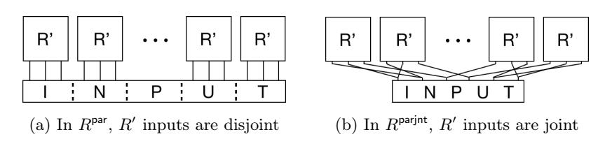
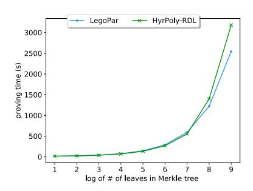
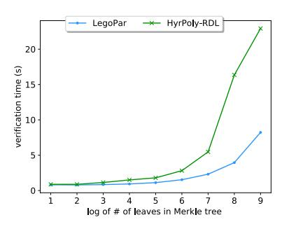
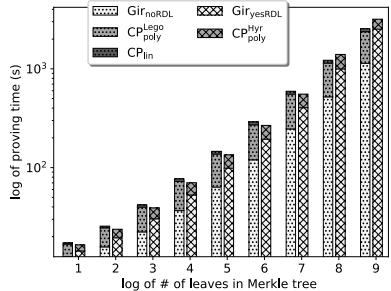

# LegoSNARK: Modular Design and Composition of Succinct Zero-Knowledge Proofs

Matteo Campanelli<sup>1</sup> , Dario Fiore<sup>1</sup> , and Anaïs Querol1,<sup>2</sup>

> 1 IMDEA Software Institute <sup>2</sup> Universidad Politécnica de Madrid

matteo.campanelli@imdea.org dario.fiore@imdea.org anais.querol@imdea.org

Full Version

Abstract. We study the problem of building non-interactive proof systems modularly by linking small specialized "gadget" SNARKs in a lightweight manner. Our motivation is both theoretical and practical. On the theoretical side, modular SNARK designs would be flexible and reusable. In practice, specialized SNARKs have the potential to be more efficient than general-purpose schemes, on which most existing works have focused. If a computation naturally presents different "components" (e.g. one arithmetic circuit and one boolean circuit), a general-purpose scheme would homogenize them to a single representation with a subsequent cost in performance. Through a modular approach one could instead exploit the nuances of a computation and choose the best gadget for each component.

Our contribution is LegoSNARK, a "toolbox" (or framework) for commit-and-prove zkSNARKs (CP-SNARKs) that includes:

- 1) General composition tools: build new CP-SNARKs from proof gadgets for basic relations simply.
- 2) A "lifting" tool: a compiler to add commit-and-prove capabilities to a broad class of existing zkSNARKs efficiently. This makes them interoperable (linkable) within the same computation. For example, one QAP-based scheme can be used prove one component; another GKR-based scheme can be used to prove another.
- 3) A collection of succinct proof gadgets for a variety of relations. Additionally, through our framework and gadgets, we are able to obtain new succinct proof systems. Notably:
- LegoGro16, a commit-and-prove version of Groth16 zkSNARK, that operates over data committed with a classical Pedersen vector commitment, and that achieves a 5000× speedup in proving time.
- LegoUAC, a pairing-based SNARK for arithmetic circuits that has a universal, circuit-independent, CRS, and proving time linear in the number of circuit gates (vs. the recent scheme of Groth et al. (CRYPTO'18) with quadratic CRS and quasilinear proving time).
- CP-SNARKs for matrix multiplication that achieve optimal proving complexity.
- 4) A codebase written in C++ for highly composable zkSNARKs with commit-and-prove capabilities[a](#page-0-0) .

<span id="page-0-0"></span><sup>a</sup> Available at <https://github.com/imdea-software/legosnark> .

# Table of Contents

| 1 |     | Introduction<br>                                         | 4  |
|---|-----|----------------------------------------------------------|----|
|   | 1.1 | Our Results<br>                                          | 6  |
|   | 1.2 | Related Work<br>                                         | 7  |
|   | 1.3 | Roadmap<br>                                              | 9  |
| 2 |     | Preliminaries<br>                                        | 9  |
|   | 2.1 | Relations<br>                                            | 10 |
|   | 2.2 | Commitment Schemes<br>                                   | 10 |
|   | 2.3 | Zero-Knowledge SNARKs<br>                                | 10 |
| 3 |     | Building the LegoSNARK Framework<br>                     | 12 |
|   | 3.1 | Commit and Prove SNARKs<br>                              | 12 |
|   | 3.2 | Composition Properties of CP-SNARKs                      | 13 |
|   | 3.3 | Commit-Carrying SNARKs                                   | 14 |
|   | 3.4 | Existing CP-SNARKs and cc-SNARKs<br>                     | 17 |
|   | 3.5 | Bootstrapping our Framework<br>                          | 18 |
| 4 |     | CP-SNARKs for Pedersen-like Commitments<br>              | 20 |
|   | 4.1 | CP-SNARK for Pedersen Verification<br>                   | 21 |
|   | 4.2 | CP-SNARK for Linear Properties<br>                       | 22 |
| 5 |     | Efficient CP-SNARKs for Polynomial Commitments<br>       | 23 |
|   | 5.1 | Preliminaries and Building Blocks<br>                    | 23 |
|   | 5.2 | A CP-SNARK for Sum-Check<br>                             | 26 |
|   | 5.3 | A CP-SNARK for Hadamard Products<br>                     | 28 |
|   | 5.4 | A CP-SNARK for Self Permutation<br>                      | 29 |
|   | 5.5 | A CP-SNARK for Linear Properties of Committed Vector<br> | 30 |
|   | 5.6 | A CP-SNARK for Matrix Multiplication<br>                 | 33 |
| 6 |     | LegoSNARK Applications and Evaluation<br>                | 35 |
|   | 6.1 | Preliminaries and Building Blocks<br>                    | 36 |
|   | 6.2 | Arithmetic Circuit Satisfiability<br>                    | 37 |
|   | 6.3 | Parallel Computation on Joint Inputs                     | 39 |
| 7 |     | Experimental Evaluation<br>                              | 41 |
|   | 7.1 | Commit-and-Prove SNARKs<br>                              | 41 |
|   | 7.2 | Matrix Multiplication                                    | 41 |
|   | 7.3 | LegoAC1<br>for Arithmetic Circuits<br>                   | 42 |
|   | 7.4 | Parallel Checks on Joint Inputs<br>                      | 43 |
| 8 |     | Conclusions<br>                                          | 45 |

| A | Security proof of CP-SNARK composition<br>                                 | 49 |
|---|----------------------------------------------------------------------------|----|
|   | A.1<br>Proof of Knowledge Soundness<br>                                    | 49 |
|   | A.2<br>Proof of Zero-Knowledge<br>                                         | 50 |
| B | Proofs for the General Compiler                                            | 51 |
|   | B.1<br>Proof of Knowledge Soundness<br>                                    | 51 |
|   | B.2<br>Proof of Zero-Knowledge<br>                                         | 55 |
| C | Supplementary Results on<br>CPlink<br>                                     | 55 |
|   | C.1<br>Proof of<br>CPlink<br>Security<br>                                  | 55 |
|   | C.2<br>An extension of<br>CPlink<br>for Prefixes of a Committed Vector<br> | 57 |
| D | A zkSNARK for Linear Subspaces<br>                                         | 58 |
| E | A Construction of<br>PolyCom<br>and<br>CPpoly<br>from zk-vSQL<br>          | 59 |
| F | Additional Material on CP-SNARKs for<br>PolyCom                            | 60 |
|   | F.1<br>Proof of our<br>CPsc<br>                                            | 60 |
|   | F.2<br>Proof of Security of<br>CPhad<br>                                   | 61 |
|   | F.3<br>Proof of<br>CPsfprm<br>                                             | 62 |
|   | F.4<br>Proof of<br>CPlin<br>                                               | 63 |
|   | F.5<br>A CP-SNARK for Data-Parallel Computations                           | 64 |
| G | A CP-SNARK for Internal Products from Thaler's Protocol<br>                | 65 |
|   | G.1 CMT Protocol<br>                                                       | 65 |
|   | G.2 Thaler's Protocol for Trees of Multiplications<br>                     | 66 |
|   | G.3 Adapting zk-vSQL to Thaler's Protocol<br>                              | 66 |
| H | Commit and Prove SNARKs from existing schemes<br>                          | 68 |
|   | H.1<br>"Adaptive Pinocchio" [Vee17]                                        | 69 |
|   | H.2<br>Lipmaa's Hadamard Product Argument [Lip16]<br>                      | 69 |
|   | zk-vSQL [ZGK+17b]<br>H.3<br>                                               | 69 |
|   | Geppetto [CFH+15]<br>H.4<br>                                               | 70 |
|   | H.5<br>cc-SNARKs based on Groth's SNARK<br>                                | 71 |

# <span id="page-3-0"></span>1 Introduction

Zero-knowledge proofs (ZKPs), introduced by Goldwasser, Micali and Rackoff [\[GMR89\]](#page-46-0), let a prover convince a verifier of a statement without revealing more information than its validity. This power of ZKPs—simultaneously providing integrity (the prover cannot cheat) and privacy (the verifier does not learn any of the prover's secrets)—has found countless applications, including multiparty computation [\[GMW87\]](#page-46-1), signature schemes [\[Sch91\]](#page-47-2), public-key encryption [\[NY90\]](#page-47-3), and, more recently, blockchain systems [\[BCG](#page-45-1)+14, [AJ18\]](#page-44-1).

Some zero-knowledge proof systems—called succinct or simply zkSNARKs, zero-knowledge Succinct Non-interactive Argument of Knowledge—have short and efficiently verifiable proofs [\[Mic00,](#page-47-4) [GW11,](#page-46-2) [BCCT12\]](#page-45-2). Succinctness is desirable in general but is especially critical in applications where verifiers would not invest significant computational resources (e.g. if they are unwilling to do it for reasons of scalability and cost, or if they are computationally weak).

Motivation. The last years have seen remarkable progress in the construction of zkSNARKs. Different lines of work (cf. Section [1.2](#page-6-0) for a detailed review) have built a variety of schemes that are highly expressive, supporting general computations in the class NP. The general-purpose nature of these schemes makes them very attractive to practitioners. At the same time, this high expressivity comes at a cost in terms of performance. To achieve generality, these constructions abstract specific features of computation by assuming one single unifying representation (e.g., boolean or arithmetic circuits, state-machine transitions, RAM computations), and this abstraction is often a source of overhead, for two main reasons.

First, general-purpose zk-SNARKs may miss opportunities for significant optimizations by not exploiting the nuances of a computation. In contrast, specialized solutions can gain efficiency by exploiting specific structural properties. For example, recent works [\[CMT12,](#page-46-3) [WTas](#page-48-3)+17] show how to highly optimize the GKR protocol[\[GKR08\]](#page-46-4) for the case of parallel computations. A further example is the specialized protocol for the multiplication of n × n matrices we propose in Section [5.6.](#page-32-0) Here, our prover runs in O(n 2 ) time as opposed to any circuit-based approach running in at least O(n 3 ) time.

Second, computation tends to be heterogeneous, often consisting of several subroutines of different nature, e.g. both arithmetic and boolean components. If we design SNARKs assuming one single general representation then we will not be able to provide the best match for all the different subroutines. In this context specialized protocols are clearly not an answer either as they fail whenever faced with a non homogeneous computation. As a concrete example, the GKR-like protocols mentioned above are highly efficient when executed on parallel computations, but they fail to be succinct if a computation also includes heavily sequential subroutines (e.g. iterated block ciphers).

In contrast, specialized solutions can gain efficiency by exploiting specific structural properties. For example, recent works [\[CMT12,](#page-46-3) [WTas](#page-48-3)+17] show how to highly optimize the GKR protocol[\[GKR08\]](#page-46-4) for the case of parallel computations. A further example is the specialized protocol for the multiplication of n × n matrices we propose in Section [5.6.](#page-32-0) Here, our prover runs in O(n 2 ) time as opposed to a circuit-based approach running in at least O(n 3 ) time.

A Modular Approach for zk-SNARKs. In this paper we study an alternative approach to the design of zkSNARKs that would gain the advantages of specialized proof systems without inheriting their shortcomings when applied to heterogeneous computations. With this goal in mind we propose to build zkSNARKs by proceeding in a modular "bottom-up" fashion. Most current works use a "topdown" approach: they build general-purpose schemes adopting one single representation that must be shared across all the different subroutines in the program. On the other hand, in this work we consider designing a "global" SNARK for a computation C through a (lightweight) linking of "smaller" specialized SNARKs for the different subroutines composing C. We call these interlinked specialized SNARKs proof gadgets, as they act as basic building blocks that one can compose and reuse according to the situation.

The modular approach has multiple benefits.[3](#page-4-0) First, it allows for reducing complexity: instead of focusing on handling arbitrary computation using a single representation, one can focus on a smaller, more specific problem (e.g., log-depth computation, membership proof, range proof, algebraic group relation etc.), and exploit its nuances to get a more efficient solution. This way, one could maximize efficiency by letting each subroutine of C be handled by a different proof system, specialized and efficient for that type of computation. Second, modularity allows for flexibility and costs reduction: a proof gadget can be reused in several systems and one can easily plug in a new solution, or replace an old one.

Modularity from Commit-and-Prove SNARKs. To realize this modular approach we rely on the well known commit-and-prove (CP) methodology [\[Kil89,](#page-47-5) [CLOS02\]](#page-46-5). With a CP scheme one can prove statements of the form "cck(x) contains x such that R(x, w)" where cck(x) is a commitment. To see how the CP capability can be used for modular composition consider the following example of sequential composition in which one wants to prove that ∃w : z = h(x; w), where h(x; w) := g(f(x; w); w). Such a proof can be built by combining two CP systems Π<sup>f</sup> and Π<sup>g</sup> for its two building blocks, i.e., respectively f and g: the prover creates a commitment cck(y) of y, and then uses Π<sup>f</sup> (resp. Πg) to prove that "cck(y) contains y = f(x; w) (resp. contains y such that z = g(y; w))".

Challenges of the CP modular composition. The composition idea sketched above implicitly assumes that Π<sup>f</sup> and Π<sup>g</sup> work on the same commitment cck(y). Namely, in order to be composed, different CP schemes must be compatible with the same commitment scheme (and commitment key). Essentially we need a sort of universal commitment scheme that is as decoupled [4](#page-4-1)as possible from the specific argument systems that will operate on it.

We argue that achieving such universality with state-of-the-art zkSNARKs entails major challenges:

- (a) Most of the popular zkSNARKs, e.g., [\[PHGR13,](#page-47-6) [Gro16\]](#page-46-6), are not explicitly commit-and-prove. This limitation can be overcome using a (somewhat folklore) approach in which the SNARK Π additionally proves the correct opening of the commitment, i.e., R(x, w)∧"cck(x) opens to x". This approach has two main drawbacks: (i) Π must be expressive enough to include the commitment verification in its language, but in our vision Π is a SNARK for a specialized task and may not have this capability; (ii) even if Π were expressive enough (e.g., supports arbitrary circuits), encoding commitment verification incurs significant overheads.[5](#page-4-2)
- (b) Some existing SNARKs have commit-and-prove capabilities [\[Gro10,](#page-46-7) [CFH](#page-45-0)+15, [Lip16,](#page-47-1) [Vee17\]](#page-47-0). Yet, each of these schemes uses its own specific commitment scheme. In some cases [\[CFH](#page-45-0)+15] the commitment keys are relation-dependent, which means commitments cannot be generated before

<span id="page-4-0"></span><sup>3</sup> Most of these benefits are the typical ones of modularity, a design approach that is successfully used in a variety of fields, such as architecture, manufacturing, software design, and programming.

<span id="page-4-1"></span><sup>4</sup> We find it apt to describe this notion in terms of coupling, the common measure of how interconnected two components are in a software system.

<span id="page-4-2"></span><sup>5</sup> For example, we experimentally found that, when handling a Pedersen commitment to a vector of length 2048 with [\[Gro16\]](#page-46-6), the proving overhead is 428 secs (7 minutes).

fixing one or multiple relations.[6](#page-5-1) In the other cases, despite being relation-independent, commitment keys have a very specific structure that may not fit other proof systems. In summary, a main limitation of existing commit-and-prove SNARKs is their incompatibility, between them and with other potentially more efficient candidates to be developed.

# <span id="page-5-0"></span>1.1 Our Results

LegoSNARK Framework. We present LegoSNARK, a framework for commit-and-prove zk-SNARKs (CP-SNARKs) that includes:

- Definitions that formalize CP-SNARKs and their variants.
- Composition recipes that show how to use different CP-SNARKs in a generic and secure way for handling conjunction, disjunction and sequential composition of relations. This composition result enables the use of modularity in designing CP-SNARKs for complex relations out of schemes for simpler relations.
- A generic construction to efficiently turn a broad class of zkSNARKs into CP-SNARKs that can be composed together. This class includes several existing schemes such as ones based on quadratic arithmetic programs [\[PHGR13,](#page-47-6) [CFH](#page-45-0)+15, [Gro16\]](#page-46-6), or zk-vSQL [\[ZGK](#page-48-4)+17a, [ZGK](#page-48-2)+17b]. For this transformation we only need a "minimal" CP-SNARK, CPlink, for proving that two commitments (under different schemes) open to the same value.

LegoSNARK Gadgets. We populate our framework by constructing new CP-SNARKs for several basic relations, such as:

- CPlink for proving that two different Pedersen-like commitments open to the same vector.[7](#page-5-2) Plugging CPlink in our generic construction solves the challenges (a) and (b) mentioned above and gives us interoperable versions of several existing schemes.
- CPlin for proving that a linear relation F · u = x holds for a committed vector u, a public matrix F and public vector x.
- CPhad for proving that a vector u<sup>0</sup> is the Hadamard product of u<sup>1</sup> and u2, when all the three vectors are committed.
- CPsfprm for proving a self-permutation, i.e., that y<sup>i</sup> = yφ(i) for a public permutation φ and a committed vector y.
- CPmm for proving that matrix X is the product of committed matrices A and B.

All the aforementioned schemes have succinct proofs and work for Pedersen-like commitments in bilinear groups. This means that by using our generic construction with CPlink they can be turned to support the same commitment and then be composed.

LegoSNARK Applications and Evaluation. Using our initial set of specialized proof gadgets, our next step is to combine them in order to build new succinct proof systems for different use cases, mentioned below. Our results offer various improvements over the state of the art. We have also implemented some of our solutions to test their concrete performance.

<span id="page-5-1"></span><sup>6</sup> This could be mitigated by using universal circuits, paying a (multiplicative) logarithmic overhead in parameters size and prover complexity.

<span id="page-5-2"></span><sup>7</sup> By "Pedersen-like" we mean schemes where the verification algorithm is the same as in Pedersen scheme [\[Ped92\]](#page-47-7) for vectors (but the bases can have a different distribution).

- 1) Efficient Commit-Ahead-of-Time. Through our generic construction instantiated with CPlink we also obtained commit-and-prove versions of popular efficient zkSNARKs, such as Groth's [\[Gro16\]](#page-46-6), that can prove statements about data committed using the Pedersen scheme for vectors [\[Ped92\]](#page-47-7), in which bases are random group elements that can be generated without trusted setup. Such commit-and-prove schemes are useful in applications where one needs to commit before the SNARK keys for a relation are created, e.g., to post commitments on a blockchain so that one can later prove statements about the committed data. By applying our solution to [\[Gro16\]](#page-46-6) we obtain a scheme that is 5000× faster than Groth16, where the commitment is encoded in the circuit.
- 2) CP-SNARKs for Parallel Computation. Consider the problem of proving (in zero-knowledge) correctness of a computation that consists of the same subcircuit executed in parallel. The recent Hyrax system [\[WTs](#page-48-5)+18] is suitably designed for and shows good performances on this type of circuit. It requires, however, an additional verification cost whenever the repeated subcircuits share (non-deterministic) inputs, which is common. The verifier thus pays an additional factor linear in the total width of the circuit. Using our LegoSNARK framework we show how to build a new CP-SNARK based on Hyrax that avoids this problem. The idea is that parallel computation on joint inputs can be expressed as the combination of a fully parallel computation (after inputs were appropriately duplicated) and a permutation check to ensure that inputs have been duplicated correctly. We build this by combining our CPlin gadget with a version of Hyrax modified to work with the polynomial commitment of zk-vSQL [\[ZGK](#page-48-2)+17b].
- 3) CP-SNARKs for Arithmetic Circuits. We give two main constructions of CP-SNARKs for arithmetic circuit (AC) satisfiability. Table [1](#page-7-0) summarizes a theoretical comparison with other schemes in the literature (selected among the ones with similar succinctness).

Our first scheme, LegoAC, relies on an encoding of AC based on Hadamard products and linear constraints from [\[BCC](#page-45-3)+16] and can be built from CPlin and CPhad gadgets. We evaluate two instantiations:

- LegoAC1—from our CPlin and a CPhad from [\[Lip16\]](#page-47-1)—is secure in the generic group model (GGM), enjoys constant-size proofs, and has a log n factor in proving time (similar to [\[PHGR13,](#page-47-6) [Gro16\]](#page-46-6));
- LegoAC2—from our CPlin and CPhad gadgets—is secure in the GGM and random oracle model, it has log n-size proofs but only linear proving time.

The second CP-SNARK, LegoUAC, builds on an encoding of AC based on Hadamard products, additions and permutation from [\[Gro09,](#page-46-8) [BCG](#page-45-4)+17] and can be built from our CPhad and CPsfprm gadgets.[8](#page-6-1) The main novelty of LegoUAC is to admit a universal, circuit-independent CRS, in the "specialization" model of [\[GKM](#page-46-9)+18] where the universal CRS can be specialized to a circuit C with a deterministic algorithm. LegoUAC's CRS has O(N) size where N is an upper bound on the number of gates of the circuits; in contrast, the CRS has quadratic size in the recent scheme in [\[GKM](#page-46-9)+18]. Our LegoUAC also improves on the approach applying an efficient system, say [\[Gro16\]](#page-46-6), on a universal circuit [\[Val76,](#page-47-8) [GKS17\]](#page-46-10), which would incur at least a logarithmic multiplicative factor in circuit size.

### <span id="page-6-0"></span>1.2 Related Work

The idea of combining two different NIZKs to improve efficiency when handling heterogeneous computations has been considered by Chase et al. [\[CGM16\]](#page-46-11) and more recently by Agrawal et

<span id="page-6-1"></span><sup>8</sup> Additions are handled for free if the commitment is linearly homomorphic.

<span id="page-7-0"></span>

| Scheme          |   |        | Uni KG time Prove time Ver. time |             | crs    | π      |
|-----------------|---|--------|----------------------------------|-------------|--------|--------|
| [PHGR13, Gro16] | – | n + m  | m + n log n                      | x           | n + m  | O(1)   |
| LegoAC1         | – | n + m  | n log n                          | x           | n      | O(1)   |
| LegoAC2         | – | n + m  | n                                | x  + log n  | n      | log n  |
| [GKM+18]        | X | 2<br>n | m + n log n                      | x           | 2<br>n | O(1)   |
| LegoUAC         | X | ∗<br>N | N                                | x  + log2 N | ∗<br>N | log2 N |

Table 1: Comparing pairing-based zkSNARKs for arithmetic circuits with m wires and N gates, of which n are multiplication gates, n<sup>a</sup> (resp. nc) are addition (resp. multiplication-by-constant) gates, and N<sup>∗</sup> = max(n, na, nc). Numbers in the table are in O(·) notation.

al. [\[AGM18\]](#page-44-2). In [\[AGM18\]](#page-44-2), they propose combining the Pinocchio scheme [\[PHGR13\]](#page-47-6) with Sigmaprotocol-based NIZKs and show an efficient construction for computations that combines algebraic relations in a cryptographic group and arbitrary computation. Their approach reveals beneficial and improves performances. The solution in [\[AGM18\]](#page-44-2) is tailored to two specific proof systems and their combination methodology does not always preserve succinctness. In contrast, our techniques are general, apply to a variety of existing proof systems and preserve succinctness (they compose succinct schemes into succinct schemes).

Succinct ZK Proofs. In the past years several research lines have built a variety of zk-SNARKs for general NP statements. Here we provide an overview of each line, especially focusing on their differences in performance.

A major research line is the one based on the seminal paper of Gennaro et al. [\[GGPR13\]](#page-46-12) who proposed a pairing-based SNARK based on the NP-complete language of quadratic span/arithmetic programs. This approach improves on previous approaches by Ishai et al. [\[IKO07\]](#page-47-9), Groth [\[Gro10\]](#page-46-7) and Lipmaa [\[Lip12\]](#page-47-10), and is the basis of several works such as [\[PHGR13,](#page-47-6) [BCG](#page-45-5)+13, [BFR](#page-45-6)+13, [BCTV14,](#page-45-7) [KPP](#page-47-11)+14, [CFH](#page-45-0)+15, [BBFR15,](#page-45-8) [WSR](#page-48-6)+15, [Gro16,](#page-46-6) [FFG](#page-46-13)+16, [GKM](#page-46-9)+18]. The zkSNARKs in this family enjoy constant-size proofs and fast verification, the latter depending only linearly on the statement size; on the downside, they feature large overheads at proving time, costly (although amortizable) preprocessing and security properties based on non-standard non-falsifiable assumptions.

A second research line builds on the MPC-in-the-head approach of Ishai et al. [\[IKOS07\]](#page-47-12) to construct a ZK argument from an MPC protocol. The first scheme that refined and experimented this approach is ZKBoo [\[GMO16\]](#page-46-14), then improved in [\[CDG](#page-45-9)+17]; a more recent work in this line is Ligero [\[AHIV17\]](#page-44-3). These schemes do not need trusted setup and show excellent proving performances on Boolean circuits, since they rely only on symmetric-key cryptographic primitives. On the downside their proofs are not fully succinct, being linear in the circuit size |C| in [\[GMO16\]](#page-46-14), and O˜( p |C|) in [\[AHIV17\]](#page-44-3).

The works [\[ZGK](#page-48-4)+17a, [ZGK](#page-48-2)+17b, [WTs](#page-48-5)+18] stem from the interactive proof techniques for low-depth circuits pioneered in Goldwasser et al. [\[GKR08\]](#page-46-4) and later refined in [\[CMT12,](#page-46-3) [Tha13,](#page-47-13) [WJB](#page-47-14)+17]. The resulting succinct ZK arguments are made non-interactive in the random oracle model. These schemes offer good proving performance and use asymptotically fewer cryptographic operations than those from the MPC-in-the-head family; they can be instantiated without [\[WTs](#page-48-5)+18] (or with a circuit-independent [\[ZGK](#page-48-2)+17b]) trusted setup. On the other hand their proof size and verification time depend on the structure of the circuit at hand, notably on the depth and in some cases on the width.

Building on the work of Groth [\[Gro09\]](#page-46-8), two recent proposals [\[BCC](#page-45-3)+16, [BBB](#page-45-10)+17] give ZK arguments for arithmetic circuit satisfiability that can be instantiated without trusted setup. The first scheme of Bootle et al. [BCC<sup>+</sup>16] has proofs of size  $O(\sqrt{M})$  where M is the number of multiplication gates in the circuit, while their second scheme (improved in [BBB<sup>+</sup>17]) has proofs of size  $O(\log M)$  but has a linear time verifier.

Compared to the results from the latter three research lines we described, our instantiations have the disadvantage of needing a trusted setup<sup>9</sup>, although in some cases this is universal and thus reusable. In terms of performances, however, our results are more succinct, both in terms of proof size and verifier time.

A recent line of work [BSBHR18] builds on the seminal works of Kilian [Kil92] and Micali [Mic94], and generalizations of PCPs (IOPs) [BCS16, RRR16] in order to construct systems (dubbed zkSTARKs) that are general-purpose (capturing very general computations that can be expressed as state-machine transitions), do not require trusted setup and offer good timings for prover and verifier. On the downside, the memory costs for the prover are still high and their security relies on a non-standard conjecture about Reed-Solomon codes.

# <span id="page-8-0"></span>1.3 Roadmap

The paper is organized as follows. Section 2 introduces notation and preliminar definitions. Section 3 provides the basis for building our framework: composing CP-SNARKs, the notion of cc-SNARKs and our compiler to import existing schemes in the framework. Sections 4 and 5 present constructions both for Pedersen-like commitments and polynomial commitments. Section 6 explains how to apply LegoSNARK to build schemes for arithmetic circuits. Section 7 gives experimental details of our library. We conclude in Section 8.

This text is the full work of our shorter version published at CCS'19. Several results only appear in this long version. Namely: security proofs, formal definitions, more schemes and constructions, and further details.

### <span id="page-8-1"></span>2 Preliminaries

We use  $\lambda \in \mathbb{N}$  to denote the security parameter, and  $1^{\lambda}$  to denote its unary representation. Throughout the paper we assume that all the algorithms of the cryptographic schemes take as input  $1^{\lambda}$ , and thus we omit it from the list of inputs. For a distribution D, we denote by  $x \leftarrow D$  the fact that x is being sampled according to D. We remind the reader that an ensemble  $\mathcal{X} = \{X_{\lambda}\}_{{\lambda} \in \mathbb{N}}$  is a family of probability distributions over a family of domains  $\mathcal{D} = \{D_{\lambda}\}_{{\lambda} \in \mathbb{N}}$ . We say two ensembles  $\mathcal{D} = \{D_{\lambda}\}_{{\lambda} \in \mathbb{N}}$  and  $\mathcal{D}' = \{D'_{\lambda}\}_{{\lambda} \in \mathbb{N}}$  are statistically indistinguishable (denoted by  $\mathcal{D} \approx_s \mathcal{D}'$ ) if  $\frac{1}{2} \sum_x |D_{\lambda}(x) - D'_{\lambda}(x)| < \mathsf{negl}(\lambda)$ . If  $\mathcal{A} = \{\mathcal{A}_{\lambda}\}$  is a (possibly non-uniform) family of circuits and  $\mathcal{D} = \{D_{\lambda}\}_{{\lambda} \in \mathbb{N}}$  is an ensemble, then we denote by  $\mathcal{A}(\mathcal{D})$  the ensemble of the outputs of  $\mathcal{A}_{\lambda}(x)$  when  $x \leftarrow D_{\lambda}$ . We say two ensembles  $\mathcal{D} = \{D_{\lambda}\}_{{\lambda} \in \mathbb{N}}$  and  $\mathcal{D}' = \{D'_{\lambda}\}_{{\lambda} \in \mathbb{N}}$  are computationally indistinguishable (denoted by  $\mathcal{D} \approx_c \mathcal{D}'$ ) if for every non-uniform polynomial time distinguisher  $\mathcal{A}$  we have  $\mathcal{A}(\mathcal{D}) \approx_s \mathcal{A}(\mathcal{D}')$ .

We denote by [n] the set of integers  $\{1,\ldots,n\}$  and by [:n] the set  $\{0,1,\ldots,n-1\}$ . By  $(u_j)_{j\in[\ell]}$  we denote the tuple  $(u_1,\ldots,u_\ell)$ .

<span id="page-8-2"></span><sup>&</sup>lt;sup>9</sup> We stress that only our concrete instantiations require a trusted setup—our general composition framework does not.

### <span id="page-9-0"></span>2.1 Relations

Let {Rλ}λ∈<sup>N</sup> be a family of polynomial-time decidable relations R on pairs (x, w) where x ∈ D<sup>x</sup> is called the statement or input, and w ∈ D<sup>w</sup> the witness. We write R(x, w) = 1 to denote that R holds on (x, w), else we write R(x, w) = 0. When discussing schemes that prove statements on committed values we assume that D<sup>w</sup> can be split in two subdomains Du×Dω. Finally we sometimes use an even finer grained specification of D<sup>u</sup> assuming we can split it over ` arbitrary domains (D1×· · ·×D`) for some arity `. In our security definitions we assume relations to be generated by a relation generator RG(1<sup>λ</sup> ) that, on input the security parameter 1 λ , outputs R together with some side information, an auxiliary input auxR, that is given to the adversary. We define RG<sup>λ</sup> as the set of all relations that can be returned by RG(1<sup>λ</sup> ).

# <span id="page-9-3"></span><span id="page-9-1"></span>2.2 Commitment Schemes

We recall the notion of non-interactive commitment schemes.

Definition 2.1. A commitment scheme is a tuple of algorithms Com = (Setup, Commit, VerCommit) that work as follows and satisfy the notions of correctness, binding and hiding defined below.

- Setup(1<sup>λ</sup> ) → ck takes the security parameter and outputs a commitment key ck. This key includes descriptions of the input space D, commitment space C and opening space O.
- Commit(ck, u) → (c, o) takes the commitment key ck and a value u ∈ D, and outputs a commitment c and an opening o.
- VerCommit(ck, c, u, o) → b takes as input a commitment c, a value u and an opening o, and accepts (b = 1) or rejects (b = 0).

Correctness. For all λ ∈ N and any input u ∈ D we have:

$$\Pr\left[\mathsf{ck} \leftarrow \mathsf{Setup}(1^{\lambda}), (c, o) \leftarrow \mathsf{Commit}(\mathsf{ck}, u) : \mathsf{VerCommit}(\mathsf{ck}, c, u, o) = 1\right] = 1.$$

Binding. For every polynomial-time adversary A:

$$\Pr\begin{bmatrix} \mathsf{ck} \leftarrow \mathsf{Setup}(1^\lambda) \\ (c,u,o,u',o') \leftarrow \mathcal{A}(\mathsf{ck}) \end{bmatrix} : \frac{u \neq u' \land \mathsf{VerCommit}(\mathsf{ck},c,u,o) = 1}{\land \mathsf{VerCommit}(\mathsf{ck},c,u',o') = 1} \end{bmatrix} = \mathsf{negl}(c,u,o,u',o') \leftarrow \mathcal{A}(\mathsf{ck})$$

Hiding. For ck ← Setup(1<sup>λ</sup> ) and ∀ u, u<sup>0</sup> ∈ D, the following two distributions are statistically close:

$$\{c:(c,o) \leftarrow \mathsf{Commit}(\mathsf{ck},u)\} \approx \{c':(c',o') \leftarrow \mathsf{Commit}(\mathsf{ck},u')\}$$

### <span id="page-9-2"></span>2.3 Zero-Knowledge SNARKs

We recall the definition of (pre-processing) zero-knowledge succinct non-interactive arguments of knowledge (zkSNARKs, for short) [\[BCCT12,](#page-45-2) [BCC](#page-45-13)+17].

Definition 2.2 (SNARK). A SNARK for {Rλ}λ∈<sup>N</sup> is a triple of algorithms Π = (KeyGen, Prove, VerProof) that work as follows and satisfy the notions of completeness, succinctness and knowledge soundness defined below. If Π also satisfies zero-knowledge we call it a zkSNARK.

- KeyGen(R) → (ek, vk) takes the security parameter λ and a relation R ∈ Rλ, and outputs a common reference string consisting of an evaluation and a verification key.
- Prove(ek, x, w) → π takes an evaluation key for a relation R, a statement x, and a witness w such that R(x, w) holds, and returns a proof π.
- VerProof(vk, x, π) → b takes a verification key, a statement x, and either accepts (b = 1) or rejects (b = 0) the proof π.

Completeness. For any pair (x, w) satisfying the relation, the verifier always accepts the corresponding proof. Formally, ∀λ ∈ N, R ∈ R<sup>λ</sup> and (x, w) such that R(x, w), it holds:

$$\Pr[(\mathsf{ek},\mathsf{vk}) \leftarrow \mathsf{KeyGen}(R), \pi \leftarrow \mathsf{Prove}(\mathsf{ek},x,w) : \mathsf{VerProof}(\mathsf{vk},x,\pi) = 1] = 1$$

Succinctness. Π is said succinct if the running time of VerProof is poly(λ)(λ + |x| + log |w|) and the proof size is poly(λ)(λ + log |w|).

Knowledge Soundness. Let RG be a relation generator such that RG<sup>λ</sup> ⊆ Rλ. Π has knowledge soundness for RG and auxiliary input distribution Z, denoted KSND(RG, Z) for brevity, if for every (non-uniform) efficient adversary A there exists a (non-uniform) efficient extractor E such that Pr[GameKSND RG,Z,A,<sup>E</sup> = 1] = negl. We say that Π is knowledge sound if there exists benign RG and Z such that Π is KSND(RG, Z).

<span id="page-10-0"></span>
$$\begin{aligned} &\mathsf{Game}_{\mathcal{RG},\mathcal{Z},\mathcal{A},\mathcal{E}}^{\mathsf{KSND}} \to b \\ &\overline{(R,\mathsf{aux}_R) \leftarrow \mathcal{RG}(1^\lambda)} \ \ ; \ \ \mathsf{crs} := (\mathsf{ek},\mathsf{vk}) \leftarrow \mathsf{KeyGen}(R) \ \ ; \ \ \mathsf{aux}_Z \leftarrow \mathcal{Z}(R,\mathsf{aux}_R,\mathsf{crs}) \\ &(x,\pi) \leftarrow \ \ \mathcal{A}(R,\mathsf{crs},\mathsf{aux}_R,\mathsf{aux}_Z) \ \ ; \ \ w \leftarrow \ \mathcal{E}(R,\mathsf{crs},\mathsf{aux}_R,\mathsf{aux}_Z) \ \ ; \ \ b = \mathsf{VerProof}(\mathsf{vk},x,\pi) \ \land \neg R(x,w) \end{aligned}$$

Composable Zero-Knowledge. A scheme Π satisfies composable zero-knowledge for a relation generator RG if there exists a simulator S = (Skg, Sprv) such that both following conditions hold for all adversaries A:

Keys Indistinguishability.

$$\begin{split} & \Pr\left[(R,\mathsf{aux}_R) \leftarrow \mathcal{RG}(1^\lambda), \mathsf{crs} \leftarrow \mathsf{KeyGen}(R) : \mathcal{A}(\mathsf{crs},\mathsf{aux}_R) = 1\right] \\ & \approx \Pr\left[(R,\mathsf{aux}_R) \leftarrow \mathcal{RG}(1^\lambda), (\mathsf{crs},\mathsf{td_k}) \leftarrow \mathcal{S}_{\mathsf{kg}}(R) : \mathcal{A}(\mathsf{crs},\mathsf{aux}_R) = 1\right] \end{split}$$

Proof Indistinguishability. For all (x, w) such that R(x, w) = 1,

$$\begin{split} & \Pr\left[(R,\mathsf{aux}_R) \leftarrow \mathcal{RG}(1^\lambda), (\mathsf{crs},\mathsf{td_k}) \leftarrow \mathcal{S}_{\mathsf{kg}}(R) : \pi \leftarrow \mathsf{Prove}(\mathsf{ek},x,w), \mathcal{A}(\mathsf{crs},\mathsf{aux}_R,\pi) = 1\right] \\ & \approx \Pr\left[(R,\mathsf{aux}_R) \leftarrow \mathcal{RG}(1^\lambda), (\mathsf{crs},\mathsf{td_k}) \leftarrow \mathcal{S}_{\mathsf{kg}}(R) : \pi \leftarrow \mathcal{S}_{\mathsf{prv}}(\mathsf{crs},\mathsf{td_k},x), \mathcal{A}(\mathsf{crs},\mathsf{aux}_R,\pi) = 1\right] \end{split}$$

Remark 2.1. In the notion of knowledge soundness defined above we consider two kinds of auxiliary inputs, aux<sup>R</sup> generated together with the relation by RG, and aux<sup>Z</sup> that is generated from some distribution Z that may depend on the common reference string that in turn depends on R. An example of this appears in our proof of Theorem [B.1.](#page-50-2) Notice that although our notion is implied by a notion where auxiliary inputs can be arbitrary, our aim is a precise formalization of auxiliary inputs; this is useful to justify why certain auxiliary inputs should be considered benign, as required to avoid known impossibility results [\[BCPR14,](#page-45-14) [BP15\]](#page-45-15). Finally, we also note that our notion is also implied by SNARKs that admit black-box extractors (as may be the case for those relying on random oracles [\[Mic00\]](#page-47-4)).

#### zkSNARKs with Specializable Universal CRS

In the SNARK notion presented above, the common reference string generated by KeyGen is tied to a specific relation  $R \in \mathcal{R}_{\lambda}$ . A variant of this notion is that of SNARKs for universal relations in which the output of KeyGen depends only on the family  $\mathcal{R}_{\lambda}$  and can be used to prove and verify statements about any  $R \in \mathcal{R}_{\lambda}$ . Due to the practical concerns on the execution of KeyGen, SNARKs for universal relations are more convenient as one can reuse and amortize the cost of one setup. In a recent work, Groth et al. [GKM<sup>+</sup>18] introduced the notion of zkSNARK with specializable universal common reference string. In a nutshell, this notion formalizes the idea that key generation for R can be seen as the sequential combination of two steps: a first probabilistic algorithm that generates a CRS for the universal relation, and a second deterministic algorithm that specializes this universal CRS into one for a specific R. We remark that our UC SNARKs follow this model.

More formally, let  $\mathcal{R}_{\lambda}$  be a family of relations. The universal relation  $R^*$  for  $\mathcal{R}_{\lambda}$  defines a language with instances (R, x) such that  $R^*(R, x, w)$  holds iff  $R \in \mathcal{R}_{\lambda}$  and R(x, w) holds.

A  $\Pi = (\text{KeyGen}, \text{Prove}, \text{VerProof})$  is said a zkSNARK with specializable universal common reference string [GKM<sup>+</sup>18] if there exist algorithms Derive, Prove\*, VerProof\* such that:

- Derive(crs, R)  $\rightarrow$  crs<sub>R</sub> is a deterministic algorithm that takes as input a crs := (ek, vk) produced by KeyGen( $R^*$ ) and a relation  $R \in \mathcal{R}_{\lambda}$ , and outputs a specialized common reference string crs<sub>R</sub> := (ek<sub>R</sub>, vk<sub>R</sub>).
- Prove(ek, (R, x), w)  $\to \pi$  runs (ek<sub>R</sub>, vk<sub>R</sub>)  $\leftarrow$  Derive(crs, R) and returns  $\pi \leftarrow$  Prove\*(ek<sub>R</sub>, x, w).
- VerProof(vk,  $(R, x), \pi$ )  $\rightarrow b \text{ runs } (ek_R, vk_R) \leftarrow \text{Derive}(crs, R) \text{ and returns } b \leftarrow \text{VerProof}^*(vk_R, x, \pi).$

# <span id="page-11-0"></span>3 Building the LegoSNARK Framework

#### <span id="page-11-1"></span>3.1 Commit and Prove SNARKs

In a nutshell, a commit-and-prove SNARK (CP-SNARK) is a SNARK that can prove knowledge of (x, w) such that R(x, w) holds w.r.t. a witness  $w = (u, \omega)$  and u opens a commitment  $c_u$ .<sup>10</sup> Our formal definitions below add some syntactic sugar to this idea to explicitly handle relations where the input domain  $\mathcal{D}_u$  is more fine grained and splits over  $\ell$  subdomains. For reasons that will shortly become clear, we call these subdomains commitment slots. This splitting is often natural (e.g., if u is a binary string, one can think of  $u := (u_1, \ldots, u_\ell)$  for suitable substrings), and it is crucial to exploit the compositional power of CP-SNARKs, as we show in Section 3.2. We assume the description of the splitting is part of R's description.

<span id="page-11-3"></span>**Definition 3.1 (CP-SNARKs).** Let  $\{\mathcal{R}_{\lambda}\}_{{\lambda}\in\mathbb{N}}$  be a family of relations R over  $\mathcal{D}_{x}\times\mathcal{D}_{u}\times\mathcal{D}_{\omega}$  such that  $\mathcal{D}_{u}$  splits over  $\ell$  arbitrary domains  $(\mathcal{D}_{1}\times\cdots\times\mathcal{D}_{\ell})$  for some arity parameter  $\ell\geq 1$ . Let  $\mathsf{Com}=(\mathsf{Setup},\mathsf{Commit},\mathsf{VerCommit})$  be a commitment scheme (as per Definition 2.1) whose input space  $\mathcal{D}$  is such that  $\mathcal{D}_{i}\subset\mathcal{D}$  for all  $i\in[\ell]$ . A commit and prove zkSNARK for  $\mathsf{Com}$  and  $\{\mathcal{R}_{\lambda}\}_{{\lambda}\in\mathbb{N}}$  is a zkSNARK for a family of relations  $\{\mathcal{R}_{\lambda}^{\mathsf{Com}}\}_{{\lambda}\in\mathbb{N}}$  such that:

- every  $\mathbf{R} \in \mathcal{R}^{\mathsf{Com}}$  is represented by a pair  $(\mathsf{ck}, R)$  where  $\mathsf{ck} \in \mathsf{Setup}(1^{\lambda})$  and  $R \in \mathcal{R}_{\lambda}$ ;
- **R** is over pairs  $(\mathbf{x}, \mathbf{w})$  where the statement is  $\mathbf{x} := (x, (c_j)_{j \in [\ell]}) \in \mathcal{D}_x \times \mathcal{C}^{\ell}$ , the witness is  $\mathbf{w} := ((u_j)_{j \in [\ell]}, (o_j)_{j \in [\ell]}, \omega) \in \mathcal{D}_1 \times \cdots \times \mathcal{D}_{\ell} \times \mathcal{O}^{\ell} \times \mathcal{D}_{\omega}$ , and the relation **R** holds iff

$$\bigwedge\nolimits_{j\in[\ell]} \, \mathsf{VerCommit}(\mathsf{ck}, c_j, u_j, o_j) = 1 \wedge R(x, (u_j)_{j\in[\ell]}, \omega) = 1$$

<span id="page-11-2"></span> $<sup>^{10}</sup>$  Our notion assumes that only a portion of the witness is explicitly committed in  $c_u$ .

Furthermore, when we say that CP is knowledge-sound for a relation generator  $\mathcal{RG}$  and auxiliary input generator  $\mathcal{Z}$  (denoted  $\mathsf{KSND}(\mathcal{RG},\mathcal{Z})$ , for short) we mean it is a knowledge-sound  $\mathit{SNARK}$  for the relation generator  $\mathcal{RG}_{\mathsf{Com}}(1^{\lambda})$  that runs  $\mathsf{ck} \leftarrow \mathsf{Setup}(1^{\lambda})$  and  $(R, \mathsf{aux}_R) \leftarrow \mathcal{RG}(1^{\lambda})$ , and returns  $((\mathsf{ck}, R), \mathsf{aux}_R)$ .

We denote a CP-SNARK as a triple of algorithms  $\mathsf{CP} = (\mathsf{KeyGen}, \mathsf{Prove}, \mathsf{VerProof})$ . For ease of exposition, in our constructions we adopt the syntax for  $\mathsf{CP}$ 's algorithms defined below.

- $\mathsf{KeyGen}(\mathsf{ck},R) \to \mathsf{crs} := (\mathsf{ek},\mathsf{vk})$  generates the common reference string.
- Prove(ek,  $x, (c_j)_{j \in [\ell]}, (u_j)_{j \in [\ell]}, (o_j)_{j \in [\ell]}, \omega) \to \pi$  outputs the proof of correct commitment.
- VerProof(vk,  $x, (c_j)_{j \in [\ell]}, \pi$ )  $\rightarrow b \in \{0, 1\}$  rejects or accepts the proof.

Remark 3.1 (Comparing with existing definitions). To define the Geppetto scheme [CFH<sup>+</sup>15] the authors define a notion of commit-and-prove SNARKs. Here we highlight the main differences between their definition and ours. First, our commitment key can be generated without fixing a priori a relation (or a set of relations, e.g., a multi-QAP). Second, in their model one needs to commit to data using a commitment key corresponding to a specific portion of the input (in their lingo a "bank"), whereas in our model one can just commit to a vector of data, and only at proving time one assigns that data to a specific input slot. Third, we do not require commitments to have a trapdoor. Our notion is closer to the one given by Lipmaa [Lip16] (although [Lip16] uses trapdoor commitments) and is in fact a specialized SNARK notion when considering relation families including verifying openings of commitments.

# <span id="page-12-0"></span>3.2 Composition Properties of CP-SNARKs

In this section, we formally show how the commit-and-prove capability can be used to combine different CP-SNARKs securely.

Conjunction of relations with shared inputs. Let  $\{\mathcal{R}_{\lambda}^{(0)}\}_{\lambda \in \mathbb{N}}$  and  $\{\mathcal{R}_{\lambda}^{(1)}\}_{\lambda \in \mathbb{N}}$  be two families of relations such that, for every  $\lambda \in \mathbb{N}$  the input domains  $\mathcal{D}_{u}^{(0)}$  and  $\mathcal{D}_{u}^{(1)}$  of relations  $R_{0} \in \mathcal{R}_{\lambda}^{(0)}$  and  $R_{1} \in \mathcal{R}_{\lambda}^{(1)}$  respectively can split as follows:  $\mathcal{D}_{u}^{(0)} := \mathcal{D}_{0} \times \mathcal{D}_{2}$  and  $\mathcal{D}_{u}^{(1)} := \mathcal{D}_{1} \times \mathcal{D}_{2}'$  with  $\mathcal{D}_{2} = \mathcal{D}_{2}'^{11}$ . In other words we require these relations to share a commitment slot that we call the *shared slot*.

Given the above relation families, we define  $\{\mathcal{R}_{\lambda}^{\wedge}\}_{\lambda\in\mathbb{N}}$  as the family of relations where for every  $\lambda\in\mathbb{N}$ ,  $\mathcal{R}_{\lambda}^{\wedge}=\{R_{R_0,R_1}^{\wedge}:R_0\in\mathcal{R}_{\lambda}^{(0)},R_1\in\mathcal{R}_{\lambda}^{(1)}\}$  and  $R_{R_0,R_1}^{\wedge}(x_0,x_1,u_0,u_1,u_2,w^*)$  is defined as follows:

$$R_{R_0,R_1}^{\wedge}(x_0,x_1,u_0,u_1,u_2,(w_0,w_1)) := R_0(x_0,u_0,u_2,w_0) \wedge R_1(x_1,u_1,u_2,w_1)$$

Let  $\mathsf{Com}$  be a commitment scheme, for  $b \in \{0,1\}$  let  $\mathsf{CP}_b$  be a CP-SNARK for  $\mathsf{Com}$  and  $\{\mathcal{R}_{\lambda}^{(b)}\}_{\lambda \in \mathbb{N}}$ . In Figure 1 we show a construction of a CP-SNARK  $\mathsf{CP}^{\wedge}$  for  $\mathsf{Com}$  and  $\{\mathcal{R}_{\lambda}^{\wedge}\}_{\lambda \in \mathbb{N}}$ . It is also easy to see that if both  $\mathsf{CP}_0$  and  $\mathsf{CP}_1$  are CP-SNARKs with specializable universal CRS, then so is the resulting  $\mathsf{CP}^{\wedge}$ .

<span id="page-12-2"></span>**Theorem 3.1.** If Com is a computationally binding commitment and, for  $b \in \{0,1\}$ ,  $\mathsf{CP}_b$  is a zero-knowledge CP-SNARK for Com and relation family  $\{\mathcal{R}_{\lambda}^{(b)}\}_{\lambda \in \mathbb{N}}$ , then there is a zero-knowledge CP-SNARK  $\mathsf{CP}^{\wedge}$  for  $\mathsf{Com}$  and  $\{\mathcal{R}_{\lambda}^{\wedge}\}_{\lambda \in \mathbb{N}}$ .

<span id="page-12-1"></span><sup>&</sup>lt;sup>11</sup> Note such a splitting is rather general, as  $\mathcal{D}_2$  and  $\mathcal{D}'_2$ , or  $\mathcal{D}_0$ , or  $\mathcal{D}_1$  may be empty.

```
 \begin{array}{c} \mathsf{CP}^{\wedge}.\mathsf{Prove}(\mathsf{ek}^{*},x_{0},x_{1},(c_{j})_{j\in[:3]},\\ \\ \mathsf{CP}^{\wedge}.\mathsf{KeyGen}(\mathsf{ck},R_{R_{0},R_{1}}^{\wedge}): & (u_{j})_{j\in[:3]},(o_{j})_{j\in[:3]},\omega_{0},\omega_{1}):\\ \hline (\mathsf{ek}_{0},\mathsf{vk}_{0}) \leftarrow \mathsf{CP}_{0}.\mathsf{KeyGen}(\mathsf{ck},R_{0}) & \pi_{0} \leftarrow \mathsf{CP}_{0}.\mathsf{Prove}(\\ \hline (\mathsf{ek}_{1},\mathsf{vk}_{1}) \leftarrow \mathsf{CP}_{1}.\mathsf{KeyGen}(\mathsf{ck},R_{1}) & \mathsf{ek}_{0},x_{0},(c_{0},c_{2}),(u_{0},u_{2}),(o_{0},o_{2}),\omega_{0})\\ \hline (\mathsf{ek}_{1},\mathsf{vk}_{1}) \leftarrow \mathsf{CP}_{1}.\mathsf{KeyGen}(\mathsf{ck},R_{1}) & \mathsf{ek}_{0},x_{0},(c_{0},c_{2}),(u_{0},u_{2}),(o_{0},o_{2}),\omega_{0})\\ \hline \mathsf{ek}^{*}:=(\mathsf{ek}_{b})_{b\in\{0,1\}} & \pi_{1} \leftarrow \mathsf{CP}_{1}.\mathsf{Prove}(\\ \hline \mathsf{vk}^{*}:=(\mathsf{vk}_{b})_{b\in\{0,1\}} & \mathsf{ek}_{1},x_{1},(c_{1},c_{2}),(u_{1},u_{2}),(o_{1},o_{2}),\omega_{1})\\ \hline \mathsf{return}\ (\mathsf{ek}^{*},\mathsf{vk}^{*}) & \mathsf{return}\ \pi^{*}:=(\pi_{b})_{b\in\{0,1\}} \\ \hline \end{array}
```

Figure 1: CP-SNARK construction for AND composition

Correctness and succinctness follow by inspection. Knowledge-soundness and zero-knowledge follow rather easily from the respective properties of the underlying schemes. In particular, for knowledge-soundness the basic idea is that in order for an adversary to break  $\mathsf{CP}^\wedge$  it must break either one of the two underlying schemes,  $\mathsf{CP}_0$ ,  $\mathsf{CP}_1$ , or the binding of the commitment scheme. We give a full proof of knowledge-soundness and zero-knowledge in Appendix A.

**Functions composition.** A CP-SNARK for conjunction of relations can be easily used for proving correctness of *composed functions*, e.g., proving that  $\exists (y,w): z=f(x,y,w)$ , where f(x,y,w):=h(g(x,w),y). Indeed, let  $R_h(x',y,z)=1$  iff  $\exists (x',y):h(x',y)=z$ , and  $R_g(x,x')=1$  iff  $\exists (x',w):g(x,w)=x'$ , then  $\exists (y,w): z=f(x,y,w)$  can be expressed as  $R_h(x',y,z) \land R_g(x,x')$ .

Disjunction of relations with shared inputs. We can reduce the case of OR composition to the conjunction construction above. For this we assume relations are defined over elements of a ring. For a relation R(u) denote by  $\hat{R}(u,t)$  the relation such that  $\hat{R}(u,0)=1$  iff R(u)=1 and  $\hat{R}(u,t)=1$  iff R(u)=0 whenever  $t\neq 0$ . We can now express the disjunction of  $R_0(u_0)$ ,  $R_1(u_1)$  as  $R_{R_0,R_1}^{\vee}(u_0,u_1,t_0,t_1):=\hat{R}_0(u_0,t_0)\wedge\hat{R}_1(u_1,t_1)\wedge t_0t_1=0$ . For this approach to work we need the proof systems for the two relations  $R_0,R_1$  to support their modified version  $\hat{R}_0,\hat{R}_1$ , which is the case for proof systems supporting general arithmetic or boolean circuits. Finally, we need a simple efficient proof system for the relation  $R_{\text{mul}}(t_0,t_1)=1$  iff  $t_0 \cdot t_1=0$ , where both  $t_0$  and  $t_1$  are committed in two different slots.

Composing more than two relations. By iterating the application of our Theorem 3.1 we can build CP-SNARKs that handle conjunctions and/or disjunctions of more than two relations. In order to maintain the succinctness property, one should apply composition only a small (e.g., constant, logarithmic) number of times. However, this is arguably the case when we deal with real-world heterogeneous computations. The following example scenarios consider heterogeneous computations that can be split naturally into two "homogeneous" components: square-and-multiply algorithms (splitting the relation into the conjunction of all the iterated squarings and the final inner product), aggregation queries to a database (that can be split in a "filter" and an "aggregate" component), proving a property P for a datum in a Merkle tree, as done in Zcash [BCG<sup>+</sup>14] (that can be split in a membership verification component and the property P, which could in turn be decomposed further).

#### <span id="page-13-0"></span>3.3 Commit-Carrying SNARKs

In this section we define a variant of SNARKs that lies in between standard SNARKs and CP-SNARKs. We call these schemes SNARKs with commit-carrying proofs (or commit-carrying SNARKs,

cc-SNARKs for short). In a nutshell, a cc-SNARK is like a SNARK in which the proof contains a commitment to the portion u of the witness. Essentially the difference is that in cc-SNARKs we assume the extractor outputs the opening of the commitment returned along with the proof. Formalizing this idea requires to make explicit the commitment scheme associated to the SNARK, as well as the commitment key that is part of the common reference string. In the next section we discuss how many of the existing SNARK constructions satisfy this property. Later, in Section [3.5](#page-17-0) we show that cc-SNARKs can be lifted to become full fledged, composable, CP-SNARKs. These two results together allow us to compose several existing SNARKs. We define commit-carrying SNARKs as follows:

<span id="page-14-0"></span>Definition 3.2 (cc-SNARK). A commit-carrying zkSNARKs for {Rλ}λ∈<sup>N</sup> is a tuple of algorithms ccΠ = (KeyGen, Prove, VerProof, VerCommit) that work as follows and satisfy the notions of completeness, succinctness, knowledge soundness, zero knowledge and binding as defined below.

- KeyGen(R) → (ck, ek, vk): the key generation takes as input the security parameter λ and a relation R ∈ Rλ, and outputs a common reference string that includes a commitment key, an evaluation key and verification key.
- Prove(ek, x, w) → (c, π; o): the proving algorithm takes as input an evaluation key, a statement x and a witness w := (u, ω) such that the relation R(x, u, ω) holds, and it outputs a proof π, a commitment c and opening o such that VerCommit(ck, c, u, o) = 1.
- VerProof(vk, x, c, π) → b: the verification algorithm takes a verification key, a statement x, a commitment c, and either accepts (b = 1) or rejects (b = 0) the proof π.
- VerCommit(ck, c, u, o) → b: the commitment verification algorithm takes as input a commitment key, a commitment c, a message u and an opening o and accepts (b = 1) or rejects (b = 0).

cc-SNARKs can be seen as a less versatile version of CP-SNARKs (clearly, a CP-SNARK implies a cc-SNARK). In a cc-SNARK the commitment key depends on the relation taken by KeyGen, and a commitment is freshly created by the Prove algorithm and is tied to a single proof; in a CP-SNARK the commitment key is independent of relations and commitments can also be created independently and shared across different proofs. Futhermore, in the literature, there are examples of schemes that lie in between our notions of CP-SNARK and cc-SNARK; this is the case for commit and prove SNARKs in which the commitment key is relation-dependent, e.g., [\[CFH](#page-45-0)+15, [Vee17\]](#page-47-0).

Completeness. For any λ ∈ N, R ∈ R<sup>λ</sup> and (x, w) such that R(x, w) = 1, it holds

$$\Pr\left((\mathsf{ck},\mathsf{ek},\mathsf{vk}) \leftarrow \mathsf{KeyGen}(R), (c,\pi;o) \leftarrow \mathsf{Prove}(\mathsf{ek},x,w) : \mathsf{VerProof}(\mathsf{vk},x,c,\pi)\right) = 1$$

Succinctness. ccΠ is said succinct if the running time of VerProof is poly(λ)(λ + |x| + log |w|) and the size of the proof is poly(λ)· (λ + log |w|).

Knowledge Soundness. Let RG be a relation generator such that RG<sup>λ</sup> ⊆ Rλ. ccΠ satisfies knowledge soundness for RG and auxiliary input distribution Z, or ccKSND(RG, Z), if for every (non-uniform) efficient adversary A there exists a (non-uniform) efficient extractor E such that Pr[GameccKSND RG,Z,A,<sup>E</sup> = 1] = negl. We say that ccΠ is knowledge sound if there exist benign RG and Z such that ccΠ is ccKSND(RG, Z).

```
GameccKSND
      RG,Z,A,E → b ∈ {0, 1}
(R, auxR) ← RG(1λ
                   )
crs := (ck, ek, vk) ← KeyGen(R)
auxZ ← Z(R, auxR, crs) (x, c, π) ← A(R, crs, auxR, auxZ ) (u, o, ω) ← E(R, crs, auxR, auxZ )
b ← VerProof(vk, x, c, π) = 1 ∧ (VerCommit(ck, c, u, o) = 0 ∨ R(x, u, ω) = 0)
```

Composable Zero-Knowledge. A scheme ccΠ has composable zero-knowledge for a relation generator RG if for every adversary A there exists a simulator S = (Skg, Sprv) such that both following conditions hold for all adversaries A:

Keys Indistinguishability.

$$\begin{split} & \Pr\left((R,\mathsf{aux}_R) \leftarrow \mathcal{RG}(1^\lambda), \mathsf{crs} \leftarrow \mathsf{KeyGen}(R) : \mathcal{A}(\mathsf{crs},\mathsf{aux}_R) = 1\right) \\ & \approx \Pr\left((R,\mathsf{aux}_R) \leftarrow \mathcal{RG}(1^\lambda), (\mathsf{crs},\mathsf{td_k}) \leftarrow \mathcal{S}_{\mathsf{kg}}(R) : \mathcal{A}(\mathsf{crs},\mathsf{aux}_R) = 1\right) \end{split}$$

Proof Indistinguishability.

$$\forall (x,w) : \Pr \left[ \begin{matrix} (R,\mathsf{aux}_R) \leftarrow \mathcal{RG}(1^\lambda), (\mathsf{crs},\mathsf{td_k}) \leftarrow \mathcal{S}_{\mathsf{kg}}(R), (c,\pi;o) \leftarrow \mathsf{Prove}(\mathsf{ek},x,w) \\ \mathcal{A}(\mathsf{crs},\mathsf{aux}_R,c,\pi) = 1 \ \land R(x,w) = 1 \end{matrix} \right] : \\ \approx \Pr \left[ \begin{matrix} (R,\mathsf{aux}_R) \leftarrow \mathcal{RG}(1^\lambda), (\mathsf{crs},\mathsf{td_k}) \leftarrow \mathcal{S}_{\mathsf{kg}}(R), (c,\pi) \leftarrow \mathcal{S}_{\mathsf{prv}}(\mathsf{crs},\mathsf{td_k},x) \\ \mathcal{A}(\mathsf{crs},\mathsf{aux}_R,c,\pi) = 1 \ \land R(x,w) = 1 \end{matrix} \right] : \right]$$

Binding. For every polynomial-time adversary A the following probability is negl(λ):

$$\Pr\begin{bmatrix} (R, \mathsf{aux}_R) \leftarrow \mathcal{RG}(1^\lambda), \mathsf{crs} := (\mathsf{ck}, \mathsf{ek}, \mathsf{vk}) \leftarrow \mathsf{KeyGen}(R) \\ (c, u, o, u', o') \leftarrow \mathcal{A}(R, \mathsf{crs}, \mathsf{aux}_R) \\ \end{bmatrix} : \frac{\mathsf{VerCommit}(\mathsf{ck}, c, u', o') \wedge \mathsf{on}(\mathsf{ck}, c, u', o')}{\mathsf{VerCommit}(\mathsf{ck}, c, u, o) \wedge u \neq u'}$$

Remark 3.2. While our definitions consider the case where the proof contains a commitment to a portion u of the witness w = (u, ω), notice that this partition of the witness is arbitrary and thus this notion also captures those constructions where the commitment is to the entire witness if one thinks of a void ω.

#### cc-SNARKs with Weak Binding

<span id="page-15-0"></span>Let us now define a weaker variant of cc-SNARKs that differs from the one given in Definition [3.2](#page-14-0) in that the underlying commitment scheme is not binding in the usual sense. Slightly more in detail, we consider the case where the commitment refers to the whole witness (i.e., ω is an empty string) and it is actually possible to find collisions for a given commitment as long as these collisions are among valid witnesses, or more precisely we require to be computationally infeasible to find two different witnesses that validly open the commitment such that one falsifies the relation and the other one satisfies it. Worth noting that our generic compiler can also turn weak cc-SNARKs into CP-SNARKs.

**Definition 3.3 (cc-SNARKs with Weak Binding).** We define cc-SNARKs with Weak Binding as in Definition 3.2 with two exceptions: we assume that the scheme is defined only for relations such that  $\mathcal{D}_{\omega} = \emptyset$ ; we replace the binding property with the one below.

**Weak Binding.**  $\forall$  polynomial-time adversary  $\mathcal{A}$  and  $u \neq u'$  the following probability is  $negl(\lambda)$ :

$$\Pr\left[ \begin{matrix} (R,\mathsf{aux}_R) \leftarrow \mathcal{RG}(1^\lambda), \mathsf{crs} := (\mathsf{ck},\mathsf{ek},\mathsf{vk}) \leftarrow \mathsf{KG}(R), (x,c,u,o,u',o',\pi) \leftarrow \mathcal{A}(R,\mathsf{crs},\mathsf{aux}_R) \\ \mathsf{VerCommit}(\mathsf{ck},c,u,o) \land \mathsf{VerCommit}(\mathsf{ck},c,u',o') \land \mathsf{VerProof}(\mathsf{vk},x,c,\pi) \land \neg R(x,u) \land R(x,u') \end{matrix} \right] :$$

### <span id="page-16-2"></span>cc-SNARKs with Double Binding

We define yet another variant of cc-SNARKs that differs from the notion of Definition 3.2 in that here the knowledge-soundness extractor may return an opening  $o^*$  of the commitment c which verifies under an algorithm VerCommit\* possibly different from VerCommit. Yet, VerCommit\* guarantees a form of binding in the sense that it is computationally infeasible to open the same commitment c to two distinct messages u and  $u^*$  under VerCommit and VerCommit\* respectively. We call cc-SNARKs satisfying this notion cc-SNARKs with Double Binding. This variant of cc-SNARKs is motivated by obtaining more efficient concrete constructions simply: our generic compiler of Section 3.5 can (without changes) also turn cc-SNARKs with double binding into CP-SNARKs. We use this compilation step to obtain our construction LegoGro16.

<span id="page-16-1"></span>**Definition 3.4 (cc-SNARKs with Double Binding).** We define cc-SNARKs with Double Binding as in Definition 3.2 with the exception that knowledge soundness is replaced by the following property. There exists an algorithm  $VerCommit^*(ck, c, u, o^*)$  which returns a bit such that:

- (i) Let  $\mathcal{RG}$  be a relation generator such that  $\mathcal{RG}_{\lambda} \subseteq \mathcal{R}_{\lambda}$ .  $\mathsf{cc}\Pi$  satisfies double-binding knowledge-soundness for  $\mathcal{RG}$  and auxiliary input distribution  $\mathcal{Z}$ , or  $\mathsf{db\text{-}ccKSND}(\mathcal{RG},\mathcal{Z})$ , if for every (non-uniform) efficient adversary  $\mathcal{A}$  there exists a (non-uniform) efficient extractor  $\mathcal{E}$  such that  $\Pr[\mathsf{Game}_{\mathcal{RG},\mathcal{Z},\mathcal{A},\mathcal{E}}^{\mathsf{db\text{-}ccKSND}} = 1] = \mathsf{negl}$ , where the game is defined as follows.

```
\begin{split} & \frac{\mathsf{Game}_{\mathcal{RG},\mathcal{Z},\mathcal{A},\mathcal{E}}^{\mathsf{db-ccKSND}} \to b \in \{0,1\}}{(R,\mathsf{aux}_R) \leftarrow \mathcal{RG}(1^\lambda)} \\ & (c) & (c) & (c) & (c) & (c) & (c) & (c) & (c) & (c) & (c) & (c) & (c) & (c) & (c) & (c) & (c) & (c) & (c) & (c) & (c) & (c) & (c) & (c) & (c) & (c) & (c) & (c) & (c) & (c) & (c) & (c) & (c) & (c) & (c) & (c) & (c) & (c) & (c) & (c) & (c) & (c) & (c) & (c) & (c) & (c) & (c) & (c) & (c) & (c) & (c) & (c) & (c) & (c) & (c) & (c) & (c) & (c) & (c) & (c) & (c) & (c) & (c) & (c) & (c) & (c) & (c) & (c) & (c) & (c) & (c) & (c) & (c) & (c) & (c) & (c) & (c) & (c) & (c) & (c) & (c) & (c) & (c) & (c) & (c) & (c) & (c) & (c) & (c) & (c) & (c) & (c) & (c) & (c) & (c) & (c) & (c) & (c) & (c) & (c) & (c) & (c) & (c) & (c) & (c) & (c) & (c) & (c) & (c) & (c) & (c) & (c) & (c) & (c) & (c) & (c) & (c) & (c) & (c) & (c) & (c) & (c) & (c) & (c) & (c) & (c) & (c) & (c) & (c) & (c) & (c) & (c) & (c) & (c) & (c) & (c) & (c) & (c) & (c) & (c) & (c) & (c) & (c) & (c) & (c) & (c) & (c) & (c) & (c) & (c) & (c) & (c) & (c) & (c) & (c) & (c) & (c) & (c) & (c) & (c) & (c) & (c) & (c) & (c) & (c) & (c) & (c) & (c) & (c) & (c) & (c) & (c) & (c) & (c) & (c) & (c) & (c) & (c) & (c) & (c) & (c) & (c) & (c) & (c) & (c) & (c) & (c) & (c) & (c) & (c) & (c) & (c) & (c) & (c) & (c) & (c) & (c) & (c) & (c) & (c) & (c) & (c) & (c) & (c) & (c) & (c) & (c) & (c) & (c) & (c) & (c) & (c) & (c) & (c) & (c) & (c) & (c) & (c) & (c) & (c) & (c) & (c) & (c) & (c) & (c) & (c) & (c) & (c) & (c) & (c) & (c) & (c) & (c) & (c) & (c) & (c) & (c) & (c) & (c) & (c) & (c) & (c) & (c) & (c) & (c) & (c) & (c) & (c) & (c) & (c) & (c) & (c) & (c) & (c) & (c) & (c) & (c) & (c) & (c) & (c) & (c) & (c) & (c) & (c) & (c) & (c) & (c) & (c) & (c) & (c) & (c) & (c) & (c) & (c) & (c) & (c) & (c) & (c) & (c) & (c) & (c) & (c) & (c) & (c) & (c) & (c) & (c) & (c) & (c) & (c) & (c) & (c) & (c) & (c) & (c) & (c) & (c) & (c) & (c) & (c) & (c) & (c) & (c) & (c) & (c) & (c) & (c) & (c) & (c) & (c) & (c) & (c) & (c) & (c) & (c) & (c) & (c) & (c) & (c) & (c) & (c) & (c) & (c) & (c) & (c) & (c)
```

- (ii) For every polynomial-time adversary A the following probability is  $negl(\lambda)$ :

$$\Pr \begin{bmatrix} (R, \mathsf{aux}_R) \leftarrow \mathcal{RG}(1^\lambda) & \mathsf{VerCommit}^*(\mathsf{ck}, c, u', o^*) = 1 \\ \mathsf{crs} := (\mathsf{ck}, \mathsf{ek}, \mathsf{vk}) \leftarrow \mathsf{KeyGen}(R) : \land \mathsf{VerCommit}(\mathsf{ck}, c, u, o) = 1 \\ (c, u, o, u', o^*) \leftarrow \mathcal{A}(R, \mathsf{crs}, \mathsf{aux}_R) & \land u \neq u' \end{bmatrix}$$

### <span id="page-16-0"></span>3.4 Existing CP-SNARKs and cc-SNARKs

In this section, we provide a summary of existing schemes that can be explained, with no or little modification, under our CP-SNARK and cc-SNARK notions. In fact, existing QAP-based schemes [PHGR13, BCTV14, Gro16] are not fully binding but can satisfy our weak binding. In Appendix H.5 we prove that [Gro16] is a *weak* cc-SNARK.

Existing CP-SNARKs. The following list is a summary. Details supporting the following claims appear in Appendix [H.](#page-67-0)

- Adaptive Pinocchio [\[Vee17\]](#page-47-0) is a CP-SNARK for relations RQ(x, (u<sup>j</sup> )j∈[`] , ω) where R<sup>Q</sup> is a quadratic arithmetic program (QAP), and the commitment scheme is the extended Pedersen commitment of Groth [\[Gro10\]](#page-46-7) in which the i-th basis of the commitment key is g x i for a random x.
- The scheme in [\[Lip16\]](#page-47-1)[Section 4] is a CP-SNARK for Hadamard product relations Rhad(a, b, c) over Z 3m q , i.e. Rhad holds iff ∀i ∈ [m] : a<sup>i</sup> · b<sup>i</sup> = c<sup>i</sup> . In this case the commitment scheme is a variant of the extended Pedersen scheme where the ith basis of the commitment key is g `i(x) for a random x and `<sup>i</sup> being the i-th Lagrange basis polynomial.
- zk-vSQL [\[ZGK](#page-48-2)+17b] is a CP-SNARK for relations R((u<sup>j</sup> )j∈[`] ) where R is an arithmetic circuit, and the commitment is a polynomial commitment that, we observe (cf. Appendix [H\)](#page-67-0), can also be explained as a variant of extended Pedersen.

Existing cc-SNARKs. Geppetto [\[CFH](#page-45-0)+15] is a commit-and-prove SNARK for QAP relations RQ(x, u, ω), with a relation-dependent commitment key. This scheme immediately yields a cc-SNARK where VerCommit is also a variant of extended Pedersen.

Existing Weak cc-SNARKs. There exist other schemes in the literature that fit the cc-SNARK syntax, but fail to satisfy the binding property. This is the case for some QAP-based schemes, such as Pinocchio [\[PHGR13,](#page-47-6) [BCTV14\]](#page-45-7) or the efficient SNARK of Groth [\[Gro16\]](#page-46-6). For the latter [\[Gro16\]](#page-46-6) we prove in Appendix [H.5](#page-70-0) that it is a weak cc-SNARK for QAP relations RQ(u) QAP.[12](#page-17-1) Worth noting that our generic compiler in the next section allows to turn also weak cc-SNARKs into CP-SNARKs.

New Efficient cc-SNARKs for QAPs. We show that the SNARK of [\[Gro16\]](#page-46-6) can be modified to obtain cc-SNARKs for QAP relations RQ(u, ω), where the witness portion committed in a fully binding way can be chosen (see Appendix [H.5\)](#page-70-0). Compared to the other cc-SNARKs for QAPs mentioned above, these schemes offer nearly optimal efficiency (essentially due to the fact that we start from [\[Gro16\]](#page-46-6) whereas [\[CFH](#page-45-0)+15, [Vee17\]](#page-47-0) build on [\[PHGR13\]](#page-47-6)).

### <span id="page-17-0"></span>3.5 Bootstrapping our Framework

A key requirement to apply the composition results of the LegoSNARK framework is to start from CP-SNARKs that share the same commitment scheme. In practice this is not always the case (see for example the discussion in the previous section). In this section we propose a solution to this issue by giving a generic compiler for turning a cc-SNARK ccΠ for a family of relations {Rλ}λ∈<sup>N</sup> into a CP-SNARK CP that supports the same relations and works for a given, global, commitment scheme Com. Incidentally, since a CP-SNARK CP for commitment Com<sup>0</sup> is also a cc-SNARK, our compiler can also turn CP into a CP-SNARK for another commitment Com.

As noted in the introduction one could solve the interoperability problem if the cc-SNARK (or even any SNARK) is sufficiently expressive so as to encode the commitment verification algorithm VerCommit in its relations (e.g., as a circuit). This approach of letting the SNARK take care of the commitment verification however has two main drawbacks. First, recall that in our vision, the cc-SNARK ccΠ may be a proof system for a specialized task, and thus may not be able to express

<span id="page-17-1"></span><sup>12</sup> Using similar ideas we believe that such a result also holds for the Pinocchio variant in [\[BCTV14\]](#page-45-7).

```
 \begin{array}{ll} & \text{CP.KeyGen}(\mathsf{ck},R) \to (\mathsf{ek},\mathsf{vk}) \\ \hline (\mathsf{ck}',\mathsf{ek}',\mathsf{vk}') \leftarrow \mathsf{cc}\Pi.\mathsf{KeyGen}(R) \\ & \text{Build $R^{\mathsf{link}}$ from $(\mathsf{ck}',\mathcal{D}^{\mathsf{link}}_x,\mathcal{D}^{\mathsf{link}}_u,\mathcal{D}^{\mathsf{link}}_\omega)$} \\ \hline (\mathsf{ek}^{\mathsf{link}},\mathsf{vk}^{\mathsf{link}}) \leftarrow \mathsf{CP}_{\mathsf{link}}.\mathsf{KeyGen}(\mathsf{ck},R^{\mathsf{link}}) \\ \hline \\ & \text{return $((\mathsf{ck}',\mathsf{ek}',\mathsf{ek}'^{\mathsf{link}}),(\mathsf{vk}',\mathsf{vk}^{\mathsf{link}}))$} \\ \hline \end{array} \begin{array}{ll} & \mathsf{CP.Prove}(\mathsf{ek},x,(c_j,u_j,o_j)_{j\in[\ell]},\omega) \to \pi := \left(c',\pi^{\mathsf{link}},\pi'\right) \\ \hline (c',\pi',o') \leftarrow \mathsf{cc}\Pi.\mathsf{Prove}(\mathsf{ek}',x,(u_j)_{j\in[\ell]};\omega);(x^{\mathsf{link}},\omega^{\mathsf{link}}) := (c',o') \\ \hline \\ & \pi^{\mathsf{link}} \leftarrow \mathsf{CP}_{\mathsf{link}}.\mathsf{Prove}(\mathsf{ek}^{\mathsf{link}},x^{\mathsf{link}},(c_j)_{j\in[\ell]},(u_j)_{j\in[\ell]},(o_j)_{j\in[\ell]},\omega^{\mathsf{link}}) \\ \hline \\ & \mathsf{CP.VerProof}(\mathsf{vk},x,(c_j)_{j\in[\ell]},\pi) \to \{0,1\} \\ \hline \\ & \mathsf{CP}_{\mathsf{link}}.\mathsf{VerProof}(\mathsf{vk}^{\mathsf{link}},c',(c_j)_{j\in[\ell]},\pi^{\mathsf{link}}) \land \mathsf{cc}\Pi.\mathsf{VerProof}(\mathsf{vk}',x,c',\pi') \\ \hline \end{array}
```

Figure 2: Generic Construction of CP from  $CP_{link}$  and  $cc\Pi$ .

VerCommit in its language. Second, even if  $cc\Pi$  is expressive enough, such encodings of VerCommit (for various choices of schemes) are notoriously very expensive. Our approach to deal with this issue is to propose a slightly different methodology that shifts the problem of expressing a relation about VerCommit from  $cc\Pi$  to a CP-SNARK that is tailored to this problem. Our idea in brief: linking a proof-dependent commitment c' from  $cc\Pi$  to a general-purpose commitment c from a CP-SNARK. Specifically we rely on a CP-SNARK (from now on  $cc\Pi$ ) able to prove that the two commitments, c' and c (actually a collection of  $c_j$ ), open to the same value. In other words  $cc\Pi$  is a minimal tool able to turn a  $cc\Pi$  into a full fledged CP-SNARK CP that supports some general purpose commitment. The fact we require  $cc\Pi$ -SNARK to create a  $cc\Pi$ -SNARK is a curious aspect of this approach. What we require however is less than what we get: we only need to start from a simple scheme  $cc\Pi$ -SNARK that handles a specific relation to create  $cc\Pi$ -SNARKs for disparate families of relations. Since  $cc\Pi$ -Blink is a simple object we can obtain from it efficient instantiations (as confirmed by our concrete construction proposed in Section 4.1).

Our cc-SNARK-lifting compiler. Let cc $\Pi$  be a cc-SNARK for a family of relations  $\{\mathcal{R}_{\lambda}\}_{{\lambda}\in\mathbb{N}}$  where, for every  $\lambda$ ,  $R\in\mathcal{R}_{\lambda}$  is over tuples in  $\mathcal{D}_{x}\times\mathcal{D}_{u}\times\mathcal{D}_{\omega}$ , and  $\mathcal{D}_{u}$  splits over  $\ell$  subdomains  $(\mathcal{D}_{1}\times\cdots\times\mathcal{D}_{\ell})$  for some arity parameter  $\ell$ . Consider the commitment verification algorithm cc $\Pi$ .VerCommit. For any  $\lambda\in\mathbb{N}$  and any  $\mathsf{ck}'\in\{\mathsf{cc}\Pi.\mathsf{KeyGen}(R)\}_{R\in\mathcal{R}_{\lambda}}$ , we define the relation  $R^{\mathsf{link}}$  that has input space  $\mathcal{D}_{x}^{\mathsf{link}}=\mathcal{C}'$ , and witness space  $\mathcal{D}_{\omega}^{\mathsf{link}}=\mathcal{D}_{u}^{\mathsf{link}}\times\mathcal{D}_{\omega}^{\mathsf{link}}$  such that  $\mathcal{D}_{u}^{\mathsf{link}}=\mathcal{D}_{1}\times\cdots\times\mathcal{D}_{\ell}$  and  $\mathcal{D}_{\omega}^{\mathsf{link}}:=\mathcal{O}'$ , where  $\mathcal{C}'$  and  $\mathcal{O}'$  are the commitment and opening space of the commitment of  $\mathsf{cc}\Pi$ . For compactness we represent  $R^{\mathsf{link}}$  with  $(\mathsf{ck}',\mathcal{D}_{x}^{\mathsf{link}},\mathcal{D}_{u}^{\mathsf{link}},\mathcal{D}_{\omega}^{\mathsf{link}})$ . Then,  $R^{\mathsf{link}}$  is defined as follows:

$$R^{\mathsf{link}}\big(x^{\mathsf{link}}, (u_i^{\mathsf{link}})_{j \in [\ell]}, \omega^{\mathsf{link}}\big) := \mathsf{cc} \Pi. \mathsf{VerCommit}(\mathsf{ck}', x^{\mathsf{link}}, (u_i^{\mathsf{link}})_{j \in [\ell]}, \omega^{\mathsf{link}})$$

We remark that, above,  $x^{\mathsf{link}} \in \mathcal{C}'$  is a commitment for  $\mathsf{cc}\Pi.\mathsf{VerCommit}$  and  $\omega^{\mathsf{link}} \in \mathcal{O}'$  is its opening. Let  $\mathsf{CP}_{\mathsf{link}}$  be a CP-SNARK for  $\mathsf{Com}$  and a family of relations  $\{\mathcal{R}^{\mathsf{link}}_{\lambda}\}_{\lambda \in \mathbb{N}}$  such that for every  $\lambda \in \mathbb{N}$  the relation  $R^{\mathsf{link}}$  defined above is in  $\mathcal{R}^{\mathsf{link}}_{\lambda}$ . In Table 2 we describe a CP-SNARK CP for  $\{\mathcal{R}_{\lambda}\}_{\lambda \in \mathbb{N}}$  that works by using  $\mathsf{cc}\Pi$  and  $\mathsf{CP}_{\mathsf{link}}$ .

The correctness of  $\mathsf{CP}$  follows by that of the two schemes  $\mathsf{CP}_{\mathsf{link}}$  and  $\mathsf{cc}\Pi$ . The same holds for succinctness. In the following theorem we state how knowledge soundness and zero-knowledge of  $\mathsf{CP}$  follow from the corresponding properties of  $\mathsf{CP}_{\mathsf{link}}$  and  $\mathsf{cc}\Pi$ . The formal statement appears in Appendix B, and proofs appear in Appendix B.1 and B.2 respectively.

<span id="page-18-1"></span>**Theorem 3.2.** If  $\operatorname{cc}\Pi$  is a zk-cc-SNARK (or a weak cc-SNARK, or a cc-SNARK with double binding) for  $\{\mathcal{R}_{\lambda}\}_{\lambda\in\mathbb{N}}$  and  $\mathsf{CP}_{\mathsf{link}}$  is a zk-CP-SNARK for  $\{\mathcal{R}_{\lambda}^{\mathsf{link}}\}_{\lambda\in\mathbb{N}}$ , then the scheme  $\mathsf{CP}$  in Figure 2 is a zk-CP-SNARK for  $\{\mathcal{R}_{\lambda}\}_{\lambda\in\mathbb{N}}$ .

### <span id="page-19-0"></span>4 CP-SNARKs for Pedersen-like Commitments

In this section we propose two CP-SNARKs that work for any commitment scheme whose verification algorithm is the same as the extended Pedersen commitment (essentially a multi-exponentiation). This class of commitments includes those underlying several existing SNARKs, such as *all* the ones we mentioned in section 3.4. Notable, this also includes the "classical" extension of Pedersen whose key is a set of random group elements, which can be sampled in a transparent way; in other words no trusted setup is needed for this commitment key.<sup>13</sup>

For vectors committed in this way, we show two schemes. Our first scheme (given in Section 4.1) allows to prove that another commitment, with the same verification algorithm but different key, opens to the same vector. This is essentially an efficient realization of the  $\mathsf{CP}_{\mathsf{link}}$  CP-SNARK needed in our compiler of Section 3.5, and that works for cc-SNARKs whose underlying commitment verification has the same structure as Pedersen. Our second scheme (given in Section 4.2) instead allows one to prove correctness of a linear function of the committed vector (i.e., that  $\boldsymbol{x} = \boldsymbol{F} \cdot \boldsymbol{u}$ ).

In what follows we start by recalling facts and notation about bilinear groups and the Pedersen commitment.

Bilinear Groups. A bilinear group generator  $\mathcal{BG}(1^{\lambda})$  outputs  $(q, \mathbb{G}_1, \mathbb{G}_2, \mathbb{G}_T, e)$ , where  $\mathbb{G}_1, \mathbb{G}_2, \mathbb{G}_T$  are additive groups of prime order q, and  $e: \mathbb{G}_1 \times \mathbb{G}_2 \to \mathbb{G}_T$  is an efficiently computable, non-degenerate, bilinear map. In this paper, we consider Type-3 groups where it is assumed there is no efficiently computable isomorphism between  $\mathbb{G}_1$  and  $\mathbb{G}_2$ . We use bracket notation of [EHK<sup>+</sup>13], i.e., for  $s \in \{1, 2, T\}$  and  $a \in \mathbb{Z}_q$ , we write  $[a]_s$  to denote  $a \cdot g_s \in \mathbb{G}_s$ , where  $g_s$  is a fixed generator of  $\mathbb{G}_s$ . From an element  $[a]_s \in \mathbb{G}_s$  and a scalar b it is possible to efficiently compute  $[ab] \in \mathbb{G}_s$ . Also, given elements  $[a]_1 \in \mathbb{G}_1$  and  $[b]_2 \in \mathbb{G}_2$ , one can efficiently compute  $[a \cdot b]_T$  by using the pairing  $e([a]_1, [b]_2)$ , that we compactly denote with  $[a]_1 \cdot [b]_2$ . Vectors and matrices are denoted in boldface. We use the bracket notation also for matrix operations, i.e.,  $[A]_1 \cdot [B]_2 = [A \cdot B]_T$ . For a vector a and for i < j we denote by  $a_{[i,j]}$  its portion  $(a_i, \ldots a_j)$ .

**Pedersen Vector Commitment.** Let us recall the extended Pedersen commitment scheme for vectors of size n. Here we consider an instantiation on a group  $\mathbb{G}_1$ .

```
\begin{aligned} & \mathsf{Ped.Setup}(1^\lambda) \colon \mathsf{sample}\ [\pmb{h}]_1 \leftarrow \mathbb{G}_1^{n+1}\ \mathsf{from}\ \mathsf{a}\ \mathsf{distribution}\ \mathcal{D},\ \mathsf{and}\ \mathsf{output}\ \mathsf{ck} := [\pmb{h}]_1; \\ & \mathsf{Ped.Commit}([\pmb{h}]_1, \pmb{w}) \colon \mathsf{sample}\ o \leftarrow \$\,\mathbb{Z}_q\ \mathsf{and}\ \mathsf{return}\ (c, o) := ((o, \pmb{w}^\top) \cdot [\pmb{h}]_1, o); \\ & \mathsf{Ped.VerCommit}([\pmb{h}]_1, c, \pmb{w}, o) \colon \mathsf{output}\ 1\ \mathsf{iff}\ c = (o, \pmb{w}^\top) \cdot [\pmb{h}]_1. \end{aligned}
```

Above  $\mathcal{D}$  is a probability distribution over the group elements that allows to argue that the scheme is perfectly hiding and computationally binding. For example,  $\mathcal{D}$  may be the uniform distribution, in which case we obtain the classical scheme that is binding under the discrete logarithm assumption, or  $\mathcal{D}$  may output powers of random values, e.g.,  $h_i = s^i$  for an  $s \leftarrow \mathbb{Z}_q$ , that has also been proved computationally binding under a suitable assumption.

In our constructions we only require the commitment scheme to have the same verification algorithm as Ped.VerCommit.

Tool: SNARK for Linear Subspaces. In our CP-SNARK constructions we make use of a SNARK for the linear subspace relation  $R_{\mathbf{M}}([\boldsymbol{x}]_1, \boldsymbol{w})$  such that:

$$R_{\mathbf{M}}([\boldsymbol{x}]_1, \boldsymbol{w}) = 1 \iff [\boldsymbol{x}]_1 = [\mathbf{M}]_1 \cdot \boldsymbol{w} \in \mathbb{G}_1^l, \text{ where } [\mathbf{M}] \in \mathbb{G}_1^{l \times t}, \boldsymbol{w} \in \mathbb{Z}_q^t$$

<span id="page-19-1"></span><sup>&</sup>lt;sup>13</sup> The sampling of random group elements can be heuristically instantiated in the random oracle model by letting these elements be the output of a suitable hash function. The main advantage of this hash-based instantiation is that the commitment key has *constant-size* and no bound on the size of the vectors must be fixed a priori.

Namely, given a fixed public matrix  $[\mathbf{M}]_1$  and a public vector  $[\boldsymbol{x}]_1$ , one can prove knowledge of a vector  $\boldsymbol{w}$  such that  $[\boldsymbol{x}]_1 = [\mathbf{M}]_1 \cdot \boldsymbol{w}$ . We denote a SNARK for this family of relations with ss $\Pi$ . A candidate scheme for ss $\Pi$  is the Kiltz-Wee QA-NIZK scheme  $H'_{as}$  [KW15] that works in bilinear groups. As described in [KW15], the security of this scheme requires that l > t, which is not satisfied in our setting where matrices have always more columns than rows. This means that, when  $\mathbf{M}$  has full rank,  $R_{\mathbf{M}}$  is satisfied for any  $[\boldsymbol{x}]_1$ . In fact, what we need is an argument of knowledge for this language. For this, by extending a recent result [FLSZ17], we show the knowledge soundness of  $H'_{as}$  [KW15], without the l > t restriction, under the discrete logarithm assumption, in the algebraic group model [FKL18]. We recall the scheme and its security statement in Appendix D. For knowledge soundness, the matrix  $[\mathbf{M}]_1$  must be generated using a witness sampleable distribution  $\mathcal{D}_{\text{mtx}}$ , i.e., there must exist a polynomial time algorithm that samples  $\mathbf{M}$  in  $\mathbb{Z}_q$  such that  $[\mathbf{M}]_1$  has the same distribution as the one sampled with  $\mathcal{D}_{\text{mtx}}$ . We note that this is satisfied by our use cases where  $\mathbf{M}$  includes bases of Pedersen-like commitment schemes.

#### <span id="page-20-0"></span>4.1 CP-SNARK for Pedersen Verification

Our scheme  $\mathsf{CP}_{\mathsf{link}}$  is designed to work with, as global commitment scheme, any  $\mathsf{Com}$  such that  $\mathsf{Com}.\mathsf{VerCommit} = \mathsf{Ped}.\mathsf{VerCommit}$ . Furthermore, it handles any  $\mathsf{cc}.\mathsf{SNARK}$  scheme  $\mathsf{cc}\Pi$  whose underlying commitment algorithm also follows Pedersen verification, i.e.,  $\mathsf{cc}\Pi.\mathsf{VerCommit} = \mathsf{Ped}.$   $\mathsf{VerCommit}$ . Let us stress that although the verification algorithm is the same the commitment keys are not. In particular, the key of  $\mathsf{Com}$  is completely independent of the relations to be proven (e.g., are random group elements) whereas the key of  $\mathsf{cc}\Pi$  is relation-dependent.

More formally, let Com be a commitment scheme such that Com.VerCommit = Ped.VerCommit. We build a CP-SNARK CP<sub>link</sub> for Com and for the following class of relations  $R^{\text{link}}$ . Fixed a security parameter  $\lambda$  (and the group setting for  $\lambda$  as well),  $R^{\text{link}}$  is over  $(\mathcal{D}_x \times \mathcal{D}_1 \times \cdots \times \mathcal{D}_\ell \times \mathcal{D}_\omega)$ , where  $\mathcal{D}_x = \mathbb{G}_1, \mathcal{D}_\omega = \mathbb{Z}_q$  and  $\mathcal{D}_j = \mathbb{Z}_q^{n_j}$  for some  $n_j$  such that  $\sum_j n_j = m$ .  $R^{\text{link}}$  is parametrized by a commitment key  $[f]_1 \in \mathbb{G}_1^{m+1}$ , and is defined as:

$$R^{\mathsf{link}}(c',(\boldsymbol{u}_j)_{j\in[\ell]},o')=1\iff c'\stackrel{?}{=}(o',\boldsymbol{u}_1^\top,\ldots,\boldsymbol{u}_\ell^\top)\cdot[\boldsymbol{f}]_1$$

Before describing the construction in full detail, let us present the main ideas.

Let  $\mathsf{ck} = [h]_1 \in \mathbb{G}_1^{n+1}$  be the key of the global commitment Com. In our  $\mathsf{CP}_{\mathsf{link}}$  the public inputs of the prover are  $\ell$  commitments  $(c_j)_{j \in [\ell]}$  and another commitment c'; the witness is a set of openings  $((u_j)_{j \in [\ell]}, (o_j)_{j \in [\ell]})$  for commitments  $(c_j)_{j \in [\ell]}$ , and an opening o' for c'. In particular, the prover must prove that

$$\begin{split} R^{\mathsf{link}}_{\mathsf{Ped}}(c',(c_j)_{j\in[\ell]},(\boldsymbol{u}_j)_{j\in[\ell]},(o_j)_{j\in[\ell]},o') &= 1 \iff \\ \bigwedge\nolimits_{j\in[\ell]} c_j &= (o_j,\boldsymbol{u}_j^\top) \cdot [\boldsymbol{h}_{[0,n_j]}]_1 \ \land \ c' = (o',\boldsymbol{u}_1^\top,\dots,\boldsymbol{u}_\ell^\top) \cdot [\boldsymbol{f}]_1 \end{split}$$

The description of our scheme  $\mathsf{CP}_{\mathsf{link}}$  follows:

 $\mathsf{CP}_{\mathsf{link}}.\mathsf{KeyGen}(\mathsf{ck},R^{\mathsf{link}})$ : parse  $\mathsf{ck} = [\boldsymbol{h}]_1 \in \mathbb{G}_1^{n+1}$ , and let  $R^{\mathsf{link}}: \mathbb{G}_1 \times \mathcal{D}_1 \times \cdots \times \mathcal{D}_\ell \times \mathbb{Z}_q$  be the relation defined above with  $\mathsf{ck}' = [\boldsymbol{f}]_1 \in \mathbb{G}_1^{m+1}$ . Use  $[\boldsymbol{h}]_1, [\boldsymbol{f}]_1$  and  $R^{\mathsf{link}}$  to build a matrix  $\mathbf{M}$  as in equation (1). Compute  $(\mathsf{ek},\mathsf{vk}) \leftarrow \mathsf{ss}\Pi.\mathsf{KeyGen}([\mathbf{M}]_1)$  and return  $(\mathsf{ek},\mathsf{vk})$ .

 $\mathsf{CP}_{\mathsf{link}}.\mathsf{Prove}(\mathsf{ek},c',(c_j)_{j\in[\ell]},(u_j)_{j\in[\ell]},(o_j)_{j\in[\ell]},o')$ : define  $[x]_1$  and w as in as in equation (1), compute  $\pi \leftarrow \mathsf{ss}\Pi.\mathsf{Prove}(\mathsf{ek},[x]_1,w)$  and return  $\pi$ .

 $\mathsf{CP}_{\mathsf{link}}.\mathsf{VerProof}(\mathsf{vk},c',(c_i)_{i\in[\ell]},\pi)$ : set  $[x]_1$  as in (1) and return  $\mathsf{ss}\Pi.\mathsf{VerProof}(\mathsf{vk},[x]_1,\pi)$ .

The key idea of the construction is that this relation can be expressed as a linear subspace relation  $R_{\mathbf{M}}([\boldsymbol{x}]_1, \boldsymbol{w})$  where  $\mathbf{M}, \boldsymbol{x}, \boldsymbol{w}$  can be defined as follows from the inputs of  $R_{\mathsf{Ped}}^{\mathsf{link}}$ , with  $l = \ell + 1$  and  $t = m + \ell + 1$ :

<span id="page-21-2"></span>
$$\underbrace{\begin{bmatrix} c_1 \\ \vdots \\ c_\ell \\ c' \end{bmatrix}_1}_{[b]_1} = \underbrace{\begin{bmatrix} h_0 \ 0 \dots \ 0 \ 0 \ \boldsymbol{h}_{[1,n_1]} & 0 & \dots & 0 \\ 0 \ h_0 \dots \ 0 & 0 & \boldsymbol{h}_{[1,n_2]} & \dots & 0 \\ \vdots \ \vdots \ \ddots \ \vdots \ \vdots \ \vdots \ \vdots \ \ddots \ \vdots \\ 0 \ 0 \dots \ h_0 \ 0 & 0 & 0 & \dots \ \boldsymbol{h}_{[1,n_\ell]} \\ 0 \ 0 \dots \ 0 \ f_0 \ \boldsymbol{f}_{[1,n_1]} \ \boldsymbol{f}_{[n_1+1,n_2]} \dots \boldsymbol{f}_{[n_{\ell-1}+1,n_{\ell}]} \end{bmatrix}_1}_{[b]_1} \underbrace{\begin{pmatrix} \boldsymbol{v} \\ \boldsymbol{o}_1 \\ \vdots \\ \boldsymbol{o}_{\ell} \\ \boldsymbol{o}' \\ \boldsymbol{u}_1 \\ \vdots \\ \boldsymbol{u}_{\ell} \end{pmatrix}}_{(1)}$$

In the theorem below we show that  $\mathsf{CP}_{\mathsf{link}}$  is knowledge-sound and zero-knowledge assuming so is  $\mathsf{ss}\Pi$ . We show the formal statement in Appendix C.1, where we also prove the security of  $\mathsf{CP}_{\mathsf{link}}$  based on that of  $\mathsf{ss}\Pi$ . Appendix C.2 shows how to extend  $\mathsf{CP}_{\mathsf{link}}$  to handle a more general class of relations that essentially checks that a set of vectors  $(u_j)_{j\in[\ell]}$  is a  $\mathit{prefix}$ , of known length, of a vector u' committed in c'.

EFFICIENCY. When using  $ss\Pi$  from [KW15], the key generation algorithm outputs an evaluation key of  $m + \ell + 1$   $\mathbb{G}_1$  elements and a verification key with l + 1  $\mathbb{G}_2$  elements. The prover cost is one multi-exponentiation of length  $m + \ell + 1$  while the verifier needs l + 1 pairings to check the one group element composing the proof.

<span id="page-21-1"></span>**Theorem 4.1.** If  $ss\Pi$  is  $KSND(ss\Pi.\mathcal{RG},\mathcal{Z})$  where  $\mathcal{Z}$  is an auxiliary input distribution, then the CP-SNARK construction  $\mathsf{CP}_{\mathsf{link}}$  given above is  $KSND(\mathsf{CP}_{\mathsf{link}}.\mathcal{RG},\mathcal{Z})$ . Furthermore, if  $ss\Pi$  is composable ZK for  $ss\Pi.\mathcal{RG}$ , then  $\mathsf{CP}_{\mathsf{link}}$  is composable ZK for  $\mathsf{CP}_{\mathsf{link}}.\mathcal{RG}$ .

#### <span id="page-21-0"></span>4.2 CP-SNARK for Linear Properties

In this section we show a CP-SNARK for the relation  $R^{\text{lin}}$  that checks linear properties of (committed) vectors: for a fixed public matrix  $\mathbf{F} \in \mathbb{Z}_q^{n \times m}$ , relation  $R^{\text{lin}}_{\mathbf{F}}$  over public input  $\mathbf{x} \in \mathbb{Z}_q^n$  and witness  $\mathbf{u} \in \mathbb{Z}_q^m$ , with  $\mathbf{u} := (\mathbf{u}_j)_{j \in [\ell]}$  and  $\mathbf{u}_j \in \mathbb{Z}_q^{n_j}$ , holds iff  $\mathbf{x} \stackrel{?}{=} \mathbf{F} \cdot \mathbf{u}$ .

Our scheme, called  $\mathsf{CP}^\mathsf{Ped}_\mathsf{lin}$ , is quite similar to  $\mathsf{CP}_\mathsf{link}$  and essentially consists into invoking  $\mathsf{ss}\Pi$  to prove that the above subspace relation holds. The full description of our scheme  $\mathsf{CP}^\mathsf{Ped}_\mathsf{lin}$  follows:

 $\mathsf{CP}^{\mathsf{Ped}}_{\mathsf{lin}}$ . Key $\mathsf{Gen}(\mathsf{ck}, R_{F}^{\mathsf{lin}})$ : parse  $\mathsf{ck} = [h]_1 \in \mathbb{G}_1^{m+1}$ . Use  $[h]_1$  and  $R_{F}^{\mathsf{lin}}$  to build a matrix  $[\mathbf{M}]$  as in equation (2). Compute  $(\mathsf{ek}, \mathsf{vk}) \leftarrow \mathsf{ss}\Pi$ . Key $\mathsf{Gen}([\mathbf{M}]_1)$  and return  $(\mathsf{ek}, \mathsf{vk})$ .

CP<sup>Ped</sup><sub>lin</sub>.Prove(ek,  $\boldsymbol{x}$ ,  $(c_j)_{j \in [\ell]}$ ,  $(\boldsymbol{u}_j)_{j \in [\ell]}$ ,  $(o_j)_{j \in [\ell]}$ ): define  $[\boldsymbol{x}']_1$  and  $\boldsymbol{w}'$  as in equation (2), and return  $\pi \leftarrow \text{ss}\Pi$ .Prove(ek,  $[\boldsymbol{x}']_1$ ,  $\boldsymbol{w}'$ ).

 $\mathsf{CP}^{\mathsf{Ped}}_{\mathsf{lin}}.\mathsf{VerProof}(\mathsf{vk}, \boldsymbol{x}, (c_j)_{j \in [\ell]}, \pi) \colon \text{ set } [\boldsymbol{x}']_1 \text{ as in } (2) \text{ and return } \mathsf{ss}\Pi.\mathsf{VerProof}(\mathsf{vk}, [\boldsymbol{x}']_1, \pi).$ 

The scheme  $\mathsf{CP}^\mathsf{Ped}_\mathsf{lin}$  considers each  $u_j$  to be committed using a commitment scheme  $\mathsf{Com}$  such that  $\mathsf{Com}.\mathsf{VerCommit} = \mathsf{Ped}.\mathsf{VerCommit}$ , and whose key is  $\mathsf{ck} = [h]_1 \in \mathbb{G}_1^{m^*+1}$ , with  $m^* \geq m$ . The

<span id="page-21-3"></span>While in our description we use the same commitment key for every  $u_j$ , our scheme easily extends to the case where different commitment keys are used.

idea is to express such a commit-and-prove relation with the linear subspace relation  $R_{\mathbf{M}}([\mathbf{z}']_1, \mathbf{w}')$  that holds iff  $[\mathbf{z}']_1 = [\mathbf{M}]_1 \cdot \mathbf{w}'$ , where  $[\mathbf{z}']_1 \in \mathbb{G}_1^l, [\mathbf{M}]_1 \in \mathbb{G}_1^{l \times t}$  and  $\mathbf{w}' \in \mathbb{Z}_q^t$  can be built from the inputs of  $R_F^{\text{lin}}$  as follows (for  $l = \ell + n$  and  $t = m + \ell$ ):

<span id="page-22-2"></span>
$$\underbrace{\begin{bmatrix} c_1 \\ \vdots \\ c_\ell \\ x \end{bmatrix}_1}_{[x]} = \underbrace{\begin{bmatrix} h_0 & 0 & \dots & 0 & | h_{[1,n_1]} & 0 & \dots & 0 \\ 0 & h_0 & \dots & 0 & 0 & | h_{[1,n_2]} & \dots & 0 \\ \vdots & \vdots & \ddots & \vdots & \vdots & \vdots & \ddots & \vdots \\ 0 & 0 & \dots & h_0 & 0 & 0 & \dots & h_{[1,n_\ell]} \\ \hline & \mathbf{0} & | & \mathbf{F} & & & \end{bmatrix}_{1}}_{[\mathbf{u}_\ell]} \underbrace{\begin{pmatrix} \mathbf{v}' \\ \mathbf{v}_1 \\ \vdots \\ \mathbf{v}_\ell \end{pmatrix}}_{\mathbf{v}} \tag{2}$$

EFFICIENCY. When using  $ss\Pi$  from [KW15], the prover cost is one multi-exponentiation of length  $m + \ell$  while the verifier needs  $\ell + |\mathbf{x}| + 1$  pairings. If  $\mathbf{x}$  is some fixed value, as in our applications,  $|\mathbf{x}|$  of these pairings either disappear (if  $\mathbf{x} = \mathbf{0}$ ) or can be precomputed. Furthermore, it is possible to see that the cost of KeyGen is  $O(\ell \cdot t + n_F)$  where  $n_F$  is the number of nonzero entries of  $\mathbf{F}$ . Essentially this cost depends on the sparsity of the matrix; this is crucial in our applications where for example  $\mathbf{F}$  includes the  $\mathbf{W}$  matrices representing the linear constraints of a circuit [BCC<sup>+</sup>16].

We state the following theorem. We omit the proof, which is essentially the same as that of Theorem C.1.

**Theorem 4.2.** Let  $\mathbf{F} \in \mathbb{Z}_q^{n \times m}$  be a matrix from a distribution  $\mathcal{D}_{\mathsf{mtx}}$ , and  $\mathcal{Z}$  be an auxiliary input distribution. If  $\mathsf{ss}\Pi$  is  $\mathsf{KSND}(\mathsf{ss}\Pi.\mathcal{RG},\mathcal{Z})$  where  $\mathsf{ss}\Pi.\mathcal{RG}$  is a relation generator that samples  $\mathsf{ck}$  and  $\mathbf{F} \leftarrow \mathcal{D}_{\mathsf{mtx}}$ , then the CP-SNARK construction  $\mathsf{CP}^{\mathsf{Ped}}_{\mathsf{lin}}$  given above is  $\mathsf{KSND}(\mathcal{D}_{\mathsf{mtx}},\mathcal{Z})$ . Furthermore, if  $\mathsf{ss}\Pi$  is composable ZK for  $\mathsf{ss}\Pi.\mathcal{RG}$ , then  $\mathsf{CP}^{\mathsf{Ped}}_{\mathsf{lin}}$  is composable ZK for  $\mathcal{D}_{\mathsf{mtx}}$ .

# <span id="page-22-0"></span>5 Efficient CP-SNARKs for Polynomial Commitments

In this section we show a collection of zero-knowledge CP-SNARKs for a variety of relations over vectors committed using a specific commitment scheme from [ZGK<sup>+</sup>17b]. This scheme is for committing to multivariate polynomials and it can be used for vectors by converting them into their multilinear extension polynomials. Although this commitment scheme has a specially structured commitment key, its verification algorithm can be casted as a form of Pedersen verification; this means we can apply our results of Section 3.5 to turn all the CP-SNARKs in this section into ones for a standard Pedersen commitment, or to simply make them work under some common Pedersen-like scheme. Among the CP-SNARKs in this section, worth mentioning are one for Hadamard product and one for the self permutation relation. Notably these schemes have a CRS that is universal (and in some cases deterministically specializable).

#### <span id="page-22-1"></span>5.1 Preliminaries and Building Blocks

We review the main building blocks of our constructions.

#### **Polynomial Commitments**

The specific commitment scheme we consider here is the polynomial commitment underlying the verifiable polynomial delegation (VPD) scheme of Zhang et al. [ZGK+17b]. In a nutshell, a VPD

allows one to commit to multivariate polynomials and later prove their evaluations (also committed) at a public point. Here we show that their VPD scheme can be seen as a CP-SNARK for such polynomial commitment, for relations encoding polynomial evaluations. Namely, whereas in [\[ZGK](#page-48-2)+17b] VPD is presented as a single primitive, here we separate the commitment scheme from the argument system. With this simple change (together with a slightly stronger zero-knowledge notion) we can use our composition results to argue security when commitments are reused across different proofs.

Formally, we consider a commitment scheme whose message space D includes both values in a finite field F and a class F of polynomials with coefficients in F, with µ variables and maximal degree δ in each variable. We denote these partitions of D = F ∪ F as Dpol = F and Dval = F and we use a flag type to differentiate between them so that f ∈ F when type = pol, and f ∈ F when type = val. [15](#page-23-0) In addition to satisfying the notion of Definition [2.1,](#page-9-3) we assume the scheme to be knowledge extractable and to have a trapdoor generation. For convenience, we summarize its definition below.

Definition 5.1 (Extractable Trapdoor Polynomial Commitments). An extractable trapdoor polynomial commitment scheme for a class of polynomials F is a tuple of algorithms PolyCom = (Setup, Commit, CheckCom, VerCommit) that work as follows.

Setup(1<sup>λ</sup> ) → ck : takes the security parameter and outputs a commitment key ck.

Commit(ck, f,type) → (c<sup>f</sup> , o<sup>f</sup> ) : takes the commitment key ck, a flag type ∈ {pol, val} and an element f ∈ Dtype, and outputs a commitment c<sup>f</sup> and an opening o<sup>f</sup> . We use ComPoly(ck, ·) and ComVal(ck, ·) as shorthands for Commit(ck, ·, pol) and Commit(ck, ·, val) respectively. We also assume that type is part of c<sup>f</sup> , namely it is not hidden.

CheckCom(ck, c) → b : takes as input a commitment c and accepts it as valid (b = 1) or not (b = 0). VerCommit(ck, c<sup>f</sup> , f, o<sup>f</sup> ) → b : takes as input commitment c, element f ∈ D and opening o<sup>f</sup> , and accepts (b = 1) or rejects (b = 0). If f is a degree-0 polynomial the same algorithm applies to commitments created using ComVal

PolyCom must satisfy correctness, binding and (perfect) hiding as in Definition [2.1](#page-9-3) (with the additional requirements that correctness also implies that CheckCom accepts, and binding holds for adversarial commitments that are accepted by CheckCom). In addition PolyCom must satisfy the trapdoor and extractability properties defined below.

Trapdoor. There exists three algorithms (ck,td) ← Sck(1<sup>λ</sup> ),(c, st) ← TdCom(td,type) and o ← TdOpen(td, st, c, f) such that: the distribution of the commitment key returned by Sck is perfectly/statistically close to the one of the key returned by Setup; for any type ∈ (pol, val), any f ∈ Dtype, (c, o) ≈ (c 0 , o0 ) where (c, o) ← Commit(ck, f,type), (c 0 , st) ← TdCom(td,type) and o <sup>0</sup> ← TdOpen(td, st, c<sup>0</sup> , f).

Extractability. PolyCom is knowledge extractable for auxiliary input distribution Z if for every (non-uniform) efficient adversary A there exists a (non-uniform) efficient extractor E such that Pr[Gameextr <sup>Z</sup>,A,<sup>E</sup> = 1] = negl.

$$\label{eq:Game_Z_A_E} \begin{split} & \frac{\mathsf{Game}^{\mathsf{extr}}_{Z,\mathcal{A},\mathcal{E}}}{\mathsf{ck} \leftarrow \mathsf{Setup}(1^{\lambda}) \;\; ; \;\; \mathsf{aux}_Z \leftarrow \mathcal{Z}(1^{\lambda}) \;\; ; \;\; c \leftarrow \mathcal{A}(\mathsf{ck},\mathsf{aux}_Z) \;\; ; \;\; (f,o) \leftarrow \mathcal{E}(\mathsf{ck},\mathsf{aux}_Z)} \\ & \mathbf{return} \;\; \mathsf{CheckCom}(\mathsf{ck},c) \overset{?}{=} 1 \;\; \wedge \;\; \mathsf{VerCommit}(\mathsf{ck},c,f,o) \overset{?}{=} 0 \end{split}$$

<span id="page-23-0"></span><sup>15</sup> Note that the only ambiguity can occur when differentiating a degree-0 polynomial from a point.

**Linearly Homomorphic Commitments.** For the constructions presented in this section we assume that the commitments are linearly homomorphic. That is we assume existence of a deterministic algorithm  $(c',o') \leftarrow \mathsf{HomEval}(\mathsf{ck},g,(c_j)_{j\in[\ell]},(o_j)_{j\in[\ell]})$  such that, for a linear function  $g:\mathbb{F}^\ell \to \mathbb{F}$ , if  $\mathsf{VerCommit}(\mathsf{ck},c_j,a_j,o_j)=1$  then  $\mathsf{VerCommit}(\mathsf{ck},c',g((a_j)_{j\in[\ell]}),o')=1$ . In the paper we assume  $\mathsf{HomEval}$  takes in the vector of  $\ell$  coefficients of g.

#### Zero-knowledge CP-SNARKs for PolyCom

Constructions in this section use the following existing CP-SNARKs for the scheme PolyCom:

- $\mathsf{CP}_{\mathsf{eq}}$ : a CP-SNARK for relation  $R^{\mathsf{eq}}(u_1, u_2) := u_1 \stackrel{?}{=} u_2$ , where  $u_1, u_2 \in \mathbb{F}$ .
- $\mathsf{CP}_{\mathsf{prd}}$ : a CP-SNARK for relation  $R^{\mathsf{prd}}(u_1,u_2,u_3) := u_3 \stackrel{?}{=} u_1 \cdot u_2$ , where  $u_1,u_2,u_3 \in \mathbb{F}$ .
- $\mathsf{CP}_{\mathsf{poly}}$ : a CP-SNARK for the relation  $R^{\mathsf{poly}}$  over  $\mathcal{D}_x \times \mathcal{D}_1 \times \mathcal{D}_2$  where  $\mathcal{D}_x = \mathbb{F}^{\mu}$ ,  $\mathcal{D}_1 = \mathcal{F}$ ,  $\mathcal{D}_2 = \mathbb{F}$  and  $R^{\mathsf{poly}}(\boldsymbol{x}, f, y) := y \stackrel{?}{=} f(\boldsymbol{x})$ . For zero-knowledge, we assume that  $\mathsf{CP}_{\mathsf{poly}}$  satisfies a notion where the commitment key is generated in trapdoor mode and the  $\mathsf{CP}_{\mathsf{poly}}$  simulators  $(\mathcal{S}_{\mathsf{kg}}, \mathcal{S}_{\mathsf{prv}})$  get access to the commitment trapdoor produced by  $\mathcal{S}_{\mathsf{ck}}$ . Note that such notion is weaker than the one of Definition 3.1 but sufficient to argue that a scheme satisfying this notion is a cc-SNARK.

In Appendix E we show pairing-based constructions of PolyCom and  $CP_{poly}$  extracted from the verifiable polynomial delegation scheme of Zhang et al. [ZGK<sup>+</sup>17b]. As observed by Zhang et al. constructions for  $CP_{eq}$  and  $CP_{prd}$  can be obtained using standard techniques from classical sigma-protocols. Finally, we observe that all these schemes share the same (deterministic) KeyGen algorithm that, on input the commitment key ck, simply partitions the elements of ck into ek = ck and vk = cvk, where cvk is a subset of the elements in ck that is sufficient to run algorithms CheckCom, ComVal and HomEval.

EFFICIENCY. Both proof-of-equality and proof-of-product (Appendix A in [WTas<sup>+</sup>17]) are built as Sigma protocols, where both prover and verifier run in constant time. They can be made non-interactive using the Fiat-Shamir heuristic [FS87]. The proof in  $\mathsf{CP}_{\mathsf{eq}}$  consists of one group element and one field element. In  $\mathsf{CP}_{\mathsf{prd}}$ , the prover sends  $3\mathbb{G}_1 + 5\mathbb{F}$ . The proof in  $\mathsf{CP}_{\mathsf{poly}}$  for polynomial evaluation  $\mathsf{CP}_{\mathsf{poly}}$  needs  $2(\mu+1)$  group elements, its verifier runs in  $O(\mu)$  and the prover in time O(m). Here,  $\mu$  is the number of variables of the polynomial and m is its number of monomials. The KeyGen algorithm of  $\mathsf{CP}_{\mathsf{poly}}$  outputs an evaluation key of  $(2(\delta+1)^{\mu}+3)\mathbb{G}_1+(\mu+3)\mathbb{G}_2$  elements and a subset verification key of size  $(\mu+3)\mathbb{G}_2$ , where  $\delta$  is the maximum degree in each variable of the committed polynomial. For clarification, note that by construction the public parameters  $\mathbb P$  within the commitment key are formed by two group elements per element in the set of all multisets of  $\{1,\ldots,\mu\}$  where each element appears at most  $\delta$  times. Asymptotically, the  $\mathsf{crs}$  of  $\mathsf{CP}_{\mathsf{poly}}$  contains  $O(\binom{\mu\delta+\mu}{\mu\delta})$  group elements. As will be explained, in our setting  $\delta=1$ , which keeps the  $\mathsf{crs}$  size small.

#### <span id="page-24-0"></span>**Multilinear Extensions**

Given a function  $f:\{0,1\}^{\mu}\to\mathbb{F}$ , its unique multilinear extension (MLE) is the (unique) multilinear polynomial  $\tilde{f}:\mathbb{F}^{\mu}\to\mathbb{F}$  such that  $f(\boldsymbol{b})=\tilde{f}(\boldsymbol{b})$  for all  $\boldsymbol{b}\in\{0,1\}^{\mu}$ . Such multilinear extension is defined as the following polynomial

$$\tilde{f}(X_1,\ldots,X_{\mu}) = \sum_{\boldsymbol{b} \in \{0,1\}^{\mu}} \chi_{\boldsymbol{b}}(X_1,\ldots,X_{\mu}) \cdot f(\boldsymbol{b})$$

where  $\chi_{\boldsymbol{b}}(X_1,\ldots,X_{\mu})=\prod_{j=1}^{\mu}\chi_{b_j}(X_j), \ \chi_1(X)=X \ \text{and} \ \chi_0(X)=1-X.$  For a vector  $\boldsymbol{u}\in\mathbb{F}^m$  (for some  $m=2^{\mu}$ ), its unique MLE is the MLE  $\tilde{u}$  of the function  $u:\{0,1\}^{\mu}\to\mathbb{F}$  such that, for every  $0\leq i\leq m-1$  with  $i=\sum_{j=0}^{\mu-1}i_j2^j,\ u(i_0,\ldots,i_{\mu-1})=u_{i+1}.$  Note that by using MLEs one can commit to a vector  $\boldsymbol{u}$  using PolyCom by committing to its MLE  $\tilde{u}$ , with maximum variable degree  $\delta=1$ .

Let  $eq: \{0,1\}^{\mu} \times \{0,1\}^{\mu} \to \{0,1\}$  be the equality predicate (eq(a,b)=1 iff a=b) and let  $\widetilde{eq}$  be its MLE (which has a closed-form representation that allows evaluation in time  $O(\mu)$  [Tha13]). We recall the following lemma from [Rot09] (as restated in [Tha13]):

**Lemma 5.1 ([Rot09, Lemma 3.2.1]).** For any polynomial  $h : \mathbb{F}^{\mu} \to \mathbb{F}$  extending  $p : \{0,1\}^{\mu} \to \mathbb{F}$  (i.e., such that  $\forall \mathbf{b} \in \{0,1\}^{\mu} : h(\mathbf{b}) = p(\mathbf{b})$ ), it holds

<span id="page-25-1"></span>
$$\widetilde{p}(\boldsymbol{X}) = \sum_{\boldsymbol{b} \in \{0,1\}^{\mu}} \widetilde{eq}(\boldsymbol{X}, \boldsymbol{b}) \cdot h(\boldsymbol{b}).$$

### <span id="page-25-0"></span>5.2 A CP-SNARK for Sum-Check

The sum-check protocol [LFKN92] is an interactive proof that allows a prover to convince a verifier of the validity of a statement of the form  $t = \sum_{\boldsymbol{b} \in \{0,1\}^{\mu}} g(\boldsymbol{b})$  where  $g : \mathbb{F}^{\mu} \to \mathbb{F}$ . The protocol consists of  $\mu$  rounds, it is public coin, and the running time of the verifier in it is  $O(\sum_{i=1}^{\mu} \deg_i(g))$  plus the cost of evaluating g once (on a random point).

Here we propose a zero-knowledge variant of the sum-check protocol where both the polynomial g and the target value t are committed and one proves knowledge of these values such that  $t = \sum_{\boldsymbol{b} \in \{0,1\}^{\mu}} g(\boldsymbol{b})$ . Precisely, we work with polynomials g defined as the product of p+1 polynomials of the form  $g(\boldsymbol{S}) = \prod_{i=0}^p g_i(\boldsymbol{S})$ , such that all the  $g_i$ 's, except  $g_0$ , are committed. Namely, we show a CP-SNARK CP<sub>sc</sub> for commitment scheme PolyCom and the relation  $R^{\text{sc}}(\boldsymbol{x}, \boldsymbol{u})$ , with  $\boldsymbol{x} \in \mathcal{F}$  and  $\boldsymbol{u} \in \mathbb{F} \times \mathcal{F}^p$ , that is formally defined as:

$$R^{\text{sc}}(g_0,(t,(g_j)_{j\in[p]})) = 1 \iff g(S) = \prod_{i=0}^p g_i(S) \land t = \sum_{\bm{b}\in\{0,1\}^{\mu}} g(\bm{b})$$

Our scheme, dubbed  $\mathsf{CP}_{\mathsf{sc}}$ , is built as a generalization of the protocol recently proposed in  $[\mathsf{ZGK}^+17b,\,\mathsf{WTs}^+18]$  that works for a relation that is the same as the above one except that only t is committed while g is public to the verifier. For the reader familiar with the zero-knowledge sumcheck protocol in  $[\mathsf{ZGK}^+17b,\,\mathsf{Construction}\,2]$ , what we do here is to modify their protocol using the following ideas: whereas in  $[\mathsf{ZGK}^+17b]$  the verifier has access to g and computes a commitment to g(s) for a random point s on its own, in our case the verifier has access to a commitment  $c_g$  of g and we let the prover create a commitment to g(s) and use  $\mathsf{CP}_{\mathsf{poly}}$  to prove its correctness with respect to  $c_g$ . More precisely, the verifier does not have a commitment to g but rather commitments to the factors of g. Hence our prover proceeds by additionally creating commitments to each  $g_i(s)$ , it proves their correct evaluations and then uses  $\mathsf{CP}_{\mathsf{prd}}$  to prove that  $g(s) = \prod_{i=0}^p g_i(s)$  with respect to these commitments. Making these changes results in a protocol that is the same as that in  $[\mathsf{ZGK}^+17b]$  except for the last round from the prover to the verifier. Indeed we can prove the security of our protocol by making a reduction to the one of  $[\mathsf{ZGK}^+17b]$ . In Figure 3 we give a detailed description of this protocol for the case p=2; this is sufficient for our applications.

EFFICIENCY. In  $\mathsf{CP}_{\mathsf{sc}}$ , the verifier needs time  $O(\mu)$  plus the time to compute  $g_0(s)$ . The prover's costs include the running time in the sum-check protocol and the creation of the  $\mathsf{CP}_{\mathsf{poly}}$  proofs. If the  $g_i$  are multilinear,  $\mathsf{CP}_{\mathsf{poly}}$ .Prove time is  $O(2^\mu)$ . Also, from [Tha13], if the polynomials  $g_i$  allow for evaluation in  $O(\mu)$  time or are MLE of vectors, the prover's cost in sum-check can be reduced to  $O(2^\mu)$ . More detailed, our verifier runs linearly on the number of variables of the polynomial and the prover time is linear on the number of monomials of the factors of the target polynomial. The degree-d polynomial g(S) can have up to m monomials (in particular,  $m \leq 2^\mu$ ). Note that in the i-th iteration, the prover evaluates the target polynomial  $2^{\mu-i}$  times. This means  $2^\mu$  times in one whole execution of the scheme. For each variable of the polynomial, the prover sends one  $\mathsf{CP}_{\mathsf{eq}}$  proof and commitments to each nonzero coefficient of  $h_i(X)$ , at most (d+1) of them. Finally, he sends commitments to the evaluations of the two factor polynomials, two  $\mathsf{CP}_{\mathsf{poly}}$  proofs and one  $\mathsf{CP}_{\mathsf{prd}}$  proof. The crs in this case is as long as the one for  $\mathsf{CP}_{\mathsf{poly}}$ , with  $\delta=1$  and then  $(\delta+1)^\mu \geq m$ .

**Theorem 5.1.** Assume PolyCom is an extractable linearly homomorphic commitment,  $\mathsf{CP}_{\mathsf{poly}}$  and  $\mathsf{CP}_{\mathsf{prd}}$  are zkSNARKs for relations  $R^{\mathsf{poly}}$  and  $R^{\mathsf{prd}}$  respectively, and Construction 2 in [ZGK<sup>+</sup>17b] is a ZK interactive argument for sum-check. Then there is a ZK interactive argument for relation  $R^{\mathsf{sc}}$ . Furthermore, by applying the Fiat-Shamir heuristic we get a zkSNARK in the random oracle model, that we call  $\mathsf{CP}_{\mathsf{sc}}$ .

```
 \begin{array}{l} & \text{Protocol } \varPi_{sc} \colon \\ & \text{Common input: } c_{t}, g_{0}, c_{1}, c_{2}; \quad \mathcal{P}' \text{s input: } (t, o_{t}, g_{1}, o_{1}, g_{2}, o_{2}) \\ & \mathcal{P} : g(\mathbf{S}) := \prod_{i=0}^{2} g_{i}(\mathbf{S}), c_{0} := c_{t}, t_{0} := t, \rho_{0} := o_{t}, \text{ let } f(A_{0}, \ldots A_{k}) := A_{0} + \sum_{j=0}^{d} A_{j} := (2, 1, \ldots, 1) \\ & \text{for } i = 1 \ldots \mu : \\ & \mathcal{P} : h_{i}(X) := \sum_{b_{i+1}, \ldots, b_{\mu} \in \{0,1\}} g(s_{1}, \ldots, s_{i-1}, X, b_{i+1}, \ldots, b_{\mu}) := \sum_{j=0}^{d} a_{j} X^{j} \\ & \mathcal{P} : \text{compute } \{(\text{com}_{a_{j}}, \rho_{a_{j}}) \leftarrow \text{ComVal}(\text{ck}, a_{j})\}_{j=0}^{d}, (\text{com}_{i-1}^{*}, \rho_{i-1}^{*}) \leftarrow \text{HomEval}(\text{ck}, f, \{\text{com}_{a_{j}}\}_{j=0}^{d}), \{\rho_{a_{j}}\}_{j=0}^{d}) \\ & \pi_{\text{eq}} \leftarrow \text{CP}_{\text{eq}}. \text{Prove}(\text{ck}, \text{com}_{i-1}, \text{com}_{i-1}^{*}, t_{i-1}, h_{i}(0) + h_{i}(1), \rho_{i-1}, \rho_{i-1}^{*}) \\ & \mathcal{P} \rightarrow \mathcal{V} : \{\text{com}_{a_{j}}\}_{j=0}^{d}, \text{eq} \\ & \mathcal{V} : \{\text{CheckCom}(\text{cvk}, \text{com}_{a_{j}})\}_{j=0}^{d}, \text{ compute } (\text{com}_{i-1}^{*}, \cdot) \leftarrow \text{HomEval}(\text{ck}, f, \{\text{com}_{a_{j}}\}_{j=0}^{d}), \cdot) \\ & \mathcal{V} : \text{CP}_{\text{eq}}. \text{VerProof}(\text{cvk}, \text{com}_{i-1}, \text{com}_{i-1}^{*}, \pi_{\text{eq}}), s_{i} \leftarrow \mathbb{F}, (\text{com}_{i}, \cdot) \leftarrow \text{HomEval}(\text{ck}, (1, s_{i}, \ldots, s_{i}^{d}), \{\text{com}_{a_{j}}\}_{j=0}^{d}), \cdot) \\ & \mathcal{V} \rightarrow \mathcal{P} : s_{i} \in \mathbb{F} \\ & \mathcal{P} : t_{i} \leftarrow h_{i}(s_{i}), (\text{com}_{i}, \rho_{i}) \leftarrow \text{HomEval}(\text{ck}, (1, s_{i}, \ldots, s_{i}^{d}), \{\text{com}_{a_{j}}\}_{j=0}^{d}, \{\rho_{a_{j}}\}_{j=0}^{d}) \\ & \text{endfor} \\ & \mathcal{P} : \{(c'_{j}, o'_{j}) \leftarrow \text{ComVal}(\text{ck}, g'_{j} := g_{j}(s)), \pi_{j} \leftarrow \text{CP}_{\text{poly}}. \text{Prove}(\text{ck}, s, (c_{j}, c'_{j}), (g_{j}, g'_{j}), (o_{j}, o'_{j}))\}_{j=1,2} \\ & \mathcal{P} : (c'_{1}, o'_{1}) \leftarrow \text{HomEval}(\text{ck}, g_{0}(s), c'_{1}, o'_{1}), \pi^{*} \leftarrow \text{CP}_{\text{poly}}. \text{Prove}(\text{ck}, (c^{*}_{1}, c'_{2}, \text{com}_{\mu}), (g_{0}(s) \cdot g'_{1}, g'_{2}, g(s)), (o^{*}_{1}, o'_{2}, \rho_{\mu})) \\ & \mathcal{P} \rightarrow \mathcal{V} : c'_{1}, c'_{2}, \pi_{1}, \pi_{2}, \pi^{*} \\ & \mathcal{V} : \bigwedge_{j=1,2}. \text{CheckCom}(\text{cvk}, c'_{j}) \wedge \text{CP}_{\text{poly}}. \text{VerProof}(\text{vk}, s, c_{j}, c'_{j}, \pi_{j}) \\ & \mathcal{V} : (c^{*}_{1}, \cdot) \leftarrow \text{HomEval}(\text{ck}, g_{0}(s), c'_{1}, \cdot), \text{CP}_{\text{poly}}. \text{VerProof}(\text{vk}, (c^{*}_{1}, c'_
```

Figure 3: Our sum-check protocol over committed result and polynomial with 3 factors (p = 2); in **black** are the steps identical to [ZGK<sup>+</sup>17b].

#### <span id="page-27-0"></span>5.3 A CP-SNARK for Hadamard Products

In this section we propose a CP-SNARK for PolyCom for the relation  $\mathbb{R}^{\mathsf{had}}$  over  $(\mathbb{F}^m)^3$  such that:

$$R^{\mathsf{had}}(\boldsymbol{u}_0, \boldsymbol{u}_1, \boldsymbol{u}_2) = 1 \iff \forall i \in [m] : u_{0,i} = u_{1,i} \cdot u_{2,i}$$

Let  $m = 2^{\mu}$  and let  $\tilde{u}_j : \mathbb{F}^{\mu} \to \mathbb{F}$  be the MLE of  $\boldsymbol{u}_j$ . Clearly, the relation holds iff for all  $\boldsymbol{b} \in \{0,1\}^{\mu}$  we have  $\tilde{u}_0(\boldsymbol{b}) = \tilde{u}_1(\boldsymbol{b}) \cdot \tilde{u}_2(\boldsymbol{b})$ . If the relation holds, observe that the polynomial  $\tilde{u}_1(\boldsymbol{X}) \cdot \tilde{u}_2(\boldsymbol{X})$  is an extension of the vector  $\boldsymbol{u}_0$ , but not a multilinear one. From Lemma 5.1 this equality holds:

$$\tilde{u}_0(\boldsymbol{X}) = \sum_{\boldsymbol{b} \in \{0,1\}^{\mu}} \tilde{eq}(\boldsymbol{X}, \boldsymbol{b}) \cdot \tilde{u}_1(\boldsymbol{b}) \cdot \tilde{u}_2(\boldsymbol{b})$$

Without considering zero-knowledge, the main idea of our protocol is that, to check the above equality, the verifier starts by picking a random point  $\mathbf{r} \leftarrow \mathbb{F}^{\mu}$ , and then the prover uses  $\mathsf{CP}_{\mathsf{sc}}$  to show that  $t = \tilde{u}_0(\mathbf{r}) = \sum_{\mathbf{b} \in \{0,1\}^{\mu}} g(\mathbf{b})$ , where  $g(\mathbf{S}) = \tilde{e}q(\mathbf{r},\mathbf{S}) \cdot \tilde{u}_1(\mathbf{S}) \cdot \tilde{u}_2(\mathbf{S})$ . Notice indeed that g can be written as the product of three polynomials  $g(\mathbf{S}) := \prod_0^2 g_i(\mathbf{S})$ , of which the first one is public:  $g_1(\mathbf{S}) = \tilde{u}_1(\mathbf{S}), \ g_2(\mathbf{S}) = \tilde{u}_2(\mathbf{S})$  and  $g_0(\mathbf{S}) := \tilde{e}q(\mathbf{r},\mathbf{S})$ . Finally, the prover also needs to convince the verifier that  $t = \tilde{u}_0(\mathbf{r})$ , which is done using a CP-SNARK  $\mathsf{CP}_{\mathsf{poly}}$  for proving correctness of polynomial evaluations. Therefore we build a CP-SNARK  $\mathsf{CP}_{\mathsf{had}}$  for  $R^{\mathsf{had}}$  and  $\mathsf{PolyCom}$  by using CP-SNARKs  $\mathsf{CP}_{\mathsf{poly}}$ ,  $\mathsf{CP}_{\mathsf{sc}}$  for  $\mathsf{PolyCom}$  as building blocks. Furthermore, we describe the scheme as a non-interactive one by letting  $\mathbf{r} \leftarrow H((c_j)_{j \in [:3]})$  using the random oracle model for H. The full scheme is given below.

$$\begin{array}{ll} & \begin{array}{ll} \operatorname{CP_{had}}.\mathsf{KeyGen}(\mathsf{ck}) \to (\mathsf{ek},\mathsf{vk}) \\ & (\mathsf{ek}_s,\mathsf{vk}_s) \leftarrow \mathsf{CP_{sc}}.\mathsf{KeyGen}(\mathsf{ck}) \\ & (\mathsf{ek}_p,\mathsf{vk}_p) \leftarrow \mathsf{CP_{poly}}.\mathsf{KeyGen}(\mathsf{ck}) \\ & (\mathsf{ek}_p,\mathsf{vk}_p) \leftarrow \mathsf{CP_{poly}}.\mathsf{KeyGen}(\mathsf{ck}) \\ & (\mathsf{ek}_p,\mathsf{vk}_p) \leftarrow \mathsf{CP_{poly}}.\mathsf{KeyGen}(\mathsf{ck}) \\ & (\mathsf{ek}_p,\mathsf{vk}_p) \leftarrow \mathsf{CP_{poly}}.\mathsf{KeyGen}(\mathsf{ck}) \\ & (\mathsf{ek}_p,\mathsf{vk}_p) \leftarrow \mathsf{CP_{poly}}.\mathsf{Neve}(\mathsf{ek}_p,r,(c_0,c_t),(\tilde{u}_0,t),(o_0,o_t)) \\ & (\mathsf{ek}_p,\mathsf{vk}_p) \leftarrow \mathsf{CP_{poly}}.\mathsf{Neve}(\mathsf{ek}_p,r,(c_0,c_t),(\tilde{u}_0,t),(o_0,o_t)) \\ & (\mathsf{ek}_p,\mathsf{vk}_p,\mathsf{d}) \\ & (\mathsf{ek}_p,\mathsf{vk}_p,\mathsf{d}) \\ & (\mathsf{ek}_p,\mathsf{vk}_p) \leftarrow \mathsf{CP_{poly}}.\mathsf{Neve}(\mathsf{ek}_p,r,(c_0,c_t),(\tilde{u}_0,t),(o_0,o_t)) \\ & (\mathsf{ek}_p,\mathsf{vk}_p,\mathsf{d}) \\ & (\mathsf{ek}_p,\mathsf{vk}_p,\mathsf{d}) \\ & (\mathsf{ek}_p,\mathsf{vk}_p,\mathsf{d}) \\ & (\mathsf{ek}_p,\mathsf{vk}_p) \leftarrow \mathsf{CP_{poly}}.\mathsf{Neve}(\mathsf{ek}_p,r,c_0,c_t,\pi_0) \\ & (\mathsf{ek}_p,\mathsf{vk}_p) \leftarrow \mathsf{CP_{poly}}.\mathsf{Neve}(\mathsf{ek}_p,r,c_0,c_t,\pi_0) \\ & (\mathsf{ek}_p,\mathsf{vk}_p) \leftarrow \mathsf{CP_{poly}}.\mathsf{Neve}(\mathsf{ek}_p,r,c_0,c_t,\pi_0) \\ & (\mathsf{ek}_p,\mathsf{vk}_p) \leftarrow \mathsf{CP_{poly}}.\mathsf{Neve}(\mathsf{ek}_p,r,c_0,c_t,\pi_0) \\ & (\mathsf{ek}_p,\mathsf{vk}_p) \leftarrow \mathsf{CP_{poly}}.\mathsf{Neve}(\mathsf{ek}_p,r,c_0,c_t,\pi_0) \\ & (\mathsf{ek}_p,\mathsf{vk}_p) \leftarrow \mathsf{CP_{poly}}.\mathsf{Neve}(\mathsf{ek}_p,r,c_0,c_t,r_0) \\ & (\mathsf{ek}_p,\mathsf{vk}_p) \leftarrow \mathsf{CP_{poly}}.\mathsf{Neve}(\mathsf{ek}_p,r,c_0,c_t,r_0) \\ & (\mathsf{ek}_p,\mathsf{vk}_p) \leftarrow \mathsf{CP_{poly}}.\mathsf{Neve}(\mathsf{ek}_p,r,c_0,c_t,r_0) \\ & (\mathsf{ek}_p,\mathsf{vk}_p) \leftarrow \mathsf{CP_{poly}}.\mathsf{Neve}(\mathsf{ek}_p,r,c_0,c_t,r_0) \\ & (\mathsf{ek}_p,\mathsf{vk}_p) \leftarrow \mathsf{CP_{poly}}.\mathsf{Neve}(\mathsf{ek}_p,r,c_0,c_t,r_0) \\ & (\mathsf{ek}_p,\mathsf{vk}_p) \leftarrow \mathsf{CP_{poly}}.\mathsf{Neve}(\mathsf{ek}_p,r,c_0,c_t,r_0) \\ & (\mathsf{ek}_p,\mathsf{vk}_p) \leftarrow \mathsf{CP_{poly}}.\mathsf{Neve}(\mathsf{ek}_p,r,c_0,c_t,r_0) \\ & (\mathsf{ek}_p,\mathsf{vk}_p) \leftarrow \mathsf{CP_{poly}}.\mathsf{Neve}(\mathsf{ek}_p,r,c_0,c_t,r_0) \\ & (\mathsf{ek}_p,\mathsf{vk}_p) \leftarrow \mathsf{CP_{poly}}.\mathsf{Neve}(\mathsf{ek}_p,r,c_0,c_t,r_0) \\ & (\mathsf{ek}_p,\mathsf{vk}_p) \leftarrow \mathsf{CP_{poly}}.\mathsf{Neve}(\mathsf{ek}_p,\mathsf{vk}_p) \\ & (\mathsf{ek}_p,\mathsf{vk}_p) \leftarrow \mathsf{CP_{poly}}.\mathsf{Neve}(\mathsf{ek}_p,\mathsf{vk}_p) \\ & (\mathsf{ek}_p,\mathsf{vk}_p) \leftarrow \mathsf{CP_{poly}}.\mathsf{Neve}(\mathsf{ek}_p,\mathsf{vk}_p) \\ & (\mathsf{ek}_p,\mathsf{vk}_p) \leftarrow \mathsf{CP_{poly}}.\mathsf{Neve}(\mathsf{ek}_p,\mathsf{vk}_p) \\ & (\mathsf{ek}_p,\mathsf{vk}_p) \leftarrow \mathsf{CP_{poly}}.\mathsf{Neve}(\mathsf{ek}_p,\mathsf{vk}_p) \\ & (\mathsf{ek}_p,\mathsf{vk}_p) \leftarrow \mathsf{CP_{poly}}.\mathsf{Neve}(\mathsf{ek}_p,\mathsf{vk}$$

Figure 4: CP-SNARK  $\mathsf{CP}_{\mathsf{had}}$  for relation  $R^{\mathsf{had}}$ 

EFFICIENCY. Computing  $\pi_0$  takes time O(m), and the same holds for  $\pi_{sc}$ . The latter follows by observing that the factors of  $g(\mathbf{S})$  satisfy the good efficiency conditions for  $\mathsf{CP}_{sc}$ , i.e.,  $\tilde{eq}(\mathbf{r},\mathbf{s})$  can be computed in  $O(\mu)$  time and  $\tilde{u}_1, \tilde{u}_2$  are MLE of vectors of length  $m = 2^{\mu}$ . For similar reasons, the verifier's time is  $O(\mu)$ . More detailed, our  $\mathsf{CP}_{\mathsf{had}}$  that proves the result of Hadamard products  $\mathbf{u}_0 = \mathbf{u}_1 \circ \mathbf{u}_2$  with  $m = 2^{\mu}$  elements each. The prover runs linear in the number of monomials of  $\tilde{u}_0(\mathbf{X})$ , which is at most m, and the verifier time is linear in its number of variables  $\mu$ . The prover sends one value commitment, one  $\mathsf{CP}_{\mathsf{poly}}$  proof and one  $\mathsf{CP}_{\mathsf{sc}}$ . Note the polynomial used inside sumcheck is at most degree d=3 in each variable. The  $\mathsf{crs}$  includes the group elements output by

 $\mathsf{CP}_{\mathsf{poly}}.\mathsf{KeyGen}$  with  $\delta=1$ , and the description of the hash function  $H:(\mathbb{G}_1,\mathbb{G}_1)^3\to\mathbb{F}^\mu$  used as a random oracle to achieve noninteractivity.

We state the following result; its proof is in Appendix F.2.

**Theorem 5.2.** In the random oracle model, assuming that PolyCom is an extractable trapdoor commitment,  $\mathsf{CP}_{\mathsf{poly}}, \mathsf{CP}_{\mathsf{sc}}$  are zero-knowledge  $\mathit{CP}\text{-}\mathit{SNARKs}$  for PolyCom and relations  $R^{\mathsf{poly}}$  and  $R^{\mathsf{sc}}$  respectively, then the scheme  $\mathsf{CP}_{\mathsf{had}}$  described above is a zero-knowledge  $\mathit{CP}\text{-}\mathit{SNARK}$  for PolyCom and relation  $R^{\mathsf{had}}$ .

#### <span id="page-28-0"></span>5.4 A CP-SNARK for Self Permutation

In this section we propose a CP-SNARK for PolyCom for the relation  $R_{\phi}^{\sf sfprm}$  defined below.

**Definition 5.2 (Self permutation of a vector).** Let  $\mathcal{D}$  be some domain (e.g., a finite field  $\mathbb{F}$ ), let  $n_0, \ldots, n_\ell$  be positive integers such that  $\mathcal{D}_j := \mathcal{D}^{n_j}$  and let  $m = \sum_{j=0}^\ell n_j$ . Given a permutation  $\phi : [m] \to [m]$ , we define a relation  $R_{\phi}^{\mathsf{sfprm}}$  over  $\mathcal{D}_0 \times \cdots \times \mathcal{D}_\ell = \mathcal{D}^m$  such that:

$$R_{\phi}^{\mathsf{sfprm}}\big(\boldsymbol{x},(\boldsymbol{u}_j)_{j\in[\ell]}\big) = 1 \iff \forall i\in[m]: y_i = y_{\phi(i)}, \ where \ \boldsymbol{y}:=(\boldsymbol{x},(\boldsymbol{u}_j)_{j\in[\ell]})$$

Our scheme uses a probabilistic test to prove a permutation of vectors due to [Gro09, BCG<sup>+</sup>17]. For this we need of a CP-SNARK for proving that  $t = \prod_{i=1}^{m} y_i$  with respect to a commitment to point t and vector  $\boldsymbol{y}$ . We call such a relation internal product  $R^{\text{ipd}}$ . A formal definition follows:

**Definition 5.3 (Internal product).** Let  $n_1, \ldots, n_\ell$  be positive integers and let  $m = \sum_{j=1}^{\ell} n_j$ . We define the relation  $R^{\mathsf{ipd}}$  over  $\mathbb{F} \times \mathbb{F}^{n_1} \cdots \times \mathbb{F}^{n_\ell}$  such that:

<span id="page-28-1"></span>
$$R^{\mathsf{ipd}}(u_0, \boldsymbol{y} := (\boldsymbol{u}_j)_{j \in [\ell]}) = 1 \iff u_0 \stackrel{?}{=} \prod_{j=1}^{\ell} \prod_{i=1}^{n_j} y'_{j,i}$$

We give a formal description of  $\mathsf{CP}_\mathsf{ipd}$  in Figure 19 and its computation complexity in Appendix G.

In what follows we present the main ideas to build a CP-SNARK for  $R^{\mathsf{sfprm}}$  from one for  $R^{\mathsf{ipd}}$ . Next, we discuss how a CP-SNARK for internal products can be instantiated.

Recall that the goal is to prove that, for a permutation  $\phi:[m] \to [m]$  a committed vector  $\mathbf{y}$  satisfies  $y_i = y_{\phi(i)}, \forall i \in [m]$ . Consider the following vectors in  $\mathbb{F}^m$ ,  $\mathbf{1}$ ,  $\mathbf{v} = (1, \dots, m)$ , and  $\phi = (\phi(1), \dots, \phi(m))$ , and assume that the prover committed to  $\mathbf{y}$ . Let the verifier choose two random values  $r, s \leftarrow \mathbb{F}$  and define the vectors  $\mathbf{y}' := \mathbf{y} + r \cdot \mathbf{v} - s \cdot \mathbf{1}$  and  $\mathbf{y}'' := \mathbf{y} + r \cdot \phi - s \cdot \mathbf{1}$ .

If  $\boldsymbol{y}$  is a permutation of itself according to  $\phi$ , then  $(\boldsymbol{y}+r\cdot\boldsymbol{\phi})$  is a permutation of  $(\boldsymbol{y}+r\cdot\boldsymbol{v})$  according to  $\phi$ ; however, if  $\boldsymbol{y}$  is not a self-permutation according to  $\phi$  then with overwhelming probability over the choice of r some of the entries of  $\boldsymbol{y}+r\cdot\boldsymbol{\phi}$  will not be in the vector  $\boldsymbol{y}+r\cdot\boldsymbol{v}$ . In our scheme the idea is to let the prover show that  $\prod_i y_i' = z = \prod_i y_i''$  using  $\mathsf{CP}_\mathsf{ipd}$  on  $(z, \boldsymbol{y}')$  and  $(z, \boldsymbol{y}'')$ . However, if some entries of  $\boldsymbol{y}+r\cdot\boldsymbol{\phi}$  are not in  $\phi \neq \boldsymbol{y}+r\cdot\boldsymbol{v}$ ,  $\prod_i (y_i+r\cdot i-s) = \prod_i (y_i+r\cdot \phi(i)-s)$  holds with negligible probability over the choice of s by the Schwartz-Zippel lemma, thus a prover can be successful only by cheating with  $\mathsf{CP}_\mathsf{ipd}$ .

We consider an instantiation of  $\mathsf{CP}_\mathsf{ipd}$  based on Thaler's protocol for trees of multiplications [Tha13].  $R^\mathsf{ipd}$  can be expressed with an arithmetic circuit that is a tree of multiplications over  $m = 2^\mu$  inputs. Thaler showed that for this specially regular circuit the CMT protocol can be

adapted so that the prover and verifier run in time O(m) and  $O(\mu^2)$ , respectively. To build a CP-SNARK for  $R^{\mathsf{ipd}}$ , we thus modify the zk-vSQL protocol [ZGK+17b] so as to work over Thaler's protocol instead of CMT. The changes are quite minimal and mainly regard the equation that links the adjacent layers of the tree. We show this protocol in Appendix G.

One detail to be noted here is that such  $\mathsf{CP}_\mathsf{ipd}$  works with binary tree circuits, meaning that their input should be a power of two length, so we tweak our definition of the self-permutation relation accordingly. We must work on  $\ell+1$  vectors such that, each has length  $n_j = 2^{\mu_j}$  (this is immediate since we commit to MLEs of vectors) but their concatenation has length  $\sum_{j=0}^{\ell} n_j = m$  which may not be a power-of-two.

To solve this issue, we execute  $\mathsf{CP}_\mathsf{ipd}$  on each block and then aggregate the  $\ell+1$  committed results using a simple zero-knowledge argument for proving a product relation over three commitments, i.e.,  $\mathsf{CP}_\mathsf{prd}$ . This results in about  $\ell+1$  calls to  $\mathsf{CP}_\mathsf{ipd}$  and  $\mathsf{CP}_\mathsf{prd}$ . Although this makes proofs grow with  $\ell$ , we observe that in all our applications  $\ell$  is some small constant, e.g., 8-10 in our arithmetic circuits encoding.

EFFICIENCY. From the efficiency observations about  $\mathsf{CP}_{\mathsf{ipd}}$  given above, we get that  $\mathsf{CP}_{\mathsf{sfprm}}.\mathsf{Prove}$ and  $\mathsf{CP}_{\mathsf{sfprm}}.\mathsf{VerProof}$  run in time O(m) and  $O(\log^2 m)$  respectively. More in depth, our  $\mathsf{CP}_{\mathsf{sfprm}}$ , built from  $\mathsf{CP}_\mathsf{ipd}$ , is used for proving that a vector  $y \in \mathbb{F}^m$  is a self-permutation. This scheme works for vectors whose components  $\boldsymbol{y}:=(\boldsymbol{x},(\boldsymbol{u}_j)_{j\in[\ell]})$  have power-of-two length  $n_j=2^{\mu_j}$  such that  $m = \sum_{i=0}^{\ell} n_i$ , where  $\ell$  is typically some small constant. For each of its  $(\ell+1)$  components, the prover runs 2 calls to  $\mathsf{CP}_\mathsf{ipd}$  and iteratively builds 2 proofs-of-product and a final call to  $\mathsf{CP}_\mathsf{eq}$ . This means the prover runs in time O(m), the verifier runs in polylogarithmic time in m. The prover sends  $(4\ell+5)$ commitments, 1 opening,  $2(\ell+1)$  short  $\mathsf{CP}_{\mathsf{ipd}}$  proofs,  $2\ell \; \mathsf{CP}_{\mathsf{prd}}$  proofs and 1 proof-of-equality. Note that in each iteration, the length of the current vector is some  $n_i < m$ . This means that performing  $(\ell+1)$  calls to  $\mathsf{CP}_{\mathsf{ipd}}$  costs the prover  $O(\sum_{i=0}^{\ell} n_i) = O(m)$ . Conversely, the length of such  $(\ell+1)$   $\mathsf{CP}_{\mathsf{ipd}}$ proofs is notably larger than the hypothetical length of one single  $\mathsf{CP}_{\mathsf{ipd}}$  proof over  $\boldsymbol{y} \in \mathbb{F}^m$ , except that our m is not necessarily a power of two as the tree of multiplications requires. Here, the length of these  $(2\ell+2)$  CP<sub>ipd</sub> proofs is  $\sum_{j=0}^{\ell} (11\mu_j^2 + 25\mu_j) + 2\ell + 2$  group elements and  $\sum_{j=0}^{\ell} (\mu_j^2 + 15\mu_j)$  field elements. For brevity, we can express this kind of calculations asymptotically as  $O(\log^2 m)$ . Note its upper bound for any constant  $\ell$  using the fact that  $\sum_{j=0}^{\ell} \log^2 n_j < \ell \log^2 \max\{n_j\}_0^{\ell} < \ell \log^2 m$ . Here the crs size is the same as that in  $\mathsf{CP}_{\mathsf{ipd}}$ :  $(2m+3)\mathbb{G}_1 + (\mu+3)\mathbb{G}_2$  elements.

**Theorem 5.3.** In the random oracle model, assuming that PolyCom is an extractable and linearly-homomorphic trapdoor commitment,  $\mathsf{CP}_{\mathsf{ipd}}$ ,  $\mathsf{CP}_{\mathsf{prd}}$  are zero-knowledge  $\mathit{CP}\text{-}\mathit{SNARKs}$  for PolyCom and relations  $R^{\mathsf{ipd}}$  and  $R^{\mathsf{prd}}$  respectively, then  $\mathsf{CP}_{\mathsf{sfprm}}$  in Figure 5 is a zero-knowledge  $\mathit{CP}\text{-}\mathit{SNARK}$  for PolyCom and relation  $R^{\mathsf{sfprm}}$ .

### <span id="page-29-0"></span>5.5 A CP-SNARK for Linear Properties of Committed Vector

In this section we show a CP-SNARK for PolyCom that has a specializable universal CRS for relations  $R_{\boldsymbol{F}}^{\mathsf{lin}}(\boldsymbol{x},\boldsymbol{u}) := \boldsymbol{x} \stackrel{?}{=} \boldsymbol{F} \cdot \boldsymbol{u}$  where  $\boldsymbol{F} \in \mathbb{Z}_q^{n \times m}, \, \boldsymbol{x} \in \mathbb{Z}_q^n$  and  $\boldsymbol{u} \in \mathbb{Z}_q^m$ . More precisely, our  $\mathsf{CP}_{\mathsf{lin}}$  works for a family of relations  $\mathcal{R}$  that includes all  $R_{\boldsymbol{F}}^{\mathsf{lin}}$  for all matrices  $\boldsymbol{F} \in \mathbb{F}^{n \times m}$ .

The scheme is based on the interactive proof for Matrix multiplication of Thaler [Tha13]. In a nutshell, we specialize this protocol to the case of a matrix-vector multiplication and we turn it into a ZK argument using ideas similar to those in [ZGK<sup>+</sup>17b].

```
\mathsf{CP}_{\mathsf{sfprm}}.\mathsf{KeyGen}(\mathsf{ck}) \to (\mathsf{ek} := (\mathsf{ck}, \mathsf{ek}_p), \mathsf{vk} := (\mathsf{cvk}, \mathsf{vk}_p)):
 (ek_p, vk_p) \leftarrow CP_{ipd}.KeyGen(ck)
\mathsf{CP}_{\mathsf{sfprm}}.\mathsf{Derive}((\mathsf{ek},\mathsf{vk}),R_\phi^{\mathsf{sfprm}}) \to (\mathsf{ek}_\phi,\mathsf{vk}_\phi) :
\mathbf{for}\ j = 0\dots\ell: \{(c_{1,j},o_{1,j}) \leftarrow \mathsf{ComPoly}^*(\mathsf{ck},\tilde{1}_j); (c_{v,j},o_{v,j}) \leftarrow \mathsf{ComPoly}^*(\mathsf{ck},\tilde{v}_j); (c_{\phi,j},o_{\phi,j}) \leftarrow \mathsf{ComPoly}^*(\mathsf{ck},\tilde{\phi}_j)\}
\mathsf{ek}_{\phi} := (\mathsf{ek}, \{c_{1,j}, o_{1,j}, c_{v,j}, o_{v,j}, c_{\phi,j}, o_{\phi,j}\}_{j=0}^{\ell}, \phi) \ \ ; \ \ \mathsf{vk}_{\phi} := (\mathsf{vk}, \{c_{1,j}, c_{v,j}, c_{\phi,j}\}_{j=0}^{\ell})
 \mathsf{CP}_{\mathsf{sfprm}}.\mathsf{Prove}^*(\mathsf{ek}_\phi, \boldsymbol{x}, (c_j)_{j \in [\ell]}, (\boldsymbol{u}_j)_{j \in [\ell]}, (o_j)_{j \in [\ell]}) \to \pi:
(r,s) \leftarrow H((c_{\phi,j})_{j \in [0,\ell]}, \boldsymbol{x}, (c_j)_{j \in [\ell]}) \text{ and let } \boldsymbol{\rho} = (1,r,-s) \hspace{0.2cm} ; \hspace{0.2cm} (c_0,o_0) \leftarrow \mathsf{ComPoly}(\mathsf{ck},\tilde{x})
for j = 0 \dots \ell:
        (c_j',o_j') \leftarrow \mathsf{HomEval}(\mathsf{ck}, \pmb{\rho}, (c_j, c_{v,j}, c_{1,j}), (o_j, o_{v,j}, o_{1,j})) \;\; ; \;\; \pmb{y}_j' := \pmb{y}_j + r \cdot \pmb{v}_j - s \cdot \pmb{1}_j \;\; ; \;\; z_j' := \prod_{i=1}^{n_j} y_{j,i}'
        (c_j'',o_j'') \leftarrow \mathsf{HomEval}(\mathsf{ck}, \pmb{\rho}, (c_j, c_{\phi,j}, c_{1,j}), (o_j, o_{\phi,j}, o_{1,j})) \hspace*{0.2cm} ; \hspace*{0.2cm} \pmb{y}_j'' := \pmb{y}_j + r \cdot \pmb{\phi}_j - s \cdot \pmb{1}_j \hspace*{0.2cm} ; \hspace*{0.2cm} z_j'' := \prod_{i=1}^{n_j} y_{j,i}'' := \prod_{j=1}^{n_j} y_{j,i}'' := \prod_{j=1}^{n_j} y_{j,j}'' := y_j + r \cdot \pmb{\phi}_j - s \cdot \pmb{1}_j \hspace*{0.2cm} ; \hspace*{0.2cm} z_j'' := \prod_{j=1}^{n_j} y_{j,j}'' := y_j + r \cdot \pmb{\phi}_j - s \cdot \pmb{1}_j \hspace*{0.2cm} ; \hspace*{0.2cm} z_j'' := y_j + r \cdot \pmb{\phi}_j - s \cdot \pmb{1}_j \hspace*{0.2cm} ; \hspace*{0.2cm} z_j'' := y_j + r \cdot \pmb{\phi}_j - s \cdot \pmb{1}_j \hspace*{0.2cm} ; \hspace*{0.2cm} z_j'' := y_j + r \cdot \pmb{\phi}_j - s \cdot \pmb{1}_j \hspace*{0.2cm} ; \hspace*{0.2cm} z_j'' := y_j + r \cdot \pmb{\phi}_j - s \cdot \pmb{1}_j \hspace*{0.2cm} ; \hspace*{0.2cm} z_j'' := y_j + r \cdot \pmb{\phi}_j - s \cdot \pmb{1}_j \hspace*{0.2cm} ; \hspace*{0.2cm} z_j'' := y_j + r \cdot \pmb{\phi}_j - s \cdot \pmb{1}_j \hspace*{0.2cm} ; \hspace*{0.2cm} z_j'' := y_j + r \cdot \pmb{\phi}_j - s \cdot \pmb{1}_j \hspace*{0.2cm} ; \hspace*{0.2cm} z_j'' := y_j + r \cdot \pmb{\phi}_j - s \cdot \pmb{1}_j \hspace*{0.2cm} ; \hspace*{0.2cm} z_j'' := y_j + r \cdot \pmb{\phi}_j - s \cdot \pmb{1}_j \hspace*{0.2cm} ; \hspace*{0.2cm} z_j'' := y_j + r \cdot \pmb{\phi}_j - s \cdot \pmb{1}_j \hspace*{0.2cm} ; \hspace*{0.2cm} z_j'' := y_j + r \cdot \pmb{\phi}_j - s \cdot \pmb{1}_j \hspace*{0.2cm} ; \hspace*{0.2cm} z_j'' := y_j + r \cdot \pmb{\phi}_j - s \cdot \pmb{1}_j \hspace*{0.2cm} ; \hspace*{0.2cm} z_j'' := y_j + r \cdot \pmb{\phi}_j - s \cdot \pmb{1}_j \hspace*{0.2cm} ; \hspace*{0.2cm} z_j'' := y_j + r \cdot p_j - s \cdot p_j - s \cdot p_j - s \cdot p_j - s \cdot p_j - s \cdot p_j - s \cdot p_j - s \cdot p_j - s \cdot p_j - s \cdot p_j - s \cdot p_j - s \cdot p_j - s \cdot p_j - s \cdot p_j - s \cdot p_j - s \cdot p_j - s \cdot p_j - s \cdot p_j - s \cdot p_j - s \cdot p_j - s \cdot p_j - s \cdot p_j - s \cdot p_j - s \cdot p_j - s \cdot p_j - s \cdot p_j - s \cdot p_j - s \cdot p_j - s \cdot p_j - s \cdot p_j - s \cdot p_j - s \cdot p_j - s \cdot p_j - s \cdot p_j - s \cdot p_j - s \cdot p_j - s \cdot p_j - s \cdot p_j - s \cdot p_j - s \cdot p_j - s \cdot p_j - s \cdot p_j - s \cdot p_j - s \cdot p_j - s \cdot p_j - s \cdot p_j - s \cdot p_j - s \cdot p_j - s \cdot p_j - s \cdot p_j - s \cdot p_j - s \cdot p_j - s \cdot p_j - s \cdot p_j - s \cdot p_j - s \cdot p_j - s \cdot p_j - s \cdot p_j - s \cdot p_j - s \cdot p_j - s \cdot p_j - s \cdot p_j - s \cdot p_j - s \cdot p_j - s \cdot p_j - s \cdot p_j - s \cdot p_j - s \cdot p_j - s \cdot p_j - s \cdot p_j - s \cdot p_j - s \cdot p_j - s \cdot p_j - s \cdot p_j - s \cdot p_j - s \cdot p_j - s \cdot p_j - s \cdot p_j - s \cdot p_j - s \cdot p_j - s \cdot p_j - s \cdot p_j - s \cdot p_j
        (c_{z_{i}'}, o_{z_{i}'}) \leftarrow \mathsf{ComVal}(\mathsf{ck}, z_{j}') \;\; ; \;\; \pi_{j}' \leftarrow \mathsf{CP}_{\mathsf{ipd}}.\mathsf{Prove}\big(\mathsf{ek}_{p}, c_{z_{i}'}, (c_{j,i}')_{i \in [n_{j}]}, z_{j}', (y_{j,i}')_{i \in [n_{j}]}, o_{z_{i}'}, (o_{j,i}')_{i \in [n_{j}]}\big)
       (c_{z''_i}, o_{z''_i}) \leftarrow \mathsf{ComVal}(\mathsf{ck}, z''_j) \ \ ; \ \ \pi''_j \leftarrow \mathsf{CP}_{\mathsf{ipd}}.\mathsf{Prove}\big(\mathsf{ek}_{p}, c_{z''_i}, (c''_{j,i})_{i \in [n_j]}, z''_j, (y''_{j,i})_{i \in [n_j]}, o_{z''_i}, (o''_{j,i})_{i \in [n_j]}\big)
         if j \stackrel{?}{=} 0 : \{ w'_0 := z'_0 \; ; \; w''_0 := z''_0 \; ; \; c_{w'_0} := c_{z'_0} \; ; \; c_{w''_0} := c_{z''_0} \}
                 w_j' \leftarrow w_{j-1}' \cdot z_j' \ ; (c_{w_j'}, o_{w_j'}) \leftarrow \mathsf{ComVal}(\mathsf{ck}, w_j') \ ; \\ \pi_{w_j'} \leftarrow \mathsf{CP}_{\mathsf{prd}}.\mathsf{Prove}(\mathsf{ck}, c_{w_{j-1}'}, c_{z_j'}, c_{w_j'}, w_{j-1}', z_j', w_j', o_{w_{j-1}'}, o_{z_j'}, o_{w_j'})
                 w_j'' \leftarrow w_{j-1}'' \cdot z_j''; (c_{w_i''}, o_{w_i''}) \leftarrow \mathsf{ComVal}(\mathsf{ck}, w_j''); \pi_{w_i''} \leftarrow \mathsf{CP}_{\mathsf{prd}}.\mathsf{Prove}(\mathsf{ck}, c_{w_{i-1}''}, c_{z_i''}, c_{w_j''}, w_{j-1}'', z_j'', w_j'', o_{w_{i-1}''}, o_{z_i''}, o_{w_i''})
         endif
endfor
\pi_z \leftarrow \mathsf{CP}_{\mathsf{eq}}.\mathsf{Prove}(\mathsf{ck}, c_{w'_\ell}, c_{w''_\ell}, w'_\ell, w''_\ell, o_{w'_\ell}, o_{w''_\ell})
\mathbf{return}\ \pi := (c_0, o_0, \{c_{z'_i}, c_{z''_i}, c_{w'_i}, c_{w''_i}, \pi'_j, \pi''_j\}_{j=0}^\ell, \{\pi_{w'_i}, \pi_{w''_i}\}_{j=1}^\ell, \pi_z)
\mathsf{CP}_{\mathsf{sfprm}}.\mathsf{VerProof}^* \big(\mathsf{vk}_\phi, \boldsymbol{x}, (c_j)_{j \in [\ell]}, \pi \big) \to b:
(r,s) \leftarrow H((c_{\phi,j})_{j \in [0,\ell]}, \boldsymbol{x}, (c_j)_{j \in [\ell]}) \text{ and let } \boldsymbol{\rho} = (1,r,-s) \; \; ; \; \; b \leftarrow \mathsf{VerCommit}(\mathsf{cvk}, c_0, \tilde{x}, o_0)
for i = 0 \dots \ell:
         (c_j',\cdot) \leftarrow \mathsf{HomEval}(\mathsf{cvk}, \boldsymbol{\rho}, (c_j, c_{v,j}, c_{1,j}), \cdot)
         (c_j'',\cdot) \leftarrow \mathsf{HomEval}(\mathsf{cvk}, \boldsymbol{\rho}, (c_j, c_{\phi,j}, c_{1,j}), \cdot)
         b \leftarrow b \land \mathsf{CheckCom}(\mathsf{cvk}, c_{z_i'}) \land \mathsf{CP}_{\mathsf{ipd}}.\mathsf{VerProof}(\mathsf{vk}_p, c_{z_i'}, (c_{j,i}')_{i \in [n_j]}) \land \mathsf{CheckCom}(\mathsf{cvk}, c_{w_i'})
                                 \land \mathsf{CheckCom}(\mathsf{cvk}, c_{z''_i}) \land \mathsf{CP}_{\mathsf{ipd}}.\mathsf{VerProof}(\mathsf{vk}_p, c_{z''_i}, (c''_{j,i})_{i \in [n_j]}) \land \mathsf{CheckCom}(\mathsf{cvk}, c_{w''_i})
         \textbf{if} \ j \neq 0: \{ \ b \leftarrow b \land \mathsf{CP}_{\mathsf{prd}}.\mathsf{VerProof}(\mathsf{cvk}, c_{w'_{i-1}}, c_{z'_i}, c_{w'_i}, \pi_{w'_i}) \land \mathsf{CP}_{\mathsf{prd}}.\mathsf{VerProof}(\mathsf{cvk}, c_{w''_{i-1}}, c_{z''_i}, c_{w''_i}, \pi_{w''_i}) \ \}
b \leftarrow b \land \mathsf{CP}_{\mathsf{eq}}.\mathsf{VerProof}(\mathsf{cvk}, c_{w'_{\ell}}, c_{w''_{\ell}}, \pi_z)
```

Figure 5: CP-SNARK for specializable universal relation  $R^{\mathsf{sfprm}}$ 

Our scheme makes use of the building blocks defined in Section 5.1: a polynomial commitment scheme PolyCom, and CP-SNARKs  $\mathsf{CP}_{\mathsf{poly}}$  and  $\mathsf{CP}_{\mathsf{sc}}$  for the relations  $R^{\mathsf{poly}}$  and  $R^{\mathsf{sc}}$  respectively.

Review of Thaler's Matrix Multiplication protocol. We begin by reviewing the idea of Thaler's matrix multiplication protocol in our specific case of proving  $\mathbf{x} = \mathbf{F} \cdot \mathbf{u}$ . Let  $\nu := \log n, \mu := \log m$ . We let  $\tilde{F} : \{0,1\}^{\nu} \times \{0,1\}^{\mu} \to \mathbb{Z}_q$  be the multilinear extension (MLE) of  $\mathbf{F}$ , i.e., the unique multilinear polynomial such that  $\tilde{F}(i_1,\ldots,i_{\nu},j_1,\ldots,j_{\mu}) = F_{i,j}$ . Similarly, let  $\tilde{u}$  and  $\tilde{x}$  be the MLE of  $\mathbf{u}$  and  $\mathbf{x}$  respectively. The protocol exploits that the MLE  $\tilde{x}$  can also be expressed as  $\tilde{x}(\mathbf{R}) = \sum_{\mathbf{b} \in \{0,1\}^{\mu}} \tilde{F}(\mathbf{R},\mathbf{b}) \cdot \tilde{u}(\mathbf{b})$ . In particular, since this MLE is unique, if  $\tilde{F}$  and  $\tilde{u}$  are MLE of  $\mathbf{F}$  and  $\mathbf{u}$  respectively, then  $\tilde{x}$  is a MLE of  $\mathbf{x} = \mathbf{F} \cdot \mathbf{u}$ . Next, starting from this observation, the verifier picks a random  $\mathbf{r}$ , and then starts a sum-check protocol where the prover convinces the verifier that  $t = \tilde{x}(\mathbf{r}) = \sum_{\mathbf{b} \in \{0,1\}^{\mu}} g(\mathbf{b})$  for the polynomial  $g(\mathbf{S}) := \tilde{F}(\mathbf{r}, \mathbf{S}) \cdot \tilde{u}(\mathbf{S})$ . At the end of the sum-check the verifier instead of computing  $g(\mathbf{s})$  directly, it gets it by evaluating  $\tilde{F}(\mathbf{r}, \mathbf{s})$  and  $\tilde{u}(\mathbf{s})$  and by computing their product.

The idea to turn the above protocol into a commit and prove argument is rather simple and consists into using a CP-SNARK for the sumcheck relation with a committed polynomial g, or more precisely for the case when a commitment to g is implicitly given through commitments to its factors (see the  $\mathsf{CP}_{\mathsf{sc}}$  scheme). To see this, let us write  $g(S) := \prod_{0}^{p} g_{i}(S)$ , where  $g_{1}(S) := \tilde{F}(r, S)$ ,  $g_{2}(S) = \tilde{u}(S)$ , and  $g_{0}(S) := 1$  is the constant polynomial. A commitment to  $\tilde{u}(S)$  is part of the statement, a commitment to  $\tilde{F}(R,S)$  can be generated when specializing the relation to F in the Derive algorithm. However, note that  $\mathsf{CP}_{\mathsf{sc}}$  expects a commitment to a  $\mu$ -variate polynomial, whereas  $\tilde{F}$  is in  $\nu + \mu$  variables. For this, we let the prover commit to the partial evaluation of  $\tilde{F}$  on r, i.e., to the polynomial  $g_{1}(S)$  and uses this commitment and polynomial in  $\mathsf{CP}_{\mathsf{sc}}$ . Then, what is left to show is that such committed  $g_{1}(S)$  is actually the partial evaluation of the other committed polynomial  $\tilde{F}$ . To prove this, the idea is that the verifier chooses a random  $\sigma \leftarrow \mathbb{F}^{\mu}$ , and the prover uses  $\mathsf{CP}_{\mathsf{poly}}$  to prove that  $g_{1}(\sigma) = \tilde{F}(r, \sigma)$ .

We show the full protocol  $\mathsf{CP}_\mathsf{lin}$  in Figure 6.

EFFICIENCY. Our  $\mathsf{CP}_{\mathsf{lin}}$  proves the result of a matrix-vector multiplication  $\mathbf{F} \cdot \mathbf{u} = \mathbf{x}$  for  $\mathbf{F} \in \mathbb{F}^{n \times m}$ . The prover sends one  $\mathsf{CP}_{\mathsf{sc}}$  proof, two  $\mathsf{CP}_{\mathsf{poly}}$  proofs, three commitments and two field elements. Here the polynomial used inside sum-check is at most degree 2 in each of its  $\mu = \log m$  variables. Here, p = 2 = d because  $g_0$  is the constant polynomial and does not increase the total maximum degree inside sum-check. Also, the number of variables for the first  $\mathsf{CP}_{\mathsf{poly}}$  proof over  $g_1(\mathbf{S})$  is  $\log m$  and the number of monomials is m. For the second one over  $\tilde{F}(\mathbf{r},\mathbf{S})$  with N monomials, the number of variables is  $\log n + \log m = \log N$ . The crs output by the derivation function includes matrix  $\mathbf{F}$ ., whereas the output of  $\mathsf{CP}_{\mathsf{lin}}$ . KeyGen has  $(2 \cdot 2^{\nu + \mu} + 3)\mathbb{G}_1 + (\nu + \mu + 3)\mathbb{G}_2$  elements; that is, we are not considering the derived version including the description of matrix  $\mathbf{F}$  (as this is part of the statement).

**Theorem 5.4.** In the random oracle model, assuming PolyCom is an extractable trapdoor commitment and  $\mathsf{CP}_{\mathsf{poly}}$  and  $\mathsf{CP}_{\mathsf{sc}}$  are zero-knowledge  $\mathit{CP-SNARKs}$  for  $\mathsf{PolyCom}$ , then  $\mathsf{CP}_{\mathsf{lin}}$  in Figure 6 is a zero-knowledge  $\mathit{CP-SNARK}$  for  $\mathsf{PolyCom}$  and relations  $R^{\mathsf{lin}}$ .

```
\mathsf{CP}_{\mathsf{lin}}.\mathsf{Derive}((\mathsf{ek},\mathsf{vk}), \mathbf{F}) : \to (\mathsf{ek}_F,\mathsf{vk}_F)
CP_{lin}.KeyGen(ck) \rightarrow (ek, vk):
(\mathsf{ek}_s, \mathsf{vk}_s) \leftarrow \mathsf{CP}_{\mathsf{sc}}.\mathsf{KeyGen}(\mathsf{ck}) \; \; ; \; \; (\mathsf{ek}_p, \mathsf{vk}_p) \leftarrow \mathsf{CP}_{\mathsf{poly}}.\mathsf{KeyGen}(\mathsf{ck})
                                                                                                                                                                                         (c_F, o_F) \leftarrow \mathsf{ComPoly}^*(\mathsf{ck}, \tilde{F})
                                                                                                                                                                                         \mathsf{ek}_F := (\mathsf{ek}, c_F, \boldsymbol{F}, o_F) \; \; ; \; \; \mathsf{vk}_F := (\mathsf{vk}, c_F)
ek := (ck, ek_s, ek_p); vk := (cvk, vk_s, ek_p)
\mathsf{CP}_{\mathsf{lin}}.\mathsf{Prove}^*(\mathsf{ek}_F, \boldsymbol{x}, c_u, \boldsymbol{u}, o_u) \to \pi:
Let g(\mathbf{S}) := \tilde{F}(\mathbf{r}, \mathbf{S}) \cdot \tilde{u}(\mathbf{S}) \equiv g_1(\mathbf{S}) \cdot \tilde{u}(\mathbf{S}) \; ; \; g_0(\mathbf{S}) := 1 \; ; \; (c_1, o_1) \leftarrow \mathsf{ComPoly}(\mathsf{ck}, g_1)
r \leftarrow H_1(c_F, c_u, x), \quad ; \quad \sigma \leftarrow H_2(c_F, c_1, r) \quad ; \quad y^* \leftarrow g_1(\sigma) \quad ; \quad (c^*, o^*) \leftarrow \mathsf{ComVal}^*(\mathsf{ck}, y^*)
\pi_1 \leftarrow \mathsf{CP}_{\mathsf{poly}}.\mathsf{Prove}(\mathsf{ek}_p, \boldsymbol{\sigma}, (c_1, c^*), (g_1, y^*), (o_1, o^*))
\pi_F \leftarrow \mathsf{CP}_{\mathsf{poly}}.\mathsf{Prove}(\mathsf{ek}_p, (\boldsymbol{r}, \boldsymbol{\sigma}), (c_F, c^*), (\tilde{F}, \tilde{F}(\boldsymbol{r}, \boldsymbol{\sigma})), (o_F, o^*))
t \leftarrow \tilde{x}(\boldsymbol{r}) \; ; \; (c_t, o_t) \leftarrow \mathsf{ComVal}(\mathsf{ck}, t) \; ; \; \pi_{\mathsf{sc}} \leftarrow \mathsf{CP}_{\mathsf{sc}}.\mathsf{Prove}(\mathsf{ek}_s, g_0(\boldsymbol{S}), (c_t, c_1, c_u), (t, o_t, g_1, o_1, \tilde{u}, o_u))
\pi := (c_t, o_t, c_1, c^*, y^*, \pi_1, \pi_F, \pi_{\mathsf{sc}})
\mathsf{CP}_{\mathsf{lin}}.\mathsf{VerProof}^*(\mathsf{vk}_F, \boldsymbol{x}, c_u, \pi) \to b \in \{0, 1\}:
r \leftarrow H_1(c_F, c_u, \boldsymbol{x}) \; ; \; t \leftarrow \tilde{x}(\boldsymbol{r}) \; ; \; \boldsymbol{\sigma} \leftarrow H_2(c_F, c_1, \boldsymbol{r}) \; ; \; \text{Let } g_0(\boldsymbol{S}) := 1
b \leftarrow \mathsf{VerCommit}(\mathsf{cvk}, c_t, t, o_t) \land \mathsf{VerCommit}^*(\mathsf{cvk}, c^*, y^*) \land \mathsf{CP}_{\mathsf{sc}}.\mathsf{VerProof}(\mathsf{vk}_p, g_0(\boldsymbol{S}), (c_t, c_1, c_u), \pi_{\mathsf{sc}})
       \land \mathsf{CP}_{\mathsf{poly}}.\mathsf{VerProof}(\mathsf{vk}_s, \boldsymbol{\sigma}, (c_1, c^*), \pi_1) \land \mathsf{CP}_{\mathsf{poly}}.\mathsf{VerProof}(\mathsf{vk}_p, (\boldsymbol{r}, \boldsymbol{\sigma}), (c_F, c^*), \pi_F)
```

Figure 6: CP-SNARK for specializable universal  $R^{\mathsf{lin}}$ 

# <span id="page-32-0"></span>5.6 A CP-SNARK for Matrix Multiplication

In this section we propose a CP-SNARK for PolyCom for the relation  $R^{\text{mm}}$  over  $\mathcal{D}_A \times \mathcal{D}_B \times \mathcal{D}_C$  where  $\mathcal{D}_A = \mathbb{F}^{n \times n'}$ ,  $\mathcal{D}_B = \mathbb{F}^{n' \times m}$ ,  $\mathcal{D}_C = \mathbb{F}^{n \times m}$  and  $R^{\text{mm}}(A, B, C) = 1 \iff C = A \cdot B$ . Namely, for two committed matrices A and B, one can prove that another committed matrix C equals to their product.

The scheme is inspired by the interactive proof of matrix multiplication of Thaler [Tha13], making it a ZK argument with similar ideas to those in [ZGK<sup>+</sup>17b]. We build our scheme for the polynomial commitment scheme PolyCom and CP-SNARKs  $\mathsf{CP}_{\mathsf{poly}}$  and  $\mathsf{CP}_{\mathsf{sc}}$  for the relations  $R^{\mathsf{poly}}$  and  $R^{\mathsf{sc}}$  for factored polynomials.

We present this scheme for square matrices for readability, but the protocol can be simply adapted to the general form. Let matrices  $A, B, C \in \mathbb{F}^{n \times n}$ , we build their multilinear extension  $\tilde{C} \in \mathbb{F}^{\mu} \times \mathbb{F}^{\mu} \to \mathbb{F}$  with  $\mu = \log n$ , which is the unique polynomial such that  $\tilde{C}(i_1, \ldots, i_{\mu}, j_1, \ldots, j_{\mu}) = C_{i,j}$  if  $\{i_k\}_{k=1}^{\mu}$  and  $\{j_k\}_{k=1}^{\mu}$  are the binary representation of indexes i and j (resp.  $\tilde{A}$  and  $\tilde{B}$ ).

Then, we can represent matrix multiplication as

$$\tilde{C}(\boldsymbol{I},\boldsymbol{J}) = \sum\nolimits_{\boldsymbol{b} \in \{0,1\}^{\mu}} \tilde{A}(\boldsymbol{I},\boldsymbol{b}) \cdot \tilde{B}(\boldsymbol{b},\boldsymbol{J})$$

where (I, J) could be seen as a single vector of length  $2\mu$ . However, we will stick to this notation instead as it makes clearer that multilinearity is conserved after the product of  $\tilde{A}$  and  $\tilde{B}$ .

The protocol works as follows. The prover evaluates  $\tilde{C}$  on a randomly chosen value  $(\boldsymbol{\rho}|\boldsymbol{\sigma})$  and obtains a proof that the output t is indeed the result of the polynomial evaluation  $t = \tilde{C}(\boldsymbol{\rho}, \boldsymbol{\sigma})$  using  $\mathsf{CP}_{\mathsf{poly}}$ . Then, the prover convinces the verifier that  $\tilde{C}$  is well-formed using  $\mathsf{CP}_{\mathsf{sc}}$ , i.e.  $t = \sum_{\boldsymbol{b} \in \{0,1\}^{\mu}} g(\boldsymbol{b})$ . Here  $g(\boldsymbol{S}) = \prod_{0}^{2} g_{i}(\boldsymbol{S})$ , where  $g_{1}(\boldsymbol{S}) := \tilde{A}(\boldsymbol{\rho}, \boldsymbol{S}), g_{2}(\boldsymbol{S}) := \tilde{B}(\boldsymbol{S}, \boldsymbol{\sigma})$  and  $g_{0}(\boldsymbol{S}) := 1$  is the all-ones constant polynomial.

```
\mathsf{CP}_{\mathsf{mm}}.\mathsf{KeyGen}(\mathsf{ck}) \to (\mathsf{ek},\mathsf{vk}):
                                                                                                                        \mathsf{CP}_{\mathsf{mm}}.\mathsf{Prove}(\mathsf{ek},c_A,c_B,c_C,\boldsymbol{A},\boldsymbol{B},\boldsymbol{C},o_A,o_B,o_C) \to \pi:
(\mathsf{ek}_s, \mathsf{vk}_s) \leftarrow \mathsf{CP}_{\mathsf{sc}}.\mathsf{KeyGen}(ck)
                                                                                                                        (\boldsymbol{\rho}|\boldsymbol{\sigma}) \leftarrow H(c_A, c_B, c_C) \; ; \; t \leftarrow \tilde{C}(\boldsymbol{\rho}, \boldsymbol{\sigma})
(\mathsf{ek}_p, \mathsf{vk}_p) \leftarrow \mathsf{CP}_{\mathsf{poly}}.\mathsf{KeyGen}(ck)
                                                                                                                       (c_t, o_t) \leftarrow \mathsf{ComVal}(\mathsf{ck}, t)
return (\mathsf{ck}, \mathsf{ek}_p, \mathsf{ek}_s, H), (\mathsf{cvk}, \mathsf{vk}_p, \mathsf{vk}_s, H)
                                                                                                                       Define constant function g_0(\mathbf{S}) := 1
                                                                                                                       Let g(S) := \tilde{A}(\rho, S) \cdot \tilde{B}(S, \sigma) \equiv g_1(S) \cdot g_2(S)
\mathsf{CP}_{\mathsf{mm}}.\mathsf{VerProof}(\mathsf{vk},c_A,c_B,c_C,\pi) \to b \in \{0,1\}:
Define constant function g_0(\mathbf{S}) := 1
                                                                                                                       \pi_t \leftarrow \mathsf{CP}_{\mathsf{poly}}.\mathsf{Prove}(\mathsf{ek}_p,(\boldsymbol{\rho},\boldsymbol{\sigma}),(c_C,c_t),(\tilde{C},t),(o_C,o_t))
                                                                                                                       \pi_{\mathsf{sc}} \leftarrow \mathsf{CP}_{\mathsf{sc}}.\mathsf{Prove}(\mathsf{ek}_s, g_0(\boldsymbol{S}), (c_t, c_A, c_B), (t, o_t, \tilde{A}, o_A, \tilde{B}, o_B))
b \leftarrow \mathsf{CP}_{\mathsf{poly}}.\mathsf{VerProof}(\mathsf{vk}_p,(\boldsymbol{\rho},\boldsymbol{\sigma}),c_C,c_t,\pi_t)
     \land \mathsf{CP}_{\mathsf{sc}}.\mathsf{VerProof}(\mathsf{vk}_s,g_0(\boldsymbol{S}),(c_t,c_A,c_B),\pi_{\mathsf{sc}})
                                                                                                                       return \pi \leftarrow (c_t, \pi_t, \pi_{sc})
```

```
\begin{array}{lll} & & & & & & & & & & & & \\ \mathsf{CP_{mmp}}.\mathsf{KeyGen}(\mathsf{ck}) \to \big(\mathsf{ek},\mathsf{vk}\big): & & & & & & & & \\ \mathsf{(ek_s,\mathsf{vk}_s)} \leftarrow \mathsf{CP_{sc}}.\mathsf{KeyGen}(ck) & & & & & & \\ \mathsf{(p|\sigma)} \leftarrow H(X,c_A,c_B) \ ; \ t \leftarrow \tilde{X}(\pmb{\rho},\pmb{\sigma}) \ ; \ (c_t,o_t) \leftarrow \mathsf{ComVal}(\mathsf{ck},t) \\ \mathsf{return} \ \big((\mathsf{ck},\mathsf{ek}_s,H),(\mathsf{cvk},\mathsf{vk}_s,H)\big) & & & & & \\ \mathsf{Let} \ g(\pmb{S}) := \tilde{A}(\pmb{\rho},\pmb{S}) \cdot \tilde{B}(\pmb{S},\pmb{\sigma}) \equiv g_1(\pmb{S}) \cdot g_2(\pmb{S}) \ ; \ g_0(\pmb{S}) := 1 \\ & & & & & \\ & & & & & \\ \mathsf{CP_{mmp}}.\mathsf{VerProof}(\mathsf{vk},\pmb{X},c_A,c_B,\pi) \to b \in \{0,1\} : \\ \hline (\pmb{\rho},\pmb{\sigma}) \leftarrow H(X,c_A,c_B) \ ; \ t \leftarrow \tilde{X}(\pmb{\rho},\pmb{\sigma}) \ ; \ (c_t,o_t) \leftarrow \mathsf{ComVal}(\mathsf{ck},t) \ ; \ g_0(\pmb{S}) := 1 \\ b \leftarrow \mathsf{CP_{sc}}.\mathsf{VerProof}(\mathsf{vk}_s,g_0(\pmb{S}),(c_t,c_A,c_B),\pi) \end{array}
```

Figure 7: CP-SNARK for matrix multiplication with committed output (top) and CP-SNARK for matrix multiplication with known output (bottom)

EFFICIENCY. The cost of this scheme is given by the complexity of  $\mathsf{CP}_{\mathsf{poly}}$  and  $\mathsf{CP}_{\mathsf{sc}}$ . The proving time of the former is linear in the number of monomials of the polynomial  $\tilde{C}$ , which is  $2^{2\mu}$  by construction. Similarly, the latter's is linear in the monomials of g(S), which is again  $2^{2\mu}$ . This makes a linear prover in the number of elements  $(N=n^2)$ . The verifier runtime is linear in the number of variables of the polynomials (i.e.  $2\mu$ ). The crs size is given by that of  $\mathsf{CP}_{\mathsf{poly}}$  for committed polynomials of length  $2\mu$  and  $\delta=1$  (because  $\tilde{A}, \tilde{B}$  and  $\tilde{C}$  are multilinear polynomials of  $\log n + \log n$  variables). That is, it has linear length in the matrix size with  $2n^2+3$   $\mathbb{G}_1$  and  $2\mu+3$   $\mathbb{G}_2$  elements. The proof involves one  $\mathsf{CP}_{\mathsf{poly}}$  proof  $(4\mu+2$   $\mathbb{G}_1$ , with  $2\mu$  variables), one  $\mathsf{CP}_{\mathsf{sc}}$  proof  $(11\mu+11$   $\mathbb{G}_1$  and  $\mu+5$   $\mathbb{F}$ , with  $\mu$  variables) and one commitment (2  $\mathbb{G}_1)$ .

**Theorem 5.5.** In the random oracle model, assuming that PolyCom is an extractable trapdoor commitment,  $\mathsf{CP}_{\mathsf{poly}}$  and  $\mathsf{CP}_{\mathsf{sc}}$  are zkSNARKs for PolyCom and relations  $R^{\mathsf{poly}}$  and  $R^{\mathsf{sc}}$  respectively, then the scheme  $\mathsf{CP}_{\mathsf{mm}}^{16}$  described above is a zkSNARK for PolyCom and relation  $R^{\mathsf{mm}}$ .

#### CP-SNARK for Matrix Multiplication with Known Output

In this section we propose a variation of our  $\mathsf{CP}_{\mathsf{mm}}$  for  $\mathsf{PolyCom}$  for the relation  $R^{\mathsf{mmp}}$  over  $\mathcal{D}_X \times \mathcal{D}_A \times \mathcal{D}_B$  where  $\mathcal{D}_x = \mathbb{F}^{n \times m}$ ,  $\mathcal{D}_A = \mathbb{F}^{n \times n'}$ ,  $\mathcal{D}_B = \mathbb{F}^{n' \times m}$  and  $R^{\mathsf{mmp}}(X, A, B) = 1 \iff X = A \cdot B$ . Namely, for two committed matrices A and B, one can prove that a public matrix X equals to

<span id="page-33-0"></span><sup>&</sup>lt;sup>16</sup> This scheme was occasionally referred to as LegoMM in the proceedings version of this paper.

their product. This version is more efficient than the obvious solution of opening the commitment to C in the  $\mathsf{CP}_{\mathsf{mm}}$  scheme.

These two versions only vary only subtly on the way the matrix X is treated. Here, the verifier can check the correct evaluation on a random value  $t \stackrel{?}{=} \tilde{X}(\rho, \sigma)$ , with no need of relying on  $\mathsf{CP}_{\mathsf{poly}}$ . We give the complete protocol in Figure 7 for completeness but we do not provide a formal proof, as its security is trivially implied by that of  $\mathsf{CP}_{\mathsf{mm}}$ .

The asymptotic complexity of the prover in this scheme is the same as that in  $\mathsf{CP}_{\mathsf{mm}}$ . In practice however, the prover is twice faster, as it will not run  $\mathsf{CP}_{\mathsf{poly}}$ . Conversely, the verifier will be slower because evaluating  $\tilde{X}(\boldsymbol{\rho}, \boldsymbol{\sigma})$  is more costly than verifying a  $\mathsf{CP}_{\mathsf{poly}}$  proof (about  $O(n^2)$  field operations vs.  $O(\log n)$  group operations). Note here that evaluating the MLE of  $\boldsymbol{X}$  as

$$\tilde{X}(x_1,\ldots,x_{2\mu}) := \sum_{b \in \{0,1\}^{2\mu}} \chi_b(x_1,\ldots,x_{2\mu}) \cdot X(b)$$

where  $\chi_{\boldsymbol{b}}(x_1,\ldots,x_{2\mu}) := \prod_{j=1}^{2\mu} (\boldsymbol{b}_j \cdot x_j + (1-\boldsymbol{b}_j)(1-x_j))$ , takes both the prover and the verifier  $2^{2\mu} \cdot 2\mu$  operations naively. Following the strategy of [Tha13], the terms  $\chi_{\boldsymbol{b}}$  can be precomputed offline so that computing each  $\chi_{\boldsymbol{b}}(\boldsymbol{x}) \cdot X(\boldsymbol{b})$  takes a constant time and evaluating  $\tilde{X}(\boldsymbol{\rho}, \boldsymbol{\sigma})$  becomes a quadratic-time task in n (as  $2^{2\mu} = n^2$ ).

EFFICIENCY. Our  $\mathsf{CP}_{\mathsf{mmp}}$  proves matrix multiplication  $X = A \cdot B$  where the output X is given in clear. We consider square matrices of  $N = n \times n$  elements with  $n = 2^{\mu}$ . Both prover and verifier evaluate the  $\tilde{X}$  on a  $2\mu$ -length random point. By construction of the MLE  $\tilde{X}(r_1, \ldots, r_{2\mu}) = \sum_{b \in \{0,1\}^{2\mu}} X(b) \prod_{j=1}^{2\mu} \chi_{b_j}(r_j)$ , this carries a cost of  $2^{2\mu} \cdot 2\mu = 2n^2 \log n = O(N \log n)$  field operations, which can be reduced to O(N) through dynamic programming techniques [Tha13]. As the degree-2 polynomial g(S) inside sum-check has  $\mu$  variables, the proving algorithm in  $\mathsf{CP}_{\mathsf{sc}}$  involves  $O(\mu)$  group operations. Checking  $\pi_{\mathsf{sc}}$  requires  $O(\mu)$  more group operations from the verifier. The proof contains one  $\mathsf{CP}_{\mathsf{sc}}$  proof consisting of  $(11\mu+11)\mathbb{G}_1$  and  $(\mu+5)\mathbb{F}$ . The crs in this scheme is the same as the one in  $\mathsf{CP}_{\mathsf{sc}}$  for p=2=d and  $\delta=1$ , which also coincides with that of  $\mathsf{CP}_{\mathsf{mm}}$ . That is, it has linear length in the matrix size with  $(2n^2+3)\mathbb{G}_1$  and  $(2\mu+3)\mathbb{G}_2$  elements. We do not include the description of the public matrix as this is part of the statement.

**Theorem 5.6.** In the random oracle model, assuming that PolyCom is an extractable trapdoor commitment and  $\mathsf{CP}_{\mathsf{sc}}$  is a zkSNARK for PolyCom and relation  $R^{\mathsf{sc}}$ , then the scheme  $\mathsf{CP}_{\mathsf{mmp}}$  is a zk-SNARK for PolyCom and relation  $R^{\mathsf{mmp}}$ .

# <span id="page-34-0"></span>6 LegoSNARK Applications and Evaluation

In this section we show how to use the modular commit-and-prove approach to obtain new CP-SNARKs for computations expressible by arithmetic circuits (ACs) and we discuss the resulting instantiations. Precisely, we show new CP-SNARKs for (1) arithmetic circuit satisfiability, and (2) parallel computation on joint inputs.

In both constructions the idea is to break the target problem into the conjunction of simpler relations with shared input. Once having done this, and assuming the existence of CP-SNARKs for these simpler relations and that share the same commitment scheme, we immediately obtain a CP-SNARK for the target problem by applying our composition Theorem 3.1. Furthermore, thanks to our lifting transformation of Section 3.5 sharing the same commitment scheme is not a restricting requirement.

#### <span id="page-35-0"></span>6.1 Preliminaries and Building Blocks

We begin by formalizing some basic relations useful to express our target problems.

Equalities Among Vector Entries. A common building block in both schemes of this section is a system for proving that the entries of a vector satisfy a set of equalities between them. Namely, given a set S of pairs of indices (i, k), we define a relation  $R_S^{\text{veq}}$  that holds for a vector  $\boldsymbol{u}$  iff  $u_i = u_k$  for all  $(i, k) \in S$ .

<span id="page-35-1"></span>**Definition 6.1 (Relation for equalities among vector entries).** Let  $\mathcal{D}$  be some domain (e.g., a finite field  $\mathbb{F}$ ), let  $n_0, \ldots, n_\ell$  be positive integers such that  $\mathcal{D}_j := \mathcal{D}^{n_j}$  and let  $m = \sum_{j=0}^\ell n_j$ . Given a set  $S = \{(i_1, k_1), \ldots, (i_l, k_l)\} \subset [m] \times [m]$ , we define a relation  $R_S^{\text{veq}}$  over  $\mathcal{D}_0 \times \cdots \times \mathcal{D}_\ell = \mathcal{D}^m$  such that:  $R_S^{\text{veq}}(\boldsymbol{x}, (\boldsymbol{u}_j)_{j \in [\ell]}) = 1 \iff \forall (i, k) \in S : y_i = y_k$ , where  $\boldsymbol{y} := (\boldsymbol{x}, (\boldsymbol{u}_j)_{j \in [\ell]})$ .

In what follows, we discuss different ways to encode this relation.

The relation  $R_S^{\text{veq}}$  can be expressed using  $R_\phi^{\text{sfprm}}$  in Definition 5.2 for an appropriate permutation  $\phi$  that encodes S. The idea is that a set  $S \subset [m] \times [m]$  can be seen as the description of an undirected graph with 2m vertices. From S it is possible to extract another set  $S' \subset [m] \times [m]$  that contains a cycle  $((i_1, k_1), \ldots, (i_t, k_t))$  for every connected component of the graph represented by S. Taking the product of all the cycles in S' defines a permutation  $\phi: [m] \to [m]$  such that  $\forall (i, k) \in S: y_i = y_k$  iff  $\forall j \in [m]: y_j = y_{\phi(j)}$ . Then for such  $\phi$  computed from S we have  $R_S^{\text{veq}}(\boldsymbol{x}, (\boldsymbol{u}_j)_{j \in [\ell]}) \iff R_\phi^{\text{sfprm}}(\boldsymbol{x}, (\boldsymbol{u}_j)_{j \in [\ell]})$ . We refer to [Gro09, BCG<sup>+</sup>17] for more details on the idea of this permutation encoding. Here is a small example. Consider an arbitrary m and assume  $S = \{(1,2),(1,3),(3,4),(6,7)\}$ . One can define a permutation  $\phi_S$  over [m] as:  $\phi_S(1) = 2$ ,  $\phi_S(2) = 3$ ,  $\phi_S(3) = 4$ ,  $\phi_S(4) = 1$ ,  $\phi_S(6) = 7$ ,  $\phi_S(7) = 6$ , and  $\phi_S(j) = j$  for all  $8 \le j \le m$ .

At this point one can either assume to have a proof system for  $R_{\phi}^{\mathsf{sfprm}}$  (as in Section 5.4) or to use an encoding of  $R_{\phi}^{\mathsf{sfprm}}$  based on linear constraints that can be obtained as follows. The idea is to define a relation on a vector  $\boldsymbol{y} \in \mathbb{F}^m$  that is true iff  $\boldsymbol{Z} \cdot \boldsymbol{y} = \boldsymbol{0}$ , where  $\boldsymbol{Z} \in \mathbb{F}^{m' \times m}$ , with  $m' \leq m$ , is the matrix obtained by removing the zero rows from  $(\boldsymbol{I} - \boldsymbol{\Sigma}_{\phi}) \in \mathbb{F}^{m \times m}$ , where  $\boldsymbol{\Sigma}_{\phi}$  is the permutation matrix representing  $\phi$ . Then clearly  $R_{\phi}^{\mathsf{sfprm}}(\boldsymbol{x}, (\boldsymbol{u}_j)_{j \in [\ell]})$  holds iff  $R_{\boldsymbol{Z}}^{\mathsf{lin}}(\boldsymbol{0}, \boldsymbol{x}, (\boldsymbol{u}_j)_{j \in [\ell]})$  holds, where the relation  $R^{\mathsf{lin}}$ , modelling the linear property over (committed) vectors, is formally defined as follows.

**Definition 6.2 (Linear property relation).** Let  $n_1, n_2, m_1, \ldots, m_\ell$  be integers such that  $\{\mathcal{D}_{x,j} := \mathcal{D}^{n_j}\}_{j \in [1,2]}$ ,  $\{\mathcal{D}_{u,j} := \mathcal{D}^{m_j}\}_{j \in [\ell]}$ , and  $m = n_2 + \sum_{j=1}^{\ell} m_j$ . Given a matrix  $\mathbf{F} \in \mathcal{D}^{n_1 \times m}$ , we define a relation  $R_{\mathbf{F}}^{\text{lin}}$  over  $\mathcal{D}_{x,1} \times \mathcal{D}_{x,2} \times \mathcal{D}_{u,1} \times \cdots \times \mathcal{D}_{u,\ell}$  such that:

$$R_{\boldsymbol{F}}^{\text{lin}}(\boldsymbol{x}_1, \boldsymbol{x}_2, (\boldsymbol{u}_j)_{j \in [\ell]}) = 1 \iff \boldsymbol{F} \cdot \boldsymbol{y} = \boldsymbol{x}_1, \text{ where } \boldsymbol{y} := (\boldsymbol{x}_2, (\boldsymbol{u}_j)_{j \in [\ell]})$$

Note that the above relation  $R^{\mathsf{lin}}$  is slightly different from the one supported by  $\mathsf{CP}^{\mathsf{Ped}}_{\mathsf{lin}}$  of Section 4.2. The only difference is that in  $\mathsf{CP}^{\mathsf{Ped}}_{\mathsf{lin}}$  the linear function is not applied over public inputs. However, this small discrepancy can be easily solved by adding a commitment to the additional public input  $\boldsymbol{x}_2$  and opening this commitment.

**Summary of the Building Blocks.** In Table 2 we recall the various commit-and-prove SNARKs presented Sections 4 and 5 along with a summary of their efficiency measures. First-level dependencies between the different building blocks can be found in the first column of the table. We wanted to show the minimal requirements to build such constructions, regardless of the inner instantiation

of each modular component. That is, for each row we are pointing out the CP-SNARKs that appear only in the description of their respective protocol.

#### <span id="page-36-0"></span>6.2 Arithmetic Circuit Satisfiability

Let us consider the problem of arithmetic circuit satisfiability.

**Definition 6.3.** Let  $C: \mathbb{F}^{n_x} \times \mathbb{F}^{n_w} \to \mathbb{F}^l$  be an arithmetic circuit, where  $n_x, n_w, l \in \mathbb{N}$  denote input, witness and output length. We define the arithmetic circuit satisfiability relation  $R_C^{ac}(\boldsymbol{x}, \boldsymbol{w})$  as the set of pairs such that  $C(\boldsymbol{x}, \boldsymbol{w}) = \mathbf{0}^l$ .

We show two solutions to model the above relation using a commit-and-prove paradigm. The first one relies on the encoding put forward by Bootle et al. [BCC $^+$ 16] that reduces the relation  $R^{\sf ac}$  to an Hadamard product and a set of linear constraints. The second one is similar to that of Groth [Gro09] (recently used in [BCG $^+$ 17]) and encodes arithmetic circuit satisfiability using Hadamard products, additions and permutations of (committed) vectors.

### Arithmetic Circuit Satisfiability through Hadamard and Linear Constraints

Following [BCC<sup>+</sup>16, BBB<sup>+</sup>17], an arithmetic circuit C can be described by a tuple  $(n_x, n_u, N, \boldsymbol{W}_L, \boldsymbol{W}_R, \boldsymbol{W}_O, \boldsymbol{W}_x, \boldsymbol{W}_U, \boldsymbol{c})$  where  $n_x$  and  $n_u$  are the input and (committed) witness lengths respectively, N is the number of multiplication gates, and matrices  $\boldsymbol{W}_L, \boldsymbol{W}_R, \boldsymbol{W}_O \in \mathbb{F}^{Q \times N}, \boldsymbol{W}_x \in \mathbb{F}^{Q \times n_x}, \boldsymbol{W}_U \in \mathbb{F}^{Q \times n_u}$  and vector  $\boldsymbol{c} \in \mathbb{F}^Q$  describe a system of linear equations over the wires of C. Using such a definition, C is satisfied by  $(\boldsymbol{x}, \boldsymbol{u})$  if there exist three vectors  $\boldsymbol{u}_L^M, \boldsymbol{u}_R^M, \boldsymbol{u}_O^M \in \mathbb{F}^N$  such that

$$\boldsymbol{u}_L^M \circ \boldsymbol{u}_R^M = \boldsymbol{u}_O^M \ \land \ \boldsymbol{W}_L \cdot \boldsymbol{u}_L^M + \boldsymbol{W}_R \cdot \boldsymbol{u}_R^M + \boldsymbol{W}_O \cdot \boldsymbol{u}_O^M + \boldsymbol{W}_x \cdot \boldsymbol{x} + \boldsymbol{W}_U \cdot \boldsymbol{u} = \boldsymbol{c}$$

<span id="page-36-1"></span>

| CP-SNARKs                              |                          | $_{\mathcal{P}}$   $_{\mathcal{V}}$ |             | crs                   |                | $ \pi $                                                 |                                                                   |  |
|----------------------------------------|--------------------------|-------------------------------------|-------------|-----------------------|----------------|---------------------------------------------------------|-------------------------------------------------------------------|--|
| Dependencies                           | Scheme                   |                                     | "           | $\mathbb{G}_1$        | $\mathbb{G}_2$ | $\mathbb{G}_1$                                          | $\mathbb{F}$                                                      |  |
|                                        | $CP_{link}$              | $O(m + \ell)$                       | $O(\ell)$   | $m+\ell+1$            | $\ell + 2$     | 1                                                       | 0                                                                 |  |
|                                        | $CP^Ped_lin$             | $O(m+\ell)$                         | $O(\ell+n)$ | $m + \ell$            | $n+\ell+1$     | 1                                                       | 0                                                                 |  |
| $CP_eq \wedge CP_poly \wedge CP_prd$ – | $\rightarrow CP_{sc}$    | O(m)                                | $O(\mu)$    | $2(\delta+1)^{\mu}+3$ | $\mu + 3$      | $\mu(2d + 2p + 3) + 4p + 3$                             | $\mu + 5$                                                         |  |
| $CP_{poly} \wedge CP_{sc}$ –           | $\rightarrow CP_{lin}$   | O(N)                                | $O(\log N)$ | 2N + 3                | $\log N + 3$   | $2\log N + 13\mu + 21$                                  | $\mu + 7$                                                         |  |
| CP <sub>sc</sub> -                     | $\rightarrow CP_{mmp}$   | $O(n^2)$                            | $O(n^2)$    | $2n^2 + 3$            | $2\mu + 3$     | $11\mu + 11$                                            | $\mu + 5$                                                         |  |
| $CP_{poly} \wedge CP_{sc}$ –           | $\rightarrow CP_{mm}$    | $O(n^2)$                            | $O(\mu)$    | $2n^2 + 3$            | $2\mu + 3$     | $15\mu + 15$                                            | $2\mu + 5$                                                        |  |
| $CP_{poly} \wedge CP_{sc}$ –           | $\rightarrow CP_{had}$   | O(n)                                | $O(\mu)$    | 2n + 3                | $\mu + 3$      | $15\mu + 15$                                            | $\mu + 5$                                                         |  |
| $CP_eq \wedge CP_poly \wedge CP_prd$ – | $\rightarrow CP_{ipd}$   | O(n)                                | $O(\mu^2)$  | 2n + 3                | $\mu + 3$      | $11\mu^2/2 + 25\mu/2 + 2$                               | $\mu^2/2 + 15\mu/2$                                               |  |
| $CP_eq \wedge CP_ipd \wedge CP_prd$ –  | $\rightarrow CP_{sfprm}$ | O(n)                                | $O(\mu^2)$  | 2n + 3                | $\mu + 3$      | $\sum_{j=0}^{\ell} (11\mu_j^2 + 25\mu_j) + 16\ell + 13$ | $\left \sum_{j=0}^{\ell} (\mu_j^2 + 15\mu_j) + 10\ell + 2\right $ |  |

Table 2: Direct dependencies and concrete theoretical costs of our CP-SNARKs. In  $\mathsf{CP}_{\mathsf{sc}}$  we denote: by m the number of monomials in the sumcheck polynomial; by  $\mu$  the number of variables in the sumcheck polynomial (note  $m \leq 2^{\mu}$ ); by  $\delta$  the degree of the committed polynomial (if  $\delta = 1$ , it holds that  $(\delta + 1)^{\mu} \geq m$ ); by d the maximum degree of each variable in the sumcheck polynomial; by p the number of polynomial factors committed. For all remaining schemes, we denote: by n the length of vectors, the order of square matrices or the largest dimension in a matrix; by  $\mu$  the size of the multilinear extensions involved, which above it is always such that  $\mu = \log n$ ; by N the size of the  $\mathsf{CP}_{\mathsf{lin}}$  and  $\mathsf{CP}_{\mathsf{lin}}^{\mathsf{Ped}}$  matrix, of dimension  $2^{\nu} \times 2^{\mu} = n \times m$ ; by  $\mu_j$  the logarithm of the length of the j-th set of variables; by  $\ell$  the total number of commitments.

$$R_C^{\mathrm{ac}}(\boldsymbol{x},\boldsymbol{u},\boldsymbol{u}_w) := R^{\mathrm{had}}(\boldsymbol{u}_L^M,\boldsymbol{u}_R^M,\boldsymbol{u}_O^M) \wedge R_F^{\mathrm{lin}}(\boldsymbol{c},(\boldsymbol{x},\boldsymbol{u},\boldsymbol{u}_L^M,\boldsymbol{u}_R^M,\boldsymbol{u}_O^M))$$

where  $\boldsymbol{F} = (\boldsymbol{W}_x, \boldsymbol{W}_U, \boldsymbol{W}_L, \boldsymbol{W}_R, \boldsymbol{W}_O) \in \mathbb{F}^{Q \times (n_x + n_u + 3N)}$ .

By the above definition of  $R_C^{ac}$  and our Theorem 3.1 we obtain the following corollary.

Corollary 6.1. If there exist CP-SNARKs  $\mathsf{CP}_{\mathsf{had}}$  and  $\mathsf{CP}_{\mathsf{lin}}$  for a commitment scheme  $\mathsf{Com}$  and for relations  $R^{\mathsf{had}}$  and  $R^{\mathsf{lin}}$  respectively, then there is a CP-SNARK LegoAC for  $\mathsf{Com}$  and relation  $R_C^{\mathsf{ac}}$ .

Instantiations. We evaluate two instantiations of LegoAC:

- LegoAC1: from our CP<sup>Ped</sup><sub>lin</sub> (Section 4.2) and Lipmaa's CP-SNARK for Hadamard products [Lip16].
   LegoAC1 is a CP-SNARK for the commitment scheme of [Lip16], and its security holds in the generic group model (due to GGM security of CP<sup>Ped</sup><sub>lin</sub>).
- LegoAC2: from our CP<sup>Ped</sup><sub>lin</sub> (Section 4.2) and our CP<sub>had</sub> (Section 5.3). This is a CP-SNARK for PolyCom, and its security holds in the GGM and random oracle model (the latter due to CP<sub>had</sub>).

If needed, both schemes can be lifted to work with a standard Pedersen commitment using  $\mathsf{CP}_{\mathsf{link}}$ . Their complexity, summarized in Table 1, results from the combined efficiency of the building blocks plus the observation that the matrices  $W_L, W_R, W_O$  are sparse and with a number of nonzero entries linear in the number of circuit wires.

### Arithmetic Circuit Satisfiability through Hadamard, Addition and Equalities

Any arithmetic circuit C consists of  $N_A$  addition gates,  $N_M$  multiplication gates, both of fan-in 2, and  $N_C$  multiplication-by-constant gates, of fan-in 1. Each gate has a left input, a right input and an output wire;<sup>17</sup> also each output wire can be input to another gate. This means that C can be described by integers  $N_A, N_M, N_C$ , a vector  $\mathbf{c} \in \mathbb{F}^{N_C}$  of constants, and the wiring information saying that the output wire of addition/multiplication i is the left/right input of addition/multiplication gate j. With such a representation  $\exists \mathbf{w} : C(\mathbf{x}, \mathbf{w}) = \mathbf{0}^l$  can be encoded by showing the existence of an assignment to the inputs and outputs of C's gates that satisfies every gate, that is consistent with the wiring of C as well as with the public input  $\mathbf{x}$  and the output  $\mathbf{0}$ .

More formally, consider an arithmetic circuit  $C: \mathbb{F}^{n_x} \times \mathbb{F}^{n_w} \to \mathbb{F}^l$  with  $N_A$  addition gates,  $N_M$  multiplication gates, and  $N_C$  multiplication by constant gates, and where we split the witness  $\boldsymbol{w}$  between committed witness  $\boldsymbol{u} \in \mathbb{F}^{n_u}$  and free witness  $\boldsymbol{\omega} \in \mathbb{F}^{n_\omega}$ . Assume we arrange the wires of C so as to have, orderly: the  $n_x$  input wires, the  $n_u$  committed witness wires, the l output wires, the l output wires of the multiplication gates, and output wires of the addition gates, the l output wires of the multiplication gates, and the l output wires of the multiplication-by-constant gates. All these wires can be indexed by integers from 1 to l or l or l or l or l or l or l or l or l or l or l or l or l or l or l or l or l or l or l or l or l or l or l or l or l or l or l or l or l or l or l or l or l or l or l or l or l or l or l or l or l or l or l or l or l or l or l or l or l or l or l or l or l or l or l or l or l or l or l or l or l or l or l or l or l or l or l or l or l or l or l or l or l or l or l or l or l or l or l or l or l or l or l or l or l or l or l or l or l or l or l or l or l or l or l or l or l or l or l or l or l or l or l or l or l or l or l or l or l or l or l or l or l or l or l or l or l or l or l or l or l or l or l or l or l or l or l or l or l or l or l or l or l or l or l or l or l or l or l or l or l or l or l or l or l or l or l or l or l or l or l or l or l or l or l or l or l or l or l or l or l or l or l or l or l or l or l or l or l or l or l or l or l or l or l or l or l or l or l or l or l or l or l or l or l or l or l or l or l or l or l or l o

Therefore we model an arithmetic circuit C with a tuple  $(n_x, n_u, l, N_A, N_M, N_C, \boldsymbol{c}, S)$ . Then proving  $\exists (\boldsymbol{u}, \boldsymbol{\omega}) \ R_C^{\mathsf{ac}}(\boldsymbol{x}, \boldsymbol{u}, \boldsymbol{\omega})$  can be done by proving the existence of a vector  $\boldsymbol{u}_w$ , that is the concatenation of vectors  $\boldsymbol{u}_w := (\boldsymbol{u}_L^A, \boldsymbol{u}_R^A, \boldsymbol{u}_O^A, \boldsymbol{u}_L^M, \boldsymbol{u}_R^M, \boldsymbol{u}_O^M, \boldsymbol{u}_L^C, \boldsymbol{u}_O^C)$ , such that

$$\begin{split} R_C^{\mathsf{ac}}(\boldsymbol{x},\boldsymbol{u},\boldsymbol{u}_w) := R_{\mathsf{add}}(\boldsymbol{u}_L^A,\boldsymbol{u}_R^A,\boldsymbol{u}_O^A) \wedge R^{\mathsf{had}}(\boldsymbol{u}_I^C,\boldsymbol{c},\boldsymbol{u}_O^C) \\ \wedge R^{\mathsf{had}}(\boldsymbol{u}_L^M,\boldsymbol{u}_R^M,\boldsymbol{u}_O^M) \wedge R_S^{\mathsf{veq}}((\boldsymbol{x},\boldsymbol{0}),\boldsymbol{u},\boldsymbol{u}_w) \end{split}$$

<span id="page-37-0"></span><sup>&</sup>lt;sup>17</sup> We model gates of fan-in 1 as having one single left input.

<span id="page-38-2"></span>

Figure 8: Inputs structures for parallel relations.

where  $R_{\mathsf{add}}(\boldsymbol{u}_L^A, \, \boldsymbol{u}_R^A, \, \boldsymbol{u}_O^A)$  is the relation expressing the predicate  $\boldsymbol{u}_L^A + \boldsymbol{u}_R^A \stackrel{?}{=} \boldsymbol{u}_O^A$ , and  $R^{\mathsf{had}}(\boldsymbol{u}_L^M, \boldsymbol{u}_R^M, \boldsymbol{u}_R^M, \boldsymbol{u}_R^M, \boldsymbol{u}_R^M, \boldsymbol{u}_R^M, \boldsymbol{u}_R^M, \boldsymbol{u}_R^M, \boldsymbol{u}_R^M, \boldsymbol{u}_R^M, \boldsymbol{u}_R^M, \boldsymbol{u}_R^M, \boldsymbol{u}_R^M, \boldsymbol{u}_R^M, \boldsymbol{u}_R^M, \boldsymbol{u}_R^M, \boldsymbol{u}_R^M, \boldsymbol{u}_R^M, \boldsymbol{u}_R^M, \boldsymbol{u}_R^M, \boldsymbol{u}_R^M, \boldsymbol{u}_R^M, \boldsymbol{u}_R^M, \boldsymbol{u}_R^M, \boldsymbol{u}_R^M, \boldsymbol{u}_R^M, \boldsymbol{u}_R^M, \boldsymbol{u}_R^M, \boldsymbol{u}_R^M, \boldsymbol{u}_R^M, \boldsymbol{u}_R^M, \boldsymbol{u}_R^M, \boldsymbol{u}_R^M, \boldsymbol{u}_R^M, \boldsymbol{u}_R^M, \boldsymbol{u}_R^M, \boldsymbol{u}_R^M, \boldsymbol{u}_R^M, \boldsymbol{u}_R^M, \boldsymbol{u}_R^M, \boldsymbol{u}_R^M, \boldsymbol{u}_R^M, \boldsymbol{u}_R^M, \boldsymbol{u}_R^M, \boldsymbol{u}_R^M, \boldsymbol{u}_R^M, \boldsymbol{u}_R^M, \boldsymbol{u}_R^M, \boldsymbol{u}_R^M, \boldsymbol{u}_R^M, \boldsymbol{u}_R^M, \boldsymbol{u}_R^M, \boldsymbol{u}_R^M, \boldsymbol{u}_R^M, \boldsymbol{u}_R^M, \boldsymbol{u}_R^M, \boldsymbol{u}_R^M, \boldsymbol{u}_R^M, \boldsymbol{u}_R^M, \boldsymbol{u}_R^M, \boldsymbol{u}_R^M, \boldsymbol{u}_R^M, \boldsymbol{u}_R^M, \boldsymbol{u}_R^M, \boldsymbol{u}_R^M, \boldsymbol{u}_R^M, \boldsymbol{u}_R^M, \boldsymbol{u}_R^M, \boldsymbol{u}_R^M, \boldsymbol{u}_R^M, \boldsymbol{u}_R^M, \boldsymbol{u}_R^M, \boldsymbol{u}_R^M, \boldsymbol{u}_R^M, \boldsymbol{u}_R^M, \boldsymbol{u}_R^M, \boldsymbol{u}_R^M, \boldsymbol{u}_R^M, \boldsymbol{u}_R^M, \boldsymbol{u}_R^M, \boldsymbol{u}_R^M, \boldsymbol{u}_R^M, \boldsymbol{u}_R^M, \boldsymbol{u}_R^M, \boldsymbol{u}_R^M, \boldsymbol{u}_R^M, \boldsymbol{u}_R^M, \boldsymbol{u}_R^M, \boldsymbol{u}_R^M, \boldsymbol{u}_R^M, \boldsymbol{u}_R^M, \boldsymbol{u}_R^M, \boldsymbol{u}_R^M, \boldsymbol{u}_R^M, \boldsymbol{u}_R^M, \boldsymbol{u}_R^M, \boldsymbol{u}_R^M, \boldsymbol{u}_R^M, \boldsymbol{u}_R^M, \boldsymbol{u}_R^M, \boldsymbol{u}_R^M, \boldsymbol{u}_R^M, \boldsymbol{u}_R^M, \boldsymbol{u}_R^M, \boldsymbol{u}_R^M, \boldsymbol{u}_R^M, \boldsymbol{u}_R^M, \boldsymbol{u}_R^M, \boldsymbol{u}_R^M, \boldsymbol{u}_R^M, \boldsymbol{u}_R^M, \boldsymbol{u}_R^M, \boldsymbol{u}_R^M, \boldsymbol{u}_R^M, \boldsymbol{u}_R^M, \boldsymbol{u}_R^M, \boldsymbol{u}_R^M, \boldsymbol{u}_R^M, \boldsymbol{u}_R^M, \boldsymbol{u}_R^M, \boldsymbol{u}_R^M, \boldsymbol{u}_R^M, \boldsymbol{u}_R^M, \boldsymbol{u}_R^M, \boldsymbol{u}_R^M, \boldsymbol{u}_R^M, \boldsymbol{u}_R^M, \boldsymbol{u}_R^M, \boldsymbol{u}_R^M, \boldsymbol{u}_R^M, \boldsymbol{u}_R^M, \boldsymbol{u}_R^M, \boldsymbol{u}_R^M, \boldsymbol{u}_R^M, \boldsymbol{u}_R^M, \boldsymbol{u}_R^M, \boldsymbol{u}_R^M, \boldsymbol{u}_R^M, \boldsymbol{u}_R^M, \boldsymbol{u}_R^M, \boldsymbol{u}_R^M, \boldsymbol{u}_R^M, \boldsymbol{u}_R^M, \boldsymbol{u}_R^M, \boldsymbol{u}_R^M, \boldsymbol{u}_R^M, \boldsymbol{u}_R^M, \boldsymbol{u}_R^M, \boldsymbol{u}_R^M, \boldsymbol{u}_R^M, \boldsymbol{u}_R^M, \boldsymbol{u}_R^M, \boldsymbol{u}_R^M, \boldsymbol{u}_R^M, \boldsymbol{u}_R^M, \boldsymbol{u}_R^M, \boldsymbol{u}_R^M, \boldsymbol{u}_R^M, \boldsymbol{u}_R^M, \boldsymbol{u}_R^M, \boldsymbol{u}_R^M, \boldsymbol{u}_R^M, \boldsymbol{u}_R^M, \boldsymbol{u}_R^M, \boldsymbol{u}_R^M, \boldsymbol{u}_R^M, \boldsymbol{u}_R^M, \boldsymbol{u}_R^M, \boldsymbol{u}_R^M, \boldsymbol{u}_R^M, \boldsymbol{u}_R^M, \boldsymbol{u}_R^M, \boldsymbol{u}_R^M, \boldsymbol{u}_R^M, \boldsymbol{u}_R^M, \boldsymbol{u}_R^M, \boldsymbol{u}_R^M, \boldsymbol{u}_R^M, \boldsymbol{u}_R^M, \boldsymbol{u}_R^M, \boldsymbol{u}_R^M, \boldsymbol{u}_R^M, \boldsymbol{u}_R^M, \boldsymbol{u}_R^M, \boldsymbol{u}_R^M, \boldsymbol{u}_R^M, \boldsymbol{u}_R^M, \boldsymbol{u}_R^M, \boldsymbol{u}_R^M, \boldsymbol{u}_$  $\boldsymbol{u}_O^M$ ) is the Hadamard product relation  $\boldsymbol{u}_L^M \circ \boldsymbol{u}_R^M \stackrel{?}{=} \boldsymbol{u}_O^M$  (i.e.,  $u_{L,j}^M \cdot u_{R,j}^M = u_{O,j}^M$  for all  $j \in [3N_M]$ ). If Com is a linearly homomorphic and extractable commitment scheme, a proof system for  $R_{\mathsf{add}}$ 

comes for free. Therefore, by definition of  $R_C^{ac}$  and our Theorem 3.1 we obtain the following corollary.

Corollary 6.2. If there exist CP-SNARKs CP<sub>had</sub> and CP<sub>veq</sub> for a linearly-homomorphic extractable commitment scheme Com and for relations R<sup>had</sup> and R<sup>veq</sup> respectively, then there is a CP-SNARK LegoUAC for Com and relation  $R_C^{ac}$ .

Instantiating LegoUAC with Universal CRS. Both the schemes LegoAC1 and LegoAC2 considered earlier have a circuit-specific CRS due to the circuit-specific CRS of  $\mathsf{CP}^{\mathsf{Ped}}_{\mathsf{lin}}.^{18}$  The LegoUAC scheme obtained in the corollary above can be instantiated in such a way to have universal CRS of linear-size. To this end, we recall that  $R^{\text{veq}}$  can be expressing using  $R^{\text{sfprm}}$ , and therefore we evaluate an instantiation of LegoUAC with our  $\mathsf{CP}_{\mathsf{had}}$  and  $\mathsf{CP}_{\mathsf{sfprm}}$  schemes. Both schemes admit a universal CRS that can be deterministically specialized (due to specializing CP<sub>sform</sub>'s CRS to the circuit-dependent permutation  $\phi$ ). The complexity of LegoUAC is depicted in Table 1 and stems from that of our  $\mathsf{CP}_{\mathsf{had}}$  and  $\mathsf{CP}_{\mathsf{sfprm}}$ .

#### <span id="page-38-0"></span>6.3 Parallel Computation on Joint Inputs

We consider the problem of proving (in zero-knowledge) the correctness of a computation that consists in the parallel execution of the same subcomputation on (partially) shared inputs. Slightly more in detail, we consider relations  $R^{\mathsf{parjnt}}(u) := \bigwedge_{j=1}^{N} R'(u'_j)$  where each  $u'_j$  is a subset of the entries of u. This relation has several use cases. One example is proving knowledge of all the leaves of a Merkle tree of height N with respect to a public root; the corresponding relation can be seen as the parallel check of  $2^N-1$  hash verification relations (i.e.,  $R_H(x_1,x_2,y):=H(x_1,x_2)\stackrel{?}{=}y$ ) that share some of the inputs. Another example is proving correctness of the output of a sequential computation whose internal step is always the same (e.g., the square-and-multiply algorithm).

One way to deal with  $R^{parjnt}$  is by defining the arithmetic circuit that computes it (cf. Fig. 8b). The Hyrax system is particularly designed for parallel circuits [WTs<sup>+</sup>18]; they deal with non-parallel input by introducing a (non-parallel) redistribution layer (RDL) layer that redistributes the input and feeds it to the identical sub-circuits at the next level. Unfortunately an effect of using an RDL is that the verifier must pay an additional cost linear in the total width of the circuit. This makes verification time pretty high in applications like the Merkle tree example above.

Here we propose another natural modelling of relations with joint inputs, that is the simple conjunction of two relations:  $R^{par}$  that models fully parallel checks of some R' on disjoint inputs,

<span id="page-38-1"></span><sup>&</sup>lt;sup>18</sup> Using our CP<sub>lin</sub> for PolyCom would give us an instantiation with a universal CRS, but unfortunately one of size  $Q \cdot N$ , that is quadratic in circuit size.

and another relation that models the consistency of the shared inputs across the (fully) parallel executions. The advantage of this encoding is that  $R^{par}$  is now fully parallel and one could use for it a system for parallel computation without any caveat, whereas to check the consistency of shared input one can use a system for the  $R^{veq}$  relation from Definition 6.1. More formally, we define a parallel relation on disjoint inputs as follows.

**Definition 6.4 (Parallel relation on disjoint inputs).** For a relation R' over  $\mathcal{D}'$  and an integer  $N \geq 1$ , a parallel relation  $R_{R'}^{\mathsf{par}}$  on disjoint inputs is defined as  $R_{R'}^{\mathsf{par}}(\boldsymbol{u}) := \bigwedge_{j=1}^{N} R'(u_j)$ , where  $\boldsymbol{u} := (u_j)_{j \in [N]} \in (\mathcal{D}')^N$ .

From  $R^{\mathsf{par}}$  and  $R^{\mathsf{veq}}$  we define a relation for parallel checks on joint inputs.

**Definition 6.5 (Parallel relation on joint inputs).** Let  $n_0, n_1, n', N \in \mathbb{N}$  be integers such that  $n', N \geq 1$  and  $n_0, n_1 \geq 0$ , and let  $m = n_0 + n_1 + N \cdot n'$ . Let  $\mathcal{D}$  be some domain, R' be a relation over  $\mathcal{D}' := \mathcal{D}^{n'}$ , and S a set of the form  $S = \{(i_1, k_1), \ldots, (i_l, k_l)\} \subset [m] \times [m]$ .  $R_{R',S}^{\mathsf{parjnt}}$  is a relation over  $\mathcal{D}_x \times \mathcal{D}_1 \times \mathcal{D}_2$ , with  $\mathcal{D}_x := \mathcal{D}^{n_0}$ ,  $\mathcal{D}_1 := \mathcal{D}^{n_1}$  and  $\mathcal{D}_2 := \mathcal{D}^{Nn'}$ , such that:

$$R_{R',S}^{\mathsf{parjnt}}(\boldsymbol{x},\boldsymbol{u}_1,\boldsymbol{u}_2) := R_{R'}^{\mathsf{par}}(\boldsymbol{u}_2) \wedge R_S^{\mathsf{veq}}(\boldsymbol{x},\boldsymbol{u}_1,\boldsymbol{u}_2)$$

Basically,  $R_{R',S}^{\mathsf{parjnt}}$  models the parallel checking of R' on N different subsets of the entries of  $(\boldsymbol{x},\boldsymbol{u}_1)$  (consisting of a public  $\boldsymbol{x}$  and committed  $\boldsymbol{u}_1$ ) where such subsets are defined by the set S, and their concatenation is the vector  $\boldsymbol{u}_2$ . Alternatively, if  $\boldsymbol{x},\boldsymbol{u}_1$  are empty,  $R_{R',S}^{\mathsf{parjnt}}$  models the parallel checking of R' on N different sets of inputs with some shared values (as specified by S).

From the definition of  $R^{\mathsf{parjnt}}$  and our Theorem 3.1 we obtain the following corollary.

Corollary 6.3. If there exist CP-SNARKs  $\mathsf{CP}_{\mathsf{par}}$  and  $\mathsf{CP}_{\mathsf{veq}}$  for a commitment scheme  $\mathsf{Com}$  relations  $R^{\mathsf{par}}$  and  $R^{\mathsf{veq}}$  respectively, then there is a CP-SNARK  $\mathsf{CP}_{\mathsf{parjnt}}$  for  $\mathsf{Com}$  and relations  $R^{\mathsf{parjnt}}$ .

INSTANTIATIONS. Following the corollary above, we consider an instantiation of  $\mathsf{CP}_{\mathsf{parjnt}}$  (that we call LegoPar) obtained as follows. As  $\mathsf{CP}_{\mathsf{veq}}$  we use our scheme  $\mathsf{CP}_{\mathsf{lin}}^{\mathsf{Ped}}$  using the encoding of  $R^{\mathsf{veq}}$  with linear constraints. As  $\mathsf{CP}_{\mathsf{par}}$  we use an adaptation of Hyrax using the polynomial commitment  $\mathsf{PolyCom}$  of zk-vSQL. We call HyrPoly-Par this scheme invoked on circuits without RDL (i.e., it supports  $R^{\mathsf{par}}$ ), and HyrPoly-RDL the same scheme for circuits with an RDL (i.e., it supports  $R^{\mathsf{parjnt}}$ ).

We compare the efficiency of LegoPar and HyrPoly-RDL on  $R^{\mathsf{parjnt}}$  relations. Let d and G be depth and width of the arithmetic circuit evaluating R'. Proving time and proof size have the same complexity in both solutions; verifier time is  $O(d(G + \log(NG)))$  in LegoPar and  $O(d(G + \log(NG)) + |u| + NG)$  in HyrPoly-RDL. We note that due to the use of  $\mathsf{CP}^{\mathsf{Ped}}_{\mathsf{lin}}$ , the CRS of LegoPar becomes specific to the input wiring of  $R^{\mathsf{parjnt}}$ , whereas in HyrPoly-RDL the CRS is just the commitment key. On the other hand, this one-time preprocessing allows the verifier to later check any number of proofs in shorter time. <sup>19</sup> In Section 7 we discuss an experimental comparison based on an implementation.

<span id="page-39-0"></span><sup>&</sup>lt;sup>19</sup> We do not see a way to run a similar preprocessing in HyrPoly. We evaluated the possibility to commit, in preprocessing, to the MLE of the RDL wiring so that the prover would compute this on behalf of the verifier and prove its correct evaluation using CP<sub>poly</sub>. This idea however would require a commitment key quadratic in the circuit width, which is prohibitively large.

# <span id="page-40-0"></span>7 Experimental Evaluation

We provide an implementation for LegoSNARK<sup>20</sup> that includes the following gadgets: our CP<sub>link</sub> and CP<sub>lin</sub>, the Hadamard product CP-SNARK of [Lip16], and the CP<sub>poly</sub> from [ZGK<sup>+</sup>17b]<sup>21</sup>. Lego-SNARK is written in C++; for polynomial operations and bilinear pairings we use the libraries underlying libsnark [librk]. We executed our experiments on a virtual machine running Debian GNU/Linux with 8 Xeon Gold 6154 cores and 30 GB of RAM. We ran all tests single threaded. In our experiments, we tested the performance of some of our instantiations and compared to different baseline systems.

#### <span id="page-40-1"></span>7.1 Commit-and-Prove SNARKs

We consider a generic application of proving commit-and-prove relations where commitments are created using the Pedersen scheme for vectors, i.e., proving  $\exists (u,o,\omega): R(u,\omega) \land \mathsf{VerCommit}(\mathsf{ck},c,u,o)$ .

As baseline system, we use the Groth16 zkSNARK in libsnark on the libsnark gadget circuit for multi-scalar additions over a SNARK-friendly elliptic curve (to model the Pedersen computation). We call this CPGro16. We compare CPGro16 to a CP-SNARK, LegoGro16, obtained by applying our cc-SNARK-lifting compiler with our CP<sub>link</sub> scheme to the cc-variant of [Gro16], ccGro16, that we present in Appendix H.5. We measured the overhead of dealing with the commitment in both schemes (the R-dependent costs would be the same in both cases) at the increase of the committed vector's size (from 8 to 2048).<sup>22</sup> On the largest instance (n = 2048) LegoGro16's proving time is  $5K \times (0.08 \text{ vs. } 428 \text{ s})$  faster than CPGro16, at the price of a verification that is  $1.2 \times$  slower (4.1 vs 3.4 ms), and a slightly larger proof (191 vs. 127 Bytes). LegoGro16's CRS is also  $7K \times$  shorter (130KB vs. 950MB).

In the case of LegoGro16, such overhead in proving time is essentially that of creating the additional element D of the proof that contains a commitment to the data and to create a  $\mathsf{CP}_{\mathsf{link}}$  proof to link D to the external commitment. The LegoGro16 proof is longer because of these two additional elements of  $\mathbb{G}_1$ . And for verification, the  $\mathsf{CP}_{\mathsf{link}}$  verification must be executed. With respect to the CRS, in LegoGro16 we have the additional elements of the CRS needed to create D and the  $\mathsf{CP}_{\mathsf{link}}$  CRS, that is essentially one vector of n elements of  $\mathbb{G}_1$ . In  $\mathsf{CPGro16}$ , all the overhead in proving time and CRS is related to the size and degree of the QAP that models the computation of the Pedersen commitment. This was done by selecting an appropriate gadget in libsnark, which optimizes the task by selecting a suitable elliptic curve.

Table 3 shows our experimental results that compare the schemes LegoGro16 and CPGro16 with respect to the overhead for dealing with data committed using a Pedersen vector commitment. The experiments considered vectors of different length n.

# <span id="page-40-2"></span>7.2 Matrix Multiplication

We evaluate our  $\mathsf{CP}_{\mathsf{mmp}}$  scheme for matrix multiplication against a solution based on Groth16 [Gro16]. We remind the reader that in this version of matrix product relation the output matrix is given in the clear as part of the statement to be proven (rather than being committed as in  $\mathsf{CP}_{\mathsf{mm}}$ ). Our scheme has a faster prover and smaller  $\mathsf{crs}$  using an asymptotically more efficient verifier with a longer, but still succinct, proof. Our experiments confirm the theoretical costs of these schemes.

<span id="page-40-3"></span> $<sup>^{20}</sup>$  The GitHub repository for the code is  $\verb|https://github.com/imdea-software/legosnark|.$ 

<span id="page-40-4"></span> $<sup>^{21}</sup>$  For this we adapted to our library the code provided by the authors of [ZGK+17b].

<span id="page-40-5"></span><sup>&</sup>lt;sup>22</sup> At n = 4096 CPGro16 ran out of memory.

<span id="page-41-1"></span>

|        |        | LegoGro16         |      |  | CPGro16 |             |       |  |
|--------|--------|-------------------|------|--|---------|-------------|-------|--|
|        | KG     | P                 | crs  |  | KG      | P           | crs   |  |
| n      | (ms)   | (ms)              | (KB) |  | (s)     | (s)         | (MB)  |  |
| 8      |        | 3.677 3.044       | 0.51 |  |         | 3.928 1.185 | 3.653 |  |
| 16     |        | 5.949 4.202       | 1.02 |  |         | 7.307 2.252 | 7.305 |  |
| 32     |        | 10.90 5.201       | 2.04 |  |         | 13.78 4.461 | 14.61 |  |
| 64     |        | 19.37 8.979       | 4.08 |  |         | 26.04 8.685 | 29.22 |  |
| 128    |        | 32.49 15.58       | 8.16 |  |         | 50.69 16.50 | 58.44 |  |
| 256    |        | 57.76 19.50 16.32 |      |  |         | 102.8 33.02 | 116.9 |  |
| 512    |        | 117.8 30.84 32.64 |      |  |         | 292.0 65.42 | 233.7 |  |
| 1024   |        | 241.2 55.35 65.28 |      |  |         | 876.3 133.3 | 467.5 |  |
| 2048   |        | 466.6 84.09 130.6 |      |  | 1011    | 428.7       | 935.0 |  |
|        |        |                   |      |  |         |             |       |  |
| π  (B) | 191.13 |                   |      |  | 127.38  |             |       |  |

V (ms) 4.129 3.4

Table 3: Performance comparison of LegoGro16 and CPGro16. Numbers for the two schemes are in different units. Those for CPGro16 are three orders of magnitude larger.

|         |                        | Time        |               | Space         |            |  |  |
|---------|------------------------|-------------|---------------|---------------|------------|--|--|
|         | P                      |             | V             | crs           | π          |  |  |
| CPmmp   | O(n                    | 2<br>)      | 2<br>O(n<br>) | 2<br>O(n      | ) O(log n) |  |  |
| Groth16 | 3<br>O(n<br>log n) O(n |             | 2<br>)        | 3<br>O(n<br>) | O(1)       |  |  |
|         |                        |             |               |               |            |  |  |
|         |                        | CPmmp       |               |               | Groth16    |  |  |
|         | P                      | V           | π             | P             | V          |  |  |
| n       | (ms)                   | (ms)        | KB            | (s)           | (ms)       |  |  |
| 16      |                        | 35.36 22.74 | 21            | 0.181         | 4.312      |  |  |
| 32      |                        | 46.26 23.19 | 24            | 1.379         | 6.060      |  |  |
| 64      |                        | 55.78 24.00 | 28            | 11.61         | 12.60      |  |  |
| 128     |                        | 83.78 28.03 | 32            | 109.3         | 50.99      |  |  |
| 256     |                        | 149.7 40.01 | 36            |               |            |  |  |

Table 4: Comparing CPmmp and Groth16 for n × n matrices

|        | LegoAC1 |                   |      |  | Groth16 |                   |      |  |
|--------|---------|-------------------|------|--|---------|-------------------|------|--|
| n      | KG      | P                 | V    |  | KG      | P                 | V    |  |
|        | (s)     | (s)               | (ms) |  | (s)     | (s)               | (ms) |  |
| 16     |         | 1.105 0.278 3.097 |      |  |         | 0.210 0.150 1.662 |      |  |
| 32     |         | 7.569 1.680 4.697 |      |  |         | 1.227 0.957 3.696 |      |  |
| 64     |         | 52.86 11.90 10.73 |      |  |         | 8.848 7.177 9.686 |      |  |
| 128    |         | 419.8 89.70 35.71 |      |  |         | 69.21 58.60 34.83 |      |  |
|        |         |                   |      |  |         |                   |      |  |
| π  (B) | 350.25  |                   |      |  | 127.38  |                   |      |  |

Table 5: Performance of LegoAC1 comparing to Groth16

We evaluate both proving and verification time when delegating a square matrix multiplication with size N = n × n field elements, ranging from n = 16 to n = 256. We observe our scheme noticeably improves on proving time as our prover runs in linear time in the number of elements in the matrix (n 2 ), whereas Groth's runs in quasicubic time in n. Even if our verifier is slower for smaller matrices, the O(n 2 ) work in our scheme involves only field operations whereas in Groth16 one needs to do a O(n 2 )-wide multiexponentiation. On the largest instance we measured (square matrices with n = 128 rows and columns), our proving time is roughly 1300× faster (109 seconds vs. 84 milliseconds) and verification time is 1.8× faster (51 vs. 28 milliseconds). This is a tradeoff between the running time and the proof length: only 3 group elements in Groth16 vs O(log n) in our scheme (127 bytes vs. 32 kilobytes).

Table [4](#page-41-1) shows concrete performance measurements of both schemes, showing a clear proving time improvement in our scheme.

### <span id="page-41-0"></span>7.3 LegoAC1 for Arithmetic Circuits

We tested our LegoAC1 scheme (see Section [6.2\)](#page-36-0) for arithmetic circuits and compared it to Groth16 as a baseline system. We considered two benchmark applications:

(a) proving knowledge of a SHA256 pre-image on 512-bit inputs; for this we used the existing circuit gadgets implemented in libsnark (for Groth16), and in Bulletproofs [\[bulk1\]](#page-45-16) (for LegoAC1).

(b) matrix factoring, i.e., proving knowledge of two n × n matrices A, B whose product is a public matrix C; for this we designed suitable constraints systems, considering 32-bit integers entries and a varying n = 16, 32, 64, 128.

Overall, our experiments show that LegoAC1 performs slightly worse than Groth16. For example, for SHA256 proving time is 1.2× slower (0.7 vs. 0.9 s); verification is up to 2× slower (0.9 vs. 1.8 ms) and improves with larger inputs; our key generation is about 5 − 6× slower. Proof size is constant: 350B in LegoAC1 and 127B in Groth16. Noteworthy that most of LegoAC1 key generation time (about 70%) is taken by the corresponding algorithm for CPPed lin ; this is mainly due to an unoptimized technique for dealing with sparse matrices like the ones that encode the linear constraints WL,WR,WO, and we expect this to be improved in the future.

In a way this result is not surprising: Groth16 is an extremely optimized and well explored scheme, whereas for LegoAC1 we believe that more optimizations could be explored (in a similar way as Groth16 optimized Pinocchio). More remarkably, LegoAC1 has a built-in commit-and-prove capability, which means its proofs are done with respect to matrices that committed in a Pedersen commitment (in a canonical vectorized form). This property is not present in Groth16, and can be useful in several applications.

For example, in the matrix factoring case, LegoAC1 works with commitments to the three matrices that could be reused. This is a powerful feature as we could prove a statement like "B = A<sup>2</sup> k for a committed matrix A" by doing k proofs, one for each squaring step (i.e., to show that B<sup>i</sup> = B<sup>2</sup> i−1 ); this can be done by reusing the same CRS for one matrix factoring relation. In contrast, proving B = A<sup>2</sup> k directly with Groth16 would require a very large CRS and a memory intensive prover that would not scale for large k and n.

We give the experimental results that compare our LegoAC1 commit-and-prove zkSNARK against the Groth16 scheme, in the SHA256 and matrix factoring applications explained above. For SHA256, Groth16 needs 1.9s for key generation of a CRS of 5.1MB, 0.7s for proving and 0.9ms for verification; LegoAC1 needs 7.9s for key generation of a CRS of 6.2MB, 0.9s for proving and 1.8ms for verification. For matrix factoring, we used n × n matrices of 32-bit integers with n ∈ {16, 32, 64, 128}. Detailed timings are in Table [5.](#page-41-1)

Finally, we remark that LegoAC1 is commit-and-prove, which means its proofs are done with respect to matrices that committed in a Pedersen commitment (in a canonical vectorized form).

#### <span id="page-42-0"></span>7.4 Parallel Checks on Joint Inputs

We compare performances of our LegoPar system with a baseline system, i.e. HyrPoly-RDL (see Appendix [F.5\)](#page-63-0). Our choice of an Hyrax-based system for comparison is due to its optimization for parallel computations, and thus enhancing the latter implies refinements in all computations where Hyrax applies today.

Recall that LegoPar consists of our CPPed lin and HyrPoly-Par. To evaluate HyrPoly-Par and HyrPoly-RDL we executed separately the part concerning PolyCom and CPpoly, and the one that includes the ZKGir++ core. To benchmark the latter, we used the original Python code (appropriately modified for the commitment part) from the Hyrax project [\[gitax\]](#page-46-19) (run using the JIT-compiling interpreter PyPy [\[pypPy\]](#page-47-22)).[23](#page-42-1)

We benchmarked LegoPar and HyrPoly-RDL on a highly parallel computation, that is proving knowledge of an assignment to the leaves of a Merkle tree [\[Mer88\]](#page-47-23) (cf. Section ?? to see how it can

<span id="page-42-1"></span><sup>23</sup> Full integration of this component into our library is future work.

<span id="page-43-0"></span>





- (a) Proving time comparison LegoPar and HyrPoly-RDL.
- for LegoPar and HyrPoly-RDL.
- for (b) Verification time comparison (c)  $\mathcal{P}$  time (component-wise) for LegoPar (left) and HyrPoly-RDL (right).

Figure 9: Performance comparison of systems for parallel relations. Lower on the y axis is better (in (c), axis y is log-scale). We remind the reader that LegoPar = HyrPoly-Par +  $CP_{lin}$  =  $(\mathsf{Gir}_\mathsf{noRDL} + \mathsf{CP}^\mathsf{Lego}_\mathsf{poly}) + \mathsf{CP}_\mathsf{lin} \text{ and } \mathsf{HyrPoly-RDL} = \mathsf{Gir}_\mathsf{yesRDL} + \mathsf{CP}^\mathsf{Hyr}_\mathsf{poly}.$ 

be expressed using R<sup>parjnt</sup>). We used SHA256 for the hash and a varying number of leaves (from 2 to 29). For this computation we generated two circuits using the Hyrax tool: one fully parallel to be fed to HyrPoly-Par and one with the RDL for HyrPoly-RDL. Recall that in LegoPar the RDL is checked using  $\mathsf{CP}^\mathsf{Ped}_\mathsf{lin}$ . We finally note that the two largest inputs in our evaluation required extending the available RAM from 30 to 75GB for both schemes.

Results. Figure 9 compares the costs (proving and verification time) in the two schemes for repeated computation. Overall LegoPar is faster than HyrPoly-RDL, both in proving and verification time. On our largest input, proving in LegoPar is  $1.25 \times$  faster; verifying is more than  $2.5 \times$  faster. Verification is expected to become faster due to the asymptotic difference in the verification time.

- Proving time: On larger inputs LegoPar has a faster (up to 1.25×) proving time (Figs. 9a). In both schemes most of the computation is due to ZKGir<sup>++</sup>: approximately 50% for LegoPar and 75% for HyrPoly-RDL. The higher time of ZKGir<sup>++</sup> in HyrPoly-RDL is explained by the additional round for the RDL. On the other hand, LegoPar spends twice as much time for the proving step of  $\mathsf{CP}_{\mathsf{poly}}$ . This is because it evaluates a polynomial with twice as many terms, in turn requiring roughly twice the number of exponentiations. (This is due to the RDL output  $u_2$ , on which LegoPar operates, being twice as long as the RDL input  $u_1$  (also the "bottom-layer" input), on which  $CP_{poly}$  runs in HyrPoly-RDL).
- Verification time: On larger inputs LegoPar has a shorter (up to 2.5×) verification time (Fig. 9b). This speedup is due to increase with larger inputs, as the verifier in HyrPoly-RDL has to perform an additional verification step for the RDL in ZKGir<sup>++</sup> (requiring a number of field operations roughly linear in the width of the circuit). On the other hand LegoPar performs the same step through a constant number of pairings (two) in  $\mathsf{CP}_{\mathsf{veq}}$ . In both schemes  $\mathsf{ZKGir}^{++}$  dominates running time (more than 99.5%)<sup>24</sup>.

**Discussion.** Partly, the different performances we observed are due to specific features of the circuit chosen for benchmarks (we chose Merkle tree verification, due to its relevance in practice). In a circuit for parallel computation, at least two features, both related to the RDL, can have impact: (i) how "large" the output  $u_2$  of the RDL is w.r.t. its input  $u_1$ ; (ii) how "complex" the RDL is. A higher

<span id="page-43-1"></span><sup>&</sup>lt;sup>24</sup> This is why we do not show a detailed bar plot for each component as for proving time.

ratio |u2|/|u1| will determine the difference in running time for the CPpoly.Prove component. In our circuit of choice the ratio was 2.

# <span id="page-44-0"></span>8 Conclusions

We have described LegoSNARK, a framework for commit-and-prove zkSNARKs that comprises definitions, a general composition result, and a "lifting" construction. The LegoSNARK tools are useful as they enable designing zkSNARKs in a modular way (due to the framework of definitions and the composition theorem) and they allow to efficiently add commit-and-prove capabilities to a variety of existing schemes thus made interoperable. Furthermore we have proposed efficient proof gadgets for specialized relations and shown how to combine them into succinct proof systems for more complex relations. We have described instantiations of these new proof systems and evaluated them against prior work. The results show they have competitive performances. Specifically they show slightly worse (but still acceptable) performances in some applications (general arithmetic circuits) and significant improvements in others (commit-ahead-of-time systems, parallel computations).

A limitation of our current instantiations is their reliance on pairing-based systems with a trusted setup. Interestingly in some cases this is only needed to generate the commitment key of PolyCom. We believe this is doable by a large-scale MPC ceremony similar to the powers-of-tau round 1 of [\[BGM17\]](#page-45-17) since the CRS includes only monomials in the exponent. It is future work to explore this direction. Nonetheless we note that this limitation is not inherent. The basic results of the framework (i.e., Section [3\)](#page-11-0) are general enough to be instantiated in the future with schemes without trust assumptions. Finally, another future work direction is investigating new and more efficient proof gadgets CP-SNARKs for specialized relations and test them in specific applications.

# Acknowledgements

We would like to thank Chris Peikert and Xiong (Leo) Fan for identifying a problem in an earlier version of Theorem [H.1](#page-73-0) (see Remark [H.1\)](#page-73-1).

Research leading to these results has been supported by the Spanish Government under projects Datamantium (ref. RTC-2016-4930-7), SCUM (ref. RTI2018-102043-B-I00), and ERC2018-092822, by the Madrid Regional Government under project BLOQUES (ref. S2018/TCS-4339) and by Protocol Labs. The project that gave rise to these results received the support of a fellowship from "la Caixa" Foundation (ID 100010434). The fellowship code is LCF/BQ/ES18/11670018.

# References

- <span id="page-44-2"></span>AGM18. Shashank Agrawal, Chaya Ganesh, and Payman Mohassel. Non-interactive zero-knowledge proofs for composite statements. In Hovav Shacham and Alexandra Boldyreva, editors, CRYPTO 2018, Part III, volume 10993 of LNCS, pages 643–673. Springer, Heidelberg, August 2018.
- <span id="page-44-3"></span>AHIV17. Scott Ames, Carmit Hazay, Yuval Ishai, and Muthuramakrishnan Venkitasubramaniam. Ligero: Lightweight sublinear arguments without a trusted setup. In Bhavani M. Thuraisingham, David Evans, Tal Malkin, and Dongyan Xu, editors, ACM CCS 2017, pages 2087–2104. ACM Press, October / November 2017.
- <span id="page-44-1"></span>AJ18. Kurt M. Alonso and Jordi Herrera Joancomartí. Monero - privacy in the blockchain. Cryptology ePrint Archive, Report 2018/535, 2018. <https://eprint.iacr.org/2018/535>.

- <span id="page-45-10"></span>BBB<sup>+</sup>17. Benedikt Bünz, Jonathan Bootle, Dan Boneh, Andrew Poelstra, Pieter Wuille, and Greg Maxwell. Bulletproofs: Efficient range proofs for confidential transactions. Technical report, Cryptology ePrint Archive, Report 2017/1066, 2017. https://eprint. iacr. org/2017/1066, 2017.
- <span id="page-45-8"></span>BBFR15. Michael Backes, Manuel Barbosa, Dario Fiore, and Raphael M. Reischuk. ADSNARK: Nearly practical and privacy-preserving proofs on authenticated data. In 2015 IEEE Symposium on Security and Privacy, pages 271–286. IEEE Computer Society Press, May 2015.
- <span id="page-45-3"></span>BCC<sup>+</sup>16. Jonathan Bootle, Andrea Cerulli, Pyrros Chaidos, Jens Groth, and Christophe Petit. Efficient zeroknowledge arguments for arithmetic circuits in the discrete log setting. In Marc Fischlin and Jean-Sébastien Coron, editors, EUROCRYPT 2016, Part II, volume 9666 of LNCS, pages 327–357. Springer, Heidelberg, May 2016.
- <span id="page-45-13"></span>BCC<sup>+</sup>17. Nir Bitansky, Ran Canetti, Alessandro Chiesa, Shafi Goldwasser, Huijia Lin, Aviad Rubinstein, and Eran Tromer. The hunting of the SNARK. Journal of Cryptology, 30(4):989–1066, October 2017.
- <span id="page-45-2"></span>BCCT12. Nir Bitansky, Ran Canetti, Alessandro Chiesa, and Eran Tromer. From extractable collision resistance to succinct non-interactive arguments of knowledge, and back again. In Shafi Goldwasser, editor, ITCS 2012, pages 326–349. ACM, January 2012.
- <span id="page-45-5"></span>BCG<sup>+</sup>13. Eli Ben-Sasson, Alessandro Chiesa, Daniel Genkin, Eran Tromer, and Madars Virza. SNARKs for C: Verifying program executions succinctly and in zero knowledge. In Ran Canetti and Juan A. Garay, editors, CRYPTO 2013, Part II, volume 8043 of LNCS, pages 90–108. Springer, Heidelberg, August 2013.
- <span id="page-45-1"></span>BCG<sup>+</sup>14. Eli Ben-Sasson, Alessandro Chiesa, Christina Garman, Matthew Green, Ian Miers, Eran Tromer, and Madars Virza. Zerocash: Decentralized anonymous payments from bitcoin. In 2014 IEEE Symposium on Security and Privacy, pages 459–474. IEEE Computer Society Press, May 2014.
- <span id="page-45-4"></span>BCG<sup>+</sup>17. Jonathan Bootle, Andrea Cerulli, Essam Ghadafi, Jens Groth, Mohammad Hajiabadi, and Sune K. Jakobsen. Linear-time zero-knowledge proofs for arithmetic circuit satisfiability. In Tsuyoshi Takagi and Thomas Peyrin, editors, ASIACRYPT 2017, Part III, volume 10626 of LNCS, pages 336–365. Springer, Heidelberg, December 2017.
- <span id="page-45-18"></span>BCI<sup>+</sup>13. Nir Bitansky, Alessandro Chiesa, Yuval Ishai, Rafail Ostrovsky, and Omer Paneth. Succinct noninteractive arguments via linear interactive proofs. In Amit Sahai, editor, TCC 2013, volume 7785 of LNCS, pages 315–333. Springer, Heidelberg, March 2013.
- <span id="page-45-14"></span>BCPR14. Nir Bitansky, Ran Canetti, Omer Paneth, and Alon Rosen. On the existence of extractable one-way functions. In David B. Shmoys, editor, 46th ACM STOC, pages 505–514. ACM Press, May / June 2014.
- <span id="page-45-12"></span>BCS16. Eli Ben-Sasson, Alessandro Chiesa, and Nicholas Spooner. Interactive oracle proofs. In Martin Hirt and Adam D. Smith, editors, TCC 2016-B, Part II, volume 9986 of LNCS, pages 31–60. Springer, Heidelberg, October / November 2016.
- <span id="page-45-7"></span>BCTV14. Eli Ben-Sasson, Alessandro Chiesa, Eran Tromer, and Madars Virza. Succinct non-interactive zero knowledge for a von neumann architecture. In Kevin Fu and Jaeyeon Jung, editors, USENIX Security 2014, pages 781–796. USENIX Association, August 2014.
- <span id="page-45-6"></span>BFR<sup>+</sup>13. Benjamin Braun, Ariel J. Feldman, Zuocheng Ren, Srinath Setty, Andrew J. Blumberg, and Michael Walfish. Verifying computations with state. In Proc. of the ACM SOSP, 2013.
- <span id="page-45-17"></span>BGM17. Sean Bowe, Ariel Gabizon, and Ian Miers. Scalable multi-party computation for zk-snark parameters in the random beacon model. Cryptology ePrint Archive, Report 2017/1050, 2017. [https://eprint.iacr.](https://eprint.iacr.org/2017/1050) [org/2017/1050](https://eprint.iacr.org/2017/1050).
- <span id="page-45-15"></span>BP15. Elette Boyle and Rafael Pass. Limits of extractability assumptions with distributional auxiliary input. In Tetsu Iwata and Jung Hee Cheon, editors, ASIACRYPT 2015, Part II, volume 9453 of LNCS, pages 236–261. Springer, Heidelberg, November / December 2015.
- <span id="page-45-11"></span>BSBHR18. Eli Ben-Sasson, Iddo Bentov, Yinon Horesh, and Michael Riabzev. Scalable, transparent, and postquantum secure computational integrity. Cryptology ePrint Archive, Report 2018/046, 2018. [https:](https://eprint.iacr.org/2018/046) [//eprint.iacr.org/2018/046](https://eprint.iacr.org/2018/046).
- <span id="page-45-16"></span>bulk1. <https://github.com/apoelstra/secp256k1-mw/tree/bulletproofs>, libsecp256k1.
- <span id="page-45-9"></span>CDG<sup>+</sup>17. Melissa Chase, David Derler, Steven Goldfeder, Claudio Orlandi, Sebastian Ramacher, Christian Rechberger, Daniel Slamanig, and Greg Zaverucha. Post-quantum zero-knowledge and signatures from symmetric-key primitives. In Bhavani M. Thuraisingham, David Evans, Tal Malkin, and Dongyan Xu, editors, ACM CCS 2017, pages 1825–1842. ACM Press, October / November 2017.
- <span id="page-45-0"></span>CFH<sup>+</sup>15. Craig Costello, Cédric Fournet, Jon Howell, Markulf Kohlweiss, Benjamin Kreuter, Michael Naehrig, Bryan Parno, and Samee Zahur. Geppetto: Versatile verifiable computation. In 2015 IEEE Symposium on Security and Privacy, pages 253–270. IEEE Computer Society Press, May 2015.

- <span id="page-46-11"></span>CGM16. Melissa Chase, Chaya Ganesh, and Payman Mohassel. Efficient zero-knowledge proof of algebraic and non-algebraic statements with applications to privacy preserving credentials. In Matthew Robshaw and Jonathan Katz, editors, CRYPTO 2016, Part III, volume 9816 of LNCS, pages 499–530. Springer, Heidelberg, August 2016.
- <span id="page-46-5"></span>CLOS02. Ran Canetti, Yehuda Lindell, Rafail Ostrovsky, and Amit Sahai. Universally composable two-party and multi-party secure computation. In 34th ACM STOC, pages 494–503. ACM Press, May 2002.
- <span id="page-46-3"></span>CMT12. Graham Cormode, Michael Mitzenmacher, and Justin Thaler. Practical verified computation with streaming interactive proofs. In Shafi Goldwasser, editor, ITCS 2012, pages 90–112. ACM, January 2012.
- <span id="page-46-15"></span>EHK<sup>+</sup>13. Alex Escala, Gottfried Herold, Eike Kiltz, Carla Ràfols, and Jorge Villar. An algebraic framework for Diffie-Hellman assumptions. In Ran Canetti and Juan A. Garay, editors, CRYPTO 2013, Part II, volume 8043 of LNCS, pages 129–147. Springer, Heidelberg, August 2013.
- <span id="page-46-13"></span>FFG<sup>+</sup>16. Dario Fiore, Cédric Fournet, Esha Ghosh, Markulf Kohlweiss, Olga Ohrimenko, and Bryan Parno. Hash first, argue later: Adaptive verifiable computations on outsourced data. In Edgar R. Weippl, Stefan Katzenbeisser, Christopher Kruegel, Andrew C. Myers, and Shai Halevi, editors, ACM CCS 2016, pages 1304–1316. ACM Press, October 2016.
- <span id="page-46-17"></span>FKL18. Georg Fuchsbauer, Eike Kiltz, and Julian Loss. The algebraic group model and its applications. In Hovav Shacham and Alexandra Boldyreva, editors, CRYPTO 2018, Part II, volume 10992 of LNCS, pages 33–62. Springer, Heidelberg, August 2018.
- <span id="page-46-16"></span>FLSZ17. Prastudy Fauzi, Helger Lipmaa, Janno Siim, and Michal Zajac. An efficient pairing-based shuffle argument. In Tsuyoshi Takagi and Thomas Peyrin, editors, ASIACRYPT 2017, Part II, volume 10625 of LNCS, pages 97–127. Springer, Heidelberg, December 2017.
- <span id="page-46-18"></span>FS87. Amos Fiat and Adi Shamir. How to prove yourself: Practical solutions to identification and signature problems. In Andrew M. Odlyzko, editor, CRYPTO'86, volume 263 of LNCS, pages 186–194. Springer, Heidelberg, August 1987.
- <span id="page-46-12"></span>GGPR13. Rosario Gennaro, Craig Gentry, Bryan Parno, and Mariana Raykova. Quadratic span programs and succinct NIZKs without PCPs. In Thomas Johansson and Phong Q. Nguyen, editors, EUROCRYPT 2013, volume 7881 of LNCS, pages 626–645. Springer, Heidelberg, May 2013.
- <span id="page-46-19"></span>gitax. <https://github.com/hyraxZK>, Hyrax.
- <span id="page-46-9"></span>GKM<sup>+</sup>18. Jens Groth, Markulf Kohlweiss, Mary Maller, Sarah Meiklejohn, and Ian Miers. Updatable and universal common reference strings with applications to zk-SNARKs. In Hovav Shacham and Alexandra Boldyreva, editors, CRYPTO 2018, Part III, volume 10993 of LNCS, pages 698–728. Springer, Heidelberg, August 2018.
- <span id="page-46-4"></span>GKR08. Shafi Goldwasser, Yael Tauman Kalai, and Guy N. Rothblum. Delegating computation: interactive proofs for muggles. In Richard E. Ladner and Cynthia Dwork, editors, 40th ACM STOC, pages 113–122. ACM Press, May 2008.
- <span id="page-46-10"></span>GKS17. Daniel Günther, Ágnes Kiss, and Thomas Schneider. More efficient universal circuit constructions. In Tsuyoshi Takagi and Thomas Peyrin, editors, ASIACRYPT 2017, Part II, volume 10625 of LNCS, pages 443–470. Springer, Heidelberg, December 2017.
- <span id="page-46-14"></span>GMO16. Irene Giacomelli, Jesper Madsen, and Claudio Orlandi. ZKBoo: Faster zero-knowledge for Boolean circuits. In Thorsten Holz and Stefan Savage, editors, USENIX Security 2016, pages 1069–1083. USENIX Association, August 2016.
- <span id="page-46-0"></span>GMR89. Shafi Goldwasser, Silvio Micali, and Charles Rackoff. The knowledge complexity of interactive proof systems. SIAM Journal on Computing, 18(1):186–208, 1989.
- <span id="page-46-1"></span>GMW87. Oded Goldreich, Silvio Micali, and Avi Wigderson. How to play any mental game or A completeness theorem for protocols with honest majority. In Alfred Aho, editor, 19th ACM STOC, pages 218–229. ACM Press, May 1987.
- <span id="page-46-8"></span>Gro09. Jens Groth. Linear algebra with sub-linear zero-knowledge arguments. In Shai Halevi, editor, CRYPTO 2009, volume 5677 of LNCS, pages 192–208. Springer, Heidelberg, August 2009.
- <span id="page-46-7"></span>Gro10. Jens Groth. Short pairing-based non-interactive zero-knowledge arguments. In Masayuki Abe, editor, ASIACRYPT 2010, volume 6477 of LNCS, pages 321–340. Springer, Heidelberg, December 2010.
- <span id="page-46-6"></span>Gro16. Jens Groth. On the size of pairing-based non-interactive arguments. In Marc Fischlin and Jean-Sébastien Coron, editors, EUROCRYPT 2016, Part II, volume 9666 of LNCS, pages 305–326. Springer, Heidelberg, May 2016.
- <span id="page-46-2"></span>GW11. Craig Gentry and Daniel Wichs. Separating succinct non-interactive arguments from all falsifiable assumptions. In Lance Fortnow and Salil P. Vadhan, editors, 43rd ACM STOC, pages 99–108. ACM Press, June 2011.

- <span id="page-47-9"></span>IKO07. Yuval Ishai, Eyal Kushilevitz, and Rafail Ostrovsky. Efficient arguments without short pcps. In Proceedings of the Twenty-Second Annual IEEE Conference on Computational Complexity, CCC '07, pages 278–291, Washington, DC, USA, 2007. IEEE Computer Society.
- <span id="page-47-12"></span>IKOS07. Yuval Ishai, Eyal Kushilevitz, Rafail Ostrovsky, and Amit Sahai. Zero-knowledge from secure multiparty computation. In David S. Johnson and Uriel Feige, editors, 39th ACM STOC, pages 21–30. ACM Press, June 2007.
- <span id="page-47-5"></span>Kil89. J. Kilian. Uses of randomness in algorithms and protocols. PhD Thesis. Massachusetts Institute of Technology, 1989.
- <span id="page-47-15"></span>Kil92. Joe Kilian. A note on efficient zero-knowledge proofs and arguments (extended abstract). In 24th ACM STOC, pages 723–732. ACM Press, May 1992.
- <span id="page-47-11"></span>KPP<sup>+</sup>14. Ahmed E. Kosba, Dimitrios Papadopoulos, Charalampos Papamanthou, Mahmoud F. Sayed, Elaine Shi, and Nikos Triandopoulos. TRUESET: Faster verifiable set computations. In Kevin Fu and Jaeyeon Jung, editors, USENIX Security 2014, pages 765–780. USENIX Association, August 2014.
- <span id="page-47-18"></span>KW15. Eike Kiltz and Hoeteck Wee. Quasi-adaptive NIZK for linear subspaces revisited. In Elisabeth Oswald and Marc Fischlin, editors, EUROCRYPT 2015, Part II, volume 9057 of LNCS, pages 101–128. Springer, Heidelberg, April 2015.
- <span id="page-47-20"></span>LFKN92. Carsten Lund, Lance Fortnow, Howard Karloff, and Noam Nisan. Algebraic methods for interactive proof systems. J. ACM, 39(4):859–868, October 1992.
- <span id="page-47-21"></span>librk. <https://github.com/scipr-lab/libsnark>, libsnark.
- <span id="page-47-10"></span>Lip12. Helger Lipmaa. Progression-free sets and sublinear pairing-based non-interactive zero-knowledge arguments. In Ronald Cramer, editor, TCC 2012, volume 7194 of LNCS, pages 169–189. Springer, Heidelberg, March 2012.
- <span id="page-47-1"></span>Lip16. Helger Lipmaa. Prover-efficient commit-and-prove zero-knowledge SNARKs. In David Pointcheval, Abderrahmane Nitaj, and Tajjeeddine Rachidi, editors, AFRICACRYPT 16, volume 9646 of LNCS, pages 185–206. Springer, Heidelberg, April 2016.
- <span id="page-47-23"></span>Mer88. Ralph C. Merkle. A digital signature based on a conventional encryption function. In Carl Pomerance, editor, CRYPTO'87, volume 293 of LNCS, pages 369–378. Springer, Heidelberg, August 1988.
- <span id="page-47-16"></span>Mic94. Silvio Micali. CS proofs (extended abstracts). In 35th FOCS, pages 436–453. IEEE Computer Society Press, November 1994.
- <span id="page-47-4"></span>Mic00. Silvio Micali. Computationally sound proofs. SIAM Journal on Computing, 30(4):1253–1298, 2000.
- <span id="page-47-3"></span>NY90. Moni Naor and Moti Yung. Public-key cryptosystems provably secure against chosen ciphertext attacks. In 22nd ACM STOC, pages 427–437. ACM Press, May 1990.
- <span id="page-47-24"></span>Par15. Bryan Parno. A note on the unsoundness of vnTinyRAM's SNARK. Cryptology ePrint Archive, Report 2015/437, 2015. <http://eprint.iacr.org/2015/437>.
- <span id="page-47-7"></span>Ped92. Torben P. Pedersen. Non-interactive and information-theoretic secure verifiable secret sharing. In Joan Feigenbaum, editor, CRYPTO'91, volume 576 of LNCS, pages 129–140. Springer, Heidelberg, August 1992.
- <span id="page-47-6"></span>PHGR13. Bryan Parno, Jon Howell, Craig Gentry, and Mariana Raykova. Pinocchio: Nearly practical verifiable computation. In 2013 IEEE Symposium on Security and Privacy, pages 238–252. IEEE Computer Society Press, May 2013.
- <span id="page-47-22"></span>pypPy. <https://pypy.org>, PyPy.
- <span id="page-47-19"></span>Rot09. Guy Rothblum. Delegating computation reliably: paradigms and constructions, 2009. PhD thesis.
- <span id="page-47-17"></span>RRR16. Omer Reingold, Guy N. Rothblum, and Ron D. Rothblum. Constant-round interactive proofs for delegating computation. In Daniel Wichs and Yishay Mansour, editors, 48th ACM STOC, pages 49–62. ACM Press, June 2016.
- <span id="page-47-2"></span>Sch91. Claus-Peter Schnorr. Efficient signature generation by smart cards. Journal of Cryptology, 4(3):161–174, January 1991.
- <span id="page-47-13"></span>Tha13. Justin Thaler. Time-optimal interactive proofs for circuit evaluation. In Ran Canetti and Juan A. Garay, editors, CRYPTO 2013, Part II, volume 8043 of LNCS, pages 71–89. Springer, Heidelberg, August 2013.
- <span id="page-47-8"></span>Val76. Leslie G. Valiant. Universal circuits (preliminary report). In STOC, pages 196–203. ACM, 1976.
- <span id="page-47-0"></span>Vee17. Meilof Veeningen. Pinocchio-based adaptive zk-SNARKs and secure/correct adaptive function evaluation. In Marc Joye and Abderrahmane Nitaj, editors, AFRICACRYPT 17, volume 10239 of LNCS, pages 21–39. Springer, Heidelberg, May 2017.
- <span id="page-47-14"></span>WJB<sup>+</sup>17. Riad S. Wahby, Ye Ji, Andrew J. Blumberg, abhi shelat, Justin Thaler, Michael Walfish, and Thomas Wies. Full accounting for verifiable outsourcing. In Bhavani M. Thuraisingham, David Evans, Tal Malkin, and Dongyan Xu, editors, ACM CCS 2017, pages 2071–2086. ACM Press, October / November 2017.

- <span id="page-48-6"></span>WSR<sup>+</sup>15. Riad S. Wahby, Srinath T. V. Setty, Zuocheng Ren, Andrew J. Blumberg, and Michael Walfish. Efficient RAM and control flow in verifiable outsourced computation. In *NDSS 2015*. The Internet Society, February 2015.
- <span id="page-48-3"></span>WTas<sup>+</sup>17. Riad S. Wahby, Ioanna Tzialla, abhi shelat, Justin Thaler, and Michael Walfish. Doubly-efficient zksnarks without trusted setup. Cryptology ePrint Archive, Report 2017/1132, 2017. https://eprint.iacr.org/2017/1132.
- <span id="page-48-5"></span>WTs<sup>+</sup>18. Riad S. Wahby, Ioanna Tzialla, abhi shelat, Justin Thaler, and Michael Walfish. Doubly-efficient zk-SNARKs without trusted setup. In 2018 IEEE Symposium on Security and Privacy, pages 926–943. IEEE Computer Society Press, May 2018.
- <span id="page-48-4"></span>ZGK<sup>+</sup>17a. Yupeng Zhang, Daniel Genkin, Jonathan Katz, Dimitrios Papadopoulos, and Charalampos Papamanthou. vSQL: Verifying arbitrary SQL queries over dynamic outsourced databases. In 2017 IEEE Symposium on Security and Privacy, pages 863–880. IEEE Computer Society Press, May 2017.
- <span id="page-48-2"></span>ZGK<sup>+</sup>17b. Yupeng Zhang, Daniel Genkin, Jonathan Katz, Dimitrios Papadopoulos, and Charalampos Papamanthou. A zero-knowledge version of vsql. Cryptology ePrint Archive, Report 2017/1146, 2017. https://eprint.iacr.org/2017/1146.

# <span id="page-48-0"></span>A Security proof of CP-SNARK composition

In this section we provide a proof of Theorem 3.1. We first define relation generators and auxiliary input generators for this construction.

<span id="page-48-7"></span>
$$\begin{array}{lll} & \frac{\operatorname{\mathsf{Aux}}^{\mathcal{RG}}(1^{\lambda}):}{(R_0,\operatorname{\mathsf{aux}}_R^{(0)}) \leftarrow \mathcal{RG}_0(1^{\lambda})} & \overline{\mathcal{RG}}_b(1^{\lambda}): & \mathcal{Z}^*((\operatorname{\mathsf{ck}},R_{R_0,R_1}^{\wedge}),(\operatorname{\mathsf{ek}}^*,\operatorname{\mathsf{vk}}^*),(\operatorname{\mathsf{aux}}_R,\operatorname{\mathsf{aux}}_R^{\wedge})): \\ & (R_b,\operatorname{\mathsf{aux}}_R^{(b)})_{b\in\{0,1\}} \leftarrow \operatorname{\mathsf{Aux}}^{\mathcal{RG}}(1^{\lambda}) & (\operatorname{\mathsf{aux}}_Z^{(b)})_{b\in\{0,1\}} \leftarrow \operatorname{\mathsf{Aux}}^{\mathcal{L}}(\operatorname{\mathsf{ck}},(\operatorname{\mathsf{crs}}_b,R_b,\operatorname{\mathsf{aux}}_R^{(b)})_{b\in\{0,1\}}) \\ & (R_1,\operatorname{\mathsf{aux}}_R^{(1)}) \leftarrow \mathcal{RG}_1(1^{\lambda}) & \overline{\operatorname{\mathsf{aux}}}_R^{(b)} := (R_{1-b},(\operatorname{\mathsf{aux}}_R^{(b)})_{b\in\{0,1\}}) & \operatorname{\mathbf{return}}(\operatorname{\mathsf{aux}}_Z^{(b)})_{b\in\{0,1\}} \\ & \operatorname{\mathsf{return}}(R_b,\operatorname{\mathsf{aux}}_R^{(b)})_{b\in\{0,1\}} & \operatorname{\mathsf{return}}(R_b,\overline{\operatorname{\mathsf{aux}}}_R^{(b)})_{b\in\{0,1\}} & \overline{\mathcal{Z}}_b(\operatorname{\mathsf{ck}},R_b,\operatorname{\mathsf{crs}}_b,\overline{\operatorname{\mathsf{aux}}}_R^{(b)}): \\ & \overline{\operatorname{\mathsf{aux}}}_Z^{(0)} \leftarrow \mathcal{Z}_0(\operatorname{\mathsf{ck}},R_0,\operatorname{\mathsf{crs}}_0,\operatorname{\mathsf{aux}}_R^{(0)}) & \overline{\operatorname{\mathsf{return}}(R_h^{\wedge},\operatorname{\mathsf{aux}}_R^{(b)})_{b\in\{0,1\}}} \leftarrow \operatorname{\mathsf{Aux}}^{\mathcal{RG}}(1^{\lambda}) & \overline{\operatorname{\mathsf{crs}}}_{1-b}(\operatorname{\mathsf{cux}}_R^{(b)})_{b\in\{0,1\}}) \\ & \operatorname{\mathsf{aux}}_Z^{(0)} \leftarrow \mathcal{Z}_0(\operatorname{\mathsf{ck}},R_0,\operatorname{\mathsf{crs}}_0,\operatorname{\mathsf{aux}}_R^{(0)}) & \overline{\operatorname{\mathsf{return}}(R_{R_0,R_1}^{\wedge},(\operatorname{\mathsf{aux}}_R^{(b)})_{b\in\{0,1\}})} & \overline{\operatorname{\mathsf{crs}}}_{1-b} \leftarrow \operatorname{\mathsf{CP}}_{1-b}.\operatorname{\mathsf{KeyGen}}(\operatorname{\mathsf{ck}},R_{1-b}) \\ & \operatorname{\mathsf{aux}}_Z^{(b)} \leftarrow \operatorname{\mathsf{Aux}}_Z^{(c)}(\operatorname{\mathsf{ck}},(\operatorname{\mathsf{crs}}_b,R_b,\operatorname{\mathsf{aux}}_R^{(b)})_{b\in\{0,1\}}) \\ & \operatorname{\mathsf{return}}(\operatorname{\mathsf{aux}}_Z^{(b)})_{b\in\{0,1\}} & \overline{\operatorname{\mathsf{crs}}}_{1-b}(\operatorname{\mathsf{crs}}_1,\operatorname{\mathsf{aux}}_R^{(b)})_{b\in\{0,1\}}) \\ & \operatorname{\mathsf{return}}(\operatorname{\mathsf{aux}}_Z^{(b)})_{b\in\{0,1\}} & \operatorname{\mathsf{return}}(\operatorname{\mathsf{aux}}_Z^{(b)})_{b\in\{0,1\}}) \\ & \operatorname{\mathsf{return}}(\operatorname{\mathsf{aux}}_Z^{(b)})_{b\in\{0,1\}}) \\ & \operatorname{\mathsf{return}}(\operatorname{\mathsf{aux}}_Z^{(b)})_{b\in\{0,1\}} & \operatorname{\mathsf{crs}}_{1-b}(\operatorname{\mathsf{cux}}_Z^{(b)})_{b\in\{0,1\}}) \\ & \operatorname{\mathsf{return}}(\operatorname{\mathsf{aux}}_Z^{(b)})_{b\in\{0,1\}}) \\ & \operatorname{\mathsf{return}}(\operatorname{\mathsf{aux}}_Z^{(b)})_{b\in\{0,1\}}) \\ & \operatorname{\mathsf{return}}(\operatorname{\mathsf{aux}}_Z^{(b)})_{b\in\{0,1\}}) \\ & \operatorname{\mathsf{return}}(\operatorname{\mathsf{aux}}_Z^{(b)})_{b\in\{0,1\}}) \\ & \operatorname{\mathsf{return}}(\operatorname{\mathsf{aux}}_Z^{(b)})_{b\in\{0,1\}}) \\ & \operatorname{\mathsf{return}}(\operatorname{\mathsf{aux}}_Z^{(b)})_{b\in\{0,1\}}) \\ & \operatorname{\mathsf{return}}(\operatorname{\mathsf{aux}}_Z^{(b)})_{b\in\{0,1\}}) \\ & \operatorname{\mathsf{return}}(\operatorname{\mathsf{aux}}_Z^{(b)})_{b\in\{0,1\}}) \\ & \operatorname{\mathsf{return}}(\operatorname{\mathsf{aux}}_Z^{(b)})_{b\in\{0,1\}}) \\ & \operatorname{\mathsf{return}}(\operatorname{\mathsf{aux}}_Z^{(b)})_{b\in\{0,1\}}) \\ & \operatorname{\mathsf{return}}(\operatorname{\mathsf{aux}}_Z^{(b)}$$

<span id="page-48-8"></span>Figure 10: Relation and Auxiliary Input Generators for AND Composition Construction

#### <span id="page-48-1"></span>A.1 Proof of Knowledge Soundness

We state the following lemma.

**Lemma A.1.** If Com is computationally binding, and if  $\mathsf{CP}_b$  is  $\mathsf{KSND}(\overline{\mathcal{RG}}_b, \overline{\mathcal{Z}}_b)$  (where  $\overline{\mathcal{RG}}_b, \overline{\mathcal{Z}}_b$  are defined in terms of  $\mathcal{RG}_b, \mathcal{Z}_b$  in Figure 10) for  $b \in \{0,1\}$ , then the scheme  $\mathsf{CP}^{\wedge}$  in Figure 1 is  $\mathsf{KSND}(\mathcal{RG}^*, \mathcal{Z}^*)$  where  $\mathcal{RG}^*, \mathcal{Z}^*$  are as defined in Figure 10.

**Proof** Let  $\mathcal{A}^*$  be an adversary against the soundness of  $\mathsf{CP}^\wedge$  with respect to  $\mathcal{RG}^*$  and  $\mathcal{Z}^*$ . Now for  $b \in \{0,1\}$  consider adversary  $\mathcal{A}_b$  (defined in Figure 11) against  $\mathsf{CP}_b$  with respect to  $\overline{\mathcal{RG}}_b$  and  $\overline{\mathcal{Z}}_b$ . By the fact that  $\mathsf{CP}_b$  is  $\mathsf{KSND}(\overline{\mathcal{RG}}_b, \overline{\mathcal{Z}}_b)$  there exists an extractor  $\mathcal{E}_b$  such that  $\mathsf{Pr}[\mathsf{Game}_{\overline{\mathcal{RG}}_b, \overline{\mathcal{Z}}_b, \mathcal{A}_b, \mathcal{E}_b}^{\mathsf{KSND}} = 1]$  is negligible.

We define an extractor  $\mathcal{E}^*$  for  $\mathsf{CP}^\wedge$  in Figure 11, and we claim is such that  $\Pr[\mathsf{Game}_{\mathcal{RG}^*,\mathcal{Z}^*,\mathcal{A}^*,\mathcal{E}^*}^{\mathsf{KSND}}=1]$ . First observe that with overwhelming probability the values  $u_2$  and  $u_2'$  in  $\mathcal{E}^*$  are equal, conditioned to the openings being all correct for their respective commitments (i.e., conditioned to  $\mathsf{VerCommit}$  returning 1 on each of them). In fact, if it were otherwise, we could then break the binding of  $\mathsf{Com}$  (as done in the proof of Theorem B.1).

We now define the following notations:

$$\begin{split} &\left\{\mathsf{GdCom}(c_b,u_b,o_b) := \mathsf{Com.VerCommit}(\mathsf{ck},c_b,u_b,o_b) = 1\right\}_{b \in \{0,1\}} \\ &\mathsf{GdCom}(c_2,u_2,o_2) := \mathsf{Com.VerCommit}(\mathsf{ck},c_2,u_2,o_2) = 1 \\ &\mathsf{GdCom}(c_2,u_2',o_2') := \mathsf{Com.VerCommit}(\mathsf{ck},c_2,u_2',o_2') = 1 \end{split}$$

For  $b \in \{0,1\}$ , by the soundness properties of  $\mathsf{CP}_b$  and the definition of  $\mathcal{E}_b, \mathcal{E}^*$  we have that  $p_b$ , as defined below, is negligible.

$$p_b := \Pr[b_{\mathsf{ok}}^{(b)} \wedge (\neg \mathsf{GdCom}(c_b, u_b, o_b) \vee \neg \mathsf{GdCom}(c_2, u_2, o_2) \vee R_b(x_b, u_b, u_2, \omega_b) = 0)]$$

where all the symbols above are as defined in the construction of  $\mathcal{E}^*$ . Now we can observe that

```
\begin{split} &\Pr[\mathsf{Game}_{\mathcal{RG}^*,\mathcal{Z}^*,\mathcal{A}^*,\mathcal{E}^*}^{\mathsf{KSND}} = 1] = \dots \\ &= \Pr\left[b_{\mathsf{ok}}^{(0)} \land b_{\mathsf{ok}}^{(1)} \land (\neg \mathsf{GdCom}(c_0,u_0,o_0) \lor \neg \mathsf{GdCom}(c_1,u_1,o_1) \lor \neg \mathsf{GdCom}(c_2,u_2,o_2) \\ & \lor R_0(x_0,u_0,u_2;\omega_0) = 0 \lor R_1(x_1,u_1,u_2;\omega_1) = 0)\right] \\ &\leq \Pr\left[b_{\mathsf{ok}}^{(0)} \land (\neg \mathsf{GdCom}(c_0,u_0,o_0) \lor \neg \mathsf{GdCom}(c_2,u_2,o_2) \lor R_0(u_0,u_2,\omega_0) = 0)\right] + \\ &\Pr[b_{\mathsf{ok}}^{(1)} \land (\neg \mathsf{GdCom}(c_1,u_1,o_1) \lor \neg \mathsf{GdCom}(c_2,u_2',o_2') \lor R_1(u_1,u_2',\omega_1) = 0)] + \mathsf{negl}(\lambda) \leq p_0 + p_1 + \mathsf{negl}(\lambda) \leq \mathsf{negl}(\lambda) \end{split}
```

where in the last two inequalities we used our earlier observations on the openings of  $u_2$  and  $u_2'$  and  $p_0$  and  $p_1$  being negligible respectively.

```
\frac{\mathcal{A}_{b}(\mathsf{ck}, (\mathsf{crs}_{b}, R_{b}), \overline{\mathsf{aux}}_{R}^{(b)}, \overline{\mathsf{aux}}_{Z}^{(b)}) :}{\mathsf{Parse} \ \overline{\mathsf{aux}}_{R}^{(b)} \ \mathsf{as} \ (R_{1-b}, (\mathsf{aux}_{R}^{(b)})_{b \in \{0,1\}})} \\ \mathsf{Parse} \ \overline{\mathsf{aux}}_{R}^{(b)} \ \mathsf{as} \ (R_{1-b}, (\mathsf{aux}_{R}^{(b)})_{b \in \{0,1\}}) \\ \mathsf{Parse} \ \overline{\mathsf{aux}}_{R}^{(b)} \ \mathsf{as} \ (\mathsf{crs}_{1-b}, (\mathsf{aux}_{R}^{(b)})_{b \in \{0,1\}}) \\ \mathsf{Parse} \ \overline{\mathsf{aux}}_{R}^{(b)} \ \mathsf{as} \ (\mathsf{crs}_{1-b}, (\mathsf{aux}_{R}^{(b)})_{b \in \{0,1\}}) \ \mathsf{for} \ b \in \{0,1\} \\ \mathsf{aux}_{R}^{(b)} \ \mathsf{aux}_{R}^{(b)} \ \mathsf{aux}_{R}^{(b)} \ \mathsf{aux}_{R}^{(b)} \ \mathsf{aux}_{R}^{(b)} \ \mathsf{aux}_{R}^{(b)} \ \mathsf{aux}_{R}^{(b)} \ \mathsf{aux}_{R}^{(b)} \ \mathsf{aux}_{R}^{(b)} \ \mathsf{aux}_{R}^{(b)} \ \mathsf{aux}_{R}^{(b)} \ \mathsf{aux}_{R}^{(b)} \ \mathsf{aux}_{R}^{(b)} \ \mathsf{aux}_{R}^{(b)} \ \mathsf{aux}_{R}^{(b)} \ \mathsf{aux}_{R}^{(b)} \ \mathsf{aux}_{R}^{(b)} \ \mathsf{aux}_{R}^{(b)} \ \mathsf{aux}_{R}^{(b)} \ \mathsf{aux}_{R}^{(b)} \ \mathsf{aux}_{R}^{(b)} \ \mathsf{aux}_{R}^{(b)} \ \mathsf{aux}_{R}^{(b)} \ \mathsf{aux}_{R}^{(b)} \ \mathsf{aux}_{R}^{(b)} \ \mathsf{aux}_{R}^{(b)} \ \mathsf{aux}_{R}^{(b)} \ \mathsf{aux}_{R}^{(b)} \ \mathsf{aux}_{R}^{(b)} \ \mathsf{aux}_{R}^{(b)} \ \mathsf{aux}_{R}^{(b)} \ \mathsf{aux}_{R}^{(b)} \ \mathsf{aux}_{R}^{(b)} \ \mathsf{aux}_{R}^{(b)} \ \mathsf{aux}_{R}^{(b)} \ \mathsf{aux}_{R}^{(b)} \ \mathsf{aux}_{R}^{(b)} \ \mathsf{aux}_{R}^{(b)} \ \mathsf{aux}_{R}^{(b)} \ \mathsf{aux}_{R}^{(b)} \ \mathsf{aux}_{R}^{(b)} \ \mathsf{aux}_{R}^{(b)} \ \mathsf{aux}_{R}^{(b)} \ \mathsf{aux}_{R}^{(b)} \ \mathsf{aux}_{R}^{(b)} \ \mathsf{aux}_{R}^{(b)} \ \mathsf{aux}_{R}^{(b)} \ \mathsf{aux}_{R}^{(b)} \ \mathsf{aux}_{R}^{(b)} \ \mathsf{aux}_{R}^{(b)} \ \mathsf{aux}_{R}^{(b)} \ \mathsf{aux}_{R}^{(b)} \ \mathsf{aux}_{R}^{(b)} \ \mathsf{aux}_{R}^{(b)} \ \mathsf{aux}_{R}^{(b)} \ \mathsf{aux}_{R}^{(b)} \ \mathsf{aux}_{R}^{(b)} \ \mathsf{aux}_{R}^{(b)} \ \mathsf{aux}_{R}^{(b)} \ \mathsf{aux}_{R}^{(b)} \ \mathsf{aux}_{R}^{(b)} \ \mathsf{aux}_{R}^{(b)} \ \mathsf{aux}_{R}^{(b)} \ \mathsf{aux}_{R}^{(b)} \ \mathsf{aux}_{R}^{(b)} \ \mathsf{aux}_{R}^{(b)} \ \mathsf{aux}_{R}^{(b)} \ \mathsf{aux}_{R}^{(b)} \ \mathsf{aux}_{R}^{(b)} \ \mathsf{aux}_{R}^{(b)} \ \mathsf{aux}_{R}^{(b)} \ \mathsf{aux}_{R}^{(b)} \ \mathsf{aux}_{R}^{(b)} \ \mathsf{aux}_{R}^{(b)} \ \mathsf{aux}_{R}^{(b)} \ \mathsf{aux}_{R}^{(b)} \ \mathsf{aux}_{R}^{(b)} \ \mathsf{aux}_{R}^{(b)} \ \mathsf{aux}_{R}^{(b)} \ \mathsf{aux}_{R}^{(b)} \ \mathsf{aux}_{R}^{(b)} \ \mathsf{aux}_{R}^{(b)} \ \mathsf{aux}_{R}^{(b)} \ \mathsf{aux}_{R}^
```

Figure 11: Adversary and Extractor for Proof of Lemma A.1

#### <span id="page-49-0"></span>A.2 Proof of Zero-Knowledge

We state the following lemma.

**Lemma A.2.** If  $\mathsf{CP}_b$  is zero-knowledge for  $\mathsf{Com}$  and  $\overline{\mathcal{RG}}_b$  for  $b \in \{0,1\}$ , then the scheme  $\mathsf{CP}^{\wedge}$  in Figure 1 is a zero-knowledge CP-SNARK for  $\mathsf{Com}$  and  $\mathcal{RG}^*$  (where relation generators are defined in Figure 10).

**Proof** We construct the following two simulators for  $\mathcal{RG}^*$  from simulators for  $\mathsf{CP}_0, \mathsf{CP}_1$ . Then ZK follows through a standard hybrid argument.

$$\frac{\mathcal{S}^*_{\sf kg}(\mathsf{ck}, R^{\wedge}_{R_0, R_1})}{\mathbf{for} \ b \in \{0, 1\} : (\mathsf{crs}_b, \mathsf{td}^{(b)}_k) \leftarrow \mathcal{S}^{(b)}_{\sf kg}(\mathsf{ck}, R_b)}{\mathbf{for} \ b \in \{0, 1\} : (\mathsf{crs}_b)_{b \in \{0, 1\}}, \mathsf{td}^{(b)}_k)_{b \in \{0, 1\}}, (td^{(b)}_k)_{b \in \{0, 1\}}, (x_b)_{b \in \{0, 1\}}, (c_j)_{j \in [:3]})}{\mathbf{for} \ b \in \{0, 1\} : \pi_b \leftarrow \mathcal{S}^{(b)}_{\sf prv}(\mathsf{crs}_b, \mathsf{td}^{(b)}_k, x_b, (c_b, c_2))} \\ \mathbf{return} \ (\mathsf{crs}^* := (\mathsf{crs}_b)_{b \in \{0, 1\}}, \mathsf{td}^*_k := (\mathsf{td}^{(b)}_k)_{b \in \{0, 1\}}) \\ \mathbf{return} \ (\pi_b)_{b \in \{0, 1\}} = \mathbf{return} \ (\pi_b)_{b \in \{0, 1\}} = \mathbf{return} \ (\pi_b)_{b \in \{0, 1\}} = \mathbf{return} \ (\pi_b)_{b \in \{0, 1\}} = \mathbf{return} \ (\pi_b)_{b \in \{0, 1\}} = \mathbf{return} \ (\pi_b)_{b \in \{0, 1\}} = \mathbf{return} \ (\pi_b)_{b \in \{0, 1\}} = \mathbf{return} \ (\pi_b)_{b \in \{0, 1\}} = \mathbf{return} \ (\pi_b)_{b \in \{0, 1\}} = \mathbf{return} \ (\pi_b)_{b \in \{0, 1\}} = \mathbf{return} \ (\pi_b)_{b \in \{0, 1\}} = \mathbf{return} \ (\pi_b)_{b \in \{0, 1\}} = \mathbf{return} \ (\pi_b)_{b \in \{0, 1\}} = \mathbf{return} \ (\pi_b)_{b \in \{0, 1\}} = \mathbf{return} \ (\pi_b)_{b \in \{0, 1\}} = \mathbf{return} \ (\pi_b)_{b \in \{0, 1\}} = \mathbf{return} \ (\pi_b)_{b \in \{0, 1\}} = \mathbf{return} \ (\pi_b)_{b \in \{0, 1\}} = \mathbf{return} \ (\pi_b)_{b \in \{0, 1\}} = \mathbf{return} \ (\pi_b)_{b \in \{0, 1\}} = \mathbf{return} \ (\pi_b)_{b \in \{0, 1\}} = \mathbf{return} \ (\pi_b)_{b \in \{0, 1\}} = \mathbf{return} \ (\pi_b)_{b \in \{0, 1\}} = \mathbf{return} \ (\pi_b)_{b \in \{0, 1\}} = \mathbf{return} \ (\pi_b)_{b \in \{0, 1\}} = \mathbf{return} \ (\pi_b)_{b \in \{0, 1\}} = \mathbf{return} \ (\pi_b)_{b \in \{0, 1\}} = \mathbf{return} \ (\pi_b)_{b \in \{0, 1\}} = \mathbf{return} \ (\pi_b)_{b \in \{0, 1\}} = \mathbf{return} \ (\pi_b)_{b \in \{0, 1\}} = \mathbf{return} \ (\pi_b)_{b \in \{0, 1\}} = \mathbf{return} \ (\pi_b)_{b \in \{0, 1\}} = \mathbf{return} \ (\pi_b)_{b \in \{0, 1\}} = \mathbf{return} \ (\pi_b)_{b \in \{0, 1\}} = \mathbf{return} \ (\pi_b)_{b \in \{0, 1\}} = \mathbf{return} \ (\pi_b)_{b \in \{0, 1\}} = \mathbf{return} \ (\pi_b)_{b \in \{0, 1\}} = \mathbf{return} \ (\pi_b)_{b \in \{0, 1\}} = \mathbf{return} \ (\pi_b)_{b \in \{0, 1\}} = \mathbf{return} \ (\pi_b)_{b \in \{0, 1\}} = \mathbf{return} \ (\pi_b)_{b \in \{0, 1\}} = \mathbf{return} \ (\pi_b)_{b \in \{0, 1\}} = \mathbf{return} \ (\pi_b)_{b \in \{0, 1\}} = \mathbf{return} \ (\pi_b)_{b \in \{0, 1\}} = \mathbf{return} \ (\pi_b)_{b \in \{0, 1\}} = \mathbf{return} \ (\pi_b)_{b \in \{0, 1\}} = \mathbf{return} \ (\pi_b)_{b \in \{0, 1\}} = \mathbf{return} \ (\pi_b)_{b \in \{0, 1\}} = \mathbf{retur$$

# <span id="page-50-0"></span>B Proofs for the General Compiler

<span id="page-50-2"></span>**Theorem B.1.** Let  $\mathsf{CP}.\mathcal{RG}$  be a relation generator such that  $\mathsf{CP}.\mathcal{RG}_\lambda\subseteq\mathcal{R}_\lambda$ , and let  $\mathsf{CP}.\mathcal{Z}$  be an auxiliary input distribution. Then the scheme  $\mathsf{CP}$  in Table 2 is  $\mathsf{KSND}(\mathsf{CP}.\mathcal{RG},\mathsf{CP}.\mathcal{Z})$  and composable zero-knowledge for  $\mathsf{CP}.\mathcal{RG}$  whenever: (i)  $\mathsf{cc}\Pi$  is  $\mathsf{ccKSND}(\mathsf{cc}\Pi.\mathcal{RG},\mathsf{cc}\Pi.\mathcal{Z})$  and composable zero-knowledge for  $\mathsf{cc}\Pi.\mathcal{RG}$ , (ii)  $\mathsf{CP}_{\mathsf{link}}$  is  $\mathsf{KSND}(\mathsf{CP}_{\mathsf{link}}.\mathcal{RG},\mathsf{CP}_{\mathsf{link}}.\mathcal{Z})$  and composable zero-knowledge for  $\mathsf{CP}_{\mathsf{link}}.\mathcal{RG}$ , where the relation generators and auxiliary input distributions  $\mathsf{cc}\Pi.\mathcal{RG}$ ,  $\mathsf{cc}\Pi.\mathcal{Z}$ ,  $\mathsf{CP}_{\mathsf{link}}.\mathcal{RG}$ ,  $\mathsf{CP}_{\mathsf{link}}.\mathcal{Z}$  are the ones in Figure 12. This result also holds when  $\mathsf{cc}\Pi$  is a  $\mathsf{cc}\text{-SNARK}$  with weak binding (Definition 3.3) or a  $\mathsf{cc}\text{-SNARK}$  with double binding (Definition 3.4).

```
\mathsf{CP}_{\mathsf{link}}.\mathcal{Z}((\mathsf{ck},R^{\mathsf{link}}),\mathsf{aux}_R^{\mathsf{link}},\mathsf{crs}^{\mathsf{link}}):
\mathsf{CP}_{\mathsf{link}}.\mathcal{RG}(1^{\lambda}) :
                                                                                                                                                               Parse \operatorname{\mathsf{aux}}_R^{\mathsf{link}} as (\mathsf{ek}', \mathsf{vk}', R, \mathsf{aux}_R); Parse \operatorname{\mathsf{crs}}^{\mathsf{link}} as (\mathsf{ek}^{\mathsf{link}}, \mathsf{vk}^{\mathsf{link}})
       (R, \mathsf{aux}_R) \leftarrow \mathsf{CP}.\mathcal{RG}(1^\lambda)
                                                                                                                                                               \label{eq:Getck'} \text{Get}\ \mathsf{ck'}\ \text{from}\ R^{\mathsf{link}}\ ;\ \mathsf{ek} := (\mathsf{ck'}, \mathsf{ek'}, \mathsf{ek}^{\mathsf{link}})\ ;\ \mathsf{vk} := (\mathsf{vk'}, \mathsf{vk}^{\mathsf{link}})
      (\mathsf{ck}', \mathsf{ek}', \mathsf{vk}') \leftarrow \mathsf{cc}\Pi.\mathsf{KeyGen}(R)
       R^{\text{link}} := (\mathsf{ck}', \mathcal{D}_{x}^{\text{link}}, \mathcal{D}_{y}^{\text{link}}, \mathcal{D}_{y}^{\text{link}})
                                                                                                                                                                return \mathsf{aux}_Z^{\mathsf{link}} \leftarrow CP.\mathcal{Z}((\mathsf{ck}, R), \mathsf{aux}_R, (\mathsf{ek}, \mathsf{vk}))
      \operatorname{\mathsf{aux}}_R^{\operatorname{\mathsf{link}}} := (\operatorname{\mathsf{ek}}', \operatorname{\mathsf{vk}}', R, \operatorname{\mathsf{aux}}_R)
      return (R^{\text{link}}, \text{aux}_{R}^{\text{link}})
cc\Pi.\mathcal{RG}(1^{\lambda}) :
                                                                                                                                                                                                 cc\Pi.\mathcal{Z}(R, \mathsf{aux}_R', \mathsf{crs}'):
                                                                                                                                                                                                       Parse crs' as (ck', ek', vk') and aux'_R as (ck, aux_R)
       (R, \mathsf{aux}_R) \leftarrow \mathsf{CP}.\mathcal{RG}(1^\lambda)
                                                                                                                                                                                                       R^{\mathsf{link}} := (\mathsf{ck}', \mathcal{D}^{\mathsf{link}}_{\mathsf{rr}}, \mathcal{D}^{\mathsf{link}}_{\mathsf{rr}}, \mathcal{D}^{\mathsf{link}}_{\mathsf{rr}})
      \mathsf{ck} \leftarrow \mathsf{CP}.\mathsf{Setup}(1^{\lambda})
                                                                                                                                                                                                        (\mathsf{ek}^{\mathsf{link}}, \mathsf{vk}^{\mathsf{link}}) \leftarrow \mathsf{CP}_{\mathsf{link}}.\mathsf{KeyGen}(\mathsf{ck}, R^{\mathsf{link}})
      return (R, \mathsf{aux}_R' := (\mathsf{ck}, \mathsf{aux}_R))
                                                                                                                                                                                                        ek := (ck', ek', ek^{link}); vk := (vk', vk^{link})
                                                                                                                                                                                                        \mathsf{aux}_Z \leftarrow \mathsf{CP}.\mathcal{Z}((\mathsf{ck}, R), \mathsf{aux}_R, (\mathsf{ek}, \mathsf{vk}))
                                                                                                                                                                                                        return aux'_Z := (ek^{link}, vk^{link}, aux_Z)
```

Figure 12: Relation and Auxiliary Input Generators for Theorem B.1

#### <span id="page-50-1"></span>**B.1** Proof of Knowledge Soundness

**Proof** First, recall that proving the knowledge soundness of a CP-SNARK scheme CP for relation generator CP. $\mathcal{RG}$  means proving the knowledge soundness of CP as a SNARK for the corresponding relation generator CP. $\mathcal{RG}_{\mathsf{Com}}$  that, we recall, honestly generates the commitment key  $\mathsf{ck} \leftarrow \mathsf{Setup}(1^{\lambda})$  and generates  $(R, \mathsf{aux}_R)$  using CP. $\mathcal{RG}$  and outputs  $((\mathsf{ck}, R), \mathsf{aux}_R)$ .

Our proof proceeds in the following steps.

First, assume there exists an adversary CP. $\mathcal{A}$  against scheme CP that runs in the experiment  $\mathsf{Game}_{\mathsf{CP}.\mathcal{RG}_{\mathsf{Com}},\mathsf{CP}.\mathcal{Z}}^{\mathsf{KSND}}$  and outputs a tuple  $(x,(c_j)_{j\in[\ell]},\pi)$  such that  $\mathsf{CP.VerProof}(\mathsf{vk},x,(c_j)_{j\in[\ell]},\pi)=1$ . Then, from such  $\mathsf{CP}.\mathcal{A}$  we can build:

- 1. an adversary  $cc\Pi.\mathcal{A}$  against  $cc\Pi$  that runs in the experiment  $\mathsf{Game}^{\mathsf{ccKSND}}_{\mathsf{cc}\Pi.\mathcal{RG},\mathsf{cc}\Pi.\mathcal{Z}}$  (with the relation and auxiliary input generators  $\mathsf{cc}\Pi.\mathcal{RG}, \mathsf{cc}\Pi.\mathcal{Z}$  defined in Fig. 12), and outputs  $(x, c', \pi')$ ;
- 2. an adversary  $\mathsf{CP}_{\mathsf{link}}.\mathcal{A}$  against  $\mathsf{CP}_{\mathsf{link}}$  that runs in the experiment  $\mathsf{Game}_{\mathsf{CP}_{\mathsf{link}}.\mathcal{RG}_{\mathsf{Com}},\mathsf{CP}_{\mathsf{link}}.\mathcal{Z}}^{\mathsf{KSND}}$  (with the relation and auxiliary input generators  $\mathsf{CP}_{\mathsf{link}}.\mathcal{RG}_{\mathsf{Com}},\mathsf{CP}_{\mathsf{link}}.\mathcal{Z}$  defined in Fig. 12), and that outputs  $(c',(c_j)_{j\in[\ell]},\pi^{\mathsf{link}});$

The two adversaries  $cc\Pi.\mathcal{A}$ ,  $CP_{link}.\mathcal{A}$  are defined below. By looking at the way their inputs are sampled in their respective games  $Game_{cc\Pi.\mathcal{R}\mathcal{G},cc\Pi.\mathcal{Z}}^{KSND}$  and  $Game_{CP_{link}.\mathcal{R}\mathcal{G}_{Com},CP_{link}.\mathcal{Z}}^{KSND}$ , and how the relation and auxiliary input generators are defined, the input received by  $CP.\mathcal{A}$  in both simulations (the one by  $cc\Pi.\mathcal{A}$  and the one by  $CP_{link}.\mathcal{A}$ ) is distributed identically as the input  $CP.\mathcal{A}$  would receive in  $Game_{CP.\mathcal{R}\mathcal{G}_{Com},CP.\mathcal{Z}}^{KSND}$ .

#### $cc\Pi.A(R, crs', aux'_R, aux'_Z)$ :

```
Parse \operatorname{\mathsf{aux}}_R' as (\operatorname{\mathsf{ck}},\operatorname{\mathsf{aux}}_R) ; \operatorname{\mathsf{aux}}_Z' as (\operatorname{\mathsf{ek}}^{\operatorname{\mathsf{link}}},\operatorname{\mathsf{vk}}^{\operatorname{\mathsf{link}}},\operatorname{\mathsf{aux}}_Z) ; \operatorname{\mathsf{crs}}' as (\operatorname{\mathsf{ck}}',\operatorname{\mathsf{ek}}',\operatorname{\mathsf{vk}}')

\operatorname{\mathsf{ek}} := (\operatorname{\mathsf{ck}}',\operatorname{\mathsf{ek}}',\operatorname{\mathsf{ek}}^{\operatorname{\mathsf{link}}}) ; \operatorname{\mathsf{vk}} := (\operatorname{\mathsf{vk}}',\operatorname{\mathsf{vk}}^{\operatorname{\mathsf{link}}}) ; (x,(c_j)_{j\in[\ell]},\pi:=\left(c',\pi^{\operatorname{\mathsf{link}}},\pi'\right)) \leftarrow \operatorname{\mathsf{CP}}. \mathcal{A}\big((\operatorname{\mathsf{ck}},R),(\operatorname{\mathsf{ek}},\operatorname{\mathsf{vk}}),\operatorname{\mathsf{aux}}_R,\operatorname{\mathsf{aux}}_Z\big)

\operatorname{\mathbf{return}}\ (x,c',\pi')
```

#### $\mathsf{CP}_{\mathsf{link}}.\mathcal{A}((\mathsf{ck},R^{\mathsf{link}}),\mathsf{crs}^{\mathsf{link}},\mathsf{aux}_R^{\mathsf{link}},\mathsf{aux}_Z^{\mathsf{link}})$ :

```
Parse \operatorname{\mathsf{aux}}_R^{\mathsf{link}} as (\mathsf{ek}', \mathsf{vk}', R, \mathsf{aux}_R); \operatorname{\mathsf{crs}}^{\mathsf{link}} as (\mathsf{ek}^{\mathsf{link}}, \mathsf{vk}^{\mathsf{link}}); \operatorname{\mathsf{aux}}_Z^{\mathsf{link}} as \operatorname{\mathsf{aux}}_Z; R^{\mathsf{link}} as (\mathsf{ck}', \mathcal{D}_x^{\mathsf{link}}, \mathcal{D}_\omega^{\mathsf{link}}, \mathcal{D}_\omega^{\mathsf{link}})

\operatorname{\mathsf{ek}} := (\mathsf{ck}', \mathsf{ek}', \mathsf{ek}^{\mathsf{link}}); \operatorname{\mathsf{vk}} := (\mathsf{vk}', \mathsf{vk}^{\mathsf{link}}); (x, (c_j)_{j \in [\ell]}, \pi := (c', \pi^{\mathsf{link}}, \pi')) \leftarrow \mathsf{CP}. \mathcal{A}((\mathsf{ck}, R), (\mathsf{ek}, \mathsf{vk}), \mathsf{aux}_R, \mathsf{aux}_Z)

\operatorname{\mathbf{return}} (c', (c_j)_{j \in [\ell]}, \pi^{\mathsf{link}})
```

Second, observe that:

- If  $\mathsf{cc}\Pi$  is  $\mathsf{ccKSND}(\mathsf{cc}\Pi.\mathcal{RG},\mathsf{cc}\Pi.\mathcal{Z})$  then for every  $\mathsf{cc}\Pi.\mathcal{A}$  there exists an extractor  $\mathsf{cc}\Pi.\mathcal{E}$  that returns  $((u'_j)_{j\in[\ell]},o',w')$  such that
  - $\Pr[\mathsf{Game}_{\mathsf{cc}\Pi.\mathcal{RG},\mathsf{cc}\Pi.\mathcal{Z},\mathsf{cc}\Pi.\mathcal{A},\mathsf{cc}\Pi.\mathcal{E}}^{\mathsf{ccKSND}} = 1]$  is negligible.
- If  $\mathsf{CP}_{\mathsf{link}}$  is  $\mathsf{KSND}(\mathsf{CP}_{\mathsf{link}}.\mathcal{RG}_{\mathsf{Com}},\mathsf{CP}_{\mathsf{link}}.\mathcal{Z})$  then for every  $\mathsf{CP}_{\mathsf{link}}.\mathcal{A}$  there exists extractor  $\mathsf{CP}_{\mathsf{link}}.\mathcal{E}$  that returns  $\left((u_j^{\mathsf{link}})_{j\in[\ell]},(o_j^{\mathsf{link}})_{j\in[\ell]},\omega^{\mathsf{link}}\right)$  such that the following probability is negligible

 $\Pr[\mathsf{Game}_{\mathsf{CP}_{\mathsf{link}}.\mathcal{RG}_{\mathsf{Com}},\mathsf{CP}_{\mathsf{link}}.\mathcal{Z},\mathsf{CP}_{\mathsf{link}}.\mathcal{A},\mathsf{CP}_{\mathsf{link}}.\mathcal{E}}^{\mathsf{KSND}} = 1].$ 

Hence, let  $cc\Pi.\mathcal{E}$  and  $CP_{link}.\mathcal{E}$  be the extractors corresponding to our adversaries  $cc\Pi.\mathcal{A}$  and  $CP_{link}.\mathcal{A}$  respectively. From the existence of the two extractors  $cc\Pi.\mathcal{E}$  and  $CP_{link}.\mathcal{E}$  we construct extractor  $CP.\mathcal{E}$  as below.

 $\mathsf{CP}.\mathcal{E}((\mathsf{ck},R),(\mathsf{ek},\mathsf{vk}),\mathsf{aux}_R,\mathsf{aux}_Z):$ 

```
Parse ek as (ck', ek', ek<sup>link</sup>); vk as (vk', vk<sup>link</sup>); crs':= (ck', ek' vk')
\operatorname{aux}_R' := (\operatorname{ck}, \operatorname{aux}_R); \operatorname{aux}_Z' := (\operatorname{ek}^{\operatorname{link}}, \operatorname{vk}^{\operatorname{link}}, \operatorname{aux}_Z); ((u_j')_{j \in [\ell]}, o', \omega') \leftarrow \operatorname{cc}\Pi.\mathcal{E}(R, \operatorname{crs'}, \operatorname{aux}_R', \operatorname{aux}_Z')
R^{\operatorname{link}} := (\operatorname{ck'}, \mathcal{D}_x^{\operatorname{link}}, \mathcal{D}_u^{\operatorname{link}}); \operatorname{aux}_R^{\operatorname{link}} := (\operatorname{ek'}, \operatorname{vk'}, R^*, \operatorname{aux}_R); \operatorname{aux}_Z^{\operatorname{link}} := \operatorname{aux}_Z
((u_j^{\operatorname{link}})_{j \in [\ell]}, (o_j^{\operatorname{link}})_{j \in [\ell]}, \omega^{\operatorname{link}}) \leftarrow \operatorname{CP}_{\operatorname{link}}.\mathcal{E}((\operatorname{ck}, R^{\operatorname{link}}), \operatorname{crs}^{\operatorname{link}}, \operatorname{aux}_R^{\operatorname{link}}, \operatorname{aux}_Z^{\operatorname{link}})
\operatorname{return} ((u_j^{\operatorname{link}})_{j \in [\ell]}, (o_j^{\operatorname{link}})_{j \in [\ell]}, \omega')
```

Combining the steps above, we have shown that for any CP adversary CP. $\mathcal{A}$  there exists a corresponding extractor CP. $\mathcal{E}$ . We are left to prove that  $\Pr[\mathsf{Game}_{\mathsf{CP}.\mathcal{RG}_{\mathsf{Com}},\mathsf{CP}.\mathcal{Z},\mathsf{CP}.\mathcal{A},\mathsf{CP}.\mathcal{E}}^{\mathsf{KSND}}=1]=\mathsf{negl}.$  Recall that the output of CP. $\mathcal{A}$  is of the form  $\left(x,(c_j)_{j\in[\ell]},\pi\right)$  with  $\pi=\left(c',\pi^{\mathsf{link}},\pi'\right)$ , and for CP. $\mathcal{E}$  is of the form  $\left((u_j^{\mathsf{link}})_{j\in[\ell]},(o_j^{\mathsf{link}})_{j\in[\ell]},w'\right)$ .

For convenience we use the following shorter notations about "good proofs" and "good commitments":

$$\begin{split} & \mathsf{GdPf}(\pi') := \mathsf{cc}\Pi.\mathsf{VerProof}(\mathsf{vk}',x,c',\pi') = 1 \\ & \mathsf{GdPf}(\pi^{\mathsf{link}}) := \mathsf{CP}_{\mathsf{link}}.\mathsf{VerProof}(\mathsf{vk}^{\mathsf{link}},c',(c_j)_{j\in[\ell]},\pi^{\mathsf{link}}) = 1 \\ & \mathsf{GdCom}(c_j,u_j^{\mathsf{link}}) := \mathsf{VerCommit}(\mathsf{ck},c_j,u_j^{\mathsf{link}},o_j^{\mathsf{link}}) = 1 \\ & \mathsf{GdCom}'(c',u^{\mathsf{link}}) := \mathsf{cc}\Pi.\mathsf{VerCommit}(\mathsf{ck}',c',(u_j^{\mathsf{link}})_{j\in[\ell]},\omega^{\mathsf{link}}) = 1 \\ & \mathsf{GdCom}'(c',u') := \mathsf{cc}\Pi.\mathsf{VerCommit}(\mathsf{ck}',c',(u_j')_{j\in[\ell]},o') = 1 \\ & R^{\mathsf{link}}(x^{\mathsf{link}},u^{\mathsf{link}},\omega^{\mathsf{link}}) := \mathsf{cc}\Pi.\mathsf{VerCommit}(\mathsf{ck}',x^{\mathsf{link}},(u_j^{\mathsf{link}})_{j\in[\ell]},\omega^{\mathsf{link}}) \end{split}$$

Let us define the following events:

$$\begin{split} \operatorname{bad} &:= \big(\bigvee_{j \in [\ell]} \neg \operatorname{GdCom}(c_j, u_j^{\mathsf{link}}) \vee \neg R(x, u^{\mathsf{link}}, \omega')\big) \\ \operatorname{bad}' &:= \big(\neg \operatorname{GdCom}'(c', u') \vee \neg R(x, u', \omega')\big); \\ \operatorname{bad}^\circ &:= \big(\bigvee_{j \in [\ell]} \neg \operatorname{GdCom}(c_j, u_j^{\mathsf{link}}) \vee \neg \operatorname{GdCom}(c', x^{\mathsf{link}}) \vee \neg R^{\mathsf{link}}(x^{\mathsf{link}}, u^{\mathsf{link}}, \omega^{\mathsf{link}})\big) \end{split}$$

By the knowledge soundness of  $\mathsf{CP}_{\mathsf{link}}$  and  $\mathsf{cc}\Pi$  we have that  $\mathsf{Pr}[\mathsf{GdPf}(\pi^{\mathsf{link}}) \wedge \mathsf{bad}^\circ] = \mathsf{negl}(\lambda)$  and  $\mathsf{Pr}[\mathsf{GdPf}(\pi') \wedge \mathsf{bad}'] = \mathsf{negl}(\lambda)$ , and we abbreviate  $\mathsf{n}_\lambda := \mathsf{negl}(\lambda)$  for convenience. Let us now first consider the case when cc-SNARK is binding and observe that:

$$\begin{aligned} &\Pr[\mathsf{Game}^{\mathsf{KSND}}_{\mathsf{CP}.\mathcal{RG}_{\mathsf{Com}},\mathsf{CP}.\mathcal{Z},\mathsf{CP}.\mathcal{A},\mathsf{CP}.\mathcal{E}} = 1] \\ &= \Pr[\mathsf{GdPf}(\pi') \wedge \mathsf{GdPf}(\pi^{\mathsf{link}}) \wedge \mathsf{bad}] \end{aligned} \tag{1}$$

$$\leq \Pr[\mathsf{GdPf}(\pi^{\mathsf{link}}) \land \mathsf{bad}^{\circ}] + \Pr[\mathsf{GdPf}(\pi') \land \mathsf{bad} \land R^{\mathsf{link}}(c', u^{\mathsf{link}}, \omega^{\mathsf{link}}) \bigwedge_{j \in [\ell]} \mathsf{GdCom}(c_j, u_j^{\circ})] \tag{2}$$

$$\leq \Pr[\mathsf{GdPf}(\pi') \land \neg R(x, u^{\mathsf{link}}, \omega') \land R^{\mathsf{link}}(c', u^{\mathsf{link}}, \omega^{\mathsf{link}})] + \mathsf{n}_{\lambda}$$
(3)

$$\leq \Pr[\mathsf{GdPf}(\pi') \wedge \neg R(x, u^{\mathsf{link}}, \omega') \wedge R^{\mathsf{link}}(c', u^{\mathsf{link}}, \omega^{\mathsf{link}}) \wedge (\neg R^{\mathsf{link}}(c', u', o') \vee u' = u^{\mathsf{link}})] \ + \tag{4}$$

$$\Pr[R^{\mathsf{link}}(c', u^{\mathsf{link}}, \omega^{\mathsf{link}}) \wedge R^{\mathsf{link}}(c', u', o') \wedge u' \neq u^{\mathsf{link}}] + \mathsf{n}_{\lambda}$$

$$\leq \Pr[\mathsf{GdPf}(\pi') \land \neg R(x, u^{\mathsf{link}}, \omega') \land R^{\mathsf{link}}(c', u^{\mathsf{link}}, \omega^{\mathsf{link}}) \land (\neg R^{\mathsf{link}}(c', u', o') \lor u' = u^{\mathsf{link}})] + \mathsf{n}_{\lambda} \tag{5}$$

$$\leq \Pr[\mathsf{GdPf}(\pi') \wedge \left( (\neg R(x,u',\omega') \wedge R^{\mathsf{link}}(c',u',\omega^{\mathsf{link}}) \right) \, \vee \,$$

<span id="page-52-6"></span><span id="page-52-5"></span><span id="page-52-4"></span><span id="page-52-3"></span><span id="page-52-2"></span><span id="page-52-1"></span><span id="page-52-0"></span>
$$\left(\neg R^{\mathsf{link}}(c', u', o') \land \neg R(x, u^{\mathsf{link}}, \omega') \land R^{\mathsf{link}}(c', u^{\mathsf{link}}, \omega^{\mathsf{link}})\right)\right) = \mathsf{n}_{\lambda} \tag{6}$$

$$\leq \Pr[\mathsf{GdPf}(\pi') \land \left(\neg R(x, u', \omega') \lor \neg R^{\mathsf{link}}(c', u', o')\right)] + \mathsf{n}_{\lambda} \tag{7}$$

$$\leq \text{negl}(\lambda)$$
 (8)

Above, (1) follows by spelling out the winning condition of the experiment considering our construction of CP.VerCommit; (2) follows first partitioning over bad° and then by observing that  $\neg \mathsf{bad}^\circ := R^{\mathsf{link}}(c', u^{\mathsf{link}}, \omega^{\mathsf{link}}) \bigwedge_{j \in [\ell]} \mathsf{GdCom}(c_j, u^{\mathsf{link}}_j);$  (3) follows by knowledge soundness of  $\mathsf{CP}_{\mathsf{link}};$  (4) follows after partitioning on the event  $R^{\mathsf{link}}(c', u', o') \land u' \neq u^{\mathsf{link}};$  (5) is by the binding property of the commitment of  $\mathsf{cc}\Pi;^{25}$  (7) holds by using that  $\mathsf{Pr}[((E_1 \land E'_1) \lor (E_2 \land E'_2))] \leq \mathsf{Pr}(E_1 \lor E_2)];$  finally, (8) follows by knowledge soundness of  $\mathsf{cc}\Pi$ .

The case of weak binding. Let us now consider the case in which  $cc\Pi$  has only weak binding. In this case the commitment returned by  $cc\Pi$ . Prove refers to the whole witness w=u, which in the previous proof means that the value  $\omega'$  returned by  $cc\Pi$ .  $\mathcal{E}$  is empty.

To show that with this change the adversary and extractor still have negligible probability of making the knowledge soundness experiment output 1, we closely follow the analysis we already carried out by equations 1 through 8 above. We slightly deviate after (3) and obtain

$$\begin{split} &\Pr[\mathsf{Game}_{\mathsf{CP}.\mathcal{RG}_{\mathsf{Com}},\mathsf{CP}.\mathcal{Z},\mathsf{CP}.\mathcal{A},\mathsf{CP}.\mathcal{E}}^{\mathsf{KSND}} = 1] \\ &\vdots \\ &\leq \Pr[\mathsf{GdPf}(\pi') \land \neg R(x,u^{\mathsf{link}}) \land R^{\mathsf{link}}(c',u^{\mathsf{link}},\omega^{\mathsf{link}})] + \mathsf{negl}(\lambda) \\ &\leq \Pr[\mathsf{GdPf}(\pi') \land \neg R(x,u^{\mathsf{link}}) \land R^{\mathsf{link}}(c',u^{\mathsf{link}},\omega^{\mathsf{link}}) \land (\neg R^{\mathsf{link}}(c',u',o') \lor u' = u^{\mathsf{link}})] + \\ &\Pr[\mathsf{GdPf}(\pi') \land \neg R(x,u^{\mathsf{link}}) \land R^{\mathsf{link}}(c',u^{\mathsf{link}},\omega^{\mathsf{link}}) \land R^{\mathsf{link}}(c',u',o') \land u' \neq u^{\mathsf{link}}] + \mathsf{n}_{\lambda} \end{split} \end{split}$$

For the case  $u' = u^{\mathsf{link}}$  we proceed exactly as before. For the case  $u' \neq u^{\mathsf{link}}$ , defining  $\mathsf{comsOpen} := R^{\mathsf{link}}(c', u^{\mathsf{link}}, \omega^{\mathsf{link}}) \wedge R^{\mathsf{link}}(c', u', o')$ , we have

$$\begin{split} &\Pr[\mathsf{GdPf}(\pi') \land \neg R(x, u^{\mathsf{link}}) \land \mathsf{comsOpen} \land u' \neq u^{\mathsf{link}}] \\ &\leq \Pr[\mathsf{GdPf}(\pi') \land \neg R(x, u^{\mathsf{link}}) \land \mathsf{comsOpen} \land u' \neq u^{\mathsf{link}} \land R(u', w')] + \mathsf{n}_{\lambda} \\ &\leq \mathsf{negl}(\lambda) \end{split}$$

where the two inequalities follow respectively from knowledge soundness and weak binding of  $cc\Pi$ .

The case of cc-SNARKs with double binding. Let us now consider the case in which  $cc\Pi$  is a cc-SNARK with double binding. In this case the main difference is that the extractor  $cc\Pi.\mathcal{E}$  returns a tuple  $(u', o', \omega')$  where (u', o') are supposed to be an opening of c' under the algorithm  $VerCommit^*$  (instead of VerCommit).

To show that with this change the same adversary  $\mathsf{CP}.\mathcal{A}$  and extractor  $\mathsf{CP}.\mathcal{E}$  still have negligible probability of making the knowledge soundness experiment output 1, we proceed as follows. First, we redefine the event  $\mathsf{GdCom}'(c',u')$  as

$$\mathsf{GdCom}'(c',u') := \mathsf{cc} \varPi. \mathsf{VerCommit}^*(\mathsf{ck}',c',u',o') = 1$$

Next, we follow the same analysis of equations (1)–(8) above, with the only difference that equation (5) is obtained by applying the property (ii) of Definition 3.4, instead of the cc-SNARK binding. This holds as one could run  $\mathcal{A}$  and  $\mathcal{E}$  to find a tuple  $(c', (u^{\mathsf{link}}, o^{\mathsf{link}}), (u', o'))$  such that

$$u^{\mathsf{link}} \neq u' \land \mathsf{VerCommit}(\mathsf{ck}, c', u^{\mathsf{link}}, o^{\mathsf{link}}) = 1 \land \mathsf{VerCommit}^*(\mathsf{ck}, c', u', o') = 1.$$

<span id="page-53-0"></span> $<sup>\</sup>overline{^{25}}$  We can do this through an adversary that would first run  $\mathcal{A}$  and  $\mathcal{E}$  and then return  $(c', (u^{\mathsf{link}}, \omega^{\mathsf{link}}), (u', o'))$ .

#### <span id="page-54-0"></span>B.2 Proof of Zero-Knowledge

<span id="page-54-4"></span>
$$\begin{split} &\frac{\mathcal{S}_{\mathsf{kg}}(\mathsf{ck},R)}{(\mathsf{crs}',\mathsf{td}'_{\mathsf{k}}) \leftarrow \mathcal{S}'_{\mathsf{kg}}(R) \; ; \; \mathsf{Parse}\;\mathsf{crs}'\;\mathsf{as}\;(\mathsf{ck}',\mathsf{ek}',\mathsf{vk}')} \; \frac{\mathcal{S}_{\mathsf{prv}}(\mathsf{crs},\mathsf{td}_{\mathsf{k}},x,(c_{j})_{j\in[\ell]})}{\mathsf{Parse}\;\mathsf{crs}\;\mathsf{as}\;(\mathsf{ck}',\mathsf{ek}',\mathsf{vk}'); \mathsf{td}_{\mathsf{k}}\;\mathsf{as}\;(\mathsf{td}^{\mathsf{link}}_{\mathsf{k}},\mathsf{td}'_{\mathsf{k}})} \\ &(\mathsf{crs}^{\mathsf{link}},\mathsf{td}^{\mathsf{link}}_{\mathsf{k}}) \leftarrow \mathcal{S}^{\circ}_{\mathsf{kg}}((\mathsf{ck}',\mathcal{D}^{\mathsf{link}}_{u},\mathcal{D}^{\mathsf{link}}_{w})) \\ &(c',\pi') \leftarrow \mathcal{S}'_{\mathsf{prv}}(\mathsf{crs}',\mathsf{td}'_{\mathsf{k}},x) \; ; \; \pi^{\mathsf{link}} \leftarrow \mathcal{S}^{\circ}_{\mathsf{prv}}(\mathsf{crs}^{\mathsf{link}},\mathsf{td}^{\mathsf{link}}_{\mathsf{k}},c',(c_{j})_{j\in[\ell]}) \\ &\mathbf{return}\;(\mathsf{crs}:=(\mathsf{crs}^{\mathsf{link}},\mathsf{crs}'),\mathsf{td}_{\mathsf{k}}:=(\mathsf{td}^{\mathsf{link}}_{\mathsf{k}},\mathsf{td}'_{\mathsf{k}})) \\ &\mathbf{return}\;\pi:=\left(c',\pi^{\mathsf{link}},\pi'\right) \end{split}$$

Figure 13: Zero-knowledge simulators for our generic CP.

**Proof** Let  $\mathcal{A}$  be an adversary. Since the scheme  $\mathsf{CP}_{\mathsf{link}}$  is zero-knowledge there exists a simulator  $\mathcal{S}^{\circ} = (\mathcal{S}^{\circ}_{\mathsf{kg}}, \mathcal{S}^{\circ}_{\mathsf{prv}})$  such that keys and proof indistinguishability hold for  $\mathcal{A}$  as in Definition 2.2. Similarly, since the scheme  $\mathsf{cc}\Pi$  is zero-knowledge<sup>26</sup> there exists a simulator  $\mathcal{S}' = (\mathcal{S}'_{\mathsf{kg}}, \mathcal{S}'_{\mathsf{prv}})$  such that keys and proof indistinguishability hold for  $\mathcal{A}$  as in Definition 3.3. In Figure 13 we show simulators  $\mathcal{S} = (\mathcal{S}_{\mathsf{kg}}, \mathcal{S}_{\mathsf{prv}})$  for the CP scheme of Figure 2, and below we argue that keys and proof indistinguishability hold for such simulators.

PROOF INDISTINGUISHABILITY. fixed arbitrary  $\mathcal{A}$ , x,  $(c_j)_{j \in [\ell]}$ ,  $(o_j)_{j \in [\ell]}$ ,  $(u_j)_{j \in [\ell]}$ ,  $\omega$ , we define three hybrids (Figure 15):  $\mathcal{H}_0$ ,  $\mathcal{H}_1$  and  $\mathcal{H}_{\text{sim}}$ , and claim that  $\mathcal{H}_0 \approx \mathcal{H}_1 \approx \mathcal{H}_{\text{sim}}$ , which, by definition of the hybrids, implies proof indistinguishability. We skip the proof of the claim as it follows from a standard hybrid argument.

**Keys indistinguishability:** we proceed by a standard hybrid argument. Consider the hybrid simulator  $\mathcal{HS}_{kg}$  in Figure 14. By construction of  $\mathcal{HS}_{kg}$  and the keys indistinguishability for  $\mathcal{S}'_{kg}$ ,  $\mathcal{S}^{\circ}_{kg}$  we have that:

$$\begin{split} & \Pr\left[(\mathsf{ck}, R, \mathsf{aux}_R) \leftarrow \mathcal{RG}_{\mathsf{Com}}(1^\lambda), \mathsf{crs} \leftarrow \mathsf{CP}.\mathsf{KeyGen}(\mathsf{ck}, R) = 1 : \mathcal{A}(\mathsf{ck}, \mathsf{crs}, \mathsf{aux}_R) = 1\right] \\ & \approx \Pr\left[(\mathsf{ck}, R, \mathsf{aux}_R) \leftarrow \mathcal{RG}_{\mathsf{Com}}(1^\lambda), (\mathsf{crs}, \mathsf{td_k}) \leftarrow \mathcal{HS}_{\mathsf{kg}}(\mathsf{ck}, R) : \mathcal{A}(\mathsf{ck}, \mathsf{crs}, \mathsf{aux}_R) = 1\right] \\ & \approx \Pr\left[(\mathsf{ck}, R, \mathsf{aux}_R) \leftarrow \mathcal{RG}_{\mathsf{Com}}(1^\lambda), (\mathsf{crs}, \mathsf{td_k}) \leftarrow \mathcal{S}_{\mathsf{kg}}(\mathsf{ck}, R) : \mathcal{A}(\mathsf{ck}, \mathsf{crs}, \mathsf{aux}_R) = 1\right] \end{split}$$

# <span id="page-54-1"></span>C Supplementary Results on CP<sub>link</sub>

This section contains the security proof and an extension of the  $\mathsf{CP}_\mathsf{link}$  scheme.

# <span id="page-54-2"></span>C.1 Proof of CP<sub>link</sub> Security

<span id="page-54-3"></span>The following theorem shows that  $\mathsf{CP}_{\mathsf{link}}$  is knowledge-sound and zero-knowledge assuming so is  $\mathsf{ss}\Pi$ .

**Theorem C.1.** Let  $\mathsf{CP}_{\mathsf{link}}.\mathcal{RG}$  be a relation generator and  $\mathsf{CP}_{\mathsf{link}}.\mathcal{Z}$  be an auxiliary input distribution. If  $\mathsf{ss}\Pi$  is  $\mathsf{KSND}(\mathsf{ss}\Pi.\mathcal{RG},\mathsf{ss}\Pi.\mathcal{Z})$  where  $\mathsf{ss}\Pi.\mathcal{RG}$  is a relation generator as in Figure 16 and  $\mathsf{ss}\Pi.\mathcal{Z} = \mathsf{CP}_{\mathsf{link}}.\mathcal{Z}, then the \mathit{CP-SNARK}$  construction  $\mathsf{CP}_{\mathsf{link}}$  given above is  $\mathsf{KSND}(\mathsf{CP}_{\mathsf{link}}.\mathcal{RG},\mathsf{CP}_{\mathsf{link}}.\mathcal{Z})$ . Furthermore, if  $\mathsf{ss}\Pi$  is composable  $\mathit{ZK}$  for  $\mathsf{ss}\Pi.\mathcal{RG}$ , then  $\mathsf{CP}_{\mathsf{link}}$  is composable  $\mathit{ZK}$  for  $\mathsf{CP}_{\mathsf{link}}.\mathcal{RG}$ .

```
 \frac{\mathcal{H}\mathcal{S}_{kg}(\mathsf{ck},R)}{\mathsf{crs}' \leftarrow \mathsf{cc}\Pi.\mathsf{KeyGen}(R)} \qquad \frac{\mathcal{H}\mathcal{S}_{\mathsf{prv}}(\mathsf{crs},\mathsf{td}_k,\mathbf{x},\mathbf{w})}{\mathsf{Parse crs}' \mathsf{as } (\mathsf{ck}',\mathsf{ek}',\mathsf{vk}')} \\ \mathsf{Parse crs}' \mathsf{as } (\mathsf{ck}',\mathsf{ek}',\mathsf{vk}') \qquad \mathsf{Parse } \mathbf{w} \; \mathsf{as } ((u_j)_{j \in [\ell]},(o_j)_{j \in [\ell]},\omega) \; ; \; \mathsf{td}_k \; \mathsf{as } (\mathsf{td}_k^{\mathsf{link}},\mathsf{td}_k') \\ \mathsf{crs} := (\mathsf{crs}^{\mathsf{link}},\mathsf{crs}') \; ; \; \mathsf{td}_k := \mathsf{td}_k^{\mathsf{link}} \qquad \qquad \frac{\mathsf{c}^{\mathsf{link}}}{\mathsf{ct}^{\mathsf{link}}} \qquad \qquad \frac{\mathsf{c}^{\mathsf{link}}}{\mathsf{ct}^{\mathsf{link}}} \\ \mathsf{return} \; (\mathsf{crs},\mathsf{td}_k) \qquad \qquad \mathsf{return} \; \left(c',\pi^{\mathsf{link}},\pi'\right) \\ \end{cases}
```

Figure 14: Hybrids for proof of ZK of Theorem B.1 (differences with original simulators in blue).

<span id="page-55-1"></span>Below we use the same notation as in Definition 3.1: define  $\mathbf{x} := (x, (c_j)_{j \in [\ell]}), \mathbf{w} := ((u_j)_{j \in [\ell]}, (o_j)_{j \in [\ell]}, \omega)$ ; the relation  $\mathbf{R}$  over pairs  $(\mathbf{x}, \mathbf{w})$  both tests commitment openings and the underlying relation R.  $\mathcal{H}_0$  is defined as the probability that an adversary outputs 1 when a proof is computed through CP.Prove. This is the same as in Definition 2.2 for the case in which  $\mathcal{A}$  takes in input an actual proof:

$$\mathcal{H}_0 := \Pr \left[ \begin{matrix} (\textbf{R}, \mathsf{aux}_R) \leftarrow \mathcal{RG}_{\mathsf{Com}}(1^\lambda) \; \; ; \; \; (\mathsf{crs}, \mathsf{td_k}) \leftarrow \mathcal{S}_{\mathsf{kg}}(\textbf{R}) \; \; ; \; \; \pi \leftarrow \mathsf{CP.Prove}(\mathsf{crs}, \textbf{x}, \textbf{w}) \\ \textbf{R}(\textbf{x}, \textbf{w}) = 1 \; \; \land \; \; \mathcal{A}(\mathsf{crs}, \mathsf{aux}_R, \pi) = 1 \end{cases} \; : \; \; \right]$$

In  $\mathcal{H}_1$  we replace the sub-proof  $\pi^{\text{link}}$  for  $\mathsf{CP}_{\mathsf{link}}$  with its respective simulated version (see Figure 14 for a definition of  $\mathcal{HS}_{\mathsf{prv}}$ ):

$$\mathcal{H}_1 := \Pr \left[ \begin{matrix} (\textbf{R}, \mathsf{aux}_R) \leftarrow \mathcal{RG}_{\mathsf{Com}}(1^\lambda) \; \; ; \; \; (\mathsf{crs}, \mathsf{td_k}) \leftarrow \mathcal{S}_{\mathsf{kg}}(\textbf{R}) \; \; ; \; \; \pi \leftarrow \mathcal{HS}_{\mathsf{prv}}(\mathsf{crs}, \mathsf{td_k}, \textbf{x}, \textbf{w}) \\ \textbf{R}(\textbf{x}, \textbf{w}) = 1 \; \land \; \; \mathcal{A}(\mathsf{crs}, \mathsf{aux}_R, \pi) = 1 \end{matrix} \right. : \left. \begin{matrix} \vdots \\ \vdots \\ \vdots \\ \vdots \\ \vdots \\ \end{matrix} \right]$$

We define  $\mathcal{H}_{sim}$  as the simulated proof output as in the standard zero-knowledge experiment (Definition 2.2). We point out that the only change from  $\mathcal{H}_{\ell}$  consists in replacing the actual proof for  $cc\Pi$  with its simulated version:

<span id="page-55-3"></span>
$$\mathcal{H}_{\mathsf{sim}} := \Pr \left[ \begin{matrix} (\textbf{R}, \mathsf{aux}_R) \leftarrow \mathcal{RG}_{\mathsf{Com}}(1^\lambda) & ; & (\mathsf{crs}, \mathsf{td_k}) \leftarrow \mathcal{S}_{\mathsf{kg}}(\textbf{R}) & ; & \pi \leftarrow \mathcal{S}_{\mathsf{prv}}(\mathsf{crs}, \mathsf{td_k}, \textbf{x}) \\ & \textbf{R}(\textbf{x}, \textbf{w}) = 1 & \wedge & \mathcal{A}(\mathsf{crs}, \mathsf{aux}_R, \pi) = 1 \end{matrix} \right] :$$

Figure 15: Hybrids for proof indistinguishability of CP.

$$\begin{split} \frac{\mathsf{ss}\Pi.\mathcal{RG}(1^\lambda) \to ([\mathbf{M}]_1, \mathsf{aux}_R^\mathsf{link})}{[\pmb{h}]_1 \leftarrow \mathsf{Ped.Setup}(1^\lambda) \text{ using distribution } \mathcal{D}} \\ (R^\mathsf{link}, \mathsf{aux}_R^\mathsf{link}) \leftarrow \mathsf{CP}_\mathsf{link}.\mathcal{RG}(1^\lambda) \\ \mathsf{Define} \ [\mathbf{M}]_1 \ \text{from} \ [\pmb{h}]_1, R^\mathsf{link} \end{split}$$

Figure 16: Relation generator on which we base ss∏ security.

Knowledge Soundness. Consider an arbitrary adversary  $\mathcal{A}$  against  $\mathsf{CP}_{\mathsf{link}}$ . From  $\mathcal{A}$  we can construct an adversary  $\mathcal{A}'$  against  $\mathsf{ss}\Pi$  as follows.

<span id="page-55-0"></span>We notice that for this proof we only need the zero-knowledge of  $cc\Pi$ , and it does not matter if  $cc\Pi$  has binding or weak binding.

```
\begin{split} & \frac{\mathcal{A}'([\mathbf{M}]_1,\mathsf{crs},\mathsf{aux}_R,\mathsf{aux}_Z):}{\mathsf{Extract}\;[\boldsymbol{f}]_1,[\boldsymbol{h}]_1\;\mathsf{from}\;[\mathbf{M}]_1\;\;;\;\;([\boldsymbol{x}]_1,\pi)\leftarrow\mathcal{A}\big(([\boldsymbol{h}]_1,R^{\mathsf{link}}),\mathsf{crs},\mathsf{aux}_R,\mathsf{aux}_Z\big)\;\;;\;\;\mathsf{Parse}\;[\boldsymbol{x}]_1\;\mathsf{as}\;((c_j)_{j\in[\ell]},c')\\ & \mathbf{return}\;(c',(c_j)_{j\in[\ell]},\pi)\\ & \frac{\mathcal{E}(([\boldsymbol{h}]_1,R^{\mathsf{link}}),\mathsf{crs},\mathsf{aux}_R,\mathsf{aux}_Z):}{\mathsf{Compute}\;\mathsf{matrix}\;[\mathbf{M}]_1\;\;;\;\;\boldsymbol{w}\leftarrow\mathsf{ss}\Pi.\mathcal{E}([\mathbf{M}]_1,\mathsf{crs},\mathsf{aux}_R,\mathsf{aux}_Z)\;\;;\;\;\mathsf{Parse}\;\boldsymbol{w}\;\mathsf{as}\;((o_j)_{j\in[\ell]},o',(\boldsymbol{u}_j)_{j\in[\ell]})\\ & \mathbf{return}\;((\boldsymbol{u}_j)_{j\in[\ell]},(o_j)_{j\in[\ell]},o') \end{split}
```

By knowledge soundness of  $ss\Pi$ , for every such  $\mathcal{A}'$  there is an extractor  $ss\Pi.\mathcal{E}$ , that we can use to build the above extractor  $\mathcal{E}$  for  $\mathcal{A}$ . In particular, the knowledge soundness of  $ss\Pi$  and the definition of  $\mathbf{M}$  give us that  $\mathcal{E}$ 's output is such that the following probability is negligible:

$$\Pr\left(\mathsf{ss\Pi}.\mathsf{VerProof}(\mathsf{vk},(c_j)_{j\in[\ell]},c') = 1 \, \wedge \, \left( \bigvee_{j\in[\ell]} \left( c_j \neq (o_j, \boldsymbol{u}_j^\top) \cdot [\boldsymbol{h}_{[0,n_j]}]_1 \right) \, \vee \, c' \neq (o', \boldsymbol{u}_1^\top, \dots, \boldsymbol{u}_\ell^\top) \cdot [\boldsymbol{f}]_1 \right) \right) + c' + c' + c' + c' + c' + c' + c' + c$$

Hence we can conclude that  $\Pr[\mathsf{Game}_{\mathsf{CP}_{\mathsf{link}},\mathcal{RG},\mathsf{CP}_{\mathsf{link}},\mathcal{Z},\mathcal{A},\mathcal{E}}^{\mathsf{KSND}} = 1] = \Pr[\mathsf{GdPf} \land (\mathsf{BadComm} \lor \mathsf{BadRel})] \leq \mathsf{negl}(\lambda) \text{ using: } \mathsf{GdPf} := \mathsf{CP}_{\mathsf{link}}.\mathsf{VerProof}(\mathsf{vk},c',(c_j)_{j\in[\ell]},\pi) = 1, \; \mathsf{BadComm} := \bigvee_{j\in[\ell]} c_j \neq (o_j, \boldsymbol{u}_j^\top) \cdot [\boldsymbol{h}_{[0,n_j]}]_1, \; \mathsf{BadRel} := c' \neq (o', \boldsymbol{u}_1^\top, \dots, \boldsymbol{u}_\ell^\top) \cdot [\boldsymbol{f}]_1.$ 

**Zero-Knowledge.** From the zero-knowledge property of  $ss\Pi$  we know there exists a simulator  $ss\Pi.\mathcal{S} = (ss\Pi.\mathcal{S}_{kg}, ss\Pi.\mathcal{S}_{prv})$  such that keys and proof indistinguishability hold for an arbitrary  $\mathcal{A}$  as in Definition 2.2. We now define the following key simulator  $\mathsf{CP}_{\mathsf{link}}.\mathcal{S}_{\mathsf{kg}}$  such that  $\mathsf{CP}_{\mathsf{link}}.\mathcal{S}_{\mathsf{kg}}([\boldsymbol{h}]_1, R^{\mathsf{link}}) := ss\Pi.\mathcal{S}_{\mathsf{kg}}([\mathbf{M}]_1)$ . Keys indistinguishability follows directly from the assumption on  $\mathsf{ss\Pi}.\mathcal{S}_{\mathsf{kg}}$ . Analogously, we obtain proof indistinguishability by defining a proof simulator  $\mathsf{CP}_{\mathsf{link}}.\mathcal{S}_{\mathsf{prv}}$  such that  $\mathsf{CP}_{\mathsf{link}}.\mathcal{S}_{\mathsf{prv}}(\mathsf{crs},\mathsf{td}_{\mathsf{k}},c',(c_j)_{j\in[\ell]}) := \mathsf{ss\Pi}.\mathcal{S}_{\mathsf{prv}}(\mathsf{crs},\mathsf{td}_{\mathsf{k}},[\boldsymbol{x}]_1)$ , with  $[\boldsymbol{x}]_1 = ((c_j)_{j\in[\ell]},c')$ .

#### <span id="page-56-0"></span>C.2 An extension of CP<sub>link</sub> for Prefixes of a Committed Vector

Fixed a security parameter  $\lambda$  (and the bilinear group setting for  $\lambda$  as well),  $R_{\text{pre}}^{\text{link}}$  is a relation over  $(\mathcal{D}_x \times \mathcal{D}_1 \times \cdots \times \mathcal{D}_\ell \times \mathcal{D}_\omega)$ , where  $\mathcal{D}_x = \mathbb{G}_1$ ,  $\mathcal{D}_\omega = \mathbb{Z}_q^{n_\omega + 1}$  and  $\mathcal{D}_j = \mathbb{Z}_q^{n_j}$  for some  $n_j$  such that  $n_\omega + \sum_j n_j = m$ .  $R_{\text{pre}}^{\text{link}}$  is parametrized by a commitment key  $[\mathbf{f}]_1 \in \mathbb{G}_1^{m+1}$ , and is defined as:

$$R_{\mathsf{pre}}^{\mathsf{link}}\big(c',(\boldsymbol{u}_j)_{j\in[\ell]},(\boldsymbol{u}_{\ell+1},o')\big)\!=\!1 \iff c' \stackrel{?}{=} (o',\boldsymbol{u}_1^\top,\ldots,\boldsymbol{u}_{\ell+1}^\top)\cdot[\boldsymbol{f}]_1$$

Similarly to the case of  $R^{\text{link}}$ , this relation can be expressed as a linear subspace relation,  $R_{\mathbf{M}}([\mathbf{z}]_1, \mathbf{w})$ , where  $\mathbf{M}, \mathbf{z}, \mathbf{w}$  are as follows:

$$\overbrace{\begin{bmatrix} c_1 \\ \vdots \\ c_\ell \\ c' \end{bmatrix}}^{\mathbf{x}} = \overbrace{\begin{bmatrix} h_0 \ 0 \ \dots \ 0 \ 0 \ h_{[1,n_1]} & 0 & \dots & 0 & 0 \\ 0 \ h_0 \dots \ 0 & 0 & 0 & h_{[1,n_2]} & \dots & 0 & 0 \\ \vdots \ \vdots \ \ddots \ \vdots \ \vdots \ \vdots \ \vdots \ \ddots \ \vdots \ \vdots \$$

Given the above encoding, it is straightforward to extend our scheme  $\mathsf{CP}_{\mathsf{link}}$  to support the relation  $R^{\mathsf{link}}_{\mathsf{pre}}$  instead of  $R^{\mathsf{link}}$ .

# <span id="page-57-0"></span>D A zkSNARK for Linear Subspaces

Here we recall the QA-NIZK scheme for linear subspaces  $\Pi'_{as}$  of Kiltz and Wee [KW15], in the MDDH setting where k=1.

```
ss\Pi.KeyGen([\mathbf{M}]_1 \in \mathbb{G}_1^{l \times t}): \mathbf{k} \leftarrow \mathbb{S} \mathbb{Z}_q, a \leftarrow \mathbb{S} \mathbb{Z}_q; \mathbf{P} := \mathbf{M}^{\top} \mathbf{k}; \mathbf{C} := a \cdot \mathbf{k} return (\mathsf{ek} := [\mathbf{P}]_1 \in \mathbb{G}_1^t, \mathsf{vk} := ([\mathbf{C}]_2, [a]_2) \in \mathbb{G}_2^t \times \mathbb{G}_2) ss\Pi.Prove(\mathsf{ek}, [\mathbf{x}]_1, \mathbf{w}): return [\pi]_1 \leftarrow \mathbf{w}^{\top} [\mathbf{P}]_1 \in \mathbb{G}_1 ss\Pi.VerProof(\mathsf{vk}, [\mathbf{x}]_1, [\pi]_1):] check that [\mathbf{x}]_1^{\top} \cdot [\mathbf{C}]_2 = [\pi]_1 \cdot [a]_2 ss\Pi.\mathcal{S}_{\mathsf{kg}}(1^{\lambda}): run as ss\Pi.Key\mathsf{Gen} and output \mathsf{td}_{\mathsf{k}} = \mathbf{k} and (\mathsf{ek}, \mathsf{vk}) ss\Pi.\mathcal{S}_{\mathsf{prv}}(\mathsf{td}_{\mathsf{k}}, [\mathbf{x}]_1): return [\pi]_1 \leftarrow \mathbf{k}^{\top} [\mathbf{x}]_1
```

In the following theorem we prove the knowledge soundness of the scheme given above. The proof holds under the discrete logarithm assumption in the algebraic group model of [FKL18]; this can also be interpreted as a proof in the (bilinear) generic group model. We also note that a similar proof about the use of this scheme in a non-falsifiable setting [KW15] also appeared in [FLSZ17].

**Theorem D.1.** Assume that  $\mathcal{D}_{mtx}$  is a witness sampleable matrix distribution. Then, under the discrete logarithm assumption, in the algebraic group model, the QA-NIZK  $\Pi'_{as}$  in [KW15] (in the MDDH setting k=1) is a knowledge-sound SNARK for linear subspace relations with matrices from  $\mathcal{D}_{mtx}$ .

**Proof** Consider an algebraic adversary  $\mathcal{A}$  against the knowledge soundness of  $ss\Pi$ . Its input consists of the matrix  $[\mathbf{M}]_1$  and the associated auxiliary input  $\mathsf{aux}$ , along with the common reference string  $[\mathbf{P}]_1, [\mathbf{C}]_2, [a]_2$ . Let  $[\mathbf{z}]_1$  be a vector that contains  $\mathbf{M}$  and the portion of  $\mathsf{aux}$  that has elements from the group  $\mathbb{G}_1$ , and also assume  $[\mathbf{z}]$  includes  $[1]_1$ .  $\mathcal{A}$  returns a pair  $([\mathbf{z}]_1, [\pi]_1)$  along with coefficients that "explain" these elements as linear combinations of its input in the group  $\mathbb{G}_1$ . Let these coefficients be:

$$\begin{aligned} [\boldsymbol{x}]_1 &:= \boldsymbol{X}_0 \ [\boldsymbol{\text{P}}]_1 + \boldsymbol{X}_1 \ [\boldsymbol{z}]_1 &:= \boldsymbol{\pi}_0^\top [\boldsymbol{\text{P}}]_1 + \boldsymbol{\pi}_1^\top [\boldsymbol{z}]_1 = \boldsymbol{\pi}_0^\top [\boldsymbol{\text{M}}^\top \boldsymbol{k}]_1 + \boldsymbol{\pi}_1^\top [\boldsymbol{z}]_1 \end{aligned}$$

We define the extractor  $\mathcal{E}$  to be the algorithm that runs the algebraic  $\mathcal{A}$  and returns  $\boldsymbol{w} := \boldsymbol{\pi}_0$ , i.e., the coefficients of  $[\pi]_1$  corresponding to  $\mathbf{P}$ . Next, we have to show that the probability that the output of  $(\mathcal{A}, \mathcal{E})$  satisfies verification while  $\boldsymbol{x} \neq \mathbf{M}\boldsymbol{w}$  is negligible. In other words, assume that the output of  $\mathcal{A}$  is such that:

$$[\boldsymbol{x}]_1^{\top} \cdot [a \cdot \boldsymbol{k}]_2 = [\pi]_1 \cdot [a]_2$$
 and  $[\boldsymbol{x}]_1 \neq [\mathbf{M}]_1 \boldsymbol{\pi}_0$ 

If  $\mathcal{A}$  returns such a tuple with non-negligible probability, we show how to build an algorithm  $\mathcal{B}$  that on input  $([\boldsymbol{k}]_1, [\boldsymbol{k}]_2)$  outputs nonzero elements  $\boldsymbol{A} \in \mathbb{Z}_q^{l \times l}, \ \boldsymbol{b} \in \mathbb{Z}_q^l, c \in \mathbb{Z}_q$  such that

$$\boldsymbol{k}^{\top}\boldsymbol{A}\ \boldsymbol{k} + \boldsymbol{k}^{\top}\boldsymbol{b} + \boldsymbol{c} = 0$$

Such a  $\mathcal{B}$  can in turn be reduced to an algorithm  $\mathcal{B}'$  that solves discrete log, i.e., on input  $([\alpha]_1, [\alpha]_2)$  return  $\alpha$ .

Algorithm  $\mathcal{B}([k]_1, [k]_2)$  proceeds as follows. First, it uses  $\mathcal{D}_{\mathsf{mtx}}$  to sample  $([\mathbf{M}]_1, \mathsf{aux})$  along with its  $\mathbb{G}_1$  witness (i.e., a vector z of entries in  $\mathbb{Z}_q$ ). Second, it samples  $a \leftarrow \mathbb{Z}_q$  and runs  $\mathcal{A}([z, \mathbf{P}]_1, [a, a \cdot k]_2)$ 

(notice that  $\mathcal{A}$ 's input can be efficiently simulated). Third, once received the output of  $\mathcal{A}$ ,  $\mathcal{B}$  sets  $\mathbf{A} := \mathbf{X}_0 \ \mathbf{M}^{\top}$ ,  $\mathbf{b} := \mathbf{X}_1 \mathbf{z} - \mathbf{M} \ \pi_0$  and  $c = -\pi_1^{\top} \mathbf{z}$ . Notice that

$$\mathbf{k}^{\top} \mathbf{A} \mathbf{k} + \mathbf{k}^{\top} \mathbf{b} + c = \mathbf{k}^{\top} \ \mathbf{X}_{0} \ \mathbf{M}^{\top} \mathbf{k} + \mathbf{k}^{\top} \mathbf{X}_{1} \mathbf{z} - \mathbf{k}^{\top} \mathbf{M} \ \boldsymbol{\pi}_{0} - \boldsymbol{\pi}_{1}^{\top} \mathbf{z}$$
$$= \mathbf{k}^{\top} \ \mathbf{X}_{0} \ \mathbf{M}^{\top} \mathbf{k} + \mathbf{k}^{\top} \mathbf{X}_{1} \mathbf{z} - \boldsymbol{\pi}$$
$$= \mathbf{k}^{\top} \mathbf{x} - \boldsymbol{\pi} = 0$$

Also, one among A, b and c must be nonzero. Indeed, if they are all zero then  $X_1z - M\pi_0 = 0$ , that is  $x = M\pi_0$ , which contradicts our assumption on  $\mathcal{A}$ 's output.

To finish the proof, we show how the above problem can be reduced to discrete log in asymmetric groups, i.e.,  $\mathcal{B}'$  on input  $([\alpha]_1, [\alpha]_2)$  returns  $\alpha$ .  $\mathcal{B}'$  samples  $r, s \in \mathbb{Z}_q^l$  and implicitly sets  $k := \alpha \cdot r + s$ . It is easy to see that  $([k]_1, [k]_2)$  can be efficiently simulated with a distribution identical to the one expected by  $\mathcal{B}$ . Next, given a solution (A, b, c) such that  $k^\top A k + k^\top b + c = 0$  one can find  $a', b', c' \in \mathbb{Z}_q$  such that:

$$0 = (\alpha \boldsymbol{r} + \boldsymbol{s})^{\top} \boldsymbol{A} (\alpha \boldsymbol{r} + \boldsymbol{s}) + (\alpha \boldsymbol{r} + \boldsymbol{s})^{\top} \boldsymbol{b} + c$$
  
=  $\alpha^{2} (\boldsymbol{r}^{\top} \boldsymbol{A} \boldsymbol{r}) + \alpha \cdot (\boldsymbol{r}^{\top} \boldsymbol{A} \boldsymbol{s} + \boldsymbol{s}^{\top} \boldsymbol{A} \boldsymbol{r} + \boldsymbol{r}^{\top} \boldsymbol{b}) + (\boldsymbol{s}^{\top} \boldsymbol{A} \boldsymbol{s} + \boldsymbol{s}^{\top} \boldsymbol{b} + c)$   
=  $a' \alpha^{2} + b' \alpha + c'$ 

In particular, with overwhelming probability (over the choice of s that is information theoretically hidden from  $\mathcal{B}$ 's view)  $c' \neq 0$ . From this solution  $\mathcal{B}'$  can solve the system and extract  $\alpha$ .

# <span id="page-58-0"></span> ${\rm E}$ A Construction of PolyCom and ${\rm CP}_{poly}$ from ${\rm zk\text{-}vSQL}$

We show a pairing-based construction of the commitment PolyCom and CP-SNARK CP<sub>poly</sub> that are "extracted" from the verifiable polynomial delegation scheme of Zhang et al. [ZGK<sup>+</sup>17b]. Basically, we separate the algorithms related to committing from the ones related to proving and verifying evaluations of committed polynomials. Except for that, the only noticeable difference is that in our case we can prove that  $c_y$  opens to y = f(x) (with respect to  $c_f$  which opens to f) for a given  $c_y$  instead of one that is freshly generated at proving time. As we show below, this difference would matter only for zero-knowledge, for which we give a proof a slightly different than the one in [ZGK<sup>+</sup>17b].

Setup(1 $^{\lambda}$ ): let  $\mathcal{F}$  be  $\mu$ -variate polynomials of degree d in each variable. Sample  $\alpha, \beta, s_1, \ldots, s_{\mu+1} \leftarrow \mathbb{Z}_q$  uniformly at random, compute  $\mathbb{P} = \{ [\prod_{i \in W} s_i, \alpha \prod_{i \in W} s_i]_1 \}_{W \in \mathcal{W}_{\mu,d}}$ , and output  $\mathsf{ck} = (\mathbb{P}, [s_{\mu+1}, \alpha s_{\mu+1}, \beta s_{\mu+1}]_1, [\alpha, \beta, s_1, \ldots, s_{\mu+1}]_2)$ .

ComPoly(ck, f)  $\to$  ( $c_f$ ,  $o_f$ ): sample  $o_f \leftarrow \mathbb{Z}_q$ , compute  $c_{f,1} = [f(s_1, \dots, s_{\mu}) + o_f s_{\mu+1}]_1$ ,  $c_{f,2} = [\alpha(f(s_1, \dots, s_{\mu}) + o_f s_{\mu+1})]_1$  and output  $c_f = (c_{f,1}, c_{f,2})$ .

ComVal(ck, y)  $\to$  (c<sub>y</sub>, o<sub>y</sub>): sample o<sub>y</sub>  $\leftarrow$ \$ $\mathbb{Z}_q$ , compute  $c_{y,1} = [y + o_y s_{\mu+1}]_1$ ,  $c_{y,2} = [\beta(y + o_f s_{\mu+1})]_1$  and output  $c_y = (c_{y,1}, c_{y,2})$ .

CheckCom(ck, c): we assume one knows the type for which c was created. If type = pol, output 1 iff  $c_1 \cdot [\alpha]_2 = c_2 \cdot [1]_2$ . If type = val, output 1 iff  $c_1 \cdot [\beta]_2 = c_2 \cdot [1]_2$ .

VerCommit(ck, c, f, o)  $\rightarrow b$ : output  $c_1 \stackrel{?}{=} [f(s_1, \dots, s_u) + os_{u+1}]_1$ .

**Theorem E.1** ([ZGK<sup>+</sup>17b]). Under the  $(\mu + 1)\delta$ -Strong Diffie-Hellman and the  $(\delta, \mu)$ -Extended Power Knowledge of Exponent assumptions (see [ZGK<sup>+</sup>17b]), PolyCom is an extractable trapdoor polynomial commitment.

The proof of the theorem follows from Theorem 1 in [ZGK<sup>+</sup>17b]. The only property that is not proved there is the trapdoor property, which is however straightforward to see if one considers a simulator  $S_{ck}$  that sets the values  $\alpha, \beta, s_1, \ldots, s_{\mu+1}$  as trapdoor.

Next, we show a CP-SNARK for polynomial evaluation relations  $R^{\mathsf{poly}}$ :

 $\mathsf{CP}_{\mathsf{poly}}.\mathsf{KeyGen}(\mathsf{ck}) \text{: } \mathsf{set} \ \mathsf{ek} := \mathsf{ck} \ \mathsf{and} \ \mathsf{vk} := ([\alpha, \beta, s_1, \dots, s_{\mu+1}]_2)$ 

 $\mathsf{CP}_{\mathsf{poly}}.\mathsf{Prove}(\mathsf{ek}, \boldsymbol{x}, f, y, o_f, o_y) \colon \mathsf{sample} \ o_1, \dots, o_\mu \leftarrow \$ \, \mathbb{Z}_q; \text{find polynomials} \ q_i \ \mathsf{such that} \ f(Z_1, \dots, Z_\mu) + o_f Z_{\mu+1} - (y + o_y Z_{\mu+1}) = \sum_{i=1}^{\mu} (Z_i - x_i) (q_i(Z_i, \dots, Z_\mu) + o_i Z_{\mu+1}) + X_{\mu+1} (o_f - o_y - \sum_{i=1}^{\mu} o_i (Z_i - x_i).$ 

For i = 1 to  $\mu$ , compute  $c_i := (c_{i,1}, c_{i,2}) = [q_i(s_1, \ldots, s_{\mu}) + o_i s_{\mu+1}, \alpha(q_i(s_1, \ldots, s_{\mu}) + o_i s_{\mu+1})]_1$ ,  $c_{\mu+1} := (c_{\mu+1,1}, c_{\mu+1,2}) = [o_f - o_y - \sum_{i=1}^{\mu} o_i(s_i - x_i), \alpha(o_f - o_y - \sum_{i=1}^{\mu} o_i(s_i - x_i))]_1$ . Output  $\pi := (c_1, \ldots, c_{\mu+1})$ .

 $\mathsf{CP}_{\mathsf{poly}}.\mathsf{VerProof}(\mathsf{vk}, \boldsymbol{x}, c_f, c_y, \pi) \colon \mathsf{parse} \quad \pi := (c_1, \dots, c_{\mu+1}), \quad \mathsf{output} \quad (c_{f,1} - c_{y,1}) \cdot [1]_2 = c_{\mu+1,1} \cdot [s_{\mu+1}]_2 \sum_{i=1}^{\mu} c_{i,1} \cdot [(s_i - x_i)]_2 \text{ and } \mathsf{CheckCom}(\mathsf{vk}, c_f) \wedge \mathsf{CheckCom}(\mathsf{vk}, c_y) \bigwedge_{i=1}^{\mu+1} \mathsf{CheckCom}(\mathsf{vk}, c_i).$ 

**Theorem E.2 ([ZGK+17b]).** Under the  $(\mu + 1)\delta$ -Strong Diffie-Hellman and the  $(\delta, \mu)$ -Extended Power Knowledge of Exponent assumptions (see [ZGK+17b]),  $\mathsf{CP}_{\mathsf{poly}}$  is a zero-knowledge CP-SNARK for  $R^{\mathsf{poly}}$ .

Correctness and knowledge soundness are immediate from Theorem 1 in [ZGK<sup>+</sup>17b]. The only difference is in the zero-knowledge property. For this, consider the following proof simulator algorithm,  $S_{prv}(\mathsf{td}, \boldsymbol{x}, c_f, c_y)$ : for i = 1 to  $\mu$ , sample  $c_{i,1} \leftarrow \mathbb{S} \mathbb{G}_1$  and compute  $c_{i,2} = \alpha \cdot c_{i,1}$ . Next, compute  $c_{\mu+1,1}$  such that  $(c_{f,1} - c_{y,1}) \cdot [1]_2 = c_{\mu+1,1} \cdot [s_{\mu+1}]_2 + \sum_{i=1}^{\mu} c_{i,1} \cdot [(s_i - x_i)]_2$  holds and set  $c_{\mu+1,2} \leftarrow \beta \cdot c_{\mu+1,1}$ . It is straightforward to check that proofs created by  $S_{prv}$  are identically distributed to the ones returned by  $\mathsf{CP}_{\mathsf{poly}}$ . Prove.

# <span id="page-59-0"></span>F Additional Material on CP-SNARKs for PolyCom

In this section we present more CP-SNARKs for PolyCom.

# <span id="page-59-1"></span>F.1 Proof of our CP<sub>sc</sub>

We give a full description of the interactive protocol in Figure 3.

**Proof** We show the security of our protocol by reducing it to the one of [ZGK<sup>+</sup>17b, Construction 2]. For this let us recall the following theorem from [ZGK<sup>+</sup>17b]:

Theorem F.1 ([ZGK<sup>+</sup>17b, Theorem 2]). For any  $\mu$ -variate total-degree-d polynomial  $g: \mathbb{F}^{\mu} \to \mathbb{F}$  with m non-zero coefficients, assuming Com is an extractable linearly homomorphic commitment scheme, and  $\mathsf{CP}_{\mathsf{eq}}$  is a zero-knowledge non-interactive argument for testing equality of commitments for Com, then there is an interactive argument for the relation

$$\mathsf{VerCommit}(\mathsf{ck}, c_t, t, o_t) = 1 \wedge t = \sum_{\boldsymbol{b} \in \{0,1\}^{\mu}} g(\boldsymbol{b})$$

Moreover, we recall below the last two steps of Construction 2 in [ZGK<sup>+</sup>17b] (i.e., Construction 2 is the same as in our Figure 3 with the blue part replaced by the following steps):

```
 \begin{aligned} &1: & \text{ Common input: } c_t,g; \quad \mathcal{P}\text{'s input: } (t,o_t) \\ &2: \quad \mathcal{P}: (c_\mu^*,o_\mu^*) \leftarrow \text{ComVal}(\mathsf{ck},g(\boldsymbol{s})) \; \; ; \; \; \pi^* \leftarrow \mathsf{CP}_\mathsf{eq}.\mathsf{Prove}(\mathsf{ck},(c_\mu^*,\mathsf{com}_\mu),g(\boldsymbol{s}),(o_\mu^*,\rho_\mu)) \\ &3: \quad \mathcal{P} \rightarrow \mathcal{V}: c_\mu^*,o_\mu^*,\pi^* \\ &4: \quad \mathcal{V}: \mathsf{VerCommit}(\mathsf{cvk},c_\mu^*,g(\boldsymbol{s}),o_\mu^*) \land \mathsf{CP}_\mathsf{eq}.\mathsf{VerProof}(\mathsf{vk},(c_\mu^*,\mathsf{com}_\mu),\pi^*) \end{aligned}
```

For knowledge soundness, the idea of the proof is that for any adversary  $\mathcal{A}$  against  $\mathsf{CP}_{\mathsf{sc}}$  we can create an adversary  $\mathcal{B}$  against Construction 2 in [ZGK<sup>+</sup>17b].

Similarly to [ZGK<sup>+</sup>17b], we begin by observing that the commitments  $c_1, c_2$  as well as all the commitments  $\mathsf{com}_{a_j}$ 's sent during the  $\mu$  rounds are extractable. By extractability, for any successful  $\mathcal{A}$  there exists an extractor  $\mathcal{E}_{\mathcal{A}}$  that, on the same input of  $\mathcal{A}$ , outputs with all but negligible probability valid openings of all these commitments. Thus we define  $\mathcal{B}$  as the adversary that executes  $(\mathcal{A}, \mathcal{E}_{\mathcal{A}})$ , obtains  $g_1, g_2$ , reconstructs the polynomial  $g(\mathbf{S})$ , and then keeps executing  $\mathcal{A}$  until the end of the protocol, forwarding its messages to its challenger. This is done until the last step where  $\mathcal{A}$  sends  $c'_1, c'_2, \pi^*$ . Notice that  $\mathcal{B}$  also has the commitments  $\mathsf{com}_{a_j}$  sent by  $\mathcal{A}$  in step  $\mu$  as well as their openings extracted through  $\mathcal{E}_{\mathcal{A}}$ . Thus,  $\mathcal{B}$  can compute homomorphically the commitment  $\mathsf{com}_{\mu}$  and its opening.

With this knowledge,  $\mathcal{B}$  executes the last two lines in Figure 3 (acting as the verifier): if all verifications pass and  $\mathcal{B}$  has an opening of  $\mathsf{com}_{\mu}$  to g(s), then it executes the lines 2–4 above and sends  $(c_{\mu}^*, o_{\mu}^*, \pi^*)$  to its challenger.

If all verifications pass but  $\mathcal{B}$  has an opening of  $\mathsf{com}_{\mu}$  to a value different from g(s), then it must be the case that  $\mathcal{A}$  cheated in one of the proofs  $\pi_1, \pi_2, \pi^*$ . By the knowledge soundness of  $\mathsf{CP}_{\mathsf{poly}}$  and  $\mathsf{CP}_{\mathsf{prd}}$  this however occurs only with negligible probability.

To show zero-knowledge, we build a simulator that can simulate the verifier's view without knowing the prover's input. Our simulator is the same as the one in [ZGK<sup>+</sup>17b] up to their step (d). For step (e), we let our simulator additionally create commitments  $(c'_1, c'_2)$  to dummy values and then run the ZK simulators of  $\mathsf{CP}_{\mathsf{poly}}$  and  $\mathsf{CP}_{\mathsf{prd}}$  to simulate proofs  $(\pi_1, \pi_2, \pi^*)$ . By the proof in [ZGK<sup>+</sup>17b], the verifier's transcript except for the last message  $(c'_1, c'_2, \pi_1, \pi_2, \pi^*)$  is indistinguishable from an honest one. The indistinguishability with respect to the last message follows immediately from the zero-knowledge  $\mathsf{CP}_{\mathsf{poly}}$  and  $\mathsf{CP}_{\mathsf{prd}}$ .

### <span id="page-60-0"></span>F.2 Proof of Security of CP<sub>had</sub>

Proof Let  $\mathcal{A}_{\mathsf{had}}$  be the adversary against  $\mathsf{CP}_{\mathsf{had}}$  that, on input  $(\mathsf{ck}, \mathsf{ek}_s, \mathsf{ek}_p)$  and interacting with the random oracle H, returns a statement  $(c_j)_{j \in [:3]}$  and a proof  $\pi$  that verifies correctly. For any such  $\mathcal{A}_{\mathsf{had}}$  we can define a non-interactive adversary  $\mathcal{A}^*_{\mathsf{had}}$  that additionally takes as input a sequence of random values  $r_i$ , for i = 1 to Q, such that  $r_i$  is used to answer the i-th query of  $\mathcal{A}_{\mathsf{had}}$  to the random oracle H. For any  $\mathcal{A}_{\mathsf{had}}$  making Q queries to H there exists an index  $i \in [0, Q]$  such that the commitments  $(c_j)_{j \in [:3]}$  returned at the end of its execution were queried to H in the i-th query (letting i = 0 being the case in which they were not asked at all). From the above adversary  $\mathcal{A}^*_{\mathsf{had}}$  we can define  $\mathcal{A}_{com}$  as the non-uniform adversary that on input  $(\mathsf{ck}, \mathsf{ek}_s, \mathsf{ek}_p, r_1, \ldots, r_{i-1})$  runs  $\mathcal{A}_{\mathsf{had}}$  (in the same way as  $\mathcal{A}^*_{\mathsf{had}}$  does) up to its i-th query  $H((c_j)_{j \in [:3]})$  and returns  $(c_j)_{j \in [:3]}$ . By the extractability of the commitment, for  $\mathcal{A}_{com}$  there exists an extractor  $\mathsf{Ext}_{com}$  that on the same input of  $\mathcal{A}_{com}$  outputs openings  $(\tilde{u}_j)_{j \in [:3]}, (o_j)_{j \in [:3]}$ . We define the extractor  $\mathcal{E}_{\mathsf{had}}$  to be the

one that runs  $\mathsf{Ext}_{com}$  and returns its output. Notice that by the extractability of  $\mathsf{PolyCom}$  it holds  $\mathsf{VerCommit}(\mathsf{ck}, c_i, \tilde{u}_i, o_i)$  for j = 0, 1, 2 with all but negligible probability.

Next, we need to argue that this adversary-extractor pair  $(\mathcal{A}_{\mathsf{had}}, \mathcal{E}_{\mathsf{had}})$  has negligible probability of winning in the knowledge soundness experiment. From  $\mathcal{A}^*_{\mathsf{had}}$  we can define two adversaries  $\mathcal{A}_p$  and  $\mathcal{A}_{sc}$  against  $\mathsf{CP}_{\mathsf{poly}}$  and  $\mathsf{CP}_{\mathsf{sc}}$  respectively, and by using the knowledge soundness of the two  $\mathsf{CP}$ -SNARKs we have that for each of these adversaries there is a corresponding extractor that gives us a value t such that  $\tilde{u}_0(r) = t$  and  $t = \sum_{b \in \{0,1\}^{\mu}} \tilde{eq}(r,b) \cdot \tilde{u}_1(b) \cdot \tilde{u}_2(b)$  hold respectively with all but negligible probability. Furthermore, the binding of PolyCom implies that the values and openings for all the commitments  $(c_j)_{j \in [:3]}, c_t$  obtained using these extractors are all the same with all but negligible probability (otherwise we could define a reduction against the binding of PolyCom).

Since VerCommit(ck,  $c_j$ ,  $\tilde{u}_j$ ,  $o_j$ ) for j=0,1,2, the only way for the adversary to win is when the relation  $R^{\mathsf{had}}$  is not satisfied. Since we have vectors in MLE form, the check of relation  $R^{\mathsf{had}}$  can be equivalently written as  $\forall \boldsymbol{b} \in \{0,1\}^{\mu}: \tilde{u}_0(\boldsymbol{b}) \stackrel{?}{=} \tilde{u}_1(\boldsymbol{b}) \cdot \tilde{u}_2(\boldsymbol{b})$ . Let us define the polynomial  $\tilde{u}_0^*(\boldsymbol{X}) = \sum_{\boldsymbol{b} \in \{0,1\}^{\mu}} \tilde{eq}(\boldsymbol{X}, \boldsymbol{b}) \cdot \tilde{u}_1(\boldsymbol{b}) \cdot \tilde{u}_2(\boldsymbol{b})$ ; essentially  $\tilde{u}_0^*(\boldsymbol{X})$  is the MLE of the vector that should correctly verify the  $R^{\mathsf{had}}$  relation. In particular, by lemma 5.1,  $\tilde{u}_0^*(\boldsymbol{X})$  agrees with  $\tilde{u}_1(\boldsymbol{X}) \cdot \tilde{u}_2(\boldsymbol{X})$  on all boolean points. Thus, if the relation does not hold we must have  $\tilde{u}_0^*(\boldsymbol{X}) \neq \tilde{u}_0(\boldsymbol{X})$ . However, from above we have that  $\tilde{u}_0(\boldsymbol{r}) = \tilde{u}_0^*(\boldsymbol{r})$  holds. Notice that from the construction of  $\mathcal{E}_{\mathsf{had}}$ , the polynomials  $\tilde{u}_0(\boldsymbol{X}), \tilde{u}_1(\boldsymbol{X}), \tilde{u}_2(\boldsymbol{X})$  are independent from  $\boldsymbol{r}$  (this is because the extractor  $\mathcal{E}_{com}$  that returned this polynomial did not have  $\boldsymbol{r} = \boldsymbol{r}_i$  among its inputs), and  $\tilde{u}_0^*(\boldsymbol{X})$  is fully determined from  $\tilde{u}_1(\boldsymbol{X}), \tilde{u}_2(\boldsymbol{X})$ . Therefore, by the Schwartz-Zippel lemma, the event  $\tilde{u}_0^*(\boldsymbol{X}) \neq \tilde{u}_0(\boldsymbol{X}) \wedge \tilde{u}_0(\boldsymbol{r}) = \tilde{u}_0^*(\boldsymbol{r})$  occurs with negligible probability over the random choice of  $\boldsymbol{r}$ .

The zero-knowledge of  $\mathsf{CP}_{\mathsf{had}}$  relies on the hiding of  $\mathsf{PolyCom}$  and the zero-knowledge of  $\mathsf{CP}_{\mathsf{poly}}$  and  $\mathsf{CP}_{\mathsf{sc}}$ . Building simulators  $\mathcal{S}_{\mathsf{kg}}$  and  $\mathcal{S}_{\mathsf{prv}}$  for  $\mathsf{CP}_{\mathsf{had}}$  from the corresponding simulators for  $\mathsf{CP}_{\mathsf{poly}}$  and  $\mathsf{CP}_{\mathsf{sc}}$  is fairly straightforward and is omitted here.

#### <span id="page-61-0"></span>F.3 Proof of CP<sub>sfprm</sub>

Proof Let  $\mathcal{A}_{\mathsf{sfprm}}$  be the adversary against  $\mathsf{CP}_{\mathsf{sfprm}}$  that, on input  $(\mathsf{ck}, \mathsf{ek}_p)$  and interacting with the random oracle H, returns a statement  $(\phi, x, (c_j)_{j \in [\ell]})$  and a proof  $\pi$  that verifies correctly. For any such  $\mathcal{A}_{\mathsf{sfprm}}$  we can define a non-interactive adversary  $\mathcal{A}_{\mathsf{sfprm}}^*$  that additionally takes as input a sequence of random values  $(r_i, s_i)$ , for i = 1 to Q, such that  $(r_i, s_i)$  are used to answer the i-th query of  $\mathcal{A}_{\mathsf{sfprm}}$  to the random oracle H. For any  $\mathcal{A}_{\mathsf{sfprm}}$  making Q queries to H there exists an index  $i \in [0, Q]$  such that for the relation statement  $(\phi, x, (c_j)_{j \in [\ell]})$  returned at the end of its execution,  $((c_{\phi,j})_{j \in [0,\ell]}, x, (c_j)_{j \in [\ell]})$  was queried to H in the i-th query (letting i = 0 being the case in which they were not asked at all, and  $c_{\phi,j}$  be deterministically derived from  $\phi$ ). From the above adversary  $\mathcal{A}_{\mathsf{sfprm}}^*$  we can define  $\mathcal{A}_{\mathsf{com}}$  as the non-uniform adversary that on input  $(\mathsf{ck}, \mathsf{ek}_p, r_1, s_1, \ldots, r_{i-1}, s_{i-1})$  runs  $\mathcal{A}_{\mathsf{sfprm}}$  (in the same way as  $\mathcal{A}_{\mathsf{sfprm}}^*$  does) up to its i-th query  $H((c_{\phi,j})_{j \in [0,\ell]}, x, (c_j)_{j \in [\ell]})$  and returns  $(c_j)_{j \in [\ell]}$ . By the extractability of the commitment, for  $\mathcal{A}_{\mathsf{com}}$  there exists an extractor  $\mathcal{E}_{\mathsf{com}}$  that on the same input of  $\mathcal{A}_{\mathsf{com}}$  outputs openings  $(\tilde{u}_j)_{j \in [\ell]}, (o_j)_{j \in [\ell]}$ . We define the extractor  $\mathcal{E}_{\mathsf{sfprm}}$  to be the one that runs  $\mathcal{E}_{\mathsf{com}}$  and returns its output. Notice that by the extractability of PolyCom it holds  $\mathsf{VerCommit}(\mathsf{ck}, c_j, \tilde{u}_j, o_j)$  for j = 0, 1, 2 with all but negligible probability.

Next, we need to argue that this adversary-extractor pair  $(\mathcal{A}_{\mathsf{sfprm}}, \mathcal{E}_{\mathsf{sfprm}})$  has negligible probability of winning in the knowledge soundness experiment. Recall that we have  $\mathsf{VerCommit}(\mathsf{ck}, c_j, \tilde{u}_j, o_j)$  for  $j \in [\ell]$  and, by the linear homomorphic property of  $\mathsf{PolyCom}$ , for all  $j \in [0, \ell]$ ,  $c'_j$  and  $c''_j$  are commitments to the MLE of  $\mathbf{y}'_j := \mathbf{y}_j + r \cdot \mathbf{v}_j - s \cdot \mathbf{1}_j$  and  $\mathbf{y}''_j := \mathbf{y}_j + r \cdot \phi_j - s \cdot \mathbf{1}_j$  respectively.

Also, in order for the adversary to be successful it must be the case that the relation does not hold, i.e.,  $\boldsymbol{y}$  is not a self-permutation according to  $\phi$ . Notice that the vector  $\boldsymbol{y}$  is independent of (r,s) since it was returned by  $\mathcal{E}_{\mathsf{com}}$  without having these values in its view. This allows us to argue that with overwhelming probability over the choice of r it is the case that at least one of the entries of  $\boldsymbol{y} + r \cdot \boldsymbol{\phi}$  is not in  $\boldsymbol{y} + r \cdot \boldsymbol{v}$ . Moreover, when these vectors have different entries the equation  $\prod_i (y_i + r \cdot i - s) = \prod_i (y_i + r \cdot \phi(i) - s)$  holds with negligible probability over the choice of s by the Schwartz-Zippel lemma.

Hence we have that with all but negligible probability  $\prod_i (y_i + r \cdot i - s) \neq \prod_i (y_i + r \cdot \phi(i) - s)$ , which means that at one of the statements in the  $\mathsf{CP}_\mathsf{ipd}$ ,  $\mathsf{CP}_\mathsf{prd}$  or  $\mathsf{CP}_\mathsf{eq}$  proofs is not correct. We can reduce these cases to the knowledge soundness of  $\mathsf{CP}_\mathsf{ipd}$ ,  $\mathsf{CP}_\mathsf{prd}$  or  $\mathsf{CP}_\mathsf{eq}$  using a fairly standard reduction, in which from an adversary  $\mathcal{A}^*_\mathsf{sfprm}$  that falls into the above conditions (i.e., an (r,s) that cause the above inequality) we build either an adversary  $\mathcal{A}_\mathsf{ipd}$  against  $\mathsf{CP}_\mathsf{ipd}$ , or an adversary  $\mathcal{A}_\mathsf{prd}$  against  $\mathsf{CP}_\mathsf{prd}$  or an  $\mathcal{A}_\mathsf{eq}$  against  $\mathsf{CP}_\mathsf{eq}$ .

The zero-knowledge of  $\mathsf{CP}_{\mathsf{sfprm}}$  follows from the hiding of  $\mathsf{PolyCom}$  (for creating dummy commitments  $(c_{z'_i}, c_{z''_i})_{j \in [0...\ell]}$ ) and the zero-knowledge of all the underlying CP-SNARKs.

### <span id="page-62-0"></span>F.4 Proof of CP<sub>lin</sub>

Proof Let  $\mathcal{A}_{\text{lin}}$  be the adversary against  $\mathsf{CP}_{\mathsf{lin}}$  that, on input  $(\mathsf{ck}, \mathsf{ek}_s, \mathsf{ek}_p)$  and interacting with the random oracles  $H_1, H_2$ , returns a statement  $(\boldsymbol{F}, \boldsymbol{x}, c_u)$  and a proof  $\pi$  that verifies correctly. For any such  $\mathcal{A}_{\mathsf{lin}}$  we can define a non-interactive adversary  $\mathcal{A}^*_{\mathsf{lin}}$  that additionally takes as input a sequence of random values  $\{\boldsymbol{r}_i\}_i, \{\boldsymbol{\sigma}_j\}_j, \text{ for } i=1 \text{ to } Q_1 \text{ and } j=1 \text{ to } Q_2, \text{ such that } \boldsymbol{r}_i \text{ (resp. } \boldsymbol{\sigma}_j) \text{ is used to answer the } i\text{-th (resp. } j\text{-th)} \text{ query of } \mathcal{A}_{\mathsf{lin}} \text{ to the random oracle } H_1 \text{ (resp. } H_2). \text{ For any } \mathcal{A}_{\mathsf{lin}} \text{ making } Q_1 \text{ queries to } H_1 \text{ there exists an index } i \in [0,Q_1] \text{ such that for the statement } (\boldsymbol{F},\boldsymbol{x},c_u) \text{ returned at the end of its execution the } i\text{-th query to } H_1 \text{ (letting } i=0 \text{ being the case in which they were not asked at all) is } (c_F,\boldsymbol{x},c_u). \text{ From the above adversary } \mathcal{A}^*_{\mathsf{lin}} \text{ we can define } \mathcal{A}_{com} \text{ as the non-uniform adversary that on input } (\mathsf{ck},\mathsf{ek}_s,\boldsymbol{r}_1,\ldots,\boldsymbol{r}_{i-1}) \text{ runs } \mathcal{A}_{\mathsf{lin}} \text{ (in the same way as } \mathcal{A}^*_{\mathsf{lin}} \text{ does) up to its } i\text{-th query } H(c_F,\boldsymbol{x},c_u) \text{ and returns } c_u. \text{ By the extractability of the commitment, for } \mathcal{A}_{com} \text{ there exists an extractor } \mathcal{E}_{com} \text{ that on the same input of } \mathcal{A}_{com} \text{ outputs an opening } \tilde{u},o_u. \text{ We define the extractor } \mathcal{E}_{\mathsf{lin}} \text{ to be the one that runs } \mathsf{Ext}_{com} \text{ and returns its output. Notice that by the extractability of PolyCom it holds <math>\mathsf{VerCommit}(\mathsf{ck},c_u,\tilde{u},o_u) \text{ with all but negligible probability.}$ 

Next, we need to argue that this adversary-extractor pair  $(A_{lin}, \mathcal{E}_{lin})$  has negligible probability of winning in the knowledge soundness experiment. In a similar way as we argued extractability of  $c_u$ , we can show that it is possible to extract the polynomial  $g_1$  that correctly opens  $c_1$ .

Recall that the adversary is successful if the verifications pass and the relation does not hold, i.e.,  $\mathbf{F} \cdot \mathbf{u} \neq \mathbf{x}$ . Considering MLEs, this means there is some  $\mathbf{a} \in \{0,1\}^{\nu}$  such that

$$\tilde{x}(\boldsymbol{a}) \neq \sum_{\boldsymbol{b} \in \{0,1\}^{\mu}} \tilde{F}(\boldsymbol{a}, \boldsymbol{b}) \tilde{u}(\boldsymbol{b}).$$

This means that the following polynomial inequality holds:

$$\tilde{x}(\boldsymbol{R}) \neq \sum_{\boldsymbol{b} \in \{0,1\}^{\mu}} \tilde{F}(\boldsymbol{R}, \boldsymbol{b}) \cdot \tilde{u}(\boldsymbol{b})$$

First, we argue that with all but negligible probability over the choice of  $\boldsymbol{r}$  we have  $t = \tilde{x}(\boldsymbol{r}) \neq \sum_{\boldsymbol{b} \in \{0,1\}^{\mu}} \tilde{F}(\boldsymbol{r},\boldsymbol{b}) \tilde{u}(\boldsymbol{b})$ . Indeed,  $\boldsymbol{r}$  is random and independent from  $\boldsymbol{x}, \tilde{F}, \tilde{u}$  and the two polynomials

would be equal when evaluated on r with probability at most  $\nu/|\mathbb{F}|$  by Schwartz-Zippel. Thus we can continue the proof assuming that  $t \neq \sum_{\boldsymbol{b} \in \{0,1\}^{\mu}} \tilde{F}(\boldsymbol{r}, \boldsymbol{b}) \cdot \tilde{u}(\boldsymbol{b})$ .

Next, consider that for the extracted  $g_1$  there are two possible cases: (i)  $g_1(\mathbf{S}) = \tilde{F}(\mathbf{r}, \mathbf{S})$ , and (ii)  $g_1(\mathbf{S}) \neq \tilde{F}(\mathbf{r}, \mathbf{S})$ .

- If (i) occurs, then we can immediately build an adversary against the soundness of  $\mathsf{CP}_{\mathsf{sc}}$ .
- If (ii) occurs, consider two subcases: (ii.a)  $g_1(\boldsymbol{\sigma}) = \tilde{F}(\boldsymbol{r}, \boldsymbol{\sigma})$ , and (ii.b)  $g_1(\boldsymbol{\sigma}) \neq \tilde{F}(\boldsymbol{r}, \boldsymbol{\sigma})$ . However, by Schwartz-Zippel (ii.a) occurs with negligible probability  $\mu/|\mathbb{F}|$  over the choice of  $\boldsymbol{\sigma}$ . And if (ii.b) occurs then it is possible to do a reduction to the soundness of  $\mathsf{CP}_{\mathsf{poly}}$  (since at least one of the claims  $y^* = g_1(\boldsymbol{\sigma})$  or  $y^* = \tilde{F}(\boldsymbol{r}, \boldsymbol{\sigma})$  is false).

The zero-knowledge of  $\mathsf{CP}_\mathsf{lin}$  follows immediate from the zero-knowledge of  $\mathsf{CP}_\mathsf{sc}$ .

# <span id="page-63-0"></span>F.5 A CP-SNARK for Data-Parallel Computations

In this section we discuss how a CP-SNARK for relations  $R^{\mathsf{par}}$  and  $R^{\mathsf{parjnt}}$ , and for the commitment scheme PolyCom of [ZGK<sup>+</sup>17b] can be obtained by merging ideas from [ZGK<sup>+</sup>17b] and [WTs<sup>+</sup>18]. Such a merge of techniques was hinted possible in [WTs<sup>+</sup>18]. Here we give more details on how such a scheme looks like. The main motivation of studying such a scheme is that the commitment part of the proof (and similarly a factor of the verification time) is  $O(\log |w|)$ , instead of  $O(\sqrt{|w|})$ .

An Abstract Version of Hyrax. Hyrax [WTs<sup>+</sup>18] is a zero-knowledge proof, based on discrete log in the random oracle model that is based on the CMT protocol [CMT12]. Hyrax extends CMT, which is particularly suited for circuits composed of parallel identical basic blocks, by supporting non-determinism in zero-knowledge, as well as including other optimizations. Its basic structure as an interactive protocol: (i) the prover creates a commitment  $c_w$  to the witness  $\boldsymbol{w}$  (a vector of field elements); (ii) the parties run a ZK variant of CMT (including optimizations from Giraffe++ [WJB<sup>+</sup>17]); (iii) the prover "links" together the outputs of steps (i) and (ii). For this, it must prove that the MLE  $\tilde{w}$  of the witness in  $c_w$  evaluated on a random point  $q_d$  is equal to another value y committed in  $\zeta$ .

In Figure 17 we formalize this structure via a generic use of a commitment scheme for polynomials and a proof system for proving the correct evaluations of committed polynomials. For these two tools we use the syntax formalized in Appendix F. We call this scheme Hyrax-Abstract. It is clear from the security proof of [WTs<sup>+</sup>18] that one could rephrase their security statement so that Hyrax-Abstract has witness extended emulation if PolyCom is an extractable commitment and CP<sub>poly</sub> is a NIZK argument of knowledge for polynomial evaluations.

Instantiating Hyrax-Abstract with PolyCom. We call Hyrax – PolyCom the instantiation of Hyrax-Abstract with the PolyCom commitment and  $\mathsf{CP}_{\mathsf{poly}}$  argument from  $[\mathsf{ZGK}^+17b]$  as described in Appendix E. This is essentially the only difference with the original Hyrax scheme that uses (an extension of) a matrix commitment of size  $O(|w|^{1/l})$  and Bulletproof for proving polynomial evaluations with  $O(|w|^{(l-1)/l})$  verification time. In HyrPoly there is instead a succinct commitment (of constant size) and a verification time, in step (iii), of  $O(\log(|w|))$ .

Using HyrPoly for Data-Parallel Computations. Hyrax, and in particular its  $\operatorname{Gir}^{++}$  core protocol, is designed to work on arithmetic circuits of fan-in two, consisting of N identical subcomputations, each having d layers and width at most G. For this class of circuits, considering Hyrax's cost analysis combined with the costs of PolyCom commitment and  $\operatorname{CP}_{\text{poly}}$ , we have

```
Hyrax-Abstract.Setup(1^{\lambda}) \to \mathsf{ck}:
                                                                                                                                                                      Hyrax-Abstract.KeyGen(ck) \rightarrow (ek, vk):
    \mathsf{ck} \leftarrow \mathsf{PolvCom}.\mathsf{Setup}(1^{\lambda})
                                                                                                                                                                           (ek, vk) \leftarrow \mathsf{CP}_{\mathsf{polv}}.\mathsf{KeyGen}(ck)
Hyrax-Abstract.Prove(ek, u) \rightarrow \pi:
                                                                                                                               Hyrax-Abstract.VerProof (vk, c_{\tilde{u}}, \pi_{core}, c_y, \pi_{eval}, \pi_{eq}):
                                                                                                                                     (q_d, \zeta) \leftarrow \mathsf{ZK}\text{-}\mathsf{Gir}^{++}\mathsf{Core}_{\mathcal{V}}(\mathsf{vk}, \pi_{\mathsf{core}})
     (c_{\tilde{u}}, o_{\tilde{u}}) \leftarrow \mathsf{ComPoly}(\mathsf{ck}, \tilde{u})
     (\pi_{\mathsf{core}}, q_d, \zeta) \leftarrow \mathsf{ZK}\text{-}\mathsf{Gir}^{++}\mathsf{Core}_{\mathcal{P}}(\mathsf{ek}, u)
                                                                                                                                     Run and test \mathsf{CheckCom}(\mathsf{vk}, c_{\tilde{u}}) and \mathsf{CheckCom}(\mathsf{vk}, c_y)
                                                                                                                                     Run and test \mathsf{CP}_{\mathsf{poly}}.\mathsf{VerProof}(\mathsf{vk},q_d,c_{\tilde{u}},c_y,\pi_{\mathsf{eval}})
     y \leftarrow \tilde{u}(q_d); \ (c_y, o_y) \leftarrow \mathsf{ComVal}(\mathsf{ck}, y)
    \pi_{\mathsf{eval}} \leftarrow \mathsf{CP}_{\mathsf{poly}}.\mathsf{Prove}(\mathsf{ek},q_d,(c_{\tilde{u}},c_y),(\tilde{u},y),(o_{\tilde{u}},o_y))
                                                                                                                                     Run and test NIPoK-Eq<sub>V</sub>(\pi_{eq}, c_y, \zeta)
                                                                                                                                     Accept if all tests above pass
    \pi_{\mathsf{eq}} \leftarrow \mathsf{NIPoK}\text{-}\mathsf{Eq}_{\mathcal{P}}(c_y,\zeta)
     \pi \leftarrow (c_{\tilde{u}}, \pi_{\mathsf{core}}, c_{y}, \pi_{\mathsf{eval}}, \pi_{\mathsf{eq}})
```

Figure 17: Pseudocode for Hyrax-Abstract.

that in HyrPoly: the verifier runs in time  $O(|x| + |y| + dG + \lambda d \log(NG))$  and proofs have length  $O(\lambda d \log(NG))$ .

It is easy to see that the relation  $R^{\mathsf{par}}((u_j)_{j\in[N]}) := \bigwedge_{j=1}^N R'(u_j)$  can be modeled with an arithmetic circuit C consisting of N copies of a circuit C' that outputs 0 on  $u_j$  iff  $R'(u_j)$  holds.

If we instead consider a parallel relation with joint inputs, i.e.,  $R^{\mathsf{parjnt}}(u) := \bigwedge_{j=1}^N R'(u'_j)$  where each  $u'_j$  is a subset of the entries of u, a corresponding circuit can be built by taking the parallel C as for  $R^{\mathsf{par}}$ , and by adding one layer – called redistribution layer (RDL) in [WTs<sup>+</sup>18] – that appropriately duplicates and redistributes wires from the input layer to the input wires of each C' copy. In the case of using an RDL, the verifier of Hyrax, and also in our HyrPoly scheme, incurs an additional overhead in running time of the verifier O(|x| + |u| + NG). Essentially, for this break of parallelism the verifier must pay a cost in the total width of the circuit.

For the sake of our experiments, we call HyrPoly-Par the HyrPoly scheme executed on fully parallel circuits (no RDL), and we call HyrPoly-RDL the version of Hyrax — PolyCom executed with circuits with an RDL.

### <span id="page-64-0"></span>G A CP-SNARK for Internal Products from Thaler's Protocol

In this section we show how to modify the zk-vSQL protocol of [ZGK<sup>+</sup>17b] with a special class of circuits that simply consist of a tree of multiplications. The basic idea is to replace the CMT protocol over homomorphic commitment schemes proposed in [ZGK<sup>+</sup>17b] with an analogous version of the protocol proposed by Thaler [Tha13] for the specific case of trees of multiplications. The advantage of this encoding is to bring the prover runtime linear in the number of gates in the circuit.

We first explain some preliminaries and then present this construction.

#### <span id="page-64-1"></span>G.1 CMT Protocol

The CMT protocol [CMT12] is a variant of the GKR protocol [GKR08] where the prover runs in time  $\mathcal{O}(S \log S)$ , where S is the size of the circuit. This protocol provides a proof that an element is the output of a circuit evaluated over a certain input. That is y = C(x), where C is a circuit of depth d, x are the wires of layer d and y is claimed to be the output wire of the first layer 0. In short, the prover reduces recursively a claim on layer i to another claim on layer (i+1), until he

obtains a publicly verifiable claim on the input. In order to do that, both prover and verifier engage in a sum-check protocol for each layer, using one polynomial representing the values of the wires in layer i. Its multilinear extension links layer i (of size  $s_i$ ) to layer (i+1) by a summation of wiring predicates as follows

$$\widetilde{V}_i(\boldsymbol{q}) = \sum_{\substack{\boldsymbol{b} \in \{0,1\}^{s_i} \\ \boldsymbol{l}, \boldsymbol{r} \in \{0,1\}^{s_i+1}}} g_{\boldsymbol{q}}^{(i)}(\boldsymbol{b}, \boldsymbol{r}, \boldsymbol{l}) := \sum_{\substack{\boldsymbol{b} \in \{0,1\}^{s_i} \\ \boldsymbol{l}, \boldsymbol{r} \in \{0,1\}^{s_i+1}}} \widetilde{\beta}_i(\boldsymbol{q}, \boldsymbol{b}) \cdot \left(\widetilde{\mathsf{add}}_{i+1}(\boldsymbol{l}, \boldsymbol{r}, \boldsymbol{b}) \cdot (\widetilde{V}_{i+1}(\boldsymbol{l}) + \widetilde{V}_{i+1}(\boldsymbol{r})) + \widetilde{\mathsf{mul}}_{i+1}(\boldsymbol{l}, \boldsymbol{r}, \boldsymbol{b}) \cdot \widetilde{V}_{i+1}(\boldsymbol{l}) \cdot \widetilde{V}_{i+1}(\boldsymbol{r})\right)$$

where  $\tilde{V}_i$  returns the value of one gate,  $\tilde{\beta}_i(q, b) = q \stackrel{?}{=} b$  is a selector function, and  $\widetilde{\mathsf{opn}}_i(l, r, b)$  checks whether the value of gate b at layer i is the result of an  $\mathsf{opn} \in \{\mathsf{add}, \mathsf{mul}\}$  addition or multiplication gate with l and r being its left and right inputs in the (i+1)-th layer.

The standard version of the protocol suggests that for each layer of the circuit the verifier has to check two claims. This results in  $O(2^d)$  calls to the sum-check protocol. However, an ingenious technique shows how to use a single claim per layer using a line through both values. Then the verifier chooses one random point on which they perform a single sum-check invocation per layer, resulting in O(d) calls.

# <span id="page-65-0"></span>G.2 Thaler's Protocol for Trees of Multiplications

In [Tha13], Thaler proposes another variation of the CMT/GKR protocol [GKR08, CMT12] for some specific classes of circuits, allowing for a logarithmic factor reduction in the prover's runtime. One of his protocols takes advantage of circuits where all gates perform the same operation, and whose wires are settled in a binary tree structure. He denotes these regular circuits by trees of multiplications or additions. This section only shows the notation of the former one due to its suitability for our construction of  $\mathsf{CP}_{\mathsf{sfprm}}$ . Nonetheless, moving to the addition case is straightforward.

The main difference that will be discussed here is a different polynomial for sum-check, as well as the notation of the wiring predicates. Thaler's protocol assumes highly structured wiring in order to reduce the number of arguments of the predicates. Namely, given a gate at layer i with label  $\mathbf{b} \in \{0,1\}^{s_i}$ , we assume its value is the result of a multiplication of gates of layer (i+1) with labels  $(\mathbf{b}|0) \in \{0,1\}^{s_i+1}$  and  $(\mathbf{b}|1) \in \{0,1\}^{s_i+1}$ . This means, the number of inputs to the circuit is a power of two and each layer has half the size of its preceding one. On this basis, the resulting polynomial of each layer is much simpler as shown below:

$$\tilde{V}_{i}(\boldsymbol{q}) = \sum_{\boldsymbol{b} \in \{0,1\}^{s_{i}}} g_{\boldsymbol{q}}^{(i)}(\boldsymbol{b}) = \sum_{\boldsymbol{b} \in \{0,1\}^{s_{i}}} \tilde{\beta}_{i}(\boldsymbol{q}, \boldsymbol{b}) \cdot \tilde{V}_{i+1}(\boldsymbol{b}|0) \cdot \tilde{V}_{i+1}(\boldsymbol{b}|1)$$

This tweak, together with a series of precomputations of  $\tilde{\beta}_i(q, b)$  and  $\tilde{V}_{i+1}(b)$  values allows to obtain a linear-time prover.

### <span id="page-65-1"></span>G.3 Adapting zk-vSQL to Thaler's Protocol

Here we show how to change the CMT protocol over homomorphic commitments in [ZGK<sup>+</sup>17b, Construction 3] in order to work with circuits that are a tree of multiplication gates using Thaler's representation [Tha13] to achieve faster prover runtime. From the point of view of security, this modification of [ZGK<sup>+</sup>17b, Construction 3] does not require any significant change; essentially a proof would be a rewrite of the one in [ZGK<sup>+</sup>17b]. The precise description of the protocol is however interesting and therefore we give it for completeness in Figure 18.

Let  $C: \mathbb{F}^m \to \mathbb{F}$  be a depth-d binary tree of multiplications such that  $C(\boldsymbol{y}) = z$  represents the operation  $z = \prod_{i=1}^m y_i$  where m is a power of two, and let  $\mathsf{ck} \leftarrow \mathsf{Setup}(1^\lambda)$  be a commitment key of a linearly homomorphic commitment scheme. The protocol in Figure 18 allows a prover  $\mathcal{P}$  to convince a verifier  $\mathcal{V}$  that  $C(\boldsymbol{y}) = z$  with respect to  $\boldsymbol{y}$  and z committed in  $\{c_{y_j}\}_{j \in \{1...m\}}$  and  $c_z$ .

As in [ZGK<sup>+</sup>17b], let  $\mathsf{CP}_{\mathsf{eq}}$  (resp.  $\mathsf{CP}_{\mathsf{prd}}$ ) be a zero-knowledge argument of knowledge for testing equality of two committed values (resp. the product relation between three commitments).

#### <span id="page-66-0"></span>TTM<sup>Com</sup>:

```
1: Common input: cvk; r_0 = 0; c_0 := c_z; (c_{y_i})_{i \in \{1...m\}}
   2: \mathcal{P} input: \mathsf{ck}; t_0 := z; o_0 := o_z; \mathbf{y}; (o_{y_i})_{i \in \{1,...m\}}
                      for i = 0 ... d - 1:
                                 Run Step 1 of Construction 2 [ZGK<sup>+</sup>17b] (sum-check over homomorphic commitments)
                                on the claim t_i = V_i(\boldsymbol{r}_i) = \sum_{b \in \{0,1\}^{s_i}} g_{\boldsymbol{r}_i}^{(i)}(b)
   5:
                                 At the end of Step 1, \mathcal{P} and \mathcal{V} hold \mathbf{r}'_i \in \mathbb{F}^{s_i} and commitment c'_i to t'_i = g_{\mathbf{r}_i}^{(i)}(\mathbf{r}'_i)
   6:
                                 \mathcal{P}: Claims that VerCommit(cvk, c'_i, t'_i, o'_i) = 1
   7:
                                 \mathcal{P}: (c_R, o_R) \leftarrow \mathsf{ComVal}(\mathsf{ck}, v_R := \tilde{V}_{i+1}(\boldsymbol{r}_i'|0)) \; \; ; \; \; (c_L, o_L) \leftarrow \mathsf{ComVal}(\mathsf{ck}, v_L := \tilde{V}_{i+1}(\boldsymbol{r}_i'|1))
                                \mathcal{P}:(c^*,o^*)\leftarrow \mathsf{ComVal}(\mathsf{ck},v^*:=v_L\cdot v_R)
10:
                                \mathcal{P} \to \mathcal{V}: c_R, c_L, c^*
                                \mathcal{P} and \mathcal{V} run \mathsf{CP}_{\mathsf{prd}}(\mathsf{ck}, (c_L, c_R, c^*); ((v_L, v_R, v^*), (o_L, o_R, o^*)))
11:
                                \mathcal{P}: (c_i^*, o_i^*) \leftarrow \mathsf{HomEval}(\mathsf{cvk}, \tilde{\beta}_i(\boldsymbol{r}_i, \boldsymbol{r}_i'), c^*, o^*)
12:
                                \mathcal{V}:(c_i^*,\cdot)\leftarrow\mathsf{HomEval}(\mathsf{cvk},\tilde{\beta}_i(\boldsymbol{r}_i,\boldsymbol{r}_i'),c^*,\cdot)
13:
                                \mathcal{P} and \mathcal{V} run \mathsf{CP}_{\mathsf{eq}}(\mathsf{ck}, (c_i', c_i^*); (t_i', (o_i', o_i^*)))
14:
                               \mathcal{P}: \text{Computes } \{(c_{\ell_j},o_{\ell_j}) \leftarrow \mathsf{ComVal}(\mathsf{ck},\ell_j)\}_{j=0}^{s_{i+1}} \text{ where } \ell(\rho) = \tilde{V}_{i+1}(\pmb{r}_i'|\rho) \text{ for } \rho \in \mathbb{F} \text{ and } \{\ell_j\}_{j=0}^{s_{i+1}} \text{ its coefficients } \{(c_{\ell_j},o_{\ell_j}) \leftarrow \mathsf{ComVal}(\mathsf{ck},\ell_j)\}_{j=0}^{s_{i+1}} \text{ where } \ell(\rho) = \tilde{V}_{i+1}(\pmb{r}_i'|\rho) \text{ for } \rho \in \mathbb{F} \text{ and } \{\ell_j\}_{j=0}^{s_{i+1}} \text{ its coefficients } \{(c_{\ell_j},o_{\ell_j}) \leftarrow \mathsf{ComVal}(\mathsf{ck},\ell_j)\}_{j=0}^{s_{i+1}} \text{ where } \ell(\rho) = \tilde{V}_{i+1}(\pmb{r}_i'|\rho) \text{ for } \rho \in \mathbb{F} \text{ and } \{\ell_j\}_{j=0}^{s_{i+1}} \text{ its coefficients } \{(c_{\ell_j},o_{\ell_j}) \leftarrow \mathsf{ComVal}(\mathsf{ck},\ell_j)\}_{j=0}^{s_{i+1}} \text{ where } \ell(\rho) = \tilde{V}_{i+1}(\pmb{r}_i'|\rho) \text{ for } \rho \in \mathbb{F} \text{ and } \{\ell_j\}_{j=0}^{s_{i+1}} \text{ its coefficients } \{(c_{\ell_j},o_{\ell_j}) \leftarrow \mathsf{ComVal}(\mathsf{ck},\ell_j)\}_{j=0}^{s_{i+1}} \text{ where } \ell(\rho) = \tilde{V}_{i+1}(\pmb{r}_i'|\rho) \text{ for } \rho \in \mathbb{F} \text{ and } \{\ell_j\}_{j=0}^{s_{i+1}} \text{ its coefficients } \{(c_{\ell_j},o_{\ell_j}) \leftarrow \mathsf{ComVal}(\mathsf{ck},\ell_j)\}_{j=0}^{s_{i+1}} \text{ where } \ell(\rho) = \tilde{V}_{i+1}(p) \text{ for } \rho \in \mathbb{F} \text{ and } \{\ell_j\}_{j=0}^{s_{i+1}} \text{ for } \rho \in \mathbb{F} \text{ and } \{\ell_j\}_{j=0}^{s_{i+1}} \text{ where } \ell(\rho) = \tilde{V}_{i+1}(p) \text{ for } \rho \in \mathbb{F} \text{ and } \{\ell_j\}_{j=0}^{s_{i+1}} \text{ for } \rho \in \mathbb{F} \text{ and } \{\ell_j\}_{j=0}^{s_{i+1}} \text{ for } \rho \in \mathbb{F} \text{ and } \{\ell_j\}_{j=0}^{s_{i+1}} \text{ for } \rho \in \mathbb{F} \text{ for } \rho \in \mathbb{F} \text{ for } \rho \in \mathbb{F} \text{ for } \rho \in \mathbb{F} \text{ for } \rho \in \mathbb{F} \text{ for } \rho \in \mathbb{F} \text{ for } \rho \in \mathbb{F} \text{ for } \rho \in \mathbb{F} \text{ for } \rho \in \mathbb{F} \text{ for } \rho \in \mathbb{F} \text{ for } \rho \in \mathbb{F} \text{ for } \rho \in \mathbb{F} \text{ for } \rho \in \mathbb{F} \text{ for } \rho \in \mathbb{F} \text{ for } \rho \in \mathbb{F} \text{ for } \rho \in \mathbb{F} \text{ for } \rho \in \mathbb{F} \text{ for } \rho \in \mathbb{F} \text{ for } \rho \in \mathbb{F} \text{ for } \rho \in \mathbb{F} \text{ for } \rho \in \mathbb{F} \text{ for } \rho \in \mathbb{F} \text{ for } \rho \in \mathbb{F} \text{ for } \rho \in \mathbb{F} \text{ for } \rho \in \mathbb{F} \text{ for } \rho \in \mathbb{F} \text{ for } \rho \in \mathbb{F} \text{ for } \rho \in \mathbb{F} \text{ for } \rho \in \mathbb{F} \text{ for } \rho \in \mathbb{F} \text{ for } \rho \in \mathbb{F} \text{ for } \rho \in \mathbb{F} \text{ for } \rho \in \mathbb{F} \text{ for } \rho \in \mathbb{F} \text{ for } \rho \in \mathbb{F} \text{ for } \rho \in \mathbb{F} \text{ for } \rho \in \mathbb{F} \text{ for } \rho \in \mathbb{F} \text{ for } \rho \in \mathbb{F} \text{ for } \rho \in \mathbb{F} \text{ for } \rho \in \mathbb{F} \text{ for } \rho \in \mathbb{F} \text{ for } \rho \in \mathbb{F} \text{ for } \rho \in \mathbb{F} \text{ for } \rho \in \mathbb{
15:
                              \mathcal{P} \to \mathcal{V} : \{c_{\ell_i}\}_{j \in \{0...s_{i+1}\}}
16:
                               \mathcal{P}: c_{\ell(0)} \leftarrow c_{\ell_0} \ ; \ (c_{\ell(1)}, o_{\ell(1)}) \leftarrow \mathsf{HomEval}(\mathsf{cvk}, (1, \dots, 1), \{c_{\ell_j}, o_{\ell_j}\}_{j \in [0, s_{i+1}]})
17:
                               \mathcal{V}: c_{\ell(0)} \leftarrow c_{\ell_0} \hspace{3mm} ; \hspace{3mm} (c_{\ell(1)}, \cdot) \leftarrow \mathsf{HomEval}(\mathsf{cvk}, (1, \dots, 1), \{c_{\ell_i}\}_{i=0}^{s_{i+1}}, \cdot)
                                \mathcal{P} \text{ and } \mathcal{V} \text{ run } \mathsf{CP}_{\mathsf{eq}}(\mathsf{ck}, (c_R, c_{\ell(0)}); (v_R, o_R, o_{\ell_0})) \; \; ; \; \; \mathsf{CP}_{\mathsf{eq}}(\mathsf{ck}, (c_L, c_{\ell(1)}); (v_L, o_L, o_{\ell(1)}))
19:
                                \mathcal{V} \to \mathcal{P}: r_i'' \leftarrow \$\mathbb{F} \text{ and define } \boldsymbol{r}_{i+1} \leftarrow (\boldsymbol{r}_i'|r_i'')
20:
                               \mathcal{V}: (c_{i+1}, \cdot) \leftarrow \mathsf{HomEval}(\mathsf{ck}, (1, r_i'', ..., r_i''^{s_{i+1}}), \{c_{\ell_i}\}_{j \in [0, s_{i+1}]}, \cdot)
21:
                                \mathcal{P}: \boldsymbol{r}_{i+1} \leftarrow (\boldsymbol{r}_i' | \boldsymbol{r}_i'') \; \; ; \; \; t_{i+1} \leftarrow \tilde{V}_{i+1}(\boldsymbol{r}_{i+1}) \; \; ; \; \; (c_{i+1}, o_{i+1}) \leftarrow \mathsf{HomEval}\big(\mathsf{ck}, (1, r_i'', ..., r_i''^{s_{i+1}}), \{c_{\ell_i}, o_{\ell_i}\}_{j \in [0, s_{i+1}]}\big)
22:
23: endfor
24: \mathcal{P} \to \mathcal{V} : \mathbf{y} \; ; \; (o_{y_i})_{j \in \{1...m\}} \; ; \; o_0
25: \quad \mathcal{V}: \{\mathsf{VerCommit}(\mathsf{cvk}, c_{y_j}, y_j, o_{y_j})\}_{j=1}^m \quad ; \quad \mathsf{VerCommit}(\mathsf{cvk}, c_0, \textcolor{red}{t_0}, o_0)
26: \mathcal{V}: (c_y^*, o_y^*) \leftarrow \mathsf{ComVal}(\mathsf{ck}, \tilde{V}_y(\boldsymbol{r}_d)) \text{ where } \mathsf{MLE}(V_y(j) = y_j) = \tilde{V}_y
27: \mathcal{V} \to \mathcal{P}: o_u^*
28: \mathcal{P} and \mathcal{V} run \mathsf{CP}_{\mathsf{eq}}(\mathsf{ck}, (c_u^*, c_d); (\tilde{V}_u(\boldsymbol{r}_d), o_u^*, o_d))
```

Figure 18: Thaler's tree of multiplications over homomorphic commitment schemes. Main differences from [ZGK<sup>+</sup>17b, Construction 3] in blue

```
\begin{split} & \textbf{Preprocessing} \text{: generate the commitment key} \\ & (\mathsf{ck}, \mathsf{cvk}) \leftarrow \mathsf{PolyCom.Setup}(1^\lambda) \text{ for m-variate multilinear polynomials.} \\ & (\mathsf{ek}, \mathsf{vk}) \leftarrow \mathsf{CP}_{\mathsf{poly}}.\mathsf{KeyGen}(\mathsf{ck}) \\ & \textbf{Evaluation} \text{: on common input } (c_y, c_z) \; \; ; \; \mathcal{P} \text{ input } (z, \tilde{y}, o_y) \\ & \mathcal{V} : \mathsf{CheckCom}(\mathsf{vk}, c_y) \wedge \mathsf{CheckCom}(\mathsf{vk}, c_z) \\ & \mathcal{P}, \mathcal{V} : \mathsf{Execute TTM}^\mathsf{Com} \text{ until line } \mathbf{23} : \\ & \mathsf{Both hold} \; \boldsymbol{r}_d, c_d; \mathcal{P} \text{ holds an opening } o_d \text{ of } \tilde{V}_d(\boldsymbol{r}_d) = \tilde{y}(\boldsymbol{r}_d) \\ & \mathcal{P} \rightarrow \mathcal{V} : \pi_y \leftarrow \mathsf{CP}_{\mathsf{poly}}.\mathsf{Prove}(\mathsf{ek}, \boldsymbol{r}_d, (c_y, c_d), (\tilde{y}, \tilde{y}(\boldsymbol{r}_d)), (o_y, o_d)) \\ & \mathcal{V} : \mathsf{CP}_{\mathsf{poly}}.\mathsf{VerProof}(\mathsf{vk}, \boldsymbol{r}_d, c_{\tilde{V}_d}, c_d, \pi_d) \end{split}
```

Figure 19: Succinct zero-knowledge argument for TTM<sup>Com</sup>

A Succinct Zero Knowledge Argument for  $R^{\text{prd}}$ . In Figure 19 we give the succinct version of the protocol TTM<sup>Com</sup> presented in Figure 18. The protocol is almost identical to Construction 4 in [ZGK<sup>+</sup>17b] except for a few simplifications due to the fact that in our case the input and output of the circuit are assumed to be already committed and these commitments are known to the verifier, and that all the input is committed (i.e., there is no public input). Basically, the idea is that prover and verifier run the TTM<sup>Com</sup> protocol until they get to the end of the last round (line 23). Then the last lines of TTM<sup>Com</sup>, in which the prover opens the commitments to input and output and the verifier gets convinced that  $c_d$  opens to  $\tilde{y}(r_d)$ , are replaced with a step that does the same: the prover uses  $\mathsf{CP}_{\mathsf{poly}}$  to prove that  $c_d$  opens to  $\tilde{y}(r_d)$  with respect to the commitment  $c_y$ . For the polynomial commitments and the proof system for their evaluations we use our notation of Section F.

EFFICIENCY. Our  $\mathsf{CP}_\mathsf{ipd}$  is a succinct zero-knowledge argument for  $R^\mathsf{prd}$  that uses a variant of Thaler's protocol for trees of multiplications [Tha13] over homomorphic commitment schemes  $[\mathsf{ZGK}^+17b]$ , Construction 4]. Here, we compute a proof of the product of the elements of a vector  $\boldsymbol{y} \in \mathbb{F}^m$  where  $m = 2^\mu$ . This is encoded as a depth- $\mu$  circuit C of size S = (m-1) with m inputs and 1 output element. By the regularity of the circuit, here the number of gates of each layer is double the size of the previous one  $S_i = 2S_{i-1}$ , meaning that  $\log S_{i+1} = s_{i+1} = s_i + 1$  where  $s_i$  is the number of variables of the target polynomial at layer i. Since the polynomial used inside  $\mathsf{CP}_\mathsf{sc}$  is a product of three polynomials, each of its  $s_i$  variables will be at most degree 3. Considering that the output layer has an only gate, then the sum for the whole circuit of the number of variables of all target polynomials can be computed as  $\sum_{i=0}^{\mu-1} s_i = \sum_{i=0}^{\mu-1} i = \frac{\mu^2 - \mu}{2}$ . The SuccinctZK – TTM construction shows that the proof consists of  $(\frac{\mu^2 - \mu}{2} + 3\mu)$   $\mathsf{CP}_\mathsf{eq}$  proofs,  $\mu$   $\mathsf{CP}_\mathsf{prd}$  proofs, 1  $\mathsf{CP}_\mathsf{poly}$  proofs and  $\frac{5\mu^2 - \mu}{2}$  commitments. The prover requires linear time in the circuit size and the verifier runs in quadratic time in the circuit depth. Its  $\mathsf{crs}$  has length  $(2 \cdot 2^\mu + 3)\mathbb{G}_1 + (\mu + 3)\mathbb{G}_2$ . We refer the reader to Table 2 for a summary.

# <span id="page-67-0"></span>H Commit and Prove SNARKs from existing schemes

In this section we give details supporting our claims of Section 3.4.

Background on Quadratic Arithmetic Programs. Since several of the SNARKs considered in this section rely on quadratic arithmetic programs [GGPR13] here we recall this notion.

**Definition H.1 (QAP [GGPR13]).** A Quadratic Arithmetic Program (QAP) Q = (A, B, C, t(Z)) of size m and degree d over a finite field  $\mathbb{F}$  is defined by three sets of polynomials  $A := \{a_i(Z)\}_{i=0}^m, \mathcal{B} := \{b_i(Z)\}_{i=0}^m, \mathcal{C} := \{c_i(Z)\}_{i=0}^m$  of degree  $\leq d-1$ , and a target degree-d polynomial t(Z). Given Q we define a relation  $R_Q$  over pairs  $(\boldsymbol{x}, \boldsymbol{w}) \in \mathbb{F}^n \times \mathbb{F}^{m-n}$  that holds iff there exists a polynomial h(X) (of degree at most d-2) such that:

<span id="page-68-6"></span><span id="page-68-5"></span>
$$\left(\sum_{k=0}^{m} y_k \cdot a_k(Z)\right) \cdot \left(\sum_{k=0}^{m} y_k \cdot b_k(Z)\right) = \left(\sum_{k=0}^{m} y_k \cdot c_k(Z)\right) + h(Z)t(Z) \tag{9}$$

where  $y_0 = 1$ ,  $y_k = x_k$  for all k = 1 to n, and  $y_k = w_{k-n}$  for k = n + 1 to m.

# <span id="page-68-0"></span>H.1 "Adaptive Pinocchio" [Vee17]

The Adaptive Pinocchio scheme proposed in [Vee17] yields a CP-SNARK for QAP relations  $R_{\mathcal{Q}}(\boldsymbol{x}, \boldsymbol{u}, \boldsymbol{\omega})$ . First, note that [Vee17] already presents the scheme as a commit-and-prove SNARK for QAP relations  $R_{\mathcal{Q}}(\boldsymbol{u}_1, \dots, \boldsymbol{u}_\ell, \boldsymbol{\omega})$ , and for an extractable trapdoor commitment scheme, which is the one proposed by Groth in [Gro10]. Second, observe that the commitment key consists of two vectors  $\boldsymbol{S} := [1, s, s^2, \dots, s^d]_1$ ,  $\boldsymbol{S}' := [\alpha, \alpha s, \alpha s^2, \dots, \alpha s^d]_2$ , for random  $s, \alpha \leftarrow \mathbb{Z}_q$ , and the commitment to  $\boldsymbol{u}_j$  is a pair  $(C, C') = (r, \boldsymbol{u}_j^\top) \cdot (\boldsymbol{S}, \boldsymbol{S}')$ . To see how this implies a CP-SNARK for  $R_{\mathcal{Q}}(\boldsymbol{x}, \boldsymbol{u}, \boldsymbol{\omega})$ , consider  $\ell = 2$  so that the first input  $\boldsymbol{u}_1$  is used for the public input  $\boldsymbol{x}$  (the corresponding commitment can be a dummy one) and the second one for the actual committed value  $\boldsymbol{u}$ . Also, to fit our syntax let C be the actual commitment whereas C' is part of the proof.

# <span id="page-68-1"></span>H.2 Lipmaa's Hadamard Product Argument [Lip16]

The product argument proposed by Lipmaa in [Lip16] is a commit-and-prove SNARK for the Hadamard product relation  $R^{\mathsf{had}}(\boldsymbol{a},\boldsymbol{b},\boldsymbol{c})$ . In this case the commitment key ck are two vectors  $\boldsymbol{S} := [Z(\chi),\ell_1(\chi),\ldots,\ell_m(\chi)]_1^{\top}$  and  $\boldsymbol{S}' := [\gamma Z(\chi),\gamma\ell_1(\chi),\ldots,\gamma\ell_m(\chi)]_2^{\top}$ , for random  $\chi,\gamma \leftarrow \mathbb{Z}_q$ , where, for m a power of two and  $\omega$  the m-th root of unity modulo q,  $Z(X) = \prod_{i=1}^m (X-\omega^{i-1})$  and  $\ell_i(X)$  is the i-th Lagrange basis polynomial (such distribution of ck guarantees binding under the m-PDL assumption [Lip12, Lip16]). A commitment to  $\boldsymbol{a}$  is a pair  $(A_1,A_2) = (r_a,\boldsymbol{a}^{\top}) \cdot (\boldsymbol{S},\boldsymbol{S}')$  (and similarly to  $\boldsymbol{b},\boldsymbol{c}$ ). As in the previous section, to fit our CP-SNARK syntax we can think of  $A_1,B_1,C_1$  as the actual commitments and let their "knowledge components" as part of the proof.

# <span id="page-68-2"></span>H.3 zk-vSQL [ZGK+17b]

The zk-vSQL protocol [ZGK<sup>+</sup>17b] is a CP-SNARK for relations  $R((u_j)_{j\in[\ell]})^{27}$  where R is an arithmetic circuit (that we assume to output some constant, e.g., 0, on acceptance), and for the commitment scheme PolyCom introduced in [ZGK<sup>+</sup>17b] and recalled in Appendix E.<sup>28</sup> The commit and prove capability is immediate by the construction and security of [ZGK<sup>+</sup>17b]. In what follows

<span id="page-68-3"></span><sup>&</sup>lt;sup>27</sup> Precisely, although the scheme in  $[ZGK^+17b]$  is described with a single u, the same technique used in its predecessor  $[ZGK^+17a]$  trivially allows to let it work with multiple commitments.

<span id="page-68-4"></span>Here we are considering the non-interactive version in the random oracle model obtained after applying the Fiat-Shamir transform.

we observe that their commitments can also be seen as a variant of extended Pedersen commitment. This observation is crucial to see that we can apply our lifting transformation using our  $\mathsf{CP}_{\mathsf{link}}$  scheme to zk-vSQL. Let us recall that for an input  $\boldsymbol{u} \in \mathbb{Z}_q^m$  (for some  $m = 2^\mu$ ), its commitment is  $\mathsf{ComPoly}(\mathsf{ck}, \tilde{u})$  where  $\tilde{u}$  is the multilinear extension of  $\boldsymbol{u}$  (cf. Section 5.1 about multilinear extensions). In particular, such MLE is the following  $\mu$ -variate multilinear polynomial:

$$\tilde{u}(X_1, \dots, X_{\mu}) = \sum_{i=0}^{m-1} \chi_i(X_1, \dots, X_{\mu}) \cdot u_{i+1}$$

Since c returned by ComPoly(ck,  $\tilde{u}$ ,  $\rho$ ) is defined as  $[\tilde{u}(s_1,\ldots,s_{\mu})+\rho s_{\mu+1}]_1$  and the common reference string includes the monomials  $[\prod_{j\in W} s_j]_1$  for all possible subsets of indices W needed to evaluate such a  $\tilde{u}$ , c can also be seen as a Pedersen commitment  $c=(\rho,u^{\top})\cdot[s_{\mu+1},\chi_0(s_1,\ldots,s_{\mu}),\ldots,\chi_{m-1}(s_1,\ldots,s_{\mu})]_1^{\top}=(\rho,u^{\top})\cdot\mathsf{ck}$ , where the elements  $[\chi_i(s_1,\ldots,s_{\mu})]_1$  can be publicly computed from the existing key. Note that this commitment is binding. This can be seen via a simple reduction to the soundness of the polynomial delegation protocol in  $[\mathsf{ZGK}^+17\mathsf{b}]$ . The idea is that from an adversary that opens the commitment to two different polynomials  $\tilde{u}_1, \tilde{u}_2$  one can sample a random t such that with overwhelming probability  $y_1 = \tilde{u}_1(t) \neq \tilde{u}_2(t) = y_2$ , honestly compute a proof for the evaluation of  $y_1 = \tilde{u}_1(t)$  and then claim this is an evaluation for  $\tilde{u}_2(t)$ .

# <span id="page-69-0"></span>H.4 Geppetto [CFH<sup>+</sup>15]

The Geppetto scheme [CFH<sup>+</sup>15] yields a cc-SNARK for QAP relations  $R_{\mathcal{Q}}(\boldsymbol{x}, \boldsymbol{w})$  where  $\boldsymbol{x} \in \mathbb{Z}_q^n$  and  $\boldsymbol{w} = (\boldsymbol{u}, \boldsymbol{\omega})$  with  $\boldsymbol{u} \in \mathbb{Z}_q^{n'}, \boldsymbol{\omega} \in \mathbb{Z}_q^{m-n-n'}$  for some integers n, n'. We recall that Geppetto is a SNARK for MultiQAP relations. A polynomial MultiQAP is a tuple  $\mathcal{MQ} = (\ell, \mathcal{J}, \mathcal{A}, \mathcal{B}, \mathcal{C}, t(Z))$  such that  $(\mathcal{A}, \mathcal{B}, \mathcal{C}, t(Z))$  is a QAP, and  $\mathcal{J} = \{I_0, \dots, I_{\ell-1}\}$  is a partition of [m]. Let  $R_{\mathcal{MQ}}$  denote the relation corresponding to  $\mathcal{MQ}$ . To model  $R_{\mathcal{Q}}(\boldsymbol{x}, \boldsymbol{u}, \boldsymbol{\omega})$  we consider a MultiQAP where  $\ell = 3$  and where the partition  $\mathcal{J}$  consists of  $I_0 = [n]$ ,  $I_1 = \{n+1, \dots, n+n'\}$  and  $I_2 = \{n+n'+1, \dots, m\}$  such that  $I_0$  and  $I_1$  are in the binding subset S.

To see how Geppetto yields a cc-SNARK for such family of relations, we consider the following straightforward modification:

```
ccGep.KeyGen(R_{\mathcal{Q}}) \to (\mathsf{ck}, \mathsf{ek}, \mathsf{vk}): run (EK, VK) \leftarrow \mathsf{Geppetto}.\mathsf{KeyGen}(R_{\mathcal{M}\mathcal{Q}}); set \mathsf{ek} = EK, \mathsf{vk} = VK and let \mathsf{ck} be subset of EK consisting of [r_yt(s), r_cc_{n+1}(s), \dots, r_cc_{n+n'}(s)]_1^{\top} \in \mathbb{G}_1^{n'+1}.
```

 $\mathsf{ccGep.VerCommit}(\mathsf{ck}, c, \boldsymbol{u}, o) \to b \text{: output } 1 \text{ iff } (o, \boldsymbol{u}^\top) \cdot \mathsf{ck} = c.$ 

 $\mathsf{ccGep.Prove}(\mathsf{ek}, \boldsymbol{x}, \boldsymbol{u}, \boldsymbol{\omega}) \to (c, \pi; o)$ :

Compute commitments:

 $C_0 \leftarrow \mathsf{Geppetto}.\mathsf{Commit}(EK_0, \boldsymbol{x}, 0),^{29} C_1 \leftarrow \mathsf{Geppetto}.\mathsf{Commit}(EK_1, \boldsymbol{u}, o_1), C_2 \leftarrow \mathsf{Geppetto}.\mathsf{Commit}(EK_2, \boldsymbol{\omega}, o_2)$ Compute the proof  $\pi' \leftarrow \mathsf{Geppetto}.\mathsf{Prove}(EK, (\boldsymbol{x}, \boldsymbol{u}, \boldsymbol{\omega}), (0, o_1, o_2)).$ 

Parse  $C_1$  as  $(C_{1,1}, C_{1,\alpha}, C_{1,\beta}) \in \mathbb{G}_1^3$ .

Output  $c = C_{1,1}$ ,  $\pi = (C_{1,\alpha}, C_{1,\beta}, C_2, \pi')$ , and  $o = o_1$ .

cc $\Pi$ .VerProof(vk,  $\boldsymbol{x}, c, \pi$ )  $\rightarrow b$ : recompute  $C_0 \leftarrow \text{Geppetto.Commit}(EK_0, \boldsymbol{x}, 0)$ ; reconstruct  $C_1 \leftarrow (c, C_{1,\alpha}, C_{1,\beta})$ ; check Geppetto.Verify( $VK_j, C_j$ ) $_{j=1,2}$ ; check Geppetto.Verify( $VK, C_0, C_1, C_2, \pi'$ ).

<span id="page-69-1"></span><sup>&</sup>lt;sup>29</sup> Setting randomness 0 here is essentially a trick to let this commitment correspond to the public input of the relation.

We claim that assuming Geppetto is a commit-and-prove SNARK for MultiQAPs (according to the commit-and-prove definition in [CFH<sup>+</sup>15]), then the scheme ccGep described above is a cc-SNARK for QAP relations  $R_{\mathcal{Q}}(\boldsymbol{x}, \boldsymbol{u}, \boldsymbol{\omega})$ .

The correctness of ccGep immediately follows from the one of Geppetto, and the same holds for knowledge soundness. Indeed, notice that the knowledge soundness satisfied by Geppetto provides extractability of the commitment's openings. The perfect zero-knowledge of ccGep follow from the zero-knowledge of Geppetto and the perfect hiding of its commitments. Finally, we observe that by Def. 10 in [CFH<sup>+</sup>15] the polynomials  $\{c_k(x)\}_{k\in I_1}$  are linearly independent; thus for a random s, the vector  $[r_ct(s), r_cc_{n+1}(s), \ldots, r_cc_{n+n'}(s)]_1$  defines a Pedersen commitment key whose distribution guarantees the binding property under the d-SDH assumption.

#### <span id="page-70-0"></span>H.5 cc-SNARKs based on Groth's SNARK

In this section we show that the SNARK of [Gro16] is a *weak* cc-SNARK, and then that it can be modified to obtain efficient cc-SNARKs, one scheme with classical binding commitments and one scheme with double binding. Below we start by giving a background on non-interative linear proofs, that are instrumental for presenting the scheme.

Split Non-Interactive Linear Proofs of Degree 2. This notion, dubbed NILP for brevity, was introduced by Groth [Gro16] as a refinement of the linear interactive proofs defined in [BCI+13]. A NILP is a triple of algorithms (LinSetup, ProofMatrix, Test) working as follows. LinSetup takes in a relation R (e.g., a QAP) and outputs two vectors  $\sigma_1 \in \mathbb{F}^{\mu_1}, \sigma_2 \in \mathbb{F}^{\mu_2}$ . ProofMatrix on input a relation R and a pair (x, w) outputs two matrices  $(\Pi_1, \Pi_2) \in \mathbb{F}^{k_1 \times \mu_1} \times \mathbb{F}^{k_2 \times \mu_2}$  so that a proof  $(\pi_1, \pi_2)$  is computed as  $(\Pi_1 \cdot \sigma_1, \Pi_2 \cdot \sigma_2)$ . Test on input a relation R and a statement x outputs a collection of matrices  $T_1, \ldots T_\eta \in \mathbb{F}^{(\mu_1+k_1)\times(\mu_2+k_2)}$  such that a proof  $(\pi_1, \pi_2)$  is accepted iff  $(\sigma_1^\top, \pi_1^\top) \cdot T_i \cdot (\sigma_2^\top, \pi_2^\top) = 0$  for all i = 1 to  $\eta$ . A NILP is required to satisfy completeness, statistical knowledge soundness and zero-knowledge. Informally, completeness says that honestly computed proofs for true statements are accepted. Knowledge soundness says that there must exist an extractor algorithm that on input R, x and a prover strategy  $(\Pi_1, \Pi_2)$  outputs a witness w such that the probability that  $(\Pi_1 \cdot \sigma_1, \Pi_2 \cdot \sigma_2)$  is accepted while R(x, w) = 0 is negligible (over the random choices of LinSetup). Finally, (perfect) zero-knowledge states requires to show a simulator that with knowledge of  $(\sigma_1, \sigma_2, R, x)$ ) outputs proofs  $(\pi_1, \pi_2)$  that have the same distribution as honestly generated ones.

Groth's zkSNARK [Gro16] is a weak cc-SNARK for QAP relations  $R_{\mathcal{Q}}(u)$ . First, we recall the scheme from [Gro16]: this scheme is obtained by instantiating the generic pairing-based construction of Figure 20 with the Non-Interactive Linear Proof (NILP) in Figure 21.

<span id="page-70-1"></span>

| $KeyGen(R_\mathcal{Q})$                                                                                                                                                                     | $Prove(\sigma, R_{\mathcal{Q}}, x, w)$                                                                                                                                                                                                                                                                                                    | $VerProof(\sigma, x, \pi)$                                                                                                                                                                                                                                                                                         |
|---------------------------------------------------------------------------------------------------------------------------------------------------------------------------------------------|-------------------------------------------------------------------------------------------------------------------------------------------------------------------------------------------------------------------------------------------------------------------------------------------------------------------------------------------|--------------------------------------------------------------------------------------------------------------------------------------------------------------------------------------------------------------------------------------------------------------------------------------------------------------------|
| $\boxed{(\boldsymbol{\sigma}_1,\boldsymbol{\sigma}_2)}\leftarrow \$\operatorname{LinSetup}(R_\mathcal{Q})$ $\boxed{return}\ \sigma:=([\boldsymbol{\sigma}_1]_1,[\boldsymbol{\sigma}_2]_2)}$ | $(\Pi_1, \Pi_2) \leftarrow \$ \operatorname{ProofMatrix}(R_{\mathcal{Q}}, x, w)$ $[\boldsymbol{\pi}_1]_1 \leftarrow \Pi_1 \cdot [\boldsymbol{\sigma}_1]_1 \; \; ; \; \; [\boldsymbol{\pi}_2]_2 \leftarrow \Pi_2 \cdot [\boldsymbol{\sigma}_2]_2$ $\mathbf{return} \; \boldsymbol{\pi} = ([\boldsymbol{\pi}_1]_1, [\boldsymbol{\pi}_2]_2)$ | $T_1, \dots, T_{\eta} \leftarrow \$ \operatorname{Test}(R_{\mathcal{Q}}, x)$ $\mathbf{return} \ 1 \ \text{iff} \ \forall i \in [\eta] :$ $[\ 0\ ]_T = \left( \begin{array}{c} [\sigma_1]_1 \\ [\pi_1]_1 \end{array} \right) \cdot T_i \cdot \left( \begin{array}{c} [\sigma_2]_2 \\ [\pi_2]_2 \end{array} \right)$ |

Figure 20: Groth's generic SNARK in asymmetric groups from a split NILP.

<span id="page-71-0"></span>
$$\begin{split} &\operatorname{LinSetup}(R_{\mathcal{Q}}) \to (\sigma_1, \sigma_2) \\ &\alpha, \beta, \gamma, \delta, \tau \leftarrow \$\mathbb{F}^* \\ &\sigma_1 := \left(1, \alpha, \beta, \delta, \left\{\tau^i\right\}_{i=0}^{d-1}, \left\{\frac{1}{\gamma}(\beta a_i(\tau) + \alpha b_i(\tau) + c_i(\tau))\right\}_{i=0}^n, \left\{\frac{1}{\delta}(\beta a_i(\tau) + \alpha b_i(\tau) + c_i(\tau))\right\}_{i=n+1}^m, \left\{\frac{1}{\delta}\tau^i t(\tau)\right\}_{i=0}^{d-2} \right\} \\ &\sigma_2 := \left(1, \beta, \gamma, \delta, \left\{\tau^i\right\}_{i=0}^{d-1}\right) \\ &\operatorname{ProofMatrix}(R_{\mathcal{Q}}, \boldsymbol{x}, \boldsymbol{w}) \to (H_1, H_2) \\ &\operatorname{Compute}\ h(Z)\ \text{ and define}\ \boldsymbol{y}\ \text{ from } (\boldsymbol{x}, \boldsymbol{w})\ \text{ as in } (9)\ ;\ r, s \leftarrow \$\mathbb{F} \\ &\operatorname{Let}\ H_1 \in \mathbb{F}^{3 \times (m+2d+4)}, H_2 \in \mathbb{F}^{1 \times (d+4)}\ \text{ s.t. } (A, C)^\top = H_1 \cdot \sigma_1, B = H_2 \cdot \sigma_2 \text{ with} \\ &A := \alpha + \sum_{k=0}^m y_k \cdot a_k(\tau) + r\delta; \qquad B := \beta + \sum_{k=0}^m y_k \cdot b_k(\tau) + s\delta \\ &C := \sum_{k=n+1}^m y_k \cdot \frac{\beta a_k(\tau) + \alpha b_k(\tau) + c_k(\tau)}{\delta} + \sum_{i=0}^{d-2} h_i \frac{\tau^i t(\tau)}{\delta} + As + Br - rs\delta \\ &\operatorname{Test}(R_{\mathcal{Q}}, \boldsymbol{x}) \to T \\ &\operatorname{Let}\ T \in \mathbb{F}^{(m+2d+7) \times (d+5)}\ \text{ encode the quadratic test: } A \cdot B = \alpha \cdot \beta + C \cdot \delta + \gamma \left(\sum_{k=0}^n \frac{x_k}{\gamma} \left(\beta a_k(\tau) + \alpha b_k(\tau) + c_k(\tau)\right)\right) \end{split}$$

Figure 21: Groth's NILP for a QAP relation  $R_{\mathcal{O}}(\boldsymbol{x}, \boldsymbol{w})$ .

Recall that for our claim we only consider the case of QAP relations where  $\boldsymbol{x}$  is void and the witness is  $\boldsymbol{w} = \boldsymbol{u}$  (i.e., the commitment is to the entire witness). This is enough to instantiate our compiler of Section 3.5. To see why this scheme is a weak cc-SNARK for QAP relations  $R_{\mathcal{Q}}(\boldsymbol{u})$  we make the following observations.

First, let the commitment c to  $\boldsymbol{u}$  be the value  $[A]_1 = r[\delta]_1 + \sum_{k=0}^m u_k \cdot [a_k(\tau)]_1 + [\alpha]_1$ ; this means that  $\operatorname{ck}$  is  $[\delta, \{a_k(\tau)\}, \alpha]_1$  where  $\alpha, \delta, \tau$  are random. Second, for knowledge soundness we observe that from the existing security proof we can also extract the opening r of  $[A]_1$ . What is left to argue is the binding of such commitment. Since the  $\{a_k(Z)\}_k$  polynomials are not necessarily linearly independent (see, e.g., [Par15]) the commitment key  $\operatorname{ck}$  does not guarantee binding. However, we can show as follows that the scheme satisfies weak binding. In a nutshell, this means that it is computationally infeasible to open  $[A]_1$  to two different witnesses  $\boldsymbol{u}$  and  $\boldsymbol{u}'$  with  $R_{\mathcal{Q}}(\boldsymbol{u}) \neq R_{\mathcal{Q}}(\boldsymbol{u}')$ .

Notice that from the two different valid openings  $(\boldsymbol{u},r)$  and  $(\boldsymbol{u}',r')$  of  $[A]_1$  we can easily rule out two cases. The first case is the one where  $r \neq r'$ : this can be immediately reduced to finding the discrete log  $\delta$ . The second case is the one when r = r' and  $\sum_k (u_k - u_k') a_k(Z)$  is a nonzero polynomial: this can be reduced to finding the discrete log  $\tau$  (which is known as PDL problem [Lip12]), as  $\tau$  can be computed by factoring this polynomial. Therefore we are left with the case when  $\sum_k (u_k - u_k') a_k(Z)$  is the zero polynomial, yet  $\boldsymbol{u} \neq \boldsymbol{u}'$ . We argue that it cannot be that  $R_{\mathcal{Q}}(\boldsymbol{u}) \neq R_{\mathcal{Q}}(\boldsymbol{u}')$ . Indeed, the existing proof [Gro16][Theorem 1] shows that equalities  $A = \alpha + r\delta + \sum_{k=0}^m C_k \cdot a_k(\tau)$  and  $B = \beta + s\delta + \sum_{k=0}^m C_k \cdot b_j(\tau)$  hold, where  $\{C_k\}_{k=0}^m$  are the same coefficients of the term  $\sum_{k=0}^m C_k \cdot \frac{\alpha b_k(\tau) + \beta a_k(\tau) + c_k(\tau)}{\delta}$  in C. Therefore, if the commitment A opens to  $\boldsymbol{u}'$  then it must be the case that  $C_k = u_k'$ , but in this case the QAP would be satisfied (i.e.,  $R_{\mathcal{Q}}(\boldsymbol{u}') = 1$ ) contradicting that u' is an invalid witness for  $R_{\mathcal{Q}}$ .

<span id="page-72-0"></span>
$$\frac{\mathsf{LinSetup}(R_{\mathcal{Q}}) \to (\sigma_1, \sigma_2)}{\alpha, \beta, \gamma, \delta, \eta, \tau \leftarrow \$\mathbb{F}^*}$$

$$\sigma_1 := \left(1, \alpha, \beta, \delta, \left\{\tau^i\right\}_{i=1}^{d-1}, \left\{\frac{\beta a_i(\tau) + \alpha b_i(\tau) + c_i(\tau)}{\gamma}\right\}_{i=1}^n, \frac{\eta}{\gamma}, \left\{\frac{\beta a_i(\tau) + \alpha b_i(\tau) + c_i(\tau)}{\delta}\right\}_{i=n+1}^m, \left\{\frac{1}{\delta}\tau^i t(\tau)\right\}_{i=0}^{d-2}, \frac{\eta}{\delta}\right\}$$

$$\sigma_2 := \left(1, \beta, \gamma, \delta, \left\{\tau^i\right\}_{i=0}^{d-1}\right)$$

$$\frac{\mathsf{ProofMatrix}(R_{\mathcal{Q}}, \boldsymbol{w}) \to (\Pi_1, \Pi_2)}{\mathsf{Let} \ \boldsymbol{w} := (\boldsymbol{u}, \boldsymbol{\omega}). \ \mathsf{Compute} \ h(Z) \ \mathsf{as in} \ (9) \ ; \ r, s, v \leftarrow \$\mathbb{F}$$

$$\mathsf{Let} \ \Pi_1 \in \mathbb{F}^{3 \times (m+2d+6)}, \Pi_2 \in \mathbb{F}^{1 \times (d+4)} \ \mathsf{s.t.} \ (A, C, D)^\top = \Pi_1 \cdot \sigma_1, B = \Pi_2 \cdot \sigma_2 \ \mathsf{and}$$

$$A := \alpha + \sum_{k=0}^m w_k \cdot a_k(\tau) + r\delta \ ; \ B := \beta + \sum_{k=0}^m w_k \cdot b_k(\tau) + s\delta \ ; \ D := \sum_{k=0}^n w_k \cdot \frac{1}{\gamma} (\beta a_k(\tau) + \alpha b_k(\tau) + c_k(\tau)) + v \frac{\eta}{\gamma}$$

$$C := \sum_{k=n+1}^m w_k \cdot \frac{\beta a_k(\tau) + \alpha b_k(\tau) + c_k(\tau)}{\delta} - v \frac{\eta}{\delta} + \sum_{i=0}^{d-2} h_i \frac{\tau^i t(\tau)}{\delta} + As + Br - rs\delta$$

$$\frac{\mathsf{Test}(R_{\mathcal{Q}}) \to T}{\mathsf{Define} \ T \in \mathbb{F}^{(m+2d+9) \times (d+5)} \ \mathsf{encoding} \ \mathsf{the} \ \mathsf{following} \ \mathsf{quadratic} \ \mathsf{test:} \ A \cdot B = \alpha \cdot \beta + C \cdot \delta + D \cdot \gamma$$

Figure 22: Our NILP for an augmented QAP relation  $R_{\mathcal{Q}}(\boldsymbol{u}, \boldsymbol{\omega})$ , to be used to obtain ccGro16.

A new cc-SNARK with double binding for QAP relations  $R_{\mathcal{Q}}(\boldsymbol{u}, \boldsymbol{\omega})$ . Here we show how we can modify the zkSNARK of [Gro16] in order to obtain a cc-SNARK with double binding for proving the satisfiability of QAP relations of the form  $R_{\mathcal{Q}}(\boldsymbol{u}, \boldsymbol{\omega})$ , that is a scheme where there is a binding commitment to a portion,  $\boldsymbol{u}$ , of the witness and where the public input is void.<sup>30</sup>

In our construction we consider an augmented QAP (in the sense of [BCTV14]), which is a QAP as in Definition H.1 with the additional property that the polynomials  $a_k(X)$  for k=0 to n are linearly independent.

Our new cc-SNARK, called ccGro16, is the scheme obtained by instantiating the generic SNARK construction of [Gro16] recalled in Figure 20 with the NILP that we describe in Figure 22. To match the cc-SNARK syntax we let the commitment be the proof element  $[D]_1$ , which can be seen as a Pedersen commitment for the key  $\mathsf{ck} = \left[\frac{\eta}{\gamma}, \left\{\frac{1}{\gamma}(\beta a_i(\tau) + \alpha b_i(\tau) + c_i(\tau))\right\}_{i=0}^n\right]_1$ , and whose corresponding VerCommit algorithm is:

<span id="page-72-2"></span>
$$\mathsf{VerCommit}(\mathsf{ck}, [D_1], \boldsymbol{u}, o) := [D]_1 \stackrel{?}{=} \sum_{k=0}^n u_k \cdot \left[ \frac{1}{\gamma} (\beta a_k(\tau) + \alpha b_k(\tau) + c_k(\tau)) \right]_1 + o \cdot \left[ \frac{\eta}{\gamma} \right]_1 \tag{10}$$

By the linear independence of the  $a_i(Z)$  polynomials the binding of this commitment can be reduced to the PDL assumption.

<span id="page-72-1"></span> $<sup>^{30}</sup>$  It is possible to extend this construction to support non-empty public inputs. For simplicity we keep public input void as our interest is to use this scheme in order to obtain a full fledged CP-SNARK through our compiler of Section 3.5 together with the  $\mathsf{CP}_\mathsf{link}$  scheme. In such a case,  $\mathsf{CP}_\mathsf{link}$  can take care of showing that a given prefix of  $\boldsymbol{u}$  is the public input.

For the double binding property, we instead consider an algorithm  $\mathsf{VerCommit}^*([\boldsymbol{\sigma}_1]_1, [D_1], \boldsymbol{u}, \boldsymbol{o}^*)$  that parses  $\boldsymbol{o}^* := (o_\alpha, o_\delta, o_{\tau,0}, \dots, o_{\tau,d-1}, o')$  and outputs 1 iff

$$[D]_1 \stackrel{?}{=} o_\alpha \cdot [\alpha]_1 + o_\delta \cdot [\delta]_1 + \sum_{i=0}^{d-1} o_{\tau,i} \cdot [\tau^i]_1 + \sum_{k=0}^n u_k \cdot \left[\frac{1}{\gamma} (\beta a_k(\tau) + \alpha b_k(\tau) + c_k(\tau))\right]_1 + o' \cdot \left[\frac{\eta}{\gamma}\right]_1$$

To see the binding property (ii) of Definition 3.4 we observe that from an opening o of  $[D]_1$  to u under VerCommit, and an opening  $o^*$  of the same  $[D]_1$  to  $u' \neq u$  under VerCommit\* we obtain

$$o_{\alpha} \cdot [\alpha]_1 + o_{\delta} \cdot [\delta]_1 + \sum_{i=0}^{d-1} o_{\tau,i} \cdot [\tau^i]_1 + \sum_{k=0}^n (u_k' - u_k) \cdot \left[ \frac{\beta a_k(\tau) + \alpha b_k(\tau) + c_k(\tau)}{\gamma} \right]_1 + (o' - o) \cdot \left[ \frac{\eta}{\gamma} \right]_1 = [0]_1$$

which can be reduced to the PDL assumption.

Correctness and knowledge soundness of  $\mathsf{ccGro16}$  follow from the proof of the generic construction in [Gro16], assuming that the construction in Figure 22 is a NILP. In particular, in order to obtain the knowledge soundness (i) of Definition 3.4 we show that the NILP extractor also returns an "opening" of D under  $\mathsf{VerCommit}^*$ , that is a collection of field elements

$$\{D_{\alpha}, D_{\delta}, D_0, \dots, D_{d-1}, D_{\gamma,0}, \dots, D_{\gamma,n}, D_{\eta/\gamma}\}$$
 such that

<span id="page-73-2"></span>
$$D = D_{\alpha} \cdot \alpha + D_{\delta} \cdot \delta + \sum_{i=0}^{d-1} D_i \cdot \tau^i + \sum_{i=0}^n D_{\gamma,i} \cdot \frac{\beta a_i(\tau) + \alpha b_i(\tau) + c_i(\tau)}{\gamma} + D_{\eta/\gamma} \cdot \frac{\eta}{\gamma}$$
(11)

<span id="page-73-1"></span>Remark H.1. An earlier version of Theorem H.1 incorrectly claimed that the ccGro16 scheme is a cc-SNARK with respect to the VerCommit algorithm described above. We thank Chris Peikert and Xiong (Leo) Fan who spotted this flaw, noticing that an adversary may generate a malformed commitment  $[D]_1$  which also includes other elements (e.g.,  $\alpha$ ). It is interesting to note that in spite of this flaw, our applications of ccGro16, notably the LegoGroth16 CP-SNARK, remain unaffected as our lifting compiler includes a proof that the cc-SNARK commitment must be correct and thus prevents this attack. In this version of the paper, we formalized this property via the following changes: we define the notion of cc-SNARKs with double binding (Section 3.3), we show that our lifting transformation also works with cc-SNARKs satisfying this notion (Theorem 3.2), and we show here that ccGro16 is a cc-SNARK with double binding. For completeness, later in the next section we also present a variant of ccGro16, called ccGro16\*, which, at the price of one more group element in the proof and one more verification equation, satisfies the cc-SNARK knowledge soundness of Definition 3.2.

<span id="page-73-0"></span>**Theorem H.1.** The construction in Figure 22 is a NILP with perfect completeness, perfect zero-knowledge and statistical knowledge soundness against affine provers. In particular, the NILP extractor also returns coefficients  $\{D_{\alpha}, D_{\delta}, D_{0}, \dots, D_{d-1}, D_{\eta/\gamma}\}$  such that (11) holds with overwhelming probability.

**Proof** Perfect completeness is easy to verify. For perfect zero-knowledge, we define the simulator that samples  $A, B, D \leftarrow \mathbb{F}$  at random and then finds C so that the verification test is satisfied. This shows that real and simulated proofs are identically distributed.

For knowledge soundness, let (Π1, Π2) ∈ F <sup>3</sup>×(m+2d+6) × F <sup>1</sup>×(d+4) be an affine prover strategy. From these matrices we can derive a set of field elements Aα, Aβ, A<sup>δ</sup> etc. such that we can write (A, C, D) <sup>&</sup>gt; = Π<sup>1</sup> · σ1, B = Π<sup>2</sup> · σ<sup>2</sup> in the following way:

$$A = A_{\alpha} \cdot \alpha + A_{\beta} \cdot \beta + A_{\delta} \cdot \delta + A(\tau) + \sum_{i=0}^{n} A_{\gamma,i} \cdot \frac{\beta a_{i}(\tau) + \alpha b_{i}(\tau) + c_{i}(\tau)}{\gamma} + A_{\eta/\gamma} \cdot \frac{\eta}{\gamma} + \sum_{i=n+1}^{m} A_{\delta,i} \cdot \frac{\beta a_{i}(\tau) + \alpha b_{i}(\tau) + c_{i}(\tau)}{\delta} + A_{\eta/\delta} \cdot \frac{\eta}{\delta} + A_{t}(\tau) \frac{t(\tau)}{\delta}$$

$$B = B_{\beta} \cdot \beta + B_{\gamma} \cdot \gamma + B_{\delta} \cdot \delta + B(\tau)$$

$$C = C_{\alpha} \cdot \alpha + C_{\beta} \cdot \beta + C_{\delta} \cdot \delta + C(\tau) + \sum_{i=0}^{n} C_{\gamma,i} \cdot \frac{\beta a_i(\tau) + \alpha b_i(\tau) + c_i(\tau)}{\gamma} + C_{\eta/\gamma} \cdot \frac{\eta}{\gamma} + \sum_{i=n+1}^{m} C_{\delta,i} \cdot \frac{\beta a_i(\tau) + \alpha b_i(\tau) + c_i(\tau)}{\delta} + C_{\eta/\delta} \cdot \frac{\eta}{\delta} + C_t(\tau) \frac{t(\tau)}{\delta}$$

$$D = D_{\alpha} \cdot \alpha + D_{\beta} \cdot \beta + D_{\delta} \cdot \delta + D(\tau) + \sum_{i=0}^{n} D_{\gamma,i} \cdot \frac{\beta a_{i}(\tau) + \alpha b_{i}(\tau) + c_{i}(\tau)}{\gamma} + D_{\eta/\gamma} \cdot \frac{\eta}{\gamma} + \sum_{i=n+1}^{m} D_{\delta,i} \cdot \frac{\beta a_{i}(\tau) + \alpha b_{i}(\tau) + c_{i}(\tau)}{\delta} + D_{\eta/\delta} \cdot \frac{\eta}{\delta} + D_{t}(\tau) \frac{t(\tau)}{\delta}$$

Let us define the NILP extractor as the algorithm that on input (Π1, Π2) returns

$$\boldsymbol{\omega} := (C_{\delta,n+1}, \dots, C_{\delta,m}), \quad \boldsymbol{u} := (D_{\gamma,0}, \dots, D_{\gamma,n}), \quad \boldsymbol{o}^* := (D_{\alpha}, D_{\delta}, D_0, \dots, D_{d-1}, D_{\eta/\gamma})$$

Once defined the extractor, we need to show that the probability that the proof verifies and the relation RQ(u, ω) does not hold is negligible. This proof closely follows the one used for the NILP of [\[Gro16\]](#page-46-6) with some differences related to extracting from D.

If we view the verification equation

<span id="page-74-0"></span>
$$A \cdot B = \alpha \cdot \beta + C \cdot \delta + D \cdot \gamma \tag{12}$$

as an equality over Laurent polynomials, then by the Schwartz-Zippel lemma, the prover has negligible probability of finding an affine strategy such that the equation holds for random α, β, γ, δ, η, τ but does not hold as an equality of polynomials, when viewing α, β, γ, δ, η, τ as indeterminates.

Therefore we proceed by analyzing the polynomial identity in order to show that the extractor's output satisfies the QAP relation.

We start by looking at the term with αβ, from which we get that A<sup>α</sup> · B<sup>β</sup> = 1. Without loss of generality one can rescale the proof elements A and B and obtain another proof with A<sup>α</sup> = B<sup>β</sup> = 1. Next, observe that on the right hand side of equation [\(12\)](#page-74-0) we have αβ + C · δ + D · γ where

$$C \cdot \delta = C_{\alpha} \cdot \alpha \delta + C_{\beta} \cdot \beta \delta + C_{\delta} \cdot \delta^{2} + C(\tau)\delta + \sum_{i=0}^{n} C_{\gamma,i} \cdot \frac{\beta \delta a_{i}(\tau) + \alpha \delta b_{i}(\tau) + c_{i}(\tau)\delta}{\gamma} + C_{\eta/\gamma} \cdot \frac{\delta \eta}{\gamma} + \sum_{i=n+1}^{m} C_{\delta,i} \cdot (\beta a_{i}(\tau) + \alpha b_{i}(\tau) + c_{i}(\tau)) + C_{\eta/\delta} \cdot \eta + C_{t}(\tau)t(\tau)$$

$$D \cdot \gamma = D_{\alpha} \cdot \alpha \gamma + D_{\beta} \cdot \beta \gamma + D_{\delta} \cdot \delta \gamma + D(\tau) \gamma + \sum_{i=0}^{n} D_{\gamma,i} \cdot (\beta a_{i}(\tau) + \alpha b_{i}(\tau) + c_{i}(\tau)) + D_{\eta/\gamma} \cdot \eta$$
$$+ \sum_{i=n+1}^{m} D_{\delta,i} \cdot \frac{\beta \gamma a_{i}(\tau) + \alpha \gamma b_{i}(\tau) + c_{i}(\tau) \gamma}{\delta} + D_{\eta/\delta} \cdot \frac{\eta \gamma}{\delta} + D_{t}(\tau) t(\tau) \frac{\gamma}{\delta}$$

Let us consider the following terms of A · B and observe that they must be 0

$$\beta \left( \sum_{i=0}^{n} A_{\gamma,i} \cdot \frac{\beta a_i(\tau) + \alpha b_i(\tau) + c_i(\tau)}{\gamma} + A_{\eta/\gamma} \cdot \frac{\eta}{\gamma} + \sum_{i=n+1}^{m} A_{\delta,i} \cdot \frac{\beta a_i(\tau) + \alpha b_i(\tau) + c_i(\tau)}{\delta} + A_{\eta/\delta} \cdot \frac{\eta}{\delta} + A_t(\tau) \frac{t(\tau)}{\delta} \right) = 0$$

Hence we can simplify A = α + Aββ + A<sup>δ</sup> · δ + A(τ ) and

$$A \cdot B = (\alpha + A_{\beta}\beta + A_{\delta} \cdot \delta + A(\tau))(\beta + B_{\gamma} \cdot \gamma + B_{\delta} \cdot \delta + B(\tau))$$

By noticing that A · B does not include any indeterminate in the denominator, we get that

$$\sum_{i=0}^{n} C_{\gamma,i} \cdot \frac{\beta a_i(\tau) + \alpha b_i(\tau) + c_i(\tau)}{\gamma} + C_{\eta/\gamma} \cdot \frac{\eta}{\gamma} = 0$$

$$\sum_{i=n+1}^{m} D_{\delta,i} \cdot \frac{\beta a_i(\tau) + \alpha b_i(\tau) + c_i(\tau)}{\delta} + D_{\eta/\delta} \cdot \frac{\eta}{\delta} = 0$$

Recall that for extractor we defined w = (u, ω) where w<sup>i</sup> = Cδ,i for i = n+1 to m, and w<sup>i</sup> = Dγ,i for i = 0 to n. Therefore AB − αβ − Cδ − Dγ = 0 gives us

<span id="page-75-0"></span>
$$0 = \alpha B(\tau) + \beta A(\tau) - \beta \left( \sum_{i=0}^{m} w_i \cdot a_i(\tau) \right) - \alpha \left( \sum_{i=0}^{m} w_i \cdot b_i(\tau) \right) - \sum_{i=0}^{m} w_i \cdot c_i(\tau) + A(\tau)B(\tau)$$

$$+ B_{\gamma} \cdot \alpha \gamma + B_{\delta} \cdot \alpha \delta + A_{\delta} \cdot \beta \delta + A_{\delta}B_{\gamma} \cdot \gamma \delta + A_{\delta}B_{\delta} \cdot \delta^2 + A_{\delta}B(\tau)\delta$$

$$+ A(\tau)B_{\gamma} \cdot \gamma + A(\tau)B_{\delta} \cdot \delta$$

$$+ A_{\beta}\beta^2 + A_{\beta}B_{\gamma} \cdot \beta \gamma + A_{\beta}B_{\delta} \cdot \beta \delta + A_{\beta}B(\tau)\beta$$

$$- C_{\alpha} \cdot \alpha \delta - C_{\beta} \cdot \beta \delta - C_{\delta} \cdot \delta^2 - C(\tau)\delta - C_{\eta/\delta} \cdot \eta - C_t(\tau)t(\tau)$$

$$- D_{\alpha} \cdot \alpha \gamma - D_{\beta} \cdot \beta \gamma - D_{\delta} \cdot \delta \gamma - D(\tau)\gamma - D_{\eta/\gamma} \cdot \eta$$

$$(13)$$

By considering the term involving β <sup>2</sup> we get A<sup>β</sup> = 0, and thus also Aββ <sup>2</sup> + AβB<sup>γ</sup> · βγ + AβB<sup>δ</sup> · βδ + AβB(τ )β = 0. By considering the terms βτ <sup>i</sup> and ατ <sup>i</sup> we get

$$A(\tau) = \sum_{i=0}^{m} w_i \cdot a_i(\tau), \quad B(\tau) = \sum_{i=0}^{m} w_i \cdot b_i(\tau)$$

By considering the term (AδB<sup>δ</sup> − Cδ)δ <sup>2</sup> = 0 we get C<sup>δ</sup> = AδBδ, and by considering the term (Cη/δ + Dη/γ) · η = 0 we can conclude that Cη/δ = −Dη/γ.

Therefore the equation [\(13\)](#page-75-0) can be simplified as follows

$$0 = \left(\sum_{i=0}^{m} w_i \cdot a_i(\tau)\right) \left(\sum_{i=0}^{m} w_i \cdot b_i(\tau)\right) - \sum_{i=0}^{m} w_i \cdot c_i(\tau) - C_t(\tau)t(\tau)$$
$$+ (B_{\delta}A(\tau) + A_{\delta}B(\tau) - C(\tau))\delta + B_{\gamma} \cdot \alpha\gamma + B_{\delta} \cdot \alpha\delta + A_{\delta} \cdot \beta\delta + A_{\delta}B_{\gamma} \cdot \gamma\delta$$
$$+ A(\tau)B_{\gamma} \cdot \gamma - C_{\alpha} \cdot \alpha\delta - C_{\beta} \cdot \beta\delta - D_{\alpha} \cdot \alpha\gamma - D_{\beta} \cdot \beta\gamma - D_{\delta} \cdot \gamma\delta - D(\tau)\gamma$$

From above we can derive the following equalities

$$C_{\alpha}=B_{\delta}, C_{\beta}=A_{\delta}, D_{\alpha}=B_{\gamma}, D_{\beta}=0, D(\tau)=B_{\gamma}A(\tau), D_{\delta}=A_{\delta}B_{\gamma}$$

while equation [\(13\)](#page-75-0) becomes

$$0 = \left(\sum_{i=0}^{m} w_i \cdot a_i(\tau)\right) \left(\sum_{i=0}^{m} w_i \cdot b_i(\tau)\right) - \sum_{i=0}^{m} w_i \cdot c_i(\tau) - C_t(\tau)t(\tau) + (B_{\delta}A(\tau) + A_{\delta}B(\tau) - C(\tau))\delta$$

Finally we get that

$$B_{\delta}A(\tau) + A_{\delta}B(\tau) - C(\tau) = 0$$

and we are left with the equality

$$\left(\sum_{i=0}^{m} w_i \cdot a_i(\tau)\right) \left(\sum_{i=0}^{m} w_i \cdot b_i(\tau)\right) - \sum_{i=0}^{m} w_i \cdot c_i(\tau) = C_t(\tau)t(\tau)$$

which means that w is a valid solution for the QAP relation.

By applying the equalities derived above we have that D is defined as follows

$$D = B_{\gamma}(\alpha + A_{\delta}\delta + A(\tau)) + \sum_{i=0}^{n} D_{\gamma,i} \cdot \frac{\beta a_{i}(\tau) + \alpha b_{i}(\tau) + c_{i}(\tau)}{\gamma} + D_{\eta/\gamma} \cdot \frac{\eta}{\gamma}$$

A new cc-SNARK for QAP relations RQ(u, ω). Here we show how we can modify the ccGro16 scheme described earlier in order to become a full fledged cc-SNARK (i.e., such that the extractor can extract an opening of the commitment [D]<sup>1</sup> with respect to the algorithm VerCommit. The

```
\begin{split} &\operatorname{LinSetup}(R_{\mathcal{Q}}) \to (\sigma_1, \sigma_2) \\ &\alpha, \beta, \gamma, \delta, \eta, \theta, \tau \leftarrow \$\operatorname{\mathbb{F}}^* \\ &\sigma_1 \coloneqq \left(1, \alpha, \beta, \delta, \left\{\tau^i\right\}_{i=1}^{d-1}, \left\{\frac{\beta a_i(\tau) + \alpha b_i(\tau) + c_i(\tau)}{\gamma}\right\}_{i=0}^n, \frac{\eta}{\gamma}, \left\{\frac{\beta a_i(\tau) + \alpha b_i(\tau) + c_i(\tau)}{\delta}\right\}_{i=n+1}^m, \left\{\frac{1}{\delta}\tau^i t(\tau)\right\}_{i=0}^{d-2}, \frac{\eta}{\delta}, \\ &\left\{\frac{\theta(\beta a_i(\tau) + \alpha b_i(\tau) + c_i(\tau))}{\gamma}\right\}_{i=0}^n, \frac{\eta\theta}{\gamma}\right) \\ &\sigma_2 \coloneqq \left(1, \beta, \gamma, \delta, \theta, \left\{\tau^i\right\}_{i=0}^{d-1}\right) \\ &\operatorname{ProofMatrix}(R_{\mathcal{Q}}, \boldsymbol{w}) \to (\Pi_1, \Pi_2) \\ &\operatorname{Let} \ \boldsymbol{w} \coloneqq (\boldsymbol{u}, \boldsymbol{\omega}). \ \operatorname{Compute} \ h(Z) \ \text{as in } (9) \ ; \ r, s, v \leftarrow \$\operatorname{\mathbb{F}} \\ &\operatorname{Let} \ H_1 \in \operatorname{\mathbb{F}}^{4 \times (m+n+2d+7)}, \Pi_2 \in \operatorname{\mathbb{F}}^{1 \times (d+5)} \ \text{s.t.} \ (A, C, D, D')^\top = \Pi_1 \cdot \sigma_1, B = \Pi_2 \cdot \sigma_2 \ \text{and} \\ &A \coloneqq \alpha + \sum_{k=0}^m w_k \cdot a_k(\tau) + r\delta \ ; \ B \coloneqq \beta + \sum_{k=0}^m w_k \cdot b_k(\tau) + s\delta \ ; \\ &C \coloneqq \sum_{k=n+1}^m w_k \cdot \frac{\beta a_k(\tau) + \alpha b_k(\tau) + c_k(\tau)}{\delta} - v \frac{\eta}{\delta} + \sum_{i=0}^{d-2} h_i \frac{\tau^i t(\tau)}{\delta} + As + Br - rs\delta \\ &D \coloneqq \sum_{k=0}^n w_k \cdot \frac{1}{\gamma} (\beta a_k(\tau) + \alpha b_k(\tau) + c_k(\tau)) + v \frac{\eta}{\gamma}, \quad D' \coloneqq \sum_{k=0}^n w_k \cdot \frac{\theta}{\gamma} (\beta a_k(\tau) + \alpha b_k(\tau) + c_k(\tau)) + v \frac{\eta\theta}{\gamma} \\ &\operatorname{Test}(R_{\mathcal{Q}}) \to T_1, T_2 \\ &\operatorname{Define} \ T_1, T_2 \in \operatorname{\mathbb{F}}^{(m+n+2d+11) \times (d+5)} \ \text{encoding the following quadratic tests:} \\ &A \cdot B = \alpha \cdot \beta + C \cdot \delta + D \cdot \gamma \ \text{and} \ D \cdot \theta = D' \end{aligned}
```

Figure 23: Our NILP for an augmented QAP relation  $R_{\mathcal{Q}}(u, \omega)$ , to be used to obtain ccGro16\*.

modification enforces the prover to choose D in the span of the elements of  $\mathsf{ck}$ , i.e., to be wellformed with respect to  $\mathsf{VerCommit}$ .

As before, we consider an augmented QAP in which the polynomials  $a_k(X)$  for k=0 to n are linearly independent. Our new cc-SNARK, called ccGro16\*, is the scheme obtained by instantiating the generic SNARK construction of [Gro16] recalled in Figure 20 with the NILP that we describe in Figure 23. We let the commitment be the proof element  $[D]_1$ .

**Theorem H.2.** The construction in Figure 23 is a NILP with perfect completeness, perfect zero-knowledge and statistical knowledge soundness against affine provers. In particular, the NILP extractor also returns a coefficient  $o \in \mathbb{F}$  such that (10) holds with overwhelming probability.

**Proof** Perfect completeness is easy to verify. For perfect zero-knowledge, we define the simulator that samples  $A, B, D \leftarrow \mathbb{F}$  at random and then finds C and D' so that the verification tests are satisfied. This shows that real and simulated proofs are identically distributed.

For knowledge soundness, let  $(\Pi_1, \Pi_2) \in \mathbb{F}^{4 \times (m+n+2d+7)} \times \mathbb{F}^{1 \times (d+5)}$  be an affine prover strategy. From these matrices we can derive a set of field elements  $A_{\alpha}, A_{\beta}, A_{\delta}$  etc. such that we can write  $(A, C, D, D')^{\top} = \Pi_1 \cdot \boldsymbol{\sigma}_1, B = \Pi_2 \cdot \boldsymbol{\sigma}_2$  in the following way:

$$A = A_{\alpha} \cdot \alpha + A_{\beta} \cdot \beta + A_{\delta} \cdot \delta + A(\tau) + \sum_{i=0}^{n} A_{\gamma,i} \cdot \frac{\beta a_{i}(\tau) + \alpha b_{i}(\tau) + c_{i}(\tau)}{\gamma} + A_{\eta/\gamma} \cdot \frac{\eta}{\gamma}$$

$$+ \sum_{i=0}^{n} A_{\theta,i} \cdot \frac{\theta(\beta a_{i}(\tau) + \alpha b_{i}(\tau) + c_{i}(\tau))}{\gamma} + A_{\theta,\gamma} \cdot \frac{\eta \theta}{\gamma} + \sum_{i=n+1}^{m} A_{\delta,i} \cdot \frac{\beta a_{i}(\tau) + \alpha b_{i}(\tau) + c_{i}(\tau)}{\delta} + A_{\eta/\delta} \cdot \frac{\eta}{\delta} + A_{t}(\tau) \frac{t(\tau)}{\delta}$$

$$B = B_{\beta} \cdot \beta + B_{\gamma} \cdot \gamma + B_{\delta} \cdot \delta + B_{\theta} \cdot \theta + B(\tau)$$

$$C = C_{\alpha} \cdot \alpha + C_{\beta} \cdot \beta + C_{\delta} \cdot \delta + C(\tau) + \sum_{i=0}^{n} C_{\gamma,i} \cdot \frac{\beta a_i(\tau) + \alpha b_i(\tau) + c_i(\tau)}{\gamma} + C_{\eta/\gamma} \cdot \frac{\eta}{\gamma} + \sum_{i=0}^{n} C_{\theta,i} \cdot \frac{\theta(\beta a_i(\tau) + \alpha b_i(\tau) + c_i(\tau))}{\gamma} + C_{\theta,\gamma} \cdot \frac{\eta \theta}{\gamma} + \sum_{i=n+1}^{m} C_{\delta,i} \cdot \frac{\beta a_i(\tau) + \alpha b_i(\tau) + c_i(\tau)}{\delta} + C_{\eta/\delta} \cdot \frac{\eta}{\delta} + C_t(\tau) \frac{t(\tau)}{\delta}$$

$$D = D_{\alpha} \cdot \alpha + D_{\beta} \cdot \beta + D_{\delta} \cdot \delta + D(\tau) + \sum_{i=0}^{n} D_{\gamma,i} \cdot \frac{\beta a_{i}(\tau) + \alpha b_{i}(\tau) + c_{i}(\tau)}{\gamma} + D_{\eta/\gamma} \cdot \frac{\eta}{\gamma} + \sum_{i=0}^{n} D_{\theta,i} \cdot \frac{\theta(\beta a_{i}(\tau) + \alpha b_{i}(\tau) + c_{i}(\tau))}{\gamma} + D_{\theta,\gamma} \cdot \frac{\eta \theta}{\gamma} + \sum_{i=n+1}^{m} D_{\delta,i} \cdot \frac{\beta a_{i}(\tau) + \alpha b_{i}(\tau) + c_{i}(\tau)}{\delta} + D_{\eta/\delta} \cdot \frac{\eta}{\delta} + D_{t}(\tau) \frac{t(\tau)}{\delta}$$

$$D' = D'_{\alpha} \cdot \alpha + D'_{\beta} \cdot \beta + D'_{\delta} \cdot \delta + D'(\tau) + \sum_{i=0}^{n} D'_{\gamma,i} \cdot \frac{\beta a_i(\tau) + \alpha b_i(\tau) + c_i(\tau)}{\gamma} + D'_{\eta/\gamma} \cdot \frac{\eta}{\gamma} + \sum_{i=0}^{n} D'_{\theta,i} \cdot \frac{\theta(\beta a_i(\tau) + \alpha b_i(\tau) + c_i(\tau))}{\gamma} + D'_{\theta,\gamma} \cdot \frac{\eta \theta}{\gamma} + \sum_{i=n+1}^{m} D'_{\delta,i} \cdot \frac{\beta a_i(\tau) + \alpha b_i(\tau) + c_i(\tau)}{\delta} + D'_{\eta/\delta} \cdot \frac{\eta}{\delta} + D'_t(\tau) \frac{t(\tau)}{\delta}$$

Let us define the NILP extractor as the algorithm that on input  $(\Pi_1, \Pi_2)$  returns

$$\boldsymbol{\omega} := (C_{\delta,n+1}, \dots, C_{\delta,m}), \quad \boldsymbol{u} := (D_{\gamma,0}, \dots, D_{\gamma,n}), \quad \boldsymbol{o} := D_{\eta/\gamma}$$

Once defined the extractor, we need to show that the probability that the proof verifies and the relation  $R_{\mathcal{Q}}(\boldsymbol{u}, \boldsymbol{\omega})$  does not hold is negligible. This proof closely follows the one of Theorem H.1 with the difference that the additional verification equation enforces the structure of D.

If we view the verification equations

$$A \cdot B = \alpha \cdot \beta + C \cdot \delta + D \cdot \gamma \quad \wedge D \cdot \theta = D' \tag{14}$$

as equalities over Laurent polynomials, then by the Schwartz-Zippel lemma, the prover has negligible probability of finding an affine strategy such that the equation holds for random  $\alpha, \beta, \gamma, \delta, \eta, \theta, \tau$  but does not hold as an equality of polynomials, when viewing  $\alpha, \beta, \gamma, \delta, \eta, \theta, \tau$  as indeterminates.

Therefore we proceed by analyzing the polynomial identity in order to show that the extractor's output satisfies the QAP relation.

We start by analyzing the equality  $D \cdot \theta = D'$ , which immediately allows us to simplify

$$D = \sum_{i=0}^{n} D_{\gamma,i} \cdot \frac{\beta a_i(\tau) + \alpha b_i(\tau) + c_i(\tau)}{\gamma} + D_{\eta/\gamma} \cdot \frac{\eta}{\gamma}$$

$$D' = \sum_{i=0}^{n} D_{\gamma,i} \cdot \frac{\theta(\beta a_i(\tau) + \alpha b_i(\tau) + c_i(\tau))}{\gamma} + D_{\eta/\gamma} \cdot \frac{\eta \theta}{\gamma}$$

Let us now focus on the first equality  $A \cdot B = \alpha \cdot \beta + C \cdot \delta + D \cdot \gamma$ .

We start by looking at the term with  $\alpha\beta$ , from which we derive  $A_{\alpha} = B_{\beta} = 1$  as in the proof of Theorem H.1.

Let us analyze the term  $B_{\theta} \cdot \alpha \theta$  and notice that it must be zero, hence  $B_{\theta} = 0$ .

Let us consider the following terms of  $A \cdot B$  and observe that they must be 0

$$\beta \left( \sum_{i=0}^{n} A_{\theta,i} \cdot \frac{\theta(\beta a_i(\tau) + \alpha b_i(\tau) + c_i(\tau))}{\gamma} + A_{\theta,\gamma} \cdot \frac{\eta \theta}{\gamma} \right) = 0$$

Hence, we have that A and B can be simplified to have the same form as in the beginning of the proof of Theorem H.1.

After the above simplification of A, let us consider the following terms of  $C \cdot \delta$ , which must also be zero:

$$\delta \left( \sum_{i=0}^{n} C_{\theta,i} \cdot \frac{\theta(\beta a_i(\tau) + \alpha b_i(\tau) + c_i(\tau))}{\gamma} + C_{\theta,\gamma} \cdot \frac{\eta \theta}{\gamma} \right) = 0$$

and thus we can also simplify C in the same form as in the beginning of the proof of Theorem H.1.

At this point the proof of the theorem can proceed the same as in Theorem H.1 except for having here D already in a simpler form. We recall below the main steps.

We can use the same arguments to simplify  $A = \alpha + A_{\beta}\beta + A_{\delta} \cdot \delta + A(\tau)$  and then

$$\sum_{i=0}^{n} C_{\gamma,i} \cdot \frac{\beta a_i(\tau) + \alpha b_i(\tau) + c_i(\tau)}{\gamma} + C_{\eta/\gamma} \cdot \frac{\eta}{\gamma} = 0$$

Therefore  $AB - \alpha\beta - C\delta - D\gamma = 0$  gives us

<span id="page-79-0"></span>
$$0 = \alpha B(\tau) + \beta A(\tau) - \beta \left( \sum_{i=0}^{m} w_i \cdot a_i(\tau) \right) - \alpha \left( \sum_{i=0}^{m} w_i \cdot b_i(\tau) \right) - \sum_{i=0}^{m} w_i \cdot c_i(\tau) + A(\tau)B(\tau)$$

$$+ B_{\gamma} \cdot \alpha \gamma + B_{\delta} \cdot \alpha \delta + A_{\delta} \cdot \beta \delta + A_{\delta}B_{\gamma} \cdot \gamma \delta + A_{\delta}B_{\delta} \cdot \delta^2 + A_{\delta}B(\tau)\delta$$

$$+ A(\tau)B_{\gamma} \cdot \gamma + A(\tau)B_{\delta} \cdot \delta$$

$$+ A_{\beta}\beta^2 + A_{\beta}B_{\gamma} \cdot \beta \gamma + A_{\beta}B_{\delta} \cdot \beta \delta + A_{\beta}B(\tau)\beta$$

$$- C_{\alpha} \cdot \alpha \delta - C_{\beta} \cdot \beta \delta - C_{\delta} \cdot \delta^2 - C(\tau)\delta - C_{\eta/\delta} \cdot \eta - C_t(\tau)t(\tau) - D_{\eta/\gamma} \cdot \eta$$

from which one can derive  $A_{\beta} = 0$ ,  $A(\tau) = \sum_{i=0}^{m} w_i \cdot a_i(\tau)$ ,  $B(\tau) = \sum_{i=0}^{m} w_i \cdot b_i(\tau)$ ,  $C_{\delta} = A_{\delta}B_{\delta}$ , and  $C_{\eta/\delta} = -D_{\eta/\gamma}$ . Therefore the equation (15) can be simplified as follows

$$0 = \left(\sum_{i=0}^{m} w_i \cdot a_i(\tau)\right) \left(\sum_{i=0}^{m} w_i \cdot b_i(\tau)\right) - \sum_{i=0}^{m} w_i \cdot c_i(\tau) - C_t(\tau)t(\tau) + (B_{\delta}A(\tau) + A_{\delta}B(\tau) - C(\tau))\delta + B_{\gamma} \cdot \alpha\gamma + B_{\delta} \cdot \alpha\delta + A_{\delta} \cdot \beta\delta + A_{\delta}B_{\gamma} \cdot \gamma\delta + A(\tau)B_{\gamma} \cdot \gamma - C_{\alpha} \cdot \alpha\delta - C_{\beta} \cdot \beta\delta$$

From above we can derive the following equalities C<sup>α</sup> = Bδ, C<sup>β</sup> = Aδ, B<sup>γ</sup> = 0 while equation [\(15\)](#page-79-0) becomes

$$0 = \left(\sum_{i=0}^{m} w_i \cdot a_i(\tau)\right) \left(\sum_{i=0}^{m} w_i \cdot b_i(\tau)\right) - \sum_{i=0}^{m} w_i \cdot c_i(\tau) - C_t(\tau)t(\tau) + (B_{\delta}A(\tau) + A_{\delta}B(\tau) - C(\tau))\delta$$

and then the proof concludes as in Theorem [H.1.](#page-73-0)