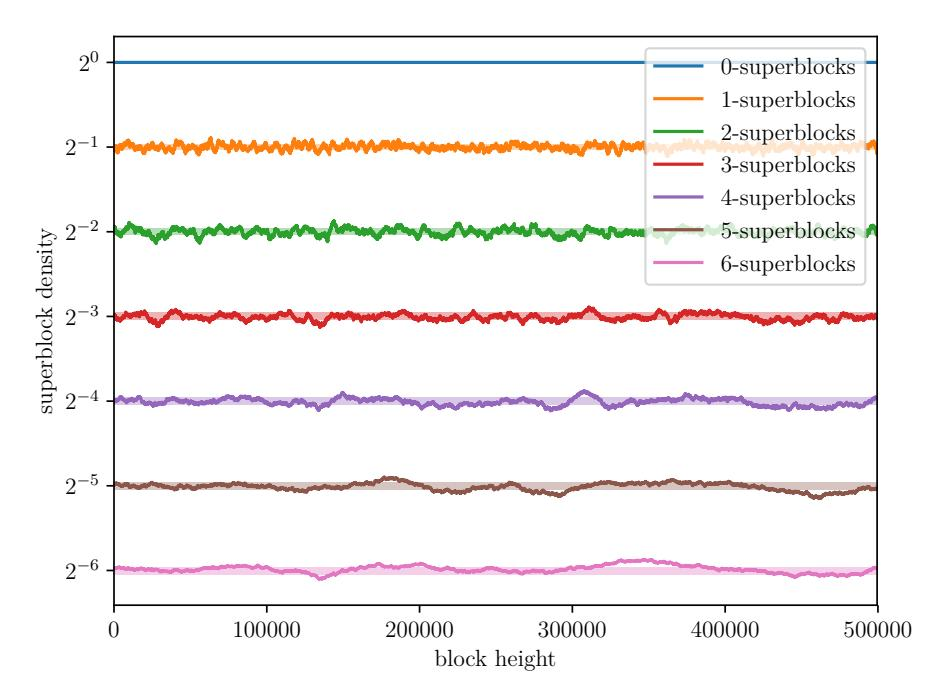
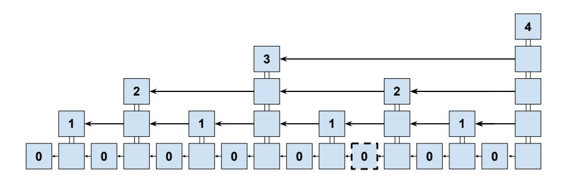
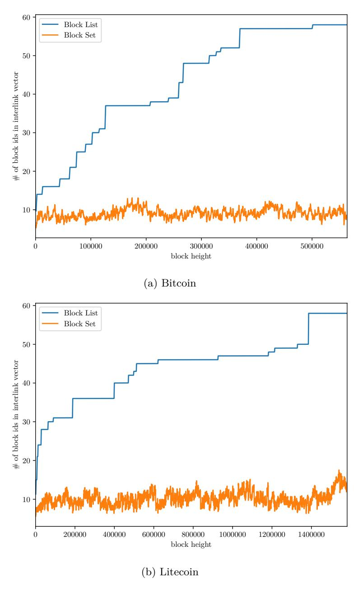
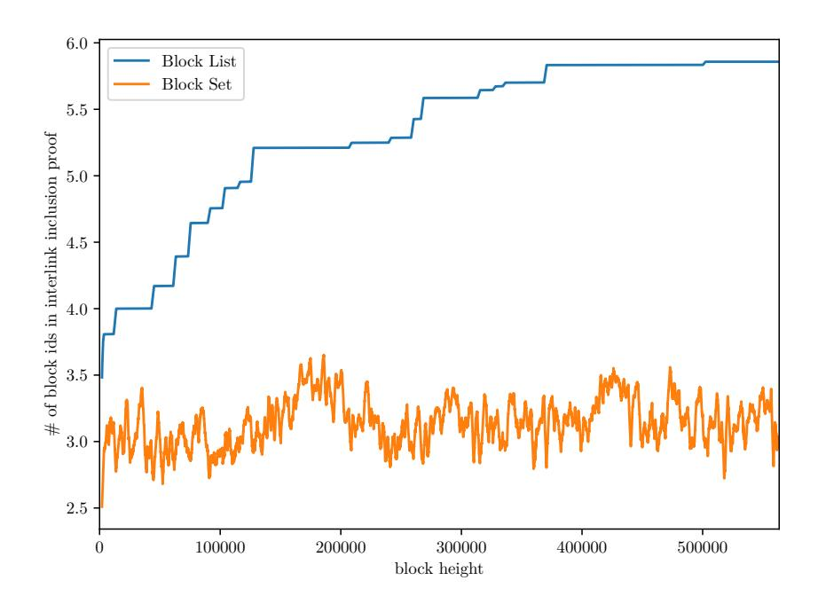
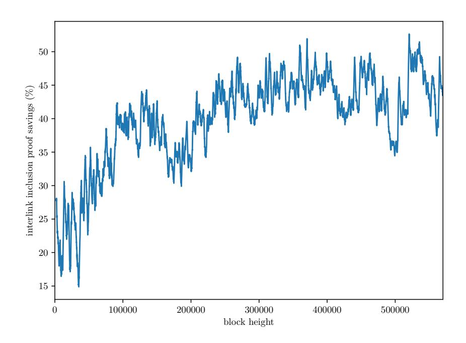

# **Compact Storage of Superblocks for NIPoPoW Applications**

Kostis Karantias<sup>1</sup> , Aggelos Kiayias2*,*<sup>4</sup> , Nikos Leonardos<sup>3</sup> , and Dionysis Zindros3*,*<sup>4</sup>

<sup>1</sup> University of Ioannina <sup>2</sup> University of Edinburgh <sup>3</sup> University of Athens <sup>4</sup> IOHK

**Abstract.** Blocks in proof-of-work (PoW) blockchains satisfy the PoW equation *H*(*B*) ≤ *T*. If additionally a block satisfies *H*(*B*) ≤ *T*2 −*µ* , it is called a *µ*-*superblock*. Superblocks play an important role in the construction of compact blockchain proofs which allows the compression of PoW blockchains into so-called *Non-Interactive Proofs of Proof-of-Work* (NIPoPoWs). These certificates are essential for the construction of *superlight* clients, which are blockchain wallets that can synchronize exponentially faster than traditional SPV clients.

In this work, we measure the distribution of superblocks in the Bitcoin blockchain. We find that the superblock distribution within the blockchain follows expectation, hence we empirically verify that the distribution of superblocks within the Bitcoin blockchain has not been adversarially biased. NIPoPoWs require that each block in a blockchain points to a sample of previous blocks in the blockchain. These pointers form a data structure called the *interlink*. We give efficient ways to store the interlink data structure. Repeated superblock references within an interlink can be omitted with no harm to security. Hence, it is more efficient to store a *set* of superblocks rather than a *list*. We show that, in honest executions, this simple observation reduces the number of superblock references by approximately a half in expectation. We then verify our theoretical result by measuring the improvement over existing blockchains in terms of the interlink sizes (which we improve by 79%) and the sizes of succinct NIPo-PoWs (which we improve by 25%). As such, we show that deduplication allows superlight clients to synchronize 25% faster.

# **1 Introduction**

Bitcoin [\[20\]](#page-17-0) and other blockchains which use the same backbone consensus mechanism [\[12\]](#page-17-1) use Simple Payment Verification (SPV) to shorten the synchronization time for lightweight clients, where the clients need to download block headers instead of whole blocks. Recently, a line of work has introduced *superlight* clients, which do not require all blockchain headers to be downloaded, but, rather, only a sample of them. This sample consists of blocks which happen to achieve a higher difficulty than the required one, and are thus termed *superblocks*.

By sampling the superblocks of a chain, short proofs about a blockchain can be created, which allow a client to synchronize with the longest blockchain without downloading all blocks. These so-called *proofs of proofof-work* contain only a small number of cleverly chosen superblocks which compact the proof-of-work of the blockchain into a succinct string, while maintaining the same security level as SPV clients. However, while the protocol has even been deployed in practice, the distribution of superblocks within a blockchain has not been previously measured. In this paper, we provide measurements of this distribution for the Bitcoin blockchain.

In order for superblock sampling to work, it is necessary that each block contains, in addition to the standard pointer to its previous block, a few select pointers to some preceding superblocks. These pointers are organized in a special data structure, the *interlink*. For relevant applications such as superlite clients and cross-chain transfers, it is critical that the interlink structure is compact. We measure the size of the interlink structure and provide a simple novel optimization which can bring down its size to less than a half. We then study the impact of this improvement on the size of proofs of proof-of-work.

**Related work.** Superblocks were first observed to exist in [\[19\]](#page-17-2). The interlink data structure was put forth in [\[15\]](#page-17-3), where it was also observed that it can be organized into a Merkle tree. Interlinks containing all the blocks of the blockchain have been proposed in [\[4\]](#page-16-0). Superblock interlinks have been included from genesis in cryptocurrencies such as ERGO [\[8\]](#page-17-4) and nimiq [\[9\]](#page-17-5). Complete blockchain interlinks have been proposed for Ethereum [\[6\]](#page-16-1). Nimiq and ERGO have independently applied interlink deduplication in practice to save space [\[5](#page-16-2)[,8\]](#page-17-4). In [\[16\]](#page-17-6), the consumption of the interlink data to construct Non-Interactive Proofs of Proof-of-Work was presented and concrete numbers were given about the sizes of such proofs. They also presented a way to construct such a structure without a soft or hard fork, but a backwards compatible *velvet fork*, which was later explored in [\[24\]](#page-17-7). Bitcoin Cash has been velvet forked in this manner [\[13\]](#page-17-8). Beyond superlight clients, another application of NIPoPoWs are cross-chain transfers [\[17\]](#page-17-9) between proof-of-work blockchains. Comparable constructions have also appeared for proof-of-stake blockchains [\[14\]](#page-17-10).

**Our contributions.** The contributions of this paper are summarized as follows:

1. We measure superblock distributions in Bitcoin. We observe that the distribution of superblocks follows expectation, indicating there are no ongoing or historical attempts to bias the distribution of superblocks

- (so-called *badness* attacks [\[16\]](#page-17-6)). We are the first to collect any empirical measurements of superblocks on real blockchains.
- 2. We describe the simple but important optimization in regards to the way blocks are compactly stored in an interlink tree by observing that duplicate pointers can be removed without harming security. As such, we construct interlink *block sets* instead of interlink *block lists*. [1](#page-2-0)
- 3. We prove that our optimization reduces the number of pointers in each interlink by a half in expectation.
- 4. We evaluate our improvement on the Bitcoin blockchain and collect empirical data regarding the performance of our improvement, including concrete sizes of NIPoPoWs built. We experimentally demonstrate that our optimization reduces interlink vector sizes by 79% on average and the already very succinct NIPoPoW certificates by 25% on average.

# **2 Superblocks and proofs-of-proofs**

Blocks generated in proof-of-work [\[11\]](#page-17-11) systems must satisfy the proofof-work equation *H*(*B*) ≤ *T* where *T* denotes the mining target [\[3\]](#page-16-3) and *B* denotes the block contents, which is a triplet including a representation of the application data and metadata, a nonce, and a reference to the previous block by its hash. The function *H* is a hash function, modelled as a random oracle [\[2\]](#page-16-4), which outputs *κ* bits, where *κ* is the security parameter of the protocol and *T <* 2 *κ* . It sometimes happens that some blocks satisfy a stronger version of the equation [\[15\]](#page-17-3), namely that *H*(*B*) ≤ *T*2 −*µ* for some *µ* ∈ N. Such blocks are called *µ*superblocks [\[16\]](#page-17-6). It follows directly from the Random Oracle model that Pr[*B* is a *µ*-superblock|*B* is a valid block] = 2−*<sup>µ</sup>* . Note that if a block is a *µ*-superblock for some *µ >* 0, then it is also a (*µ* − 1)-superblock. We denote the maximum *µ* of a block *B* its *level*(*B*) = blg(*T*) − lg(*H*(*B*))c.

The count of superblocks in a chain decreases exponentially as *µ* increases. If a blockchain C generated in an honest execution has |C| blocks, it only has 2 −*µ* |C| superblocks of level *µ* in expectation. Hence, the total number of levels is lg(|C|) in expectation. It has been theoretically posed that the distribution of superblocks can be adversarially biased in so-called "badness" attacks [\[16\]](#page-17-6) in which an adversary reduces the density of superblocks of a particular level within a blockchain. However, the actual distribution of superblocks in currently deployed blockchains

<span id="page-2-0"></span><sup>1</sup> The deduplication optimization has already been discovered and deployed independently by the Nimiq and the ERGO blockchains [\[5,](#page-16-2)[8\]](#page-17-4), but with no further analysis.

has not been measured. Therefore, it was previously unknown whether such attacks are taking place in the wild. In this paper, we make empirical measurements of superblock distributions and observe that they follow the expectation. Hence, we conclude that widespread badness attacks have not occurred in practice, confirming previous suspicions that such attacks are costly to mount.

For any block *B*, it is useful to be able to refer to its most recent preceding *µ*-superblock for any *µ* ∈ N. In addition, it is useful to include this reference within the contents of the block to which proof-of-work is being applied so that the miner proves that she had knowledge of the preceding superblock when *B* was generated. For this purpose, it has been recommended [\[16\]](#page-17-6) that for each block *B*, instead of including only a pointer to the previous block, lg(|C|) pointers will be included, one for each level *µ* pointing to the most recent *µ*-superblock preceding *B*. Hence, under this modification, every block contains a pointer to its most recent 0-superblock ancestor, its most recent 1-superblock ancestor, and so on, of which there are lg(|C|). These pointers change the blockchain into a block skiplist [\[22,](#page-17-12)[21\]](#page-17-13).

These lg(|C|) pointers per block are called the *interlink*. One way to include them is to replace the previd pointer, which in typical blockchains points to the previous block hash, with the interlink list of block hashes to be included *verbatim* in the block header. Alternatively, the interlink list of hashes can be organized into a compact data structure such as a Merkle tree [\[18\]](#page-17-14) containing one leaf per superblock level *µ*. The number of leafs in this Merkle tree is lg(|C|) and its height is lg lg(|C|). Hence, proofs-of-inclusion in this Merkle tree are of size *Θ*(lg lg(|C|)). The root of this Merkle tree can be included in the block header, replacing previd. This is done in blockchains adopting interlinking from genesis or through a hard fork [\[9](#page-17-5)[,8\]](#page-17-4).

More commonly, to avoid modifying the block header format, the interlink Merkle tree root can be included in the block's application data. In this case, the root of the Merkle tree appears as auxiliary data within a particular transaction which is included in the block. If the miners of the blockchain are aware of the interlink, then it can be required that they included it in their coinbase transaction. The veracity of the interlink data does not need to be verified when it is included in a block, as invalid or malicious data in the interlink does not harm security. Hence, it is possible to include the interlink data in a user transaction. In this case, the transaction which includes the root of the interlink is called a *velvet transaction* and its inclusion is termed a *user-activated velvet fork* [\[13\]](#page-17-8). In practice, this transaction is implemented using an OP\_RETURN [\[1\]](#page-16-5) committing to the Merkle tree root containing the interlink list in its leafs. User-activated velvet forks allow the adoption of a new rule without requiring miners to upgrade their software or be aware of the change, and are hence backwards-compatible.

It is useful to be able to prove that a block *B* contains a pointer to a particular ancestor *B*<sup>0</sup> in its interlink. This statement is proven by a full node who holds all blockchain data, the *prover P*, to a superlight *verifier V* who holds only the header of block *B*. This proof is straightforward. The header of block *B* contains the Merkle tree root of the transactions tree *mtr*<sup>1</sup> and is hence known to *V* . First, a Merkle tree proof-of-inclusion *π*<sup>1</sup> proves that *mtr*<sup>1</sup> contains the velvet transaction *tx*. The velvet transaction *tx* commits to auxiliary data which includes the interlink Merkle tree root *mtr*2. Secondly, another Merkle tree proof-of-inclusion *π*<sup>2</sup> proves that *mtr*<sup>2</sup> contains the hash of *B*<sup>0</sup> . While we cannot improve the size of *π*1, in this paper we describe the improvement in the size of *π*2.

Superblock pointers can be used to traverse the blockchain from the tip back to Genesis in a manner which skips some unnecessary intermediary blocks and includes others. The idea is to convince a superlight verifier *V* , which only has access to the Genesis block, that a particular blockchain is the longest one without presenting all block headers. Blocks of interest that are part of the longest chain can then be revealed to *V* in order to convince them that a particular transaction has been confirmed. In order to do that, *P* finds a succinct sample of blocks and places it in chronological order. That sample is chosen such that each next block within the sample contains a pointer to its immediate ancestor within the sample by a commitment in the interlink vector. The prover *P* sends each block of the sample to *V* , along with a proof-of-inclusion for the respective pointer. The verifier *V* can check if the correct pointer has been included. By cleverly choosing which blocks to collect, a full node can prove to a superlight node that the currently adopted longest blockchain is the claimed one without presenting the whole blockchain. Hence, instead of transmitting data linear in the chain size *Θ*(|C|) as SPV clients do, it is sufficient to transmit succinct certificates which are only of size *Θ*(*poly* log(|C|)). Such certificates are called Non-Interactive Proofs of Proof-of-Work [\[16\]](#page-17-6). In this paper, we are not concerned about the mechanism by which the NI-PoPoWs protocol samples blocks, but only the number of blocks in these samples and the sizes of their proofs-of-inclusion, which we optimize here.

The NIPoPoWs protocol is parameterized by a security parameter *m*. The number of blocks |*π*| in a given Non-Interactive Proof of Proof-ofWork sample is as follows. For each superblock level *µ* ∈ N, consider the blocks in the honestly adopted blockchain C. Among these, some are of level *µ*, so denote the count of *µ*-level superblocks in C as |C↑*<sup>µ</sup>* |. If |C↑*<sup>µ</sup>* | ≥ *m*, then we call *µ* an *included level*. Consider the maximum included level max *µ*. It has been proven [\[16\]](#page-17-6) that max *µ* = lg(|C|) − lg(*m*). The proof *π* contains 1*.*5*m* blocks for the maximum included level and *m* additional blocks for each lower level in expectation. Hence the number of blocks in a NIPoPoW is |*π*| = 1*.*5*m* + *m* max *µ* = 1*.*5*m* + *m*(lg(|C|) − lg(*m*)). For each of these blocks, the proof contains the block hash and the respective proofs-of-inclusion for the pointer to the preceding ancestor. In this paper, we optimize the size of these proofs-of-inclusion, which gives a direct improvement to the size of such proofs *π*. We note that, in our proposed construction, we do not decrease the number of required blocks in *π*, only the bytes that need to be transmitted for it on the network.

The size of these proofs is critical. As the majority of the time needed for mobile wallets to perform the initial synchronization with the network is spent on downloading block headers from the network, bringing down the proof size directly improves the performance of superlight clients. In the context of cross-chain transfers [\[17\]](#page-17-9), these proofs are posted and persistently stored in smart contracts [\[7,](#page-16-6)[23\]](#page-17-15) within blockchains which function as SPV verifiers for other blockchains [\[10\]](#page-17-16). Improving their size has direct financial impact on the protocol, as a larger size incurs a larger gas cost for storage purposes in case such proofs are stored within Ethereum.

#### **3 Superblock distributions in deployed cryptocurrencies**

We measured the superblock distribution in the mainnet Bitcoin blockchain. Our results are illustrated in Figure [1.](#page-6-0) As expected, half the blockchain blocks are 1-superblocks, 1*/*4 of blocks are 2-superblocks and generally approximately 2 <sup>−</sup>*<sup>µ</sup>* of the blockchain blocks are *µ*-superblocks. The horizontal axis denotes the block height, while the vertical axis denotes the superblock density with respect to the variable difficulty target of each block, in logarithmic scale.

We performed these measurements as follows. We downloaded the whole bitcoin blockchain from the Genesis block up to the current tip of the blockchain (at the time of writing 563*,*451). We then plotted the density for each level *µ* = 0 *. . .* 6. For the particular level, we traversed the blockchain using a sliding window of 1000(2*<sup>µ</sup>* ) + 1 blocks. Within that sliding window, we measured how many blocks of level *µ* exist, and plotted the ratio of the count of these superblocks within the window to

<span id="page-6-0"></span>

Fig. 1: Distribution of block levels in Bitcoin. Superblocks are with respect to variable difficulty targets. Shaded area indicates  $\pm 1\sigma$ .

the window size. The plot for level 0 is flat, as all blocks are 0-superblocks. The high-frequency erratic behavior is due to the probabilistic nature of block generation. We conjecture that lower frequency patterns, especially those aligned between multiple levels, are due to difficulty adjustment which incorrectly predicted the underlying computational power for a given epoch (e.g., due to rapidly changing costs in mining hardware or cryptocurrency prices).

#### <span id="page-6-1"></span>4 Interlinks as sets of superblocks

In superblock-enabled blockchains, the interlink vector stored in each block B contains one pointer per superblock level  $\mu$ , namely a pointer to the most recent superblock preceding B of the respective level  $\mu$ . This construction, known as an *interlink list*, is realized by inductively updating the interlink of the previous block, as shown in Algorithm 1. The algorithm works as follows. Trivially, genesis has an empty interlink vector, which forms our inductive basis. Given a newly mined block B' which

already has an interlink vector (the inductive hypothesis), we wish to construct the interlink vector to be included in the next block, which will point to *B*<sup>0</sup> itself as well as some of the blocks that *B*<sup>0</sup> points to. This is done by inspecting the existing interlink, *B*<sup>0</sup> *.*interlink, and constructing a new interlink interlink by replacing all the entries in *B*<sup>0</sup> *.*interlink that are of level less than or equal to that of *B*<sup>0</sup> with *B*<sup>0</sup> itself.

### <span id="page-7-0"></span>**Algorithm 1** updateInterlink

```
1: function updateInterlink(B
                             0
                             )
2: interlink ← B
                  0
                   .interlink
3: for µ = 0 to level(B
                         0
                          ) do
4: interlink[µ] ← H(B
                           0
                            )
5: end for
6: return interlink
7: end function
```

### <span id="page-7-1"></span>**Algorithm 2** Our proposed algorithm, updateInterlinkSet

```
1: function updateInterlinkSet(B
                              0
                              )
2: interlinkSet ← {H(B
                        0
                        )}
3: for H(B) ∈ B
                  0
                   .interlink do
4: if level(B) > level(B
                           0
                           ) then
5: interlinkSet ← interlinkSet ∪ {H(B)}
6: end if
7: end for
8: return interlinkSet
9: end function
```

Here, we make the simple observation that the interlink structure constructed in this manner often contains *duplicate pointers*. In fact, as we will show, most of the interlink pointers are duplicate. Space can be saved by constructing an *interlink set* instead. This construction is shown in Algorithm [2.](#page-7-1) The algorithm returns the exact same data structure as Algorithm [1,](#page-7-0) but with duplicates removed. The algorithm operates as follows. Given an existing interlink set, *B*<sup>0</sup> *.*interlinkSet, it produces a new set interlinkSet which contains *B*<sup>0</sup> and all the same blocks as *B*<sup>0</sup> *.*interlinkSet with the exception of those that are of equal or inferior superblock level to *B*0 . Naturally, when this interlink set is to be committed to a Merkle tree, it must be ordered in a canonical matter (for example, by increasing block level) so that its root can be deterministically reproduced and detected. This canonical ordering may now not be trivial as was in the case for interlink lists and must be specified by the implementation.

We remark that it does not matter for security purposes whether duplicates are removed. The reason is that the prover has access to the whole list of blocks references within the interlink Merkle tree, and hence can choose the one it needs. On the other hand, the verifier only needs to ensure that the claimed superblock level is attained, but this can be done directly by inspecting the hash sent to it by the prover.

We now analyze the savings attained by the above method. We first analyze the savings in a thought experiment of an ideal, deterministic execution of the blockchain protocol. While this setting is not realistic, it provides good intuition about the interlink structure. Subsequently, we analyze the real probabilistic blockchain protocol. Consider a blockchain of *n* blocks.

**Definition 1 (Interlink mask).** *Define the* interlink mask *of a block B to be the bitstring containing one bit per superblock level µ. At the position µ, the bitstring contains a* 1 *if the most recent µ-superblock ancestor of B differs from the most recent* (*µ* + 1)*-superblock ancestor of B, or if no* (*µ* + 1)*-superblock ancestor exists. Otherwise, it contains a* 0*.*

This mask contains a 0 at the position of duplicates which can be eliminated. To measure the efficiency of our optimization scheme, we wish to count how many 0s are contained in the interlink mask of a given block. Consider, for example, the block highlighted with a dashed border in Figure [2.](#page-9-0) Its interlink vector will have an interlink mask of 0101. The first 0 is due to the previous block which happened to be a 1-superblock. The latter 0 is due to the most recent 3-superblock overshadowing the preceding 2-superblock.

In our deterministic thought experiment, consider a blockchain which grows as illustrated in Figure [2.](#page-9-0) In this blockchain, every block is a 0 superblock, every other block is a 1-superblock, every fourth block is a 2-superblock and generally every 2 *µ* -th block is a *µ*-superblock. In this thought experiment, the interlink mask behaves like a binary number which is increased by 1 after every block is generated. As such, it will be a *µ*-digit binary number. As the process passes through all *µ*-digit binary numbers, the number of 0s and 1s is on average equal. Hence, the savings obtained in the deterministic case are exactly 50%.

<span id="page-9-0"></span>

Fig. 2: A thought experiment of a deterministically generated blockchain

## <span id="page-9-1"></span>**Algorithm 3** The Turing Machine modeling interlink generation.

```
1: function run(tape)
2: µ ← 0
3: while true do
4: b
         $← {0, 1}
5: if b = 1 then
6: tape[µ] ← 1
7: return
8: end if
9: tape[µ] ← 0
10: µ ← µ + 1
11: end while
12: return tape
13: end function
```

Consider now the probabilistic setting of a real blockchain in an honest execution, where each block generated has an independent probability of belonging to a given level. The process of block generation can be modelled precisely as follows. Consider the Turing Machine illustrated in Algorithm [3.](#page-9-1) We begin with a one-sided infinite tape filled with the special symbol t. We then run the machine illustrated in Algorithm [3](#page-9-1) repeatedly over the same tape *n* times. Once we have completed the *n* runs, the tape contains a binary string, which follows the same distribution as the interlink mask of the *n* th block of a blockchain. Each run of Algorithm [3](#page-9-1) corresponds to a generation of a block. The algorithm begins at the position *µ* = 0 of the tape. It flips a fair coin *b*. If the coin turns out to be 1, the machine writes 1 to the current position of the tape and exits. This is the event that the block generated has level exactly 0. Otherwise, if the coin *b* is a 0, then the block generated has level above 0, and so the first position of the interlink mask will be overwritten by a 0. The machine then advances and continues to flip coins and overwriting the tape with 0s until a 1 coinflip is attained, at which point it writes a 1 and halts. The probability of the machine halting at position *µ* or later is 2 −*µ* , modeling the probability of a block being a *µ*-superblock. The machine overwrites with 0 the positions in the tape which are of inferior level compared to the block level it will generate at the given run. This is the same process by which superblocks of higher level overshadow preceding superblocks of lower levels by occupying their space with duplicate pointers that can be eliminated.

Let *B<sup>n</sup> <sup>µ</sup>* ∈ {0*,* 1} denote the random variable containing the value of the *µ* th digit after *n* such runs. We have that:

$$\Pr[B_{\mu}^{n} = 1] = \sum_{i=1}^{n} 2^{-\mu} \prod_{j=i+1}^{n} \sum_{\mu'=1}^{\mu-1} 2^{-\mu'} = \sum_{i=1}^{n} 2^{-\mu} \prod_{j=i+1}^{n} (1 - 2^{1-\mu}) = \sum_{i=1}^{n} 2^{-\mu} (1 - 2^{1-\mu})^{n-(i+1)+1} = \frac{1}{2} (1 - (1 - 2^{1-\mu})^{n})$$

Let *B<sup>n</sup>* denote the number of 1s in the interlink mask after *n* runs. Its expectation is then

$$\mathbb{E}[B^n] = \mathbb{E}\left[\sum_{\mu=1}^{\infty} B_{\mu}^n\right] = \sum_{\mu=1}^{\infty} \frac{1}{2} (1 - (1 - 2^{1-\mu})^n) = \frac{1}{2} \sum_{i=1}^{n} (-1)^{i+1} \binom{n}{i} \frac{2^i}{2^i - 1}$$

We will now show that the savings from the interlink set technique are significant, specifically that E[*B<sup>n</sup>* ] *<* 1 2 lg(*n*) + *O*(1).

**Lemma 1.** *For any integers i >* 0 *and k* ≥ 0*,*

$$\frac{2^{i}}{2^{i}-1} = \frac{1}{2^{(k+1)i}-2^{ki}} + \sum_{j=0}^{k} 2^{-ij}$$

*Proof.* The left-hand side is an infinite geometric series:

$$\sum_{j=0}^{\infty} (2^{-i})^j = \frac{2^i}{2^i - 1}$$

We can split it up at some arbitrary index *k* ≥ 0:

$$\sum_{j=0}^{\infty} (2^{-i})^j = \sum_{j=0}^{k} 2^{-ij} + \sum_{j=k+1}^{\infty} (2^{-i})^j$$

Applying the formula for geometric series sum from *j* = *k* + 1 to ∞ on the second term, we obtain:

$$\sum_{j=0}^k 2^{-ij} + \sum_{j=k+1}^\infty (2^{-i})^j = \sum_{j=0}^k 2^{-ij} + \frac{2^{-i(k+1)}}{1-2^{-i}} = \sum_{j=0}^k 2^{-ij} + \frac{1}{2^{i(k+1)}-2^{ik}}$$

**Lemma 2.** *For any positive integers n and k* = dlg(*n*)e*,*

$$-\sum_{i=1}^{n} (-1)^{i} \binom{n}{i} \sum_{j=0}^{k} 2^{-ij} < \lg(n) + 2$$

*Proof.*

$$-\sum_{i=1}^{n} (-1)^{i} \binom{n}{i} \sum_{j=0}^{k} 2^{-ij} = k+1 - \sum_{j=0}^{k} \sum_{i=0}^{n} (-1)^{i} \binom{n}{i} 2^{-ij}$$
$$= k+1 - \sum_{j=0}^{k} \sum_{i=0}^{n} \binom{n}{i} (-2^{-j})^{i}$$
$$= k+1 - \sum_{j=0}^{k} (1-2^{-j})^{n} < \lg(n) + 2$$

**Lemma 3.** *For any positive integer n and k* = dlg(*n*)e*,*

$$-\sum_{i=1}^{n} (-1)^{i} \binom{n}{i} \frac{1}{2^{(k+1)i} - 2^{ki}} < e$$

Proof.

$$-\sum_{i=1}^{n} (-1)^{i} \binom{n}{i} \frac{1}{2^{(k+1)i} - 2^{ki}} \le \sum_{i=1}^{n} \binom{n}{i} \frac{1}{2^{(k+1)i} - 2^{ki}}$$

$$= \sum_{i=1}^{n} \binom{n}{i} \frac{1}{2^{ki} (2^{i} - 1)}$$

$$\le \sum_{i=1}^{n} \binom{n}{i} \frac{1}{2^{ki}}$$

$$\le \sum_{i=0}^{n} \binom{n}{i} \frac{1}{n^{i}}$$

$$= (1 + \frac{1}{n})^{n} < e$$

Theorem 1 (Savings).  $\mathbb{E}[B^n] < \frac{1}{2}(\lg(n) + 2 + e)$ .

Proof.

$$\begin{split} \mathbb{E}[B^n] &= -\frac{1}{2} \sum_{i=1}^n (-1)^i \binom{n}{i} \frac{2^i}{2^i - 1} \\ &= \frac{1}{2} ((-\sum_{i=1}^n (-1)^i \binom{n}{i} \sum_{j=0}^k 2^{-ij}) + (-\sum_{i=1}^n (-1)^i \binom{n}{i} \frac{1}{2^{(k+1)i} - 2^{ki}})) \\ &< \frac{1}{2} ((\lg(n) + 2) + e) \end{split}$$

We obtain that  $\mathbb{E}[B^n] < \frac{1}{2}(\lg(n)+2+e)$ . Therefore the expected savings are  $\lg(n) - \mathbb{E}[B^n] > \frac{1}{2}(\lg(n)-2-e)$ . Solving  $\frac{1}{2}(\lg(n)-2-e) > 0$  we obtain that n > 26 is sufficient for savings to exist. We conclude that the interlink set method performs better for blockchains with more than 26 blocks.

#### 5 Empirical analysis of improvement

In order to empirically assess the space efficiency of our improvement, we measured the size of the interlink data structure in the case of interlink

*lists*, the previously proposed format, and in the case of interlink *sets*, our newly proposed format. We performed our measurements on the mainnet for both Bitcoin and Litecoin. Our results are illustrated in Figure [3](#page-14-0) and are similar for both of these coins. The figures assume that both coins have been velvet forked from their genesis blocks to include the particular interlink vector format. This is indicative of the future performance of velvet forking each blockchain to add the respective interlink vector format.

The new data structure format yields savings of approximately 79% on average. Based on the theoretical analysis of Section [4,](#page-6-1) we expect to see approximately an improvement of 50% in this structure. The extra 29% is due to the historical explosion of difficulty in the mining power in both cryptocurrencies. The increased difficulty causes a lower variable difficulty target, meaning that the lowest portions of the superblock levels remain unoccupied, but are still accounted for in the interlink vector list approach.

Based on the sizes attained in the interlink vector of the Bitcoin blockchain, we organized the interlink vector into Merkle trees for both the list and the set structure and created proofs-of-inclusion of which we measured the size. The sizes of the inclusion proofs for the two constructions are illustrated in Figure [4,](#page-15-0) while the percentile savings are illustrated in Figure [5.](#page-16-7)

<span id="page-13-0"></span>

|                 | Interlink size |       | Proof-of-inclusion size NIPoPoW size |       |      |
|-----------------|----------------|-------|--------------------------------------|-------|------|
|                 | blockhashes    | bytes | hashes                               | bytes | KB   |
| Interlink lists | 43.12          | 1380  | 5.7                                  | 183   | 65.7 |
| Interlink sets  | 9.04           | 289   | 3.6                                  | 116   | 49   |

Table 1: A comparison of the two interlink constructions in terms of size.

We summarize the savings of our construction in Table [1.](#page-13-0) The table was constructed by inspecting the Bitcoin blockchain at the time of writing. The interlink size column shows the average interlink vector size, in the number of block hashes and in concrete bytes assuming the SHA256 function is used (as in Bitcoin). The proof-of-inclusion size column shows the average size of a Merkle proof-of-inclusion, in the number of hashes and in bytes, when the interlink vector is compacted into a Merkle tree using SHA256. Finally, the NIPoPoW size column shows the size of a

<span id="page-14-0"></span>

Fig. 3: A comparison of interlink vector sizes for interlink block lists and interlink block sets in two popular blockchains (lower is better)

<span id="page-15-0"></span>

Fig. 4: A comparison of a proof-of-inclusion size in the case of interlink block lists and interlink block sets in Bitcoin (lower is better)

NIPoPoW in kilobytes (excluding the last k blocks of the chain which must be sent verbatim irrespectively of which synchronization protocol is used). The NIPoPoW sizes are calculated assuming Bitcoin had included the respective interlink Merkle tree root in their headers since genesis. We measured the size of suffix-proof NIPoPoWs based on the recommended parameter m=15 [16] assuming a chain size of |C|=563,451. The number of blocks in a NIPoPoW is  $(m(\lg |C|-\lg m)+1.5m)=250$  in expectation. For the final size calculation of the NIPoPoW, we included all the data required: The proofs-of-inclusion (based on the size given on the previous column) and the block headers needed (80 bytes per block). Our results indicate 79% savings in the interlink sizes and 25% savings in the NIPoPoW sizes.

<span id="page-16-7"></span>

Fig. 5: Percentile savings of the block set construction compared to the block list construction.

## **References**

- <span id="page-16-5"></span>1. Massimo Bartoletti and Livio Pompianu. An analysis of Bitcoin OP\_RETURN metadata. In *International Conference on Financial Cryptography and Data Security*, pages 218–230. Springer, 2017.
- <span id="page-16-4"></span>2. Mihir Bellare and Phillip Rogaway. Random oracles are practical: A paradigm for designing efficient protocols. In V. Ashby, editor, *ACM CCS 93*, pages 62–73. ACM Press, November 1993.
- <span id="page-16-3"></span>3. Joseph Bonneau, Andrew Miller, Jeremy Clark, Arvind Narayanan, Joshua A. Kroll, and Edward W. Felten. SoK: Research perspectives and challenges for bitcoin and cryptocurrencies. In *2015 IEEE Symposium on Security and Privacy*, pages 104–121. IEEE Computer Society Press, May 2015.
- <span id="page-16-0"></span>4. Benedikt Bünz, Lucianna Kiffer, Loi Luu, and Mahdi Zamani. FlyClient: Super-Light Clients for Cryptocurrencies. Cryptology ePrint Archive, Report 2019/226. [https://eprint](https://eprint.iacr.org/2019/226)*.*iacr*.*org/2019/226, 2019.
- <span id="page-16-2"></span>5. Sven Buschbeck. Nimiq developer reference. Available at: [https://nimiq](https://nimiq-network.github.io/developer-reference/chapters/block.html#interlink)network*.*github*.*[io/developer-reference/chapters/block](https://nimiq-network.github.io/developer-reference/chapters/block.html#interlink)*.*html#interlink, 2018.
- <span id="page-16-1"></span>6. Vitalik Buterin. EIP 210: Blockhash refactoring. Technical report, Feb 2017.
- <span id="page-16-6"></span>7. Vitalik Buterin et al. A next-generation smart contract and decentralized application platform. *white paper*, 2014.

- <span id="page-17-4"></span>8. Alexander Chepurnoy, Dmitry Meshkov, Ilya Oskin, Mike Aksarin, Andrey Andreev, Alexander Slesarenko, Denys Zadorozhnyi, and Guillermo Manzanares. Ergo. Available at: [https://ergoplatform](https://ergoplatform.org)*.*org, 2018.
- <span id="page-17-5"></span>9. Elion Chin, Philipp von Styp-Rekowsky, and Robin Linus. Nimiq. Available at: [https://nimiq](https://nimiq.com)*.*com, 2018.
- <span id="page-17-16"></span>10. Georgios Christoglou. Enabling crosschain transactions using NIPoPoWs. Master's thesis, Imperial College London, 2018.
- <span id="page-17-11"></span>11. Cynthia Dwork and Moni Naor. Pricing via processing or combatting junk mail. In Ernest F. Brickell, editor, *CRYPTO'92*, volume 740 of *LNCS*, pages 139–147. Springer, Heidelberg, August 1993.
- <span id="page-17-1"></span>12. Juan A. Garay, Aggelos Kiayias, and Nikos Leonardos. The bitcoin backbone protocol: Analysis and applications. In Elisabeth Oswald and Marc Fischlin, editors, *EUROCRYPT 2015, Part II*, volume 9057 of *LNCS*, pages 281–310. Springer, Heidelberg, April 2015.
- <span id="page-17-8"></span>13. Kostis Karantias. Enabling NIPoPoW Applications on Bitcoin Cash. Master's thesis, University of Ioannina, Ioannina, Greece, 2019.
- <span id="page-17-10"></span>14. Aggelos Kiayias, Peter Gaži, and Dionysis Zindros. Proof-of-stake sidechains. In *IEEE Symposium on Security and Privacy*. IEEE, 2019.
- <span id="page-17-3"></span>15. Aggelos Kiayias, Nikolaos Lamprou, and Aikaterini-Panagiota Stouka. Proofs of proofs of work with sublinear complexity. In *International Conference on Financial Cryptography and Data Security*, pages 61–78. Springer, 2016.
- <span id="page-17-6"></span>16. Aggelos Kiayias, Andrew Miller, and Dionysis Zindros. Non-Interactive Proofs of Proof-of-Work, 2017.
- <span id="page-17-9"></span>17. Aggelos Kiayias and Dionysis Zindros. Proof-of-work sidechains. In *International Conference on Financial Cryptography and Data Security*. Springer, 2019.
- <span id="page-17-14"></span>18. Ralph C Merkle. A digital signature based on a conventional encryption function. In *Conference on the theory and application of cryptographic techniques*, pages 369–378. Springer, 1987.
- <span id="page-17-2"></span>19. Andrew Miller. The high-value-hash highway, bitcoin forum post, 2012.
- <span id="page-17-0"></span>20. Satoshi Nakamoto. Bitcoin: A peer-to-peer electronic cash system. Available at: [https://bitcoin](https://bitcoin.org/bitcoin.pdf)*.*org/bitcoin*.*pdf, 2008.
- <span id="page-17-13"></span>21. Thomas Papadakis. *Skip lists and probabilistic analysis of algorithms*. PhD thesis, University of Waterloo, 1993.
- <span id="page-17-12"></span>22. William Pugh. Skip lists: A probabilistic alternative to balanced trees. In *Workshop on Algorithms and Data Structures*, pages 437–449. Springer, 1989.
- <span id="page-17-15"></span>23. Gavin Wood. Ethereum: A secure decentralised generalised transaction ledger. *Ethereum Project Yellow Paper*, 151:1–32, 2014.
- <span id="page-17-7"></span>24. Alexei Zamyatin, Nicholas Stifter, Aljosha Judmayer, Philipp Schindler, Edgar Weippl, William Knottenbelt, and Alexei Zamyatin. A wild velvet fork appears! inclusive blockchain protocol changes in practice. In *International Conference on Financial Cryptography and Data Security*. Springer, 2018.