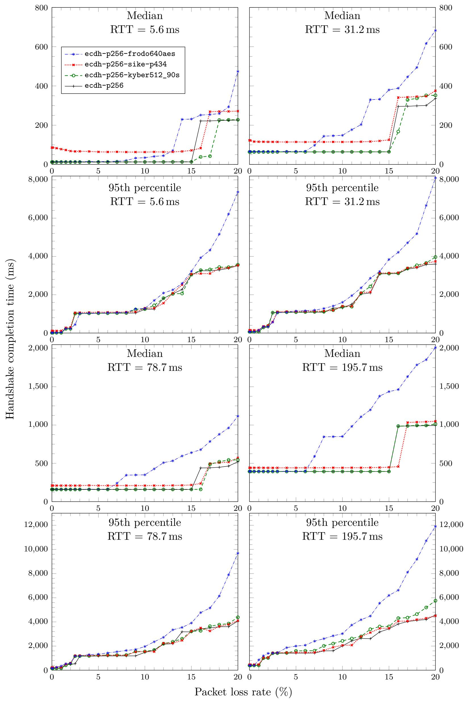
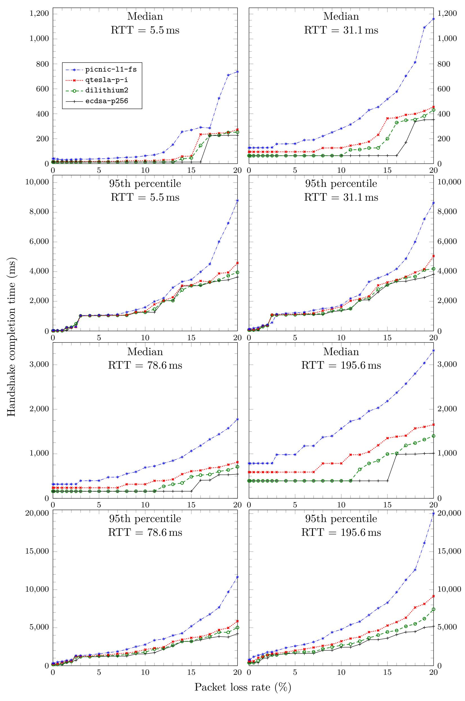
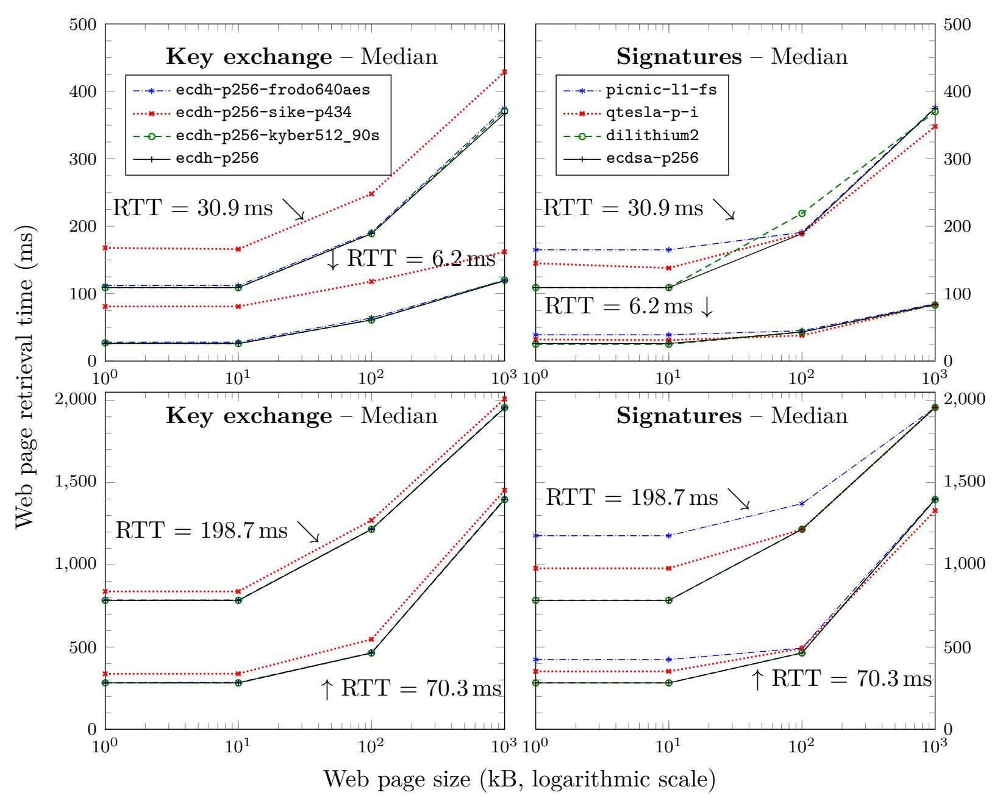
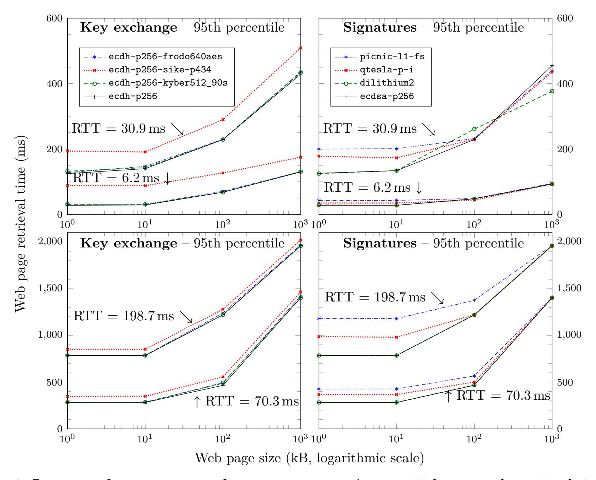
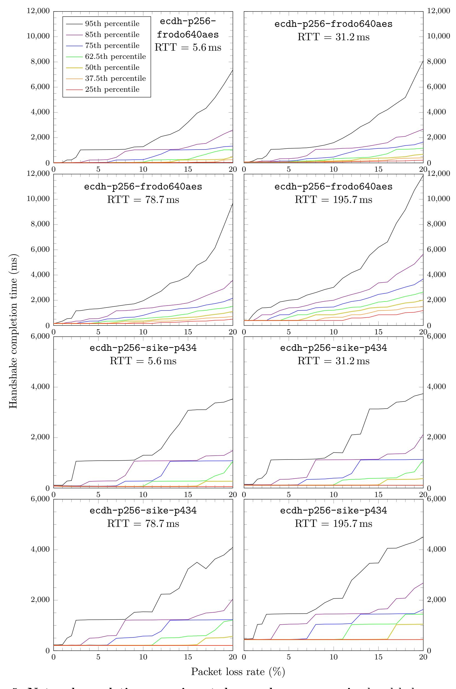
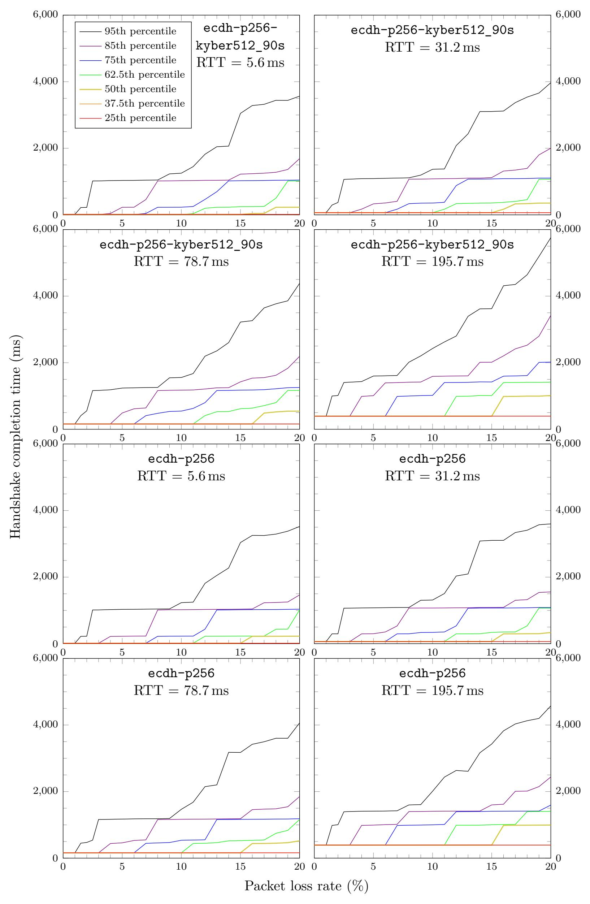
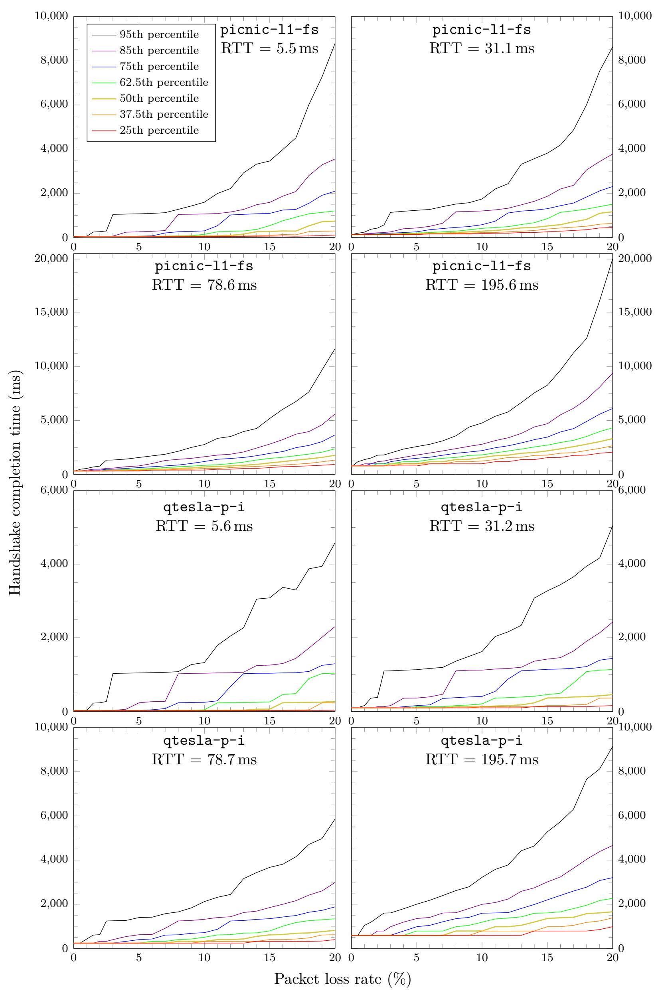
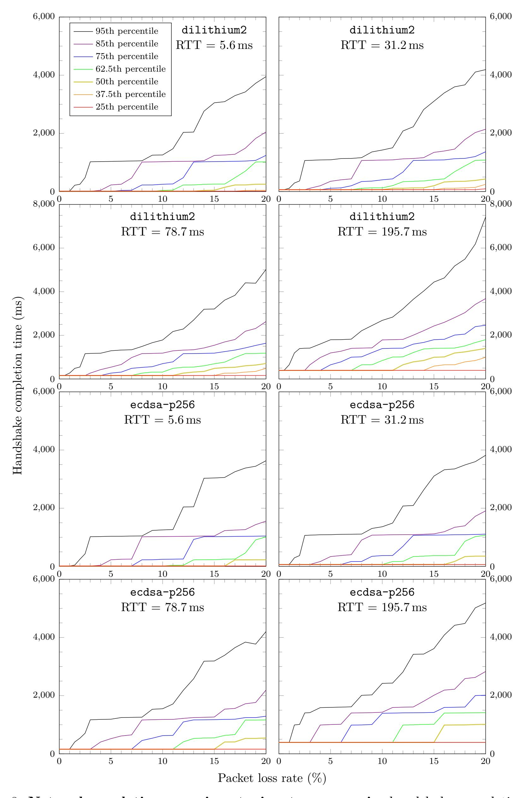

{0}------------------------------------------------

# **Benchmarking Post-Quantum Cryptography in TLS**

Christian Paquin

*Microsoft Research* cpaquin@microsoft.com

Douglas Stebila and Goutam Tamvada

*University of Waterloo* dstebila@uwaterloo.ca, gtamvada@edu.uwaterloo.ca

February 6, 2020

#### **Abstract**

Post-quantum cryptographic primitives have a range of trade-offs compared to traditional public key algorithms, either having slower computation or larger public keys and ciphertexts/signatures, or both. While the performance of these algorithms in isolation is easy to measure and has been a focus of optimization techniques, performance in realistic network conditions has been less studied. Google and Cloudflare have reported results from running experiments with post-quantum key exchange algorithms in the Transport Layer Security (TLS) protocol with real users' network traffic. Such experiments are highly realistic, but cannot be replicated without access to Internet-scale infrastructure, and do not allow for isolating the effect of individual network characteristics.

In this work, we develop and make use of a framework for running such experiments in TLS cheaply by *emulating* network conditions using the networking features of the Linux kernel. Our testbed allows us to independently control variables such as link latency and packet loss rate, and then examine the performance impact of various post-quantum-primitives on TLS connection establishment, specifically hybrid elliptic curve/post-quantum key exchange and post-quantum digital signatures, based on implementations from the Open Quantum Safe project. Among our key results, we observe that packet loss rates above 3–5% start to have a significant impact on post-quantum algorithms that fragment across many packets, such as those based on unstructured lattices. The results from this emulation framework are also complemented by results on the latency of loading entire web pages over TLS in real network conditions, which show that network latency hides most of the impact from algorithms with slower computations (such as supersingular isogenies).

### **1 Introduction**

Compared to traditional public key algorithms, post-quantum key encapsulation mechanisms (KEMs) and digital signature schemes have a range of trade-offs, either having slower computation, or larger public keys and ciphertexts/signatures, or both. Measuring the performance of these algorithms in isolation is easy; doing so accurately in the broader context of Internet protocols such as the Transport Layer Security (TLS) protocol, and under realistic network traffic conditions, is more difficult.

{1}------------------------------------------------

Alongside the development and standardization of post-quantum algorithms in the NIST Post-Quantum Cryptography Standardization project, there have been various efforts to begin preparing the TLS ecosystem for post-quantum cryptography. We can see at least three major lines of work: (draft) specifications of how post-quantum algorithms could be integrated into existing protocol formats and message flows [\[SWZ16,](#page-15-0) [CC19,](#page-13-0) [KK18,](#page-13-1)[WZFGM17,](#page-15-1) [SS17,](#page-14-0) [SFG19\]](#page-14-1); prototype implementations demonstrating such integrations can be done [\[Bra16,](#page-13-2) [Lan18a,](#page-13-3) [BCNS15,](#page-12-0) [BCD](#page-12-1)+16, [Ope19b,](#page-14-2) [Ope19c,](#page-14-3) [KS19,](#page-13-4) [KLS](#page-13-5)+19] and whether they would meet existing constraints in protocols and software [\[CPS19\]](#page-13-6); and performance evaluations in either basic laboratory network settings [\[BCNS15,](#page-12-0) [BCD](#page-12-1)+16] or more realistic network settings [\[Bra16,](#page-13-2) [Lan18b,](#page-13-7) [Lan19,](#page-14-4) [KLS](#page-13-5)+19, [KS19\]](#page-13-4). This paper focuses on the last of these issues, trying to understand how post-quantum cryptography's slower computation and larger communication sizes impact the performance of TLS.

A line of work starting with initial experiments by Google [\[Bra16,](#page-13-2) [Lan18b\]](#page-13-7), with follow-up collaborations between Google, Cloudflare, and others [\[Lan19,](#page-14-4) [KLS](#page-13-5)+19], has involved Internet companies running experiments to measure the performance of real connections using post-quantum key exchange (combined with traditional elliptic curve Diffie–Hellman, resulting in so-called "hybrid" key exchange), by modifying client browsers and edge servers to support select hybrid key exchange schemes in TLS 1.3. Such experiments are highly realistic, but cannot be replicated without access to commensurate infrastructure, and do not allow for isolating the effect of individual network characteristics: it is neither possible to precisely quantify the effect of just a change in (say) packet loss on a network route on the latency of TLS connection establishment, nor is it possible to (say) increase just the packet loss on a route and analyze the resulting effects.

**Contributions.** In this paper, we develop an experimental framework for measuring the performance of the TLS protocol under a variety of network conditions. Our framework is inspired by the NetMirage [\[UGQt19\]](#page-15-2) and Mininet [\[LHH](#page-14-5)+19] network emulation software, and uses the Linux kernel's networking stack to precisely and independently tune characteristics such as link latency and packet loss rate. This allows for emulation of client–server network experiments on a single machine.

Using this framework, we analyze the impact that post-quantum cryptography has on TLS 1.3 handshake completion time (i.e., until application data can be sent), specifically in the context of hybrid post-quantum key exchange using structured and unstructured lattices and supersingular isogenies; and post-quantum authentication using structured lattices and symmetric-based signatures. Our emulated experiments are run at 4 different latencies (emulating round-trip times between real-world data centres), and at packet loss rates ranging from 0–20%.

Some of our key observations from the network emulation experiments measuring TLS handshake completion time are as follows. For the median connection, handshake completion time is significantly impacted by substantially slower algorithms (for example, supersingular isogenies (SIKE p434) has a significant performance floor compared to the faster structured and unstructured lattice algorithms), although this effect disappears at the 95th percentile. For algorithms with larger messages that result in fragmentation across multiple packets, performance degrades as packet loss rate increases: for example, median connection time for unstructured lattice key exchange (Frodo-640-AES) matches structured lattice performance at 5–10% packet loss, then begins to degrade; at the 95th percentile, this effect is less pronounced until around 15% packet loss. We see similar trends for post-quantum digital signatures, although with degraded performance for larger schemes starting around 3–5% packet loss since a TLS connection includes multiple public keys and signatures in certificates.

We also carry out experiments across real networks, measuring page load time over TLS using geographically scattered virtual machines communication over the Internet. From these, we observe that, as page size or network latency increases, the overhead of slower TLS connection establishment 

{2}------------------------------------------------

diminishes as a proportion of the overall page load time.

Our key exchange results complement those of Google, Cloudflare, and others [\[Lan19,](#page-14-4) [KLS](#page-13-5)+19]: they provide a holistic look at how post-quantum key exchange algorithms perform for users on real network connections of whatever characteristic the users happened to have, whereas our results show the independent effect of each network characteristic, and our techniques can be applied without access to commensurate Internet-scale client and edge server infrastructure.

Closely related to our post-quantum signature experiments are the recent works [\[KS19,](#page-13-4) [SKD20\]](#page-14-6) on the performance of post-quantum signatures in TLS 1.3. They measure how handshake time varies with server distance (measured in number of hops) and how handshake time and failure rate varies with throughput. Our experiments complement theirs by measuring the impact of other network characteristics: connection latency and packet loss rates.

**Organization.** In Section [2,](#page-2-0) we describe how we integrated post-quantum algorithms into TLS. Section [3](#page-4-0) describes the network emulation framework, and Section [4](#page-4-1) describes the setup for our two experiments (emulated; and over the real Internet, data-centre-to-data-centre). Section [5](#page-7-0) presents and discusses results from the two experiments. Section [6](#page-11-0) concludes. Additional data appears in the appendix. Code and complete result data for all the experiments can be found at our GitHub repository: <https://github.com/xvzcf/pq-tls-benchmark>.

### **2 Post-quantum Cryptography in TLS**

There have been a variety of proposed specifications, implementations, and experiments involving post-quantum cryptography in TLS 1.2 and TLS 1.3.

In the context of TLS 1.2, Schanck, Whyte, and Zhang [\[SWZ16\]](#page-15-0) and Campagna and Crockett [\[CC19\]](#page-13-0) submitted Internet-Drafts to the Internet Engineering Task Force (IETF) with proposals for adding post-quantum and hybrid key exchange to TLS 1.2; implementations of these drafts (or ad hoc specifications) in TLS 1.2 include experiments by Google [\[Bra16\]](#page-13-2) and Amazon [\[Ama14\]](#page-12-2), in research papers [\[BCNS15,](#page-12-0) [BCD](#page-12-1)+16], as well as the Open Quantum Safe project's OQS-OpenSSL 1.0.2 [\[SM16,](#page-14-7) [Ope19b\]](#page-14-2).

For hybrid and post-quantum key exchange in TLS 1.3, there have been Internet-Drafts by Kiefer and Kwiatowski [\[KK18\]](#page-13-1), Whyte et al. [\[WZFGM17\]](#page-15-1), Schanck and Stebila [\[SS17\]](#page-14-0), and Stebila et al. [\[SFG19\]](#page-14-1). Experimental demonstrations include earlier experiments by Google [\[Lan18a,](#page-13-3)[Lan19\]](#page-14-4), more recent experiments by a team involving Cloudflare, Google, and others [\[KLS](#page-13-5)+19], as well as the Open Quantum Safe project's OQS-OpenSSL 1.1.1 [\[Ope19c,](#page-14-3) [CPS19\]](#page-13-6), a fork of OpenSSL 1.1.1. There has also been some work on experiments involving post-quantum and hybrid authentication in TLS 1.3, including OQS-OpenSSL 1.1.1 [\[Ope19c\]](#page-14-3) and experiments based on it [\[KS19,](#page-13-4) [SKD20\]](#page-14-6).

The experiments in this paper are based on the implementation of hybrid key exchange and post-quantum authentication in TLS 1.3 in OQS-OpenSSL 1.1.1. We now describe the mechanisms used in this particular instantiation of post-quantum cryptography in TLS 1.3. For a broader discussion of design choices and issues in engineering post-quantum cryptography in TLS 1.3, see [\[SFG19\]](#page-14-1).

#### **2.1 Hybrid Key Exchange in TLS 1.3**

Our experiments focused on hybrid key exchange, based on the perspective that early adopters of post-quantum cryptography may want post-quantum long-term forward secrecy while still using ECDH key exchange either because of a lack of confidence in newer post-quantum assumptions, or due to regulatory compliance.

{3}------------------------------------------------

The primary way to negotiate an ephemeral key in TLS 1.3 [\[Res18\]](#page-14-8) is to use elliptic-curve Diffie-Hellman (ECDH). To do so, a client, in its ClientHello message, can send a supported\_groups extension that names its supported elliptic curve groups; the client can then also provide corresponding keyshares, which are the public cryptographic values used to initiate key exchange. By defining new "groups" for each post-quantum and hybrid method, this framework can also be used in a straightforward manner to support the use of post-quantum key-exchange algorithms. Mapping these on to key encapsulation mechanisms, the client uses a KEM ephemeral public key as its keyshare, and the server encapsulates against the public key and sends the corresponding ciphertext as its keyshare. Despite performing ephemeral key exchange, we only use the IND-CCA versions of the post-quantum KEMs.[1](#page-3-0)

In the instantiation of hybrid methods in OQS-OpenSSL 1.1.1, the number of algorithms combined are restricted to two at a time, and a "group" identifier is assigned to each such pair; as a result, combinations are negotiated together, rather than individually. Moreover, in such a hybrid method, the public keys and ciphertexts for the hybrid scheme are simply concatenations of the elliptic curve and post-quantum algorithms' values in the keyshare provided by the ClientHello and ServerHello messages. For computing the shared secret, individual shared secrets are concatenated and used in place of the ECDH shared secret in the TLS 1.3 key schedule. As OpenSSL does not have a generic KEM or key exchange API in its libcrypto component, the modified OpenSSL implementation primarily involves changes in OpenSSL's ssl directory, and calls into OpenSSL's libcrypto for the ECDH algorithms and into the Open Quantum Safe project's liboqs for the post-quantum KEMs.

#### **2.2 Post-quantum Authentication in TLS 1.3**

Our experiments focused on post-quantum-only authentication, rather than hybrid authentication. We made this choice because, with respect to authenticating connection establishment, the argument for a hybrid mode is less clear: authentication only needs to be secure at the time a connection is established (rather than for the lifetime of the data as with confidentiality). Moreover, in TLS 1.3 there is no need for a server to have a hybrid certificate that can be used with both post-quantumaware and non-post-quantum aware clients, as algorithm negotiation will be complete before the server needs to send its certificate.

In TLS 1.3, public key authentication is done via signatures, and public keys are usually conveyed via X.509 certificates. There are two relevant negotiation mechanisms in TLS 1.3: the signature\_algorithms\_cert extension which is used to negotiate which algorithms are supported for signatures in certificates; and the signature\_algorithms extension for which algorithms are supported in the protocol itself. Both of these extensions are a list of algorithm identifiers [\[Res18\]](#page-14-8).

In the instantiation in OQS-OpenSSL 1.1.1, new algorithm identifiers are added for each postquantum signature algorithm to be used, and the algorithms themselves are added to OpenSSL's generic "envelope public key" object (EVP\_PKEY) in libcrypto, which then percolate upwards to the X.509 certificate generation and management and TLS authentication, with relatively few changes required at these higher levels.

1 It may be possible that IND-CPA KEMs suffice for ephemeral key exchange, but this is an open question. Proofs of Diffie–Hellman key exchange in TLS 1.2 [\[JKSS12,](#page-13-8) [KPW13\]](#page-13-9) showed that security against active attacks is required; existing proofs of TLS 1.3 [\[DFGS15\]](#page-13-10) also use an "active" Diffie–Hellman assumption, but whether an active assumption is necessary has not yet been resolved.

{4}------------------------------------------------

### 3 The Network Emulation Framework

To carry out experiments with full control over network characteristics, we rely on features available in Linux to implement a network emulation framework.

The Linux kernel provides the ability to create *network namespaces* [Bie13], which are independent, isolated copies of the kernel's network stack; each namespace has its own routes, network addresses, firewall rules, ports, and network devices. Network namespaces can thus emulate separate network participants on a single system.

Two namespaces can be linked using pairs of virtual ethernet (veth) devices [BP18]: veth devices are always created in interconnected pairs, and packets transmitted on one device are immediately received on the other device in the pair. Outgoing traffic on these virtual devices can be controlled by the network emulation (netem) kernel module [LP11], which offers the ability to instruct the kernel to apply, among other characteristics, a delay, an independent or correlated packet loss probability, and a rate-limit to all outgoing packets from the device.

To give the link a minimum round trip time of x ms, netem can be used to instruct the kernel to apply on both veth devices a delay of  $\frac{x}{2}$  ms to each outgoing packet. Similarly, to give the link a desired packet loss rate y%, netem can instruct the kernel to drop on both devices outgoing packets with (independent or correlated) probability y%. While netem can be used to specify other traffic characteristics, such as network jitter or packet duplication, we consider varying the round-trip time and packet loss probability to be sufficient to model a wide variety of network conditions. If the round-trip time on a link connecting a server and client conveys the geographical distance between them, then, for example, a low packet loss can model a high-quality and/or wired ethernet connection. Moderate to high packet losses can model low-quality connections or congested networks, such as when the server experiences heavy traffic, or when a client connects to a website using a heavily loaded WiFi network.

Tools such as NetMirage [UGQt19] and Mininet [LHH+19] offer the ability to emulate larger, more sophisticated, and more realistic networks where, for example, namespaces can serve as autonomous systems (AS) that group clients, and packets can be routed within an AS or between two ASes. We carried out our experiments over a single link (client–server topology) with direct control over network characteristics using netem to enable us to isolate the effect of individual network characteristics on the performance of post-quantum cryptography in TLS 1.3.

## 4 Experimental Setup

In this section we describe the two experimental setups employed – the emulated network experiment, and the Internet data-centre-to-data-centre experiment.

#### 4.1 Cryptographic scenarios

We consider the two cryptographic scenarios in TLS 1.3: hybrid key exchange and post-quantum authentication. Table 3 shows the four key exchange algorithms and four signature algorithms used in our experiments.2 Their integration into TLS 1.3 was as described in Section 2. We used liboqs

&lt;sup>2Our Internet data-centre-to-data-centre experiment actually included all Level 1 algorithms supported by liboqs (additionally bike1l1cpa, newhope512cca, ntru\_hps2048509, lightsaber, and picnic2l1fs) and additionally hybrid authentication with RSA-3072. The network emulation experiments take much longer to run than the Internet experiments, so we did not have time to collect corresponding network emulation results. For parity, in this paper we only present the results obtained using the same algorithms as in the network emulation experiment. The additional data collected can be found on our GitHub repository.

{5}------------------------------------------------

| Algorithm        | Public key (bytes) | Ciphertext (bytes) | Key gen. (ms) | Encaps. (ms) | Decaps. (ms) |
|------------------|-----------------------|-----------------------|------------------|-----------------|-----------------|
| ECDH NIST P-256  | 64                    | 64                    | 0.072            | 0.072           | 0.072           |
| SIKE p434        | 330                   | 346                   | 13.763           | 22.120          | 23.734          |
| Kyber512-90s     | 800                   | 736                   | 0.007            | 0.009           | 0.006           |
| FrodoKEM-640-AES | 9,616                 | 9,720                 | 1.929            | 1.048           | 1.064           |

Table 1: Key exchange algorithm communication size and runtime

| Algorithm        | Public key (bytes) | Signature (bytes) | Sign (ms) | Verify (ms) |
|------------------|-----------------------|----------------------|--------------|----------------|
| ECDSA NIST P-256 | 64                    | 64                   | 0.031        | 0.096          |
| Dilithium2       | 1,184                 | 2,044                | 0.050        | 0.036          |
| qTESLA-P-I       | 14,880                | 2,592                | 1.055        | 0.312          |
| Picnic-L1-FS     | 33                    | 34,036               | 3.429        | 2.584          |

Table 2: Signature scheme communication size and runtime

for the implementations of the post-quantum algorithms; liboqs takes its implementations directly from teams' submissions to NIST or via the PQClean project [\[KRS](#page-13-12)+19]. Tables [1](#page-5-0) and [2](#page-5-1) show public key/ciphertext/signature size and raw performance on the machine used in our network emulation experiments.

For the key exchange scenario, the rest of the algorithms in the TLS connection were as follows: server-to-client authentication was performed using an ECDSA certificate over the NIST P-256 curve using the SHA-384 hash function. For the signature scenario, key exchange was using ecdh-p256-kyber512\_90s; the hash function used was SHA-384. In both cases, application data was protected using AES-256 in Galois/counter mode, and the certificate chain was root → server, all of which were using the same algorithms.

#### **4.2 Emulated network experiment setup**

The goal of the emulated network experiments was to measure the time elapsed until completion of the TLS handshake under various network conditions.

Following the procedure in Section [3,](#page-4-0) we created two network namespaces and connected them using a veth pair, one namespace representing a client, and the other a server. In the client namespace, we ran a modified version of OpenSSL's s\_time program, which measures TLS performance by making, in a given time period, as many synchronous (TCP) connections as it could to a remote host using TLS; our modified version (which we've called s\_timer), for a given number of repetitions, synchronously establishes a TLS connection using a given post-quantum algorithm, closes the connection as soon as the handshake is complete, and records only the time taken to complete the handshake. In the server namespace, we ran the nginx [\[NGI19\]](#page-14-10) web server, built against OQS-OpenSSL 1.1.1 so that it is post-quantum aware.

We chose 4 round-trip times to model the geographical distance to servers at different locations: the values were chosen to be similar to the round-trip times in the Internet data-centre network experiment (see Section [4.3\)](#page-6-1), but are not exactly the same, partly because netem internally converts a given latency to an integral number of kernel packet scheduler "ticks", which results in a slight

{6}------------------------------------------------

| Notation               | Hybrid       | Family                | Variant                                 | Implementation     |
|------------------------|--------------|-----------------------|-----------------------------------------|--------------------|
| Key exchange           |              |                       |                                         |                    |
| ecdh-p256              | ×            | Elliptic-curve        | NIST P-256                              | OpenSSL optimized  |
| ecdh-p256-sike-p434    | $\checkmark$ | Supersingular isogeny | SIKE p434 $[JAC^+19]$                   | Assembly optimized |
| ecdh-p256-kyber512_90s | $\checkmark$ | Module LWE            | Kyber 90s level 1 $[SAB+19]$            | AVX2 optimized     |
| ecdh-p256-frodo640aes  | $\checkmark$ | Plain LWE             | Frodo- $640$ -AES [NAB $^+19$ ]         | C with AES-NI      |
| Signatures             |              |                       |                                         |                    |
| ecdsa-p256             | ×            | Elliptic curve        | NIST P-256                              | OpenSSL optimized  |
| dilithium2             | ×            | Module LWE/SIS        | Dilithium2 [LDK + 19]        | AVX2 optimized     |
| qtesla-p-i             | ×            | Ring LWE/SIS          | qTESLA provable 1 [BAA + 19] | AVX2 optimized     |
| picnic-l1-fs           | ×            | Symmetric             | Picnic-L1-FS [ZCD + 19]      | AVX2 optimized     |

Table 3: Key exchange and signature algorithms used in our experiments

(and negligible) accuracy loss. For each round-trip time, the packet loss probability was varied from 0% to 20% (the probability applies to each packet independently). For context, telemetry collected by Mozilla on dropped packets in Firefox (nightly 71) in September and October 2019, indicate that, on desktop computers, packet loss rates above 5% are rare: for example, in the distribution of WEBRTC\_AUDIO\_QUALITY\_OUTBOUND\_PACKETLOSS\_RATE, 67% of the 35.5 million samples collected had packet loss less than 0.1%, 89% had packet loss less than 1%, 95% had packet loss less than 4.3%, and 97% had packet loss less than 20% [Moz20].

Finally, for each combination of round-trip time and packet loss rate, and for each algorithm under test, 40 independent s\_timer "client" processes were run, each making repeated synchronous connections to 21 nginx worker processes, each of which was instructed to handle 1024 connections.3

The experiments were run on a Linux (Ubuntu 18.04) Azure D64s v3 virtual machine, which has 64 vCPUs (2.60 GHz Intel Xeon Platinum 8171M, bursting to 3.7 GHz) and 256 GiB of RAM, in order to give each process its "own" core so as to minimize noise from CPU process scheduling and make the client and server processes as independent of each other as possible.

#### 4.3 Internet data-centre-to-data-centre experiment setup

The emulated network experiment concerned itself only with handshake times. In practice, the latency of establishing TLS might not be noticeable when compared to the latency of retrieving application data over the connection. Accordingly, we conducted a set of experiments that involved a client cloud VM requesting web pages of different sizes from various server VMs over the Internet, and measured the total time to receive the complete file.

We set up one client VM and four server VMs in various cloud data centres using Azure, ranging from the server being close to the client to the server being on the other side of the planet. Table 4 shows the data centre locations and gives the round-trip times between the client and server.

It should be noted that the RTT times between any two VMs depend on the state of the network between them, which is highly variable; our values in Table 4 are one snapshot. Given that these are data-centre-to-data-centre links, the packet loss on these links is practically zero. The VMs were all Linux (Ubuntu 18.04) Azure D8s virtual machines, which each have 8 vCPUs (either 2.4 GHz Intel Xeon E5-2673 v3 (Haswell) or 2.3 GHz Intel Xeon E5-2673 v4 (Broadwell), depending on provisioning, bursting to 3.5 GHz) and 32 GiB of RAM. The Apache Benchmark (ab) tool [Apa19] was installed on the client VM to measure connection time; it was modified to use TLS 1.3 via OQS-OpenSSL 1.1.1 and verify the server certificate.

&lt;sup>3nginx worker processes handle connections using an asynchronous, event-driven approach.

{7}------------------------------------------------

| Virtual machine     | Azure region                     | Round-trip time |
|---------------------|----------------------------------|-----------------|
| Client              | East US 2 (Virginia)             | –               |
| Server – near       | East US (Virginia)               | 6.193 ms        |
| Server – medium     | Central US (Iowa)                | 30.906 ms       |
| Server – far        | North Europe (Ireland)           | 70.335 ms       |
| Server – worst-case | Australia East (New South Wales) | 198.707 ms      |

Table 4: Client and server locations and network characteristics observed for the Internet datacentre-to-data-centre experiments; packet loss rates were observed to be 0%

We installed nginx (compiled against OQS-OpenSSL 1.1.1) on all server VMs, and we configured it to listen on multiple ports (each one offering a certificate with one of the signature algorithms under test) and to serve HTML pages of various sizes (1 kB, 10 kB, 100 kB, 1000 kB). (The http archive [\[htt19\]](#page-13-14) reports that the median desktop and mobile page weight is close to 1950 kB and 1750 kB respectively. Experiments with files as large as 2000 kB took an inordinate amount of time, and all the relevant trends can also be seen at the 1000 kB page size.)

All C code in both experiments was built using the GCC compiler.

### **5 Results and discussion**

#### **5.1 Emulated network experiment results**

**Key exchange.** Figure [1](#page-8-0) shows handshake completion times at the 50th (median) and 95th percentile for different round trip times for the four key exchange mechanisms under test. For each key exchange scenario, we collected 4500 samples. [4](#page-7-2) Most of the charts we show report observations at the 50th and 95th percentile comparing across all algorithms under test. Figures [5](#page-17-0) and [6](#page-18-0) show observations at a more granular range of percentiles for each key exchange mechanism and round-trip time; the full data set is available at <https://github.com/xvzcf/pq-tls-benchmark>.

At the median, over high quality network links (packet loss rates ≤ 1%), we observe that public key and ciphertext size have little impact on handshake completion time, and the predominant factor is cryptographic computation time: ECDH, Kyber512-90s, and Frodo-640-AES have raw cryptographic processing times less than 2 ms resulting in comparable handshake completion times; the slower computation of SIKE p434, where the full cryptographic sequence takes approximately 60 ms, results in a higher latency floor.

As packet loss rates increase, especially above 5%, key exchange mechanisms with larger public keys / ciphertexts, by inducing more packets, bring about longer completion times. For example, at the 31.2 ms RTT, we observe that median Frodo-640-AES completion time starts falling behind. This is to be expected since the maximum transmission unit (MTU) of an ethernet connection is 1500 bytes whereas Frodo-640-AES public key and ciphertext sizes are 9616 bytes and 9720 bytes respectively, resulting in fragmentation across multiple packets. Using the packet analyzer tcpdump, we determined that 16 IP packets must be sent by the client to establish a TLS connection using ecdh-p256-frodo640aes. If the packet loss loss probability is *p* = 5%, the probability of at least one packet getting dropped is already 1 − (1 − *p*) 16 ≈ 58%, so the median ecdh-p256-frodo640aes has required a retransmission. In contrast, only 5 IP packets are required to establish a TLS connection

4The slight downward slope for the first few packet loss rates in the median results for ecdh-p256-sike-p434 is an artifact of the experiment setup used: at low packet loss rates, the setup results in many connection requests arriving simultaneously, causing a slight denial-of-service-like effect while the server queues some calculations.

{8}------------------------------------------------

Figure 1: Network emulation experiment, key exchange scenario: handshake completion time (median & 95th percentile) vs. packet loss, at different round trip times

{9}------------------------------------------------

with ecdh-p256 and ecdh-p256-sike-p434, and 6 packets for ecdh-p256-kyber512\_90s, which explains why SIKE p434's small public-key and ciphertext sizes do not offset its computational demand.

At the 95th percentile, we see the impact of raw cryptographic processing times nearly eliminated. Up to 10% packet loss, the performance of the 4 key exchange algorithms are quite close. Past 15% packet loss, the much larger number of packets causes ecdh-p256-frodo640aes completion times to spike.

At the 5.6 ms and 31.2 ms RTTs, the median ecdh-p256-kyber512\_90s connection briefly outperforms the median ecdh-p256 connection at packet loss rates above 15%. This is noise due to the high variability inherent in our measurement process.

**Digital signatures.** Figure [2](#page-10-0) shows handshake completion times at the 50th (median) and 95th percentile for different round trip times for the four key exchange mechanisms under test. For each point, we collected 6000 samples. As with the key-exchange results, some noise is still present, especially at the 95th percentile. Figures [7](#page-19-0) and [8](#page-20-0) show observations at a more granular range of percentiles for each signature scheme and round-trip time.

The trends here are similar to key exchange, with respect to impact of computation costs and number of packets: at the median, dilithium2 imposes the least slowdown of all post-quantum signature schemes, and is commensurate with ecdsa-p256 at low latencies and packet loss rates. qtesla-p-i results in a higher latency floor. picnic-l1-fs, which produces 34,036-byte signatures, also degrades rapidly as the link latency and packet loss probability increases.

#### **5.2 Internet data-centre-to-data-centre experiment results**

For each post-quantum scenario, we collected data points by running the ab tool for 3 minutes, resulting in between 100 and 1000 samples for each scenario.

**Key exchange.** Figure [3](#page-11-1) (left) shows the results for median page download times from our four data centres. Figure [4](#page-16-0) in the appendix shows results for the 95th percentile; behaviour at the 95th percentile is not too different from median behaviour, likely due to the extremely low packet loss rate on our connections.

For small-RTT connections and small web pages, the TLS handshake constitutes a significant portion of the overall connection time; faster algorithms perform better. As page size and RTT time increase, the handshake becomes less significant. For example, for the near server (US East, 6.2 ms RTT), in comparing ecdh-p256 with ecdh-p256-sikep434, we observe that, at the median, ecdh-p256 is 3.12 times faster than ecdh-p256-sikep434 for 1 kB web pages. However this ratio decreases as page sizes increase to 100 or 1000 kB, and as round trip time increases; for example decreasing to 1.07× and 1.03× for the worst-case server (Australia, 198.7 ms RTT) at 1 and 1000 KB.

**Digital signatures.** Figure [3](#page-11-1) (right) shows the results for median round-trip times to the four data centres; Figure [4](#page-16-0) in the appendix shows results for the 95th percentile. Just like with the emulated experiment, we observe similar trends between the signature and the key encapsulation mechanisms tests. While the TLS handshake represents a significant portion of the connection establishment time, over increasingly long distances or with increasingly larger payloads, the proportion of time spent on handshake cryptographic processing diminishes.

We do observe some variability in the comparisons between signature algorithms in the Internet experiment in Figure [3](#page-11-1) (especially at 100 and 1000 kB, and for the more distant data centres) that we believe may be due to real-world network conditions changing when running different batches sequentially. This effect, expected to a degree due to the nature of internet routing, might be

{10}------------------------------------------------

Figure 2: **Network emulation experiment, signature scenario**: Handshake completion time (median & 95th percentile) vs. packet loss at different round trip times

{11}------------------------------------------------

Figure 3: **Internet data-centre-to-data-centre experiment**: median retrieval time for various web page sizes from 4 data centres; key exchange (left), signatures (right)

reduced by interweaving batches and collecting a larger number of samples, which we would like to try in future experimental runs.

### **6 Conclusion and Future Work**

Our experimental results show under which conditions various characteristics of post-quantum algorithms affect performance. In general, on fast, reliable network links, TLS handshake completion time of the median connection is dominated by the cost of public key cryptography, whereas the 95th percentile completion time is not substantially affected. On unreliable network links with packet loss rates of 3–5% or higher, communication sizes come to govern handshake completion time. As application data sizes grow, the relative cost of TLS handshake establishment diminishes compared to application data transmission.

With respect to the effect of communication sizes, it is clear that the maximum transmission unit (MTU) size imposed by the link layer significantly affects the TLS establishment performance of a scheme. Large MTUs may be able to improve TLS establishment performance for post-quantum primitives with large messages. Some ethernet devices provide (non-standard) support for "jumbo frames", which are frames sized anywhere from 1500 to 9000 bytes [\[The09\]](#page-15-4). Since the feature is nonstandard, it is not suitable for use in Internet-facing applications, which cannot make assumptions about the link-layer MTUs of other servers/intermediaries, but may help in local or private networks where every link can be accounted for.

{12}------------------------------------------------

Future work obviously includes extending these experiments to cover more algorithms and more security levels; we intend to continue our experiments and will post future results to our repository at <https://github.com/xvzcf/pq-tls-benchmark>. It would be interesting to extend the emulation results to bigger networks that aim to emulate multiple network conditions simultaneously using NetMirage or Mininet. On the topic of post-quantum authentication, our experiments focused on a certificate chain where the root CA and endpoint used the same algorithms (resulting in transmission of one public key and two signatures); it would be interesting to experiment with different chain sizes, and with multi-algorithm chains, perhaps optimized for overall public key + signature size. It would also be possible to measure throughput of a server under load from many clients. Finally, our emulation framework could be applied to investigate other protocols, such as SSH, IPsec, Wireguard, and others.

### **Acknowledgements**

We would like to thank Eric Crockett for helpful discussions in the early parts of this work. We are grateful to Geovandro C. C. F. Pereira, Justin Tracey, and Nik Unger for their help with the network emulation experiments.

Contributors to the Open Quantum Safe project are listed on the project website [\[Ope19a\]](#page-14-15). The Open Quantum Safe project has received funding from Amazon Web Services and the Tutte Institute for Mathematics and Computing, and in-kind contributions of developer time from Amazon Web Services, Cisco Systems, evolutionQ, IBM Research, and Microsoft Research. The post-quantum algorithm implementations used in the experiments are directly or indirectly from the original NIST submission teams. Some implementations have been provided by the PQClean project [\[KRS](#page-13-12)+19].

D.S. is supported in part by Natural Sciences and Engineering Research Council (NSERC) of Canada Discovery grant RGPIN-2016-05146 and a NSERC Discovery Accelerator Supplement. Computation time on Azure was donated by Microsoft Research.

### **References**

- [Ama14] Amazon Web Services. s2n. <https://github.com/awslabs/s2n>, 2014.
- [Apa19] Apache Software Foundation. ab – Apache HTTP server benchmarking tool, 2019. URL: <https://httpd.apache.org/docs/current/programs/ab.html>.
- [BAA+19] Nina Bindel, Sedat Akleylek, Erdem Alkim, Paulo S. L. M. Barreto, Johannes Buchmann, Edward Eaton, Gus Gutoski, Juliane Kramer, Patrick Longa, Harun Polat, Jefferson E. Ricardini, and Gustavo Zanon. qTESLA. Technical report, National Institute of Standards and Technology, 2019. available at [https://csrc.nist.gov/projects/post-quantum-cryptography/](https://csrc.nist.gov/projects/post-quantum-cryptography/round-2-submissions) [round-2-submissions](https://csrc.nist.gov/projects/post-quantum-cryptography/round-2-submissions).
- [BCD+16] Joppe W. Bos, Craig Costello, Léo Ducas, Ilya Mironov, Michael Naehrig, Valeria Nikolaenko, Ananth Raghunathan, and Douglas Stebila. Frodo: Take off the ring! Practical, quantum-secure key exchange from LWE. In Edgar R. Weippl, Stefan Katzenbeisser, Christopher Kruegel, Andrew C. Myers, and Shai Halevi, editors, *ACM CCS 2016*, pages 1006–1018. ACM Press, October 2016. [doi:10.1145/2976749.2978425](https://doi.org/10.1145/2976749.2978425).
- [BCNS15] Joppe W. Bos, Craig Costello, Michael Naehrig, and Douglas Stebila. Post-quantum key exchange for the TLS protocol from the ring learning with errors problem. In *2015 IEEE Symposium on Security and Privacy*, pages 553–570. IEEE Computer Society Press, May 2015. [doi:10.1109/SP.2015.40](https://doi.org/10.1109/SP.2015.40).
- [Bie13] Eric W. Biederman. IP-NETNS(8), January 2013. URL: [http://man7.org/linux/man-pages/](http://man7.org/linux/man-pages/man8/ip-netns.8.html) [man8/ip-netns.8.html](http://man7.org/linux/man-pages/man8/ip-netns.8.html).

{13}------------------------------------------------

- [BP18] Eric W. Biederman and Tomáš Pospíšek. VETH(4), February 2018. URL: [http://man7.org/](http://man7.org/linux/man-pages/man4/veth.4.html) [linux/man-pages/man4/veth.4.html](http://man7.org/linux/man-pages/man4/veth.4.html).
- [Bra16] Matt Braithwaite. Experimenting with post-quantum cryptography, July 2016. URL: [https:](https://security.googleblog.com/2016/07/experimenting-with-post-quantum.html) [//security.googleblog.com/2016/07/experimenting-with-post-quantum.html](https://security.googleblog.com/2016/07/experimenting-with-post-quantum.html).
- [CC19] Matt Campagna and Eric Crockett. Hybrid Post-Quantum Key Encapsulation Methods (PQ KEM) for Transport Layer Security 1.2 (TLS). Internet-Draft draft-campagna-tls-bike-sikehybrid-01, Internet Engineering Task Force, May 2019. Work in Progress. URL: [https:](https://datatracker.ietf.org/doc/html/draft-campagna-tls-bike-sike-hybrid-01) [//datatracker.ietf.org/doc/html/draft-campagna-tls-bike-sike-hybrid-01](https://datatracker.ietf.org/doc/html/draft-campagna-tls-bike-sike-hybrid-01).
- [CPS19] Eric Crockett, Christian Paquin, and Douglas Stebila. Prototyping post-quantum and hybrid key exchange and authentication in TLS and SSH. In *NIST 2nd Post-Quantum Cryptography Standardization Conference 2019*, August 2019.
- [DFGS15] Benjamin Dowling, Marc Fischlin, Felix Günther, and Douglas Stebila. A cryptographic analysis of the TLS 1.3 handshake protocol candidates. In Indrajit Ray, Ninghui Li, and Christopher Kruegel, editors, *ACM CCS 2015*, pages 1197–1210. ACM Press, October 2015. [doi:10.1145/2810103.2813653](https://doi.org/10.1145/2810103.2813653).
- [htt19] http archive. Page weight, November 2019. URL: [https://httparchive.org/reports/](https://httparchive.org/reports/page-weight) [page-weight](https://httparchive.org/reports/page-weight).
- [JAC+19] David Jao, Reza Azarderakhsh, Matthew Campagna, Craig Costello, Luca De Feo, Basil Hess, Amir Jalali, Brian Koziel, Brian LaMacchia, Patrick Longa, Michael Naehrig, Joost Renes, Vladimir Soukharev, David Urbanik, and Geovandro Pereira. SIKE. Technical report, National Institute of Standards and Technology, 2019. available at [https://csrc.nist.gov/projects/](https://csrc.nist.gov/projects/post-quantum-cryptography/round-2-submissions) [post-quantum-cryptography/round-2-submissions](https://csrc.nist.gov/projects/post-quantum-cryptography/round-2-submissions).
- [JKSS12] Tibor Jager, Florian Kohlar, Sven Schäge, and Jörg Schwenk. On the security of TLS-DHE in the standard model. In Reihaneh Safavi-Naini and Ran Canetti, editors, *CRYPTO 2012*, volume 7417 of *LNCS*, pages 273–293. Springer, Heidelberg, August 2012. [doi:10.1007/](https://doi.org/10.1007/978-3-642-32009-5_17) [978-3-642-32009-5\\_17](https://doi.org/10.1007/978-3-642-32009-5_17).
- [KK18] Franziskus Kiefer and Krzysztof Kwiatkowski. Hybrid ECDHE-SIDH key exchange for TLS. Internet-Draft draft-kiefer-tls-ecdhe-sidh-00, Internet Engineering Task Force, November 2018. Work in Progress. URL: [https://datatracker.ietf.org/doc/html/](https://datatracker.ietf.org/doc/html/draft-kiefer-tls-ecdhe-sidh-00) [draft-kiefer-tls-ecdhe-sidh-00](https://datatracker.ietf.org/doc/html/draft-kiefer-tls-ecdhe-sidh-00).
- [KLS+19] Krzysztof Kwiatkowski, Adam Langley, Nick Sullivan, Dave Levin, Alan Mislove, and Luke Valenta. Measuring TLS key exchange with post-quantum KEM. In *NIST 2nd Post-Quantum Cryptography Standardization Conference 2019*, August 2019.
- [KPW13] Hugo Krawczyk, Kenneth G. Paterson, and Hoeteck Wee. On the security of the TLS protocol: A systematic analysis. In Ran Canetti and Juan A. Garay, editors, *CRYPTO 2013, Part I*, volume 8042 of *LNCS*, pages 429–448. Springer, Heidelberg, August 2013. [doi:10.1007/](https://doi.org/10.1007/978-3-642-40041-4_24) [978-3-642-40041-4\\_24](https://doi.org/10.1007/978-3-642-40041-4_24).
- [KRS+19] Matthias J. Kannwischer, Joost Rijneveld, Peter Schwabe, Douglas Stebila, and Thom Wiggers. The PQClean project, November 2019. URL: <https://github.com/PQClean/PQClean>.
- [KS19] Panos Kampanakis and Dimitrios Sikeridis. Two post-quantum signature use-cases: Nonissues, challenges and potential solutions. Cryptology ePrint Archive, Report 2019/1276, 2019. <https://eprint.iacr.org/2019/1276>.
- [Lan18a] Adam Langley. CECPQ2, December 2018. URL: [https://www.imperialviolet.org/2018/](https://www.imperialviolet.org/2018/12/12/cecpq2.html) [12/12/cecpq2.html](https://www.imperialviolet.org/2018/12/12/cecpq2.html).
- [Lan18b] Adam Langley. Post-quantum confidentiality for TLS, April 2018. URL: [https://www.](https://www.imperialviolet.org/2018/04/11/pqconftls.html) [imperialviolet.org/2018/04/11/pqconftls.html](https://www.imperialviolet.org/2018/04/11/pqconftls.html).

{14}------------------------------------------------

- [Lan19] Adam Langley. Real-world measurements of structured-lattices and supersingular isogenies in TLS, October 2019. URL: <https://www.imperialviolet.org/2019/10/30/pqsivssl.html>.
- [LDK+19] Vadim Lyubashevsky, Léo Ducas, Eike Kiltz, Tancrède Lepoint, Peter Schwabe, Gregor Seiler, and Damien Stehlé. CRYSTALS-DILITHIUM. Technical report, National Institute of Standards and Technology, 2019. available at [https://csrc.nist.gov/projects/](https://csrc.nist.gov/projects/post-quantum-cryptography/round-2-submissions) [post-quantum-cryptography/round-2-submissions](https://csrc.nist.gov/projects/post-quantum-cryptography/round-2-submissions).
- [LHH+19] Bob Lantz, Brandon Heller, Nikhil Handigol, Vimal Jeyakumar, Brian O'Connor, and Cody Burkard. Mininet, November 2019. URL: <http://mininet.org/>.
- [LP11] Fabio Ludovici and Hagen Paul Pfeifer. NETEM(4), November 2011. URL: [http://man7.org/](http://man7.org/linux/man-pages/man8/tc-netem.8.html) [linux/man-pages/man8/tc-netem.8.html](http://man7.org/linux/man-pages/man8/tc-netem.8.html).
- [Moz20] Mozilla. Telemetry portal, February 2020. URL: <https://telemetry.mozilla.org/>.
- [NAB+19] Michael Naehrig, Erdem Alkim, Joppe Bos, Léo Ducas, Karen Easterbrook, Brian LaMacchia, Patrick Longa, Ilya Mironov, Valeria Nikolaenko, Christopher Peikert, Ananth Raghunathan, and Douglas Stebila. FrodoKEM. Technical report, National Institute of Standards and Technology, 2019. available at [https://csrc.nist.gov/projects/post-quantum-cryptography/](https://csrc.nist.gov/projects/post-quantum-cryptography/round-2-submissions) [round-2-submissions](https://csrc.nist.gov/projects/post-quantum-cryptography/round-2-submissions).
- [NGI19] NGINX, Inc. NGINX | High Performance Load Balancer, Web Server, & Reverse Proxy, 2019. URL: <https://www.nginx.com/>.
- [Ope19a] Open Quantum Safe Project. Open Quantum Safe, November 2019. URL: [https://](https://openquantumsafe.org/) [openquantumsafe.org/](https://openquantumsafe.org/).
- [Ope19b] Open Quantum Safe Project. OQS-OpenSSL\_1\_0\_2-stable, November 2019. URL: [https:](https://github.com/open-quantum-safe/openssl/tree/OQS-OpenSSL_1_0_2-stable) [//github.com/open-quantum-safe/openssl/tree/OQS-OpenSSL\\_1\\_0\\_2-stable](https://github.com/open-quantum-safe/openssl/tree/OQS-OpenSSL_1_0_2-stable).
- [Ope19c] Open Quantum Safe Project. OQS-OpenSSL\_1\_1\_1-stable, November 2019. URL: [https:](https://github.com/open-quantum-safe/openssl/tree/OQS-OpenSSL_1_1_1-stable) [//github.com/open-quantum-safe/openssl/tree/OQS-OpenSSL\\_1\\_1\\_1-stable](https://github.com/open-quantum-safe/openssl/tree/OQS-OpenSSL_1_1_1-stable).
- [Res18] Eric Rescorla. The Transport Layer Security (TLS) Protocol Version 1.3. RFC 8446, August 2018. URL: <https://rfc-editor.org/rfc/rfc8446.txt>.
- [SAB+19] Peter Schwabe, Roberto Avanzi, Joppe Bos, Léo Ducas, Eike Kiltz, Tancrède Lepoint, Vadim Lyubashevsky, John M. Schanck, Gregor Seiler, and Damien Stehlé. CRYSTALS-KYBER. Technical report, National Institute of Standards and Technology, 2019. available at [https:](https://csrc.nist.gov/projects/post-quantum-cryptography/round-2-submissions) [//csrc.nist.gov/projects/post-quantum-cryptography/round-2-submissions](https://csrc.nist.gov/projects/post-quantum-cryptography/round-2-submissions).
- [SFG19] Douglas Stebila, Scott Fluhrer, and Shay Gueron. Design issues for hybrid key exchange in TLS 1.3. Internet-Draft draft-stebila-tls-hybrid-design-01, Internet Engineering Task Force, July 2019. Work in Progress. URL: [https://datatracker.ietf.org/doc/html/](https://datatracker.ietf.org/doc/html/draft-stebila-tls-hybrid-design-01) [draft-stebila-tls-hybrid-design-01](https://datatracker.ietf.org/doc/html/draft-stebila-tls-hybrid-design-01).
- [SKD20] Dimitrios Sikeridis, Panos Kampanakis, and Michael Devetsikiotis. Post-quantum authentication in TLS 1.3: A performance study. Cryptology ePrint Archive, Report 2020/071, 2020. [https:](https://eprint.iacr.org/2020/071) [//eprint.iacr.org/2020/071](https://eprint.iacr.org/2020/071).
- [SM16] Douglas Stebila and Michele Mosca. Post-quantum key exchange for the internet and the open quantum safe project. In Roberto Avanzi and Howard M. Heys, editors, *SAC 2016*, volume 10532 of *LNCS*, pages 14–37. Springer, Heidelberg, August 2016. [doi:10.1007/978-3-319-69453-5\\_](https://doi.org/10.1007/978-3-319-69453-5_2) [2](https://doi.org/10.1007/978-3-319-69453-5_2).
- [SS17] John M. Schanck and Douglas Stebila. A Transport Layer Security (TLS) extension for establishing an additional shared secret. Internet-Draft draft-schanck-tls-additional-keyshare-00, Internet Engineering Task Force, April 2017. Work in Progress. URL: [https://datatracker.](https://datatracker.ietf.org/doc/html/draft-schanck-tls-additional-keyshare-00) [ietf.org/doc/html/draft-schanck-tls-additional-keyshare-00](https://datatracker.ietf.org/doc/html/draft-schanck-tls-additional-keyshare-00).

{15}------------------------------------------------

- [SWZ16] John M. Schanck, William Whyte, and Zhenfei Zhang. Quantum-safe hybrid (QSH) ciphersuite for Transport Layer Security (TLS) version 1.2. Internet-Draft draft-whyte-qsh-tls12-02, Internet Engineering Task Force, July 2016. Work in Progress. URL: [https://datatracker.ietf.](https://datatracker.ietf.org/doc/html/draft-whyte-qsh-tls12-02) [org/doc/html/draft-whyte-qsh-tls12-02](https://datatracker.ietf.org/doc/html/draft-whyte-qsh-tls12-02).
- [The09] The Ethernet Alliance. Ethernet jumbo frames, November 2009. URL: [http://](http://ethernetalliance.org/wp-content/uploads/2011/10/EA-Ethernet-Jumbo-Frames-v0-1.pdf) [ethernetalliance.org/wp-content/uploads/2011/10/EA-Ethernet-Jumbo-Frames-v0-1.](http://ethernetalliance.org/wp-content/uploads/2011/10/EA-Ethernet-Jumbo-Frames-v0-1.pdf) [pdf](http://ethernetalliance.org/wp-content/uploads/2011/10/EA-Ethernet-Jumbo-Frames-v0-1.pdf).
- [UGQt19] Nik Unger, Ian Goldberg, Qatar University, and the Qatar Foundation for Education, Science and Community Development. Netmirage, November 2019. URL: [https://crysp.uwaterloo.](https://crysp.uwaterloo.ca/software/netmirage/) [ca/software/netmirage/](https://crysp.uwaterloo.ca/software/netmirage/).
- [WZFGM17] William Whyte, Zhenfei Zhang, Scott Fluhrer, and Oscar Garcia-Morchon. Quantum-safe hybrid (QSH) key exchange for Transport Layer Security (TLS) version 1.3. Internet-Draft draft-whyte-qsh-tls13-06, Internet Engineering Task Force, October 2017. Work in Progress. URL: <https://datatracker.ietf.org/doc/html/draft-whyte-qsh-tls13-06>.
- [ZCD+19] Greg Zaverucha, Melissa Chase, David Derler, Steven Goldfeder, Claudio Orlandi, Sebastian Ramacher, Christian Rechberger, Daniel Slamanig, Jonathan Katz, Xiao Wang, and Vladmir Kolesnikov. Picnic. Technical report, National Institute of Standards and Technology, 2019. available at [https://csrc.nist.gov/projects/post-quantum-cryptography/](https://csrc.nist.gov/projects/post-quantum-cryptography/round-2-submissions) [round-2-submissions](https://csrc.nist.gov/projects/post-quantum-cryptography/round-2-submissions).

{16}------------------------------------------------

### **A Additional Charts**

Figure 4: **Internet data-centre-to-data-centre experiment**: 95th percentile retrieval time for various web page sizes from four data centres; key exchange scenario (left), signature scenario (right)

{17}------------------------------------------------

Figure 5: Network emulation experiment, key exchange scenario: handshake completion time versus packet loss rate at various percentiles, part 1

{18}------------------------------------------------

Figure 6: Network emulation experiment, key exchange scenario: handshake completion time versus packet loss rate at various percentiles, part 2

{19}------------------------------------------------

Figure 7: Network emulation experiment, signature scenario: handshake completion time versus packet loss rate at various percentiles, part 1

{20}------------------------------------------------

Figure 8: Network emulation experiment, signature scenario: handshake completion time versus packet loss rate at various percentiles, part 2