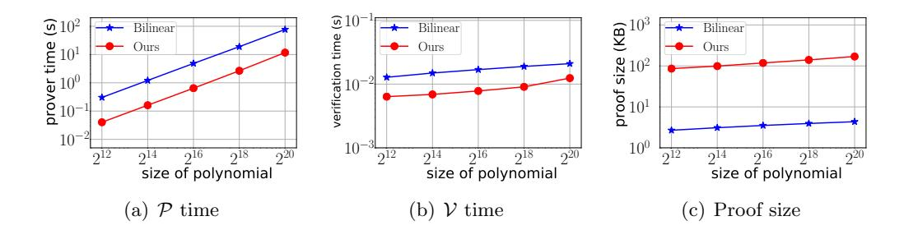
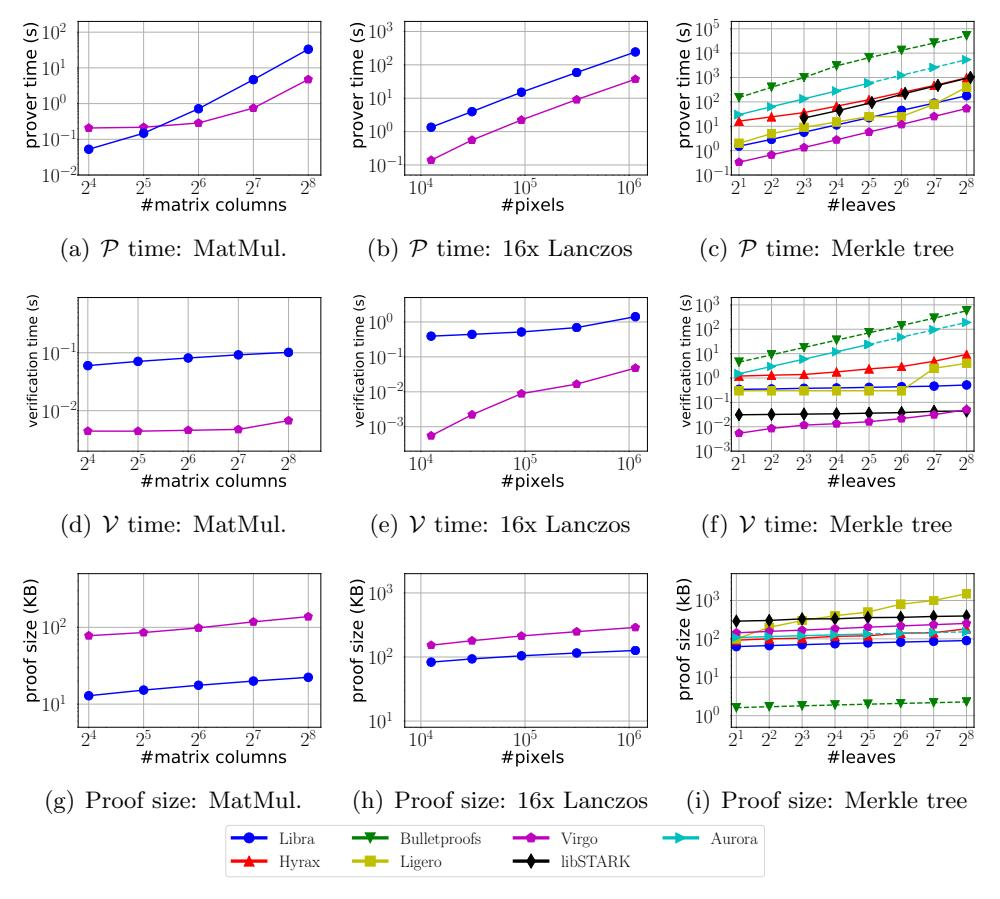

# Transparent Polynomial Delegation and Its Applications to Zero Knowledge Proof\*

Jiaheng Zhang<sup>†</sup> Tiancheng Xie<sup>†</sup> Yupeng Zhang<sup>‡</sup> Dawn Song<sup>†</sup>

#### Abstract

We present a new succinct zero knowledge argument scheme for layered arithmetic circuits without trusted setup. The prover time is  $O(C + n \log n)$  and the proof size is  $O(D \log C + \log^2 n)$  for a D-depth circuit with n inputs and C gates. The verification time is also succinct,  $O(D \log C + \log^2 n)$ , if the circuit is structured. Our scheme only uses lightweight cryptographic primitives such as collision-resistant hash functions and is plausibly post-quantum secure. We implement a zero knowledge argument system, Virgo, based on our new scheme and compare its performance to existing schemes. Experiments show that it only takes 53 seconds to generate a proof for a circuit computing a Merkle tree with 256 leaves, at least an order of magnitude faster than all other succinct zero knowledge argument schemes. The verification time is 50ms, and the proof size is 253KB, both competitive to existing systems.

Underlying Virgo is a new transparent zero knowledge verifiable polynomial delegation scheme with logarithmic proof size and verification time. The scheme is in the interactive oracle proof model and may be of independent interest.

### 1 Introduction

Zero knowledge proof (ZKP) allows a powerful prover to convince a weak verifier that a statement is true, without leaking any extra information about the statement beyond its validity. In recent years, significant progress has been made to bring ZKP protocols from purely theoretical interest to practical implementations, leading to its numerous applications in delegation of computations, anonymous credentials, privacy-preserving cryptocurrencies and smart contracts.

Despite of these great success, there are still some limitations of existing ZKP systems. In SNARK [60], the most commonly adopted ZKP protocol in practice, though the proof sizes are of just hundreds of bytes and the verification times are of several milliseconds regardless of the size of the statements, it requires a trusted setup phase to generate structured reference string (SRS) and the security will be broken if the trapdoor is leaked.

To address this problem, many ZKP protocols based on different techniques have been proposed recently to remove the trusted setup, which are referred as transparent ZKP protocols. Among these techniques, ZKP schemes based on the doubly efficient interactive proof proposed by Goldwasser et al. in [42] (referred as GKR protocol in this paper) are particularly interesting due to their efficient prover time and sublinear verification time for statements represented as structured arithmetic

<sup>\*</sup>to appear at IEEE Symposium on Security and Privacy 2020.

<sup>&</sup>lt;sup>†</sup>University of California, Berkeley. **Email:** {jiaheng\_zhang,tianc.x,dawnsong}@berkeley.edu.

<sup>&</sup>lt;sup>‡</sup>Texas A&M University. **Email:** zhangyp@tamu.edu.

circuits, making it promising to scale to large statements. Unfortunately, as of today we are yet to construct an efficient transparent ZKP system based on the GKR protocol with succinct[1](#page-1-0) proof size and verification time. The transparent scheme in [\[69\]](#page-32-0) has square-root proof size and verification time, while the succinct scheme in [\[70\]](#page-32-1) requires a one-time trusted setup. See Section [1.2](#page-2-0) for more details.

Our contributions. In this paper, we advance this line of research by proposing a transparent ZKP protocol based on GKR with succinct proof size and verification time, when the arithmetic circuit representing the statement is structured. The prover time of our scheme is particularly efficient, at least an order of magnitude faster than existing ZKP systems, and the verification time is merely tens of milliseconds. Our concrete contributions are:

- Transparent zero knowledge verifiable polynomial delegation. We propose a new zero knowledge verifiable polynomial delegation (zkVPD) scheme without trusted setup. Compared to existing pairing-based zkVPD schemes [\[59,](#page-31-1) [72,](#page-32-2) [73\]](#page-32-3), our new scheme does not require a trapdoor and linear-size public keys, and eliminates heavy cryptographic operations such as modular exponentiation and bilinear pairing. Our scheme may be of independent interest, as polynomial delegation/commitment has various applications in areas such as verifiable secret sharing [\[6\]](#page-28-0), proof of retrievability [\[71\]](#page-32-4) and other constructions of ZKP [\[55\]](#page-31-2).
- Transparent zero knowledge argument. Following the framework proposed in [\[73\]](#page-32-3), we combine our new zkVPD protocol with the GKR protocol efficiently to get a transparent ZKP scheme. Our scheme only uses light-weight cryptographic primitives such as collision-resistant hash functions and is plausibly post-quantum secure.
- Implementation and evaluation. We implement a ZKP system, Virgo, based on our new scheme. We develop optimizations such that our system can take arithmetic circuits on the field generated by Mersenne primes, the operations on which can be implemented efficiently using integer additions, multiplications and bit operations in C++. We plan to open source our system.

### 1.1 Our Techniques

Our main technical contribution in this paper is a new transparent zkVPD scheme with O(N log N) prover time, O(log<sup>2</sup> N) proof size and verification time, where N is the size of the polynomial. We summarize the key ideas behind our construction. We first model the polynomial evaluation as the inner product between two vectors of size N: one defined by the coefficients of the polynomial and the other defined by the evaluation point computed on each monomial of the polynomial. The former is committed by the prover (or delegated to the prover after preprocessing in the case of delegation of computation), and the later is publicly known to both the verifier and the prover. We then develop a protocol that allows the prover to convince the verifier the correctness of the inner product between a committed vector and a public vector with proof size O(log<sup>2</sup> N), based on the univariate sumcheck protocol recently proposed by Ben-Sasson et al. in [\[14\]](#page-28-1) (See Section [2.4\)](#page-8-0). To ensure security, the verifier needs to access the two vectors at some locations randomly chosen by the verifier during the protocol. For the first vector, the prover opens it at these locations using standard commitment schemes such as Merkle hash tree. For the second vector, however,

<span id="page-1-0"></span><sup>1</sup> "succinct" denotes poly-logarithmic in the size of the statement C.

it takes O(N) time for the verifier to compute its values at these locations locally. In order to improve the verification time, we observe that the second vector is defined by the evaluation point of size only ` for a `-variate polynomial, which is O(log N) if the polynomial is dense. Therefore, this computation can be viewed as a function that takes ` inputs, expands them to a vector of N monomials and outputs some locations of the vector. It is a perfect case for the verifier to use the GKR protocol to delegate the computation to the prover and validate the output, instead of computing locally. With proper design of the GKR protocol, the verification time is reduced to O(log<sup>2</sup> N) and the total prover time is O(N log N). We then turn the basic protocol into zero knowledge using similar techniques proposed in [\[5,](#page-28-2) [14\]](#page-28-1). The detailed protocols are presented in Section [3.](#page-10-0)

## <span id="page-2-0"></span>1.2 Related Work

Zero knowledge proof. Zero knowledge proof was introduced by Goldwasser et al. in [\[43\]](#page-30-1) and generic constructions based on probabilistically checkable proofs (PCPs) were proposed in the seminal work of Kilian [\[51\]](#page-31-3) and Micali [\[58\]](#page-31-4) in the early days. In recent years there has been significant progress in efficient ZKP protocols and systems. Following earlier work of Ishai [\[48\]](#page-31-5), Groth [\[45\]](#page-30-2) and Lipmaa [\[53\]](#page-31-6), Gennaro et al. [\[40\]](#page-30-3) introduced quadratic arithmetic programs (QAPs), which leads to efficient implementations of SNARKs [\[12,](#page-28-3) [17,](#page-29-0) [24,](#page-29-1) [35,](#page-30-4) [38,](#page-30-5) [60,](#page-31-0) [68\]](#page-32-5). The proof size and verification time of SNARK are constant, which is particularly useful for real-world applications such as cryptocurrencies [\[11\]](#page-28-4) and smart contract [\[23,](#page-29-2) [52\]](#page-31-7). However, SNARKs require a per-statement trusted setup, and incurs a high overhead in the prover running time and memory consumption, making it hard to scale to large statements. There has been great research for generating the SRS through multi-parity secure computations [\[13\]](#page-28-5) and making the SRS universal and updatable [\[46,](#page-31-8) [55\]](#page-31-2).

Many recent works attempt to remove the trusted setup and construct transparent ZKP schemes. Based on "(MPC)-in-the-head" introduced in [\[31,](#page-30-6) [41,](#page-30-7) [49\]](#page-31-9), Ames et al. [\[5\]](#page-28-2) proposed a ZKP scheme called Ligero. It only uses symmetric key operations and the prover time is fast in practice, but the proof size is O( √ C) and the verification time is quasi-linear to the size of the circuit. Later, it is categorized as interactive oracle proofs (IOPs), and in the same model Ben-Sasson et al. built Stark [\[9\]](#page-28-6), transparent ZKP in the RAM model of computation. Their verification time is only linear to the description of the RAM program, and succinct (logarithmic) in the time required for program execution. Recently, Ben-Sasson et al. [\[14\]](#page-28-1) proposed Aurora, a new ZKP system in the IOP model with the proof size of O(log<sup>2</sup> C). Our new zkVPD and ZKP schemes fall in the IOP model.

In the seminal work of [\[42\]](#page-30-0), Goldwasser et al. proposed an efficient interactive proof for layered arithmetic circuits, which was extended to an arugment system by Zhang et al. in [\[74\]](#page-32-6) using a protocol for verifiable polynomial delegation. Later, Zhang et al. [\[75\]](#page-32-7), Wahby et al. [\[69\]](#page-32-0) and Xie et al. [\[70\]](#page-32-1) made the argument system zero knowledge by Cramer and Damgard transformation [\[36\]](#page-30-8) and random masking polynomials [\[32\]](#page-30-9). The scheme of [\[69\]](#page-32-0), Hyrax, is transparent, yet the proof size and verification time are O( √ n) where n is the input size of the circuit; the schemes of [\[72\]](#page-32-2) and [\[70\]](#page-32-1) are succinct for structured circuits, but require one-time trusted setup. The prover time of the GKR protocol is substantially improved in [\[34,](#page-30-10) [64,](#page-32-8) [67,](#page-32-9) [69,](#page-32-0) [75\]](#page-32-7), and recently Xie et al. [\[70\]](#page-32-1) proposed a variant with O(C) prover time for arbitrary circuits.

Other transparent ZKP schemes based on different techniques include discrete-log-based schemes [\[8,](#page-28-7) [21,](#page-29-3) [28,](#page-29-4) [44\]](#page-30-11), hash-based schemes [\[22\]](#page-29-5) and lattice-based schemes [\[7\]](#page-28-8). See Section [5.3](#page-23-0) for detailed asymptotic complexity and practical performance of state-of-the-art systems with implementations. Verifiable polynomial delegation. Verifiable polynomial delegation (VPD) allows a verifier to delegate the computation of polynomial evaluations to a powerful prover, and validates the result in time that is constant or logarithmic to the size of the polynomial. Earlier works in the literature include [18, 39, 50]. Based on [50], Papamanthou et al. [59] propose a protocol for multivariate polynomials. Later in [73], Zhang et al. extend the scheme to an argument of knowledge using powers of exponent assumptions, allowing a prover to commit to a multivariate polynomial, and open to evaluations at points queried by the verifier. In [72], Zhang et al. further make the scheme zero knowledge. These schemes are based on bilinear maps and require a trusted setup phase that generates linear-size public keys with a trapdoor.

In a concurrent work, Bünz et al. [26] propose another transparent polynomial commitment scheme without trusted setup. The scheme utilizes groups of unknown order and the techniques are different from our construction. The prover and verifier time are O(N) and  $O(\log N)$  modulo exponentiation in the group and the proof size is  $O(\log N)$  group elements. Concretely, the proof size is 10-20KB for a circuit with  $2^{20}$  gates when compiled to different ZKP systems [26, Section 6], and the prover time and the verification time are not reported. Comparing to our scheme, we expect the prover and verifier time in our scheme are faster, while our proof size is larger, which gives an interesting trade-off.

### <span id="page-3-1"></span>2 Preliminaries

We use  $\lambda$  to denote the security parameter, and  $\operatorname{negl}(\lambda)$  to denote the negligible function in  $\lambda$ . "PPT" stands for probabilistic polynomial time. For a multivariate polynomial f, its "variable-degree" is the maximum degree of f in any of its variables. We often rely on polynomial arithmetic, which can be efficiently performed via fast Fourier transforms and their inverses. In particular, polynomial evaluation and interpolation over a multiplicative coset of size n of a finite field can be performed in  $O(n \log n)$  field operations via the standard FFT protocol, which is based on the divide-and-conquer algorithm.

#### 2.1 Interactive Proofs and Zero-knowledge Arguments

Interactive proofs. An interactive proof allows a prover  $\mathcal{P}$  to convince a verifier  $\mathcal{V}$  the validity of some statement through several rounds of interaction. We say that an interactive proof is public coin if  $\mathcal{V}$ 's challenge in each round is independent of  $\mathcal{P}$ 's messages in previous rounds. The proof system is interesting when the running time of  $\mathcal{V}$  is less than the time of directly computing the function f. We formalize interactive proofs in the following:

<span id="page-3-0"></span>**Definition 1.** Let f be a Boolean function. A pair of interactive machines  $\langle \mathcal{P}, \mathcal{V} \rangle$  is an interactive proof for f with soundness  $\epsilon$  if the following holds:

- Completeness. For every x such that f(x) = 1 it holds that  $\Pr[\langle \mathcal{P}, \mathcal{V} \rangle(x) = 1] = 1$ .
- $\epsilon$ -Soundness. For any x with  $f(x) \neq 1$  and any  $\mathcal{P}^*$  it holds that  $\Pr[\langle \mathcal{P}^*, \mathcal{V} \rangle = 1] \leq \epsilon$

**Zero-knowledge arguments.** An argument system for an NP relationship  $\mathcal{R}$  is a protocol between a computationally-bounded prover  $\mathcal{P}$  and a verifier  $\mathcal{V}$ . At the end of the protocol,  $\mathcal{V}$  is convinced by  $\mathcal{P}$  that there exists a witness w such that  $(x;w) \in R$  for some input x. We focus on arguments of knowledge which have the stronger property that if the prover convinces the verifier

of the statement validity, then the prover must know w. We use  $\mathcal{G}$  to represent the generation phase of the public parameters pp. Formally, consider the definition below, where we assume R is known to  $\mathcal{P}$  and  $\mathcal{V}$ .

<span id="page-4-0"></span>**Definition 2.** Let  $\mathcal{R}$  be an NP relation. A tuple of algorithm  $(\mathcal{G}, \mathcal{P}, \mathcal{V})$  is a zero-knowledge argument of knowledge for  $\mathcal{R}$  if the following holds.

• Correctness. For every pp output by  $\mathcal{G}(1^{\lambda})$  and  $(x,w) \in R$ ,

$$\langle \mathcal{P}(\mathsf{pp}, w), \mathcal{V}(\mathsf{pp}) \rangle (x) = 1$$

• **Soundness**. For any PPT prover  $\mathcal{P}$ , there exists a PPT extractor  $\varepsilon$  such that for every pp output by  $\mathcal{G}(1^{\lambda})$  and any x, the following probability is  $negl(\lambda)$ :

$$\Pr[\langle \mathcal{P}(\mathsf{pp}), \mathcal{V}(\mathsf{pp}) \rangle(x) = 1 \land (x, w) \notin \mathcal{R}|w \leftarrow \varepsilon(\mathsf{pp}, x)]$$

• **Zero knowledge**. There exists a PPT simulator S such that for any PPT algorithm  $V^*$ , auxiliary input  $z \in \{0,1\}^*$ ,  $(x;w) \in \mathcal{R}$ , pp output by  $\mathcal{G}(1^{\lambda})$ , it holds that

$$\mathsf{View}(\langle \mathcal{P}(\mathsf{pp},w), \mathcal{V}^*(z,\mathsf{pp})\rangle(x)) \approx \mathcal{S}^{\mathcal{V}^*}(x,z)$$

We say that  $(\mathcal{G}, \mathcal{P}, \mathcal{V})$  is a **succinct** argument system if the running time of  $\mathcal{V}$  and the total communication between  $\mathcal{P}$  and  $\mathcal{V}$  (proof size) are  $\mathsf{poly}(\lambda, |x|, \log |w|)$ .

In the definition of zero knowledge,  $\mathcal{S}^{\mathcal{V}^*}$  denotes that the simulator  $\mathcal{S}$  is given the randomness of  $\mathcal{V}^*$  sampled from polynomial-size space. This definition is commonly used in existing transparent zero knowledge proof schemes [5, 14, 28, 69].

### 2.2 Zero-Knowledge Verifiable Polynomial Delegation

Let  $\mathbb{F}$  be a finite field,  $\mathcal{F}$  be a family of  $\ell$ -variate polynomial over  $\mathbb{F}$ , and d be a variable-degree parameter. We use  $\mathcal{W}_{\ell,d}$  to denote the collection of all monomials in  $\mathcal{F}$  and  $N = |\mathcal{W}_{\ell,d}| = (d+1)^{\ell}$ . A zero-knowledge verifiable polynomial delegation scheme (zkVPD) for  $f \in \mathcal{F}$  and  $t \in \mathbb{F}^{\ell}$  consists of the following algorithms:

- $\bullet \ \ \mathsf{pp} \leftarrow \mathsf{zkVPD}.\mathsf{KeyGen}(1^\lambda),$
- $\bullet \; \; \mathsf{com} \leftarrow \mathsf{zkVPD}.\mathsf{Commit}(f,r_f,\mathsf{pp}),$
- $\bullet \ ((y,\pi); \{\mathtt{0},\mathtt{1}\}) \leftarrow \langle \mathsf{zkVPD.Open}(f,r_f), \mathsf{zkVPD.Verify}(\mathsf{com}) \rangle (t,\mathsf{pp}) \\$

Note that unlike the zkVPD in [59, 72, 73], our definition is transparent and does not have a trapdoor in zkVPD.KeyGen.  $\pi$  denotes the transcript seen by the verifier during the interaction with zkVPD.Open, which is similar to the proof in non-interactive schemes in [59, 72, 73].

<span id="page-4-1"></span>**Definition 3.** A zkVPD scheme satisfies the following properties:

• Completeness. For any polynomial  $f \in \mathcal{F}$  and value  $t \in \mathbb{F}^{\ell}$ ,  $\mathsf{pp} \leftarrow \mathsf{zkVPD}.\mathsf{KeyGen}(1^{\lambda})$ ,  $\mathsf{com} \leftarrow \mathsf{zkVPD}.\mathsf{Commit}(f,r_f\mathsf{pp})$ ,  $it\ holds\ that$ 

$$\Pr\left[\langle \mathsf{zkVPD.Open}(f, r_f), \mathsf{zkVPD.Verify}(\mathsf{com}) \rangle(t, \mathsf{pp}) = 1\right] = 1$$

• Soundness. For any PPT adversary A,  $pp \leftarrow \mathsf{zkVPD}.\mathsf{KeyGen}(1^{\lambda})$ , the following probability is negligible of  $\lambda$ :

$$\Pr \begin{bmatrix} (f^*, \mathsf{com}^*, t) \leftarrow \mathcal{A}(1^\lambda, \mathsf{pp}) \\ ((y^*, \pi^*); 1) \leftarrow \langle \mathcal{A}(), \mathsf{zkVPD.Verify}(\mathsf{com}^*) \rangle (t, \mathsf{pp}) \\ \mathsf{com}^* = \mathsf{zkVPD.Commit}(f^*, \mathsf{pp}) \\ f^*(t) \neq y^* \end{bmatrix}$$

• **Zero Knowledge.** For security parameter  $\lambda$ , polynomial  $f \in \mathcal{F}$ ,  $pp \leftarrow zkVPD$ . Key $Gen(1^{\lambda})$ , PPT algorithm  $\mathcal{A}$ , and simulator  $\mathcal{S} = (\mathcal{S}_1, \mathcal{S}_2)$ , consider the following two experiments:

For any PPT algorithm A and all polynomial  $f \in \mathbb{F}$ , there exists simulator S such that

$$|\Pr[\mathsf{Real}_{\mathcal{A},f}(\mathsf{pp}) = 1] - \Pr[\mathsf{Ideal}_{\mathcal{A},\mathcal{S}^{\mathcal{A}}}(\mathsf{pp}) = 1]| \leq \mathsf{negl}(\lambda).$$

## <span id="page-5-0"></span>2.3 Zero Knowledge Argument Based on GKR

In [70], Xie et al. proposed an efficient zero knowledge argument scheme named Libra. The scheme extends the interactive proof protocol for layered arithmetic circuits proposed by Goldwasser et al. [42] (referred as the GKR protocol) to a zero knowledge argument using multiple instances of zkVPD schemes. Our scheme follows this framework and we review the detailed protocols here.

Sumcheck protocol. The sumcheck protocol is a fundamental protocol in the literature of interactive proof that has various applications. The problem is to sum a polynomial  $f: \mathbb{F}^{\ell} \to \mathbb{F}$  on the binary hypercube  $\sum_{b_1,b_2,\dots,b_{\ell}\in\{0,1\}} f(b_1,b_2,\dots,b_{\ell})$ . Directly computing the sum requires exponential time in  $\ell$ , as there are  $2^{\ell}$  combinations of  $b_1,\dots,b_{\ell}$ . Lund et al. [54] proposed a *sumcheck* protocol that allows a verifier  $\mathcal{V}$  to delegate the computation to a computationally unbounded prover  $\mathcal{P}$ , who can convince  $\mathcal{V}$  the correctness of the sum. At the end of the sumcheck protocol,  $\mathcal{V}$  needs an oracle access to the evaluation of f at a random point f chosen by f. The proof size of the sumcheck protocol is f0 complete and sound with f1. The sumcheck protocol is complete and sound with f2.

**GKR protocol.** Let C be a layered arithmetic circuit with depth D over a finite field  $\mathbb{F}$ . Each gate in the i-th layer takes inputs from two gates in the (i+1)-th layer; layer 0 is the output layer and layer D is the input layer. The GKR protocol proceeds layer by layer. Upon receiving the claimed output from  $\mathcal{P}$ , in the first round,  $\mathcal{V}$  and  $\mathcal{P}$  run a sumcheck protocol to reduce the claim about the output to a claim about the values in the layer above. In the i-th round, both parties reduce a claim about layer i-1 to a claim about layer i through sumcheck. Finally, the protocol terminates with a claim about the input layer D, which can be checked directly by  $\mathcal{V}$ . If the check passes,  $\mathcal{V}$  accepts the claimed output.

Formally speaking, we denote the number of gates in the *i*-th layer as  $S_i$  and let  $s_i = \lceil \log S_i \rceil$ . We then define a function  $V_i : \{0,1\}^{s_i} \to \mathbb{F}$  that takes a binary string  $b \in \{0,1\}^{s_i}$  and returns the output of gate b in layer i, where b is called the gate label. With this definition,  $V_0$  corresponds to the output of the circuit, and  $V_D$  corresponds to the input. As the sumcheck protocol works on  $\mathbb{F}$ , we then extend  $V_i$  to its multilinear extension, the unique polynomial  $\tilde{V}_i : \mathbb{F}^{s_i} \to \mathbb{F}$  such that  $\tilde{V}_i(x_1, x_2, ..., x_{s_i}) = V_i(x_1, x_2, ..., x_{s_i})$  for all  $x_1, x_2, ..., x_{s_i} \in \{0, 1\}^{s_i}$ . As shown in prior work [34], the closed form of  $\tilde{V}_i$  can be computed as:

<span id="page-6-3"></span>
$$\tilde{V}_i(x_1, x_2, ..., x_{s_i}) = \sum_{b \in \{0,1\}^{s_i}} \prod_{i=1}^{s_i} [((1 - x_i)(1 - b_i) + x_i b_i) \cdot V_i(b)], \tag{1}$$

where  $b_i$  is *i*-th bit of b.

With these definitions, we can express the evaluations of  $\tilde{V}_i$  as a summation of evaluations of  $\tilde{V}_{i+1}$ :

<span id="page-6-0"></span>
$$\alpha_i \tilde{V}_i(u^{(i)}) + \beta_i \tilde{V}_i(v^{(i)}) = \sum_{x,y \in \{0,1\}^{s_{i+1}}} f_i(\tilde{V}_{i+1}(x), \tilde{V}_{i+1}(y)), \tag{2}$$

where  $u^{(i)}, v^{(i)} \in \mathbb{F}^{s_i}$  are random vectors and  $\alpha_i, \beta_i \in \mathbb{F}$  are random values. Note here that  $f_i$  depends on  $\alpha_i, \beta_i, u^{(i)}, v^{(i)}$  and we omit the subscripts for easy interpretation.

With Equation 2, the GKR protocol proceeds as follows. The prover  $\mathcal{P}$  first sends the claimed output of the circuit to  $\mathcal{V}$ . From the claimed output,  $\mathcal{V}$  defines polynomial  $\tilde{V}_0$  and computes  $\tilde{V}_0(u^{(0)})$  and  $\tilde{V}_0(v^{(0)})$  for random  $u^{(0)}, v^{(0)} \in \mathbb{F}^{s_0}$ .  $\mathcal{V}$  then picks two random values  $\alpha_0, \beta_0$  and invokes a sumcheck protocol on Equation 2 with  $\mathcal{P}$  for i=0. As described before, at the end of the sumcheck,  $\mathcal{V}$  needs an oracle access to the evaluation of  $f_0$  at  $u^{(1)}, v^{(1)}$  randomly selected in  $\mathbb{F}^{s_1}$ . To compute this value,  $\mathcal{V}$  asks  $\mathcal{P}$  to send  $\tilde{V}_1(u^{(1)})$  and  $\tilde{V}_1(v^{(1)})$ . Other than these two values,  $f_0$  only depends on  $\alpha_0, \beta_0, u^{(0)}, v^{(0)}$  and the gates and wiring in layer 0, which are all known to  $\mathcal{V}$  and can be computed by  $\mathcal{V}$  directly. In this way,  $\mathcal{V}$  and  $\mathcal{P}$  reduces two evaluations of  $\tilde{V}_0$  to two evaluations of  $\tilde{V}_1$  in layer 1.  $\mathcal{V}$  and  $\mathcal{P}$  then repeat the protocol recursively layer by layer. Eventually,  $\mathcal{V}$  receives two claimed evaluations  $\tilde{V}_D(u^{(D)})$  and  $\tilde{V}_D(v^{(D)})$ .  $\mathcal{V}$  then checks the correctness of these two claims directly by evaluating  $\tilde{V}_D$ , which is defined by the input of the circuit. Let GKR. $\mathcal{P}$  and GKR. $\mathcal{V}$  be the algorithms for the GKR prover and verifier, we have the following theorem:

<span id="page-6-2"></span>**Lemma 1.** [34, 42, 64, 70]. Let  $C : \mathbb{F}^n \to \mathbb{F}$  be a layered arithmetic circuit with depth of D.  $\langle \mathsf{GKR}.\mathcal{P}, \mathsf{GKR}.\mathcal{V}\rangle(C,x)$  is an interactive proof per Definition 1 for the function computed by C on input x with soundness  $O(D\log|C|/|\mathbb{F}|)$ . The total communication is  $O(D\log|C|)$  and the running time of the prover  $\mathcal{P}$  is O(|C|). When C has regular wiring pattern<sup>2</sup>, the running time of the verifier  $\mathcal{V}$  is  $O(n+D\log|C|)$ .

Extending GKR to Zero Knowledge Argument. There are two limitations of the GKR protocol: (1) It is not an argument system supporting witness from  $\mathcal{P}$ , as  $\mathcal{V}$  needs to evaluate  $\tilde{V}_D$  locally in the last round; (2) It is not zero knowledge, as in each round, both the sumcheck protocol and the two evaluations of  $\tilde{V}_i$  leak information about the values in layer i.

To extend the GKR protocol to a zero knowledge argument, Xie et al. [70] address both of the problems using zero knowledge polynomial delegation. Following the approach of [69, 72, 73], to

<span id="page-6-1"></span><sup>&</sup>lt;sup>2</sup> "Regular" circuits is defined in [34, Theorem A.1]. Roughly speaking, it means the mutilinear extension of its wiring predicates can be evaluated at a random point in time  $O(\log |C|)$ .

<span id="page-7-1"></span>**Protocol 1** (Zero Knowledge Argument in [70]). Let  $\lambda$  be the security parameter,  $\mathbb{F}$  be a prime field. Let  $C: \mathbb{F}^n \to \mathbb{F}$  be a layered arithmetic circuit over  $\mathbb{F}$  with D layers, input in and witness w such that  $|\mathsf{in}| + |w| \le n$  and  $1 = C(\mathsf{in}; w)$ .

- $\mathcal{G}(1^{\lambda})$ : set pp as pp  $\leftarrow$  zkVPD.KeyGen $(1^{\lambda})$ .
- $\langle \mathcal{P}(\mathsf{pp}, w), \mathcal{V}(\mathsf{pp}) \rangle (\mathsf{in})$ :
  - 1.  $\mathcal{P}$  selects a random bivariate polynomial  $R_D$ .  $\mathcal{P}$  commits to the witness of C by sending  $\mathsf{com}_D \leftarrow \mathsf{zkVPD}.\mathsf{Commit}(\dot{V}_D, r_{V_D}, \mathsf{pp})$  to  $\mathcal{V}$ , where  $\dot{V}_D$  is defined by Equation 3.
  - 2.  $\mathcal{P}$  randomly selects polynomials  $R_i: \mathbb{F}^2 \to \mathbb{F}$  and  $\delta_i: \mathbb{F}^{2s_{i+1}+1} \to \mathbb{F}$  for  $i=0,\ldots,D-1$ .  $\mathcal{P}$  commits to these polynomials by sending  $\mathsf{com}_{i,1} \leftarrow \mathsf{zkVPD}.\mathsf{Commit}(R_i, r_{R_i}, \mathsf{pp})$  and  $\mathsf{com}_{i,2} \leftarrow \mathsf{zkVPD}.\mathsf{Commit}(\delta_i, r_{\delta_i}, \mathsf{pp})$  to  $\mathcal{V}$ .  $\mathcal{P}$  also reveals  $R_0$  to  $\mathcal{V}$ , as  $V_0$  is known to  $\mathcal{V}$ .
  - 3. V evaluates  $\dot{V}_0(u^{(0)})$  and  $\dot{V}_0(v^{(0)})$  for randomly chosen  $u^{(0)}, v^{(0)} \in \mathbb{F}^{s_0}$ .
  - 4. For i = 0, ..., D 1:
    - (a)  $\mathcal{P}$  sends  $H_i = \sum_{x,y \in \{0,1\}^{s_{i+1}}, z \in \{0,1\}} \delta_i(x,y,z)$  to  $\mathcal{V}$ .
    - (b) V picks  $\alpha_i, \beta_i, \gamma_i$  randomly in  $\mathbb{F}$ .
    - (c)  $\mathcal{V}$  and  $\mathcal{P}$  execute a sumcheck protocol on Equation 4. At the end of the sumcheck,  $\mathcal{V}$  receives a claim of  $f'_i$  at point  $u^{(i+1)}, v^{(i+1)} \in \mathbb{F}^{s_{i+1}}, g_i \in \mathbb{F}$  selected randomly by  $\mathcal{V}$ .
    - $\begin{array}{ll} (d) \ \ \mathcal{P} \ \ opens \ R_i(u^{(i)},g_i), \ R_i(v^{(i)},g_i) \ \ and \ \delta_i(u^{(i+1)},v^{(i+1)},g_i) \ \ using \ \mathsf{zkVPD.Open}. \ \ \mathcal{P} \ \ sends \ \dot{V}_0(u^{(i+1)}) \ \ and \ \dot{V}_0(v^{(i+1)}) \ \ to \ \mathcal{V}. \end{array}$
    - (e) V validates  $R_i(u^{(i)},g_i)$ ,  $R_i(v^{(i)},g_i)$  and  $\delta_i(u^{(i+1)},v^{(i+1)},g_i)$  using zkVPD. Verify. If any of them outputs 0, abort and output 0.
    - (f) V checks the claim of  $f'_i$  using  $R_i(u^{(i)}, g_i)$ ,  $R_i(v^{(i)}, g_i)$ ,  $\delta_i(u^{(i+1)}, v^{(i+1)}, g_i)$ ,  $\dot{V}_0(u^{(i+1)})$  and  $\dot{V}_0(v^{(i+1)})$ . If it fails, output 0.
  - 5.  $\mathcal{P}$  runs  $(y_1, \pi_1) \leftarrow \mathsf{zkVPD.Open}(\dot{V}_D, r_{V_D}, u^{(D)}, \mathsf{pp}), \ (y_2, \pi_2) \leftarrow \mathsf{zkVPD.Open}(\dot{V}_D, r_{V_D}, v^{(D)}, \mathsf{pp}) \ and sends \ y_1, \pi_1, y_2, \pi_2 \ to \ \mathcal{V}.$
  - 6.  $\mathcal{V}$  runs  $\mathsf{Verify}(\pi_1, y_1, \mathsf{com}_D, u^{(D)}, \mathsf{pp})$  and  $\mathsf{Verify}(\pi_2, y_2, \mathsf{com}_D, v^{(D)}, \mathsf{pp})$  and output 0 if either check fails. Otherwise,  $\mathcal{V}$  checks  $\dot{V}_D(u^{(D)}) = y_1$  and  $\dot{V}_D(v^{(D)}) = y_2$ , and rejects if either fails. If all checks above pass,  $\mathcal{V}$  output 1.

support witness w as the input to the circuit,  $\mathcal{P}$  commits to  $\tilde{V}_D$  using zkVPD before running the GKR protocol. In the last round of GKR, instead of evaluating  $\tilde{V}_D$  locally,  $\mathcal{V}$  asks  $\mathcal{P}$  to open  $\tilde{V}_D$  at two random points  $u^{(D)}, v^{(D)}$  selected by  $\mathcal{V}$  and validates them using zkVPD. Verify. In this way,  $\mathcal{V}$  does not need to access w directly and the soundness still holds because of the soundness guarantee of zkVPD.

To ensure zero knowledge, using the techniques proposed by Chiesa et al. in [32], the prover  $\mathcal{P}$  masks the polynomial  $\tilde{V}_i$  and the sumcheck protocol by random polynomials so that the proof does not leak information. For correctness and soundness purposes, these random polynomials are committed using the zkVPD protocol and opened at random points chosen by  $\mathcal{V}$ . In particular, for layer i, the prover selects a random bivariate polynomial  $R_i(x_1, z)$  and defines

<span id="page-7-0"></span>
$$\dot{V}_i(x_1, \dots, x_{s_i}) \stackrel{def}{=} \tilde{V}_i(x_1, \dots, x_{s_i}) + Z_i(x_1, \dots, x_{s_i}) \sum_{z \in \{0, 1\}} R_i(x_1, z), \tag{3}$$

where  $Z_i(x) = \prod_{i=1}^{s_i} x_i (1-x_i)$ , i.e.,  $Z_i(x) = 0$  for all  $x \in \{0,1\}^{s_i}$ .  $\dot{V}_i$  is known as the low degree extension of  $V_i$ , as  $\dot{V}_i(x) = \tilde{V}_i(x) = V_i(x)$  for all  $x \in \{0,1\}^{s_i}$ . As  $R_i$  is randomly selected by

 $\mathcal{P}$ , revealing evaluations of  $\dot{V}_i$  does not leak information about  $V_i$ , thus the values in the circuit. Additionally,  $\mathcal{P}$  selects another random polynomial  $\delta_i(x_1,\ldots,x_{s_{i+1}},y_1,\ldots,y_{s_{i+1}},z)$  to mask the sumcheck protocol. Let  $H_i = \sum_{x,y \in \{0,1\}^{s_{i+1}},z \in \{0,1\}} \delta_i(x_1,\ldots,x_{s_{i+1}},y_1,\ldots,y_{s_{i+1}},z)$ , Equation 2 to run sumcheck on becomes

<span id="page-8-1"></span>
$$\alpha_{i}\dot{V}_{i}(u^{(i)}) + \beta_{i}\dot{V}_{i}(v^{(i)}) + \gamma_{i}H_{i}$$

$$= \sum_{x,y \in \{0,1\}^{s_{i+1}}, z \in \{0,1\}} f'_{i}(\dot{V}_{i+1}(x), \dot{V}_{i+1}(y), R_{i}(u_{1}^{(i)}, z), R_{i}(v_{1}^{(i)}, z), \delta_{i}(x, y, z)),$$
(4)

where  $\gamma_i \in \mathbb{F}$  is randomly selected by  $\mathcal{V}$ , and  $f_i'$  is defined by  $\alpha_i, \beta_i, \gamma_i, u^{(i)}, v^{(i)}, Z_i(u^{(i)}), Z_i(v^{(i)})^3$ . Now  $\mathcal{V}$  and  $\mathcal{P}$  can execute the sumcheck and GKR protocol on Equation 4. In each round,  $\mathcal{P}$  additionally opens  $R_i$  and  $\delta_i$  at  $R_i(u_1^{(i)}, g^{(i)}), R_i(v_1^{(i)}, g^{(i)}), \delta_i(u^{(i+1)}, v^{(i+1)}, g^{(i)})$  for  $g^{(i)} \in \mathbb{F}$  randomly selected by  $\mathcal{V}$ . With these values,  $\mathcal{V}$  reduces the correctness of two evaluations  $\dot{V}_i(u^{(i)}), \dot{V}_i(v^{(i)})$  to two evaluations  $\dot{V}_i(u^{(i+1)}), \dot{V}_i(v^{(i+1)})$  on one layer above like before. In addition, as  $f_i$  is masked by  $\delta_i$ , the sumcheck protocol is zero knowledge; as  $\tilde{V}_i$  is masked by  $R_i$ , the two evaluations of  $\dot{V}_i$  do not leak information. The full zero knowledge argument protocol in [70] is given in Protocol 1. We have the following theorem:

<span id="page-8-6"></span>**Lemma 2.** [70]. Let  $C : \mathbb{F}^n \to \mathbb{F}$  be a layered arithmetic circuit with D layers, input in and witness w. Protocol 1 is a zero knowledge argument of knowledge under Definition 2 for the relation defined by  $1 = C(\mathsf{in}; w)$ .

The variable degree of  $R_i$  is O(1).  $\delta_i(x,y,z) = \delta_{i,1}(x_1) + \ldots + \delta_{i,s_{i+1}}(x_{s_{i+1}}) + \delta_{i,s_{i+1}+1}(y_1) + \ldots + \delta_{i,2s_{i+1}}(y_{s_{i+1}}) + \delta_{i,2s_{i+1}+1}(z)$  is the summation of  $2s_{i+1} + 1$  univariate polynomials of degree O(1). Other than the zkVPD instantiations, the proof size is  $O(D \log |C|)$  and the prover time is O(|C|). When C is regular, the verification time is  $O(n + D \log |C|)$ .

### <span id="page-8-0"></span>2.4 Univariate Sumcheck

Our transparent zkVPD protocol is inspired by the univariate sumcheck protocol recently proposed by Ben-Sasson et al.in [14]. As the name indicates, the univariate sumcheck protocol allows the verifier to validate the result of the sum of a univariate polynomial on a subset  $\mathbb{H}$  of the field  $\mathbb{F}$ :  $\mu = \sum_{a \in \mathbb{H}} f(a)$ . The key idea of the protocol relies on the following lemma:

<span id="page-8-4"></span>**Lemma 3.** [27]. Let  $\mathbb{H}$  be a multiplicative  $coset^4$  of  $\mathbb{F}$ , and let g(x) be a univariate polynomial over  $\mathbb{F}$  of degree strictly less that  $|\mathbb{H}|$ . Then  $\sum_{a\in\mathbb{H}}g(a)=g(0)\cdot|\mathbb{H}|$ .

Because of Lemma 3, to test the result of  $\sum_{a\in\mathbb{H}} f(a)$  for f with degree less than k, we can decompose f into two parts  $f(x)=g(x)+Z_{\mathbb{H}}(x)\cdot h(x)$ , where  $Z_{\mathbb{H}}(x)=\prod_{a\in\mathbb{H}}(x-a)$  (i.e.,  $Z_{\mathbb{H}}(a)=0$  for all  $a\in\mathbb{H}$ ), and the degrees of g and h are strictly less than  $|\mathbb{H}|$  and  $k-|\mathbb{H}|$ . This decomposition is unique for every f. As  $Z_{\mathbb{H}}(a)$  is always 0 for  $a\in\mathbb{H}$ ,  $\mu=\sum_{a\in\mathbb{H}}f(a)=\sum_{a\in\mathbb{H}}g(a)=g(0)\cdot|\mathbb{H}|$  by Lemma 3. Therefore, if the claimed sum  $\mu$  sent by the prover is correct,  $f(x)-Z_{\mathbb{H}}(x)\cdot h(x)-\mu/|\mathbb{H}|$  must be a polynomial of degree less than  $|\mathbb{H}|$  with constant term 0, or equivalently polynomial

<span id="page-8-5"></span>
$$p(x) = \frac{|\mathbb{H}| \cdot f(x) - |\mathbb{H}| \cdot Z_{\mathbb{H}}(x) \cdot h(x) - \mu}{|\mathbb{H}| \cdot x}$$
 (5)

<span id="page-8-2"></span>Formally,  $f'_i$  is  $I(0,z)f_i(\dot{V}_{i+1}(x),\dot{V}_{i+1}(y)) + I((x,y),0)(\alpha_i Z_i(u^{(i)})R(u_1^{(i)},z) + \beta_i Z_i(v^{(i)})R(v_1^{(i)},z)) + \gamma_i \delta_i(x,y,z)$ , where I(a,b) is an identity polynomial I(a,b)=0 iff a=b. We will not use  $f'_i$  explicitly in our constructions later.

<span id="page-8-3"></span> $<sup>^{4}</sup>$ In [14], the protocols are mainly using additive cosets. We require  $\mathbb{H}$  to be a multiplicative coset for our constructions over prime fields and extensions. The univariate sumsheck on multiplicative cosets is also stated in [14].

must be a polynomial of degree less than  $|\mathbb{H}| - 1$ . To test this, the univariate sumcheck uses a low degree test (LDT) protocol on Reed-Solomon (RS) code, which we define below.

**Reed-Solomon Code.** Let  $\mathbb{L}$  be a subset of  $\mathbb{F}$ , an RS code is the evaluations of a polynomial  $\rho(x)$  of degree less than m ( $m < \mathbb{L}$ ) on  $\mathbb{L}$ . We use the notation  $\rho|_{\mathbb{L}}$  to denote the vector of the evaluations  $(\rho(a))_{a \in \mathbb{L}}$ , and use  $RS[\mathbb{L}, m]$  to denote the set of all such vectors generated by polynomials of degree less than m. Note that any vector of size  $|\mathbb{L}|$  can be viewed as some univariate polynomial of degree less than  $|\mathbb{L}|$  evaluated on  $\mathbb{L}$ , thus we use vector and polynomial interchangeably.

Low Degree Test and Rational Constraints. Low degree test allows a verifier to test whether a polynomial/vector belongs to an RS code, i.e., the vector is the evaluations of some polynomial of degree less than m on  $\mathbb{L}$ .

In our constructions, we use the LDT protocol in [14, Protocol 8.2], which was used to transform an RS-encoded IOP to a regular IOP. It applies the LDT protocol proposed in [10] protocol to a sequence of polynomials  $\vec{\rho}$  and their rational constraint p, which is a polynomial that can be computed as the division of the polynomials in  $\vec{\rho}$ . In the case of univariate sumcheck, the sequence of polynomials is  $\vec{\rho} = (f, h)$  and the rational constraint is given by Equation 5.

The high level idea is as follows. First, the verifier multiplies each polynomial in  $\vec{\rho}$  and the rational constraint p with an appropriate monomial such that they have the same degree max, and takes their random linear combination. Then the verifier tests that the resulting polynomial is in  $RS[\mathbb{L}, \max + 1]$ . At the end of the protocol, the verifier needs oracle access to  $\kappa$  evaluations of each polynomial in  $\vec{\rho}$  and the rational constraint p at points in  $\mathbb{L}$  indexed by  $\mathcal{I}$ , and checks that each evaluation of p is consistent with the evaluations of the polynomials in  $\vec{\rho}$ . We denote the protocol as  $\langle \text{LDT.}\mathcal{P}(\vec{\rho},p), \text{LDT.}\mathcal{V}(\vec{m},\deg(p))\rangle(\mathbb{L})$ , where  $\vec{\rho}$  is a sequence of polynomials over  $\mathbb{F}$ , p(x) is their rational constraint,  $\vec{m},\deg(p)$  is the degrees of the polynomials and the rational constraint to test, and  $\mathbb{L}$  is a multiplicative coset of  $\mathbb{F}$ . We state the properties of the protocol in the following lemma:

<span id="page-9-0"></span>**Lemma 4.** There exist an LDT protocol  $\langle \mathsf{LDT}.\mathcal{P}(\vec{\rho},p), \mathsf{LDT}.\mathcal{V}(\vec{m},\deg(p))\rangle(\mathbb{L})$  that is complete and sound with soundness error  $O(\frac{|\mathbb{L}|}{|\mathbb{F}|}) + \mathsf{negl}(\kappa)$ , given oracle access to evaluations of each polynomial in  $\vec{\rho}$  at  $\kappa$  points indexed by  $\mathcal{I}$  in  $\mathbb{L}$ . The proof size and the verification time are  $O(\log |\mathbb{L}|)$  other than the oracle access, and the prover time is  $O(\mathbb{L})$ .

The LDT protocol can be made zero knowledge in a straight-forward way by adding a random polynomial of degree max in  $\vec{\rho}$ . That is, there exists a simulator  $\mathcal{S}$  such that given the random challenges of  $\mathcal{I}$  of any PPT algorithm  $\mathcal{V}^*$ , it can simulate the view of  $\mathcal{V}^*$  such that  $\mathsf{View}(\langle \mathsf{LDT}.\mathcal{P}(\vec{\rho},p),\mathcal{V}^*(\vec{m},\deg(p))\rangle(\mathbb{L})) \approx \mathcal{S}^{\mathcal{V}^*}(\deg(p))$ . In particular,  $\mathcal{S}$  generates  $p^* \in RS[\mathbb{L},\deg(p)]$  and can simulate the view of any sequence of random polynomials  $\vec{\rho}^*$  subject to the constraint that their evaluations at points indexed by  $\mathcal{I}$  are consistent with the oracle access of  $p^*$ .

Merkle Tree. Merkle hash tree proposed by Ralph Merkle in [57] is a common primitive to commit a vector and open it at an index with logarithmic proof size and verification time. It consists of three algorithms:

- $root_c \leftarrow \mathsf{MT}.\mathsf{Commit}(c)$
- $(c_{idx}, \pi_{idx}) \leftarrow \mathsf{MT.Open}(idx, c)$
- $(1,0) \leftarrow \mathsf{MT.Verify}(\mathsf{root}_c, idx, c_{idx}, \pi_{idx})$

The security follows the collision-resistant property of the hash function used to construct the Merkle tree.

With these tools, the univariate sumcheck protocol works as follows. To prove  $\mu = \sum_{a \in \mathbb{H}} f(a)$ , the verifier and the prover picks  $\mathbb{L}$ , a multiplicative coset of  $\mathbb{F}$  and a superset of  $\mathbb{H}$ , where  $|\mathbb{L}| > k$ .  $\mathcal{P}$  decompose  $f(x) = g(x) + Z_{\mathbb{H}}(x) \cdot h(x)$  as defined above, and computes the vectors  $f|_{\mathbb{L}}$  and  $h|_{\mathbb{L}}$ .  $\mathcal{P}$  then commits to these two vectors using Merkle trees.  $\mathcal{P}$  then defines a polynomial  $p(x) = \frac{|\mathbb{H}| \cdot f(x) - |\mathbb{H}| \cdot Z_{\mathbb{H}}(x) \cdot h(x) - \mu}{|\mathbb{H}| \cdot x}$ , which is a rational constraint of f and h. As explained above, in order to ensure the correctness of  $\mu$ , it suffices to test that the degree of (f,h), p is less than  $(k,k-|\mathbb{H}|), |\mathbb{H}|-1$ , which is done through the low degree test. At the end of the LDT,  $\mathcal{V}$  needs oracle access to  $\kappa$  points of  $f|_{\mathbb{L}}$  and  $h|_{\mathbb{L}}$ .  $\mathcal{P}$  sends these points with their Merkle tree proofs, and  $\mathcal{V}$  validates their correctness. The formal protocol and the lemma is presented in Appendix A. As shown in [14], it suffices to set  $|\mathbb{L}| = O(|\mathbb{H}|)$ .

## <span id="page-10-0"></span>3 Transparent Zero Knowledge Polynomial Delegation

In this section, we present our main construction, a zero knowledge verifiable polynomial delegation scheme without trusted setup. We first construct a VPD scheme that is correct and sound, then extend it to be zero knowledge. Our construction is inspired by the univariate sumcheck [14] described in Section 2.4.

Our main idea is as follows. To evaluate an  $\ell$ -variate polynomial f with variable degree d at point  $t=(t_1,\ldots,t_\ell)$ , we model the evaluation as the inner product between the vector of coefficients in f and the vector of all monomials in f evaluated at f. Formally speaking, let f be the number of possible monomials in an  $\ell$ -variate polynomial with variable degree f, and let f be the number of possible monomials in the order defined by f such that f can be defined by f and let f be defined by f be the coefficients of f in the order defined by f be the vector f can be defined by f be defined by f be defined by f be defined by f be defined by f be defined by f be defined by f be defined by f be defined by f be defined by f be defined by f be defined by f be defined by f be defined by f be defined by f be defined by f be defined by f be defined by f be defined by f be defined by f be defined by f be defined by f be defined by f be defined by f be defined by f be defined by f be defined by f be defined by f be defined by f be defined by f be defined by f be defined by f be defined by f be defined by f be defined by f be defined by f be defined by f be defined by f be defined by f be defined by f be defined by f by f be defined by f be defined by f be defined by f be defined by f be defined by f by f be defined by f be defined by f be defined by f by f be defined by f by f by f by f be defined by f by f by f by f by f by f by f by f by f by f by f by f by f by f by f by f by f by f by f by f by f by f by f by f by f by f by f by f by f by f by f by f by f by f by f by f by f by f by f by f by f by f by f by f by f by f by f by f by f by f by f by f by f by f by f by f by f by f by f by f by f by f by f by f by f by f by f by f by f by f

Up to this point, the construction for validating the inner product between a vector committed by  $\mathcal{P}$  and a public vector is similar to and simpler than the protocols to check linear constraints proposed in [5, 14]. However, naively applying the univariate sumcheck protocol incurs a linear overhead for the verifier. This is because as described in Section 2.4, at the end of the univariate sumcheck, due to the low degree test, the verifier needs oracle access to the evaluations of  $l(x) \cdot q(x)$  at  $\kappa$  points on  $\mathbb{L}$ , a superset of  $\mathbb{H}$ . As l(x) is defined by c, i.e. the coefficients of f, the prover can commit to  $l|_{\mathbb{L}}$  at the beginning of the protocol, and opens to points the verifier queries with their Merkle tree proofs. q(x), however, is defined by the public vector T, and the verifier has to evaluate it locally, which takes linear time. This is the major reason why the verification time in the zero knowledge proof schemes for generic arithmetic circuits in [5, 14] is linear in the size of the circuits.

<span id="page-10-1"></span> $<sup>^{5}</sup>$ If such coset does not exist, we can pad N to the nearest number with a coset of that size, and pad vector T with 0s at the end.

<span id="page-11-0"></span>**Protocol 2** (Verifiable Polynomial Delegation). Let  $\mathcal{F}$  be a family of  $\ell$ -variate polynomial over  $\mathbb{F}$  with variable-degree d and  $N=(d+1)^{\ell}$ . We use  $\mathcal{W}_{\ell,d}=\{W_i(x_1,\ldots,x_{\ell})\}_{i=1}^N$  to denote the collection of all monomials in  $\mathcal{F}$ .  $r_f=\perp$  and we omit if in the algorithms.

- pp  $\leftarrow$  KeyGen(1 $^{\lambda}$ ): Pick a hash function from the collision-resistant hash function family for Merkle tree. Find a multiplicative coset  $\mathbb{H}$  of  $\mathbb{F}$  such that  $|\mathbb{H}| = (d+1)^{\ell}$ . Find a multiplicative coset  $\mathbb{L}$  of  $\mathbb{F}$  such that  $|\mathbb{L}| = O(|\mathbb{H}|) > 2|\mathbb{H}|$  and  $\mathbb{H} \subset \mathbb{L} \subset \mathbb{F}$ .
- com  $\leftarrow$  Commit $(f, \mathsf{pp})$ : For a polynomial  $f \in \mathcal{F}$  of the form  $f(x) = \sum_{i=1}^N c_i W_i(x)$ , find the unique univariate polynomial  $l(x) : \mathbb{F} \to \mathbb{F}$  such that  $l|_{\mathbb{H}} = (c_1, \ldots, c_N)$ .  $\mathcal{P}$  evaluates  $l|_{\mathbb{L}}$  and runs  $\mathsf{root}_l \leftarrow \mathsf{MT}.\mathsf{Commit}(l|_{\mathbb{L}})$ . Output  $\mathsf{com} = \mathsf{root}_l$ .
- $((\mu, \pi); \{0, 1\}) \leftarrow \langle \mathsf{Open}(f), \mathsf{Verify}(\mathsf{com}) \rangle (t, \mathsf{pp})$ : This is an interactive protocol between  $\mathcal P$  and  $\mathcal V$ .
  - 1.  $\mathcal{P}$  computes  $\mu = f(t)$  and sends it to  $\mathcal{V}$ .
  - 2.  $\mathcal{P}$  evaluates  $T = (W_1(t), \dots, W_N(t))$ .  $\mathcal{P}$  finds the unique univariate polynomial  $q(x) : \mathbb{F} \to \mathbb{F}$  such that  $q|_{\mathbb{H}} = T$ .
  - 3.  $\mathcal{P}$  computes  $l(x) \cdot q(x)$ .  $\mathcal{P}$  uniquely decomposes  $l(x) \cdot q(x) = g(x) + Z_{\mathbb{H}}(x) \cdot h(x)$ , where  $Z_{\mathbb{H}}(x) = \prod_{a \in \mathbb{H}} (x-a)$  and the degrees of g and h are strictly less than  $|\mathbb{H}|$  and  $|\mathbb{H}| 1$ .  $\mathcal{P}$  evaluates  $h|_{\mathbb{L}}$  and runs  $\mathsf{root}_h \leftarrow \mathsf{MT}.\mathsf{Commit}(h|_{\mathbb{L}})$  and  $\mathsf{sends} \mathsf{root}_h$  to  $\mathcal{V}$ .
  - 4. Let  $p(x) = \frac{\|\mathbb{H}| \cdot l(x) \cdot q(x) \mu \|\mathbb{H}| \cdot \mathbb{Z}_{\mathbb{H}}(x) h(x)}{\|\mathbb{H}| \cdot x}$ .  $\mathcal{P}$  and  $\mathcal{V}$  invoke a low degree test:  $\langle \mathsf{LDT}.\mathcal{P}((l \cdot q, h), p), \mathsf{LDT}.\mathcal{V}((2|\mathbb{H}|-1, |\mathbb{H}|-1), |\mathbb{H}|-1) \rangle(\mathbb{L})$ . If the test fails,  $\mathcal{V}$  aborts and output 0. Otherwise, at then end of the test,  $\mathcal{V}$  needs oracle access to  $\kappa$  points of  $l(x) \cdot q(x), h(x)$  and p(x) at indices  $\mathcal{I}$ .
  - 5. For each index  $i \in \mathcal{I}$ , let  $a_i$  be the corresponding point in  $\mathbb{L}$ .  $\mathcal{P}$  opens  $(l(a_i), \pi_i^l) \leftarrow \mathsf{MT.Open}(i, l|_{\mathbb{L}})$  and  $(h(a_i), \pi_i^h) \leftarrow \mathsf{MT.Open}(i, h|_{\mathbb{L}})$ .
  - 6.  $\mathcal{V}$  executes MT.Verify(root<sub>l</sub>, i,  $l(a_i)$ ,  $\pi_i^l$ ) and MT.Verify(root<sub>h</sub>, i,  $h(a_i)$ ,  $\pi_i^h$ ) for all points opened by  $\mathcal{P}$ . If any verification fails, abort and output 0.
  - 7. To complete the low degree test,  $\mathcal{P}$  and  $\mathcal{V}$  runs  $\langle \mathsf{GKR}.\mathcal{P}, \mathsf{GKR}.\mathcal{V} \rangle(C,t)$ , where circuit C computes the evaluations of  $q|_{\mathbb{L}}$  and outputs the elements  $q(a_i)$  for  $i \in \mathcal{I}$  (see Figure 1). If any of the checks in  $\mathsf{GKR}$  fails,  $\mathcal{V}$  aborts and outputs 0.
  - 8. For each  $i \in \mathcal{I}$ ,  $\mathcal{V}$  computes  $l(a_i) \cdot q(a_i)$ . Together with  $h(a_i)$ ,  $\mathcal{V}$  completes the low degree test. If all checks above pass,  $\mathcal{V}$  outputs 1.

Reducing the verification time. In this paper, we propose an approach to reduce the cost of the verifier to poly-logarithmic for VPD. We observe that in our construction, though the size of T and q(x) is linear in N, it is defined by only  $\ell = O(\log N)$  values of the evaluation point t. This means that the oracle access of  $\kappa$  points of q(x) can be modeled as a function that: (1) Takes t as input, evaluates all monomials  $W_i(t)$  for all  $W_i \in \mathcal{W}_{\ell,d}$  as a vector T; (2) Extrapolates the vector T to find polynomial q(x), and evaluates q(x) on  $\mathbb{L}$ ; (3) Outputs  $\kappa$  points of  $q|_{\mathbb{L}}$  chosen by the verifier. Although the size of the function modeled as an arithmetic circuit is  $\Omega(N)$  with  $O(\log N)$  depth, and the size of its input and output is only  $O(\log N + \kappa)$ . Therefore, instead of evaluating the function locally, the verifier can delegate this computation to the prover, and validate the result using the GKR protocol, as presented in Section 2.3. In this way, we eliminate the linear overhead to evaluate these points locally, making the verification time of the overall VPD protocol poly-logarithmic. The formal protocol is presented in Protocol 2.

To avoid any asymptotic overhead for the prover, we also design an efficient layered arithmetic

```
Input: t = (t_1, \dots, t_\ell)

Output: q()

1. Computing vector T = (W_1(t), \dots, W_N(t)):

• Compute (t_i^0, t_i^1, \dots, t_i^d) for i = 1, \dots, \ell.

• Initialize vector T_0 = (1).

• For i = 1, \dots, \ell:

T_i = (t_i^0 \cdot T_{i-1}, \dots, t_i^d \cdot T_{i-1}), where "·" here is scalar multiplication between a number and a vector and "," means concatenation. Set T = T_\ell.
```

- 2. Computing  $q|_{\mathbb{L}}$ :
  - $q|_{\mathbb{L}} = \mathsf{FFT}(\mathsf{IFFT}(T, \mathbb{H}), \mathbb{L})$
- 3. Outputting evaluations indexed by  $I_a$ :

Figure 1: Arithmetic circuit C computing evaluations of q(x) at  $\kappa$  points in  $\mathbb{L}$  indexed by  $\mathcal{I}$ .

circuit for the function mentioned above. The details of the circuit are presented in Figure 1. In particular, in the first part, each value  $t_i$  in the input t is raised to powers of  $0, 1, \ldots, d$ . Then they are expanded to T, the evaluations of all monomials in  $\mathcal{W}_{\ell,d}$ , by multiplying one  $t_i$  at a time through a (d+1)-ary tree. The size of this part is  $O(N) = O((d+1)^{\ell})$  and the depth is  $O(\log d + \ell)$ . In the second part, the polynomial q(x) and the vector  $q|_{\mathbb{L}}$  is computed from T directly using FFTs. We first construct a circuit for an inverse FFT to compute the coefficients of polynomial q(x) from its evaluations T. Then we run an FFT to evaluate  $q|_{\mathbb{L}}$  from the coefficients of q(x). We implement FFT and IFFT using the Butterfly circuit [33]. The size of the circuit is  $O(N \log N)$  and the depth is  $O(\log N)$ . Finally,  $\kappa$  points are selected from  $q|_{\mathbb{L}}$ . As the whole delegation of the GKR protocol is executed at the end in Protocol 2 after these points being fixed by the verifier, the points to output are directly hard-coded into the circuit with size  $O(\kappa)$  and depth 1. No heavy techniques for random accesses in the circuit is needed. Therefore, the whole circuit is of size  $O(N \log N)$  and depth  $O(\log N)$ , with  $\ell$  inputs and  $\kappa$  outputs.

<span id="page-12-1"></span>**Theorem 1.** Protocol 2 is a verifiable polynomial delegation protocol that is complete and sound under Definition 3.

*Proof.* Completeness. By the definition of l(x) and q(x), if  $\mu = f(t)$ , then  $\mu = \sum_{a \in H} l(a) \cdot q(a) = \sum_{a \in H} g(a) = g(0) \cdot |\mathbb{H}|$  by Lemma 3. Thus,  $p(x) = \frac{|\mathbb{H}| \cdot l(x) \cdot q(x) - |\mathbb{H}| \cdot \mathbb{Z}_{\mathbb{H}}(x)h(x) - \mu}{|\mathbb{H}| \cdot x} = \frac{g(x) - g(0)}{x}$ , which is in  $RS[\mathbb{L}, |\mathbb{H}| - 1]$ . The rest follows the completeness of the LDT protocol and the GKR protocol. Soundness. Let  $\varepsilon_{\mathsf{LDT}}, \varepsilon_{\mathsf{MT}}, \varepsilon_{\mathsf{GKR}}$  be the soundness error of the LDT, Merkle tree and GKR protocols. There are two cases for a malicious prover  $\mathcal{P}$ .

<u>Case 1:</u>  $\nexists l^* \in RS[\mathbb{L}, |\mathbb{H}| + 1]$  such that  $\mathsf{com} = \mathsf{MT.Commit}(l^*|_{\mathbb{L}})$ , i.e.  $\mathsf{com}$  is not a valid commitment.

- By the check in step 6, if com is not a valid Merkle tree root, the verification passes with probability less than  $\varepsilon_{MT}$ .
- If  $\exists l^{**} \notin RS[\mathbb{L}, |\mathbb{H}| + 1]$  such that  $\mathsf{com} \leftarrow \mathsf{MT}.\mathsf{Commit}(l^{**}|_{\mathbb{L}})$ , if the points  $v_i^*$  opened by  $\mathcal{P}$  in step 5  $v_i^* \neq l^{**}(a_i)$  for some i, the verification passes with probability no more than  $\varepsilon_{\mathsf{MT}}$ .
- If the output  $q_i^*$  returned by  $\mathcal{P}$  in step 7 is  $q_i^* \neq q(a_i)$  for some i, the verification passes with probability less than  $\varepsilon_{\mathsf{GKR}}$ .

• Otherwise, as  $l^{**}(x) \cdot q(x) \notin RS[\mathbb{L}, 2|\mathbb{H}| + 1]$ , by the checks of LDT in step 4, the verification passes with probability no more than  $\varepsilon_{\mathsf{LDT}}$ .

 $\begin{array}{lll} \underline{\mathrm{Case}\ 2\colon\exists l^*\in RS[\mathbb{L},|\mathbb{H}|+1]\ \mathrm{such\ that\ com}\ =\ \mathsf{MT.Commit}(l^*|_{\mathbb{L}}).\ \ \mathrm{Let}\ c^*=l^*|_{\mathbb{H}}\ \mathrm{and}\ f^*(x)=\sum_{i=1}^N c_i^*W_i(x),\ \mathrm{then\ com}\ =\ \mathsf{Commit}(f^*,\mathsf{pp}).\ \ \mathrm{Suppose}\ \mu^*\neq f^*(t),\ \mathrm{then}\ \mu^*\neq\sum_{a\in\mathbb{H}}l^*(a)q(a).\ \ \mathrm{Then\ by\ Lemma}\ 3,\ \mathrm{for\ all}\ h\in RS[\mathbb{L},|\mathbb{H}|+1],\ p^*\notin RS[\mathbb{L},|\mathbb{H}|-1],\ \mathrm{as}\ \sum_{a\in\mathbb{H}}(p^*(a)\cdot a)=\sum_{a\in\mathbb{H}}\lfloor\frac{|\mathbb{H}|\cdot l^*(a)\cdot q(a)-\mu^*}{|\mathbb{H}|}=\sum_{a\in\mathbb{H}}(l^*(a)\cdot q(a))-\mu^*\neq 0.\ \ \mathrm{Therefore}, \end{array}$ 

- Similar to case 1, if the commitment in step 3 is not a valid Merkle tree root, or the points opened by  $\mathcal{P}$  in step 5 are inconsistent with h or  $l^*$ , the verification passes with probability no more than  $\varepsilon_{\mathsf{MT}}$ .
- If the output  $q_i^*$  returned by  $\mathcal{P}$  in step 7  $q_i^* \neq q(a_i)$  for some i, the verification passes with probability no more than  $\varepsilon_{\mathsf{GKR}}$ .
- Otherwise, as  $l^* \cdot q \in RS[\mathbb{L}, 2|\mathbb{H}| + 1]$ , either  $h \notin RS[\mathbb{L}, |\mathbb{H}| + 1]$  or  $p \notin RS[\mathbb{L}, |\mathbb{H}| 1]$  as explained above. By the check in step 4, the verification passes with probability no more than  $\varepsilon_{\mathsf{LDT}}$ .

By the union bound, the probability of the event of a malicious prover is no more than  $O(\varepsilon_{\mathsf{LDT}} + \varepsilon_{\mathsf{MT}} + \varepsilon_{\mathsf{GKR}})$ . As stated in Section 2,  $\varepsilon_{\mathsf{LDT}} = O(\frac{|\mathbb{L}|}{|\mathbb{F}|}) + \mathsf{negl}(\kappa)$ ,  $\varepsilon_{\mathsf{GKR}} = O(\frac{\log^2 N}{|\mathbb{F}|})$  and  $\varepsilon_{\mathsf{MT}} = \mathsf{negl}(\lambda)$ . Therefore, with proper choice of parameters, the probability is  $\leq \mathsf{negl}(\lambda)$ .

**Efficiency.** The running time of Commit is  $O(N \log N)$ . C in step 7 is a regular circuit with size  $O(N \log N)$ , depth  $O(\ell + \log d)$  and size of input and output  $O(\ell + \kappa)$ . By Lemma 1 and 5, the prover time is  $O(N \log N)$ , the proof size and the verification time are  $(\log^2 N)$ .

Extending to other ZKP schemes. We notice that our technique can be potentially applied to generic zero knowledge proof schemes in [5, 14] to improve the verification time for circuits/constraint systems with succinct representation. As mentioned previously, the key step that introduces linear verification time in these schemes is to check a linear constraint system, i.e.,  $y = \mathbf{A}w$ , where w is a vector of all values on the wires of the circuit committed by the prover, and  $\mathbf{A}$  is a public matrix derived from the circuit such that  $\mathbf{A}w$  gives a vector of left inputs to all multiplication gates in the circuit. (This check is executed 2 more times to also give right inputs and outputs.) To check the relationship, it is turned into a vector inner product  $\mu = ry = r\mathbf{A} \cdot w$  by multiplying both sides by a random vector r. Similar to our naive protocol to check inner product, the verification time is linear in order to evaluate the polynomial defined by  $r\mathbf{A}$  at  $\kappa$  points. With our new protocol, if the circuit can be represented succinctly in sublinear or logarithmic space,  $\mathbf{A}$  can be computed by a function with sublinear or logarithmic number of inputs. We can use the GKR protocol to delegate the computation of  $r\mathbf{A}$  and the subsequent evaluations to the prover in a similar way as in our construction, and the verification time will only depend on the space to represent the circuit, but not on the total size of the circuit. This is left as a future work.

#### <span id="page-13-0"></span>3.1 Achieving Zero Knowledge

Our VPD protocol in Protocol 2 is not zero knowledge. Intuitively, there are two places that leak information about the polynomial f: (1) In step 6 of Protocol 2,  $\mathcal{P}$  opens evaluations of l(x), which is defined by the coefficients of f; (2) In step 4,  $\mathcal{P}$  and  $\mathcal{V}$  execute low degree tests on

<span id="page-14-0"></span>**Protocol 3** (Zero Knowledge Verifiable Polynomial Delegation). Let  $\mathcal{F}$  be a family of  $\ell$ -variate polynomial over  $\mathbb{F}$  with variable-degree d and  $N = (d+1)^{\ell}$ . We use  $\mathcal{W}_{\ell,d} = \{W_i(x_1,\ldots,x_{\ell})\}_{i=1}^N$  to denote the collection of all monomials in  $\mathcal{F}$ .

- pp  $\leftarrow$  zkVPD.KeyGen $(1^{\lambda})$ : Same as KeyGen in Proceed 2. Define  $\mathbb{U} = \mathbb{L} \mathbb{H}$ .
- com  $\leftarrow$  Commit $(f, r_f, pp)$ : For a polynomial  $f \in \mathcal{F}$  of the form  $f(x) = \sum_{i=1}^N c_i W_i(x)$ , find the unique univariate polynomial  $l(x) : \mathbb{F} \to \mathbb{F}$  such that  $l|_{\mathbb{H}} = (c_1, \ldots, c_N)$ .  $\mathcal{P}$  samples a polynomial r(x) with degree  $\kappa$  randomly and sets  $l'(x) = l(x) + Z_{\mathbb{H}}(x) \cdot r(x)$ , where  $Z_{\mathbb{H}}(x) = \prod_{a \in \mathbb{H}} (x-a)$ .  $\mathcal{P}$  evaluates  $l'|_{\mathbb{U}}$  and runs  $root_{l'} \leftarrow \mathsf{MT}$ . Commit $(l'|_{\mathbb{U}})$ . Output  $\mathsf{com} = \mathsf{root}_{l'}$ .
- $((\mu, \pi); \{0, 1\}) \leftarrow \langle \mathsf{Open}(f, r_f), \mathsf{Verify}(\mathsf{com}) \rangle (t, \mathsf{pp})$ : This is an interactive protocol between  $\mathcal{P}$  and  $\mathcal{V}$ . It replaces the univariate sumscheck on  $l(x) \cdot q(x)$  by  $l'(x) \cdot q(x) + \alpha s(x)$  and  $\mathbb{L}$  by  $\mathbb{U}$  in Protocol 2.
  - 1.  $\mathcal{P}$  computes  $\mu = f(t)$  and sends it to  $\mathcal{V}$ .
  - 2.  $\mathcal{P}$  evaluates  $T = (W_1(t), \dots, W_N(t))$ .  $\mathcal{P}$  finds the unique univariate polynomial  $q(x) : \mathbb{F} \to \mathbb{F}$  such that  $q|_{\mathbb{H}} = T$ .
  - 3.  $\mathcal{P}$  samples randomly a degree  $2|\mathbb{H}| + \kappa 1$  polynomial s(x).  $\mathcal{P}$  sends  $\mathcal{V}$   $S = \sum_{a \in \mathbb{H}} s(a)$  and  $\mathsf{root}_s \leftarrow \mathsf{MT}.\mathsf{Commit}(s|_{\mathbb{U}})$ .
  - 4. V picks  $\alpha \in \mathbb{F}$  randomly and sends it to  $\mathcal{P}$ .
  - 5.  $\mathcal{P}$  computes  $\alpha l'(x) \cdot q(x) + s(x)$ .  $\mathcal{P}$  uniquely decomposes it as  $g(x) + Z_{\mathbb{H}}(x) \cdot h(x)$ , where the degrees of g and h are strictly less than  $|\mathbb{H}|$  and  $|\mathbb{H}| + \kappa$ .  $\mathcal{P}$  evaluates  $h|_{\mathbb{U}}$  and sends  $\mathsf{root}_h \leftarrow \mathsf{MT}.\mathsf{Commit}((h|_{\mathbb{U}}) \mathsf{to} \mathcal{V})$ .
  - 6. Let  $p(x) = \frac{|\mathbb{H}| \cdot (\alpha l'(x) \cdot q(x) + s(x)) (\alpha \mu + S) |\mathbb{H}| \cdot \mathbb{Z}_{\mathbb{H}}(x) h(x)}{|\mathbb{H}| \cdot x}$ .  $\mathcal{P}$  and  $\mathcal{V}$  invoke the low degree test:  $\langle \mathsf{LDT}.\mathcal{P}((l' \cdot q, h, s), p), \mathsf{LDT}.\mathcal{V}((2|\mathbb{H}| + \kappa, |\mathbb{H}| + \kappa, 2|\mathbb{H}| + \kappa), |\mathbb{H}| 1) \rangle(\mathbb{U})$ . If the test fails,  $\mathcal{V}$  aborts and output 0. Otherwise, at the end of the test,  $\mathcal{V}$  needs oracle access to  $\kappa$  points of  $l'(x) \cdot q(x), h(x), s(x)$  and p(x) at indices  $\mathcal{I}$ .
  - 7. For each index  $i \in \mathcal{I}$ , let  $a_i$  be the corresponding point in  $\mathbb{U}$ .  $\mathcal{P}$  opens  $(l'(a_i), \pi_i^{l'}) \leftarrow \mathsf{MT.Open}(i, l'|_{\mathbb{U}})$ ,  $(h(a_i), \pi_i^h) \leftarrow \mathsf{MT.Open}(i, h|_{\mathbb{U}})$  and  $(s(a_i), \pi_i^s) \leftarrow \mathsf{MT.Open}(i, s|_{\mathbb{U}})$ .
  - 8.  $\mathcal{V}$  executes MT.Verify(root<sub>l'</sub>,  $i, l'(a_i), \pi_i^{l'}$ ), MT.Verify(root<sub>h</sub>,  $i, h(a_i), \pi_i^h$ ) and MT.Verify(root<sub>s</sub>,  $i, s(a_i), \pi_i^s$ ) for all points opened by  $\mathcal{P}$ . If any verification fails, abort and output 0.
  - 9. To complete the low degree test,  $\mathcal{P}$  and  $\mathcal{V}$  runs  $\langle \mathsf{GKR}.\mathcal{P}, \mathsf{GKR}.\mathcal{V} \rangle(C,t)$ , where circuit C computes the evaluations of  $q|_{\mathbb{U}}$  and outputs the elements  $q(a_i)$  for  $i \in \mathcal{I}$ . If any of the checks in GKR fails,  $\mathcal{V}$  aborts and outputs 0.
  - 10. For each  $i \in \mathcal{I}$ ,  $\mathcal{V}$  computes  $l'(a_i) \cdot q(a_i)$ . Together with  $h(a_i)$  and  $s(a_i)$ ,  $\mathcal{V}$  completes the low degree test. If all checks above pass,  $\mathcal{V}$  outputs 1.

 $(l(x) \cdot q(x), h(x)), p(x)$  and the proofs of LDT reveal information about the polynomials, which are related to f.

To make the protocol zero knowledge, we take the standard approaches proposed in [5, 14]. To eliminate the former leakage of queries on l(x), the prover picks a random degree  $\kappa$  polynomial r(x) and masks it as  $l'(x) = l(x) + Z_{\mathbb{H}}(x) \cdot r(x)$ , where as before,  $Z_{\mathbb{H}}(x) = \prod_{a \in \mathbb{H}} (x - a)$ . Note here that l'(a) = l(a) for  $a \in \mathbb{H}$ , yet any  $\kappa$  evaluations of l'(x) outside  $\mathbb{H}$  do not reveal any information about l(x) because of the masking polynomial r(x). The degree of l'(x) is  $|\mathbb{H}| + \kappa$ , and we denote domain  $\mathbb{U} = \mathbb{L} - \mathbb{H}$ .

To eliminate the latter leakage,  $\mathcal{P}$  samples a random polynomial s(x) of the same degree as

 $l'(x) \cdot q(x)$ , sends  $S = \sum_{a \in \mathbb{H}} s(a)$  to  $\mathcal{V}$  and runs the univariate sumcheck protocol on their random linear combination:  $\alpha \mu + S = \sum_{a \in \mathbb{H}} (\alpha l'(x) \cdot q(x) + s(x))$  for a random  $\alpha \in \mathbb{F}$  chosen by  $\mathcal{V}$ . This ensures that both  $\mu$  and S are correctly computed because of the random linear combination and the linearity of the univariate sumcheck, while leaking no information about  $l'(x) \cdot q(x)$  during the protocol, as it is masked by s(x).

One advantage of our construction is that the GKR protocol used to compute evaluations of q(x) in step 7 of Protocol 2 remains unchanged in the zero knowledge version of the VPD. This is because q(x) and its evaluations are independent of the polynomial f or any prover's secret input. Therefore, it suffices to apply the plain version of GKR without zero knowledge, avoiding any expensive cryptographic primitives.

The full protocol for our zkVPD is presented in Protocol 3. Note that all the evaluations are on  $\mathbb{U} = \mathbb{L} - \mathbb{H}$  instead of  $\mathbb{L}$ , as evaluations on  $\mathbb{H}$  leaks information about the original l(x). s(x) is also committed and opened using Merkle tree for the purpose of correctness and soundness. The efficiency of our zkVPD protocol is asymptotically the same as our VPD protocol in Protocol 2, and the concrete overhead in practice is also small. We have the following theorem:

**Theorem 2.** Protocol 3 is a zero knowledge verifiable polynomial delegation scheme by Definition 3.

*Proof.* Completeness. It follows the completeness of Protocol 2.

**Soundness.** It follows the soundness of Protocol 2 and the random linear combination. In particular, in Case 2 of the proof of Theorem 1, if  $\exists l'^* \in RS[\mathbb{L}, |\mathbb{H}| + \kappa + 1]$ , it can always be uniquely decomposed as  $l^*(x) = l'^*(x) - Z_{\mathbb{H}}(x)r^*(x)$  such that  $\sum_{a \in \mathbb{H}} l'^*(a) = \sum_{a \in \mathbb{H}} l^*(a)$  and the degree of  $l^*(x)$  is  $|\mathbb{H}|$  and the degree of r(x) is  $\kappa$ . If  $\mu^* \neq \mu = \sum_{a \in \mathbb{H}} (l^*(a) \cdot q(a)) = \sum_{a \in \mathbb{H}} (l'^*(a) \cdot q(a))$ , let  $S^* = \sum_{a \in \mathbb{H}} s^*(a)$  where  $s^*(x)$  is committed by  $\mathcal{P}$  in step 5, then  $\sum_{a \in \mathbb{H}} (\alpha l'^*(a) \cdot q(a) + s^*(a)) = \alpha \mu^* + S^* = \alpha \mu + S$  if and only if  $\alpha = \frac{S-S^*}{\mu^*-\mu}$ , which happens with probability  $1/|\mathbb{F}|$ . The probability of other cases are the same as the proof of Theorem 1, and we omit the details here.

**Zero knowledge.** The simulator is given in Figure 2.

To prove zero knowledge,  $l'_{sim}$  in  $S_1$  and l' in zkVPD.Commit are both uniformly distributed. In  $S_2$ , steps 1, 2 and 9 are the same as the real world in Protocol 3. No message is sent in steps 4, 8 and 10.

In step 3 and 7,  $s_{\mathsf{sim}}$  and s are both randomly selected and their commitments and evaluations are indistinguishable. As r(x) is a degree- $\kappa$  random polynomial in the real world in Protocol 3,  $\kappa$  evaluations of l'(x) opened in step 7 are independent and randomly distributed, which is indistinguishable from step 7 of  $S_2$  in the ideal world. Finally, in step 7 of the ideal world,  $\mathcal{V}^*$  receives  $\kappa$  evaluations of  $h_{\mathsf{sim}}$  at point indexed by  $\mathcal{I}$ . Together with  $l'_{\mathsf{sim}} \cdot q$  and  $s_{\mathsf{sim}}$ , by Lemma 4, the view of steps 5-7 simulated by LDT.S is indistinguishable from the real world with  $h, l' \cdot q$  and s, which completes the proof.

Our zkVPD protocol is also a proof of knowledge. Here we give the formal definition of knowledge soundness of a zkVPD protocol in addition to Definition 3 and prove that our protocol has knowledge soundness.

**Knowledge Soundness.** For any PPT adversary  $\mathcal{A}$ , there exists a PPT extractor  $\mathcal{E}$  such that given access to the random tape of  $\mathcal{A}$ , for every  $pp \leftarrow zkVPD.KeyGen(1^{\lambda})$ , the following probability

- <span id="page-16-0"></span>• com  $\leftarrow S_1(1^{\lambda}, \mathsf{pp})$ : Pick a random polynomial  $l'_{\mathsf{sim}}(x) \in RS[\mathbb{L}, |\mathbb{H}| + \kappa + 1]$ . Evaluate  $l'_{\mathsf{sim}}|_{\mathbb{U}}$  and output  $\mathsf{root}_{l'_{\mathsf{sim}}} \leftarrow \mathsf{MT.Commit}(l'_{\mathsf{sim}}|_{\mathbb{U}})$ .
- $S_2(t, pp)$ :
  - 1. Given oracle access to  $\mu = f(t)$ , send it to  $\mathcal{V}^*$ .
  - 2. Evaluate  $T = (W_1(t), \dots, W_N(t))$ . Find the unique univariate polynomial  $q(x) : \mathbb{F} \to \mathbb{F}$  such that  $q|_{\mathbb{H}} = T$ .
  - 3. Pick a degree  $2|\mathbb{H}| + \kappa 1$  polynomial  $s_{\mathsf{sim}}(x)$  randomly. Send  $\mathcal{V}$   $S_{\mathsf{sim}} = \sum_{a \in \mathbb{H}} s_{\mathsf{sim}}(a)$  and  $\mathsf{root}_{s_{\mathsf{sim}}} \leftarrow \mathsf{MT.Commit}(s_{\mathsf{sim}}|_{\mathbb{U}})$ .
  - 4. Receive  $\alpha \in \mathbb{F}$  from  $\mathcal{V}$ .
  - 5. Let LDT.  $\mathcal{S}$  be the simulator the LDT protocol described in Section 2.4. Given the random challenges  $\mathcal{I}$  of  $\mathcal{V}^*$ , call LDT.  $\mathcal{S}$  to generate  $p^*(x) \in RS[\mathbb{L}, |\mathbb{H}|-1]$ . For each point  $a_i$  in  $\mathcal{I}$ , compute  $h_i$  such that  $p^*(a_i) = \frac{|\mathbb{H}| \cdot (\alpha l'_{\mathsf{sim}}(a_i) \cdot q(a_i) + s_{\mathsf{sim}}(a_i)) (\alpha \mu + S_{\mathsf{sim}}) |\mathbb{H}| \cdot \mathbb{Z}_{\mathbb{H}}(a_i) h_i}{|\mathbb{H}| \cdot a_i}$ . Interpolate  $h_i$  to get polynomial  $h_{\mathsf{sim}}$  and sends  $\mathsf{root}_{h_{\mathsf{sim}}} \leftarrow \mathsf{MT}.\mathsf{Commit}((h_{\mathsf{sim}}|_{\mathbb{U}}) \text{ to } \mathcal{V}^*$ .
  - 6. Call LDT.S to simulate the view of the low degree test LDT. $S^{V^*}$ .
  - 7. For each index  $i \in \mathcal{I}$ , let  $a_i$  be the corresponding point in  $\mathbb{U}$ .  $\mathcal{P}$  opens  $(l'_{\mathsf{sim}}(a_i), \pi_i^{l'_{\mathsf{sim}}}) \leftarrow \mathsf{MT.Open}(i, l'_{\mathsf{sim}}|_{\mathbb{U}}), (h_i, \pi_i^{h_{\mathsf{sim}}}) \leftarrow \mathsf{MT.Open}(i, h_{\mathsf{sim}}|_{\mathbb{U}})$  and  $(s_{\mathsf{sim}}(a_i), \pi_i^{s_{\mathsf{sim}}}) \leftarrow \mathsf{MT.Open}(i, s_{\mathsf{sim}}|_{\mathbb{U}}).$
  - 8. Wait  $\mathcal{V}^*$  to validate the points.
  - 9. Run  $\langle \mathsf{GKR}.\mathcal{P}, \mathsf{GKR}.\mathcal{V} \rangle(C,t)$  with  $\mathcal{V}^*$ , where circuit C computes the evaluations of  $q|_{\mathbb{U}}$  and outputs the elements  $q(a_i)$  for  $i \in \mathcal{I}$ .
  - 10. Wait  $\mathcal{V}^*$  for validation.

Figure 2: Simulator S of the zkVPD protocol.

is  $negl(\lambda)$ :

$$\Pr \begin{bmatrix} (\mathsf{com}^*, t) \leftarrow \mathcal{A}(1^\lambda, \mathsf{pp}), \\ ((y^*, \pi^*); 1) \leftarrow \langle \mathcal{A}(), \mathsf{zkVPD.Verify}(\mathsf{com}^*) \rangle (t, \mathsf{pp}), \\ (f, r_f) \leftarrow \mathcal{E}(1^\lambda, \mathsf{pp}) : \\ \mathsf{com}^* \neq \mathsf{zkVPD.Commit}(f, r_f, \mathsf{pp}) \vee f(t) \neq y^* \end{bmatrix}$$

Our zkVPD protocol is a proof of knowledge in the random oracle model because of the extractability of Merkle tree, as proven in [15, 66]. Informally speaking, given the root and sufficiently many authentication paths, there exists a PPT extractor that reconstructs the leaves with high probability. Additionally, in our protocol the leaves are RS encoding of the witness, which can be efficiently decoded by the extractor. We give a proof similar to [15, 66] below.

Proof. Suppose the Merkle tree in our protocol is based on a random oracle  $\mathcal{R}: \{0,1\}^{2\lambda} \to \{0,1\}^{\lambda}$ . We could construct a polynomial extractor  $\mathcal{E}$  with the same random type of  $\mathcal{A}$  working as follows: Simulate  $\mathcal{A}^{\mathcal{R}}$ , and let  $q_1, q_2, \dots, q_t$  be the queries made by  $\mathcal{A}$  to  $\mathcal{R}$  in the order they are made where duplicates omitted. Define  $q_i \in \mathcal{R}(q_j)$  if the first  $\lambda$  bits or the last  $\lambda$  bits of  $q_i$  is  $\mathcal{R}(q_j)$ . If there exist some  $i \neq j$ ,  $\mathcal{R}(q_i) = \mathcal{R}(q_j)$ , or some  $i \leq j$   $q_i \in \mathcal{R}(q_j)$ ,  $\mathcal{E}$  aborts and outputs a random string as  $(f, r_f)$ .

 $\mathcal{E}$  constructs an acyclic directed graph G according to the query set  $Q = \{q_1, q_2, \cdots, q_t\}$ . There is an edge from  $q_i$  to  $q_j$  in G if and only if  $q_i \in R(q_j)$ . The outdegree of each node is at most 2. When  $\mathcal{A}$  generates  $\mathsf{root}_{l'}$  in step 2 of Protocol 3, if  $\mathsf{root}_{l'}$  does not equal  $\mathcal{R}(q)$  for some  $q \in Q$ ,  $\mathcal{E}$  aborts and outputs a random string as  $(f, r_f)$ , otherwise we suppose  $\mathcal{R}(q_r) = \mathsf{root}_{l'}$ . If a verification path of  $\pi^*$  is not valid,  $\mathcal{E}$  aborts and outputs a random string as  $(f, r_f)$ .

Since  $\mathcal{E}$  knows the correct depth of the Merkle tree, it could read off all leaf strings with this depth from the binary tree rooted at  $q_r$ . If there exists missing leaf,  $\mathcal{E}$  aborts and outputs a random string as  $(f, r_f)$ , otherwise, it concatenates these leaf strings as  $w' = l'|_{\mathbb{U}}$ , and decodes  $w = l'|_{\mathbb{H}}$  using an efficient Reed–Solomon decoding algorithm (such as Berlekamp–Welch).  $\mathcal{E}$  could easily output  $(f, r_f)$  according to w.

Let  $E_1$  denote the event  $((y^*, \pi^*); 1) \leftarrow \langle \mathcal{A}(), \mathsf{zkVPD.Verify}(\mathsf{com}^*) \rangle (t, \mathsf{pp})$  and  $E_2$  denote the event  $\mathsf{com}^* \neq \mathsf{zkVPD.Commit}(f, r_f, \mathsf{pp}) \vee f(t) \neq y^*$ , next we show  $\Pr[E_1 \wedge E_2] \leq \mathsf{negl}(\lambda)$ .

The probability that  $\mathcal{E}$  aborts before constructing the graph G is  $\operatorname{negl}(\lambda)$  because of the collision-resistant property of the random oracle. If some node on a verification path(possibly including the root) of the proof  $\pi^*$  does not lie in the graph G,  $\mathcal{A}$  has to guess the value to construct a valid verification path, which propability is also  $\operatorname{negl}(\lambda)$  since  $\mathcal{R}$  is noninvertible. Additionally, if one leaf of the tree is missing, then  $\mathcal{V}$  will be convinced with probability  $\operatorname{negl}(\lambda)$  once it queries this leaf. And the probability this leaf is not be queried by  $\mathcal{V}$  is at most  $(1 - \frac{1}{|\mathcal{V}|})^{\kappa} = \operatorname{negl}(\lambda)$  as  $\kappa = O(\lambda)$ .

If  $\mathcal{E}$  does not abort, it could always extract some  $(f, r_f)$  satisfying  $\mathsf{com}^* = \mathsf{zkVPD}.\mathsf{Commit}(f, r_f, \mathsf{pp})$ . In this case,  $\mathcal{V}$  accepts the statement with probability  $\mathsf{negl}(\lambda)$  if  $f(t) \neq y^*$  according to the soundness of  $\mathsf{zkVPD}$ .

Therefore,  $\Pr[E_1 \wedge E_2] = \Pr[E_1 \wedge E_2 | \mathcal{E} \text{ aborts}] + \Pr[E_1 \wedge E_2 | \mathcal{E} \text{ does not abort}] \leq \Pr[E_1 | \mathcal{E} \text{ aborts}] + \Pr[E_1 \wedge E_2 | \mathcal{E} \text{ does not abort}] \leq \operatorname{\mathsf{negl}}(\lambda) + \operatorname{\mathsf{negl}}(\lambda) = \operatorname{\mathsf{negl}}(\lambda)$ 

## <span id="page-17-0"></span>4 Zero Knowledge Argument

Following the framework of [70], we can instantiate the zkVPD in Protocol 1 with our new construction of transparent zkVPD in Protocol 3 to obtain a zero knowledge argument of knowledge scheme for layered arithmetic circuits without trusted setup. In this section, we present two optimizations to improve the asymptotic performance, followed by the formal description of the scheme.

## 4.1 zkVPD for Input Layer

As presented in Section 2.3, to extend the GKR protocol to a zero knowledge argument, we need a zkVPD protocol for the low degree extension  $\dot{V}_D$  of polynomial  $V_D$  defined by Equation 3. The variable degree of  $\dot{V}_D$  for  $x_2, \ldots, x_{s_D}$  is 2, and the variable degree for  $x_1$  is 3. Naively applying our zkVPD protocol in Section 3.1 would incur a prover time of  $O(s_D 3^{s_D})$ , superlinear in the size of the input  $n = O(2^{s_D})$ .

Instead, we observe that the low degree extension in Equation 3 is of a special form: it is the sum of the multilinear extension  $\tilde{V}_D$  defined by Equation 1 and  $Z_D(x)\sum_{z\in\{0,1\}}R_D(x_1,z)$ , where  $Z_D$  is publicly known and  $\sum_{z\in\{0,1\}}R_D(x_1,z)$  is a degree-1 univariate polynomial, i.e.  $\sum_{z\in\{0,1\}}R_D(x_1,z)=a_0+a_1x_1$ . Therefore, the evaluation of  $\dot{V}_D$  at point  $t\in\mathbb{F}^{s_D}$  can be modeled as the inner product between two vectors T and c of length n+2. The first n elements in T are  $\prod_{i=1}^{s_D}((1-t_i)(1-b_i)+t_ib_i)$  for all  $b\in\{0,1\}^{s_D}$ , concatenated by two more elements  $Z_D(t),Z_D(t)\cdot t_1$ . Similarly, the first n elements of c are  $V_D(b)$  for all  $b\in\{0,1\}^{s_D}$ , concatenated by  $a_0,a_1$ .

<span id="page-18-0"></span>**Protocol 4** (Our Zero Knowledge Argument). Let  $\lambda$  be the security parameter,  $\mathbb{F}$  be a prime field. Let  $C: \mathbb{F}^n \to \mathbb{F}$  be a layered arithmetic circuit over  $\mathbb{F}$  with D layers, input x and witness w such that  $|x|+|w| \leq n$  and 1 = C(x; w).

- $\mathcal{G}(1^{\lambda})$ : set pp as pp  $\leftarrow$  zkVPD.KeyGen $(1^{\lambda})$ .
- $\langle \mathcal{P}(\mathsf{pp}, w), \mathcal{V}(\mathsf{pp}) \rangle (\mathsf{in})$ :
  - 1.  $\mathcal{P}$  selects a random bivariate polynomial  $R_D$ .  $\mathcal{P}$  commits to the witness of C by sending  $\mathsf{com}_D \leftarrow \mathsf{zkVPD}.\mathsf{Commit}(\dot{V}_D,\mathsf{pp})$  to  $\mathcal{V}$ , where  $\dot{V}_D$  is defined by Equation 3.
  - 2.  $\mathcal{P}$  randomly selects polynomials  $R_i: \mathbb{F}^2 \to \mathbb{F}$  and  $\delta_i: \mathbb{F}^{2s_{i+1}+1} \to \mathbb{F}$  for  $i=0,\ldots,D-1$ .  $\mathcal{P}$  commits to these polynomials by sending  $\mathsf{com}_{i,1} \leftarrow \mathsf{zkVPD}.\mathsf{Commit}(R_i,\mathsf{pp})$  and  $\mathsf{com}_{i,2} \leftarrow \mathsf{zkVPD}.\mathsf{Commit}(\delta_i,\mathsf{pp})$  to  $\mathcal{V}$ .  $\mathcal{P}$  also reveals  $R_0$  to  $\mathcal{V}$ , as  $V_0$  is defined by out and is known to  $\mathcal{V}$ .
  - 3. V evaluates  $\dot{V}_0(u^{(0)})$  and  $\dot{V}_0(v^{(0)})$  for randomly chosen  $u^{(0)}, v^{(0)} \in \mathbb{F}^{s_0}$ .
  - 4. For i = 0, ..., D 1:
    - (a)  $\mathcal{P}$  sends  $H_i = \sum_{x,y \in \{0,1\}^{s_{i+1}}, z \in \{0,1\}} \delta_i(x,y,z)$  to  $\mathcal{V}$ .
    - (b) V picks  $\alpha_i, \beta_i, \gamma_i$  randomly in  $\mathbb{F}$ .
    - (c)  $\mathcal{V}$  and  $\mathcal{P}$  execute a sumcheck protocol on Equation 4. At the end of the sumcheck,  $\mathcal{V}$  receives a claim of  $f'_i$  at point  $u^{(i+1)}, v^{(i+1)} \in \mathbb{F}^{s_{i+1}}, g_i \in \mathbb{F}$  selected randomly by  $\mathcal{V}$ .
    - (d)  $\mathcal{P} \ opens \ R_i(u^{(i)},g_i), \ R_i(v^{(i)},g_i) \ and \ \delta_i(u^{(i+1)},v^{(i+1)},g_i) \ using \ \mathsf{zkVPD.Open}. \ \mathcal{P} \ sends \ \dot{V}_0(u^{(i+1)}) \ and \ \dot{V}_0(v^{(i+1)}) \ to \ \mathcal{V}.$
    - (e) V validates  $R_i(u^{(i)},g_i)$ ,  $R_i(v^{(i)},g_i)$  and  $\delta_i(u^{(i+1)},v^{(i+1)},g_i)$  using zkVPD. Verify. If any of them outputs 0, abort and output 0.
    - (f) V checks the claim of  $f'_i$  using  $R_i(u^{(i)}, g_i)$ ,  $R_i(v^{(i)}, g_i)$ ,  $\delta_i(u^{(i+1)}, v^{(i+1)}, g_i)$ ,  $\dot{V}_0(u^{(i+1)})$  and  $\dot{V}_0(v^{(i+1)})$ . If it fails, output 0.
  - 5.  $\mathcal{P}$  runs  $(y_1, \pi_1) \leftarrow \mathsf{zkVPD.Open}(\dot{V}_D, u^{(D)}, \mathsf{pp}), \ (y_2, \pi_2) \leftarrow \mathsf{zkVPD.Open}(\dot{V}_D, v^{(D)}, \mathsf{pp}) \ and \ sends \ y_1, \pi_1, y_2, \pi_2 \ to \ \mathcal{V}.$
  - 6. V runs  $Verify(\pi_1, y_1, com_D, u^{(D)}, pp)$  and  $Verify(\pi_2, y_2, com_D, v^{(D)}, pp)$  and output 0 if either check fails. Otherwise, V checks  $\dot{V}_D(u^{(D)}) = y_1$  and  $\dot{V}_D(v^{(D)}) = y_2$ , and rejects if either fails. If all checks above pass, V output 1.

Therefore,  $\mathcal{P}$  and  $\mathcal{V}$  replace vectors T and c in Protocol 3 by ones described above. In addition, the first part of the GKR circuit shown in Figure 1 to compute T from  $t_1, \ldots t_{s_D}$  is also changed according to the definition of T above. The rest of the protocol remains the same and it is straight forward to prove that the modified protocol is still correct, sound and zero knowledge. In this way, the prover time is  $O(n \log n)$ , the proof size is  $O(\log^2 n)$  and the verification time is  $O(\log^2 n)$ .

#### <span id="page-18-1"></span>4.2 zkVPD for Interior Layers

The second place that uses zkVPD in Protocol 1 is on the masking polynomials  $R_i$  and  $\delta_i$  in each layer. By Theorem 2,  $\delta_i : \mathbb{F}^{2s_{i+1}+1} \to \mathbb{F}$  is a sparse polynomial that can be expressed as the sum of  $2s_{i+1} + 1$  univariate polynomials of degree  $\deg(\delta_i) = O(1)$  on each variable. Therefore, instead of using the generic zkVPD in Protocol 3 with  $d = \deg(\delta_i)$ , we model the evaluation of  $\delta_i$  as a vector inner product between two dense vectors of size  $(\deg(\delta_i) + 1) \cdot (2s_{i+1} + 1)$ . The vector committed by  $\mathcal{P}$  consists of all coefficients in  $\delta_i$ , and the one known to  $\mathcal{V}$  consists of the value of each variable

raised to degree  $0, 1, \ldots, \deg(\delta_i)$ . In addition, as the size of the vector is asymptotically the same as the number of variables, in step 9-10 of Protocol 3,  $\mathcal{V}$  can compute the evaluations of q(x) directly in time  $O(s_{i+1})$  and it is not necessary to delegate the computation to  $\mathcal{P}$  using GKR anymore. With this approach, the prover time for evaluating the masking polynomials  $R_i$  and  $\delta_i$  of all layers is  $O(D \log C \log \log C)$ , the proof size is  $O(D \log \log^2 C)$  and the verification time is  $O(D \log C)$ . As shown in Lemma 2, this does not introduce any asymptotic overhead for the zero knowledge argument scheme.

To further improve the efficiency in practice, we can also combine all the evaluations of  $R_i$  and  $\delta_i$  into one big vector inner product using random linear combinations.

## 4.3 Putting Everything Together

With the optimizations above, the full protocol of our transparent zero knowledge argument scheme is presented in Protocol 4. Consider the following theorem:

**Theorem 3.** For a finite field  $\mathbb{F}$  and a family of layered arithmetic circuit  $\mathcal{C}_{\mathbb{F}}$  over  $\mathbb{F}$ , Protocol 4 is a zero knowledge argument of knowledge for the relation

$$\mathcal{R} = \{ (C, x; w) : C \in \mathcal{C}_{\mathbb{F}} \land C(x; w) = 1 \},$$

as defined in Definition 2.

Moreover, for every  $(C, x; w) \in \mathcal{R}$ , the running time of  $\mathcal{P}$  is  $O(|C| + n \log n)$  field operations, where n = |x| + |w|. The running time of  $\mathcal{V}$  is  $O(|x| + D \cdot \log |C| + \log^2 n)$  if C is regular with D layers.  $\mathcal{P}$  and  $\mathcal{V}$  interact  $O(D \log |C|)$  rounds and the total communication (proof size) is  $O(D \log |C| + \log^2 n)$ . In case D is  $\operatorname{polylog}(|C|)$ , the protocol is a succinct argument.

Soundness follows the knowledge soundness of our zkVPD protocol (Protocol 3) and Lemma 1. To prove zero knowledge, we present the simulator in Figure 3. The efficiency follows Lemma 2 and the efficiency of our instantiations of the zkVPD protocol with optimizations described above.

*Proof.* Completeness. It follows the completeness of Protocol 3 and the completeness of the GKR protocol in [70].

**Soundness.** It follows the soundness of Protocol 3 and the soundness of the GKR protocol with masking polynomials as proven in [32, 70]. The proof of knowledge property follows the knowledge soundness of our zkVPD protocol. In particular, the witness can be extracted using the extractor presented in Section 3. More formally speaking, our construction is an interactive oracle proof (IOP) as defined in [15]. Applying the transformation from IOP to an argument system using Merkle tree preserves the proof of knowledge property. Our underlying IOP is proof of knowledge as the proofs are RS codes and the witness can be efficiently extracted through decoding.

**Zero knowledge.** The simulator is given in Figure 3.  $\mathcal{V}^*$  can behave arbitrarily in Step 3, 4(b), 4(e), 4(f) and 6. We include these steps as place holders to compare to Protocol 4.

To prove zero-knowledge, Step 1, 2, 4(d) and 5 of both worlds are indistinguishable because of the zero knowledge property of the zkVPD protocol in Protocol 3. As the commitments and proofs are simulated in step 2 and 4(d) by  $S_{vpd}$  without knowing the polynomials, Step 4(c) of both worlds are indistinguishable as shown in [70, Theorem 3]. Step 4(a) in both worlds are indistinguishable as  $\delta$  are randomly selected in both worlds.

<span id="page-20-0"></span>Let  $\lambda$  be the security parameter,  $\mathbb{F}$  be a prime field. Let  $C: \mathbb{F}^n \to \mathbb{F}$  be a layered arithmetic circuit over  $\mathbb{F}$  with D layers, input x and witness w such that  $|x| + |w| \le n$  and out = C(x; w). We construct the simulator S given the circuit C, the output out and input size n. Let  $S_{vpd}$ ,  $S_{vpd,R_i}$  and  $S_{vpd,\delta_i}$  be simulators of zkVPD for the witness and masking polynomials. Let  $S_{sc}$  be the simulator of the sumcheck protocol on Equation 4, given by [70, Theorem 3].

- $\mathcal{G}(1^{\lambda})$ : set pp as pp  $\leftarrow$  zkVPD.KeyGen $(1^{\lambda})$ .
- $(\mathcal{S}(\mathsf{pp}, C, \mathsf{out}, 1^n), \mathcal{V}^*(C, \mathsf{pp}))$ :
  - 1. S invokes  $S_{vpd}$  to generate com  $\leftarrow S_{vpd}(1^{\lambda}, pp)$  and sends com to  $\mathcal{V}^*$ .
  - 2. S randomly selects polynomials  $R_{sim,i}: \mathbb{F}^2 \to \mathbb{F}$  and  $\delta_{sim,i}: \mathbb{F}^{2s_{i+1}+1} \to \mathbb{F}$  for  $i=0,\ldots,D-1$  that have the same monomials as  $R_i$  and  $\delta_i$  in step 2 of Protocol 4. S invokes  $S_{vpd,R_i}$  and  $S_{vpd,\delta_i}$  to generate  $\mathsf{com}_{i,1} \leftarrow S_{vpd,R_i}(1^\lambda,\mathsf{pp}_{R_i})$  and  $\mathsf{com}_{i,2} \leftarrow S_{vpd,\delta_i}(1^\lambda,\mathsf{pp}_{\delta_i})$  and send them to  $\mathcal{V}^*$ , where  $\mathsf{pp}_{R_i}$  and  $\mathsf{pp}_{\delta_i}$  are corresponding public parameters. S also reveals  $R_{sim,0}$  to V, as  $V_0$  is defined by out and is known to  $V^*$ .
  - 3. Wait  $\mathcal{V}^*$  to evaluate  $\dot{V}_0(u^{(0)})$  and  $\dot{V}_0(v^{(0)})$  for randomly chosen  $u^{(0)}, v^{(0)} \in \mathbb{F}^{s_0}$ .
  - 4. For i = 0, ..., D 1:
    - (a) S sends  $H_i = \sum_{x,y \in \{0,1\}^{s_{i+1}}, z \in \{0,1\}} \delta_{sim,i}(x,y,z)$  to  $\mathcal{V}^*$ .
    - (b) Receive  $\alpha_i, \beta_i, \gamma_i$  from  $\mathcal{V}^*$ .
    - (c) S simulates the sumcheck protocol on Equation 4 using  $S_{sc}$ . At the end of the sumcheck, S receives queries of  $\delta_{sim,i}$  and  $R_{sim,i}$  at point  $u^{(i+1)}, v^{(i+1)} \in \mathbb{F}^{s_{i+1}}, g_i \in \mathbb{F}$  selected by  $\mathcal{V}^*$ . S randomly computes  $\dot{V}_{i+1}(u^{(i+1)}), \dot{V}_{i+1}(v^{(i+1)})$  satisfying Equation 4 at point  $u^{(i+1)}, v^{(i+1)}, g_i$  and send them to  $\mathcal{V}^*$ .
    - (d) S computes  $R_{sim,i}(u^{(i)}, g_i)$ ,  $R_{sim,i}(v^{(i)}, g_i)$  and  $\delta_{sim,i}(u^{(i+1)}, v^{(i+1)}, g_i)$  and invokes  $S_{vpd,R_i}$  and  $S_{vpd,\delta_i}$  to generate the proofs of these evaluations.
    - (e) Wait for  $\mathcal{V}^*$  to validate  $R_{sim,i}(u^{(i)}, g_i)$ ,  $R_{sim,i}(v^{(i)}, g_i)$  and  $\delta_{sim,i}(u^{(i+1)}, v^{(i+1)}, g_i)$ .
    - (f) Wait for  $V^*$  to check the last claim of the sumcheck about  $f'_i$  using  $R_{sim,i}(u^{(i)}, g_i)$ ,  $R_{sim,i}(v^{(i)}, g_i)$ ,  $\delta_{sim,i}(u^{(i+1)}, v^{(i+1)}, g_i)$ ,  $\dot{V}_{i+1}(u^{(i+1)})$  and  $\dot{V}_{i+1}(v^{(i+1)})$ .
  - 5. In last part of the protocol, S needs to prove to  $V^*$  the values of  $\dot{V}_D(u^{(D)})$  and  $\dot{V}_D(v^{(D)})$ , where  $u^{(D)} \in \mathbb{F}^n$  and  $v^{(D)} \in \mathbb{F}^n$  are chosen by  $V^*$ . S gives  $u^{(D)}$ ,  $\dot{V}_D(u^{(D)})$  to  $S_{vpd}$  and invokes  $S_2$  of  $S_{vpd}$  in Figure 2 to simulate this process. Do the same process again for  $v^{(D)}$ ,  $\dot{V}_D(v^{(D)})$ .
  - 6. Wait for  $\mathcal{V}$  to run zkVPD. Verify to validate the value of  $\dot{V}_D(u^{(D)})$  and  $\dot{V}_D(v^{(D)})$ .

Figure 3: Simulator S of Virgo.

**Removing interactions.** Similar to [70], our construction can be made non-interactive in the random oracle model using Fiat-Shamir heuristic [37]. As shown in recent work [15, 30], applying Fiat-Shamir on the GKR protocol only incurs a polynomial soundness loss in the number of rounds.

Regular circuits and log-space uniform. In our scheme, the verification time is succinct only when the circuit is regular. This is the best that can be achieved for transparent ZKP, as in the worst case, the verifier must read the entire circuit, which takes linear time. In fact, as shown in [42], the verification time is succinct for all log-space uniform circuits. However, it introduces an extra overhead on the prover time, thus we state all of our results on regular circuits.

In practice, with the help of auxiliary input and circuit squashing, most computations can be expressed as regular circuits with low depth, such as matrix multiplication, image scaling and Merkle hash tree in Section 5. Asymptotically, as shown in [9, 16, 75], all random memory access (RAM) programs can be validated by circuits that are regular with log-depth in the running time of the programs (but linear in the size of the programs) by RAM-to-circuit reduction, which justifies the expressiveness of such circuits.

## <span id="page-21-0"></span>5 Implementation and Evaluation

We implement Virgo, a zero knowledge proof system based on our construction in Section 4. The system is implemented in C++. There are around 700 lines of code for our transparent zkVPD protocol and 2000 lines for the GKR part.

**Hardware.** We run all of the experiments on AMD Ryzen<sup>TM</sup> 3800X Processor with 64GB RAM. Our current implementation is not parallelized and we only use a single CPU core in the experiments. We report the average running time of 10 executions, unless specified otherwise.

#### <span id="page-21-2"></span>5.1 Choice of Field with Efficient Arithmetic

One important optimization we developed during the implementation is on the choice of the underlying field. Our scheme is transparent and does not use any discrete log or bilinear pairing as in [69, 70, 72, 73]. However, there is one requirement on the finite field: in order to run the low degree test protocol in [10], either the field is an extension of  $\mathbb{F}_2$ , or there exists a multiplicative subgroup of order  $2^k$  in the field for large enough k (one can think of  $2^k \geq |\mathbb{L}| = O(|\mathbb{H}|) = O(n)$ ). Existing zero knowledge proof systems that use the LDT protocol as a building block such as Stark [9] and Aurora [14] run on the extension fields  $\mathbb{F}_{2^{64}}$  and  $\mathbb{F}_{2^{192}}$ . Modern CPUs (e.g., AMD Ryzen<sup>TM</sup> 3800X Processor) have built-in instructions for field arithmetics on these extension fields, which improves the performance of these systems significantly. However, the drawback is that the arithmetic circuits representing the statement of ZKP must also operate on the same field, and the additions (multiplications) are different from integer or modular additions (multiplications) that are commonly used in the literature. Because of this, Stark [9] has to design a special SHA-256 circuit on  $\mathbb{F}_{2^{64}}$ , and Aurora [14] only reports the performance versus circuit size (number of constraints), but not on any commonly used functions.

One could also use a prime field p with an order- $2^k$  multiplicative subgroup. Equivalently, this requires that  $2^k$  is a factor of p-1. In fact, there exist many such primes and Aurora [14] also supports prime fields. However, the speed of field arithmetic is much slower than extension fields of  $\mathbb{F}_2$  (see Table 1).

In this paper, we provide an alternative to achieve the best of both cases. A first attempt is to use Mersenne primes, primes that can be expressed as  $p = 2^m - 1$  for integers m. As shown in [34, 64], multiplications modulo Mersenne primes is known to be very efficient. However, Mersenne primes do not satisfy the requirement of the LDT, as  $p - 1 = 2^m - 2 = 2 \cdot (2^{m-1} - 1)$  only has a factor  $2^1$ . Instead, we propose to use the extension field of a Mersenne prime  $\mathbb{F}_{p^2}$ . The multiplicative

|   | 128-bit prime      | $\mathbb{F}_{2^{64}}$ | $\mathbb{F}_{2^{192}}$ | Our field |
|---|--------------------|-----------------------|------------------------|-----------|
| + | $6.29 \mathrm{ns}$ | 2.16ns                | $4.75 \mathrm{ns}$     | 1.23ns    |
| × | $30.2\mathrm{ns}$  | $7.29 \mathrm{ns}$    | 15.8ns                 | 8.27ns    |

<span id="page-21-1"></span>Table 1: Speed of basic arithmetic on different fields. The time is averaged over 100 million runs and is in nanosecond.

<span id="page-22-1"></span>

Figure 4: Comparison of our zkVPD and the pairing-based zkVPD in [72].

group of  $\mathbb{F}_{p^2}$  is a cyclic group of order  $p^2 - 1 = (2^m - 1)^2 - 1 = 2^{2m} - 2^{m+1} = 2^{m+1}(2^{m-1} - 1)$ , thus it has a multiplicative subgroup of order  $2^{m+1}$ , satisfying the requirement of LDT when m is reasonably large. Meanwhile, to construct an arithmetic circuit representing the statement of the ZKP, we still encode all the values in the first slot of the polynomial ring defined by  $\mathbb{F}_{p^2}$ . In this way, the additions and multiplications in the circuit are on  $\mathbb{F}_p$  and our system can take the same arithmetic circuits over prime fields in prior work. Meanwhile, the LDT, zkVPD and GKR protocol are executed on  $\mathbb{F}_{p^2}$ , preserving the soundness over the whole field.

With this alternative approach, we can implement modular multiplications on  $\mathbb{F}_{p^2}$  using 3 modular multiplications on  $\mathbb{F}_p$ . (The modular multiplication is analog to multiplications of complex numbers.) In our implementation, we choose Mersenne prime  $p=2^{61}-1$ , thus our system provides 100+ bits of security. We implement modular multiplications on  $\mathbb{F}_p$  for  $p=2^{61}-1$  with only one integer multiplication in C++ (two 64-bit integers to one 128-bit integer) and some bit operations. As shown in Table 1, the field arithmetic on  $\mathbb{F}_{p^2}$  is comparable to  $\mathbb{F}_{2^{64}}$ ,  $2\times$  faster than  $\mathbb{F}_{2^{192}}$  and  $4\times$  faster than a 128-bit prime field. Encoding numbers in  $\mathbb{F}_p$  for  $p=2^{61}-1$  is enough to avoid overflow for all computations used in our experiments in Section 5.2. For other computations requiring larger field, one can set p as  $2^{89}-1$ ,  $2^{107}-1$  or  $2^{127}-1$ , which incurs a moderate slow down. For example, the multiplication over  $\mathbb{F}_{p^2}$  for  $p=2^{89}-1$  is  $2.7\times$  slower than  $p=2^{61}-1$ .

This optimization can also be applied to Stark [9] and Aurora [14], which use the same LDT in [10]. Currently they run on  $\mathbb{F}_{2^{64}}$  and  $\mathbb{F}_{2^{192}}$  and their performances are reported in Section 5.3. With our optimization, they can run on  $\mathbb{F}_{p^2}$  with similar efficiency while taking arithmetic circuits in  $\mathbb{F}_p$ .

### <span id="page-22-0"></span>5.2 Performance of zkVPD

In this section, we present the performance of our new transparent zkVPD protocol, and compare it with the existing approach based on bilinear maps. We use the open-source code of [70], which implements the zkVPD scheme presented in [72]. For our new zkVPD protocol, we implement the univariate sumcheck and the low degree test described in Section 2.4. We set the repetition parameter  $\kappa$  in Lemma 4 as 33, and the rate of the RS code as 32 (i.e.,  $|\mathbb{L}| = 32|\mathbb{H}|$ ). These parameters provide 100+ bits of security, based on Theorem 1.2 and Conjecture 1.5 in [10], and are consistent with the implementation of Aurora [14]. In addition, we use the field  $\mathbb{F}_{p^2}$  with  $p = 2^{61} - 1$ , which has a multiplicative subgroup of order  $2^{m+1}$ . Thus  $|\mathbb{L}|$  can be as big as  $2^{60}$  and the size of the witness  $|\mathbb{H}|$  is up to  $2^{55}$ . We pad the size of the witness to a power of 2, which introduces an overhead of at most  $2\times$ .

Figure 4 shows the prover time, verification time and proof size of the two schemes. We fix the variable degree of the polynomial as 1 and vary the number of variables from 12 to 20. The

size of the multilinear polynomial is  $2^{12}$  to  $2^{20}$ . As shown in the figure, the prover time of our new zkVPD scheme is  $8\text{-}10\times$  faster than the pairing-based one. It only takes 11.7s to generate the proof for a polynomial of size  $2^{20}$ . This is because our new scheme does not use any heavy cryptographic operations, while the scheme in [72] uses modular exponentiations on the base group of a bilinear map. In terms of the asymptotic complexity, though the prover time is claimed to be linear in [72], there is a hidden factor of  $\log |\mathbb{F}|$  because of the exponentiations. The prover complexity of our scheme is  $O(n\log n)$ , which is strictly better than  $O(n\log |\mathbb{F}|)$  field operations. Additionally, as explained in Section 5.1, our scheme is on the extension field of a Mersenne prime, while the scheme in [72] is on a 254-bit prime field with bilinear maps, the basic arithmetic of which is slower.

The verification time of our zkVPD scheme is also comparable to that of [72]. For  $n = 2^{20}$ , it takes 12.4ms to validate the proof in our scheme, and 20.9ms in [72].

The drawback of our scheme is the proof size. As shown in Figure 4(c), the proof size of our scheme is  $30\text{-}40\times$  larger than that of [72]. This is due to the opening of the commitments using Merkle tree, which is a common disadvantage of all IOP-based schemes [5, 9, 14]. The proof size of our scheme can be improved by a factor of  $\log n$  using the vector commitment scheme with constant-size proofs in [20], with a compromise on the prover time. This is left as a future work.

Finally, the scheme in [72] requires a trusted setup phase, which takes 12.6s for  $n = 2^{20}$ . We remove the trusted setup completely in our new scheme.

## <span id="page-23-0"></span>5.3 Performance of Virgo

In this section, we present the performance of our ZKP scheme, Virgo, and compare it with existing ZKP systems.

**Methodology.** We first compare with Libra [70], as our scheme follows the same framework and replaces the zkVPD with our new transparent one. We use the open-source implementation and the layered arithmetic circuits at [4] for all the benchmarks. The circuits are generated using [63].

We then compare the performance of Virgo to state-of-the-art transparent ZKP systems: Ligero [5], Bulletproofs [28], Hyrax [69], Stark [9] and Aurora [14]. We use the open-source implementations of Hyrax, Bulletproofs and Aurora at [2] and [3]. As the implementation of Aurora runs on  $\mathbb{F}_{2^{192}}$ , we execute the system on a random circuit with the same number of constraints. For Ligero, as the system is not open-source, we use the same number reported in [5] on computing hashes. For Stark, after communicating with the authors, we obtain numbers for proving the same number of hashes in the 3rd benchmark. The experiments were executed on a server with 512GB of DDR3 RAM (1.6GHz) and 16 cores (2 threads per core) at speed of 3.2GHz.

**Benchmarks.** We evaluate the systems on three benchmarks: matrix multiplication, image scaling and Merkle tree, which are used in [69, 70].

- Matrix multiplication:  $\mathcal{P}$  proves to  $\mathcal{V}$  that it knows two matrices whose product equals a public matrix. We evaluate on different dimensions from  $4 \times 4$  to  $256 \times 256$ , and the size of the circuit is  $n^3$ .
- Image scaling: It computes a low-resolution image by scaling from a high-resolution image. We use the classic Lanczos re-sampling [65] method. It computes each pixel of the output as the convolution of the input with a sliding window and a kernel function defined as:  $k(x) = \frac{\sin(x)}{\sin(ax)}$ , if -a < x < a; k(x) = 0, otherwise, where a is the scaling parameter and

<span id="page-24-0"></span>

Figure 5: Comparisons of prover time, proof size and verification time between Virgo and existing ZKP systems.

 $\operatorname{sinc}(x) = \sin(x)/x$ . We evaluate by fixing the window size as  $16 \times 16$  and increase the image size from  $112 \times 112$  to  $1072 \times 1072$ .

• Merkle tree:  $\mathcal{P}$  proves to  $\mathcal{V}$  that it knows the value of the leaves of a Merkle tree that computes to a public root value [19]. We use SHA-256 for the hash function. We implement it with a flat circuit where each sub-computation is one instance of the hash function. The consistency of the input and output of corresponding hashes are then checked by the circuit. There are 2M-1 SHA256 invocations for a Merkle tree with M leaves. We increase the number of leaves from 16 to 256. The circuit size of each SHA256 is roughly  $2^{18}$  gates and the size of the largest Merkle tree instance is around  $2^{26}$  gates.

Comparing to Libra. Figure 5 shows the prover time, verification time and proof size of our ZKP system, Virgo, and compares it with Libra. The prover time of Virgo is 7-10× faster than Libra on the first two benchmarks, and 3-5× faster on the third benchmark. The speedup comes from our new efficient zkVPD. As shown in Section 5.2, the prover time of our zkVPD is already an order of magnitude faster. Moreover, the GKR protocol for the whole arithmetic circuit must operate on the same field of the zkVPD. In Libra, it runs on a 254-bit prime field matching the base group of the bilinear map, though the GKR protocol itself is information-theoretic secure and can execute on smaller fields. This overhead is eliminated in Virgo, and both zkVPD and GKR

<span id="page-25-1"></span>

|            | Ligero [5]    | Bulletproofs [28] | [69]<br>Hyrax6         | Stark [9]   | Aurora [14] | Virgo               |
|------------|---------------|-------------------|------------------------|-------------|-------------|---------------------|
| P time     | O(C log C)    | O(C)              | O(C log C)             | O(C log2 C) | O(C log C)  | O(C + n log n)      |
| V time     | O(C)          | O(C)              | √<br>O(D log C +<br>n) | O(log2 C)   | O(C)        | O(D log C + log2 n) |
| Proof size | √<br>O(<br>C) | O(log C)          | √<br>O(D log C +<br>n) | O(log2 C)   | O(log2 C)   | O(D log C + log2 n) |

Table 2: Performance of transparent ZKP systems. C is the size of the regular circuit with depth D, and n is witness size.

run on our efficient extension field of Mersenne prime, resulting in an order of magnitude speedup for the whole scheme. It only takes 53.40s to generate the proof for a circuit of 2<sup>26</sup> gates. Our improvement on the third benchmark is slightly less, as most input and values in the circuit are binary for SHA-256, which is more friendly to exponentiation used in Libra.

The verification time of Virgo is also significantly improved upon Libra, leading to a speedup of 10-30× in the benchmarks. This is because in Libra, the verification time of the zkVPD for the input layer is similar to that for the masking polynomials in each layer, both taking O(log C) bilinear pairings. Thus the overall verification time is roughly D times one instance of zkVPD verification. This is not the case in Virgo. As explained in the optimization in Section [4.2,](#page-18-1) we combine all the evaluations into one inner product through random linear combinations. Therefore, the verification time in Virgo is only around twice of the zkVPD verification time, ranging from 7ms to 50ms in all the benchmarks.

Because of the zkVPD, the proof size of Virgo is larger than Libra. For example, Virgo generates a proof of 253KB for Merkle tree with 256 leaves, while the proof size of Libra is only 90KB. However, the gap is not as big as the zkVPD schemes themselves in Section [5.2,](#page-22-0) as the proof size of Libra is dominated by the GKR protocol of the circuit, which is actually improved by 2× in Virgo because of the smaller field. Finally, Libra requires a one-time trusted setup for the pairing-based zkVPD, while Virgo is transparent.

Comparing to other transparent ZKP Systems. Table [2](#page-25-1) and Figure [5](#page-24-0) show the comparison between Virgo and state-of-the-art transparent ZKP systems. As shown in Figure [5,](#page-24-0) Virgo is the best among all systems in terms of practical prover time, which is faster than others by at least an order of magnitude. The verification time of Virgo is also one of the best thanks to the succinctness of our scheme. It only takes 50ms to verify the proof of constructing a Merkle tree with 256 leaves, a circuit of size 2<sup>26</sup> gates. The verification time is competitive to Stark, and faster than all other systems by 2 orders of magnitude. The proof size of Virgo is also competitive to other systems. It is larger than Bulletproofs [\[28\]](#page-29-4) and is similar to Hyrax, Stark and Aurora.

In particular, our scheme builds on the univariate sumcheck proposed in [\[14\]](#page-28-1). Compared to the system Aurora, Virgo significantly improves the prover time due to our efficient field and the fact that the univariate sumcheck is only on the witness, but not on the whole circuit. For the computation in Figure [5,](#page-24-0) the witness size is 16× smaller than the circuit size. E.g., the witness size for one hash is around 2<sup>14</sup> while the circuit size is 218. In the largest instance in the figure, the witness size is 2<sup>22</sup> while the circuit size is 2<sup>26</sup> . The verification time is also much faster as we reduce the complexity from linear to logarithmic. The proof size is similar to Aurora. Essentially the proof size is the same as that in Aurora on the same number of constraint as the witness size, plus the size of the GKR proofs in the zkVPD and for the whole circuit.

<span id="page-25-0"></span><sup>6</sup>When the circuit is data parallel, the prover time of Hyrax [\[69\]](#page-32-0) is O(C + C 0 log C 0 ) where C 0 is the size of each copy in the data parallel circuit. Hyrax has the option with proof size O(D log C + n τ ) and verification time O(D log C + n 1−τ ) for τ ∈ [0, 2 ].

## 6 Applications

In this section, we discuss several applications of our new zkVPD and ZKP schemes.

## 6.1 Verifiable Secret Sharing

Verifiable polynomial delegations (or polynomial commitments) are widely used in secret sharing to achieve malicious security. In Shamir's secret sharing [\[62\]](#page-32-13), the secret is embedded as the constant term of a univariate polynomial f(x), and the shares hold by party i is the evaluation of the polynomial f(i). To update the shares, in proactive secret sharing [\[47\]](#page-31-13), each party generates a random polynomial δ(x) with constant term 0, and sends the evaluation of the polynomial δ(i) to party i. To prevent adversaries from changing the secret or sending inconsistent shares, the random polynomial is committed using a polynomial commitment scheme together with a proof that δ(0) = 0, and each evaluation to party i comes with a proof of the polynomial evaluation. Similar mechanism is used in mobile secret sharing [\[61\]](#page-31-14) to change the parties.

Existing schemes mainly apply the VPD scheme in [\[50\]](#page-31-10), which requires a trusted setup phase to generate the structured reference string. In addition, the computation time to generate the proofs are high because of the use of modular exponentiation. For example, in a recent paper, Maram et al. [\[56\]](#page-31-15) proposed a mobile and proactive secret sharing scheme on blockchain. As it is using the pairing-based VPD, the SRS has to be generated by a trusted party, posted on the blockchain while the trapdoor must be destroyed after the setup. Moreover, as shown in [\[56,](#page-31-15) Figure 5], it takes 185s for each party to generate the proofs of the polynomial evaluations in each phase of the scheme for a committee of 1000 parties, which is the bottleneck of the system.

Using our new VPD scheme in Protocol [2,](#page-11-0) we can completely remove the trusted setup phase of these secret sharing schemes for the first time, while maintaining the succinct proof size and verification time. Additionally, the proof generation time is significantly improved. Based on Figure [4,](#page-22-1) it will take around 11s to generate the proofs for 1000 parties. The proof size will definitely increase. However, as the proofs are sent offline among the parties in [\[56\]](#page-31-15), the overall throughput will be improved by at least an order of magnitude with reasonable bandwidth between parties.

### 6.2 Privacy on Blockchain

Zero knowledge proof is widely used in blockchain systems to provide privacy for cryptocurrencies (e.g., Zcash [\[11\]](#page-28-4)), smart contracts (e.g., Hawk [\[52\]](#page-31-7)) and zero knowledge contingent payment [\[29\]](#page-29-12). As mentioned in the introduction, the most commonly deployed ZKP scheme, SNARK [\[16\]](#page-28-11), requires a trusted setup phase. A trusted party is usually absent in the setting of blockchains and an expensive "ceremony" [\[13\]](#page-28-5) among multiple parties is usually deployed to generate the SRS. To address this issue, there are recent attempts to use transparent ZKP schemes. For example, in [\[25\]](#page-29-13), B¨unz et at. proposed Zether, which uses a variant of Bulletproofs [\[28\]](#page-29-4) to hide account balances and provide confidentiality for applications such as auction. However, due to the high prover time and verification time of Bulletproofs for general computations, providing full anonimity still remain impractical.

As shown in Section [5.3,](#page-23-0) among all transparent ZKP schemes, Virgo achieves the best prover time and one of the best verification time, which are critical for applications of ZKP on blockchains. Compared to existing GKR-based ZKP scheme, Virgo removes the trusted setup of Libra [\[70\]](#page-32-1), and improves the verification time of both Libra and Hyrax [\[69\]](#page-32-0) by 1-2 orders of magnitude. These make Virgo a good candidate to build privacy-preserving cryptocurrencies and smart contract without trusted setup. The overhead on the proof size is comparable to schemes based on IOPs, which is acceptable in scenarios such as permissioned blockchain and can be potentially reduced through proof composition [\[17\]](#page-29-0).

### 6.3 Large Scale Zero Knowledge Proof

Other than blockchain, there are many other applications of ZKP that require proving large statements. For example, defense advanced research project agency (DARPA) recently intended to use ZKP to prove the behavior of complicated programs without leaking sensitive information [\[1\]](#page-28-15). Such applications require scaling ZKP schemes to circuits with billions of gates. The obstacles in all existing ZKP schemes are the high overhead of running time and memory consumption on the prover. In our new scheme, we completely removes the operations of modular exponentiation in Hyrax [\[69\]](#page-32-0) and Libra [\[70\]](#page-32-1), which is the bottleneck of both the prover time and memory usage. Our implementation, Virgo, is purely based on symmetric-key operations, which are fast and memory friendly. As shown in the experiments, Virgo is promising to scale to large circuits and enable applications such as proving program behavior on secret data or states.

## Acknowledgments

This material is in part based upon work supported by the National Science Foundation(NSF) under Grant No. TWC-1518899, DARPA under Grant No. N66001-15-C-4066 and Center for Long-Term Cybersecurity (CLTC). Any opinions, findings, and conclusions or recommendations expressed in this material are those of the author(s) and do not necessarily reflect the views of NSF, DARPA or CLTC.

## References

- <span id="page-28-15"></span>[1] Darpa sieve program. <https://www.darpa.mil/news-events/2019-07-18>
- <span id="page-28-13"></span>[2] Hyrax reference implementation. <https://github.com/hyraxZK/hyraxZK>
- <span id="page-28-14"></span>[3] libiop. <https://github.com/scipr-lab/libiop>
- <span id="page-28-12"></span>[4] Libra implementation. <https://github.com/sunblaze-ucb/fastZKP/tree/Libra>
- <span id="page-28-2"></span>[5] Ames, S., Hazay, C., Ishai, Y., Venkitasubramaniam, M.: Ligero: Lightweight sublinear arguments without a trusted setup. In: Proceedings of the ACM SIGSAC Conference on Computer and Communications Security (2017)
- <span id="page-28-0"></span>[6] Backes, M., Kate, A., Patra, A.: Computational verifiable secret sharing revisited. In: International Conference on the Theory and Application of Cryptology and Information Security. pp. 590–609. Springer (2011)
- <span id="page-28-8"></span>[7] Baum, C., Bootle, J., Cerulli, A., Del Pino, R., Groth, J., Lyubashevsky, V.: Sub-linear latticebased zero-knowledge arguments for arithmetic circuits. In: Annual International Cryptology Conference. pp. 669–699. Springer (2018)
- <span id="page-28-7"></span>[8] Bayer, S., Groth, J.: Efficient zero-knowledge argument for correctness of a shuffle. In: Annual International Conference on the Theory and Applications of Cryptographic Techniques. pp. 263–280. Springer (2012)
- <span id="page-28-6"></span>[9] Ben-Sasson, E., Bentov, I., Horesh, Y., Riabzev, M.: Scalable, transparent, and post-quantum secure computational integrity. Cryptology ePrint, 2018
- <span id="page-28-9"></span>[10] Ben-Sasson, E., Bentov, I., Horesh, Y., Riabzev, M.: Fast reed-solomon interactive oracle proofs of proximity. In: 45th International Colloquium on Automata, Languages, and Programming (ICALP 2018). Schloss Dagstuhl-Leibniz-Zentrum fuer Informatik (2018)
- <span id="page-28-4"></span>[11] Ben-Sasson, E., Chiesa, A., Garman, C., Green, M., Miers, I., Tromer, E., Virza, M.: Zerocash: Decentralized anonymous payments from bitcoin. In: Proceedings of the Symposium on Security and Privacy SP, 2014 (2014)
- <span id="page-28-3"></span>[12] Ben-Sasson, E., Chiesa, A., Genkin, D., Tromer, E., Virza, M.: SNARKs for C: Verifying program executions succinctly and in zero knowledge. In: CRYPTO 2013
- <span id="page-28-5"></span>[13] Ben-Sasson, E., Chiesa, A., Green, M., Tromer, E., Virza, M.: Secure sampling of public parameters for succinct zero knowledge proofs. In: 2015 IEEE Symposium on Security and Privacy. pp. 287–304. IEEE (2015)
- <span id="page-28-1"></span>[14] Ben-Sasson, E., Chiesa, A., Riabzev, M., Spooner, N., Virza, M., Ward, N.P.: Aurora: Transparent Succinct Arguments for R1CS. Cryptology ePrint, 2018
- <span id="page-28-10"></span>[15] Ben-Sasson, E., Chiesa, A., Spooner, N.: Interactive oracle proofs. In: Theory of Cryptography Conference. pp. 31–60. Springer (2016)
- <span id="page-28-11"></span>[16] Ben-Sasson, E., Chiesa, A., Tromer, E., Virza, M.: Succinct Non-Interactive Zero Knowledge for a von Neumann Architecture. In: Proceedings of the USENIX Security Symposium, 2014

- <span id="page-29-0"></span>[17] Ben-Sasson, E., Chiesa, A., Tromer, E., Virza, M.: Scalable zero knowledge via cycles of elliptic curves. In: CRYPTO 2014, pp. 276–294 (2014)
- <span id="page-29-6"></span>[18] Benabbas, S., Gennaro, R., Vahlis, Y.: Verifiable delegation of computation over large datasets. In: CRYPTO 2011. pp. 111–131
- <span id="page-29-11"></span>[19] Blum, M., Evans, W., Gemmell, P., Kannan, S., Naor, M.: Checking the correctness of memories. Algorithmica 12(2-3), 225–244 (1994)
- <span id="page-29-10"></span>[20] Boneh, D., B¨unz, B., Fisch, B.: Batching techniques for accumulators with applications to iops and stateless blockchains. Tech. rep., Cryptology ePrint Archive, Report 2018/1188, Tech. Rep (2018)
- <span id="page-29-3"></span>[21] Bootle, J., Cerulli, A., Chaidos, P., Groth, J., Petit, C.: Efficient zero-knowledge arguments for arithmetic circuits in the discrete log setting. In: International Conference on the Theory and Applications of Cryptographic Techniques (2016)
- <span id="page-29-5"></span>[22] Bootle, J., Cerulli, A., Ghadafi, E., Groth, J., Hajiabadi, M., Jakobsen, S.K.: Linear-time zero-knowledge proofs for arithmetic circuit satisfiability. In: International Conference on the Theory and Application of Cryptology and Information Security. pp. 336–365. Springer (2017)
- <span id="page-29-2"></span>[23] Bowe, S., Chiesa, A., Green, M., Miers, I., Mishra, P., Wu, H.: Zexe: Enabling decentralized private computation. Cryptology ePrint Archive, Report 2018/962 (2018), [https://eprint.](https://eprint.iacr.org/2018/962) [iacr.org/2018/962](https://eprint.iacr.org/2018/962)
- <span id="page-29-1"></span>[24] Braun, B., Feldman, A.J., Ren, Z., Setty, S.T.V., Blumberg, A.J., Walfish, M.: Verifying computations with state. In: ACM SIGOPS 24th Symposium on Operating Systems Principles, SOSP, 2013
- <span id="page-29-13"></span>[25] B¨unz, B., Agrawal, S., Zamani, M., Boneh, D.: Zether: Towards privacy in a smart contract world. IACR Cryptology ePrint Archive 2019, 191 (2019)
- <span id="page-29-7"></span>[26] B¨unz, B., Fisch, B., Szepieniec, A.: Transparent snarks from dark compilers. Cryptology ePrint Archive, Report 2019/1229 (2019), <https://eprint.iacr.org/2019/1229>
- <span id="page-29-8"></span>[27] Byott, N.P., Chapman, R.J.: Power sums over finite subspaces of a field. Finite Fields and Their Applications 5(3), 254–265 (1999)
- <span id="page-29-4"></span>[28] B¨unz, B., Bootle, J., Boneh, D., Poelstra, A., Wuille, P., Maxwell, G.: Bulletproofs: Short proofs for confidential transactions and more. In: Proceedings of the Symposium on Security and Privacy (SP), 2018. vol. 00, pp. 319–338
- <span id="page-29-12"></span>[29] Campanelli, M., Gennaro, R., Goldfeder, S., Nizzardo, L.: Zero-knowledge contingent payments revisited: Attacks and payments for services. In: Proceedings of the 2017 ACM SIGSAC Conference on Computer and Communications Security. pp. 229–243. ACM (2017)
- <span id="page-29-9"></span>[30] Canetti, R., Chen, Y., Holmgren, J., Lombardi, A., Rothblum, G.N., Rothblum, R.D.: Fiatshamir from simpler assumptions. Cryptology ePrint Archive, Report 2018/1004 (2018)

- <span id="page-30-6"></span>[31] Chase, M., Derler, D., Goldfeder, S., Orlandi, C., Ramacher, S., Rechberger, C., Slamanig, D., Zaverucha, G.: Post-quantum zero-knowledge and signatures from symmetric-key primitives. In: Proceedings of the 2017 ACM SIGSAC Conference on Computer and Communications Security. pp. 1825–1842. ACM (2017)
- <span id="page-30-9"></span>[32] Chiesa, A., Forbes, M.A., Spooner, N.: A Zero Knowledge Sumcheck and its Applications. CoRR abs/1704.02086 (2017), <http://arxiv.org/abs/1704.02086>
- <span id="page-30-13"></span>[33] Cormen, T.H., Leiserson, C.E., Rivest, R.L., Stein, C.: Introduction to Algorithms, Third Edition. The MIT Press, 3rd edn. (2009)
- <span id="page-30-10"></span>[34] Cormode, G., Mitzenmacher, M., Thaler, J.: Practical Verified Computation with Streaming Interactive Proofs. In: Proceedings of the 3rd Innovations in Theoretical Computer Science Conference. ITCS '12
- <span id="page-30-4"></span>[35] Costello, C., Fournet, C., Howell, J., Kohlweiss, M., Kreuter, B., Naehrig, M., Parno, B., Zahur, S.: Geppetto: Versatile verifiable computation. In: S&P 2015
- <span id="page-30-8"></span>[36] Cramer, R., Damg˚ard, I.: Zero-knowledge proofs for finite field arithmetic, or: Can zeroknowledge be for free? In: Annual International Cryptology Conference, 1998
- <span id="page-30-14"></span>[37] Fiat, A., Shamir, A.: How to prove yourself: Practical solutions to identification and signature problems. In: Crypto 1986
- <span id="page-30-5"></span>[38] Fiore, D., Fournet, C., Ghosh, E., Kohlweiss, M., Ohrimenko, O., Parno, B.: Hash first, argue later: Adaptive verifiable computations on outsourced data. In: Proceedings of the ACM SIGSAC Conference on Computer and Communications Security (2016)
- <span id="page-30-12"></span>[39] Fiore, D., Gennaro, R.: Publicly verifiable delegation of large polynomials and matrix computations, with applications. In: CCS 2012. pp. 501–512
- <span id="page-30-3"></span>[40] Gennaro, R., Gentry, C., Parno, B., Raykova, M.: Quadratic span programs and succinct NIZKs without PCPs. In: EUROCRYPT 2013. pp. 626–645 (2013)
- <span id="page-30-7"></span>[41] Giacomelli, I., Madsen, J., Orlandi, C.: Zkboo: Faster zero-knowledge for boolean circuits. In: USENIX Security Symposium. pp. 1069–1083 (2016)
- <span id="page-30-0"></span>[42] Goldwasser, S., Kalai, Y.T., Rothblum, G.N.: Delegating Computation: Interactive Proofs for Muggles. J. ACM 62(4), 27:1–27:64 (Sep 2015)
- <span id="page-30-1"></span>[43] Goldwasser, S., Micali, S., Rackoff, C.: The knowledge complexity of interactive proof systems. SIAM Journal on computing 18(1), 186–208 (1989)
- <span id="page-30-11"></span>[44] Groth, J.: Linear algebra with sub-linear zero-knowledge arguments. In: Advances in Cryptology-CRYPTO 2009, pp. 192–208. Springer (2009)
- <span id="page-30-2"></span>[45] Groth, J.: Short pairing-based non-interactive zero-knowledge arguments. In: International Conference on the Theory and Application of Cryptology and Information Security. pp. 321– 340. Springer (2010)

- <span id="page-31-8"></span>[46] Groth, J., Kohlweiss, M., Maller, M., Meiklejohn, S., Miers, I.: Updatable and universal common reference strings with applications to zk-snarks. In: Annual International Cryptology Conference. pp. 698–728. Springer (2018)
- <span id="page-31-13"></span>[47] Herzberg, A., Jarecki, S., Krawczyk, H., Yung, M.: Proactive secret sharing or: How to cope with perpetual leakage. In: Annual International Cryptology Conference. pp. 339–352. Springer (1995)
- <span id="page-31-5"></span>[48] Ishai, Y., Kushilevitz, E., Ostrovsky, R.: Efficient arguments without short pcps. In: 22nd Annual IEEE Conference on Computational Complexity (CCC 2007)
- <span id="page-31-9"></span>[49] Ishai, Y., Kushilevitz, E., Ostrovsky, R., Sahai, A.: Zero-knowledge from secure multiparty computation. In: Proceedings of the annual ACM symposium on Theory of computing. pp. 21–30. ACM (2007)
- <span id="page-31-10"></span>[50] Kate, A., Zaverucha, G.M., Goldberg, I.: Constant-size commitments to polynomials and their applications. In: ASIACRYPT 2010. pp. 177–194
- <span id="page-31-3"></span>[51] Kilian, J.: A note on efficient zero-knowledge proofs and arguments (extended abstract). In: Proceedings of the ACM Symposium on Theory of Computing (1992)
- <span id="page-31-7"></span>[52] Kosba, A., Miller, A., Shi, E., Wen, Z., Papamanthou, C.: Hawk: The blockchain model of cryptography and privacy-preserving smart contracts. In: Proceedings of Symposium on security and privacy (SP), 2016
- <span id="page-31-6"></span>[53] Lipmaa, H.: Progression-free sets and sublinear pairing-based non-interactive zero-knowledge arguments. In: Theory of Cryptography Conference (2012)
- <span id="page-31-11"></span>[54] Lund, C., Fortnow, L., Karloff, H., Nisan, N.: Algebraic Methods for Interactive Proof Systems. J. ACM 39(4), 859–868 (Oct 1992)
- <span id="page-31-2"></span>[55] Maller, M., Bowe, S., Kohlweiss, M., Meiklejohn, S.: Sonic: Zero-knowledge snarks from linearsize universal and updateable structured reference strings. Cryptology ePrint Archive, Report 2019/099 (2019), <https://eprint.iacr.org/2019/099>
- <span id="page-31-15"></span>[56] Maram, S.K.D., Zhang, F., Wang, L., Low, A., Zhang, Y., Juels, A., Song, D.: Churp: Dynamic-committee proactive secret sharing. Cryptology ePrint Archive, Report 2019/017 (2019), <https://eprint.iacr.org/2019/017>
- <span id="page-31-12"></span>[57] Merkle, R.C.: A certified digital signature. In: CRYPTO 1989. pp. 218–238
- <span id="page-31-4"></span>[58] Micali, S.: Computationally sound proofs. SIAM J. Comput. (2000)
- <span id="page-31-1"></span>[59] Papamanthou, C., Shi, E., Tamassia, R.: Signatures of correct computation. In: TCC 2013. pp. 222–242 (2013)
- <span id="page-31-0"></span>[60] Parno, B., Howell, J., Gentry, C., Raykova, M.: Pinocchio: Nearly practical verifiable computation. In: S&P 2013. pp. 238–252 (2013)
- <span id="page-31-14"></span>[61] Schultz, D.A., Liskov, B., Liskov, M.: Mobile proactive secret sharing. In: Proceedings of the twenty-seventh ACM symposium on Principles of distributed computing. pp. 458–458. ACM (2008)

- <span id="page-32-13"></span>[62] Shamir, A.: How to share a secret. Communications of the ACM 22(11), 612–613 (1979)
- <span id="page-32-11"></span>[63] Tange, O.: Gnu parallel - the command-line power tool. The USENIX Magazine 36(1), 42–47 (Feb 2011), <http://www.gnu.org/s/parallel>
- <span id="page-32-8"></span>[64] Thaler, J.: Time-Optimal Interactive Proofs for Circuit Evaluation. In: Canetti, R., Garay, J.A. (eds.) Advances in Cryptology – CRYPTO 2013 (2013)
- <span id="page-32-12"></span>[65] Turkowski, K.: Filters for common resampling tasks. In: Graphics gems. pp. 147–165. Academic Press Professional, Inc. (1990)
- <span id="page-32-10"></span>[66] Valiant, P.: Incrementally verifiable computation or proofs of knowledge imply time/space efficiency. In: Theory of Cryptography Conference. pp. 1–18. Springer (2008)
- <span id="page-32-9"></span>[67] Wahby, R.S., Ji, Y., Blumberg, A.J., Shelat, A., Thaler, J., Walfish, M., Wies, T.: Full accounting for verifiable outsourcing. In: Proceedings of the 2017 ACM SIGSAC Conference on Computer and Communications Security. ACM (2017)
- <span id="page-32-5"></span>[68] Wahby, R.S., Setty, S.T., Ren, Z., Blumberg, A.J., Walfish, M.: Efficient ram and control flow in verifiable outsourced computation. In: NDSS (2015)
- <span id="page-32-0"></span>[69] Wahby, R.S., Tzialla, I., Shelat, A., Thaler, J., Walfish, M.: Doubly-efficient zkSNARKs without trusted setup. In: 2018 IEEE Symposium on Security and Privacy (SP). pp. 926–943. IEEE (2018)
- <span id="page-32-1"></span>[70] Xie, T., Zhang, J., Zhang, Y., Papamanthou, C., Song, D.: Libra: Succinct zero-knowledge proofs with optimal prover computation. In: Advances in Cryptology (CRYPTO) (2019)
- <span id="page-32-4"></span>[71] Yuan, J., Yu, S.: Proofs of retrievability with public verifiability and constant communication cost in cloud. In: Proceedings of the 2013 international workshop on Security in cloud computing. pp. 19–26. ACM (2013)
- <span id="page-32-2"></span>[72] Zhang, Y., Genkin, D., Katz, J., Papadopoulos, D., Papamanthou, C.: A Zero-Knowledge version of vSQL. Cryptology ePrint, 2017
- <span id="page-32-3"></span>[73] Zhang, Y., Genkin, D., Katz, J., Papadopoulos, D., Papamanthou, C.: vSQL: Verifying arbitrary SQL queries over dynamic outsourced databases. In: IEEE Symposium on Security and Privacy (S&P) 2017 (2017)
- <span id="page-32-6"></span>[74] Zhang, Y., Genkin, D., Katz, J., Papadopoulos, D., Papamanthou, C.: vSQL: Verifying arbitrary SQL queries over dynamic outsourced databases. In: Security and Privacy (SP), 2017 IEEE Symposium on. pp. 863–880. IEEE (2017)
- <span id="page-32-7"></span>[75] Zhang, Y., Genkin, D., Katz, J., Papadopoulos, D., Papamanthou, C.: vRAM: Faster verifiable RAM with program-independent preprocessing. In: Proceeding of IEEE Symposium on Security and Privacy (S&P) (2018)

### <span id="page-33-0"></span>A Univariate Sumcheck Protocol

The protocol of the univariate sumcheck in [14] is in Protocol 5. We have the following lemma:

<span id="page-33-1"></span>**Lemma 5.** Let  $f: \mathbb{F} \to \mathbb{F}$  be a univariate poynomial with degree less than k and  $\mathbb{H} \subseteq \mathbb{L} \subseteq \mathbb{F}$  and  $|\mathbb{L}| > k$ . Protocol 5 is an interactive proof to prove  $\mu = \sum_{a \in \mathbb{H}} f(a)$  with soundness  $O(\mathbb{L} + \mathsf{negl}(\kappa))$ . The proof size and the verification time are  $O(\log^2 |\mathbb{L}|)$  and the prover time is  $O(|\mathbb{L}| \log |\mathbb{L}|)$ .

<span id="page-33-2"></span>**Protocol 5** (Univariate Sumcheck). Let f be a degree k univariate polynomial on  $\mathbb{F}$  with degree less than k and  $\mathbb{H}, \mathbb{L}$  be a multiplicative coset of  $\mathbb{F}$  such that  $\mathbb{H} \subset \mathbb{L} \subset \mathbb{F}$  and  $|\mathbb{L}| > k$ . To prove  $\mu = \sum_{a \in \mathbb{H}} f(a)$ , a univariate sumcheck protocol has the following algorithms.

- $SC.com \leftarrow SC.Commit(f)$ :
  - 1.  $\mathcal{P}$  computes polynomial h such that  $f(x) = g(x) + Z_{\mathbb{H}}(x) \cdot h(x)$ .  $\mathcal{P}$  evaluates of  $f|_{\mathbb{L}}$  and  $h|_{\mathbb{L}}$ .
  - 2.  $\mathcal{P}$  commits to the vectors using Merkle tree  $\mathsf{root}_f \leftarrow \mathsf{MT}.\mathsf{Commit}(f|_{\mathbb{L}})$  and  $\mathsf{root}_h \leftarrow \mathsf{MT}.\mathsf{Commit}(h|_{\mathbb{L}})$ .  $\mathcal{P}$  sends  $\mathcal{V}$   $\mathsf{com} = (\mathsf{root}_f, \mathsf{root}_h)$ .
- $\langle SC.Prove(f), SC.Verify(com, \mu) \rangle$ :
  - 1. Let  $p(x) = \frac{\|\mathbb{H}| \cdot f(x) \mu \|\mathbb{H}| \cdot \mathbb{Z}_{\mathbb{H}}(x) h(x)}{\|\mathbb{H}| \cdot x}$ .
  - 2.  $\mathcal{P}$  and  $\mathcal{V}$  invoke the low degree test:  $\langle \mathsf{LDT}.\mathcal{P}((f,h),p), \mathsf{LDT}.\mathcal{V}((k,k-|\mathbb{H}|),|\mathbb{H}|-1)\rangle(\mathbb{L})$ . If the test fails,  $\mathcal{V}$  aborts and output 0. Otherwise, at then end of the test,  $\mathcal{V}$  needs oracle access to  $\kappa$  points of f,h and p in  $\mathbb{L}$ . We denote their indices as  $\mathcal{I}$ .
  - 3. For each index  $i \in \mathcal{I}$ ,  $\mathcal{P}$  opens  $\mathsf{MT.Open}(i, f|_{\mathbb{L}})$  and  $\mathsf{MT.Open}(i, h|_{\mathbb{L}})$ .
  - 4.  $\mathcal V$  executes MT.Verify for all points opened by  $\mathcal P$ . If any verification fails, abort and output 0.
  - 5. V completes the low degree test with these points. If all checks above pass, V outputs 1.