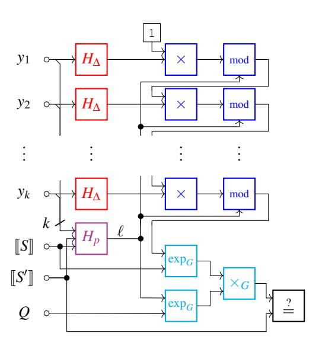
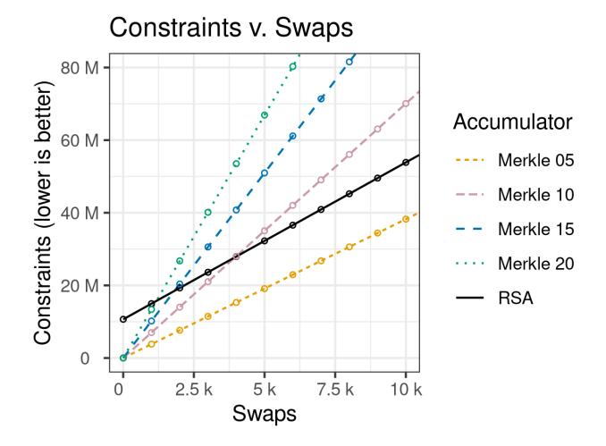
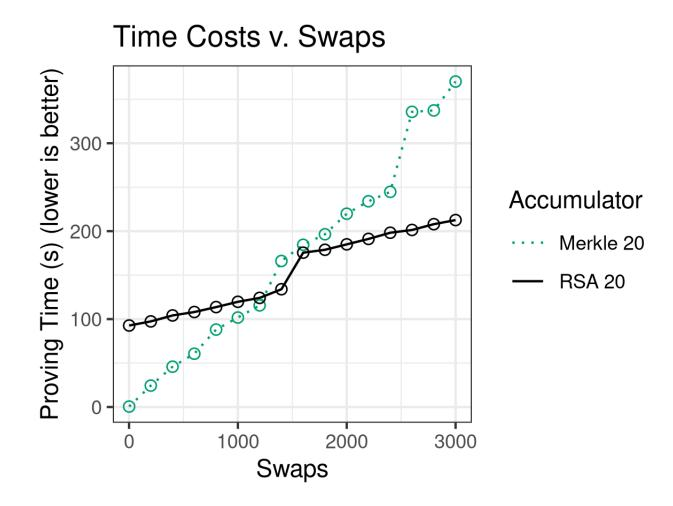
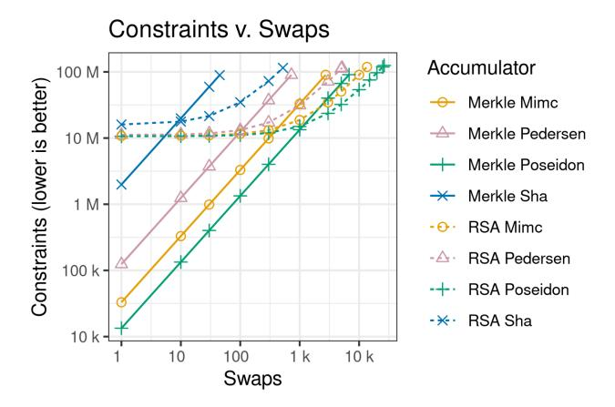
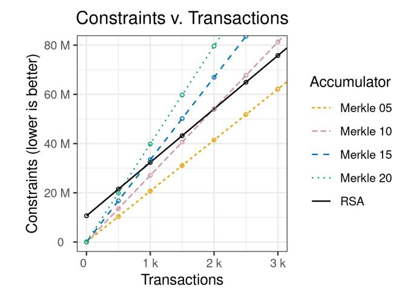
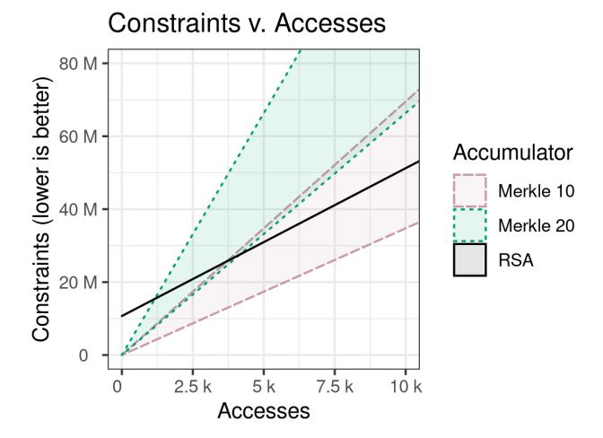

# Scaling Verifiable Computation Using Efficient Set Accumulators

Alex Ozdemir *Stanford*

Riad S. Wahby *Stanford*

Barry Whitehat *No Affiliation*

Dan Boneh *Stanford*

{aozdemir,rsw,dabo}@cs.stanford.edu barrywhitehat@protonmail.com

### Abstract

Verifiable outsourcing systems offload a large computation to a remote server, but require that the remote server provide a succinct proof, called a SNARK, that proves that the server carried out the computation correctly. Real-world applications of this approach can be found in several blockchain systems that employ verifiable outsourcing to process a large number of transactions off-chain. This reduces the on-chain work to simply verifying a succinct proof that transaction processing was done correctly. In practice, verifiable outsourcing of state updates is done by updating the leaves of a Merkle tree, recomputing the resulting Merkle root, and proving using a SNARK that the state update was done correctly.

In this work, we use a combination of existing and novel techniques to implement an RSA accumulator inside of a SNARK, and use it as a replacement for a Merkle tree. We specifically optimize the accumulator for compatibility with SNARKs. Our experiments show that the resulting system reduces costs compared to existing approaches that use Merkle trees for committing to the current state. These results apply broadly to any system that needs to offload batches of state updates to an untrusted server.

## 1 Introduction

Verifiable outsourcing [\[4,](#page-14-0) [13,](#page-14-1) [15,](#page-14-2) [16,](#page-14-3) [21,](#page-14-4) [32,](#page-15-0) [45,](#page-15-1) [47,](#page-15-2) [49,](#page-15-3) [52,](#page-15-4) [56,](#page-15-5) [61,](#page-15-6) [78,](#page-16-0) [79,](#page-16-1) [96,](#page-16-2) [106–](#page-16-3)[108,](#page-16-4) [111–](#page-16-5)[115,](#page-16-6) [121,](#page-16-7) [123,](#page-16-8) [124\]](#page-16-9) is a technique that enables a weak client to outsource a computation to a powerful server. The server returns the result of the computation along with a proof that the computation was done correctly. The proof must be succinct, which means that it must be short and cheap to verify. Verifiable outsourcing is relevant in a number of scenarios, including weak IoT devices, wearables, and low-power devices.

More recently, verifiable outsourcing has been deployed in blockchain environments, because on-chain work is expensive—literally. Here, a batch of *k* transactions, say *k* = 1000, is outsourced to an untrusted server, called an *aggregator*, for processing. The aggregator (1) verifies that the transactions are valid (e.g., properly signed), (2) computes the updated global state resulting from these transactions, and

(3) generates a succinct proof that the aggregator correctly executed steps (1) and (2). The updated state and the succinct proof are then sent to the blockchain. In this approach, the (expensive) on-chain work is reduced to only verifying the proof—which is fast, taking time independent of the number of transactions *k*—and then recording the updated state. Example systems that operate this way include Rollup [\[7\]](#page-14-5), Coda [\[89\]](#page-16-10), Matter [\[86\]](#page-16-11), and Zexe [\[29\]](#page-15-7).

The process described above is called verifiable outsourcing of state update [\[32\]](#page-15-0). In more detail, the state is a set of elements *S* = {*x*1,..., *xM*} from some universe *X*. The blockchain (or a low-power device) stores only a succinct digest of *S*, e.g., the root of a Merkle tree whose leaves comprise the elements of *S*. The untrusted but powerful aggregator stores the full set *S*, in the clear. (Note that we treat *S* as public data—privacy is orthogonal to our goal, which is scalability). When processing a batch of transactions as described above, the aggregator updates *S* to produce a new set *S* 0 , then computes a new Merkle digest for *S* 0 that it sends to the blockchain to be verified and recorded. The aggregator's proof establishes that its starting state *S* is consistent with the current digest, that correctly applying transactions yields the ending state *S* 0 , and that the new digest is consistent with *S* 0 .

The succinct proof needed here is called a *SNARK* [\[19\]](#page-14-6), which we define in more detail in the next section. Constructing efficient SNARKs and optimizing their implementation is a very active area of research [\[13,](#page-14-1) [15,](#page-14-2) [16,](#page-14-3) [49,](#page-15-3) [64,](#page-15-8) [70,](#page-15-9) [96\]](#page-16-2), with several new systems just in the last year [\[11,](#page-14-7) [37,](#page-15-10) [43,](#page-15-11) [44,](#page-15-12) [62,](#page-15-13) [63,](#page-15-14) [85,](#page-16-12) [122\]](#page-16-13). A common thread in all of these systems is that the proving costs are enormous. In particular, proving imposes multiple-orders-of-magnitude slowdown compared to native execution [\[96,](#page-16-2) [106,](#page-16-3) [116\]](#page-16-14); this can be defrayed via parallel execution, e.g., in clusters [\[45,](#page-15-1) [121\]](#page-16-7) or on GPUs [\[108,](#page-16-4) [112\]](#page-16-15).

Perhaps more importantly, for widely deployed SNARKs, proving correctness of large computations requires an amount of RAM *proportional to the computation's execution time* [\[16,](#page-14-3) [96\]](#page-16-2). The result is that, even when proving is distributed across hundreds of workers, the largest reachable computation sizes are relatively small: only about 2 billion steps [\[121\]](#page-16-7). This imposes a strict upper bound on the number of transactions *k* that can be processed in a single batch.

This state of affairs has motivated a large body of work on computational primitives that yield efficient proofs. Examples include arithmetic [79, 96, 108], control flow [96, 108, 116], persistent state [4, 32, 49, 56, 105], and random-access memory [12, 13, 16, 32, 79, 116]. Our work continues in this vein, with a focus on reducing proving costs for computations involving persistent state or random-access memory.

**Our work.** A Merkle tree [90] is an example of an *accumulator* [17], a cryptographic primitive that lets one commit to a set S, and later prove that an element x is a member of S. Although Merkle trees are used pervasively in today's general-purpose verifiable state update applications, in this work we show that a Merkle tree is not the best choice for large batches of state updates when S is moderately to very large, say  $|S| \ge 2^{10}$ . In particular, we show that replacing Merkle trees with RSA-based accumulators [24, 40, 81] significantly improves proving time and/or reachable computation size. Our contributions are:

- We define a new operation for RSA accumulators, which we call MultiSwap, that provides a precise sequential semantics for batched verifiable state updates (§3).
- We synthesize existing and novel techniques for efficiently implementing MultiSwap (and, more generally, RSA accumulators) in the context of SNARKs (§4). These techniques include a hash function that outputs provable prime numbers, and a new division-intractable hash function. Our approach makes use of very recent advances in manipulating RSA accumulators [24].
- We apply our techniques in two contexts (§5). The first, called Rollup [7, 65, 94], is a technique for batching cryptocurrency transactions off-chain in order to save on-chain work. The second is a general-purpose RAM abstraction with long-lived state (i.e., over many proofs), which builds upon and improves prior work [12, 13, 16, 32, 116].
- We implement and evaluate (§6, §7). In particular, we compare our RSA accumulator implementation to Merkle trees in two benchmarks: one that measures only set operations, and one that implements a Rollup-style distributed payment application. We also compare our RAM abstraction with existing work via a cost model analysis.

In the set operations benchmark, we find that RSA accumulators surpass  $2^{20}$ -element Merkle trees for batches of  $\approx 1,300$  operations, and allow for  $3.3\times$  more operations to be performed in the largest proof sizes we consider. In the Rollup application, RSA accumulators surpass  $2^{20}$ -element Merkle trees for  $\approx 600$  transactions, and allow  $1.9\times$  more transactions in the largest proofs. For RAM, we find that for a RAM of size  $2^{20}$ , RSA accumulators surpass Merkle trees for  $\approx 1000-4000$  accesses, depending on write load.

### 2 Background and definitions

**Multisets.** A *multiset* is an unordered collection that may contain multiple copies of any element.  $S_1 \uplus S_2$  denotes the union of multisets  $S_1$  and  $S_2$ , i.e., the multiset  $S_3$  where each element  $x \in S_3$  has multiplicity equal to the sum of the multiplicities of x in  $S_1$  and  $S_2$ , i.e., the multiset  $S_3$  where each element  $x \in S_3$  has multiplicity equal to the difference of multiplicities of x in  $S_1$  and  $S_2$ . Note that  $S_1 \boxminus S_2$  is only defined if  $S_2 \subseteq S_1$ .

**RSA groups.** An *RSA group* is the group  $\mathbb{Z}_N^{\times}$ , i.e., the multiplicative group of invertible integers modulo N, where N is the product of two secret primes. We define the *RSA quotient group* for N as the group  $\mathbb{Z}_N^{\times}/\{\pm 1\}$ . In this group, the elements x and N-x are the same, meaning that all elements can be represented by integers in the interval  $[1, \lfloor N/2 \rfloor]$ . It is believed that this group has no element of known order, other than the identity.

**Proofs and arguments.** Informally, a *proof* is a protocol between a prover  $\mathcal{P}$  and a PPT verifier  $\mathcal{V}$  by which  $\mathcal{P}$  convinces  $\mathcal{V}$  that  $\exists \upsilon : \mathfrak{R}(\iota, \upsilon) = 1$ , for a relation  $\mathfrak{R}$ ,  $\iota$  an input from  $\mathcal{V}$ , and  $\upsilon$  a (possibly empty) *witness* from  $\mathcal{P}$ . A proof satisfies the following properties:

- Completeness: If  $\exists \upsilon : \mathfrak{R}(\iota, \upsilon) = 1$ , then an honest  $\mathscr{P}$  convinces  $\mathscr{V}$  except with probability at most  $\varepsilon_c \ll 1/2$ .
- Soundness: If  $\not\exists \upsilon : \mathfrak{R}(\iota, \upsilon) = 1$ , no cheating prover  $\mathscr{Q}^{\star}$  convinces  $\mathscr{V}$  except with probability at most  $\varepsilon_s \ll 1/2$ .

If soundness holds only against PPT  $\mathcal{P}^{\star}$ , this protocol is instead called an *argument*. When the witness  $\upsilon$  exists, one may also require the proof system to provide *knowledge soundness*. Informally this means that whenever  $\mathcal{P}$  convinces  $\mathcal{V}$  that  $\exists \upsilon : \mathfrak{R}(\iota, \upsilon) = 1, \upsilon$  exists *and*  $\mathcal{P}$  "knows" a witness  $\upsilon$  (slightly more formally, there exists a PPT algorithm, an *extractor*, that can produce a witness via oracle access to  $\mathcal{P}$ ).

**Proof of exponentiation.** Let  $\mathbb G$  be a finite group of unknown order. We solowski [120] describes a protocol that allows  $\mathcal P$  to convince  $\mathcal V$  that  $y=x^n$  in  $\mathbb G$ , namely a protocol for the relation  $\mathfrak R$  given by  $\mathfrak R\big((n,x,y),\cdot\big)=1\iff y=x^n\in\mathbb G$ . The protocol is: on input (n,x,y),  $\mathcal V$  sends to  $\mathcal P$  a random  $\ell$  chosen from the first  $2^\lambda$  primes.  $\mathcal P$  sends back  $Q=x^{\lfloor n/\ell\rfloor}\in\mathbb G$ , and  $\mathcal V$  accepts only if  $Q^\ell\cdot x^{n\bmod \ell}=y\in\mathbb G$  holds.

This protocol is complete by inspection. We solowski shows that it is sound if the group  $\mathbb{G}$  satisfies the *adaptive root assumption*, roughly, it is infeasible for an adversary to find a random root of an element of  $\mathbb{G}$  chosen by the adversary. The RSA quotient group  $\mathbb{Z}_N^{\times}/\{\pm 1\}$  is conjectured to satisfy this assumption when  $\mathcal{P}$  cannot factor N [23].

**Division-intractable hashing.** Recall that a hash function  $H: X \to \mathcal{D}$  is collision resistant if it is infeasible for a PPT

&lt;sup>1When this protocol is made non-interactive via the Fiat-Shamir heuristic, the challenge must instead be drawn from the first  $2^{2\lambda}$  primes [120; 23, §3.3].

adversary to find distinct  $x_0, x_1$  such that  $H(x_0) = H(x_1)$ . Informally, H is division intractable if the range of H is  $\mathbb{Z}$ , and it is infeasible for a PPT adversary to find  $\hat{x}$  and a set  $\{x_i\}$  in X such that  $\hat{x} \notin \{x_i\}$  and  $H(\hat{x})$  divides  $\prod_i H(x_i)$ . A collision-resistant hash function that outputs prime numbers is division intractable. We construct a different division intractable hash function in Section 4.2.

**Pocklington primality certificates.** Let p be a prime, and r < p and a be positive integers. Define  $p' = p \cdot r + 1$ . Pocklington's criterion [34] states that if  $a^{p \cdot r} \equiv 1 \mod p'$  and  $\gcd(a^r - 1, p') = 1$ , then p' is prime. In this case, we say that (p, r, a) is a *Pocklington witness* for p'.

Pocklington's criterion is useful for constructing primality certificates. For a prime  $p_n$ , this certificate comprises

$$(p_0,\{(r_i,a_i)\}_{0< i\leq n})$$

where  $p_i = p_{i-1} \cdot r_i + 1$ . To check this certificate, first verify the primality of the small prime  $p_0$  (e.g., using a deterministic primality test), then verify the Pocklington witness  $(p_{i-1}, r_i, a_i)$  for  $p_i$ ,  $0 < i \le n$ . If each  $r_i$  is nearly as large as  $p_i$ , the bit lengths double at each step, meaning that the total verification cost is dominated by the cost of the final step.

### 2.1 Accumulators

A *cryptographic accumulator* [17] commits to a collection of values (e.g., a vector, set, or multiset) as a succinct digest. This digest is *binding*, meaning informally that it is computationally infeasible to equivocate about the collection represented by the digest. In addition, accumulators admit succinct proofs of membership and, in some cases, non-membership.

**Merkle trees.** The best-known vector accumulator is the Merkle tree [90]. To review, this is a binary tree that stores a vector in the labels of its leaves; the label associated with an internal node of this tree is the result of applying a collision-resistant hash H to the concatenation of the children's labels; and the digest representing the collection is the label of the root node.

A membership proof for the leaf at index i is a path through the tree, i.e., the labels of the siblings of all nodes between the purported leaf and the root. Verifying the proof requires computing the node labels along the path and comparing the final value to the digest (the bits of i indicate whether each node is the right or left child of its parent). Updating a leaf's label is closely related: given a membership proof for the old value, the new digest is computed by swapping the old leaf for the new one, then computing the hashes along the path. Merkle trees do not support succinct non-membership proofs.

The cost of verifying k membership proofs for a vector comprising  $2^m$  values is  $k \cdot m$  evaluations of H. The cost of k leaf updates is  $2 \cdot k \cdot m$  evaluations. Membership proofs and updates cannot be batched for savings.

**RSA accumulators.** The RSA multiset accumulator [40, 81] represents a multiset S with the digest

$$[S] = g^{\prod_{s \in S} H(s)} \in \mathbb{G},$$

where g is a fixed member of an RSA quotient group  $\mathbb{G}$  and H is a division-intractable hash function (§2). Inserting a new element s into S thus requires computing  $[S]^{H(s)}$ .

To prove membership of  $s \in S$ , the prover furnishes the value  $\pi = \llbracket S \rrbracket^{1/H(s)}$ , i.e., a H(s)'th root of  $\llbracket S \rrbracket$ . This proof is verified by checking that  $\pi^{H(s)} = \llbracket S \rrbracket$ .

Non-membership proofs are also possible [81], leveraging the fact that  $s' \notin S$  if and only if  $\gcd(H(s'), \prod_{s \in S} H(s)) = 1$ . This means that the Bézout coefficients a, b, i.e., integers satisfying

$$a \cdot H(s') + b \cdot \prod_{s \in S} H(s) = 1$$

are a non-membership witness, since the above implies that

$$[S]^b \cdot (g^a)^{H(s')} = g$$

Because a is large and b is small, the proof  $(g^a, b)$  is succinct. Insertions, membership proofs, and non-membership proofs can all be batched [24] via Wesolowski proofs (§2). For example, since  $[S \uplus \{s_i\}] = [S]^{\prod_i s_i}$ , computing an updated digest directly requires an exponentiation by  $\prod_i s_i$ . In contrast, checking the corresponding proof only requires computing and then exponentiating by  $\prod_i s_i \mod \ell$ , for  $\ell$  a prime of less than 200 bits. This means that the exponentiation (but not the multiplication) to verify a batch proof has constant size.

### 2.2 Verifiable computation and SNARKs

Several lines of built systems [13, 15, 16, 21, 32, 47, 49, 61, 79, 96, 106–108, 112, 113, 124] enable the following high-level model.2 A verifier  $\mathcal{V}$  asks a prover  $\mathcal{P}$  to convince it that  $y = \Psi(x)$ , where  $\Psi$  is a program taking input x and returning output y. To do so,  $\mathcal{P}$  produces a short certificate that the claimed output is correct. Completeness holds with  $\varepsilon_c = 0$ ; soundness holds as long as  $\mathcal{P}$  is computationally bounded, with  $\varepsilon_s$  negligible in a security parameter (§2).

Roughly speaking, these systems comprise two parts. In the *front-end*,  $\mathcal V$  compiles  $\Psi$  into a system of equations  $\mathcal C(X,Y,Z)$ , where X,Y, and Z are (vectors of) formal variables.  $\mathcal V$  constructs  $\mathcal C$  such that z satisfying  $\mathcal C(X=x,Y=y,Z=z)$  exists (that is, the formal variable X is bound to the value x, and so on) if and only if  $y=\Psi(x)$ . The *back-end* comprises cryptographic and complexity-theoretic machinery by which  $\mathcal P$  convinces  $\mathcal V$  that a witness z exists for X=x and Y=y.

This paper focuses on compilation in the front-end. We target back-ends derived from GGPR [64] via Pinocchio [96] (including [15, 16, 70]), which we briefly describe below.

&lt;sup>2The description in this section owes a textual and notational debt to the description in Buffet [116], which works in the same model.

Our work is also compatible with other back-ends, e.g., Za-atar [106], Ligero [2], Bulletproofs [36], Sonic [85], and Aurora [14].3

GGPR, Pinocchio and their derivatives instantiate *zero-knowledge Succinct Non-interactive ARguments of Knowledge with preprocessing* (zkSNARKs), which are argument protocols satisfying completeness, knowledge soundness, and zero knowledge (§2), where knowledge soundness and zero knowledge apply to the assignment to Z. In addition, these protocols satisfy *succinctness*: informally, proof length and verification time are both sublinear in |C| (here, proofs are of constant size, while V's work is O(|X|+|Y|)). These protocols include a preprocessing phase, in which V (or someone that V trusts) processes C to produce a *structured reference string* (SRS), which is used by P to prove and V to verify. The cost of the preprocessing phase and the length of the SRS are O(|C|). The cost of the proving phase is  $O(|C|\log|C|)$  in time and O(|C|) in space (i.e., prover RAM).

The system of equations C(X,Y,Z) is a *rank-1 constraint system* (R1CS) over a large finite field  $\mathbb{F}_p$ . An R1CS is defined by three matrices,  $A,B,C\in\mathbb{F}_p^{|C|\times(1+|X|+|Y|+|Z|)}$ . Its satisfiability is defined as follows: for W the column vector of formal variables  $[1,X,Y,Z]^\mathsf{T}$ , C(X,Y,Z) is the system of |C| equations  $(A\cdot W)\circ(B\cdot W)=C\cdot W$ , where  $\circ$  denotes the Hadamard (element-wise) product. In other words, an R1CS C is a conjunction of |C| constraints in |X|+|Y|+|Z| variables, where each constraint has the form "linear combination times linear combination equals linear combination."

These facts outline a computational setting whose costs differ significantly from those of CPUs. On a CPU, bit operations are cheap and word-level arithmetic is slightly more costly. In an R1CS, addition is free, word-level multiplication has unit cost, and bitwise manipulation and many inequality operations are expensive; details are given below.

Compiling programs to constraints. A large body of prior work [13, 16, 32, 79, 96, 106–108, 115, 116] deals with efficiently compiling from programming languages to constraints.

An important technique for non-arithmetic operations is the use of *advice*, variables in Z whose values are provided by the prover. For example, consider the program fragment x != 0, which cannot be concisely expressed in terms of rank-1 constraints. Since constraints are defined over  $\mathbb{F}_p$ , this assertion might be rewritten as  $X^{p-1} = 1$ , which is true just when  $X \neq 0$  by Fermat's little theorem. But this is costly: it requires  $O(\log p)$  multiplications. A less expensive way to express this constraint is  $Z \cdot X = 1$ ; the satisfying assignment

to Z is  $X^{-1} \in \mathbb{F}_p$ . Since every element of  $\mathbb{F}_p$  other than 0 has a multiplicative inverse, this is satisfiable just when  $X \neq 0$ .

Comparisons, modular reductions, and bitwise operations make heavy use of advice from  $\mathcal{P}$ . For example, the program fragment y = x1 & x2, where x1 and x2 have bit width b and & is bitwise AND, is represented by the following constraints:

$$\begin{split} Z_{1,0} + 2 \cdot Z_{1,1} + \ldots + 2^{b-1} \cdot Z_{1,b-1} &= X_1 \\ Z_{2,0} + 2 \cdot Z_{2,1} + \ldots + 2^{b-1} \cdot Z_{2,b-1} &= X_2 \\ Z_{3,0} + 2 \cdot Z_{3,1} + \ldots + 2^{b-1} \cdot Z_{3,b-1} &= Y \\ Z_{1,0} \cdot (1 - Z_{1,0}) &= 0 \\ & \ldots \\ Z_{1,b-1} \cdot (1 - Z_{1,b-1}) &= 0 \\ Z_{2,0} \cdot (1 - Z_{2,0}) &= 0 \\ & \ldots \\ Z_{2,b-1} \cdot (1 - Z_{2,b-1}) &= 0 \\ Z_{1,0} \cdot Z_{2,0} &= Z_{3,0} \\ & \ldots \\ Z_{1,b-1} \cdot Z_{2,b-1} &= Z_{3,b-1} \end{split}$$

Here, the variables  $Z_{1,0} \dots Z_{1,b-1}$  contain a purported bitwise expansion of  $X_1$ , and likewise  $Z_{2,0} \dots Z_{2,b-1}$  and  $Z_{3,0} \dots Z_{3,b-1}$  for  $X_2$  and Y, respectively. The first three constraints ensure that the assignment to Z meets this requirement provided that each  $Z_{i,j}$  is assigned either 0 or 1; the remaining constraints ensure the latter. This operation is known as *bit splitting*; its cost for a b-bit value is b+1, so the above program fragment costs  $3 \cdot b + 3$  constraints in total. Comparisons and modular reductions also require bit splitting.

Compiling conditionals to constraints requires expanding all branches into their corresponding constraints and selecting the correct result. Loops are similar; loop bounds must be statically known. For example, the program fragment

if 
$$(x1 != 0) \{ y = x2 + 1 \}$$
else  $\{ y = x2 * 3 \}$ 

compiles to the constraints

$$Z_1 \cdot X_1 = Z_2 \tag{1}$$

$$Z_3 \cdot (Z_2 - 1) = 0 \tag{2}$$

$$(1 - Z_3) \cdot X_1 = 0 \tag{3}$$

$$(1 - Z_3) \cdot (Y - X_2 - 1) = 0 \tag{4}$$

$$Z_3 \cdot (Y - 3 \cdot X_2) = 0 \tag{5}$$

This works as follows: if  $X_1 = 0$ ,  $Z_2 = 0$  by (1), so  $Z_3 = 0$  by (2) and  $Y = X_2 + 1$  by (4). Otherwise,  $Z_3 = 1$  by (3), so  $Z_2 = 1$  by (2),  $Z_1 = X_1^{-1}$  by (1), and  $Y = 3 \cdot X_2$  by (5).

**Multiprecision arithmetic.** xJsnark [79] describes techniques for compiling multiprecision arithmetic to efficient constraint systems. In brief, large integers are represented as a sequence of *limbs* in  $\mathbb{F}_p$ . The limb width,  $b_l$ , is defined such

&lt;sup>3We do not target STARK [11] (which uses a different  $\mathcal{C}$  representation) or systems built on GKR [67] and CMT [47], e.g., vRAM [124], Hyrax [117], and Libra [122] (which restrict  $\mathcal{C}$  in ways this work does not comprehend).

&lt;sup>4We do not target zero-knowledge applications in this work, but our techniques may be applicable in that setting when combined with prior zero-knowledge approaches for RSA accumulators [40]; this is future work.

that a *b*-bit number *a* is represented as  $\eta = \lceil b/b_l \rceil$  limbs  $\{\hat{a}_i\}$ , where  $a = \sum_{i=0}^{\eta-1} \hat{a}_i \cdot 2^{b_l \cdot i}$ . For correctness, the compiler must track the maximum value of each number and ensure that  $\mathcal{C}$  contains constraints that encode a sufficient number of limbs.

Multiprecision operations rely heavily on advice from  $\mathcal{P}$ . At a high level,  $\mathcal{P}$  supplies the result of a multiplication or addition, and the compiler emits constraints to check that result. Subtractions and divisions are checked by verifying the inverse addition or multiplication, respectively. xJsnark describes a range of optimizations that reduce the required number of constraints. We leave details to [79], because they are not necessary to understand our further optimizations (§4.3).

### **Random-access memory**

Programs that make use of RAM—in particular, programs whose memory accesses depend on the input, and thus cannot be statically analyzed—present a challenge for compiling to constraints. Prior work demonstrates three solutions. We now describe each, and compare costs and functionality below.

**Linear scan.** The most direct approach to emulating RAM in constraints is to perform a linear scan [79, 96]. Concretely,  $Y = \mathsf{LOAD}(Z)$  compiles to a loop that scans through an array, comparing the loop index to Z and, if they match, setting Y to the corresponding value. (STORE is analogous.)

**The Pantry approach.** In Pantry [32], the authors borrow a technique from the memory-checking literature [20] based on Merkle trees [90] (see also §2.1). In particular, Pantry stores the contents of RAM in the leaves of a Merkle tree whose root serves as ground truth for the state of memory.

For a LOAD,  $\mathcal P$  furnishes advice comprising a purported value from memory, plus a Merkle path authenticating that value. The corresponding constraints encode verification of the Merkle path, i.e., a sequence of hash function invocations and an equality check against the Merkle root. For a STORE,  $\mathcal P$  furnishes, and the constraints verify, the same values as for a LOAD. In addition, the constraints encode a second sequence of hash function invocations that compute a new Merkle root corresponding to the updated memory state.

The BCGT approach. Ben-Sasson et al. [12] introduce, and other work [13, 16, 79, 116] refines, an approach building on the observation [3] that one can check a sequence of RAM operations using an *address-ordered transcript*, i.e., the sequence of RAM operations sorted by address accessed, breaking ties by execution order. In such a transcript, each LOAD is preceded either by the corresponding STORE or by another LOAD from the same address; correctness of RAM dictates that this LOAD should return the same value as the preceding operation. (A LOAD from an address to which no value was previously stored returns a default value, say, 0.)

Leveraging this observation, correctness of memory operations is compiled to constraints as follows. First, every access to memory appends a tuple ( $IDX_i$ ,  $OP_i$ ,  $ADDR_i$ ,  $DATA_i$ ) to an

execution-ordered transcript; here,  $IDX_i = i$  is the index of the memory operation and  $OP_i$  is either LOAD or STORE. Then  $\mathcal{P}$  furnishes a purported address-ordered transcript  $\mathcal{T}$ , and the constraints check its correctness by ensuring that (1) transcript  $\mathcal{T}$  is a permutation of the execution-ordered transcript, (2) each sequential pair of entries in transcript  $\mathcal{T}$  is indeed correctly ordered, and (3) each sequential pair of entries in transcript  $\mathcal{T}$  is coherent, i.e., each LOAD returns the value of the previous STORE (or the default if no such STORE exists). Check (1) is implemented with a routing network [18, 118].

Costs and functionality. Roughly speaking, for tiny memories linear scan is cheapest; otherwise, BCGT-style RAM is. In more detail, assume a memory of size  $2^m$ , accessed k times. For a linear scan, each RAM operation costs  $O(2^m)$  constraints. (i.e.,  $2^m$  copies of constraints encoding conditional assignment). For Pantry, each LOAD entails m copies of constraints encoding a collision-resistant hash function and each STORE entails 2m such copies, where such hash functions entail a few hundred to a few thousand constraints (§6; [15, 32, 79]). For BCGT, each RAM operation costs  $O(\log k)$  constraints for the routing network, O(m) constraints for address comparison, and O(1) constraints for coherence checking, all with good constants [116, Fig. 5].

Although Pantry-style RAM is costly, it offers functionality that the other two do not: the ability to pass the full state of a large RAM from one computation to another. Pantry accomplishes this by including in X the Merkle root corresponding to the initial RAM state; this has constant size (usually one element of  $\mathbb{F}_p$ ). In contrast, BCGT and linear scan would both require  $2^m$  values in X for a  $2^m$ -sized RAM; as discussed above, this would incur  $2^m$  cost for  $\mathcal{V}$  in verification. (Prior work [15, 16] uses this approach to *partially* initialize RAM.)

### 3 Swap sequences via batched operations

In this section, we define a new primitive, which we call MultiSwap, that exposes a sequential update semantics for RSA accumulators (§2.1). MultiSwap takes an accumulator and a list of pairs of elements, removing the first element from each pair and inserting the second. The key property of this primitive is that it is defined in terms of *batched* insertions and removals. In Section 4, we show how these batched operations are efficiently implemented as a system of constraints (§2.2).

In more detail, let S and S' be multisets, and let  $(x_1,y_1),\ldots,(x_n,y_n)$  be a sequence of operations, called *swaps*, that replaces each  $x_i$  by  $y_i$  in order:  $(x_1,y_1)$  applied to S produces some new set  $S_1 = S \boxminus \{x_1\} \uplus \{y_1\}$ ; then  $(x_2,y_2)$  applied to  $S_1$  produces  $S_2 = S_1 \boxminus \{x_2\} \uplus \{y_2\}$ , etc. Our goal is to verify that when the above sequence is applied to S, the result

&lt;sup>5An exception is a computation with an enormous number of memory accesses where Pantry would win. But the number of accesses to reach this asymptote is well beyond the reach of practical proof systems.

is  $S' = S_n$ . Recall from Section 2.1 that RSA accumulators admit efficient *batched* insertions (deletions are analogous; §4). Our question is: how can we use this *un-ordered* primitive to implement one with *ordered* semantics?

Consider the following naïve solution: first verify the deletions, then verify the insertions. In other words, verify that there exists some  $S_{\text{mid}}$  such that  $S \boxminus \{x_i\} = S_{\text{mid}}$  and  $S_{\text{mid}} \uplus \{y_i\} = S'$ . The problem with this approach is that it does not permit certain valid sequences, i.e., those in which a later swap deletes an item inserted by an earlier swap. (To see why, notice that  $S_{\text{mid}}$  only exists if all  $x_i \in S$ .)

Instead, our solution first verifies all the insertions, and then verifies all the deletions, irrespective of the order in which the operations are listed. In other words, it verifies the predicate

$$\exists S_{\text{mid}}: \quad S \uplus \{y_i\} = S_{\text{mid}} \quad \land \quad S_{\text{mid}} \boxminus \{x_i\} = S' \quad (6)$$

(Note that  $S_{\text{mid}} \boxminus \{x_i\} = S'$  is equivalent to  $S' \uplus \{x_i\} = S_{\text{mid}}$ .) Intuitively, Equation (6) holds just when each element of an unordered multiset of swaps  $\{(x_i, y_i)\}$  can be applied to S in some order to produce S'. As we discuss below, this multiset may include *cycles*, subsets of swaps that have no net effect.

We now give a precise semantics for MultiSwap. Let MultiSwap( $S, \sigma, S'$ ) denote the predicate that holds just when Equation (6) is satisfied. Let  $\sigma$  denote an unordered multiset of swaps  $\{(x_i, y_i)\}$ . A swap  $(x_i, y_i)$  is *valid* for  $S^*$  if  $x_i \in S^*$ . We say that  $\sigma$  is *sequentially consistent* with respect to S if there exists some ordering on  $\sigma$  such that all swaps are valid when applied in that order starting from S. Furthermore, we say that  $\sigma$  *produces* S' *from* S if S' is the product of such an application order to S, and we say that  $\sigma^c$  is a *cycle* if it comprises  $\{(c_0, c_1), (c_1, c_2), \dots, (c_n, c_0)\}$ .

**Lemma 1.** MultiSwap( $S, \sigma, S'$ ) holds if and only if there exist any number of cycles  $\sigma_i^c$  and cycle-free  $\sigma' \subseteq \sigma$  such that  $\sigma = \sigma' \uplus \uplus_i \sigma_i^c$ ,  $\sigma'$  is sequentially consistent with respect to S, and  $\sigma'$  produces S' from S.

The proof of Lemma 1 is in Appendix A. Section 5 applies MultiSwap to problems that need sequential semantics for batched verifiable state updates.

### 4 Batched operations from constraints

In the previous section we described how the MultiSwap primitive is built from batched insertions and removals. In this section we describe these batched operations, the primitives that they are built on, and how those primitives are implemented as a set of constraints  $\mathcal{C}$  (§2.2).

Recall (§2.1) that RSA accumulators support batched insertions through an interactive protocol whose final check is

$$Q^{\ell} \cdot \llbracket S \rrbracket^{\prod_{i} H_{\Delta}(y_{i}) \bmod \ell} = \llbracket S \uplus \{y_{i}\} \rrbracket \tag{7}$$

where  $[\cdot]$  denotes a digest; S, the initial multiset;  $\ell$ , a random prime challenge;  $\{y_i\}$ , the inserted elements;  $H_{\Delta}$ , a division-intractable hash function; and Q, a witness from  $\mathcal{P}$ . Removing

Figure 1: Insertion proof verification procedure (§4), which checks that Q is a valid Wesolowski proof (§2) for the exponentiation  $[S'] = [S]^{\prod_i H_{\Delta}(y_i)}$  on challenge  $\ell$ . To do so, it computes  $\ell = H_p(y_1, \ldots, y_k)$  (purple box, bottom left), computes  $\prod_i H_{\Delta}(y_i) \mod \ell$  (red and blue boxes, top), computes the LHS of the verification equation (cyan boxes, bottom right), and checks that equation (black box, bottom right).  $H_{\Delta}$  is a division-intractable hash function (§4.2),  $H_p$  is a hash to a prime (§4.1), and G is an RSA quotient group (§2).

elements  $\{x_i\}$  is similar, except that  $S \boxminus \{x_i\}$  is regarded as the initial multiset and S the final one.6

To instantiate this interactive protocol in constraints, we apply the Fiat-Shamir heuristic [55], i.e.,  $\mathcal{C}$  computes the challenge  $\ell$  by hashing all of the inputs to the protocol. Figure 1 illustrates the insertion proof's verification procedure. MultiSwap requires two proofs (one for insertion and one for removal); for this purpose, we hash all inputs to both proofs to derive a common challenge, as is standard [50].

In the rest of this section we explain how to efficiently implement the blocks of Figure 1 in constraints. In particular, we explain how to implement  $H_p$ , the prime hash function used to compute  $\ell$  (§4.1) and  $H_{\Delta}$ , the division-intractable hash function used to hash each element (§4.2). We also describe optimizations for multiprecision operations (§4.3). Finally, we discuss  $\mathcal{P}$ 's cost for generating the witness input Z to C (§2.2), notably, the digests  $S \uplus \{y_i\}$  and  $S \boxminus \{x_i\}$  and the corresponding witnesses Q for insertion and removal (§4.4).

&lt;sup>6Proofs of non-membership (§2.1) use similar primitives; we do not discuss them in detail because they are not necessary for MultiSwap.

&lt;sup>7This requires that we model the concrete hash function that outputs  $\ell$  as a random oracle [8]; similar assumptions are common in practice.

### 4.1 Hashing to primes

The hash function  $H_p$  (Fig. 1) generates the challenge  $\ell$  used in the Wesolowski proofs of batch insertion and removal. These proofs are sound when  $\mathcal{P}$  has negligible probability of guessing the factors of  $\ell$  before evaluating  $H_p$  [120]. In the non-interactive setting, one way to ensure this is by choosing  $\ell$  at random from the first  $2^{2\lambda}$  primes (Fn. 1, §2). In our context, however, a more efficient approach is for  $H_p$  to output slightly larger primes that are guaranteed by construction to have  $2\lambda$  bits of entropy.8 Soundness is identical.

In standard settings (i.e., outside of constraints), a typical approach (§8) for hashing to a random prime is rejection sampling. Here, the input is fed to a collision-resistant hash whose output seeds a pseudorandom generator (PRG), then the PRG's outputs are tested in sequence until a prime is found. Verifying correct execution requires, at the very least, testing primality of the purported output. This is typically done with a probabilistic primality test like Miller-Rabin [98]. Such tests, however, generally require many iterations for soundness, where each iteration involves an exponentiation modulo the prime being tested. This would be far too costly if implemented directly in constraints.

Instead, we take advantage of advice from  $\mathcal{P}$  (§2.2). At a high level,  $\mathcal{P}$  helps to recursively construct a Pocklington certificate (§2) for  $H_p$ 's output, where each intermediate prime  $p_i$  is the result of hashing  $H_p$ 's input. (This is related to prior approaches; see §8.) This strategy is economical when implemented in constraints, because it uses very little pseudorandomness and requires only *one* exponentiation modulo the resulting prime, plus a few smaller exponentiations.

We now describe the recursive step used to construct  $p_i$  from  $p_{i-1}$ . Further below, we describe the base case and give implementation details. Recall (§2) that a Pocklington witness for  $p_i$  comprises  $(p_{i-1}, r_i, a_i)$  such that  $p_i = p_{i-1} \cdot r_i + 1$ . (If  $p_i$  is prime, some  $a_i$  must exist.) Notice that, given  $p_{i-1}$ , one can find  $p_i$  by testing candidate  $r_i$  values until  $p_{i-1} \cdot r_i + 1$  is prime. To implement this in constraints, we let  $r_i = 2^{b_{n_i}} \cdot h_i + n_i$ , where  $n_i$  is a  $b_{n_i}$ -bit number provided by  $\mathcal P$  as advice and  $h_i$  is a  $b_{n_i}$ -bit pseudorandom number (we discuss its generation below).  $\mathcal P$  furnishes a corresponding  $a_i$  and  $\mathcal C$  includes constraints that compute  $p_i$  and  $r_i$ , and check the witness.

The base case is  $p_0 = 2^{b_{n_0}} \cdot h_0 + n_0$ , for  $h_0$  a pseudorandom number and  $n_0$  supplied by  $\mathcal{P}$ . We fix  $b_{n_0} + b_{h_0} = 32$ , i.e.,  $p_0 < 2^{32}$ , and the constraints test primality of  $p_0$  using a deterministic 3-round Miller-Rabin test that works for all values up to  $2^{32}$  [73]. This test requires 3 exponentiations modulo  $p_0$  with exponents less than 32 bits; these are inexpensive.

We choose bit widths  $b_{n_i}$  such that a valid  $n_i$  exists with overwhelming probability, then choose  $b_{h_i}$  subject to the constraint that  $b_{h_i} + b_{n_i} < \log p_{i-1}$ , which ensures that  $r_i < p_{i-1}$  as required (§2). The entropy of each  $p_i$  is  $\sum_{i=0}^{i} b_{h_i}$ ; four

| Iteration, i        | 0  | 1  | 2   | 3   | 4   |
|---------------------|----|----|-----|-----|-----|
| max. $p_i$ bitwidth | 32 | 63 | 124 | 245 | 322 |
| $b_{h_i}$           | 21 | 20 | 49  | 108 | 63  |
| $b_{n_i}$           | 11 | 11 | 12  | 13  | 14  |

Figure 2: Bitwidths for recursive primality proofs in our system. While the  $b_{h_i}$  sum to 261, there are only 256 bits of entropy because each  $h_i$  has its high bit fixed to 1 (§4.1).

rounds suffice for 256 bits of entropy using the parameters listed in Figure 2. C generates  $h_i$  by hashing the input to  $H_p$  with a hash function H modeled as a random oracle.

Each iteration yields a prime approximately twice as wide as the prior iteration's; meanwhile, the cost of each iteration is dominated by an exponentiation. This means that our approach has cost less that that of two exponentiations modulo the final prime. In contrast, using Miller-Rabin to check a 264-bit prime (which has roughly 256 bits of entropy) would require 80 exponentiations modulo that prime to give  $\approx\!2^{-80}$  probability of outputting a composite (because Miller-Rabin is a probabilistic primality test). Our approach thus saves more than an order of magnitude and provably outputs a prime.

One final optimization is to force the most significant bit of each  $h_i$  to 1; this establishes a lower bound on each  $p_i$  and on  $\ell$  (which is the final  $p_i$ ). As we discuss in Section 4.3, having this lower bound reduces the cost of modular reductions. The tradeoff is a small loss in entropy, namely, 1 bit per iteration. Even so, four rounds suffice to produce a 322-bit prime 9 with 256 bits of entropy.

### 4.2 Division-intractable hashing

Coron and Naccache show [48] that a hash function H that outputs sufficiently large integers is division intractable when modeled as a random oracle. Informally, this is because in any randomly-selected set of large (say, 2000 bit) numbers, each element has a *distinct*, moderately sized (say, 200 bit) prime factor with high probability.

Security of this hash function rests on the fact that the density of integers in the interval  $[0,\alpha)$  with factors all less than  $\mu$  approaches  $\beta^{-\beta+o(1)}$  as  $\alpha\to\infty$ , where  $\beta=\frac{\log\alpha}{\log\mu}$ . We conjecture that this density also holds for a large interval around  $\alpha$ , namely,  $\left[\alpha,\alpha+\alpha^{1/8}\right)$ . (This is closely related to a conjecture on which the elliptic curve factorization method relies; there, the interval is  $\left[\alpha-\sqrt{\alpha},\alpha+\sqrt{\alpha}\right]$  [71].)

Our hash function is defined as follows: let  $\Delta$  be a public 2048-bit integer chosen at random, and let H be a hash function with codomain  $[0,2^{256})$  with 128-bit collision resistance. Then  $H_{\Delta}(x) = H(x) + \Delta$ . Security of this construction follows from the analysis of [48] in the random oracle model,

 $^8$ In this section, we use entropy to mean (the negative logarithm of)  $\mathcal{P}$ 's probability of guessing the correct value, i.e., the guessing entropy.

&lt;sup>9Even though the prime  $\ell$  comprises only 322 bits, C represents it with 352 (Fig. 3), which is the next multiple of the limb width  $b_l$  (32 bits; §2.2).

assuming the conjecture stated above. Concretely, we conjecture that an adversary making q queries to  $H_{\Delta}$  has probability roughly  $q \cdot 2^{-128}$  of breaking division intractability.

 $H_{\Delta}$ 's advantage over prior work is that its implementation in constraints is much smaller. The system parameter  $\Delta$  is baked into the constraints, and the only dynamic values to compute are the base hash H(x) and the sum  $H(x) + \Delta$ ; using known techniques [79], this sum is inexpensive. Moreover, since all hashes must be reduced modulo the challenge  $\ell$  (Eq. (7)) and  $H_{\Delta}(x) \mod \ell = (H(x) + (\Delta \mod \ell)) \mod \ell$ , the (costly) reduction  $\Delta \mod \ell$  can be checked once in the constraints and the result can be re-used for each  $H_{\Delta}(x)$ . We note that while this approach gives smaller  $\mathcal C$  than hashing to primes (because  $H_{\Delta}$  and modular reductions are cheaper), it increases  $\mathcal P$ 's work (because  $H_{\Delta}$ 's bit length is longer; §4.4).

## 4.3 Multiprecision arithmetic optimizations

We describe two optimizations for multiprecision arithmetic in constraints, building on ideas described in Section 2.2.

Computing greatest common divisor. We observe that addition and multiplication checks can be leveraged to verify a statement gcd(x,y) = d by checking three equations over  $\mathbb{Z}$ :

$$\exists a, b \qquad a \cdot x + b \cdot y = d \qquad (8)$$

$$\exists x' \qquad x' \cdot d = x$$

$$\exists y' \qquad y' \cdot d = y$$

In constraints, the existential variables above correspond to advice provided by  $\mathcal{P}$ . Verifying coprimality  $(\gcd(x,y)=1)$  reduces to condition (8), i.e., materializing the multiplicative inverse of x modulo y. We use this simplification in Section 4.1 to verify a Pocklington witness (§2).

**Optimizing division and modular reduction.** Prior work implements division and modular reduction for a dividend x and divisor d by having the prover provide, as advice, the quotient q and remainder r < d such that  $x = q \cdot d + r$ ; this equality is then checked with multiprecision arithmetic (§2.2). For correctness, C must enforce upper bounds on the bit widths of q and r via bit splitting (§2.2), which requires as many constraints as the sum of the bit widths of q and r.

Since r can range from 0 to d-1, its width is just that of d. The width of q, however, is slightly more subtle. Since q's value is  $\lfloor x/d \rfloor$ , a conservative choice is to assume q is as wide as x. But this choice is imprecise: q is only as wide as  $\lceil \log_2 \left( \lfloor x_{\max}/d_{\min} \rfloor \right) \rceil$ , where  $x_{\max}$  denotes x's maximum possible value, and  $d_{\min}$  denotes d's minimum possible value. (Intuitively, this is because q is small when d is large.)

As in prior work [79], our system uses a dataflow analysis to track the maximum value of each number, in order to determine the required representation size. To bound q's width more tightly using the above expression, we augment this dataflow analysis to also track *minimum* values.

## 4.4 Optimizing the cost of advice generation

The prior sections have treated  $\mathcal{P}$  as an advice oracle. We now discuss  $\mathcal{P}$ 's cost in computing this advice. Prior work [116, 121] shows that  $\mathcal{P}$ 's (single-threaded) cost per constraint is  $\approx 100~\mu s$  or more (this includes, e.g., an elliptic curve point multiplication per constraint [16, 64, 70, 96]). Computing most advice values—including for multiprecision operations and prime hashing—is negligible by comparison. Possible exceptions are the witnesses for Wesolowski proofs (§2) used by batch insertion and removal operations (§2.1). (Recall that one of each operation is required for a MultiSwap; §3.)

The witness for a batch insertion  $[S \uplus \{y_i\}] = [S]^{\prod_i H_{\Delta}(y_i)}$  is the value  $[S]^{\lfloor (\prod_i H_{\Delta}(y_i))/\ell \rfloor}$ . This exponent has length  $\approx 2048 \cdot k$  bits for k elements inserted. In microbenchmarks, GMP [66] computes a 2048-bit exponentiation modulo a 2048-bit N in  $\approx 2.5$  milliseconds (i.e., roughly  $25 \times P$ 's per-constraint proving cost), so computing this value costs roughly the same as  $25 \cdot k$  constraints, which is inconsequential (§5, Fig. 3).

Batch removal is much more expensive. To prove that removing the elements  $\{x_i\}$  from the multiset S yields a new multiset S',  $\mathcal{P}$  must prove that  $[S] = [S']^{\prod_i H_{\Delta}(x_i)}$ , where

$$\llbracket S' \rrbracket = \llbracket S \boxminus \{x_i\} \rrbracket = g^{\prod_{s \in S \boxminus \{x_i\}} H_{\Delta}(s)}$$

$$\tag{9}$$

No known method for computing [S'] is faster than directly evaluating this expression because the order of  $\mathbb G$  is unknown (recall that this computation is in  $\mathbb G = \mathbb Z_N^\times/\{\pm 1\}$  where N has unknown factorization; §2). Meanwhile, this exponent has bit length  $\approx 2048 \cdot M$ , for M the *total size* of the multiset S', i.e., it costs roughly the same as  $25 \cdot M$  constraints. (As discussed in the prior paragraph, given [S'] it is inexpensive to compute the witness for batch removal, namely,  $[S']^{\lfloor (\prod_i H_\Delta(x_i))/\ell \rfloor}$ ).

Even for large accumulators, this cost may be reasonable: as we show in Section 7, MultiSwap can easily save tens of millions of constraints compared to Merkle trees. On the other hand, proof generation can be parallelized [121], whereas at first glance the exponentiation in (9) appears to be strictly serial [22, 101]. We observe, however, that since g is fixed, a pre-computation phase can be used to sidestep this issue [33]. Specifically, for some upper bound  $2^m$  on the maximum size of the accumulator, the above exponent is at most  $2^{2048 \cdot 2^m}$ , so pre-computing the values  $g_i = g^{2^{i \cdot 2^m}}$ ,  $0 \le i < 2048$  (via successive squaring) turns the above exponentiation into a 2048-way multi-exponentiation [91] (which can be computed in parallel): for each  $g_i$ , the exponent is a  $2^m$ -bit chunk of the value  $\prod_{s \in S \boxminus \{x_i\}} H_{\Delta}(s)$ . Further parallelism is possible simply by computing more  $g_i$  with closer spacing.

This precomputation also enables a time-space tradeoff, via windowed multi-exponentiation [91, 110]. In brief, when computing a multi-exponentiation over many bases, first split the bases into groups of size t and compute for each group a table of size  $2^t$ . This turns t multiplications into a table lookup and one multiplication, for a factor of t speedup. t = 20 is rea-

sonable, and reduces the cost of computing the exponentiation in (9) to roughly the equivalent of  $1.25 \cdot M$  constraints.

The above pre-computation is a serial process that requires  $\approx 2048 \cdot 2^m$  squarings in  $\mathbb{G}$ . Assuming that 2048 squarings takes  $\approx 2.5$  milliseconds (i.e., the same amount of time as a general 2048-bit exponentiation; this is pessimistic), this precomputation takes  $\approx 2^m \cdot 2.5$  milliseconds. For m = 20, this is  $\approx 45$  minutes; for m = 25, it is  $\approx 1$  day. Note, however, that this pre-computation is entirely untrusted, so it can be done once by anyone and reused indefinitely for the same g.

Finally, the above precomputation requires materializing  $\prod_{s \in S \boxminus \{x_i\}} H_{\Delta}(s)$ , which is  $2^{31}$  bits when  $M = 2^{20}$ . This product can be expressed as a highly parallel computation; the final step is a multiplication of two,  $2^{30}$ -bit values, which can itself be parallelized via a Karatsuba-like approach.

We evaluate  $\mathcal{P}$ 's witness generation costs in Section 7.1.

## 5 Applications of MultiSwap

In this section we discuss two applications of MultiSwap and compare constraint costs for these applications when implemented using Merkle swaps and MultiSwaps.

MultiSwap **Costs.** The first two rows of Figure 3 model the costs of Merkle swaps and swaps computed via MultiSwap.

A Merkle swap requires hashing the old and new values and Merkle path verifications for each (§2.1), so the number of hash invocations is logarithmic in the number of leaves.

For a MultiSwap, each swap requires a  $H_{\Delta}$  invocation (§4.2), which comprises an invocation of the underlying hash H and multiprecision arithmetic to compute the result and multiply it mod  $\ell$  (§4, Fig. 1). In addition, each swap is an input to  $H_p$ , which requires another hash invocation. All of these costs are independent of the number of elements in the accumulator. MultiSwap also costs a large constant overhead, however; this is to generate  $\ell$  (§4.1) and check two Wesolowski proofs via modular exponentiations (§2, §4).

### 5.1 Verifiable outsourcing for smart contracts

Blockchain systems [26] like Ethereum [53] enable *smart contracts*: computations defined by a blockchain's users and executed as part of the block validation procedure. One application of smart contracts is implementing a form of verifiable state update (§1): for global state  $\Gamma$  (stored on the blockchain) and a transaction  $\gamma$  (submitted by a user), the computation (1) checks that  $\gamma$  is valid according to some predicate, and if so (2) updates the global state to a new value  $\Gamma'$ .

Consider, for example, a distributed payment system where  $\Gamma$  comprises a list of users and their public keys and balances. Transactions let users send payments to one another. When Alice wishes to send a payment, she constructs a transaction  $\gamma$  that includes (1) the target user; (2) the amount to send; and

(3) a digital signature over the prior two items; she submits this to the smart contract, which verifies it and updates  $\Gamma$ .

A major practical limitation of this approach is that computation, storage, and network traffic are extremely expensive for smart contracts. 10 One solution to this issue, Rollup [7, 65, 94], is an instance of verifiable computation (§2.2): the smart contract delegates the work of checking transactions to an untrusted aggregator, and then checks a proof that this work was done correctly. 11 To effect this, users submit transactions  $\gamma_i$  to the aggregator rather than directly to the smart contract. The aggregator assembles these transactions into a batch  $\{\gamma_i\}$ , then generates a proof  $\pi$  certifying the correct execution of a computation  $\Psi$  that verifies the batch and updates the global state from  $\Gamma$  to  $\Gamma'$ . Finally, the aggregator submits  $\pi$  and  $\Gamma'$ to the smart contract, which verifies the proof and stores the updated state. Checking this proof is substantially cheaper for the smart contract than verifying each transaction individually, and the exorbitant cost of smart contract execution justifies the aggregator's cost in generating the proof [115].

In more detail, the constraints  $\mathcal{C}$  corresponding to  $\Psi$  (§2.2) take the current state  $\Gamma$  as the input X and the updated state  $\Gamma'$  as the output Y.  $\mathcal{P}$  (i.e., the aggregator) supplies the batch  $\{\gamma_i\}$  as part of the witness (i.e., the advice vector Z), meaning that the smart contract can verify the proof without reading  $\{\gamma_i\}$ . This saves both computation and network traffic.

Notably, though, even reading  $\Gamma$  and  $\Gamma'$  is too expensive for the smart contract, as is storing  $\Gamma$  on the blockchain. (Recall that verifying a proof requires work proportional to the size of the inputs and outputs; §2.2.) The original Rollup design [7] addresses this by storing  $\Gamma$  in a Merkle tree (§2.1). The inputs and outputs of  $\mathcal C$  are just Merkle roots, and only this root is stored on the blockchain. Each leaf of this tree contains a tuple (pk, bal, #tx) comprising a user's public key, their balance, and a transaction count (which prevents replaying past transactions). The constraints that verify a transaction in  $\mathcal C$  thus require two Merkle tree updates, one each for payer and payee. (Each update comprises two Merkle paths; §2.1).

We observe that a single MultiSwap (§3) can replace all of the Merkle tree updates for a batch of transactions. In particular, MultiSwap's semantics guarantee sequential consistency of the transactions with respect to  $\Gamma$  and  $\Gamma'$ . And whereas the per-swap cost of Merkle swaps increase logarithmically with the number of accounts stored in  $\Gamma$ , the per-swap cost of MultiSwap is essentially independent of the number of users. This means that for large batches of transactions and/or large numbers of users, a MultiSwap-based Rollup requires far fewer constraints than a Merkle-based one.

**Costs.** The middle two rows of Figure 3 show costs for Rollup using Merkle and MultiSwap. Both cases pay to ver-

&lt;sup>10Anecdotally, recent Ethereum prices [54] result in storage costs of more than \$1 per kilobyte. Similarly, per-transaction costs are frequently in the \$0.25 to \$1 range even when executing minimal computation.

&lt;sup>11Rollup is distinct from *Optimistic Rollup* [58], which does not use cryptographic proofs and is not discussed in this paper.

#### Number of constraints

| System                                                                                   | System Per-Operation Costs                                                                                                                       |                                                                 | sts                       | Per-Proof Costs                                                                                                    |  |  |
|------------------------------------------------------------------------------------------|--------------------------------------------------------------------------------------------------------------------------------------------------|-----------------------------------------------------------------|---------------------------|--------------------------------------------------------------------------------------------------------------------|--|--|
| Merkle s                                                                                 | swap                                                                                                                                             | $2(c_{H_e}+m\cdot c_H)$                                         |                           |                                                                                                                    |  |  |
| MultiSw                                                                                  | /ap (§3, §4)                                                                                                                                     | $2(c_{H_e} + c_{H_{\text{in}}} + c_{\text{split}} + c_{+\ell})$ | $(f)+c_{\times_{\ell}})$  | $4c_{e_{\mathbb{G}}}( \ell ) + 2c_{\times_{\mathbb{G}}} + c_{H_p} + c_{\operatorname{mod}_{\ell}}(b_{H_{\Delta}})$ |  |  |
| Payment                                                                                  | ts (Merkle swap)                                                                                                                                 | Merkle swap $\times 2 + c_{si}$                                 | $_{\rm g}+c_{\rm tx}$     | Ŷ                                                                                                                  |  |  |
| Payments (MultiSwap)                                                                     |                                                                                                                                                  | MultiSwap $\times 2 + c_{\text{sig}} + c_{\text{tx}}$           |                           | MultiSwap                                                                                                          |  |  |
| RAM (N                                                                                   | Merkle-based [32])                                                                                                                               | $(1+w)(c_{H_e}+m\cdot c_{e})$                                   | (H)                       |                                                                                                                    |  |  |
| RAM (N                                                                                   | /lultiSwap)                                                                                                                                      | $MultiSwap + c_{mem-c}$                                         | heck                      | MultiSwap                                                                                                          |  |  |
| λ                                                                                        | security parameter (12                                                                                                                           | 8)                                                              | f                         | field width $(\log_2  \mathbb{F} )$ (255)                                                                          |  |  |
| $b_{H_{\Delta}}$                                                                         | bits in division-intractable hash output (2048)                                                                                                  |                                                                 | $b_{\mathbb{G}}$          | group element bits $(\log_2  G )$ (2048)                                                                           |  |  |
| $c_{H_e}$                                                                                | cost of multiset item hash to $\mathbb{F}$ (varies)                                                                                              |                                                                 | $c_H$                     | cost of $\mathbb{F}^2 \to \mathbb{F}$ hash (varies)                                                                |  |  |
| $c_{H_p}$                                                                                | cost of prime generation (217703)                                                                                                                |                                                                 | $ \ell $                  | prime challenge bits (352)                                                                                         |  |  |
| $c_{\rm split}$                                                                          | cost of strict bitsplit in $\mathbb{F}$ (388)                                                                                                    |                                                                 | $c_{\times_{\mathbb{G}}}$ | operation cost in $G$ (7563)                                                                                       |  |  |
| $c_{\rm sig}$                                                                            |                                                                                                                                                  |                                                                 | w                         | write fraction (RAM) (varies)                                                                                      |  |  |
| $c_{tx}$                                                                                 |                                                                                                                                                  |                                                                 | $c_{\times \ell}$         | cost of multiplication, mod $\ell$ (479)                                                                           |  |  |
| m                                                                                        | $\log_2$ of accumulator capacity (varies) $c_{H_{in}}$                                                                                           |                                                                 | $c_{H_{\rm in}}$          | per-operation cost of full-input hash (varies)                                                                     |  |  |
| $c_{\text{mem-check}} \ c_{+\ell}(b) \ c_{\text{mod}_{\ell}}(b) \ c_{e_{\mathbb{G}}}(b)$ | b) cost of addition with two inputs of maximum width $b$ , mod $\ell$ (16+ $b$ ) cost of reduction mod $\ell$ , with a $b$ -bit input (16+ $b$ ) |                                                                 |                           |                                                                                                                    |  |  |

Figure 3: Constraint count models for Merkle swaps (§2.1), MultiSwap (§3, §4), Payments (§5.1), and Persistent RAM (§5.2). The approximate value of each parameter in our implementation (§6, §7) is given in parentheses. See Section 5 for discussion.

ify the payer's signature and ensure that the payer's balance is sufficient. The difference is in the swap costs, which are discussed above (§5); Rollup requires two swaps per transaction, one each to update the payer's and payee's accounts.

### 5.2 Efficient persistent RAM

Recall from Section 2.2 that Pantry-style RAM, while expensive, offers unique functionality: the ability to pass the full state of RAM from one proof to another. This enables computations over persistent state [32], recursively verifiable state machine execution [15, 89], and other useful applications.

Unfortunately, the high cost (in constraints) of hash functions (§6) limits the number of Pantry-style RAM operations that can be used in a computation—especially for large RAMs [32, 79, 116]. In this section, we show how to use the batched RSA accumulator construction of Section 4 to address this issue. Our design yields a persistent RAM abstraction whose per-access constraint cost is lower than Pantry's even at modest RAM sizes, and is nearly insensitive to RAM size.

To begin, notice that Pantry's RAM abstraction essentially stores memory values in a fixed-size Merkle tree, executing a membership proof for each LOAD and a swap for each STORE. Moreover, since our goal is efficiency, our design will ideally check all memory operations using a small number of batched accumulator operations (§4).

This seems to suggest the following (incorrect) approach.

First, replace the Merkle tree with an RSA accumulator, representing memory locations as  $\langle addr, data \rangle$  tuples. Then, verify all LOAD and STORE operations in a batch using MultiSwap (§3) as follows. For each LOAD from address  $\delta$ ,  $\mathcal P$  supplies as advice the value  $\nu$  purportedly stored at  $\delta$ , and the constraints encode a swap that replaces the tuple  $\langle \delta, \nu \rangle$  with itself. For each STORE of the value  $\nu'$  to address  $\delta$ ,  $\mathcal P$  supplies as advice the value  $\nu$  purportedly being overwritten, and the constraints encode the swap ( $\langle \delta, \nu \rangle, \langle \delta, \nu' \rangle$ ).

The reason this approach is incorrect is that it does not enforce the consistency of LOAD operations with program execution. In particular, recall (§3) that MultiSwap( $S, \sigma, S'$ ) only guarantees that S' is produced by a sequentially-consistent *cycle-free* subsequence  $\sigma' \subseteq \sigma$ . Since LOAD operations are self-cycles, they are not included in  $\sigma'$ . This use of MultiSwap thus *only* guarantees that  $\sigma$  correctly encodes STORE operations—LOADs can return *any* value.

We might attempt to fix this issue by checking LOAD operations using membership proofs. But this is inefficient: checking such a proof requires the constraints to materialize an accumulator that contains the value being loaded; meanwhile, the LOAD might correspond to a prior STORE, in which case the accumulator against which the proof must be checked would first have to be computed. In other words, this strategy makes batching accumulator operations impossible.

Our key insight is that a *hybrid* of the Pantry and BCGT approaches solves this issue. At a high level, our design enforces

the correctness of LOAD and STORE operations using an address-ordered transcript ([§2.2\)](#page-4-2) while ensuring that this transcript is consistent with the initial and final state of RAM using batched accumulator operations. As above, each memory location is stored in the accumulator as an haddr,datai tuple. As in BCGT-style RAM, the constraints build an executionordered transcript, *P* supplies an address-ordered transcript *T* , and the constraints ensure that *T* is correctly ordered, coherent, and a permutation of the execution-ordered transcript.

For the initial state of RAM, the constraints enforce consistency by ensuring that the first time an address δ is accessed in *T* , the tuple hδ,νi is removed from the accumulator. If the first access is a LOAD, ν is the corresponding DATA value from *T* . Otherwise, *P* supplies as advice a claimed ν value such that hδ,νi is in the accumulator. (For now, we assume that memory location δ has *some* corresponding tuple in the accumulator; we discuss uninitialized memory below.) Observe that this ensures consistency, because a removal is only possible if hδ,νi is indeed in the accumulator.

For the final state of RAM, the constraints enforce consistency by ensuring that the last time an address δ is accessed in *T* , the tuple hδ,ν 0 i is inserted into the accumulator. The value ν 0 is the corresponding DATA value from *T* . Together with the above, this ensures that all of the accesses to address δ collectively result in the swap (hδ,νi,hδ,ν 0 i).

Constraints for the above checks work as follows. First, for entry *i* in *T* , the constraints compute *hi*,del = *H*∆(hADDR*i* ,νi) and *hi*,ins = *H*∆(hADDR*i* ,ν 0 i) ([§4.2\)](#page-6-0). Then, for each sequential pair of entries *i*, *i*+1 in *T* , if ADDR*i* 6= ADDR*i*+1, then entry *i* must be the last access to ADDR*i* and entry *i*+1 must be the first access to ADDR*i*+1. Finally, the constraints compute ∏*i*∈*F hi*,del mod ` and ∏*i*∈*L hi*,ins mod ` ([§4\)](#page-5-0), the values inserted into and removed from the accumulator, respectively, for *F* the first-accessor set and *L* the last-accessor set.

Handling uninitialized memory. A remaining issue is how to handle the case where memory is uninitialized. Recall that in the BCGT approach, a LOAD not preceded by a STORE to the same address is serviced with a default value, say, 0. That does not work here, because this approach relies crucially on swapping old values for new ones, to ensure consistency with both the initial and final accumulators.

A straightforward solution is to ensure that every memory location is initialized, by executing a setup phase that constructs an accumulator containing the tuple hδ,0i for every address δ. The cost of constructing this accumulator is high when the address space is large, since it amounts to one exponentiation per entry in RAM. Note, however, that this computation can be parallelized using the pre-computed values described in Section [4.4,](#page-7-1) and admits the same time-space tradeoff described in that section.[12](#page-10-2)

Costs. The constraint costs of memory accesses are shown in the bottom two rows of Figure [3.](#page-9-0) The Merkle-based RAM requires two proofs of membership for each STORE, but only only one for each LOAD [\[32\]](#page-15-0), so it is slightly cheaper than a Merkle swap—but logarithmic in RAM size.

The RSA accumulator–based RAM uses one MultiSwap for all LOADs and STOREs, with attendant per-operation costs (which are independent of RAM size; [§5\)](#page-8-0). It also incurs extra per-operation costs to check *T* as described above; these are logarithmic in the number of accesses but concretely very inexpensive ([§2.2,](#page-2-2) [\[116,](#page-16-14) Fig. 5; [79,](#page-16-1) Appx. B-A]).

## 6 Implementation

We implement a library comprising multiprecision arithmetic, Pocklington prime certification, RSA accumulators, and Merkle trees. This library extends Bellman [\[9\]](#page-14-20), a library for building constraint systems and generating proofs using the pairing-based argument due to Groth [\[70\]](#page-15-9). Based on this library, we implement two end-to-end applications: one that verifies a sequence of swaps, and one that verifies a batch of transactions for a distributed payment system ([§5.1\)](#page-8-3).

We also implement or adapt four hash functions: MiMC [\[1\]](#page-14-21), which costs 731 constraints (91 rounds of the *x* 7 permutation); Poseidon [\[69\]](#page-15-30), which costs 316 constraints; Pedersen [\[72,](#page-15-31) [97\]](#page-16-29), which costs 2753 constraints (based on the JubJub elliptic curve [\[28\]](#page-14-22)), and SHA-256 [\[57\]](#page-15-32), which costs 45567 constraints. We adapt the latter three hashes from Sapling [\[104\]](#page-16-30).[13](#page-10-3)

Finally, we implement custom Bellman constraint synthesizers (ConstraintSystems, in the jargon of Bellman) that allow us to quickly measure a constraint system's size and *P*'s cost computing a corresponding witness.

We use a 2048-bit RSA quotient group ([§2\)](#page-1-4) modulo the RSA-2048 challenge number [\[76,](#page-15-33) [102\]](#page-16-31), and choose a random 2048-bit ∆ to define the division-intractable hash function *H*∆ ([§4.2\)](#page-6-0); we give concrete values in Appendix [B.](#page-17-1) We synthesize all constraints over the BLS12-381 [\[27\]](#page-14-23) curve.

In total, our implementation comprises ≈11,300 lines of Rust. We have released it under an open-source license [\[10\]](#page-14-24).

### 7 Evaluation

We evaluate our MultiSwap implementation, comparing it to Merkle trees by answering the following questions:

12An alternative solution is to implement, in essence, a shadow memory [\[92\]](#page-16-28) indicating which addresses are valid. This is effected by storing a canary value valid[δ] in the accumulator for each address δ for which some tuple hδ,·i exists. If Ψ attempts to LOAD or STORE from a memory location

δ for which no value exists, *P* supplies a proof of non-membership ([§2.1\)](#page-2-1) for valid[δ], plus a default value. This obviates the setup phase, but requires additional constraints to (1) compute *H*∆(valid[ADDR*i* ]) for each entry in *T* , (2) check a batched non-membership proof, (3) check a batched insertion of valid[·] values (which can be combined with the swap check), and (4) enforce correctness of the default value. Further exploration is future work.

13The costs of MiMC, Poseidon, and JubJub depend on the underlying elliptic curve; we target BLS12-381 [\[27\]](#page-14-23). The cost of SHA-256 is ≈30% higher in Sapling than in prior work [\[1\]](#page-14-21), but even the best reported costs are more than 10× the other hashes' costs. This discrepancy does not change our results: we focus on Poseidon, which is the best case for Merkle trees ([§7.1\)](#page-12-1).

- (1) How does the cost of a MultiSwap compare to the cost of Merkle swaps for a batch of swaps? In particular, what is the *break-even point* (i.e., the number of operations beyond which MultiSwap is cheaper), and how do costs compare for a fixed (large) constraint budget?
- (2) What is the effect of hash function cost on the tradeoff between RSA accumulators and Merkle trees?

We answer the first question by synthesizing constraint systems for both MultiSwap and Merkle swaps, at varying set and batch sizes ([§7.1\)](#page-11-0). We also synthesize constraints for the Rollup application ([§7.2\)](#page-12-2) and compare the persistent RAM application using a cost model ([§7.3\)](#page-13-1). Our cost metric is number of constraints; to validate this metric, we measure end-to-end times for MultiSwap and Merkle swaps ([§7.1\)](#page-12-0).

For the second question, we evaluate the break-even point for MultiSwap versus the cost of the underlying hash function, for four different hash functions ([§7.1\)](#page-12-1).

In sum, we find that MultiSwap breaks even for batch sizes of at most several thousand operations; for large sets, this value is several hundred. We also find that MultiSwap's advantage is greater when hashing is more expensive.

Baseline. Our baselines are constraint systems ([§2.2\)](#page-2-2) that use Merkle trees ([§2.1\)](#page-2-1) to store state. For each baseline, we fix capacity to be *M* = 2 *m*, for a range of *m* values. In all experiments except persistent RAM, the basic Merkle tree operation is a swap ([§5,](#page-8-0) Fig. [3\)](#page-9-0). Merkle-based RAMs use a mix of membership proofs and swaps ([§2.1,](#page-2-1) [§2.2\)](#page-4-2); we discuss further in Section [7.3.](#page-13-1)

Setup. Except in the hash cost experiment ([§7.1\)](#page-12-1), both Merkle and MultiSwap fix the hash function *H* ([§4.1,](#page-6-1) [§4.2\)](#page-6-0) as our Poseidon [\[69\]](#page-15-30) implementation ([§6\)](#page-10-0). As we show in Section [7.1,](#page-12-1) this is the most favorable choice for the Merkle baseline, because Poseidon is inexpensive in constraints.

For execution time ([§7.1\)](#page-12-0), our testbed has two Intel Xeon E5-2687Wv4 CPUs (12 physical cores per socket, 48 threads total) and 128 GiB of RAM, and runs Ubuntu 18.04. We compile with Rust 1.41-nightly (c9290dcee 2020-02-04) [\[103\]](#page-16-32).

Method. Our primary cost metric is number of constraints, which we measure with a custom Bellman synthesizer ([§6\)](#page-10-0). We use this metric because *P*'s costs (both time and space) are dominated by constraint count in the back-ends we target ([§2.2\)](#page-2-2). *V* 's costs are small and essentially constant.

To validate this metric, in Section [7.1](#page-12-0) we measure *P*'s and *V* 's time for MultiSwap and Merkle swaps, for 2 20-element sets. Limitations of the underlying Bellman and Sapling libraries ([§6\)](#page-10-0) cause our MultiSwap and Merkle implementations to unnecessarily resynthesize all constraints when generating proofs. To sidestep this, for each experiment we measure total proving time (synthesis, witness computation, and proof generation), separately measure just synthesis time, and report the difference. Fixing this issue (by rewriting Bellman/Sapling) is future work.

Figure 4: Constraint count v. number of swaps ([§7.1\)](#page-11-0). "Merkle *m*" denotes a Merkle tree with 2*m* leaves.

| Accumulator       | Swaps   | Accumulator | Transactions         |  |  |
|-------------------|---------|-------------|----------------------|--|--|
| Merkle 5          | 263 713 | Merkle 5    | 48 463               |  |  |
| Merkle 10         | 143 843 | Merkle 10   | 37 100               |  |  |
| Merkle 15         | 98 892  | Merkle 15   | 30 053               |  |  |
| Merkle 20         | 75 346  | Merkle 20   | 25 256               |  |  |
| RSA               | 250 201 | RSA         | 47 203               |  |  |
| (a) Swaps (§7.1). |         |             | (b) Payments (§7.2). |  |  |

Figure 5: Number of operations verifiable in 109 constraints (higher is better).

## 7.1 MultiSwap versus Merkle swaps

Benchmark. This experiment compares the costs of MultiSwap and Merkle trees for a computation comprising only swaps, varying the number of swaps and set size.

Constraint costs. Figure [4](#page-11-1) shows the results. The cost of Merkle trees varies with set size, because the number of hash invocations depends on this value ([§2.1;](#page-2-1) [§5,](#page-8-0) Fig. [3\)](#page-9-0). In contrast, the constraint cost of MultiSwap is independent of the number of elements in the set; for moderately sized sets (≈2 10 elements), the per-swap cost is less than for Merkle trees.

On the other hand, MultiSwap pays a large overhead (≈11 million constraints) to evaluate *Hp* and verify two Wesolowski proofs ([§4;](#page-5-0) [§5,](#page-8-0) Fig. [3\)](#page-9-0). Thus, MultiSwap requires some minimum batch size before it breaks even. For small sets (say, 2 5 elements) there is no break-even point; for sets with 2 10 or more elements, the break-even point is at most a few thousand swaps, and decreases with set size.

Figure [5a](#page-11-2) shows the number of swaps that fit in 109 constraints, for different accumulators. (We compare at this size because it is close to the largest that prior work can handle [\[121\]](#page-16-7).) Depending on set size, MultiSwap improves reachable batch sizes by up to ≈3.3×.

Figure 6: Witness computation plus proof generation time v. number of swaps, for accumulators with 2 20 elements ([§7.1\)](#page-12-0).

Figure 7: Constraint count v. number of swaps, varying hash function ([§7.1\)](#page-12-1). Merkle trees are all of depth 20.

Proving and verifying time. Figure [6](#page-12-3) shows proving times (witness computation plus proof generation) for MultiSwap and Merkle with sets having 2 20 elements, for varying batch sizes. Verification costs ≈7 ms in all cases. MultiSwap has longer proving times for small batches but shorter times for large batches, and the break-even point between 1200 and 1600 swaps. This is slightly larger than in Figure [4](#page-11-1) because of the added cost of computing the new accumulator digest ([§4.4\)](#page-7-1).

For an accumulator with 2 20 elements, computing a new digest after batch removal takes ≈43 seconds and uses ≈4 GiB of RAM via the preprocessing approach described in Section [4.4.](#page-7-1) For smaller accumulators this cost is correspondingly smaller. Larger accumulators have slower witness generation, which affects break-even batch size; we discuss in Section [9.](#page-14-25)

Effect of hash cost. Figure [7](#page-12-4) shows the effect of hash cost on MultiSwap's break-even point for sets of 2 20 elements

Figure 8: Constraint count v. number of transactions ([§7.2\)](#page-12-2). "Merkle *m*" denotes a Merkle tree with 2*m* leaves.

(other set sizes are analogous; note that the axes are logarithmic). We measure MiMC, Poseidon, Pedersen/Jubjub,[14](#page-12-5) and SHA-256 ([§6\)](#page-10-0). As expected, in all cases Merkle trees are cheaper for small numbers of operations. For the least expensive hash (Poseidon), MultiSwap's break-even point is the highest; as hash cost increases, so does MultiSwap's advantage. (We report results in all other experiments with Poseidon, which is the worst case for MultiSwap.)

## 7.2 Application: payment system

Benchmark. This experiment compares the costs of MultiSwap and Merkle trees for the Rollup application described in Section [5.1.](#page-8-3) We measure cost versus the number of *transactions* (a signature verification, a validity check, and two swaps). Signatures use the scheme from ZCash [\[72\]](#page-15-31).

Results. Figure [8](#page-12-6) shows the results. In contrast with the previous experiment, here all accumulator types pay a fixed overhead per transaction (this is dominated by signature verification), which reduces MultiSwap's per-transaction advantage. In this application, set size corresponds to the number of accounts. As in Section [7.1,](#page-11-0) MultiSwap does not break even for the smallest set size. The break-even point for 2 10 accounts is ≈2000 transactions, and ≈600 for 220 accounts.

Figure [5b](#page-11-2) shows the number of transactions that fit in 109 constraints, for different accumulators. MultiSwap's advantage is as large as ≈1.9×, depending on set size.

14Our design ([§4\)](#page-5-0) models the underlying hash function as a random oracle. Thus, Pedersen hashing *should not be used* for MultiSwap; we use it in this experiment only to demonstrate the effect of hash cost.

Figure 9: Constraint count v. number of accesses ([§7.3\)](#page-13-1). "Merkle *m*" denotes a Merkle tree with 2 *m* leaves. Ribbons indicate variation according to write load, from 0 to 100%.

### 7.3 Application: persistent RAM

Benchmark. This experiment compares the costs of MultiSwap-based and Pantry's [\[32\]](#page-15-0) Merkle-based persistent RAM [5.2.](#page-9-1) We compare using the cost model of Figure [3](#page-9-0) ([§5\)](#page-8-0), which is derived from prior work [\[79,](#page-16-1) [116\]](#page-16-14); future work is to port Buffet's RAM compiler to Bellman and synthesize. We report cost versus RAM size.

Results. Figure [9](#page-13-2) shows the results. For Merkle-based RAM, bands in the figure represent varying write loads, from 0 (lowest cost) to 100% (highest cost). As in prior experiments, MultiSwap's cheaper per-operation cost yields a breakeven point of several thousand operations for a large RAM. This model includes the cost of memory consistency checks ([§2.2,](#page-4-2) [§5.2,](#page-9-1) Fig. [3\)](#page-9-0); these cost fewer than 100 constraints per operation and are thus negligible.

## 8 Related work

Verifiable computation. The literature on verifiable computation is both broad and deep; a somewhat recent survey [\[119\]](#page-16-33) gives a thorough treatment of the area's beginnings.

Our work builds most directly on xJsnark's [\[79\]](#page-16-1) multiprecision arithmetic and on the RAM primitives first described by Ben-Sasson et al. [\[12\]](#page-14-8) and further refined by Ben-Sasson et al. [\[13,](#page-14-1) [16\]](#page-14-3), in Buffet [\[116\]](#page-16-14), and in xJsnark. Buffet and xJsnark both extend lines of work concerned with efficiently compiling high-level programs to constraints, including Pepper [\[107\]](#page-16-34), Ginger [\[108\]](#page-16-4), Pinocchio [\[96\]](#page-16-2), and Pantry [\[32\]](#page-15-0).

Several other works in this area deal with persistent state. Pantry [\[32\]](#page-15-0) was the first to use Merkle trees for stateful computations, and its persistent RAM primitive inspired ours ([§5.2\)](#page-9-1). vSQL [\[123\]](#page-16-8) builds a verifiable subset of SQL, building on

the interactive proofs of Goldwasser et al. [\[67\]](#page-15-19), Cormode et al. [\[47\]](#page-15-2), and Thaler [\[111\]](#page-16-5), and on the polynomial commitments of Papamanthou et al. [\[95\]](#page-16-35), which build on the work of Kate et al. [\[77\]](#page-16-36). In contrast to the persistent RAM and multiset abstractions we develop, vSQL exposes a database abstraction; queries operate on all rows in parallel.

ADSNARK [\[4\]](#page-14-0) extends the Pinocchio [\[96\]](#page-16-2) SNARK to support operations on authenticated data provided by a third party. Geppetto [\[49\]](#page-15-3) also extends Pinocchio, allowing the verifier to commit to inputs for a specific computation and later verify a proof against that commitment, and also enabling data transfer between separate constraint systems bundled into one proof. Fiore et al. [\[56\]](#page-15-5) take Geppetto's commitments to inputs a step further, making them computation independent. In contrast to a multiset or persistent RAM abstraction, however, all of these systems require a number of constraints sufficient to read *every* input value—in other words, a multiset of size *M* implies at least *M* constraints. Further, they do not efficiently support programs whose multiset or RAM accesses depend on inputs and thus cannot be statically analyzed ([§2.2\)](#page-4-2).

Spice [\[105\]](#page-16-16) aims to enable zero-knowledge auditing of concurrent services. Spice's amortized cost per state operation is ≈2× lower than ours for large batches, but its approach differs from ours in two key ways. First, Spice's core state verification primitive requires a number of constraints linear in the *total size* of the state; this cost is amortized over a batch of *requests*, each containing one or more state operations. In contrast, MultiSwap operations ([§3\)](#page-4-0) have constraint costs that depend only on the number of state *updates*, not on total state size. Second, verification costs in Spice scale with the number of requests in a batch; in our work, verification cost is independent of batch size. Piperine [\[80\]](#page-16-37) optimizes Spice's state verification primitive and saves verification work by combining all requests from a batch into one proof; this yields verification cost independent of batch size.

Accumulators. Cryptographic accumulators [\[17\]](#page-14-9) based on RSA have a long history [\[5,](#page-14-26) [40,](#page-15-15) [81,](#page-16-18) [84\]](#page-16-38). The recent work of Boneh et al. [\[24\]](#page-14-10) builds upon work by Wesolowski [\[120\]](#page-16-20) to construct *batched* membership and non-membership proofs for these accumulators. Our work builds directly on this line.

Merkle-based accumulators have also seen extensive study [\[38,](#page-15-34) [90\]](#page-16-17), and related structures have seen applications, e.g., in the blockchain [\[99\]](#page-16-39) and PKI contexts [\[100\]](#page-16-40). These works all rely crucially on collision-resistant hashing, which is expensive when expressed as constraints ([§6,](#page-10-0) [§7\)](#page-10-1).

Two other lines of work build accumulators [\[39,](#page-15-35) [42,](#page-15-36) [51,](#page-15-37) [93\]](#page-16-41) and vector commitments [\[41,](#page-15-38) [82,](#page-16-42) [83\]](#page-16-43) from bilinear maps. Elliptic curve operations and pairings appear to be very expensive when compiled to constraints [\[15\]](#page-14-2), but these lines may nevertheless be an interesting direction for further study.

Prime generation. A long line of work [\[30,](#page-15-39) [31,](#page-15-40) [68,](#page-15-41) [74,](#page-15-42) [75\]](#page-15-43) aims to efficiently generate pseudorandom prime numbers. In some cases, uniformly distributed primes [\[59\]](#page-15-44) are desirable. All of these proceed in "guess-and-check" fashion, which is inefficient when implemented in constraints (see [§4.1\)](#page-6-1). Most closely, Maurer [\[87,](#page-16-44) [88\]](#page-16-45) and Shawe-Taylor [\[109\]](#page-16-46) describe prime generation methods based on Pocklington certificates; Clavier et al. [\[46\]](#page-15-45) optimize for embedded devices. To our knowledge, no prior work tackles this problem in our context.

## 9 Discussion and conclusion

We have shown that in verifiable state applications with moderate to large state, accessed thousands of times, RSA accumulators are less costly than Merkle trees.

There are two caveats: first, RSA accumulators require a trusted setup. In practice, most SNARKs [\[15,](#page-14-2) [64,](#page-15-8) [70,](#page-15-9) [96\]](#page-16-2) also require a trusted setup, so this is not a significant burden. Moreover, it is possible to mitigate trust requirements by generating an RSA modulus using a multiparty computation [\[25,](#page-14-27) [60\]](#page-15-46). A conjectured alternative that avoids trusted setup is a class group of imaginary quadratic order [\[24,](#page-14-10) [35\]](#page-15-47); exploring efficient constraint implementations is future work.

Second, for very large sets (say, > 2 25) *P*'s cost (in time) for advice generation is high ([§4.4\)](#page-7-1). For small batch sizes, this cost overwhelms the time saved because of reduced constraint count. Note, however, that there will be *some* batch size at which RSA breaks even, since per-swap cost is smaller than Merkle for ' 2 10 elements. Moreover, reducing the number of constraints also reduces *P*'s RAM requirements; meanwhile, *P*'s advice generation task requires little memory. This means that *even if* an RSA accumulator requires greater total proving *time* than a Merkle tree, the RSA accumulator's use may still be justified because it reduces the amount of RAM *P* needs to generate a proof. Since RAM is a major bottleneck [\[116,](#page-16-14) [121\]](#page-16-7) ([§1\)](#page-0-0), such a time-space tradeoff may have significant practical benefit. Exploring this tradeoff is future work.

### Acknowledgments

This work was supported in part by the NSF, the ONR, the Simons Foundation, the Stanford Center for Blockchain Research, and the Ripple Foundation. The authors thank Justin Drake, Srinath Setty, and Justin Thaler for helpful comments.

## References

- [1] M. R. Albrecht, L. Grassi, C. Rechberger, A. Roy, and T. Tiessen. MiMC: Efficient encryption and cryptographic hashing with minimal multiplicative complexity. In *ASIACRYPT*, Dec. 2016.
- [2] S. Ames, C. Hazay, Y. Ishai, and M. Venkitasubramaniam. Ligero: Lightweight sublinear arguments without a trusted setup. In *ACM CCS*, Oct. / Nov. 2017.
- [3] L. Babai, L. Fortnow, L. A. Levin, and M. Szegedy. Checking computations in polylogarithmic time. In *ACM STOC*, May 1991.
- [4] M. Backes, M. Barbosa, D. Fiore, and R. M. Reischuk. ADSNARK: Nearly practical and privacy-preserving proofs on authenticated data. In *IEEE S&P*, May 2015.

- [5] N. Bari and B. Pfitzmann. Collision-free accumulators and fail-stop signature schemes without trees. In *EUROCRYPT*, May 1997.
- [6] P. S. L. M. Barreto, B. Lynn, and M. Scott. Constructing elliptic curves with prescribed embedding degrees. In *SCN*, Sept. 2003.
- [7] barryWhiteHat. roll\_up: Scale ethereum with SNARKs. [https://github.com/barryWhiteHat/roll\\_up](https://github.com/barryWhiteHat/roll_up).
- [8] M. Bellare and P. Rogaway. Random oracles are practical: A paradigm for designing efficient protocols. In *ACM CCS*, Nov. 1993.
- [9] Bellman circuit library, community edition. <https://github.com/matter-labs/bellman>.
- [10] Bellman-BigNat. <https://github.com/alex-ozdemir/bellman-bignat>.
- [11] E. Ben-Sasson, I. Bentov, Y. Horesh, and M. Riabzev. Scalable zero knowledge with no trusted setup. In *CRYPTO*, Aug. 2019.
- [12] E. Ben-Sasson, A. Chiesa, D. Genkin, and E. Tromer. Fast reductions from RAMs to delegatable succinct constraint satisfaction problems: extended abstract. In *ITCS*, Jan. 2013.
- [13] E. Ben-Sasson, A. Chiesa, D. Genkin, E. Tromer, and M. Virza. SNARKs for C: Verifying program executions succinctly and in zero knowledge. In *CRYPTO*, Aug. 2013.
- [14] E. Ben-Sasson, A. Chiesa, M. Riabzev, N. Spooner, M. Virza, and N. P. Ward. Aurora: Transparent succinct arguments for R1CS. In *EUROCRYPT*, May 2019.
- [15] E. Ben-Sasson, A. Chiesa, E. Tromer, and M. Virza. Scalable zero knowledge via cycles of elliptic curves. In *CRYPTO*, Aug. 2014.
- [16] E. Ben-Sasson, A. Chiesa, E. Tromer, and M. Virza. Succinct non-interactive zero knowledge for a von neumann architecture. In *USENIX Security*, Aug. 2014.
- [17] J. C. Benaloh and M. de Mare. One-way accumulators: A decentralized alternative to digital sinatures (extended abstract). In *EUROCRYPT*, May 1994.
- [18] V. Beneš. *Mathematical theory of connecting networks and telephone traffic*. Mathematics in Science and Engineering. Elsevier Science, 1965.
- [19] N. Bitansky, R. Canetti, A. Chiesa, and E. Tromer. From extractable collision resistance to succinct non-interactive arguments of knowledge, and back again. In *ITCS*, Jan. 2012.
- [20] M. Blum, W. S. Evans, P. Gemmell, S. Kannan, and M. Naor. Checking the correctness of memories. In *FOCS*, Oct. 1991.
- [21] A. J. Blumberg, J. Thaler, V. Vu, and M. Walfish. Verifiable computation using multiple provers. Cryptology ePrint Archive, Report 2014/846, 2014. <http://eprint.iacr.org/2014/846>.
- [22] D. Boneh, J. Bonneau, B. Bünz, and B. Fisch. Verifiable delay functions. In *CRYPTO*, Aug. 2018.
- [23] D. Boneh, B. Bünz, and B. Fisch. A survey of two verifiable delay functions. Cryptology ePrint Archive, Report 2018/712, 2018. <https://eprint.iacr.org/2018/712>.
- [24] D. Boneh, B. Bünz, and B. Fisch. Batching techniques for accumulators with applications to IOPs and stateless blockchains. In *CRYPTO*, Aug. 2019.
- [25] D. Boneh and M. K. Franklin. Efficient generation of shared RSA keys (extended abstract). In *CRYPTO*, Aug. 1997.
- [26] J. Bonneau, A. Miller, J. Clark, A. Narayanan, J. A. Kroll, and E. W. Felten. SoK: Research perspectives and challenges for bitcoin and cryptocurrencies. In *IEEE S&P*, May 2015.
- [27] S. Bowe. BLS12-381: New zk-SNARK elliptic curve construction. <https://electriccoin.co/blog/new-snark-curve/>, Mar. 2017.
- [28] S. Bowe. Cultivating Sapling: Faster zk-SNARKs. [https://electriccoin.co/blog/cultivating-sapling](https://electriccoin.co/blog/cultivating-sapling-faster-zksnarks/)[faster-zksnarks/](https://electriccoin.co/blog/cultivating-sapling-faster-zksnarks/), Sept. 2017.

- [29] S. Bowe, A. Chiesa, M. Green, I. Miers, P. Mishra, and H. Wu. Zexe: Enabling decentralized private computation. Cryptology ePrint Archive, Report 2018/962, 2018. <https://eprint.iacr.org/2018/962>.
- [30] J. Brandt and I. Damgård. On generation of probable primes by incremental search. In *CRYPTO*, Aug. 1993.
- [31] J. Brandt, I. Damgård, and P. Landrock. Speeding up prime number generation. In *ASIACRYPT*, Nov. 1993.
- [32] B. Braun, A. J. Feldman, Z. Ren, S. Setty, A. J. Blumberg, and M. Walfish. Verifying computations with state. In *SOSP*, Nov. 2013.
- [33] E. F. Brickell, D. M. Gordon, K. S. McCurley, and D. B. Wilson. Fast exponentiation with precomputation (extended abstract). In *EUROCRYPT*, May 1993.
- [34] J. Brillhart, D. H. Lehmer, and J. L. Selfridge. New primality criteria and factorizations of 2*m* ±1. *Math. Comp.*, 29(130):620–647, Apr. 1975.
- [35] J. Buchmann and S. Hamdy. A survey on IQ cryptography. In *Public Key Cryptography and Computational Number Theory*, 2001.
- [36] B. Bünz, J. Bootle, D. Boneh, A. Poelstra, P. Wuille, and G. Maxwell. Bulletproofs: Short proofs for confidential transactions and more. In *IEEE S&P*, May 2018.
- [37] B. Bünz, B. Fisch, and A. Szepieniec. Transparent SNARKs from DARK compilers. Cryptology ePrint Archive, Report 2019/1229, 2019. <https://eprint.iacr.org/2019/1229>.
- [38] P. Camacho, A. Hevia, M. A. Kiwi, and R. Opazo. Strong accumulators from collision-resistant hashing. In *ISC*, Sept. 2008.
- [39] J. Camenisch, M. Kohlweiss, and C. Soriente. An accumulator based on bilinear maps and efficient revocation for anonymous credentials. In *PKC*, Mar. 2009.
- [40] J. Camenisch and A. Lysyanskaya. Dynamic accumulators and application to efficient revocation of anonymous credentials. In *CRYPTO*, Aug. 2002.
- [41] D. Catalano and D. Fiore. Vector commitments and their applications. In *PKC*, Feb. / Mar. 2013.
- [42] A. Chepurnoy, C. Papamanthou, and Y. Zhang. Edrax: A cryptocurrency with stateless transaction validation. Cryptology ePrint Archive, Report 2018/968, 2018. <https://eprint.iacr.org/2018/968>.
- [43] A. Chiesa, Y. Hu, M. Maller, P. Mishra, N. Vesely, and N. Ward. Marlin: Preprocessing zkSNARKs with universal and updatable SRS. Cryptology ePrint Archive, Report 2019/1047, 2019. <https://eprint.iacr.org/2019/1047>.
- [44] A. Chiesa, D. Ojha, and N. Spooner. Fractal: Post-quantum and transparent recursive proofs from holography. Cryptology ePrint Archive, Report 2019/1076, 2019. <https://eprint.iacr.org/2019/1076>.
- [45] A. Chiesa, E. Tromer, and M. Virza. Cluster computing in zero knowledge. In *EUROCRYPT*, Apr. 2015.
- [46] C. Clavier, B. Feix, L. Thierry, and P. Paillier. Generating provable primes efficiently on embedded devices. In *PKC*, May 2012.
- [47] G. Cormode, M. Mitzenmacher, and J. Thaler. Practical verified computation with streaming interactive proofs. In *ITCS*, Jan. 2012.
- [48] J.-S. Coron and D. Naccache. Security analysis of the Gennaro-Halevi-Rabin signature scheme. In *EUROCRYPT*, May 2000.
- [49] C. Costello, C. Fournet, J. Howell, M. Kohlweiss, B. Kreuter, M. Naehrig, B. Parno, and S. Zahur. Geppetto: Versatile verifiable computation. In *IEEE S&P*, May 2015.
- [50] R. J. F. Cramer. *Modular design of secure yet practical cryptographic protocols*. PhD thesis, Universiteit van Amsterdam, Jan. 1997.
- [51] I. Damgård and N. Triandopoulos. Supporting non-membership proofs with bilinear-map accumulators. Cryptology ePrint Archive,

- Report 2008/538, 2008. <http://eprint.iacr.org/2008/538>.
- [52] A. Delignat-Lavaud, C. Fournet, M. Kohlweiss, and B. Parno. Cinderella: Turning shabby X.509 certificates into elegant anonymous credentials with the magic of verifiable computation. In *IEEE S&P*, May 2016.
- [53] Ethereum. <https://ethereum.org>.
- [54] ETH Gas Station. <https://ethgasstation.info>.
- [55] A. Fiat and A. Shamir. How to prove yourself: Practical solutions to identification and signature problems. In *CRYPTO*, Aug. 1987.
- [56] D. Fiore, C. Fournet, E. Ghosh, M. Kohlweiss, O. Ohrimenko, and B. Parno. Hash first, argue later: Adaptive verifiable computations on outsourced data. In *ACM CCS*, Oct. 2016.
- [57] Secure hash standard. NIST FIPS PUB 180-4, Aug. 2015.
- [58] K. Floersch. Ethereum smart contracts in L2: Optimistic rollup. [https://medium.com/plasma-group/ethereum-smart](https://medium.com/plasma-group/ethereum-smart-contracts-in-l2-optimistic-rollup-2c1cef2ec537)[contracts-in-l2-optimistic-rollup-2c1cef2ec537](https://medium.com/plasma-group/ethereum-smart-contracts-in-l2-optimistic-rollup-2c1cef2ec537).
- [59] P.-A. Fouque and M. Tibouchi. Close to uniform prime number generation with fewer random bits. In *ICALP*, July 2014.
- [60] T. K. Frederiksen, Y. Lindell, V. Osheter, and B. Pinkas. Fast distributed RSA key generation for semi-honest and malicious adversaries. In *CRYPTO*, Aug. 2018.
- [61] M. Fredrikson and B. Livshits. Zø: An optimizing distributing zero-knowledge compiler. In *USENIX Security*, Aug. 2014.
- [62] A. Gabizon. AuroraLight: Improved prover efficiency and SRS size in a sonic-like system. Cryptology ePrint Archive, Report 2019/601, 2019. <https://eprint.iacr.org/2019/601>.
- [63] A. Gabizon, Z. J. Williamson, and O. Ciobotaru. PLONK: Permutations over lagrange-bases for oecumenical noninteractive arguments of knowledge. Cryptology ePrint Archive, Report 2019/953, 2019. <https://eprint.iacr.org/2019/953>.
- [64] R. Gennaro, C. Gentry, B. Parno, and M. Raykova. Quadratic span programs and succinct NIZKs without PCPs. In *EUROCRYPT*, May 2013.
- [65] A. Gluchowski. Optimistic vs. ZK rollup: Deep dive. [https://medium.com/matter-labs/optimistic-vs-zk](https://medium.com/matter-labs/optimistic-vs-zk-rollup-deep-dive-ea141e71e075)[rollup-deep-dive-ea141e71e075](https://medium.com/matter-labs/optimistic-vs-zk-rollup-deep-dive-ea141e71e075).
- [66] GNU multiple precision arithmetic library. <https://gmplib.org>.
- [67] S. Goldwasser, Y. T. Kalai, and G. N. Rothblum. Delegating computation: interactive proofs for muggles. In *ACM STOC*, May 2008.
- [68] J. Gordon. Strong primes are easy to find. In *EUROCRYPT*, Apr. 1985.
- [69] L. Grassi, D. Kales, D. Khovratovich, A. Roy, C. Rechberger, and M. Schofnegger. Starkad and Poseidon: New hash functions for zero knowledge proof systems. Cryptology ePrint Archive, Report 2019/458, 2019. <https://eprint.iacr.org/2019/458>.
- [70] J. Groth. On the size of pairing-based non-interactive arguments. In *EUROCRYPT*, May 2016.
- [71] J. Hendrik W. Lenstra. Factoring integers with elliptic curves. *Annals of Mathematics*, 126(3):649–673, 1987.
- [72] D. Hopwood, S. Bowe, T. Hornby, and N. Wilcox. Zcash protocol specification. [https://github.com/zcash/zips/blob/master/](https://github.com/zcash/zips/blob/master/protocol/protocol.pdf) [protocol/protocol.pdf](https://github.com/zcash/zips/blob/master/protocol/protocol.pdf).
- [73] G. Jaeschke. On strong pseudoprimes to several bases. *Mathematics of Computation*, 61(204):915–926, 1993.
- [74] M. Joye and P. Paillier. Fast generation of prime numbers on portable devices: An update. In *CHES*, Oct. 2006.
- [75] M. Joye, P. Paillier, and S. Vaudenay. Efficient generation of prime numbers. In *CHES*, Aug. 2000.
- [76] B. Kaliski. RSA factoring challenge. In H. C. A. van Tilborg, editor, *Encyclopedia of Cryptography*. Springer, 2005.

- [77] A. Kate, G. M. Zaverucha, and I. Goldberg. Constant-size commitments to polynomials and their applications. In *ASIACRYPT*, Dec. 2010.
- [78] A. E. Kosba, D. Papadopoulos, C. Papamanthou, M. F. Sayed, E. Shi, and N. Triandopoulos. TRUESET: Faster verifiable set computations. In *USENIX Security*, Aug. 2014.
- [79] A. E. Kosba, C. Papamanthou, and E. Shi. xJsnark: A framework for efficient verifiable computation. In *IEEE S&P*, May 2018.
- [80] J. Lee, K. Nikitin, and S. Setty. Replicated state machines without replicated execution. In *IEEE S&P*, May 2020.
- [81] J. Li, N. Li, and R. Xue. Universal accumulators with efficient nonmembership proofs. In *ACNS*, June 2007.
- [82] B. Libert, S. C. Ramanna, and M. Yung. Functional commitment schemes: From polynomial commitments to pairing-based accumulators from simple assumptions. In *ICALP*, July 2016.
- [83] B. Libert and M. Yung. Concise mercurial vector commitments and independent zero-knowledge sets with short proofs. In *TCC*, Feb. 2010.
- [84] H. Lipmaa. Secure accumulators from euclidean rings without trusted setup. In *ACNS*, June 2012.
- [85] M. Maller, S. Bowe, M. Kohlweiss, and S. Meiklejohn. Sonic: Zero-knowledge SNARKs from linear-size universal and updatable structured reference strings. In *ACM CCS*, Nov. 2019.
- [86] Matter network. <https://demo.matter-labs.io/explorer/>.
- [87] U. M. Maurer. Fast generation of secure RSA-moduli with almost maximal diversity. In *EUROCRYPT*, Apr. 1990.
- [88] U. M. Maurer. Fast generation of prime numbers and secure public-key cryptographic parameters. *Journal of Cryptology*, 8(3):123–155, Sept. 1995.
- [89] I. Meckler and E. Shapiro. Coda: Decentralized cryptocurrency at scale. [https://cdn.codaprotocol.com/v2/static/coda](https://cdn.codaprotocol.com/v2/static/coda-whitepaper-05-10-2018-0.pdf)[whitepaper-05-10-2018-0.pdf](https://cdn.codaprotocol.com/v2/static/coda-whitepaper-05-10-2018-0.pdf), May 2018.
- [90] R. C. Merkle. A digital signature based on a conventional encryption function. In *CRYPTO*, Aug. 1988.
- [91] B. Möller. Algorithms for multi-exponentiation. In *SAC*, Aug. 2001.
- [92] N. Nethercote and J. Seward. How to shadow every byte of memory used by a program. In *VEE*, June 2007.
- [93] L. Nguyen. Accumulators from bilinear pairings and applications. In *CT-RSA 2005*, Feb. 2005.
- [94] On-chain scaling to potentially ~500 tx/sec through mass tx validation. [https://ethresear.ch/t/on-chain-scaling-to](https://ethresear.ch/t/on-chain-scaling-to-potentially-500-tx-sec-through-mass-tx-validation/3477)[potentially-500-tx-sec-through-mass-tx](https://ethresear.ch/t/on-chain-scaling-to-potentially-500-tx-sec-through-mass-tx-validation/3477)[validation/3477](https://ethresear.ch/t/on-chain-scaling-to-potentially-500-tx-sec-through-mass-tx-validation/3477).
- [95] C. Papamanthou, E. Shi, and R. Tamassia. Signatures of correct computation. In *TCC*, Mar. 2013.
- [96] B. Parno, J. Howell, C. Gentry, and M. Raykova. Pinocchio: Nearly practical verifiable computation. In *IEEE S&P*, May 2013.
- [97] T. P. Pedersen. Non-interactive and information-theoretic secure verifiable secret sharing. In *CRYPTO*, Aug. 1992.
- [98] M. O. Rabin. Probabilistic algorithm for testing primality. *J. Number Theory*, 12(1):128–138, Feb. 1980.
- [99] L. Reyzin, D. Meshkov, A. Chepurnoy, and S. Ivanov. Improving authenticated dynamic dictionaries, with applications to cryptocurrencies. In *FC*, Apr. 2017.
- [100] L. Reyzin and S. Yakoubov. Efficient asynchronous accumulators for distributed PKI. In *SCN*, Aug. / Sept. 2016.
- [101] R. L. Rivest, A. Shamir, and D. A. Wagner. Time-lock puzzles and timed-release crypto. Technical report, MIT LCS, Mar. 1996.
- [102] The RSA challenge numbers. [https://web.archive.org/web/20130921041734/http:](https://web.archive.org/web/20130921041734/http://www.emc.com/emc-plus/rsa-labs/historical/the-rsa-challenge-numbers.htm) [//www.emc.com/emc-plus/rsa-labs/historical/the-rsa-](https://web.archive.org/web/20130921041734/http://www.emc.com/emc-plus/rsa-labs/historical/the-rsa-challenge-numbers.htm)

- [challenge-numbers.htm](https://web.archive.org/web/20130921041734/http://www.emc.com/emc-plus/rsa-labs/historical/the-rsa-challenge-numbers.htm).
- [103] Rust programming language. <https://www.rust-lang.org/>.
- [104] Sapling cryptography library, community edition. <https://github.com/matter-labs/sapling-crypto>.
- [105] S. Setty, S. Angel, T. Gupta, and J. Lee. Proving the correct execution of concurrent services in zero-knowledge. In *OSDI*, Oct. 2018.
- [106] S. Setty, B. Braun, V. Vu, A. J. Blumberg, B. Parno, and M. Walfish. Resolving the conflict between generality and plausibility in verified computation. In *EuroSys*, Apr. 2013.
- [107] S. T. V. Setty, R. McPherson, A. J. Blumberg, and M. Walfish. Making argument systems for outsourced computation practical (sometimes). In *NDSS*, Feb. 2012.
- [108] S. T. V. Setty, V. Vu, N. Panpalia, B. Braun, A. J. Blumberg, and M. Walfish. Taking proof-based verified computation a few steps closer to practicality. In *USENIX Security*, Aug. 2012.
- [109] J. Shawe-Taylor. Generating strong primes. *Electronics Letters*, 22(16):875–877, 1986.
- [110] E. G. Straus. Addition chains of vectors (problem 5125). *Amer. Math. Monthly*, 70:806–808, 1964.
- [111] J. Thaler. Time-optimal interactive proofs for circuit evaluation. In *CRYPTO*, Aug. 2013.
- [112] J. Thaler, M. Roberts, M. Mitzenmacher, and H. Pfister. Verifiable computation with massively parallel interactive proofs. In *HotCloud*, June 2012.
- [113] V. Vu, S. T. V. Setty, A. J. Blumberg, and M. Walfish. A hybrid architecture for interactive verifiable computation. In *IEEE S&P*, May 2013.
- [114] R. S. Wahby, M. Howald, S. J. Garg, a. shelat, and M. Walfish. Verifiable ASICs. In *IEEE S&P*, May 2016.
- [115] R. S. Wahby, Y. Ji, A. J. Blumberg, a. shelat, J. Thaler, M. Walfish, and T. Wies. Full accounting for verifiable outsourcing. In *ACM CCS*, Oct. / Nov. 2017.
- [116] R. S. Wahby, S. T. V. Setty, Z. Ren, A. J. Blumberg, and M. Walfish. Efficient RAM and control flow in verifiable outsourced computation. In *NDSS*, Feb. 2015.
- [117] R. S. Wahby, I. Tzialla, a. shelat, J. Thaler, and M. Walfish. Doubly-efficient zkSNARKs without trusted setup. In *IEEE S&P*, May 2018.
- [118] A. Waksman. A permutation network. *Journal of the ACM*, 15(1):159–163, Jan. 1968.
- [119] M. Walfish and A. J. Blumberg. Verifying computations without reexecuting them: from theoretical possibility to near practicality. *Communications of the Association for Computing Machinery*, Feb. 2015.
- [120] B. Wesolowski. Efficient verifiable delay functions. In *EUROCRYPT*, May 2019.
- [121] H. Wu, W. Zheng, A. Chiesa, R. A. Popa, and I. Stoica. DIZK: A distributed zero knowledge proof system. In *USENIX Security*, Aug. 2018.
- [122] T. Xie, J. Zhang, Y. Zhang, C. Papamanthou, and D. Song. Libra: Succinct zero-knowledge proofs with optimal prover computation. In *CRYPTO*, Aug. 2019.
- [123] Y. Zhang, D. Genkin, J. Katz, D. Papadopoulos, and C. Papamanthou. vSQL: Verifying arbitrary SQL queries over dynamic outsourced databases. In *IEEE S&P*, May 2017.
- [124] Y. Zhang, D. Genkin, J. Katz, D. Papadopoulos, and C. Papamanthou. vRAM: Faster verifiable RAM with program-independent preprocessing. In *IEEE S&P*, May 2018.

### A Proof of MultiSwap Consistency

Let  $\sigma$  denote a multiset of swaps. Let  $\operatorname{in}_{\sigma}$  denote  $\{y : (x,y) \in \sigma\}$  and let  $\operatorname{rm}_{\sigma}$  denote  $\{x : (x,y) \in \sigma\}$ .

**Claim 1.** Let  $\sigma$  be a multiset of swaps and  $\sigma^c$  be a cycle. MultiSwap $(S, \sigma \uplus \sigma^c, S')$  holds if and only if MultiSwap $(S, \sigma, S')$  does.

Proof: We prove both directions simultaneously, by illustrating a bidirectional chain of mutually implicating equalities. We start with the definition of MultiSwap(S,  $\sigma \uplus \sigma^c$ , S'):

$$S' = S \uplus \operatorname{in}_{\sigma \uplus \sigma^{c}} \boxminus \operatorname{rm}_{\sigma \uplus \sigma^{c}}$$
  
 $S' = S \uplus \operatorname{in}_{\sigma^{c}} \uplus \operatorname{in}_{\sigma} \boxminus \operatorname{rm}_{\sigma^{c}} \boxminus \operatorname{rm}_{\sigma} \quad properties \ of \ \uplus, \ \boxminus$ 

Since  $\sigma^c$  is a cycle, we have that  $\operatorname{in}_{\sigma^c} = \operatorname{rm}_{\sigma^c}$ , so  $\operatorname{rm}_{\sigma^c} \subseteq S \uplus \operatorname{in}_{\sigma^c}$ , and the removal of  $\operatorname{rm}_{\sigma^c}$  can be moved earlier

$$S' = S \uplus \operatorname{in}_{\sigma^{c}} \boxminus \operatorname{rm}_{\sigma^{c}} \uplus \operatorname{in}_{\sigma} \boxminus \operatorname{rm}_{\sigma}$$
$$S' = S \uplus \operatorname{in}_{\sigma} \boxminus \operatorname{rm}_{\sigma}$$

This last line is exactly our goal: the statement that  $MultiSwap(S, \sigma, S')$  holds.

**Claim 2.** If  $\sigma$  contains no cycles and MultiSwap $(S, \sigma, S')$  holds, then  $\sigma$  is sequentially consistent with respect to S, producing S'.

Proof: Let n be the number of swaps in  $\sigma$ . For a set S and multiset of swaps  $\tau$ , define the directed multigraph  $G_{S,\tau}$  as a multigraph where the vertices are the universe of multiset elements, the edges point from each removal to its corresponding insertion, and each vertex is labeled with a *multiplicity* equal to the multiplicity of that vertex's element in S, minus the out-degree, plus the in-degree. Observe that in  $G = G_{S,\sigma}$ , the multiplicity of each vertex is equal to the multiplicity of that element in S'. Furthermore, by the predicate MultiSwap $(S,\sigma,S')$  and the soundness of the proofs of insertions and removal, all multiplicities in G are non-negative.

We now construct the sequentially valid ordering of  $\sigma$ . Since  $\sigma$  has no swap cycles, G has no edge cycles. Thus, the edges of G can be topologically sorted such that all edges to a vertex occur before any edge from that vertex. We lift this edge order to a swap order, observing that in this swap order, all swaps inserting an element occur before all swaps removing it.

It suffices to show that when  $\sigma$  is applied to S in this order, each swap is valid. Let  $\sigma_i$  denote the first i elements of  $\sigma$  in the aforementioned order. Thus,  $G_{S,\sigma_n}$  is equal to G. Furthermore, the order ensures for all i > j and for all vertices v, the multiplicity of v in  $G_{S,\sigma_i}$  is at most the multiplicity of v in  $G_{S,\sigma_i}$ . Suppose that the ith element of this order,  $(x_i, y_i)$  were

invalid, where  $i \le n$ . This implies that the multiplicity of  $x_i$  in  $G_{S,\sigma_i}$  is negative. This would imply that the multiplicity of  $x_i$  in  $G_{S,\sigma_n} = G$  were negative, a contradiction. Thus no swap  $(x_i, y_i)$  is invalid in this order.

**Proof of Lemma 1.** The reverse direction follows immediately from the definition of MultiSwap.

We prove the forward direction by (strong) induction on the size of  $\sigma$ . Say that  $\sigma$  has no cycles. Then the lemma follows from Claim 2. Otherwise, let  $\tau$  be a multiset of swaps and let  $\sigma^c$  be a cycle such that  $\sigma = \tau \uplus \sigma^c$ . By Claim 1, MultiSwap $(S,\tau,S')$  holds. Then, by the inductive hypothesis,  $\tau$  can be decomposed into cycle-free  $\tau'$  and cycles  $\tau_i^c$  such that  $\tau = \tau' \uplus \biguplus_i \tau_i^c$  and  $\tau'$  is sequentially consistent with respect to S, producing S'. By observing that  $\tau' \uplus (\biguplus_i \tau_i^c) \uplus \sigma^c$  is a decomposition of  $\sigma$  into a cycle-free swap multiset and cycles, we conclude this direction of the proof.

### **B** Parameter Values

Our RSA accumulators work in  $\mathbb{G}=\mathbb{Z}_N^\times/\{\pm 1\}$ , where N is the RSA-2048 challenge number [102], N=0xc7970ceedcc3 b0754490201a7aa613cd73911081c790f5f1a8726f46355 0bb5b7ff0db8e1ea1189ec72f93d1650011bd721aeeacc2 acde32a04107f0648c2813a31f5b0b7765ff8b44b4b6ffc 93384b646eb09c7cf5e8592d40ea33c80039f35b4f14a04 b51f7bfd781be4d1673164ba8eb991c2c4d730bbbe35f59 2bdef524af7e8daefd26c66fc02c479af89d64d373f4427 09439de66ceb955f3ea37d5159f6135809f85334b5cb181 3addc80cd05609f10ac6a95ad65872c909525bdad32bc72 9592642920f24c61dc5b3c3b7923e56b16a4d9d373d8721 f24a3fc0f1b3131f55615172866bccc30f95054c824e733 a5eb6817f7bc16399d48c6361cc7e5.

We randomly selected a 2048-bit offset  $\Delta$  for our division-intractable hash  $H_{\Delta}$  (§4.2); we use the value  $\Delta$ =0xf3709c40 772816d668926cae548ffea31f49034ab1b30fb84b595ca 6c126a6646a4341abea2f8b07bf8d366801ac293e5a286a bb43accdec39ac8f0bc599519cf1e532f9c70b5406c4b65 2ca7da4e1cb102b69953841ae20d4bcab055c55338487ba0 0fe95e821abd381b191dfb77bae3e022ccd818d4064882d 28481ffa2db45093a4deab05f6ebfbadcf11afe7369caea aaf1f02572348a17f0510b333b8a2d56e67d892f1e1182b 26301d9347ae0a900cff2a0979caddb1a86e04a6cbc9704 d6549e5b3aef0d5c3dc4aba648ed421b0ba37c3f8e8edc1 2ef42b86d8e5fbc0dbd903238ca2e9ed6873ccb68e8103b 5d01b4249bfbe8e70cb4f4983f41df8c8f.

Our evaluation (§7) builds on the BLS12-381 elliptic curve [27], which is the Barreto-Lynn-Scott curve [6] with parameter z = -0xd20100000010000 whose subgroup order is p = 0x73eda753299d7d483339d80809a1d80553bda40 2fffe5bfefffffff00000001. This is the characteristic of the field  $\mathbb{F}_p$  for which we synthesize constraints.