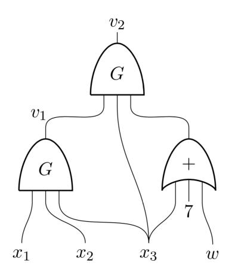

#### Zero-Knowledge Proofs on Secret-Shared Data via Fully Linear PCPs\*

Dan Boneh<sup>†</sup> Elette Boyle<sup>‡</sup> Henry Corrigan-Gibbs<sup>§</sup> Niv Gilboa<sup>¶</sup> Yuval Ishai<sup>∥</sup>
August 21, 2022

#### Abstract

We introduce and study the notion of  $fully\ linear$  probabilistically checkable proof systems. In such a proof system, the verifier can make a small number of linear queries that apply jointly to the input and a proof vector.

Our new type of proof system is motivated by applications in which the input statement is not fully available to any single verifier, but can still be efficiently accessed via linear queries. This situation arises in scenarios where the input is partitioned or secret-shared between two or more parties, or alternatively is encoded using an additively homomorphic encryption or commitment scheme. This setting appears in the context of secure messaging platforms, verifiable outsourced computation, PIR writing, private computation of aggregate statistics, and secure multiparty computation (MPC). In all these applications, there is a need for fully linear proof systems with short proofs.

While several efficient constructions of fully linear proof systems are implicit in the interactive proofs literature, many questions about their complexity are open. We present several new constructions of fully linear zero-knowledge proof systems with sublinear proof size for "simple" or "structured" languages. For example, in the non-interactive setting of fully linear PCPs, we show how to prove that an input vector  $x \in \mathbb{F}^n$ , for a finite field  $\mathbb{F}$ , satisfies a single degree-2 equation with a proof of size  $O(\sqrt{n})$  and  $O(\sqrt{n})$  linear queries, which we show to be optimal. More generally, for languages that can be recognized by systems of constant-degree equations, we can reduce the proof size to  $O(\log n)$  at the cost of  $O(\log n)$  rounds of interaction.

We use our new proof systems to construct new short zero-knowledge proofs on distributed and secret-shared data. These proofs can be used to improve the performance of the example systems mentioned above.

Finally, we observe that zero-knowledge proofs on distributed data provide a general-purpose tool for protecting MPC protocols against malicious parties. Applying our short fully linear PCPs to "natural" MPC protocols in the honest-majority setting, we can achieve unconditional protection against malicious parties with sublinear additive communication cost. We use this to improve the communication complexity of recent honest-majority MPC protocols. For instance, using any pseudorandom generator, we obtain a 3-party protocol for Boolean circuits in which the amortized communication cost is only *one bit* per AND gate per party (compared to 7 bits in the best previous protocol), matching the best known protocols for semi-honest parties.

<sup>\*</sup>This is an extended and corrected full version of [29].

<sup>†</sup>Stanford University. Email: dabo@cs.stanford.edu

 $<sup>^{\</sup>ddagger} \mathrm{IDC}$  Herzliya, Israel. Email: eboyle@alum.mit.edu

<sup>§</sup>Stanford University. Email: henrycg@cs.stanford.edu

<sup>¶</sup>Ben-Gurion University, Israel. Email: gilboan@bgu.ac.il

Technion, Israel. Email: yuvali@cs.technion.ac.il

# 1 Introduction

In this work, we develop new techniques for proving in zero knowledge statements that are distributed (i.e., partitioned or secret-shared) across two or more verifiers. Recall that in a standard interactive proof system [\[8,](#page-68-0) [10,](#page-68-1) [15,](#page-68-2) [77\]](#page-72-0) a verifier holds an input x ∈ {0, 1} <sup>∗</sup> and a prover tries to convince the verifier that x is a member of some language L ⊆ {0, 1} ∗ . We consider instead the setting in which there are multiple verifiers, and each verifier holds only a piece of the input, such as a share of x generated using a linear secret-sharing scheme. Critically, no single verifier holds the entire input x. The prover, who holds the entire input x, must convince the verifiers, who only hold pieces of x, that x ∈ L. At the same time, we require that the proof system be strongly zero knowledge: every proper subset of the verifiers should learn nothing about x, apart from the fact that x ∈ L.

Special cases of this type of proof system appear in existing systems for anonymous messaging [\[45\]](#page-70-0), verifiable function secret sharing [\[35\]](#page-69-1), and systems for the private computation of aggregate statistics [\[44\]](#page-70-1). We observe that such proof systems also provide a powerful tool for protecting protocols for secure multiparty computation over point-to-point channels against malicious parties, analogous to the role that standard zero-knowledge proofs play in the GMW compiler [\[72\]](#page-71-0). Indeed, in protocols that involve point-to-point communication, the task of proving compliance with the protocol exactly requires executing a zero-knowledge proof on distributed data.

We introduce the central new abstraction of a fully linear proof system. Such proof systems apply not only to efficiently proving (in zero-knowledge) statements on distributed or secret-shared data, but also to data that is encrypted or committed using a linearly homomorphic system. While several efficient constructions of fully linear proof systems are implicit in the literature on interactive and probabilistically checkable proofs (in particular, the linear PCPs from [\[6,](#page-68-3) [67\]](#page-71-1) and the interactive proofs from [\[75,](#page-72-1) [109\]](#page-73-0) can be cast as such proof systems), many questions about their complexity are open. We present several new constructions of fully linear zero-knowledge proof systems that achieve sublinear proof size for "simple" or "structured" languages. Finally, we present several applications of such proof systems in the context of the motivating applications discussed above.

We now give a more detailed overview of our contributions.

Contribution I: Fully linear proof systems. We begin by introducing the notion of a fully linear proof system, which captures the information-theoretic object at the core of all of our constructions. We consider the non-interactive variant of such proof systems, called fully linear PCPs, and then we describe a natural extension to the interactive setting.

A fully linear PCP is a refinement of linear PCPs [\[6,](#page-68-3) [27,](#page-69-2) [83\]](#page-72-2). Recall that in a standard linear PCP over a finite field F, a polynomial-time verifier holds an input x ∈ F <sup>n</sup> and a prover produces a proof π ∈ F <sup>m</sup> to the assertion that x ∈ L, for some language L ⊆ F n . The verifier checks the proof by reading x and making linear queries (i.e., inner-product queries) to the proof π. In particular, the verifier can make a bounded number of queries to the proof of the form q<sup>j</sup> ∈ F <sup>m</sup>, and receives answers a<sup>j</sup> = hq<sup>j</sup> , πi ∈ F.

In a fully linear PCP, we further restrict the verifier: the verifier cannot read the entire input x directly, but only has access to it via linear queries. Concretely, the verifier in a fully linear PCP makes linear queries q<sup>j</sup> to the concatenated input-proof vector (xkπ) ∈ F <sup>n</sup>+<sup>m</sup> and must accept or reject the assertion that x ∈ L based on the answers a<sup>j</sup> to these linear queries. Motivated by the applications we consider, we would also like fully linear PCPs to satisfy the following strong zeroknowledge requirement: the queries q<sup>j</sup> together with the answers a<sup>j</sup> reveal no additional information about x other than the fact that x ∈ L. This is stronger than the standard notion of zero-knowledge proofs in which x is essentially public and the interaction need not hide x. See Section [3](#page-10-0) for formal definitions of fully linear PCPs and their strong zero knowledge variant.

The full linearity restriction is naturally motivated by applications in which the input statement is not fully available to any single verifier, but can still be efficiently accessed via linear queries. This situation arises in scenarios where the input x is distributed or secret-shared between two or more parties, or alternatively is encoded using an additively homomorphic encryption or commitment scheme. In these scenarios, verifiers can readily compute answers to public linear queries via local computations on their view of x. While fully linear PCPs can be meaningfully applied in all of the above scenarios, we will primarily focus on their applications to proofs on distributed or secret-shared data.

We stress again that in a fully linear PCP, the verifier only has linear query access to x. An interesting consequence is that even if  $\mathcal{L}$  is an easy language that can be decided in polynomial time, a verifier making a bounded (e.g., constant) number of such queries typically cannot decide whether  $x \in \mathcal{L}$  without the aid of a proof, even if the verifier can run in unbounded time. This makes the existence of fully linear proof systems with good parameters meaningful even for finite languages and even if, say, P = PSPACE. The same fact makes possible a connection between fully linear PCPs and communication complexity [3,89,91]. Using this connection, we prove unconditional lower bounds on the efficiency properties of fully linear PCPs (Appendix B).

Different kinds of linear PCPs were used, either explicitly or implicitly, in the vast literature on succinct arguments for NP (see [26,27,30,34,67,80,83,93,105,111,112,122,125] and references therein). These linear PCPs, including the "Hadamard PCP" [6,83] and ones obtained from quadratic span programs or quadratic arithmetic programs [27,67,104], can be cast into the fully linear framework. This fact was implicitly used in previous proof systems on committed or secret-shared data [11,44,46]. Our notion of fully linear PCPs provides a convenient abstraction of the properties on which such systems can be based.

Contribution II: Shorter proofs for structured and simple languages. When using fully linear PCPs to build zero-knowledge proof systems on distributed or secret-shared data, as discussed in Contribution IV below, the proof length determines the number of bits that the prover must send to the verifiers. As such, we aim to design short proofs. This goal is especially important when many different assertions are proved about the same input statement x. In such a scenario, the initial setup cost of distributing x is amortized away, in the sense that it is dominated by the cost of communicating the proofs. Having short fully linear PCPs yields similar efficiency benefits in the settings of encryption and commitments.

These applications motivate the need for fully linear PCPs with short proofs. For general NP relations, all known linear PCPs have size at least linear in the size of an arithmetic circuit recognizing the relation. In Section 4, we achieve significant length savings by designing new sublinear sized fully linear PCPs for languages recognized by deterministic circuits with repeated sub-structures (Theorem 4.3) or by a degree-2 polynomial (Corollary 4.7). In the latter case, we can even prove that the  $O(\sqrt{n})$  complexity of our construction is optimal up to low-order terms (Appendix B). These and other proof systems constructed in this work satisfy the notion of strong zero knowledge discussed above.

**Theorem 1.1** (Informal - short fully linear PCP for a degree-2 polynomial). If membership in  $\mathcal{L} \subseteq \mathbb{F}^n$  can be recognized by a single degree-2 polynomial, then  $\mathcal{L}$  admits a fully linear PCP with strong zero knowledge that has proof length and query complexity  $\tilde{O}(\sqrt{n})$  and soundness error  $O(\sqrt{n}/|\mathbb{F}|)$ . Furthermore, there exists a language  $\mathcal{L}$  as above such that the sum of the proof length and query

<span id="page-2-0"></span><sup>&</sup>lt;sup>1</sup>This is akin to *proofs of proximity* [24], which place a more stringent restriction on the verifier's access to the input. However, unlike proofs of proximity, in fully linear PCPs the verifier is guaranteed that the input is actually in the language rather than being "close" to some input the language. Another related notion is that of a *holographic proof* [9,82], where the verifier gets oracle access to an *encoding* of the input using an arbitrary error-correcting code.

complexity must be Ω(<sup>√</sup> n), even when we allow constant soundness error and do not require zero knowledge.

See Corollary [4.7](#page-19-0) and Theorem [B.1](#page-76-1) for more precise and general statements.

Contribution III: Reducing proof size by interaction. To further drive down the proof length, we consider a generalization of fully linear PCPs that allows multiple rounds of interaction between the prover and verifier. These fully linear interactive oracle proofs, or fully linear IOPs, are the linear analogue of interactive oracle proofs (IOP) [\[23\]](#page-69-7), also known as probabilistically checkable interactive proofs [\[109\]](#page-73-0). We note that without the zero-knowledge requirement, several existing interactive proof systems from the literature, including the GKR protocol [\[74\]](#page-72-7), the CMT protocol [\[42\]](#page-70-3), and the RRR protocol [\[109\]](#page-73-0) can be viewed as fully linear IOPs.

For the case of "well-structured" languages, we show in Section [5](#page-21-0) that interaction can dramatically shrink the proof size, while maintaining the required strong zero-knowledge property. In particular, any language whose membership can be verified by a system of constant-degree equations over a finite field admits a fully linear IOP with strong zero-knowledge in O(log n) rounds and only O(log n) proof length, provided that the underlying field is sufficiently large. Even for degree-2 languages, this provably gives an exponential reduction in proof size over the non-interactive case.

Theorem 1.2 (Informal - fully linear zero-knowledge IOPs for low-degree languages). Suppose L ⊆ F n can be recognized by a system of constant-degree equations. Then, L admits a fully linear IOP with strong zero knowledge, O(log n) rounds, and proof length and query complexity O(log n).

See Theorem [5.8](#page-26-0) for a more precise and general statement, including an extension to rings.

Contribution IV: Zero-knowledge proofs on distributed or secret-shared data. The primary motivation for our new types of proof systems is the fact that in many cases, data can be efficiently accessed via linear queries. This includes several different scenarios, but our main focus in this work is on the case of distributed or secret-shared data. (See Appendix [C](#page-77-0) for application to proofs on encrypted or committed data.) More precisely, the prover knows x in its entirety and each of k verifiers V1, . . . , V<sup>k</sup> only has a piece (or a secret share) of x.

In Section [6,](#page-26-1) we show that any fully linear PCP and IOP can be compiled into a zero-knowledge proof system on distributed or secret-shared data in the following natural way. Instead of sending a proof vector π to a single verifier, the prover P secret-shares the proof vector π between the k verifiers using a linear secret-sharing scheme. The verifiers can now locally apply each linear query to the concatenation of their share of the input x and their share of π, and exchange the resulting answer shares with the other verifiers. The verifiers then reconstruct the answers to the linear queries and apply the decision predicate to decide to accept or reject x. We present different variants of this compiler that further optimize this approach and that achieve zero-knowledge even when up to k − 1 verifiers are malicious.

Theorem 1.3 (Informal - distributed zero-knowledge proofs for low-degree languages on secret-shared data: malicious prover or verifiers). Suppose L ⊆ F n can be recognized by a system of constant-degree equations. Then, assuming ideal coin-tossing, there is an O(log n)-round distributed zero-knowledge protocol for proving that x ∈ L, where x is additively shared between k verifiers, with communication complexity O(k log n). The protocol is sound against a malicious prover and is strongly zero-knowledge against t = k − 1 malicious verifiers.

See Corollary [6.7](#page-32-0) for a more precise and general statement. We also give a Fiat-Shamir-style compiler that uses a random oracle to collapse multiple rounds of interaction into a single message sent by P to each V<sup>j</sup> over a private channel, followed by a single message by each V<sup>j</sup> .

<span id="page-4-0"></span>

| Language                                                                                  | Proof system                                                            | Comm. complexity                               | Rounds                          |
|-------------------------------------------------------------------------------------------|-------------------------------------------------------------------------|------------------------------------------------|---------------------------------|
| Hamming weight 1:<br>x¯ ∈ F<br>n<br>, weight(¯x) = 1                                      | Prio [44]<br>Corollary 5.4<br>Corollary 5.5                             | O(n)<br>√<br>O(<br>n)<br>O(log n)              | 1<br>2<br>O(log n)              |
|                                                                                           | Theorem A.2 via [54]<br>Riposte∗∗ [45]<br>Verifiable FSS∗∗ [35]         | O(1)<br>√<br>O(<br>n)<br>O(1)                  | 2<br>1<br>1                     |
| F<br>n ⊆<br>n<br>x¯ ∈ {0, , B}                                                            | Prio [44]<br>Corollary 5.4<br>Corollary 5.5                             | O(B · n)<br>√<br>O(B ·<br>n)<br>O(B · log n)   | 1<br>2<br>O(log n)              |
| n Beaver triples:<br>x, ¯ y, ¯ z¯ ∈ F<br>n where<br>xi<br>· yi<br>= zi<br>for all i ∈ [n] | Prio [44]<br>Corollary 5.4<br>Theorem A.1 via GKR [75]<br>Corollary 5.5 | O(n)<br>√<br>O(<br>n)<br>O(log2 n)<br>O(log n) | 1<br>2<br>O(log2 n)<br>O(log n) |
| Arbitrary circuit C, C(¯x) = 1<br>(size n, depth d, fan-in 2)                             | Prio [44]<br>Theorem A.1 via GKR [75]                                   | O(n)<br>O(d log n)                             | 1<br>O(d log n)                 |

Table 1: Communication and round complexity for proof systems where the input data is secret shared among a number of parties. We assume the proofs are over a finite field F with |F| n. Prio [\[44\]](#page-70-1) is a system for private data aggregation that uses proofs on secret shared data for data integrity. Riposte [\[45\]](#page-70-0) is a system for anonymous communication that uses proofs on secret shared data to prevent data corruption. Verifiable function secret sharing (FSS) [\[35\]](#page-69-1) enables secret sharing of simple functions.

Given a robust encoding (or robust secret sharing) of the input x, we present distributed zeroknowledge protocols that maintain their soundness even when a malicious prover colludes with t < k/2 malicious verifiers (see Section [6.3](#page-35-0) for details). In contrast, we note that previous sublinear proof systems on secret-shared data either do not attempt to protect against malicious verifiers [\[35\]](#page-69-1), or assume a majority of honest verifiers [\[45\]](#page-70-0). Neither considers soundness against a malicious prover colluding with malicious verifiers.

Table [1](#page-4-0) summarizes the communication and round complexity of the proof systems on secretshared data for languages that frequently come up in practice, for example in the Prio system [\[44\]](#page-70-1) for privately aggregating data, and in the Riposte [\[45\]](#page-70-0) system for anonymous communication. The table illustrates the strong benefits of interactive fully linear proof systems over non-interactive ones.

We note that interactive proofs with distributed verifiers were recently studied in [\[90,](#page-72-8) [99\]](#page-73-4) for the purpose of proving properties of a communication graph connecting a large number of verifiers. The relevance of the interactive proofs of GKR [\[74\]](#page-72-7) and RRR [\[109\]](#page-73-0) to this setting has been observed in [\[99\]](#page-73-4). Our focus here is quite different; we are motivated by the goal of proving in zero knowledge simple properties of data distributed among a small set of verifiers. As a result, our abstractions, constructions, and applications are very different from those in prior work [\[90,](#page-72-8) [99\]](#page-73-4).

Contribution V: Applications to honest-majority MPC. We next demonstrate applications of our zero-knowledge fully linear proof systems for protecting protocols for secure multiparty computation (MPC) in the honest-majority setting against malicious parties, with vanishing amortized communication overhead, and without resorting to the heavy machinery of succinct (two-party) zero-knowledge argument systems for NP.

Compiling "natural" honest-majority protocols. Dating back to the work of Goldreich,

<sup>∗∗</sup> All systems in the table, except Riposte, verifiable FSS, and GKR, maintain zero knowledge when all but one of the verifiers are malicious. In contrast, 3-server Riposte tolerates only one corruption. Verifiable FSS tolerates only semi-honest verifiers and GKR does not provide zero-knowledge.

Micali, and Wigderson (GMW) [\[72\]](#page-71-0), the standard approach to secure protocol design begins by attaining semi-honest (passive) security, then compiling the protocol in some way to enforce semihonest behavior. The GMW compiler relies on standard zero-knowledge proofs, which apply to public statements. As a result, it does not apply directly to the case of protocols that employ communication over secure point-to-point channels. To get around this limitation, we employ our distributed zero-knowledge proofs in the following way.

As observed in recent works, the vast majority of semi-honest MPC protocols from the literature share the following natural form:

- Up to the final exchange of messages, the protocol reveals no information about parties' inputs, even if parties act maliciously.
- The messages sent by a party P<sup>i</sup> in each round are degree-2 functions (or, more generally, low-degree functions) of messages received in previous rounds.

The first property means that parties can safely execute all but the final round of the underlying protocol unchanged, and then simultaneously verify that in all prior rounds the parties acted semi-honestly. The second property means that this verification can be expressed as satisfaction of a collection of several degree-2 constraints on parties' incoming and outgoing messages. More concretely, each party P<sup>i</sup> must convince the remaining parties in zero knowledge that the statement M<sup>i</sup> consisting of all his round-by-round incoming and outgoing messages—and which is distributed across the remaining parties—is indeed contained within some appropriate language L<sup>i</sup> verifiable by a degree-2 circuit. This is precisely the setting of our zero knowledge proofs on distributed data.

We demonstrate an approach for compiling semi-honest protocols of the above "natural" form (formally defined in Section [7\)](#page-43-0) in the honest-majority setting, to malicious security with abort, with sublinear additive communication overhead. This is achieved by adding a phase in the penultimate round of the base protocol, in which each party P<sup>i</sup> executes a single interactive proof on distributed data that the entire interaction thus far has been performed honestly. The necessary zero-knowledge protocols that we develop induce communication that is sublinear in the circuit size.

Note that while many efficient MPC protocols from the literature implement batch-verification of shared secrets by revealing random linear combinations, this technique only applies to checking linear relations between the secrets. Fully linear proof systems provide a powerful extension of this approach to batch-verification of non-linear relations with sublinear communication cost.

The case of 3-party computation. A specific motivated setting is that of 3-party computation with 1 malicious corruption (and security with abort). The task of minimizing communication in such protocols has attracted a significant amount of research effort (e.g., [\[4,](#page-67-1)[5,](#page-68-6)[40,](#page-70-5)[58,](#page-71-2)[65,](#page-71-3)[78,](#page-72-9)[92,](#page-72-10)[98,](#page-73-5)[101\]](#page-73-6)). To date, the best protocols communicate: 2 field elements per multiplication gate per party over large fields (size comparable to 2 σ for statistical security parameter σ) [\[40,](#page-70-5) [101\]](#page-73-6), or alternatively 7 bits per multiplication gate per party for Boolean circuits [\[4\]](#page-67-1) (improving on 10 bits in [\[65\]](#page-71-3)).

Applying our compiler to a 3-party semi-honest protocol of Katz et al. [\[87\]](#page-72-11) (see also e.g. [\[5,](#page-68-6)[47,](#page-70-6)[56\]](#page-71-4)), we obtain a 3-party protocol guaranteeing security with abort against 1 malicious party, with 1 ring element communicated per party per multiplication (amortized over large circuit size). Our result holds over any finite field or modular arithmetic ring Zw; in particular, also for Boolean circuits.

Theorem 1.4 (Informal - Malicious 3PC, 1 ring element/gate/party). There exists a 3-party protocol for securely computing any R-arithmetic circuit C (for R field of arbitrary size or R = Zw) with the following features:

- The protocol makes black-box use of any pseudorandom generator. If R is a field, it also makes a black-box use of R.
- The protocol is computationally secure with abort against one malicious party.

• The communication complexity is |C| + o(|C|) elements of R per party, where |C| denotes the number of multiplication and input gates in C.

Note that one may apply trade-offs between communication and computation requirements in order to yield more appealing concrete parameters. In particular, directly applying our compiler to verify consistency of the entire protocol transcript as one large statement will induce an O(|C| log |C|) computational overhead (due to the necessity of an FFT computation); however, the structure of the resulting protocol-compliance language directly supports verification in smaller blocks, enabling lower computation overhead at the expense of communicating a small number of separate proofs. From an asymptotic point of view, our theorem cannot be obtained via the general machinery of (single-verifier) succinct zero-knowledge arguments for NP, since the latter require stronger assumptions.

We also describe an application of our compiler in the more general honest majority case where t < n/2 for constant n, building from a semi-honest protocol à la Damgård and Nielsen [\[55\]](#page-70-7). Here more care must be taken to ensure the protocol satisfies the required natural condition, and in particular we augment the protocol with extra redundancy to ensure robustness (incurring n t computation and storage overhead, thus limiting our construction to constant number of parties). Overall, our resulting protocol achieves malicious security with 3t/(2t + 1) (always ≤ 1.5) ring elements communicated per gate per party.

# <span id="page-6-0"></span>2 A Taxonomy of Information-Theoretic Proof Systems

One of the contributions of this work is to introduce and formalize the notions of fully linear PCPs and IOPs. To situate these new types of proof systems in the context of prior work, we briefly survey the landscape of existing systems. This discussion will be relatively informal; see Section [3](#page-10-0) for formal definitions of linear and fully linear proof systems.

A tremendously successful paradigm for the construction of cryptographic proof systems is the following: First, construct a proof system that provides security guarantees (soundness and possibly zero-knowledge) against computationally unbounded parties. We will refer to this as an "information-theoretic proof system," or sometimes as a probabilistically checkable proof (PCP). This information-theoretic system is often useless as a standlone object, since it typically makes idealized assumptions (such as independence between two messages or restricted access to the proof) that are difficult to enforce. Next, use cryptographic assumptions and/or an augmented model of computation (e.g., the random-oracle model [\[13\]](#page-68-7)) to "compile" the information-theoretic proof system into one that can be directly implemented. This compiler may also provide extra desirable properties, such eliminating interaction, improved communication complexity, or sometimes even an extra zero knowledge property, at the possible cost of security against computationally bounded prover and/or verifier. We refer to this type of compiler as a "cryptographic compiler."

Different kinds of information-theoretic proof systems call for different cryptographic compilers. The main advantage of this separation is modularity: information-theoretic proof systems can be designed, analyzed and optimized independently of the cryptographic compilers, and their security properties (soundness and zero-knowledge) do not depend on any cryptographic assumptions. It may be beneficial to apply different cryptographic compilers to the same information-theoretic proof system, as different compilers may have incomparable efficiency and security features. For instance, they may trade succinctness for better computational complexity or post-quantum security or, more relevant to this work, apply to different representations of the input statement.

To give just a few examples of this methodology: Micali [\[96\]](#page-73-7) uses a random oracle to compile any classical PCP into a succinct non-interactive argument system for NP. As another example, Ben-Or et al. [\[14\]](#page-68-8) compile any interactive proof system into a zero-knowledge interactive proof system

using cryptographic commitments. Finally, Bitansky et al. [\[27\]](#page-69-2) compile a linear PCP into a succinct non-interactive argument of knowledge (SNARK) using either a "linear-only encryption" for the designated-verifier setting or a "linear-only one-way encoding," instantiated via bilinear groups, for the public verification setting.[2](#page-7-0) In this work we compile fully linear PCPs and IOPs into proofs on distributed, secret-shared, encrypted, or committed data.

## 2.1 Comparison with Other Proof Systems

In the following we survey some information-theoretic proof systems used in prior work. For simplicity, we ignore the zero-knowledge feature that is typically added to all proof systems.

Let L ⊆ {0, 1} <sup>∗</sup> be a language. Speaking informally, a proof system for L is a pair of (possibly interactive) algorithms (P, V ). Both the prover P and verifier V take a string x ∈ {0, 1} <sup>∗</sup> as input (e.g., a SAT formula), and the prover's task is to convince the verifier that x ∈ L (e.g., that x is satisfiable). We sometimes view x as a vector over a finite field F. We require the standard notions of completeness and soundness.

In the simplest such proof system, the prover sends the verifier a single proof string π of size poly(|x|), the verifier reads x and π, and accepts or rejects. When the verifier is randomized and efficient, this setting corresponds to a Merlin-Arthur proof system [\[8\]](#page-68-0). There are a number of modifications to this basic paradigm that yield interesting alternative proof systems. In particular, we can:

- Allow interaction between the prover and verifier. In an interactive proof, the prover and verifier exchange many messages, after which the verifier must accept or reject. Allowing interaction may increase the power of the proof system [\[115\]](#page-74-4) and makes it possible to provide zeroknowledge [\[77\]](#page-72-0) in the plain model. (Alternatively, a common reference string is sufficient [\[28\]](#page-69-8).)
- Restrict the verifier's access to the proof. Another way to modify the basic paradigm is to restrict the means by which the verifier interacts with the proof. In particular, we can view the proof as an oracle, and only allow the verifier to make a bounded (e.g., constant) number of queries to the proof oracle.
  - In the classical PCP model [\[7,](#page-68-9) [60,](#page-71-5) [62\]](#page-71-6), the proof is a string π ∈ Σ <sup>m</sup>, for some finite alphabet Σ, and the verifier can only read a small number of symbols from the proof. On input i, the oracle returns the ith bit of the proof string π. (We call these "point queries.")
  - In the linear PCP model [\[27,](#page-69-2) [83\]](#page-72-2), the proof is a vector π ∈ F <sup>m</sup>, for some finite field F, and the verifier can can only make a small number of "linear queries" to the proof. That is, the proof oracle takes as input a vector q ∈ F <sup>m</sup> and returns the inner-product hπ, qi ∈ F.
- Restrict the verifier's access to the input. Yet another way to modify the basic paradigm is to restrict the verifier's access to the input x. In particular, we can view the input as an oracle, and only allow the verifier to make a bounded (e.g., constant) number of queries to the input oracle. The strong motivation for this is explained later in this section. We consider two variants.

The model in which we view the input as a string, and only allow the verifier to make a limited number of point queries to the input, corresponds to a PCP of proximity [\[24\]](#page-69-6). With a few point queries, it is not possible to distinguish between an input x ∈ L, and an input x "close to L" (in Hamming distance). For this reason, PCPs of proximity necessarily provide only a relaxed notion of soundness: if x is "far from L," then the verifier will likely reject.

<span id="page-7-0"></span><sup>2</sup>For instantiating the publicly verifiable variant with bilinear groups, the linear PCP needs to have a verification predicate of algebraic degree 2. Such linear PCPs can be obtained either directly or via quadratic span programs or quadratic arithmetic programs [\[27,](#page-69-2) [67,](#page-71-1) [104\]](#page-73-3).

<span id="page-8-0"></span>

|                 | Proof type                                            | Queries<br>to input              | Queries<br>to proof         | Representative compilers                                                                      |
|-----------------|-------------------------------------------------------|----------------------------------|-----------------------------|-----------------------------------------------------------------------------------------------|
| Non-interactive | Classical (MA) [8]<br>PCP [6, 7]<br>Linear PCP [83]   | Read all<br>Read all<br>Read all | Read all<br>Point<br>Linear | Kilian [88], Micali [96]<br>IKO [83], Pepper [114], GGPR [67],<br>PHGR [104, 105], BCIOP [27] |
|                 | PCP of proximity [25]<br>Fully linear PCP             | Point<br>Linear                  | Point<br>Linear             | Kalai & Rothblum [85]<br>This paper                                                           |
| Interactive     | Interactive proof (IP) [77]<br>IOP [23]<br>Linear IOP | Read all<br>Read all<br>Read all | Read all<br>Point<br>Linear | Ben Or et al. [14]<br>BCS [23]                                                                |
|                 | IOP of proximity [18, 19]<br>Fully linear IOP         | Point<br>Linear                  | Point<br>Linear             | This paper, Hyrax [122], vSQL [124, 125]                                                      |

Table 2: A comparison of information-theoretic proof systems. The bolded proof system models are ones that we introduce explicitly in this work. "Read all" refers to reading the entire data field, "Point" refers to reading a small number of cells of the data, and "Linear" refers to a small number of linear queries to the data.

Alternatively, we can view the input as a vector x ∈ F n , for some finite field F, and only allow the verifier to make a small number of linear queries to the input x. That is, the input oracle takes as input a vector q ∈ F <sup>n</sup> and returns the inner-product hx, qi ∈ F. We show that this notion, introduced and studied in this work, is sufficient to provide a standard notion of soundness (unlike the relaxed notion of soundness provided by PCPs of proximity).

We now have three attributes by which we can classify information-theoretic proof systems: interactivity (yes/no), proof query type (read all/point/linear), and input query type (read all/point/linear). Taking the Cartesian product of these attributes yields 18 different possible proof systems, and we list ten of particular interest in Table [2.](#page-8-0)

For example, interactive oracle proofs (IOPs) are interactive proofs in which the verifier has unrestricted access to the input but may make only point queries to proof strings [\[23\]](#page-69-7). Ben-Sasson et al. [\[23\]](#page-69-7) show how to compile such proofs into SNARGs in the random-oracle model and recent hash-based SNARGs, including Ligero [\[2\]](#page-67-2), STARK [\[17\]](#page-68-12), and Aurora [\[22\]](#page-69-10) are built using this technique.

Why fully linear proof systems? It is often the case that the verifier only has access to an additively homomorphic encoding of a statement x, and the prover convinces the verifier that the encoded statement is true. For example the verifier may be given an additively homomorphic commitment or encryption of the statement x. Or the verifier may be implemented as a set of two or more servers who have a linear secret sharing of the statement x, or who hold different parts of x.

In all these settings, the verifiers can easily compute an encoding of the inner product of the statement x with a known query vector q. In some cases (such as the case of encrypted or committed data), the verifiers may need the prover's help help to "open" the resulting inner products.

When we compile fully linear PCPs into proof systems on shared, encrypted, or committed data, our compilers have the same structure: the prover sends an additively homomorphic encoding of the proof to the verifier. The verifier makes linear queries to the proof and input, and (if necessary) the prover provides "openings" of these linear queries to the verifier. The verifier checks that the openings are consistent with the encodings it was given, and then runs the fully linear PCP verifier to decide whether to accept or reject the proof.

The need for new constructions. In current applications of PCPs and linear PCPs, the length

of the proof is not a complexity metric of much relevance. For example, in the BCIOP compiler [27] for compiling a linear PCP into a succinct non-interactive argument of knowledge (SNARK), the size of the proof corresponds to the prover's running time.

If the language  $\mathcal{L}$  in question is decided by circuits of size |C|, then having proofs of size |C| is acceptable, since the prover must run in time  $\Omega(|C|)$  no matter what. A similar property holds for Micali's CS proofs [96], Kilian's PCP compiler [88], the BCS compiler [23] of interactive oracle proofs, and so on.

In our compilers, the prover must materialize the entire fully linear PCP proof, encode it, and send it to the verifier. For us, the size of the fully linear PCP proof not only dictates the running time of the prover, but also dictates the number of bits that the prover must communicate to the verifier. For this reason, in our setting, minimizing the proof size is an important goal.

Furthermore, when compiling linear PCPs into SNARKs using the existing compilers [27,81,105] it is critical that the linear PCP verifier be expressible as an arithmetic circuit of degree two. This is because the linear PCP verification checks are essentially run "in the exponent" of a bilinear group. In contrast, the settings we consider allow for more flexibility: the arithmetic degree of the verifier typically does not play a role in the final applications, except perhaps for a possible influence on proof verification time.

Relating fully linear PCPs to streaming proof systems. The setting of stream annotations [39] introduced by Chakrabarti, Cormode, McGregor, and Thaler, restricts not only the verifier's access to the input and proof, but also the space usage of the verifier. In this model, the verifier is a space-bounded streaming algorithm: it may take a single pass over the input and proof, and must decide whether to accept or reject. For example, the verifier might be allowed only  $O(\sqrt{n})$  bits of working space to decide inputs of length n. The streaming interactive proof model [43] is a generalization in which the prover and verifier may interact.

Fully linear interactive proofs naturally give rise to stream annotation proof systems. The reason is that if a fully linear PCP verifier makes  $q_{\pi}$  linear proof queries and  $q_x$  linear input queries, then the verifier can compute the responses to all of its queries by taking a single streaming pass over the input and proof while using  $(q_x + q_{\pi}) \log_2 |\mathbb{F}|$  bits of space. Thus, fully linear PCPs with small proof size and query complexity give rise to stream annotation proof systems with small proof and space requirements. Similarly, fully linear IOPs give rise to streaming interactive proofs.

The implication in the other direction does not always hold, however, since stream annotation systems do not always give rise to fully linear PCPs with good parameters. The reason is that a streaming verifier may, in general, compute some non-linear function of the input that is difficult to simulate with linear queries.

Other proof systems. We briefly mention a number of other important classes of proof systems in the literature that are out of scope of this discussion. *Linear interactive proofs* are a model of interactive proof in which each message that the prover sends is an affine function of all of the verifier's previous messages (but is not necessarily an affine function of the input) [27].

The fully linear PCP model is well matched to the problem of proving statements on data encoded with an additively homomorphic encoding, such as Paillier encryption [102] or a linear secret-sharing scheme. A different type of encoding is a *succinct* encoding, in which the prover can commit to a vector in  $\mathbb{F}^m$  with a string of size sublinear in m [38,86]. Bootle et al. [33] introduce the "Ideal Linear Commitment" (ILC) model as an abstraction better suited to this setting. In the ILC proof model, the prover sends the verifier multiple proofs vectors  $\pi_1, \ldots, \pi_k \in \mathbb{F}^m$  in each round. The verifier is given a proof oracle that takes as input a vector  $q \in \mathbb{F}^k$  and returns the linear combination  $q^T \cdot (\pi_1 \ldots \pi_k) \in \mathbb{F}^m$ . It is possible to translate linear IOP proofs into ILC proofs (and vice versa) up to some looseness in the parameters. A linear IOP in which the prover sends a length-m proof

in each round implies an ILC proof with the same query complexity in which the prover sends m proofs of length 1 in each round. An ILC proof in which the prover sends k proofs of length m and makes ` queries in each round implies a linear IOP with proof length k · m and query complexity ` · m. ILC-type proofs underlie the recent succinct zero-knowledge arguments of Bootle et al. [\[32\]](#page-69-13) and Bünz et al. [\[36\]](#page-69-14), whose security is premised on the hardness of the discrete-log problem.

Finally, another related notion from the literature is that of a holographic proof [\[9,](#page-68-5) [82\]](#page-72-6), where the verifier gets oracle access to an encoding of the input using an arbitrary error-correcting code, typically a Reed-Muller code. Our notion of fully linear PCPs can be viewed as a variant of this model where the input is (implicitly) encoded by the Hadamard code and the proof can be accessed via linear queries (as opposed to point queries). In fact, our model allows a single linear query to apply jointly to the input and the proof.

We have not discussed multi-prover interactive proofs [\[15\]](#page-68-2), in which multiple non-colluding provers interact with a single verifier, or more recently, multi-prover proofs in which a verifier gets access to multiple (possibly linear) proof oracles [\[31,](#page-69-15) [83\]](#page-72-2).

"Best-of-both-worlds" proof systems. To conclude this section, we point to an interesting direction for future work on proof systems. A very desirable type of proof system, which is not listed in Table [2,](#page-8-0) would be one in which the verifier makes linear queries to the input and point queries to the proof. This type of proof system, which we call a strongly linear proof, achieves in some sense the "best of both worlds:" the verifier has restricted access to the input (as in a PCP of proximity or fully linear PCP) and yet achieves the standard notion of soundness (as in a classical PCP). While it is possible in principle to construct such strongly linear PCPs and IOPs by combining standard PCPs or IOPs of proximity [\[20,](#page-68-13) [24\]](#page-69-6) with linear error-correcting codes, this generic combination may not yield the best achievable parameters.

# <span id="page-10-0"></span>3 Definitions

Notation. For n ∈ N, let [n] = {1, . . . , n}. Let k denote concatenation, h·, ·i denote inner product and ⊥ denote the empty string. When C is an arithmetic circuit over a finite field F, we use |C| to denote the number of multiplication gates in the circuit. When |F| > n, we let 1, 2, . . . , n denote distinct nonzero field elements.

On concrete vs. asymptotic treatment. Since our new types of proof systems are meaningful objects even when all of the algorithms involved are computationally unbounded, our definitions refer to languages and NP-relations as finite objects and do not explicitly refer to the running time of algorithms. All of our definitions can be naturally extended to the standard asymptotic setting of infinite languages and relations with polynomial-time verifiers, honest provers, simulators, and knowledge extractors. Our positive results satisfy these asymptotic efficiency requirements.

#### 3.1 Fully linear PCPs

Our new notion of fully linear PCPs build upon the definitions of standard linear PCPs from Ishai et al. [\[83\]](#page-72-2) and Bitansky et al. [\[27\]](#page-69-2). We start by recalling the original notion.

<span id="page-10-1"></span>Definition 3.1 (Linear PCP). Let F be a finite field and let R ⊆ F <sup>n</sup> × F <sup>h</sup> be a binary relation. A linear probabilistically checkable proof system for R over F with proof length m, soundness error , and query complexity ` is a pair of algorithms (PLPCP, VLPCP) with the following properties:

• For every (x, w) ∈ R, the prover PLPCP(x, w) outputs a proof π ∈ F m. • The verifier  $V_{\mathsf{LPCP}}$  consists of a query algorithm  $Q_{\mathsf{LPCP}}$  and a decision algorithm  $D_{\mathsf{LPCP}}$ . The query algorithm  $Q_{\mathsf{LPCP}}$  takes no input and outputs  $\ell$  queries  $q_1, \ldots, q_\ell \in \mathbb{F}^m$ , which are independent of x, and state information st. The decision algorithm  $D_{\mathsf{LPCP}}$  takes as input the state st, the statement x, and the  $\ell$  answers  $\langle \pi, q_1 \rangle, \ldots, \langle \pi, q_\ell \rangle \in \mathbb{F}$  to  $Q_{\mathsf{LPCP}}$ 's queries. It outputs "accept" or "reject."

The algorithms additionally satisfy the following requirements:

• Completeness. For all  $(x, w) \in \mathcal{R}$ , the verifier accepts a valid proof:

$$\Pr\left[D_{\mathsf{LPCP}}(\mathsf{st}, x, \langle \pi, q_1 \rangle, \dots, \langle \pi, q_\ell \rangle) = \text{``accept''} \ : \ \begin{array}{c} \pi & \leftarrow P_{\mathsf{LPCP}}(x, w) \\ (\mathsf{st}, q_1, \dots, q_\ell) & \leftarrow Q_{\mathsf{LPCP}}() \end{array}\right] = 1.$$

• Soundness. For all  $x^* \notin \mathcal{L}(\mathcal{R})$ , and for all false proofs  $\pi^* \in \mathbb{F}^m$ , the probability that the verifier accepts is at most  $\epsilon$ :

$$\Pr\left[D_{\mathsf{LPCP}}(\mathsf{st}, x^*, \langle \pi^*, q_1 \rangle, \dots, \langle \pi^*, q_\ell \rangle) = \text{``accept''} : (\mathsf{st}, q_1, \dots, q_\ell) \leftarrow Q_{\mathsf{LPCP}}()\right] \leq \epsilon.$$

In some applications of linear PCPs, one also needs a **knowledge** property [27]: if  $V_{LPCP}(x)$  accepts a proof  $\pi$ , then there exists an extractor  $E_{LPCP}$  that, on input  $\pi$ , outputs a witness w such that  $(x, w) \in \mathcal{R}$ . The linear PCPs we introduce in this work all satisfy this property, though we prove the simpler soundness property.

Remark 3.2 (Linear PCPs for languages). On occasion we refer to linear PCPs for a language  $\mathcal{L} \subseteq \mathbb{F}^n$ , rather than for a binary relation  $\mathcal{R} \subseteq \mathbb{F}^n \times \mathbb{F}^h$ . This will typically be the case when  $\mathcal{L}$  is efficiently recognizable, in which case the prover does not require an additional witness w. Essentially the same notions of completeness and soundness apply in this setting: if  $x \in \mathcal{L}$ , the verifier always accepts and for all  $x \notin \mathcal{L}$  the verifier rejects except with at most  $\epsilon$  probability.

We now define our main new notion of fully linear PCPs and their associated strong zero knowledge property.

<span id="page-11-0"></span>**Definition 3.3** (Fully linear PCP - FLPCP). We say that a linear PCP is *fully linear* if the decision predicate  $D_{\mathsf{LPCP}}$  makes only linear queries to both the statement x and to the proof  $\pi$ . More formally, the query algorithm  $Q_{\mathsf{LPCP}}$  outputs queries  $q_1, \ldots, q_\ell \in \mathbb{F}^{m+n}$ , and state information st. The decision algorithm  $D_{\mathsf{LPCP}}$  takes as input the query answers  $a_1 = \langle (x || \pi), q_1 \rangle, \ldots, a_\ell = \langle (x || \pi), q_\ell \rangle$ , along with the state st, and outputs an accept/reject bit.

Remark 3.4. If we do not restrict the running time of the linear PCP verifier and we do not restrict the manner in which the verifier can access the statement x, then all relations have trivial a linear PCPs: an inefficient linear PCP verifier can simply iterate over every possible witness w and test whether  $(x, w) \in \mathcal{R}$ . To make the definition non-trivial, the standard notion of PCPs [118] (and also linear PCPs [27,83]) restricts the verifier to run in polynomial time. In contrast, a fully linear PCP restricts the verifier's access to the statement x by permitting the verifier to make a bounded number of linear queries to x. This restriction makes the definition non-trivial: even if the verifier can run in unbounded time, it cannot necessarily decide whether  $x \in \mathcal{L}(\mathcal{R})$  without the help of a proof  $\pi$ .

**Definition 3.5** (Degree of FLPCPs). We say that a fully linear PCP has a degree-d verifier if:

- the state information st that the query algorithm outputs is in  $\mathbb{F}^{\mu}$  and
- the decision algorithm  $D_{\mathsf{LPCP}}$  is computed by an arithmetic circuit of degree d. That is, there exists a test polynomial  $T: \mathbb{F}^{\mu+\ell} \to \mathbb{F}^{\eta}$  of degree d such that  $T(\mathsf{st}, a_1, \ldots, a_{\ell}) = 0^{\eta}$  if and only if  $D_{\mathsf{LPCP}}(\mathsf{st}, a_1, \ldots, a_{\ell})$  accepts.

**Definition 3.6** (Strong zero-knowledge fully linear PCPs). A fully linear PCP is strong honest-verifier zero knowledge (strong HVZK) if there exists a simulator  $S_{\mathsf{LPCP}}$  such that for all  $(x, w) \in \mathcal{R}$ , the following distributions are identical:

$$S_{\mathsf{LPCP}}() \ \equiv \ \left\{ \begin{array}{ccc} (q_1, \dots, q_\ell) & \pi & \leftarrow P_{\mathsf{LPCP}}(x, w) \\ \left( \langle (x \| \pi), q_1 \rangle, \dots, \langle (x \| \pi), q_\ell \rangle \right) & : & (q_1, \dots, q_\ell) & \leftarrow Q_{\mathsf{LPCP}}() \end{array} \right\}.$$

Remark 3.7. The strong zero-knowledge property here departs from the traditional zero-knowledge notion in that it essentially requires that an honest verifier learn nothing about the statement x by interacting with the prover, except that  $x \in \mathcal{L}(\mathcal{R})$ . This notion is meaningful in our applications, since the statement x could be encrypted or secret-shared (for example), and thus it makes sense for a verifier to learn that  $x \in \mathcal{L}(\mathcal{R})$  without learning anything else about x.

## 3.2 Fully Linear Interactive Oracle Proofs

In a linear PCP, the interaction between the prover and verifier is "one-shot:" the prover produces a proof  $\pi$ , the verifier makes queries to the proof, and the verifier either accepts or rejects the proof. We define *fully linear interactive oracle proofs* ("fully linear IOPs"), generalizing linear PCPs to several communication rounds. This sort of linear proof system is inspired by the notion of IOPs from [23, 109] (generalizing an earlier notion of interactive PCPs [84]) that use point queries instead of linear queries.

We start by formalizing a general model of fully linear IOPs in which the verifier can use secret coins, and then specialize it to the case of *public-coin* IOPs that will be the most useful in this work.

**Definition 3.8** ((Fully) linear interactive protocol). A t-round  $\ell$ -query (fully) linear interactive linear protocol  $\Pi$  with message length  $(m_1, \ldots, m_t) \in \mathbb{N}^t$  and message complexity  $c = \sum_{i=1}^t m_i$  over a finite field  $\mathbb{F}$  consists of algorithms P and V. Let the initial state  $\mathsf{st}_0^P$  of P to be the input to P and let the initial state  $\mathsf{st}_0^V$  of V to be the input x to V. Let the initial verifier-to-prover message  $r_0 = \bot$  and let the output of such an interaction be: for each round  $i \in \{1, \ldots, t\}$ ,

- P takes as input the round index i, the verifier's challenge  $r_{i-1}$ , and state  $\mathsf{st}_{i-1}^P$ , and P outputs a vector  $\pi_i \in \mathbb{F}^{m_i}$  along with state  $\mathsf{st}_i^P$ .
- V takes as input the round index i, state  $\mathsf{st}_{i-1}^V$ , makes  $\ell$  linear oracle queries to  $\pi_i$  (or to  $x \| \pi_i$  if it is fully linear), and V outputs a challenge  $r_i \in \mathbb{F}^{b_i}$ , for some parameter  $b_i$ , along with state  $\mathsf{st}_i^V$ .

The protocol accepts if V outputs "accept" in round t and rejects otherwise.

**Definition 3.9** (Fully linear interactive oracle proof - FLIOP). A t-round  $\ell$ -query interactive fully linear protocol ( $P_{\mathsf{LIOP}}, V_{\mathsf{LIOP}}$ ) over  $\mathbb F$  is a fully linear interactive oracle proof system (fully linear IOP) for a relation  $\mathcal R$  with soundness error  $\epsilon$  if it satisfies the following properties:

- Completeness. For all  $(x, w) \in \mathcal{R}$ , the interaction  $[P_{\mathsf{LIOP}}(x, w), V_{\mathsf{LIOP}}(x)]$  always accepts.
- Soundness. For all  $x \notin \mathcal{L}(\mathcal{R})$ , and for all (computationally unbounded)  $P^*$ ,  $[P^*, V_{\mathsf{LIOP}}(x)]$  accepts with probability at most  $\epsilon$ .

As for the case of linear PCPs (Definition 3.1), we can define a **knowledge** property for linear IOPs [23]. The fully linear IOPs we construct also satisfy this property.

A fully linear IOP is honest-verifier zero knowledge if it additionally satisfies:

• Honest-verifier zero knowledge. There exists a simulator  $S_{\text{LIOP}}$  such that

$$S_{\mathsf{LIOP}}(x) \ \equiv \ \mathsf{View}_{[P_{\mathsf{LIOP}}(x,w),V_{\mathsf{LIOP}}(x)]}(V_{\mathsf{LIOP}})$$

| Linear PCP            | Proof length     | Queries         | Verifier deg. | Soundness error                     |
|-----------------------|------------------|-----------------|---------------|-------------------------------------|
| Hadamard LPCP [6,27]  | $O( C ^2)$       | 3               | 2             | $O(1)/ \mathbb{F} $                 |
| GGPR-style [67]       | O( C )           | 4               | 2             | $O( C )/ \mathbb{F} $               |
| G-gates (Thm. 4.3)    | $M \cdot \deg G$ | L+2             | $\deg G$      | $M \cdot \deg G/( \mathbb{F}  - M)$ |
| Degree-two (Cor. 4.7) | $O(\sqrt{ C })$  | $O(\sqrt{ C })$ | 2             | $O(\sqrt{ C })/ \mathbb{F} $        |

Table 3: A comparison of existing and new fully linear PCP constructions for satisfiability of an arithmetic circuit  $C: \mathbb{F}^n \to \mathbb{F}$ . Proof length measures the number of field elements in  $\mathbb{F}$ . For the G-gates construction,  $G: \mathbb{F}^L \to \mathbb{F}$  is an arithmetic circuit of degree deg G and M is the number of G-gates in the circuit C.

for all  $(x, w) \in \mathcal{R}$ . Here, we use the notation  $\mathsf{View}_{[P_{\mathsf{LIOP}}(x,w),V_{\mathsf{LIOP}}(x)]}(V_{\mathsf{LIOP}})$  for the distribution of internal randomness and messages that  $V_{\mathsf{LIOP}}$  sees in its interaction with  $P_{\mathsf{LIOP}}(x,w)$ . Furthermore, we say that a linear IOP satisfies **strong zero knowledge** (sometimes referred to as **strong HVZK**) if the simulator  $S_{\mathsf{LIOP}}$  takes no input.

**Definition 3.10** (Degree of linear IOP verifier). We say that a fully linear PCP has a degree-d verifier if:

- the state  $\mathsf{st}_i^V$  that the verifier outputs in round i is a vector in  $\mathbb{F}^{\mu_i}$ , and
- There exists a test polynomial  $T: \mathbb{F}^{\sum_{i=1}^t (\mu_i + \ell)} \to \mathbb{F}^{\eta}$  of degree d that takes as input (1) the verifier's state at each round of the protocol and (2) the  $\ell$  query responses to the verifier's queries at each round. The verifier accepts if and only if T evaluates to  $0^{\eta}$ .

**Definition 3.11** (Public-coin fully linear IOP). We say that a t-round  $\ell$ -query fully linear IOP is  $public\ coin$  if it satisfies the following additional properties:

- 1. In every round  $i \in \{1, ..., t\}$  of interaction, first the prover provides a proof  $\pi_i$  and then a public random challenge  $r_i$  is picked uniformly at random from a finite set  $\mathcal{S}_i$ . (The choice of  $r_i$  is made independently of the proof  $\pi_i$  of the same round.) The verifier's  $\ell$  linear queries in the ith round  $(q_{i,1}, ..., q_{i,\ell})$  (made to  $x || \pi_i$ ) are determined by the random challenges  $(r_1, ..., r_i)$  sampled so far. The public randomness  $r_i$  can influence the proofs generated by the prover in the following rounds.
- 2. The verifier's decision predicate is a function only of the public random challenges  $(r_1, \ldots, r_t)$  and the answers to the verifier's queries  $\{(q_{i,1}, \ldots, q_{i,\ell})\}_{i \in [t]}$ .

All of the fully linear IOPs we construct are public coin. When the first round does not involve a proof but only a random challenge  $\pi_i$ , we deduct 1/2 from the number of rounds. In particular, a 1.5-round public-coin fully linear IOP is one that involves (in this order): a random challenge r, a proof  $\pi$  (that may depend on r), queries  $(q_1, \ldots, q_{\ell})$  to  $x \| \pi$  that may depend on fresh public randomness r', and decision based on r, r' and the answers to the queries.

# <span id="page-13-0"></span>4 Constructions: Fully linear PCPs

In this section we first show how to construct fully linear PCPs from existing linear PCPs. Next, we introduce a new fully linear PCP that yields shorter proofs for languages that are recognized by arithmetic circuits with certain repeated structure; the only cost is an increase in the algebraic degree of the verifier, which is irrelevant for the main applications we consider. This new fully linear PCP is an important building-block for our new efficient fully linear IOP constructions in Section 5.

#### <span id="page-14-3"></span>4.1 Existing Linear PCPs are Fully Linear and Strong HVZK

We begin by observing that the Hadamard [6,27] and GGPR-style linear PCPs [21,27,67,113], as described in the work of Bitansky et al. [27, Appendix A], satisfy our new notions of full linearity and strong zero knowledge.

<span id="page-14-1"></span>Claim 4.1 (Informal). The Hadamard linear PCP and the GGPR-based linear PCP are constant-query fully linear PCPs, in the sense of Definition 3.3. Moreover, they yield fully linear PCPs with strong HVZK.

## 4.2 A New Fully Linear PCP with Short Proofs for Structured Circuits

We now describe a fully linear PCP for arithmetic circuit satisfiability, for circuits C with a certain type of repeated structure. When applied to arithmetic circuits of size |C|, it can yield proofs of length o(|C|) field elements. In contrast, the existing general-purpose linear PCPs in Claim 4.1 have proof size  $\Omega(|C|)$ .

This new linear PCP construction applies to circuits that contain many instances of the same subcircuit, which we call a "G-gate." If the arithmetic degree of the G-gate is small, then the resulting linear PCP is short. More formally, we define:

**Definition 4.2** (Arithmetic circuit with G-gates). We say that a gate in an arithmetic circuit is an affine gate if (a) it is an addition gate, or (b) it is a multiplication gate in which one of the two input is a constant. Let  $G: \mathbb{F}^L \to \mathbb{F}$  be an arithmetic circuit composed of affine gates and multiplication gates. An arithmetic circuit with G-gates is an arithmetic circuit composed of affine gates and G-gates.

The following theorem is the main result of this section. Recall that |G| refers to the number of non-constant multiplication gates in the arithmetic circuit for G.

<span id="page-14-0"></span>**Theorem 4.3.** Let C be an arithmetic circuit with G-gates over  $\mathbb{F}$  such that:

- (a) the gate  $G: \mathbb{F}^L \to \mathbb{F}$  has arithmetic degree  $\deg G$ ,
- (b) the circuit C consists of M instances of a G-gate and any number of affine gates, and
- (c) the field  $\mathbb{F}$  is such that  $|\mathbb{F}| > M \deg G$ .

Then, there exists a fully linear PCP with strong HVZK for the relation  $\mathcal{R}_C = \{(x, w) \in \mathbb{F}^n \times \mathbb{F}^h \mid C(x, w) = 0\}$  that has:

- proof length  $h + L + M \deg G + 1$  elements of  $\mathbb{F}$ , where h is the witness length and L is the arity of the G-gate,
- query complexity L+2,
- soundness error  $M \deg G/(|\mathbb{F}| M)$ , and
- a verification circuit of degree  $\deg G$  containing |G| multiplication gates.

Furthermore, if we require a fully linear PCP that is not necessarily strong HVZK, then the proof length decreases to  $h + (M-1) \deg G + 1$  elements of  $\mathbb{F}$  and the soundness error decreases to  $M \deg G/|\mathbb{F}|$ .

The proof of Theorem 4.3 uses the following simple fact about the linearity of polynomial interpolation and evaluation.

<span id="page-14-2"></span>**Fact 4.4.** Let  $\mathbb{F}$  be a finite field and let  $\pi \in \mathbb{F}^m$ . For some integer  $n < |\mathbb{F}|$ , let  $A_1, \ldots, A_n$  be affine functions that map  $\mathbb{F}^m$  to  $\mathbb{F}$ . Define f to be the polynomial of lowest-degree such that  $f(i) = A_i(\pi)$  for all  $i \in \{1, \ldots, n\}$ . Then for all  $r \in \mathbb{F}$  and all choices of the  $A_i$ , there exists a vector  $\lambda_r \in \mathbb{F}^m$  and scalar  $\delta_r \in \mathbb{F}$ , such that  $f(r) = \langle \lambda_r, \pi \rangle + \delta_r$  for all  $\pi \in \mathbb{F}^m$ .

Fact 4.4 says that given the values of a polynomial f at the points  $1, \ldots, n$  as affine functions of a vector  $\pi \in \mathbb{F}^m$ , we can express f(r) as an affine function of  $\pi$ , and this affine function is independent of  $\pi$ . This follows from the fact that polynomial interpolation applied to the n points  $\{(i, A_i(\pi))\}_{i=1}^n$  followed by polynomial evaluation at the point r is an affine function of  $\pi$ .

Proof of Theorem 4.3. The construction that proves Theorem 4.3 is a generalization of the linear PCP implicit in the construction used in the Prio system [44] and is closely related to a Merlin-Arthur proof system of Williams for batch verification of circuit evaluation [123]. Figure 4 gives an example of the proof construction, applied to a particular simple circuit.

Label the G-gates of the circuit C in topological order from inputs to outputs; there are M such gates in the circuit. Without loss of generality, we assume that the output of the circuit C is the value on the output wire of the last G-gate in the circuit.

**FLPCP prover.** On input  $(x, w) \in \mathbb{F}^n \times \mathbb{F}^h$ , the prover evaluates the circuit  $C(\cdot, \cdot)$  on the pair (x, w). The prover then defines L polynomials  $f_1, \ldots, f_L \in \mathbb{F}[X]$  such that, for every  $i \in \{1, \ldots, L\}$ ,

- (i) the constant term  $f_i(0)$  is a value chosen independently and uniformly at random from  $\mathbb{F}$ , and
- (ii) for all  $j \in \{1, ..., M\}$ ,  $f_i(j) \in \mathbb{F}$  is the value on the *i*-th input wire to the *j*-th *G*-gate when evaluating the circuit C on the input-witness pair (x, w).

Furthermore, the prover lets  $f_1, \ldots, f_L$  be the polynomials of lowest degree that satisfy these relations. Observe that each of the polynomials  $f_1, \ldots, f_L$  has degree at most M.

Next, the prover constructs a proof polynomial  $p = G(f_1, \ldots, f_L) \in \mathbb{F}[X]$ . By construction of p, we know that, for  $j \in \{1, \ldots, M\}$ , p(j) is the value on the output wire from the j-th G-gate in the evaluation of C(x, w). Moreover, p(M) = C(x, w). Let d be the degree of the polynomial p and let  $c_p \in \mathbb{F}^{d+1}$  be the vector of coeffcients of  $p \in \mathbb{F}[X]$ . By construction, the degree of p satisfies  $d \leq M \deg G$ .

The prover outputs  $\pi = (w, f_1(0), \dots, f_L(0), c_p) \in \mathbb{F}^{h+L+d+1}$  as the linear PCP proof.

(Note: If we do not require strong HVZK to hold, then the prover need not randomize the constant terms of the polynomials  $f_1, \ldots, f_L$ . In this case, the prover does not include the values  $f_1(0), \ldots, f_L(0)$  in the proof, and the degree of the polynomial p decreases to  $(M-1) \deg G$ . Thus, if we do not require strong HVZK, the proof length falls to  $h + (M-1) \deg G + 1$ .)

**FLPCP queries.** We can parse the (possibly maliciously crafted) proof  $\pi \in \mathbb{F}^{h+L+d+1}$  as: a purported witness  $w' \in \mathbb{F}^h$ , the values  $(z'_1, \ldots, z'_L) \in \mathbb{F}^L$  representing the constant terms of some polynomials  $f'_1, \ldots, f'_L$ , and the coefficients  $c'_p \in \mathbb{F}^{d+1}$  of a polynomial  $p' \in \mathbb{F}[X]$  of degree at most d. If the proof is well-formed, the polynomial p' is such that p'(j) encodes the output wire of the jth G-gate in the circuit  $C(\cdot, \cdot)$  when evaluated on the pair (x, w').

Given p', we define L polynomials  $f'_1, \ldots, f'_L \in \mathbb{F}[X]$  such that:

- (i) the constant term satisfies  $f'_i(0) = z'_i$ , where  $z'_i$  is the value included in the proof  $\pi'$ , and
- (ii)  $f'_i(j) \in \mathbb{F}$  is the value on the *i*-th input wire to the *j*-th *G*-gate in the circuit, under the purported assignment of values to the output wires of the *G*-gates implied by the polynomial p' and witness w'.

More precisely, we define  $f'_i(j)$  inductively: The value on the *i*th input wire to the *j*th *G*-gate in the circuit C(x, w') is some affine function  $A_{ij}$  of

- the input  $x \in \mathbb{F}^n$ ,
- the purported witness  $w' \in \mathbb{F}^h$ , and
- the purported outputs of the first j-1 G-gates in the circuit:  $p'(1), \ldots, p'(j-1) \in \mathbb{F}$ .

So, for all  $i \in \{1, ..., L\}$ , we define  $f'_i$  to be the polynomial of least degree satisfying:

$$f'_i(0) = z'_i$$
  
 $f'_i(j) = A_{ij}(x, w', p'(1), ..., p'(j-1))$  for  $1 \le j \le M$ ,

where  $A_{ij}$  is a fixed affine function defined by the circuit C.

The verifier's goal is to check that:

- 1.  $p' = G(f'_1, \ldots, f'_L)$ , and,
- 2. the circuit output p'(M) satisfies p'(M) = 0.

As we argue below, the first condition ensures that p'(M) is equal to the output of the circuit C(x, w'). The second check ensures that the output is 0.

To implement the first check, the verifier samples a random point  $r \stackrel{\mathbb{R}}{\leftarrow} \mathbb{F} \setminus \{1, \dots, M\}$  and outputs query vectors that allow evaluating p' and  $f'_1, \dots, f'_L$  at the point r. (For the honest-verifier zero knowledge property to hold, it is important that we exclude the set  $\{1, \dots, M\}$  from the set of choices for r.) The verifier has linear access to the input x, witness w', constant terms  $z' = (z'_1, \dots, z'_L)$ , and the coefficients  $c'_p \in \mathbb{F}^{d+1}$  of the polynomial p'. Hence, using Fact 4.4, it follows that the query algorithm can compute vectors  $\lambda_1, \dots, \lambda_L \in \mathbb{F}^{n+h+L+d+1}$  and scalars  $\delta_1, \dots, \delta_L \in \mathbb{F}$  such that  $f'_i(r) = \langle \lambda_i, (x||w'||z'||c') \rangle + \delta_i$  for  $i = 1, \dots, L$ , where  $r \in \mathbb{F}$  is the random point chosen above. Similarly, the query algorithm can compute a vector  $\lambda \in \mathbb{F}^{n+h+L+d+1}$  such that  $p'(r) = \langle \lambda, (x||w'||z'||c') \rangle$ .

The verifier can execute the second check, to ensure that p'(M) = 0, with a single linear query.

**FLPCP decision.** The decision algorithm takes as input the state value  $r \in \mathbb{F} \setminus \{1, ..., M\}$ , along with the query answers  $a, a_1, ..., a_L, b \in \mathbb{F}$ , where a = p'(r),  $a_i = f'_i(r)$  for  $i \in \{1, ..., \ell\}$ , and b = p'(M). The verifier accepts if  $a = G(a_1, ..., a_L)$  and b = 0.

Security arguments. We show completeness, soundness, and strong HVZK.

Completeness. If the prover is honest, then  $p' = G(f'_1, \ldots, f'_L)$  and p'(M) = 0 by construction. The verifier will always accept in this case.

Soundness. Fix a circuit C, a statement  $x \in \mathbb{F}^n$ , and a proof  $\pi' \in \mathbb{F}^{h+L+d+1}$ . We show that if  $x \notin \mathcal{L}(\mathcal{R}_C)$  then the verifier accepts with probability at most  $M \deg G/(|\mathbb{F}| - M)$ .

As in the description of the query algorithm, we can view:

- the first h elements of the proof as a witness  $w' \in \mathbb{F}^h$ ,
- the next L elements of the proof as constant terms  $z_1',\dots,z_L'\in\mathbb{F},$  and
- the latter elements as the coefficients of a polynomial p' of degree at most  $d \leq M \deg G$ .

We may assume that p'(M) = 0, since otherwise the verifier always rejects. In the discussion that follows, let the polynomials  $f'_1, \ldots, f'_L$  be the ones defined in the description of the linear PCP query algorithm.

We claim that if for all  $j \in \{1, ..., M\}$ , it holds that  $p'(j) = G(f'_1(j), ..., f'_L(j))$ , then for all  $j \in \{1, ..., M\}$ , p'(j) encodes the value of the output wire of the jth G-gate in the circuit C when evaluated on input (x, w').

We prove this claim by induction on j:

• Base case (j = 1). The values  $(f'_1(1), \ldots, f'_L(1))$  depend only on the pair (x, w'). By construction, the values  $(f'_1(1), \ldots, f'_L(1))$  are exactly the values of the input wires to the first G-gate in the evaluation of C(x, w'). Then if  $p'(1) = G(f'_1(1), \ldots, f'_L(1))$ , p'(1) encodes the value on the output wire of the first G-gate.

• Induction step. Assume that, for all  $k \in \{1, \ldots, j-1\}$ ,  $p'(k) = G(f'_1(k), \ldots, f'_L(k))$ . Then, by the induction hypothesis,  $(p'(1), \ldots, p'(j-1))$  are the values on the output wires of the first j-1 G-gates of C, when evaluated on (x, w').

The values  $(f'_1(j), \ldots, f'_L(j))$  are affine functions of x, w' and the values  $p'(1), \ldots, p'(j-1)$ . Then, by construction of the polynomials  $(f'_1, \ldots, f'_L)$ , the values  $(f'_1(j), \ldots, f'_L(j))$  encode the values on the input wires to the j-th G-gate in the evaluation of the circuit C(x, w'). Finally, if we assume that  $p'(j) = G(f'_1(j), \ldots, f'_L(j))$ , then p'(j) must be the value on the output wire of the jth G-gate.

We have thus proved the induction step.

This completes the proof of the claim.

If p'(M)=0 (as we have assumed), but there exists no witness w' such that C(x,w')=0, then p'(M) does not encode the output value of the Mth G-gate in the evaluation of the circuit C(x,w'). By the claim just proved, this implies that for some  $j^* \in \{1,\ldots,M\}, \ p'(j^*) \neq G(f'_1(j^*),\ldots,f'_L(j^*))$ . Thus, when we view  $p',f'_1,\ldots,f'_L \in \mathbb{F}[X]$  as univariate polynomials, we have that  $p' \neq G(f'_1,\ldots,f'_L)$ .

Now, if  $p' \neq G(f'_1, \ldots, f'_L)$  then  $p' - G(f'_1, \ldots, f'_L) \in \mathbb{F}[X]$  is a non-zero univariate polynomial of degree at most  $M \deg G$ . Such a polynomial can have at most  $M \deg G$  roots over  $\mathbb{F}$ . Therefore the probability, over the verifier's random choice of  $r \in \mathbb{F} \setminus \{1, \ldots, M\}$ , that  $p'(r) - G(f'_1(r), \ldots, f'_L(r)) = 0$  is at most  $M \deg G/(|\mathbb{F}| - M)$ . We conclude that the verifier accepts a false proof with probability at most  $M \deg G/(|\mathbb{F}| - M)$ .

Strong honest-verifier zero knowledge. To show that the construction satisfies strong HVZK, we must produce a simulator  $S_{\mathsf{LPCP}}()$  that perfectly simulates the joint distribution of the honest verifier's queries and the honest prover's responses. The honest verifier's queries are determined by the random choice of the point  $r \overset{\mathbb{R}}{\leftarrow} \mathbb{F} \setminus \{1,\ldots,M\}$  at which the verifier evaluates the polynomials  $p, f_1,\ldots,f_L$ . The simulator must then simulate the distribution of values  $\langle r, p(r), f_1(r),\ldots,f_L(r), p(M)\rangle \in \mathbb{F}^{L+3}$ .

The simulator  $S_{\mathsf{LPCP}}$  takes no input and executes the following steps:

- Choose  $r \stackrel{\mathbb{R}}{\leftarrow} \mathbb{F} \setminus \{1, \dots, M\}$ .
- Choose  $a_1, \ldots, a_L \stackrel{\mathbb{R}}{\leftarrow} \mathbb{F}$ .
- Compute  $a \leftarrow G(a_1, \dots, a_L) \in \mathbb{F}$ .
- Output the tuple  $\langle r, a, a_1, \dots, a_L, 0 \rangle \in \mathbb{F}^{L+3}$ .

The simulated value r is distributed exactly as in the real interaction. Since p(M) = 0 in the real interaction, the simulation of this value is also perfect. If the simulation  $(a_1, \ldots, a_L)$  of the values  $(f_1(r), \ldots, f_L(r))$  is perfect, then the simulation a of the value p(r) is also perfect, since a is constructed exactly as in the real interaction.

We must then only argue that the simulation  $(a_1, \ldots, a_L)$  of the values  $(f_1(r), \ldots, f_L(r))$  is correct. For every  $i \in \{1, \ldots, L\}$ , we can write the value  $f_i(r)$  in terms of the Lagrange interpolating polynomials  $\lambda_0(\cdot), \lambda_1(\cdot), \ldots, \lambda_M(\cdot)$ , evaluated at the point r:

$$f_i(r) = \lambda_0(r) \cdot f_i(0) + \sum_{j=1}^{M} \lambda_j(r) \cdot f_i(j).$$

When  $r \notin \{1, ..., M\}$ , the value of the zero-th interpolating polynomial is non-zero:  $\lambda_0(r) \neq 0$ . Since, by construction, the value  $f_i(0)$  is distributed uniformly at random over  $\mathbb{F}$  and is independent of all other values, when  $r \notin \{1, ..., M\}$ ,  $f_i(r)$  will be distributed uniformly over  $\mathbb{F}$  and independently of all other values.

Since the honest verifier chooses  $r \stackrel{\mathbb{R}}{\leftarrow} \mathbb{F} \setminus \{1, \dots, M\}$ , we conclude that the joint distribution of  $(r, f_1(r), \dots, f_L(r))$  will be uniform over  $(\mathbb{F} \setminus \{1, \dots, M\}) \times \mathbb{F}^L$  in the real interaction. The entire simulation is then perfect.

<span id="page-18-0"></span>

**Circuit.** An example circuit  $C(x_1, x_2, x_3, w)$  using an arbitrary three-input G-gate. The circuit takes as input the vector  $(x_1, x_2, x_3) \in \mathbb{F}^3$ , and a witness  $w \in \mathbb{F}$ . The circuit C outputs  $v_2$ , the value on the output wire of the topologically last G-gate.

**Linear PCP proof.** Using Theorem 4.3, we construct a fully linear PCP proof  $\pi$  that the input  $(x_1, x_2, x_3) \in \mathbb{F}^3$  is in the language recognized by C. That is, the prover asserts that there exists a witness  $w \in \mathbb{F}$  such that  $C(x_1, x_2, x_3, w) = 0 \in \mathbb{F}$ .

The prover first constructs three polynomials  $f_1, f_2, f_3$ . The value  $f_i(j)$  encodes the value on the *i*-th input to the *j*-th *G*-gate, in topological order from inputs to outputs. The constant terms are random elements  $z_1, z_2, z_3 \stackrel{\mathbb{R}}{\leftarrow} \mathbb{F}$ . That is:

$$f_1(0)=z_1$$
  $f_2(0)=z_2$   $f_3(0)=z_3$   $f_1(1)=x_1$   $f_2(1)=x_2$   $f_3(1)=x_3$   $f_1(2)=v_1=G(x_1,x_2,x_3)$   $f_2(2)=x_3$   $f_3(2)=x_3+w+7$ 

Next, the prover constructs the polynomial p, which satisfies  $p = G(f_1, f_2, f_3)$ , and which has degree at most  $d = 2 \deg G$ . Notice that for  $j \in \{1, 2\}$ , p(j) is the value on the output wire of the j-th G-gate. Letting  $d = 3 \deg G$ , we can write the values of p as:

```
\begin{split} &p(0) = G(f_1(0), f_2(0), f_3(0)) = G(z_1, z_2, z_3) \\ &p(1) = G(f_1(1), f_2(1), f_3(1)) = v_1 = G(x_1, x_2, x_3) \\ &p(2) = G(f_1(2), f_2(2), f_3(2)) = v_2 = G(v_1, x_3, x_3 + w + 7) \\ &p(3) = G(f_1(3), f_2(3), f_3(3)) \\ &\vdots \\ &p(d) = G(f_1(d), f_2(d), f_3(d)) \end{split}
```

The linear PCP proof  $\pi$  consists of the elements:  $(w, z_1, z_2, z_3, \bar{p}) \in \mathbb{F}^{L+d+2}$ , where  $\bar{p} \in \mathbb{F}^{d+1}$  is the vector of coefficients of the polynomial p.

Figure 4: An example of the fully linear PCP proof of Theorem 4.3.

If we define the G-gate to be a multiplication gate, so that  $\deg G=2$ , then the construction of Theorem 4.3 matches the complexity of the GGPR-based linear PCP [67,113] and provides what is essentially an alternative formulation of that proof system. In contrast, if  $\deg G \ll |G|$ , then this construction can yield significantly shorter proofs than the GGPR-based linear PCP, at the cost of increasing the algebraic degree of the verifier from 2 to  $\deg G$ .

Remark 4.5. We can generalize Theorem 4.3 to handle circuits with many distinct repeated subcircuits  $G_1, \ldots, G_q$  with  $M_i$  instances of each gate  $G_i : \mathbb{F}^{L_i} \to \mathbb{F}$ , for  $i \in \{1, \ldots, q\}$ . The resulting fully linear PCP with strong HVZK has proof length at most  $h + (\sum_{i=1}^q L_i) + (\sum_{i=1}^q M_i \deg G_i) + q$  elements of  $\mathbb{F}$ , query complexity  $1 + \sum_{i=1}^q (L_i + 1)$ , a verifier of algebraic degree  $\max_i \deg G_i$ , and soundness error  $\sum_{i=1}^q (M_i \deg G_i/(|\mathbb{F}| - M_i))$ .

Remark 4.6. To get good soundness when applying the proof system of Theorem 4.3, the field  $\mathbb{F}$  must be such that  $|\mathbb{F}| \gg M \deg G$ . In many applications, the input  $x \in \mathbb{F}^n$  is a vector in a small field, such as the binary field  $\mathbb{F}_2$ . In this case, we apply Theorem 4.3 by lifting x into an extension field  $\mathbb{F}$  of  $\mathbb{F}$ , and carrying out the linear PCP operations in the extension.

The randomization technique we use to achieve honest-verifier zero-knowledge in Theorem 4.3

is inspired by the one that appears in the work of Bitansky et al. [27] for achieving HVZK in the Hadamard linear PCP construction.

## 4.3 Application: Short Proofs for Degree-Two Relations

As an application of Theorem 4.3 we demonstrate a special-purpose fully linear PCP for relations recognized by arithmetic circuits of degree two. When applied to an arithmetic circuit  $C: \mathbb{F}^n \times \mathbb{F}^h \to \mathbb{F}$ , we obtain a proof that consists of only  $O(h + \sqrt{n})$  field elements and whose query complexity is only  $O(\sqrt{n+h})$ . For general-purpose linear PCPs, such as the Hadamard or GGPR-based linear PCPs, the proof length plus query complexity is much larger:  $\Omega(n+h)$ .

A special case of this proof yields a linear PCP for the language of vectors whose inner product is equal to a certain value. To give one application of such a proof system: Given encryptions of two sets, represented by their characteristic vectors, this proof system would allow a prover to succinctly show that the sets are disjoint.

This construction also reveals the close connection between fully linear PCPs and communication complexity. Without zero knowledge, this proof protocol boils down to the Merlin-Arthur communication complexity protocol of Aaronson and Wigderson [1]. Furthermore, as we show in Appendix B, we can use lower bounds on the communication complexity of inner-product to show that this fully linear PCP construction has essentially optimal parameters.

<span id="page-19-0"></span>Corollary 4.7 (FLPCP for degree-two circuits). Let  $\mathbb{F}$  be a finite field, let  $C : \mathbb{F}^n \times \mathbb{F}^h \to \mathbb{F}$  be an arithmetic circuit of degree two, and let  $\mathcal{R}_C = \{(x,w) \in \mathbb{F}^n \times \mathbb{F}^h \mid C(x,w) = 0\}$ . There is a fully linear PCP with strong HVZK for  $\mathcal{R}_C$  that has proof length  $h + O(\sqrt{n+h})$  elements of  $\mathbb{F}$ , query complexity  $O(\sqrt{n+h})$ , a verifier of algebraic degree 2, and soundness error  $\frac{O(\sqrt{n+h})}{|\mathbb{F}| - \lceil \sqrt{n+h} \rceil}$ .

The idea of Corollary 4.7 is that any degree-two circuit  $C: \mathbb{F}^n \to \mathbb{F}$  can be expressed as a circuit that computes an inner-product of dimension-n vectors, along with some number of affine gates. This property is special to degree-two circuits—the idea does not apparently generalize to circuits of higher constant degree.

Proof of Corollary 4.7. Without loss of generality we can assume that C implements a quadratic form  $C(x, w) = (x||w)^T \cdot A \cdot (x||w)$  for some matrix  $A \in \mathbb{F}^{(n+h)\times(n+h)}$ . Indeed, a proof system for quadratic forms yields a proof system for any circuit of degree 2. We can re-write C(x, w) as the inner-product of the vectors y = (x||w) and  $z = A \cdot (x||w)$  in  $\mathbb{F}^{n+h}$ . Hence, it suffices to design a fully linear PCP for the inner-product relation  $\mathcal{R}'_C = \{(x, w) \in \mathbb{F}^n \times \mathbb{F}^h \mid \langle (x||w), A \cdot (x||w) \rangle = 0\}$ .

Let  $L^2$  be the closest perfect square greater than or equal to n+h, and pad the vectors  $y=(x\|w)$  and  $z=A(x\|w)$  with zeros so that both are in  $\mathbb{F}^{(L^2)}$ . Next, arrange the vector y into a matrix  $Y\in\mathbb{F}^{L\times L}$ , and arrange z into a matrix  $Z\in\mathbb{F}^{L\times L}$  in the same way. Then  $C(x,w)=\langle y,z\rangle=\operatorname{trace}(Y\cdot Z^T)$ .

Because the trace is a linear function, we can compute C(x,w) using a circuit C' consisting of only addition gates and a total of L gates  $G: \mathbb{F}^L \times \mathbb{F}^L \to \mathbb{F}$  defined as  $G(u,v) = \langle u,v \rangle$  for  $u,v \in \mathbb{F}^L$ . Clearly deg G=2 and  $L=O(\sqrt{n+h})$ . Applying Theorem 4.3 to this G-gate circuit gives a fully linear PCP for  $\mathcal{R}_{C'}$  with strong HVZK with the parameters stated in the corollary, as required. The proof needs at most 2L additional linear queries to verify that the padding in y and z is all zero, but this does not change the parameters in the corollary.

Remark 4.8. A simple extension of Corollary 4.7 yields a two-round (in fact, 1.5-round) fully linear IOP for relations recognized by general degree-two circuits  $C: \mathbb{F}^n \times \mathbb{F}^h \to \mathbb{F}^k$ , for  $k \geq 1$ . To sketch the idea behind this extension, write the circuit C as  $C(x) = (C_1(x), C_2(x), \ldots, C_k(x)) \in \mathbb{F}^k$ , where

each  $C_i$  is a degree-two circuit. In the first round of the protocol, the verifier sends a random value  $r \in \mathbb{F}$ . Then the prover and verifier define the degree-two circuit  $C_r(x) = \sum_{i=1}^k r^i \cdot C_i(x) \in \mathbb{F}$ . The prover then uses the fully linear PCP of Corollary 4.7 to convince the verifier that  $C_r$  accepts the input  $x \in \mathbb{F}^n$ . The efficiency parameters match those of the corollary, except that the soundness error increases by an additive term  $k/|\mathbb{F}|$  to account for the failure event that some  $C_i(x)$  outputs a non-zero value and yet the sum  $C_r(x)$  is zero. See Theorem 5.8 for a more general version of this protocol.

## 4.4 Application: Short Proofs for Parallel-Sum Circuits

As a second application of Theorem 4.3, we give a special-purpose fully linear PCP for languages recognized by circuits that take as input a vector  $x \in \mathbb{F}^n$  and:

- $\bullet\,$  apply an affine transformation to the input,
- apply the same sub-circuit  $C: \mathbb{F}^L \to \mathbb{F}$  in parallel to each block of L values, and
- $\bullet$  sum the outputs of the C circuits.

More formally, let  $C: \mathbb{F}^L \to \mathbb{F}$  be an arithmetic circuit. Let  $A: \mathbb{F}^n \to \mathbb{F}$  and  $A_1, \ldots, A_M: \mathbb{F}^n \to \mathbb{F}^L$  be affine functions. This linear PCP construction applies to the language of values  $x \in \mathbb{F}^n$  such that  $\sum_{i=1}^M C(A_i(x)) = A(x)$ .

<span id="page-20-0"></span>Corollary 4.9 (FLPCP for parallel-sum circuits). Let  $C : \mathbb{F}^L \to \mathbb{F}$  be an arithmetic circuit over  $\mathbb{F}$  that has arithmetic degree  $\deg C$ . Let  $A : \mathbb{F}^n \to \mathbb{F}$  and  $A_1, \ldots, A_M \in \mathbb{F}^n \to \mathbb{F}^L$  be affine functions. Then, there exists a strong HVZK fully linear PCP for the language  $\mathcal{L}_{C,A,A_1,\ldots,A_M} = \{x \in \mathbb{F}^n \mid \sum_{i=1}^M C(A_i(x)) = A(x)\}$  that has:

- proof length  $O(\sqrt{M} \cdot (L + \deg C))$  elements of  $\mathbb{F}$ ,
- query complexity  $O(\sqrt{M} \cdot L)$ ,
- soundness error  $\frac{\sqrt{M} \cdot \deg C}{|\mathbb{F}| \sqrt{M}}$ , and
- an arithmetic verification circuit of degree  $\deg C$  containing  $O(\sqrt{M} \cdot |C|)$  multiplication gates.

Proof of Corollary 4.9. We define an appropriate G-gate and then invoke Theorem 4.3. Assume that M is a perfect square, since otherwise we can pad M up to the nearest square. The gadget  $G: \mathbb{F}^{\sqrt{M}L} \to \mathbb{F}$  applies the circuit C to  $\sqrt{M}$  blocks of L inputs. So, on input  $(\bar{x}_1, \ldots, \bar{x}_{\sqrt{M}}) \in \mathbb{F}^{\sqrt{M}L}$ , where  $\bar{x}_j \in \mathbb{F}^L$  for all  $j \in \{1, \ldots, \sqrt{M}\}$ , the G-gate outputs:

<span id="page-20-2"></span>
$$G(\bar{x}_1, \dots, \bar{x}_{\sqrt{M}}) \stackrel{\text{def}}{=} \sum_{j=1}^{\sqrt{M}} C(\bar{x}_j) \in \mathbb{F}.$$
 (1)

Then the language  $\mathcal{L}_{C,A,A_1,\ldots,A_M}$  is recognized by a circuit containing  $M'=\sqrt{M}$  instances of the G-gate, along with some number of affine gates. Applying Theorem 4.3 using this G-gate yields a fully linear PCP with the desired efficiency properties.

<span id="page-20-1"></span>**Example 4.10.** Corollary 4.9 gives a short fully linear PCP for proving that a vector  $x \in \mathbb{F}^n$  has  $L_p$ -norm y, for any integer  $p \geq 2$ . For this application,  $C(x_i) \stackrel{\text{def}}{=} x_i^p \in \mathbb{F}$  and  $\deg C = p$ . The linear PCP implied by the corollary has length  $O(p \cdot \sqrt{n})$ , whereas the standard linear PCPs from Section 4.1 would have proofs of length  $\Omega(n \log p)$ . Thus, the construction of the corollary has shorter proof size for all  $p = o(\sqrt{n})$ .

A sum-check-style protocol, along the lines of Cormode, Thaler, and Yi's protocol [43, Section 3.2] for checking the k-th frequency moment in a data stream, achieves the same asymptotic complexity as the protocol of Example 4.10. However, that sum-check protocol does not natively provide zero knowledge. We thank Justin Thaler for pointing out this alternative construction.

# <span id="page-21-0"></span>5 Constructions: Fully Linear Interactive Oracle Proofs

In this section, we demonstrate how to use linear PCPs and other existing cryptographic protocols to construct linear interactive oracle proofs (linear IOPs). While linear IOPs in general require more rounds of prover-to-verifier interaction, these extra rounds of interaction can buy efficiency improvements in total proof length and verifier time.

For example, a corollary of our general construction gives an  $O(\log n)$  round strong HVZK fully linear IOP for proving that a vector  $x \in \mathbb{F}^n$  consists entirely of 0/1 entries, where the proof size is only  $O(\log n)$  field elements. See Example 5.6. In comparison, linear PCPs yield proofs of size  $\Omega(n)$ .

Several protocols from the literature, including notably the "Muggles" protocol of Goldwasser, Kalai, and Rothblum [74,75] are implicitly linear IOPs. We describe the connection between our notion and these protocols in Appendix A.

#### 5.1 A Recursive Linear IOP for Parallel-Sum Circuits

Corollary 4.9 gives a linear PCP for "parallel-sum" circuits whose length grows as the square root of the degree of parallelism. Here, we show that by increasing the number of rounds of interaction between the prover and verifier, we can decrease the proof size to *logarithmic* in the degree of parallelism. The key observation is that in Corollary 4.9, the linear PCP verifier is itself a parallel-sum circuit. So rather than having the verifier evaluate this circuit on its own, the verifier can outsource the work of evaluating the verification circuit to the prover. The prover then uses a secondary linear PCP to convince the verifier that it executed this step correctly.

To get the optimal bounds we rebalance the parameters used in the proof of Corollary 4.9. Instead of a G-gate containing  $\sqrt{M}$  copies of C, as in (1), we use a G-gate containing M/2 copies of C, and then recursively verify one input/output pair for that G-gate.

<span id="page-21-1"></span>**Theorem 5.1.** Let  $C: \mathbb{F}^L \to \mathbb{F}$  be an arithmetic circuit over  $\mathbb{F}$  that has arithmetic degree  $\deg C$ . Let  $A: \mathbb{F}^n \to \mathbb{F}$  and  $A_1, \ldots, A_M: \mathbb{F}^n \to \mathbb{F}^L$  be affine functions. Then, there exists an  $O(\log M)$ -round strong HVZK fully linear IOP for the language  $\mathcal{L}_{C,A,A_1,\ldots,A_M} = \{x \in \mathbb{F}^n \mid \sum_{i=1}^M C(A_i(x)) = A(x)\}$  that has:

- proof length  $L + O(\deg C \cdot \log M)$  elements of  $\mathbb{F}$ ,
- query complexity  $L + O(\log M)$ ,
- soundness error  $O\left(\frac{\deg C \cdot \log M}{|\mathbb{F}|}\right)$ , and
- $\bullet$  an arithmetic verification circuit containing O(|C|) multiplication gates.

Figure 5 gives a graphical depiction of the protocol flow.

*Proof of Theorem 5.1.* We prove the theorem by induction on M. For simplicity, we assume that M is a power of two.

Base case (M=1). When M=1, we can invoke Theorem 4.3 using the circuit C as the G-gate of the theorem. Theorem 4.3 implies that there exists a one-round fully linear IOP with strong HVZK that has proof length  $L + \deg C + 1$ , query complexity L + 2, soundness error  $\deg C/(|\mathbb{F}| - 1)$ , and a verification circuit containing |C| multiplication gates. This proves the base case.

Prover Verifier

<span id="page-22-0"></span>1a. Generate a linear PCP proof  $\pi_1$  that  $x \in \mathcal{L}_1$ .

 $\leftarrow$  1b. Sample a random value  $r_1 \leftarrow^{\mathbb{R}} \mathbb{F}$  and send it to the prover. Make one linear query to the proof.

2a. Generate a proof  $\pi_2$  that  $(x\|\pi_1) \in \mathcal{L}_2$ , where  $\mathcal{L}_2$  is the language of vectors  $(x\|\pi)$  such that  $V_{\mathcal{L}}(x\|\pi_1; r_1) = 1$ .

- 2b. Sample a random value  $r_2 \stackrel{\mathbb{R}}{\leftarrow} \mathbb{F}$  and send it to the prover. Make one linear query to the proof.

3a. Generate a proof  $\pi_3$  that  $(x\|\pi_1\|\pi_2) \in \mathcal{L}_3$ , where  $\mathcal{L}_3$  is the language of vectors  $(x\|\pi_1\|\pi_2)$  such that  $V_{\mathcal{L}_2}(x\|\pi_1\|\pi_2; r_1, r_2) = 1$ .

 $\dots$  continue for  $R = O(\log M)$  rounds  $\dots$ 

Ra. Generate linear PCP proof  $\pi_R$  that  $\xrightarrow{\pi_R}$  Rb. Check  $\pi_R$  by explicitly running the verifier  $V_{\mathcal{L}_R}(x\|\pi_1\|\pi_2\|\cdots\|\pi_R;r_1,\ldots,r_R)$ . Verifier  $V_{\mathcal{L}_R}$  makes L+2 queries.

Figure 5: A depiction of the protocol flow for the linear IOP of Theorem 5.1. The initial language  $\mathcal{L}_1$  is the language of vectors  $x \in \mathbb{F}^n$  such that  $\sum_{i=1}^M C(A_i(x)) = A(x)$ , where C and  $A, A_1, \ldots, A_M$  are as in Theorem 5.1. The expression  $V_{\mathcal{L}}(x||\pi;r)$  denotes the output of the linear PCP verifier of Theorem 4.3 for some language  $\mathcal{L}$  run on input  $(x||\pi)$  using randomness r.

For all  $i \in \{1, ..., R-1\}$ : (1) the proof  $\pi_i$  has length  $2 \deg C + 1$ , and (2) the verifier  $V_{\mathcal{L}_i}$  is a circuit containing  $(M/2^i)|C|$  multiplication gates. In the last step, the proof  $\pi_R$  has length  $L + \deg C + 1$ .

Induction step. We define a gadget G, as in (1). The difference is that we now use a gadget G, whose width is M/2 rather than  $\sqrt{M}$ . Specifically, using the notation in (1), we define G as:

$$G(\bar{x}_1,\ldots,\bar{x}_{M/2}) \ \stackrel{\text{def}}{=} \ \sum_{i=1}^{M/2} C(\bar{x}_i) \quad \in \mathbb{F}.$$

The language  $\mathcal{L}_{C,A,A_1,...,A_M}$  is recognized by a circuit composed of two such G-gates, along with some number of affine gates.

The  $O(\log M)$ -round protocol then proceeds as follows:

- The prover sends a fully linear PCP proof  $\pi$  asserting that  $x \in \mathbb{F}^n$  is in  $\mathcal{L}_{C,A,A_1,\dots,A_M}$ . That is, the proof asserts that x satisfies the relation  $\sum_{i=1}^M C(A_i(x)) = A(x)$ . To generate the proof, the prover uses the construction of Theorem 4.3 without strong HVZK. When invoking Theorem 4.3, the prover uses a G-gate as in (1), except that it has width M/2. The proof has length  $2 \deg G + 1 = 2 \deg C + 1$ , query complexity (M/2)L + 2, soundness error  $2 \deg C/(|\mathbb{F}| 2)$ , and requires the verifier to evaluate a circuit of size  $|G| = (M/2) \cdot |C|$  on the query answers.
- The FLPCP verifier of Theorem 4.3 makes ML/2+2 linear queries and receives answers  $a, a_1, \ldots, a_{ML/2}, b \in \mathbb{F}$ . The verifier must then check that: (1)  $a = G(a_1, \ldots, a_{ML/2})$  and (2) b = 0.

The FLIOP verifier we construct does not operate exactly as the FLPCP verifier does. Instead, the FLIOP verifier we construct uses a single linear query to check that the second relation holds (i.e., that b = 0).

The FLIOP verifier now outsources the work of performing the first check to the prover. More precisely:

- 1. The FLIOP verifier sends to the prover the randomness r it used to generate its linear queries. In the construction of Theorem 4.3, this randomness consists of a single field element.
- 2. This randomness defines an affine map  $Q_r : \mathbb{F}^{n+m} \to \mathbb{F}^{ML/2+1}$  from the proof-input pair  $(x||\pi) \in \mathbb{F}^n \times \mathbb{F}^m$  to the query answers  $(a, \bar{a}_1, \dots, \bar{a}_{M/2}) \in \mathbb{F} \times (\mathbb{F}^L)^{M/2}$ .
- 3. The verifier now needs to check that  $a = G(\bar{a}_1, \dots, \bar{a}_{M/2})$ . By construction of the G-gate, the verifier must check that the values  $(a, \bar{a}_1, \dots, \bar{a}_{M/2})$  satisfy a relation of the form  $\sum_{i=1}^{M/2} C(\bar{a}_i) = a$ , But, since  $Q_r$  is an affine function of the vector  $(x || \pi)$ , this is a relation of the form  $\sum_{i=1}^{M/2} C(A_i'(x || \pi)) = A'(x || \pi)$ , for some affine functions  $A' : \mathbb{F}^{n+m} \to \mathbb{F}$  and  $A_1', \dots, A_{ML/2}' : \mathbb{F}^{n+m} \to \mathbb{F}^L$ .

By the induction hypothesis, the prover and verifier then can recursively invoke the FLIOP protocol to check this relation.

**Security arguments.** Completeness follows by construction. Soundness follows from an inductive argument. All that remains is to show that the protocol satisfies strong HVZK. To show this, note that at every level of the induction except the base case, the honest verifier makes a single query whose response should be zero. These answers are trivial to simulate. In the base case, we can invoke the strong HVZK simulator of the linear PCP of Theorem 4.3.

#### 5.2 Short Linear IOPs for SIMD Circuits

Many interesting languages are recognized by arithmetic circuits that (1) apply the same small subcircuit to each block of inputs and (2) accept iff all of the subcircuits accept. For example,

the language  $\mathcal{L} = \{0,1\}^n \subseteq \mathbb{F}^n$  of zero/one vectors in  $\mathbb{F}^n$  is recognized by a circuit that on input  $(x_1,\ldots,x_n) \in \mathbb{F}^n$  computes  $\forall i \ b_i \leftarrow x_i(x_i-1)$  and accepts iff all  $b_i$  are zero. We call this type of circuit a "same-instruction multiple-data" (SIMD) circuit.

Implementing the logical-AND of the n values  $(b_1, \ldots, b_n)$  in an arithmetic circuit is relatively expensive. The standard technique for this requires applying the mapping  $b_i \mapsto b_i^{|\mathbb{F}|-1}$  which, by Fermat's Little Theorem, takes  $0 \mapsto 0$  and any non-zero value  $x \mapsto 1$ . Then we can take the sum  $\sum_i b_i$  (as long as  $n < |\mathbb{F}|$ ) to check whether all  $b_i$  are zero. Directly applying the linear PCPs of Section 4 to this circuit will give a proof of size  $\Omega(n \cdot \log |\mathbb{F}|)$ . By adding interaction, we can shrink the proof length to  $O(\log n)$  for this language at the cost of increasing the number of communication rounds to  $O(\log n)$ . More generally, for a SIMD circuit composed of M copies of a circuit  $C : \mathbb{F}^L \to \mathbb{F}$  of degree deg C, we get a proof of size  $L + O(\deg C \cdot \log M)$  that has query complexity  $L + O(\log M)$  and a verifier containing O(|C|) multiplication gates.

Other trade-offs between proof size and verifier complexity are possible, though when compiling fully linear PCPs into proofs on secret-shared data (as in Section 6), we minimize the communication cost by minimizing the sum of the proof size and verifier complexity.

We give a general transformation that turns any linear IOP for a language recognized by parallel-sum circuits (e.g., Corollary 4.9 and Theorem 5.1) into a linear IOP for SIMD circuits at the cost of increasing the number of rounds by one. The idea of the construction is to replace the logical-AND operation in the SIMD circuit by a linear combination chosen by the verifier. If any one of the SIMD subcircuits outputs a non-zero value, then with high probability the linear combination will be non-zero and the overall circuit will reject. To make the result more general, we consider circuits that apply an arbitrary linear transformation to the input wires before applying the SIMD gates to the inputs.

<span id="page-24-0"></span>**Definition 5.2** (SIMD Circuit). Let  $C: \mathbb{F}^L \to \mathbb{F}$  be an arithmetic circuit. Let  $A_1, \ldots, A_M: \mathbb{F}^n \to \mathbb{F}^L$  be affine functions. Then define the *SIMD circuit*  $C_{A_1,\ldots,A_M}^{\mathsf{simd}}: \mathbb{F}^n \to \mathbb{F}$  as:  $C_{A_1,\ldots,A_M}^{\mathsf{simd}}(x) \stackrel{\mathsf{def}}{=} \bigwedge_{i=1}^M \left( C(A_i(x)) = 0 \right)$  for  $x \in \mathbb{F}^n$ . Here, the logical-AND operator returns  $0 \in \mathbb{F}$  if the statement is true, and it returns an arbitrary non-zero value otherwise.

<span id="page-24-1"></span>**Theorem 5.3** (FLIOPs for SIMD circuits). Let  $\Pi$  be a fully linear strong HVZK IOP for the language

$$\mathcal{L}_{\widetilde{C}, \widetilde{A}_1, \dots, \widetilde{A}_M} = \big\{ x \in \mathbb{F}^{n+M} \mid \sum_{i=1}^M \widetilde{C}(\widetilde{A}_i(x)) = 0 \big\},\,$$

where  $\widetilde{C}: \mathbb{F}^{L+1} \to \mathbb{F}$  is an arithmetic circuit and  $\widetilde{A}_1, \dots, \widetilde{A}_M: \mathbb{F}^{n+M} \to \mathbb{F}^{L+1}$  are affine functions. Furthermore, say that  $\Pi$  has soundness error  $\epsilon_{\Pi}$  and round complexity  $r_{\Pi}$ .

Then, there exists a strong HVZK fully linear IOP for the language

$$\mathcal{L}_{C_{A_1,\dots,A_M}^{\textit{simd}}} = \big\{x \in \mathbb{F}^n \mid C_{A_1,\dots,A_M}^{\textit{simd}}(x) = 0\big\},$$

where  $C: \mathbb{F}^L \to \mathbb{F}$  is an arithmetic circuit,  $A_1, \ldots, A_M: \mathbb{F}^n \to \mathbb{F}^L$  are affine functions, and  $C_{A_1, \ldots, A_M}^{\text{simd}}$  is as in Definition 5.2. The resulting linear IOP has the same proof length, query complexity, and verification circuit size as  $\Pi$ , soundness error  $\epsilon = \epsilon_{\Pi} + M/|\mathbb{F}|$ , and round complexity  $r_{\Pi} + 1$ .

*Proof of Theorem 5.3.* We construct the linear IOP implied by the theorem and then prove that it satisfies the desired properties.

The idea of the proof is that in the first round of interaction, the verifier chooses a random value  $r \stackrel{\mathbb{R}}{\leftarrow} \mathbb{F}$ . Then, in the second round, the prover uses the fully linear IOP  $\Pi$  to convince the

verifier that the linear combination  $\sum_{i=1}^{M} r^i \cdot C(A_i(x))$  of the outputs of the C subcircuits is zero. If  $x \notin \mathcal{L}_{C_{A_1,\ldots,A_M}^{\mathsf{simd}}}$ , then at least one of the  $C(\cdot)$  subcircuits outputs a non-zero value. In this case, the value of this linear combination is equal to the evaluation of a non-zero polynomial of degree at most M at the point r. Such a polynomial has at most  $M/|\mathbb{F}|$  zeros, so the verifier will catch a cheating prover with good probability (over the random choice of r).

The protocol operates as follows:

- The prover's first message is the empty string  $\perp$ .
- The verifier's first message is a random field element  $r \stackrel{\mathbb{R}}{\leftarrow} \mathbb{F}$ . The prover and verifier both compute the vector  $(r, r^2, r^3, \dots, r^M) \in \mathbb{F}^M$ .

  • Define an arithmetic circuit  $C_{A_1, \dots, A_M}^{\mathsf{rand}} : \mathbb{F}^{n+M} \to \mathbb{F}$  as:

$$C^{\mathsf{rand}}_{A_1,\ldots,A_M}(x,\ r_1,r_2,\ldots,r_M) \stackrel{\mathsf{def}}{=} \sum_{i=1}^M r_i \cdot C(A_i(x)) \in \mathbb{F} \quad \text{where} \quad \begin{array}{c} x \in \mathbb{F}^n \\ r_1,\ldots,r_M \in \mathbb{F} \end{array}.$$

Now, define a circuit  $\widetilde{C}: \mathbb{F}^{L+1} \to \mathbb{F}$  as  $\widetilde{C}(x,r) \stackrel{\text{def}}{=} r \cdot C(x)$ . Define affine functions  $\widetilde{A}_1, \dots, \widetilde{A}_M: \mathbb{F}^{n+M} \to \mathbb{F}^{L+1}$  such that for all  $i \in \{1, \dots, M\}$ ,  $\widetilde{A}_i(x || r_1, \dots, r_M) \stackrel{\text{def}}{=} (A_i(x) || r_i)$ . Then we can rewrite  $C_{A_1,...,A_M}^{\mathsf{rand}}$  as:

$$C^{\mathsf{rand}}_{A_1,\ldots,A_M}(x,\ r_1,r_2,\ldots,r_M) = \sum_{i=1}^M \widetilde{C}(\tilde{A}_i(x,r_1,\ldots,r_M)) \in \mathbb{F}.$$

• Now, the prover and verifier engage in the fully linear IOP protocol Π, implied by the hypothesis of the theorem, to check that  $(x||r_1,\ldots,r_M)\in\mathbb{F}^{n+M}$  is in the language accepted by the circuit

The claimed efficiency properties, along with completeness and strong HVZK, follow immediately from the construction.

To show soundness: If  $x \in \mathbb{F}^n$  is not an accepting input, then the output of at least one SIMD subcircuit C is non-zero. The output of the verification circuit  $C_{A_1,\ldots,A_M}^{\sf rand}$  is the value  $\sum_{i=1}^{M} r^i \cdot C(A_i(x))$ , which is then the evaluation of a non-zero polynomial of degree at most M at a random point  $r \stackrel{\mathbb{R}}{\leftarrow} \mathbb{F}$ . The probability then, over the verifier's choice of r, that the circuit  $C_{A_1,\ldots,A_M}^{\mathsf{rand}}$  outputs zero is at most  $M/|\mathbb{F}|$ . Conditioned on the output of  $C_{A_1,\ldots,A_M}^{\mathsf{rand}}$  being non-zero, the probability that the linear PCP verifier accepts is at most  $\epsilon_{\Pi}$ . Therefore, the overall soundness error is  $\epsilon = M/|\mathbb{F}| + \epsilon_{\Pi}$ .

Applying Theorem 5.3 to our earlier constructions of fully linear proof systems for parallel-sum circuits immediately yields efficient proof systems for SIMD relations:

<span id="page-25-0"></span>Corollary 5.4. Let  $C_{A_1,\dots,A_M}^{\mathsf{simd}}$  be the SIMD circuit of Definition 5.2. There is a 1.5-round fully linear IOP with strong HVZK for the language  $\mathcal{L}_{C_{A_1,\dots,A_M}^{\mathsf{simd}}}$  whose efficiency parameters match those of Corollary 4.9.

<span id="page-25-1"></span>Corollary 5.5. Let  $C_{A_1,\ldots,A_M}^{\textit{simd}}$  be the SIMD circuit of Definition 5.2. There is an  $O(\log M)$ -round fully linear IOP with strong HVZK for the language  $\mathcal{L}_{C_{A_1,\ldots,A_M}^{\textit{simd}}}$  whose efficiency parameters match those of Theorem 5.1.

We give an example for how to use Corollary 5.5 to construct a strong HVZK fully linear IOP for an interesting circuit.

<span id="page-26-2"></span>**Example 5.6.** Corollary 5.5 gives an  $O(\log n)$ -round protocol for proving that a vector  $x \in \mathbb{F}^n$  consists entirely of zero/one values (i.e., that  $x \in \{0,1\}^n \subset \mathbb{F}^n$ ), with proof complexity  $O(\log n)$  and a verification circuit of degree-two. In contrast, applying Theorem 4.3 or standard linear PCPs directly yields proofs of size  $\Omega(n)$ . Hence, using  $O(\log n)$ -rounds instead of a single round, we obtain an exponential reduction in the proof size.

Remark 5.7. Application of a sum-check-style protocol [94] can achieve the same complexity as the protocol of Example 5.6. (We thank Justin Thaler for this observation.) To sketch the protocol: the verifier first sends the prover a random vector  $r = (r_1, \ldots, r_n) \in \mathbb{F}^n$ . The prover then uses a sum-check protocol to convince the verifier that  $\sum_{i=1}^n r_i x_i (x_i - 1) = 0 \in \mathbb{F}$ . The asymptotic complexity of this protocol matches our own, though this protocol does not provide strong HVZK, whereas ours does.

A useful generalization of the above example is the case of "low-degree languages," namely languages in which membership can be checked by a system of low-degree equations. The following theorem, whose proof appears in Appendix E, describes fully linear IOPs for such low-degree languages, over both finite fields and rings of the form  $\mathbb{Z}_{2^k}$  (see Appendix D and Appendix E for variants over more general rings).

<span id="page-26-0"></span>**Theorem 5.8** (ZK-FLIOP for low-degree languages). Let R be a ring, let  $C: R^n \to R^m$  be an arithmetic multi-output circuit of degree d defined by  $C(x) = (C_1(x), \ldots, C_m(x))$  and let M be the number of distinct monomials in the representation of  $C_1, \ldots, C_m$  as polynomials. Let  $\mathcal{L}_C = \{x \in R^n \mid C(x) = 0^m\}$  and let  $\epsilon$  be a required soundness error bound. Then, there is a fully linear IOP  $\Pi$  over R with strong HVZK for the language  $\mathcal{L}_C$  that has the following efficiency features.

- Degree d=2, constant rounds: If d=2 then  $\Pi$  has 1.5 rounds, proof length  $O(\eta\sqrt{n})$ , challenge length  $O(\eta)$ , and query complexity  $O(\sqrt{n})$ , where  $\eta = \log_{|R|}((m+\sqrt{n})/\epsilon)$  if R is a finite field or  $\eta = \log_2((m+(1+\epsilon)\sqrt{n})/\epsilon)$  if  $R=\mathbb{Z}_{2^k}$ . The computational complexity is  $\tilde{O}(M)$  and the proof generation is a degree-2 function of the input x and secret randomness, determined by the circuit C and public randomness.
- Degree d, logarithmic rounds: If  $d \geq 2$  then  $\Pi$  has  $O(\log M)$  rounds, proof length  $O(\eta d \log M)$ , challenge length  $O(\eta \log M)$ , and query complexity  $O(d + \log M)$ , where  $\eta = \log_{|R|}((m + d \log M)/\epsilon)$  if R is a finite field or  $\eta = \log_2((m + d \log M + 2\epsilon)/\epsilon)$  if  $R = \mathbb{Z}_{2^k}$ . The computational complexity is  $\tilde{O}(dM)$ .

Trading communication for computation. Most of our motivating applications involve low-degree verification circuits that have constant output locality. For instance, this is the case for checking that  $x \in \{0,1\}^n$  or for languages corresponding to standard MPC protocols (e.g., checking Beaver triples). In this case, we can reduce computational cost while maintaining sublinear communication via the following simple tradeoff technique. Chop the m outputs into blocks of size  $\ell$ , viewing each block as a low-degree circuit with  $O(\ell)$  inputs and  $\ell$  outputs, and apply a separate FLIOP to each block. This gives a smooth tradeoff between communication and computation, which may be useful for tuning concrete efficiency depending on the available bandwidth and computational power.

# <span id="page-26-1"></span>6 Application: ZK Proofs on Distributed or Secret-Shared Data

In this section, we apply fully linear zero-knowledge PCPs and IOPs and the results of Sections 4 and 5 to the problem of proving in zero-knowledge statements on data held in a distributed fashion across parties. Such proofs are motivated by their applications to proving properties of sensitive data

that is partitioned among different parties, proofs on secret-shared data, and protecting protocols for secure multiparty computation against malicious parties.

#### 6.1 Preliminaries

In the classical setting for interactive zero-knowledge proofs [77], there is a single prover P interacting with a single verifier V. Both the prover and the verifier hold a common input x, and the prover's goal is to convince the verifier that  $x \in \mathcal{L}$  for some language  $\mathcal{L}$ . In the typical case of an NP-language  $\mathcal{L}$ , the proof system applies to some NP-relation  $\mathcal{R}(x,w)$  where the witness w is only known to P. In this setting, the zero-knowledge requirement only refers to hiding the witness w. A primary motivation for our notion of fully-linear proof systems is to capture the case where the statement x is not known to any single verifier. In this case, the notion of zero-knowledge if meaningful even for polynomial-time languages  $\mathcal{L}$ .

Our distributed model. We consider a distributed model in which a single prover P interacts with multiple verifiers  $V_1, V_2, \ldots, V_k$  over a network that includes secure point-to-point channels. Each verifier  $V_i$  holds a piece  $x^{(j)} \in \mathbb{F}^{n_j}$  of an input  $x = x^{(1)} ||x^{(2)}|| \cdots ||x^{(k)}|| \in \mathbb{F}^n$ , and the prover's task is to convince the verifiers that the concatenated input x is in some language  $\mathcal{L} \subseteq \mathbb{F}^n$ . We assume by default that x is known in its entirety to the prover; however, it will later be useful to also consider a more general setting in which x encodes an input x' known to the prover, but x itself is not entirely known. Informally, a zero-knowledge proof on distributed data is an interactive protocol between P and the k verifiers  $V_i$  that satisfies the following properties. The proof system must be complete, in the sense that if  $x \in \mathcal{L}$  and all parties are honest, all verifiers accept. The proof system must be sound, in the sense that if  $x \notin \mathcal{L}$ , then all verifiers reject with high probability. Finally, the proof system must have strong zero knowledge: any proper subset of the verifiers should learn no additional information about x, apart from what follows from their own pieces and the fact that  $x \in \mathcal{L}$ . Note that this notion of zero knowledge is stronger than the traditional one. In a standard zero-knowledge interactive proof, the verifier learns the statement x and learns that  $x \in \mathcal{L}$ , but the verifier learns nothing else. In our setting, any proper subset of the verifiers does not even learn the statement x: such a collection of verifiers just learn that they are jointly holding pieces  $x^{(j)}$  of some input  $x \in \mathcal{L}$ .

Up to now, we have implicitly considered an honest-verifier setting, where soundness must hold against a potentially malicious prover, but (strong) zero knowledge is required only with respect to honest verifiers. For later applications, we will need to consider two more stringent adversarial settings:

- **Setting I:** Either the prover *or* a subset of up to t verifiers may be malicious (not both). Here we will typically let t = k 1.
- Setting II: The prover and a subset of up to t verifiers may be malicious, and collude. Here we will typically let t < k/2.

Note that Setting I introduces challenges in guaranteeing zero knowledge against malicious verifiers, and Setting II further challenges in soundness, when malicious prover and verifiers collude.

We now formalize the above discussion. We start by defining distributed analogues of the basic objects of zero-knowledge proofs: inputs, languages, and relations. As before, we focus for simplicity on the finite case, where languages are subsets of vectors in  $\mathbb{F}^n$ , and ignore computational efficiency issues. Except when explicitly noted otherwise, all definitions and results extend in a natural way to the usual asymptotic framework with polynomial-time parties and relations.

**Definition 6.1** (Distributed inputs, languages, and relations). Let k be a number of parties,  $\mathbb{F}$  be a finite field, and  $n, n_1, \ldots, n_k \in \mathbb{N}$  be length parameters, where  $n = n_1 + n_2 + \ldots + n_k$ . A

k-distributed input over  $\mathbb{F}$  (or just distributed input) is a vector  $x = x^{(1)} \| x^{(2)} \| \cdots \| x^{(k)} \in \mathbb{F}^n$ , where  $x^{(i)} \in \mathbb{F}^{n_i}$ . We refer to each  $x^{(i)}$  as a piece of x. (In the context of secret sharing, we will sometimes refer to  $x^{(i)}$  as a share.) A k-distributed language  $\mathcal{L}$  is a set of k-distributed inputs. A distributed NP relation with witness length k is a binary relation  $\mathcal{R}(x,w)$  where k is a k-distributed input and k in k assume that all k in k and k in k share the same length parameters. Finally, we let k if k is k in k in k in k in k in k in k in k in k in k in k in k in k in k in k in k in k in k in k in k in k in k in k in k in k in k in k in k in k in k in k in k in k in k in k in k in k in k in k in k in k in k in k in k in k in k in k in k in k in k in k in k in k in k in k in k in k in k in k in k in k in k in k in k in k in k in k in k in k in k in k in k in k in k in k in k in k in k in k in k in k in k in k in k in k in k in k in k in k in k in k in k in k in k in k in k in k in k in k in k in k in k in k in k in k in k in k in k in k in k in k in k in k in k in k in k in k in k in k in k in k in k in k in k in k in k in k in k in k in k in k in k in k in k in k in k in k in k in k in k in k in k in k in k in k in k in k in k in k in k in k in k in k in k in k in k in k in k in k in k in k in k in k in k in k in k in k in k in k in k in k in k in k in k in k in k in k in k in k in k in k in k in k in k in k in k in k in k in k in k in k in k in k in k in k in k in k in k in k in k in k in k in k in k in k in k in k in k

We now define our protocol model for zero-knowledge proofs on distributed data. Our default network model allows synchronous communication over secure point-to-point channels. We will later also allow protocols to use an ideal broadcast primitive and an ideal coin-tossing primitive.

**Definition 6.2** (k-verifier interactive proof protocol). A k-verifier interactive proof protocol over  $\mathbb{F}$  is an interactive protocol  $\Pi = (P, V_1, \dots, V_k)$  involving a prover P and k verifiers  $V_1, V_2, \dots, V_k$ . The protocol proceeds as follows.

- In the beginning of the protocol the prover holds a k-distributed input  $x = x^{(1)} ||x^{(2)}|| \cdots ||x^{(k)} \in \mathbb{F}^n$  and (possibly) a witness  $w \in \mathbb{F}^h$ , and each verifier  $V_i$  holds an input piece  $x^{(j)}$ .
- The protocol allows the parties to communicate in synchronous rounds over secure point-to-point channels. The role of each party in this interaction is defined by a next message function, which specifies the messages it sends in each round as a function of its local input, random input, and messages received in previous rounds. (The random inputs are picked independently from a distribution that will be implicit in the protocol description.) While honest parties send messages according to Π, malicious parties, which are all controlled by a central adversary, can send arbitrary messages. Moreover, the messages sent by malicious parties in each round can depend on all messages they receive from honest parties in the same round (namely, the adversary has a rushing capability).
- After some fixed number of rounds the protocol terminates. Upon termination, each verifier outputs either acc (accept) or rej (reject) based on its view, where the view of a verifier  $V_j$  consists of its input piece  $x^{(j)}$ , random input  $r^{(j)}$ , and messages it received during the protocol execution. To ensure that all honest verifiers either simultaneously accept or reject, we will assume by default that the decision is determined by public information that was communicated over a broadcast channel (see below).

We denote by  $\Pi(x,w)$  the probabilistic experiment of running  $\Pi$  on distributed input x and witness w, and say that  $\Pi(x,w)$  accepts (respectively, rejects) if in the end of this experiment all verifiers output acc (resp., rej). We denote by  $\mathsf{View}_{\Pi,T}(x,w)$  the (joint distribution of) views of verifiers  $V_j$  with  $j \in T$  in the execution of  $\Pi$  on the distributed input x and witness w.

Helper functionalities. For modularity, we factor out two standard primitives that are useful for obtaining security against malicious verifiers: a broadcast primitive, allowing a party to send an identical message to all parties (where even a malicious sender cannot make different honest parties receive different messages), and a coin-toss primitive, which generates unpredictable, public randomness. We model these two primitives by using ideal multi-party functionalities formally defined below. We assume by default that a k-verifier interactive proof protocol can make oracle calls to these functionalities.

**Definition 6.3** (Ideal broadcast and coin-toss functionalities). We define the two helper functionalities  $\mathcal{F}_{\mathsf{bcast}}$  and  $\mathcal{F}_{\mathsf{coin}}$  as follows:

• The broadcast functionality  $\mathcal{F}_{\mathsf{bcast}}$  receives an input message m from a verifier  $V_j$  and delivers the output (j, m) to all parties. When considering protocols that should be secure in the

presence of malicious verifiers, we assume that each verifier's decision whether to accept or reject is determined in the same way based on (public) messages sent via  $\mathcal{F}_{bcast}$ .

• The *coin-toss* functionality  $\mathcal{F}_{\mathsf{coin}}^{\mathcal{S}}$ , for a finite set  $\mathcal{S}$ , is a randomized, input-less functionality that outputs to all parties (prover and verifiers) a uniformly random element  $r \in_{\mathcal{R}} \mathcal{S}$ .

The requirement that accepting or rejecting depends only on public information ensures agreement between honest verifiers on whether to accept, and effectively forces a simulator of the view of malicious verifiers to know whether honest verifiers accept.

On realizing  $\mathcal{F}_{\text{coin}}$  and  $\mathcal{F}_{\text{bcast}}$ . In the honest-verifier case, both functionalities can be trivially realized: for instance,  $\mathcal{F}_{\text{coin}}^{\mathcal{S}}$  can be realized by having  $V_1$  pick r uniformly from  $\mathcal{S}$  and send it to all other parties. When the verifiers can be malicious, one can use standard (composable) implementations of these primitives over secure point-to-point channels, providing different tradeoffs between security type and efficiency (see, e.g., [41,76] and references therein). We note that our protocols will make a minimal use of these two ideal primitives. In particular, the total size of all instances will be sublinear in the size of the distributed input x. Thus, for distributed zero-knowledge proofs on large inputs, the implementation of these helper functionalities will not form an efficiency bottleneck.

For the purpose of measuring round complexity of protocols, we will separately count "standard" rounds of point-to-point communication and rounds in which the above oracles are invoked. For communication complexity, we will count the length of the input of  $\mathcal{F}_{bcast}^{\mathcal{S}}$  or output of  $\mathcal{F}_{coin}^{\mathcal{S}}$ .

We now separately address the two distinct adversarial settings discussed above.

## <span id="page-29-1"></span>6.2 Setting I: Malicious Prover or Verifiers

We begin with the first setting, where we must protect against either a malicious prover in the presence of honest verifiers, or honest prover in the presence of (a subset of) malicious verifiers.

<span id="page-29-0"></span>**Definition 6.4** (Zero-knowledge proofs on distributed data: malicious prover or verifiers). Let  $\mathcal{R}(x,w)$  be a k-distributed relation over finite field  $\mathbb{F}$ . We say that a k-verifier interactive proof protocol  $\Pi = (P, V_1, \ldots, V_k)$  is a distributed strong zero-knowledge proof protocol for  $\mathcal{R}$  with security against malicious prover or t verifiers and soundness error  $\epsilon$ , if  $\Pi$  satisfies the following:

- Completeness. For every k-distributed input  $x = x^{(1)} || x^{(2)} || \cdots || x^{(k)} \in \mathbb{F}^n$  and witness  $w \in \mathbb{F}^h$  such that  $(x, w) \in \mathcal{R}$ , the execution of  $\Pi(x, w)$  accepts with probability 1.
- Soundness. For every malicious prover  $P^*$ , k-distributed input x and witness w such that  $x \notin \mathcal{L}(\mathcal{R})$ , the execution of  $\Pi^*(x,w)$  rejects except with at most  $\epsilon$  probability (where  $\Pi^*$  denotes the interaction of  $P^*$  with the honest verifiers  $(V_1,\ldots,V_k)$ ).

We define a zero-knowledge property similar to the one used in our linear IOP definition:

• Strong zero knowledge. For every  $T \subseteq [k]$  of size  $|T| \le t$  and a malicious adversary A controlling the verifiers  $\{V_j\}_{j \in T}$ , there exists a simulator S such that for every k-distributed input  $x = x^{(1)} ||x^{(2)}|| \cdots ||x^{(k)}||$  and witness w such that  $(x, w) \in \mathcal{R}$  we have:

$$S((x^{(j)})_{j \in T}) \quad \equiv \quad \mathsf{View}_{\Pi^*,T}(x,w),$$

where here  $\Pi^*$  denotes the interaction of the malicious adversary A with the honest prover P and the honest verifiers  $\{V_j\}_{j\notin T}$ . When the threshold t is omitted, we assume that t=k-1.

Remark 6.5 (Honest-verifier variant). One may consider a relaxed notion of strong honest-verifier zero knowledge, defined identically to the above, but where the subset of verifiers  $\{V_j^*\}_{j\in T}$  is stipulated to honestly follow the protocol.

If we do not consider a zero-knowledge requirement, then any interactive proof system for  $\mathcal{R}$  immediately yields a k-verifier interactive proof system for  $\mathcal{R}$ : Indeed, verifiers  $V_2, \ldots, V_k$  can simply send their pieces of x to  $V_1$ , who then engages with P in a standard interactive proof protocol for  $\mathcal{R}$ . This approach does not respect strong zero knowledge. Moreover, it cannot not meet our goal of making communication complexity sublinear in the input length. We now show a similar compiler that allows us to get around both limitations by starting with a (public-coin, strong HVZK) fully linear IOP.

A compiler for Setting I. At a high level, we convert a public-coin, fully linear IOP with strong HVZK  $\Pi$  into a zero-knowledge proof on distributed data  $\Pi_{\text{dist}}$  by exploiting the fact that the task of answering public linear queries can be easily distributed. Recall that the prover holds  $(x, w) \in \mathcal{R}$ , where x is partitioned into pieces  $x^{(j)}$  held by different verifiers. The prover in  $\Pi_{\text{dist}}$  will execute the fully linear IOP on its input (x, w), where in each round i she splits the proof  $\pi_i$  for this round into additive secret shares, and sends one share to each verifier over a secure channel. The fresh public random challenge  $r_i$ , which determines the query vectors  $q_{i,1}, \ldots, q_{i,\ell_i}$ , is generated using the ideal coin-tossing oracle  $\mathcal{F}_{\text{coin}}$ . Since each query defines a linear combination of the input x and the proof  $\pi_i$ , the verifiers can use their input pieces and additive shares of  $\pi_i$  to compute additive shares of the answers to the queries, which they send to  $V_1$ . At the conclusion,  $V_1$  reconstructs the answers  $a_i$ , feeds them into the IOP decision predicate, and broadcasts the decision (acc or rej) to the other verifiers.

The above construction directly preserves completeness as well as soundness against a malicious prover (since, in essence, the secret shares of each  $\pi_i$  commit the prover to a fixed proof). Proving zero knowledge against t=k-1 malicious verifiers is more subtle. The random challenges generated by  $\mathcal{F}_{\text{coin}}$  and the proof shares received from the prover are easy to simulate. To complete the simulation, we distinguish between two cases. If  $V_1$  is not corrupted, then we only need to simulate the final decision received by  $V_1$ . Since other verifiers can be malicious, they have control over the answers  $a_i$  reconstructed by  $V_1$ . However, since the honest answers  $a_i$  can be simulated without knowing the input (by the strong zero knowledge of  $\Pi$ ), and since the effect of the malicious verifiers on the answers reconstructed by  $V_1$  can be predicted based on their inputs, the final decision computed by  $V_1$  can be simulated. For the case where  $V_1$  is corrupted, we can assume without loss of generality that in each round i of  $\Pi$ , each set of queries (viewed as linear functions of the input x together with a proof vector  $\pi_i$ ) are linearly independent. Then we use the strong zero-knowledge property to deduce that linear independence must hold even when restricted to the  $\pi_i$  coefficients. The latter implies that the answer shares of any strict subset of the verifiers are uniformly and independently distributed, which allows us to obtain a distributed simulator for  $\Pi_{\text{dist}}$  from the IOP simulator.

We now give the formal description of  $\Pi_{\text{dist}}$  and its analysis. We assume that  $\Pi = (P_{\text{LIOP}}, V_{\text{LIOP}})$  is a  $\rho$ -round public-coin fully linear IOP for  $\mathcal{R}$  (viewed as a non-distributed relation) with total proof length  $\mu = \sum_{i=1}^{\rho} \mu_i$ , random challenges  $r_i \in \mathbb{F}^{b_i}$ , total query complexity  $\ell = \sum_{i=1}^{\rho} \ell_i$ , soundness error  $\epsilon$ , and strong HVZK.

#### Protocol $\Pi_{\mathsf{dist}}$ :

- Inputs: The prover P has input (x, w). Each verifier  $V_j$ ,  $1 \le j \le k$ , has input piece  $x^{(j)}$ .
- Interaction: For  $i = 1, 2, \dots, \rho$ :
  - If i = 1, P lets  $(\pi_1, \mathsf{st}_1^P) \leftarrow P_{\mathsf{LIOP}}((x, w), \bot)$ , else it lets  $(\pi_i, \mathsf{st}_i^P) \leftarrow P_{\mathsf{LIOP}}(\mathsf{st}_{i-1}^P, r_{i-1})$ .
  - P splits  $\pi_i$  into additive shares by sampling random  $\pi_{i1}, \ldots, \pi_{ik} \in \mathbb{F}^{\mu_i}$  such that  $\pi_i = \sum_{j=1}^k \pi_{ij} \in \mathbb{F}^{\mu_i}$  and sends proof share  $\pi_{ij}$  to  $V_j$ .
  - The k+1 parties invoke  $r_i \leftarrow \mathcal{F}_{\mathsf{coin}}^{\mathcal{S}}$  for  $\mathcal{S} = \mathbb{F}^{b_i}$ .

- All k verifiers let  $(q_{i,1}, \ldots, q_{i,\ell_i})$  be the query vectors determined by  $r_1, \ldots, r_i$ , where  $q_{i,\alpha} \in \mathbb{F}^{n+\mu_i}$  for  $1 \leq \alpha \leq \ell_i$ . Let  $Q_i \in \mathbb{F}^{(n+\mu_i)\times \ell_i}$  be the matrix whose columns are  $q_{i,\alpha}$ , and let  $Q_i^{(j)} \in \mathbb{F}^{(n_j+\mu_i)\times \ell_i}$  be the matrix  $Q_i$  with the first n rows restricted to the  $x^{(j)}$ -entries.
- Each verifier  $V_j$  sends to  $V_1$  the answer share  $a_{ij} = (x^{(j)} \| \pi_{ij}) \cdot Q_i^{(j)}$  and  $V_1$  computes  $a_i = \sum_{j=1}^k a_{ij}$ , where  $a_i \in \mathbb{F}^{\ell_i}$ .
- Outputs: Verifier  $V_1$  applies the decision predicate of  $V_{\text{LIOP}}$  to the random challenges  $r_1, \ldots, r_{\rho}$  and the answers  $a_1, \ldots, a_{\rho}$ , and broadcasts its decision (acc or rej). All verifiers output the decision broadcasted by  $V_1$ .

**Efficiency.** Note that the communication between verifiers in the end of round i can be merged with the prover's communication to the verifiers in the beginning of round i + 1. This gives an implementation of  $\Pi_{\text{dist}}$  with the following efficiency features:

- The round complexity involves  $\rho + 1$  rounds of point-to-point communication, as well as  $\rho$  sequential invocations of  $\mathcal{F}_{\mathsf{coin}}$ ;
- The communication includes a total of  $\mu k + \ell(k-1)$  field elements and a single bit of broadcast;
- There are  $\rho$  invocations of  $\mathcal{F}_{\mathsf{coin}}$  that generate a total of  $b = \sum_{i=1}^{\rho} b_i$  random field elements;
- The arithmetic circuit complexity of P (resp., of each  $V_i$ ) is  $s_P + O(\mu k)$  (resp.,  $s_V + O(\ell k)$ ), where  $s_P$  and  $s_V$  are the arithmetic circuit complexity of  $P_{\mathsf{LIOP}}$  and  $V_{\mathsf{LIOP}}$ , respectively.

We now state and prove the security properties of  $\Pi_{\mathsf{dist}}$ .

<span id="page-31-0"></span>**Theorem 6.6** (Zero-knowledge proof on distributed data: malicious prover or verifiers). Let  $\mathcal{R}$  be a k-distributed relation over  $\mathbb{F}$ . Suppose  $\Pi = (P_{LIOP}, V_{LIOP})$  is a  $\rho$ -round public-coin fully linear IOP for  $\mathcal{R}$  (viewed as a non-distributed relation) with soundness error  $\epsilon$  and strong HVZK. Then, the protocol  $\Pi_{dist} = (P, V_1, \ldots, V_k)$  described above is a distributed strong zero-knowledge proof protocol for  $\mathcal{R}$  in the  $(\mathcal{F}_{coin}, \mathcal{F}_{bcast})$ -hybrid model, with security against malicious prover or t = k - 1 verifiers and soundness error  $\epsilon$ .

*Proof of Theorem 6.6.* We separately argue completeness, soundness, and zero knowledge.

Completeness. Follows easily from the completeness of  $\Pi$ .

SOUNDNESS. Here we assume that the k verifiers  $V_j$  are honest but the prover  $P^*$  is malicious. For any malicious strategy of  $P^*$  in  $\Pi_{\mathsf{dist}}$  wef define a corresponding malicious strategy of  $P^*_{\mathsf{LIOP}}$  in  $\Pi$  so that the probability of all verifiers rejecting in  $\Pi_{\mathsf{dist}}$  is equal to the probability of  $V_{\mathsf{LIOP}}$  rejecting in  $\Pi$ . Concretely, each (badly formed) proof generated by  $P^*_{\mathsf{LIOP}}$  is the sum of the corresponding proof shares generated by  $P^*$  on the same random challenges. It follows that  $\Pi_{\mathsf{dist}}$  has the same soundness error as  $\Pi$ .

ZERO KNOWLEDGE. We show that the protocol satisfies the strong zero knowledge requirement for t = k - 1. Here we consider the case where P is honest, and up to t verifiers can be malicious. Let  $T \subseteq [k]$  of size  $|T| \le t$  and let A be a malicious adversary controlling the verifiers  $\{V_j\}_{j \in T}$ . Let  $x = x^{(1)} ||x^{(2)}|| \cdots ||x^{(k)}|$  and w such that  $(x, w) \in \mathcal{R}$ . We describe a simulator S such that  $S((x^{(j)})_{j \in T})$  perfectly generates the view of the verifiers in T in the interaction of A with P and the honest verifiers on inputs (x, w). Note that because  $\Pi_{\text{dist}}$  uses the ideal coin toss functionality  $\mathcal{F}_{\text{coin}}$ , the malicious verifiers have no effect on the choice of the random challenges. The simulation now depends on whether  $V_1$  is corrupted.

• Case 1:  $1 \notin T$ . In this case, S starts by invoking the simulator  $S_{\mathsf{LIOP}}$  implied by the strong HVZK property of  $\Pi$  to generate the random challenges  $r_i$  together with the answers  $a_i$  for

each round  $1 \leq i \leq \rho$ . Then, for each round i and corrupted verifier  $V_j$ ,  $j \in T$ , it simulates the message  $V_j$  receives from P by picking a proof share  $\pi_{ij}$  uniformly at random from  $\mathbb{F}^{\mu_j}$ . The message from  $V_1$  received in the final round is simulated as follows. First, for each round i and malicious verifier  $j \in T$ , the simulator S uses the simulated values  $x^{(j)}$ ,  $r_i$ ,  $\pi_{ij}$  to compute two values: the answer share  $a_{ij}$  that  $V_j$  should have sent to  $V_1$  and the answer  $a_{ij}^*$  it actually sent. (The latter is obtained by running A on the view containing the input pieces  $x^{(j)}$  and the simulated values up to round i.) Then, S simulates the answers computed by  $V_1$  as  $a_i^* = a_i + \sum_{j \in T} (a_{ij}^* - a_{ij})$ , applies the decision predicate of  $V_{\text{LIOP}}$  to the random challenges  $r_1, \ldots, r_{\rho}$  and the answers  $a_1^*, \ldots, a_{\rho}^*$ , and uses the result (acc or rej) to simulate the final broadcast message received from  $V_1$ .

To see that this perfectly simulates the view of malicious verifiers, first note that the joint simulation of  $r_i$ ,  $a_i$  and  $(\pi_{ij})_{j\in T}$  perfectly emulates the real execution, since the proof shares  $(\pi_{ij})_{j\in T}$  in the real execution are uniformly random independently of  $r_i$ ,  $\pi_i$ . It follows that the simulated value of  $\sum_{j\in T} (a_{ij}^* - a_{ij})$ , which captures the difference between the correct answer and the one obtained by  $V_1$ , is also distributed identically to the real protocol even when conditioned on all  $r_i$ ,  $\pi_i$ ,  $(\pi_{ij})_{j\in T}$ . This implies the correctness of the simulation of the final decision bit of  $V_1$ .

• Case 2:  $1 \in T$ . The proof shares  $\pi_{ji}$  are simulated as before. We simulate the challenges  $r_i$  and answer shares  $a_{ij}$  jointly by using the simulator  $S_{\mathsf{LIOP}}$  implied by the strong HVZK property of  $\Pi$ . First, we use  $S_{\mathsf{LIOP}}$  to simulate the joint distribution of the random challenges  $r_i$  and answers  $a_i$ . The challenges  $r_i$  determine query matrices  $Q_i$  as in  $\Pi$ . Assume without loss of generality that each  $Q_i$  has full rank. (Otherwise queries are redundant in the sense that there is a query whose answer can be inferred from the other answers.) Given the answers  $a_i$ , the answer shares  $a_{ij}$  received by  $V_1$  from honest provers  $V_j$ ,  $j \notin T$ , are computed as follows: first, the answer shares  $a_{ij}$  for  $j \in T$  are computed from  $\pi_{ij}$  and  $Q_i$  as in  $\Pi_{\mathsf{dist}}$ , namely  $a_{ij} = (x^{(j)} || \pi_{ij}) \cdot Q_i^{(j)}$ . Then the messages  $a_{ij}$ ,  $j \notin T$ , are picked at random subject to the restriction  $\sum_{j=1}^k a_{ij} = a_i$ .

To prove that the simulation is perfect, we prove that in an honest execution of  $\Pi_{\text{dist}}$ , the answer shares  $a_{ij}$  are uniformly distributed subject to the restriction that they add up to  $a_i$ . This reduces to showing that in every round i, each strict subset of the  $a_{ij}$  are uniform and independent. Somewhat unexpectedly, this relies not only on the above full rank assumption but also on the strong zero knowledge property of  $\Pi$ . Indeed, the description of  $\Pi_{\text{dist}}$  directly implies that any strict subset of the  $\pi_{ij}$  is uniformly distributed. Since  $a_{ij} = (x^{(j)} || \pi_{ij}) \cdot Q_i^{(j)}$ , it suffices to show that if we restrict the rows of  $Q_i$  to their  $\pi_i$ -entries (namely, remove the first n rows), the columns are still linearly independent. Suppose towards contradiction that the columns are linearly dependent with positive probability. Conditioned on this event, we can compute (with certainty) a corresponding linear combination of the entries of x from the answers  $a_i = (x || \pi_i) \cdot Q_i$ , since the  $\pi_i$  parts can be cancelled out. This contradicts the strong zero knowledge property of  $\Pi$ .

This concludes the proof of Theorem 6.6.

To give a concrete application, consider the class of degree-d distributed languages, namely ones whose membership can be tested by a set of degree-d equations. Combining Theorem 6.6 with Corollary E.3, we get the following corollary.

<span id="page-32-0"></span>Corollary 6.7 (Sublinear zero-knowledge proofs for distributed low-degree languages: malicious prover or verifiers). Let  $d \geq 2$  be a positive integer,  $\epsilon > 0$  an error bound, and  $\mathcal{L} \subseteq \mathbb{F}^n$  a k-distributed

language whose membership is tested by m degree-d polynomials. Then, there exists an  $O(d \log n)$ round strong zero-knowledge proof protocol for  $\mathcal{L}$  in the  $(\mathcal{F}_{\mathsf{coin}}, \mathcal{F}_{\mathsf{bcast}})$ -hybrid model, with security
against malicious prover or t = k - 1 verifiers, soundness error  $\epsilon$ , and communication complexity of  $O(kd^2 \log n \cdot \log(m/\epsilon))$  field elements.

#### 6.2.1 Application: Proofs on secret-shared data

Several recent works, including [35,44], consider a setting in which a client secret-shares a big input x among two or more servers, and the servers want to be assured that the input shared by the client is in some sense "well-formed." The notion of zero-knowledge proofs on distributed data can capture this setting as a special case. Here we let the client play the role of the prover P and each of the k servers play the role of a verifier  $V_i$ . The input pieces  $x^{(1)}, \ldots, x^{(k)}$  are the shares of x that were generated by some secret-sharing scheme and distributed among the servers.

We say that a secret sharing scheme is t-private if any set of t shares reveal nothing about the secret. Our notion of zero-knowledge proofs on distributed data can be used to prove statements on the secret-shared input x, while completely hiding x from any set of t verifiers, in the following generic way. To prove that  $x \in \mathcal{L}(\mathcal{R})$ , for a (non-distributed) relation  $\mathcal{R}(x,w)$ , the prover P and the k verifiers  $V_i$  engage in a zero-knowledge proof for the k-distributed relation  $\mathcal{R}'$  defined by  $\mathcal{R}'(x^{(1)}||x^{(2)}||\cdots||x^{(k)},w) = \mathcal{R}(\text{Rec}(x^{(1)},\ldots,x^{(k)}),w)$ , where Rec is the reconstruction algorithm of the secret-sharing scheme. If the scheme is t-private and we use a zero-knowledge proof on distributed data with security against t verifiers (such as the ones obtained via Theorem 6.6), a set of t malicious verifiers cannot learn any information about the secret x other than the fact that  $x \in \mathcal{L}(\mathcal{R})$ . Indeed, the view of the t verifiers can be simulated from scratch by first simulating their shares (which can be done by sharing a dummy secret) and then invoking the distributed zero-knowledge simulator on these shares. Note that for the typical case of linear secret sharing scheme, the algebraic degree of  $\mathcal{R}'$  is the same as that of  $\mathcal{R}$ . Thus, our sublinear IOPs for low-degree languages can be applied to get sublinear protocols for proving in zero-knowledge that a secret-shared input x satisfies a set of low-degree constraints.

For the case where each entry of x is secret-shared independently using some linear secret-sharing scheme (for instance, x is randomly split into k additive shares  $x^{(1)}, \ldots, x^{(k)}$  such that  $x = x^{(1)} + \ldots + x^{(k)}$ ), one can simplify the above approach as follows. Instead of defining a new relation  $\mathcal{R}'$  that includes the reconstruction of x from its shares, one can directly apply a fully linear IOP for  $\mathcal{R}$  to the shares of x by letting each verifier locally apply each IOP query to the concatenation of its share of x and the share of the proof. This leaner variant can be proved secure similarly to the security proof of the protocol  $\Pi_{\text{dist}}$  from Theorem 6.6, and can be seen as a special case of the protocol for zero-knowledge proofs on encoded data we present in Section 6.3.3.

#### 6.2.2 Generically achieving honest-verifier zero knowledge

Theorem 6.6 compiles a fully linear IOP with strong HVZK into a (strong) zero-knowledge proof on distributed data. It turns out that if we settle for (strong) *honest-verifier* zero knowledge, we can get a similar conclusion (with a small additional overhead) even if we start with a fully linear IOP that does not provide any form of zero knowledge.

The high level idea, which was previously used in related contexts [35,44], is to avoid a direct reconstruction of the answers  $a_i$ , and instead apply a general-purpose MPC protocol for computing the verification predicate from the answer shares  $a_{ij}$ . The communication complexity of this protocol scales linearly with the circuit complexity of the verification predicate, which in the cases we are interested in will be sublinear. If t < k/2, this MPC protocol can be realized directly, without any

help from the prover [16]. To handle an arbitrary subset of semi-honest verifiers, the prover can provide correlated randomness to the verifiers (e.g., in the form of multiplication triples [12]) to enable MPC with dishonest majority. The verifiers then use this correlated randomness to compute the output of the linear IOP verification circuit without revealing any additional information about their inputs.

Note that if the prover is malicious, it can provide malformed correlated randomness. However, for natural MPC protocols and linear IOPs, such a malicious strategy will not give the prover any advantage in violating soundness. The high level reason is that the effect of malformed randomness is equivalent to an "additive attack" on the IOP verification circuit, and such an attack cannot reduce the entropy of the output of the verification circuit in case the proof is incorrect (see [35,44] for more details).

The amount of correlated randomness that the prover must provide is linear in the number of multiplication gates of the linear IOP verification circuit. For example, for the GKR-based linear IOP of Theorem A.1, the verifier provides O(1) field elements worth of correlated randomness to each verifier in each protocol round.

Finally, we note that the above transformation fails to provide zero knowledge against malicious verifiers even if the MPC protocol is secure against malicious parties, since by changing their input to the IOP verification circuit and observing the output, the verifiers can potentially learn additional information about x, beyond the fact that  $x \in \mathcal{L}(\mathcal{R})$ .

#### 6.2.3 Fiat-Shamir transform for proofs on distributed data

A commonly used heuristic for eliminating interaction in interactive proofs is the Fiat-Shamir transform [61]. Analyzed in the random oracle model (ROM), this transform applies to public-coin protocols and proceeds as follows: whenever the protocol generates a random challenge, the prover generates this challenge on its own by applying a random oracle H to the concatenation of the input x and the communication transcript up to this point. The Fiat-Shamir transform can be applied for converting PCPs and IOPs into succinct non-interactive argument system for NP [23,97].

Applying the Fiat-Shamir transform in our distributed setting poses the following difficulty. While the random challenges  $r_i$  are indeed public, both the input and the communication transcript are distributed and cannot be revealed to any single verifier. To get around this difficulty, we generate each random challenge  $r_i$  based on the *joint* view of the verifiers in previous rounds. Another advantage of the resulting protocol, other than minimizing round complexity, is that it no longer needs to rely on a coin-tossing oracle  $\mathcal{F}_{\text{coin}}$  (or an interactive protocol that emulates it).

Our distributed variant of the Fiat-Shamir transform, when applied to the distributed zero-knowledge protocol of Theorem 6.6, proceeds as follows. The prover derives each random challenge  $r_i$  as the hash of k random challenges  $r_{ij}$ , where  $r_{ij}$  is obtained by hashing the view of  $V_j$  up to this point. Concretely, let  $H: \{0,1\}^* \to \{0,1\}^{\lambda}$  be a random hash function, where  $\lambda$  is a security parameter. For each round  $i=1,2,\ldots,\rho$  and verifier index  $1 \leq j \leq k$ , the prover P computes  $r_{ij} \leftarrow H(i,j,x^{(j)},\nu_{ij},\pi_{ij})$ , where  $\nu_{ij} \in \mathbb{R}$   $\{0,1\}^{\lambda}$  is a random blinding value chosen by the prover, and then lets  $r_i \leftarrow H(i,\perp,r_{i1},\ldots,r_{ik})$ . The blinding values  $\nu_{ij}$  are used to ensure that the hashes  $r_{ij}$  leak no information about  $\pi_{ij}$ .

The verifiers can deterministically replay this process as long as the prover sends to each  $V_j$  the blinding values  $(\nu_{1j}, \ldots, \nu_{\rho j})$  it used to generate the responses. Concretely, the verifiers exchange all information distributed by the prover except the proof shares  $\pi_i$ . Instead of these proof shares, the verifiers exchange the corresponding answer shares. They check that all information provided by the prover is consistent with their local views (where the proof shares are used to check the correctness of the random challenges  $r_{ij}$ ) and then accept or reject based on the random challenges  $r_i$  and the

reconstructed answers.

#### <span id="page-35-0"></span>6.3 Setting II: Malicious Prover and Verifiers

In the second and most stringent adversarial setting we consider, a possibly malicious prover may collude with a subset of malicious verifiers. In addition to the requirements from the previous setting, we must now further address the possibility of a false statement being wrongfully accepted due to the actions of malicious verifiers. Note that we do not consider here robustness of the completeness property when the prover is honest but some verifiers may be malicious. This stronger requirement can be realized in some settings, but is not useful for our main motivating applications.

<span id="page-35-1"></span>**Definition 6.8** (Zero-knowledge proofs on distributed data: malicious prover and verifiers). Let  $\mathcal{R}(x,w)$  be a k-distributed relation over finite field  $\mathbb{F}$ . We say that a k-verifier interactive proof protocol  $\Pi = (P, V_1, \ldots, V_k)$  is a distributed strong zero-knowledge proof protocol for  $\mathcal{R}$  with t-security against malicious prover and malicious verifiers, and with soundness error  $\epsilon$ , if  $\Pi$  satisfies the Completeness and Strong Zero Knowledge properties as in Definition 6.4, as well as the following soundness property:

• Soundness against prover and t-1 verifiers. For every  $T \subseteq [k]$  of size  $|T| \le t-1$ , a malicious adversary A controlling the prover P and verifiers  $\{V_j\}_{j\in T}$ , k-distributed input  $x = (x^{(1)}||x^{(2)}||\cdots||x^{(k)})$  and witness w, the following holds. If there is no k-distributed input  $x' \in \mathcal{L}(\mathcal{R})$  such that  $x'_H = x_H$ , where  $H = [k] \setminus T$ , the execution of  $\Pi^*(x, w)$  rejects except with at most  $\epsilon$  probability, where here  $\Pi^*$  denotes the interaction of A with the honest verifiers.

#### 6.3.1 General feasibility

We start by addressing the general feasibility question for arbitrary distributed relations. A first observation is that if we make no succinctness requirements, namely we allow the communication complexity to grow polynomially with the size of x and w, then Definition 6.8 can be efficiently realized with t < k/2 for arbitrary NP-relations by using general-purpose MPC protocols in the information-theoretic setting [107].

The main downside of the above approach is that its communication complexity grows linearly with the size of the verification circuit. From here on, we focus on the goal of sublinear-communication proofs. For simplicity, we will consider the case of distributed  $languages \mathcal{L}$  (i.e., deterministic relations in which the witness w is empty), and will be mainly interested in "simple" distributed languages whose non-distributed versions admit fully linear proof system with sublinear proof length.

Our next observation is that membership testing in  $\mathcal{L}$  with security against malicious prover and verifiers can be reduced to the easier case of a malicious prover or verifiers (Theorem 6.6) by running an independent instance of the protocol with every potential set H of k-t+1 honest verifiers, where each instance applies to the natural restriction of  $\mathcal{L}$  to H defined below.

**Definition 6.9** (Restriction of a distributed language). For a k-distributed language  $\mathcal{L}$  and set  $H \subseteq [k]$ , define the restricted language  $\mathcal{L}|_H$  to be the |H|-distributed language defined by

$$\mathcal{L}|_{H} = \{x_{H} : x \in \mathcal{L}\}.$$

Now, let  $\mathcal{L}$  be an arbitrary k-distributed language,  $1 \leq t < k$  be a security threshold, and h = k - t + 1. For each  $H \subseteq [k]$  of size h, let  $\Pi_H$  be a protocol for  $\mathcal{L}_H$  with security against malicious prover or t malicious verifiers, as per Definition 6.4. We describe a distributed zero-knowledge protocol  $\Pi$  for  $\mathcal{L}$  that has t-security against malicious prover and verifiers whenever  $k \geq 2t$ .

#### Protocol $\Pi$ :

• Inputs: The prover P has a distributed input  $x \in \mathbb{F}^n$ . Each verifier  $V_j$ ,  $1 \le j \le k$ , has an input piece  $x^{(j)} \in \mathbb{F}^{n_j}$ .

#### • Interaction:

- 1. For each  $H \subseteq [k]$  of size  $|H| \ge h$ , the prover P interacts with verifiers  $V_j$ ,  $j \in H$ , using the protocol  $\Pi_H$  to prove membership of  $x_H$  in  $\mathcal{L}|_H$ .
- 2. If any of these interactions rejects, the verifiers in H broadcast a complaint.
- Outputs: Each verifier  $V_i$  accepts if no verifier broadcasted a complaint.

The security of the protocol  $\Pi$  depends on the assumption that instances of  $\Pi_H$  compose, in the sense they can be simulated jointly and the soundness guarantee of each protocol holds regardless of other executions. While our definitions guarantee composition in this weak sense when allowing computationally unbounded simulation (also known as witness indistinguishability), this may not be the case in the computational setting when simulation should be done in probabilistic polynomial time (cf. [70], Section 4.3.3). However, a mild strengthening of Definition 6.4 that incorporates auxiliary inputs generically supports sequential composition (i.e., when different instances of  $\Pi_H$  are executed one after another). Moreover, natural protocols in the information-theoretic setting, including all protocols obtained in this work (in particular, those obtained via Theorem 6.6 and Corollary 6.7) also compose when executed in parallel. From here on we assume that the protocols  $\Pi_H$  compose in the above sense.

<span id="page-36-0"></span>**Theorem 6.10** (Zero-knowledge proof on distributed data: malicious prover and verifiers). Let  $\mathcal{L}$  be a k-distributed language,  $t \geq 1$  be a security threshold such that  $k \geq 2t$ , and h = k - t + 1. For each  $H \subseteq [k]$  of size  $|H| \leq h$ , let  $\Pi_H$  be a protocol for  $\mathcal{L}_H$  with (composable) security against malicious prover or t malicious verifiers, as per Definition 6.4. Then the protocol  $\Pi$  described above is a distributed strong zero-knowledge protocol for  $\mathcal{L}$  with t-security against malicious prover and verifiers, and with soundness error  $\epsilon$ .

*Proof.* The completeness of  $\Pi$  follows from the completeness of the protocols  $\Pi_H$  and the fact that if  $x \in \mathcal{L}$  then  $x_H \in \mathcal{L}|_H$  for all H.

The strong zero knowledge of  $\Pi$  follows from the fact that h > t. Indeed, it follows from this fact that for any set  $T \subseteq [k]$  of t malicious verifiers and every set H such that  $|H| \ge h$  there are at most  $t \le |H| - 1$  malicious verifiers in the execution of  $\Pi_H$  and hence, by the strong HVZK of  $\Pi_H$ , their view can be perfectly simulated given their inputs. (Here we rely on the composition assumption that different instances of  $\Pi_H$  involving overlapping sets of verifiers can be simulated jointly.)

Finally, the soundness of  $\Pi$  is argued as follows. Let  $T \subseteq [k]$  be a set of corrupted verifiers of size  $|T| \leq t-1$ , and let A be a malicious adversary controlling the prover P and verifiers  $\{V_j\}_{j\in T}$ . Suppose  $x=(x^{(1)}\|x^{(2)}\|\cdots\|x^{(k)})$  is a k-distributed input for which there is no  $x' \in \mathcal{L}$  such that  $x'_H = x_H$ , where  $H = [k] \setminus T$ . Then, since  $x_H \notin \mathcal{L}|_H$ , the soundness of  $\Pi_H$  implies that in the execution of  $\Pi_H$  on  $x_H$  the honest provers will broadcast a complaint except with at most  $\epsilon$  probability. It follows that the execution of  $\Pi$  on x in the presence of A will reject except with at most  $\epsilon$  probability, as required by Definition 6.8.

The above protocol  $\Pi$  has two limitations. First, its complexity may grow exponentially with the number of verifiers k. This overhead is arguably tolerable when k is small and when the communication complexity of each  $\Pi_H$  is sublinear in the input length n. Second, and perhaps more importantly, even if  $\mathcal{L}$  is "simple" (e.g., can be verified by low-degree equations), its restricted languages  $\mathcal{L}|_H$  may be complex. In the following we show that the latter limitation is in a sense

inherent, and show how to get around both limitations by restricting the attention to distributed languages  $\mathcal{L}$  that are in some sense *robust*.

#### 6.3.2 A negative result

Recall that we are interested in protocols for simple distributed languages  $\mathcal{L}$  (i.e., deterministic relations in which the witness w is empty) whose communication complexity is sublinear in the input size. We show that even for simple distributed languages for which we have sublinear-communication zero-knowledge protocols in the case of malicious prover or t malicious verifiers (cf. Corollary 6.7), similar protocols are unlikely to exist when a malicious prover can collude with (even a single) malicious verifier. The high level idea is that such a strong distributed proof system for  $\mathcal{L}$  can be turned into standard (single-verifier) interactive proof systems for a related non-deterministic relation  $\mathcal{R}$ , where the witness in  $\mathcal{R}$  is one of the input pieces in  $\mathcal{L}$ . It will then follow from negative results on laconic proof systems for NP [73] that there are some simple languages  $\mathcal{L}$  which separate between the two settings. In other words, there exist distributed languages  $\mathcal{L}$  that admit succinct proof protocols on distributed data in Setting I (malicious prover or verifiers), but do not admit similar protocols in in Setting II (malicious prover and verifiers) under standard complexity theoretic assumptions.

<span id="page-37-1"></span>Claim 6.11. Let  $\mathcal{L}$  be a k-distributed language over  $\mathbb{F}$ , consisting of distributed inputs  $x = (x^{(1)} \| x^{(2)} \| \cdots \| x^{(k)}) \in \mathbb{F}^n$ . Let  $\Pi = (P, V_1, \ldots, V_k)$  be a distributed proof protocol for  $\mathcal{L}$  (without zero-knowledge) with soundness error  $\epsilon$  against a malicious adversary A controlling P and  $V_k$ . Let  $\mathcal{R}$  be a (non-distributed) NP-relation defined by  $\mathcal{R}((x^{(1)} \| x^{(2)} \| \cdots \| x^{(k-1)}), x^{(k)}) = \mathcal{L}(x)$ . Then there exists a two-party interactive proof protocol  $\Pi_{\text{dist}} = (P', V')$  for  $\mathcal{R}$ , where the communication and computation costs of  $\Pi_{\text{dist}}$  are bounded by those of  $\Pi$ .

Proof. The protocol  $\Pi_{\mathsf{dist}}$  is obtained by letting V' emulate the roles of verifiers  $V_1, \ldots, V_{k-1}$  in  $\Pi$  and P' emulate the roles P and  $V_k$  in  $\Pi$ . The output of V' in  $\Pi_{\mathsf{dist}}$  is the same as that of  $V_1$  in  $\Pi$ . The soundness of  $\Pi_{\mathsf{dist}}$  follows from the distributed soundness requirement (see Definition 6.8) by observing that for any malicious prover P' in  $\Pi_{\mathsf{dist}}$  there is a corresponding malicious adversary A attacking P and  $V_k$  in  $\Pi$  such that V' accepts in  $\Pi_{\mathsf{dist}}$  whenever  $V_1$  accepts in  $\Pi$ .  $\square$ 

Now, consider a deterministic degree-3 k-distributed language  $\mathcal{L}$  in which the first input piece  $x^{(1)}$  defines a set Q of m degree-2 equations in variables  $X_1, \ldots, X_\ell$ , the last input piece  $x^{(k)} \in \mathbb{F}^\ell$  defines an assignment to these variables, and  $\mathcal{L}(x)$  holds if  $Q(X) = 0^m$ . While Corollary 6.7 implies a computationally efficient, sublinear-communication protocol for  $\mathcal{L}$  in the presence of malicious prover  $or\ t = k - 1$  verifiers, it follows from Claim 6.11 and [73] that obtaining a similar protocol for the case of malicious prover and (even a single) malicious verifier is unlikely.

#### <span id="page-37-0"></span>6.3.3 Efficient protocols over linearly encoded inputs

To get around the previous impossibility, we restrict the attention to relations for which the distributed input x is encoded in a way that the pieces held by the honest verifiers determine the entire input. (This encoding will typically be produced by an underlying linear secret-sharing scheme; however, our protocols do not make any assumption about the distribution from which this encoding is picked.) We will be mainly interested in robust linear encodings in which for each piece  $x^{(j)}$  of x and each set H of honest parties,  $x^{(j)}$  can be obtained by applying a linear function to the pieces of H. We capture this by the notion of a distributed linear code (DLC) [52], defined below.

<span id="page-38-2"></span>**Definition 6.12** (Distributed linear code (DLC)). Let  $\mathcal{C} \subseteq \mathbb{F}^K$  be a k-distributed language over  $\mathbb{F}$ . We say that  $\mathcal{C}$  is a k-distributed linear code (or k-DLC) over  $\mathbb{F}$  if it is closed under (piecewise) addition and scalar multiplication over  $\mathbb{F}$ . We say that  $\mathcal{C}$  has minimal distance (at least) d if for every  $u, v \in \mathcal{C}$ , there are at most d pieces  $j \in [k]$  such that  $u^{(j)} \neq v^{(j)}$ . We associate with  $\mathcal{C}$  the assignment of the input coordinates in [K] to verifiers in [k] and make it implicit in the notation. By default, we will let K = k and assign the i-th entry of each codeword to  $V_i$ .

As noted above, we will typically use a distributed codeword of a DLC to capture a vector of shares in a linear secret-sharing scheme, such as Shamir's scheme. In this case, we associate with each  $c \in \mathcal{C}$  a corresponding message  $s \in \mathbb{F}$  (a "secret"), defined by a linear decoder  $D : \mathbb{F}^K \to \mathbb{F}$ . Note that the same message s will typically have many different codewords. Given  $\mathcal{C}, D$ , we let  $[s]_{\mathcal{C},D}$ , or just [s] when there is no ambiguity, denote the set of codewords that decode to s. We say that  $\mathcal{C}, D$  is t-private if any t pieces in a randomly chosen  $\hat{s} \in_R [s]$  hide s. One can naturally extend the above to a linear decoder  $D : \mathbb{F}^K \to \mathbb{F}^\ell$ , which outputs multiple field elements. This is useful to capture the case of packed secret sharing [64], which which can be used for batch-verification of  $\ell$  statements. The results of this section extend naturally to this more general case. The above discussion is formalized below.

<span id="page-38-0"></span>**Definition 6.13** (Decoding, encoding, and t-privacy). Let  $\mathcal{C} \subseteq \mathbb{F}^K$  be a k-DLC over  $\mathbb{F}$  and let  $D: \mathbb{F}^K \to \mathbb{F}$  be a linear decoder. For  $s \in \mathbb{F}$ , we define the set of valid encodings of s to be  $[s]_{\mathcal{C},D} = \{\hat{s} \in \mathcal{C}: D(\hat{s}) = s\}$ . We will omit the  $\mathcal{C},D$  subscripts when they are clear from the context. We say that the randomized encoding scheme defined by  $(\mathcal{C},D)$  is t-private if for any  $s,s' \in \mathbb{F}$ , and any fixed  $T \subset [k]$  of size t, the distributions  $S_T$  and  $S_T'$  are identical, where S (resp., S') is distributed as a random encoding  $\hat{s} \in_R [s]$  (resp.,  $\hat{s}' \in_R [s']$ ) and the subscript T denotes restriction to pieces with indices in T. Equivalently, t-privacy can be defined by considering any generating matrix  $G \in \mathbb{F}^{M \times K}$  of  $\mathcal{C}$ . The randomized encoding scheme  $(\mathcal{C},D)$  is t-private if the T-columns of G span the vector in  $\mathbb{F}^M$  obtained by applying D to each row of G.

**Locally encoded languages.** Our first distributed zero-knowledge protocol applies to *locally encoded languages*, namely ones that separately encode each entry of an input x in some (non-distributed) language  $\mathcal{L}$ . This special class of encoded languages is motivated by applications in which each entry of an input x is individually encoded via some robust linear secret sharing scheme such as Shamir's scheme. We denote the set of such possible encodings by [x]. We denote by  $\hat{\mathcal{L}}$  the encoded version of  $\mathcal{L}$ , namely the union of all [x] with  $x \in \mathcal{L}$ .

<span id="page-38-1"></span>**Definition 6.14** (Locally encoded language). Let  $k, \mathbb{F}, \mathcal{C}, D$  be as in Definition 6.13. Let  $\mathcal{L} \subseteq \mathbb{F}^n$  be a (non-distributed) language. Let  $\hat{x} \in \mathbb{F}^{K \times n}$  be a k-distributed matrix whose n columns are all in  $\mathcal{C}$ . We extend D to such matrices by letting  $D(\hat{x})$  be the vector  $x \in \mathbb{F}^n$  defined by  $x_j = D(\hat{x}_j)$ , where  $\hat{x}_j$  is the j-th column of  $\hat{x}$ . Let  $[x]_{\mathcal{C},D} = \{\hat{x} \in \mathbb{F}^{K \times n} : D(\hat{x}) = x \text{ and } \hat{x}_j \in \mathcal{C} \text{ for all } j \}$ . Finally, define the (locally) encoded language  $\hat{\mathcal{L}}_{\mathcal{C},D} = \{\hat{x} \in \mathbb{F}^{K \times n} : \hat{x} \in [x]_{\mathcal{C},D} \text{ for some } x \in \mathcal{L}\}$ . We will omit the  $\mathcal{C},D$  subscripts when they are clear from the context.

We now describe a distributed zero-knowledge protocol in Setting II for  $\hat{\mathcal{L}}_{\mathcal{C},D}$ , namely one whose soundness holds even if the prover can collude with up to t-1 verifiers. The high level idea is similar to the protocol for Setting I (Theorem 6.6), except that the prover distributes each entry in a proof  $\pi$  using the secret sharing scheme defined by  $(\mathcal{C}, D)$ . Here we rely on the minimal distance of  $\mathcal{C}$  being at least t to ensure that the answer pieces of k-t+1 honest verifiers are sufficient to determine the correct answers, and on the t-privacy of  $(\mathcal{C}, D)$  to ensure that any t verifiers do not learn from their shares of  $\pi$  any information except the PCP answers.

Formally, let  $\mathcal{L} \subseteq \mathbb{F}^n$  be a (non-distributed) language. Suppose  $\Pi = (P_{\mathsf{LIOP}}, V_{\mathsf{LIOP}})$  is a  $\rho$ -round public-coin fully linear IOP for  $\mathcal{L}$  with strong zero knowledge, soundness error  $\epsilon$ , proof length  $c = \sum_{i=1}^{\rho} c_i$ , random challenges  $r_i \in \mathbb{F}^{b_i}$ , and query complexity  $\ell = \sum_{i=1}^{\rho} \ell_i$ . Let  $\mathcal{C} \subset \mathbb{F}^K$  be a k-DLC over  $\mathbb{F}$  of minimal distance t and let  $D: \mathcal{C} \to \mathbb{F}$  be a linear decoder such that the encoding scheme defined by  $(\mathcal{C}, D)$  is t-private. We describe a distributed strong zero-knowledge proof protocol  $\Pi_{\mathsf{dist}} = (P, V_1, \ldots, V_k)$  for  $\hat{\mathcal{L}}_{\mathcal{C}, D}$  in the  $(\mathcal{F}_{\mathsf{coin}}, \mathcal{F}_{\mathsf{bcast}})$ -hybrid model with t-security against malicious prover and verifiers and the same soundness error. Unlike most of our proof systems, here we do not require the (honest) prover to know the full input  $X \in \hat{\mathcal{L}}_{\mathcal{C}, D}$ , but rather only the instance x = D(X) it encodes.

#### Protocol $\Pi_{\mathsf{dist}}$ :

- Parameters: A DLC C and decoder D such that C has minimal distance t and (C, D) is t-private.
- Inputs: The distributed input is a matrix  $X \in \mathbb{F}^{K \times n}$ . Each verifier  $V_j$ ,  $1 \leq j \leq k$ , has input piece  $X^{(j)}$  consisting of one or more rows of X (where the row assignment corresponds to the coordinate partition of  $\mathcal{C}$ ). The prover P knows x = D(X). (Presumably  $x \in \mathcal{L}$  and  $X \in [x]_{\mathcal{C},D}$ .)

#### • Interaction:

- 1. (Testing membership in C) Repeat  $\gamma = \lceil \log_{|\mathbb{F}|}(1/\epsilon) \rceil$  times:
  - P picks a random  $c \in \mathcal{C}$  and send to each  $V_i$  its piece  $c^{(j)}$ .
  - The k verifiers let  $r \leftarrow \mathcal{F}_{\mathsf{coin}}^{\mathcal{S}}$  for  $\mathcal{S} = \mathbb{F}^n$ . (Alternatively, as in [52], r can be deterministically generated from a shorter random vector via a small-bias generator over  $\mathbb{F}$ ; this requires slightly increasing  $\gamma$ .)
  - Each  $V_j$  computes its share  $y_j$  of  $X \cdot r + c$  and sends  $y_j$  to the other verifiers.
  - Each  $V_j$  checks that the k shares  $(y_1, \ldots, y_k)$  are in  $\mathcal{C}$ , and otherwise broadcasts a complaint. If any verifier broadcasts a complaint, all verifiers reject.
- 2. (Emulating  $\Pi$ ) For  $i = 1, 2, \ldots, \rho$ :
  - If i = 1, P lets  $(\pi_1, \mathsf{st}_1^P) \leftarrow P_{\mathsf{LIOP}}(x, \perp)$ , else it lets  $(\pi_i, \mathsf{st}_i^P) \leftarrow P_{\mathsf{LIOP}}(\mathsf{st}_{i-1}^P, r_{i-1})$ , where  $\pi_i \in \mathbb{F}^{\mu_i}$ .
  - P secret-shares  $\pi_i$  using (C, D) by picking a random matrix  $\hat{\pi}_i \in \mathbb{F}^{K \times \mu_i}$  uniformly at random from  $[\pi_i]$ , and sends proof shares  $\hat{\pi}_{ij}$  to  $V_j$  consisting of the rows of  $\hat{\pi}_i$  assigned to  $V_j$ ;
  - The k+1 parties invoke  $r_i \leftarrow \mathcal{F}_{\mathsf{coin}}^{\mathcal{S}}$  for  $\mathcal{S} = \mathbb{F}^{b_i}$ .
  - All k verifiers let  $(q_{i,1},\ldots,q_{i,\ell_i})$  be the query vectors determined by  $r_1,\ldots,r_i$ , where  $q_{i,\alpha} \in \mathbb{F}^{n+\mu_i}$  for  $1 \leq \alpha \leq \ell_i$ . The verifiers locally compute their entries of  $a_{i,1} = (X\|\hat{\pi}) \cdot q_{i,1},\ldots,a_{i,\ell_i} = (X\|\hat{\pi}) \cdot q_{i,\ell_i}$ . Let  $a_{i,\alpha,j}$  denote the answer shares of  $V_j$  for  $1 \leq \alpha \leq \ell_i$ .
  - Each verifier  $V_j$  sends to all other verifiers the  $\ell_i$  answer shares  $a_{i,\alpha,j}$ , for  $1 \leq \alpha \leq \ell_i$ . It then checks that the k answer shares  $(a_{i,\alpha,1},\ldots,a_{i,\alpha,k})$  are in  $\mathcal{C}$ , and otherwise broadcasts a complaint. It reconstructs an answer  $a_{i,\alpha} = D(a_{i,\alpha,1},\ldots,a_{i,\alpha,k})$  for  $1 \leq \alpha \leq \ell_i$ .
- Outputs: Each verifier  $V_j$  computes its output as follows. If any verifier broadcasted a complaint, it rejects. Otherwise, it applies the decision predicate of  $V_{\text{LIOP}}$  to the random challenges  $r_1, \ldots, r_{\rho}$  and the answers  $a_{i,\alpha}$ , and accepts or rejects accordingly.

As before, we can minimize round complexity by checking membership in  $\mathcal{C}$  in parallel to simulating  $\Pi$ , and can combine the verifier messages of round i with the prover messages of round i+1. This gives an implementation with  $\rho+1$  point-to-point rounds (involving messages from P to each verifier) and a single broadcast round (for possible complaints). Note that unlike the protocol from Theorem 6.6 (for the case of malicious prover or verifiers), here we cannot use  $V_1$  alone for recovering the PCP answers, since this would violate soundness in case  $V_1$  is corrupted.

Before formally proving the soundness and zero-knowledge properties of  $\Pi_{\text{dist}}$ , we provide some intuition. The protocol  $\Pi_{\text{dist}}$  is sound against the prover together with t-1 malicious verifiers for the following reason. The code membership testing via random linear combination ensures that the rows of X held by the honest verifiers are a valid  $(\mathcal{C}, D)$ -encoding of an input  $x \in \mathbb{F}^n$ , except with at most  $\epsilon$  probability.<sup>3</sup> The fact that  $\mathcal{C}$  has minimal distance at least t ensures that there is an alternative linear decoding function D' that depends only on the input pieces of honest verifiers and agrees with D on all valid codewords. Thus, D' defines an input x and proofs  $\pi_i$  such that if the shares of the answers are consistent with  $\mathcal{C}$ , they must be consistent with the answers of  $\Pi$  on input x, proofs  $\pi_i$  and the queries  $q_{i,\alpha}$ .

The zero knowledge property of  $\Pi_{\text{dist}}$  follows from the following observations. Recall that we consider here the case where the prover P is honest but there is a set T of t malicious verifiers. First, the masking of the initial membership test in  $\mathcal{C}$  by a random codeword guarantees that the test is zero knowledge. For the simulation of  $\Pi$ , the minimal distance property of  $\mathcal{C}$  guarantees that (since P is honest) the answer shares of the honest verifiers are consistent with a unique codeword. Thus, if a malicious verifier  $V_j$  sends an incorrect answer share to an honest verifier  $V_h$ , this will necessarily lead to  $V_h$  broadcasting a (predictable) complaint. This effectively restricts verifiers in T to be honest. In this case, zero knowledge follows from the fact that when the PCP queries (restricted to the proof component) are linearly independent, the answer shares are fresh independent encodings of the PCP answers. Moreover, the same holds even when conditioned on the proof shares of a set T of t verifiers. This is formalized by the following lemma.

<span id="page-40-1"></span>**Lemma 6.15.** Let (C, D) be a t-private encoding as in Definition 6.13 and let  $T \subset [k]$  be a set of size t. Let  $x \in \mathbb{F}^n$  and  $\pi \in \mathbb{F}^\mu$ . Let  $\hat{x} \in [x] (= [x]_{C,D})$  be some fixed encoding of x, where  $\hat{x} \in \mathbb{F}^{K \times n}$ . Let  $Q \in \mathbb{F}^{(n+\mu) \times \ell}$  be a matrix, and let Q' be the sub-matrix consisting of the last  $\mu$  rows of Q. If  $\operatorname{rank}(Q') = \ell$  then the following two distributions are identical:

- 1. Real:  $(\hat{\pi}_T, \hat{a})$ , where  $\hat{\pi} \in \mathbb{F}^{K \times \mu}$  is picked at random from  $[\pi]$  and  $\hat{a} = (\hat{x} || \hat{\pi}) \cdot Q$ .
- 2. Ideal:  $(\hat{\pi}'_T, \hat{a}')$  obtained by: (1) let  $\pi' = 0^{\mu}$ ; (2) pick  $\hat{\pi}'$  at random from  $[\pi']$ ; (3) let  $a = (x \| \pi) \cdot Q$ ; (4) pick  $\hat{a}'$  uniformly at random from [a] subject to the restriction that  $\hat{a}'_T = (\hat{x} \| \hat{\pi}')_T \cdot Q$ .

Proof. The t-privacy of  $(\mathcal{C}, D)$  implies that  $\hat{\pi}_T$  and  $\hat{\pi}_T'$  are identically distributed. It remains to show that the distribution  $R_\alpha$  of Real conditioned on  $\hat{\pi}_T = \alpha$  is identical to the distribution  $I_\alpha$  of Ideal conditioned on  $\hat{\pi}_T' = \alpha$ . By linearity of  $(\mathcal{C}, D)$ , the output of  $\hat{a} = (\hat{x} \| \hat{\pi}) \cdot Q$  must be in [a]. Moreover, conditioned on  $\alpha$  we have  $\hat{a}_T = \hat{a}_T' = \beta$  for  $\beta = (\hat{x}_T \| \alpha) \cdot Q$ . Note that  $I_\alpha$  is uniformly distributed over  $\{\hat{a} \in [a] : \hat{a}_T = \beta\}$ , and the support of  $R_\alpha$  is contained in the same set. It remains to show that  $R_\alpha$  is also uniformly distributed over this set. Let  $\hat{a}, \hat{a}' \in [a]$  such that  $\hat{a}_T = \hat{a}_T' = \beta$ . We show a bijection mapping any encodings  $\hat{\pi}$  of  $\pi$  such that  $\hat{\pi}_T = \alpha$  and  $(\hat{x} \| \hat{\pi}) \cdot Q = \hat{a}$  to another encoding  $\hat{\pi}'$  of  $\pi$  such that  $\hat{\pi}_T' = \alpha$  and  $(\hat{x} \| \hat{\pi}') \cdot Q = \hat{a}'$ . Let  $\hat{z} = \hat{a}' - \hat{a} \in \mathbb{F}^{K \times \ell}$  and let A be an invertible  $\ell \times \ell$  sub-matrix consisting of distinct rows of Q' (such A exists since  $\operatorname{rank}(Q') = \ell$ ). We show a mapping  $\chi$  that maps any  $\hat{\pi}$  leading to  $\hat{a}$  into  $\hat{\pi}'$  leading to  $\hat{a}'$  by changing the columns of  $\hat{\pi}$  corresponding to

<span id="page-40-0"></span><sup>&</sup>lt;sup>3</sup>This type of test is standard in the MPC literature; see, e.g., [52]. Note that here we only consider soundness against a *non-adaptive* adversary who picks the set of corrupted verifiers before the random challenge is known; see [2] for a concrete soundness analysis of a similar test in the presence of adaptive corruptions.

the rows of A in Q. (By symmetry,  $\chi$  is invertible and hence injective.) Letting  $\hat{z}' = \hat{z} \cdot A^{-1}$ , we have  $\hat{z}' \cdot A = \hat{z}$ , and so the bijection  $\chi$  that adds  $\hat{z}'$  to the A-columns of  $\hat{\pi}$  yields  $\hat{\pi}'$  as required.  $\square$ 

<span id="page-41-0"></span>**Theorem 6.16** (Zero-knowledge proof for locally encoded languages: malicious prover and verifiers). Let  $\mathcal{L} \subseteq \mathbb{F}^n$  be a (non-distributed) language. Suppose  $\Pi = (P_{\mathsf{LIOP}}, V_{\mathsf{LIOP}})$  is a  $\rho$ -round public-coin fully linear IOP for  $\mathcal{L}$  with soundness error  $\epsilon$  and strong HVZK. Let  $\mathcal{C} \subset \mathbb{F}^K$  be a k-DLC over  $\mathbb{F}$  of minimal distance t and let  $D: \mathcal{C} \to \mathbb{F}$  be a linear decoding function such that the encoding scheme defined by  $(\mathcal{C}, D)$  is t-private. Then, the protocol  $\Pi_{\mathsf{dist}} = (P, V_1, \dots, V_k)$  described above is a distributed strong zero-knowledge proof protocol for  $\hat{\mathcal{L}}_{\mathcal{C},D}$  in the  $(\mathcal{F}_{\mathsf{coin}}, \mathcal{F}_{\mathsf{bcast}})$ -hybrid model with t-security against malicious prover and verifiers, and with soundness error  $\epsilon$ .

Proof of Theorem 6.16. We separately argue completeness, soundness, and zero knowledge.

Completeness. Follows easily from the completeness of  $\Pi$ .

Soundness. Here we assume that a malicious adversary A corrupts P together with t-1 verifiers  $V_i, j \in T$ . Let  $H = [k] \setminus T$ , and consider a distributed input X for which there is no  $X' \in \mathcal{L}_{\mathcal{C},D}$ such that  $X'_H = X_H$ . We argue that when A interacts with the honest verifiers in  $\Pi_{\text{dist}}$  on input X, all honest verifiers reject except with at most  $\epsilon$  probability. Consider two cases. (1) There is no  $X' \in \mathcal{C}$  such that  $X'_H = X_H$ . In this case, the membership testing phase will lead the honest verifiers to reject except with at most  $\epsilon$  probability. This follows from the fact that each atomic random linear combination test will detect non-membership except with  $1/|\mathbb{F}|$  probability (see, e.g., proof of Lemma 2 from [52]) and from the choice of  $\gamma$ . (2) There is  $X' \in \mathcal{C}$ , where  $X' \in [x]_{\mathcal{C},D}$ , such that  $X'_H = X_H$  but  $x \notin \mathcal{L}$ . Since  $\mathcal{C}$  is linear and has minimal distance t, we can define an alternative linear decoding function D' that depends only on pieces of verifiers in H and agrees with D on all distributed codewords in  $\mathcal{C}$ . In particular, D'(X') = x. Thus, for any (malformed) proofs shares  $\hat{\pi}_i^*$  distributed by A, the decoder D' defines effective proof vectors  $\pi_i^* \in \mathbb{F}^n$ , such that if the answer shares  $(a_{i,\alpha,1},\ldots,a_{i,\alpha,k})$  are in  $\mathcal{C}$  then we have  $D'(a_{i,\alpha,1},\ldots,a_{i,\alpha,k})=(x\|\pi_i^*)\cdot q_{i,\alpha}$ . Letting  $P^*$  be a malicious prover in  $\Pi$  whose proofs are distributed as  $\pi_i^*$ , the probability of A making honest verifiers accept in  $\Pi_{\text{dist}}$  is bounded by the probability of  $P^*$  making the verifier in  $\Pi$  accept. By the  $\epsilon$  soundness of  $\Pi$  and the assumption that  $x \notin \mathcal{L}$ , this probability is bounded by  $\epsilon$  as required.

STRONG ZERO KNOWLEDGE. Let  $X \in \hat{\mathcal{L}}_{\mathcal{C},D}$ . We show how to simulate the view of any set T of t malicious verifiers given their input pieces  $X_T$  alone. The view during DLC membership testing is simulated by computing  $some\ X' \in \mathbb{F}^{K \times n}$  such that each column of X' is in  $\mathcal{C}$  and  $X'_T = X_T$ , and running the honest prover's algorithm on X'. (Such X' can be found efficiently due to linearity.) The correctness of this DLC membership simulation is standard, and can be proved via a similar matching argument to the proof of Lemma 6.15: let  $z = X \cdot r$  and  $z' = X' \cdot r$ . Let  $(c_T, y_{\overline{T}})$  denote the messages received by T in the real world and  $(c'_T, y'_{\overline{T}})$  be the messages received by T in the ideal world. Clearly,  $c_T$  and  $c'_T$  are identically distributed. It thus suffices to prove that the conditional distribution  $[y_{\overline{T}} \mid c_T]$  is identical to  $[y'_{\overline{T}} \mid c'_T]$ . The mapping  $c \mapsto c' = c + z' - z$  defines a bijection mapping  $c \in \mathcal{C}$  leading to  $y_{\overline{T}}$  in the former distribution to  $c' \in \mathcal{C}$  leading to  $y'_{\overline{T}}$  in the latter distribution. Note that since  $X'_T = X_T$  we have  $z'_T = z_T$ , and hence  $c'_T = c_T$ .

The simulation of the view of T in the second phase of  $\Pi_{\text{dist}}$  (emulation of  $\Pi$ ) proceeds as follows. As in the proof of Theorem 6.6, we assume (without loss of generality) that the queries made by  $\Pi$  to each proof  $\pi_i$  are linearly independent. Letting X' a valid encoding of x=0 (namely,  $X'\in[0]$ ) with  $X'_T=X_T$ . The existence of such an encoding is implied by the t-privacy of  $(\mathcal{C},D)$ , and it can be found efficiently by solving a system of linear equations. The simulator can now jointly simulate the proof shares from P and answer shares from the other verifiers as follows. It starts by invoking the simulator  $S_{\text{LIOP}}$  implied by the strong HVZK property of  $\Pi$  to generate the random challenges

 $r_i$  (defining queries  $q_{i,\alpha}$ ) together with the answers  $a_i$  for each round  $1 \le i \le \rho$ . Then, for each round i, it finds  $\pi_i \in \mathbb{F}^n$  which is consistent with the input x = 0 and the queries  $q_{i,\alpha}$ . Such  $\pi_i$  exist because of the linear independence assumption and can be found efficiently by solving a system of linear equations. Finally, it runs the entire protocol with the simulated values of  $X', \pi_i, r_i, q_i$  to obtain a simulation of the incoming messages from P and the other verifiers. The correctness of this part of the simulation follows from Lemma 6.15. Finally, we need to simulate possible complaints that originate from other verifiers. Note that we have already simulated all answer shares received from honest verifiers. The simulator runs the adversary to extract the answer shares  $y_j^*$  it sends to honest verifiers. It can now simulate complaint messages by honest verifiers by checking, for each such verifier, whether the k answer shares it received are in  $\mathcal{C}$ . This concludes the description of the simulator.

This concludes the proof of Theorem 6.16.

Remark 6.17. It is sometimes useful to consider a more general version of locally encoded languages in which different entries of an input  $x \in \mathbb{F}^n$  can be encoded using different DLCs. Protocol  $\Pi_{\text{dist}}$  and Theorem 6.16 can be naturally generalized to such languages, where the complexity of the generalized version of  $\Pi_{\text{dist}}$  scales linearly with the number of distinct DLCs. In particular, when the number of DLCs is constant, the asymptotic complexity remains the same.

Globally encoded languages. We now turn from the previous case of locally encoded languages, where each entry in an input vector  $x \in \mathcal{L}$  is encoded separately, to the more general case of a globally encoded language. In this case there is a robust DLC  $\tilde{C}$ , which encodes a language  $\mathcal{L}$  via some arbitrary linear decoder D that may apply an arbitrary linear function to the codewords. In this case we have the guarantee that if  $\mathcal{L}$  can be verified by low-degree polynomials then so can its restrictions  $\mathcal{L}|_H$ , for sufficiently big sets of honest verifiers. This allows us to apply Theorem 6.10 for low-degree languages with sublinear communication. Note that for this general case we still have an overhead that may grow exponentially with k. However, in the context of our motivating applications, this overhead will tolerable when k is small, since it only applies to a sublinear additive term of the communication complexity, and to cheap ("symmetric crypto") local computations.

We formalize the notion of a globally encoded language below.

**Definition 6.18** (Globally encoded language). Fix an arbitrary k-DLC  $\tilde{\mathcal{C}} \subseteq \mathbb{F}^M$ , a non-distributed  $\mathcal{L} \subseteq \mathbb{F}^n$ , and a linear decoder  $D: \mathbb{F}^M \to \mathbb{F}^n$ . The global encoding  $\tilde{\mathcal{L}}_{\tilde{\mathcal{C}},D}$  of  $\mathcal{L}$  is the k-distributed language  $\tilde{\mathcal{L}}_{\tilde{\mathcal{C}},D}$  defined by

$$\tilde{\mathcal{L}}_{\tilde{\mathcal{C}},D} = \{\hat{x} \in \tilde{\mathcal{C}} : D(\hat{x}) \in \mathcal{L}\}.$$

We now show that for a sufficiently robust  $\tilde{\mathcal{C}}$ , if  $\mathcal{L}$  is "simple" then so are the restrictions of  $\tilde{\mathcal{L}}_{\tilde{\mathcal{C}},D}$  to sets H of honest parties.

<span id="page-42-0"></span>**Lemma 6.19.** Let  $\mathcal{L} \subseteq \mathbb{F}^n$  be a language whose membership can be verified (deterministically) by degree-d equations. Let  $\tilde{\mathcal{C}} \subseteq \mathbb{F}^M$  be a k-DLC with minimal distance t, and  $D: \mathbb{F}^M \to \mathbb{F}^n$  be a linear function. Then for any  $H \subseteq [k]$  of size |H| > k - t, membership in  $\tilde{\mathcal{L}}_{\tilde{\mathcal{C}},D}|_H$  can also be verified by degree-d equations.

Proof. Fix a set H of size |H| > k - t. First, note that by the linearity of  $\tilde{\mathcal{C}}$ , testing whether  $\hat{x}_H \in \tilde{\mathcal{C}}_H$  (namely whether  $\hat{x}$  restricted to H is consistent with a codeword of  $\tilde{\mathcal{C}}$ ) can be implemented by linear equations. Since the minimal distance of  $\tilde{\mathcal{C}}$  is t and |H| > k - t, if this condition is met then there must be a unique codeword  $\hat{x} \in \tilde{\mathcal{C}}$  which is consistent with  $\hat{x}_H$ , and this codeword can be expressed as a linear function of  $\hat{x}_H$ . It follows that  $D(\hat{x})$  can be written as  $D_H(\hat{x}_H)$  for a linear function  $D_H$  determined by H, and whether  $D_H(\hat{x}_H) \in \mathcal{L}$  can be tested by degree-d equations as required.

Using Lemma 6.19, we can apply Theorem 6.10 to test membership in low-degree languages with sublinear communication complexity, given any robust encoding of inputs in this language. The price we pay is that we need to apply a separate protocol for each potential subset H of honest parties.<sup>4</sup> We can thus use Lemma 6.19 together with Theorem 6.10 to match the efficiency of Corollary 6.7, up to a  $\binom{k}{h}$  multiplicative communication overhead, obtaining the stronger guarantee of t-security against malicious prover and verifiers when  $\tilde{\mathcal{C}}$  is of minimal distance t.

Corollary 6.20 (Sublinear zero-knowledge proofs for distributed low-degree languages: malicious prover and verifiers). Let  $d \geq 2$  be a positive integer,  $\epsilon > 0$  an error bound, and  $\mathcal{L} \subset \mathbb{F}^n$  a non-distributed language whose membership is tested by m degree-d polynomials. Let k,t be positive integers such that  $k \geq 2t$ , let  $\tilde{\mathcal{C}} \subseteq \mathbb{F}^M$  be a k-DLC of minimal distance t, and let  $D: \mathbb{F}^M \to \mathbb{F}^n$  be a linear decoder. Then, there exists an  $O(d \log n)$ -round strong zero-knowledge proof protocol for  $\tilde{\mathcal{L}}_{\tilde{\mathcal{C}},D}$  in the  $(\mathcal{F}_{\mathsf{coin}}, \mathcal{F}_{\mathsf{bcast}})$ -hybrid model, with t-security against malicious prover and verifiers, soundness error  $\epsilon$ , and communication complexity of  $O(\binom{k}{t} \cdot kd^2 \log n \cdot \log(m/\epsilon))$  field elements.

# <span id="page-43-0"></span>7 Application: Honest-Majority MPC

In this section, we demonstrate applications of zero-knowledge proofs on distributed data to guaranteeing security against malicious parties in secure multi-party computation (MPC) protocols. Combined with our constructions of such proof systems from linear zero-knowledge PCPs (Section 6) we improve the communication complexity of existing information-theoretic MPC protocols in the honest-majority setting.

Since the original feasibility results of Goldreich, Micali, and Wigderson [72], a nearly universal approach to obtaining secure computation protocols follows a basic blueprint: (1) First, design a protocol attaining the simpler goal of "semi-honest" security: that is, security against parties who may collude and try to learn additional information about inputs of other parties, but who are otherwise assumed to honestly follow the protocol as prescribed. (2) Then, compile to full malicious security by providing a means to enforce honest behavior within the protocol execution. Several such Step 2 transformations exist in the literature, such as having the parties accompany each message with a zero-knowledge proof of its correctness, or various forms of "cut and choose" where the base protocol interaction is duplicated may times over and a subset is "opened" to verify correctness. In each case, the communication overhead in converting from semi-honest to malicious is at least a multiplicative factor of 2.

In what follows, we demonstrate an alternative Step 2 approach that enables any semi-honest protocol of a particular "natural" form (formalized in Definition 7.2) to be upgraded to malicious security with *sublinear additive communication overhead*. At a high level, this is achieved by adding a phase in the penultimate round of the base protocol, in which each party  $P_i$  executes a single interactive proof on distributed data (corresponding to the messages communicated to/from  $P_i$  held by the other parties) that the *entire* interaction thus far has been performed honestly.

In the following subsections, we introduce some preliminaries and notation, discuss and present a formal definition of "natural" protocols to which our techniques apply, and then present the compiler in the 3-party and general n-party honest majority settings.

<span id="page-43-1"></span><sup>&</sup>lt;sup>4</sup>Unlike Theorem 6.10, here it suffices to enumerate over all sets H of size  $exactly\ k-t+1$ , since the robustness property ensures that inconsistency with  $\tilde{\mathcal{L}}_{\tilde{\mathcal{C}},D}$  over a bigger set H implies inconsistency over H of size k-t+1.

#### 7.1**Preliminaries**

We use here the definition of standalone MPC from [37,71]. By default we consider security with abort. We consider protocols for arithmetic circuits over a finite ring R. We denote the number of parties by m and the parties by  $P_1, \ldots, P_m$ . Without loss of generality, we restrict our attention to deterministic m-party functionalities that only deliver an output to  $P_1$  (each other party outputs ⊥). This is without loss of generality, since the case of randomized, multi-output functionalities (or even reactive functionalities) can be reduced to this case via standard reductions [71]. We assume that the functionality f is represented by an arithmetic circuit  $C_f$  over R, where  $C_f$  may contain addition, subtraction and multiplication gates, as well as constants from R.

We assume that each party  $P_i$  starts the protocol with an input  $x_i$  for f and a random input  $r_i$ , where both  $x_i$  and  $r_i$  are vectors over R.

A protocol  $\Pi$  is defined by its next-message function  $\Pi(i,j,x_i,r_i,\vec{m}_{1...j-1})$ . This function determines the messages sent by  $P_i$  in round j based on its input, its random inputs, and messages received from all parties in rounds  $1, 2, \dots, j-1$ . We assume that each message is a vector over R and allow each party to send a virtual message to itself. If the output of  $\Pi$  is of the form (out, y) where y is either a vector over R or  $y = \bot$ , then  $P_i$  terminates the protocol with output y. We assume that all parties terminate after the same number of rounds, where this number depends only on the representation  $C_f$  of the functionality being computed but not on the inputs. For the single-output functionalities we consider, all parties other than  $P_1$  output  $\perp$ .

<span id="page-44-0"></span>**Definition 7.1** (Protocol Notation). We adopt the following notations for a protocol  $\Pi$ :

- $\Pi(i,j,x_i,r_i,\vec{m}_{1..j-1})$  denotes the next-message function of  $\Pi$  (as described above).
- $\Pi'$  denotes the protocol obtained by removing the last round of communication from  $\Pi$ .
- Notations regarding transcript message vectors within  $\Pi'$ :
  - $M_{ij}^{out}$  denotes the vector of messages sent by  $P_i$  to party  $P_j$  in  $\Pi'$ .
      $M_i^{out} = (M_{ij}^{out})_{j \in [N]}$  messages sent by  $P_i$  to all parties.

  - $-M_{ij}^{in}$  and  $M_i^{in}$  are defined similarly, for *incoming* messages, received by  $P_i$  from parties.
  - $-M_i = (M_i^{in}, M_i^{out})$  the vector of all incoming and outgoing messages of party  $P_i$  in  $\Pi'$ .
  - For  $T \subseteq [N]$ , denote  $M_T = (M_i)_{i \in T}$ .
  - For  $T\subseteq [N]$ , denote  $M_{\mathsf{TH}}=(M_{ij}^{in},M_{ij}^{out})_{i\in T,j\notin T}$  the "threshold-crossing" messages, constituting those messages sent/received by a party within T to/from a party outside.

#### 7.2Compiling natural protocols

As with recent works, the core observation in our transformation is that constructions of semi-honest protocols tend to all share a common useful form:

- Up to the final exchange of messages, the protocol reveals no information about parties' inputs, even if parties act maliciously. Indeed, in all "standard" MPC protocols, we can simulate the view of a malicious adversary by running the protocol honestly with default inputs for honest parties. This property means that we are safe to proceed to the end of this phase before needing to prove correctness of actions, which can then be proved all at once.
- The messages sent by a party  $P_i$  in each round are degree-2 functions of messages received in previous rounds. This means that verification of all rounds of interaction can be expressed as satisfaction of a collection of several degree-2 constraints. This is precisely a setting in which our interactive proof techniques perform well.

More formally, we consider the following formal notion of *natural* protocols in the honest-majority setting. We present the definition and transformation for the case of information theoretic security: in particular, where the truncated protocol excluding the final round is *perfectly* secure. However, as we later discuss, these results can be easily extended to the relaxed setting of *statistical* security (with negligible simulation error), and can further yield comparable implications in useful cases where *computational* tools are used to compress communication bandwidth (e.g., sending a seed to a pseudorandom generator in the place of a long random string).

<span id="page-45-0"></span>**Definition 7.2** (Natural Protocol). We refer to an N-party interactive protocol  $\Pi$  for computing f as a natural protocol against t corruptions if it satisfies the following properties:

- <span id="page-45-2"></span>1. The execution of  $\Pi'$  (i.e.,  $\Pi$  without the final round) is a *perfectly* secure realization of the empty functionality  $\mathcal{F}_{\emptyset}$  which takes no inputs and gives no output, even against *malicious* corruptions (as per [37,71]). Denote the corresponding PPT simulator by  $\mathsf{Sim}_{\Pi'}$ .
- <span id="page-45-1"></span>2. There exists a degree-2 encoded language (as per Definition 6.14)  $\mathcal{L}_i$  for each  $i \in [N]$ , such that:
  - Inputs to  $\mathcal{L}_i$  are of the form  $M_i = (M_i^{in}, M_i^{out}) \in \mathbb{R}^n$  (see Notation 7.1). Note that  $M_i$  is known in full to party  $P_i$ , and is held distributively across  $\{P_j\}_{j \neq i}$ .
  - For any  $M_T = (M_i)_{i \in T}$  where  $\forall i, M_i \in \mathcal{L}_i$ , then  $M_T$  occurs with nonzero probability in some *honest* execution of  $\Pi'$  with  $\mathcal{A}$  and honest inputs (corresponding to some choice of randomness of honest parties). (Note that perfect security of  $\Pi'$  implies that  $M_T$  must then lie in the support for *any* choice of honest inputs.)
  - There exists a simulator  $\mathsf{Sim}_{\mathsf{final}} = (\mathsf{Sim}_{in}, \mathsf{Sim}_{out})$  composed of a deterministic input extractor  $\mathsf{Sim}_{in}$ , and procedure  $\mathsf{Sim}_{out}$  for simulating the final output messages received by party  $P_1$  in  $\Pi$  given any " $\mathcal{L}_i$ -compatible" protocol execution prefix.

Formally: for any  $\mathcal{A}$  corrupting  $T \subset [N]$  of size  $|T| \leq t$ , there exists  $(\mathsf{Sim}_{in}, \mathsf{Sim}_{out})$  such that for any honest inputs  $x_H := (x_i)_{i \notin T}$ , and given any "corrupt-honest threshold" messages  $M_{\mathsf{TH}} = (M_{ij}^{in}, M_{ij}^{out})_{i \in T, j \notin T}$  consistent with some  $M_T = (M_i)_{i \in T} = (M_{ij}^{in}, M_{ij}^{out})_{i \in T, j \in [N]}$  (containing also corrupt-corrupt messages) for which  $\forall i \in T, M_i \in \mathcal{L}_i$ , then it holds that:

- Case  $1 \in T$ :

$$\begin{cases} (x_i')_{i \in T} = \operatorname{Sim}_{in}(M_{\mathsf{TH}}); \\ \operatorname{Sim}_{out}(y, M_{\mathsf{TH}}): & \forall i \notin T, x_i' = x_i; \\ y = f(x_1', \dots, x_N') \end{cases} \approx \left\{ \operatorname{FinalMsg}_{P_1}(x_H, \mathcal{A}) \mid \operatorname{prefix} \ M_{\mathsf{TH}} \right\}.$$

Case 1 ∉ T:

$$\left\{ \begin{array}{ll} (x_i')_{i \in T} = \mathsf{Sim}_{in}(M_{\mathsf{TH}}); \\ y \quad \text{if } b = \text{``deliver''} \\ \bot \quad \text{if } b = \bot \\ \end{array} \right. : \left. \begin{array}{ll} (x_i')_{i \in T} = \mathsf{Sim}_{in}(M_{\mathsf{TH}}); \\ \forall i \notin T, x_i' = x_i; \\ y = f(x_1', \dots, x_N'); \\ b \leftarrow \mathsf{Sim}_{out}(y, M_{\mathsf{TH}}) \end{array} \right\} \approx \left\{ \mathsf{Output}_{P_1}(x_H, \mathcal{A}) \, | \, \mathsf{prefix} \, M_{\mathsf{TH}} \right\}.$$

Here,  $\{\mathsf{FinalMsg}_{P_1}(x_H, \mathcal{A}) \mid \mathsf{prefix}\ M_{\mathsf{TH}}\}$  (respectively,  $\mathsf{Output}_{P_1}$ ) denotes the distribution of the N final messages received by  $P_1$  from all parties in the final round of  $\Pi$  (respectively, final output of  $P_1$  in  $\Pi$ ) when executed with honest inputs  $x_H$  and (w.l.o.g. deterministic and input-less) adversary  $\mathcal{A}$  over the choice of honest random coins, *conditioned* on transcript prefix consistent with  $M_{\mathsf{TH}}$ .

We next prove a general transformation, which combines any such natural protocol (with semi-honest security) together with a distributed strong zero-knowledge proof system to obtain a maliciously secure protocol with minimal overhead.

<span id="page-46-0"></span>**Theorem 7.3** (Malicious Security for Natural Protocols). Let  $\Pi_{nat}$  be any natural N-party protocol computing f against t < N/2 corruptions, in the sense of Definition 7.2. Let  $\Pi_{\mathsf{ZK}} = (P, V_1, \dots, V_{N-1})$ be a distributed strong zero-knowledge proof protocol supporting degree-2 encoded languages with ("Type II") security against malicious prover and t verifiers (and negligible soundness error), as in Definition 6.8.

Then there exists an N-party protocol  $\Pi_{mal}$  which securely realizes f against t malicious corruptions, with the following complexities:

- Round complexity:  $\operatorname{rounds}(\Pi_{mal}) = \operatorname{rounds}(\Pi_{nat}) + \operatorname{rounds}(\Pi_{\mathsf{ZK}})$ .
- Communication complexity:  $CC(\Pi_{mal}) = CC(\Pi_{nat}) + N \cdot CC(\Pi_{7K})$ .

*Proof.* Consider the following protocol  $\Pi_{mal}$ :

- 1. Execute  $\Pi'_{nat}$ : i.e.,  $\Pi_{nat}$  excluding the final round. Denote the corresponding incoming/outgoing per-party message vectors as  $M_i = (M_i^{in}, M_i^{out})$  as in Definition 7.1, and  $M_T = (M_i)_{i \in T}$ .
- 2. For each  $i \in [N]$  in parallel, conduct an execution of  $\Pi_{\mathsf{ZK}}$  as follows:
  - Party  $P_i$  emulates prover P on input  $M_i = (M_i^{in}, M_i^{out})$ .
  - Parties  $(P_j)_{j\neq i}$  each emulate corresponding verifier  $V_j$  on input piece  $x^{(j)} = (M_{ii}^{in}, M_{ii}^{out})$ .
- 3. For each  $i \in [N]$ : If any of the N parallel executions of  $\Pi_{\mathsf{ZK}}$  above resulted in "reject," then  $P_i$ sends no further messages in the protocol. Otherwise, compute and send the final message as dictated by  $\Pi_{nat}$ , and  $P_1$  outputs accordingly.

We prove that  $\Pi_{mal}$  is maliciously secure by demonstrating a simulator,  $\mathsf{Sim}_{mal}$ . Fix adversary  $\mathcal{A}$ (without loss of generality, input-less and deterministic), and corrupted set  $T \subset [N]$  with  $|T| \leq t$ .

Simulator  $\operatorname{\mathsf{Sim}}^{\mathcal{A}}_{mal}((x_i)_{i\in T})$ : We begin by defining some notation and sub-algorithms.

- A notation: Interpret adversary  $\mathcal{A} = (\mathcal{A}_{\Pi'}, \mathcal{A}_{\mathsf{ZK}}, \mathcal{A}_{\mathsf{final}})$ , corresponding to the actions of  $\mathcal{A}$ within the three phases of the protocol  $\Pi_{mal}$  as above. Each sub-adversary can be viewed as a separate program which takes as input the view from the previous phases of execution.
- $\bullet$  Sim<sub>ZK</sub>: Define sub-simulator Sim<sub>ZK</sub> for simulating the interactive proofs (interleaved round by round) as follows. The input of  $\mathsf{Sim}_{\mathsf{ZK}}$  is a partial transcript  $M_T = (M_{ij}^{in}, M_{ij}^{out})_{i \in T, j \in [N]}$ parsed as vectors of messages received/sent by corrupted parties  $i \in T$  in the prefix protocol  $\Pi'$ .
  - For each prover  $i \in T$ : Honestly simulate execution of  $\Pi_{\mathsf{ZK}}$  generating messages on behalf of honest parties  $P_j$  using respective input pieces  $x^{(j)} = (M_{ji}^{in}, M_{ji}^{out})$  (from above), and generating messages of corrupt parties by executing  $\mathcal{A}$  on behalf of corrupt parties.
    - Denote the simulated transcript by  $M_{\mathsf{ZK}}^{(i)}$  and accept/reject values as  $(\mathsf{output}_{V_j}^{(i)})_{j \notin T}$ .
  - For each prover  $i \notin T$ : For each corrupt party  $j \in T$ , denote  $x^{(j)} = (M_{ii}^{in}, M_{ji}^{out})$  the incoming and outgoing messages between j and honest prover party  $P_i$ . Use the simulator of  $\Pi_{\mathsf{ZK}}$ : run  $(M_{\mathsf{ZK}}^{(i)}, (\mathsf{output}_{V_i}^{(i)})_{j \notin T}) \leftarrow \mathsf{Sim}_{\Pi_{\mathsf{ZK}}}((x^{(j)})_{j \in T}).$

 $\mathsf{Sim}_{\mathsf{ZK}}$  outputs  $(M_{\mathsf{ZK}}, c)$ , where  $M_{\mathsf{ZK}} = (M_{\mathsf{ZK}}^{(i)})_{i \in [N]}$  and c is defined as follows. If any simulated verifier output is "reject" within any of the N executions, c = "reject"; otherwise, c = "accept."

•  $Sim_{\Pi'}$ ,  $Sim_{final}$ : Given adversary  $\mathcal{A} = (\mathcal{A}_{\Pi'}, \mathcal{A}_{\mathsf{ZK}}, \mathcal{A}_{\mathsf{final}})$  in  $\Pi_{mal}$ , we consider the projection of this adversary to an adversary  $\mathcal{A}_{nat} = (\mathcal{A}_{\Pi'}, \mathsf{Sim}_{\mathsf{ZK}}, \mathcal{A}_{\mathsf{final}})$  in the underlying protocol  $\Pi_{nat}$ , which itself executes  $\mathsf{Sim}_{\mathsf{ZK}}$  on the transcript generated from executing  $\Pi'$ , and passes the simulated output transcript  $M_{\mathsf{ZK}}$  to  $\mathcal{A}_{\mathsf{final}}$  (who executes as usual).

By condition 2 of the natural protocol  $\Pi_{nat}$ , this adversary  $\mathcal{A}_{nat}$  induces a collection of simulators ( $\mathsf{Sim}_{\Pi'}$  and  $\mathsf{Sim}_{\mathsf{final}} = (\mathsf{Sim}_{in}, \mathsf{Sim}_{out})$ ).

We now present the specification of  $\mathsf{Sim}_{mal}^{\mathcal{A}}((x_i)_{i \in T})$ .

- 1. Run  $M_T \leftarrow \mathsf{Sim}_{\Pi'}((x_i)_{i \in T})$ . Let  $M_{\mathsf{TH}}$  denote the corresponding subset of "corrupt-honest threshold" messages (removing corrupt-corrupt communications).
- 2. Run  $(M_{\mathsf{ZK}}, c) \leftarrow \mathsf{Sim}_{\mathsf{ZK}}(M_T)$ . If c = "reject" then  $\mathsf{Sim}_{mal}$  terminates with output  $\perp$ .
- 3. Otherwise, simulate the final step of the protocol  $\Pi_{mal}$  as follows (using  $M_{\mathsf{TH}}$ ).
  - (a) Run  $(x_i')_{i \in T} \leftarrow \mathsf{Sim}_{in}(M_{\mathsf{TH}})$  to extract corrupt party inputs from the simulated transcript prefix from Step 2.
  - (b) Call the ideal f functionality on the extracted corrupt inputs:  $y = \mathcal{F}_f((x_i')_{i \in T})$ .
  - (c) Simulate the final step depending on whether party  $P_1$  is corrupt or honest: Case  $1 \in T$ :
    - i. Simulate final-round messages from honest parties to  $P_1$  as  $(\mathsf{msg}_i)_{i \notin T} \leftarrow \mathsf{Sim}_{out}(y, M_{\mathsf{TH}})$ .
    - ii. Emulate  $\mathcal{A}_{\mathsf{final}}$  to simulate the final output of  $P_1$  on these inputs.

Case  $1 \notin T$ :

- i. Run  $b \leftarrow \mathsf{Sim}_{out}(y, M_{\mathsf{TH}})$ .
- ii. If b = "deliver," simulate the adversary allowing output delivery to honest parties. If  $b = \bot$ , simulate adversarial abort.
- 4. The final simulated output distribution of  $\mathsf{Sim}_{mal}^{\mathcal{A}}$  is the concatenation of  $(M_T, M_{\mathsf{ZK}}, M_{\mathsf{final}})$ , where  $M_{\mathsf{final}}$  is either  $(\mathsf{msg}_i)_{i \notin T}$  if  $1 \in T$  or  $b \in \{\bot, \text{"deliver"}\}$  if  $1 \notin T$ .

We now demonstrate that the output distribution  $(M_T, M_{\mathsf{ZK}}, M_{\mathsf{final}})$  of  $\mathsf{Sim}_{mal}$  is indistinguishable from that of a real execution  $(\mathsf{Exec}_{\Pi'}, \mathsf{Exec}_{\mathsf{ZK}}, \mathsf{Exec}_{\mathsf{final}})$ . This is done via a sequence of claims. In the analysis below, we use the terminology of a tuple of distributions (e.g.,  $(\mathsf{Exec}_{\Pi'}, M_{\mathsf{ZK}}))$  to denote the distribution resulting in executing each procedure on input the output generated by the previous.

<span id="page-47-0"></span>Claim 7.4. 
$$(\mathsf{Exec}_{\Pi'}, M_{\mathsf{ZK}}) \equiv (M_T, M_{\mathsf{ZK}}).$$

*Proof.* By property 1 of natural protocols,  $\mathsf{Exec}_{\Pi'} \equiv M_T$ . Thus applying  $M_{\mathsf{ZK}}$  on the respective outputs preserves this equivalence.

Claim 7.5. 
$$(\mathsf{Exec}_{\Pi'}, M_{\mathsf{ZK}}, \mathsf{Exec}_{\mathsf{final}}) \approx (M_T, M_{\mathsf{ZK}}, M_{\mathsf{final}})$$
.

*Proof.* For any execution in which the output of  $M_{\mathsf{ZK}}$  is "reject," then both  $\mathsf{Exec}_{\mathsf{final}} = M_{\mathsf{final}} = \bot$ , and the claim holds. Consider then the case that all proofs in the simulation  $M_{\mathsf{ZK}}$  result in "accept."

By soundness of the proof system  $\Pi_{\mathsf{ZK}}$  (against prover and t verifiers), then with overwhelming probability, for each corrupt prover  $P_i$  there exist input pieces  $x^{(j)} = (M_{ji}^{*in}, M_{ji}^{*out})$  for corrupt parties  $j \in T$  which together with the  $x^{(j)}$  for honest parties  $j \notin T$  form  $M_i$  that is  $\mathcal{L}_i$ -compliant. That is, combining all  $i \in T$ , the given "corrupt-honest threshold" messages  $M_{\mathsf{TH}}$  satisfies the requirements for simulation of natural protocols (namely, existence of a consistent extension to a full  $M_T = (M_i)_{i \in T}$  that is  $\mathcal{L}_i$ -compliant  $\forall i \in T$ ). Thus, by property 2 of natural protocols for the adversary  $\mathcal{A}_{nat} = (\mathcal{A}_{\mathsf{II'}}, \mathsf{Sim}_{\mathsf{ZK}}, \mathcal{A}_{\mathsf{final}})$ , we have with overwhelming probability over the choice of  $M_T$ ,

$$M_{\rm final} \approx \{ {\rm Exec}_{\rm final} \mid {\rm prefix} \ M_{\rm TH} \}.$$

Thus, combining with Claim 7.4 (as well as the fact that the output of  $\mathsf{Exec}_\mathsf{final}$  or  $M_\mathsf{final}$  is independent of corrupt-corrupt messages -  $M_\mathsf{TH}$  vs  $M_T$ ), we have  $(\mathsf{Exec}_{\Pi'}, M_\mathsf{ZK}, \mathsf{Exec}_\mathsf{final}) \approx (M_T, M_\mathsf{ZK}, M_\mathsf{final})$ .  $\square$ 

Claim 7.6.  $(\mathsf{Exec}_{\Pi'}, \mathsf{Exec}_{\mathsf{ZK}}, \mathsf{Exec}_{\mathsf{final}}) \approx (\mathsf{Exec}_{\Pi'}, M_{\mathsf{ZK}}, \mathsf{Exec}_{\mathsf{final}}).$ 

Proof. Follows by the strong zero knowledge property of  $\Pi_{\mathsf{ZK}}$ , via (N-t) hybrids, wherein each  $P_i$ -prover execution  $(i \notin T)$  is replaced by its simulated version. In each step, all remaining components of the distribution can be simulated consistently without knowledge of honest verifiers' pieces of  $P_i$ 's input to  $\Pi_{\mathsf{ZK}}$ , namely  $x^{(j)} = (M_{ji}^{in}, M_{ji}^{out})$  corresponding to honest-honest communications between honest parties  $P_i$  and  $P_j$ .

Remark 7.7 (Computational Compression). The theorem above is proved within the information theoretic setting: in particular, assuming the protocol prefix  $\Pi'$  is perfectly secure. Relaxing this requirement to statistical security with negligible simulation error follows from a simple adjustment. But more interestingly, our transformation further has direct implications to protocols which utilize computational tools in order to achieve communication compression.

More explicitly, a common technique for decreasing communication complexity in MPC protocols is to replace long strings of communicated randomness by short seeds which can locally be expanded by a pseudorandom generator, in which case the resulting protocol provides only computational security. In such case, we can first analyze and compile the information theoretic uncompressed version of the protocol, and then appeal to computational arguments within the *compiled* malicious-secure protocol. We refer the reader to the following section for more details.

## <span id="page-48-1"></span>7.3 The 3-party case

We begin by considering the specific setting of 3-party secure computation with a single malicious corruption. This setting will already showcase our basic transformation framework, and, since only a single party can be malicious, will require only the (slightly cleaner) proof system with security against either a malicious prover or malicious verifier. The resulting maliciously secure protocol over a ring R will require communication of only one R-element per party per gate in the computed R-circuit.

We begin in Section 7.3.1 by presenting the 3-party semi-honest secure protocol, and proving it is "natural" against a single corruption. Then in Section 7.3.2 we compile the protocol to the malicious setting, and use a common pseudorandomness trick in the compiled protocol to decrease the required communication.

#### <span id="page-48-0"></span>7.3.1 A natural 3PC protocol

We adapt the semi-honest protocol of Katz et al. [87] (see also e.g. [5,47,56]) to the case of 3PC over general rings in the information-theoretic setting. In [87] a dealer interacts with n parties in a preprocessing stage, supplying them with correlated random field elements that act as masks for wire values in the online stage. In the online stage the dealer publishes masked inputs for every gate output. The n parties then securely evaluate the circuit, maintaining the invariant that for each wire the parties hold the public masked value of the wire and shares of the mask.

In our adaptation, there are three parties:  $P_0$ ,  $P_1$ , and  $P_2$ , who have inputs  $x_0, x_1$ , and  $x_2$  over a ring R.  $P_0$  acts as the dealer in the protocol of [87], distributing correlated randomness and secret shares of its inputs. Note that the correlated randomness distribution depends on the arithmetic circuit C to be securely evaluated. For  $\lambda \in R$ , we denote by  $[\lambda]$  additive secret shares of  $\lambda$  over R.

1.  $P_0$  generates and distributes correlated randomness as per the protocol preprocessing phase: Define  $\lambda_{\alpha}$  values:

- (a) For each input or multiplication gate  $\alpha$  in the circuit, party  $P_0$  samples a random mask  $\lambda_{\alpha} \in R$ , and provides additive secret shares  $[\lambda_{\alpha}]$  of the value  $\lambda_{\alpha}$  to  $P_1$  and  $P_2$ .
- (b) For each addition gate  $\gamma$  in the circuit with inputs coming from gates  $\alpha, \beta, P_0$  defines  $\lambda_{\gamma} = \lambda_{\alpha} + \lambda_{\beta}$ . Note that additive shares of  $\lambda_{\gamma}$  are derivable as  $[\lambda_{\gamma}] = [\lambda_{\alpha}] + [\lambda_{\beta}]$ .

#### Generate correlated randomness:

- (c) For each input gate  $\alpha$ :
  - If the gate is owned by  $P_i$  for  $i \in \{1, 2\}$ , party  $P_0$  sends  $\lambda_{\alpha}$  to  $P_i$ .
  - If the gate is owned by  $P_0$ , party  $P_0$  sends his masked input  $x_0 + \lambda_\alpha$  to both  $P_1$  and  $P_2$ . In addition, he sends additive secret shares  $[\lambda_\alpha]$  of the mask.
- (d) For every multiplication gate with  $\lambda_{\alpha}$  and  $\lambda_{\beta}$  on the input wires  $\alpha, \beta, P_0$  sets  $\lambda_{\alpha,\beta} = \lambda_{\alpha} \cdot \lambda_{\beta}$  and provides additive secret shares  $[\lambda_{\alpha,\beta}]$  to  $P_1$  and  $P_2$ .

Ultimately, the distribution is as follows. Denote the set of input gates owned by party  $P_i$  (for  $i \in \{0, 1, 2\}$ ) by  $\mathsf{Inp}_i$ ; denote the set of multiplication gates indexed by inputs  $(\alpha, \beta)$  and output  $\gamma$  as  $((\alpha, \beta), \gamma) \in \mathsf{Mult}$ ; and, denote the *i*th party's share from [a] as  $a^{(i)}$ . (Later we will also denote the set of output gates as  $\gamma \in \mathsf{Out}$  and the set of addition gates as  $((\alpha, \beta), \gamma) \in \mathsf{Add}$ .) The final distribution given to party  $P_i$  (for  $i \in \{1, 2\}$ ) is thus:

$$D_i = \left(\{\lambda_{\alpha}^{(i)}, (x_{\alpha} + \lambda_{\alpha})\}_{\alpha \in \mathsf{Inp}_0}, \{\lambda_{\alpha}\}_{\alpha \in \mathsf{Inp}_i}, \{\lambda_{\gamma}^{(i)}, \lambda_{\alpha,\beta}^{(i)}\}_{((\alpha,\beta),\gamma) \in \mathsf{Mult}}\right)$$

- <span id="page-49-0"></span>2. In the online phase, parties  $P_1$  and  $P_2$  proceed in topological order over the gates of the circuit. For each input gate:
  - (a) For each *input* gate  $\alpha$  owned by  $P_i$ ,  $i \in \{1, 2\}$ , party  $P_i$  sends his masked input  $(x_{\alpha} + \lambda_{\alpha})$  to  $P_{2-i}$ . (Note that the value of  $(x_{\beta} + \lambda_{\beta})$  for each input gate  $\beta$  owned by  $P_0$  is already known by both  $P_1$  and  $P_2$ .)

Throughout execution of the circuit, the maintained invariant is that after the evaluation of each gate  $\gamma$ , the parties  $P_1, P_2$  hold in the clear the masked computation value  $(x_{\gamma} + \lambda_{\gamma})$ . Note that after Step 2a above, this invariant holds for all input gates.

Note as well that for every non-input gate  $\gamma$  with inputs  $\alpha, \beta$ , the parties hold additive shares  $[\lambda_{\alpha}], [\lambda_{\beta}], [\lambda_{\gamma}]$ . (This holds as all wires are outputs from some gate. For the case where  $\alpha$  or  $\beta$  is the output of an input gate owned by  $P_i$  for either i=1,2, then they can canonically set shares  $\lambda_{\alpha}^{(i)} = \lambda_{\alpha}$  and  $\lambda_{\alpha}^{(2-i)} = 0$ .) In addition, for multiplication gates, they also hold  $[\lambda_{\alpha,\beta}]$ .

For each non-input gate (in topological order), the parties jointly evaluate as follows.

- (a) For each addition gate with input wires  $\alpha$ ,  $\beta$  and output wire  $\gamma$ , parties  $P_1$  and  $P_2$  each locally compute  $x_{\gamma} + \lambda_{\gamma} = (x_{\alpha} + \lambda_{\alpha}) + (x_{\beta} + \lambda_{\beta})$  and  $[\lambda_{\gamma}] = [\lambda_{\alpha}] + [\lambda_{\beta}]$ . (Recall  $\lambda_{\gamma} := \lambda_{\alpha} + \lambda_{\beta}$ .)
- (b) For each multiplication gate with inputs  $\alpha, \beta$  and output  $\gamma$ , parties  $P_1$  and  $P_2$  compute

<span id="page-49-1"></span>
$$[x_{\gamma} + \lambda_{\gamma}] = (x_{\alpha} + \lambda_{\alpha})(x_{\beta} + \lambda_{\beta}) - [\lambda_{\beta}](x_{\alpha} + \lambda_{\alpha}) - [\lambda_{\alpha}](x_{\beta} + \lambda_{\beta}) + [\lambda_{\alpha,\beta}] + [\lambda_{\gamma}].$$
 (2)

Then,  $P_1$  and  $P_2$  exchange their shares of  $[x_{\gamma} + \lambda_{\gamma}]$  enabling both to learn the value.

(c) For each *output* gate, the two parties  $P_1$  and  $P_2$  exchange their shares of the masked output value  $x_{\gamma} + \lambda_{\gamma}$  to reconstruct this value.

In the final round of communication,  $P_1$  and  $P_2$  each send the reconstructed (masked) output values to  $P_0$ .

For each output gate  $\gamma$ ,  $P_0$  reconstructs output  $x_{\gamma}$  by removing the mask:  $x_{\gamma} = (x_{\gamma} + \lambda_{\gamma}) - \lambda_{\gamma}$ .

Communication complexity. In the preprocessing stage of this protocol,  $P_0$  sends no more than two R-elements to each party for each gate (total:  $\leq 4|C|$ ). In the online phase:

- One R-element is sent in total for each input gate (namely,  $x_{\alpha} + \lambda_{\alpha}$ ).
- No communication for an addition gate.
- One R-element is sent by each of  $P_1$  and  $P_2$  (to one another) for each multiplication gate (to reconstruct  $[x_{\gamma} + \lambda_{\gamma}]$ ). (= 2 R-elements per mult gate)
- One R-element is sent by each of  $P_1$ ,  $P_2$  for each output (the masked output  $x_{\gamma} + \lambda_{\gamma}$ , to  $P_0$ ). (= 2 R-elements per output gate)

In total, the protocol requires no more than 4|C| R-elements in the preprocessing phase, and 2|C| R-elements in the online phase. In total, 6|C| R-elements.

Note that the protocol as described is information theoretic and does not leverage any pseudorandom communication compression. In what follows, we first compile  $\Pi_{3PC}$  to a maliciously secure version via Theorem 7.3, and then will apply PRG techniques to the resulting protocol to drop the communication complexity to 1 R-element per party per gate. We begin by proving that  $\Pi_{3PC}$  is natural, so that Theorem 7.3 will apply.

<span id="page-50-0"></span>**Lemma 7.8.** The 3-party protocol  $\Pi_{3PC}$  is a natural protocol against 1 corruption (Definition 7.2). Proof. We address the required properties.

Simulation of  $\Pi'_{3PC}$ . Consider  $\Pi'_{3PC}$ : i.e., the protocol  $\Pi_{3PC}$  above with the final communication message removed (of masked outputs  $(x_{\gamma} + \lambda_{\gamma})$  from parties  $P_1, P_2$  back to  $P_0$ ). We demonstrate a simulator  $\mathsf{Sim}_{\Pi'_{3PC}}$  for execution of  $\Pi'_{3PC}$  with a single malicious corruption.

- $P_0$  corrupt. Simulation is trivial: honest  $P_1, P_2$  do not communicate anything to  $P_0$  in  $\Pi'_{3PC}$ .
- $P_1$  or  $P_2$  corrupt. Without loss of generality (by symmetry), say  $P_2$  is corrupt. Simulate actions on behalf of  $P_0$  and  $P_1$  each with default input 0; equivalently, in each case  $P_2$  sends a message of correct syntax (e.g., an R-element when such element is expected), respond with random values for each R-element that is to be sent. More explicitly,  $\mathsf{Sim}_{\Pi'_{\mathsf{3PC}}}$  is as below.  $\mathsf{Sim}_{\Pi'_{\mathsf{3PC}}}()$ :
  - 1. Simulate  $P_0$ 's message to  $P_2$  honestly on default input x=0: equivalently,

$$\left(\{\lambda_{\alpha}^{(i)},(0+\lambda_{\alpha})\}_{\alpha\in\mathsf{Inp}_{0}},\{\lambda_{\alpha}\}_{\alpha\in\mathsf{Inp}_{i}},\{\lambda_{\gamma}^{(i)},\lambda_{\alpha,\beta}^{(i)}\}_{((\alpha,\beta),\gamma)\in\mathsf{Mult}}\right),$$

where each element is an independent and uniformly random element from R.

- 2. Simulate the messages of honest  $P_1$  as follows.
  - (a) For each input gate belonging to  $P_1$  ( $\alpha \in \mathsf{Inp}_1$ ): Sample and send random  $\hat{x}_{\alpha} \leftarrow R$ . Each such message is properly simulated, as the real  $\hat{x}_{\alpha}$  is equal to  $x_{\alpha} + \lambda_{\alpha}$ , where  $\lambda_{\alpha} \in R$  is uniformly distributed conditioned on all values of the simulation thus far.
  - (b) For each input gate belonging to  $P_2$  ( $\alpha \in \mathsf{Inp}_2$ ): If party  $P_2$  does not send a valid R-element (allegedly  $x_\alpha + \lambda_\alpha$ ), then abort.
  - (c) For each addition gate  $((\alpha, \beta), \gamma) \in \mathsf{Add}$ : No values communicated. If any message is sent by  $P_2$ , then abort.
  - (d) For each multiplication gate  $((\alpha, \beta), \gamma) \in \text{Mult}$ : Sample and send random  $\hat{x}_{\gamma}^{(1)} \leftarrow R$ . Each such message is properly simulated, as the real  $\hat{x}_{\gamma}^{(1)}$  is equal to  $(x_{\gamma} + \lambda_{\gamma}) \hat{x}_{\gamma}^{(2)}$ , where  $\lambda_{\gamma} \in R$  is uniformly distributed conditioned on  $x_{\gamma}$ , on  $\hat{x}_{\gamma}^{(2)}$ , and all values of the simulation thus far.

If party  $P_2$  does not send a valid R-element (allegedly  $\hat{x}_{\gamma}^{(2)}$ ), then abort.

(e) For each output gate  $\gamma \in \text{Out}$ : Same procedure and analysis as for a multiplication gate. Sample and send random  $\hat{x}_{\gamma}^{(1)} \leftarrow R$ ; if party  $P_2$  does not send a valid R-element, then abort. Simulation is proper, as the honest value is masked by random  $\lambda_{\gamma}$ , which is uniform given all values of the simulation thus far.

Degree-2 encoded  $\mathcal{L}_i$  and  $(\mathsf{Sim}_{in}, \mathsf{Sim}_{out})$ . We now address the second requirement of natural protocols: existence of per-party degree-2 encoded languages  $\mathcal{L}_i$  with required simulation properties. We treat the cases of  $P_0$  corrupt and  $P_1/P_2$  corrupt separately. For brevity, we use the terminology  $\hat{x}_{\alpha} \in R$  to denote a value allegedly equal to  $x_{\alpha} + \lambda_{\alpha}$ .

 $\bullet$   $P_0$  corrupt. Consider the following language:

$$\begin{split} \mathcal{L}_0 := \Big\{ M_{01}^{out} &= \Big( \{\lambda_{\alpha}^{(1)}, (\hat{x}_{\alpha})_1\}_{\alpha \in \mathsf{Inp}_0}, \{\lambda_{\alpha}\}_{\alpha \in \mathsf{Inp}_1}, \{\lambda_{\gamma}^{(1)}, \lambda_{\alpha,\beta}^{(1)}\}_{((\alpha,\beta),\gamma) \in \mathsf{Mult}} \Big) \,, \\ M_{02}^{out} &= \Big( \{\lambda_{\alpha}^{(2)}, (\hat{x}_{\alpha})_2\}_{\alpha \in \mathsf{Inp}_0}, \{\lambda_{\alpha}\}_{\alpha \in \mathsf{Inp}_2}, \{\lambda_{\gamma}^{(2)}, \lambda_{\alpha,\beta}^{(2)}\}_{((\alpha,\beta),\gamma) \in \mathsf{Mult}} \Big) \, \Big) \\ &: \ \forall \alpha \in \mathsf{Inp}_0 \Big( (\hat{x}_{\alpha})_1 = (\hat{x}_{\alpha})_2 \Big), \\ \forall ((\alpha,\beta),\gamma) \in \mathsf{Mult} \Big( (\lambda_{\alpha,\beta}^{(1)} + \lambda_{\alpha,\beta}^{(2)}) = (\lambda_{\alpha}^{(1)} + \lambda_{\alpha}^{(2)}) \cdot (\lambda_{\beta}^{(1)} + \lambda_{\beta}^{(2)}) \Big) \Big\}. \end{split}$$

In this case, the prefix transcript  $M_0 = (M_{01}^{out}, M_{02}^{out})$  of  $P_0$  in  $\Pi'_{3PC}$  consists solely of the initial message from  $P_0$  to parties  $P_1$  and  $P_2$  (and no received messages). The consistency language  $\mathcal{L}_0$  requires: (1) consistency between the alleged masked input values  $\hat{x}_{\alpha}$  given to the two parties (for inputs  $\alpha \in \mathsf{Inp}_0$  owned by party  $P_0$ ), as well as (2) the required structure of multiplication-gate mask shares  $\lambda_{\alpha}, \lambda_{\beta}, \lambda_{\alpha,\beta}$  for multiplication gates  $((\alpha, \beta), \gamma) \in \mathsf{Mult}$ .

Consider any such set of messages  $M_0 = (M_{01}^{out}, M_{02}^{out}) \in \mathcal{L}_0$  as above. Observe that an honest execution of  $\Pi'$  for random  $P_0$  inputs  $\{x_{\alpha}\}_{{\alpha}\in \mathsf{Inp}_0}$  induces a prefix transcript precisely equivalent to a uniform choice of element  $M_0$  from this language  $\mathcal{L}_0$ . Thus, any such  $M_0$ , there exists a choice of inputs  $\{x_{\alpha}\}_{{\alpha}\in \mathsf{Inp}_0}$  for which  $M_0$  occurs in an honest execution with nonzero probability. Consider the following simulators  $\mathsf{Sim}_{in}, \mathsf{Sim}_{out}$  on input  $M_0$ :

- $\mathsf{Sim}_{in}$ : Extract each input  $x_{\alpha}$  with  $\alpha \in \mathsf{Inp}_0$  (of party  $P_0$ ) as  $x_{\alpha} := (\hat{x}_{\alpha}) (\lambda_{\alpha}^{(1)} + \lambda_{\alpha}^{(2)})$ .
- $\operatorname{\mathsf{Sim}}_{out}$ : Execute the ideal functionality on this extracted input  $(\{x_{\alpha}\}_{{\alpha}\in\operatorname{\mathsf{Inp}}_0}=\operatorname{\mathsf{Sim}}_{in}(M_0))$ ; denote the resulting output by  $y:=\{y_{\gamma}\}_{{\gamma}\in\operatorname{\mathsf{Out}}}$ . Given this information, the task of  $\operatorname{\mathsf{Sim}}_{out}$  is to simulate the final message of (uncorrupted) parties  $P_1$  and  $P_2$  back to  $P_0$ .

For each output gate  $\gamma$ ,  $\mathsf{Sim}_{out}$  simulates on behalf of each party  $P_1, P_2$  sending the *correct* masked output value, where the appropriate mask  $\lambda_{\gamma}$  is determined by combining the two parties' shares.

Namely, 
$$\operatorname{Sim}_{out}(y, M_0) = \left\{ y_{\gamma} + (\lambda_{\gamma}^{(1)} + \lambda_{\gamma}^{(2)}) \right\}_{\gamma \in \operatorname{Out}}$$
.

We prove correctness of this simulation by induction on the topology of circuit C. Consider a fixed input  $x=(\{x_{\alpha}\}_{\alpha\in \mathsf{Inp}_i})_{i\in\{0,1,2\}}$ . For each gate in the circuit C with output  $\gamma$ , denote by  $x_{\gamma}$  the correct partial computation value, obtained by executing the circuit up to gate  $\gamma$  on input x. The invariant maintained is that (in an honest execution of the online portion of  $\Pi_{3PC}$  between  $P_1$  and  $P_2$  given correlated randomness  $M_0=(M_{01}^{out},M_{02}^{out})\in\mathcal{L}_0$ ), for each gate  $\gamma$ , the exchanged shares  $\hat{x}_{\gamma}^{(1)}$  and  $\hat{x}_{\gamma}^{(2)}$  dictated by  $\Pi_{3PC}$  satisfy  $\hat{x}_{\gamma}:=(\hat{x}_{\gamma}^{(1)}+\hat{x}_{\gamma}^{(2)})=x_{\gamma}+(\lambda_{\gamma}^{(1)}+\lambda_{\gamma}^{(2)})$ .

- Base Case: Consider the *input* gates.
  - \* For  $\alpha \in \mathsf{Inp}_0$ , the values  $\lambda_{\alpha}^{(1)}, \lambda_{\alpha}^{(2)}$  together with  $\hat{x}_{\alpha} := (\hat{x}_{\alpha})_1 = (\hat{x}_{\alpha})_2$  (where this equality holds by  $\mathcal{L}_0$ ), satisfy the required condition, for the implicitly defined input

value  $x_{\alpha} = \hat{x}_{\alpha} - (\lambda_{\alpha}^{(1)} + \lambda_{\alpha}^{(2)})$ . Note this is precisely the input as extracted by  $Sim_{in}$ .

- \* For  $\alpha \in \mathsf{Inp}_1$  ( $\mathsf{Inp}_2$  follows symmetrically), the sent  $\hat{x}_\alpha$  is precisely computed as the value  $\hat{x}_\alpha = x_\alpha + (\lambda_\alpha^{(1)} + \lambda_\alpha^{(2)})$ , where  $\lambda_\alpha^{(1)} := \lambda_\alpha$  as given in  $M_{02}^{out}$  and  $\lambda_\alpha^{(2)} := 0$ .
- Induction step:
  - \* Each addition gate  $((\alpha, \beta), \gamma) \in \mathsf{Add}$ : Here, the parties locally evaluate  $\hat{x}_{\gamma} = \hat{x}_{\alpha} + \hat{x}_{\beta}$ . Recall the masks are defined by  $\lambda_{\gamma} := \lambda_{\alpha} + \lambda_{\beta}$ . Thus, by the inductive hypothesis,  $\hat{x}_{\gamma} = (x_{\alpha} + \lambda_{\alpha}) + (x_{\beta} + \lambda_{\beta}) = x_{\gamma} + \lambda_{\gamma}$ , since  $x_{\gamma} = x_{\alpha} + x_{\beta}$  for addition gates.
  - \* Each multiplication gate  $((\alpha, \beta), \gamma) \in Mult$ : The language  $\mathcal{L}_0$  guarantees the required consistency  $\lambda_{\alpha,\beta} = \lambda_{\alpha} \cdot \lambda_{\beta}$  (where these values are defined by combining their respective secret shares).

Thus, combining this guarantee with the inductive hypothesis on  $\hat{x}_{\alpha}$ ,  $\hat{x}_{\beta}$ , the computation of (exchanged shares of)  $\hat{x}_{\gamma}$  of the multiplied value dictated by Equation (2) of  $\Pi_{3PC}$  preserves the requirement  $\hat{x}_{\gamma} = (x_{\alpha} \cdot x_{\beta}) + \lambda_{\gamma} = x_{\gamma} + \lambda_{\gamma}$ .

Thus, by induction, it holds that the final messages, corresponding to the case of each *output* gate  $\gamma \in \text{Out}$  indeed satisfy the requirement that  $\hat{x}_{\gamma} = x_{\gamma} + (\lambda_{\gamma}^{(1)} + \lambda_{\gamma}^{(2)})$ . That is, simulation in the case of corrupt  $P_0$  is correct.

•  $P_0$  honest. (Wlog assume  $P_2$  is corrupt.) Consider the following language:

$$\begin{split} \mathcal{L}_2 := \Big\{ & \ M_{20}^{in} = \Big( \{\lambda_{\alpha}^{(2)}, (\hat{x}_{\alpha})\}_{\alpha \in \mathsf{Inp}_0}, \{\lambda_{\alpha}\}_{\alpha \in \mathsf{Inp}_2}, \{\lambda_{\gamma}^{(2)}, \lambda_{\alpha,\beta}^{(2)}\}_{((\alpha,\beta),\gamma) \in \mathsf{Mult}} \Big) \,, \\ & \ M_{21}^{in} = \Big( \{\hat{x}_{\alpha}\}_{\alpha \in \mathsf{Inp}_1}, \{\hat{x}_{\gamma}^{(1)}\}_{((\alpha,\beta),\gamma) \in \mathsf{Mult}}, \{\hat{x}_{\gamma}^{(1)}\}_{\gamma \in \mathsf{Out}} \Big) \,, \\ & \ M_{21}^{out} = \Big( \{\hat{x}_{\alpha}\}_{\alpha \in \mathsf{Inp}_2}, \{\hat{x}_{\gamma}^{(2)}\}_{((\alpha,\beta),\gamma) \in \mathsf{Mult}}, \{\hat{x}_{\gamma}^{(2)}\}_{\gamma \in \mathsf{Out}} \Big) \\ & : \ \forall ((\alpha,\beta),\gamma) \in \mathsf{Mult} \left( \hat{x}_{\gamma}^{(2)} = (\hat{x}_{\alpha})(\hat{x}_{\beta}) - \lambda_{\beta}^{(2)}(\hat{x}_{\alpha}) - \lambda_{\alpha}^{(2)}(\hat{x}_{\beta}) + \lambda_{\alpha,\beta}^{(2)} + \lambda_{\gamma}^{(2)} \right) \,, \\ & \forall ((\alpha,\beta),\gamma) \in \mathsf{Mult} \left( \hat{x}_{\gamma} = \hat{x}_{\gamma}^{(1)} + \hat{x}_{\gamma}^{(2)} \right) \, \Big\}, \end{split}$$

(where for each addition gate  $((\alpha, \beta), \gamma) \in \mathsf{Add}$ , we implicitly define  $\hat{x}_{\gamma} = \hat{x}_{\alpha} + \hat{x}_{\beta}$ ). The first constraints enforce that the shares  $\hat{x}_{\gamma}^{(2)}$  sent by  $P_2$  for each multiplication gate are computed as directed by the protocol Equation (2); the second constraints simply correspond to local computations combining these exchanged shares (note the  $\hat{x}_{\gamma}$  exist in the description of  $\mathcal{L}_2$  primarily for ease of notation). Note that all constraints are degree  $\leq 2$ .

Let  $M_2 = (M_{20}^{in}, M_{21}^{in}, M_{21}^{out}) \in \mathcal{L}_2$ . Consider the simulators  $\mathsf{Sim}_{in}, \mathsf{Sim}_{out}$  below, on input  $M_2$ :

- $\operatorname{\mathsf{Sim}}_{in}$ : Extract each input of party  $P_2$   $(x_\alpha \text{ with } \alpha \in \operatorname{\mathsf{Inp}}_2)$ , as  $x_\alpha := (\hat{x}_\alpha \lambda_\alpha)$ , for the values  $\hat{x}_\alpha \in M_{21}^{out}$  and  $\lambda_\alpha \in M_{20}^{in}$ .
- $\mathsf{Sim}_{out}$ : Recall that only the uncorrupted party  $P_0$  receives any messages in the final round, and thus the task of  $\mathsf{Sim}_{out}$  is to simulate whether  $P_0$  outputs or aborts. In addition, we must argue in the case that  $P_0$  outputs that the resulting output value is indeed *correct*.  $\mathsf{Sim}_{out}(M_2)$ :
  - 1. Simulate the execution of the truncated protocol  $\Pi'_{3PC}$  with  $\mathcal{A}$  to attain transcript state  $M_2$ . Namely, for each communication round, send the corresponding messages to  $P_2$  on behalf of  $P_0$  and  $P_1$ , as described in  $M_{20}^{in}$  and  $M_{21}^{in}$ . (Note that since  $M_2$  occurs with nonzero probability in an honest execution of  $\Pi'_{3PC}$ , and that  $\mathcal{A}$  is wlog deterministic, then the entirety of  $M_2$  will indeed be reconstructed.)

Recall that  $\Pi'_{3PC}$  concludes with the parties  $P_1$  and  $P_2$  exchanging their secret shares

- $\hat{x}_{\gamma}^{(1)}, \hat{x}_{\gamma}^{(2)}$  of the alleged masked output value  $\hat{x}_{\gamma}$ , for each output gate  $\gamma \in \mathsf{Out}$ .
- 2. Execute the final step of  $\mathcal{A}$  to obtain the final message  $\mathsf{msg}_\mathsf{final}$  from the corrupt party  $P_2$  to the honest  $P_0$ .
- 3. Let  $\mathsf{msg}_{\mathsf{final}}^{good} := (\hat{x}_{\gamma} = \hat{x}_{\gamma}^{(1)} + \hat{x}_{\gamma}^{(2)})_{\gamma \in \mathsf{Out}}$  (i.e., the correct message that  $P_2$  should be sending). If  $\mathsf{msg}_{\mathsf{final}} = \mathsf{msg}_{\mathsf{final}}^{good}$ , then output b = "deliver." Otherwise, output  $b = \bot$ .

Consider the above simulation in comparison to a real execution of  $\Pi_{3PC}$ . In a real execution, if  $\mathsf{msg}_\mathsf{final} \neq \mathsf{msg}_\mathsf{final}^{good}$ , then  $P_0$  will receive disagreeing final messages from  $P_1$  and  $P_2$ , in which case  $P_0$  will output  $\bot$  (as simulated). In the case that  $\mathsf{msg}_\mathsf{final} = \mathsf{msg}_\mathsf{final}^{good} = (\hat{x}_\gamma)_{\gamma \in \mathsf{Out}}$  in the real execution, then  $P_0$  will output the value  $(x_\gamma := \hat{x}_\gamma - \lambda_\gamma)_{\gamma \in \mathsf{Out}}$ , where  $\lambda_\gamma$  is the mask value assigned to the corresponding output gate.

Note that the requirements on communication transcripts  $M_2 \in \mathcal{L}_2$  directly enforces that  $P_2$  must send values directly as required by  $\Pi'$  for each multiplication gate, and that the messages sent by honest  $P_0$  will necessarily comply with  $\mathcal{L}_0$  as considered from the previous case. Thus, the same inductive proof applies here as well, concluding that the values  $\hat{x}_{\gamma}$  for each output gate  $\gamma \in \text{Out}$  satisfy the requirement that  $\hat{x}_{\gamma} = x_{\gamma} + \lambda_{\gamma}$ , where  $\lambda_{\gamma}$  is the mask held by  $P_0$ , and  $x_{\gamma}$  is the correct evaluation output. That is, the value  $\hat{x}_{\gamma} - \lambda_{\gamma}$  output by  $P_0$  in the real execution will be the correct evaluation.

Thus, simulation is complete.

#### <span id="page-53-0"></span>7.3.2 Compressing communication via pseudorandomness

We now compile the protocol  $\Pi_{3PC}$  from the previous section to one with *malicious* security where the amortized communication complexity (over a large circuit) involves just *one* ring element per party per gate. This is done via two steps: first leveraging Theorem 7.3 on the information theoretic  $\Pi_{3PC}$  to yield a new protocol with (statistical) security against malicious adversaries (but with higher communication), and then compressing the communication of random values via computational pseudorandomness.

The latter step can be applied in a semi-generic manner to protocols in which subsets of parties exchange long random strings. We formalize this via the *random-string exchange model*.

<span id="page-53-2"></span>**Definition 7.9** (Random-String Exchange Model). An n-party protocol in the random-string  $exchange \ model$  over ring R is defined by two phases of communication:

- 1. Random-String Exchange. The first round of communication, denoted by  $\Pi_{\mathsf{rand}}$ , consists purely of messages of the following form, for a collection S of subsets  $S \subseteq [n]$ :
  - For  $S \in \mathcal{S}$ , a designated representative party  $P_i$  with  $i \in S$  (denoted i = rep(S)) samples a random  $r_S \leftarrow R^{\ell_S}$  and sends  $r_S$  to all parties in S.

In particular, in an honest execution of  $\Pi_{rand}$ , all  $r_S$  strings are jointly uniform.

2. Standard Communication. After this initial round, communication proceeds as usual (over secure point-to-point channels). The remainder of the protocol is denoted by  $\Pi_{\text{rest}}$ .

<span id="page-53-1"></span>**Definition 7.10** (Malicious String Choice). We say a protocol  $\Pi$  in the random-string exchange model secure against t (static) corruptions is further secure against malicious string choice if simulation holds (as per [37,71]) even for a modified real-world experiment Real-MalRand, where the adversary is able to select the value of all strings  $r_S$  for which S contains a corrupted party.

More formally: for every adversary  $\mathcal{A}' = (\mathcal{A}_{\mathsf{rand}}, \mathcal{A})$ , where  $\mathcal{A}_{\mathsf{rand}}$  selects strings  $r_S$  for  $S \in \mathcal{S}$  with  $S \cap T \neq \emptyset$ , and  $\mathcal{A}$  is an adversarial strategy for protocol  $\Pi_{\mathsf{rest}}$ , there exists a simulator Sim for which

$$\left\{\mathsf{Real-MalRand}_\Pi(1^\lambda,T,\mathcal{A}',\vec{x},z)\right\} \overset{c}{\approx} \left\{\mathsf{Ideal}(1^\lambda,T,\mathsf{Sim},\{x_i\}_{i\in T},z)\right\}.$$

Intuitively, we can reduce communication complexity of such a protocol by replacing the long random strings in the initial random-string exchange phase with short random seeds, which parties can then locally expand via a pseudorandom generator.

<span id="page-54-1"></span>**Theorem 7.11** (Computational Compression). Let  $\Pi = (\Pi_{\mathsf{rand}}, \Pi_{\mathsf{rest}})$  be an n-party protocol in the Random-String Exchange model which evaluates circuit C over ring R with (computational) security against t malicious (static) corruptions, against malicious string choice. Let S denote the collection of subsets performing random-string exchange in  $\Pi_{\mathsf{rand}}$ .

Then there exists an n-party protocol  $\Pi^{\mathsf{PRG}}$  evaluating C with computational security against t malicious (static) corruptions, with communication  $CC(\Pi_{\mathsf{rest}})\log|R| + \sum_{S \in \mathbb{S}}|S| \cdot \lambda$  bits.

*Proof.* The required protocol  $\Pi^{\mathsf{PRG}}$  is obtained by replacing each (possibly long) random string  $r_S$  communicated in the random-string exchange round with a  $\lambda$ -bit seed to a pseudorandom generator. Explicitly,  $\Pi^{\mathsf{PRG}}$  executes in three phases:

- 1. Modified Random-String Exchange. For each set  $S \in \mathcal{S}$ , and  $i \in S$  for which party  $P_i$  is instructed in  $\Pi_{\mathsf{rand}}$  to sample and send a random  $r_S \leftarrow R^{\ell_S}$ , this party  $P_i$  instead samples and sends a seed  $s_S \leftarrow \{0,1\}^{\lambda}$  to each party in S.
- 2. Locally Expand Seeds. For each  $S \in \mathbb{S}$ , each party  $j \in S$  locally expands the corresponding received seed using a pseudorandom generator:  $r_S = PRG(s_S)$ , where  $r_S \in R^{\ell_S}$  as per  $\Pi_{\mathsf{rest}}$ .
- 3. Execute  $\Pi_{\mathsf{rest}}$ , using strings  $r_S$ .

Note that the communication complexity of the modified protocol  $\Pi^{\mathsf{PRG}}$  is comprised of the communication induced by  $\Pi_{\mathsf{rest}}$ , in addition to  $|S| \cdot \lambda$  bits for each set  $S \in \mathcal{S}$ , corresponding to the communication of the seed  $s_S$  to each party in S. It thus remains to prove  $\Pi^{\mathsf{PRG}}$  securely computes C.

Let  $\mathcal{A}^{\mathsf{PRG}} = (\mathcal{A}^{\mathsf{PRG}}_{\mathsf{rand}}, \mathcal{A}^{\mathsf{PRG}}_{\mathsf{rest}})$  be an adversary for the protocol  $\Pi^{\mathsf{PRG}}$ . Note that the input/output communication syntax of  $\Pi^{\mathsf{PRG}}$  is identical to that in  $\Pi$ ; thus, we may interpret  $\mathcal{A}^{\mathsf{PRG}}$  also as an adversarial strategy in the Real experiment for protocol  $\Pi$ .

We define a related adversary  $\mathcal{A}' = (\mathcal{A}_{\mathsf{rand}}, \mathcal{A})$ , to be executed in the Real-MalRand experiment for protocol  $\Pi$ .  $\mathcal{A}$  exactly executes  $\mathcal{A}^{\mathsf{PRG}}_{\mathsf{rest}}$ . In comparison to  $\mathcal{A}^{\mathsf{PRG}}_{\mathsf{rand}}$ , the sub-adversary  $\mathcal{A}_{\mathsf{rand}}$  must also select strings  $r_S$  for subsets  $S \in \mathcal{S}$  with  $S \cap T \neq \emptyset$  (i.e., containing corrupt parties) for which the representative  $\mathsf{rep}(S)$  is not corrupt.  $\mathcal{A}^{\mathsf{PRG}}_r$  and will choose all such  $r_S$  pseudorandomly. That is:

- For S with  $S \cap T \neq \emptyset$  but  $\operatorname{rep}(S) \notin T$ : Choose  $r_S$  pseudorandomly. That is, sample  $s_S \leftarrow \{0,1\}^{\lambda}$ , and evaluate  $r_S = \mathsf{PRG}(s_S)$ . Simulate sending  $r_S$  to all (corrupt) parties in S.
- For S' with  $rep(S') \in T$ : Run  $\mathcal{A}_{rand}^{PRG}$  given the strings  $r_S$  from the previous bullet, to jointly select all such  $r_{S'}$ .

<span id="page-54-0"></span>Claim 7.12. There exists a simulator Sim such that for any inputs  $\vec{x}$  and auxiliary input z,

$$\left\{\mathsf{Real-MalRand}_\Pi(1^\lambda,T,\mathcal{A}',\vec{x},z)\right\} \overset{c}{\approx} \left\{\mathsf{Ideal}_\Pi(1^\lambda,T,\mathsf{Sim},\{x_i\}_{i\in T},z)\right\}.$$

Proof of Claim 7.12. Follows directly by the assumption that the original protocol  $\Pi$  is secure against malicious string choice (Definition 7.10). In particular, the value  $r_S = PRG(s_S)$  for randomly chosen  $s_S \leftarrow \{0,1\}^{\lambda}$  is one particular such adversarial choice of  $r_S$ .

<span id="page-55-0"></span>Claim 7.13. By construction of  $\mathcal{A}' = (\mathcal{A}_{rand}, \mathcal{A})$  from  $\mathcal{A}^{PRG} = ({}_{rand}^{PRG}, \mathcal{A}_{rest}^{PRG})$  as above, and by the security of the pseudorandom generator, it holds that for any inputs  $\vec{x}$  and auxiliary input z,

$$\left\{\mathsf{Real}_{\Pi^\mathsf{PRG}}(1^\lambda, T, \mathcal{A}^\mathsf{PRG}, \vec{x}, z)\right\} \overset{c}{\approx} \left\{\mathsf{Real-MalRand}_\Pi(1^\lambda, T, \mathcal{A}', \vec{x}, z)\right\}.$$

Proof of Claim 7.13. Suppose, to the contrary, there exist  $\vec{x}$ , z, polynomial-time distinguisher  $\mathcal{D}$ , and non-negligible  $\alpha(\lambda)$  for which  $\mathcal{D}$  successfully distinguishes the two distributions above. Such distinguisher  $\mathcal{D}$  can be used to violate the security of the underlying pseudorandom generator.

Recall the distinction between  $\mathsf{Real}_{\Pi^\mathsf{PRG}}$  executing with  $\mathcal{A}^\mathsf{PRG}$ , as compared to  $\mathsf{Real}\mathsf{-MalRand}_\Pi$  with  $\mathcal{A}'$ . Both experiments are identical aside from the generation of random strings  $r_S$ ,  $S \in \mathcal{S}$ . In the former experiment, all strings  $r_S$  for which  $\mathsf{rep}(S) \notin T$  (i.e., the representative is honest) are generated pseudorandomly; in particular, such S containing a mix of honest and corrupt parties, and those containing only honest parties. In the latter experiment, the adversary  $\mathcal{A}'$  is able to ("maliciously") choose strings  $r_S$  with  $\mathsf{rep}(S) \notin T$  where S contains corrupt parties, and makes such choice pseudoranomly; however, for  $S \in \mathcal{S}$  containing only honest parties, the corresponding strings  $r_S$  are still chosen  $truly\ randomly$ .

Thus, given a random versus pseudorandom challenge, we can embed it into a simulated execution of the experiment(s) above, on inputs  $\vec{x}$  and auxiliary input z, and the distinguisher  $\mathcal{D}$  (together with a standard hybrid argument) will directly enable us to identify the random vs pseudorandom cases with advantage comparable to  $\alpha$ . It follows that such a distinguisher  $\mathcal{D}$  cannot exist.

Finally, we observe that the protocol  $\Pi^{\mathsf{PRG}}$  and original  $\Pi$  both attempt to securely realize the same functionality, and thus their corresponding ideal-world experiments are identical. That is:

<span id="page-55-1"></span>Claim 7.14. For any corrupt subset T, simulator Sim, corrupt inputs  $\{x_i\}_{i\in T}$ , and auxiliary z,

$$\left\{\mathsf{Ideal}_\Pi(1^\lambda, T, \mathsf{Sim}, \{x_i\}_{i \in T}, z)\right\} \equiv \left\{\mathsf{Ideal}_{\Pi^{\mathsf{PRG}}}(1^\lambda, T, \mathsf{Sim}, \{x_i\}_{i \in T}, z)\right\}.$$

Theorem 7.11 follows from the combination of Claims 7.12-7.14.

Three-party computation. We now return to the task of achieving low-communication secure 3-party computation. In what follows, we combine the pieces from the previous subsections, beginning with protocol  $\Pi_{3PC}$ , to prove the following final theorem.

<span id="page-55-2"></span>**Theorem 7.15** (Malicious 3PC with 1 ring element per multiplication per party). Let R be either a finite field or a ring of the form  $\mathbb{Z}_w$ . Then, for any R-arithmetic circuit C, there exists a 3-party protocol for computing C, with the following features:

- The protocol makes a black-box use of any pseudorandom generator. If R is a field, it also makes a black-box use of R.
- The protocol is computationally secure with abort against one malicious party.
- The communication complexity is |C| + o(|C|) elements of R per party, where |C| denotes the number of multiplication gates in C.

*Proof.* At a high level, the proof takes the following approach.

We begin with the protocol  $\Pi_{3PC}$  from Section 7.3.1, which was proved (Lemma 7.8) to be *natural* against 1 corruption. Since  $\Pi_{3PC}$  is natural, then by our general compiler (Theorem 7.3), together with the existence of sublinear-communication zero-knowledge proofs for distributed low-degree

languages (Corollary 6.7), we can convert  $\Pi_{3PC}$  to a related protocol  $\Pi_{3PC}^{mal}$  secure against 1 malicious corruption, with small communication overhead. (Note that Corollary 6.7 suffices, since in the 3-party case only prover or verifier can be corrupt.) The remaining goal is to leverage the computational randomness compression techniques developed in this section to decrease the communication in  $\Pi_{3PC}^{mal}$ , while maintaining (malicious) security.

In doing so, we must show two items: (1)  $\Pi_{3PC}^{mal}$  can be expressed in the random-string exchange model (Definition 7.9), with a large portion of communication pushed to the random-string exchange phase; (2)  $\Pi_{3PC}^{mal}$  is further secure against malicious string choice (Definition 7.10). Given these, the theorem will follow, by Theorem 7.11.

To show these properties of  $\Pi_{3PC}^{mal}$ , we turn back to  $\Pi_{3PC}$ .

- We demonstrate in Claim 7.16 that  $\Pi_{3PC}$  can be expressed in the random-string exchange model with a large portion of communication in the random-string exchange phase. Opening the box of our Theorem 7.3 natural protocol compiler, we then observe (Claim 7.17) that  $\Pi_{3PC}^{mal}$  can be expressed in the same structure, with a small (sublinear in |C|) additional interaction at the end (running the interactive zero-knowledge proofs). This establishes (1).
- To assert (2), we analyze modified versions of the original protocol  $\Pi_{3PC}^{mal}$ , where the role of selecting the random strings in the initial exchange phase is shifted from the "dealer" party  $P_0$  to a corresponding recipient party  $P_1$  or  $P_2$ . In each case, the modified malicious-security protocol is shown secure by showing that the corresponding modified version of the *underlying* protocol  $\Pi_{3PC}$  remains *natural*; thus, the compiler of Theorem 7.3 gives us precisely the needed security claims.

Formally, we prove the theorem via a sequence of intermediate claims.

<span id="page-56-0"></span>Claim 7.16. The 3-party protocol  $\Pi_{3PC}$  (from Section 7.3.1) for computing circuit C over R is a natural protocol against 1 corruption, which can be expressed in the Random-String Exchange model with communication pattern:

- 1. Random-String Exchange. Party  $P_0$  samples and sends random strings  $r_S$  to sets  $S \in S = \{\{0,1\},\{0,2\},\{0,1,2\}\}.$
- 2. Standard Communication.  $P_0$  sends additional strings computed as a function of these strings  $(r_S)_{S\in\mathbb{S}}$  and his inputs. Then  $P_1$  and  $P_2$  execute the online portion of the protocol  $\Pi_{3PC}$ .

and where the communication complexity of the Standard Communication phase is 3|C| R-elements.

*Proof of Claim 7.16.* The natural property of  $\Pi_{3PC}$  was proved in Lemma 7.8. Recall the first message of  $\Pi_{3PC}$  consists of "dealer" party  $P_0$  sending the following messages to  $P_1$  and  $P_2$ , respectively:

$$M_{01}^{out} = \left(\{\lambda_{\alpha}^{(1)}, (\hat{x}_{\alpha})\}_{\alpha \in \mathsf{Inp}_0}, \{\lambda_{\alpha}\}_{\alpha \in \mathsf{Inp}_1}, \{\lambda_{\gamma}^{(1)}, \lambda_{\alpha,\beta}^{(1)}\}_{((\alpha,\beta),\gamma) \in \mathsf{Mult}}\right),$$

$$M^{out}_{02} = \left(\{\lambda^{(2)}_\alpha,(\hat{x}_\alpha)\}_{\alpha \in \mathsf{Inp}_0}, \{\lambda_\alpha\}_{\alpha \in \mathsf{Inp}_2}, \{\lambda^{(2)}_\gamma,\lambda^{(2)}_{\alpha,\beta}\}_{((\alpha,\beta),\gamma) \in \mathsf{Mult}}\right),$$

where each  $\lambda_{\alpha}^{(1)}$ ,  $\lambda_{\alpha}^{(2)}$  are additive secret shares of a fixed value  $\lambda_{\alpha}$  (same for  $\lambda_{\alpha,\beta}^{(1)}$ ,  $\lambda_{\alpha,\beta}^{(2)}$ ), and each  $(\hat{x}_{\alpha})$  is the masked input  $x_{\alpha} + \lambda_{\alpha}$ . Note that this distribution is identically distributed to the following:

$$M_{01}^{out} = \left( \{r_{\alpha}^{(1)}, (\hat{r}_{\alpha})\}_{\alpha \in \mathsf{Inp}_{0}}, \{r_{\alpha}\}_{\alpha \in \mathsf{Inp}_{1}}, \{r_{\gamma}^{(1)}, r_{\alpha,\beta}^{(1)}\}_{((\alpha,\beta),\gamma) \in \mathsf{Mult}} \right),$$

$$M_{02}^{out} = \left(\{(\hat{r}_{\alpha} - x_{\alpha} - r_{\alpha}^{(1)}), (\hat{r}_{\alpha})\}_{\alpha \in \mathsf{Inp}_{0}}, \{r_{\alpha}'\}_{\alpha \in \mathsf{Inp}_{2}}, \{r_{\gamma}^{(2)}, \left((r_{\alpha}^{(1)} + r_{\alpha}^{(2)})(r_{\beta}^{(1)} + r_{\beta}^{(2)}) - r_{\alpha,\beta}^{(1)}\right)\}_{((\alpha,\beta),\gamma) \in \mathsf{Mult}}\right),$$

where all distinct r values are sampled uniformly.

Thus, the random-string exchange claim holds precisely where:

- For  $S = \{0,1\}$ :  $r_{\{0,1\}} = \left( \{r_{\alpha}^{(1)}\}_{\alpha \in \mathsf{Inp}_0}, \{r_{\alpha}\}_{\alpha \in \mathsf{Inp}_1}, \{r_{\gamma}^{(1)}, r_{\alpha,\beta}^{(1)}\}_{((\alpha,\beta),\gamma) \in \mathsf{Mult}} \right)$ .
- $\bullet \ \ \text{For} \ S = \{0,2\} \colon \ r_{\{0,2\}} = \Big( \{r_\alpha'\}_{\alpha \in \mathsf{Inp}_2} \{r_\gamma^{(2)}\}_{((\alpha,\beta),\gamma) \in \mathsf{Mult}} \Big).$
- $\bullet \ \text{For} \ S = \{0,1,2\} \colon \ r_{\{0,1,2\}} = \{(\hat{r}_\alpha)\}_{\alpha \in \mathsf{Inp}_0}.$

The remaining communication of the protocol consists of: (1) the non-random remainder of the correlated randomness sent to  $P_2$ :  $\left(\{(\hat{r}_{\alpha}-x_{\alpha}-r_{\alpha}^{(1)})\}_{\alpha\in\mathsf{Inp}_0},\{((r_{\alpha}^{(1)}+r_{\alpha}^{(2)})(r_{\beta}^{(1)}+r_{\beta}^{(2)})-r_{\alpha,\beta}^{(1)})\}_{((\alpha,\beta),\gamma)\in\mathsf{Mult}}\right)$  and (2) the online portion of the protocol  $\Pi_{\mathsf{3PC}}$ . Item (1) constitutes no more than |C| R-elements. Item (2) consists of no more than 2|C| R-elements, as analyzed in Section 7.3.1.

<span id="page-57-0"></span>Claim 7.17. There exists a three-party protocol  $\Pi_{3PC}^{mal}$  in the Random-String Exchange model computing circuit C over R, (statistically) secure against 1 malicious corruption, with communication pattern as in Claim 7.16, and where the communication complexity of the Standard Communication phase is 3|C| + o(|C|) R-elements.

Proof of Claim 7.17. Applying the compiler from Theorem 7.3 to  $\Pi_{3PC}$ , together with the succinct zero knowledge distributed proof protocol implied by the combination of Theorems 6.6 and 5.8 (for the case of degree d=2), there exists a 3-party protocol  $\Pi_{3PC}^{mal}$ , which preserves the random-string exchange phase of  $\Pi_{3PC}$ , and increases the communication complexity of the Standard Communication phase by  $3 \cdot \mathbf{C}(\Pi_{\mathsf{ZK}}) \in o(|C|)$ . The claim follows.

<span id="page-57-1"></span>Claim 7.18. The protocol  $\Pi_{3PC}^{mal}$  from Claim 7.17 above is further secure against malicious string choice.

Proof of Claim 7.18. Recall the structure of the random-string exchange phase of  $\Pi_{3PC}$  (and thus  $\Pi_{3PC}^{mal}$ ) from Claim 7.16 above: random strings  $r_S$  are sent for  $S_1 := \{0, 1\}, S_2 := \{0, 2\}, S_3 := \{0, 1, 2\},$  where each string is chosen by representative  $\text{rep}(S_i) = 0$  "dealer" party  $P_0$ . Proving that  $\Pi_{3PC}^{mal}$  is secure against malicious string choice will follow by showing that two modified versions of the protocol remain (malicious) secure, where  $P_1$  (or  $P_2$ ) selects  $r_S$  for sets  $S_i$  in which he is contained:

- 1.  $\Pi_1^{mal}$ , where  $rep(S_2) = 0$  but  $rep(S_1) = rep(S_3) = 1$ ,
- 2.  $\Pi_2^{mal}$ , where  $rep(S_1) = 0$  but  $rep(S_2) = rep(S_3) = 2$ .

We focus on  $\Pi_1^{mal}$ , as this in particular implies security for  $\Pi_2^{mal}$ .

Observe that the protocol  $\Pi_1^{mal}$  is equivalent to the (Theorem 7.3)-compiled version of a corresponding underlying protocol  $\Pi_1$ , defined as  $\Pi_{3PC}$  with the modification  $\operatorname{rep}(S_1) = \operatorname{rep}(S_3) = 1$ . (Formally, the only difference between  $\Pi_1^{mal}$  and  $\operatorname{Compile}(\Pi_1)$  is that the strings  $r_{S_1}, r_{S_3}$  appear in  $M_{01}^{out}, M_{01}^{in}$  in the former and  $M_{10}^{out}, M_{10}^{in}$  in the latter; however, the language structure remains identical.) Thus, by Theorem 7.3, to prove malicious security of  $\Pi_1^{mal}$ , it suffices to prove that  $\Pi_1$  remains natural.

To prove  $\Pi_1$  is natural, as per Definition 7.2, we prove the two required properties:

• Simulation of  $\Pi'_1$  without final round.

Note that simulation directly still holds for corrupt  $P_0$  or  $P_2$ . At a very high level, privacy of honest inputs (more formally, simulation) against corrupt  $P_1$  still holds as for  $\Pi_{3PC}$  because all sensitive values are masked by randomness generated and held only by parties  $P_0$  and  $P_2$ , which remains untouched in this modified protocol  $\Pi_1$ .

In more detail, consider simulation of honest party messages in  $\Pi'_1$  in the case of corrupt  $P_1$  (mirroring the simulation within the proof of Lemma 7.8, except that here  $P_1$  is corrupt whereas there  $P_2$  was corrupt):

- 1.  $P_0$  no longer communicates information to  $P_1$  in the first round. Instead, receive the corresponding values chosen by  $P_1$ .
- 2. Simulate messages of honest  $P_2$  sent to  $P_1$  in the protocol in an identical manner as in Lemma 7.8:
  - (a) For each input gate  $\alpha$  owned by  $P_2$ : Sample and send random  $\hat{x}_{\alpha} \leftarrow R$ . This is the correct distribution because of the random mask  $\lambda_{\alpha}$  generated by honest  $P_0$  and known only to  $P_0$  and  $P_2$ .
  - (b) For each input gate  $\alpha$  owned by  $P_1$ : If  $P_1$  does not send valid R-element, abort.
  - (c) For each addition gate: No values communicated.
  - (d) For each multiplication gate  $((\alpha, \beta), \gamma) \in \text{Mult}$ : sample and send random  $\hat{x}_{\gamma}^{(2)}$ . This is the correct distribution of  $P_2$ 's share of the masked output  $(x_{\gamma} + \lambda_{\gamma})$  because  $P_2$ 's share  $\lambda_{\gamma}^{(2)}$  of the mask itself is generated by  $P_0$  and known only to  $P_0$  and  $P_2$ .
    - If  $P_1$  does not send a valid R-element (allegedly his share  $\hat{x}_{\gamma}^{(2)}$ ), then abort.
  - (e) For each output gate  $\gamma \in \text{Out}$ : Same procedure and analysis as for multiplication gate, where a random ring element is sampled and sent. Here, this is the correct distribution, as the correct output value is masked by random  $\lambda_{\gamma}$ , generated and held only by  $P_0$ .
- Degree-2 encoded languages  $\mathcal{L}_i$  which enable simulation of final round.

In Lemma 7.8, degree-2 encoded languages  $\mathcal{L}_0$ ,  $\mathcal{L}_1$ ,  $\mathcal{L}_2$  of per-party incoming and outgoing messages were demonstrated for the original protocol  $\Pi_{3PC}$  so that given any " $\mathcal{L}_i$ -compatible" transcript, the final message of the protocol can be consistently simulated as required (see Definition 7.2 for the formal requirement description).

For the case of  $\Pi_1$ , the *only* difference from  $Pi_{3PC}$  is that a subset of strings which were previously contained as outgoing messages from  $P_0$  and incoming to  $P_1$ , are now instead contained as outgoing messages from  $P_1$  and incoming to  $P_0$ . This means we can restrict to an identical set of  $\mathcal{L}_i$  compatible transcripts as for  $\Pi_{3PC}$  by means of the tweaked languages  $\mathcal{L}'_0, \mathcal{L}'_1, \mathcal{L}'_2$  with  $\mathcal{L}'_2 \equiv \mathcal{L}_2$  and  $\mathcal{L}'_0, \mathcal{L}'_1$  identical to their counterparts aside from the above syntactic switch between incoming versus outgoing messages. Hence, for any such transcript, simulation of the final round will equivalently be guaranteed.

| simulation of the final round will equivalently be guaranteed.     |  |
|--------------------------------------------------------------------|--|
| Combined, this implies that $\Pi_1$ is natural; the claim follows. |  |
| Altogether, this concludes the proof of Theorem 7.15.              |  |

# 7.4 Honest-majority MPC: Beyond 3 parties

In this section we generalize the 3-party protocol from Section 7.3 by constructing an MPC protocol for n = 2t + 1 parties with security against t malicious parties for evaluating an arithmetic circuit over a ring R. Using a pseudorandom generator for compressing common randomness, the protocol has amortized communication complexity of 3t/(2t+1) R-elements per multiplication gate (e.g., 6/5 in the 5-party case, 9/7 in the 7-party case, and less than 1.5 in general). Here R can be any finite field (in particular,  $R = \mathbb{F}_2$  for Boolean circuits) as well as a ring of the form  $\mathbb{Z}_w$ . As in the 3-party case, our protocol is obtained by applying a rate-1 GMW-style compiler to a similar protocol with security against t semi-honest parties.

Recall that in the 3-party case, we could get away with using distributed zero-knowledge protocols for the simpler "Setting I", where security is against either a malicious prover or malicious verifier. Here we will need to use protocols for the more challenging "Setting II", where soundness needs to

hold against a malicious prover who colludes with t-1 malicious verifiers. In turn, we must modify the transformation to support this additional malicious behavior.

In particular, this setting requires the statements proved to be robustly encoded, in the sense that they each form a DLC of minimal distance t (see Definition 6.12). However, we then find ourselves in a situation where parties  $P_i$  no longer know the complete (encoded) statements that justify their proper behavior—a property that was necessary for our generic compiler. For example, consider the following protocol: parties P and P' first t-robustly secret share inputs x and x' across all n parties, then each party  $P_i$  is instructed to compute and send some function  $f(x_i, x_i')$  of his respective shares. The corresponding robust statement to be proved (for the "Setting II" ZK protocol) consists of all parties' shares of these values,  $X_i := ((x_1, \ldots, x_n), (x_1', \ldots, x_n'), f(x_i, x_i'))$ . But  $P_i$  himself only knows  $x_i, x_i', f(x_i, x_i')$ . Because of this, here we will make a different type of use of the proof system, where the parties jointly emulate the role of the prover to generate (shares of) the proof, and then play the roles of verifiers to jointly verify. Here we crucially rely on the fact that even though corrupt parties can "additively" tamper with the proof (namely, by adding a known value to each proof entry), this cannot make honest parties accept a false statement nor can it make corrupt parties learn anything they couldn't have learned via an honestly generated proof. We give the details below.

**Protocol overview.** At a high level, our protocol roughly follows the template of the protocol of Damgård and Nielsen [55] (see also [66], Section 5.8 of full version). For circuit C, denote by Inp, Add, Mult, Out the set of input, addition, multiplication, and output gates in C. We are interested in proving that for each output gate  $\gamma$ , the shares  $[x_{\gamma}]_t$  are indeed robust shares of the *correctly* evaluated output  $x_{\gamma}$ . Let  $\mathcal{L}_C$  denote the C-consistency language, where values of  $x_{\gamma}$  correspond to evaluations on wires of the circuit C:

<span id="page-59-0"></span>
$$\mathcal{L}_C = \left\{ (x_{\gamma})_{\gamma \in \mathsf{Wire}} : \begin{array}{l} \forall ((\alpha, \beta), \gamma) \in \mathsf{Add}, x_{\gamma} = x_{\alpha} + x_{\beta}, \\ \forall ((\alpha, \beta), \gamma) \in \mathsf{Mult}, x_{\gamma} = x_{\alpha} \cdot x_{\beta}. \end{array} \right\}. \tag{3}$$

Note that:

- 1.  $\mathcal{L}_C$  is a degree-2 language.
- 2. Given  $(x_{\gamma})_{\gamma \in \mathsf{Wire}} \in \mathcal{L}_C$ , it follows that  $(x_{\gamma})_{\gamma \in \mathsf{Out}} = C((x_{\alpha})_{\alpha \in \mathsf{Inp}})$ ; that is, the outputs are correctly C-evaluated on the given input values.
- 3. At the conclusion of execution of  $\Pi'$ , the N parties hold a robust encoding of the relevant statement  $\vec{x} := (x_{\alpha})_{\alpha \in \mathsf{Wire}}$ . Note, however, that no single party knows  $\vec{x}$  in the clear.

Analogous to before, the idea will be to run the DN protocol to its penultimate round (denoted by  $\Pi'$ ), and then to first prove correctness of computation before exchanging final messages. However, unlike the previous setting, to do so, we will have the parties jointly emulate the prover in generating the proof. In order to emulate this in low communication, we leverage the specific simple structure of the language and corresponding prover algorithm. In particular, the language  $\mathcal{L}_C$  is degree 2. By Theorem 5.8, the generation of a succinct ZK-FLPCP for membership in  $\mathcal{L}_C$  can itself be computed as a degree-2 function in the statement  $\vec{x}$  and the secret prover randomness, determined by a public random challenge. Thus, the parties can locally convert their robust secret shares of the statement  $\vec{x}$  into additive shares  $\langle \pi \rangle$  of the proof, just as in a standard multiplication procedure on shares. These shares are not robust; however, since the size of the ZK-FLPCP is small (in particular, sublinear in |C|), the parties can afford to each re-share their shares of  $\langle \pi \rangle$ , to generate a robust linear encoding of the proof  $\pi$ .

At this point, the parties now hold *robust* shares of the alleged C-compliant statement  $\vec{x}$ , as well as *robust* shares of an alleged proof string  $\pi$  asserting membership  $\vec{x} \in \mathcal{L}_C$ . (Note that the robust encoding of  $\pi$  can be made to use the same linear decoding function as the encoding of  $\vec{x}$ .) At this

point, the parties can directly emulate the roles of n verifiers in the distributed-verifier protocol of Theorem 6.16 (Section 6.3, plugging in the ZK-FLPCP from Theorem 5.8 for degree 2) to verify in zero knowledge that  $\pi$  indeed asserts the desired membership  $\vec{x} \in \mathcal{L}_C$ .

**CNF** sharing. In the protocol description, we use  $[s]_t$  to denote a t-private secret sharing of a ring element  $s \in R$ , where no t parties know anything about s but every t+1 parties can fully reconstruct s. Concretely, we will split a secret s into CNF shares (also known as replicated shares) in the following way: s is first split into  $\binom{n}{t}$  additive shares  $s_H$ , where H ranges over all potential sets of n-t parties, and each share  $s_H$  is given to all parties in H. When s is random, all additive shares  $s_H$  are random and independent ring elements. Note that since an additive share in a CNF sharing is given to n-t=t+1 honest parties, then even if we exclude the party acting as a prover the minimal distance of the resulting code is t as required. Hence, from here on the notation  $[s]_t$  refers to a distributed input in which additive shares  $s_H$  are replicated among n parties as specified above.

Similarly to Shamir's secret-sharing scheme, the CNF scheme has the following multiplication property: given arbitrary n-tuples of shares in the support  $[a]_t$  and  $[b]_t$ , one can locally compute additive shares  $\langle ab \rangle$  of ab. Namely, each party  $P_i$ , based on its share of  $[a]_t$  and its share of  $[b]_t$  alone, can compute a ring element  $c_i$  such that  $\sum_{j=0}^{n-1} c_j = ab$ .

A useful feature of CNF sharing is that shares of a random secret can be compressed by replicating  $\binom{n}{t}$  PRF seeds (or keys for a block cipher such as AES in practice). Moreover, such shares can then be locally converted into Shamir shares without any interaction [50,69]. As in the 3-party case, this type of compression can be used to generate a correlated randomness setup with low communication cost. However, because of the  $\binom{n}{t}$  overhead this method is applicable only when the number of parties n is relatively small.

Distributively generating the ZK proof. Recall more explicitly the structure of the distributed proof system from Section 6.3 against malicious prover and verifiers, for the case of degree-2 locally encoded languages. That is, the language in question  $\mathcal{L}_C$  can be expressed via a collection of several degree-2 constraints, as induced by the circuit C.

 $\mathcal{F}_{\mathsf{coin}}$  and  $\mathcal{F}_{\mathsf{bcast}}$  denote ideal (public) coin-tossing and broadcast functionalities, as in previous sections.

Inputs: The prover holds the statement  $\vec{x}$ . The verifiers hold robust CNF shares  $[\vec{x}]$  of  $\vec{x}$ .

- 1. The verifiers run  $\mathcal{F}_{\mathsf{coin}}$  to jointly learn randomness r, used to define a random linear combination of the output values of the constraint circuit C for the prover (in Step 2).
- 2. The prover samples private randomness  $r_P$  and random CNF shares  $[r_P^{\mathsf{test}}]$ . He computes a degree-2 function  $\pi = \mathsf{Prove}_{C,r}(\vec{x}; r_P)$  of the input  $\vec{x}$  and  $r_P$ . He then robustly CNF shares  $\pi$ , as  $[\pi]$ . He distributes the shares  $[r_P^{\mathsf{test}}]$  and  $[\pi]$ .
- 3. The verifiers run  $\mathcal{F}_{coin}$  to jointly learn randomness r' to define verifier queries (linear functions of statement  $[\vec{x}]$  and proof  $[\pi]$ ), exchange shares of the corresponding answers via  $\mathcal{F}_{bcast}$ . This incorporates both the "Test membership of  $\vec{x}$  in  $\mathcal{C}$ " linear code step, as well as the verifier queries for the underlying ZK-FLPCP. Based on the answers, each verifier accepts or rejects.

Section 6.3 addressed a setting with a single prover and multiple verifiers. In the present setting, the role of the prover itself will be *jointly emulated* by the parties. Concretely, the actions of verifiers in Steps 1 and 3 remain unchanged, and the single-prover Step 2 is replaced by the multi-party emulation Step 2' below.

Here,  $\mathcal{F}_{\mathsf{coin}}^{\mathsf{priv}}$  denotes a *private* coin-tossing functionality, where the parties receive secret shares of the random string.  $\mathcal{F}_{\mathsf{coin}}^{\mathsf{priv}}$  can be securely realized via a standard coin-tossing protocol based on

verifiable secret sharing, with the final "reveal" communication round removed. Inputs: The parties hold robust CNF shares  $[\vec{x}]$  of the statement  $\vec{x}$ .

- 1. The parties run  $\mathcal{F}_{\mathsf{coin}}$  to jointly learn public verifier randomness r.
- 2'. The parties run  $\mathcal{F}_{\mathsf{coin}}^{\mathsf{priv}}$  to receive robust linear shares  $[r_P]$  and  $[r_P^{\mathsf{test}}]$  of private prover randomness. Each party evaluates the degree-2 function  $\mathsf{Prove}_{C,r}$  on his  $\mathsf{robust}$  shares  $[\vec{x}]$  and  $[r_P]$  to yield an  $\mathsf{additive}$  share  $\langle \pi \rangle = \mathsf{Prove}_{C,r}([\vec{x}], [r_P])$ .

In order to proceed, the parties need *robust* shares of  $\pi$ . To do so:

- (a) Each party verifiably secret shares (VSS) robust CNF shares  $[\pi_i]$  of his additive share  $\pi_i$ .
- (b) Locally, each party computes his robust linear share of  $\pi$  by adding the shares of each  $\pi_i$ . That is,  $[\pi] := \sum_{i \in [n]} [\pi_i]$ .
- 3. The parties run  $\mathcal{F}_{\mathsf{coin}}$  to jointly learn public verifier query randomness r', compute and exchange shares of the corresponding answers (as a function of  $[\vec{x}], [r_P^{\mathsf{test}}], \text{ and } [\pi]$ ) via  $\mathcal{F}_{\mathsf{bcast}}$ . Based on the answers, each verifier accepts or rejects.

Note that the verifiable secret sharing (VSS) protocol is run only for secrets the size of the proof length, which will be sublinear in the circuit size (and thus its communication amortized away).  $^5$ 

As mentioned earlier, this yields a slightly larger attack space here than in the single-prover setting, in that corrupt parties can also "additively" tamper with the proof (namely, adding a known value to each proof entry) while it is in the non-robust shared form  $\langle \pi \rangle$ . However, this will still preserve the necessary soundness and zero knowledge: with soundness following from the "Type II" guarantees (since the corrupt parties will ultimately be committed to a single malicious proof string  $\pi$  via the VSS of robust  $[\pi]_t$ ), and zero knowledge holding in the same manner as in the "Type I" protocol analysis (where corrupt verifiers anyway held additive shares of the honest proof  $\langle \pi \rangle$ ).

The *n*-party protocol. We now combine all the pieces. Let C be an arithmetic circuit over a ring R. We describe a protocol  $\Pi_t$  with n = 2t + 1 parties, denoted  $P_0, P_1, \ldots, P_{n-1}$ , that computes C with security against t semi-honest parties.

We denote by  $\mathsf{Prove}_{C,r}$  the  $\mathit{degree-2}$  mapping over R that converts the statement  $\vec{x} = (x_\alpha)_{\alpha \in \mathsf{Wire}} \in R^{|C|}$  and (private) randomness  $r_P$  into a FLPCP proof  $\pi \in R^m$  asserting membership  $\vec{x} \in \mathcal{L}_C$  for the C-compliance language  $\mathcal{L}_C$  as in Equation (3).

#### Protocol $\Pi_{nPC}$ :

- Inputs: Ring elements  $x_1, \ldots, x_m \in R$  are partitioned between the *n* parties  $P_0, P_1, \ldots, P_{n-1}$ , where each input  $x_i$  is owned by a single party  $P_i$ .
- Correlated randomness setup: For each multiplication gate  $\gamma$ , we have the following types of shares:
  - 1.  $[\lambda_{\gamma}]_t$ , for random  $\lambda_{\gamma} \in R$ ;
  - 2. Additive shares  $\langle \lambda_{\gamma} \rangle$  of  $\lambda_{\gamma}$ .
  - 3.  $[s_{\gamma}]_t$ , for random  $s_{\gamma} \in R$ , where  $s_{\gamma}$  is shared between  $P_1, \ldots, P_{n-1}$  and is known to  $P_0$ .

// CNF shares of (many) random values can be generated by using  $\binom{n}{t}$  independent vectors of random ring elements, where each vector is known to t+1 parties (selected and communicated by a canonically chosen party within the corresponding (t+1)-size set). In the final protocol, each of the vectors will be generated pseudo-randomly from a short PRF seed given to the corresponding subset of parties.

<span id="page-61-0"></span><sup>&</sup>lt;sup>5</sup>VSS of a value x can be achieved, e.g., by sending robust shares  $[x]_t$  and of a random value  $[r]_t$  and then revealing a public random linear combination of these shares, as in the DLC membership test.

// Note that additive shares of hλγi can be generated freshly from the CNF shares [λγ]<sup>t</sup> together with fresh additive secret shares of 0. The latter can be compressed, e.g., by giving each pair of parties a short PRF seed, and defining each party's additive share as the sum of all his PRF evaluations.

#### • Online phase:

- 1. Input sharing: For each x<sup>i</sup> owned by P<sup>j</sup> , P<sup>j</sup> shares x<sup>i</sup> by generating shares [x<sup>i</sup> ]<sup>t</sup> and distributing the shares between the n parties.
  - //Optional optimization: if [s<sup>i</sup> ]<sup>t</sup> for a random s<sup>i</sup> ∈ R known to P<sup>j</sup> is distributed during the setup, then it suffices to send the correction value ∆<sup>i</sup> = x<sup>i</sup> − s<sup>i</sup> to the set of t parties T = {i+ 1, i+ 2, . . . , i+t}, where party indices are taken modulo n. Given this correction information, the parties can locally compute valid shares of [∆<sup>i</sup> ]<sup>t</sup> (where the shares of i − 1, . . . , i − t are set to 0) and obtain the shares [x<sup>i</sup> ]<sup>t</sup> by locally adding [s<sup>i</sup> ]<sup>t</sup> and [∆<sup>i</sup> ]t . This optimization reduces the online communication per input to a total of t ring elements and makes the input sharing part of the online phase deterministic.
- 2. Gate-by-gate evaluation: Suppose gate γ takes inputs α and β, where the shares [xα]<sup>t</sup> and [xβ]<sup>t</sup> of the gate inputs have already been computed. The shares [xγ]<sup>t</sup> are computed as follows.
  - Addition: If γ = α + β, the parties locally compute [xγ]<sup>t</sup> ← [xα]<sup>t</sup> + [xβ]<sup>t</sup> (similarly for subtraction).
    - // Deterministic local computation
  - Multiplication: If γ = α · β, the parties perform the following:
    - (a) Using the multiplication property of CNF shares, the n parties compute an additive sharing hxγi of x<sup>γ</sup> from [xα]<sup>t</sup> and [xβ]<sup>t</sup> .
      - // Deterministic local computation
    - (b) Parties P1, . . . , Pn−<sup>1</sup> send to P<sup>0</sup> their shares of hxγi + hλγi. // Communicating n − 1 ring elements
    - (c) P<sup>0</sup> reconstructs x<sup>γ</sup> + λ<sup>γ</sup> by adding its n shares and re-shares it as [x<sup>γ</sup> + λγ]<sup>t</sup> . // Communicating t ring elements given the random [sγ]<sup>t</sup> generated in setup
    - (d) Parties locally compute [xγ]<sup>t</sup> = [x<sup>γ</sup> + λγ]<sup>t</sup> − [λγ]<sup>t</sup> . // Deterministic local computation
- 3. Prove correctness: Denote by [~x]<sup>t</sup> = ([xα]t)α∈Wire the (robust) shares of the alleged wire values for each wire in the circuit C, as produced by the Gate-by-Gate Evaluation. The parties jointly emulate the prover and verifiers of the n-verifier zero-knowledge distributed proof system Protocol Πdist from Theorem [6.16](#page-41-0) (Section [6.3.3\)](#page-37-0), for proving [~x] ∈ LC. This takes place as follows.
  - Emulate Verifier Phase I: Run Fcoin to jointly learn public verifier randomness r.
  - Emulate Prover: Run F priv coin to receive random robust linear shares [r test P ]t . Jointly generate (robust shares of) proof π for asserting [~x]<sup>t</sup> ∈ LC:
    - (a) Run F priv coin to receive robust linear shares [r<sup>P</sup> ]<sup>t</sup> of private prover randomness r<sup>P</sup> .
    - (b) Each party evaluates the degree-2 function ProveC,r on his robust shares [~x]<sup>t</sup> and [r<sup>P</sup> ]<sup>t</sup> to yield an additive share hπi = ProveC,r([~x]<sup>t</sup> , [r<sup>P</sup> ]t).
    - (c) Each party Verifiably Secret Shares robust CNF shares [π<sup>i</sup> ]<sup>t</sup> of his additive share π<sup>i</sup> .
    - (d) Locally, each party computes his robust linear share of π by adding the shares of

each 
$$\pi_i$$
. That is,  $[\pi]_t := \sum_{i=0}^n [\pi_i]_t$ .

- Emulate Verifier Phase II: Jointly verify  $[\pi]_t$  as asserting  $[\vec{x}]_t \in \mathcal{L}_C$ :
  - (a) Run  $\mathcal{F}_{coin}$  to learn public verifier randomness  $r' = (r'_1, r'_2)$ , received by all parties.
  - (b) (Test membership of  $[\vec{x}]_t$  in DLC) Each party broadcasts (via  $\mathcal{F}_{bcast}$ ) linear combinations of  $[\vec{x}]_t$  and  $[r_P^{\mathsf{test}}]_t$  as dictated by randomness  $r_1'$ . If the resulting shares do not form a valid robust CNF codeword, then abort. Otherwise, continue
  - (c) (Test membership of  $[\vec{x}]_t$  in  $\mathcal{L}_C$ ) The parties emulate verifiers  $V_0, \ldots, V_{n-1}$  in the "Emulating II" step of the *n*-verifier zero-knowledge protocol for locally encoded languages on common randomness r (Protocol  $\Pi_{\text{dist}}$  from Section 6.16). Namely, broadcast (via  $\mathcal{F}_{\text{bcast}}$ ) linear combinations of  $[\vec{x}]_t$  and  $[\pi]_t$  as dictated by public randomness  $r'_2$ .
  - (d) If the verifier output given these values is "reject," then abort. (Recall that all honest verifiers will agree on accept/reject.) Otherwise, continue to Output Reconstruction below.

#### 4. Output reconstruction:

- (a) For each output gate  $\gamma$  whose shares  $[x_{\gamma}]_t$  have been computed, all parties send their shares to  $P_0$ .
- (b) If the received set of shares is inconsistent,  $P_0$  aborts. Otherwise he reconstructs  $x_{\gamma}$  from the shares and outputs  $x_{\gamma}$ .

Communication complexity. We consider the amortized communication complexity per multiplication gate (which is not sensitive to the above optional optimizations for input and output gates), and ignore the cost of the setup. The latter will be amortized away in the final protocol by using pseudorandomness. This leaves the following:

- Processing a multiplication gate involves communication of (n-1)+t=3t ring elements: namely, (n-1) additive shares  $\langle x_{\gamma}+\lambda_{\gamma}\rangle$  communicated to party  $P_0$ , as well as (n-1)-t=t elements returned from  $P_0$  to determine the t-robust shares  $[x_{\gamma}+\lambda_{\gamma}]_t$  (since t shares may be pseudorandom).
- $\bullet$  Proving & verifying correctness of computation requires the following communication:
  - 1. Execution of  $\mathcal{F}_{coin}$  and  $\mathcal{F}_{coin}^{priv}$  to generate verifier and prover randomness. (This communication can be amortized away using pseudorandomness.)
  - 2. As part of the membership test of the linear code, each party executes  $\mathcal{F}_{\mathsf{bcast}}$  of his CNF share of the linear combinations of  $[\vec{x}]$  and  $[r_P^{\mathsf{test}}]$ . The resulting communication is independent of the circuit size.
  - 3. Each party VSS distributes robust shares of his (additive) share of the proof,  $[\pi_i]_t$ . The communication scales with  $n^2|\pi|$ . By Theorem 5.8, the proof size  $|\pi|$  is sublinear in the circuit size |C|.
  - 4. The parties emulate verifiers within the n-verifier zero-knowledge interactive argument (capturing both Phase I and Phase II in the description above).

From Theorem 6.16, the required verifier-verifier communication is sublinear in |C|.

Overall, we have (amortized) 3t/(2t+1) < 1.5 ring elements per multiplication gate per party.

**Theorem 7.19** (Malicious honest-majority MPC for a constant number of parties). Let R be either a finite field or a ring of the form  $\mathbb{Z}_w$  and let  $t \geq 1$  be a positive integer. Then, for any R-arithmetic

circuit C, there exists an n-party protocol for computing C, where n=2t+1, with the following features:

- The protocol makes a black-box use of any pseudorandom generator. If R is a field, it also makes a black-box use of R.
- The protocol is computationally secure with abort against t malicious parties.
- The communication complexity is  $\frac{3t}{2t+1} \cdot |C| + o(|C|)$  elements of R per party, where |C| denotes the number of multiplication gates in C.

*Proof Sketch.* We describe a simulator for the above-specified protocol, loosely analogous to our semi-honest to malicious compiler (Theorem 7.3) together with our construction of sublinear zeroknowledge proofs for distributed low-degree languages in the "Type II" setting of malicious prover and verifiers (Theorem 6.16), and standard pseudorandom compression.

At a high level, note that (1)  $\Pi'$  is fully simulatable on its own, (2) by strong zero knowledge. the view of the parties acting as verifiers is simulatable, and (3) the final exchange of messages consists only of robust secret shares of the output values. Thus in order to simulate, it suffices to guarantee that the output shares held by honest parties are either consistent shares of the correct output value (with respect to the inputs extracted by the simulator), or that the protocol will catch the inconsistency and abort before these messages are exchanged.

We prove that  $\Pi_{mal}$  is maliciously secure by demonstrating a simulator,  $\mathsf{Sim}_{mal}$ . Fix adversary  $\mathcal{A}$  (without loss of generality, input-less and deterministic), and corrupted set  $T \subset [N]$  with  $|T| \leq t$ . Let  $H = [n] \setminus T$ .

Simulator  $\operatorname{Sim}_{mal}^{\mathcal{A}}((x_i)_{i \in T})$ : We will sometimes denote by  $[x]_T$ ,  $[x]_H$  (respectively,  $\langle x \rangle_T$ ,  $\langle x \rangle_H$ ) the corresponding corrupt-party and honest-party shares of the CNF-shared value x (resp., additively shared).

- 1. Simulate Correlated Randomness Setup. Sample bogus CNF shares of 0 for each of  $[\lambda_{\gamma}]_T$ ,  $[s_{\gamma}]_T$  and bogus additive shares of 0 for each  $\langle \lambda_{\gamma} \rangle_T$ .
- <span id="page-64-0"></span>2. Simulate Input Sharing and Gate-by-Gate Evaluation steps—i.e., the truncated protocol  $\Pi'$ —using the simulator  $S_{\Pi'}$ . More concretely, the simulation takes place as follows.

A maintained invariant is that for each evaluated gate output, corresponding to a wire value  $x_i$ , the simulator simulator knows the "correct" corrupt-party set of shares  $[x_i]_T$ .

- (a) Input Sharing
  - Input gate owned by honest party: Generate and send bogus CNF shares  $[x_i]_T$  of 0.
  - Input gate owned by corrupt party: Receive CNF shares  $[x_i]_H$  from corresponding corrupt party. Extract the input value as  $x_i' = \mathsf{Recon}([x_i]_H)$ . Extrapolate the corrupt-party shares  $[x_i]_T$  given these honest party shares.
- (b) Gate-by-Gate Evaluation.

For each addition gate: locally update corrupt-party shares as  $[x_{\gamma}]_T = [x_{\alpha}]_T + [x_{\beta}]_T$ . Each multiplication gate: Note that at each gate, the simulator knows the corrupt-party CNF shares  $[x_{\alpha}]_T$ ,  $[x_{\beta}]_T$  of the two input values  $x_{\alpha}$  and  $x_{\beta}$ .

- If  $P_0$  is corrupt: Sample and send to  $P_0$  random additive shares  $\langle x_{\gamma} + \lambda_{\gamma} \rangle_H$  on behalf of the honest parties. Receive back CNF shares  $[x_{\gamma} + \lambda_{\gamma}]_H$ ; extrapolate the corrupt-party shares  $[x_{\gamma} + \lambda_{\gamma}]_T$ .
- If  $P_0$  is honest: Receive shares  $\langle x_\gamma \rangle_T$  from corrupt parties. Ignore these values, and sample and distribute fresh CNF shares  $[x_{\gamma} + \lambda_{\gamma}]_T$  of 0 to the corrupt parties.

Note that the simulated view includes the "correct" corrupt-party shares of all wire values:

either reconstructed from the shares sent to honest parties by corrupt party  $P_0$ , or as sent out directly by honest  $P_0$  to the corrupt parties.

- 3. Simulate Prove Correctness step:
  - Simulate Verifier Phase I: Sample random r; simulate this as the public output of  $\mathcal{F}_{\mathsf{coin}}$ .
  - Simulate Prover Emulation:
    - (a) Sample bogus CNF shares of 0 for  $[r_P^{\mathsf{test}}]_T$  and  $[r_P]_T$ . Simulate these values as the output of the calls to the ideal functionality  $\mathcal{F}_{\mathsf{coin}}^{\mathsf{priv}}$ .
    - (b) For each honest party: VSS the bogus value 0, resulting in corrupt-party shares  $[\pi_i]_T$ .
    - (c) For each corrupt party i:
      - i. Compute the expected *correct* share  $\pi_i = \mathsf{Prove}_{C,r}([\vec{x}], [\pi])$  that party i should have computed, given his shares (as known by the simulator from  $[\vec{x}]_T, [\pi]_T$ ).
      - ii. Extract the shared value  $\pi'_i$  from party i's VSS.
      - iii. Let  $\pi_i^* := \pi_i' \pi_i$ .

Compute the overall adversarial additive offset to  $\pi$ : i.e., let  $\pi^* = \sum_{i \in T} \pi_i^*$ .

- Simulate Verifier Phase II:
  - (a) Denote by  $\mathcal{A}_{\mathsf{ZK}}$  the adversarial verifier strategy for corrupt verifiers  $T \subset [n]$  in the security game of the distributed-verifier strong ZK proof induced by executing  $\mathcal{A}$  on the simulated view up to this point.

Execute the strong zero-knowledge simulator for this adversary  $\mathcal{A}_{\mathsf{ZK}}$  to simulate the view of corrupted verifiers with respect to the *correct* proof  $\pi$ , given the corrupt-party shares of the statement  $[\vec{x}]_T = ([x_i]_T)_{i \in \mathsf{Wire}}$ . Note that this consists of:

- Verifier randomness  $r' = (r'_1, r'_2)$ ,
- Broadcasted DLC test shares  $\{v_i\}_{i\in H}$  (as a function of  $r_1'$ ,  $[\vec{x}]$ , and  $[r_P^{\mathsf{test}}]$ ),
- Broadcasted verifier answers  $\{a_i\}_{i\in H}$  (as a function of  $r_2'$ ,  $[\vec{x}]$ , and  $[\pi]$ ).
- (b) Simulate messages as follows:
  - Simulate r' as the output of  $\mathcal{F}_{coin}$ .
  - Simulate the honest parties broadcasting  $\{v_i\}_{i\in H}$  as their DLC test shares.
  - Simulate the honest parties broadcasting  $\{a_i + \langle r_2', \pi^* \rangle\}_{i \in H}$  as their verifier answers. This incorporates the (simulatable) effect of the additive-offset attack  $\pi' = \pi + \pi^*$  on the proof  $\pi$ . (Denote  $a_i' = a_i + \langle r_2', \pi^* \rangle$ .)
- (c) Receive values  $\{v_i'\}_{i\in T}$  and  $\{a_i'\}_{i\in T}$  from corrupt parties. For each corrupt party i:
  - i. Compute the expected *correct* DLC-test share  $v_i$  that party i should have computed, given  $r_1'$  and his shares of  $[\vec{x}]$  and  $[r_P^{\mathsf{test}}]$  (as known by the simulator from  $[\vec{x}]_T, [r_P^{\mathsf{test}}]_T$ ).

If  $v'_i \neq v_i$ , then simulate verifier rejection (and simulation terminates).

- ii. Simulate the honest verifier accept/reject output given the full set of answer shares  $\{a'_i\}_{i\in[n]}$ . If any party rejects as verifier, terminate simulation.
- 4. Otherwise, simulate the final step of the protocol as follows.
  - (a) Denote the set of all extracted corrupt-party inputs (from the INPUT SHARING simulation step above) by  $x_T'$ .
  - (b) Call the ideal functionality  $\mathcal{F}_C$  on the extracted corrupt-party inputs, obtaining output

$$y = \mathcal{F}_C((x_i')_{i \in T}, (x_i)_{i \notin T}).$$

- (c) Simulate the final step depending on whether party P<sup>0</sup> is corrupt or honest: For each output gate γ: Denote by [xγ]<sup>T</sup> the shares of x<sup>γ</sup> held by corrupt parties from the Π<sup>0</sup> simulation above.
  - If P<sup>0</sup> is corrupt: Reverse sample a set of robust CNF shares for honest parties [xγ]H, consistent with corrupt shares [xγ]<sup>T</sup> and the corresponding reconstructed value yγ. Simulate sending [xγ]<sup>H</sup> to P0, on behalf of the corresponding honest parties.
  - If P<sup>0</sup> is honest: If the corrupt parties send exactly the values [xγ]<sup>T</sup> , then simulate the adversary allowing output delivery to honest parties. Otherwise, simulate adversarial abort.

This concludes the description of the simulator.

To demonstrate indistinguishability of the simulated execution, consider the parts of the protocol:

- Setup, Input Sharing, Gate-by-gate Evaluation. The preprocessing and "truncated DN" protocol are perfectly simulated. The setup and honest-party input sharing consist of secret shares where corrupt parties form an unauthorized set. For each multiplication, the value x<sup>γ</sup> + λ<sup>γ</sup> communicated from honest parties and reconstructed is perfectly masked by a fresh random string λ<sup>γ</sup> from the preprocessing.
- Prove Correctness. Correct simulation holds by the hiding of the CNF shares together with the strong zero knowledge of the underlying distributed-verifier protocol. Note that the effect of additive-offset attack is properly simulated, as in the "Setting I" proof protocol from Theorem [6.6](#page-31-0) (see Section [6.2\)](#page-29-1).
- Output Reconstruction. Completeness: If [~x] is indeed contained within L<sup>C</sup> and all parties compute ProveC,r honestly, then correctness of degree-2 computations on CNF robust secret shares implies that the additive shares hπi indeed add to a valid proof π that will be accepted within verification.

Suppose, then, the parties accept the proof of [~x] ∈ LC.

- By soundness of the distributed-verifier interactive proof system, then (with overwhelming probability) it holds that indeed [~x] is contained within the language LC. By definition of L<sup>C</sup> (together with robustness of the CNF shares), this implies that the final set of CNF output shares encodes the correct output y of the circuit on the input values that were secret shared in the Input Sharing phase. These input values are precisely the honest party inputs xα, together with the inputs of corrupt parties x 0 <sup>α</sup> extracted by the simulator within this phase.
- Suppose, then, that the parties hold a valid (consistent) set of CNF shares of y.
  - ∗ If P<sup>0</sup> is corrupt: Then in an honest execution, the corrupt party P<sup>0</sup> receives (fresh random) CNF shares from honest parties of the output value y, subject to being consistent with the shares [y]<sup>T</sup> that are held by corrupt parties. This is precisely as simulated.
  - ∗ If P<sup>0</sup> is honest: Recall that CNF shares consist of a collection of random values, given to each of the different subsets of (t + 1) parties. Since the corruption threshold is t, this implies that each secret value held by a corrupt party is also held by at least one honest party. In particular, in order to send a fully consistent set of shares of y, there is no cheating space for the corrupt parties: they must send precisely the share values given in the previous part of execution, otherwise they will be identified and

# 8 Conclusions

We have demonstrated that fully linear proof systems capture many existing techniques for zeroknowledge proof on secret-shared, encrypted, or committed data. We presented new constructions of zero-knowledge fully linear PCPs and IOPs for "simple" languages with sublinear proof size, and demonstrated the usefulness of such proof systems to protecting secret-sharing based MPC protocols against malicious parties with low communication overhead.

Despite some progress obtained in this work and in prior related works, there is a lot more to understand about the power of (fully) linear PCPs and their interactive variants. We mention a couple of concrete open questions:

- To what extent are the tradeoffs we obtain for low-degree languages optimal? In particular, is there a linear PCP of size o(n) for the language L{0,1}<sup>n</sup> = def {x ∈ F n | x ∈ {0, 1} <sup>n</sup>}? Our sublinear constructions require interaction.
- Are there linear PCPs for general arithmetic circuit satisfiability with constant query complexity and proof size sublinear in the circuit size? The lower bound result from Appendix [B](#page-76-0) unconditionally rules out such succinct fully linear PCPs. Standard PCPs with succinctness properties cannot exist unless the polynomial hierarchy collapses [\[63\]](#page-71-14). Does the same restriction apply to general linear PCPs?

Acknowledgements. We would like to thank Shai Halevi, Ariel Nof, Ron Rothblum, David J. Wu, and Eylon Yogev for helpful discussions, comments, and pointers. Justin Thaler gave us many useful references to related work on sum-check-based proof protocols and helped us understand the relationship between those protocols and our own.

E. Boyle, N. Gilboa, and Y. Ishai supported by ERC grant 742754 (project NTSC). E. Boyle additionally supported by ISF grant 1861/16 and AFOSR Award FA9550-17-1-0069. N. Gilboa additionally supported by ISF grant 1638/15, and a grant by the BGU Cyber Center. Y. Ishai additionally supported by ISF grant 1709/14, NSF-BSF grant 2015782, and a grant from the Ministry of Science and Technology, Israel and Department of Science and Technology, Government of India. D. Boneh and H. Corrigan-Gibbs are supported by NSF, ONR, DARPA, the Simons Foundation, CISPA, and a Google faculty fellowship. D. Boneh is additionally supported by NTT Research.

# References

- <span id="page-67-3"></span>[1] Aaronson, S., Wigderson, A.: Algebrization: A new barrier in complexity theory. ACM Transactions on Computation Theory (TOCT) 1(1), 2 (2009)
- <span id="page-67-2"></span>[2] Ames, S., Hazay, C., Ishai, Y., Venkitasubramaniam, M.: Ligero: Lightweight sublinear arguments without a trusted setup. In: CCS (2017)
- <span id="page-67-0"></span>[3] Andrew, C.C.Y.: Some complexity questions related to distributed computing. In: STOC (1979)
- <span id="page-67-1"></span>[4] Araki, T., Barak, A., Furukawa, J., Lichter, T., Lindell, Y., Nof, A., Ohara, K., Watzman, A., Weinstein, O.: Optimized honest-majority MPC for malicious adversaries - breaking the 1 billion-gate per second barrier. In: IEEE Symposium on Security and Privacy (2017)

- <span id="page-68-6"></span>[5] Araki, T., Furukawa, J., Lindell, Y., Nof, A., Ohara, K.: High-throughput semi-honest secure three-party computation with an honest majority. In: ACM CCS (2016)
- <span id="page-68-3"></span>[6] Arora, S., Lund, C., Motwani, R., Sudan, M., Szegedy, M.: Proof verification and the hardness of approximation problems. Journal of the ACM 45(3), 501–555 (1998)
- <span id="page-68-9"></span>[7] Arora, S., Safra, S.: Probabilistic checking of proofs: A new characterization of NP. Journal of the ACM 45(1), 70–122 (1998)
- <span id="page-68-0"></span>[8] Babai, L.: Trading group theory for randomness. In: STOC (1985)
- <span id="page-68-5"></span>[9] Babai, L., Fortnow, L., Levin, L.A., Szegedy, M.: Checking computations in polylogarithmic time. In: STOC (1991)
- <span id="page-68-1"></span>[10] Babai, L., Moran, S.: Arthur-merlin games: a randomized proof system, and a hierarchy of complexity classes. Journal of Computer and System Sciences 36(2), 254–276 (1988)
- <span id="page-68-4"></span>[11] Backes, M., Barbosa, M., Fiore, D., Reischuk, R.M.: ADSNARK: nearly practical and privacypreserving proofs on authenticated data. In: 2015 IEEE Symposium on Security and Privacy, SP 2015, San Jose, CA, USA, May 17-21, 2015 (2015)
- <span id="page-68-16"></span>[12] Beaver, D.: Efficient multiparty protocols using circuit randomization. In: CRYPTO '91 (1991)
- <span id="page-68-7"></span>[13] Bellare, M., Rogaway, P.: Random oracles are practical: A paradigm for designing efficient protocols. In: CCS (1993)
- <span id="page-68-8"></span>[14] Ben-Or, M., Goldreich, O., Goldwasser, S., Håstad, J., Kilian, J., Micali, S., Rogaway, P.: Everything provable is provable in zero-knowledge. In: CRYPTO (1988)
- <span id="page-68-2"></span>[15] Ben-Or, M., Goldwasser, S., Kilian, J., Wigderson, A.: Multi-prover interactive proofs: How to remove intractability assumptions. In: STOC (1988)
- <span id="page-68-15"></span>[16] Ben-Or, M., Goldwasser, S., Wigderson, A.: Completeness theorems for non-cryptographic fault-tolerant distributed computation (extended abstract). In: Proceedings of the 20th Annual ACM Symposium on Theory of Computing, May 2-4, 1988, Chicago, Illinois, USA (1988)
- <span id="page-68-12"></span>[17] Ben-Sasson, E., Bentov, I., Horesh, Y., Riabzev, M.: Scalable, transparent, and post-quantum secure computational integrity. Cryptology ePrint Archive, Report 2018/046 (2018)
- <span id="page-68-10"></span>[18] Ben-Sasson, E., Chiesa, A., Forbes, M.A., Gabizon, A., Riabzev, M., , Spooner, N.: On probabilistic checking in perfect zero knowledge. In: Electronic Colloquium on Computational Complexity (ECCC). No. 156 (2016)
- <span id="page-68-11"></span>[19] Ben-Sasson, E., Chiesa, A., Gabizon, A., Riabzev, M., Spooner, N.: Interactive oracle proofs with constant rate and query complexity. In: ICALP (2017)
- <span id="page-68-13"></span>[20] Ben-Sasson, E., Chiesa, A., Gabizon, A., Riabzev, M., Spooner, N.: Interactive oracle proofs with constant rate and query complexity. In: 44th International Colloquium on Automata, Languages, and Programming, ICALP 2017, July 10-14, 2017, Warsaw, Poland (2017)
- <span id="page-68-14"></span>[21] Ben-Sasson, E., Chiesa, A., Genkin, D., Tromer, E., Virza, M.: SNARKs for C: Verifying program executions succinctly and in zero knowledge. In: CRYPTO (2013)

- <span id="page-69-10"></span>[22] Ben-Sasson, E., Chiesa, A., Riabzev, M., Spooner, N., Virza, M., Ward, N.P.: Aurora: Transparent succinct arguments for R1CS. Cryptology ePrint Archive, Report 2018/828 (2018), <https://eprint.iacr.org/2018/828>
- <span id="page-69-7"></span>[23] Ben-Sasson, E., Chiesa, A., Spooner, N.: Interactive oracle proofs. In: Theory of Cryptography Conference (2016)
- <span id="page-69-6"></span>[24] Ben-Sasson, E., Goldreich, O., Harsha, P., Sudan, M., Vadhan, S.: Robust PCPs of proximity, shorter PCPs, and applications to coding. SIAM Journal on Computing 36(4), 889–974 (2006)
- <span id="page-69-9"></span>[25] Ben-Sasson, E., Goldreich, O., Harsha, P., Sudan, M., Vadhan, S.: Robust PCPs of proximity, shorter PCPs, and applications to coding. SIAM Journal on Computing 36(4), 889–974 (2006)
- <span id="page-69-3"></span>[26] Bitansky, N., Canetti, R., Chiesa, A., Tromer, E.: From extractable collision resistance to succinct non-interactive arguments of knowledge, and back again. In: Innovations in Theoretical Computer Science 2012, Cambridge, MA, USA, January 8-10, 2012 (2012)
- <span id="page-69-2"></span>[27] Bitansky, N., Chiesa, A., Ishai, Y., Paneth, O., Ostrovsky, R.: Succinct non-interactive arguments via linear interactive proofs. In: Theory of Cryptography (2013)
- <span id="page-69-8"></span>[28] Blum, M., Feldman, P., Micali, S.: Non-interactive zero-knowledge and its applications (extended abstract). In: Proceedings of the 20th Annual ACM Symposium on Theory of Computing, May 2-4, 1988, Chicago, Illinois, USA (1988)
- <span id="page-69-0"></span>[29] Boneh, D., Boyle, E., Corrigan-Gibbs, H., Gilboa, N., Ishai, Y.: Zero-knowledge proofs on secret-shared data via fully linear pcps. In: Advances in Cryptology - CRYPTO 2019 - 39th Annual International Cryptology Conference, Santa Barbara, CA, USA, August 18-22, 2019, Proceedings, Part III (2019)
- <span id="page-69-4"></span>[30] Boneh, D., Ishai, Y., Sahai, A., Wu, D.J.: Lattice-based SNARGs and their application to more efficient obfuscation. In: EUROCRYPT (2017)
- <span id="page-69-15"></span>[31] Boneh, D., Ishai, Y., Sahai, A., Wu, D.J.: Quasi-optimal SNARGs via linear multi-prover interactive proofs. In: EUROCRYPT (2018)
- <span id="page-69-13"></span>[32] Bootle, J., Cerulli, A., Chaidos, P., Groth, J., Petit, C.: Efficient zero-knowledge arguments for arithmetic circuits in the discrete log setting. In: EUROCRYPT (2016)
- <span id="page-69-12"></span>[33] Bootle, J., Cerulli, A., Ghadafi, E., Groth, J., Hajiabadi, M., Jakobsen, S.K.: Linear-time zero-knowledge proofs for arithmetic circuit satisfiability. In: ASIACRYPT (2017)
- <span id="page-69-5"></span>[34] Bootle, J., Groth, J.: Efficient batch zero-knowledge arguments for low degree polynomials. In: Proc. of Public-Key Cryptography (2018)
- <span id="page-69-1"></span>[35] Boyle, E., Gilboa, N., Ishai, Y.: Function secret sharing: Improvements and extensions. In: CCS (2016)
- <span id="page-69-14"></span>[36] Bünz, B., Bootle, J., Boneh, D., Poelstra, A., Wuille, P., Maxwell, G.: Bulletproofs: Efficient range proofs for confidential transactions. Cryptology ePrint Archive, Report 2017/1066 (2017)
- <span id="page-69-16"></span>[37] Canetti, R.: Security and composition of multiparty cryptographic protocols. J. Cryptology 13(1), 143–202 (2000)
- <span id="page-69-11"></span>[38] Catalano, D., Fiore, D.: Vector commitments and their applications. In: PKC (2013)

- <span id="page-70-8"></span>[39] Chakrabarti, A., Cormode, G., McGregor, A., Thaler, J.: Annotations in data streams. ACM Transactions on Algorithms 11(1), 7 (2014)
- <span id="page-70-5"></span>[40] Chida, K., Genkin, D., Hamada, K., Ikarashi, D., Kikuchi, R., Lindell, Y., Nof, A.: Fast large-scale honest-majority MPC for malicious adversaries. In: CRYPTO (2018)
- <span id="page-70-10"></span>[41] Cohen, R., Haitner, I., Omri, E., Rotem, L.: Characterization of secure multiparty computation without broadcast. J. Cryptology 31(2), 587–609 (2018)
- <span id="page-70-3"></span>[42] Cormode, G., Mitzenmacher, M., Thaler, J.: Practical verified computation with streaming interactive proofs. In: ITCS (2012)
- <span id="page-70-9"></span>[43] Cormode, G., Thaler, J., Yi, K.: Verifying computations with streaming interactive proofs. Proceedings of the VLDB Endowment 5(1), 25–36 (2011)
- <span id="page-70-1"></span>[44] Corrigan-Gibbs, H., Boneh, D.: Prio: Private, robust, and scalable computation of aggregate statistics. In: NSDI (2017)
- <span id="page-70-0"></span>[45] Corrigan-Gibbs, H., Boneh, D., Mazières, D.: Riposte: An anonymous messaging system handling millions of users. In: Symposium on Security and Privacy (2015)
- <span id="page-70-2"></span>[46] Costello, C., Fournet, C., Howell, J., Kohlweiss, M., Kreuter, B., Naehrig, M., Parno, B., Zahur, S.: Geppetto: Versatile verifiable computation. In: 2015 IEEE Symposium on Security and Privacy, SP 2015, San Jose, CA, USA, May 17-21, 2015 (2015)
- <span id="page-70-6"></span>[47] Couteau, G.: A note on the communication complexity of multiparty computation in the correlated randomness model. IACR Cryptology ePrint Archive 2018, 465 (2018)
- <span id="page-70-14"></span>[48] Cramer, R., Damgård, I.: Zero-knowledge proofs for finite field arithmetic, or: Can zeroknowledge be for free? In: CRYPTO (1998)
- <span id="page-70-15"></span>[49] Cramer, R., Damgård, I., Escudero, D., Scholl, P., Xing, C.: SPDZ<sup>2</sup> <sup>k</sup> : Efficient mpc mod 2 k for dishonest majority. In: Annual International Cryptology Conference - CRYPTO 2018 (2018)
- <span id="page-70-12"></span>[50] Cramer, R., Damgård, I., Ishai, Y.: Share conversion, pseudorandom secret-sharing and applications to secure computation. In: Theory of Cryptography, Second Theory of Cryptography Conference, TCC 2005, Cambridge, MA, USA, February 10-12, 2005, Proceedings (2005)
- <span id="page-70-16"></span>[51] Cramer, R., Fehr, S., Ishai, Y., Kushilevitz, E.: Efficient multi-party computation over rings. In: International Conference on the Theory and Applications of Cryptographic Techniques (2003)
- <span id="page-70-11"></span>[52] Damgård, I., Ishai, Y.: Scalable secure multiparty computation. In: Advances in Cryptology - CRYPTO 2006, 26th Annual International Cryptology Conference, Santa Barbara, California, USA, August 20-24, 2006, Proceedings (2006)
- <span id="page-70-13"></span>[53] Damgård, I., Jurik, M.: A generalisation, a simplification and some applications of Paillier's probabilistic public-key system. In: PKC (2001)
- <span id="page-70-4"></span>[54] Damgård, I., Luo, J., Oechsner, S., Scholl, P., Simkin, M.: Compact zero-knowledge proofs of small Hamming weight. In: PKC (2018)
- <span id="page-70-7"></span>[55] Damgård, I., Nielsen, J.B.: Scalable and unconditionally secure multiparty computation. In: CRYPTO 2007 (2007)

- <span id="page-71-4"></span>[56] Damgård, I., Nielsen, J.B., Nielsen, M., Ranellucci, S.: The tinytable protocol for 2-party secure computation, or: Gate-scrambling revisited. In: CRYPTO (2017)
- <span id="page-71-17"></span>[57] Damgård, I., Orlandi, C., Simkin, M.: Yet another compiler for active security or: efficient mpc over arbitrary rings. In: Annual International Cryptology Conference - CRYPTO 2018 (2018)
- <span id="page-71-2"></span>[58] Eerikson, H., Orlandi, C., Pullonen, P., Puura, J., Simkin, M.: Use your brain! arithmetic 3pc for any modulus with active security. IACR Cryptology ePrint Archive 2019, 164 (2019)
- <span id="page-71-16"></span>[59] Elahi, T., Danezis, G., Goldberg, I.: Privex: Private collection of traffic statistics for anonymous communication networks. In: CCS (2014)
- <span id="page-71-5"></span>[60] Feige, U., Goldwasser, S., Lovász, L., Safra, S., Szegedy, M.: Approximating clique is almost NP-complete. In: FOCS (1991)
- <span id="page-71-7"></span>[61] Fiat, A., Shamir, A.: How to prove yourself: Practical solutions to identification and signature problems. In: CRYPTO (1986)
- <span id="page-71-6"></span>[62] Fortnow, L., Rompel, J., Sipser, M.: On the power of multi-prover interactive protocols. Theoretical Computer Science 134(2), 545–557 (1994)
- <span id="page-71-14"></span>[63] Fortnow, L., Santhanam, R.: Infeasibility of instance compression and succinct PCPs for NP. In: STOC (2008)
- <span id="page-71-10"></span>[64] Franklin, M.K., Yung, M.: Communication complexity of secure computation (extended abstract). In: Proceedings of the 24th Annual ACM Symposium on Theory of Computing, May 4-6, 1992, Victoria, British Columbia, Canada (1992)
- <span id="page-71-3"></span>[65] Furukawa, J., Lindell, Y., Nof, A., Weinstein, O.: High-throughput secure three-party computation for malicious adversaries and an honest majority. In: EUROCRYPT (2017)
- <span id="page-71-12"></span>[66] Genkin, D., Ishai, Y., Prabhakaran, M., Sahai, A., Tromer, E.: Circuits resilient to additive attacks with applications to secure computation. In: STOC 2014 (2014)
- <span id="page-71-1"></span>[67] Gennaro, R., Gentry, C., Parno, B., Raykova, M.: Quadratic span programs and succinct NIZKs without PCPs. In: CRYPTO (2013)
- <span id="page-71-15"></span>[68] Gertner, Y., Ishai, Y., Kushilevitz, E., Malkin, T.: Protecting data privacy in private information retrieval schemes. Journal of Computer and System Sciences 60(3), 592–629 (2000)
- <span id="page-71-13"></span>[69] Gilboa, N., Ishai, Y.: Compressing cryptographic resources. In: Advances in Cryptology - CRYPTO '99, 19th Annual International Cryptology Conference, Santa Barbara, California, USA, August 15-19, 1999, Proceedings (1999)
- <span id="page-71-8"></span>[70] Goldreich, O.: The Foundations of Cryptography - Volume 1, Basic Techniques (2001)
- <span id="page-71-11"></span>[71] Goldreich, O.: The Foundations of Cryptography - Volume 2, Basic Applications (2004)
- <span id="page-71-0"></span>[72] Goldreich, O., Micali, S., Wigderson, A.: How to play any mental game or A completeness theorem for protocols with honest majority. In: STOC (1987)
- <span id="page-71-9"></span>[73] Goldreich, O., Vadhan, S.P., Wigderson, A.: On interactive proofs with a laconic prover. Computational Complexity 11(1-2), 1–53 (2002)

- <span id="page-72-7"></span>[74] Goldwasser, S., Kalai, Y.T., Rothblum, G.N.: Delegating computation: interactive proofs for muggles. In: STOC (2008)
- <span id="page-72-1"></span>[75] Goldwasser, S., Kalai, Y.T., Rothblum, G.N.: Delegating computation: Interactive proofs for Muggles. Journal of the ACM 62(4), 27 (2015)
- <span id="page-72-17"></span>[76] Goldwasser, S., Lindell, Y.: Secure multi-party computation without agreement. J. Cryptology 18(3), 247–287 (2005)
- <span id="page-72-0"></span>[77] Goldwasser, S., Micali, S., Rackoff, C.: The knowledge complexity of interactive proof systems. SIAM Journal on Computing 18(1), 186–208 (1989)
- <span id="page-72-9"></span>[78] Gordon, S.D., Ranellucci, S., Wang, X.: Secure computation with low communication from cross-checking. IACR Cryptology ePrint Archive 2018, 216 (2018)
- <span id="page-72-18"></span>[79] Green, M., Ladd, W., Miers, I.: A protocol for privately reporting ad impressions at scale. In: CCS (2016)
- <span id="page-72-5"></span>[80] Groth, J.: Short pairing-based non-interactive zero-knowledge arguments. In: Advances in Cryptology - ASIACRYPT 2010 - 16th International Conference on the Theory and Application of Cryptology and Information Security, Singapore, December 5-9, 2010. Proceedings (2010)
- <span id="page-72-14"></span>[81] Groth, J.: On the size of pairing-based non-interactive arguments. In: EUROCRYPT (2016)
- <span id="page-72-6"></span>[82] Gur, T., Rothblum, R.D.: A hierarchy theorem for interactive proofs of proximity. In: 8th Innovations in Theoretical Computer Science Conference, ITCS 2017, January 9-11, 2017, Berkeley, CA, USA (2017)
- <span id="page-72-2"></span>[83] Ishai, Y., Kushilevitz, E., Ostrovsky, R.: Efficient arguments without short PCPs. In: Conference on Computational Complexity (2007)
- <span id="page-72-16"></span>[84] Kalai, Y.T., Raz, R.: Interactive PCP. In: ICALP (2008)
- <span id="page-72-13"></span>[85] Kalai, Y.T., Rothblum, R.D.: Arguments of proximity. In: CRYPTO (2015)
- <span id="page-72-15"></span>[86] Kate, A., Zaverucha, G.M., Goldberg, I.: Constant-size commitments to polynomials and their applications. In: ASIACRYPT (2010)
- <span id="page-72-11"></span>[87] Katz, J., Kolesnikov, V., Wang, X.: Improved non-interactive zero knowledge with applications to post-quantum signatures. Tech. rep., Cryptology ePrint Archive, Report 2018/475 (2018)
- <span id="page-72-12"></span>[88] Kilian, J.: A note on efficient zero-knowledge proofs and arguments. In: STOC (1992)
- <span id="page-72-3"></span>[89] Klauck, H.: Rectangle size bounds and threshold covers in communication complexity. In: Conference on Computational Complexity (2003)
- <span id="page-72-8"></span>[90] Kol, G., Oshman, R., Saxena, R.R.: Interactive distributed proofs. In: Proceedings of the 2018 ACM Symposium on Principles of Distributed Computing, PODC 2018, Egham, United Kingdom, July 23-27, 2018 (2018)
- <span id="page-72-4"></span>[91] Kushilevitz, E.: Communication complexity. In: Advances in Computers, vol. 44 (1997)
- <span id="page-72-10"></span>[92] Lindell, Y., Nof, A.: A framework for constructing fast MPC over arithmetic circuits with malicious adversaries and an honest-majority. In: ACM SIGSAC Conference on Computer and Communications Security, CCS (2017)

- <span id="page-73-1"></span>[93] Lipmaa, H.: Progression-free sets and sublinear pairing-based non-interactive zero-knowledge arguments. In: Theory of Cryptography Conference (2012)
- <span id="page-73-9"></span>[94] Lund, C., Fortnow, L., Karloff, H., Nisan, N.: Algebraic methods for interactive proof systems. Journal of the ACM 39(4), 859–868 (1992)
- <span id="page-73-15"></span>[95] Melis, L., Danezis, G., De Cristofaro, E.: Efficient private statistics with succinct sketches. In: NDSS (2016)
- <span id="page-73-7"></span>[96] Micali, S.: CS proofs. In: FOCS (1994)
- <span id="page-73-10"></span>[97] Micali, S.: Computationally sound proofs. SIAM J. Comput. 30(4), 1253–1298 (2000)
- <span id="page-73-5"></span>[98] Mohassel, P., Rosulek, M., Zhang, Y.: Fast and secure three-party computation: The garbled circuit approach. In: ACM SIGSAC Conference on Computer and Communications Security, CCS (2015)
- <span id="page-73-4"></span>[99] Naor, M., Parter, M., Yogev, E.: The power of distributed verifiers in interactive proofs. <https://arxiv.org/abs/1812.10917> (2018)
- <span id="page-73-13"></span>[100] Naor, M., Pinkas, B.: Computationally secure oblivious transfer. Journal of Cryptology 18(1), 1–35 (2005)
- <span id="page-73-6"></span>[101] Nordholt, P.S., Veeningen, M.: Minimising communication in honest-majority MPC by batchwise multiplication verification. In: ACNS (2018)
- <span id="page-73-8"></span>[102] Paillier, P.: Public-key cryptosystems based on composite degree residuosity classes. In: EU-ROCRYPT (1999)
- <span id="page-73-16"></span>[103] Paillier, P., Pointcheval, D.: Efficient public-key cryptosystems provably secure against active adversaries. In: EUROCRYPT (1999)
- <span id="page-73-3"></span>[104] Parno, B., Howell, J., Gentry, C., Raykova, M.: Pinocchio: Nearly practical verifiable computation. In: Symposium on Security and Privacy (2013)
- <span id="page-73-2"></span>[105] Parno, B., Howell, J., Gentry, C., Raykova, M.: Pinocchio: nearly practical verifiable computation. Commun. ACM 59(2), 103–112 (2016)
- <span id="page-73-14"></span>[106] Pedersen, T.P.: Non-interactive and information-theoretic secure verifiable secret sharing. In: CRYPTO (1991)
- <span id="page-73-11"></span>[107] Rabin, T., Ben-Or, M.: Verifiable secret sharing and multiparty protocols with honest majority (extended abstract). In: Proceedings of the 21st Annual ACM Symposium on Theory of Computing, May 14-17, 1989, Seattle, Washigton, USA (1989)
- <span id="page-73-17"></span>[108] Rackoff, C., Simon, D.R.: Non-interactive zero-knowledge proof of knowledge and chosen ciphertext attack. In: CRYPTO (1991)
- <span id="page-73-0"></span>[109] Reingold, O., Rothblum, G.N., Rothblum, R.D.: Constant-round interactive proofs for delegating computation. In: Proceedings of the forty-eighth annual ACM symposium on Theory of Computing (2016)
- <span id="page-73-12"></span>[110] Rothblum, G.N.: Delegating Computation Reliably: Paradigms and Constructions. Ph.D. thesis, Massachusetts Institute of Technology (9 2009)

- <span id="page-74-0"></span>[111] Rothblum, G.N., Vadhan, S.P.: Are PCPs inherent in efficient arguments? Computational Complexity 19(2), 265–304 (2010)
- <span id="page-74-1"></span>[112] Sasson, E.B., Chiesa, A., Garman, C., Green, M., Miers, I., Tromer, E., Virza, M.: Zerocash: Decentralized anonymous payments from Bitcoin. In: Symposium on Security and Privacy (2014)
- <span id="page-74-8"></span>[113] Setty, S., Braun, B., Vu, V., Blumberg, A.J., Parno, B., Walfish, M.: Resolving the conflict between generality and plausibility in verified computation. In: EuroSys (2013)
- <span id="page-74-5"></span>[114] Setty, S.T., McPherson, R., Blumberg, A.J., Walfish, M.: Making argument systems for outsourced computation practical (sometimes). In: NDSS (2012)
- <span id="page-74-4"></span>[115] Shamir, A.: IP = PSPACE. Journal of the ACM 39(4), 869–877 (1992)
- <span id="page-74-14"></span>[116] Shi, E., Chan, H., Rieffel, E., Chow, R., Song, D.: Privacy-preserving aggregation of time-series data. In: NDSS (2011)
- <span id="page-74-15"></span>[117] Shoup, V.: New algorithms for finding irreducible polynomials over finite fields. Mathematics of Computation 54(189), 435–447 (1990)
- <span id="page-74-7"></span>[118] Sudan, M.: Probabilistically checkable proofs. Communications of the ACM 52(3), 76–84 (2009)
- <span id="page-74-11"></span>[119] Thaler, J.: Time-optimal interactive proofs for circuit evaluation. In: CRYPTO (2013)
- <span id="page-74-13"></span>[120] Toubiana, V., Narayanan, A., Boneh, D., Nissenbaum, H., Barocas, S.: Adnostic: Privacy preserving targeted advertising. In: NDSS (2010)
- <span id="page-74-12"></span>[121] Wahby, R.S., Ji, Y., Blumberg, A.J., Shelat, A., Thaler, J., Walfish, M., Wies, T.: Full accounting for verifiable outsourcing. In: CCS (2017)
- <span id="page-74-2"></span>[122] Wahby, R.S., Tzialla, I., shelat, a., Thaler, J., Walfish, M.: Doubly-efficient zkSNARKs without trusted setup (2018)
- <span id="page-74-9"></span>[123] Williams, R.: Strong ETH breaks with Merlin and Arthur: Short non-interactive proofs of batch evaluation. arXiv preprint arXiv:1601.04743 (2016)
- <span id="page-74-6"></span>[124] Zhang, Y., Genkin, D., Katz, J., Papadopoulos, D., Papamanthou, C.: vSQL: Verifying arbitrary SQL queries over dynamic outsourced databases. In: Symposium on Security and Privacy (2017)
- <span id="page-74-3"></span>[125] Zhang, Y., Genkin, D., Katz, J., Papadopoulos, D., Papamanthou, C.: A zero-knowledge version of vSQL. Cryptology ePrint Archive, Report 2017/1146 (2017)

# <span id="page-74-10"></span>A Linear IOP Constructions from the Literature

We now demonstrate that a number of existing proof systems in the literature implicitly construct linear IOPs.

Short linear IOPs for low-depth circuits from Muggles. The "Muggles" protocol of Goldwasser, Kalai, and Rothblum [\[74,](#page-72-7) [75\]](#page-72-1) is an interactive proof system for languages L recognized by lowdepth boolean circuits with a certain regular structure (specifically: log-space uniform circuits of polylogarithmic depth). Unlike many classical interactive proofs [\[8,](#page-68-0)[10,](#page-68-1)[77,](#page-72-0)[94,](#page-73-9)[115\]](#page-74-4), the GKR protocol

is doubly efficient: both prover and verifier run in polynomial time. In addition the verifier runs in near-linear time: n · polylog(n), on inputs of length n.

We observe that the GKR protocol gives rise to a linear IOP for arithmetic circuit satisfiability. The benefit of the GKR-based linear IOP is that it has very low proof length, as long as the relation in question is recognized by a shallow arithmetic circuit. Unlike in GKR's original setting, we need not impose any uniformity restrictions on the circuit.

The construction applies to layered arithmetic circuits of fan-in two. Consult the GKR paper [\[75\]](#page-72-1) for a formal definition of such circuits.

We have:

<span id="page-75-0"></span>Theorem A.1 (Goldwasser, Kalai, and Rothblum [\[74,](#page-72-7) [75\]](#page-72-1)). Let C : F <sup>n</sup> × F <sup>h</sup> → F be a layered arithmetic circuit of fan-in two over a finite field F of size |C| and depth d (where the size and depth also include the addition gates). Let R<sup>C</sup> = {(x, w) | C(x, w) = 0}. There exists a O(d ·log |C|)-round fully linear IOP for R<sup>C</sup> over F with

- proof length h + O(d · log |C|) elements of F,
- query complexity O(1),
- soundness error O(d · log |C|)/|F|, and
- a verifier of algebraic degree 2.

This IOP does not provide honest-verifier zero knowledge.

Proof idea. We sketch how we can interpret the "bare-bones" GKR protocol, as described in Rothblum's thesis [\[110,](#page-73-12) Section 3.3.2], as a fully linear IOP.

The GKR protocol runs in d phases—one for each layer of the circuit. In the each phase:

- the prover and verifier engage in a sum-check protocol over a sum with O(|C|) terms,
- the verifier evaluates a degree-two polynomial on prover-provided values,
- the verifier evaluates a prover-provided polynomial of degree O(log |C|) at two points, and
- the verifier sends the prover a random challenge.

Each sum-check protocol requires O(log |C|) rounds of interaction, so the total number of rounds of interaction is O(d · log |C|). In the fully linear IOP setting, the verifier can execute each step of the sumcheck interaction using only O(1) linear queries to prover-provided values. Furthermore, each of these steps only requires the verifier to compute degree-two relations on the prover-provided values.

In the final phase of the the GKR protocol, the verifier must evaluate the multilinear extension of the input-witness pair (xkw) ∈ F n+h . To achieve this in the fully linear IOP setting, the prover sends the verifier the witness w ∈ F <sup>h</sup> and the verifier can evaluate the multilinear extension of the input-witness pair with one linear query to the prover-provided witness w and one linear query to the input x.

The GKR fully linear IOP will be useful for checking satisfiability of wide and shallow circuits with non-regular structure.

More recent refinements to the GKR protocol, such as those of Cormode, Mitzenmacher, and Thaler [\[42\]](#page-70-3), Thaler [\[119\]](#page-74-11), and Wahby et al. [\[121\]](#page-74-12) also yield fully linear IOPs with corresponding efficiency benefits. Finally, the RRR protocol [\[109\]](#page-73-0) (giving a constant-round interactive proofs for space-bounded computations) can also be cast into the fully linear IOP framework.

A constant-size linear IOP for vectors of small Hamming weight. In recent work [\[54\]](#page-70-4), Damgård et al. give a Σ-protocol for proving that a vector of commitments commits to a vector with low Hamming weight. Their protocol has applications to symmetrically private information

retrieval [68] and maliciously secure d-out-of-n oblivious transfer [100]. We can view their construction as a two-round linear IOP for the language of vectors in  $\mathbb{F}^n$  of low Hamming weight:

<span id="page-76-2"></span>**Theorem A.2** (Damgård, Luo, Oechsner, Scholl, and Simkin [54]). Fix a finite field  $\mathbb{F}$  and define:  $\mathcal{L}_{HW(d)} \stackrel{\text{def}}{=} \{x \in \mathbb{F}^n \mid x \text{ has at most } d \text{ non-zero entries}\}$ . Then there exists a fully linear two-round IOP for  $\mathcal{L}_{HW(d)}$  over  $\mathbb{F}$  with

- proof length O(d) elements of  $\mathbb{F}$ ,
- $query\ complexity\ O(d)$ ,
- soundness error  $O(n)/|\mathbb{F}|$ , and
- a verifier of algebraic degree 2.

# <span id="page-76-0"></span>B Proving Optimality Using Communication Complexity

We now show a connection between fully linear PCPs and Merlin-Arthur communication complexity [1,89] that allows us to prove lower bounds on the size and query complexity of fully linear PCPs. One advantage of restricting our focus to fully linear PCPs (rather than arbitrary linear PCPs), is that we can prove unconditional lower bounds on their efficiency. In contrast, proving lower bounds on the size of linear PCPs necessarily implies some complexity assumption, since if P = NP, all languages in NP have trivial linear PCPs.

In this section, we prove the following result, which puts a lower bound on the efficiency of fully linear PCPs:

<span id="page-76-1"></span>**Theorem B.1.** Let  $\mathcal{L}_{IP} \subseteq \mathbb{F}^n \times \mathbb{F}^n$  be the language of pairs of vectors  $(x,y) \in \mathbb{F}^n \times \mathbb{F}^n$  such that  $\sum_{i=1}^n x_i y_i = 0 \in \mathbb{F}$ . Any fully linear PCP for  $\mathcal{L}_{IP}$  over a finite field  $\mathbb{F}$  of size greater than n and soundness error at most 1/3 must have proof size  $|\pi|$  and query complexity  $\ell$  such that  $|\pi| + \ell = \Omega(\sqrt{n})/\log |\mathbb{F}|$ .

Remark B.2. The technique we use to prove Theorem B.1 is very similar to the technique that Chakrabarti et al. [39] use to get lower bounds on the efficiency of stream annotation systems (see discussion in Section 2). In fact, we could also prove Theorem 2 by showing that any fully linear PCP for  $\mathcal{L}_{\mathsf{IP}}$  implies a stream annotation system for  $\mathcal{L}_{\mathsf{IP}}$ . To make this discussion self contained, we prove the theorem directly.

To prove Theorem B.1, we show a relationship between fully linear PCPs and Merlin-Arthur communication games [1,89]. In the Merlin-Arthur communication complexity game, Alice holds an input  $x \in \{0,1\}^n$ , Bob holds an input  $y \in \{0,1\}^n$ , and Merlin holds both x and y. Merlin sends a proof  $\pi$  to Alice and Bob asserting that f(x,y) = 1, for some  $f : \{0,1\}^n \times \{0,1\}^n \to \{0,1\}$ . Alice and Bob then communicate to check the proof (using shared randomness, perhaps). If f(x,y) = 1, there should exist a proof that causes Alice and Bob to accept with probability at least 2/3, over the coins of the players. If f(x,y) = 0, then Alice and Bob must reject all proofs with probability at least 2/3.

The MA communication complexity of f is the minimum number of bits that the parties must communicate to implement such a protocol (See Klauck [89] for a formal definition.) The randomized communication complexity of f is the minimum number of bits that the parties must communicate to implement such a protocol with no proof from Merlin.

We then have:

<span id="page-76-3"></span>**Lemma B.3.** If there is a fully linear PCP for the language  $\mathcal{L}_f = \{(x,y) \subseteq \mathbb{F}^n \times \mathbb{F}^n \mid f(x,y) = 1\}$  over a finite field  $\mathbb{F}$  with proof length  $|\pi|$ , query complexity  $\ell$ , and soundness error at most 1/3, then the function f has Merlin-Arthur communication complexity at most  $(|\pi| + \ell) \log |\mathbb{F}|$  bits.

*Proof.* We construct an MA protocol for  $\mathcal{L}_f$ . On input  $(x,y) \in \mathbb{F}^n \times \mathbb{F}^n$ , Merlin runs the linear PCP prover for  $\mathcal{L}_f$  to get the proof  $\pi$ . Merlin sends the proof to Alice and Bob using  $|\pi| \log |\mathbb{F}|$  bits.

Alice and Bob use their common source of randomness to generate the linear PCP queries  $q_1, \ldots, q_\ell \in \mathbb{F}^{2n+|\pi|}$ . We can write the *i*th query  $q_i$  as a triple  $(q_{i,x}, q_{i,y}, q_{i,\pi}) \in \mathbb{F}^n \times \mathbb{F}^n \times \mathbb{F}^{|\pi|}$ . Then the answer to the *i*th query is

$$a_i = \langle q_i, (x || y || \pi) \rangle = \langle q_{i,x}, x \rangle + \langle q_{i,y}, y \rangle + \langle q_{i,\pi}, \pi \rangle = a_{i,x} + a_{i,y} + a_{i,\pi} \in \mathbb{F},$$

for  $a_{i,x}, a_{i,y}, a_{i,\pi} \in \mathbb{F}$ .

For each  $i \in [\ell]$ , Alice can compute  $a_{i,\pi}$  and  $a_{i,x}$  on her own. For each  $i \in [\ell]$ , Bob can compute  $a_{i,y}$  on his own and can send these values to Alice using  $\ell \cdot \log |\mathbb{F}|$  bits. Given these values, Alice can use the linear PCP decision routine to decide whether  $(x,y) \in \mathcal{L}_f$ . The total communication complexity is  $(|\pi| + \ell) \cdot \log |\mathbb{F}|$ .

To prove Theorem B.1, we need the following definition:

**Definition B.4** (Disjointness). Define the function  $f_{\text{Disj}}: \{0,1\}^n \times \{0,1\}^n \to \{0,1\}$  to be the one that, on inputs  $x_1x_2 \dots x_n \in \{0,1\}^n$  and  $y_1y_2 \dots y_n \in \{0,1\}^n$ , outputs 0 if and only if there exists an index  $i \in [n]$  such that  $x_i = y_i = 1$ .

Now we can use Lemma B.3 to prove that the linear PCP of Corollary 4.7 has optimal proof length and query complexity, up to a logarithmic factor in the field size:

Proof of Theorem B.1. Towards a contradiction, assume that there exists a fully linear PCP for  $\mathcal{L}_{\mathsf{IP}}$  over a finite field of size greater than n with soundness error 1/3 and proof size and query complexity  $o(\sqrt{n})/\log |\mathbb{F}|$ . By Lemma B.3, such a linear PCP implies the existence of an MA protocol for function  $f_{IP}: \mathbb{F}^n \times \mathbb{F}^n \to \{0,1\}$  that returns "1" if and only the two input vectors have a inner product equal to zero. Furthermore, by Lemma B.3, this MA protocol has communication complexity  $\log |\mathbb{F}| \cdot o(\sqrt{n})/\log |\mathbb{F}| = o(\sqrt{n})$ .

An MA protocol for  $f_{IP}$  over a field  $\mathbb{F}$  of size greater than n suffices for deciding disjointness on n-bit strings [1]. Thus, we have constructed an MA protocol for disjointness on n-bit strings that has communication complexity  $o(\sqrt{n})$ . Klauck [89] has proved that any MA protocol for disjointness on n-bit strings requires communication  $\Omega(\sqrt{n})$ , which yields a contradiction.

Aaronson and Wigderson [1] show that the MA communication complexity of  $\mathcal{L}_{\mathsf{IP}}$  (and thus of the disjointness problem) is  $O(\sqrt{n}\log n)$ . Combining the linear PCP of Corollary 4.7 with the statement of Lemma B.3 and the observation that deciding inner product is enough to decide disjointness, yields this result as a special case:

Corollary B.5 (Corollary of Corollary 4.7 and Lemma B.3). The MA communication complexity of  $f_{Disj}$  is  $O(\sqrt{n} \log n)$ .

# <span id="page-77-0"></span>C Application: ZK Proofs on Encrypted or Committed Data

While we are primarily interested in fully linear proof systems for their application to proofs on secret-shared data, we note that they also have applications to proofs on encrypted and committed data. In particular, we envision a scenario in which a verifier holds an encoding of each element of a vector  $x \in \mathbb{F}^n$  under an additively homomorphic encryption scheme [53, 102] or additively homomorphic commitment scheme [106]. A prover, who knows x and the randomness used to encode it, would like to convince the verifier that  $x \in \mathcal{L}$ , for some language  $\mathcal{L} \subseteq \mathbb{F}^n$ .

Let us define an additively homomorphic encoding scheme as a function E(x;r) that takes as input a message  $x \in \mathbb{F}$  with randomness  $r \in \mathbb{F}$ . The encoding scheme E has the additional property that, for all messages  $x_1$  and  $x_2$ , and for all choices of the randomness  $r_1$  and  $r_2$ , we have  $E(x_1;r_1) \cdot E(x_2;r_2) = E(x_1 + x_2;r_1 + r_2)$ , where multiplication and addition are computed in a field, for example. Examples of such encoding schemes are the Paillier [102] and Damgård-Jurik [53] cryptosystems, and the Pedersen commitment scheme [106].

This variant of the problem of proving statements on encoded data comes up in a number of practical applications of zero-knowledge proofs to privacy-preserving system design. We recall a few of these applications here:

- Private advertising and private statistics [59, 79, 95, 120]. The Adnostic system [120] and the system of Green et al. [79] are mechanisms for adding privacy to today's online ad ecosystem. In these systems, every user's web browser holds a local library of ads and the browser uses local information about the user's preferences and demographic information to decide which ads to show to the user. Every time a user views the *i*th advertisement in the library, the browser encrypts the basis vector  $e_i \in \mathbb{F}^n$  (the vector of all zeros with a one at index *i*) using an additively homomorphic cryptosystem and submits the ciphertext to an aggregator. To protect against malicious users, each user also proves that its submission really encrypts a basis vector.
- Private aggregation of integers [116]. In systems for private aggregation of numerical data, users submit encryptions of integers  $x \in \mathbb{F}$  that should lie in some range  $\{0, \ldots, B\} \subseteq \mathbb{F}$ . To prevent a user from submitting a malformed value, these systems use zero-knowledge proofs over the encrypted values.

The following informal claim shows that fully linear PCPs imply efficient non-interactive zero-knowledge arguments of knowledge (NIZKs) in the random-oracle model [13] for proving statements on data encrypted with additive homomorphic encryption schemes.

<span id="page-78-0"></span>**Informal Claim C.1.** Let  $\mathcal{R}$  be a binary relation over a finite field  $\mathbb{F}$ . Let  $(P_{LPCP}, V_{LPCP})$  be a strong HVZK fully linear PCP for  $\mathcal{R}$  over  $\mathbb{F}$  with proof length m and query complexity  $\ell$ . Let  $\mathsf{Enc}(x; r_x)$  be an additively homomorphic encryption scheme that encrypts a message  $x \in \mathbb{F}$  with randomness  $r_x$  such that:

- the message space of Enc is the set of elements of  $\mathbb{F}$ , and
- there is a non-interactive argument-of-knowledge of correct decryption [103, 108] consisting of a constant number of ciphertext elements.

Then there is a NIZK in the random-oracle model for the relation  $\mathcal{R}_{\mathsf{ct}_x} = \{((x, r_x), w) \mid \mathsf{ct}_x = E(x; r_x) \land (x, w) \in \mathcal{R}\}$ , such that the NIZK has length  $m + O(\ell)$  ciphertext elements.

Proof idea for Claim C.1. Given a vector  $x=(x_1,\ldots,x_n)\in\mathbb{F}^n$  we denote the component-wise encryption of x under  $\operatorname{Enc}$  as  $\operatorname{Enc}_n(x)\stackrel{\text{def}}{=}(\operatorname{Enc}(x_1),\ldots,\operatorname{Enc}(x_n))$ .

We (informally) construct the NIZK scheme implied by the claim. The verifier takes as input a ciphertext  $\operatorname{ct}_x = \operatorname{Enc}_n(x)$ , for some  $x \in \mathbb{F}^n$ . The prover takes as input the encryption of a statement-witness pair  $(x,w) \in \mathbb{F}^n \times \mathbb{F}^h$  and wants to convince the verifier that  $(x,w) \in \mathcal{R}$ . We assume that the public key for the encryption scheme, which we leave implicit, is part of a common reference string provided to the prover and verifier.

We sketch the protocol here:

#### Prover.

• The prover runs  $\pi \leftarrow P_{\mathsf{LPCP}}(x, w)$ , encrypts the proof element by element, and sends the encrypted proof  $\mathsf{ct}_\pi \leftarrow \mathsf{Enc}_m(\pi)$  to the verifier.

- The prover hashes the encrypted proof ct<sup>π</sup> and instance ct<sup>x</sup> using the random oracle and uses the resulting value to derive the randomness it uses to run the linear PCP query algorithm QLPCP.
- Given the encrypted proof ct<sup>π</sup> and the query vectors (q1, . . . , q`), the prover can use the additive homomorphism of the cryptosystem to produce encryptions of the query answers (cta<sup>1</sup> , . . . , cta` ).
- The prover sends the openings (decryptions) of these query answers to the verifier. The prover also proves, using one NIZK per ciphertext, that it opened each ciphertext correctly. The prover can construct these NIZKs because the prover knows the randomness used in each of the encryptions, and we are assuming that the encryption scheme is homomorphic in the randomness.

#### Verifier.

- The verifier hashes the encrypted proof ct<sup>π</sup> to derive the randomness it uses to run the linear PCP query algorithm QLPCP.
- The verifier computes the encrypted query answers (cta<sup>1</sup> , . . . , cta` ) by applying these queries to the encryptions of π and x.
- The verifier checks that the encrypted answers match the values the prover sent and that the proofs of decryption are correct.
- The verifier evaluates the linear PCP decision predicate DLPCP on the decrypted answers (a1, . . . , a`) and accepts iff the linear PCP decision predicate accepts.

Remark C.2. A variant of Claim [C.1](#page-78-0) applies even if the underlying linear PCP is not HVZK. In this case, the prover does not provide decryptions of the query answers, but uses a standard NIZK [\[48\]](#page-70-14) to prove in zero knowledge that the answers satisfy the linear PCP decision predicate. If the linear PCP has proof length m and has a verifier that can be represented as an arithmetic circuit over F with size |DLPCP|, then the resulting NIZK has size m + O(|DLPCP|).

A simple variation of the protcol described in the proof of Claim [C.1](#page-78-0) applies to proving statements on data to with an additively homomorphic commitment scheme. The only difference is that prover need not produce NIZKs of correct decryption of the query answers—the prover can just send the verifier openings of the commitments to the query answers.

We can extend the construction of Claim [C.1](#page-78-0) to compile multi-round linear IOPs into NIZKs as well. In this case, the resulting NIZK has proof size that scales with the proof length of the linear IOP. Recent work of Wahby et al. [\[122\]](#page-74-2) compiles a variant of the CMT protocol [\[42\]](#page-70-3) into a NIZK using a technique along these lines. Zhang et al. [\[125\]](#page-74-3) also compile the CMT protocol into an argument system using different cryptographic techniques.

Comparison with prior proof systems. Table [1,](#page-4-0) in the introduction, gives quantitative comparisons of the proof systems resulting from Claim [C.1](#page-78-0) to others in the literature.

Roughly speaking, when it is possible to use a succinct discrete-log based commitment (i.e., commiting to the input x ∈ F <sup>n</sup> using a string of size sublinear in n), there zero-knowledge interactive proof systems that achieve O(log |C|) proof length for languages recognized by arithmetic circuits of size |C| [\[32,](#page-69-13) [36\]](#page-69-14). For general circuits, these proof systems will be preferable to our own. In contrast, for proving simple zero-knowledge statements, such as proving that a committed vector has Hamming weight one—using our abstraction of the proof system of Damgård et al. [\[54\]](#page-70-4)—the proofs obtained via our framework are shorter. (See Table [1.](#page-4-0))

In contrast, for the problem of proving statements on data encrypted with an additively homomorphic encryption scheme, the proofs produced using this framework will be significantly shorter

than those using the standard techniques. For example, standard techniques for proving that an encrypted vector  $x \in \mathbb{F}^n$  is in the subset  $x \in \{0,1\}^n \subseteq \mathbb{F}^n$  requires  $\Omega(n)$ -length proofs [48]. By applying our techniques (Theorems 4.3 and 5.1) to this problem, we achieve  $O(\log n)$ -length proofs for this, and other simple, languages. (See Table 1.)

# <span id="page-80-0"></span>D Proofs over Rings

In this section, we show a fully linear PCP and a fully linear IOP over rings  $\mathbb{Z}_w$ , focusing on w a power of two. The fully linear PCP of Theorem 4.3 and the proof systems derived from it are all defined for circuits over finite fields. An interesting application of these proof systems is in transforming MPC in the semi-honest setting to MPC in the malicious setting. MPC is typically defined for circuits over finite fields. However, circuits defined over rings are interesting both theoretically, as a generalization of circuits over fields, and due to practical considerations. Arithmetic modulo  $2^k$  is implemented in the hardware of most computing devices, unlike finite field operations, and MPC protocols that reflect actual hardware architecture are more efficient. Furthermore, specific operations, such as bit decomposition and comparisons are more efficient in  $\mathbb{Z}_{2^k}$ . We refer the reader to additional discussion in [49]. The feasibility of MPC over general rings was shown in [51] while recent work [49,57] presents efficient MPC constructions in the malicious setting over  $\mathbb{Z}_{2^k}$ .

**Notation D.1.** For an integer  $w \geq 1$  let  $w = p_1^{e_1} \cdot \ldots \cdot p_k^{e_k}$  be the unique factorization of w into distinct prime powers, let  $\mathbb{Z}_w$  be the ring of integers modulo w, let  $\mathbb{Z}_w[x]$  denote the polynomial ring over  $\mathbb{Z}_w$  and for  $f(x) \in \mathbb{Z}_w[x]$  let  $\mathbb{Z}_w[x]/f(x)$  denote the quotient ring of polynomials over  $\mathbb{Z}_w$  modulo f(x). For any prime power q let  $\mathbb{F}_q$  denote the finite field with q elements. Given a polynomial  $f(x) \in \mathbb{Z}_w[x]$  define  $f_q(x)$  by reducing each coefficient of f modulo g. A zero divisor in a ring g is an element  $g \in g$  such that  $g \in g$  which has a multiplicative inverse.

<span id="page-80-1"></span>Claim D.2. Let  $w = p_1^{e_1} \cdot \ldots \cdot p_k^{e_k}$  be an integer and let  $f(x) \in \mathbb{Z}_w[x]$  be a degree- $\delta$  polynomial such that  $f_{p_i}(x)$  is irreducible over  $\mathbb{F}_{p_i}$  for every  $i = 1, \ldots, k$ . Then

- Any element  $g(x) \in \mathbb{Z}_w[x]/f(x)$  such that  $g_{p_i}(x) \not\equiv 0 \in \mathbb{F}_{p_i}$  for all i = 1, ..., k is a unit in  $\mathbb{Z}_w[x]/f(x)$ .
- The number of units in  $\mathbb{Z}_w[x]/f(x)$  is at least  $w^{\delta} \sum_{i=1}^k (w/p_i)^{\delta}$ .

*Proof.* By definition,  $\mathbb{Z}_w[x]/f(x)$  is a ring and each element is a polynomial over  $\mathbb{Z}_w$  with degree less than  $\delta$ . Let  $g(x) \in \mathbb{Z}_w[x]/f(x)$  and consider the reduction of the coefficients of g(x) modulo a prime power. Let  $p = p_i$ ,  $e = e_i$  and  $q = p_i^{e_i}$  for some  $i \in \{1, \ldots, k\}$ .

We prove that  $g_q(x)$  is invertible in  $\mathbb{Z}_q[x]/f_q(x)$  if and only if  $g_p(x)$  is not the zero polynomial in  $\mathbb{F}_p[x]$ . If  $g_p(x) = 0 \in \mathbb{F}_p[x]$  then  $g_q(x) = pg'(x)$  for some polynomial g'(x). The degree of  $f_q(x)$  is at least 1 since  $f_p(x)$  is irreducible and therefore not a constant. It follows that  $g_q(x)$  is not invertible in  $\mathbb{Z}_q[x]/f_q(x)$  and therefore g(x) is not invertible in  $\mathbb{Z}_w[x]/f(x)$ .

Assume that  $g_p(x) \neq 0 \in \mathbb{F}_p[x]$ . Since  $f_p(x)$  is irreducible modulo p there exist  $a(x), b(x) \in \mathbb{F}_p[x]$  such that  $a(x)f_p(x) + b(x)g_p(x) = 1$  over  $\mathbb{F}_p$ . Therefore, there exists a polynomial h(x) such that  $a(x)f_q(x) + b(x)g_q(x) = 1 + ph(x)$  over  $\mathbb{Z}_q$ . Define

$$A(x) = a(x) \sum_{j=0}^{e-1} (-ph(x))^j$$
 and  $B(x) = b(x) \sum_{j=0}^{e-1} (-ph(x))^j$ .

Computing over  $\mathbb{Z}_q$ :

$$A(x)f_q(x) + B(x)g_q(x) = \sum_{j=0}^{e-1} (-ph(x))^j (a(x)f_q(x) + b(x)g_q(x))$$

$$= \sum_{j=0}^{e-1} ((-ph(x))^j - (-ph(x))^{j+1})$$

$$= 1 - (-p)^e h^e(x) \equiv 1 \mod q$$

Therefore,  $g_q(x)$  is invertible in  $\mathbb{Z}_q[x]/f_q(x)$ . It follows that if  $g(x) \not\equiv 0 \mod p_i$  for every i then g(x) has an inverse modulo f(x) over  $\mathbb{Z}_{p_i^{e_i}}$  for every i. In this case, by the Chinese Remainder Theorem, g(x) is invertible and hence a unit in  $\mathbb{Z}_w/f(x)$ .

The number of elements in  $\mathbb{Z}_w[x]/f(x)$  is  $w^{\delta}$ . Since  $\mathbb{Z}_w[x]/f(x)$  is finite, any element r which is not a zero divisor must be a unit<sup>6</sup>. If g(x) is a zero divisor then  $g_{p_i}(x) = 0$  for some i which implies that each of the  $\delta$  coefficients of g(x) is a multiple of  $p_i$ . There are  $(w/p_i)^{\delta}$  polynomials for which  $g_{p_i}(x) = 0$  and therefore there are at most  $\sum_{i=1}^k (w/p_i)^{\delta}$  zero divisors and at least  $w^{\delta} - \sum_{i=1}^k (w/p_i)^{\delta}$  units in  $\mathbb{Z}_w[x]/f(x)$ .

<span id="page-81-2"></span>Claim D.3. Let R be a commutative ring with unity, such that there are z zero divisors in R and let f(x) be a polynomial of degree  $\delta \geq 0$  over R, which is not equal to the zero polynomial. Then, f(x) has at most  $z\delta$  roots in R.

*Proof.* We prove the claim by induction on  $\delta$ . For  $\delta = 0$  the statement of the claim is obvious. For  $\delta > 0$ , assume that the statement holds for  $\delta - 1$ . If all the roots of f(x) are zero divisors then the claim is true. Otherwise, there is a ring element r, which is not a zero divisor, such that f(r) = 0. Hence, f(x) = (x - r)g(x) for g(x) of degree  $\delta - 1$ .

By the induction hypothesis, g(x) has at most  $z(\delta - 1)$  roots. Let u be a root of f(x), which is not a root of g(x). Then 0 = (r - u)g(u) and therefore u - r is a zero divisor. There are at most z such roots and as a consequence f has at most  $z(\delta - 1) + z = z\delta$  roots.

Remark D.4. Theorem D.5 is an analog of Theorem 4.3 for Fully Linear PCP over certain rings. The proof of Theorem D.5 takes into account the fact that a ring element may not have an inverse, preventing polynomial interpolation, and that polynomials of degree d over the ring may have more than d roots. The approach of the proof is to work with rings with a small number of zero divisors and argue that in this case the techniques of Theorem 4.3 succeed with good probability. While the Theorem could be stated more generally for any finite, commutative ring with a small fraction of zero divisors we restrict ourselves to the concrete case of an extension of  $\mathbb{Z}_w$  using the tools that Claims D.3 and D.2 provide to estimate the number of units and the number of roots of a polynomial in such rings. Where necessary, the theorem states results for both general integers w and for the most useful case, that of  $w = 2^e$  for some positive integer e.

The interesting case for Theorem D.5 (and for Theorem 4.3) is  $\deg G > 1$ , i.e. G is a non-linear gate and C is a non-linear circuit. In this case, we denote the number of G gates in the circuit by M, with L inputs to each gate. If C is a linear circuit then we view it as a single G-gate of degree 1, i.e. M = 1, and the results of Theorem D.5 hold in this case as well.

<span id="page-81-1"></span>**Theorem D.5.** Let w be a positive integer with prime factorization  $w = p_1^{e_1} \cdot \ldots \cdot p_k^{e_k}$ , let f(x) be a polynomial of degree  $\delta$  which is irreducible over  $\mathbb{F}_{p_i}$  for all i and let  $R = \mathbb{Z}_w/f(x)$ . Let C be an arithmetic circuit with n inputs over R such that:

<span id="page-81-0"></span><sup>&</sup>lt;sup>6</sup>If  $ry \neq 1$  for any y in the ring then there exist two different elements a, b such that ra = rb and therefore r(a - b) = 0 and r is a zero divisor.

- (a) the gate  $G: \mathbb{R}^L \to \mathbb{R}$  has arithmetic degree  $\deg G$
- (b) the circuit C consists of M instances of a G-gate and any number of affine gates, and
- (c)  $\delta$  is such that  $|R| = w^{\delta} > \sum_{i=1}^k (w/p_i)^{\delta} M \deg G$  (if  $w = 2^e$  then  $2^{\delta} > M \deg G$ ).

Then, there exists a fully linear PCP with strong HVZK for the language  $\mathcal{L}_C = \{x \in \mathbb{R}^n \mid C(x) = 0\}$  that has proof length  $L+M \deg G+1$  elements of R, query complexity L+2, an arithmetic verification circuit of degree  $\deg G$  containing |G| multiplication gates, and soundness error for general w

$$\frac{O((\sum_{i=1}^k (w/p_i)^{\delta}) M \deg G)}{|R| - M \sum_{i=1}^k (w/p_i)^{\delta}},$$

and for  $w = 2^e$  the soundness error is

$$\frac{O(M\deg G)}{2^{\delta}-M}.$$

Proof. Every element in R can be represented as a polynomial of degree less than  $\delta$  with coefficients in  $\mathbb{Z}_w$ . Let  $D \subseteq R$  be the subset of R that includes all polynomials of degree less than  $\delta$  with all coefficients in the range  $0, \ldots, p-1$  for  $p=\min\{p_1, \ldots, p_k\}$ . It follows from the choice of  $\delta$  in the theorem that  $w^{\delta} > (w/p)^{\delta}M \deg G$  and therefore  $|D| = p^{\delta} \ge M+1$ . Let  $\{\alpha_0, \alpha_1, \ldots, \alpha_M\} \subseteq D$  be M+1 arbitrary elements in D. Claim D.2 proves that  $\alpha_i - \alpha_j$  is a unit in R for every two different  $\alpha_i, \alpha_j$ .

It follows that interpolation is possible over D. That is, for any sequence of values  $\beta_0,\ldots,\beta_M\in R$  there exists a polynomial  $g(x)\in R[x]$  of degree at most M such that  $g(\alpha_i)=\beta_i$  for  $i=0,1,\ldots,M$ . g(x) is simply the Lagrange interpolation polynomial  $g(x)=\sum_{i=0}^M\prod_{j\neq i}\frac{x-\alpha_j}{\alpha_i-\alpha_j}\beta_i$  which is well-defined given the choice of  $\alpha_0,\ldots,\alpha_M$ .

Define the set E by  $E = \{\alpha_i + \zeta \mid i \in \{1, ..., M\}, \zeta \text{ a zero divisor in } R\}$ . By this definition, for any  $r \in R \setminus E$ , the difference  $r - \alpha_i, i \in \{1, ..., M\}$ , is not a zero divisor in R and is therefore a unit.

**Linear PCP prover.** On input  $x \in \mathbb{R}^n$ , the prover evaluates C(x) and defines L polynomials  $f_1, \ldots, f_L \in \mathbb{R}[X]$  such that, for every  $i \in \{1, \ldots, L\}$ ,

- (i)  $f_i(\alpha_0)$  is chosen independently and uniformly at random from R, and
- (ii) for all  $j \in \{1, ..., M\}$ ,  $f_i(\alpha_j) \in R$  is the value on the *i*-th input wire to the *j*-th *G*-gate when evaluating C(x).

The prover proceeds identically to the proof of Theorem 4.3 by constructing a proof polynomial  $p = G(f_1, \ldots, f_L) \in R[X]$  of degree  $d \leq M \deg G$  with coefficients  $c_p \in R^{d+1}$  and outputs  $\pi = (f_1(\alpha_0), \ldots, f_L(\alpha_0), c_p) \in \mathbb{F}^{L+d+1}$  as the linear PCP proof.

Linear PCP queries and LPCP decision. The verifier mimics the verifier in the proof of Theorem 4.3 except for two differences. The first is that the polynomials  $f'_1, \ldots, f'_L$  are interpolated based on their values in  $\alpha_0, \alpha_1, \ldots, \alpha_M$  instead of their values in  $0, 1, \ldots, M$ . The second difference is that r is chosen randomly in the set  $R \setminus E$ . The linear queries can be constructed because Fact 4.4 on the linearity of polynomial interpolation and evaluation holds in a ring R in which the interpolation points are  $\alpha_0, \alpha_1, \ldots, \alpha_M$  such that  $\alpha_i - \alpha_j$  is a unit for all  $i \neq j$ .

**Security arguments.** Completeness is argued identically to the proof of Theorem 4.3. For the soundness argument, assume that  $\pi$  defines a polynomial p' and L polynomials  $f'_1, \ldots, f'_L$ . The same induction as in the proof of Theorem 4.3 shows that if for all  $j \in \{1, \ldots, M\}$ , it holds that  $p'(\alpha_j) = G(f'_1(\alpha_j), \ldots, f'_L(\alpha_j))$ , then for all  $j \in \{1, \ldots, M\}$ ,  $p'(\alpha_j)$  encodes the value of the output wire of the jth G-gate in the evaluation of C on x.

If  $p'(\alpha_M) = 0$  (otherwise p' is not accepted), but  $C(x) \neq 0$ , then  $p'(\alpha_M)$  does not encode the output value of the Mth G-gate in the evaluation of C(x) and therefore  $p'(\alpha_{j^*}) \neq G(f'_1(\alpha_{j^*}), \ldots, f'_L(\alpha_{j^*}))$ 

for some  $j^* \in \{1, \ldots, M\}$ . We have that  $p' - G(f'_1, \ldots, f'_L) \in R[X]$  is a non-zero univariate polynomial of degree at most  $M \deg G$ . By Claim D.2 the number of zero divisors in  $R = \mathbb{Z}_w/f(x)$  is  $z \leq \sum_{i=1}^k (w/p_i)^\delta$  and by Claim D.3 the number of roots of a polynomial of degree  $M \deg G$  in R is at most  $zM \deg G$ . Since r is drawn at random from  $R \setminus E$  and |E| = zM, the probability that the verifier accepts a false proof is at most  $zM \deg G/(|R| - Mz)$ . In the interesting case of  $w = 2^e$  the number of zero divisors in the ring is  $2^{(e-1)\delta}$  and the probability of soundness error is  $2^{(e-1)\delta}M \deg G/(2^{e\delta} - 2^{(e-1)\delta}M) = M \deg G/(2^{\delta} - M)$ .

To prove strong honest-verifier zero knowledge it suffices to produce a simulator that perfectly generates the distribution of  $\langle r, p(r), f_1(r), \ldots, f_L(r), p(M) \rangle$ . To do so, the simulator chooses  $r \in \mathbb{R} \setminus E$ , chooses  $a_1, \ldots, a_L \in \mathbb{R}$ , computes  $a \leftarrow G(a_1, \ldots, a_L) \in \mathbb{R}$  and outputs the tuple  $\langle r, a, a_1, \ldots, a_L, 0 \rangle \in \mathbb{R}^{L+3}$ . To prove that the simulation is perfect for an honest verifier and an honest prover note that the simulator chooses r identically to the honest verifier, that if  $a_1, \ldots, a_L$  are chosen correctly then the simulation computes a correctly and that an honest prover returns p(M) = 0 as the output of the circuit.

Therefore, it is only necessary to show that  $a_1, \ldots, a_L$  are chosen identically to  $f_1(r), \ldots, f_L(r)$ . By interpolation, the value  $f_i(r)$  is  $f_i(r) = \sum_{k=0}^M \prod_{j \neq k} \frac{r - \alpha_j}{\alpha_k - \alpha_j} f_i(\alpha_j)$ . Recall that the values  $f_i(\alpha_1), \ldots, f_i(\alpha_M)$  are determined by the circuit C and the value  $f_i(\alpha_0)$  is chosen uniformly at random from R. The ring element  $\prod_{j \neq 0} \frac{r - \alpha_j}{\alpha_0 - \alpha_j}$  is a unit since  $r \in R \setminus E$  and  $\alpha_0, \ldots, \alpha_M \in D$ . Therefore,  $\prod_{j \neq 0} \frac{r - \alpha_j}{\alpha_0 - \alpha_j} f_i(\alpha_0)$  is randomly distributed in R and as a consequence  $f_i(r)$  is randomly distributed in R, which completes the proof.

# <span id="page-83-0"></span>E Proofs for Low-Degree Languages

In this section we spell out the parameters of fully linear IOPs for "low-degree languages," namely languages in which membership can be checked by a system of low-degree equations.

<span id="page-83-1"></span>**Corollary E.1** (IOP for multi-output degree-two circuits). Let R be a ring, let  $C: R^n \to R^m$  be an arithmetic multi-output circuit of degree two defined by  $C(x) = (C_1(x), \ldots, C_m(x))$ . Let  $\mathcal{L}_C = \{x \in R^n \mid C(x) = 0^m\}$  and let  $\epsilon$  be a required soundness error. Then, there is a fully linear IOP over R with strong HVZK for the language  $\mathcal{L}_C$  that has 1.5 communication rounds, computational complexity  $\tilde{O}(n+m)$ , and the following additional efficiency features.

- If R is a finite field  $\mathbb{F}$  then the IOP has proof length  $O(\eta\sqrt{n})$  elements of  $\mathbb{F}$ , for  $\eta = \log_{|\mathbb{F}|}((m + \sqrt{n})/\epsilon)$ , challenge length  $\eta + O(1)$  elements of  $\mathbb{F}$ , total query complexity  $O(\sqrt{n})$ , and a verifier of algebraic degree 2.
- If  $R = \mathbb{Z}_w$  for an integer with prime factorization  $w = p_1^{e_1} \cdot \ldots \cdot p_k^{e_k}$ , such that  $p = \min\{p_1, \ldots, p_k\}$ , then we get a similar IOP with  $\eta = \log_p \frac{k(m+(1+\epsilon)\sqrt{n})}{\epsilon}$ . If  $w = 2^e$  then  $\eta = \log_2 \frac{m+(1+\epsilon)\sqrt{n}}{\epsilon}$ .

Furthermore, the proof is a degree-2 function of the input x and the secret randomness determined by the public randomness and the circuit C.

Proof. If  $R = \mathbb{F}$  then let  $\mathbb{E}$  be an extension field of degree  $\eta + O(1)$  over  $\mathbb{F}$ , i.e  $|\mathbb{E}| = |\mathbb{F}|^{\eta + O(1)}$ . Write the circuit C as  $C(x) = (C_1(x), C_2(x), \dots, C_m(x)) \in \mathbb{E}^m$ , where each  $C_i$  is a degree-two circuit. In the first (half) round of the protocol, the verifier sends a random  $r \in \mathbb{E}$ . Then the prover and the verifier let  $C_r$  be the degree-two circuit over  $\mathbb{E}$  defined by  $C_r(x) = \sum_{i=1}^m r^i \cdot C_i(x)$ .

The prover uses the fully linear PCP of Corollary 4.7 to convince the verifier that  $C_r(x) = 0$ . The efficiency parameters, including the proof length, the challenge length, the query complexity and the algebraic degree of the verifier all match those of the corollary. The soundness error has

two possible causes: the proof that  $C_r(x) = 0$  could be incorrect or the proof that  $C_r(x) = 0$  could be correct, but  $C_i(x) \neq 0$  for some  $i \in \{1, ..., m\}$ . Corollary 4.7 bounds the first type of error by  $O(\sqrt{n})/(|\mathbb{E}| - \sqrt{n})$ . If the second type of error occurs then  $C_r(x)$  can be viewed as a polynomial of degree m in r, which is not identically zero and therefore has at most m roots. Since r is chosen at random, the probability that the verifier chooses one of the roots is at most  $m/|\mathbb{E}|$ . The union bound on the two types of error implies that the soundness error is at most

$$\frac{O(\sqrt{n}) + m}{|\mathbb{E}| - \sqrt{n}} \le \epsilon.$$

If  $R = \mathbb{Z}_w$  then for every prime  $p_i \mid w$  it is easy to compute an irreducible polynomial  $f_{p_i}(x)$  of a given degree  $\eta + O(1)$  over  $\mathbb{F}_{p_i}$  [117]. Let  $f(x) \in \mathbb{Z}_w[x]$  be the mapping of  $(f_{p_1}(x), \ldots, f_{p_k}(x))$  defined by the Chinese Remainder Theorem, i.e.  $f(x) \equiv f_{p_i}(x) \mod p_i$  for all i. Let  $ER = \mathbb{Z}_w/f(x)$  be the ring of polynomials modulo f(x) over  $\mathbb{Z}_w$ .

The verifier sends a random  $r \in ER$  and the parties define the circuit  $C_r(x) = \sum_{i=1}^m r^i \cdot C_i(x)$  over ER. Using the same argument as in the proof to Corollary 4.7 the circuit  $C_r$  can be represented as affine gates and  $O(\sqrt{n})$  gates  $G: ER^{O(\sqrt{n})} \times ER^O(\sqrt{n}) \to ER$  defined by  $G(u, v) = \langle u, v \rangle$  for  $L = \lceil \sqrt{n} \rceil$ , for u, v that are part of the input x. By Theorem D.5 a proof that  $C_r(x) = 0$  can be constructed with the efficiency measures in the corollary and with soundness error  $\frac{\sum_{i=1}^k (w/p_i)^{\eta+O(1)} \sqrt{n}}{w^{\eta+O(1)} - \sqrt{n} \sum_{i=1}^k (w/p_i)^{\eta+O(1)}}$ . As in the previous case of fields an additional error term must be added to account for the case  $C_r(x) = 0$  but  $C_i(x) \neq 0$  for some  $i \in \{1, \ldots, m\}$ . In this case,  $C_r(x)$  is a polynomial of degree m over ER that by Claim D.3 has at most zm roots in ER for z zero divisors in the ring. By Claim D.2 ER has at most  $\sum_{i=1}^k (w/p_i)^{\eta+O(1)}$  zero divisors and hence the number of roots of  $C_r(x)$  is at most  $m \sum_{i=1}^k (w/p_i)^{\eta+O(1)}$ . Therefore, the soundness error is at most

$$\frac{(m+\sqrt{n})\sum_{i=1}^{k}(w/p_{i})^{\eta+O(1)}}{w^{\eta+O(1)}-\sqrt{n}\sum_{i=1}^{k}(w/p_{i})^{\eta+O(1)}} \leq \frac{(m+\sqrt{n})k(w/p)^{\eta+O(1)}}{w^{\eta+O(1)}-k\sqrt{n}(w/p)^{\eta+O(1)}} \\ \leq \frac{(m+\sqrt{n})k}{p^{\eta+O(1)}-k\sqrt{n}} \leq \epsilon$$

Recall that the prover must compute the circuit  $C_r(x)$  from C and then compute the polynomials  $f_1(x), \ldots, f_L(x)$  (in this case  $L = O(\sqrt{n})$ ) and  $p = G(f_1, \ldots, f_L)$ . Each polynomial  $f_i$  is defined by the values  $f_i(\alpha_j)$  for  $O(\sqrt{n})$  points  $\alpha_1, \ldots, \alpha_{O(\sqrt{n})}$ . The value  $f_i(\alpha_j)$  is exactly the i-th input to the j-th G-gate of  $C_r$ , which is a linear function in the input to the proof and the secret randomness r. Since interpolation is a linear operation,  $f_i$  is a linear operation over the input and the secret randomness. Since G computes the inner product, it is a degree-two mapping over its input. Therefore, p is a degree-two polynomial and the whole proof can be obtained by computing a degree-two mapping of the input and the secret randomness determined by the circuit C and by the public randomness.

The computational complexity of the prover is dominated by computing  $C_r(x)$  in O(m) time and by the interpolation step required to compute the polynomial p (originally from Theorem 4.3), in  $\tilde{O}(n)$  time, using FFT, which proves the statement of the theorem on computational complexity.  $\square$ 

Remark E.2. The protocol offers a possible tradeoff between the number of the verifier's random bits and the soundness error. Instead of sending a random r the verifier can send a sequence of random elements  $r_1, \ldots, r_m$  and then  $C_r$  is defined by  $C_r(x) = \sum_{i=1}^m r_i \cdot C_i(x)$ . In this case the number of random bits increases by a factor of m while the additive error term for the case  $C_r(x) = 0$  but  $C_i(x) \neq 0$  is reduced to  $1/|\mathbb{E}|$  for fields and  $\sum_{i=1}^k (w/p_i)^{\eta+O(1)}/|R|$  for a ring  $\mathbb{Z}_w$ .

<span id="page-85-0"></span>Corollary E.3 (Multi-round IOP for multi-output degree-d circuits). Let R be a ring, let  $C: R^n \to R^m$  be an arithmetic multi-output circuit of degree d defined by  $C(x) = (C_1(x), \ldots, C_m(x))$  and let M be the sum of the number of monomials in the representations of  $C_1, \ldots, C_m$  as polynomials. Let  $\mathcal{L}_C = \{x \in R^n \mid C(x) = 0^m\}$  and let  $\epsilon$  be a required soundness error. Then, there is a fully linear IOP over R with strong HVZK for the language  $\mathcal{L}_C$  that has  $O(\log M)$  communication rounds, computational complexity  $\tilde{O}(dM)$  and

- If R is a finite field then the IOP has proof length  $O(\eta d \log M)$  elements of  $\mathbb{F}$ , for  $\eta = \log_{|\mathbb{F}|}((m + d \log M)/\epsilon)$ , challenge length  $O(\eta \log M)$  elements of  $\mathbb{F}$ , total query complexity  $d + O(\log M)$ , and a verifier of algebraic degree O(d).
- If  $R = \mathbb{Z}_w$  for an integer with prime factorization  $w = p_1^{e_1} \cdot \ldots \cdot p_k^{e_k}$ , such that  $p = \min\{p_1, \ldots, p_k\}$ , then we get a similar IOP with  $\eta = \log_p \frac{k(2\epsilon + m + d \log M)}{\epsilon}$ . If  $w = 2^e$  then  $\eta = \log_2 \frac{2\epsilon + m + d \log M}{\epsilon}$ .

*Proof.* If  $R = \mathbb{F}$  then let  $\mathbb{E}$  be an extension field of degree  $\eta + O(1)$  over  $\mathbb{F}$ , write  $C = (C_1, \dots, C_m)$  over  $\mathbb{E}$ , and let  $C_r(x) = \sum_{i=1}^m r^i \cdot C_i(x)$  over  $\mathbb{E}$  for a random  $r \in \mathbb{E}$  that the verifier sends in the first round of the protocol.

 $C_r$  is of degree d and can be represented as a sum of at most M multivariate monomials over  $\mathbb{E}$ . Let Q be the set of M monomials that determine  $C_r$ . Define a circuit  $C'(x_1,\ldots,x_d)=\prod_{i=1}^d x_i$  and note that

$$C_r = \sum_{I=x_{i_1}\cdot\ldots\cdot x_{i_d}\in Q} C'(A_I(x_1,\ldots,x_n)),$$

for some affine functions  $A_I$ .

Since  $C_r$  has this representation as a parallel sum, there is a fully linear IOP over  $\mathbb{E}$  for  $\mathcal{L}_C$  based on Theorem 5.1. The number of executions of C' in  $C_r$  is O(M), the degree of C' is d and each element in  $\mathbb{E}$  can be viewed as  $\eta$  elements of  $\mathbb{F}$ . Therefore, by the statement of Theorem 5.1, the number of rounds in the IOP is  $O(\log M)$ , the proof length is  $O(d\eta \log M)$  elements of  $\mathbb{F}$ , the query complexity is  $d + O(\log M)$  and the algebraic degree of the verification circuit is d. Based on the proof of Theorem 5.1, at each round the verifier sends as challenge one element of  $\mathbb{E}$ , leading to challenge length  $O(\eta \log M)$  elements of  $\mathbb{F}$ . The computational complexity of the prover is dominated by  $\log M$  interpolations and evaluations of at most M constant-degree polynomials, and by computing the output of each monomial which together require  $\tilde{O}(dM)$  time. Similarly to Corollary  $\mathbb{E}.1$  the soundness error is the sum of the probability that the proof that  $C_r(x) = 0$  is incorrect and the probability that  $C_r(x) = 0$  but  $C_i(x) \neq 0$  for some i. By Theorem 5.1 the first term is bounded by  $O(m/|\mathbb{E}|)$  and using a similar argument to Corollary  $\mathbb{E}.1$  the second term is bounded by  $O(m/|\mathbb{E}|)$ . Taken together, the soundness error is  $\frac{m+d\log M}{|\mathbb{F}|^{\eta+O(1)}} \leq \epsilon$ .

If  $R = \mathbb{Z}_w$  then let f(x) be a polynomial of degree  $\eta + O(1)$  over  $\mathbb{Z}_w$ , such that  $f_{p_i}(x)$  is of the same degree and is irreducible over  $\mathbb{F}_{p_i}$  for every i. Let  $ER = \mathbb{Z}_w/f(x)$  and represent C and  $C_r$  over ER. We repeat the proof of Theorem 5.1 for the case of a circuit over the ring ER, by plugging in the Fully Linear PCP of Theorem D.5 as the basic building block instead of the Fully Linear PCP for fields described by Theorem 4.3. The result is an IOP with similar complexity to the IOP over fields in all the measures stated in the corollary: number of communication rounds, proof length, challenge length, query complexity, algebraic degree and computational complexity of the prover.

To analyze the probability that the proof that  $C_r(x)=0$  is incorrect, note that the proof proceeds in  $\log M$  rounds, and in each the number of g gates is two. Bounding the error for each round based on Theorem D.5 and taking a union bound results in  $\frac{d \log M \sum_{i=1}^k (w/p_i)^{\eta+O(1)}}{w^{\eta+O(1)}-2\sum_{i=1}^k (w/p_i)^{\eta+O(1)}}$ . Adding the term for the case that  $C_r(x)=0$ , but  $C_i(x)\neq 0$  for some i, which is  $\frac{m\sum_{i=1}^k (w/p_i)^{\eta+O(1)}}{w^{\eta+O(1)}}$ , we get that the

soundness error is at most

$$\frac{(m + d \log M) \sum_{i=1}^k (w/p_i)^{\eta + O(1)}}{w^{\eta + O(1)} - 2 \sum_{i=1}^k (w/p_i)^{\eta + O(1)}} \quad \leq \quad \frac{(m + d \log M) k (w/p)^{\eta + O(1)}}{w^{\eta + O(1)} - 2k (w/p)^{\eta + O(1)}} \\ \leq \quad \frac{(m + d \log M) k}{p^{\eta + O(1)} - 2k} \leq \epsilon$$