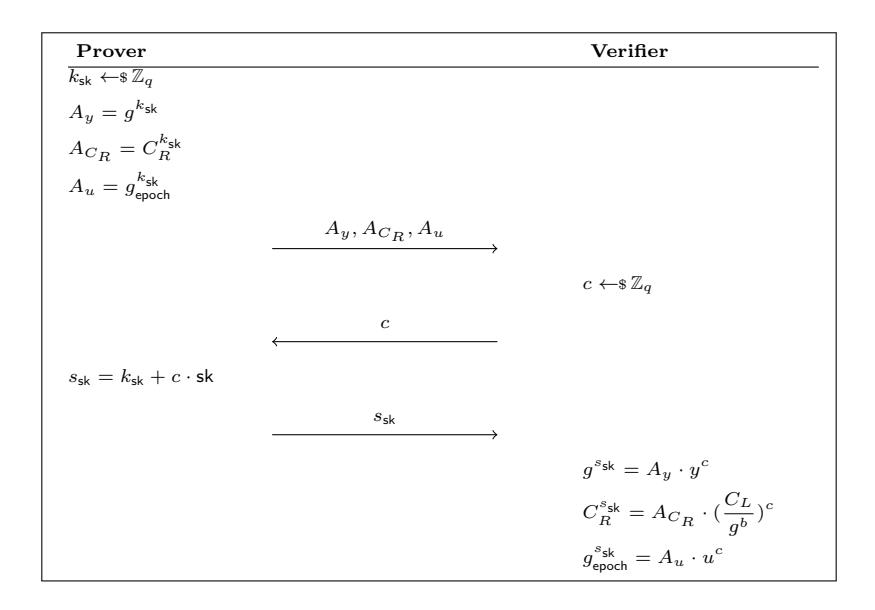

## Zether: Towards Privacy in a Smart Contract World

Benedikt B¨unz<sup>1</sup> , Shashank Agrawal<sup>2</sup> , Mahdi Zamani<sup>3</sup> , and Dan Boneh<sup>4</sup>

> Stanford University, benedikt@cs.stanford.edu Visa Research, shaagraw@visa.com Visa Research, mzamani@visa.com Stanford University, dabo@cs.stanford.edu

#### Abstract

Blockchain-based smart contract platforms like Ethereum have become quite popular as a way to remove trust and add transparency to distributed applications. While different types of important applications can be easily built on such platforms, there does not seem to be an easy way to add a meaningful level of privacy to them.

In this paper, we propose Zether, a fully-decentralized, confidential payment mechanism that is compatible with Ethereum and other smart contract platforms. We take an account-based approach similar to Ethereum for efficiency and usability. We design a new smart contract that keeps the account balances encrypted and exposes methods to deposit, transfer and withdraw funds to/from accounts through cryptographic proofs.

We describe techniques to protect Zether against replay attacks and front-running situations. We also develop a mechanism to enable interoperability with arbitrary smart contracts. This helps to make several popular applications like auctions, payment channels, voting, etc. confidential.

As a part of our protocol, we propose Σ-Bullets, an improvement of the existing zero-knowledge proof system, Bulletproofs. Σ-Bullets make Bulletproofs more inter-operable with Sigma protocols, which is of general interest.

We implement Zether as an Ethereum smart contract and show the practicality of our design by measuring the amount of gas used by the Zether contract. A Zether confidential transaction costs about 0.014 ETH or approximately \$1.51 (as of early Feb, 2019). We discuss how small changes to Ethereum, which are already being discussed independently of Zether, would drastically reduce this cost.

## 1 Introduction

Blockchain-based smart contract platforms have great promise to remove trust and add transparency to distributed applications. Ethereum is a prominent example of such a platform [\[39\]](#page-23-0). It provides highlevel powerful programming languages like Solidity [\[85\]](#page-25-0) to build decentralized applications (DApps) with ease. Unfortunately, there is no easy way to add some meaningful level of privacy to these applications. Take the case of auction contracts for instance, which can be built on Ethereum without much trouble [\[86\]](#page-25-1)—but, could we build a sealed-bid auction mechanism just as easily?

Sealed-bid auctions work roughly as follows: In a bidding phase, bidders submit sealed bids to an auctioneer so that no bidder knows how much others have bid. Afterwards, the bids are unsealed and a winner is chosen by comparing the bid values. If we try to build such an auction contract on Ethereum, how do bidders deposit their bids with the contract given that all transaction amounts in Ethereum are publicly visible?

There are several ways people deal with this problem in practice. Ethereum Name Service suggests that users submit just a hash of their bids to register a name with the registrar, and deposit more ether (Ethereum's native currency) than the true bid value [\[36,](#page-23-1) [37\]](#page-23-2). The official Solidity documentation has an example for blind auctions too, where users submit multiple bids which include some fake ones [\[86\]](#page-25-1). These mechanisms, however, do not hide the bid values completely and put additional burden on the users. Some powerful general-purpose cryptographic solutions have also been proposed to run arbitrary smart contracts in a privacy-preserving way [\[53,](#page-24-0) [25\]](#page-22-0), but they are not fully decentralized and/or too expensive for simple contracts.

Indeed, the quest for confidentiality is not limited to auctions. Payment channels are widely seen as a central technology to increase the throughput of crypto-currencies. On a powerful platform like Ethereum, payment channels can be easily set up too [\[44,](#page-23-3) [6\]](#page-21-0)—but, could we make such channels confidential just as easily?

Confidential transfers. If there was a way to send ether confidentially on Ethereum, perhaps we could leverage it to add confidentiality to important applications like auctions and payment channels. Unfortunately, almost all known ways to transfer confidentially [\[59,](#page-24-1) [67,](#page-24-2) [64,](#page-24-3) [30,](#page-22-1) [3\]](#page-21-1) are in the unspenttransaction-output (UTXO) model (popularized by Bitcoin), where the inputs to a new transaction are the unspent outputs of previous transactions. UTXOs are not well-suited for applications that need to maintain some state [\[19\]](#page-22-2), so smart-contract platforms like Ethereum operate in the account-based model.

Another drawback of UTXO-based mechanisms is that though they have been proposed to fix privacy issues with Bitcoin, they actually require major changes to Bitcoin's design and have spun off into separate crypto-currencies. An important benefit of powerful platforms like Ethereum is that the platform's core capability itself can be enhanced by deploying new applications. Payment channels, for instance, can be deployed to improve throughput. So perhaps we can deploy a new payment application to improve confidentiality of not just payments but potentially other applications too.

It is still conceivable that one of the UTXO-based mechanisms could be implemented over a contract. However, this approach suffers from multiple issues including storage cost, lower confidentiality, interoperability with other contracts, and adoption. We discuss the issues in depth in Appendix [A.](#page-26-0)

### 1.1 Zether

In this paper, we propose an efficient, fully-decentralized confidential payment mechanism in the account-based model called Zether, which does not require any changes to the design of the underlying smart contract platform like Ethereum. We describe Zether as a smart contract that can be executed either individually or by other smart contracts to exchange confidential amounts of a token, denoted by ZTH. The techniques used in Zether can apply to other account-based crypto-currencies, completely independent of their consensus mechanisms.

Our contributions can be summarized as follows:

- Confidentiality Transactions on Zether are confidential by design. Account balances are kept encrypted at all times and users provide cryptographic proofs to spend ZTH.
- Zero-knowledge proofs Zether uses zero-knowledge (ZK) proofs as an important building block. To efficiently instantiate Zether, we propose a new ZK-proof mechanism, called Σ-Bullets, which enhances the interoperability of Σ-protocols [\[29\]](#page-22-3) and Bulletproofs [\[17\]](#page-22-4). This allows us to efficiently combine Bulletproofs-based range proofs with ElGamal encryptions. (Σ-Bullets could be useful in other settings too.)
- Implementation We implement Zether as an Ethereum smart contract and measure the gas amount required for executing it. We show that Zether is practical today and with already-planned enhancements to Ethereum will become even more efficient. As part of our implementation, we provide an efficient implementation of Bulletproofs [\[17\]](#page-22-4) on Ethereum which is of independent interest.
- Interoperability Zether provides a way to lock funds in an account to a smart contract, making it easy to add confidentiality to several important applications. We show how Zether can be used in a natural way to build four applications: sealed-bid auction, confidential payment channel, confidential stake-voting, and private proof-of-stake.

• Anonymity We describe an extension to Zether that can also hide the sender and receiver involved in a transaction among a group of users chosen by the sender. Though the overhead associated with anonymity scales linearly with the size of the group, no trusted set-up is needed and no changes to the underlying smart contract platform are required. Thus, Zether anonymity guarantee is more similar to Monero [68] than Zcash [93], but in the account model.

Organization. The rest of the paper is organized as follows. We provide some background on Ethereum in Section 2, with a focus on smart contract execution. Section 3 provides an overview of the Zether payment mechanism, its use in other applications, and the new ZK-proof system. Section 4 defines the cryptographic tools we need for Zether. It then formally defines the notion of a payment mechanism in a smart-contract world, and the security properties it should satisfy. Section 6 provides a detailed description of Zether. Section 7 describes our implementation in Solidity, its evaluation, various optimizations, etc. Section 8 shows how Zether can be used with smart contracts to get more privacy. Section 9 discusses the work related to Zether.

We describe an anonymous version of Zether in detail in Appendix D. Appendix F has some discussion on important matters related to the use of Zether. Finally, Appendix G has a thorough discussion of  $\Sigma$ -Bullets.

## <span id="page-2-0"></span>2 Background on Ethereum

Accounts are Ethereum's basic units. There are (a) externally-owned accounts (EOAs), controlled by private keys and (b) contract accounts, controlled by their code. Both types of accounts have an ether balance, denominated in units of wei: 1 ether is 1e18 wei. The Ethereum blockchain tracks the state of every account [39, 91]. State changes are initiated through transactions coming from EOAs. A transaction consists of the destination account address, a signature  $\sigma$ , the transferred amount in wei, an optional data field representing inputs to a contract, a GASLIMIT value, and a GASPRICE value. Every EOA is associated with a nonce, a counter that increments with every transaction. The signature  $\sigma$  signs the transaction and the sender's nonce. During transaction processing,  $\sigma$  is verified against the nonce value. As a result, transactions cannot be "replayed" on the Ethereum network [39].

A transaction can transfer wei between accounts or trigger the execution of smart contract code. Contracts can send messages to other contracts, mimicking function calls. Every transaction and code execution is replicated on all nodes in the network. Every executed operation has a specified cost expressed in terms of gas units. For example, storing 256 bits of data costs 20,000 units of gas while changing it costs 5,000 and reading it costs 200 [91]. The sender pays for all contract operations that the transaction calls.

The sender sets GASLIMIT field to the total amount of gas she is willing to spend for a transaction, and the GASPRICE field to the amount of wei she is willing to pay per unit of gas. A miner, that is happy with the gas price, can include the transaction in a block and collect the fee. If the gas limit falls short of the gas needed to process the transaction, the miner will collect the fee but not change the blockchain's state. Excess fees are refunded to the account that issued the transaction [91].

The total gas consumed by all transactions in a block is limited. This ensures that the time needed for processing and propagating a block remains sufficiently small, allowing for an adequately-decentralized network. Currently that limit is around 8 million gas units. Simple arithmetic operations cost 3 gas units and the average block time is 15s. The total Ethereum network can, therefore, perform less than 180k arithmetic operations per second. Some complex operations, e.g., the Keccak 256-bit hash function, however, do not need to be arithmetized but are provide as a standalone functionality at a reduced cost (36 gas for a 32 byte hash) [91].

Contracts are written in specific programming languages such as Solidity [85]. Once compiled to bytecode, the contract can be read and executed by the *Ethereum virtual machine (EVM)*, a sandboxed and isolated runtime environment. The EVM has access to a global persistent storage system and each contract account has separate storage available to it.

In Ethereum, transactions are processed individually in an arbitrary order. Therefore, it is important to ensure that contract codes are written properly so that unexpected outcomes are avoided when a

common part of the EVM state is changed by two or more transactions [\[56\]](#page-24-5). The low computational power, along with the asynchronous transactional nature of the Ethereum network make programming complicated smart contracts a delicate endeavor.

## <span id="page-3-0"></span>3 Overview of Zether

In this section, we provide an overview of the Zether payment mechanism, its use in other applications, and the new ZK-proof system.

Commitment vs encryption. Several proposals for making transactions confidential use homomorphic commitments, such as Pedersen commitments [\[69\]](#page-24-6). Though they are simple and efficient, the opening of these commitments must be transferred to the receiver, say Bob, so that he can spend the money later. This randomness could be stored on-chain in some encrypted manner or sent directly to Bob through a separate channel. In the UTXO model, if Bob is unable to recover the randomness (an incorrect value was encrypted/sent, nothing sent at all, etc.), then it cannot spend the UTXO later. However, other UTXOs controlled by Bob are not affected at all and could still be spent. On the other hand, with an account-based model, since all the incoming transfers go into the same account, failure to recover the randomness for even a single transfer could render the whole account unusable.

One could require senders to encrypt the randomness under receivers' public key, and prove that the commitment indeed uses the randomness encrypted. We take a more direct and simpler approach here using ElGamal encryption with messages in the exponent [\[27\]](#page-22-5). The encryption scheme has linear encoding properties, i.e., it is homomorphic, which we utilize to create efficient ZK-proofs of correct encryption. We describe the encryption scheme in Section [4.](#page-6-0)

### 3.1 Building Zether

Zether strives not just to make transfers confidential but also to prevent accidental loss of funds. We first discuss a simplistic version of Zether with the core functionality. We then describe some shortcomings and how to overcome them.

A simplistic Zether. The Zether smart contract (ZSC) works with Zether tokens (ZTH). Zether accounts are identified with ElGamal public keys, which are stored in ZSC's internal state. To fund an account with public key y with b ZTH, one can send b ETH to the smart contract. ZSC generates an ElGamal encryption of b with randomness 0 (since b is anyway part of the transaction) and adds it to the encrypted balance associated with y. [1](#page-3-1) One can convert ZTH back to ETH by revealing the current balance b ? and providing a ZK-proof that y's ciphertext (i.e., the ciphertext associated with y on the smart contract) indeed encrypts b ? .

In order to transfer some b amount of ZTH to a public key y <sup>0</sup> without revealing b itself, one can encrypt b under both y and y 0 . A ZK-proof is provided to show that the two ciphertexts are well-formed, they encrypt the same positive value, and the remaining balance associated with y is positive. In our implementation, we use a new ZK-proof system, called Σ-Bullets to efficiently prove the statements over the encrypted transfer balance and the new sender balance.

Front-running. The very first problem with the simplistic version of Zether is that the ZK-proofs are generated w.r.t. a certain state of the contract. For example, the ZK-proof in a transfer transaction needs to show that the remaining balance is positive. A user Alice generates this proof w.r.t. to her current account balance, stored in an encrypted form on the contract. However, if another user Bob transfers some ZTH to Alice, and Bob's transaction gets processed first, then Alice's transaction will be rejected because the proof will not be valid anymore. Note that Bob may be a totally benign user yet Alice loses the fees she paid to process her transaction. We refer to this situation as the front-running problem. Burn transactions have a similar problem too: a proof that a ciphertext encrypts a certain value becomes invalid if the ciphertext changes.

<span id="page-3-1"></span><sup>1</sup> If y has no record on ZSC yet, then a new record is created and initialized with the aforementioned ciphertext.

To solve this problem, one could introduce a new type of transaction that just locks an account to keep away incoming transfers. Alice could wait until this transaction gets into the blockchain before initiating an outgoing transfer (or doing a burn). While this seems to fix the problem (at the cost of making transfer, the primary transaction, a two-step process), it creates new problems for users like Bob who want to send ZTH to Alice. Alice's account may not be locked when Bob publishes a transfer transaction tx, but it could get locked before tx gets in, resulting in tx being rejected.

Any kind of locking approach becomes more untenable when we bring in anonymity. (We will discuss anonymity in more detail at the end of this section.) If Alice wants to hide herself among other users and make sure that her transaction gets through, she will have to lock all the accounts in the anonymity set. Clearly, this cannot be allowed: Alice must not be able to lock accounts of other users. Alternatively, Alice could only put locked accounts in her anonymity set. However, if someone unlocks their account before Alice's transaction gets in, Alice's degree of anonymity is reduced.

Pending transfers. To address the front-running problem, we keep all the incoming transfers in a pending state. These transfers are rolled over into the accounts from time to time so that the incoming funds could be spent. This rollover cannot happen at arbitrary times, otherwise the proofs would get invalidated again.

To handle this, we divide time into epochs where an epoch consists of k consecutive blocks. The choice of k depends on two factors: a) the gap between the latest state of blockchain and any user's view, and b) the time it takes to get a transaction into the blockchain. At the end of every epoch, pending transfers are rolled over into the corresponding accounts. Users are expected to publish their transfer or burn transaction at the beginning of an epoch so that even if they do not see the latest state of the blockchain and it takes some time for their transaction to be included, they do not step into the next epoch. As long as k is chosen wisely, transactions will be processed before the account changes state.

Rolling over on a smart contract. Unfortunately, rolling over accounts is not as straightforward as it may appear because a smart contract does not do anything unless a transaction is sent to it. One cannot expect every user to send a rollover message for every epoch. Moreover, there is no way they will be able to get such a message in at the right time.

A first idea is to rollover the pending transfers for all accounts on the receipt of the first message in an epoch. This, however, places an unreasonably large burden on the sender of that message: it will have to pay for the cost of rolling over the accounts that it does not own, which could be too many. Furthermore, users would have no way to know if their transaction would be the first in an epoch, so they cannot estimate the right amount of gas to supply.

We rollover an account in an epoch when the first message from this account is received; so, one message rolls over only one account. To achieve this, we define a separate (internal) method for rolling over, and the first thing every other method does is to call this method. There could be accounts that do not get rolled over for several consecutive epochs because no transaction is initiated from them. This is not a problem because the account holder, say Alice, is not trying to use her money anyway. At some later point in time, when Alice wants to operate on her account, she will publish a transaction. All the money transferred into her account since the last rollover will be rolled over immediately and become available to be spent. Indeed, when Alice creates a ZK-proof, she will assume the state of her account to be what it would be when all the pending transfers are rolled over into it.

Replay protection. Like any other payment mechanism, Zether needs to handle replay attacks. Ethereum provides replay protection of its own by associating nonces with every account, which need to be signed into every transaction. Unfortunately, this level of protection is not enough for Zether due to two reasons: (1) Zether accounts have their own public keys; they are not associated with Ethereum addresses. (2) Zether transactions contain non-interactive ZK-proofs. A malicious actor can steal these proofs and put them inside new transactions. If the state of the account has not changed, then the new transactions will also be processed successfully, leading to loss of funds. Later in this section, we will discuss another important feature of Zether: locking accounts to other smart contracts. Even if the request to lock a Zether account shows knowledge of the secret key, and the account is unlocked later, an adversarial entity could lock the account again by just replaying the request.

To protect against such issues, we associate a nonce with every Zether account. The nonces are incremented as transactions are processed. A new transaction from an account must sign the latest value of the nonce associated with the account along with the transaction data, which includes any ZK-proof. This approach binds all components of a transaction together and ensures freshness. ZK-proofs cannot be imported into malicious transactions and valid transactions cannot be replayed.

One way wonder if there is a way to use Ethereum addresses themselves as the identities of Zether accounts. The accounts would then be operated with the secret keys corresponding to the addresses, and we would get replay protection and signature verification for free. However, this would force users to operate a Zether account from a fixed Ethereum address. They would not be able to delegate the account to a different address, like when locking the account to a smart contract (which will be discussed in more detail later). Furthermore, Ethereum addresses are only a hash of public keys, not the full form. Proving statements about hashes in zero-knowledge is quite expensive. Lastly, having separate public keys for Zether accounts also helps make the design more modular and platform-independent.

Anonymity. Zether can be extended to transfer anonymously. An anonymous version of Zether needs a more complex ZK-proof, a new replay and double-spend protection mechanism, and a different mechanism to lock accounts to smart contracts. We defer the discussion to Appendix [D.1.](#page-29-1)

### 3.2 Interoperability with Smart Contracts

A main design goal for Zether is to be interoperable with arbitrary smart contracts, which may contain bugs or even be maliciously designed. An important distinction between regular users and smart contracts is that contracts cannot generate ZK-proofs because they do not have any secret state. As a result, they cannot initiate a ZTH transfer.

We make Zether interoperable with other smart contracts by exposing a lock/unlock functionality. To illustrate, suppose Alice owns an account acc. She can lock acc to any arbitrary smart contract, say SC. In effect, this transfers the ownership of acc to SC. Now, Zether will process only those transactions on acc that come from SC. Any transactions sent by Alice, other users or other contracts will simply be declined. ZK-proofs, however, would still be generated by Alice if needed, and transferred to the Zether smart contract via SC. SC can finally unlock acc to return its control to Alice.

Even this simple locking mechanism can help us realize several important applications in a confidential way. We provide a brief discussion here and defer details to Section [8](#page-16-0)

Sealed-bid auctions. Auctions are used to sell a wide variety of resources on Ethereum [\[88\]](#page-25-3). A primary example is the Ethereum Name Service (ENS) [\[36\]](#page-23-1). In the ENS bidding phase, a bidder submits a hash of her bid along with an amount of ether. ENS suggests that the amount should be higher than the bid value to disguise the true value of the bid. There are several drawbacks to this approach including that it reveals a good upper-bound to bid value. Using Zether, bidders can simply lock their accounts (or transfer the bid value to a new account and lock that) to the auction contract, thus getting full bid confidentiality. No other collateral needs to be put in place. After the bidding phase, bidders can open their bids by providing a ZK-proof on the encrypted bid value (a burn proof essentially). The auction smart contract can then simply unlock the accounts of the bidders who lost.

Confidential payment channels. Payment channels are widely considered to be one of the most important solutions to the scalability problem of crypto-currencies. On Ethereum, they can be set up very easily through smart contracts. A certain amount of ether is locked into the contract, transfers are conducted off-the-chain between the parties, and then a final settlement is made on chain. This clearly reveals a lot of information, but Zether can be used to prevent it. A Zether account could be locked to the channel contract and ZK-proofs could be exchanged offline to show that the channel has enough liquidity. Thus, we have a simple way to make channels confidential.

Stake voting. Several blockchain-based voting protocols have been proposed to deal with the transparency issues of traditional voting systems. An important example is the Open Vote Network of McCorry et al. [\[61\]](#page-24-7). Here, the vote values are binary: participants publish a special encryption of

their votes and prove that they are 0 or 1. With Zether, we can allow the votes to carry weights, proportional to the assets a participant owns. Once again, this can be achieved by just locking account to the vote contract and proving in zero-knowledge that the vote value is equal to the amount locked.

Proof-of-stake. Proof-of-stake is a popular alternative to the wasteful proof-of-work consensus mechanism. Users stake a number of coins and then a random beacon is used to select one of them as leader. This reveals the stake of users, making them susceptible to targeted attacks. Zether could be used to make proof-of-stake confidential. At a high level, users could encrypt an initial lottery ticket t under their public key and stake an encrypted Zether balance b under the same key. Then the random beacon value is used to derive a lottery drawing v. If v falls between t and t+b then the user wins the lottery, which it can prove without revealing t or b. See Section 8.4 for details.

#### 3.3 $\Sigma$ -Bullets

Zether ensures that encrypted transactions are correct by using ZK-proofs that certify correctness without revealing any additional information. We design a custom proof system called  $\Sigma$ -Bullets that is well-suited for Zether.  $\Sigma$ -Bullets integrate Bulletproofs [17] with  $\Sigma$ -protocols to enable efficient proofs on algebraically-encoded values such as  $\exists x: g^x = y \wedge h^x = u \in \mathbb{G}$ . Bulletproofs on the other hand is a circuit proof system that is well suited for range proofs and other more complicated arithmetic statements. Bulletproofs does enable proofs on Pedersen committed values if all values use the same commitment key. With  $\Sigma$ -Bullets we can prove complex statements on algebraically encoded data. For example, we can efficiently prove that a set of ElGamal encrypted values are in some range. Further, we combine one-out-of-many proofs[49], also known as ring signatures, with range proofs to allow anonymous transfers. The one-out-of-many proof is a  $\Sigma$ -protocol that hides which account is being used. Bulletproof is then used to show that the account has sufficient funds for the transfer. The protocol is similar to the techniques used in QuisQuis[43]. QuisQuis first shows that a Pedersen commitment contains the same value as an ElGamal encryption and then executes the Bulletproof on the ElGamal encrypted values.  $\Sigma$ -Bullets more directly incorporates the  $\Sigma$ -protocol with the Bulletproof protocol.

 $\Sigma$ -Bullets inherit from Bulletproofs the trapdoor-free setup and the short, logarithmic sized, proof lengths. The ability to prove statements on encrypted values further significantly reduces the prover and verifier time compared to a naive implementation using Bulletproofs. We describe  $\Sigma$ -Bullets in detail in Appendix G.

#### <span id="page-6-0"></span>4 Notation and Tools

We use  $\lambda$  to denote the security parameter. Let GroupGen be a polynomial-time algorithm that on input  $1^{\lambda}$  outputs  $(p,g,\mathbb{G})$  where  $p=\Theta(\lambda), p$  is prime,  $\mathbb{G}$  is a group of order p,g is a generator of  $\mathbb{G}$ , and the decisional Diffie-Hellman (DDH) assumption holds in  $\mathbb{G}$ . The DDH assumption states that a tuple  $(g,g^a,g^b,g^{a\cdot b})$  is computationally indistinguishable from  $(g,g^a,g^b,g^c)$  for random a,b,c. It implies the discrete logarithm assumption.

Let  $\mathbb{Z}_p$  denote the integers modulo p.  $\mathbb{Z}_p^{\star}$  is the set of inverses in  $\mathbb{Z}_p$ . We use [a,b] for  $a,b\in\mathbb{Z}$  to denote the set of integers  $\{a,a+1,\ldots,b-1,b\}$ .

We use  $x \stackrel{\$}{\leftarrow} S$  to denote that x is sampled uniformly at random from a set S. We use PPT as a shorthand for probabilistic polynomial time and  $negl(\lambda)$  to denote negligible functions.

**ElGamal encryption.** ElGamal encryption is a public key encryption scheme secure under the DDH assumption. A random number from  $\mathbb{Z}_p^*$ , say x, acts as a private key, and  $y = g^x$  is the public key corresponding to that. To encrypt an integer b, it is first mapped to one or more group elements. If  $b \in \mathbb{Z}_p$ , then a simple mapping would be to just raise g to b. Now, a ciphertext for b is given by  $(g^b y^r, g^r)$  where  $r \stackrel{\$}{\leftarrow} \mathbb{Z}_p^*$ . With knowledge of x, one can divide  $g^b y^r$  by  $(g^r)^x$  to recover  $g^b$ . However,  $g^b$  needs to be brute-forced to compute b.

We argue that this is not an issue. First, as we will see, the Zether smart contract does not need to do this, only the users would do it. Second, users will have a good estimate of ZTH in their accounts

because, typically, the transfer amount is known to the receiver. Thus, brute-force computation would occur only rarely. Third, one could represent a large range of values in terms of smaller ranges. For instance, if we want to allow amounts up to 64 bits, we could instead have 2 amounts of 32 bits each, and encrypt each one of them separately. In this paper, for simplicity, we will work with a single range, 1 to MAX, and set MAX to be  $2^{32}$  in the implementation.

The primary benefit of putting balances in exponent is that it makes ElGamal encryption additively homomorphic. If b and b' are encrypted under the same public key y to get ciphertexts ( $C_L = g^b y^r, C_R = g^r$ ) and ( $C'_L = g^{b'} y^{r'}, C'_R = g^{r'}$ ) respectively, then ( $C_L C'_L = g^{b+b'} y^{r+r'}, C_R C'_R = g^{r+r'}$ ) is an encryption of b + b' under y.

**Zero-knowledge proofs.** A zero-knowledge (ZK) proof of a statement does not reveal any information beyond the validity of the statement. For example, one could prove that two ciphertexts encrypt the same message without revealing the message itself. Though any NP statement can be proved in zero-knowledge, the concrete costs depend on a number of factors.

 $\Sigma$  protocols are honest-verifier public-coin zero-knowledge interactive proofs of a special form. Very efficient  $\Sigma$  protocols exist for proving a wide variety of algebraic statements like knowledge of b and r s.t. an ElGamal ciphertext encrypts b with randomness r. The Fiat-Shamir transform is a way of transforming any public-coin honest-verifier ZK-proof (like  $\Sigma$  protocols) into a non-interactive zero-knowledge proof of knowledge in the random oracle model.

A ZK-proof for the statement

$$st: \{(a, b, c, \dots; x, y, z, \dots) : f(a, b, c, \dots, x, y, z, \dots)\}$$

means that the prover shows knowledge of  $x, y, z, \ldots$  such that  $f(a, b, c, \ldots, x, y, z, \ldots)$  is true, where  $a, b, c, \ldots$  are public variables. We use  $\mathsf{st}[a, b, c, \ldots]$  to denote an instance of  $\mathsf{st}$  where the variables  $a, b, c, \ldots$  have some fixed values.

We represent a non-interactive ZK (NIZK) proof system with algorithms (Setup<sub>nizk</sub>, Prove, Verify<sub>nizk</sub>), where Setup<sub>nizk</sub> outputs some public parameters, Prove generates a proof for a statement given a witness, and Verify<sub>nizk</sub> checks if the proof is valid w.r.t the statement. Zether uses NIZKs that are a) correct, an honest prover can produce a valid proof b) zero-knowledge, a verifier learns nothing from the proof but the validity of the statement, and c) sound, a computationally bounded prover cannot convince a verifier of a false statement.  $\Sigma$  protocols, with the Fiat-Shamir transform applied, have all these properties.

**Digital signatures.** Signature schemes are used to authorize messages by *signing* them. A verifier can check a signature but will be unable to forge a signature on a previously unsigned message. Signatures can be built from Fiat-Shamir transformed NIZK proofs [2].

We represent a signature scheme with algorithms ( $\mathsf{Setup}_{\mathsf{nizk}}$ ,  $\mathsf{Sign}$ ,  $\mathsf{Verify}_{\mathsf{nizk}}$ ), where  $\mathsf{Setup}_{\mathsf{nizk}}$  outputs some public parameters,  $\mathsf{Sign}$  generates a signature on an input message, and  $\mathsf{Verify}_{\mathsf{nizk}}$  checks if the signature is valid w.r.t. the message. Zether requires a signature scheme that is a) correct, it is possible to create valid signatures on arbitrary messages and b) existentially unforgeable, a computationally bounded adversary can't create a valid signature on a new message, even after seeing signatures on other messages.

We omit formal definitions for brevity and refer to [11] for a thorough treatment of the properties.

# 5 Payment Mechanism

A payment mechanism for Ethereum consists of a setup routine, user algorithms, and a smart contract. The contract maintains a state st which changes over time. The state at block height h is denoted by  $\mathsf{st}_h$ . Users rely on the state of the smart contract to create transactions. A user account is identified by a public key  $\mathsf{pk}$ . Let  $\mathsf{MAX}$  be the maximum amount of money that the mechanism can handle. Any amount below must be an integer between 0 and  $\mathsf{MAX}$ .

<span id="page-7-0"></span> $<sup>^2\</sup>mathsf{MAX}$  should be treated as a constant with respect to the security parameter.

The payment mechanism also provides a way to lock funds of an account to an Ethereum address addr so that the address can control the movement of funds through the account, until the lock is released. In Section [8,](#page-16-0) we will use the locking/unlocking feature to bring privacy to several commonly used smart contracts.

The term transaction is used in Ethereum to refer to a signed data package that stores a message to be sent from an externally owned account to another account on the blockchain. It can include binary data (its payload) and Ether. If the target account contains code, that code is executed and the payload is provided as input data. For a transaction tx, we use tx.ETH to denote the amount of ether being sent through tx.

Contracts can call other contracts or send Ether to non-contract accounts by the means of message calls. The message call most relevant to us is msg.sender.transfer (in the syntax of Solidity) which transfers a certain amount of Ether from a contract to the sender who called it. For a transaction tx that calls a function f on a contract, we use f(tx).ETH to denote the amount of Ether successfully sent back to the caller when f is executed with tx. (In Figure [5](#page-34-0) and Figure [2,](#page-12-0) where we describe the details of our Zether instantiation, we use a programming oriented, Solidity inspired, syntax as defined in Table [1.](#page-11-0))

We are now ready to describe the various components of a payment mechanism.

Setup. In the setup phase, some public parameters are generated. They could be distributed off-chain or put into the smart contract (described below). The smart contract is also deployed.

User algorithms. A user can run one of the following algorithms to interact with the smart contract. The output of these algorithms are raw transactions. We leave it implicit that they will be signed (using the public key of the Ethereum account from which they are sent) and destined to the Zether smart contract. Nonetheless, we use tx.addr to denote the Ethereum address addr from which tx was sent. All the algorithms get the security parameter as input but we show it explicitly only for the first one.

- 1. CreateAddress(1<sup>λ</sup> ) → (sk, pk). CreateAddress provides a way for a user to uniquely identify itself to the smart contract. It takes (a unary representation of) the security parameter as input and outputs a secret key sk and a public key pk. We assume that pk is derived in a deterministic way from sk, and use pkOf(sk) to denote the public key that corresponds to sk.
- 2. CreateFundTx(pk, amt) → txfund. CreateFundTx is used to add funds to an account. It takes a public key pk and an amount amt as inputs. It outputs txfund = (pk, . . .).
- 3. CreateTransferTx(skfrom, pkto, amt,sth) → txtrans. CreateTransferTx is used to transfer money from one account to another. It takes a secret key skfrom, a destination public key pkto, an amount amt, and the state of the smart contract st<sup>h</sup> at a certain block height h as inputs. It outputs txtrans. (For anonymous transfers, this algorithm would also take a set AnonSet as input, which would contain both pkOf(skfrom) and pkto. AnonSet would be a part of the output too.)
- 4. CreateBurnTx(sk,sth) → txburn. CreateBurnTx is used to withdraw the entire balance from an account. It takes a secret key sk and a state st<sup>h</sup> as inputs. It outputs txburn = (pkOf(sk), amt, . . .).
- 5. CreateLockTx(sk, addr,sth) → txlock. CreateLockTx is used to lock an account to an Ethereum address. It takes a secret key sk and an address addr as inputs. It outputs txlock = (pkOf(sk), addr, . . .).
- 6. CreateUnlockTx(pk) → txunlock. CreateUnlockTx is used to unlock an account. It takes a public key pk as input. It outputs txunlock = (pk, . . .).
- 7. ReadBalance(sk,sth) → b. ReadBalance is used to find the balance of an account. It takes a secret key sk and state st<sup>h</sup> as inputs, and outputs an integer b.

Smart contract. The smart contract has five functions Fund, Transfer, Burn, Lock and Unlock. They take txfund, txtrans, txburn, txlock and txunlock, respectively. These functions output 1 or 0, denoting success and failure respectively. If any of the inputs are not of the correct type the function automatically fails. Moreover the functions check certain properties of the input, such as verifying a proof or checking a nonce. If any of these checks fail, the function outputs 0. The five functions modify the state st as needed. We use SC as a shorthand for the smart contract.

SC has access to the current block height and the sender of every transaction. (In Solidity, the syntax for these are block.number and msg.sender, respectively.) It makes use of two constants: maximum amount value MAX and epoch length E, where E ≥ 1. The epoch number of a block at height h is defined to be bh/Ec. Thus, for example, the blocks at heights 0, 1, . . . , E − 1 are in the first epoch, the ones at heights E, E + 1, . . . , 2E − 1 are in the second epoch, and so on.

We now discuss informally the correctness and security requirements of a payment mechanism. See Appendix [B](#page-26-2) and [C](#page-28-0) for formal definitions. The definitions are for the more general case of anonymity, where not only the transfer amount but the sender/receiver are also hidden (among a chosen set of public keys).

Correctness. Correctness captures the basic functionality a payment mechanism should provide if transactions are generated honestly but they could be sent from arbitrary Ethereum addresses and processed in an arbitrary order. We will assume, however, that if a transaction is generated in a certain epoch, then it gets processed in the same epoch. To illustrate, suppose Alice has X ZTH in her account. In an epoch e1, she publishes a transfer transaction to send Y ≤ X ZTH to someone else. There could be other users in the network who transfer to Alice at about the same time. Even if some of these transfers are processed before Alice's, we don't want her transfer to fail. Further, suppose Alice receives Z ZTH from others in e1. Then, in any epoch after e1, if she publishes a burn transaction with amount X − Y + Z, then we would like her to get back that amount of ETH.

To specify correctness formally, we define the notion of an ideal state and describe how it evolves over time as honestly generated transactions are processed. The ideal state tracks the balance of every account and the Ethereum address (if any) to which it is locked. When a transaction is processed, the ideal state is updated depending on the type of transaction and the current state. Informally, we say that a payment mechanism is correct if whenever a burn transaction is processed for a certain account, the amount of Ether returned to the user is equal to the amount of Zether held in the ideal state account.

Security requirements. We define two security requirements for a payment mechanism Π, overdraftsafety and privacy. Overdraft-safety ensures that users cannot misuse the smart contract to withdraw more money from their accounts that they rightfully own. Privacy of a payment-mechanism ensures that no additional information about the payments of honest parties beyond the intended is leaked to an adversary. In other words, only the sender and receiver of a payment should know the amount transferred in the payment. The formulation of overdraft-safety and privacy is inspired by Zerocash [\[3\]](#page-21-1).

We define a game between a challenger Chal and an adversary Adv to capture the requirements, where Chal represents the honest users in the network. Both Chal and Adv have access to an oracle OSC who maintains the smart contract SC. Adv has full view of the oracle: it can see all the transactions sent by Chal to SC, how the state of SC changes, etc. We provide Adv substantial control over SC's state. It can instruct any honest party at any time (via the challenger) to publish a transaction. It can create its own malformed transactions based on the transactions of honest parties, and then push the former into the blockchain ahead of the latter. In particular, it can arbitrarily delay the transactions of honest parties.

For overdraft-safety, we associate some quantities with the game with respect to Adv: EtherDeposited, ZetherReceived and EtherBurnt, which have self-explanatory names. Informally, a payment mechanism is safe against overdrafts if

#### EtherDeposited + ZetherReceived ≥ EtherBurnt.

There are two important things to note here. First, it is not enough to just require that the total ether burnt (honest parties and adversary combined) should be no more than the total ether deposited

```
Setup
input: Security parameter λ (in unary)
 1. (p, g, G) ← GroupGen(1λ
                             )
 2. ppnizk ← Setupnizk(1λ
                         )
 3. ppsig ← Setupnizk(1λ
                        )
 4. Initialize
    • empty account table, acc : G → G
                                          2
    • empty pending transfers table, pTransfers : G → G
                                                          2
    • an empty last roll over epoch table, lastRollOver : G → Z,
    • an empty lock table, lock : G → {0, 1}
                                              ∗
                                               ,
    • an empty counter table, ctr : G → Z,
    • total balance btotal ∈ Z to 0,
 5. Deploy smart contract ZSC (Figure 2) with parameters (p, g, G), ppnizk, ppsig, acc, pTransfers,
    lastRollOver, lock, btotal, MAX, E.
```

<span id="page-10-1"></span>Figure 1: Zether setup

because it could still be possible that the adversary is able to burn more than its fair share. Second, we cannot take the more direct approach of computing the amount adversary can withdraw by just reading the balance of the accounts controlled by it from the smart contract because its secret keys are not available.

We slightly modify the game discussed above to capture the privacy requirement. Instead of sending just one instruction to Chal every time (asking an honest party to create a transaction), Adv sends two consistent instructions at some point. Chal executes the (b + 1)-th instruction based on a bit b hidden from Adv, which is chosen randomly in advance. Adv is supposed to guess b at the end of the game. (This is the typical left-or-right setting used for indistinguishability-based definitions.) Consistency is defined carefully to rule out trivial wins for the adversary.

## <span id="page-10-0"></span>6 Zether Payment Mechanism

We now present a secure payment mechanism called Zether. It consists of three components: a global setup algorithm that is run once to generate the global parameters for the protocol as well as to deploy the Zether smart contract. The second component is the Zether smart contract (ZSC) that handles transactions between users, interoperability with external smart contracts, and keeps the state of the system. The final component of the mechanism are the user algorithms which describe how users can interact with the smart contract and create valid transactions. A user is of course not bound to the behavior described in the user algorithms. Our security proof in Appendix [E](#page-33-0) shows that even if an adversarial user does not comply with these algorithms, he can't break Zether's correctness, privacy and over-draft protections.

Setup. The setup algorithm calls Setupnizk and Setupnizk as subroutines, which are the setup algorithms for the proof system and the signature scheme, respectively. The former setup could depend on the relations for which proofs are constructed. If these subroutines are trustless, then the whole setup is trustless, meaning that its correctness can be verified publicly. In the implementation (Section [7\)](#page-13-0), we use Bulletproofs [\[17\]](#page-22-4) and Schnorr signatures [\[82\]](#page-25-4), both of which have a trustless setup. Zether significantly differs from Zcash [\[93\]](#page-26-1) in this respect because Zcash has a trusted setup and its security is broken if the setup is subverted.

Setup algorithm is formally described in Figure [1.](#page-10-1) Apart from setting up the proof system and signature scheme, it initializes account tables acc and pending transfers table pTransfers (recall that incoming transfers are put into a pending state first), a last roll over epoch table lastRollOver to keep track of the last epochs accounts were updated, a lock table lock to keep track of the addresses to which accounts are locked, a counter table ctr to prevent replay attacks, and a variable btotal that tracks the total amount of ZTH held by the contract. The setup also specifies an epoch length E and a maximum amount value MAX.

Zero-knowledge relations. Each transfer and burn transaction in Zether contains a ZK-proof which ensures that the transfer is valid without revealing the reasons why it is valid.

Burn transaction. Let us first consider a burn transaction where a user needs to verifiably decrypt his Zether balance. It can certainly do this by revealing its secret key to the smart contract. However, an adversary can use the secret key to decrypt all previous balances and transactions of the user, thus completely breaking its privacy. So, instead of decrypting in the clear, the user creates a ZK-proof for the following statement:

<span id="page-11-1"></span>
$$\mathsf{st}_\mathsf{burn}: \left\{ (y, C_L, C_R, u, b, g, g_\mathsf{epoch}; \mathsf{sk}) : y = g^\mathsf{sk} \land C_L = g^b C_R^\mathsf{sk} \right\} \tag{1}$$

The statement shows that the user knows an sk such that y is indeed the public key corresponding to sk and (CL, CR) is a valid encryption of b under y. A simple Σ protocol can be used to prove the statement.

Transfer transaction. Let us now consider a transfer transaction. Suppose a user wants to transfer an amount b ? from a public key y to a public key y. Let (CL, CR) be the encryption of balance associated with y. The smart contract needs to deduct b ? from y's balance and add the same amount to y's balance, which will be put into a pending state. Since we need to hide b ? in this process, user will encrypt b ? under both y and y to get (C, D) and (C, D), respectively. Now, it must provide a proof to show that:

- 1. both ciphertexts are well formed and encrypt the same value b ? ;
- 2. b ? is a positive value; and,
- 3. the remaining balance of y, say b 0 , is positive too. More formally, a user proves the following statement:

$$\begin{split} \mathsf{st}_{\mathsf{ConfTransfer}} : \left\{ (y, \overline{y}, C_L, C_R, C, D, \overline{C}, g; \mathsf{sk}, b^\star, b', r) : \\ C &= g^{b^\star} y^r \wedge \overline{C} = g^{b^\star} \overline{y}^r \wedge D = g^r \wedge \\ C_L/C &= g^{b'} \left( C_R/D \right)^{\mathsf{sk}} \wedge y = g^{\mathsf{sk}} \wedge \\ b^\star &\in [0, \mathsf{MAX}] \wedge b' \in [0, \mathsf{MAX}] \right\} \quad (2) \end{split}$$

Kurosawa [\[55\]](#page-24-8) first showed that in the ElGamal encryption scheme, randomness can be reused to encrypt to multiple recipients. We use the same idea here to make the zero-knowledge component more efficient: the same random number r is used to encrypt b ? under both y and y.

| block.number     | current block number                                      |  |
|------------------|-----------------------------------------------------------|--|
| msg.sender       | sender of the message (current call)                      |  |
| msg.value        | number of Wei sent with the message                       |  |
| address.transfer | send given amount of Wei to address                       |  |
| require          | check conditions; current call reverts if condition fails |  |

<span id="page-11-2"></span><span id="page-11-0"></span>Table 1: Solidity syntax

Zether contract. The Zether contract (ZSC) is defined in Figure [5.](#page-34-0) It consists of five public methods Fund, Burn, Transfer, Lock, Unlock and two additional internal helper methods RollOver, CheckLock. The helper methods are used to modularize the contract's logic. We use Solidity syntax at some places in the description of ZSC, instead of introducing new notation; see Table [1](#page-11-0) for the syntax we use and what it means. We now discuss ZSC's methods in detail.

Rolling over. Pending transfers for an account must be rolled over into the account every epoch, or at least in the epochs the account is used. However, no instruction on a smart contract can execute

```
Fund
                                                                                Burn
     • INPUTS: public key y
                                                                                      • INPUTS:
    1. RollOver(y)
                                                                                         - public key y
                                                                                         - balance b
    2. Let b = msg.value
    3. require:
                                                                                         - proof \pi_{\text{burn}}
                                                                                         - signature \sigma_{\text{burn}}
             -b+b_{\mathsf{total}} \leq \mathsf{MAX}
             - CheckLock(y, msg.sender) = 1
                                                                                     1. RollOver(y)
    4. If acc[y] = \bot:
                                                                                     2. Let (C_L, C_R) = \operatorname{acc}[y]
             - Let H = block.number, e = |H/E|
                                                                                     3. require:
             - Set acc[y] = (1,1)
                                                                                             - CheckLock(y, msg.sender) = 1
             - Set pTransfers[y] = (g^b, 1)
                                                                                             - Verify<sub>nizk</sub>(st<sub>burn</sub>[y, C_L, C_R, b, g], \pi_{burn}) = 1
             - Set lock[y] = \bot
                                                                                             - \operatorname{Verify}_{\mathsf{nizk}}(y,(b,\pi_{\mathsf{burn}},\mathsf{ctr}[y]),\sigma_{\mathsf{burn}})=1
             - Set lastRollOver[y] = e
                                                                                     4. Set acc[y] = acc[y] \circ (C_L^{-1}, C_R^{-1})
                                                                                     5. Set \operatorname{ctr}[y] = \operatorname{ctr}[y] + 1
             - \operatorname{Set} \operatorname{ctr}[y] = 0
         Else:
                                                                                     6. Set b_{\text{total}} = b_{\text{total}} - b
             - Set pTransfers[y] = pTransfers[y] \circ (g^b, 1)
                                                                                     7. Do msg.sender.transfer(b)
    5. Set b_{\text{total}} = b_{\text{total}} + b
                                                                                <u>Unlock</u>
                                                                                     • INPUTS: public key y
Transfer
                                                                                     1. RollOver(y)
     • INPUTS:
         - sender public key y
                                                                                     2. require:
          – recipient public key \overline{y}
                                                                                             - \mathsf{CheckLock}(y, \mathsf{msg.sender}) = 1
        - ciphertexts (C, D), (\overline{C}, D)
                                                                                     3. Set lock[y] = \bot
        - proof \pi_{\text{transfer}}
         - signature \sigma_{\text{transfer}}
                                                                                Internal\ Helper\ Methods
    1. RollOver(y)
                                                                                RollOver
    2. RollOver(\overline{y})
                                                                                     • INPUTS: public key y
    3. Let (C_L, C_R) = \operatorname{acc}[y]
                                                                                     1. Let H = \mathsf{block.number}, e = |H/\mathsf{E}|
    4. require:
                                                                                     2. If lastRollOver[y] < e:
             - CheckLock(y, msg.sender) = 1
                                                                                             - Set acc[y] = acc[y] ∘ pTransfers[y]
             - \mathsf{Verify}_{\mathsf{nizk}}(\mathsf{st}_{\mathsf{ConfTransfer}}[y,\overline{y},C_L,C_R,C,\overline{C},D],
                                                                                             - Set pTransfers[y] = (1,1)
                 \pi_{\mathsf{transfer}}) = 1
                                                                                             - Set lastRollOver[y] = e
             - \ \mathsf{Verify}_{\mathsf{nizk}}(y, (\overline{y}, C, \overline{C}, D, \pi_{\mathsf{transfer}}, \mathsf{ctr}[y]),
                 \sigma_{\rm transfer})=1
                                                                                CheckLock
    5. \ \operatorname{Set} \ \operatorname{acc}[y] = \operatorname{acc}[y] \circ (C^{-1}, D^{-1})
                                                                                     • INPUTS:
    6. Set \mathsf{pTransfers}[\overline{y}] = \mathsf{pTransfers}[\overline{y}] \circ (\overline{C}, D)
                                                                                         - public key y
    7. Set \operatorname{ctr}[y] = \operatorname{ctr}[y] + 1

    Ethereum address addr

                                                                                      • OUTPUT: 1 if account y can be operated by addr;
Lock
                                                                                         0 otherwise
     • INPUTS:
                                                                                     1. If lock[y] = \bot or lock[y] = addr:
        - public key y
                                                                                             - Output 1
         - Ethereum address addr
                                                                                         Else:
         - signature \sigma_{\mathsf{lock}}
                                                                                             - Output 0
    1. RollOver(y)
    2. require:
             - CheckLock(y, msg.sender) = 1
             - \ \mathsf{Verify}_{\mathsf{nizk}}(y, (\mathsf{addr}, \mathsf{ctr}[y]), \sigma_{\mathsf{lock}}) = 1
    3. Set lock[y] = addr
     4. Set \operatorname{ctr}[y] = \operatorname{ctr}[y] + 1
```

<span id="page-12-0"></span>Figure 2: ZSC: Zether smart contract

unless triggered by a transaction. As a result, all public methods of ZSC first call RollOver on the input public key(s).

Given a public key y, RollOver checks if the last roll over was in an older epoch. If yes, then it rolls over the pending transfers  $\mathsf{pTransfers}[y]$  into  $\mathsf{acc}[y]$  and resets pending transfers as well as the last roll over epoch.

Check lock. Every transaction to operate on an account is associated with an Ethereum address (returned by msg.sender). If the account is unlocked, then it can be operated from any address. However, if it is locked to a certain address, then it can only be operated from that address. CheckLock is an internal methods to check these two conditions. All the methods call CheckLock before operating on an account.

Locking. Given a public key y, an address addr and a signature  $\sigma_{\mathsf{lock}}$ , Lock checks if it is appropriate to operate on the account by calling CheckLock, which will be discussed in more detail shortly, and verifies that  $\sigma_{\mathsf{lock}}$  is a valid signature on addr and the current value of counter  $\mathsf{ctr}[y]$ . It sets  $\mathsf{lock}[y]$  to be addr and increments the counter, which ensures that this lock transaction cannot be replayed. Unlock method also calls  $\mathsf{CheckLock}$  first, then sets the pending lock to be  $\bot$ .

Funding. Anybody can fund an account, even an account that he/she does not own, by simply specifying the public key y and transferring some ETH. The only exception is for locked accounts; they can only be operated from the locking address. (One could have a different rule for funding locked accounts.) Fund converts ETH into ZTH. The ETH gets stored in the smart contract and the ZTH are homomorphically added to y's (pending) balance. If the account does not exist yet, a new one is created. Fund also ensures that the deposit does not exceed the total amount of funds, MAX, that Zether can handle.

Burn. Burn converts ZTH back to ETH. It verifies the proof  $\pi_{burn}$  against  $\mathsf{st}_{burn}$  (see (1)) to ensure that the sender knows the right private key and is claiming the right amount. It also checks a signature on the transaction data and the current value of counter, which prevents replay attacks. Note that a burn operation does not close an account.

Transfer. Transfer transfers some ZTH from an account to another. The proof  $\pi_{\text{transfer}}$  makes sure that the ciphertext has the right form and the sender has enough money (see (2)). Similar to Burn, there is a signature here to prevent replay attacks.

Note that the transferred amount is added to pTransfers of the recipient, not acc. (It will be rolled over into acc in a later epoch.) Thus, outgoing transfers of the recipient in this epoch will not be invalidated.

User algorithms. User algorithms specify how users can interact with ZSC. CreateTransferTx and CreateBurnTx first do a roll over of the input public keys to ensure that any pending transfers are rolled over. CreateBurnTx uses ReadBalance to recover the amount of ZTH in the account. Using the private key, ReadBalance finds the right b s.t.  $C_L/C_R^x = g^b$ . In typical cases, a user would *not* have to try all positive integers one by one to recover b. She will already have a good estimate of b.

**Anonymity.** Zether can be extended to transfer anonymously. We describe the extension in detail in Appendix D.2. We also discuss some important matters related to the use of Zether in Appendix F.

**Proof of security.** We prove that Zether satisfies our security requirements in Appendix E. The proof is actually for the more general, anonymous version of Zether.

# <span id="page-13-0"></span>7 Implementation & Evaluation

In order to properly evaluate the Zether protocol and show its feasibility we implemented basic Zether as an Ethereum smart contract. The implementation shows that Zether is feasible today and can be

```
CreateAddress
                                                                            CreateBurnTx
     • INPUTS: 1^{\lambda}
                                                                                  • INPUTS:
     • OUTPUT: x \in \mathbb{Z}_p, y \in \mathbb{G}

    private key x

    state st<sub>h</sub> of ZSC

    1. x \stackrel{\$}{\leftarrow} \mathbb{Z}_p
                                                                                  • OUTPUT: \mathsf{tx}_{\mathsf{burn}} = (y, b, \pi_{\mathsf{burn}}, \sigma_{\mathsf{burn}})
    2. y = q^x
                                                                                 1. Let b = \mathsf{ReadBalance}(x, \mathsf{st}_h)
CreateTransferTx
                                                                                 2. w = (x)
                                                                                 3. Set y = q^x
     • INPUTS:
                                                                                 4. Let (C_L, C_R) = acc[y]
         - sender public kev y
                                                                                 5. \pi_{\text{burn}} = \text{Prove}(\mathsf{st'_{burn}}[y, C_L, C_R, b, g], w)
         - receiver public key \overline{y}
                                                                                 6. \sigma_{\mathsf{burn}} = \mathsf{Sign}(x, (b, \pi_{\mathsf{burn}}, \mathsf{ctr}[y]))
         - sender private key x
         - sender balance b_{\mathsf{from}}
                                                                            CreateLockTx
         - transfer amount b^*
                                                                                  • INPUTS:
         - state \mathsf{st}_h of ZSC
                                                                                          - private key x
     • OUTPUT:
                                                                                          - locking Ethereum address addr
         \mathsf{tx}_{\mathsf{trans}} = (y, \overline{y}, C, \overline{C}, D, \pi_{\mathsf{transfer}}, \sigma_{\mathsf{transfer}})
                                                                                         - state \mathsf{st}_h of ZSC
    1. Roll over y, \overline{y} in \mathsf{st}_h
                                                                                  • OUTPUT: tx_{lock} = (y, addr, \sigma_{lock})
    2. Let (C_L, C_R) = acc[y]
                                                                                 1. Compute \sigma_{lock} = Sign(x, (addr, ctr[y]))
    3. r \stackrel{\$}{\leftarrow} \mathbb{Z}_n
                                                                                 2. Set y = g^x
    4. Set C = g^{b^*}y^r
    5. Set \overline{C} = q^{b^*} \overline{y}^r
                                                                            ReadBalance
    6. Set D = g^r
                                                                                  • INPUTS:
    7. Set w = (x, b^*, b_{from}, r)
                                                                                         - private key x
    8. \pi_{\mathsf{transfer}} =
                                                                                         - state \mathsf{st}_h of ZSC
        \mathsf{Prove}(\mathsf{st}_{\mathsf{ConfTransfer}}[y,\overline{y},C_L,C_R,C,\overline{C},D,g],w) \bullet \mathsf{OUTPUT:} \ \mathsf{balance} \ b
    9. \sigma_{\text{transfer}} =
                                                                                 1. Set y = g^x
         \mathsf{Sign}(x, (\overline{y}, C, \overline{C}, D, \pi_{\mathsf{transfer}}, \mathsf{ctr}[y]))
                                                                                 2. Roll over y in \mathsf{st}_h
                                                                                 3. (C_L, C_R) = acc[y]
                                                                                 4. Find b s.t. C_L/C_R^x = g^b
```

<span id="page-14-0"></span>Figure 3: User algorithms of Zether. CreateFundTx and CreateUnlockTx are straightforward, so not specified here.

run on top of the Ethereum virtual machine. We also discuss several optimizations that we made in order to improve the performance of the contract. Further, we will analyze what small improvements to the EVM would significantly benefit Zether. Some of these improvements have been discussed independently and are already part of the *Ethereum improvement proposal (EIP)* track.

### 7.1 Solidity Implementation & Optimizations

We describe our Ethereum implementation of the basic Zether contract. The implementation was written in Solidity and makes use of several observations. Ethereum recently introduced precompiled contracts for elliptic-curve operations on the curve BN-128 [8]. These precompiled contracts reduce the cost of executing these operations compared to direct implementations. The reason is that miners can use specialized software, i.e., special cryptography libraries, to run these functions more efficiently. The operations were originally introduced to support pairing-based ZK-SNARKs.  $\Sigma$ -Bullets do not require pairings and the curve BN-128 is not an optimal choice in terms of efficiency or security for Bulletproofs/ $\Sigma$ -Bullets. Nevertheless, we chose to implement Zether using this curve because it is natively supported (precompiled contracts are far cheaper than a Solidity implementation of another curve such as secp256k1 [83].) As we explain in Section 7.3, this means that we have to rely on the DDH assumption in the  $\mathbb{G}_1$  group of BN-128. This assumption is called the external DDH or XDH assumption and is less general than the DDH assumption.

Despite the precompiled contract, a majority of the gas cost lies in the cryptographic operations used, especially curve multiplication. We therefore aimed to reduce the number of exponentiations to an absolute minimum. We did this by implementing the optimizations presented in Section 6.2 of [17].

We did not implement multi-exponentiation as this would not be beneficial. Multi-exponentiations reduce the number of curve operations but do this by splitting up the exponentiation. Multi-exponentiation algorithms assume that a k-bit exponentiation use k curve operations. This is not the case for Solidity however. The gas cost for an exponentiation is independent of the exponents length and curve additions are relatively overpriced to curve multiplications. A curve multiplication is only 80 times more expensive than a curve addition even if the exponent has 256 bits. Therefore, multi-exponentiation would not lower but increase the gas cost.

In a further optimization, we rolled out the inner product argument and combined all possible exponentiations into a single large statement. Furthermore, we slightly modified the recursive inner product argument such that it terminates at n=4 instead of n=1. By doing this, the prover has to send 6 more elements in  $\mathbb{Z}_p$  but on the other hand saves sending 4 Pedersen hashes which are elements in  $\mathbb{G}$ . Since Solidity does not support point compression, i.e., points in  $\mathbb{G}$  are encoded using 64 bytes and scalars using 32 bytes, this small modification therefore saves 64 bytes in space and also reduces the number of curve exponentiations that need to be done. In total for the ConfTransfer transaction the elliptic curve operations for the account state manipulations, the  $\Sigma$ -protocol and the 2 32-bit range proofs use 156 curve additions and 154 curve multiplications.

A further optimization concerns the common reference string (CRS). Bulletproofs unlike SNARKs do not use a structured reference string which would require a trusted setup. Nevertheless, Bulletproofs still requires a long linear-sized reference string that the verifier needs to access. While the CRS could be generated on the fly, this would add over 3.9 million gas to the cost of the transaction. Storing the CRS in the blockchain storage also creates high additional cost as loading a 32-byte word costs 200 gas. On the other hand, loading a 32-byte code instruction costs only 3 gas which is why we choose to hard-code the generators into the smart contract. While this makes the contract-generation process more expensive, it is a one-time cost which is amortized over the lifetime of a contract.

#### 7.2 Measurements

We now present several measurements for our implementation of basic Zether. We measure the total gas cost which includes the basic cost for sending a transaction, the storage cost as well as the proof/signature verification. We also present the gas cost in USD using a gas cost price of 2 Gwei per unit of gas [40] and exchange rate of 105 USD per ETH [57]. At the time of writing, a basic Zether transaction costs about 1.5 USD. We also show that a majority of the cost is produced by elliptic-curve operations by factoring out their gas cost. For a transfer transaction, the elliptic curve operations make up 90% of the total cost. For a fund transaction, the majority of the cost comes from initializing a new account. Adding funds to an existing account is significantly cheaper. Finally, we present the size of the transaction data. Note that this does not include the basic Ethereum transaction data which is roughly 110 bytes.

|          | Gas Cost | in \$ | EC Cost | tx         |
|----------|----------|-------|---------|------------|
| Burn     | 384k     | 0.080 | 329k    | 160 bytes  |
| Fund     | 260k     | 0.035 | 41k     | 64 bytes   |
| Transfer | 7188k    | 1.51  | 6455k   | 1472 bytes |
| Lock     | 223k     | 0.049 | 83k     | 128 bytes  |
| Unlock   | 193k     | 0.041 | 83k     | 96 bytes   |

Table 2: Gas costs for ZSC methods

#### <span id="page-15-0"></span>7.3 Ethereum Limitations, Future Directions

At the current gas costs, Zether is barely feasible. The cost of a single confidential-only transfer is just below a block's roughly 8 million gas limit [1], i.e., the maximum global gas consumed per block.

Ethereum's computation power currently is very limited. A simplified estimate is that at 3 gas units per arithmetic operation, Ethereum currently supports less than 180k operations per second for the whole network. There are several efforts to increase the scalability of Ethereum [\[20,](#page-22-6) [92\]](#page-25-6). Zether, as a fairly computation-heavy application, would benefit from this increase. There are also multiple more specific and smaller changes that would greatly benefit Zether. The majority of the cost of a transaction comes from the cryptographic operations. Despite heavily optimizing them, they make up for almost 90% of the cost. These operations seem overpriced when compared to operations like hashing. This discrepancy has been noted and discussed independently [\[9\]](#page-21-6). There currently exists an EIP to reduce the gas cost of elliptic curve multiplications by a factor of 6.66 and additions by a factor of 3.33 [\[9\]](#page-21-6). A further EIP reduces the cost of calling a precompiled contract [\[74\]](#page-25-7) which would reduce the cost for each cryptographic operation by another 700 units of gas. If both of these were implemented, the cost of a Zether transfer would reduce to roughly 1.7 million gas (0.36 USD). At that point, optimizations on the non-cryptographic part of the contract could probably further reduce the cost.

There are further changes that Ethereum could make that would benefit Zether. One of them would be supporting elliptic-curve operations for more efficient curves like secp256k1 [\[83\]](#page-25-5) or Curve25519 ristretto [\[28\]](#page-22-7). Another would be supporting multi-exponentiation techniques that can reduce the number of cryptographic operations needed to verify the range proofs [\[70\]](#page-25-8).

A simple but significant optimization that can be implemented without changing Ethereum applies to the proof verification: Bulletproofs can be batch verified. This means that verifying k proofs is significantly faster than verifying a single proof. If transactions were collected by some service provider, combined to a single transaction and then sent to the Zether contract, it would significantly reduce the verification cost per proof. However, all transactions in a batch must be valid because a single invalid transaction will cause the whole verification to fail. Batch verification requires randomness but this randomness can either be sampled from the block header [\[12\]](#page-21-7) or generated from a hash of the proofs.

## <span id="page-16-0"></span>8 Applications using Zether

Zether's capability to lock funds to other smart contracts can make several common applications more private. Before going into them, it is worth noting that the Zether contract will never transfer funds without first checking an appropriate burn or transfer proof, even if the request comes from another smart contract whose rules do not permit illegal transfers. This design decision ensures that the security of Zether only depends on itself and not on any outside smart contract. Even a maliciously written or insecure smart contract cannot cause Zether to misbehave.

We discuss four applications for Zether below. Some applications such as confidential payment channels increase the privacy for the users. Others such as the sealed-bid auctions in fact increase the usability and security of the application.

### 8.1 Sealed-bid Auctions

Auctions are used on Ethereum to sell tokens, resources, etc. [\[88\]](#page-25-3). Ethereum Name Service (ENS) [\[36\]](#page-23-1), for example, resolves human-readable names into machine-readable identifiers, such as Ethereum addresses and IPFS content hashes, and other identifiers. ENS allocates names through a Vickrey auction, a type of sealed-bid auction where the highest bidder wins but only pays the value of the second highest bid. A total of 782,521 of such auctions have been initiated as of early February 2019 [\[41\]](#page-23-7).

ENS auctions consist of three stages. First, a user initiates an auction on a name by bidding on the name. Other people then get three days to place their own bids. Second, everyone reveals their bids over a period of two days. If a bid is not revealed, then the entire amount is forfeited. In the third stage, the highest bidder is awarded the name but only pays the value of the second highest bid.

In the bidding phase, a bidder is supposed to make two API calls. The first call creates a sealed bid by hashing the bid value with a bidder generated secret. The second call submits the committed bid along with a certain amount of ether. ENS suggests that a bidder should deposit more ether than the bid value to disguise the true value of the latter.

Drawbacks. One can easily see why this mechanism does not provide good bid privacy. First, the ether deposited reveals an upper bound on the bid value. Second, the bidder may not want to deposit a very large amount of ether (assuming she has it) because, in the best case, the amount remains locked till the end of the bidding phase, and, in the worst case, till the end of the whole bidding process.

Using Zether. Zether provides a simple way to deal with these problems.

- Bidding phase: To bid b ETH in the bidding phase, a bidder, say B, can transfer b ZTH from her primary Zether account into a new account, and then lock the latter to the auction contract, call it AUC. Thus, the bid value is completely hidden without B having to deposit any extra money to obfuscate it.
- Reveal phase: B reveals her bid by sending b and a burn proof to AUC. AUC can check the proof and verify that b is in fact the right value. ZSC may also export the proof checking functionality as an API call. Now, there are three possibilities:
  - 1. If a bid is not revealed in this phase or the revealed value is incorrect, then AUC does not do anything. Bidder's account remains locked. Thus, bidders have a strong incentive to reveal their bid regardless of the outcome.
  - 2. If a new revealed bid is lower, then AUC can simply unlock the bidder's account.
  - 3. If a new revealed bid is highest so far, then AUC unlocks the previous highest bid and stores only its amount.
- Final phase: For the winning bid, AUC must only keep the next highest bid, say b ? , and release the difference back to the bidder. This can be done through a Transfer transaction. However, since all amounts are public anyway, AUC can also simply burn the whole amount and retain one part (the winner's payment) while refunding the rest to the winner. This prevents AUC from having to create an expensive Transfer transaction and it can utilize the burn proof which was submitted with the bid. For simplicity, ZSC can provide a functionality to split up the burn refund directly.

#### 8.2 Payment Channels

Payment channels are a popular way to avoid the fee and delay associated with on-chain transactions. Two or more parties can set-up a payment channel amongst them by committing to some money up front. They can then send messages to each other offline to keep track of the money they owe each other.

The first payment channels were proposed for Bitcoin [\[87,](#page-25-9) [33,](#page-22-8) [72\]](#page-25-10). Simpler constructions have been developed for Ethereum [\[77,](#page-25-11) [6\]](#page-21-0). We will consider a very simple construction here given by Di Ferrante [\[44\]](#page-23-3) to illustrate some of the confidentiality issues surrounding payment channels and how Zether can help alleviate them. The ideas described below would extend easily to more complex channels.

Suppose Bob wants to make small payments to Alice every time she tweets for him. Bob can open a payment channel with Alice with the help of a smart contract, say PC. Bob deposits a certain amount of ETH with PC and sets an expiration date. Whenever Alice tweets, Bob signs the total amount of money he owes to Alice so far, and sends the signature to Alice. At any time, Alice can cash out by sending the latest signature to the contract. PC will pay Alice accordingly and send the remaining balance to Bob. (We have omitted several details here because they are not important for the rest of the discussion; please refer to original write-up [\[44\]](#page-23-3) for them.)

Drawbacks. The amount of ETH Bob deposits with PC is visible to everyone. Indeed, even Alice does not need to know this amount as long as she is convinced that PC holds enough money to pay her off. Further, when Alice cashes out, everyone can see how much she charges per tweet (since the number of tweets is also public).

Using Zether. Zether can easily be used to create a confidential payment channel. Instead of depositing ETH directly with PC, Bob will lock his Zether account to PC (or, as in the previous example, transfer some money to a new Zether account and lock that to PC). Whenever Alice tweets, Bob would send a Zether transfer transaction to Alice of the amount that she expects, say b. Alice will check the validity of the transaction and that it indeed transfers b to her.

When Alice wants to cash out, she would send the latest transaction to PC, who will pass it on ZSC. ZSC will process the transfer because it is locked to PC. A transfer also unlocks Bob's account. If Alice never cashes out, PC will just unlock Bob's account after an expiration date. As a result, the payment channel between Alice and Bob remains confidential to others. Furthermore, Alice does not learn the total amount Bob locked into the payment channel.

Using a simple signed counter the proposal can be trivially extended to bi-directional channels which in turn can be used to build payment channel networks [\[72,](#page-25-10) [34\]](#page-23-8). With a slightly more involved design we can also enable adding more funds to a channel. Suppose Bob wants to add more ZTH to his account. He prepares a transaction for PC and then lets Alice sign the transaction. He then forwards the transaction and the signature to PC which checks both and, if valid, submits the transaction to ZSC. Note that Alice needs to sign the transaction because it might invalidate a previous payment channel transfer. Alice will require that Bob give him a new valid Zether transaction with respect to Bob's new balance.

Green and Miers [\[47\]](#page-23-9) show how to build anonymous payment channels. Their design is more involved but provides strong privacy against an intermediary payment channel hub. It requires an underlying private currency and as such is compatible with Zether.

### 8.3 Stake Voting

Any voting process must be as open and transparent as possible. A blockchain based solution can provide such benefits but voter privacy becomes a concern. McCorry et al. [\[61\]](#page-24-7) proposed a decentralized mechanism for boardroom voting, called the Open Vote Network (OVN), which provides voter privacy. They implement OVN as a Ethereum smart contract.

The Election is carried out in several stages. In the voting stage, a participant publishes a special encryption of their vote v<sup>i</sup> and a ZK-proof that v<sup>i</sup> is binary. In the tally stage, the votes can be summed up to compute the final tally. The encryption scheme is designed such that that only the final tally can be computed—individual votes remain private.

A natural question is whether votes can carry weights, instead of just being zero or one. For instance, can participants cast votes of size proportional to their assets, without revealing the value of those assets? Zether provides a simple way to achieve this. In the sign-up phase of the election, participants will lock their Zether account to the voting smart contract. Then, during the voting stage, when a participant casts a vote v<sup>i</sup> (in an encrypted form), he/she will provide a ZK-proof that v<sup>i</sup> is equal to the (encrypted) amount in his/her locked account.

### <span id="page-18-0"></span>8.4 Privacy-preserving Proof-of-Stake

Proof-of-stake (PoS) is a consensus mechanism for blockchains, where a participant is elected as a leader with a probability that is proportional to the amount of coins that the participant stakes in the election. There are several PoS protocols [\[52,](#page-23-10) [32,](#page-22-9) [24\]](#page-22-10) which all roughly follow the following simplified design: Users stake a number of coins and then a random beacon [\[76,](#page-25-12) [12,](#page-21-7) [10\]](#page-21-8) is used to select one or a subset of them as leaders. Ethereum is planning to switch to a PoS-based consensus model in the future [\[20\]](#page-22-6). All current PoS proposals are for non-confidential currencies and require the user to reveal its stake.

We propose a mechanism to make the PoS election process confidential using Zether, i.e., users do not have to reveal their stake in order to participate in the election. Similar ideas could be used to implement PoS for other confidential currencies such as ZCash [\[3\]](#page-21-1) or Monero [\[90\]](#page-25-13). The general idea is that users encrypt an initial lottery ticket t under their public key and stake an encrypted Zether balance b under the same key. Then the random beacon value is used to derive a lottery drawing v. If v falls between t and t + b then the user wins the lottery, i.e. the PoS election. The user can use a range proof to prove that v is in fact between t and t + b without revealing t or b. This range proof is similar to the one used in basic Zether's Transfer.

It is further possible to adjust the winning probability by scaling the range appropriately. Let p denote the desired probability of winning for a single unit of stake. Let q be the size of the ring in which the ElGamal encrypted values lie. For simplicity assume that p · q is an integer. A users wins if v falls in between t and t + b · p · q. This happens with probability b · p.

The hidden lottery approach does not guarantee that at least one user wins. In order to guarantee this, we can have a series of lottery drawings by utilizing a hash function H that is modeled as a random oracle. For beacon v, we define v<sup>i</sup> = H(v||i) as a sequence of lottery drawings. The user who can demonstrate a winning ticket on the lowest drawing wins. We can also ensure that exactly 1 participant wins. First, we ensure that the lottery drawings are uncorrelated by appending the serialized public key pk when computing the lottery drawings, i.e. vi,pk = H(v||i||pk). Even a malicious user will not be able to correlate lottery tickets for distinct public keys, if H is in fact a random function. Then we use run-off lottery elections between the previous winners until a single winner remains.

The proposed scheme has the severe flaw that after multiple drawings an adversary will be estimate a user's stake by simply observing the user's probability of winning. This can be circumvented by having a user prove in zero-knowledge that she knows a winning ticket instead of revealing it. We can use a similar ZK-proof as the anonymous Zether transfer. The user proves that she knows a private key which won the lottery instead of revealing her stake. We can use a similar nonce protection as for the anonymous transfer to prevent that a user claims the same winning lottery ticket twice.

The proposed scheme requires a formal analysis and further investigation which we leave for future work.

## <span id="page-19-0"></span>9 Related Work

Confidential transactions for Bitcoin were first proposed by Maxwell [\[59\]](#page-24-1). He uses Pedersen commitments [\[69\]](#page-24-6) and OR-proofs to build a payment mechanism where the transaction amounts are hidden, yet it can be verified that the sum of outputs of a transaction is no more than the sum of inputs. Monero goes a step further and uses a special type of signature scheme to hide the origins and destinations of transactions among a set of UTXOs chosen by the sender (anonymity set) [\[67\]](#page-24-2). The size of the signature, however, increases linearly with the size of the anonymity set. Thus, the anonymity properties of the extension to Zether is similar to that Monero. (The two are in different models though.)

ZCash [\[93\]](#page-26-1), based on Zerocash [\[3\]](#page-21-1), provides anonymity at a sublinear cost using a more sophisticated ZK-proof system called zkSNARKs [\[46\]](#page-23-11). Senders and recipients are hidden among the group of people who use shielded addresses. Both Monero and ZCash utilize a set of nullifiers which grows linear in the number of transactions. The downside of using SNARKs is that a large common reference string (CRS) needs to be generated beforehand in a way that no one knows the trapdoor, which is a challenging task [\[73\]](#page-25-14). Spenders needs to download the CRS and generate proofs for a large circuit, which is very time consuming [\[3,](#page-21-1) [94\]](#page-26-3).

There are several other approaches to make blockchain transactions anonymous. CoinJoin [\[58\]](#page-24-10) provides a way for a set of users to jointly create a Bitcoin transaction. (MimbleWimble/Grin [\[71,](#page-25-15) [48\]](#page-23-12) combines confidential transactions [\[59\]](#page-24-1) and CoinJoin along with techniques to aggregate transactions non-interactively.) CoinShuffle [\[81\]](#page-25-16) and Mixcoin [\[13\]](#page-21-9) are mixing protocols for Bitcoin. TumbleBit [\[50\]](#page-23-13) uses an untrusted intermediary, called a tumbler, to make transactions unlinkable. M¨obius [\[62\]](#page-24-11) replaces the tumbler with an Ethereum smart contract. Zether's approach to anonymity is different from the above: it does not rely on active participation of other users. Zether users can choose their own anonymity set like Monero. On the other hand, if a mixing service is used actively, it may provide better anonymity.[3](#page-19-1)

Hawk [\[53\]](#page-24-0) is a framework for building arbitrary smart contracts in a privacy-preserving way. In particular, it can completely hide the bid values in an auction. This generality, however, comes at a significant cost. In Hawk, the private portion of a contract is converted into a circuit. A manager, who

<span id="page-19-1"></span><sup>3</sup>One can potentially use Zether in combination with M¨obius on Ethereum to get the best of both worlds. We leave this as an interesting open question.

is entrusted with the private inputs of participants, generates a zkSNARK proof on the circuit [\[5\]](#page-21-10) to show that it has been executed correctly. Apart from the fact that SNARKs rely on trusted setup, the reference string is also circuit-dependent, so a different string needs to be generated for every contract. Moreover, the circuit model puts a bound on the number of users who can participate.

As a result, though Hawk is quite powerful and could provide better privacy, it is not fully decentralized and would be too expensive to use for simple contracts. Another general purpose framework, Ekiden [\[25\]](#page-22-0), addresses both the performance and confidentiality problems with smart contract platforms, but relies on trusted execution environments like Intel SGX, so are not fully decentralized either.

RSCoin, Solidus, zkLedger, etc. [\[31,](#page-22-11) [22,](#page-22-12) [66\]](#page-24-12) operate in a model that falls somewhere between a fully decentralized setting like that of Bitcoin/Ethereum and a centralized setting like that of modern financial systems. In this model, the banks regulate the monetary supply but use a blockchain to transact. There is some similarity between the techniques used here and zkLedger's, where every bank has an account. A sending bank A in zkLedger creates several commitments to send some money x to a receiving bank B. The commitment corresponding to A is to −x, to B is to x, and all other commitments are to zero. Then there are proofs to show that the commitments are well-formed and A has more than x amount of money. While we use similar ideas in our protocol, Zether needs to deal with many more issues like front-running, replay, compatibility, etc. that come with building a smart contract on an open platform.

Concurrent work. Zexe [\[16\]](#page-21-11) is a recent proposal for a private scripting language for Zerocash-style currencies [\[3\]](#page-21-1). It provides similar functionality to Bitcoin script while hiding the inputs to the script and the script itself. It, however, does not support stateful computations in the way a smart contract does.

Quisquis [\[43\]](#page-23-5) is a new anonymity system designed to address some problems with crypto-currencies like Monero and Zcash (e.g., the set of unspent outputs keep growing). Their model is an interesting hybrid of UTXO and account. While the basic unit is an account (consisting of a public key and a commitment), they are only of one-time use: old accounts are destroyed and new accounts created in a transaction.

Though Quisquis provides a new approach to anonymity, it suffers from front-running attacks (public keys in an anonymity set may get updated just before the transaction is processed) and puts additional burden on clients (they have to go through the list of all updated keys to find out which one belongs to them). More importantly, Quisquis is a standalone crypto-currency while our goal is to build a system that can be deployed on any smart contract platform, and can be used by other smart contracts to achieve more privacy. As a result, Zether faces different technical issues and has a different design.

## 10 Conclusion

Blockchain-based, smart contract platforms have great promise to remove trust and add transparency to distributed applications. Currently, this benefit often comes at the cost of greatly reduced privacy. With Zether, we begin to bridge the gap, showing that smart contracts can keep their accounts private while not losing functionality and with only a limited performance overhead. We do this by building a confidential and anonymous token on top of Ethereum. Zether uses account-based private payments which are of independent interest as many popular ledger systems currently use an account-based but non-private data structure. We show the versatility of our work by showing multiple applications that can be built using Zether. In order to efficiently instantiate Zether, we extend Bulletproofs to efficiently interact with Σ protocols.

# Acknowledgments

We thank Oleg Andreev for pointing out a bug in the Σ-Bullets description. This work was partially supported by NSF, ONR, the Simons Foundation.

## References

- <span id="page-21-5"></span>[1] Ethereum network status. <https://ethstats.net/>, 2018.
- <span id="page-21-2"></span>[2] Michel Abdalla, Jee Hea An, Mihir Bellare, and Chanathip Namprempre. From identification to signatures via the Fiat-Shamir transform: Minimizing assumptions for security and forwardsecurity. In Lars R. Knudsen, editor, EUROCRYPT 2002, volume 2332 of LNCS, pages 418–433. Springer, April / May 2002.
- <span id="page-21-1"></span>[3] Eli Ben-Sasson, Alessandro Chiesa, Christina Garman, Matthew Green, Ian Miers, Eran Tromer, and Madars Virza. Zerocash: Decentralized anonymous payments from bitcoin. In 2014 IEEE Symposium on Security and Privacy, pages 459–474. IEEE Computer Society Press, May 2014.
- <span id="page-21-15"></span>[4] Eli Ben-Sasson, Alessandro Chiesa, and Nicholas Spooner. Interactive oracle proofs. In Martin Hirt and Adam D. Smith, editors, TCC 2016-B, Part II, volume 9986 of LNCS, pages 31–60. Springer, October / November 2016.
- <span id="page-21-10"></span>[5] Eli Ben-Sasson, Alessandro Chiesa, Eran Tromer, and Madars Virza. Succinct non-interactive zero knowledge for a von neumann architecture. In Proceedings of the 23rd USENIX Conference on Security Symposium, SEC'14, pages 781–796, Berkeley, CA, USA, 2014. USENIX Association.
- <span id="page-21-0"></span>[6] Iddo Bentov, Ranjit Kumaresan, and Andrew Miller. Instantaneous decentralized poker. Cryptology ePrint Archive, Report 2017/875, 2017. <http://eprint.iacr.org/2017/875>.
- <span id="page-21-13"></span>[7] Alex Biryukov, Dmitry Khovratovich, and Ivan Pustogarov. Deanonymisation of clients in bitcoin P2P network. In Gail-Joon Ahn, Moti Yung, and Ninghui Li, editors, ACM CCS 14, pages 15–29. ACM Press, November 2014.
- <span id="page-21-4"></span>[8] Precompiled contracts for addition and scalar multiplication on the elliptic curve alt bn128. <https://eips.ethereum.org/EIPS/eip-196>.
- <span id="page-21-6"></span>[9] Reduce alt bn128 precompile gas costs. <https://eips.ethereum.org/EIPS/eip-1108>.
- <span id="page-21-8"></span>[10] Dan Boneh, Joseph Bonneau, Benedikt B¨unz, and Ben Fisch. Verifiable delay functions. In Hovav Shacham and Alexandra Boldyreva, editors, CRYPTO 2018, Part I, volume 10991 of LNCS, pages 757–788. Springer, August 2018.
- <span id="page-21-3"></span>[11] Dan Boneh and Victor Shoup. A graduate course in applied cryptography. Cambridge, 2018.
- <span id="page-21-7"></span>[12] Joseph Bonneau, Jeremy Clark, and Steven Goldfeder. On bitcoin as a public randomness source. Cryptology ePrint Archive, Report 2015/1015, 2015. <http://eprint.iacr.org/2015/1015>.
- <span id="page-21-9"></span>[13] Joseph Bonneau, Arvind Narayanan, Andrew Miller, Jeremy Clark, Joshua A. Kroll, and Edward W. Felten. Mixcoin: Anonymity for bitcoin with accountable mixes. In Nicolas Christin and Reihaneh Safavi-Naini, editors, FC 2014, volume 8437 of LNCS, pages 486–504. Springer, March 2014.
- <span id="page-21-12"></span>[14] Jonathan Bootle, Andrea Cerulli, Pyrros Chaidos, Essam Ghadafi, Jens Groth, and Christophe Petit. Short accountable ring signatures based on DDH. In G¨unther Pernul, Peter Y. A. Ryan, and Edgar R. Weippl, editors, ESORICS 2015, Part I, volume 9326 of LNCS, pages 243–265. Springer, September 2015.
- <span id="page-21-14"></span>[15] Jonathan Bootle, Andrea Cerulli, Pyrros Chaidos, Jens Groth, and Christophe Petit. Efficient zero-knowledge arguments for arithmetic circuits in the discrete log setting. In Marc Fischlin and Jean-S´ebastien Coron, editors, EUROCRYPT 2016, Part II, volume 9666 of LNCS, pages 327–357. Springer, May 2016.
- <span id="page-21-11"></span>[16] Sean Bowe, Alessandro Chiesa, Matthew Green, Ian Miers, Pratyush Mishra, and Howard Wu. Zexe: Enabling decentralized private computation. Cryptology ePrint Archive, Report 2018/962, 2018. <https://eprint.iacr.org/2018/962>.

- <span id="page-22-4"></span>[17] Benedikt B¨unz, Jonathan Bootle, Dan Boneh, Andrew Poelstra, Pieter Wuille, and Greg Maxwell. Bulletproofs: Short proofs for confidential transactions and more. In 2018 IEEE Symposium on Security and Privacy, pages 315–334. IEEE Computer Society Press, May 2018.
- <span id="page-22-14"></span>[18] Vitalik Buterin. On abstraction. <https://blog.ethereum.org/2015/07/05/on-abstraction>, 2015.
- <span id="page-22-2"></span>[19] Vitalik Buterin. Thoughts on UTXOs. [https://medium.com/@ConsenSys/thoughts-on-utxo](https://medium.com/@ConsenSys/thoughts-on-utxo-by-vitalik-buterin-2bb782c67e53)[by-vitalik-buterin-2bb782c67e53](https://medium.com/@ConsenSys/thoughts-on-utxo-by-vitalik-buterin-2bb782c67e53), 2016.
- <span id="page-22-6"></span>[20] Vitalik Buterin and Virgil Griffith. Casper the friendly finality gadget. CoRR, abs/1710.09437, 2017.
- <span id="page-22-16"></span>[21] Jan Camenisch and Anna Lysyanskaya. Dynamic accumulators and application to efficient revocation of anonymous credentials. In Moti Yung, editor, CRYPTO 2002, volume 2442 of LNCS, pages 61–76. Springer, August 2002.
- <span id="page-22-12"></span>[22] Ethan Cecchetti, Fan Zhang, Yan Ji, Ahmed E. Kosba, Ari Juels, and Elaine Shi. Solidus: Confidential distributed ledger transactions via PVORM. In Bhavani M. Thuraisingham, David Evans, Tal Malkin, and Dongyan Xu, editors, ACM CCS 17, pages 701–717. ACM Press, October / November 2017.
- <span id="page-22-13"></span>[23] CHAINALYSIS. <https://www.chainalysis.com>.
- <span id="page-22-10"></span>[24] Jing Chen, Sergey Gorbunov, Silvio Micali, and Georgios Vlachos. ALGORAND AGREEMENT: Super fast and partition resilient byzantine agreement. Cryptology ePrint Archive, Report 2018/377, 2018. <https://eprint.iacr.org/2018/377>.
- <span id="page-22-0"></span>[25] Raymond Cheng, Fan Zhang, Jernej Kos, Warren He, Nicholas Hynes, Noah M. Johnson, Ari Juels, Andrew Miller, and Dawn Song. Ekiden: A platform for confidentiality-preserving, trustworthy, and performant smart contract execution. CoRR, abs/1804.05141, 2018.
- <span id="page-22-15"></span>[26] Ronald Cramer and Ivan Damg˚ard. Zero-knowledge proofs for finite field arithmetic; or: Can zero-knowledge be for free? In Hugo Krawczyk, editor, CRYPTO'98, volume 1462 of LNCS, pages 424–441. Springer, August 1998.
- <span id="page-22-5"></span>[27] Ronald Cramer, Rosario Gennaro, and Berry Schoenmakers. A secure and optimally efficient multi-authority election scheme. In Walter Fumy, editor, EUROCRYPT'97, volume 1233 of LNCS, pages 103–118. Springer, May 1997.
- <span id="page-22-7"></span>[28] Curve25519-ristretto. <https://ristretto.group/>.
- <span id="page-22-3"></span>[29] Ivan D˚amgard. On sigma protocols. <https://www.cs.au.dk/~ivan/Sigma.pdf>.
- <span id="page-22-1"></span>[30] George Danezis, Cedric Fournet, Markulf Kohlweiss, and Bryan Parno. Pinocchio coin: Building zerocoin from a succinct pairing-based proof system. In Proceedings of the First ACM Workshop on Language Support for Privacy-enhancing Technologies, PETShop '13, 2013.
- <span id="page-22-11"></span>[31] George Danezis and Sarah Meiklejohn. Centrally banked cryptocurrencies. In NDSS 2016. The Internet Society, February 2016.
- <span id="page-22-9"></span>[32] Bernardo David, Peter Gazi, Aggelos Kiayias, and Alexander Russell. Ouroboros praos: An adaptively-secure, semi-synchronous proof-of-stake blockchain. In Jesper Buus Nielsen and Vincent Rijmen, editors, EUROCRYPT 2018, Part II, volume 10821 of LNCS, pages 66–98. Springer, April / May 2018.
- <span id="page-22-8"></span>[33] Christian Decker and Roger Wattenhofer. A fast and scalable payment network with bitcoin duplex micropayment channels. In Andrzej Pelc and Alexander A. Schwarzmann, editors, Stabilization, Safety, and Security of Distributed Systems, pages 3–18. Springer International Publishing, 2015.

- <span id="page-23-8"></span>[34] Stefan Dziembowski, Lisa Eckey, Sebastian Faust, and Daniel Malinowski. PERUN: Virtual payment channels over cryptographic currencies. Cryptology ePrint Archive, Report 2017/635, 2017. <http://eprint.iacr.org/2017/635>.
- <span id="page-23-14"></span>[35] ELLIPTIC. <https://www.elliptic.co>.
- <span id="page-23-1"></span>[36] Ethereum Name Service. <https://ens.domains>.
- <span id="page-23-2"></span>[37] ENS Docs – Register a name with the auction registrar. [https://docs.ens.domains/en/latest/](https://docs.ens.domains/en/latest/userguide.html#registering-a-name-with-the-auction-registrar) [userguide.html#registering-a-name-with-the-auction-registrar](https://docs.ens.domains/en/latest/userguide.html#registering-a-name-with-the-auction-registrar).
- <span id="page-23-15"></span>[38] EOS.io — Blockchain software architecture. <https://www.eos.io>.
- <span id="page-23-0"></span>[39] Ethereum Project: Blockchain App Platform. <https://www.ethereum.org/>.
- <span id="page-23-6"></span>[40] Ethereum Gasstation. <https://ethgasstation.info/calculatorTxV.php>.
- <span id="page-23-7"></span>[41] Etherscan – Ether Name Sservice. <https://etherscan.io/ens>.
- <span id="page-23-17"></span>[42] Ittay Eyal. The miner's dilemma. In 2015 IEEE Symposium on Security and Privacy, pages 89–103. IEEE Computer Society Press, May 2015.
- <span id="page-23-5"></span>[43] Prastudy Fauzi, Sarah Meiklejohn, Rebekah Mercer, and Claudio Orlandi. Quisquis: A new design for anonymous cryptocurrencies. Cryptology ePrint Archive, Report 2018/990, 2018. <https://eprint.iacr.org/2018/990>.
- <span id="page-23-3"></span>[44] Matthew Di Ferrante. Ethereum Payment Channel in 50 Lines of Code, 2017. [https://medium.](https://medium.com/@matthewdif/ethereum-payment-channel-in-50-lines-of-code-a94fad2704bc) [com/@matthewdif/ethereum-payment-channel-in-50-lines-of-code-a94fad2704bc](https://medium.com/@matthewdif/ethereum-payment-channel-in-50-lines-of-code-a94fad2704bc).
- <span id="page-23-18"></span>[45] Amos Fiat and Adi Shamir. How to prove yourself: Practical solutions to identification and signature problems. In Andrew M. Odlyzko, editor, CRYPTO'86, volume 263 of LNCS, pages 186–194. Springer, August 1987.
- <span id="page-23-11"></span>[46] Rosario Gennaro, Craig Gentry, Bryan Parno, and Mariana Raykova. Quadratic span programs and succinct NIZKs without PCPs. In Thomas Johansson and Phong Q. Nguyen, editors, EUROCRYPT 2013, volume 7881 of LNCS, pages 626–645. Springer, May 2013.
- <span id="page-23-9"></span>[47] Matthew Green and Ian Miers. Bolt: Anonymous payment channels for decentralized currencies. In Bhavani M. Thuraisingham, David Evans, Tal Malkin, and Dongyan Xu, editors, ACM CCS 17, pages 473–489. ACM Press, October / November 2017.
- <span id="page-23-12"></span>[48] Grin. <https://grin-tech.org/>.
- <span id="page-23-4"></span>[49] Jens Groth and Markulf Kohlweiss. One-out-of-many proofs: Or how to leak a secret and spend a coin. In Elisabeth Oswald and Marc Fischlin, editors, EUROCRYPT 2015, Part II, volume 9057 of LNCS, pages 253–280. Springer, April 2015.
- <span id="page-23-13"></span>[50] Ethan Heilman, Leen Alshenibr, Foteini Baldimtsi, Alessandra Scafuro, and Sharon Goldberg. TumbleBit: An untrusted bitcoin-compatible anonymous payment hub. In NDSS 2017. The Internet Society, February / March 2017.
- <span id="page-23-16"></span>[51] George Kappos, Haaroon Yousaf, Mary Maller, and Sarah Meiklejohn. An Empirical Analysis of Anonymity in Zcash. In 27th USENIX Security Symposium, USENIX Security 2018, Baltimore, MD, USA, August 15-17, 2018., pages 463–477, 2018.
- <span id="page-23-10"></span>[52] Aggelos Kiayias, Alexander Russell, Bernardo David, and Roman Oliynykov. Ouroboros: A provably secure proof-of-stake blockchain protocol. In Jonathan Katz and Hovav Shacham, editors, CRYPTO 2017, Part I, volume 10401 of LNCS, pages 357–388. Springer, August 2017.

- <span id="page-24-0"></span>[53] Ahmed E. Kosba, Andrew Miller, Elaine Shi, Zikai Wen, and Charalampos Papamanthou. Hawk: The blockchain model of cryptography and privacy-preserving smart contracts. In 2016 IEEE Symposium on Security and Privacy, pages 839–858. IEEE Computer Society Press, May 2016.
- <span id="page-24-15"></span>[54] Amrit Kumar, Cl´ement Fischer, Shruti Tople, and Prateek Saxena. A traceability analysis of monero's blockchain. In Simon N. Foley, Dieter Gollmann, and Einar Snekkenes, editors, ESORICS 2017, Part II, volume 10493 of LNCS, pages 153–173. Springer, September 2017.
- <span id="page-24-8"></span>[55] Kaoru Kurosawa. Multi-recipient public-key encryption with shortened ciphertext. In David Naccache and Pascal Paillier, editors, PKC 2002, volume 2274 of LNCS, pages 48–63. Springer, February 2002.
- <span id="page-24-5"></span>[56] Loi Luu, Duc-Hiep Chu, Hrishi Olickel, Prateek Saxena, and Aquinas Hobor. Making smart contracts smarter. In Proceedings of the 2016 ACM SIGSAC Conference on Computer and Communications Security, CCS '16, pages 254–269, New York, NY, USA, 2016. ACM.
- <span id="page-24-9"></span>[57] Total Market Capitalization. <https://coinmarketcap.com/charts>.
- <span id="page-24-10"></span>[58] Greg Maxwell. Coinjoin: Bitcoin privacy for the real world, 2013. [https://bitcointalk.org/](https://bitcointalk.org/?topic=279249) [?topic=279249](https://bitcointalk.org/?topic=279249).
- <span id="page-24-1"></span>[59] Greg Maxwell. Confidential transactions, 2015. [https://people.xiph.org/~greg/](https://people.xiph.org/~greg/confidential_values.txt) [confidential\\_values.txt](https://people.xiph.org/~greg/confidential_values.txt).
- <span id="page-24-14"></span>[60] David Mazieres. The stellar consensus protocol: A federated model for internet-level consensus. Stellar Development Foundation, 2015.
- <span id="page-24-7"></span>[61] Patrick McCorry, Siamak F. Shahandashti, and Feng Hao. A smart contract for boardroom voting with maximum voter privacy. In Aggelos Kiayias, editor, FC 2017, volume 10322 of LNCS, pages 357–375. Springer, April 2017.
- <span id="page-24-11"></span>[62] Sarah Meiklejohn and Rebekah Mercer. M¨obius: Trustless tumbling for transaction privacy. PoPETs, 2018(2):105–121, 2018.
- <span id="page-24-13"></span>[63] Sarah Meiklejohn, Marjori Pomarole, Grant Jordan, Kirill Levchenko, Damon McCoy, Geoffrey M. Voelker, and Stefan Savage. A fistful of bitcoins: Characterizing payments among men with no names. In Proceedings of the 2013 Conference on Internet Measurement Conference, IMC '13, pages 127–140, New York, NY, USA, 2013. ACM.
- <span id="page-24-3"></span>[64] Ian Miers, Christina Garman, Matthew Green, and Aviel D. Rubin. Zerocoin: Anonymous distributed E-cash from Bitcoin. In 2013 IEEE Symposium on Security and Privacy, pages 397–411. IEEE Computer Society Press, May 2013.
- <span id="page-24-16"></span>[65] Malte M¨oser, Kyle Soska, Ethan Heilman, Kevin Lee, Henry Heffan, Shashvat Srivastava, Kyle Hogan, Jason Hennessey, Andrew Miller, Arvind Narayanan, and Nicolas Christin. An empirical analysis of traceability in the monero blockchain. PoPETs, 2018(3):143–163, 2018.
- <span id="page-24-12"></span>[66] Neha Narula, Willy Vasquez, and Madars Virza. zkledger: Privacy-preserving auditing for distributed ledgers. In 15th USENIX Symposium on Networked Systems Design and Implementation, NSDI 2018, Renton, WA, USA, April 9-11, 2018, pages 65–80, 2018.
- <span id="page-24-2"></span>[67] Shen Noether. Ring signature confidential transactions for monero. Cryptology ePrint Archive, Report 2015/1098, 2015. <http://eprint.iacr.org/2015/1098>.
- <span id="page-24-4"></span>[68] Shen Noether, Adam Mackenzie, and Monero Core Team. Ring confidential transactions. [https:](https://lab.getmonero.org/pubs/MRL-0005.pdf) [//lab.getmonero.org/pubs/MRL-0005.pdf](https://lab.getmonero.org/pubs/MRL-0005.pdf), 2016.
- <span id="page-24-6"></span>[69] Torben P. Pedersen. Non-interactive and information-theoretic secure verifiable secret sharing. In Proceedings of the 11th Annual International Cryptology Conference on Advances in Cryptology, CRYPTO '91, pages 129–140, London, UK, UK, 1992. Springer-Verlag.

- <span id="page-25-8"></span>[70] Nicholas Pippenger. On the evaluation of powers and monomials. SIAM Journal on Computing, 9(2):230–250, 1980.
- <span id="page-25-15"></span>[71] Andrew Poelstra. Mimblewimble, 2016. [https://scalingbitcoin.org/papers/mimblewimble.](https://scalingbitcoin.org/papers/mimblewimble.pdf) [pdf](https://scalingbitcoin.org/papers/mimblewimble.pdf).
- <span id="page-25-10"></span>[72] Joseph Poon and Thaddeus Dryja. The Bitcoin Lightning Network: Scalable Off-Chain Instant Payments, 2016. <https://lightning.network/lightning-network-paper.pdf>.
- <span id="page-25-14"></span>[73] Announcing the world's largest multi-party computation ceremony. [https://www.zfnd.org/](https://www.zfnd.org/blog/powers-of-tau/) [blog/powers-of-tau/](https://www.zfnd.org/blog/powers-of-tau/).
- <span id="page-25-7"></span>[74] PRECOMPILED CALL opcode (Remove CALL costs for precompiled contracts). [https://eips.](https://eips.ethereum.org/EIPS/eip-1109) [ethereum.org/EIPS/eip-1109](https://eips.ethereum.org/EIPS/eip-1109).
- <span id="page-25-19"></span>[75] Jeffrey Quesnelle. On the linkability of Zcash transactions. CoRR, abs/1712.01210, 2017.
- <span id="page-25-12"></span>[76] Michael O Rabin. Transaction protection by beacons. Journal of Computer and System Sciences, 27(2):256–267, 1983.
- <span id="page-25-11"></span>[77] The Raiden Network. <https://raiden.network>.
- <span id="page-25-18"></span>[78] Ripple - One Frictionless Experience To Send Money Globally. <https://www.ripple.com>.
- <span id="page-25-17"></span>[79] Dorit Ron and Adi Shamir. Quantitative analysis of the full Bitcoin transaction graph. In Ahmad-Reza Sadeghi, editor, FC 2013, volume 7859 of LNCS, pages 6–24. Springer, April 2013.
- <span id="page-25-21"></span>[80] Jeremy Rubin. The collapse of ETH is inevitable. [https://techcrunch.com/2018/09/02/the](https://techcrunch.com/2018/09/02/the-collapse-of-eth-is-inevitable)[collapse-of-eth-is-inevitable](https://techcrunch.com/2018/09/02/the-collapse-of-eth-is-inevitable), 2018.
- <span id="page-25-16"></span>[81] Tim Ruffing, Pedro Moreno-Sanchez, and Aniket Kate. CoinShuffle: Practical decentralized coin mixing for bitcoin. In Miroslaw Kutylowski and Jaideep Vaidya, editors, ESORICS 2014, Part II, volume 8713 of LNCS, pages 345–364. Springer, September 2014.
- <span id="page-25-4"></span>[82] Claus-Peter Schnorr. Efficient identification and signatures for smart cards (abstract) (rump session). In Jean-Jacques Quisquater and Joos Vandewalle, editors, EUROCRYPT'89, volume 434 of LNCS, pages 688–689. Springer, April 1990.
- <span id="page-25-5"></span>[83] Secp256k1. <https://en.bitcoin.it/wiki/Secp256k1>.
- <span id="page-25-22"></span>[84] Sequence. <https://chain.com/sequence>.
- <span id="page-25-0"></span>[85] Solidity webpage. <https://solidity.readthedocs.io>.
- <span id="page-25-1"></span>[86] Solidity by Example. [https://solidity.readthedocs.io/en/v0.4.24/solidity-by-example.](https://solidity.readthedocs.io/en/v0.4.24/solidity-by-example.html) [html](https://solidity.readthedocs.io/en/v0.4.24/solidity-by-example.html).
- <span id="page-25-9"></span>[87] Jeremy Spilman. Anti DoS for tx replacement, 2013. [https://lists.linuxfoundation.org/](https://lists.linuxfoundation.org/pipermail/bitcoin-dev/2013-April/002433.html) [pipermail/bitcoin-dev/2013-April/002433.html](https://lists.linuxfoundation.org/pipermail/bitcoin-dev/2013-April/002433.html).
- <span id="page-25-3"></span>[88] Analyzing Token Sale Models. <https://vitalik.ca/general/2017/06/09/sales.html>.
- <span id="page-25-20"></span>[89] Tor Project. <https://www.torproject.org>.
- <span id="page-25-13"></span>[90] Nicolas van Saberhagen. CryptoNote v 2.0, 2013. <https://cryptonote.org/whitepaper.pdf>.
- <span id="page-25-2"></span>[91] Gavin Wood. Ethereum: A Secure Decentralised Generalised Transaction Ledger. [https:](https://gavwood.com/paper.pdf) [//gavwood.com/paper.pdf](https://gavwood.com/paper.pdf).
- <span id="page-25-6"></span>[92] Vlad Zamfir. Casper the friendly ghost: A correct by construction blockchain consensus protocol. [https://github.com/ethereum/research/blob/master/papers/CasperTFG/CasperTFG.](https://github.com/ethereum/research/blob/master/papers/CasperTFG/CasperTFG.pdf) [pdf](https://github.com/ethereum/research/blob/master/papers/CasperTFG/CasperTFG.pdf), 2017.

- <span id="page-26-1"></span>[93] Zcash: Privacy-protecting digital currency. <https://z.cash/>.
- <span id="page-26-3"></span>[94] zcash Documentation. [https://media.readthedocs.org/pdf/zcash/english-docs/zcash.](https://media.readthedocs.org/pdf/zcash/english-docs/zcash.pdf) [pdf](https://media.readthedocs.org/pdf/zcash/english-docs/zcash.pdf).

## <span id="page-26-0"></span>A UTXO on a Contract

One may wonder why one of the existing confidential payment mechanisms developed in the UTXO model cannot be implemented as an Ethereum smart contract. While such a strategy may help us save the effort involved in designing a new mechanism, there are several key advantages in building a confidential payment mechanism in the account-based model rather than the UTXO model:

- Storage. Storage on the Ethereum blockchain is quite expensive (for good reasons) and should be minimized as much as possible. For example, storing only 256 bits of information costs roughly 20,000 gas units (see Section [2](#page-2-0) for the definition of gas), whereas sending it costs only 2,176 gas units [\[91\]](#page-25-2). If a UTXO-based model is implemented, then all unspent transactions need to be stored on a smart contract. Moreover, for all UTXO-based currencies that provide cryptographic anonymity [\[3,](#page-21-1) [67\]](#page-24-2), all spent transactions have to be stored as well. This makes the smart contract expensive to use.
- Confidentiality. Accounts provide a natural mixing property. A new transaction in the accountbased model draws from the total available balance, whereas the UTXOs used to create a new transaction in the Bitcoin model could reveal a lot of information about the new transaction, even if all the amounts are cryptographically hidden. For example, if a UTXO (even encrypted) coming from a user's employer is used to create a new transaction, then the user is likely going to spend a significant amount of money. On the other hand, though UTXOs could potentially provide better anonymity, users can often be de-anonymized in practice [\[63,](#page-24-13) [79,](#page-25-17) [23,](#page-22-13) [35\]](#page-23-14).
- Interoperability with smart contracts. An account-based privacy-preserving mechanism can easily inter-operate with smart contracts, which typically maintain accounts for their users and for the contract itself. For example, a private account can be used to fund an account on the smart contract, or be tied to a payment channel smart contract [\[77,](#page-25-11) [6\]](#page-21-0). Funds can be added to the channel by simply adding funds to the private account.
- Adoption. Four out of the six most valuable cryptocurrencies (as of late 2018) use an accountbased model (Ethereum, Ripple [\[78\]](#page-25-18), EOS [\[38\]](#page-23-15), Stellar [\[60\]](#page-24-14)). An account-based privacy mechanism can be used to introduce private payments to these platforms.
- Simplicity for users. If we provide privacy in the account-based model, then it encourages users to have a small number of accounts, making account management simpler. This also makes the system more efficient overall.

## <span id="page-26-2"></span>B Correctness

To formally state the correctness property, we define what it means for a transaction to be generated honestly and the notion of an ideal state.

Honestly-generated transactions. Let TX = (TX1,TX2, . . . , TXm) be a group of transactions such that for every i ∈ [m], TX<sup>i</sup> = (txi,1,txi,2, . . .) is a sequence of transactions which are processed in that order into the block at height h<sup>i</sup> (h<sup>1</sup> < h<sup>2</sup> < . . . < hm). Define the k-th transaction in TX to be the k-th transaction in the sequence (tx1,1,tx1,2, . . . , tx2,1,tx2,2, . . . , . . . , txm,1,txm,2, . . .). We say that these transactions were generated honestly if all of the following are true:

- All secret key, address pairs are generated through the CreateAddress algorithm.
- For all i, j, txi,j is generated by running one of the five user algorithms for generating transactions.

- For any TXi<sup>1</sup> ,TXi<sup>2</sup> , . . . s.t. hi<sup>1</sup> , hi<sup>2</sup> , . . . are in the same epoch, and any pk, TX<sup>i</sup> contains at most one transfer or burn transaction (not one of each) initiated from pk. (This restriction is only for the anonymous version.)
- For any txi,j , if h<sup>i</sup> is in epoch e then a state after the last block of epoch e − 1 was used to generate txi,j (if a state is needed at all).

The last point above implies that even if there is some delay in processing the transaction, it is no more than the epoch length. In other words, all transactions generated for a certain epoch are assumed to be processed in the same epoch.

For a block height h, let last(h) denote the height of the last block in the previous epoch, i.e. last(h) = bh/Ec · E − 1, and next(h) denote the height of the first block in the next epoch, i.e. next(h) = d(h + 1)/Ee · E.

Ideal state. The ideal state IdSt consists of two tables Bal and Lk indexed by addresses. For a public key pk, Bal[pk] gives the balance in pk and Lk[pk] gives the locking Ethereum address (or ⊥ if pk is not locked). Initially, Bal[pk] and Lk[pk] are set to 0 and ⊥, respectively, for all pk. [4](#page-27-0) These tables are updated as each new transaction is processed. We use Bal<sup>h</sup> and Lk<sup>h</sup> to denote the state of these tables when all the transactions included in blocks 0, 1, . . . , h have been processed.

Ideal state for a set of transactions TX is defined recursively. Let okToOperate be a function that given a public key pk and an Ethereum address addr, returns 1 iff Lk[pk] is addr or ⊥. (In either case, addr is allowed to operate on the account.) Let IdSt<sup>k</sup> denote the ideal state after the first k transactions have been processed. IdSt0, ideal state at the beginning, is set to be the initial state of Bal and Lk tables. IdSt<sup>k</sup> is defined based on IdStk−<sup>1</sup> and the kth transaction as follows. If the kth transaction txi,j is:

- txfund ← CreateFundTx(pk, amt): if the sum of all balances and amt is at most MAX, and okToOperate(pk,txfund.addr) = 1, then Bal[pk] is incremented by amt.
- txtrans ← CreateTransferTx(skfrom, pkto, AnonSet, amt,stlast(hi)): if
  - for every pk ∈ AnonSet, okToOperate(pk,txtrans.addr) = 1, and
  - Ballast(hi) [pkOf(skfrom)] ≥ amt,

then Bal[pkOf(skfrom)] is decremented by amt and Bal[pkto] is incremented by amt.

- txlock ← CreateLockTx(sk, addr): if okToOperate (pk, txlock.addr) = 1 then Lknext(h) [pk] = addr.
- txunlock ← CreateUnlockTx(pk): if okToOperate (pk, txunlock.addr) = 1 then Lknext(h) [pk] = ⊥.
- txburn ← CreateBurnTx(sk, amt,stlast(hi)): if okToOperate (pk, txburn.addr) = 1 and Ballast(hi) [pk] ≥ amt, then decrement Bal[pk] by amt.

(If in any of the above cases, pk is not defined, then it must be taken to mean pkOf(sk).)

Correctness. A payment mechanism is correct if for every group of transactions TX, whenever txi,j is a burn transaction txburn = (pk, amt, . . .), Burn(txburn).ETH is same as Ballast(hi) [pk]. (Recall that Burn(txburn).ETH is the amount of Ether sent back to the user who called Burn with txburn.) Furthermore, for every sk and h, we require that ReadBalance(sk,sth) returns Ballast(h) [pkOf(sk)].

<span id="page-27-0"></span><sup>4</sup>A more natural way to define ideal state would be to say that addresses are added as they are used in transactions. The formulation here, however, is simpler and does not lose any generality.

## <span id="page-28-0"></span>C Security Requirements

We define here the common elements of the two security games; we refer to this basic version as just Security-Game. All the entities (Chal, Adv and OSC) in the game receive the security parameter λ as input. When OSC receives a transaction from Chal or Adv, it adds the transaction to the queue of pending transactions. At any time, Chal can get the latest state of SC (or any older state) through OSC. Adv has full view of the oracle: it can see all the transactions sent by Chal to SC, how the state of SC changes, etc.

Adversary's influence on the contract. We allow Adv to control the state of SC in one of the following ways:

- 1. It can instruct Chal to run one of the user algorithms with certain inputs and send the resulting transaction (if any) to OSC from an Ethereum address of its choice . Example instructions are (addr, CreateAddress), and (addr, CreateFundTx, pk, amt). Note that:
  - For a CreateAddress instruction, Chal sends the address output by this algorithm—but not the secret key—directly to Adv.
  - For transactions that require a secret key under the possession of Chal as an input, Adv specifies the corresponding public key instead.
  - When Chal receives an instruction, it uses the state of SC in the last block of the previous epoch (if needed) to execute the instruction.
  - If Chal has generated a transfer or a burn transaction in an epoch with a certain public key, then instructions to generate any one of these two transactions again from the same public key in the same epoch will be rejected. Chal will also reject transfer instructions that require it to use accounts locked to different addresses in the anonymity set. (This point and the one before are important because Chal models honest parties in the system.)
- 2. It can directly send an arbitrary transaction to OSC.
- 3. It can ask OSC to process an arbitrary (non-empty) subset of the pending transactions and update the state of SC. This captures the addition of a new block to the blockchain.

The game stops when Adv so desires. Let h ? be the height of the last block. Let PK denote the set of public keys generated by Chal (at the behest of Adv). Adv does not have the secret keys for them.

### <span id="page-28-1"></span>C.1 Overdraft-safety

We capture overdraft-safety by means of a game called Overdraft-Safety-Game between a challenger Chal, an adversary Adv and the oracle OSC, who interact in the exact same way as Security-Game. Let us associate some quantities with the game with respect to Adv:

- EtherDeposited. Denotes the sum of all txfund.ETH for which txfund = (pk, . . .) is such that pk ∈/ PK.
- ZetherReceived. Let in be the sum of all txfund.ETH for which txfund = (pk, . . .) is such that pk ∈ PK. Let honBal = P pkOf(sk)∈PK ReadBalance(sk,sth? ) be the total balance of honest parties. (Recall that h ? is the height of the last added block before the game ends.) Finally, let out be the sum of all burn(txburn).ETH for which txburn = (pk, . . .) is such that pk ∈ PK. Then ZetherReceived denotes in − out − honBal, which may be negative.
- EtherBurnt. Denotes the sum of all burn(txburn).ETH for which txburn = (pk, . . .) is such that pk ∈/ PK.

A payment mechanism is safe against overdrafts if for all PPT adversaries Adv, the probability that EtherDeposited + ZetherReceived < EtherBurnt in Overdraft-Safety-Game is negl(λ), where the probability is taken over the coin tosses of Adv and the challenger.

### C.2 Privacy

In order to capture the privacy requirement formally, we define a game called Privacy-Game between a challenger Chal, an adversary Adv and the oracle OSC, who interact in the same way as Security-Game but with one crucial difference. Instead of sending just one instruction to Chal every time, Adv sends two consistent instructions at some point and only one instruction rest of the time (consistency will be defined below). Chal executes the (b + 1)-th instruction based on a bit b hidden from Adv, which is chosen randomly in advance. Adv outputs a bit b <sup>0</sup> at the end of the game as a guess for b. (This is the typical left-or-right setting used for indistinguishability-based definitions.)

Two instructions are consistent if they refer to the same user algorithm and need to be sent from the same Ethereum address. Additionally, if the instructions are for

- creating a fund transaction, then they are associated with the same public key and amount.
- creating a transfer transaction, then
  - they are associated with the same anonymity set;
  - the amounts should be at most the value returned by ReadBalance with the respective sender's public key and the state of the last block in the previous epoch;
  - if any of the receivers is a corrupt party, both instructions have the same receiver and the same amount.
- creating a lock transaction, then they are associated with the same public key and Ethereum address.
- creating an unlock transaction, then they are associated with the same public key.
- creating a burn transaction, then they are associated with the same public key, and ReadBalance with that public key and the state of the last block in the previous epoch returns the same value.
- executing ReadBalance, then they must return the same value.

A payment mechanism is private if for all PPT adversaries Adv, the probability that b <sup>0</sup> = b in Privacy-Game is 1/2 + negl(λ), where the probability is over the coin tosses of Adv and challenger.

# <span id="page-29-0"></span>D Anonymous Zether

In this section, we discuss an anonymous version of Zether in detail. While this version hides both sender and receiver apart from hiding the transfer amount, it also incurs some additional costs. First, the size of ZK-proof for a transfer increases linearly with the size of the anonymity set. Second, as we will see, users would be able to do only one transfer or burn transaction per epoch (not one of each).

#### <span id="page-29-1"></span>D.1 Overview

More complex ZK-proof. An anonymous transfer transaction enables a user Alice with public key y<sup>A</sup> interested in sending b ZTH to another user Bob with public key y<sup>B</sup> to hide both herself and Bob among a larger group of users U with public keys {y1, . . . , yn}, along with hiding b. (U of course contains Alice and Bob.) As a result, Alice provides a more complex ZK-proof π. Specifically, Alice generates n ciphertexts C1, . . . , C<sup>n</sup> under keys y1, . . . , y<sup>n</sup> respectively. π shows that all the ciphertexts are well-formed; only two of the underlying amounts are non-zero and their values only differ in sign; and, the remaining balance of the account with positive amount is non-negative.

We use several optimizations to reduce the size of π and verification cost. The prover sends n ciphertexts, and all of them expect two encrypt 0. We leverage this in our proof construction such that the proof statement only contains two range proofs, as sub-statements. Concretely we use one-out-of-many proofs [\[49\]](#page-23-4). These proofs can be used to give a secondary encryption to one out of n ciphertexts without revealing which original ciphertext was re-encrypted. One-out-of-many proofs can be used to build ring-signatures. Alice uses this proof to create secondary encryptions of b and -b under  $y_A$  and  $y_B$  respectively along with a secondary encryption of Alice's balance  $b^*$ . Alice then simply shows the relationship between b and -b and that b and  $b^* - b$  are non-negative using a range proof.

Replay and double-spend protection. There is a subtle issue with using the same replay protection mechanism we proposed earlier for confidential transfers. An anonymous transaction published by Alice involves multiple accounts only one of which Alice may own. To preserve anonymity, we cannot treat Alice's account in any special way. Indeed, all the accounts involved in the transaction must be treated in the same way. Thus, the nonces associated with *each* one of them should be incremented. Unfortunately, this immediately leads to a serious problem. Other account holders involved in Alice's transaction may have generated a transaction with the previous value of nonce. If their transactions get in later, then they will be rejected. If even one of them gets in before, then Alice's transaction will be rejected.

We take a different approach to replay protection, which has some similarities with that of Monero. Every epoch will be associated with a base  $g_{\rm epoch}$  derived from hashing some fixed string like 'Zether' and the current epoch number. To initiate a transfer or burn transaction from an account with public key  $y = g^{\rm sk}$ ,  $g_{\rm epoch}^{\rm sk}$  must be included in the transaction. More precisely, the proof  $\pi$  described above for a transfer transaction will also show knowledge of sk such that  $\overline{g} = g_{\rm epoch}^{\rm sk}$  for  $\overline{g}$  included in the transaction. (Burn transactions' proofs will also include this.) Importantly,  $\overline{g}$  is computationally unlinkable to g under the DDH assumption. We refer to g as a nonce in the sequel.

While in the case of confidential transfers, we subtract the transfer amount from the sender's balance immediately but keep it pending for the receiver, one cannot take the same approach for anonymous transfers. All the transfer amounts, whether positive (for the receiver), negative (for the sender) or zero (for others), have to be kept pending. Thus, an anonymous transfer transaction would not immediately affect the balance of any of the users involved. This opens up the system to double-spending attacks. A user could generate two transfer transactions in an epoch, sending her total balance to two different users. The attached ZK-proofs would both be valid because they will be verified against the same state. Fortunately, the nonce, in addition to preventing replay attacks, also prevents such double-spending attacks.

During every epoch, ZSC will accumulate nonces as they come, rejecting any transaction that reuses a nonce. An important difference from Monero is that the set of nonces does not grow indefinitely; it is reset to null at the beginning of every epoch. Thus, providing anonymity does not lead to a continuous growth in the size of the state of ZSC.

A drawback of this approach to replay protection and double-spending is that even honest users can only initiate at most one transfer or burn transaction in a given epoch.

Global updates. With the new replay protection mechanism in place, a few global updates need to be made in every epoch: set the base for the epoch and empty the nonce set. We will have to make the updates at the receipt of the very first message in an epoch, be it from any account. Thus, users will have to provide a little more gas to cover the possibility that their message could be the very first one in an epoch. In most cases, this extra gas will be reimbursed.

Locking to smart contracts. It is not hard to see that if some accounts involved in an anonymous transfer are locked to a smart contract then all of the locked accounts must be locked to the same contract. Furthermore, the transfer is processed only if it comes from that contract.

A more difficult thing to observe is that locking must not come into effect immediately. Suppose Alice publishes a transaction in a certain epoch to lock her account to a smart contract. Another user Bob may have published a transfer transaction (at about the same time as Alice) with Alice in his anonymity set while her account was still unlocked. If Alice's transaction gets in first, locking her account, then Bob's transaction will be rejected. The same holds for unlocking as well. Therefore, when ZSC is invoked to lock/unlock an account, it just records the request but does not act on it

```
Setup
input: Security parameter λ (in unary)
 1. (p, g, G) ← GroupGen(1λ
                             )
 2. ppnizk ← Setupnizk(1λ
                         )
 3. ppsig ← Setupnizk(1λ
                        )
 4. Initialize
    • empty account table, acc : G → G
                                         2
    • empty pending transfers table, pTransfers : G → G
                                                          2
    • an empty last roll over epoch table, lastRollOver : G → Z,
    • an empty lock table, lock : G → {0, 1}
                                              ∗
                                               ,
    • an empty pending lock table, pLock : G → {0, 1}
                                                         ∗
                                                          ,
    • an empty nonce set, U = ∅,
    • total balance btotal ∈ Z to 0,
    • global last update in epochs t ∈ Z to 0,
    • first epoch base gepoch ∈ G to H(Zether||0), where H is a hash function.
 5. Deploy smart contract ZSC (Figure 5) with parameters (p, g, G), ppnizk, ppsig, acc, pTransfers,
    lastRollOver, lock, pLock, U, btotal, t, gepoch, MAX, E.
```

<span id="page-31-1"></span>Figure 4: Anonymous Zether setup

immediately. When the account is rolled over in some later epoch, the request will be executed. (Recall that every method on ZSC first checks if there is a need for roll over.)

Lock transactions also need replay protection. In fact, using the account secret key, the sender must sign both the nonce and an address (to which the account will be locked) in the case of confidential transfers, and both the epoch base and address in the case of anonymous transfers. As a result, for the latter case, lock transactions must be published at the beginning of an epoch just like transfer and burn transactions.

### <span id="page-31-0"></span>D.2 Mechanism design

We now formally describe the three components of anonymous Zether (setup, smart contract and user algorithms) with respect to the basic version (see Section [6\)](#page-10-0).

Setup. Four new variables are initialized in setup: a pending lock table pLock to temporarily hold lock requests, a nonce set U to prevent replay attacks, a global last update variable t to record the last epoch in which any account was updated, and an epoch base gepoch. Also, the counter table goes away. See Figure [4](#page-31-1) for a complete description.

Anonymous transfer ZK-proof. Anonymous transfers not only hide the transfer amount but also the sender and receiver in a transfer. Suppose a user wants to transfer an amount b ? from a public key y to y, and it would like to hide the two keys among a larger set of public keys, say y = {y1, . . . , yn}. Let (CL,i, CR,i) be the encryption of the balance associated with key y<sup>i</sup> , for i ∈ [n]. The user now needs to create n ciphertexts (C1, D1), . . . ,(Cn, Dn) and prove that:

- they are well-formed;
- one of them (say jth) encrypts b ? , one of them (say `th) encrypts −b ? , rest encrypt 0;
- b ? is positive;
- remaining balance in y<sup>j</sup> (say b 0 ) is also positive; and,
- the correct nonce is declared.

We can again reuse randomness and set D<sup>1</sup> = · · · = D<sup>n</sup> = D.

To handle such a complex statement efficiently without revealing j, `, b ? and b 0 , we introduce new binary variables s1, . . . , s<sup>n</sup> and t1, . . . , tn. Value 1 for an s<sup>i</sup> denotes that money is being transferred from  $y_i$  and value 1 for a  $t_j$  denotes that money is being transferred to  $y_j$ . The user would keep these variables secret and prove various statements using them. Only one of  $s_1, \ldots, s_n$  and one of  $t_1, \ldots, t_n$  should be 1. This could be shown by proving that each of these variables is either 0 or 1,  $\sum_i s_i = 1$  and  $\sum_i t_i = 1$ .

In addition, the user proves:

<span id="page-32-0"></span>
$$\prod_{i=1}^{n} C_i^{s_i} = g^{b^*} \prod_{i=1}^{n} y_i^{r \cdot s_i}$$
(3)

$$\prod_{i=1}^{n} C_i^{s_i + t_i} = \prod_{i=1}^{n} y_i^{r \cdot (s_i + t_i)}$$
(4)

$$C_i^{(1-s_i)\cdot(1-t_i)} = y_i^{(1-s_i)\cdot(1-t_i)\cdot r} \text{ for } i \in [n]$$
(5)

$$\prod_{i=1}^{n} \left(\frac{C_{L,i}}{C_i}\right)^{s_i} = g^{b'} \left(\frac{\prod_{i=1}^{n} C_{R,i}^{s_i}}{D}\right)^{\mathsf{sk}} \tag{6}$$

<span id="page-32-4"></span><span id="page-32-3"></span><span id="page-32-2"></span><span id="page-32-1"></span>
$$g_{\mathsf{epoch}}^{\mathsf{sk}} = u$$
 (7)

Given that exactly one of  $s_1, \ldots, s_n$  is 1 and rest are 0, Eq (3) shows that the ciphertext for non-zero  $s_i$  is a valid encryption of  $b^*$ . When Eq (3) is subtracted from Eq (4), we get  $\prod_{i=1}^n C_i^{t_i} = g^{-b^*} \prod_{i=1}^n y_i^{r\cdot t_i}$ , which shows that the ciphertext for non-zero  $t_i$  is a valid encryption of  $-b^*$ . Thus, Eq (3) and (4) together show that the ciphertexts that encode non-zero quantities are valid.

These statements can be proved more efficiently using techniques from one-out-of-many proofs [49] and in particular the extension to ElGamal encryptions [14]. These proofs are  $\Sigma$  protocols that can be used to show that a decryption of one out of n ciphertexts has certain properties, e.g. they are 0. The proof size is only logarithmic in n. This is achieved by writing i in it's binary representations and constructing n products such that only the ith is 1 and all other are 0.

In Eq (5), the expression  $(1 - s_i)(1 - t_i)$  is non-zero only when both  $s_i$  and  $t_i$  are zero. For such i,  $C_i$  should be an encryption of 0, which is what the equation shows. (When  $s_i$  or  $t_i$  is non-zero, both sides are of the equation are just 0.) Eq (6) shows that b' balance is left in the account for which  $s_i$  is 1. Lastly, Eq (7) shows that u is the correct nonce for the current epoch.

Further, the user also needs to show that  $g^{sk} = \Pi y_i^{s_i}$ ,  $b^{\star} \in [0, MAX]$  and  $b' \in [0, MAX]$ , where the first equation ties the secret key to the spending public key (without revealing the latter), and the rest two show that the amount being transferred and the remaining amount are in the right range. Summing it up, the user proves the following statement:

st<sub>AnonTransfer</sub>:

$$\left\{ ((y_{i}, C_{L,i}, C_{R,i}, C_{i})_{i=1}^{n}, D, u, g, g_{\mathsf{epoch}}; \mathsf{sk}, b^{\star}, b', r, (s_{i}, t_{i})_{i=1}^{n}) : \\ \prod_{i=1}^{n} C_{i}^{s_{i}} = g^{b^{\star}} \prod_{i=1}^{n} y_{i}^{r \cdot s_{i}} \wedge \prod_{i=1}^{n} C_{i}^{s_{i}+t_{i}} = \prod_{i=1}^{n} y_{i}^{r \cdot (s_{i}+t_{i})} \wedge \\ D = g^{r} \wedge (C^{(1-s_{i}) \cdot (1-t_{i})} = y_{i}^{(1-s_{i}) \cdot (1-t_{i}) \cdot r})_{i=1}^{n} \wedge \\ \prod_{i=1}^{n} \left(\frac{C_{L,i}}{C_{i}}\right)^{s_{i}} = g^{b'} \left(\frac{\prod_{i=1}^{n} C_{R,i}^{s_{i}}}{D}\right)^{\mathsf{sk}} \wedge g^{\mathsf{sk}} = \prod_{i=1}^{n} y_{i}^{s_{i}} \wedge \\ g^{\mathsf{sk}}_{\mathsf{epoch}} = u \wedge (s_{i} \in \{0,1\} \wedge t_{i} \in \{0,1\})_{i=1}^{n} \wedge \\ \sum_{i=1}^{n} s_{i} = 1 \wedge \sum_{i=1}^{n} t_{i} = 1 \wedge b^{\star} \in [0, \mathsf{MAX}] \wedge b' \in [0, \mathsf{MAX}] \right\} \tag{8}$$

The statement is complex, but in fact highly structured. The resulting proof size can be logarithmic in the range and in the anonymity set. This is done by combining one-out-of-many proofs for showing that two encryptions are non-zero with Bulletproofs for range proofs and for showing that all other encryptions encrypt 0. The proofs can be efficiently combined using our extension of Bulletproofs

called  $\Sigma$ -Bullets (Section G). Even with this efficient proof the transaction size will still be linear in the anonymity set. This is because the sender needs to send an encryption for each account in the anonymity set. This seems inherent as every account needs to be treated equally in an anonymous transfer. This limitation is not present in UTXO-based currencies where constant sized fully anonymous payment systems have been proposed and implemented [64, 3]. Theoretically, the requirement could be removed using fully homomorphic encryption but it remains an open problem whether a more practical solution is available.

**Contract.** The contract for anonymous version of Zether is described in Figure 5. We discuss below how it differs from ZSC.

Locking. In the anonymous version, (un)locking must not take effect immediately, i.e. in the same epoch as the transaction is published; it must be deferred to the next epoch (see Appendix D.1). Therefore, both Lock and Unlock change entries in the table pLock rather than changing lock directly. Also, the signature given to Lock is on the epoch base instead of the counter.

Rolling over. RollOver also rolls over any changes to the locking address of the input public key (pLock is assigned to lock) now. Some global changes are also made in an epoch. For this, RollOver checks if the last global update t was in a older epoch. If so, then it sets  $g_{\text{epoch}}$  for the current epoch, empties the nonce set  $\mathcal{U}$  and resets t.

Account counters vs nonce set. Anonymous Zether has a different replay protection mechanism, so all the logic related to account counters (initializing them in Fund, incrementing them in Transfer, Burn, Lock) goes away. Instead, nonces u that come with Transfer and Burn are added to the set  $\mathcal{U}$ . This set is reset to null in every epoch.

Burn. A slightly different statement is proved now, denoted by  $\mathsf{st}'_\mathsf{burn}$ . The new statement is same as  $\mathsf{st}_\mathsf{burn}$  but with one additional condition,  $u = g^\mathsf{sk}_\mathsf{epoch}$ . On the positive side, there is no need to verify a signature.

Transfer. As we have seen before, the statement  $\mathsf{st}_{\mathsf{AnonTransfer}}$  is a lot more complex than  $\mathsf{st}_{\mathsf{ConfTransfer}}$ . Transfer takes a set of n public keys and ciphertexts (instead of just two before), rolls over and checks the locks on each one of them, and then verifies a more complex proof  $\pi_{\mathsf{transfer}}$ . For all the accounts, the pending transfers table is updated. (Just like Burn, there is no signature verification now.)

User Algorithms. CreateAddress, CreateFundTx, CreateUnlockTx and ReadBalance do not change. CreateBurnTx and CreateTransferTx produce proofs for different statements now. They roll over the input public key(s) not just to make sure that any pending transfers are rolled over, but also to make sure that any pending lock requests take affect. CreateLockTx signs the epoch base instead of the counter.

# <span id="page-33-0"></span>E Security Proof

In this section we provide a proof sketch to show that the anonymous version of Zether satisfies the correctness and security requirements from Appendix B and C. (Security proof of basic Zether is roughly a special case of this.)

Correctness. We first prove that Zether satisfies the correctness definition. Consider a slightly modified version of Zether where RollOver is called on all accounts at the end of each epoch. This only differs from Zether from an efficiency viewpoint as Zether implements lazy roll overs (i.e., every ZSC method rolls over all the accounts it touches in the very beginning of the call). Using this we show that every honestly generated transaction will in fact be processed successfully by ZSC.

Algorithms CreateTransferTx and CreateBurnTx roll over all the input public keys based on the state of the smart contract. Thus, any pending transfers associated with these keys are absorbed into

```
Fund
                                                                           Burn
    • INPUTS: public key y
                                                                               • INPUTS:
    1. RollOver(y)
                                                                                   - public key y
    2. Let b = msg.value
                                                                                   - balance b
                                                                                   - nonce u
    3. require:
            -b+b_{\mathsf{total}} \leq \mathsf{MAX}
                                                                                    - proof \pi_{\mathsf{burn}}
            - CheckLock(y, msg.sender) = 1
                                                                               1. RollOver(y)
    4. If acc[y] = \bot:
                                                                               2. Let (C_L, C_R) = \operatorname{acc}[y]
           - Let H = \mathsf{block.number}, e = |H/\mathsf{E}|
                                                                               3. require:
            - Set acc[y] = (1,1)
                                                                                  -u \notin \mathcal{U}
                                                                                  - \ \mathsf{CheckLock}(y, \mathsf{msg.sender}) = 1
            - Set pTransfers[y] = (g^b, 1)
            - Set lock[y] = pLock[y] = \bot
                                                                                  - Verify<sub>nizk</sub>(st'<sub>burn</sub>[y, C_L, C_R, u, b, g, g_{epoch}], \pi_{burn})
            - Set lastRollOver[y] = e
                                                                                      =1
                                                                               4. Set \mathcal{U} = \mathcal{U} \cup \{u\}
                                                                              5. Set acc[y] = acc[y] \circ (C_L^{-1}, C_R^{-1})
            - Set pTransfers[y] = pTransfers[y] \circ (g^b, 1)
                                                                               6. Set b_{total} = b_{total} - b
    5. Set b_{\text{total}} = b_{\text{total}} + b
                                                                               7. Do msg.sender.transfer(b)
Transfer
     • INPUTS:
                                                                           Unlock
        - set of public keys \mathbf{y} = \{y_1, \dots, y_n\}
                                                                               \bullet INPUTS: public key y
        - ciphertexts (C_1, D), (C_2, D), \ldots, (C_n, D)
                                                                               1. RollOver(y)
        - nonce u
                                                                               2. require:
                                                                                      - CheckLock(y, msg.sender) = 1
        - proof \pi_{transfer}
    1. For each i \in [1, n]:
                                                                               3. Set pLock[y] = \bot
           a. RollOver(y_i)
                                                                           Internal Helper Methods
           b. Let (C_{L,i}, C_{R,i}) = acc[y_i]
    2. Let \mathbf{C} = \{C_1, \dots, C_n\}
                                                                           RollOver
    3. require:
                                                                               • INPUTS: public key y
            -u \notin \mathcal{U}
                                                                               1. Let H = \mathsf{block.number}, e = |H/\mathsf{E}|
            - CheckLock(y_i, msg.sender) = 1 for i \in [1, n]
                                                                               2. If lastRollOver[y] < e:
            - \mathsf{Verify}_{\mathsf{nizk}}(\mathsf{st}_{\mathsf{AnonTransfer}}[\mathbf{y}, \mathbf{C}, D,
                                                                                      - Set acc[y] = acc[y] ∘ pTransfers[y]
               (C_{L,i}, C_{R,i})_{i=1}^n, u, g, g_{\text{epoch}}], \pi_{\text{transfer}}) = 1
                                                                                      - Set pTransfers[y] = (1,1)
    4. Set \mathcal{U} = \mathcal{U} \cup \{u\}
                                                                                      - \operatorname{Set} \operatorname{lock}[y] = \operatorname{pLock}[y]
    5. For each i \in [1, n], set
                                                                                      - Set lastRollOver[y] = e
        \mathsf{pTransfers}[y_i] = \mathsf{pTransfers}[y_i] \circ (C_i, D)
                                                                               3. If t < e:
                                                                                      - Set g_{\text{epoch}} = \mathcal{H}(\text{Zether}||e)
Lock
                                                                                      - Set \mathcal{U} = \emptyset
     • INPUTS:
                                                                                      - Set t = e
        - public key y
        - Ethereum address addr
         - signature \sigma_{lock}
    1. RollOver(y)
    2. require:
            - CheckLock(y, msg.sender) = 1
            - Verify<sub>nizk</sub>(y, (addr, g_{epoch}), \sigma_{lock}) = 1
    3. Set pLock[y] = addr
```

<span id="page-34-0"></span>Figure 5: Smart contract for anonymous version of Zether. CheckLock is same as in Figure 2.

```
CreateTransferTx
                                                                                    CreateBurnTx
      • INPUTS:
                                                                                          • INPUTS:
          - shuffled anonymity set \mathbf{y} = \{y_1, \dots, y_n\}

    private key x

              which includes sender and receiver

    state st<sub>h</sub> of ZSC

          - sender index i_{from}
                                                                                          • OUTPUT: \mathsf{tx}_{\mathsf{burn}} = (y, b, u, \pi_{\mathsf{burn}})
          - receiver index i_{to}
                                                                                         1. Let b = \mathsf{ReadBalance}(x, \mathsf{st}_h)

    sender private key x

                                                                                         2. u = g_{\text{epoch}}^x
          - sender balance b_{\mathsf{from}}
                                                                                         3. w = (x)

    transfer amount b'

                                                                                         4. Set y = g^x

    state st<sub>h</sub> of ZSC

                                                                                         5. Let (C_L, C_R) = \operatorname{acc}[y]
      • OUTPUT: \mathsf{tx}_{\mathsf{trans}} = (\mathbf{y}, \mathbf{C}, D, u, \pi_{\mathsf{transfer}})
                                                                                         6. \pi_{\mathsf{burn}} =
                                                                                              \mathsf{Prove}(\mathsf{st'_{burn}}[y, C_L, C_R, u, b, g, g_{\mathsf{epoch}}], w)
     1. Roll over all y_i in \mathsf{st}_h
     2. Let (C_{L,i}, C_{R,i}) = \operatorname{acc}[y_i] for i \in [n]
                                                                                    CreateLockTx
     3. r \stackrel{\$}{\leftarrow} \mathbb{Z}_n
                                                                                          • INPUTS:
     4. Set C_{i_{\text{from}}} = g^{b^*} y_{i_{\text{from}}}^r

    private kev x

     5. Set C_{i_{to}} = g^{b^*} y_{i_{to}}^r
                                                                                                  - locking Ethereum address addr
     6. Set C_i = y_i^r for i \in [n] \setminus \{i_{\mathsf{from}}, i_{\mathsf{to}}\}
                                                                                                  - state \mathsf{st}_h of ZSC
     7. Set C = \{C_1, \ldots, C_n\} and D = g^r
                                                                                          • OUTPUT: tx_{lock} = (y, addr, \sigma_{lock})
     8. Set s_{i_{\mathsf{from}}} = 1 and s_i = 0 for i \in [n] \setminus \{i_{\mathsf{from}}\}
                                                                                         1. Compute \sigma_{lock} = Sign(x, (addr, g_{epoch}))
     9. Set t_{i_{to}} = 1 and t_i = 0 for i \in [n] \setminus \{i_{to}\}
                                                                                         2. Set y = q^x
   10. Set u = g_{\text{epoch}}^x
   11. Set w = (x, b^*, b_{\mathsf{from}} - b^*, r, (s_i, t_i)_{i=1}^n)
   12. \pi_{\mathsf{transfer}} =
          \mathsf{Prove}(\mathsf{st}_{\mathsf{AnonTransfer}}[\mathbf{y}, \mathbf{C}, D, (C_{L,i}, C_{R,i})_{i=1}^n,
          u, g, g_{\mathsf{epoch}}], w)
```

Figure 6: User algorithms for anonymous version of Zether. CreateAddress and ReadBalance are same as in Figure 3.

the respective accounts and any pending lock requests take effect. Transfer and burn transactions are then generated with respect to this new state of the accounts, which will match with the state ZSC will use to process them (as long as the delay is less than the length of an epoch).

Honest users put only those accounts in their anonymity set that are locked to the same address (if any of them is locked at all). Even if one of the account holders changes the lock on his/her account by calling Lock or Unlock, these methods treat the new locking address (which could be  $\bot$ ) as a pending lock. The lock request will take effect in a subsequent epoch, so transactions generated in this epoch will not be affected.

The rest of the correctness follows from the homomorphic properties of ElGamal encryption as well as the correctness properties of the proof system. Though the encrypted values are in  $\mathbb{Z}_p$  and the ideal state handles positive integers, this is not a problem because ZSC takes deposits only up to an amount MAX, a constant much smaller than p. The homomorphic operations, therefore, would not cause an overflow.

Finally, note that a user is able to create a nonce and as such a transaction or burn per epoch unless  $g_{\sf epoch} = g_{\sf epoch'}$  for  $\sf epoch \neq \sf epoch'$ . This however happens with at most negligible probability if the hash function  $\mathcal{H}$  is collision resistant.

**Overdraft-safety.** We show that ZSC methods move the right amount of funds to/from accounts by proving that they satisfy certain properties. An inductive argument would then show that Zether is safe against overdrafts as per Appendix C.1.

Let us consider the method Fund first. Let  $(C_L, C_R)$  be the (rolled over) state of an account y. If, hypothetically, Burn is invoked on this state, suppose it returns b ETH. Now Fund is called with b' ETH. We show that if Burn is invoked again (hypothetically), it will return no more than b+b' ETH. Since Burn returns b on the first invocation, it must be that  $C_L = g^b C_R^{\rm sk}$  due to the soundness property of ZK-proofs. When b' is deposited, pTransfers is set to  $(g^{b'}, 1)$ . Now when Burn is invoked again, the

state of y will either be  $(C_L, C_R)$  or  $(C_L, C_R) \circ (g^{b'}, 1)$  depending on whether there is a roll over or not. In the first case, only b will satisfy the required relation between  $C_L$  and  $C_R$ , and, in the second case, only b + b' will. So, again due to the soundness property, at most b + b' can be obtained by burning.

Next we consider the method Transfer. Let  $(y_1,\ldots,y_n)$  be the anonymity set,  $(C_1,D),\ldots,(C_n,D)$  be the ciphertexts, and  $\pi_{\text{transfer}}$  be the proof for a transfer transaction tx. Let  $(C_{L,i},C_{R,i})$  be the (rolled over) state of the concerned accounts. If Burn is invoked (hypothetically) on these accounts, suppose it returns  $b_1,\ldots,b_n$  ETH, respectively. Now if tx is processed successfully by Transfer, then it must be that there exists a j,k and  $b^*$  s.t.  $(C_j,D)$  encrypts  $-b^*$  under  $y_j,(C_k,D)$  encrypts  $b^*$  under  $y_k$ , and rest of the ciphertexts encrypt 0 (due to the soundness property). Transfer sets pTransfers $[y_i]$  to be  $(C_i,D)$  for all i. Thus, when Burn is invoked again on  $y_i$ , its state will either be  $(C_{L,i},C_{R,i})$  or  $(C_{L,i},C_{R,i})\circ (C_i,D)$  depending on whether there is a roll over or not. For the accounts other than  $y_j$  and  $y_k$ , the same amount as before will be returned. For  $y_k$ , at most  $b_k + b^*$  will be returned. Finally, for  $y_j$ , note that no burning can take place in this epoch because transfer has already declared the nonce. When a burn is processed in the next epoch, there will be a roll over changing the account state to  $(C_{L,i},C_{R,i})\circ (C_i,D)$ . So Burn will return  $b_j-b^*$ . Therefore, we can see that transfer transactions cannot be used to increase the overall Zether balance of the accounts involved. Further note that the nonce along with the soundness of the proof system, enforce that an adversary will at most be able to do a single transfer per account per epoch.

One can similarly analyze the method Burn. We skip the details.

Now we can use a simple inductive argument to show that an adversary which wins Security-Game will break the soundness of the proof system. This happens with at most negligible probability.

**Privacy: Confidentiality & Anonymity.** In Privacy-Game, Adv sends one instruction to Chal every time except once, when it sends two consistent instructions. The consistency requirements prevent Adv from trivially winning the game. If the instructions are for funding, locking or unlocking, then it is easy to see that the adversary has no advantage. Two consistent burn instructions will also not reveal any additional information to Adv due to the zero-knowledge property of the proof system.

We are only left with the case of two consistent transfer instructions. A transfer transaction consists of an anonymity set  $\mathbf{y}$ , a list of commitments  $\mathbf{C}$ , a blinding value D, a nonce u, and  $\pi_{\mathsf{transfer}}$ . Two consistent transactions could have two different senders, so the nonce values could be different. However,  $g_{\mathsf{epoch}}^x$  (for any x) is indistinguishable from random under the DDH assumption since both y and  $g_{\mathsf{epoch}}$  are random (when  $\mathcal{H}$  is modeled as a random oracle). Further, ciphertexts ( $C_i$ , D) for honest i are indistinguishable from the encryption of random messages. Now, let the receivers for the two instructions be j and k. If neither of them are under the control of  $\mathsf{Adv}$ , then all the ciphertexts  $\mathsf{Adv}$  can decrypt are just encryptions of 0. Otherwise, both j and k must be corrupt. In this case,  $\mathsf{Adv}$  can decrypt ( $C_j$ , D) and ( $C_k$ , D) too, but then they must decrypt to the same amount.

#### <span id="page-36-0"></span>F Discussion and Extensions

We discuss here certain important things related to the use of Zether.

Paying gas in ZTH through economic abstraction. One of the main limitations of the anonymity of Zether comes from the fact that every transaction needs to pay fees in ETH pegged gas. This is not only cumbersome as a ZTH holder needs to maintain both a Zether and an Ethereum account, it can also have consequences for the anonymity of a transaction. <sup>5</sup> Every transaction is initiated by an EOA (see Section 2) and that EOA pays for the gas. Unfortunately, no matter what privacy guarantees Zether has, transactions that are issued by the same EOA are inevitably linked. Even if a user controls multiple EOAs she has to make sure that they remain unlinkable in order to send anonymous transactions on Zether. (The confidentiality of a transaction is not affected by this.)

Ideally, miners could receive transaction fees in ZTH instead of ETH which are by design exchangeable and have as such identical value. In order to do this, a transaction will be sent with a 0 gas price. This

<span id="page-36-1"></span><sup>&</sup>lt;sup>5</sup>Anonymity is a hard to achieve goal in general. There are several ways to attack Monero [54, 65] and Zcash [75, 51] for example. Even if an anonymous network like Tor [89] is used, cryptocurrencies can be attacked [7].

means that a newly created unlinked EOA can issue the transaction. Every transaction will specify the fee amount publicly. In the ZK-proof the sender now proves that his new balance is his old balance minus the transacted amount minus the fees. The fees is then sent to a fee pool within the Zether contract that can be spent from without further permission or secrets. A miner can simply insert a raking transaction at the end of the block that pays all of the fees to his account. The fee pool could also be used to fund contract-wide transactions such as RollOver.

The idea of paying fees in a non-native currency is called economic abstraction and has been discussed intensively [18, 80]. The concept is particularly interesting with respect to Zether as it is would make Zether a) more usable and b) more private. The major obstacle to this approach is that miners would need to mine these special 0 gas price transactions and properly rake the fee pool. A similar approach that circumvents the miner adoption problem is to have special delegator nodes that issue the transactions to the network. Users would send their transactions to delegators who will forward them to the miners and will pay the Ethereum gas fees. These delegator nodes could be rewarded in Zether by adding their Zether address to the transaction. The fee amount would not go to the fee pool but to that address.

A general problem for any anonymous blockchain transaction is that transactions need to be relayed to either the miners or the delegators without revealing the original sender's identity. This problem can be alleviated through anonymous communication networks like Tor [89].

Zether as a native token. Zether can be viewed as a mechanism to do private transactions in an account-based currency. If a currency like Ethereum [39], Ripple [78], EOS [38] or Stellar [60] or even a private blockchain like Sequence [84] wanted to introduce private transactions then they can use a Zether style system. While we have presented Zether as a smart contract token that can be run on a smart contract platform, it is also possible to envision Zether becoming the native token of such a platform. Using Zether as a native token has several advantages. As discussed in the previous paragraph, it is important for Zether's anonymity that miners receive fees in ZTH. This is automatically ensured if ZTH is the native token in which fees are denominated. An additional benefit of Zether as a native token is that denial-of-service protection becomes simpler. Miners can process transactions in an arbitrary order. For example the proofs can be verified before the account balances are transferred. We can potentially remove the requirement of having separate stable and temporary accounts as the ordered processing allows a user to spend ZTH even if they receive funds in the same block. Depending on the block-time, it may still be useful to maintain a temporary and a stable account to allow slightly outdated transactions to be processed correctly.

In Section 7.3, we discuss multiple optimizations that would benefit Zether. If Zether were a native token then these optimizations can be used to make transactions more efficient and scalable. For example, miners can run optimized proof validation software using efficient elliptic curves instead of using Ethereum's general purpose state machine. Further, Bulletproofs used in our instantiation of Zether can be verified more efficiently when processed in batches [17]. This is beneficial as a fully verifying node can now more efficiently process a proposed block. This property is important in order to protect against the miners' dilemma [42], where miners are disincentivized to verify blocks if verification becomes too expensive.

Multiple recipients Zether transfer transactions have one recipient only, but quite often Alice may want to send ZTH to several other users at the same time. While Alice can do a separate transfer for every recipient, we can define a new transfer method that accomplishes the same task much more efficiently. Let us consider the simpler case of confidential transactions and recall the statement  $\mathsf{st}_{\mathsf{ConfTransfer}}$  (2) from Section 6. Suppose Alice has a balance b and she wants to transfer  $b_1^\star, \ldots, b_n^\star$  to n users.

We know that range proofs are the most expensive components of ZK-proofs in Zether both in terms of communication and computation. If separate transactions are generated, then Alice needs to show a total of 2n values to be positive:  $b_1^{\star}$ ,  $b - b_1^{\star}$ ,  $b_2^{\star}$ ,  $(b - b_1^{\star}) - b_2^{\star}$ , ...,  $b_n^{\star}$ ,  $(b - b_1^{\star} - \ldots - b_{n-1}^{\star}) - b_n^{\star}$ . Instead, we could generate a single transaction that consists of an encryption of  $\hat{b} = b_1^{\star} + \ldots + b_n^{\star}$  under Alice's public key, encryptions of  $b_i^{\star}$  under *i*th user's public key, range proofs for  $b_i^{\star}$ , and a range proof

for the remaining balance b − ˆb. Thus, there will be a total of n + 1 range proofs as opposed to 2n, a saving of about 50%.

Locking mechanism. When a Zether account is locked to a smart contract, it will only be affected by transactions coming from that contract. Specifically, no one else can deposit or withdraw money from the account. There could be other more flexible ways of locking accounts though. For instance, one could allow locked accounts to be funded from any address.

## <span id="page-38-0"></span>G Proofs and Σ-Bullets

Transfer and AnonTransfer are medium-sized relations that involve proofs on encrypted data. We, therefore, want to use a proving system which a) is efficient, i.e. has short proofs and efficient verification and b) allows proofs on cryptographically encoded data. Bulletproofs [\[17\]](#page-22-4) is a generic zero-knowledge proof system that produces short (logarithmic sized) proofs without relying on a trusted setup. Bulletproofs was specifically designed to work well with Confidential Transactions [\[59\]](#page-24-1) as it directly proofs of statements which include values that are committed to in a Pedersen commitment. Its short proofs and trustless setup make Bulletproofs an intriguing choice for Zether's underlying proof system. However, unlike UTXO-based Confidential Transactions Zether relies on ElGamal encryptions instead of Pedersen commitments. We, therefore, aim to use a proving system similar to Bulletproofs but where we can prove statements on ElGamal encrypted values. Simply replacing Pedersen commitments with ElGamal encryptions is insufficient as ElGamal encryptions cannot be 'opened' like a commitment and are also not additively homomorphic if encryptions are under different keys, as is the case in Zether. Further for AnonTransfer we need to combine a one-out-of-many proof[6](#page-38-1) with range proofs. The one-out of many proof is used to select the receiver and sender transfer encryption and the range proof ensures that no overdraft is created. Bulletproofs enables efficient range proofs and there are logarithmic sized efficient Σ protocols [\[26\]](#page-22-15) for doing one-out-of-many proofs [\[49,](#page-23-4) [14\]](#page-21-12).

To efficiently prove these statements and instantiate Zether we design Σ-Bullets. Σ-Bullets is an extension of Bulletproofs. It enables the combination of Σ-protocols and Bulletproofs. Concretely given an arithmetic circuit, a Σ-Bullets proof ensures that a public linear combination of the circuit's wires is equal to some witness of a Σ protocol. This enhancement in turn enables proofs on many different encodings such as ElGamal encryptions, ElGamal commitments or Pedersen commitments in different groups or using different generators. Further it allows the combination of different specialized Σ-protocols such as one-out-of-many proofs or accumulator proofs [\[21\]](#page-22-16) with the generic circuit-base proof system Bulletproofs. This will benefit other systems that want to prove statements on additively encoded witnesses.

Σ-Bullets. Bulletproofs [\[17\]](#page-22-4) enable proofs on Pedersen committed values by computing a linear combination of commitments and opening that combination. This uses the homomorphic property of Pedersen commitments that use the same commitment key. The core idea of Σ-Bullets is to replace this linear combination with a Σ protocol. The Σ protocol ensures that the linear combination of the encoded values is equal to some public value. The efficient composability of Σ protocols allows us to combine the opening with other proofs.

We first present a high-level overview of the Bulletproofs protocol and then discuss how we modify it to construct Σ-Bullets. The prover first commits to the circuit's wires in A and to a vector of blinding values in S. The commitments are Pedersen vector commitments [\[15\]](#page-21-14). The prover then receives challenges y, z and commits to polynomial t(X) using a polynomial commitment that can be verifiably opened to an evaluation of t(X). The prover does not commit to one of the coefficients of the polynomial, e.g. the 0 coefficient. If the prover is honest then the verifier can compute said coefficient from just the challenges and the commitments to wire values vis which are committed to in V<sup>i</sup> . Finally the prover convinces the verifier that t(X) is equal to the inner product of two polynomials with vector

<span id="page-38-1"></span><sup>6</sup>A non-interactive one-out-of-many proof can be used to instantiate a ring-signature in which a signer reveals that she knows a private key out of

coefficients. The two polynomials can be homomorphically constructed from A, S and the challenges. This final step uses an inner product argument which requires only  $O(\log(n))$  communication where n is the size of the circuit. The protocol can be made non-interactive using the Fiat-Shamir heuristic. Concretely assume that given an arithmetic circuit Circuit :  $\mathbb{Z}_p^n \times \mathbb{Z}_p^m \to \{0,1\}$  the prover wants to prove the following that she knows  $\vec{a} \in \mathbb{Z}_p^n, \vec{v} \in \mathbb{Z}_p^m$  such that:

$$V_i = \mathsf{Encode}(v_i) \forall i \in [1, m], \mathsf{Circuit}(\vec{a}, \vec{v}) = 1$$

| Prover                                                                              |                             | Verifier                      |
|-------------------------------------------------------------------------------------|-----------------------------|-------------------------------|
| Commit to wires values $\vec{a}$ in $A$                                             |                             |                               |
| Commit to randomness in $S$                                                         |                             |                               |
|                                                                                     | A,S                         |                               |
|                                                                                     | $\longrightarrow$           |                               |
|                                                                                     |                             | $y,z \leftarrow \mathbb{Z}_q$ |
|                                                                                     | y,z                         |                               |
| Transita combina constrainta                                                        |                             |                               |
| Use $y$ to combine constraints<br>Such that they can be written as:                 |                             |                               |
| ·                                                                                   |                             |                               |
| $t(X) + \sum_{i=1}^{n} z^{i} v_{i} = \langle l(X), r(X) \rangle \in \mathbb{Z}_{q}$ |                             |                               |
|                                                                                     |                             |                               |
| $l(X), r(X) \in \mathbb{Z}_q^n \wedge deg(l, r) \le 3$                              |                             |                               |
| T = Commit(t(X))                                                                    |                             |                               |
| · · · //                                                                            | T                           |                               |
|                                                                                     | $\xrightarrow{I}$           |                               |
|                                                                                     |                             | $x \leftarrow \mathbb{Z}_q$   |
|                                                                                     | x                           |                               |
|                                                                                     | <del></del>                 |                               |
| $\hat{t}=t(x), \vec{l}=l(x), \vec{r}=r(x)$                                          |                             |                               |
|                                                                                     | $\hat{t}, \vec{l}, \vec{r}$ |                               |
|                                                                                     | <del></del>                 |                               |

Now the verifier creates commitment P to l(X), r(X) from A, S, y, z and checks the following condition:

- 1.  $T(0) = t_0$
- 2.  $Open(T \cdot \prod_{i=1}^{m} V_i^{z^i}) + \delta(y, z) = \hat{t}$
- 3.  $Open(P) = \vec{l}, \vec{r}$
- 4.  $\langle \vec{l}, \vec{r} \rangle = \hat{t}$

Note that the second condition requires that T and the  $V_i$ 's are additively homomorphic. We can therefore not simply replace T and  $V_i$  with ElGamal encryptions as they are not homomorphic if done under different keys. We generalize the protocol by simply requiring that the prover proves that

<span id="page-39-0"></span>
$$\hat{t} = \sum_{i=1}^{m} v_i \cdot z^i + \delta(y, z) + Open(T). \tag{9}$$

Instead of giving the opening of the polynomial commitment to t(X) the verifier instead proofs knowledge of the opening. Concretely this equates to opening the Pedersen commitment  $T = g^t h^{\tau}$  by proving knowledge of the blinding value  $\tau$  This can be achieved through a simple  $\Sigma$  protocol. We show concretely how this can be achieved for m = 2 and  $V_1, V_2$  being ElGamal encryptions in the burn proof. We further provide a security proof for that protocol. The security proof for the overall protocol is

straightforward if the  $\Sigma$  protocol proves a statement that implies (9) while having special-soundness and zero-knowledge properties. The Bulletproof extractor simply extracts the openings of the V's from the  $\Sigma$  protocol and otherwise proceeds as described in [17]. The simulator uses the  $\Sigma$  protocol's simulator to generate a valid looking  $\Sigma$  protocol as a sub-routine.

We now proceed by presenting two  $\Sigma$  protocols that are vital for Zether.

Burn proof.  $\Sigma$  protocol for proving Statement  $\mathsf{st}_\mathsf{Burn}$ 



**Proof sketch.** We will show that the sigma protocol is perfectly complete, honest-verifier zero-knowledge and has special-soundness. Completeness is immediate. For zero-knowledge we build a simulator S that constructs valid and indistinguishable transcripts given a valid statement  $(y, C_L, C_R, u, b, g, g_{\text{epoch}})$  and access to the verifier's state. The simulator will first samples a random challenge c a random  $s_{\text{sk}}$  and computes  $A_y = g^{s_{\text{sk}}} y^{-c}, A_{C_R} = C_R^{s_{\text{sk}}} (\frac{C_L}{g^b})^{-c}$  and  $A_u = g^{s_{\text{sk}}}_{\text{epoch}} u^{-c}$ . If the verifier is honest, i.e. generates random challenges then  $c, s_{\text{sk}}$  are uniformly distributed and  $A_y, A_{C_R}, A_u$  form DDH tuples. The simulated transcripts are identically distributed. To prove special-soundness we build an extractor that can compute the witness from two accepting transcripts with the same first round message  $A_y, A_{C_R}, A_u$ . The transcripts also contain  $(c, s_{\text{sk}})$  and  $(c', s'_{\text{sk}})$  respectively. If both transcripts are accepting then the extractor can output  $\hat{\text{sk}} = \frac{s_{\text{sk}} - s'_{\text{sk}}}{c - c'}$  as a valid witness. We can directly deduce from the verification equations that  $g^{\hat{\text{sk}}} = y \wedge C_R^{\text{gk}} = \frac{C_L}{c^b} \wedge g^{\hat{\text{sk}}}$  epoch = u

 $\Sigma$ -Bullets ConfTransfer proof. We will now describe how exactly we use the  $\Sigma$  Bullets construction to create an efficient proof for  $\mathsf{st}_\mathsf{Transfer}$  the statement which proofs that a ConfTransfer transaction is valid. We will use Bulletproofs to perform the range proofs and use a sigma protocol to proof that the balances are properly encrypted. The conjunction of these two is  $\mathsf{st}_\mathsf{ConfTransfer}$ .

The  $\Sigma$  protocol takes as input the senders public key y the receiver's public key  $\hat{y}$  and an encryption of the senders balance after the transfer  $C_{L,n} = \frac{C_L}{C}, C_{R,n} = \frac{C_R}{D}$ . Further it takes the encryption of the in and outgoing amounts as input, i.e.  $C, D, \overline{C}$ . Then the bulletproof protocol is run as described above. The  $\Sigma$  then also takes in T the commitment to t(X) as well as an opening of it at the challenge x:  $(\hat{t})$ . Note that it is important that the  $\Sigma$  protocol is run after the Bulletproofs protocol. In the non-interactive variant this means that the whole Bulletproofs transcript is also hashed in order to generate the  $\Sigma$  protocol challenge.

$$\left\{ (y, \overline{y}, C_{L,n}, C_{R,n}, C, D, \overline{C}, z, \hat{t}, \delta(y, z); \mathsf{sk}, b^{\star}, b', r, \tau) : \\ C = g^{b^{\star}} y^{r} \wedge \overline{C} = g^{b^{\star}} \overline{y}^{r} \wedge D = g^{r} \wedge \\ C_{L,n} = g^{b'} C_{R,n}^{\mathsf{sk}} \wedge g^{\mathsf{sk}} = y \wedge \\ t = \hat{t} - \delta(y, z) \wedge g^{t - b^{\star} \cdot z^{2} - b' \cdot z^{3}} h^{\tau} = T_{1,2} \right\}$$
(10)

<span id="page-41-0"></span>
$$\begin{array}{c} \textbf{Prover}(\mathsf{sk},r,b^*,b') & \textbf{Verifier} \\ \hline k_{\mathsf{sk}},k_r,k_b,k_\tau \leftarrow \$ \mathbb{Z}_q \\ A_y = g^{k_{\mathsf{sk}}} \\ A_D = D^{k_T} \\ A_b = g^{k_b} D^{-k_{\mathsf{sk}} z^2} C_{R,n}^{-k_{\mathsf{sk}} z^3} \\ A_{\bar{y}} = (\frac{y}{y})^{k_T} \\ A_t = g^{-k_b} h^{k_T} \\ \hline \\ & & \\ & & \\ & & \\ & & \\ & & \\ & & \\ & & \\ & & \\ & & \\ & & \\ & & \\ & & \\ & & \\ & & \\ & & \\ & & \\ & & \\ & & \\ & & \\ & & \\ & & \\ & & \\ & & \\ & & \\ & & \\ & & \\ & & \\ & & \\ & & \\ & & \\ & & \\ & & \\ & & \\ & & \\ & & \\ & & \\ & & \\ & & \\ & & \\ & & \\ & & \\ & & \\ & & \\ & & \\ & & \\ & & \\ & & \\ & & \\ & & \\ & & \\ & & \\ & & \\ & & \\ & & \\ & & \\ & & \\ & & \\ & & \\ & & \\ & & \\ & & \\ & & \\ & & \\ & & \\ & & \\ & & \\ & & \\ & & \\ & & \\ & & \\ & & \\ & & \\ & & \\ & & \\ & & \\ & & \\ & & \\ & & \\ & & \\ & & \\ & & \\ & & \\ & & \\ & & \\ & & \\ & & \\ & & \\ & & \\ & & \\ & & \\ & & \\ & & \\ & & \\ & & \\ & & \\ & & \\ & & \\ & & \\ & & \\ & & \\ & & \\ & & \\ & & \\ & & \\ & & \\ & & \\ & & \\ & & \\ & & \\ & & \\ & & \\ & & \\ & & \\ & & \\ & & \\ & & \\ & & \\ & & \\ & & \\ & & \\ & & \\ & & \\ & & \\ & & \\ & & \\ & & \\ & & \\ & & \\ & & \\ & & \\ & & \\ & & \\ & & \\ & & \\ & & \\ & & \\ & & \\ & & \\ & & \\ & & \\ & & \\ & & \\ & & \\ & & \\ & & \\ & & \\ & & \\ & & \\ & & \\ & & \\ & & \\ & & \\ & & \\ & & \\ & & \\ & & \\ & & \\ & & \\ & & \\ & & \\ & & \\ & & \\ & & \\ & & \\ & & \\ & & \\ & & \\ & & \\ & & \\ & & \\ & & \\ & & \\ & & \\ & & \\ & & \\ & & \\ & & \\ & & \\ & & \\ & & \\ & & \\ & & \\ & & \\ & & \\ & & \\ & & \\ & & \\ & & \\ & & \\ & & \\ & & \\ & & \\ & & \\ & & \\ & & \\ & & \\ & & \\ & & \\ & & \\ & & \\ & & \\ & & \\ & & \\ & & \\ & & \\ & & \\ & & \\ & & \\ & & \\ & & \\ & & \\ & & \\ & & \\ & & \\ & & \\ & & \\ & & \\ & & \\ & & \\ & & \\ & & \\ & & \\ & & \\ & & \\ & & \\ & & \\ & & \\ & & \\ & & \\ & & \\ & & \\ & & \\ & & \\ & & \\ & & \\ & & \\ & & \\ & & \\ & & \\ & & \\ & & \\ & & \\ & & \\ & & \\ & & \\ & & \\ & & \\ & & \\ & & \\ & & \\ & & \\ & & \\ & & \\ & & \\ & & \\ & & \\ & & \\ & & \\ & & \\ & & \\ & & \\ & & \\ & & \\ & & \\ & & \\ & & \\ & & \\ & & \\ & & \\ & & \\ & & \\ & & \\ & & \\ & & \\ & & \\ & & \\ & & \\ & & \\ & & \\ & & \\ & & \\ & & \\ & & \\ & & \\ & & \\ & & \\ & & \\ & & \\ & & \\ & & \\ & & \\ & & \\ & & \\ & & \\ & & \\ & & \\ & & \\ & & \\ & & \\ & & \\ & &$$

**Proof Sketch.** We now provide a sketch of our Zether- $\Sigma$  protocol is secure and is a proof of knowledge for Relation (10). The protocol is honest verifier zero knowledge because there exists a simulator that can simulate verifying transcripts without access to the witness. The simulator generates a random challenge c and random  $s_{sk}$ ,  $s_{\tau}$ ,  $s_b$ ,  $s_{\tau}$ . He then computes  $A_y$ ,  $A_D$ ,  $A_b$ ,  $A_{\hat{y}}$  and  $A_t$  according to the verification equations. If g, D,  $\frac{y}{\hat{y}}$  and h are group generators, i.e. not equal to 1, then each A value is a random group element in the honest protocol and in the simulated transcript.  $A_D$  and  $A_{\hat{y}}$  form a DDH tuple with basis g and  $\frac{y}{\hat{y}}$  which means that they are computationally indistinguishable from the independently sampled  $A_D$  an  $A_{\hat{y}}$ .

We prove that the protocol is a proof of knowledge by showing that we can build an extractor. The extractor rewinds the sigma protocol once to receive two accepting transcripts with different challenges and the same first message. Let  $c_2, s_{\mathsf{sk},2}, s_{r,2}, s_{b,2}, s_{\tau,2}$  be the second transcript. From them he computes  $\mathsf{sk} = \frac{s_{\mathsf{sk}} - s_{\mathsf{sk},2}}{c - c_2}, r = \frac{s_r - s_{r,2}}{c - c_2}, t = \frac{s_r - s_{\tau,2}}{c - c_2}$ . From the verification equations we can deduce that  $y = g^{\mathsf{sk}}, D^r, g^b = (\frac{C}{D^{\mathsf{sk}}})^{z^2} (\frac{C_{L,n}}{C_{R,n}^{\mathsf{sk}}})^{z^3}$  Further we also have that  $g^{\hat{t}}h^{\tau} = g^{b+\delta(y,z)}T_{1,2}$ . In order to extract  $b^{\star}$  and b' we need to rewind the whole  $\Sigma$ -Bullets protocol twice to get three executions with different  $z\mathsf{s}$ :  $(z_1, z_2, z_3)$ . Using the same extraction procedure for the  $\Sigma$  protocol we get the extracted witnesses  $(\mathsf{sk}_i, r_i, b_i, \tau_i), i \in \{1, 2\}$ . First note that  $\mathsf{sk}_1 = \mathsf{sk}_2$  since  $g^{\mathsf{sk}_1} = g^{\mathsf{sk}_2} = y$ . We can now form

the equations:

$$g^{b_1} = (\frac{C}{D^{\rm sk}})^{z_1^2} (\frac{C_{L,n}}{C_{R,n}^{\rm sk}})^{z_1^3}$$

$$g^{b_2} = (\frac{C}{D^{\rm sk}})^{z_2^2} (\frac{C_{L,n}}{C_{R,n}^{\rm sk}})^{z_2^3}$$

One can now easily find a linear combination of these equations to compute b ? such that g b ? = C Dsk and b 0 such that g b 0 = CL,n Csk R,n . This shows that we can successfully extract a witness (sk, b? , b0 , r) such that the statement (y, y, CL,n, CR,n, C, D, C, z,t, δ ˆ (y, z);sk, b? , b0 , r, τ ) is in Relation [\(10\)](#page-41-0).

### G.1 Signatures

Zether not only uses zero-knowledge proofs but also heavily relies on signatures. Instead of instantiating a separate signature scheme we can leverage our zero-knowledge proofs to also provide signature functionality. All of the ZK-proofs in our instantiation of Zether are derived from interactive proofs and then transformed to non-interactive proofs using the Fiat-Shamir heuristic [\[45,](#page-23-18) [4\]](#page-21-15). The Fiat-Shamir heuristic and its extension to multi-round protocol transform an interactive public-coin proof into a non-interactive proof by generating the verifiers' messages from the hash of the transcript. There exists a simple transformation that creates a signature scheme from such a proof system [\[2\]](#page-21-2). Concretely, if the prover shows knowledge of a private key and then appends the message to the transcript before generating the challenge, then the proof also acts as a signature. This leads to signatures that can be generated and verified at almost no additional cost.