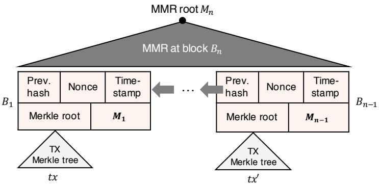
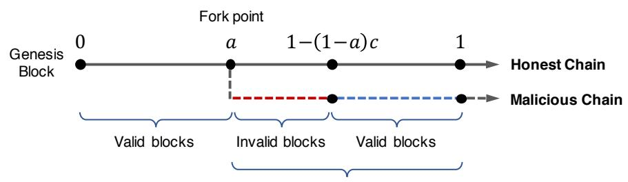
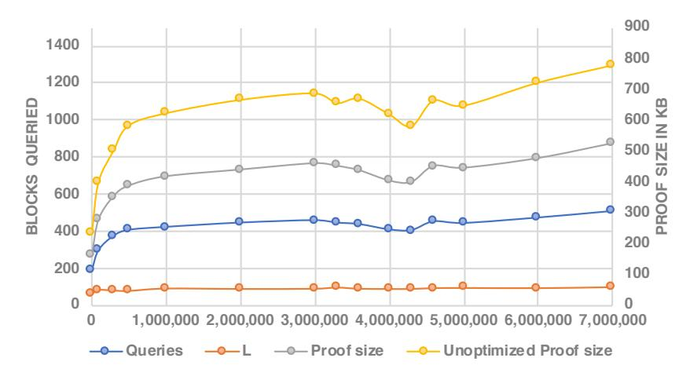
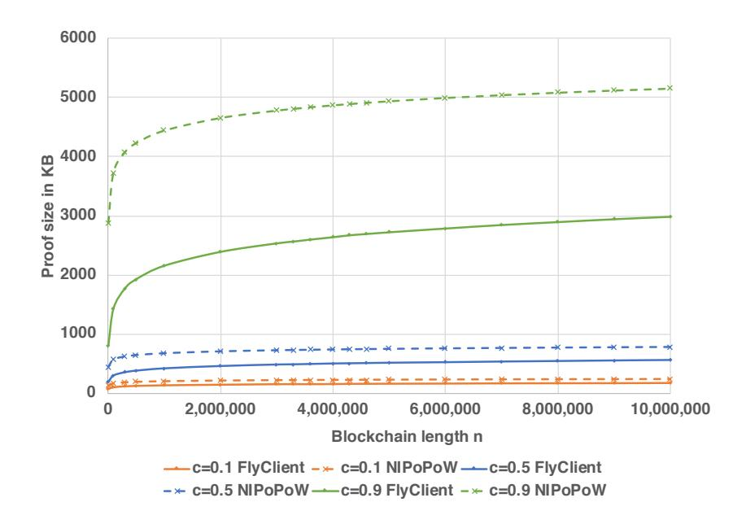
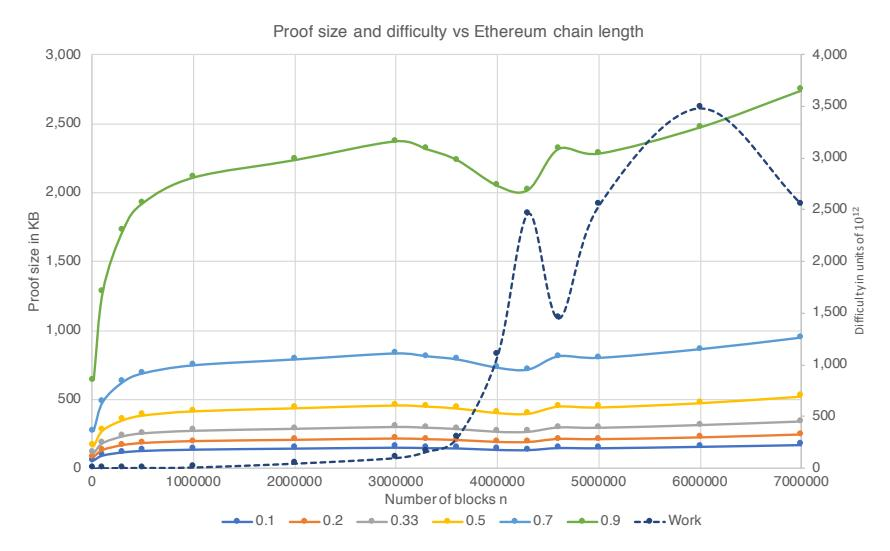
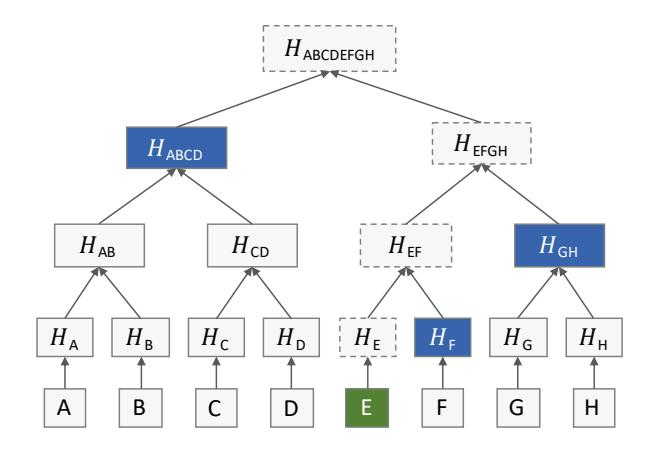

# <span id="page-0-0"></span>FlyClient: Super-Light Clients for Cryptocurrencies

Benedikt B¨unz<sup>1</sup>∗†, Lucianna Kiffer<sup>2</sup>∗†, Loi Luu<sup>3</sup><sup>∗</sup> , and Mahdi Zamani<sup>4</sup>

<sup>1</sup>Stanford University, <sup>2</sup>Northeastern University, <sup>3</sup>Kyber Network, <sup>4</sup>Visa Research

August 20, 2020

#### Abstract

To validate transactions, cryptocurrencies such as Bitcoin and Ethereum require nodes to verify that a blockchain is valid. This entails downloading and verifying all blocks, taking hours and requiring gigabytes of bandwidth and storage. Hence, clients with limited resources cannot verify transactions independently without trusting full nodes. Bitcoin and Ethereum offer light clients known as simplified payment verification (SPV) clients, that can verify the chain by downloading only the block headers. Unfortunately, the storage and bandwidth requirements of SPV clients still increase linearly with the chain length. For example, as of July 2019, an SPV client in Ethereum needs to download and store about 4 GB of data.

Recently, Kiayias et al. proposed a solution known as non-interactive proofs of proof-of-work (NIPoPoW) that allows a light client to download and store only a polylogarithmic number of block headers in expectation. Unfortunately, NIPoPoWs are succinct only as long as no adversary influences the honest chain, and can only be used in chains with fixed block difficulty, contrary to most cryptocurrencies which adjust block difficulty frequently according to the network hashrate.

We introduce FlyClient, a novel transaction verification light client for chains of variable difficulty. FlyClient is efficient both asymptotically and practically and requires downloading only a logarithmic number of block headers while storing only a single block header between executions. Using an optimal probabilistic block sampling protocol and Merkle Mountain Range (MMR) commitments, FlyClient overcomes the limitations of NIPoPoWs and generates shorter proofs over all measured parameters. In Ethereum, FlyClient achieves a synchronization proof size of less than 500 KB which is roughly 6,600x smaller than SPV proofs. We finally discuss how FlyClient can be deployed with minimal changes to the existing cryptocurrencies via an uncontentious velvet fork.

# 1 Introduction

Today, many financial service providers can deliver digital payment services on low-capacity clients such as phones, wearable devices (e.g., smartwatches and fitness trackers), and Internet-of-things (IoT) devices for added convenience and security [\[6,](#page-23-0) [5,](#page-23-1) [8\]](#page-23-2). Such clients are characterized by their limited access to storage, bandwidth, and computation while still requiring instant confirmation latency.

While traditional financial services provide efficiency and strong security guarantees for mobile clients, they rely on centralized payment systems, and are generally inapplicable to decentralized cryptocurrency networks such as Bitcoin [\[35\]](#page-25-0) and Ethereum [\[15\]](#page-23-3), where the security is enforced through cryptographic protocols and game theoretic incentives. On the other hand, current solutions for verifying transactions made over most cryptocurrency networks do not suit low-capacity devices. This is typically due to the large amounts of storage, computation, and bandwidth required by decentralized protocols to verify transactions on decentralized ledgers. These ledgers rely on state-machine replication across many untrusted nodes in the network. One option for low-capacity clients is to rely on a powerful trusted party who can verify payments on behalf of the client. The existence of such a trusted entity, however, greatly opposes the decentralized nature of cryptocurrency networks.

<sup>∗</sup>This work was done by the author as part of an internship at Visa Research.

<sup>†</sup>Both authors contributed equally.

Mobile digital payments are becoming increasingly popular [\[8\]](#page-23-2) and enable consumers to quickly transfer money to peers and efficiently pay for goods and services. In general these payments rely on centralized and trusted services. Decentralized cryptocurrencies such as Bitcoin [\[35\]](#page-25-0) and Ethereum [\[15\]](#page-23-3), seem to provide an intriguing alternative to these services. Unfortunately, most current solutions for verifying cryptocurrency transactions do not suit low-capacity mobile devices such as phones or IoT-devices. Blockchain-based cryptocurrencies use state machine replication that requires nodes to verify every state transition and store the entire state. This is entirely unsuitable for battery, computation, and storage restricted devices. Current mobile solutions often employ a trusted wallet provider which negates much of the benefits of these decentralized ledgers.

Proof-of-Work Blockchains. Most cryptocurrencies, including Bitcoin and Ethereum, maintain an append-only ledger, known as a blockchain, which stores a sequence of blocks of transactions chained together via cryptographic hashes. These blocks are created and appended to the blockchain via a mining process, where the participating nodes, known as miners, compete to become the next block proposer, usually by solving a computationally-intensive puzzle, known as a proof of work (PoW) [\[18\]](#page-24-0), with sufficient difficulty. Through a gossip protocol initiated by the block proposer, every miner receives each block including a PoW solution and appends the block to their local copies of the blockchain if the solution is valid. Since this process is not coordinated by any central party (nor by any traditional consensus protocol), the blockchain may fork into multiple chains; e.g., due to multiple solutions found for the same puzzle by different miners, or due to malicious behavior. To agree on the same chain consistently with other miners, each miner downloads and verifies all blocks in every chain and picks and follows the one with the largest total difficulty. Using this most difficult chain principle, it is shown that, in the long run, the network will agree on a single chain [\[24,](#page-24-1) [37,](#page-25-1) [31\]](#page-24-2), known as the honest (valid) chain. Each block in this chain contains a cryptographic proof ensuring that the block creator has spent a certain amount of resources uniquely for this block.

To verify that a blockchain is valid without participating in the mining process, a client may choose to download blocks from a miner or a full node who holds a copy of the entire chain. Currently, downloading and verifying all blocks in Bitcoin or Ethereum requires a node to download more than 200 GB of data, taking hours to synchronize the node's local blockchain [\[1\]](#page-23-4). Such a requirement causes long delays for regular clients and makes it nearly impossible for storage-limited clients to quickly verify transactions.

Light Clients. The original Bitcoin design [\[35\]](#page-25-0) describes a faster synchronization mechanism, known as simplified payment verification that allows lightweight verification of transactions on the blockchain by what is typically referred to as an SPV client (also known as a light client [\[28\]](#page-24-3)).

Instead of downloading all blocks from a full node, an SPV client downloads only the header of each block that amounts to a much smaller synchronization overhead than the full blocks (80 bytes versus 1 MB per block in Bitcoin). The block headers are linked together through hashes and include the PoW solutions. This allows an SPV client to verify which chain has the most PoW solutions. Note that light clients neither know whether all transactions are valid nor all consensus rules are being followed. Light clients rather operate under the assumption that the chain with the most PoW solutions follows all rules of the network. This implies that all transactions in this chain are valid and the majority of computation power supports the same valid chain.

<span id="page-1-0"></span>Assumption 1 (SPV assumption). The chain with the most PoW solutions follows the rules of the network and will eventually be accepted by the majority of miners.

Fortunately, prior work [\[24,](#page-24-1) [37,](#page-25-1) [31,](#page-24-2) [23\]](#page-24-4) show that this assumption holds as long as an adversary holds only a minority share of the computation power.

Under the SPV assumption, light clients can verify the inclusion of specific transactions in the ledger. This is done by utilizing a Merkle tree commitment of the transactions of a block stored in the block header. A full node provides the light client with an SPV proof of the chain along with a Merkle path to the transaction in the tree committed to in the header.

Light clients also enable various applications to a broad class of users who need to verify a log of past events recorded on a blockchain. For example, SPV proofs can be used for efficient verification of cross-chain transactions that rely on funds or states recorded on another chain. Such transactions can happen when exchanging cryptocurrencies [\[27,](#page-24-5) [2\]](#page-23-5), transferring assets to sidechains [\[12,](#page-23-6) [29,](#page-24-6) [30\]](#page-24-7), or sharding blockchains [\[43,](#page-25-2) [32\]](#page-24-8). Blockchain-based notary services have been recently developed [\[4,](#page-23-7) [7\]](#page-23-8) that allow lightweight verification of the correctness and integrity of documents uploaded on a blockchain.

Although relying only on block headers reduces the verification overhead of SPV clients, it still incurs a large overhead on resource-limited clients, especially when considering the fact that this overhead increases linearly with the number of blocks. This has already become a major concern in Ethereum due to its significantly-shorter block interval than Bitcoin (∼15 seconds vs ∼10 minutes) and significantly-larger block headers (508 bytes vs 80 bytes). Given that the Ethereum blockchain contains more than 8.2 million blocks (as of July 2019 [\[10\]](#page-23-9)), an SPV client wishing to verify Ethereum transactions would have to download and store more than 3.9 GB of data. The client has to either download a fresh copy of the data every time it wants to verify a transaction or keep a local copy in its storage and only download the changes since the last synchronization. Either case puts a large burden on the client. The problem is further amplified for users that run clients for multiple blockchains or systems that use sidechains [\[11\]](#page-23-10).[1](#page-0-0)

Sublinear Light Clients. One may wonder if it is possible for a client to verify any event on a blockchain by downloading and/or storing only a sublinear (in the length of the chain) amount of information. In fact, such a performance gain comes with an important security challenge: Since such a client cannot verify every PoW solution in the received blockchain, it can be tricked into accepting an invalid chain by a malicious prover who can precompute a sufficiently-long chain using its limited computational power.

Proposals for sublinear light clients were initially discussed in Bitcoin forums and mailing lists as early as 2012 [\[41,](#page-25-3) [21\]](#page-24-9). Most of them relied on the notion of superblocks, blocks that solve a more difficult PoW puzzle than the current target puzzle. Since they appear randomly at a certain rate on an honest chain, the number of superblocks in a chain is a good indicator of the total number of valid blocks, if miners behave honestly. Kiayias et al. [\[28\]](#page-24-3) introduced and formalized an interactive proof mechanism, known as proofs of proof of work (PoPoW) based on superblocks. PoPoWs allow a prover to convince a verifier with high probability in logarithmic time and communication that a chain contains a sufficient amount of work. In a later work [\[29\]](#page-24-6), Kiayias et al. provide an attack against the PoPoW protocol and propose a non-interactive and still logarithmic alternative solution known as non-interactive PoPoW (NIPoPoW).

Current Challenges. The superblock-based PoPoW [\[28\]](#page-24-3) and NIPoPoW [\[29\]](#page-24-6) suffer from several drawbacks summarized as follows. Both solutions work only if a fixed PoW difficulty is assumed for all blocks. This is not a realistic assumption in practice due the variable combined hashing power of miners in most PoW-based cryptocurrency networks. For example, the block difficulty in Bitcoin has shown exponential growth over the network's lifetime in the past decade [\[9\]](#page-23-11). It isn't clear how to modify the super-block based protocols to handle the variable difficulties.

Additionally, the variable difficulty setting allows a malicious prover to arbitrarily manipulate block difficulties to perform what is known as a difficulty raising attack as described by Bahack [\[13\]](#page-23-12). In this attack, the adversary mines fewer but more difficult blocks such that the combined difficulty of the mined blocks exceeds that of honest miners. As a result, the prover can convince the verifier with a fake but seemingly valid chain (see Section [3.1](#page-5-0) for more details). To prevent such an attack, the verifier can check that all difficulty transitions are valid, or at least that invalid transitions give no advantage to the prover. Adding these checks in superblock-based NIPoPoWs (such as that of [\[29\]](#page-24-6)) is a non-obvious extension.

Moreover, the reliance on superblocks makes the protocol susceptible to bribing [\[14\]](#page-23-13) and selfish mining [\[19\]](#page-24-10) attacks. These attacks work by bribing miners to discard superblocks: rational miners accept this if they are paid more than the block reward as superblocks do not yield any extra block reward. The NIPoPoW protocol of [\[29\]](#page-24-6) defends against this attack but only by reverting to the standard (and expensive) SPV protocol. The proofs are therefore only succinct if no adversarial influence exists. FlyClient, on the other hand, does not rely on superblocks and distinguishes blocks only by their position (or height) in the chain.

Finally, NIPoPoW's transaction inclusion proofs are fairly large, even in the optimistic case. This is because such proofs consist of roughly an additional O(log(n)) block headers, where n is the chain length. In some cryptocurrencies such as Ethereum, block headers are quite large, thus resulting in larger NIPoPoW transaction inclusion proofs, e.g., roughly 15 KB in Ethereum.

Our Contribution. We propose FlyClient, a new blockchain verification protocol for light clients in cryptocurrencies such as Bitcoin and Ethereum. Unlike regular SPV clients that use a linear amount of bandwidth

<sup>1</sup>Ethereum also has a fastsync synchronization option which allows a full node to sync to the current chain via SPV [\[3\]](#page-23-14). Using this, nodes can start verifying all incoming transactions. Unfortunately, even fastsync can take up to 10 hours to receive all headers from the network, likely due to throttling by individual peers.

| Block Height | 10 K  | 100 K  | 1,000 K | 7,000 K   |
|--------------|-------|--------|---------|-----------|
| SPV          | 4,961 | 49,609 | 496,094 | 3,472,656 |
| FlyClient    | 161   | 277    | 416     | 524       |
| Improvement  | 31x   | 179x   | 1,275x  | 6,627x    |

<span id="page-3-0"></span>Table 1: Proof sizes (in KB) for an SPV client and FlyClient in Ethereum at various block heights assuming an adversarial hash power of at most c = 1/2 of the honest hash power and failure probability < 2 −50 .

and storage in the length of the chain, FlyClient requires downloading only a logarithmic number of block headers to verify the validity of the chain. Once the chain is verified, the client needs to store only a single block to efficiently verify the inclusion of any transaction on the chain. The FlyClient protocol is a non-interactive PoPoW but overcomes the limitations of the superblock-based NIPoPoW protocol of Kiayias et al. [\[29\]](#page-24-6).[1](#page-0-0) FlyClient is compatible with variable difficulty chains and provides asymptotically and practically-succinct proofs even in the presence of an adversary that can create a c < 1 fraction of the honest chain's work. Further, FlyClient requires short transaction-inclusion proofs that consist of only O(log(n)) hashes. In Ethereum, this results in transaction-inclusion proofs that are as small as 1.5 KB which is roughly 10x smaller than NIPoPoWs.

Our protocol is parameterized by c ∈ [0, 1) and λ ∈ N such that an adversary which can create forks (of some minimum length) with at most a c fraction of the valid work of the honest chain, succeeds with probability negligible in λ. This corresponds to a slightly stronger and parameterized version of the SPV assumption. The protocol's efficiency depends on both c and λ. We show in Section [7.1](#page-19-0) that FlyClient is efficient even for high values of c (e.g., c = 0.9). Finally, we demonstrate FlyClient's concrete efficiency on Ethereum (see Table [1\)](#page-3-0).

FlyClient achieves these by employing the following techniques:

- Probabilistic Sampling: We introduce a PoPoW protocol to randomly sample O(log n) block headers from a remote blockchain with variable block difficulty. We formally prove the security of our protocol as long as the adversary can only create a c fraction of the honest chain's PoW.
- Efficient Chain Commitments: We formalize and use the notion of a Merkle mountain range (MMR) [\[42\]](#page-25-4), an efficiently-updatable commitment mechanism that allows provers to commit to an entire blockchain with a small (constant-size) commitment while offering logarithmic block inclusion proofs with position binding guarantees.
- Variable Difficulty MMR Checks: We extend MMRs to contain information about the difficulty and difficulty transitions. This information allows a verifier to efficiently check that the difficulty transitions follow the rules of the chain. Without these checks an adversary could create valid proofs with non-negligible probability by creating few but high difficulty blocks.
- Non-Interactive and Transferable Proofs: We introduce a non-interactive variant of FlyClient using the Fiat-Shamir heuristic [\[20\]](#page-24-11) that allows both the light client and the full node to forward the proof to other light clients without recalculating the proof.

# 2 Overview of FlyClient

Consider a blockchain network that is growing a valid (or honest) chain C based on the most difficult chain principle, and a client (or verifier ) who wants to verify that a given transaction tx is recorded on the chain. The valid chain is characterized as the chain with the highest cumulative computational difficulty created so far by the network. Any other chain is considered an invalid chain. The light client assumes that the valid chain follows all other rules of the network, such as containing only valid state transitions. For ease of explanation, we first assume that each block has the same level of difficulty. In this model, the valid chain

<sup>1</sup>NIPoPoW refers to both a primitive and a protocol (that implements the primitive). Both were introduced by Kiayias et al. [\[29\]](#page-24-6). Unless clarified otherwise, we generally use the term NIPoPoW to refer to the superblock-based protocol.



<span id="page-4-0"></span>Figure 1: MMR chain commitments

is the one with the highest length (i.e., number of blocks). We will later formalize the problem using the variable block difficulty model to be consistent with most cryptocurrencies, including Bitcoin and Ethereum.

The client is connected to a set of full nodes (or provers) at least one of which is honest (holds a copy of the valid chain), but the client does not know which one is honest. The provers participate in the FlyClient protocol to convince the client that some tx is included in some valid block B in the honest chain. As a first step all provers send the last block or the head of their chain to the client which includes a claim of how many blocks are included in the chain.

Two Provers and a Verifier. We consider the case where the client is connected to only two provers one of which is honest. Both provers claim the same length n for their chains. If both provers present the same head of the chain and the same block B, then the client is convinced and this part of the protocol ends. Otherwise, one of the provers holds an invalid chain. In this case, the client challenges both provers with a probabilistic sampling protocol to find out which one holds the honest chain. Assuming that the combined hash power of all malicious miners is a c < 1 fraction of the honest miners, the probability that the adversary can mine the same number of blocks as the honest miners reduces exponentially as the honest chain grows. Thus, the adversary has to insert a sufficient number of invalid (aka, fake) blocks to make its chain as long, or more accurately, as difficult as the honest chain.

**Probabilistic Sampling.** Our probabilistic sampling protocol samples a logarithmic number of block headers from both chains using a probability density function g(x) that specifies, for every height x in each chain, the likelihood that the block located at position x is sampled. Some blocks near the head of the chain are sampled with probability 1, *i.e.*, are always part of the proof. Using differential analysis, we find the optimal g(x) that maximizes the probability of catching the invalid chain given the adversary's optimal strategy. Therefore, we can give a minimum probability that the verifier catches the adversary with only a single query, independent of the adversary's forking strategy. This allows us to reduce the adversary's success probability to a negligible value by repeatedly sampling blocks according to g(x).

Chain Commitments. So far, we still allow a malicious prover to deceive the verifier with an invalid chain. Namely, since the verifier downloads only a small number of block headers that are not necessarily chained together, the malicious prover can choose to only (or mostly) return correctly-mined blocks from arbitrary positions on the honest chain in response to the verifier's request. This significantly decreases the success probability of our probabilistic sampling protocol. One way to protect against such a strategy is to have the prover "commit" to its entire chain before the protocol starts, hence ensuring that it returns the blocks at the expected positions on the chain.

To commit to the entire chain of blocks, FlyClient requires the prover to maintain a Merkle tree variant known as a Merkle Mountain Range (MMR) over all blocks added to the blockchain so far. In addition to being a Merkle tree, an MMR allows efficient appends at the prover side and efficient block inclusion verifications at the verifier side. Further, it enables efficient subtree proofs, a proof that two MMRs agree on the first k leaves. At every block height i, the prover appends the hash of the previous block,  $B_{i-1}$ , to the most recent MMR and records the new MMR root,  $M_i$ , in the header of  $B_i$  (see Figure 1). As a result, each MMR root stored at every block height can be seen as a commitment to the entire blockchain up to

<sup>&</sup>lt;sup>1</sup>Kiayias et al. [29] present a generic verifier that extends the two-prover case to multiple provers.

that height.

Putting Things Together. With MMR commitments in block headers, each prover begins by sending the header of the last block in its chain, the header of block B<sup>n</sup> that includes the MMR root Mn. Next, the verifier samples a number of random blocks from the prover according to the probability distribution g(x). For every sampled block, the prover provides the corresponding block header and an MMR proof that the block is located at the correct height of the chain committed by Bn. Additionally, the verifier checks that the MMR root stored in every sampled block commits to a subtree of Mn. If the PoW solution or the MMR proofs of any of the sampled blocks is invalid, then the verifier rejects the proof. Otherwise, it accepts B<sup>n</sup> as the last block of the honest chain. Finally, to ensure that a tx is included in some block on the honest chain, the client first receives an MMR inclusion proof that B<sup>n</sup> commits to the block B. The verifier checks this proof using Mn. Then, just as for a regular SPV proof the prover provides a Merkle proof that tx occurred in B. The verifier verifies the Merkle proof using the transaction commitment in B's header.

The Variable-Difficulty Model. To adapt FlyClient to the case where blocks have different difficulties, we use the same sampling distribution g(x) but x now denotes the relative aggregate difficulty. For example, x = 1/2 refers to a point on the chain where half of the difficulty has been amassed, and g(1/2) is the probability that the block at that point is sampled by FlyClient. To ensure that the full node returns the correct blocks according to the difficulty distribution, we modify the MMR commitments such that each node in the Merkle tree now additionally contains the aggregate difficulty of all nodes below it. This means that each block header is now committing to not only the sequence of all blocks up to the given block but also to the total difficulty amassed by the network up to that block. Therefore, a Merkle inclusion proof, which is generated in a way similar to a standard Merkle tree proof, allows the client to verify that the provided block is indeed located at the x-th percentile of the total difficulty.

Additionally the new MMR proofs ensure that the difficulty transitions are done correctly. This is done by storing more information such as total time in each internal MMR node. The information suffices to check that invalid difficulty transitions do not give the adversary an advantage. Failing to do so could lead to devastating difficulty raising attacks [\[13\]](#page-23-12).

Non-Interactive and Transferable FlyClient. To make our probabilistic sampling protocol noninteractive, we apply the Fiat-Shamir heuristic [\[20\]](#page-24-11) to the protocol described so far. The randomness is generated from the hash of the head of the chain. The verifier now simply checks that the proof is correct and that the randomness was derived correctly. The non-interactiveness makes FlyClient more practical since (1) the full nodes can send the same proof to many light clients without any recalculation; and (2) the client can forward the proof to other new light clients who can safely verify the correctness of the proof. This reduces both the computation and the bandwidth overheads for both the provers and the verifier.

# 3 Model and Problem Definition

We frame FlyClient in the context of the Bitcoin backbone model for chains of variable difficulty [\[23\]](#page-24-4) which extends the standard backbone protocol used in the analysis of NIPoPoW [\[29\]](#page-24-6).

### <span id="page-5-0"></span>3.1 Bitcoin Backbone Model

Players in the backbone protocol are full nodes who maintain a complete copy of the blockchain and participate in the block creation protocol. The backbone protocol proceeds in rounds and communication between players is modeled as a broadcast where each message is delivered in the next round but the adversary is able to reorder the delivery of messages arbitrarily. Block creation is captured in the random oracle model as in [\[22\]](#page-24-12), where in each round each player makes q sequential queries to a random oracle function H(·). This function takes an input x. If x has not been sampled before, it returns a value y sampled uniformly from {0, 1} λ , where λ is the security parameter, and stores the pair (x, y) in the table of H(·). Otherwise, it returns the corresponding saved y value for x in the table. Each block, B, has a difficulty target T. For the block to be valid it must hold that H(B) < T. This difficulty target, T, is set so that m blocks are produced every f rounds in expectation. We abstract the information of a block B to contain a header for the block with relevant block information including the difficulty target.

In order to handle variable block difficulty, Garay et al. [23] introduce the notion of active players from a universe U of all players. At any round r,  $n_r$  represents the number of honest active players for that round and  $t_r$  the number of active adversarial players. In a round r, an adversary can thus make  $t_rq$  queries to the oracle  $H(\cdot)$ . The sequences  $n = \{n_r\}$  and  $t = \{t_r\}$  represent how the mining power can fluctuate in the network and Garay et al. prove their security properties for the backbone protocol assuming the sequence n has the property that it is  $(\gamma, s)$ -respecting, meaning that in any S rounds with |S| < s, the maximal honest power in any round is no more than a  $\gamma$  factor greater than the minimal honest mining power. We adopt this same assumption to bound how much fluctuation is observed in the honest mining behavior.

In order to maintain a target block rate with fluctuations in mining power in the Bitcoin protocol Garay et al. formalize a general target recalculation function. This function operates in epochs of m blocks where the target difficulty remains fixed and then is recalculated for the next epoch. To give meaning to a target rate, blocks contain information on the round which they were mined. At the end of an epoch with the difficulty target  $T_0$  for a chain C where the last m blocks were mined in  $\Delta$  rounds, the difficulty adjustment function approximates the number of players that were active in order to produce blocks at that rate, as  $n(T, \Delta) = 2^{\kappa} m/(qT\Delta)$ , where  $T/2^{\kappa}$  is the probability a single player produces a block in a single query. Recall that the target rate of honest block production is m/f so the recalculated difficulty for the next epoch becomes  $T' = T\Delta f/m$ . This, however, is not enough to thwart an adversarial strategy of artificially increasing the difficulty parameter by lying about the round at which the block was mined, and being able to produce a chain with more difficulty than the honest chain [13]. Thus, they bound how much the difficulty may change by a factor of  $\tau$ , called the dampening filter. The final difficulty adjustment function is the following.

<span id="page-6-0"></span>**Definition 1** (Target Difficulty – Definition 2 from [23]). For fixed constants  $\lambda, \tau, m, n_0, T_0$ , where  $n_0$  is the estimated number of active players in the previous epoch and  $T_0$  is the target difficulty from the previous epoch<sup>1</sup>, the target difficulty for the next epoch, i.e., the next m blocks, is

$$D(n_0, T_0) = \begin{cases} \frac{1}{\tau}T, & if \frac{n_0}{n(T, \Delta)}T_0 < \frac{1}{\tau}T\\ \tau T, & if \frac{n_0}{n(T, \Delta)}T_0 > \tau T\\ \frac{n_0}{n(T, \Delta)}T_0, & otherwise, \end{cases}$$

where  $n(T, \Delta) = \frac{2^{\kappa}m}{qT\Delta}$  with  $\Delta$  being the time it took to mine the last m blocks.<sup>2</sup>

The main theorem of Garay et al. [22] states that given sufficiently constraint parameters, a blockchain is secure, i.e., satisfies the persistence and liveness properties (see Theorem 26 and 27 of [22]). The proof relies on sufficiently large epochs m and a properly selected dampening factor  $\tau$ . For FlyClient, we adopt parameters such that the blockchain satisfies liveness and persistence. This guarantees that there exists a single chain adopted by all honest full nodes, otherwise there would exist contradicting proofs for separate valid chains.

Attacks Using Variable Difficulty. As first shown by Bahack [13], there are attacks on PoW blockchains that take advantage of the variable difficulty model. The main intuition for these attacks is that an adversary can mine fewer but higher difficulty weight blocks such that, because of the increased variance, they can get lucky and exceed the more powerful honest miners. Assume that an adversary who controls a third of the honest parties mining power could mine a single block of arbitrary high difficulty. The probability that the adversary can mine a single high difficulty block with more weight than the expected weight of the honest chain is roughly 28%. This is clearly not negligible. Bitcoin prevents these attacks by slowly adjusting the difficulty and using a dampening filter as explained in Section 3.1. Garay et al. [23] show that Bitcoin's difficulty recalculation rule suffices to defend against these attacks. For a super-light client that only checks a small subset of the blocks, it is important that all difficulty transitions are valid, e.g., that they adhere to the dampening filter. Otherwise, these difficulty raising attacks would allow even a bounded adversary to succeed.

Other Difficulty Transitions. We note that the FlyClient protocol does depend on the specific difficulty transition rules. Bitcoin's transition rule can be expressed as a parameterization of the variable difficulty

<sup>&</sup>lt;sup>1</sup>The security parameter in [23] is  $\kappa$ . We use  $\lambda$  for consistency. Also we use  $\mu = 1 - \delta$  to denote the adversary's mining power.

<sup>&</sup>lt;sup>2</sup>Bitcoin currently operates with  $\tau = 4, m = 2016$  and f = 0.03.

model. However, other blockchains such as Ethereum use a different type of transition rule, where the next block's difficulty is a moving average of the previous blocks. It remains an open problem to show that Ethereum as a whole is secure using this rule. Similarly, our security proof only applies to the variable difficulty model described above, and therefore, does not cover Ethereum. One can still use an adapted version of FlyClient on Ethereum but only with heuristic security guarantees.

## <span id="page-7-2"></span>3.2 Adversarial Model

The Bitcoin backbone analysis considers a rushing adversary who can reorder the delivery of all messages in a round, and can make t<sup>r</sup> · q queries to the oracle function H(·) in each round where t<sup>r</sup> < µ · nr. For the NIPoPoW model with variable difficulty, the adversary's goal is to present the light client with a proof for a chain with at least the same difficulty as the honest chain. The only knowledge of the honest chain that the verifier has is the contents of the genesis block, thus the adversary can choose to create a proof for a chain entirely separate from the honest chain, except for the genesis, or the adversary can choose to incorporate a subsection of the honest chain into their chain. Since the adversary has less computing power than the honest chain, the adversary may put in invalid blocks without correct PoW into their chain in order to fake the total difficulty, with the knowledge that if the prover samples these blocks, the proof will be rejected.

As discussed in section [5.1,](#page-11-0) the adversary cannot incorporate any honest-chain blocks after the fork point. We also show that any work the adversary did prior to the fork point (blocks mined) cannot be included after the fork point in the same chain. This is because the MMR construction enforces that each block can only be constructed after every block that comes before it in the chain and that this can be checked concisely using the MMR proof of inclusion introduced in the next section. Thus, we are able to only consider the adversarial mining power which is at most a fraction of the honest mining power strictly after the fork point.

In our analysis of FlyClient, we assume that, for all fork points a, the adversary can at most create a fork of length L or longer with a c fraction of the honest forks weight. We formulate this below.

<span id="page-7-1"></span>Assumption 2 ((c, L)-Adversary). There exists no adversary in the variable-difficulty model that respects the target recalculation function from Definition [1](#page-6-0) and can, with non-negligible probability, produce a fork that contains more than L blocks such that a c fraction of the difficulty weight in these blocks is honest.

This assumption is stronger than the SPV assumption (Assumption [1\)](#page-1-0). It implies that no adversary exists with a constant fraction of the honest chain's mining power. The stronger assumption enables FlyClient's succinct proofs as it ensures that any fork created by the adversary will have significantly less cumulative difficulty than an honest chain.

Relation to the Variable Difficulty Model. Ideally, the security of FlyClient would be directly parameterized by µ, the adversary's mining power, as well as the other parameters of the backbone model. We conjecture that for any set of backbone parameters one can directly derive what (c, L)-adversary can exist. Unfortunately, connecting these two assumptions is not trivial and out of the scope of this paper. We leave it future work to fully establish this connection. We can, however, already make multiple important observations. For sufficiently small L, i.e., short forks, there always exists an adversary that succeeds with high probability. This is because short forks have high variance and even an adversary that controls only a small fraction of the mining power will with non-negligible probability be able to create a heavier short fork.

As discussed in Section [3.1,](#page-5-0) it is vital that an adversary cannot arbitrarily set/change the difficulty of his forks. Otherwise, the difficulty raising attack [\[13\]](#page-23-12) would allow the adversary to create heavy chains with significant probability.

Finally, in the non-variable difficulty setting, it is simple to derive the parameters c for a given µ (the adversary's mining power) and L. We show that a limited adversary will not outperform its expected number of mined blocks by too much. That is, for sufficiently large L and an adversary who can produce L·µ honest blocks, the probability that it produces L·c, for some c > µ, is negligible. This can be done either numerically or using a simple Chernoff bound.

<span id="page-7-0"></span>Lemma 1. In the constant difficulty backbone setting, let X be a random variable denoting the number of blocks mined by any adversary while the honest chain adopts L blocks. Further, assume that the adversary finds blocks at a rate which is bounded by µ of the rate at which the honest chain adopts blocks. The probability that X ≥ c · L for c > µ is bounded by e L(c−µ) c µ −c·L , where e is Euler's number.

Proof. Note that an upper bound X can be accurately modeled by a Poisson variable Y with parameter  $(1-\delta)n$  as it is the sum of many low probability Bernoulli variables. We now bound the probability that  $X \geq c \cdot n$  by finding a bound on  $P(Y \geq c \cdot n)$ . We can bound this probability using a Chernoff style bound.  $P(Y \geq c \cdot L) = P(e^{t \cdot Y} \geq e^{t \cdot c \cdot L}) \leq \frac{E[e^{t \cdot Y}]}{e^{t \cdot c \cdot L}}$ . The Markov bound holds for all t > 0. Using the fact that the moment generating function for a Poisson variable Y is  $e^{E[Y](e^t-1)}$  we get  $P(Y \geq c \cdot L) \leq e^{(1-\delta) \cdot L \cdot (e^t-1) - c \cdot L \cdot t}$ . This is minimal for  $t = \log(\frac{c}{1-\delta})$  which gives us the bound  $P(Y \geq c \cdot L) \leq e^{L(c+\delta - c\log(\frac{c}{1-\delta}) - 1)}$ 

**Corollary 1.** For  $n = \Theta(\lambda)$  and for every  $\mu$ , there exists a c < 1 such that the (c, n)-adversary assumption holds in the constant difficulty backbone.

Proof. Set L and c such that  $e^{L(c+\delta-c\log(\frac{c}{1-\delta})-1)}=2^{-\lambda}$ . In the constant difficulty backbone setting a chain of length L with a c fraction of the blocks honest must contain at least  $c \cdot L$  blocks with valid PoW. Lemma 1 implies that the probability of any adversary producing a fork with  $c \cdot L$  valid blocks while the honest chain adopts L blocks is negligible.

## 3.3 NIPoPoWs for Variable Difficulty Chains

FlyClient works similarly to the prover-verifier model of NIPoPoWs, where the prover wants to convince the verifier that some predicate over the honest chain is true. For simplicity, in FlyClient we consider the predicate to be that the prover knows a blockchain at round r that ends with block  $B_n$  and has cumulative difficulty D. In the SPV model, this proof would consist of all block headers of the chain, *i.e.*, enough information for the verifier to check all PoWs. We refer to this as the SPV predicate.

**Definition 2** (SPV Predicate). The SPV predicate for a chain C ending with block  $B_n$  is 1 if all blocks in C contain correct PoW which follow the difficulty adjustment function and the hash of each block is contained in the header of the block directly succeeding it.

From this and given the FlyClient use of MMR in the next section, a prover can with little (i.e., logarithmic in the length of the chain) overhead, prove further properties of the chain including that any particular block is included in the chain since  $B_n$  commits to all previous blocks before it. We note that since persistence cannot be guaranteed for the last k blocks of the chain, no predicates should be considered for the last k blocks. Thus, the verifier treats all valid proofs for chains differing in at most the last k blocks to be proofs for the same chain and takes the one with the highest difficulty as the representative proof.

Similar to the NIPoPoW model, the verifier is a light client with less storage/computation capacity than a full node and who can therefore not store the entire blockchain. The only a priori information the verifier has is the genesis block and access to the oracle function  $H(\cdot)$  to be able to verify PoWs. A verifier receives a set of proofs P from multiple provers, with the assumption that at least one proof came from an honest prover, and accepts the SPV predicate for the proof of a block  $B_n$  with most cumulative difficulty. Our assumption that the client is connected to at least one honest node implies that the client is not vulnerable to eclipse attacks [26]. Defending against such attacks is orthogonal to our work and has been addressed by recent work [26, 25].

In the following, we adapt the NIPoPoW security definition for our SPV predicate for chains of variable difficulty.

<span id="page-8-0"></span>**Definition 3** (Security). A blockchain proof protocol (P, V) for the SPV predicate is secure if for all environments, for any PPT adversary and for all rounds r, if V receives a set of proofs P at the beginning of round r, at least one of which has been generated by an honest prover, then

- 1. V outputs the SPV predicate with the highest difficulty at the end of round r for some block B, and;
- 2. All honest full nodes at time r hold a chain with the common prefix of the chain committed by  $B_n$  except for up to the last k blocks.

We use a slightly-different version of the succinctness definition as follows.

**Definition 4** (Succinctness – Definition 4 from [29]). A blockchain proof protocol (P, V) for a predicate Q is succinct if for any PPT prover A, any proof  $\pi$  produced by A at some round r, is of size  $O(\mathsf{polylog}(N))$ , where N is the number of blocks in the honest chain.

Following the above two definitions and for the adversarial model described in the previous subsection, we present the main theorem of our work.

Theorem 1 (FlyClient). Assuming a variable difficulty backbone protocol such that all adversaries are limited to be (c, L)-adversaries as per Assumption [2](#page-7-1) and assuming a collision-resistant hash function H (Definition [8\)](#page-25-5), the FlyClient protocol is a secure NIPoPoW protocol in the random oracle model as per Definition [3](#page-8-0) with all but negligible probability. The protocol is succinct with proof size O(L + λ · log1/c(n) · log<sup>2</sup> (n)).

# 4 FlyClient Design

In PoW cryptocurrencies the valid chain is the one with the highest cumulative proof of work, i.e., the most difficult one to create. For simplicity, in this section we assume blocks have the same difficulty and thus the valid chain is the longest one. Later in Section [6,](#page-16-0) we extend our protocol to handle the more realistic scenario where blocks have variable difficulty throughout the chain.

#### 4.1 Design Components

FlyClient consists of three main building blocks. First, we leverage the MMR construction (see Appendix [C\)](#page-27-0) to allow for verification of any previous block header with only the latest block header. Each MMR commits to previous blocks efficiently using a single hash value written in every block header. The MMR leaves are the block headers of all previous blocks and each block's MMR is built from the previous MMR. This construction ensures that the i-th block header, contains the root of the (i − 1)-th MMR. This allows an efficient update process resulting in only a small overhead for full nodes when adding new blocks to the chain. Once a block is verified, we can then verify any transaction included in that block with simple SPV Merkle proofs.

Second, to reduce the number of block headers that light clients need to download to verify the latest block header, FlyClient employs a probabilistic verification mechanism by which it randomly samples only a logarithmic number of block headers; if these block headers are valid, then we show that the latest block belongs to the longest chain with overwhelming probability. Which block headers to sample are chosen by the light clients to prevent the adversary from avoiding sampling fake blocks. If an adversarial prover is trying to convince the verifier that they know a chain that is the same length as the honest chain, there is a maximal number of blocks in the adversary's chain which are valid (have a valid PoW) since the adversary has limited computing power. Our probabilistic verification guarantees that after randomly sampling an enough number of blocks, we can detect at least one invalid block in the adversary's chain with overwhelming probability. We present our sampling protocol and it's optimization in Section [5.](#page-11-1) We outline our interactive protocol in Protocol [1.](#page-10-0)

Our third building block is the application of the Fiat-Shamir heuristic to remove the interaction between the light client and the full nodes. Instead of having the randomness be provided by the verifier, the random blocks will be determined from the hash of the latest block. This allows a full node to figure out on its own which random blocks it should send to the clients for the verification without any initial randomness from the light client, yet the light client can verify the correctness of the proof and is guaranteed that the full node is not cheating. We discuss in detail how to make FlyClient non-interactive in Section [6.2.](#page-18-0)

### 4.2 Block Inclusion Verification

As discussed before, the need to download all block headers is in part due to the need for verifying transactions/ events in previous blocks. Assuming the longest chain has been verified and accepted with only some of the block headers downloaded, i.e., the verifier knows some B<sup>n</sup> is the last block header in the longest chain, verification of a transaction in some previous block requires checking if the block actually belongs to a chain ending in Bn. The naive approach is to download all intermediate block headers from the block to Bn, which inherently requires downloading a linear number of block headers from the chain. Once the block is verified to belong to the chain, the verifier needs only an SPV Merkle proof that a transaction is in that block.

#### Algorithm 1 FlyClient Protocol

<span id="page-10-0"></span>A client (the verifier) performs the following steps speaking with two provers who want to convince the client that they hold a valid chain of length n + 1. At least one of the provers is honest. (If the provers claim different lengths for their chains then the longer chain is checked first. This is described in the generic verifier for NIPoPoW [\[29\]](#page-24-6).)

- 1. The provers send to the client the last block header in their chains. Each header includes the root of an MMR created over the first n blocks of the corresponding chain.
- 2. The verifier queries k random block headers from each prover based on the probabilistic sampling algorithm described in Section [5.](#page-11-1)
- 3. For each queried block, Bi, the prover sends the header of B<sup>i</sup> along with an MMR proof Π<sup>B</sup>i∈<sup>C</sup> that B<sup>i</sup> is the i-th block in C.
- 4. The client performs the following checks for each block B<sup>i</sup> according to Algorithm [2.](#page-10-1)
- 5. If any checks fail, the client rejects the chain.
- 6. Otherwise, the client accepts C as the valid chain.

#### Algorithm 2 Prover/Verifier Protocol For a Single Query

<span id="page-10-1"></span>The verifier queries the prover for the header and MMR proof for a single block k in the prover's chain of n + 1 blocks.

#### Verifier

- 1: Has the root of the MMR of n blocks stored in the n + 1 block's header
- 2: Queries prover for the header of block k and for Πk∈<sup>n</sup>
- 3: Verifies the hashes of Πk∈<sup>n</sup> hash up to the root of MMR<sup>n</sup>
- 4: Calculates the root of the MMR of k − 1 blocks from Πk∈<sup>n</sup> by calling Get Root( Πk∈n, n, k)
- 5: Compares the calculated root with the root in the header of block k
- 6: If everything checks out, accepts the block proof

#### Prover

- 1: Has chain of n + 1 blocks and the MMR of the first n blocks
- 2: Receives query for block k from verifier
- 3: Calculates Πk∈<sup>n</sup> from MMR<sup>n</sup> by calling MMR Proof( MMRn, n, k)
- 4: Sends header of k and Πk∈<sup>n</sup> to verifier

Our goal is verify that any block belongs in the chain with only the latest block header of the chain. We leverage the MMR construction again for this. The full node can prove that a transaction was included in the longest chain by just providing an MMR proof (to prove that a block belongs to the longest chain) in addition to the current transaction proof (which shows that the transaction is included in the block). Algorithm [2](#page-10-1) describes how a verifier can query a prover for the validity of a single block.

Definition 5 (Valid Block). A valid block B<sup>x</sup> for a chain ending in block B<sup>n</sup> with MMR root Mn−<sup>1</sup> is a header with PoW and for which a Πx∈Mn−<sup>1</sup> exists.

Definition 6 (Honest Chain). An honest chain B0, B1, ..., B<sup>n</sup> of length n is an ordered list such that each B<sup>i</sup> is valid with respect to Bn.

Unstable Blocks. PoW blockchains guarantee that honest nodes will eventually reach consensus. This, however, does not prevent recent blocks to be unstable, i.e., potentially get removed from the eventual chain. In particular the most recent block or head of the chain will often be replaced by other blocks. Despite this, it is still possible to use the MMR root from this most recent block to perform the FlyClient protocol and refer to old stable blocks and transactions. This is because the FlyClient protocol inherently checks that all randomly sampled blocks have MMRs that are consistent with the head's MMR. Even if the head is maliciously created, its MMR cannot contain invalid blocks and it must contain all stable blocks of the valid longest chain. It is still helpful for a client to store a recent, stable block to aid future synchronization proofs.

New Block Header. Our new block header now contains one extra field namely the MMR root of the tree that commits the headers of all previous blocks. The MMR root can replace the previous block hash and thus not increase the block headers size. This requires a minimal change to the current block structure of Bitcoin and Ethereum, and can be implemented as a soft fork. We discuss this in more detail in Section [8.3.](#page-22-0) A full node, upon receiving a new block, will conduct only one additional check on the validity of the MMR root.

# <span id="page-11-1"></span>5 Block Sampling Strategies

Our goal is to have a protocol that allows an honest prover to convince the verifier of the validity of its chain while a malicious prover cannot convince the verifier of a dishonest chain. In the previous section, we outlined the basic FlyClient protocol, what is left to be determined is how the verifier samples blocks from the prover. In this section we describe the information theoretic component of FlyClient: A block sampling protocol which ensures that the verifier will sample an invalid block from the adversary, no matter what the adversary's forking strategy is. We describe the strategies in terms of the longest chain rule, i.e., assuming that all blocks have the same difficulty. The strategies directly translate to the variable difficulty setting as described in Section [6.](#page-16-0) The key difference is that the sampling will be over the difficulty space instead of the block space. We begin by describing some straw-man approaches for our sampling protocol and build up the properties we wish to satisfy. We start with a simple sampling protocol which gives us the desired properties and show how to optimize our protocol to achieve smaller proof sizes.

## <span id="page-11-0"></span>5.1 Naive Approach

One approach is for the verifier to request a uniformly-random set of multiple blocks from each prover. Since the malicious prover has only a limited computation power, it can at best correctly mine a small subset of all the blocks. Thus, the verifier needs to sample enough blocks to ensure that at least one of them is invalid, i.e., an incorrectly-mined block. The protocol begins with each prover giving the verifier the header of the last block in its chain, where this header contains the root of an MMR tree built over all blocks in the chain. Whenever the verifier requests a block from each prover, the prover must also provide a Merkle proof that the block is a leaf in the MMR of the last block. From the MMR inclusion proof, the verifier can recreate the MMR root for that block and verify that it is the same root in the header of the block (therefore included in the proof of work for the block).

As shown in Corollary [4,](#page-30-0) once a malicious prover forks off from the honest chain, it cannot include any of the later honest blocks in its chain because the MMR root in those blocks would not match the chain. With this setup, if the verifier makes enough queries, it will eventually ask the malicious prover for a block it has not mined (i.e., an invalid block).

To determine how many blocks the verifier must query to achieve a desired probability of success in catching a malicious prover, we bound the malicious computing power using the (c, L)-adversary assumption. After the adversary forks from the honest chain, it can correctly mine up to only a c fraction of the blocks in the rest of the chain. So, if we know that the adversary forked at some block Ba, then for each random block the verifier requests after Ba, there is a probability of (1 − c) that the sampled block is invalid (i.e., incorrectly mined) as the adversary has to "lengthen" its fork to have a chain of equal length to the honest chain. Thus, with k queries after the fork point, the verifier has a success probability of 1 − c k in catching the malicious prover. Unfortunately, the verifier neither knows the location of the fork point nor the value of k or the success probability.

Solution Limitation. Since the verifier does not know where in the chain the adversary started the fork, the verifier has to sample a large number of blocks to increase its chance of catching the malicious prover, especially if the fork point is located near the end of the chain (i.e., the fork is short).

#### 5.2 Binary Search Approach

Since the verifier knows at least one of the provers is honest, it can search for the fork point by querying both provers at the same time to find the first block at which they disagree. The verifier can do this by performing a binary search over the entire chain as follows. The verifier starts by asking each of the two provers to send the block in the middle of its chain. If the two middle blocks are the same, then the verifier recurses on the second half (i.e., the one with higher block numbers), otherwise it recurses on the first half. This is repeated until the verifier finds the fork point which is the smallest block number where the two provers disagree. Once the verifier finds the fork point, it samples blocks randomly from both provers after the fork point, with each sample having a probability of (1-c) in catching the dishonest prover in a lie. Thus, the verifier must sample  $\log n$  blocks to find the fork point (n being the chain length) plus k blocks from each prover to have a probability of  $1-c^k$  in determining which of the two provers is dishonest, if one is.

**Solution Limitation.** This approach is inherently interactive as it requires multiple rounds of communication between the verifier and the provers, resulting in higher verification latencies.

## <span id="page-12-0"></span>5.3 Bounding the Fork Point

Finding the exact location of the fork point by sampling a small number of blocks in only one shot is challenging. We instead relax this requirement and allow the verifier to only "bound" where the fork point is located while still sampling in one shot. Our goal is to ensure that the verifier makes sufficient queries after the fork point. Instead of searching for the fork point, the verifier can iterate through intervals from which it samples blocks. If in at least one of the intervals the verifier has a sufficiently-high probability of catching the malicious prover, then the verifier succeeds with high probability in the whole protocol.

The new sampling protocol first samples k random blocks from the entire chain. Then, it successively splits the chain (or the current interval) in half and queries another random k blocks from the last half, *i.e.*, the interval always ends with the tip of the chain. More precisely, for every integer  $j \in [0, \log n)$ , the verifier queries k blocks from the last  $n/2^j$  blocks of the chain. This is repeated until the size of the interval is at most  $\min(L, k)$ , and all last  $\min(L, k)$  blocks are sampled.

We now show that the above strategy catches a cheating adversary with overwhelming probability. To do this, we calculate the probability that the verifier samples at least one invalid block from the malicious prover, based on the observation that the adversary has to insert a sufficient number of invalid blocks into its fork to obtain an overall chain of equal length to the honest chain.

**Lemma 2.** With  $k \log n$  samples, the probability the verifier fails to sample any invalid block is  $\leq \left(\frac{1+c}{2}\right)^k$ .

*Proof.* Let n denote the length of the chain (not counting block n+1 which the verifier has already sampled) and c denote the fraction of the adversary's computing power relative to the honest computing power. At any interval j, the verifier samples from the interval between block  $\frac{(2^j-1)n}{2^j}$  and n. Let  $h_j$  denote the number of invalid blocks the adversary has inserted in the j-th interval. The probability the verifier fails to sample an invalid block in this interval is

$$P_j = \left(\frac{\frac{n}{2^j} - h_j}{\frac{n}{2^j}}\right)^k = \left(\frac{n - 2^j h_j}{n}\right)^k.$$

Thus, the probability that the verifier fails is  $\prod_{j=0}^{\log n} P_j$ . Since  $P_j \leq 1$ , if one  $P_j$  is sufficiently small, then the total probability of failure is also sufficiently small.

Letting a denote the forking point, there is some integer j such that  $\frac{(2^j-1)n}{2^j} \leq a < \frac{(2^{j+1}-1)n}{2^{j+1}}$ . In other words, there is some sampled interval of size  $n' = n/2^j$  in the protocol where the fork point lies between the start and the middle of the interval. Let l denote the length from a till n, i.e., the length of the fork,  $l > \frac{n'}{2}$ . The number of invalid blocks in the interval is  $h_j = (1-c)l \geq (1-c)\frac{n'}{2}$ . Thus, the probability the verifier fails to catch the invalid chain is at most equal to the probability the verifier fails at step j, or

$$\Pr[\mathrm{fail}] \leq \Pr[\mathrm{fail \ at \ } j] \leq \left(\frac{n' - (1-c)\frac{n'}{2}}{n'}\right)^k = \left(\frac{1+c}{2}\right)^k.$$

**Solution Limitation.** In our analysis, we calculate the probability of success based on the likelihood of success in at least one of the  $\log n$  intervals. However, our protocol samples other blocks that we do not consider in our analysis, but that could increase the verifier's success probability. Can we achieve a better bound by further taking these blocks into account?

## <span id="page-13-1"></span>5.4 The FlyClient Sampling Protocol

While we presented the protocol of Section 5.3 as an iterative protocol, it is important to note that all of its steps are independent. That is, the verifier's samples do not depend on the prover's responses to previous queries. This implies that the order of samples can be altered to create an isomorphic protocol with the same security and efficiency properties. We can further use this to examine the probability that a given block is sampled.

The protocol of Section 5.3 samples later blocks with higher probability, *i.e.*, the sampling probability grows inversely with the relative distance of a block to the end of the chain (the most recent block). We can use this property to find a probability distribution (as depicted in Figure 2 as s(x)) that the verifier picks one of the intervals uniformly at random (from the protocol presented in Section 5.3) and samples a block uniformly at random from this interval.

Consider a protocol that simply repeats the sampling steps q times. If the adversary is caught with probability at least p given one sample, then they will be caught with probability at least  $1 - (1 - p)^q$  after q independently and identically-distributed samples. This distributional approach enables a simple analysis of the protocol as we only need to bound the success probability of a single query. Furthermore, it allows us to optimize the protocol by finding a query distribution that maximizes p. As shown in Figure 2, the distribution introduced by the protocol from Section 5.3 is not smooth. In the following, we show that a different and smoother distribution performs better.

Optimizing the Sampling Distribution. We now find the optimal sampling distribution, that is the sampling distribution over the blocks which maximizes the probability of catching the adversary given that it chooses the optimal strategy. We do this by finding the sampling distribution that maximizes the probability of catching the adversary with only a single query. Given this probability, we can directly bound the adversary's success probability after q queries. As a simplifying assumption, we treat the number of blocks as a continuous space between 0 and 1. That is, the block header is at 1 and the genesis block is at 0. We later show that this simplified analysis still produces a good distribution for the discrete case.

As a first step, we show that the probability density function (PDF) of the optimal sampling distribution must be increasing. A PDF f defined over the continuous range [0,1] is increasing if, for all  $a,b \in [0,1]$ ,  $b > a \implies f(b) \ge f(a)$ . For any distribution defined by a PDF that is not increasing, there exists a distribution that results in an equal or greater probability of catching the adversary.

<span id="page-13-0"></span>**Lemma 3** (Non-Increasing Sampling Distribution). A sampling distribution over the blocks defined by a non-increasing PDF f is not uniquely optimal, i.e., there exists another distribution with equal or higher probability of catching the adversary.

*Proof.* We prove the statement by contradiction. We show that given f, there exists another pdf f' that with a single query succeeds in catching the adversary with slightly higher probability.

Given that f is non-increasing, there exist numbers  $x_1, x_2, d \in [0, 1]$  and intervals  $I_1 = [x_1, x_1 + d]$  and  $I_2 = [x_2, x_2 + d]$  such that  $x_1 + d \le x_2 \le 1 - d$  and f(x) > f(x'), for all  $x \in I_1 \land x' \in I_2$ . Any adversarial strategy can be defined by a fork point  $a \in [0, 1]$  and by the ranges of blocks which are invalid after a. Note that given a fork point, the adversary can freely decide which blocks, *i.e.*, which intervals, to make invalid and which ones to honestly mine. For any strategy which produces an invalid block in  $I_1$  but valid blocks in  $I_2$  there exists a strategy which creates an additional invalid block in  $I_2$  and one more valid block in  $I_1$  without changing any other part of the strategy. Note that the converse is not true. If the fork point a is  $a \times a \times a \times a$  then it may not be possible to move invalid blocks to the first interval. Given that the querying probability of any point in a is always better off by moving all possible invalid blocks to a is a must therefore contain no less invalid blocks than a in any strategy which is optimal for the adversary.

# **x 0.5 1.0 1.5 2.0 2.5 3.0 Querying distribution f**(**x**) **s**(**x**)

Figure 2: s(x) defines the probability density function (PDF) for the protocol from Section [5.3.](#page-12-0) g(x) = 1 (x−1) ln(δ) is the optimized PDF. The integral R 1+ac−<sup>c</sup> a g(x)dx for c = 1/2, δ = 2<sup>−</sup><sup>10</sup> , a = 0 and a = 0.8 respectively is displayed.

**0.0 0.2 0.4 0.6 0.8 1.0**



Sample enough random blocks from here s.t. at least one invalid block is selected

<span id="page-14-0"></span>Figure 3: Distributional View Argument

Consider the probability distribution f <sup>0</sup> which is equal to f on all points but x ∈ I<sup>1</sup> ∪ I2. There exists an > 0 such that for any point x ∈ I2, f 0 (x) = f(x) + and for any point in I1, f 0 (x) = f(x) − and the following condition holds: For all adversaries, a single query drawn from the distribution defined by f <sup>0</sup> has a slightly higher probability of querying an invalid block than a single query drawn from the distribution defined by f. This is because f <sup>0</sup> queries with higher probability in I<sup>2</sup> which must contain no less invalid blocks than I<sup>1</sup> for any optimal adversary.

Since all non-increasing distributions yield a non-unique optimal sampling distribution, we can focus our search on sampling distributions defined by increasing pdfs that sample later blocks with higher probability than earlier blocks. For such distributions, if the adversary forks off from the main chain at some point 0 ≤ a < 1, the adversary's best strategy is to put all of its correctly-mined (i.e., valid) blocks at the end of its chain so they are the most likely to be sampled. If the adversary has a c fraction of the honest mining power, and 1 − a is the length of the adversary's fork, then the adversary can mine a (1 − a)c fraction of the chain. Thus, in its best strategy, the section of the adversary's chain from a to 1 − (1 − a)c does not contain valid blocks.

To catch the malicious prover, we must sample a block in this interval. Hence, the probability that we catch an adversary who forks at some point a with one sample is

$$\frac{\int_a^{1+ac-c} f(x)dx}{\int_0^1 f(x)dx},$$

where f(x) is proportional to the probability density function of the sampling distribution. Considering all

points where the adversary could fork from, the probability of success with a single sample is

$$p = \min_{0 \le a < 1} \frac{\int_a^{1+ac-c} f(x) dx}{\int_0^1 f(x) dx}.$$

In order to find the optimal protocol, we have to find the distribution that maximizes this quantity. Intuitively, we want a sampling distribution which makes the adversary indifferent about which fork point to use. Otherwise, queries would be wasted on blocks which an optimal adversary would not make invalid anyway. Concretely, we find an f(x) that satisfies  $\int_0^{1-c} f(x)dx = \int_a^{1+ac-c} f(x)dx$ . In other words, if the adversary forked from the beginning of the chain or any other point, we have the same probability of catching it. Through differential analysis, we find that  $f(x) = \frac{1-c}{c(1-x)}$  satisfies this condition, *i.e.*,

$$\int_{a}^{1+ac-c} f(x)dx = \frac{(c-1)\ln(c)}{c}.$$

In Figure 2, f(x) and this property are displayed visually.

We now analyze how close our f(x) is to the optimal sampling distribution. We first try to compute the normalized probability density function by normalizing f(x) by an  $\int_0^1 f(x)dx$  factor. Unfortunately, f(x) goes to infinity as x approaches 1 and  $\int_0^1 f(x)dx = \infty$ . Luckily, we can restrict the sampling domain from 0 to  $1-\delta$  and have the verifier always check the last  $\delta$  fraction of the blocks directly. We will later find the optimal value for  $\delta$ . Let

$$g(x) = \frac{f(x)}{\int_0^{1-\delta} f(x)dx} = \frac{1}{(x-1)\ln(\delta)}.$$

The probability of catching the adversary is equal to

$$p = \min_{0 \le a \le \frac{c - \delta}{c}} \int_{a}^{1 + ac - c} g(x) dx = \int_{0}^{1 - c} \frac{1}{(x - 1)\ln(\delta)} dx = \log_{\delta}(c).$$

This probability takes into account that all blocks in the last  $\delta$  fraction of the chain are always verified by the verifier. Any fork after  $\frac{c-\delta}{c}$  will contain at least a block from this  $\delta$  region, and thus will be detected with probability 1.

We will now show that g(x) defines an optimal sampling distribution by showing that no sampling distribution can achieve a higher p value, i.e., a higher probability of catching the adversary with a single query. Note that the sampling strategy is optimal for an optimal adversary. This is a strong argument as the optimal adversary can choose the placement of its invalid blocks after learning the sampling strategy.

**Theorem 2** (Optimal Sampling Distribution). Given that the last  $\delta = c^k, c \in (0,1], k \in \mathbb{N}$  fraction of the chain contains only valid blocks and the adversary can at most create a c fraction of valid blocks after the fork point a, the sampling distribution defined by the PDF  $g(x) = \frac{1}{(x-1)\ln(\delta)}$  maximizes the probability of catching any adversary that optimizes the placement of invalid blocks.

*Proof.* Let  $\delta = c^k$ , for some  $k \in \mathbb{N}$ , we get that p = 1/k and that as k increases the success probability decreases. Hence, the smaller  $\delta$  is set, the fewer the blocks that are always checked near the tip of the chain but the worse our probability of catching the adversary with a sample anywhere else. Therefore, a smaller  $\delta$  leads to more samples from the rest of the chain.

Say  $g^*(x)$  is the probability density function of the *best* sampling distribution. Note that given Lemma 3,  $g^*(x)$  is increasing and therefore for an optimal adversary the success probability is denoted by

$$p^* = \min_{a,0 \le a \le \frac{c-d}{c}} \int_a^{1+ac-c} g^*(x) dx.$$

 $g^*(x)$ , therefore, maximizes  $p^*$ . The optimality condition implies that  $\int_{1-c^i}^{1-c^{i+1}} g^*(x) dx \ge p^*$ , for all integers  $i \in [0,k]$ , where  $a=1-c^i$  is a possible forking point. Further we have that  $\int_0^{1-c^k} g^*(x) dx = 1$  since

g ∗ (x) is a PDF. We have

$$\int_0^{1-c^k} g^*(x)dx = \sum_{i=0}^k \int_{1-c^i}^{1-c^{i+1}} g^*(x)dx = 1 \ge k \cdot p^*.$$

This implies that p <sup>∗</sup> ≤ 1/k. Note that g(x) as a candidate distribution achieves p = 1/k and is, therefore, optimal.

Optimizing the Proof Size. Given g(x) and p, we can now define p<sup>m</sup> = (1 − 1 k ) <sup>m</sup> as the probability of failure, i.e., not catching the optimal adversary after m independent queries. Note that without loss of generality, k ≥ 1 as otherwise δ > c, implying that a sufficient fraction of blocks are checked to catch any adversary. If we want p<sup>m</sup> ≤ 2 −λ , then m ≥ λ log1/2(1<sup>−</sup> <sup>1</sup> k ) . Now, assuming that the verifier always checks the last L blocks of the chain, where L = δn = c <sup>k</sup>n, we get that k = log<sup>c</sup> L and

$$m \geq \frac{\lambda}{\log_{1/2} \left(1 - \frac{1}{\log_c(\frac{L}{n})}\right)}.$$

n

This means that m approximates

$$\lambda \log_c(\frac{1}{2}) \ln(n) = O(\lambda \log_{1/c}(n)),$$

thus,

$$\lim_{n \to \infty} \frac{m}{\lambda \log_c(\frac{1}{2}) \ln(n)} = 1.$$

As long as L is a constant, the number of queries is linear in the security parameter λ and logarithmic in the chain length, n.

Verifying Trailing Blocks. The number of blocks checked at the end of the chain (denoted by L) affects the total number of samples needed, m. We can, therefore, further optimize it to get an optimal proof size. It is important to ensure that L is bounded from below by the particular (c, L)-adversary assumption that is used. Given this one can numerically optimize L as we do in our implementation. However, as long as that number is a constant we get an asymptotically optimal proof size:

<span id="page-16-1"></span>Corollary 2. Under the (c, L)-adversary assumption for any constant L and using a collision-resistant hash function the FlyClient proof size is Θ(λ log(n) log <sup>1</sup> (n) + L)

The corollary is a result of the proof size computations above for a negligible failure probability of 2<sup>−</sup><sup>λ</sup> and the size of each Merkle path being log<sup>2</sup> (n).

Note that unlike in the superblock-based NIPoPoW [\[29\]](#page-24-6) this result holds for all adversaries not just in an optimistic setting. For realistic Ethereum values of λ = 50, n = 222, c = 2 bytes, the total proof size is just below 400 KB (See Section [7\)](#page-19-1).

# <span id="page-16-0"></span>6 FlyClient Under Variable Difficulty

So far, we have only considered the simplistic case that all blocks have the same difficulty. This is not realistic as the number of miners as well as their hardware continuously changes.

Information theoretically, the distributional view analysis described in Section [5.4](#page-13-1) allows us to also handle the variable-difficulty scenario. In the new model, we simply use the same sampling distribution

$$g(x) = \frac{1}{(x-1)\ln\delta},$$

but now x denotes the relative aggregate difficulty weight and δ denotes the relative difficulty weight of the blocks which are sampled with probability 1. For example, x = 1/2 is the point in the chain where half of the difficulty has been amassed, and g(1/2) is the probability that the block at that point is sampled by FlyClient. Note that x = 1/2 may refer to a very recent block in the chain if the block difficulty grows fast.

#### 6.1 Variable Difficulty MMR

To enable handling difficulty-based sampling, we need to make two adjustments. We need a data-structure which efficiently and securely enables the verifier to sample blocks based on their relative difficulty positions, rather than their absolute positions as in the standard MMR. Second, Assumption 2, which states that the adversary's forks have only a fraction of the honest chain's weight, requires that all difficulty transitions are correct. In fact, as described in Section 3.1, the assumption is broken if the adversary can arbitrarily manipulate block difficulties. We show how an adapted variable-difficulty MMR which aggregates information about the total difficulty as well as difficulty transitions can resolve both issues at once.

<span id="page-17-0"></span>**Definition 7** (Difficulty MMR). A difficulty MMR is a variant of the MMR with identical properties, but such that each node contains additional data. Every node can be written as  $h, w, t, D_{\mathsf{start}}, D_{\mathsf{next}}, n, \mathsf{data}$ , where h is a  $\lambda$  bit output of a hash function, w is an integer representing a total difficulty, t is a timestamp, D is a difficulty target, n is an integer representing the size of the subtree rooted by the node and data is an arbitrary string. In a block, i.e., a leaf node, n = 1 and t is the time it took to mine the current block (the blocks time stamp minus the previous block's timestamp).  $w, D_{\mathsf{start}}$  is the current difficulty targets and  $D_{\mathsf{next}}$  is the difficulty of the next block computed using the difficulty adjustment function defined Definition 1.

Each non-leaf node is defined as  $\{H(lc,rc), lc.w + rc.w, lc.t + rc.t, lc.D_{\text{start}}, rc.D_{\text{next}}, lc.n + rc.n, \bot\}$ , where lc = LeftChild and rc = RightChild.

**Difficulty MMR Verification.** We need to modify the MMR verification algorithm in several ways. The prover algorithm will be the same generating a proof consisting of a Merkle path. In general the verifier will check the Merkle path and that the targets assigned to each node are feasible. For simplicity, we assume that the epoch length m and the total number of leafs n are powers of 2. Given a left child (lc), a right child (rc) and a parent node (p), the verifier performs the following checks:

- 1. Compute p using lc and rc following Definition 7.
- 2. Verify that  $lc.D_{\mathsf{next}} = rc.D_{\mathsf{start}}$ .
- 3. For both lc and rc verify that they are internally consistent. That is, ensure that there is a possible set of legal difficulty transitions given the aggregate timing and difficulty parameters of these nodes:
  - If the node is within an epoch, *i.e.*, below level  $log_2(m)$ , ensure that the difficulty and weight are consistent with the epoch's difficulty.
  - If the node captures a difficulty transition, ensure that  $D_{\mathsf{next}}$  is computed correctly using the difficulty transition function from Definition 1 and t.
  - $t_{\text{start}}, t_{\text{end}}, w, D_{\text{start}}, D_{\text{next}}$ : there is a possible assignment to the difficulty transitions yielding these parameters. See discussion below for details.

The checks require the verifier to know whether there is a possible assignment to the difficulty transition yielding a certain set of parameters. While intricate this can be done efficiently. If the node is below a node that defines an epoch, i.e. the node is at a height lower than  $\log_2(m)$  then its difficulty targets  $w, D_{\text{start}}, D_{\text{end}}$  are fully defined by the epoch. For nodes higher in the MMR we can compute what the max and the min total weight w are given the other parameters. The max weight over a given set of difficulty transitions is achieved by first raising the difficulty by the dampening factor  $\tau$  and then lowering it over a set of epochs by  $\frac{1}{\tau}$  such that the final difficulty target is  $D_{\text{end}}$ . The inverse, i.e. first lowering then raising, achieves the minimum total weight. The timestamps need to be far enough apart to accommodate for all the epochs in which the difficulty decreases. A maximal difficulty decrease requires an epoch length of at least  $\tau \cdot \frac{m}{f}$ . Conversely an epoch in which the difficulty increases maximally lasts at most  $\frac{m}{f \cdot \tau}$ .

Overall, the following checks are sufficient for the simplified scenario, where  $\tau^k D_{\mathsf{start}} = D_{\mathsf{next}}$  for an integer  $k \geq 0$  and a total of n epochs such that n-k is even:

1. 
$$k \leq n$$
  
2.  $w \leq D_{\text{start}}(\sum_{i=0}^{k+\frac{n-k}{2}} \tau^i + \sum_{i=k+1}^{k+\frac{n-k}{2}-1} \tau^i)$   

$$= D_{\text{start}} \cdot \frac{(\tau+1)\tau^{\frac{k+n}{2}} - \tau^{1+k} - 1}{\tau-1}$$
3.  $w \geq D_{\text{start}}(\sum_{i=-\frac{n-k}{2}}^{0} \tau^i + \sum_{i=-\frac{n-k}{2}+1}^{k-1} \tau^i)$   

$$= D_{\text{start}} \cdot \frac{\tau^k + \tau - (\tau+1)\tau^{\frac{k+n}{2}}}{\tau-1}$$

<sup>&</sup>lt;sup>1</sup>Recall that  $\frac{m}{f}$  is the target epoch length, e.g. 2 weeks in Bitcoin

- 4. t is at least long enough to cover the required number of difficulty lowering transitions.
- 5. If  $n=k,\; i.e.,$  all periods are maximally increasing and  $t\leq \frac{m}{f\cdot \tau}\cdot n$

For other scenarios such as k not an integer or k < 0, the calculations are similar.

All of these checks ensure that the difficulty transitions of queried blocks are valid. Furthermore, they ensure that queried blocks were not affected by an invalid difficulty transition. We formally prove this by saying that an adversary that uses invalid difficulty transitions cannot increase its success probability. Specifically, the adversary might as well have used valid difficulty transitions and mined more invalid blocks.

<span id="page-18-1"></span>**Lemma 4.** Let A be an adversary as defined by the variable backbone model that produces a chain C with non-negligible probability p such that k blocks are valid as by the definition. Then, assuming a collision-resistant hash function, there exists an adversary A' that using the same number of oracle queries as A respects the retargeting rules and produces a chain C' with probability at least  $p - negl(\lambda)$  that contains the same valid blocks but respects the retargeting rules.

*Proof.* Let  $B_n$  be the head of the chain created by A with MMR root  $M_{n-1}$  Let  $B_i \to B_{i+1}$  be an invalid difficulty adjustment. Note that this directly implies that there exists no  $\prod_{B_i \in M_{n-1}}$  as all verifiers will directly reject this proof. Consider the (invalid) proof  $\Pi_{B_i \in M_{n-1}}^*$  created by Algorithm 3 with the modifications defined in Definition 7. Let x' be the highest node in  $\Pi_{B_i \in M_{n-1}}^*$  that would have led a verifier to reject the proof. For example if the dampening factor  $\tau = 4$  and the invalid difficulty adjustment from  $B_i \to B_{i+1}$ raises the difficulty by a factor of 100 then x' will be the third node in  $\Pi_{B_i \in M_{n-1}}$ . Note that any proof containing x' will be rejected by the verifier. Let M' be the subtree of  $M_{n-1}$  that is spanned by x's parent. All leafs of M' are invalid as all inclusion proofs for these leafs must contain x' (unless A found a collision on the MMR's hash function which happens with at most negligible probability). This means A' can change the difficulty adjustment for all of these leafs of M' without changing the validity of any other node. The blocks spanned by M' are all invalid and need not to contain a valid proof of work. A' does this such that the difficulty adjustments are all valid but also consistent with the parent of x', i.e. the root of M'. Note that this is possible since, by assumption, the parent of x' does not cause the verifier to reject the proof. Consistency with x' implies that the start and end difficulty as well as the total weight, the total time and the total number of blocks are as defined in x'. These parameters therefore don't change for the subchain spanned by M's leafs from the chain generated by A vs. the chain generated by A'. A' repeats this process until it creates a chain with only valid difficulty transitions. All other valid blocks A' attempts to create using its oracle queries. Since C' contains at most as much proof of work as C it can be created with at least probability  $p - negl(\lambda)$ . 

### <span id="page-18-0"></span>6.2 Non-Interactive FlyClient

We present the probabilistic verification as an interactive protocol between a client and a verifier. Note that the client simply queries random blocks, according to some publicly known probability distribution. We can therefore transform the interactive public-coin protocol into a non-interactive argument using the Fiat-Shamir heuristic [20]. This means that the randomness used to determine which blocks are sampled is derived using a secure hash function (say, SHA-3) applied to the head of the chain. The verifier not only checks the queries itself but also that the randomness was properly derived.

The Fiat-Shamir heuristic turns the statistical soundness of the information theoretic sampling protocol into computational soundness as a prover can receive new samples by recomputing the final block header. On the other hand, recomputing the final header requires solving a new PoW puzzle, which itself requires a high number of queries to the hash function. In fact, our security assumption gives a concrete bound on the number of PoW puzzles the adversary can solve, which is  $c \cdot n$ . Let  $p_m$  be the soundness of Protocol 1 and  $2^{-\lambda}$  be the desired failure probability  $(e.g., 2^{-50})$ . Using the union bound, we conclude that the non-interactive FlyClient is secure as long as  $p_m < \frac{2^{-\lambda}}{c \cdot n}$ .

#### 6.3 FlyClient Security

We finally prove security of the overall protocol. The proof uses the security of the information theoretic sampling protocol along with the security of the cryptographic MMR that makes the queries verifiable and ensures that the proper difficulty rules are followed. We now restate the main Theorem and prove it.

**Theorem 1** (FlyClient). Assuming a variable difficulty backbone protocol such that all adversaries are limited to be (c, L)-adversaries as per Assumption 2 and assuming a collision-resistant hash function H (Definition 8), the FlyClient protocol is a secure NIPoPoW protocol in the random oracle model as per Definition 3 with all but negligible probability. The protocol is succinct with proof size  $O(L + \lambda \cdot \log_{1/c}(n) \cdot \log_2(n))$ .

Proof. The (c, L)-adversary assumption requires that all difficulty transitions are honest. Lemma 4 shows that any adversary that doesn't follow these transitions is not more successful in fooling the verifier. The security of the MMR also ensures that the MMR is position and weight binding with overwhelming probability. Corollary 2 shows that with  $O(\lambda \log_{1/c}(n))$  queries and a constant number of L blocks being checked at the end, the probability of an adversary evading the sampling protocol is negligible. We can make the one-round public coin protocol non-interactive using the Fiat-Shamir heuristic which is secure in the random oracle model [39]. The proof size consists of L successive blocks being revealed plus the sampled blocks and their MMR paths. This gives a total proof size of  $O(L + \lambda \log_{1/c}(n) \log_2(n))$  hashes and blocks.

## <span id="page-19-1"></span>7 Evaluation

**Experimental Setup.** We implemented FlyClient and evaluated it empirically in two different scenarios. Our comparisons are focused on the proof size but both creating and verifying proofs is fast. Even in our unoptimized implementation, it takes less than a second over all tested parameters.

First, we compare FlyClient with NIPoPoW in the unrealistic scenario that all blocks have the same difficulty. NIPoPoW cannot handle variable difficulty chains. We show that both NIPoPoWs and FlyClient's proofs are logarithmic in the chain length and that FlyClient outperforms NIPoPoW over all parameters. Additionally, we show the performance of FlyClient using data from the Ethereum blockchain which has widely varying difficulty. FlyClient significantly outperforms standard SPV clients especially for longer chains. All evaluations assume a block header of size 508 bytes and a hash output of 32 bytes. Additionally, the MMR nodes contain 8 bytes to store the difficulty. Note that Ethereum technically does not require the definition of the variable difficulty model as explained in Section 3.2. We still evaluate FlyClient on Ethereum because it has a high block production rate which makes the evaluation results more interesting. Additionally it is possible to run FlyClient for Ethereum but only with heuristic security guarantees. This seems fundamental until the Ethereum backbone itself has been proven to be secure.

We evaluate the performance of FlyClient using data from the Ethereum blockchain which has widely varying difficulty. FlyClient significantly outperforms standard SPV clients especially for longer chains. The evaluation assumes a block header of size 508 bytes and a hash output of 32 bytes. Additionally, the MMR nodes contain 16 bytes to store the time and difficulty parameters. Note that Ethereum technically does not satisfy the definition of the variable difficulty model as explained in Section 3.2. We still evaluate FlyClient on Ethereum because it has a high block production rate which makes the evaluation results more interesting. Additionally, it is possible to run FlyClient for Ethereum but only with heuristic security guarantees. This seems fundamental until the Ethereum backbone itself has been proven to be secure.

#### <span id="page-19-0"></span>7.1 Comparison with NIPoPoW

NIPoPoW like FlyClient promises short proofs of proof of work for light clients. We compare FlyClient with NIPoPoW by analytically computing NIPoPoWs proof size. We match the security level of NIPoPoW and FlyClient such that for security parameter  $\lambda$  an attacker who controls a c fraction of the main chain's mining power succeeds with probability  $2^{-\lambda}$ . Concretely, in NIPoPoW we set both the number of blocks checked at the end of the chain (k) and the length of each super-chain m to  $\log_{\frac{1}{2}}(2)\lambda$ . The total NIPoPoW proof size is

$$\log_{\frac{1}{c}}(2)\lambda \cdot ((\log_2(n)+1) \cdot B + \log_2(n) \cdot \lceil \log_2(\log_2(n,2),2) \rceil \cdot |H|),$$

for B=508 bytes being the size of each block and |H|=32 bytes being the size of a hash. We compare the two light client approaches in Figure 5. The evaluation uses a security parameter of  $\lambda=50$  and 3 different parameterizations of c, which is a bound on the fraction of the honest mining power that an adversary controls.  $\frac{c}{1+c}$  is the fraction of the total mining power that the adversary controls. For c=0.9 this is 47.3%. We see that both proofs are very efficient producing proofs under 6 MB even for the largest parameters.



Figure 4: The plot shows the number of manually checked blocks L and the number of queried blocks for the Ethereum blockchain and c = 0.5, λ = 50. Additionally on the secondary axes the plot shows the proof size both without the MMR proof optimization and without.

FlyClient outperforms NIPoPoW over all parameters but especially for large values of c, yielding an almost 40% improvement in proof size. This validates the optimization approach for finding an optimal light client design. Note that for n = 10 million, an SPV client would have required a 4.9 GB proof over 1000 times more than the corresponding FlyClient proof for c = 0.9.

## 7.2 Ethereum Implementation with Variable Difficulty

We implement FlyClient and evaluate it using data from the Ethereum blockchain. We measure its performance at different chain lengths, i.e., at different historic data points. Ethereum's PoW difficulty is not constant but varies widely and has historically been increasing. Note that technically Ethereum's difficulty transition function does not fall into the variable difficulty model of [\[23\]](#page-24-4). We still use Ethereum data as it is a popular PoW blockchain with a long (in terms of number of blocks) chain. Additionally using FlyClient for Ethereum is possible but only heuristically secure as explained in Section [3.1.](#page-5-0)

FlyClient is the first PoPoW design that achieves succinct proof sizes for variable difficulty chains. We demonstrate the efficiency of FlyClient in Figure [6.](#page-22-1) For c = 0.5, i.e., the adversary controls less than a third of the total mining power the proofs are less than 1 MB even for 7,000,000 Ethereum blocks. This compares to a 3.4 GB SPV proof size for the same chain. We additionally plot the mining difficulty in the same figure. Interestingly, the proof size decreases from 3 to 4 million blocks as the difficulty rapidly grows. This is because, with high difficulty growth, the manually-checked blocks contain a larger fraction of the overall difficulty. This reduces the number of blocks that need to be sampled from the rest of the chain. From 3 to 4 million blocks, a so-called difficulty bomb [\[40\]](#page-25-7) resulted in a rapid increase of proof size. This "bomb" was removed at around 4.3 million blocks which led to a drastic decrease in difficulty and accordingly a slightly higher proof size.

# 8 Discussion

#### 8.1 Transferable and Unique Proofs

A major benefit of the non-interactive proofs is that they are transferable. A single prover can produce a proof and other users can relay the proof without any additional computation. The relayed proof is still convincing to a verifier. A full node, therefore, can create a proof which many other clients can use. Moreover, by applying the Fiat-Shamir heuristic to the head of the chain we enforce that there only exists a single valid non-interactive proof for a given chain. It therefore suffices if a single party produces the proof for the valid chain and forwards it to all FlyClient nodes.



<span id="page-21-0"></span>Figure 5: Comparison of FlyClient and NIPoPoW at varying difficulty levels and λ = 50.

## 8.2 Subchain Proofs

Another benefit of the non-interactive proofs is that they allow clients to re-sync to a chain that has grown since the last time they were given a proof for it, by only needing to download a shorter proof for the section of the chain they have not seen. Once a FlyClient has received a proof for a chain of n blocks (or D cumulative difficulty), they are convinced that at the point in time when they received the proof for that chain it was the honest chain. Suppose that at a later point in time the chain has grown to n <sup>0</sup> blocks (or D<sup>0</sup> difficulty), the FlyClient needs only to verify that this new section is honest and thus only require a proof logarithmic in the size of the new section. We note that the prover must also provide a single MMR proof that block n is in the MMR of block n 0 , meaning the previous chain is a prefix of the new chain.

Theorem 3 (Subchain Proofs). A FlyClient that was given a valid proof for a chain of length n at a time when the honest chain had length n, and when the honest chain has length n 0 is given a subproof for the subchain from n to n 0 including a Merkle proof that block n is in the MMR of block n 0 , would not accept another chain if they were instead given the full proof for a chain of length n 0 .

Proof. We consider two strategies the adversary may choose: (1) It forks from the honest chain after block n, this is as if the genesis block were set to block n and the subproof from block n to n 0 is a whole proof for a chain of n <sup>0</sup> − n blocks. (2) The adversary forks from the honest chain before n, by the security of the proof for the first n blocks, the FlyClient would not accept the adversary's chain up to n so their subproof from n to n <sup>0</sup> would fail because the FlyClient's block n is not in the MMR of the adversary's new chain. The FlyClient that receives the whole proof would also not accept the adversary's proof based on the security of a proof for n <sup>0</sup> blocks.

We note that a subchain proof does not have to be created specifically for the subchain, a FlyClient can take a proof for a chain of n <sup>0</sup> blocks and only check the blocks after n. This allows for FlyClient to use only the part of a transferable n 0 chain proof which it has not yet verified. This is a convenient option for FlyClient that may be running on cell phones or other data-limited devices and do not want to use data re-checking sections they have already verified. Subchain proofs also introduce the option of select checkpoint proofs, meaning that proofs can be created for select points in the chain and a FlyClient can request the precomputed proof they need, minimizing the computation overhead for prover full nodes and proofs will be more easily reused.

<span id="page-22-1"></span>

Figure 6: FlyClient for the Ethereum chain at varying chain lengths n and for different adversarial powers c. Additionally we display the difficulty on the secondary axis.

### <span id="page-22-0"></span>8.3 Deploying FlyClient

The only modification to the block structure of Bitcoin, Ethereum and similar blockchain protocols that is required to implement FlyClient is to include the MMR root in every block. The MMR root can be added to blocks in three different ways. The first way is a hard fork in which the MMR root is added to the header of all blocks (both old and new). In some newer blockchain designs, such as the Mimblewimble [\[38\]](#page-25-8)-based Grin and Beam MW [\[36\]](#page-25-9), this is already the case.

Alternatively, a soft fork can be used such that new blocks contain the MMR root while old blocks do not. A soft fork gets "activated" when a majority of nodes have enforced the new protocol rules. Starting from the soft fork, new blocks would store the MMR root encoded in a backwards compatible way like in a special transaction. In FlyClient, the miner would provide the block headers, as well as the special transaction and a proof that the transaction is part of the block. The proof size would grow by a factor that is proportional to log(|tx|), where |tx| is the number of transactions.

A third deployment path is called a velvet fork and was proposed by [\[44\]](#page-25-10). In velvet forks, blocks by outdated miners are not rejected, making it a backwards compatible update to blockchain protocols which rely on clients reinterpreting the blockchain data. For FlyClient the velvet fork would lead to a constant fraction α of blocks containing an MMR root. Blocks created by outdated nodes would not contain the root. The FlyClient protocol would simply treat multiple blocks as one. Concretely, blocks that do not contain an MMR root are viewed as part of the next upgraded block. The miner will always download and check these joined blocks together. If in expectation 1/α blocks are joined, the FlyClient proof would be at most 1/α large than for an equivalent fully upgraded chain. Velvet forks, therefore, lead to less efficient proofs but provide an uncontentious deployment mechanism for FlyClient.

#### 8.4 Connection to Proof of Sequential Work

Cohen and Pietrzak [\[17\]](#page-24-15) propose a simple proof of sequential work (PoSW) construction based on Merkle trees with added edges. A PoSW [\[33\]](#page-25-11) convinces a verifier that a significant amount of sequential work was applied to a given input. In the construction of [\[17\]](#page-24-15), the edges which are added to a full Merkle tree connect the left siblings of a leaf's path to the root with the leaf itself. The verifier simply queries random leafs and checks that they are part of the tree and have the correct incoming edges. This construction is almost[1](#page-0-0) identical to an iterative MMR construction, where every leaf is the root of the previous MMR. FlyClient follows this design, storing the previous MMR root in every new block/leaf. It is easy to see that constructing a FlyClient chain of length n takes θ(n) sequential steps. The verification algorithm of [\[17\]](#page-24-15) can be interpreted as our FlyClient protocol with a uniform querying distribution. A FlyClient blockchain is,

<sup>1</sup> In [\[17\]](#page-24-15), a node can have more than two incoming edges.

therefore, a PoSW, albeit an inefficient one. In a PoSW, a cheating prover will cheat on a constant fraction of leafs in order to save a significant amount of sequential work. FlyClient's security guarantee is stronger, ensuring that, from no point on the chain, a constant (or more) fraction of leafs are corrupted.

# Acknowledgements

We thank the anonymous CCS reviewers for pointing out Bahack style attacks and problems with the security proof in a previous version of the paper. We also thank Vladislav Gelfer, Dionysis Zindros, Matthew Jagielski and Mahnush Movahedi for helpful comments and discussions.

# References

- <span id="page-23-4"></span>[1] Blockchain takes way too long to sync · issue #2394 · ethereum/mist. [https://github.com/ethereum/](https://github.com/ethereum/mist/issues/2394) [mist/issues/2394](https://github.com/ethereum/mist/issues/2394), 2017. (Accessed on 11/29/2018).
- <span id="page-23-5"></span>[2] ethereum/btcrelay: Ethereum contract for bitcoin spv. <https://github.com/ethereum/btcrelay>, 2018. (Accessed on 12/14/2018).
- <span id="page-23-14"></span>[3] Getting deep into geth: Why syncing ethereum node is slow. <https://bit.ly/2OOMcXC>, July 2018.
- <span id="page-23-7"></span>[4] Open timestamps. <https://opentimestamps.org/>, 2018.
- <span id="page-23-1"></span>[5] Over 175 million europeans ready to pay with wearable devices — global hub. [https://newsroom.mastercard.com/press-releases/](https://newsroom.mastercard.com/press-releases/over-175-million-europeans-ready-to-pay-with-wearable-devices/) [over-175-million-europeans-ready-to-pay-with-wearable-devices/](https://newsroom.mastercard.com/press-releases/over-175-million-europeans-ready-to-pay-with-wearable-devices/), 2018. (Accessed on 11/27/2018).
- <span id="page-23-0"></span>[6] Secure payments and internet-of-things — visa. [https://usa.visa.com/visa-everywhere/](https://usa.visa.com/visa-everywhere/innovation/visa-brings-secure-payments-to-internet-of-things.html) [innovation/visa-brings-secure-payments-to-internet-of-things.html](https://usa.visa.com/visa-everywhere/innovation/visa-brings-secure-payments-to-internet-of-things.html), 2018. (Accessed on 11/27/2018).
- <span id="page-23-8"></span>[7] Stampery. <https://stampery.com/>, 2018.
- <span id="page-23-2"></span>[8] Top 6 vendors in the wearable payment market from 2016 to 2020: Technavio — business wire. [https://www.businesswire.com/news/home/20161118005252/en/](https://www.businesswire.com/news/home/20161118005252/en/Top-6-Vendors-Wearable-Payment-Market-2016) [Top-6-Vendors-Wearable-Payment-Market-2016](https://www.businesswire.com/news/home/20161118005252/en/Top-6-Vendors-Wearable-Payment-Market-2016), 2018. (Accessed on 11/27/2018).
- <span id="page-23-11"></span>[9] Difficulty - blockchain. <https://www.blockchain.com/en/charts/difficulty>, 2019. (Accessed on 01/17/2019).
- <span id="page-23-9"></span>[10] Ethereum blocks. <https://etherscan.io/blocks>, July 2019. (Accessed on 07/30/2019).
- <span id="page-23-10"></span>[11] Adam Back, Matt Corallo, Luke Dashjr, Mark Friedenbach, Gregory Maxwell, Andrew Miller, Andrew Poelstra, Jorge Tim´on, and Pieter Wuille. Enabling blockchain innovations with pegged sidechains.
- <span id="page-23-6"></span>[12] Adam Back and Gregory Maxwell. Transferring ledger assets between blockchains via pegged sidechains, Nov 2016. US Patent App. 15/150,032.
- <span id="page-23-12"></span>[13] Lear Bahack. Theoretical bitcoin attacks with less than half of the computational power (draft). arXiv preprint arXiv:1312.7013, 2013.
- <span id="page-23-13"></span>[14] Joseph Bonneau. Why buy when you can rent? bribery attacks on bitcoin-style consensus. In Proceedings of Financial Cryptography, 2016.
- <span id="page-23-3"></span>[15] Vitalik Buterin. Ethereum's white paper. <https://github.com/ethereum/wiki/wiki/White-Paper>, 2014.

- <span id="page-24-16"></span>[16] Dario Catalano and Dario Fiore. Vector commitments and their applications. In Kaoru Kurosawa and Goichiro Hanaoka, editors, Public-Key Cryptography – PKC 2013, pages 55–72, Berlin, Heidelberg, 2013. Springer Berlin Heidelberg.
- <span id="page-24-15"></span>[17] Bram Cohen and Krzysztof Pietrzak. Simple proofs of sequential work. In Annual International Conference on the Theory and Applications of Cryptographic Techniques, pages 451–467. Springer, 2018.
- <span id="page-24-0"></span>[18] Cynthia Dwork and Moni Naor. Pricing via processing or combatting junk mail. In Advances in Cryptology — CRYPTO' 92: 12th Annual International Cryptology Conference Santa Barbara, California, USA August 16–20, 1992 Proceedings, pages 139–147. Springer Berlin Heidelberg, 1993.
- <span id="page-24-10"></span>[19] Ittay Eyal and Emin G¨un Sirer. Majority is not enough: Bitcoin mining is vulnerable. In Nicolas Christin and Reihaneh Safavi-Naini, editors, Financial Cryptography and Data Security: 18th International Conference, FC 2014, Christ Church, Barbados, March 3-7, 2014, Revised Selected Papers, pages 436– 454. Springer Berlin Heidelberg, 2014.
- <span id="page-24-11"></span>[20] Amos Fiat and Adi Shamir. How to prove yourself: Practical solutions to identification and signature problems. In Conference on the Theory and Application of Cryptographic Techniques, pages 186–194. Springer, 1986.
- <span id="page-24-9"></span>[21] M. Friedenbach. Compact spv proofs via block header commitments. [https://www.mail-archive.](https://www.mail-archive.com/bitcoin-development@lists.sourceforge.net/msg04318.html) [com/bitcoin-development@lists.sourceforge.net/msg04318.html](https://www.mail-archive.com/bitcoin-development@lists.sourceforge.net/msg04318.html), March 2014.
- <span id="page-24-12"></span>[22] Juan Garay, Aggelos Kiayias, and Nikos Leonardos. The bitcoin backbone protocol: Analysis and applications. In Annual International Conference on the Theory and Applications of Cryptographic Techniques, pages 281–310. Springer, 2015.
- <span id="page-24-4"></span>[23] Juan Garay, Aggelos Kiayias, and Nikos Leonardos. The bitcoin backbone protocol with chains of variable difficulty. In Annual International Cryptology Conference, pages 291–323. Springer, 2017.
- <span id="page-24-1"></span>[24] Juan A. Garay, Aggelos Kiayias, and Nikos Leonardos. The Bitcoin backbone protocol: Analysis and applications. In Advances in Cryptology - EUROCRYPT 2015, pages 281–310, 2015.
- <span id="page-24-14"></span>[25] Arthur Gervais, Hubert Ritzdorf, Ghassan O. Karame, and Srdjan Capkun. Tampering with the delivery of blocks and transactions in bitcoin. In Proceedings of the 22Nd ACM SIGSAC Conference on Computer and Communications Security, CCS '15, pages 692–705. ACM, 2015.
- <span id="page-24-13"></span>[26] Ethan Heilman, Alison Kendler, Aviv Zohar, and Sharon Goldberg. Eclipse attacks on bitcoin's peerto-peer network. In 24th USENIX Security Symposium (USENIX Security 15), pages 129–144. USENIX Association, 2015.
- <span id="page-24-5"></span>[27] Maurice Herlihy. Atomic cross-chain swaps. arXiv preprint arXiv:1801.09515, 2018.
- <span id="page-24-3"></span>[28] Aggelos Kiayias, Nikolaos Lamprou, and Aikaterini-Panagiota Stouka. Proofs of Proofs of Work with Sublinear Complexity, pages 61–78. Springer Berlin Heidelberg, 2016.
- <span id="page-24-6"></span>[29] Aggelos Kiayias, Andrew Miller, and Dionysis Zindros. Non-interactive proofs of proof-of-work. 2017.
- <span id="page-24-7"></span>[30] Aggelos Kiayias and Dionysis Zindros. Proof-of-work sidechains. Cryptology ePrint Archive, Report 2018/1048, 2018. <https://eprint.iacr.org/2018/1048>.
- <span id="page-24-2"></span>[31] Lucianna Kiffer, Rajmohan Rajaraman, and abhi shelat. A better method to analyze blockchain consistency. In Proceedings of the 2018 ACM SIGSAC Conference on Computer and Communications Security, pages 729–744. ACM, 2018.
- <span id="page-24-8"></span>[32] Eleftherios Kokoris-Kogias, Philipp Jovanovic, Linus Gasser, Nicolas Gailly, Ewa Syta, and Bryan Ford. OmniLedger: A secure, scale-out, decentralized ledger via sharding. In 2018 IEEE Symposium on Security and Privacy (S&P), pages 19–34, 2018.

- <span id="page-25-11"></span>[33] Mohammad Mahmoody, Tal Moran, and Salil Vadhan. Publicly verifiable proofs of sequential work. In Proceedings of the 4th Conference on Innovations in Theoretical Computer Science, ITCS '13, pages 373–388, New York, NY, USA, 2013. ACM.
- <span id="page-25-12"></span>[34] Ralph C. Merkle. A digital signature based on a conventional encryption function. In A Conference on the Theory and Applications of Cryptographic Techniques on Advances in Cryptology, CRYPTO '87, pages 369–378. Springer-Verlag, 1988.
- <span id="page-25-0"></span>[35] Satoshi Nakamoto. Bitcoin: A peer-to-peer electronic cash system, 2008. Available at [https:](https://bitcoin.org/bitcoin.pdf) [//bitcoin.org/bitcoin.pdf](https://bitcoin.org/bitcoin.pdf).
- <span id="page-25-9"></span>[36] Rachel Rose O'Leary. Grin and beam: A tale of two coins being built on mimblewimble. [https:](https://www.coindesk.com/grin-and-beam-a-tale-of-two-coins-being-built-on-mimblewimble) [//www.coindesk.com/grin-and-beam-a-tale-of-two-coins-being-built-on-mimblewimble](https://www.coindesk.com/grin-and-beam-a-tale-of-two-coins-being-built-on-mimblewimble), December 2018. (Accessed on 02/05/2019).
- <span id="page-25-1"></span>[37] Rafael Pass, Lior Seeman, and Abhi Shelat. Analysis of the blockchain protocol in asynchronous networks. In Jean-S´ebastien Coron and Jesper Buus Nielsen, editors, Advances in Cryptology – EURO-CRYPT 2017, pages 643–673. Springer International Publishing, 2017.
- <span id="page-25-8"></span>[38] Andrew Poelstra. Mimblewimble, 2016. <https://scalingbitcoin.org/papers/mimblewimble.pdf>.
- <span id="page-25-6"></span>[39] David Pointcheval and Jacques Stern. Security proofs for signature schemes. In International Conference on the Theory and Applications of Cryptographic Techniques, pages 387–398. Springer, 1996.
- <span id="page-25-7"></span>[40] Rakesh Sharma. What is ethereum's "difficulty bomb"? [https://www.investopedia.com/news/](https://www.investopedia.com/news/what-ethereums-difficulty-bomb/) [what-ethereums-difficulty-bomb/](https://www.investopedia.com/news/what-ethereums-difficulty-bomb/), August 2018. (Accessed on 02/05/2019).
- <span id="page-25-3"></span>[41] socrates1024. The high-value-hash highway. <https://bitcointalk.org/index.php?topic=98986.0>, 2012.
- <span id="page-25-4"></span>[42] Peter Todd. Merkle mountain range. [https://github.com/opentimestamps/](https://github.com/opentimestamps/opentimestamps-server/blob/master/doc/merkle-mountain-range.md) [opentimestamps-server/blob/master/doc/merkle-mountain-range.md](https://github.com/opentimestamps/opentimestamps-server/blob/master/doc/merkle-mountain-range.md), 2012.
- <span id="page-25-2"></span>[43] Mahdi Zamani, Mahnush Movahedi, and Mariana Raykova. RapidChain: Scaling blockchain via full sharding. In 2018 ACM Conference on Computer and Communications Security (CCS), 2018.
- <span id="page-25-10"></span>[44] Alexei Zamyatin, Nicholas Stifter, Aljosha Judmayer, Philipp Schindler, Edgar Weippl, and William J. Knottenbelt. (short paper) a wild velvet fork appears! inclusive blockchain protocol changes in practice. Cryptology ePrint Archive, Report 2018/087, 2018. <https://eprint.iacr.org/2018/087>.

# Appendix

## A Preliminaries

A key component of our protocol is a type of Merkle hash tree [\[34\]](#page-25-12) which allows every block to commit to all previous blocks. Similar to vector commitments [\[16\]](#page-24-16), Merkle trees provide position binding, so that a malicious prover cannot open a commitment to two different values at the same position of a committed sequence. In FlyClient, we use an MMR construction which is a Merkle tree with an efficient append functionality. An MMR further allows a prover to efficiently convince a verifier that two MMRs share the same subtree We will discuss these properties in Section [4.2.](#page-10-1)

Before defining the preliminaries, we establish our notation and terminology used throughout the paper.

Notation and Terminology. We say an event occurs with high probability if it occurs with probability 1 − O(1/2 λ ), where λ is the security parameter. We say a probability is negligible (or negl) if it is O(1/2 λ ).

<span id="page-25-5"></span>Definition 8 (Collision resistant hash function). A family of hash functions H<sup>λ</sup> : {0, 1} <sup>∗</sup> → {0, 1} λ is collision resistant if for all efficient adversaries A the probability that x, y ?← A(1<sup>λ</sup> ) and H(x) = H(y)∧x 6= y is negligible in λ.

#### B Basic Merkle Tree

A Merkle tree is a balanced binary tree where the leafs hold some value, and each non-leaf node stores a hash of both of its children. Such a structure allows proving the inclusion of any value in the tree with only a logarithmic number of hashes, known as a Merkle proof. In Bitcoin, Merkle trees are used to aggregate the hashes of transactions in a particular block so that the root becomes a binding commitment to all transactions in that block. The root is then stored in the header of the block. An SPV proof of a transaction is the Merkle proof that the hash of the transaction is a leaf in the Merkle tree. Though it is a commonly-used data structure, we redefine a Merkle tree and the security of a Merkle proof in the following so we can extend the definition to MMRs later.

**Definition 9** (Merkle Tree). Given a list of values, a Merkle tree is a balanced binary tree, where each leaf node stores some value, and each non-leaf node holds the value H(LeftChild||RightChild), where H is a collision-resistant hash function. Balanced binary tree here means a tree with n leaves that has depth less than or equal to  $\lceil \log_2 n \rceil$ .

**Definition 10.** Given a Merkle tree, MT, with root r, a Merkle proof that x is the kth node in MT,  $\Pi_{k \in MT}$ , are the siblings of each node on the path from x to r. Since MT has depth at most  $\lceil \log_2(n) \rceil$ , the proof length is at most  $\log_2(n) + 1$  as each node in the path can be calculated from its two children so we only need the siblings and the 2 leaf nodes.

Below, we define a prover-verifier model, where the verifier knows the root of a Merkle tree and the prover wants to convince the verifier that a particular node exists in the tree.

#### Prover-Verifier Model.

- 1. Verifier has access to r = root of some Merkle tree, MT.
- 2. Prover has access to MT and generates a Merkle-Proof path of some  $x \in MT = \prod_{k \in MT}$  using Protocol 3 and sends it to the verifier.
- 3. Verifier uses the proof and x to build up the path to r' using Protocol 4, and checks that r' = r.
- 4. If the checks pass, the Verifier accepts the proof, otherwise it rejects the proof.

**Theorem 4.** Given a Merkle tree, MT built using a collision-resistant hash function (Definition 8), a polynomial-time adversary cannot produce a valid proof  $\Pi_{k \in MT}$ , for a k not in MT. [Soundness of Merkle-proofs]

*Proof.* Assume the adversary can produce a valid proof  $\Pi_{k \in MT}$ . Let r be the root of MT, any proof must start with r, otherwise the verifier will reject it. Since  $k \notin MT$ , the path the adversary gives must have some initial depth i at which it differs from any true path in MT.

Let  $p_i'$  be the node in the path at level i and  $s_i'$  be its sibling, and let  $p_i$  and  $s_i$  be the true nodes in a path in MT where  $x = p_i||s_i$  or  $x = s_i||p_i$  s.t.  $H(x) = p_{i-1}$ . In order for the verifier to accept  $\Pi_{k \in MT}$ , x' must equal  $p_i'||s_i'$  or  $s_i'||p_i'$  s.t.  $p_{i-1} = H(x')$ . Since the sets  $\{p_i, s_i\}$  and  $\{p_i', s_i'\}$  differ by at least one value as stated above,  $x \neq x'$  therefore the adversary found a collision of  $H(\perp)$ .

**Theorem 5.** Given a Merkle tree built using a collision resistant hash function, MT, and a node  $k \in MT$ , a polynomial-time adversary cannot generate a proof  $\Pi_{k \in MT}$  that is not a true path in MT. [Completeness of Merkle proofs].

*Proof.* Same as the proof of soundness, if there is some point in the path that differs from a true path in MT, in order for it to be valid, the adversary must have found a hash collision.

#### Algorithm 3 Merkle Proof (Merkle root r, index k) → MMR Proof Π<sup>k</sup> for leaf k

```
1: if r.leaves = 0 then
2: return []
3: end if
4: if k ≤ r.left.leaves then
5: Π ← Merkle Proof( r.left, k)
6: return Π||r.right.value
7: else
8: Π ← Merkle Proof( r.right, k − r.left.leaves)
9: return Π||r.left.value
10: end if
```

Algorithm 4 Verify Merkle Proof ( Merkle tree root r, number of leaves in the Merkle tree n, index k, element x, Merkle proof Πk∈n)

<span id="page-27-2"></span>Note: This algorithm can be written recursively since every subtree of an MMR is also an MMR.

```
1: y ← H(x), k
               0 ← k − 1, n
                           0 ← n − 1
2: if |Πk∈n| 6= dlog2
                    (n
                      0
                       )e then
3: return reject
4: end if
5: for z ∈ Πk∈n do
6: if k
          0 mod 2 = 0 ∧ k
                         0 + 1 ≤ n
                                  0
                                   then
7: y ← H(y||z)
8: else
9: y ← H(z||y)
10: end if
11: k
        0 ← b k
              0
             2
               c, n
                   0 ← b n
                         0
                        2
                          c
12: end for
13: if y = r then
14: return accept
15: else
16: return reject
17: end if
```

## <span id="page-27-0"></span>C Merkle Mountain Range

Definition 11. A Merkle Mountain Range, M, is defined as a tree with n leaves, root r, and the following properties:

```
1. M is a binary hash tree.
2. M has depth dlog2 ne.
3. If n > 1, let n = 2i + j such that i = blog2
                                               (n − 1)c:
   - r.left is an MMR with 2
                              i
                               leaves.
   - r.right is an MMR with j leaves.
```

Note: M is a balanced binary hash tree, i.e., M is a Merkle tree. Therefore, for all nodes k ∈ M, ∃ Πk∈M.

We define AppendLeaf in Protocol [5,](#page-28-0) the O(log n) algorithm used to append new nodes to an existing MMR with n leaves. Below, we state a theorem that AppendLeaf returns an MMR as defined.

Theorem 6. Given an MMR, M, with root r and n leaves, AppendLeaf(r,x) will return an MMR, M', with n+1 leaves (the n leaves of M plus x added as the right-most leaf ).

Proof. We prove the statement through induction on n

Base case: (n = 1) M is a single node r with depth 0. r.children = 0, so AppendLeaf returns a new node



Figure 7: A Merkle tree committing to blocks "A" through "H" (i.e., the leaves). The Merkle proof for block "E" consists of the nodes marked with dark background, i.e.,  $\Pi_E = (H_{\rm F}, H_{\rm GH}, H_{\rm ABCD})$ . Here, H represents a cryptographic hash function,  $H_x = H(x)$  for any block x, and  $H_{\rm XY} = H(H_{\rm X}||H_{\rm Y})$ , for any sequence of letters X and Y.

### **Algorithm 5** AppendLeaf(MMR root r, new leaf node x): Returns new MMR root r'

```
1: if r.leaves = 2^i for i \ge 0 \in \mathbb{Z} then
          Node r'
 2:
          r'.left \leftarrow r
 3:
          r'.right \leftarrow x
 4:
 5:
          r'.value \leftarrow \mathsf{H}(r||x)
          r'.leaves \leftarrow r.leaves +1
 6:
          return r'
 7:
 8: else
          r.right \leftarrow AppendLeaf(r.right, x)
 9:
          r.value \leftarrow \mathsf{H}(r.\mathsf{left}||r.\mathsf{right})
10:
11:
          r.leaves \leftarrow r.leaves +1
          return r
12:
13: end if
```

with left = r and right = x, and value = H(x||r). This is a balanced binary hash tree with 2 leaves and depth  $1 = \log_2 2$ .

**Induction step:** Assume theorem holds for all M with < n leaves. Let M be an MMR with n leaves and root r, AppendLeaf(r,x) will return the following:

- (i) if  $n = 2^i$  for some  $i \in \mathbb{N}$ , AppendLeaf returns a new node, r', with left = r, right = x and value = H(r||x). M' is the new tree with the 3 properties of an MMR.
  - 1. Since M is a hash tree, so is M'.
  - 2. Since the depth of  $M = \log_2 n$ , the depth of  $M' = \log_2 n + 1 = \lceil \log_2 (n+1) \rceil$
  - 3.  $n' = 2^i + 1$  r'.left = M, a MMR with  $n = 2^i$  leaves r'.right = x, a MMR with 1 leaf

The leaves of M' are the leaves of M plus x added as the new right-most leaf.

(ii) Otherwise,  $\exists i, j \in \mathbb{N}$  s.t.  $n = \max_{i} 2^{i} + j$ , AppendLeaf returns r with r.left the same, and r.right = AppendLeaf(r.right, x), and value = H(r.left||r.right). M' is the new tree with the following MMR conditions satisfied.

- (1,3) r'.left is an MMR by definition with  $2^i$  leaves, r'.right is an MMR by the induction hypothesis with j+1 leaves, thus M' is a hash tree.
- (2) M has depth  $\log_2 2^i = i \ge j$ , thus M' has depth  $i+1 = \lceil \log_2(n+1) \rceil$ .

The leaves of M' are the leaves of r'.left =r.left, then the leaves of r'.right which by the induction hypothesis will be the original leaves of r.right plus x on the right-most side.

**Algorithm 6** Get\_Root(number of leaves in the MMR n, proof for block k  $\Pi_{k \in n}$ ): Given  $\overline{\Pi_{k \in n}}$ , the algorithm returns the root for the MMR of the tree with k-1 blocks, i.e., the root stored in the header of block k

```
1: k' \leftarrow k - 1, n' \leftarrow \overline{n - 1, r = \bot}
 2: for y \in \Pi_{k \in n} do
          if k' \mod 2 = 1 \lor k' + 1 > n' then
                if r = \bot then
 4:
                     r = \Pi[i]
 5:
 6.
                else
 7:
                     r = \mathsf{H}(y||r)
                end if
 8:
           end if
 9:
          k' \leftarrow \lfloor \frac{k'}{2} \rfloor, n' \leftarrow \lfloor \frac{n'}{2} \rfloor
10:
11: end for
12: if y = r then
          return 1
13:
14:
     else
          return 0
15:
16: end if
```

We now define a set of MMRs  $M = \{M_1, M_2, ..., M_n\}$  created from some list  $[x_1, x_2, ..., x_n]$ , where  $M_1$  is a single node with value  $x_1$  and  $r_i$  is the root node of an i leaf MMR,  $M_i = \text{AppendLeaf}(r_{i-1}, x_i)$ . A key feature of the way MMRs are constructed is that, assuming all  $x_i$ 's are unique, each  $M_i$  has an unique root (otherwise there would be a hash collision), and given the Merkle proof  $\Pi_{x_k \in M_n}$  that some  $x_k$  is in  $M_n$  for  $k \leq n$ , a verifier can regenerate  $r_k$  and therefore verify that  $M_k$  is an ancestor of  $M_n$  (i.e.,  $M_n$  was created from n-k appends to  $M_k$ ). We state this in the following theorem and refer the proof to Appendix C, and Protocol 6 describes the algorithm used to regenerate the root  $M_k$ .

**Theorem 7.** For  $k \leq n$ , given  $\Pi_{x_k \in M_n}$ , i.e., the Merkle proof that leaf  $x_k$  is in  $M_n$ , a verifier can regenerate  $r_k$ , the root of  $M_k$ .

*Proof.* We prove the statement through induction on n.

```
Base case: (n = 1) M_1 = Node(x_1), \Pi_{x_1 \in M_1} = [r_1].
```

**Induction step:** Assume the theorem holds for all  $M_m$ , m < n and  $k \le m$ . Given  $M_n$ , any k and  $\Pi_{k \in M_n} = [r_n, r_n. \text{left}, r_n. \text{right}, ...]$ , if k = n then  $r_k = r_n$ . Otherwise, let i be the maximum integer s.t.  $n = 2^i + j$  where j > 0. We have 3 possibilities:

- (i)  $k = 2^i, r_k = r_n.$ left
- (ii)  $k < 2^i$ , thus  $x_k$  is in the left subtree of  $M_n$ . Let  $n' = 2^i$  and  $r_{n'} = r_n$ .left, we get that  $\Pi_{x_k \in M_{n'}} = \Pi_{x_k \in M_n} [r_n, r_n.\text{right}]$ . Since n' < n, by the induction hypothesis we can get  $r_k$  from  $\Pi_{x_k \in M_{n'}}$ .
- (iii)  $k > 2^i$ , thus  $x_k$  is in the right subtree of  $M_n$ . Since k < n and i is the maximum integer s.t.  $n = 2^i + j$  for some j > 0, i is also the maximum integer s.t.  $k = 2^i + j'$  for some j' > 0. Thus  $r_k$ .left  $= r_n$ .left. Note  $r_n$ .right is the MMR  $M_j$  where k is the  $k' = k 2^i = j'$ th leaf. Thus,  $r_k$ .right  $= M_{k'}$  and  $\Pi_{x_{k'} \in M_j} = \Pi_{x_k \in M_n} [r_n, r_n.\text{left}]$ . By the induction hypothesis we can extract  $r_{k'}$  from  $\Pi_{x_{k'} \in M_j}$ . The verifier hashes the left and right roots to get the value of  $r_k$ .

**Corollary 3.** If  $x_1, ..., x_n$  are the hashes of blocks 1 through n of chain  $C_n$ ,  $r_n$  commits the first n blocks to  $x_n$ , and  $\Pi_{k \in M_n}$  for any k commits  $x_1, ..., x_k$  as the blocks of the chain  $C_k$ , where chain  $C_k$  is a prefix of chain  $C_n$ .

<span id="page-30-0"></span>**Corollary 4.** If an adversary changes any block i in the chain in any way, then it's hash  $x_i$  will also change, so any MMR  $M_k$  for  $k \geq i$  with root  $r'_k$  that contains the new block  $x'_i$  will have that  $r'_k \neq r_k$ .